# 创于2003

# 试题调研

# 每月一手考情

# 讲透关键题型

月刊教辅

高考题型全练

热点题型专练

高考必备题型1000例

随身速记

2023.6-2024.4按月上市

6月上市

8月上市

9月上市

1月上市

# · 高考题型全练 ·

练透一个题型，通一类题，一通百通

3 个分册

基础过关册+高分进阶册+答案册，循序渐进，科学刷题

6 大题源

教材变式题、高考题、模拟题、高频易错题、综合拔高题、创新题

275个题型

194个基础过关题型+81个高分进阶题型，不重不漏，一次练透

15 分钟特训

利用碎片时间对点专练，上手快、无压力，只练精华好题

natural_image

Cartoon character with yellow star-like head and red '100' badge, wearing a blue-and-yellow polka-dot outfit and holding a rolled document (no readable text or symbols)

# 练透一个题型， 通一类题，一通百通

# 1 为什么要练题型

练题型让刷题更有针对性本书中的题型是高考考点的命题方向，练题型就是练高考命题点，比练考点更聚焦，更有针对性，刷题不再盲目。

练题型让刷题效率更高试题千千万万，而且每年都在不断更新，永远都做不完，但是题型是有限的。练题型就是将考查同一命题点的不同试题集中进行训练，练透题型，掌握题型的解题思路，就会做一类题，一通百通，刷题效率更高，不管试题怎么变都有思路。

# 2 题型该怎么练透

第一步，总结思路解题有准备本书中每个题型下设置题型攻略，帮你总结破题关键、思维模型、解题思路或技法等，让你解题时成竹在胸。

第二步，多维训练实战掌握题型攻略后提供从不同角度考查该题型的试题，题源丰富、情境多样，运用题型攻略中的思路和技法解题，通过实战掌握解题通法，练透题型，真正会解一类题。

# 3 本书该怎么用

全程复习用
分册1——基础过关题型是基础知识的高频命题点，主要为基础题和中档题，适合一轮复习打基础。
分册2——高分进阶题型是高考新趋势、高考命题热点，试题综合度高、创新性强，适合二轮复习提能力。

培优补差用本书既有对基础知识高频命题点的逐一训练，又有对高考热点、创新方向的专项训练，可以针对性训练薄弱内容，培优补差更高效。

natural_image

Illustration of a woman in athletic attire running with a foot, no text or symbols present

# 图书在版编目(CIP)数据

试题调研. 高考题型全练 数学 / 杜志建主编. — 延吉：延边教育出版社，2022.6(2023.6 重印)

ISBN 978-7-5724-2142-6

I. ①试… II. ①杜… III. ①中学数学课 - 高中 - 升学参考资料 IV. ①G634

中国版本图书馆 CIP 数据核字(2022)第 089973 号

试题调研·高考题型全练 数学

主 编:杜志建

责任编辑: 张 晨

出版发行:延边教育出版社

社 址:吉林省延吉市长白山东路98号

邮编:133000

网址:http://www.ybep.com.cn

电话:0433-2913940(编辑部) 0371-68698015(读者服务部)

传真:0433-2913964

印刷:辉县市伟业印务有限公司

开 本:890 毫米 × 1240 毫米 1/16

印 张:33

字 数:704 千字

版 次:2022年6月第1版

印 次:2023年6月第2次印刷

书号:ISBN 978-7-5724-2142-6

定 价:79.90元

延边教育出版社图书,版权所有,侵权必究。印装问题可随时退换。

# 声明

基于对知识和创作的尊重,本书向所选文章、图片的作者给予补贴。因条件所限未能及时联系的作者,我们在此深表歉意,当您看到本书时,请与我们联系,以便我们向您支付补贴和赠送样书。

联系方式:0371-68698015

natural_image

Yellow star-shaped mascot wearing a purple polka-dot outfit and a red 100 eyes, standing on a chalkboard (no text or symbols visible)

# 为什么好题在天星？

25年

积累好题数据库

10000+

一线名师编委

1=100

分层设问,懂一题会百题

6审6校

品控远超国标

# 每月掌握一手考情 每月稳步提升成绩

1-4辑   
高考超重点①②③④  
  
2023.6—2023.9

5辑   
模型解题法  
  
2023.11

6辑   
高频易错点快攻   
  
2023.12

7辑   
高考热点大串讲  
  
2024.1

8辑   
情境题解读与预测  
  
2024.2

9辑   
考前50天50题  
  
2024.3

10辑   
考前抢分必备   
  
2024.4

全年按月更新

掌握一手考情

月刊教辅开创品牌，21年超千万师生信赖！

全国高考名师情报网络，确保一手考向，一手素材，一手试题！

严选关键题型

只讲提分干货

针对关键题型，层层严选一手优质题例！

批注式讲透每一题的解题思路，满满的都是提分干货！

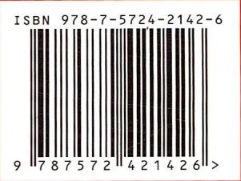

text_image

ISBN 978-7-5724-2142-6
9 787572 421426 >

定价：79.90元【共3册】

(基础过关册、高分进阶册、答案册)

# 创于2003

# 试题调研

# 每月一手考情

# 讲透关键题型

月刊教辅

高考题型全练

热点题型专练

高考必备题型1000例

随身速记

2023.6-2024.4按月上市

6月上市

8月上市

9月上市

1月上市

# 高考题型全练

答案全解全析

■ 基础过关题型：P001—P108

■ 高分进阶题型：P109—P192

第3册
共3册

natural_image

Cartoon character with a large yellow star and '100' badge, wearing a blue-and-yellow patterned outfit and holding a rolled document (no readable text or symbols)

# 100套中选1套 刷完就敢去高考！

text_image

天星教育
上海交通大学
宁波师范大学
高考语文
—新高考1卷
2024版 新高考
优秀模拟试卷汇编®
100套中选1套 刷完就敢去高考！
主编 杜志建
科学分层助力备考，卷卷精选45套！
6套基础卷
100篇能力卷
12章提升卷
12项强化卷
5章基础卷
科学分层45套
综合考核底答案
自实考试核心卷
高效提升

text_image

天星教育 | 上海认真听
下课经典天星
数学理科
— 老高考全国卷 —
金考卷
24年试卷品牌
2024版 全国各省市高考冲刺
优秀模拟试卷汇编®
45套
100套中选1套 刷完就敢去高考！
主编 杜志建
科学分层助力备考，卷卷精选45套！
5套基础卷 + 10套能力卷 + 10套提升卷 +
巩固知识刚硬核 + 进除集创新技巧 + 改发科技前沿点 +
10套强化卷 + 10套冲刺卷 + 科学分层45套
结合考例刚度 + 自实考场刚心变 = 教效积分

text_image

天星教育
湖北新高考
优秀模拟试卷汇编
2024版 湖北新高考
45套
100套中选1套 刷完就敢去高考！
主编 杜志建
科学分层助力备考，卷卷精选45套！
5套基础卷 7套提升卷 8套创新卷
巩固知识理解题 15套创新卷 16套创新卷
6套信息卷 6套原创卷 15套强化卷 科学分层45套
结合考网加速卷 调实考网核心卷 仿真分析卷

# 24年老品牌质量大信赖

24年超千万学子的选择，也许你的老师也刷过！

6审6校死磕产品质量，为卷子里的每个字负责到底!

# 拒绝偏难怪名校都在做

3轮严选，只选高考强区名校正统模拟卷！

每1套卷都通过超1万名校师生实测检验！

# 6维解析法彻底讲透每道题

提分关键在错题，解析不够细，刷卷无意义！

全面升级6维解析法，搞懂1道题，会解1类题！

提醒：高考45套专版定制，出版新高考Ⅰ卷、新高考Ⅱ卷、新教材版、全国版及湖北版、浙江版、山东版等地方专版，考生记得根据所在地区选相应版本

# 基础过关题型

# 第一章 集合、常用逻辑用语与不等式

# 第一节 集合

# 题型 1 元素与集合

1. AC 根据元素与集合的关系可知, A, C 正确.

2. ACD $x + y = 1$ 中, x 的取值范围为 R, 所以 $\{x \mid x + y = 1\} = R$ , 同理 $\{y \mid x + y = 1\} = R$ , 所以 A 正确; $\{(x, y) \mid x + y = 2\}$ 表示直线 $x + y = 2$ 上点的集合, 而 $\{x \mid x + y = 2\} = R$ , 所以 B 错误; 集合 $\{x \mid x > 2\}, \{y \mid y > 2\}$ 都表示大于 2 的实数构成的集合, 所以 C 正确; 由于集合中的元素具有无序性, 所以 $\{1, 2\} = \{2, 1\}$ , 所以 D 正确. 故选 ACD.

3. A 由题意知 $M = \{2, 4, 5\}$ ，故选 A.

4. C 由题意得, $A \cap B = \{(1,7),(2,6),(3,5),(4,4)\}$ ，所以 $A \cap B$ 中元素的个数为4，故选C.

5. C 解法一 依题意, $M=\complement_{U}(\complement_{U}M)=\{4,6\}$ , 所以 $4\in M,6\in M$ . 故选 C.

解法二(排除法) 元素与集合的关系用“∈”或“∉”表示,因此可排除 A,B. 因为 $6 \in U, 6 \notin C_{U} M$ , 所以 $6 \in M$ , 排除 D. 故选 C.

6. AB ∵ 集合 $A = \{y \mid y \geqslant 2\} = [2, +\infty)$ ，集合 $B = \{(x, y) \mid y = x^{2} + 2\}$ 是由抛物线 $y = x^{2} + 2$ 上的点组成的集合，∴ AB 正确，CD 错误，故选 AB.

7.1 或 4 因为 $A = \{0, m, m^{2} - 5m + 6\}, 2 \in A$ ，所以 m = 2 或 $m^{2} - 5m + 6 = 2$ 。当 m = 2 时， $m^{2} - 5m + 6 = 0$ ，不满足集合中元素互异性，所以 m = 2 不符合题意。当 $m^{2} - 5m + 6 = 2$ 时，m = 1 或 m = 4，若 m = 1, $A = \{0, 1, 2\}$ 符合题意；若 m = 4, $A = \{0, 4, 2\}$ 符合题意。所以实数 m 的值为 1 或 4。

# 题型 2 集合的基本关系

1. B ①错误,正确的关系为 $\{a\}\subseteq\{a,b,c\}$ 或 $\{a\}\subsetneqq\{a,b,c\}$ ;②错误,正确的关系为 $\{x|x$ 是正方形 $\}\subsetneqq\{x|x$ 是四边形 $\}$ .③④⑤正确.

2. C 解法一 在集合 T 中, 令 $n = k (k \in \mathbf{Z})$ , 则 $t = 4n + 1 = 2(2k) + 1 (k \in \mathbf{Z})$ , 而集合 S 中, $s = 2n + 1 (n \in \mathbf{Z})$ , 因为 $k \in Z, 2k$ 表示所有偶数, n 表示所有整数, 所以必有 $T \not\subseteq S$ , 所以 $T \cap S = T$ , 故选 C.

解法二 $S=\{\cdots,-3,-1,1,3,5,\cdots\},T=\{\cdots,-3,1,5,\cdots\}$ ，观察可知， $T\not\subseteq S$ ，所以 $T\cap S=T$ ，故选 C.

3. D 易得 $A = \{x \mid x > 0\}$ , $B = \{y \mid y \geqslant 0\}$ , $\therefore A \subseteq B, A \cup B = B, A \cap B = A, \int_{\mathbb{R}} A = \{x \mid x \leqslant 0\}$ , 不是 B 的子集. 故选 D.

4. B 因为 $A = \{1, 2, 3, 5, 10\}$ , $B = \{x \mid x$ 为质数\}, 所以 $A \cap B = \{2, 3, 5\}$ , $A \cap B$ 的非空子集为 $\{2\}$ , $\{3\}$ , $\{5\}$ , $\{2, 3\}$ , $\{2, 5\}$ , $\{3, 5\}$ , $\{2, 3, 5\}$ , 共7个, 故选B.

5. C 因为集合 $\{1,2\} \subseteq A \subsetneq \{1,2,3,4,5\}$ ，所以集合 A 可以是 $\{1,$

2}, {1,2,3}, {1,2,4}, {1,2,5}, {1,2,3,4}, {1,2,3,5}, {1,2,4,5}, 共7个. 故选C.

6. $(-∞,3]$ 因为 $B⊆A$ ，所以分以下两种情况：

①若 $B = \varnothing$ ，则 $2m - 1 < m + 1$ ，此时 m < 2；

②若 $B \neq \varnothing$ ，则 $\left\{\begin{aligned}2m-1 &\geqslant m+1,\\ m+1 &\geqslant -2,\\ 2m-1 &\leqslant 5,\end{aligned}\right.$ 解得 $2 \leqslant m \leqslant 3$ 。由①②可得，符合题意的实数 m 的取值范围为 $(-∞,3]$ 。

# 题型 3 集合的交、并、补运算

1. B 如图所示,对于 A, $A \cap B \cap C$ 对应的是区域 1; 对于 B, $A \cap C \cap (\complement_{I} B)$ 对应的是区域 2; 对于 C, $A \cap B \cap (\complement_{I} C)$ 对应的是区域 3; 对于 D, $B \cap C \cap (\complement_{I} A)$ 对应的是区域 4. 故选 B.

2. C 解法一 因为 $N = \{x \mid x^{2} - x - 6 \geqslant 0\} = \{x \mid x \geqslant 3 \text{ 或 } x \leqslant -2\}$ ，所以 $M \cap N = \{-2\}$ ，故选 C.

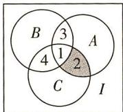

解法二 由于 $1 \notin N$ , 所以 $1 \notin M \cap N$ , 排除 A, B; 由于 $2 \notin N$ , 所以 $2 \notin M \cap N$ , 排除 D. 故选 C.

3. A $M \cup N = \{x \mid x < 2\}$ ，所以 $\complement_{U}(M \cup N) = \{x \mid x \geqslant 2\}$ ，故选 A.

4. A 解法一 $M = \{\cdots, -2, 1, 4, 7, 10, \cdots\}$ , $N = \{\cdots, -1, 2, 5, 8, 11, \cdots\}$ ，所以 $M \cup N = \{\cdots, -2, -1, 1, 2, 4, 5, 7, 8, 10, 11, \cdots\}$ ，所以 $\complement_{U}(M \cup N) = \{\cdots, -3, 0, 3, 6, 9, \cdots\}$ ，其元素都是 3 的倍数，即 $\complement_{U}(M \cup N) = \{x \mid x = 3k, k \in \mathbf{Z}\}$ ，故选 A.

解法二 集合 $M \cup N$ 表示被 3 除余 1 或 2 的整数集, 则它在整数集中的补集是恰好被 3 整除的整数集, 故选 A.

5. C $A = \{ x \mid x^{2} - x - 6 < 0 \} = \{ x \mid -2 < x < 3 \}$ , $B = \{ x \mid 2x + 3 >$

$0\}=\{x|x>-\frac{3}{2}\}$ ，所以 $A\cap B=\{x|-\frac{3}{2}<x<3\}$ ，故选C.

6. B $P = \{x \in R \mid y = \ln(3 - x)\} = \{x \mid 3 - x > 0\} = \{x \mid x < 3\}$ , $Q = \{y \mid y = 2^{x}, x \in P\} = \{y \mid y = 2^{x}, x < 3\} = \{y \mid 0 < y < 8\}$ ，所以 $P \cap Q = (0, 3)$ ，故选 B.

7. AD 由题意作出如图所示的 Venn 图. 由 $A \cap (\complement_U B) = \emptyset$ 知: $A$ 与 $(\complement_U B)$ 没有共同的元素, 故 $A \subseteq B$ , 则有 $A \cap B = A, A \cup B = B$ , 故 A 正确, B 错误; 仅当 $A = B$ 时, $A \cup (\complement_U B) = U$ , 故 C 错误; $B \cup (\complement_U A) = U$ , 故 D 正确. 故选 AD.

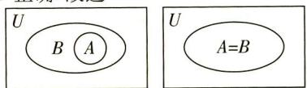

text_image

U
B A
U
A=B

8. B $M = \{ x \mid x = \frac{n}{2} + \frac{1}{4} = \frac{2n + 1}{4}, n \in Z \}$ , $N = \{ x \mid x = \frac{n}{4}, n \in Z \}$ ,

(比较两个集合,把两个集合中的元素满足的特征化成同种形式)

所以 $\complement_N M = \{x \mid x = \frac{2n}{4} = \frac{n}{2}, n \in \mathbf{Z}\}$ , 故选 B.

# 题型 4 集合中的求参问题

1. A 由题意知集合 $A = \{x \mid x > 3\}$ , $B = \{x \mid x \leqslant a - 1 \text{ 或 } x \geqslant a\}$ , 因为 $A \cup B = \mathbf{R}$ , 所以 $a - 1 \geqslant 3$ , 解得 $a \geqslant 4$ . 故选 A.

2. B 依题意,有 a-2=0 或 2a-2=0. 当 a-2=0 时,解得 a=2,此时 $A=\{0,-2\},B=\{1,0,2\}$ , 不满足 $A\subseteq B$ ; 当 2a-2=0 时, 解得 a=1,此时 $A=\{0,-1\},B=\{-1,0,1\}$ , 满足 $A\subseteq B$ . 所以 a=1, 故选 B.

3. B 易知 $A = \{x \mid -2 \leqslant x \leqslant 2\}$ , $B = \{x \mid x \leqslant -\frac{a}{2}\}$ , 因为 $A \cap B = \{x \mid -2 \leqslant x \leqslant 1\}$ , 所以 $-\frac{a}{2} = 1$ , 解得 $a = -2$ . 故选 B.

4. C 集合 $A = \{x \in Z \mid x^{2} - 4x - 5 < 0\} = \{0, 1, 2, 3, 4\}$ , $B = \{x \mid 4^{x} > 2^{m}\} = \{x \mid x > \frac{m}{2}\}$ , $\because A \cap B$ 中有三个元素, $\therefore 1 \leqslant \frac{m}{2} < 2$ , 解得 $2 \leqslant m < 4$ , $\therefore$ 实数 m 的取值范围是 [2, 4). 故选 C.

5. A 因为 $A \cap B = A$ ，所以 $A \subseteq B$ ，则 $\left(x - 1\right)^{2} + y^{2} = 1$ 在直线 y = kx - 2 的上方，则 $\left\{\frac{k \times 1 - 2 < 0}{\sqrt{k^2 + (-1)^2}} > 1\right.$ ，解得 $k < \frac{3}{4}$ .

6. D 解法一 由题意, 得 $A = \{x \mid (x - 1)(x - a) < 0\}$ , 当 $a > 1$ 时, (提醒: 不等式的解集与 $a$ 的取值范围有关, 需分类讨论) $A = \{x \mid 1 < x < a\}$ , 因为 $A \cap \mathbf{N}^{*} = \emptyset$ , 所以 $1 < a \leqslant 2$ ; 当 $a < 1$ 时, $A = \{x \mid a < x < 1\}$ , 因为 $A \cap \mathbf{N}^{*} = \emptyset$ , 所以 $a < 1$ ; 当 $a = 1$ 时, $A = \emptyset$ , (易错: 忽略集合本身为空集的讨论)

满足题意. 综上所述, 实数 a 的取值范围为 $(-∞, 2]$ , 故选 D.

解法二 当 a=2 时, $A=\{x\mid1<x<2\}$ , $A\cap N^{*}=\varnothing$ , 故排除 A, B;
当 a=0 时, $A=\{x\mid0<x<1\}$ , $A\cap N^{*}=\varnothing$ , 故排除 C. 故选 D.

7. ABC $A = \{ x \in R \mid -3 < x < 6 \}$ ，若 A = B，则 a = -3，且 $a^{2} - 27 = -18$ ，解得 a = -3，故 A 正确；当 a = -3 时，A = B，故 D 不正确；若 $A \subseteq B$ ，则 $(-3)^{2} + a \cdot (-3) + a^{2} - 27 \leqslant 0$ 且 $6^{2} + 6a + a^{2} - 27 \leqslant 0$ ，解得 a = -3，故 B 正确；当 $B = \varnothing$ 时， $a^{2} - 4(a^{2} - 27) \leqslant 0$ ，解得 $a \leqslant -6$ 或 $a \geqslant 6$ ，故 C 正确.

8.1 因为 $A \cap B = A \cup B$ ，所以 A = B，故 2a = 1 或 $a^{2} = 1$ 。当 2a = 1 时， $a = \frac{1}{2}$ ，此时 $A = \left\{1, \frac{1}{4}, 3\right\}$ ， $B = \left\{1, \frac{5}{2}, 4\right\}$ ， $A \neq B$ ，不合题意，舍去。当 $a^{2} = 1$ 时， $a = \pm 1$ ，当 a = 1 时， $A = \left\{2, 1, 3\right\}$ ， $B = \left\{1, 3, 2\right\}$ ，A = B，符合要求。当 a = -1 时， $B = \left\{1, 1, -2\right\}$ ，违背集合中元素的互异性，舍去。综上，a = 1。

# 题型 5 有交叉的计数问题

1. BCD 设同时参加跑步和篮球比赛的人数为 x，由题意可得如图所示的 Venn 图，（正确作出 Venn 图是关键）

则 $58 + 38 + 52 - 18 - 16 - x + 12 = 120 - 20$ ，得 x = 26，故只参加跑步比赛的人数为 $58 - 18 - 26 + 12 = 26$ ，只参加拔河比赛的人数为 $38 - 16 - 6 = 16$ ，只参加篮球比赛的人数为

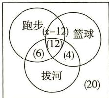

text_image

跑步
(6)
篮球
(4)
拔河
(20)
(12)

$52 - 16 - 26 + 12 = 22$ . 故选 BCD.

2. C 假设学生总数是 100, 则喜欢足球的有 60 人, 喜欢游泳的有 82 人, 喜欢足球或游泳的有 96 人, 则既喜欢足球又喜欢游泳的有 $60 + 82 - 96 = 46$ (人), 所以该中学既喜欢足球又喜欢游泳的学生数占该校学生总数的比例为 $46\%$ . 故选 C.  
3. C 由题意得,阅读过《西游记》的学生人数为 $90 - 80 + 60 = 70$ , 则该校阅读过《西游记》的学生人数与该校学生总数比值的估计值为 $70 \div 100 = 0.7$ . 故选 C.  
4.19 设集合 $A, B$ 分别表示围棋爱好者，足球爱好者，全班学生组成全集 $U, A \cap B$ 就是两者都爱好的，要使 $A \cap B$ 中人数最多，则 $A \subseteq B, x = 22$ ，要使 $A \cap B$ 中人数最少，则 $A \cup B = U$ ，即 $22 + 27 - y = 46$ ，解得 $y = 3, \therefore x - y = 22 - 3 = 19$ .  
5.21 赞成 A 的学生人数为 $50 \times \frac{3}{5} = 30$ ，赞成 B 的学生人数为

$30+3=33$ , 如图, 记 50 名学生组成的集合为 U, 赞成 A 的学生全体为集合 A, 赞成 B 的学生全体为集合 B. 设对 A, B 都赞成的学生人数为 x, 则对 A, B 都不赞成的学生人数为

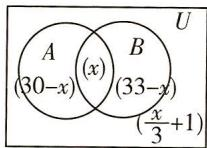

$\frac{x}{3} + 1$ ，赞成 $A$ 而不赞成 $B$ 的学生人数为 $30 - x$ ，赞成 $B$ 而不赞成 $A$ 的学生人数为 $33 - x$ .

依题意 $(30-x)+(33-x)+x+\frac{x}{3}+1=50$ , 解得 x=21.

故对观点 A, B 都赞成的学生有 21 人.

# 题型 6 集合的新定义问题

1. D 由题意知, $A=\{1,3,5,7,9\}$ , $A\cup B=\{1,2,3,4,5,6,7,9\}$ , $A\cap B=\{3,5,7\}$ ,所以 $A\otimes B=\{1,2,4,6,9\}$ .故选D.

2. A 解法一 ①当 S 中有 3 个元素时，设 $S = \{a, b, c\}$ ，a < b < c，则 $\{ab, bc, ac\} \subseteq T$ ，所以 $\frac{b}{a} \in S, \frac{c}{b} \in S, \frac{c}{a} \in S$ ，当 $\frac{c}{a} = c$ 时，a = 1，所以 $\frac{c}{b} = b$ ，即 $c = b^{2}$ ，此时 $S = \{1, b, b^{2}\}$ ， $T = \{b, b^{2}, b^{3}\}$ ，所以 $S \cup T = \{1, b, b^{2}, b^{3}\}$ ，有 4 个元素；当 $\frac{c}{a} = b$ 时，c = ab，所以 $\frac{b}{a} = a$ ，即 $b = a^{2} (a \neq 1)$ ，此时 $S = \{a, a^{2}, a^{3}\}$ ， $T = \{a^{3}, a^{4}, a^{5}\}$ 或 $\{a^{2}, a^{3}, a^{4}, a^{5}\}$ 或 $\{a^{3}, a^{4}, a^{5}, a^{6}\}$ ，所以 $S \cup T = \{a, a^{2}, a^{3}, a^{4}, a^{5}\}$ 或 $\{a, a^{2}, a^{3}, a^{4}, a^{5}, a^{6}\}$ ，有 5 个或 6 个元素。故排除 C、D。

②当 $S$ 中有4个元素时，设 $S = \{a, b, c, d\}, a < b < c < d$ ，所以 $ab < ac < ad < bd < cd$ ，且 $\{ab, ac, ad, bd, cd\} \subseteq T$ ，所以 $\frac{ac}{ab} < \frac{ad}{ab} < \frac{bd}{ab} < \frac{cd}{ab}$ ，且 $\{\frac{ac}{ab}, \frac{ad}{ab}, \frac{bd}{ab}, \frac{cd}{ab}\} \subseteq S$ ，所以 $\frac{ac}{ab} = a, \frac{ad}{ab} = b, \frac{bd}{ab} = c, \frac{cd}{ab} = d$ ，所以 $b = a^2, c = a^3, d = a^4 (a \neq 1)$ ，此时 $S = \{a, a^2, a^3, a^4\}, T = \{a^3, a^4, a^5, a^6, a^7\}$ ，所以 $S \cup T = \{a, a^2, a^3, a^4, a^5, a^6, a^7\}$ ，有7个元素，故选A.

解法二 特殊值法. 当 $S = \{1,2,4\}$ , $T = \{2,4,8\}$ 时, $S \cup T = \{1,2,4,8\}$ , 故 C 错误; 当 $S = \{2,4,8\}$ , $T = \{8,16,32\}$ 时, $S \cup T = \{2,4,8,16,32\}$ , 故 D 错误; 当 $S = \{2,4,8,16\}$ , $T = \{8,16,32,64,128\}$ 时, $S \cup T = \{2,4,8,16,32,64,128\}$ , 故 B 错误. 故选 A.

3. D 设集合 $\{1,2,3,\cdots,n\}$ 的所有非空子集的交替和的总和为 $S_{n}$ ，集合 $\{1\}$ 的所有非空子集的交替和的总和为 $S_{1}=1$ ，集合 $\{1,2\}$ 的所有非空子集的交替和的总和为 $S_{2}=1+2+(2-1)=4$ ，集合 $\{1,2,3\}$ 的所有非空子集的交替和的总和为 $S_{3}=1+2+3+(2-1)+(3-2)+(3-1)+(3-2+1)=12$ ，集合 $\{1,2,3,4\}$ 的所有非空子集的交替和的总和为 $S_{4}=1+2+3+4+(2-1)+(3-2)+(4-3)+(3-1)+(4-2)+(4-1)+(3-2+1)+(4-3+2)+(4-2+1)+(4-3+1)+(4-3+2-1)=32$ ，由此猜测集合 $\{1,2,3,\cdots,n\}$ 的所有非空子集的交替和的总和为 $S_{n}=n\cdot2^{n-1}$ ，所以 $S_{6}=6\times2^{5}=192$ 。故选 D.

4. C 因为集合 $A = \{1, 2, 4, 8, 16\}$ ，则 $E(A) = \sqrt[5]{1 \times 2 \times 4 \times 8 \times 16} = 4$ ，所以，集合 $\{1, 2, 4, 8, 16\}$ 的“保均值真子集”有： $\{4\}$ 、 $\{1, 16\}$ 、 $\{2, 8\}$ 、 $\{1, 4, 16\}$ 、 $\{2, 4, 8\}$ ， $\{1, 2, 8, 16\}$ ，共6个.

5. ACD 由 $2023 \div 5 = 404 \cdots 3$ , 所以 $2023 \in [3]$ , 故 A 正确; $-2 = 5 \times (-1) + 3$ , 所以 $-2 \in [3]$ , 故 B 错误; 因为整数集中的被 5 除的数可以且只可以分成五类, 所以 $\mathbf{Z} = [0] \cup [1] \cup [2] \cup [3] \cup [4]$ , 故 C 正确; 整数 $a, b$ 属于同一“类”, 所以整数 $a, b$ 被 5 除的余数相同, 从而 $a - b$ 被 5 除的余数为 0 , 反之也成立, 故整数 $a, b$ 属于同一“类”的充要条件是“ $a - b \in [0]$ ”. 故 D 正确. 故选 ACD.

6. BC 令函数 $f(x) = -x^2 + 8x - 7$ , $g(x) = a^x (a > 1)$ , 所以集合 $A = \{x \in \mathbf{Z} | f(x) \geqslant g(x)\}$ , 函数 $g(x)$ 的图象过定点(0,1), 在同一平面直角坐标系中作出 $f(x), g(x)$ 的大致图象, 如图所示.

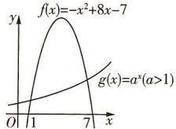

因为 $g(x) = a^x > 0$ ，所以由 $f(x) = -x^2 + 8x - 7 > 0$ ，得 $1 < x < 7$ ，且集合 $\{x \in \mathbf{Z} | 1 < x < 7\} = \{2, 3, 4, 5, 6\}$ 恰有5个元素，所以 $A = \{2, 3, 4, 5, 6\}$ ，观察函数图象，要使 $-x^2 + 8x - 7 \geqslant a^x$ 成立，应满足 $\left\{ \begin{array}{l} g(2) \leqslant f(2), \\ g(6) \leqslant f(6), \end{array} \right.$ 即 $\left\{ \begin{array}{l} a^2 \leqslant 5, \\ a^6 \leqslant 5, \end{array} \right.$ 又 $a > 1$ ，所以 $1 < a \leqslant \sqrt[6]{5}$ . 而 $1 < \sqrt[7]{5} < \sqrt[6]{5} < 1.5 < \sqrt{5}$ ，故 $\sqrt[7]{5}$ 与 $\sqrt[6]{5}$ 满足. 故选BC.

7. BD 对于 A, 因为 $M = \{x \mid x < 0\}$ , $N = \{x \mid x > 0\}$ , $M \cup N = \{x \mid x \neq 0\} \neq Q$ , 所以 A 错误; 对于 B, 若 $M = \{x \in Q \mid x < 0\}$ , $N = \{x \in Q \mid x \geqslant 0\}$ , 则满足戴德金分割, 此时 M 没有最大元素, N 有一个最小元素 0, 故 B 正确; 对于 C, 若 M 有一个最大元素, 设为 a, N 有一个最小元素, 设为 b, 则 a < b, 则 $M = \{x \in Q \mid x \leqslant a\}$ , $N = \{x \in Q \mid x \geqslant b\}$ , 而 $(a, b)$ 内也有有理数, 则 $M \cup N \neq Q$ , 故 C 错误; 对于 D, 若 $M = \{x \in Q \mid x < \sqrt{2}\}$ , $N = \{x \in Q \mid x \geqslant \sqrt{2}\}$ , 则满足戴德金分割, 此时 M 没有最大元素, N 也没有最小元素, 故 D 正确, 故选 BD.

# 第二节 常用逻辑用语

# 题型 7 充分条件与必要条件的判断

1. B 若直线 l 与圆 C 相交，则圆心 $C(0,0)$ 到直线 $l: y = ax + b$ 的距离小于圆 C 的半径 2，即 $\frac{|b|}{\sqrt{a^{2} + 1}} < 2$ ，即 $4(a^{2} + 1) > b^{2}$ ，所以 $4a^{2} > b^{2} - 4$ ，得 $2a > \sqrt{b^{2} - 4}$ 或 $2a < -\sqrt{b^{2} - 4}$ ，所以 p 是 q 的必要不充分条件，故选 B.

2. B 由 $a \cdot c = b \cdot c$ 可得 $(a - b) \cdot c = 0$ , 所以 $(a - b) \perp c$ 或 $a = b$ , 所以“ $a \cdot c = b \cdot c$ ”是“ $a = b$ ”的必要不充分条件. 故选 B.

3. B 甲等价于 $\sin^2\alpha = 1 - \sin^2\beta = \cos^2\beta$ ，等价于 $\sin \alpha = \pm \cos \beta$ ，所以由甲不能推导出 $\sin \alpha + \cos \beta = 0$ ，所以甲不是乙的充分条件；由 $\sin \alpha + \cos \beta = 0$ ，得 $\sin \alpha = -\cos \beta$ ，平方可得 $\sin^2\alpha = \cos^2\beta = 1 - \sin^2\beta$ ，即 $\sin^2\alpha + \sin^2\beta = 1$ ，所以由乙可以推导出甲，则甲是乙的必要条件。综上，选B.

4. A 对于充分性, 因为数列 $\{a_{n}\}$ 是等比数列, 所以 $\frac{a_{3}}{a_{2}} = \frac{a_{2}}{a_{1}}$ , 则 $a_{2}^{2} = a_{1}a_{3}$ , 所以充分性成立; 对于必要性, 数列 $\{a_{n}\}$ 中, 若数列 $\{a_{n}\}$ 的前 4 项依次为 1, 2, 4, 6, 满足 $a_{2}^{2} = a_{1}a_{3}$ , 但数列 $\{a_{n}\}$ 不是等比数列, 所以必要性不成立. 所以是充分不必要条件. 故选 A.

5. C 杜牧认为没有东风,则赤壁之战东吴将输给曹操,则说明东风是打败曹操的必要条件.但有了东风,若没有其他的地利人和,也未必能打败曹操,故东风不是打败曹操的充分条件.故选C.

6.C 因为 $\sqrt{x^2 + 1} + x > \sqrt{x^2} + x = |x| + x \geqslant 0, \sqrt{y^2 + 1} - y > \sqrt{y^2} - y = |y| - y \geqslant 0, q: \ln (\sqrt{x^2 + 1} + x) - \ln (\sqrt{y^2 + 1} - y) > 0$ ，所以 $x, y \in \mathbf{R}, \ln (\sqrt{x^2 + 1} + x) - \ln (\sqrt{y^2 + 1} - y) > 0$ ，即 $\ln (\sqrt{x^2 + 1} + x) > \ln (\sqrt{y^2 + 1} - y)$ ，即 $\sqrt{x^2 + 1} + x > \sqrt{y^2 + 1} - y.$ 令 $f(x) = \sqrt{x^2 + 1} + x, x \in \mathbf{R}$ ，则 $\sqrt{x^2 + 1} + x > \sqrt{y^2 + 1} - y = \sqrt{(-y)^2 + 1} + (-y)$ ，即 $f(x) > f(-y)$ . 因为 $f'(x) = \frac{2x}{2\sqrt{x^2 + 1}} + 1 = \frac{x + \sqrt{x^2 + 1}}{\sqrt{x^2 + 1}} >$

$\frac{x + \sqrt{x^2}}{\sqrt{x^2 + 1}} = \frac{x + |x|}{\sqrt{x^2 + 1}} \geqslant 0$ ，所以函数 $f(x)$ 在 $\mathbf{R}$ 上单调递增，所以由 $f(x) > f(-y)$ ，得 $x > -y$ ，即 $x + y > 0$ 。所以由 $\ln (\sqrt{x^2 + 1} + x) - \ln (\sqrt{y^2 + 1} - y) > 0$ 可得 $x + y > 0$ 。因为 $p: x + y > 0$ ，所以 $x > -y$ ，则 $f(x) > f(-y)$ ，所以 $\ln (\sqrt{x^2 + 1} + x) - \ln (\sqrt{y^2 + 1} - y) > 0$ ，所以 $p$ 是 $q$ 的充要条件。故选 C.

7. ABC 记 $\triangle ABC$ 的内角 $A, B, C$ 的对边分别为 $a, b, c$ , 对于选项 A, 由正弦定理 $\frac{a}{\sin A} = \frac{b}{\sin B}$ , 可知 $\sin A > \sin B$ 等价于 $a > b$ , 在 $\triangle ABC$ 中, 由大边对大角, 知 $a > b$ 等价于 $A > B$ , 故 A 符合题意; 对于选项 B, 由 $\cos A < \cos B$ 及余弦函数的单调性知, B 符合题意; 对于选项 C, $\cos 2A < \cos 2B$ , 由二倍角公式可得 $1 - 2\sin^2 A < 1 - 2\sin^2 B$ , 所以 $\sin^2 A > \sin^2 B$ , 即 $\sin A > \sin B$ , 由 A 选项的分析知, C 符合题意; 对于选项 D, 当 $A = 45^\circ$ , $B = 60^\circ$ 时, 满足 $\sin 2A > \sin 2B$ , 此时 $A < B$ , 故 D 不符合题意. 故选 ABC.

# 题型 8 充分条件与必要条件的应用

1. C $ax^{2} + ax - 1 < 0$ 恒成立 $\Leftrightarrow a = 0$ 或 $\left\{\begin{aligned}a &< 0,\\ a^{2} &+ 4a < 0,\end{aligned}\right.$ 解得 $-4 < a \leqslant 0$ ，所以 A 选项是“ $ax^{2} + ax - 1 < 0$ 恒成立”的充分不必要条件；B 选项是“ $ax^{2} + ax - 1 < 0$ 恒成立”的充要条件；C 选项是“ $ax^{2} + ax - 1 < 0$ 恒成立”的必要不充分条件；D 选项是“ $ax^{2} + ax - 1 < 0$ 恒成立”的既不充分也不必要条件。故选 C.

2. A 存在 $k \in N^{*}$ ，使得 $x_{100+k}, x_{200+k}, x_{300+k}$ 成等差数列，可得

$2\left[a(200+k)^{2}+b(200+k)+c\right]=a(100+k)^{2}+b(100+k)+c+a(300+k)^{2}+b(300+k)+c$ ，化简可得 a=0，所以使得 $x_{100+k}$ ， $x_{200+k}$ ， $x_{300+k}$ 成等差数列的必要条件是 $a\geqslant0$ .

3. C 因为“0 < x < 3”是“ $x > \log_{2} a$ ”的充分不必要条件,所以(0, 3) $\subsetneq(\log_{2} a, +\infty)$ ,所以 $\log_{2} a \leqslant 0 = \log_{2} 1$ ,解得 $0 < a \leqslant 1$ ,故实数a的取值范围是(0,1].故选C.

4. BC 因为方程 $x^{2}+(m-1)x+1=0$ 至多有一个实数根，所以方程 $x^{2}+(m-1)x+1=0$ 的判别式 $\Delta\leqslant0$ ，即 $(m-1)^{2}-4\leqslant0$ ，解得 $-1\leqslant m\leqslant3$ ，利用必要条件的定义，结合选项可知， $-1\leqslant m\leqslant3$ 成立的必要条件可以是选项 B 和选项 C。故选 BC。

5. AB 因为 p:x>1 或 x<-2, q:x<a, 且 q 是 p 的充分不必要条件, 所以 $a \leqslant -2$ , 对比选项知 A, B 满足条件. 故选 AB.

6. AD ∵ 函数 $f(x)=\sqrt{7+2ax-x^{2}}$ 在区间 $[-1,1]$ 上单调递减，∴ $y=7+2ax-x^{2}$ 在 $[-1,1]$ 上单调递减，且 $7+2ax-x^{2}\geqslant0$ 在 $[-1,1]$ 上恒成立，∴ $\left\{\begin{aligned}-\frac{2a}{-2}&=a\leqslant-1,\\6+2a&\geqslant0,\end{aligned}\right.$ 解得 $-3\leqslant a\leqslant-1$ ，结合各选项可知，选 AD.

7. $(-∞,-3]∪[-\frac{1}{2},0)$ 若m<0,p:x $^{2}$ -3mx+2m $^{2}$ <0,即2m<x<m;q: -3<x<-1,则¬q:x≤-3或x≥-1,因为p是¬q的充分不必要条件,所以 $\begin{cases}m<0,\\m≤-3\end{cases}$ 或 $\begin{cases}m<0,\\2m≥-1,\end{cases}$ 即m≤-3或 $-\frac{1}{2}\leqslant m<0$ ,故实数m的取值范围为 $(-∞,-3]∪[-\frac{1}{2},0)$ .

8. $\frac{\pi}{4}$ (答案不唯一) 由 $\sin x + \cos x > 1$ 可得 $\sqrt{2} \sin \left(x + \frac{\pi}{4}\right) > 1$ , 则 $\sin \left(x + \frac{\pi}{4}\right) > \frac{\sqrt{2}}{2}$ , 所以 $2k\pi + \frac{\pi}{4} < x + \frac{\pi}{4} < 2k\pi + \frac{3\pi}{4} (k \in \mathbf{Z})$ , 解得 $2k\pi < x < 2k\pi + \frac{\pi}{2} (k \in \mathbf{Z})$ , 因为“ $x = \alpha$ ”是“ $\sin x + \cos x > 1$ ”的一个充分条件, 故 $\alpha$ 的一个可能取值为 $\frac{\pi}{4}$ . (只需满足 $\alpha \in (2k\pi, 2k\pi + \frac{\pi}{2})(k \in \mathbf{Z})$ 即可)

9. A $f(x)=x^{3}-1-a(x-1)=(x-1)(x^{2}+x+1-a)$ ，则1是 $f(x)$ 的一个零点，（本题关键在于因式分解，容易直接求导进行分类讨论导致增大计算量）

则 $f(x)$ 有两个不同的零点有两种情形：①1是方程 $x^{2}+x+1-a=0$ 的根，则 $1+1+1-a=0$ ，即a=3，此时方程 $x^{2}+x-2=0$ 有1,-2两个根，故 $f(x)$ 有1,-2两个不同的零点；②1不是方程 $x^{2}+x+1-a=0$ 的根，则方程 $x^{2}+x+1-a=0$ 有两个相同的实数根，则 $\Delta=1-4(1-a)=0$ ，得 $a=\frac{3}{4}$ （经检验，符合题意）。综上，a=3或 $a=\frac{3}{4}$ 。所以a=3是 $f(x)$ 有两个不同的零点的一个充分不必要条件，故选A。

# 题型 9 全称量词与存在量词

1. 存在 $x > 1$ ，使得 $2x + 1 \leqslant 5$ 原命题为全称量词命题，即“对于任意 $x > 1$ ，都有 $2x + 1 > 5$ ”，故其否定为存在量词命题，即“存在 $x > 1$ ，使得 $2x + 1 \leqslant 5$ ”。（原命题和它的否定真假相反，在遇到不等式问题时要注意原命题是否为省略了量词的全称量词命题）

2. C 命题 p 是一个存在量词命题, 其否定是全称量词命题, 改量词, 否结论, 故选 C.

3. B 因为命题 $p: \forall x < -1, 2^x - x - 1 < 0$ , 则 $\neg p: \exists x < -1, 2^x - x - 1 \geqslant 0$ . 故选 B.

4. C 因为 $x^{2}-|x|+1=(|x|-\frac{1}{2})^{2}+\frac{3}{4}>0$ 恒成立, 所以 $\forall x\in R, x^{2}-|x|+1\leqslant0$ 是假命题; 当 $x=\frac{\pi}{3}$ 时, $\frac{1}{\cos x}=2$ , 所以 $\forall x\in R, -1\leqslant\frac{1}{\cos x}\leqslant1$ 是假命题; 当 x=1 时, $\ln x=0$ , 所以 $\exists x\in R, (\ln x)^{2}\leqslant0$ 是真命题; 因为 $-1\leqslant\sin x\leqslant1$ , 所以 $\exists x\in R, \sin x=3$ 是假命题. 故选 C.

5. A 只需把量词“∃”改为“∀”，（注意量词“∃”后面的条件“n∈N”不要改变）

并对结论“ $\sqrt{n}>3$ ”给予否定,即变为“ $\sqrt{n}\leqslant3$ ”,故选A.

6. C ①对于任意实数 x，由于 2 > 0，所以 $x + 2 > x$ ，故①正确。②对任意的实数 a, b，由于 $|a| > |b| \geqslant 0$ ，所以 $a^{2} > b^{2}$ 成立，故②正确。③对于二次函数 $y = x^{2} - ax - 1$ ，由于 $\Delta = a^{2} + 4 > 0$ ，故该函数的图象与 x 轴恒有交点，故③正确。④当 x = y = 0 时， $x^{2} + |y| = 0$ ，故

④错误,故选C.

7. BC 对于 A, 设 $f(x) = x + \lg x - 10$ , 易知函数 $f(x)$ 在 $(0, +\infty)$ 上单调递增, $\because f(9) = \lg 9 - 1 < 0$ , $f(10) = \lg 10 = 1 > 0$ , $\therefore f(x) = x + \lg x - 10$ 在 $(9, 10)$ 上存在零点, 即 $\exists x \in (0, 10)$ , $x + \lg x = 10$ , $\therefore$ 命题 p 为真命题, $\therefore$ A 错误. 对于 B, 命题 p 的否定为 $\forall x \in (0, 10)$ , $x + \lg x \neq 10$ , $\therefore$ B 正确. 对于 C, $\because y = 2^{x}$ 在 $(-∞, log_{2}26)$ 上单调递增, $\therefore$ 当 $x ∈ (-∞, log_{2}26)$ 时, $2^{x} < 2^{\log_{2}26} = 26$ , $\therefore$ 命题 q 为真命题, $\therefore$ C 正确. 对于 D, 命题 q 的否定为 $\exists x ∈ (-∞, log_{2}26)$ , $2^{x} ≥ 26$ , $\therefore$ D 错误. 故选 BC.

8. $\exists x \in \mathbb{R}, \ln x$ 无意义或 $\ln x \leqslant 0$ “ $\ln x > 0$ ”即“ $\ln x$ 有意义且 $\ln x > 0$ ”，所以“ $\ln x > 0$ ”的否定应为“ $\ln x$ 无意义或 $\ln x \leqslant 0$ ”.

# 题型 10 由命题真假求参数的值（或范围）

1. A 由题意, 原命题可转化为 $\exists x \in [-1,3], a \geqslant x^2 - 2x$ . 令 $h(x) = x^2 - 2x, x \in [-1,3]$ , 则问题等价于 $a \geqslant h(x)_{\min}$ , 易知函数 $h(x) = x^2 - 2x$ 在 $[-1,1)$ 上单调递减, 在 $(1,3]$ 上单调递增, 所以 $h(x)_{\min} = h(1) = 1 - 2 = -1$ , 所以 $a \geqslant -1$ . 所以实数 $a$ 可取的最小整数值是 -1. 故选 A.

2.1 由已知可得 $m \geqslant \tan x (x \in [0, \frac{\pi}{4}])$ 恒成立. 设 $f(x) = \tan x (x \in [0, \frac{\pi}{4}])$ , 显然该函数为增函数, 故 $f(x)$ 的最大值为 $f(\frac{\pi}{4}) = \tan \frac{\pi}{4} = 1$ , 由不等式恒成立可得 $m \geqslant 1$ , 即实数 $m$ 的最小值为 1.

3. A $p: \exists x \in R, ax^{2} + 2ax - 4 \geqslant 0$ 为假命题，则 $\neg p: \forall x \in R, ax^{2} + 2ax - 4 < 0$ 为真命题，则当 a = 0 时，显然满足；当 $a \neq 0$ 时， $\left\{\begin{aligned}a &< 0,\\ \Delta &=4a^{2} + 16a < 0,\end{aligned}\right.$ $\therefore -4 < a < 0$ ，故选 A.

4. A 由 $[f(x)]^4 - (4 + x^2)[f(x)]^2 + 4x^2 = 0$ ，得 $\{[f(x)]^2 - 4\} \{[f(x)]^2 - x^2\} = 0$ ，解得 $f(x) = \pm x$ 或 $f(x) = \pm 2$ . 因为 $f(x)$ 为偶函数，且值域为 $[0, 2]$ ，所以 $f(x) = \begin{cases} 2, & x \leqslant -2, \\ |x|, & -2 < x < 2, \\ 2, & x \geqslant 2. \end{cases}$ ，若对任意 $x_1 \in (-4, -1)$ ，都存在 $x_2 > -1$ ，使 $g(x_2) = f(x_1)$ 成立，则 $f(x)$ 在 $(-4, -1)$ 上的值域是 $g(x)$ 在 $(-1, +\infty)$ 上的值域的子集。易知当 $x \in (-4, -1)$ 时， $f(x) \in (1, 2]$ ；当 $x \in (-1, +\infty)$ 时， $g(x) \in (-4 - m, 2 - m]$ ，所以 $\{-4 - m \leqslant 1, 2 - m \geqslant 2$ ，所以 $m \in [-5, 0]$ .

5. $(-∞,-3]∪[-\frac{1}{2},0)∪(\frac{1}{2},+∞)$ p 真: $\Delta=4m^{2}+12m<0$ , 即 -3<m<0. q 真: $\Delta=16m^{2}-4>0$ , 得 $m<-\frac{1}{2}$ 或 $m>\frac{1}{2}$ . 由 p 和 q 有且只有一个为真命题, 得 p 真 q 假, 或 p 假 q 真, $\therefore\left\{\begin{aligned}-3<m<0,\\-\frac{1}{2}\leqslant m\leqslant\frac{1}{2}\end{aligned}\right.$ 或 $\left\{\begin{aligned}m\leqslant-3\text{或}m\geqslant0,\\m<-\frac{1}{2}\text{或}m>\frac{1}{2},\end{aligned}\right.$ $\therefore-\frac{1}{2}\leqslant m<0$ 或 $m\leqslant-3$ 或 $m>\frac{1}{2}$ .

6. C 命题“ $\exists a \in [-1,3], ax^2 - (2a-1)x + 3 - a < 0$ ”为假命题，则其否定为真命题，（命题与命题的否定真假相反）即“ $\forall a \in [-1,3], ax^2 - (2a-1)x + 3 - a \geqslant 0$ ”为真命题。令 $g(a) = ax^2 - (2a-1)x + 3 - a = (x^2 - 2x-1)a + x + 3, a \in [-1,3]$ ，则 $g(a) \geqslant 0$ 恒成立，（不会变换主元，从而将 $x$ 作为变量进行分类讨论，导致增加计算量）

所以 $\left\{ \begin{array}{l} g(-1) \geqslant 0, \\ g(3) \geqslant 0, \end{array} \right.$ 即 $\left\{ \begin{array}{l} -x^2 + 3x + 4 \geqslant 0, \\ 3x^2 - 5x \geqslant 0, \end{array} \right.$ 得 $\left\{ \begin{array}{l} -1 \leqslant x \leqslant 4, \\ x \geqslant \frac{5}{3} \text{或} x \leqslant 0, \end{array} \right.$ 所以实数 $x$ 的取值范围为 $[-1, 0] \cup [\frac{5}{3}, 4]$ . 故选 C.

# 第三节 不等式

# 题型 11 比较两个数（式）的大小

1. > 解法一 $c < d < 0 \rightarrow -c > -d > 0 \xrightarrow{\text{结合 } a > b > 0} a - c > b - d > 0 \rightarrow (a - c)^2 > (b - d)^2 > 0 \rightarrow 0 < \frac{1}{(a - c)^2} < \frac{1}{(b - d)^2} \xrightarrow{\text{结合 } e < 0} \frac{e}{(a - c)^2} > \frac{e}{(b - d)^2}$ , 即 $X > Y$ .

解法二 $X - Y = \frac{e}{(a - c)^2} -\frac{e}{(b - d)^2} = \frac{e[(b - d)^2 - (a - c)^2]}{(a - c)^2(b - d)^2} =$ $\frac{e[(a + b) - (c + d)][(b - a) + (c - d)]}{(a - c)^2(b - d)^2},\therefore a > b > 0,c <   d <   0,$ $\therefore a + b > 0,c + d <   0,b - a <   0,c - d <   0,\therefore (a + b) - (c + d) > 0,$ $(b - a) + (c - d) <   0.$ 又 $e <   0,\therefore e[(a + b) - (c + d)][(b - a) +$ $(c - d)] > 0$ ，又 $(a - c)^2 (b - d)^2 > 0, \therefore X - Y > 0$ ，即 $X > Y$ .

2. A 因为 $b = \cos \frac{1}{4} = 1 - 2\sin^2 \frac{1}{8}$ ，所以 $b - a = 1 - 2\sin^2 \frac{1}{8} - \frac{31}{32} = \frac{1}{32} - 2\sin^2 \frac{1}{8} = 2\left(\frac{1}{64} - \sin^2 \frac{1}{8}\right)$ . 由 $x > \sin x (x > 0)$ ，得 $\frac{1}{8} > \sin \frac{1}{8}$ ，得 $\frac{1}{64} > \sin^2 \frac{1}{8}$ ，所以 $b > a$ . 因为 $\frac{c}{b} = \frac{4\sin \frac{1}{4}}{\cos \frac{1}{4}} = 4\tan \frac{1}{4}$ ，由 $\tan x > x (x > 0)$ 得 $\tan \frac{1}{4} > \frac{1}{4}$ ，即 $4\tan \frac{1}{4} > 1$ ，所以 $\frac{c}{b} > 1 (b > 0)$ ，即 $c > b$ . 综上 $c > b > a$ .

3. B 解法一 采用特值法进行求解验证即可, 若 $x = 1, y = 2, z = 3, a = 1, b = 2, c = 3$ , 则 $ax + by + cz = 14, az + by + cx = 10, ay + bz + cx = 11, ay + bx + cz = 13$ . 由此可知最低的总费用是 $az + by + cx$ .

解法二 因为 $x < y < z, a < b < c$ ，所以 $ax + by + cz - (az + by + cx) = a(x - z) + c(z - x) = (x - z)(a - c) > 0$ ，故 $ax + by + cz > az + by + cx$ ；同理， $ay + bz + cx - (ay + bx + cz) = b(z - x) + c(x - z) = (x - z)(c - b) < 0$ ，故 $ay + bz + cx < ay + bx + cz.$ 因为 $az + by + cx - (ay + bz + cx) = a(z - y) + b(y - z) = (a - b)(z - y) < 0$ ，所以 $az + by + cx < ay + bz + cx.$ 故最低费用为 $az + by + cx.$ 故选B.

4. C ∵ c 是正实数，且 c < 1, ∴ 0 < c < 1，由 c < $c^{b} < c^{a} < 1$ ，得 0 < a < b < 1, ∴ $\frac{a^{a}}{a^{b}} = a^{a - b} > 1$ , ∴ $a^{b} < a^{a}$ , ∴ $\frac{a^{a}}{b^{a}} = (\frac{a}{b})^{a}$ , 0 < $\frac{a}{b} < 1$ , a > 0, ∴ $(\frac{a}{b})^{a} < 1$ ，即 $a^{a} < b^{a}$ ，综上可知， $a^{b} < a^{a} < b^{a}$ ，故选 C.

5. A 因为 $0 < \alpha < \beta < \frac{\pi}{2}$ , 所以 $0 < \sin \alpha < \sin \beta < 1, a - c = \sin^3 \alpha - 3 \sin \alpha - (\sin^3 \beta - 3 \sin \beta)$ , 令 $f(x) = x^3 - 3x, x \in (0,1)$ , 则 $f'(x) = 3(x + 1)(x - 1) < 0$ , 所以 $f(x)$ 在 $(0,1)$ 上单调递减, 所以 $f(\sin \alpha) > f(\sin \beta)$ , 所以 $a - c > 0$ , 即 $a > c; c - b = 3(\sin \alpha - \ln \sin \alpha) - 3(\sin \beta - \ln \sin \beta)$ , 令 $g(x) = 3(x - \ln x), x \in (0,1)$ , 则 $g'(x) = \frac{3(x - 1)}{x} < 0$ , 所以 $g(x)$ 在 $(0,1)$ 单调递减, 所以 $g(\sin \alpha) > g(\sin \beta)$ , 所以 $c - b > 0$ , 即 $c > b$ . 综上, $b < c < a$ . 故选 A.

6. AC 对于 A, 因为函数 $y = \frac{1}{x}$ 在 $(0, +\infty)$ 上单调递减, a > b > 0, 所以 $\frac{1}{b} > \frac{1}{a}$ , 故 A 正确.

对于 B, 解法一 由 $a - \frac{1}{b} > b - \frac{1}{a}$ ，得 $a - b + \frac{1}{a} - \frac{1}{b} > 0$ ，即 $(a - b)(1 - \frac{1}{ab}) > 0$ ，因为 a > b > 0，所以 a - b > 0, ab > 0，所以 $1 - \frac{1}{ab} > 0$ ，所以 ab > 1，而该式不一定成立，所以不等式 $a - \frac{1}{b} > b - \frac{1}{a}$ 不一定成立，故 B 不正确.

解法二 当 $a = \frac{1}{2}, b = \frac{1}{3}$ 时，

(判断不等式是否成立,主要有利用不等式的性质和特殊值验证两种方法,特别是对于有一定条件限制的选择题,用特殊值验证的方法更简单)

$a - \frac{1}{b} = -\frac{5}{2}, b - \frac{1}{a} = -\frac{5}{3}$ , 则 $a - \frac{1}{b} < b - \frac{1}{a}$ , 故 B 不正确.

对于 C, 由 $a^3 - b^3 > 2(a^2b - ab^2)$ , 得 $(a - b)(a^2 - ab + b^2) > 0$ , 因为 $a - b > 0$ , 所以 $a^2 + b^2 - ab > 0$ , 即 $(a - b)^2 + ab > 0$ , 该不等式恒成立, 故 C 正确.

对于 D, 由 $\sqrt{a+1}-\sqrt{b+1}>\sqrt{a}-\sqrt{b}$ ，得 $\sqrt{a+1}-\sqrt{a}>\sqrt{b+1}-\sqrt{b}$ ，即 $\frac{1}{\sqrt{a+1}+\sqrt{a}}>\frac{1}{\sqrt{b+1}+\sqrt{b}}$ ，所以 $\sqrt{b+1}+\sqrt{b}>\sqrt{a+1}+\sqrt{a}$ ，该不等式不成立，故 D 不正确.

综上所述,选 AC.

7. $\frac{1}{2} - \frac{3}{2} - \ln 2$ 由题意可得, $f'(x) = -\frac{1}{x^2} + \frac{1}{x} = \frac{x - 1}{x^2}, x \in [\frac{1}{2}, 2]$ , 令 $f'(x) < 0$ , 解得 $\frac{1}{2} \leqslant x < 1$ ; 令 $f'(x) > 0$ , 解得 $1 < x \leqslant 2$ ; 则 $f(x)$ 在 $[\frac{1}{2}, 1)$ 上单调递减, 在 (1,2] 上单调递增, 所以当 $x = 1$ 时, $f(x)$ 取到最小值 $f(1) = \frac{1}{2}$ ; 又因为 $f(\frac{1}{2}) = \frac{3}{2} - \ln 2, f(2) = \ln 2$ , 且 $f(2) - f(\frac{1}{2}) = \ln 2 - (\frac{3}{2} - \ln 2) = \frac{4\ln 2 - 3}{2} = \frac{\ln 16 - \ln e^3}{2} < 0$ , 所

以 $f(2) < f\left(\frac{1}{2}\right)$ , 所以当 $x = \frac{1}{2}$ 时, $f(x)$ 取到最大值 $\frac{3}{2} - \ln 2$ .

# 题型 12 不等式性质的应用

1. D 对于 A, 若 a=1, b=-2, 则 $a^{2}=1<b^{2}=4$ , 所以 A 错误; 对于 B, 若 a=1, b=-2, 则 $\frac{1}{a}=1>\frac{1}{b}=-\frac{1}{2}$ , 所以 B 错误; 对于 C, 若 a=3, b=2, c=1, 则 $\frac{a}{b}=\frac{3}{2}>\frac{a+c}{b+c}=\frac{4}{3}$ , 所以 C 错误; 对于 D, 因为 a>b>c>0, 所以 a-c>a-b>0, 所以 $\frac{1}{a-b}>\frac{1}{a-c}>0$ , 所以 $\frac{b}{a-b}>\frac{c}{a-c}$ , 所以 D 正确. 故选 D.

2. (5,8) $\because 2 < a < 3, \therefore 4 < 2a < 6$ ①.

$$
\because - 2 <   b <   - 1, \therefore 1 <   - b <   2 \quad ②.
$$

① + ② 得, 5 < 2a - b < 8.

3. B 选项 A, 如取 a=4, b=3, c=2, d=-4, 此时 $a+d<b+c$ , 故 A 错误;

选项 B, $a + c > b + c > b + d$ , 故 B 正确;

选项 C, D, 如取 a = 4, b = -1, c = -2, d = -3, 此时 ad < bc, ac < bd, 故 C, D 错误. 故选 B.

4. ACD 由 c < b < a，且 ac < 0，得 a > 0, c < 0。对于 A，由 c < b, a > 0 得 ac < ab，故 A 正确。对于 B，取 c = -1, b = 0, a = 1，显然 B 不一定正确。对于 C, b - a < 0, c < 0，故 c (b - a) > 0，故 C 正确。对于 D，ac < 0, a - c > 0，故 ac (a - c) < 0，故 D 正确。故选 ACD。

5. BD 由 $\frac{c^5}{b} < \frac{c^5}{a} < 0$ ，得 $c \neq 0$ ，当 $c > 0$ 时， $0 > \frac{1}{a} > \frac{1}{b}$ ，即 $a < b < 0$ ；当 $c < 0$ 时， $0 < \frac{1}{a} < \frac{1}{b}$ ，即 $a > b > 0$ 。综上， $a < b < 0 < c$ 或 $a > b > 0 > c$ ，上述两种情况均可得 $0 < \frac{b}{a} < 1$ ，故 A 选项错误。当 $a < b < 0 < c$ 时，得 $\frac{a - b}{c} < 0$ ，当 $a > b > 0 > c$ 时，得 $\frac{a - b}{c} < 0$ ，故 B 选项正确。令 $a = -1, b = -\frac{1}{2}, c = 1$ ，则 $\frac{a}{b} = 2, \frac{a + c^2}{b + c^2} = 0$ ，从而得 $\frac{a}{b} > \frac{a + c^2}{b + c^2}$ ，故 C 选项错误。由上述论证可知 $bc < 0 < ba$ 恒成立，故 D 正确。故选 BD。

6. (1,2) $\cup (2, \frac{7}{3})$ 因为 $(x - 1)^2 > 4$ , 所以 $x - 1 > 2$ 或 $x - 1 < -2$ , 即 $x > 3$ 或 $x < -1$ . 当 $x > 3$ 时, $0 < \frac{1}{x} < \frac{1}{3}$ , 所以 $\frac{2x + 1}{x} = 2 + \frac{1}{x} \in (2, \frac{7}{3})$ ; 当 $x < -1$ 时, $-1 < \frac{1}{x} < 0$ , 所以 $\frac{2x + 1}{x} = 2 + \frac{1}{x} \in (1, 2)$ . （已知 $x$ 的范围求其倒数的范围时, 需考虑 $x$ 的正负, 也可以借助反比例函数的图象求范围）

故 $\frac{2x + 1}{x}$ 的取值范围是(1,2) $\cup (2,\frac{7}{3})$

# 题型 13 利用基本不等式求最值

1. ABD 正实数 $a, b$ 满足 $a + b = 1$ , 由基本不等式可得 $ab \leqslant \left(\frac{a + b}{2}\right)^2 = \frac{1}{4}$ , 当且仅当 $a = b = \frac{1}{2}$ 时取等号, 所以 $ab$ 有最大值 $\frac{1}{4}$ , 故选项 A 正确; $(\sqrt{a} + \sqrt{b})^2 = a + b + 2\sqrt{ab} = 1 + 2\sqrt{ab} \leqslant 1 + a + b = 2$ , 当且仅当 $a = b = \frac{1}{2}$ 时取等号, 所以 $\sqrt{a} + \sqrt{b}$ 有最大值 $\sqrt{2}$ , 故选项 B 正确; $\frac{1}{a} + \frac{1}{b} = \frac{a + b}{ab} = \frac{1}{ab} \geqslant 4$ , 当且仅当 $a = b = \frac{1}{2}$ 时取等号, 所以 $\frac{1}{a} + \frac{1}{b}$ 有最小值 4, 故选项 C 错误; $a^2 + b^2 = (a + b)^2 - 2ab = 1 - 2ab \geqslant \frac{1}{2}$ , 当且仅当 $a = b = \frac{1}{2}$ 时取等号, 所以 $a^2 + b^2$ 有最小值 $\frac{1}{2}$ , 故选项 D 正确. 故选 ABD.

2.6 由 $x > 2$ 知 $x - 2 > 0$ , 则 $\frac{4}{x - 2} + x = \frac{4}{x - 2} + (x - 2) + 2 \geqslant 2\sqrt{\frac{4}{x - 2} \cdot (x - 2)} + 2 = 6$ , 当且仅当 $\frac{4}{x - 2} = x - 2$ , 即 $x = 4$ 时取 “=”, 所以 $\frac{4}{x - 2} + x$ 的最小值是 6.

3. $2\sqrt{2}$ $\frac{1}{a} +\frac{a}{b^2} +b\geqslant 2\sqrt{\frac{1}{a}\cdot\frac{a}{b^2}} +b = \frac{2}{b} +b\geqslant 2\sqrt{2}$ ，当且仅当

$\left\{\begin{aligned}\frac{1}{a}&=\frac{a}{b^{2}},\\ \frac{2}{b}&=b,\end{aligned}\right.$ 即 $a=b=\sqrt{2}$ 时取等号，所以 $\frac{1}{a}+\frac{a}{b^{2}}+b$ 的最小值为

$2\sqrt{2}.$

4.4 依题意得 $\frac{1}{2a} + \frac{1}{2b} + \frac{8}{a + b} = \frac{a + b}{2ab} + \frac{8}{a + b} = \frac{a + b}{2} + \frac{8}{a + b} \geqslant a > 0,$

$2\sqrt{\frac{a+b}{2}\times\frac{8}{a+b}}=4$ , 当且仅当 $\left\{\begin{aligned}b&>0,\\ ab&=1,\\ \frac{a+b}{2}&=\frac{8}{a+b},\end{aligned}\right.$ 即 $\left\{\begin{aligned}ab&=1,\\ a+b&=4\end{aligned}\right.$ 时取等号. 因此 $\frac{1}{2a}+\frac{1}{2b}+\frac{8}{a+b}$ 的最小值为 4.

5. $\frac{4}{5}$ 解法一 由 $5x^{2}y^{2} + y^{4} = 1$ 得 $x^{2} = \frac{1}{5y^{2}} -\frac{y^{2}}{5}$ ，则 $x^{2}+$ $y^{2} = \frac{1}{5y^{2}} +\frac{4y^{2}}{5}\geqslant 2\sqrt{\frac{1}{5y^2}\cdot\frac{4y^2}{5}} = \frac{4}{5}$ ，当且仅当 $\frac{1}{5y^2} = \frac{4y^2}{5}$ 即 $y^{2} = \frac{1}{2}$ 时取等号，则 $x^{2} + y^{2}$ 的最小值是 $\frac{4}{5}$

解法二 $4 = (5x^{2} + y^{2}) \cdot 4y^{2} \leqslant \left[\frac{(5x^{2} + y^{2}) + 4y^{2}}{2}\right]^{2} = \frac{25}{4}(x^{2} + y^{2})^{2}$ , 则 $x^{2} + y^{2} \geqslant \frac{4}{5}$ , 当且仅当 $5x^{2} + y^{2} = 4y^{2} = 2$ , 即 $x^{2} = \frac{3}{10}, y^{2} = \frac{1}{2}$ 时取等号, 则 $x^{2} + y^{2}$ 的最小值是 $\frac{4}{5}$ .

6. C 解法一 因为 $8a + 4b = ab$ ，所以 $b = \frac{8a}{a - 4} > 0$ ，因为 a > 0，所以 a > 4，所以 $8a + b = 8a + \frac{8a}{a - 4} = \frac{8(a^{2} - 3a)}{a - 4} = 8[(a - 4) + \frac{4}{a - 4} + 5] \geqslant 8 \times (2\sqrt{4} + 5) = 72$ ，当且仅当 a = 6 时取等号。故选 C.

解法二 $\because 8a + 4b = ab, a > 0, b > 0, \therefore \frac{8}{b} + \frac{4}{a} = 1, \therefore 8a + b = (8a + b)(\frac{8}{b} + \frac{4}{a}) = \frac{64a}{b} + \frac{4b}{a} + 40 \geqslant 2\sqrt{64 \times 4} + 40 = 72$ ，当且仅当 $\frac{64a}{b} = \frac{4b}{a}$ ，即 $a = 6, b = 24$ 时取“=”，故选 C.

7. $1 + 2\ln 2$ 依题意， $\mathrm{e}^x = \mathrm{e}^y +\mathrm{e},\mathrm{e}^y >0$ ，则 $\mathrm{e}^{2x - y} = \frac{\mathrm{e}^{2x}}{\mathrm{e}^y} = \frac{(\mathrm{e}^y + \mathrm{e})^2}{\mathrm{e}^y} =$ $\mathrm{e}^y +\frac{\mathrm{e}^2}{\mathrm{e}^y} +2\mathrm{e}\geqslant 2\sqrt{\mathrm{e}^y\cdot\frac{\mathrm{e}^2}{\mathrm{e}^y}} +2\mathrm{e} = 4\mathrm{e}$ ，当且仅当 $\mathrm{e}^y = \frac{\mathrm{e}^2}{\mathrm{e}^y}$ 即 $y = 1,x =$ $1 + \ln 2$ 时取“ $=$ ”，所以 $2x - y\geqslant 1 + 2\ln 2$ ，即 $2x - y$ 的最小值为 $1 + 2\ln 2.$

8. $\frac{2\sqrt{2}}{3} - \frac{1}{2}$ 设 $u = 2 - 2a, v = 2 - b$ ，则 $a = \frac{2 - u}{2}, b = 2 - v$ ，又 $2a + b = 1$ ，所以 $u + v = 3(u, v > 0)$ ，则 $\frac{a}{2 - 2a} + \frac{b}{2 - b} = \frac{1 - \frac{1}{2}u}{u} + \frac{2 - v}{v} = \frac{1}{u} + \frac{2}{v} - \frac{3}{2} = \frac{1}{3}(u + v)(\frac{1}{u} + \frac{2}{v}) - \frac{3}{2} = \frac{1}{3}(3 + \frac{v}{u} + \frac{2u}{v}) - \frac{3}{2} \geqslant \frac{1}{3}(3 + 2\sqrt{\frac{v}{u} \cdot \frac{2u}{v}}) - \frac{3}{2} = 1 + \frac{2\sqrt{2}}{3} - \frac{3}{2} = \frac{2\sqrt{2}}{3} - \frac{1}{2}$ ，当且仅当 $v = \sqrt{2}u$ ，即 $v = 6 - 3\sqrt{2}, u = 3\sqrt{2} - 3$ 时等号成立，所以 $\frac{a}{2 - 2a} + \frac{b}{2 - b}$ 的最小值是 $\frac{2\sqrt{2}}{3} - \frac{1}{2}$ .

9.6 因为 $x < 0$ ，所以 $-x > 0$ ，所以 $-x + \left(-\frac{4}{x}\right) \geqslant 2\sqrt{(-x) \cdot \left(-\frac{4}{x}\right)} = 4$ ，当且仅当 $-x = -\frac{4}{x}$ ，即 $x = -2$ 时等号成立，所以 $2 - x - \frac{4}{x} \geqslant 2 + 4 = 6$ ，即 $2 - x - \frac{4}{x}$ 的最小值为6.

# 题型 14 基本不等式的综合应用

1. BC 对于 A, 若 ab > 0, 则 a, b 可能均为负数, 此时 $a + b < 0$ , 而 $2\sqrt{ab} > 0$ , 故 A 错误. 对于 B, 因为 a > b > 0, 所以 a - b > 0, 所以 $a^{3} - b^{3} - a^{2}b + ab^{2} = a^{2}(a - b) + b^{2}(a - b) = (a - b)(a^{2} + b^{2}) > 0$ , 即 $a^{3} - b^{3} > a^{2}b - ab^{2}$ , 故 B 正确. 对于 C, 将不等式 $a + b < \sqrt{2(a^{2} + b^{2})}$ 两边同时平方, 得 $(a + b)^{2} < 2(a^{2} + b^{2})$ , 整理得 $a^{2} + b^{2} - 2ab > 0$ , 即 $(a - b)^{2} > 0$ , 因为 a > b, 所以不等式成立, 故 C 正确. 对于 D, 因为 ab < 0, 所以不妨取 a = 4, b = -1, 则 $\frac{b}{a} + \frac{a}{b} = -\frac{1}{4} - 4 < 0$ , 故 D 错误. 故选 BC.

2. C 因为 $\alpha, \beta, \gamma$ 是互不相同的锐角，所以 $\sin \alpha, \cos \beta, \sin \beta, \cos \gamma, \sin \gamma, \cos \alpha$ 均为正数。由基本不等式可知 $\sin \alpha \cos \beta \leqslant \frac{\sin^2 \alpha + \cos^2 \beta}{2}$ ， $\sin \beta \cos \gamma \leqslant \frac{\sin^2 \beta + \cos^2 \gamma}{2}$ ， $\sin \gamma \cdot \cos \alpha \leqslant \frac{\sin^2 \gamma + \cos^2 \alpha}{2}$ ，三式相加可得 $\sin \alpha \cos \beta + \sin \beta \cos \gamma + \sin \gamma \cos \alpha \leqslant \frac{3}{2}$ ，当且仅当 $\sin \alpha = \cos \beta, \sin \beta = \cos \gamma, \sin \gamma = \cos \alpha$ ，即 $\alpha = \beta = \gamma = \frac{\pi}{4}$ 时取等号，因为 $\alpha, \beta, \gamma$ 是互不相同的锐角，所以 $\sin \alpha \cos \beta + \sin \beta \cos \gamma + \sin \gamma \cos \alpha < \frac{3}{2}$ ，所以 $\sin \alpha \cos \beta, \sin \beta \cos \gamma, \sin \gamma \cos \alpha$ 不会都大于 $\frac{1}{2}$ 。若取 $\alpha = \frac{\pi}{6}, \beta = \frac{\pi}{3}, \gamma = \frac{\pi}{4}$ ，则 $\sin \frac{\pi}{6} \cos \frac{\pi}{3} = \frac{1}{2} \times \frac{1}{2} = \frac{1}{4} < \frac{1}{2}, \sin \frac{\pi}{3} \cos \frac{\pi}{4} = \frac{\sqrt{3}}{2} \times \frac{\sqrt{2}}{2} = \frac{\sqrt{6}}{4} > \frac{2}{4} = \frac{1}{2}, \sin \frac{\pi}{4} \cos \frac{\pi}{6} = \frac{\sqrt{2}}{2} \times \frac{\sqrt{3}}{2} = \frac{\sqrt{6}}{4} > \frac{1}{2}$ ，所以三个值中大于 $\frac{1}{2}$ 的个数的最大值为 2。故选 C.

3. BC 由题意得, $x^{2}+y^{2}=xy+1$ . 因为 $x^{2}+y^{2}\geqslant2xy$ , 所以 $xy+1\geqslant2xy$ , 所以 $xy\leqslant1$ , 所以 $x^{2}+y^{2}\leqslant2$ , 当且仅当 x=y 时等号成立, 故 C 正确. 因为 $(x+y)^{2}=x^{2}+y^{2}+2xy=3xy+1\leqslant4$ , 所以 $|x+y|\leqslant2$ , 所以 $-2\leqslant x+y\leqslant2$ , 故 B 正确. 故选 BC.

4. D 函数 $f(x)=\frac{1}{6}x^{3}-\frac{1}{2}ax^{2}-bx(a>0,b>0)$ , $f'(x)=\frac{1}{2}x^{2}-ax-b$ , 由函数 $f(x)$ 的一个极值点为 1, 可得 $f'(1)=0$ , 即 $\frac{1}{2}-a-b=0$ , 得 $a+b=\frac{1}{2}$ , 所以 $ab \leqslant \left(\frac{a+b}{2}\right)^{2}=\frac{1}{16}$ , 当且仅当 $a=b=\frac{1}{4}$ 时等号成立, 故 ab 最大值为 $\frac{1}{16}$ . 故选 D.

5. B 由 $x + y = 2$ ，得 $2x + 1 + 2y = 5$ ，由 $x > 0, y > 0$ ，得 $2x + 1 > 0$ ， $2y > 0$ ，利用柯西不等式，得 $(2x + 1 + 2y)\left(\frac{1}{2x + 1} + \frac{2}{y}\right) \geqslant (\sqrt{2x + 1} \cdot \frac{1}{\sqrt{2x + 1}} + \sqrt{2y} \cdot \frac{\sqrt{2}}{\sqrt{y}})^2 = 9$ ，即 $\frac{1}{2x + 1} + \frac{2}{y} \geqslant \frac{9}{5}$ ，当且仅当 $\frac{2x + 1}{2y} = \frac{y}{2(2x + 1)}$ ，即 $x = \frac{1}{3}, y = \frac{5}{3}$ 时取等号，所以 $\frac{1}{2x + 1} + \frac{2}{y}$ 的最小值是 $\frac{9}{5}$ . 故选 B.

6.2 $\frac{9}{4}$ 函数 $f(x) = 2^{x} - 2^{-x} + x^{3} + 3x$ 的定义域为 $\mathbf{R}, f(-x) = 2^{-x} - 2^{x} + (-x)^{3} - 3x = 2^{-x} - 2^{x} - x^{3} - 3x = -f(x)$ ，故函数 $f(x)$ 为奇函数。因为函数 $y_{1} = 2^{x}, y_{2} = -2^{-x}, y_{3} = x^{3}, y_{4} = 3x$ 均为 $\mathbf{R}$ 上的增函数，故函数 $f(x)$ 为 $\mathbf{R}$ 上的增函数。由 $f(2a - 1) + f(b - 1) = 0$ 可得 $f(2a - 1) = -f(b - 1) = f(1 - b)$ ，所以 $2a - 1 = 1 - b$ ，可得 $2a + b = 2$ ，则 $2(a + 1) + b = 4$ ，所以 $\frac{2a^2}{a + 1} + \frac{b^2 + 1}{b} = \frac{2[(a + 1) - 1]^2}{a + 1} + b + \frac{1}{b} = 2(a + 1) + \frac{2}{a + 1} - 4 + b + \frac{1}{b} = \frac{2}{a + 1} + \frac{1}{b} = \frac{1}{4}[2(a + 1) + b](\frac{2}{a + 1} + \frac{1}{b}) = \frac{1}{4}[5 + \frac{2(a + 1)}{b} + \frac{2b}{a + 1}] \geqslant \frac{1}{4}[5 + 2\sqrt{\frac{2(a + 1)}{b} \cdot \frac{2b}{a + 1}}] = \frac{9}{4}$ ，当且仅当 $a = \frac{1}{3}, b = \frac{4}{3}$ 时，等号成立，所以 $\frac{2a^2}{a + 1} + \frac{b^2 + 1}{b}$ 的最小值为 $\frac{9}{4}$ 。

7. CD 因为 $a \geqslant \frac{4}{a} + \frac{1}{b}, b \geqslant \frac{5}{b} + \frac{1}{a}$ ，所以 $a^{2} \geqslant 4 + \frac{a}{b}, b^{2} \geqslant 5 + \frac{b}{a}$ ，（利用不等式的基本性质得出 $a^{2}, b^{2}$ 的范围）

故 $a^{2}+b^{2}\geqslant4+\frac{a}{b}+5+\frac{b}{a}\geqslant9+2\sqrt{\frac{a}{b}\cdot\frac{b}{a}}=11$ , 当且仅当 $a^{2}=4+\frac{a}{b}, b^{2}=5+\frac{b}{a}$ 且 $\frac{a}{b}=\frac{b}{a}$ 时等号成立，而 a=b 时 $a^{2}\neq b^{2}$ ，即等号不能同时成立。（注意验证取等条件）

所以 $a^2 + b^2 > 11$ ，故A，B错误，C，D正确.故选CD.

# 题型 15 一元二次不等式的解法

1. A 因为 $A = \{x \mid x^{2} - 5x + 6 > 0\} = \{x \mid x > 3 \text{ 或 } x < 2\}$ , $B = \{x \mid x - 1 < 0\} = \{x \mid x < 1\}$ , 所以 $A \cap B = \{x \mid x < 1\}$ , 故选 A.

2.(2,3) 由题意知 $-\frac{1}{2},-\frac{1}{3}$ 是方程 $ax^{2}-bx-1=0$ 的两根，所以由根与系数的关系得 $\left\{\begin{aligned}-\frac{1}{2}+(-\frac{1}{3})&=\frac{b}{a},\\-\frac{1}{2}\times(-\frac{1}{3})&=-\frac{1}{a},\end{aligned}\right.$ 解得 $\left\{\begin{aligned}a&=-6,\\ b&=5,\end{aligned}\right.$ 不等式 $x^{2}-bx-a<0$ 即 $x^{2}-5x+6<0$ ，所以解集为(2,3).

3. $(-1,\frac{2}{3})$ $3x^{2}+x-2<0$ 即 $(3x-2)(x+1)<0$ ,所以 $-1<x<\frac{2}{3}$ .

4. D $A = \{x \mid |x - 3| < 2\} = \{x \mid -2 < x - 3 < 2\} = \{x \mid 1 < x < 5\}$ ，由 $\frac{2x - 1}{x - 2} \leqslant 1$ 可得 $\frac{2x - 1}{x - 2} - 1 = \frac{(2x - 1) - (x - 2)}{x - 2} = \frac{x + 1}{x - 2} \leqslant 0$ ，即 $(x + 1)(x - 2) \leqslant 0$ 且 $x - 2 \neq 0$ ，所以 $B = \{x \mid -1 \leqslant x < 2\}$ ，所以 $A \cup B = \lceil -1, 5 \rceil$ .

5. B 不等式 $4[x]^2 - 16[x] + 7 < 0 \Leftrightarrow (2[x] - 1)(2[x] - 7) < 0 \Leftrightarrow \frac{1}{2} < [x] < \frac{7}{2}$ , 因此 $[x] = 1$ 或 $[x] = 2$ 或 $[x] = 3$ , 于是得 $1 \leqslant x < 2$ 或 $2 \leqslant x < 3$ 或 $3 \leqslant x < 4$ , 即 $1 \leqslant x < 4$ , 观察四个选项, 显然选项 B 中 $[1,3] \subsetneq [1,4)$ , 而选项 A, C, D 中的集合均不真包含于 $[1,4)$ , 所以不等式 $4[x]^2 - 16[x] + 7 < 0$ 成立的充分不必要条件是 $1 \leqslant x \leqslant 3$ , 故选 B.

6. [1,2] 不等式 $9^{x} - 4 \times 3^{x + 1} + 27 \leqslant 0$ ，可化为 $(3^{x})^{2} - 12 \times 3^{x} + 27 \leqslant 0$ ，即 $(3^{x} - 3)(3^{x} - 9) \leqslant 0$ ，解得 $3 \leqslant 3^{x} \leqslant 9$ ，所以 $1 \leqslant x \leqslant 2$ ，所以原不等式的解集为[1,2].

7. $\{3,4\}$ 令 $f(x)=x^{2}-6x+2a$ ，易知此函数图象开口向上，对称轴为直线 $x=-\frac{-6}{2\times1}=3$ ，因为一元二次不等式 $x^{2}-6x+2a\leqslant0$ 的解集中有且仅有 3 个整数，所以这三个整数分别是 2,3,4，则有 $\left\{\begin{aligned}f(2)\leqslant0,\\ f(1)>0,\end{aligned}\right.$ 即 $\left\{\begin{aligned}4-6\times2+2a\leqslant0,\\ 1-6\times1+2a>0,\end{aligned}\right.$ 解得 $\frac{5}{2}<a\leqslant4$ ，由 $a\in Z$ ，得 a=3 或 4，故 a 的取值集合是 $\{3,4\}$ .

8. ABD 关于 $x$ 的不等式 $a(x + 1)(x - 3) + 1 > 0 (a \neq 0)$ 的解集是 $(x_{1}, x_{2})(x_{1} < x_{2})$ ，所以 $a < 0$ ，且 $x_{1}, x_{2}$ 是一元二次方程 $a(x + 1)(x - 3) + 1 = 0$ ，即 $ax^{2} - 2ax + 1 - 3a = 0$ 的两根，所以 $x_{1} + x_{2} = 2$ ，选项A正确。 $x_{1}x_{2} = \frac{1 - 3a}{a} = \frac{1}{a} - 3 < -3$ ，选项B正确。 $x_{2} - x_{1} = \sqrt{(x_{1} + x_{2})^{2} - 4x_{1}x_{2}} = \sqrt{4 - 4 \times \frac{1 - 3a}{a}} = 2\sqrt{4 - \frac{1}{a}} > 4$ ，选项D正确。由 $x_{2} - x_{1} > 4$ ，可得 $-1 < x_{1} < x_{2} < 3$ 是错误的，即选项C错误。故选ABD。

# 题型 16 一元二次不等式的恒成立问题

1. (1) C 当 $a+1=0$ ，即 a=-1 时， $(a+1)x^{2}-(a+1)x-1<0$ 可化为 -1<0，不等式 -1<0 恒成立；当 $a+1\neq0$ ，即 $a\neq-1$ 时，因为 $(a+1)x^{2}-(a+1)x-1<0$ 对一切实数 x 恒成立，所以 $\left\{\begin{aligned}a+1&<0,\\ (a+1)^{2}&+4(a+1)<0,\end{aligned}\right.$ 解得 -5<a<-1。综上所述， $-5<a\leqslant-1$ 。故选 C.

(2) C 令 $f(a)=x^{2}+(a-4)x+4-2a=(x-2)a+x^{2}-4x+4$ ，则当 $a\in[-1,1]$ 时，不等式 $x^{2}+(a-4)x+4-2a>0$ 恒成立可转化为 $f(a)>0$ 在 $[-1,1]$ 上恒成立.

(提示：解决恒成立问题一定要搞清楚谁是主元、谁是参数，一般地，知道谁的范围，谁就是主元，求谁的范围，谁就是参数)

所以 $\left\{\begin{aligned}f(-1)>0,\\ f(1)>0,\end{aligned}\right.$ 即 $\left\{\begin{aligned}-(x-2)+x^{2}-4x+4>0,\\ x-2+x^{2}-4x+4>0,\end{aligned}\right.$ 整理得 $\left\{\begin{aligned}x^{2}-5x+6>0,\\ x^{2}-3x+2>0,\end{aligned}\right.$ 解得 x<1 或 x>3，即 x 的取值范围为 $(-∞,1)∪(3,+∞)$ . 故选 C.

2. $\left[\frac{1}{8}, 2\right]$ 当 $-3 \leqslant x \leqslant 0$ 时, $f(x) \leqslant |x|$ 恒成立等价转化为 $x^{2} + 2x + a - 2 \leqslant -x$ 恒成立, 即 $a \leqslant -x^{2} - 3x + 2$ 恒成立, 所以 $a \leqslant (-x^{2} - 3x + 2)_{\min} = 2$ ; 当 $x > 0$ 时, $f(x) \leqslant |x|$ 恒成立等价转化为 $-x^{2} + 2x - 2a \leqslant x$ 恒成立, 即 $a \geqslant \frac{-x^{2} + x}{2}$ 恒成立, 所以 $a \geqslant \left(\frac{-x^{2} + x}{2}\right)_{\max} = \frac{1}{8}$ . 综上, $a$ 的取值范围是 $\left[\frac{1}{8}, 2\right]$ .

3. A 解法一 令 $f(x) = x^{2} - x + m$ ，则 $x^{2} - x + m > 0$ 在 $\mathbf{R}$ 上恒成立等价于 $f(x)$ 的图象全在 $x$ 轴上方，而 $f(x)$ 图象开口向上，所以 $\Delta < 0$ ，即 $(-1)^{2} - 4m < 0$ ，解得 $m > \frac{1}{4}$ ，即 $x^{2} - x + m > 0$ 在 $\mathbf{R}$ 上恒

成立等价于 $m > \frac{1}{4}$ ，故 $x^{2} - x + m > 0$ 在 R 上恒成立的一个充要条件为 $m > \frac{1}{4}$ . 故选 A.

解法二 取 $m = 1$ ，得 $x^{2} - x + 1 = (x - \frac{1}{2})^{2} + \frac{3}{4} >0$ ，所以 $m = 1$ ，符合题意，排除BD；取 $m = \frac{1}{4}$ ，得 $x^{2} - x + \frac{1}{4} = (x - \frac{1}{2})^{2}\geqslant 0$ ，所以 $m = \frac{1}{4}$ 不符合题意，排除C.故选A.

4. $(- \infty, -5] \cup [6, +\infty)$ 由不等式 $f(x) < 0$ 的解集是(2,3)，知2和3是方程 $x^{2} + bx + c = 0$ 的两个根，由根与系数的关系，得 $2 + 3 = -b,2\times 3 = c$ ，即 $b = -5,c = 6$ ，所以 $f(x) = x^2 -5x + 6.$ 不等式 $f(x) - t^2 +t\leqslant 0$ 对于任意 $x\in [-3,3]$ 恒成立，即 $f(x)\leqslant t^2 -t$ 对于任意 $x\in [-3,3]$ 恒成立，由于函数 $f(x) = x^{2} - 5x + 6$ 图象的对称轴是直线 $x = \frac{5}{2}$ ，故当 $x = -3$ 时， $f(x)$ 取最大值， $f(x)_{\max} = f(-3) = 30$ ，所以只需 $t^2 -t\geqslant 30$ ，即 $t^2 -t - 30\geqslant 0$ ，解得 $t\geqslant 6$ 或 $t\leqslant$ -5，故 $t$ 的取值范围为 $(-\infty , - 5]\cup [6, + \infty)$

5. $\frac{5}{2}$ 可以选择丙同学的想法. 对于函数 $y_{1} = (a - 1)x - 1$ , ①当 $a - 1 < 0$ 时, 由于当 $x = 0$ 时, $y_{1} = -1$ , 因此 $y_{1} < 0$ 在 $(0, +\infty)$ 上恒成立, 若 $x > 0$ , $[(a - 1)x - 1](x^{2} - ax - 1) \geqslant 0$ 恒成立, 则 $y_{2} = x^{2} - ax - 1$ 在 $(0, +\infty)$ 上亦恒小于或等于 0 , 显然不可能成立. ②当 $a - 1 > 0$ 时, 对于函数 $y_{1} = (a - 1)x - 1$ 在 $(0, \frac{1}{a - 1})$ 上 $y_{1} < 0$ , 在 $(\frac{1}{a - 1}, +\infty)$ 上 $y_{1} > 0$ 恒成立; 若 $x > 0$ , $[(a - 1)x - 1](x^{2} - ax - 1) \geqslant 0$ 恒成立, 因此 $y_{2} = x^{2} - ax - 1$ 在 $(0, \frac{1}{a - 1})$ 上 $y_{2} < 0$ , 在 $(\frac{1}{a - 1}, +\infty)$ 上 $y_{2} > 0$ 恒成立, 即当 $x = \frac{1}{a - 1}$ 时, $y = 0$ , 即 $\frac{1}{(a - 1)^{2}} - a \cdot \frac{1}{a - 1} - 1 = 0$ , 所以 $2a^{2} - 3a = 0$ , 解得 $a = \frac{3}{2}$ 或 $a = 0$ (舍去). 检验: 当 $a = \frac{3}{2}$ 时, 原不等式可化为 $(\frac{1}{2}x - 1)(x^{2} - \frac{3}{2}x - 1) \geqslant 0$ , 即 $(x - 2)^{2} \cdot (2x + 1) \geqslant 0$ , 又因为 $x > 0$ , 所以 $(x - 2)^{2} \cdot (2x + 1) \geqslant 0$ 恒成立, 因此 $a = \frac{3}{2}$ 时, 符合题意. ③当 $a - 1 = 0$ 时, 易知不符合题意. 综上所述, $a = \frac{3}{2}$ .

6. C $\because x\in[2,3],y\in[3,6]$ ，则 $\frac{1}{x}\in\left[\frac{1}{3},\frac{1}{2}\right],\therefore\frac{y}{x}\in[1,3]$ ，
(利用不等式的性质得出 $\frac{y}{x}$ 的范围)

又∵ $mx^{2}-xy+y^{2}\geqslant0$ ，且 $x\in[2,3]$ ， $x^{2}>0,\therefore m\geqslant\frac{y}{x}-(\frac{y}{x})^{2}$ ，令 $t=\frac{y}{x}\in[1,3]$ ，则原题意等价于对一切 $t\in[1,3]$ ， $m\geqslant t-t^{2}$ 恒成立，（注意新元的取值范围，原题转化为求二次函数在区间上的最值问题）

$\because y=t-t^{2}$ 的图象开口向下,对称轴为直线 $t=\frac{1}{2}$ ,∴ 当 t=1 时, $y=t-t^{2}$ 取到最大值, $y_{max}=1-1^{2}=0$ ,故实数m的取值范围是 $m\geqslant0$ .故选C.

# 题型 17 生产、生活实践情境下的不等式应用

1. ① $\frac{m+n}{2}$ 元 $\frac{2mn}{m+n}$ 元 设甲每次购买x件,则甲两次购买该商品的平均价格为 $\frac{mx+nx}{x+x}=\frac{m+n}{2}$ (元);设乙每次购买的总花费为y元,则乙两次购买该商品的平均价格为 $\frac{y+y}{\frac{y}{m}+\frac{y}{n}}=\frac{2}{\frac{1}{m}+\frac{1}{n}}=\frac{2mn}{m+n}$ (元).

②乙 因为 $m \neq n$ ，所以 $\frac{m+n}{2}-\frac{2mn}{m+n}=\frac{(m+n)^{2}-4mn}{2(m+n)}=\frac{(m-n)^{2}}{2(m+n)}>0$ ，所以乙的购物方案更划算.

2.13.7 15.0 设热带风暴中心的坐标为 $(a, b)$ , 则 $a = 300\sqrt{2}$ , 所以 $(300\sqrt{2})^2 + b^2 < 450^2$ , 解得 $-150 < b < 150$ , 即 $b \in (-150, 150)$ 时, 码头受热带风暴影响. 而 $\frac{300\sqrt{2} - 150}{20} = \frac{15}{2}(2\sqrt{2} - 1) \approx$

13.7(h), $\frac{300}{20}=15.0$ (h), 所以从现在起约13.7 h后, 码头将受到热带风暴的影响, 影响时间为15.0 h.

3. ①130 顾客一次购买草莓和西瓜各1盒, 总价为 $60 + 80 = 140$ (元), 又 $140 > 120$ , 所以优惠10元, 故顾客实际需要付款130元.

②15 设顾客一次购买的水果总价为 m 元. 由题意易知, 当 0 < m < 120 时, x = 0, 当 $m \geqslant 120$ 时, $(m - x) \times 80\% \geqslant m \times 70\%$ , 得 $x \leqslant \frac{m}{8}$ 对任意的 $m \geqslant 120$ 恒成立, 又 $\frac{m}{8} \geqslant 15$ , 所以 x 的最大值为 15.

4.30 一年购买 $\frac{600}{x}$ 次, 则总运费与总存储费用之和为 $\frac{600}{x} \times 6 + 4x = 4\left(\frac{900}{x} + x\right) \geqslant 8\sqrt{\frac{900}{x} \times x} = 240$ , 当且仅当 $x = 30$ 时取等号, 故总运费与总存储费用之和最小时 $x$ 的值是 30.

5. BCD 不妨设原价为 1, 方案 1: 两次提价后变为 $1 \cdot (1 + p\%)$ ·

$(1 + q\%) = a$ ，方案2：两次提价后变为 $1 \cdot (1 + \frac{p + q}{2}\%)^2 = b$ ，方案3：两次提价后变为 $1 \cdot (1 + \sqrt{pq}\%)^2 = c$ ，由于 $p + q - 2\sqrt{pq} = (\sqrt{p} - \sqrt{q})^2 > 0$ ，即 $p + q > 2\sqrt{pq}, 10000a = (100 + p)(100 + q) = 10000 + 100(p + q) + pq, 10000b = (100 + \frac{p + q}{2})^2 = 10000 + 100(p + q) + \frac{(p + q)^2}{4} > 10000a$ ，A错误，C正确. $\frac{p + q}{2} > \sqrt{pq}$ ，则 $b > c$ ，B正确. $10000c = (100 + \sqrt{pq})^2 = 10000 + 200\sqrt{pq} + pq < 10000a$ ，D正确.故选BCD.

6. AD 设甲、乙两地之间的距离为 s. 因为 a < b，所以 $v = \frac{2s}{\frac{s}{a} + \frac{s}{b}} = \frac{2ab}{a + b} < \frac{2ab}{2\sqrt{ab}} = \sqrt{ab}$ . 又 $v - a = \frac{2ab}{a + b} - a = \frac{ab - a^{2}}{a + b} =$

$\frac{a(b-a)}{a+b}>0$ , 所以 v>a, 所以 $a<v<\sqrt{ab}$ , 故选 AD.

# 第二章 函数与基本初等函数 I

# 第一节 函数及其表示

# 题型 18 求函数的定义域

1. C 中函数为反比例函数, 定义域是 $\{x \mid x \neq 0\}$ , 不是 R.

2. $(-∞,0)∪(0,1]$ 因为 $f(x)=\frac{1}{x}+\sqrt{1-x}$ ，所以 $x≠0,1-x≥0$ ，解得 $x∈(-∞,0)∪(0,1]$ .

3. $[-1,7]$ 要使函数有意义, 则 $7 + 6x - x^2 \geqslant 0$ , 解得 $-1 \leqslant x \leqslant 7$ , 则函数的定义域是 $[-1,7]$ .

4. A 由题意得 $\left\{ \begin{array}{l} 1 - x > 0, \\ -\log_3(1 - 2x) \geqslant 0, \\ 1 - 2x > 0, \end{array} \right.$ 解得 $0 \leqslant x < \frac{1}{2}$ , 所以函数 $f(x)$ 的定义域是 $[0, \frac{1}{2})$ , 故选 A.

5. B 因为 $f(x)$ 的定义域为 [0,16]，所以 $\left\{\begin{aligned}0&\leqslant x^{2}\leqslant16,\\ x&-1>0,\end{aligned}\right.$ 解得 $1<x\leqslant4$ ，所以函数 $g(x)=\frac{f(x^{2})}{\sqrt{x-1}}$ 的定义域为 (1,4]. 故选 B.

6. C 因为 $f(x^{2} + 1)$ 的定义域为 $[-1, 1]$ , 所以 $-1 \leqslant x \leqslant 1$ , 所以 $1 \leqslant x^{2} + 1 \leqslant 2$ . 因为 $f(x^{2} + 1)$ 与 $f(\lg x)$ 是同一个对应关系, 所以 $1 \leqslant \lg x \leqslant 2$ , 即 $10 \leqslant x \leqslant 100$ , 所以函数 $f(\lg x)$ 的定义域为 $[10, 100]$ . 故选 C.

7. $[-3,3]$ 因为函数 $f(1 - 2x)$ 的定义域为 $[-1,2]$ , 所以 $-1 \leqslant x \leqslant 2$ , 所以 $-3 \leqslant 1 - 2x \leqslant 3$ . 所以函数 $f(x)$ 的定义域为 $[-3,3]$ .

8. $\left[\frac{3}{2}, 2\right]$ 因为函数 $f(2^x)$ 的定义域为 $[-1, 1]$ , 所以 $\frac{1}{2} \leqslant 2^x \leqslant 2$ , 所以函数 $f(x)$ 的定义域为 $\left[\frac{1}{2}, 2\right]$ . 对于函数 $h(x)$ , 有 $\left\{\begin{array}{l}\frac{1}{2} \leqslant x \leqslant 2, \\ \frac{1}{2} \leqslant x - 1 \leqslant 2, \end{array}\right.$ 所以 $\frac{3}{2} \leqslant x \leqslant 2$ , 所以函数 $h(x)$ 的定义域为 $\left[\frac{3}{2}, 2\right]$ .

# 题型 19 求函数的解析式

1. $f(x) = 2x^{2} - 8x + 7$ 解法一 由题意知 $\left\{ \begin{array}{l}2 + b + c = 1,\\ 18 + 3b + c = 1, \end{array} \right.$ 解得 $\left\{ \begin{array}{ll}b = -8,\\ c = 7, \end{array} \right.$ 所以 $f(x)$ 的解析式为 $f(x) = 2x^{2} - 8x + 7.$

解法二 由题意知 $-\frac{b}{2 \times 2} = \frac{1 + 3}{2} = 2$ ，得 $b = -8$ ，则 $f(1) = 2 - 8 + c = 1$ ，得 $c = 7$ ，所以 $f(x)$ 的解析式为 $f(x) = 2x^2 - 8x + 7$ .

2. $f(x) = 2x + 2$ 或 $f(x) = -2x - 6 - 2$ 设 $f(x) = ax + b (a \neq 0)$ , 则 $f(f(x)) = f(ax + b) = a(ax + b) + b = a^2x + ab + b = 4x + 6$ , 于是有 $\left\{ \begin{array}{l} a^2 = 4, \\ ab + b = 6, \end{array} \right.$ 解得 $\left\{ \begin{array}{l} a = 2, \\ b = 2 \end{array} \right.$ 或 $\left\{ \begin{array}{l} a = -2, \\ b = -6, \end{array} \right.$ 所以 $f(x) = 2x + 2$ 或 $f(x) = -2x - 6$ , 则 $f(-2) = -2$ .

3. -2 由题意得 $4 = -a + 2, \therefore a = -2$ .

4. D 由 $f(x+1)=3f(x)$ ，得 $f(x)=\frac{1}{3}f(x+1)$ .

当 $x \in (-1,0]$ 时， $x + 1 \in (0,1]$ ， $f(x) = \frac{1}{3} \times 4(x + 1) \times x = \frac{4}{3}(x + \frac{1}{2})^2 - \frac{1}{3}$ ，所以此时 $f(x)_{\min} = f(-\frac{1}{2}) = -\frac{1}{3}$ ；当 $x \in$

$(-2,-1]$ 时, $f(x)_{\min}=\frac{1}{3}f(-\frac{1}{2})=-\frac{1}{9}.$

综上所述, 当 $x \in (-2,0]$ 时, $f(x)$ 的最小值为 $-\frac{1}{3}$ , 故选 D.

5. (1) $f(x) = 2x + 7$ 因为 $f(x)$ 是一次函数, 设 $f(x) = ax + b (a \neq 0)$ , 则 $3[a(x + 1) + b] - 2[a(x - 1) + b] = 2x + 17$ , 即 $ax + (5a + b) = 2x + 17$ , 所以 $\begin{cases} a = 2, \\ 5a + b = 17, \end{cases}$ 解得 $\begin{cases} a = 2, \\ b = 7. \end{cases}$ 所以 $f(x)$ 的解析式是 $f(x) = 2x + 7$ .

(2) $f(x)=\frac{2}{3}\lg(x+1)+\frac{1}{3}\lg(1-x),x\in(-1,1)$ 当 $x\in(-1,$ 1)时，有 $2f(x)-f(-x)=\lg(x+1)$ ①，
以 -x 代替 x 得， $2f(-x)-f(x)=\lg(-x+1)$ ②，

由①②消去 $f(-x)$ 得， $f(x)=\frac{2}{3}\lg(x+1)+\frac{1}{3}\lg(1-x)$ ， $x\in(-1,1)$ .

6. $1 - \left(\frac{1}{2}\right)^x$ （答案不唯一）因为对任意 $x_{1}, x_{2} \in (0, +\infty)$ 且 $x_{1} \neq x_{2}$ ，均有 $\frac{f(x_1) - f(x_2)}{x_1 - x_2} > 0$ ，所以函数 $f(x)$ 在 $(0, +\infty)$ 上单调递增。（知识拓展：对任意 $x_{1}, x_{2} \in I$ 且 $x_{1} \neq x_{2}$ ，若 $\frac{f(x_1) - f(x_2)}{x_1 - x_2} > \lambda$ ，则函数 $f(x) - \lambda x$ 在区间 $I$ 上单调递增；若 $\frac{f(x_1) - f(x_2)}{x_1 - x_2} < \lambda$ ，则函数 $f(x) - \lambda x$ 在区间 $I$ 上单调递减）

又函数 $f(x)$ 的定义域为R，值域为 $(-∞,1)$ ，所以可取 $f(x)=1-(\frac{1}{2})^{x}$ 或 $f(x)=\left\{\begin{aligned}&1-\frac{1}{x},x>1,\\&x-1,x\leqslant1\end{aligned}\right.$ 等。（方法点拨：有时设计分段函数更容易解决问题）

7. C 解法一（配凑法） $f(\sqrt{x} + 1) = x + 2\sqrt{x} = (\sqrt{x} + 1)^2 - 1$ ，令 $t = \sqrt{x} + 1 (t \geqslant 1)$ ，则 $f(t) = t^2 - 1 (t \geqslant 1)$ ，所以 $f(x) = x^2 - 1 (x \geqslant 1)$ ，故选 C.
解法二（换元法）令 $t = \sqrt{x} + 1 (t \geqslant 1)$ ，则 $\sqrt{x} = t - 1 (t \geqslant 1)$ ， $f(t) = (t - 1)^2 + 2(t - 1) (t \geqslant 1)$ ，即 $f(t) = t^2 - 1 (t \geqslant 1)$ ，所以 $f(x) = x^2 - 1 (x \geqslant 1)$ ，故选 C.

# 题型 20 已知分段函数求值（或求参）

1. C $\because -2 < 0, \therefore f(-2) = -(-2) = 2,$ 又 $2 > 0, \therefore f(f(-2)) = f(2) = 2^{2} = 4.$ 故选 C.

2.2 或 $\pm\frac{\sqrt{2}}{2}$ 当 a>1 时， $f(a)=1+\frac{1}{a}=\frac{3}{2},\therefore a=2>1$ ; 当 $-1\leqslant a\leqslant1$ 时， $f(a)=a^{2}+1=\frac{3}{2},\therefore a=\pm\frac{\sqrt{2}}{2}\in[-1,1]$ ; 当 a<-1 时， $f(a)=2a+3=\frac{3}{2},\therefore a=-\frac{3}{4}>-1$ , 舍去. 综上，a=2 或 $a=\pm\frac{\sqrt{2}}{2}$ .

3. C 当 0 < a < 1 时, $a + 1 > 1$ , $f(a) = \sqrt{a}$ , $f(a + 1) = 2 (a + 1 - 1) = 2a$ , $\because f(a) = f(a + 1)$ , $\therefore \sqrt{a} = 2a$ , 解得 $a = \frac{1}{4}$ 或 a = 0 (舍去). $\therefore f(\frac{1}{a}) = f(4) = 2 \times (4 - 1) = 6$ .

当 $a \geqslant 1$ 时, $a + 1 \geqslant 2$ , $\therefore f(a) = 2(a - 1)$ , $f(a + 1) = 2(a + 1 - 1) = 2a$ , $\therefore 2(a - 1) = 2a$ , 无解.

综上, $f(\frac{1}{a})=6$ .故选C.

4.2 因为 $\sqrt{6} > 2$ ，所以 $f(\sqrt{6}) = 6 - 4 = 2$ ，所以 $f(f(\sqrt{6})) = f(2) = 1 + a = 3$ ，解得 $a = 2$ .

5. C 因为 $f(x)=\left\{\begin{aligned}\log_{2}(2-x),&x<1,\\ \mathrm{e}^{x},&x\geqslant1,\end{aligned}\right.$ 且 -2<1, $\ln4>1$ , 所以 $f(-2)=\log_{2}4=2,f(\ln4)=\mathrm{e}^{\ln4}=4$ , 所以 $f(-2)+f(\ln4)=2+4=6$ . 故选 C.

6. C 由 $f(x) = \begin{cases} x - 3, & x \geqslant 10, \\ f[f(x + 4)], & x < 10, \end{cases}$ 得 $f(8) = f[f(12)] = f(9) = f[f(13)] = f(10) = 7$ . 故选 C.

7. C 作出 $y=f(x)$ 及 y=1 的部分图象, 如图所示, 易得 $y=f(x)$ 与 y=1 有三个交点, 设这三个交点分别为 A, B, C, 则易得 $x_{A}=-4, x_{B}=0, x_{C}=2$ .

令 $f(a)=-4$ ，则由图可得 $\log_{2}a=-4$ ，解得 $a=2^{-4}=\frac{1}{16}$ ;

令 $f(a)=0$ ，则由图可得 $a^{2}+4a+1=0$ 或 $\log_{2}a=0$ ，解得 $a=-2-\sqrt{3}$ 或 $a=-2+\sqrt{3}$ 或a=1；

令 $f(a)=2$ ，则由图可得 $a^{2}+4a+1=2(a\leqslant0)$ 或 $\log_{2}a=2$ ，解得 $a=-2-\sqrt{5}$ 或 $a=2^{2}=4$ .

所以实数 a 的所有取值的和为 $\frac{1}{16} + (-2 - \sqrt{3}) + (-2 + \sqrt{3}) + 1 + (-2 - \sqrt{5}) + 4 = -\frac{15}{16} - \sqrt{5}$ ，故选 C.

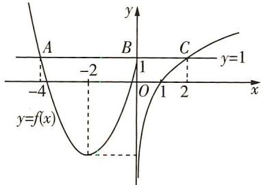

text_image

y
A
-4
-2
B
1
C
y=1
x
O
1
2
y=f(x)

8. $\sqrt{\mathrm{e}}$ 根据题意作出函数 $f(x)$ 的图象，如图所示，若 $f(a) = f(\mathrm{e}^a)$ ，（观察图象知 $a, \mathrm{e}^a$ 必有一个落在区间(0,1)上，一个落在区间 $(1, +\infty)$ 上）

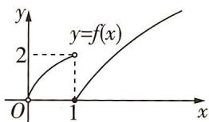

text_image

y
y=f(x)
2
O
1
x

必有 $0 < a < 1 < e^{a}$ 或 $0 < e^{a} < 1 < a$ ，当 a > 1 时， $e^{a} > 1$ ，不能成立，则必有 $0 <$

$a < 1 < \mathrm{e}^{a}$ , 则有 $\sqrt{a} = \sqrt{\mathrm{e}} \ln \mathrm{e}^{a}$ , 变形可得 $\sqrt{a} = \sqrt{\mathrm{e}} a$ , 解得 $a = \frac{1}{\mathrm{e}}$ , 则 $f\left(\frac{1}{a}\right) = f(\mathrm{e}) = \sqrt{\mathrm{e}} \ln \mathrm{e} = \sqrt{\mathrm{e}}$ .

9. D 由题意知 $f(x)$ 的定义域为 R，值域为 $\{0,1\}$ ，故 A，B 错误；因为 $f(x)=0$ 或 $f(x)=1$ ，所以当 $f(x)=0$ 时， $f[f(x)]=f(0)=1$ ，当 $f(x)=1$ 时， $f[f(x)]=f(1)=1$ ，故 C 错误；对于任意一个非零有理数 T，若 x 为有理数，则 $x+T$ 也为有理数，则 $f(x)=f(x+T)=1$ ，若 x 为无理数，则 $x+T$ 也为无理数，则 $f(x+T)=f(x)=0$ ，综上可得，对于任意一个非零有理数 T， $f(x+T)=f(x)$ 对任意 $x\in\mathbf{R}$ 恒成立，故 D 正确。故选 D.

题型 21 已知分段函数解不等式

1. $(-∞,-3)$ 当 $a≤-2$ 时, $f(a)=a<-3$ , 此时不等式的解集是 $(-∞,-3)$ ;

当 -2 < a < 4 时, $f(a) = a + 1 < -3$ , 此时无解;

当 $a \geqslant 4$ 时, $f(a) = 3a < -3$ , 此时无解.

故 a 的取值范围是 $(-∞, -3)$ .

2. D 解法一 当 $x \leqslant 0$ 时, 函数 $f(x) = 2^{-x}$ 单调递减, 则 $f(x) \geqslant f(0) = 1$ . 作出 $f(x)$ 的大致图象如图所示, 结合图象可知, 要使 $f(x + 1) < f(2x)$ , 则需 $\left\{\begin{aligned} x + 1 &< 0, \\ 2x &< 0, \\ 2x &< x + 1 \end{aligned}\right.$ 或 $\left\{\begin{aligned} x + 1 &\geqslant 0, \\ 2x &< 0, \end{aligned}\right.$ 所以 x < 0, 故

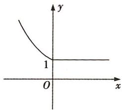

text_image

y
1
O
x

选 D.

解法二 当 $x = -\frac{1}{2}$ 时, $f(x + 1) = f(\frac{1}{2}) = 1, f(2x) = f(-1) = 2^{-(-1)} = 2$ ，满足 $f(x + 1) < f(2x)$ ，排除 A, B；当 $x = -1$ 时， $f(x + 1) = f(0) = 2^{-0} = 1, f(2x) = f(-2) = 2^2 = 4$ ，满足 $f(x + 1) < f(2x)$ ，排除 C. 故选 D.

3. $\frac{37}{28} 3 + \sqrt{3}$ 由题意知 $f\left(\frac{1}{2}\right) = -\left(\frac{1}{2}\right)^2 + 2 = \frac{7}{4}$ , 则

$$
f (f (\frac {1}{2})) = f (\frac {7}{4}) = \frac {7}{4} + \frac {1}{\frac {7}{4}} - 1 = \frac {7}{4} +
$$

$\frac{4}{7}-1=\frac{37}{28}$ . 作出函数 $f(x)$ 的大致图象，如图所示，结合图象，令 $-x^{2}+2=1$ ，解得 $x=\pm1$ ；令 $x+\frac{1}{x}-1=3$ ，解得 $x=2\pm\sqrt{3}$ ，

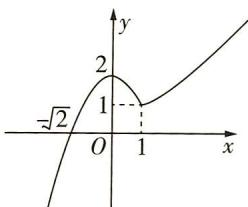

line

| Point | x | y |
|---|---|---|
| -√2 | 0.5 | 1 |
| 1 | 1 | 2 |
| (x=1, y=1) | 1 | 0 |

又 $x > 1$ ，所以 $x = 2 + \sqrt{3}$ ，所以 $(b - a)_{\max} = 2 + \sqrt{3} -(-1) = 3 + \sqrt{3}$

4. $(- \frac{1}{4}, +\infty)$ 当 $x \leqslant 0$ 时, $f(x) + f(x - \frac{1}{2}) = x + 1 + x - \frac{1}{2} + 1 = 2x + \frac{3}{2} > 1$ , 即 $-\frac{1}{4} < x \leqslant 0$ ; 当 $0 < x \leqslant \frac{1}{2}$ 时, $f(x) + f(x - \frac{1}{2}) = 2^x + x + \frac{1}{2} > 1$ 恒成立; 当 $x > \frac{1}{2}$ 时, $f(x) + f(x - \frac{1}{2}) = 2^x + 2^{x - \frac{1}{2}} > 1$ 恒成立. 综上所述, $x$ 的取值范围是 $(- \frac{1}{4}, +\infty)$ .

5. B 由题意知 $f(x) = \begin{cases} - (x - m)^2, & x \leqslant m, \\ x - m, & x > m, \end{cases}$ ，易知函数 $f(x)$ 在 $(m, +\infty), (-\infty, m]$ 上单调递增，且 $m - m = -(m - m)^2$ ，所以函数 $f(x)$ 在 $\mathbb{R}$ 上单调递增。则由 $f(a^2 - 4) > f(3a)$ ，得 $a^2 - 4 > 3a$ ，解得 $a > 4$ 或 $a < -1$ ，所以实数 $a$ 的取值范围是 $(- \infty, -1) \cup (4, +\infty)$ ，故选B.

6. $(-∞,-3)∪(2,+∞)$ 作出 $f(x)$ 的大致图象如图所示,结合图象可知 $f(x)=\left\{\begin{aligned}&1-x,x\leqslant0,\\ &2^{x},x>0.\end{aligned}\right.$

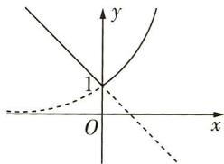

text_image

y
1
O
x

当 $x \leqslant 0$ 时，由 1 - x > 4，得 x < -3。当 x > 0 时，由 $2^{x} > 4$ ，得 x > 2，所以 $f(x) > 4$ 的解集为 $(-∞, -3) ∪ (2, +∞)$ 。

7. $(-∞,1-ln2)$ 易得函数 $f(x)$ 在R上单调递增.因为当 $x≥1$ 时 $f(x)=x^{3}+x≥2$ ,当 $x<1$ 时, $f(x)=2e^{x-1}<2$ ,且 $1^{3}+1=2e^{1-1}=2$ ,所以 $f(f(x))<2$ 等价于 $f(x)<1$ ,此时 $f(x)=2e^{x-1}$ ,即 $2e^{x-1}<1$ ,解得 $x<1-ln2$ ,所以 $f(f(x))<2$ 的解集为 $(-∞,1-ln2)$ .

# 第二节 函数的基本性质

题型 22 确定函数的单调性（单调区间）

1. B 当 $x \geqslant 0$ 时, $y = |x| - 1 = x - 1$ , 此时函数单调递增, 当 x < 0 时, $y = |x| - 1 = -x - 1$ , 此时函数单调递减, 即函数的单调递减区间为 $(-∞, 0)$ . 故选 B.

2. D 如图, 在坐标系中分别画出 A, B, C, D 四个选项中函数的大致图象, 由图可知只有 D 项符合题意. 故选 D.

3. D 由 $x^{2} - 2x - 8 > 0$ ，得 $x < -2$ 或 $x > 4$ . 因此，函数 $f(x) = \ln (x^{2} - 2x - 8)$ 的定义域是 $(- \infty, -2) \cup (4, +\infty)$ . 注意到函数 $y = x^{2} - 2x - 8$ 在 $(4, +\infty)$

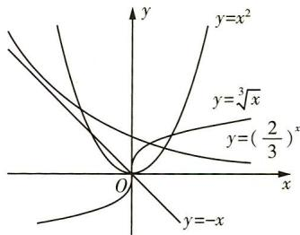

text_image

y
y=x²
y=∛x
y=(2/3)ˣ
y=-x
O
x

上单调递增,由复合函数的单调性知, $f(x)=\ln(x^{2}-2x-8)$ 的单调递增区间是 $(4,+\infty)$ ,选D.

4. C 由题易知, $f(x)=\ln x+\ln(2-x)$ 的定义域为 $(0,2)$ , $f(x)=\ln[x(2-x)]=\ln[-(x-1)^{2}+1]$ , 由复合函数的单调性知, 函数 $f(x)=\ln x+\ln(2-x)$ 在 $(0,1)$ 上单调递增, 在 $(1,2)$ 上单调递减, 所以排除 A,B; 又 $y=-(x-1)^{2}+1$ 在 $(0,2)$ 上的图象关于 x=1 对称, 且无对称中心, 所以排除 D, 选 C.

5. D 对于选项 A, 由反比例函数图象可知 A 不符合题意; 对于选项 B, $f(-1) = f(1) = 0$ , 不满足减函数特征, 故 B 不符合题意; 对于选项 C, 函数 $f(x) = \ln |x|$ 的定义域为 $(-∞, 0) ∪ (0, +∞)$ , 在整个定义域上不具有单调性, $(-∞, 0)$ 是单调递减区间, $(0, +∞)$ 是单调递增区间, 值域为 R, 故 C 不符合题意; 对于选项 D, 函数 $f(x) = -x^{3}$ 的定义域为 R, 是 R 上的减函数, 值域为 R, 故 D 符合题意. 故选 D.

6. D 由函数 $y = f(x) (x \in \mathbb{R})$ 的图象可得 $f(x)$ 的单调递减区间是 $(- \infty, 0]$ , $\left[\frac{1}{2}, +\infty\right)$ , 而函数 $u = -\ln x$ 在 $x \in (0, +\infty)$ 上单调递减, 所以若函数 $g(x)$ 单调递增, 则必有 $-\ln x \leqslant 0$ 或 $-\ln x \geqslant \frac{1}{2}$ , 即 $x \geqslant 1$ 或 $0 < x \leqslant \frac{1}{\sqrt{\mathrm{e}}}$ , 所以函数 $g(x) = f(-\ln x)$ 的单调递增区间是 $(0, \frac{1}{\sqrt{\mathrm{e}}}]$ 和 $[1, +\infty)$ .

# 题型 23 函数单调性的应用

1. D 因为 $g(x)=\frac{a}{x}$ 在区间 [1,2] 上单调递减，所以 a>0 。因为函数 $f(x)=-x^{2}+2ax$ 的图象开口向下，对称轴为直线 x=a ，且函数 $f(x)$ 在区间 [1,2] 上单调递减，所以 $a\leqslant1$ 。故满足题意的 a 的取值范围是 (0,1 ] 。

2. $f(1) < f(2) < f(-3)$ 因为函数 $f(x)$ 在区间 $[-3, -1]$ 上单调递减，所以 $f(-1) < f(-2) < f(-3)$ . 又函数 $f(x)$ 是偶函数，所以 $f(-1) = f(1), f(-2) = f(2)$ ，所以 $f(1) < f(2) < f(-3)$ .

3. D 解法一 由题意得 $y = x(x - a)$ 在区间(0,1)单调递减，所以 $x = \frac{a}{2} \geqslant 1$ ，解得 $a \geqslant 2$ . 故选 D.

解法二 取 a=3，则 $y=x(x-3)=(x-\frac{3}{2})^{2}-\frac{9}{4}$ 在 $(0,1)$ 单调递减，所以 $f(x)=2^{x(x-3)}$ 在 $(0,1)$ 单调递减，所以 a=3 符合题意，排除 A, B, C，故选 D.

4. D 由 $x^{2} - 4x - 5 > 0$ ，解得 $x > 5$ 或 $x < -1$ ，所以函数 $f(x)$ 的定义域为 $(- \infty, -1) \cup (5, +\infty)$ . 又函数 $y = x^{2} - 4x - 5$ 在 $(5, +\infty)$ 上单调递增，在 $(- \infty, -1)$ 上单调递减，所以函数 $f(x) = \lg (x^{2} - 4x - 5)$ 在 $(5, +\infty)$ 上单调递增，所以 $a \geqslant 5$ ，故选 D.

5. D 解法一 由题意知 $f(x)$ 在 $(- \infty, 0), (0, +\infty)$ 单调递减，且 $f(-2) = f(2) = f(0) = 0$ . 当 $x > 0$ 时，令 $f(x - 1) \geqslant 0$ ，得 $0 \leqslant x - 1 \leqslant 2, \therefore 1 \leqslant x \leqslant 3$ ; 当 $x < 0$ 时，令 $f(x - 1) \leqslant 0$ ，得 $-2 \leqslant x - 1 \leqslant 0, \therefore -1 \leqslant x \leqslant 1$ ，又 $x < 0, \therefore -1 \leqslant x < 0$ ; 当 $x = 0$ 时，显然符合题意. 综上，原不等式的解集为 $[-1, 0] \cup [1, 3]$ ，故选 D.

解法二 当 x=3 时, $f(3-1)=0$ , 符合题意, 排除 B; 当 x=4 时, $f(4-1)=f(3)<0$ , 此时不符合题意, 排除选项 A, C. 选 D.

6. C ∵ 函数 $f(x)=\left\{\begin{aligned}|x-a+3|, &x\geqslant1,\\ \log_{a}x, &0<x<1\end{aligned}\right.$ 在其定义域上单调递增，
∴ $\left\{\begin{aligned}a>1,\\ a-3\leqslant1,\\ 0\leqslant|-a+4\end{aligned}\right.$ 解得 $1<a\leqslant4,\therefore$ 实数 a 的取值范围为 $(1,4]$ ,
故选 C.

7. D 由题意知 $f(-x) = f(x)$ ，所以 $f(x)$ 是 $\mathbf{R}$ 上的偶函数，当 $x > 0$ 时， $f(x) = (\frac{3}{2})^x + x^2$ 单调递增，则 $b = f(-\log_5 2) = f(\log_5 2)$ ， $\ln 3 > 1, 0 < \log_5 2 < \log_5 \sqrt{5} = \frac{1}{2}, 1 > \frac{1}{\sqrt{\mathrm{e}}} > \frac{1}{2}$ ，即 $\ln 3 > \frac{1}{\sqrt{\mathrm{e}}} > \log_5 2$ ，则 $f(\ln 3) > f(\frac{1}{\sqrt{\mathrm{e}}}) > f(\log_5 2)$ ，即 $f(\ln 3) > f(\frac{1}{\sqrt{\mathrm{e}}}) > f(-\log_5 2)$ ，故 $a > c > b$ ，故选 D.

8. B 当 $x \in [0,2]$ 时， $2^{x} \in [1,4]$ ， $x^{2} \in [0,4]$ ，易知此时 $2^{x} \geqslant x^{2}$ ，又 $f(x)$ 在 $[0,4]$ 上单调递增，所以 $f(2^{x}) \geqslant f(x^{2})$ ；当 $x \in (2,4]$ 时， $2^{x} \in (4,16]$ ， $x^{2} \in (4,16]$ ，易知此时 $2^{x} \leqslant x^{2}$ ，又 $f(x)$ 在 $(4,16]$ 上单调递减，所以 $f(2^{x}) \geqslant f(x^{2})$ ；当 $x \in (4,+\infty)$ 时， $2^{x} \in (16,+\infty)$ ， $x^{2} \in (16,+\infty)$ ，易知此时 $2^{x} > x^{2}$ ，又 $f(x)$ 在 $(16,+\infty)$ 上单调递增，所以 $f(2^{x}) > f(x^{2})$ 。综上，当 $x \geqslant 0$ 时， $f(2^{x}) \geqslant f(x^{2})$ 。故选 B.

9. A 由不等式 $x^{6} - (2x + 3) > (2x + 3)^{3} - x^{2}$ , 得 $(x^{2})^{3} + x^{2} > (2x + 3)^{3} + (2x + 3)$ . 设函数 $f(t) = t^{3} + t$ , 则 $f'(t) = 3t^{2} + 1 > 0$ , 所以 $f(t)$ 在 $\mathbf{R}$ 上单调递增, 因为 $f(x^{2}) > f(2x + 3)$ , 所以 $x^{2} > 2x + 3$ , 解得 $x > 3$ 或 $x < -1$ . 故选 A.

# 题型 24 求函数的最值（值域）

1. B 函数 $f(x) = \frac{2x + m}{x + 1} = 2 + \frac{m - 2}{x + 1}$ ，当 $m = 2$ 时， $f(x) = 2$ ，不满足题意；当 $m - 2 > 0$ ，即 $m > 2$ 时，易知 $f(x)$ 在 $[0, 1]$ 上单调递减， $f(x)_{\max} = f(0) = \frac{0 + m}{1} = \frac{5}{2}$ ，解得 $m = \frac{5}{2}$ ，成立；当 $m - 2 < 0$ ，即 $m < 2$ 时， $f(x)$ 在 $[0, 1]$ 上单调递增， $f(x)_{\max} = f(1) = \frac{2 + m}{2} = \frac{5}{2}$ ，解得 $m = 3$ ，不成立。综上可得， $m = \frac{5}{2}$ 。故选 B.

2. (1) $(- \infty, 2) \cup (2, +\infty)$ $y = \frac{2x + 1}{x - 3} = \frac{2(x - 3) + 7}{x - 3} = 2 + \frac{7}{x - 3}$ , 显然 $\frac{7}{x - 3} \neq 0$ , 所以 $y \neq 2$ .

故函数的值域为 $(-∞,2)∪(2,+∞)$ .

(2) $\left[\frac{15}{8},+\infty\right)$ 设 $t=\sqrt{x-1}$ ，则 $x=t^{2}+1$ ，且 $t\geqslant0$ ，

所以 $y=2(t^{2}+1)-t=2(t-\frac{1}{4})^{2}+\frac{15}{8}$ ，由 $t\geqslant0$ ，可得函数的值域为 $\left[\frac{15}{8},+\infty\right)$ .

3.0（答案不唯一）1 当 $a = 0$ 时，函数 $f(x) = \begin{cases} 1, & x < 0, \\ (x - 2)^2, & x \geqslant 0, \end{cases}$ 存在最小值0，所以 $a$ 的一个取值可以为0；当 $a < 0$ 时，若 $x < a, f(x) = -ax + 1$ ，此时函数 $f(x)$ 不可能存在最小值；当 $0 < a \leqslant 2$ 时，若 $x < a$ ，则 $f(x) = -ax + 1$ ，此时 $f(x) \in (-a^2 + 1, +\infty)$ ，若 $x \geqslant a$ ，则 $f(x) = (x - 2)^2 \in [0, +\infty)$ ，若函数 $f(x)$ 存在最小值，则 $-a^2 + 1 \geqslant 0$ ，得 $0 < a \leqslant 1$ ；当 $a > 2$ 时，若 $x < a$ ，则 $f(x) = -ax + 1$ ，此时 $f(x) \in (-a^2 + 1, +\infty)$ ，若 $x \geqslant a$ ，则 $f(x) = (x - 2)^2 \in [(a - 2)^2, +\infty)$ ，若函数 $f(x)$ 存在最小值，则 $-a^2 + 1 \geqslant (a - 2)^2$ ，此时不等式无解。综上， $0 \leqslant a \leqslant 1$ ，所以 $a$ 的最大值为1.

4. B 由题意, $f(x)+\mathrm{e}^{x}=f(-x)+\mathrm{e}^{-x},f(x)-3\mathrm{e}^{x}+f(-x)-3\mathrm{e}^{-x}=0$ ,消去 $f(-x)$ ,得 $f(x)=\mathrm{e}^{x}+\frac{2}{\mathrm{e}^{x}}\geqslant2\sqrt{2}$ ,当且仅当 $e^{x}=\frac{2}{e^{x}}$ 即 $x=\frac{\ln2}{2}$ 时等号成立,故选B.

5. $[-5, 5]$ 由 $a \sin x + \cos 2x \leqslant 4$ 得, $a \sin x + 1 - 2 \sin^2 x \leqslant 4$ , 令 $\sin x = t$ , 则 $t \in [-1, 1]$ , 则原式等价于当 $t \in [-1, 1]$ 时, 关于 $a$ 的不等式 $ta - 3 - 2t^2 \leqslant 0$ 恒成立, 所以 $\left\{ \begin{array}{l} 1 \times a - 3 - 2 \times 1^2 \leqslant 0, \\ -1 \times a - 3 - 2 \times (-1)^2 \leqslant 0, \end{array} \right.$ 解得 $-5 \leqslant a \leqslant 5$ , 所以 $a$ 的取值范围为 $[-5, 5]$ .

6.22 由 $f(x) = 2 + \log_3 x$ ，得 $y = [f(x)]^2 + f(x^2) = (2 + \log_3 x)^2 + 2 + \log_3 x^2 = (2 + \log_3 x)^2 + 2 + 2 \log_3 x = (\log_3 x + 3)^2 - 3$ .

∵ 函数 $f(x)$ 的定义域为 [1,81]，

$$
\therefore \left\{ \begin{array}{l} 1 \leqslant x ^ {2} \leqslant 8 1, \\ 1 \leqslant x \leqslant 8 1, \end{array} \right. \therefore 1 \leqslant x \leqslant 9, \therefore 0 \leqslant \log_ {3} x \leqslant 2,
$$

∴ 当 $\log_{3}x = 2$ ，即 x = 9 时， $y_{\max} = 22$ 。∴ 函数 $y = [f(x)]^{2} + f(x^{2})$ 的最大值为 22。

7. $(-∞,-\frac{1}{2}]$ 因为函数 $f(x)=2022^{x-1}$ 与 $g(x)=x^{2}-(a+1)x+2-a$ 是区间[1,2]上的“3阶友好函数”，所以 $f(x)_{\min}\cdot g(x)_{\min}\geqslant3$ 在 $x∈[1,2]$ 上恒成立，又 $f(x)=2022^{x-1}$ 在 $x∈[1,2]$ 上单调递增，所以 $f(x)_{\min}=f(1)=1$ ，所以 $g(x)=x^{2}-(a+1)x+2-a\geqslant3$ 在 $x∈[1,2]$ 上恒成立，即 $a\leqslant\frac{x^{2}-x-1}{x+1}$ 在 $x∈[1,2]$ 上恒成立。 $\frac{x^{2}-x-1}{x+1}=\frac{(x+1)^{2}-3(x+1)+1}{x+1}=x+1+\frac{1}{x+1}-3$ 。令 $x+1=t,t∈[2,3]$ ，（利用换元，把所求的问题简单化，此时，需注意新元的取值范围）

设 $h(t)=t+\frac{1}{t}-3$ ，由对勾函数图象可知， $h(t)$ 在 $[2,3]$ 上单调递增，所以 $h(t)_{\min}=h(2)=-\frac{1}{2}$ ，所以 $a\leqslant-\frac{1}{2}$ .

8. D 当 $x \leqslant 2$ 时, $0 < 2^{x} \leqslant 4, 4 \leqslant 8 - 2^{x} < 8$ , 所以 $f(x) \in [4, 8)$ . 当 x > 2 时, 分以下两种情况讨论.

若 $0 < a < 1$ ，则函数 $y = 3 + \log_a x$ 单调递减，所以 $3 + \log_a x \in (-\infty, 3 + \log_a 2)$ ，与 $f(x)$ 的值域是 $[4, +\infty)$ 矛盾.

若 a > 1，则函数 $y = 3 + \log_{a}x$ 单调递增，所以 $3 + \log_{a}x \in (3 + \log_{a}2, +\infty)$ ，要使 $f(x)$ 的值域是 $[4, +\infty)$ ，则有 $4 \leqslant 3 + \log_{a}2 < 8$ ，解得 $\sqrt[5]{2} < a \leqslant 2$ 。故选 D.

# 题型 25 判断函数的奇偶性

1. D 对于 A, 因为函数 $y = \sin x$ 在其定义域内既有增区间又有减区间, 所以函数 $y = \sin x$ 不符合题意, 故 A 不正确; 对于 B, 因为指数函数在其定义域上是非奇非偶函数, 所以函数 $y = 2^{x}$ 不符合题意, 故 B 不正确; 对于 C, 因为对数函数的定义域为 $(0, +\infty)$ , 所以函数 $y = \log_{2} x$ 是非奇非偶函数, 故 C 不正确; 对于 D, $y = x^{3}$ 是奇函数, 且是 R 上的增函数. 故选 D.

2. B 解法一 因为 $f(x) = \frac{1 - x}{1 + x}$ ，所以 $f(x - 1) = \frac{1 - (x - 1)}{1 + (x - 1)} = \frac{2 - x}{x}, f(x + 1) = \frac{1 - (x + 1)}{1 + (x + 1)} = \frac{-x}{x + 2}$ .

对于 A, $F(x) = f(x - 1) - 1 = \frac{2 - x}{x} - 1 = \frac{2 - 2x}{x}$ ，定义域关于原点对称，但不满足 $F(x) = -F(-x)$ ; 对于 B, $G(x) = f(x - 1) + 1 = \frac{2 - x}{x} + 1 = \frac{2}{x}$ ，定义域关于原点对称，且满足 $G(x) = -G(-x)$ ; 对于 C, $f(x + 1) - 1 = \frac{-x}{x + 2} - 1$ ，定义域不关于原点对称；对于 D, $f(x + 1) + 1 = \frac{-x}{x + 2} + 1$ ，定义域不关于原点对称。故选 B.

解法二 $f(x)=\frac{1-x}{1+x}=\frac{2-(x+1)}{1+x}=\frac{2}{1+x}-1$ ，为保证函数变换之后为奇函数，需将函数 $y=f(x)$ 的图象向右平移一个单位长度，再向上平移一个单位长度，得到的图象对应的函数为 $y=f(x-1)+1$ ，故选 B.

# 方法技巧

常见的偶函数有 $y = a^{x} + a^{-x}$ (a > 0 且 $a \neq 1$ ), $y = \cos x$ , $y = x^{2n}$ ( $n \in Z$ ), $y = |x|$ 等; 常见的奇函数有 $y = a^{x} - a^{-x}$ , $y = \sin x$ , $y = \tan x$ , $y = x^{2n+1}$ ( $n \in Z$ ), $y = \log_{a} \frac{1 - x}{1 + x}$ , $y = \log_{a} (x + \sqrt{1 + x^{2}})$ 等, 其中 a > 0 且 $a \neq 1$ .

3. B 因为 $f(x)$ 为奇函数, $g(x)$ 为偶函数, 所以 $f(x)g(x)$ 为奇函数, $f(x)|g(x)|$ 为奇函数, $|f(x)|g(x)$ 为偶函数, $|f(x)g(x)|$ 为偶函数, 故选 B.  
4. D 由题意, 得 $\left\{\begin{aligned} x+1 &\geqslant0, \\ x-1 &\geqslant0, \end{aligned}\right.$ 解得 $x \geqslant 1$ , 即 $f(x)$ 的定义域为 $[1, +\infty)$ , 因为 $f(x)$ 的定义域不关于原点对称, 所以 $f(x)$ 既不是奇函数也不是偶函数.  
5. A 由 $\left\{ \begin{array}{l} 1 - x^2 > 0, \\ |x - 2| \neq 2 \end{array} \right.$ 得函数 $f(x)$ 的定义域为 $(-1,0) \cup (0,1)$ , 关于原点对称. 则 $x - 2 < 0$ , $\therefore |x - 2| - 2 = -x$ , $\therefore f(x) = \frac{\lg(1 - x^2)}{-x}$ . (利用函数的定义域化简函数解析式)

又 $f(-x)=\frac{\lg(1-x^{2})}{x}=-\frac{\lg(1-x^{2})}{-x}=-f(x)$ ，∴函数 $f(x)$ 为奇函数，则其函数图象关于原点对称.

6. D 由 $f(2 - x) + f(x) = -2$ 可知, $y = f(x)$ 的图象关于点(1, -1)对称,将点(1, -1)向左平移1个单位长度,向上平移1个单位长度得到点(0,0),即函数 $y = f(x + 1) + 1$ 为奇函数.所以选D.题型26 函数奇偶性的应用

1. $f(x) = \begin{cases} 2x(x + 4), & x \geqslant 0, \\ 2x(x - 4), & x < 0 \end{cases}$ 当 $x < 0$ 时， $-x > 0$ ，故 $f(-x) = -2x(-x + 4) = 2x(x - 4)$ ，故 $f(x) = f(-x) = 2x(x - 4)$ ，所以 $f(x) = \begin{cases} 2x(x + 4), & x \geqslant 0, \\ 2x(x - 4), & x < 0. \end{cases}$

2. $(-2,0)\cup(0,2)$ 根据题意作出 $f(x)$ 的图象如图所示.结合图象可知不等式 $xf(x)>0$ 的解集是 $(-2,0)\cup(0,2)$ .

3. D 依题意得, 当 x < 0 时, $f(x) = -f(-x) = -(e^{-x} - 1) = -e^{-x} + 1$ , 选 D.

4. B 解法一 设 $g(x)=\ln\frac{2x-1}{2x+1}$ ，易知 $g(x)$ 的定义域为 $(-∞, -\frac{1}{2})∪(\frac{1}{2}, +∞)$ ，且 $g(-x)=\ln\frac{-2x-1}{-2x+1}=\ln\frac{2x+1}{2x-1}=-\ln\frac{2x-1}{2x+1}=-g(x)$ ，所以 $g(x)$ 为奇函数。若 $f(x)=(x+a)\ln\frac{2x-1}{2x+1}$ 为偶函数，则 $y=x+a$ 也应为奇函数，所以 a=0，故选 B.

解法二 因为 $f(x) = (x + a)\ln \frac{2x - 1}{2x + 1}$ 为偶函数， $f(-1) = (a - 1)\ln 3, f(1) = (a + 1)\ln \frac{1}{3} = -(a + 1)\ln 3$ ，所以 $(a - 1)\ln 3 = -(a + 1)\ln 3$ ，解得 $a = 0$ ，故选 B.

5. D 解法一 $f(x)$ 的定义域为 $\{x \mid x \neq 0\}$ ，因为 $f(x)$ 是偶函数，所以 $f(x) = f(-x)$ ，即 $\frac{x e^x}{e^{ax} - 1} = \frac{-x e^{-x}}{e^{-ax} - 1}$ ，即 $e^{(1 - a)x} - e^x = -e^{(a - 1)x} + e^{-x}$ ，即 $e^{(1 - a)x} + e^{(a - 1)x} = e^x + e^{-x}$ ，所以 $a - 1 = \pm 1$ ，解得 $a = 0$ （舍去）或 $a = 2$ ，故选 D.

解法二 $f(x) = \frac{x\mathrm{e}^x}{\mathrm{e}^{ax} - 1} = \frac{x}{\mathrm{e}^{(a - 1)x} - \mathrm{e}^{-x}}, f(x)$ 是偶函数，又 $y = x$ 是奇函数，所以 $y = \mathrm{e}^{(a - 1)x} - \mathrm{e}^{-x}$ 是奇函数，故 $a - 1 = 1$ ，即 $a = 2$ ，故选D.

6. $-\frac{1}{2} \ln 2$ 解法一 $f(x) = \ln |a + \frac{1}{1 - x}| + b = \ln |a + \frac{1}{1 - x}| + \ln e^b = \ln |\frac{(a + 1)e^b - ae^bx}{1 - x}|$ . $\because f(x)$ 为奇函数, $\therefore f(-x) + f(x) = \ln |\frac{(a + 1)^2e^{2b} - a^2e^{2bx}x^2}{1 - x^2}| = 0, \therefore |(a + 1)^2e^{2b} - a^2e^{2bx}x^2| =$

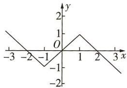

line

| x | y |
|---|---|
| -3 | 1 |
| -2 | 0 |
| -1 | -1 |
| 0 | 0 |
| 1 | 1 |
| 2 | 0 |
| 3 | -1 |

$|1-x^{2}|$ . 当 $(a+1)^{2}\mathrm{e}^{2b}-a^{2}\mathrm{e}^{2b}x^{2}=1-x^{2}$ 时，则 $\left\{\begin{aligned}(a+1)^{2}\mathrm{e}^{2b}&=1,\\ a^{2}\mathrm{e}^{2b}&=1,\end{aligned}\right.$ 解得 $\left\{\begin{aligned}a&=-\frac{1}{2},\\ b&=\ln2.\end{aligned}\right.$ 当 $(a+1)^{2}\mathrm{e}^{2b}-a^{2}\mathrm{e}^{2b}x^{2}&=-1+x^{2}$ 时，则 $\left\{\begin{aligned}(a+1)^{2}\mathrm{e}^{2b}&=-1,\\ a^{2}\mathrm{e}^{2b}&=-1,\end{aligned}\right.$ 无解. 综上， $a=-\frac{1}{2},b=\ln2.$

解法二 易知 $x \neq 1$ . $\because$ 函数 $f(x)$ 为奇函数, $\therefore$ 由奇函数定义域关于原点对称可得 $x \neq -1$ , $\therefore$ 当 $x = -1$ 时, $|a + \frac{1}{1 - x}| \leqslant 0$ . 又 $\because |a + \frac{1}{1 - x}| \geqslant 0$ 恒成立, $\therefore$ 当 $x = -1$ 时, $|a + \frac{1}{1 - x}| = 0$ , $\therefore a = -\frac{1}{2}$ . 又由 $f(0) = 0$ 可得 $b = \ln 2$ . 经检验符合题意, $\therefore a = -\frac{1}{2}$ , $b = \ln 2$ .

7. C 由题意可知, $f(x)=\frac{6}{\mathrm{e}^{x}+1}+\frac{mx}{|x|+1}=3-\frac{3(\mathrm{e}^{x}-1)}{\mathrm{e}^{x}+1}+\frac{mx}{|x|+1}$ ，设 $g(x)=-\frac{3(\mathrm{e}^{x}-1)}{\mathrm{e}^{x}+1}+\frac{mx}{|x|+1}(x\in[-2,2])$ ，则 $g(-x)=-\frac{3(\mathrm{e}^{-x}-1)}{\mathrm{e}^{-x}+1}+\frac{m(-x)}{|-x|+1}=-\left[-\frac{3(\mathrm{e}^{x}-1)}{\mathrm{e}^{x}+1}+\frac{mx}{|x|+1}\right]=-g(x)$ ，所以 $g(x)$ 为奇函数，所以 $g(x)_{\max}+g(x)_{\min}=0$ ，所以 $f(x)_{\max}+f(x)_{\min}=M+N=g(x)_{\max}+3+g(x)_{\min}+3=6$ ，故选C.

8. C 因为函数 $f(x)$ 为偶函数，所以 $f(-x)=f(x)$ . 在 $f(x)+f(x+2)=3$ 中，令 x=-1，得 $f(-1)+f(1)=3$ ，则 $2f(1)=3$ ，所以 $f(1)=\frac{3}{2}$ . 由 $f(x)+f(x+2)=3$ ，得 $f(2)+f(4)=f(3)+f(5)=f(6)+f(8)=f(7)+f(9)=3$ ，所以 $f(1)+f(2)+\cdots+f(9)=\frac{3}{2}+4\times3=\frac{27}{2}$ . 在 $g(x)+g(10-x)=2$ 中，令 x=5，得 $2g(5)=2$ ，所以 $g(5)=1$ . 由 $g(x)+g(10-x)=2$ ，得 $g(1)+g(9)=g(2)+g(8)=g(3)+g(7)=g(4)+g(6)=2$ ，所以 $g(1)+g(2)+\cdots+g(9)=2\times4+1=9$ . 所以 $\sum_{i=1}^{9}[f(i)+g(i)]=\frac{27}{2}+9=\frac{45}{2}$ ，故选 C.

9. B 由题意知 $f(x)$ 的定义域为 $\mathbf{R}, f(-x) = \frac{1}{(-x)^2 + 1} + \log_{\frac{1}{2}}(|-x| + 1) = \frac{1}{x^2 + 1} + \log_{\frac{1}{2}}(|x| + 1) = f(x), \therefore f(x)$ 是定义在 $\mathbf{R}$ 上的偶函数，又 $y = \frac{1}{x^2 + 1}, y = \log_{\frac{1}{2}}(|x| + 1)$ 在 $(0, +\infty)$ 上均单调递减， $\therefore f(x)$ 在 $(0, +\infty)$ 上单调递减，在 $(-\infty, 0)$ 上单调递增， $\because f(1) = -\frac{1}{2}, \therefore f(m - 2) < -\frac{1}{2} = f(1), \therefore f(|m - 2|) < f(1), \therefore |m - 2| > 1, \therefore m > 3$ 或 $m < 1$ ，即不等式 $f(m - 2) < -\frac{1}{2}$ 的解集为 $(-\infty, 1) \cup (3, +\infty)$ . 故选 B.

10. B 因为 $f(x) = \log_{a} (\sqrt{9x^{2} + 1} - ax) (a > 0 \text{ 且 } a \neq 1)$ 是奇函数，所以 $f(x) + f(-x) = 0$ ，则 $\log_{a} (\sqrt{9x^{2} + 1} - ax) + \log_{a} (\sqrt{9x^{2} + 1} + ax) = \log_{a} (9x^{2} + 1 - a^{2}x^{2}) = 0$ ，即 $9 - a^{2} = 0$ ，所以 a = 3，则 $f(x) = \log_{3} (\sqrt{9x^{2} + 1} - 3x) = \log_{3} \frac{1}{\sqrt{9x^{2} + 1} + 3x}$ .

由复合函数的单调性, 易得 $f(x)$ 在 $[0, +\infty)$ 上单调递减, 又 $f(x)$ 为奇函数, 所以函数 $f(x)$ 在 R 上单调递减.

由 $f(ax^{2}+bx)+f(ax+a)<0$ 恒成立，得 $f(3x^{2}+bx)<-f(3x+3)=f(-3x-3)$ 恒成立，所以 $3x^{2}+bx>-3x-3$ 恒成立，即 $3x^{2}+(b+3)x+3>0$ 恒成立，则 $\Delta=(b+3)^{2}-4\times3\times3<0$ ，解得 $-9<b<3$ 。故选B.

11. $\pm 1$ 因为 $f(-x) = \frac{k - 2^{-x}}{1 + k\cdot 2^{-x}} = \frac{k\cdot 2^x - 1}{2^x + k}$ 所以 $f(-x) + f(x) = \frac{(k - 2^x)(2^x + k) + (k\cdot 2^x - 1)\cdot(1 + k\cdot 2^x)}{(1 + k\cdot 2^x)(2^x + k)}$

$$
= \frac {(k ^ {2} - 1) (2 ^ {2 x} + 1)}{(1 + k \cdot 2 ^ {x}) (2 ^ {x} + k)}.
$$

由 $f(-x)+f(x)=0$ , 可得 $k^{2}=1$ ，(不能确定定义域是否包含 0 ) 所以不能用 $f(0)=0$ 求 k

所以 $k = \pm 1$ .

题型 27 函数周期性及函数图象对称性的应用

1. D 解法一 $f(x) = -f(4 - x)$ ，即 $f(x) + f(4 - x) = 0$ ，即 $f(x +$

$2)+f(2-x)=0.$ 又 $f(x)=f(2-x)$ ，所以 $f(x+2)+f(x)=0$ ，即 $f(x)=-f(x+2)$ ，则 $f(x+2)=-f(x+4)=-f(x)$ ，则 $f(x)=f(x+4)$ ，所以 $f(x)$ 是以 4 为周期的周期函数，则 $f(x)=-f(4-x)=-f(-x)$ ，所以 $f(x)$ 是以 4 为周期的奇函数。故选 D.
解法二 由 $f(x)=-f(4-x)$ 得 $f(x)$ 的图象关于点 $(2,0)$ 对称，由 $f(x)=f(2-x)$ 得 $f(x)$ 的图象关于直线x=1对称，所以 $f(x)$ 的周期为 $4\times|2-1|=4$ ，且 $(0,0)$ 也是 $f(x)$ 图象的对称中心，所以 $f(x)$ 为奇函数，故选D.

2. C 因为 $f(x)$ 是定义在 R 上的奇函数, 所以 $f(-x) = -f(x)$ . 又 $f(1 + x) = f(-x)$ , 所以 $f(2 + x) = -f(1 + x) = -f(-x) = f(x)$ , 所以函数 $f(x)$ 是以 2 为周期的周期函数, $f(\frac{5}{3}) = f(\frac{5}{3} - 2) = f(-\frac{1}{3}) = \frac{1}{3}$ . 故选 C.

3. A 因为 $f(1)=1$ ，所以在 $f(x+y)+f(x-y)=f(x)f(y)$ 中，令 y=1，得 $f(x+1)+f(x-1)=f(x)f(1)$ ，所以 $f(x+1)+f(x-1)=f(x)$ ①，所以 $f(x+2)+f(x)=f(x+1)$ ②。由①②相加，得 $f(x+2)+f(x-1)=0$ ，故 $f(x+3)+f(x)=0$ ，所以 $f(x+3)=-f(x)$ ，所以 $f(x+6)=-f(x+3)=f(x)$ ，所以函数 $f(x)$ 的一个周期为 6。在 $f(x+y)+f(x-y)=f(x)f(y)$ 中，令 y=0，得 $f(x)+f(x)=f(x)f(0)$ ，所以 $f(0)=2$ ；令 x=1, y=1，得 $f(2)+f(0)=f(1)f(1)$ ，所以 $f(2)=-1$ 。由 $f(x+3)+f(x)=0$ ，得 $f(1)+f(4)=0$ ， $f(2)+f(5)=0$ ， $f(3)+f(6)=0$ ，所以 $f(1)+f(2)+\cdots+f(6)=0$ ，根据函数的周期性知， $\sum_{k=1}^{22}f(k)=f(1)+f(2)+f(3)+f(4)=1-1-2-1=-3$ ，故选 A.

4. D 因为当 $x > \frac{1}{2}$ 时, $f(x + \frac{1}{2}) = f(x - \frac{1}{2})$ , 所以当 $x > \frac{1}{2}$ 时, $f(x)$ 的周期为 1, 所以 $f(8) = f(7 \times 1 + 1) = f(1)$ . 因为当 $-1 \leqslant x \leqslant 1$ 时, $f(-x) = -f(x)$ , 所以 $f(1) = -f(-1) = -\left[(-1)^{3} - 1\right] = 2$ , 所以 $f(8) = 2$ , 故选 D.

5. D $\because f(x+1)+f(x-1)=2,\therefore f(x+2)+f(x)=2,\therefore f(x+2)=2-f(x),\therefore f(x+4)=2-f(x+2)=2-\left[2-f(x)\right]=f(x),\therefore f(x)$ 是周期为 4 的周期函数. 又 $f(x+2)$ 为偶函数, $\therefore f(-x+2)=f(x+2),\therefore f(x)=f(-x+4)=f(-x),\therefore f(x)$ 为偶函数. $\because f(x+1)+f(x-1)=2,\therefore f(1)+f(3)=2,f(2)+f(4)=2,\therefore f(1)+f(2)+f(3)+f(4)=4,$ 又 $f(1)+f(-1)=2,\therefore 2f(1)=2,\therefore f(1)=1.$ 又 $f(0)+f(2)=2,f(0)=0,\therefore f(2)=2,\because 110=27\times4+2,\therefore f(1)+\cdots+f(110)=27\times\left[f(1)+f(2)+f(3)+f(4)\right]+f(1)+f(2)=27\times4+1+2=111,\therefore n$ 的值为 110. 故选 D.

6.6 $\because y=f(x)-1$ 为奇函数, $\therefore y=f(x)$ 图象关于点(0,1)对称;又 $y=1+\frac{1}{x}$ 图象关于点(0,1)对称, $\therefore x_{1}+x_{2}+\cdots+x_{6}=0,y_{1}+y_{2}+\cdots+y_{6}=3\times2=6,\therefore\sum_{i=1}^{6}(x_{i}+y_{i})=(x_{1}+x_{2}+\cdots+x_{6})+(y_{1}+y_{2}+\cdots+y_{6})=6.$

7. -2 因为函数 $y=f(x+1)$ 的图象关于直线 x=-3 对称，将函数 $y=f(x+1)$ 的图象向右平移 1 个单位长度可得 $y=f(x)$ 的图象，所以函数 $y=f(x)$ 的图象关于直线 x=-2 对称，又 $\forall x\in R, f(x)+f(-x)=2$ ，所以 $f(x)$ 图象关于 $(0,1)$ 对称，所以函数 $y=f(x)$ 是周期函数，周期为 8。所以 $f(2022)=f(253\times8-2)=f(-2)=2-f(2)=2-4=-2$ 。

8. ABC 对于 A, 由 $f(2 - x) = f(x)$ , 得函数 $f(x)$ 的图象关于直线 x = 1 对称, 故 A 正确;

对于 B, 由 $f(-x) = -f(x)$ 与 $f(2 - x) = f(x)$ ，得 $f(2 - x) = -f(-x)$ ，所以 $f(2 + x) = -f(x)$ ，所以 $f(x) = f(x + 4)$ ，所以 $f(x)$ 是周期为 4 的周期函数，由 $f(x) = f(x + 4)$ ， $f(-x) = -f(x)$ 可得 $-f(-x) = f(x + 4)$ ，所以 $f(x)$ 的图象关于点 $(2,0)$ 对称，又 $f(x)$ 的周期为 4，所以 $f(x)$ 的图象关于点 $(-2,0)$ 对称，故 B 正确；对于 C，由 $f(-x) = -f(x)$ 知函数 $f(x)$ 是 R 上的奇函数，所以 $f(0) = 0$ ，在 $f(2 - x) = f(x)$ 中令 x = 0，可得 $f(2) = 0$ ，所以 $f(6) = f(2) = 0$ ，故 C 正确；

对于 D, $f(5) = f(1) = 1$ , 故 D 不正确. 综上所述, 选 ABC.

# 题型 28 函数性质的综合应用

1. D 由 $y = g(x)$ 的图象关于直线 $x = 2$ 对称，可得 $g(2 + x) = g(2 - x)$ . 在 $f(x) + g(2 - x) = 5$ 中，用 $-x$ 替换 $x$ ，可得 $f(-x) + g(2 + x) = 5$ ，可得 $f(-x) = f(x)$ ①，所以 $y = f(x)$ 为偶函数。在 $g(x) - f(x - 4) = 7$ 中，用 $2 - x$ 替换 $x$ ，得 $g(2 - x) = f(-x - 2) + 7$ ，代入 $f(x) + g(2 - x) = 5$ 中，得 $f(x) + f(-x - 2) = -2$ ②，所以 $y = f(x)$ 的图象关于点（-1，-1）中心对称，所以 $f(1) = f(-1) = -1$ 。由①②可得 $f(x) + f(x + 2) = -2$ ，所以 $f(x + 2) + f(x + 4) = -2$ ，所以 $f(x + 4) = f(x)$ ，所以函数 $f(x)$ 是以4为周期的周期函数。由 $f(x) + g(2 - x) = 5$ 可得 $f(0) + g(2) = 5$ ，又

$g(2) = 4$ ，所以可得 $f(0) = 1$ ，又 $f(x) + f(x + 2) = -2$ ，所以 $f(0) + f(2) = -2$ ，得 $f(2) = -3$ ，又 $f(3) = f(-1) = -1, f(4) = f(0) = 1$ ，所以 $\sum_{k=1}^{22} f(k) = 6f(1) + 6f(2) + 5f(3) + 5f(4) = 6 \times (-1) + 6 \times (-3) + 5 \times (-1) + 5 \times 1 = -24.$ 故选D.

2. D 由于 $f(x+1)$ 为奇函数,所以函数 $f(x)$ 的图象关于点(1,0)对称,即有 $f(x)+f(2-x)=0$ ,所以 $f(1)+f(2-1)=0$ ,得 $f(1)=0$ ,即 $a+b=0$ ①.由于 $f(x+2)$ 为偶函数,所以函数 $f(x)$ 的图象关于直线x=2对称,即有 $f(x)-f(4-x)=0$ ,所以 $f(0)+f(3)=-f(2)+f(1)=-4a-b+a+b=-3a=6$ ②.

根据①②可得 a = -2, b = 2，所以当 $x \in [1, 2]$ 时， $f(x) = -2x^{2} + 2$ 。根据函数 $f(x)$ 的图象关于直线 x = 2 对称，且关于点 $(1, 0)$ 对称，可得函数 $f(x)$ 的周期为 4，所以 $f\left(\frac{9}{2}\right) = f\left(\frac{1}{2}\right) = -f\left(\frac{3}{2}\right) = 2 \times \left(\frac{3}{2}\right)^{2} - 2 = \frac{5}{2}$ 。

3. B 因为函数 $f(x+2)$ 是偶函数, 所以 $f(x+2)=f(-x+2)$ , 则函数 $f(x)$ 的图象关于直线 x=2 对称. 因为函数 $f(2x+1)$ 是奇函数, 所以 $f(-2x+1)=-f(2x+1)$ , 则 $f(1)=0$ , 且函数 $f(x)$ 的图象关于点 $(1,0)$ 对称, 所以函数 $f(x)$ 是以 4 为周期的周期函数, 所以 $f(1)=f(1+4)=f(5)=0$ , 又函数 $f(x)$ 的图象关于直线 x=2 对称, 所以 $f(5)=f(4-5)=f(-1)=0$ , 故选 B.

4. A 因为 $f(2x-1)$ 为奇函数, 所以函数 $f(x)$ 图象关于点 $(-1,0)$ 中心对称, 故 B 正确. 因为 $f(3x-2)$ 为偶函数, 所以 $f(x)$ 图象关于 x = -2 对称, 所以函数 $f(x)$ 的周期为 4, 故 C 正确. $f(2023) = f(506 \times 4 - 1) = f(-1)$ , 由 $f(2x-1) = -f(-2x-1)$ 取 x = 0 可得 $f(-1) = 0$ , 所以 $f(2023) = 0$ , 故 D 正确. 由 $f(x)$ 的图象既关于 x = -2 对称, 又关于点 $(-1,0)$ 对称, 易得 $f(x)$ 图象关于点 $(1,0)$ 中心对称, 故 A 错误. 故选 A.

5. D 因为 $f(x) + g(x - 3) = 2$ ，所以用 $x + 3$ 代换 $x$ 得， $f(x + 3) + g(x) = 2$ ①，又 $f(1 - x) + g(x) = 2$ ②，所以由①②得， $f(x + 3) = f(1 - x)$ ，则 $f(x)$ 的图象关于直线 $x = 2$ 对称。因为 $f(x + 1)$ 是奇函数，所以 $f(x)$ 的图象关于点 (1,0) 对称，所以函数 $f(x)$ 是周期函数，且周期为 4。因为 $g(x) = 2 - f(1 - x)$ ，所以 $g(x)$ 也是周期为 4 的周期函数。（ $f(x)$ 的周期为 4，所以 $f(1 - x)$ 的周期也为 4）

因为函数 $f(x)$ 的图象既关于直线 $x = 2$ 对称，又关于点(1,0)对称，所以 $f(x)$ 的图象关于直线 $x = 0$ 对称，即函数 $f(x)$ 是偶函数，所以选项A错误。同理得，函数 $f(x)$ 的图象关于点(3,0)对称，则 $f(1) = f(3) = 0$ ，所以 $f(2) + f(4) = 0$ ，则 $f(1) + f(2) + f(3) + f(4) = 0$ ，所以 $\sum_{k=1}^{20} f(k) = 5 [f(1) + f(2) + f(3) + f(4)] = 0$ ，所以选项C错误。

由 $f(1)=0$ 及 $f(1-x)+g(x)=2$ ，得 $g(0)=2$ ，所以 $g(x)$ 不可能为奇函数，所以选项B错误.

因为 $f(x)+g(x-3)=2$ ，即 $g(x-3)=2-f(x)$ ，所以 $g(2)=2-f(5)=2-f(1)=2$ ， $g(1)+g(3)=[2-f(4)]+[2-f(6)]=4-[f(4)+f(2)]=4$ ，所以 $g(0)+g(1)+g(2)+g(3)=8$ ，又 $g(x)$ 是周期为4的周期函数，所以 $\sum_{k=1}^{20}g(k)=5[g(0)+g(1)+g(2)+g(3)]=40$ ，所以选项D正确。综上，选D.

6. BD 因为 $f(x)$ 与 $g(x)$ 分别是定义在 R 上的偶函数与奇函数，且两函数在 $(-∞,0]$ 上单调递减，所以 $f(x)$ 在 $[0,+∞)$ 上单调递增， $g(x)$ 在 $[0,+∞)$ 上单调递减，即 $g(x)$ 在 R 上单调递减，所以 $f(1)<f(2)$ ， $g(2)<g(1)<g(0)=0$ ，（提示：定义在 R 上的奇函数的图象必过原点）

所以 $f(g(1)) < f(g(2)), g(f(1)) > g(f(2)), g(g(1)) < g(g(2))$ ，故 B, D 正确，C 不正确。若 $f(1) < f(2) < 0$ ，则 $f(f(1)) > f(f(2))$ ，故 A 不正确。综上所述，选 BD.

# 第三节 二次函数与幂函数

# 题型 29 幂函数的图象与性质的应用

1. D 根据幂函数的性质知, 在 $(1, +\infty)$ 上, 幂函数的指数越大, 函数图象越远离 x 轴, 所以由图象得 b > c > d > a, 故选 D.

2. BCD 因为幂函数 $f(x)=x^{\alpha}$ 的图象经过点 (16,4)，所以 $16^{\alpha}=4$ ，则 $\alpha=\frac{1}{2}$ ，所以 $f(x)=x^{\frac{1}{2}}=\sqrt{x}$ ，由其图象可知，A 错误，B 正确；当 x>1 时， $f(x)>f(1)=1$ ，故 C 正确；因为 $f(x)=\sqrt{x}$ 的图象是上凸的，所以 $\frac{f(x_{1})+f(x_{2})}{2}<f(\frac{x_{1}+x_{2}}{2})$ ，故 D 正确。故选 BCD.

3. A 函数 $f(x)$ 的定义域为 $(-\infty, 0) \cup (0, +\infty)$ ，因为 $f(-x) = (-x)^{3} - \frac{1}{(-x)^{3}} = -x^{3} + \frac{1}{x^{3}} = -(x^{3} - \frac{1}{x^{3}}) = -f(x)$ ，所以函数 $f(x)$ 为奇函数，排除 C, D. 因为函数 $y = x^{3}, y = -\frac{1}{x^{3}}$ 在 $(0, +\infty)$ 上

单调递增,所以 $f(x)=x^{3}-\frac{1}{x^{3}}$ 在 $(0,+\infty)$ 上单调递增,排除 B,选 A.

4. A 因为 $a=2^{\frac{4}{3}}=16^{\frac{1}{3}}$ , $b=4^{\frac{2}{5}}=16^{\frac{1}{5}}$ , $c=25^{\frac{1}{3}}$ ，且幂函数 $y=x^{\frac{1}{3}}$ 在 R 上单调递增，指数函数 $y=16^{x}$ 在 R 上单调递增，所以 b<a<c. 故选 A.

5. -4 由题意可得 $f(-8) = -f(8) = -8^{\frac{2}{3}} = -(2^3)^{\frac{2}{3}} = -2^2 = -4$ .

6. A ∵ 幂函数 $f(x)=(m^{2}+m-1)x^{m}$ 在 $(0,+\infty)$ 上单调递增，
∴ $\left\{\begin{aligned}m^{2}+m-1=1,\\ m>0,\end{aligned}\right.$ 解得 m=1 。若函数 $g(x)=2^{x}-m^{2}\cdot2^{-x}$ 为 R 上的奇函数，则 $g(0)=1-m^{2}=0,\therefore m=\pm1$ ，经检验，当 $m=\pm1$ 时， $g(x)=2^{x}-2^{-x}$ 为奇函数，∴ “幂函数 $f(x)=(m^{2}+m-1)x^{m}$ 在 $(0,+\infty)$ 上单调递增” 是“函数 $g(x)=2^{x}-m^{2}\cdot2^{-x}$ 为奇函数”的充分不必要条件，故选 A.

7. BC 由函数 $f(x)$ 为幂函数, 得 $m^2 - m - 1 = 1$ , 即 $m^2 - m - 2 = 0$ , 解得 $m = -1$ 或 $m = 2$ . 当 $m = -1$ 时, $f(x) = x^{-3}$ , 当 $m = 2$ 时, $f(x) = x^3$ . 由题意知, 函数 $f(x)$ 在 $(0, +\infty)$ 上单调递增, 故 $f(x) = x^3$ . 易得 $f(-x) = -f(x)$ , 故函数 $f(x) = x^3$ 是单调递增的奇函数. 由 $f(a) + f(b) < 0$ , 得 $f(a) < -f(b) = f(-b)$ , 得 $a < -b$ , 所以 $a + b < 0$ , 排除 A, D. 故选 BC.

8. $x^{2}$ （答案不唯一）令幂函数 $f(x) = x^{\alpha}(\alpha$ 为常数），题中没有给出 $f(x)$ 的定义域的限制信息，因此 $f(x)$ 的定义域可为 $\mathbf{R}$ . 由“ $\forall x \geqslant 0, f(x) = f(-x)$ ”知，函数 $f(x)$ 是偶函数. 又 $\forall x \geqslant 0, f(x) < f(x + 1)$ ，则函数 $f(x)$ 在 $[0, +\infty)$ 上单调递增，因此 $\alpha$ 可以为正偶数，所以此函数可以是 $f(x) = x^{2}, f(x) = x^{4}, \cdots$ .

9. $(-1,4)$ ∵幂函数 $f(x)=x^{p^{2}-2p-3}(p\in\mathbb{N}^{*})$ 在 $(0,+\infty)$ 上单调递减，∴ $p^{2}-2p-3<0$ ，解得-1<p<3。（对于幂函数 $f(x)=x^{\alpha}$ ，当 $\alpha>0$ 时， $f(x)=x^{\alpha}$ 在 $(0,+\infty)$ 上单调递增，当 $\alpha<0$ 时， $f(x)=x^{\alpha}$ 在 $(0,+\infty)$ 上单调递减）

$\because p \in \mathbf{N}^{*}, \therefore p = 1$ 或 $p = 2$ . 当 $p = 1$ 时, $f(x) = x^{-4}$ 为偶函数, 满足条件, 当 $p = 2$ 时, $f(x) = x^{-3}$ 为奇函数, 不满足条件, 则 $p = 1$ . 不等式 $(a^2 - 1)^{\frac{p}{3}} < (3a + 3)^{\frac{p}{3}}$ , 即 $(a^2 - 1)^{\frac{1}{3}} < (3a + 3)^{\frac{1}{3}}$ , $\because y = x^{\frac{1}{3}}$ 在 $\mathbf{R}$ 上为增函数, $\therefore a^2 - 1 < 3a + 3$ , 解得 $-1 < a < 4$ .

题型 30 二次函数的图象和性质的应用

1. $f(x)=3x^{2}-12x+5=3(x-2)^{2}-7.$

(1) 当 $x \in R$ 时, $f(x) = 3(x - 2)^{2} - 7 \geqslant -7$ . 故函数 $f(x)$ 的最小值为 -7, 无最大值.

(2) 函数 $f(x)=3(x-2)^{2}-7$ 的图象如图所示, 由图可知, 在 [0,3] 上, 函数 $f(x)$ 在 x=0 处取得最大值, 最大值为 5; 在 x=2 处取得最小值, 最小值为 -7.

(3)由图可知,函数 $f(x)$ 在 $[-1,1]$ 上单调递减,在x=-1处取得最大值,最大值为20;在x=1处取得最小值,最小值为-4.

2. B 解法一 由二次函数的图象可知, $f(x)=x^{2}+ax+b$ 中,a决定对称轴位置,b决定上下平移的距离,则易知M-m的值与上下平移距离无关,与左右平移距离有关,故选B.

解法二 $f(x) = (x + \frac{a}{2})^2 -\frac{a^2}{4} +b.$ ①当 $0\leqslant -\frac{a}{2}\leqslant 1$ 时， $m = f(-\frac{a}{2}) = -\frac{a^2}{4} +b,M = \max \{f(0),f(1)\} = \max \{b,1 + a + b\}$ ，故 $M - m = \max \{\frac{a^2}{4},1 + a + \frac{a^2}{4}\}$ ，与 $a$ 有关，与 $b$ 无关；②当 $-\frac{a}{2} < 0$ 时， $f(x)$ 在[0,1]上单调递增，故 $M - m = f(1) - f(0) = 1 + a,$ 与 $a$ 有关，与 $b$ 无关；③当 $-\frac{a}{2} >1$ 时， $f(x)$ 在[0,1]上单调递减，故 $M - m = f(0) - f(1) = -1 - a,$ 与 $a$ 有关，与 $b$ 无关.综上所述， $M - m$ 与 $a$ 有关，但与 $b$ 无关.

3. $2\sqrt{2}-2$ 分以下几种情况进行讨论.

①当 $a \leqslant 0$ 时，函数 $f(x) = |x^{2} - ax| = x^{2} - ax$ 在区间 $[0,1]$ 上单调递增，所以 $f(x)_{\max} = f(1) = g(a) = 1 - a$ ;

②当 $0 < a < 2\sqrt{2} - 2$ 时， $f(\frac{a}{2}) = \left|\left(\frac{a}{2}\right)^2 - a \times \frac{a}{2}\right| = \frac{a^2}{4}, f(1) = 1 - a$ ，而 $\frac{a^2}{4} - (1 - a) = \frac{(a + 2)^2}{4} - 2 < 0$ ，所以 $f(x)_{\max} = f(1) = g(a) = 1 - a$ ；

③当 $2\sqrt{2} - 2 \leqslant a < 2$ 时, $f(\frac{a}{2}) = \frac{a^2}{4}, f(1) = |1 - a|$ , 而 $\frac{a^2}{4} - |1 - a| \geqslant$

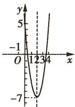

0,所以 $f(x)_{\max}=f(\frac{a}{2})=g(a)=\frac{a^{2}}{4}$ ;

④当 $a \geqslant 2$ 时, $f(x) = |x^{2} - ax| = -x^{2} + ax$ 在区间 $[0,1]$ 上单调递增, 当 x = 1 时, $f(x)$ 取得最大值, 即 $f(1) = g(a) = a - 1$ .

综上可得, $g(a)=\left\{\begin{aligned}&1-a,a<2\sqrt{2}-2,\\&\frac{a^{2}}{4},2\sqrt{2}-2\leqslant a<2,\\&a-1,a\geqslant2,\end{aligned}\right.$ 且 $g(a)$ 在 $(-∞,2\sqrt{2}-$

2) 上单调递减, 在 $[2\sqrt{2}-2, +\infty)$ 上单调递增, 所以当 $a = 2\sqrt{2} - 2$ 时, $g(a)$ 的值最小.

4. A 设 $f(x)=x^{2}+(a-1)x+a+2$ ，因为 $x^{2}+(a-1)x+a+2=0$ 的两个根为 $x_{1}, x_{2}$ ，且 $-1<x_{1}<1,1<x_{2}<2, f(-1)=4>0$ ，所以 $\left\{\begin{aligned}f(1)&<0,\\ f(2)&>0,\end{aligned}\right.$ 即 $\left\{\begin{aligned}1+a-1+a+2&<0,\\ 4+2(a-1)+a+2&>0,\end{aligned}\right.$ 解得 $-\frac{4}{3}<a<-1$ ，故选 A.

5. A 由题意, 知 $a < 0$ , $-\frac{b}{2a} = 1$ , $2 \leqslant c \leqslant 3$ , $a - b + c = 0$ , 函数与 $x$ 轴的另一交点为 $(3,0)$ . 则 $x > 3$ 时, $y < 0$ , A 正确; 当 $x = 2$ 时, $y = 4a + 2b + c > 0$ , B 错误; 由 $-\frac{b}{2a} = 1$ , 知 $2a + b = 0$ , 又 $a < 0$ , 所以 $3a + b < 0$ , D 错误; 由 $a - b + c = 0$ , $b = -2a$ , 得 $c = -3a$ , 又 $2 \leqslant c \leqslant 3$ , 所以 $-1 \leqslant a \leqslant -\frac{2}{3}$ , C 错误. 故选 A.

6. $(- \frac{\sqrt{2}}{2}, 0)$ 因为函数图象开口向上, 所以根据题意只需满足 $\left\{\begin{aligned}f(m)&=m^{2}+m^{2}-1<0,\\ f(m+1)&=(m+1)^{2}+m(m+1)-1<0,\end{aligned}\right.$ 解得 $-\frac{\sqrt{2}}{2}<m<0.$

7. $(-3,-1),(0,1)$ 由已知知函数 $f(|x|)$ 满足 $-2<|x|<3$ ，解得-3<x<3。又 $f(|x|)=-x^{2}+2|x|+1=\left\{\begin{aligned}-x^{2}+2x+1,0\leqslant x<3,\\-x^{2}-2x+1,-3<x<0,\end{aligned}\right.$ 且函数 $y=-x^{2}-2x+1$ 的图象的对称轴为直线x=-1，函数 $y=-x^{2}+2x+1$ 的图象的对称轴为直线x=1，所以由二次函数的图象与性质可知，函数 $f(|x|)$ 的单调递增区间是 $(-3,-1)$ 和 $(0,1)$ 。

8. $\left\{ \begin{array}{l} t^2 + 1, t < 1, \\ 1, 0 \leqslant t \leqslant 1, \\ t^2 - 2t + 2, t > 1 \end{array} \right.$ $f(x) = x^2 - 2x + 2 = (x - 1)^2 + 1, x \in [t,$

$t+1], t \in R.$ 当 $t+1<1$ ，即 t<0 时，函数 $f(x)$ 的图象如图 1 中实线所示，函数 $f(x)$ 在区间 $[t, t+1]$ 上单调递减，所以最小值 $g(t) = f(t+1) = t^{2} + 1$ ;

当 $t \leqslant 1 \leqslant t + 1$ ，即 $0 \leqslant t \leqslant 1$ 时，函数 $f(x)$ 的图象如图2中实线所示，最小值 $g(t) = f(1) = 1$ ；当 $t > 1$ 时，函数 $f(x)$ 的图象如图3中实线所示，函数 $f(x)$ 在区间 $[t, t + 1]$ 上单调递增，所以最小值 $g(t) = f(t) = t^2 - 2t + 2$ .

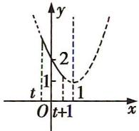  
图 1

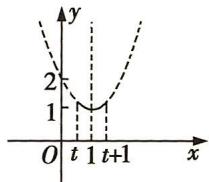  
图 2

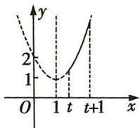  
图 3

综上可得, $g(t)=\left\{\begin{aligned}t^{2}+1,t<0,\\ 1,0\leqslant t\leqslant1,\\ t^{2}-2t+2,t>1.\end{aligned}\right.$

9.2 由题意知 $f(-x) = f(x)$ ，得 $4^{-x} + k \cdot 4^{x} = 4^{x} + k \cdot 4^{-x}$ ，整理得 $(k - 1)(4^{x} - 4^{-x}) = 0$ ，所以 $k = 1$ ，所以 $f(x) = 4^{x} + \frac{1}{4^{x}}$ ， $g(x) = 4^{x} + \frac{1}{4^{x}} - a(2^{x} - \frac{1}{2^{x}}) = (2^{x} - \frac{1}{2^{x}})^{2} - a(2^{x} - \frac{1}{2^{x}}) + 2$ .

令 $u = 2^{x} - \frac{1}{2^{x}} (x\geqslant 0)$ ，得 $h(u) = u^2 -au + 2.$

易知 $u=2^{x}-\frac{1}{2^{x}}$ 在 $[0,+\infty)$ 上单调递增，所以 $u\geqslant0$ 。（注意不要忽视 u 的取值范围）

因为 $g(x)$ 在 $x \in [0, +\infty)$ 上的最小值是 1，所以 $h(u)$ 在 $u \in [0, +\infty)$ 上的最小值是 1.

当 $a \geqslant 0$ 时, $h(u)_{\min} = h(\frac{a}{2}) = -\frac{a^2}{4} + 2 = 1$ , 解得 $a = 2$ 或 $a = -2$ (舍去).

当 a<0 时, $h(u)_{\min}=h(0)=2\neq1$ ,不符合题意,舍去.
综上,a=2.

# 第四节 指数与指数函数

# 题型 31 指数幂的运算

1. (1) $ab^{-1}$ 原式 $= \frac{(a^3b^2a^{\frac{1}{3}}b^{\frac{2}{3}})^{\frac{1}{2}}}{ab^2a^{-\frac{1}{3}}b^{\frac{1}{3}}} = a^{\frac{3}{2} +\frac{1}{6} -1 + \frac{1}{3}}\cdot b^{1 + \frac{1}{3} -2 - \frac{1}{3}} = ab^{-1}.$

(2) $\frac{1}{3}$ 由 $x^{\frac{1}{2}} + x^{-\frac{1}{2}} = 3$ ，两边平方，得 $x + x^{-1} = 7$ ，

$$
\therefore x ^ {2} + x ^ {- 2} = 4 7, \therefore x ^ {2} + x ^ {- 2} - 2 = 4 5.
$$

由 $(x^{\frac{1}{2}} + x^{-\frac{1}{2}})^3 = 3^3$ ，得 $x^{\frac{3}{2}} + 3x^{\frac{1}{2}} + 3x^{-\frac{1}{2}} + x^{-\frac{3}{2}} = 27.$

$$
\therefore x ^ {\frac {3}{2}} + x ^ {- \frac {3}{2}} = 1 8, \therefore x ^ {\frac {3}{2}} + x ^ {- \frac {3}{2}} - 3 = 1 5. \therefore \frac {x ^ {\frac {3}{2}} + x ^ {- \frac {3}{2}} - 3}{x ^ {2} + x ^ {- 2} - 2} = \frac {1}{3}.
$$

2. C 函数 $f(x)$ 的定义域为 R, $f(-x)=\frac{1}{1+2^{-x}}=\frac{2^{x}}{1+2^{x}}$ ，所以 $f(-x)+f(x)=\frac{2^{x}}{1+2^{x}}+\frac{1}{1+2^{x}}=1$ ,故选C.

3. B 解法一 因为 $a \log_{3} 4 = 2$ ，所以 $\log_{3} 4^{a} = 2$ ，则有 $4^{a} = 3^{2} = 9$ ，所以 $4^{-a} = \frac{1}{4^{a}} = \frac{1}{9}$ ，故选 B.

解法二 因为 $a\log_{3}4=2$ ，所以 $-a\log_{3}4=-2$ ，所以 $\log_{3}4^{-a}=-2$ ，所以 $4^{-a}=3^{-2}=\frac{1}{3^{2}}=\frac{1}{9}$ ，故选 B.

4. C 由题意可知, 当 x = 0 时, $y = e^{b} = 192$ , 当 x = 22 时, $y = e^{22k + b} = e^{22k} \cdot e^{b} = 48$ , $\therefore e^{22k} = \frac{48}{192} = \frac{1}{4}$ , $\therefore e^{11k} = \frac{1}{2}$ , $\therefore$ 当 x = 33 时, $y = e^{33k + b} = (e^{11k})^{3} \cdot e^{b} = (\frac{1}{2})^{3} \times 192 = 24$ . 故选 C.

5. ABC 因为 $10^{a} \cdot 10^{2b} = 10^{a + 2b} = 10$ ，所以 $a + 2b = 1$ ，A 正确；易知 a > 0, b > 0，由基本不等式得 $a + 2b \geqslant 2\sqrt{2ab}$ ，所以 $ab \leqslant \frac{1}{8}$ ，当且仅当 $a = 2b = \frac{1}{2}$ 时取等号，又 $10^{a} \neq 10^{2b}$ ，即 $a \neq 2b$ ，所以 $ab < \frac{1}{8}$ ，B 正确； $10^{a + b} = 2\sqrt{5} > 4$ ，C 正确；由 $(10^{a})^{2} = 10^{2a} = 4 < 5 = 10^{2b}$ ，得 a < b，D 错误。故选 ABC.

6. $\frac{16}{15}$ 原式= $1+\frac{1}{4}\times\frac{2}{3}-0.1=\frac{16}{15}.$

# 题型 32 指数函数的图象和性质的应用

1. A 解法一 作直线 x=1, 该直线与四条曲线交点的纵坐标对应各底数, 易知选 A.

解法二 $y_{2}=4^{x}$ 与 $y_{4}=10^{x}$ 在 R 上单调递增，且 $y_{4}=10^{x}$ 的图象上升得快， $y_{1}=(\frac{1}{4})^{x}$ 与 $y_{2}=4^{x}$ 的图象关于 y 轴对称， $y_{3}=10^{-x}$ 与 $y_{4}=10^{x}$ 的图象关于 y 轴对称，所以选 A.

2. ABD 函数 $y = \left(\frac{1}{2}\right)^{x^{2} + 4x + 3}$ 的定义域为 R, 故选项 A 正确;

$\because x^{2}+4x+3=(x+2)^{2}-1\geqslant-1,\therefore 0<(\frac{1}{2})^{x^{2}+4x+3}\leqslant2,$ 故函数 $y=\left(\frac{1}{2}\right)^{x^{2}+4x+3}$ 的值域为 $(0,2]$ ，故选项 B 正确；

$\because y = \left(\frac{1}{2}\right)^u$ 在 $\mathbf{R}$ 上单调递减， $u = x^2 + 4x + 3$ 在 $(- \infty, -2]$ 上单调递减，在 $[-2, +\infty)$ 上单调递增，∴函数 $y = \left(\frac{1}{2}\right)^{x^2 + 4x + 3}$ 在 $[-2, +\infty)$ 上单调递减，故选项C错误，选项D正确.故选ABD.

3. A 函数 $f(x) = \mathrm{e}^{-(x-1)^2}$ 是由函数 $y = \mathrm{e}^u$ 和 $u = -(x-1)^2$ 复合而成的复合函数， $y = \mathrm{e}^u$ 为 R 上的增函数， $u = -(x-1)^2$ 在 $(-\infty, 1)$ 上单调递增，在 $(1, +\infty)$ 上单调递减，所以由复合函数的单调性可知， $f(x)$ 在 $(-\infty, 1)$ 上单调递增，在 $(1, +\infty)$ 上单调递减。易知 $f(x)$ 的图象关于直线 $x = 1$ 对称，所以 $c = f(\frac{\sqrt{6}}{2}) = f(2 - \frac{\sqrt{6}}{2})$ ，又 $\frac{\sqrt{2}}{2} < 2 - \frac{\sqrt{6}}{2} < \frac{\sqrt{3}}{2} < 1$ ，所以 $f(\frac{\sqrt{2}}{2}) < f(2 - \frac{\sqrt{6}}{2}) < f(\frac{\sqrt{3}}{2})$ ，所以 $b > c > a$ ，故选 A.

4. A 由 $2^{x} - 2^{y} < 3^{-x} - 3^{-y}$ , 得 $2^{x} - 3^{-x} < 2^{y} - 3^{-y}$ , 即 $2^{x} - \left(\frac{1}{3}\right)^{x} < 2^{y} - \left(\frac{1}{3}\right)^{y}$ . 设 $f(t) = 2^{t} - \left(\frac{1}{3}\right)^{t}$ , 则 $f(x) < f(y)$ . 因为函数 $z_{1} = 2^{t}$ 在 $\mathbf{R}$ 上为增函数, $z_{2} = -\left(\frac{1}{3}\right)^{t}$ 在 $\mathbf{R}$ 上为增函数, 所以 $f(t) = 2^{t} - \left(\frac{1}{3}\right)^{t}$ 在 $\mathbf{R}$ 上为增函数, 则由 $f(x) < f(y)$ , 得 $x < y$ , 所

以 $y - x > 0, y - x + 1 > 1$ ，所以 $\ln (y - x + 1) > 0$ ，故选A.

5. A 因为 $f(x)=3^{x}-(\frac{1}{3})^{x}$ ，且定义域为 R，所以 $f(-x)=3^{-x}-(\frac{1}{3})^{-x}=(\frac{1}{3})^{x}-3^{x}=-\left[3^{x}-(\frac{1}{3})^{x}\right]=-f(x)$ ，即函数 $f(x)$ 是奇函数。又 $y=3^{x}$ 在 R 上是增函数， $y=(\frac{1}{3})^{x}$ 在 R 上是减函数，所以 $f(x)=3^{x}-(\frac{1}{3})^{x}$ 在 R 上是增函数。故选 A.

6. C 令 $f(x) = ax + 3a - 1 (x > 0)$ , $g(x) = e^{-x} (x > 0)$ , 当 $a \leqslant 0$ 时, $ax + 3a - 1 < 0$ , 此时结论显然成立. 当 $a > 0$ 时, $g(x)$ 在 $(0, +\infty)$ 上单调递减, $f(x)$ 在 $(0, +\infty)$ 上单调递增, 若存在 $x \in (0, +\infty)$ , 使 $f(x) < g(x)$ 成立, 则 $\left\{\begin{aligned}3a - 1 & < 1, \\ a & > 0,\end{aligned}\right. \therefore 0 < a < \frac{2}{3}$ . 综上所述, 实数 $a$ 的取值范围是 $a < \frac{2}{3}$ , 故选 C.

7. D 作出 $f(x)$ 的图象, 如图所示. 因为 $a < b < c$ , 且 $f(a) > f(b) > f(c)$ , 所以 $a < b < 0$ , 且定存在 $b' > 0$ , 使 $f(b) = f(b')$ , 则 $b < c < b'$ , 故排除 A, B; 取 $a = -1, c = 0$ , 可排除 C; 当 $c > 0$ 时, $f(a) = 1 - 3^a > f(c) = 3^c - 1$ , 所以 $3^a + 3^c < 2$ , 当 $c \leqslant 0$ 时, $3^a < 1$ , $3^c \leqslant 1$ , 则 $3^a + 3^c < 2$ , 故 D 一定成立.

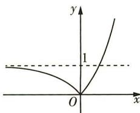

text_image

y
1
O
x

8. AC ∵ 函数 $f(x)=\frac{2^{x}-1}{2^{x}+1}, x \in \mathbb{R}, \therefore f(-x)=\frac{2^{-x}-1}{2^{-x}+1}=-\frac{2^{x}-1}{2^{x}+1}=-f(x), \therefore f(x)$ 为奇函数，故 A 正确；∵ $f(x)=\frac{2^{x}-1}{2^{x}+1}=1-\frac{2}{2^{x}+1}$ ，且 $y=2^{x}+1$ 在 R 上单调递增，∴ $f(x)=1-\frac{2}{2^{x}+1}$ 在 R 上为增函数，故 B 错误；令 $f(x)=0$ ，则 $2^{x}-1=0$ ，得到 x=0，∴ $f(x)$ 有且只有一个零点，故 C 正确；∵ $f(x)$ 在 R 上为增函数，令 $y=\frac{2^{x}-1}{2^{x}+1}$ ，则 $2^{x}=\frac{1+y}{1-y}$ ，∴ $x=\log_{2}\frac{1+y}{1-y}, \therefore \frac{1+y}{1-y}>0$ ，即 $(1+y)(y-1)<0$ ，解得 -1<y<1，∴ $f(x)\in(-1,1)$ ，故 D 错误。故选 AC.

9. $(-∞, \frac{1}{2}]$ 因为函数 $y = (\frac{1}{3})^{x}$ 在 R 上单调递减，所以由复合函数的单调性可知，函数 $y = -x^{2} + 4ax$ 在区间 $(1, 2)$ 上单调递减。函数 $y = -x^{2} + 4ax$ 的图象的对称轴为直线 x = 2a，且开口向下，所以 $2a \leqslant 1$ ，解得 $a \leqslant \frac{1}{2}$ ，所以 a 的取值范围为 $(-∞, \frac{1}{2}]$ 。

10.2 或 $\frac{1}{2}$ ∵ 函数 $f(x)=a^{x}$ (a>0 且 $a\neq1$ ) 在 [1,2] 上是单调函数, 它的最大值是最小值的 2 倍, ∴ 当 a>1 时, $a^{2}=2a$ , 解得 a=2; 当 0<a<1 时, $a=2a^{2}$ , 解得 $a=\frac{1}{2}$ . 综上可得, a=2 或 $a=\frac{1}{2}$ .

# 第五节 对数与对数函数

# 题型 33 对数式的运算

$$
\begin{array}{l} = \log_ {6} 2 \times \left(\log_ {6} 2 + \log_ {6} 3\right) + 2 \log_ {6} 3 - 2 \\ = \log_ {6} 2 + 2 \log_ {6} 3 - 2 \\ = 2 \left(\log_ {6} 2 + \log_ {6} 3\right) - \log_ {6} 2 - 2 \\ = - \log_ {6} 2. \\ \end{array}
$$

1. A $(\log_{6}2)^{2} + \log_{6}2 \times \log_{6}3 + 2\log_{6}3 - 6^{\log_{6}2}$

故选 A.

2. C 令装修电钻的声音强度为 $x_{1}$ , 普通室内谈话的声音强度为 $x_{2}$ , 由题意知 $\left\{ \begin{array}{l} 10 \lg \frac{x_{1}}{A_{0}} = 100, \\ 10 \lg \frac{x_{2}}{A_{0}} = 50, \end{array} \right.$ 得 $\left\{ \begin{array}{l} \frac{x_{1}}{A_{0}} = 10^{10}, \\ \frac{x_{2}}{A_{0}} = 10^{5}, \end{array} \right.$ . 装修电钻的声音强

度与普通室内谈话的声音强度的比值为 $\frac{x_{1}}{x_{2}}=\frac{10^{10}}{10^{5}}=10^{5}$ .

3. B $(2\log_{4}3+\log_{8}3)(\log_{3}2+\log_{9}2)=(2\log_{2}23+\log_{2}3)(\log_{3}2+\log_{3}22)=(\log_{2}3+\frac{1}{3}\log_{2}3)(\log_{3}2+\frac{1}{2}\log_{3}2)=\frac{4}{3}\times\log_{2}3\times\frac{3}{2}\times\log_{3}2=2$ , 故选 B.

4. C 由 $2^{a} = 5$ 得 $a = \log_{2}5$ . 又 $b = \log_{8}3 = \frac{1}{3}\log_{2}3$ , 所以 $a - 3b = \log_{2}5 - \log_{2}3 = \log_{2}\frac{5}{3} = \frac{\log_{4}\frac{5}{3}}{\log_{4}2} = 2\log_{4}\frac{5}{3} = \log_{4}\frac{25}{9}$ , 所以 $4^{a - 3b} =$

$4^{\log_{4}\frac{25}{9}}=\frac{25}{9}$ ，故选 C.

5. -7 由 $f(3)=1$ 得 $\log_{2}(3^{2}+a)=1$ ，所以 $9+a=2$ ，解得a=-7。

6. BCD 令 $2^{a} = 3^{b} = 6^{c} = m$ ，则 $a = \log_{2}m, b = \log_{3}m, c = \log_{6}m,$ $\therefore \frac{1}{a} = \log_{m}2, \frac{1}{b} = \log_{m}3, \frac{1}{c} = \log_{m}6, \therefore \frac{1}{a} + \frac{1}{b} = \log_{m}2 + \log_{m}3 =$ $\log_{m}6 = \frac{1}{c}, A$ 选项错误，B选项正确； $a + b = (a + b)(\frac{1}{a} + \frac{1}{b})c = c(2+$ $\frac{b}{a} + \frac{a}{b}) > c(2 + 2\sqrt{\frac{b}{a} \cdot \frac{a}{b}}) = 4c, (\because a \neq b, \therefore$ 等号无法取到）

C 选项正确; $\frac{1}{c} = \frac{1}{a} + \frac{1}{b} = \frac{a + b}{ab} > \frac{4c}{ab}, \therefore ab > 4c^2$ , D 选项正确. 故选 BCD.

7.3 $(\frac{8}{27})^{-\frac{2}{3}} + 10^{\lg 3} + \log_{\frac{1}{9}}\sqrt{3} - \log_54 \cdot \log_25 = \left[(\frac{2}{3})^3\right]^{-\frac{2}{3}} + 3 + \log_3(-2)3^{\frac{1}{2}} - \frac{2\lg 2}{\lg 5} \cdot \frac{\lg 5}{\lg 2} = (\frac{2}{3})^{-2} + 3 + \frac{\frac{1}{2}}{-2}\log_33 - 2 = \frac{9}{4} + 3 - \frac{1}{4} - 2 = 5 - 2 = 3.$

8. C 由 $x^{y} = y^{x}$ , 得 $y \lg x = x \lg y, \frac{\lg x}{\lg y} = \frac{x}{y}$ .

由 $\log_{y}x + \frac{x}{y} = 4$ ，得 $\frac{\lg x}{\lg y} + \frac{x}{y} = 4$ ，(换底公式的运用)

所以 $\frac{x}{y} +\frac{x}{y} = 4$ ，得 $\frac{x}{y} = 2$ ，则 $\lg \frac{x}{\lg y} = 2$ ，即 $x = y^{2}$ ，所以 $x = 4,y = 2$ 所以 $x + y = 6$ ，故选C.

# 题型 34 对数函数的图象及应用

1. C 由题图可知 a > 1, b > 1, 0 < c < 1, 0 < d < 1. 作直线 y = 1，（对数函数 $y = \log_{a} x (a > 0$ 且 $a \neq 1$ ）的图象过点 $(a, 1)$ ）

从左到右与函数 $y = \log_{c} x, y = \log_{d} x, y = \log_{a} x, y = \log_{b} x$ 图象的交点的横坐标依次为 c, d, a, b，显然 b > a > 1 > d > c. 故选 C.

2. D 解法一 若 0 < a < 1，则函数 $y = \frac{1}{a^{x}}$ 是增函数， $y = \log_{a}(x + \frac{1}{2})$ 是减函数且其图象过点 $(\frac{1}{2}, 0)$ ，结合选项可知，选项 D 可能成立；若 a > 1，则 $y = \frac{1}{a^{x}}$ 是减函数，而 $y = \log_{a}(x + \frac{1}{2})$ 是增函数且其图象过点 $(\frac{1}{2}, 0)$ ，结合选项可知，没有符合的图象。故选 D.

解法二 分别取 $a=\frac{1}{2}$ 和 a=2，在同一直角坐标系内画出相应函数的图象（图略），通过对比可知选 D.

3. B 解法一 设所求函数图象上任一点的坐标为 $(x,y)$ ，则其关于直线 x=1 的对称点的坐标为 $(2-x,y)$ ，由对称性知点 $(2-x,y)$ 在函数 $y=\ln x$ 的图象上，所以 $y=\ln(2-x)$ 。故选 B.
解法二 由题意知, 对称轴上的点 $(1,0)$ 既在函数 $y = \ln x$ 的图象上也在所求函数的图象上, 代入选项中的函数表达式逐一检验, 排除 A, C, D, 选 B.

4. A $\because x\in(2,8),\therefore x-2>0,\therefore f(x)=x-2+\frac{1}{x-2}+2\geqslant2\sqrt{(x-2)\cdot\frac{1}{x-2}}+2=4,x\in(2,8)$ ，当且仅当 $x-2=\frac{1}{x-2}$ ，即x=3时取等号，∴m=3,n=4。则函数 $g(x)=\log_{\frac{1}{3}}|x+4|$ 的图象在 $(-4,+\infty)$ 上单调递减，在 $(-∞,-4)$ 上单调递增，观察选项可知，选项A符合。故选A。

5. A 由 $2^{x} + x + 2 = 0$ 得 $2^{x} = -x - 2$ , 由 $\log_2 x + x + 2 = 0$ 得 $\log_2 x = -x - 2$ , 所以作出 $y = 2^{x}, y = -x - 2$ 和 $y =$

$\log_{2}x$ 的图象, 如图所示, 设 $y=2^{x}$ 的图象与直线 y=-x-2 相交于 B 点, $y=\log_{2}x$ 的图象与直线 y=-x-2 相交于 C 点, 由于 $y=2^{x}$ 与 $y=\log_{2}x$ 的图象关于 y=x 对称, 而 y=x 与 y=-x-2 的交点为 A(-1,-1), 所以 $\frac{p+q}{2}=-1$ , 即 $p+q=-2$ , 又因为 $f(x)=$

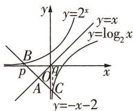

text_image

y
y=2^x
y=x
y=log₂x
B
p
O
A
C
x
y=-x-2

$(x+p)(x+q)$ 图象的对称轴为 $x=-\frac{p+q}{2}=1$ ，根据二次函数的性质得 $f(x)=(x+p)(x+q)$ 在 $(-∞,1)$ 上单调递减，在 $(1,+∞)$ 上单调递增，所以 $f(0)=f(2)<f(3)$ ，故选 A.

# 题型 35 对数函数的性质及应用

1. D 当 a > 1 时, 函数 $f(x) = \log_{a}(x + 1)$ 在 $[0, 1]$ 上单调递增, 则

$\left\{\begin{aligned}f(0)&=0,\\ f(1)&=1,\end{aligned}\right.$ 即 $\left\{\begin{aligned}\log_{a}1&=0,\\ \log_{a}2&=1,\end{aligned}\right.$ 解得 a=2 。当 0<a<1 时，函数 $f(x)=\log_{a}(x+1)$ 在 $[0,1]$ 上单调递减，所以 $\left\{\begin{aligned}f(0)&=1,\\ f(1)&=0,\end{aligned}\right.$ 无解，综上，a=2 ，故选 D .

2. C $a=\log_{5}2=\log_{5}\sqrt{4}<\log_{5}\sqrt{5}=\frac{1}{2}=c,b=\log_{8}3=\log_{8}\sqrt{9}>\log_{8}\sqrt{8}=\frac{1}{2}=c$ ，所以 a<c<b。故选 C.

3. D 由 $\left\{ \begin{array}{l} 2x + 1 \neq 0, \\ 2x - 1 \neq 0, \end{array} \right.$ 得函数 $f(x)$ 的定义域为 $(- \infty, -\frac{1}{2}) \cup (-\frac{1}{2}, \frac{1}{2}) \cup (\frac{1}{2}, +\infty)$ ，其关于原点对称，因为 $f(-x) = \ln |2(-x) + 1| - \ln |2(-x) - 1| = \ln |2x - 1| - \ln |2x + 1| = -f(x)$ ，所以函数 $f(x)$ 为奇函数，排除 A, C. 当 $x \in (-\frac{1}{2}, \frac{1}{2})$ 时， $f(x) = \ln (2x + 1) - \ln (1 - 2x)$ ，易知函数 $f(x)$ 单调递增，排除 B. 当 $x \in (-\infty, -\frac{1}{2})$ 时， $f(x) = \ln (-2x - 1) - \ln (1 - 2x) = \ln \frac{2x + 1}{2x - 1} = \ln (1 + \frac{2}{2x - 1})$ ，易知函数 $f(x)$ 单调递减，故选 D.

4. A 对于函数 $f(x) = \log_{a}(x^{2} - ax + a)$ ，若存在 $x_{0} \in R$ ，使得 $f(x) \geqslant f(x_{0})$ 恒成立，即函数 $f(x)$ 存在最小值，则 $u = x^{2} - ax + a$ 的图象与 x 轴没有交点，且函数 $y = \log_{a} u$ 在 $(0, +\infty)$ 上单调递增，所以 $\left\{\begin{aligned} a > 1, \\ (-a)^{2} - 4a < 0, \end{aligned}\right.$ 解得 1 < a < 4，所以实数 a 的取值范围是 (1, 4). 故选 A.

5. A $f(x)=\ln\frac{2-x}{3+x}=\ln(-1+\frac{5}{3+x})$ ，由 $\frac{2-x}{3+x}>0$ ，得定义域为 $\{x|-3<x<2\}$ ，由复合函数的单调性可得 $f(x)$ 在 $(-3,2)$ 上单调递减。由 $\frac{b}{c}=\frac{\log_{3}4}{\log_{5}8}=\frac{\frac{\lg4}{\lg3}}{\frac{\lg8}{\lg5}}=\frac{2\lg2\lg5}{3\lg2\lg3}=\frac{\lg25}{\lg27}<1,c>1$ 得 b<c。又 9>8，即 $3^{2}>2^{3}$ ，所以 $3>2^{\frac{3}{2}}$ ， $\log_{2}3>\frac{3}{2}$ ，同理 $8<5^{\frac{3}{2}}$ ， $\log_{5}8<\frac{3}{2}$ ，所以 c<a，于是 b<c<a，再结合 $f(x)$ 的单调性可得 $f(a)<f(c)<f(b)$ ，故选 A.

6. AD 对于 A, 由 $f(-x) = \ln(-x)^{2} - 2\ln[(-x)^{2} + 1] = \ln x^{2} - 2\ln(x^{2} + 1) = f(x)$ ，可知函数 $f(x)$ 为偶函数，所以 A 正确.
对于 B, 不妨设 x > 0, 此时 $f(x) = 2\ln x - 2\ln(x^{2} + 1) = 2\ln \frac{x}{x^{2} + 1}$ ,
由 $\frac{x}{x^{2}+1}=\frac{1}{x+\frac{1}{x}}\leqslant\frac{1}{2\sqrt{x\cdot\frac{1}{x}}}=\frac{1}{2}$ （当且仅当 x=1 时取“=”），得

$f(x) \leqslant 2\ln \frac{1}{2} = -2\ln 2$ , 因为 $f(x)$ 为偶函数, 所以函数 $f(x)$ 的值域为 $(-∞, -2\ln 2]$ , 所以 B 错误.

对于 C, 由 $f(\frac{1}{2}) = 2\ln \frac{\frac{1}{2}}{\frac{1}{4} + 1} = \ln \frac{4}{25}, f(\frac{3}{2}) = 2\ln \frac{\frac{3}{2}}{\frac{9}{4} + 1} = 2\ln \frac{6}{13} \neq f(\frac{1}{2})$ , 可知当 x > 0 时, 函数 $f(x)$ 的图象不关于直线 x = 1 对称, 所以 C 错误.

对于 D, 当 x > 0 时, $f(x) = 2 \ln \frac{1}{x + \frac{1}{x}}$ , 由函数 $y = x + \frac{1}{x} (x > 0)$ 的增区间为 $(1, +\infty)$ , 减区间为 $(0, 1)$ , 可知当 x > 0 时, 函数 $f(x)$ 的减区间为 $(1, +\infty)$ , 增区间为 $(0, 1)$ , 结合 $f(x)$ 图象的对称性可得 $f(x)$ 的增区间为 $(-\infty, -1)$ , $(0, 1)$ , 所以 D 正确. 故选 AD.

7. C 由题意知, 当 $\frac{1}{2} < x < 3$ 时, $ax^{2} - 2x + 5 > 0$ , 即 $a > \frac{2x - 5}{x^{2}}$ .

设 $g(x) = \frac{2x - 5}{x^{2}} \left( \frac{1}{2} < x < 3 \right)$ , 则 $g'(x) = \frac{2x^{2} - 2x(2x - 5)}{x^{4}} = \frac{-2x + 10}{x^{3}} > 0$ , 所以 $g(x)$ 单调递增.

又 $\frac{2\times3-5}{3^{2}}=\frac{1}{9}$ ，所以 $a\geqslant\frac{1}{9}$ 。（因为 $g(x)=\frac{2}{x}-5\cdot\frac{1}{x^{2}}$ ，故也可以将 $\frac{1}{x}$ 换成t，利用二次函数性质求解，注意t的取值范围）

设 $u(x) = ax^2 - 2x + 5$ ，当 $\frac{1}{9} \leqslant a < 1$ 时，函数 $m(u) = \log_a u$ 单调递减，由复合函数的单调性知函数 $u(x) = ax^2 - 2x + 5$ 在 $(\frac{1}{2}, 3)$ 上单调递减，所以 $\frac{1}{a} \geqslant 3$ ，所以 $\frac{1}{9} \leqslant a \leqslant \frac{1}{3}$ ；当 $a > 1$ 时，函数 $m(u) = \log_a u$ 单调递增，由复合函数的单调性知函数 $u(x) = ax^2 - 2x + 5$ 在 $(\frac{1}{2}, 3)$ 上单调递增，所以 $\frac{1}{a} \leqslant \frac{1}{2}$ ，所以 $a \geqslant 2$ 。

综上， $a$ 的取值范围为 $[\frac{1}{9},\frac{1}{3} ]\cup [2, + \infty)$ .故选C.

# 题型 36 解对数（指数）方程或不等式问题

1. (1) $x = 3$ 由 $\left\{ \begin{array}{l} 2x + 1 > 0, \\ x^2 - 2 > 0, \end{array} \right.$ 得 $x > \sqrt{2}$ . 由 $\log_5(2x + 1) = \log_5(x^2 - 2)$ 得 $2x + 1 = x^2 - 2$ , 即 $x^2 - 2x - 3 = 0$ , 解得 $x = 3$ (负值已舍去).

(2) $x = -2 \quad \because 81 \times 3^{2x} = \left(\frac{1}{9}\right)^{x + 2}, \therefore 3^{2x + 4} = 3^{-2(x + 2)}$

$\therefore 2x+4=-2(x+2)$ , 解得 x=-2.

2. B 令 $f(x) = 2^{x} + \log_{2} x$ ，因为 $y = 2^{x}$ 在 $(0, +\infty)$ 上单调递增， $y = \log_{2} x$ 在 $(0, +\infty)$ 上单调递增，所以 $f(x) = 2^{x} + \log_{2} x$ 在 $(0, +\infty)$ 上单调递增。又 $2^{a} + \log_{2} a = 4^{b} + 2\log_{4} b = 2^{2b} + \log_{2} b < 2^{2b} + \log_{2}(2b)$ ，所以 $f(a) < f(2b)$ ，所以 $a < 2b$ 。故选 B.

3. $x = 2$ $\because \log_2(9^{x - 1} - 5) = \log_2(3^{x - 1} - 2) + 2,$

$\therefore \log_2(9^{x - 1} - 5) = \log_2[4\times (3^{x - 1} - 2)],$ $\therefore 9^{x - 1} - 5 = 4\times (3^{x - 1} - 2)$ ，即 $(3^{x})^{2} - 12\times 3^{x} + 27 = 0$ ，即 $(3^{x}-$ $3)(3^{x} - 9) = 0,\therefore 3^{x} = 3$ 或 $3^{x} = 9$ ，解得 $x = 1$ 或 $x = 2$ ，经检验知 $x =$ 1不满足条件，舍去. $\therefore x = 2.$

4. C 因为 $\log_{2}\sqrt{a} = \log_{b}4$ ，所以 $\log_{2}a \cdot \log_{2}b = 4$ ，所以 $\log_{2}(ab) = \log_{2}a + \log_{2}b \geqslant 2\sqrt{\log_{2}a \cdot \log_{2}b} = 4$ ，当且仅当 $\log_{2}a = \log_{2}b = 2$ ，即 a = b = 4 时取等号。所以 $(ab)_{\min} = 2^{4} = 16$ 。故选 C.

5. A $\because a = \log_{2}3 = \log_{8}27 < \log_{8}65 = c, \therefore a < b < c, \therefore \log_{2}3 < \log_{4}x < \log_{8}65, \therefore \log_{2}3 < \log_{2}x^{\frac{1}{2}} < \log_{2}65^{\frac{1}{3}}, \therefore 3 < x^{\frac{1}{2}} < 65^{\frac{1}{3}}$ , 得 $9 < x < 65^{\frac{2}{3}}$ , 即 x 的取值范围是 $(9, 65^{\frac{2}{3}})$ , 故选 A.

6. C 因为函数 $f(x)$ 是定义在 R 上的偶函数，且在 $(-∞,0]$ 上单调递减，所以可将 $f(\log_{\frac{1}{3}}(2x-5))>f(\log_{3}8)$ 化为 $|\log_{\frac{1}{3}}(2x-5)|>|\log_{3}8|$ ，即 $\log_{3}(2x-5)>\log_{3}8$ 或 $\log_{3}(2x-5)<-\log_{3}8=\log_{3}\frac{1}{8}$ ，即 $2x-5>8$ 或 $0<2x-5<\frac{1}{8}$ ，解得 $x>\frac{13}{2}$ 或 $\frac{5}{2}<x<\frac{41}{16}$ . 故选 C.

7. B 由 $2y + \log_{2}y = 1$ 可得 $2y + \log_{2}(2y) = 2$ ，令 $\log_{2}(2y) = t$ ，所以 $2y = 2^{t}$ ，所以 $t + 2^{t} = 2$ 。令 $f(x) = x + 2^{x}$ ，则易知 $f(x)$ 在 R 上单调递增，所以当 $x + 2^{x} = 2$ 时，必有 $x = t = \log_{2}(2y)$ ，所以 $x + 2y = t + 2^{t} = 2$ 。故选 B.

8.(1,2) 由已知可得 $\left\{\begin{aligned}x&>0,\\ 2-x&>0,\end{aligned}\right.$ 解得0<x<2.

①当 x=1 时, $f(x)=f(2-x)$ ,不符合题意.

②当 $0 < x < 1$ 时， $2 - x > 1$ ，则 $f(x) < f(2 - x)$ 等价于 $\left|\log_5 x\right| < \left|\log_5(2 - x)\right|, \therefore -\log_5 x < \log_5(2 - x), \therefore \log_5(2 - x) + \log_5 x > 0$ ，即 $\log_5[x(2 - x)] > 0, \therefore x(2 - x) > 1, \therefore x^2 - 2x + 1 < 0$ ，此方程无解。③当 $1 < x < 2$ 时， $0 < 2 - x < 1$ ，则 $f(x) < f(2 - x)$ 等价于 $\left|\log_5 x\right| < \left|\log_5(2 - x)\right|, \therefore \log_5 x < -\log_5(2 - x), \therefore \log_5(2 - x) + \log_5 x < 0$ ，即 $\log_5[x(2 - x)] < 0, \therefore x(2 - x) < 1, \therefore x^2 - 2x + 1 > 0$ ，即 $x \neq 1$ ，则 $1 < x < 2$ 符合题意。

综上所述,x 的取值范围是(1,2).

题型 37 比较大小

1. A 易知 $a = \ln 4 > 1, 0 < b = \log_{3} e < 1, c = \log_{3} 4 > 1$ ，令 $f(x) = \ln x, g(x) = \log_{3} x$ ，作出 $f(x), g(x)$ 的草图，如图所示，由 $f(x), g(x)$ 的图象可知，当 x = 4 时， $f(4) > g(4)$ ，即 a > c，所以 a > c > b，故选 A.

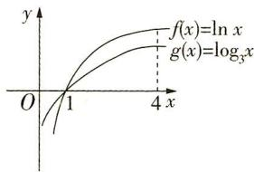

line

| x    | f(x) = ln x | g(x) = log₃ x |
| ---- | ----------- | ------------- |
| 0    | 0           | 0             |
| 1    | 1           | 1             |
| 4    | ∞           | ∞             |

2. D 解法一 因为函数 $f(x)=1.01^{x}$

是增函数,且0.6>0.5>0,所以 $1.01^{0.6}>1.01^{0.5}>1$ ,即b>a>1;因为函数 $g(x)=0.6^{x}$ 是减函数,且0.5>0,所以 $0.6^{0.5}<0.6^{0}=1$ ,即c<1.综上,b>a>c.故选D.

解法二 因为函数 $f(x) = 1.01^{x}$ 是增函数，且 $0.6 > 0.5$ ，所以 $1.01^{0.6} > 1.01^{0.5}$ ，即 $b > a$ ；因为函数 $h(x) = x^{0.5}$ 在 $(0, +\infty)$ 上单调递增，且 $1.01 > 0.6 > 0$ ，所以 $1.01^{0.5} > 0.6^{0.5}$ ，即 $a > c$ . 综上， $b > a > c$ . 故选 D.

3. A 因为 $9^{m} = 10$ , 所以 $m = \log_{9} 10$ , 所以 $a = 10^{m} - 11 = 10^{\log_{9} 10} -$

$11 = 10^{\log 910} - 10^{\log 1011}$ . 因为 $\log_9 10 - \log_{10} 11 = \frac{\lg 10}{\lg 9} - \frac{\lg 11}{\lg 10} = \frac{(\lg 10)^2 - \lg 9 \cdot \lg 11}{\lg 9 \cdot \lg 10} > \frac{(\lg 10)^2 - (\frac{\lg 9 + \lg 11}{2})^2}{\lg 9 \cdot \lg 10} = \frac{1 - (\frac{\lg 99}{2})^2}{\lg 9} > 0,$

所以 a > 0. $b = 8^{\log_{9}10} - 9 = 8^{\log_{9}10} - 8^{\log_{8}9}$ ，因为 $\log_{9}10 - \log_{8}9 = \frac{\lg 10}{\lg 9} -$

$$
\frac {\lg 9}{\lg 8} = \frac {\lg 1 0 \cdot \lg 8 - (\lg 9) ^ {2}}{\lg 9 \cdot \lg 8} <   \frac {(\frac {\lg 1 0 + \lg 8}{2}) ^ {2} - (\lg 9) ^ {2}}{\lg 9 \cdot \lg 8} =
$$

$\frac{(\frac{\lg 80}{2})^{2}-(\frac{\lg 81}{2})^{2}}{\lg 9 \cdot \lg 8}<0,$ 所以 b<0. 综上，a>0>b. 故选 A.

4. A 易知 a, b, c 均大于 0.

$$
\frac {a}{b} = \frac {\log_ {5} 3}{\log_ {8} 5} = \frac {\ln 3}{\ln 5} \cdot \frac {\ln 8}{\ln 5} = \frac {\ln 3 \cdot \ln 8}{(\ln 5) ^ {2}} <   \frac {1}{(\ln 5) ^ {2}} \cdot (\frac {\ln 3 + \ln 8}{2}) ^ {2} =
$$

$\left(\frac{\ln 24}{\ln 25}\right)^{2}<1$ ,所以a<b。(作商比较大小)

$5^{5}<8^{4}\Rightarrow\ln5^{5}<\ln8^{4}\Rightarrow5\ln5<4\ln8$ ，所以 $\frac{4}{5}>\frac{\ln5}{\ln8}=\log_{8}5=b$ ， $13^{4}<8^{5}\Rightarrow\ln13^{4}<\ln8^{5}\Rightarrow4\ln13<5\ln8$ ，所以 $\frac{4}{5}<\frac{\ln8}{\ln13}=\log_{13}8=c$ ，（借助中间值 $\frac{4}{5}$ 比较大小）

所以 $a < b < \frac{4}{5} < c$ ，故选 A.

5. D 因为 $0.4^{0.5} < 0.5^{0.5} < 0.5^{0.4}$ ，所以 a < b。因为 $c = \log_{32} 4 = \log_{25} 2^{2} = \frac{2}{5} \log_{2} 2 = 0.4 < 0.4^{0.5} = a$ ，所以 c < a < b，故选 D。

6. B 由 $a = 2\log_54 = \log_516, 1 = \log_55 < \log_516 < \log_416 = 2$ ，得 $1 < a < 2, b = \frac{1}{2}\log_37 = \log_3\sqrt{7} < \log_3\sqrt{9} = 1, c = 2^{\log_45} = 2^{\log_2\sqrt{5}} = \sqrt{5} > 2$ ，所以 $b < a < c.$ 故选 B.

7. A 由 $4^{b} = 6^{a} - 2^{a} = 2^{a}(3^{a} - 1) > 0, 5^{a} = 6^{b} - 2^{b} = 2^{b}(3^{b} - 1) > 0$ ，得 $a > 0, b > 0$ ，排除 C；假设 $a > b > 0$ ，则 $3^{a} - 1 > 3^{b} - 1, \therefore \frac{4^{b}}{2^{a}} > \frac{5^{a}}{2^{b}} > \frac{4^{a}}{2^{b}}$ ，即 $2^{2b - a} > 2^{2a - b}, \therefore 2b - a > 2a - b$ ，得 $b > a$ ，矛盾，排除 B。\$\because a > 0, b > 0\$，而 $a > b > 0$ 不成立，\$\therefore b < a < 1\$ 不成立，排除 D。选 A。（也可以构造函数 $f(x) = 6^{x} - 2^{x}$ ，得出 $f(x)$ 在 $(0, +\infty)$ 上单调递增，从而得出 $a > b$ 不成立，排除 B，C，D）

8. ABC 由题知实数 x, y, z 满足 $\ln x = e^{y} = \frac{1}{z}$ ，在同一直角坐标系中分别作出函数 $m = \ln n, m = e^{n}, m = \frac{1}{n}$ 的大致图象，如图所示，再分别作出与 n 轴平行且与三个函数图象均相交的直线，依次记为 $m = m_{1}, m = m_{2}, m = m_{3}$ ，如图所示.

由直线 $m = m_{1}$ 与三个函数图象的交点情况可得 z > x > y，由直线 $m = m_{2}$ 与三个函数图象的交点情况可得 x > z > y，由直线 $m = m_{3}$ 与三个函数图象的交点情况可得 x > y > z。故选 ABC.

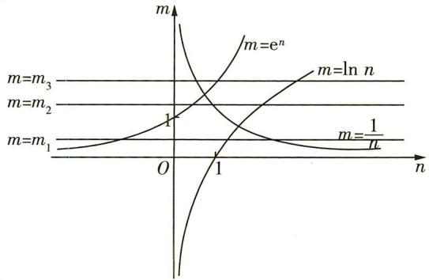

text_image

m
m=m₃
m=m₂
m=m₁
O
1
1
m=eⁿ
m=ln n
m=1/n
n

9. BCD 设 $3^{x}=4^{y}=5^{z}=k>1$ ，则 $x=\log_{3}k, y=\log_{4}k, z=\log_{5}k$ ，显然 x>0, y>0, z>0。对于 A，由于 k>1，所以 $\log_{3}k > \log_{4}k > \log_{5}k$ ，即 x>y>z，故选项 A 错误；对于 B， $\frac{3x}{4y} = \frac{3\log_{3}k}{4\log_{4}k} = \frac{3\ln 4}{4\ln 3} = \frac{\ln 64}{\ln 81} < 1$ ，

即 $3x < 4y, \frac{4y}{5z} = \frac{4\log_4k}{5\log_5k} = \frac{4\ln 5}{5\ln 4} = \frac{\ln 625}{\ln 1024} < 1$ ，即 $4y < 5z$ ，所以 $3x < 4y < 5z$ ，故选项B正确；对于C， $\frac{1}{x} + \frac{1}{z} - \frac{2}{y} = \frac{\ln 3}{\ln k} + \frac{\ln 5}{\ln k} - \frac{2\ln 4}{\ln k} = \frac{1}{\ln k} \cdot \ln \frac{15}{16} < 0$ ，即 $\frac{1}{x} + \frac{1}{z} < \frac{2}{y}$ ，故选项C正确；对于D，

$\frac{x}{y} = \frac{\log_3k}{\log_4k} = \frac{\ln 4}{\ln 3}, \frac{y}{z} = \frac{\log_4k}{\log_5k} = \frac{\ln 5}{\ln 4}$ , 由于 $\ln 3 \cdot \ln 5 < (\frac{\ln 3 + \ln 5}{2})^2 = (\frac{\ln 15}{2})^2 < (\frac{\ln 16}{2})^2 = (\frac{2\ln 4}{2})^2 = (\ln 4)^2$ , 即 $\frac{\ln 4}{\ln 3} > \frac{\ln 5}{\ln 4}$ , 所以 $\frac{x}{y} > \frac{y}{z}$ , 即 $xz > y^2$ , 故选项 D 正确. 故选 BCD.

# 第六节 函数的图象

# 题型 38 函数图象的识别

1. A 由前3年年产量的增长速度越来越快,知当 $0 \leqslant t \leqslant 3$ 时,图象下凹.由后3年总产量保持不变,知后3年总产量的增长速度保持不变,故选A.

2. D 解法一 由题图可知函数 $f(x)$ 的图象关于 $y$ 轴对称，所以函数 $f(x)$ 是偶函数。对于 $A, f(x) = \frac{5(e^x - e^{-x})}{x^2 + 2}$ ，定义域为 $R$ ， $f(-x) = \frac{5(e^{-x} - e^x)}{x^2 + 2} = -f(x)$ ，所以函数 $f(x) = \frac{5(e^x - e^{-x})}{x^2 + 2}$ 是奇函数，所以排除 $A$ ；对于 $B, f(x) = \frac{5\sin x}{x^2 + 1}$ ，定义域为 $R, f(-x) = \frac{5\sin(-x)}{x^2 + 1} = -\frac{5\sin x}{x^2 + 1} = -f(x)$ ，所以函数 $f(x) = \frac{5\sin x}{x^2 + 1}$ 是奇函数，所以排除 $B$ ；对于 $C, f(x) = \frac{5(e^x + e^{-x})}{x^2 + 2}$ ，定义域为 $R, f(-x) = \frac{5(e^{-x} + e^x)}{x^2 + 2} = f(x)$ ，所以函数 $f(x) = \frac{5(e^x + e^{-x})}{x^2 + 2}$ 是偶函数，又 $x^2 + 2 > 0, e^x + e^{-x} > 0$ ，所以 $f(x) > 0$ 恒成立，不符合题意，所以排除 $C$ ；分析知，选项 $D$ 符合题意，故选 $D$ 。

解法二 由题图可知函数 $f(x)$ 的图象关于 $y$ 轴对称，所以函数 $f(x)$ 是偶函数。因为 $y = x^2 + 2$ 是偶函数， $y = e^x - e^{-x}$ 是奇函数，所以 $f(x) = \frac{5(e^x - e^{-x})}{x^2 + 2}$ 是奇函数，故排除 A；因为 $y = x^2 + 1$ 是偶函数， $y = \sin x$ 是奇函数，所以 $f(x) = \frac{5\sin x}{x^2 + 1}$ 是奇函数，故排除 B；因为 $x^2 + 2 > 0, e^x + e^{-x} > 0$ ，所以 $f(x) = \frac{5(e^x + e^{-x})}{x^2 + 2} > 0$ 恒成立，不符合题意，故排除 C。分析知，选项 D 符合题意，故选 D。

3. A 解法一(特值法) 取 x=1，则 $y=(3-\frac{1}{3})\cos1=\frac{8}{3}\cos1>0$ ; 取 x=-1，则 $y=(\frac{1}{3}-3)\cos(-1)=-\frac{8}{3}\cos1<0$ . 结合选项知选 A.

解法二 令 $y = f(x)$ ，则 $f(-x) = (3^{-x} - 3^x)\cos (-x) = -(3^x - 3^{-x})\cos x = -f(x)$ ，所以函数 $y = (3^x - 3^{-x})\cos x$ 是奇函数，且当 $x \in (0, \frac{\pi}{2})$ 时， $3^x - 3^{-x} > 0, \cos x > 0$ ，故 $f(x) > 0$ ，故选 A.

4. D 易知函数 $f(x) = x^2 + \frac{1}{4}$ 是偶函数, $g(x) = \sin x$ 是奇函数,给出的图象对应的函数是奇函数.选项 A, $y = f(x) + g(x) - \frac{1}{4} = x^2 + \sin x$ 为非奇非偶函数,不符合题意,排除 A;选项 B, $y = f(x) - g(x) - \frac{1}{4} = x^2 - \sin x$ 也为非奇非偶函数,不符合题意,排除 B;因为当 $x \in (0, +\infty)$ 时, $f(x)$ 单调递增,且 $f(x) > 0$ ,当 $x \in (0, \frac{\pi}{2})$ 时, $g(x)$ 单调递增,且 $g(x) > 0$ ,所以 $y = f(x)g(x)$ 在 $(0, \frac{\pi}{2})$ 上单调递增,由图象可知所求函数在 $(0, \frac{\pi}{4})$ 上不单调,排除 C.故选 D.

5. C 由题图知, 将 $f(x)$ 的图象关于 y 轴对称后再向下平移 1 个单位长度即得题图 2, 又将 $f(x)$ 的图象关于 y 轴对称后可得函数 $y = f(-x)$ 的图象, 再向下平移 1 个单位, 可得 $y = f(-x) - 1$ 的图象, 所以题图 2 所表示的函数为 $y = f(-x) - 1$ , 故选 C.

6. B 对任意的 $x \in [-\pi, \pi]$ , $f(-x) = \frac{\sin(-x)}{\mathrm{e}^{|x|}} = -\frac{\sin x}{\mathrm{e}^{|x|}} = -f(x)$ , 排除 A, C.

当 $0 \leqslant x \leqslant \pi$ 时, $f(x) = \frac{\sin x}{\mathrm{e}^x}$ , 则 $f'(x) = \frac{\cos x - \sin x}{\mathrm{e}^x} = -\frac{\sqrt{2}\sin(x - \frac{\pi}{4})}{\mathrm{e}^x}$ , 因为 $-\frac{\pi}{4} \leqslant x - \frac{\pi}{4} \leqslant \frac{3\pi}{4}$ , 则由 $f'(x) < 0$ 可得

$0 < x - \frac{\pi}{4} \leqslant \frac{3\pi}{4}$ ，则 $\frac{\pi}{4} < x \leqslant \pi$ ，由 $f'(x) > 0$ 可得 $-\frac{\pi}{4} \leqslant x - \frac{\pi}{4} < 0$ ，则 $0 \leqslant x < \frac{\pi}{4}$ ，所以函数 $f(x)$ 在 $[0, \frac{\pi}{4})$ 上单调递增，在 $(\frac{\pi}{4}, \pi]$ 上单调递减，排除D.选B.

7. ①②③ 令 $f(x) = (kx^2 + 1)e^x$ ，则定义域为 $\mathbf{R}, f'(x) = e^x (kx^2 + 2kx + 1)$ . 当 $k = 0$ 时， $f(x) = e^x$ ，此时 $f(x)$ 的图象大致为①. 当 $k \neq 0$ 时，对于方程 $kx^2 + 2kx + 1 = 0, \Delta = 4k^2 - 4k$ ，当 $\Delta = 4k^2 - 4k \leqslant 0$ ，即 $0 < k \leqslant 1$ 时， $f'(x) \geqslant 0$ 在 $\mathbf{R}$ 上恒成立，所以当 $0 < k \leqslant 1$ 时，函数 $f(x)$ 在 $\mathbf{R}$ 上单调递增，又 $f(x) > 0$ 恒成立，当 $x \to +\infty$ 时， $f(x) \to +\infty$ ，当 $x \to -\infty$ 时， $f(x) \to 0$ ，所以此时函数 $f(x)$ 的图象大致为①.

由 $\Delta=4k^{2}-4k>0$ , 得 k<0 或 k>1 . 当 k>1 时, $f'(x)=0$ 有两个不相等实根, 记为 $x_{1}, x_{2}$ , 且 $x_{1}<x_{2}$ , 则 $x_{1}x_{2}=\frac{1}{k}>0, x_{1}+x_{2}=-2<0$ , 所以 $x_{1}<x_{2}<0$ , 且当 $x<x_{1}$ 或 $x>x_{2}$ 时, $f'(x)>0$ , 当 $x_{1}<x<x_{2}$ 时, $f'(x)<0$ , 所以函数 $f(x)$ 的单调递增区间为 $(-∞, x_{1})$ , $(x_{2}, +∞)$ , 单调递减区间为 $(x_{1}, x_{2})$ . 又 $f(x)>0$ , 且当 $x\to+\infty$ 时, $f(x)\to+\infty$ , 当 $x\to-\infty$ 时, $f(x)\to0$ , 所以此时函数 $f(x)$ 的图象大致为③.

当 $k < 0$ 时， $f'(x) = 0$ 有两个不相等实根，记为 $x_1', x_2'$ ，且 $x_1' < x_2'$ ，则 $x_1' x_2' = \frac{1}{k} < 0, x_1' + x_2' = -2 < 0$ ，所以 $x_1' < 0, x_2' > 0$ ，且 $|x_1'| > |x_2'|$ ，当 $x < x_1'$ 或 $x > x_2'$ 时， $f'(x) < 0$ ，当 $x_1' < x < x_2'$ 时， $f'(x) > 0$ ，所以函数 $f(x)$ 的单调递减区间为 $(- \infty, x_1')$ ， $(x_2', + \infty)$ ，单调递增区间为 $(x_1', x_2')$ 。又 $f(0) = 1 > 0$ ，所以 $f(x_1') < 1, f(x_2') > 1$ ，且当 $x \to +\infty$ 时， $f(x) \to -\infty$ ，当 $x \to -\infty$ 时， $f(x) \to 0$ ，所以此时函数 $f(x)$ 的图象大致为②。综上，图象可能是①②③。

# 题型39 函数图象的应用

1. B 观察图象,根据图象的特点,发现取水深 $h=\frac{H}{2}$ 时,注水量 $V'>\frac{V_{0}}{2}$ ,即水深为一半时,实际注水量大于水瓶容积的一半,A中 $V'<\frac{V_{0}}{2}$ ,C,D中 $V'=\frac{V_{0}}{2}$ ,故排除A,C,D.

2. D 函数 $f(x)=2^{x}-x-1$ ，则不等式 $f(x)>0$ 的解集即 $2^{x}>x+1$ 的解集，在同一平面直角坐标系中画出函数 $y=2^{x}, y=x+1$ 的图象，如图所示，结合图象易得 $2^{x}>x+1$ 的解集为 $(-∞,0)∪(1,+∞)$ . 故选 D.

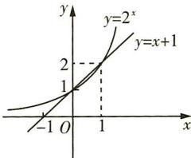

3. C 当 $x \in (-2,0]$ 时, $f(x) = |x + 1| - 1$ , 结合当 $x \leqslant 0$ 时, $2f(x - 2) = f(x)$ , 作出函数 $f(x)$ 在 $(- \infty, 0]$ 上的部分图象, 再作出 $y = \log_a x (a > 0$ 且 $a \neq 1)$ 的图象及其关于原点对称的图象, 如图所示. 当 $0 < a < 1$ 时, 对称后的图象不可能与 $f(x)$ 在 $(- \infty, 0]$ 的图象有 3 个交点; 当 $a > 1$ 时, 要使函数 $f(x) = \log_a x$ 的图象关于原点对称后的图象与 $f(x)$ 在 $(- \infty, 0]$ 上的图象

恰好有3个交点，则 $\left\{\begin{aligned}&a>1,\\ &-\log_{a}3>-\frac{1}{2},\\ &-\log_{a}5<-\frac{1}{4},\end{aligned}\right.$ 解得9<a<625.故选C.

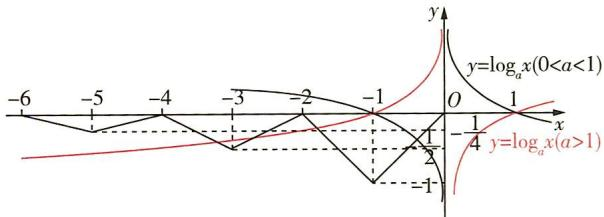

line

| x    | y=log_a(x) | y=log_a(x) |
| ---- | ---------- | ---------- |
| -6   | -          | -          |
| -5   | -          | -          |
| -4   | -          | -          |
| -3   | -          | -          |
| -2   | -          | -          |
| -1   | -          | -          |
| 0    | 0          | 0          |
| 1    | 1          | 1          |
| 2    | 2          | 2          |
| 3    | 3          | 3          |
| 4    | 4          | 4          |
| 5    | 5          | 5          |
| 6    | 6          | 6          |
| 7    | 7          | 7          |
| 8    | 8          | 8          |
| 9    | 9          | 9          |
| 10   | 10         | 10         |
| 11   | 11         | 11         |
| 12   | 12         | 12         |
| 13   | 13         | 13         |
| 14   | 14         | 14         |
| 15   | 15         | 15         |
| 16   | 16         | 16         |
| 17   | 17         | 17         |
| 18   | 18         | 18         |
| 19   | 19         | 19         |
| 20   | 20         | 20         |
| 21   | 21         | 21         |
| 22   | 22         | 22         |
| 23   | 23         | 23         |
| 24   | 24         | 24         |
| 25   | 25         | 25         |
| 26   | 26         | 26         |
| 27   | 27         | 27         |
| 28   | 28         | 28         |
| 29   | 29         | 29         |
| 30   | 30         | 30         |
| 31   | 31         | 31         |
| 32   | 32         | 32         |
| 33   | 33         | 33         |
| 34   | 34         | 34         |
| 35   | 35         | 35         |
| 36   | 36         | 36         |
| 37   | 37         | 37         |
| 38   | 38         | 38         |
| 39   | 39         | 39         |
| 40   | 40         | 40         |
| 41   | 41         | 41         |
| 42   | 42         | 42         |
| 43   | 43         | 43         |
| 44   | 44         | 44         |
| 45   | 45         | 45         |
| 46   | 46         | 46         |
| 47   | 47         | 47         |
| 48   | 48         | 48         |
| 49   | 49         | 49         |
| 50   | 50         | 50         |
| Note: The y-values are estimated based on the log_a function y = log_a(x). The x-values are labeled as 'a' or 'b'. The y-axis is labeled 'y'. The x-axis is labeled 'x'. The y-axis is labeled 'y'. The labels above the x-axis are 'a' and 'b'.

4. D 由题意, 得 $f(x+2)+f(x)=0$ , 且 $f(x)=-f(-x)$ , 所以 $f(x+4)=f(x), f(2+x)=f(-x)$ , 故 $f(x)$ 是周期为 4 的周期函数, 且其图象关于直线 $x=1$ 对称, 关于点 (2,0) 对称, 结合 $1 \leqslant x < 2$ 时, $f(x)=x-2$ , 分别作出 $y=f(x)$ 与 $y=\frac{1}{6}x-\frac{1}{3}$ 的图象, 如图所示. 当 $x \geqslant 8$ 时, $y=\frac{1}{6}x-\frac{1}{3} \geqslant 1$ , 当 $x \leqslant -4$ 时, $y=\frac{1}{6}x-\frac{1}{3} \leqslant -1$ , 且直线 $y=\frac{1}{6}x-\frac{1}{3}$ 关于点 (2,0) 对称, 由图可知, 直线 $y=\frac{1}{6}x-\frac{1}{3}$ 与 $y=f(x)$ 的图象有 7 个不同的交点, 故 $x_1 + x_2 + x_3 + \cdots + x_7 = 2 \times 7 = 14, y_1 + y_2 + y_3 + \cdots + y_7 = 0$ , 所以 $\sum_{i=1}^{7}(x_i +$

$y_{i}$ =14. 故选 D.

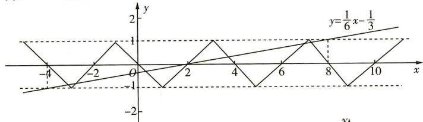

line

| x  | y (line) | y = 1/6 x - 1/3 |
|----|----------|-----------------|
| -4 | -1       | -               |
| -2 | 1        | -               |
| 0  | 0        | -               |
| 2  | 1        | -               |
| 4  | 0        | -               |
| 6  | 1        | -               |
| 8  | 0        | -               |
| 10 | 1        | -               |

5. B 作出函数 $y = \sqrt{13 - x^2} - 2 (x \in [-3, 3])$ 的图象，即图中 $\widehat{AB} (\text{圆 } x^2 + (y + 2)^2 = 13 \text{ 的一部分})$ ，设 $D(0, -2)$ ，连接 $AD$ .

若要使旋转过程中,曲线 C 都是一个函数的图象,则在旋转过程中曲线 C 在点 A 处的切线的倾斜角不超过 $\frac{\pi}{2}$ , (超过

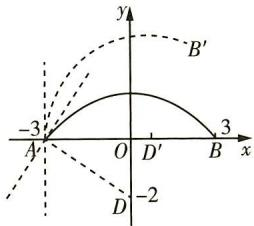

text_image

-3
A'
O
D'
B
3
x
y
B'
-2
D

$\frac{\pi}{2}$ 时，存在与x轴垂直且与曲线C有两个交点的直线）

所以 $\theta$ 最大时, 曲线 C 在点 A 处的切线垂直于 x 轴, 易知此时点 D 旋转至图中 $D'$ 所在的位置, $\theta_{\max} = \angle DAD'$ , $\tan \angle DAD' = \frac{2}{3}$ . 故选 B.

# 第七节 函数与方程

# 题型 40 判断函数的零点所在区间

1. B 解法一(定理法) 函数 $f(x)=\log_{3}x+x-2$ 的定义域为 $(0,+\infty)$ ，并且 $f(x)$ 在 $(0,+\infty)$ 上单调递增，图象是一条连续的曲线。由题意知 $f(1)=-1<0$ ， $f(2)=\log_{3}2>0$ ，根据零点存在定理可知，函数 $f(x)=\log_{3}x+x-2$ 有唯一零点，且零点在区间 $(1,2)$ 内。故选 B.

解法二（图象法）将函数 $f(x)$ 的零点所在的区间转化为函数 $g(x)=\log_{3}x,h(x)=-x+2$ 图象交点的横坐标所在的范围.作出两函数图象如图所示,可知 $f(x)$ 的零点所在的区间为(1,2).故选B.

2. C 易知 $f(x)$ 在 $(0, +\infty)$ 上单调递减， $f(1) = 6 - \log_2 1 = 6 > 0, f(2) = 3 - \log_2 2 = 2 > 0, f(4) = \frac{3}{2} - \log_2 4 = -\frac{1}{2} < 0$ ，由函数

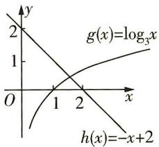

line

| x    | g(x)=log₃x | h(x)=-x+2 |
| ---- | ---------- | --------- |
| 0    | 2          | 0         |
| 1    | 1          | 1         |
| 2    | 0          | 2         |

零点存在定理知函数 $f(x)$ 在区间(2,4)内必存在零点.

3. A 因为 $f(a) = (a - b)(a - c) > 0, f(b) = (b - c)(b - a) < 0, f(c) = (c - a)(c - b) > 0$ ，所以 $f(a) \cdot f(b) < 0, f(b) \cdot f(c) < 0$ ，所以函数 $f(x)$ 的两个零点分别位于区间 $(a, b)$ 和 $(b, c)$ 内.

4. B 因为函数 $y=81\ln x$ 与 $y=-\left(\frac{1}{3}\right)^{x-3}-80$ 在 $(0,+\infty)$ 上均单调递增，所以函数 $f(x)$ 在 $(0,+\infty)$ 上单调递增。因为 $f(2)=81\ln2-83<0$ ，且 $f(3)=81\ln3-81>0$ ，所以 $f(2)\cdot f(3)<0$ ，所以函数 $f(x)$ 的零点位于区间 $(2,3)$ 内，故 k=2。故选 B.

5. ABD 由题意可得 $f(x)$ 的定义域为 $(0, +\infty)$ , 且 $f'(x) = (x^2 + 3x + 1)e^x + \frac{1}{x}$ , 因为 $f'(x) = (x^2 + 3x + 1)e^x + \frac{1}{x} > 0$ , 所以函数 $f(x)$ 在 $(0, +\infty)$ 上单调递增. 对于 A, 因为 $f(\frac{1}{2}) = \frac{3}{4}\sqrt{\mathrm{e}} - \ln 2 > 1 - \ln 2 > 0$ , 所以 $x_0 < \frac{1}{2}$ , 故 A 正确; 对于 B, 因为 $f(\frac{1}{\mathrm{e}}) = \frac{\mathrm{e} + 1}{\mathrm{e}^2}\mathrm{e}^{\frac{1}{\mathrm{e}}} - 1 < \frac{\mathrm{e} + 1}{\mathrm{e}^2}\mathrm{e}^{\frac{1}{2}} - 1 = \mathrm{e}^{-\frac{3}{2}}(\mathrm{e} + 1 - \mathrm{e}^{\frac{3}{2}}) < \mathrm{e}^{-\frac{3}{2}}(\mathrm{e} + 1 - \frac{3}{2}\mathrm{e}) < 0$ , 所以 $x_0 > \frac{1}{\mathrm{e}}$ , 故 B 正确; 对于 C, 因为 $x_0 > \frac{1}{\mathrm{e}}$ , 则 $\ln x_0 > -1$ , $\mathrm{e}^{x_0} > 1$ , 所以 $\mathrm{e}^{x_0} + \ln x_0 > 0$ , 故 C 错误; 对于 D, 因为 $x_0 < \frac{1}{2}$ , 所以 $x_0 + \ln x_0 < \frac{1}{2} - \ln 2 < 0$ , 故 D 正确. 故选 ABD.

# 题型 41 判断函数的零点个数

1. B 解法一（直接法）由 $f(x)=0$ 得 $\left\{\begin{aligned}x&\leqslant0,\\ x^{2}&+x-2=0\end{aligned}\right.$ 或

$\left\{\begin{aligned}x&>0,\\ -1+\ln x&=0,\end{aligned}\right.$ 解得 x=-2 或 x=e. 因此函数 $f(x)$ 共有 2 个零点.

解法二(图象法) 函数 $f(x)$ 的图象如图所示，

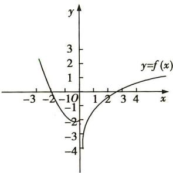

line

| x | y = f(x) |
|---|---|
| -3 | 2.5 |
| -2 | 1.0 |
| -10 | -1.0 |
| 0 | -2.0 |
| 1 | -1.5 |
| 2 | -1.0 |
| 3 | -0.5 |
| 4 | 0.0 |
| 5 | 0.5 |

由图象知函数 $f(x)$ 共有2个零点.

2. C 把函数 $y = \cos(2x + \frac{\pi}{6})$ 的图象向左平移 $\frac{\pi}{6}$ 个单位长度后得到函数 $f(x) = \cos\left[2\left(x + \frac{\pi}{6}\right) + \frac{\pi}{6}\right] = \cos\left(2x + \frac{\pi}{2}\right) = -\sin 2x$ 的图象。作出函数 $f(x)$ 的部分图象和直线 $y = \frac{1}{2}x - \frac{1}{2}$ ，如图所示。观察图象知，共有 3 个交点。故选 C.

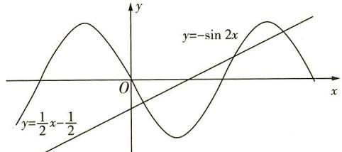

text_image

y
y=-sin 2x
y=\frac{1}{2}x-\frac{1}{2}
O
x

3. A 函数 $y=f(x)-g(x)$ 的零点个数即 $f(x), g(x)$ 图象的交点个数. 在同一平面直角坐标系中分别画出函数 $f(x)=\left\{\begin{aligned}&2-|x|, x \leqslant 2,\\ &(x-2)^{2}, &x > 2\end{aligned}\right.$ 和函数 $g(x)=3-f(2-x)$ 的大致图象, 如图所示, 其中函数 $g(x)$ 的图象可由 $f(x)$ 的图象经过翻折、平移得到. 由图可知, 函数 $f(x), g(x)$ 的图象有 2 个交点, 所以函数 $y=f(x)-g(x)$ 的零点个

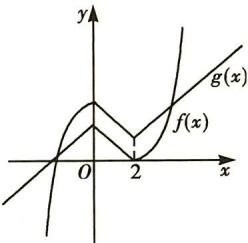

text_image

y
g(x)
f(x)
O
2
x

4. ①②④ 作出函数 $y = |\lg x|$ 和 $y = kx + 2$ 的大致图象如图所示，

对于①, 当 k=0 时, 显然直线 y=2 与 $y=|\lg x|$ 的图象有两个交点, 即函数 $f(x)=|\lg x|-kx-2$ 有两个零点, 所以①正确; 对于②, 由图可知, $\exists k_{0}<0$ , 使得直线 $y=k_{0}x+2$ 与 $y=|\lg x|$ 的图象相切, 即当 $k=k_{0}$ 时, 函数 $f(x)=|\lg x|-kx-2$ 有一个零点, 所以②正确;

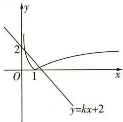

text_image

y
2
O
1
x
y=kx+2

对于③,由图可知,当 k<0 时,直线 $y=kx+2$ 与 $y=|\lg x|$ 的图象不可能有三个交点,即函数 $f(x)=|\lg x|-kx-2$ 不可能有三个零点,所以③不正确;

对于④,由图可知, $\exists k_{1}>0$ ,使得直线 $y=k_{1}x+2$ 与 $y=|\lg x|$ 的图象相切,所以当 $0<k<k_{1}$ 时,直线 $y=kx+2$ 与 $y=|\lg x|$ 的图象有三个交点,即函数 $f(x)=|\lg x|-kx-2$ 有三个零点,所以④正确.

5. B 当 $x \in [-2,0]$ 时， $f(x) = (\frac{\sqrt{2}}{2})^x - 1$ ，则 $f(-2) = (\frac{\sqrt{2}}{2})^{-2} - 1 = 1$ ， $f(0) = (\frac{\sqrt{2}}{2})^0 - 1 = 0$ .

已知函数 $f(x)$ 是定义在R上的偶函数，又 $f(x + 2) = f(2 - x)$ ，则 $f((x + 2) + 2) = f(2 - (x + 2)) = f(-x) = f(x)$ ，即 $f(x) = f(x + 4)$ ，可知函数 $f(x)$ 的周期为4，值域为[0,1].求在区间(0,2022)内关于 $x$ 的方程 $f(x) - \log_{2022}(x + 2) = 0$ 解的个数，即求 $f(x)$ 的图象与函数 $y = \log_{2022}(x + 2)$ 的图象在区间(0,2022)内的交点个数.

令 $g(x)=\log_{2022}(x+2)$ ，有 $g(-1)=\log_{2022}(-1+2)=0$ ， $g(2020)=\log_{2022}(2020+2)=1$ ，由以上分析，画出函数 $f(x)$ 和 $g(x)$ 在区间 $(-2,+\infty)$ 上的大致图象，如图所示。可得 $f(x)$ 与 $g(x)$ 的图象在区间 $(0,2]$ 上有一个交点，在区间 $(2,4]$ 上有一个交点……以此类推，可得函数 $f(x)$ 与函数 $g(x)$ 的图象在区间 $(0,2020]$ 上有 $\frac{2020}{2}=1010$ （个）交点，而在区间 $(2020,2022)$ 内， $g(x)>1$ ， $g(x)$ 与 $f(x)$ 的图象无交点，所以在区间 $(0,2022)$ 内关于 x 的方程 $f(x)-\log_{2022}(x+2)=0$ 解的个数为 1010，故选 B.

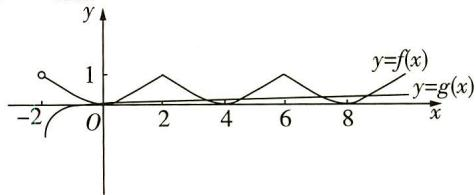

text_image

y
1
y=f(x)
y=g(x)
-2 O 2 4 6 8 x

6. B 当 $x \geqslant 0$ 时, $f(x) = 2f(x) + x^2 - x$ , 则 $f(x) = -x^2 + x$ ; 当 $x < 0$ 时, $f(x) = 2f(-x) + x^2 - x$ , 此时 $-x > 0$ , 所以 $f(-x) = -(-x)^2 + (-x) = -x^2 - x$ , 所以 $f(x) = -2x^2 - 2x + x^2 - x = -x^2 - 3x$ . $g(x) = xf^2(x) - \frac{1}{x}$ 的零点个数可转化为方程 $g(x) = 0$

的根的个数，由 $g(x) = xf^2 (x) - \frac{1}{x} = 0$ ，得 $f^2 (x) = \frac{1}{x^2}$ 所以 $f(x) = \frac{1}{x}$ 或 $f(x) = -\frac{1}{x}$ ，所以 $g(x) = xf^2 (x) - \frac{1}{x}$ 的零点个数进一步可转化为函数 $y = f(x)$ 分别与 $y = \frac{1}{x},y = -\frac{1}{x}$ 的图象的交点

个数. 在同一平面直角坐标系中，分别作出 $y = f(x) = \left\{\begin{aligned}-x^{2} + x, &x \geqslant 0, \\ -x^{2} - 3x, &x < 0,\end{aligned}\right.$ $y = \frac{1}{x}, y = -\frac{1}{x}$ 的大致图象，如图所示. 由图可知，交点个数为 4，即函数 $g(x) = xf^{2}(x) - \frac{1}{x}$ 的零点个数为 4，故选 B.

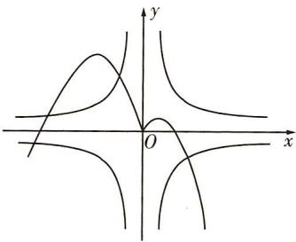

text_image

Mathematical graph showing hyperbolic curves and asymptotes on a Cartesian coordinate system with x and y axes.

7.4 由题意可知函数 $y = f(x)$ 是以 4 为周期的偶函数. 由于 $16f(x) = 4|x| + 1$ ，所以 $f(x) = \frac{1}{4}|x| + \frac{1}{16}$ ，故原方程的实根就是函数 $y = f(x)$ 的图象与函数 $y = \frac{1}{4}|x| + \frac{1}{16}$ 的图象的交点的横坐标. 因为当 $-2 \leqslant x \leqslant 2$ 时， $f(x) = -\frac{1}{4}x^2 + 1$ 且 $f(x) = f(x + 4)$ 对任意 $x \in \mathbb{R}$ 都成立，所以当 $2 \leqslant x \leqslant 6$ 时， $-2 \leqslant x - 4 \leqslant 2$ ， $f(x) = f(x - 4) = -\frac{1}{4}(x - 4)^2 + 1 = -\frac{1}{4}x^2 + 2x - 3$ ，由 $\left\{\begin{aligned}y &= -\frac{1}{4}x^{2}+2x-3,\\ y &= \frac{1}{4}x+\frac{1}{16}\end{aligned}\right.$ 得 $\left\{\begin{aligned}x &= \frac{7}{2},\\ y &= \frac{15}{16},\end{aligned}\right.$ 作出 $y=f(x)$ 和 $y=\frac{1}{4}|x|+\frac{1}{16}$

的图象如图所示，由图可知，当 $0 \leqslant x \leqslant 2$ 时，两函数图象只有一个交点，当 $2 < x \leqslant 6$ 时，两函数图象只有一个交点，又两个函数均为偶函数，故两个函数图象有4个交点，所以原方程有4个根.

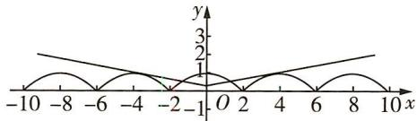

line

| x | y |
|---|---|
| -10 | 2 |
| -8 | 1.5 |
| -6 | 1 |
| -4 | 0.5 |
| -2 | 0 |
| -1 | 0 |
| 0 | 0 |
| 2 | 0.5 |
| 4 | 1 |
| 6 | 1.5 |
| 8 | 2 |
| 10 | 2 |

8. C $f(x)=2^{x}-x^{2}$ 的零点个数即 $y=2^{x}$ 与 $y=x^{2}$ 的图象的交点个数，作出两函数图象，如图所示，可得交点个数为 3，故选 C.

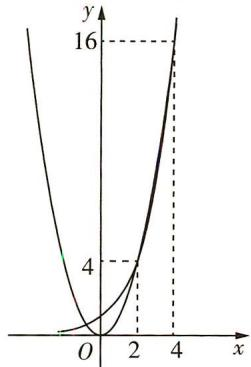

line

| x | y |
|---|---|
| 0 | 0 |
| 2 | 4 |
| 4 | 16 |

# 题型 42 函数零点的应用

1. B 令 $f(x) = 0$ 得 $\log_a x = x - 2$ .

当 $a > 1$ 时，函数 $y = \log_a x$ 和 $y = x - 2$ 的图象如图1所示.由图象可知函数 $y = \log_a x$ 和 $y = x - 2$ 的图象有两个交点，所以 $f(x) = \log_a x - x + 2$ 有两个零点，符合题意

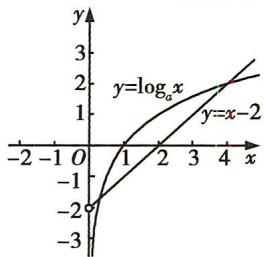

line

| x | y = log_a x | y = x - 2 |
|---|---|---|
| -2 | -2 | -2 |
| 0 | -1 | -1 |
| 1 | 0 | 0 |
| 2 | 1 | 1 |
| 3 | 2 | 2 |
| 4 | 3 | 3 |

图 1

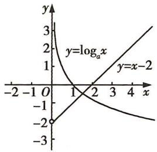

line

| x   | y=logₐx | y=x-2 |
| --- | ------- | ----- |
| -2  | -2      | -2    |
| 0   | 0       | 0     |
| 1   | 1       | 1     |
| 2   | 2       | 2     |
| 3   | 3       | 3     |
| 4   | 4       | 4     |

图 2

当 0 < a < 1 时, 函数 $y = \log_{a} x$ 和 y = x - 2 的图象如图 2 所示. 由图象可知 $y = \log_{a} x$ 和 y = x - 2 的图象有一个交点, 所以 $f(x) = \log_{a} x - x + 2$ 有一个零点, 不符合题意.

综上, a 的取值范围为 a > 1.

2. B 由题意知 $f'(x) = 3x^2 + a$ ，要使函数 $f(x)$ 存在 3 个零点，则 $f'(x) = 0$ 要有 2 个不同的根，则 $a < 0$ . 令 $3x^2 + a = 0$ ，解得 $x = \pm \sqrt{\frac{-a}{3}}$ ，所以 $f(x)$ 在 $(-\infty, -\sqrt{\frac{-a}{3}})$ 和 $(\sqrt{\frac{-a}{3}}, +\infty)$ 上单调递增，在 $(-\sqrt{\frac{-a}{3}}, \sqrt{\frac{-a}{3}})$ 上单调递减，所以要使 $f(x)$ 存在 3 个零点，则 $\left\{ \begin{array}{l} f(-\sqrt{\frac{-a}{3}}) > 0, \\ f(\sqrt{\frac{-a}{3}}) < 0, \end{array} \right.$ 即 $\left\{ \begin{array}{l} \frac{-2a}{3} \cdot \sqrt{\frac{-a}{3}} + 2 > 0, \\ \frac{2a}{3} \cdot \sqrt{\frac{-a}{3}} + 2 < 0, \end{array} \right.$ 解得

$\sqrt{\frac{-a}{3}}>1$ , 即 a<-3. 故选 B.

3. C 函数 $g(x)=f(x)+x+a$ 存在 2 个零点，即关于 x 的方程 $f(x)=-x-a$ 有 2 个不同的实根，即函数 $f(x)$ 的图象与直线 y=-x-a 有 2 个交点，作出直线 y=-x-a 与函数 $f(x)$ 的图象，如图所示，由图可知， $-a\leqslant1$ ，解得 $a\geqslant-1$ .

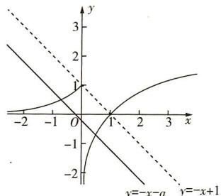

text_image

y
3
2
1
-2
-1
0
1
2
3
x
y=-x-a
y=-x+1

4. $(- \infty, 0) \cup (0, 1) \cup (1, +\infty)$

当 a=1 时, 函数 $f(x)$ 只有一个零点-1, 不符合题意; 当 a=0 时, 函数 $f(x)$ 只有一个零点 -1, 不符合题意; 当 a=-1 时, 函数 $f(x)$ 有两个零点, 分别为 -1 和 $-\frac{1}{2}$ , 符合题意.

若 $a \neq 0$ 且 $a \neq \pm 1$ ，分以下两种情况：

①当 $x^{2} - ax + 1 \geqslant 0$ 时， $f(x) = ax^2 - 2x - |x^2 - ax + 1| = ax^2 - 2x - (x^2 - ax + 1) = (a - 1)x^2 + (a - 2)x - 1 = (x + 1)[(a - 1)x - 1]$ ，令 $f(x) = 0$ ，由 $a \neq 0$ 且 $a \neq \pm 1$ ，得 $x_1 = -1, x_2 = \frac{1}{a - 1}$ ，且 $x_1 \neq x_2$ 。又 $x_1 = -1$ 时， $ax^2 - 2x - (x^2 - ax + 1) = a + 2 - (x^2 - ax + 1) = 0$ ，所以 $a = (x^2 - ax + 1) - 2$ ，则 $x^2 - ax + 1 \geqslant 0$ 时， $a \geqslant -2$ 且 $a \neq 0, a \neq \pm 1; x_2 = \frac{1}{a - 1}$ 时， $ax^2 - 2x - (x^2 - ax + 1) = \frac{a}{(a - 1)^2} - \frac{2}{a - 1} - (x^2 - ax + 1) = 0$ ，所以 $\frac{2 - a}{(a - 1)^2} = x^2 - ax + 1$ ，则 $x^2 - ax + 1 \geqslant 0$ 时， $a \leqslant 2$ 且 $a \neq 0, a \neq \pm 1$ .

②当 $x^{2} - ax + 1 < 0$ 时， $f(x) = ax^2 - 2x - |x^2 - ax + 1| = ax^2 - 2x + (x^2 - ax + 1) = (a + 1)x^2 - (a + 2)x + 1 = (x - 1)[(a + 1)x - 1]$ ，令 $f(x) = 0$ ，由 $a \neq 0$ 且 $a \neq \pm 1$ ，得 $x_3 = 1, x_4 = \frac{1}{a + 1}$ ，且 $x_3 \neq x_4$ 。同理， $x_3 = 1$ 时， $x^2 - ax + 1 < 0$ ，则 $a > 2; x_4 = \frac{1}{a + 1}$ 时， $x^2 - ax + 1 < 0$ ，则 $a < -2$ .

综上， $a$ 的取值范围为 $(-\infty ,0)\cup (0,1)\cup (1, + \infty)$

5. A 因为 $f(1 + x) = f(3 - x)$ ，所以 $f(x)$ 的图象关于直线 x = 2

对称,由题意可知, $f(x)$ 在 $x\in[0,2]$ 上的图象是以原点为圆心,2为半径的四分之一圆.又 $f(x)$ 是偶函数,所以 $f(x)$ 的图象关于y轴对称,所以 $f(x)$ 的周期T=4,故 $f(x)$ 在 $x\in[-4,8]$ 上的图象如图1所示.

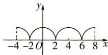  
图1

函数 $y=f(x)-kx$ 在 $x\in(0,+\infty)$ 上恰有 3 个零点，即函数 $y=f(x)$ 的图象与直线 y=kx 在 $x\in(0,+\infty)$ 上有 3 个交点，如图 2 所示。当直线 y=kx 位于直线 $l_{1}$ 和 $l_{2}$ 之间（不包括直线 $l_{1},l_{2}$ ）时，直线 y=kx 与 $y=f(x)$ 的图象恰有 3 个交点（直线 $l_{1}$ 和 $l_{2}$ 均与 $y=f(x)$ 的图象相切）。

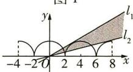  
图 2

如图3所示，连接所切圆圆心与各自切点，分别得到Rt△AOB和Rt△COD，则直线 $l_{1}$ 的斜率 $k_{1} = \tan \angle AOB = \frac{|AB|}{|OB|} = \frac{2}{\sqrt{4^{2} - 2^{2}}} =$ $\frac{\sqrt{3}}{3}$ ，直线 $l_{2}$ 的斜率 $k_{2} = \tan \angle COD =$

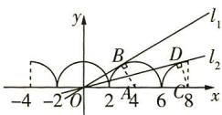  
图3

$\frac{|CD|}{|OD|}=\frac{2}{\sqrt{8^{2}-2^{2}}}=\frac{\sqrt{15}}{15}$ ，因此当 $k_{2}<k<k_{1}$ 时，满足题意，即当 $k\in(\frac{\sqrt{15}}{15},\frac{\sqrt{3}}{3})$ 时，函数 $y=f(x)-kx$ 在 $x\in(0,+\infty)$ 上恰有3个零点，故选A.

6. -2e 因为 $f(x+1)=\mathrm{e}^{x+1}+\mathrm{e}^{1-x}+a\sin\left(\frac{\pi}{3}x+\frac{\pi}{2}\right)=\mathrm{e}\left(\mathrm{e}^{x}+\mathrm{e}^{-x}\right)+a\cos\frac{\pi}{3}x$ ，所以函数 $f(x+1)$ 为偶函数，所以 $f(x)$ 的图象关于直线 x=1 对称，又 $f(x)$ 只有一个零点，所以由对称性可得，该零点就是 x=1，所以 $f(1)=2\mathrm{e}+a=0$ ，故 a=-2e.

7.（10,12）因为当 $1 < x \leqslant 3$ 时， $f(x) = |\log_2(x - 1)|$ ，所以先作出函数 $y = \log_2 x$ 的图象，再将函数 $y = \log_2 x$ 的图象向右平移1个单位长度，得到函数 $y = \log_2 (x - 1)$ 的图象，把函数 $y = \log_2 (x - 1)$ 的图象在 $x$ 轴下方的部分翻折到 $x$ 轴上方，得到函数 $y = |\log_2 (x - 1)|$ 的图象，取 $1 < x \leqslant 3$ 的部分即函数

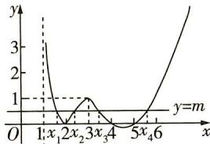

line

| x | y = m |
|---|---|
| 1 | 3 |
| 2 | 0 |
| 3 | 1 |
| 4 | 0 |
| 5 | 0 |
| 6 | 1 |

$f(x)$ 在 $1 < x \leqslant 3$ 时的图象. 当 x > 3 时, $f(x) = \frac{1}{2}x^{2} - \frac{9}{2}x + 10$ , 作出这部分的图象. 即得函数 $f(x)$ 的图象, 如图所示.

若方程 $f(x) = m$ 有四个不同的实根，则函数 $y = f(x)$ 的图象与直线 $y = m$ 有四个交点，由图可知， $0 < m < 1$ . 又 $x_{1} < x_{2} < x_{3} < x_{4}$ ，所以 $1 < x_{1} < 2 < x_{2} < 3, 3 < x_{3} < 4, 5 < x_{4} < 6$ . $f(x_{1}) = f(x_{2})$ ，即 $|\log_2(x_1 - 1)| = |\log_2(x_2 - 1)|$ ，因为 $0 < x_{1} - 1 < 1, 1 < x_{2} - 1 < 2$ ，所以 $\log_2(x_1 - 1) < 0, \log_2(x_2 - 1) > 0$ ，所以 $-\log_2(x_1 - 1) = \log_2(x_2 - 1)$ ，所以 $(x_1 - 1)(x_2 - 1) = 1$ . 又 $f(x_3) = f(x_4)$ ，所以由二次函数图象的对称性可知 $x_3 + x_4 = 9$ ，所以 $x_4 = 9 - x_3$ .

所以 $\frac{(x_{3}-1)(x_{4}-1)}{(x_{1}-1)(x_{2}-1)}=(x_{3}-1)(x_{4}-1)=(x_{3}-1)(-x_{3}+8)$ ， $x_{3}\in(3,4)$ ，由二次函数求值域的方法可知 $\frac{(x_{3}-1)(x_{4}-1)}{(x_{1}-1)(x_{2}-1)}\in(10,12)$ .

8. D 因为 $f(x)=ax^{2}-e^{x}$ 有三个零点，所以关于 x 的方程 $ax^{2}-e^{x}=0$ 有三个不等根，易知 x=0 不是该方程的根，故当 $x\neq0$ 时，参变分离可得 $a=\frac{e^{x}}{x^{2}}$ . 设 $g(x)=\frac{e^{x}}{x^{2}}(x\neq0)$ ，则 $g'(x)=\frac{x-2}{x^{3}}e^{x}$ ，当 x<0 时， $g'(x)>0$ ， $g(x)$ 单调递增；当 0<x<2 时， $g'(x)<0$ ， $g(x)$ 单调递减；当 x>2 时， $g'(x)>0$ ， $g(x)$ 单调递增。又

$g(x)=\frac{\mathrm{e}^{x}}{x^{2}}>0$ 恒成立,所以可作出函数 $g(x)$ 的大致图象如图所示,由题意知,直线y=a与 $y=g(x)$ 的图象有三个不同的交点,所以 $a>g(2)=\frac{\mathrm{e}^{2}}{4}$ ,故选D.

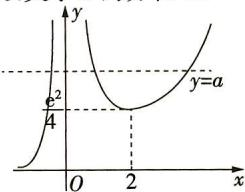

line

| x | y |
|---|---|
| 0 | e² |
| 2 | a |

# 第八节 函数模型及其应用

# 题型 43 解决图表型函数的实际应用问题

1. ACD 由题图易得 y 与 t 之间的函数关系式近似为 $y = \left\{\begin{aligned}4t, &0 \leqslant t < 1, \\ (\frac{1}{2})^{t-a}, &t \geqslant 1,\end{aligned}\right.$ 当 t = 1 时，y = 4，即 $(\frac{1}{2})^{1-a} = 4$ ，得 a = 3，故 A 正确。 $y = \left\{\begin{aligned}4t, &0 \leqslant t < 1, \\ (\frac{1}{2})^{t-3}, &t \geqslant 1,\end{aligned}\right.$ 当药物刚好起效时，即 4t = 0.125，得 $t = \frac{1}{32}$ ，当药物刚好失效时，即 $(\frac{1}{2})^{t-3} = 0.125$ ，得 t = 6，所以该药物治疗该病的有效时长为 $6 - \frac{1}{32} = \frac{191}{32}$ （时），故 B 错误，D 正确。注射该药物 $\frac{1}{8}$ 小时后，每毫升血液中的含药量为 $4 \times \frac{1}{8} = 0.5$ （微克），故 C 正确。故选 ACD。

2. D 对于 A 选项, 当 T = 220, P = 1026, 即 $\lg P = \lg 1026 > \lg 10^{3} = 3$ 时, 根据图象可知, 二氧化碳处于固态; 对于 B 选项, 当 T = 270, P = 128, 即 $\lg P = \lg 128 \in (\lg 10^{2}, \lg 10^{3})$ , 即 $\lg P \in (2, 3)$ 时, 根据图象可知, 二氧化碳处于液态; 对于 C 选项, 当 T = 300, P = 9987, 即 $\lg P = \lg 9987 < \lg 10^{4} = 4$ 时, 根据图象可知, 二氧化碳处于固态; 对于 D 选项, 当 T = 360, P = 729, 即 $\lg P = \lg 729 \in (\lg 10^{2}, \lg 10^{3})$ , 即 $\lg P = \lg 729 \in (2, 3)$ 时, 根据图象可知, 二氧化碳处于超临界状态. 故选 D.

3. ①②③ 由题图可知甲企业的污水排放量在 $t_1$ 时刻高于乙企业的，而在 $t_2$ 时刻甲、乙两企业的污水排放量相同，故在 $[t_1, t_2]$ 这段时间内，甲企业的污水治理能力比乙企业强，故①正确；甲企业污水排放量与时间的关系图象在 $t_2$ 时刻切线的斜率的绝对值大于乙企业的，故②正确；在 $t_3$ 时刻，甲、乙两企业的污水排放量都低于污水达标排放量，故都已达标，③正确；甲企业在 $[0, t_1], [t_1,$

$t_{2}$ ], $[t_{2}, t_{3}]$ 这三段时间中，在 $[0, t_{1}]$ 的污水治理能力明显低于 $[t_{1}, t_{2}]$ 时的，故④错误.

4. B 根据图象, 把 $(t, p)$ 的三组数据 $(3, 0.7)$ , $(4, 0.8)$ , $(5, 0.5)$ 分别代入函数关系式, 得 $\left\{\begin{aligned}0.7 &= 9a + 3b + c, \\ 0.8 &= 16a + 4b + c, \\ 0.5 &= 25a + 5b + c,\end{aligned}\right.$ 解得 $\left\{\begin{aligned}a &= -0.2, \\ b &= 1.5, \\ c &= -2.0,\end{aligned}\right.$ 所以 $p = -0.2t^{2} + 1.5t - 2.0 = -\frac{1}{5}(t - \frac{15}{4})^{2} + \frac{13}{16}.$

当 $t=\frac{15}{4}=3.75$ 时, p 取得最大值, 即最佳加工时间为 3.75 min.

5. A 由题可得符合题意的函数模型需满足在 $40 \leqslant v \leqslant 120$ 时 $v$ 都可取，且该函数模型应为增函数，故第二种函数模型不符合；若选择第一种模型，则 $Q(90) = 7.2, Q(100) = 7.6, Q(120) = 8.4$ ，与实际数据相差较大，故第一种函数模型不符合；若选择第三种函数模型，则 $Q(40) = 5.2, Q(60) = 6, Q(100) = 10$ ，故第三种函数模型最符合实际，因此选择 $Q(v) = 0.000025v^3 - 0.004v^2 + 0.25v$ 。所以 $W = \frac{100}{v} \times Q(v) = 0.0025v^2 - 0.4v + 25 = 0.0025(v - 80)^2 + 9$ ，当 $v = 80$ 时， $W$ 取得最小值9，所以该型号汽车应在外侧车道以 $80\mathrm{km/h}$ 行驶，故选A。

# 题型 44 已知函数模型求解实际问题

1.3 10 依题意 $t > 0$ ，所以 $t + 1 > 1$ ，所以 $C(t) = \frac{100(t + 1)}{t^2 + 4t + 19} = \frac{100(t + 1)}{(t + 1)^2 + 2(t + 1) + 16} = \frac{100}{(t + 1) + \frac{16}{t + 1} + 2} \leqslant \frac{100}{2\sqrt{(t + 1) \cdot \frac{16}{t + 1}} + 2} =$

$\frac{100}{10}=10$ , 当且仅当 $t+1=\frac{16}{t+1}$ , 即 t=3 时, 等号成立, 即此时质量浓度达到最大, 最大值为 $10\ mg/m^{3}$ .

2. C $4.9 = 5 + \lg V \Rightarrow \lg V = -0.1 \Rightarrow V = 10^{-\frac{1}{10}} = \frac{1}{\sqrt[10]{10}} \approx \frac{1}{1.259} \approx 0.8$ , 所以该同学视力的小数记录法的数据约为 0.8.

3. B $\because R_{0}=1+rT,\therefore 3.28=1+6r,\therefore r=0.38.$

若 $\left\{\begin{aligned}I(t_{1})&=e^{0.38t_{1}},\\ I(t_{2})&=e^{0.38t_{2}},\\ I(t_{2})&=2I(t_{1}),\end{aligned}\right.$ 则 $e^{0.38(t_{2}-t_{1})}=2,$

即 $0.38(t_{2}-t_{1})=\ln2\approx0.69,t_{2}-t_{1}\approx1.8$ ，选 B.

4. D 由题意可知当 t=20 时， $H=H_{0}e^{-20m}=H_{0}-\frac{61}{125}H_{0}=\frac{64}{125}H_{0}$ ，
所以 $e^{-20m}=\frac{64}{125}$ ，则 $-20m=\ln\frac{64}{125}$ ，得 $m=-\frac{1}{20}\ln\frac{64}{125}$ .

设经过 $x\mathrm{h}$ 后需要人工增氧，则 $\frac{2}{5} H_0 = H_0\mathrm{e}^{-mx},\mathrm{e}^{-mx} = \frac{2}{5}$ 所以 $-mx = \ln \frac{2}{5},$

所以 $x \cdot \frac{1}{20} \ln \frac{64}{125} = \ln \frac{2}{5}$ ，解得 $x \approx 27$ ，

所以最长大约经过 27 h 后需要人工增氧, 故选 D.

5. B 由题意知当 m=3000 时, v=9, 设此时燃料质量为 $M_{1}$ , 将 m=3000, v=9 代入 $v=2\ln\left(1+\frac{M}{m}\right)$ , 得 $9=2\ln\left(1+\frac{M_{1}}{3000}\right)$ ,

所以 $\ln(1+\frac{M_{1}}{3000})=4.5\approx\ln90,$

即 $\frac{M_{1}}{3\ 000}+1\approx90$ ,得 $M_{1}\approx267\ 000(kg)$ ,

当 $v = 10$ 时，设燃料质量为 $M_2$ ，则 $10 = 2\ln \left(1 + \frac{M_2}{3000}\right)$ 即 $1 + \frac{M_2}{3000} =$ $\mathrm{e}^5\approx 148$ ，解得 $M_2\approx 441000(\mathrm{kg})$ 所以需要再加注燃料质量约为 $M_{2} - M_{1} = 441000 - 267000 =$ $174000(\mathrm{kg})$ .故选B.

# 题型 45 构造函数模型求解实际问题

1. D 由题意, 设至少循环 $n(n \in \mathbf{N}^{*})$ 次, 才能达到国家排放标准, 则 $15 \geqslant 450 \cdot (1 - \frac{1}{3})^{n}$ , 即 $\frac{1}{30} \geqslant (\frac{2}{3})^{n}$ ,

两边同时取对数得 $\lg \frac{1}{30} \geqslant n\lg \frac{2}{3}$ , 所以 $n \geqslant \frac{\lg \frac{1}{30}}{\lg \frac{2}{3}} = \frac{-\lg 3 - 1}{\lg 2 - \lg 3} \approx \frac{-1.4771}{0.3010 - 0.4771} \approx 8.4,$

又 $n \in N^{*}$ ，所以至少要进行9次循环，故选D.

2. B 设经过 x 年后该公司全年投入的研发资金开始超过 200 万元, 则 $130(1 + 12\%)^{x} > 200$ , 即 $1.12^{x} > \frac{2}{1.3}$ , 所以 $x > \frac{\lg \frac{2}{1.3}}{\lg 1.12} = \frac{\lg 2 - \lg 1.3}{\lg 1.12} \approx \frac{0.30 - 0.11}{0.05} = 3.8$ , 因为 x 取整数, 所以取 x = 4, 所以该公司全年投入的研发资金开始超过 200 万元的年份是 2019 年.

3.20 如图, 过 A 作 $AH \perp BC$ 于 H, 交 DE 于 F, 易知 $\frac{DE}{BC} = \frac{x}{40} = \frac{AD}{AB} = \frac{AF}{AH}$ , 得 AF = x, $\therefore FH = 40 - x$ , 则 $S = x(40 - x) = 400 - (x - 20)^{2}$ , $\therefore$ 当 x = 20 时, $S_{\max} = 400$ . 故满足题意的边长 x 为 20 m.

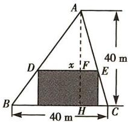

text_image

A
40 m
D
x
F
E
B
40 m
H
C

4. B 对于①, $y = -\frac{1}{20} x^2 + 6x = -\frac{1}{20}(x^2 -$

$120x) = -\frac{1}{20} (x - 60)^{2} + 180$ ，该函数在 $x = 60$ 时函数值为180，超过了要求的范围，不符合题意.

对于②, $y=10\sqrt{x}$ 为增函数,当 $x\in[0,100]$ 时, $y\in[0,100]$ ,且 $\sqrt{x}\leqslant10$ ,故 $x\leqslant10\sqrt{x}$ ,符合题意.

对于③, $y=10^{\frac{x}{50}}$ ,当x=50时, $10^{\frac{x}{50}}=10<50$ ,不符合题意.

对于④, $y=100\sin\frac{\pi}{200}x$ 在 $[0,100]$ 上单调递增,设 $g(x)=100\sin\frac{\pi}{200}x-x,x\in[0,100]$ ,则 $g'(x)=\frac{\pi}{2}\cdot\cos\frac{\pi}{200}x-1$ ,易知

$g'(x)=\frac{\pi}{2}\cdot\cos\frac{\pi}{200}x-1$ 在 $[0,100]$ 上单调递减，且 $g'(0)=\frac{\pi}{2}-1>0$ , $g'(100)=\frac{\pi}{2}\cos\frac{\pi}{2}-1=-1<0$ ，所以存在 $x_{0}\in[0,100]$ ，使得 $g'(x_{0})=0$ 。当 $x\in[0,x_{0}]$ 时， $g'(x)\geqslant0$ ; 当 $x\in[x_{0},100]$ 时， $g'(x)\leqslant0$ 。故 $g(x)$ 在 $[0,x_{0}]$ 上单调递增，在 $[x_{0},100]$ 上单调递减。又 $g(0)=0$ , $g(100)=0$ ，故在 $[0,100]$ 上 $g(x)\geqslant0$ ，即在 $[0,100]$ 上 $100\sin\frac{\pi}{200}x\geqslant x$ ，故④符合题意。所以②④符合题意，从而选 B.

5. (1) $p(x) = f(x) \cdot g(x) = (8 + \frac{8}{x})(143 - |x - 22|) = \left\{ \begin{array}{l} 8x + \frac{968}{x} + 976, 1 \leqslant x \leqslant 22, \\ -8x + \frac{1320}{x} + 1312, 23 \leqslant x \leqslant 30, \end{array} \right.$ $x \in \mathbf{N}^*$ .

(2) 当 $1 \leqslant x \leqslant 22$ 且 $x \in \mathbb{N}^*$ 时, $p(x) = 8x + \frac{968}{x} + 976 \geqslant 2\sqrt{8x \cdot \frac{968}{x}} + 976 = 1152$ , 当且仅当 $8x = \frac{968}{x}$ , 即 $x = 11$ 时取等号, 此时 $p(x)$ 的最小值为 1152 千元.

当 $23 \leqslant x \leqslant 30$ 且 $x \in N^{*}$ 时, $p(x) = -8x + \frac{1320}{x} + 1312$ 单调递减, 所以当 x = 30 时 $p(x)$ 取到最小值, 最小值为 1116 千元.

综上, $p(x)$ 的最小值 m=1 116 千元,因此 0.3m=334.8 千元 = 33.48 万元 > 30 万元,能收回投资成本.

# 第三章 一元函数的导数及其应用

# 第一节 导数的概念及运算

# 题型 46 导数的运算

1. C 由 $N(t) = N_02^{-\frac{t}{24}}$ ，得 $N'(t) = N_02^{-\frac{t}{24}} \times \ln 2 \times (-\frac{1}{24})$ . 因为 $N'(24) = N_0 \times 2^{-\frac{24}{24}} \times \ln 2 \times (-\frac{1}{24}) = -8 \ln 2$ ，所以 $N_0 = 2 \times 8 \times 24 = 384$ ，所以 $N(t) = 384 \times 2^{-\frac{t}{24}}$ ，则 $N(96) = 384 \times 2^{-\frac{96}{24}} = 384 \times 2^{-4} = 24$ ，故选 C.

2. $\{x\mid\frac{\pi}{4}+2k\pi\leqslant x\leqslant\frac{5\pi}{4}+2k\pi,k\in\mathbf{Z}\}$ 因为 $f(x)=\frac{\sin x}{e^{x}}$ ，所以 $f'(x)=\frac{e^{x}\cos x-e^{x}\sin x}{(e^{x})^{2}}=\frac{\cos x-\sin x}{e^{x}}$ ，则由 $f'(x)\leqslant0$ ，得 $\frac{\cos x-\sin x}{e^{x}}\leqslant0$ ，即 $\sin x-\cos x\geqslant0$ ，所以 $\sqrt{2}\sin\left(x-\frac{\pi}{4}\right)\geqslant0$ ，即 $\sin\left(x-\frac{\pi}{4}\right)\geqslant0$ ，所以 $2k\pi\leqslant x-\frac{\pi}{4}\leqslant2k\pi+\pi,k\in\mathbf{Z}$ ，即 $\frac{\pi}{4}+2k\pi\leqslant x\leqslant\frac{5\pi}{4}+2k\pi,k\in\mathbf{Z}$ ，所以原不等式的解集为 $\{x\mid\frac{\pi}{4}+2k\pi\leqslant x\leqslant\frac{5\pi}{4}+2k\pi,k\in\mathbf{Z}\}$ .

3.1 由于 $f'(x) = \frac{\mathrm{e}^x(x + a) - \mathrm{e}^x}{(x + a)^2}$ ，故 $f'(1) = \frac{\mathrm{e}a}{(1 + a)^2} = \frac{\mathrm{e}}{4}$ ，解得 $a = 1$ .

4. e 由题意得 $f'(x) = \mathrm{e}^x \ln x + \mathrm{e}^x \cdot \frac{1}{x}$ ，则 $f'(1) = \mathrm{e}$ .

5.3 由题可得 $f'(x) = 2f'(1)x + \frac{1}{x^2}$ ，所以 $f'(1) = 2f'(1) + 1$ ，解得 $f'(1) = -1$ ，所以 $f'(x) = -2x + \frac{1}{x^2}$ ，所以 $f'(-1) = 2 + 1 = 3$ .

6.0 因为 $f(x) = \ln x - \cos (x - 1)$ ，所以 $f'(x) = \frac{1}{x} + \sin (x - 1)$ ， $f''(x) = -\frac{1}{x^2} + \cos (x - 1)$ ，所以 $f'(1) = \frac{1}{1} + \sin (1 - 1) = 1, f''(1) = -\frac{1}{1^2} + \cos (1 - 1) = 0$ ，所以 $K = \frac{|f''(1)|}{\{1 + [f'(1)]^2\}^{\frac{3}{2}}} = 0$ ，即曲线 $y = f(x)$ 在点 $(1, f(1))$ 处的曲率为 0.

7. $\frac{\sqrt{3}}{2}$ 易得 $f'(x) = -\sin \alpha \sin x$ ，（注意： $\sin \alpha$ 为常数，其导数等于0）

所以 $f^{\prime}\left(\frac{\pi}{2}\right) = -\sin \alpha = 1$ ，所以 $f^{\prime}\left(\frac{\pi}{3}\right) = -\sin \alpha \sin \frac{\pi}{3} = \frac{\sqrt{3}}{2}.$

# 题型47 求切线方程

1. A 设点 $P$ 的横坐标为 ${x}_{0}$ ,由 $y = {x}^{2} + {2x} + 3$ 得 ${y}^{\prime } = {2x} + 2$ ,所以$y'\big|_{x=x_0}=2x_0+2$ ，设 $\alpha$ 为曲线 C 在点 P 处切线的倾斜角，则 $2x_0+2=\tan\alpha$ ，又 $\alpha\in\left[0,\frac{\pi}{4}\right]$ ，所以 $\tan\alpha\in[0,1]$ ，所以 $0\leqslant2x_0+2\leqslant1$ ，即 $x_0\in\left[-1,-\frac{1}{2}\right]$ 。故选 A.

2. $x - y + 1 = 0$ 由题意 $f'(x) = e^{x} \cos x - e^{x} \sin x$ ，所以 $f'(0) = 1$ ，又 $f(0) = 1$ ，所以曲线 $y = f(x) = e^{x} \cos x$ 在 x = 0 处的切线方程为 $y - 1 = 1 \times (x - 0)$ ，即 $x - y + 1 = 0$ .

3. C 由题意可知 $y' = \frac{\mathrm{e}^x(x + 1) - \mathrm{e}^x}{(x + 1)^2} = \frac{x\mathrm{e}^x}{(x + 1)^2}$ ，则曲线 $y = \frac{\mathrm{e}^x}{x + 1}$ 在点 $(1, \frac{\mathrm{e}}{2})$ 处的切线斜率 $k = y' \big|_{x=1} = \frac{\mathrm{e}}{4}$ ，所以曲线 $y = \frac{\mathrm{e}^x}{x + 1}$ 在点 $(1, \frac{\mathrm{e}}{2})$ 处的切线方程为 $y - \frac{\mathrm{e}}{2} = \frac{\mathrm{e}}{4}(x - 1)$ ，即 $y = \frac{\mathrm{e}}{4} x + \frac{\mathrm{e}}{4}$ ，故选C.

4. $y = \frac{1}{e}x$ $y = -\frac{1}{e}x$ 先求当 x > 0 时，曲线 $y = \ln x$ 过原点的切线方程，设切点为 $(x_{0}, y_{0})$ ，则由 $y' = \frac{1}{x}$ ，得切线的斜率为 $\frac{1}{x_{0}}$ ，又切线的斜率为 $\frac{y_{0}}{x_{0}}$ ，所以 $\frac{1}{x_{0}} = \frac{y_{0}}{x_{0}}$ ，解得 $y_{0} = 1$ ，代入 $y = \ln x$ ，得 $x_{0} = e$ ，所以切线的斜率为 $\frac{1}{e}$ ，切线方程为 $y = \frac{1}{e}x$ 。同理可求得当 x < 0 时的切线方程为 $y = -\frac{1}{e}x$ 。综上可知，两条切线方程分别为 $y = \frac{1}{e}x, y = -\frac{1}{e}x$ 。

5. C 因为 $f(x) = x^{2} - 5$ ，所以 $f'(x) = 2x$ ，因为 $x_{0} = 1$ ，所以 $f(x_{0}) = f(1) = -4, f'(x_{0}) = 2$ ，则在点 $(x_{0}, f(x_{0}))$ 处的切线方程为 $y + 4 = 2(x - 1)$ 。令 y = 0，则 $x_{1} = 3$ ，则 $f(x_{1}) = 4, f'(x_{1}) = 6$ ，则在点 $(x_{1}, f(x_{1}))$ 处的切线方程为 $y - 4 = 6(x - 3)$ 。令 y = 0，则 $x_{2} = \frac{7}{3}$ ，则 $f(x_{2}) = \frac{4}{9}, f'(x_{2}) = \frac{14}{3}$ ，则在点 $(x_{2}, f(x_{2}))$ 处的切线方程为 $y - \frac{4}{9} = \frac{14}{3}(x - \frac{7}{3})$ 。令 y = 0，则 $x_{3} = \frac{47}{21}$ ，故选 C。

6. BCD 由题意, 得 $f'(x) = 3x^2 - 6x = 3x(x - 2)$ , 令 $f'(x) = 0$ , 得 $x = 0$ 或 $x = 2$ , 所以当 $x \in (-\infty, 0)$ 和 $(2, +\infty)$ 时, $f'(x) > 0$ , 函数 $f(x)$ 单调递增; 当 $x \in (0, 2)$ 时, $f'(x) < 0$ , 函数 $f(x)$ 单调递减.

对于 A, 当 x=2 时, 函数 $f(x)$ 取得极小值, 即 $f(x)_{\text{极小值}}=f(2)=2^{3}-3\times2^{2}+4=0$ , 故 A 不正确.

对于B,解法一 因为 $f(0) = 0^3 -3\times 0^2 +4 = 4$ ，且当 $x\to -\infty$ 时， $f(x)\rightarrow -\infty$ ，所以函数 $f(x)$ 在 $(-\infty ,0)$ 上存在一个零点，又 $f(2) = 0$ ，所以结合 $f(x)$ 的单调性知，函数 $f(x)$ 有两个零点，故B

正确.

解法二 $f(x) = x^{3} - 3x^{2} + 4 = x^{3} - 2x^{2} - x^{2} + 4 = (x + 1)(x - 2)^{2}$ ，则由 $f(x) = 0$ ，解得 $x = -1$ 或 $x = 2$ ，所以函数 $f(x)$ 有两个零点，故 B 正确.

对于 C, 解法一 若点 $(1,2)$ 是曲线 $y=f(x)$ 的对称中心, 则有 $f(x)+f(2-x)=4$ , 将函数 $f(x)=x^{3}-3x^{2}+4$ 代入上式验证得, $x^{3}-3x^{2}+4+(2-x)^{3}-3(2-x)^{2}+4=4$ , 故 C 正确. （知识点拨：若曲线 $y=f(x)$ 的对称中心为 $(a,b)$ , 则 $f(x)+f(2a-x)=2b$ )

解法二 由 $f(x) = x^3 - 3x^2 + 4$ ，得 $f'(x) = 3x^2 - 6x$ ，令 $g(x) = 3x^2 - 6x$ ，则 $g'(x) = 6x - 6$ ，由 $g'(x) = 6x - 6 = 0$ ，得 $x = 1$ ，又 $f(1) = 2$ ，所以点(1,2)是曲线 $y = f(x)$ 的对称中心，故C正确。（二级结论：三次函数 $f(x) = ax^3 + bx^2 + cx + d$ 图象的对称中心的横坐标为函数 $f(x)$ 的二阶导数的零点，即 $f'(x) = 3ax^2 + 2bx + c$ ， $f''(x) = 6ax + 2b$ ，则由 $f''(x) = 6ax + 2b = 0$ ，得 $x = -\frac{b}{3a}$ ，所以函数 $f(x)$

图象的对称中心为 $\left(-\frac{b}{3a},f\left(-\frac{b}{3a}\right)\right)$

对于 D, 若直线 $y = -3x + 5$ 是曲线 $y = f(x)$ 的切线, 则有 $3x^{2} - 6x = -3$ , 解得 x = 1. (提醒: 在求出切点后, 注意验证)

当 x=1 时, $f'(1)=-3$ , $f(1)=2$ , 所以曲线 $y=f(x)$ 在点 $(1,2)$ 处的切线方程为 $y-2=-3(x-1)$ , 即 $y=-3x+5$ , 故 D 正确. 综上所述, 选 BCD.

7. $\frac{1}{2\mathrm{e}}$ 设切点坐标为 $(x_0, \frac{\ln x_0}{x_0})$ ，由 $y = \frac{\ln x}{x}$ ，得 $y' = \frac{1 - \ln x}{x^2}$ ，所以切线方程为 $y - \frac{\ln x_0}{x_0} = \frac{1 - \ln x_0}{x_0^2} (x - x_0)$ ，因为切线过原点，所以 $-\frac{\ln x_0}{x_0} = \frac{1 - \ln x_0}{x_0^2} \cdot (-x_0)$ ，即 $\frac{\ln x_0}{x_0} = \frac{1 - \ln x_0}{x_0}$ ，即 $\ln x_0 = \frac{1}{2}$ ，所以 $x_0 = \mathrm{e}^{\frac{1}{2}}$ ，所以切线的斜率 $k = \frac{1 - \ln x_0}{x_0^2} = \frac{1 - \frac{1}{2}}{(\mathrm{e}^{\frac{1}{2}})^2} = \frac{1}{2\mathrm{e}}.$

8. $y+2=0, x-y-4=0$ 设经过点 $A(2,-2)$ 的直线 l 切曲线于点 $P(x_{0},y_{0})$ ，则 $y_{0}=x_{0}^{3}-4x_{0}^{2}+5x_{0}-4$ （易错：因为点 $A(2,-2)$ 在曲线上，就误以为点 A 是切点）

由导数的几何意义,得直线 l 的方程是 $y - (x_{0}^{3} - 4x_{0}^{2} + 5x_{0} - 4) = (3x_{0}^{2} - 8x_{0} + 5)(x - x_{0})(*)$ .

将点 A 的坐标 $(2, -2)$ 代入 (\*) 式得， $-2 - (x_{0}^{3} - 4x_{0}^{2} + 5x_{0} - 4) = (3x_{0}^{2} - 8x_{0} + 5)(2 - x_{0})$ ，解得 $x_{0} = 1$ 或 $x_{0} = 2$ 。（注意：A(2, -2) 是一个切点，B(1, -2) 是另一个切点）

将它们分别代回 $(*)$ 式得， $y+2=0$ 和x-y-4=0。故经过点 $A(2,-2)$ 的曲线 $y=x^{3}-4x^{2}+5x-4$ 的切线有两条，其方程为 $y+2=0$ 和x-y-4=0。

题型 48 根据导数的几何意义求参数（或切点）

1. $[2, +\infty)$ 因为 $f(x) = \frac{1}{2}x^{2} - ax + \ln x$ ，所以 $f'(x) = x - a + \frac{1}{x}$ . 因为曲线 $y = f(x)$ 存在垂直于 y 轴的切线，所以 $f'(x)$ 存在零点，所以 $x + \frac{1}{x} - a = 0 (x > 0)$ 有解，所以 $a = x + \frac{1}{x} \geqslant 2$ （当且仅当 x = 1 时取等号），即 a 的取值范围是 $[2, +\infty)$ .

2. $(-∞,-4)∪(0,+∞)$ 因为 $y=(x+a)e^{x}$ ，所以 $y'=(x+a+1)e^{x}$ . 设切点为 $A(x_{0},(x_{0}+a)e^{x_{0}}),O$ 为坐标原点，依题意得，切线斜率 $k_{OA}=y'\mid_{x=x_{0}}=(x_{0}+a+1)e^{x_{0}}=\frac{(x_{0}+a)e^{x_{0}}}{x_{0}}$ ，化简，得 $x_{0}^{2}+ax_{0}-a=0$ . 因为曲线 $y=(x+a)e^{x}$ 有两条过坐标原点的切线，所以关于 $x_{0}$ 的方程 $x_{0}^{2}+ax_{0}-a=0$ 有两个不同的实数根，所以 $Δ=a^{2}+4a>0$ ，解得 a<-4 或 a>0，所以 a 的取值范围是 $(-∞,-4)∪(0,+∞)$ .

3. (0,1) 解法一（构造函数法） $f(x)=|e^{x}-1|=$ $\left\{\begin{aligned}e^{x}-1,x&\geqslant0,\\ 1-e^{x},&x<0,\end{aligned}\right.$ 则当 x>0 时， $f'(x)=e^{x},f'(x_{2})=e^{x_{2}}$ ; 当 x<0 时， $f'(x)=-e^{x},f'(x_{1})=-e^{x_{1}}$ . 因为函数 $f(x)$ 的图象在点 A, B 处的两条切线互相垂直，所以 $-e^{x_{1}}e^{x_{2}}=-1$ ，即 $e^{x_{1}+x_{2}}=1$ ，所以 $x_{1}+x_{2}=0$ 。因为 $A(x_{1},1-e^{x_{1}}),B(x_{2},e^{x_{2}}-1)$ ，所以函数 $f(x)$ 的图象在点 A, B 处的切线方程分别为 $y-(1-e^{x_{1}})=-e^{x_{1}}(x-x_{1}),y-(e^{x_{2}}-1)=e^{x_{2}}(x-x_{2})$ ，分别令 x=0，得 $M(0,x_{1}e^{x_{1}}+1-e^{x_{1}}),N(0,-x_{2}e^{x_{2}}+e^{x_{2}}-1)$ ，所以 $|AM|^{2}=x_{1}^{2}+(x_{1}e^{x_{1}})^{2},|BN|^{2}=x_{2}^{2}+(x_{2}e^{x_{2}})^{2}$ ，所以 $\frac{|AM|^{2}}{|BN|^{2}}=\frac{x_{1}^{2}+(x_{1}e^{x_{1}})^{2}}{x_{2}^{2}+(x_{2}e^{x_{2}})^{2}}=\frac{x_{1}^{2}+(x_{1}e^{x_{1}})^{2}}{(-x_{1})^{2}+(-x_{1}e^{-x_{1}})^{2}}=$

$\frac{1+\mathrm{e}^{2x_{1}}}{1+\mathrm{e}^{-2x_{1}}}=\frac{\mathrm{e}^{2x_{1}}\left(1+\mathrm{e}^{2x_{1}}\right)}{\mathrm{e}^{2x_{1}}+1}=\mathrm{e}^{2x_{1}}$ ，即 $\frac{|AM|}{|BN|}=\mathrm{e}^{x_{1}}$ ，又 $x_{1}<0$ ，所以 $\frac{|AM|}{|BN|}$ 的取值范围是 $(0,1)$ .

解法二（不等式性质法）当 $x \geqslant 0$ 时， $f(x) = \mathrm{e}^x - 1, f'(x) = \mathrm{e}^x$ ，所以 $k_{BN} = \mathrm{e}^{x_2}$ ，同理可得 $k_{AM} = -\mathrm{e}^{x_1}$ . 因为两条切线互相垂直，所以 $\mathrm{e}^{x_2} \cdot (-\mathrm{e}^{x_1}) = -1$ ，所以 $x_1 + x_2 = 0$ ，所以 $\frac{|AM|}{|BN|} = \frac{\sqrt{1 + k_{AM}^2} |x_1 - 0|}{\sqrt{1 + k_{BN}^2} |x_2 - 0|} = \frac{-x_1\sqrt{1 + \mathrm{e}^{2x_1}}}{x_2\sqrt{1 + \mathrm{e}^{2x_2}}} = \frac{1}{\mathrm{e}^{x_2}}$ . 因为 $x_2 > 0$ ，所以 $0 < \frac{1}{\mathrm{e}^{x_2}} < 1$ ，即 $\frac{|AM|}{|BN|}$ 的取值范围是(0,1).

4.1 解法一 设直线 $y = k_{1}(x + 1) - 1$ 与曲线 $y = e^{x}$ 相切于点 $(x_{1}, e^{x_{1}})$ ，直线 $y = k_{2}(x + 1) - 1$ 与曲线 $y = \ln x$ 相切于点 $(x_{2}, \ln x_{2})$ .

则 $k_{1} = \mathrm{e}^{x_{1}}$ ，且 $k_{1} = \frac{\mathrm{e}^{x_{1}} + 1}{x_{1} + 1}$ 所以 $x_{1}\mathrm{e}^{x_{1}} = 1$

$k_{2}=\frac{1}{x_{2}}$ ，且 $k_{2}=\frac{\ln x_{2}+1}{x_{2}+1}$ ，所以 $x_{2}\ln x_{2}=1$ .

令 $f(x)=x\ln x$ ，则 $f'(x)=\ln x+1$ ，

当 $x \in (0, \frac{1}{\mathrm{e}})$ 时， $f'(x) < 0, f(x)$ 单调递减；

当 $x \in (\frac{1}{\mathrm{e}}, +\infty)$ 时, $f'(x) > 0, f(x)$ 单调递增;

且 $f(1)=0,\lim_{x\to0}f(x)=0$ ，所以当 $x\in(0,1)$ 时， $f(x)<0$ ；

又因为 $f(x_{2})=x_{2}\ln x_{2}=1,f(\mathrm{e}^{x_{1}})=x_{1}\mathrm{e}^{x_{1}}=1$ ，即 $f(x_{2})=f(\mathrm{e}^{x_{1}})=1>0.$

所以 $x_{2}\in (1, + \infty),\mathrm{e}^{x_{1}}\in (1, + \infty)$ ，所以 $x_{2} = \mathrm{e}^{x_{1}}$

所以 $k_{1}k_{2}=e^{x_{1}}\cdot\frac{1}{x_{2}}=1.$

解法二 函数 $y = e^{x}$ 与函数 $y = \ln x$ 互为反函数, 图象关于直线 y = x 对称;

设曲线 $y = e^{x}$ 的切线 $y = k_{1}(x + 1) - 1$ 为 $l_{1}$ ，切点为 $(x_{1}, e^{x_{1}})$ ，则 $k_{1} = e^{x_{1}}$ ;

设曲线 $y=\ln x$ 的切线 $y=k_{2}(x+1)-1$ 为 $l_{2}$ ，切点为 $(x_{2},\ln x_{2})$ ，则 $k_{2}=\frac{1}{x_{2}}$ ;

显然 $l_{1}$ 与 $l_{2}$ 的公共点 $(-1, -1)$ 在直线 y = x 上，则 $l_{1}$ 与 $l_{2}$ 关于直线 y = x 对称，

则点 $(x_{1},\mathrm{e}^{x_{1}})$ 与点 $(x_{2},\ln x_{2})$ 关于直线y=x对称，即 $x_{2}=\mathrm{e}^{x_{1}}$ ，所以 $k_{1}k_{2}=1$ .

5. $\frac{3}{2}$ (答案不唯一) 根据题意, 得 $f'(x) = 3x^2 - 2ax$ . 若 $f(x)$ 在 $[1, +\infty)$ 上单调递增, 则 $f'(x) \geqslant 0$ 在 $[1, +\infty)$ 上恒成立, 所以 $3x^2 - 2ax \geqslant 0$ 在 $[1, +\infty)$ 上恒成立, 所以 $a \leqslant \frac{3x}{2}$ 在 $[1, +\infty)$ 上恒成立, 则 $a \leqslant \left(\frac{3x}{2}\right)_{\min}, x \in [1, +\infty)$ . 令 $g(x) = \frac{3}{2}x, x \in [1, +\infty)$ , 易知 $g(x)$ 在 $[1, +\infty)$ 上单调递增, 所以 $g(x)_{\min} = g(1) = \frac{3}{2}$ , 所以 $a \leqslant \frac{3}{2}$ . 由曲线 $y = f(x)$ 在 $(1, +\infty)$ 上存在斜率为 1 的切线, 可得 $3x^2 - 2ax = 1$ 在 $(1, +\infty)$ 上有解, 即 $3x - \frac{1}{x} = 2a$ 在 $(1, +\infty)$ 上有解. 令 $h(x) = 3x - \frac{1}{x}, x \in (1, +\infty)$ , 则 $h'(x) = 3 + \frac{1}{x^2} > 0$ 在 $(1, +\infty)$ 上恒成立, 所以 $h(x)$ 在 $(1, +\infty)$ 上单调递增, 所以 $h(x) > 3 \times 1 - \frac{1}{1} = 2$ , 所以 $2a > 2$ , 所以 $a > 1$ . 综上可知, $1 < a \leqslant \frac{3}{2}$ .

6.（-1,0）因为过点 $(1,t)$ 可作曲线 $y = f(x)$ 的三条切线，所以不妨设切点为 $M(x_0,x_0^3 -x_0)$ ，由 $f(x) = x^{3} - x$ ，得 $f^{\prime}(x) = 3x^{2} - 1$ 结合导数的几何意义可知，切线的斜率 $k = 3x_0^2 -1$ ，所以切线方程为 $y = (3x_0^2 -1)(x - x_0) + x_0^3 -x_0.$ 因为切线过点 $(1,t)$ ，所以 $t = (3x_0^2 -1)(1 - x_0) + x_0^3 -x_0 = -2x_0^3 +3x_0^2 -1$ ，则过点 $(1,t)$ 可作曲线 $y = f(x)$ 的三条切线，即关于 $x_0$ 的方程 $t = -2x_0^3 +3x_0^2 -1$ 有三个不同的实数根.令 $g(x) = -2x^{3} + 3x^{2} - 1$ ，则直线 $y = t$ 与函数 $g(x)$ 的图象有三个交点. $g^{\prime}(x) = -6x^{2} + 6x,$ 由 $g^{\prime}(x) > 0$ ，得 $0 <   x <   1$ ，由 $g^{\prime}(x) <   0$ ，得 $x <   0$ 或 $x > 1$ ，所以 $g(x)$ 在 $(- \infty ,0)$ 上单调递减，在 $(0,1)$ 上单调递增，在 $(1, + \infty)$ 上单调递减，所以 $g(x)$ 极小值 $= g(0) = -1,g(x)$ 极大值 $= g(1) = 0.$ 又当 $x\to +\infty$ 时， $g(x)\rightarrow -\infty$ ，当 $x\rightarrow -\infty$ 时， $g(x)\rightarrow +\infty$ ，所以若过 $(1,t)$ 可作曲线 $y = f(x)$ 的三条切线，需 $-1 <   t <   0.$ 故 $t$ 的取值范围是（-1,0）.

# 022 试题调研·高考题型全练·数学

7. (1) 当 a=0 时, $f(x)=-x\ln x$ , 定义域为 $(0,+\infty)$ .

$$
f ^ {\prime} (x) = - \ln x - 1,
$$

令 $f'(x)=0$ , 得 $x=\frac{1}{e}$ ,

当 $x \in (0, \frac{1}{\mathrm{e}})$ 时, $f'(x) > 0$ ;

当 $x \in (\frac{1}{\mathrm{e}}, +\infty)$ 时, $f'(x) < 0$ .

所以 $f(x)$ 的单调递增区间为 $(0, \frac{1}{e})$ .

(2) 令 $h(x)=f'(x)=2ax-\ln x-1$ ,

则 $h'(x)=2a-\frac{1}{x}=\frac{2ax-1}{x}.$

当 $a \geqslant \frac{\mathrm{e}}{2}$ 时，令 $h'(x) = 0$ ，得 $x = \frac{1}{2a}$ .

当 $x \in (0, \frac{1}{2a})$ 时， $h'(x) < 0, h(x)$ 单调递减；

当 $x \in (\frac{1}{2a}, +\infty)$ 时, $h'(x) > 0, h(x)$ 单调递增.

所以当 $x = \frac{1}{2a}$ 时， $h(x)$ 取得最小值，故 $g(a) = h\left(\frac{1}{2a}\right) = \ln(2a)$ .

当 $a \geqslant \frac{\mathrm{e}}{2}$ 时, $\ln (2a)$ 的最小值为1,

所以 $g(a)$ 的最小值为 1.

(3) 证明: 由(2)知 $f'(x)$ 在 $\left[\frac{1}{4a}, \frac{1}{2a}\right]$ 上单调递减, 在 $\left[\frac{1}{2a}, \frac{3}{4a}\right]$ 上单调递增,

又 $f'\left(\frac{3}{4a}\right)=\frac{1}{2}-\ln\frac{3}{4a},f'\left(\frac{1}{4a}\right)=-\frac{1}{2}-\ln\frac{1}{4a},$

所以 $M = (\ln (2a), \frac{1}{2} - \ln \frac{3}{4a}), N = (\ln (2a), -\frac{1}{2} - \ln \frac{1}{4a})$

因为 $\left(-\frac{1}{2}-\ln\frac{1}{4a}\right)-\left(\frac{1}{2}-\ln\frac{3}{4a}\right)=\ln\frac{3}{4a}-\ln\frac{1}{4a}-1=\ln3-1>0,$ 所以 $M \not\subseteq N.$

8.2 $\frac{(2 - \ln 2)\mathrm{e}}{4}$ 因为 $f^{\prime}(x) = \frac{a}{x} +bx(2 - x)\mathrm{e}^{1 - x}$ ，所以 $f^{\prime}(2) =$ $\frac{a}{2}$ （防范：复合函数 $bx^{2}\mathrm{e}^{1 - x}$ 的导数算错）

因为曲线 $y=f(x)$ 在点 $(2,f(2))$ 处的切线方程是 $y=x+\ln2$ ，所以 $f'(2)=1,f(2)=a\ln2+4be^{-1}$ ，即 $\frac{a}{2}=1,a\ln2+\frac{4b}{e}=2+\ln2$ ，

(提示： $\left\{\begin{aligned}f'(x_{0})&=k,\\ f(x_{0})&=k x_{0}+b\end{aligned}\right.$ )

解得 $a=2, b=\frac{(2-\ln 2)e}{4}$ . （注意：计算出错）

# 题型 49 曲线的公切线问题

1. D 由题意得, 直线 l 的斜率为 $2, f'(x) = 3 - \frac{1}{x^{2}}$ , 由 $f'(x) = 2$ , 解得 x = 1 或 x = -1 (舍去), 因为 $f(1) = 3 + 1 - 3 = 1$ , 所以直线 l 的方程为 $y = 2x - 1$ . $g'(x) = t(x + 1)e^{x}$ , 设函数 $g(x) = txe^{x}$ 与直线 $l$ 切于点 $(x_0, y_0)$ ，则 $\left\{ \begin{array}{l} 2x_0 - 1 = tx_0 \mathrm{e}x_0, \\ 2 = t(x_0 + 1) \mathrm{e}x_0, \end{array} \right.$ 得 $\left\{ \begin{array}{l} \frac{2x_0 - 1}{x_0} = t \mathrm{e}x_0, \\ \frac{2}{x_0 + 1} = t \mathrm{e}x_0, \end{array} \right.$ 即 $\frac{2x_0 - 1}{x_0} = \frac{2}{x_0 + 1}$ ，整理得 $2x_0^2 - x_0 - 1 = 0$ ，解得 $x_0 = 1$ 或 $x_0 = -\frac{1}{2}$ ，则 $\mathrm{e}t = 1$ 或 $-\frac{1}{2}\mathrm{e}^{-\frac{1}{2}} t = 2 \times (-\frac{1}{2}) - 1$ ，得 $t = \frac{1}{\mathrm{e}}$ 或 $t = 4\sqrt{\mathrm{e}}$ ，故选D.

2. (1) 当 $x_{1} = -1$ 时, $f(-1) = 0$ , 所以切点坐标为 $(-1, 0)$ .

由 $f(x)=x^{3}-x$ ，得 $f'(x)=3x^{2}-1$ ，

所以切线斜率 $k=f'(-1)=2$ ，

所以切线方程为 $y=2(x+1)$ ，即 $y=2x+2$ 。

将 $y=2x+2$ 代入 $y=x^{2}+a$ ，得 $x^{2}-2x+a-2=0$ 。由切线与曲线 $y=g(x)$ 相切，得 $\Delta=(-2)^{2}-4(a-2)=0$ ，解得 a=3。

(2)由 $f(x)=x^{3}-x$ ，得 $f'(x)=3x^{2}-1$ ，

所以切线斜率 $k=f'(x_{1})=3x_{1}^{2}-1$

所以切线方程为 $y - (x_1^3 - x_1) = (3x_1^2 - 1)(x - x_1)$ ，即 $y = (3x_1^2 - 1)x - 2x_1^3$ .

将 $y = (3x_{1}^{2} - 1)x - 2x_{1}^{3}$ 代入 $y = x^{2} + a$ ，得 $x^{2} - (3x_{1}^{2} - 1)x + a + 2x_{1}^{3} = 0$ .

由切线与曲线 $y=g(x)$ 相切, 得 $\Delta=(3x_{1}^{2}-1)^{2}-4(a+2x_{1}^{3})=0$ ,

整理, 得 $4a = 9x_{1}^{4} - 8x_{1}^{3} - 6x_{1}^{2} + 1$ .

令 $h(x)=9x^{4}-8x^{3}-6x^{2}+1$ , 则 $h'(x)=36x^{3}-24x^{2}-12x=12x(3x+1)(x-1)$

由 $h'(x)=0$ , 得 $x=-\frac{1}{3},0,1$

$h(x), h'(x)$ 随 x 的变化情况如下表所示：

<table><tr><td>x</td><td>(-∞,-1/3)</td><td>-1/3</td><td>(-1/3,0)</td><td>0</td><td>(0,1)</td><td>1</td><td>(1,+∞)</td></tr><tr><td>h&#x27;(x)</td><td>-</td><td>0</td><td>+</td><td>0</td><td>-</td><td>0</td><td>+</td></tr><tr><td>h(x)</td><td>↘</td><td>极小值</td><td>↗</td><td>极大值</td><td>↘</td><td>极小值</td><td>↗</td></tr></table>

由上表知, 当 $x = -\frac{1}{3}$ 时, $h(x)$ 取得极小值 $h(-\frac{1}{3}) = \frac{20}{27}$ ,

当 x=1 时, $h(x)$ 取得极小值 $h(1)=-4$ ,

易知当 $x \to -\infty$ 时, $h(x) \to +\infty$ , 当 $x \to +\infty$ 时, $h(x) \to +\infty$ , 所以函数 $h(x)$ 的值域为 $[-4, +\infty)$ ,

所以由 $4a \in [-4, +\infty)$ ，得 $a \in [-1, +\infty)$ ，

故实数 a 的取值范围为 $[-1, +\infty)$ .

3. D 因为直线 l 与曲线 $y = e^{x}$ 相切，切点为 $M(x_{1}, y_{1})$ ,

可知直线 l 的方程为 $y = \mathrm{e}^{x_{1}}(x - x_{1}) + \mathrm{e}^{x_{1}} = \mathrm{e}^{x_{1}}x + (1 - x_{1})\mathrm{e}^{x_{1}}$ ，又直线 l 与曲线 $y = (x + 3)^{2}$ 也相切，切点为 $N(x_{2}, y_{2})$ ，

可知直线 l 的方程为 $y=2(x_{2}+3)(x-x_{2})+(x_{2}+3)^{2}=2(x_{2}+3)x-x_{2}^{2}+9$ ，所以 $\left\{\begin{aligned}\mathrm{e}^{x_{1}}&=2(x_{2}+3),\\ (1-x_{1})\mathrm{e}^{x_{1}}&=-x_{2}^{2}+9,\end{aligned}\right.$ 两式相比，可得 $2(1-x_{1})=3-x_{2}$ ，所以 $x_{2}-2x_{1}=1$ 。

4. A 由 $y = x^2 + 2\ln x$ ，得 $y' = 2x + \frac{2}{x} (x > 0)$ ，令 $2x + \frac{2}{x} = 4$ ，得 $x = 1$ ，则直线 $y = 4x + m$ 与曲线 $y = x^2 + 2\ln x$ 相切于点 $(1, 4 + m)$ ，所以 $4 + m = 1 + 2\ln 1 = 1$ ，得 $m = -3$ . 所以直线 $y = 4x - 3$ 是曲线 $y = x^3 - nx + 13$ 的切线，由 $y = x^3 - nx + 13$ ，得 $y' = 3x^2 - n$ ，设切点为 $(t, t^3 - nt + 13)$ ，则 $3t^2 - n = 4$ ，且 $t^3 - nt + 13 = 4t - 3$ ，联立消去 $n$ ，并整理可得 $t^3 = 8$ ，得 $t = 2$ ，所以 $n = 8$ ，所以 $n - m = 8 - (-3) = 11$ . 故选 A.

5. $y = x + 1$ 设直线 l 与曲线 $y = e^{x}$ 的切点为 $(x_{0}, e^{x_{0}})$ ，直线 l 与曲线 $y = -\frac{x^{2}}{4}$ 的切点为 $(x_{1}, -\frac{x_{1}^{2}}{4})$ ，因为 $y = e^{x}$ 在点 $(x_{0}, e^{x_{0}})$ 处的切线的斜率为 $y' \bigg|_{x=x_{0}} = e^{x_{0}}, y = -\frac{x^{2}}{4}$ 在点 $(x_{1}, \frac{-x_{1}^{2}}{4})$ 处的切线的斜率为 $y' \bigg|_{x=x_{1}} = -\frac{x_{1}}{2}$ ，则直线 l 的方程可表示为 $y = e^{x_{0}}x -$

$x_0\mathrm{e}^{x_0} + \mathrm{e}^{x_0}$ 或 $y = -\frac{1}{2} x_1x + \frac{1}{4} x_1^2$ ，所以 $\left\{ \begin{array}{l} \mathrm{e}^{x_0} = -\frac{x_1}{2},\\ -x_0\mathrm{e}^{x_0} + \mathrm{e}^{x_0} = \frac{x_1^2}{4}, \end{array} \right.$ 所以

$\mathrm{e}^{x_0} = 1 - x_0$ ，解得 $x_0 = 0$ ，所以直线 $l$ 的方程为 $y = x + 1$

# 第二节 导数在研究函数中的应用

# 题型 50 讨论函数的单调性或求单调区间

1. A 由 $f(x)$ 的图象可知, 当 $x \in (-\infty, 0)$ 时, 函数 $f(x)$ 单调递增, 则 $f'(x) \geqslant 0$ , 故排除 C, D; 当 $x \in (0, +\infty)$ 时, 函数 $f(x)$ 先单调递减、再单调递增最后单调递减, 则导函数值 $f'(x)$ 应先小于 0, 再大于 0, 最后小于 0, 故排除 B, 选 A.

2. $(-∞,1)$ (或填 $(-∞,1]$ ) 当x<0时, $f(x)=-x-2$ ,则 $f(x)$ 在 $(-∞,0)$ 上单调递减.当 $x≥0$ 时, $f(x)=(x-2)e^{x}$ ,则 $f'(x)=e^{x}+(x-2)e^{x}=(x-1)e^{x}$ ,当 $0≤x<1$ 时, $f'(x)<0,f(x)$ 在 $[0,1)$ 上单调递减.又 $(0-2)e^{0}=-2$ ,所以 $f(x)$ 的单调递减区间为 $(-∞,1)$ (或 $(-∞,1]$ ).

3. (1) 当 a=2 时, $f(x)=\frac{x^{2}}{2^{x}}(x>0)$ ,

$$
f ^ {\prime} (x) = \frac {x (2 - x \ln 2)}{2 ^ {x}} (x > 0).
$$

令 $f'(x)>0$ ，则 $0<x<\frac{2}{\ln2}$ ，此时函数 $f(x)$ 单调递增，

令 $f'(x)<0$ ，则 $x>\frac{2}{\ln 2}$ ，此时函数 $f(x)$ 单调递减，

所以函数 $f(x)$ 的单调递增区间为 $(0, \frac{2}{\ln 2})$ ，单调递减区间为 $(\frac{2}{\ln 2}, +\infty)$ .

(2) 曲线 $y = f(x)$ 与直线 y = 1 有且仅有两个交点，

可转化为方程 $\frac{x^a}{a^x} = 1$ ，即 $x^{a} = a^{x}(x > 0)$ 有两个不同的解，即方程

$\frac{\ln x}{x}=\frac{\ln a}{a}$ 有两个不同的解.

设 $g(x)=\frac{\ln x}{x}(x>0)$ ，则 $g'(x)=\frac{1-\ln x}{x^{2}}(x>0)$ .

令 $g'(x)=\frac{1-\ln x}{x^{2}}=0$ , 得 x=e,

当 0 < x < e 时, $g'(x) > 0$ , 函数 $g(x)$ 单调递增,

当 x > e 时, $g'(x) < 0$ , 函数 $g(x)$ 单调递减,

故 $g(x)_{\max}=g(e)=\frac{1}{e}$ ，且当 x>e 时， $g(x)\in(0,\frac{1}{e})$ .

又 $g(1) = 0$ ，方程 $\frac{\ln x}{x} = \frac{\ln a}{a}$ 有两个不同的解，所以 $0 < \frac{\ln a}{a} < \frac{1}{\mathrm{e}}$ 即 $g(1) < g(a) < g(\mathrm{e})$ ，结合 $g(x)$ 的单调性可知 $1 < a < \mathrm{e}$ 或 $a > \mathrm{e}$ 即 $a$ 的取值范围为 $(1, \mathrm{e}) \cup (\mathrm{e}, +\infty)$ .

4. 解法一 设 $h(x)=f(x)-2x-c$ ，则 $h(x)=2\ln x-2x+1-c$ ，

其定义域为 $(0,+\infty)$ , $h'(x)=\frac{2}{x}-2$ .

(1) 当 0 < x < 1 时, $h'(x) > 0$ ; 当 x > 1 时, $h'(x) < 0$ . 所以 $h(x)$ 在区间 $(0, 1)$ 上单调递增, 在区间 $(1, +\infty)$ 上单调递减. 从而当 x = 1 时, $h(x)$ 取得最大值, 最大值为 $h(1) = -1 - c$ .

故当且仅当 $-1 - c \leqslant 0$ ，即 $c \geqslant -1$ 时， $f(x) \leqslant 2x + c$ .

所以 c 的取值范围为 $\left[-1, +\infty\right)$ .

(2) $g(x)=\frac{f(x)-f(a)}{x-a}=\frac{2(\ln x-\ln a)}{x-a},x\in(0,a)\cup(a,+\infty).$

$$
g ^ {\prime} (x) = \frac {2 (\frac {x - a}{x} + \ln a - \ln x)}{(x - a) ^ {2}} = \frac {2 (1 - \frac {a}{x} + \ln \frac {a}{x})}{(x - a) ^ {2}}.
$$

取 c = -1 得 $h(x) = 2 \ln x - 2x + 2, h(1) = 0$ ，则由（1）知，当 $x \neq 1$ 时， $h(x) < 0$ ，即 $1 - x + \ln x < 0$ 。故当 $x \in (0, a) \cup (a, +\infty)$ 时， $1 - \frac{a}{x} + \ln \frac{a}{x} < 0$ ，从而 $g'(x) < 0$ 。

所以 $g(x)$ 在区间 $(0, a)$ ， $(a, +\infty)$ 上单调递减.

解法二 (1) 函数 $f(x)$ 的定义域为 $(0, +\infty)$ ,

$f(x)\leqslant 2x + c\Rightarrow c\geqslant 2\ln x + 1 - 2x.$

易知 $\ln x \leqslant x - 1$ ,

所以 $2\ln x + 1 - 2x \leqslant 2(x - 1) + 1 - 2x = -1$ ,

当且仅当 x=1 时, 函数 $y=2\ln x+1-2x$ 有最大值 -1,

所以 $c \geqslant -1$ ，即 c 的取值范围为 $[-1, +\infty)$ .

(2) $g(x)=\frac{2\ln x+1-(2\ln a+1)}{x-a}=\frac{2(\ln x-\ln a)}{x-a}(x>0 \text{ 且 } x\neq a)$ ,

因此 $g'(x)=\frac{2(x-a-x\ln x+x\ln a)}{x(x-a)^{2}}$ .

设 $m(x)=2(x-a-x\ln x+x\ln a)$ ,

则 $m'(x)=2(\ln a-\ln x)$ ,

当 x > a 时, $\ln x > \ln a$ , 所以 $m'(x) < 0$ , $m(x)$ 单调递减, 因此有 $m(x) < m(a) = 0$ , 即 $g'(x) < 0$ , 所以 $g(x)$ 单调递减;

当0<x<a时, $\ln x<\ln a$ ,所以 $m'(x)>0,m(x)$ 单调递增,因此有 $m(x)<m(a)=0$ ,即 $g'(x)<0$ ,所以 $g(x)$ 单调递减.

所以函数 $g(x)$ 在区间 $(0, a)$ , $(a, +\infty)$ 上单调递减.

5. $(-1,1)$ $f(x)=\frac{1}{3}x^{3}-x$ （答案不唯一）由 $\frac{f'(x)}{x^{2}-1}>0$ 可得 $f'(x)(x^{2}-1)>0$ ，所以 $\left\{\begin{aligned}f'(x)&>0,\\ x^{2}&-1>0\end{aligned}\right.$ 或 $\left\{\begin{aligned}f'(x)&<0,\\ x^{2}&-1<0,\end{aligned}\right.$ 所以当x<-1或x>1时， $f'(x)>0$ ，当-1<x<1时， $f'(x)<0$ ，所以 $f(x)$ 的单调递减区间为 $(-1,1)$ ，所以满足条件的一个函数可以为 $f(x)=\frac{1}{3}x^{3}-x$ （答案不唯一）.

6. $(1,+\infty)$ $(-∞,0),(0,1)$ $f'(x)=\frac{\mathrm{e}^{x}(x-1)}{x^{2}}$ . 因为 $e^{x}>0,x^{2}>0$ , 所以令 $f'(x)>0$ , 则 x-1>0, 解得 x>1; 令 $f'(x)<0$ , 则 x-1<0, 解得 x<1. 又因为函数 $f(x)$ 的定义域为 $(-∞,0)∪(0,+∞)$ , （易忽略函数的定义域）

所以函数 $f(x)$ 的增区间为 $(1, +\infty)$ ，减区间为 $(-\infty, 0)$ ， $(0, 1)$ 。（该函数为分段函数，减区间易误以为是 $(-\infty, 1)$ ，其图象如图所示）

# 题型 51 已知函数的单调性求参数

1. (1) $(- \infty, -3]$ 解法一 因为 $g(x)$ 在 $(-2, -1)$ 上单调递减，所以 $g'(x) = x^2 - ax + 2 \leqslant 0$ 在 $(-2, -1)$ 上恒成立. 所以 $\left\{ \begin{array}{l} g'(-2) \leqslant 0, \\ g'(-1) \leqslant 0, \end{array} \right.$ 即 $\left\{ \begin{array}{l} 4 + 2a + 2 \leqslant 0, \\ 1 + a + 2 \leqslant 0, \end{array} \right.$ 解得 $a \leqslant -3$ .

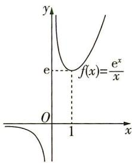

text_image

y
e
f(x)=\frac{e^x}{x}
O
1
x

故实数 a 的取值范围为 $(-∞, -3]$ .

解法二 由题意知 $g'(x) = x^2 - ax + 2 \leqslant 0$ 在 $(-2, -1)$ 上恒成立，所以 $a \leqslant x + \frac{2}{x}$ 在 $(-2, -1)$ 上恒成立。记 $h(x) = x + \frac{2}{x}$ ，则 $x \in (-2, -1)$ 时， $-3 < h(x) \leqslant -2\sqrt{2}$ ，（由对勾函数单调性可得）

所以 $a \leqslant -3$ .

故实数 a 的取值范围为 $(-∞, -3]$ .

(2) $(-∞,-2\sqrt{2})$ 因为函数 $g(x)$ 在 $(-2,-1)$ 上存在单调递减区间, 所以 $g'(x)=x^{2}-ax+2<0$ 在 $(-2,-1)$ 上有解, 所以 $a<(x+\frac{2}{x})_{\max}$ . （等价转化思想的应用）

又 $x + \frac{2}{x} \leqslant -2\sqrt{2}$ , 当且仅当 $x = \frac{2}{x}$ 即 $x = -\sqrt{2}$ 时等号成立,

所以满足要求的 a 的取值范围是 $(-∞, -2\sqrt{2})$ .

(3) $(-3,-2\sqrt{2})$ 由(1)知 $g(x)$ 在 $(-2,-1)$ 上单调递减时，a的取值范围是 $(-∞,-3]$ . 若 $g(x)$ 在 $(-2,-1)$ 上单调递增，则 $a≥x+\frac{2}{x}$ 在 $(-2,-1)$ 上恒成立，又在 $(-2,-1)$ 上 $y=x+\frac{2}{x}$ 的值域为 $(-3,-2\sqrt{2}]$ ，所以a的取值范围是 $[-2\sqrt{2},+∞)$ ，所以函数 $g(x)$ 在 $(-2,-1)$ 上单调时，a的取值范围是 $(-∞,-3]∪[-2\sqrt{2},+∞)$ ，故 $g(x)$ 在 $(-2,-1)$ 上不单调时，实数a的取值范围是 $(-3,-2\sqrt{2})$ .（补集思想的应用）

2. C 因为函数 $f(x)=ae^{x}-\ln x$ ，所以 $f'(x)=ae^{x}-\frac{1}{x}$ 。因为函数 $f(x)=ae^{x}-\ln x$ 在 $(1,2)$ 单调递增，所以 $f'(x)\geqslant0$ 在 $(1,2)$ 恒成立，即 $ae^{x}-\frac{1}{x}\geqslant0$ 在 $(1,2)$ 恒成立，易知 a>0，则 $0<\frac{1}{a}\leqslant xe^{x}$ 在 $(1,2)$ 恒成立。设 $g(x)=xe^{x}$ ，则 $g'(x)=(x+1)e^{x}$ 。当 $x\in(1,2)$ 时， $g'(x)>0$ ， $g(x)$ 单调递增，所以在 $(1,2)$ 上， $g(x)>g(1)=e$ ，所以 $\frac{1}{a}\leqslant e$ ，即 $a\geqslant\frac{1}{e}=e^{-1}$ ，故选 C.

3. $\left[\frac{\sqrt{5} - 1}{2}, 1\right)$ 由题意得当 $x > 0$ 时, $f'(x) = a^x \ln a + (1 + a)^x \ln(1 + a) = a^x \left[\ln a + \left(\frac{1}{a} + 1\right)^x \ln(1 + a)\right] \geqslant 0$ 恒成立, 设 $g(x) = \ln a + \left(\frac{1}{a} + 1\right)^x \ln(1 + a)$ , 因为 $a^x > 0$ , 所以 $g(x) \geqslant 0$ 在 $(0, +\infty)$ 上恒成立.

因为 $a \in (0,1)$ , 所以 $\ln(1+a) > 0, \frac{1}{a} + 1 > 1$ , 所以 $g(x)$ 在 $(0, +\infty)$ 上单调递增, 故只需满足 $g(0) \geqslant 0$ , 即 $\ln a + \ln(1+a) = \ln(a+a^2) \geqslant 0$ , 所以 $a+a^2 \geqslant 1$ , 解得 $a \leqslant -\frac{\sqrt{5}+1}{2}$ 或 $a \geqslant \frac{\sqrt{5}-1}{2}$ , 又 $0 < a < 1$ , 所以 $a$ 的取值范围为 $[\frac{\sqrt{5}-1}{2}, 1)$ .

4. C 由题意得函数 $f(x)$ 的定义域为 $\mathbf{R}, f'(x) = 3ax^2 - 6x + 1$ ，要使函数 $f(x) = ax^3 - 3x^2 + x + 1$ 恰有三个单调区间，则 $f'(x) = 0$ 有两个不相等的实数根，所以 $\left\{\begin{aligned}a & \neq 0,\\ \Delta & = 36 - 12a > 0,\end{aligned}\right.$ 解得 $a < 3$ 且 $a \neq 0$ ，故实数 $a$ 的取值范围为 $(-∞,0)∪(0,3)$ ，故选C.

5. AC 因为函数 $f(x) = x^{3} + ax^{2} + bx + c$ ，所以 $f'(x) = 3x^{2} + 2ax + b$ 。因为函数 $f(x)$ 在 R 上单调递增，所以 $f'(x) \geqslant 0$ 对于任意的 $x \in R$ 恒成立，所以 $f'(1) \geqslant 0$ 恒成立，但 $f(1)$ 大小未知。对于方程 $3x^{2} + 2ax + b = 0, \Delta = 4a^{2} - 12b \leqslant 0$ ，即 $a^{2} - 3b \leqslant 0$ 。所以正确的是 AC。

6. $(-∞,-\frac{1}{2}]\cup[0,+∞)$ 由 $f(1)=0$ 得，a-b=0，即a=b.
所以 $f(x)=ax-\frac{a}{x}+\ln x,x\in(0,+\infty)$ .于是 $f'(x)=a+\frac{a}{x^{2}}+\frac{1}{x}=\frac{ax^{2}+x+a}{x^{2}}.$

(1) 当 a=0 时, $f'(x)=\frac{x}{x^{2}}=\frac{1}{x}>0$ , $f(x)$ 在 $(0,+\infty)$ 上单调递增, 适合.

(2) 当 a > 0 时, $f'(x) = \frac{ax^{2} + x + a}{x^{2}} > 0$ , $f(x)$ 在 $(0, +\infty)$ 上也单调递增, 适合.

(3) 当 a < 0 时, $f'(x) = \frac{ax^{2} + x + a}{x^{2}}$ . （提示：本题 $f'(x)$ 的符号完全由分子 $ax^{2} + x + a$ 决定，而二次项系数是 a，因此选择 a 为分类对象：根据二次项系数的符号分成 a=0、a>0 和 a<0 三类）若 $f(x)$ 在 $(0,+\infty)$ 内单调递增，则 $ax^{2}+x+a\geqslant0$ 在 $(0,+\infty)$ 内恒成立，显然不可能.

若 $f(x)$ 在 $(0, +\infty)$ 上单调递减，则 $ax^{2} + x + a \leqslant 0$ 在 $(0, +\infty)$ 内恒成立，即 $a \leqslant -\frac{x}{x^{2} + 1}$ 在 $(0, +\infty)$ 上恒成立。（注意：单调函数又分成单调递增和单调递减两种情况）

又 $-\frac{x}{x^2 + 1} = -\frac{1}{x + \frac{1}{x}} \geqslant -\frac{1}{2}$ , 当且仅当 $x = 1$ 时取到等号, 因此 $a \leqslant -\frac{1}{2}$ .

综上可知，实数 $a$ 的取值范围是 $(-\infty, -\frac{1}{2}] \cup [0, +\infty)$ .

# 题型 52 利用函数单调性求解比较大小或解不等式问题

1. D 由 $f(x) = x - \sin x$ ，得 $f'(x) = 1 - \cos x$ ，当 $x \in (1, \frac{\pi}{2})$ 时， $f'(x) > 0$ ，所以 $f(x)$ 在 $(1, \frac{\pi}{2})$ 上单调递增，可知 $0 < 1 - \sin 1 = f(1) < f(x) < f(\frac{\pi}{2}) = \frac{\pi}{2} - \sin \frac{\pi}{2} = \frac{\pi}{2} - 1 < 1$ ，即 $0 < f(x) < 1$ 在 $(0, \frac{\pi}{2})$ 上恒成立，所以 $f(\alpha) < \sqrt{f(\alpha)}$ . 因为 $\alpha \in (1, \frac{\pi}{2})$ ，所以 $1 < \sqrt{\alpha} < \alpha < \frac{\pi}{2}$ ，所以 $f(\sqrt{\alpha}) < f(\alpha)$ . 综上，得 $f(\sqrt{\alpha}) < f(\alpha) < \sqrt{f(\alpha)}$ ，故选 D.

2. A 因为 $b = \cos \frac{1}{4} = 1 - 2\sin^2 \frac{1}{8}$ ，所以 $b - a = 1 - 2\sin^2 \frac{1}{8} - \frac{31}{32} = \frac{1}{32} - 2\sin^2 \frac{1}{8} = 2\left(\frac{1}{64} - \sin^2 \frac{1}{8}\right)$ . 令 $f(x) = x - \sin x$ ，则 $f'(x) = 1 - \cos x \geqslant 0$ ，所以函数 $f(x)$ 在 $\mathbb{R}$ 上单调递增，所以当 $x > 0$ 时， $f(x) > f(0) = 0$ ，即有 $x > \sin x (x > 0)$ 成立，所以 $\frac{1}{8} > \sin \frac{1}{8}$ ，得 $\frac{1}{64} > \sin^2 \frac{1}{8}$ ，所以 $b > a$ . 因为 $\frac{c}{b} = \frac{4\sin \frac{1}{4}}{\cos \frac{1}{4}} = 4\tan \frac{1}{4}$ ，所以令 $g(x) = \tan x - x$ ，则 $g'(x) = \frac{\cos^2 x + \sin^2 x}{\cos^2 x} - 1 = \frac{1 - \cos^2 x}{\cos^2 x} \geqslant 0$ ，所以函数 $g(x)$ 在定义域内单调递增，所以当 $x > 0$ 时， $g(x) > g(0) = 0$ ，即有 $\tan x > x (x > 0)$ 成立，所以 $\tan \frac{1}{4} > \frac{1}{4}$ ，即 $4\tan \frac{1}{4} > 1$ ，所以 $\frac{c}{b} > 1 (b > 0)$ ，即 $c > b$ . 综上 $c > b > a$ .

3. C 设 $u(x) = x\mathrm{e}^{x}(0 < x \leqslant 0.1), v(x) = \frac{x}{1 - x} (0 < x \leqslant 0.1)$ , $w(x) = -\ln (1 - x)(0 < x \leqslant 0.1)$ , 则当 $0 < x \leqslant 0.1$ 时, $u(x) > 0$ , $v(x) > 0$ , $w(x) > 0$ . ①设 $f(x) = \ln [u(x)] - \ln [v(x)] = \ln x + x - [\ln x - \ln (1 - x)] = x + \ln (1 - x)(0 < x \leqslant 0.1)$ , 则 $f'(x) = 1 - \frac{1}{1 - x} = \frac{x}{x - 1} < 0$ 在 $(0,0.1]$ 上恒成立, 所以 $f(x)$ 在 $(0,0.1]$ 上单调递减, 所以 $f(0.1) < 0 + \ln (1 - 0) = 0$ , 即 $\ln [u(0.1)] - \ln [v(0.1)] < 0$ , 所以 $\ln [u(0.1)] < \ln [v(0.1)]$ , 又函数 $y = \ln x$ 在 $(0, +\infty)$ 上单调递增, 所以 $u(0.1) < v(0.1)$ , 即 $0.1\mathrm{e}^{0.1} < \frac{1}{9}$ , 所以 $a < b$ . ②设 $g(x) = u(x) - w(x) = x\mathrm{e}^{x} + \ln (1 - x)(0 < x \leqslant 0.1)$ , 则 $g'(x) = (x + 1)\mathrm{e}^{x} - \frac{1}{1 - x} = \frac{(1 - x^2)\mathrm{e}^x - 1}{1 - x}(0 < x \leqslant 0.1)$ , 设 $h(x) = (1 - x^2)\mathrm{e}^x - 1(0 < x \leqslant 0.1)$ , 则 $h'(x) = (1 - 2x - x^2)\mathrm{e}^x > 0$ 在 $(0,0.1]$ 上恒成立, 所以 $h(x)$ 在 $(0,0.1]$ 上单调递增, 所以 $h(x) > (1 - 0^2)\times \mathrm{e}^0 - 1 = 0$ , 即 $g'(x) > 0$ 在 $(0,0.1]$ 上恒成立, 所以 $g(x)$ 在 $(0,0.1]$ 上单调递增, 所以 $g(0.1) > 0\times \mathrm{e}^0 + \ln (1 - 0) = 0$ , 即 $g(0.1) = u(0.1) - w(0.1) > 0$ , 所以 $0.1\mathrm{e}^{0.1} > -\ln 0.9$ , 即 $a > c$ . 综上, $c < a < b$ , 故选 C.

4. D 由题意构造函数 $g(x) = f(x) - 2x^2 + 1$ ，则 $g'(x) = f'(x) - 4x > 0$ ，所以函数 $g(x)$ 在 $\mathbf{R}$ 上为增函数。因为 $f\left(\frac{1}{2}\right) = -\frac{1}{2}$ ，所以 $g\left(\frac{1}{2}\right) = f\left(\frac{1}{2}\right) - 2 \times \left(\frac{1}{2}\right)^2 + 1 = 0$ 。又 $f(\sin \alpha) + \cos 2\alpha > 0$ ，所以 $g(\sin \alpha) = f(\sin \alpha) - 2\sin^2\alpha + 1 = f(\sin \alpha) + \cos 2\alpha > 0 = g\left(\frac{1}{2}\right)$ ，所以 $\sin \alpha > \frac{1}{2}$ 。因为 $0 \leqslant \alpha \leqslant 2\pi$ ，所以 $\frac{\pi}{6} < \alpha < \frac{5\pi}{6}$ ，所以不等式

$f(\sin \alpha) + \cos 2\alpha > 0$ 的解集为 $\left(\frac{\pi}{6}, \frac{5\pi}{6}\right)$ . 故选 D.

5. C 对于 A, B, 不妨设 $f(x) = -2x, g(x) = 1$ , 则 $f'(x) = -2, g'(x) = 0$ , 满足 $f'(x) < g'(x)$ , 若 $x = -1 \in (a, b)$ , 则 $f(-1) = 2 > 1 = g(-1)$ , 故 A 不正确; 若 $x = 0 \in (a, b)$ , 则 $f(0) = 0 < 1 = g(0)$ , 故 B 不正确. 对于 C, D, 令 $h(x) = f(x) - g(x)$ , 则 $h'(x) = f'(x) - g'(x) < 0$ , 所以 $h(x)$ 在 R 上单调递减. 因为 $x \in (a, b)$ , 即 a < x < b, 所以 $h(b) < h(x) < h(a)$ . 由 $h(x) < h(a)$ 得 $f(x) - g(x) < f(a) - g(a)$ , 则 $f(x) + g(a) < g(x) + f(a)$ , 故 C 正确; 由 $h(b) < h(x)$ 得 $f(b) - g(b) < f(x) - g(x)$ , 则 $f(x) + g(b) > g(x) + f(b)$ , 故 D 不正确. 综上所述, 选 C.

6. C 由题意可知, $a=\frac{4-\ln4}{e^{2}}=\frac{2-\ln2}{\frac{e^{2}}{2}}=\frac{\ln\frac{e^{2}}{2}}{\frac{e^{2}}{2}},b=\frac{\ln2}{2}=\frac{\ln4}{4},$ $c=\frac{1}{e}=\frac{\ln e}{e}$ . 设 $f(x)=\frac{\ln x}{x}(x>0)$ ，则 $f'(x)=\frac{1-\ln x}{x^{2}}$ ，当 $x\in(0,e)$ 时， $f'(x)>0,f(x)$ 单调递增，当 $x\in(e,+\infty)$ 时， $f'(x)<0,f(x)$ 单调递减，又 $4>\frac{e^{2}}{2}>e$ ，所以 $f(4)<f(\frac{e^{2}}{2})<f(e)$ ，所以b<a<c，
故选 C.

7. C 由 $(x-1)f'(x)\geqslant0$ ，得 $\left\{\begin{aligned}x&\geqslant1,\\ f'(x)&\geqslant0\end{aligned}\right.$ 或 $\left\{\begin{aligned}x&\leqslant1,\\ f'(x)&\leqslant0.\end{aligned}\right.$

①函数 $y=f(x)$ 在 $(-∞,1]$ 上单调递减， $f(0)>f(1)$ ;
在 $[1,+\infty)$ 上单调递增， $f(2)>f(1)$ ，所以 $f(0)+f(2)>2f(1)$ .
②若函数 $y=f(x)$ 为常数函数，则 $f(0)+f(2)=2f(1)$ .

综合①②得 $f(0)+f(2)\geqslant2f(1)$ .故选C.

# 题型 53 求极值

1.1 $f'(x)=\frac{-x^{2}+x}{e^{x}}$ . 令 $f'(x)=0$ , 解得 x=0 或 x=1. 当 x<0 或 x>1 时, $f'(x)<0$ , $f(x)$ 单调递减; 当 0<x<1 时, $f'(x)>0$ , $f(x)$ 单调递增. 所以 $f(x)$ 的极小值为 $f(0)=1$ .

2. A 因为 $f(x)=(x^{2}+ax-1)\mathrm{e}^{x-1}$ ，所以 $f'(x)=(2x+a)\mathrm{e}^{x-1}+(x^{2}+ax-1)\mathrm{e}^{x-1}=[x^{2}+(a+2)x+a-1]\mathrm{e}^{x-1}$ 。因为 x=-2 是函数 $f(x)=(x^{2}+ax-1)\mathrm{e}^{x-1}$ 的极值点，所以 x=-2 是 $x^{2}+(a+2)x+a-1=0$ 的根，所以 a=-1， $f(x)=(x^{2}-x-1)\mathrm{e}^{x-1}$ ， $f'(x)=(x^{2}+x-2)\mathrm{e}^{x-1}=(x+2)(x-1)\mathrm{e}^{x-1}$ 。令 $f'(x)>0$ ，解得 x<-2 或 x>1，令 $f'(x)<0$ ，解得 -2<x<1，所以 $f(x)$ 在 $(-∞,-2)$ 上单调递增，在 $(-2,1)$ 上单调递减，在 $(1,+\infty)$ 上单调递增，所以当 x=1 时， $f(x)$ 取得极小值，且 $f(x)_{\text{极小值}}=f(1)=-1$ ，故选 A.

3.(1)因为 $f(x)=ax-x\mathrm{e}^{x}$ ，所以 $f(0)=0,f'(x)=a-\mathrm{e}^{x}-x\mathrm{e}^{x}$ ，所以 $f'(0)=a-1$ ，
则曲线 $y=f(x)$ 在点 $(0,f(0))$ 处的切线方程为 $y-0=(a-1)(x-0)$ ，即 $y=(a-1)x$ .

(2) $f'(x)=a-\mathrm{e}^{x}-xe^{x}=a-\mathrm{e}^{x}(x+1)$ ,

令 $g(x)=\mathrm{e}^{x}(x+1)$ ，则 $g'(x)=\mathrm{e}^{x}(x+2)$ ，

令 $g'(x)=0$ , 得 x=-2 , 当 x<-2 时, $g'(x)<0$ , 当 x>-2 时, $g'(x)>0$

所以函数 $g(x)$ 在 $(-∞, -2)$ 上单调递减，在 $(-2, +∞)$ 上单调递增.

因为当 $x = -1$ 时， $g(x) = 0$ ，当 $x < -1$ 时， $g(x) < 0$ ，当 $x > -1$ 时， $g(x) > 0$ ，当 $x \to +\infty$ 时， $g(x) \to +\infty$ ，且 $a > 0$ ，

所以方程 $f'(x)=a-\mathrm{e}^{x}-xe^{x}=a-\mathrm{e}^{x}(x+1)=0$ 有且只有一个实根，

设实根为 $x_{0}$ ，则 $x_{0} > -1$ ，

当 $x < x_{0}$ 时, $f'(x) > 0$ , $f(x)$ 单调递增, 当 $x > x_{0}$ 时, $f'(x) < 0$ , $f(x)$ 单调递减,

所以 $x = x_{0}$ 是函数 $f(x)$ 的极大值点, 且为函数 $f(x)$ 唯一的极值点.

(3)由题意得,存在 $a\in(0,+\infty)$ ，使得 $f(x)\leqslant a+b$ 对任意 $x\in R$ 成立，即存在 $a\in(0,+\infty)$ ，使得 $ax-xe^{x}\leqslant a+b$ 对任意 $x\in R$ 成立，即存在 $a\in(0,+\infty)$ ，使得 $b\geqslant a(x-1)-xe^{x}$ 对任意 $x\in R$ 成立.

令 $h(x) = a(x - 1) - x\mathrm{e}^x$ ，则存在 $a\in (0, + \infty)$ ，使得 $b\geqslant h(x)_{\max}$ $h^\prime (x) = a - \mathrm{e}^x (x + 1)$ ，显然 $h^\prime (x) = f^\prime (x)$

结合(2)可知, $h(x)$ 在 $(-∞,x_{0})$ 上单调递增,在 $(x_{0},+∞)$ 上单调递减,

所以当 $x = x_{0}$ 时, $h(x)$ 取得最大值, $h(x)_{\max} = h(x_{0}) = a(x_{0} - 1) - x_{0}e^{x_{0}}$ .

因为 $x_{0} > -1$ 且 $h'(x_{0}) = a - \mathrm{e}^{x_{0}}(x_{0} + 1) = 0$ ，所以 $a = \mathrm{e}^{x_{0}}(x_{0} + 1)$ 。

所以 $h(x)_{\max} = h(x_0) = \mathrm{e}^{x_0}(x_0 + 1)(x_0 - 1) - x_0\mathrm{e}^{x_0} = \mathrm{e}^{x_0}(x_0^2 -x_0 - 1)(x_0 > - 1)$

即存在 $a \in (0, +\infty)$ ，使得 $b \geqslant h(x_0) = \mathrm{e}^{x_0}(x_0^2 - x_0 - 1)$ 成立.

令 $u(x) = \mathrm{e}^{x}(x^{2} - x - 1)(x > - 1)$ ，则 $u^{\prime}(x) = \mathrm{e}^{x}(x^{2} + x - 2) =$ $\mathrm{e}^x (x + 2)(x - 1),$

所以当-1<x<1时, $u'(x)<0$ ,当x>1时, $u'(x)>0$ ,

所以函数 $u(x)$ 在 $(-1,1)$ 上单调递减，在 $(1,+\infty)$ 上单调递增，当 x=1 时， $u(x)$ 取得最小值， $u(x)_{\min}=u(1)=-e$ ，即 $h(x_{0})$ 的最小值为 -e.

所以 $b \geqslant -e$ ,

即实数 b 的取值范围为 $[-e, +\infty)$ .

4. AC 依题意, $f'(x)=ae^{x}+a(x+1)e^{x}=(ax+2a)e^{x},f'(-1)=ae^{-1}=\frac{1}{e}$ , 解得 a=1 , 所以 $f(x)=(x+1)e^{x},f'(x)=(x+2)e^{x}$ .

又 $f(-1)=0$ ，所以 $\frac{1}{e}\times(-1)+b=0$ ，所以 $b=\frac{1}{e}$ ，故A正确。令 $f'(x)=0$ ，解得x=-2，当 $x\in(-\infty,-2)$ 时， $f'(x)<0$ ，函数 $f(x)$ 在 $(-∞,-2)$ 上单调递减；当 $x\in(-2,+∞)$ 时， $f'(x)>0$ ，函数 $f(x)$ 在 $(-2,+∞)$ 上单调递增。所以当x=-2时，函数 $f(x)$ 取极小值，为 $f(-2)=-\frac{1}{e^{2}}$ ， $f(x)$ 的极大值不存在，故B、D错误，C正确。故选AC。

5. (1) 当 $a = -4$ 时, $f(x) = -2x^{2} + \ln x + 3x, x \in (0, +\infty)$ ,

$$
f ^ {\prime} (x) = - 4 x + \frac {1}{x} + 3 = \frac {- 4 x ^ {2} + 3 x + 1}{x} = \frac {- (4 x + 1) (x - 1)}{x}.
$$

由 $f'(x)>0$ ,得0<x<1,由 $f'(x)<0$ ,得x>1.

所以 $f(x)$ 的单调递增区间为 $(0,1)$ ，单调递减区间为 $(1,+\infty)$ ，
所以 $f(x)$ 在 x=1 处取得极大值 $f(1)=1$ ，无极小值.

(2) 证明: 因为 $f(x)=\frac{1}{2}ax^{2}+\ln x-(a+1)x,x\in(0,+\infty)$ ,

所以 $f^{\prime}(x) = ax + \frac{1}{x} - (a + 1) = \frac{ax^{2} - (a + 1)x + 1}{x} = \frac{(ax - 1)(x - 1)}{x}$ .

①当 a=1 时， $f'(x) \geqslant 0, f(x)$ 在 $(0, +\infty)$ 上单调递增，

因为 $f(1)=-\frac{3}{2}<0,f(4)=\ln4>0$ ，所以 $f(1)\cdot f(4)<0$ ，故 $f(x)$ 在 $(1,4)$ 上有唯一零点.

②当 a>1 时,由 $f'(x)>0$ , 得 $0<x<\frac{1}{a}$ 或 x>1, 由 $f'(x)<0$ , 得 $\frac{1}{a}<x<1$ ,

所以 $f(x)$ 在 $(0, \frac{1}{a})$ 上单调递增，在 $(\frac{1}{a}, 1)$ 上单调递减，在 $(1, +\infty)$ 上单调递增，

因为 $f(\frac{1}{a})=-\frac{1}{2a}-\ln a-1<0,f(1)=\frac{1}{2}a-a-1=-\frac{1}{2}a-1<0$ ，又 $x\to+\infty$ 时， $f(x)\to+\infty$ ，所以 $f(x)$ 在 $(0,1)$ 上无零点。在 $(1,+\infty)$ 上有唯一零点。
综上，当 $a \geqslant 1$ 时， $f(x)$ 只有一个零点。

6. $2 + \ln a$ $f^{\prime}(x) = -a\mathrm{e}^{-x} + 1 = \frac{\mathrm{e}^{x} - a}{\mathrm{e}^{x}}, x \in \mathbf{R}$ .

(1) 当 $a \leqslant 0$ 时, $\mathrm{e}^{x} - a \geqslant \mathrm{e}^{x} > 0$ , $f'(x) = \frac{\mathrm{e}^{x} - a}{\mathrm{e}^{x}} > 0$ , $f(x)$ 在 $\mathbb{R}$ 上单增, 无极值.

(2) 当 a > 0 时, 令 $f'(x) = \frac{\mathrm{e}^{x} - a}{\mathrm{e}^{x}} = 0$ , 则 $e^{x} - a = 0, x = \ln a. f(x)$ 在 $(-∞, \ln a)$ 上单调递减, 在 $(\ln a, +∞)$ 上单调递增, 所以 $f(x)$ 的极小值为 $f(\ln a) = ae^{-\ln a} + \ln a + 1 = 2 + \ln a.$ (当导函数 $f'(x)$ 中的参数影响到 $f'(x)$ 的符号时, 要考虑对参数分类讨论)

# 题型 54 已知函数极值情况求参数

1. D 由题意知, $f(x)$ 的定义域为 $\mathbf{R},f'(x)=x^{2}+x-c$ ,要使函数 $f(x)$ 有极值,则 $f'(x)=0$ 必有两个不等的实根,则 $\Delta=1+4c>0$ ,解得 $c>-\frac{1}{4}$ . 故选D.

2. D 解法一 因为函数 $f(x) = a(x - a)^2 (x - b)$ ，所以 $f'(x) = 2a(x - a)(x - b) + a(x - a)^2 = a(x - a)(3x - a - 2b)$ .

令 $f'(x)=0$ ，结合 $a\neq0$ 可得x=a或 $x=\frac{a+2b}{3}$ .

(1) 当 a > 0 时, 若 x = a 为函数 $f(x)$ 的极大值点, 则 $a < \frac{a + 2b}{3}$ , 即 b > a. (由 $f'(x)$ 的图象可判断)

(2) 当 a < 0 时, 若 x = a 为函数 $f(x)$ 的极大值点, 则 $a > \frac{a + 2b}{3}$ , 即 b < a. (由 $f'(x)$ 的图象可判断)

综上, $a > 0$ 且 $b > a$ 满足题意, $a < 0$ 且 $b < a$ 也满足题意. 据此, 可知必有 $ab > a^2$ 成立. 故选 D.

解法二 易知 a 与 b 是 $f(x)$ 图象与 x 轴两个交点的横坐标. 当 a > 0 时, 根据题意画出函数 $f(x)$ 的大致图象, 如图 1 所示, 观察可知 b > a, 此时 $ab > a^{2}$ .

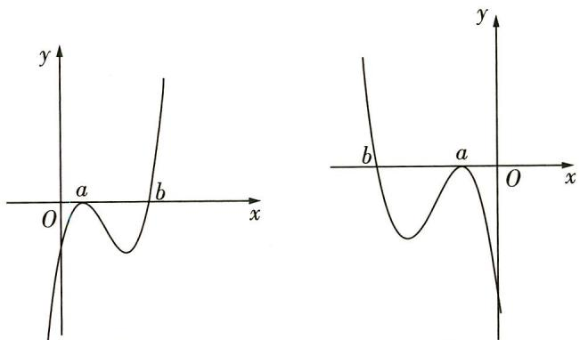

text_image

Two mathematical graphs showing a function with labeled points a and b on Cartesian coordinates

图1  
图2

当 a<0 时, 根据题意画出函数 $f(x)$ 的大致图象, 如图 2 所示, 观察可知 a>b, 此时 $ab > a^{2}$ , 综上, 故选 D.

3. BCD 因为函数 $f(x)=a\ln x+\frac{b}{x}+\frac{c}{x^{2}}(a\neq0)$ ，所以函数 $f(x)$ 的定义域为 $(0,+\infty)$ ， $f'(x)=\frac{ax^{2}-bx-2c}{x^{3}}$ ，因为函数 $f(x)$ 既有极大值也有极小值，所以关于 x 的方程 $ax^{2}-bx-2c=0$ 有两个不

等的正实根 $x_{1}, x_{2}$ ，则 $\left\{ \begin{array}{l} \Delta > 0, \\ x_{1} + x_{2} > 0, \\ x_{1}x_{2} > 0, \end{array} \right.$ 即 $\left\{ \begin{array}{l} b^{2} + 8ac > 0, \\ \frac{b}{a} > 0, \\ -\frac{2c}{a} > 0, \end{array} \right.$ 所以

$b^{2}+8ac>0,$ ab > 0,
ac < 0,
bc < 0.
故选 BCD.

4. (1) 由题意得 $y = xf(x) = x \ln(a - x)$ ,

则 $y' = \ln(a - x) + x[\ln(a - x)]'$ .

因为 x=0 是函数 $y=xf(x)$ 的极值点，

所以 $y'\big|_{x=0}=\ln a=0$ ，所以 a=1。经检验，当 a=1 时， $y'=\ln(1-x)+x\left[\ln(1-x)\right]'$ 不恒为零。综上，a=1。

(2) 证明: 由(1)可知, $f(x)=\ln(1-x)$ , 其定义域为 $\{x|x<1\}$ ,

当 $0 < x < 1$ 时， $\ln (1 - x) < 0$ ，此时 $xf(x) < 0$

当 x<0 时, $\ln(1-x)>0$ ,此时 $xf(x)<0$ .

易知 $g(x)$ 的定义域为 $\{x \mid x < 1 \text{ 且 } x \neq 0\}$ ,

故要证 $g(x) = \frac{x + f(x)}{xf(x)} < 1$ ，只需证 $x + f(x) > xf(x)$ ，即证 $x + \ln(1 - x) - x\ln(1 - x) > 0$ .

令 $1 - x = t$ ，则 $t > 0$ 且 $t \neq 1$ ，则只需证 $1 - t + \ln t - (1 - t)\ln t > 0$ 即证 $1 - t + t\ln t > 0.$

令 $h(t) = 1 - t + t\ln t$ ，则 $h^{\prime}(t) = -1 + \ln t + 1 = \ln t$ ，所以 $h(t)$ 在(0,1）上单调递减，在 $(1, + \infty)$ 上单调递增，所以 $h(t) > h(1) = 0$

即 $g(x) < 1$ 成立.

5. B 因为 $f(x)=x+(x^{2}-ax)\ln x$ ，所以 $f'(x)=1+(2x-a)\ln x+(x^{2}-ax)\cdot\frac{1}{x}=(2x-a)\ln x+x-a+1$ 。因为 1 是 $f(x)$ 的极值点，所以 $f'(1)=(2-a)\ln 1+1-a+1=0$ ，得 a=2。经检验 a=2 满足题意，故 $f'(2)=2\ln 2+1$ ，故选 B.

6.4 由题意, 得 $f'(x) = \mathrm{e}^x + \mathrm{e}^{1 - x} - a$ . 令 $g(x) = \mathrm{e}^x + \mathrm{e}^{1 - x} - a$ , 则 $g'(x) = \mathrm{e}^x - \mathrm{e}^{1 - x}$ , 易知 $g'(x)$ 为 $\mathbb{R}$ 上的增函数, 又 $g'(\frac{1}{2}) = 0$ , 所以当 $x < \frac{1}{2}$ 时, $g'(x) < 0$ , 函数 $g(x)$ 单调递减; 当 $x > \frac{1}{2}$ 时, $g'(x) > 0$ , 函数 $g(x)$ 单调递增. 所以 $g(x)_{\min} = g(\frac{1}{2}) = 2\sqrt{\mathrm{e}} - a$ . 又当 $x \to +\infty$ 时, $f'(x) \to +\infty$ , 当 $x \to -\infty$ 时, $f'(x) \to +\infty$ , 所以 $f'(x)_{\min} < 0$ , 即 $g(x)_{\min} = 2\sqrt{\mathrm{e}} - a < 0$ , 所以 $a > 2\sqrt{\mathrm{e}}$ . (因为函数 $f(x)$ 有两个极值点, 所以 $f'(x)$ 有两个变号零点)

因为 $x_{1}, x_{2}$ 为函数 $f(x)$ 的两个极值点，所以 $f'(x_{1}) = f'(x_{2}) = 0$ .

(提示: 在函数的极值点处的导数值为0)

因为 $f'(1-x)=\mathrm{e}^{1-x}+\mathrm{e}^{x}-a=f'(x)$ ，所以 $f'(x)$ 的图象关于直线 $x=\frac{1}{2}$ 对称，所以 $x_{1}+x_{2}=1$ ，所以 $x_{2}=1-x_{1}$ ，所以 $f(x_{1})+f(x_{2})=e^{x_{1}}-e^{1-x_{1}}-ax_{1}+e^{x_{2}}-e^{1-x_{2}}-ax_{2}=e^{x_{1}}-e^{1-x_{1}}-ax_{1}+e^{1-x_{1}}-e^{1-(1-x_{1})}-a(1-x_{1})=-a=-4$ ，所以 $a=4>2\sqrt{e}$ ，满足条件。（提示：求出结果后，要注意检验）

7. ①2 ②(0,2) ①当 $a = 1$ 时, $f(x) = \begin{cases} -x^2 + x + 1, & x \leqslant 1, \\ x, & x > 1. \end{cases}$

因为 $f(1)=1$ ，所以易知 $f(x)$ 为连续函数。（提醒：在讨论分段函数的单调性时，除注意各段的单调性外，还要注意衔接点的取值）

当 $x \leqslant 1$ 时, $f(x) = -x^2 + x + 1 = -(x - \frac{1}{2})^2 + \frac{5}{4}$ , 所以 $f(x)$ 在 $(- \infty, \frac{1}{2})$ 上单调递增, 在 $(\frac{1}{2}, 1]$ 上单调递减. 又当 $x > 1$ 时, $f(x) = x$ , 所以 $f(x)$ 在 $(1, +\infty)$ 上单调递增.

综上, $f(x)$ 在 $(-∞, \frac{1}{2})$ , $(1, +∞)$ 上单调递增,在 $(\frac{1}{2}, 1]$ 上单调递减.

所以 $x=\frac{1}{2}$ 和 x=1 是 $f(x)$ 的极值点，即 $f(x)$ 的极值点个数为 2.

②因为 $f(1)=a$ ，所以易知 $f(x)$ 为连续函数.

因为 $f(x)=ax(x>1)$ 为单调函数,所以 $f(x)$ 在 $(1,+\infty)$ 上无极值点;

又 $f(x) = -x^{2} + ax + 1 = -(x - \frac{a}{2})^{2} + \frac{a^{2}}{4} + 1$ 在 $(-\infty, 1]$ 上至多有一个极值点，

所以 $x = 1$ 和 $x = \frac{a}{2}$ 必为 $f(x)$ 的2个极值点，

所以 $\frac{a}{2}<1$ , 解得 a<2.

又 $f(x)$ 在 $(\frac{a}{2},1)$ 上单调递减,所以 $f(x)$ 在 $(1,+\infty)$ 上单调递增,所以a>0.(易错提醒:根据极值点个数求参数范围时,确定x=1和 $x=\frac{a}{2}$ 为 $f(x)$ 的2个极值点后,忽略在极值点左右两侧函数的单调性需发生改变,导致丢失a>0这个范围)

综上所述,实数 a 的取值范围为 $(0,2)$ .

8.4 -11 $f^{\prime}(x) = 3x^{2} + 2ax + b.$ 由题意得， $\left\{ \begin{array}{l} f'(1) = 0, \\ f(1) = 10, \end{array} \right.$ 即 $\left\{ \begin{array}{l} 2a + b + 3 = 0, \\ a^2 + a + b + 1 = 10, \end{array} \right.$ 解得 $\left\{ \begin{array}{l} a = 4, \\ b = -11 \end{array} \right.$ 或 $\left\{ \begin{array}{l} a = -3, \\ b = 3. \end{array} \right.$

当 a=4, b=-11 时， $f'(x)=3x^{2}+8x-11=(3x+11)(x-1)$ ，在 x=1 的左、右附近， $f'(x)$ 异号，此时在 x=1 处有极值；

当 a = -3, b = 3 时， $f'(x) = 3x^{2} - 6x + 3 = 3(x - 1)^{2}$ ，在 x = 1 的左、右附近，恒有 $f'(x) > 0$ ，不变号，此时在 x = 1 处无极值。（防范：本题易错在将有极值的必要条件 $f'(x_{0}) = 0$ 当作充要条件使用。一般地，对于可导函数 $f(x)$ ， $f'(x_{0}) = 0$ 是在 $x_{0}$ 处取得极值的必要而非充分的条件，解题时还要验证在 $x_{0}$ 左、右附近 $f'(x_{0})$ 是否异号，否则会产生增解）

故 $a = 4, b = -11$ .

# 题型 55 求函数的最值

1.1 因为 $f(x) = \mathrm{e}^{x} - \ln (x + m)$ ，则 $f'(x) = \mathrm{e}^{x} - \frac{1}{x + m}$ ，又函数 $f(x)$ 在 $x = 0$ 处的切线与 $y$ 轴垂直，即函数 $f(x)$ 在 $x = 0$ 处的切线斜率为 0，则 $f'(0) = \mathrm{e}^{0} - \frac{1}{m} = 0$ ，解得 $m = 1$ ，所以 $f(x) = \mathrm{e}^{x} - \ln (x + 1), x > -1$ ，则 $f'(x) = \mathrm{e}^{x} - \frac{1}{x + 1}$ ，因为 $y = \mathrm{e}^{x}$ 与 $y = -\frac{1}{x + 1}$ 均在 $(-1, +\infty)$ 上单调递增，所以 $f'(x)$ 在 $(-1, +\infty)$ 上单调递增，又 $f'(0) = 0$ ，所以当 $-1 < x < 0$ 时， $f'(x) < 0$ ，则 $f(x)$ 在 $(-1, 0)$ 上单调递减；当 $x > 0$ 时， $f'(x) > 0$ ，则 $f(x)$ 在 $(0, +\infty)$ 上单调递增，所以 $f(x)_{\min} = f(0) = 1 - \ln 1 = 1$ .

2. D $f(x) = \cos x + (x + 1)\sin x + 1, x \in [0, 2\pi]$ ，则 $f'(x) = -\sin x + \sin x + (x + 1)\cos x = (x + 1)\cos x.$ 令 $f'(x) = 0$ ，解得 $x = -1$ （舍去）， $x = \frac{\pi}{2}$ 或 $x = \frac{3\pi}{2}$ . 因为 $f(\frac{\pi}{2}) = \cos \frac{\pi}{2} + (\frac{\pi}{2} + 1) \cdot \sin \frac{\pi}{2} + 1 = 2 + \frac{\pi}{2}, f(\frac{3\pi}{2}) = \cos \frac{3\pi}{2} + (\frac{3\pi}{2} + 1)\sin \frac{3\pi}{2} + 1 = -\frac{3\pi}{2}$ ，又 $f(0) = \cos 0 + (0 + 1)\sin 0 + 1 = 2, f(2\pi) = \cos 2\pi + (2\pi +$

1) $\sin 2\pi + 1 = 2$ ，所以 $f(x)_{\max} = f\left(\frac{\pi}{2}\right) = 2 + \frac{\pi}{2}, f(x)_{\min} = f\left(\frac{3\pi}{2}\right) = -\frac{3\pi}{2}$ . 故选 D.

3.1 函数 $f(x) = |2x - 1| - 2\ln x$ 的定义域为 $(0, +\infty)$ .

①当 $x > \frac{1}{2}$ 时，（对 x 进行分类讨论）

$f(x)=2x-1-2\ln x$ , 所以 $f'(x)=2-\frac{2}{x}=\frac{2(x-1)}{x}$ , 当 $\frac{1}{2}<x<1$ 时, $f'(x)<0$ , 当 x>1 时, $f'(x)>0$ , 所以 $f(x)_{\min}=f(1)=2-1-2\ln1=1$ ;

②当 $0 < x \leqslant \frac{1}{2}$ 时， $f(x) = 1 - 2x - 2\ln x$ 在 $(0, \frac{1}{2}]$ 上单调递减，所以 $f(x)_{\min} = f(\frac{1}{2}) = -2\ln \frac{1}{2} = 2\ln 2 = \ln 4 > \ln e = 1.$

综上, $f(x)_{\min}=1$ .

4. 因为 $f(x) = \frac{3 - 2x}{x^2 + a}$ ，所以 $x^2 + a \neq 0, f'(x) = \frac{(3 - 2x)'(x^2 + a) - (3 - 2x)(x^2 + a)'}{(x^2 + a)^2} = \frac{2x^2 - 6x - 2a}{(x^2 + a)^2}$ .

(1) 若 $a = 0$ ，则 $f'(1) = -4, f(1) = 1$

代入 $y - f(1) = f'(1)(x - 1)$ ，得 $4x + y - 5 = 0$ ，

所以曲线 $y = f(x)$ 在点(1, $f(1)$ )处的切线方程为 $4x + y - 5 = 0$ .

(2)由函数 $f(x)$ 在x=-1处取得极值可知 $f'(-1)=0$ ，即 $\frac{8-2a}{(1+a)^{2}}=0$ ，得a=4.

此时 $f(x)=\frac{3-2x}{x^{2}+4}$ ，所以 $f'(x)=\frac{2(x-4)(x+1)}{(x^{2}+4)^{2}}$

当 $x \in (-\infty, -1) \cup (4, +\infty)$ 时， $f'(x) > 0$ ，所以 $f(x)$ 的单调递增区间为 $(-∞, -1)$ ， $(4, +∞)$ ;

当 $x \in (-1,4)$ 时， $f'(x) < 0$ ，所以 $f(x)$ 的单调递减区间为 $(-1,4)$ . 又当 $x \to -\infty$ 时， $f(x) \to 0$ ，当 $x \to +\infty$ 时， $f(x) \to 0$ ，

所以 $f(x)$ 的最大值为 $f(-1)=1,f(x)$ 的最小值为 $f(4)=-\frac{1}{4}$ .

5. D 由 $f(a) = \frac{1}{1 - a}, g(a) = 2\ln a$ 得 $A(a, \frac{1}{1 - a}), B(a, 2\ln a)$ ，故所求 $|AB| = |\frac{1}{1 - a} - 2\ln a|$ ，构造函数 $F(x) = \frac{1}{1 - x} - 2\ln x (x > 0$ 且 $x \neq 1$ ，

$$
F ^ {\prime} (x) = \frac {1}{(1 - x) ^ {2}} - \frac {2}{x} = \frac {- 2 x ^ {2} + 5 x - 2}{x (x - 1) ^ {2}} = \frac {- (2 x - 1) (x - 2)}{x (x - 1) ^ {2}}.
$$

令 $F'(x)=0$ 可得 $x_{1}=\frac{1}{2}, x_{2}=2$ ,

列表如下：

<table><tr><td>x</td><td>(0,1/2)</td><td>1/2</td><td>(1/2,1)</td><td>(1,2)</td><td>2</td><td>(2,+∞)</td></tr><tr><td>F&#x27;(x)</td><td>-</td><td>0</td><td>+</td><td>+</td><td>0</td><td>-</td></tr><tr><td>F(x)</td><td>单调递减</td><td>极小值</td><td>单调递增</td><td>单调递增</td><td>极大值</td><td>单调递减</td></tr></table>

则极小值为 $F\left(\frac{1}{2}\right) = \frac{1}{1 - \frac{1}{2}} - 2\ln \frac{1}{2} = 2 + 2\ln 2$ ，极大值为 $F(2) = \frac{1}{1 - 2} - 2\ln 2 = -1 - 2\ln 2$ ，

于是 $|F(x)_{\min}| = \min \left\{ |F(\frac{1}{2})|, |F(2)| \right\} = 1 + 2\ln 2.$

故选D.

6. A 由题意知, $f(x)$ , $g(x)$ 的定义域均为 $(0, +\infty)$ .

$f'(x) = (x + 1)e^{x} - \frac{1}{x} - 1 = (x + 1)e^{x} - \frac{x + 1}{x} = (x + 1)(e^{x} - \frac{1}{x})$ , 令 $h(x) = e^{x} - \frac{1}{x}$ , 因为函数 $y = -\frac{1}{x}$ 在 $(0, +\infty)$ 上单调递增, 函数 $y = e^{x}$ 在 $(0, +\infty)$ 上单调递增, 所以函数 $h(x)$ 在 $(0, +\infty)$ 上单调递增, 因为 $h(\frac{1}{2}) = \sqrt{e} - 2 < 0, h(1) = e - 1 > 0$ , 所以 $\exists x_{1} \in (\frac{1}{2}, 1), h(x_{1}) = 0$ , 即 $e x_{1} = \frac{1}{x_{1}}$ , 所以 $\ln x_{1} = -x_{1}$ , 所以当 $x \in (0, x_{1})$ 时, $f'(x) < 0$ ; 当 $x \in (x_{1}, +\infty)$ 时, $f'(x) > 0$ . 所以 $f(x)$ 在 $(0, x_{1})$ 上单调递减, 在 $(x_{1}, +\infty)$ 上单调递增, 所以 $a = f(x)_{\min} = f(x_{1}) = x_{1} e x_{1} - \ln x_{1} - x_{1} - 2 = 1 + x_{1} - x_{1} - 2 = -1$ .

$g'(x)=\frac{(x-1)\mathrm{e}^{x-2}}{x^{2}}+\frac{1}{x}-1=\frac{(x-1)(\mathrm{e}^{x-2}-x)}{x^{2}}$ ，令 $k(x)=\mathrm{e}^{x-2}-x$ ，则 $k'(x)=\mathrm{e}^{x-2}-1$ ，当0<x<2时， $k'(x)<0$ ，当x>2时， $k'(x)>0$ ，所以函数 $k(x)$ 在(0,2)上单调递减，在 $(2,+\infty)$ 上单调递增，又 $k(0)=\mathrm{e}^{-2}>0,k(1)=\frac{1}{\mathrm{e}}-1<0,k(3)=\mathrm{e}-3<0$ ， $k(4)=\mathrm{e}^{2}-4>0$ ，所以 $\exists x_{2}\in(0,1)$ ， $\exists x_{3}\in(3,4),k(x_{2})=0$ ， $k(x_{3})=0$ ，即 $e^{x_{2}-2}=x_{2},e^{x_{3}-2}=x_{3}$ ，所以 $x_{2}-2=\ln x_{2},x_{3}-2=\ln x_{3}$ ，所以当 $x\in(0,x_{2})$ 时， $g'(x)<0,g(x)$ 单调递减；当 $x\in(x_{2},1)$ 时， $g'(x)>0,g(x)$ 单调递增；当 $x\in(1,x_{3})$ 时， $g'(x)<0,g(x)$ 单调递减；当 $x\in(x_{3},+\infty)$ 时， $g'(x)>0,g(x)$ 单调递增。所以 $g(x)$ 的极小值为 $g(x_{2})=\frac{\mathrm{e}^{x_{2}-2}}{x_{2}}+\ln x_{2}-x_{2}=-1,g(x_{3})=\frac{\mathrm{e}^{x_{3}-2}}{x_{3}}+\ln x_{3}-x_{3}=-1$ ，所以 $b=g(x)_{\min}=-1$ 。

所以 a=b, 故选 A.

7.2 $f^{\prime}(x) = \ln (-x) + a.$ 由 $f^{\prime}(x) = \ln (-x) + a = 0$ 得， $x = -\mathrm{e}^{-a}$ .

当 $x \in (-\infty, -\mathrm{e}^{-a})$ 时， $f'(x) > 0$ ；当 $x \in (-\mathrm{e}^{-a}, 0)$ 时， $f'(x) < 0$ 。所以 $f(x)$ 在 $x = -\mathrm{e}^{-a}$ 处取得极大值 $f(-\mathrm{e}^{-a}) = \mathrm{e}^{-a}$ 。

下面对零点 $x = -\mathrm{e}^{-a}$ 与区间 $[-e^2, -e^{-1}]$ 的位置关系进行讨论：①若 $-\mathrm{e}^{-a} < -\mathrm{e}^2$ ，即 $a < -2$ 时，函数在 $[-e^2, -e^{-1}]$ 上单调递减， $g(a) = f(-e^2) = -(a + 1)e^2$ 。②若 $-e^2 \leqslant -e^{-a} < -e^{-1}$ ，即 $-2 \leqslant a < 1$ 时， $g(a) = f(-e^{-a}) = e^{-a}$ 。③若 $-e^{-a} \geqslant -e^{-1}$ ，即 $a \geqslant 1$ 时，函数在 $[-e^2, -e^{-1}]$ 上单调递增， $g(a) = f(-e^{-1}) = \frac{2 - a}{e}$ 。

故 $g(a) = \begin{cases} - (a + 1)\mathrm{e}^2 (a <   - 2),\\ \mathrm{e}^{-a}(-2\leqslant a <   1),\\ \frac{2 - a}{\mathrm{e}} (a > 1). \end{cases}$ （ $f(x)$ 的最大值为关于 $a$ 的函数）

易得 $g(a)$ 在 R 上单调递减, 所以 $g(a)$ 在 $[-\ln 2, \ln 2]$ 上的最大值为 $g(-\ln 2) = 2$ . （先判断出 $g(a)$ 在定义域 R 内的单调性, 再求其在区间内的最值, 注意不要与 $f(x)$ 的定义域混淆）

# 题型 56 已知函数最值情况求参数

1. $[-2, 1)$ 由于 $f'(x) = -x^2 + 1$ . 易知 $f(x)$ 在 $(- \infty, -1)$ 和 $(1, +\infty)$ 上单调递减，在 $[-1, 1]$ 上单调递增. 若函数 $f(x)$ 在 $(a, 10 - a^2)$ 上存在最大值，则 $\left\{ \begin{array}{l} a < 1, \\ 10 - a^2 > 1, \\ f(1) \geqslant f(a), \end{array} \right.$ 即 $-2 \leqslant a < 1$ .

2. B 由题意知, $f(1)=a\ln1+b=b=-2$ . 因为 $f'(x)=\frac{a}{x}-\frac{b}{x^{2}}(x>0)$ , 所以 $f'(1)=a-b=0$ , 所以 a=-2, 所以 $f'(2)=\frac{a}{2}-\frac{b}{4}=-\frac{1}{2}$ . 故选 B.

3. (1) $f'(x)=6x^{2}-2ax=2x(3x-a)$ .

令 $f'(x)=0$ , 得 x=0 或 $x=\frac{a}{3}$ .

若 $a > 0$ ，则当 $x \in (-\infty, 0) \cup (\frac{a}{3}, +\infty)$ 时， $f'(x) > 0$ ；当 $x \in (0, \frac{a}{3})$ 时， $f'(x) < 0$ 。故 $f(x)$ 在 $(- \infty, 0)$ 和 $(\frac{a}{3}, +\infty)$ 上单调递增，在 $(0, \frac{a}{3})$ 上单调递减。

若 a=0，则 $f(x)$ 在 $(-∞,+∞)$ 上单调递增.

若 $a < 0$ ，则当 $x \in (-\infty, \frac{a}{3}) \cup (0, +\infty)$ 时， $f'(x) > 0$ ；当 $x \in (\frac{a}{3}, 0)$ 时， $f'(x) < 0$ 。故 $f(x)$ 在 $(- \infty, \frac{a}{3})$ 和 $(0, +\infty)$ 上单调递增，在 $(\frac{a}{3}, 0)$ 上单调递减。

(2) 满足题设条件的 a, b 存在.

(i) 当 a<0 时, 由(1)知, $f(x)$ 在 [0,1] 上单调递增, 所以 $f(x)$ 在区间 [0,1] 上的最小值为 $f(0)=b$ , 最大值为 $f(1)=2-a+b$ , 所以 b=-1, $2-a+b=1$ , 则 a=0, b=-1, 与 a<0 矛盾, 所以 a<0 不成立.

(ii) 当 $a = 0$ 时, 由 (1) 知, $f(x)$ 在 $[0, 1]$ 上单调递增, 所以由 $f(0) = -1$ , $f(1) = 1$ 得 $a = 0$ , $b = -1$ .

(iii) 当 0 < a < 3 时, 由(1)知, $f(x)$ 在 $(0, \frac{a}{3})$ 上单调递减, 在 $(\frac{a}{3},$

1) 上单调递增, 所以 $f(x)$ 在 $[0,1]$ 上的最小值为 $f(\frac{a}{3}) = -\frac{a^{3}}{27} + b$ , 最大值为 $f(0) = b$ 或 $f(1) = 2 - a + b$ .

若 $-\frac{a^3}{27} + b = -1, b = 1$ ，则 $a = 3\sqrt[3]{2}$ ，与 $0 < a < 3$ 矛盾.

若 $-\frac{a^{3}}{27}+b=-1,2-a+b=1$ , 则 $a=3\sqrt{3}$ 或 $a=-3\sqrt{3}$ 或 a=0 , 与 0<a<3 矛盾.

(iv) 当 $a \geqslant 3$ 时, 由(1)知, $f(x)$ 在 $[0,1]$ 上单调递减, 所以 $f(x)$ 在区间 $[0,1]$ 上的最大值为 $f(0) = b$ , 最小值为 $f(1) = 2 - a + b$ , 所以 $2 - a + b = -1, b = 1$ , 则 $a = 4, b = 1$ .

综上, 满足题设的 a, b 存在. 当 a = 0, b = -1 或 a = 4, b = 1 时, $f(x)$ 在区间 $[0,1]$ 上的最小值为 -1 且最大值为 1.

4. B $f(x) = m e^{x} - x - n - 1, f'(x) = m e^{x} - 1,$

当 $m \leqslant 0$ 时, $f'(x) < 0$ 恒成立, 则 $f(x)$ 单调递减, $f(0) = m - n - 1$ , 显然 $f(x) \geqslant -1$ 不恒成立;

当 m > 0 时， $x \in (-\infty, -\ln m)$ 时， $f'(x) < 0$ ，函数 $f(x)$ 单调递减； $x \in (-\ln m, +\infty)$ 时， $f'(x) > 0$ ，函数 $f(x)$ 单调递增，

所以 $f(x)_{\min}=f(-\ln m)=\ln m-n,$

因为 $f(x) \geqslant -1$ 恒成立, 所以 $\ln m - n + 1 \geqslant 0$ , 所以 $m(\ln m + 1) \geqslant mn$ ,

令 $h(m)=m(\ln m+1)$ , m>0, 则 $h'(m)=\ln m+2$ ,

当 $m \in (0, \mathrm{e}^{-2})$ 时， $h'(m) < 0$ ；当 $m \in (\mathrm{e}^{-2}, +\infty)$ 时， $h'(m) > 0$ .

则 $h(m)$ 在区间 $(0, e^{-2})$ 上单调递减，在区间 $(e^{-2}, +\infty)$ 上单调递增，

所以 $h(m)_{\min}=h(e^{-2})=-e^{-2}$ ，即 mn 的最大值是 $-e^{-2}$ 。故选 B.

5. (1) 当 a=1 时, $f(x)=x^{2}+x-\ln x, x>0$ ,

得 $f'(x)=2x+1-\frac{1}{x}=\frac{(2x-1)(x+1)}{x}$ ,

令 $f'(x)>0$ , 解得 $x>\frac{1}{2}$ , 令 $f'(x)<0$ , 解得 $0<x<\frac{1}{2}$ ,

故 $f(x)$ 的单调递增区间为 $\left(\frac{1}{2}, +\infty\right)$ ，递减区间为 $\left(0, \frac{1}{2}\right)$ .

(2) 存在实数 $a = e^{2}$ ，使得当 $x \in (0, e]$ 时， $g(x)$ 有最小值 3. 理由如下：

因为 $f(x)=x^{2}+ax-\ln x,a\in\mathbf{R}$ ，所以 $g(x)=f(x)-x^{2}=ax-\ln x,x\in(0,e]$ ，

所以 $g'(x) = a - \frac{1}{x} = \frac{ax - 1}{x} (0 < x \leqslant e)$ ,

①当 $a \leqslant 0$ 时, $g(x)$ 在 $(0, e]$ 上单调递减, $g(x)_{\min} = g(e) = ae - 1 = 3$ , 解得 $a = \frac{4}{e}$ , 不合题意, 舍去.

②当 $0<\frac{1}{a}<e$ 时, $x\in(0,\frac{1}{a})$ 时, $g'(x)<0,g(x)$ 在 $(0,\frac{1}{a})$ 上单调递减，

$x \in (\frac{1}{a}, e)$ 时, $g'(x) > 0$ , $g(x)$ 在 $(\frac{1}{a}, e)$ 上单调递增,

所以 $g(x)_{\min}=g\left(\frac{1}{a}\right)=1+\ln a=3$ , 解得 $a=e^{2}$ 满足条件；

③当 $\frac{1}{a}\geqslant e$ 时, $x\in(0,e)$ 时, $g'(x)<0,g(x)$ 在 $(0,e]$ 上单调递减, $g(x)_{\min}=g(e)=ae-1=3$ , 解得 $a=\frac{4}{e}$ , 不合题意, 舍去.

综上,存在实数 $a=e^{2}$ ,使得当 $x\in(0,e]$ 时, $g(x)$ 有最小值 3.

6. $\frac{9}{8}$ $g(x)$ 的定义域为 $(0, +\infty)$ .

因为 $g(x)=\ln x-\frac{1}{8}x^{2}+b$ ，所以 $g'(x)=\frac{1}{x}-\frac{x}{4}=\frac{4-x^{2}}{4x}=\frac{(2-x)(2+x)}{4x}$ .

当 $x \in (1,2)$ 时， $g'(x) > 0$ ，当 $x \in (2,3)$ 时， $g'(x) < 0$ ，所以 $g(x)$ 在 $[1,2]$ 上单调递增，在 $[2,3]$ 上单调递减.

又 $g(1) = -\frac{1}{8} + b, g(3) = \ln 3 - \frac{9}{8} + b, g(3) - g(1) = \ln 3 - 1 > 0,$ （防范：要比较 $g(1)$ 、 $g(3)$ 的大小关系）

所以 $g(x)_{\min}=g(1)=-\frac{1}{8}+b=1$ ，解得 $b=\frac{9}{8}$ . （技巧：利用最小值为 1 这个条件构建方程求参数 b）

# 第四章 三角函数

# 第一节 三角函数的基本概念、同角三角函数的基本关系与诱导公式

题型 57 判断三角函数值的符号

1. C $\because \theta$ 为第二象限角, $\therefore \frac{\pi}{2} + 2k\pi < \theta < \pi + 2k\pi, k \in Z$ , 则 $\frac{\pi}{4} + k\pi < \frac{\theta}{2} < \frac{\pi}{2} + k\pi, k \in Z, \therefore \frac{\theta}{2}$ 为第一或第三象限角, 则 $\sin \frac{\theta}{2} < 0, \cos \frac{\theta}{2} < 0, \tan \frac{\theta}{2} > 0.$

2. D 若 $\theta$ 是第二象限角，则 $\cos\theta<0,\tan\theta<0$ ，则 $\cos\theta\cdot\tan\theta>0$ ，故 A 错误；若 $\theta$ 是第三象限角，则 $\cos\theta<0,\tan\theta>0$ ，则 $\cos\theta\cdot\tan\theta<0$ ，故 B 错误；若 $\theta$ 是第四象限角，则 $\sin\theta<0,\tan\theta<0$ ，则 $\sin\theta\cdot\tan\theta>0$ ，故 C 错误；若 $\theta$ 是第三象限角，则 $\sin\theta<0,\cos\theta<0$ ，则 $\sin\theta\cdot\cos\theta>0$ ，故 D 正确.

3. D 由 $\alpha$ 为第四象限角, 可得 $-\frac{\pi}{2} + 2k\pi < \alpha < 2k\pi (k \in \mathbf{Z})$ , 可得 $-\pi + 4k\pi < 2\alpha < 4k\pi (k \in \mathbf{Z})$ , 所以 $2\alpha$ 的终边在第三、四象限或 $y$ 轴的非正半轴上, 因此 $\sin 2\alpha < 0, \cos 2\alpha$ 的正负无法确定.

4. C 因为 $\tan \alpha > 0$ ，所以 $\alpha$ 为第一或第三象限角，即 $2k\pi < \alpha < 2k\pi + \frac{\pi}{2}$ 或 $2k\pi + \pi < \alpha < 2k\pi + \frac{3\pi}{2}, k \in Z$ ，则 $4k\pi < 2\alpha < 4k\pi + \pi$ 或 $4k\pi + 2\pi < 2\alpha < 4k\pi + 3\pi, k \in Z$ .
所以 $2\alpha$ 为第一或第二象限角或终边在 y 轴的非负半轴上的角，从而 $\sin 2\alpha > 0$ .

5. A 因为角 $\alpha$ 的终边上一点的坐标为 $(a,2)$ 且 $a$ 是非零实数，所以根据三角函数的定义知， $\sin \alpha = \frac{2}{\sqrt{a^2 + 4}}$ ， $\cos \alpha = \frac{a}{\sqrt{a^2 + 4}}$ ， $\tan \alpha = \frac{2}{a}$ . 选项 A, $\cos \alpha \tan \alpha = \frac{2}{\sqrt{a^2 + 4}} > 0$ ，故选项 A 正确；选项 B, $\sin \alpha \cos \alpha = \frac{2a}{a^2 + 4}$ ，因为 $a$ 的正负不知，所以 $\sin \alpha$ 的正负不知，故选项 B 错误；选项 C, $\sin \alpha \tan \alpha = \frac{4}{a\sqrt{a^2 + 4}}$ ，因为 $a$ 的正负不知，所以 $\sin \alpha \tan \alpha$ 的正负不知，故选项 C 错误；选项 D, $\tan \alpha = \frac{2}{a}$ ，因为 $a$ 的正负不知，所以 $\tan \alpha$ 的正负不知，故选项 D 错误.

6. BD 因为 $\frac{3\pi}{4}<3<\pi$ ，所以 $\alpha$ 是第二象限角， $\sin\alpha>0>\cos\alpha$ ，故 A 错误，B，D 正确；因为 $y=\tan x$ 在 $(\frac{\pi}{2},\pi)$ 上单调递增，所以 $\tan\alpha>\tan\frac{3\pi}{4}=-1$ ，故 C 错误.

7. BC ∵ P 的坐标为 $(1, m)$ 且 m < 0, ∴ $\sin \alpha < 0$ , $\cos \alpha > 0$ , $\tan \alpha < 0$ , ∴ $\sin \alpha + \cos \alpha$ 不确定正负, $\sin \alpha - \cos \alpha < 0$ , $\sin \alpha \cos \alpha < 0$ , $\frac{\sin \alpha}{\tan \alpha} > 0$ . 故选 BC.

8. BD 选项 A, 因为 $10^{\circ}$ 角是第一象限角, 所以 $\sin 10^{\circ} > 0$ , 故选项 A 不满足题设条件; 选项 B, 因为 $-220^{\circ}$ 角是第二象限角, 所以 $\cos (-220^{\circ}) < 0$ , 故选项 B 满足题设条件; 选项 C, 因为 $-10 \in (-\frac{7\pi}{2}, -3\pi)$ , 所以角 -10 是第二象限角, 所以 $\sin (-10) > 0$ , 故选项 C 不满足题设条件; 选项 D, 因为 $\cos \pi = -1 < 0$ , 故选项 D 满足题设条件. 故选 BD.

9. A $\because \cos(\theta + \frac{\pi}{2}) < 0, \cos(\theta - \pi) > 0, \therefore \sin\theta > 0, \cos\theta < 0, \therefore \theta$ 是第二象限角， $\therefore \frac{\pi}{2} + 2k\pi < \theta < \pi + 2k\pi (k \in \mathbf{Z}), \therefore \frac{\pi}{4} + k\pi < \frac{\theta}{2} < \frac{\pi}{2} + k\pi (k \in \mathbf{Z})$ ，(注意 $\frac{\theta}{2}$ 的取值范围)

$\therefore \tan \frac{\theta}{2} > \frac{1}{\tan \frac{\theta}{2}}$ 一定成立. 当 $\frac{\theta}{2}$ 在第一象限时, 有 $\sin \frac{\theta}{2} > \cos \frac{\theta}{2}$ , 当 $\frac{\theta}{2}$ 在第三象限时, 有 $\sin \frac{\theta}{2} < \cos \frac{\theta}{2}$ . 故选 A.

题型 58 扇形弧长公式与面积公式

1. C 钟表的秒针 25 s 走过的角度 $\alpha=\frac{25}{60}\times2\pi=\frac{5}{6}\pi$ ，因为秒针长 12 cm，所以秒针的端点所走的路线长为 $l=\frac{5}{6}\pi\times12=10\pi(\text{cm})$ .

2. B 设扇形的弧长为 l，则 l=8-3-3=2，则 $\alpha=\frac{2}{3}$ ，故选 B.

3. $(\frac{5}{2}\pi + 4)$ 如图, 连接 $OA$ , 由 $A$ 是切点知 $OA \perp AG$ . 由 $B$ 是切点及 $BH \parallel DG$ 知 $BC \perp BH$ 且 $BC \perp DG$ . 由 $A$ 到直线 $DE$ 和 $EF$ 的距离均为 $7 \mathrm{~cm}$ , 可过 $A$ 分别作 $AQ$ 垂直于直线 $DE$ 于点 $Q$ , $AM$ 垂直于直线 $EF$ 于点 $M$ , 交 $DG$ 于点 $N$ , 则 $AQ =$

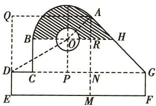

text_image

Q
A
B
O
H
D
C
P
N
G
E
M
F

7, AM = 7. 又 DE = 2，所以 AN = 5. NG = MF = 12 - 7 = 5. 于是 $\triangle ANG$ 是等腰直角三角形，于是 $\angle GAN = \angle OAN = \frac{\pi}{4}$ ，所以 $\angle AOR = \frac{\pi}{4}$ . 过点 O 作 $OP \perp DG$ 于 P，不妨设 OP = 3x，则 DP = 5x，于是 OR = PN = 7 - 5x, AR = AN - RN = 5 - OP = 5 - 3x，而 $\triangle OAR$ 为等腰直角三角形，因此 7 - 5x = 5 - 3x，于是 x = 1，即 OR = 2，于是 OA = $2\sqrt{2}$ ，由于 $\angle AOR = \frac{\pi}{4}$ ，因此 $\angle AOB = \frac{3}{4}\pi$ . 于是 $S_{阴影} = \frac{1}{2} \times \frac{3}{4}\pi \times (2\sqrt{2})^2 + \frac{1}{2} \times (2\sqrt{2})^2 - \frac{1}{2}\pi = (\frac{5}{2}\pi + 4)(cm^2)$ .

4. B 解法一 设扇形半径为 r，弧长为 l，则周长为 $2r + l = 100$ ，面积为 $S = \frac{1}{2}lr$ ，因为 $S = \frac{1}{2}lr = \frac{1}{2}(100 - 2r)r = -r^{2} + 50r = -(r - 25)^{2} + 625$ ，所以当 r = 25 时， $S_{\max} = 625$ .

解法二 $S = \frac{1}{2} lr = \frac{1}{2}(100 - 2r)r = (50 - r)r\leqslant (\frac{50 - r + r}{2})^2 =$ 625，当且仅当 $50 - r = r$ ，即 $r = 25$ 时等号成立.

5. A 设 $\angle BOC = \alpha$ ，由 $\frac{l_1}{l_2} = 2$ ，得 $\frac{OA \cdot \alpha}{OB \cdot \alpha} = \frac{OA}{OB} = 2$ ，即 $OA = 2OB$ ，则 $\frac{S_1}{S_2} = \frac{\frac{1}{2}\alpha \cdot OA^2 - \frac{1}{2}\alpha \cdot OB^2}{\frac{1}{2}\alpha \cdot OB^2} = \frac{OA^2 - OB^2}{OB^2} = \frac{4OB^2 - OB^2}{OB^2} = 3.$ 故选A.

6. BD 由题意可知经过 $1 \mathrm{~s}$ 后, $\angle AOB = \frac{\pi}{6} - (-\frac{\pi}{6}) + \frac{\pi}{12} = \frac{5\pi}{12}$ , 所以此时扇形 $AOB$ 的面积为 $\frac{1}{2} \alpha \cdot r^2 = \frac{1}{2} \times \frac{5\pi}{12} \times 1^2 = \frac{5\pi}{24}$ , 故 A 错误; 经过 $2 \mathrm{~s}$ 后, $\angle AOB = \frac{\pi}{6} - 2 \times (-\frac{\pi}{6}) + 2 \times \frac{\pi}{12} = \frac{2\pi}{3}$ ,

所以此时劣弧 $\widehat{AB}$ 的长为 $\alpha r=\frac{2\pi}{3}$ ，故 B 正确；（注意区分弧 AB 为优弧还是劣弧）

经过 6 s 后, 质点 B 转过的角度为 $6 \times \frac{\pi}{12} = \frac{\pi}{2}$ , 结合题意, 知此时质点 B 为角 $\frac{\pi}{6} + \frac{\pi}{2} = \frac{2\pi}{3}$ 的终边与单位圆的交点, 所以质点 B 的坐标为 $(- \frac{1}{2}, \frac{\sqrt{3}}{2})$ , 故 C 错误; 经过 $\frac{22}{3}$ s 后, 质点 B 转过的角度为 $\frac{22}{3} \times \frac{\pi}{12} = \frac{11\pi}{18}$ , 质点 A 转过的角度为 $\frac{22}{3} \times (-\frac{\pi}{6}) = -\frac{11\pi}{9}$ , 因为 $\frac{11\pi}{18} - (-\frac{11\pi}{9}) + \frac{\pi}{6} = 2\pi$ , 所以经过 $\frac{22}{3}$ s 后, 质点 A, B 在单位圆上第一次相遇, 故 D 正确.

故选BD.

7. $\frac{10\pi}{9}$ $\frac{5\pi}{9}$ 单位圆的半径 $r = 1,200^{\circ}$ 的弧度数是 $200\times \frac{\pi}{180} =$ $\frac{10\pi}{9}$ ，（注意角的单位必须是弧度）

所以 $l = \frac{10\pi}{9}$ ，所以 $S_{\text{扇形}} = \frac{1}{2} lr = \frac{1}{2} \times \frac{10\pi}{9} \times 1 = \frac{5\pi}{9}$ .

题型 59 三角函数定义的应用

1. AC 因为点 $P(m, -2m) (m \neq 0)$ 是角 $\alpha$ 终边上一点，所以 $|OP| = \sqrt{m^2 + (-2m)^2} = \sqrt{5} |m|$ （ $O$ 为坐标原点）， $\tan \alpha = \frac{-2m}{m} = -2, A$ 正确； $\cos \alpha = \frac{m}{\sqrt{5} |m|}$ ，当 $m > 0$ 时， $\cos \alpha = \frac{\sqrt{5}}{5}$ ，当 $m < 0$ 时， $\cos \alpha = -\frac{\sqrt{5}}{5}, B$ 不正确； $\sin \alpha = \frac{-2m}{\sqrt{5} |m|}$ ，则 $\sin \alpha \cos \alpha =$

$\frac{m}{\sqrt{5} |m|} \cdot \frac{-2m}{\sqrt{5} |m|} = -\frac{2}{5} < 0, C$ 正确，D不正确. 故选AC.

2. ACD 因为角 $\theta$ 的终边经过点 $(-2, -\sqrt{3})$ , 所以 $\sin \theta = -\frac{\sqrt{3}}{\sqrt{7}} = -\frac{\sqrt{21}}{7}$ , 故 A 正确. 因为 $\theta$ 与 $\alpha$ 的终边关于 $x$ 轴对称, 所以 $\alpha$ 的终边经过点 $(-2, \sqrt{3})$ , 则 $\alpha$ 为第二象限角, 不一定为钝角, 且 $\cos \alpha = \frac{-2}{\sqrt{7}} = -\frac{2\sqrt{7}}{7}$ , 故 B 错误, C 正确. 因为 $\tan \theta = \frac{\sqrt{3}}{2} > 0$ , $\tan \alpha = -\frac{\sqrt{3}}{2} < 0$ , 所以点 $(\tan \theta, \tan \alpha)$ 在第四象限, 故 D 正确. 故选 ACD.

3. C 设点 P 的坐标为 $(x, y)$ ，已知 $\tan \alpha < \cos \alpha < \sin \alpha$ ，则利用三角函数的定义可得 $\frac{y}{x} < x < y$ 。结合题图可知，当点 P 在 $\widehat{AB}$ 上时，y < x，不符合题意；当点 P 在 $\widehat{CD}$ 上时， $0 < x < y \leqslant 1, \frac{y}{x} > 1$ ，则 x < y < $\frac{y}{x}$ ，不符合题意；当点 P 在 $\widehat{EF}$ 上时，-1 < x < 0 < y，且 $|y| > |x|$ ，则 $\frac{y}{x} < -1$ ，所以 $\frac{y}{x} < x < y$ ，符合题意；当点 P 在 $\widehat{GH}$ 上时， $x < y < 0, \frac{y}{x} > 0$ ，则 x < y < $\frac{y}{x}$ ，不符合题意。故选 C.

4. B ∵ 角 $\alpha$ 的终边过点 $(x,4)$ 且 $\tan(-\pi+\alpha)=\tan\alpha=-2$ ,
∴ $\frac{4}{x} = -2, \therefore x = -2, \therefore \cos \alpha = \frac{-2}{\sqrt{(-2)^{2} + 4^{2}}} = -\frac{\sqrt{5}}{5}$ ，故选 B.

5. $\frac{1}{7}$ 因为 $P$ 为单位圆上的一点，且位于第四象限，点 $P$ 的横坐标 $x_{P} = \frac{4}{5}$ ，所以点 $P$ 的纵坐标 $y_{P} = -\sqrt{1 - \left(\frac{4}{5}\right)^{2}} = -\frac{3}{5}$ ，由三角函数的定义可得， $\tan \alpha = \frac{y_{P}}{x_{P}} = -\frac{3}{4}$ ，又 $\beta = \alpha + \frac{\pi}{4}$ ，所以 $\tan \beta = \tan (\alpha + \frac{\pi}{4}) = \frac{\tan \alpha + 1}{1 - \tan \alpha} = \frac{1}{7}$ .

6. A 因为角 $\alpha - \frac{\pi}{12}$ 的终边在直线 $y = \sqrt{3}x$ 上, 所以 $\tan (\alpha - \frac{\pi}{12}) = \sqrt{3}$ . 若终边在第一象限内, 则 $\sin (\alpha - \frac{\pi}{12}) = \frac{\sqrt{3}}{2}, \cos (\alpha - \frac{\pi}{12}) = \frac{1}{2}$ , 所以 $\cos (\alpha + \frac{\pi}{12}) = \cos [(\alpha - \frac{\pi}{12}) + \frac{\pi}{6}] = \cos (\alpha - \frac{\pi}{12})\cos \frac{\pi}{6} - \sin (\alpha - \frac{\pi}{12})\sin \frac{\pi}{6} = \frac{1}{2} \times \frac{\sqrt{3}}{2} - \frac{\sqrt{3}}{2} \times \frac{1}{2} = 0.$

若终边在第三象限内,则 $\sin(\alpha-\frac{\pi}{12})=-\frac{\sqrt{3}}{2},\cos(\alpha-\frac{\pi}{12})=-\frac{1}{2}$ ,
所以 $\cos(\alpha+\frac{\pi}{12})=\cos\left[(\alpha-\frac{\pi}{12})+\frac{\pi}{6}\right]=\cos\left(\alpha-\frac{\pi}{12}\right)\cos\frac{\pi}{6}-$ $\sin(\alpha-\frac{\pi}{12})\sin\frac{\pi}{6}=(-\frac{1}{2})\times\frac{\sqrt{3}}{2}+\frac{\sqrt{3}}{2}\times\frac{1}{2}=0.$

综上可知, $\cos(\alpha+\frac{\pi}{12})=0.$

# 题型 60 同角三角函数基本关系的应用

1. $\frac{5}{12}$ 或 $-\frac{5}{12}$ 因为 $\sin \alpha = -\frac{5}{13} < 0$ ，所以 $\alpha$ 为第三象限角或第四象限角，当 $\alpha$ 为第三象限角时， $\cos \alpha = -\sqrt{1 - \sin^2 \alpha} = -\frac{12}{13}$ ，因此 $\tan \alpha = \frac{\sin \alpha}{\cos \alpha} = \frac{5}{12}$ . 当 $\alpha$ 为第四象限角时， $\cos \alpha = \sqrt{1 - \sin^2 \alpha} = \frac{12}{13}$ ，因此 $\tan \alpha = \frac{\sin \alpha}{\cos \alpha} = -\frac{5}{12}$ .

2.（1）-1 注意到式子的分子和分母均是关于 $\sin \alpha, \cos \alpha$ 的一次齐次式，由题意得 $\cos \alpha \neq 0$ ，所以可将分子分母同时除以 $\cos \alpha$ 转化为关于 $\tan \alpha$ 的式子，则 $\frac{2\sin \alpha - 3\cos \alpha}{4\sin \alpha - 9\cos \alpha} = \frac{2\tan \alpha - 3}{4\tan \alpha - 9} = \frac{2\times 2 - 3}{4\times 2 - 9} = -1.$

(2) $\frac{5}{7}$ 注意到式子的分子和分母均是关于 $\sin\alpha,\cos\alpha$ 的二次齐次式,因为 $\cos^{2}\alpha\neq0$ ,所以分子分母可同时除以 $\cos^{2}\alpha$ ,则 $\frac{2\sin^{2}\alpha-3\cos^{2}\alpha}{4\sin^{2}\alpha-9\cos^{2}\alpha}=\frac{2\tan^{2}\alpha-3}{4\tan^{2}\alpha-9}=\frac{2\times4-3}{4\times4-9}=\frac{5}{7}.$

(3)1 似乎跟前两题没什么联系,但若能注意到 $\sin^{2}\alpha+\cos^{2}\alpha=$

1, 则有 $4\sin^2\alpha - 3\sin \alpha \cos \alpha - 5\cos^2\alpha = \frac{4\sin^2\alpha - 3\sin \alpha \cos \alpha - 5\cos^2\alpha}{1} = \frac{4\sin^2\alpha - 3\sin \alpha \cos \alpha - 5\cos^2\alpha}{\sin^2\alpha + \cos^2\alpha}$ , 这样便使得分子分母均为二次齐次式.

同（2）有 $\frac{4\sin^2\alpha - 3\sin\alpha\cos\alpha - 5\cos^2\alpha}{\sin^2\alpha + \cos^2\alpha} = \frac{4\tan^2\alpha - 3\tan\alpha - 5}{\tan^2\alpha + 1} = \frac{4\times 4 - 3\times 2 - 5}{4 + 1} = 1.$

3. C 解法一 因为 $\tan \theta = -2$ ，所以 $\frac{\sin \theta(1 + \sin 2\theta)}{\sin \theta + \cos \theta} = \frac{\sin \theta (\sin \theta + \cos \theta)^2}{\sin \theta + \cos \theta} = \sin \theta (\sin \theta + \cos \theta) = \frac{\sin^2 \theta + \sin \theta \cos \theta}{\sin^2 \theta + \cos^2 \theta} = \frac{\tan^2 \theta + \tan \theta}{\tan^2 \theta + 1} = \frac{4 - 2}{4 + 1} = \frac{2}{5}$ . 故选 C.

解法二 因为 $\tan \theta = -2$ ，所以 $\sin \theta = -2\cos \theta$ 。则 $\frac{\sin \theta(1 + \sin 2\theta)}{\sin \theta + \cos \theta} = \frac{\sin \theta(\sin \theta + \cos \theta)^2}{\sin \theta + \cos \theta} = \sin \theta (\sin \theta + \cos \theta) = \frac{\sin^2\theta + \sin \theta\cos\theta}{\sin^2\theta + \cos^2\theta} = \frac{4\cos^2\theta - 2\cos^2\theta}{4\cos^2\theta + \cos^2\theta} = \frac{4 - 2}{1 + 4} = \frac{2}{5}$ . 故选 C.

4. A $\because 3\cos 2\alpha - 8\cos \alpha = 5, \therefore 3(2\cos^{2}\alpha - 1) - 8\cos \alpha = 5, \therefore 6\cos^{2}\alpha - 8\cos \alpha - 8 = 0, \therefore 3\cos^{2}\alpha - 4\cos \alpha - 4 = 0$ , 解得 $\cos \alpha = 2$ (舍去) 或 $\cos \alpha = -\frac{2}{3}. \because \alpha \in (0, \pi), \therefore \sin \alpha = \sqrt{1 - \cos^{2}\alpha} = \frac{\sqrt{5}}{3}.$ 故选 A.

5. $-\frac{\sqrt{5}}{5}$ 由 $\left\{ \begin{array}{l} \tan \theta = \frac{\sin \theta}{\cos \theta} = \frac{1}{2}, \\ \sin^2\theta + \cos^2\theta = 1, \end{array} \right.$ 且 $\theta \in (0, \frac{\pi}{2})$ ，解得 $\left\{ \begin{array}{l} \sin \theta = \frac{\sqrt{5}}{5}, \\ \cos \theta = \frac{2\sqrt{5}}{5}, \end{array} \right.$ 故 $\sin \theta - \cos \theta = -\frac{\sqrt{5}}{5}$ .

6. $-\frac{1}{2}$ 解法一 $\because \sin \alpha + \cos \beta = 1, \cos \alpha + \sin \beta = 0,$

$$
\begin{array}{l} \therefore \sin^ {2} \alpha + \cos^ {2} \beta + 2 \sin \alpha \cos \beta = 1 \\ \cos^ {2} \alpha + \sin^ {2} \beta + 2 \cos \alpha \sin \beta = 0 \end{array} \quad ①, \tag {②}
$$

① + ②, 得 $\sin^2\alpha + \cos^2\alpha + \sin^2\beta + \cos^2\beta + 2 (\sin \alpha \cos \beta + \cos \alpha \sin \beta) = 1$ , 即 $2 + 2\sin (\alpha + \beta) = 1$ ,

$$
\therefore \sin (\alpha + \beta) = - \frac {1}{2}.
$$

解法二 由已知可得 $\sin \alpha = 1 - \cos \beta, \cos \alpha = -\sin \beta,$

由同角三角函数关系可得 $\sin^{2}\alpha + \cos^{2}\alpha = (1 - \cos\beta)^{2} + (-\sin\beta)^{2} = 1$ ，整理得 $\cos\beta = \frac{1}{2}$ ，所以 $\sin\alpha = \frac{1}{2}$ .

又 $\cos \alpha = -\sin \beta$ ，所以 $\cos \alpha \sin \beta = -\cos^2\alpha = \sin^2\alpha -1 = -\frac{3}{4},$ 故 $\sin (\alpha +\beta) = \sin \alpha \cos \beta +\cos \alpha \sin \beta = -\frac{1}{2}.$

7. B 解法一 易知 $\cos\theta\neq0$ ，则 $1+\sin\theta\cos\theta=\frac{1+\sin\theta\cos\theta}{1}=\frac{\sin^{2}\theta+\cos^{2}\theta+\sin\theta\cos\theta}{\sin^{2}\theta+\cos^{2}\theta}=\frac{\tan^{2}\theta+\tan\theta+1}{\tan^{2}\theta+1}=\frac{2^{2}+2+1}{2^{2}+1}=\frac{7}{5}.$

解法二 $\tan\theta=2$ , 即 $\sin\theta=2\cos\theta$

又 $\sin^{2}\theta + \cos^{2}\theta = 1$ ，所以 $(2\cos\theta)^{2} + \cos^{2}\theta = 1$ ，所以 $\cos^{2}\theta = \frac{1}{5}$ .
又 $\tan \theta = 2 > 0$ ，所以 $\theta$ 为第一或第三象限角.

当 $\theta$ 为第一象限角时, $\cos\theta=\frac{\sqrt{5}}{5}$ , $\sin\theta=\sqrt{1-\cos^{2}\theta}=\frac{2\sqrt{5}}{5}$ ,
则 $1 + \sin \theta \cos \theta = 1 + \frac{2\sqrt{5}}{5} \times \frac{\sqrt{5}}{5} = \frac{7}{5}$ ;

当 $\theta$ 为第三象限角时， $\cos \theta = -\frac{\sqrt{5}}{5}, \sin \theta = -\sqrt{1 - \cos^2 \theta} = -\frac{2\sqrt{5}}{5}$ ，则 $1 + \sin \theta \cos \theta = 1 + (-\frac{2\sqrt{5}}{5}) \times (-\frac{\sqrt{5}}{5}) = \frac{7}{5}$ .

8. D 解法一 由 $\sin \theta - \cos \theta = \frac{\sqrt{3}}{3}$ , 得 $1 - 2\sin \theta \cos \theta = \frac{1}{3}$ , $\therefore \sin \theta \cos \theta = \frac{1}{3}, \therefore (\sin \theta + \cos \theta)^2 = 1 + 2\sin \theta \cos \theta = \frac{5}{3}.$ $\because \theta$ 是第一象限角, $\therefore \sin \theta + \cos \theta = \frac{\sqrt{15}}{3}, \therefore \sin \theta = \frac{\sqrt{3} (\sqrt{5} + 1)}{6}, \cos \theta =$

$\frac{\sqrt{3}(\sqrt{5}-1)}{6}, \therefore \tan \theta = \frac{\sqrt{5} + 1}{\sqrt{5} - 1}, \therefore \tan 2\theta = 2 \times \frac{\sqrt{5} + 1}{\sqrt{5} - 1} \div [1 - (\frac{\sqrt{5} + 1}{\sqrt{5} - 1})^2] = -\frac{2\sqrt{5}}{5}$ , 故选 D.

解法二 仿解法一得 $\sin \theta + \cos \theta = \frac{\sqrt{15}}{3}$ , $\therefore \frac{\sin \theta + \cos \theta}{\sin \theta - \cos \theta} = \sqrt{5}$ , $\therefore \frac{\tan \theta + 1}{\tan \theta - 1} = \sqrt{5}$ , 得 $\tan \theta = \frac{\sqrt{5} + 1}{\sqrt{5} - 1}$ , 下同解法一.

解法三 仿解法一得 $\sin \theta \cos \theta = \frac{1}{3}, \therefore \sin 2\theta = \frac{2}{3}$ ,

∵ $\sin \theta - \cos \theta > 0, \theta$ 是第一象限角，∴ $\frac{\pi}{4} < \theta < \frac{\pi}{2}$ ，（易错警示：不知道求角 $\theta$ 的范围造成增解）

$\therefore \frac{\pi}{2} < 2\theta < \pi, \therefore \cos 2\theta = -\frac{\sqrt{5}}{3}, \therefore \tan 2\theta = -\frac{2\sqrt{5}}{5}$ , 故选 D.

9. C 由于 $\sin \theta + \cos \theta = -\frac{1}{5}$ , 关系式两边平方, 得 $1 + \sin 2\theta = \frac{1}{25}$ , 所以 $\sin 2\theta = -\frac{24}{25}$ . 因为 $\theta \in (0, \pi)$ , 所以 $\cos \theta < 0, \sin \theta > 0$ , 故 $\sin \theta - \cos \theta > 0$ . 所以 $\sin \theta - \cos \theta = |\sin \theta - \cos \theta| = \sqrt{(\sin \theta - \cos \theta)^2} = \frac{7}{5}$ . 故选 C.

题型 61 诱导公式

1. B $\because \sin\left(\frac{5\pi}{2}+\alpha\right)=\sin\left(\frac{\pi}{2}+\alpha\right)=\cos\alpha=\frac{1}{5},\therefore\cos(\pi+\alpha)=-\cos\alpha=-\frac{1}{5}.$

2.2 原式 $= -\sin (3\times 360^{\circ} + 120^{\circ})\cos (3\times 360^{\circ} + 210^{\circ})-$ $\cos (3\times 360^{\circ} - 60^{\circ})\sin (3\times 360^{\circ} - 30^{\circ}) + \tan (2\times 360^{\circ} + 225^{\circ}) =$ $-\sin (180^{\circ} - 60^{\circ})\cos (180^{\circ} + 30^{\circ}) - \cos (-60^{\circ})\sin (-30^{\circ})+$ $\tan (180^{\circ} + 45^{\circ}) = \sin 60^{\circ}\cos 30^{\circ} + \cos 60^{\circ}\sin 30^{\circ} + \tan 45^{\circ} = \frac{\sqrt{3}}{2}\times \frac{\sqrt{3}}{2}+$ $\frac{1}{2}\times \frac{1}{2} +1 = 2.$

3. A 因为 $\cos\left(x-\frac{\pi}{6}\right)=\cos\left[\left(x+\frac{\pi}{3}\right)-\frac{\pi}{2}\right]=\sin\left(x+\frac{\pi}{3}\right)$ ，所以 $f(x)=\frac{6}{5}\sin\left(x+\frac{\pi}{3}\right)$ ，于是 $f(x)$ 的最大值为 $\frac{6}{5}$ ，故选 A.

4. C 若存在 $k \in Z$ 使得 $\alpha = k\pi + (-1)^{k}\beta$ ，则当 $k = 2n, n \in Z$ 时， $\alpha = 2n\pi + \beta$ ，则 $\sin \alpha = \sin(2n\pi + \beta) = \sin \beta$ ；当 $k = 2n + 1, n \in Z$ 时， $\alpha = (2n + 1)\pi - \beta$ ，则 $\sin \alpha = \sin(2n\pi + \pi - \beta) = \sin(\pi - \beta) = \sin \beta$ 。若 $\sin \alpha = \sin \beta$ ，则 $\alpha = 2n\pi + \beta$ 或 $\alpha = 2n\pi + \pi - \beta, n \in Z$ ，即 $\alpha = k\pi + (-1)^{k}\beta, k \in Z$ ，故“存在 $k \in Z$ 使得 $\alpha = k\pi + (-1)^{k}\beta$ ”是“ $\sin \alpha = \sin \beta$ ”的充分必要条件。

5. $\frac{3\sqrt{10}}{10}$ $\frac{4}{5}$ 因为 $\alpha + \beta = \frac{\pi}{2}$ , 所以 $\beta = \frac{\pi}{2} - \alpha$ , 所以 $3\sin \alpha - \sin \beta = 3\sin \alpha - \sin \left(\frac{\pi}{2} - \alpha\right) = 3\sin \alpha - \cos \alpha = \sqrt{10}\sin (\alpha - \varphi) = \sqrt{10}$ , 其中 $\sin \varphi = \frac{\sqrt{10}}{10}, \cos \varphi = \frac{3\sqrt{10}}{10}$ . 所以 $\alpha - \varphi = \frac{\pi}{2} + 2k\pi, k \in \mathbf{Z}$ , 所以 $\alpha = \frac{\pi}{2} + \varphi + 2k\pi, k \in \mathbf{Z}$ , 所以 $\sin \alpha = \sin \left(\frac{\pi}{2} + \varphi + 2k\pi\right) = \cos \varphi = \frac{3\sqrt{10}}{10}, k \in \mathbf{Z}$ . 因为 $\sin \beta = 3\sin \alpha - \sqrt{10} = -\frac{\sqrt{10}}{10}$ , 所以 $\cos 2\beta = 1 - 2\sin^2\beta = 1 - \frac{1}{5} = \frac{4}{5}$ .

6. C 因为 $\sin\left(\frac{\pi}{6}-\alpha\right)=\frac{4}{5}$ ，所以 $\cos\left(\frac{\pi}{3}+\alpha\right)=\sin\left(\frac{\pi}{2}-\frac{\pi}{3}-\alpha\right)=\sin\left(\frac{\pi}{6}-\alpha\right)=\frac{4}{5}$ .
所以 $\cos\left(\frac{2\pi}{3}+2\alpha\right)=2\cos^{2}\left(\frac{\pi}{3}+\alpha\right)-1=\frac{7}{25}.$

7. -1 原式 $= \cos \left[\pi - \left(\frac{\pi}{6} - \theta\right)\right] + 2\sin \left[\frac{3\pi}{2} + \left(\frac{\pi}{6} - \theta\right)\right] = -\cos \left(\frac{\pi}{6} - \theta\right) - 2\cos \left(\frac{\pi}{6} - \theta\right) = -3\cos \left(\frac{\pi}{6} - \theta\right) = -1.$

8. $-\frac{9}{16}$ 原式 $= \frac{-\sin(\pi + \frac{\pi}{2} + \alpha)\cos(\pi + \frac{\pi}{2} - \alpha)}{\sin\alpha\cos\alpha} \cdot \tan^2\alpha =$

$$
\frac {- \sin (\frac {\pi}{2} + \alpha) \cos (\frac {\pi}{2} - \alpha)}{\sin \alpha \cos \alpha} \cdot \tan^ {2} \alpha = \frac {- \cos \alpha \sin \alpha}{\sin \alpha \cos \alpha} \cdot \tan^ {2} \alpha = - \tan^ {2} \alpha .
$$

解方程 $5x^{2}-7x-6=0$ ，得 $x_{1}=-\frac{3}{5}, x_{2}=2$ 。又 $\alpha$ 是第三象限角，
∴ $\sin \alpha = -\frac{3}{5}, \therefore \cos \alpha = -\frac{4}{5}, \therefore \tan \alpha = \frac{3}{4}.$

故原式 $= -\tan^2\alpha = -\frac{9}{16}.$

9. B $\because \sin(\pi-\alpha)=-2\sin(\frac{\pi}{2}+\alpha),\therefore \sin\alpha=-2\cos\alpha,$ 即 $\tan\alpha=-2,\therefore \alpha$ 为第二或第四象限角，又 $\sin^{2}\alpha+\cos^{2}\alpha=1,\therefore \sin\alpha=\frac{2\sqrt{5}}{5},\cos\alpha=-\frac{\sqrt{5}}{5},$ 或 $\sin\alpha=-\frac{2\sqrt{5}}{5},\cos\alpha=\frac{\sqrt{5}}{5},$ $\therefore \sin\alpha\cos\alpha=-\frac{2}{5},$ 故选 B.

题型 62 同角三角函数基本关系与诱导公式的综合应用

1. $\frac{2\sqrt{2}}{3}\sin (\alpha -105^{\circ}) = \sin (\alpha +75^{\circ} - 180^{\circ}) = -\sin (\alpha +75^{\circ}).$ $\because \cos (75^{\circ} + \alpha) = \frac{1}{3}$ ，且 $\alpha$ 为第三象限角， $\therefore \alpha +75^{\circ}$ 为第四象限角， $\therefore \sin (\alpha +75^{\circ}) = -\sqrt{1 - \cos^{2}(\alpha + 75^{\circ})} = -\frac{2\sqrt{2}}{3},\therefore \sin (\alpha -$ $105^{\circ}) = \frac{2\sqrt{2}}{3}.$

2. $-\frac{4}{3}$ $\because \theta$ 是第四象限角，且 $\sin(\theta + \frac{\pi}{4}) = \frac{3}{5} > 0, \therefore \theta + \frac{\pi}{4}$ 为第一象限角， $\therefore \cos(\theta + \frac{\pi}{4}) = \sqrt{1 - \sin^{2}(\theta + \frac{\pi}{4})} = \frac{4}{5}.$

$$
\begin{array}{l} \because (\theta + \frac {\pi}{4}) - (\theta - \frac {\pi}{4}) = \frac {\pi}{2}, \therefore \sin (\theta - \frac {\pi}{4}) = \sin [ (\theta + \frac {\pi}{4}) - \frac {\pi}{2} ] = \\ - \cos (\theta + \frac {\pi}{4}) = - \frac {4}{5}, \cos (\theta - \frac {\pi}{4}) = \cos [ (\theta + \frac {\pi}{4}) - \frac {\pi}{2} ] = \\ \sin (\theta + \frac {\pi}{4}) = \frac {3}{5}, \therefore \tan (\theta - \frac {\pi}{4}) = \frac {- \frac {4}{5}}{\frac {3}{5}} = - \frac {4}{3}. \\ \end{array}
$$

3. C 由 $3\sin^2\alpha = 8\cos \alpha$ ，得 $3\cos^2\alpha + 8\cos \alpha - 3 = 0$ ，因为 $\alpha$ 是第四象限角，所以 $\cos \alpha > 0, \sin \alpha < 0$ ，所以 $\cos \alpha = \frac{1}{3}$ ，则 $\sin \alpha = -\sqrt{1 - \cos^2\alpha} = -\frac{2\sqrt{2}}{3}$ ，所以 $\cos (\alpha + \frac{2021\pi}{2}) = \cos (\frac{\pi}{2} + \alpha) = -\sin \alpha = \frac{2\sqrt{2}}{3}$ ，故选C.

4. A 由题意得, $\sin(2\alpha-3\pi)=\sin(2\alpha-\pi)=-\sin(\pi-2\alpha)=-\sin2\alpha=-\frac{2\sin\alpha\cos\alpha}{\sin^{2}\alpha+\cos^{2}\alpha}=-\frac{2\tan\alpha}{\tan^{2}\alpha+1}=-\frac{3}{5}$ ，故选A.

5. A 由 $0 < \alpha < \frac{\pi}{2}$ , 得 $\frac{\pi}{3} < \alpha + \frac{\pi}{3} < \frac{5\pi}{6}$ , 则 $\sin (\alpha + \frac{\pi}{3}) = \sqrt{1 - \cos^2 (\alpha + \frac{\pi}{3})} = \sqrt{1 - (-\frac{2}{3})^2} = \frac{\sqrt{5}}{3}$ , 所以 $\tan (\alpha + \frac{\pi}{3}) = \frac{\sin (\alpha + \frac{\pi}{3})}{\cos (\alpha + \frac{\pi}{3})} = -\frac{\sqrt{5}}{2}$ , 所以 $\tan (\frac{2\pi}{3} - \alpha) = \tan [\pi - (\alpha + \frac{\pi}{3})] = -\tan (\alpha + \frac{\pi}{3}) = \frac{\sqrt{5}}{2}$ . 故选 A.

6. D 因为 $\tan\alpha=\frac{\cos\alpha}{3-\sin\alpha}$ ，所以 $\frac{\sin\alpha}{\cos\alpha}=\frac{\cos\alpha}{3-\sin\alpha}$ ，即 $3\sin\alpha-\sin^{2}\alpha=\cos^{2}\alpha$ ，所以 $3\sin\alpha=\sin^{2}\alpha+\cos^{2}\alpha=1$ ，即 $\sin\alpha=\frac{1}{3}$ ，所以 $\sin(2\alpha+\frac{\pi}{2})=\cos2\alpha=1-2\sin^{2}\alpha=\frac{7}{9}$ ，故选 D.

7. 直角 在 $\triangle ABC$ 中, 由 $\sqrt{3} \sin \left( \frac{\pi}{2} - A \right) = 3 \sin (\pi - A)$ , 得 $\sqrt{3} \cos A = 3 \sin A$ , 即 $\tan A = \frac{\sqrt{3}}{3}$ , 又 $A \in (0, \pi)$ , $\therefore A = \frac{\pi}{6}$ , 又 $\cos A = -\sqrt{3} \cos (\pi - B)$ , $\therefore \frac{\sqrt{3}}{2} = \sqrt{3} \cos B$ , 即 $\cos B = \frac{1}{2}$ , 又 $B \in (0, \pi)$ , $\therefore B = \frac{\pi}{3}$ , $\therefore C = \pi - \frac{\pi}{6} - \frac{\pi}{3} = \frac{\pi}{2}$ , $\therefore \triangle ABC$ 为直角三角形.

8. $\frac{4\sqrt{2}}{9}$ 解法一 因为 $0 < \alpha < \frac{\pi}{2}$ ，且 $\sin(\frac{\pi}{4} - \alpha) = \frac{1}{3}$ ，所以 $0 < \alpha < \frac{\pi}{4}$ ，所以 $0 < 2\alpha < \frac{\pi}{2}$ .（解题关键：根据已知条件判断角的范围）

因为 $\sin 2\alpha = \cos \left(\frac{\pi}{2} - 2\alpha\right) = \cos \left[2\left(\frac{\pi}{4} - \alpha\right)\right] = 1 - 2\sin^2\left(\frac{\pi}{4} - \alpha\right) = \frac{7}{9}$ , 所以 $\cos 2\alpha = \sqrt{1 - \sin^2 2\alpha} = \sqrt{1 - \left(\frac{7}{9}\right)^2} = \frac{4\sqrt{2}}{9}$ .

解法二 因为 $\sin (\frac{\pi}{4} -\alpha) = \sin \frac{\pi}{4}\cos \alpha -\cos \frac{\pi}{4}\sin \alpha = \frac{\sqrt{2}}{2}\cos \alpha -$ $\frac{\sqrt{2}}{2}\sin \alpha = \frac{1}{3}$ ，所以 $\cos \alpha -\sin \alpha = \frac{\sqrt{2}}{3}$ .要求 $\cos 2\alpha = \cos^2\alpha-$ $\sin^2\alpha = (\cos \alpha -\sin \alpha)(\cos \alpha +\sin \alpha)$ 的值，还需知 $\cos \alpha +\sin \alpha$ 的值，对等式 $\cos \alpha -\sin \alpha = \frac{\sqrt{2}}{3}$ 两边同时平方，得 $1 - \sin 2\alpha = \frac{2}{9}$ 所以 $\sin 2\alpha = \frac{7}{9}$ ，所以 $(\sin \alpha +\cos \alpha)^2 = 1 + \sin 2\alpha = \frac{16}{9}$ ，又 $0<$ $\alpha <   \frac{\pi}{2}$ ，所以 $\sin \alpha >0,\cos \alpha >0$ ，所以 $\sin \alpha +\cos \alpha = \frac{4}{3}$ ，所以 $\cos 2\alpha = (\cos \alpha -\sin \alpha)(\cos \alpha +\sin \alpha) = \frac{\sqrt{2}}{3}\times \frac{4}{3} = \frac{4\sqrt{2}}{9}.$

9. B $\because \sin^{2}\alpha = \cos\alpha - 1, \therefore 1 - \cos^{2}\alpha = \cos\alpha - 1,$ 可得 $\cos^{2}\alpha + \cos\alpha - 2 = 0,$ 解得 $\cos\alpha=1(\cos\alpha=-2\text{ 舍})$ ; (注意三角函数值的有界性) $\therefore \sin(\alpha+\frac{3\pi}{2}) = -\cos\alpha = -1,$ 故选 B.

# 第二节 三角恒等变换

题型 63 两角和与差的正弦、余弦、正切公式的应用

1. ABD 对于 A, $\frac{1}{2}\sin15^{\circ}-\frac{\sqrt{3}}{2}\cos15^{\circ}=\sin15^{\circ}\cos60^{\circ}-\sin60^{\circ}\cdot\cos15^{\circ}=\sin(15^{\circ}-60^{\circ})=\sin(-45^{\circ})=-\frac{\sqrt{2}}{2}$ ，故 A 正确；对于 B, $\sin20^{\circ}\cos10^{\circ}-\cos160^{\circ}\sin10^{\circ}=\sin20^{\circ}\cos10^{\circ}+\cos20^{\circ}\sin10^{\circ}=\sin(20^{\circ}+10^{\circ})=\sin30^{\circ}=\frac{1}{2}$ ，故 B 正确；对于 C, $\sin\frac{\pi}{12}-\sqrt{3}\cos\frac{\pi}{12}=2(\sin\frac{\pi}{12}\cos\frac{\pi}{3}-\sin\frac{\pi}{3}\cos\frac{\pi}{12})=2\sin(\frac{\pi}{12}-\frac{\pi}{3})=2\sin(-\frac{\pi}{4})=-\sqrt{2}$ ，故 C 错误；对于 D, $\sin105^{\circ}=\sin(60^{\circ}+45^{\circ})=\sin60^{\circ}\cos45^{\circ}+\cos60^{\circ}\sin45^{\circ}=\frac{\sqrt{3}}{2}\times\frac{\sqrt{2}}{2}+\frac{1}{2}\times\frac{\sqrt{2}}{2}=\frac{\sqrt{6}+\sqrt{2}}{4}$ ，故 D 正确。故选 ABD。

2. $\frac{5\sqrt{3}}{9}$ $\because \tan (\alpha +\frac{\pi}{3}) = 2\sqrt{3},\therefore \tan (\alpha +\frac{\pi}{6}) = \tan [(\alpha +\frac{\pi}{3}) -$ $\frac{\pi}{6}] = \frac{\tan(\alpha + \frac{\pi}{3}) - \tan\frac{\pi}{6}}{1 + \tan(\alpha + \frac{\pi}{3})\tan\frac{\pi}{6}} = \frac{2\sqrt{3} - \frac{\sqrt{3}}{3}}{1 + 2\sqrt{3}\times\frac{\sqrt{3}}{3}} = \frac{5\sqrt{3}}{9}.$

3.B 依题意, 得 $\left\{ \begin{array}{l} \sin \alpha \cos \beta - \cos \alpha \sin \beta = \frac{1}{3}, \\ \cos \alpha \sin \beta = \frac{1}{6}, \end{array} \right.$ 所以 $\sin \alpha \cos \beta = \frac{1}{2}$ , 所以 $\sin (\alpha + \beta) = \sin \alpha \cos \beta + \cos \alpha \sin \beta = \frac{1}{2} + \frac{1}{6} = \frac{2}{3}$ , 所以 $\cos (2\alpha + 2\beta) = 1 - 2\sin^2 (\alpha + \beta) = 1 - 2 \times (\frac{2}{3})^2 = \frac{1}{9}$ , 故选 B.

4. C $\sin(\alpha+\beta)+\cos(\alpha+\beta)=\sqrt{2}\sin(\alpha+\beta+\frac{\pi}{4})=2\sqrt{2}\sin\beta\cdot\cos(\alpha+\frac{\pi}{4})$ ，所以 $\sin(\alpha+\frac{\pi}{4})\cos\beta+\sin\beta\cos(\alpha+\frac{\pi}{4})=2\sin\beta\cos(\alpha+\frac{\pi}{4})$ ，整理得 $\sin(\alpha+\frac{\pi}{4})\cos\beta-\sin\beta\cos(\alpha+\frac{\pi}{4})=0$ ，即 $\sin(\alpha+\frac{\pi}{4}-\beta)=0$ ，所以 $\alpha-\beta+\frac{\pi}{4}=k\pi, k\in Z$ ，所以 $\tan(\alpha-\beta)=\tan(k\pi-\frac{\pi}{4})=-1$ .

5. B 因为 60 名残健共融表演者用行为模拟“指针”每圈 60 个

时间刻度的行进轨迹,所以相邻两名残健共融表演者与圆心连线所成的角为 $\frac{2\pi}{60}=\frac{\pi}{30}$ ，所以 $\beta=\alpha+\frac{\pi}{30}\times(21-1)=\alpha+\frac{2\pi}{3},\gamma=\alpha+\frac{\pi}{30}\times(41-1)=\alpha+\frac{4\pi}{3}$ ，所以 $\cos\alpha+\cos\beta+\cos\gamma=\cos\alpha+\cos(\alpha+\frac{2\pi}{3})+\cos(\alpha+\frac{4\pi}{3})=\cos\alpha+\cos\alpha\cos\frac{2\pi}{3}-\sin\alpha\sin\frac{2\pi}{3}+\cos\alpha\cdot\cos\frac{4\pi}{3}-\sin\alpha\sin\frac{4\pi}{3}=\cos\alpha-\frac{1}{2}\cos\alpha-\frac{\sqrt{3}}{2}\sin\alpha-\frac{1}{2}\cos\alpha+\frac{\sqrt{3}}{2}\sin\alpha=0$ ，故选B.

6. C 由 $2\cos (\alpha - \beta) + \cos (\alpha + \beta) = \frac{\sin \alpha}{\sin \beta}$ , 得 $3\cos \alpha \cos \beta + \sin \alpha \sin \beta = \frac{\sin \alpha}{\sin \beta}$ , 得 $3\cos \alpha \cos \beta \sin \beta + \sin \alpha \sin^2 \beta = \sin \alpha, 3\cos \alpha \cos \beta \sin \beta = \sin \alpha (1 - \sin^2 \beta)$ , 即 $3\cos \alpha \cos \beta \sin \beta = \sin \alpha \cos^2 \beta$ , 即 $\frac{3\cos \beta \sin \beta}{\cos^2 \beta} = \frac{\sin \alpha}{\cos \alpha}$ , 得 $3\tan \beta = \tan \alpha$ , 由 $\alpha, \beta$ 均为锐角可知 $\tan \alpha > 0, \tan \beta > 0$ . 所以 $\tan (\alpha - \beta) = \frac{\tan \alpha - \tan \beta}{1 + \tan \alpha \tan \beta} = \frac{3\tan \beta - \tan \beta}{1 + 3\tan^2\beta} = \frac{2}{\frac{1}{\tan \beta} + 3\tan \beta} \leqslant \frac{2}{2\sqrt{\frac{1}{\tan \beta} \cdot 3\tan \beta}} = \frac{\sqrt{3}}{3}$ , 当且仅当 $\frac{1}{\tan \beta} = 3\tan \beta$ , 即 $\tan \beta = \frac{\sqrt{3}}{3}$ 时取等号, 所以 $\tan (\alpha - \beta)$ 的最大值为 $\frac{\sqrt{3}}{3}$ . 故选 C.

7. B 因为 $\cos(\alpha+\frac{\pi}{6})=\frac{3}{5}$ ( $\alpha$ 为锐角)，所以 $\alpha+\frac{\pi}{6}$ 为锐角，所以 $\sin(\alpha+\frac{\pi}{6})=\frac{4}{5}$ ，所以 $\sin\alpha=\sin\left[(\alpha+\frac{\pi}{6})-\frac{\pi}{6}\right]=\sin(\alpha+\frac{\pi}{6})\cos\frac{\pi}{6}-\cos(\alpha+\frac{\pi}{6})\sin\frac{\pi}{6}=\frac{4}{5}\times\frac{\sqrt{3}}{2}-\frac{3}{5}\times\frac{1}{2}=\frac{4\sqrt{3}-3}{10}$ .
故选 B.

题型 64 二倍角和半角公式的应用

1. D ∵ θ 为第二象限角, ∴ sin θ > 0, cos θ < 0, 2kπ + π/2 < θ < 2kπ + π, k ∈ Z, ∴ kπ + π/4 < θ/2 < kπ + π/2, k ∈ Z. 当 k 是偶数时, 设 k = 2n, n ∈ Z, 则 2nπ + π/4 < θ/2 < 2nπ + π/2, n ∈ Z, 此时 θ/2 为第一象限角; 当 k 是奇数时, 设 k = 2n + 1, n ∈ Z, 则 2nπ + π/4 < θ/2 < 2nπ + π/2, n ∈ Z, 此时 θ/2 为第三象限角. 综上, θ/2 为第一或第三象限角. ∵ 25sin²θ + sin θ - 24 = 0, ∴ sin θ = -1 (舍去) 或 sin θ = 24/25, ∴ cos θ = -7/25, ∴ sin θ/2 = ±√(1 - cos θ)/2 = ±√(16/25) = ±√(4/5), 故选 D.

2. A 由 $\cos 2\alpha = 2\sin \left(\frac{\pi}{4} + \alpha\right)$ , 得 $\cos^2\alpha - \sin^2\alpha = \sqrt{2} (\cos \alpha + \sin \alpha)$ , 整理得 $(\cos \alpha - \sin \alpha - \sqrt{2})(\cos \alpha + \sin \alpha) = 0$ , 当 $\cos \alpha + \sin \alpha = 0$ 时, 得 $\cos^2\alpha + \sin^2\alpha + 2\sin \alpha\cos \alpha = 0$ , 则 $\sin 2\alpha = 2\sin \alpha\cos \alpha = -1$ . 当 $\cos \alpha + \sin \alpha \neq 0$ 时, $\cos \alpha - \sin \alpha = \sqrt{2}$ , 得 $\cos^2\alpha + \sin^2\alpha - 2\sin \alpha\cos \alpha = 2$ , 则 $\sin 2\alpha = 2\sin \alpha\cos \alpha = -1$ . 综上, $\sin 2\alpha$ 的值为 -1. 故选 A.

3. D 解法一(公式法) 因为 $\cos\frac{5\pi}{12}=\sin(\frac{\pi}{2}-\frac{5\pi}{12})=\sin\frac{\pi}{12}$ ，所以 $\cos^{2}\frac{\pi}{12}-\cos^{2}\frac{5\pi}{12}=\cos^{2}\frac{\pi}{12}-\sin^{2}\frac{\pi}{12}=\cos(2\times\frac{\pi}{12})=\cos\frac{\pi}{6}=\frac{\sqrt{3}}{2}$ . 故选 D.

解法二（平方降幂法） $\cos^2\frac{\pi}{12} -\cos^2\frac{5\pi}{12} = \frac{1 + \cos\frac{\pi}{6}}{2} -$ $\frac{1 + \cos\frac{5\pi}{6}}{2} = \frac{1}{2} +\frac{1}{2}\cos \frac{\pi}{6} -\frac{1}{2} -\frac{1}{2}\cos \frac{5\pi}{6} = \frac{1}{2}\times \frac{\sqrt{3}}{2} -\frac{1}{2}\times$ $(-\frac{\sqrt{3}}{2}) = \frac{\sqrt{3}}{2}.$ 故选D.

解法三（代值法） 因为 $\cos\frac{\pi}{12}=\frac{\sqrt{6}+\sqrt{2}}{4},\cos\frac{5\pi}{12}=\frac{\sqrt{6}-\sqrt{2}}{4}$ ，所以 $\cos^{2}\frac{\pi}{12}-\cos^{2}\frac{5\pi}{12}=(\frac{\sqrt{6}+\sqrt{2}}{4})^{2}-(\frac{\sqrt{6}-\sqrt{2}}{4})^{2}=\frac{\sqrt{3}}{2}.$ 故选 D.

4. D $\cos\alpha=\frac{1+\sqrt{5}}{4}=1-2\sin^{2}\frac{\alpha}{2}$ ，得 $\sin^{2}\frac{\alpha}{2}=\frac{3-\sqrt{5}}{8}=\frac{6-2\sqrt{5}}{16}=(\frac{\sqrt{5}-1}{4})^{2}$ ，又 $\alpha$ 为锐角，所以 $\sin\frac{\alpha}{2}>0$ ，所以 $\sin\frac{\alpha}{2}=\frac{-1+\sqrt{5}}{4}$ ，故选 D.

5. A 因为 $\alpha \in (0, \frac{\pi}{2})$ ，所以 $\tan 2\alpha = \frac{2\sin \alpha \cos \alpha}{2\cos^2 \alpha - 1} = \frac{\cos \alpha}{2 - \sin \alpha}$ ，即 $\frac{2\sin \alpha}{2\cos^2 \alpha - 1} = \frac{1}{2 - \sin \alpha}$ ，即 $2\cos^2 \alpha - 1 = 4\sin \alpha - 2\sin^2 \alpha$ ，即 $2\sin^2 \alpha + 2\cos^2 \alpha - 1 = 4\sin \alpha$ ，解得 $\sin \alpha = \frac{1}{4}$ ，所以 $\cos \alpha = \frac{\sqrt{15}}{4}$ ，所以 $\tan \alpha = \frac{\sqrt{15}}{15}$ .

6. A 解法一 $\cos^{2}\left(\alpha+\frac{\pi}{4}\right)=\frac{1}{2}\left[1+\cos\left(2\alpha+\frac{\pi}{2}\right)\right]=\frac{1}{2}(1-\sin2\alpha)=\frac{1}{6}.$

解法二 $\cos (\alpha +\frac{\pi}{4}) = \frac{\sqrt{2}}{2}\cos \alpha -\frac{\sqrt{2}}{2}\sin \alpha$ ，所以 $\cos^2 (\alpha +\frac{\pi}{4}) =$ $\frac{1}{2} (\cos \alpha -\sin \alpha)^2 = \frac{1}{2} (1 - 2\sin \alpha \cos \alpha) = \frac{1}{2} (1 - \sin 2\alpha) = \frac{1}{6}.$

7. B 由已知得 $\tan \frac{\alpha}{2} = 2$ ，故 $\sin \alpha = \frac{2\sin \frac{\alpha}{2}\cos \frac{\alpha}{2}}{\cos^2 \frac{\alpha}{2} + \sin^2 \frac{\alpha}{2}} = \frac{2\tan \frac{\alpha}{2}}{1 + \tan^2 \frac{\alpha}{2}} = \frac{4}{5}, \cos \alpha = \frac{\cos^2 \frac{\alpha}{2} - \sin^2 \frac{\alpha}{2}}{\cos^2 \frac{\alpha}{2} + \sin^2 \frac{\alpha}{2}} = \frac{1 - \tan^2 \frac{\alpha}{2}}{1 + \tan^2 \frac{\alpha}{2}} = -\frac{3}{5}$ ，所以 $\frac{1 + \sin \alpha + \cos \alpha}{1 - \sqrt{2}\cos (\alpha + \frac{\pi}{4})} = \frac{1 + \sin \alpha + \cos \alpha}{1 + \sin \alpha - \cos \alpha} = \frac{1}{2}$ . 故选 B.

8. $2\sin \frac{\alpha}{16}$ $\because 3\pi < \alpha < 4\pi, \therefore \frac{3\pi}{2} < \frac{\alpha}{2} < 2\pi, \frac{3\pi}{4} < \frac{\alpha}{4} < \pi, \frac{3\pi}{8} < \frac{\alpha}{8} < \frac{\pi}{2}, \frac{3\pi}{16} < \frac{\alpha}{16} < \frac{\pi}{4}, \therefore$ 原式 $= \sqrt{2 - \sqrt{2 - \sqrt{2 + 2\cos\frac{\alpha}{2}}}} = \sqrt{2 - \sqrt{2 + 2\cos\frac{\alpha}{4}}} = \sqrt{2 - 2\cos\frac{\alpha}{8}} = 2\sin \frac{\alpha}{16}.$

题型 65 辅助角公式的应用

$$
\begin{array}{l} = \sqrt {1 + (\sqrt {3}) ^ {2}} (\sin x \cdot \frac {1}{2} - \cos x \cdot \frac {\sqrt {3}}{2}) \\ = 2 \left(\sin x \cos \frac {\pi}{3} - \cos x \sin \frac {\pi}{3}\right) \\ = 2 \sin \left(x - \frac {\pi}{3}\right). \\ \end{array}
$$

1. (1) $\sin x - \sqrt{3} \cos x$

(2) $\frac{\sqrt{2}}{4}\sin \left(\frac{\pi}{4} - x\right) + \frac{\sqrt{6}}{4}\cos \left(\frac{\pi}{4} - x\right)$

$$
= \frac {\sqrt {2}}{4} \left[ \sin \left(\frac {\pi}{4} - x\right) + \sqrt {3} \cos \left(\frac {\pi}{4} - x\right) \right]
$$

$$
= \frac {\sqrt {2}}{4} \times 2 \left[ \sin \left(\frac {\pi}{4} - x\right) \cdot \frac {1}{2} + \cos \left(\frac {\pi}{4} - x\right) \cdot \frac {\sqrt {3}}{2} \right]
$$

$$
= \frac {\sqrt {2}}{2} \left[ \sin \left(\frac {\pi}{4} - x\right) \cos \frac {\pi}{3} + \cos \left(\frac {\pi}{4} - x\right) \sin \frac {\pi}{3} \right]
$$

$$
= \frac {\sqrt {2}}{2} \sin \left(\frac {\pi}{4} - x + \frac {\pi}{3}\right)
$$

$$
= \frac {\sqrt {2}}{2} \sin \left(\frac {7 \pi}{1 2} - x\right).
$$

2. B $\because \sin \theta + \sin\left(\theta + \frac{\pi}{3}\right) = \frac{3}{2} \sin \theta + \frac{\sqrt{3}}{2} \cos \theta = \sqrt{3} \sin\left(\theta + \frac{\pi}{6}\right) = 1,$ $\therefore \sin\left(\theta+\frac{\pi}{6}\right)=\frac{\sqrt{3}}{3}$ ，故选B.

3.1 $-\sqrt{2}$ 依题意得 $f(\frac{\pi}{3}) = A \times \frac{\sqrt{3}}{2} - \sqrt{3} \times \frac{1}{2} = 0$ ，解得 A = 1，

所以 $f(x)=\sin x-\sqrt{3}\cos x=2\sin\left(x-\frac{\pi}{3}\right)$ ，所以 $f(\frac{\pi}{12})=2\sin(\frac{\pi}{12}-\frac{\pi}{3})=-\sqrt{2}$ .

4. $\sqrt{5}$ $f(x)=2\cos x+\sin x=\sqrt{5}\sin(x+\theta)$ (其中 $\sin\theta=\frac{2\sqrt{5}}{5}$ , $\cos\theta=\frac{\sqrt{5}}{5}$ ). 因此函数 $f(x)$ 的最大值是 $\sqrt{5}$ .

5. B $f(x)=2\sin(x-\frac{\pi}{6})$ ，因为 $f(x)\geqslant1$ ，所以 $2\sin(x-\frac{\pi}{6})\geqslant1$ ，即 $\sin(x-\frac{\pi}{6})\geqslant\frac{1}{2}$ ，由图象可知需满足 $\frac{\pi}{6}+2k\pi\leqslant x-\frac{\pi}{6}\leqslant\frac{5\pi}{6}+2k\pi(k\in\mathbf{Z})$ ，解得 $\frac{\pi}{3}+2k\pi\leqslant x\leqslant\pi+2k\pi(k\in\mathbf{Z})$ .

6. A $f(x) = \sin \left( x + \frac{\pi}{5} \right) + \sqrt{3} \cos \left[ \left( x + \frac{\pi}{5} \right) + \frac{\pi}{3} \right] = \sin \left( x + \frac{\pi}{5} \right) + \sqrt{3} \left[ \cos \left( x + \frac{\pi}{5} \right) \cdot \frac{1}{2} - \sin \left( x + \frac{\pi}{5} \right) \cdot \frac{\sqrt{3}}{2} \right] = -\frac{1}{2} \sin \left( x + \frac{\pi}{5} \right) + \frac{\sqrt{3}}{2} \cos \left( x + \frac{\pi}{5} \right) = \cos \left( x + \frac{\pi}{5} + \frac{\pi}{6} \right) = \cos \left( x + \frac{11\pi}{30} \right)$ , 所以 $f(x)$ 的最大值为 1.

7. B $\sqrt{3}\sin\alpha+\cos\alpha=2\sin\left(\alpha+\frac{\pi}{6}\right)=\frac{\sqrt{2}}{3}$ ，设 $\theta_{1}=\alpha+\frac{\pi}{6}$ ，则 $\sin\theta_{1}=\frac{\sqrt{2}}{6}$ ，设 $\theta_{2}=\frac{2\pi}{3}-2\alpha$ ，则 $\theta_{2}=\pi-2\theta_{1}$ ，所以 $\cos\theta_{2}=\cos(\pi-2\theta_{1})=-\cos2\theta_{1}=2\sin^{2}\theta_{1}-1=-\frac{8}{9}$ ，故选 B.

8.3 因为 $f(x) = 3\sin x + 4\cos x = 5\sin (x + \varphi)$ ，其中 $\cos \varphi = \frac{3}{5}$ ， $\sin \varphi = \frac{4}{5}$ ，则 $\sin (\theta + \varphi) = 1$ ，所以 $\theta + \varphi = \frac{\pi}{2} + 2k\pi (k \in \mathbf{Z})$ ，所以 $\theta = \frac{\pi}{2} - \varphi + 2k\pi (k \in \mathbf{Z})$ ，所以 $\sin \theta = \sin (\frac{\pi}{2} - \varphi) = \cos \varphi = \frac{3}{5}$ ，同理 $\cos \theta = \frac{4}{5}$ ，所以 $\tan \theta = \frac{m}{4} = \frac{\sin \theta}{\cos \theta} = \frac{3}{4}$ ，所以 $m = 3$ .

题型66 给角求值

1. ACD $\sin72^{\circ}\sin78^{\circ}-\cos72^{\circ}\sin12^{\circ}=\sin72^{\circ}\cos12^{\circ}-\cos72^{\circ}\cdot\sin12^{\circ}=\sin(72^{\circ}-12^{\circ})=\frac{\sqrt{3}}{2}$ ，故 A 正确； $\frac{\tan22.5^{\circ}}{1-\tan^{2}22.5^{\circ}}=\frac{1}{2}\times\frac{2\tan22.5^{\circ}}{1-\tan^{2}22.5^{\circ}}=\frac{1}{2}\tan45^{\circ}=\frac{1}{2}$ ，故 B 错误； $\cos^{4}\frac{\pi}{8}-\sin^{4}\frac{\pi}{8}=(\cos^{2}\frac{\pi}{8}+\sin^{2}\frac{\pi}{8})(\cos^{2}\frac{\pi}{8}-\sin^{2}\frac{\pi}{8})=\cos^{2}\frac{\pi}{8}-\sin^{2}\frac{\pi}{8}=$ $\cos\frac{\pi}{4}=\frac{\sqrt{2}}{2}$ ，故 C 正确； $\cos^{2}75^{\circ}+\cos^{2}15^{\circ}+\cos15^{\circ}\sin15^{\circ}=$ $\sin^{2}15^{\circ}+\cos^{2}15^{\circ}+\frac{1}{2}\sin30^{\circ}=1+\frac{1}{4}=\frac{5}{4}$ ，故 D 正确。故选 ACD.

2. D 原式 = $\sin 20^{\circ} \cos 10^{\circ} + \cos 20^{\circ} \sin 10^{\circ} = \sin (20^{\circ} + 10^{\circ}) = \frac{1}{2}$ . 故选 D.

3. $\frac{1}{2}$ 原式 $= \frac{\sin(30^{\circ} + 17^{\circ}) - \sin 17^{\circ}\cos 30^{\circ}}{\cos 17^{\circ}} = \frac{\sin 30^{\circ}\cos 17^{\circ} + \cos 30^{\circ}\sin 17^{\circ} - \sin 17^{\circ}\cos 30^{\circ}}{\cos 17^{\circ}} = \frac{\sin 30^{\circ}\cos 17^{\circ}}{\cos 17^{\circ}} = \frac{1}{2}.$

4. C $\because m = \frac{\sqrt{5} - 1}{2} = 2\sin 18^{\circ}, \therefore \frac{m \sqrt{4 - m^{2}}}{2\cos^{2} 27^{\circ} - 1} = \frac{2\sin 18^{\circ} \sqrt{4 - 4\sin^{2} 18^{\circ}}}{\cos 54^{\circ}} = \frac{2\sin 18^{\circ} \times 2\cos 18^{\circ}}{\cos 54^{\circ}} = \frac{2\sin 36^{\circ}}{\cos 54^{\circ}} = 2,$ 故选 C.

5. B $\because \frac{\cos 10^{\circ}}{\sin 10^{\circ}} - \lambda \cos 10^{\circ} = \sqrt{3}, \therefore \lambda = \frac{\cos 10^{\circ} - \sqrt{3} \sin 10^{\circ}}{\sin 10^{\circ} \cos 10^{\circ}} = \frac{2 (\sin 30^{\circ} \cos 10^{\circ} - \cos 30^{\circ} \sin 10^{\circ})}{\frac{1}{2} \sin 20^{\circ}} = \frac{2 \sin 20^{\circ}}{\frac{1}{2} \sin 20^{\circ}} = 4.$ 故选 B.

6. A 由 $a = \frac{\sqrt{2}}{2} (\sin 20^{\circ} + \cos 20^{\circ}) = \sin 20^{\circ} \cos 45^{\circ} + \cos 20^{\circ} \cdot \sin 45^{\circ} = \sin 65^{\circ}, b = 2 \cos ^{2} 10^{\circ} - 1 = \cos 20^{\circ} = \sin 70^{\circ}, c = \cos ^{2} 25^{\circ} - \sin ^{2} 25^{\circ} = \cos 50^{\circ} = \sin 40^{\circ}, 70^{\circ} > 65^{\circ} > 40^{\circ}$ , 结合函数 $y = \sin x$ 在 $0^{\circ} < x < 90^{\circ}$ 时的图象易知 $\sin 70^{\circ} > \sin 65^{\circ} > \sin 40^{\circ}$ 即 $b > a > c$ , 故选 A.

7. D $\sin830^{\circ}=\sin(720^{\circ}+110^{\circ})=\sin110^{\circ}=\sin(180^{\circ}-70^{\circ})=\sin70^{\circ},\cos430^{\circ}=\cos(360^{\circ}+70^{\circ})=\cos70^{\circ}$ ，则角 $\alpha$ 是第一象限角，且 $\tan\alpha=\frac{\cos70^{\circ}}{\sin70^{\circ}}=\frac{1}{\tan70^{\circ}}$ ，所以 $\alpha=20^{\circ}+k\cdot360^{\circ}(k\in\mathbf{Z})$ ，不妨取 $\alpha=20^{\circ}$ ，由 $\tan\alpha+\tan2\alpha+m\tan\alpha\cdot\tan2\alpha=\sqrt{3}$ ，知 $\tan\alpha+\tan2\alpha=\sqrt{3}-m\tan\alpha\cdot\tan2\alpha$ ，因为 $\tan(\alpha+2\alpha)=\frac{\tan\alpha+\tan2\alpha}{1-\tan\alpha\cdot\tan2\alpha}=\frac{\sqrt{3}-m\tan\alpha\cdot\tan2\alpha}{1-\tan\alpha\cdot\tan2\alpha}=\tan3\alpha=\tan60^{\circ}=\sqrt{3}$ ，所以 $m=\sqrt{3}$ . 故选 D.

8. AD 解法一 原式 $= \frac{3}{\frac{1 - \cos 80^{\circ}}{2}} - \frac{1}{\frac{1 + \cos 80^{\circ}}{2}} = \frac{6}{1 - \sin 10^{\circ}} -$

$\frac{2}{1 + \sin 10^{\circ}} = \frac{6 + 6\sin 10^{\circ} - 2 + 2\sin 10^{\circ}}{(1 - \sin 10^{\circ})(1 + \sin 10^{\circ})} = \frac{4 + 8\sin 10^{\circ}}{1 - \sin^{2}10^{\circ}} = \frac{4 + 8a}{1 - a^{2}},$ A正确，B错误. $\sin 30^{\circ} = \sin (10^{\circ} + 20^{\circ}) = \sin 10^{\circ}\cos 20^{\circ}+$ $\cos 10^{\circ}\sin 20^{\circ} = \sin 10^{\circ}(1 - 2\sin^{2}10^{\circ}) + 2\cos 10^{\circ}\sin 10^{\circ}\cos 10^{\circ} =$ $3\sin 10^{\circ} - 4\sin^{3}10^{\circ} = \frac{1}{2},\therefore 3a - 4a^{3} = \frac{1}{2}$ 即 $6a - 8a^{3} = 1,\therefore \frac{4 + 8a}{1 - a^{2}} =$ $\frac{4(6a - 8a^3) + 8a}{1 - a^2} = \frac{32a(1 - a^2)}{1 - a^2} = 32a,$ D正确，C错误.故选AD.

解法二 $\frac{3}{\sin^240^\circ} -\frac{1}{\cos^240^\circ} = \frac{3\cos^240^\circ - \sin^240^\circ}{\sin^240^\circ\cos^240^\circ} =$ $\frac{\frac{3}{2}(1 + \cos 80^\circ) - \frac{1}{2}(1 - \cos 80^\circ)}{\frac{1}{4}\sin^280^\circ} = \frac{4 + 8\cos 80^\circ}{\cos^210^\circ} = \frac{4 + 8\sin 10^\circ}{1 - \sin^210^\circ} =$

$\frac{4+8a}{1-a^{2}}$ , A 正确, B 错误. 下同解法一.

# 题型 67 给值求值

1. $\frac{16}{65}$ $\because \cos B = \frac{5}{13} < \frac{\sqrt{2}}{2}, \therefore B \in (\frac{\pi}{4}, \frac{\pi}{2})$ 且 $\sin B = \frac{12}{13}$ .

$\because \sin A = \frac{3}{5} < \frac{\sqrt{2}}{2}, \therefore A \in (0, \frac{\pi}{4}) \cup (\frac{3\pi}{4}, \pi)$ .

若 $A \in (\frac{3\pi}{4}, \pi)$ , $\because B \in (\frac{\pi}{4}, \frac{\pi}{2})$ , 则 $A + B \in (\pi, \frac{3\pi}{2})$ , 与 $A + B + C = \pi$ 矛盾, $\therefore A \notin (\frac{3\pi}{4}, \pi)$ , 故 $A \in (0, \frac{\pi}{4})$ , 则 $\cos A = \frac{4}{5}$ ,

$\therefore \cos C = \cos [\pi - (A + B)] = -\cos (A + B) = -\cos A \cos B + \sin A \sin B = -\frac{4}{5} \times \frac{5}{13} + \frac{3}{5} \times \frac{12}{13} = \frac{16}{65}$ .

2. $-\frac{56}{65}$ $\because \frac{\pi}{2} < \beta < \alpha < \frac{3\pi}{4}, \therefore 0 < \alpha - \beta < \frac{\pi}{4}$ , 又 $\because \cos (\alpha - \beta) = \frac{12}{13}, \therefore \sin (\alpha - \beta) = \frac{5}{13}$ . $\because \frac{\pi}{2} < \beta < \alpha < \frac{3\pi}{4}, \pi < \alpha + \beta < \frac{3\pi}{2}$ ,

又 $\sin (\alpha +\beta) = -\frac{3}{5},\therefore \cos (\alpha +\beta) = -\frac{4}{5}.$ $\therefore \sin 2\alpha = \sin [(\alpha +\beta) + (\alpha -\beta)] = \sin (\alpha +\beta)\cos (\alpha -\beta) +$ $\cos (\alpha +\beta)\sin (\alpha -\beta) = -\frac{3}{5}\times \frac{12}{13} -\frac{4}{5}\times \frac{5}{13} = -\frac{56}{65}.$

3. C 不难发现 $\alpha + \frac{\beta}{2} = (\frac{\pi}{4} + \alpha) - (\frac{\pi}{4} - \frac{\beta}{2})$ .

注意到 $0 < \alpha < \frac{\pi}{2}$ , 则 $\frac{\pi}{4} < \alpha + \frac{\pi}{4} < \frac{3\pi}{4}$ ,

所以 $\sin (\frac{\pi}{4} +\alpha) = \sqrt{1 - (\frac{1}{3})^2} = \frac{2\sqrt{2}}{3}.$

又 $-\frac{\pi}{2} < \beta < 0$ ，所以 $0 < -\frac{\beta}{2} < \frac{\pi}{4}$ ，所以 $\frac{\pi}{4} < \frac{\pi}{4} - \frac{\beta}{2} < \frac{\pi}{2}$ ，所以 $\sin (\frac{\pi}{4} - \frac{\beta}{2}) = \sqrt{1 - (\frac{\sqrt{3}}{3})^2} = \frac{\sqrt{6}}{3}$ ，从而 $\cos (\alpha + \frac{\beta}{2}) = \cos [(\frac{\pi}{4} + \alpha) - (\frac{\pi}{4} - \frac{\beta}{2})] = \cos (\frac{\pi}{4} + \alpha) \cos (\frac{\pi}{4} - \frac{\beta}{2}) + \sin (\frac{\pi}{4} + \alpha) \sin (\frac{\pi}{4} - \frac{\beta}{2}) = \frac{1}{3} \times \frac{\sqrt{3}}{3} + \frac{2\sqrt{2}}{3} \times \frac{\sqrt{6}}{3} = \frac{5\sqrt{3}}{9}$ .

4. $\frac{\sqrt{2}}{10}$ 解法一 $\frac{\tan\alpha}{\tan(\alpha + \frac{\pi}{4})} = \frac{\tan\alpha}{\frac{\tan\alpha + 1}{1 - \tan\alpha}} = \frac{\tan\alpha(1 - \tan\alpha)}{\tan\alpha + 1} = -\frac{2}{3}$ , 解得 $\tan \alpha = 2$ 或 $\tan \alpha = -\frac{1}{3}$ . 当 $\tan \alpha = 2$ 时, $\sin 2\alpha = \frac{2\sin\alpha\cos\alpha}{\sin^2\alpha + \cos^2\alpha} = \frac{2\tan\alpha}{\tan^2\alpha + 1} = \frac{4}{5}, \cos 2\alpha = \frac{\cos^2\alpha - \sin^2\alpha}{\sin^2\alpha + \cos^2\alpha} = \frac{1 - \tan^2\alpha}{\tan^2\alpha + 1} =$

$-\frac{3}{5}$ , 此时 $\sin 2\alpha + \cos 2\alpha = \frac{1}{5}$ , 同理当 $\tan \alpha = -\frac{1}{3}$ 时, $\sin 2\alpha = -\frac{3}{5}$ , $\cos 2\alpha = \frac{4}{5}$ , 此时 $\sin 2\alpha + \cos 2\alpha = \frac{1}{5}$ ,

所以 $\sin(2\alpha+\frac{\pi}{4})=\frac{\sqrt{2}}{2}(\sin2\alpha+\cos2\alpha)=\frac{\sqrt{2}}{10}.$

解法二 $\frac{\tan\alpha}{\tan(\alpha + \frac{\pi}{4})} = \frac{\sin\alpha\cos(\alpha + \frac{\pi}{4})}{\cos\alpha\sin(\alpha + \frac{\pi}{4})} = -\frac{2}{3}$ , 则 $\sin\alpha\cos(\alpha + \frac{\pi}{4}) = -\frac{2}{3}\cos\alpha\sin(\alpha + \frac{\pi}{4})$ ，又 $\frac{\sqrt{2}}{2} = \sin[(\alpha + \frac{\pi}{4}) - \alpha] = \sin(\alpha + \frac{\pi}{4})\cos\alpha - \cos(\alpha + \frac{\pi}{4})\sin\alpha = \frac{5}{3}\sin(\alpha + \frac{\pi}{4})\cos\alpha$ ，所以 $\sin(\alpha + \frac{\pi}{4})\cos\alpha = \frac{3\sqrt{2}}{10}$ ，则 $\sin(2\alpha + \frac{\pi}{4}) = \sin[(\alpha + \frac{\pi}{4}) + \alpha] = \sin(\alpha + \frac{\pi}{4})\cos\alpha + \cos(\alpha + \frac{\pi}{4})\sin\alpha = \frac{1}{3}\sin(\alpha + \frac{\pi}{4})\cos\alpha = \frac{1}{3}\times \frac{3\sqrt{2}}{10} = \frac{\sqrt{2}}{10}$ .

5. (1) 因为 $\tan \alpha = \frac{4}{3}$ , $\tan \alpha = \frac{\sin \alpha}{\cos \alpha}$ , 所以 $\sin \alpha = \frac{4}{3} \cos \alpha$ .

因为 $\sin^{2}\alpha + \cos^{2}\alpha = 1$ ，所以 $\cos^{2}\alpha = \frac{9}{25}$ ，

故 $\cos 2\alpha = 2\cos^2\alpha - 1 = -\frac{7}{25}$ .

(2) 因为 $\alpha, \beta$ 为锐角, 所以 $\alpha + \beta \in (0, \pi)$ .

又因为 $\cos(\alpha+\beta)=-\frac{\sqrt{5}}{5}$ ,

所以 $\sin (\alpha +\beta) = \sqrt{1 - \cos^2(\alpha + \beta)} = \frac{2\sqrt{5}}{5},$

所以 $\tan(\alpha+\beta)=-2.$

因为 $\tan\alpha=\frac{4}{3}$ ，所以 $\tan2\alpha=\frac{2\tan\alpha}{1-\tan^{2}\alpha}=-\frac{24}{7}$

所以 $\tan (\alpha -\beta) = \tan [2\alpha -(\alpha +\beta)] = \frac{\tan 2\alpha - \tan(\alpha + \beta)}{1 + \tan 2\alpha\tan(\alpha + \beta)} = -\frac{2}{11}.$

6. D 因为 $\tan \alpha = \frac{1}{2}$ ，所以 $\frac{\cos \alpha}{\cos (\alpha + \frac{\pi}{4})} = \frac{\cos \alpha}{\frac{\sqrt{2}}{2} (\cos \alpha - \sin \alpha)} = \frac{\sqrt{2}}{1 - \tan \alpha} = \frac{\sqrt{2}}{1 - \frac{1}{2}} = 2\sqrt{2}$ ，故选 D.

7. B 因为 $\sin(\alpha+\frac{\pi}{6})=\frac{1}{3}+\cos\alpha$ ，所以 $\frac{\sqrt{3}}{2}\sin\alpha+\frac{1}{2}\cos\alpha=\frac{1}{3}+\cos\alpha$ ，即 $\frac{\sqrt{3}}{2}\sin\alpha-\frac{1}{2}\cos\alpha=\frac{1}{3}$ ，即 $\sin(\alpha-\frac{\pi}{6})=\frac{1}{3}$ ，则 $\cos[2(\alpha-\frac{\pi}{6})]=1-2\sin^{2}(\alpha-\frac{\pi}{6})=1-2\times(\frac{1}{3})^{2}=\frac{7}{9}$ ，即 $\cos(2\alpha-\frac{\pi}{3})=\frac{7}{9}$ ，即 $\cos(\frac{\pi}{3}-2\alpha)=\frac{7}{9}$ ，所以 $\sin(2\alpha+\frac{\pi}{6})=\sin[\frac{\pi}{2}-(\frac{\pi}{3}-2\alpha)]=\cos(\frac{\pi}{3}-2\alpha)=\frac{7}{9}$ ，故选 B.

8. A $\because \tan\left(\frac{\pi}{12}-\beta\right)=\frac{1}{2},\therefore \tan\left(\frac{\pi}{6}-2\beta\right)=\tan\left[2\left(\frac{\pi}{12}-\beta\right)\right]=$ $\frac{2\tan\left(\frac{\pi}{12}-\beta\right)}{1-\tan^{2}\left(\frac{\pi}{12}-\beta\right)}=\frac{1}{1-\frac{1}{4}}=\frac{4}{3},\therefore \tan(\alpha+2\beta)=\tan\left[(\alpha+\frac{\pi}{6})-\right.$

$$
\left(\frac {\pi}{6} - 2 \beta\right) ] = \frac {\tan (\alpha + \frac {\pi}{6}) - \tan (\frac {\pi}{6} - 2 \beta)}{1 + \tan (\alpha + \frac {\pi}{6}) \tan (\frac {\pi}{6} - 2 \beta)} = \frac {\frac {1}{3} - \frac {4}{3}}{1 + \frac {1}{3} \times \frac {4}{3}} = - \frac {9}{1 3}.
$$

故选A.

9. C 解法一 $\cos^{2}\alpha + \cos\left(\frac{\pi}{2} + 2\alpha\right) = \cos^{2}\alpha - \sin 2\alpha = \cos^{2}\alpha - 2\sin \alpha \cos \alpha = \frac{\cos^{2}\alpha - 2\sin \alpha \cos \alpha}{\sin^{2}\alpha + \cos^{2}\alpha} = \frac{1 - 2\tan \alpha}{\tan^{2}\alpha + 1} = -\frac{1}{2}$ ，整理得 $\tan^{2}\alpha - 4\tan \alpha + 3 = 0$ ，解得 $\tan \alpha = 3$ 或 $\tan \alpha = 1$ 。又 $\alpha \in (\frac{\pi}{4}, \frac{\pi}{2})$ ，所以 $\tan \alpha = 3$ 。故选 C。（注意根据已知条件中 $\alpha$ 的取值范围，对

两个解进行取舍）

解法二 $\cos^2\alpha +\cos (\frac{\pi}{2} +2\alpha) = \cos^2\alpha -\sin 2\alpha = \cos^2\alpha -$ $2\sin \alpha \cos \alpha = -\frac{1}{2} = -\frac{1}{2} (\cos^2\alpha +\sin^2\alpha)$ ，所以 $\frac{1}{2}\sin^2\alpha -$ $2\sin \alpha \cos \alpha +\frac{3}{2}\cos^2\alpha = 0$ ，所以 $\tan^2\alpha -4\tan \alpha +3 = 0$ ，所以 $\tan \alpha =$ 1或 $\tan \alpha = 3.$ 又 $\alpha \in (\frac{\pi}{4},\frac{\pi}{2})$ ，所以 $\tan \alpha = 3.$ 故选C.

题型 68 给值求角

1. D ∵ $\alpha$ 和 $\beta$ 均为钝角，

$$
\therefore \cos \alpha = - \sqrt {1 - \sin^ {2} \alpha} = - \frac {2 \sqrt {5}}{5}, \cos \beta = - \sqrt {1 - \sin^ {2} \beta} = - \frac {3 \sqrt {1 0}}{1 0}.
$$

$$
\therefore \cos (\alpha + \beta) = \cos \alpha \cos \beta - \sin \alpha \sin \beta = - \frac {2 \sqrt {5}}{5} \times (- \frac {3 \sqrt {1 0}}{1 0}) -
$$

$$
\frac {\sqrt {5}}{5} \times \frac {\sqrt {1 0}}{1 0} = \frac {\sqrt {2}}{2}. \text {   由   } \alpha \text {   和   } \beta \text {   均为钝角,   得   } \pi <   \alpha + \beta <   2 \pi , \therefore \alpha + \beta = \frac {7 \pi}{4}.
$$

$$
2. \frac {3 \pi}{4} \quad \because \cos \alpha = - \frac {1 2}{1 3}, \cos (\alpha + \beta) = \frac {1 7 \sqrt {2}}{2 6}, \text {且} \pi <   \alpha <   \alpha + \beta <   2 \pi ,
$$

$$
\therefore \sin \alpha = - \frac {5}{1 3}, \sin (\alpha + \beta) = - \frac {7 \sqrt {2}}{2 6}, \therefore \cos \beta = \cos [ (\alpha + \beta) - \alpha ] =
$$

$$
\cos (\alpha + \beta) \cos \alpha + \sin (\alpha + \beta) \sin \alpha = - \frac {\sqrt {2}}{2}.
$$

$$
\because \pi <   \alpha <   \alpha + \beta <   2 \pi , \therefore 0 <   \beta <   \pi , \therefore \beta = \frac {3 \pi}{4}.
$$

3. C 由已知得, $\tan \alpha = \frac{\sin \alpha}{\cos \alpha} = \frac{1 + \sin \beta}{\cos \beta}$ , 整理得, $\sin \alpha \cos \beta = \cos \alpha + \cos \alpha \sin \beta$ , 所以 $\sin \alpha \cos \beta - \cos \alpha \sin \beta = \cos \alpha, \sin (\alpha - \beta) = \cos \alpha = \sin (\frac{\pi}{2} - \alpha)$ . 又因为 $-\frac{\pi}{2} < \alpha - \beta < \frac{\pi}{2}, 0 < \frac{\pi}{2} - \alpha < \frac{\pi}{2}$ , 所以 $\alpha - \beta = \frac{\pi}{2} - \alpha$ , 即 $2\alpha - \beta = \frac{\pi}{2}$ , 故选 C.

4. A 由题意可得 $[1 - (1 - 2\sin^2\alpha)](1 + \sin \beta) = 2\sin \alpha \cos \alpha \cdot \cos \beta$ ，因为 $\sin \alpha \neq 0$ ，所以 $\sin \alpha + \sin \alpha \sin \beta = \cos \alpha \cos \beta$ ，即 $\sin \alpha = \cos (\alpha + \beta)$ . 因为 $\alpha, \beta \in (\frac{\pi}{2}, \pi)$ ，所以 $\alpha + \beta \in (\pi, 2\pi), \frac{5}{2}\pi - \alpha \in (\frac{3\pi}{2}, 2\pi), \sin \alpha > 0$ ，所以 $\cos (\alpha + \beta) > 0$ ，所以 $\alpha + \beta \in (\frac{3\pi}{2}, 2\pi), \sin \alpha = \cos (\alpha + \beta)$ 可变形为 $\cos (\frac{5}{2}\pi - \alpha) = \cos (\alpha + \beta)$ . 因为 $y = \cos x$ 在区间 $(\frac{3\pi}{2}, 2\pi)$ 上单调递增，所以 $\frac{5}{2}\pi - \alpha = \alpha + \beta$ ，可得 $2\alpha + \beta = \frac{5\pi}{2}$ ，故选 A.

5. D 令 $t = \sin \alpha + \cos \alpha = \sqrt{2} \sin (\alpha + \frac{\pi}{4})$ ，因为 $\alpha \in (0, \frac{\pi}{4})$ ，所以 $\alpha + \frac{\pi}{4} \in (\frac{\pi}{4}, \frac{\pi}{2})$ ，所以 $t \in (1, \sqrt{2})$ . $t^2 = 1 + 2 \sin \alpha \cos \alpha$ ，所以 $\sin \alpha \cos \alpha = \frac{t^2 - 1}{2}$ ，所以 $\frac{6 \sin \alpha \cos \alpha}{(1 + \sin \alpha)(1 + \cos \alpha)} = \frac{3(t^2 - 1)}{1 + t + \frac{t^2 - 1}{2}} = \frac{6(t - 1)}{t + 1} = 6(1 - \frac{2}{t + 1})$ . 易知函数 $y = 6(1 - \frac{2}{t + 1})$ 在 $(1, \sqrt{2})$ 上单调递增，所以 $\frac{6 \sin \alpha \cos \alpha}{(1 + \sin \alpha)(1 + \cos \alpha)} \in (0, 18 - 12\sqrt{2})$ ，因为 $18 - 12\sqrt{2} \approx 1$ . 03，又 $\frac{6 \sin \alpha \cos \alpha}{(1 + \sin \alpha)(1 + \cos \alpha)} \in \mathbb{N}$ ，所以 $\frac{6 \sin \alpha \cos \alpha}{(1 + \sin \alpha)(1 + \cos \alpha)} = 1$ ，即 $6(1 - \frac{2}{t + 1}) = 1$ ，解得 $t = \frac{7}{5}$ ，即 $\sin \alpha + \cos \alpha = \frac{7}{5}$ , $\sin \alpha \cos \alpha = \frac{12}{25}$ ，因为 $\sin \alpha \in (0, \frac{\sqrt{2}}{2})$ ，所以 $\sin \alpha = \frac{3}{5}$ , $\cos \alpha = \frac{4}{5}$ ，又 $\alpha + \beta \in (0, \frac{5\pi}{4})$ ，且 $\sin (\alpha + \beta) = \frac{\sqrt{2}}{10} > 0$ ，所以 $\alpha + \beta \in (0, \pi)$ ，又 $\sin (\alpha + \beta) < \sin \alpha, \alpha + \beta > \alpha$ ，所以 $\alpha + \beta \in (\frac{\pi}{2}, \pi)$ ，所以 $\cos (\alpha + \beta) = -\frac{7\sqrt{2}}{10}$ ，所以 $\cos \beta = \cos[(\alpha + \beta) - \alpha] = \cos(\alpha + \beta) \cos (\alpha + \sin (\alpha + \beta) \sin (\alpha) = -\frac{\sqrt{2}}{2}$ ，所以 $\beta = \frac{3\pi}{4}$ ，故选 D.

6. (1) $\because \boldsymbol{n} = (2, \sin \alpha), \boldsymbol{m} = (\cos \alpha, -1)$ , 且 $n \perp m$ ,

$\therefore 2\cos \alpha - \sin \alpha = 0$ ，即 $\sin \alpha = 2\cos \alpha.$ 代入 $\sin^2\alpha + \cos^2\alpha = 1$ ，得 $5\cos^2\alpha = 1$

$$
\because \alpha \in (0, \frac {\pi}{2}),
$$

∴ $\cos \alpha = \frac{\sqrt{5}}{5}$ ，则 $\sin \alpha = \frac{2\sqrt{5}}{5}$ .

$$
\therefore \sin 2 \alpha = 2 \sin \alpha \cos \alpha = 2 \times \frac {2 \sqrt {5}}{5} \times \frac {\sqrt {5}}{5} = \frac {4}{5},
$$

$$
\cos 2 \alpha = 2 \cos^ {2} \alpha - 1 = 2 \times \frac {1}{5} - 1 = - \frac {3}{5}.
$$

(2) $\because \alpha \in (0, \frac{\pi}{2}), \beta \in (0, \frac{\pi}{2}), \therefore \alpha - \beta \in (-\frac{\pi}{2}, \frac{\pi}{2}).$

又 $\sin (\alpha -\beta) = \frac{\sqrt{10}}{10},\therefore \alpha -\beta \in (0,\frac{\pi}{2}),\therefore \cos (\alpha -\beta) = \frac{3\sqrt{10}}{10}.$ $\therefore \sin \beta = \sin [\alpha -(\alpha -\beta)] = \sin \alpha \cos (\alpha -\beta) - \cos \alpha \sin (\alpha -\beta) =$ $\frac{2\sqrt{5}}{5}\times \frac{3\sqrt{10}}{10} -\frac{\sqrt{5}}{5}\times \frac{\sqrt{10}}{10} = \frac{\sqrt{2}}{2}.$

$$
\because \beta \in (0, \frac {\pi}{2}), \therefore \beta = \frac {\pi}{4}.
$$

7. $\frac{\pi}{4}$ 因为 $\tan \frac{\pi}{12} = \frac{\sin\frac{\pi}{12}}{\cos\frac{\pi}{12}} = \frac{\sin\alpha - \sin\frac{\pi}{12}}{\cos\alpha + \cos\frac{\pi}{12}},$

所以 $\sin \frac{\pi}{12} (\cos \alpha +\cos \frac{\pi}{12}) = \cos \frac{\pi}{12} (\sin \alpha -\sin \frac{\pi}{12})$

所以 $\sin \frac{\pi}{12}\cos \alpha +\sin \frac{\pi}{12}\cos \frac{\pi}{12} = \cos \frac{\pi}{12}\sin \alpha -\cos \frac{\pi}{12}\sin \frac{\pi}{12},$

所以 $\sin \frac{\pi}{12}\cos \frac{\pi}{12} +\cos \frac{\pi}{12}\sin \frac{\pi}{12} = \cos \frac{\pi}{12}\sin \alpha -\sin \frac{\pi}{12}\cos \alpha ,$

所以 $\sin\frac{\pi}{6}=\sin(\alpha-\frac{\pi}{12})$ ,

因为 $\alpha\in(0,\frac{\pi}{2})$ ，（注意角的范围）

所以 $\alpha - \frac{\pi}{12} \in (-\frac{\pi}{12}, \frac{5\pi}{12})$ ,

所以 $\frac{\pi}{6} = \alpha -\frac{\pi}{12}$ ，则 $\alpha = \frac{\pi}{12} +\frac{\pi}{6} = \frac{\pi}{4}.$

# 第三节 三角函数的图象与性质

题型 69 求三角函数的最值（值域）

1. $\because x\in [-\frac{\pi}{6},\frac{\pi}{2}],\therefore 2x + \frac{\pi}{3}\in [0,\frac{4\pi}{3} ].$ 令 $u = 2x + \frac{\pi}{3}$ ，易知 $y =$ $\sin u$ 在 $[0,\frac{\pi}{2} ]$ 上单调递增，在 $(\frac{\pi}{2},\frac{4\pi}{3} ]$ 上单调递减，

则易知当 $u = 2x + \frac{\pi}{3} = \frac{\pi}{2}$ 即 $x = \frac{\pi}{12}$ 时，函数 $y = 2\sin \left(2x + \frac{\pi}{3}\right)$ ， $x \in \left[-\frac{\pi}{6}, \frac{\pi}{2}\right]$ 取得最大值2；当 $u = 2x + \frac{\pi}{3} = \frac{4\pi}{3}$ ，即 $x = \frac{\pi}{2}$ 时，函数 $y = 2\sin \left(2x + \frac{\pi}{3}\right), x \in \left[-\frac{\pi}{6}, \frac{\pi}{2}\right]$ 取得最小值 $-\sqrt{3}$ .

2. -4 $f(x) = \sin\left(2x + \frac{3\pi}{2}\right) - 3\cos x = -\cos 2x - 3\cos x = 1 - 2\cos^{2}x - 3\cos x = -2\left(\cos x + \frac{3}{4}\right)^{2} + \frac{17}{8}$ ，因为 $\cos x \in [-1, 1]$ ，所以当 $\cos x = 1$ 时， $f(x)$ 取得最小值， $f(x)_{\min} = -4$ .

3. $-\frac{3\sqrt{3}}{2}$ 因为 $f(x) = 2\sin x + \sin 2x$ ，所以 $f'(x) = 2\cos x + 2\cos 2x = 4\cos^2 x + 2\cos x - 2 = 4(\cos x - \frac{1}{2})(\cos x + 1)$ . 由 $f'(x) > 0$ 得 $\frac{1}{2} < \cos x < 1$ ，即 $2k\pi - \frac{\pi}{3} < x < 2k\pi + \frac{\pi}{3}, k \in \mathbf{Z}$ ，由 $f'(x) < 0$ 得 $-1 < \cos x < \frac{1}{2}$ ，即 $2k\pi - \frac{5\pi}{3} < x < 2k\pi - \frac{\pi}{3}, k \in \mathbf{Z}$ ，所以当 $x = 2k\pi - \frac{\pi}{3}, k \in \mathbf{Z}$ 时， $f(x)$ 取得最小值，且 $f(x)_{\min} = f(2k\pi - \frac{\pi}{3}) = 2\sin (2k\pi - \frac{\pi}{3}) + \sin 2(2k\pi - \frac{\pi}{3}) = -\frac{3\sqrt{3}}{2}$ .

4. (1) 因为 $f(x)=\sin x+\cos x$ ,

所以 $f(x + \frac{\pi}{2}) = \sin (x + \frac{\pi}{2}) + \cos (x + \frac{\pi}{2}) = \cos x - \sin x$ ，所以 $y = [f(x + \frac{\pi}{2})]^2 = (\cos x - \sin x)^2 = 1 - \sin 2x.$

所以函数 $y = \left[f\left(x + \frac{\pi}{2}\right)\right]^2$ 的最小正周期 $T = \frac{2\pi}{2} = \pi$ .

(2) $f(x-\frac{\pi}{4})=\sin(x-\frac{\pi}{4})+\cos(x-\frac{\pi}{4})=\sqrt{2}\sin x,$

所以 $y = f(x)f(x - \frac{\pi}{4}) = \sqrt{2}\sin x(\sin x + \cos x) = \sqrt{2} (\sin x\cos x +$

$$
\sin^ {2} x) = \sqrt {2} \left(\frac {1}{2} \sin 2 x - \frac {1}{2} \cos 2 x + \frac {1}{2}\right) = \sin \left(2 x - \frac {\pi}{4}\right) + \frac {\sqrt {2}}{2}.
$$

当 $x \in [0, \frac{\pi}{2}]$ 时， $2x - \frac{\pi}{4} \in [-\frac{\pi}{4}, \frac{3\pi}{4}]$ ，

所以当 $2x - \frac{\pi}{4} = \frac{\pi}{2}$ 即 $x = \frac{3\pi}{8}$ 时，

函数 $y = f(x)f\left(x - \frac{\pi}{4}\right)$ 在 $[0, \frac{\pi}{2}]$ 上取得最大值，且 $y_{\max} = 1 + \frac{\sqrt{2}}{2}$ .

5. A 由已知, 得 $f(x) = \cos^2 x + \sin x - \frac{1}{4} = 1 - \sin^2 x + \sin x - \frac{1}{4} = -\sin^2 x + \sin x + \frac{3}{4}$ , 令 $t = \sin x$ , 则 $t \in [-1, 1]$ , 函数 $f(x)$ 可转换为 $y = -t^2 + t + \frac{3}{4} = -(t - \frac{1}{2})^2 + 1$ , 因为 $y \in [\frac{3}{4}, 1]$ , 所以根据二次函数的图象与性质可得 $t \in [0, 1]$ , 所以 $\sin x \in [0, 1]$ , 又 $x \in [0, m]$ , 所以根据三角函数的图象与性质可得 $m \in [\frac{\pi}{2}, \pi]$ , 所以实数 $m$ 的最大值为 $\pi$ , 故选 A.

6. $[-4,0]$ 易知 $f(\sin x) = 2\sin^2 x - 1 + 1 - \sin^2 x + 2\sin x - 3 = \sin^2 x + 2\sin x - 3,$

所以 $f(x)=x^{2}+2x-3(-1\leqslant x\leqslant1)$ ,

曲线 $y=x^{2}+2x-3$ 的对称轴为直线 x=-1，所以函数 $f(x)$ 在区间 $[-1,1]$ 上单调递增，

所以 $f(-1) \leqslant f(x) \leqslant f(1)$ ，即 $-4 \leqslant f(x) \leqslant 0$ ，所以 $f(x)$ 的值域为 $[-4, 0]$ .

7. (1) $f(x) = \frac{1}{2} - \frac{1}{2}\cos 2x + \frac{\sqrt{3}}{2}\sin 2x = \sin \left(2x - \frac{\pi}{6}\right) + \frac{1}{2}$ ,

所以 $f(x)$ 的最小正周期 $T = \frac{2\pi}{2} = \pi$

(2)由(1)知 $f(x)=\sin(2x-\frac{\pi}{6})+\frac{1}{2}$ .

由题意知 $-\frac{\pi}{3}\leqslant x\leqslant m$ ,

所以 $-\frac{5\pi}{6}\leqslant2x-\frac{\pi}{6}\leqslant2m-\frac{\pi}{6}.$

要使得 $f(x)$ 在 $\left[-\frac{\pi}{3}, m\right]$ 上的最大值为 $\frac{3}{2}$ , 即 $\sin (2x - \frac{\pi}{6})$ 在 $\left[-\frac{\pi}{3}, m\right]$ 上的最大值为 1,

则 $2m - \frac{\pi}{6} \geqslant \frac{\pi}{2}$ , 即 $m \geqslant \frac{\pi}{3}$ ,

所以实数 m 的最小值为 $\frac{\pi}{3}$ .

8. $(-1,0)\cup(0,1)$ 因为函数 $y=\frac{\sin x}{\tan x}=\cos x$ 的定义域为 $\{x\mid x\neq\frac{\pi}{2}+k\pi$ 且 $x\neq k\pi,k\in Z\}$ ，所以该函数的值域为 $(-1,0)\cup(0,1)$ .

题型 70 三角函数的单调性

1. D 解法一 令 $-\frac{\pi}{2} + 2k\pi \leqslant x - \frac{\pi}{3} \leqslant \frac{\pi}{2} + 2k\pi, k \in \mathbf{Z}$ , 则 $-\frac{\pi}{6} + 2k\pi \leqslant x \leqslant \frac{5\pi}{6} + 2k\pi, k \in \mathbf{Z}$ .

由于 $x \in [-\pi, 0]$ , 所以所求的单调递增区间为 $[- \frac{\pi}{6}, 0]$ .

解法二 当 $x = \frac{5\pi}{6}$ 时，函数 $y = 2\sin \left(x - \frac{\pi}{3}\right), x \in \mathbb{R}$ 取得最大值，且易知函数 $y = 2\sin \left(x - \frac{\pi}{3}\right), x \in \mathbb{R}$ 的最小正周期为 $2\pi$ ，则函数 $y = 2\sin \left(x - \frac{\pi}{3}\right)$ 的一个单调递增区间为 $\left[\frac{5\pi}{6} - \pi, \frac{5\pi}{6}\right]$ ，即 $\left[-\frac{\pi}{6}, \frac{5\pi}{6}\right]$ . 所以当 $x \in [-\pi, 0]$ 时，所求的单调递增区间为 $\left[-\frac{\pi}{6}, 0\right]$ .

2. A 令 $-\frac{\pi}{2} + 2k\pi \leqslant x - \frac{\pi}{6} \leqslant \frac{\pi}{2} + 2k\pi, k \in \mathbf{Z}$ , 解得 $-\frac{\pi}{3} + 2k\pi \leqslant x \leqslant \frac{2\pi}{3} + 2k\pi, k \in \mathbf{Z}$ . 取 $k = 0$ , 则 $-\frac{\pi}{3} \leqslant x \leqslant \frac{2\pi}{3}$ . 因为 (0,

$\frac{\pi}{2})\subsetneq\left[-\frac{\pi}{3},\frac{2\pi}{3}\right]$ ，所以区间 $(0,\frac{\pi}{2})$ 是函数 $f(x)$ 的单调递增区间.故选A.

3. A A 中, 函数 $f(x) = |\cos 2x|$ 的最小正周期为 $\frac{\pi}{2}$ , 当 $x \in (\frac{\pi}{4}, \frac{\pi}{2})$ 时, $2x \in (\frac{\pi}{2}, \pi)$ , 函数 $f(x)$ 单调递增, 故 A 正确; B 中, 函数 $f(x) = |\sin 2x|$ 的最小正周期为 $\frac{\pi}{2}$ , 当 $x \in (\frac{\pi}{4}, \frac{\pi}{2})$ 时, $2x \in (\frac{\pi}{2}, \pi)$ , 函数 $f(x)$ 单调递减, 故 B 不正确; C 中, 函数 $f(x) = \cos |x| = \cos x$ 的最小正周期为 $2\pi$ , 故 C 不正确; D 中, $f(x) = \sin |x| = \begin{cases} \sin x, & x \geqslant 0, \\ -\sin x, & x < 0, \end{cases}$ 由正弦函数图象知, 在 $x \geqslant 0$ 和 $x < 0$ 时, $f(x)$ 均以 $2\pi$ 为周期, 但在整个定义域上 $f(x)$ 不是周期函数, 故 D 不正确. 故选 A.

4. A $f(x) = \cos x - \sin x = \sqrt{2} \cos\left(x + \frac{\pi}{4}\right)$ ,

因为函数 $y=\cos x$ 在区间 $[0,\pi]$ 上单调递减，则由 $0\leqslant x+\frac{\pi}{4}\leqslant\pi$ ，得 $-\frac{\pi}{4}\leqslant x\leqslant\frac{3\pi}{4}$ ，所以 $f(x)$ 的单调递减区间为 $\left[-\frac{\pi}{4}+2k\pi,\frac{3\pi}{4}+2k\pi\right](k\in\mathbf{Z})$ 。因为 $f(x)$ 在 $[-a,a]$ 上单调递减， $\left|-\frac{\pi}{4}\right|<\frac{3\pi}{4}$ ，所以 $-a\geqslant-\frac{\pi}{4}+2k\pi(k\in\mathbf{Z})$ ，解得 $a\leqslant\frac{\pi}{4}-2k\pi(k\in\mathbf{Z})$ 。

又 $a - (-a)\leqslant \frac{2\pi}{2}$ 所以 $a\leqslant \frac{\pi}{2}$ 所以 $0 < a\leqslant \frac{\pi}{4}$

所以 a 的最大值是 $\frac{\pi}{4}$ .

5. C $f(x)=2\sqrt{3}\cos\left(x-\frac{\pi}{2}\right)\cos x-2\sin^{2}x=2\sqrt{3}\sin x\cos x-2\cdot\frac{1-\cos 2x}{2}=\sqrt{3}\sin 2x-1+\cos 2x=2\left(\frac{\sqrt{3}}{2}\sin 2x+\frac{1}{2}\cos 2x\right)-1=$

$2\sin(2x+\frac{\pi}{6})-1$ . 由 $x\in[m,\frac{\pi}{4}]$ ，得 $2x+\frac{\pi}{6}\in[2m+\frac{\pi}{6},\frac{2\pi}{3}]$ ，由题意得， $\left[2m+\frac{\pi}{6},\frac{2\pi}{3}\right]\subseteq\left[\frac{\pi}{2},\frac{3\pi}{2}\right]$ ，（易混淆：题干信息等价于函数 $y=2\sin t-1$ 在 $\left[2m+\frac{\pi}{6},\frac{2\pi}{3}\right]$ 上单调递减，则 $\left[2m+\frac{\pi}{6}\right]$

$\frac{2\pi}{3}$ 是 $\left[\frac{\pi}{2},\frac{3\pi}{2}\right]$ 的一个子区间，注意辨别区间的包含关系）则 $\frac{\pi}{2}\leqslant2m+\frac{\pi}{6}<\frac{2\pi}{3}$ ，解得 $\frac{\pi}{6}\leqslant m<\frac{\pi}{4}$ 。故选C.

6. D 因为函数 $f(x) = -2\tan (2x + \varphi)$ 图象的一个对称中心是点 $(\frac{\pi}{12}, 0)$ ，所以 $2 \times \frac{\pi}{12} + \varphi = \frac{k\pi}{2}, k \in \mathbf{Z}$ ，解得 $\varphi = \frac{k\pi}{2} - \frac{\pi}{6}, k \in \mathbf{Z}$ . 又 $0 < \varphi < \frac{\pi}{2}$ ，所以 $\varphi = \frac{\pi}{3}$ ，所以 $f(x) = -2\tan (2x + \frac{\pi}{3})$ . 令 $-\frac{\pi}{2} + k\pi < 2x + \frac{\pi}{3} < \frac{\pi}{2} + k\pi, k \in \mathbf{Z}$ ，解得 $-\frac{5\pi}{12} + \frac{k\pi}{2} < x < \frac{\pi}{12} + \frac{k\pi}{2}, k \in \mathbf{Z}$ ，所以函数 $f(x)$ 的单调递减区间为 $(-\frac{5\pi}{12} + \frac{k\pi}{2}, \frac{\pi}{12} + \frac{k\pi}{2}), k \in \mathbf{Z}$ . 当 $k = 0$ 时，得 $f(x)$ 的一个单调递减区间为 $(-\frac{5\pi}{12}, \frac{\pi}{12})$ .

7. $(- \frac{\pi}{12} + \frac{k\pi}{3}, \frac{\pi}{4} + \frac{k\pi}{3}) (k \in \mathbf{Z})$ $y = \tan (-3x + \frac{\pi}{4}) = -\tan (3x - \frac{\pi}{4})$ （注意 $x$ 前面的系数）

由 $-\frac{\pi}{2} + k\pi < 3x - \frac{\pi}{4} < \frac{\pi}{2} + k\pi (k \in \mathbf{Z})$ ，得 $-\frac{\pi}{12} + \frac{k\pi}{3} < x < \frac{\pi}{4} + \frac{k\pi}{3} (k \in \mathbf{Z})$ 。故函数 $y = \tan (-3x + \frac{\pi}{4})$ 的单调递减区间为 $(- \frac{\pi}{12} + \frac{k\pi}{3}, \frac{\pi}{4} + \frac{k\pi}{3}) (k \in \mathbf{Z})$ 。

# 题型 71 三角函数的周期性

1. A 函数 $f(x) = \tan \left(-4x + \frac{\pi}{6}\right)$ 的最小正周期 $T = \frac{\pi}{|\omega|} = \frac{\pi}{| - 4|} = \frac{\pi}{4}$ .

2. C $f(x) = \frac{\tan x}{1 + \tan^{2}x} = \frac{\frac{\sin x}{\cos x}}{1 + \frac{\sin^{2}x}{\cos^{2}x}} = \frac{\sin x \cos x}{\cos^{2}x + \sin^{2}x} = \sin x \cos x =$

$\frac{1}{2}\sin 2x$ ，所以 $f(x)$ 的最小正周期 $T = \frac{2\pi}{2} = \pi$ . 故选 C.

3. C 解法一 由题图知, $f(-\frac{4\pi}{9})=0,\therefore-\frac{4\pi}{9}\omega+\frac{\pi}{6}=\frac{\pi}{2}+k\pi$ $(k\in\mathbf{Z})$ , 解得 $\omega=-\frac{3+9k}{4}(k\in\mathbf{Z})$ . 设 $f(x)$ 的最小正周期为 T, 易知 $T<2\pi<2T,\therefore\frac{2\pi}{|\omega|}<2\pi<\frac{4\pi}{|\omega|},\therefore1<|\omega|<2$ , 当且仅当 k=-1 时, 符合题意, 此时 $\omega=\frac{3}{2},\therefore T=\frac{2\pi}{\omega}=\frac{4\pi}{3}$ . 故选 C.

解法二 由题图知, $f(-\frac{4\pi}{9})=0$ 且 $f(-\pi)<0,f(0)>0$ , $\therefore -\frac{4\pi}{9}\omega + \frac{\pi}{6} = -\frac{\pi}{2} (\omega > 0)$ , 解得 $\omega = \frac{3}{2}$ , $\therefore f(x)$ 的最小正周期 $T = \frac{2\pi}{\omega} = \frac{4\pi}{3}$ . 故选 C.

4. C $\because f(x)=2\cos^{2}\omega x-\sin^{2}\omega x+2=\frac{3}{2}\cos2\omega x+\frac{5}{2}(\omega>0)$ , $\therefore f(x)$ 的最小正周期 $T=\frac{2\pi}{2\omega}=\pi,\therefore\omega=1.$

5. AC 由题可知,质点的角速度为 $\frac{2\pi}{3}$ rad/s,因为点P为起始点,沿逆时针方向运动,设经过时间t s之后所成角为 $\varphi$ ,则 $\varphi=\frac{2\pi t}{3}-\frac{\pi}{4}$ ,根据任意角的三角函数定义有 $y_{P}=2\sin\left(\frac{2\pi t}{3}-\frac{\pi}{4}\right)$ ,所以该质点到x轴的距离为 $f(t)=|2\sin\left(\frac{2\pi}{3}t-\frac{\pi}{4}\right)|$ ,故A正确,B错误;因为 $f(t)=|2\sin\left(\frac{2\pi}{3}t-\frac{\pi}{4}\right)|$ ,所以 $f(t)$ 的最小正周期为 $\frac{\pi}{2\pi}=\frac{3}{2}$ ,故C正确,D错误.故选AC.

6. A 对于①, $y = \cos |2x| = \cos 2x$ , 它的最小正周期为 $\frac{2\pi}{2} = \pi$ ; 对于②, $y = |\cos x|$ 的最小正周期为 $\pi$ ; 对于③, $y = \cos (2x + \frac{\pi}{6})$ 的最小正周期为 $\frac{2\pi}{2} = \pi$ . 对于④, $y = \tan (2x - \frac{\pi}{4})$ 的最小正周期为 $\frac{\pi}{2}$ . 所以最小正周期为 $\pi$ 的所有函数为①②③.

题型 72 三角函数的奇偶性和图象的对称性

1. C 函数 $y = \sin x$ 的图象的对称轴方程为 $x = k\pi + \frac{\pi}{2} (k \in \mathbf{Z})$ ，令 $x - \frac{\pi}{4} = k\pi + \frac{\pi}{2} (k \in \mathbf{Z})$ ，得 $x = k\pi + \frac{3\pi}{4} (k \in \mathbf{Z})$ ，故函数 $f(x) = \sin(x - \frac{\pi}{4})$ 的图象的对称轴方程为 $x = k\pi + \frac{3\pi}{4} (k \in \mathbf{Z})$ 。令 k = -1，得 $x = -\frac{\pi}{4}$ 。故选 C.

2. B 对于 A, $f(x) = \sin\left(\frac{\pi}{2}x\right)$ ，最小正周期为 $\frac{2\pi}{\frac{\pi}{2}} = 4$ ，因为 $f(2) = \sin\pi = 0$ ，所以函数 $f(x) = \sin\left(\frac{\pi}{2}x\right)$ 的图象不关于直线 x = 2 对称，故排除 A；对于 B, $f(x) = \cos\left(\frac{\pi}{2}x\right)$ ，最小正周期为 $\frac{2\pi}{\frac{\pi}{2}} = 4$ ，因为 $f(2) = \cos\pi = -1$ ，所以函数 $f(x) = \cos\left(\frac{\pi}{2}x\right)$ 的图象关于直线 x = 2 对称，故选项 B 符合题意；对于 C, D，函数 $y = \sin\left(\frac{\pi}{4}x\right)$ 和 $y = \cos\left(\frac{\pi}{4}x\right)$ 的最小正周期均为 $\frac{2\pi}{\frac{\pi}{4}} = 8$ ，均不符合题意，故排除 C, D.

综上,选 B.

3. C 记曲线 $C$ 的函数解析式为 $g(x)$ , 则 $g(x) = \sin \left[ \omega \left( x + \frac{\pi}{2} \right) + \frac{\pi}{3} \right] = \sin \left[ \omega x + \left( \frac{\pi}{2} \omega + \frac{\pi}{3} \right) \right]$ . 因为函数 $g(x)$ 的图象关于 $y$ 轴对称, 所以 $\frac{\pi}{2} \omega + \frac{\pi}{3} = k \pi + \frac{\pi}{2} (k \in \mathbf{Z})$ , 得 $\omega = 2k + \frac{1}{3} (k \in \mathbf{Z})$ . 因为 $\omega > 0$ , 所以 $\omega_{\min} = \frac{1}{3}$ . 故选 C.

4. B 函数 $f(x) = \sin (\omega x + \varphi)(\omega > 0, 0 < \varphi < \pi)$ 的最小正周期为

$\frac{2}{3}\pi$ ，则有 $\frac{2}{3}\pi = \frac{2\pi}{\omega}$ ，所以 $\omega = 3$ ，则 $f(x) = \sin (3x + \varphi)$ ，因为函数图象的一个对称中心的坐标为 $(\frac{\pi}{4}, 0)$ ，所以 $f(\frac{\pi}{4}) = \sin (\frac{3\pi}{4} + \varphi) = 0$ ，由 $0 < \varphi < \pi$ ，得 $\varphi = \frac{\pi}{4}$ ，则 $g(x) = \tan (3x + \frac{\pi}{4})$ ，由 $3x + \frac{\pi}{4} = \frac{k\pi}{2}(k \in \mathbf{Z})$ ，解得 $x = \frac{k\pi}{6} - \frac{\pi}{12}(k \in \mathbf{Z})$ ，所以曲线 $g(x) = \tan (\omega x + \varphi)$ 的对称中心的坐标为 $(\frac{k\pi}{6} - \frac{\pi}{12}, 0), k \in \mathbf{Z}$ . 故选 B.

5. BCD 因为 $f(x)=2\sqrt{3}\sin x\cos x-2\cos^{2}x=\sqrt{3}\sin 2x-\cos 2x-1=2\sin\left(2x-\frac{\pi}{6}\right)-1$ ，所以 $y=f(x+\varphi)=2\sin\left(2x+2\varphi-\frac{\pi}{6}\right)-1$ ，又函数 $y=f(x+\varphi)$ 为偶函数，所以 $2\varphi-\frac{\pi}{6}=k\pi+\frac{\pi}{2}, k\in Z$ ，即 $\varphi=\frac{k\pi}{2}+\frac{\pi}{3}, k\in Z$ ，所以当 k=0,1,3 时， $\varphi$ 的值可以是 $\frac{\pi}{3}, \frac{5\pi}{6}, \frac{11\pi}{6}$ . 故选 BCD.

6. BD $\because f(x)=2\cos(\omega x+\varphi)(\omega>0,0<\varphi\leqslant\pi)$ 为奇函数， $\therefore \varphi=\frac{\pi}{2}$ ，则 $f(x)=2\cos(\omega x+\frac{\pi}{2})=-2\sin\omega x.$ $\because f(\frac{\pi}{4}+x)=f(\frac{\pi}{4}-x),$ 直线 $x=\frac{\pi}{4}$ 是函数 $f(x)$ 图象的一条对称轴，则 $\frac{\pi}{4}\omega=k\pi+\frac{\pi}{2}, k\in Z$ ，即 $\omega=4k+2, k\in Z.$ 当 k=0 时， $\omega=2$ ，当 k=1 时， $\omega=6$ ，当 k=2 时， $\omega=10$ ，当 k=3 时， $\omega=14$ ，故选 BD.

7. $(\frac{k\pi}{2} - \frac{\pi}{4}, 0) (k \in \mathbf{Z})$ 由 $x + \frac{\pi}{4} = \frac{k\pi}{2} (k \in \mathbf{Z})$ ，得 $x = \frac{k\pi}{2} - \frac{\pi}{4} (k \in \mathbf{Z})$ ，所以函数 $y = \tan (x + \frac{\pi}{4})$ 的图象的对称中心为 $(\frac{k\pi}{2} - \frac{\pi}{4}, 0) (k \in \mathbf{Z})$ .

题型 73 三角函数性质的综合应用

1. ACD 对于 A, 函数 $f(x) = \tan(2x - \frac{\pi}{4})$ 的最小正周期 $T = \frac{\pi}{2}$ ，所以 A 正确；对于 B, 令 $2x - \frac{\pi}{4} \neq \frac{\pi}{2} + k\pi, k \in Z$ ，得 $x \neq \frac{3\pi}{8} + \frac{k\pi}{2}, k \in Z$ ，即函数 $f(x)$ 的定义域为 $\{x \mid x \neq \frac{3\pi}{8} + \frac{k\pi}{2}, k \in Z\}$ ，所以 B 错误；对于 C，令 $2x - \frac{\pi}{4} = \frac{k\pi}{2}, k \in Z$ ，解得 $x = \frac{\pi}{8} + \frac{k\pi}{4}, k \in Z$ ，所以函数 $f(x)$ 的图象关于点 $(\frac{k\pi}{4} + \frac{\pi}{8}, 0), k \in Z$ 对称，所以 C 正确；对于 D，令 $k\pi - \frac{\pi}{2} < 2x - \frac{\pi}{4} < k\pi + \frac{\pi}{2}, k \in Z$ ，解得 $\frac{k\pi}{2} - \frac{\pi}{8} < x < \frac{k\pi}{2} + \frac{3\pi}{8}, k \in Z$ ，故函数 $f(x)$ 的单调递增区间为 $(\frac{k\pi}{2} - \frac{\pi}{8}, \frac{k\pi}{2} + \frac{3\pi}{8}), k \in Z$ ，所以 D 正确。故选 ACD。

2. A 因为 $\frac{2\pi}{3} < T < \pi$ ，所以 $\frac{2\pi}{3} < \frac{2\pi}{\omega} < \pi$ ，解得 $2 < \omega < 3$ . 因为 $y = f(x)$ 的图象关于点 $(\frac{3\pi}{2}, 2)$ 中心对称，所以 $b = 2$ ，且 $\sin (\frac{3\pi}{2}\omega + \frac{\pi}{4}) + b = 2$ ，即 $\sin (\frac{3\pi}{2}\omega + \frac{\pi}{4}) = 0$ ，所以 $\frac{3\pi}{2}\omega + \frac{\pi}{4} = k\pi (k \in \mathbf{Z})$ ，又 $2 < \omega < 3$ ，所以 $\frac{13\pi}{4} < \frac{3\pi}{2}\omega + \frac{\pi}{4} < \frac{19\pi}{4}$ ，所以 $\frac{3\pi}{2}\omega + \frac{\pi}{4} = 4\pi$ ，解得 $\omega = \frac{5}{2}$ ，所以 $f(x) = \sin (\frac{5}{2}x + \frac{\pi}{4}) + 2$ ，所以 $f(\frac{\pi}{2}) = \sin (\frac{5}{2} \times \frac{\pi}{2} + \frac{\pi}{4}) + 2 = \sin \frac{3\pi}{2} + 2 = 1$ . 故选 A.

3. D 因为 $x \in R, f(-x) = \cos(-x) - \cos(-2x) = \cos x - \cos 2x = f(x)$ ，所以函数 $f(x) = \cos x - \cos 2x$ 为偶函数.
又 $f(x)=\cos x-\cos 2x=-2\cos^{2}x+\cos x+1=-2(\cos x-\frac{1}{4})^{2}+\frac{9}{8}$ ，当且仅当 $\cos x=\frac{1}{4}$ 时， $f(x)$ 取得最大值 $\frac{9}{8}$ ，所以 $f(x)$ 的最大值为 $\frac{9}{8}$ . 故选 D.

4. B $f(x) = \sqrt{\frac{1 - \cos x}{1 + \cos x}} = \sqrt{\frac{2\sin^2\frac{x}{2}}{2\cos^2\frac{x}{2}}} = |\tan \frac{x}{2}|$ ，作出 $f(x)$ 的图

象如图所示. 由图可知, 选项 A, C, D 均正确. $f(x)$ 的图象没有对称中心, 选项 B 不正确, 故选 B.

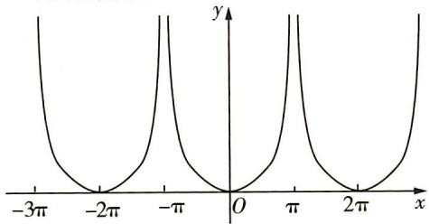

text_image

-3π
-2π
-π
O
π
2π
x
y

# 方法技巧

(1) 如果函数 $f(x)$ 的图象既有对称轴又有位于 $x$ 轴上的对称中心，最小正周期为 $T$ ，则 $|f(x)|$ 的最小正周期为 $\frac{1}{2} T$ ，例如 $y = |\sin x|$ ; (2) 如果函数 $f(x)$ 的图象只有位于 $x$ 轴上的对称中心而没有对称轴，最小正周期为 $T$ ，则 $|f(x)|$ 的最小正周期为 $T$ ，例如 $y = |\tan x|$ .

5. AC 对于 A, 因为 $P(-\frac{\pi}{8},1)$ 是函数 $f(x)$ 图象的一个对称中心, 所以 $-\frac{\pi}{8}\omega + \frac{\pi}{4} = k\pi (k \in \mathbf{Z})$ , 且 b = 1, 得 $\omega = 2 - 8k (k \in \mathbf{Z})$ .

又 $\frac{\pi}{2} < T < \frac{3\pi}{2}$ , 且 $\omega > 0$ , 即 $\frac{\pi}{2} < \frac{2\pi}{\omega} < \frac{3\pi}{2}$ , 所以 $\frac{4}{3} < \omega < 4$ , 所以 $\omega = 2$ , 故 A 正确.

对于 B, 由对 A 的分析得 $f(x)=2\sin\left(2x+\frac{\pi}{4}\right)+1$ , 因为 $-1 \leqslant \sin\left(2x+\frac{\pi}{4}\right) \leqslant 1$ , 所以 $f(x) \in [-1,3]$ , 故 B 不正确.

对于 C, 解法一 由 $2x + \frac{\pi}{4} = k\pi + \frac{\pi}{2} (k \in \mathbf{Z})$ , 得 $x = \frac{k\pi}{2} + \frac{\pi}{8} (k \in \mathbf{Z})$ , 当 k = 0 时, $x = \frac{\pi}{8}$ , 所以直线 $x = \frac{\pi}{8}$ 是函数 $f(x)$ 图象的一条对称轴, 故 C 正确.

解法二 将 $x=\frac{\pi}{8}$ 代入 $f(x)$ ，可得 $f(\frac{\pi}{8})=3(f(x)$ 的最大值），所以直线 $x=\frac{\pi}{8}$ 是 $f(x)$ 图象的一条对称轴，故 C 正确.

对于 D, 因为 $f(x + \frac{\pi}{4}) = 2\sin\left[2\left(x + \frac{\pi}{4}\right) + \frac{\pi}{4}\right] + 1 = 2\sin\left(2x + \frac{\pi}{2} + \frac{\pi}{4}\right) + 1 = 2\cos\left(2x + \frac{\pi}{4}\right) + 1$ ，显然该函数不是偶函数，故 D 不正确。综上所述，选 AC.

6. ABD ∵ 函数 $f(x)=\sin(2x+\varphi)(0<\varphi<\pi)$ 的图象关于直线 $x=\frac{\pi}{6}$ 对称，∴ $2\times\frac{\pi}{6}+\varphi=k\pi+\frac{\pi}{2}, k\in Z$ ，可得 $\varphi=\frac{\pi}{6}$ ，故函数 $f(x)=\sin(2x+\frac{\pi}{6})$ ，故有 $f(0)=\sin\frac{\pi}{6}=\frac{1}{2}$ ，故 A 正确；

令 $x=\frac{5\pi}{12}$ ，可得 $f(x)=0$ ，可得 $f(x)$ 的图象关于点 $\left(\frac{5\pi}{12},0\right)$ 中心对称，故 B 正确；

当 $x \in (0, \frac{\pi}{3})$ 时， $2x + \frac{\pi}{6} \in (\frac{\pi}{6}, \frac{5\pi}{6})$ ，故函数 $f(x)$ 不单调，故 C 错误；当 $x \in (0, \pi)$ 时， $2x + \frac{\pi}{6} \in (\frac{\pi}{6}, 2\pi + \frac{\pi}{6})$ ，有 $x = \frac{\pi}{6}$ 和 $x = \frac{2\pi}{3}$ 两个极值点，故函数 $f(x)$ 有 2 个极值点，故 D 正确，故选 ABD.

题型 74 三角函数的图象变换

1. D 易知 $y = \sin(2x + \frac{\pi}{3}) = \sin 2(x + \frac{\pi}{6})$ ，则先将函数 $y = \sin x$ 的图象上所有点的横坐标缩短到原来的 $\frac{1}{2}$ ，纵坐标保持不变，得到 $y = \sin 2x$ 的图象，再将此图象向左平移 $\frac{\pi}{6}$ 个单位长度，得到 $y = \sin(2x + \frac{\pi}{3})$ 的图象.

2. B 依题意, 将 $y = \sin \left( x - \frac{\pi}{4} \right)$ 的图象向左平移 $\frac{\pi}{3}$ 个单位长度, 再将所得曲线上所有点的横坐标扩大到原来的 2 倍, 得到 $f(x)$ 的图象, 所以 $y = \sin \left( x - \frac{\pi}{4} \right) \xrightarrow{\text{将其图象向左平移} \frac{\pi}{3} \text{个单位长度}} y =$

$\sin(x+\frac{\pi}{12})$ 的图象 $\xrightarrow{所有点的横坐标扩大到原来的2倍}f(x)=\sin(\frac{x}{2}+\frac{\pi}{12})$ 的图象.

3. C 由 $f(x)$ 为奇函数可得 $\varphi = k\pi (k \in \mathbf{Z})$ ，又 $|\varphi| < \pi$ ，所以 $\varphi = 0$ ，所以 $g(x) = A\sin \frac{1}{2}\omega x$ . 由 $g(x)$ 的最小正周期为 $2\pi$ ，可得 $\frac{2\pi}{\frac{1}{2}\omega} = 2\pi$ ，故 $\omega = 2$ ，所以 $g(x) = A\sin x$ . 因为 $g(\frac{\pi}{4}) = A\sin \frac{\pi}{4} = \frac{1}{2}\omega$

$\sqrt{2}$ ，所以 A=2，所以 $f(x)=2\sin2x$ ，故 $f(\frac{3\pi}{8})=2\sin\frac{3\pi}{4}=\sqrt{2}$ .

4. B 将函数 $y = \sin(2x + \varphi)$ 图象上各点的横坐标缩短到原来的 $\frac{1}{2}$ ，得到的图象对应的函数解析式为 $y = \sin(4x + \varphi)$ ，再向左平移 $\frac{\pi}{6}$ 个单位长度得到曲线 C，则曲线 C 对应的函数解析式为 $y = \sin\left[4\left(x + \frac{\pi}{6}\right) + \varphi\right] = \sin\left(4x + \frac{2\pi}{3} + \varphi\right)$ ，又曲线 C 关于 y 轴对称，所以 $\frac{2\pi}{3} + \varphi = k\pi + \frac{\pi}{2}, k \in Z$ ，则 $\varphi = k\pi - \frac{\pi}{6}$ ，又 $|\varphi| < \frac{\pi}{2}$ ，所以 $\varphi = -\frac{\pi}{6}$ ，故选 B.

5. D 函数 $y = \sin(2x + \frac{\pi}{3})$ 的最小正周期 $T = \frac{2\pi}{2} = \pi$ ，设 $A'(m', n')$ ，因为点 $A(m, n)$ 向右平移 $\frac{\pi}{4}$ 个单位长度得到点 $A'(m', n')$ ，所以 $\left\{\begin{aligned} m' &= m + \frac{\pi}{4}, \\ n' &= n, \end{aligned}\right.$ 因为 $A'$ 位于函数 $y = \cos 2x$ 的图象上，所以 $n' = \cos 2m'$ ，所以 $n = \cos 2(m + \frac{\pi}{4})$ ，故 $\sin(2m + \frac{\pi}{3}) = \cos 2(m + \frac{\pi}{4}) = \cos(2m + \frac{\pi}{2}) = -\sin 2m$ ，即 $\sin 2m\cos\frac{\pi}{3} + \cos 2m\sin\frac{\pi}{3} = -\sin 2m$ ，化简得 $\frac{3}{2}\sin 2m = -\frac{\sqrt{3}}{2}\cos 2m$ ，所以 $\tan 2m = -\frac{\sqrt{3}}{3}$ ，故 $2m = -\frac{\pi}{6} + k\pi (k \in \mathbf{Z})$ ， $m = -\frac{\pi}{12} + \frac{k\pi}{2} (k \in \mathbf{Z})$ ，当 k = 1 时， $m = \frac{5\pi}{12}$ ，故选 D.

6. AD $f(x)=\cos\omega\pi x(\omega>0)$ 的图象向右平移 $\frac{1}{3\omega}$ 个单位长度后得到函数

$$
g (x) = \cos [ \omega \pi (x - \frac {1}{3 \omega}) ] = \cos (\omega \pi x -
$$

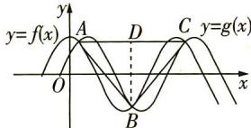

text_image

y
y=f(x)
A
D
C
y=g(x)
O
B
x

$\frac{\pi}{3}$ 的图象. 如图所示, $AC = T = \frac{2\pi}{\omega\pi} = \frac{2}{\omega}$ , 令 $\cos \omega \pi x = \cos (\omega \pi x - \frac{\pi}{3}) = \frac{1}{2} \cos \omega \pi x + \frac{\sqrt{3}}{2} \sin \omega \pi x$ , 得 $\cos \omega \pi x = \sqrt{3} \sin \omega \pi x$ , 则 $\cos \omega \pi x = \pm \frac{\sqrt{3}}{2}$ , 所以 $y_A = y_C = \frac{\sqrt{3}}{2}, y_B = -\frac{\sqrt{3}}{2}$ , 取 $AC$ 的中点 $D$ , 连接 $BD$ , 则 $BD = 2|y_B| = \sqrt{3}$ , 因为 $\triangle ABC$ 是锐角三角形, 所以 $\angle ABC < 90^\circ$ , 即 $\angle DBC < 45^\circ, \angle DCB > 45^\circ$ , 所以 $\tan \angle ACB = \frac{BD}{DC} = \frac{\sqrt{3}\omega}{1} > 1$ , 则 $\omega > \frac{\sqrt{3}}{3}$ , 故选 AD.

7. A 将函数 $y = 2 \sin x$ 转化为 $y = 2 \cos \left( x - \frac{\pi}{2} \right)$ ，将 $y = 2 \cos \left( x - \frac{\pi}{2} \right)$ 的图象上所有点的横坐标缩短到原来的 $\frac{1}{2}$ ，纵坐标不变，得到函数 $y = 2 \cos \left( 2x - \frac{\pi}{2} \right)$ 的图象，再将所得图象向右平移 $\frac{\pi}{12}$ 个

(易错分析:一是没注意变换前后两三角函数名称不一致,变换前一般先化成同名三角函数;二是没理解伸缩变换,将横坐标缩短到原来的 $\frac{1}{2}$ 理解成x除以2变成 $y=2\cos(\frac{x}{2}-\frac{\pi}{2})$ ,此处可从周期的角度理解,横坐标缩短到原来的 $\frac{1}{2}$ ,则函数周期变为原来的一半,因而x的系数变为原来的2倍)

单位长度,得到函数 $y=2\cos\left[2\left(x-\frac{\pi}{12}\right)-\frac{\pi}{2}\right]=2\cos\left(2x-\frac{2\pi}{3}\right)$ 的图象,故 A 正确,B 错误.

将函数 $y=2\sin x=2\cos\left(x-\frac{\pi}{2}\right)$ 的图象上所有的点向右平移 $\frac{\pi}{6}$ 个单位长度得到函数 $y=2\cos\left(x-\frac{\pi}{6}-\frac{\pi}{2}\right)=2\cos\left(x-\frac{2\pi}{3}\right)$ 的图象，再将所得图象上所有点的横坐标缩短到原来的 $\frac{1}{2}$ ，得到函数 $y=2\cos\left(2x-\frac{2\pi}{3}\right)$ 的图象，故 CD 错误。（特别提醒：注意 AB 选项是先伸缩后平移，而 CD 选项是先平移后伸缩，两种方法的平移量是有区别的）

# 题型 75 三角函数的图象识别

1. D 由图象可得, 函数的最大值为 $2\sqrt{3}$ , 最小值为 $-2\sqrt{3}$ , 故 $A = 2\sqrt{3}$ . 由函数图象可得, $f(x)$ 图象两个相邻的对称中心分别为 $(-2,0)$ , $(6,0)$ , 所以函数的最小正周期 $T = 2 \times [6 - (-2)] = 16$ , 所以 $\omega = \frac{2\pi}{T} = \frac{2\pi}{16} = \frac{\pi}{8}$ . 所以 $f(x) = 2\sqrt{3} \sin(\frac{\pi}{8}x + \varphi)$ .

解法一(由对称中心定 $\varphi$ ) 由点 $(-2,0)$ 在函数图象上可得 $f(-2)=2\sqrt{3}\sin\left[\frac{\pi}{8}\times(-2)+\varphi\right]=2\sqrt{3}\sin\left(\varphi-\frac{\pi}{4}\right)=0$ ，又 $(-2,0)$ 在函数图象的下降段上，所以 $\varphi-\frac{\pi}{4}=\pi+2k\pi(k\in\mathbf{Z})$ ，解得 $\varphi=2k\pi+\frac{5\pi}{4}(k\in\mathbf{Z})$ 。因为 $|\varphi|<\pi$ ，所以 k=-1，所以 $\varphi=-\frac{3\pi}{4}$ 。所以函数的解析式为 $f(x)=2\sqrt{3}\sin\left(\frac{\pi}{8}x-\frac{3\pi}{4}\right)$ 。

解法二(由最值点定 $\varphi$ ) 由函数图象可知,相邻两个对称中心分别为 $(-2,0)$ , $(6,0)$ ,所以这两个对称中心之间的函数图象的最低点的坐标为 $(2,-2\sqrt{3})$ .代入函数解析式可得 $f(2)=2\sqrt{3}\sin(\frac{\pi}{8}\times2+\varphi)=-2\sqrt{3}$ ,即 $\sin(\frac{\pi}{4}+\varphi)=-1$ ,所以 $\frac{\pi}{4}+\varphi=2k\pi-\frac{\pi}{2}(k\in\mathbf{Z})$ ,解得 $\varphi=2k\pi-\frac{3\pi}{4}(k\in\mathbf{Z})$ .

因为 $|\varphi|<\pi$ ，所以k=0，所以 $\varphi=-\frac{3\pi}{4}$ .

故函数的解析式为 $f(x)=2\sqrt{3}\sin(\frac{\pi}{8}x-\frac{3\pi}{4})$ .

2. BC 由题图可知, 函数的最小正周期 $T = 2\left(\frac{2\pi}{3} - \frac{\pi}{6}\right) = \pi$ , $\therefore \frac{2\pi}{|\omega|} = \pi, \therefore \omega = \pm 2$ . 当 $\omega = 2$ 时, $y = \sin(2x + \varphi)$ , 将 $(\frac{\pi}{6}, 0)$ 代入得, $\sin(2 \times \frac{\pi}{6} + \varphi) = 0$ , 结合图象得 $2 \times \frac{\pi}{6} + \varphi = 2k\pi + \pi, k \in \mathbf{Z}$ , 即 $\varphi = 2k\pi + \frac{2\pi}{3}, k \in \mathbf{Z}$ , 令 $k = 0$ , 则 $\varphi = \frac{2\pi}{3}, y = \sin(2x + \frac{2\pi}{3})$ . 由于 $y = \sin(2x + \frac{2\pi}{3}) = \sin[\pi - (2x + \frac{2\pi}{3})] = \sin(\frac{\pi}{3} - 2x)$ , 故选项 B 正确; $y = \sin(\frac{\pi}{3} - 2x) = \cos[\frac{\pi}{2} - (\frac{\pi}{3} - 2x)] = \cos(2x + \frac{\pi}{6})$ , 选项 C 正确; 对于选项 A, 显然不符合题意; 对于选项 D, 当 $x = \frac{\pi}{6} + \frac{2\pi}{3} = \frac{5\pi}{12}$ 时, $\cos(\frac{5\pi}{6} - 2 \times \frac{5\pi}{12}) = 1 \neq -1$ , 错误. 当 $\omega = -2$ 时, $y = \sin(-2x + \varphi)$ , 将 $(\frac{\pi}{6}, 0)$ 代入, 得 $\sin(-2 \times \frac{\pi}{6} + \varphi) = 0$ , 结合函数图象, 知 $-2 \times \frac{\pi}{6} + \varphi = \pi + 2k\pi, k \in \mathbf{Z}$ , 得 $\varphi = \frac{4\pi}{3} + 2k\pi, k \in \mathbf{Z}$ , 令 $k = 0$ , 则 $\varphi = \frac{4\pi}{3}, \therefore y = \sin(-2x + \frac{4\pi}{3})$ , 但当 $x = 0$ 时, $y = \sin(-2x + \frac{4\pi}{3}) = -\frac{\sqrt{3}}{2} < 0$ , 与图象不符合, 舍去. 综上, 选 BC.

3. $-\frac{\sqrt{3}}{2}$ 对比正弦函数 $y = \sin x$ 的图象易知，点 $(\frac{2\pi}{3}, 0)$ 为“五点（画图）法”中的第五点，（提醒：将点的坐标代入解析式时，要注意选择的点属于“五点（画图）法”中的哪一个点）
所以 $\frac{2\pi}{3}\omega + \varphi = 2\pi$ ①.

由题知 $|AB| = x_{B} - x_{A} = \frac{\pi}{6},\left\{ \begin{array}{l}\omega x_{A} + \varphi = \frac{\pi}{6},\\ \omega x_{B} + \varphi = \frac{5\pi}{6}, \end{array} \right.$ 两式相减，得 $\omega (x_B - x_A) = \frac{4\pi}{6}$ 即 $\frac{\pi}{6}\omega = \frac{4\pi}{6}$ 解得 $\omega = 4$

代入①, 得 $\varphi = -\frac{2\pi}{3}$ ，所以 $f(\pi) = \sin(4\pi - \frac{2\pi}{3}) = -\sin\frac{2\pi}{3} = -\frac{\sqrt{3}}{2}$ .

4.2 由题图可知, $\frac{3}{4} T = \frac{13\pi}{12} - \frac{\pi}{3} = \frac{3\pi}{4}$ ( $T$ 为 $f(x)$ 的最小正周期), 解得 $T = \pi$ , 所以 $\omega = \pm 2$ . 当 $\omega = -2$ 时, $f(x) = 2\cos(-2x + \varphi)$ , 把 $(\frac{\pi}{3}, 0)$ 代入得 $2\cos(-2 \times \frac{\pi}{3} + \varphi) = 0$ , 结合图象可知 $-2 \times \frac{\pi}{3} + \varphi = \frac{\pi}{2} + 2k\pi, k \in \mathbf{Z}$ , 得 $\varphi = \frac{7\pi}{6} + 2k\pi, k \in \mathbf{Z}$ , 令 $k = 0$ , 则 $\varphi = \frac{7\pi}{6}$ , 所以 $f(x) = 2\cos(-2x + \frac{7\pi}{6})$ , 但当 $x = 0$ 时, $f(0) = 2\cos\frac{7\pi}{6} = -\sqrt{3} < 0$ , 与图象不符合, 舍去. 当 $\omega = 2$ 时, $f(x) = 2\cos(2x + \varphi)$ . 点 $(\frac{\pi}{3}, 0)$ 可看作“五点作图法”中的第二个点, 则 $2 \times \frac{\pi}{3} + \varphi = \frac{\pi}{2}$ , 得 $\varphi = -\frac{\pi}{6}$ , 所以 $f(x) = 2\cos(2x - \frac{\pi}{6})$ , 所以 $f(-\frac{7\pi}{4}) = 2\cos[2 \times (-\frac{7\pi}{4}) - \frac{\pi}{6}] = 2\cos(-\frac{11\pi}{3}) = 2\cos\frac{\pi}{3} = 1, f(\frac{4\pi}{3}) = 2\cos(2 \times \frac{4\pi}{3} - \frac{\pi}{6}) = 2\cos\frac{5\pi}{2} = 0$ , 所以 $(f(x) - f(-\frac{7\pi}{4})) \cdot (f(x) - f(\frac{4\pi}{3})) > 0$ , 即 $(f(x) - 1)f(x) > 0$ , 可得 $f(x) > 1$ 或 $f(x) < 0$ , 所以 $\cos(2x - \frac{\pi}{6}) > \frac{1}{2}$ 或 $\cos(2x - \frac{\pi}{6}) < 0$ . 当 $\cos(2x - \frac{\pi}{6}) < 0$ 时, $\frac{\pi}{2} + 2k\pi < 2x - \frac{\pi}{6} < \frac{3\pi}{2} + 2k\pi, k \in \mathbf{Z}$ , 解得 $\frac{\pi}{3} + k\pi < x < \frac{5\pi}{6} + k\pi, k \in \mathbf{Z}$ , 此时最小正整数 $x$ 为 2. 当 $\cos(2x - \frac{\pi}{6}) > \frac{1}{2}$ 时, $-\frac{\pi}{3} + 2k\pi < 2x - \frac{\pi}{6} < \frac{\pi}{3} + 2k\pi, k \in \mathbf{Z}$ , 解得 $-\frac{\pi}{12} + k\pi < x < \frac{\pi}{4} + k\pi, k \in \mathbf{Z}$ , 此时最小正整数 $x$ 为 3, 综上, 最小正整数 $x$ 为 2.

5. B 设 $\frac{x_2}{x_1} = t$ ，则 $x_2 = tx_1 (t > 1)$ . 由题图可知 $f(x_1) = f(x_2) = 0$ ，即 $\sin (\omega x_1 + \varphi) = \sin (t\omega x_1 + \varphi) = 0$ . 又由五点作图法可知 $x_1, x_2$ 分别为第一点与第三点，所以 $\omega x_1 + \varphi = 0, t\omega x_1 + \varphi = \pi$ ，所以 $x_1 = -\frac{\varphi}{\omega}, x_1 = \frac{\pi - \varphi}{t\omega}$ ，则 $-\frac{\varphi}{\omega} = \frac{\pi - \varphi}{t\omega}$ ，解得 $\varphi = \frac{\pi}{1 - t}$ ，所以在已知 $\frac{x_2}{x_1}$ 的条件下，即 $t$ 的值已知的情况下， $\varphi$ 的值可求，故选 B.

6. B 根据题图可得 $A = 2, \frac{T}{4} = \frac{\pi}{3} - \frac{\pi}{12} = \frac{\pi}{4}$ , 所以最小正周期 $T = \pi$ , 因为 $T = \frac{2\pi}{\omega}$ , 所以 $\omega = 2$ , 所以 $f(x) = 2\sin(2x + \varphi), g(x) = 2\sin 2x$ . 将 $(\frac{\pi}{3}, 2)$ 代入 $f(x)$ 的解析式可得 $2 = 2\sin(\frac{2\pi}{3} + \varphi)$ , 则 $\frac{2\pi}{3} + \varphi = \frac{\pi}{2} + 2k\pi (k \in \mathbf{Z})$ , 则 $\varphi = -\frac{\pi}{6} + 2k\pi (k \in \mathbf{Z})$ , 因为 $|\varphi| < \pi$ , 所以 $\varphi = -\frac{\pi}{6}$ , 所以 $f(x) = 2\sin(2x - \frac{\pi}{6})$ ,

（此处易有如下错解. 将 $(\frac{\pi}{12}, 0)$ 代入 $f(x)$ 的解析式，得 $2\sin \left(\frac{\pi}{6} + \varphi\right) = 0$ ，因而 $\frac{\pi}{6} + \varphi = k\pi$ ( $k \in \mathbb{Z}$ )，由 $|\varphi| < \pi$ ，得 $\varphi = -\frac{\pi}{6}$ 或 $\varphi = \frac{5\pi}{6}$ . 事实上，当 $\varphi = \frac{5\pi}{6}$ 时， $f(x) = 2\sin \left(2x + \frac{5\pi}{6}\right)$ ，

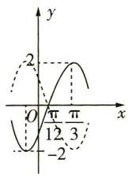

所以 $f(\frac{\pi}{3}) = 2\sin \left(\frac{2\pi}{3} + \frac{5\pi}{6}\right) = -2$ ，与已知图象矛盾，此时其图象如图中虚曲线所示，与已知不符。所以，代入点的坐标求 $\varphi$ 值时，一般情况下，不代入零点求解，而是代入最值点或与 $y$ 轴的交点，若确需代入零点求解，需注意该零点所在的单调区间，以 $y = A\sin (\omega x + \varphi) (A > 0, \omega > 0)$ 为例，若零点 $x = x_0$ 在单调递增区间内，则 $\omega x_0 + \varphi = 2k\pi (k \in \mathbf{Z})$ ，若零点 $x = x_0$ 在单调递减区间内，则 $\omega x_0 + \varphi = (2k + 1)\pi (k \in \mathbf{Z})$ 即 $f(x) = 2\sin 2(x - \frac{\pi}{12})$ ，所以将函数 $f(x)$ 的图象向左平移 $\frac{\pi}{12}$ 个单位长度即可得到 $g(x)$ 的图象。故选 B.

题型 76 三角函数的图象与性质的综合应用

1. D 由题图可知 $\frac{T}{2} = 6$ ，解得 $T = 12$ ，则 $\omega = \frac{2\pi}{T} = \frac{\pi}{6}$ ，由题图知$f(x)_{\max}=A+k=8,f(x)_{\min}=-A+k=2$ ，解得A=3，k=5，则 $f(x)=3\cos\left(\frac{\pi}{6}x+\varphi\right)+5$ ，代入 $A(0,8)$ ，解得 $\varphi=2k\pi(k\in\mathbf{Z})$ ，又 $|\varphi|<\frac{\pi}{2}$ ，所以 $\varphi=0$ ，所以 $f(x)=3\cos\frac{\pi}{6}x+5$ 。A项：最小正周期为12，错误；B项：x=18时， $y=3\cos\left(\frac{\pi}{6}\times18\right)+5=2$ ，此时 $y=f(x)$ 取最小值，错误；C项：由于 $y=\cos x$ 在 $[2k\pi-\pi,2k\pi](k\in\mathbf{Z})$ 上单调递增，故令 $2k\pi-\pi\leqslant\frac{\pi}{6}x\leqslant2k\pi(k\in\mathbf{Z})$ ，解得 $12k-6\leqslant x\leqslant12k(k\in\mathbf{Z})$ ，当k=1时， $f(x)$ 在 $[6,12]$ 上单调递增；由于 $y=\cos x$ 在 $[2k\pi,2k\pi+\pi](k\in\mathbf{Z})$ 上单调递减，故令 $2k\pi\leqslant\frac{\pi}{6}x\leqslant2k\pi+\pi(k\in\mathbf{Z})$ ，解得 $12k\leqslant x\leqslant12k+6(k\in\mathbf{Z})$ ，当k=1时， $f(x)$ 在 $[12,18]$ 上单调递减，错误；D项：由于 $y=\cos x$ 的图象关于点 $(\frac{\pi}{2}+k\pi,0)(k\in\mathbf{Z})$ 对称，故令 $\frac{\pi}{6}x=\frac{\pi}{2}+k\pi(k\in\mathbf{Z})$ ，解得 $x=3+6k,k\in\mathbf{Z}$ 。当k=0时，x=3，此时y=5，故函数 $y=f(x)$ 的图象关于点 $(3,5)$ 对称，正确。

2. D 由题意得 $\frac{1}{2} \times \frac{2\pi}{\omega} = \frac{2\pi}{3} - \frac{\pi}{6}$ , 解得 $\omega = 2$ , 易知 $x = \frac{\pi}{6}$ 是 $f(x)$ 的最小值点, 所以 $\frac{\pi}{6} \times 2 + \varphi = \frac{3\pi}{2} + 2k\pi (k \in \mathbf{Z})$ , 得 $\varphi = \frac{7\pi}{6} + 2k\pi (k \in \mathbf{Z})$ , 于是 $f(x) = \sin (2x + \frac{7\pi}{6} + 2k\pi) = \sin (2x + \frac{7\pi}{6})$ , $f(-\frac{5\pi}{12}) = \sin (-\frac{5\pi}{12} \times 2 + \frac{7\pi}{6}) = \sin \frac{\pi}{3} = \frac{\sqrt{3}}{2}$ , 故选 D.

3. A ① $f(x)$ 的最小正周期为 $T = \frac{2\pi}{2} = \pi$ , 故①错误;

②解法一 当 $-\frac{\pi}{2} + 2k\pi \leqslant 2x \leqslant \frac{\pi}{2} + 2k\pi, k \in \mathbf{Z}$ , 即 $x \in \left[-\frac{\pi}{4} + k\pi, \frac{\pi}{4} + k\pi\right], k \in \mathbf{Z}$ 时, $f(x)$ 单调递增, 又因为 $\left[-\frac{\pi}{4}, \frac{\pi}{4}\right] \subseteq \left[-\frac{\pi}{4} + k\pi, \frac{\pi}{4} + k\pi\right], k \in \mathbf{Z}$ , 故 $f(x)$ 在 $\left[-\frac{\pi}{4}, \frac{\pi}{4}\right]$ 上单调递增, ②正确;

解法二 当 $x \in [-\frac{\pi}{4}, \frac{\pi}{4}]$ 时，设 $t = 2x \in [-\frac{\pi}{2}, \frac{\pi}{2}], y = \frac{1}{2}\sin t$ 在 $[- \frac{\pi}{2}, \frac{\pi}{2}]$ 上单调递增，②正确；

③当 $x \in [-\frac{\pi}{6}, \frac{\pi}{3}]$ 时， $2x \in [-\frac{\pi}{3}, \frac{2\pi}{3}], f(x) \in [-\frac{\sqrt{3}}{4}, \frac{1}{2}]$ ，③错误；  
④ $f(x)$ 的图象可由 $g(x) = \frac{1}{2}\sin (2x + \frac{\pi}{4}) = \frac{1}{2}\sin 2(x + \frac{\pi}{8})$ 的图象向右平移 $\frac{\pi}{8}$ 个单位长度得到，④错误. 故选A.

4. C 根据函数 $f(x) = A \sin (\omega x + \varphi) (A > 0, \omega > 0, |\varphi| < \frac{\pi}{2})$ 的部分图象，可得 $A = 2, \frac{1}{4} \cdot \frac{2\pi}{\omega} = \frac{5\pi}{12} - \frac{\pi}{6}$ ，所以 $\omega = 2$ . 结合五点作图法，可得 $2 \times \frac{\pi}{6} + \varphi = \frac{\pi}{2}$ ，所以 $\varphi = \frac{\pi}{6}$ ，即 $f(x) = 2 \sin (2x + \frac{\pi}{6})$ . 所以 $f(\pi) = 1$ ，不是函数的最值，故直线 $x = \pi$ 不是 $f(x)$ 图象的对称轴，故 A 错误；令 $2x + \frac{\pi}{6} = k\pi, k \in \mathbf{Z}$ ，得 $x = -\frac{\pi}{12} + \frac{k\pi}{2}, k \in \mathbf{Z}$ ，故 $f(x)$ 图象的对称中心为 $(-\frac{\pi}{12} + \frac{k\pi}{2}, 0), k \in \mathbf{Z}$ ，故 B 错误； $x \in [-\frac{\pi}{3}, \frac{\pi}{6}]$ 时， $2x + \frac{\pi}{6} \in [-\frac{\pi}{2}, \frac{\pi}{2}]$ ，函数 $f(x)$ 单调递增，故 C 正确；将 $f(x)$ 的图象向左平移 $\frac{\pi}{12}$ 个单位长度后，可得 $y = 2\sin (2x + \frac{\pi}{3})$ 的图象，故 D 错误. 故选 C.

5. ABC 将 $f(x)=\cos(2x-\pi)$ 图象上所有的点向左平移 $\frac{\pi}{6}$ 个单位长度, 得到 $g(x)=\cos(2x-\frac{2}{3}\pi)$ 的图象. (易错: 向左平移 $\frac{\pi}{6}$ 个单位长度, 是 x 加上 $\frac{\pi}{6}$ , 即 $g(x)=\cos\left[2\left(x+\frac{\pi}{6}\right)-\pi\right]=\cos\left(2x-\frac{2}{3}\pi\right)$ , 其他的不变)

对于 A, 函数 $g(x)$ 的最小正周期为 $\pi$ , 故 A 正确; 对于 B, 当 $x = \frac{7\pi}{12}$ 时, $g(\frac{7\pi}{12}) = 0$ , 故 B 正确; 对于 C, 令 $2k\pi \leqslant 2x - \frac{2\pi}{3} \leqslant 2k\pi + \pi (k \in \mathbf{Z})$ , 整理得函数 $g(x)$ 的单调递减区间为 $\left[\frac{\pi}{3} + k\pi, \frac{5\pi}{6} + k\pi\right] (k \in \mathbf{Z})$ , 故 C 正确; 对于 D, 函数 $g(x) = \cos(2x - \frac{2\pi}{3}) = \sin(2x - \frac{\pi}{6})$ , 故 D 错误. 综上, 选 ABC.

6. BCD 因为函数 $f(x)$ 满足 $f(x_1) = -f(x_2) = 1$ ，且 $|x_1 - x_2|$ 的最小值为3，所以函数 $f(x)$ 的最小正周期为6，（提示： $f(x_1) = -f(x_2) = 1$ 说明 $x_1, x_2$ 为函数的最值点， $|x_1 - x_2|$ 的最小值为3，即函数相邻最值点差半个周期，因而最小正周期是6）而 $T = 6 = \frac{2\pi}{|\omega|}$ ，因为 $\omega > 0$ ，所以 $\omega = \frac{\pi}{3}$ ，此时函数 $f(x) = \sin(\frac{\pi}{3}x + \varphi)$ ，将函数 $f(x)$ 的图象向左平移1个单位长度得到 $g(x)$ 的图象，所以 $g(x) = \sin[\frac{\pi}{3}(x + 1) + \varphi] = \sin(\frac{\pi}{3}x + \frac{\pi}{3} + \varphi)$ ，因为 $g(x)$ 的图象关于 $y$ 轴对称，所以 $\frac{\pi}{3} + \varphi = \frac{\pi}{2} + k\pi (k \in \mathbf{Z})$ ，又 $0 < \varphi < \frac{\pi}{2}$ ，所以 $\varphi = \frac{\pi}{6}$ ，所以选项A错误。 $f(x) = \sin(\frac{\pi}{3}x + \frac{\pi}{6})$ ， $g(x) = \sin(\frac{\pi}{3}x + \frac{\pi}{3} + \frac{\pi}{6}) = \cos\frac{\pi}{3}x$ ，所以 $h(x) = f(x) + g(x) = \sin(\frac{\pi}{3}x + \frac{\pi}{6}) + \cos\frac{\pi}{3}x = \sqrt{3}\sin(\frac{\pi}{3}x + \frac{\pi}{3})$ ，因为 $\sin(\frac{\pi}{3}x + \frac{\pi}{3}) \in [-1, 1]$ ，所以 $h(x) = \sqrt{3}\sin(\frac{\pi}{3}x + \frac{\pi}{3}) \in [-\sqrt{3}, \sqrt{3}]$ ，所以选项C正确。令 $\frac{\pi}{3}x + \frac{\pi}{3} = k\pi (k \in \mathbf{Z})$ ，则 $x = 3k - 1 (k \in \mathbf{Z})$ ，所以函数 $h(x)$ 的图象的对称中心为(3k - 1, 0)， $k \in \mathbf{Z}$ ，选项B正确。当 $x \in [-2, 0]$ 时， $\frac{\pi}{3}x + \frac{\pi}{3} \in [-\frac{\pi}{3}, \frac{\pi}{3}]$ ，此时函数 $h(x)$ 单调递增，故选项D正确。故选BCD。

# 题型 77 三角函数性质与三角恒等变换的综合

1. $3\sqrt{3} - 2\sqrt{2}$ $f(x) = 5\sqrt{3}\cos^2 x + \sqrt{3}\sin^2 x - 4\sin x\cos x = 3\sqrt{3}\cos^2 x + 2\sqrt{3}\cos^2 x + 3\sqrt{3}\sin^2 x - 2\sqrt{3}\sin^2 x - 4\sin x\cos x = 3\sqrt{3} - 2\sin 2x + 2\sqrt{3}\cos 2x = 3\sqrt{3} - 4\sin (2x - \frac{\pi}{3})$

因为 $\frac{\pi}{4} \leqslant x \leqslant \frac{7\pi}{24}$ , 所以 $\frac{\pi}{6} \leqslant 2x - \frac{\pi}{3} \leqslant \frac{\pi}{4}$ , 所以 $\sin (2x - \frac{\pi}{3}) \in [\frac{1}{2}, \frac{\sqrt{2}}{2}]$ , 当 $2x - \frac{\pi}{3} = \frac{\pi}{4}$ , 即 $x = \frac{7\pi}{24}$ 时, $f(x)$ 取得最小值, 最小值为 $3\sqrt{3} - 2\sqrt{2}$ .

2. C 依题意可知 $f(x) = \cos^2 x - \sin^2 x = \cos 2x$ ，对于 A 选项，因为 $x \in (-\frac{\pi}{2}, -\frac{\pi}{6})$ ，所以 $2x \in (-\pi, -\frac{\pi}{3})$ ，函数 $f(x) = \cos 2x$ 在 $(- \frac{\pi}{2}, -\frac{\pi}{6})$ 上单调递增，所以 A 选项不正确；对于 B 选项，因为 $x \in (-\frac{\pi}{4}, \frac{\pi}{12})$ ，所以 $2x \in (-\frac{\pi}{2}, \frac{\pi}{6})$ ，函数 $f(x) = \cos 2x$ 在 $(- \frac{\pi}{4}, \frac{\pi}{12})$ 上不单调，所以 B 选项不正确；对于 C 选项，因为 $x \in (0, \frac{\pi}{3})$ ，所以 $2x \in (0, \frac{2\pi}{3})$ ，函数 $f(x) = \cos 2x$ 在 $(0, \frac{\pi}{3})$ 上单调递减，所以 C 选项正确；对于 D 选项，因为 $x \in (\frac{\pi}{4}, \frac{7\pi}{12})$ ，所以 $2x \in (\frac{\pi}{2}, \frac{7\pi}{6})$ ，函数 $f(x) = \cos 2x$ 在 $(\frac{\pi}{4}, \frac{7\pi}{12})$ 上不单调，所以 D 选项不正确。故选 C.

3. BCD 由题图可知 $\frac{T}{2} = \frac{\pi}{6} - (-\frac{\pi}{12}) = \frac{\pi}{4}$ ( $T$ 为 $f(x)$ 的最小正周期), 则 $T = \frac{\pi}{2}$ , 又 $\omega > 0$ , 所以 $\frac{2\pi}{2\omega} = \frac{\pi}{2}$ , 则 $\omega = 2$ , 所以选项 A 错误; $f(x) = 2\cos(4x + \varphi)$ , 因为点 $(\frac{\pi}{6}, 0)$ 在函数 $f(x)$ 的单调递减的图象上, 所以 $4 \times \frac{\pi}{6} + \varphi = \frac{\pi}{2} + 2k\pi, k \in \mathbf{Z}$ , 所以 $\varphi = -\frac{\pi}{6} + 2k\pi, k \in$

Z, 因为 $-\frac{\pi}{2}<\varphi<0$ , 所以 $\varphi=-\frac{\pi}{6}$ , 所以选项 B 正确;

$f(x)=2\cos(4x-\frac{\pi}{6})$ ，若 $x\in(\frac{\pi}{12},\frac{\pi}{4})$ ，则 $4x-\frac{\pi}{6}\in(\frac{\pi}{6},\frac{5\pi}{6})$ ，所以函数 $f(x)=2\cos(4x-\frac{\pi}{6})$ 在区间 $(\frac{\pi}{12},\frac{\pi}{4})$ 上单调递减，所以选项C正确；

若 $f\left(\frac{1}{2}\alpha - \frac{\pi}{12}\right) = \frac{1}{3}$ , 则 $2\cos \left(2\alpha - \frac{\pi}{2}\right) = \frac{1}{3}$ , 即 $\sin 2\alpha = \frac{1}{6}$ , 所以 $(\sin \alpha - \cos \alpha)^2 = \sin^2 \alpha + \cos^2 \alpha - 2\sin \alpha \cos \alpha = 1 - \sin 2\alpha = 1 - \frac{1}{6} = \frac{5}{6}$ , 因为 $\alpha \in (\frac{\pi}{4}, \frac{\pi}{2})$ , 所以 $\sin \alpha > \cos \alpha$ , 即 $\sin \alpha - \cos \alpha > 0$ , 所以 $\sin \alpha - \cos \alpha = \frac{\sqrt{30}}{6}$ , 所以选项 D 正确. 综上, 选 BCD.

4. (1) $f(x) = a \sin \omega x \cos \omega x = \frac{a}{2} \sin 2\omega x (a > 0, \omega > 0)$ , 易知 $f(x)$ 为奇函数, 故条件②不成立, 舍去.

若选①③, 则 $f(\frac{\pi}{4}) = \frac{a}{2} \sin \frac{\pi \omega}{2} = 1$ 且 $\frac{a}{2} = 1$ , 故 $a = 2, \frac{\pi \omega}{2} = \frac{\pi}{2} + 2k\pi, k \in \mathbf{Z}$ , 得 $\omega = 1 + 4k, k \in \mathbf{Z}$ , 故 $f(x)$ 不唯一, 不合题意.

若选①④, $f(\frac{\pi}{4})=\frac{a}{2}\sin\frac{\pi\omega}{2}=1$ 且 $\frac{T}{2}=\frac{\pi}{2}$ ，故 $T=\pi=\frac{2\pi}{2\omega}$ ，得 $\omega=1$ ，所以a=2，故 $f(x)=2\sin x\cos x=\sin 2x$ ，符合题意.

若选③④, 则 $\frac{a}{2}=1$ 且 $\frac{T}{2}=\frac{\pi}{2}$ , 故 a=2, $T=\pi=\frac{2\pi}{2\omega}$ , 得 $\omega=1$ , 故 $f(x)=2\sin x\cos x=\sin 2x$ , 符合题意.

(2)由(1)可知, $g(x)=f(x)-2\cos^{2}\omega x+1=\sin 2x-2\cos^{2}x+1=\sin 2x-\cos 2x=\sqrt{2}\sin\left(2x-\frac{\pi}{4}\right)$ ,

令 $-\frac{\pi}{2} + 2k\pi \leqslant 2x - \frac{\pi}{4} \leqslant \frac{\pi}{2} + 2k\pi, k \in \mathbf{Z}$ , 得 $-\frac{\pi}{8} + k\pi \leqslant x \leqslant \frac{3\pi}{8} + k\pi, k \in \mathbf{Z}$ ,

当 $k = 0$ 时， $-\frac{\pi}{8} \leqslant x \leqslant \frac{3\pi}{8}$ ，当 $k = 1$ 时， $\frac{7\pi}{8} \leqslant x \leqslant \frac{11\pi}{8}$ .

故函数 $g(x)$ 在 $(0,\pi)$ 上的单调递增区间为 $(0,\frac{3\pi}{8}]$ , $[\frac{7\pi}{8},\pi)$ .

5. (1) $f(x) = 2\left[1 - \cos \left(\frac{\pi}{2} + x\right)\right] \cdot \sin x + \cos^2 x - \sin^2 x - 1 = \sin x(2 + 2\sin x) + 1 - 2\sin^2 x - 1 = 2\sin x.$

对称中心为 $(k\pi,0)$ , $k \in Z$ .

(2) $g(x)=\sin 2x+a\sin x-a\cos x-\frac{1}{2}a-1,$

令 $\sin x - \cos x = t$ ，则 $\sin 2x = 1 - t^{2}$ ，（小技巧：函数式中既含正余弦的和或差（ $\sin x - \cos x$ 或 $\sin x + \cos x$ ），又含二者的乘积（即 $\sin x \cdot \cos x$ ），可令 $\sin x - \cos x = t$ 或 $\sin x + \cos x = t$ ，然后转化为关于 t 的二次函数求最值）

$$
\therefore y = 1 - t ^ {2} + a t - \frac {1}{2} a - 1 = - (t - \frac {a}{2}) ^ {2} + \frac {a ^ {2}}{4} - \frac {1}{2} a,
$$

$$
\begin{array}{l} \because t = \sin x - \cos x = \sqrt {2} \sin (x - \frac {\pi}{4}), x \in [ - \frac {\pi}{4}, \frac {\pi}{2} ], \therefore x - \frac {\pi}{4} \in \\ [ - \frac {\pi}{2}, \frac {\pi}{4} ], \therefore - \sqrt {2} \leqslant t \leqslant 1. \end{array}
$$

①当 $\frac{a}{2}<-\sqrt{2}$ ，即 $a<-2\sqrt{2}$ 时， $y_{\max}=-(-\sqrt{2}-\frac{a}{2})^{2}+\frac{a^{2}}{4}-\frac{a}{2}=-\sqrt{2}a-\frac{a}{2}-2.$

令 $-\sqrt{2} a - \frac{a}{2} - 2 = 2$ ，解得 $a = -\frac{8}{2\sqrt{2} + 1}$ （舍去）.

②当 $-\sqrt{2} \leqslant \frac{a}{2} \leqslant 1$ ，即 $-2\sqrt{2} \leqslant a \leqslant 2$ 时， $y_{\max} = \frac{a^2}{4} - \frac{a}{2}$ ，

令 $\frac{a^{2}}{4}-\frac{a}{2}=2$ , 解得 a=-2 或 a=4(舍去).

③当 $\frac{a}{2}>1$ ，即a>2时， $y_{\max}=\frac{a}{2}-1$ ，由 $\frac{a}{2}-1=2$ ，得a=6。因此a=-2或6。

6. A 由 $f(x) = \sin \left(2x - \frac{\pi}{6}\right) + \cos^2 x - \sin^2 x$ ，化简得 $f(x) = \sin \left(2x + \frac{\pi}{6}\right)$ ，所以 $g(x) = \sin \left(2x + \frac{\pi}{6} - 2\varphi\right)$ . 又 $x = \frac{\pi}{3}$ 是函数

$g(x)$ 的一个极值点,所以当 $x=\frac{\pi}{3}$ 时,函数 $g(x)$ 取得最值,所以 $2\times\frac{\pi}{3}+\frac{\pi}{6}-2\varphi=k\pi+\frac{\pi}{2}(k\in\mathbf{Z})$ ,解得 $\varphi=-k\cdot\frac{\pi}{2}+\frac{\pi}{6}(k\in\mathbf{Z})$ .因为 $0<\varphi<\frac{\pi}{2}$ ,所以 $\varphi=\frac{\pi}{6}$ .故选A.

题型 78 三角函数模型的应用

1. D 由题意可得, $A=\frac{3}{2}$ , $k=\frac{3}{4}$ , $T=4\div3\times60=80(T$ 为 $h(t)$ 的最小正周期),所以 $\omega=\frac{\pi}{40}$ ,由 $h(0)=0$ 及 $|\varphi|<\frac{\pi}{2}$ 可得, $\varphi=-\frac{\pi}{6}$ ,所以 $h(t)=\frac{3}{2}\sin(\frac{\pi}{40}t-\frac{\pi}{6})+\frac{3}{4}$ . 因为T=80,所以A错误;令 $2k\pi+\frac{\pi}{2}\leqslant\frac{\pi}{40}t-\frac{\pi}{6}\leqslant2k\pi+\frac{3\pi}{2}(k\in\mathbf{Z})$ ,解得 $80k+\frac{80}{3}\leqslant t\leqslant80k+\frac{200}{3}(k\in\mathbf{Z})$ ,取k=0,得 $\left[\frac{80}{3},\frac{200}{3}\right]$ 为其中一个减区间,因为[30,70]不是 $\left[\frac{80}{3},\frac{200}{3}\right]$ 的子区间,所以B错误;函数 $y=|h(t)|=|\frac{3}{2}\sin(\frac{\pi}{40}t-\frac{\pi}{6})+\frac{3}{4}|$ 的图象是把 $y=h(t)$ 的图象在t轴下方的部分翻折到t轴的上方,最小正周期仍为80,所以C错误;令 $\frac{\pi}{40}t-\frac{\pi}{6}=k\pi+\frac{\pi}{2}(k\in\mathbf{Z})$ ,得 $t=40k+\frac{80}{3}(k\in\mathbf{Z})$ ,取k=-1得 $t=-\frac{40}{3}$ ,即函数图象的一条对称轴方程为 $t=-\frac{40}{3}$ ,所以D正确.故选D.

2. (1) 因为 $f(t) = 10 - 2\left(\frac{\sqrt{3}}{2}\cos \frac{\pi}{12} t + \frac{1}{2}\sin \frac{\pi}{12} t\right) = 10 - 2\sin \left(\frac{\pi}{12} t + \frac{\pi}{3}\right)$ ，又 $0 \leqslant t < 24$ ，所以 $\frac{\pi}{3} \leqslant \frac{\pi}{12} t + \frac{\pi}{3} < \frac{7\pi}{3}$ ，所以 $-1 \leqslant \sin \left(\frac{\pi}{12} t + \frac{\pi}{3}\right) \leqslant 1$ .

当 $\frac{\pi}{12}t+\frac{\pi}{3}=\frac{\pi}{2}$ ，即t=2时， $\sin(\frac{\pi}{12}t+\frac{\pi}{3})=1$ ；

当 $\frac{\pi}{12}t+\frac{\pi}{3}=\frac{3\pi}{2}$ ，即t=14时， $\sin(\frac{\pi}{12}t+\frac{\pi}{3})=-1.$

于是 $f(t)$ 在 $[0,24)$ 上的最大值为 12，最小值为 8.

故实验室这一天的最高温度为 $12^{\circ}C$ ，最低温度为 $8^{\circ}C$ ，最大温差为 $4^{\circ}C$ .

(2)依题意,知当 $f(t)>11$ 时实验室需要降温.

由(1)得 $f(t)=10-2\sin(\frac{\pi}{12}t+\frac{\pi}{3})$ ,

故有 $10 - 2\sin \left(\frac{\pi}{12} t + \frac{\pi}{3}\right) > 11$ ，即 $\sin \left(\frac{\pi}{12} t + \frac{\pi}{3}\right) < -\frac{1}{2}$ .

因此 $\frac{7\pi}{6}<\frac{\pi}{12}t+\frac{\pi}{3}<\frac{11\pi}{6}$ ，所以10<t<18.

故在 10 时至 18 时实验室需要降温.

3. C 当 $t \in [6, 14]$ 时, $\frac{\pi}{8} t + \frac{3\pi}{4} \in [\frac{3\pi}{2}, \frac{5\pi}{2}]$ , 则 $T = 25 + 10\sin (\frac{\pi}{8} t + \frac{3\pi}{4})$ 在[6,14]上单调递增. 设花开、花谢的时间分别为 $t_1, t_2 (t_1, t_2 \in [6, 14])$ . 令 $T_1 = 20$ , 得 $\sin (\frac{\pi}{8} t_1 + \frac{3\pi}{4}) = -0.5$ , 即 $\frac{\pi}{8} t_1 + \frac{3\pi}{4} = \frac{11\pi}{6}$ , 解得 $t_1 = \frac{26}{3} \approx 8.7$ . 令 $T_2 = 31$ , 得 $\sin (\frac{\pi}{8} t_2 + \frac{3\pi}{4}) = 0.6 \approx \sin \frac{\pi}{5}$ , 即 $\frac{\pi}{8} t_2 + \frac{3\pi}{4} \approx \frac{11\pi}{5}$ , 解得 $t_2 \approx 11.6$ . 故每天在6时\~14时期间, 观花的最佳时段约为8.7时\~11.6时.

4. B 根据题意, 设 $H(t) = A \sin(\omega t + \varphi) + B (0 \leqslant t \leqslant 30)$ , 因为某摩天轮最高点距离地面的高度为 120 m, 转盘直径为 110 m, 所以该摩天轮最低点距离地面的高度为 10 m, (注意旋转的初始位置与最高位置)

所以 $\left\{ \begin{array}{l} A + B = 120, \\ -A + B = 10, \end{array} \right.$ 解得 $\left\{ \begin{array}{l} A = 55, \\ B = 65, \end{array} \right.$ 因为开启后按逆时针方向匀速旋转，旋转一周需要 $30\mathrm{min}$ ，所以 $T = \frac{2\pi}{\omega} = 30$ ，解得 $\omega = \frac{\pi}{15}$ ，因为 $t = 0$ 时， $H(0) = 10$ ，故 $10 = 55\sin \varphi + 65$ ，即 $\sin \varphi = -1$ ，解得 $\varphi = -\frac{\pi}{2} + 2k\pi, k \in \mathbf{Z}$ ，取 $k = 0$ ，此时 $\varphi = -\frac{\pi}{2}$ ，所以 $H(t) = 55\sin (\frac{\pi}{15} t - \frac{\pi}{2}) + 65 (0 \leqslant t \leqslant 30)$ . 故选B.

# 第五章 数列

# 第一节 数列的概念与简单表示

# 题型 79 利用 $a_{n}$ 与 $S_{n}$ 的关系求数列的通项公式

1. C 当 n=1 时， $a_{2}+2S_{1}=2+1$ ，因为 $S_{1}=a_{1}=1$ ，所以 $a_{2}=1$ 。当 $n\geqslant2$ 时，由 $a_{n+1}+2S_{n}=2n+1$ 得 $a_{n}+2S_{n-1}=2n-1$ ，两式相减可得 $a_{n+1}-a_{n}+2a_{n}=2$ ，即 $a_{n}+a_{n+1}=2$ 。因为 $a_{2}=1$ ，所以 $a_{3}=1,a_{4}=1,\cdots,a_{n}=1$ ，可得 $S_{n}=a_{1}+a_{2}+\cdots+a_{n}=n$ ，所以 $S_{2023}=2023$ ，故选 C。

2. $a_{n} = \left\{ \begin{array}{l}\frac{13}{2},n = 1,\\ 2n - \frac{1}{2},n\geqslant 2 \end{array} \right.$ 当 $n = 1$ 时， $a_1 = S_1 = \frac{13}{2}$

当 $n \geqslant 2$ 时, $a_{n} = S_{n} - S_{n-1} = (n^{2} + \frac{1}{2} n + 5) - [(n-1)^{2} + \frac{1}{2}(n-1) + 5] = 2n - \frac{1}{2}$ . 又 $2 \times 1 - \frac{1}{2} = \frac{3}{2} \neq a_{1}$ ,

所以数列 $\{a_{n}\}$ 的通项公式为 $a_{n} = \left\{ \begin{array}{l} \frac{13}{2}, n = 1, \\ 2n - \frac{1}{2}, n \geqslant 2. \end{array} \right.$

3. -63 因为 $S_{n} = 2a_{n} + 1$ ，所以当 $n = 1$ 时， $a_{1} = S_{1} = 2a_{1} + 1$ ，解得 $a_{1} = -1$ . 当 $n \geqslant 2$ 时， $a_{n} = S_{n} - S_{n-1} = 2a_{n} + 1 - (2a_{n-1} + 1)$ ，所以 $a_{n} = 2a_{n-1}$ ，所以数列 $\{a_{n}\}$ 是以 -1 为首项，2 为公比的等比数列，所以 $S_{6} = \frac{-1 \times (1 - 2^{6})}{1 - 2} = -63$ .

4. $-\frac{1}{n}$ 当 $n = 1$ 时, $S_{1} = a_{1} = -1$ , 所以 $\frac{1}{S_{1}} = -1$ . 因为 $a_{n+1} = S_{n+1} - S_{n} = S_{n}S_{n+1}$ , 所以 $\frac{1}{S_n} - \frac{1}{S_{n+1}} = 1$ , 即 $\frac{1}{S_{n+1}} - \frac{1}{S_n} = -1$ , 所以 $\{\frac{1}{S_n}\}$ 是以-1为首项, -1为公差的等差数列, 所以 $\frac{1}{S_n} = (-1) + (n-1) \cdot (-1) = -n$ , 所以 $S_{n} = -\frac{1}{n}$ .

5.2 解法一 因为 $S_{n}=na_{n}$ ，所以当 $n\geqslant2$ 时， $a_{n}=S_{n}-S_{n-1}=na_{n}-(n-1)a_{n-1}$ ，得 $(n-1)a_{n}=(n-1)a_{n-1}$ ，即 $a_{n}=a_{n-1}$ ，所以数列 $\{a_{n}\}$ 是常数列，所以 $a_{n}=a_{1}, S_{n}=na_{1}$ ，所以 $S_{2}+S_{4}+S_{6}+\cdots+S_{60}=(2+4+6+\cdots+60)a_{1}=\frac{(2+60)\times30}{2}a_{1}=930a_{1}=1860$ ，解得 $a_{1}=2$ 。(数列 $\{a_{n}\}$ 为常数列 $\Leftrightarrow$ 其前 n 项和 $S_{n}=na_{1}=na_{n}$ )

解法二 因为 $S_{n}=na_{n}$ ，所以当 $n\geqslant2$ 时， $S_{n}=n(S_{n}-S_{n-1})$ ，得 $(n-1)S_{n}=nS_{n-1}$ ，则有 $\frac{S_{n}}{n}=\frac{S_{n-1}}{n-1}$ ，所以数列 $\left\{\frac{S_{n}}{n}\right\}$ 是常数列，则 $\frac{S_{n}}{n}=\frac{S_{1}}{1}=a_{1}$ ，所以 $S_{n}=na_{1}$ ，则 $S_{2}+S_{4}+S_{6}+\cdots+S_{60}=(2+4+6+\cdots+60)a_{1}=\frac{(2+60)\times30}{2}a_{1}=930a_{1}=1860$ ，解得 $a_{1}=2$ 。

6.(1)由题意,数列 $\{a_{n}\}$ 的前n项和 $S_{n}=4n^{2}+kn$ ,
可得 $S_{1}=4+k, S_{2}=16+2k$ ,

因为 $a_{2}=20$ ，所以 $16+2k-(4+k)=20$ ，解得 k=8。

所以 $a_{1}=S_{1}=12, S_{n}=4n^{2}+8n.$

所以当 $n \geqslant 2$ 时， $S_{n-1} = 4(n-1)^{2} + 8(n-1)$ ，

所以 $a_{n} = S_{n} - S_{n - 1} = 4n^{2} + 8n - 4(n - 1)^{2} - 8(n - 1) = 8n + 4(n\geqslant$ 2).当 $n = 1$ 时， $a_1 = 12$ ，符合上式，

所以数列 $\{a_{n}\}$ 的通项公式为 $a_{n}=8n+4$ .

(2)由(1)知 $a_{n-1}=8n-4$ ，可得 $b_{n}-b_{n-1}=8n-4(n\geqslant2)$ ，

所以 $b_{2}-b_{1}=12, b_{3}-b_{2}=20, b_{4}-b_{3}=28, \cdots, b_{n}-b_{n-1}=8n-4$

所以 $b_{n}-b_{1}=12+20+28+\cdots+8n-4=\frac{(n-1)(12+8n-4)}{2}=4n^{2}-4(n\geqslant2)$ ,

由 $b_{1}=3$ , 可得 $b_{n}=4n^{2}-1(n\geqslant2)$

当 n=1 时, $b_{1}=3$ , 满足上式, 所以 $b_{n}=4n^{2}-1$ .

7. $a_{n}=\left\{\begin{aligned}&1,n=1,\\ &2^{n},n\geqslant2\end{aligned}\right.$ 对于 $1+a_{1}+2a_{2}+3a_{3}+\cdots+na_{n}=(n-1)\cdot$

$2^{n+1} + 2(n \in \mathbf{N}^*)$ ，当 $n \geqslant 2$ 时，可得 $1 + a_1 + 2a_2 + 3a_3 + \cdots + (n - 1)a_{n-1} = (n - 2) \cdot 2^n + 2$ ，两式相减得 $na_n = (n - 1) \cdot 2^{n+1} - (n - 2) \cdot 2^n = n \cdot 2^n$ ，即 $a_n = 2^n (n \geqslant 2)$ 。当 n = 1 时，可得 $1 + a_1 = 2, a_1 = 1$ ，不满足上式，（注意不要忘记检验 $a_1$ ）

所以数列 $\{a_{n}\}$ 的通项公式为 $a_{n} = \left\{ \begin{array}{ll}1, & n = 1,\\ 2^{n}, & n\geqslant 2. \end{array} \right.$

# 方法技巧

若 $S_{n}$ 为数列 $\{g(n)a_{n}\}$ 的前 n 项和，则 $a_{n}=\frac{S_{n}-S_{n-1}}{g(n)}(n\geqslant2)$ （注意检验 $a_{1}$ ）。常见的类型有 $a_{1}+2a_{2}+3a_{3}+\cdots+na_{n}=f(n),2^{1}a_{1}+2^{2}a_{2}+2^{3}a_{3}+\cdots+2^{n}a_{n}=f(n)$ 等。

# 题型 80 利用累加法（累乘法）求数列的通项公式

1. B 因为 $a_{n+1}=a_{n}+\frac{1}{n}-\frac{1}{n+1}$ ，所以 $a_{n+1}-a_{n}=\frac{1}{n}-\frac{1}{n+1}$ ，所以 $a_{n}=a_{1}+(a_{2}-a_{1})+(a_{3}-a_{2})+\cdots+(a_{n}-a_{n-1})=3+1-\frac{1}{2}+\frac{1}{2}-\frac{1}{3}+\cdots+\frac{1}{n-1}-\frac{1}{n}=4-\frac{1}{n}$ ，故选 B.

2. A 由题意可得, $a_{n+1}-a_n=\ln(1+\frac{1}{n}),\therefore a_n=(a_n-a_{n-1})+(a_{n-1}-a_{n-2})+\cdots+(a_2-a_1)+a_1=\ln\frac{n}{n-1}+\ln\frac{n-1}{n-2}+\cdots+\ln\frac{2}{1}+2=\ln(\frac{n}{n-1}\cdot\frac{n-1}{n-2}\cdot\cdots\cdot\frac{2}{1})+2=\ln n+2.$ 故选 A.

3. (1) 由 $b_{1} + b_{2} = 6b_{3}$ 得 $1 + q = 6q^{2}$ , 解得 $q = \frac{1}{2}$ .

由 $c_{n + 1} = 4c_n$ 得 $c_{n} = 4^{n - 1}$

由 $a_{n+1}-a_{n}=4^{n-1}$ 得 $a_{n}=a_{1}+(a_{2}-a_{1})+(a_{3}-a_{2})+\cdots+(a_{n}-a_{n-1})=a_{1}+1+4+\cdots+4^{n-2}=\frac{4^{n-1}+2}{3}(n\geqslant2)$ .

当 $n = 1$ 时， $a_{1} = 1 = \frac{1 + 2}{3}$ ，故 $a_{n} = \frac{4^{n - 1} + 2}{3}$ .

(2)由 $c_{n + 1} = \frac{b_n}{b_{n + 2}} c_n$ 得 $c_{n} = \frac{b_{1}b_{2}c_{1}}{b_{n}b_{n + 1}} = \frac{1 + d}{d}\left(\frac{1}{b_n} -\frac{1}{b_{n + 1}}\right)$ ，（累乘可得）所以 $c_{1} + c_{2} + c_{3} + \dots +c_{n} = \frac{1 + d}{d}\left(1 - \frac{1}{b_{n + 1}}\right),$

由 $b_{1}=1, d>0$ 得 $b_{n+1}>0$ ，因此 $c_{1}+c_{2}+c_{3}+\cdots+c_{n}<1+\frac{1}{d}, n\in N^{*}$ .

4. C 记该数列为 $\{a_{n}\}$ ，则 $a_{2}-a_{1}=3-2=1, a_{3}-a_{2}=6-3=3, a_{4}-a_{3}=11-6=5,\cdots$ ，可知该数列相邻两项的差构成等差数列，记为 $\{b_{n}\}$ ，则数列 $\{b_{n}\}$ 的首项为 1，公差为 2，故 $b_{n}=1+2(n-1)=2n-1$ ，故 $a_{n+1}-a_{n}=b_{n}=2n-1$ ，则 $a_{2}-a_{1}=1, a_{3}-a_{2}=3, a_{4}-a_{3}=5,\cdots,a_{n}-a_{n-1}=2n-3$ ，以上各式相加，得 $a_{n}-a_{1}=1+3+5+\cdots+(2n-3)=\frac{(n-1)(1+2n-3)}{2}=(n-1)^{2}(n\geqslant2)$ ，

(累加时注意开始的一项、最后一项以及累加的项数)

所以 $a_{n}=(n-1)^{2}+a_{1}=(n-1)^{2}+2(n\geqslant2)$ ，故 $a_{15}=14^{2}+2=198$ ，故选C.

5. $\frac{2n+1}{3}(n\in\mathbf{N}^{*})$ 由 $\frac{a_{n}}{a_{n-1}}=\frac{2n+1}{2n-1}(n\in\mathbf{N}^{*},n\geqslant2)$ ，易知 $a_{n}\neq0$ .
当 $n\geqslant2$ 时， $a_{n}=a_{1}\times\frac{a_{2}}{a_{1}}\times\frac{a_{3}}{a_{2}}\times\cdots\times\frac{a_{n}}{a_{n-1}}=1\times\frac{5}{3}\times\frac{7}{5}\times\cdots\times\frac{2n+1}{2n-1}=\frac{2n+1}{3}$ ，又 $a_{1}=1$ 也符合上式，所以 $a_{n}=\frac{2n+1}{3}(n\in\mathbf{N}^{*})$ .

6. $\frac{1}{2n + 1}$ $\left\{ \begin{array}{l} \frac{2n}{n + 1}, n = 2k - 1, \\ \frac{n}{2n + 2}, n = 2k \end{array} \right.$ （ $k \in \mathbb{N}^*$ ）因为 $a_n \cdot a_{n+1} = \frac{n}{n + 2}$ ，所

以 $a_1 \cdot a_2 \cdot a_3 \cdot \cdots \cdot a_{2n-2} \cdot a_{2n-1} \cdot a_{2n} = \frac{1}{3} \times \frac{3}{5} \times \frac{5}{7} \times \cdots \times \frac{2n-1}{2n+1} = \frac{1}{2n+1}$ . 由 $a_n \cdot a_{n+1} = \frac{n}{n+2}$ , 可得 $a_{n+1} \cdot a_{n+2} = \frac{n+1}{n+3}$ , 即有 $\frac{a_{n+2}}{a_n} = \frac{(n+1)(n+2)}{n(n+3)}$ , 由 $a_1 = 1$ , 得 $\frac{a_3}{a_1} = \frac{2 \times 3}{1 \times 4}, \frac{a_5}{a_3} = \frac{4 \times 5}{3 \times 6}, \frac{a_7}{a_5} = \frac{6 \times 7}{5 \times 8}, \cdots, \frac{a_{2k-1}}{a_{2k-3}} = \frac{(2k-2)(2k-1)}{(2k-3) \cdot 2k}$ , 所以当 $n = 2k - 1, k \in \mathbb{N}^*$ 时, 将以上各式相乘可得, $a_{2k-1} = \frac{2(2k-1)}{2k}$ , 即 $a_n = \frac{2n}{n+1}$ . 又当 $n = 2k - 1, k \in \mathbb{N}^*$ 时, $a_{2k-1} \cdot a_{2k} = \frac{2k-1}{2k+1}$ , 所以 $a_{2k} = \frac{2k-1}{2k+1} \cdot \frac{2k}{2(2k-1)} = \frac{2k}{2(2k+1)}$ , 所以当 $n = 2k, k \in \mathbb{N}^*$ 时, $a_n = \frac{n}{2n+2}$ . 所以 $a_n =$

$$
\left\{ \begin{array}{l l} \frac {2 n}{n + 1}, n = 2 k - 1, \\ \frac {n}{2 n + 2}, n = 2 k \end{array} \right. (k \in \mathbf {N} ^ {*}).
$$

7. $a_{n} = 3(n - 1), n \in \mathbb{N}^{*}$ 当 $n = 1$ 时，可得 $2a_{1} = a_{1}$ ，解得 $a_{1} = 0$ ；当 $n = 2$ 时，可得 $2S_{2} = 2(a_{1} + a_{2}) = 2a_{2}$ ，解得 $a_{1} = 0$ ；当 $n = 3$ 时，可得 $2S_{3} = 2(a_{1} + a_{2} + a_{3}) = 3a_{3}$ ，解得 $a_{3} = 6$ 。当 $n \geqslant 2$ 时，由 $2S_{n} = na_{n}$ ，可得 $2S_{n - 1} = (n - 1)a_{n - 1}$ ，两式相减可得 $2a_{n} = na_{n} - (n - 1)a_{n - 1}$ ，所以 $(n - 2)a_{n} = (n - 1)a_{n - 1}$ ，当 $n = 2$ 时，上式显然成立，当 $n \geqslant 3$ 时，可得 $\frac{a_n}{a_{n - 1}} = \frac{n - 1}{n - 2}$ ，（注意 $n \geqslant 3$ ）

所以 $a_{n}=a_{2}\cdot\frac{a_{3}}{a_{2}}\cdot\frac{a_{4}}{a_{3}}\cdot\cdots\cdot\frac{a_{n}}{a_{n-1}}=3\times\frac{2}{1}\times\frac{3}{2}\times\cdots\times\frac{n-1}{n-2}=3(n-1)$ ，（累乘时注意开始约一项和最后一项）

上式对 n=1, n=2 也成立，（检验 $a_{1}$ , $a_{2}$ ）

所以 $a_{n}=3(n-1), n\in\mathbf{N}^{*}$ .

题型 81 数列的性质及其应用

1. $\frac{4}{5}$ 由题意可得, $a_{1} = -\frac{1}{4}, a_{2} = 5, a_{3} = \frac{4}{5}, a_{4} = -\frac{1}{4}, a_{5} = 5, \cdots$ , 所以可观察出数列 $\{a_{n}\}$ 为以 3 为周期的数列. 又 $2022 \div 3 = 674$ , 所以 $a_{2022} = a_{3} = \frac{4}{5}$ .

2. $(-3, +\infty)$ 由数列 $\{a_{n}\}$ 是递增数列，可得 $a_{n+1} > a_{n}$ 对于任意的 $n \in \mathbf{N}^{*}$ 恒成立，即 $(n+1)^{2} + k(n+1) > n^{2} + kn$ ，即 $2n+1 + k > 0$ ，即 $k > -2n-1$ 对于任意的 $n \in \mathbf{N}^{*}$ 恒成立。因为 $f(n) = -2n-1 (n \in \mathbf{N}^{*})$ 递减，所以 $f(n)_{\max} = f(1) = -3$ ，所以 $k > -3$ 。

3. D 设等比数列 $\{a_{n}\}$ 的公比为 q. 对于选项 A, 如取 $a_{n}=\frac{1}{2^{n}}$ , 满足 $S_{2022}>S_{2021}$ , 但 $\{a_{n}\}$ 不是递增数列, 故 A 错误; 对于选项 B, 如取 $a_{n}=-2^{n}$ , 满足 $T_{2022}>T_{2021}$ , 但 $\{a_{n}\}$ 不是递增数列, 故 B 错误; 对于选项 C, 如取 $a_{n}=\frac{1}{2^{n}}$ , 则 $S_{n}=\frac{\frac{1}{2}\left[1-\left(\frac{1}{2}\right)^{n}\right]}{1-\frac{1}{2}}=1-\left(\frac{1}{2}\right)^{n}$ , 满

足 $\{S_{n}\}$ 为递增数列，但 $a_{2022} < a_{2021}$ ，故C错误；对于选项D，若数列 $\{T_n\}$ 为递增数列，则 $T_{n + 1} > T_n > 0$ ， $\therefore a_{n + 1} > 1,q\geqslant 1,\therefore a_{2022}\geqslant a_{2021}$ 故D正确.选D.

4. C 因为数列 $\{a_{n}\}$ 满足三个特征, 整数数列, 递增, 前 n 项和为 100, 所以欲求 n 的最大值, 需要保证 $a_{k+1}-a_{k}(k\leqslant n-1)$ 的值取最小的正整数, 又 $a_{1}\geqslant3$ , 所以可取 $a_{1}=3, a_{k+1}-a_{k}=1$ , 数列 $\{a_{n}\}$ 的前 10 项为 3, 4, 5, 6, 7, 8, 9, 10, 11, 12, 则第 11 项 $a_{11}=100-(3+4+5+6+7+8+9+10+11+12)=25$ , 满足题意, 取数列 $\{a_{n}\}$ 的前 11 项为 3, 4, 5, 6, 7, 8, 9, 10, 11, 12, 13, 则第 12 项 $a_{12}=100-(3+4+5+6+7+8+9+10+11+12+13)=12$ , 不满足题意, 故 n 的最大值为 11.

5. C 由题意 $a_1 a_2 \cdots a_n = 1 - \frac{2}{7} n$ ①. 当 $n = 1$ 时, $a_1 = 1 - \frac{2}{7} = \frac{5}{7}$ ; 当 $n \geqslant 2$ 时, $a_1 a_2 \cdots a_{n-1} = 1 - \frac{2}{7} (n - 1) = \frac{9}{7} - \frac{2}{7} n$ ②. 由

①÷②得 $a_{n} = \frac{1 - \frac{2}{7}n}{\frac{9}{7} - \frac{2}{7}n} = \frac{7 - 2n}{9 - 2n} =$

$1 + \frac{2}{2n - 9} (n\geqslant 2)$ .又 $a_1 = \frac{5}{7}$ 也满足上式，所以 $a_{n} = 1 + \frac{2}{2n - 9}(n\in$ $\mathbf{N}^{*})$ .作出函数 $f(x) = 1 + \frac{2}{2x - 9}$ 的

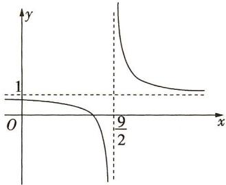

text_image

y
1
O
9/2
x

图象,如图所示,易知当 $x\in\mathbf{N}^{*}$ 时, $f(x)_{\max}=f(5)$ , $f(x)_{\min}=f(4)$ ,所以 $a_{n}$ 的最小值为 $a_{4}=-1$ ,最大值为 $a_{5}=3$ ,所以 $a_{n}$ 的最大值与最小值之和为2,故选C.

6. BC 因为 $a_{n+1} > a_n$ 对任意 $n \in \mathbb{N}^*$ 恒成立, 即 $4^{n+1} + \lambda(-2)^{n+2} > 4^n + \lambda(-2)^{n+1}$ 对任意 $n \in \mathbb{N}^*$ 恒成立, 所以当 $n$ 为奇数时, $4^{n+1} - \lambda 2^{n+2} > 4^n + \lambda 2^{n+1}$ , 即 $(2^{n+1} + 2^{n+2})\lambda < 4^{n+1} - 4^n$ , 则 $\lambda < \frac{3 \times 4^n}{6 \times 2^n} = 2^{n-1}$ 对所有的 $n$ 为奇数恒成立, 当 $n=1$ 时, $2^{n-1}$ 取得最小值 1 ,所以 $\lambda < 1$ ; 当 $n$ 为偶数时, $4^{n+1} + \lambda 2^{n+2} > 4^n - \lambda 2^{n+1}$ , 即 $(2^{n+1} + 2^{n+2}) \cdot \lambda > 4^n - 4^{n+1}$ , 则 $\lambda > \frac{-3 \times 4^n}{6 \times 2^n} = -2^{n-1}$ 对所有的 $n$ 为偶数恒成立,

当 $n = 2$ 时， $-2^{n - 1}$ 取得最大值-2，所以 $\lambda > - 2.$ 综上， $-2 <   \lambda <$ 1,故选BC.

7.16 根据题意, 令 $a_{n} = \frac{2n}{3n - 49} < 0$ , 得 $0 < n < \frac{49}{3}$ , 又 $n \in \mathbb{N}^{*}$ , 所以 $1 \leqslant n \leqslant 16$ , 则当 $2 \leqslant n \leqslant 16$ 时, $a_{n} = S_{n} - S_{n-1} < 0$ , 即 $S_{n} < S_{n-1}$ , 数列 $\{S_{n}\}$ 为递减数列, 当 $n \geqslant 17$ 时, $a_{n} = S_{n} - S_{n-1} > 0$ , 即 $S_{n} > S_{n-1}$ , 数列 $\{S_{n}\}$ 为递增数列, 故当 $n = 16$ 时, $S_{n}$ 取得最小值.

8. $-24(\sqrt{2} + 1)$ 因为 $\sin \frac{n\pi}{4}$ 以8为周期，所以一个周期内数列的和为 $1 \times \frac{\sqrt{2}}{2} + 3 \times 1 + 5 \times \frac{\sqrt{2}}{2} + 7 \times 0 + 9 \times (-\frac{\sqrt{2}}{2}) + 11 \times (-1) + 13 \times (-\frac{\sqrt{2}}{2}) + 15 \times 0 = -8\sqrt{2} - 8.$ 因为第24项为0，所以前23项和 $S_{23} = S_{24} = 3 \times (-8\sqrt{2} - 8) = -24(\sqrt{2} + 1).$

9.3 设 $a_{n}$ 是数列 $\{a_{n}\}$ 的最大项，则 $\left\{ \begin{array}{l} a_{n+1} \leqslant a_{n}, \\ a_{n-1} \leqslant a_{n}, \end{array} \right.$ 所以 $\left\{ \begin{array}{l} \frac{(n+1)^3}{3^{n+1}} \leqslant \frac{n^3}{3^n}, \\ \frac{(n-1)^3}{3^{n-1}} \leqslant \frac{n^3}{3^n}, \end{array} \right.$ 解得 $\frac{1}{\sqrt[3]{3}-1} \leqslant n \leqslant \frac{\sqrt[3]{3}}{\sqrt[3]{3}-1}$ . 因为 $\sqrt[3]{3} \approx 1.44$ ，所以 $n$ 的值为 3.

# 第二节 等差数列及其前 $n$ 项和

# 题型 82 等差数列的基本运算

1. C 设等差数列 $\{a_{n}\}$ 的公差为 d，则 $a_{1} + a_{2} + a_{3} = 3a_{1} + 3d = 9$ ， $a_{4} + a_{5} = 2a_{1} + 7d = 16$ ，所以 $a_{1} = 1, d = 2$ ，所以 $a_{6} = a_{1} + 5d = 1 + 10 = 11$ ，故选 C.

2. A 设等差数列 $\{a_{n}\}$ 的公差为 d，由 $a_{6}=S_{6}=6$ ，得 $\left\{\begin{aligned}a_{1}+5d=6,\\ 6a_{1}+15d=6,\end{aligned}\right.$ 解得 $\left\{\begin{aligned}a_{1}&=-4,\\ d&=2,\end{aligned}\right.$ 所以 $a_{n}=2n-6,S_{n}=n^{2}-5n.$ 由 $a_{m}+S_{m}=m^{2}-3m-6=64$ ，得 $(m-10)(m+7)=0.$ 又 $m\in N^{*}$ ，所以 m=10，故选 A.

3.0 由题意可得, 公差 $d = \frac{20 - 30}{30 - 20} = -1$ , 所以 $a_{50} = a_{20} + 30d = 30 - 30 = 0$ . (等差数列 $\{a_n\}$ 中, 若 $a_n = m, a_m = n$ , 且 $m \neq n$ , 则 $a_{m+n} = 0$ )

4. A 设等差数列 $\{a_{n}\}$ 的公差为 d，则 $\left\{\begin{aligned}&4a_{1}+\frac{4\times3}{2}d=0,\\ &a_{1}+4d=5,\end{aligned}\right.$ 解得 $\left\{\begin{aligned}a_{1}&=-3,\\ d&=2,\end{aligned}\right.\therefore a_{n}=a_{1}+(n-1)d=-3+2(n-1)=2n-5,S_{n}=na_{1}+\frac{n(n-1)}{2}\cdot d=n^{2}-4n.$ 故选 A.

5.2 因为 $2S_{3}=3S_{2}+6$ ，所以 $2(a_{1}+a_{2}+a_{3})=3(a_{1}+a_{2})+6$ ，化简得 3d=6，得 d=2。

6. C 设从第1排到第15排每排的座位数构成的数列为 $\{a_{n}\}$ , 由题意可知, 数列 $\{a_{n}\}$ 为等差数列, 公差 $d = 2$ , 且 $\{a_{n}\}$ 的前15项和 $S_{15} = 390$ .

解法一 $S_{15} = 15a_{1} + \frac{15\times 14}{2}\times 2 = 390,a_{1} = 12$ ，所以 $a_{15} = a_1 + 14d = 12 + 14\times 2 = 40$ ，即最后一排的座位数为40，故选C.

解法二 $S_{15} = 15a_{8} = 390$ ，所以 $a_8 = 26$ ，则 $a_{15} = a_8 + 7d = 26 + 7 \times 2 = 40$ ，即最后一排的座位数为40，故选C.

7. BCD 等差数列 $\{a_{n}\}$ 中， $a_{1} + a_{2} + a_{3} = 21$ ，所以 $3a_{2} = 21$ ，解得 $a_{2} = 7$ ，又 $S_{5} = a_{1} + a_{2} + a_{3} + a_{4} + a_{5} = 5a_{3} = 25$ ，所以 $a_{3} = 5$ ，所以公差 $d = a_{3} - a_{2} = -2, a_{1} = 9$ ，所以 $a_{n} = 9 - 2 \times (n - 1) = -2n + 11$ ， $S_{n} = 9n + \frac{n(n - 1) \times (-2)}{2} = -n^{2} + 10n$ ，A 错误，B 正确；

令 $a_{n} = -2n + 11 = 0$ ，得 $n = \frac{11}{2}$ 所以 $a_5 > 0, a_6 < 0, S_n$ 的最大值是 $S_5, C$ 正确；

因为 $\frac{1}{a_n a_{n+1}} = \frac{1}{d} \left( \frac{1}{a_n} - \frac{1}{a_{n+1}} \right)$ ，所以 $\left\{ \frac{1}{a_n a_{n+1}} \right\}$ 的前 10 项和为 $\frac{1}{d} \left( \frac{1}{a_1} - \frac{1}{a_{11}} \right) = -\frac{1}{2} \times \left( \frac{1}{9} - \frac{1}{-11} \right) = -\frac{10}{99}$ ，D 正确。故选 BCD.

8. $\frac{1}{3}$ 因为 $a_{n + 1} = \frac{a_n}{2a_n + 1}$ , 所以 $\frac{1}{a_{n + 1}} = \frac{2a_n + 1}{a_n} = 2 + \frac{1}{a_n}, \frac{1}{a_{n + 1}} - \frac{1}{a_n} = 2$ , 所以数列 $\{\frac{1}{a_n}\}$ 是以2为公差的等差数列, 故 $\frac{1}{a_5} - \frac{1}{a_1} = 8$ , 解得 $a_1 = \frac{1}{3}$ .

9. $\left(\frac{8}{75},\frac{3}{25}\right]$ 由题意知 $\left\{\begin{aligned}a_{10}&>1,\\ a_{9}&\leqslant1,\end{aligned}\right.$ 即 $\left\{\begin{aligned}\frac{1}{25}&+9d>1,\\ \frac{1}{25}&+8d\leqslant1,\end{aligned}\right.$ 解得 $\frac{8}{75}<d\leqslant\frac{3}{25}$ . 故公差 d 的取值范围是 $\left(\frac{8}{75},\frac{3}{25}\right]$ . （注意：“从第 10 项开始比 1 大”，需要同时满足 $a_{10}>1,a_{9}\leqslant1$ 这两个限制条件）

# 题型 83 等差数列的判定与证明

1. BCD 对于 A, 令 a=1, b=2, c=3, 则 $a^{2}=1$ , $b^{2}=4$ , $c^{2}=9$ , 不满足 $2b^{2}=a^{2}+c^{2}$ ，（证明不是等差数列，可直接举特例）

故 A 错误；对于 B，令 a=b=c，则 $2^{a}=2^{b}=2^{c}$ ，满足 $2^{a}+2^{c}=2\cdot2^{b}$ ，故 B 正确；对于 C，∵ a,b,c 成等差数列，∴ $a+c=2b,\therefore(ka+2)+(kc+2)=k(a+c)+4=2(kb+2)$ ，即 $ka+2,kb+2,kc+2$ 一定成等差数列，故 C 正确；对于 D，令 a=b=c，则 $\frac{1}{a}=\frac{1}{b}=\frac{1}{c}$ ，满足 $\frac{1}{a}+\frac{1}{c}=\frac{2}{b}$ ，故 D 正确。综上，选 BCD。

2. (1) 因为 $b_{n}$ 是数列 $\{S_{n}\}$ 的前 $n$ 项积, 所以 $n \geqslant 2$ 时, $S_{n} = \frac{b_{n}}{b_{n-1}}$ , 代入 $\frac{2}{S_{n}} + \frac{1}{b_{n}} = 2$ 可得, $\frac{2b_{n-1}}{b_{n}} + \frac{1}{b_{n}} = 2$ ,

整理可得 $2b_{n-1} + 1 = 2b_{n}$ ，即 $b_{n} - b_{n-1} = \frac{1}{2} (n \geqslant 2)$ .

又 $\frac{2}{S_{1}}+\frac{1}{b_{1}}=\frac{3}{b_{1}}=2$ ，所以 $b_{1}=\frac{3}{2}$ ，

故 $\{b_{n}\}$ 是以 $\frac{3}{2}$ 为首项, $\frac{1}{2}$ 为公差的等差数列.

(2)由(1)可知, $b_{n}=\frac{n+2}{2}$ ，则 $\frac{2}{S_{n}}+\frac{2}{n+2}=2$ ，所以 $S_{n}=\frac{n+2}{n+1}$

当 n=1 时, $a_{1}=S_{1}=\frac{3}{2}$ ,

当 $n \geqslant 2$ 时, $a_{n} = S_{n} - S_{n - 1} = \frac{n + 2}{n + 1} - \frac{n + 1}{n} = -\frac{1}{n(n + 1)}.$

当 $n = 1$ 时， $a_1 = \frac{3}{2} \neq -\frac{1}{1 \times 2} = -\frac{1}{2}$ ，

故 $a_{n} = \left\{ \begin{array}{l} \frac{3}{2}, n = 1, \\ -\frac{1}{n(n + 1)}, n \geqslant 2. \end{array} \right.$

3. ①③⇒②.

已知 $\{a_{n}\}$ 是等差数列, $a_{2}=3a_{1}$ .

设数列 $\{a_{n}\}$ 的公差为 $d$ ，则 $a_2 = 3a_1 = a_1 + d$ ，得 $d = 2a_{1}$ ，所以 $S_{n} = na_{1} + \frac{n(n - 1)}{2} d = n^{2}a_{1}$

因为数列 $\{a_{n}\}$ 的各项均为正数，所以 $\sqrt{S_n} = n\sqrt{a_1}$

所以 $\sqrt{S_{n+1}} - \sqrt{S_n} = (n + 1)\sqrt{a_1} - n\sqrt{a_1} = \sqrt{a_1}$ （常数），所以数列 $\{\sqrt{S_n}\}$ 是等差数列.

①②⇒③.

已知 $\{a_{n}\}$ 是等差数列， $\{\sqrt{S_n}\}$ 是等差数列.

设数列 $\{a_{n}\}$ 的公差为d,

则 $S_{n} = na_{1} + \frac{n(n - 1)}{2} d = \frac{1}{2} dn^{2} + (a_{1} - \frac{d}{2})n.$

因为数列 $\{\sqrt{S_n}\}$ 是等差数列，所以数列 $\{\sqrt{S_n}\}$ 的通项公式是关于 $n$ 的一次函数，则 $a_1 - \frac{d}{2} = 0$ ，即 $d = 2a_{1}$ ，所以 $a_2 = a_1 + d = 3a_1$

②③⇒①.

已知数列 $\left\{\sqrt{S_{n}}\right\}$ 是等差数列, $a_{2}=3a_{1}$ ,

所以 $S_{1}=a_{1}, S_{2}=a_{1}+a_{2}=4a_{1}.$

设数列 $\{\sqrt{S_n}\}$ 的公差为 $d, d > 0$ ，则 $\sqrt{S_2} - \sqrt{S_1} = \sqrt{4a_1} - \sqrt{a_1} = d$ ，得 $a_1 = d^2$ ，所以 $\sqrt{S_n} = \sqrt{S_1} + (n - 1)d = nd$ ，

所以 $S_{n}=n^{2}d^{2}$

所以 $a_{n} = S_{n} - S_{n - 1} = n^{2}d^{2} - (n - 1)^{2}d^{2} = 2d^{2}n - d^{2}(n\geqslant 2)$

$a_{1}=d^{2}$ 也满足上式,所以 $a_{n}=2d^{2}n-d^{2}$ ,

因为 $a_{n}-a_{n-1}=2d^{2}n-d^{2}-\left[2d^{2}(n-1)-d^{2}\right]=2d^{2}$ （常数），所以数列 $\{a_{n}\}$ 是等差数列.

4. C 解法一 若 a=0，则数列 $\{a_{n}\}$ 的前 n 项和 $S_{n}=3n^{2}+2n$ .

当 $n \geqslant 2$ 时, $a_{n} = S_{n} - S_{n-1} = 3n^{2} + 2n - 3(n - 1)^{2} - 2(n - 1) = 6n - 1$ ; 当 $n = 1$ 时, $a_{1} = S_{1} = 5$ , 符合上式. 所以 $a_{n} = 6n - 1$ . 则 $a_{n+1} - a_{n} = 6(n + 1) - 1 - (6n - 1) = 6$ (常数), 所以数列 $\{a_{n}\}$ 是等差数列.

若数列 $\{a_{n}\}$ 是等差数列，因为 $S_{n}=3n^{2}+2n+a$ ，所以 $a_{1}=S_{1}=5+a$ ， $a_{2}=S_{2}-S_{1}=16+a-(5+a)=11$ ， $a_{3}=S_{3}-S_{2}=(33+a)-(16+a)=17$ ，由 $2a_{2}=a_{1}+a_{3}$ ，即 $22=5+a+17$ ，得 a=0。
综上，若数列 $\{a_{n}\}$ 的前n项和为 $S_{n}=3n^{2}+2n+a$ ，则“a=0”是“数列 $\{a_{n}\}$ 为等差数列”的充要条件，故选C.

解法二 因为“数列 $\{b_{n}\}$ 的前 n 项和为 $T_{n}=An^{2}+Bn$ 的形式”是“数列 $\{b_{n}\}$ 为等差数列”的充要条件，所以若数列 $\{a_{n}\}$ 的前 n 项和为 $S_{n}=3n^{2}+2n+a$ ，则“a=0”是“数列 $\{a_{n}\}$ 为等差数列”的充要条件，故选 C.

5. AC 设等差数列 $\{a_{n}\}$ 的公差为 d，则 $a_{n+1}-a_{n}=d, a_{n}=a_{1}+(n-1)d, S_{n}=na_{1}+\frac{n(n-1)}{2}d.$ 由 $a_{n+1}+(n+1)-(a_{n}+n)=(a_{n+1}-a_{n})+(n+1)-n=d+1$ （常数），得数列 $\{a_{n}+n\}$ 一定是等差数列，所以选项 A 正确；（另解： $a_{n}+n=a_{1}+(n-1)d+n=(d+1)n+(a_{1}-d)$ ，所以数列 $\{a_{n}+n\}$ 一定是等差数列）

若 $a_{n}=n$ ，则 $a_{2}^{2}-a_{1}^{2}=3, a_{3}^{2}-a_{2}^{2}=5, a_{2}^{2}-a_{1}^{2}\neq a_{3}^{2}-a_{2}^{2}$ ，所以数列 $\{a_{n}^{2}\}$ 不一定是等差数列，所以选项 B 错误； $\frac{S_{n}}{n}=a_{1}+\frac{n-1}{2}d$ ，则 $\frac{S_{n+1}}{n+1}-\frac{S_{n}}{n}=a_{1}+\frac{n}{2}d-(a_{1}+\frac{n-1}{2}d)=\frac{d}{2}$ （常数），所以数列 $\{\frac{S_{n}}{n}\}$ 一定是等差数列，所以选项 C 正确；（另解： $\frac{S_{n}}{n}=a_{1}+\frac{n-1}{2}d=\frac{d}{2}n+(a_{1}-\frac{d}{2})$ ，所以数列 $\{\frac{S_{n}}{n}\}$ 一定是等差数列）

$S_{4n}=4na_{1}+\frac{4n(4n-1)}{2}d,\quad S_{4}=4a_{1}+6d,\quad S_{8}=8a_{1}+28d,\quad S_{12}=12a_{1}+66d,$ 当 $d\neq0$ 时， $2S_{8}\neq S_{4}+S_{12}$ ，所以数列 $\{S_{4n}\}$ 不一定是等差数列，所以选项D错误。综上，选AC。

6.(1)因为 $S_{n}+2^{n}=2a_{n}+1$ ①,

所以 $S_{1} + 2 = a_{1} + 2 = 2a_{1} + 1$ ，解得 $a_{1} = 1$ 。

$S_{n + 1} + 2^{n + 1} = 2a_{n + 1} + 1$ ②，

②-①得 $S_{n + 1} - S_n + (2^{n + 1} - 2^n) = 2a_{n + 1} - 2a_n$ ，得 $a_{n + 1} = 2a_n + 2^n$ 可得 $\frac{a_{n + 1}}{2^{n + 1}} = \frac{a_n}{2^n} +\frac{1}{2}$ ，即 $\frac{a_{n + 1}}{2^{n + 1}} -\frac{a_n}{2^n} = \frac{1}{2}.$

所以数列 $\left\{\frac{a_{n}}{2^{n}}\right\}$ 是首项为 $\frac{1}{2}$ ，公差为 $\frac{1}{2}$ 的等差数列.

(2)由(1)得 $\frac{a_n}{2^n} = \frac{1}{2} +\frac{1}{2} (n - 1) = \frac{1}{2} n$ ，则 $a_{n} = n\cdot 2^{n - 1}$

由 $S_{n} + 2^{n} = 2a_{n} + 1$ ，得 $S_{n} = (n - 1)\cdot 2^{n} + 1.$

由 $2a_{k}^{2} < S_{2k}$ , 得 $k^{2} \cdot 2^{2k-1} < (2k-1) \cdot 2^{2k} + 1$ , 即 $(k^{2}-4k+2) \cdot 2^{2k-1} < 1$ .

当 $1 \leqslant k \leqslant 3$ 时, $k^2 - 4k + 2 < 0$ , 不等式 $(k^2 - 4k + 2) \cdot 2^{2k - 1} < 1$ 成立;

当 $k \geqslant 4$ 时, $k^2 - 4k + 2 \geqslant 2$ , $2^{2k-1} \geqslant 2^7$ , 不等式 $(k^2 - 4k + 2) \cdot 2^{2k-1} < 1$ 不成立.

因为 $k \in N^{*}$ ，所以 k 的所有取值为 1,2,3.

# 题型 84 等差数列的性质及应用

1. C 由 $\{a_{n}\}$ 是等差数列，得 $a_{5} + a_{6} = a_{2} + a_{9}$ ，又 $a_{5} + a_{6} = a_{2} + 4$ 所以 $a_{9} = 4$ ，所以 $S_{17} = \frac{17}{2}(a_1 + a_{17}) = 17a_9 = 17\times 4 = 68.$ 故选C.

2. D 由等差数列的性质知 $S_{4}, S_{8} - S_{4}, S_{12} - S_{8}, S_{16} - S_{12}$ 构成等差数列， $\because \frac{S_{4}}{S_{8}} = \frac{1}{3}, \therefore$ 不妨设 $S_{4} = 1, S_{8} = 3$ ，则 $S_{8} - S_{4} = 2, \therefore$ 该数列的公差为 $1, \therefore S_{12} - S_{8} = 3, S_{16} - S_{12} = 4, \therefore S_{12} = 6, S_{16} = 10, \therefore \frac{S_{8}}{S_{16}} = \frac{3}{10}$ ，故选 D.

3.19 设等差数列 $\{a_{n}\}$ 的前 $n$ 项和为 $S_{n}$ , 项数为 $2k - 1$ , 则 $\frac{S_{\text{奇}}}{S_{\text{偶}}} = \frac{k}{k - 1} = \frac{290}{261}$ , 解得 $k = 10$ , 则项数为 $2 \times 10 - 1 = 19$ .

4. C 因为 $\{a_{n}\}$ 和 $\{b_{n}\}$ 是两个等差数列, 所以 $2a_{3}=a_{1}+a_{5}=288+96=384$ , 所以 $a_{3}=192$ , 又当 $1\leqslant k\leqslant5$ 时, $\frac{a_{k}}{b_{k}}$ 是常值, 所以 $\frac{a_{3}}{b_{3}}=\frac{a_{1}}{b_{1}}$ , 即 $\frac{192}{b_{3}}=\frac{288}{192}$ , 解得 $b_{3}=128$ . 故选 C.

5. C 由题意知,由天心石开始向外的每环的扇面形石板块数构成一个等差数列,记为 $\{a_{n}\}$ ,设数列 $\{a_{n}\}$ 的公差为d,前n项和为 $S_{n}$ ,易知其首项 $a_{1}=9,d=9$ ,所以 $a_{n}=a_{1}+(n-1)d=9n$ .由等差数列的性质知 $S_{n},S_{2n}-S_{n},S_{3n}-S_{2n}$ 也成等差数列,所以 $(S_{3n}-$

$S_{2n}$ $)-(S_{2n}-S_{n})=S_{2n}-2S_{n}$ ，即 $729=\frac{2n(9+18n)}{2}-2\times\frac{n(9+9n)}{2}$ ，得 n=9，所以三层共有扇面形石板的块数为 $S_{3n}=S_{27}=\frac{27\times(9+27\times9)}{2}=3402.$

6. $3n^{2} - 2n$ $\{2n - 1\}$ 与 $\{3n - 2\}$ 的第一个公共项为1，则易知 $\{a_{n}\}$ 是以1为首项， $2\times 3 = 6$ 为公差的等差数列，则 $S_{n} = n+\frac{n(n - 1)}{2}\times 6 = 3n^{2} - 2n.$

7. B 解法一 设等差数列 $\{a_{n}\}$ 与 $\{b_{n}\}$ 的公差分别为 $d_{1}, d_{2}$ ，则由题意，得 $a_{1} + 9d_{1} + b_{1} + 9d_{2} = 3 + 9d_{1} + 9d_{2} = 39$ ，所以 $d_{1} + d_{2} = 4$ ，所以数列 $\{a_{n} + b_{n}\}$ 的前 50 项和 $S_{50} = (a_{1} + a_{2} + \cdots + a_{50}) + (b_{1} + b_{2} + \cdots + b_{50}) = 50 \times 1 + \frac{50 \times 49}{2} \times d_{1} + 50 \times 2 + \frac{50 \times 49}{2} \times d_{2} = 150 + 25 \times 49(d_{1} + d_{2}) = 150 + 25 \times 49 \times 4 = 5050$ ，故选 B.

解法二 因为数列 $\{a_{n}\}$ 与 $\{b_{n}\}$ 均为等差数列，所以数列 $\{a_{n} + b_{n}\}$ 仍为等差数列，（两个等差数列相加（相减）还是等差数列，其首项为两个数列的首项之和（差），公差为两个数列的公差的和（差））

其首项为 $a_1 + b_1 = 3$ ，公差 $d = \frac{(a_{10} + b_{10}) - (a_1 + b_1)}{10 - 1} = 4$ ，所以数列 $\{a_n + b_n\}$ 的前50项和 $S_{50} = 50\times 3 + \frac{50\times 49}{2}\times 4 = 5050$ ，故选B.

8. D 数列 $\{a_{n}\}$ , $\{b_{n}\}$ 都是等差数列, 由等差数列的性质可得 $\frac{a_{n}}{b_{n}} = \frac{S_{2n-1}}{T_{2n-1}}$ , 所以 $\frac{a_{8}}{b_{8}} = \frac{S_{15}}{T_{15}} = \frac{3 \times 15 + 5}{4 \times 15 - 2} = \frac{25}{29}$ .

9. C 对于 A, 因为 $S_{2023} = \frac{2023(a_1 + a_{2023})}{2} = \frac{2023 \times 2a_{1012}}{2} = 2023a_{1012} = 2023$ , 所以 $a_{1012} = 1$ , 故 A 正确; 对于 B, 因为等差数列 $\{a_n\}$ 的各项都为正数, 所以 $\{a_n\}$ 的公差 $d \geqslant 0$ , 所以 $a_{1013} = a_{1012} + d = 1 + d \geqslant 1$ , 故 B 正确; 对于 C, 由对 B 的分析知 $a_{1012} \geqslant a_{1011}$ , 所以 $S_{2022} = \frac{2022(a_1 + a_{2022})}{2} = 1011(a_{1011} + a_{1012}) \leqslant 1011 \times 2a_{1012} = 1011 \times 2 = 2022$ , 故 C 错误; 对于 D, 由对 B 的分析知 $a_{1013} \geqslant a_{1012}$ , 所以 $S_{2024} = \frac{2024(a_1 + a_{2024})}{2} = 1012(a_{1012} + a_{1013}) \geqslant 1012 \times 2a_{1012} = 2024$ , 故 D 正确. 故选 C.

10. A 设等差数列的公差为 $d$ ，则 $S_{n} = na_{1} + \frac{n(n - 1)}{2} d, \frac{S_{n}}{n} = a_{1} + \frac{n - 1}{2} d.$ 因为 $\frac{S_{n + 1}}{n + 1} - \frac{S_{n}}{n} = \frac{1}{2} d$ ，所以 $\left\{\frac{S_{n}}{n}\right\}$ 是等差数列。因为 $\frac{S_{2023}}{2023} - \frac{S_{2022}}{2022} = 1$ ，故 $\frac{1}{2} d = 1$ ，所以 $\frac{S_{2023}}{2023} = -2022 + (2023 - 1) \times 1 = 0$ ，所以 $S_{2023} = 0$ 。故选A。

题型85 等差数列的最值问题

1. $a_{n} = 2n - 12 - 30$ 设 $\{a_{n}\}$ 的公差为 $d$ . 因为 $a_{1} = -10$ , 所以 $a_{2} = -10 + d, a_{3} = -10 + 2d, a_{4} = -10 + 3d$ . 因为 $a_{2} + 10, a_{3} + 8, a_{4} + 6$ 成等比数列, 所以 $(a_{3} + 8)^{2} = (a_{2} + 10)(a_{4} + 6)$ , 即 $(-2 + 2d)^{2} = d(-4 + 3d)$ , 解得 $d = 2$ . 所以 $a_{n} = a_{1} + (n - 1)d = 2n - 12$ .

解法一 $S_{n} = \frac{n(a_{1} + a_{n})}{2} = \frac{n(2n - 22)}{2} = n^{2} - 11n = (n - \frac{11}{2})^{2} - \frac{121}{4}$ , 所以当 $n = 5$ 或 $n = 6$ 时, $S_{n}$ 取得最小值 -30.

解法二 当 $n \geqslant 7$ 时, $a_{n} > 0$ ; 当 $n \leqslant 6$ 时, $a_{n} \leqslant 0$ . 所以 $S_{n}$ 的最小值为 $S_{5} = S_{6} = -30$ .

2. (1) 由 $\frac{2S_n}{n} + n = 2a_n + 1$ ，得 $2S_n + n^2 = 2a_n n + n$ ①，

所以 $2S_{n + 1} + (n + 1)^{2} = 2a_{n + 1}(n + 1) + (n + 1)$ ②，

②-①,得 $2a_{n+1}+2n+1=2a_{n+1}(n+1)-2a_{n}n+1$

化简得 $a_{n + 1} - a_n = 1$ ，所以数列 $\{a_n\}$ 是公差为1的等差数列.

(2)由(1)知数列 $\{a_{n}\}$ 的公差为1.

由 $a_7^2 = a_4a_9$ ，得 $(a_{1} + 6)^{2} = (a_{1} + 3)(a_{1} + 8)$ ，解得 $a_1 = -12.$

所以 $S_{n} = -12n + \frac{n(n-1)}{2} = \frac{n^{2}-25n}{2} = \frac{1}{2}(n-\frac{25}{2})^{2} - \frac{625}{8}$ ，所以当 n = 12 或 13 时， $S_{n}$ 取得最小值，最小值为 -78.

3.(1)设等差数列 $\{a_{n}\}$ 的公差为 $d(d\neq0)$ ,

则由题意, 得 $\left\{\begin{aligned}a_{1}+2d&=5a_{1}+10d,\\ (a_{1}+d)(a_{1}+3d)&=4a_{1}+6d,\end{aligned}\right.$ 得 $\left\{\begin{aligned}a_{1}&=-4,\\ d&=2,\end{aligned}\right.$

所以 $a_{n} = a_{1} + (n - 1)d = 2n - 6.$

(2) $S_{n} = \frac{n(a_{1} + a_{n})}{2} = \frac{n(2n - 10)}{2} = n^{2} - 5n,$

则由 $n^2 - 5n > 2n - 6$ ，整理得 $n^2 - 7n + 6 > 0$ ，解得 $n < 1$ 或 $n > 6$ .

因为 $n \in \mathbf{N}^*$ , 所以使 $S_n > a_n$ 成立的 $n$ 的最小值为 7.

4. C 因为等差数列 $\{a_{n}\}$ 的前 n 项和有最大值, 所以等差数列 $\{a_{n}\}$ 为递减数列, 又 $\frac{a_{10}}{a_{9}} < -1$ , 所以 $a_{9} > 0, a_{10} < 0$ , 所以 $a_{9} + a_{10} < 0$ , 又 $S_{18} = \frac{18(a_{1} + a_{18})}{2} = 9(a_{9} + a_{10}) < 0$ , 且 $S_{17} = \frac{17(a_{1} + a_{17})}{2} = 17a_{9} > 0$ . 故使得 $S_{n} > 0$ 成立的正整数 n 的最大值为 17.

5.(1)设数列 $\{a_{n}\}$ 的公差为d,因为 $a_{1},a_{2},a_{5}-1$ 成等比数列,

所以 $a_1(a_5 - 1) = a_2^2$ ，即 $1\times (1 + 4d - 1) = (1 + d)^2$

即 $4d=(1+d)^{2}$ ，解得 d=1。所以 $a_{n}=n$ 。

因为 $\{n\mid k\leqslant a_n\leqslant 2^k,n\in \mathbf{N}^*\}$

所以当 $k = 1$ 时，集合 $\{n\mid 1\leqslant n\leqslant 2,n\in \mathbf{N}^{*}\} = \{1,2\}$

所以该集合中元素的个数 $b_{1} = 2$ ，当 $k = 2$ 时，集合 $\{n\mid 2\leqslant n\leqslant 4,$ $n\in \mathbf{N}^{*}\} = \{2,3,4\}$ ，所以该集合中元素的个数 $b_{2} = 3.$

(2) 结合(1)知 $b_{k}=2^{k}-k+1$ ,

所以 $b_{1} + b_{2} + \cdots + b_{n} = \frac{2(1 - 2^{n})}{1 - 2} - \frac{n(n + 1)}{2} + n = 2(2^{n} - 1) - \frac{n^{2}}{2} + \frac{n}{2}.$

当 $n = 10$ 时， $2(2^n - 1) - \frac{n^2}{2} + \frac{n}{2} = 2001 < 2022$

当 $n = 11$ 时， $2(2^n - 1) - \frac{n^2}{2} + \frac{n}{2} = 4039 > 2022$

记 $T_{n}=b_{1}+b_{2}+\cdots+b_{n}$ ，显然数列 $\{T_{n}\}$ 是递增数列，所以所求 n 的最小值是 11.

6. C 因为 $S_{9}=S_{16}$ ，所以 $a_{10}+a_{11}+a_{12}+a_{13}+a_{14}+a_{15}+a_{16}=7a_{13}=0$ ，所以 $a_{13}=0$ ，C 正确；由 $a_{1}<0$ ，易知 d>0，A 错误；由 $a_{1}<0, d>0, a_{13}=0$ 可知， $S_{n}$ 的最小值为 $S_{12}$ 或 $S_{13}$ ，B 错误；（注意 $S_{n}$ 的最小值为 $S_{12}$ 或 $S_{13}$ ）

由等差数列的性质可知 $S_{25} = 25a_{13} = 0$ ，D错误.故选C.

# 第三节 等比数列及其前 $n$ 项和

# 题型 86 等比数列的基本运算

1. D 设等比数列 $\{a_{n}\}$ 的公比为 q，因为 $S_{1}, 2S_{2}, 3S_{3}$ 成等差数列，所以 $S_{1} + 3S_{3} = 2 \times 2S_{2}$ ，所以 $4a_{1} + 3a_{2} + 3a_{3} = 4a_{1} + 4a_{2}$ ，即 $3a_{3} = a_{2}$ ，所以 $q = \frac{a_{3}}{a_{2}} = \frac{1}{3}$ 。故选 D.

2. $\frac{121}{3}$ 设等比数列 $\{a_{n}\}$ 的公比为 $q$ ，因为 $a_4^2 = a_6$ ，所以 $(a_1q^3)^2 = a_1q^5$ ，所以 $a_1q = 1$ ，又 $a_1 = \frac{1}{3}$ ，所以 $q = 3$ ，所以 $S_5 = \frac{a_1(1 - q^5)}{1 - q} = \frac{\frac{1}{3} \times (1 - 3^5)}{1 - 3} = \frac{121}{3}$ .

3. C 解法一 若该数列的公比 $q = 1$ ，代入 $S_{5} = 5S_{3} - 4$ 中，有 $5 = 5 \times 3 - 4$ ，不成立，所以 $q \neq 1$ . 由 $\frac{1 - q^{5}}{1 - q} = 5 \times \frac{1 - q^{3}}{1 - q} - 4$ ，化简得 $q^{4} - 5q^{2} + 4 = 0$ ，所以 $q^{2} = 1$ （舍）或 $q^{2} = 4$ ，由于此数列各项均为正数，所以 $q = 2$ ，所以 $S_{4} = \frac{1 - q^{4}}{1 - q} = 15$ . 故选 C.

解法二 由已知得 $1 + q + q^2 + q^3 + q^4 = 5(1 + q + q^2) - 4$ ，整理得 $(1 + q)(q^3 - 4q) = 0$ ，由于此数列各项均为正数，所以 $q = 2$ ，所以 $S_4 = 1 + q + q^2 + q^3 = 1 + 2 + 4 + 8 = 15$ . 故选 C.

4. D 解法一 设等比数列 $\{a_{n}\}$ 的公比为 q，由题意可得 $\left\{\begin{aligned}&a_{1}+a_{2}+a_{3}=168,\\ &a_{2}-a_{5}=42,\end{aligned}\right.$ 即 $\left\{\begin{aligned}&a_{1}(1+q+q^{2})=168,\\ &a_{1}q(1-q^{3})=a_{1}q(1-q)(1+q+q^{2})=42,\end{aligned}\right.$ 解得 $\left\{\begin{aligned}&a_{1}=96,\\ &q=\frac{1}{2},\end{aligned}\right.$ 所以 $a_{6}=a_{1}q^{5}=3$ ，故选 D.

解法二 设等比数列 $\{a_{n}\}$ 的公比为 q，易知 $q \neq 1$ ，由题意可得 $\left\{\begin{aligned}&\frac{a_{1}(1-q^{3})}{1-q}=168,\\ &a_{1}q(1-q^{3})=42,\end{aligned}\right.$ 解得 $\left\{\begin{aligned}&a_{1}=96,\\ &q=\frac{1}{2},\end{aligned}\right.$ 所以 $a_{6}=a_{1}q^{5}=3$ ，故选 D.

5. -2 解法一 设数列 $\{a_{n}\}$ 的公比为 $q$ ，则由 $a_{2}a_{4}a_{5}=a_{3}a_{6}$ ，得 $a_{1}q\cdot a_{1}q^{3}\cdot a_{1}q^{4}=a_{1}q^{2}\cdot a_{1}q^{5}$ . 又 $a_{1}\neq0$ ，且 $q\neq0$ ，所以可得 $a_{1}q=1$ ①. 又 $a_{9}a_{10}=a_{1}q^{8}\cdot a_{1}q^{9}=a_{1}^{2}q^{17}=-8$ ②，所以由 ① ② 可得 $q^{15}=$ -8, $q^{5}=-2$ ,所以 $a_{7}=a_{1}q^{6}=a_{1}q\cdot q^{5}=-2$ .

解法二 设数列 $\{a_{n}\}$ 的公比为 $q$ . 因为 $a_{4}a_{5} = a_{3}a_{6} \neq 0$ , 所以 $a_{2} = 1$ . 又 $a_{9}a_{10} = a_{2}q^{7} \cdot a_{2}q^{8} = q^{15} = -8$ , 于是 $q^{5} = -2$ , 所以 $a_{7} = a_{2}q^{5} = -2$ .

6.(1)设 $\{a_{n}\}$ 的公比为q,则 $a_{n}=a_{1}q^{n-1}$ .

由已知得 $\left\{\begin{aligned}a_{1}+a_{1}q&=4,\\ a_{1}q^{2}-a_{1}&=8,\end{aligned}\right.$ 解得 $\left\{\begin{aligned}a_{1}&=1,\\ q&=3,\end{aligned}\right.$

所以 $\{a_{n}\}$ 的通项公式为 $a_{n} = 3^{n - 1}$

(2) 由 (1) 知 $\log_3 a_n = n - 1$ ，故 $S_n = \frac{n(n - 1)}{2}$ .

由 $S_{m} + S_{m + 1} = S_{m + 3}$ 得 $m(m - 1) + (m + 1)m = (m + 3)(m + 2)$ 即 $m^2 -5m - 6 = 0$ ，解得 $m = -1$ （舍去）， $m = 6$

7. A 设正项等比数列 $\{a_{n}\}$ 的公比为 q，则 q > 0，因为 $a_{4}$ 是 $2a_{2}$ 与 $3a_{3}$ 的等差中项，所以 $2a_{2} + 3a_{3} = 2a_{4}$ ，即 $2a_{1}q + 3a_{1}q^{2} = 2a_{1}q^{3}$ ，即 $2q^{2} - 3q - 2 = 0$ ，解得 q = 2，又 $a_{2} = 2$ ，所以 $a_{1} = 1$ ，故 $a_{n} = 2^{n-1}$ ， $S_{n} = \frac{1 \times (1 - 2^{n})}{1 - 2} = 2^{n} - 1 = 2a_{n} - 1$ ，故选 A.

8.(1)设数列 $\{a_{n}\}$ 的公比为q.

由题意知 $\left\{ \begin{array}{ll} S_3 = a_1 + a_2 + a_3 = 14 & ①, \\ S_6 - S_3 = a_4 + a_5 + a_6 = 112 & ②, \end{array} \right.$ 得 $q^3 = 8$ ，所以 $q = 2.$

由 $S_{3} = a_{1} + a_{2} + a_{3} = a_{1} + 2a_{1} + 4a_{1} = 14$ ，得 $a_1 = 2$

则数列 $\{a_{n}\}$ 的通项公式为 $a_{n}=2^{n}$ .

(2)由 $2^{n}b_{1}+2^{n-1}b_{2}+\cdots+2b_{n}=4^{n}-1$ ，知当n=1时， $2b_{1}=3$ ，得 $b_{1}=\frac{3}{2}$ .

当 $n \geqslant 2$ 时, $2^{n-1}b_{1} + 2^{n-2}b_{2} + \cdots + 2b_{n-1} = 4^{n-1} - 1$ .

又 $2^{n}b_{1} + 2^{n-1}b_{2} + \cdots + 2b_{n} = 2(2^{n-1}b_{1} + 2^{n-2}b_{2} + \cdots + 2b_{n-1}) + 2b_{n} = 4^{n} - 1$ ,

所以 $2(4^{n - 1} - 1) + 2b_{n} = 4^{n} - 1$ ，则当 $n\geqslant 2$ 时， $b_{n} = 4^{n - 1} + \frac{1}{2},$

又 $b_{1} = \frac{3}{2}$ 适合上式，所以 $b_{n} = 4^{n - 1} + \frac{1}{2}$

9.8或-10 设公比为 $q$ . 当 $q = 1$ 时, $S_{3} = 3a_{1}$ 成立, 所以 $S_{4} = 4a_{1} = 8$ . (注意讨论 $q = 1$ 的情况)

当 $q \neq 1$ 时, $S_{3} = a_{1} + a_{2} + a_{3} = 2 + 2q + 2q^{2} = 6$ , 解得 $q = -2$ , 所以 $S_{4} = 6 + 2q^{3} = -10$ . 所以 $S_{4} = 8$ 或 $-10$ .

题型 87 等比数列的判定与证明

1. 由题意知, $S_{1}=a_{1}=1$ , 则数列 $\{S_{n}\}$ 是以1为首项,2为公比的等比数列, 故 $S_{n}=1\times2^{n-1}=2^{n-1}$ .

当 $n \geqslant 2$ 时， $S_{n-1} = 2^{n-2}$ ，

所以 $a_{n}=S_{n}-S_{n-1}=2^{n-1}-2^{n-2}=2^{n-2}(n\geqslant2)$ ,

又 $a_{1}=1$ ，不满足上式，（注意验证 n=1 的情况）

所以 $a_{n} = \left\{ \begin{array}{ll}1,n = 1,\\ 2^{n - 2},n\geqslant 2, \end{array} \right.$ 所以 $a_2 = 1,a_3 = 2$ ，又 $a_1a_3\neq a_2^2$

所以数列 $\{a_{n}\}$ 不是等比数列.

2. (1) 由条件可得 $a_{n+1} = \frac{2(n+1)}{n} a_n$ .

将 $n = 1$ 代入，得 $a_2 = 4a_1$ ，而 $a_1 = 1$ ，所以 $a_2 = 4$

将 n=2 代入, 得 $a_{3}=3a_{2}$ , 所以 $a_{3}=12$ .

从而 $b_{1} = 1, b_{2} = 2, b_{3} = 4.$

(2) $\{b_{n}\}$ 是首项为1,公比为2的等比数列.

由条件可得 $\frac{a_{n+1}}{n+1}=\frac{2a_{n}}{n}$ ，即 $b_{n+1}=2b_{n}$ ，又 $b_{1}=1$ ，

所以 $\{b_n\}$ 是首项为1，公比为2的等比数列

(3)由(2)可得 $\frac{a_{n}}{n}=2^{n-1}$ ，所以 $a_{n}=n\cdot2^{n-1}$ .

3. BC 对于 A, $a_{1}=S_{1}=4$ , $a_{2}=S_{2}-S_{1}=9-4=5$ , $a_{3}=S_{3}-S_{2}=16-9=7$ , 因为 $2a_{2}\neq a_{1}+a_{3}$ , 所以 $\{a_{n}\}$ 不是等差数列, 故 A 错误. 对于 B, 当 n=1 时, $a_{1}=S_{1}=2$ , 当 $n\geqslant2$ 时, $a_{n}=S_{n}-S_{n-1}=2^{n+1}-2-(2^{n}-2)=2^{n}$ , 又 $a_{1}=2$ 符合上式, 所以 $a_{n}=2^{n}$ , 可得 $\{a_{n}\}$ 是等比数列, 故 B 正确.

对于 C, $S_{2n-1} = \frac{(2n-1)(a_1 + a_{2n-1})}{2} = \frac{2a_n(2n-1)}{2} = (2n-1)a_n$ ,
故 C 正确.

对于 D, 当 $a_{n}=(-1)^{n}$ 时, $\{a_{n}\}$ 是等比数列, 此时 $S_{2}=0, S_{4}=0, S_{6}=0, S_{2}, S_{4}-S_{2}, S_{6}-S_{4}$ 不是等比数列, 故 D 错误. 故选 BC.

4.2 当 q=1 时, $b_{n}=1+a_{1}+a_{2}+\cdots+a_{n}=1+na$ ,

$c_{n} = 3 + b_{1} + b_{2} + \dots +b_{n} = 3 + (1 + a) + (1 + 2a) + \dots +(1+$ $na) = 3 + n + \frac{n(1 + n)a}{2},$

则 $c_{1} = 4 + a, c_{2} = 5 + 3a, c_{3} = 6 + 6a$ ，因为 $\{c_{n}\}$ 为等比数列，所以

$c_{1}c_{3}=c_{2}^{2}$ ，即 $(4+a)(6+6a)=(5+3a)^{2}$ ，即 $3a^{2}=-1$ ，此时无解。（【易错提醒】本题求解时容易漏掉q=1的情况，因为等比数列的前n项和公式 $S_{n}=\frac{a_{1}(1-q^{n})}{1-q}$ 是在公比 $q\neq1$ 的情形下得出的，所以需对q=1的情况单独分析）

当 $q \neq 1$ 时, $b_{n} = 1 + a_{1} + a_{2} + \cdots + a_{n} = 1 + \frac{a}{1 - q} - \frac{aq^{n}}{1 - q}, c_{n} = 3 +$

$$
b _ {1} + b _ {2} + \dots + b _ {n} = 3 + (1 + \frac {a}{1 - q}) n - \frac {a q}{(1 - q) ^ {2}} + \frac {a q}{(1 - q) ^ {2}} \cdot q ^ {n},
$$

因为 $\{c_n\}$ 为等比数列，所以 $1 + \frac{a}{1 - q} = 0,3 - \frac{aq}{(1 - q)^2} = 0,$

解得 $q=\frac{3}{2}$ , $a=\frac{1}{2}$ , 所以 $a+q=2$ .

5.(1)由 $S_{n}=2a_{n}+n$ 得 $a_{1}=-1$ ,

当 $n \geqslant 2$ 时， $S_{n-1} = 2a_{n-1} + (n-1), \therefore a_n = 2a_{n-1} - 1 (n \geqslant 2)$ ，

∴ 当 $n \geqslant 2$ 时, $a_{n} - 1 = 2(a_{n-1} - 1)$ , ∴ 数列 $\{a_{n} - 1\}$ 是以 $a_{1} - 1 = -2$ 为首项, q = 2 为公比的等比数列.

(2)由(1)知 $a_{n}-1=-2\times2^{n-1}=-2^{n},\therefore a_{n}=1-2^{n},$

$$
\therefore b _ {n} = \log_ {2} (1 - a _ {n + 1}) = n + 1,
$$

$$
\therefore \frac {1}{b _ {n} ^ {2}} = \frac {1}{(n + 1) ^ {2}} <   \frac {1}{n (n + 1)} = \frac {1}{n} - \frac {1}{n + 1},
$$

$\therefore T_{n}=\sum_{i=1}^{n}\frac{1}{b_{i}^{2}}<\left(1-\frac{1}{2}\right)+\left(\frac{1}{2}-\frac{1}{3}\right)+\cdots+\left(\frac{1}{n}-\frac{1}{n+1}\right)=1-\frac{1}{n+1}<1$ , 即 $T_{n}<1$ 成立.

# 题型 88 等比数列的性质的应用

1. D 根据题意, 等比数列 $\{a_{n}\}$ , $\{b_{n}\}$ 的前 n 项积分别为 $A_{n}, B_{n}$ , 则 $A_{5} = a_{1}a_{2}a_{3}a_{4}a_{5} = a_{3}^{5}, B_{5} = b_{1}b_{2}b_{3}b_{4}b_{5} = b_{3}^{5}$ , 故 $\frac{A_{5}}{B_{5}} = \frac{a_{3}^{5}}{b_{3}^{5}} = 3^{5} = 243$ , 故选 D.

2. C 解法一 设等比数列 $\{a_{n}\}$ 的公比为 $q(q \neq 0)$ ，由题意易知 $q \neq 1$ ，则 $\left\{\begin{aligned}\frac{a_{1}(1-q^{4})}{1-q}&=-5,\\ \frac{a_{1}(1-q^{6})}{1-q}&=21\times\frac{a_{1}(1-q^{2})}{1-q}\end{aligned}\right.$ 化简整理得 $\left\{\begin{aligned}q^{2}&=4,\\ \frac{a_{1}}{1-q}&=\frac{1}{3}\end{aligned}\right.$ 所以 $S_{8}=\frac{a_{1}(1-q^{8})}{1-q}=\frac{1}{3}\times(1-4^{4})=-85.$ 故选 C.

解法二 易知 $S_{2}, S_{4} - S_{2}, S_{6} - S_{4}, S_{8} - S_{6}, \cdots$ 为等比数列，所以 $(S_{4} - S_{2})^{2} = S_{2} \cdot (S_{6} - S_{4})$ ，解得 $S_{2} = -1$ 或 $S_{2} = \frac{5}{4}$ 。当 $S_{2} = -1$ 时，由 $(S_{6} - S_{4})^{2} = (S_{4} - S_{2}) \cdot (S_{8} - S_{6})$ ，解得 $S_{8} = -85$ ；当 $S_{2} =$

$\frac{5}{4}$ 时,结合 $S_{4}=-5$ 得 $\left\{\begin{aligned}\frac{a_{1}(1-q^{4})}{1-q}&=-5\\\frac{a_{1}(1-q^{2})}{1-q}&=\frac{5}{4}\end{aligned}\right.$ ,化简可得 $q^{2}=-5$ ,不成立,舍去.所以 $S_{8}=-85$ ,故选C.

3. B $\{a_{n}\}$ 是公比 $q \neq \pm 1$ 的等比数列，由等比数列的性质可得，数列 $\left\{(-1)^{n} a_{n}\right\}, \left\{a_{n}^{2}\right\}$ 分别是公比为 -q, $q^{2}$ 的等比数列，则 $m = \frac{a_{1}(1 - q^{2023})}{1 - q}, 8 - m = \frac{-a_{1}(1 + q^{2023})}{1 + q}, 20 = \frac{a_{1}^{2}(1 - q^{4046})}{1 - q^{2}}$ ，观察可知 $m(8 - m) = -20$ ，解得 m = -2 或 m = 10。故选 B.

4. B 设等比数列 $\{a_{n}\}$ 的公比为 q，因为数列 $\{a_{n}\}$ 的各项均为正数，所以 q > 0。因为 $a_{1} = 4, S_{3} = 84$ ，所以 $a_{1} + a_{2} + a_{3} = 4 + 4q + 4q^{2} = 84$ ，即 $q^{2} + q - 20 = 0$ ，因为 q > 0，所以 q = 4，则 $a_{n} = 4^{n}$ 。解法一 $a_{1} \cdot a_{2} \cdot a_{3} \cdot \cdots \cdot a_{8} = (a_{1}a_{8})^{4} = (4 \times 4^{8})^{4} = 2^{72}$ ，所以 $\log_{2}(a_{1} \cdot a_{2} \cdot a_{3} \cdot \cdots \cdot a_{8}) = \log_{2}2^{72} = 72$ ，故选 B.

解法二 $\log_{2}a_{n}=\log_{2}4^{n}=2n$ ，所以 $\log_{2}(a_{1}\cdot a_{2}\cdot a_{3}\cdot\cdots\cdot a_{8})=\log_{2}a_{1}+\log_{2}a_{2}+\log_{2}a_{3}+\cdots+\log_{2}a_{8}=2\times1+2\times2+2\times3+\cdots+2\times8=2\times(1+2+3+\cdots+8)=2\times\frac{(1+8)\times8}{2}=72$ ，故选 B.

5. -3 由等比数列的性质可得数列 $\{\frac{1}{a_n}\}$ 是等比数列, 设其公比为 $q_1$ , 则 $\frac{1}{a_n} = \frac{1}{a_1} \cdot q_1^{n-1}$ . 显然 $q_1 \neq 1$ , 由题意可得

$\left\{ \begin{array}{l} \frac{1}{a_1}(1 - q_1^4) \\ \frac{1}{1 - q_1} = \frac{5}{3}, \\ \frac{1}{a_1} + \frac{1}{a_3} = \frac{1}{a_1}(1 + q_1^2) = -\frac{5}{3}, \end{array} \right.$

$q_{1} = -2$ , 所以 $a_{1} = -3$ .

6. C 对于 A, 若 $T_{6} = T_{10}$ ，则 $a_{7}a_{8}a_{9}a_{10} = 1$ ，即有 $a_{7}a_{10} = a_{8}a_{9} = 1$ ，由等比数列的性质，得 $a_{6}a_{11} = a_{5}a_{12} = a_{4}a_{13} = a_{3}a_{14} = a_{2}a_{15} = a_{1}a_{16} = 1$ ，即 $T_{16} = 1$ ，A 正确.
对于 B, 若 0 < q < 1, 则等比数列 $\{a_{n}\}$ 递减, 因为 $a_{8}a_{9}=1$ , 所以 $a_{8}>1, a_{9}<1$ , 则 $T_{8}$ 是数列 $\{T_{n}\}$ 的最大项; 若 q>1, 则等比数列 $\{a_{n}\}$ 递增, 因为 $a_{8}a_{9}=1$ , 所以 $a_{8}<1, a_{9}>1$ , 不符合题意, 舍去. B 正确. （等比数列中的公比 q 的取值影响数列的增减性，数列 $\{a_{n}\}$ 的各项均为正数，说明 q>0，已知 $q\neq1$ ，故此处分 0<q<1, q>1 两种情况讨论）

对于 C, 若 $T_{7} > T_{8}$ , 则 $\frac{T_{8}}{T_{7}} = a_{8} < 1$ , 而 $a_{1} > 1$ , 此时数列 $\{a_{n}\}$ 递减, 若 $a_{7} > 1$ , 则 $\frac{T_{7}}{T_{6}} > 1$ , 此时 $T_{7} > T_{6}$ ; 若 $a_{7} < 1$ , 则 $\frac{T_{7}}{T_{6}} < 1$ , 此时 $T_{7} < T_{6}$ . 故 C 错误.

对于 D, $\frac{T_{8}}{T_{7}} = a_{8} < 1$ , 而 $a_{1} > 1$ , 所以数列 $\{a_{n}\}$ 递减, 所以 $a_{9} < 1$ , 所以 $\frac{T_{9}}{T_{8}} < 1$ , 即 $T_{8} > T_{9}$ , D 正确.

# 题型 89 等差、等比数列的综合

1. C 设数列 $\{a_{n}\}$ 的公差为 d，数列 $\{b_{n}\}$ 的公比为 $q(q>0)$ ，由已知条件可得 $\left\{\begin{aligned}&2(1+3d)=1+2d+9,\\ &32(\frac{1}{2}q^{3})^{2}=\frac{1}{2}q^{2},\end{aligned}\right.$ 解得 $\left\{\begin{aligned}&d=2,\\ &q=\frac{1}{2},\end{aligned}\right.$ 所以 $a_{n}=2n-1,b_{n}=\frac{1}{2^{n}}$ ，所以 $S_{n}=\frac{(a_{1}+a_{n})n}{2}=\frac{(1+2n-1)n}{2}=n^{2},b_{n}S_{n}=\frac{n^{2}}{2^{n}}>0.$ 记 $c_{n}=\frac{n^{2}}{2^{n}}$ ，则 $\frac{c_{n+1}}{c_{n}}=\frac{(n+1)^{2}}{2n^{2}}$ ，当 $0<n\leqslant2$ 时， $\frac{c_{n+1}}{c_{n}}>1$ ，当 $n\geqslant3$ 时， $0<\frac{c_{n+1}}{c_{n}}<1.$ 又 $c_{1}=\frac{1}{2},c_{2}=1,c_{3}=\frac{9}{8}$ ，所以 $c_{n}\leqslant\frac{9}{8}$ ，当且仅当 n=3 时等号成立，所以数列 $\{b_{n}S_{n}\}$ 的最大项为 $\frac{9}{8}$ ，故选 C.

2.3,6,12,18或 $\frac{75}{4},\frac{45}{4},\frac{27}{4},\frac{9}{4}$ 设后三个数分别为 $a - d,a,a + d$ ，则第一个数为 $\frac{(a - d)^2}{a}$ ，因此这四个数分别为 $\frac{(a - d)^2}{a},a - d,a,a + d.$

由题意得 $\left\{\begin{aligned}\frac{(a-d)^{2}}{a}+(a+d)=21,\\ a-d+a=18,\end{aligned}\right.$ 解得 $\left\{\begin{aligned}a=12,\\ d=6\end{aligned}\right.$ 或 $\left\{\begin{aligned}a=\frac{27}{4},\\ d=-\frac{9}{2}.\end{aligned}\right.$

故这四个数分别为3,6,12,18或 $\frac{75}{4},\frac{45}{4},\frac{27}{4},\frac{9}{4}$

3. (1) 由题设得 $4(a_{n+1} + b_{n+1}) = 2(a_n + b_n)$ , 即 $a_{n+1} + b_{n+1} = \frac{1}{2}(a_n + b_n)$ .

因为 $a_1 + b_1 = 1$ ，所以 $\{a_n + b_n\}$ 是首项为1，公比为 $\frac{1}{2}$ 的等比数列.由题设得 $4(a_{n + 1} - b_{n + 1}) = 4(a_n - b_n) + 8$ ，即 $a_{n + 1} - b_{n + 1} = a_n - b_n + 2.$ 又因为 $a_1 - b_1 = 1$ ，所以 $\{a_n - b_n\}$ 是首项为1，公差为2的等差数列.

(2)由(1)知, $a_{n}+b_{n}=\frac{1}{2^{n-1}},a_{n}-b_{n}=2n-1$ ,

所以 $a_{n} = \frac{1}{2}\left[(a_{n} + b_{n}) + (a_{n} - b_{n})\right] = \frac{1}{2^{n}} + n - \frac{1}{2},$

$$
b _ {n} = \frac {1}{2} \left[ \left(a _ {n} + b _ {n}\right) - \left(a _ {n} - b _ {n}\right) \right] = \frac {1}{2 ^ {n}} - n + \frac {1}{2}.
$$

4. (1) 设等差数列 $\{a_{n}\}$ 的公差为 $d$ ,

由 $a_2 - b_2 = a_3 - b_3$ 得 $a_1 + d - 2b_1 = a_1 + 2d - 4b_1$ ，即 $d = 2b_{1}$ 由 $a_2 - b_2 = b_4 - a_4$ 得 $a_1 + d - 2b_1 = 8b_1 - (a_1 + 3d)$ ，即 $a_1 = 5b_1 - 2d$ ，将 $d = 2b_{1}$ 代入，得 $a_1 = 5b_1 - 2 \times 2b_1 = b_1$ ，即 $a_1 = b_1$

(2)由(1)知 $a_{n}=a_{1}+(n-1)d=a_{1}+(n-1)\times2b_{1}=(2n-1)a_{1}$ ， $b_{n}=b_{1}\cdot2^{n-1}$ ，由 $b_{k}=a_{m}+a_{1}$ 得 $b_{1}\cdot2^{k-1}=(2m-1)a_{1}+a_{1}$ ，
由 $a_{1}=b_{1}\neq0$ 得 $2^{k-1}=2m$

由题知 $1 \leqslant m \leqslant 500$ ，所以 $2 \leqslant 2m \leqslant 1\ 000$ ，所以 k = 2, 3, 4, $\cdots$ , 10，共 9 个数，即集合 $\{k \mid b_{k} = a_{m} + a_{1}, 1 \leqslant m \leqslant 500\} = \{2, 3, 4, \cdots, 10\}$ 中元素的个数为 9.

5. (1) 由 $2S_{n} = na_{n}$ , 得 $2S_{n+1} = (n + 1)a_{n+1}$ , 两式相减, 得 $2a_{n+1} = (n + 1)a_{n+1} - na_{n}$ .

整理, 得 $(n-1)a_{n+1}=na_{n}$ , 即 $n\geqslant2$ 时, $\frac{a_{n+1}}{a_{n}}=\frac{n}{n-1}$ .

所以 $n \geqslant 2$ 时， $a_{n} = \frac{a_{n}}{a_{n-1}} \times \frac{a_{n-1}}{a_{n-2}} \times \cdots \times \frac{a_{3}}{a_{2}} \times a_{2} = \frac{n-1}{n-2} \times \frac{n-2}{n-3} \times \cdots \times \frac{2}{1} \times 3 = 3(n-1).$

n=1 时, $2a_{1}=a_{1}$ ，得 $a_{1}=0$ ，也满足上式.
故 $a_{n}=3(n-1)$ .

(2) 由 $a_{40} = 117$ ，可知 $2^{6} < a_{40} < 2^{7}$ .

又 $a_{34} = 99 > 2^6$ ，所以 $\{b_n\}$ 的前40项中有34项来自 $\{a_n\}$

故 $b_{1} + b_{2} + \cdots + b_{40} = (a_{1} + a_{2} + \cdots + a_{34}) + (2^{1} + 2^{2} + \cdots + 2^{6}) = \frac{34(a_{1} + a_{34})}{2} + \frac{2(1 - 2^{6})}{1 - 2} = 1683 + 126 = 1809.$

6. (1) 设等差数列 $\{a_{n}\}$ 的公差为 $d$ , 由 $S_{5} = \frac{5(a_{1} + a_{5})}{2} = 5a_{3} = 25$ , 解得 $a_{3} = 5, \therefore d = a_{3} - a_{2} = 2, \therefore a_{n} = a_{2} + (n - 2)d = 3 + 2(n - 2) = 2n - 1$ .

(2)若选条件①,则 $b_{n}=(-1)^{n-1},\therefore b_{k}=(-1)^{k-1}$ ，由 $b_{k}=a_{m}$ 得 $(-1)^{k-1}=2m-1,\therefore m=\frac{(-1)^{k-1}+1}{2}.$

当 k 为偶数时, $m = \frac{-1 + 1}{2} = 0$ , 不符合 $m \in N^{*}$ , 故不能选择条件①.

若选条件②,则 $b_{n}=2^{n-1},\therefore b_{k}=2^{k-1}$ ，由 $b_{k}=a_{m}$ 得 $2^{k-1}=2m-1$ ，
∴ $m=\frac{2^{k-1}+1}{2}$ .

当 k > 1 且 $k \in N^{*}$ 时, $2^{k-1} + 1$ 为奇数, 则 $m \notin N^{*}$ , 不合题意, 故不能选择条件②.

若选条件③, 则 $b_{n}=3^{n-1}, \therefore b_{k}=3^{k-1}$ ，由 $b_{k}=a_{m}$ 得 $3^{k-1}=2m-1$ ，
∴ $m=\frac{3^{k-1}+1}{2}$ .

当 $k \in N^{*}$ 时, $3^{k-1} + 1$ 为偶数, $\therefore m \in N^{*}$ , 符合题意.

综上所述, $m=\frac{3^{k-1}+1}{2}$ .

# 第四节 数列求和

# 题型 90 用裂项相消法求和

1. (1) 由 $a_{n+1} - a_n = 2$ 可知, 数列 $\{a_n\}$ 是公差 $d = 2$ 的等差数列, 由 $a_5 = 5$ 得 $a_n = a_5 + (n-5) \times d = 5 + (n-5) \times 2 = 2n-5$ , 即数列 $\{a_n\}$ 的通项公式为 $a_n = 2n-5$ .

(2)由题知 $b_{n} = \frac{1}{a_{n}a_{n + 1}} = \frac{1}{(2n - 5)(2n - 3)} = \frac{1}{2}\left(\frac{1}{2n - 5} -\frac{1}{2n - 3}\right),$ 则 $T_{n} = \frac{1}{2}\left[\left(\frac{1}{-3} -\frac{1}{-1}\right) + \left(\frac{1}{-1} -\frac{1}{1}\right) + \left(\frac{1}{1} -\frac{1}{3}\right) + \dots +\left(\frac{1}{2n - 5} -\frac{1}{2n - 3}\right)\right] = \frac{1}{2}\left(-\frac{1}{3} -\frac{1}{2n - 3}\right) = \frac{n}{-6n + 9},$

所以 $T_{n}=\frac{n}{-6n+9}.$

2. (1) 因为 $a_1 = 1$ , 所以 $\frac{S_1}{a_1} = 1$ , 又 $\{\frac{S_n}{a_n}\}$ 是公差为 $\frac{1}{3}$ 的等差数列, 所以 $\frac{S_n}{a_n} = 1 + (n - 1) \times \frac{1}{3} = \frac{n + 2}{3}$ , 所以 $S_n = \frac{n + 2}{3} a_n$ .

因为当 $n \geqslant 2$ 时， $a_{n} = S_{n} - S_{n-1} = \frac{n+2}{3} a_{n} - \frac{n+1}{3} a_{n-1}$ ，

所以 $\frac{n + 1}{3} a_{n - 1} = \frac{n - 1}{3} a_n(n\geqslant 2)$ ，所以 $\frac{a_n}{a_{n - 1}} = \frac{n + 1}{n - 1}(n\geqslant 2)$

所以 $\frac{a_{2}}{a_{1}}\times\frac{a_{3}}{a_{2}}\times\cdots\times\frac{a_{n-1}}{a_{n-2}}\times\frac{a_{n}}{a_{n-1}}=\frac{3}{1}\times\frac{4}{2}\times\frac{5}{3}\times\cdots\times\frac{n}{n-2}\times\frac{n+1}{n-1}=\frac{n(n+1)}{2}(n\geqslant2)$ ,

所以 $a_{n} = \frac{n(n + 1)}{2} (n\geqslant 2)$ ，又 $a_1 = 1$ 也满足上式，

所以 $a_{n} = \frac{n(n + 1)}{2} (n\in \mathbf{N}^{*})$

(2) 因为 $a_{n}=\frac{n(n+1)}{2}$ ，所以 $\frac{1}{a_{n}}=\frac{2}{n(n+1)}=2\left(\frac{1}{n}-\frac{1}{n+1}\right)$ ，
所以 $\frac{1}{a_{1}}+\frac{1}{a_{2}}+\cdots+\frac{1}{a_{n}}=2\left[(1-\frac{1}{2})+(\frac{1}{2}-\frac{1}{3})+\cdots+(\frac{1}{n-1}-\frac{1}{n})+(\frac{1}{n}-\frac{1}{n+1})\right]=2(1-\frac{1}{n+1})<2.$

3. (1) 将 $na_{n+1} + (n+1) = (n+2)a_n + (n+1)^3$ 两边同时除以 $n(n+1)(n+2)$ ,

可得 $\frac{a_{n + 1}}{(n + 1)(n + 2)} +\frac{1}{n(n + 2)} = \frac{a_n}{n(n + 1)} +\frac{(n + 1)^2}{n(n + 2)},$ $\frac{a_{n + 1}}{(n + 1)(n + 2)} -\frac{a_n}{n(n + 1)} = \frac{n^2 + 2n}{n(n + 2)} = 1,$

又 $\frac{a_1}{1\times 2} = 1$ ，所以数列 $\left\{\frac{a_n}{n(n + 1)}\right\}$ 是首项为1，公差为1的等差数列.

(2)由(1)可知, $\frac{a_{n}}{n(n+1)}=1+(n-1)\times1=n$ ,即 $a_{n}=n^{2}(n+1)$ ,

则 $b_{n} = \frac{n(n + 2)}{2^{n + 1}\cdot n^{2}(n + 1)} = \frac{n + 2}{n(n + 1)2^{n + 1}} = \frac{1}{n\cdot 2^{n}} -\frac{1}{(n + 1)\cdot 2^{n + 1}},$

所以 $S_{n} = \frac{1}{1 \times 2^{1}} - \frac{1}{2 \times 2^{2}} + \frac{1}{2 \times 2^{2}} - \frac{1}{3 \times 2^{3}} + \cdots + \frac{1}{n \times 2^{n}} - \frac{1}{(n+1) \times 2^{n+1}} = \frac{1}{2} - \frac{1}{(n+1) \times 2^{n+1}}.$

4. (1) $\because p$ 和 $q$ 共线, $\therefore S_{n} = 2a_{n} - 2$ .

当 n=1 时, $a_{1}=S_{1}=2a_{1}-2$ ,得 $a_{1}=2$ ,

当 $n \geqslant 2$ 时， $a_{n} = S_{n} - S_{n-1} = 2a_{n} - 2a_{n-1}$ ，即 $a_{n} = 2a_{n-1} (n \geqslant 2)$ ，

∴ 数列 $\{a_{n}\}$ 是首项为 2，公比为 2 的等比数列，∴ $a_{n}=2^{n}$

(2) 由 (1) 知 $b_n = \frac{a_n}{(a_n + 1)(a_{n+1} + 1)} = \frac{2^n}{(2^n + 1)(2^{n+1} + 1)} = \frac{1}{2^n + 1} - \frac{1}{2^{n+1} + 1},$

$$
\therefore T _ {n} = b _ {1} + b _ {2} + \dots + b _ {n} = \frac {1}{2 ^ {1} + 1} - \frac {1}{2 ^ {2} + 1} + \frac {1}{2 ^ {2} + 1} - \frac {1}{2 ^ {3} + 1} + \dots +
$$

$\frac{1}{2^{n}+1}-\frac{1}{2^{n+1}+1}=\frac{1}{2^{1}+1}-\frac{1}{2^{n+1}+1}=\frac{1}{3}-\frac{1}{2^{n+1}+1}$ ，（利用裂项相

消法求和时，容易因裂项时不会配凑系数，没把握好项与项相消的规律而出错）

$$
\therefore T _ {n} <   \frac {1}{3}.
$$

题型91 用错位相减法求和

1. $3 + (2n - 3) \cdot 2^{n}$ $S_{n} = 1 \cdot 2^{0} + 3 \cdot 2^{1} + 5 \cdot 2^{2} + \cdots + (2n - 1) \cdot 2^{n-1}$ ①,

$2S_{n} = 1 \cdot 2^{1} + 3 \cdot 2^{2} + 5 \cdot 2^{3} + \cdots + (2n - 1) \cdot 2^{n}$ ②,

由①-②，得 $-S_{n}=1+2(2^{1}+2^{2}+\cdots+2^{n-1})-(2n-1)\cdot2^{n}=1+2\cdot\frac{2(1-2^{n-1})}{1-2}-(2n-1)\cdot2^{n}$ ，化简可得 $S_{n}=3+(2n-3)\cdot2^{n}$ .

2. (1) 当 n=1 时, $2S_{1}=a_{1}$ , 即 $2a_{1}=a_{1}$ , 所以 $a_{1}=0$ .

当 $n \geqslant 2$ 时，由 $2S_{n} = na_{n}$ ，得 $2S_{n-1} = (n - 1)a_{n-1}$ ，

两式相减得 $2a_{n}=na_{n}-(n-1)a_{n-1}$ ,

即 $(n-1)a_{n-1}=(n-2)a_{n}$ ,

当 $n = 2$ 时，可得 $a_1 = 0$ ，故当 $n\geqslant 3$ 时， $\frac{a_n}{a_{n - 1}} = \frac{n - 1}{n - 2}$ 则 $\frac{a_n}{a_{n - 1}}\cdot \frac{a_{n - 1}}{a_{n - 2}}\cdot \dots .$

$$
\frac {a _ {3}}{a _ {2}} = \frac {n - 1}{n - 2} \cdot \frac {n - 2}{n - 3} \cdot \dots \cdot \frac {2}{1},
$$

整理得 $\frac{a_n}{a_2} = n - 1$ ，因为 $a_2 = 1$ ，所以 $a_{n} = n - 1(n\geqslant 3)$

当 n=1, n=2 时, 均满足上式, 所以 $a_{n}=n-1$ .

(2) 令 $b_{n} = \frac{a_{n+1}}{2^{n}} = \frac{n}{2^{n}}$ ,

则 $T_{n}=b_{1}+b_{2}+\cdots+b_{n-1}+b_{n}=\frac{1}{2}+\frac{2}{2^{2}}+\cdots+\frac{n-1}{2^{n-1}}+\frac{n}{2^{n}}$ ①,

$$
\frac {1}{2} T _ {n} = \frac {1}{2 ^ {2}} + \frac {2}{2 ^ {3}} + \dots + \frac {n - 1}{2 ^ {n}} + \frac {n}{2 ^ {n + 1}} \quad ②,
$$

由①-②得 $\frac{1}{2}T_{n}=\frac{1}{2}+\frac{1}{2^{2}}+\frac{1}{2^{3}}+\cdots+\frac{1}{2^{n}}-\frac{n}{2^{n+1}}=\frac{\frac{1}{2}(1-\frac{1}{2^{n}})}{1-\frac{1}{2}}-\frac{n}{2^{n+1}}=1-\frac{2+n}{2^{n+1}}$ ，即 $T_{n}=2-\frac{2+n}{2^{n}}$ .

3. (1) 设 $\{a_{n}\}$ 的公比为 $q$ , 则 $a_{n} = q^{n - 1}$ .

因为 $a_{1},3a_{2},9a_{3}$ 成等差数列,所以 $1+9q^{2}=2\times3q$ , 解得 $q=\frac{1}{3}$ ,
故 $a_{n}=\frac{1}{3^{n-1}},b_{n}=\frac{n}{3^{n}}.$

(2)由(1)知 $S_{n}=\frac{1-\frac{1}{3^{n}}}{1-\frac{1}{3}}=\frac{3}{2}(1-\frac{1}{3^{n}})$ ,

$$
T _ {n} = \frac {1}{3} + \frac {2}{3 ^ {2}} + \frac {3}{3 ^ {3}} + \dots + \frac {n}{3 ^ {n}} \quad ①,
$$

$$
\frac {1}{3} T _ {n} = \frac {1}{3 ^ {2}} + \frac {2}{3 ^ {3}} + \frac {3}{3 ^ {4}} + \dots + \frac {n - 1}{3 ^ {n}} + \frac {n}{3 ^ {n + 1}} \quad ②,
$$

① - ②得 $\frac{2}{3} T_{n} = \frac{1}{3} + \frac{1}{3^{2}} + \frac{1}{3^{3}} + \cdots + \frac{1}{3^{n}} - \frac{n}{3^{n+1}}$ ,

即 $\frac{2}{3} T_n = \frac{\frac{1}{3}(1 - \frac{1}{3^n})}{1 - \frac{1}{3}} -\frac{n}{3^{n + 1}} = \frac{1}{2} (1 - \frac{1}{3^n}) - \frac{n}{3^{n + 1}},$

整理得 $T_{n}=\frac{3}{4}-\frac{2n+3}{4\times3^{n}}$ ，则 $2T_{n}-S_{n}=2\left(\frac{3}{4}-\frac{2n+3}{4\times3^{n}}\right)-\frac{3}{2}(1-\frac{1}{3^{n}})=-\frac{n}{3^{n}}<0$ ，故 $T_{n}<\frac{S_{n}}{2}$ .

4. (1) 设等比数列 $\{a_{n}\}$ 的公比为 $q$ ,

由 $a_{n+1}=3S_{n}+1$ , 得 $a_{n+2}=3S_{n+1}+1$

两式相减，得 $a_{n + 2} - a_{n + 1} = 3a_{n + 1}$ ，即 $a_{n + 2} = 4a_{n + 1}$ ，所以 $q = 4$

由 $a_{2}=3S_{1}+1=3a_{1}+1=4a_{1}$ ，得 $a_{1}=1$ ，

所以数列 $\{a_{n}\}$ 的通项公式为 $a_{n}=4^{n-1}$ .

易得 $b_{n} > 0$ ，由 $(n + 3)b_{n} = (n + 1)b_{n + 1}$ ，得 $\frac{b_{n + 1}}{b_n} = \frac{n + 3}{n + 1},$

则 $\frac{b_{2}}{b_{1}}=\frac{4}{2},\frac{b_{3}}{b_{2}}=\frac{5}{3},\frac{b_{4}}{b_{3}}=\frac{6}{4},\cdots,\frac{b_{n-1}}{b_{n-2}}=\frac{n+1}{n-1},\frac{b_{n}}{b_{n-1}}=\frac{n+2}{n},n\geqslant2,$

所以 $\frac{b_{n}}{b_{1}}=\frac{4}{2}\times\frac{5}{3}\times\frac{6}{4}\times\cdots\times\frac{n+1}{n-1}\times\frac{n+2}{n}=\frac{(n+1)(n+2)}{6}(n\geqslant2)$ ,

所以 $b_{n}=(n+1)(n+2)(n\geqslant2)$ .

经验证, 当 n=1 时满足上式, (注意对首项进行验证)

所以 $b_{n}=(n+1)(n+2)$ .

(2) 由 $c_{n} = \frac{a_{n}b_{n}}{n + 2}$ , 结合 (1) 可得 $c_{n} = (n + 1) \cdot 4^{n - 1}$ ,

所以 $T_{n}=2\times4^{0}+3\times4^{1}+\cdots+n\cdot4^{n-2}+(n+1)\cdot4^{n-1}$

$4T_{n}=2\times4^{1}+3\times4^{2}+\cdots+n\cdot4^{n-1}+(n+1)\cdot4^{n},$

两式相减, 得 $-3T_{n}=2+4^{1}+4^{2}+\cdots+4^{n-1}-(n+1)\cdot4^{n}=2+$

$$
\frac {4 - 4 ^ {n}}{1 - 4} - (n + 1) \cdot 4 ^ {n} = \frac {2 - (3 n + 2) \cdot 4 ^ {n}}{3},
$$

所以 $T_{n}=\frac{(3n+2)\cdot4^{n}-2}{9}.$

5. (1) 因为 $\left\{a_{n+1}-2a_{n}\right\}$ 是以 4 为首项, 2 为公比的等比数列, 所以 $a_{n+1}-2a_{n}=4\times2^{n-1}=2^{n+1}$ ,

故 $\frac{a_{n+1}}{2^{n+1}}-\frac{a_{n}}{2^{n}}=1$ ，所以数列 $\left\{\frac{a_{n}}{2^{n}}\right\}$ 是以 $\frac{4}{2}=2$ 为首项，1为公差的等差数列，所以 $\frac{a_{n}}{2^{n}}=2+n-1=n+1$ ，所以 $a_{n}=(n+1)\cdot2^{n}$ .

(2) 若选条件① $b_{n}=a_{n+1}-a_{n}$ ，则 $b_{n}=(n+3)\cdot2^{n}$

所以 $T_{n}=4\times2+5\times2^{2}+6\times2^{3}+\cdots+(n+3)\cdot2^{n}$

$2T_{n} = 4 \times 2^{2} + 5 \times 2^{3} + 6 \times 2^{4} + \dots + (n + 3) \cdot 2^{n + 1}$ ,

两式相减, 得 $-T_{n}=4\times2+2^{2}+2^{3}+\cdots+2^{n}-(n+3)\cdot2^{n+1}$

所以 $-T_{n} = 8 + \frac{2^{2}(1 - 2^{n - 1})}{1 - 2} -(n + 3)\cdot 2^{n + 1} = 4 - (n + 2)\cdot 2^{n + 1},$

所以 $T_{n}=(n+2)\cdot2^{n+1}-4.$

若选条件 ② $b_n = \log_2 \frac{a_{2n-1}}{2n}$ ，则 $b_n = \log_2 \frac{(2n-1+1) \cdot 2^{2n-1}}{2n} = 2n-1$ ，

所以 $b_{n+1}-b_{n}=2(n+1)-1-(2n-1)=2, b_{1}=1$ ,

所以 $\{b_{n}\}$ 是以1为首项,2为公差的等差数列,

所以 $T_{n}=\frac{n(1+2n-1)}{2}=n^{2}$ .

若选条件③ $b_{n}=\frac{4^{n}}{a_{n}a_{n+1}}$ ，则 $b_{n}=\frac{2^{n}\cdot2^{n}}{(n+1)(n+2)\cdot2^{n}\cdot2^{n}\cdot2}=\frac{1}{2}\left(\frac{1}{n+1}-\frac{1}{n+2}\right)$

故 $T_{n}=\frac{1}{2}\left(\frac{1}{2}-\frac{1}{3}+\frac{1}{3}-\frac{1}{4}+\cdots+\frac{1}{n+1}-\frac{1}{n+2}\right)=\frac{1}{2}\left(\frac{1}{2}-\frac{1}{n+2}\right)=\frac{n}{4(n+2)}.$

6. BD 由 $2(n + 1)a_{n} - na_{n + 1} = 0$ ，两边同时除以 $n(n + 1)$ ，可得 $\frac{2a_n}{n} -\frac{a_{n + 1}}{n + 1} = 0$ ，即 $\frac{a_{n + 1}}{n + 1} = 2\times \frac{a_n}{n}$ 又 $a_1 = 4$ ，故 $\frac{a_1}{1} = 4$ ，所以 $\{\frac{a_n}{n}\}$ 是首项为4、公比为2的等比数列，故A错误； $\frac{a_n}{n} = 4\times 2^{n - 1} = 2^{n + 1}$ 可得 $a_{n} = n \cdot 2^{n + 1}$ , 所以 $\{a_{n}\}$ 为递增数列, 故 B 正确; $S_{n} = 1 \times 2^{2} + 2 \times 2^{3} + 3 \times 2^{4} + \dots + (n - 1) \times 2^{n} + n \times 2^{n + 1}, 2S_{n} = 1 \times 2^{3} + 2 \times 2^{4} + 3 \times 2^{5} + \dots + (n - 1) \times 2^{n + 1} + n \times 2^{n + 2}$ , 两式相减得 $-S_{n} = 1 \times 2^{2} + 2^{3} + 2^{4} + \dots + 2^{n + 1} - n \times 2^{n + 2} = \frac{4 \times (1 - 2^{n})}{1 - 2} - n \times 2^{n + 2} = (1 - n) \times 2^{n + 2} - 4$ , (【易错】错位相减时不要忘记第一项, 且要注意最后一项的符号)

所以 $S_{n} = (n - 1)2^{n + 2} + 4$ ，故C错误；由 $a_{n} = n\cdot 2^{n + 1}$ 可得 $\frac{a_n}{2^{n + 1}} = n$ ，所以 $\{\frac{a_n}{2^{n + 1}}\}$ 的前 $n$ 项和 $T_{n} = \frac{(1 + n)n}{2} = \frac{n^{2} + n}{2}$ 故D正确.

# 题型 92 分组求和与并项求和

1. $2^{n + 1} + \frac{n^2 + n}{2} - 2$ 由题意可得 $a_{n + 1} + 1 = 2(a_n + 1), a_1 + 1 = 2$ 所以 $\frac{a_{n + 1} + 1}{a_n + 1} = 2$ ，所以 $\{a_n + 1\}$ 是首项为2，公比为2的等比数列，所以 $a_n + 1 = 2^n$ ，即 $a_n = 2^n - 1$ 。令 $b_n = a_n + n + 1$ ，则 $b_n = 2^n + n$ ，所以 $S_n = b_1 + b_2 + \dots + b_n = (2^1 + 1) + (2^2 + 2) + \dots + (2^n + n) = (2^1 + 2^2 + \dots + 2^n) + (1 + 2 + \dots + n) = \frac{2(1 - 2^n)}{1 - 2} + \frac{n(1 + n)}{2} = 2^{n + 1} + \frac{n^2 + n}{2} - 2.$

2. (1) 因为 $b_{n} = a_{2n}$ ，且 $a_{1} = 1, a_{n+1} = \begin{cases} a_{n} + 1, & n \text{ 为奇数,} \\ a_{n} + 2, & n \text{ 为偶数,} \end{cases}$

所以 $b_{1}=a_{2}=a_{1}+1=2, b_{2}=a_{4}=a_{3}+1=a_{2}+2+1=5.$ 因为 $b_{n+1}=a_{2n+2}=a_{2n+1+1}=a_{2n+1}+1=a_{2n}+2+1=a_{2n}+3,$ 所以 $b_{n+1}-b_{n}=a_{2n}+3-a_{2n}=3,$

所以数列 $\{b_{n}\}$ 是以2为首项，3为公差的等差数列， $b_{n} = 2 + 3(n - 1) = 3n - 1, n \in \mathbf{N}^{*}$ .

(2) 因为 $a_{n+1} = \begin{cases} a_n + 1, & n \text{ 为奇数, 所以 } k \in N^* \text{ 时, } a_{2k} = a_{2k-1} + 1 \\ a_n + 2, & n \text{ 为偶数, } \end{cases}$ ①, $a_{2k+1} = a_{2k} + 2$ ②, $a_{2k+2} = a_{2k+1} + 1$ ③,

① + ② 得 $a_{2k+1} = a_{2k-1} + 3$ ，即 $a_{2k+1} - a_{2k-1} = 3$ ，
所以数列 $\{a_n\}$ 的奇数项是以 1 为首项，3 为公差的等差数列；

② + ③ 得 $a_{2k+2} = a_{2k} + 3$ ，即 $a_{2k+2} - a_{2k} = 3$ ，又 $a_2 = 2$ ，所以数列 $\{a_n\}$ 的偶数项是以 2 为首项，3 为公差的等差数列.

所以数列 $\{a_{n}\}$ 的前 20 项和 $S_{20}=(a_{1}+a_{3}+a_{5}+\cdots+a_{19})+(a_{2}+a_{4}+a_{6}+\cdots+a_{20})=10+\frac{10\times9}{2}\times3+20+\frac{10\times9}{2}\times3=300.$

3.(1)因为等差数列 $\{a_{n}\}$ 的公差为2,

所以 $a_{2}=a_{1}+2, a_{4}=a_{1}+6.$

因为 $a_{1}, a_{2}, a_{4}$ 成等比数列，
所以 $(a_{1}+2)^{2}=a_{1}(a_{1}+6)$ ，解得 $a_{1}=2$ .

所以 $\{a_{n}\}$ 的通项公式为 $a_{n}=2+(n-1)\times2=2n.$

(2) 因为 $b_{n}=\left\{\begin{aligned}a_{n},&n\leqslant10,\\ b_{n-5},&n>10,\end{aligned}\right.$ 所以 $b_{16}+\cdots+b_{20}=b_{11}+\cdots+b_{15}=b_{6}+\cdots+b_{10}$

所以 $\{b_{n}\}$ 的前20项和

$$
\begin{array}{l} T _ {2 0} = \left( \begin{array}{l} b _ {1} + b _ {2} + \dots + b _ {5} \end{array} \right) + \left( \begin{array}{l} b _ {6} + \dots + b _ {1 0} \end{array} \right) + \left( \begin{array}{l} b _ {1 1} + \dots + b _ {1 5} \end{array} \right) +   \left( \begin{array}{l} b _ {1 6} + \dots + b _ {2 0} \end{array} \right) \\ = \left(b _ {1} + b _ {2} + \dots + b _ {5}\right) + 3 \left(b _ {6} + \dots + b _ {1 0}\right) \\ = \left(a _ {1} + a _ {2} + \dots + a _ {5}\right) + 3 \left(a _ {6} + \dots + a _ {1 0}\right) \\ = \frac {5 \left(a _ {1} + a _ {5}\right)}{2} + 3 \times \frac {5 \left(a _ {6} + a _ {1 0}\right)}{2} \\ = \frac {5 \times (2 + 1 0)}{2} + 3 \times \frac {5 \times (1 2 + 2 0)}{2} \\ = 2 7 0. \\ \end{array}
$$

4. (1) 因为 $a_{n+1}(a_n + 2) = 2a_n^2 + 5a_n + 2 = (2a_n + 1)(a_n + 2), a_n > 0$ , 所以 $a_{n+1} = 2a_n + 1$ ,

所以 $a_{n+1} + 1 = 2(a_n + 1)$ ,

所以数列 $\{a_{n}+1\}$ 是首项为 $a_{1}+1=2$ ，公比为2的等比数列.

所以 $a_{n}+1=2^{n}$ ，即 $a_{n}=2^{n}-1$ 。

(2) 结合(1)知 $b_{n}=(-1)^{n}\log_{4}2^{n}=(-1)^{n}\cdot\frac{n}{2}$ ,

所以当 n 为偶数时， $T_{n} = \left(-\frac{1}{2} + \frac{2}{2}\right) + \left(-\frac{3}{2} + \frac{4}{2}\right) + \cdots + \left(-\frac{n-1}{2} + \frac{n}{2}\right) = \frac{1}{2} \cdot \frac{1}{2} n = \frac{1}{4} n.$

当 n 为奇数时, $T_{n}=T_{n+1}-b_{n+1}=\frac{n+1}{4}-\frac{n+1}{2}=-\frac{n+1}{4}$ .

所以数列 $\{b_n\}$ 的前 $n$ 项和 $T_{n} = \left\{ \begin{array}{ll} \frac{-n - 1}{4}, & n \text{为奇数,}\\ \frac{n}{4}, & n \text{为偶数.} \end{array} \right.$

5.（1）设等差数列 $\{a_{n}\}$ 的公差为 $d(d\neq 0)$ ，由题意，知 $\left\{ \begin{array}{ll}5a_{1} + 10d = 20,\\ (a_{1} + 2d)^{2} = (a_{1} + d)(a_{1} + 4d), \end{array} \right.$ 解得 $a_1 = 0,d = 2.$

所以 $a_{n}=2n-2.$

(2) 因为 $b_{n} + b_{n+1} = 2^{n-1}$ ①,

所以 $b_{1} + b_{2} = 1$ ，又 $b_{1} = 1$ ，所以 $b_{2} = 0$ 。

当 $n \geqslant 2$ 时, $b_{n-1} + b_n = 2^{n-2}$ ②,

①-②，得 $b_{n + 1} - b_{n - 1} = 2^{n - 2}$ ，则 $b_{n} - b_{n - 2} = 2^{n - 3}(n\geqslant 3)$ 所以 $b_{2n} - b_{2n - 2} = 2^{2n - 3},b_{2n - 2} - b_{2n - 4} = 2^{2n - 5},\dots ,b_4 - b_2 = 2^1$ 累加，得 $b_{2n} - b_2 = \frac{2}{3} (4^{n - 1} - 1)(n\geqslant 2)$

所以 $b_{2n}=\frac{2}{3}(4^{n-1}-1)(n\geqslant2)$ ，又 $b_{2}=0$ 符合上式，
所以 $b_{2n}=\frac{2}{3}(4^{n-1}-1)(n\geqslant1)$ .

所以数列 $\{b_{2n}\}$ 的前n项和为 $b_{2}+b_{4}+\cdots+b_{2n}=\frac{2}{9}\cdot4^{n}-\frac{2n}{3}-\frac{2}{9}.$

6.(1)记 $\{a_{n}\}$ 的公差为d,由 $3a_{2}+2a_{3}=S_{5}+6$ 得 $3(a_{1}+d)+2(a_{1}+2d)=5a_{1}+\frac{5\times4}{2}d+6$ ,得d=-2,

所以 $S_{n} = na_{1} + \frac{n(n - 1)}{2}\times (-2) = -n^{2} + (a_{1} + 1)n.$

解法一 若数列 $\{S_{n}\}$ 为单调递减数列，则 $S_{n+1}-S_{n}<0(n\geqslant1)$ 恒成立，即 $a_{n+1}=a_{1}-2n<0(n\geqslant1)$ 恒成立，得 $a_{1}<2n(n\geqslant1)$ 恒成立，得 $a_{1}<2$ .

解法二 若数列 $\{S_{n}\}$ 为单调递减数列, 则需满足 $\frac{a_{1}+1}{2}<\frac{3}{2}$ . $(f(x)=-x^{2}+(a_{1}+1)x$ 图象的对称轴为直线 $x=\frac{a_{1}+1}{2}$ ，且图象开口向下，当对称轴为直线 $x=\frac{a_{1}+1}{2}=\frac{1+2}{2}=\frac{3}{2}$ 时， $f(1)=f(2)$ ，若 $x\in N^{*}$ 且 $f(x)$ 在 $x\in N^{*}$ 时单调递减，则只需 $\frac{a_{1}+1}{2}<\frac{3}{2}$ 即可）

解得 $a_{1}<2$ .

(2)由(1)知， $\{a_{n}\}$ 的公差d=-2，
又 $a_{1}=1$ ，所以 $a_{n}=1+(n-1)\times(-2)=3-2n.$

根据题意,数列 $\{b_{n}\}$ 为 $1,2^{0},-1,2^{0},2^{1},-3,2^{0},2^{1},2^{2},-5,\cdots,-2n+3,2^{0},2^{1},\cdots,2^{n-1},-2n+1,\cdots.$

可将数列分组：

第一组为 $1,2^{0}$ ;

第二组为 $-1,2^{0},2^{1}$ ;

第三组为 $-3,2^{0},2^{1},2^{2}$ ;

第 $k(k \in \mathbf{N}^{*})$ 组为 $-2k + 3, 2^{0}, 2^{1}, 2^{2}, \cdots, 2^{k-1}$ ;

则前 k 组一共有 $2 + 3 + \cdots + (k + 1) = \frac{(k + 3)k}{2}$ (项),

当 k=12 时, 项数为 90.

故 $T_{95}$ 相当于是前 12 组的和再加上 -23, 1, 2, $2^{2}$ , $2^{3}$ ,
即 $T_{95}=\left[1+(-1)+(-3)+\cdots+(-21)\right]+\left[2^{0}+\left(2^{0}+2^{1}\right)+\left(2^{0}+2^{1}+2^{2}\right)+\cdots+\left(2^{0}+2^{1}+\cdots+2^{11}\right)\right]+\left(-23+1+2+2^{2}+2^{3}\right).$ $2^{0}+(2^{0}+2^{1})+(2^{0}+2^{1}+2^{2})+\cdots+(2^{0}+2^{1}+\cdots+2^{11})$ 可看成是数列 $\{c_{n}\}(c_{n}=2^{n}-1)$ 的前 12 项和，

所以 $T_{95}=\frac{(1-21)\times12}{2}+\frac{2\times(1-2^{12})}{1-2}-12-23+1+2+4+8=$ $2^{13}-142=8050.$

# 题型 93 用倒序相加法求和

1. A $\because f(x)=\ln x,f(x)+f(y)=2,\therefore f(x)+f(y)=\ln x+\ln y=\ln(xy)=2.$ $S_{n}=\ln x^{n}+\ln(x^{n-1}y)+\cdots+\ln(xy^{n-1})+\ln y^{n}$ ，即 $S_{n}=\ln y^{n}+\ln(xy^{n-1})+\cdots+\ln(x^{n-1}y)+\ln x^{n}$

两式相加得, $2S_{n}=(n+1)\ln(x^{n}y^{n})=(n+1)n\ln(xy)=2n(n+1)$ ,

$$
\therefore S _ {n} = n (n + 1), \sum_ {i = 1} ^ {2 0 2 2} \frac {1}{S _ {i}} = \sum_ {i = 1} ^ {2 0 2 2} \frac {1}{i (i + 1)} = \sum_ {i = 1} ^ {2 0 2 2} \left(\frac {1}{i} - \frac {1}{i + 1}\right) = 1 - \frac {1}{2 0 2 3} =
$$

$\frac{2\ 022}{2\ 023}$ , 故选 A.

2. C 解法一 由题意, $a_{n}+a_{101-n}=\frac{2n-100}{2n-101}+\frac{2(101-n)-100}{2(101-n)-101}=$ $\frac{2n-100}{2n-101}+\frac{2n-102}{2n-101}=2$ ,所以 $a_{1}+a_{100}=a_{2}+a_{99}=\cdots=a_{50}+a_{51}$

所以 $a_{1} + a_{2} + \cdots + a_{100} = (a_{1} + a_{100}) + (a_{2} + a_{99}) + \cdots + (a_{50} + a_{51}) = 50 \times 2 = 100.$ 故选 C.

解法二 函数 $f(x)=\frac{2x-100}{2x-101}$ 的图象关于点 $\left(\frac{101}{2},1\right)$ 对称，(函数 $f(x)=\frac{cx+d}{ax+b}$ 的图象的对称中心是 $\left(-\frac{b}{a},\frac{c}{a}\right)(a\neq0)$ )

所以 $f(1)+f(100)=f(2)+f(99)=\cdots=f(50)+f(51)=2$

即 $a_{1} + a_{100} = a_{2} + a_{99} = \cdots = a_{50} + a_{51}$ ,

所以 $a_{1} + a_{2} + \cdots + a_{100} = (a_{1} + a_{100}) + (a_{2} + a_{99}) + \cdots + (a_{50} + a_{51}) = 50 \times 2 = 100.$ 故选 C.

3. B 因为函数 $f(x + \frac{1}{2})$ 为奇函数, 所以 $f(-x + \frac{1}{2}) = -f(x +$

$\frac{1}{2})$ ，即 $f\left(\frac{1}{2} - x\right) + f\left(\frac{1}{2} + x\right) = 0$ ，所以 $f(x) + f(1 - x) = 0$ ，所以 $g(x) + g(1 - x) = [f(x) + 1] + [f(1 - x) + 1] = 2$ ，所以 $2(a_1 + a_2 + \dots + a_{2022}) = 2[g(\frac{1}{2023}) + g(\frac{2}{2023}) + \dots + g(\frac{2022}{2023})] =$

$\left[g\left(\frac{1}{2023}\right)+g\left(\frac{2022}{2023}\right)\right]+\left[g\left(\frac{2}{2023}\right)+g\left(\frac{2021}{2023}\right)\right]+\cdots+\left[g\left(\frac{2022}{2023}\right)+g\left(\frac{1}{2023}\right)\right]=2\times2022$ ，因此，数列 $\{a_{n}\}$ 的前2022项和为 $a_{1}+a_{2}+\cdots+a_{2022}=2022$ 。故选B.

4. -8094 令 $y = f\left(\frac{1}{2024}\right) + f\left(\frac{2}{2024}\right) + \cdots + f\left(\frac{4046}{2024}\right) + f\left(\frac{4047}{2024}\right)$ ①, $y = f\left(\frac{4047}{2024}\right) + f\left(\frac{4046}{2024}\right) + \cdots + f\left(\frac{2}{2024}\right) + f\left(\frac{1}{2024}\right)$ ②,

① + ②，得 $2y = \left[f\left(\frac{1}{2024}\right) + f\left(\frac{4047}{2024}\right)\right] + \left[f\left(\frac{2}{2024}\right) + f\left(\frac{4046}{2024}\right)\right] + \dots + \left[f\left(\frac{4046}{2024}\right) + f\left(\frac{2}{2024}\right)\right] + \left[f\left(\frac{4047}{2024}\right) + f\left(\frac{1}{2024}\right)\right]$ .

因为 $f(x) + f(2 - x) = x + \sin \pi x - 3 + (2 - x) + \sin \pi (2 - x) - 3 = -4$ ，所以 $2y = -4 \times 4047$ ，故 $y = -8094$ .

# 第六章

# 第一节 平面向量的概念及线性运算、平面向量基本定理及坐标表示

# 题型 94 平面向量的有关概念

1. B 对于 A, 若 b=0, 满足 $a \parallel b, b \parallel c$ , 但 a 和 c 不一定平行, 故选项 A 错误; 对于 B, 根据模的概念知 $\left|AB\right| = \left|BA\right|$ , 故选项 B 正确; 对于 C, 因为两个单位向量平行时, 方向可能相反, 所以这两个单位向量不一定相等, 故选项 C 错误; 对于 D, 向量不能比较大小, 故选项 D 错误. 故选 B.

2.(1)由于点A在点O北偏东 $45^{\circ}$ 方向上,且 $|\overrightarrow{OA}|=4\sqrt{2}$ ,小方格的边长为1,所以点A距点O的横向小方格数与纵向小方格数都为4,于是点A的位置可以确定,画出向量 $\overrightarrow{OA}$ ,如图所示.

(2)由于点 B 在点 A 正东方向上,且 $\left|\overrightarrow{AB}\right|=4$ , 所以在坐标纸上点 B 距点 A 的横向小方格数为 4, 纵向小方格数为 0, 于是点 B 的位置可以确定, 画出向量 $\overrightarrow{AB}$ , 如图所示.

(3)由于点 C 在点 B 北偏东 $30^{\circ}$ 方向上, 且 $\left|\overrightarrow{BC}\right|=6$ , 依据勾股定理可得, 在坐标纸上点 C 距点 B 的横向小方格数为 3, 纵向小方格数为 $3\sqrt{3}\approx5.2$ , 于是点 C 的位置可以确定, 画出向量 $\overrightarrow{BC}$ , 如图所示.

text_image

O
A
B
C
东

3. B A 错误, 两个向量是否相等只与模及方向有关, 与位置无关; B 正确, 因为 $\overrightarrow{AB} = \overrightarrow{DC}$ , 所以 $|\overrightarrow{AB}| = |\overrightarrow{DC}|$ 且 $\overrightarrow{AB} // \overrightarrow{DC}$ , 又 $A, B, C, D$ 是不共线的四点, 所以四边形 $ABCD$ 为平行四边形; C 错误, 当 $a // b$ 且 $|a| = |b|$ 时还可能是 $a + b = 0$ , 所以 “ $|a| = |b|$ 且 $a // b$ ” 是 “ $a = b$ ” 的必要不充分条件; D 错误, 当 $\lambda = \mu = 0$ 时, 向量 $a$ 与 $b$ 可以为任意向量, 满足 $\lambda a = \mu b$ , 但 $a$ 与 $b$ 不一定共线. 故选 B.

4. D 根据相等向量的定义,对于 A, $\overrightarrow{AD}$ 与 $\overrightarrow{BC}$ 的方向不同,故 A 错误;对于 B, $\overrightarrow{AC}$ 与 $\overrightarrow{BD}$ 的方向不同,故 B 错误;对于 C, $\overrightarrow{PE}$ 与 $\overrightarrow{PF}$ 的方向相反,故 C 错误;对于 D, $\overrightarrow{EP}$ 与 $\overrightarrow{PF}$ 的方向相同,且长度都等于线段 EF 长度的一半,故 D 正确.故选 D.

5. $\left(\frac{2\sqrt{5}}{5},-\frac{\sqrt{5}}{5}\right)$ 由向量 $a=(2,-1)$ ，得 $\left|a\right|=\sqrt{2^{2}+(-1)^{2}}=\sqrt{5}$ ，则与a方向相同的单位向量的坐标为 $\left(\frac{2}{\sqrt{5}},-\frac{1}{\sqrt{5}}\right)$ ，即与a方向相同的单位向量的坐标为 $\left(\frac{2\sqrt{5}}{5},-\frac{\sqrt{5}}{5}\right)$ .

6. ACD A, C 显然都正确; 单位向量的方向可能不同, 所以单位向量不一定相等, B 错误; 任一非零向量的方向都与它自身的方向相同, 所以任一非零向量都与它自身是平行向量, 而零向量与它自身也是平行向量, 因此任一向量都与它自身是平行向量, D 正确. 故选 ACD.

# 题型 95 平面向量的线性运算及其几何意义的应用

1. ABD 对于选项 A, $\overrightarrow{AC} - \overrightarrow{AD} = \overrightarrow{DC} = \frac{1}{2}\overrightarrow{AB}$ ，故选项 A 正确。对于选项 B，由题知 $\frac{CO}{AO} = \frac{CD}{AB} = \frac{1}{2}$ ，所以 $\overrightarrow{OA} + 2\overrightarrow{OC} = 0$ ，故 $|\overrightarrow{OA} + 2\overrightarrow{OC}| = 0$ ，故选项 B 正确。对于选项 C， $\overrightarrow{OA} = \frac{2}{3}\overrightarrow{CA} = \frac{2}{3} (\overrightarrow{CB} +$

# 平面向量

$2\overrightarrow{CD})=\frac{2}{3}\overrightarrow{CB}+\frac{4}{3}\overrightarrow{CD}$ ，故选项C错误。对于选项D， $\overrightarrow{AB}+\overrightarrow{BC}+\overrightarrow{CD}+\overrightarrow{DA}=0$ ，故选项D正确。故选ABD。

2. A 解法一 因为 D 是 AB 的中点, 所以 $\overrightarrow{AB} = 2\overrightarrow{AD}$ , 所以 $\overrightarrow{CB} = \overrightarrow{CA} + \overrightarrow{AB} = \overrightarrow{CA} + 2\overrightarrow{AD} = \overrightarrow{CA} + 2(\overrightarrow{CD} - \overrightarrow{CA}) = 2\overrightarrow{CD} - \overrightarrow{CA}$ , 故选 A.

解法二 因为 D 是 AB 的中点, 所以 $\overrightarrow{CD} = \frac{1}{2} (\overrightarrow{CA} + \overrightarrow{CB})$ , 即 $2 \overrightarrow{CD} =$

$\overrightarrow{CA}+\overrightarrow{CB}$ ,所以 $\overrightarrow{CB}=2\overrightarrow{CD}-\overrightarrow{CA}$ ,故选A.

3. B 解法一 因为 BD = 2DA，所以 $\overrightarrow{AB} = 3\overrightarrow{AD}$ ，所以 $\overrightarrow{CB} = \overrightarrow{CA} + \overrightarrow{AB} = \overrightarrow{CA} + 3\overrightarrow{AD} = \overrightarrow{CA} + 3(\overrightarrow{CD} - \overrightarrow{CA}) = -2\overrightarrow{CA} + 3\overrightarrow{CD} = -2m + 3n$ 。故选 B.

解法二(作图法) 如图,利用平行四边形法则,合成出向量 $\overrightarrow{CB}$ ,由图易知 $\overrightarrow{CA}$ (即向量m)的系数为负数,排除A,C,D,故选B.

4. $\sqrt{3}$ 解法一 如图, 四边形 $OACB$ 为平行四边形, 设 $\overrightarrow{OA} = a$ , $\overrightarrow{OB} = b$ , 利用平行四边形法则得 $\overrightarrow{OC} = a + b$ , 因为 $|a| = |b| = |a + b| = 1$ , 所以 $\triangle OAC$ 为正三角形, 所以 $|\overrightarrow{BA}| = |a - b| =$

$$
2 \times \frac {\sqrt {3}}{2} \times | \boldsymbol {a} | = \sqrt {3}.
$$

解法二 因为 a, b 为单位向量，且 $\left|a + b\right| = 1$ ，所以 $(a + b)^{2} = 1$ ，所以 $1 + 1 + 2a \cdot b = 1$ ，所以 $a \cdot b = -\frac{1}{2}$ ，所以 $\left|a - b\right|^{2} = a^{2} + b^{2} - 2a \cdot b = 1 + 1 - 2 \times \left(-\frac{1}{2}\right) = 3$ ，所以 $\left|a - b\right| = \sqrt{3}$ .

5. C 设 $\overrightarrow{BO} = \lambda \overrightarrow{BC}, \lambda \in (\frac{2}{3}, 1)$ , 则 $\overrightarrow{AO} = \overrightarrow{AB} + \overrightarrow{BO} = \overrightarrow{AB} + \lambda \overrightarrow{BC} = (1 - \lambda) \overrightarrow{AB} + \lambda \overrightarrow{AC} = x \overrightarrow{AB} + (1 - x) \overrightarrow{AC}$ , 则 $x = 1 - \lambda \in (0, \frac{1}{3})$ . 故选 C.

6. B 解法一 如图, 记正六边形的中心为 O, 连接 BE, 交 AC 于点 G, 则点 O 在 BE 上, G 为 AC 的中点, 且 G 为 OB 的中点, 所以 $\overrightarrow{AG} = \frac{1}{2}\overrightarrow{AC}, \overrightarrow{CD} = \frac{2}{3}\overrightarrow{GE} = \frac{2}{3}(\overrightarrow{AE} - \overrightarrow{AG}) = \frac{2}{3} (\overrightarrow{AE} - \frac{1}{2}\overrightarrow{AC}) = -\frac{1}{3}\overrightarrow{AC} + \frac{2}{3}\overrightarrow{AE}$ , 故选 B.

text_image

Geometric diagram of a hexagon with labeled vertices and internal points, including dashed lines and intersection point O.

解法二 如图,以 A 为坐标原点,AB,AE 所在直线分别为 x 轴,y 轴建立平面直角坐标系,不妨设正六边形 ABCDEF 的边长为 2,则 A(0,0),C(3, $\sqrt{3}$ ),D(2,2 $\sqrt{3}$ ),E(0,2 $\sqrt{3}$ ),所以 $\overrightarrow{AC}=(3,\sqrt{3})$ , $\overrightarrow{AE}=(0,2\sqrt{3})$ , $\overrightarrow{CD}=(-1,\sqrt{3})$ . 设 $\overrightarrow{CD}=x\overrightarrow{AC}+y\overrightarrow{AE}$ ,则 $(-1,\sqrt{3})=x(3,\sqrt{3})+y(0,2\sqrt{3})=(3x,\sqrt{3}x+2\sqrt{3}y)$ ,得

text_image

y
E
D
F
C
A
B
x

$\left\{ \begin{array}{l}3x = -1,\\ \sqrt{3} x + 2\sqrt{3} y = \sqrt{3}, \end{array} \right.$ 解得 $\left\{ \begin{array}{l}x = -\frac{1}{3},\\ y = \frac{2}{3}, \end{array} \right.$ 所以 $\overrightarrow{CD} = -\frac{1}{3}\overrightarrow{AC} +\frac{2}{3}\overrightarrow{AE}$ ，故选B.

7. D 解法一 由四边形 ABCD 是平行四边形可知 $\overrightarrow{AB} = \overrightarrow{DC}$ ，所以 $\frac{7}{8}\overrightarrow{AB} + \overrightarrow{CD} = -\frac{1}{8}\overrightarrow{AB}$ 。因为 E 为 AB 的中点，所以 $\overrightarrow{AB} = 2\overrightarrow{AE}, \overrightarrow{FD} = \overrightarrow{FC} + \overrightarrow{CD} = \frac{7}{8}\overrightarrow{AB} + \frac{1}{4}\overrightarrow{AD} + \overrightarrow{CD} = \frac{1}{4}\overrightarrow{AD} - \frac{1}{8}\overrightarrow{AB} = \frac{1}{4}\overrightarrow{AD} - \frac{1}{4}\overrightarrow{AE} = \frac{1}{4}\overrightarrow{ED}$ ，所以 $\overrightarrow{EF} = 3\overrightarrow{FD}$ 。故选 D。

解法二 设 $\overrightarrow{FD} = \lambda \overrightarrow{ED}, \lambda \in [0,1]$ , 因为 $\overrightarrow{ED} = \overrightarrow{AD} - \overrightarrow{AE} = \overrightarrow{AD} - \frac{1}{2}\overrightarrow{AB}$ , 所以 $\overrightarrow{FC} = \overrightarrow{FD} + \overrightarrow{DC} = \lambda \overrightarrow{ED} + \overrightarrow{AB} = \lambda (\overrightarrow{AD} - \frac{1}{2}\overrightarrow{AB}) + \overrightarrow{AB} = (1 - \frac{1}{2}\lambda)\overrightarrow{AB} + \lambda \overrightarrow{AD}$ , 又 $\overrightarrow{FC} = \frac{7}{8}\overrightarrow{AB} + \frac{1}{4}\overrightarrow{AD}$ , 所以 $\lambda = \frac{1}{4}$ , 所以 $\overrightarrow{FD} = \frac{1}{4}\overrightarrow{ED}$ , 即 $\overrightarrow{EF} = 3\overrightarrow{FD}$ . 故选 D.

8. AD 设 D 为边 BC 的中点, 则 $\overrightarrow{PB} + \overrightarrow{PC} = 2\overrightarrow{PD}$ , 所以由已知有 $|\overrightarrow{CB}| = |2\overrightarrow{PD} - 2\overrightarrow{PA}| = 2|\overrightarrow{AD}|$ , 由直角三角形中, 斜边上的中线等于斜边的一半知 $\triangle ABC$ 为直角三角形, 故选 AD.
题型 96 共线向量定理的应用

1. A 解法一 因为 $\overrightarrow{OA}=3e_{1}+2e_{2},\overrightarrow{OB}=4e_{1}+ke_{2},\overrightarrow{OC}=5e_{1}-4e_{2}$ ，所以 $\overrightarrow{AB}=\overrightarrow{OB}-\overrightarrow{OA}=(4e_{1}+ke_{2})-(3e_{1}+2e_{2})=e_{1}+(k-2)e_{2},\overrightarrow{AC}=\overrightarrow{OC}-\overrightarrow{OA}=(5e_{1}-4e_{2})-(3e_{1}+2e_{2})=2e_{1}-6e_{2}$ ，又 A, B, C 三点共线，所以存在唯一的实数 $\lambda$ ，使得 $\overrightarrow{AB}=\lambda\overrightarrow{AC}$ ，即 $e_{1}+(k-2)e_{2}=\lambda(2e_{1}-6e_{2})$ ，所以 $\left\{\begin{aligned}&2\lambda=1,\\ &-6\lambda=k-2,\end{aligned}\right.$ 解得 $\left\{\begin{aligned}&k=-1,\\ &\lambda=\frac{1}{2},\end{aligned}\right.$ 故选 A.

解法二 根据题意, 设 $\overrightarrow{OA}=x\overrightarrow{OB}+(1-x)\overrightarrow{OC}$ , 则 $3e_{1}+2e_{2}=\left[4x+5(1-x)\right]e_{1}+\left[kx-4(1-x)\right]e_{2}$ , 因为 $e_{1}, e_{2}$ 是平面内两个不共线的向量, 所以 $\left\{\begin{aligned}&4x+5(1-x)=3,\\ &kx-4(1-x)=2,\end{aligned}\right.$ 得 $\left\{\begin{aligned}&x=2,\\ &k=-1.\end{aligned}\right.$ 故选 A.

2. AD 由向量 a, b 不共线易知 $a + (2 - m)b$ 为非零向量，因为向量 ma - 3b 与 $a + (2 - m)b$ 共线，所以存在实数 $\lambda$ ，使得 ma - 3b = $\lambda[a + (2 - m)b]$ ，所以 $\left\{\begin{aligned}m &= \lambda, \\ -3 &= \lambda(2 - m),\end{aligned}\right.$ 得 m = -1 或 m = 3。故选 AD.

3. $\frac{1}{2}$ 由于向量 $\lambda a + b$ 与 $a + 2b$ 平行, 所以存在 $\mu \in \mathbf{R}$ , 使得 $\lambda a + b = \mu (a + 2b)$ , 即 $(\lambda - \mu)a + (1 - 2\mu)b = 0$ . 因为向量 $a, b$ 不平行, 所以 $\lambda - \mu = 0, 1 - 2\mu = 0$ , 解得 $\lambda = \mu = \frac{1}{2}$ .

4. $\frac{18}{5}$ 或 0 设 $\overrightarrow{PA} = \mu \overrightarrow{PD}$ , 因为 $\overrightarrow{PA} = m \overrightarrow{PB} + (\frac{3}{2} - m) \overrightarrow{PC}$ , 所以 $\overrightarrow{PD} = \frac{m}{\mu} \overrightarrow{PB} + \frac{(\frac{3}{2} - m)}{\mu} \overrightarrow{PC}$ . 又因为点 $C, D, B$ 共线, 所以 $\frac{m}{\mu} + \frac{(\frac{3}{2} - m)}{\mu} = 1$ , 所以 $\mu = \frac{3}{2}$ , 所以 $|\overrightarrow{PD}| = 6, |\overrightarrow{AD}| = 3$ .

解法一 因为 C, D, B 三点共线，所以设 $\overrightarrow{AD} = \lambda \overrightarrow{AC} + (1 - \lambda) \overrightarrow{AB}$ ， $\lambda \in [0, 1]$ ，所以 $\overrightarrow{AD}^{2} = [\lambda \overrightarrow{AC} + (1 - \lambda) \overrightarrow{AB}]^{2}$ ，所以 $9 = 9\lambda^{2} + 16(1 - \lambda)^{2}$ ，所以 $\lambda = 1$ 或 $\lambda = \frac{7}{25}$ 。当 $\lambda = 1$ 时，D, C 重合，此时 CD = 0。当 $\lambda = \frac{7}{25}$ 时， $\overrightarrow{CD} = \overrightarrow{CA} + \overrightarrow{AD} = \frac{18}{25}\overrightarrow{CB}$ ，所以 $CD = \frac{18}{25}CB = \frac{18}{25} \times \sqrt{3^{2} + 4^{2}} = \frac{18}{5}$ 。所以 $CD = \frac{18}{5}$ 或 0。

解法二 当 $D, C$ 重合时, $CD = 0$ . 当 $D, C$ 不重合时, 过 $A$ 作 $AE \perp BC$ 于 $E$ , 所以 $\cos \angle ACB = \frac{AC}{BC} = \frac{CE}{AC}$ . 易知 $CB = 5$ , 所以 $CE = \frac{9}{5}$ . 因为 $AC = AD, AE \perp CD$ , 所以 $CD = 2CE = \frac{18}{5}$ . 所以 $CD = \frac{18}{5}$ 或 0.

5. C 由题意, 得 $\overrightarrow{AF} = \overrightarrow{AD} + \overrightarrow{DF} = \frac{1}{3}\overrightarrow{AB} + \overrightarrow{DF}$ . 因为 $D, E, F$ 三点共线, 所以 $\overrightarrow{DF} = k\overrightarrow{DE} = k(\overrightarrow{DA} + \overrightarrow{AE}) = k(\frac{2}{3}\overrightarrow{AC} - \frac{1}{3}\overrightarrow{AB}), k$ 为实数, 所以

$\overrightarrow{AF} = \frac{1}{3}\overrightarrow{AB} + k\left(\frac{2}{3}\overrightarrow{AC} -\frac{1}{3}\overrightarrow{AB}\right) = \left(\frac{1}{3} -\frac{1}{3} k\right)\overrightarrow{AB} +\frac{2}{3} k\overrightarrow{AC}.$ 因为 $B$ ， $C,F$ 三点共线，所以 $(\frac{1}{3} -\frac{1}{3} k) + \frac{2}{3} k = 1$ ，即 $k = 2$ ，所以 $\overrightarrow{AF} = -\frac{1}{3}\overrightarrow{AB} +\frac{4}{3}\overrightarrow{AC}.$ 又 $\overrightarrow{AF} = \lambda \overrightarrow{AB} +\mu \overrightarrow{AC},$ 所以 $\lambda = -\frac{1}{3},\mu = \frac{4}{3}$ ，所以 $\mu -\lambda = \frac{5}{3}$ ，故选C.

6. AC 由题知, $\overrightarrow{OP} = \overrightarrow{OA} + \overrightarrow{AP} = \overrightarrow{OA} + \lambda \overrightarrow{AB} = \overrightarrow{OA} + \lambda (\overrightarrow{OB} - \overrightarrow{OA}) = (1 - \lambda) \overrightarrow{OA} + \lambda \overrightarrow{OB}$ , 因为 $\overrightarrow{OP}$ 与 $\overrightarrow{OC}$ 共线, $\overrightarrow{OC} = \mu \overrightarrow{OA} + 3\mu \overrightarrow{OB}$ , 所以 $\frac{1 - \lambda}{\mu} = \frac{\lambda}{3\mu}$ , 得 $\lambda = \frac{3}{4}$ , 故 C 正确, D 错误; 当 P 为线段 OC 的中点时, $\overrightarrow{OP} = \frac{1}{2} \overrightarrow{OC}$ , 则 $\left\{ \begin{array}{l} 1 - \lambda = \frac{1}{2}\mu, \\ \lambda = \frac{1}{2} \times 3\mu, \end{array} \right.$ 得 $\left\{ \begin{array}{l} \mu = \frac{1}{2}, \\ \lambda = \frac{3}{4}, \end{array} \right.$ 故 A 正确, B 错误. 故选 AC.

7.1 设 F 为 BC 的中点, 即 $\overrightarrow{BF} = \overrightarrow{FC}$ , 连接 AF, 所以 $\overrightarrow{AF} - \overrightarrow{AB} = \overrightarrow{AC} - \overrightarrow{AF}$ , 即 $\overrightarrow{AF} = \frac{1}{2} (\overrightarrow{AB} + \overrightarrow{AC})$ , (【小技巧】这里利用向量减法的三角形法则的逆应用, 也就是把一个向量表示为两个向量的差, 对任意向量 $\overrightarrow{AB}$ 与任一点 O 均有等式 $\overrightarrow{AB} = \overrightarrow{OB} - \overrightarrow{OA}$ )

因为点 G 为 $\triangle ABC$ 的重心，所以 $\overrightarrow{AG} = \frac{2}{3}\overrightarrow{AF} = \frac{1}{3}\overrightarrow{AB} + \frac{1}{3}\overrightarrow{AC}$ ，因为 $\overrightarrow{AB} = 3m\overrightarrow{AD}(m > 0)$ ， $\overrightarrow{AC} = 3n\overrightarrow{AE}(n > 0)$ ，所以 $\overrightarrow{AG} = m\overrightarrow{AD} + n\overrightarrow{AE}$ ，因为 D, G, E 三点共线，所以 $m + n = 1$ 。（【模型应用】三点共线的向量表示： $\overrightarrow{OA}, \overrightarrow{OB}$ 不共线，若 $\overrightarrow{OP} = x\overrightarrow{OA} + y\overrightarrow{OB}$ ，则 A, P, B 三点共线的充要条件为 $x + y = 1$ ）

8. B 设 E 是 BC 边的中点, 则 $\frac{1}{2}(\overrightarrow{OB} + \overrightarrow{OC}) = \overrightarrow{OE}$ , 由题意得 $\overrightarrow{AO} = \overrightarrow{OE}$ , 所以 $\overrightarrow{AO} = \frac{1}{2}\overrightarrow{AE} = \frac{1}{4} (\overrightarrow{AB} + \overrightarrow{AC}) = \frac{1}{4}\overrightarrow{AB} + \frac{1}{4t}\overrightarrow{AD}$ , 又因为 B, O, D 三点共线, 所以 $\frac{1}{4} + \frac{1}{4t} = 1$ , (必须已知 B, O, D 三点共线, 且向量等式中的三个向量的起点一致, 才能用这个结论) 解得 $t = \frac{1}{3}$ . 故选 B.

# 题型 97 平面向量基本定理的应用

1. C 平面向量的基底由两个不共线的非零向量组成,选项 C 中, $2e_{1}+e_{2}=2(e_{1}+\frac{1}{2}e_{2})$ ,即 $2e_{1}+e_{2}$ 和 $e_{1}+\frac{1}{2}e_{2}$ 为共线向量,所以它们不能作为基底,故选 C.

2. A 解法一 根据向量的运算法则可得, 在 $\triangle ABE$ 中, $\overrightarrow{EB} = \overrightarrow{EA} + \overrightarrow{AB}$ . 因为 $E$ 为 $AD$ 的中点, 所以 $\overrightarrow{EA} = \frac{1}{2}\overrightarrow{DA}$ , 在 $\triangle ABD$ 中, $\overrightarrow{DA} = \overrightarrow{DB} + \overrightarrow{BA} = \overrightarrow{DB} - \overrightarrow{AB}$ . 因为 $D$ 为 $BC$ 的中点, 所以 $\overrightarrow{DB} = \frac{1}{2}\overrightarrow{CB}$ . 在 $\triangle ABC$ 中, $\overrightarrow{CB} = \overrightarrow{AB} - \overrightarrow{AC}$ . 逐步代入, 可得 $\overrightarrow{EB} = \overrightarrow{EA} + \overrightarrow{AB} = \frac{1}{2}\overrightarrow{DA} + \overrightarrow{AB} = \frac{1}{2} (\overrightarrow{DB} - \overrightarrow{AB}) + \overrightarrow{AB} = \frac{1}{2} (\frac{1}{2}\overrightarrow{CB} - \overrightarrow{AB}) + \overrightarrow{AB} = \frac{1}{4}\overrightarrow{CB} + \frac{1}{2}\overrightarrow{AB} = \frac{1}{4} (\overrightarrow{AB} - \overrightarrow{AC}) + \frac{1}{2}\overrightarrow{AB} = \frac{3}{4}\overrightarrow{AB} - \frac{1}{4}\overrightarrow{AC}$ . 故选 A.

解法二 由 $D$ 为 $BC$ 的中点, 得 $\overrightarrow{AD} = \frac{1}{2} (\overrightarrow{AB} + \overrightarrow{AC})$ , 由 $E$ 为 $AD$ 的中点, 得 $\overrightarrow{AE} = \frac{1}{2}\overrightarrow{AD} = \frac{1}{4} (\overrightarrow{AB} + \overrightarrow{AC})$ . 在 $\triangle ABE$ 中, $\overrightarrow{EB} = \overrightarrow{AB} - \overrightarrow{AE} = \overrightarrow{AB} - \frac{1}{4} (\overrightarrow{AB} + \overrightarrow{AC}) = \frac{3}{4}\overrightarrow{AB} - \frac{1}{4}\overrightarrow{AC}$ . 故选 A.

3. $\frac{1}{2} - \frac{1}{6}$ 由题意得 $\overrightarrow{MN} = \overrightarrow{MC} + \overrightarrow{CN} = \frac{1}{3}\overrightarrow{AC} + \frac{1}{2}\overrightarrow{CB} = \frac{1}{3}\overrightarrow{AC} + \frac{1}{2} (\overrightarrow{AB} - \overrightarrow{AC}) = \frac{1}{2}\overrightarrow{AB} - \frac{1}{6}\overrightarrow{AC} = x\overrightarrow{AB} + y\overrightarrow{AC}$ , 所以 $x = \frac{1}{2}, y = -\frac{1}{6}$ .

4. C 根据题图,由题意可得 $\overrightarrow{AE} = \overrightarrow{AB} + \overrightarrow{BE} = \overrightarrow{AB} + \frac{2}{3}\overrightarrow{BC} = \overrightarrow{AB} + \frac{2}{3} (\overrightarrow{BA} + \overrightarrow{AD} + \overrightarrow{DC}) = \frac{1}{3}\overrightarrow{AB} + \frac{2}{3} (\overrightarrow{AD} + \overrightarrow{DC}) = \frac{1}{3}\overrightarrow{AB} + \frac{2}{3} (\overrightarrow{AD} + \frac{1}{4}\overrightarrow{AB}) = \frac{1}{2}\overrightarrow{AB} + \frac{2}{3}\overrightarrow{AD}$ . 因为 $\overrightarrow{AE} = r\overrightarrow{AB} + s\overrightarrow{AD}$ , 所以 $r = \frac{1}{2}, s = \frac{2}{3}$ , 所以 $2r + 3s = 1 + 2 = 3$ . 故选 C.

5. A 如图, 因为点 M 是 BC 的中点, 所以 $\overrightarrow{AD} = \frac{4}{5}\overrightarrow{AM} = \frac{4}{5} \times \frac{1}{2} (\overrightarrow{AB} + \overrightarrow{AC}) = \frac{2}{5} (\overrightarrow{AB} + \overrightarrow{AC})$ . 因为 N, D, C 三点共线, 所以 $\overrightarrow{AD} = \mu \overrightarrow{AC} + (1 - \mu) \overrightarrow{AN}$ , 又 $\overrightarrow{AN} = \lambda \overrightarrow{AB}$ , 所以 $\frac{2}{5} (\overrightarrow{AB} + \overrightarrow{AC}) = \mu \overrightarrow{AC} + (1 - \mu) \lambda \overrightarrow{AB}$ , 由平面

向量基本定理可知 $\left\{ \begin{array}{l} \frac{2}{5} = \mu, \\ \frac{2}{5} = (1 - \mu) \lambda, \end{array} \right.$ 解得 $\left\{ \begin{array}{l} \mu = \frac{2}{5}, \\ \lambda = \frac{2}{3}, \end{array} \right.$ 故选A.

6. D 如图,依题意 A, M, D 三点共线,故 $\overrightarrow{AM} = \lambda \overrightarrow{AD}$ ,
所以 $\overrightarrow{OM} = \overrightarrow{OA} + \overrightarrow{AM} = \overrightarrow{OA} + \lambda \overrightarrow{AD} = \overrightarrow{OA} + \lambda (\overrightarrow{OD} - \overrightarrow{OA}) = \overrightarrow{OA} + \lambda (\frac{2}{3} \overrightarrow{OB} - \overrightarrow{OA}) = \frac{2\lambda}{3}\overrightarrow{OB} + (1 - \lambda)\overrightarrow{OA}$ ,

text_image

Geometric diagram of triangle OAB with internal points C, D, M and connecting lines forming smaller triangles

又 $C, M, B$ 三点共线，故 $\overrightarrow{CM} = \mu \overrightarrow{CB}$ ，则 $\overrightarrow{OM} = \overrightarrow{OC} + \overrightarrow{CM} = \overrightarrow{OC} + \mu \overrightarrow{CB} = \overrightarrow{OC} + \mu (\overrightarrow{OB} - \overrightarrow{OC}) = (1 - \mu) \overrightarrow{OC} + \mu \overrightarrow{OB} = \frac{1 - \mu}{2} \overrightarrow{OA} + \mu \overrightarrow{OB}$ ，

所以 $\left\{\begin{aligned}\frac{1-\mu}{2}&=1-\lambda,\\ \mu&=\frac{2\lambda}{3},\end{aligned}\right.$ 解得 $\left\{\begin{aligned}\lambda&=\frac{3}{4},\\ \mu&=\frac{1}{2},\end{aligned}\right.$

所以 $\overrightarrow{OM} = \frac{1}{2}\overrightarrow{OB} +\frac{1}{4}\overrightarrow{OA}$ ，又 $\overrightarrow{OM} = x\overrightarrow{OA} +y\overrightarrow{OB}$ 所以 $\left\{ \begin{array}{ll}x = \frac{1}{4},\\ y = \frac{1}{2}, \end{array} \right.$ 所以有序数对 $(x,y) = (\frac{1}{4},\frac{1}{2})$ .故选D.

7. AC $\overrightarrow{BD} = \overrightarrow{BA} + \overrightarrow{AD} = \overrightarrow{BA} + \frac{1}{3}\overrightarrow{AE} = \overrightarrow{BA} + \frac{1}{3} (\overrightarrow{AB} + \overrightarrow{BE}) = \overrightarrow{BA} - \frac{1}{3}\overrightarrow{BA} + \frac{1}{3} \times \frac{1}{2}\overrightarrow{BC} = \frac{2}{3}\overrightarrow{BA} + \frac{1}{6}\overrightarrow{BC}.$ 故选 AC.

8.1 $-\frac{5}{7}$ 因为 $AE=1, \angle BAC=60^{\circ}$ ,

所以 $\overrightarrow{AD} \cdot \overrightarrow{AE} = |\overrightarrow{AD}| |\overrightarrow{AE}| \cos 60^\circ = \frac{1}{2} |\overrightarrow{AD}| = \frac{1}{2}$ ,

所以 $|\overrightarrow{AD}|=1$ 。因为P是线段DE的中点，所以 $\overrightarrow{AP}=\frac{1}{2}(\overrightarrow{AD}+\overrightarrow{AE})$ ，
所以 $\overrightarrow{PA}=-\frac{1}{2}(\overrightarrow{AD}+\overrightarrow{AE})=-\frac{1}{2}(\frac{1}{3}\overrightarrow{AB}+\frac{1}{2}\overrightarrow{AC})=-\frac{1}{6}\overrightarrow{AB}-\frac{1}{4}\overrightarrow{AC}.$

又 $\overrightarrow{AB}=\overrightarrow{PB}-\overrightarrow{PA},\overrightarrow{AC}=\overrightarrow{PC}-\overrightarrow{PA}$ ，所以 $\overrightarrow{PA}=-\frac{1}{6}\left(\overrightarrow{PB}-\overrightarrow{PA}\right)-\frac{1}{4}\left(\overrightarrow{PC}-\overrightarrow{PA}\right)$ ,

化简可得 $\overrightarrow{PA} = -\frac{2}{7}\overrightarrow{PB} -\frac{3}{7}\overrightarrow{PC}.$ 又 $\overrightarrow{PA} = x\overrightarrow{PB} +y\overrightarrow{PC},$

所以 $x = -\frac{2}{7}, y = -\frac{3}{7}$ ，所以 $x + y = -\frac{5}{7}$ .

9. B 由题意,画出几何图形如图所示,根据向量加法运算可得 $\overrightarrow{GM}=\overrightarrow{GA}+\overrightarrow{AM}$ ,
因为点 G 为 $\triangle ABC$ 的重心,且点 M 满足 $\overrightarrow{MC}=3\overrightarrow{AM}$ ,

所以 $\overrightarrow{AG} = \frac{2}{3} \times \frac{1}{2} (\overrightarrow{AB} + \overrightarrow{AC}) = \frac{1}{3} (\overrightarrow{AB} + \overrightarrow{AC}), \overrightarrow{AM} = \frac{1}{4}\overrightarrow{AC}$ ,

所以 $\overrightarrow{GM} = -\frac{1}{3} (\overrightarrow{AB} + \overrightarrow{AC}) + \frac{1}{4} \overrightarrow{AC} = -\frac{1}{3} \overrightarrow{AB} - \frac{1}{12} \overrightarrow{AC}$ . 故选 B.
题型 98 平面向量的坐标运算

1. A 设 $P(x, y)$ ，则 $\overrightarrow{PN} = (10 - x, -2 - y)$ ， $\overrightarrow{PM} = (-2 - x, 7 - y)$ ，又 $\overrightarrow{PN} = -2 \overrightarrow{PM}$ ，所以 $\left\{\begin{aligned}10 - x &= -2(-2 - x), \\ -2 - y &= -2(7 - y)\end{aligned}\right.$ ，解得 $\left\{\begin{aligned}x &= 2, \\ y &= 4,\end{aligned}\right.$ ，所以点 P 的坐标为 $(2, 4)$ 。故选 A.

2. D 设 $D(x,y)$ ，由题知 $\overrightarrow{AB} = \overrightarrow{DC}$ ，即 $(3,2) = (3 - x,2 - y)$ ，所以 $\left\{\begin{aligned}&3=3-x,\\ &2=2-y,\end{aligned}\right.$ 得 $\left\{\begin{aligned}&x=0,\\ &y=0,\end{aligned}\right.$ 故D(0,0).故选D.

3. A 因为 $\overrightarrow{AB} = (3, 2) - (0, 1) = (3, 1)$ ，所以 $\overrightarrow{BC} = \overrightarrow{AC} - \overrightarrow{AB} = (-4, -3) - (3, 1) = (-7, -4)$ 。故选 A.

4. A 由题意知 $ma + nb = (2m - n, 3m + 2n)$ , $a - 2b = (4, -1)$ , 因为 $ma + nb$ 与 $a - 2b$ 共线, 所以 $(-1) \times (2m - n) = 4 \times (3m + 2n)$ , 即 $14m = -7n$ , $\frac{m}{n} = -\frac{1}{2}$ , 故选 A.

5. D 因为 $P_{1}(3,2)$ , $P_{2}(9,11)$ , $P(5,y)$ ,

所以 $\overrightarrow{P_{1}P}=(2,y-2),\overrightarrow{PP_{2}}=(4,11-y)$ ,
因为 P 分 $\overrightarrow{P_{1}P_{2}}$ 所成的比为 $\lambda$ ，所以 $\overrightarrow{P_{1}P}=\lambda\overrightarrow{PP_{2}}$ ，即 $(2,y-2)=\lambda(4,11-y)=(4\lambda,11\lambda-\lambda y)$ ,

所以有 $\left\{\begin{aligned}2&=4\lambda,\\ y&-2=11\lambda-\lambda y,\end{aligned}\right.$ 解得 $\left\{\begin{aligned}\lambda&=\frac{1}{2},\\ y&=5.\end{aligned}\right.$ 故选D.

6. C 建立如图所示平面直角坐标系，则 $\boldsymbol{a} = (1, 1)$ , $\boldsymbol{b} = (-2, 3)$ , $\boldsymbol{c} = (7, -3)$ . 设 $c = x\boldsymbol{a} + y\boldsymbol{b}$ ，则 $\left\{\begin{aligned}x - 2y &= 7, \\ x + 3y &= -3,\end{aligned}\right.$ 解得 $\left\{\begin{aligned}x &= 3, \\ y &= -2,\end{aligned}\right.$ 故 $c = 3a - 2b$ . 故选 C.

text_image

y
b
c
a
O
x

7. C 由已知可设点 $P(\cos \theta, \sin \theta)$ ，则 $\overrightarrow{OP} = (\cos \theta, \sin \theta)$ ，又 $\lambda \overrightarrow{OA} + \mu \overrightarrow{OB} = (2\lambda - \mu, \mu)$ ，因为 $\overrightarrow{OP} = \lambda \overrightarrow{OA} + \mu \overrightarrow{OB}$ ，

所以 $\left\{ \begin{array}{l} 2\lambda - \mu = \cos \theta, \\ \mu = \sin \theta, \end{array} \right.$ 即 $\left\{ \begin{array}{l} \lambda = \frac{\sin \theta + \cos \theta}{2}, \\ \mu = \sin \theta, \end{array} \right.$

所以 $2\lambda + \mu = 2\sin \theta + \cos \theta = \sqrt{5} \sin (\theta + \varphi)$ ，其中 $\tan \varphi = \frac{1}{2}$ ，当 $\sin (\theta + \varphi) = 1$ 时， $2\lambda + \mu$ 取得最大值为 $\sqrt{5}$ 。故选 C.

8. AC 因为 $\boldsymbol{e}_{1}=(-1,2)$ , $\boldsymbol{e}_{2}=(2,1)$ ，所以向量 $a=\lambda_{1}e_{1}+\lambda_{2}e_{2}=(-\lambda_{1},2\lambda_{1})+(2\lambda_{2},\lambda_{2})=(2\lambda_{2}-\lambda_{1},2\lambda_{1}+\lambda_{2})$ 。当 $\boldsymbol{a}=(1,0)$ 时， $2\lambda_{1}+\lambda_{2}=0$ ，此时 $\lambda_{1}\lambda_{2}<0$ ，满足题意；当 $\boldsymbol{a}=(0,1)$ 时， $2\lambda_{2}-\lambda_{1}=0$ ，不满足题意；当 $\boldsymbol{a}=(-1,0)$ 时， $2\lambda_{1}+\lambda_{2}=0$ ，此时 $\lambda_{1}\lambda_{2}<0$ ，满足题意；当 $\boldsymbol{a}=(0,-1)$ 时， $2\lambda_{2}-\lambda_{1}=0$ ，不满足题意。故选 AC.

9. -1 根据题意, $|\boldsymbol{a} + \boldsymbol{b}|^2 = (\boldsymbol{a} + \boldsymbol{b})^2 = |\boldsymbol{a}|^2 + |\boldsymbol{b}|^2 + 2\boldsymbol{a} \cdot \boldsymbol{b}$ , 又 $|\boldsymbol{a} + \boldsymbol{b}|^2 = |\boldsymbol{a}|^2 + |\boldsymbol{b}|^2$ , 所以 $\boldsymbol{a} \cdot \boldsymbol{b} = 0$ . 因为 $\boldsymbol{a} = (m, 2)$ , $\boldsymbol{b} = (2, 1)$ , 所以 $\boldsymbol{a} \cdot \boldsymbol{b} = 2m + 2 = 0$ , 所以 $m = -1$ .

10. (2,2) 或 (4,6) 或 (-6,0) 由四边形 ABCD 为平行四边形，得 $\overrightarrow{AB} = \overrightarrow{DC}$ ，可解得 D(2,2).

由四边形 ABDC 为平行四边形, 得 $\overrightarrow{AB} = \overrightarrow{CD}$ , 可解得 D(4,6).
由四边形 ADBC 为平行四边形, 得 $\overrightarrow{AD} = \overrightarrow{CB}$ , 可解得 D(-6,0).
因此,使A,B,C,D四点构成平行四边形的点D的坐标为(2,2)或(4,6)或(-6,0).(误认为平行四边形只有ABCD)

# 第二节 平面向量的数量积及应用

# 题型 99 求平面向量的数量积

1. C 由题知 $2a + b = (1,0)$ , 所以 $(2a + b) \cdot a = (1,0) \cdot (1, -1) = 1$ . 故选 C.

2. -3 -34 $a \cdot b = |a||b|\cos 120^{\circ} = 2 \times 3 \times (-\frac{1}{2}) = -3.$ $(2a - b) \cdot (a + 3b) = 2a^{2} + 5a \cdot b - 3b^{2} = 2|a|^{2} + 5 \times (-3) - 3|b|^{2} = 8 - 15 - 27 = -34.$

3. B 解法一 由题意知, $\overrightarrow{EC}=\overrightarrow{EB}+\overrightarrow{BC}=\frac{1}{2}\overrightarrow{AB}+\overrightarrow{AD},\overrightarrow{ED}=\overrightarrow{EA}+\overrightarrow{AD}=-\frac{1}{2}\overrightarrow{AB}+\overrightarrow{AD}$ ，所以 $\overrightarrow{EC}\cdot\overrightarrow{ED}=(\frac{1}{2}\overrightarrow{AB}+\overrightarrow{AD})\cdot(-\frac{1}{2}\overrightarrow{AB}+\overrightarrow{AD})=|\overrightarrow{AD}|^{2}-\frac{1}{4}|\overrightarrow{AB}|^{2}$ ，由题意知 $|\overrightarrow{AD}|=|\overrightarrow{AB}|=2$ ，所以 $\overrightarrow{EC}\cdot\overrightarrow{ED}=4-1=3$ ，故选B.

解法二 以点 A 为坐标原点, $\overrightarrow{AB}, \overrightarrow{AD}$ 的方向分别为 x, y 轴的正方向建立平面直角坐标系, 则 $E(1,0), C(2,2), D(0,2)$ , 则 $\overrightarrow{EC} = (1,2), \overrightarrow{ED} = (-1,2), \overrightarrow{EC} \cdot \overrightarrow{ED} = -1 + 4 = 3$ , 故选 B.

4. C 由 $|a - 2b| = 3$ ，可得 $|a - 2b|^2 = a^2 - 4a \cdot b + 4b^2 = 9$ . 又 $|a| = 1, |b| = \sqrt{3}$ ，所以 $a \cdot b = 1$ ，故选 C.

5.11 $(2a+b)\cdot b=2a\cdot b+b^{2}=2|a||b|\cos\langle a,b\rangle+|b|^{2}=2\times1\times3\times\frac{1}{3}+3^{2}=11.$

6. $-\frac{9}{2} (a + b + c)^2 = a^2 + b^2 + c^2 + 2(a \cdot b + a \cdot c + b \cdot c) = 0,$

因为 $|a|=1,|b|=|c|=2$ ，所以 $a\cdot b+a\cdot c+b\cdot c=-\frac{9}{2}$ .

7. A 如图, 由题意, 可知 $\overrightarrow{BD_1} = \overrightarrow{BA} + \overrightarrow{AA_1} + \overrightarrow{A_1D_1} = -\overrightarrow{AB} + \overrightarrow{AA_1} + \overrightarrow{AD}, \overrightarrow{AC} = \overrightarrow{AB} + \overrightarrow{AD}$ , 则 $\overrightarrow{AC} \cdot \overrightarrow{BD_1} = -\overrightarrow{AB^2} + \overrightarrow{AA_1} \cdot \overrightarrow{AB} + \overrightarrow{AD^2} + \overrightarrow{AA_1} \cdot \overrightarrow{AD} = -4^2 + 5 \times 4 \times \cos 60^\circ + 3^2 + 5 \times 3 \times \cos 60^\circ = -16 + 10 + 9 + 7.5 = 10.5$ . 故选 A.

8. $12\pi^2$ 由题图知, $A(\frac{\pi}{2}, 1), B(\frac{3\pi}{2}, -1), C(\frac{5\pi}{2}, 1), D(\frac{7\pi}{2}, -1)$ , 所以 $\overrightarrow{OA} = (\frac{\pi}{2}, 1), \overrightarrow{OB} = (\frac{3\pi}{2}, -1), \overrightarrow{OC} = (\frac{5\pi}{2}, 1), \overrightarrow{OD} = (\frac{7\pi}{2}, -1)$ , (提醒: 向量的坐标是终点的坐标减去起点的坐标,

而不是起点的坐标减去终点的坐标)

所以 $\overrightarrow{OA} +\overrightarrow{OB} = (2\pi ,0),\overrightarrow{OC} +\overrightarrow{OD} = (6\pi ,0)$ ，所以 $(\overrightarrow{OA} +\overrightarrow{OB})$ · $(\overrightarrow{OC} +\overrightarrow{OD}) = 2\pi \times 6\pi +0\times 0 = 12\pi^{2}.$

9.2 因为 $|a-b|=|a+b|$ ，所以 $|a-b|^{2}=|a+b|^{2}$ ，所以 $a\cdot b=0$ ，所以 $a\perp b,m\times1-2\times1=0$ ，得m=2。（方法总结：已知a，b为非零向量，则 $|a-b|=|a+b|\Leftrightarrow|a-b|^{2}=|a+b|^{2}\Leftrightarrow a\perp b$ ）

题型 100 平面向量的投影向量问题

1. B 因为 $(a+2b)\cdot a=a^{2}+2a\cdot b=4+2a\cdot b=6$ ，所以 $a\cdot b=1$ ，所以 $|b|\cos\langle a,b\rangle=\frac{a\cdot b}{|a|}=\frac{1}{2}$ ，故选B.

2. C 因为向量 b 在向量 a 上的投影向量为 -2a，所以 $\left(\frac{a \cdot b}{|a|}\right)\frac{a}{|a|} = -2a$ ，即 $\left(\frac{a \cdot b}{|a|^{2}} + 2\right)a = 0$ ，因为 $|a| \neq 0$ ，所以 $\frac{a \cdot b}{|a|^{2}} + 2 = 0$ ，即 $\frac{a \cdot b}{4} = -2$ ，所以 $a \cdot b = -8$ ，故选 C.

3. A 解法一 $\overrightarrow{AP} \cdot \overrightarrow{AB} = |\overrightarrow{AP}| |\overrightarrow{AB}| \cos \angle PAB = 2 |\overrightarrow{AP}| \cos \angle PAB$ ，又 $|\overrightarrow{AP}| \cos \angle PAB$ 表示 $\overrightarrow{AP}$ 在 $\overrightarrow{AB}$ 方向上的投影向量的模，所以结合图形可知，当 P 与 C 重合时投影向量的模最大，当 P 与 F 重合时投影向量的模最小.

又 $\overrightarrow{AC}\cdot\overrightarrow{AB}=2\sqrt{3}\times2\times\cos30^{\circ}=6,\overrightarrow{AF}\cdot\overrightarrow{AB}=2\times2\times\cos120^{\circ}=-2$ ，故当点P在正六边形ABCDEF内部运动时， $\overrightarrow{AP}\cdot\overrightarrow{AB}\in(-2,6)$ ，故选A.

解法二 以 A 为原点建立平面直角坐标系, 如图所示, 设点 $P(x, y)$ , 则 $\overrightarrow{AP} = (x, y)$ , $\overrightarrow{AB} = (2, 0)$ ,

$\overrightarrow{AP} \cdot \overrightarrow{AB} = (x, y) \cdot (2, 0) = 2x$ ，易知 $x \in (-1, 3)$ ，所以 $\overrightarrow{AP} \cdot \overrightarrow{AB} \in (-2, 6)$ . 故选 A.

4. B 因为 $\left|b\right|=2\left|a\right|$ ，且 a 与 b 的夹角为 $120^{\circ}$ ，所以 2a-b 在 b 上的投影向量为

$$
\left(\frac {(2 a - b) \cdot b}{| b |}\right) \frac {b}{| b |} = \left(\frac {2 a \cdot b - b ^ {2}}{| b | ^ {2}}\right) b =
$$

text_image

y
E
D
F
C
-1 A B 3 x

$$
(\frac {2 | \boldsymbol {a} | | \boldsymbol {b} | \cos 1 2 0 ^ {\circ} - | \boldsymbol {b} | ^ {2}}{| \boldsymbol {b} | ^ {2}}) \boldsymbol {b} = (\frac {| \boldsymbol {b} | ^ {2} \times (- \frac {1}{2}) - | \boldsymbol {b} | ^ {2}}{| \boldsymbol {b} | ^ {2}}) \boldsymbol {b} = - \frac {3}{2} \boldsymbol {b},
$$

故选 B.

5. B 解法一 因为 $\left|a+b\right|=\left|a-b\right|$ ，所以 $\left|a+b\right|^{2}=\left|a-b\right|^{2}$ ，即 $(a+b)^{2}=(a-b)^{2}$ ，整理得 $a\cdot b=0$ ，即 $a\perp b$ ，所以向量 a-b 在向量 b 上的投影向量为 -b。故选 B.

解法二 令 $\overrightarrow{OA} = a, \overrightarrow{OB} = b$ ，以 $OA, OB$ 为邻边作平行四边形 $OACB$ ，如图，连接 $OC, AB$ ，则 $\overrightarrow{OC} = a + b, \overrightarrow{BA} = a - b$ ，所以 $|\overrightarrow{OC}| = |\overrightarrow{BA}|$ ，可得四边形 $OACB$ 为矩形，所以 $a \perp b$ ，则向量 $a - b$ 在向量 $b$ 上的投影向量为 $-b$ . 故选 B.

6. C 因为△ABC外接圆的半径等于1,其圆心O

满足 $\overrightarrow{AO}=\frac{1}{2}(\overrightarrow{AB}+\overrightarrow{AC})$ ，所以点O为BC的中点，如图，所以BC是 $\triangle ABC$ 外接圆的直径，故 $\angle BAC=90^{\circ}$ .

因为 $|\overrightarrow{CO}|=|\overrightarrow{AO}|=|\overrightarrow{AC}|$ ，所以 $\triangle OAC$ 是等边三角形，

所以 $\angle ACB = 60^{\circ}$ ，所以 $\angle ABC = 30^{\circ}$

在 Rt△ABC 中， $|\overrightarrow{AB}|=|\overrightarrow{BC}|\sin60^{\circ}=\sqrt{3}$

所以 $\overrightarrow{BA}$ 在 $\overrightarrow{BC}$ 方向上的投影向量的模为 $\left|\overrightarrow{BA}\right| \cos \angle ABC = \left|\overrightarrow{BA}\right| \cos 30^{\circ} = \sqrt{3} \times \frac{\sqrt{3}}{2} = \frac{3}{2}$ . 故选 C.

7. C 如图, $\overrightarrow{AO} \cdot \overrightarrow{AB} = |\overrightarrow{AO}| \cdot |\overrightarrow{AB}| \cdot \cos \angle BAO$ , $\overrightarrow{AO} \cdot \overrightarrow{AC} = |\overrightarrow{AO}| \cdot |\overrightarrow{AC}| \cos \angle CAO$ , 由 O 为 $\triangle ABC$ 的外心, 得向量 $\overrightarrow{AO}$ 在向量 $\overrightarrow{AB}$ 方向上的投影向量的模为 $\frac{1}{2} |\overrightarrow{AB}|$ , 向量 $\overrightarrow{AO}$ 在向量 $\overrightarrow{AC}$ 方向上的投影向量

text_image

A
B
O
C

的模为 $\frac{1}{2}|\overrightarrow{AC}|$ ，即 $|\overrightarrow{AO}|\cos\angle BAO=\frac{1}{2}|\overrightarrow{AB}|$ ， $|\overrightarrow{AO}|\cdot\cos\angle CAO=\frac{1}{2}|\overrightarrow{AC}|$ ，从而 $\frac{1}{2}|\overrightarrow{AB}|^{2}=2\times\frac{1}{2}|\overrightarrow{AC}|^{2}$ ，即 $|\overrightarrow{AB}|=\sqrt{2}|\overrightarrow{AC}|$ ，所以 $\frac{|\overrightarrow{AB}|}{|\overrightarrow{AC}|}=\sqrt{2}$ ，故选C.

8. $\frac{45}{2}$ 由题意, 建立如图所示的平面直角坐标系, 则由正六边形的边长为 1 可得 $A(-\sqrt{3},0), B(\sqrt{3},3), \overrightarrow{AB} = (2\sqrt{3},3)$ , $|\overrightarrow{AB}| = \sqrt{21}$ , 由 $\overrightarrow{AP} \cdot \overrightarrow{AB} = |\overrightarrow{AP}| |\overrightarrow{AB}| \cos \angle PAB = \sqrt{21} \cdot |\overrightarrow{AP}| \cos \angle PAB$ , 可知当向量 $\overrightarrow{AP}$ 在 $\overrightarrow{AB}$ 方向上的投影向量的模 $|\overrightarrow{AP}| \cos \angle PAB$ 取得最大值时, $\overrightarrow{AP} \cdot \overrightarrow{AB}$ 取得最大值, 易知当点 $P$ 在图

text_image

y
C
B
P
A
O
x

中点 C 处时, 向量 $\overrightarrow{AP}$ 在 $\overrightarrow{AB}$ 方向上的投影向量的模 $|\overrightarrow{AP}| \cos \angle PAB$ 取得最大值. 易得 $C(\frac{\sqrt{3}}{2}, \frac{9}{2})$ , 连接 AC, 则 $\overrightarrow{AB} = (2\sqrt{3}, 3)$ , $\overrightarrow{AC} = (\frac{3\sqrt{3}}{2}, \frac{9}{2})$ , 所以 $(\overrightarrow{AP} \cdot \overrightarrow{AB})_{\max} = \overrightarrow{AC} \cdot \overrightarrow{AB} = 2\sqrt{3} \times \frac{3\sqrt{3}}{2} + 3 \times \frac{9}{2} = \frac{45}{2}$ .

9. B 解法一 因为 $b = (1, 1)$ ，所以 $b$ 方向上的单位向量 $e = \frac{b}{|b|} = (\frac{\sqrt{2}}{2}, \frac{\sqrt{2}}{2})$ . （方法点拨：单位向量就是将向量大小单位化，向量方向不变）

所以 a 在 b 上的投影向量为 $\left(\frac{a \cdot b}{|b|}\right) \cdot \frac{b}{|b|} = \frac{2 \times 1 + 4 \times 1}{\sqrt{2}} \left(\frac{\sqrt{2}}{2}, \frac{\sqrt{2}}{2}\right) = (3, 3)$ . (a 在 b 上的投影向量是 b 方向上的向量)

故选 B.

解法二 设 a 与 b 的夹角为 $\theta$ ，因为 $a = (2, 4)$ ， $b = (1, 1)$ ，所以 $\cos \theta = \frac{a \cdot b}{|a||b|} = \frac{3\sqrt{10}}{10}$ ，所以 a 在 b 上的投影向量为 $\left(\frac{|a|\cos \theta}{|b|}\right)b = (3, 3)$ 。故选 B.

解法三 因为 $\boldsymbol{a}=(2,4)$ , $\boldsymbol{b}=(1,1)$ ，所以 a 在 b 上的投影向量为 $\left(\frac{\boldsymbol{a}\cdot\boldsymbol{b}}{|\boldsymbol{b}|^{2}}\right)\boldsymbol{b}=\frac{2\times1+4\times1}{2}(1,1)=(3,3)$ . 故选 B.

# 题型 101 平面向量的模长问题

1. D 因为 $|a + b|^2 + |a - b|^2 = 2(|a|^2 + |b|^2)$ ，所以 $|a + b|^2 + 2^2 = 2 \times (1^2 + 2^2)$ ，解得 $|a + b| = \sqrt{6}$ . 故选 D.

2. D 由题意知 $a - b = (2, 1) - (-2, 4) = (4, -3)$ ，所以 $|a - b| = \sqrt{4^{2} + (-3)^{2}} = 5$ ，故选 D.

3. -2 解法一 因为 $\boldsymbol{a} + \boldsymbol{b} = (m + 1, 3)$ ，所以 $|a + b|^{2} = |a|^{2} + |b|^{2}$ 等价于 $(m + 1)^{2} + 3^{2} = m^{2} + 6$ ，解得 m = -2。

解法二 由 $|\pmb{a} + \pmb{b}|^2 = |\pmb{a}|^2 + |\pmb{b}|^2$ ，得 $\pmb{a} \perp \pmb{b}$ ，则 $\pmb{a} \cdot \pmb{b} = 0$ ，即 $m + 2 = 0$ ，所以 $m = -2$ .

4. $\sqrt{3}$ 由 $|\pmb {a} - \pmb {b}| = \sqrt{3}$ , 得 $a^2 - 2a \cdot b + b^2 = 3$ , 即 $2a \cdot b = a^2 + b^2 - 3$ ①. 由 $|\pmb {a} + \pmb {b}| = |2\pmb {a} - \pmb {b}|$ , 得 $a^2 + 2a \cdot b + b^2 = 4a^2 - 4a \cdot b + b^2$ , 整理得, $3a^2 - 6a \cdot b = 0$ , 结合①, 得 $3a^2 - 3(a^2 + b^2 - 3) = 0$ , 整理得, $b^2 = 3$ , 所以 $|b| = \sqrt{3}$ .

5. C 解法一 因为 $a \cdot b = |a||b| \cos 60^{\circ} = 2 \times 1 \times \frac{1}{2} = 1$ ，所以 $|a - 2b|^{2} = a^{2} - 4a \cdot b + 4b^{2} = 4 - 4 \times 1 + 4 = 4$ ，所以 $|a - 2b| = 2$ ，故选 C.

解法二 如图所示, 记 $\overrightarrow{OA} = a, \overrightarrow{OB} = b$ , 则 $\angle AOB = 60^{\circ}$ . 延长 OB 到 C, 使 $\overrightarrow{OC} = 2\overrightarrow{OB} = 2b$ , 因为 $|a| = 2, |b| = 1$ , 所以 $|\overrightarrow{OA}| = |\overrightarrow{OC}| = 2$ . 连接 AC, 则 $\triangle OAC$ 为正三角形, 所以 $|a - 2b| = |\overrightarrow{CA}| = 2$ , 故选 C.

text_image

C
B
b
O
a
A

6. C 因为平面向量 a, b, c 两两的夹角相等, 所以其中任意两个向量的夹角为 $0^{\circ}$ 或 $120^{\circ}$ . 因为 $|a| = |b| = 1, |c| = 4$ , 所以当其中任意两个向量的夹角为 $0^{\circ}$ 时, $|a + b + c| = |a| + |b| + |c| = 1 + 1 + 4 = 6$ ; 当其中任意两个向量的夹角为 $120^{\circ}$ 时, $|a + b + c|^{2} = a^{2} + b^{2} + c^{2} + 2a \cdot b + 2b \cdot c + 2c \cdot a = 1 + 1 + 16 - 1 - 4 - 4 = 9$ , 则 $|a + b + c| = 3$ . 综上, $|a + b + c| = 6$ 或 $|a + b + c| = 3$ , 故选 C.

7. B 因为 $|\overrightarrow{AB} - 3\overrightarrow{BC}| = 6$ ，所以 $|\overrightarrow{AB} - 3\overrightarrow{BC}|^2 = 36$ ，则 $|\overrightarrow{AB}|^2 -$

$6\overrightarrow{AB}\cdot \overrightarrow{BC} +9|\overrightarrow{BC}|^{2} = 36$ ，又 $|\overrightarrow{AB}| = 3,|\overrightarrow{BC}| = 2$ ，所以 $9 - 6\overrightarrow{AB}\cdot$ $\overrightarrow{BC} +36 = 36$ ，即 $\overrightarrow{AB}\cdot \overrightarrow{BC} = \frac{3}{2}$ 所以 $|\overrightarrow{AB} +\overrightarrow{CB}|^2 = |\overrightarrow{AB} -\overrightarrow{BC}|^2 =$ $\overrightarrow{AB}^2 -2\overrightarrow{AB}\cdot \overrightarrow{BC} +\overrightarrow{BC}^2 = 9 - 2\times \frac{3}{2} +4 = 10,$ 所以 $|\overrightarrow{AB} +\overrightarrow{CB}| =$ $\sqrt{10}$ 故选B.

8. D 依题意 $\overrightarrow{BE} = 2\overrightarrow{AB} + \lambda \overrightarrow{AC}$ , 所以 $\overrightarrow{AE} = \overrightarrow{AB} + \overrightarrow{BE} = 3\overrightarrow{AB} + \lambda \overrightarrow{AC}$ , 由于 $B, C, E$ 三点共线, 所以 $3 + \lambda = 1$ , 解得 $\lambda = -2$ , 即 $\overrightarrow{AE} = 3\overrightarrow{AB} - 2\overrightarrow{AC}$ , 所以 $|\overrightarrow{AE}| = \sqrt{\overrightarrow{AE}^2} = \sqrt{(3\overrightarrow{AB} - 2\overrightarrow{AC})^2} = \sqrt{9\overrightarrow{AB}^2 - 12\overrightarrow{AB} \cdot \overrightarrow{AC} + 4\overrightarrow{AC}^2} = \sqrt{9 - 12 \times 1 \times 3 \times \frac{1}{4} + 36} = 6$ . 故选 D.

9. $\frac{2\sqrt{10}}{3}$ 因为 $a//b$ ，所以 $\frac{1}{3}m \times 3m = 2 \times 2$ ，（知识点拨：若 $a = (x_1, y_1)$ ， $b = (x_2, y_2)$ ( $b \neq 0$ )，则 $a//b$ 的充要条件是 $x_1y_2 = x_2y_1$ ）

所以 $m = \pm 2$ ，又 a 与 b 方向相反，所以 m = -2，所以 $a = \left(-\frac{2}{3}, 2\right)$ ， $b = (2, -6)$ ，所以 $2a + b = \left(\frac{2}{3}, -2\right)$ ，所以 $|2a + b| = \sqrt{\left(\frac{2}{3}\right)^{2} + \left(-2\right)^{2}} = \frac{2\sqrt{10}}{3}$ .

# 题型 102 平面向量的夹角问题

1. B 因为 $a \cdot b = -4$ ，所以 $(1 + x)(1 - x) + 2(x - 3) = -4$ ，得 x = 1。所以 $a = (2, -2)$ ， $b = (0, 2)$ ，所以 $a + 2b = (2, 2)$ ， $|a + 2b| = \sqrt{2^2 + 2^2} = 2\sqrt{2}$ ， $|b| = 2$ ，所以 $\cos\langle a + 2b, b \rangle = \frac{(a + 2b) \cdot b}{|a + 2b||b|} = \frac{4}{2\sqrt{2} \times 2} = \frac{\sqrt{2}}{2}$ 。又 $\langle a + 2b, b \rangle \in [0, \pi]$ ，所以 $a + 2b$ 与 b 的夹角为 $\frac{\pi}{4}$ 。故选 B.

2. D $\because a+b+c=0,\therefore c=-a-b,$ 等式两边同时平方得 $2=a^{2}+b^{2}+2a\cdot b=1+1+2a\cdot b,\therefore a\cdot b=0.$

解法一 $\because a - c = a - (-a - b) = 2a + b, b - c = b - (-a - b) = a + 2b, \therefore (a - c) \cdot (b - c) = (2a + b) \cdot (a + 2b) = 2a^2 + 5a \cdot b + 2b^2 = 4$ ，且 $|a - c| = |2a + b| = \sqrt{(2a + b)^2} = \sqrt{4 + 1} = \sqrt{5}, |b - c| = |a + 2b| = \sqrt{(a + 2b)^2} = \sqrt{1 + 4} = \sqrt{5}, \therefore \cos \langle a - c, b - c \rangle = \frac{(a - c) \cdot (b - c)}{|a - c| \cdot |b - c|} = \frac{4}{5}$ ，故选D.

解法二 如图, 令 $\overrightarrow{OA} = a, \overrightarrow{OB} = b$ , 则 $\overrightarrow{OC} = c, \therefore \overrightarrow{CA} = a - c, \overrightarrow{CB} = b - c$ , 而 $|AB| = \sqrt{2}, |AC| = |BC| = \sqrt{5}$ , 在 $\triangle ABC$ 中, 由余弦定理得 $\cos\langle a - c, b - c \rangle = \cos\langle \overrightarrow{CA}, \overrightarrow{CB} \rangle = \cos\angle ACB = \frac{5 + 5 - 2}{2\sqrt{5} \times \sqrt{5}} = \frac{4}{5}$ , 故选 D.

解法三 如图, 令向量 a, b 的起点均为 O, 终点分别为 A, B, 以 $\overrightarrow{OA}$ , $\overrightarrow{OB}$ 分别为 x 轴, y 轴的正方向建立平面直角坐标系, 则 $\boldsymbol{a} = (1, 0)$ , $\boldsymbol{b} - 1$ , $\therefore \boldsymbol{a} - \boldsymbol{c} = (2, 1)$ , $\boldsymbol{b} - \boldsymbol{c} = (\frac{(\boldsymbol{a} - \boldsymbol{c}) \cdot (\boldsymbol{b} - \boldsymbol{c})}{|\boldsymbol{a} - \boldsymbol{c}| \cdot |\boldsymbol{b} - \boldsymbol{c}|} = \frac{2 + 2}{\sqrt{5} \times \sqrt{5}} = \frac{4}{5}$ , 故

3. C 解法一 由题意, 得 $c = a + tb = (3 + t, 4)$ , 所以 $a \cdot c = 3 \times (3 + t) + 4 \times 4 = 25 + 3t$ , $b \cdot c = 1 \times (3 + t) + 0 \times 4 = 3 + t$ . 因为 $\langle a, c \rangle = \langle b, c \rangle$ , 所以 $\cos \langle a, c \rangle = \cos \langle b, c \rangle$ , 即 $\frac{a \cdot c}{|a||c|} = \frac{b \cdot c}{|b||c|}$ , 即 $\frac{25 + 3t}{5} = 3 + t$ , 解得 $t = 5$ . 故选 C.

解法二 因为 $\langle a,c\rangle=\langle b,c\rangle$ ，且 $c=a+tb$ ，所以由向量加法的平行四边形法则得 $|a|=t|b|$ ，易知 $|a|=5,|b|=1$ ，所以t=5.

4. $\frac{3}{2} b - \frac{1}{2} a = \frac{\pi}{6}$ 由题意知 $\overrightarrow{CD} = \frac{1}{2}\overrightarrow{CA} = \frac{1}{2} a$ ，又 $\overrightarrow{CB} = 2\overrightarrow{BE}$ ，所以 $\overrightarrow{CE} = \frac{3}{2}\overrightarrow{CB} = \frac{3}{2} b$ ，则 $\overrightarrow{DE} = \overrightarrow{CE} - \overrightarrow{CD} = \frac{3}{2} b - \frac{1}{2} a.$ $\overrightarrow{AB} = \overrightarrow{CB} - \overrightarrow{CA} = b - a,$

因为 $\overrightarrow{AB}\perp\overrightarrow{DE}$ ，所以 $\overrightarrow{AB}\cdot\overrightarrow{DE}=(b-a)\cdot(\frac{3}{2}b-\frac{1}{2}a)=0$ ，化简整理，得 $3b^{2}+a^{2}-4a\cdot b=0$ ，则 $3|b|^{2}+|a|^{2}-4|a||b|\cos\angle ACB=$

text_image

y
1 B
-1 O A
x
-1
C

0, 所以 $\cos\angle ACB=\frac{3|b|^{2}+|a|^{2}}{4|a||b|}\geqslant\frac{2\sqrt{3}|a||b|}{4|a||b|}=\frac{\sqrt{3}}{2}$ ，当且仅当 $|a|=\sqrt{3}|b|$ 时等号成立，又 $\angle ACB\in(0,\pi)$ ，所以 $\angle ACB\leqslant\frac{\pi}{6}$ ，即 $\angle ACB$ 的最大值为 $\frac{\pi}{6}$ .

5. D 设 $b = (x, y)$ ，则由题意得 $\left\{\begin{aligned} a \cdot b &= 0, \\ \sqrt{x^{2} + y^{2}} &= 5, \end{aligned}\right.$ 即 $\left\{\begin{aligned} 6x - 8y &= 0, \\ x^{2} + y^{2} &= 25, \end{aligned}\right.$ 解得 $\left\{\begin{aligned} x &= 4 \\ y &= 3 \end{aligned}\right.$ 或 $\left\{\begin{aligned} x &= -4, \\ y &= -3. \end{aligned}\right.$ . 在平面直角坐标系中，表示出向量 $(4, 3), (-4, -3), (1, 0)$ ，如图，易知向量 $(-4, -3)$ 与向量 $(1, 0)$ 的夹角是钝角，所以 $b = (-4, -3)$ ，故选 D.

text_image

(4,3)
3
2
1
(1,0)
-5 -4 -3 -2 -1 O 1 2 3 4 x
-1
-2
(-4,-3)

第5题图

text_image

y
A
D
E
C
B
x

第6题图

6. C 解法一 设 BC=1，以 C 为坐标原点，CB, CA 所在直线分别为 x, y 轴，建立如图所示平面直角坐标系，则 $C(0,0)$ ， $B(1,0)$ ， $A(0,2)$ ， $D(0,1)$ ， $\overrightarrow{BD}=(-1,1)$ ， $\overrightarrow{BA}=(-1,2)$ 。设 $E(x,y)$ ，则 $\overrightarrow{BE}=(x-1,y)$ ，又 $\overrightarrow{BE}=\frac{1}{3}\overrightarrow{BA}=(-\frac{1}{3},\frac{2}{3})$ ，所以 $x=\frac{2}{3}$ ， $y=\frac{2}{3}$ ，即 $E(\frac{2}{3},\frac{2}{3})$ ，于是 $\overrightarrow{CE}=(\frac{2}{3},\frac{2}{3})$ ， $\overrightarrow{CE}\cdot\overrightarrow{BD}=-\frac{2}{3}+\frac{2}{3}=0$ ，所以 $\overrightarrow{CE}\perp\overrightarrow{BD}$ ， $\overrightarrow{CE}$ 与 $\overrightarrow{BD}$ 的夹角为 $90^{\circ}$ ，故选 C.

解法二 因为 $D$ 是 $AC$ 的中点, 所以 $\overrightarrow{BD} = \overrightarrow{CD} - \overrightarrow{CB} = \frac{1}{2}\overrightarrow{CA} - \overrightarrow{CB}$ , $\overrightarrow{CE} = \overrightarrow{CB} + \overrightarrow{BE} = \overrightarrow{CB} + \frac{1}{3}\overrightarrow{BA} = \overrightarrow{CB} + \frac{1}{3} (\overrightarrow{CA} - \overrightarrow{CB}) = \frac{1}{3}\overrightarrow{CA} + \frac{2}{3}\overrightarrow{CB}$ . 因为 $\overrightarrow{CA} \cdot \overrightarrow{CB} = 0$ , 所以 $\overrightarrow{CE} \cdot \overrightarrow{BD} = (\frac{1}{3}\overrightarrow{CA} + \frac{2}{3}\overrightarrow{CB}) \cdot (\frac{1}{2}\overrightarrow{CA} - \overrightarrow{CB}) = \frac{1}{6}\overrightarrow{CA}^2 - \frac{2}{3}\overrightarrow{CB}^2 = \frac{4}{6} |\overrightarrow{CB}|^2 - \frac{2}{3} |\overrightarrow{CB}|^2 = 0$ , 所以 $\overrightarrow{CE} \perp \overrightarrow{BD}$ , 即 $\overrightarrow{CE}$ 与 $\overrightarrow{BD}$ 的夹角为 $90^\circ$ , 故选 C.

7. C 因为 $\exists t \in \mathbf{R}$ , 使得 $|a + tb| < |a + b|$ , 所以 $\exists t \in \mathbf{R}, (a + tb)^2 < |a + b|^2$ , 即 $\exists t \in \mathbf{R}, a^2 + 2ta \cdot b + t^2b^2 < a^2 + 2a \cdot b + b^2$ , 因为 $|a| = 2, |b| = 1$ , 所以 $\exists t \in \mathbf{R}, 2(t - 1)a \cdot b < 1 - t^2$ . 设 $a, b$ 的夹角为 $\theta (0^\circ \leqslant \theta \leqslant 180^\circ)$ , 则 $\exists t \in \mathbf{R}, 4(t - 1)\cos \theta < 1 - t^2$ , 即 $\exists t \in \mathbf{R}, t^2 + (4\cos \theta)t - (4\cos \theta + 1) < 0$ , 则 $\Delta = (4\cos \theta)^2 + 4(4\cos \theta + 1) > 0$ , 得 $(2\cos \theta + 1)^2 > 0$ , 即 $\cos \theta \neq -\frac{1}{2}, \theta \neq 120^\circ$ . 故选 C.

8. $60^{\circ}$ 由题意得 $a \cdot b = |a||b| \cos 150^{\circ} = 1 \times \sqrt{3} \times \left(-\frac{\sqrt{3}}{2}\right) = -\frac{3}{2}$ ，所以 $|2a + b| = \sqrt{(2a + b)^{2}} = \sqrt{4a^{2} + b^{2} + 4a \cdot b} = \sqrt{4 + 3 + 4 \times \left(-\frac{3}{2}\right)} = 1$ ，所以 $\cos \langle 2a + b, a \rangle = \frac{(2a + b) \cdot a}{|2a + b||a|} = \frac{2a^{2} + a \cdot b}{|2a + b||a|} = \frac{1}{2}$ ，所以 $\langle 2a + b, a \rangle = 60^{\circ}$ .

9. $(- \frac{3}{2}, \frac{8}{3}) \cup (\frac{8}{3}, +\infty)$ 因为 a 与 b 的夹角为锐角, 所以 $a \cdot b > 0$ , 且 a 与 b 不共线, (注意 a 与 b 不共线)
所以 $6 + 4\lambda > 0$ , 且 $3\lambda - 8 \neq 0$ , 所以 $\lambda > -\frac{3}{2}$ 且 $\lambda \neq \frac{8}{3}$ , 所以 $\lambda$ 的范围是 $(- \frac{3}{2}, \frac{8}{3}) \cup (\frac{8}{3}, +\infty)$ .

10. $\left[\frac{\pi}{4}, \frac{\pi}{3}\right]$ 根据题意, 设 $|a + b| = t$ , 则 $|a| = |b| = \lambda t$ , 设 $a$ 与 $a + b$ 的夹角为 $\theta$ , 由 $|a + b| = t$ , 得 $a^2 + 2a \cdot b + b^2 = t^2$ , 又 $|a| = |b|$ , 所以 $a^2 + a \cdot b = \frac{t^2}{2}$ , 所以 $\cos \theta = \frac{a \cdot (a + b)}{|a||a + b|} = \frac{a^2 + a \cdot b}{\lambda t \cdot t} = \frac{\frac{t^2}{2}}{\lambda t^2} = \frac{1}{2\lambda}$ . 又 $\lambda \in [\frac{\sqrt{2}}{2}, 1]$ , 则 $\frac{1}{2} \leqslant \cos \theta \leqslant \frac{\sqrt{2}}{2}$ , 又 $0 \leqslant \theta \leqslant \pi$ , (注意两向量夹角 $\theta$ 的取值范围是 $0 \leqslant \theta \leqslant \pi$ )

所以 $\theta$ 的取值范围为 $\left[\frac{\pi}{4},\frac{\pi}{3}\right]$ .

题型 103 平面向量的平行、垂直问题

1. $\frac{3}{5} a - \lambda b = (1 - 3\lambda, 3 - 4\lambda)$ , 因为 $(a - \lambda b) \perp b$ , 所以 $(a - \lambda b) \cdot b = 0$ , 即 $(1 - 3\lambda, 3 - 4\lambda) \cdot (3, 4) = 0$ , 所以 $3 - 9\lambda + 12 - 16\lambda = 0$ , 解得 $\lambda = \frac{3}{5}$ .

2. D 因为 $\boldsymbol{a}=(1,1)$ , $\boldsymbol{b}=(1,-1)$ ，所以 $\boldsymbol{a}+\lambda\boldsymbol{b}=(1+\lambda,1-\lambda)$ , $\boldsymbol{a}+\mu\boldsymbol{b}=(1+\mu,1-\mu)$ ，因为 $(\boldsymbol{a}+\lambda\boldsymbol{b})\perp(\boldsymbol{a}+\mu\boldsymbol{b})$ ，所以 $(\boldsymbol{a}+\lambda\boldsymbol{b})\cdot(\boldsymbol{a}+\mu\boldsymbol{b})=0$ ，（易错警示：两向量垂直，其数量积为0，注意与两直线垂直（两直线的斜率存在），其斜率之积为-1的区别）所以 $(1+\lambda)(1+\mu)+(1-\lambda)(1-\mu)=0$ ，整理得 $\lambda\mu=-1$ 。故选D.

3. D 解法一 由题意, 得 $a \cdot b = |a||b|\cos 60^\circ = \frac{1}{2}$ . 对于 A, $(a + 2b) \cdot b = a \cdot b + 2b^2 = \frac{1}{2} + 2 = \frac{5}{2} \neq 0$ , 故 A 不符合题意; 对于 B, $(2a + b) \cdot b = 2a \cdot b + b^2 = 1 + 1 = 2 \neq 0$ , 故 B 不符合题意; 对于 C, $(a - 2b) \cdot b = a \cdot b - 2b^2 = \frac{1}{2} - 2 = -\frac{3}{2} \neq 0$ , 故 C 不符合题意; 对于 D, $(2a - b) \cdot b = 2a \cdot b - b^2 = 1 - 1 = 0$ , 所以 $(2a - b) \perp b$ . 故选 D.

解法二 不妨设 $a = \left(\frac{1}{2},\frac{\sqrt{3}}{2}\right),b = (1,0)$ ，则 $a + 2b = \left(\frac{5}{2},\frac{\sqrt{3}}{2}\right)$ $2a + b = (2,\sqrt{3}),a - 2b = (-\frac{3}{2},\frac{\sqrt{3}}{2}),2a - b = (0,\sqrt{3})$ ，易知，只有 $(2a - b)\cdot b = 0$ ，即 $(2a - b)\bot b$ ，故选D.

解法三 根据条件,分别作出向量 b 与 A,B,C,D 四个选项对应的向量的位置关系,如图所示,

由图易知,只有选项 D 满足题意,故选 D.

4. $\frac{8}{5}$ 因为 a // b, 所以 $2 \times 4 - 5\lambda = 0$ , 解得 $\lambda = \frac{8}{5}$ .

5. BD 对于 A, 假设 $a + \lambda b$ 与 $(\lambda - 1)a + 2\lambda b$ 共线, (先假设结论成立, 若推出矛盾, 则说明假设不成立)

则 $2\lambda = \lambda (\lambda -1)$ ，解得 $\lambda = 0$ 或 $\lambda = 3$ ，则当 $\lambda >1$ 时，向量 $a + \lambda b$ ， $(\lambda -1)a + 2\lambda b$ 可能共线，此时 $\lambda = 3$ ，A错误；对于B，假设 $a + \lambda b$ 与- $(b - 2a)$ 共线，则 $1\times (-1) = 2\lambda$ ，解得 $\lambda = -\frac{1}{2}$ ，则当 $\lambda >$ -3时，向量 $a + \lambda b, - (b - 2a)$ 可能共线，此时 $\lambda = -\frac{1}{2},\mathrm{B}$ 正确；对于C，因为 $[( \lambda -1)a + 2\lambda b]\cdot [-(b - 2a)] = (1 - \lambda)a\cdot b+$ $2(\lambda -1)a^2 -2\lambda b^2 +4\lambda a\cdot b = -2\neq 0,$ 所以向量 $(\lambda -1)a + 2\lambda b,$ $-(b - 2a)$ 不可能垂直，C错误；对于D，当 $\lambda = 2$ 时， $a - \lambda b = a - 2b,$ 又 $-2(2b - a) = 2a - 4b$ ，所以 $a - \lambda b = \frac{1}{2} [-2(2b - a)]$ ，则向量 $a-$ $\lambda b$ 与- $2(2b - a)$ 平行，D正确.故选BD.

6. $\frac{5}{2}$ 由题意得, $a + 2b = (5, -2)$ , 所以 $c \cdot (a + 2b) = 5 \times 1 + (-2) \times \lambda = 5 - 2\lambda = 0$ , 解得 $\lambda = \frac{5}{2}$ .

7.(1,1)(答案不唯一) 设所求向量为 $\boldsymbol{m}=(x,y)(x,y$ 不同时为0)，则有 $m\cdot d=x-y=0$ ，所以 x=y，则向量 m 可以为(1,1).

8.3 因为 $a \parallel b$ ，所以 $\cos \alpha = -2\sin \alpha$ ，则 $\tan \alpha = -\frac{1}{2}$ ，所以 $\tan \left(\frac{\pi}{4} - \alpha\right) = \frac{1 - \tan \alpha}{1 + \tan \alpha} = \frac{1 + \frac{1}{2}}{1 - \frac{1}{2}} = 3.$

9. BCD 根据题意,依次分析选项:

对于 A, 向量 $a = (2, 1)$ , $b = (1, -1)$ , 则 $a \cdot b = 2 - 1 = 1 > 0$ , 则 a, b 的夹角为锐角, A 错误;

对于 B, 向量 $\boldsymbol{a} = (2, 1)$ , $\boldsymbol{b} = (1, -1)$ , 则向量 a 在 b 方向上的投影向量为 $\left(\frac{\boldsymbol{a} \cdot \boldsymbol{b}}{|\boldsymbol{b}|}\right) \frac{\boldsymbol{b}}{|\boldsymbol{b}|} = \left(\frac{1}{2}, -\frac{1}{2}\right)$ , B 正确;

对于 C, 向量 $\boldsymbol{a} = (2, 1)$ , $\boldsymbol{b} = (1, -1)$ , 则 $\boldsymbol{a} - \boldsymbol{b} = (1, 2)$ , 若 $(\boldsymbol{a} -$ b) // c,

则 $-n=2(m-2)$ ，（注意区分两向量平行与垂直的坐标关系）
变形可得 $2m + n = 4$ , C 正确;

对于 D, 由 C 的结论, $2m + n = 4$ , 而 $m, n$ 均为正数, 则有 $mn = \frac{1}{2}(2m \cdot n) \leqslant \frac{1}{2}(\frac{2m + n}{2})^2 = 2$ , 当且仅当 $2m = n$ , 即 $m = 1, n = 2$ 时, 等号成立, 所以 $mn$ 的最大值为 2, D 正确. 故选 BCD.

题型 104 平面向量的应用

1. $\frac{4}{5}$ 建立如图所示的平面直角坐标系，设 $A(0,a),C(c,0)$ ，则 $B(-c,0),\overrightarrow{BA} = (c,a),$ $\overrightarrow{BC} = (2c,0),\overrightarrow{CA} = (-c,a).$

因为 BD 和 CE 分别为 AC, AB 上的中线,
所以 $\overrightarrow{BD} = \frac{1}{2} (\overrightarrow{BC} + \overrightarrow{BA}) = (\frac{3c}{2}, \frac{a}{2})$ ,

$$
\overrightarrow {C E} = \frac {1}{2} (\overrightarrow {C A} + \overrightarrow {C B}) = (- \frac {3 c}{2}, \frac {a}{2}),
$$

text_image

A
y
E
D
B
O
C
x

又 $\overrightarrow{BD}\perp\overrightarrow{CE}$ ，所以 $\overrightarrow{BD}\cdot\overrightarrow{CE}=0$ ，即 $-\frac{9}{4}c^{2}+\frac{a^{2}}{4}=0$ ，所以 $a^{2}=9c^{2}$ .

所以 $\cos\angle BAC=\frac{\overrightarrow{AB}\cdot\overrightarrow{AC}}{|\overrightarrow{AB}||\overrightarrow{AC}|}=\frac{a^{2}-c^{2}}{\sqrt{a^{2}+c^{2}}\sqrt{a^{2}+(-c)^{2}}}=\frac{a^{2}-c^{2}}{a^{2}+c^{2}}=\frac{9c^{2}-c^{2}}{9c^{2}+c^{2}}=\frac{4}{5}.$ 即顶角 A 的余弦值为 $\frac{4}{5}.$

2. $500\sqrt{3}J - 22J$ 设木块的位移为 s，则力 F 做功为 $F \cdot s = |F||s| \cos 30^{\circ} = 50 \times 20 \times \frac{\sqrt{3}}{2} = 500\sqrt{3}(J)$ .

如图, 将力 F 分解, 它在竖直方向上的分力为 $F_{1}, |F_{1}| = |F| \sin 30^{\circ} = 50 \times \frac{1}{2} = 25 \, (\text{N})$ .

设木块的重力为 G，则摩擦力 f 的大小为 $\left|f\right| = \left|\mu(G + F_{1})\right| = 0.02 \times (8 \times 10 - 25) = 1.1(\text{N})$ ，
因此，摩擦力f做功为 $f\cdot s=|f||s|\cos180^{\circ}=1.1\times20\times(-1)=-22(J)$ .

3. B 如图, 以 D 为坐标原点, DC 所在直线为 x 轴建立平面直角坐标系.

不妨设 $A(2x,2y)(y\neq0)$ , $B(-1,0)$ , $C(1,0)$ , 则 $D(0,0)$ , $E(x,y)$ .

① $\overrightarrow{AB}=(-1-2x,-2y)$ ， $\overrightarrow{CE}=(x-1,y)$ ，若 $\overrightarrow{AB}\cdot\overrightarrow{CE}=0$ ，则 $(-1-2x)(x-1)-2y^{2}=0$ ，所以 $-(2x+1)(x-1)=2y^{2}$ ，满足条件的x,y明显存在，所以①成立；

text_image

y
A
F
E
B
D
G
C
x

②记 AB 的中点为 F，则 $\overrightarrow{CB} + \overrightarrow{CA} = 2 \overrightarrow{CF}$ ，记 CF 与 AD 的交点为 G，则 G 为 $\triangle ABC$ 的重心，所以 G 为 AD 的三等分点，又 E 为 AD 的中点，所以 $\overrightarrow{CE}$ 与 $\overrightarrow{CG}$ 不平行，故②不成立。故选 B.

4. $\frac{\sqrt{21}}{2}$ 如图, 以 A 为坐标原点, AD, AB 所在直线分别为 x 轴、y 轴建立平面直角坐标系, 则 $A(0,0)$ , $B(0,\sqrt{3})$ , $C(3,\sqrt{3})$ , $D(3,0)$ , $\overrightarrow{AC} = (3,\sqrt{3})$ .

text_image

y
B
C
E
A
D
x

设 $\overrightarrow{AE}=\lambda\overrightarrow{AC}$ ，则点E的坐标为 $(3\lambda,\sqrt{3}\lambda)$ ，故 $\overrightarrow{BE}=(3\lambda,\sqrt{3}\lambda-\sqrt{3})$ .

因为 $BE \perp AC$ ，所以 $\overrightarrow{BE} \cdot \overrightarrow{AC} = 0$ ，即 $9\lambda + 3\lambda - 3 = 0$ ，解得 $\lambda = \frac{1}{4}$ ，所以 $E(\frac{3}{4}, \frac{\sqrt{3}}{4})$ .

故 $\overrightarrow{ED} = (\frac{9}{4}, -\frac{\sqrt{3}}{4})$ ，则 $|\overrightarrow{ED}| = \sqrt{(\frac{9}{4})^2 + (-\frac{\sqrt{3}}{4})^2} = \frac{\sqrt{21}}{2}$ ，即 $ED = \frac{\sqrt{21}}{2}$ .

5. B 设两只胳膊的拉力分别为 $f_{1}, f_{2}$ ，则 $\left|f_{1}\right| = \left|f_{2}\right| = 360 \, \text{N}, \langle f_{1}, f_{2} \rangle = 60^{\circ}$ ，所以 $\left|f_{1} + f_{2}\right| = \sqrt{\left(f_{1} + f_{2}\right)^{2}} = \sqrt{f_{1}^{2} + f_{2}^{2} + 2f_{1} \cdot f_{2}} = \sqrt{360^{2} + 360^{2} + 2 \cdot 360^{2} \cdot \frac{1}{2}} = 360\sqrt{3} \approx 624 (\text{N})$ ,

所以 $mg \approx 624$ ，所以 $m \approx 62$ 。故选 B.

6. C 连接 PM, 由题意得, 当小货船的航程最短时, 其航线为线段 PM. 设小货船航行的速度为 v, 水流的速度为 $v_{1}$ , 水流的速度与小货船航行的速度的合速度为 $v_{2}$ , 作出示意图, 如图所示.

$PQ = 250\sqrt{3}\mathrm{m}, QM = 250\mathrm{m}.$

在 Rt△PQM 中，(根据 “PQ 与河的方向垂直” 得到 △PMQ 的形状)

$\tan\angle PMQ=\frac{PQ}{QM}=\frac{250\sqrt{3}}{250}=\sqrt{3}$ ，由题意 $\angle PMQ\in(0,\frac{\pi}{2}]$ .

所以 $\angle PMQ = \frac{\pi}{3},\angle MPQ = \frac{\pi}{6},\langle \pmb {v}_1,\pmb {v}_2\rangle = \frac{\pi}{2} +\frac{\pi}{6} = \frac{2\pi}{3},$

所以 $v = v_{2} - v_{1}$ ,

所以 $\left|\boldsymbol{v}\right|=\sqrt{\left(\boldsymbol{v}_{2}-\boldsymbol{v}_{1}\right)^{2}}=\sqrt{\left|\boldsymbol{v}_{2}\right|^{2}+\left|\boldsymbol{v}_{1}\right|^{2}-2\boldsymbol{v}_{1}\cdot\boldsymbol{v}_{2}}=\sqrt{5^{2}+3^{2}-2\times5\times3\cos\frac{2\pi}{3}}=7,$

所以小货船航行速度的大小为 $7 \, km/h$ ，故选 C.

7. B 如图, 以点 D 为坐标原点, AD 所在直线为 x 轴建立平面直角坐标系, 则 $A(-8,0)$ , $C(-2,2\sqrt{3})$ , 圆 D 的方程为 $x^{2} + y^{2} = 3$ . 所以可设 $P(\sqrt{3}\cos \alpha, \sqrt{3}\sin \alpha)$ , $0 \leqslant \alpha < 2\pi$ , 所以 $\overrightarrow{AC} = (6, 2\sqrt{3})$ , $\overrightarrow{CP} = (\sqrt{3}\cos \alpha + 2$ ,

text_image

y
B
C
P
A
E
D
x

$\sqrt{3}\sin\alpha-2\sqrt{3}$ ，所以 $\overrightarrow{AC}\cdot\overrightarrow{CP}=6\sqrt{3}\cos\alpha+12+6\sin\alpha-12=6\sqrt{3}\cos\alpha+6\sin\alpha=12\sin(\alpha+\frac{\pi}{3})$ ，当 $\alpha+\frac{\pi}{3}=\frac{\pi}{2}$ ，即 $\alpha=\frac{\pi}{6}$ 时， $\overrightarrow{AC}\cdot\overrightarrow{CP}$ 取得最大值，此时点 $P(\frac{3}{2},\frac{\sqrt{3}}{2})$ ，

点 P 到地面的距离为 $\frac{\sqrt{3}}{2} + \sqrt{3} = \frac{3\sqrt{3}}{2}$ ，故选 B.

8.1 解法一 由 $AB \parallel CD, \overrightarrow{AB} \cdot \overrightarrow{AD} = 0$ 可知, 梯形 $ABCD$ 是直角梯形, 如图所示. 易得 $\langle \overrightarrow{BC}, \overrightarrow{CD} \rangle = 45^\circ$ , $|\overrightarrow{BC}| = \sqrt{2}$ , $|\overrightarrow{CD}| = 1$ , 则 $\overrightarrow{BC} \cdot \overrightarrow{CD} = |\overrightarrow{BC}| \cdot |\overrightarrow{CD}| \cos 45^\circ = 1$ .

解法二 由 $AB \parallel CD, \overrightarrow{AB} \cdot \overrightarrow{AD} = 0$ 可知，梯形ABCD是直角梯形，如图，以点A为坐标原点，AB, AD所在直线分别为 $x, y$ 轴建立平面直角坐标系，可知 $B(2,0), C(1,1), D(0,1)$ ，所以 $\overrightarrow{BC} = (-1,1), \overrightarrow{CD} = (-1,0)$ ，所以 $\overrightarrow{BC} \cdot \overrightarrow{CD} = -1 \times (-1) + 1 \times 0 = 1$ .

text_image

y
D C
A B x

9. $\frac{\sqrt{2}}{2}$ 根据题意,建立平面直角坐标系,如图所示,设 $|F_{1}|=x$ , $|F_{2}|=y$ ,则 $x\sin45^{\circ}=y\sin30^{\circ}$ ,所以 $\frac{|F_{1}|}{|F_{2}|}=\frac{x}{y}=\frac{\sin30^{\circ}}{\sin45^{\circ}}=\frac{\sqrt{2}}{2}$ .

text_image

F₂
F₁+F₂
30°
45°
F₁
O
x
y

# 第三节 正、余弦定理及解三角形

# 题型 105 利用正弦定理解三角形

1. $\sqrt{3} + 1 + \sqrt{2}$ 由三角形内角和定理得 $30^{\circ} + 75^{\circ} + C = 180^{\circ}$ , 解得 $C = 75^{\circ}$ . 由 $B = C$ 得 $b = c = \sqrt{3} + 1$ . 由正弦定理, 有 $\frac{a}{\sin A} = \frac{c}{\sin C}$ , 代入数据得 $\frac{a}{\sin 30^{\circ}} = \frac{\sqrt{3} + 1}{\sin 75^{\circ}}$ , 又 $\sin 75^{\circ} = \sin (30^{\circ} + 45^{\circ}) = \sin 30^{\circ} \cos 45^{\circ} + \cos 30^{\circ} \sin 45^{\circ} = \frac{\sqrt{2} + \sqrt{6}}{4}$ , 所以 $a = \sqrt{2}$ , 所以 $a + b = \sqrt{3} + 1 + \sqrt{2}$ .

2. $\frac{\pi}{3}$ 由正弦定理得, $c = \frac{4\sqrt{3}}{3}\sin C, a = \frac{4\sqrt{3}}{3}\sin A$ , 代入 $c\sin A = 4\sin B - \sqrt{3}a\cos C$ , 化简得 $\sin C\sin A = \sqrt{3}\sin B - \sqrt{3}\sin A\cos C$ , 因为 $B = \pi - (A + C)$ , 所以 $\sin C\sin A = \sqrt{3}\sin (A + C) - \sqrt{3}\sin A\cos C = \sqrt{3}\sin A\cos C + \sqrt{3}\cos A\sin C - \sqrt{3}\sin A\cos C = \sqrt{3}\cos A\sin C$ , 因为 $C \in (0, \pi)$ , 所以 $\sin C \neq 0$ , 所以 $\sin A = \sqrt{3}\cos A$ , 即 $\tan A = \sqrt{3}$ , 又 $A \in (0, \pi)$ , 所以 $A = \frac{\pi}{3}$ .

3. C 因为 $a\cos B - b\cos A = c$ ，所以由正弦定理得 $\sin A\cos B -$

$\sin B\cos A = \sin C = \sin (B + A)$ ，则 $2\sin B\cos A = 0.$ 在 $\triangle ABC$ 中， $\sin B \neq 0$ ，则 $\cos A = 0, A = \frac{\pi}{2}$ . 所以 $B = \pi - A - C = \pi - \frac{\pi}{2} - \frac{\pi}{5} = \frac{3\pi}{10}$ ，故选C.

4. (1) 在 $\triangle ABC$ 中, $A + B = \pi - C$ ,

因为 $A + B = 3C$ ，所以 $3C = \pi - C$ ，所以 $C = \frac{\pi}{4}$ .

因为 $2\sin(A-C)=\sin B$ ,

所以 $2\sin(A-C)=\sin[\pi-(A+C)]=\sin(A+C)$ ,

所以 $2\sin A\cos C - 2\cos A\sin C = \sin A\cos C + \cos A\sin C,$

所以 $\sin A\cos C=3\cos A\sin C,$

易得 $\cos A\cos C\neq0$ ,

所以 $\tan A = 3\tan C = 3\tan \frac{\pi}{4} = 3$ ,

又 $\sin A > 0$ ，所以 $\sin A = \frac{3}{\sqrt{3^2 + 1^2}} = \frac{3\sqrt{10}}{10}.$

(2)由(1)知 $\sin A=\frac{3\sqrt{10}}{10},\tan A=3>0$ ,所以A为锐角,

所以 $\cos A = \frac{\sqrt{10}}{10}$ ,

所以 $\sin B = \sin \left(\frac{3\pi}{4} - A\right) = \frac{\sqrt{2}}{2}\left(\cos A + \sin A\right) = \frac{\sqrt{2}}{2} \times \left(\frac{\sqrt{10}}{10} + \frac{3\sqrt{10}}{10}\right) = \frac{2\sqrt{5}}{5},$

由正弦定理, 得 $\frac{AC}{\sin B} = \frac{AB}{\sin C}$ , 得 $AC = \frac{AB \cdot \sin B}{\sin C} = \frac{5 \times \frac{2\sqrt{5}}{5}}{\frac{\sqrt{2}}{2}} = 2\sqrt{10}$ ,

故 AB 边上的高为 $AC \times \sin A = 2\sqrt{10} \times \frac{3\sqrt{10}}{10} = 6.$

5. C 解法一 因为 $b\sin\left(\frac{\pi}{4}+A\right)-a\sin\left(\frac{\pi}{4}+B\right)=c$ ，所以 $\frac{\sqrt{2}}{2}b\left(\sin A+\cos A\right)-\frac{\sqrt{2}}{2}a\left(\sin B+\cos B\right)=c$ ，即 $b\left(\sin A+\cos A\right)-a\left(\sin B+\cos B\right)=\sqrt{2}c$ ，由正弦定理得， $\sin B\left(\sin A+\cos A\right)-\sin A\left(\sin B+\cos B\right)=\sqrt{2}\sin C$ ，化简得， $\sin B\cos A-\cos B\sin A=\sqrt{2}\sin C$ ，即 $\sin(B-A)=\sqrt{2}\sin C$ ，又 $C=\frac{\pi}{4}$ ，所以 $\sin(B-A)=1$ ，又 $0<B<\pi,0<A<\pi$ ，所以 $-\pi<B-A<\pi$ ，所以 $B-A=\frac{\pi}{2}$ ，又 $B+A=\pi-C=\pi-\frac{\pi}{4}=\frac{3\pi}{4}$ ，所以 $B=\frac{5\pi}{8}$ ，故选 C.

解法二 因为 $b\sin\left(\frac{\pi}{4}+A\right)-a\sin\left(\frac{\pi}{4}+B\right)=c, C=\frac{\pi}{4}$ ，所以 $b\sin(C+A)-a\sin(C+B)=c$ ，即 $b\sin B-a\sin A=c$ ，由正弦定理得， $\sin^{2}B-\sin^{2}A=\sin C$ ，因为 $\sin^{2}B-\sin^{2}A=(\sin B+\sin A)\cdot(\sin B-\sin A)=2\sin\frac{B+A}{2}\cos\frac{B-A}{2}\cdot2\cos\frac{B+A}{2}\sin\frac{B-A}{2}=\sin(B+A)\cdot\sin(B-A)$ ，（提示：利用和差化积公式、二倍角公式）

所以 $\sin(B+A)\cdot\sin(B-A)=\sin C$ ，即 $\sin C\cdot\sin(B-A)=\sin C$ ，因为 $\sin C>0$ ，所以 $\sin(B-A)=1$ ，又 $0<B<\pi,0<A<\pi$ ，所以 $-\pi<B-A<\pi$ ，所以 $B-A=\frac{\pi}{2}$ ，又 $B+A=\pi-\frac{\pi}{4}=\frac{3\pi}{4}$ ，所以 $B=\frac{5\pi}{8}$ ，故选 C.

6. ACD 对于 A, 由正弦定理 $\frac{a}{\sin A} = \frac{b}{\sin B} = \frac{c}{\sin C} = 2R$ , 得 a:b: c = 2R sin A: 2R sin B: 2R sin C = sin A: sin B: sin C, 故 A 正确; 对于 B, 由 $\sin 2A = \sin 2B$ , 可得 A = B 或 $2A + 2B = \pi$ , 即 A = B 或 $A + B = \frac{\pi}{2}$ , 所以 a = b 或 $a^{2} + b^{2} = c^{2}$ , 故 B 错误;

对于 C, 在 $\triangle ABC$ 中, 由正弦定理可得 $\sin A > \sin B \Leftrightarrow a > b \Leftrightarrow A > B$ , 因此 A > B 是 $\sin A > \sin B$ 的充要条件, 故 C 正确; 对于 D, 由正弦定理 $\frac{a}{\sin A} = \frac{b}{\sin B} = \frac{c}{\sin C} = 2R$ , 可得右边 $= \frac{b + c}{\sin B + \sin C} = \frac{2R \sin B + 2R \sin C}{\sin B + \sin C} = 2R = \text{左边}$ , 故 D 正确. 故选 ACD.

7. $30^{\circ}$ 由题意，根据正弦定理可得 $\frac{a}{\sin A} = \frac{b}{\sin B}$ ，则 $\sin A = \frac{a\sin B}{b} = \frac{4\sin 60^{\circ}}{4\sqrt{3}} = \frac{1}{2}$ ，

又 a<b，则 A<B，即 $A \in (0^{\circ}, 60^{\circ})$ ，所以 $A = 30^{\circ}$ 。（【易错】忽略三角形大边对大角的性质，导致得出 $A = 30^{\circ}$ 或 $150^{\circ}$ 的错误结论。时刻关注三角形的内角大小，尤其是某个内角为钝角的情况，经常被忽略，解题时注意挖掘题目隐含条件，结合三角形的大边对大角、三角形内角和定理等快速判断。如本题，题干给出 a, b 的值，则根据 a<b 可知 A<B）

# 题型 106 利用余弦定理解三角形

1. B 设 $\triangle ABC$ 内角 $A, B, C$ 对应的边分别为 $a, b, c, AB$ 边上的高为 $h$ , 则 $S_{\triangle ABC} = \frac{1}{2} bc \sin A = \frac{1}{2} bc \times \frac{\sqrt{2}}{2} = \frac{1}{2} ch = \frac{1}{2} c \times \frac{1}{4} c$ , 所以 $c = 2\sqrt{2} b$ . 在 $\triangle ABC$ 中, 由余弦定理得 $a^2 = b^2 + c^2 - 2bc \cos A = b^2 + 8b^2 - 2b \times 2\sqrt{2} b \times \frac{\sqrt{2}}{2} = 5b^2$ , 即 $a = \sqrt{5} b$ . 由余弦定理得 $\cos C = \frac{a^2 + b^2 - c^2}{2ab} = \frac{(5 + 1 - 8)b^2}{2\sqrt{5}b^2} = -\frac{\sqrt{5}}{5}$ . 故选 B.

2.2 $\frac{\sqrt{15}}{8}$ 根据余弦定理得 $c^2 = a^2 + b^2 - 2ab\cos C = 1^2 + 2^2 - 2 \times 1 \times 2 \times \frac{1}{4} = 4$ ，解得 $c = 2$ 。由 $a = 1, b = 2, c = 2$ ，得 $\cos A = \frac{2^2 + 2^2 - 1^2}{2 \times 2 \times 2} = \frac{7}{8}$ ，因为 $A \in (0, \frac{\pi}{2})$ ，所以 $\sin A = \sqrt{1 - (\frac{7}{8})^2} = \frac{\sqrt{15}}{8}$ .

3. D 由余弦定理 $AC^2 = AB^2 + BC^2 - 2AB \cdot BC\cos B$ ，得 $BC^2 + 2BC - 15 = 0$ ，解得 $BC = 3$ 或 $BC = -5$ （舍去）。故选 D.

4. C 由 $(a + c)(a - c) = b(b + c)$ 可得 $a^2 - c^2 = b^2 + bc$ ，即 $a^2 = c^2 + b^2 + bc$ .

根据余弦定理的推论得 $\cos A = \frac{b^{2} + c^{2} - a^{2}}{2bc} = \frac{-bc}{2bc} = -\frac{1}{2}$ ，因为角 A 为 $\triangle ABC$ 的内角，所以 $A = 120^{\circ}$ . 故选 C.

5. A 由已知条件得 $\frac{a^2 + b^2 - c^2}{2ab} = \frac{1}{2\tan C}$ , 即 $\cos C = \frac{\cos C}{2\sin C}$ , 因为 $C \neq \frac{\pi}{2}$ , 所以 $\cos C \neq 0$ , 所以 $\sin C = \frac{1}{2}$ .

因为 C 为 $\triangle ABC$ 的内角, 所以 $C = \frac{\pi}{6}$ 或 $C = \frac{5\pi}{6}$ . 故选 A.

6. B 解法一 因为 D 为 BC 的中点, 所以 $\overrightarrow{AD} = \frac{1}{2} (\overrightarrow{AB} + \overrightarrow{AC})$ .

两边同时平方得 $\overrightarrow{AD}^{2}=\frac{1}{4}\left(\overrightarrow{AB}+\overrightarrow{AC}\right)^{2}=\frac{1}{4}\left(\overrightarrow{AB}^{2}+\overrightarrow{AC}^{2}+2\overrightarrow{AB}\cdot\overrightarrow{AC}\right)$ ，
所以 $7 = \frac{1}{4}(4 + 16 + 16\cos\angle BAC)$ ,

所以 $\cos \angle BAC = \frac{1}{2},\angle BAC\in (0^{\circ},180^{\circ}),\angle BAC = 60^{\circ}.$ 故选B.

解法二 如图所示,延长 AD 至点 E,使得 AD = DE,连接 BE,CE,可得四边形 ABEC 为平行四边形,则 $AE = 2\sqrt{7}$ ,又 AB = 2,BE = AC = 4,在 $\triangle ABE$ 中,由余弦定理的

推论可得 $\cos \angle ABE = \frac{AB^2 + BE^2 - AE^2}{2AB\cdot BE} = \frac{2^2 + 4^2 - (2\sqrt{7})^2}{2\times 2\times 4} = -\frac{1}{2}$ 则 $\angle ABE = 120^{\circ}$ ，所以 $\angle BAC = 180^{\circ} - \angle ABE = 60^{\circ}$ .故选B.

7. A 因为 $b^{2} + c^{2} - \sqrt{3}bc = a^{2}$ ，所以由余弦定理可得 $\cos A = \frac{b^{2} + c^{2} - a^{2}}{2bc} = \frac{\sqrt{3}bc}{2bc} = \frac{\sqrt{3}}{2}$ ，因为 $0 < A < \pi$ ，所以 $A = \frac{\pi}{6}$ 。因为 bc = $\sqrt{3}a^{2}$ ，所以 $\sin B\sin C = \sqrt{3}\sin^{2}A = \frac{\sqrt{3}}{4}$ ，所以 $\sin\left(\frac{5\pi}{6} - C\right)\sin C = \frac{\sqrt{3}}{4}$ ，即 $\frac{1}{2}\sin C\cos C + \frac{\sqrt{3}}{4}(1 - \cos 2C) = \frac{\sqrt{3}}{4}$ ，所以 $\tan 2C = \sqrt{3}$ ，（利用三角恒等变换“弦化切”，进而求角）

又 $0 < C < \frac{5\pi}{6}$ ，所以 $2C = \frac{\pi}{3}$ 或 $\frac{4\pi}{3}$ ，所以 $C = \frac{\pi}{6}$ 或 $\frac{2\pi}{3}$ ，故选 A.（【易错】由 $0 < C < \frac{5\pi}{6}$ 错误得出 $0 < 2C < \frac{5\pi}{6}$ ，进而舍去 $2C = \frac{4\pi}{3}$ 的情况，导致漏解）

# 题型 107 正、余弦定理的综合应用

1. D 由 $\sin B = 2\sin C$ 及正弦定理可得 $b = 2c$ ，又 $c = 1$ ，所以 $b = 2$ 。由 $\sin A = \sin 2B$ ，得 $\sin A = 2\sin B\cos B$ ，根据正、余弦定理，得

$a=2b\cdot\frac{a^{2}+c^{2}-b^{2}}{2ac}$ ，则 $a^{2}=6$ ，所以 $a=\sqrt{6}$ 。故选D.

2.(1)因为D为BC的中点，

所以 $S_{\triangle ABC}=2S_{\triangle ADC}=2\times\frac{1}{2}\times AD\times DC\sin\angle ADC=2\times\frac{1}{2}\times1\times$ $DC \times \frac{\sqrt{3}}{2} = \sqrt{3}$ ，(提示：三角形的中线平分三角形的面积)

解得 DC=2，所以 BD=DC=2, a=4.

因为 $\angle ADC = \frac{\pi}{3}$ , 所以 $\angle ADB = \frac{2\pi}{3}$ .

在 $\triangle ABD$ 中,由余弦定理,得 $c^{2}=AD^{2}+BD^{2}-2AD\cdot BD\cos\angle ADB=1+4+2=7$ , (方法技巧:已知两边及夹角求第三边时,选用余弦定理)

所以 $c = \sqrt{7}$

在 $\triangle ABD$ 中,由正弦定理,得 $\frac{c}{\sin\angle ADB}=\frac{AD}{\sin B}$ ,(方法技巧:已知两边及一边所对的角求另一边所对的角时,选用正弦定理)

所以 $\sin B = \frac{AD\sin\angle ADB}{c} = \frac{\sqrt{21}}{14}$

所以 $\cos B = \sqrt{1 - \sin^2B} = \frac{5\sqrt{7}}{14}$

所以 $\tan B = \frac{\sin B}{\cos B} = \frac{\sqrt{3}}{5}$

(2) 因为 D 为 BC 的中点, 所以 BD = DC.

因为 $\angle ADB + \angle ADC = \pi$ ，所以 $\cos \angle ADB = -\cos \angle ADC$

则在 $\triangle ABD$ 与 $\triangle ADC$ 中，由余弦定理，得 $\frac{AD^{2} + BD^{2} - c^{2}}{2AD \cdot BD} = -\frac{AD^{2} + DC^{2} - b^{2}}{2AD \cdot DC}$ ，(方法技巧：在求边时，常根据两角互补，其

余弦值互为相反数，并结合余弦定理建立方程求解）得 $1+BD^{2}-c^{2}=-(1+BD^{2}-b^{2})$ ，

所以 $2BD^{2} = b^{2} + c^{2} - 2 = 6$ ，所以 $BD = \sqrt{3}$ ，所以 $a = 2\sqrt{3}$

在 $\triangle ABC$ 中，由余弦定理，得 $\cos \angle BAC = \frac{b^2 + c^2 - a^2}{2bc} = \frac{8 - 12}{2bc} = -\frac{2}{bc},$

所以 $S_{\triangle ABC} = \frac{1}{2} bc\sin \angle BAC = \frac{1}{2} bc\sqrt{1 - \cos^2\angle BAC} = \frac{1}{2} bc$

$\sqrt{1 - \left(-\frac{2}{bc}\right)^2} = \frac{1}{2}\sqrt{b^2c^2 - 4} = \sqrt{3},$

解得 bc = 4.

则由 $\left\{ \begin{array}{l}bc = 4,\\ b^2 +c^2 = 8, \end{array} \right.$ 解得 $b = c = 2$

3. 由 $C = \frac{\pi}{6}$ 和余弦定理的推论得

$\cos C = \frac{a^2 + b^2 - c^2}{2ab} = \frac{\sqrt{3}}{2}.$

由 $\sin A = \sqrt{3}\sin B$ 及正弦定理得 $a = \sqrt{3} b$

于是 $\frac{3b^2 + b^2 - c^2}{2\sqrt{3}b^2} = \frac{\sqrt{3}}{2}$ 由此可得 $b = c$

方案一:选条件①.

由 $ac = \sqrt{3}$ ，解得 $a = \sqrt{3}, b = c = 1.$

因此，选条件①时问题中的三角形存在，此时c=1.

方案二:选条件②.

易得 $B = C = \frac{\pi}{6}, A = \frac{2\pi}{3}$ .

由 $c\sin A = 3$ ，得 $c = b = 2\sqrt{3}, a = 6.$

因此,选条件②时问题中的三角形存在,此时 $c=2\sqrt{3}$ .

方案三:选条件③.

显然 $c = \sqrt{3} b$ 与 $b = c$ 矛盾.

因此,选条件③时问题中的三角形不存在.

4. ABD 对于 A, 因为 $a = 2, b = 2\sqrt{3}, C = 90^{\circ}$ , 所以 $\tan B = \frac{b}{a} = \frac{2\sqrt{3}}{2} = \sqrt{3}$ , 又 $0^{\circ} < B < 180^{\circ}$ , 所以 $B = 60^{\circ}$ , 故 A 选项可以作为已知条件.

对于 B, 因为 $a = 2, A = 30^{\circ}, c = 4$ , 所以根据正弦定理得 $\frac{a}{\sin A} = \frac{c}{\sin C}$ , 即 $\frac{2}{\sin 30^{\circ}} = \frac{4}{\sin C}$ , 所以 $\sin C = 1$ , 又 $0^{\circ} < C < 180^{\circ}$ , 所以 C =

$90^{\circ}$ , 所以 $B = 60^{\circ}$ , 故 B 选项可以作为已知条件.

对于 C, 因为 $a = 2, b = 2\sqrt{3}, A = 30^{\circ}$ ，所以根据正弦定理得 $\frac{2}{\sin 30^{\circ}} = \frac{2\sqrt{3}}{\sin B}$ ，所以 $\sin B = \frac{\sqrt{3}}{2}$ ，

又 $0^{\circ} < B < 180^{\circ}$ , 且 $b > a$ , 所以 $B = 60^{\circ}$ 或 $120^{\circ}$ , 故 C 选项不可以作为已知条件. (【秒杀解】根据正弦定理判断三角形解的个数的方法(见题后方法总结), 可快速得出 $b \sin A = \sqrt{3} < 2 = a$ , 从而判断三角形有两解, 所以 C 选项不可以作为已知条件)

对于 D, 因为 $a = 2, b = 2\sqrt{3}, c = 4$ , 所以根据余弦定理得 $\cos B = \frac{a^{2} + c^{2} - b^{2}}{2ac} = \frac{2^{2} + 4^{2} - (2\sqrt{3})^{2}}{2 \times 2 \times 4} = \frac{1}{2}$ , 又 $0^{\circ} < B < 180^{\circ}$ , 所以 $B = 60^{\circ}$ , 故 D 选项可以作为已知条件. 故选 ABD.

# 方法技巧

# 由正弦定理判断三角形解的个数的方法

在 $\triangle ABC$ 中,内角A,B,C的对边分别为a,b,c,已知a,b及角A.

<table><tr><td></td><td>A&gt;90°</td><td>A=90°</td><td>A&lt;90°</td></tr><tr><td>a&gt;b</td><td>一解</td><td>一解</td><td>一解</td></tr><tr><td>a=b</td><td>无解</td><td>无解</td><td>一解</td></tr><tr><td>a无解无解a&gt;bsin A时有两解;a=bsin A时有一解;a</td><td></td><td></td><td></td></tr></table>

5. $\frac{30\sqrt{11}}{11}$ (答案不唯一) ①若三角形的三边长分别为 5,8,9,设其最大角为 $\alpha$ , 外接圆半径为 $R_{1}$ , 则 $\cos \alpha = \frac{5^{2} + 8^{2} - 9^{2}}{2 \times 5 \times 8} = \frac{1}{10}$ , $\sin \alpha = \frac{3\sqrt{11}}{10}$ , 所以 $2R_{1} = \frac{9}{\sin \alpha} = \frac{30\sqrt{11}}{11}$ .

②若三角形的三边长分别为4,9,9,设其最大角为 $\beta$ ,外接圆半径为 $R_{2}$ ，则 $\cos\beta=\frac{4^{2}+9^{2}-9^{2}}{2\times4\times9}=\frac{2}{9},\sin\beta=\frac{\sqrt{77}}{9}$ ，所以 $2R_{2}=\frac{9}{\sin\beta}=\frac{81\sqrt{77}}{77}$ .

③若三角形的三边长分别为4,8,10,设其最大角为 $\theta$ ,外接圆半径为 $R_{3}$ ,则 $\cos\theta=\frac{4^{2}+8^{2}-10^{2}}{2\times4\times8}=-\frac{5}{16},\sin\theta=\frac{\sqrt{231}}{16}$ ,所以 $2R_{3}=\frac{10}{\sin\theta}=\frac{160\sqrt{231}}{231}$ .

6. (1) 在 $\triangle BDC$ 中, 由余弦定理, 得 $\cos \angle BDC = \frac{BD^2 + CD^2 - BC^2}{2BD \cdot CD} = \frac{\sqrt{2}}{4}$ . (已知三边求角时选用余弦定理)

$\cos\angle ADC=-\cos\angle BDC=-\frac{\sqrt{2}}{4}$ .（若两角互补，则两角的余弦值互为相反数）

在 $\triangle ADC$ 中,由余弦定理 $AC^{2}=AD^{2}+CD^{2}-2AD\cdot CD\cdot\cos\angle ADC$ ,得 $AC^{2}=4$ ,所以AC=2.

(2) 设 AC = x, BC = y，在 $\triangle ADC$ 和 $\triangle BDC$ 中，分别利用正弦定理 $\frac{\sqrt{2}}{\sin\angle BAC} = \frac{x}{\sin\angle ADC}, \frac{1}{\sin\angle BCD} = \frac{y}{\sin\angle BDC}$ ,

结合 $\sin \angle ADC = \sin \angle BDC$ ，得 $\frac{\sin\angle BAC}{\sin\angle BCD} = \frac{\sqrt{2}y}{x}$

在 $\triangle BDC$ 中,由余弦定理,得 $\cos\angle BCD=\frac{y^{2}+2-1}{2\sqrt{2}\gamma}$ .

由 $\angle BAC = 2\angle BCD$ ，得 $\sin \angle BAC = \sin 2\angle BCD = 2\sin \angle BCD\cdot$ $\cos \angle BCD.$

所以 $\frac{\sqrt{2}y}{x}=2\cdot\frac{y^{2}+2-1}{2\sqrt{2}y}$ ，整理，得 $2y^{2}=x(y^{2}+1)$ ①.

又 $\cos \angle ADC = -\cos \angle BDC$ ，所以 $\frac{1 + 2 - x^2}{2\sqrt{2}} = -\frac{1 + 2 - y^2}{2\sqrt{2}}$

整理, 得 $x^{2} + y^{2} = 6$ ②.

联立①②, 得 $x^{3}-2x^{2}-7x+12=0$ ,
即 $(x-3)(x^{2}+x-4)=0.$

又 $\sqrt{2}-1<x<\sqrt{2}+1$ ，所以 $x=\frac{-1+\sqrt{17}}{2}$ .

故 $AC = \frac{-1 + \sqrt{17}}{2}$ .

7.(1)在 $\triangle ABD$ 中,由余弦定理得 $AB^{2}+BD^{2}-2AB\cdot BD\cdot\cos B=AD^{2}$ ,整理得 $BD^{2}-12BD+32=0$ ,所以 $BD=8$ 或 $BD=4$ .

当 BD=4 时, $\cos\angle ADB=\frac{16+49-81}{2\times4\times7}=-\frac{2}{7}$ ，则 $\angle ADB>\frac{\pi}{2}$ ，不符合题意，舍去。（【易错】忽视对 BD 值的检验，导致增解）

当 BD=8 时, $\cos\angle ADB=\frac{64+49-81}{2\times8\times7}=\frac{2}{7}$ ，则 $\angle ADB<\frac{\pi}{2}$ ，符合题意。所以 BD=8。

(2) 在 $\triangle ABD$ 中, $\cos \angle BAD = \frac{AB^2 + AD^2 - BD^2}{2AB \cdot AD} = \frac{9^2 + 7^2 - 8^2}{2 \times 9 \times 7} = \frac{11}{21}$ , 所以 $\sin \angle BAD = \frac{8\sqrt{5}}{21}$ , 又 $\cos \angle ADB = \frac{2}{7}$ , 所以 $\sin \angle ADB = \frac{3\sqrt{5}}{7}$ ,

所以 $\sin C = \sin (\angle ADB - \angle CAD) = \sin (\angle ADB - \angle BAD) =$ $\sin \angle ADB\cos \angle BAD - \cos \angle ADB\sin \angle BAD = \frac{3\sqrt{5}}{7}\times \frac{11}{21} -\frac{2}{7}\times$ $\frac{8\sqrt{5}}{21} = \frac{17\sqrt{5}}{147}.$

在 $\triangle ACD$ 中，由正弦定理得 $\frac{CD}{\sin\angle CAD} = \frac{AD}{\sin C}$ 所以 $CD = \frac{AD}{\sin C} \times \sin \angle CAD = \frac{7}{\frac{17\sqrt{5}}{147}} \times \frac{8\sqrt{5}}{21} = \frac{392}{17}$ .

# 题型 108 判断三角形的形状

1. BCD 对于 A, 由正弦定理 $\frac{a}{\sin A} = \frac{b}{\sin B}$ ，得 $\frac{5}{\frac{1}{2}} = \frac{4}{\sin B}$ ，得

$\sin B=\frac{2}{5}$ ，因为b<a，所以B<A，所以B为锐角，所以 $\triangle ABC$ 有唯一解，故选项A错误；对于B，若 $0<\tan A\cdot\tan B<1$ ，则 $\tan A>0$ 且 $\tan B>0$ ，所以A,B均为锐角， $\tan(A+B)=\frac{\tan A+\tan B}{1-\tan A\tan B}>0$ ，所以 $A+B$ 为锐角，C为钝角，则 $\triangle ABC$ 一定是钝角三角形，故选项B正确；对于C，若 $\cos(A-B)\cos(B-C)\cos(C-A)=1$ ，则 $\cos(A-B)=\cos(B-C)=\cos(C-A)=1$ ，则 $A-B=B-C=C-A=0$ ，所以A=B=C，则 $\triangle ABC$ 一定是等边三角形，故选项C正确；对于D，若 $a-b=c\cos B-c\cos A$ ，则由正弦定理得 $\sin A-\sin B=\sin C\cos B-\sin C\cos A$ ，又 $A+B+C=\pi$ ，所以 $\sin(B+C)-\sin(A+C)=\sin C\cos B-\sin C\cos A$ ，整理得 $(\sin B-\sin A)\cos C=0$ ，所以 $\sin B-\sin A=0$ 或 $\cos C=0$ ，即B=A或 $C=\frac{\pi}{2}$ ，故 $\triangle ABC$ 是等腰三角形或直角三角形，所以选项D正确。故选BCD。

2. (1) 由 $2 \sin C = 3 \sin A$ 及正弦定理, 得 $2c = 3a$ .

又 $c = a + 2$ ，所以 $a = 4, c = 6$ ，所以 $b = a + 1 = 5$ .

由余弦定理, 得 $\cos A = \frac{b^{2} + c^{2} - a^{2}}{2bc} = \frac{25 + 36 - 16}{2 \times 5 \times 6} = \frac{3}{4}$ ,

又 $A \in (0, \pi)$ , 所以 $\sin A = \sqrt{1 - \cos^2 A} = \frac{\sqrt{7}}{4}$ ,

所以 $S_{\triangle ABC} = \frac{1}{2} bc\sin A = \frac{1}{2}\times 5\times 6\times \frac{\sqrt{7}}{4} = \frac{15\sqrt{7}}{4}.$

(2) 存在. 由题意知 $c > b > a$ , 要使 $\triangle ABC$ 为钝角三角形, 需 $\cos C = \frac{a^2 + b^2 - c^2}{2ab} = \frac{a^2 + (a + 1)^2 - (a + 2)^2}{2 \times a \times (a + 1)} = \frac{a - 3}{2a} < 0$ ,

得 0 < a < 3.

因为 a 为正整数, 所以 a = 1 或 a = 2.

当 a=1 时, b=2, c=3, 此时不能构成三角形;

当 a=2 时, b=3, c=4, 满足题意.

综上,存在正整数 a=2,使得 $\triangle ABC$ 为钝角三角形.

3. (1) 因为 $\cos^2\left(\frac{\pi}{2} + A\right) + \cos A = \frac{5}{4}$ , 所以 $\sin^2 A + \cos A = \frac{5}{4}$ ,

即 $1 - \cos^2 A + \cos A = \frac{5}{4}$ , 解得 $\cos A = \frac{1}{2}$ ,

又 $0 < A < \pi$ ，所以 $A = \frac{\pi}{3}$

(2) 证明: 因为 $A = \frac{\pi}{3}$ ，所以 $\cos A = \frac{b^{2} + c^{2} - a^{2}}{2bc} = \frac{1}{2}$ ，即 $b^{2} + c^{2} - a^{2} = bc$ ①，

又 $b - c = \frac{\sqrt{3}}{3} a$ ②，所以联立①②可得 $b^{2} + c^{2} - 3(b - c)^{2} = bc$ ，即

$2b^{2}+2c^{2}-5bc=0$ , 结合 b>c, 解得 b=2c, 所以 $a=\sqrt{3}c$ , 所以 $b^{2}=a^{2}+c^{2}$ . 故 $\triangle ABC$ 是直角三角形.

4. (1) 因为 $A, B, C$ 成等差数列, 所以 $A + C = 2B$ , 又 $A + C + B = \pi$ , 所以 $B = \frac{\pi}{3}, A + C = \frac{2\pi}{3}$ , 又 $A - C = \frac{\pi}{2}$ , 所以 $A = \frac{1}{2} (\frac{\pi}{2} + \frac{2\pi}{3}) = \frac{\pi}{4} + \frac{\pi}{3}, C = \frac{1}{2} (\frac{2\pi}{3} - \frac{\pi}{2}) = \frac{\pi}{3} - \frac{\pi}{4}$ ,

所以 $a:c = \sin A:\sin C = \frac{\sin(\frac{\pi}{4} + \frac{\pi}{3})}{\sin(\frac{\pi}{3} - \frac{\pi}{4})} = \frac{\frac{\sqrt{2}}{2}\times(\frac{\sqrt{3}}{2} + \frac{1}{2})}{\frac{\sqrt{2}}{2}\times(\frac{\sqrt{3}}{2} - \frac{1}{2})} =$ $\frac{\sqrt{3} + 1}{\sqrt{3} - 1} = 2 + \sqrt{3}$ .

(2) 解法一 由题意可得, $a^{2}+ab+ac=ab+b^{2}$ , 即 $b^{2}=a^{2}+ac$ ,
由余弦定理结合(1)可得 $\cos B = \frac{a^{2} + c^{2} - b^{2}}{2ac} = \frac{c^{2} - ac}{2ac} = \frac{c - a}{2a} = \frac{1}{2}$ ，即 c = 2a，

由正弦定理可得 $\sin C = 2\sin A$ ，又 $A = \pi - B - C = \frac{2\pi}{3} - C,$

所以 $\sin C = 2\sin \left(\frac{2\pi}{3} - C\right) = \sqrt{3}\cos C + \sin C$ ，解得 $\cos C = 0$

又 $C \in (0, \pi)$ , 所以 $C = \frac{\pi}{2}$ , $\triangle ABC$ 为直角三角形.

解法二 由题意可得, $a^{2}+ab+ac=ab+b^{2}$ ，即 $b^{2}=a^{2}+ac$ ，

由正弦定理得 $\sin^{2}B=\sin^{2}A+\sin A\sin C,$

所以 $\sin^{2}B-\sin^{2}A=\sin A\sin C,\sin(A+B)\sin(B-A)=\sin A\sin C,$ 即 $\sin C\sin(B-A)=\sin A\sin C.$

(【用公式】这里用到正弦平方差公式 $\sin(x+y)\sin(x-y)=\sin^{2}x-\sin^{2}y)$

因为 $C \in (0, \pi)$ , $\sin C \neq 0$ , 所以 $\sin (B - A) = \sin A$ ,

又 $0 < A < \frac{2\pi}{3}, -\frac{\pi}{3} < B - A < \frac{\pi}{3}$ , 所以 $B - A = A$ , 即 $B = 2A, A = \frac{\pi}{6}$ , 所以 $C = \pi - A - B = \frac{\pi}{2}, \triangle ABC$ 为直角三角形.

5. A $\cos 2C = 2\cos^{2}C - 1, \cos 2B = 2\cos^{2}B - 1$ ，由 $\frac{c\cos C}{b\cos B} = \frac{1 + \cos 2C}{1 + \cos 2B}$ 化简得 $\frac{c\cos C}{b\cos B} = \frac{\cos^{2}C}{\cos^{2}B}$ .

当 $\cos C = 0$ 时，(【易遗漏】易漏掉 $\cos C = 0$ 的情况，漏解，进而错选 D. 注意等式两边同时消去某个因式时，要判断该因式是否为 0. 对于三角形的内角，其对应的正弦值和正切值都不可能为 0，但余弦值可能为 0，因此，在解三角形问题时，遇到“余弦”要多加注意)

$C=\frac{\pi}{2}$ ，此时 $\triangle ABC$ 为直角三角形.

解法一 当 $\cos C \neq 0$ 时, $\frac{c}{b} = \frac{\cos C}{\cos B}$ , 则 $\frac{\sin C}{\sin B} = \frac{\cos C}{\cos B}$ , 化简得 $\sin C \cos B - \cos C \sin B = 0$ ,

即 $\sin(C-B)=0$ , 又 $B\in(0,\pi)$ , $C\in(0,\pi)$ , 所以 C=B, 此时 $\triangle ABC$ 为等腰三角形.

解法二 当 $\cos C \neq 0$ 时, $\frac{c}{b} = \frac{\cos C}{\cos B}$ , 即 $c \cdot \frac{a^2 + c^2 - b^2}{2ac} = b \cdot \frac{a^2 + b^2 - c^2}{2ab}$ , 则 $2c^2 = 2b^2, c = b$ , 此时 $\triangle ABC$ 为等腰三角形.

综上, $\triangle ABC$ 为等腰三角形或直角三角形.故选A.

题型 109 三角形的面积问题

1. B 解法一 令 $p = \frac{1}{2} (a + b + c) = \frac{1}{2} \times (5 + 7 + 8) = 10$

则 $S = \sqrt{p(p - a)(p - b)(p - c)} = 10\sqrt{3}$ . 故选 B.

解法二 设边 $a, b, c$ 所对的角分别为 $A, B, C$ , 则依据余弦定理的推论可得 $\cos C = \frac{a^2 + b^2 - c^2}{2ab} = \frac{25 + 49 - 64}{2 \times 5 \times 7} = \frac{1}{7}, C \in (0, \pi)$ , 从而 $\sin C = \sqrt{1 - \cos^2 C} = \frac{4\sqrt{3}}{7}$ , 所以三角形的面积 $S = \frac{1}{2} ab \sin C = 10\sqrt{3}$ . 故选 B.

2. (1)由已知及正弦定理得, $\sin B + \sin C = 2\sin A\cos B$ ,

故 $2\sin A\cos B = \sin B + \sin (A + B) = \sin B + \sin A\cos B + \cos A\sin B$ ，于是 $\sin B = \sin (A - B)$ 且 $\sin B > 0.$

又 $A, B \in (0, \pi)$ , 故 $0 < A - B < \pi$ ,

所以 $B = \pi - (A - B)$ 或 B = A - B,

所以 $A = \pi$ (舍去) 或 A = 2B, 所以 A = 2B.

(2) 由 $S = \frac{a^2}{4}$ 得 $\frac{1}{2} ab\sin C = \frac{a^2}{4}$ , 结合 (1) 得 $\sin B\sin C = \frac{1}{2}\sin A = \frac{1}{2}\sin 2B = \sin B\cos B$ , 因为 $B$ 为锐角, $\sin B \neq 0$ , 所以 $\sin C = \cos B$ .

又 $B, C \in (0, \pi)$ , 所以 $C = \frac{\pi}{2} \pm B$ . 当 $B + C = \frac{\pi}{2}$ 时, $A = \frac{\pi}{2}$ ; 当 $C - B = \frac{\pi}{2}$ 时, $A = \frac{\pi}{4}$ .

综上, $A=\frac{\pi}{2}$ 或 $A=\frac{\pi}{4}$ .

3. $2\sqrt{2}$ 由题意得 $S_{\triangle ABC} = \frac{1}{2} ac\sin B = \frac{\sqrt{3}}{4} ac = \sqrt{3}$ ，则 $ac = 4$ ，所以 $a^2 + c^2 = 3ac = 3 \times 4 = 12$ ，所以 $b^2 = a^2 + c^2 - 2ac\cos B = 12 - 2 \times 4 \times \frac{1}{2} = 8$ ，则 $b = 2\sqrt{2}$ .

4. (1) 由 $S_{1} - S_{2} + S_{3} = \frac{\sqrt{3}}{2}$ , 得 $\frac{\sqrt{3}}{4}(a^{2} - b^{2} + c^{2}) = \frac{\sqrt{3}}{2}$ , 即 $a^{2} - b^{2} + c^{2} = 2$ , 又 $a^{2} - b^{2} + c^{2} = 2ac\cos B$ , 所以 $ac\cos B = 1$ 且 $\cos B > 0$ .

由 $\sin B = \frac{1}{3}$ , 得 $\cos B = \frac{2\sqrt{2}}{3}$ 或 $\cos B = -\frac{2\sqrt{2}}{3}$ (舍去), 所以 $ac = \frac{3}{2\sqrt{2}} = \frac{3\sqrt{2}}{4}$ , 则 $\triangle ABC$ 的面积 $S = \frac{1}{2} ac\sin B = \frac{1}{2} \times \frac{3\sqrt{2}}{4} \times \frac{1}{3} = \frac{\sqrt{2}}{8}$ .

(2) 由 $\sin A\sin C = \frac{\sqrt{2}}{3}, ac = \frac{3\sqrt{2}}{4}$ 及正弦定理知 $\frac{b^2}{\sin^2 B} = \frac{ac}{\sin A\sin C} = \frac{\frac{3\sqrt{2}}{4}}{\frac{\sqrt{2}}{3}} = \frac{9}{4}$ , 即 $b^2 = \frac{9}{4} \times \frac{1}{9} = \frac{1}{4}$ , 得 $b = \frac{1}{2}$ .

5.(1)解法一 由 $a\cos^{2}\frac{C}{2}+c\cos^{2}\frac{A}{2}=\frac{3}{2}b$ ,

得 $a \cdot \frac{1 + \cos C}{2} + c \cdot \frac{1 + \cos A}{2} = \frac{3}{2} b$

得 $a + c + a \cos C + c \cos A = 3b$ ,

由余弦定理得 $a + c + a \cdot \frac{a^2 + b^2 - c^2}{2ab} + c \cdot \frac{b^2 + c^2 - a^2}{2bc} = 3b$

化简得 $a + c = 2b$ ,

由正弦定理得 $\sin A + \sin C = 2\sin B.$

解法二 由 $a\cos^2\frac{C}{2} + c\cos^2\frac{A}{2} = \frac{3}{2} b$

得 $a \cdot \frac{1 + \cos C}{2} + c \cdot \frac{1 + \cos A}{2} = \frac{3}{2} b$

得 $a + c + a\cos C + c\cos A = 3b$

由正弦定理得 $\sin A + \sin C + \sin A\cos C + \sin C\cos A = 3\sin B$

则 $\sin A + \sin C + \sin(A + C) = 3\sin B.$

因为 $A + B + C = \pi$ ,

所以 $\sin(A+C)=\sin(\pi-B)=\sin B.$

所以 $\sin A + \sin C = 2\sin B.$

(2)由 $b = 2, \overrightarrow{AB} \cdot \overrightarrow{AC} = 3$

得 $bc\cos A=3$ ，所以 $\cos A=\frac{3}{2c}$ ，

由(1)解法一知 $c + a = 2b = 4$ ,

又 $\cos A=\frac{b^{2}+c^{2}-a^{2}}{2bc}$ ,

所以 $\frac{2^2 + c^2 - (4 - c)^2}{4c} = \frac{3}{2c}$ , 解得 $c = \frac{9}{4}$ ,

所以 $\cos A = \frac{3}{2c} = \frac{2}{3}$ , 又 $A \in (0, \pi)$ , $\sin A = \sqrt{1 - \cos^2 A} = \frac{\sqrt{5}}{3}$ .

所以 $\triangle ABC$ 的面积 $S = \frac{1}{2} bc\sin A = \frac{3\sqrt{5}}{4}$ .

6. (1) 因为 $b = a\left( {\sin C + \cos C}\right)$ ,

由正弦定理 $\frac{a}{\sin A} = \frac{b}{\sin B} = \frac{c}{\sin C}$ , 得 $\sin B = \sin A (\sin C + \cos C)$ ,

又 $\sin B = \sin (A + C) = \sin A\cos C + \cos A\sin C,$

所以 $\sin A\cos C + \cos A\sin C = \sin A\sin C + \sin A\cos C$

又 $C \in (0, \pi)$ , $\sin C \neq 0$ , 所以 $\cos A = \sin A$ , 所以 $\tan A = 1$ ,

因为 $0 < A < \pi$ ，所以 $A = \frac{\pi}{4}$ .

(2)方案一:选条件①和②.

由正弦定理 $\frac{a}{\sin A} = \frac{b}{\sin B}$ , 得 $b = \frac{a \sin B}{\sin A} = \frac{2 \times \frac{\sqrt{3}}{2}}{\frac{\sqrt{2}}{2}} = \sqrt{6}$ .

由余弦定理 $b^{2}=a^{2}+c^{2}-2ac\cos B$ ，得 $6=4+c^{2}-2\times2\times c\times\frac{1}{2}$ ，解得 $c=\sqrt{3}+1$ ，

所以 $\triangle ABC$ 的面积 $S = \frac{1}{2} ac\sin B = \frac{1}{2}\times 2(\sqrt{3} +1)\times \frac{\sqrt{3}}{2} = \frac{3 + \sqrt{3}}{2}.$

方案二:选条件①和③.

由余弦定理 $a^{2}=b^{2}+c^{2}-2bc\cos A$ ，得 $4=b^{2}+2b^{2}-2b^{2}$ ，

则 $b^{2}=4$ , 所以 b=2.

所以 $c=2\sqrt{2}$ ,

所以 $a^{2} + b^{2} = c^{2}$ ， $\triangle ABC$ 为直角三角形，

所以 $\triangle ABC$ 的面积 $S=\frac{1}{2}\times2\times2=2.$

方案三:选条件②和③.

由 $A = \frac{\pi}{4}, B = \frac{\pi}{3}$ , 得 $C = \pi - \frac{\pi}{4} - \frac{\pi}{3}$ ,

所以 $\sin C = \sin\left(\frac{\pi}{4} + \frac{\pi}{3}\right) = \sin\frac{\pi}{4}\cos\frac{\pi}{3} + \cos\frac{\pi}{4}\sin\frac{\pi}{3} = \frac{\sqrt{6} + \sqrt{2}}{4}$ ，由 $\frac{a}{\sin A} = \frac{b}{\sin B} = \frac{c}{\sin C} = \frac{2}{\frac{\sqrt{2}}{2}} = 2\sqrt{2}$ ，

所以 $b = 2\sqrt{2} \times \frac{\sqrt{3}}{2} = \sqrt{6}, c = 2\sqrt{2} \times \frac{\sqrt{6} + \sqrt{2}}{4} = \sqrt{3} + 1,$

所以 $c \neq \sqrt{2}b$ ，（注意三角形不存在的情况）

此时三角形不存在.

题型 110 三角形的周长问题

1. $2 + \sqrt{3}$ 或 $3 + \sqrt{3}$ 由 $c - 2b\sin C = 0$ 及正弦定理，得 $\sin C - 2\sin B\sin C = 0$ ，因为 $\sin C \neq 0$ ，所以 $\sin B = \frac{1}{2}$ ，因为 $B \in (0, \frac{\pi}{2})$ 所以 $B = \frac{\pi}{6}$ ，根据余弦定理 $b^2 = c^2 + a^2 - 2cac\cos B$ ，得 $c^2 - 3c + 2 = 0$ ，解得 $c = 1$ 或 $c = 2$ ，所以 $S_{\triangle ABC}$ 的周长为 $1 + \sqrt{3} + 1 = 2 + \sqrt{3}$ 或 $1 + \sqrt{3} + 2 = 3 + \sqrt{3}$ .

2.(1)解法一 由 $\sin C\sin (A - B) = \sin B\sin (C - A)$ 可得， $\sin C\cdot$ $\sin A\cos B - \sin C\cos A\sin B = \sin B\sin C\cos A - \sin B\cos C\sin A,$ 结合正弦定理 $\frac{a}{\sin A} = \frac{b}{\sin B} = \frac{c}{\sin C}$ 可得 $accosB - bccosA =$ $bccosA - abcosC,$ 即 $accosB + abcosC = 2bccosA.$

由余弦定理得 $\frac{a^2 + c^2 - b^2}{2} +\frac{a^2 + b^2 - c^2}{2} = b^2 +c^2 -a^2$ ，整理得 $2a^{2} =$ $b^{2} + c^{2}$

解法二 因为 $A + B + C = \pi$ ,

所以 $\sin C\sin(A-B)=\sin(A+B)\sin(A-B)=\sin^{2}A\cos^{2}B-\cos^{2}A\sin^{2}B=\sin^{2}A(1-\sin^{2}B)-(1-\sin^{2}A)\sin^{2}B=\sin^{2}A-\sin^{2}B.$ 同理有 $\sin B\sin(C-A)=\sin(C+A)\sin(C-A)=\sin^{2}C-\sin^{2}A,$ 所以 $\sin^{2}A - \sin^{2}B = \sin^{2}C - \sin^{2}A,$ 由正弦定理可得 $2a^{2}=b^{2}+c^{2}$ .

(2)由(1)及 $a^{2}=b^{2}+c^{2}-2bc\cos A$ 得, $a^{2}=2bc\cos A$ ,所以2bc=31.因为 $b^{2}+c^{2}=2a^{2}=50$ ,所以 $(b+c)^{2}=b^{2}+c^{2}+2bc=81$ ,得 $b+c=9$ ,
所以△ABC 的周长 $l = a + b + c = 14$ .

3. (1) 因为 $c = 2b \cos B$ ，所以由正弦定理，得 $\sin C = 2 \sin B \cos B$ ，又 $C = \frac{2\pi}{3}$ ，所以 $\sin 2B = \frac{\sqrt{3}}{2}$ .

因为 $B \in (0, \frac{\pi}{3})$ ，所以 $2B \in (0, \frac{2\pi}{3})$ ，所以 $2B = \frac{\pi}{3}$ ，即 $B = \frac{\pi}{6}$ .

(2)由题意及(1)知, $C=\frac{2\pi}{3},B=\frac{\pi}{6}$ ，所以 $A=\pi-B-C=\frac{\pi}{6}$ ，即 $\triangle ABC$ 是等腰三角形，且a=b，所以 $c^{2}=a^{2}+b^{2}-2ab\cos C=3b^{2}$ ，即 $c=\sqrt{3}b$ .

条件① $c=\sqrt{2}b$ 与 $c=\sqrt{3}b$ 矛盾, 故条件①不成立, 所以不能选择条件①.

若选择条件②周长为 $4+2\sqrt{3}$ ，则 $a+b+c=2b+\sqrt{3}b=4+2\sqrt{3}$ ，解得b=2，此时 $\triangle ABC$ 存在且唯一确定，所以条件②满足题意.如图, 设 D 为 BC 的中点, 连接 AD, 在 $\triangle ACD$ 中, AC = 2, CD = 1, $C = \frac{2\pi}{3}$ .

text_image

C
D
A
B

由余弦定理, 得 $AD^{2} = AC^{2} + CD^{2} - 2AC \cdot CD \cdot \cos C = 4 + 1 - 2 \times 2 \times 1 \times \left(-\frac{1}{2}\right) = 7$ ,

即 $AD = \sqrt{7}$ ，所以 BC 边上的中线的长度为 $\sqrt{7}$ .

若选择条件③面积 $S_{\triangle ABC}=\frac{3\sqrt{3}}{4}$ ，则 $\frac{1}{2}ab\sin C=\frac{\sqrt{3}}{4}b^{2}=\frac{3\sqrt{3}}{4}$ ，解得 $b=\sqrt{3}$ ，此时 $\triangle ABC$ 存在且唯一确定，所以条件③满足题意.

设 D 为 BC 的中点, 连接 AD, 在 $\triangle ACD$ 中, $AC = \sqrt{3}$ , $CD = \frac{\sqrt{3}}{2}$ , $C = \frac{2\pi}{3}$ .

由余弦定理, 得 $AD^{2}=AC^{2}+CD^{2}-2AC\cdot CD\cdot\cos C=3+\frac{3}{4}-2\times\sqrt{3}\times\frac{\sqrt{3}}{2}\times\left(-\frac{1}{2}\right)=\frac{21}{4}$ ,

即 $AD=\frac{\sqrt{21}}{2}$ ，所以 BC 边上的中线的长度为 $\frac{\sqrt{21}}{2}$ .

4. (1) 因为 $\sin \frac{A + C}{2} = \sin \frac{\pi - B}{2} = \cos \frac{B}{2}$ ,

所以 $\cos B + \cos \frac{B}{2} = 0$ ，即 $2\cos^{2}\frac{B}{2} + \cos \frac{B}{2} - 1 = 0$ ，

解得 $\cos\frac{B}{2}=\frac{1}{2}$ 或 $\cos\frac{B}{2}=-1.$

因为 $0 < B < \pi$ ，所以 $0 < \frac{B}{2} < \frac{\pi}{2}$ ，则 $\cos \frac{B}{2} > 0$ ，故 $\cos \frac{B}{2} = \frac{1}{2}$ ，则 $\frac{B}{2} = \frac{\pi}{3}$ ，故 $B = \frac{2\pi}{3}$ .

(2) 令 $c = 5m (m > 0)$ ，则 a = 3m，

由三角形面积公式, 得 $\frac{1}{2}ac\sin B = \frac{1}{2}b \times \frac{15\sqrt{3}}{14}$ , 所以 $b = 7m^{2}$ .

由余弦定理 $b^{2}=a^{2}+c^{2}-2ac\cos B$ ,
得 $49m^{4}=49m^{2}$ ，解得 m=1，

从而 a=3, b=7, c=5，故 $\triangle ABC$ 的周长为 $a+b+c=15$ .

5. (1)由题意知,圆形木板的直径 $2R = \sqrt{5^2 + 10^2} = 5\sqrt{5}$ (cm). 由于△ABC为该圆的内接三角形,所以由正弦定理得 $\sin C = \frac{c}{2R} = \frac{4\sqrt{5}}{5\sqrt{5}} = \frac{4}{5}$ . (注意正弦定理中,边与角的正弦值的比值等于三角形外接圆的直径)

(2) 由于 $S_{\triangle ABC} = \frac{1}{2} ab \sin C = 8$ ，所以 ab = 20.

又 a > c，所以 A > C，（在三角形中，注意大边对大角的应用）
则 $C \in (0, \frac{\pi}{2})$ ，所以 $\cos C = \sqrt{1 - \sin^{2} C} = \frac{3}{5}$ .

由余弦定理得 $(4\sqrt{5})^{2}=a^{2}+b^{2}-2ab\times\frac{3}{5}$ ，所以 $a^{2}+b^{2}=104$ ，
则 $(a+b)^{2}=144$ ，故 $a+b=12$ 。（在三角形中求周长时，常利用余弦定理，结合整体思想求出两边之和）

所以 $\triangle ABC$ 的周长为 $(12 + 4\sqrt{5})\mathrm{cm}$ . 题型 111 解三角形的实际应用

1. ABD 如图, 由题意得 $\angle BAD = 75^{\circ}$ , $\angle CAD = 30^{\circ}, \angle ADB = 60^{\circ}, AB = 12\sqrt{6}, AC = 12\sqrt{3}$ , 在 $\triangle ABD$ 中, 易得 $B = 45^{\circ}$ , 由正弦定理

$\frac{AD}{\sin45^{\circ}}=\frac{AB}{\sin60^{\circ}}$ , 得 $AD=\frac{12\sqrt{6}\times\frac{\sqrt{2}}{2}}{\frac{\sqrt{3}}{2}}=24$ , 故

A 正确. 在 $\triangle ACD$ 中, 由余弦定理 $CD^{2}=AC^{2}+AD^{2}-2\times AC\times AD\times\cos30^{\circ}$ , 得 $CD^{2}=(12\sqrt{3})^{2}+24^{2}-2\times12\sqrt{3}\times24\times\frac{\sqrt{3}}{2}=144$ , 所以 CD=12, 故 B 正确. 在 $\triangle ACD$ 中, 由正弦定理 $\frac{CD}{\sin30^{\circ}}=\frac{AC}{\sin\angle CDA}$ ,

得 $\sin\angle CDA=\frac{\frac{1}{2}\times12\sqrt{3}}{12}=\frac{\sqrt{3}}{2}$ ，故 $\angle CDA=60^{\circ}$ 或 $\angle CDA=120^{\circ}$ ，因为 AD>AC，所以 $\angle CDA$ 为锐角，所以 $\angle CDA=60^{\circ}$ ，故 C 错误，D 正

确. 故选 ABD.

2. B 如图所示,根据题意过 C 作 $CE \parallel C'B'$ , 交 $BB'$ 于 E, 过 B 作 $BD \parallel A'B'$ , 交 $AA'$ 于 D, 则 BE = 100, $C'B' = CE = \frac{100}{\tan 15^{\circ}}$ .

在 $\triangle A^{\prime}C^{\prime}B^{\prime}$ 中， $\angle C^{\prime}A^{\prime}B^{\prime} = 75^{\circ}$ ，则 $BD = A'B' = \frac{C'B'\times\sin45^\circ}{\sin75^\circ}$ 又在点 $B$ 处测得点 $A$ 的仰角为 $45^{\circ}$ ，所以 $AD = BD = \frac{C'B'\times\sin45^\circ}{\sin75^\circ}$ 所以高度差 $AA^{\prime} - CC^{\prime} =$

text_image

Geometric diagram of a triangular pyramid with labeled vertices and internal points, including dashed lines indicating hidden edges.

$$
\begin{array}{l} A D + B E = \frac {C ^ {\prime} B ^ {\prime} \times \sin 4 5 ^ {\circ}}{\sin 7 5 ^ {\circ}} + 1 0 0 = \frac {\frac {1 0 0}{\tan 1 5 ^ {\circ}} \times \sin 4 5 ^ {\circ}}{\sin 7 5 ^ {\circ}} + 1 0 0 = \\ \frac {1 0 0 \sin 4 5 ^ {\circ}}{\sin 1 5 ^ {\circ}} + 1 0 0 = \frac {1 0 0 \times \frac {\sqrt {2}}{2}}{\frac {\sqrt {6} - \sqrt {2}}{4}} + 1 0 0 = 1 0 0 (\sqrt {3} + 1) + 1 0 0 \approx 3 7 3. \end{array}
$$

3. 150 $\triangle ABC$ 中, 因为 $\angle BAC = 45^{\circ}, \angle ABC = 90^{\circ}, BC = 100$ , 所以 $AC = \frac{100}{\sin 45^{\circ}} = 100\sqrt{2}$ . $\triangle AMC$ 中, 因为 $\angle MAC = 75^{\circ}, \angle MCA = 60^{\circ}$ , 所以 $\angle AMC = 45^{\circ}$ , 由正弦定理可得 $\frac{AM}{\sin 60^{\circ}} = \frac{100\sqrt{2}}{\sin 45^{\circ}}$ , 解得 $AM = 100\sqrt{3}$ . 在 Rt $\triangle AMN$ 中, $MN = AM \cdot \sin \angle MAN = 100\sqrt{3} \times \sin 60^{\circ} = 150$ . 所以山高 $MN$ 为 $150\mathrm{m}$ .

4. C 由题图可知 $\tan 33.65^{\circ} \approx \frac{AC}{BC} \approx \frac{2}{3}, \tan 80.51^{\circ} \approx \frac{AC}{CD} \approx 6$ ，所以 $BC \approx \frac{3}{2} AC, CD \approx \frac{1}{6} AC$ ，所以 $BD \approx \left(\frac{3}{2} - \frac{1}{6}\right) AC = \frac{4}{3} AC$ ，又 $BD = 7$ 米，解得 $AC \approx 5.25$ 米，故选 C.

5. D $\sin 15^{\circ} = \sin (45^{\circ} - 30^{\circ}) = \sin 45^{\circ} \cos 30^{\circ} - \cos 45^{\circ} \sin 30^{\circ} = \frac{\sqrt{6} - \sqrt{2}}{4}$ ，在 Rt△MAB 中， $\sin 15^{\circ} = \frac{AB}{AM}$ ，故 $AM = \frac{12}{\frac{\sqrt{6} - \sqrt{2}}{4}} = 12(\sqrt{6} +$

$\sqrt{2})$ (m). 在 $\triangle AMC$ 中, $\angle AMC = 180^{\circ} - 15^{\circ} - 60^{\circ} = 105^{\circ}$ , $\angle CAM = 45^{\circ}$ , 则 $\angle ACM = 30^{\circ}$ , 所以由正弦定理得 $\frac{AM}{\sin \angle ACM} = \frac{CM}{\sin \angle CAM}$ , 即 $\frac{12(\sqrt{6} + \sqrt{2})}{\frac{1}{2}} = \frac{CM}{\frac{\sqrt{2}}{2}}$ , 故 $CM = 24(\sqrt{3} + 1)\mathrm{m}$ . 在 Rt $\triangle CDM$ 中,

$\sin 60^{\circ}=\frac{CD}{CM}$ ，故 $CD=CM\sin 60^{\circ}=24(\sqrt{3}+1)\times\frac{\sqrt{3}}{2}=12(3+\sqrt{3})\approx57(m)$ 。即该楼阁的高度约为57 m。故选D.

6. C 如图, 连接 OP, 设 OC 交 PN 于点 E, $\angle POB = \theta$ .

因为四边形 MNPQ 为矩形, MN // OC,

所以 $\angle PEO = \frac{\pi}{2}$ ，又 $C$ 为弧 $AB$ 的中点， $OB = OC = OA = 20$

所以 $\angle COB = \frac{\pi}{4},\angle COP = \frac{\pi}{4} -\theta .$

text_image

A
N
C
E
M
P
O
θ
Q
B

# 第七章

# 题型 112 求复数的实部、虚部

1. C $z = -\frac{1}{5} + \frac{2}{5}i$ 的虚部为 $\frac{2}{5}$ ，故选 C.

2. D $\frac{1}{1-3i}=\frac{1+3i}{(1+3i)(1-3i)}=\frac{1+3i}{10}=\frac{1}{10}+\frac{3}{10}i$ , 所以虚部为 $\frac{3}{10}$ .

3. C 因为 $a-1+(a-2)$ i 是实数, 所以 a-2=0, 所以 a=2. 故选 C.

4.3 复数 $z=(1+i)(2-i)=3+i$ , 实部是 3.

5. A 设 $z = a + bi (a, b \in \mathbb{R}$ 且 $b \neq 0)$ , 则 $z^2 + z = (a + bi)^2 + a + bi = a^2 - b^2 + a + b(2a + 1)i$ , 因为 $z^2 + z$ 是实数, 所以 $b(2a + 1) = 0$ , 则 $2a + 1 = 0$ , 解得 $a = -\frac{1}{2}$ , 所以复数 $z$ 的实部是 $-\frac{1}{2}$ , 故选 A.

6. D 解法一 因为复数 $\frac{3 + 4\mathrm{i}}{z}$ 是纯虚数, 所以设 $\frac{3 + 4\mathrm{i}}{z} = m\mathrm{i} (m \in$

在 Rt△POE 中， $\frac{PE}{20}=\sin\left(\frac{\pi}{4}-\theta\right)$ ，所以 PN=2PE=40 $\sin\left(\frac{\pi}{4}-\theta\right)$ 。在△OPQ 中， $\angle PQO=\frac{\pi}{4}+\frac{\pi}{2}=\frac{3\pi}{4}$ ，由正弦定理 $\frac{OP}{\sin\frac{3\pi}{4}}=\frac{PQ}{\sin\theta}$ 得， $PQ=20\sqrt{2}\sin\theta$ 。

所以矩形 MNPQ 的面积 $S = PQ \cdot PN = 20\sqrt{2}\sin\theta \cdot 40\sin\left(\frac{\pi}{4} - \theta\right) = 800\sqrt{2}\sin\theta \cdot \left(\frac{\sqrt{2}}{2}\cos\theta - \frac{\sqrt{2}}{2}\sin\theta\right) = 400\sqrt{2}\sin\left(2\theta + \frac{\pi}{4}\right) - 400$ ,

由题意可得 $0 < \theta < \frac{\pi}{4}$ ，（【敲黑板】利用三角函数的性质求解最值问题时，注意先判断变量 $\theta$ 的取值范围）

所以 $\frac{\pi}{4}<2\theta+\frac{\pi}{4}<\frac{3\pi}{4}$ ，所以当 $2\theta+\frac{\pi}{4}=\frac{\pi}{2}$ ，即 $\theta=\frac{\pi}{8}$ 时，矩形MNPQ的面积最大，最大为 $400(\sqrt{2}-1)$ 。故选C.

7. ABD 对于 A, 根据 CD, $\angle BCD$ , $\angle BDC$ , ( $\triangle BCD$ 中已知两角一边)

可解三角形求得 CB, 从而在 Rt△ABC 中求得 AB, 所以 A 符合题意.

对于 B, 根据 CD, $\angle ACD$ , $\angle ADC$ , ( $\triangle ACD$ 中已知两角一边)

可解三角形求得 AC, 从而在 Rt△ABC 中求得 AB, 所以 B 符合题意.

对于 C, 根据 CD, $\angle ACB$ , $\angle BCD$ , $\angle ACD$ 四个条件, 无法通过解三角形求得 AB, 所以 C 不符合题意.

对于 D, 第一步, $\angle ACB$ 已知, 在 Rt $\triangle ABC$ 中, 用 AB 表示出 BC, AC; 第二步, 在 $\triangle BCD$ 中, 根据余弦定理用 AB 表示出 BD, 在 $\triangle ACD$ 中, 根据正弦定理用 AB 表示出 AD; 第三步, 在 Rt $\triangle ABD$ 中, 利用勾股定理列方程, 即可求得 AB. 所以 D 符合题意. 故选 ABD.

8.36 解法一 在 $\triangle ABC$ 中, $AB = 200 \mathrm{~mm}, BC = 70 \mathrm{~mm}, \angle ACB = 53.2^{\circ}, \sin \angle ACB = \frac{4}{5}$ . 由正弦定理得 $\sin \angle BAC = \frac{BC \sin \angle ACB}{AB} = \frac{7}{25}$ , 由题意知 $\angle BAC, \angle ACB$ 均为锐角, 所以 $\cos \angle BAC = \sqrt{1 - (\frac{7}{25})^2} = \frac{24}{25}, \cos \angle ACB = \sqrt{1 - (\frac{4}{5})^2} = \frac{3}{5}$ , 所以 $\sin \angle ABC = \sin (\angle ACB + \angle BAC) = \frac{4}{5} \times \frac{24}{25} + \frac{3}{5} \times \frac{7}{25} = \frac{117}{125}$ , 所以 $AC = \frac{AB \sin \angle ABC}{\sin \angle ACB} = 200 \times \frac{117}{125} \times \frac{5}{4} = 234 (\mathrm{~mm})$ , 故 $A_0 A = (A_0 B_0 + B_0 C) - AC = (200 + 70) - 234 = 36 (\mathrm{~mm})$ , 即曲柄自 $CB_0$ 按顺时针方向旋转 $53.2^{\circ}$ 时, 活塞移动的距离约为 $36 \mathrm{~mm}$ .

解法二 因为 $\angle ACB = 53.2^{\circ}, \sin \angle ACB = \frac{4}{5}$ , 由题意知 $\angle ACB$ 为锐角, 所以 $\cos \angle ACB = \sqrt{1 - \sin^{2} \angle ACB} = \frac{3}{5}$ . 在 $\triangle ABC$ 中, 由余弦定理可得 $AB^{2} = AC^{2} + BC^{2} - 2 \times AC \times BC\cos \angle ACB$ ,

解得 $AC = 234\mathrm{mm}$ （负值舍去），

故 $A_0A = (A_0B_0 + B_0C) - AC = (200 + 70) - 234 = 36(\mathrm{mm})$ ，即曲柄自 $CB_{0}$ 按顺时针方向旋转53. $2^{\circ}$ 时，活塞移动的距离约为 $36~\mathrm{mm}$

# 复数

R 且 $m \neq 0$ ），则 $z = \frac{3 + 4i}{mi} = \frac{(3 + 4i)(-i)}{mi(-i)} = \frac{4 - 3i}{m}$ ，显然当 m = 1 时，z = 4 - 3i，故选 D.

解法二 设 $z = a + b\mathrm{i}(a, b \in \mathbf{R})$ ，则 $\frac{3 + 4\mathrm{i}}{z} = \frac{(3 + 4\mathrm{i})(a - b\mathrm{i})}{(a + b\mathrm{i})(a - b\mathrm{i})} = \frac{(3a + 4b) + (4a - 3b)\mathrm{i}}{a^2 + b^2}$ ，因为 $\frac{3 + 4\mathrm{i}}{z}$ 是纯虚数，所以 $\left\{ \begin{array}{l}3a + 4b = 0,\\ 4a - 3b\neq 0, \end{array} \right.$ 所以 $\frac{a}{b} = -\frac{4}{3}$ ，结合选项知，选D.

7. D 设 $z = bi (b \neq 0)$ ，则 $\frac{3 + z}{1 + i} = \frac{3 + bi}{1 + i} = \frac{(3 + bi)(1 - i)}{(1 + i)(1 - i)} = \frac{3 + b}{2} + \frac{b - 3}{2}i$ ，由 $\frac{3 + z}{1 + i}$ 为实数，得 b - 3 = 0，解得 b = 3，即 z 的虚部为 3。（注意复数的虚部不含 i）

# 题型 113 求共轭复数

1. C 因为复数 z=2i，则 z 的共轭复数 $\bar{z}=-2i$ ，故选 C.

2. B $z=\frac{2+i}{1+i^{2}+i^{5}}=\frac{2+i}{1-1+i}=\frac{-i(2+i)}{-i^{2}}=1-2i$ , 所以 $\overline{z}=1+2i$ ,
故选 B.  
3. D 因为 $i(1-z)=1$ ，所以 $z=1-\frac{1}{i}=1+i$ ，所以 $\bar{z}=1-i$ ，所以 $z+\bar{z}=(1+i)+(1-i)=2$ 。故选 D.  
4. D 因为复数 $z = -\frac{1}{2} + \frac{\sqrt{3}}{2}i$ ，所以 $\frac{1}{z} = \frac{1}{-\frac{1}{2} + \frac{\sqrt{3}}{2}i} = -\frac{1}{2} - \frac{\sqrt{3}}{2}i, \bar{z} = -\frac{1}{2} - \frac{\sqrt{3}}{2}i$ ，所以 $\frac{1}{z} + \bar{z} = -1 - \sqrt{3}i$ 。故选 D.  
5. C 由题意知, $A(0,2)$ , $B(4,0)$ , $\because \overrightarrow{AC}=\overrightarrow{CB}$ ,∴点C为线段AB的中点, $\therefore C(2,1)$ ,点C对应的复数 $z=2+i$ , $\therefore\bar{z}=2-i$ ,故选C.  
6. D $z=\frac{1+i}{3-i}=\frac{(1+i)(3+i)}{(3-i)(3+i)}=\frac{1}{5}+\frac{2}{5}i$ ，则 $\bar{z}=\frac{1}{5}-\frac{2}{5}i$ 。（注意共轭复数是变虚部而非实部）
故选 D.

# 题型 114 求复数的模

1. D 由 $z=8+6i$ ，得 $\bar{z}=8-6i$ ，∴ $|\bar{z}|=\sqrt{8^{2}+(-6)^{2}}=10$ .

2. D 因为 $z=1+i$ ，所以 $\mathrm{i}z+3\overline{z}=\mathrm{i}(1+\mathrm{i})+3(1-\mathrm{i})=-1+\mathrm{i}+3-3\mathrm{i}=2-2\mathrm{i}$ ，所以 $\left|\mathrm{i}z+3\overline{z}\right|=\left|2-2\mathrm{i}\right|=\sqrt{2^{2}+(-2)^{2}}=2\sqrt{2}$ . 故选 D.

3. $2\sqrt{3}$ 解法一 设 $z_{1} = x_{1} + y_{1}\mathrm{i}(x_{1},y_{1}\in \mathbf{R}),z_{2} = x_{2} + y_{2}\mathrm{i}(x_{2},$ $y_{2}\in \mathbf{R})$ ，则由 $|z_1| = |z_2| = 2$ ，得 $x_{1}^{2} + y_{1}^{2} = x_{2}^{2} + y_{2}^{2} = 4.$ 因为 $z_{1} + z_{2} =$ $x_{1} + x_{2} + (y_{1} + y_{2})\mathrm{i} = \sqrt{3} +\mathrm{i},$ 所以 $|z_1 + z_2|^2 = (x_1 + x_2)^2 +(y_1+$ $y_{2})^{2} = x_{1}^{2} + y_{1}^{2} + x_{2}^{2} + y_{2}^{2} + 2x_{1}x_{2} + 2y_{1}y_{2} = 8 + 2x_{1}x_{2} + 2y_{1}y_{2} = (\sqrt{3})^{2}+$ $1^2 = 4,$ 所以 $2x_{1}x_{2} + 2y_{1}y_{2} = -4,$ 所以 $|z_1 - z_2| = |x_1 - x_2 + (y_1-$ $y_{2})\mathrm{i}| = \sqrt{(x_{1} - x_{2})^{2} + (y_{1} - y_{2})^{2}} = \sqrt{x_{1}^{2} + y_{1}^{2} + x_{2}^{2} + y_{2}^{2} - 2x_{1}x_{2} - 2y_{1}y_{2}} =$ $\sqrt{8 + 4} = 2\sqrt{3}.$

解法二 设 $z_{1} = a + b\mathrm{i}(a,b\in \mathbf{R})$ ，则 $z_{2} = \sqrt{3} -a + (1 - b)\mathrm{i}$ ，则 $\left\{ \begin{array}{l}|z_1|^2 = a^2 +b^2 = 4,$ 即 $\left\{ \begin{array}{ll}a^{2} + b^{2} = 4,\\ \sqrt{3} a + b = 2, \end{array} \right.$ 所以 $|z_{1}-$ $|z_{2}|^{2} = (2a - \sqrt{3})^{2} + (2b - 1)^{2} = 4(a^{2} + b^{2}) - 4(\sqrt{3} a + b) + 4 = 4\times$ $4 - 4\times 2 + 4 = 12$ ，所以 $|z_{1} - z_{2}| = 2\sqrt{3}.$

解法三 题设可等价转化为向量 a, b 满足 $\left|a\right| = \left|b\right| = 2, a + b = (\sqrt{3}, 1)$ ，求 $\left|a - b\right|$ 。因为 $(a + b)^{2} + (a - b)^{2} = 2\left|a\right|^{2} + 2\left|b\right|^{2}$ ，所以 $4 + (a - b)^{2} = 16$ ，所以 $\left|a - b\right| = 2\sqrt{3}$ ，即 $\left|z_{1} - z_{2}\right| = 2\sqrt{3}$ 。

4. C $z = \left( i - \frac{1}{i} \right)^{3} = \left( \frac{i^{2} - 1}{i} \right)^{3} = \left( \frac{-2}{i} \right)^{3} = -8i$ ，所以 $|z + 8| = |8 - 8i| = 8\sqrt{2}$ ，故选 C.

5. B $z = -\mathrm{i}$ , 则 $z^2 - 2z + 1 = (-\mathrm{i})^2 + 2\mathrm{i} + 1 = 2\mathrm{i}$ , 故 $|z^2 - 2z + 1| = |2\mathrm{i}| = 2$ . 故选 B.

6. B 由 $x^{2} - 2x + 2 = 0$ 得， $(x - 1)^{2} = -1 = \mathrm{i}^{2}, \therefore z = 1 \pm \mathrm{i}, \therefore |\bar{z}| = |z| = \sqrt{2}$ . 故选 B.

7. C 解法一 因为 $z_{1} = 1 + \mathrm{i}$ , 所以 $z_{2} = z_{1}(2 + \mathrm{i}) = (1 - \mathrm{i})(2 + \mathrm{i}) = 2 + \mathrm{i} - 2\mathrm{i} - \mathrm{i}^{2} = 3 - \mathrm{i}$ , 所以 $|z_{2}| = \sqrt{3^{2} + (-1)^{2}} = \sqrt{10}$ , 故选 C.

解法二 因为 $z_{1} = 1 + \mathrm{i}, z_{2} = \bar{z}_{1}(2 + \mathrm{i})$ ，所以 $|z_{2}| = |\bar{z}_{1}(2 + \mathrm{i})| = |\bar{z}_{1}| \cdot |2 + \mathrm{i}| = |z_{1}| \cdot |2 + \mathrm{i}| = \sqrt{1^{2} + 1^{2}} \times \sqrt{2^{2} + 1^{2}} = \sqrt{10}$ ，故选C.

8. D 解法一 $z=\frac{1+i}{1+2i}=\frac{(1+i)(1-2i)}{(1+2i)(1-2i)}=\frac{3-i}{5}=\frac{3}{5}-\frac{1}{5}i$ ，所以 $|z|=\sqrt{\left(\frac{3}{5}\right)^{2}+\left(-\frac{1}{5}\right)^{2}}=\frac{\sqrt{10}}{5}$ ，故选 D.

解法二 $|z| = |\frac{1 + \mathrm{i}}{1 + 2\mathrm{i}}| = \frac{|1 + \mathrm{i}|}{|1 + 2\mathrm{i}|} = \frac{\sqrt{1^2 + 1^2}}{\sqrt{1^2 + 2^2}} = \frac{\sqrt{2}}{\sqrt{5}} = \frac{\sqrt{10}}{5}$ , 故选D.

# 题型 115 复数中的含参问题

1. B ∵ 复数 $z=\frac{m^{2}+m-6}{m}+(m^{2}-2m)$ i 为纯虚数，

$\therefore \left\{ \begin{array}{l}m\neq 0,\\ \frac{m^2 + m - 6}{m} = 0,\\ m^2 -2m\neq 0, \end{array} \right.$ 解得 $m = -3$ 故选B.

2. C $\because (a+i)(1-ai)=a+i-a^{2}i-ai^{2}=2a+(1-a^{2})i=2,$ $\therefore 2a = 2$ 且 $1 - a^{2} = 0$ ，解得 a = 1，故选 C.

3. A 由题意知 $\bar{z} = 1 + 2\mathrm{i}$ , 所以 $z + a\bar{z} + b = 1 - 2\mathrm{i} + a(1 + 2\mathrm{i}) +$

$b=a+b+1+(2a-2)i=0$ , 所以 $\left\{\begin{aligned}a+b+1&=0,\\ 2a-2&=0,\end{aligned}\right.$ 解得 $\left\{\begin{aligned}a&=1,\\ b&=-2,\end{aligned}\right.$ 故选 A.

4. C $\because i^{5}=a+bi,\therefore i=a+bi,\therefore a=0,b=1$ , 从而 $a+b=1$ . 故选 C.

5. A $\frac{a+2i}{i}=\frac{(a+2i)i}{i^{2}}=2-ai$ ，因为复数 $\frac{a+2i}{i}$ 在复平面内对应的点位于第四象限，即点 $(2,-a)$ 位于第四象限，所以-a<0，得a>0，故实数a的取值范围为 $(0,+\infty)$ 。故选A.

6. D 解法一 由已知得 $(1 - \mathrm{i})^2 - m(1 - \mathrm{i}) + n = 0$ ，所以 $n - m + (m - 2)\mathrm{i} = 0$ ，所以 $\left\{ \begin{array}{l} n - m = 0, \\ m - 2 = 0, \end{array} \right.$ 得 $\left\{ \begin{array}{l} n = 2, \\ m = 2, \end{array} \right.$ 所以 $m + n = 4$ ，故选D.

解法二 1-i 是关于 x 的方程 $x^{2}-mx+n=0$ 的一个根，所以 $1+i$ 也是此方程的根，（提示：方程的虚数根为一对共轭复数）
所以 $\left\{\begin{aligned}1-\mathrm{i}+1+\mathrm{i}=m,\\ (1-\mathrm{i})(1+\mathrm{i})=n,\end{aligned}\right.$ 解得 $\left\{\begin{aligned}m=2,\\ n=2,\end{aligned}\right.$ 所以 $m+n=4$ ，故选 D.

7. A 因为 $z=\frac{(5a-i)(-1-i)}{2}+ai=\frac{-5a-1}{2}+\frac{1-3a}{2}i$ ，所以由题意得， $\frac{-5a-1}{2}\cdot\frac{1-3a}{2}<0$ ，解得 $-\frac{1}{5}<a<\frac{1}{3}$ ，故选 A.

# 题型 116 复数的四则运算

1. C 因为 $i^{2} = -1, i^{3} = -i, i^{4} = 1, i^{5} = i, i^{6} = -1, \cdots$ ，所以 $i^{n} (n \in \mathbf{N}^{*})$ 的周期为 4. 又 $i - 1 - i + 1 = 0$ ，所以 $i + i^{2} + i^{3} + \cdots + i^{2022} = i + i^{2} = i - 1$ ，故选 C.

2. A 因为 $z=\frac{1-i}{2+2i}=\frac{(1-i)^{2}}{2(1+i)(1-i)}=-\frac{1}{2}i$ ，所以 $\bar{z}=\frac{1}{2}i$ ，所以 $z-\bar{z}=-\frac{1}{2}i-\frac{1}{2}i=-i$ 。故选 A.

3. D $(2+2i)(1-2i)=2-4i+2i+4=6-2i$ , 故选 D.

4. B $z=\frac{3+2i}{(1-i)^{2}}=\frac{3+2i}{-2i}=\frac{3i-2}{2}=-1+\frac{3}{2}i.$

5. C $\frac{z}{z\bar{z}-1}=\frac{-1+\sqrt{3}\mathrm{i}}{(-1+\sqrt{3}\mathrm{i})(-1-\sqrt{3}\mathrm{i})-1}=\frac{-1+\sqrt{3}\mathrm{i}}{3}=-\frac{1}{3}+\frac{\sqrt{3}}{3}\mathrm{i}$ ，故选 C.

6. $4 + \mathrm{i}$ $\frac{5 + 14\mathrm{i}}{2 + 3\mathrm{i}} = \frac{(5 + 14\mathrm{i})(2 - 3\mathrm{i})}{(2 + 3\mathrm{i})(2 - 3\mathrm{i})} = \frac{10 - 15\mathrm{i} + 28\mathrm{i} + 42}{13} = \frac{52 + 13\mathrm{i}}{13} =$ $4 + \mathrm{i}.$

7. B 令 $z = a + bi (a, b \in \mathbf{R})$ ，则 $a + bi + 3 = 4a - 4bi + 5i$ ，即 $3a - 3 + (5 - 5b)i = 0, \therefore 3a - 3 = 0, 5 - 5b = 0$ ，解得 $a = 1, b = 1$ . $\therefore z = 1 + i, \therefore z^2 = 2i$ . 故选 B.

8. B $z_{1}=1-2i$ ，由复数 $z_{1}, z_{2}$ 在复平面内对应的点关于虚轴对称，可得 $z_{2}=-1-2i$ ，所以 $z_{1}z_{2}=(1-2i)(-1-2i)=-5$ 。故选 B.

9. B 因为 $f(\alpha) = \cos \alpha + i \cdot \sin \alpha$ ，所以 $\left[f(\alpha)\right]^{2} = (\cos \alpha + i \cdot \sin \alpha)^{2} = \cos^{2} \alpha + 2i \cdot \sin \alpha \cos \alpha + i^{2} \cdot \sin^{2} \alpha = \cos 2\alpha + i \cdot \sin 2\alpha = f(2\alpha)$ ，故选 B.

10. B 解法一 因为 $a_{1}=2i, a_{n+1}=ia_{n}+i+1$ ，所以 $a_{2}=2i\cdot i+i+1=-1+i, a_{3}=(-1+i)i+i+1=0, a_{4}=0\cdot i+i+1=1+i, a_{5}=(1+i)i+i+1=2i,\cdots$ ，所以数列 $\{a_{n}\}$ 是以 4 为周期的周期数列，所以 $a_{10}=a_{4\times2+2}=a_{2}=-1+i$ ，故选 B.

解法二 因为 $a_{n+1} = \mathrm{i}a_n + \mathrm{i} + 1$ ，所以 $a_{n+1} - \mathrm{i} = \mathrm{i}(a_n - \mathrm{i})$ ，又 $a_1 - \mathrm{i} = \mathrm{i} \neq 0$ ，所以数列 $\{a_n - \mathrm{i}\}$ 是以 $\mathrm{i}$ 为首项， $\mathrm{i}$ 为公比的等比数列，所以 $a_n - \mathrm{i} = \mathrm{i}^n$ ，则 $a_n = \mathrm{i} + \mathrm{i}^n$ ，所以 $a_{10} = \mathrm{i} + \mathrm{i}^{10} = \mathrm{i} + \mathrm{i}^2 = -1 + \mathrm{i}$ ，故选B.

# 题型 117 复数的几何意义

1. D $\because |z| \leqslant 1, \therefore a^{2} + b^{2} \leqslant 1, \therefore$ 点 Z 的集合是以原点为圆心, 1 为半径的圆及其内部. 故选 D.

2. A 因为 $(1 + 3\mathrm{i})(3 - \mathrm{i}) = 3 - \mathrm{i} + 9\mathrm{i} - 3\mathrm{i}^2 = 6 + 8\mathrm{i}$ , 所以该复数在复平面内对应的点为 (6,8), 位于第一象限, 故选 A.

3. C 解法一 $\because z$ 在复平面内对应的点为 $(x, y), \therefore z = x + yi(x, y \in \mathbf{R})$ . $\because |z - i| = 1, \therefore |x + (y - 1)i| = 1, \therefore x^2 + (y - 1)^2 = 1.$ 故选 C.

解法二 $\because |z - i| = 1$ 表示复数 $z$ 在复平面内对应的点 $(x, y)$ 到点 $(0, 1)$ 的距离为 $1, \therefore x^2 + (y - 1)^2 = 1$ . 故选 C.

4. B 根据欧拉公式, 得 $e^{3i} = \cos 3 + i \sin 3$ , 其在复平面内对应的点为 $(\cos 3, \sin 3)$ ，(提示: 因为 $\frac{\pi}{2} < 3 < \pi$ ，所以 $\cos 3 < 0$ ， $\sin 3 > 0$ )

位于第二象限,故选 B.

5. C 解法一 设复数 $z = a + \mathrm{bi}(a, b \in \mathbb{R})$ ，由 $|z - 5| = |z - 1|$ ，得复数 $z$ 对应的点到点 $(5,0)$ 和到点 $(1,0)$ 的距离相等，所以复数 $z$ 对应的点在直线 $x = 3$ 上；由 $|z - 1| = |z + \mathrm{i}|$ ，得复数 $z$ 对应的点到点 $(1,0)$ 和到点 $(0, -1)$ 的距离相等，所以复数 $z$ 对应的点在直线 $y = -x$ 上。因为直线 $x = 3$ 和直线 $y = -x$ 的交点为 $(3, -3)$ ，所以 $z = 3 - 3\mathrm{i}$ ，所以 $|z| = \sqrt{3^2 + (-3)^2} = 3\sqrt{2}$ ，故选C.

解法二 设 $z = a + bi (a, b \in \mathbf{R})$ ，则由 $|z - 5| = |z - 1| = |z + i|$ ，得 $|a - 5 + bi| = |a - 1 + bi| = |a + (b + 1)i|$ ，得 $\left\{ \begin{array}{l}(a - 5)^2 + b^2 = (a - 1)^2 + b^2, \\ (a - 1)^2 + b^2 = a^2 + (b + 1)^2, \end{array} \right.$ 解得 $\left\{ \begin{array}{l} a = 3, \\ b = -3. \end{array} \right.$ 则 $|z| = \sqrt{a^2 + b^2} = 3\sqrt{2}$ .

6. AB 对于选项 A, 由共轭复数的定义知 $\left|\overrightarrow{OA}\right| = \left|\overrightarrow{OB}\right|$ , A 正确; 对于选项 B, 设 $z = a + bi (a, b \in \mathbb{R})$ , 则 $\bar{z} = a - bi, iz = -b + ai, \therefore A(a, b), B(a, -b), C(-b, a), \therefore \overrightarrow{OA} \cdot \overrightarrow{OC} = -ab + ab = 0, B$ 正确; 对于选项 C, $\overrightarrow{AC} = (-b - a, a - b), \overrightarrow{BC} = (-b - a, a + b), \therefore |\overrightarrow{AC}| = \sqrt{2(a^2 + b^2)}, |\overrightarrow{BC}| = \sqrt{2(a + b)^2}, C$ 错误; 对于选项 D, $\overrightarrow{OB} = (a, -b)$ , 显然 OB 与 AC 不一定共线, D 错误. 选 AB.

7. C 解法一 设 $z = x + yi(x, y \in \mathbf{R})$ ，由 $|z - 1| = |z + i|$ ，得 $(x - 1)^2 + y^2 = x^2 + (y + 1)^2$ ，即 $y = -x$ ，所以点 $Z_0(2,1)$ 与点 $Z(x,y)$

之间的距离 $d = \sqrt{(x - 2)^2 + (y - 1)^2} = \sqrt{2x^2 - 2x + 5} = \sqrt{2(x - \frac{1}{2})^2 + \frac{9}{2}} \geqslant \frac{3\sqrt{2}}{2}$ , 当且仅当 $x = \frac{1}{2}$ 时取等号. 选 C.

解法二 设 $z = x + yi(x, y \in \mathbf{R})$ ，由 $|z - 1| = |z + i|$ 可知，点 $Z(x, y)$ 到点 $(1,0)$ 和到点 $(0, -1)$ 的距离相等，所以点 $Z$ 的轨迹是点 $(1,0)$ 和点 $(0, -1)$ 所连线段的垂直平分线，其方程为 $x + y = 0$ ，所以点 $Z_0(2,1)$ 与点 $Z(x,y)$ 之间距离的最小值为点 $Z_0$ 到直线 $x + y = 0$ 的距离，即 $\frac{2 + 1}{\sqrt{1^2 + 1^2}} = \frac{3\sqrt{2}}{2}$ . 选 C.

# 方法技巧

$|z-z_{0}|$ 表示在复平面内复数 z 对应的点与复数 $z_{0}$ 对应的点的距离； $|z-z_{0}|=r(r>0)$ 表示在复平面内复数 z 对应的点在以复数 $z_{0}$ 对应的点为圆心、r 为半径的圆上； $|z-z_{1}|=|z-z_{2}|$ 表示在复平面内复数 z 对应的点在复数 $z_{1}, z_{2}$ 对应点所连线段的垂直平分线上.

# 第八章

# 第一节 空间几何体的结构特征、表面积和体积

# 题型 118 对空间几何体结构的理解

1. C 由几何体的结构特征可知,前后两个面是全等的五边形,各个侧棱互相平行,所以剩下的几何体为五棱柱.

2. C “其余各面都是平行四边形”并不能保证“相邻两个四边形的公共边都互相平行”，故①错误；三棱锥的四个面最多有四个直角三角形，故②错误；易得两个过相对棱的截面的交线平行于侧棱，又垂直于底面，所以该四棱柱为直四棱柱，故③正确；以直角三角形的直角边所在的直线为轴旋转一周所得到的旋转体才是圆锥，故④错误.

3. C 设正四棱锥的高为 h，底面正方形的边长为 2a，斜高为 m，依题意得 $h^{2}=\frac{1}{2}\times2a\times m$ ，即 $h^{2}=am$ ①，易知 $h^{2}+a^{2}=m^{2}$ ②，

由①②得 $m=\frac{1+\sqrt{5}}{2}a$ （负值已舍去），所以 $\frac{m}{2a}=\frac{\frac{1+\sqrt{5}}{2}a}{2a}=\frac{1+\sqrt{5}}{4}$ .
故选 C.

4.12 如图,线段 EF 过正方体的中心,所以以 EF 为直径的球的球心即正方体的中心,球的半径为 $\frac{EF}{2}$ , 而正方体的中心到每一条棱的距离均为 $\frac{EF}{2}$ , 所以以 EF 为直径的球与每一条棱均相切, 所以共有 12 个公共点.

text_image

D₁
F
C₁
A₁
B₁
D
E
B
C
A

5. C 由题意知该几何体为圆台, 如 A 图所示, 其中 AB, CD 分别为上、下底面圆的直径. 设圆台的上底面圆的半径为 $r_{1}$ , 圆心为 $O_{1}$ , 下底面圆的半径为 $r_{2}$ , 圆心为 $O_{2}$ , 则

text_image

A
O₁
B
D
M
O₂
C

$\left\{ \begin{array}{l} 2\pi r_{1} = 12 \times \frac{2\pi}{3} = 8\pi, \\ 2\pi r_{2} = 27 \times \frac{2\pi}{3} = 18\pi, \end{array} \right.$ 解得 $\left\{ \begin{array}{l} r_{1} = 4, \\ r_{2} = 9. \end{array} \right.$ 过点 $A$

作 $AM \perp CD$ ，交 CD 于点 M，连接 $O_{1}O_{2}$ ，则四边形 $AO_{1}O_{2}M$ 为矩形，所以 $\triangle ADM$ 为直角三角形， $AO_{1}=MO_{2}, AM=O_{1}O_{2}$ 。又圆台的母线长 l=AD=27-12=15，所以圆台的高 $h=AM=\sqrt{AD^{2}-DM^{2}}=\sqrt{15^{2}-(r_{2}-r_{1})^{2}}=10\sqrt{2}$ ，故选 C.

6. $5\sqrt{3}$ cm 画出示意图, 如图所示, 设圆锥的底面半径为 r, 母线长为 l.

根据题意知 $l = 10 \, cm$ ，且 $2\pi r = \pi l$ ，解得 $r = 5 \, cm$ .

所以圆锥的轴截面为等边三角形,且边长为10 cm.

故被吹倒后该无底圆锥的最高点到桌面的距离即边长为 $10 \, cm$ 的等边三角形的高, 此高为 $5\sqrt{3} \, cm$ .

# 题型 119 立体几何中的“展开”问题

1. $\sqrt{6} +\sqrt{2}$ 将正三棱柱 $ABC - A_{1}B_{1}C_{1}$ （如图1）中的 $\triangle A_{1}B_{1}C_{1}$ 沿 $A_{1}B_{1}$ 翻折至平面 $ABB_{1}A_{1}$ 上，如图2所示.在图2中，连接 $AC_{1}$ ，则 $AF + FC_{1}\geqslant AC_{1}$ 因为 $AA_{1} = A_{1}C_{1} = 2$ ，且 $\angle AA_1C_1 = 90^\circ +60^\circ =$ $150^{\circ}$ ，所以 $AC_{1} = \sqrt{AA_{1}^{2} + A_{1}C_{1}^{2} - 2AA_{1}\cdot A_{1}C_{1}\cos 150^{\circ}}$

# 立体几何

$\sqrt{2^{2}+2^{2}-2\times2\times2\cos150^{\circ}}=\sqrt{8+4\sqrt{3}}=\sqrt{6}+\sqrt{2}$ ，所以当A,F， $C_{1}$ 三点共线时， $AF + FC_{1}$ 取得最小值，为 $\sqrt{6} + \sqrt{2}$ .

text_image

C₁
A₁ F B₁
C
A B

图1

text_image

C₁
A₁ F B₁
A B

图 2

2. C 因为甲、乙两个圆锥的母线长相等, 所以结合 $\frac{S_{甲}}{S_{乙}} = 2$ 可知, 甲、乙两个圆锥侧面展开图的圆心角之比是 2:1. 不妨设两个圆锥的母线长为 l = 3, 甲、乙两个圆锥的底面半径分别为 $r_{1}, r_{2}$ , 高分别为 $h_{1}, h_{2}$ , 则由题意知, 两个圆锥的侧面展开图刚好可以拼成一个周长为 $6\pi$ 的圆, 所以 $2\pi r_{1} = 4\pi, 2\pi r_{2} = 2\pi$ , 得 $r_{1} = 2, r_{2} = 1$ . 由勾股定理得, $h_{1} = \sqrt{l^{2} - r_{1}^{2}} = \sqrt{5}, h_{2} = \sqrt{l^{2} - r_{2}^{2}} = 2\sqrt{2}$ , 所以 $\frac{V_{甲}}{V_{乙}} = \frac{\frac{1}{3}\pi r_{1}^{2}h_{1}}{\frac{1}{3}\pi r_{2}^{2}h_{2}} = \frac{4\sqrt{5}}{2\sqrt{2}} = \sqrt{10}$ . 故选 C.

3. B 作出长方体如图1,将其侧面展开,如图2所示,当点E为 $BD_{1}$ 与 $AA_{1}$ 的交点,点F为 $BD_{1}^{\prime}$ 与 $CC_{1}$ 的交点时,截面四边形 $BED_{1}F$ 的周长最小,

  
图1

text_image

D₁ A₁ B₁ C₁ D′₁
E F
D A B C D′

图2

最小值为 $2BD_{1}=2\sqrt{2^{2}+(1+2)^{2}}=2\sqrt{13}$ . 故选 B.

4.2 $\sqrt{3}$ 设截得圆台的圆锥的顶点为O，将圆锥沿母线AB所在直线展开，如图所示，设点A在展开图中的点为 $A'$ ，依题意得，蚂蚁经过的最短路径为 $A'B$ .

text_image

O
B
A
A'

因为圆台上底面半径为 $\frac{1}{3}$ ，下底面半径为 $\frac{2}{3}$ ，所以OB=AB=2，设展开图的圆心角为

$\theta$ ，则 $\theta = \frac{2\pi\times\frac{2}{3}}{4} = \frac{\pi}{3}$ 所以 $\triangle OAA'$ 为等边三角形，又 $B$ 为 $OA$ 的中点，所以 $A'B = 4\times \sin \frac{\pi}{3} = 2\sqrt{3}$

5. $4\sqrt{5}$ 将圆锥沿母线 AC 所在直线展开, 如图所示, 根据题意可得 $\triangle ABC$ 是边长为 8 m 的正三角形, 所以 BC = 8 m, 所以圆锥底面周长为 $2\pi \times 4 = 8\pi \, (\text{m})$ .

设圆锥侧面展开后的扇形所对的圆心角为n,点B在展开图中对应的点为 $B'$ ,连接 $AB'$ , $B'P$ .根据底面圆的周长等于展开后扇形的弧长,可得 $8n=8\pi$ , 故 $n=\pi$ , 则 $\angle B^{\prime}AC=\frac{\pi}{2}$ ,

text_image

A
B
P
B'
C

所以 $B'P = \sqrt{64 + 16} = 4\sqrt{5} \, (\text{m})$ ，所以小猫所经过的最短路程是 $4\sqrt{5} \, m$ .

6. $\frac{\sqrt{33}+3}{6}$ 如图,作 $MG \perp CE$ 于点 G,连接 DG,易知平面 $CDE \perp$ 平面 ABC,平面 $CDE \cap$ 平面 ABC = CE,则 $MG \perp$ 平面 CDE,故 DG 为 DM 在平面 CDE 上的射影.

将 $\triangle ADM$ 沿DM翻折至与 $\triangle DMG$ 共面，记翻折后的点A（即 $A'$ ）到DG的距离为 $h_{A}$ ，则 $h_{A}$ 为 $\triangle A'DG$ 的边DG上的高，且 $AP+PQ=A'P+PQ\geqslant h_{A}$ .

因为 $MG = \frac{1}{2} AE = \frac{1}{2}, DM = \sqrt{DC^2 - (\frac{AC}{2})^2} =$

$\sqrt{3}$ , 则 $\sin \angle MDG = \frac{MG}{DM} = \frac{\sqrt{3}}{6}$ , 故 $\cos \angle MDG =$ $\frac{\sqrt{33}}{6}$ . 又 $\angle ADM = \angle A' DM = \frac{\pi}{6}$ ，所以$\sin \angle A^{\prime}DG = \sin (\angle MDG + \frac{\pi}{6}) = \frac{\sqrt{33}}{6}\times$

text_image

Geometric diagram of a pyramid with labeled vertices and internal points, likely for a math problem or proof.

$\frac{1}{2}+\frac{\sqrt{3}}{6}\times\frac{\sqrt{3}}{2}=\frac{3+\sqrt{33}}{12}$ ，所以 $AP+PQ$ 的最小值 $h_{A}=A^{\prime}D\cdot$

$\sin \angle A^{\prime}DG = 2\times \frac{3 + \sqrt{33}}{12} = \frac{\sqrt{33} + 3}{6}.$

7. (1) 因为圆锥的底面半径 r=1，高为 $\sqrt{3}$ ，则母线长 $l=PB=\sqrt{3+1}=2$ .

在底面圆 O 中, $\widehat{AB}=\angle AOB\cdot r=\frac{2\pi}{3}.$

图 1 为圆锥的侧面展开示意图, 连接 AC, 则线段 AC 的长为最短路径.

设 $\angle APB$ 为 $\alpha$ , 则 $\widehat{AB} = \alpha \cdot l = \frac{2\pi}{3}$ , 解得 $\alpha = \frac{\pi}{3}$ , 在 $\triangle APC$ 中, $PC = \frac{1}{2} PB = 1, PA = 2, \alpha = \frac{\pi}{3}$ , 则由余弦定

理可得 $AC = \sqrt{AP^{2} + PC^{2} - 2 \times AP \times PC \times \cos \alpha} = \sqrt{3}$ ，即在该圆锥的侧面上，从 A 到 C 的最短路径的长为 $\sqrt{3}$ .

(2) 如图 2, 在 OB 上取中点 D, 连接 CD, AD, 因为 CD 是 $\triangle POB$ 的中位线, 所以 CD //$OP, CD = \frac{1}{2} PO = \frac{\sqrt{3}}{2}$ ，故 AC 与 PO 所成的角为 AC 与 CD 所成的锐角，即 $\angle ACD$ .

因为 $CD \perp$ 底面圆 O, AD ⊂ 底面圆 O, 所以 $CD \perp AD$ .

在 $\triangle AOD$ 中， $AO = 1,OD = \frac{1}{2},\angle AOD = \frac{2\pi}{3},$ 由余弦定理可得 $AD = \sqrt{AO^2 + OD^2 - 2 \cdot AO \cdot OD \cdot \cos \angle AOD} =$ $\sqrt{1 + \frac{1}{4} - 2 \times 1 \times \frac{1}{2} \times (-\frac{1}{2})} = \frac{\sqrt{7}}{2}$ ,

text_image

P
C
O
A
D
B

图2

又 $CD^2 + AD^2 = AC^2$ ，所以 $AC = \frac{\sqrt{10}}{2}$ ，故 $\cos \angle ACD = \frac{CD}{AC} = \frac{\frac{\sqrt{3}}{2}}{\frac{\sqrt{10}}{2}} = \frac{\sqrt{30}}{10}$ .

所以 AC 与 PO 所成角的余弦值为 $\frac{\sqrt{30}}{10}$ .

题型 120 求几何体的表面积（侧面积）

1. B 作出示意图如图所示, 设正四棱台上、下底面的中心分别为 $O, O_{1}, CD$ 为正四棱台上的斜高, 过点 C 作 $CE \perp O_{1}D$ , 交 $O_{1}D$ 于点 E, 由题意得 $O_{1}O = 3, OC = 1, O_{1}D = 2$ , 所以 $CD = \sqrt{9 + 1} = \sqrt{10}$ , 所以正四棱台的上、下底面的面积之和 $S_{1} = 2^{2} +$

$4^{2}=20$ , 侧面积 $S_{2}=\frac{2+4}{2}\times\sqrt{10}\times4=12\sqrt{10}$ ，则其表面积 $S=S_{1}+S_{2}=20+12\sqrt{10}$ . 故选 B.

2. $48\pi + 8\sqrt{3}\pi$ 由题意知, 旋转后阴影部分形成的几何体是一个里面被挖去一个圆柱的圆锥, 且圆锥的底面半径为 4 , 高为 $4\sqrt{3}$ , 挖去的圆柱的底面半径为 2 , 高为 $2\sqrt{3}$ , 则所求几何体的表面积由圆锥的底面积、圆锥的侧面积、圆柱的侧面积三部分组成.

圆锥的底面积为 $\pi \times 4^{2} = 16\pi$ ，圆锥的侧面积为 $\pi \times 4 \times 8 = 32\pi$ ，圆柱的侧面积为 $2\pi \times 2 \times 2\sqrt{3} = 8\sqrt{3}\pi$ ，故所求几何体的表面积为 $16\pi + 32\pi + 8\sqrt{3}\pi = 48\pi + 8\sqrt{3}\pi$ .

3. A 如图所示, 设球 O 的半径为 R, $\odot O_{1}$ 的半径为 r, 因为 $\odot O_{1}$ 的面积为 $4\pi$ , 所以 $4\pi = \pi r^{2}$ , 解得 r = 2. 又 AB = BC = AC = $OO_{1}$ , 所以 $\frac{AB}{\sin 60^{\circ}} = 2r$ , 解得 $AB = 2\sqrt{3}$ , 故 $OO_{1} = 2\sqrt{3}$ , 所以 $R^{2} = OO_{1}^{2} + r^{2} = (2\sqrt{3})^{2} + 2^{2} = 16$ , 所以球 O 的表面积 $S = 4\pi R^{2} = 64\pi$ . 故选 A.

text_image

Geometric diagram showing a circle with inscribed points O, A, B, C and dashed lines forming triangles and chords.

4. $39\pi$ 设该圆锥的高为 h，则由已知条件可得 $\frac{1}{3} \cdot \pi \cdot 6^{2} \cdot h = 30\pi$ ，解得 $h = \frac{5}{2}$ ，则圆锥的母线长为 $\sqrt{h^{2} + 6^{2}} = \sqrt{\frac{25}{4} + 36} = \frac{13}{2}$ ，故该圆锥的侧面积为 $\pi \times 6 \times \frac{13}{2} = 39\pi$ .

5. D 由题意得, 工件加工后的表面积 $S = 2\pi \times 15^{2} + 2\pi \times 15 \times 10 + 2\pi r \times 10 - 2\pi r^{2} = -2\pi r^{2} + 20\pi r + 750\pi = -2\pi (r - 5)^{2} + 800\pi$ , 所以当 r = 5 时, 工件加工后的表面积 S 取得最大值, 最大值为 $800\pi \, cm^{2}$ , 故选 D.

6. C 记上下球冠的面积均为 $S_{冠}$ ，完整球面的面积为 $S_{球}$ ，灯笼中间球面部分的面积为 $S_{1}$ ，则 $S_{1} = S_{球} - 2S_{冠}$ 。记上截面圆的圆心为 $O_{1}$ ，由题意知，上、下两截面圆圆心之间的距离为 $2OO_{1} = 58 - 2 \times 5 = 48 \, (\text{cm})$ ，所以 $OO_{1} = 24 \, cm$ ，由勾股定理得， $R^{2} = 24^{2} + \left(\frac{14}{2}\right)^{2}$ ，则 $R = 25 \, cm$ ，所以 $h = 25 - 24 = 1 \, (\text{cm})$ 。又 $S_{球} = 4\pi R^{2}$ ，所以 $S_{1} = 4\pi R^{2} - 2 \times 2\pi Rh = 2400\pi \, (\text{cm}^{2})$ ，故选 C。

题型 121 求空间几何体的体积

1. B 绕边长为 1 的直角边所在直线旋转一周得到的圆锥的体积为 $V_{1}=\frac{1}{3}\pi\times2^{2}\times1=\frac{4}{3}\pi$ ，绕边长为 2 的直角边所在直线旋转一周得到的圆锥的体积为 $V_{2}=\frac{1}{3}\pi\times1^{2}\times2=\frac{2}{3}\pi$ ，体积的比值为 $\frac{V_{1}}{V_{2}}=\frac{\frac{4}{3}\pi}{\frac{2}{3}\pi}=2$ .

2. $(12\sqrt{3}-\frac{\pi}{2})$ 正六棱柱的体积为 $6\times\frac{\sqrt{3}}{4}\times2^{2}\times2=12\sqrt{3}$ （cm $^{3}$ ），圆柱的体积为 $\pi\times0.5^{2}\times2=\frac{\pi}{2}$ （cm $^{3}$ ），则此六角螺帽毛坯的体积为 $(12\sqrt{3}-\frac{\pi}{2})$ cm $^{3}$ .

3.4 当底面 ABC 水平放置时, 水的形状为三棱柱形, 设 $\triangle ABC$ 的面积为 S, 则 $V_{水} = 3S$ . 如图所示, 当侧面 $AA_{1}B_{1}B$ 水平放置时, 水的形状为四棱柱形, 底面 ABFE 是等腰梯形, 则 $S_{\triangle CEF} = \frac{1}{4}S$ ,

text_image

C
F
E
B
A
A₁
C₁
B₁

$S_{\text{梯形}ABFE} = S_{\triangle ABC} - S_{\triangle CEF} = \frac{3}{4} S$ ，所以 $V_{\text{水}} = \frac{3}{4} S \cdot AA_{1} = 3S$ ，则 $AA_{1} = 4$ .

4. B 在 $\triangle AOB$ 中, $AO = BO = \sqrt{3}$ , $\angle AOB = \frac{2\pi}{3}$ , 由余弦定理得 $AB = \sqrt{3 + 3 - 2 \times \sqrt{3} \times \sqrt{3} \times (-\frac{1}{2})} = 3$ , 设等腰三角形 $PAB$ 底边 $AB$ 上的高为 $h$ , 则 $S_{\triangle PAB} = \frac{1}{2} \times 3h = \frac{9\sqrt{3}}{4}$ , 解得 $h = \frac{3\sqrt{3}}{2}$ , 由勾股定理得母线 $PA = \sqrt{\left(\frac{3}{2}\right)^2 + \left(\frac{3\sqrt{3}}{2}\right)^2} = 3$ , 则该圆锥的高 $PO = \sqrt{PA^2 - OA^2} = \sqrt{6}$ , 所以该圆锥的体积为 $\frac{1}{3} \times 3\pi \times \sqrt{6} = \sqrt{6}\pi$ , 故选 B.

5. D 如图, $\triangle HCD$ , $\triangle FEB$ , $\triangle IDE$ , $\triangle GBC$ 均是顶角为 $120^{\circ}$ 、腰为 3 的等腰三角形, 易得其高均为 $\frac{3}{2}$ , 底面 BCDE 是边长为 $3\sqrt{3}$ 的正方形, 所以 $V_{三棱柱} = \frac{1}{2} \times 3\sqrt{3} \times \frac{3}{2} \times 3\sqrt{3} = \frac{81}{4}$ ,

text_image

Geometric diagram with labeled points and lines, likely from a math problem or proof

$V_{\text{四棱锥}A-BCDE}=\frac{1}{3}\times3\sqrt{3}\times3\sqrt{3}\times\frac{3}{2}=\frac{27}, V=2V_{\text{三棱柱}}-V_{\text{四棱锥}A-BCDE}=2\times\frac{81}{4}-\frac{27}{2}=27.$ 故选 D.

6.28 如图所示,正四棱锥 P-ABCD 的底面边长为 4,用平行于底面的平面截去一个底面边长为 2,高为 3 的正四棱锥 $P-A^{\prime}B^{\prime}C^{\prime}D^{\prime}$ 后,得到正四棱台 $A^{\prime}B^{\prime}C^{\prime}D^{\prime}-ABCD$ ,且 $A^{\prime}B^{\prime}=2,AB=4$ . 记 $O^{\prime},O$ 分别为正四棱台 $A^{\prime}B^{\prime}C^{\prime}D^{\prime}-ABCD$ 上、下底面的中心, $H^{\prime},H$ 分别为 $A^{\prime}B^{\prime},AB$ 的中点,连接 PO,PH, $O^{\prime}H^{\prime},OH$ ,则 $PO^{\prime}=3,O^{\prime}H^{\prime}=1,OH=2$ . 易知 $\triangle PO^{\prime}H^{\prime}\sim\triangle POH$ ,所以 $\frac{PO^{\prime}}{PO}=\frac{O^{\prime}H^{\prime}}{OH}$ ,即 $\frac{3}{PO}=$ $\frac{1}{2}$ , 解得 $PO = 6$ , 所以 $OO' = PO - PO' = 3$ , 所以该正四棱台的体积 $V = \frac{1}{3} \times 3 \times (2^2 + 2 \times 4 + 4^2) = 28$ . （提示：合体的体积 $V = \frac{1}{3} h(S_1 + \sqrt{S_1 S_2} + S_2)$ , 其中 $h$ 为合体的高, $S_1, S_2$ 分别为合体的上、下底面积）

text_image

P
D
C'
A'
O'
B'
H
D
O
C
A
H
B

7. 1 如图，易知 $V_{\text{三棱锥}A_1 - D_1MN} = V_{\text{三棱锥}D_1 - A_1MN}$ ，由正方体的结构特征，知 $D_1A_1 \perp$ 平面 $A_1MN$ ，所以 $D_1A_1$ 为三棱锥 $D_1 - A_1MN$ 的高。因为 $M, N$ 分别为棱 $BB_1, AB$ 的中点，所以 $S_{\triangle A_1MN} = 2 \times 2 - \frac{1}{2} \times 1 \times 1 - \frac{1}{2} \times 1 \times 2 - \frac{1}{2} \times 1 \times 2 = \frac{3}{2}$ ，所以 $V_{三棱锥A_{1}-D_{1}MN}=V_{三棱锥D_{1}-A_{1}MN}=\frac{1}{3}\cdot S_{\triangle A_{1}MN}\cdot D_{1}A_{1}=\frac{1}{3}\times\frac{3}{2}\times2=1.$

text_image

D₁
A₁
B₁
C₁
D
M
A
N
B
C

8. B 解法一 左边半球部分的体积 $V_{1}=\frac{1}{2}\times\frac{4}{3}\pi R^{3}=\frac{2}{3}\pi R^{3}$ ，中间圆柱部分的体积 $V_{2}=\pi R^{2}\cdot3R=3\pi R^{3}$ ，右边圆锥部分的体积 $V_{3}=\frac{1}{3}\pi R^{2}\cdot R=\frac{1}{3}\pi R^{3}$ ，故这块红薯的体积为 $\frac{2}{3}\pi R^{3}+3\pi R^{3}+\frac{1}{3}\pi R^{3}=4\pi R^{3}$ ，若将这块红薯分成体积相等的两部分，则应在乙和丙之间且靠近乙的 $\frac{1}{3}$ 处掰开，故在乙处将红薯掰成两块，两块的体积最接近。故选 B.

解法二 从甲处将红薯掰成两块,两块的体积分别为 $\frac{2}{3}\pi R^{3}$ , $\frac{10}{3}\pi R^{3}$ ;从乙处将红薯掰成两块,两块的体积分别为 $\frac{5}{3}\pi R^{3}$ , $\frac{7}{3}\pi R^{3}$ ;从丙处将红薯掰成两块,两块的体积分别为 $\frac{8}{3}\pi R^{3}$ , $\frac{4}{3}\pi R^{3}$ ;从丁处将红薯掰成两块,两块的体积分别为 $\frac{11}{3}\pi R^{3}$ , $\frac{1}{3}\pi R^{3}$ .所以从乙处将红薯掰成两块,两块的体积最接近.故选B.

9. D 将扇环 $A_{1}B_{1}C_{1}D_{1}$ 放在平面直角坐标系中, 如图所示, 由题意知弧 $A_{1}D_{1}$ 的长度为弧 $B_{1}C_{1}$ 长度的 3 倍, 所以 $OD_{1} \cdot \frac{\pi}{2} = 3OC_{1} \cdot \frac{\pi}{2}$ , 又 $C_{1}D_{1} = 2$ , 所以 $OD_{1} = 3, OC_{1} = 1$ , 所以底面扇环的面积 $S = \frac{\pi}{4}(OD_{1}^{2} - OC_{1}^{2}) = 2\pi$ .所以该曲池的体积 $V = Sh = 2\pi \times 3 = 6\pi$ . 故选 D.

text_image

y
A₁
B₁
O C₁ D₁ x

10.6 解法一（分割法）如图，过点 C 作 CM 平行于 AB，交 AD 于点 M，作 CN 平行于 BE，交 EF 于点 N，连接 MN。由题意可知四边形 ABCM，BENC 都是矩形， $AM = DM = 2, CN = 2, FN = 1, AB = CM = 2\sqrt{2}$ ，所以 $S_{\triangle AEB} = \frac{1}{2} \times 2 \times 2 = 2$ ，因为截面 CMN 把这个几何体分

割为直三棱柱 $ABE - MCN$ 和四棱锥 $C - MNFD$ ，又因为直三棱柱 $ABE - MCN$ 的体积为 $V_{1} = S_{\triangle ABE}\cdot AM = \frac{1}{2}\times 2\times 2\times 2 = 4$ ，四棱锥 $C - MNFD$ 的体积为 $V_{2} = \frac{1}{3} S_{\text{四边形} MNFD}\cdot BE = \frac{1}{3}\times \frac{1}{2}\times (1 + 2)\times$ $2\times 2 = 2$ ，所以所求几何体的体积为 $V_{1} + V_{2} = 6.$

解法二(分割法) 如图, 连接 AC, EC, 则几何体分割为四棱锥 C-ADFE 和三棱锥 C-ABE, 因为 $V_{C-ADFE} = \frac{1}{3} \times \left( \frac{3 + 4}{2} \times 2 \right) \times 2 = \frac{14}{3}$ , $V_{C-ABE} = \frac{1}{3} \times \left( \frac{1}{2} \times 2 \times 2 \right) \times 2 = \frac{4}{3}$ , 所以几何体的体积为 $V_{C-ADFE} + V_{C-ABE} = \frac{14}{3} + \frac{4}{3} = 6$ .

解法三(补形法) 如图,延长 BC 至点 M,使得 CM = 2,延长 EF 至点 N,使得 FN = 1,连接 DM,MN,DN,得到直三棱柱 ABE - DMN,所以几何体的体积等于直三棱柱 ABE - DMN 的体积减去四棱锥 D - CMNF 的体积.因为 $V_{ABE-DMN} = \left(\frac{1}{2} \times 2 \times 2\right) \times 4 = 8$ , $V_{D-CMNF} = \frac{1}{3} \times \left(\frac{1+2}{2} \times 2\right) \times 2 = 2$ ,所以几何体的体积 $V_{ABE-DMN} - V_{D-CMNF} = 8 - 2 = 6$ .

# 题型 122 外接球问题

1. 27:125 记圆柱的高为 h=8，体积为 $V=72\pi$ ，设圆柱的底面半径为 r，则 $V=\pi r^{2}h=8\pi r^{2}=72\pi$ ，则 r=3，因为圆柱的底面圆直径小于圆柱的高，所以圆柱的内切球半径等于底面圆的半径，即圆柱的内切球半径为 3。设圆柱外接球的半径为 R，则 $R=\sqrt{3^{2}+4^{2}}=5$ 。又根据球的体积公式可知，球的体积之比等于半径的三次方之比，故该圆柱的内切球与外接球体积之比为 $3^{3}:5^{3}=27:125$ 。

2.1 $600\pi$ 如图, 连接正方体四条棱的中点, 得正方形 ABCD, 连接 AC, 取 AC 的中点为 O, 则 O 为该多面体外接球的球心, 即该多面体外接球的球心和正方体外接球的球心重合, 该多面体外接球的半径 OA 为正方体面对角线长度的一半, 即外接球的半径 $R = \frac{1}{2} \times 20\sqrt{2} \times \sqrt{2} = 20 \, (\text{cm})$ , 所以石凳所对应几何体的外接球的表面积为 $4\pi R^{2} = 1600\pi \, (\text{cm}^{2})$ .

natural_image

Geometric polyhedron diagram with labeled vertices A, B, C, D and center point O (no text or symbols beyond labels)

3. C 设外接球的半径为 R，易知 $2R = \sqrt{3} \times 2\sqrt{3} = 6$ ，所以 R = 3，于是外接球的表面积 $S = 4\pi R^{2} = 36\pi$ ，故选 C.

4. A 由题意, 得正三棱台上、下底面的外接圆的半径分别为 $\frac{2}{3} \times \frac{\sqrt{3}}{2} \times 3\sqrt{3} = 3, \frac{2}{3} \times \frac{\sqrt{3}}{2} \times 4\sqrt{3} = 4$ . 设该棱台上、下底面的外接圆的圆心分别为 $O_1, O_2$ , 连接 $O_1O_2$ , 则 $O_1O_2 = 1$ , 其外接球的球心 $O$ 在直线 $O_1O_2$ 上. 设球 $O$ 的半径为 $R$ , 当球心 $O$ 在线段 $O_1O_2$ 上时, $R^2 = 3^2 + OO_1^2 = 4^2 + (1 - OO_1)^2$ , 解得 $OO_1 = 4$ (舍去); 当球心 $O$ 不在线段 $O_1O_2$ 上, 即在 $O_1O_2$ 的延长线上时, $R^2 = 4^2 + OO_2^2 = 3^2 + (1 + OO_2)^2$ , 解得 $OO_2 = 3$ , 所以 $R^2 = 25$ , 所以该球的表面积为 $4\pi R^2 = 100\pi$ . 故选 A.

5. A 设圆锥外接球的球心为 O，半径为 R，圆锥的底面圆的半径为 r。由题意得 $\frac{4\pi}{3}R^{3}=36\pi,\therefore R=3,\therefore$ 球心 O 到圆锥底面的距离 d=4-3=1，∴ $r^{2}=R^{2}-d^{2}=8,\therefore$ 该圆锥的体积为 $\frac{1}{3}\pi\times8\times4=\frac{32\pi}{3}$ ，故选 A.

6. C 根据题意, 可将三棱锥 P-ABC 放到长方体中, 可得长方体的三条面对角线长分别为 $\sqrt{3}, 2, \sqrt{5}$ . 设长方体的长、宽、高分别为 a, b, c, 则 $\sqrt{a^{2} + b^{2}} = \sqrt{3}, \sqrt{a^{2} + c^{2}} = 2, \sqrt{c^{2} + b^{2}} = \sqrt{5}$ , 得 $a = 1, b = \sqrt{2}, c = \sqrt{3}$ , 所以三棱锥 P-ABC 外接球的半径 $R = \frac{1}{2} \times \sqrt{1^{2} + (\sqrt{2})^{2} + (\sqrt{3})^{2}} = \frac{\sqrt{6}}{2}$ , 所以三棱锥 P-ABC 外接球的体积 $V = \frac{4}{3}\pi R^{3} = \sqrt{6}\pi$ .

7. $\frac{\sqrt{13}}{3}$ 如图, 取 $AB$ 的中点 $D$ , 连接 $PD, CD$ , 根据 $AB = AC = BC = PA = PB = 2$ , 得 $CD \perp AB, PD \perp AB$ , 且 $CD = PD = \sqrt{3}$ , 又 $PC =$ $\sqrt{3}$ , 所以 $\triangle PCD$ 是正三角形, $\angle PDC = 60^{\circ}$ . 设三棱锥 P-ABC 的外接球球心为 O, 易知 O 在 $\triangle PCD$ 内部, 过点 O 作 $OE \perp CD$ 于点 E, $OF \perp PD$ 于点 F, 连接 OB, BE, OD, 则点 E, F 分别是 $\triangle ABC$ , $\triangle PAB$ 的外接圆圆心, 且 OE = OF. 在 Rt $\triangle ODE$ 中, $\angle ODE = 30^{\circ}$ , $DE = \frac{1}{3}CD = \frac{\sqrt{3}}{3}$ , 所以 $OE = \frac{\sqrt{3}}{3}DE = \frac{1}{3}$ . 在Rt△BDE 中, $BE=\sqrt{\left(\frac{\sqrt{3}}{3}\right)^{2}+1^{2}}=\frac{2\sqrt{3}}{3}$ . 设球 O 的半径为 R, 则 $R^{2}=OE^{2}+BE^{2}=\frac{13}{9}$ , 解得 $R=\frac{\sqrt{13}}{3}$ .

text_image

Geometric diagram of a pyramid with labeled vertices and internal points, used in spatial geometry problems.

# 题型 123 内切球问题

1.6 由题意得,球内切于正方体时,球的体积最大,设球的半径为R cm,则2R=a,R= $\frac{a}{2}$ ,所以 $\frac{4}{3}\pi R^{3}=\frac{4}{3}\pi(\frac{a}{2})^{3}=36\pi$ ,则a=6.

2. $\frac{\sqrt{2}}{3}\pi$ 易知半径最大的球即为该圆锥的内切球. 圆锥 $PE$ 及其内切球 $O$ 如图所示, 设内切球的半径为 $R$ , 则 $\sin \angle BPE = \frac{R}{OP} = \frac{BE}{PB} = \frac{1}{3}$ , 所以 $OP = 3R$ , 所以 $PE = 4R = \sqrt{PB^2 - BE^2} = \sqrt{3^2 - 1^2} = 2\sqrt{2}$ , 所以 $R = \frac{\sqrt{2}}{2}$ , 所以内切球的体积 $V = \frac{4}{3}\pi R^3 = \frac{\sqrt{2}}{3}\pi$ , 即该圆锥内半径最大的球的体积为 $\frac{\sqrt{2}}{3}\pi$ .

text_image

P
O
C
E
B

3. B 设球的半径为 R，由题意得，圆柱的高及底面圆的直径等于球的直径，则圆柱的体积为 $\pi R^{2} \cdot 2R = 2\pi R^{3}$ ，球的体积为 $\frac{4}{3}\pi R^{3}$ ，所以该圆柱的体积与球的体积之比为 $\frac{2\pi R^{3}}{\frac{4}{3}\pi R^{3}} = \frac{3}{2}$ ，故选 B.

4. C 因为 BA, BC, BD 两两垂直, BA = 1, BC = BD = 2, 所以 $AC = AD = \sqrt{5}$ , $CD = 2\sqrt{2}$ . 如图, 取 CD 的中点为 E, 连接 AE, 则 $AE \perp CD$ , 所以 $AE = \sqrt{AD^{2} - DE^{2}} = \sqrt{3}$ , 所以 $\triangle ACD$ 的面积 $S_{1} = \frac{1}{2} \times 2\sqrt{2} \times \sqrt{3} = \sqrt{6}$ , 所以四面体 AB-

CD 的表面积 $S=\frac{1}{2}\times1\times2\times2+\frac{1}{2}\times2\times2+\sqrt{6}=4+\sqrt{6}$ ，四面体 ABCD 的体积 $V=\frac{1}{3}\times\frac{1}{2}\times2\times2\times1=\frac{2}{3}$ 。设四面体 ABCD 的内切球的半径为 r，则 $V=\frac{1}{3}S\cdot r$ ，所以 $r=\frac{3V}{S}=\frac{2}{4+\sqrt{6}}=\frac{4-\sqrt{6}}{5}$ ，故选 C.

5. D 如图所示,设正三棱锥的内切球球心为 O, BC 的中点为 D, 连接 AD, 过点 P 作 $PO_{1} \perp$ 底面 ACB, 垂足为点 $O_{1}$ , 由题意可得, $O \in PO_{1}, O_{1} \in AD$ . 设内切球切平面 PCB 于点 M, 连接 OM, PD, 可得 $M \in PD$ ,

$\triangle PMO \sim \triangle PO_{1}D$ ，则 $\frac{OM}{PO} = \frac{O_{1}D}{PD}$ ，由题意可得 $O_{1}D = \frac{1}{3} \times 2\sqrt{3} \times \sin 60^{\circ} = 1, PD = \sqrt{1^{2} + 1^{2}} = \sqrt{2}$ ，所以 $\frac{OM}{PO} = \frac{OM}{1 - OM} = \frac{1}{\sqrt{2}}$ ，则 $OM = \sqrt{2} - 1$ ，故选 D.

6. C 因为 $VA \perp$ 底面 ABC, AB, AC ⊂ 底面 ABC, 所以 $VA \perp AB$ , $VA \perp AC$ , 又 $AB \perp AC$ , AB = AC = AV = 2, 所以可将三棱锥 V - ABC 补形成棱长为 2 的正方体, 所以该三棱锥外接球的半径 $R = \frac{\sqrt{2^{2} + 2^{2} + 2^{2}}}{2} = \sqrt{3}$ . 设该三棱锥的内切球的半径为 r, 因为 $VB = VC = BC = \sqrt{AB^{2} + AC^{2}} = \sqrt{2^{2} + 2^{2}} = 2\sqrt{2}$ , 所以三棱锥 V - ABC 的体积为 $3 \times \frac{1}{3} \times \frac{1}{2} \times 2 \times 2 \cdot r + \frac{1}{3} \times \frac{1}{2} \times 2\sqrt{2} \times 2\sqrt{2} \times \frac{\sqrt{3}}{2} \cdot r = \frac{1}{3} \times \frac{1}{2} \times 2 \times 2 \times 2$ , (利用等体积法求三棱锥的内切球的半径)

解得 $r = \frac{3 - \sqrt{3}}{3}$ , 所以 $r: R = (\frac{3 - \sqrt{3}}{3}): \sqrt{3} = (\sqrt{3} - 1): 3$ , 故选 C.

7. ACD 对于 A, 取连接直三棱柱上、下底面三角形外心的线段的中点 O, 则点 O 到直三棱柱各个顶点的距离均为 $\sqrt{r^{2} + \left(\frac{h}{2}\right)^{2}}$ , 其中 r 为底面三角形外接圆半径, h 为直三棱柱的高, 所以点 O 即为直三棱柱的外接球球心, A 正确;

对于 B, 若直三棱柱有内切球, 则其高等于直径, 底面内切圆半径等于内切球半径, (注意直三棱柱的高与内切球半径之间的关系) 即底面内切圆半径需为直三棱柱高的一半, 不是所有直三棱柱都符合, B 错误;

对于 C, 若正三棱柱的内切球半径为 1, 则正三棱柱的高为 2, 底面正三角形的高为 3, 设正三棱柱底面正三角形的边长为 a, 则 $\sqrt{a^{2}-\frac{a^{2}}{4}}=3$ , 解得 $a=2\sqrt{3}$ , 所以该正三棱柱的体积 $V=\frac{1}{2}\times(2\sqrt{3})^{2}\times\frac{\sqrt{3}}{2}\times2=6\sqrt{3}$ , C 正确;

对于 D, 若外接球球心在直三棱柱的侧面上, 则球心为该侧面的中心, 其到底面三角形各顶点的距离相等, 所以球心在底面上的射影到底面三角形三个顶点的距离也相等, 又侧面中心在底面的投影在底面三角形的一条边上, 所以该投影为底面三角形一条边的中点, 且到另一顶点的距离为该边长的一半, 所以该底面三角形为直角三角形, D 正确.

故选 ACD.

# 第二节 空间点、直线、平面之间的位置关系

# 题型 124 平面的基本性质及应用

1. A

<table><tr><td>选项</td><td>正误</td><td>原因</td></tr><tr><td>A</td><td>×</td><td>如果这个点在这条直线上,这时有无数个平面,只有当这个点不在这条直线上时,这条直线和这个点才确定一个平面.</td></tr><tr><td>B</td><td>√</td><td>如果两个平面有一个公共点,那么它们还有其他的公共点,所有这些公共点的集合就是这两个平面的交线,故平面α与平面β有无数个公共点.</td></tr><tr><td>C</td><td>√</td><td>经过一组相交直线或一组平行直线,有且仅有一个平面.</td></tr><tr><td>D</td><td>√</td><td>可用反证法证明,假设任意三点必共线,则四个点必共面,与不共面的四点矛盾.</td></tr></table>

2. ABC 如图, 在正方体 $ABCD - A_{1}B_{1}C_{1}D_{1}$ 中, A, D, E 三点在一条直线上, 平面 ABCD 与平面 $ADD_{1}A_{1}$ 相交, 不重合, 故 A 不正确; 从点 A 出发的三条棱 $AA_{1}, AB, AD$ 不在同一平面内, 故 B 不正确; 若 a // b, 则 a, b 确定一个平面, 且 a, b 分别与直线 c, d 的交点都在此平面内, 则 c, d 共面, 与 c, d 是异面直线矛盾, 所以直线 a, b 可能是异面直线, 也可能是相交直

text_image

Geometric diagram of a cube with labeled vertices and internal points, used for spatial geometry problems.

线 $(c,d$ 中的一条直线过a,b的交点 $)$ ，故C不正确；如图，平面 $AA_{1}C\cap$ 平面 $AB_{1}D_{1}=AO$ ，因为直线 $A_{1}C$ 交平面 $AB_{1}D_{1}$ 于点M，所以 $M\in AO$ ，即A,M,O三点共线，因为直线和直线外一点可以确定一个平面，所以A,O,C,M四点共面，故D正确.故选ABC.

3. $p_1$ 对于 $p_1$ , 由题意设直线 $l_1 \cap l_2 = A, l_2 \cap l_3 = B, l_1 \cap l_3 = C$ , 则 $A, B, C$ 三点不共线, 所以此三点确定一个平面 $\alpha$ , 则 $A \in \alpha, B \in \alpha, C \in \alpha$ , 所以直线 $AB \subset \alpha$ , 直线 $BC \subset \alpha$ , 直线 $CA \subset \alpha$ , 即 $l_2 \subset \alpha, l_3 \subset \alpha, l_1 \subset \alpha$ , 所以 $p_1$ 是真命题. 对于 $p_2$ , 当 $A, B, C$ 三点不共线时, 过 $A, B, C$ 三点有且仅有一个平面; 当 $A, B, C$ 三点共线时, 过 $A, B, C$ 的平面有无数个, 所以 $p_2$ 是假命题. 对于 $p_3$ , 若空间两条直线不相交, 则这两条直线可能平行, 也可能异面, 所以 $p_3$ 是假命题.

4. ABD 直线 l 与平面 $\alpha$ 相交于点 P, 故 $\alpha$ 内不存在直线与 l 平行, A 正确;

若 $l\perp\alpha$ ，则 $\alpha$ 内的所有直线都与l垂直；若l与 $\alpha$ 不垂直，设与l在平面 $\alpha$ 内的射影垂直的直线为n，则平面 $\alpha$ 内与n平行的直线都与l垂直，有无数条，B正确；

平面 $\alpha$ 内过点 P 的直线与 l 相交, C 错误;

若 $l \perp \alpha$ ，则过 $l$ 的任一平面都与 $\alpha$ 垂直；若 $l$ 与 $\alpha$ 不垂直，取 $l$ 上异于点 $P$ 的一点 $Q$ ，过 $Q$ 作 $QM \perp$ 平面 $\alpha$ 于点 $M$ ，则平面 $PQM \perp \alpha$ ，D正确.

故选 ABD. (判断空间中的位置关系, 既要考虑一般情况, 也要考虑特殊情况, 在讨论时要做到不重不漏)

5. (1) 如图 1 所示, 直线 $PB$ 为平面 $BED_{1}F$ 与平面 $ABCD$ 的交线,

理由如下: 在正方体 $ABCD -$

$A_{1}B_{1}C_{1}D_{1}$ 中，

因为 $DA \subset$ 平面 $AA_{1}D_{1}D, D_{1}F \subset$ 平面 $AA_{1}D_{1}D$ ，且 DA 与 $D_{1}F$ 不平行，

所以在平面 $AA_{1}D_{1}D$ 内分别延长 $D_{1}F$ ，DA，则 $D_{1}F$ 与 DA 必相交于一点，不妨设为点 P，

所以 $P \in AD, P \in D_{1}F.$

因为 $DA \subset$ 平面 ABCD, $D_{1}F \subset$ 平面 $BED_{1}F$ ,

所以 $P \in$ 平面 ABCD, $P \in$ 平面 $BED_{1}F$ ,

即 P 为平面 ABCD 和平面 $BED_{1}F$ 的公共点.

连接 $PB$ ，又 $B$ 为平面ABCD和平面 $BED_{1}F$ 的公共点，

所以直线 PB 为平面 $BED_{1}F$ 与平面 ABCD 的交线 D.

(2) 证明: 如图 2 所示, 连接 $BD_{1}, BD$ ,

$B_{1}D_{1}$ ，在正方体 ABCD-A $_{1}$ B $_{1}$ C $_{1}$ D $_{1}$ 中，

因为 $BB_{1} \parallel DD_{1}$ ，且 $BB_{1} = DD_{1}$ ，

所以四边形 $BB_{1}D_{1}D$ 为平行四边形.

因为 H 为直线 $B_{1}D$ 与平面 $BED_{1}F$ 的交点，

所以 $H \in B_{1}D$ ，又 $B_{1}D \subset$ 平面 $BB_{1}D_{1}D$

所以 $H \in$ 平面 $BB_{1}D_{1}D$ ,

又 $H \in$ 平面 $BED_{1}F$ , 平面 $BED_{1}F \cap$ 平面 $BB_{1}D_{1}D = BD_{1}$ ,

所以 $H \in BD_{1}$ ,

所以 $B, H, D_{1}$ 三点共线.

6. $a \parallel \alpha$ 或 $a \subset \alpha$ 当 $a \notin \alpha$ 时，由 $a \parallel b, b \subset \alpha$ ，得 $a \parallel \alpha$ ；当 $a \subset \alpha$ 时，满足题中条件。综上，直线 $a$ 与平面 $\alpha$ 的位置关系是 $a \parallel \alpha$ 或 $a \subset \alpha$ 。

# 题型 125 判断空间两直线的位置关系

1. BC 

<table><tr><td>选项</td><td>正误</td><td>原因</td></tr><tr><td>A</td><td>×</td><td>若α//β,a⊂α,b⊂β,则a与b平行或异面.</td></tr><tr><td>B</td><td>√</td><td>若a//b,b⊂α,则平面α内所有与b平行的直线都与a平行.</td></tr><tr><td>C</td><td>√</td><td>若α//β,则平面α内所有直线都与β平行,因为a⊂α,所以a//β.</td></tr><tr><td>D</td><td>×</td><td>若α∩β=b,a⊂α,则当a//b时,a//β.</td></tr></table>

2. BCD 根据展开图还原正方体, 如图所示, 易

知 BM 与 ED 不平行, 所以 A 错误; 连接 DM, 在正方体中, $CN \perp DM$ , $DM \parallel AF$ , 所以 $CN \perp AF$ , 所以 B 正确; 连接 EB, 则 $CN \parallel EB$ , 直线 CN, BM 所成的角即 $\angle EBM$ 或其补角, 连接 EM, 易知

$\triangle EBM$ 是等边三角形, 所以 $\angle EBM = 60^{\circ}$ , 即直线 $CN, BM$ 所成的角为 $60^{\circ}$ , 所以 C 正确; 由图可得直线 $AF, BM, CN, DE$ 中任意两条既不相交也不平行, 所以任意两条都是异面直线, 所以 D 正确. 故选 BCD.

3. B 对于 A, 如图 1, 当点 P 为 $A_{1}C_{1}$ 的中点时, 连接 $B_{1}D_{1}, BD$ , 则 P 在 $B_{1}D_{1}$ 上, $BP \subset$ 平面 $BDD_{1}B_{1}$ , 又 $DD_{1} \subset$ 平面 $BDD_{1}B_{1}$ , 所以 BP 与 $DD_{1}$ 共面, 故 A 错误; 对于 B, 如图 2, 连接 AC, 易知 $AC \subset$ 平面 $ACC_{1}A_{1}, BP \not\subset$ 平面 $ACC_{1}A_{1}$ , 且 $BP \cap$ 平面 $ACC_{1}A_{1} = P, P$ 不在 AC 上, 所以 BP 与 AC 为异面直线, 故 B 正确; 当点 P 与点 $C_{1}$ 重合时, 连接 $AD_{1}, B_{1}C$ (图略), 由正方体的性质, 易知 $BP \parallel AD_{1}, BP$ 与 $B_{1}C$ 相交, 故 C, D 错误. 故选 B.

text_image

D₁
P
C₁
A₁
B₁
D
C
A
B

图1

text_image

D₁
P
C₁
A₁
B₁
D
C
A
B

图 2

4. B 设 $CD$ 的中点为 $O$ , 连接 $ON, EO$ , 因为 $\triangle ECD$ 为正三角形, 所以 $EO \perp CD$ , 又平面 $ECD \perp$ 平面 $ABCD$ , 平面 $ECD \cap$ 平面 $ABCD = CD$ , 所以 $EO \perp$ 平面 $ABCD$ . 设正方形 $ABCD$ 的边长为 2, 则 $EO =$

text_image

Geometric diagram of a cube with labeled vertices and internal points, used for spatial geometry problems.

图1

text_image

的交线D
A₁
B₁
C₁
F
H
E
D
A
B
C

图 2

$\sqrt{3}, ON = 1$ ，所以 $EN^2 = EO^2 + ON^2 = 4$ ，得 $EN = 2$ 。过点 $M$ 作 $CD$ 的垂线，垂足为 $P$ ，连接 $BP$ ，则 $MP = \frac{\sqrt{3}}{2}, CP = \frac{3}{2}$ ，所以 $BM^2 = MP^2 + BP^2 = (\frac{\sqrt{3}}{2})^2 + (\frac{3}{2})^2 + 2^2 = 7$ ，得 $BM = \sqrt{7}$ ，所以 $BM \neq EN$ 。连接 $BD, BE$ ，因为四边形 $ABCD$ 为正方形，所以 $N$ 为 $BD$ 的中点，即 $EN, MB$ 均在平面 $BDE$ 内，所以直线 $BM, EN$ 是相交直线。故选 B.

5. B A 选项, 若 $m \subset \alpha, n \subset \alpha, l \perp m, l \perp n$ , 则 $l$ 与 $\alpha$ 相交、平行或 $l \subset \alpha$ , 如图 $1, m // n$ , 且满足 $m \subset \alpha, n \subset \alpha, l \perp m, l \perp n$ , 但此时 $l$ 与 $\alpha$ 斜交, 故 A 错误; B 选项, 因为 $l // m, m // n$ , 所以 $l // n$ , 因为 $l \perp \alpha$ , 所以 $n \perp \alpha$ , 故 B 正确; C 选项, 因为 $m \perp \alpha, n \perp \alpha$ , 所以 $m // n$ , 因为 $l // m$ , 所以 $l // n$ , 故 C 错误; D 选项, 若 $m \subset \alpha, n \perp \alpha, l \perp n$ , 则 $l$ 与 $m$ 相交、平行或异面, 如图 2, 满足 $m \subset \alpha, n \perp \alpha, l \perp n$ , 但此时 $l$ 与 $m$ 异面, 故 D 错误. 故选 B.

  
图1  
图2

6. D 如图,根据题意,将两个相邻侧面上的时钟置于一个正方体的两个相邻侧面上,当时间在0点时,图中两面钟的时针分别位于线段OA,O'G上,由正方体的性质知它们是相互平行的;当时间在3点时,图中两面钟的时针分别位于线段OD,O'F上,它们是相互垂直的;当时间在6点时,图中两面钟的时针分别位于线段OC,O'E上,

text_image

A
0
G
0
3
F
9
B
O
3
9
O
6
E
C
6

它们是相互平行的；当时间在9点时，图中两面钟的时针分别位于线段OB, $O^{\prime}D$ 上，它们是相互垂直的；当时间为其他时间时，易知两面钟的时针所在直线异面，但不垂直.综上，每天0点到12点(包含0点，不含12点)相邻两面钟上的时针能够相互垂直2次，故选D.

7. C 分两类进行讨论:

(1)若两条直线与两异面直线的交点有4个,如图1,直线AB与异面直线a,b分别相交于点A,B,直线CD与异面直线a,b分别相交于点C,D,那么A,B,C,D四点不可能共面,否则与a,b异面矛盾,故直线AB与CD异面;

(2)若两条直线与两异面直线的交点有3个,如图2,两条直线相交.(不要忘记交点有3个的情况)

  
图 1

  
图 2

# 第三节 直线、平面的平行

# 题型 126 线面平行的判定与性质

1. B 如图所示, 连接 BD, 设 $AC \cap BD = O$ , 则 O 是 BD 的中点, 连接 OE, ∵ 在正方体 $ABCD - A_{1}B_{1}C_{1}D_{1}$ 中, E 为 $DD_{1}$ 的中点, ∴ $OE \parallel BD_{1}$ , 又 $OE \subset$ 平面 $ACE, BD_{1} \not\subset$ 平面 $ACE, \therefore BD_{1} \parallel$ 平面 ACE. 易得直线 $BA_{1}, BC_{1}, BB_{1}$ 均与平面 ACE 不平行.

2. BC 过直线 a 可作无数个平面与 $\alpha$ 相交, 由线面平行的性质定理可知, 这些交线

都与 a 平行, 所以在平面 $\alpha$ 内与直线 a 平行的直线有无数条, 故 A 错误, B 正确; 平面 $\alpha$ 内存在与 a 不平行的直线, 且有无数条, 故 C 正确, D 错误.

3. 如图, 连接 $B_{1}D_{1}$ 交 $A_{1}C_{1}$ 于点 O, 连接 OE, EF, BD.

因为 E, F 分别是 BC, CD 的中点, 所以 $EF \parallel BD$ , $EF = \frac{1}{2}BD$ , 又 $OD_{1} \parallel BD$ , $OD_{1} = \frac{1}{2}BD$ , 所以 $OD_{1} = EF$ , $OD_{1} \parallel EF$ , 所以四边形 $EFD_{1}O$ 为平行四边形, 所以 $D_{1}F \parallel OE$ .

text_image

Geometric diagram of a cube with labeled vertices and internal points, showing diagonals and auxiliary lines for spatial geometry analysis.

text_image

A₁
O
B₁
C₁
D₁
A
B
E
C
F
D

又 $D_{1}F\not\subset$ 平面 $A_{1}EC_{1},OE\subset$ 平面 $A_{1}EC_{1}$

所以 $D_{1}F \parallel$ 平面 $A_{1}EC_{1}$ .

4. 在正方形 AMDE 中, 因为 B 是 AM 的中点, 所以 AB // DE.

又 $AB \not\subset$ 平面 PDE, $DE \subset$ 平面 PDE,

所以 $AB \parallel$ 平面 $PDE$ .

因为 $AB \subset$ 平面 ABF，且平面 $ABF \cap$ 平面 PDE = FG，

所以 $AB \parallel FG.$

5. C 如图, 设 $AC \cap BD = M$ , $CD_{1} \cap C_{1}D = N$ , 则 $M \in$ 平面 $ACD_{1}$ , $M \in$ 平面 $BDC_{1}$ , $N \in$ 平面 $ACD_{1}$ , $N \in$ 平面 $BDC_{1}$ , 连接 $MN$ , 则平面 $ACD_{1} \cap$ 平面 $BDC_{1} = MN$ . 在 $\triangle ACD_{1}$ 中, $M, N$ 分别为 $AC, CD_{1}$ 的中点, 所以 $MN \parallel AD_{1}$ . 连接 $EG$ , 在四边形 $ABC_{1}D_{1}$ 中, 易知四边形 $ABC_{1}D_{1}$ 是平行四边形, 又 $E, G$ 分别为 $AB, C_{1}D_{1}$ 的中点, 所以 $EG \parallel AD_{1}$ , 所以 $MN \parallel EG$ . 故选 C.

text_image

Geometric diagram of a cube with labeled vertices and internal points, used for spatial geometry problems.

6.(1)解法一(利用线面平行的判定定理证明) 在 PD 上取点 M 使得 $PM = \frac{1}{3}PD$ ，连接 FM, MA，如图所示.

因为 $PF = \frac{1}{3}PC, PM = \frac{1}{3}PD$ ，所以 $MF \parallel CD$ ，且 $MF = \frac{1}{3}CD$ ，

text_image

Geometric diagram of a pyramid with labeled vertices and internal points, used for spatial geometry problems.

又 $AE=\frac{1}{3}CD$ ，且 $AE\parallel CD$ ，

所以 $MF \perp AE$ ,

所以四边形 AEFM 是平行四边形，所以 $EF \parallel AM$ ，

又 $EF \not\subset$ 平面 $PAD, AM \subset$ 平面 $PAD$ , 所以 $EF \parallel$ 平面 $PAD$ .

解法二(利用面面平行的性质证明) 如图所示, 在 CD 上取点 T, 使得 DT = $\frac{1}{3}$ DC, 连接 FT, TE.

因为四边形 ABCD 是菱形, 且 $AE = \frac{1}{3} AB$ ,
所以 $TE \parallel AD$ ,

又 $AD \subset$ 平面 PAD, $TE \not\subset$ 平面 PAD,
所以 $TE \parallel$ 平面 PAD.

在 $\triangle PDC$ 中, $PF=\frac{1}{3}PC,DT=\frac{1}{3}DC,$

所以 $FT \parallel PD$ ,

又 $PD \subset$ 平面 PAD, $FT \not\subset$ 平面 PAD,
所以 $FT \parallel$ 平面 PAD.

又 $FT \cap ET = T$ ，所以平面 $FTE \parallel$ 平面 PDA.
又 $EF \subset$ 平面 FTE, 所以 $EF \parallel$ 平面 PAD.

(2)如图,取 CD 的中点 O, 连接 PO, 因为 $\triangle PCD$ 为等边三角形, 且 PD = 4, 所以 $PO \perp CD, PO = 2\sqrt{3}$ .

因为侧面 $PCD \perp$ 底面 ABCD，

平面 $PCD \cap$ 平面 ABCD = CD,

所以 $PO \perp$ 平面 ABCD.

因为 $PF = \frac{1}{3}PC$ ，所以点 F 到平面 ABCD

的距离 $h=\frac{2}{3}PO=\frac{4\sqrt{3}}{3}$ ,

$$
S _ {\triangle B C E} = \frac {1}{2} \times \frac {2}{3} \times 4 \times 4 \times \sin 1 2 0 ^ {\circ} = \frac {8 \sqrt {3}}{3},
$$

所以 $V_{B-EFC}=V_{F-BCE}=\frac{1}{3}S_{\triangle BCE}h=\frac{1}{3}\times\frac{8\sqrt{3}}{3}\times\frac{4\sqrt{3}}{3}=\frac{32}{9}.$

# 题型 127 面面平行的判定与性质

1. D 由题意知, 平面 $\alpha$ // 平面 $ABC$ , 所以 $AB$ // 平面 $\alpha$ , 又平面 $\alpha \cap$ 平面 $PAB = A'B'$ , 且 $AB \subset$ 平面 $PAB$ , 所以 $A'B' \parallel AB$ , 同理可得 $AC \parallel A'C', BC \parallel B'C'$ ,

所以 $\triangle ABC \sim \triangle A'B'C'$ .

由 $A^{\prime}B^{\prime} \parallel AB$ 可得， $\triangle PA^{\prime}B^{\prime} \sim \triangle PAB$ ，因为 $PA^{\prime}: AA^{\prime} = 2:3$ ，所以 $PA^{\prime}: PA = 2:5$ ，所以 $A^{\prime}B^{\prime}: AB = 2:5$ ，所以 $\frac{S_{\triangle A^{\prime}B^{\prime}C^{\prime}}}{S_{\triangle ABC}} = (\frac{A^{\prime}B^{\prime}}{AB})^{2} = (\frac{2}{5})^{2} = \frac{4}{25}$ 。故选 D.

2. B 对于 A, $\alpha$ 内有无数条直线与 $\beta$ 平行, 当这无数条直线互相

text_image

Geometric diagram of a pyramid with labeled vertices and internal points, showing solid and dashed edges for 3D perspective.

text_image

Geometric diagram of a pyramid with labeled vertices and internal points, showing solid and dashed edges for 3D perspective.

平行时, $\alpha$ 与 $\beta$ 可能相交,所以A错误;对于B,根据两平面平行的判定定理与性质知,B正确;对于C,平行于同一条直线的两个平面可能相交,也可能平行,所以C错误;对于D,垂直于同一平面的两个平面可能相交,也可能平行,如长方体的相邻两个侧面都垂直于底面,但它们是相交的,所以D错误.故选B.

3. 因为 $BQ \parallel AA_{1}, BC \parallel AD, BQ, BC \not\subset$ 平面 $A_{1}AD, AA_{1}, AD \subset$ 平面 $A_{1}AD$ ，所以 $BQ \parallel$ 平面 $A_{1}AD, BC \parallel$ 平面 $A_{1}AD$ ，又 $BC \cap BQ = B$ ，所以平面 $QBC \parallel$ 平面 $A_{1}AD$ .

从而平面 $\alpha$ 与这两个平面的交线互相平行, 即 $QC \parallel A_{1}D$ .

故 $\triangle QBC$ 与 $\triangle A_{1}AD$ 的对应边互相平行,于是 $\triangle QBC\sim\triangle A_{1}AD.$

所以 $\frac{BQ}{BB_{1}}=\frac{BQ}{AA_{1}}=\frac{BC}{AD}=\frac{1}{2}$ ，即Q为 $BB_{1}$ 的中点.

4. ABC 在三棱柱 $ABC-A_{1}B_{1}C_{1}$ 中，平面 $A_{1}B_{1}C_{1} \parallel$ 平面 ABC，由面面平行的性质可得 $GH \parallel BC$ ，又 GH 过 $\triangle A_{1}B_{1}C_{1}$ 的重心，所以 $\frac{GH}{B_{1}C_{1}} = \frac{GH}{BC} = \frac{2}{3}$ ，由 E, F 分别是 AB, AC 的中点可知 $EF \parallel BC$ ，且 $\frac{EF}{BC} = \frac{1}{2}$ ，所以 $\frac{GH}{EF} = \frac{4}{3}$ ，且 $EF \parallel GH$ ，又 $GH \not\subset$ 平面 $A_{1}EF$ ，所以 $GH \parallel$ 平面 $A_{1}EF$ ，因为 $A_{1}, E, B, B_{1}$ 四点共面，且易得 $A_{1}E$ 与 $BB_{1}$ 相交，所以平面 $A_{1}EF$ 与平面 $BCC_{1}B_{1}$ 相交。故选 ABC.

5.(1)如图,连接AC,交BD于点O,连接OH,在 $\triangle PBH$ 中,E,G分别为PB,PH的中点,所以 $EG\parallel BH$ ,又 $EG\not\subset$ 平面 $BDH,BH\subset$ 平面BDH,

所以 $EG \parallel$ 平面 BDH, 同理可得 $AG \parallel$ 平面 BDH, 因为 $AG, EG \subset$ 平面 AEG, $AG \cap EG = G$ , 所以平面 $AEG \parallel$ 平面 BDH.

(2) 记点 A 到平面 BDH, 点 H 到平面

text_image

Geometric diagram of a pyramid with labeled vertices and internal points, used in spatial geometry problems.

ABD 的距离分别为 $h_{A}, h_{H}. S_{\triangle ABD} = \frac{1}{2} \times 2 \times 2 \times \frac{\sqrt{3}}{2} = \sqrt{3}.$

因为 $PA \perp$ 平面 ABCD, PA = 2, $CH = \frac{1}{3} CP$ , 所以 $h_{H} = \frac{1}{3} PA = \frac{2}{3}$ .

在 $\triangle PBC$ 中, $PB=PC=2\sqrt{2}$ ,BC=2,

所以 $\cos\angle PCB=\frac{1}{2\sqrt{2}}=\frac{\sqrt{2}}{4}.$

在 $\triangle BCH$ 中, $BH^{2}=BC^{2}+CH^{2}-2BC\cdot CH\cdot\cos\angle HCB=\frac{32}{9}$ ,

则 $BH=\frac{4\sqrt{2}}{3}$ ，同理可得 $DH=\frac{4\sqrt{2}}{3}$ .

在 $\triangle BDH$ 中， $BH = DH = \frac{4\sqrt{2}}{3}, BD = 2\sqrt{3}$ ，所以 $S_{\triangle BDH} = \frac{1}{2} \times 2\sqrt{3} \times \sqrt{\frac{32}{9} - 3} = \frac{\sqrt{15}}{3}$ .

连接 $AH$ ，因为 $V_{A - BDH} = V_{H - ABD}$ ，所以 $h_A = \frac{S_{\triangle ABD}\cdot h_H}{S_{\triangle BDH}} = \frac{\sqrt{3}\times\frac{2}{3}}{\frac{\sqrt{15}}{3}} = \frac{2\sqrt{5}}{5}.$

6. 平行四边形 因为平面 $ABFE \parallel$ 平面 DCGH, 又平面 $EFGH \cap$ 平面 $ABFE = EF$ , 平面 $EFGH \cap$ 平面 DCGH = HG, 所以 $EF \parallel HG$ . 同理, $EH \parallel FG$ , 所以四边形 EFGH 是平行四边形.

# 题型 128 平行关系的综合问题

1. (1) 如图, 连接 SB, 则 $EG \parallel SB$ ,

因为 $EG \not\subset$ 平面 $BDD_{1}B_{1}, SB \subset$ 平面 $BDD_{1}B_{1}$ ，所以 $EG \parallel$ 平面 $BDD_{1}B_{1}$ .

(2) 易知 $EF \parallel DB$ ，因为 $EF \not\subset$ 平面 $BDD_{1}B_{1}, DB \subset$ 平面 $BDD_{1}B_{1}$ ，所以 $EF \parallel$ 平面 $BDD_{1}B_{1}$ ，

又由(1)知 $EG \parallel$ 平面 $BDD_{1}B_{1}, EF \cap EG = E,$ 所以平面 $EFG \parallel$ 平面 $BDD_{1}B_{1}.$

text_image

Geometric diagram of a cube with labeled vertices and internal points, used for spatial geometry problems.

(3) 如图, 取 $B_{1}C_{1}$ 的中点 $N$ , 连接 $A_{1}N, NE$ , 可得 $AE \parallel A_{1}N$ , $AE = A_{1}N$ ,

取 $A_{1}D_{1}$ 的中点 M，连接 $MC_{1}, AM, C_{1}E$ ，可得 $MC_{1} = A_{1}N, MC_{1} // A_{1}N$ ，所以 $MC_{1} // AE, MC_{1} = AE$ ，

可得截面 $AEC_{1}M$ 为平行四边形，且 $AE = EC_{1} = MC_{1} = AM$ ，

连接 ME, $AC_{1}$ ，则 $ME \perp AC_{1}$ ，易得 $ME = \sqrt{2}$ , $AC_{1} = \sqrt{3}$ ,

所以所得截面的面积为 $\frac{1}{2}\cdot AC_{1}\cdot ME=\frac{1}{2}\times\sqrt{3}\times\sqrt{2}=\frac{\sqrt{6}}{2}.$

2. 由正方形的性质可知 $A_{1}B_{1} \parallel AB \parallel DC$ , 且 $A_{1}B_{1} = AB = DC$ , 所以四边形 $A_{1}B_{1}CD$ 为平行四边形, 从而 $B_{1}C \parallel A_{1}D$ .

又 $A_{1}D \subset$ 平面 $A_{1}DFE, B_{1}C \not\subset$ 平面 $A_{1}DFE$ , 于是 $B_{1}C \parallel$ 平面 $A_{1}DFE$ . 又 $B_{1}C \subset$ 平面 $B_{1}CD_{1}$ , 平面 $A_{1}DFE \cap$ 平面 $B_{1}CD_{1} = EF$ , 所以 $EF \parallel B_{1}C$ .

3. 如图, 连接 CF, 设 CF 的中点为 I, 连接 GI, HI, 在 $\triangle CEF$ 中, 因为 G, I 分别是 CE, CF 的中点, 所以 $GI \parallel EF$ .

连接 OB, 易知 $EF \parallel OB$ ,

所以 GI//OB.

因为 $GI \not\subset$ 平面 ABC, OB ⊂ 平面 ABC, 所以 $GI \parallel$ 平面 ABC.

text_image

E
O'
F
G
I'
H
C
O
A
B

在 $\triangle BCF$ 中,因为H,I分别是BF,CF的中点,所以HI//BC.

因为 $HI\not\subset$ 平面 $ABC, OB\subset$ 平面 $ABC$ , 所以 $HI//$ 平面 $ABC$ , 又 $HI\cap GI=I, HI\subset$ 平面 $GHI, GI\subset$ 平面 $GHI$ , 所以平面 $GHI//$ 平面 $ABC$ .

因为 $GH \subset$ 平面 GHI,

所以 GH// 平面 ABC.

4. (1) 如图, 取 $BC$ 的中点 $G$ , 连接 $FG$ , $EG, BC_{1}$ .

∵ G 为 BC 的中点, E 为 AB 的中点, ∴ EG∥AC,

∵ G 为 BC 的中点, F 为 $CC_{1}$ 的中点,
∴ $FG \parallel BC_{1}$ .

由四棱柱 $ABCD - A_{1}B_{1}C_{1}D_{1}$ 是直四棱柱，得 $AD_{1} \parallel BC_{1}, \therefore AD_{1} \parallel GF.$

∵ $AD_{1} \subset$ 平面 $ACD_{1}, GF \not\subset$ 平面 $ACD_{1}$ ,

∴ $GF \parallel$ 平面 $ACD_{1}$ .

∵ $EG \not\subset$ 平面 $ACD_{1}, AC \subset$ 平面 $ACD_{1}$ ,

$\therefore EG \parallel$ 平面 $ACD_{1}$

又 $EG \cap FG = G, EG, FG \subset$ 平面 EFG, ∴ 平面 EFG // 平面 $ACD_{1}$ .

又 $EF \subset$ 平面 EFG, ∴ $EF \parallel$ 平面 $ACD_{1}$ .

(2) 连接 BD, 与 AC 相交于点 O, 如图,

在 Rt△ADD₁ 中， $AD_{1}=\sqrt{AD^{2}+DD_{1}^{2}}=\sqrt{5+16}=\sqrt{21}$ ，
同理可得 $CD_{1}=\sqrt{21}$

由四边形 ABCD 是菱形, 可知 $AC \perp BD$ , 且 OA = OC = 2,

在 Rt△OAB 中， $OB=\sqrt{AB^{2}-OA^{2}}=\sqrt{5-4}=1$ .

设点 P 到平面 $ACD_{1}$ 的距离为 d，由 $EF \parallel$ 平面 $ACD_{1}$ ，可知点 E 到平面 $ACD_{1}$ 的距离也为 d，（如果一条直线和一个平面平行，那么这条直线上的任意一点到该平面的距离相等）

连接 $OD_{1}, ED_{1}, CE, \because AD_{1} = CD_{1} = \sqrt{21}, O$ 是 $AC$ 的中点，

$\therefore D_{1}O \perp AC, \therefore OD_{1} = \sqrt{AD_{1}^{2} - OA^{2}} = \sqrt{21 - 4} = \sqrt{17}$ , 则 $\triangle ACD_{1}$ 的面积为 $\frac{1}{2} \times 4 \times \sqrt{17} = 2\sqrt{17}$ , $\triangle ACE$ 的面积为 $\frac{1}{2} \times 4 \times \frac{1}{2} \times 1 = 1$ .

则 $V_{三棱锥D_{1}-ACE}=\frac{1}{3}\times1\times4=\frac{4}{3}$ ,

$$
V _ {\mathrm{三棱锥} E - A C D _ {1}} = \frac {1}{3} \times 2 \sqrt {1 7} \times d = \frac {2 \sqrt {1 7}}{3} d,
$$

由 $V_{\text{三棱锥}E - ACD_1} = V_{\text{三棱锥}D_1 - ACE}$ , 得 $\frac{2\sqrt{17}}{3} d = \frac{4}{3}$ , 解得 $d = \frac{2\sqrt{17}}{17}$ ,

故点 P 到平面 $ACD_{1}$ 的距离为 $\frac{2\sqrt{17}}{17}$ .

# 第四节 直线、平面的垂直

# 题型 129 求异面直线所成的角

1. D 根据题意还原正四棱柱的直观图, 如图所示, 取 $AA_{1}$ 的中点 G, 连接 KG, 则有 $KG \parallel LM$ , 所以 $\angle AKG$ 或其补角为异面直线 AK 和 LM 所成的角. 由题知 AG = 2, $AK = KG = \sqrt{1 + 1} = \sqrt{2}$ , 则有 $AK^{2} + KG^{2} = AG^{2}$ , 所以 $\angle AKG = 90^{\circ}$ , 即异面直线 AK 和 LM 所成的角为 $90^{\circ}$ . 故选 D.

2. C 如图, 在长方体 $ABCD - A_{1}B_{1}C_{1}D_{1}$ 中, 连接

$A_{1}C_{1}, BC_{1}$ ，则 $A_{1}C_{1} // AC$ ，所以 $\angle BA_{1}C_{1}$ 或其补角为异面直线 $A_{1}B$ 与 AC 所成的角，由题意得 $A_{1}B = 5, A_{1}C_{1} = 5, BC_{1} = 4\sqrt{2}$ ，所以 $\cos \angle BA_{1}C_{1} = \frac{5^{2} + 5^{2} - (4\sqrt{2})^{2}}{2 \times 5 \times 5} = \frac{9}{25} < \frac{1}{2}$ ，所以 $60^{\circ} < \angle BA_{1}C_{1} < 90^{\circ}$ ，则过点 $D_{1}$ 作直线 l，与直线 $A_{1}B, AC$ 所成的角均为 $60^{\circ}$ ，即过一点作直线，使之与同一平面上夹角大于 $60^{\circ}$ 的锐

text_image

D₁
A₁
B₁
C₁
D
A
B
C

角的两边所在直线所成的角均成 $60^{\circ}$ ，这样的直线 l 有 4 条。故选 C.

3. D 解法一（几何法）如图，连接 $C_{1}P$ ，因为 $ABCD - A_{1}B_{1}C_{1}D_{1}$ 是正方体，且 P 为 $B_{1}D_{1}$ 的中点，所以 $C_{1}P \perp B_{1}D_{1}$ ，又 $C_{1}P \perp BB_{1}, BB_{1} \cap B_{1}D_{1} = B_{1}$ ，所以 $C_{1}P \perp$ 平面 $B_{1}BP$ 。又 $BP \subset$ 平面 $B_{1}BP$ ，所以 $C_{1}P \perp BP$ 。连接 $BC_{1}$ ，则 $AD_{1} \parallel BC_{1}$ ，所以 $\angle PBC_{1}$ 为直线 PB 与 $AD_{1}$ 所成的角。设正方体 $ABCD - A_{1}B_{1}C_{1}D_{1}$ 的棱长为 2，则在直角三角形 $C_{1}PB$ 中， $C_{1}P = \frac{1}{2}B_{1}D_{1} = \sqrt{2}, BC_{1} = 2\sqrt{2}$ ，

text_image

A
B
C
D
A₁
P
B₁
C₁
D₁

$\sin \angle PBC_{1} = \frac{PC_{1}}{BC_{1}} = \frac{1}{2}$ 所以 $\angle PBC_{1} = \frac{\pi}{6}$ 故选D.

解法二（向量法）以 $B_{1}$ 为坐标原点， $B_{1}C_{1}, B_{1}A_{1}, B_{1}B$ 所在的直线分别为 $x$ 轴， $y$ 轴， $z$ 轴，建立空间直角坐标系（图略），设正方体 $ABCD - A_{1}B_{1}C_{1}\overrightarrow{D_{1}}$ 的棱长为2，则 $B(0,0,2), P(1,1,0), D_{1}(2,2,0), A(0,2,2), \overrightarrow{PB} = (-1, -1, 2), \overrightarrow{AD_{1}} = (2,0, -2)$ . 设直线 $PB$ 与 $AD_{1}$ 所成的角为 $\theta$ ，则 $\cos \theta = |\frac{\overrightarrow{PB} \cdot \overrightarrow{AD_{1}}}{|\overrightarrow{PB}| |\overrightarrow{AD_{1}}|}| = \frac{| -6|}{\sqrt{6} \times \sqrt{8}} = \frac{\sqrt{3}}{2}$ . 因为 $\theta\in(0,\frac{\pi}{2}]$ ，所以 $\theta=\frac{\pi}{6}$ ，故选D.

解法三 如图所示, 连接 $BC_{1}$ , $A_{1}B, A_{1}C_{1}$ , 则易知 $AD_{1} \parallel BC_{1}$ , 所以直线 PB 与 $AD_{1}$ 所成角等于直线 PB 与 $BC_{1}$ 所成角. 根据 P 为正方形 $A_{1}B_{1}C_{1}D_{1}$ 的对角线 $B_{1}D_{1}$ 的中点, 易知 $A_{1}, P, C_{1}$ 三点共线, 且 P 为 $A_{1}C_{1}$ 的中点. 易知 $A_{1}B = BC_{1} = A_{1}C_{1}$ , 所以 $\triangle A_{1}BC_{1}$ 为等边三角形, 所以 $\angle A_{1}BC_{1} = \frac{\pi}{3}$ , 又 P 为$A_{1}C_{1}$ 的中点，所以可得 $\angle PBC_{1} = \frac{1}{2}\angle A_{1}BC_{1} = \frac{\pi}{6}$ . 故选D.

text_image

A₁
P
C₁
B₁
D₁
A
B
C
D

4. ABD 在正方体 $ABCD - A_{1}B_{1}C_{1}D_{1}$ 中， $CD \perp$ 平面 $BCC_{1}B_{1}$ ，又 $BC_{1} \subset$ 平面 $BCC_{1}B_{1}$ ，所以 $CD \perp BC_{1}$ ，连接 $B_{1}C$ ，则 $B_{1}C \perp BC_{1}$ ，因为 $CD \cap B_{1}C = C, CD, B_{1}C \subset$ 平面 $DCB_{1}A_{1}$ ，所以 $BC_{1} \perp$ 平面 $DCB_{1}A_{1}$ ，又 $CA_{1}, DA_{1} \subset$ 平面 $DCB_{1}A_{1}$ ，所以 $BC_{1} \perp CA_{1}, BC_{1} \perp DA_{1}$ ，所以 A, B 正确；连接 $A_{1}C_{1}$ ，交 $B_{1}D_{1}$ 于点 O，则易得 $OC_{1} \perp$ 平面 $BB_{1}D_{1}D$ ，连接 OB，因为 OB ⊂ 平面 $BB_{1}D_{1}D$ ，所以 $OC_{1} \perp OB, \angle OBC_{1}$ 为直线 $BC_{1}$ 与平面 $BB_{1}D_{1}D$ 所成的角。设正方体的棱长为 a，则易得 $BC_{1} = \sqrt{2}a, OC_{1} = \frac{\sqrt{2}a}{2}$ ，所以在 Rt $\triangle BOC_{1}$ 中， $OC_{1} = \frac{1}{2}BC_{1}$ ，所以 $\angle OBC_{1} = 30^{\circ}$ ，故 C 错误；因为 $C_{1}C \perp$ 平面 ABCD，所以 $\angle CBC_{1}$ 为直线 $BC_{1}$ 与平面 ABCD 所成的角，易得 $\angle CBC_{1} = 45^{\circ}$ ，故 D 正确。故选 ABD。

5. C 如图所示, 连接 AC, 取 AC 的中点为 O, 连接 OB, OE, 因为 E 为 SC 的中点, 所以 $SA \parallel OE$ , 则 $\angle OEB$ (或其补角) 为直线 BE 与 SA 所成的角. 因为正四棱锥 S-ABCD 的所有棱长都相等, 所以设棱长为 2, 则 OE = 1, BE = $\sqrt{3}$ , OB = $\sqrt{2}$ , 则 $OE^{2} + OB^{2} = BE^{2}$ , 所

text_image

Geometric diagram of a pyramid with labeled vertices and internal points, used for spatial geometry problems.

以 $OB \perp OE$ ，所以 $\cos \angle OEB = \frac{OE}{BE} = \frac{1}{\sqrt{3}} = \frac{\sqrt{3}}{3}$ ，故选 C.（也可由余弦定理直接求得，即 $\cos \angle OEB = \frac{OE^{2} + BE^{2} - OB^{2}}{2OE \cdot BE} = \frac{1 + 3 - 2}{2 \times 1 \times \sqrt{3}} = \frac{\sqrt{3}}{3}$ ）

6. $\sqrt{3}$ 记圆锥的底面圆圆心为 $O$ , 连接 $OS, OC$ , 易知 $BD \parallel OC$ , 所以 $\angle SCO$ 即异面直线 $SC$ 与 $BD$ 所成的角. 在 Rt $\triangle SCO$ 中, $SO = \frac{\sqrt{3}}{2} a$ , $OC = \frac{1}{2} a$ , 所以 $\tan \angle SCO = \frac{SO}{OC} = \sqrt{3}$ .

7. $\frac{3\sqrt{70}}{70}$ 以点 $D$ 为坐标原点，建立如图所示的空间直角坐标系，则 $B(1,3,0)$ ， $D_1(0,0,2), B_1(1,3,2), C(0,3,0)$ ，则 $\overrightarrow{BD_1} = (-1, -3, 2), \overrightarrow{B_1C} = (-1, 0, -2)$ ，从而 $\cos \langle \overrightarrow{BD_1}, \overrightarrow{B_1C} \rangle = \frac{\overrightarrow{BD_1} \cdot \overrightarrow{B_1C}}{|\overrightarrow{BD_1}| |\overrightarrow{B_1C}|} =$

text_image

D₁
z
A₁
C₁
B₁
D
A
B
C
y
x

$$
\frac {- 3}{\sqrt {1 4} \times \sqrt {5}} = - \frac {3 \sqrt {7 0}}{7 0}.
$$

又异面直线 $BD_{1}$ 和 $B_{1}C$ 所成的角不可能为钝角,所以异面直线 $BD_{1}$ 和 $B_{1}C$ 所成角的余弦值为 $\frac{3\sqrt{70}}{70}$ .（注意异面直线所成角的余弦值不可能为负值）

# 题型 130 线面垂直的判定与性质

1. ABC ∵ PA ⊥ 平面 ABC, BC ⊂ 平面 ABC, ∴ PA ⊥ BC, 又 AB ⊥ BC, AB, PA ⊂ 平面 PAB, AB ∩ PA = A, ∴ BC ⊥ 平面 PAB, 故 A 正确. 由 BC ⊥ 平面 PAB, AD ⊂ 平面 PAB, 得 BC ⊥ AD, 又 PA = AB, D 是 PB 的中点, ∴ AD ⊥ PB. ∵ PB ∩ BC = B, PB, BC ⊂ 平面 PBC, ∴ AD ⊥ 平面 PBC, ∴ PC ⊂ 平面 PBC, ∴ AD ⊥ PC, 故 B, C 正确. 由 BC ⊥ 平面 PAB, PB ⊂ 平面 PAB, 得 BC ⊥ PB. ∵ BC 与 CD 不平行, ∴ PB 与 CD 不垂直, ∴ PB 不与平面 ADC 垂直, 故 D 错误. 故选 ABC.

2.(1)如图,连接 $A_{1}B$ ,交 $AB_{1}$ 于点F,连接 $DF_{1}B_{1}D$ ,

由直三棱柱 $ABC-A_{1}B_{1}C_{1}$ 可知, F 是 $A_{1}B$ 的中点,

又 D 为 BC 的中点, 所以 $A_{1}C \parallel DF$ ,

因为 $A_{1}C \perp BE$ ，所以 $BE \perp DF$ 。

因为 $BC = CC_{1}$ ，所以四边形 $BCC_{1}B_{1}$ 为正方形，

由 D, E 分别为 BC, $CC_{1}$ 的中点, 易得 $BE \perp B_{1}D$ ,

text_image

Geometric diagram of a cube with labeled vertices and internal diagonals, used for spatial geometry problems.

又 $B_{1}D \cap DF = D, B_{1}D, DF \subset$ 平面 $AB_{1}D$ ，所以 $BE \perp$ 平面 $AB_{1}D$ ，又 $AD \subset$ 平面 $AB_{1}D$ ，所以 $AD \perp BE$ .

因为 $BB_{1} \perp$ 平面 ABC, $AD \subset$ 平面 ABC, 所以 $AD \perp BB_{1}$ ,

又 $BB_{1} \cap BE = B$ ，所以 $AD \perp$ 平面 $BCC_{1}B_{1}$ .

(2) 因为 $AD \perp$ 平面 $BCC_{1}B_{1}, BC \subset$ 平面 $BCC_{1}B_{1}$ ，所以 $AD \perp BC$ ，因为 D 是 BC 的中点，所以 AB = AC.

因为 $\angle ABC = 60^{\circ}$ ，所以 $\triangle ABC$ 为等边三角形，所以 $AD = \sqrt{3}$

所以 $V_{B_1 - AEB} = V_{A - B_1BE} = \frac{1}{3} S_{\triangle BB_1E}\cdot AD = \frac{1}{3}\times \frac{1}{2}\times 2\times 2\times$ $\sqrt{3} = \frac{2\sqrt{3}}{3}.$

3. 设 DO = a，由题设可得 $PO = \frac{\sqrt{6}}{6}a, AO = \frac{\sqrt{3}}{3}a, AB = a, PA = PB = PC = \frac{\sqrt{2}}{2}a.$

因此 $PA^{2} + PB^{2} = AB^{2}$ ，从而 $PA \perp PB$ .

又 $PA^{2} + PC^{2} = AC^{2}$ ，故 $PA \perp PC$ .

又 $PB \cap PC = P, PB, PC \subset$ 平面 PBC,

所以 $PA \perp$ 平面 PBC.

4. (1) 由已知得 $B_{1}C_{1} \perp$ 平面 $ABB_{1}A_{1}, BE \subset$ 平面 $ABB_{1}A_{1}$ , 故 $B_{1}C_{1} \perp BE$ .

又 $BE \perp EC_{1}, B_{1}C_{1} \cap EC_{1} = C_{1}, B_{1}C_{1} \subset$ 平面 $EB_{1}C_{1}, EC_{1} \subset$ 平面 $EB_{1}C_{1}$ , 所以 $BE \perp$ 平面 $EB_{1}C_{1}$ .

(2)由(1)知 $\angle BEB_{1}=90^{\circ}$ .

由题设知 Rt△ABE≌Rt△A₁B₁E，所以 ∠AEB = ∠A₁EB₁ = 45°，故 AE = AB = 3, AA₁ = 2AE = 6.

作 $EF \perp BB_{1}$ ，垂足为 F，则 $EF \perp$ 平面 $BB_{1}C_{1}C$ ，且 EF = AB = 3.

所以四棱锥 $E - BB_{1}C_{1}C$ 的体积 $V = \frac{1}{3} \times 3 \times 6 \times 3 = 18$ .

5. A 对于 A, 由线面垂直的性质定理知选项 A 正确; 对于 B, 若 $m \perp n, n \parallel \alpha$ , 则 $m \subset \alpha$ 或 $m \parallel \alpha$ 或 m 与 $\alpha$ 相交, 故选项 B 错误; 对于 C, 若 $m \perp \beta, \beta \perp \alpha$ , 则 $m \subset \alpha$ 或 $m \parallel \alpha$ , 故选项 C 错误; 对于 D, 若 $m \parallel n, m \parallel \beta$ , 则 $n \parallel \beta$ 或 $n \subset \beta$ , 故选项 D 错误. 故选 A.

6.(1)因为四边形ABCD是正方形,所以AC⊥BD.

在正方体 $ABCD-A_{1}B_{1}C_{1}D_{1}$ 中, 根据正方体的性质, 可知 $AA_{1} \perp$ 平面 ABCD, 因为 $BD \subset$ 平面 ABCD, 所以 $AA_{1} \perp BD$ .

如图, 连接 $A_{1}C_{1}$ , 因为 E 是 $B_{1}D_{1}$ 的中点, 可知 $A_{1}$ 、 $E$ 、 $C_{1}$ 三点共线, 因为 $AA_{1} \cap AC = A$ , $AA_{1} \subset$ 平面 $AA_{1}C_{1}C$ , $AC \subset$ 平面 $AA_{1}C_{1}C$ , 所以 $BD \perp$ 平面 $AA_{1}C_{1}C$ .

又 $CE \subset$ 平面 $AA_{1}C_{1}C$ ,

所以 $CE \perp BD.$

(2)如图,设AC与BD交于点F,连接 $B_{1}F$ ,DE, $B_{1}D$ .

text_image

Geometric diagram of a cube with labeled vertices and internal points, used for spatial geometry problems.

在正方体 $ABCD - A_{1}B_{1}C_{1}D_{1}$ 中， $BD \parallel B_{1}D_{1}$ 且 $BD = B_{1}D_{1}$ .

又 E, F 分别是 $B_{1}D_{1}$ , BD 的中点, 所以 $DF \parallel B_{1}E$ , $DF = B_{1}E$ ,

所以四边形 $B_{1}EDF$ 是平行四边形，
所以 $DE \parallel B_{1}F$ .

又 $DE \not\subset$ 平面 $AB_{1}C, B_{1}F \subset$ 平面 $AB_{1}C,$

所以 $DE \parallel$ 平面 $AB_{1}C$ .

又正方体 $ABCD-A_{1}B_{1}C_{1}D_{1}$ 的棱长为 2，

所以 $V_{A-B_{1}CE}=V_{E-AB_{1}C}=V_{D-AB_{1}C}=V_{B_{1}-ACD}=\frac{1}{3}\cdot BB_{1}\cdot S_{\triangle ACD}=\frac{1}{3}\times2\times\frac{1}{2}\times2\times2=\frac{4}{3}.$

7. B 对于 A, 因为 $CB \perp BB_{1}, CB \perp BP, BP, BB_{1} \subset$ 平面 $BB_{1}P, BB_{1} \cap BP = B$ ,

所以 $CB \perp$ 平面 $BB_{1}P$ ，又 $CB \subset$ 平面 CBP，所以平面 $CBP \perp$ 平面 $BB_{1}P$ ，所以 A 正确；

对于 B, 当 P 为 $A_{1}B$ 的中点时, $AP \perp A_{1}B$ , $AP \perp BC$ , $A_{1}B$ , $BC \subset$ 平面 $CPD_{1}$ 且 $A_{1}B \cap BC = B$ , 所以 $AP \perp$ 平面 $CPD_{1}$ , 否则, AP 与平面 $CPD_{1}$ 不垂直, 所以 B 错误;

对于 C, 因为 $BC \perp AB, BC \perp A_{1}A, AB, AA_{1} \subset$ 平面 $A_{1}AB$ 且 $A_{1}A \cap AB = A$ , 所以 $BC \perp$ 平面 $A_{1}AB$ , 又 $AP \subset$ 平面 $A_{1}AB$ , 所以 $BC \perp AP$ , 所以 C 正确;

对于 D, 平面 $A_{1}ABB_{1} \parallel$ 平面 $DD_{1}C_{1}C, AP \subset$ 平面 $A_{1}ABB_{1}$ , 所以 $AP \parallel$ 平面 $DD_{1}C_{1}C$ , 所以 D 正确. 故选 B.

8. 必要不充分 根据直线与平面垂直的定义知“直线 a 与平面 $\alpha$ 内的无数条直线都垂直”不能推出“直线 a 与平面 $\alpha$ 垂直”，反之则可以，所以应是必要不充分条件.

# 题型 131 面面垂直的判定与性质

1. ABD 对于 A, 由底面 ABCD 为正方形, 可得 $AD \parallel BC$ , 又 $AD \not\subset$ 平面 PBC, $BC \subset$ 平面 PBC, 所以 $AD \parallel$ 平面 PBC, A 正确; 对于 B, 在正方形 ABCD 中, $AC \perp BD$ , 又 $PA \perp$ 平面 ABCD, $BD \subset$ 平面 ABCD, 所以 $PA \perp BD$ , 又 $PA \cap AC = A$ , 所以 $BD \perp$ 平面 PAC, 又 $BD \subset$ 平面 PBD, 所以平面 PAC $\perp$ 平面 PBD, B 正确; 对于 C, 由 $PA \perp$ 平面 ABCD, AB, $AC \subset$ 平面 ABCD, 可得 $PA \perp AB$ , $PA \perp AC$ , 则 $\angle BAC$ 为二面角 B - PA - C 的平面角, 显然 $\angle BAC = 45^{\circ}$ , 故平面 PAB 与平面 PAC 不垂直, C 错误; 对于 D, 在正方形 ABCD 中, $CD \perp AD$ , 由 $PA \perp$ 平面 ABCD, $CD \subset$ 平面 ABCD, 可得 $PA \perp CD$ , 又 AD, $PA \subset$ 平面 PAD 且 $PA \cap AD = A$ , 所以 $CD \perp$ 平面 PAD, 又 $CD \subset$ 平面 PCD, 所以平面 PAD $\perp$ 平面 PDC, D 正确. 故选 ABD.

2. 如图所示, 在平面 PAB 内作 $AD \perp PB$ 于点 D.
∵ 平面 $PAB \perp$ 平面 PBC, 且平面 $PAB \cap$ 平面
PBC = PB, AD ⊂ 平面 PAB,
∴ AD ⊥ 平面 PBC.

又 $BC \subset$ 平面 PBC, $\therefore AD \perp BC.$

∵ PA ⊥ 平面 ABC, BC ⊂ 平面 ABC, ∴ PA ⊥ BC.

$\because PA\cap AD=A,\therefore BC\perp$ 平面PAB.

又 $AB \subset$ 平面 $PAB, \therefore BC \perp AB.$

3. A 如图, 对于选项 A, 在正方体 $ABCD - A_{1}B_{1}C_{1}D_{1}$ 中, 因为 E, F 分别为 AB, BC 的中点, 所以 $EF \parallel AC$ , 又 $AC \perp BD$ , 所以 $EF \perp BD$ , 又易知 $DD_{1} \perp EF, BD \cap DD_{1} = D$ , 从而 $EF \perp$ 平面 $BDD_{1}$ , 又 $EF \subset$ 平面 $B_{1}EF$ , 所以平面 $B_{1}EF \perp$ 平面 $BDD_{1}$ , 故选项 A 正确; 对于选项 B, 因为平面 $A_{1}BD \cap$ 平面 $BDD_{1} = BD$ , 所以由选项 A 知, 平面

$B_{1}EF \perp$ 平面 $A_{1}BD$ 不成立, 故选项 B 错误; 对于选项 C, 由题意知直线 $AA_{1}$ 与直线 $B_{1}E$ 必相交, 故平面 $B_{1}EF$ 与平面 $A_{1}AC$ 不平行, 故选项 C 错误; 对于选项 D, 连接 $AB_{1}, B_{1}C$ , 易知平面 $AB_{1}C \parallel$ 平面 $A_{1}C_{1}D$ , 又平面 $AB_{1}C$ 与平面 $B_{1}EF$ 有公共点 $B_{1}$ , 所以平面 $A_{1}C_{1}D$ 与平面 $B_{1}EF$ 不平行, 故选项 D 错误. 故选 A.

4. 在 $\triangle QDC$ 中, 因为 $QD^{2} + CD^{2} = QC^{2}$ , 所以 $CD \perp QD$ .

又 $CD \perp AD, QD \cap AD = D, QD, AD \subset$ 平面 QAD,

所以 $CD \perp$ 平面 QAD.

因为 $CD \subset$ 平面 ABCD,

所以平面 $QAD \perp$ 平面 ABCD.

5. C 对于 A, $a \parallel \alpha$ , $b \parallel \beta$ , $a \perp b$ , $\alpha$ 与 $\beta$ 可分别绕直线 a 与 b 任意转动，则 $\alpha$ 与 $\beta$ 可能相交，也可能平行，故不是 $\alpha \perp \beta$ 的充分条件，A 错误；对于 B, $\alpha \perp \gamma$ , $\beta \perp \gamma$ ，则 $\alpha$ 与 $\beta$ 可能相交，也可能平行，B 错误；对于 C，设过直线 a 的平面与 $\alpha$ 交于直线 c，因为 $a \parallel \alpha$ ，所以 $a \parallel c$ ，又 $a \perp \beta$ ，所以 $c \perp \beta$ ，又 $c \subset \alpha$ ，所以 $\alpha \perp \beta$ ，所以 C 为 $\alpha \perp \beta$ 的充分条件，C 正确；对于 D, $\alpha \cap \beta = a, a \perp b, b \subset \beta$ ，若作直线 d 使得 $a \perp d$ ，且 $d \subset \alpha$ ，则 b 与 d 的夹角即二面角 $\alpha - a - \beta$ 的平面角，由于该二面角不一定为直角，因此 $\alpha$ 与 $\beta$ 不一定垂直，D 错误。故选 C.

6.(1)如图,取 $B_{1}C_{1}$ 的中点O,连接AO, $A_{1}O$ .

∵ $\triangle A_{1}B_{1}C_{1}$ 与 $\triangle AB_{1}C_{1}$ 均是边长为

2 的正三角形，

$\therefore A_{1}O \perp B_{1}C_{1}, AO \perp B_{1}C_{1}, A_{1}O = AO = \sqrt{3}$

∴ $\angle AOA_{1}$ 为二面角 $A - B_{1}C_{1} - A_{1}$ 的 $A_{1}$ 平面角.

text_image

Geometric diagram of a triangular prism with labeled vertices and internal points, including dashed lines indicating hidden edges.

$\because AA_{1} = \sqrt{6},\therefore A_{1}O^{2} + AO^{2} = A_{1}A^{2},$

$\therefore A_{1}O \perp AO$ ，即二面角 $A - B_{1}C_{1} - A_{1}$ 为直二面角，

∴ 平面 $AB_{1}C_{1} \perp$ 平面 $A_{1}B_{1}C_{1}$

(2) $V_{A - BB_1C_1C} = V_{ABC - A_1B_1C_1} - V_{A - A_1B_1C_1} = 2V_{A - A_1B_1C_1}$ .

由(1)知, $A_{1}O\perp AO,AO\perp B_{1}C_{1}$ ,

$\because A_{1}O \cap B_{1}C_{1} = O, B_{1}C_{1} \subset$ 平面 $A_{1}B_{1}C_{1}, A_{1}O \subset$ 平面 $A_{1}B_{1}C_{1}$ ,

$\therefore AO \perp \text{平面} A_{1}B_{1}C_{1}$ .

$\therefore V_{A - A_1B_1C_1} = \frac{1}{3}\cdot S_{\triangle A_1B_1C_1}\cdot AO = \frac{1}{3}\times \frac{\sqrt{3}}{4}\times 2^2\times \sqrt{3} = 1,$

∴ 四棱锥 $A - BB_{1}C_{1}C$ 的体积为 2.

# 题型 132 垂直关系的综合问题

1. C 由 $m \perp \alpha, m \parallel n$ , 得 $n \perp \alpha$ , 又 $n \subset \beta$ , 所以 $\alpha \perp \beta, A$ 正确; 由 $\alpha \parallel \beta, m \perp \alpha$ , 得 $m \perp \beta$ , 又 $n \perp \beta$ , 所以 $m \parallel n, B$ 正确; 若 $\alpha \parallel \beta, m \subset \alpha, n \subset \beta$ , 则 $m, n$ 可能平行或异面, C 错误; 由面面垂直的性质定理知 D 正确. 故选 C.

2.(1)如图,分别取AB,BC的中点M,N,连接EM,FN,MN,

∵ $\triangle EAB$ 与 $\triangle FBC$ 均为正三角形,且边长均为 8 cm,

$\therefore EM \perp AB, FN \perp BC$ ，且 $EM = FN$ .

又平面 EAB 与平面 FBC 均垂直于平面 ABCD，
平面 $EAB \cap$ 平面 ABCD = AB，平面 $FBC \cap$ 平面
ABCD = BC, EM ⊂ 平面 EAB, FN ⊂ 平面 FBC,

∴ EM ⊥ 平面 ABCD, FN ⊥ 平面 ABCD,

∴ EM∥FN, ∴ 四边形 EMNF 为平行四边形, ∴ EF∥MN.

又 $MN \subset$ 平面 $ABCD, EF \notin$ 平面 $ABCD, \therefore EF \parallel$ 平面 $ABCD$ .

(2)如图,分别取AD,DC的中点P,Q,连接PM,PH,PQ,QN,QG,AC,BD.

由(1)知 $EM \perp$ 平面 $ABCD, FN \perp$ 平面 $ABCD$ ,

同理可证得, $GQ \perp$ 平面ABCD, $HP \perp$ 平面ABCD,易得 $EM = FN = GQ = HP = 4\sqrt{3}$ , $EM \parallel FN \parallel GQ \parallel HP$ .

易得 $AC \perp BD, MN \parallel AC, PM \parallel BD, \therefore PM \perp MN,$

又 $PM = QN = MN = PQ = \frac{1}{2} BD = 4\sqrt{2}\mathrm{cm},\therefore$ 四边形 $PMNQ$ 是正方形，∴四棱柱 $PMNQ - HEFG$ 为正四棱柱，

$\therefore V_{\text{四棱柱}PMNO-HEFG} = (4\sqrt{2})^2 \times 4\sqrt{3} = 128\sqrt{3} (\mathrm{cm}^3)$ .

∵ AC⊥BD, BD∥PM, 所以 AC⊥PM.

∵ EM ⊥ 平面 ABCD, AC ⊂ 平面 ABCD, ∴ EM ⊥ AC.

又 $EM, PM \subset$ 平面 $PMEH$ , 且 $EM \cap PM = M, \therefore AC \perp$ 平面 $PMEH$ ,

则点 A 到平面 PMEH 的距离 $d=\frac{1}{4}AC=2\sqrt{2}$ (cm)，∴ $V_{四棱锥A-PMEH}=\frac{1}{3}S_{四边形PMEH}\cdot d=\frac{1}{3}\times4\sqrt{2}\times4\sqrt{3}\times2\sqrt{2}=\frac{64\sqrt{3}}{3}(cm^{3})$ ,

∴ 该包装盒的容积 $V = V_{四棱柱PMNQ-HEFG} + 4V_{四棱锥A-PMEH} = 128\sqrt{3} + 4 \times \frac{64\sqrt{3}}{3} = \frac{640\sqrt{3}}{3} (\text{cm}^3)$ .

3.(1)如图,取BC的中点M,连接EM,

由已知可得 $EM \parallel AB, EM = \frac{1}{2} AB = 1, CF = 1, AB \parallel A_{1} B_{1}$ ,

由 $BF \perp A_{1}B_{1}$ 得 $EM \perp BF$ ,

又 $EM \perp CF$ ，又 BF, CF ⊂ 平面 BCF 且 $BF \cap CF = F$ ，

所以 $EM \perp$ 平面 BCF,

故 $V_{\text{三棱锥}F - EBC} = V_{\text{三棱锥}E - FBC} = \frac{1}{3} \times \frac{1}{2} BC$

$CF\cdot EM = \frac{1}{3}\times \frac{1}{2}\times 2\times 1\times 1 = \frac{1}{3}.$

(2)如图,连接 $A_{1}E,B_{1}M$ ,由(1)知 $EM\parallel A_{1}B_{1}$ ,所以ED在平面 $EMB_{1}A_{1}$ 内.

在正方形 $CC_{1}B_{1}B$ 中, 因为 F, M 分别是 $CC_{1}, BC$ 的中点, 所以由平面几何知识可得 $BF \perp B_{1}M$ ,

又 $BF \perp A_{1}B_{1}, B_{1}M, A_{1}B_{1} \subset$ 平面 $EMB_{1}A_{1}, B_{1}M \cap A_{1}B_{1} = B_{1}$ ，所以 $BF \perp$ 平面 $EMB_{1}A_{1}$ ，

text_image

Geometric diagram of a polyhedron with labeled vertices and internal points, used in spatial geometry problems.

text_image

A₁
D
B₁
C₁
F
A
E
M
C

又 $DE \subset$ 平面 $EMB_{1}A_{1}$ , 所以 $BF \perp DE$ .

4. (1) 因为 $PA = PD, E$ 为 $AD$ 的中点, 所以 $PE \perp AD$ .

因为底面 ABCD 为矩形, 所以 BC // AD.
所以 $PE \perp BC$ .

(2) 因为底面 ABCD 为矩形, 所以 $AB \perp AD$ .

又平面 $PAD \perp$ 平面 ABCD, 平面 $PAD \cap$ 平面 ABCD = AD, 所以 $AB \perp$ 平面 PAD, 又 $PD \subset$ 平面 PAD, 所以 $AB \perp PD$ .

又 $PA \perp PD, PA, AB \subset$ 平面 $PAB, PA \cap AB = A$ ，所以 $PD \perp$ 平面 PAB.
又 $PD \subset$ 平面 PCD，所以平面 $PAB \perp$ 平面 PCD.

(3) 如图, 取 PC 的中点 G, 连接 FG, DG.

因为 $F, G$ 分别为 $PB, PC$ 的中点，

所以 $FG \parallel BC, FG = \frac{1}{2} BC.$

因为四边形 ABCD 为矩形,且 E 为 AD 的中点,

所以 $DE \parallel BC, DE = \frac{1}{2} BC$ .

所以 $DE \parallel FG, DE = FG.$

所以四边形 DEFG 为平行四边形.

所以 $EF \parallel DG$ .

又 $EF\not\subset$ 平面 $PCD, DG \subset$ 平面 $PCD$ , 所以 $EF//$ 平面 $PCD$ .

5.(1)如图1,连接AC,则AC⊥BD.

因为 $ED \perp$ 平面 ABCD, AC ⊂ 平面 ABCD, 所以 $ED \perp AC$ , 又 $ED \cap BD = D$ , ED, BD ⊂ 平面 EDB,
所以 $AC \perp$ 平面 EDB.

连接 $FM$ ，由 $BF = FE,M$ 为棱 $EB$ 的中点，可知 $FM\bot$ $EB.$ 又平面 $FEB\bot$ 平面EDB，且平面 $FEB\cap$ 平面 $EDB = EB,FM\subset$ 平面 $FEB$ ，所以 $FM\bot$ 平面EDB，从而 $FM / / AC$ ，则 $A,C,F,M$ 四点共面.

(2)解法一(向量法) 如图1,记 $AC \cap BD = O$ ,连接 $OM$ ,则 $OM$ 为 $\triangle EDB$ 的中位线,故 $OM \parallel ED$ ,又 $OM \subset$ 平面 $OCFM,ED\not\subset$ 平面 $OCFM$ ,所以 $ED \parallel$ 平面 $OCFM$ ,又平面 $DCFE \cap$ 平面 $OCFM = FC,ED \subset$

平面 DCFE, 所以 $ED \parallel FC$ , 所以 $OM \parallel FC$ , 结合(1)中的 $FM \parallel AC$ , $ED \perp AC$ , 可知四边形 OCFM 为矩形, 则 $FC = OM = \frac{1}{2}ED = 1$ .

在图2中，以 $D$ 为坐标原点， $DA,DC,DE$ 所在直线分别为 $x,y,$ $z$ 轴，建立空间直角坐标系，则 $A(1,0,0),B(1,1,0),F(0,1,1),$ $E(0,0,2)$ ，有 $\overrightarrow{AB} = (0,1,0),\overrightarrow{BE} = (-1, - 1,2),\overrightarrow{BF} = (-1,0,1).$

设平面 FEB 的法向量为 $\boldsymbol{m} = (x_{1}, y_{1}, z_{1})$ ，则 $\left\{\begin{aligned}\boldsymbol{m} \cdot \overrightarrow{BF} &= -x_{1} + z_{1} = 0, \\ \boldsymbol{m} \cdot \overrightarrow{BE} &= -x_{1} - y_{1} + 2z_{1} = 0,\end{aligned}\right.$ 令 $x_{1} = 1$ ，解得 $\boldsymbol{m} = (1, 1, 1)$ 。设平面 EAB 的法向量为 $\boldsymbol{n} = (x_{2}, y_{2}, z_{2})$ ，则 $\left\{\begin{aligned}\boldsymbol{n} \cdot \overrightarrow{AB} &= y_{2} = 0, \\ \boldsymbol{n} \cdot \overrightarrow{BE} &= -x_{2} - y_{2} + 2z_{2} = 0,\end{aligned}\right.$ 则 $y_{2} = 0$ ，令 $x_{2} = 2$ ，解得 $\boldsymbol{n} = (2, 0, 1)$ 。

从而 $\cos \langle m,n\rangle = \frac{m\cdot n}{|m||n|} = \frac{3}{\sqrt{3}\times\sqrt{5}} = \frac{\sqrt{15}}{5},$

则平面 FEB 与平面 EAB 的夹角的余弦值为 $\frac{\sqrt{15}}{5}$ .

text_image

Geometric diagram of a triangular pyramid with labeled vertices and internal points, used in spatial geometry problems.

图1

text_image

z
E
M
F
D
A
O
B
C
y
x

图 2

解法二(定义法) 如图3,在平面EAB中,过点M作EB的垂线,与EA相交于点N,则 $\angle NMF$ 为二面角F-EB-A的平面角.

易得 $\triangle ENM\sim \triangle EBA$ ，则 $\frac{EN}{EB} = \frac{NM}{BA} = \frac{ME}{AE}$

又 $AD = BA = 1, ED = 2$ ，所以 $EA = \sqrt{AD^2 + DE^2} = \sqrt{5}, EB = \sqrt{EA^2 + AB^2} = \sqrt{6}, ME = \frac{1}{2}EB = \frac{\sqrt{6}}{2}$ ，所以 $EN = \frac{3\sqrt{5}}{5}, MN = \frac{\sqrt{30}}{10}$ .

在图3中，过点 $N$ 作 $NP \perp ED$ ，垂足为 $P$ ，过点 $P$ 作 $PQ\bot FC$ ，垂足为 $Q$ ，记 $AC\cap BD = O$ ，连接 $OM$ ，则 $OM$ 为 $\triangle EDB$ 的中位线，故 $OM / / ED$ ，又 $OM\subset$ 平面OCFM,ED∉平面OCFM,所以 $ED / /$ 平面OCFM，又平面DCFE∩平面OCFM $= FC$ ,ED⊂平面DCFE，所以 $ED / / FC$ ，所以 $OM / / FC$ ，结合(1)中的 $FM / / AC,ED\perp AC,$ 可知四边形OCFM为矩形，则 $FC = OM = \frac{1}{2} ED = 1.$

  
图 3

可求得 $NP = \frac{3}{5}$ , PQ = 1, $QF = \frac{1}{5}$ , 在图 3 中连接 NF, 则 $NF^{2} = NP^{2} + PQ^{2} + QF^{2} = \frac{7}{5}$ .

又 $BF^{2}=BC^{2}+CF^{2}=2,BM^{2}=ME^{2}=\frac{3}{2}$ ，所以 $MF=\sqrt{BF^{2}-BM^{2}}=\frac{\sqrt{2}}{2}$ .
在 $\triangle NMF$ 中，由余弦定理可得 $\cos\angle NMF=\frac{MN^{2}+MF^{2}-NF^{2}}{2MN\cdot MF}=-\frac{\sqrt{15}}{5}$ ，所以平面FEB与平面EAB的夹角的余弦值为 $\frac{\sqrt{15}}{5}$ .

# 第五节 空间向量的应用

# 题型 133 证明平行与垂直问题

1. $5a - b + 3 = 0$ 6 由题意可知, 若 $l \parallel \alpha$ , 则 $\pmb{u} \cdot \pmb{n} = 0$ , 即 $3 + 2(a + b) + 3(a - b) = 0$ , 整理得 $5a - b + 3 = 0$ .

若 $l \perp \alpha$ ，则存在实数 $\lambda$ ，使得 $\pmb{u} = \lambda \pmb{n}$ ，即 $(3, a + b, a - b) = \lambda(1, 2,$

3), 则 $\left\{\begin{aligned}3&= \lambda,\\ a+b&=2\lambda,\\ a-b&=3\lambda,\end{aligned}\right.$ 解得 $\left\{\begin{aligned}\lambda&=3,\\ a&=\frac{15}{2},\\ b&=-\frac{3}{2},\end{aligned}\right.$ 则 $a+b=6.$

2. A 解法一 以点 D 为坐标原点, DA, DC, $DD_{1}$ 所在直线分别为 x 轴, y 轴, z 轴, 建立空间直角坐标系. 设 AB = 2, 则 $A_{1}(2,0,2)$ , $D(0,0,0)$ , $D_{1}(0,0,2)$ , $B(2,2,0)$ , 所以 $M(1,0,1)$ , $N(1,1,1)$ , 所以 $\overrightarrow{A_{1}D} = (-2,0,-2)$ , $\overrightarrow{D_{1}B} = (2,2,-2)$ , $\overrightarrow{MN} = (0,1,0)$ , 所以 $\overrightarrow{A_{1}D} \cdot \overrightarrow{D_{1}B} = -4 + 0 + 4 = 0$ , 所以 $A_{1}D \perp D_{1}B$ . 又由题图易知直线 $A_{1}D$ 与 $BD_{1}$ 是异面直线, 所以 $A_{1}D$ 与 $BD_{1}$ 异面且垂直, 故 B, C 不正确. 因为平面 ABCD 的一个法向量为 $n = (0,0,1)$ , 所以 $\overrightarrow{MN} \cdot n = 0$ , 所以 MN // 平面 ABCD, 故 A 正确. 设直线 MN 与平面 $BB_{1}D_{1}D$ 所成的角为 $\theta$ , 因为平面 $BDD_{1}B_{1}$ 的一个法向量为 $a = (-1,1,0)$ , 所以 $\sin \theta = |\cos\langle\overrightarrow{MN}, a\rangle| = \frac{|\overrightarrow{MN} \cdot a|}{|\overrightarrow{MN}| \cdot |a|} = \frac{1}{\sqrt{2}} = \frac{\sqrt{2}}{2}$ ,

所以直线 MN 与平面 $BB_{1}D_{1}D$ 不垂直, 故 D 不正确. 故选 A.

解法二 连接 $AD_{1}$ ，则易得点 $M$ 在 $AD_{1}$ 上，且 $AD_{1} \perp A_{1}D$ 。因为 $AB \perp$ 平面 $AA_{1}D_{1}D, A_{1}D \subset$ 平面 $AA_{1}D_{1}D$ ，所以 $AB \perp A_{1}D$ ，又 $AB \cap AD_{1} = A$ ，所以 $A_{1}D \perp$ 平面 $ABD_{1}$ ，所以 $A_{1}D$ 与 $BD_{1}$ 异面且垂直，故 B，C 不正确。在 $\triangle ABD_{1}$ 中，由中位线定理可得 $MN \parallel AB$ ，又 $MN \not\subset$ 平面 $ABCD, AB \subset$ 平面 $ABCD$ ，所以 $MN \parallel$ 平面 $ABCD$ ，故 A 正确。易知直线 $AB$ 与平面 $BB_{1}D_{1}D$ 成 $45^{\circ}$ 角，所以 $MN$ 与平面 $BB_{1}D_{1}D$ 不垂直，故 D 不正确。故选 A.

3. BC 对选项 A, B, C, D 中的正方体建立如图所示的空间直角坐标系, 设各正方体的棱长均为 2.

对于A,有 \( M(2,0,2) \) , \( N(0,2,2) \) , \( O(1,1,0) \) , \( P(0,2,1) \) ，则 \( \overrightarrow{MN}=(-2,2,0) \) , \( \overrightarrow{OP}=(-1,1,1) \) ，所以 \( \overrightarrow{MN}\cdot\overrightarrow{OP}=4\neq0 \) ，所以MN与OP不垂直，所以选项A错误；对于B,有 \( M(0,0,2) \) , \( N(2,0,0) \) , \( O(1,1,0) \) , \( P(2,0,1) \) ，则 \( \overrightarrow{MN}=(2,0,-2) \) , \( \overrightarrow{OP}=(1,

-1,1), 所以 $\overrightarrow{MN} \cdot \overrightarrow{OP} = 0$ , 所以 $MN \perp OP$ , 所以选项 B 正确; 对于 C, 有 $M(2,2,2), N(0,2,0), O(1,1,0), P(0,0,1)$ , 则 $\overrightarrow{MN} = (-2,0,-2), \overrightarrow{OP} = (-1,-1,1)$ , 所以 $\overrightarrow{MN} \cdot \overrightarrow{OP} = 0$ , 所以 $MN \perp OP$ , 所以选项 C 正确; 对于 D, 有 $M(0,2,2), N(0,0,0), O(1,1,0), P(2,1,2)$ , 则 $\overrightarrow{MN} = (0,-2,-2), \overrightarrow{OP} = (1,0,2)$ , 所以 $\overrightarrow{MN} \cdot \overrightarrow{OP} = -4 \neq 0$ , 所以 $MN$ 与 $OP$ 不垂直, 所以选项 D 错误. 故选 BC.

4. AB 对于 A, 解法一 由题意知 DA, DC, $DD_{1}$ 两两垂直, 所以以 D 为坐标原点, DA 所在直线为 x 轴, DC 所在直线为 y 轴, $DD_{1}$ 所在直线为 z 轴, 建立空间直角坐标系 Dxyz, 如图 1 所示, 则 $P(0,1,1)$ , 设 $AQ = a (0 \leqslant a \leqslant 2)$ , 则 $Q(2,0,a)$ , 所以 $PQ = \sqrt{(0-2)^{2} + (1-0)^{2} + (1-a)^{2}} = \sqrt{(a-1)^{2} + 5} \in [\sqrt{5}, \sqrt{6}]$ , 故 A 正确.

解法二 易知该直四棱柱为长方体. 如图2, 连接 $AP, A_{1}P, AC$ , 则 $AC = \sqrt{AB^{2} + BC^{2}} = \sqrt{5}$ . 由长方体的性质知, $CC_{1} \perp$ 平面 $ABCD$ , 又 $AC \subset$ 平面 $ABCD$ , 所以 $CC_{1} \perp AC$ . 因为点 $P$ 为 $CC_{1}$ 的中点, 所以 $AP = A_{1}P = \sqrt{AC^{2} + PC^{2}} = \sqrt{6}$ , 所以当 $PQ \perp AA_{1}$ , 即 $Q$ 为 $AA_{1}$ 的中点时, $PQ$ 取得最小值, 为 $\sqrt{5}$ , 当 $Q$ 与 $A$ 或 $A_{1}$ 重合时, $PQ$ 取得最大值, 为 $\sqrt{6}$ , 所以 $PQ \in [\sqrt{5}, \sqrt{6}]$ , 故 A 正确.

text_image

z
E
x
y

图 1  
  
图 2

对于 B, 由题意知 $ABCD - A_{1}B_{1}C_{1}D_{1}$ 为长方体, 如图 3, 则 $AA_{1} \parallel$ 平面 $BB_{1}C_{1}C, AB \perp$ 平面 $BB_{1}C_{1}C$ , 所以点 Q 到平面 $PBB_{1}$ 的距离等于点 A 到平面 $PBB_{1}$ 的距离, 所以 $V_{B-QPB_{1}} = V_{Q-BPB_{1}} = \frac{1}{3} \times \frac{1}{2} \times 2 \times 2 \times 1 = \frac{2}{3}$ , 故 B 正确.

  
图 3

对于 C, D, 由 A 中解法一知 $B(2,1,0)$ , $B_{1}(2,1,2)$ , $D_{1}(0,0,2)$ , $P(0,1,1)$ , $Q(2,0,a)$ , 所以

$\overrightarrow{B_{1}P} = (-2,0, - 1),\overrightarrow{B_{1}Q} = (0, - 1,a - 2),$

$\overrightarrow{BD}_{1}=(-2,-1,2)$ ，设平面 $QPB_{1}$ 的法向量为 $n=(x,y,z)$ ，则 $\left\{\begin{aligned}&n\cdot\overrightarrow{B_{1}P}=0,\\ &n\cdot\overrightarrow{B_{1}Q}=0,\end{aligned}\right.$ 即 $\left\{\begin{aligned}-2x-z=0,\\ -y+z(a-2)=0,\end{aligned}\right.$ 令x=1，则 $n=(1,4-2a,$

-2), 所以 $\overrightarrow{BD_{1}}$ 不可能平行于 n, 故 C 不正确;

因为 $A(2,0,0)$ , $C_{1}(0,1,2)$ , 所以 $\overrightarrow{AC}_{1}=(-2,1,2)$ , 所以 $\overrightarrow{AC}_{1}$ 不可能平行于 n, 故 D 不正确. 故选 AB.

5.(1)由题意,以A为坐标原点,AB,AD,AP所在的直线分别为x轴、y轴、z轴建立如图所示的空间直角坐标系Axyz.设PA=AD=a(a>0),AB=b(b>0),则有A(0,0,0),P(0,0,a),D(0,a,0),C(b,a,0),B(b,0,0).

text_image

z
P
A
N
D
y
B
M
C
x

因为 M, N 分别为 AB, PC 的中点, 所以 $M(\frac{b}{2}, 0, 0)$ , $N(\frac{b}{2}, \frac{a}{2}, \frac{a}{2})$ , 所以 $\overrightarrow{MN} = (0, \frac{a}{2}, \frac{a}{2})$ ,

又 $\overrightarrow{AP} = (0,0,a),\overrightarrow{AD} = (0,a,0)$ ，所以 $\overrightarrow{MN} = \frac{1}{2}\overrightarrow{AP} +\frac{1}{2}\overrightarrow{AD}.$

又 $MN \not\subset$ 平面 PAD, 所以 $MN \parallel$ 平面 PAD.

(2) 结合(1)知, $M(\frac{b}{2},0,0)$ , 所以 $\overrightarrow{PC} = (b, a, -a)$ , $\overrightarrow{PM} = (\frac{b}{2}, 0, -a)$ , $\overrightarrow{PD} = (0, a, -a)$ .

设平面 PMC 的法向量为 $\boldsymbol{n}_{1}=(x_{1},y_{1},z_{1})$ ,

则 $\left\{ \begin{array}{l} \pmb{n}_{1} \cdot \overrightarrow{PC} = 0, \\ \pmb{n}_{1} \cdot \overrightarrow{PM} = 0, \end{array} \right.$ 即 $\left\{ \begin{array}{l} bx_{1} + ay_{1} - az_{1} = 0, \\ \frac{b}{2} x_{1} - az_{1} = 0, \end{array} \right.$ 所以 $\left\{ \begin{array}{l} x_{1} = \frac{2a}{b} z_{1}, \\ y_{1} = -z_{1}, \end{array} \right.$ 令 $z_{1} = b$ 则 $x_{1} = 2a, y_{1} = -b$ ，所以 $\pmb{n}_{1} = (2a, -b, b)$ 是平面 $PMC$ 的一个法向量.

设平面 PDC 的法向量为 $\boldsymbol{n}_{2} = (x_{2}, y_{2}, z_{2})$ ，则 $\left\{\begin{aligned}\boldsymbol{n}_{2} & \cdot \overrightarrow{PC} = 0, \\ \boldsymbol{n}_{2} & \cdot \overrightarrow{PD} = 0,\end{aligned}\right.$ 即 $\left\{\begin{aligned}bx_{2}+ay_{2}-az_{2}&=0,\\ ay_{2}-az_{2}&=0,\end{aligned}\right.$ 所以 $\left\{\begin{aligned}x_{2}&=0,\\ y_{2}&=z_{2},\end{aligned}\right.$

令 $z_{2}=1$ ，则 $y_{2}=1$ ，所以 $\boldsymbol{n}_{2}=(0,1,1)$ 是平面 PDC 的一个法向量。
因为 $\boldsymbol{n}_{1} \cdot \boldsymbol{n}_{2} = 0 - b + b = 0$ ，所以 $n_{1} \perp n_{2}$ ，
故平面 PMC⊥平面 PDC.

# 题型 134 求线面角

1.(1)因为 PO⊥平面 ABCD,

所以 $\angle PCO$ 为直线 CP 与平面 ABCD 所成的角，

因为底面 ABCD 为平行四边形, 所以 O 为 DB, AC 的中点, 又 CP 与平面 ABCD 所成角的正切值为 $\frac{1}{2}$ , PO = 1,

所以 $\tan\angle PCO=\frac{PO}{CO}=\frac{1}{2}$ ，解得 CO=2，所以 AO=CO=2。

又 $AD = \sqrt{3}, DO = \frac{1}{2} DB = 1$

所以 $AD^{2} + DO^{2} = AO^{2}$ ，得 $AD \perp DO$ .

又 $PO \perp$ 平面 $ABCD, AD \subset$ 平面 $ABCD$ , 所以 $PO \perp AD$ ,

因为 $PO \cap DO = O, PO, DO \subset$ 平面 PBD, 所以 $AD \perp$ 平面 PBD.
(2)由(1)得, $AD \perp$ 平面PBD,

因为 $AD \parallel BC$ ，所以 $BC \perp$ 平面 PBD，又 PB, DB ⊂ 平面 PBD，
所以 $BC \perp PB, BC \perp DB.$

由 $BC = AD = \sqrt{3}$ , $PB = \sqrt{PO^2 + OB^2} = \sqrt{1 + 1} = \sqrt{2}$ , 得 $S_{\triangle PBC} = \frac{1}{2} \cdot PB \cdot BC = \frac{1}{2} \times \sqrt{2} \times \sqrt{3} = \frac{\sqrt{6}}{2}$ , $S_{\triangle ABC} = S_{\triangle BDC} = \frac{1}{2} \times BC \times DB = \frac{1}{2} \times \sqrt{3} \times 2 = \sqrt{3}$ .

设 $h_{A}$ 为点 A 到平面 PBC 的距离, $h_{S}$ 为点 S 到平面 PBC 的距离,
由 $V_{A-PBC}=V_{P-ABC}$ ，得 $h_{A}\cdot\frac{\sqrt{6}}{2}=1\times\sqrt{3}$ ，得 $h_{A}=\sqrt{2}$ ，

又 S 是棱 PA 上靠近点 P 的三等分点, 所以 $h_{s}=\frac{1}{3}h_{A}=\frac{\sqrt{2}}{3}$ .

在 $\triangle AOP$ 中， $AP=\sqrt{OP^{2}+OA^{2}}=\sqrt{5}$ ， $BP=\sqrt{2}$ ， $AB=\sqrt{AD^{2}+DB^{2}}=\sqrt{7}$ ，所以 $AP^{2}+BP^{2}=AB^{2}$ ，得 $\angle APB=90^{\circ}$ ，

又 $PS = \frac{1}{3} AP = \frac{\sqrt{5}}{3}$ 所以 $BS = \sqrt{PB^2 + PS^2} = \sqrt{2 + \frac{5}{9}} = \frac{\sqrt{23}}{3}$ .

设直线 $BS$ 与平面 $BCP$ 所成的角为 $\theta$ ，则 $\sin \theta = \frac{h_S}{BS} = \frac{\sqrt{2}}{\sqrt{23}} = \frac{\sqrt{46}}{23}$ ，故直线 $BS$ 与平面 $BCP$ 所成角的正弦值为 $\frac{\sqrt{46}}{23}$ .

2. C 如图所示, 取 AB 的中点 M, 连接 CM, DM, 则 $CM \perp AB, DM \perp AB$ , 故 $\angle CMD$ 即为二面角 C - AB - D 的平面角, 于是 $\angle CMD = 150^{\circ}$ . 又 CM, DM ⊂ 平面 CMD, $CM \cap DM = M$ , 所以 $AB \perp$ 平面 CMD. 设 AB = 2, 则 CM = 1, $MD = \sqrt{3}$ , 在 $\triangle CMD$ 中, 由余弦定理可得 CD =

text_image

Geometric diagram of a quadrilateral with labeled vertices and internal points, including dashed lines indicating hidden edges.

$\sqrt{3+1-2\times\sqrt{3}\times1\times(-\frac{\sqrt{3}}{2})}=\sqrt{7}.$ 延长

CM, 过点 D 作 CM 的垂线, 设垂足为 H, 则 $\angle HMD = 30^{\circ}$ , $DH = \frac{1}{2}DM = \frac{\sqrt{3}}{2}$ , $MH = \frac{\sqrt{3}}{2}DM = \frac{3}{2}$ , 所以 $CH = 1 + \frac{3}{2} = \frac{5}{2}$ . 因为 $DH \subset$ 平面 CMD, 则 $AB \perp DH$ , 又 $DH \perp CM$ , $AB, CM \subset$ 平面 ABC, $AB \cap CM = M$ , 所以 $DH \perp$ 平面 ABC, $\angle DCM$ 即为直线 CD 与平面 ABC 所成角, 于是在 Rt $\triangle DCH$ 中, $\tan \angle DCM = \frac{DH}{CH} = \frac{\sqrt{3}}{5}$ , 故选 C.

3. D 如图, 连接 BD, 易知 $\angle BDB_{1}$ 是直线 $B_{1}D$ 与平面 ABCD 所成的角, 所以在 Rt△BDB₁ 中, $\angle BDB_{1} = 30^{\circ}$ , 设 $BB_{1} = 1$ , 则 $B_{1}D = 2$ , $BD = \sqrt{3}$ . 易知 $\angle AB_{1}D$ 是直线 $B_{1}D$ 与平面 $AA_{1}B_{1}B$ 所成的角, 所以在 Rt△ADB₁ 中, $\angle AB_{1}D = 30^{\circ}$ , 因为 $B_{1}D = 2$ , 所以 AD = 1, $AB_{1} = \sqrt{3}$ , 所以在

text_image

D₁
A₁
C₁
B₁
D
C
A
B

$\mathrm{Rt}\triangle ABB_{1}$ 中， $AB = \sqrt{2}$ ，所以A项错误.易知 $\angle BAB_{1}$ 是直线 $AB$ 与平面 $AB_{1}C_{1}D$ 所成的角，所以在 $\mathrm{Rt}\triangle ABB_{1}$ 中， $\sin \angle BAB_{1} = \frac{BB_{1}}{AB_{1}} =$ $\frac{\sqrt{3}}{3}\neq \frac{1}{2}$ ，所以 $\angle BAB_{1}\neq 30^{\circ}$ ，所以B项错误.在 $\mathrm{Rt}\triangle CBB_{1}$ 中， $CB_{1} =$ $\sqrt{2}$ ，而 $AC = \sqrt{3}$ ，所以C项错误.易知 $\angle DB_{1}C$ 是直线 $B_{1}D$ 与平面 $BB_{1}C_{1}C$ 所成的角，因为在 $\mathrm{Rt}\triangle DB_1C$ 中， $CB_{1} = CD = \sqrt{2}$ ，所以 $\angle DB_1C = 45^\circ$ ，所以D项正确.故选D.

4. (1) 如图, 过 $A_{1}$ 作 $A_{1}D \perp CC_{1}$ , 垂足为 $D$ ,

$\because A_{1}C \perp$ 平面 ABC, BC ⊂ 平面 ABC, $\therefore A_{1}C \perp BC$ ,

又 $\angle ACB = 90^{\circ}, \therefore AC \perp BC,$

$\because A_{1}C, AC \subset$ 平面 $ACC_{1}A_{1}$ , 且 $A_{1}C \cap AC = C$ ,

$\therefore BC \perp$ 平面 $ACC_{1}A_{1}$ ,

∵ $A_{1}D \subset$ 平面 $ACC_{1}A_{1}, \therefore BC \perp A_{1}D,$

又 $CC_{1}, BC \subset$ 平面 $BCC_{1}B_{1}$ , 且 $CC_{1} \cap BC = C$ , $\therefore A_{1}D \perp$ 平面 $BCC_{1}B_{1}, \therefore A_{1}D = 1$ .

由已知条件易证 $\triangle CA_{1}C_{1}$ 是直角三角形，又 $CC_{1} = AA_{1} = 2, A_{1}D = 1, \therefore D$ 为 $CC_{1}$ 的中点，又 $A_{1}D \perp CC_{1}$ ，

$\therefore A_{1}C = A_{1}C_{1}$

又在三棱柱 $ABC-A_{1}B_{1}C_{1}$ 中, $AC=A_{1}C_{1}$ ,

$\therefore A_{1}C=AC.$

(2)如图,连接 $A_{1}B$ ,由(1)易证 $A_{1}B=A_{1}B_{1}$ ,故取 $BB_{1}$ 的中点F,连接 $A_{1}F$ ,

∵ $AA_{1}$ 与 $BB_{1}$ 的距离为 2, ∴ $A_{1}F = 2$ ,

又 $A_{1}D=1$ 且 $A_{1}C=AC$ ,

$\therefore A_{1}C = A_{1}C_{1} = AC = \sqrt{2}, AB = A_{1}B_{1} = \sqrt{5}, BC = \sqrt{3}.$

建立空间直角坐标系 C-xyz 如图所示，

则 $C(0,0,0)$ , $A(\sqrt{2},0,0)$ , $B(0,\sqrt{3},0)$ , $B_{1}(-\sqrt{2},\sqrt{3},\sqrt{2})$ , $C_{1}(-\sqrt{2},0,\sqrt{2})$ ,

$\therefore \overrightarrow{CB} = (0, \sqrt{3}, 0), \overrightarrow{CC_1} = (-\sqrt{2}, 0, \sqrt{2}), \overrightarrow{AB_1} = (-2\sqrt{2}, \sqrt{3}, \sqrt{2})$

text_image

C₁
A₁
D
C
A
B
B₁

text_image

C₁
A₁
z
B₁
F
C
A
B
y
x

设平面 $BCC_{1}B_{1}$ 的法向量为 $\boldsymbol{n}=(x,y,z)$ ,

则 $\left\{\begin{aligned}n\cdot\overrightarrow{CB}&=0,\\ n\cdot\overrightarrow{CC_{1}}&=0,\end{aligned}\right.$ 即 $\left\{\begin{aligned}\sqrt{3}y&=0,\\ -\sqrt{2}x+\sqrt{2}z&=0,\end{aligned}\right.$ 取 x=1，则 y=0,z=1，

∴ 平面 $BCC_{1}B_{1}$ 的一个法向量为 $\boldsymbol{n}=(1,0,1)$ .

设 $AB_{1}$ 与平面 $BCC_{1}B_{1}$ 所成角为 $\theta$ ,

则 $\sin \theta = |\cos \langle n, \overrightarrow{AB_1}\rangle| = \frac{|\boldsymbol{n} \cdot \overrightarrow{AB_1}|}{|\boldsymbol{n}| |\overrightarrow{AB_1}|} = \frac{\sqrt{13}}{13}$ .

∴ $AB_{1}$ 与平面 $BCC_{1}B_{1}$ 所成角的正弦值为 $\frac{\sqrt{13}}{13}$ .

5.(1)由题意知,三棱柱 $ABC-A_{1}B_{1}C_{1}$ 是直三棱柱,∴ $CC_{1}\perp$ 平面 $A_{1}B_{1}C_{1}$ ,又 $A_{1}F\subset$ 平面 $A_{1}B_{1}C_{1}$ ,∴ $CC_{1}\perp A_{1}F$ .

$\because A_{1}B_{1}=A_{1}C_{1},F$ 为 $B_{1}C_{1}$ 的中点, $\therefore A_{1}F\perp B_{1}C_{1}$

又 $CC_{1} \cap B_{1}C_{1} = C_{1}, CC_{1} \subset$ 平面 $B_{1}C_{1}CB, B_{1}C_{1} \subset$ 平面 $B_{1}C_{1}CB$ , $\therefore A_{1}F \perp$ 平面 $B_{1}C_{1}CB$ ,

又 $B_{1}E\subset$ 平面 $B_{1}C_{1}CB,\therefore A_{1}F\bot B_{1}E.$

(2) 以 F 为坐标原点, $FC_{1}$ 所在直线为 x 轴, $FA_{1}$ 所在直线为 y 轴建立如图所示的空间直角坐标系 Fxyz.

设 AB = 2a, $C_{1}E = b$ , ∵ $\angle BAC = 120^{\circ}$ , $AA_{1}=2AB,\therefore AA_{1}=4a,$

于是 $F(0,0,0),A_{1}(0,a,0),B_{1}(-\sqrt{3} a,$ $0,0),E(\sqrt{3} a,0,b),A(0,a,4a),\therefore \overrightarrow{AB_1} =$ $(-\sqrt{3} a, - a, - 4a),\overrightarrow{B_1E} = (2\sqrt{3} a,0,$ $b),\overrightarrow{FA_1} = (0,a,0).$

设平面 $AB_{1}E$ 的法向量为 $\boldsymbol{m}=(x,y,z)$ ， $B_{1}$ 则 $\left\{\begin{aligned}\boldsymbol{m}\cdot\overrightarrow{AB_{1}}=0,\\ \boldsymbol{m}\cdot\overrightarrow{B_{1}E}=0,\end{aligned}\right.$ 即 $\left\{\begin{aligned}\sqrt{3}ax+ay+4az=0,\\ 2\sqrt{3}ax+bz=0,\end{aligned}\right.$ 令 $x=\sqrt{3}$

$\therefore \pmb{m} = (\sqrt{3}, \frac{24a}{b} - 3, -\frac{6a}{b})$ 是平面 $AB_{1}E$ 的一个法向量.

又 $\sin 60^{\circ} = |\cos \langle m, \overrightarrow{FA_{1}}\rangle| = \frac{\sqrt{3}}{2},$

$$
\therefore \left| \frac {\frac {2 4 a}{b} - 3}{\sqrt {3 + (\frac {2 4 a}{b} - 3) ^ {2} + (- \frac {6 a}{b}) ^ {2}}} \right| = \frac {\sqrt {3}}{2}, \therefore b = \frac {1 3 a}{4},
$$

$\therefore EC_{1}=\frac{13}{4}a,\therefore CE=4a-\frac{13a}{4}=\frac{3}{4}a,\therefore CE:EC_{1}=3:13.$

6. AC 由已知得, AB, PA, AD 两两垂直, 以 A 为原点, 分别以 AB, AD, AP 所在直线为 x 轴、y 轴、z 轴建立空间直角坐标系, 如图所示, 则 B(2,0,0), C(2,2,0), D(0,4,0), P(0,0,2).

对于 A, 易知 $PB = 2\sqrt{2}$ , $CD = 2\sqrt{2}$ , $\overrightarrow{PC} = (2$ ,

$2, -2), \overrightarrow{PB} = (2, 0, -2), \overrightarrow{CD} = (-2, 2, 0)$ , 则 $\overrightarrow{PB} \cdot \overrightarrow{CD} = -4$ , $\cos \langle \overrightarrow{PB}, \overrightarrow{CD} \rangle = \frac{\overrightarrow{PB} \cdot \overrightarrow{CD}}{|\overrightarrow{PB}| |\overrightarrow{CD}|} = \frac{-4}{2\sqrt{2} \times 2\sqrt{2}} = -\frac{1}{2}$ , 又 $0^\circ \leqslant \langle \overrightarrow{PB}, \overrightarrow{CD} \rangle \leqslant 180^\circ$ , 所以 $\langle \overrightarrow{PB}, \overrightarrow{CD} \rangle = 120^\circ$ , 所以 $PB$ 与 $CD$ 的夹角是 $60^\circ$ , A 正确. (易错 1: 此处易误认为向量夹角即线线角, 得出 $PB$ 与 $CD$ 的夹角是 $120^\circ$ 的错误结论, 注意线线角与向量夹角可能相等, 也可能互补)

对于 B，设平面 PCD 的法向量是 $\boldsymbol{m} = (x, y, z)$ ，则 $\left\{\begin{aligned}\boldsymbol{m} & \cdot \overrightarrow{PC} = 2x + 2y - 2z = 0, \\ \boldsymbol{m} & \cdot \overrightarrow{CD} = -2x + 2y = 0,\end{aligned}\right.$ 取 x = 1，则 y = 1, z = 2，所以 $\boldsymbol{m} = (1, 1,$

2) 是平面 $PCD$ 的一个法向量, 易知 $\pmb{n} = (0,1,0)$ 是平面 $PAB$ 的一个法向量, $\cos \langle \pmb{m},\pmb{n}\rangle = \frac{\pmb{m}\cdot\pmb{n}}{|\pmb{m}||\pmb{n}|} = \frac{1}{\sqrt{6}\times 1} = \frac{\sqrt{6}}{6}$ , 易知平面 $PCD$ 与平

面 $PAB$ 所成的二面角是锐二面角, 所以其余弦值是 $\frac{\sqrt{6}}{6}$ , B 错误. (易错 2: 二面角的余弦值与两个半平面的法向量的夹角的余弦值, 二者的绝对值相等, 求得法向量的夹角的余弦值后, 要结合题意或图形判断二面角是锐角还是钝角, 进而判断余弦值的正负)

对于 C, $\cos\langle\overrightarrow{PB},m\rangle=\frac{\overrightarrow{PB}\cdot m}{|\overrightarrow{PB}||m|}=\frac{2-4}{2\sqrt{2}\times\sqrt{6}}=-\frac{\sqrt{3}}{6}$ ，所以 PB 与平面 PCD 所成的角的正弦值是 $\frac{\sqrt{3}}{6}$ ，C 正确.

(易错3: 线面角的取值范围是 $[0^{\circ}, 90^{\circ}]$ , 其正弦值等于直线的方向向量与平面的法向量的夹角的余弦值的绝对值)

text_image

z
A
B
C
E
y
A₁
B
F
C₁
x

对于 D, 因为 $\overrightarrow{AD} = (0, 4, 0)$ ，所以点 A 到平面 PCD 的距离为 $\left|\left|\overrightarrow{AD}\right|\cos\left\langle\overrightarrow{AD}, m\right\rangle\right| = \frac{\left|\overrightarrow{AD} \cdot m\right|}{\left|m\right|} = \frac{4}{\sqrt{6}} = \frac{2\sqrt{6}}{3}$ ，D 错误。故选 AC.

# 题型 135 求二面角

1. $-\frac{\sqrt{3}}{4}$ 因为四边形 ABCD 为矩形, 所以 $AD \perp DC$ ,

又平面 $ABCD \perp$ 平面 $CC_{1}D_{1}D$ , 所以以 $D$ 为坐标原点, $DA, DC$ 所在

直线分别为 x, y 轴，以过点 D 且垂直于平面 ABCD 的直线为 z 轴建立如图所示的空间直角坐标系 Dxyz，因为 $\angle A_{1}AB = 60^{\circ}, AB = 2CC_{1} = 4, BC = 3$ ，则 $A_{1}(3,1,\sqrt{3}), B(3,4,0), C(0,4,0), M(3,2,0)$ ，所以 $\overrightarrow{MA_{1}} = (0, -1,\sqrt{3}), \overrightarrow{MC} = (-3,2,0)$ ，

text_image

z
D₁
A₁
B₁
C₁
D
A
M
B
C
y
x

设平面 $A_{1}MC$ 的法向量为 $\boldsymbol{m}=(x,y,z)$ ,

则 $\left\{\begin{aligned}\boldsymbol{m}\cdot\overrightarrow{MA_{1}}=0,\\ \boldsymbol{m}\cdot\overrightarrow{MC}=0,\end{aligned}\right.$ 即 $\left\{\begin{aligned}-y+\sqrt{3}z=0,\\ -3x+2y=0,\end{aligned}\right.$

取 $z=\sqrt{3}$ ，则 y=3, x=2，所以 $\boldsymbol{m}=(2,3,\sqrt{3})$ 是平面 $A_{1}MC$ 的一个法向量，

又平面 MCB 的一个法向量为 $\boldsymbol{n}=(0,0,1)$ ,

所以 $\cos\langle m,n\rangle=\frac{m\cdot n}{|m||n|}=\frac{\sqrt{3}}{\sqrt{2^{2}+3^{2}+(\sqrt{3})^{2}}\times1}=\frac{\sqrt{3}}{4}$

又由图可知二面角 $A_{1}-MC-B$ 为钝角，

所以二面角 $A_{1}-MC-B$ 的余弦值为 $-\frac{\sqrt{3}}{4}$ .

2.(1)如图,以B为坐标原点,BA,BC所在直线分别为x,y轴,建立平面直角坐标系,则 $B(0,0),A(2,0),C(0,2\sqrt{2}),O(0,\sqrt{2}),\overrightarrow{AO}=(-2,\sqrt{2})$ .

设 $\overrightarrow{AF}=\lambda\overrightarrow{AC}$ ，则易得 $F(-2\lambda+2,2\sqrt{2}\lambda)$ 。因为 $BF\perp AO$ ，所以 $\overrightarrow{BF}\cdot\overrightarrow{AO}=0$ ，所以 $(-2\lambda+2,2\sqrt{2}\lambda)(-2,\sqrt{2})=0$ ，解得 $\lambda=\frac{1}{2}$ ，所以F为AC的中点。

text_image

y
C
O
H
F
B
A
x

又 E, D 分别为 AP, BP 的中点，

所以 $EF \parallel PC, OD \parallel PC$ ，所以 $EF \parallel OD$ ，

又 $OD \subset$ 平面 ADO, $EF \not\subset$ 平面 ADO, 所以 $EF \parallel$ 平面 ADO.

(2) $AO = \sqrt{AB^2 + BO^2} = \sqrt{6}, OD = \frac{1}{2} PC = \frac{\sqrt{6}}{2}$ , 又 $AD = \sqrt{5} OD = \frac{\sqrt{30}}{2}$ ,

所以 $AD^{2}=AO^{2}+OD^{2}$ ，所以 $AO\perp OD$ .

由于 $EF \parallel OD$ ，所以 $AO \perp EF$ ，

又 $BF \perp AO, BF \cap EF = F, BF \subset$ 平面 BEF, $EF \subset$ 平面 BEF,
所以 $AO \perp$ 平面 BEF.

又 $AO \subset$ 平面 ADO, 所以平面 $ADO \perp$ 平面 BEF.

(3)如图,以 B 为坐标原点,BA,BC 所在直线分别为 x,y 轴,建立空间直角坐标系,则 $B(0,0,0)$ , $A(2,0,0)$ , $O(0,\sqrt{2},0)$ , $\overrightarrow{AO}=(-2,\sqrt{2},0)$ .

因为 $PB = PC, BC = 2\sqrt{2}$ , 所以设 $P(x, \sqrt{2}, z), z > 0$ ,

则 $\overrightarrow{BE} = \overrightarrow{BA} +\overrightarrow{AE} = \overrightarrow{BA} +\frac{1}{2}\overrightarrow{AP} = (2,0,$

0） $+\frac{1}{2} (x - 2, \sqrt{2}, z) = (\frac{x + 2}{2}, \frac{\sqrt{2}}{2}, \frac{z}{2})$

text_image

z
P
D
E
B
O
C
y
A
F
x

由(2)知 $AO \perp BE$ ，所以 $\overrightarrow{AO} \cdot \overrightarrow{BE} = (-2, \sqrt{2}, 0) \cdot (\frac{x + 2}{2}, \frac{\sqrt{2}}{2}, \frac{z}{2}) = 0$ ，所以 x = -1，

又 $PB = \sqrt{6}$ , $\overrightarrow{BP} = (x, \sqrt{2}, z)$ ，所以 $x^{2} + 2 + z^{2} = 6$ ，所以 $z = \sqrt{3}$ ，则 $P(-1, \sqrt{2}, \sqrt{3})$ .

由 D 为 BP 的中点, 得 $D(-\frac{1}{2}, \frac{\sqrt{2}}{2}, \frac{\sqrt{3}}{2})$ , 则 $\overrightarrow{AD} = (-\frac{5}{2}, \frac{\sqrt{2}}{2}, \frac{\sqrt{3}}{2})$ . 设平面 DAO 的法向量为 $\boldsymbol{n}_{1} = (a, b, c)$ ,

则 $\left\{ \begin{array}{l} n_{1} \cdot \overrightarrow{AD} = 0, \\ n_{1} \cdot \overrightarrow{AO} = 0, \end{array} \right.$ 即 $\left\{ \begin{array}{l} -\frac{5}{2} a + \frac{\sqrt{2}}{2} b + \frac{\sqrt{3}}{2} c = 0, \\ -2a + \sqrt{2} b = 0, \end{array} \right.$ 得 $b = \sqrt{2} a, c = \sqrt{3} a,$

取 a=1，则 $\boldsymbol{n}_{1}=(1,\sqrt{2},\sqrt{3})$ 是平面 DAO 的一个法向量.

易知平面 CAO 的一个法向量为 $\boldsymbol{n}_{2}=(0,0,1)$ ,

设二面角 D-AO-C 的大小为 $\theta$ ，则 $\left|\cos\theta\right|=\left|\cos\left\langle\boldsymbol{n}_{1},\boldsymbol{n}_{2}\right\rangle\right|=\frac{\left|\boldsymbol{n}_{1}\cdot\boldsymbol{n}_{2}\right|}{\left|\boldsymbol{n}_{1}\right|\left|\boldsymbol{n}_{2}\right|}=\frac{\sqrt{3}}{\sqrt{6}}=\frac{\sqrt{2}}{2}$ ,

所以 $\sin \theta = \sqrt{1 - \frac{1}{2}} = \frac{\sqrt{2}}{2}$ , 故二面角 $D - AO - C$ 的正弦值为 $\frac{\sqrt{2}}{2}$ .

3.(1)因为 $ABCD-A_{1}B_{1}C_{1}D_{1}$ 是正方体,所以 $CD \parallel C_{1}D_{1}$ ,

又 $CD \not\subset$ 平面 $A_{1}B_{1}C_{1}D_{1}, C_{1}D_{1} \subset$ 平面 $A_{1}B_{1}C_{1}D_{1}$ ,

所以 $CD \parallel$ 平面 $A_{1}B_{1}C_{1}D_{1}$ ,

又 $CD \subset$ 平面 CDE, 平面 $CDE \cap$ 平面 $A_{1}B_{1}C_{1}D_{1} = EF$ ,

所以 $CD \parallel EF$ ，所以 $EF \parallel C_{1}D_{1}$ ，又点 E 为 $A_{1}D_{1}$ 的中点，

所以点 F 为 $B_{1}C_{1}$ 的中点.

(2) 以点 D 为坐标原点, 以 DA, DC, $DD_{1}$ 所在直线分别为 x 轴, y 轴, z 轴建立如图所示的空间直角坐标系.

设正方体的棱长为2,则 $C(0,2,0)$ , $E(1,0,2)$ , $F(1,2,2)$ .

设 $A_{1}M=t$ ，则 $t\in[0,2]$ ，则 $M(2,t,2)$ .

所以 $\overrightarrow{CF} = (1,0,2),\overrightarrow{EF} = (0,2,$ $0),\overrightarrow{MF} = (-1,2 - t,0),\overrightarrow{CF} = (1,$ $0,2)$

text_image

z
D₁
E
A₁
M
C₁
F
B₁
D
C
y
A
x
B

设平面 CEF 的法向量为 $\boldsymbol{n}=(x_{1},y_{1},z_{1})$ ，则 $\left\{\begin{aligned}\boldsymbol{n}\cdot\overrightarrow{CF}&=0,\\ \boldsymbol{n}\cdot\overrightarrow{EF}&=0,\end{aligned}\right.$

所以 $\left\{ \begin{array}{l} x_{1} + 2z_{1} = 0, \\ 2y_{1} = 0, \end{array} \right.$ 可得 $y_{1} = 0$ ，令 $z_{1} = 1$ ，则 $x_{1} = -2$ ，所以 $\pmb{n} = (-2,0,1)$ 为平面CEF的一个法向量.

设平面 MCF 的法向量为 $\boldsymbol{m} = (x_{2}, y_{2}, z_{2})$ ，则 $\left\{\begin{aligned}\boldsymbol{m} & \cdot \overrightarrow{CF} = 0, \\ \boldsymbol{m} & \cdot \overrightarrow{MF} = 0,\end{aligned}\right.$

所以 $\left\{ \begin{array}{l} x_{2} + 2z_{2} = 0, \\ -x_{2} + (2 - t)y_{2} = 0, \end{array} \right.$ 令 $y_{2} = 1$ ，则 $x_{2} = 2 - t, z_{2} = \frac{t - 2}{2}$

所以 $\boldsymbol{m}=(2-t,1,\frac{t-2}{2})$ 为平面 MCF 的一个法向量.

因为二面角 $M - CF - E$ 的余弦值为 $\frac{\sqrt{5}}{3}$ , 所以 $|\cos \langle n, m \rangle| = |\frac{n \cdot m}{|n||m|}| = \frac{\frac{5}{2}(2 - t)}{\sqrt{5} \times \sqrt{(2 - t)^2 + 1 + (\frac{t - 2}{2})^2}} = \frac{\sqrt{5}}{3}$ . 因为 $t \in [0, 2]$ ,

所以 t=1，即 $A_{1}M=1$ ，所以 $\frac{A_{1}M}{A_{1}B_{1}}=\frac{1}{2}$ .

4. (1) 由题设得 $AC \perp BD$ , (由同弧所对的圆周角相等, 得 $\angle ABD = \angle ACD$ , 因为 $AB = AD$ , 所以 $\angle ABD = \angle ADE$ , 所以 $\angle ADE = \angle ACD$ , 因为 $AC$ 是圆柱的底面直径, 所以 $\angle ADC = 90^\circ$ , 则 $\angle CAD + \angle ACD = 90^\circ$ , 所以 $\angle CAD + \angle ADE = 90^\circ$ , 则 $\angle AED = 90^\circ$ , 即 $AC \perp BD$ )

$BD=2\sqrt{3}EC$ ，（在等腰 $\triangle ABD$ 中，BE=DE，AC平分 $\angle BAD$ ，则 $\angle CAD=\frac{1}{2}\angle BAD=30^{\circ}$ ，所以 $\angle ADE=60^{\circ}$ ，则 $\angle CDE=30^{\circ}$ ，故在Rt $\triangle CED$ 中，CD=2EC， $DE=\sqrt{3}EC$ ，则 $BD=2DE=2\sqrt{3}EC$ ）

$AE=\frac{\sqrt{3}}{2}BD=3EC,AC=4EC.$ （在 Rt△ACD 中，AC=2CD=4EC）
于是 $V_{1}=\pi\cdot\left(\frac{1}{2}AC\right)^{2}\cdot CP=4\pi\cdot EC^{2}\cdot CP,V_{2}=\frac{1}{3}\times\frac{1}{2}AC$

$BD \cdot CP = \frac{4\sqrt{3}}{3}EC^{2} \cdot CP.$ 所以 $\frac{V_{1}}{V_{2}} = \sqrt{3}\pi.$

(2)以 C 为坐标原点, $\overrightarrow{CA}$ 的方向为 x 轴正方向, $|\overrightarrow{CE}|$ 为单位长度,建立如图所示的空间直角坐标系 Cxyz.

由(1)和题设得 $\frac{CE}{EA}=\frac{PF}{FA}=\frac{1}{3}$ ，所以 $\overrightarrow{CF}=(1,0,3),\overrightarrow{CD}=(1,\sqrt{3},0),\overrightarrow{CP}=(0,0,4)$ .

设平面 FCD 的法向量 $\boldsymbol{n} = (x, y, z)$ ，则 $\left\{\begin{aligned}&n\cdot\overrightarrow{CF}=0,\\ &n\cdot\overrightarrow{CD}=0,\end{aligned}\right.$ 即 $\left\{\begin{aligned}&x+3z=0,\\ &x+\sqrt{3}y=0,\end{aligned}\right.$ 令 x=-3，则

$y=\sqrt{3},z=1$ ,所以 $n=(-3,\sqrt{3},1)$ 是平面FCF的一个法向量.

text_image

z
P
F
B
C
E
D
A
x
y

设平面 $PCD$ 的法向量 $\pmb{m} = (p, q, r)$ ，则 $\left\{ \begin{array}{l} \pmb{m} \cdot \overrightarrow{CP} = 0, \\ \pmb{m} \cdot \overrightarrow{CD} = 0, \end{array} \right.$ 即 $\left\{ \begin{array}{l} 4r = 0, \\ p + \sqrt{3}q = 0, \end{array} \right.$ 得 $r = 0$ ，令 $p = -3$ ，则 $q = \sqrt{3}$ ，所以 $\pmb{m} = (-3, \sqrt{3}, 0)$

为平面 PCD 的一个法向量.

所以 $\cos\langle n,m\rangle=\frac{n\cdot m}{|n|\cdot|m|}=\frac{2\sqrt{39}}{13}.$

由图知二面角 F - CD - P 为锐角，

因此二面角 F - CD - P 的余弦值为 $\frac{2\sqrt{39}}{13}$ .

5. (1) 因为 $DE \parallel AF, DE \not\subset$ 平面 $ABF, AF \subset$ 平面 $ABF$ , 所以 $DE \parallel$ 平面 $ABF$ .

因为底面 ABCD 是正方形, 所以 CD∥AB,

又 $CD \not\subset$ 平面 $ABF, AB \subset$ 平面 $ABF$ , 所以 $CD \parallel$ 平面 $ABF$ .

因为 $CD \subset$ 平面 $CDE, DE \subset$ 平面 $CDE, CD \cap DE = D$ ,

所以平面 CDE// 平面 ABF. 因为 CE⊂平面 CDE, 所以 CE// 平面 ABF.

(2) 以 A 为坐标原点, 分别以 AB, AD, AF 所在直线为 x 轴, y 轴, z 轴建立如图所示的空间直角坐标系.

设 DE = m，由 AB = AD = 4, AF = 2，得 $A(0,0,0)$ , $B(4,0,0)$ , $C(4,4,0)$ , $F(0,0,2)$ , $E(0,4,m)$ .

则 $\overrightarrow{FB} = (4,0, - 2),\overrightarrow{FC} = (4,4, - 2),$ $\overrightarrow{CE} = (-4,0,m).$

设平面 BCF 的法向量为 $\boldsymbol{n}_{1}=(x_{1},y_{1},z_{1})$ ,

则 $\left\{ \begin{array}{l} n_{1} \cdot \overrightarrow{FB} = 0, \\ n_{1} \cdot \overrightarrow{FC} = 0, \end{array} \right.$ 即 $\left\{ \begin{array}{l} 4x_{1} - 2z_{1} = 0, \\ 4x_{1} + 4y_{1} - 2z_{1} = 0. \end{array} \right.$

不妨取 $x_{1} = 1$ ，则 $z_{1} = 2,y_{1} = 0$

从而平面 BCF 的一个法向量为 $\boldsymbol{n}_{1}=(1,0,2)$ .

设平面 ECF 的法向量为 $\boldsymbol{n}_{2}=(x_{2},y_{2},z_{2})$ ,

则 $\left\{ \begin{array}{l} \boldsymbol{n}_2 \cdot \overrightarrow{CE} = 0, \\ \boldsymbol{n}_2 \cdot \overrightarrow{FC} = 0, \end{array} \right.$ 即 $\left\{ \begin{array}{l} -4x_2 + mz_2 = 0, \\ 4x_2 + 4y_2 - 2z_2 = 0. \end{array} \right.$ 不妨取 $z_2 = 4$ ，则 $x_2 = m$ ， $y_2 = 2 - m$ ，所以平面 $ECF$ 的一个法向量为 $\boldsymbol{n}_2 = (m, 2 - m, 4)$ .

所以 $|\cos \alpha| = |\cos \langle \boldsymbol{n}_1, \boldsymbol{n}_2\rangle| = \frac{|m + 8|}{\sqrt{5} \times \sqrt{m^2 + (2 - m)^2 + 16}} = \frac{3\sqrt{10}}{10}$ ,

化简得 $4m^{2} - 17m + 13 = 0$ ，解得 $m = 1$ 或 $m = \frac{13}{4}$

因为 $DE < AF$ ，所以 $DE = 1$

6. $-\frac{\sqrt{10}}{5}$ 因为 $PA \perp$ 平面 ABCD, 四边

形ABCD为矩形， $AB,AD\subset$ 平面ABCD，所以 $PA\bot AB,PA\bot AD,AB\bot AD$ ，所以以 $A$ 为原点， $AB,AD,AP$ 所在直线分别为 $\pmb{x}$ 轴、y轴、z轴，建立如图所示的空间直角坐标系，则 $B(a,0,0),C(a,2a,0),P(0,$ $0,a),D(0,2a,0)$ ，所以 $\overrightarrow{BC} = (0,2a,0)$ $\overrightarrow{BP} = (-a,0,a),\overrightarrow{CD} = (-a,0,0),\overrightarrow{PD} =$

设平面 BPC、平面 DPC 的法向量分别为 $\boldsymbol{n}_{1}=(x_{1},y_{1},z_{1}),\boldsymbol{n}_{2}=(x_{2},y_{2},z_{2})$ ，则有 $\left\{\begin{aligned}&2ay_{1}=0,\\ &-ax_{1}+az_{1}=0\end{aligned}\right.$ 和 $\left\{\begin{aligned}-ax_{2}=0,\\&2ay_{2}-az_{2}=0.\end{aligned}\right.$ 取 $x_{1}=1,y_{2}=1$ ，可得 $\boldsymbol{n}_{1}=(1,0,1)$ 为平面 BPC 的一个法向量， $\boldsymbol{n}_{2}=(0,1,2)$ 为平面 DPC 的一个法向量，则 $\cos\langle\boldsymbol{n}_{1},\boldsymbol{n}_{2}\rangle=\frac{\boldsymbol{n}_{1}\cdot\boldsymbol{n}_{2}}{|\boldsymbol{n}_{1}|\cdot|\boldsymbol{n}_{2}|}=\frac{\sqrt{10}}{5}$ ，又二面角 B-PC-D 的平面角为钝角，所以二面角 B-PC-D 的余弦值为 $-\frac{\sqrt{10}}{5}$ 。（两平面法向量的夹角的余弦值与二面角的平面角的余弦值不一定相等，要注意二面角的平面角是锐角还是钝角）

# 题型 136 求空间距离

1. D 由题意, 以 A 为坐标原点, $\overrightarrow{AB}$ , $\overrightarrow{AD}$ , $\overrightarrow{AA_{1}}$ 的方向分别为 x 轴, y 轴, z 轴的正方向, 建立如图所示的空间直角坐标系 Axyz, 因为正四棱柱 ABCD - A₁B₁C₁D₁ 的底面边长为 1, 且 $\angle B_{1}AB = \frac{\pi}{3}$ , 所以 $BB_{1} = AB \cdot \tan \frac{\pi}{3} = \sqrt{3}$ , 则 A(0,0,0), C(1,1,0),

text_image

3D geometric diagram of a pyramid with labeled vertices and coordinate axes (x, y, z)

text_image

z
P
a
2a
A
y
B
a
C
x

text_image

z
A₁
B₁
C₁
D₁
E
A
B
C
D
y
x

$E(0,1,\frac{\sqrt{3}}{2}),A_{1}(0,0,\sqrt{3})$ ，所以 $\overrightarrow{AE}=(0,1,\frac{\sqrt{3}}{2}),\overrightarrow{A_{1}E}=(0,1,-\frac{\sqrt{3}}{2}),\overrightarrow{CE}=(-1,0,\frac{\sqrt{3}}{2})$ .

设平面 $EAC$ 的法向量为 $\pmb{n} = (x,y,z)$ ，则 $\left\{ \begin{array}{l}\pmb {n}\cdot \overrightarrow{AE} = 0,\\ \pmb {n}\cdot \overrightarrow{CE} = 0, \end{array} \right.$ 即 $\left\{ \begin{array}{ll}y + \frac{\sqrt{3}}{2} z = 0, & \\ & \text{令} z = 2\sqrt{3},\text{则} x = 3,y = -3,\text{所以}\pmb {n} = (3, - 3,\\ -x + \frac{\sqrt{3}}{2} z = 0, & \end{array} \right.$

$2\sqrt{3}$ ) 是平面 EAC 的一个法向量.

因为 $AC \parallel A_{1}C_{1}$ ，且 $AC \subset$ 平面 EAC， $A_{1}C_{1} \not\subset$ 平面 EAC，所以 $A_{1}C_{1} \parallel$ 平面 EAC，所以 $A_{1}C_{1}$ 到平面 EAC 的距离 d 即点 $A_{1}$ 到平面 EAC 的距离，则 $d = \frac{|A_{1}\vec{E} \cdot n|}{|n|} = \frac{6}{\sqrt{30}} = \frac{\sqrt{30}}{5}$ ，故选 D.

2. ABD 对于选项 A, 如图 1 所示, 连接 $AB_{1}$ , 交 $A_{1}B$ 于点 $E$ , 连接 $DE$ , 因为 $D$ 是 $AC$ 的中点, 所以 $DE \parallel B_{1}C$ , 又 $DE \subset$ 平面 $A_{1}BD$ , $B_{1}C \not\subset$ 平面 $A_{1}BD$ , 所以 $B_{1}C \parallel$ 平面 $A_{1}BD$ , 故 A 正确;

对于选项B，因为 $AB = BC, D$ 是 $AC$ 的中点，所以 $BD \perp AC$ ，又平面 $AA_{1}C_{1}C\perp$ 平面ABC，平面 $AA_{1}C_{1}C\cap$ 平面 $ABC = AC, BD\subset$ 平面ABC，所以 $BD\perp$ 平面 $AA_{1}C_{1}C,$ 又 $BD\subset$ 平面 $A_{1}BD,$ 所以平面 $A_{1}BD\perp$ 平面 $AA_{1}C_{1}C,$ 故B正确；

  
图 1

text_image

A₁
z
B₁
C₁
A
D
B
C
x
y

图 2

对于选项 C, 因为 $B_{1}C \parallel$ 平面 $A_{1}BD$ , 所以 $B_{1}C$ 到平面 $A_{1}BD$ 的距离 d 等于点 $B_{1}$ 到平面 $A_{1}BD$ 的距离, 以 D 为坐标原点, $\overrightarrow{DC}, \overrightarrow{DB}$ 的方向分别为 x 轴, y 轴的正方向, 建立如图 2 所示的空间直角坐标系 Dxyz, 则 $D(0,0,0), B_{1}(0,2\sqrt{2},3), B(0,2\sqrt{2},0), A_{1}(-1,0,3)$ , 所以 $\overrightarrow{DB_{1}} = (0,2\sqrt{2},3), \overrightarrow{DB} = (0,2\sqrt{2},0), \overrightarrow{DA_{1}} = (-1,0,3)$ , 设平面 $A_{1}BD$ 的法向量 $\boldsymbol{n} = (x,y,z)$ , 则 $\left\{\begin{aligned}\overrightarrow{DB} & \cdot \\ \overrightarrow{DA_{1}} & \cdot \\ \boldsymbol{n} & = 0\end{aligned}\right.$ , 即 $\left\{\begin{aligned}2\sqrt{2}y & = 0, \\ -x & +3z & = 0\end{aligned}\right.$ 得 y = 0, 令 z = 1, 则 x = 3, 所以 $\boldsymbol{n} = (3,0,1)$ 是平面 $A_{1}BD$ 的一个法向量, 则 $d = \frac{|n \cdot \overrightarrow{DB_{1}}|}{|n|} = \frac{3\sqrt{10}}{10}$ , 故 C 错误;

对于选项D，由C选项的分析知， $C(1,0,0),\overrightarrow{BC} = (1, - 2\sqrt{2},0)$ $\overrightarrow{A_1C} = (2,0, - 3)$ ，则点 $A_{1}$ 到直线 $BC$ 的距离为 $\sqrt{|\overrightarrow{A_1C}|^2 - (\frac{\overrightarrow{A_1C}\cdot\overrightarrow{BC}}{|\overrightarrow{BC}|})^2} = \sqrt{13 - \frac{4}{9}} = \frac{\sqrt{113}}{3}$ ，故D正确.故选ABD.

3. $\sqrt{2}$ 如图, 过点 $P$ 分别作 $PE \perp BC$ 交 $BC$ 于点 $E$ , 作 $PF \perp AC$ 交 $AC$ 于点 $F$ . 由题意知 $PE = PF = \sqrt{3}$ . 过点 $P$ 作 $PH \perp$ 平面 $ABC$ 于点 $H$ , 连接 $HE, HF, HC$ , 易知 $HE = HF$ , 则点 $H$ 在 $\angle ACB$ 的平分线上, 又 $\angle ACB = 90^{\circ}$ , 故 $\triangle CEH$ 为等腰直角三角形. 在 Rt $\triangle PCE$ 中, $PC = 2$ , $PE = \sqrt{3}$ , 则 $CE = 1$ , 故 $CH = \sqrt{2}$ , 在

text_image

P
A — F — C
H
E
B

Rt△PCH中,可得 $PH = \sqrt{PC^{2} - CH^{2}} = \sqrt{2}$ , 即点 P 到平面 ABC 的距离为 $\sqrt{2}$ .

4. (1) 解法一(几何法) 连接 $MN$ . 因为 $M, N$ 分别是 $BC, AB$ 的中点, 所以 $MN \parallel AC$ 且 $MN = \frac{1}{2} AC = 1$ , 即有 $MN$ 瘙绣 $A_{1}C_{1}$ , 所以四边形 $MNA_{1}C_{1}$ 是平行四边形, 即有 $A_{1}N \parallel MC_{1}$ .

又 $MC_{1} \subset$ 平面 $C_{1}MA, A_{1}N \not\subset$ 平面 $C_{1}MA$ , 所以 $A_{1}N //$ 平面 $C_{1}MA$ .

解法二(向量法) 以 A 为坐标原点, AB, AC, $AA_{1}$ 所在的直线分别为 x, y, z 轴, 建立如图所示的空间直角坐标系 A - xyz,

则有 $A(0,0,0),M(1,1,0),N(1,0,0),A_{1}(0,0,2),C_{1}(0,1,2)$

所以 $\overrightarrow{A_1N} = (1,0, - 2),\overrightarrow{AM} = (1,1,$ $0),\overrightarrow{AC_1} = (0,1,2).$

设平面 $C_{1}MA$ 的法向量 $\boldsymbol{n}=(x,y,$ z），则 $\left\{\begin{aligned}\boldsymbol{n}\cdot\overrightarrow{AM}&=0,\\ \boldsymbol{n}\cdot\overrightarrow{AC_{1}}&=0,\end{aligned}\right.$ 即

$\left\{\begin{aligned}x+y=0,\\ y+2z=0,\end{aligned}\right.$ 不妨取 $\boldsymbol{n}=(2,-2,$

1). 因为 $\overrightarrow{A_{1}N} \cdot n = 1 \times 2 + 0 \times (-2) + (-2) \times 1 = 0,$

所以 $\overrightarrow{A_{1}N}\perp n.$

又 $A_{1}N\not\subset$ 平面 $C_{1}MA$ ，所以 $A_{1}N//$ 平面 $C_{1}MA$ .

(2)由(1)中解法二易知,平面 $ACC_{1}A_{1}$ 的法向量为 $\overrightarrow{AN}=(1,0,0)$ ，平面 $C_{1}MA$ 的一个法向量为 $\boldsymbol{n}=(2,-2,1)$ ，所以 $\cos\langle\overrightarrow{AN},\boldsymbol{n}\rangle=\frac{\boldsymbol{n}\cdot\overrightarrow{AN}}{|\boldsymbol{n}|\cdot|\overrightarrow{AN}|}=\frac{2}{3}$ ，所以平面 $C_{1}MA$ 与平面 $ACC_{1}A_{1}$ 所成角的余弦值为 $\frac{2}{3}$ .

(3) 易得 $C(0,2,0)$ ，则 $\overrightarrow{MC}=(-1,1,0)$ ，所以点 C 到平面 $C_{1}MA$ 的距离 $d=\left|\frac{\overrightarrow{MC}\cdot n}{|n|}\right|=\frac{4}{3}$ .

5. (1) 设点 $A$ 到平面 $A_{1} B C$ 的距离为 $h$ ,

因为直三棱柱 $ABC-A_{1}B_{1}C_{1}$ 的体积为 4，

所以 $V_{A_{1}-ABC}=\frac{1}{3}S_{\triangle ABC}\cdot AA_{1}=\frac{1}{3}V_{ABC-A_{1}B_{1}C_{1}}=\frac{4}{3}$ ,

又 $\triangle A_{1}BC$ 的面积为 $2\sqrt{2}, V_{A - A_{1}BC} = \frac{1}{3} S_{\triangle A_{1}BC}h = \frac{1}{3} \times 2\sqrt{2} h = \frac{4}{3}$ ,

所以 $h=\sqrt{2}$ ，即点 A 到平面 $A_{1}BC$ 的距离为 $\sqrt{2}$ .

(2)如图,取 $A_{1}B$ 的中点E,连接AE,则 $AE\perp A_{1}B$ ,

因为平面 $A_{1}BC \perp$ 平面 $ABB_{1}A_{1}$ ，平面 $A_{1}BC \cap$ 平面 $ABB_{1}A_{1} = A_{1}B, AE \subset$ 平面 $ABB_{1}A_{1}$ ，

所以 $AE \perp$ 平面 $A_{1}BC$ ，又 $BC \subset$ 平面 $A_{1}BC$ ，所以 $AE \perp BC$ ，

又 $AA_{1} \perp$ 平面 ABC, BC ⊂ 平面 ABC,
所以 $AA_{1} \perp BC$ , 因为 $AA_{1} \cap AE = A$ ,
所以 $BC \perp$ 平面 $ABB_{1}A_{1}$ ,

又 $AB \subset$ 平面 $ABB_{1}A_{1}$ , 所以 $BC \perp AB$ .

以 B 为坐标原点, 分别以 $\overrightarrow{BC}, \overrightarrow{BA}, \overrightarrow{BB_{1}}$ 的方向为 x, y, z 轴的正方向, 建立如图所示的空间直角坐标系 Bxyz,

由(1)知, $AE=\sqrt{2}$ ,所以 $AA_{1}=AB=2,A_{1}B=2\sqrt{2}$ ,

因为 $\triangle A_{1}BC$ 的面积为 $2\sqrt{2}$ ，所以 $2\sqrt{2} = \frac{1}{2}\cdot A_1B\cdot BC$ ，所以 $BC = 2$

所以 $A(0,2,0)$ , $B(0,0,0)$ , $C(2,0,0)$ , $A_{1}(0,2,2)$ , $D(1,1,1)$ , $E(0,1,1)$ ，则 $\overrightarrow{BD}=(1,1,1)$ ， $\overrightarrow{BA}=(0,2,0)$ ，

设平面 ABD 的法向量为 $\boldsymbol{n}=(x,y,z)$ ，则 $\left\{\begin{aligned}\boldsymbol{n}\cdot\overrightarrow{BD}&=0,\\ \boldsymbol{n}\cdot\overrightarrow{BA}&=0,\end{aligned}\right.$ 即 $\left\{\begin{aligned}x+y+z&=0,\\ 2y&=0,\end{aligned}\right.$ 得 y=0，令 x=1，则 z=-1，所以 $\boldsymbol{n}=(1,0,-1)$ 是平面 ABD 的一个法向量，

又平面 BDC 的一个法向量为 $\overrightarrow{AE} = (0, -1, 1)$ ,

所以 $\cos\left\langle\overrightarrow{AE},n\right\rangle=\frac{\overrightarrow{AE}\cdot n}{|\overrightarrow{AE}|\cdot|n|}=\frac{-1}{\sqrt{2}\times\sqrt{2}}=-\frac{1}{2}$ ，设二面角 A-BD-C 的平面角为 $\theta$ ，

则 $\sin \theta = \sqrt{1 - \cos^2\langle\overrightarrow{AE},\pmb{n}\rangle} = \frac{\sqrt{3}}{2},$

text_image

A₁
z
B₁
C₁
N
A
M
B
C
y
x

text_image

A₁
z
C₁
B₁
D
E
y
A
B
C
x

所以二面角 A-BD-C 的正弦值为 $\frac{\sqrt{3}}{2}$ .

6. C 如图1, 取 $AC$ 的中点为 $G$ , 连接 $PG, BG$ , 则 $PG \perp AC, BG \perp AC$ . 因为 $PG \cap BG = G, PG, BG \subset$ 平面 $PBG$ , 所以 $AC \perp$ 平面 $PBG$ . 因为 $PB \subset$ 平面 $PBG$ , 所以 $AC \perp PB$ . 因为 $EF \parallel PB$ , 所以 $EF \perp AC$ . 因为 $\angle AEF = 90^{\circ}$ , 所以 $AE \perp EF$ . 因为 $AE \cap AC = A, AE, AC \subset$ 平面 $PAC$ , 所以 $EF \perp$ 平面 $PAC$ , 所以 $PB \perp$ 平面 $PAC$ , 所以正三棱锥 $P - ABC$ 为正方体的一部分. 如图2所示, 将正三棱锥 $P - ABC$ 放入正方体中, 因为 $M$ 为三棱锥 $P - ABC$ 外接球球面上的动点, 所以当 $M$ 位于正方体的如图2所示的顶点处时, 点 $M$ 到平面 $ABC$ 的距离

最大,设为 h, 则 $V_{M-ABC} = \frac{1}{3} \cdot S_{\triangle ABC} \cdot h = \frac{1}{3} \times \frac{\sqrt{3}}{4} \times (\sqrt{6})^{2} \times h = \frac{\sqrt{3}}{2} h.$ 又 $V_{M-ABC}=V_{正方体}-4V_{B-PAC}=(\sqrt{3})^{3}-4\times\frac{1}{3}\times\frac{1}{2}\times\sqrt{3}\times\sqrt{3}\times\sqrt{3}=$ $\sqrt{3}$ , 所以 $\frac{\sqrt{3}}{2}h=\sqrt{3}$ , 所以 h=2, 故选 C.

text_image

Geometric diagram of a pyramid with labeled vertices and internal points, used for spatial geometry problems.

图 1

text_image

Geometric diagram of a cube with labeled vertices and internal points, used for spatial geometry problems.

图 2

7.(1)如图1,连接AC,交BD于点O,连接PO.

由 $AD = AB, CD = BC, AC = AC$ ，可得 $\triangle ABC \cong \triangle ADC$ ，所以 $\angle BAC = \angle DAC$ 又 $AO = AO$ ，所以 $\triangle AOB \cong \triangle AOD$ 所以 $BO = OD$ ，即 $O$ 为 $BD$ 的中点.在等腰 $\triangle PBD$ 中，可得 $BD \perp OP$ 在等腰 $\triangle BCD$ 中，可得 $BD \perp OC$

又 $OP \cap OC = O, OP, OC \subset$ 平面 POC，
所以 $BD \perp$ 平面 POC，

又 $PC \subset$ 平面 POC, 所以 $BD \perp PC$ .

text_image

Geometric diagram of a pyramid with labeled vertices and internal points, including dashed lines indicating hidden edges.

图1

(2)由(1)可得, $AC \perp BD$ ,又 $CD = \sqrt{7}$ , $OD = \frac{1}{2}BD = \sqrt{3}$ ,

所以 $CO = \sqrt{CD^{2} - OD^{2}} = 2, AO = \sqrt{3}OD = 3.$

因为 P-ABD 为正三棱锥, 所以点 P 在底面 ABD 上的射影一定在 AO 上, 设该射影为 M, 连接 PM, 如图 2 所示.

根据正三棱锥的性质可得 $AM=\frac{2}{3}AO=2,PM=\sqrt{AP^{2}-AM^{2}}=\sqrt{3}.$

以 O 为坐标原点, OA, OB 所在直线分别为 x 轴, y 轴, 以过 O 且垂直于平面 ABCD 的直线为 z 轴建立空间直角坐标系 Oxyz,

可得 $A(3,0,0)$ , $C(-2,0,0)$ , $D(0,-\sqrt{3},0)$ , $P(1,0,\sqrt{3})$ , $\overrightarrow{PC}=(-3,0,-\sqrt{3})$ , $\overrightarrow{DC}=(-2,\sqrt{3},0)$ , $\overrightarrow{AC} = (-5, 0, 0)$ .

设平面 PCD 的法向量为 $\boldsymbol{n} = (x, y, z)$ ,

text_image

P
z
x
A
M
O
B
C
y
D

图2

则 $\left\{ \begin{array}{l} \boldsymbol{n} \cdot \overrightarrow{PC} = 0, \\ \boldsymbol{n} \cdot \overrightarrow{DC} = 0, \end{array} \right.$ 即 $\left\{ \begin{array}{l} -3x - \sqrt{3}z = 0, \\ -2x + \sqrt{3}y = 0, \end{array} \right.$ 即 $\left\{ \begin{array}{l} \sqrt{3}x + z = 0, \\ 2x - \sqrt{3}y = 0, \end{array} \right.$

不妨令 $x=\sqrt{3}$ ，则 y=2, z=-3，所以 $\boldsymbol{n}=(\sqrt{3},2,-3)$ 是平面 PCF 的一个法向量，

所以点 A 到平面 PCD 的距离 $d=\frac{|n\cdot\overrightarrow{AC}|}{|n|}=\frac{5}{4}\sqrt{3}$ ,

故点 A 到平面 PCD 的距离为 $\frac{5}{4}\sqrt{3}$ .

# 第九章 直线和圆的方程

# 第一节 直线方程与两直线的位置关系

# 题型 137 直线的倾斜角与斜率

1. A 由题意知, $y' = 2x + 2$ , 设 $P(x_0, y_0)$ , 则在点 $P$ 处的切线的斜率 $k = 2x_0 + 2$ . 因为曲线 $C$ 在点 $P$ 处的切线倾斜角的取值范围为 $[0, \frac{\pi}{4}]$ , 所以 $0 \leqslant k \leqslant 1$ , 即 $0 \leqslant 2x_0 + 2 \leqslant 1$ , 故 $-1 \leqslant x_0 \leqslant -\frac{1}{2}$ . 故选 A.

2. $\left[\frac{\pi}{4},\frac{2\pi}{3}\right] (-\infty , - \sqrt{3} ]\cup [1, + \infty)$

由题意, $k_{AP}=\frac{1-0}{2-1}=1$ , $k_{BP}=\frac{\sqrt{3}-0}{0-1}=-\sqrt{3}$ .
设直线 PA, PB 的倾斜角分别为 $\alpha, \beta$ , 则 $\alpha = \frac{\pi}{4}, \beta = \frac{2\pi}{3}$ . 如图，过点 P 作 x 轴的垂线，与

text_image

y
B
C
A
O
P
x

线段 $AB$ 交于点 $C$ , 当直线 $l$ 由 $PA$ 变化到 $PC$ 的位置时, 直线 $l$ 的倾斜角由 $\frac{\pi}{4}$ 增至 $\frac{\pi}{2}$ , 其斜率的范围为 $[1, +\infty)$ ; 当直线 $l$ 由 $PC$ 变化到 $PB$ 的位置时, 直线 $l$ 的倾斜角由 $\frac{\pi}{2}$ 增至 $\frac{2\pi}{3}$ , 其斜率的范围为 $(- \infty, -\sqrt{3}]$ . 故直线 $l$ 倾斜角的取值范围为 $[\frac{\pi}{4}, \frac{2\pi}{3}]$ , 其斜率的取值范围为 $(- \infty, -\sqrt{3}] \cup [1, +\infty)$ .

3. D 如图, 连接 $OA$ , 延长 $AA_{1}$ 与 $x$ 轴交于点 $A_{2}$ , 则 $OA_{2} = 4OD_{1}$ . 因为 $k_{1}, k_{2}, k_{3}$ 成公差为 0.1 的等差数列, 所以 $k_{1} = k_{3} - 0.2, k_{2} = k_{3} - 0.1$ , 所以 $\tan \angle AOA_{2} = \frac{AA_{2}}{OA_{2}} = \frac{0.5OD_{1} + k_{1}DC_{1} + k_{2}CB_{1} + k_{3}BA_{1}}{4OD_{1}} = \frac{0.5 + k_{1} + k_{2} + k_{3}}{4} = 0.725$ , 解得 $k_{3} = 0.9$ , 故选 D.

text_image

y
A
B
C
D
O
D₁
C₁
B₁
A₁
A₂
x

4. D 要想使折叠后点 O 落在线段 BC 上, 可取 BC 上任意一点 D, 作线段 OD 的垂直平分线 l, 以 l 为折痕可使点 O 与点 D 重合, 如图, 连接 OB, 易知 B(2, 1). 当折叠后点 O 与点 C 不重合时, 因为 $k_{OD} \geqslant k_{OB} = \frac{1}{2}$ , 又 $k = -\frac{1}{k_{OD}}$ , 所以 $-2 \leqslant k < 0$ .

text_image

y
C D B
O A x
l

又当折叠后点 O 与点 C 重合时, k=0,
所以 $-2 \leqslant k \leqslant 0$ ,

所以实数 k 的取值范围是 $[-2,0]$ .

5. $-\frac{3\sqrt{3}}{5}$ (或 $\frac{\sqrt{3}}{7}$ , 填一个即可) 设直线 $AB$ 的倾斜角为 $\alpha$ , 直线 $AC$ 的倾斜角为 $\beta$ , 则 $\tan \alpha = 2\sqrt{3}, \alpha - \beta = -\frac{\pi}{3}$ 或 $\alpha - \beta = \frac{\pi}{3}$ , 所以 $\beta = \alpha + \frac{\pi}{3}$ 或 $\beta = \alpha - \frac{\pi}{3}$ , 所以边 $AC$ 所在直线的斜率为 $\tan \beta = \tan (\alpha + \frac{\pi}{3}) = \frac{\tan \alpha + \tan \frac{\pi}{3}}{1 - \tan \alpha \tan \frac{\pi}{3}} = \frac{2\sqrt{3} + \sqrt{3}}{1 - 2\sqrt{3} \times \sqrt{3}} = -\frac{3\sqrt{3}}{5}$ 或 $\tan \beta = \tan (\alpha - \frac{\pi}{3}) = \frac{\tan \alpha - \tan \frac{\pi}{3}}{1 + \tan \alpha \tan \frac{\pi}{3}} = \frac{2\sqrt{3} - \sqrt{3}}{1 + 2\sqrt{3} \times \sqrt{3}} = \frac{\sqrt{3}}{7}$ .

6. B 当 m=2 时, 直线的倾斜角 $\alpha$ 为 $\frac{\pi}{2}$ , 满足题意; 当 $m\neq2$ 时, 直线 AB 的斜率为 $\frac{3-1}{m-2}>\tan\frac{\pi}{4}=1$ , 或 $\frac{3-1}{m-2}<\tan\frac{3\pi}{4}=-1$ , (注意运用过两点的直线斜率公式的前提条件是 “ $x_{1}\neq x_{2}$ ”)

所以 $\frac{4-m}{m-2}>0$ 或 $\frac{m}{m-2}<0$ ，解得2<m<4或0<m<2。综上，实数m的取值范围是 $\{m\mid0<m<4\}$ 。故选B.

# 题型 138 求直线的方程

1. A 由于直线的方向向量为 $m = (1,2)$ , 故直线的斜率为 $\frac{2}{1} = 2$ , 故直线的方程为 $y - 4 = 2(x - 1)$ , 即 $2x - y + 2 = 0$ , 选 A.

2. A 设 $C(x,y)$ , $M(0,m)$ , $N(n,0)$ ，因为 M, N 分别为 AC, BC 的中点，所以 $\left\{\begin{aligned}\frac{x+5}{2}&=0,\\ \frac{y-2}{2}&=m,\end{aligned}\right.$ $\left\{\begin{aligned}\frac{x+7}{2}&=n,\\ \frac{y+3}{2}&=0,\end{aligned}\right.$ 可得 x=-5, y=-3, $m=-\frac{5}{2}$ ,

n=1, 即 $C(-5,-3)$ , $M(0,-\frac{5}{2})$ , $N(1,0)$ , 所以直线 MN 的方程为 $\frac{y+\frac{5}{2}}{0+\frac{5}{2}}=\frac{x-0}{1-0}$ ，即5x-2y-5=0。故选A.

3. D 易知直线 l 的斜率存在, 设直线 l 的方程为 $y = kx + b$ , 则 $\frac{|b|}{\sqrt{k^{2} + 1}} = \frac{\sqrt{5}}{5}$ ①, 设直线 l 与曲线 $y = \sqrt{x}$ 的切点坐标为 $(x_{0}, \sqrt{x_{0}})$

$(x_{0}>0)$ ，则 $y'\mid_{x=x_{0}}=\frac{1}{2}x_{0}^{-\frac{1}{2}}=k$ ②， $\sqrt{x_{0}}=kx_{0}+b$ ③，由②③可得 $b=\frac{1}{2}\sqrt{x_{0}}$ ，将 $b=\frac{1}{2}\sqrt{x_{0}}$ ， $k=\frac{1}{2}x_{0}^{-\frac{1}{2}}$ 代入①得 $x_{0}=1$ 或 $x_{0}=-\frac{1}{5}$ （舍去），所以 $k=b=\frac{1}{2}$ ，故直线l的方程为 $y=\frac{1}{2}x+\frac{1}{2}$ .

4. D 由题知, $l_{1},l_{2}$ 的斜率分别为 $\frac{3}{4},\frac{12}{5}$ ，设直线l的斜率为k，则 $\left|\frac{k-\frac{3}{4}}{1+\frac{3}{4}k}\right|=\left|\frac{k-\frac{12}{5}}{1+\frac{12}{5}k}\right|$ ，可得 $\frac{k-\frac{3}{4}}{1+\frac{3}{4}k}=\frac{k-\frac{12}{5}}{1+\frac{12}{5}k}$ ，方程无解，或

$\frac{k-\frac{3}{4}}{1+\frac{3}{4}k}=-\frac{k-\frac{12}{5}}{1+\frac{12}{5}k}$ ，整理得 $63k^{2}-32k-63=0$ ，可得 $k=-\frac{7}{9}$ 或 $k=\frac{9}{7}$ 。又直线l过点 $(-1,3)$ ，所以直线l的方程为 $y-3=-\frac{7}{9}(x+1)$ 或 $y-3=\frac{9}{7}(x+1)$ ，即 $7x+9y-20=0$ 或 $9x-7y+30=0$ 。故选D。

5.B 由题意知，蜡烛长度 $l(\mathrm{cm})$ 与燃烧时间 $t(\mathrm{min})$ 之间的关系可以用直线方程表示，且直线过(6,17.4)，(21,8.4)两点，故其斜率 $k = \frac{8.4 - 17.4}{21 - 6} = -\frac{3}{5},\therefore$ 直线方程为 $l - 8.4 = -\frac{3}{5}(t - 21)$ ∴当蜡烛燃尽时，即 $l = 0$ 时，有 $t - 21 = 14$ ，即 $t = 35$ ，故选B.

6. BD 坐标原点 O 到直线 l 的距离为 $\frac{|2a^{2}+2|}{\sqrt{(a^{2}-1)^{2}+4a^{2}}}=2$ ，所以 l 与圆 $x^{2}+y^{2}=4$ 相切。对于 A，当点 P 为 l 与圆 $x^{2}+y^{2}=4$ 的切点时，满足 $|OP|\leqslant2$ ，但点 P 在直线 l 上，故 A 不正确；对于 B，若点 P 在直线 l 上，则 $|OP|\geqslant2$ ，故 B 正确；对于 C，直线 l 的方程可化为 $(x+2)a^{2}-2ya-x+2=0$ ，若直线 l 过定点，则 $\left\{\begin{aligned}&x+2=0,\\ &-2y=0,\\ &-x+2=0,\end{aligned}\right.$ 无解，所以直线 l 上不存在定点，故 C 不正确；对于 D，由上述分析可知，圆 $x^{2}+y^{2}=4$ 内（不含边界）的所有点都不在直线 l 上，故 D 正确。综上所述，选 BD。

7. $4x - 3y = 0$ 或 $x + y - 7 = 0$ 设直线在 $x$ 轴， $y$ 轴上的截距均为 $a$ .

①若 a=0，即直线过点 $(0,0)$ 及 $(3,4)$ ，（讨论截距是否为0）则直线的方程为 $y=\frac{4}{3}x$ ，即 4x-3y=0.

②若 $a \neq 0$ ，则所求直线的方程为 $\frac{x}{a} + \frac{y}{a} = 1$ ，

又点(3,4)在直线上,所以 $\frac{3}{a}+\frac{4}{a}=1$ ,所以a=7.

所以直线的方程为 $x + y - 7 = 0$ 综上可知所求直线的方程为 $4x - 3y = 0$ 或 $x + y - 7 = 0$ 题型139两直线的位置关系的判断及应用

1. A 由题意可得, 若三条直线不能围成三角形, 则其中有两条直线平行或三条直线经过同一点. 若其中有两条直线平行, 当 $l_{1} \parallel l_{3}$ 时, 可得 $a = \frac{1}{3}$ , 当 $l_{2} \parallel l_{3}$ 时, 可得 $a = -2$ ; 若三条直线经过同一点, 由 $\left\{ \begin{array}{l} 3x - y = 1 \\ x + 2y = 5 \end{array} \right.$ , 可得直线 $l_{1}$ 与 $l_{2}$ 的交点为 $(1,2)$ , 则 $(1,2)$ 在 $l_{3}$ 上, 故可得 $1 - 2a - 3 = 0$ , 解得 $a = -1$ . 综上, 实数 $a$ 的值可能为 $\frac{1}{3}, -2, -1$ . 故选 A.

2. $3x + 4y - 9 = 0$ 解法一 直线 $l$ 的方程可化为 $y = -\frac{3}{4} x + 3$ 因为 $l_{1}$ 与 $l$ 平行，所以直线 $l_{1}$ 的斜率为 $-\frac{3}{4}$ .

又 $l_{1}$ 过点 $(-1,3)$ ，所以由点斜式得直线 $l_{1}$ 的方程为 y-3=- $\frac{3}{4}(x+1)$ ，即 $3x+4y-9=0$ .

解法二 由 $l_{1}$ 与 $l$ 平行, 可设 $l_{1}$ 的方程为 $3x + 4y + m = 0 (m \neq -12)$ , 将 $(-1,3)$ 代入, 得 $m = -9$ , 于是所求直线的方程为 $3x + 4y - 9 = 0$ .

3. D 依题意, 得直线 l 过点 $(0,3)$ , 斜率为 1, 所以直线 l 的方程为 y-3 = x - 0, 即 $x - y + 3 = 0$ . 故选 D.

4.4 由题意可得, 直线 $x + my = 2$ 与直线 $mx + 16y = 8$ , 即直线

$\frac{mx}{4}+4y=2$ 重合,所以 m=4.

5. A 若 $l_{1} \perp l_{2}$ ，则 $a(a+1)+(a+1) \times (-2)=0$ ，解得 a = -1 或 a = 2，所以“a = 2”是“ $l_{1} \perp l_{2}$ ”的充分不必要条件，故选 A.

6. -1 由题意得, $f'(x)=\cos x+1$ ,所以 $f'(\frac{\pi}{2})=\cos\frac{\pi}{2}+1=$ 1,(提示:导函数在切点处的函数值,即切线斜率)

因为切线与直线 l 平行, 所以 $-\frac{a}{b}=1$ , (提示: 两直线平行, 斜率相等) 所以 $\frac{b}{a}=-1$ .

7. -2 因为 $l_{1} / / l_{2}$ , 所以 $\left\{ \begin{array}{l} -m^{2} = -4, \\ 2m \neq 4, \end{array} \right.$ (注意排除直线重合情况) 解得 $m = -2$ .

# 题型 140 直线的交点与距离问题

1.5 设 AB 边上的高为 h，则 h 就是点 C 到 AB 所在直线的距离. $|AB|=\sqrt{(3-2)^{2}+(4-1)^{2}}=\sqrt{10}.$

由两点式可得 AB 边所在直线的方程为 $\frac{y-1}{4-1}=\frac{x-2}{3-2}$ ，即 3x-y-5=0。
点 C(-2,-1) 到直线 3x-y-5=0 的距离 h= $\frac{|3\times(-2)-(-1)-5|}{\sqrt{3^{2}+(-1)^{2}}}=\sqrt{10}$ ,

所以 $S_{\triangle ABC}=\frac{1}{2}\times|AB|\times h=\frac{1}{2}\times\sqrt{10}\times\sqrt{10}=5.$

2. $\frac{\sqrt{2}}{2}$ 由 $l_{1} / / l_{2}$ , 得 $\frac{3 + 2\lambda}{1} = \frac{-(4 + \lambda)}{-1} \neq \frac{-2 + 2\lambda}{1}$ , 得 $\lambda = 1$ , 所以 $l_{1}: 5x - 5y = 0$ , 即 $x - y = 0$ , 所以 $l_{1}$ 与 $l_{2}$ 间的距离 $d = \frac{| - 1|}{\sqrt{2}} = \frac{\sqrt{2}}{2}$ .

3. B 因为圆与两坐标轴都相切, 点(2,1)在该圆上, 所以可设该圆的方程为 $(x-a)^{2}+(y-a)^{2}=a^{2}(a>0)$ , 所以 $(2-a)^{2}+(1-a)^{2}=a^{2}$ , 即 $a^{2}-6a+5=0$ , 解得 a=1 或 a=5, 所以圆心的坐标为(1,1)或(5,5), 所以圆心到直线 2x-y-3=0 的距离为 $\frac{|2\times1-1-3|}{\sqrt{2^{2}+(-1)^{2}}}=\frac{2\sqrt{5}}{5}$ 或 $\frac{|2\times5-5-3|}{\sqrt{2^{2}+(-1)^{2}}}=\frac{2\sqrt{5}}{5}$ , 故选 B.

4. B 解法一 由点到直线的距离公式知点 $(0, -1)$ 到直线 $y = k(x + 1)$ 的距离 $d = \frac{|k + 1|}{\sqrt{k^2 + 1}} = \sqrt{\frac{k^2 + 2k + 1}{k^2 + 1}} = \sqrt{1 + \frac{2k}{k^2 + 1}}$ 。当 $k = 0$ 时， $d = 1$ ；当 $k \neq 0$ 时， $d = \sqrt{1 + \frac{2k}{k^2 + 1}} = \sqrt{1 + \frac{2}{k + \frac{1}{k}}}$ ，要使 $d$ 最大，需 $k > 0$ 且 $k + \frac{1}{k}$ 最小， $\because k + \frac{1}{k} \geqslant 2\sqrt{k \cdot \frac{1}{k}} = 2$ ，当且仅当 $k = 1$ 时等号成立， $\therefore$ 当 $k = 1$ 时， $d_{\max} = \sqrt{2}$ ，故选 B.

解法二 记点 $A(0, -1)$ ，直线 $y = k(x + 1)$ 恒过点 $B(-1, 0)$ ，当 AB 垂直于直线 $y = k(x + 1)$ 时，点 $A(0, -1)$ 到直线 $y = k(x + 1)$ 的距离最大，且最大值为 $|AB| = \sqrt{2}$ ，故选 B.

5. B 直线 $l_{1}: x - my + 1 = 0$ 过定点 $A$ ，令 $y = 0$ ，得 $x = -1$ ，所以 $A(-1,0)$ ；直线 $l_{2}: mx + y - m + 3 = 0$ 过定点 $B$ ，直线 $l_{2}$ 的方程可化为 $m(x - 1) + y + 3 = 0$ ，令 $x = 1$ ，得 $y = -3$ ，所以 $B(1, -3)$ . 因为 $1 \cdot m - m \cdot 1 = 0$ ，所以 $l_{1} \perp l_{2}$ . 因为 $l_{1}$ 与 $l_{2}$ 相交于点 $P$ ，所以 $\triangle PAB$ 是以 $AB$ 为斜边的直角三角形，由勾股定理可得 $|PA|^2 + |PB|^2 = |AB|^2 = (-1 - 1)^2 + (0 + 3)^2 = 13$ ，故选 B.

6.B 直线 $x + 2y + 1 = 0$ 与 $x + 2y + 3 = 0$ 间的距离 $d_{1} = \frac{|3 - 1|}{\sqrt{1^{2} + 2^{2}}} = \frac{2\sqrt{5}}{5}$ , 直线 $3x - 4y + c_{1} = 0$ 与 $3x - 4y + c_{2} = 0$ 间的距离 $d_{2} = \frac{|c_{1} - c_{2}|}{\sqrt{3^{2} + (-4)^{2}}} = \frac{|c_{1} - c_{2}|}{5}$ . 由菱形的性质, 知 $d_{1} = d_{2}$ ,

所以 $\frac{|c_{1}-c_{2}|}{5}=\frac{2\sqrt{5}}{5}$ ，所以 $|c_{1}-c_{2}|=2\sqrt{5}$ ，故选B.

7. $\frac{\sqrt{2}}{2}$ 由 $\left\{y = x + 1, y = 2x, \right.$ 得 $\left\{x = 1, y = 2, \right.$ 即 $l_{1}$ 与 $l_{2}$ 的交点坐标为(1,2)，则 $(1 - a)^{2} + (2 - b)^{2} = 5$ ①，又直线 $l_{2}$ 经过圆心 $C$ ，即点 $C(a,b)$ 在直线 $y = 2x$ 上，所以 $b = 2a$ ②.联立①②解得 $\left\{ \begin{array}{l}a = 0,\\ b = 0 \end{array} \right.$ 或 $\left\{ \begin{array}{l}a = 2,\\ b = 4, \end{array} \right.$ 则圆心 $C(0,0)$ 或 $C(2,4)$ .当圆心坐标为(0,0)时，所求距离 $d=\frac{1}{\sqrt{2}} = \frac{\sqrt{2}}{2}$ （提醒：运用点到直线的距离公式时，应把直线方程化为

一般式)

当圆心坐标为(2,4)时,所求距离 $d=\frac{|2-4+1|}{\sqrt{2}}=\frac{\sqrt{2}}{2}$ . 综上所述, 圆心 C 到 $l_{1}$ 的距离为 $\frac{\sqrt{2}}{2}$ .

8. $\frac{3\sqrt{2}}{4}$ 先将 $2x + 2y + 1 = 0$ 化为 $x + y + \frac{1}{2} = 0$ ，则两平行线间的距离 $d = \frac{|2 - \frac{1}{2}|}{\sqrt{2}} = \frac{3\sqrt{2}}{4}$ .（注意应用公式时 $x, y$ 的系数分别对应相等）

# 题型 141 对称问题

1. D 根据题意,画出图象,如图所示,结合图象可知,点 $P(-2,1)$ 关于直线 $l: x - y + 1 = 0$ 的对称点为 $(0, -1)$ , 所以反射光线所在直线的斜率为 $\frac{2 - (-1)}{1 - 0} = 3$ .

text_image

P(-2,1)
O(1,2)
x-y+1=0
(0,-1)

2. D 解法一 设直线 $3x - 4y + 5 = 0$ 上一点 $Q(x_{1}, y_{1})$ 关于坐标原点 $(0, 0)$ 对称的点为 $P(x, y)$ ，则 $\frac{x + x_{1}}{2} = 0, \frac{y + y_{1}}{2} = 0$ ，解得

$x_{1}=-x,y_{1}=-y$ ,代入 $3x-4y+5=0$ ,得3x-4y-5=0,即所求直线的方程为3x-4y-5=0.故选D.
解法二 由题意易知所求直线与直线 $3x-4y+5=0$ 平行, 观察选项知选 D.

3.(1) $\left(\frac{10}{3},\frac{7}{3}\right)$ 如图,设点B关于l的对称点 $B'$ 的坐标为 $(a,b)$ ,连接 $BB'$ ,易知 $||PB|-|PA||=||PB'||-|PA||\leqslant|AB'|$ ,当 $P,B',A$ 三点共线时 $||PB'-|PA||$ 最大.

text_image

y
x-y-1=0
B
P
A
O
x
B'

易得 $\left\{\begin{aligned}\frac{b-4}{a}\cdot1&=-1,\\ \frac{a}{2}-\frac{b+4}{2}-1&=0,\end{aligned}\right.$ 解得

$\left\{\begin{aligned}a&=5,\\ b&=-1,\end{aligned}\right.$ ∴ 点 $B'$ 的坐标为 $(5,-1)$ .

于是 $AB'$ 所在直线的方程为 $\frac{y-1}{-1-1}=\frac{x-4}{5-4}$ ，即 $2x+y-9=0$ .

由 $\left\{\begin{aligned}x-y-1&=0,\\ 2x+y&=9&=0,\end{aligned}\right.$ 解得 $\left\{\begin{aligned}x&=\frac{10}{3},\\ y&=\frac{7}{3},\end{aligned}\right.$ 即点P的坐标为 $(\frac{10}{3},\frac{7}{3})$ .

(2) $\left(\frac{5}{2},\frac{3}{2}\right)$ 如图,设点 C 关于 l 的对称点 $C'$ 的坐标为 $(m,n)$ ，易得 $\left\{\begin{aligned}\frac{n}{m-3}\times1&=-1,\\ \frac{m+3}{2}-\frac{n}{2}&-1=0,\end{aligned}\right.$ 解得 $\left\{\begin{aligned}m=1,\\ n=2,\end{aligned}\right.$ ，∴点 $C'$

text_image

y
x-y-1=0
C'
Q
A
O
C
x

的坐标为(1,2)，

$\therefore AC'$ 所在直线的方程为 $\frac{y - 1}{2 - 1} = \frac{x - 4}{1 - 4}$ , 即 $x + 3y - 7 = 0$ .

易知 $|QA| + |QC| = |QA| + |QC'| \geqslant |AC'|$ ，当 Q, A, $C'$ 三点共线时， $|QA| + |QC'|$ 最小。由 $\left\{\begin{aligned}x + 3y - 7 &= 0,\\ x - y - 1 &= 0,\end{aligned}\right.$ 解得 $\left\{\begin{aligned}x &= \frac{5}{2},\\ y &= \frac{3}{2},\end{aligned}\right.$ 即点 Q 的坐标为 $(\frac{5}{2}, \frac{3}{2})$ 。

4. D 记 $\odot O_{1}$ 的半径为 $r$ , 则 $\odot O_{2}$ 的半径也为 $r$ , 且 $r = 2$ . 点 $O_{1}(2,3)$ 到直线 $ax + 2y + 1 = 0$ 的距离 $d = \frac{|2a + 7|}{\sqrt{a^2 + 4}}$ , 因为 $\odot O_{1}$ 和 $\odot O_{2}$ 关于直线 $ax + 2y + 1 = 0$ 对称, 所以 $|O_{1}O_{2}| = 2d$ , 则 $EF$ 长度的最小值为 $||O_{1}O_{2}| - 2r| = |2d - 4|$ , 又 $EF$ 长度的最小值为 4, 所以 $|2d - 4| = 4$ , 易知 $d > 0$ , 所以 $d = 4$ , 所以 $\frac{|2a + 7|}{\sqrt{a^2 + 4}} = 4$ , 即 $12a^2 - 28a + 15 = 0$ , 解得 $a = \frac{5}{6}$ 或 $a = \frac{3}{2}$ , 故选 D.

5. AD 由题知, 直线 $y = -3x + 3a^{2} - 4a - 2$ 与直线 $y = -\frac{1}{3}x -$ $\frac{2}{3}$ 关于直线 $x + y = 0$ 对称. 在直线 $y = -\frac{1}{3} x - \frac{2}{3}$ 上任意取一点 $A(x_0, y_0)$ , 其关于直线 $x + y = 0$ 对称的点为 $(-y_0, -x_0)$ ,

则 $\left\{ \begin{array}{l} y_0 = -\frac{1}{3} x_0 - \frac{2}{3}, \\ -x_0 = 3y_0 + 3a^2 - 4a - 2, \end{array} \right.$ 整理得 $3a^{2} - 4a - 4 = 0$ ，解得 $a = -\frac{2}{3}$ 或 $a = 2$ ，故选AD.

6.(0,1) 设 $B(1,4)$ 关于直线 $x-y+1=0$ 的对称点为 $B'(a,$

b), 则 $\left\{\begin{aligned}\frac{a+1}{2}-\frac{b+4}{2}+1=0,\\ \frac{b-4}{a-1}&=-1,\end{aligned}\right.$ 解得 $\left\{\begin{aligned}a=3,\\ b=2,\end{aligned}\right.$

$\therefore B^{\prime}(3,2)$ ，又 $C(6,3),\therefore$ 直线 $CB^{\prime}$ 的方程为 $x - 3y + 3 = 0.$

由角平分线以及对称可知 $B'(a,b)$ 一定在直线 AC 上，

由 $\left\{\begin{aligned}x-3y+3&=0,\\ x-y+1&=0,\end{aligned}\right.$ 解得 $\left\{\begin{aligned}x&=0,\\ y&=1,\end{aligned}\right.\therefore A(0,1).$

# 第二节 圆的方程及直线、圆的位置关系

# 题型 142 求圆的方程

1. $(x-1)^{2}+y^{2}=4(x\neq-1$ 且 $x\neq3)$ 解法一 设点 $C(x,y)$ ，由题意可知， $AC\perp BC$ ，直线AC，BC的斜率都存在且不为0，直线AC的斜率 $k_{1}=\frac{y}{x+1}(x\neq-1)$ ，直线BC的斜率 $k_{2}=\frac{y}{x-3}(x\neq3)$ ，则 $k_{1}\cdot k_{2}=\frac{y}{x+1}\cdot\frac{y}{x-3}=-1(x\neq-1$ 且 $x\neq3)$ ，整理得 $y^{2}=-(x+1)(x-3)$ ，即 $(x-1)^{2}+y^{2}=4(x\neq-1$ 且 $x\neq3)$ ，∴直角顶点C的轨迹方程为 $(x-1)^{2}+y^{2}=4(x\neq-1$ 且 $x\neq3)$ .

解法二 由题意可知 $AC \perp BC$ ，直线 AC, BC 的斜率都存在且不为 0，由圆的性质可知，直角顶点 C 的轨迹是以线段 AB 的中点为圆心，线段 AB 的长的一半为半径的圆（不包含点 A, B）.

由 $A(-1,0), B(3,0)$ 得，线段 $AB$ 的中点坐标为 $(1,0), \frac{1}{2} |AB| = 2,$ ∴ 直角顶点 $C$ 的轨迹方程为 $(x - 1)^2 + y^2 = 4 (x \neq -1$ 且 $x \neq 3)$ .

2. A 依题意可知圆心坐标为 $(a,0)$ ，又直线 $2x+y-1=0$ 是圆的一条对称轴，所以 $2a+0-1=0$ ，所以 $a=\frac{1}{2}$ ，故选A.

3. $(x-1)^{2}+(y+1)^{2}=5$ 解法一 设 $\odot M$ 的方程为 $(x-a)^{2}+(y-b)^{2}=r^{2}$ ，则 $\left\{\begin{aligned}&2a+b-1=0,\\ &(3-a)^{2}+b^{2}&=r^{2},\\ &a^{2}+(1-b)^{2}&=r^{2},\end{aligned}\right.$ 解得 $\left\{\begin{aligned}&a=1,\\&b=-1,\therefore\odot M\\&r^{2}=5.\end{aligned}\right.$ 的方程为 $(x-1)^{2}+(y+1)^{2}=5.$

解法二 设 $A(3,0), B(0,1), \odot M$ 的半径为 $r$ , 则 $k_{AB} = \frac{1 - 0}{0 - 3} = -\frac{1}{3}, AB$ 的中点坐标为 $(\frac{3}{2}, \frac{1}{2}), \therefore AB$ 的垂直平分线方程为 $y - \frac{1}{2} = 3(x - \frac{3}{2})$ , 即 $3x - y - 4 = 0$ . 联立得 $\left\{ \begin{array}{l} 3x - y - 4 = 0, \\ 2x + y - 1 = 0, \end{array} \right.$ 解得 $\left\{ \begin{array}{l} x = 1, \\ y = -1, \end{array} \right.$ 故 $M(1, -1), \therefore r^2 = |MA|^2 = (3 - 1)^2 + [0 - (-1)]^2 = 5, \therefore \odot M$ 的方程为 $(x - 1)^2 + (y + 1)^2 = 5$ .

4. $x^{2} + y^{2} - 4x - 6y = 0$ (答案不唯一) 设 $A(0,0)$ , $B(4,0)$ , $C(-1,1)$ , $D(4,2)$ ，圆的一般方程为 $x^{2} + y^{2} + Dx + Ey + F = 0$ 。若圆过 A, B, C 三点，则分别将三点的坐标代入，可得 $\left\{\begin{aligned}F &= 0, \\ 16 &+4D + F = 0, \\ 2 &-D + E + F = 0,\end{aligned}\right.$ 解得 $\left\{\begin{aligned}D &= -4, \\ E &= -6, \\ F &= 0,\end{aligned}\right.$ 易得 $D^{2} + E^{2} - 4F > 0$ ，所以过 A, B, C 三点的圆的方程为 $x^{2} + y^{2} - 4x - 6y = 0$ 。

同理,得过 A,B,D 三点的圆的方程为 $x^{2} + y^{2} - 4x - 2y = 0$ ;

过 A, C, D 三点的圆的方程为 $x^{2} + y^{2} - \frac{8}{3}x - \frac{14}{3}y = 0$ ;

过 B, C, D 三点的圆的方程为 $x^{2} + y^{2} - \frac{16}{5}x - 2y - \frac{16}{5} = 0$ .

5. $(x-3)^{2}+(y-2\sqrt{6})^{2}=9$ 或 $(x-3)^{2}+(y+2\sqrt{6})^{2}=9$ 或 $(x-3)^{2}+y^{2}=9$ （只需填写一个）因为所求圆的半径为3，且与y轴相切，所以可设所求圆的圆心为 $M(3,b)$ ，则圆M的方程为 $(x-3)^{2}+(y-b)^{2}=9$ 。记圆 $(x-4)^{2}+y^{2}=4$ 的圆心为C，则 $C(4,0)$ ，圆C的半径为2。若圆M和圆C相外切，则 $|MC|=3+2$ ，即 $\sqrt{(3-4)^{2}+(b-0)^{2}}=5$ ，解得 $b=\pm2\sqrt{6}$ ，故所求圆的标准方程为 $(x-3)^{2}+(y-2\sqrt{6})^{2}=9$ 或 $(x-3)^{2}+(y+2\sqrt{6})^{2}=9$ ；若圆M和圆C相内切，则 $|MC|=3-2$ ，即 $\sqrt{(3-4)^{2}+(b-0)^{2}}=1$ ，解得

b=0, 故所求圆的标准方程为 $(x-3)^{2}+y^{2}=9$ . 综上, 所求圆的标准方程为 $(x-3)^{2}+(y-2\sqrt{6})^{2}=9$ 或 $(x-3)^{2}+(y+2\sqrt{6})^{2}=9$ 或 $(x-3)^{2}+y^{2}=9$ .

6. $x^{2} + y^{2} + x - y - 2 = 0$ 解法一 联立得 $\left\{\begin{aligned}&x^{2}+y^{2}-4=0,\\ &x^{2}+y^{2}-4x+4y-12=0,\end{aligned}\right.$ 解得 $\left\{\begin{aligned}&x=-2,\\ &y=0\end{aligned}\right.$ 或 $\left\{\begin{aligned}&x=0,\\ &y=2,\end{aligned}\right.$ 不妨设 $A(-2,0),B(0,2)$ ，过A,B,P三点的圆的一般方程为 $x^{2}+y^{2}+Dx+Ey+F=0(D^{2}+E^{2}-4F>0)$ ，分别将A,B,P三点的坐标代入，得 $\left\{\begin{aligned}&4-2D+F=0,\\ &4+2E+F=0,\\ &2+D+E+F=0,\end{aligned}\right.$ 解得 $\left\{\begin{aligned}&D=1,\\ &E=-1,\\ &F=-2,\end{aligned}\right.$ $E=-1,$ 且 $D^{2}+E^{2}-4F>0$ ,所以所求圆的方程为 $x^{2}+y^{2}+x-y-2=0$ .

解法二 联立得 $\left\{\begin{aligned}x^{2}+y^{2}-4=0,\\ x^{2}+y^{2}-4x+4y-12=0,\end{aligned}\right.$ 解得 $\left\{\begin{aligned}x&=-2,\\ y&=0\end{aligned}\right.$ 或 $\left\{\begin{aligned}x&=0,\\ y&=2,\end{aligned}\right.$ 不妨设 $A(-2,0),B(0,2)$ ，如图，在平面直角坐标系中作

出 A, B, P 三点，并连接 AB, AP, BP，显然 $\triangle ABP$ 是以 AP 为斜边的直角三角形，且 AP 为所求圆的直径，记所求圆的圆心为 E，半径为 R，则 E 为 AP 的中点，且 $E(-\frac{1}{2}, \frac{1}{2})$ ，R = $\frac{\sqrt{(-2-1)^{2}+(0-1)^{2}}}{2} = \frac{\sqrt{10}}{2}$ ，故所求

text_image

y
B
P
A
O
x

圆的方程为 $\left(x+\frac{1}{2}\right)^{2}+\left(y-\frac{1}{2}\right)^{2}=\frac{5}{2}$ ，即 $x^{2}+y^{2}+x-y-2=0$ .

解法三 设过圆 $x^{2}+y^{2}-4=0$ 和圆 $x^{2}+y^{2}-4x+4y-12=0$ 的交点的圆的方程为 $x^{2}+y^{2}-4x+4y-12+\lambda(x^{2}+y^{2}-4)=0$ ，因为此圆经过点 $P(1,1)$ ，所以有 $1+1-4+4-12+\lambda(1+1-4)=0$ ，解得 $\lambda=-5$ ，即所求圆的方程为 $x^{2}+y^{2}-4x+4y-12-5(x^{2}+y^{2}-4)=0$ ，化简得， $x^{2}+y^{2}+x-y-2=0$ 。

7. $x^{2} + y^{2} = 2$ （答案不唯一） $f(x) = \mathrm{e}^{x} - \mathrm{e}^{2 - x} = \frac{\mathrm{e}^{2x} - \mathrm{e}^2}{\mathrm{e}^x}$ ，由 $f(a) + f(b) = 0$ ，得 $\frac{\mathrm{e}^{2a} - \mathrm{e}^2}{\mathrm{e}^a} +\frac{\mathrm{e}^{2b} - \mathrm{e}^2}{\mathrm{e}^b} = 0$ ，整理得 $(\mathrm{e}^{a + b} - \mathrm{e}^2)(\mathrm{e}^a +\mathrm{e}^b) = 0,$ $\therefore \mathrm{e}^{a + b} - \mathrm{e}^2 = 0,a + b = 2.$ 依题意知，直线 $x + y = 2$ 与圆 $C$ 相切，可取圆 $C$ 的圆心为坐标原点(0,0)，则圆 $C$ 的半径 $r = \frac{2}{\sqrt{2}} = \sqrt{2}$ 故圆 $C$ 的方程为 $x^{2} + y^{2} = 2.$ （注：答案不唯一.只要圆心 $C$ 不在直线 $x + y = 2$ 上且直线 $x + y = 2$ 是圆 $C$ 的切线即可）

8. -1 $\because (m+2)x^{2}+m^{2}y^{2}+8x+4y+5m=0$ 表示圆, $\therefore m+2=m^{2}, \therefore m=-1$ 或 $m=2$ . (二次项系数相等)
当 $m=-1$ 时, 原方程为 $x^{2}+y^{2}+8x+4y-5=0$ , (二次项系数化为 1 后再使用公式)

即 $(x+4)^{2}+(y+2)^{2}=25.$

当 m=2 时, 原方程可化为 $x^{2}+y^{2}+2x+y+\frac{5}{2}=0$ ,

即 $(x+1)^{2}+(y+\frac{1}{2})^{2}=-\frac{5}{4}$ ，不是圆的方程，∴m=2不合题意。综上，m的值为-1。

# 题型 143 与圆有关的最值问题

1.6 由题意, 圆 $C_1$ 的圆心 $C_1(0,2)$ , 半径为 1, 圆 $C_2$ 的圆心 $C_2(4,4)$ , 半径为 3, $P$ 是直线 $x + y + 2 = 0$ 上的动点, 连接 $PC_1$ , $PC_2$ , 则 $|PM| \geqslant |PC_1| - 1$ , $|PN| \geqslant |PC_2| - 3$ , 则 $|PM| + |PN| \geqslant |PC_1| + |PC_2| - 4$ . 设圆心 $C_1(0,2)$ 关于直线 $x + y + 2 = 0$ 的对称点为 $C_1'(m,n)$ , 连接 $PC_1'$ , $C_1'C_2$ , 则 $\left\{ \begin{array}{l} \frac{m+0}{2} + \frac{n+2}{2} + 2 = 0, \\ \frac{n-2}{m-0} = 1, \end{array} \right.$ 解得

$\left\{ \begin{array}{l} m = -4, \\ n = -2, \end{array} \right.$ 故 $C_1'(-4,-2)$ , 所以 $|PC_1| + |PC_2| = |PC_1'| + |PC_2| \geqslant |C_1'C_2| = \sqrt{(4+4)^2 + (4+2)^2} = 10$ , 所以 $|PM| + |PN| \geqslant 10-4=6$ , 当且仅当 $P$ 为 $C_1'C_2$ 与直线 $x+y+2=0$ 的交点时取等号.

2. C 将方程 $x^{2} + y^{2} - 4x - 2y - 4 = 0$ 化为 $(x - 2)^{2} + (y - 1)^{2} = 9$ ，其表示圆心为 $(2, 1)$ ，半径为 3 的圆。设 z = x - y，数形结合知，只有当直线 x - y - z = 0 与圆相切时，z 才能取到最大值，此时 $\frac{|2 - 1 - z|}{\sqrt{2}} = 3$ ，解得 $z = 1 \pm 3\sqrt{2}$ ，故 z = x - y 的最大值为 $1 + 3\sqrt{2}$ ，故选 C.

3. A 设该圆的圆心为 $(a,b)$ ，则圆的方程为 $(x-a)^{2}+(y-b)^{2}=1$ ，∵该圆过点 $(3,4)$ ，∴ $(3-a)^{2}+(4-b)^{2}=1$ ，此式子表示点 $(a,b)$ 在以 $(3,4)$ 为圆心，1为半径的圆上，则点 $(a,b)$ 到原点的距离的最小值为 $\sqrt{3^{2}+4^{2}}-1=4$ ，故选A.

4. ACD 设圆 $(x-5)^{2}+(y-5)^{2}=16$ 的圆心为 $M(5,5)$ ，由题易知直线AB的方程为 $\frac{x}{4}+\frac{y}{2}=1$ ，即 $x+2y-4=0$ ，则圆心M到直线AB的距离 $d=\frac{|5+2\times5-4|}{\sqrt{5}}=\frac{11}{\sqrt{5}}>4$ ，所以直线AB与圆M相离，所以点P到直线AB的距离的最大值为 $4+d=4+\frac{11}{\sqrt{5}}$ ， $4+\frac{11}{\sqrt{5}}<5+\sqrt{\frac{125}{5}}=10$ ，故A正确.

易知点 P 到直线 AB 的距离的最小值为 $d - 4 = \frac{11}{\sqrt{5}} - 4, \frac{11}{\sqrt{5}} - 4 < \sqrt{\frac{125}{5}} - 4 = 1$ ，故 B 不正确.

过点 B 作圆 M 的两条切线，切点分别为 N, Q，如图所示，连接 MB, MN, MQ，则当 $\angle PBA$ 最小时，点 P 与 N 重合， $|PB| = \sqrt{|MB|^{2} - |MN|^{2}} = \sqrt{5^{2} + (5 - 2)^{2} - 4^{2}} = 3\sqrt{2}$ ，当 $\angle PBA$ 最大时，点 P 与 Q 重合，

text_image

y
Q
M
B
N
A
O
x

$|PB|=3\sqrt{2}$ ，故 C,D 都正确。综上，选 ACD。

5. B 圆 C 的标准方程为 $(x-3)^{2}+(y-2)^{2}=20$ ，故圆心为 $C(3,2)$ ，半径为 $2\sqrt{5}$ ，直线 $l:m(x+2y+1)+2x+y-1=0$ ，令 $x+2y+1=0$ ①， $2x+y-1=0$ ②，由①②得，x=1,y=-1，故直线 l 过定点 $(1,-1)$ ，M 到直线 l 距离的最大值为圆心 C 到直线 l 距离的最大值加上圆 C 的半径，而圆心 C 到直线 l 距离的最大值即圆心 C 到定点 $(1,-1)$ 的距离，此时圆心 $C(3,2)$ 与定点 $(1,-1)$ 的连线与直线 l 垂直，故直线 l 的斜率为 $-\frac{3-1}{2-(-1)}=-\frac{2}{3}$ ，故选 B.

6. C 设 $A(x, -1)$ , 则 $|AQ| = \sqrt{(x + 2)^2 + 1}$ , 由题意知, $\odot C: (x - 1)^2 + (y - 1)^2 = 3$ 的圆心 $C(1, 1)$ , 半径 $r = \sqrt{3}$ , 连接 $CA, CP$ , $\because$ 直线 $AP$ 与 $\odot C$ 相切于点 $P$ , $\therefore |AP| = \sqrt{|CA|^2 - r^2} = \sqrt{(x - 1)^2 + (-1 - 1)^2 - (\sqrt{3})^2} = \sqrt{(x - 1)^2 + 1}$ , $\therefore |AP| + |AQ| = \sqrt{(x - 1)^2 + 1} + \sqrt{(x + 2)^2 + 1}$ . 记 $M(1, 0)$ , 则 $|AP| + |AQ|$ 可表示点 $A(x, -1)$ 到点 $M(1, 0)$ 的距离与点 $A(x, -1)$ 到点 $Q(-2, 0)$ 的距离之和. 易得 $Q(-2, 0)$ 关于直线 $l: y = -1$ 的对称点为 $Q'(-2, -2)$ , 连接 $AQ', MQ', AM$ , 则 $|AP| + |AQ| = |AM| + |AQ| = |AM| + |AQ'| \geqslant |MQ'| = \sqrt{(1 + 2)^2 + 2^2} = \sqrt{13}$ , $\therefore |AP| + |AQ|$ 的最小值为 $\sqrt{13}$ , 故选 C.

7. $\sqrt{5} - 1$ 由题意，知圆的圆心为 $C(3,0)$ ，半径为1.设 $P(x_0, x_0^2)$ ，如图，则 $\left|PQ\right|_{\min} = \left|CP\right|_{\min} - 1, \left|CP\right|^2 = (x_0 - 3)^2 + (x_0^2 - 0)^2 = x_0^4 + x_0^2 - 6x_0 + 9.$ 设 $f(x) = x^4 + x^2 - 6x + 9$ ，则 $f'(x) = 4x^3 + 2x - 6 = 2(x - 1)(2x^2 + 2x + 3)$ . 因为 $2x^2 + 2x + 3 = 2(x + \frac{1}{2})^2 +$

text_image

y
3
2
1
P
Q
O
1
2
3
4
x
-2
-1
O
C

$\frac{5}{2} > 0$ 恒成立, 所以当 $x < 1$ 时, $f'(x) < 0$ , 函数 $f(x)$ 在 $(- \infty, 1)$ 上单调递减, 当 $x > 1$ 时, $f'(x) > 0$ , 函数 $f(x)$ 在 $(1, +\infty)$ 上单调递增, 所以 $f(x)_{\min} = f(1) = 5$ , 所以 $|CP|_{\min} = \sqrt{5}$ , 所以 $|PQ|$ 的最小值为 $\sqrt{5} - 1$ .

8. D 直线方程可化为 $k(y-3) = -(x-2)$ ，则直线恒过定点 (2,3).

因为直线 $x + ky - 2 - 3k = 0$ 与圆 $x^{2} + y^{2} = r^{2}(r > 0)$ 相切，所以点(2,3)不在圆内，故 $r^2\leqslant 2^2 +3^2 = 13$ ，即 $r\leqslant \sqrt{13}$ ，即当(2,3)为切点时， $r$ 取最大值 $\sqrt{13}$ .故选D.

# 题型 144 直线与圆的位置关系的判断及应用

1. ABC 设线段 AB 的中点坐标为 $(x, y)$ ，则 A(2x, 0)，B(0, 2y)，故 $\sqrt{4x^{2} + 4y^{2}} = 4$ ，即 $x^{2} + y^{2} = 4$ ，所以曲线 C 为以原点为圆心，2 为半径的圆，故 C 选项正确。对于 A 选项，因为 $1^{2} + 1^{2} = 2 < 4$ ，所以点 $(1, 1)$ 在曲线 C 内，故 A 选项正确。对于 B 选项，直线 $\frac{x}{4} +$

$\frac{y}{3}=1$ , 即 $3x+4y-12=0$ , 圆心 $(0,0)$ 到直线的距离 $d=\frac{-12|}{\sqrt{3^{2}+4^{2}}}=\frac{12}{5}>2$ , 故直线 $\frac{x}{4}+\frac{y}{3}=1$ 与曲线 C 没有公共点, 故 B 选项正确. 对于 D 选项, 圆心 $(0,0)$ 到直线 $x+y+\sqrt{2}=0$ 的距离 $d'=\frac{|\sqrt{2}|}{\sqrt{1^{2}+1^{2}}}=1$ , 而 $2-1=1<2+1$ , 所以曲线 C 上有三个点到直线 $x+y+\sqrt{2}=0$ 的距离为 1, 故 D 选项错误. 故选 ABC.

2. ABD 对于 A, 若点 $A(a, b)$ 在圆 C 上, 则 $a^{2} + b^{2} = r^{2}$ , 所以圆心 $C(0, 0)$ 到直线 l 的距离 $d = \frac{r^{2}}{\sqrt{a^{2} + b^{2}}} = r$ , 所以直线 l 与圆 C 相切, 故 A 正确; 对于 B, 若点 $A(a, b)$ 在圆 C 内, 则 $a^{2} + b^{2} < r^{2}$ , 所以圆心 $C(0, 0)$ 到直线 l 的距离 $d = \frac{r^{2}}{\sqrt{a^{2} + b^{2}}} > r$ , 所以直线 l 与圆 C 相离, 故 B 正确; 对于 C, 若点 $A(a, b)$ 在圆 C 外, 则 $a^{2} + b^{2} > r^{2}$ , 所以圆心 $C(0, 0)$ 到直线 l 的距离 $d = \frac{r^{2}}{\sqrt{a^{2} + b^{2}}} < r$ , 所以直线 l 与圆 C 相交, 故 C 不正确; 对于 D, 因为点 A 在直线 l 上, 所以 $a^{2} + b^{2} = r^{2}$ , 圆心到直线 l 的距离 $d = \frac{r^{2}}{\sqrt{a^{2} + b^{2}}} = r$ , 所以直线 l 与圆 C 相切, D 正确. 故选 ABD.

3.2(答案不唯一) 设直线 $x - my + 1 = 0$ 为直线 $l$ , 由条件知 $\odot C$ 的圆心 $C(1,0)$ , 半径 $R = 2, C$ 到直线 $l$ 的距离 $d = \frac{2}{\sqrt{1 + m^2}}$ , (提示: 点 $(x_0, y_0)$ 到直线 $Ax + By + C = 0$ 的距离 $d = \frac{|Ax_0 + By_0 + C|}{\sqrt{A^2 + B^2}}$ ) · $|AB| = 2\sqrt{R^2 - d^2} = 2\sqrt{4 - (\frac{2}{\sqrt{1 + m^2}})^2} = \frac{4|m|}{\sqrt{1 + m^2}}$ . 由 $S_{\triangle ABC} = \frac{8}{5}$ , 得 $\frac{1}{2} \times \frac{4|m|}{\sqrt{1 + m^2}} \times \frac{2}{\sqrt{1 + m^2}} = \frac{8}{5}$ , 整理得 $2m^2 - 5|m| + 2 = 0$ , 解得 $m = \pm 2$ 或 $m = \pm \frac{1}{2}$ .

4. $\left[\frac{1}{3}, \frac{3}{2}\right]$ 由题意知点 $A(-2,3)$ 关于直线 $y = a$ 的对称点为 $A'(-2,2a - 3)$ , 所以 $k_{A'B} = \frac{3 - a}{2}$ , 所以直线 $A'B$ 的方程为 $y = \frac{3 - a}{2} x + a$ , 即 $(3 - a)x - 2y + 2a = 0$ . 由题意知直线 $A'B$ 与圆 $(x + 3)^2 + (y + 2)^2 = 1$ 有公共点, 易知圆心为 $(-3, -2)$ , 半径为 1, 所以 $\frac{|-3(3 - a) + (-2) \times (-2) + 2a|}{\sqrt{(3 - a)^2 + (-2)^2}} \leqslant 1$ , 整理得 $6a^2 - 11a + 3 \leqslant 0$ , 解得 $\frac{1}{3} \leqslant a \leqslant \frac{3}{2}$ , 所以实数 $a$ 的取值范围是 $[\frac{1}{3}, \frac{3}{2}]$ .

5.8 圆的方程可化为 $(x + \frac{3}{2})^2 + (y + \frac{1}{2})^2 = \frac{5}{2} - k$ ，则该圆的圆心坐标为 $(- \frac{3}{2}, -\frac{1}{2})$ ，且需满足 $k < \frac{5}{2}$ ，因为直线 $l_1, l_2$ 平行且与圆的四个交点能构成矩形，所以该矩形对角线的交点恰好是圆心。设该矩形一条对角线上的两顶点的坐标分别为 $(x_1, y_1), (x_2, y_2)$ ，则 $x_1 + x_2 = -3, y_1 + y_2 = -1$ ，不妨设 $y_1 = 3x_1 + m, y_2 = 3x_2 + n$ ，两式相加，得 $y_1 + y_2 = 3(x_1 + x_2) + m + n$ ，即 $-1 = 3 \times (-3) + m + n$ ，所以 $m + n = 8$ 。

6. (1) 由 $\left\{ \begin{array}{l} x' = x, \\ y' = \frac{y}{\sqrt{2}}, \end{array} \right.$ 得 $\left\{ \begin{array}{l} x = x', \\ y = \sqrt{2} y', \end{array} \right.$ 代入 $x^2 + y^2 = 2$ 得 $\frac{x'^2}{2} + y'^2 = 1$ , $\therefore$ 曲线 $E$ 的方程为 $\frac{x^2}{2} + y^2 = 1$ .

(2) 当直线 l 的斜率存在时, 设 $l: y = k(x + 1)$ .

由 $\left\{\begin{aligned}\frac{x^{2}}{2}+y^{2}&=1,\\ y=k(x+1),\end{aligned}\right.$ 消去y整理得， $(1+2k^{2})x^{2}+4k^{2}x+2k^{2}-2=0.$

设 $A(x_{1},y_{1}),B(x_{2},y_{2})$ ，则 $\left\{ \begin{array}{l}x_{1} + x_{2} = -\frac{4k^{2}}{1 + 2k^{2}},\\ x_{1}x_{2} = \frac{2k^{2} - 2}{1 + 2k^{2}}. \end{array} \right.$

∴ 以 AB 为直径的圆的圆心的横坐标为 $-\frac{2k^{2}}{1+2k^{2}}$ .

又 $|AB|=\sqrt{1+k^{2}}\left|x_{1}-x_{2}\right|=\sqrt{1+k^{2}}\sqrt{\left(x_{1}+x_{2}\right)^{2}-4x_{1}x_{2}}=\sqrt{1+k^{2}}$

$$
\sqrt {\left(\frac {- 4 k ^ {2}}{1 + 2 k ^ {2}}\right) ^ {2} - 4 \cdot \frac {2 k ^ {2} - 2}{1 + 2 k ^ {2}}} = \frac {2 \sqrt {2} (1 + k ^ {2})}{1 + 2 k ^ {2}},
$$

∴ 以 AB 为直径的圆的半径 $R = \frac{\sqrt{2}(1 + k^{2})}{1 + 2k^{2}}$ .

圆心到直线 x = -2 的距离 $d = 2 - \frac{2k^{2}}{1 + 2k^{2}} = \frac{2k^{2} + 2}{1 + 2k^{2}}$ ,

$$
d - R = \frac {2 k ^ {2} + 2}{1 + 2 k ^ {2}} - \frac {\sqrt {2} (1 + k ^ {2})}{1 + 2 k ^ {2}} = \frac {(2 - \sqrt {2}) (1 + k ^ {2})}{1 + 2 k ^ {2}} > 0, \text {即} d > R,
$$

∴ 以 AB 为直径的圆与直线 x = -2 相离.

当直线 l 的斜率不存在时, 易知以 AB 为直径的圆的半径为 $\frac{1}{\sqrt{2}}$ , 圆的方程是 $(x+1)^{2} + y^{2} = \frac{1}{2}$ , 该圆与直线 x = -2 相离.

综上可知,以 AB 为直径的圆与直线 x = -2 相离.

7.4 如图,作直线 $l_{1}, l_{2}$ 分别与直线 l 平行,且与直线 l 的距离均为 2. 圆 C: $x^{2} + y^{2} = 16$ , 则圆心坐标为 $(0, 0)$ , 半径 r = 4. 圆心 $(0, 0)$ 到直线 $l: \sqrt{3}x - y + b = 0$ 的距离 $d = \frac{|b|}{2}$ . 若圆 C 上恰有 3 个点到直线 l 的距离等于 2, 由图可知, 圆 C 与 $l_{2}$ 相切, 与 $l_{1}$ 有 2 个交点, (转化为圆 C 与直线 $l_{1}, l_{2}$ 的位置关系)

text_image

y
l₂
l
l₁
O
x

则 $\left\{\begin{aligned}d+2&=4,\\ d-2&<4,\end{aligned}\right.$ 得 $\left\{\begin{aligned}\frac{|b|}{2}&=2,\\ \frac{|b|}{2}&<6,\end{aligned}\right.$ 又b>0,所以b=4.

# 题型 145 直线与圆相切的切线问题

1. A 圆 $(x-1)^{2}+(y-1)^{2}=1$ 的圆心 $C(1,1)$ ，半径为1，由直线 $x-y+4=0$ 上一点P向圆 $(x-1)^{2}+(y-1)^{2}=1$ 引切线，设切点为M，连接PC，MC，则 $|PM|=\sqrt{|PC|^{2}-|MC|^{2}}=\sqrt{|PC|^{2}-1}$ ，要使切线长最小，则 $|PC|$ 最小，而 $|PC|$ 的最小值等于圆心C到直线 $x-y+4=0$ 的距离，故 $|PC|_{\min}=\frac{|1-1+4|}{\sqrt{2}}=2\sqrt{2}$ ，故切线长的最小值为 $\sqrt{(2\sqrt{2})^{2}-1}=\sqrt{7}$ 。故选A。

2. B 解法一 由题意知, 圆心 $C(1,0)$ , 连接 $PC, CA, CB$ , 则 $CA \perp AP, CB \perp BP, |PC| = 2$ , 则点 $P, A, C, B$ 在以 $PC$ 为直径的圆上, 圆心坐标为 $(1, -1)$ , 半径为 1 , 所以圆的方程为 $(x - 1)^{2} + (y + 1)^{2} = 1$ , 与圆 $C$ 的方程作差, 可得 $AB$ 所在直线的方程为 $y = -\frac{1}{2}$ .

解法二 由 $(1-1)^{2}+(-2)^{2}=4>1$ ，可知点P在圆C外，所以AB所在直线的方程为 $(1-1)(x-1)+(-2)y=1$ ，即 $y=-\frac{1}{2}$ .

3. B 如图, $x^{2} + y^{2} - 4x - 1 = 0$ , 即 $(x - 2)^{2} + y^{2} = 5$ , 所以圆心坐标为 $(2,0)$ , 半径 $r = \sqrt{5}$ , 所以圆心到点 $(0, -2)$ 的距离为 $\sqrt{(2 - 0)^{2} + (0 + 2)^{2}} = 2\sqrt{2}$ , 由于圆心与点 $(0, -2)$ 的连线平分角 $\alpha$ , 所以 $\sin \frac{\alpha}{2} = \frac{r}{2\sqrt{2}} = \frac{\sqrt{5}}{2\sqrt{2}} = \frac{\sqrt{10}}{4}$ , 所以 $\cos \frac{\alpha}{2} = \frac{\sqrt{6}}{4}$ , 所以

text_image

y
O
2
x
-2

$\sin\alpha=2\sin\frac{\alpha}{2}\cos\frac{\alpha}{2}=2\times\frac{\sqrt{10}}{4}\times\frac{\sqrt{6}}{4}=\frac{\sqrt{15}}{4}.$ 故选 B.

4. D 解法一 由 $\odot M: x^2 + y^2 - 2x - 2y - 2 = 0$ ①，得 $\odot M: (x - 1)^2 + (y - 1)^2 = 4$ ，所以圆心 $M(1,1)$ .

如图, 连接 AM, BM, 易知四边形 PAMB 的面积为 $\frac{1}{2}|PM| \cdot |AB|$ , 欲使 $|PM| \cdot |AB|$ 最小, 只需四边形 PAMB 的面积最小, 即只需 $\triangle PAM$ 的面积最小. 因为 $|AM| = 2$ , 所以只需 $|PA|$ 最小.

又 $|PA| = \sqrt{|PM|^2 - |AM|^2} = \sqrt{|PM|^2 - 4}$ ，所以只需直线 $2x + y + 2 = 0$

text_image

l
3
2
A
M
P
-2
-1
O
1
2
3
x
B
-2

上的动点 P 到 M 的距离最小, 其最小值为 $\frac{|2+1+2|}{\sqrt{5}} = \sqrt{5}$ , 此时

$PM \perp l$ , 易求出直线 $PM$ 的方程为 $x - 2y + 1 = 0$ . 由 $\left\{\begin{aligned}2x+y+2=0,\\ x-2y+1=0,\end{aligned}\right.$ 得 $\left\{\begin{aligned}x=-1,\\ y=0,\end{aligned}\right.$ 所以 $P(-1,0)$ . 易知 $P,A,M,B$ 四点共圆, 所以以 $PM$ 为直径的圆的方程为 $x^{2}+(y-\frac{1}{2})^{2}=(\frac{\sqrt{5}}{2})^{2}$ , 即 $x^{2}+y^{2}-y-1=0$ ②, 由①②得, 直线 $AB$ 的方程为 $2x+y+1=0$ , 故选 D.

解法二 因为 $\odot M: (x - 1)^2 + (y - 1)^2 = 4$ ，所以圆心 $M(1,1)$ 。如图，连接 $AM, BM$ ，易知四边形 $PAMB$ 的面积为 $\frac{1}{2} |PM| \cdot |AB|$ ，欲使 $|PM| \cdot |AB|$ 最小，只需四边形 $PAMB$ 的面积最小，即只需 $\triangle PAM$ 的面积最小。因为 $|AM| = 2$ ，所以只需 $|PA|$ 最小。

又 $|PA|=\sqrt{|PM|^{2}-|AM|^{2}}=\sqrt{|PM|^{2}-4}$ ，所以只需 $|PM|$ 最小，此时 $PM\perp l$ 。因为 $PM\perp AB$ ，所以 $l//AB$ ，所以 $k_{AB}=-2$ ，排除A,C。
易求出直线 PM 的方程为 $x-2y+1=0$ ，由 $\left\{\begin{aligned}&2x+y+2=0,\\ &x-2y+1=0,\end{aligned}\right.$ $\left\{\begin{aligned}x&=-1,\\ y&=0,\end{aligned}\right.$ 所以 $P(-1,0)$ 。因为点 M 到直线 x=-1 的距离为 2，
所以直线 x = -1 过点 P 且与 $\odot M$ 相切，所以 $A(-1,1)$ 。因为点 $A(-1,1)$ 在直线 AB 上，故排除 B。故选 D。

5. $\sqrt{3}$ 解法一 设直线 AB 的方程为 $y = \sqrt{3}x + b$ ，则点 $A(0, b)$ ，由于直线 AB 与圆 $x^{2} + (y - 1)^{2} = 1$ 相切，且圆心为 $C(0, 1)$ ，半径为 1，则 $\frac{|b - 1|}{2} = 1$ ，解得 b = -1 或 b = 3，所以 $|AC| = 2$ ，因为 $|BC| =$

1, 故 $\left|AB\right| = \sqrt{\left|AC\right|^{2} - \left|BC\right|^{2}} = \sqrt{3}$ .

解法二 设圆心为 C，则圆心 C 的坐标为 $(0,1)$ ，半径为 1。依据题意作出大致图象，如图，则易知 $\triangle ABC$ 为直角三角形，且 $\angle CAB = 30^{\circ}$ ，所以可得 $|AB| = \sqrt{3} |BC| = \sqrt{3}$ 。

6. D 如图, 记 P 是圆 $x^{2} + y^{2} = 4$ 上任一点, 过 P 作圆 $x^{2} + y^{2} = 1$ 的两条切线 PA, PB, 切点分别为 A, B, 连接 OA, OB, AB, OP, 则 $OA \perp AP$ . 可得 $|OA| = 1, |OP| = 2$ , 在 Rt $\triangle OAP$ 中, $\cos \angle AOP = \frac{1}{2}$ , $\therefore \angle AOP = 60^{\circ}$ , $\therefore \angle AOB = 2 \angle AOP = 120^{\circ}$ , 又 $|OA| = |OB| = 1$ , $\therefore |AB| = \sqrt{3}$ , 即连接两切点的线段长为 $\sqrt{3}$ , 故选 D.

7. A 圆 $C_n$ 的圆心 $C_n(a_n, 2a_n)$ ，半径 $r_n = |a_n|$ ，由圆心 $C_n$ 到直线 $l$ 的距离等于半径 $r_n$ ，得 $\frac{|2a_n - ka_n - b|}{\sqrt{1 + k^2}} = |a_n|$ ，得

text_image

y
C
B
O
x
A

text_image

y
P
A
O
B
x

$(-4k+3)a_{n}^{2}+2b(k-2)a_{n}+b^{2}=0.$ 因为该方程对所有的 $a_{n}(a_{n}\neq0)$ 都成立，所以 $\left\{\begin{aligned}-4k+3&=0,\\ 2b(k-2)&=0,\end{aligned}\right.$ 得 $b=0,k=\frac{3}{4}$ ，所以 $k+b=\frac{3}{4}$ ，故选 A.

8. $\sqrt{31}$ 设 $P(x, y)$ , 联立得 $\left\{\begin{array}{l} x + my - 2 = 0, \\ mx - y + 2 = 0, \end{array}\right.$ 消去 $m$ 得 $x^{2} + y^{2} -$

$2x - 2y = 0$ ，即 $(x - 1)^{2} + (y - 1)^{2} = 2$ ，令 $D(1,1)$ ，所以点 $P$ 在以(1,1)为圆心， $\sqrt{2}$ 为半径的圆上，作出图形如图所示，连接 $PC, CM, CD.$ 由题意得 $|PC|_{\max} = |CD| + \sqrt{2} = 3\sqrt{2} +\sqrt{2} = 4\sqrt{2}$ ，所以 $|PM|_{\max} = \sqrt{|PC|_{\max}^2 - 1} =$ $\sqrt{(4\sqrt{2})^2 - 1} = \sqrt{31}.$

text_image

y
2
P
1
D
-2 -1 O 1 2 x
M
-1
C
-2

9. x=3 或 $5x+12y-39=0$ 由题意知 P 在圆外, 当切线斜率不存在时,

切线方程为 x=3，满足题意；当切线斜率存在时，设斜率为 k，则切线方程为 $y-2=k(x-3)$ ，即 $kx-y+2-3k=0$ ，所以 $\frac{|k\times0-0+2-3k|}{\sqrt{k^{2}+(-1)^{2}}}=3$ ，解得 $k=-\frac{5}{12}$ ，所以切线方程为 $5x+12y-39=0$ 。综上，所求切线方程为 x=3 或 $5x+12y-39=0$ 。

# 题型 146 直线与圆相交的弦长问题

1. 1 或 $\frac{13}{3}$ 过点 $C$ 作 $CD \perp AB$ 于 $D$ . 易得 $|AB| = 2\sqrt{|AC|^2 - |CD|^2} = 2\sqrt{3}$ , 即 $\sqrt{4 - |CD|^2} = \sqrt{3}$ , 故 $|CD| = 1$ , 即$\frac{|3a - 8|}{\sqrt{3^2 + 4^2}} = 1$ ，解得 $a = 1$ 或 $a = \frac{13}{3}$

2. C 圆心(0,0)到直线 $y = kx + m$ 的距离 $d = \frac{|m|}{\sqrt{k^2 + 1}}$ . 当 k 变化时, 要使直线被圆截得的弦长最小, 则 d 最大, 为 $\sqrt{2^2 - 1} = \sqrt{3}$ . 又因为 k = 0 时, $d_{max} = |m| = \sqrt{3}$ , 所以 $m = \pm \sqrt{3}$ .

3. D 圆 $x^{2} + y^{2} = 4$ 的圆心 $O(0,0)$ ，半径 r = 2，将直线 $x = 2\sqrt{2}y - 3\sqrt{2}$ 的方程化为一般形式，得 $x - 2\sqrt{2}y + 3\sqrt{2} = 0$ ，则圆心 $O(0,0)$ 到直线 $x - 2\sqrt{2}y + 3\sqrt{2} = 0$ 的距离 $d = \frac{3\sqrt{2}}{3} = \sqrt{2}$ ，所以

text_image

y
A
B
O
x

$|AB|=2\sqrt{r^{2}-d^{2}}=2\sqrt{2}$ ，如图，连接OB，则 $|OA|^{2}+|OB|^{2}=2r^{2}=|AB|^{2}$ ，则 $\triangle OAB$ 为等腰直角三角形，

解法一 则向量 $\overrightarrow{OA}$ 与 $\overrightarrow{AB}$ 的夹角为 $135^{\circ}$ , 所以 $\overrightarrow{OA} \cdot \overrightarrow{AB} = |\overrightarrow{OA}| \cdot |\overrightarrow{AB}| \cdot \cos 135^{\circ} = 2 \times 2\sqrt{2} \times (-\frac{\sqrt{2}}{2}) = -4$ , 故选 D.

解法二 $\overrightarrow{OA} \cdot \overrightarrow{AB} = -\frac{1}{2} |\overrightarrow{AB}|^2 = -4$ ，故选D.

解法三 所以 $OA \perp OB, \overrightarrow{OA} \perp \overrightarrow{OB}$ , 则 $\overrightarrow{OA} \cdot \overrightarrow{OB} = 0, \overrightarrow{OA} \cdot \overrightarrow{AB} = \overrightarrow{OA} \cdot (\overrightarrow{OB} - \overrightarrow{OA}) = \overrightarrow{OA} \cdot \overrightarrow{OB} - \overrightarrow{OA}^2 = 0 - 4 = -4$ , 故选 D.

4. ABD 圆 $C$ 的方程可化为 $x^{2} + (y - 2)^{2} = 16$ ，则 $C(0,2)$ ，圆 $C$ 的半径 $r = 4$ ，连接 $CP$ ，当 $CP \perp AB$ 时， $|AB|$ 取得最小值，又 $|CP| = \sqrt{5}$ ， $\therefore |AB|_{\min} = 2\sqrt{4^2 - (\sqrt{5})^2} = 2\sqrt{11}$ ，A 正确.

显然 $AB$ 与 $CP$ 不重合，当 $AB \perp CP$ 时， $S_{\triangle ABC} = \frac{1}{2} |AB| \cdot |CP| = \frac{1}{2} \times 2\sqrt{11} \times \sqrt{5} = \sqrt{55}$ ，当 $AB$ 与 $CP$ 既不垂直，也不重合时，过点 $C$ 作 $CH \perp AB$ 于 $H$ ，设 $\angle CPH = \theta$ ，则 $0^\circ < \theta < 90^\circ, |CH| = \sqrt{5} \sin \theta, |AB| = 2\sqrt{r^2 - |CH|^2} = 2\sqrt{16 - 5\sin^2\theta}, S_{\triangle ABC} = \frac{1}{2} \times \sqrt{5} \sin \theta \times (2\sqrt{16 - 5\sin^2\theta}) = \sqrt{5\sin^2\theta \times (16 - 5\sin^2\theta)} = \sqrt{-(5\sin^2\theta - 8)^2 + 64} < \sqrt{55}$ ，

∴△ABC面积的最大值为 $\sqrt{55}$ ，故B正确，C错误.

设 $K$ 为 $MN$ 的中点，连接 $PK$ ，则 $\overrightarrow{PM} +\overrightarrow{PN} = 2\overrightarrow{PK}$ ，连接 $CK$ ，则 $|CK| = \sqrt{r^2 - (\frac{|MN|}{2})^2} = 3$ ，又 $|\overrightarrow{PK}| = |\overrightarrow{PC} +\overrightarrow{CK} |\geqslant |\overrightarrow{CK}|-$ $|\overrightarrow{PC}| = 3 - \sqrt{5}$ 当且仅当 $C,P,K$ 三点共线，且 $P$ 在 $C,K$ 中间时等号成立，∴ $|\overrightarrow{PM} +\overrightarrow{PN} |$ 的最小值为 $6 - 2\sqrt{5},\mathrm{D}$ 正确.故选ABD.

5.4 由 $kx - y + 1 - 2k = 0$ ，得 $k(x - 2) + (-y + 1) = 0$ ，所以直线 $kx - y + 1 - 2k = 0$ 过定点 $A(2,1)$ .圆 $x^{2} + y^{2} = 9$ 的圆心 $O(0,0)$ 半径 $r = 3$ ，易知 $A(2,1)$ 在圆 $x^{2} + y^{2} = 9$ 的内部，连接 $OA$ ，则当直线 $kx - y + 1 - 2k = 0$ 与 $OA$ 垂直时，弦MN的长度最小，连接OM，则 $|OM| = r = 3$ ，又 $|OA| = \sqrt{(2 - 0)^2 + (1 - 0)^2} = \sqrt{5}$ ，所以 $|MN|_{\min} =$ $2\sqrt{3^2 - (\sqrt{5})^2} = 4$ ，所以弦MN长度的最小值为4.

6. B 当直线 l 的斜率不存在时，（【易遗漏】直线方程一般设为点斜式或斜截式，此时需要讨论斜率是否存在）

其方程为 $x = 0$ ，则由 $\left\{ \begin{array}{l} x = 0, \\ x^2 + y^2 - 2x - 2y - 2 = 0, \end{array} \right.$ 得 $\left\{ \begin{array}{l} x = 0, \\ y = 1 - \sqrt{3} \end{array} \right.$ 或 $\left\{ \begin{array}{l} x = 0, \\ y = 1 + \sqrt{3}, \end{array} \right. \therefore |AB| = 2\sqrt{3}$ ，符合题意.

当直线 l 的斜率存在时，设直线 l 的方程为 $y = kx + 3$ ，∵ 圆 $x^{2} + y^{2} - 2x - 2y - 2 = 0$ 即 $(x - 1)^{2} + (y - 1)^{2} = 4$ ，∴ 圆心为 $C(1, 1)$ ，圆的半径 r = 2，易知圆心 $C(1, 1)$ 到直线 y = kx + 3 的距离 $d = \frac{|k - 1 + 3|}{\sqrt{k^{2} + 1}} = \frac{|k + 2|}{\sqrt{k^{2} + 1}}$ , $d^{2} + \left(\frac{|AB|}{2}\right)^{2} = r^{2}$ , ∴ $\frac{(k + 2)^{2}}{k^{2} + 1} + 3 = 4$ ，解得 $k = -\frac{3}{4}$ ，∴ 直线 l 的方程为 $y = -\frac{3}{4}x + 3$ ，即 $3x + 4y - 12 = 0$ 。综上，直线 l 的方程为 $3x + 4y - 12 = 0$ 或 x = 0。故选 B.

题型 147 圆与圆的位置关系的判断及应用

1. A 解法一 由题意,圆 $O_{1}, O_{2}$ 外切或内切, (【易错】易丢失两圆内切的情况)

则圆心距 $d = |a| = 2 + 1 = 3$ 或 $d = |a| = 2 - 1 = 1$ ，所以 a = 1, -1, 3, -3。故选 A.

解法二 作出图形如图所示,数形结合知 a 可以取的值为 1, -1,3, -3.

text_image

-5 -4 -3 -2 -1 O 1 2 3 4 5 x
y
x

2. D 由 $x^{2} - 4x + y^{2} = 0$ ，得 $(x - 2)^{2} + y^{2} = 2^{2}$ ，则圆心坐标为(2,0)，半径为2；由 $x^{2} + y^{2} + 4x + 3 = 0$ ，得 $(x + 2)^{2} + y^{2} = 1^{2}$ ，则圆心坐标为(-2,0)，半径为1. 故两圆的圆心距为4，半径之和为3，因为 $4 > 3$ ，所以两圆的位置关系是外离，故两圆的公切线共有4条. 故选D.

3. B 由题知圆 $M: x^{2} + (y - a)^{2} = a^{2}$ , 圆心 $(0, a)$ 到直线 $x + y = 0$ 的距离 $d = \frac{a}{\sqrt{2}}$ , 所以 $2\sqrt{a^{2} - \frac{a^{2}}{2}} = 2\sqrt{2}$ , 解得 $a = 2$ . 圆 $M$ 与圆 $N$ 的圆心距离 $|MN| = \sqrt{2}$ , 两圆半径之差为 1, 故两圆相交.

4. x = -1 (答案不唯一) 解法一 如图, 因为圆 $x^{2} + y^{2} = 1$ 的圆心为 $O(0,0)$ , 半径 $r_{1} = 1$ , 圆 $(x - 3)^{2} + (y - 4)^{2} = 16$ 的圆心为 A (3, 4), 半径 $r_{2} = 4$ , 所以 $|OA| = 5$ , $r_{1} + r_{2} = 5$ , 所以 $|OA| = r_{1} + r_{2}$ , 所以两圆外切, 公切线有三种情况: ① 易知公切线 $l_{1}$ 的方程为 x = -1; ② 另一条公切线 $l_{2}$ 与公切线 $l_{1}$ 关于过两圆圆心的直线 l 对称, 易知过两圆圆心的直线 l 的方程为 $y = \frac{4}{3}x$ , 由

text_image

l₁
y
7
6
5
4
3
2
1
O
-2
-1
2
3
4
5
6
7
x
l₂
l₃

$\left\{ \begin{array}{l} x = -1, \\ y = \frac{4}{3} x, \end{array} \right.$ 得 $\left\{ \begin{array}{l} x = -1, \\ y = -\frac{4}{3}, \end{array} \right.$ 由对称性可知

公切线 $l_{2}$ 过点 $(-1, -\frac{4}{3})$ ，设公切线 $l_{2}$ 的方程为 $y + \frac{4}{3} = k(x +$

1), 则点 $O(0,0)$ 到 $l_{2}$ 的距离为 1 , 所以 $1 = \frac{|k - \frac{4}{3}|}{\sqrt{k^2 + 1}}$ , 解得 $k = \frac{7}{24}$ 所以公切线 $l_{2}$ 的方程为 $y + \frac{4}{3} = \frac{7}{24}(x + 1)$ , 即 $7x - 24y - 25 = 0$ ; ③还有一条公切线 $l_{3}$ 与直线 $l: y = \frac{4}{3} x$ 垂直, 设公切线 $l_{3}$ 的方程为 $y = -\frac{3}{4} x + t$ , 易知 $t > 0$ , 则点 $O(0,0)$ 到 $l_{3}$ 的距离为 1 , 所以 $1 = \frac{|t|}{\sqrt{\left(-\frac{3}{4}\right)^2 + (-1)^2}}$ , 解得 $t = \frac{5}{4}$ 或 $t = -\frac{5}{4}$ (舍去), 所以公切线

$l_{3}$ 的方程为 $y = -\frac{3}{4}x + \frac{5}{4}$ ，即 $3x + 4y - 5 = 0$ 。综上，所求直线方程为 x = -1 或 $7x - 24y - 25 = 0$ 或 $3x + 4y - 5 = 0$ 。

解法二 根据题意,精确作出两圆(需用到尺规),由图形可直观快速看出直线 x = -1 是两圆的一条公切线,经验证符合题意,故可填 x = -1.

5. B 圆 C 的方程为 $x^{2} + y^{2} - 8x + 15 = 0$ ，则圆 C 的标准方程为 $(x - 4)^{2} + y^{2} = 1$ ，则圆 C 是以 $C(4,0)$ 为圆心，1 为半径的圆。若直线 y = kx - 2 上至少存在一点，使得以该点为圆心，1 为半径的圆与圆 C 有公共点，则圆心 C 到直线 y = kx - 2 的距离 $d \leqslant 2$ ，即 $\frac{|4k - 2|}{\sqrt{k^{2} + 1}} \leqslant 2$ ，解得 $0 \leqslant k \leqslant \frac{4}{3}$ ，即 k 的最大值为 $\frac{4}{3}$ 。故选 B.

6. A 如图, 根据题意, 圆 Q 的圆心 $Q(2, 2)$ , 则 $|OQ| = 2\sqrt{2}$ , 以 OQ 为直径作圆 $Q'$ , 则 $Q'$ 为 OQ 的中点, 则 $Q'(1, 1)$ , 圆 $Q'$ 的半径为 $\frac{1}{2} |OQ| = \sqrt{2}$ , 故圆 $Q'$ 的方程为 $(x - 1)^{2} + (y - 1)^{2} = 2$ , 联立圆 Q 与圆 $Q'$ 的方程得, $\left\{\begin{aligned}(x - 2)^{2} + (y - 2)^{2} &= 2, \\ (x - 1)^{2} + (y - 1)^{2} &= 2,\end{aligned}\right.$ 整理

text_image

y
2
A
Q
1
O
1
2
x
B
Q'

得 $x + y = 3$ ，即直线 $AB$ 的方程为 $x + y - 3 = 0$ ，则点 $O$ 到直线 $AB$ 的距离为 $\frac{3}{\sqrt{2}} = \frac{3\sqrt{2}}{2}$ 点 $Q$ 到直线 $AB$ 的距离为 $\frac{1}{\sqrt{2}} = \frac{\sqrt{2}}{2}$ 则 $|AB| = 2\times$ $\sqrt{2 - \frac{1}{2}} = \sqrt{6}$ 故 $\triangle OAB$ 的面积为 $\frac{1}{2}\times \frac{3\sqrt{2}}{2}\times \sqrt{6} = \frac{3\sqrt{3}}{2}$ 故选A.

7. BC 两圆方程相减可得直线 $AB$ 的方程为 $a^2 + b^2 - 2ax - 2by = 0$ ，即 $2ax + 2by - a^2 - b^2 = 0$ ，因为圆 $C_1$ 的圆心为 $C_1(0,0)$ ，半径为 1，且公共弦 $AB$ 的长为 1，则 $C_1(0,0)$ 到直线 $2ax + 2by - a^2 - b^2 = 0$ 的距离为 $\sqrt{1^2 - (\frac{1}{2})^2} = \frac{\sqrt{3}}{2}$ ，所以 $\frac{a^2 + b^2}{\sqrt{4(a^2 + b^2)}} = \frac{\sqrt{3}}{2}$ ，解得 $a^2 + b^2 = 3$ ，所以直线 $AB$ 的方程为 $2ax + 2by - 3 = 0$ ，故 A 错误，B 正确；由圆的性质可知直线 $C_1C_2$ 垂直平分线段 $AB$ ，所以 $C_1(0,0)$ 到直线 $2ax + 2by - a^2 - b^2 = 0$ 的距离即 $AB$ 的中点与点 $C_1$ 之间的距离，设 $AB$ 的中点的坐标为 $(x,y)$ ，则 $\sqrt{(x - 0)^2 + (y - 0)^2} = \frac{\sqrt{3}}{2}$ ，即 $x^2 + y^2 = \frac{3}{4}$ ，故 C 正确；因为 $|AB| = |C_1A| = |C_1B| = 1$ ，所以 $\angle BC_1A = \frac{\pi}{3}$ ，即圆 $C_1$ 中弧 $AB$ 所对的圆心角为 $\frac{\pi}{3}$ ，所以弧 $AB$ 所在扇形的面积为 $\frac{\frac{\pi}{3}}{2\pi} \times \pi \times 1^2 = \frac{\pi}{6}$ ，三角形 $C_1AB$ 的面积为 $\frac{\sqrt{3}}{4}$ ，所以圆 $C_1$ 与圆 $C_2$ 公共部分的面积为 $2 \times (\frac{\pi}{6} - \frac{\sqrt{3}}{4}) = \frac{\pi}{3} - \frac{\sqrt{3}}{2}$ ，故 D 错误。故选 BC。

8. $[- \sqrt{2}, \sqrt{2}]$ 由题意可知 $C(2, m)$ ，设 $M(x, y)$ ，因为 $|CM|^2 + |OM|^2 = 3$ ，所以 $(x - 2)^2 + (y - m)^2 + x^2 + y^2 = 3$ ，化简得 $x^2 + y^2 -$

$2x - my + \frac{m^{2}}{2} + \frac{1}{2} = 0$ , 即 $(x - 1)^{2} + (y - \frac{m}{2})^{2} = \frac{2 - m^{2}}{4}$ , 当 $2 - m^{2} > 0$ 时, 点 $M$ 的轨迹是以 $D(1, \frac{m}{2})$ 为圆心, 半径为 $r = \frac{\sqrt{2 - m^{2}}}{2}$ 的圆; 当 $2 - m^{2} = 0$ 时, 点 $M$ 的轨迹为点 $(1, \frac{m}{2})$ . 因为点 $M$ 是圆 $C$ 的一条弦的中点, 所以点 $M$ 在圆 $C$ 的内部, 所以圆 $D$ 或点 $(1, \frac{m}{2})$ 在圆 $C$ 的内部, 所以 $\left\{ \begin{aligned} & 2 - m^{2} > 0, \\ & \sqrt{(2 - 1)^{2} + (m - \frac{m}{2})^{2}} < \sqrt{3} - \frac{\sqrt{2 - m^{2}}}{2} \end{aligned} \right.$ 或 $\left\{ \begin{aligned} & 2 - m^{2} = 0, \\ & (1 - 2)^{2} + (\frac{m}{2} - m)^{2} < 3, \end{aligned} \right.$ 解得 $-\sqrt{2} \leqslant m \leqslant \sqrt{2}$ , 所以实数 $m$ 的取值范围是 $[-\sqrt{2}, \sqrt{2}]$ .

9. D 圆 $x^{2} + (y - 2)^{2} = 4$ 的圆心为 $C_{1}(0,2)$ ，半径 $r_1 = 2$ . 圆 $x^{2} + 2mx + y^{2} + m^{2} - 1 = 0$ 化成标准方程为 $(x + m)^{2} + y^{2} = 1$ ，所以圆 $x^{2} + 2mx + y^{2} + m^{2} - 1 = 0$ 的圆心为 $C_{2}(-m,0)$ ，半径 $r_2 = 1$ . 因为圆 $C_{1}$ 与圆 $C_{2}$ 至少有三条公切线，所以圆 $C_{1}$ 与圆 $C_{2}$ 外离或外切，所以 $|C_{1}C_{2}| \geqslant r_{1} + r_{2}$ ，即 $\sqrt{m^2 + 4} \geqslant 3$ ，解得 $m \leqslant -\sqrt{5}$ 或 $m \geqslant \sqrt{5}$ ，故选 D.

# 第十章 圆锥曲线与方程

# 第一节 椭圆

# 题型 148 椭圆定义的应用

1. D 由题意, a=5, b=4, 记 $F'$ 为椭圆的左焦点, 连接 $AF'$ , $BF'$ , 则 $|AB|+|AF|+|BF|\leqslant|AF'|+|BF'|+|AF|+|BF|=4a=20$ , 当且仅当 AB 所在直线经过椭圆的左焦点时, $\triangle ABF$ 的周长取得最大值, 且最大值为 20. 故选 D.

2. C 因为点 $M$ 在椭圆 $C: \frac{x^2}{9} + \frac{y^2}{4} = 1$ 上，所以 $|MF_1| + |MF_2| = 6$ ，则 $|MF_1| \cdot |MF_2| \leqslant \left(\frac{|MF_1| + |MF_2|}{2}\right)^2 = 3^2 = 9$ ，当且仅当 $|MF_1| = |MF_2| = 3$ 时等号成立.

3. B 解法一 依题意 $a = 3, b = \sqrt{6}, c = \sqrt{a^2 - b^2} = \sqrt{3}$ . 如图，不妨令 $F_1(-\sqrt{3}, 0), F_2(\sqrt{3}, 0)$ . 设 $|PF_1| = m, |PF_2| = n$ ，在 $\triangle F_1PF_2$ 中， $\cos \angle F_1PF_2 = \frac{m^2 + n^2 - 12}{2mn} = \frac{3}{5}$ ①，由椭圆的定义可

text_image

y
P
F₁ O F₂ x

得 $m+n=2a=6$ ②. 由①②, 解得 $mn=\frac{15}{2}$ . 设 $|OP|=x$ . 在 $\triangle F_{1}OP$ 和 $\triangle F_{2}OP$ 中, $\angle F_{1}OP+\angle F_{2}OP=\pi$ , 由余弦定理得 $\frac{x^{2}+3-m^{2}}{2\sqrt{3}x}=-\frac{x^{2}+3-n^{2}}{2\sqrt{3}x}$ , 得 $x^{2}=\frac{m^{2}+n^{2}-6}{2}=\frac{(m+n)^{2}-2mn-6}{2}=\frac{15}{2}$ , 所以 $|OP|=\frac{\sqrt{30}}{2}$ . (也可由 $\overrightarrow{PO}=\frac{1}{2}\left(\overrightarrow{PF_{1}}+\overrightarrow{PF_{2}}\right)$ , 两边同时平方求 $|OP|$ )

解法二 依题意 $a = 3, b = \sqrt{6}, c = \sqrt{a^2 - b^2} = \sqrt{3}$ . 如图（图同解法一），设点 $P$ 的坐标为 $(x_0, y_0)$ ，利用焦点三角形面积公式知 $S_{\triangle F_1PF_2} = \frac{b^2\sin\angle F_1PF_2}{1 + \cos\angle F_1PF_2}$ . 因为 $\cos \angle F_1PF_2 = \frac{3}{5}$ ，所以 $\sin \angle F_1PF_2 = \frac{4}{5}$ ，故 $S_{\triangle F_1PF_2} = \frac{6 \times \frac{4}{5}}{1 + \frac{3}{5}} = 3$ . 又 $S_{\triangle F_1PF_2} = \frac{1}{2} \times 2c|y_0| = \sqrt{3}|y_0|$ ，故 $y_0^2 = 3$ ，又 $\frac{x_0^2}{9} + \frac{y_0^2}{6} = 1$ ，所以 $x_0^2 = \frac{9}{2}, |OP|^2 = x_0^2 + y_0^2 = \frac{15}{2}, |OP| = \frac{\sqrt{30}}{2}$ .

4.8 因为 P, Q 为 C 上关于坐标原点对称的两点, 且 $\left|PQ\right| = \left|F_{1}F_{2}\right|$ , 所以四边形 $PF_{1}QF_{2}$ 为矩形.

解法一 设 $\left|PF_{1}\right|=m,\left|PF_{2}\right|=n$ ，则 $m+n=8,m^{2}+n^{2}=\left|F_{1}F_{2}\right|^{2}=48$ ，所以 $(m+n)^{2}=m^{2}+2mn+n^{2}=48+2mn=64$ ，可得mn=8，（整体思想）

即四边形 $PF_{1}QF_{2}$ 的面积等于 8.

解法二 令 $\angle F_{1}PF_{2} = \theta$ ，则 $\triangle PF_{1}F_{2}$ 的面积为 $b^{2}\tan \frac{\theta}{2} =$

$4\tan\frac{90^{\circ}}{2}=4$ ,所以四边形 $PF_{1}QF_{2}$ 的面积等于8.

5. A 设椭圆的右焦点为 $F_{2}(1,0)$ ，则 $\left|AF_{2}\right|=1,\left|PA\right|+\left|PF\right|=\left|PA\right|+4-\left|PF_{2}\right|=4+\left|PA\right|-\left|PF_{2}\right|$ 。又 $\left|\left|PA\right|-\left|PF_{2}\right|\right|\leqslant\left|AF_{2}\right|=1$ ，所以 $-1\leqslant\left|PA\right|-\left|PF_{2}\right|\leqslant1$ ，所以 $\left|PA\right|+\left|PF\right|$ 的最小值为 3（此时点 P 是射线 $F_{2}A$ 与椭圆的交点）。

6.2- $\sqrt{2}$ 因为点 $P$ 在椭圆上，所以根据椭圆的定义可知 $|PF_{1}| + |PF_{2}| = 4$ ，又 $PF_{1} \perp PF_{2}$ ，所以 $|PF_{1}|^{2} + |PF_{2}|^{2} = |F_{1}F_{2}|^{2} = 4c^{2} = 12$ ，联立上式可得 $|PF_{2}|^{2} - 4|PF_{2}| + 2 = 0$ ，因为 $|PF_{1}| > |PF_{2}|$ ，所以 $|PF_{2}| = 2 - \sqrt{2}$

7. C 选项 A, $|F_{1}F_{2}| = 8$ , 故平面内到 $F_{1}, F_{2}$ 两点的距离之和等于 8 的点的轨迹是线段 $F_{1}F_{2}$ , A 错误; 选项 B, 动点到 $F_{1}, F_{2}$ 两点的距离之和等于 6, 小于 $|F_{1}F_{2}|$ , 故这样的轨迹不存在, B 错误; 选项 C, 点 (5,3) 到点 $F_{1}, F_{2}$ 的距离之和为 $\sqrt{(5 + 4)^{2} + 3^{2}} + \sqrt{(5 - 4)^{2} + 3^{2}} = 4\sqrt{10} > |F_{1}F_{2}| = 8$ , 故选项 C 中的动点的轨迹是椭圆, C 正确; 选项 D, 动点的轨迹是线段 $F_{1}F_{2}$ 的垂直平分线, D 错误. 故选 C.

# 易错警示

利用椭圆的定义求轨迹方程时易忽略“常数(2a)大于 $|F_{1}F_{2}|$ ”这一条件而致误. 当 $2a > |F_{1}F_{2}|$ 时，动点的轨迹是椭圆；当 $2a = |F_{1}F_{2}|$ 时，动点的轨迹是线段 $F_{1}F_{2}$ ；当 $2a < |F_{1}F_{2}|$ 时，动点的轨迹不存在.

# 题型 149 求椭圆的标准方程

1. $\frac{x^2}{4} + y^2 = 1$ 解法一 当椭圆的焦点在 $x$ 轴上时，设所求椭圆的方程为 $\frac{x^2}{a^2} + \frac{y^2}{b^2} = 1 (a > b > 0)$ . $\because$ 椭圆经过 $(1, \frac{\sqrt{3}}{2}), (\sqrt{2}, \frac{\sqrt{2}}{2})$ 两点， $\therefore \left\{ \begin{array}{l} \frac{1}{a^2} + \frac{\frac{3}{4}}{b^2} = 1, \\ \frac{1}{a^2} + \frac{\frac{3}{4}}{b^2} = 1, \\ \frac{1}{a^2} + \frac{\frac{3}{4}}{b^2} = 1, \end{array} \right.$ 解得 $\left\{ \begin{array}{l} a = 2, \\ b = 1. \end{array} \right.$ 所求椭圆的标准方程为 $\frac{x^2}{4} + \frac{2}{a^2} + \frac{\frac{3}{4}}{b^2} = 1,$

$y^{2}=1$ . 当椭圆的焦点在 y 轴上时, 设所求椭圆的方程为 $\frac{y^{2}}{a^{2}} + \frac{x^{2}}{b^{2}} = 1 (a > b > 0)$ . ∵ 椭圆经过 $(1, \frac{\sqrt{3}}{2})$ , $(\sqrt{2}, \frac{\sqrt{2}}{2})$ 两点,

$\therefore \left\{ \begin{array}{l} \frac{3}{4} + \frac{1}{b^2} = 1, \\ \frac{1}{a^2} + \frac{2}{b^2} = 1, \end{array} \right.$ 解得 $\left\{ \begin{array}{l} a = 1, \\ b = 2, \end{array} \right.$ 与 $a > b$ 矛盾，故舍去.

综上可知,所求椭圆的标准方程为 $\frac{x^{2}}{4}+y^{2}=1$ .

解法二 设椭圆方程为 $mx^{2} + ny^{2} = 1 (m > 0, n > 0, m \neq n)$ .

∵ 椭圆过 $(1, \frac{\sqrt{3}}{2})$ 和 $(\sqrt{2}, \frac{\sqrt{2}}{2})$ 两点，∴ $\left\{\begin{aligned} m + \frac{3n}{4} &= 1, \\ 2m + \frac{n}{2} &= 1, \end{aligned}\right.$ 解得 $\left\{\begin{aligned} m &= \frac{1}{4}, \\ n &= 1. \end{aligned}\right.$ 所求椭圆的标准方程为 $\frac{x^{2}}{4} + y^{2} = 1.$

2. B 依题意得 $A_{1}(-a,0)$ , $A_{2}(a,0)$ , $B(0,b)$ ，所以 $\overrightarrow{BA_{1}}=(-a,-b)$ , $\overrightarrow{BA_{2}}=(a,-b)$ , $\overrightarrow{BA_{1}}\cdot\overrightarrow{BA_{2}}=-a^{2}+b^{2}=-c^{2}=-1$ ，故 c=1，又 C 的离心率 $e=\frac{c}{a}=\frac{1}{3}$ ，所以 a=3, $a^{2}=9$ , $b^{2}=a^{2}-c^{2}=8$ ，即 C 的方程为 $\frac{x^{2}}{9}+\frac{y^{2}}{8}=1$ ，故选 B.

3. B 设椭圆 C 的标准方程为 $\frac{x^{2}}{a^{2}} + \frac{y^{2}}{b^{2}} = 1 (a > b > 0)$ ，因为 $|AF_{2}| = 2|F_{2}B|$ ， $|AB| = |BF_{1}|$ ，所以 $|BF_{1}| = 3|F_{2}B|$ 。又 $|BF_{1}| + |F_{2}B| = 2a$ ，所以 $|F_{2}B| = \frac{a}{2}$ ，则 $|AF_{2}| = a = |AF_{1}|$ ， $|AB| = |BF_{1}| = \frac{3}{2}a$ 。

解法一 由 $|AF_2| = a$ 可得， $\triangle AOF_2$ 为直角三角形（ $O$ 为坐标原点），在 $\triangle BF_1F_2$ 与 $\triangle AOF_2$ 中，由余弦定理得 $\cos \angle BF_2F_1 = \frac{|F_1F_2|^2 + |BF_2|^2 - |BF_1|^2}{2 \cdot |F_1F_2| \cdot |BF_2|} = -\cos \angle OF_2A = -\frac{1}{a}$ ，即 $\frac{4 + \frac{a^2}{4} - \frac{9a^2}{4}}{2 \times 2 \times \frac{a}{2}} = -\frac{1}{a}$ ，解得 $a^2 = 3$ ，又 $c = 1$ ，所以 $b^2 = a^2 - c^2 = 2$ 。于是椭圆 $C$ 的标准方程为 $\frac{x^2}{3} + \frac{y^2}{2} = 1$ 。故选 B.

解法二 因为 $\left|AF_{1}\right|=\left|AF_{2}\right|=a$ ，所以点A为椭圆的上顶点或下顶点。不妨设 $A(0,-b)$ ，因为 $\overrightarrow{AF_{2}}=2\overrightarrow{F_{2}B}$ ，所以 $B(\frac{3}{2},\frac{b}{2})$ ，代入椭圆方程得 $\frac{\frac{9}{4}}{a^{2}}+\frac{\frac{b^{2}}{4}}{b^{2}}=1$ ，解得 $a^{2}=3$ 。又c=1，所以 $b^{2}=a^{2}-c^{2}=2$ 。于是椭圆C的标准方程为 $\frac{x^{2}}{3}+\frac{y^{2}}{2}=1$ 。故选B。

4. B 解法一 因为 A 是椭圆 C 的右顶点, 所以点 A 的坐标为 $(a,0)$ , 因为直线 $y=kx(k\neq0)$ 过原点, 与椭圆 $\frac{x^{2}}{a^{2}}+\frac{y^{2}}{b^{2}}=1(a>b>0)$ 的交点 P, Q 关于原点对称, 因此可设 P, Q 两点的坐标分别为 $(x_{1},y_{1}),(-x_{1},-y_{1})$ , 则 $k_{AP}\cdot k_{AQ}=\frac{y_{1}}{x_{1}-a}\cdot\frac{-y_{1}}{-x_{1}-a}=\frac{y_{1}}{x_{1}-a}\cdot\frac{y_{1}}{x_{1}+a}=\frac{y_{1}^{2}}{x_{1}^{2}-a^{2}}$ . 因为点 $P(x_{1},y_{1})$ 在椭圆 $\frac{x^{2}}{a^{2}}+\frac{y^{2}}{b^{2}}=1(a>b>0)$ 上, 所以 $\frac{x_{1}^{2}}{a^{2}}+\frac{y_{1}^{2}}{b^{2}}=1$ , 故 $y_{1}^{2}=b^{2}(1-\frac{x_{1}^{2}}{a^{2}})=\frac{b^{2}}{a^{2}}(a^{2}-x_{1}^{2})$ , 所以 $k_{AP}\cdot k_{AQ}=\frac{y_{1}^{2}}{x_{1}^{2}-a^{2}}=\frac{\frac{b^{2}}{a^{2}}(a^{2}-x_{1}^{2})}{x_{1}^{2}-a^{2}}=-\frac{b^{2}}{a^{2}}$ , 由已知可得 $-\frac{b^{2}}{a^{2}}=-\frac{1}{2}$ , 所以 $a^{2}=2b^{2}$ .

由焦距 2c=4, 得 c=2, 再结合椭圆中 $a^{2}=b^{2}+c^{2}$ , 可得 $a^{2}=8, b^{2}=4$ , 故椭圆 C 的方程为 $\frac{x^{2}}{8}+\frac{y^{2}}{4}=1$ , 故选 B.

解法二 由二级结论可知, 直线 AP 和 AQ 的斜率之积为 $-\frac{b^{2}}{a^{2}}$ , 所以 $-\frac{b^{2}}{a^{2}} = -\frac{1}{2}$ , 所以 $a^{2} = 2b^{2}$ , 由焦距 2c = 4, 得 c = 2, 再结合椭圆中 $a^{2} = b^{2} + c^{2}$ , 可得 $a^{2} = 8, b^{2} = 4$ , 故椭圆 C 的方程为 $\frac{x^{2}}{8} + \frac{y^{2}}{4} = 1$ , 故选 B.

# 二级结论

过原点的直线与椭圆 $\frac{x^{2}}{a^{2}}+\frac{y^{2}}{b^{2}}=1(a>b>0)$ 相交于P,Q两点，A为椭圆上任意一点，且直线AP和AQ与坐标轴不垂直，则直线AP和AQ的斜率之积为定值 $-\frac{b^{2}}{a^{2}}$ .

5. BCD 当椭圆的长轴长为4时, $\sqrt{m^{2}+2}=\frac{1}{2}\times4=2$ , 解得 $m=\sqrt{2}$ ; 当椭圆的短轴长为4时, m=2; 当椭圆的一长轴端点与一短轴端点之间的距离为4时, $m^{2}+2+m^{2}=4^{2}$ , 解得 $m=\sqrt{7}$ . 综上, m 的可能取值有 $\sqrt{2}, 2, \sqrt{7}$ , 故选 BCD.

6. $\frac{x^2}{4} + \frac{y^2}{2\sqrt{5} - 2} = 1$ （答案不唯一）由题可设 $C: \frac{x^2}{a^2} + \frac{y^2}{b^2} = 1 (a > b > 0)$ ，令 $a = 2$ ，由题可知离心率 $e = \frac{c}{a} = \frac{\sqrt{5} - 1}{2}$ ，所以 $c = \sqrt{5} - 1$ ， $b^2 = a^2 - c^2 = 4 - (\sqrt{5} - 1)^2 = 2\sqrt{5} - 2$ ，

所以“黄金椭圆”C的标准方程可以为 $\frac{x^{2}}{4}+\frac{y^{2}}{2\sqrt{5}-2}=1.$

7. $\frac{x^2}{16} +\frac{y^2}{12} = 1(y\neq 0)$ 根据正弦定理， $\sin C + \sin B = 2\sin A\Rightarrow$ $AB + AC = 2BC\Rightarrow AB + AC = 8 > BC,$

所以点 A 的轨迹是以 $B(-2,0)$ , $C(2,0)$ 为焦点的椭圆, 不包括 $(4,0)$ , $(-4,0)$ 两点. （易忽略隐含条件： $\triangle ABC$ ）

则 $2a=8,2c=4 \Rightarrow a=4,c=2 \Rightarrow b=\sqrt{a^{2}-c^{2}}=2\sqrt{3}$ ，
所以点 A 的轨迹方程为 $\frac{x^{2}}{16}+\frac{y^{2}}{12}=1(y\neq0)$ .

# 题型 150 求椭圆的离心率或其范围

1. A 由题意, $A(-a,0), B(0,b), F_1(-c,0), F_2(c,0)$ , 易知 $P(c, \frac{b^2}{a})$ , 因为 $AB // PF_1$ , 所以 $\frac{\frac{b^2}{a}}{2c} = \frac{b}{a}$ , 整理得 $b = 2c$ , 所以 $b^2 = 4c^2 = a^2 - c^2$ , 得 $e^2 = \frac{1}{5}, e = \frac{\sqrt{5}}{5}$ . 故选 A.

2. A 由已知得 $e_1 = \frac{\sqrt{a^2 - 1}}{a}, e_2 = \frac{\sqrt{4 - 1}}{2} = \frac{\sqrt{3}}{2}$ , 因为 $e_2 = \sqrt{3} e_1$ , 所以 $\frac{\sqrt{3}}{2} = \sqrt{3} \times \frac{\sqrt{a^2 - 1}}{a}$ , 得 $a = \frac{2\sqrt{3}}{3}$ . 故选 A.

3. A 解法一 设 $P(m,n)$ ( $n \neq 0$ )，则 $Q(-m,n)$ ，易知 $A(-a,0)$ ，所以 $k_{AP} \cdot k_{AQ} = \frac{n}{m + a} \cdot \frac{n}{-m + a} = \frac{n^{2}}{a^{2} - m^{2}} = \frac{1}{4}$ ①。因为点 P 在椭圆 C 上，所以 $\frac{m^{2}}{a^{2}} + \frac{n^{2}}{b^{2}} = 1$ ，得 $n^{2} = \frac{b^{2}}{a^{2}} (a^{2} - m^{2})$ ，代入①式，得 $\frac{b^{2}}{a^{2}} = \frac{1}{4}$ ，所以 $e = \sqrt{1 - \frac{b^{2}}{a^{2}}} = \frac{\sqrt{3}}{2}$ 。故选 A.

解法二 设椭圆 C 的右顶点为 B，则直线 BP 与直线 AQ 关于 y 轴对称，所以 $k_{AQ} = -k_{BP}$ ，所以 $k_{AP} \cdot k_{BP} = -k_{AP} \cdot k_{AQ} = -\frac{1}{4} = e^{2} - 1$ ，（若点 P 为椭圆 $\frac{x^{2}}{a^{2}} + \frac{y^{2}}{b^{2}} = 1 (a > b > 0)$ 上异于长轴端点 A，B 的一点，则 $k_{AP} \cdot k_{BP} = e^{2} - 1$ ）

所以 $e=\frac{\sqrt{3}}{2}$ . 故选 A.

4. C 依题意, $B(0,b)$ , 设椭圆上一点 $P(x_{0},y_{0})$ , 则 $\left|y_{0}\right|\leqslant b,\frac{x_{0}^{2}}{a^{2}}+\frac{y_{0}^{2}}{b^{2}}=1$ , 可得 $x_{0}^{2}=a^{2}-\frac{a^{2}}{b^{2}}y_{0}^{2}$ , 则 $\left|PB\right|^{2}=x_{0}^{2}+(y_{0}-b)^{2}=x_{0}^{2}+y_{0}^{2}-2by_{0}+b^{2}=-\frac{c^{2}}{b^{2}}y_{0}^{2}-2by_{0}+a^{2}+b^{2}\leqslant4b^{2}$ . 因为当 $y_{0}=-b$ 时, $\left|PB\right|^{2}=4b^{2}$ , 所以 $-\frac{b^{3}}{c^{2}}\leqslant-b$ , 得 $2c^{2}\leqslant a^{2}$ , 所以离心率 $e=\frac{c}{a}\leqslant\frac{\sqrt{2}}{2}$ , 故选 C.

5. C 解法一 无论椭圆焦点位于 x 轴或 y 轴, 根据点 A, B, C 为椭圆 D 的三个顶点, $\triangle ABC$ 是正三角形, 可得 $2b = \sqrt{a^{2} + b^{2}}$ , 即 $a^{2} = 3b^{2}$ , 故 $a^{2} = 3(a^{2} - c^{2})$ , $2a^{2} = 3c^{2}$ , 则 $e^{2} = \frac{2}{3}$ , 所以 $e = \frac{\sqrt{6}}{3}$ , 故选 C.

解法二 无论椭圆焦点位于 x 轴或 y 轴, 根据点 A, B, C 为椭圆 D 的三个顶点, $\triangle ABC$ 是正三角形, 得 $\tan 60^{\circ} = \frac{a}{b} = \sqrt{3}$ , 所以 $\frac{b}{a} = \frac{\sqrt{3}}{3}$ , 所以 $e = \frac{c}{a} = \sqrt{1 - \left(\frac{b}{a}\right)^{2}} = \frac{\sqrt{6}}{3}$ , 故选 C.

6. BCD 椭圆 $\frac{x^{2}}{a^{2}}+\frac{y^{2}}{b^{2}}=1(a>b>0)$ 的焦点在x轴上,顶点在坐

标轴上, 因为椭圆的一个焦点和一个顶点在圆 $x^{2} + y^{2} - 5x - 4y + 4 = 0$ 上, 所以可先求出圆 $x^{2} + y^{2} - 5x - 4y + 4 = 0$ 与坐标轴的交点. 令 y = 0, 得 $x^{2} - 5x + 4 = 0$ , 解得 x = 1 或 x = 4, 所以圆 $x^{2} + y^{2} - 5x - 4y + 4 = 0$ 与 x 轴的交点为 A(1,0), B(4,0); 令 x = 0, 得 $y^{2} - 4y + 4 = 0$ , 解得 y = 2, 所以圆 $x^{2} + y^{2} - 5x - 4y + 4 = 0$ 与 y 轴的交点为 C(0,2). 当点 A(1,0) 为焦点, C(0,2) 为顶点时, c = 1, b = 2, 所以 $a = \sqrt{5}$ , 则离心率 $e = \frac{1}{\sqrt{5}} = \frac{\sqrt{5}}{5}$ ; 当点 A(1,0) 为焦点, B(4,0) 为顶点时, c = 1, a = 4, 则离心率 $e = \frac{1}{4}$ ; 当点 B(4,0) 为焦点, C(0,2) 为顶点时, c = 4, b = 2, 所以 $a = \sqrt{4^{2} + 2^{2}} = 2\sqrt{5}$ , 则离心率 $e = \frac{4}{2\sqrt{5}} = \frac{2\sqrt{5}}{5}$ . 综上, 选 BCD.

7. $\frac{\sqrt{5}}{3}$ 依题意，设 $|PF_{2}| = 5t(t > 0)$ ，则 $|PQ| = 12t$ 。如图，连接 $F_{2}Q$

在Rt△ $PF_{2}Q$ 中，根据勾股定理可得 $|F_{2}Q|=13t$ 。因为 $|PF_{1}|+|PF_{2}|=2a$ ，所以 $|PF_{1}|=2a-5t$ ，所以 $|QF_{1}|=12t-(2a-5t)=17t-2a$ 。因为 $|QF_{1}|+|QF_{2}|=2a$ ，所以 $|QF_{1}|=2a-13t$ ，所以 $17t-2a=2a-13t$ ，即2a=15t，则 $|PF_{1}|=\frac{4}{3}a,|PF_{2}|=$

text_image

y
P
O
F₁
x
Q
F₂

$\frac{2}{3} a.$ 在 $\mathrm{Rt}\triangle PF_2F_1$ 中， $(\frac{4}{3} a)^2 +(\frac{2}{3} a)^2 = 4c^2$ ，解得 $\frac{c^2}{a^2} = \frac{5}{9}$ 所以 $\frac{c}{a} = \frac{\sqrt{5}}{3}$ 即椭圆 $C$ 的离心率为 $\frac{\sqrt{5}}{3}$

8. C 若 $a^2 > 1$ ，即 $a > 1$ ，则 $\frac{a^2 - 1}{a^2} = (\frac{\sqrt{2}}{2})^2$ ，解得 $a = \sqrt{2}$ ；

若 $a^{2}<1$ ，即 0<a<1，则 $\frac{1-a^{2}}{1}=\left(\frac{\sqrt{2}}{2}\right)^{2}$ ，解得 $a=\frac{\sqrt{2}}{2}$ 。（焦点位置不确定时，需分类讨论）

综上,a 的值为 $\sqrt{2}$ 或 $\frac{\sqrt{2}}{2}$ .

# 题型 151 椭圆的几何性质及其应用

1. C 由椭圆的对称性可知 $|CF_{2}| = |BF_{1}|$ ，所以 $|AF_{1}| + |CF_{2}| = |AF_{1}| + |BF_{1}| = |AB|$ 。因为弦 $AB, CD$ 分别过椭圆 $E$ 的左、右焦点，且 $AB \parallel CD$ ，所以 $|AB| \in \left[\frac{2b^{2}}{a}, 2a\right)$ ，（过椭圆焦点的弦中，长轴最长，通径最短，又因为 $AB \parallel CD$ ，所以 $|AB| \neq 2a$ ）

又 $a = \sqrt{5}, b^2 = 4$ ，所以 $|AB| \in \left[\frac{8\sqrt{5}}{5}, 2\sqrt{5}\right)$ ，故选C.

2. A 设点 $P(x, y)$ , 则根据点 $P$ 在椭圆 $\frac{x^2}{5} + y^2 = 1$ 上可得 $x^2 = 5 - 5y^2$ . 易知点 $B(0, 1)$ , 所以 $|PB|^2 = x^2 + (y - 1)^2 = 5 - 5y^2 + (y - 1)^2 = -4y^2 - 2y + 6 = \frac{25}{4} - (2y + \frac{1}{2})^2 (|y| \leqslant 1)$ . 当 $2y + \frac{1}{2} = 0$ , 即 $y = -\frac{1}{4}$ 时, $|PB|^2$ 取得最大值 $\frac{25}{4}$ , 所以 $|PB|_{\max} = \frac{5}{2}$ . 故选 A.

3. A 依题意得 $\left\{ \begin{array}{l} \frac{\sqrt{3}}{\sqrt{m}} \geqslant \tan \frac{\angle AMB}{2}, \\ 0 < m < 3, \end{array} \right.$ 或 $\left\{ \begin{array}{l} \frac{\sqrt{m}}{\sqrt{3}} \geqslant \tan \frac{\angle AMB}{2}, \\ m > 3, \end{array} \right.$ （当点 $M$ 位于短轴端点时， $\angle AMB$ 最大）

所以 $\left\{ \begin{array}{l} \frac{\sqrt{3}}{\sqrt{m}} \geqslant \tan 60^{\circ}, \\ 0 < m < 3 \end{array} \right.$ 或 $\left\{ \begin{array}{l} \frac{\sqrt{m}}{\sqrt{3}} \geqslant \tan 60^{\circ}, \\ m > 3, \end{array} \right.$ 解得 $0 < m \leqslant 1$ 或 $m \geqslant 9$ .

4. B 由点(2,1)在椭圆上, 可得 $\frac{4}{a^2} + \frac{1}{b^2} = 1 \geqslant 2\sqrt{\frac{4}{a^2} \cdot \frac{1}{b^2}} = \frac{4}{ab}$ , 即 $ab \geqslant 4$ , 当且仅当 $a = 2b$ 时等号成立, 所以连接椭圆 $C$ 的四个顶点构成的四边形的面积 $S = \frac{1}{2} \cdot 2a \cdot 2b = 2ab \geqslant 8$ , 即面积有最小值 8, 故选 B.

5. C 解法一 在平面直角坐标系中, 设 $A(x_{1}, y_{1}), B(x_{2}, y_{2})$ , 则易知 $x_{1} = -x_{2}, y_{1} = -y_{2}$ . 由 $\left\{\frac{x^{2}}{6} + \frac{y^{2}}{2} = 1\right.$ , 可得 $(1 + 3k^{2})x^{2} - 6 =$

0, 可得 $x_{1}x_{2} = -\frac{6}{1 + 3k^{2}}$ ，所以 $x_{1}^{2} = \frac{6}{1 + 3k^{2}}$ .

将 $x$ 轴下方半平面沿着 $x$ 轴翻折，使之与 $x$ 轴上方半平面所成的角为直角，如图所示，作 $BC \perp x$ 轴， $AD \perp x$ 轴，垂足分别为 $C, D$ ，则 $|AB|^2 = |BC|^2 + |CD|^2 + |AD|^2$ . 由对称性可得 $|BC|^2 = |AD|^2 = y_1^2 = k^2 x_1^2, |CD|^2 = (x_1 - x_2)^2 = 4x_1^2$ ，所以 $|AB|^2 = 2k^2 x_1^2 + 4x_1^2 = \frac{12k^2 + 24}{1 + 3k^2} =$

text_image

Mathematical diagram showing an ellipse with coordinate axes and labeled points A, B, C, D, O

$\frac{4\cdot(3k^{2}+1+5)}{1+3k^{2}}=4\cdot(1+\frac{5}{1+3k^{2}})$ . 因为 $k^{2}\geqslant0$ , 所以 $3k^{2}+1\geqslant1$ ,
所以 $0<\frac{5}{3k^{2}+1}\leqslant5$ ，所以 $4<|AB|^{2}\leqslant24$ ，所以 $2<|AB|\leqslant2\sqrt{6}$ ，所以 $|AB|$ 的取值范围是 $(2,2\sqrt{6}]$ ，故选C.

解法二 在平面直角坐标系中, 由 $\frac{x^2}{6} + \frac{y^2}{2} = 1$ 可知, 椭圆的短轴长 $2b = 2\sqrt{2}$ , 长轴长 $2a = 2\sqrt{6}$ , 因为直线 $y = kx (k \in \mathbf{R})$ 与椭圆相交于 $A, B$ 两点, 所以翻折前 $|AB|$ 的最大值为 $2\sqrt{6}$ .

翻折后 $|AB|$ 的最大值仍然是长轴长 $2\sqrt{6}$ ，而短轴两个端点间的距离为 $\sqrt{b^{2}+b^{2}}=2$ ，因为A，B不可能在短轴端点处，所以 $2<|AB|\leqslant2\sqrt{6}$ ，故选C.

6. ACD 圆柱的底面半径是 $\sqrt{2}$ , 直径是 $2\sqrt{2}$ , 所以椭圆的长轴长 $2a = \frac{2\sqrt{2}}{\cos 45^\circ} = 4, a = 2$ , 短轴长 $2b = 2\sqrt{2}, b = \sqrt{2}$ , 则 $c = \sqrt{a^2 - b^2} = \sqrt{2}$ , 离心率 $e = \frac{c}{a} = \frac{\sqrt{2}}{2}$ . 以椭圆中心为原点, 长轴与短轴所在直线分别为 $x$ 轴, $y$ 轴建立平面直角坐标系, 可得椭圆的方程为 $\frac{x^2}{4} + \frac{y^2}{2} = 1$ . 椭圆上的点到焦点的距离的最小值是 $a - c = 2 - \sqrt{2}$ . 故选 ACD.

7. D 当焦点在 $x$ 轴上时, 由 $e = \frac{\sqrt{6}}{3} = \frac{\sqrt{m - 2}}{\sqrt{m}}$ , 解得 $m = 6$ , 符合题意, 此时椭圆 $C$ 的长轴长为 $2\sqrt{m} = 2\sqrt{6}$ . 当焦点在 $y$ 轴上时, 由 $e = \frac{\sqrt{6}}{3} = \frac{\sqrt{2 - m}}{\sqrt{2}}$ , 解得 $m = \frac{2}{3}$ , 符合题意, 此时椭圆 $C$ 的长轴长为 $2\sqrt{2}$ . (焦点位置不确定时, 要分类讨论)

# 题型 152 直线与椭圆的位置关系

1. B 将直线 l 的方程与椭圆 C 的方程联立, 得 $\left\{\frac{y=x+m}{5}+\frac{y^{2}}{4}=1\right.$ , 消去 y 得 $9x^{2}+10mx+5m^{2}-20=0$ ①, 因为直线 l 与椭圆 C 有公共点, 所以方程①有实数根, 则 $\Delta=(10m)^{2}-36(5m^{2}-20)\geqslant0$ , 得 $-3\leqslant m\leqslant3$ , 故选 B.

2. BD 由题意, $a = 2, b = 1$ . 对于 A, 设 $A(x_1, y_1), B(x_2, y_2)$ , $M(x_0, y_0)$ , 则 $\frac{x_1^2}{4} + y_1^2 = 1, \frac{x_2^2}{4} + y_2^2 = 1$ , 两式作差可得 $\frac{(x_1 + x_2)(x_1 - x_2)}{4} = -(y_1 + y_2)(y_1 - y_2), \therefore \frac{y_1 - y_2}{x_1 - x_2} = -\frac{x_1 + x_2}{4(y_1 + y_2)} = -\frac{x_0}{4y_0}$ , 则 $k_{AB} \cdot k_{OM} = -\frac{1}{4} \neq -1$ , 故 A 错误; 对于 B, 若点 M 的坐标为 $(1, -1)$ , 则 $k_{AB} = \frac{1}{4}$ , 则直线 $l$ 的方程为 $y + 1 = \frac{1}{4}(x - 1)$ , 即 $x - 4y - 5 = 0$ , 故 B 正确; 对于 C, 若直线 $l$ 的方程为 $y = x + 1$ , 则 $k_{OM} = -\frac{1}{4}$ , 很显然点 M 的坐标不可能为 $(3, \frac{3}{4})$ , 故 C 错误; 对于 D, 易知过椭圆焦点的弦中, 通径最短, 为 $\frac{2b^2}{a} = 1$ , 长轴最长, 为 4, (提醒: 通径是最短的焦点弦)

由直线 l 的斜率存在且不过原点, 得 $1 < |AB| < 4$ , 故 D 正确. 故选 BD.

3. C 由题意, $F_{1}(-\sqrt{2},0), F_{2}(\sqrt{2},0), \triangle F_{1}AB$ 面积是 $\triangle F_{2}AB$ 面积的 2 倍, 所以点 $F_{1}$ 到直线 $AB$ 的距离是点 $F_{2}$ 到直线 $AB$ 的距离的 2 倍, 即 $\frac{|-\sqrt{2}+m|}{\sqrt{2}} = 2 \times \frac{|\sqrt{2}+m|}{\sqrt{2}}$ , 解得 $m = -\frac{\sqrt{2}}{3}$ 或 $m =$

$-3\sqrt{2}$ ，由 $\left\{\begin{aligned}y&=x+m,\\ \frac{x^{2}}{3}&+y^{2}=1,\end{aligned}\right.$ 得 $\frac{4}{3}x^{2}+2mx+m^{2}-1=0$ ，则 $\Delta=(2m)^{2}-4\times\frac{4}{3}(m^{2}-1)=-\frac{4}{3}m^{2}+\frac{16}{3}>0$ ，解得-2<m<2。所以 $m=-\frac{\sqrt{2}}{3}$ 。故选C。

4.13 如图, 连接 $AF_{1}, DF_{2}, EF_{2}$ , 因为 C 的离心率为 $\frac{1}{2}$ , 所以 $\frac{c}{a} = \frac{1}{2}$ , 所以 a = 2c, 所以 $b^{2} = a^{2} - c^{2} = 3c^{2}$ . 因为 $\left|AF_{1}\right| = \left|AF_{2}\right| = a = 2c = \left|F_{1}F_{2}\right|$ , 所以 $\triangle AF_{1}F_{2}$ 为等边三角形, 又 $DE \perp AF_{2}$ , 所以直线 DE 为线段 $AF_{2}$ 的垂直平分线, 所以 $\left|AD\right| = \left|DF_{2}\right|$ , $\left|AE\right| = \left|EF_{2}\right|$ , 且 $\angle EF_{1}F_{2} = 30^{\circ}$ , 所以直线 DE 的方程为 $y = \frac{\sqrt{3}}{3}(x + c)$ , 代入椭圆 C 的

text_image

y
A
E
D
F₁-O
F₂
x

方程 $\frac{x^2}{4c^2} +\frac{y^2}{3c^2} = 1$ ，得 $13x^{2} + 8cx - 32c^{2} = 0.$ 设 $D(x_{1},y_{1}),E(x_{2},y_{2})$ ，则 $x_{1} + x_{2} = -\frac{8c}{13},x_{1}x_{2} = -\frac{32c^{2}}{13}$ ，所以 $|DE| =$ $\sqrt{(1 + \frac{1}{3})[(x_1 + x_2)^2 - 4x_1x_2]}$

$\sqrt{\frac{4}{3}\left[(-\frac{8c}{13})^{2}-4\times(-\frac{32c^{2}}{13})\right]}=\frac{48c}{13}=6$ , 解得 $c=\frac{13}{8}$ ，所以 a=2c= $\frac{13}{4}$ ，所以 $\triangle ADE$ 的周长为 $|AD|+|AE|+|DE|=|DF_{2}|+|EF_{2}|+|DE|=4a=13$ .

5.(1)由题意可知 $\left\{\begin{aligned}a+c=3,\\ a-c=1,\end{aligned}\right.$ 解得 $\left\{\begin{aligned}a=2,\\ c=1,\end{aligned}\right.$ 则 $b^{2}=a^{2}-c^{2}=3$ ,

所以椭圆的方程为 $\frac{x^{2}}{4}+\frac{y^{2}}{3}=1$ ，离心率 $e=\frac{c}{a}=\frac{1}{2}$ .

(2)由题易知直线 $A_{2}P$ 的斜率存在且不为0，所以可设直线 $A_{2}P$ 的方程为 $y = k(x - 2)$ 。由 $\left\{\frac{x^2}{4} + \frac{y^2}{3} = 1, \right.$ 可得 $(3 + 4k^2)x^2 - 16k^2x + 16k^2 - 12 = 0,$

设 $P(x_{P},y_{P})$ ，则由根与系数的关系可知 $x_{P} + 2 = \frac{16k^{2}}{3 + 4k^{2}}$ ，即 $x_{P} = \frac{8k^{2} - 6}{3 + 4k^{2}}$ ，则 $y_{P} = k(x_{P} - 2) = \frac{-12k}{3 + 4k^{2}}.$

由直线 $A_{2}P$ 交 y 轴于点 Q 可得 $Q(0, -2k)$ ,

所以 $S_{\triangle A_{1}PQ}=\frac{1}{2}\times4\times\left|y_{P}-y_{Q}\right|$ , $S_{\triangle A_{2}FP}=\frac{1}{2}\times1\times\left|y_{P}\right|$ ,

因为 $S_{\triangle A_{1}PQ}=2S_{\triangle A_{2}FP}$ ，所以 $2|y_{P}-y_{Q}|=|y_{P}|$ ，

①当 $2|y_{P}| - 2|y_{Q}| = |y_{P}|$ 时， $|y_{P}| = 2|y_{Q}|$ ，即有 $\frac{12|k|}{3 + 4k^2} = 2\cdot |-2k|$ ，解得 $k = 0$ ，不符合题意，舍去.

②当 $2|y_{Q}| - 2|y_{p}| = |y_{p}|$ 时， $2|y_{Q}| = 3|y_{p}|$ ，即有 $4|k| = \frac{36|k|}{3 + 4k^2}$ ，解得 $k = \pm \frac{\sqrt{6}}{2}$ . 故直线 $A_{2}P$ 的方程为 $y = \pm \frac{\sqrt{6}}{2}(x - 2)$ .

6. C 解法一 取椭圆上任意一点 P，易知当过点 P 的直线 $l_{1}$ 与直线 l 平行且与椭圆 C 相切时，点 P 到直线 l 的距离取得最值。设直线 $l_{1}$ 的方程为 $y = x + k$ ，与椭圆 C 的方程联立，得 $\left\{\frac{x^{2}}{2} + y^{2} = 1, \text{消去 } x \text{ 得 } 3y^{2} - 2ky + k^{2} - 2 = 0, \text{令 } \Delta = 4k^{2} - 12(k^{2} - y = x + k, \right.$ 2) = 0，得 $k = \pm \sqrt{3}$ ，数形结合知，当 $k = -\sqrt{3}$ 时，点 P 到直线 l 的距离最大，最大值为 $\frac{3 + \sqrt{3}}{\sqrt{2}} = \frac{3\sqrt{2} + \sqrt{6}}{2}$ 。（利用两平行直线间的距离公式求解）

故选 C.

解法二 设 $P(x_0, y_0)$ 为椭圆 $C$ 上一点，则过点 $P$ 的椭圆 $C$ 的切线方程为 $\frac{x_0x}{2} + y_0y = 1$ ，易知当切线与直线 $l$ 平行时，点 $P$ 到直线 $l$ 的距离取得最值，所以 $x_0 = -2y_0$ ，又 $P(x_0, y_0)$ 在椭圆 $C$ 上，所以 $\frac{x_0^2}{2} + y_0^2 = 1$ ，即 $2y_0^2 + y_0^2 = 1$ ，得 $y_0 = \pm \frac{\sqrt{3}}{3}$ ，则点 $P$ 的坐标为 $(- \frac{2\sqrt{3}}{3},$

$\frac{\sqrt{3}}{3}$ 或 $\left(\frac{2\sqrt{3}}{3}, -\frac{\sqrt{3}}{3}\right)$ . 易知点 P 的坐标为 $\left(\frac{2\sqrt{3}}{3}, -\frac{\sqrt{3}}{3}\right)$ 时，点 P 到直线 l 的距离最大，最大值为 $\frac{\left|\frac{2\sqrt{3}}{3} + \frac{\sqrt{3}}{3} + 3\right|}{\sqrt{2}} = \frac{3\sqrt{2} + \sqrt{6}}{2}$ . 故选 C.

解法三 设椭圆上的点 $P(\sqrt{2} \cos \theta, \sin \theta)$ ，则点 $P$ 到直线 $l$ 的距离 $d = \frac{|\sqrt{2} \cos \theta - \sin \theta + 3|}{\sqrt{2}} = \frac{\sqrt{3} |\cos (\theta + \gamma) + \sqrt{3}|}{\sqrt{2}}$ ，其中 $\tan \gamma = \frac{\sqrt{2}}{2}$ ，所以当 $\cos (\theta + \gamma) = 1$ 时，点 $P$ 到直线 $l$ 的距离取得最大值，为 $\frac{3\sqrt{2} + \sqrt{6}}{2}$ . 故选 C.

7. $\frac{\sqrt{2}}{2} \frac{4}{3}$ 因为点 $B$ 是椭圆 $C$ 的上顶点，所以 $|BF_1| = a$ ， $|OB| = b$ ，因为 $F_1, F_2$ 分别为椭圆 $C$ 的左、右焦点，所以 $|OF_1| = c$ ，则 $\triangle OBF_1$ 的周长为 $a + b + c$ 。因为过点 $F_1$ 的直线交椭圆 $C$ 于 $P, Q$ 两点，所以由椭圆的定义得， $|PF_1| + |PF_2| = 2a, |QF_1| + |QF_2| = 2a$ ，所以 $\triangle PQF_2$ 的周长为 $|PQ| + |PF_2| + |QF_2| = |PF_1| + |QF_1| + |PF_2| + |QF_2| = 4a$ 。由题意可知 $\frac{a + b + c}{4a} = \frac{\sqrt{2} + 1}{4}$ ，即 $b + c = \sqrt{2}a$ ，即 $c = \sqrt{2}a - b$ ，两边同时平方得， $c^2 = 2a^2 + b^2 - 2\sqrt{2}ab$ ①，又 $c^2 = a^2 - b^2$ ，所以①式可化为 $a^2 - 2\sqrt{2}ab + 2b^2 = 0$ ，即 $(a - \sqrt{2}b)^2 = 0$ ，所以 $a = \sqrt{2}b$ ，即 $\frac{b}{a} = \frac{\sqrt{2}}{2}$ 。记椭圆 $C$ 的离心率为 $e$ ，则 $e^2 = 1 - \frac{b^2}{a^2} = 1 - \frac{1}{2} = \frac{1}{2}$ ，所以 $e = \frac{\sqrt{2}}{2}$ 。若 $|BF_1| = \sqrt{2}$ ，即 $a = \sqrt{2}$ ，则 $b = 1$ ，椭圆 $C$ 的标准方程为 $\frac{x^2}{2} + y^2 = 1$ ，所以 $B(0,1), F_1(-1,0), F_2(1,0)$ ，所以 $k_{BF_1} = 1$ ，又 $BF_1 \perp PQ$ ，所以 $k_{PQ} = -1$ ，所以直线 $PQ$ 的方程为 $y = -(x + 1)$ ，即 $x = -y - 1$ ，与椭圆 $C$ 的方程 $\frac{x^2}{2} + y^2 = 1$ 联立并整理得， $3y^2 + 2y - 1 = 0$ ，设 $P(x_1, y_1), Q(x_2, y_2)$ ，则 $y_1 + y_2 = -\frac{2}{3}, y_1y_2 = -\frac{1}{3}$ ，所以 $|y_1 - y_2| = \sqrt{(y_1 + y_2)^2 - 4y_1y_2} = \frac{4}{3}$ ，所以 $S_{\triangle PQF_2} = \frac{1}{2}|F_1F_2| \cdot |y_1 - y_2| = \frac{4}{3}$ 。

8.(1)由题设,得 $\left\{\begin{aligned}b&=1,\\ \frac{c}{a}&=\frac{\sqrt{6}}{3},\\ a^{2}&=b^{2}+c^{2},\end{aligned}\right.$ 解得 $\left\{\begin{aligned}a&=\sqrt{3},\\ b&=1,\\ c&=\sqrt{2},\end{aligned}\right.$ 所以椭圆E的方程为 $\frac{x^{2}}{3}+y^{2}=1.$

(2) 直线 BC 的方程为 $y - 1 = k(x + \sqrt{3})$ . 由 $\left\{\begin{aligned} y - 1 &= k(x + \sqrt{3}) \\ x^{2} &+3y^{2} = 3, \end{aligned}\right.$ $(3k^{2}+1)x^{2}+(6\sqrt{3}k^{2}+6k)x+9k^{2}+6\sqrt{3}k=0.$ 由 $\Delta=(\sqrt{3}k^{2}+6k)^{2}-4\times(3k^{2}+1)\times(9k^{2}+6\sqrt{3}k)>0,$ 得 k<0.

设 $B(x_{1},y_{1}),C(x_{2},y_{2})$ ，则 $x_{1} + x_{2} = -\frac{6\sqrt{3}k^{2} + 6k}{3k^{2} + 1},x_{1}x_{2} =$ $\frac{9k^2 + 6\sqrt{3}k}{3k^2 + 1}$ 直线 $AB$ 的方程为 $y = \frac{y_1 - 1}{x_1} x + 1.$

令 $y = 0$ ，得点 $M$ 的横坐标为 $x_{M} = -\frac{x_{1}}{y_{1} - 1} = -\frac{x_{1}}{k(x_{1} + \sqrt{3})}$

同理可得点 $N$ 的横坐标为 $x_{N} = -\frac{x_{2}}{y_{2} - 1} = -\frac{x_{2}}{k(x_{2} + \sqrt{3})}$ .

$$
\begin{array}{l} x _ {M} + x _ {N} = - \frac {1}{k} \left(\frac {x _ {1}}{x _ {1} + \sqrt {3}} + \frac {x _ {2}}{x _ {2} + \sqrt {3}}\right) \\ = - \frac {1}{k} \cdot \frac {2 x _ {1} x _ {2} + \sqrt {3} (x _ {1} + x _ {2})}{x _ {1} x _ {2} + \sqrt {3} (x _ {1} + x _ {2}) + 3} \\ = - \frac {1}{k} \cdot \frac {2 (\frac {9 k ^ {2} + 6 \sqrt {3} k}{3 k ^ {2} + 1}) + \sqrt {3} (- \frac {6 \sqrt {3} k ^ {2} + 6 k}{3 k ^ {2} + 1})}{\frac {9 k ^ {2} + 6 \sqrt {3} k}{3 k ^ {2} + 1} + \sqrt {3} (- \frac {6 \sqrt {3} k ^ {2} + 6 k}{3 k ^ {2} + 1}) + 3} \\ = - \frac {1}{k} \cdot \frac {6 \sqrt {3} k}{3} \\ = - 2 \sqrt {3}. \\ \end{array}
$$

因为点 D 的坐标为 $(- \sqrt{3}, 0)$ ，所以点 D 为线段 MN 的中点，所以 $\frac{|MD|}{|MN|} = \frac{1}{2}$ .

# 第二节 双曲线

# 题型 153 双曲线定义的应用

1. D 两定圆 $O_{1}, O_{2}$ 无公共点，则它们的位置关系是外离或内含。设两定圆 $O_{1}, O_{2}$ 的半径分别为 $r_{1}, r_{2} (r_{1} > r_{2})$ ，圆 $O$ 的半径为 $R$ 。又圆 $O$ 与圆 $O_{1}, O_{2}$ 都内切，则当两圆 $O_{1}, O_{2}$ 外离时， $|OO_{1}| = R - r_{1}, |OO_{2}| = R - r_{2}, \therefore |OO_{2}| - |OO_{1}| = r_{1} - r_{2} < |O_{1}O_{2}|$ ，此时圆心 $O$ 的轨迹是双曲线的一支；当两圆 $O_{1}, O_{2}$ 内含时， $|OO_{1}| = r_{1} - R, |OO_{2}| = R - r_{2}, \therefore |OO_{2}| + |OO_{1}| = r_{1} - r_{2} > |O_{1}O_{2}|$ ，此时圆心 $O$ 的轨迹是椭圆。故选 D.

2.11 由双曲线的方程 $\frac{x^{2}}{9}-\frac{y^{2}}{b^{2}}=1(b>0)$ ，可得a=3，根据双曲线的定义可知 $\left|\left|PF_{1}\right|-\left|PF_{2}\right|\right|=2a=6$ ，又 $\left|PF_{1}\right|=5$ ，则 $\left|PF_{2}\right|=11$ 。

3. D 由 $|PA| - |PB| = 2 < |AB| = 4$ ，知点 $P$ 的轨迹是双曲线的右支，点 $P$ 的轨迹方程为 $x^2 - \frac{y^2}{3} = 1 (x \geqslant 1)$ ，又 $y = 3\sqrt{4 - x^2}$ ，所以 $x^2 = \frac{13}{4}, y^2 = \frac{27}{4}$ ，所以 $|OP| = \sqrt{x^2 + y^2} = \sqrt{\frac{13}{4} + \frac{27}{4}} = \sqrt{10}$ ，故选 D.

4. A 解法一 设 $|PF_{1}| = m, |PF_{2}| = n, P$ 为双曲线右支上一点，则由双曲线的定义得 $m - n = 2a$ . 由题意得 $S_{\triangle PF_{1}F_{2}} = \frac{1}{2}mn = 4$ ，且 $m^{2} + n^{2} = 4c^{2} = (m - n)^{2} + 2mn$ ，又 $e = \frac{c}{a} = \sqrt{5}$ ，所以 $a = 1$ ，故选 A. 解法二 由题意及双曲线焦点三角形的结论，得 $S_{\triangle PF_{1}F_{2}} = \frac{b^{2}}{\tan 45^{\circ}} = 4$ ，得 $b^{2} = 4$ ，又 $\frac{c^{2}}{a^{2}} = 5, c^{2} = b^{2} + a^{2}$ ，所以 $a = 1$ .

5. B 点 A 在双曲线 C 的左支上, 由双曲线的定义可知 $\left|AF_{2}\right| - \left|AF_{1}\right| = 2a$ . 因为 $\triangle ABF_{1}$ 与 $\triangle BF_{1}F_{2}$ 的周长相等, 所以 $\left|AB\right| + \left|AF_{1}\right| + \left|BF_{1}\right| = \left|BF_{1}\right| + \left|BF_{2}\right| + \left|F_{1}F_{2}\right| = \left|BF_{1}\right| + \left|AF_{2}\right| - \left|AB\right| + \left|F_{1}F_{2}\right|$ , 则有 $\left|F_{1}F_{2}\right| = 2\left|AB\right| + \left|AF_{1}\right| - \left|AF_{2}\right| = 4a$ . 设双曲线 C 的半焦距为 c, 则 $2c = 4a = 2\sqrt{a^{2} + 1}$ , 所以 $a = \frac{\sqrt{3}}{3}$ , 所以 $\left|F_{1}F_{2}\right| = \frac{4\sqrt{3}}{3}$ . 故选 B.

6.2 因为直线 $l$ 是双曲线 $C: \frac{x^2}{4} - \frac{y^2}{2} = 1$ 在点 $P(3, \frac{\sqrt{10}}{2})$ 处的切线，所以 $l$ 平分 $\angle F_1PF_2$ ，延长 $F_1M$ 交 $PF_2$ 的延长线于点 $Q$ ，则 $|PF_1| = |PQ|$ ，所以 $|F_2Q| = |PQ| - |PF_2| = |PF_1| - |PF_2| = 2a = 4$ ，因为 $OM$ 是 $\triangle QF_1F_2$ 的中位线，所以 $|OM| = \frac{1}{2}|F_2Q| = 2.$

7. A 因为点 P 满足 $\left|PM\right| - \left|PN\right| = 6 < \left|MN\right| = 10$ ，所以点 P 的轨迹是以 M, N 为焦点的双曲线的右支，由焦点为 $M(-5, 0)$ ， $N(5, 0)$ ，得 c = 5，
又 2a = 6，则 a = 3，所以 $b^{2} = c^{2} - a^{2} = 16$ ，则点 P 的轨迹方程为 $\frac{x^{2}}{9} - \frac{y^{2}}{16} = 1 (x \geqslant 3)$ . （易误认为 P 的轨迹为完整的双曲线，此处不要忘记写 $x \geqslant 3$ ）

由题意知“B型直线”与点P的轨迹有公共点.

因为点 P 的轨迹的渐近线方程为 $y = \pm \frac{4}{3}x$ ，所以直线 $y = -\frac{4}{3}x - 1$ 与点 P 的轨迹没有公共点，故③错误.

因为直线 y=2x 经过点 $(0,0)$ 且斜率为 $2,2>\frac{4}{3}$ ，所以直线 y=2x 与点 P 的轨迹没有公共点，故④错误.

直线 $y = x + 1$ 与直线 y = 2 和点 P 的轨迹均有公共点, 所以直线 $y = x + 1$ 与直线 y = 2 是“B 型直线”, 故①②正确. 故选 A.

# 题型 154 求双曲线的标准方程

1. $\frac{y^2}{9} -\frac{x^2}{16} = 1$ 因为双曲线的焦点位置不确定，所以设双曲线的方程为 $mx^{2} + ny^{2} = 1(mn <   0)$ .因为点 $P_{1}(-2,\frac{3\sqrt{5}}{2}),P_{2}(\frac{4\sqrt{7}}{3},4)$

均在双曲线上,所以 $\left\{\begin{aligned}4m+\frac{45}{4}n=1,\\ \frac{112}{9}m+16n=1,\end{aligned}\right.$ 解得 $\left\{\begin{aligned}m&=-\frac{1}{16},\\ n&=\frac{1}{9},\end{aligned}\right.$ 于是所求

双曲线的标准方程为 $\frac{y^2}{9} -\frac{x^2}{16} = 1.$

2. $\frac{x^2}{12} -\frac{y^2}{8} = 1$ 解法一设所求双曲线的方程为 $\frac{x^2}{a^2} -\frac{y^2}{b^2} = 1$ ，左、右焦点分别为 $F_{1},F_{2}$ ，则 $F_{1}(-2\sqrt{5},0),F_{2}(2\sqrt{5},0)$ ，则 $|PF_1| - |PF_2| = \sqrt{(3\sqrt{2} + 2\sqrt{5})^2 + 4} -\sqrt{(3\sqrt{2} - 2\sqrt{5})^2 + 4} = 2\sqrt{12} = 2a,$ $\therefore a = \sqrt{12},\therefore b^{2} = c^{2} - a^{2} = 8,$

故双曲线的标准方程为 $\frac{x^{2}}{12}-\frac{y^{2}}{8}=1.$

解法二 设所求双曲线的方程为 $\frac{x^2}{16 - \lambda} -\frac{y^2}{4 + \lambda} = 1(-4 <   \lambda <  16).$

∵ 双曲线过点 $P(3\sqrt{2},2)$ , ∴ $\frac{18}{16-\lambda}-\frac{4}{4+\lambda}=1$ , 解得 $\lambda=4$ .

故双曲线的标准方程为 $\frac{x^2}{12} -\frac{y^2}{8} = 1.$

3. B 由题意可知 $\left\{\begin{aligned}\frac{2}{a^{2}}-\frac{3}{b^{2}}=1,\\ e=\frac{c}{a}=2,\\ c^{2}=a^{2}+b^{2},\end{aligned}\right.$ 得 $\left\{\begin{aligned}a^{2}=1,\\ b^{2}=3,\end{aligned}\right.$ 则双曲线的标准方程为 $x^{2}-\frac{y^{2}}{3}=1.$ 故选 B.

4. D 解法一 由题意可知该渐近线为 $y = \frac{b}{a} x$ ，直线 $PF_{2}$ 的方程为 $y = -\frac{a}{b}(x - c)$ ，与 $y = \frac{b}{a} x$ 联立并解得 $\left\{\begin{aligned}x&=\frac{a^{2}}{c}\\ y&=\frac{ab}{c}\end{aligned}\right.$ ，即 $P(\frac{a^{2}}{c},\frac{ab}{c})$ . 因为直线 $PF_{2}$ 与渐近线 $y = \frac{b}{a} x$ 垂直，所以 $PF_{2}$ 的长度即为点 $F_{2}(c,0)$ 到直线 $y = \frac{b}{a} x$ （即 $bx - ay = 0$ ）的距离，由点到直线的距离公式得 $|PF_{2}| = \frac{bc}{\sqrt{a^{2} + b^{2}}} = \frac{bc}{c} = b$ ，所以 $b = 2$ .

因为 $F_{1}(-c,0), P\left(\frac{a^{2}}{c}, \frac{ab}{c}\right)$ ，且直线 $PF_{1}$ 的斜率为 $\frac{\sqrt{2}}{4}$ ，所以 $\frac{\frac{ab}{c}}{\frac{a^{2}}{c} + c} = \frac{\sqrt{2}}{4}$ ，化简得 $\frac{ab}{a^{2} + c^{2}} = \frac{\sqrt{2}}{4}$ ，又 $b = 2, c^{2} = a^{2} + b^{2}$ ，所以 $\frac{2a}{2a^{2} + 4} = \frac{\sqrt{2}}{4}$ ，整理得 $a^{2} - 2\sqrt{2}a + 2 = 0$ ，即 $(a - \sqrt{2})^{2} = 0$ ，解得 $a = \sqrt{2}$ 。所以双曲线的方程为 $\frac{x^2}{2} - \frac{y^2}{4} = 1$ ，故选D.

解法二 因为过点 $F_{2}$ 向其中一条渐近线作垂线, 垂足为 P, 且 $\left|PF_{2}\right|=2$ , 所以 b=2, (双曲线中焦点到渐近线的距离为 b)

再结合选项, 排除选项 B, C; 若双曲线方程为 $\frac{x^{2}}{8}-\frac{y^{2}}{4}=1$ , 则 $F_{1}(-2\sqrt{3},0)$ , $F_{2}(2\sqrt{3},0)$ , 渐近线方程为 $y=\pm\frac{\sqrt{2}}{2}x$ , 由题意可知该渐近线为 $y=\frac{\sqrt{2}}{2}x$ , 则直线 $PF_{2}$ 的方程为 $y=-\sqrt{2}(x-2\sqrt{3})$ , 与渐近线方程 $y=\frac{\sqrt{2}}{2}x$ 联立, 得 $P(\frac{4\sqrt{3}}{3},\frac{2\sqrt{6}}{3})$ , 则 $k_{PF_{1}}=\frac{\sqrt{2}}{5}$ , 又直线 $PF_{1}$ 的斜率为 $\frac{\sqrt{2}}{4}$ , 所以双曲线方程 $\frac{x^{2}}{8}-\frac{y^{2}}{4}=1$ 不符合题意, 排除 A, 故选 D.

5. A 设双曲线与圆 O 在第一象限的交点为 P，由题意可知，O 为坐标原点，点 P 在直线 y = x 上，圆 O 的直径为 6，半径为 3，故圆 O 的方程为 $x^{2} + y^{2} = 9$ ，联立得 $\left\{\begin{aligned}y &= x, \\ x^{2} + y^{2} &= 9\end{aligned}\right.$ 解得 $x = y = \pm \frac{3\sqrt{2}}{2}$ ，则 $P(\frac{3\sqrt{2}}{2}, \frac{3\sqrt{2}}{2})$ 。因为 BC = 2，所以 $C(1,0)$ ，设双曲线的方程为 $\frac{x^{2}}{a^{2}} - \frac{y^{2}}{b^{2}} = 1 (a > 0, b > 0)$ ，将 $P(\frac{3\sqrt{2}}{2}, \frac{3\sqrt{2}}{2})$ ， $C(1,0)$ 的坐标分别代入并解方程组得 $a^{2} = 1, b^{2} = \frac{9}{7}$ ，所以双曲线的方程为 $x^{2} - \frac{7y^{2}}{9} = 1$ ，故选 A.

6. $x^{2} - \frac{y^{2}}{4} = 1$ （答案不唯一）由题意知，可取直线 $y = \pm 2x$ 为双曲线的渐近线，则 $\frac{b}{a} = 2$ ，又双曲线 $\frac{x^2}{a^2} -\frac{y^2}{b^2} = 1(a > 0,b > 0)$ 的一个焦点是 $(\sqrt{5},0)$ ，所以 $c = \sqrt{5}$ ，故 $a = 1,b = 2$ ，故双曲线的方程为 $x^{2} - \frac{y^{2}}{4} = 1.$

7. $x^{2} - \frac{y^{2}}{3} = 1$ 由题意知，MN为双曲线的通径，

所以 $|MN|=\frac{2b^{2}}{a}$ ，故 $S_{\triangle AMN}=\frac{1}{2}\cdot\frac{2b^{2}}{a}\cdot(a+c)=9$ ①，由离心率 $e=\frac{c}{a}=2$ ，得c=2a②，把②式代入①式得 $b^{2}=3$ ，再结合 $a^{2}+b^{2}=c^{2}$ ，得 $a^{2}=1$ ，故双曲线E的标准方程为 $x^{2}-\frac{y^{2}}{3}=1$ .

8. A 圆 $N: x^{2} + (y + 2)^{2} = 4$ 的圆心为 $N(0, -2)$ , 半径为 2, 且 $|MN| = 4$ . 设动圆 $P$ 的半径为 $r$ , 则 $|PM| = r, |PN| = r - 2$ , （注意结合条件确定圆 $N$ 内含于圆 $P$ ）

则 $|PM|-|PN|=2<|MN|$ ，即点P在以M,N为焦点的双曲线的下支上，且焦距为2c=4，实轴长为2a=2，虚轴长为 $2b=2\sqrt{4-1}=2\sqrt{3}$ ，

故动圆圆心 P 的轨迹方程是 $y^{2}-\frac{x^{2}}{3}=1(y<0)$ ，故选 A.

# 题型 155 求双曲线的渐近线方程

1. BCD 由题意知, 直线 $y = \frac{b}{a} x$ 过点 $(2\sqrt{3}, \sqrt{6})$ , 则 $\sqrt{6} = 2\sqrt{3} \cdot \frac{b}{a}$ , 得 $a = \sqrt{2} b$ , 所以双曲线 $C$ 的离心率 $e = \sqrt{1 + \frac{b^2}{a^2}} = \sqrt{1 + \frac{1}{2}} = \frac{\sqrt{6}}{2}$ , 故 A 错误; 双曲线 $\frac{y^2}{2} - \frac{x^2}{4} = 1$ 的渐近线方程为 $y = \pm \frac{\sqrt{2}}{2} x$ , 双曲线 $C$ 的渐近线方程为 $y = \pm \frac{\sqrt{2}}{2} x$ , 故 B 正确; 不妨取双曲线 $C$ 的一条渐近线方程为 $x + \sqrt{2} y = 0$ , 由 $F(c,0)$ 到渐近线的距离为 2, 可得 $\frac{|c|}{\sqrt{3}} = 2$ , 得 $c = 2\sqrt{3}$ , 可得 $\begin{cases} a = \sqrt{2}b, \\ a^2 + b^2 = 12, \end{cases}$ 得 $\begin{cases} a^2 = 8, \\ b^2 = 4, \end{cases}$ 所以双曲线 $C$ 的方程为 $\frac{x^2}{8} - \frac{y^2}{4} = 1$ , 故 C 正确; 在 $y = \pm \frac{\sqrt{2}}{2} x$ 中, 取 $x = \frac{a^2}{c}$ , 得 $y = \pm \frac{\sqrt{2}}{2c} a^2$ , 则直线 $l$ 与渐近线围成的三角形的面积 $S = \frac{1}{2} \cdot \frac{a^2}{c} \cdot \frac{\sqrt{2}a^2}{c} = 4\sqrt{2}$ , 得 $\frac{a^2}{c} = 2\sqrt{2}$ , 结合 $a^2 + b^2 = c^2, a = \sqrt{2}b$ , 得 $c = 3\sqrt{2}$ , 所以双曲线 $C$ 的焦距为 $2c = 6\sqrt{2}$ , 故 D 正确. 故选 BCD.

2. $\frac{\sqrt{3}}{3}$ 双曲线的渐近线方程为 $x \pm my = 0$ ，圆 $x^{2} + y^{2} - 4y + 3 = 0$ 的方程可化为 $x^{2} + (y - 2)^{2} = 1$ ，则圆心坐标为 $(0,2)$ ，半径 $r = 1$ . $\because$ 双曲线的渐近线与圆相切， $\therefore$ 圆心到渐近线的距离 $d = \frac{|0 \pm 2m|}{\sqrt{1 + m^2}} = 1$ ，得 $m = \frac{\sqrt{3}}{3}$ .

3. -3 依题意得 m < 0，令 $y^{2} - \frac{x^{2}}{-m} = 0$ ，得 $y = \pm \frac{1}{\sqrt{-m}} x = \pm \frac{\sqrt{3}}{3} x$ ，解得 m = -3.

4. $y = \pm\sqrt{3}x$ $e = \frac{c}{a} = \sqrt{1 + \left(\frac{b}{a}\right)^2} = 2$ , 得 $\frac{b}{a} = \sqrt{3}$ , 所以双曲线 C 的渐近线方程为 $y = \pm\frac{b}{a}x = \pm\sqrt{3}x$ .

5. A 记 $F'$ 为双曲线 C 的左焦点，连接 $AF'$ ， $BF'$ ，则 F, $F'$ 关于原点对称，又 A, B 也关于原点对称，所以四边形 $AFBF'$ 为平行四边形，又 $|AB| = 2|OF|$ ，所以四边形 $AFBF'$ 为矩形。因为 $|BF| = 3|AF|$ ，所以 $|AF'| = 3|AF|$ ，所以 $|AF'| - |AF| = 2|AF| = 2a$ ，所以 $|AF| = a, |AF'| = 3a$ 。在 Rt△FAF' 中， $|AF|^2 + |AF'|^2 = |FF'|^2$ ，所以 $a^2 + (3a)^2 = (2c)^2$ ，所以 $c^2 = \frac{5a^2}{2}$ ，又 $a^2 + b^2 = c^2$ ，所以 $b^2 = \frac{3a^2}{2}$ ，所以 $\frac{b}{a} = \frac{\sqrt{6}}{2}$ ，所以双曲线 $C: \frac{x^2}{a^2} - \frac{y^2}{b^2} = 1 (a > 0, b > 0)$ 的渐近线方程为 $y = \pm \frac{\sqrt{6}}{2}x$ ，即 $\sqrt{6}x \pm 2y = 0$ ，故选 A.

6. $y = \pm \sqrt{2} x$ 因为圆 $x^{2} + y^{2} = 4$ 过双曲线 $\frac{x^{2}}{a^{2}} - \frac{y^{2}}{b^{2}} = 1 (a > 0, b > 0)$ 的实轴顶点，所以 a = 2，又圆 $x^{2} + y^{2} = 4$ 与直线 $l: y = x + b$ 相切，所以 $\frac{|0 - 0 + b|}{\sqrt{2}} = 2$ ，所以 $b = 2\sqrt{2}$ ，所以双曲线的渐近线方程为 $y = \pm \frac{b}{a} x$ ，即 $y = \pm \sqrt{2} x$ .

# 题型 156 求双曲线的离心率或其范围

1. A 根据题意, $(1+m)(3-m)>0,\therefore-1<m<3$ ,则 $\left\{\begin{aligned}1+m&>0,\\ 3-m&>0,\end{aligned}\right.$ :双曲线C的离心率 $e=\frac{\sqrt{1+m+3-m}}{\sqrt{1+m}}=\frac{2}{\sqrt{1+m}}>$ $\sqrt{2}$ ，得m<1，∴-1<m<1。故选A。

2. A 设 $\left|PF_{2}\right|=m,\left|PF_{1}\right|=3m,m>0$ ，则 $\left|F_{1}F_{2}\right|=\sqrt{m^{2}+9m^{2}-2\times3m\times m\times\cos60^{\circ}}=\sqrt{7}m$ ，所以 C 的离心率 $e=\frac{c}{a}=\frac{\left|F_{1}F_{2}\right|}{\left|PF_{1}\right|-\left|PF_{2}\right|}=\frac{\sqrt{7}m}{2m}=\frac{\sqrt{7}}{2}$ .

3. $\frac{3\sqrt{5}}{5}$ 解法一 由题意可知， $F_{1}(-c,0), F_{2}(c,0)$ ，设 $A(x_{1},y_{1}), B(0,y_{0})$ ，所以 $\overrightarrow{F_2A} = (x_{1} - c, y_{1}), \overrightarrow{F_2B} = (-c, y_0)$ ，因为 $\overrightarrow{F_2A} = -\frac{2}{3}\overrightarrow{F_2B}$ ，所以 $\left\{ \begin{array}{l} x_{1} - c = \frac{2}{3}c, \\ y_{1} = -\frac{2}{3}y_{0}, \end{array} \right.$ 即 $\left\{ \begin{array}{l} x_{1} = \frac{5}{3}c, \\ y_{1} = -\frac{2}{3}y_{0}, \end{array} \right.$ 所以 $A(\frac{5}{3}c, -\frac{2}{3}y_{0})$ 。

$\overrightarrow{F_1A} = \left(\frac{8}{3} c, -\frac{2}{3} y_0\right), \overrightarrow{F_1B} = (c, y_0)$ ，因为 $\overrightarrow{F_1A} \perp \overrightarrow{F_1B}$ ，所以 $\overrightarrow{F_1A} \cdot \overrightarrow{F_1B} = 0$ ，即 $\frac{8}{3} c^2 - \frac{2}{3} y_0^2 = 0$ ，解得 $y_0^2 = 4c^2$ .

因为点 $A\left(\frac{5}{3} c, - \frac{2}{3} y_0\right)$ 在双曲线 $C$ 上，所以 $\frac{25c^2}{9a^2} -\frac{4y_0^2}{9b^2} = 1$ ，又 $y_0^2 =$ $4c^2$ ，所以 $\frac{25c^2}{9a^2} -\frac{16c^2}{9b^2} = 1$ ，即 $\frac{25(a^2 + b^2)}{9a^2} -\frac{16(a^2 + b^2)}{9b^2} = 1$ ，化简得 $\frac{b^2}{a^2} = \frac{4}{5}$ ，所以 $e^{2} = 1 + \frac{b^{2}}{a^{2}} = \frac{9}{5}$ 所以 $e = \frac{3\sqrt{5}}{5}.$

解法二 由前面解法一得 $A\left(\frac{5}{3} c, -\frac{2}{3} y_0\right), y_0^2 = 4c^2$ ，所以 $|AF_1| = \sqrt{\left(\frac{5}{3} c + c\right)^2 + \left(-\frac{2}{3} y_0\right)^2} = \sqrt{\frac{64c^2}{9} + \frac{4y_0^2}{9}} = \sqrt{\frac{64c^2}{9} + \frac{16c^2}{9}} = \frac{4\sqrt{5}c}{3}, |AF_2| = \sqrt{\left(\frac{5}{3}c - c\right)^2 + \left(-\frac{2}{3}y_0\right)^2} = \sqrt{\frac{4c^2}{9} + \frac{4y_0^2}{9}} = \sqrt{\frac{4c^2}{9} + \frac{16c^2}{9}} = \frac{4\sqrt{5}c}{3}$ ，由双曲线的定义可得 $|AF_1| - |AF_2| = 2a$ ，即 $\frac{4\sqrt{5}c}{3} - \frac{2\sqrt{5}c}{3} = 2a$ ，即 $\frac{\sqrt{5}}{3} c = a$ ，所以双曲线的离心率 $e = \frac{c}{a} = \frac{3}{\sqrt{5}} = \frac{3\sqrt{5}}{5}$ .

4. A 设点 $P(x_0, \sqrt{x_0})$ ，因为 $y' = (\sqrt{x})' = \frac{1}{2\sqrt{x}}$ ，所以函数 $y = \sqrt{x}$ 的图象在点 $P(x_0, \sqrt{x_0})$ 处的切线方程为 $y - \sqrt{x_0} = \frac{1}{2\sqrt{x_0}} (x - x_0)$ ，又切线过双曲线的左焦点 $F(-4, 0)$ ，所以 $-\sqrt{x_0} = \frac{1}{2\sqrt{x_0}} (-4 - x_0)$ ，解得 $x_0 = 4$ ，即点 $P(4, 2)$ 。由题意可知点 $P(4, 2)$ 在双曲线 $\frac{x^2}{a^2} - \frac{y^2}{b^2} = 1$ 上，因为左焦点 $F(-4, 0)$ ，所以右焦点 $F'(4, 0)$ ，且 $c = 4$ ，所以由双曲线的定义得 $2a = |PF| - |PF'| = \sqrt{(4 + 4)^2 + 2^2} - 2 = 2\sqrt{17} - 2$ ，即 $a = \sqrt{17} - 1$ ，所以双曲线的离心率 $e = \frac{c}{a} = \frac{4}{\sqrt{17} - 1} = \frac{\sqrt{17} + 1}{4}$ ，故选 A.

5.2 如图,以双曲线的对称中心 O 为坐标原点建立平面直角坐标系,设双曲线的方程为 $\frac{x^{2}}{a^{2}} - \frac{y^{2}}{b^{2}} = 1 (a > 0, b > 0)$ , 则 $a = \frac{10}{2} = 5$ . (易错: 注意 a 是实半轴长)

易得 $A(10,15)$ ，所以 $\frac{10^{2}}{5^{2}}-\frac{15^{2}}{b^{2}}=1$ ，解得b=

text_image

D
A
O
x
C
B

$5\sqrt{3}$ ，所以 $c^{2}=a^{2}+b^{2}=25+75=100$ ，所以c=10，所以双曲线的离心率 $e=\frac{c}{a}=2$ .

6. $(1,\frac{2\sqrt{3}}{3})$ 由题意,双曲线的渐近线方程为 $y=\pm\frac{b}{a}x$ .要使该双曲线右支上存在两点A,B,使 $\triangle ABM$ 为正三角形,则需过右顶点M,且斜率为 $\frac{\sqrt{3}}{3}$ 的直线与双曲线的右支有两个不同的交点,即只需斜率大于渐近线 $y=\frac{b}{a}x$ 的斜率,所以 $\frac{\sqrt{3}}{3}>\frac{b}{a}$ ,即 $b<\frac{\sqrt{3}}{3}a$ ,即 $b^{2}<\frac{1}{3}a^{2}$ ,所以 $c^{2}<a^{2}+\frac{1}{3}a^{2}$ ,即 $c<\frac{2\sqrt{3}}{3}a$ .又e>1,所以 $1<e<\frac{2\sqrt{3}}{3}$ .

7. $\frac{\sqrt{15}}{3}$ 因为 $A(a,0)$ , 所以直线 $PQ$ 的方程为 $y = 2(x - a)$ .

由 $\left\{ \begin{array}{l} y = 2(x - a), \\ y = \frac{b}{a} x, \end{array} \right.$ 得 $P\left(\frac{2a^2}{2a - b}, \frac{2ab}{2a - b}\right)$ . 由 $\left\{ \begin{array}{l} y = 2(x - a), \\ y = -\frac{b}{a} x, \end{array} \right.$ 得 $Q\left(\frac{2a^2}{2a + b}, -\frac{2ab}{2a + b}\right)$ , 所以 $M\left(\frac{4a^3}{4a^2 - b^2}, \frac{2ab^2}{4a^2 - b^2}\right)$ , 所以 $|AM|^2 = (a - \frac{4a^3}{4a^2 - b^2})^2 + (0 - \frac{2ab^2}{4a^2 - b^2})^2 = (\frac{\sqrt{5}}{5} a)^2$ , 整理, 得 $3b^4 + a^2b^2 - 2a^4 = 0$ , 即 $(3b^2 - 2a^2)(b^2 + a^2) = 0$ , 所以 $3b^2 - 2a^2 = 0$ , 所以 $\frac{b^2}{a^2} = \frac{2}{3}$ , 所以 $e = \frac{c}{a} = \sqrt{1 + (\frac{b}{a})^2} = \sqrt{1 + \frac{2}{3}} = \frac{\sqrt{15}}{3}$ .

8. B 由题意知点 $(2a, a)$ 必在双曲线外部，则 $\frac{(2a)^2}{a^2} - \frac{a^2}{b^2} \leqslant 1$ ，得 $\frac{b^2}{a^2} \leqslant \frac{1}{3}$ . 假设存在以点 $(2a, a)$ 为中点的弦，设弦与双曲线的两个交点分别为 $A(x_1, y_1), B(x_2, y_2)$ ，则 $\left\{ \begin{array}{l} \frac{x_1^2}{a^2} - \frac{y_1^2}{b^2} = 1, \\ \frac{x_2^2}{a^2} - \frac{y_2^2}{b^2} = 1, \end{array} \right.$ 两式作差得， $\frac{(x_1 + x_2)(x_1 - x_2)}{a^2} = \frac{(y_1 + y_2)(y_1 - y_2)}{b^2}$ ，即 $k_{AB} = \frac{b^2 \cdot 2(x_1 + x_2)}{a^2 \cdot 2(y_1 + y_2)} = \frac{2b^2}{a^2}$ . ∵不存在该中点弦，∴直线 $AB$ 与双曲线无交点，则 $\frac{2b^2}{a^2} \geqslant \frac{b}{a}$ ，得 $\frac{b}{a} \geqslant \frac{1}{2}$ . 综上，可得 $\frac{1}{4} \leqslant \frac{b^2}{a^2} \leqslant \frac{1}{3}$ ，由离心率 $e = \frac{c}{a} = \sqrt{1 + \frac{b^2}{a^2}}$ ，得 $\sqrt{1 + \frac{1}{4}} \leqslant e \leqslant \sqrt{1 + \frac{1}{3}}$ ，即 $\frac{\sqrt{5}}{2} \leqslant e \leqslant \frac{2\sqrt{3}}{3}$ .

# 题型 157 双曲线的几何性质及其应用

1. BC 由题意, 易知双曲线的实半轴长 a=8, 虚半轴长 b=4, 半焦距 $c=\sqrt{64+16}=4\sqrt{5}$ , 且焦点在 y 轴上, 则渐近线方程为 $y=\pm\frac{a}{b}x=\pm2x$ , 即 A 错误; 焦距为 $2c=8\sqrt{5}$ , 即 B 正确; 离心率 $e=\frac{c}{a}=\frac{\sqrt{5}}{2}$ , 即 C 正确; 焦点到渐近线的距离为 4, 即 D 错误. 故选 BC.

2. B 双曲线的渐近线方程为 $y = \pm \frac{b}{a} x$ . 因为 D, E 分别为直线 x = a 与双曲线 C 的两条渐近线的交点, 所以不妨设 $D(a, b)$ , $E(a, -b)$ , 所以 $S_{\triangle ODE} = \frac{1}{2} \times a \times |DE| = \frac{1}{2} \times a \times 2b = ab = 8$ , 所以 $c^{2} = a^{2} + b^{2} \geqslant 2ab = 16$ , 当且仅当 $a = b = 2\sqrt{2}$ 时等号成立, 所以 $c \geqslant 4$ , 所以 $2c \geqslant 8$ , 所以 C 的焦距的最小值为 8, 故选 B.

3.4 双曲线 $\frac{x^2}{m} - y^2 = 1 (m > 0)$ 的渐近线为 $y = \pm \frac{1}{\sqrt{m}} x$ ，即 $x \pm \sqrt{my} y = 0$ ，又双曲线的一条渐近线为 $\sqrt{3} x + my = 0$ ，即 $x + \frac{m}{\sqrt{3}} y = 0$ ，所以 $m = 3$ ，所以 $a^2 = m = 3, b^2 = 1$ ，所以双曲线的焦距 $2c = 2\sqrt{a^2 + b^2} = 4$ .

4. BCD 由双曲线的方程可得 $A_{1}(-a,0), A_{2}(a,0)$ ，设 $P(x_{0}, y_{0})(x_{0}>a$ 或 $x_{0}<-a)$ ，由 $\frac{x_{0}^{2}}{a^{2}} - \frac{y_{0}^{2}}{b^{2}} = 1 (a > 0, b > 0)$ 可得 $y_{0}^{2} = b^{2} \cdot$

$(\frac{x_0^2}{a^2} - 1) = \frac{b^2}{a^2} \cdot (x_0^2 - a^2)$ , 则 $k_{PA_1} \cdot k_{PA_2} = \frac{y_0}{x_0 + a} \cdot \frac{y_0}{x_0 - a} = \frac{y_0^2}{x_0^2 - a^2} = \frac{b^2}{a^2} = \frac{3}{4}$ , 所以渐近线方程为 $y = \pm \frac{\sqrt{3}}{2} x$ , 故 A 错误; 对于 B 选项, 离心率 $e = \frac{c}{a} = \sqrt{1 + \frac{b^2}{a^2}} = \sqrt{1 + \frac{3}{4}} = \frac{\sqrt{7}}{2}$ , 故 B 正确; 对于 C 选项, $A_1(-a,0), A_2(a,0)$ 关于原点对称, 点 $P, Q$ 也关于原点对称, 则四边形 $PA_1QA_2$ 为平行四边形, 则 $QA_1 // PA_2, k_{QA_1} = k_{PA_2}, k_{PA_1} \cdot k_{QA_1} = k_{PA_1} \cdot k_{PA_2} = \frac{3}{4}$ , 故 C 正确; 对于 D 选项, 假设 $P(x_0, y_0)$ 在双曲线右支上, 则 $x_0 > a$ , 则 $\angle A_1A_2P$ 为钝角, 显然在 $\triangle A_1A_2P$ 中, $\angle A_1PA_2$ 为锐角, 即 $\tan \angle A_1PA_2 > 0$ , 由对称性可知 $P$ 在双曲线左支上也满足 $\tan \angle A_1PA_2 > 0$ , 故 D 正确. 故选 BCD.

5. $4\sqrt{2}$ 根据双曲线的对称性, 在塔筒的轴截面所在平面建立平

面直角坐标系,以喉部(最细处)的圆的直径 $A_{1}A$ 所在直线为x轴,圆心与原点重合,如图所示.这时上、下底的直径 $C_{1}C,B_{1}B$ 都平行于x轴.设双曲线的标准方程为 $\frac{x^{2}}{a^{2}}-\frac{y^{2}}{b^{2}}=1(a>0,b>0)$ ,因为双曲线的离心率 $e=\sqrt{5}$ ,所以 $e^{2}=1+\frac{b^{2}}{a^{2}}=5$ ,即 $\frac{b^{2}}{a^{2}}=4$ ,所以

text_image

C₁
y
C
A₁ O A x
B₁ B

$b^{2}=4a^{2}$ ，即双曲线的标准方程为 $\frac{x^{2}}{a^{2}}-\frac{y^{2}}{4a^{2}}=1$ ，即 $4x^{2}-y^{2}=4a^{2}$ 。设 $C(3,y_{0})$ ，则 $B(\frac{9}{2},y_{0}-9)$ ，所以 $\left\{\begin{aligned}&36-y_{0}^{2}=4a^{2},\\ &81-(y_{0}-9)^{2}=4a^{2},\end{aligned}\right.$ 解得 $\left\{\begin{aligned}y_{0}=2,\\ a=2\sqrt{2},\end{aligned}\right.$ 所以喉部（最细处）的直径为 $2a=4\sqrt{2}$ .

6. C 由双曲线 $C: x^2 - \frac{y^2}{24} = 1$ 可得 $a^2 = 1, b^2 = 24$ , 所以 $c^2 = a^2 + b^2 = 25$ , 所以 $a = 1, c = 5$ . 由双曲线的定义可得 $|AF_1| - |AF_2| = 2a = 2$ , 所以 $|AF_1| = |AF_2| + 2$ , 所以 $|AF_1| + \frac{4}{|AF_2|} = |AF_2| + \frac{4}{|AF_2|} + 2$ . 由双曲线的性质可知 $|AF_2| \geqslant c - a = 4$ , (双曲线上的点到焦点的距离都不小于 $c - a$ )

令 $|AF_{2}|=t$ ，则 $t\geqslant4$ ，所以 $|AF_{1}|+\frac{4}{|AF_{2}|}=t+\frac{4}{t}+2.$

令 $f(t) = t + \frac{4}{t} + 2 (t \geqslant 4)$ ，则 $f(t)$ 在 $[4, +\infty)$ 上单调递增，（忽视 $|AF_2|$ 的范围，错误地使用基本不等式求最值）

所以当 t=4 时, $f(t)$ 取得最小值 $4+\frac{4}{4}+2=7$ , 此时点 A 为双曲线的右顶点 $(1,0)$ , 即 $\left|AF_{1}\right|+\frac{4}{\left|AF_{2}\right|}$ 的最小值为 7. 故选 C.

# 题型158 直线与双曲线的位置关系

1.2(答案不唯一) 双曲线 C 的渐近线方程为 $y = \pm \frac{b}{a} x$ ，若直线 y = 2x 与双曲线 C 无公共点，则 $2 \geqslant \frac{b}{a}, \therefore \frac{b^{2}}{a^{2}} \leqslant 4, \therefore e^{2} = \frac{c^{2}}{a^{2}} = 1 + \frac{b^{2}}{a^{2}} \leqslant 5$ ，又 $e > 1, \therefore e \in (1, \sqrt{5}], \therefore$ 填写 $(1, \sqrt{5}]$ 内的任意值均可.

2. (1) 因为 $|MF_{1}| - |MF_{2}| = 2 < |F_{1}F_{2}| = 2\sqrt{17}$ ，

所以点 M 的轨迹 C 是以 $F_{1}, F_{2}$ 分别为左、右焦点的双曲线的右支.

设双曲线的方程为 $\frac{x^2}{a^2} -\frac{y^2}{b^2} = 1(a > 0,b > 0)$ ，半焦距为 $c$ ，则 $2a = 2,c = \sqrt{17}$ ，得 $a = 1,b^{2} = c^{2} - a^{2} = 16$

所以点 M 的轨迹 C 的方程为 $x^{2}-\frac{y^{2}}{16}=1(x \geqslant 1)$ . （易错警示：注意点 M 的轨迹是双曲线的一支，其轨迹方程要标上 x 的范围）

(2) 设 $T(\frac{1}{2}, t)$ ，由题意可知直线 AB, PQ 的斜率均存在且不为 0，设直线 AB 的方程为 $y - t = k_{1}(x - \frac{1}{2})(k_{1} \neq 0)$ ，直线 PQ 的方程为 $y - t = k_{2}(x - \frac{1}{2})(k_{2} \neq 0)$ ，

由 $\left\{\begin{aligned}y-t&=k_{1}\left(x-\frac{1}{2}\right),\\ x^{2}-\frac{y^{2}}{16}&=1,\end{aligned}\right.$ 得 $(16-k_{1}^{2})x^{2}-2k_{1}\left(t-\frac{k_{1}}{2}\right)x-(t-$

$$
\left. \frac {k _ {1}}{2}\right) ^ {2} - 1 6 = 0.
$$

设 $A(x_{A},y_{A}),B(x_{B},y_{B})$ ，易知 $16 - k_1^2\neq 0$

则 $x_{A}x_{B} = \frac{-\left(t - \frac{k_{1}}{2}\right)^{2} - 16}{16 - k_{1}^{2}}, x_{A} + x_{B} = \frac{2k_{1}\left(t - \frac{k_{1}}{2}\right)}{16 - k_{1}^{2}}$

所以 $|TA| = \sqrt{1 + k_1^2} |x_A - \frac{1}{2}| = \sqrt{1 + k_1^2} (x_A - \frac{1}{2})$ ,

$$
\mid T B \mid = \sqrt {1 + k _ {1} ^ {2}} \mid x _ {B} - \frac {1}{2} \mid = \sqrt {1 + k _ {1} ^ {2}} \left(x _ {B} - \frac {1}{2}\right),
$$

则 $|TA|\cdot|TB|=(1+k_{1}^{2})(x_{A}-\frac{1}{2})(x_{B}-\frac{1}{2})=(1+k_{1}^{2})[x_{A}x_{B}-$

$$
\frac {1}{2} (x _ {A} + x _ {B}) + \frac {1}{4} ] = (1 + k _ {1} ^ {2}) [ \frac {- (t - \frac {k _ {1}}{2}) ^ {2} - 1 6}{1 6 - k _ {1} ^ {2}} - \frac {1}{2}.
$$

$$
\frac {2 k _ {1} \left(t - \frac {k _ {1}}{2}\right)}{1 6 - k _ {1} ^ {2}} + \frac {1}{4} ] = \frac {\left(1 + k _ {1} ^ {2}\right) \left(t ^ {2} + 1 2\right)}{k _ {1} ^ {2} - 1 6}.
$$

同理得 $|TP|\cdot|TQ|=\frac{(1+k_{2}^{2})(t^{2}+12)}{k_{2}^{2}-16}.$

因为 $|TA|\cdot|TB|=|TP|\cdot|TQ|$ ,

所以 $\frac{(1+k_{1}^{2})(t^{2}+12)}{k_{1}^{2}-16}=\frac{(1+k_{2}^{2})(t^{2}+12)}{k_{2}^{2}-16}$ ,

所以 $k_{2}^{2}-16+k_{1}^{2}k_{2}^{2}-16k_{1}^{2}=k_{1}^{2}-16+k_{1}^{2}k_{2}^{2}-16k_{2}^{2}$ ，即 $k_{1}^{2}=k_{2}^{2}$ ，又 $k_{1}\neq k_{2}$ ，所以 $k_{1}=-k_{2}$ ，即 $k_{1}+k_{2}=0$ 。

故直线 AB 的斜率与直线 PQ 的斜率之和为 0.

3. A 解法一 由 $\left\{ \begin{array}{l} \frac{x^2}{a^2} - \frac{y^2}{b^2} = 1, \\ y = \sqrt{3} x, \end{array} \right.$ 得 $(b^2 - 3a^2) \cdot x^2 - a^2 b^2 = 0$ ①，

若直线 $y=\sqrt{3}x$ 与双曲线 $\frac{x^{2}}{a^{2}}-\frac{y^{2}}{b^{2}}=1$ 有交点，则方程①有实根，所以 $b^{2}-3a^{2}>0$ ，即 $\frac{b^{2}}{a^{2}}>3$ ，所以 $e^{2}=1+\frac{b^{2}}{a^{2}}>4$ ，所以 e>2，故选 A.

解法二 双曲线 $\frac{x^2}{a^2} -\frac{y^2}{b^2} = 1$ 的渐近线方程为 $y = \pm \frac{b}{a} x$ ，因为直线 $y = \sqrt{3} x$ 与双曲线 $\frac{x^2}{a^2} -\frac{y^2}{b^2} = 1$ 有交点，所以直线 $y = \sqrt{3} x$ 的斜率比渐近线 $y = \frac{b}{a} x$ 的斜率小，即 $\sqrt{3} <  \frac{b}{a}$ ，即 $\frac{b^2}{a^2} >3$ ，所以 $e^2 = 1 + \frac{b^2}{a^2} >$ 4,所以 $e > 2$ ，故选A.

4. AD 对于 A, 因为 $\left|AF_{1}\right|=2\left|AF_{2}\right|$ ，所以由双曲线的定义知 $\left|AF_{1}\right|-\left|AF_{2}\right|=2a$ ，所以 $\left|AF_{1}\right|=4a,\left|AF_{2}\right|=2a$ ，则 $\left|AB\right|=\left|F_{1}F_{2}\right|=\sqrt{\left|AF_{1}\right|^{2}+\left|AF_{2}\right|^{2}}=2\sqrt{5}a$ ，故 A 正确；对于 B，由 A 选项的分析知， $\left|F_{1}F_{2}\right|=2\sqrt{5}a$ ，所以 $c=\sqrt{5}a$ ，所以 $b=\sqrt{c^{2}-a^{2}}=2a$ ，所以 E 的渐近线方程为 $y=\pm\frac{b}{a}x=\pm2x$ ，故 B 不正确；对于 C，矩形 $AF_{1}BF_{2}$ 的面积为 $\left|AF_{1}\right|\left|AF_{2}\right|=8a^{2}$ ，故 C 不正确；对于 D，当点 A 位于第一象限时，在 $\triangle OAF_{2}$ 中， $\left|OF_{2}\right|=\left|OA\right|=\sqrt{5}a,\left|AF_{2}\right|=2a$ ，由余弦定理，得 $\cos\angle AOF_{2}=\frac{\left(\sqrt{5}a\right)^{2}+\left(\sqrt{5}a\right)^{2}-\left(2a\right)^{2}}{2\times\sqrt{5}a\times\sqrt{5}a}=\frac{3}{5}$ ，所以 $\sin\angle AOF_{2}=\frac{4}{5}$ ，所以 $\tan\angle AOF_{2}=\frac{4}{3}$ ，即此时直线 l 的斜率为 $\frac{4}{3}$ ，同理可得当点 A 位于第四象限时， $\tan\angle AOF_{2}=\frac{4}{3}$ ，而此时直线 l 的倾斜角为 $\pi-\angle AOF_{2}$ ，所以 $\tan\left(\pi-\angle AOF_{2}\right)=-\tan\angle AOF_{2}=-\frac{4}{3}$ ，即此时直线 l 的斜率为 $-\frac{4}{3}$ ，综上，直线 l 的斜率为 $\pm\frac{4}{3}$ ，故 D 正确。综上所述，选 AD。

5.(1)直线 l 与双曲线 C 相切,理由如下:

联立方程得 $\left\{\begin{aligned}ax^{2}-by^{2}&=1,\\ ax_{0}x-by_{0}y&=1,\end{aligned}\right.$

$$
\therefore \left(a b y _ {0} ^ {2} - a ^ {2} x _ {0} ^ {2}\right) x ^ {2} + 2 a x _ {0} x - 1 - b y _ {0} ^ {2} = 0,
$$

$$
\because N \in P, \therefore a x _ {0} ^ {2} - b y _ {0} ^ {2} = 1,
$$

$$
\therefore - a x ^ {2} + 2 a x _ {0} x - a x _ {0} ^ {2} = 0,
$$

$$
\therefore \Delta = 4 a ^ {2} x _ {0} ^ {2} - 4 a ^ {2} x _ {0} ^ {2} = 0,
$$

∴ 直线 l 与双曲线 C 相切.

(2)由(1)知 $(aby_{0}^{2}-a^{2}x_{0}^{2})x^{2}+2ax_{0}x-1-by_{0}^{2}=0$ ,

∵ 直线 l 与双曲线 C 的一支有 2 个交点，

$$
\therefore \left\{ \begin{array}{l} a b y _ {0} ^ {2} - a ^ {2} x _ {0} ^ {2} \neq 0, \\ \Delta_ {1} > 0, \\ \frac {- 1 - b y _ {0} ^ {2}}{a b y _ {0} ^ {2} - a ^ {2} x _ {0} ^ {2}} > 0, \end{array} \right.
$$

$$
\therefore \Delta_ {1} = 4 a ^ {2} x _ {0} ^ {2} - 4 a \left(b y _ {0} ^ {2} - a x _ {0} ^ {2}\right) (- 1 - b y _ {0} ^ {2}) = 4 a b y _ {0} ^ {2} \left(1 + b y _ {0} ^ {2} - a x _ {0} ^ {2}\right) > 0,
$$

$$
\therefore a x _ {0} ^ {2} - b y _ {0} ^ {2} <   1,
$$

$$
\because \frac {- 1 - b y _ {0} ^ {2}}{a b y _ {0} ^ {2} - a ^ {2} x _ {0} ^ {2}} = \frac {1 + b y _ {0} ^ {2}}{a \left(a x _ {0} ^ {2} - b y _ {0} ^ {2}\right)} > 0,
$$

$$
\therefore 0 <   a x _ {0} ^ {2} - b y _ {0} ^ {2} <   1, \therefore N \left(x _ {0}, y _ {0}\right) \in Q.
$$

6.(1)因为双曲线 C 与双曲线 $x^{2}-y^{2}=1$ 有相同的渐近线,所以 a=b. (双曲线为等轴双曲线)

设 $B(x_{B},y_{B})$ ，则 $x_{B}=c=\sqrt{2}a$ .

由已知, 将 $x_{B}=\sqrt{2}a$ 代入 $\frac{x^{2}}{a^{2}}-\frac{y^{2}}{b^{2}}=1$ , 可得 $y_{B}=a$ .

由 $\frac{1}{2}\times|BF|\times|AF|=2(\sqrt{2}+1)$ ，得 $\frac{1}{2}\times a\times(a+c)=\frac{1}{2}\times a\times(a+\sqrt{2}a)=2(\sqrt{2}+1)$ ，所以a=2，

故双曲线 C 的方程为 $\frac{x^{2}}{4}-\frac{y^{2}}{4}=1$ .

(2)由题意,设 $M(x_{1},y_{1}),N(x_{2},y_{2})$ ,

由 $\left\{\begin{aligned}y&=kx-1,\\ \frac{x^{2}}{4}-\frac{y^{2}}{4}&=1,\end{aligned}\right.$ 消去 y 并整理得， $(1-k^{2})x^{2}+2kx-5=0,$

所以 $\left\{\begin{aligned}1-k^{2}\neq0,\\ \Delta=(2k)^{2}-4(1-k^{2})\times(-5)>0,\\ x_{1}x_{2}&=\frac{-5}{1-k^{2}}<0,\end{aligned}\right.$ （此不等式组主要是根

据直线与双曲线的左、右两支相交确定的，相交利用判别式 $\Delta>0$ 限制，相交两支利用方程有两根且异号确定）

解得 -1 < k < 1，则 $\left\{\begin{aligned}x_{1} + x_{2} &= \frac{-2k}{1-k^{2}},\\ x_{1}x_{2} &= \frac{-5}{1-k^{2}},\end{aligned}\right.$

所以 $|MN| = \sqrt{1 + k^2} |x_1 - x_2| = \sqrt{1 + k^2}$ $\sqrt{\left(\frac{-2k}{1 - k^2}\right)^2 - 4\times\frac{-5}{1 - k^2}} = \frac{2\sqrt{1 + k^2}\times\sqrt{5 - 4k^2}}{1 - k^2}.$

不妨设点 P 在渐近线 y = x 上，点 Q 在渐近线 y = -x 上， $P(x_{3},y_{3}),Q(x_{4},y_{4})$ ，由 $\left\{\begin{aligned}y=kx-1,\\ y=x\end{aligned}\right.$ 得， $x_{3}=\frac{1}{k-1}.$

同理得, $x_{4}=\frac{1}{k+1}$ .

所以 $|PQ|=\sqrt{1+k^{2}}\left|x_{3}-x_{4}\right|=\sqrt{1+k^{2}}\left|\frac{1}{k-1}-\frac{1}{k+1}\right|=\frac{2\sqrt{1+k^{2}}}{1-k^{2}}$

所以 $\lambda = \frac{|MN|}{|PQ|} = \frac{\frac{2\sqrt{1 + k^2}\times\sqrt{5 - 4k^2}}{1 - k^2}}{\frac{2\sqrt{1 + k^2}}{1 - k^2}} = \sqrt{5 - 4k^2}, - 1 <   k <   1,$

因为 $\sqrt{5 - 4k^2}\in (1,\sqrt{5} ]$ ，所以 $\lambda$ 的取值范围是 $(1,\sqrt{5} ]$

7. C 由双曲线 $C: \frac{x^{2}}{16} - \frac{y^{2}}{9} = 1$ 可得左焦点 $F(-5,0)$ ，顶点 $(-4,0)$ ， $(4,0)$ .

若 $l \perp x$ 轴, 则 $|AB| = 2 \times \frac{9}{4} = \frac{9}{2} < 8$ , 不符合题意, 舍去;

若 l 与 x 轴不垂直, 与 C 的左支交于 A, B 两点, 则 $\left|AB\right|=8$ , 存在两条直线;

若 l 与 x 轴不垂直, 与 C 的左、右支各交于一点, 则只有 A, B 为顶点时满足 $\left|AB\right|=8$ , 存在一条直线.

综上可得,满足条件的直线有3条.

# 第三节 抛物线

题型 159 抛物线定义的应用

1. C 由题意可得 $F(\frac{1}{4},0)$ ，设 A, B 到准线 $x = -\frac{1}{4}$ 的距离分别

为 $m, n$ ，则由梯形中位线的性质可得 $m + n = 2\left(\frac{5}{4} + \frac{1}{4}\right) = 3$ ，再由抛物线的定义可得 $|AF| + |BF| = m + n = 3$ ，故选C.

2. $y^{2}=x$ 由题意知, 动圆 P 的圆心到点 $\left(\frac{1}{4},0\right)$ 的距离与到直线 $x=-\frac{1}{4}$ 的距离相等, 则圆心 P 的轨迹是以 $\left(\frac{1}{4},0\right)$ 为焦点, 直线 $x=-\frac{1}{4}$ 为准线的抛物线, 故 $p=\frac{1}{2}$ , 所以动圆 P 的圆心轨迹 M 的方程为 $y^{2}=x$ .

3. C 根据抛物线的定义及题意得, 点 A 到 C 的准线 $x = -\frac{p}{2}$ 的距离为 12, 因为点 A 到 y 轴的距离为 9, 所以 $\frac{p}{2} = 12 - 9$ , 解得 p = 6. 故选 C.

4. B 解法一 如图, 由题意可知 $F(1,0)$ , 设 $A\left(\frac{y_0^2}{4}, y_0\right)$ , 则由抛物线的定义可知 $|AF| = \frac{y_0^2}{4} + 1$ . 因为 $|BF| = 3 - 1 = 2$ , 所以由 $|AF| = |BF|$ , 可得 $\frac{y_0^2}{4} + 1 = 2$ , 解得 $y_0 = \pm 2$ , 所以 $A(1,2)$ 或 $A(1,-2)$ . 不妨取 $A(1,2)$ , 则 $|AB| = \sqrt{(1-3)^2 + (2-0)^2} = \sqrt{8} = 2\sqrt{2}$ , 故选 B.

text_image

y
A
O F B x

解法二 由题意可知 $F(1,0), |BF| = 2$ ，所以 $|AF| = 2$ . 因为抛物线的通径长为 $2p = 4$ ，所以 $AF$ 的长为通径长的一半，所以 $AF \perp x$ 轴，所以 $|AB| = \sqrt{2^2 + 2^2} = \sqrt{8} = 2\sqrt{2}$ ，故选 B.

5. B 抛物线 $y^{2}=6x$ 的焦点 $F(\frac{3}{2},0)$ ，准线 $l:x=-\frac{3}{2}$ 。设 $P(x_{0},y_{0})(x_{0}>0,y_{0}>0)$ ，则 $Q(-\frac{3}{2},y_{0})$ ，因为 QF 的倾斜角为 $120^{\circ}$ ，所以 $k_{QF}=\frac{y_{0}}{-\frac{3}{2}-\frac{3}{2}}=\frac{y_{0}}{-3}=-\sqrt{3}$ ，即 $y_{0}=3\sqrt{3}$ ，所以 $x_{0}=\frac{y_{0}^{2}}{6}=\frac{27}{6}=\frac{9}{2}$ ，所以 $|PF|=x_{0}+\frac{3}{2}=\frac{9}{2}+\frac{3}{2}=6$ ，故选 B.

6. A 解法一 抛物线 $C: y^2 = 8x$ 的准线方程为 $x = -2$ . 设 $M(x_0, y_0)$ , 由抛物线的定义可知, 点 $M$ 到焦点 $F(2,0)$ 的距离等于其到准线 $x = -2$ 的距离, 所以 $|MF| = x_0 + 2 = 8$ , 所以 $x_0 = 6$ . 因为点 $M(x_0, y_0)$ 在抛物线 $C: y^2 = 8x$ 上, 所以 $y_0^2 = 8 \times 6 = 48$ , 则 $|y_0| = 4\sqrt{3}$ , 所以 $S_{\triangle MOF} = \frac{1}{2} |OF| \cdot |y_0| = \frac{1}{2} \times 2 \times 4\sqrt{3} = 4\sqrt{3}$ , 故选 A.

解法二 因为抛物线 $C: y^2 = 8x$ 关于 $x$ 轴对称，所以不妨设点 $M$ 在 $x$ 轴上方，直线 $FM$ 的倾斜角为 $\theta$ ，则 $|MF| = \frac{p}{1 - \cos \theta} = \frac{4}{1 - \cos \theta} = 8$ ，所以 $\cos \theta = \frac{1}{2}$ ，因为 $0 < \theta < \pi$ ，所以 $\theta = \frac{\pi}{3}$ ，则 $\angle OFM = \frac{2\pi}{3}$ ，所以 $S_{\triangle MOF} = \frac{1}{2} |OF| \cdot |MF| \cdot \sin \angle OFM = \frac{1}{2} \times 2 \times 8 \times \sin \frac{2\pi}{3} = 4\sqrt{3}$ ，故选A.

7. A 设 $|MF| = m, |NF| = n$ . 由题意得直线 $l$ 为抛物线 $y = 4x^2$ 的准线，过 $M, P, N$ 分别向准线 $l$ 作垂线，垂足分别为 $M_1, P_1, N_1$ ，则 $|MM_1| = m, |NN_1| = n, d = |PP_1| = \frac{m + n}{2}$ . 在 $\triangle MFN$ 中， $|MN|^2 = m^2 + n^2 - 2 \times m \times n \times \cos \frac{2\pi}{3} = m^2 + n^2 + mn$ . $\because |MN|^2 = \lambda d^2, \therefore \lambda = \frac{|MN|^2}{d^2} = \frac{4(m^2 + n^2 + mn)}{m^2 + n^2 + 2mn} = 4(1 - \frac{1}{\frac{m}{n} + \frac{n}{m} + 2}) \geqslant 4 \times (1 - \frac{1}{2 + 2}) =$

3, 当且仅当 $m = n = 1$ 时取等号, $\therefore \lambda$ 的最小值为 3 , 选 A.

8. AD 由题意得, 抛物线 C 的焦点 $F(2,0)$ , 准线 l 的方程是 x = -2, 故 A 正确; $|ME| - |MF| \leqslant |EF| = \sqrt{(3-2)^{2} + (1-0)^{2}} = \sqrt{2}$ , 当点 M 在线段 EF 的延长线上时等号成立, $\therefore |ME| - |MF|$ 的最大值为 $\sqrt{2}$ , 故 B 不正确; 如图所示, 过点 M, E 分别作准线 l 的垂线, 垂足分别为 A, B, 则 $|ME| + |MF| = |ME| +$

text_image

l
y
A
M
B
D
E
O
F
x

$|MA| \geqslant |EB| = 5$ , 当点 M 在线段 EB 上时等号成立, $\therefore |ME| +$

$|MF|$ 的最小值为5，故C不正确；设点 $M(x_{0},y_{0})$ ，线段MF的中点为D，则点D的横坐标 $x_{D}=\frac{x_{0}+2}{2}=\frac{|MA|}{2}=\frac{|MF|}{2}$ ，∴以线段MF为直径的圆与y轴相切，故D正确.故选AD.

9. $\left\{\begin{aligned}y^{2}&=4x(x\geqslant0),\\ y&=0(x<0)\end{aligned}\right.$ 由题意知，当 $x\geqslant0$ 时，动点 M 到定点 $F(1,0)$ 的距离等于到直线 x=-1 的距离，轨迹为抛物线。设抛物线方程为 $y^{2}=2px$ ，则 $\frac{p}{2}=1,p=2$ ，所以抛物线方程为 $y^{2}=4x$ 。

当 x<0 时, y=0 也满足条件. (易忽略点在定直线上的情况)

综上,动点 M 的轨迹方程为 $\left\{\begin{aligned}y^{2}&=4x(x\geqslant0),\\ y&=0(x<0).\end{aligned}\right.$

题型 160 抛物线的标准方程及其应用

1. $y^{2}=6.76x$ 如图所示，在接收天线的轴截面所在平面上建立直角坐标系，使接收天线的顶点（即抛物线的顶点）与原点 O 重合，焦点在 x 轴上。设抛物线的标准方程为 $y^{2}=2px\ (p>0)$ ，由已知条件可得，点 A(1,2.6) 在抛物线上，所以 $2p=2.6^{2}$ ，解得 p=3.38，所以所求抛物线的标准方程为 $y^{2}=6.76x$ 。

text_image

y
A
O
F x
B

2. B 抛物线 $y^{2}=2px(p>0)$ 的焦点坐标为 $(\frac{p}{2},0)$ ，直线 $y=x+1$ 的一般方程为 $x-y+1=0$ ，则由点到直线的距离公式得 $\sqrt{2}=\frac{|\frac{p}{2}+1|}{\sqrt{2}}$ ，解得 p=2，故选 B.

3. $\frac{9}{4}$ 将点 $A$ 的坐标代入抛物线方程, 得 $5 = 2p$ , 于是 $y^{2} = 5x$ , 则抛物线的准线方程为 $x = -\frac{5}{4}$ , 所以 $A$ 到准线的距离为 $1 - (-\frac{5}{4}) = \frac{9}{4}$ .

4. $x = -\frac{3}{2}$ 解法一 由题易得 $\left|OF\right| = \frac{p}{2}, \left|PF\right| = p, \angle OPF = \angle PQF,$ 所以 $\tan \angle OPF = \tan \angle PQF,$ 所以 $\frac{\left|OF\right|}{\left|PF\right|} = \frac{\left|PF\right|}{\left|FQ\right|},$ 即 $\frac{\frac{p}{2}}{p} = \frac{p}{6},$ 解得 p = 3, 所以 C 的准线方程为 $x = -\frac{3}{2}.$

解法二 由题易得 $|OF| = \frac{p}{2}$ , $|PF| = p$ , $|PF|^2 = |OF| \cdot |FQ|$ , (应用射影定理)

即 $p^{2}=\frac{p}{2}\times6$ , 解得 p=3 ，所以 C 的准线方程为 $x=-\frac{3}{2}$

5. D 设 $P(x_{0}, y_{0})$ ，则 $x_{0} < 0$ ，因为 $\left|PF_{1}\right| = 2\left|PQ\right| = 4$ ，所以 $-x_{0} + \frac{p}{2} = 2 \times (-2x_{0}) = 4$ ，所以 $x_{0} = -1, p = 6$ 。故选 D.

6. $y^{2}=3x$ 如图, 分别过点 A, B 作准线的垂线, 分别交准线于点 E, D, 设 $|BF|=a$ , 准线与 x 轴交于点 G, 则由已知得, $|BC|=2a$ , 由抛物线的定义得, $|BD|=a$ , 故 $\angle BCD=30^{\circ}$ , 在 Rt△ACE 中, $\because |AC|=|AF|+|BF|+|BC|=3+3a, 2|AE|=|AC|, \therefore 3+3a=6$ , 从而得 a=1. $\because BD\parallel FG, \therefore \frac{|BD|}{|GF|}=\frac{|BC|}{|CF|}$ , 即 $\frac{1}{p}=\frac{2}{3}$ , 解得 $p=\frac{3}{2}$ , 因此抛物线的方程为 $y^{2}=3x$ .

text_image

y
E
A
G
O
F
x
D
B
C

7. $y^{2} = 16x$ 或 $x^{2} = -8y$ 由 $x - 2y - 4 = 0$ ，令 $x = 0$ ，得 $y = -2$ ；令 $y = 0$ ，得 $x = 4.$ 所以抛物线的焦点是(4,0)或 $(0, - 2)$ ，故所求抛物线的标准方程为 $y^{2} = 16x$ 或 $x^{2} = -8y.$

题型 161 抛物线的几何性质及其应用

1.2 以拱桥的拱顶为坐标原点, 拱高所在的直线为 y 轴建立如图所示的平面直角坐标系, 其中 A(4, -5).

设抛物线方程为 $x^{2} = -2py (p > 0)$ ，将点 $A(4, -5)$ 的坐标代入，得 $16 = -2p \times (-5)$ ，得 $2p = \frac{16}{5}$ ，所以抛物线方程为 $x^{2} = -\frac{16}{5}y$ .

text_image

y
O
B'
B
x
A'
A

易知水面上涨到船面两侧与拱桥正好接触时，这艘船开始不能通行，设接触点分别为点 $B, B'$ （ $B'$ 与 $B$ 关于 $y$ 轴对称），且根据题意设 $B$ 点的坐标为 $(2, y_0)$ ，由 $2^2 = -\frac{16}{5} y_0$ ，得 $y_0 = -\frac{5}{4}$ ，此时水面与拱顶相距 $|y_0| + \frac{3}{4} = \frac{5}{4} + \frac{3}{4} = 2(\mathrm{~m})$ 。故水面上涨到与拱顶相距 $2\mathrm{~m}$ 时，这艘船开始不能通行。

2. ACD 对于 A, 由题意, 得 $F\left(\frac{p}{2}, 0\right)$ . 因为 $|AF| = |AM|$ , 且 $M(p, 0)$ , 所以 $x_A = \frac{\frac{p}{2} + p}{2} = \frac{3}{4} p$ , 将其代入抛物线方程 $y^2 = 2px$ , 得 $y_A = \frac{\sqrt{6}}{2} p$ , 所以 $A\left(\frac{3}{4} p, \frac{\sqrt{6}}{2} p\right)$ , 所以直线 $AB$ 的斜率 $k_{AB} = k_{AF} = \frac{\frac{\sqrt{6}}{2} p - 0}{\frac{3}{4} p - \frac{p}{2}} = 2\sqrt{6}$ , 故 A 正确;

对于 B, 由选项 A 的分析, 知直线 AB 的方程为 $y = 2\sqrt{6}(x - \frac{p}{2})$ , 代入 $y^{2} = 2px$ , 得 $12x^{2} - 13px + 3p^{2} = 0$ , 解得 $x = \frac{3}{4}p$ 或 $x = \frac{1}{3}p$ , 所以 $x_{B} = \frac{1}{3}p$ , 所以 $y_{B} = -\frac{\sqrt{6}}{3}p$ , 所以 $|OB| = \sqrt{x_{B}^{2} + y_{B}^{2}} = \frac{\sqrt{7}}{3}p \neq |OF|$ , 故 B 不正确;

对于 C, 由抛物线的定义及选项 A, B 的分析, 得 $\left|AB\right|=x_{A}+x_{B}+p=\frac{13}{12}p+p=\frac{25}{12}p>2p$ , 即 $\left|AB\right|>4\left|OF\right|$ , 故 C 正确;

对于 D, 易知 $\left|OA\right|=\frac{\sqrt{33}}{4}p,\left|AM\right|=\frac{5}{4}p,\left|OB\right|=\frac{\sqrt{7}}{3}p,\left|BM\right|=\frac{\sqrt{10}}{3}p$ , 则 $\cos\angle OAM=\frac{\left|OA\right|^{2}+\left|AM\right|^{2}-\left|OM\right|^{2}}{2\left|OA\right|\cdot\left|AM\right|}=\frac{\frac{33}{16}p^{2}+\frac{25}{16}p^{2}-p^{2}}{2\times\frac{\sqrt{33}}{4}p\times\frac{5}{4}p}>$

$0, \cos \angle OBM = \frac{|OB|^2 + |BM|^2 - |OM|^2}{2|OB|\cdot|BM|} = \frac{\frac{7}{9}p^2 + \frac{10}{9}p^2 - p^2}{2\times\frac{\sqrt{7}}{3}p\times\frac{\sqrt{10}}{3}p} > 0$ ，所

以 $\angle OAM < 90^{\circ}, \angle OBM < 90^{\circ}$ ，所以 $\angle OAM + \angle OBM < 180^{\circ}$ ，故 D 正确.

综上所述,选 ACD.

3.(1)由抛物线的定义可知,焦点F到准线的距离为p,故p=2,所以C的方程为 $y^{2}=4x$ .

(2)由(1)知 $F(1,0)$ ，设 $P(x_{1},y_{1}),Q(x_{2},y_{2})$ ，则 $\overrightarrow{PQ}=(x_{2}-x_{1},y_{2}-y_{1}),\overrightarrow{QF}=(1-x_{2},-y_{2})$ .

因为 $\overrightarrow{PQ} = 9 \overrightarrow{QF}$ ，所以点 Q 在线段 PF 上，且有 $\left\{\begin{aligned}x_{2}-x_{1}&=9(1-x_{2}),\\ y_{2}-y_{1}&=-9y_{2},\end{aligned}\right.$ 即 $\left\{\begin{aligned}x_{2}&=\frac{9+x_{1}}{10},\\ y_{2}&=\frac{y_{1}}{10}.\end{aligned}\right.$ 易知直线 OQ 斜率一定存在，

要使 $OQ$ 斜率最大, 则 $P, Q$ 在第一象限, 又点 $P$ 在 $C$ 上, 所以 $y_{1} = 2\sqrt{x_{1}}$ , 则 $k_{OQ} = \frac{y_{2}}{x_{2}} = \frac{y_{1}}{9 + x_{1}} = \frac{2\sqrt{x_{1}}}{9 + x_{1}} = \frac{2}{\frac{9}{\sqrt{x_{1}}} + \sqrt{x_{1}}} \leqslant \frac{2}{2\sqrt{9}} = \frac{1}{3}$ , 当且仅

当 $\frac{9}{\sqrt{x_{1}}}=\sqrt{x_{1}}$ ，即 $x_{1}=9$ 时等号成立，所以直线OQ斜率的最大值为 $\frac{1}{3}$ .

4. D 由题意知抛物线的焦点为 $F(1,0)$ ，由对称性可知三角形的另两点关于 $x$ 轴对称， $\therefore$ 三角形过点 $(1,0)$ 的一边所在直线的方程为 $y = \frac{\sqrt{3}}{3} (x - 1)$ ，联立方程，得 $\left\{ \begin{array}{l} y^2 = 4x, \\ y = \frac{\sqrt{3}}{3} (x - 1), \end{array} \right.$ 解得 $\left\{ \begin{array}{l} x = 7 + 4\sqrt{3}, \\ y = 4 + 2\sqrt{3} \end{array} \right.$ 或 $\left\{ \begin{array}{l} x = 7 - 4\sqrt{3}, \\ y = 2\sqrt{3} - 4, \end{array} \right.$ ：由抛物线的定义得等边三角形的边长为 $8 + 4\sqrt{3}$ 或 $8 - 4\sqrt{3}$ . 故选 D.

5. $\frac{25}{9}$ 由题意, 知 $F(1,0)$ , 准线为 $l: x = -1$ , 如图, 过点 $P$ 作 $PR \perp l$ , 垂足为 $R$ , 因为 $\angle PQR = \angle PQF$ , 即 $QP$ 为 $\angle FQR$ 的平分线, $Q$ 是斜率为 $\frac{3}{4}$ 的直线与抛物线准线的交点, 所以点 $P$ 在第一象限, 而 $PR \perp QR$ , 且 $|PR| = |PF|$ , 根据角平分线的性质知 $PF \perp QF$ . (温馨提示: 到角两边距离相等的点在角的平分线上)

text_image

y
R
P
Q
O
F
x

令 $P(\frac{m^2}{4}, m) (m > 0)$ , 则直线 $PQ$ 的

方程为 $y - m = \frac{3}{4} (x - \frac{m^2}{4})$ . 令 $x = -1$ , 则 $y_Q = \frac{16m - 3m^2 - 12}{16}$ .

由 $\overrightarrow{FP} \cdot \overrightarrow{FQ} = (\frac{m^2}{4} - 1, m) \cdot (-2, \frac{16m - 3m^2 - 12}{16}) = 2 - \frac{m^2}{2} + \frac{16m^2 - 3m^3 - 12m}{16} = 0$ ，整理可得 $3m^3 - 8m^2 + 12m - 32 = (m^2 + 4)(3m - 8) = 0$ ，解得 $m = \frac{8}{3}$ ，

所以 $|PF|=|PR|=\frac{m^{2}}{4}+1=\frac{25}{9}.$

6. $\frac{9}{16}$ 如图, 根据抛物线的定义知, $|AF| = x_A + \frac{p}{2}$ , 而 $x_A = \frac{p}{2} + |AF| \cdot \cos 60^\circ$ , 则 $|AF| = \frac{p}{1 - \cos 60^\circ} = 2p, x_A = \frac{3p}{2}$ . 同理得 $|BF| = \frac{p}{1 + \cos 60^\circ} = \frac{2p}{3}, x_B = \frac{p}{6}$ .

text_image

l
y
A
O F
x
D B

解法一 易知 $\frac{|AF|}{|AB|} = \frac{|AF|}{|AF| + |BF|} =$

$\frac{3}{4},\frac{|AO|}{|AD|}=\frac{x_{A}}{x_{A}-x_{D}}=\frac{3}{4}$ ，得 $\frac{|AF|}{|AB|}=\frac{|AO|}{|AD|}$ ，所以 $OF\parallel BD$ ，则 $\triangle AOF\sim\triangle ADB$ ，从而 $\frac{S_{1}}{S_{2}}=(\frac{|AF|}{|AB|})^{2}=\frac{9}{16}$ .

解法二 则 $y_A = \sqrt{3} p, y_B = -\frac{\sqrt{3}}{3} p$ ，直线 $AO$ 的方程为 $y = \frac{2\sqrt{3}}{3} x$ ，将 $x = -\frac{p}{2}$ 代入上式，得 $y = -\frac{\sqrt{3}}{3} p$ ，即 $D(-\frac{p}{2}, -\frac{\sqrt{3}}{3} p)$ ，则 $y_B = y_D$ ，所以 $|DB| = x_B - x_D = \frac{2}{3} p$ ，又 $|OF| = \frac{p}{2}$ ，所以 $S_1 = \frac{1}{2} |OF| \cdot y_A = \frac{\sqrt{3}}{4} p^2, S_2 = \frac{1}{2} |DB| \cdot (y_A - y_B) = \frac{4\sqrt{3}}{9} p^2$ ，可得 $\frac{S_1}{S_2} = \frac{9}{16}$ .

7. A 易知抛物线 $y^{2}=mx$ 的焦点坐标为 $\left(\frac{m}{4},0\right)$ ,

抛物线 $y=2x^{2}$ 的标准方程为 $x^{2}=\frac{1}{2}y$ ，其焦点坐标为 $(0,\frac{1}{8})$ ，
易知 $(\frac{m}{4},0)$ 绕原点顺时针旋转 $90^{\circ}$ 之后得到 $(0,\frac{1}{8})$ ，则 $\frac{m}{4}=-\frac{1}{8}$ ，解得 $m=-\frac{1}{2}$ .

# 题型 162 抛物线的焦点弦问题

1. C 由题意知, 直线 PQ 过抛物线 C 的焦点, 因为过抛物线焦点的弦长的最小值等于抛物线的通径长, 所以 $\left|PQ\right|_{\min}=2\times2=4$ . 故选 C.

2. D 解法一 由已知得焦点为 $F(\frac{3}{4},0)$ ，因此直线 AB 的方程为 $y=\frac{\sqrt{3}}{3}(x-\frac{3}{4})$ ，

与抛物线方程联立，消去 $x$ ，化简得 $4y^{2} - 12\sqrt{3} y - 9 = 0$ ，则 $y_{A} + y_{B} = 3\sqrt{3},y_{A}y_{B} = -\frac{9}{4}$ 故 $\left|y_A - y_B\right| = \sqrt{\left(y_A + y_B\right)^2 - 4y_Ay_B} = 6.$

因此 $S_{\triangle OAB} = \frac{1}{2} |OF| |y_A - y_B| = \frac{1}{2} \times \frac{3}{4} \times 6 = \frac{9}{4}$ .

解法二 由抛物线焦点弦的结论可得 $S_{\triangle AOB} = \frac{\left(\frac{3}{2}\right)^2}{2\sin 30^\circ} = \frac{9}{4}$ .

3. A 解法一 焦点 $F(1,0)$ , 设 $A(x_1,y_1), B(x_2,y_2), D(x_3,y_3), E(x_4,y_4)$ , 易知直线 $l_1, l_2$ 的斜率均存在且不为 0, 分别设为 $k_1$ , $k_2$ , 则直线 $l_1$ 的方程为 $y = k_1(x - 1)$ , 由 $\left\{ \begin{array}{l} y^2 = 4x, \\ y = k_1(x - 1) \end{array} \right.$ 消去 $y$ 并整理得 $k_1^2 x^2 - (2k_1^2 + 4)x + k_1^2 = 0, \Delta > 0$ , 所以 $x_1 + x_2 = \frac{2k_1^2 + 4}{k_1^2}$ . 因为 $l_1 \perp l_2$ , 所以 $k_2 = -\frac{1}{k_1}$ . 同理有 $x_3 + x_4 = \frac{2(-\frac{1}{k_1})^2 + 4}{(-\frac{1}{k_1})^2} = 2 + 4k_1^2$ , 则

$|AB| + |DE| = x_{1} + x_{2} + 2 + x_{3} + x_{4} + 2 = \frac{2k_{1}^{2} + 4}{k_{1}^{2}} + 2 + 4k_{1}^{2} + 4 = \frac{4}{k_{1}^{2}} + 4k_{1}^{2} + 8 \geqslant 2\sqrt{\frac{4}{k_{1}^{2}} \cdot 4k_{1}^{2}} + 8 = 16$ , 当且仅当 $\frac{4}{k_{1}^{2}} = 4k_{1}^{2}$ , 即 $k_{1} = \pm 1$ 时, $|AB| + |DE|$ 取最小值 16. 故选 A.

解法二 设 $l_{1}$ 的倾斜角为 $\theta$ ，则 $l_{2}$ 的倾斜角为 $\theta \pm \frac{\pi}{2}$ ，易知 $\theta \neq 0$ 且 $\theta \neq \frac{\pi}{2}$ ，由抛物线焦点弦长公式得 $|AB| = \frac{2p}{\sin^2\theta} = \frac{4}{\sin^2\theta}$ ，

则 $|DE|=\frac{2p}{\sin^{2}(\theta\pm\frac{\pi}{2})}=\frac{4}{\cos^{2}\theta},$

则 $|AB|+|DE|=\frac{4}{\sin^{2}\theta}+\frac{4}{\cos^{2}\theta}=4\left(\frac{\sin^{2}\theta+\cos^{2}\theta}{\sin^{2}\theta\cos^{2}\theta}\right)=\frac{16}{\sin^{2}2\theta}$ ，当 $\sin 2\theta=1$ 时， $|AB|+|DE|$ 取最小值16.故选A.

4. AC 由题意, 易知直线 $y = -\sqrt{3}(x - 1)$ 过点 $(1,0)$ .

对于 A, 因为直线经过抛物线 C 的焦点, 所以易知焦点坐标为 $(1,0)$ , 所以 $\frac{p}{2}=1$ , 即 p=2, 所以 A 选项正确.

对于 B, 不妨设 $M(x_{1}, y_{1})$ , $N(x_{2}, y_{2})$ , $x_{1} < x_{2}$ ，联立方程得 $\left\{\begin{aligned}y &= -\sqrt{3}(x-1), \\ y &= 4x,\end{aligned}\right.$ 消去 y 并整理得 $3x^{2}-10x+3=0$ ，解得 $x_{1}=\frac{1}{3}, x_{2}=3$ 。由抛物线的定义得， $|MN|=x_{1}+x_{2}+p=\frac{10}{3}+2=\frac{16}{3}$ ，故 B 选项错误。

（另解：易知直线 $y = -\sqrt{3}(x - 1)$ 的倾斜角为 $\frac{2\pi}{3}$ ，所以 $|MN| = \frac{2 \times 2}{\sin^{2}\frac{2\pi}{3}} = \frac{16}{3}$ ，故 B 选项错误）

对于 C, 由以上分析易知, l 的方程为 x = -1, 以 MN 为直径的圆的圆心坐标为 $\left(\frac{5}{3}, -\frac{2\sqrt{3}}{3}\right)$ , 半径 $r = \frac{1}{2} |MN| = \frac{8}{3} = \frac{5}{3} + 1$ , 所以以 MN 为直径的圆与 l 相切, 故 C 选项正确.

(也可由二级结论——以抛物线焦点弦为直径的圆与抛物线的准线相切直接判断)

对于 D, 由两点间距离公式可得 $\left|MN\right|=\frac{16}{3},\left|OM\right|=\frac{\sqrt{13}}{3},\left|ON\right|=\sqrt{21}$ , 故 D 选项错误. 综上, 选 AC.

5. A 解法一(代数法) 由题意可知, 直线 l 过抛物线 C 的焦点 F, 设 $A(x_{1}, y_{1})(x_{1} > 0, y_{1} > 0)$ , $B(x_{2}, y_{2})$ , 易知 $k \neq 0$ , 因为 $|BF| = 3|FA|$ , 所以 $3y_{1} = -y_{2}$ , 令 $\frac{1}{k} = m$ , 则直线 l 的方程可以写为 $x = my + \frac{p}{2}$ , 由 $\left\{\begin{aligned} x &= my + \frac{p}{2}, \\ y^{2} &= 2px, \end{aligned}\right.$ 消去 x 并整理得关于 y 的方程 $y^{2} - 2pmy - p^{2} = 0, \Delta > 0$ , 则 $\left\{\begin{aligned} y_{1} + y_{2} &= 2pm, \\ y_{1}y_{2} &= -p^{2}, \end{aligned}\right.$ 结合 $3y_{1} = -y_{2}$ , 可得 $m = -\frac{\sqrt{3}}{3}, k = -\sqrt{3}$ , 故选 A.

解法二(几何法) 如图, 分别过 A, B 作抛物线 $y^{2}=2px$ (p>0) 的准线 $x=-\frac{p}{2}$ 的垂线, 垂足分别为 M, N, 坐标原点为 O, 设 $|BF|=3|FA|=3t$ (t>0), 根据抛物线的定义可知, $|AM|=t$ , $|BN|=3t$ , 过 A 作 BN 的垂线, 垂足为 E, 则 $|AM|=|EN|=t$ , 所以 $|BE|=2t$ , 在 Rt $\triangle AEB$ 中, $|AB|=4t$ , $|BE|=2t$ , 根据勾股定理可得 $|AE|=2\sqrt{3}t$ ,

text_image

y
M
A
O
F
x
N
E
B
x=-\frac{p}{2}

$\tan \angle ABE = \sqrt{3}$ ，因为直线 $l$ 的倾斜角为 $\pi -\angle ABE$ ，所以直线 $l$ 的斜率为 $\tan (\pi -\angle ABE) = -\sqrt{3}$ ，即 $k = -\sqrt{3}$ ，故选A.

解法三 设直线 $l$ 的倾斜角为 $\alpha$ , 则 $|AF| = \frac{p}{1 - \cos \alpha}$ , $|BF| = \frac{p}{1 + \cos \alpha}$ . 由 $|BF| = 3 |FA|$ , 得 $\frac{p}{1 + \cos \alpha} = \frac{3p}{1 - \cos \alpha}$ , 即 $3(1 + \cos \alpha) = 1 - \cos \alpha$ , 解得 $\cos \alpha = -\frac{1}{2}, \alpha = 120^\circ$ , 所以 $k = \tan \alpha = -\sqrt{3}$ .

6. ABD 对于 A, 由题意得, $F(0, \frac{p}{2})$ , 抛物线 C 的准线方程为 $y = -\frac{p}{2}$ , 如图, 过点 M 作抛物线 C 的准线的垂线, 垂足为 $M_1$ , 过点 M 作 y 轴的垂线, 垂足为 $M_2$ , 记抛物线 C 的准线与 y 轴的交点为 K, 则 $|MF| = |MM_1| = |M_2K| = |FK| - |M_2F|$ . 因为 $\theta = 30^\circ$ 时, $|MF| = 2$ , 所以 $|FM_2| = 1$ , 则 $2 = p - 1$ , 得 $p = 3$ , 所以选项 A 正确.

text_image

y
l
M
F
N
O
x
M₁
K
M₂

抛物线 $C: x^{2} = 6y, F(0, \frac{3}{2})$ ，直线 MN 的斜率一定存在，设直线 MN 的方程为 $y = kx + \frac{3}{2}$ ，由 $\left\{\begin{aligned} x^{2} &= 6y, \\ y &= kx + \frac{3}{2}, \end{aligned}\right.$ 得 $x^{2} - 6kx - 9 = 0$ ，设 $M(x_{1}, y_{1})$ ， $N(x_{2}, y_{2})$ ，则 $x_{1}x_{2} = -9, x_{1} + x_{2} = 6k.$

对于 B, $S_{\triangle MON} = \frac{1}{2} |OF| \cdot |x_1 - x_2| = \frac{3}{4} \sqrt{(x_1 + x_2)^2 - 4x_1 x_2} = \frac{3}{4} \sqrt{36k^2 + 36} = \frac{9}{2} \sqrt{k^2 + 1} \geqslant \frac{9}{2}$ ，当且仅当 k = 0 时等号成立，所以 $\triangle MON$ 面积的最小值为 $\frac{9}{2}$ ，所以选项 B 正确.

对于 C, $\overrightarrow{OM} \cdot \overrightarrow{ON} = x_{1}x_{2} + y_{1}y_{2} = x_{1}x_{2} + \frac{x_{1}^{2}}{6} \cdot \frac{x_{2}^{2}}{6} = x_{1}x_{2} + \frac{(x_{1}x_{2})^{2}}{36} = -9 + \frac{81}{36} < 0$ , 则 $\angle MON > 90^{\circ}$ , 所以 $\angle OMF + \angle ONF < 90^{\circ}$ , 所以选项 C 错误.

对于 D, 因为 $y = \frac{1}{6}x^{2}$ ，所以 $y' = \frac{1}{3}x$ ，则过点 M 且与抛物线相切的直线的斜率 $k_{1} = \frac{1}{3}x_{1}$ ，过点 N 且与抛物线相切的直线的斜率 $k_{2} = \frac{1}{3}x_{2}$ ，则 $k_{1}k_{2} = \frac{x_{1}x_{2}}{9} = \frac{-9}{9} = -1$ ，所以分别过点 M, N 且与抛物线相切的两条直线互相垂直，所以选项 D 正确。综上，选 ABD.

# 题型 163 直线与抛物线的位置关系

1. AB 对于 A, 设 $A(x_{1}, y_{1}), B(x_{2}, y_{2})$ ，由 $\left\{\begin{aligned} x &= ty + 2, \\ y^{2} &= 8x, \end{aligned}\right.$ 得 $y^{2} - 8ty - 16 = 0, \therefore y_{1} + y_{2} = 8t$ ，又线段 AB 的中点为 $M(m, 2), \therefore \frac{y_{1} + y_{2}}{2} = 4t = 2$ ，解得 $t = \frac{1}{2}$ ，A 正确；（另解：易知 $t \neq 0$ ，则直线 l 的斜率 $k = \frac{1}{t} = \frac{y_{2} - y_{1}}{x_{2} - x_{1}} = \frac{8}{y_{1} + y_{2}} = \frac{8}{4} = 2$ ）

对于 B, ∵ $M(m,2)$ 在直线 $l: x = \frac{1}{2}y + 2$ 上, ∴ $m = 1 + 2 = 3$ , B 正确; 对于 C, ∵ 直线 $l: x = \frac{1}{2}y + 2$ 过点 (2,0), 且点 (2,0) 为抛物线 $y^{2} = 8x$ 的焦点, ∴ $|AB| = x_{1} + x_{2} + 4 = \frac{1}{2}(y_{1} + y_{2}) + 8 = 10$ , C 错误; 对于 D, 以 AB 为直径的圆的圆心为 M, 半径为 5, 设 $P(-2,2)$ , 连接 MP, 则 $|MP| = \sqrt{(-2-3)^{2} + (2-2)^{2}} = 5$ , ∴ 点 $P(-2,2)$ 在以 AB 为直径的圆上, D 错误. 故选 AB.

2. BCD 如图, 因为抛物线 C 过点 $A(1,1)$ , 所以 1 = 2p, 解得 $p = \frac{1}{2}$ , 所以 $C: x^{2} = y$ 的准线为 $y = -\frac{1}{4}$ , 所以 A 错误;

text_image

y
3
Q
2
1
P
-1
O
A
-1
B
x
-2
-1
1
2

因为 $x^{2}=y$ ，所以 $y'=2x$ ，所以 $y'\bigg|_{x=1}=2$ ，所以 C 在点 A 处的切线方程为 $y-1=2(x-1)$ ，即 y=2x-1，又点 $B(0,-1)$ 在直线 y=2x-1上,所以直线AB与C相切,所以B正确;

由题意知，直线 $PQ$ 的斜率存在且不为0，设直线 $PQ$ 的方程为 $y = kx - 1, P(x_1, y_1), Q(x_2, y_2)$ ，由 $\left\{ \begin{array}{l} y = kx - 1, \\ x^2 = y \end{array} \right.$ 得 $x^2 - kx + 1 = 0$ ，所以 $x_1 + x_2 = k, x_1x_2 = 1$ ，且 $\Delta = k^2 - 4 > 0$ ，得 $k > 2$ 或 $k < -2$ ，所以 $|OP| \cdot |OQ| = \sqrt{x_1^2 + y_1^2} \cdot \sqrt{x_2^2 + y_2^2} = \sqrt{(x_1^2 + x_1^4)(x_2^2 + x_2^4)} = \sqrt{(1 + x_1^2)(1 + x_2^2)} \cdot x_1x_2 = \sqrt{1 + (x_1 + x_2)^2 - 2x_1x_2 + x_1^2x_2^2} = \sqrt{k^2} > 2 = |OA|^2$ ，所以C正确；

$$
\begin{array}{l} \mid B P \mid \cdot \mid B Q \mid = \sqrt {x _ {1} ^ {2} + (y _ {1} + 1) ^ {2}} \cdot \sqrt {x _ {2} ^ {2} + (y _ {2} + 1) ^ {2}} = \\ \sqrt {x _ {1} ^ {2} + \left(x _ {1} ^ {2} + 1\right) ^ {2}} \quad \cdot \quad \sqrt {x _ {2} ^ {2} + \left(x _ {2} ^ {2} + 1\right) ^ {2}} = \\ \sqrt {\left(x _ {1} ^ {4} + 3 x _ {1} ^ {2} + 1\right) \left(x _ {2} ^ {4} + 3 x _ {2} ^ {2} + 1\right)} = \\ \sqrt {x _ {1} ^ {4} x _ {2} ^ {4} + \left(3 x _ {1} ^ {2} x _ {2} ^ {2} + 3\right) \left(x _ {1} ^ {2} + x _ {2} ^ {2}\right) + x _ {1} ^ {4} + x _ {2} ^ {4} + 9 x _ {1} ^ {2} x _ {2} ^ {2} + 1} = \\ \sqrt {6 \left(x _ {1} ^ {2} + x _ {2} ^ {2}\right) + x _ {1} ^ {4} + x _ {2} ^ {4} + 1 1} = \sqrt {6 \left(x _ {1} ^ {2} + x _ {2} ^ {2}\right) + \left(x _ {1} ^ {2} + x _ {2} ^ {2}\right) ^ {2} + 9} = \\ \end{array}
$$

$\sqrt{6(k^{2}-2)+(k^{2}-2)^{2}+9}=\sqrt{(k^{2}+1)^{2}}=k^{2}+1>5=|BA|^{2}$ ，所以D正确.故选BCD.

3.6 由题意得直线 OP 的斜率存在. 设直线 OP 的方程为 y = kx，因为该直线与圆 C 相切，所以 $\frac{|-2k|}{\sqrt{1+k^{2}}} = \sqrt{3}$ ，解得 $k^{2} = 3$ . 将直线方程 y = kx 与曲线方程 $y^{2} = 2px (p > 0)$ 联立，得 $k^{2}x^{2} - 2px = 0$ ，因为 $k^{2} = 3$ ，所以 $3x^{2} - 2px = 0$ ，解得 x = 0 或 $x = \frac{2p}{3}$ ，设 $P(x_{1}, y_{1})$ ，则 $x_{1} = \frac{2p}{3}$ ，又 $O(0, 0)$ ，所以 $|OP| = \sqrt{1 + k^{2}} |x_{1} - 0| = 2 \times \frac{2p}{3} = 8$ ，解得 p = 6.

4. C 如图, 过点 M 作 $MM_{1}$ 与准线垂直, 垂足为 $M_{1}$ , 则 $\frac{|AM|}{|FM|}=$

$\frac{|AM|}{|MM_{1}|}=\frac{1}{\cos\angle AMM_{1}}=\frac{1}{\cos\angle MAF}$ ，当 $\frac{|AM|}{|FM|}$ 取最大值时， $\angle MAF$ 取最大值，此时直线AM与抛物线相切。∵抛物线的焦点 $F(1,0),\therefore y^{2}=4x.$ 设过点A的切线方程为 $y=k(x+1)$ ，则 $\left\{\begin{aligned}y&=k(x+1),\\ y^{2}&=4x,\end{aligned}\right.\therefore k^{2}x^{2}+(2k^{2}-$

4) $x+k^{2}=0$ , 由 $\left\{\begin{aligned}k^{2}&\neq0,\\ \Delta&=(2k^{2}-4)^{2}-4k^{4}=0,\end{aligned}\right.$ 解得 $k^{2}=1, k=\pm1$ . ∵ 点 M 在第一象限, ∴ k=1, 直线 AM 的方程为 $y=x+1$ . 故选 C.

5. AD 不妨设点 A 在第一象限, 如图, 易得 $F(2,0)$ , $C(-2,0)$ , 设 $A(x_{1},y_{1})$ , $B(x_{2},y_{2})$ , 则 $|AF|=x_{1}+2$ , $|BF|=x_{2}+2$ . 若 BF 为 $\triangle ACF$ 的中线, 则 B 为 AC 的中点, 则 $\frac{x_{1}-2}{2}=x_{2}$ , 得 $x_{1}=2x_{2}+2$ , $|AF|=x_{1}+2=2x_{2}+4=2(x_{2}+2)=2|BF|$ , 所以 A 正确; 若 BF 为 $\angle AFC$ 的平分线, 且 $|AF|=6$ , 则 $x_{1}=4$ , 不妨取 $A(4,4\sqrt{2})$ , 则 $\frac{|CB|}{|AB|}=\frac{|CF|}{|AF|}=\frac{2}{3}$ , 所以 $\overrightarrow{CB}=\frac{2}{5}\overrightarrow{CA}$ , 即 $(x_{2}+2,y_{2})=\frac{2}{5}(6,$

text_image

y
M₁
M
A
O
F
x

text_image

A₁
A
B
C O F x
y

$4\sqrt{2}$ ），得 $x_{2} = \frac{2}{5}, y_{2} = \frac{8\sqrt{2}}{5}$ ，验证可得 $B(\frac{2}{5}, \frac{8\sqrt{2}}{5})$ 不在抛物线 $E: y^{2} = 8x$ 上，所以 B 错误；过点 A 作抛物线准线的垂线，垂足为 $A_{1}$ ，如图，若 $|AC| = \sqrt{2}|AF|$ ，则 $|AC| = \sqrt{2}|AA_{1}|$ ，此时直线 $l$ 的斜率为 1，可得直线 $l$ 的方程为 $y = x + 2$ ，将 $y = x + 2$ 代入 $y^{2} = 8x$ ，得 $x^{2} - 4x + 4 = 0, \Delta = 0$ ，所以此时直线 $l$ 与抛物线 E 相切，不符合题意，所以 C 错误；设直线 $l$ 的方程为 $x = my - 2$ ，代入 $y^{2} = 8x$ ，整理得 $y^{2} - 8my + 16 = 0, \Delta_{1} = 64m^{2} - 64 > 0$ ，所以 $y_{1}y_{2} = 16, x_{1}x_{2} = \frac{(y_{1}y_{2})^{2}}{64} = 4$ ，则 $|AF| + |BF| = x_{1} + x_{2} + 4 > 2\sqrt{x_{1}x_{2}} + 4 = 8 = 2|CF|$ ，所以 D 正确。选 AD.

6.(1)由直线 l 的斜率为 2, 可设直线 $l: x = \frac{1}{2}y + m, M(x_{1}, y_{1})$ , $N(x_{2}, y_{2})(x_{1} < x_{2})$ ,

联立, 得 $\left\{\begin{aligned}y^{2}&=2px,\\ x&=\frac{1}{2}y+m,\end{aligned}\right.$ 消去 x, 得 $y^{2}-py-2pm=0,\Delta=p^{2}+8pm>$

0, 则 $m > -\frac{p}{8}$ ,

由根与系数的关系, 得 $\left\{\begin{aligned}y_{1}+y_{2}&=p,\\ y_{1}y_{2}&=-2pm,\end{aligned}\right.$

由直线 AM, AN 的倾斜角互补且 M, N 为不同两点, 可知直线 AM, AN 的斜率均存在, 分别记为 $k_{AM}, k_{AN}$ , 则 $k_{AM} + k_{AN} = \frac{y_{1} + 1}{x_{1} - a} + \frac{y_{2} + 1}{x_{2} - a} = \frac{y_{1} + 1}{\frac{1}{2} y_{1} + m - a} + \frac{y_{2} + 1}{\frac{1}{2} y_{2} + m - a} = 0$ ,

即 $\frac{y_1 + 1}{\frac{1}{2} y_1 + m - a} = -\frac{y_2 + 1}{\frac{1}{2} y_2 + m - a}$ , 整理得 $y_1 y_2 + (y_1 + y_2) (m - a +$

$$
\left. \frac {1}{2}\right) + 2 m - 2 a = 0,
$$

将 $\left\{\begin{aligned}y_{1}+y_{2}&=p,\\ y_{1}y_{2}&=-2pm\end{aligned}\right.$ 代入上式，得 $-2pm+pm-pa+\frac{1}{2}p+2m-2a=0$ ，即 $(2-p)m+\frac{1}{2}p-2a-pa=0$ .

由点 $A(a, -1)$ 是抛物线 $C:y^{2} = 2px(p > 0)$ 上一点，得 $2pa = 1$ ，则 $a = \frac{1}{2p}$ ，代入 $(2 - p)m + \frac{1}{2} p - 2a - pa = 0$ ，消去 $a$ ，得 $(2 - p)m + \frac{1}{2} p - \frac{1}{p} -\frac{1}{2} = 0,$

整理得 $(2-p)(m-\frac{p+1}{2p})=0$ ，因为直线l不过点A，所以 $m-\frac{p+1}{2p}\neq0$ ，故p=2，则 $a=\frac{1}{4}$ ，即 $A(\frac{1}{4},-1)$ ，

故抛物线 C 的方程为 $y^{2}=4x$ .

(2)由(1)可得 $\left\{\begin{aligned}y_{1}+y_{2}&=2,\\ y_{1}y_{2}&=-4m,\end{aligned}\right.$

$$
\begin{array}{l} = \sqrt {\left[ 1 + \left(\frac {1}{2}\right) ^ {2} \right] \left[ \left(y _ {1} + y _ {2}\right) ^ {2} - 4 y _ {1} y _ {2} \right]} \\ = \sqrt {\left(1 + \frac {1}{4}\right) (4 + 1 6 m)} \\ = \sqrt {5}, \\ \end{array}
$$

故 $|MN|=\sqrt{(x_{1}-x_{2})^{2}+(y_{1}-y_{2})^{2}}$

解得 m=0 ，满足 $\Delta>0$ ，不妨设 $M(0,0)$ ， $N(1,2)$ ，

则 $\overrightarrow{AM}=\left(-\frac{1}{4},1\right),\overrightarrow{AN}=\left(\frac{3}{4},3\right),\cos\angle MAN=\frac{\overrightarrow{AM}\cdot\overrightarrow{AN}}{|\overrightarrow{AM}|\cdot|\overrightarrow{AN}|}=$

$$
\frac {- \frac {3}{1 6} + 3}{\sqrt {\frac {1}{1 6} + 1} \times \sqrt {\frac {9}{1 6} + 9}} = \frac {1 5}{1 7},
$$

故 $\sin \angle MAN = \sqrt{1 - \cos^2\angle MAN} = \frac{8}{17}.$

# 题型 164 平面解析几何内综合

1. D 根据双曲线的离心率 $e=\sqrt{5}=\frac{c}{a}$ ，得 $c=\sqrt{5}a$ ，即 $c^{2}=5a^{2}$ ，即 $a^{2}+b^{2}=5a^{2}$ ，所以 $b^{2}=4a^{2}$ ， $\frac{b^{2}}{a^{2}}=4$ ，所以双曲线的渐近线方程为 $y=\pm2x$ ，易知渐近线 y=2x 与圆相交.

解法一 由 $\left\{ \begin{array}{l} y = 2x, \\ (x - 2)^2 + (y - 3)^2 = 1, \end{array} \right.$ 得 $5x^2 - 16x + 12 = 0$ . 设 $A(x_1, y_1), B(x_2, y_2)$ ，则 $x_1 + x_2 = \frac{16}{5}, x_1x_2 = \frac{12}{5}$ . 所以 $|AB| = \sqrt{1 + 2^2}|x_1 - x_2| = \sqrt{5}\sqrt{\left(\frac{16}{5}\right)^2 - 4 \times \frac{12}{5}} = \frac{4\sqrt{5}}{5}$ ，故选 D.

解法二 则圆心(2,3)到渐近线 y=2x 的距离 $d=\frac{|2\times2-3|}{\sqrt{2^{2}+(-1)^{2}}}=\frac{\sqrt{5}}{5}$ ，所以 $|AB|=2\sqrt{1-d^{2}}=2\sqrt{1-(\frac{\sqrt{5}}{5})^{2}}=\frac{4\sqrt{5}}{5}$ ，故选 D.

2. ACD 对于选项 A, ∵ m > n > 0, ∴ $0 < \frac{1}{m} < \frac{1}{n}$ ，方程 $mx^{2} + ny^{2} = 1$ 可变形为 $\frac{x^{2}}{\frac{1}{m}} + \frac{y^{2}}{\frac{1}{n}} = 1$ , ∴ 该方程表示焦点在 y 轴上的椭圆，

正确；对于选项B， $\because m = n > 0,\therefore$ 方程 $mx^{2} + ny^{2} = 1$ 可变形为 $x^{2}+$ $y^{2}=\frac{1}{n}$ ，该方程表示半径为 $\sqrt{\frac{1}{n}}$ 的圆，错误；对于选项C,∵mn<0,∴该方程表示双曲线，令 $mx^{2}+ny^{2}=0\Rightarrow y=\pm\sqrt{-\frac{m}{n}}x$ ，正确；对于选项D,∵ $m=0,n>0,\therefore$ 方程 $mx^{2}+ny^{2}=1$ 变形为 $ny^{2}=1\Rightarrow y=\pm\sqrt{\frac{1}{n}}$ ，该方程表示两条直线，正确。综上选ACD.

3. (1) 由已知可设 $C_2$ 的方程为 $y^2 = 4cx$ , 其中 $c = \sqrt{a^2 - b^2}$ . 不妨设 $A, C$ 在第一象限, 由题设得 $A, B$ 的纵坐标分别为 $\frac{b^2}{a}, \frac{-b^2}{a}; C, D$ 的纵坐标分别为 $2c, -2c$ , 故 $|AB| = \frac{2b^2}{a}, |CD| = 4c$ .

由 $|CD|=\frac{4}{3}|AB|$ 得 $4c=\frac{8b^{2}}{3a}$ ，即 $3\times\frac{c}{a}=2-2(\frac{c}{a})^{2}$ .

解得 $\frac{c}{a}=-2$ （舍去）或 $\frac{c}{a}=\frac{1}{2}$ ，所以 $C_{1}$ 的离心率为 $\frac{1}{2}$ .

(2)由(1)知 $a = 2c, b = \sqrt{3} c$ ，故 $C_{1}: \frac{x^{2}}{4c^{2}} + \frac{y^{2}}{3c^{2}} = 1$ .

设 $M(x_0, y_0)$ ，则 $\frac{x_0^2}{4c^2} + \frac{y_0^2}{3c^2} = 1, y_0^2 = 4cx_0$ ，故 $\frac{x_0^2}{4c^2} + \frac{4x_0}{3c} = 1$ ①.

由于 $C_{2}$ 的准线为 x = -c，

所以 $|MF|=x_{0}+c$ ，而 $|MF|=5$ ，故 $x_{0}=5-c$ ，代入①得 $\frac{(5-c)^{2}}{4c^{2}}+\frac{4(5-c)}{3c}=1$ ，即 $c^{2}-2c-3=0$ ，解得c=-1（舍去）或c=3.

所以 $C_{1}$ 的标准方程为 $\frac{x^{2}}{36} + \frac{y^{2}}{27} = 1$ , $C_{2}$ 的标准方程为 $y^{2} = 12x$ .

4. C 由题意知, $F(1,0)$ , 直线 l 的斜率为 $\tan\frac{\pi}{4}=1$ , (提示: 直线的斜率为倾斜角的正切值)

所以直线 l 的方程为 y = x - 1，代入抛物线方程 $y^{2} = 4x$ ，得 $x^{2} - 6x + 1 = 0, \Delta = 32 > 0$ ，设 $A(x_{A}, y_{A}), B(x_{B}, y_{B})$ ，则 $x_{A} + x_{B} = 6$ ，所以 $y_{A} + y_{B} = x_{A} + x_{B} - 2 = 4$ ，所以以 AB 为直径的圆的圆心为 $\left(\frac{x_{A} + x_{B}}{2}, \frac{y_{A} + y_{B}}{2}\right)$ ，即 (3, 2). 由抛物线的定义，得 $|AB| = x_{A} + x_{B} + 2 = 8$ ，所以圆的半径为 $\frac{|AB|}{2} = 4$ ，

所以该圆的方程为 $(x-3)^{2}+(y-2)^{2}=16$ ，故选C.

5. C 解法一 设椭圆长半轴长为 $a_1$ ，双曲线实半轴长为 $a_2$ ， $\because P$ 为两曲线的一个公共点， $\therefore |PF_1| + |PF_2| = 2a_1, ||PF_1| - |PF_2|| = 2a_2$ ，两式平方并相加得 $|PF_1|^2 + |PF_2|^2 = 2a_1^2 + 2a_2^2$ ，又 $\overrightarrow{PF_1} \cdot \overrightarrow{PF_2} = 0, \therefore PF_1 \perp PF_2, \therefore |PF_1|^2 + |PF_2|^2 = |F_1F_2|^2 = 4c^2, \therefore a_1^2 + a_2^2 = 2c^2, \therefore \frac{a_1^2}{c^2} + \frac{a_2^2}{c^2} = 2$ ，即 $\frac{1}{e_1^2} + \frac{1}{e_2^2} = \frac{e_1^2 + e_2^2}{e_1^2 e_2^2} = 2.$ 故选 C.

解法二 设椭圆的短半轴长为 $b_{1}$ ，双曲线的虚半轴长为 $b_{2}$ ， $|F_{1}F_{2}| = 2c$ ，由题意知 $b_{1}^{2}\tan45^{\circ} = \frac{b_{2}^{2}}{\tan45^{\circ}}$ ，那么 $b_{1}^{2} = b_{2}^{2}, \frac{b_{1}^{2}}{c^{2}} = \frac{b_{2}^{2}}{c^{2}}$ ，即 $\frac{1}{e_{1}^{2}} - 1 = 1 - \frac{1}{e_{2}^{2}}$ ，所以 $\frac{1}{e_{1}^{2}} + \frac{1}{e_{2}^{2}} = 2$ 。故选 C.

# 第十一章

# 第一节 两个计数原理、排列与组合

题型 165 分类加法计数原理与分步乘法计数原理的应用

1. C 将 4 个门分别编号为 1,2,3,4,从 1 号门进入后,有 3 种出门的方式,同理,从 2,3,4 号门进入,也各有 3 种出门的方式,故不同的进出公园的方式共有 $3 \times 4 = 12$ (种).

2.9 分三类:第一类,从第1层取一本书,有4种取法;

第二类,从第2层取一本书,有3种取法;

第三类,从第3层取一本书,有2种取法.

共有取法 $4 + 3 + 2 = 9$ (种).

3. C 甲、乙二人先选1种相同的课外读物,有6种情况,再从剩下的5种课外读物中各自选1本不同的读物,有 $5 \times 4 = 20$ (种)情况,由分步乘法计数原理可得共有 $6 \times 20 = 120$ (种)选法,故选C.

4. C 由题意知只需再选3个项目,有三种情况:①3类中各选一个,不同的选法有 $4 \times 6 \times 4 = 96$ (种);②B类中选2个项目,C类中选1个项目,不同的选法有 $4C_{6}^{2} = 60$ (种);③B类中选1个项目,

6. ABC 依题意,不妨设 m>0, 则 P, Q 均在第一象限, 如图. 设 $P(x_{1},y_{1})$ , $Q(x_{2},y_{2})$ , 直线 MP 的方程为 $y=k_{1}x+m(k_{1}\neq0)$ , 直线 MQ 的方程为 $y=k_{2}x+m$ . 由 $\left\{\begin{aligned}y&=k_{1}x+m,\\ y^{2}&=4x,\end{aligned}\right.$ 整理得 $k_{1}^{2}x^{2}+(2k_{1}m-4)x+m^{2}=0$ (\*), 因为直线 MP 与抛物线 C 相切, 所以 $\Delta_{1}=(2k_{1}m-4)^{2}-4k_{1}^{2}m^{2}=16-16k_{1}m=0$ , 即 $k_{1}m=1, m=\frac{1}{k_{1}}, k_{1}=\frac{1}{m}$ . 因为 P 点

text_image

y
P
M
Q
O
F
x

的横坐标 $x_{1}$ 为方程 $(\ast)$ 的根，所以 $x_{1} = \frac{1}{k_{1}^{2}}, y_{1} = \frac{2}{k_{1}}$ ，得 $P(\frac{1}{k_1^2}, \frac{2}{k_1})$ 。由 $\left\{ \begin{array}{l} y = k_2 x + m, \\ (x - 1)^2 + y^2 = 1, \end{array} \right.$ 整理得 $(k_2^2 + 1)x^2 + (2k_2m - 2)x + m^2 = 0 (\ast \ast)$ ，因为直线 $MQ$ 与圆 $F$ 相切，所以 $\Delta_2 = (2k_2m - 2)^2 - 4(k_2^2 + 1)m^2 = 4 - 4m^2 - 8k_2m = 0$ ，即 $2k_2m + m^2 = 1, k_2m = \frac{1 - m^2}{2}, k_2 = \frac{1 - m^2}{2m}$ 。因为 $Q$ 点的横坐标 $x_2$ 为方程 $(\ast \ast)$ 的根，所以 $2x_2 = -\frac{2k_2m - 2}{k_2^2 + 1}$ ，所以 $x_2 = -\frac{k_2m - 1}{k_2^2 + 1}, y_2 = k_2(-\frac{k_2m - 1}{k_2^2 + 1}) + m = \frac{-k_2(k_2m - 1) + m(k_2^2 + 1)}{k_2^2 + 1} = \frac{k_2 + m}{k_2^2 + 1}$ ，得 $Q(-\frac{k_2m - 1}{k_2^2 + 1}, \frac{k_2 + m}{k_2^2 + 1})$ ，所以直

线 $OQ$ 的斜率为 $k_{OQ} = \frac{\frac{k_2 + m}{k_2^2 + 1}}{-\frac{k_2m - 1}{k_2^2 + 1}} = \frac{k_2 + m}{1 - k_2m} = \frac{\frac{1 - m^2}{2m} + m}{1 - \frac{1 - m^2}{2}} = \frac{1}{m} = k_1$ ，所以 $MP // OQ$ ，所以 A 选项正确.

$F(1,0)$ ，所以直线 MF 的斜率为 $k_{MF}=\frac{0-m}{1-0}=-m$ ，所以 $k_{MF}\cdot k_{1}=-m\times\frac{1}{m}=-1$ ，所以 $MP\perp MF$ ，所以 B 选项正确.

直线 $FQ$ 的斜率为 $k_{FQ} = \frac{y_2 - 0}{x_2 - 1} = \frac{\frac{k_2 + m}{k_2^2 + 1}}{-\frac{k_2m - 1}{k_2^2 + 1} - 1} = \frac{k_2 + m}{-k_2(k_2 + m)} =$

$-\frac{1}{k_2} = \frac{2m}{m^2 - 1}$ , 直线 $PF$ 的斜率为 $k_{PF} = \frac{y_1 - 0}{x_1 - 1} = \frac{\frac{2}{k_1}}{\frac{1}{k_1^2} - 1} = \frac{2k_1}{1 - k_1^2} =$

$\frac{2m}{m^{2}-1}$ ，所以 $k_{FQ}=k_{PF}$ ，所以 P,Q,F 三点共线，（根据有公共点的两条直线的斜率相同，得出三点共线）故 C 选项正确.

$$
\begin{array}{r l} \mid O Q \mid & = \sqrt {(- \frac {k _ {2} m - 1}{k _ {2} ^ {2} + 1}) ^ {2} + (\frac {k _ {2} + m}{k _ {2} ^ {2} + 1}) ^ {2}} = \sqrt {\frac {(1 - k _ {2} m) ^ {2} + (k _ {2} + m) ^ {2}}{(k _ {2} ^ {2} + 1) ^ {2}}} = \\ & \sqrt {\frac {(k _ {2} ^ {2} + 1) (m ^ {2} + 1)}{(k _ {2} ^ {2} + 1) ^ {2}}} = \sqrt {\frac {m ^ {2} + 1}{k _ {2} ^ {2} + 1}} = \sqrt {\frac {m ^ {2} + 1}{(\frac {1 - m ^ {2}}{2 m}) ^ {2} + 1}} = \sqrt {\frac {4 m ^ {2}}{m ^ {2} + 1}}, \text {又} \end{array}
$$

$|MF|=\sqrt{1+m^{2}}$ ，所以当 $m\neq\pm1$ 时， $|MF|\neq|OQ|$ ，故D选项错误.选ABC.

# 计数原理

C 类中选 2 个项目, 不同的选法有 $6C_{4}^{2}=36$ (种). 所以满足条件的不同选法共有 $96+60+36=192$ (种), 故选 C.

5.66 可分四类:第一类,当选择两种颜色时,因为橄榄绿与薄荷绿不涂在相邻的区域内,所以共有 $C_{4}^{2}-1=5$ (种)选法,因此不同的涂色方法有 $5\times2=10$ (种);第二类,当选择三种颜色且橄榄绿与薄荷绿都被选中时,有2种选法,因此不同的涂色方法有 $2\times2\times2=8$ (种);第三类,当选择三种颜色且橄榄绿与薄荷绿只有一个被选中时,有2种选法,因此不同的涂色方法有 $2\times3\times2\times(2+1)=36$ (种);第四类,当选择四种颜色时,不同的涂色方法有 $2\times2\times2+2\times2=12$ (种).所以共有 $10+8+36+12=66$ (种)不同的涂色方法.

6.14 六张纸牌上的数分别为 $\frac{1}{2},\frac{3}{4},\frac{7}{8},\frac{15}{16},\frac{31}{32},\frac{63}{64}$ .

因为小李不知道谁手中纸牌上的数更大,因此小李拿的纸牌上的数不是最大的 $\frac{63}{64}$ ,也不是最小的 $\frac{1}{2}$ ,因此小李拿的纸牌有4种情况.

接下来讨论小王：

①当小王拿的纸牌上的数是 $\frac{1}{2}$ 时,则小王知道小李拿的纸牌上的数一定比他大,此时有4种情况;

②当小王拿的纸牌上的数是 $\frac{3}{4}$ 时,则小王知道小李拿的纸牌上的数一定比他大,此时有3种情况;

③当小王拿的纸牌上的数是 $\frac{31}{32}$ 时,则小王知道小李拿的纸牌上的数一定比他小,此时有3种情况;

④当小王拿的纸牌上的数是 $\frac{63}{64}$ 时,则小王知道小李拿的纸牌上的数一定比他小,此时有4种情况;

⑤当小王拿的纸牌上的数是 $\frac{15}{16}$ 或 $\frac{7}{8}$ 时,此时小王无法判断小李拿的纸牌上的数与他拿的纸牌上的数谁大谁小,舍去.

所以满足题意的情况共有 $4 + 3 + 3 + 4 = 14$ (种).

# 题型 166 排列问题

1. D 由题可知,甲和乙都不是冠军,所以冠军有4种可能性,乙不是最后一名,所以最后一名有4种可能性,所以6人的名次排列情况可能有 $4 \times 4 \times A_{4}^{4} = 384$ (种).

2. B 先将丙和丁捆在一起有 $A_{2}^{2}$ 种排列方式, 然后将其与乙、戊排列, 有 $A_{3}^{3}$ 种排列方式, 最后将甲插入中间两空, 有 $C_{2}^{1}$ 种排列方式, 所以不同的排列方式共有 $A_{2}^{2}A_{3}^{3}C_{2}^{1}=24$ (种), 故选 B.

3. D 由题意, 可知个位上的数可以从 1, 3, 5 中任选一个, 有 3 种方法, 其他数位上的数可以从剩下的 4 个数字中任选, 有 $A_{4}^{4}$ 种方法, 所以奇数的个数为 $3 \times A_{4}^{4} = 72$ .

4. A 第1步, 将高一年级的2名同学、高二年级的3名同学、高三年级的3名同学分别看成一个整体, 即3个元素任意排成一排有 $A_{3}^{3}$ 种排法; 第2步, 将高一年级的2名同学、高二年级的3名同学、高三年级的3名同学分别每个小集体的内部任意排列, 分别有 $A_{2}^{2}, A_{3}^{3}, A_{3}^{3}$ 种排法, 所以共有 $A_{3}^{3}A_{2}^{2}A_{3}^{3}A_{3}^{3}=432$ (种) 排法, 故选 A.

5. A 6位同学参加接力赛跑, D 和 F 的顺序不能相邻, 先排其他四人, 顺序数有 $A_{4}^{4}$ 种, 再将 D 和 F 进行插空, 则共有 $A_{4}^{4}A_{5}^{2}$ 种顺序, 在所有符合条件的顺序中, A 要安排在 B 之前与 A 要安排在 B 之后的数量一样多, 所以符合要求的安排共有 $\frac{1}{2}A_{4}^{4}A_{5}^{2}=240$ (种). 故选 A.

6. $\frac{3}{20}$ 解法一 $\frac{A_9^5 + A_9^4}{A_{10}^6 - A_{10}^5} = \frac{9\times 8\times 7\times 6\times 5 + 9\times 8\times 7\times 6}{10\times 9\times 8\times 7\times 6\times 5 - 10\times 9\times 8\times 7\times 6} =$ $\frac{(5 + 1)\times 9\times 8\times 7\times 6}{(5 - 1)\times 10\times 9\times 8\times 7\times 6} = \frac{6}{40} = \frac{3}{20}.$

解法二 $\frac{A_{9}^{5}+A_{9}^{4}}{A_{10}^{6}-A_{10}^{5}}=\frac{\frac{9!}{4!}+\frac{9!}{5!}}{\frac{10!}{4!}-\frac{10!}{5!}}=\frac{5\times9!+9!}{5\times10!-10!}=\frac{6\times9!}{4\times10!}=\frac{3}{20}.$

7.90 因为每串两个灯取下的顺序确定,所以问题可转化为求六个元素的排列中甲在乙前,丙在丁前,戊在己前的排列数.先将六个元素全排列,有 $A_{6}^{6}$ 种排法,因为甲、乙顺序确定,丙、丁顺序确定,戊、己顺序确定,所以满足条件的排法数有 $\frac{A_{6}^{6}}{A_{2}^{2}A_{2}^{2}A_{2}^{2}}=\frac{720}{2\times2\times2}=90$ (种),即取下六盏不同的花灯,每次取一盏,共有90种不同的取法.

# 题型 167 组合问题

1.14 数字 2,3 至少都出现一次,包括以下三种情况:

“2”出现1次，“3”出现3次，共可组成 $C_{4}^{1}$ 个四位数；

“2”出现2次，“3”出现2次，共可组成 $C_{4}^{2}$ 个四位数；

“2”出现3次，“3”出现1次，共可组成 $C_{4}^{3}$ 个四位数.

综上,可组成满足题意的四位数的个数为 $C_{4}^{1} + C_{4}^{2} + C_{4}^{3} = 14$ .

2. C 第1步,抽1名志愿者安排到甲场馆,有 $C_{6}^{1}$ 种安排方法;

第2步,从剩下的5名志愿者中抽取2名安排到乙场馆,有 $C_{5}^{2}$ 种安排方法;第3步,将剩下的3名志愿者安排到丙场馆.

由分步乘法计数原理得,不同的安排方法共有 $C_{6}^{1}C_{5}^{2}=60$ (种).

3.64 解法一 由题意, 可分三类: 第一类, 体育类选修课和艺术类选修课各选修 1 门, 有 $C_{4}^{1}C_{4}^{1}$ 种方案; 第二类, 在体育类选修课中选修 1 门, 在艺术类选修课中选修 2 门, 有 $C_{4}^{1}C_{4}^{2}$ 种方案; 第三类, 在体育类选修课中选修 2 门, 在艺术类选修课中选修 1 门, 有 $C_{4}^{2}C_{4}^{1}$ 种方案. 综上, 不同的选课方案共有 $C_{4}^{1}C_{4}^{1} + C_{4}^{1}C_{4}^{2} + C_{4}^{2}C_{4}^{1} = 64$ (种).

解法二 若学生从这8门课中选修2门课,则有 $C_{8}^{2}-C_{4}^{2}-C_{4}^{2}=16$ (种)选课方案;若学生从这8门课中选修3门课,则有 $C_{8}^{3}-C_{4}^{3}-C_{4}^{3}=48$ (种)选课方案.综上,不同的选课方案共有 $16+48=64$ (种).

4.23 若使运动总时长大于等于60分钟,则至少要选择两项运动,并且选择两项运动的情况中,AB,DB,EB的组合方式是不符合题意的,选择三项、四项、五项运动均满足总时长大于等于60分钟,因此组合方式共有 $C_{5}^{5}+C_{5}^{4}+C_{5}^{3}+C_{5}^{2}-3=23$ (种).

5. C 由题意得2个奇数相同,则2个相同的奇数排在万位和个位或2个相同的奇数排在千位和十位.①当2个相同的奇数排在万位和个位时,千位和十位上的数字是相同的偶数,百位上的数字是偶数,故不同的“回文数”有 $C_{5}^{1}C_{5}^{1}C_{5}^{1}=125$ (个);②当2个相同的奇数排在千位和十位时,万位和个位的数字是非0偶数,百位上的数字是偶数,故不同的“回文数”有 $C_{5}^{1}C_{4}^{1}C_{5}^{1}=100$ (个).综上,满足条件的“回文数”共有 $125+100=225$ (个),选C.

6. B 解法一 若安排甲、乙中的 1 人到梦天实验舱, 则有 $C_{2}^{1}C_{4}^{2}C_{2}^{2}=12$ (种) 安排方案.

若甲、乙均不在梦天实验舱，则有 $A_{2}^{2}A_{3}^{3}=12$ （种）安排方案.

所以甲、乙2人不在同一个舱内做实验的安排方案共有 $12 + 12 = 24$ (种). 故选 B.

解法二 依题意,先安排1人到梦天实验舱,则有 $C_{5}^{1}=5$ (种)安排方案,然后从剩下的4人中挑选2人,安排到天和核心舱,再安排剩余2人到问天实验舱,有 $C_{4}^{2}C_{2}^{2}=6$ (种)安排方案,

所以不考虑“甲、乙2人不能在一个舱内做实验”这一条件，

5 名航天员的安排方案共有 $5 \times 6 = 30$ （种），其中甲、乙 2 人在同一个舱内做实验的安排方案有 $C_{2}^{1}C_{3}^{2}C_{1}^{1} = 6$ （种），

所以甲、乙2人不在同一个舱内做实验的安排方案共有30-6=24(种).故选B.

7. (1)6 $\because \mathrm{C}_{n + 1}^{3} = \mathrm{C}_{n}^{3} + \mathrm{C}_{n}^{4} = \mathrm{C}_{n + 1}^{4}, \therefore n + 1 = 3 + 4$ ，解得 $n = 6$ .

(2)329 原式 $= \mathrm{C}_4^4 +\mathrm{C}_4^3 +\mathrm{C}_5^3 +\mathrm{C}_6^3 +\dots +\mathrm{C}_{10}^{3} - \mathrm{C}_{4}^{4} = \mathrm{C}_{5}^{4} + \mathrm{C}_{5}^{3}+$ $\mathrm{C_6^3 + \cdots + C_{10}^3 - C_4^4 = C_{11}^4 - 1 = 329.}$

# 题型 168 分组分配问题

1.(1)60 先从6本书中选1本,有 $C_{6}^{1}$ 种分配方法,再从剩余5本书中选择2本,有 $C_{5}^{2}$ 种分配方法,剩余的是3本书,有 $C_{3}^{3}$ 种分配方法.所以总共有 $C_{6}^{1}C_{5}^{2}C_{3}^{3}=60$ (种)分配方法.

(2)360 在(1)的结论下,将这三份书分给甲、乙、丙三人,有 $60 \times A_{3}^{3} = 360$ (种)分配方法.

(3)15 先从6本书中选2本,有 $C_{6}^{2}$ 种分配方法,再从剩余4本书中选择2本,有 $C_{4}^{2}$ 种分配方法,剩余的就是2本书,有 $C_{2}^{2}$ 种分配方法,所以共有 $C_{6}^{2}C_{4}^{2}C_{2}^{2}$ 种分配方法.但是,该过程有重复,设6本书分别为A,B,C,D,E,F,若三个步骤分别选出的是(AB),(CD),(EF),则所有情况为(AB,CD,EF),(AB,EF,CD),(CD,AB,EF),(CD,EF,AB),(EF,AB,CD),(EF,CD,AB),则需去除重复的情况.

综上,不同的分配方式共有 $\frac{C_{6}^{2}C_{4}^{2}C_{2}^{2}}{A_{3}^{3}}=15$ (种).

(4)15 先从6本书中选4本,有 $C_{6}^{4}$ 种分配方法,再从剩余的2本书中选1本,有 $C_{2}^{1}$ 种分配方法,最后还剩1本书,因为在最后2本书的选择中发生了重复,所以总共有 $\frac{C_{6}^{4}C_{2}^{1}}{A_{2}^{2}}=15$ (种)分配方法.

2.36 由题意,分两步进行安排,第一步,将4名同学分成3组,其中1组2人,其余2组各1人,有 $C_{4}^{2}=6$ (种)安排方法;第二步,将分好的3组安排到对应的3个小区,有 $A_{3}^{3}=6$ (种)安排方法,所以不同的安排方法有 $6\times6=36$ (种).

3. B 5个相同的小球排成一行,中间出现了4个空,在4个空中任选2个插入挡板,就可将5个相同小球分成有序的3份,可得不同的分法有 $C_{4}^{2}=6$ (种),故选B.

4. A 6种算法资料, 不重不漏分给4个人, 可分为2种情况, ①一人收集3种算法资料, 其余3人各收集一种算法资料, 分配方案有 $\frac{C_{6}^{1}C_{5}^{1}C_{4}^{1}C_{3}^{3}}{A_{3}^{3}}\times A_{4}^{4}=480$ (种); ②有2人各收集2本算法资料,

其余2人各收集一本算法资料,分配方案有 $\frac{C_{6}^{1}C_{5}^{1}C_{4}^{2}C_{2}^{2}}{A_{2}^{2}A_{2}^{2}}\times A_{4}^{4}=$ 1080(种),所以共有 $480+1080=1560$ (种)分配方案.

5. C 先从 6 名志愿者中任选 1 名志愿者到 D 区域, 有 $C_{6}^{1}=$ 6(种)不同的方法, (特殊元素优先处理)

再将其余的5名志愿者分配到A,B,C三个区域,可分为两类.第一类,A,B,C三个区域中有一个区域分1名志愿者,另外两个区域各分2名志愿者,有 $\frac{C_{5}^{1}C_{4}^{2}C_{2}^{2}}{A_{2}^{2}}\times A_{3}^{3}=90$ (种)不同的方法.

(对于无序平均分组问题, 务必要除以组数的阶乘, 此类问题也可分步处理, 即从 $A, B, C$ 三个区域中任选一个区域, 该区域分 1 名志愿者, 其余两个区域各分 2 名志愿者, 则有 $\mathrm{C}_{3}^{1} \mathrm{C}_{5}^{1} \mathrm{C}_{4}^{2} \mathrm{C}_{2}^{2} = 90$ (种) 不同的方法)

第二类, A, B, C 三个区域中有一个区域分 3 名志愿者, 另外两个区域各分 1 名志愿者, 有 $C_{5}^{3}A_{3}^{3}=60$ (种) 不同的方法 (若以平均分组处理, 则为 $\frac{C_{5}^{3}C_{2}^{1}C_{1}^{1}}{A_{3}^{2}}\times A_{3}^{3}=60$ (种) 不同的方法).

根据分步乘法计数原理及分类加法计数原理得,不同的分配方法有 $6 \times (90 + 60) = 900$ (种),故选 C.

题型 169 排列与组合的综合应用

1. A 按甲的编排顺序进行分类: ①当甲排在第一位时, 丙、丁相邻的情况有 4 种, 则有编排方案 $C_{4}^{1}A_{2}^{2}A_{3}^{3}=48$ (种); ②当甲排在第二位时, 丙、丁相邻的情况有 3 种, 共有编排方案 $C_{3}^{1}A_{2}^{2}A_{3}^{3}=36$ (种);

③当甲排在第三位时，丙、丁相邻的情况有3种，共有编排方案 $C_{3}^{1}A_{2}^{2}A_{3}^{3}=36$ （种）.

所以编排方案共有 $48 + 36 + 36 = 120$ (种). 故选 A.

2. B 先从 5 人中选择 1 人两天均参加公益活动, 有 $C_{5}^{1}$ 种方式; 再从余下的 4 人中选 2 人分别安排到星期六、星期日, 有 $A_{4}^{2}$ 种安排方式. 所以不同的安排方式共有 $C_{5}^{1} \cdot A_{4}^{2} = 60$ (种). 故选 B.

3. C 根据题设中的要求,每名志愿者只分配到1个项目,每个项目至少分配1名志愿者,可分两步进行安排:第一步,将5名志愿者分成4组,其中1组2人,其余每组1人,共有 $C_{5}^{2}$ 种分法;第二步,将分好的4组安排到4个项目中,有 $A_{4}^{4}$ 种安排方法.故满足题意的分配方案共有 $C_{5}^{2}A_{4}^{4}=240$ (种).

4. C 如图所示, 当甲在 3 的位置时, 乙、丙可能排在 $(1,2)$ , $(4,5)$ , $(5,6)$ , 先从这三种中选出一种安排乙、丙, 然后在剩下的 3 个位置安排余下的 3 人, 所以不同的排队方法有 $C_{3}^{1}A_{2}^{2}A_{3}^{3}=36$ (种); 当甲在 4 的位置时, 由对称性可知不同的排队方法也有 36 种. 所以不同的排队方法共有 $36 \times 2 = 72$ (种), 故选 C.

<table><tr><td>1</td><td>2</td><td>3</td><td>4</td><td>5</td><td>6</td></tr></table>

5. D 解法一(间接法) 将 5 支救援队分成 3 组, 有两种分法: 3:1:1 和 2:2:1, 再将这 3 组分配到 A, B, C 3 个受灾点, 有 $A_{3}^{3}$ 种分配方法, 故共有 $C_{5}^{3}A_{3}^{3} + \frac{C_{5}^{2}C_{3}^{2}C_{1}^{1}}{A_{2}^{2}} \times A_{3}^{3} = 150$ (种) 安排方法, 其中含有甲救援队去 A 受灾点的情形. 当甲救援队去 A 受灾点时, 变为余下 4 支救援队随机去 A, B, C 3 个受灾点, 则 A 受灾点可以再去 0 支或一支或两支救援队, B, C 受灾点均至少去一支救援队, 当 A 受灾点再去 0 支救援队时, 余下 4 支救援队分成两组 (3:1 或 2:2) 去 B, C 两个受灾点, 不同的安排方法种数为 $C_{4}^{3}A_{2}^{2} + C_{4}^{2}$ ; 当 A 受灾点再去一支救援队时, 余下 3 支救援队只能按 2:1 分组去 B, C 两个受灾点, 不同的安排方法种数为 $C_{4}^{1}C_{3}^{2}A_{2}^{2}$ ; 当 A 受灾点再去两支救援队时, 余下两支救援队只能一支去 B 受灾点, 一支去 C 受灾点, 不同的安排方法种数为 $C_{4}^{2}A_{2}^{2}$ . 故满足题意的不同的安排方法种数为 $150 - (C_{4}^{3}A_{2}^{2} + C_{4}^{2} + C_{4}^{1}C_{3}^{2}A_{2}^{2} + C_{4}^{2}A_{2}^{2}) = 100$ . 故选 D.

解法二(直接法) 将5支救援队分成3组,有两种分法:3:1:1和2:2:1,再将这3组分配到A,B,C3个受灾点.

①按3:1:1分组,若甲救援队单独一组,且甲救援队去B,C两个受灾点中的一个,则有 $C_{2}^{1}C_{4}^{3}A_{2}^{2}$ 种不同的安排方法;若甲救援队不单独一组,则甲救援队所在的组还需两支救援队,有 $C_{4}^{2}$ 种选法,甲救援队所在的组去B,C两个受灾点中的一个,有 $C_{2}^{1}$ 种方法,余下的两支救援队分成两组各去一个受灾点,有 $A_{2}^{2}$ 种方法,故有 $C_{4}^{2}C_{5}^{1}A_{2}^{2}$ 种不同的安排方法.

②按2:2:1分组,若甲救援队单独一组,且甲去B,C两个受灾点中的一个,则有 $C_{2}^{1}\times\frac{C_{4}^{2}C_{2}^{2}}{A_{2}^{2}}\times A_{2}^{2}$ 种不同的安排方法;若甲救援队不单独一组,则甲救援队所在的组还需一支救援队,有 $C_{4}^{1}$ 种选法,甲救援队所在的组去B,C两个受灾点中的一个,有 $C_{2}^{1}$ 种方法,余下的3支救援队按2:1分成两组各去一个受灾点,有 $C_{3}^{2}A_{2}^{2}$ 种方法,故有 $C_{4}^{1}C_{2}^{1}C_{3}^{2}A_{2}^{2}$ 种不同的安排方法.

故满足题意的不同的安排方法种数为 $C_{2}^{1}C_{4}^{3}A_{2}^{2} + C_{4}^{2}C_{2}^{1}A_{2}^{2} + C_{2}^{1} \times \frac{C_{4}^{2}C_{2}^{2}}{A_{2}^{2}} \times A_{2}^{2} + C_{4}^{1}C_{2}^{1}C_{3}^{2}A_{2}^{2} = 16 + 24 + 12 + 48 = 100.$ 故选 D.

6.600 分为两步,第一步,先选4名教师,第一步又分两类,第一

类,甲去,则丙一定去,乙一定不去,有 $C_{5}^{2}=10$ (种) 不同的选法;第二类,甲不去,则丙一定不去,乙可能去也可能不去,有 $C_{6}^{4}=15$ (种) 不同的选法.所以选4名教师,不同的选法有 $10+15=25$ (种).第二步,4名教师去4个偏远地区支教,有 $A_{4}^{4}=24$ (种) 分配方法.所以不同的选派方案的种数是 $25\times24=600$ .

7. BD 对于 A 选项, 将 4 名志愿者先分为 3 组, 再分配到 3 个社区, 所以安排方法种数为 $\frac{C_{4}^{2}C_{2}^{1}C_{1}^{1}}{A_{2}^{2}} \times A_{3}^{3} = 36$ , 所以 A 选项不正确.

(【易忽视】不要漏除以 $A_{2}^{2}$ )

对于 B 选项, 甲、乙被安排在同一个社区, 先从 3 个社区中选 1 个安排甲与乙, 再把剩余 2 个社区进行全排列, 所以安排方法种数为 $C_{3}^{1}A_{2}^{2}=6$ , 所以 B 选项正确.

对于 C 选项, A 社区需要两名志愿者, 所以先从 4 名志愿者中选择 2 名安排到 A 社区, 再把剩余 2 名志愿者进行全排列, 所以安排方法种数为 $C_{4}^{2}A_{2}^{2}=12$ , C 选项不正确.

对于 D 选项,甲被安排在 A 社区,分为两种情况,(对甲安排在 A 社区进行分类讨论,讨论 A 社区是甲单独一人还是甲与另外一人)

第一种为 A 社区安排了 2 名志愿者, 则从剩余 3 名志愿者中再选择一个, 分到 A 社区, 然后把剩余 2 名志愿者进行全排列, 安排方法共有 $C_{3}^{1}A_{2}^{2}$ 种; 第二种是 A 社区只安排了甲志愿者, 此时剩余 3 名志愿者分为 2 组, 再分配到剩余的 2 个社区中, 此时安排方法有 $C_{3}^{2}A_{2}^{2}$ 种. （【警示】这两组是不均匀分组，故不需除以任何数）所以安排方法种数一共为 $C_{3}^{1}A_{2}^{2} + C_{3}^{2}A_{2}^{2} = 12$ , D 选项正确. 故选 BD.

# 第二节 二项式定理

题型 170 求形如 $(a+b)^{n}(n\in\mathbf{N}^{*})$ 的展开式中的特定项或特定项的系数

1. -20 因为 $(1 - 2x)^n$ 的展开式中第3项与第9项的二项式系数相等, 所以 $C_n^2 = C_n^8$ , (注意区分二项式系数与某一项的系数) 所以 $n = 10$ . 则 $(1 - 2x)^n$ 展开式的通项 $T_{r+1} = C_{10}^r (-2)^r \cdot x^r = (-2)^r \cdot C_{10}^r x^r$ , 令 $r = 1$ , 则 $T_2 = (-2)^1 \cdot C_{10}^1 x = -20x$ , 所以展开式中 $x$ 项的系数为-20.

2. C 由二项式定理得 $(\sqrt{x}-2)^{5}$ 的展开式的通项 $T_{r+1}=C_{5}^{r}(\sqrt{x})^{5-r}(-2)^{r}=C_{5}^{r}(-2)^{r}x^{\frac{5-r}{2}}$ ，令 $\frac{5-r}{2}=2$ ，得r=1，所以 $T_{2}=C_{5}^{1}(-2)x^{2}=-10x^{2}$ ，所以 $x^{2}$ 的系数为-10，故选C.

3.60 解法一 二项式 $(2x^{3} - \frac{1}{x})^{6}$ 展开式的通项公式 $T_{k + 1} =$ $\mathrm{C}_6^k (2x^3)^{6 - k}(-\frac{1}{x})^k = (-1)^k 2^{6 - k}\mathrm{C}_6^k x^{18 - 4k}$ ，令 $18 - 4k = 2$ ，解得 $k =$ 4，所以 $x^{2}$ 的系数为 $(-1)^{4}\times 2^{2}\times \mathrm{C}_{6}^{4} = 60.$

解法二 将二项式 $(2x^{3}-\frac{1}{x})^{6}$ 看成6个多项式 $(2x^{3}-\frac{1}{x})$ 相乘，要想出现 $x^{2}$ 项，则先在2个多项式中分别取 $2x^{3}$ ，然后在余下的多项式中都取 $-\frac{1}{x}$ ，相乘，即 $C_{6}^{2}(2x^{3})^{2}\times C_{4}^{4}(-\frac{1}{x})^{4}=60x^{2}$ ，所以 $x^{2}$ 的系数为60.

4.15 $\left(\sqrt{x}+\frac{3}{x^{2}}\right)^{5}$ 的展开式的通项公式为 $T_{k+1}=C_{5}^{k}\left(\sqrt{x}\right)^{5-k}\cdot\left(\frac{3}{x^{2}}\right)^{k}=3^{k}C_{5}^{k}x^{\frac{5-5k}{2}}(k=0,1,2,\cdots,5)$ ，令 $\frac{5-5k}{2}=0$ ，得 k=1，所以常数项为 $3\times C_{5}^{1}=15$ .

5. B $(2-x)^{6}=a_{0}+a_{1}(1+x)+a_{2}(1+x)^{2}+\cdots+a_{6}(1+x)^{6}$ ，以 x-1 代替 x，得 $(3-x)^{6}=a_{0}+a_{1}x+a_{2}x^{2}+\cdots+a_{6}x^{6}$ ，而 $(3-x)^{6}$ 的展开式的通项公式为 $T_{r+1}=C_{6}^{r}3^{6-r}(-x)^{r}=C_{6}^{r}3^{6-r}(-1)^{r}x^{r}$ ，令 r=4，则 $a_{4}=C_{6}^{4}\times3^{6-4}\times(-1)^{4}=135$ ，故选 B.

6. B 由题意, 设 $n = 2k (k \in \mathbf{N})$ , $\therefore (x + \mathrm{i})^{2n + 1}$ 的展开式共有 $2n + 2 = 4k + 2$ (项). 又 $(x + \mathrm{i})^{2n + 1}$ 的展开式的通项 $T_{r+1} = \mathrm{C}_{2n+1}^r \cdot x^{2n+1-r} \cdot \mathrm{i}^r$ , 且 $\mathrm{i}^{4k} = 1, \mathrm{i}^{4k+2} = -1, \therefore (x + \mathrm{i})^{2n+1}$ 的展开式中系数大于 0 的项是当 $r = 0, 4, 8, \cdots, 4k$ 时, 展开式中系数小于 0 的项是当 $r = 2, 6, 10, \cdots, 4k + 2$ 时. 易知当 $k = 1$ 时, $r = 0, 4, a = 2; r = 2, b = 1, \therefore a = b + 1$ . 故选 B.

7. D 因为 $(1+x)^{n}$ 的展开式的通项 $T_{r+1}=C_{n}^{r}x^{r}$ ，所以 $(1+x)^{2}+(1+x)^{3}+\cdots+(1+x)^{9}$ 的展开式中 $x^{2}$ 的系数是 $C_{2}^{2}+C_{3}^{2}+C_{4}^{2}+\cdots+C_{9}^{2}=C_{3}^{3}+C_{3}^{2}+C_{4}^{2}+\cdots+C_{9}^{2}=C_{4}^{3}+C_{4}^{2}+\cdots+C_{9}^{2}=C_{5}^{3}+C_{5}^{2}+\cdots+C_{9}^{2}=\cdots=C_{9}^{3}+C_{9}^{2}=C_{10}^{3}=\frac{10\times9\times8}{3\times2\times1}=120$ ，(组合数性质 $C_{n+1}^{m}=C_{n}^{m}+C_{n}^{m-1}, n, m\in N^{*}$ ，且 $m\leqslant n$ 的应用)

故选 D.

8.14或23 因为 $(1 + \sqrt{x})^n$ 的展开式中第9项、第10项、第11项的二项式系数成等差数列，即 $C_n^8, C_n^9, C_n^{10}$ 成等差数列，所以 $2C_n^9 = C_n^8 + C_n^{10}$ ，即 $2 \cdot \frac{n!}{9!(n - 9)!} = \frac{n!}{8!(n - 8)!} + \frac{n!}{10!(n - 10)!}$ ，化简得 $\frac{2}{9(n - 9)} = \frac{1}{(n - 8)(n - 9)} + \frac{1}{9 \times 10}$ ，即 $\frac{2}{9(n - 9)} - \frac{1}{(n - 8)(n - 9)} = \frac{2n - 25}{9(n - 8)(n - 9)} = \frac{1}{9 \times 10}$ ，即 $10(2n - 25) = (n - 8)(n - 9)$ ，即 $n^2 - 37n + 322 = 0$ ，解得 $n = 14$ 或 $n = 23$ ，由题意可知， $n \geqslant 10$ ，所以 $n = 14$ 或 $n = 23$ 均符合题意。

题型 171 求形如 $(a+b)^{m}(c+d)^{n}(m,n\in\mathbf{N}^{*})$ 的展开式中的特定项或特定项的系数

1. -25 $(x - \frac{1}{x})^6$ 的展开式的通项为 $T_{r + 1} = \mathrm{C}_6^r\cdot x^{6 - r}\cdot (-\frac{1}{x})^r =$ $(-1)^{r}\cdot \mathrm{C}_{6}^{r}\cdot x^{6 - 2r}$ .令 $6 - 2r = 0$ ，解得 $r = 3,\therefore T_{3 + 1} = (-1)^{3}\cdot$ $\mathrm{C}_6^3 = -20$ ，令 $6 - 2r = -2$ ，解得 $r = 4,\therefore T_{4 + 1} = (-1)^4\cdot \mathrm{C}_6^4\cdot \frac{1}{x^2} =$ $15\cdot \frac{1}{x^2}.\therefore (x^2 +2)(x - \frac{1}{x})^6$ 的展开式中的常数项为 $2\times$ $(-20) + 15 = -25.$

2. C 因为 $(x+y)^{5}$ 的展开式的通项为 $T_{r+1}=C_{5}^{r}x^{5-r}y^{r}$ ，所以 $(x+\frac{y^{2}}{x})(x+y)^{5}$ 的展开式中 $x^{3}y^{3}$ 的系数为 $C_{5}^{3}+C_{5}^{1}=15$ 。故选C.

3. -28 $(x+y)^{8}$ 的展开式的通项为 $T_{r+1}=C_{8}^{r}x^{8-r}y^{r}, r=0,1,\cdots,7,8$ . 令 r=6, 得 $T_{6+1}=C_{8}^{6}x^{2}y^{6}$ , 令 r=5, 得 $T_{5+1}=C_{8}^{5}x^{3}y^{5}$ , 所以 $(1-\frac{y}{x})(x+y)^{8}$ 的展开式中 $x^{2}y^{6}$ 的系数为 $C_{8}^{6}-C_{8}^{5}=-28$ .

4.8 -2 由多项式展开式可知, $a_{2}=2C_{4}^{2}(-1)^{2}+C_{4}^{3}(-1)^{3}=12-4=8$ . 令 x=0 可得 $a_{0}=2$ , 令 x=1 可得 $a_{0}+a_{1}+a_{2}+a_{3}+a_{4}+a_{5}=0$ , 所以 $a_{1}+a_{2}+a_{3}+a_{4}+a_{5}=-2$ .

5. A $\because (x^{2}-x+1)(x-1)^{5}=x^{2}(x-1)^{5}-x(x-1)^{5}+(x-1)^{5},(x-1)^{5}$ 的展开式的通项为 $T_{k+1}=C_{5}^{k}x^{5-k}(-1)^{k}=(-1)^{k}C_{5}^{k}x^{5-k}, k=0,1,2,3,4,5,$

令 k=3，得 $(-1)^{3}C_{5}^{3}x^{2}=-10x^{2}$ ，则 $x^{2}(-10x^{2})=-10x^{4}$ ，

令 k=2，得 $(-1)^{2}C_{5}^{2}x^{3}=10x^{3}$ ，则 $-x(10x^{3})=-10x^{4}$ ，
令 k=1，得 $(-1)C_{5}^{1}x^{4}=-5x^{4}$

$\therefore (x^{2}-x+1)(x-1)^{5}$ 的展开式中 $x^{4}$ 的系数为 $(-10)+(-10)+(-5)=-25.$

6. B 令 t = x - 1，则 $x = t + 1$ ，所以 $\left[(t + 1)^{2} + 1\right](2t + 1)^{7} = a_{0} + a_{1}t + a_{2}t^{2} + \cdots + a_{9}t^{9}$ ， $(2t + 1)^{7}$ 的展开式的通项为 $T_{r+1} = C_{7}^{r}2^{7-r}t^{7-r}$ ，所以 $a_{1} = 2 + 2C_{7}^{6} \times 2 = 30$ 。故选 B.

7.2 因为 $(1+x)^{6}$ 的展开式的通项 $T_{r+1}=C_{6}^{r}\cdot x^{r}$ ，所以 $(1-ax)(1+x)^{6}$ 的展开式中含 $x^{3}$ 的项为 $1\cdot C_{6}^{3}\cdot x^{3}+(-ax)\cdot C_{6}^{2}\cdot x^{2}=(C_{6}^{3}-aC_{6}^{2})x^{3}=(20-15a)x^{3}$ ，由题意，得20-15a=-10，解得a=2.

8. -5 $(x-y)^{6}$ 的展开式的通项公式为 $T_{r+1}=C_{6}^{r}x^{6-r}(y)^{r}.x^{3}y^{4}$ 在 $(x+y)(x-y)^{6}$ 的展开式中有两项，分别为 $x\cdot C_{6}^{4}x^{2}(-y)^{4}$ 和 $y\cdot C_{6}^{3}x^{3}(-y)^{3}$ ，所以 $x^{3}y^{4}$ 项的系数为 $C_{6}^{4}(-1)^{4}+C_{6}^{3}(-1)^{3}=-5.$

题型 172 求形如 $(a+b+c)^{n}(n\in\mathbf{N}^{*})$ 的展开式中的特定项或特定项的系数

1.92 $(1+2x-3x^{2})^{5}=(1-x)^{5}(1+3x)^{5}$ ，所以展开式中 $x^{5}$ 的系数为 $C_{5}^{0}C_{5}^{5}3^{5}+C_{5}^{1}(-1)C_{5}^{4}3^{4}+C_{5}^{2}(-1)^{2}C_{5}^{3}3^{3}+C_{5}^{3}(-1)^{3}C_{5}^{2}3^{2}+C_{5}^{4}(-1)^{4}C_{5}^{1}3^{1}+C_{5}^{5}(-1)^{5}C_{5}^{0}3^{0}=92$ .

2. C $(x^{2}+x+y)^{5}$ 表示 5 个因式 $(x^{2}+x+y)$ 的连乘积, 要得到含 $x^{5}y^{2}$ 的项, 只需先从 5 个因式中选 2 个因式中的 y, 再在其余 3 个因式中选 1 个 x 即可, 故 $x^{5}y^{2}$ 的系数为 $C_{5}^{2}C_{3}^{1}=30$ .

3. C 依题意可得 $(2+x-x^{2})^{5}=[(2+x)-x^{2}]^{5}$ ,
其展开式的通项为 $T_{r+1}=C_{5}^{r}(2+x)^{5-r}(-x^{2})^{r}, r=0,1,\cdots,5.$

解法一 根据题意分类讨论，

当 r=0 时, $T_{1}=(2+x)^{5}$ ,此时 $x^{4}$ 的系数为 $2C_{5}^{4}=10$ .

当 r=1 时, $T_{2}=C_{5}^{1}(2+x)^{4}(-x^{2})=-5x^{2}(2+x)^{4}$ ，此时 $x^{4}$ 的系数为 $-5\times2^{2}\times C_{4}^{2}=-120$ .

当 r=2 时， $T_{3}=C_{5}^{2}(2+x)^{3}(-x^{2})^{2}=10x^{4}(2+x)^{3}$ ，此时 $x^{4}$ 的系数为 $10\times2^{3}\times C_{3}^{0}=80$ .

当 r=3,4,5 时,不存在 $x^{4}$ 项.

综上所述, $x^{4}$ 的系数为 $10-120+80=-30$ .故选C.

解法二 二项式 $(2+x)^{5-r}$ 的通项为 $T_{k+1}^{\prime}=C_{5-r}^{k}2^{5-r-k}x^{k}$ ，令 $2r+k=4$ ，得 $\left\{\begin{aligned}r=0,\\ k=4\end{aligned}\right.$ 或 $\left\{\begin{aligned}r=1,\\ k=2\end{aligned}\right.$ 或 $\left\{\begin{aligned}r=2,\\ k=0,\end{aligned}\right.$ 所以 $x^{4}$ 的系数为 $C_{5}^{0}C_{5}^{4}\times2+C_{5}^{1}C_{4}^{2}\times2^{2}\times(-1)+C_{5}^{2}C_{3}^{0}\times2^{3}=-30.$ 故选C.

4. -4 480 $(x - 2y + z)^8$ 可看成8个 $(x - 2y + z)$ 相乘，在8个 $(x - 2y + z)$ 中的3个式子中取 $x,3$ 个式子中取-2y，剩下的2个式子中取 $z$ ，则 $(x - 2y + z)^8$ 的展开式中 $x^{3}y^{3}z^{2}$ 的系数是 $\mathrm{C}_8^3\times \mathrm{C}_5^3\times$ $(-2)^{3}\times \mathrm{C}_{2}^{2} = -4480.$

5. -56 $(2x + 3y)^n$ 的展开式中仅第5项的二项式系数最大, 则 $\left\{ \begin{array}{l} \mathrm{C}_n^3 < \mathrm{C}_n^4, \\ \mathrm{C}_n^4 > \mathrm{C}_n^5, \end{array} \right.$ 解得 $7 < n < 9$ , 由 $n \in \mathbb{N}^*$ 得 $n = 8$ , 则 $(x^2 + \frac{1}{x^2} - 2)^{n-4} = (x^2 + \frac{1}{x^2} - 2)^4 = (x - \frac{1}{x})^8$ ,

所以 $\left(x-\frac{1}{x}\right)^{8}$ 的展开式中 $x^{2}$ 的系数为 $C_{8}^{3}(-1)^{3}=-56.$

# 题型 173 二项展开式的系数和问题

1. A 令 x = 1, y = 1，则展开式中所有的项的系数之和为 $(-2)^{5} = -32$ . 故选 A.

2. ACD 对于 A, $(1-2x)^{2023}$ 的展开式中所有项的二项式系数的和为 $2^{2023}$ ，故 A 正确；对于 B，令 $f(x)=(1-2x)^{2023}$ ，则 $a_{0}+a_{1}+a_{2}+a_{3}+\cdots+a_{2023}=f(1)=-1$ ， $a_{0}-a_{1}+a_{2}-a_{3}+\cdots-a_{2023}=f(-1)=3^{2023}$ ，所以展开式中所有奇次项的系数的和为 $\frac{f(1)-f(-1)}{2}=-\frac{3^{2023}+1}{2}$ ，展开式中所有偶次项的系数的和为 $\frac{f(1)+f(-1)}{2}=\frac{3^{2023}-1}{2}$ ，故 B 错误，C 正确；对于 D, $a_{0}=f(0)=1$ ， $\frac{a_{1}}{2}+\frac{a_{2}}{2^{2}}+\frac{a_{3}}{2^{3}}+\cdots+\frac{a_{2023}}{2^{2023}}=f(\frac{1}{2})-a_{0}=-1$ ，故 D 正确。故选 ACD。

3. B 依题意, 令 x=1, 可得 $1=a_{4}+a_{3}+a_{2}+a_{1}+a_{0}$ , 令 x=-1, 可得 $81=a_{4}-a_{3}+a_{2}-a_{1}+a_{0}$ , 以上两式相加可得 $82=2(a_{4}+a_{2}+a_{0})$ , 所以 $a_{0}+a_{2}+a_{4}=41$ , 故选 B.

4.5 10 $(x-1)^{3}$ 的展开式的通项 $T_{r+1}=C_{3}^{r}x^{3-r}\cdot(-1)^{r},(x+1)^{4}$ 的展开式的通项 $T_{k+1}=C_{4}^{k}x^{4-k}$ ，则 $a_{1}=C_{3}^{0}+C_{4}^{1}=1+4=5$ 。令 x=1，则 $2^{4}=1+5+a_{2}+a_{3}+a_{4}$ ，所以 $a_{2}+a_{3}+a_{4}=10$ 。

5. B 由题意可知, 当 x=1 时, $(a+1)^{6}=64$ , 得 a=1, 二项式 $(x+\frac{1}{x^{2}})^{6}$ 的展开式的通项公式为 $T_{r+1}=C_{6}^{r}\cdot x^{6-r}\cdot\left(\frac{1}{x^{2}}\right)^{r}=C_{6}^{r}\cdot x^{6-r-2r}=C_{6}^{r}\cdot x^{6-3r}$ . 令 6-3r=0, 解得 r=2, 所以展开式中的常数项为 $T_{3}=C_{6}^{2}=15$ . 故选 B.

6.161 由题意, 得 $2^{n-1}=32$ , 解得 n=6, $(2-x)^{6}$ 展开式的通项公式为 $T_{r+1}=C_{6}^{r}2^{6-r}(-x)^{r}$ . 令 r=3, 可得展开式中含 $x^{3}$ 项的系数为 $C_{6}^{3}2^{3}(-1)^{3}=-160$ , 所以展开式中不含 $x^{3}$ 的各项系数之和为 $(2-1)^{6}-(-160)=161$ .

7. -1 20 令 x=1，得 $a_{0}=1$ ；令 x=2，得 $a_{0}+a_{1}+a_{2}+\cdots+a_{9}=0$ ，所以 $a_{1}+a_{2}+\cdots+a_{9}=-1$ 。因为 $a_{2}$ 为含 $(x-1)^{2}$ 的项的系数， $x=(x-1)+1, x-2=(x-1)-1$ ，

所以需求出 $\left[(x-1)-1\right]^{8}$ 的展开式中含 $(x-1)^{2}$ 与x-1的项的系数，含 $(x-1)^{2}$ 的项的系数为 $C_{8}^{6}(-1)^{6}=28$ ，含x-1的项的系数为 $C_{8}^{7}(-1)^{7}=-8$ ，故 $a_{2}=28-8=20$ 。

8.16 0 因为 $(2x-1)^{n}$ 展开式中所有项的二项式系数和为 $2^{n}$ ，（易混淆： $(2x-1)^{n}$ 展开式的二项式系数和为 $C_{n}^{0}+C_{n}^{1}+C_{n}^{2}+\cdots+C_{n}^{n}=2^{n}$ ，系数和为 $a_{0}+a_{1}+a_{2}+\cdots+a_{n}$ ）

所以 $S_{n}=2^{n}, S_{4}=16$ . 令 x=0, 则 $(-1)^{n}=a_{0}$ , 令 x=1, 则 $1=a_{0}+a_{1}+a_{2}+\cdots+a_{n}$ , 所以 $T_{n}=1-(-1)^{n}$ , 所以 $T_{4}=0$ .

# 题型 174 与二项展开式中的系数有关的最值问题

1. C 展开式共有 11 项, 奇数项系数为正, 偶数项系数为负, 且第 6 项的二项式系数最大, 则展开式中系数最小的项是第 6 项.

2.0 $(1+2x)^{6}$ 的展开式的二项式系数为 $\mathrm{C}_{6}^{r}(r=0,1,2,3,4,5,6)$ ，当 r=3 时，二项式系数取得最大值，则 $a=\mathrm{C}_{6}^{3}=20.(1+2x)^{6}$ 的展开式的通项公式为 $T_{r+1}=\mathrm{C}_{6}^{r}2^{r}x^{r}(r=0,1,2,3,4,5,6)$ ，当满

足 $\left\{ \begin{array}{l} C_6^r \cdot 2^r \geqslant C_6^{r+1} \cdot 2^{r+1}, \\ C_6^r \cdot 2^r \geqslant C_6^{r-1} \cdot 2^{r-1} \end{array} \right.$ 时，系数最大，化简可得 $\left\{ \begin{array}{l} \frac{1}{6-r} \geqslant \frac{2}{r+1}, \\ \frac{2}{r} \geqslant \frac{1}{7-r}, \end{array} \right.$ 解得 $\frac{11}{3} \leqslant r \leqslant \frac{14}{3}$ ，故 $r = 4$ ，所以 $b = C_6^4 \cdot 2^4 = 240$ ，所以 $b - 12a = 0$ .

3. B 根据二项式系数的性质, 知 $(x+y)^{2m}$ 展开式中二项式系数的最大值为 $C_{2m}^{m}$ , 而 $(x+y)^{2m+1}$ 展开式中二项式系数的最大值为 $C_{2m+1}^{m}$ , 则 $C_{2m}^{m}=a$ , $C_{2m+1}^{m}=b$ . 又 13a=7b, 所以 $13C_{2m}^{m}=7C_{2m+1}^{m}$ , 即 $13\times\frac{(2m)!}{m!\times m!}=7\times\frac{(2m+1)!}{(m+1)!\times m!}$ , 解得 m=6.

4.64 由唯有 $x^{3}$ 的系数最大知, $\frac{n}{2} = 3, n = 6$ . 令 $x = 1$ , 得 $(1 + x)^{6}$

的系数和为 $2^{6}=64$ .

5. A 令 $x = 1$ 可得 $(- \frac{1}{2})^n = \frac{1}{64}$ , 所以 $n = 6$ , 所以二项式 $(\frac{1}{2} - x)^6$ 展开式中二项式系数最大的项为第4项. 又 $(\frac{1}{2} - x)^6$ 的展开式的通项公式为 $T_{r+1} = C_6^r (\frac{1}{2})^{6-r} (-x)^r$ , 则 $T_4 = (-1)^3 C_6^3 \cdot (\frac{1}{2})^3 x^3 = -\frac{5}{2} x^3$ , 故选A.

6. AB 由题意知, 展开式中共有9项, 二项式系数最大的项为第5项, A 正确; 所有项的系数和为 $(1-2)^{8}=1$ , B 正确; $T_{r+1}=C_{8}^{r}x^{8-r}\cdot(-\frac{2}{\sqrt{x}})^{r}=(-2)^{r}C_{8}^{r}x^{8-\frac{3r}{2}}, r=0,1,2,\cdots,8$ , 显然 r=0,2, 4,6,8 时, $T_{r+1}$ 是有理项, 所以共有5项有理项, D 错误; 由 $\left\{\begin{aligned}&2^{r}C_{8}^{r}\geqslant2^{r+1}C_{8}^{r+1},\\ &2^{r}C_{8}^{r}\geqslant2^{r-1}C_{8}^{r-1},\end{aligned}\right.$ 得 $\left\{\begin{aligned}&\frac{1}{8-r}\geqslant\frac{2}{r+1},\\ &\frac{2}{r}\geqslant\frac{1}{9-r},\end{aligned}\right.$ 解得 $5\leqslant r\leqslant6$ , 所以 r=5 或 r=

6, 故第 6 项和第 7 项的系数的绝对值最大, C 错误. 故选 AB.

7. $7x^{\frac{5}{2}}$ 和 $7x^{\frac{7}{4}}$ 展开式中前三项的系数分别是 $1, \frac{n}{2}, \frac{1}{8}n(n-1)$ ，由题意知， $2 \times \frac{n}{2} = 1 + \frac{1}{8}n(n-1)$ ，解得 $n = 8$ 或 $n = 1$ （舍去）。于是展开式的通项 $T_{k+1} = C_8^k \cdot (\sqrt{x})^{8-k} \cdot (\frac{1}{2\sqrt[4]{x}})^k = C_8^k \cdot 2^{-k} \cdot x^{4-\frac{3}{2}k}$ ，所以第 $k+1$ 项的系数是 $C_8^k \cdot 2^{-k}$ ，第 $k$ 项的系数是 $C_8^{k-1} \cdot 2^{-k+1}$ ，第 $k+2$ 项的系数是 $C_8^{k+1} \cdot 2^{-k-1}$ 。

若第 $k + 1$ 项的系数最大，则 $\mathrm{C_8^k\cdot 2^{-k}\geqslant C_8^{k - 1}\cdot 2^{-k + 1}}$ 且 $\mathrm{C_8^k\cdot}$ $2^{-k}\geqslant \mathrm{C_8^{k + 1}\cdot 2^{-k - 1}}$

解得 $2 \leqslant k \leqslant 3$ . 又 $k \in \mathbb{Z}$ , 因此 $k = 2, 3$ .

故系数最大的项是 $T_{3} = \mathrm{C}_{8}^{2}\cdot 2^{-2}\cdot x^{4 - \frac{3}{4}\times 2} = 7x^{\frac{5}{2}}$ 和 $T_{4} = \mathrm{C}_{8}^{3}\cdot$ $2^{-3}\cdot x^{4 - \frac{3}{4}\times 3} = 7x^{\frac{7}{4}}.$

# 第十二章 概率

# 第一节 随机事件的概率

# 题型 175 随机事件的频率与概率

1. 列表如下：

<table><tr><td>A\和\B</td><td>3</td><td>4</td><td>5</td><td>6</td></tr><tr><td>1</td><td>4</td><td>5</td><td>6</td><td>7</td></tr><tr><td>2</td><td>5</td><td>6</td><td>7</td><td>8</td></tr><tr><td>3</td><td>6</td><td>7</td><td>8</td><td>9</td></tr></table>

由表可知,等可能的结果共有12种,和为6的结果只有3种,设“和为6”为事件A,则 $P(A)=\frac{3}{12}=\frac{1}{4}$ ,

乙获胜的概率为 $P(\overline{A}) = 1 - \frac{1}{4} = \frac{3}{4}$

显然甲、乙获胜的概率不相等,所以这种游戏规则不公平.

如果将规则改为“和为6或7,则甲获胜,否则乙获胜”,那么游戏的规则就是公平的.

2. (1) 由试加工产品等级的频数分布表知，

甲分厂加工出来的一件产品为A级品的概率的估计值为 $\frac{40}{100} = 0.4$

乙分厂加工出来的一件产品为A级品的概率的估计值为 $\frac{28}{100} = 0.28$

(2)由数据知甲分厂加工出来的100件产品利润的频数分布表为

<table><tr><td>利润</td><td>65</td><td>25</td><td>-5</td><td>-75</td></tr><tr><td>频数</td><td>40</td><td>20</td><td>20</td><td>20</td></tr></table>

因此甲分厂加工出来的 100 件产品的平均利润为

$$
\frac {6 5 \times 4 0 + 2 5 \times 2 0 - 5 \times 2 0 - 7 5 \times 2 0}{1 0 0} = 1 5.
$$

由数据知乙分厂加工出来的 100 件产品利润的频数分布表为

<table><tr><td>利润</td><td>70</td><td>30</td><td>0</td><td>-70</td></tr><tr><td>频数</td><td>28</td><td>17</td><td>34</td><td>21</td></tr></table>

因此乙分厂加工出来的 100 件产品的平均利润为

$$
\frac {7 0 \times 2 8 + 3 0 \times 1 7 + 0 \times 3 4 - 7 0 \times 2 1}{1 0 0} = 1 0.
$$

比较甲、乙两分厂加工的产品的平均利润,应选甲分厂承接加工业务.

3. $\frac{63}{125}$ 由题中图表可知,甲同学的三分球命中的概率为 $\frac{3}{10}$ , 其两分球命中的概率为 $\frac{3}{5}$ . 设甲同学累计得分为 $X$ , 则 $P(X=4)=\frac{7}{10} \times \frac{3}{5} \times \frac{3}{5}=\frac{63}{250}, P(X=5)=\frac{3}{10} \times \frac{3}{5} \times \frac{2}{5}+\frac{3}{10} \times \frac{2}{5} \times \frac{3}{5}=\frac{36}{250}, P(X=7)=\frac{3}{10} \times \frac{3}{5} \times \frac{3}{5}=\frac{27}{250}$ , 所以甲同学通过测试的概率

为 $P(X \geqslant 4) = P(X = 4) + P(X = 5) + P(X = 7) = \frac{126}{250} = \frac{63}{125}$ .

4.(1)由题中频率分布直方图可得产品长度在区间[10,15)上的频率为0.1,在区间[15,20)上的频率为0.2,在区间[20,25)上的频率为0.3,在区间[30,35]上的频率为0.15.

所以产品长度在区间 $[25,30)$ 上的频率为 $1 - 0.1 - 0.2 - 0.3 - 0.15 = 0.25$

所以样本中二等品的频率为 $0.2 + 0.25 = 0.45$ ,

所以从该批产品中随机抽取1件,其为二等品的概率为0.45.

(2) 因为一等品有 6 件, 所以样本总量为 $\frac{6}{0.3} = 20$ (件),

所以产品长度在区间[10,15)上的有2件,在区间[30,35]上的有3件.

记产品长度在区间[10,15)上的2件分别为 $a_1, a_2$ ，在区间[30,35]上的3件分别为 $b_1, b_2, b_3$ ，则一切可能的结果组成的基本事件空间为 $\{(a_1, a_1), (a_1, a_2), (a_1, b_1), (a_1, b_2), (a_1, b_3), (a_2, a_1), (a_2, a_2), (a_2, b_1), (a_2, b_2), (a_2, b_3), (b_1, a_1), (b_1, a_2), (b_1, b_1), (b_1, b_2), (b_1, b_3), (b_2, a_1), (b_2, a_2), (b_2, b_1), (b_2, b_2), (b_2, b_3), (b_3, a_1), (b_3, a_2), (b_3, b_1), (b_3, b_2), (b_3, b_3)\}$ ，由25个基本事件组成.

其中恰有 1 件产品的长度在区间 [30,35] 上的基本事件有 12 个，所以取出的 2 件产品中恰有 1 件产品的长度在区间 [30,35] 上的概率 $P = \frac{12}{25}$ .

5. C 出现正面朝上的频率为 0.4, 概率为 0.5.

题型 176 概率的基本性质的应用

1. C 因为随机事件 A, B 互斥, 所以 $P(A \cup B) = P(A) + P(B) = 3a - 3$ , 依题意及概率的基本性质, 得 $\left\{\begin{aligned}0 & < P(A) < 1, \\ 0 & < P(B) < 1, \\ 0 & < P(A \cup B) \leqslant 1,\end{aligned}\right.$ 即 $\left\{\begin{aligned}0 & < 2 - a < 1, \\ 0 & < 4a - 5 < 1, \\ 0 & < 3a - 3 \leqslant 1,\end{aligned}\right.$ , 解得 $\frac{5}{4} < a \leqslant \frac{4}{3}$ , 所以实数 a 的取值范围是 $(\frac{5}{4}, \frac{4}{3}]$ . 故选 C.

2.0.8 记“击中6环”为事件 $A$ ，“击中7环”为事件 $B$ ，“击中环数大于7”为事件 $C$ ，事件 $A, B, C$ 彼此互斥，且易知 $P(A) = 0.1$ ， $P(B) = 0.1$ ， $P(C) = 0.6$ 。记“击中环数大于5”为事件 $D$ ，则 $P(D) = P(A \cup B \cup C) = 0.1 + 0.1 + 0.6 = 0.8$ .

3. B 设“只用现金支付”为事件 A，“既用现金支付也用非现金支付”为事件 B，“不用现金支付”为事件 C，则 $P(C) = 1 - P(A) - P(B) = 1 - 0.45 - 0.15 = 0.4$ .

4. (1) 甲连胜四场的概率为 $\frac{1}{16}$ .

(2) 根据赛制, 至少需要进行四场比赛, 至多需要进行五场比赛. 比赛四场结束, 共有三种情况:

甲连胜四场的概率为 $\frac{1}{16}$ ;

乙连胜四场的概率为 $\frac{1}{16}$ ;

丙上场后连胜三场的概率为 $\frac{1}{8}$ .

所以需要进行第五场比赛的概率为 $1 - \frac{1}{16} -\frac{1}{16} -\frac{1}{8} = \frac{3}{4}.$

(3)丙最终获胜,有两种情况:

比赛四场结束且丙最终获胜的概率为 $\frac{1}{8}$ ;

比赛五场结束且丙最终获胜,则从第二场开始的四场比赛按照丙的胜、负、轮空结果有三种情况:胜胜负胜,胜负空胜,负空胜胜,概率分别为 $\frac{1}{16},\frac{1}{8},\frac{1}{8}$ .

因此丙最终获胜的概率为 $\frac{1}{8} +\frac{1}{16} +\frac{1}{8} +\frac{1}{8} = \frac{7}{16}.$

5. C 设事件 A = “取出的小球上数字的最小值为 2”，事件 B = “取出的小球上数字的最小值为 2，且只有一个小球上标有数字 2”，事件 C = “取出的小球上数字的最小值为 2，且有两个小球上标有数字 2”，则 $P(A) = P(B + C) = P(B) + P(C) = \frac{C_{2}^{1}C_{4}^{2}}{C_{7}^{3}} + \frac{C_{2}^{2}C_{4}^{1}}{C_{7}^{3}} = \frac{16}{35}$ ，故选 C.

6. C 对于 A, 例如, 从 1, 2, 3, 4 中随机选出一个数字, 记事件 A 为“选出的数字为 1 或 2”, 事件 B 为“选出的数字为 1 或 3”, 事件 C 为“选出的数字为 1 或 4”, 则事件 AB, AC, BC, ABC 为“选出的数字为 1”, 因为 $P(A) = P(B) = P(C) = \frac{1}{2}$ , $P(AB) = P(AC) = P(BC) = P(ABC) = \frac{1}{4}$ , 所以 $P(AB) = P(A)P(B)$ , $P(AC) = P(A)P(C)$ , $P(BC) = P(B)P(C)$ , 故 A, B, C 是一组两两相互独立的事件, 但是 $P(ABC) \neq P(A)P(B)P(C)$ , 故 A 不正确; 对于 B, 例如, 投掷一枚质地均匀的骰子, 记事件 A 为“点数为 1 或 2 或 3”, 事件 B 为“点数为 2 或 4 或 6”, 则 $P(A) + P(B) = \frac{1}{2} + \frac{1}{2} = 1$ , 但是 A, B 不是对立事件, 故 B 不正确; 对于 C, 因为 A, B 是互斥事件, 所以 $\overline{A} \cup \overline{B}$ 为必然事件, 则 $P(\overline{A} \cup \overline{B}) = 1$ , 故 C 正确; 对于 D, 互斥事件不一定是对立事件, 对立事件一定是互斥事件, 所以 “A, B 是互斥事件” 是 “A, B 是对立事件” 的必要不充分条件, 故 D 不正确. 故选 C.

# 题型 177 求古典概型的概率

1. ABC 对于 A, 甲同学仅随机选择一个选项, 有四种方式, 即 A, B, C, D, 能得 2 分的选项为 C, D, 概率为 $\frac{1}{2}$ ;

对于 B, 乙同学可能选择的情况有 AB, AC, AD, BC, BD, CD, 仅在选 CD 时才能得 5 分, 概率为 $\frac{1}{6}$ ;

对于 C, 丙同学可能选择的情况有 A, B, C, D, AB, AC, AD, BC, BD, CD, ABC, ABD, ACD, BCD, ABCD, 共 15 种, 能得分的情况有 C, D, CD, 共 3 种, 故丙同学能得分的概率为 $\frac{3}{15} = \frac{1}{5}$ ;

对于 D, 丁同学可能选择的情况为 AB, AC, AD, BC, BD, CD, ABC, ABD, ACD, BCD, ABCD, 共 11 种, 能得分的情况只有 CD 1 种, 故丁同学能得分的概率为 $\frac{1}{11}$ . 故选 ABC.

2. A 甲、乙两位同学抽到相同主题的情况有6种,故抽到不同主题的概率为 $1-\frac{6}{36}=\frac{5}{6}$ ,故选A.

3. D 从7个整数中随机取2个不同的数, 共有 $C_{7}^{2}=21$ (种)取法, 取得的2个数互质的情况有 $\{2,3\},\{2,5\},\{2,7\},\{3,4\},\{3,5\},\{3,7\},\{3,8\},\{4,5\},\{4,7\},\{5,6\},\{5,7\},\{5,8\},\{6,7\},\{7,8\}$ , 共14种, 根据古典概型的概率公式, 得这2个数互质的概率为 $\frac{14}{21}=\frac{2}{3}$ . 故选D.

4. C 解法一 把 3 个 1 和 2 个 0 排成一行, 共有 10 种排法, 分别是 00111, 10011, 11001, 11100, 01011, 01101, 01110, 10101, 10110, 11010, 其中 2 个 0 不相邻的排法有 6 种, 分别是 01011, 01101, 01110, 10101, 10110, 11010, 所以所求概率为 $\frac{6}{10} = 0.6$ .

解法二 将3个1和2个0视为完全不同的元素,3个1分别设为1A,1B,1C,2个0分别设为0A,0B,将3个1和2个0随机排成一行,有 $A_{5}^{5}$ 种排法,将1A,1B,1C排成一行有 $A_{3}^{3}$ 种排法,再将0A,0B插空,有 $A_{4}^{2}$ 种排法,所以2个0不相邻的概率为 $\frac{A_{3}^{3}A_{4}^{2}}{A_{5}^{5}}=\frac{3}{5}=0.6.$

5. D 在 2,3,5,7,11 这 5 个质数中任取 2 个, 其和有以下情况: 5,7,8,9,10,12,13,14,16,18, 共 10 种, 其中 2 个质数之和不是合数的有 5,7,13, 共 3 种, 所以在这 5 个质数中, 任取 2 个质数, 其和是合数的概率为 $\frac{10 - 3}{10} = \frac{7}{10}$ , 故选 D.

6. B 甲同学在五天中随机选一天有 $C_{5}^{1}=5$ (种) 选法, 乙同学在前三天中随机选一天有 $C_{3}^{1}=3$ (种) 选法, 因为两名同学的选择互不影响, 所以由分步乘法计数原理得基本事件总数 $n=5\times3=15$ , 其中他们在同一天去的基本事件个数 $m=C_{3}^{1}=3$ , 所以所求概率 $P=\frac{m}{n}=\frac{3}{15}=\frac{1}{5}$ , 故选 B.

7. C 如图所示, 正六边形 ABCDEF 的外接圆为圆 O, 则 AD, BE, CF 均为圆 O 的直径. 从正六边形的 6 个顶点中任取 3 个顶点, 共有 $C_{6}^{3}=20$ (种) 等可能结果. 取定 A, D 两点时, 在 B, C, E, F 中任取一个点均可构成直角三角形, 即此时可构成 4 个直角三角形; 同理,

当取定 B, E 两点或取定 C, F 两点时, 均可构成 4 个直角三角形. 故共可构成 $4 \times 3 = 12$ (个) 直角三角形. 所以所得三角形是直角三角形的概率 $P = \frac{12}{20} = \frac{3}{5}$ , 故选 C.

# 第二节 事件的相互独立性、条件概率与全概率公式

# 题型 178 相互独立事件的判断及其概率的计算

1. ABD 如果 $B \subseteq A$ , 那么 $P(A \cup B) = P(A) = 0.4, P(AB) = P(B) = 0.3$ , 故 A 正确; 如果 A 与 B 互斥, 那么 $P(A \cup B) = P(A) + P(B) = 0.4 + 0.3 = 0.7, P(AB) = 0$ , 故 B 正确; 如果 A 与 B 相互独立, 那么 $P(AB) = P(A)P(B) = 0.4 \times 0.3 = 0.12, P(A \cup B) = P(A) + P(B) - P(AB) = 0.4 + 0.3 - 0.12 = 0.58$ , 故 C 错误; 如果 A 与 B 相互独立, 那么 $P(\overline{A}\overline{B}) = P(\overline{A})P(\overline{B}) = (1 - 0.4) \times (1 - 0.3) = 0.42, P(\overline{A}B) = P(\overline{A})P(B) = (1 - 0.4) \times 0.3 = 0.18$ , 故 D 正确. 故选 ABD.

2. D 设棋手在第二盘与甲比赛连胜两盘的概率为 $P_{甲}$ ，在第二盘与乙比赛连胜两盘的概率为 $P_{乙}$ ，在第二盘与丙比赛连胜两盘的概率为 $P_{丙}$ ，由题意可知， $P_{甲} = 2p_{1}[p_{2}(1 - p_{3}) + p_{3}(1 - p_{2})] = 2p_{1}p_{2} + 2p_{1}p_{3} - 4p_{1}p_{2}p_{3}$ ， $P_{乙} = 2p_{2}[p_{1}(1 - p_{3}) + p_{3}(1 - p_{1})] = 2p_{1}p_{2} + 2p_{2}p_{3} - 4p_{1}p_{2}p_{3}$ ， $P_{丙} = 2p_{3}[p_{1}(1 - p_{2}) + p_{2}(1 - p_{1})] = 2p_{1}p_{3} + 2p_{2}p_{3} - 4p_{1}p_{2}p_{3}$ 。所以 $P_{丙} - P_{甲} = 2p_{2}(p_{3} - p_{1}) > 0$ ， $P_{丙} - P_{乙} = 2p_{1}(p_{3} - p_{2}) > 0$ ，所以 $P_{丙}$ 最大，故选 D.

3. B 事件甲发生的概率 $P(\text{甲}) = \frac{1}{6}$ ，事件乙发生的概率 $P(\text{乙}) = \frac{1}{6}$ ，事件丙发生的概率 $P(\text{丙}) = \frac{5}{6 \times 6} = \frac{5}{36}$ ，事件丁发生的概率 $P(\text{丁}) = \frac{6}{6 \times 6} = \frac{1}{6}$ .

事件甲与事件丙同时发生的概率为 0, P(甲丙) ≠ P(甲) P(丙), 故 A 错误;

事件甲与事件丁同时发生的概率为 $\frac{1}{6\times6}=\frac{1}{36},P(甲丁)=P(甲)P(丁)$ ，故B正确；

事件乙与事件丙同时发生的概率为 $\frac{1}{6\times6}=\frac{1}{36},P(\text{乙丙})\neq P(\text{乙})P(\text{丙}),$ 故C错误；

事件丙与事件丁是互斥事件,不是相互独立事件,故 D 错误.
选 B.

4. ABD 由题意, 发0收1的概率为 $\alpha$ , 发0收0的概率为 $1-\alpha$ ; 发1收0的概率为 $\beta$ , 发1收1的概率为 $1-\beta$ . 对于A, 发1收1的概率为 $1-\beta$ , 发0收0的概率为 $1-\alpha$ , 发1收1的概率为 $1-\beta$ , 所以所求概率为 $(1-\alpha)(1-\beta)^{2}$ , 故A选项正确. 对于B, 相当于发了1,1,1,收到1,0,1,则概率为 $(1-\beta)\beta(1-\beta)=\beta(1-\beta)^{2}$ , 故B选项正确. 对于C, 相当于发了1,1,1,收到1,1,0或1,0,1或0,1,1或1,1,1,则概率为 $\mathrm{C}_{3}^{2}\beta(1-\beta)^{2}+\mathrm{C}_{3}^{3}(1-\beta)^{3}=3\beta(1-\beta)^{2}+(1-\beta)^{3}$ , 故C不正确. 对于D, 发送0, 采用三次传输方案译码为0, 相当于发0,0,0,收到0,0,1或0,1,0或1,0,0或0,0,0,则此方案的概率 $P_{1}=\mathrm{C}_{3}^{2}\alpha(1-\alpha)^{2}+\mathrm{C}_{3}^{3}(1-\alpha)^{3}=3\alpha(1-\alpha)^{2}+(1-\alpha)^{3}$ ; 发送0, 采用单次传输方案译码为0的概率 $P_{2}=1-\alpha$ , 当 $0<\alpha<0.5$ 时, $P_{1}-P_{2}=3\alpha(1-\alpha)^{2}+(1-\alpha)^{3}-(1-\alpha)=\alpha(1-\alpha)(1-2\alpha)>0$ , 故D选项正确. 综上, 选ABD.

5. BD 对于 A 选项, 若第一次掷出的点数为 1, 第二次掷出的点数为 5, 则事件 A 和事件 B 同时发生, 因此 A 选项不正确;

对于 B 选项,事件 B 发生的概率为 $P(B)=\frac{1}{2}$ ,事件 C 发生的概率为 $P(C)=\frac{C_{6}^{1}}{C_{6}^{1}C_{6}^{1}}=\frac{1}{6}$ ,事件 B 与事件 C 同时发生的概率为 $P(BC)=\frac{C_{3}^{1}}{C_{6}^{1}C_{6}^{1}}=\frac{1}{12},P(BC)=P(B)\cdot P(C)$ ,所以事件 B 与事件 C 相互独立,所以 B 选项正确;

对于 C 选项,事件 A 有 $(1,5)$ , $(5,1)$ , $(2,4)$ , $(4,2)$ , $(3,3)$ , 共 5 种情况,所以 $P(A)=\frac{5}{36}$ , 所以 C 选项不正确;

对于 D 选项,事件 A 与事件 C 同时发生的概率为 $P(AC)=\frac{1}{36}$ ,所以 D 选项正确.选 BD.

6.(1)由题知,员工甲本年度考核合格必须通过B测试,且A,C两项测试中至少有一项通过,

故其考核合格的概率为 $P=\frac{3}{4}\times\left(1-\frac{1}{5}\times\frac{1}{6}\right)=\frac{29}{40}$ .

(2) 员工甲欲从 A, B, C, D 四项测试中选择三项参加的方案共分为如下 4 类:

A,C,D 方案,A,B,D 方案,B,C,D 方案,A,B,C 方案.

①若选择 A, C, D 三项测试，则必须通过 D 项测试，且 A, C 两项测试中至少有一项通过，

故员工甲考核合格的概率为 $P_{1} = \frac{1}{2}\times (1 - \frac{1}{5}\times \frac{1}{6}) = \frac{29}{60} <  \frac{3}{4},$ 所以此方案不符合要求.

②若选择 A, B, D 三项测试，则需任意两项测试通过或三项测试均通过，故员工甲考核合格的概率为 $P_{2} = \frac{1}{2} \times \left(1 - \frac{1}{5} \times \frac{1}{4}\right) + \frac{1}{2} \times \frac{4}{5} \times \frac{3}{4} = \frac{31}{40} > \frac{3}{4}$ . 所以此方案符合要求.

③若选择 B, C, D 三项测试，则需任意两项测试通过或三项测试均通过，故员工甲考核合格的概率为 $P_{3} = \frac{1}{2} \times \left(1 - \frac{1}{4} \times \frac{1}{6}\right) + \frac{1}{2} \times \frac{3}{4} \times \frac{5}{6} = \frac{19}{24} > \frac{3}{4}$ .

所以此方案符合要求.

④若选择 A, B, C 三项测试, 结合(1) 可知 $\frac{29}{40} < \frac{3}{4}$ , 所以此方案不符合要求.

综上可得,满足条件的方案为A,B,D方案和B,C,D方案.

题型 179 条件概率的计算

1. $\frac{1}{5}$ 记事件 $A$ 为“选取的两件产品中发现有一件是不合格品”，事件 $B$ 为“另一件是不合格品”，则 $AB$ 为“两件都是不合格品”.

解法一(定义法) $P(A)=1-\frac{C_{6}^{2}}{C_{10}^{2}}=\frac{2}{3},P(AB)=\frac{C_{4}^{2}}{C_{10}^{2}}=\frac{2}{15}$ ，所以

$$
P (B \mid A) = \frac {P (A B)}{P (A)} = \frac {\frac {2}{1 5}}{\frac {2}{3}} = \frac {1}{5}.
$$

解法二（样本点法）记 $n(A), n(AB)$ 分别为事件 $A, AB$ 所包含的基本事件个数，则 $n(A) = \mathrm{C}_4^1\mathrm{C}_6^1 + \mathrm{C}_4^2 = 30, n(AB) = \mathrm{C}_4^2 = 6$

故 $P(B|A) = \frac{n(AB)}{n(A)} = \frac{6}{30} = \frac{1}{5}.$

2. A 解法一 如图, 左圆表示爱好滑冰的同学所占比例, 右圆表示爱好滑雪的同学所占比例, A 表示爱好滑冰且不爱好滑雪的同学所占比例, B 表示既爱好滑冰又爱好滑雪的同学所占比例, C 表示爱好滑雪且不爱好滑冰的同学所占

text_image

爱好滑冰
A
B
爱好滑雪
C

比例,则 $0.6 + 0.5 - B = 0.7$ , 所以 B = 0.4, C = 0.5 - 0.4 = 0.

1. 所以若该同学爱好滑雪, 则他也爱好滑冰的概率为 $\frac{B}{B+C} = \frac{0.4}{0.5} = 0.8$ , 故选 A.

解法二 令事件 $A, B$ 分别表示该同学爱好滑冰、该同学爱好滑雪，事件 $C$ 表示该同学爱好滑雪的条件下也爱好滑冰，则 $P(A) = 0.6, P(B) = 0.5, P(AB) = P(A) + P(B) - 0.7 = 0.4$ ，所以 $P(C) = P(A|B) = \frac{P(AB)}{P(B)} = \frac{0.4}{0.5} = 0.8$ ，故选 A.

3. (1) $K^{2}=\frac{200\times(40\times90-60\times10)^{2}}{50\times150\times100\times100}=24>6.635$ , 所以有99%的把握认为患该疾病群体与未患该疾病群体的卫生习惯有差异.

(2) (i) $R = \frac{\frac{P(B|A)}{P(\overline{B} |A)}}{\frac{P(B|\overline{A})}{P(\overline{B} |\overline{A})}} = \frac{P(B|A) \cdot P(\overline{B}|\overline{A})}{P(\overline{B}|A) \cdot P(B|\overline{A})},$

由题意知,证明 $\frac{P(B|A)\cdot P(\overline{B}|\overline{A})}{P(\overline{B}|A)\cdot P(B|\overline{A})}=\frac{P(A|B)\cdot P(\overline{A}|\overline{B})}{P(\overline{A}|B)\cdot P(A|\overline{B})}$ 即可,

左边 $= \frac{\frac{P(AB)}{P(A)}\cdot\frac{P(\overline{AB})}{P(\overline{A})}}{\frac{P(\overline{A}\overline{B})}{P(A)}\cdot\frac{P(\overline{A}B)}{P(\overline{A})}} = \frac{P(AB)\cdot P(\overline{AB})}{P(\overline{A}\overline{B})\cdot P(\overline{A}B)},$

右边 $= \frac{\frac{P(AB)}{P(B)}\cdot\frac{P(AB)}{P(\overline{B})}}{\frac{P(\overline{A}\overline{B})}{P(B)}\cdot\frac{P(A\overline{B})}{P(B)}} = \frac{P(AB)\cdot P(\overline{AB})}{P(\overline{A}B)\cdot P(A\overline{B})}.$

左边 = 右边, 故 $R = \frac{P(A \mid B)}{P(\overline{A} \mid B)} \cdot \frac{P(\overline{A} \mid \overline{B})}{P(A \mid \overline{B})}$ .

(ii) 由调查数据可知 $P(A|B) = \frac{40}{100} = \frac{2}{5}, P(A|\overline{B}) = \frac{10}{100} = \frac{1}{10}$ , 且 $P(\overline{A}|B) = 1 - P(A|B) = \frac{3}{5}, P(\overline{A}|\overline{B}) = 1 - P(A|\overline{B}) = \frac{9}{10}$ , 所以 $R = \frac{\frac{2}{5}}{\frac{3}{5}} \times \frac{\frac{9}{10}}{\frac{1}{10}} = 6$ .

4. D 因为 $0 < P(A) < 1$ ，所以事件 A 与不可能事件 $\varnothing$ 是互斥的，即在一次试验中不可能同时发生，所以选项 A 的说法是正确的；因为 $P(\Omega) = 1$ ，且 $A\Omega = A$ ，所以 $P(A\Omega) = P(A) = P(A)P(\Omega)$ ，所以必然事件 $\Omega$ 与事件 A 是相互独立的，所以选项 B 的说法是正确的；因为 $A = AB + AB$ ，所以 $A|C = (AB + AB)|C$ ，所以事件 AB 与事件 $AB$ 互斥，所以 $P(A|C) = P((AB + AB)|C) = P(AB|C) + P(\overline{A}\overline{B}|C)$ ，所以选项 C 的说法是正确的；

对于选项D,举反例:掷一枚质地均匀的骰子,设事件A为向上的点数不超过4,事件B为向上的点数为4或5,即 $A=\{1,2,3,4\}$ , $B=\{4,5\}$ , $\overline{A}=\{5,6\}$ ,所以 $P(A\mid B)=\frac{1}{2}$ , $P(\overline{A}\mid B)=\frac{1}{2}$ ,但 $P(A)=\frac{2}{3}$ , $P(\overline{A})=\frac{1}{3}$ ,所以 $P(A)=P(\overline{A})=\frac{1}{2}$ 是错误的,即选项D错误.故选D.

5.6 设事件 A = “第一次取到红球”，事件 B = “第二次取到红球”，则 $P(AB) = \frac{m(m-1)}{(m+4)(m+3)}$ ， $P(B) = \frac{4 \times m + m(m-1)}{(m+4)(m+3)} = \frac{m(m+3)}{(m+4)(m+3)} = \frac{m}{m+4}$ ，所以 $P(A|B) = \frac{P(AB)}{P(B)} = \frac{\frac{m(m-1)}{(m+4)(m+3)}}{\frac{m}{m+4}} = \frac{m-1}{m+3} = \frac{5}{9}$ ，解得 m = 6.

6. $\frac{31}{42}$ 甲、乙、丙每个人选择任意一个项目都是有可能的, 故共有 $7^{3}$ 种可能情况, 因为事件 $B$ 表示“甲、乙、丙分别是三个不同项目的志愿者”, 所以 $P(B) = \frac{\mathrm{A}_{7}^{3}}{7^{3}} = \frac{30}{49}$ , 事件 $AB$ 表示“甲、乙、丙分别是三个不同项目的志愿者, 且甲不是雪车项目的志愿者, 乙不是雪橇项目的志愿者”, 则事件 $AB$ 共有 $\mathrm{A}_{7}^{3} - 2\mathrm{A}_{6}^{2} + \mathrm{A}_{5}^{1} = 155$ (种) 情况, 故 $P(AB) = \frac{155}{7^{3}}$ , 则 $P(A|B) = \frac{P(AB)}{P(B)} = \frac{31}{42}$ .

7. D 依题意设一等奖 x 个, 二等奖 2x 个, 三等奖 y 个, 则高一年级获一、二、三等奖的作品数分别为 $\frac{2}{5}x$ , $\frac{4}{5}x$ , $\frac{3}{5}y$ , 非高一年级获一、二、三等奖的作品数分别为 $\frac{3}{5}x$ , $\frac{6}{5}x$ , $\frac{2}{5}y$ .

因为 $P(A_{1}B)=\frac{\frac{2}{5}x}{x+2x+y}=\frac{1}{10}$ ，所以 x=y，则一、二、三等奖的作品数之比为 x:2x:y=1:2:1，故 A 正确. $P(A_{3}B)=\frac{\frac{3}{5}y}{x+2x+y}=\frac{3}{20}$ ，故 B 正确. $P(B)=\frac{\frac{2}{5}x+\frac{4}{5}x+\frac{3}{5}y}{x+2x+y}=\frac{9}{20}$ ，故 C 正确. $P(\overline{A_{1}}B)=\frac{\frac{4}{5}x+\frac{3}{5}y}{x+2x+y}=\frac{7}{20}$ , $P(\overline{A_{1}})=\frac{2x+y}{x+2x+y}=\frac{3}{4}$ ，所以 $P(B|\overline{A_{1}})=\frac{P(\overline{A_{1}}B)}{P(\overline{A_{1}})}=\frac{\frac{7}{20}}{\frac{3}{4}}=\frac{7}{15}$ ，故 D 不正确. 故选 D.

# 题型 180 全概率的计算

1.0.4 0.3 设事件 A 表示“这个人乘火车”，事件 B 表示“这个人乘轮船”，事件 C 表示“这个人乘飞机”，事件 D 表示“这个人迟到”，则 $P(A)=0.2, P(D|A)=0.4, P(B)=0.4, P(D|B)=0.3, P(C)=0.4, P(D|C)=0.5, D=(D\cap A) \cup (D\cap B) \cup (D\cap C)$ ，由全概率公式得 $P(D)=P(A)P(D|A)+P(B)P(D|B)+P(C)P(D|C)=0.2 \times 0.4 + 0.4 \times 0.3 + 0.4 \times 0.5 = 0.4$ 。如果这个人迟到了，由贝叶斯公式得，他乘船迟到的概率为 $P(B|D)=\frac{P(B)P(D|B)}{P(D)}=\frac{0.4 \times 0.3}{0.4}=0.3$ 。

2. $\frac{1}{20} \frac{3}{5}$ 解法一 设甲、乙、丙三个盒子中的球的个数分别为 5,4,6,其中甲盒子中黑球的个数为 2,白球的个数为 3;乙盒子中黑球的个数为 1,白球的个数为 3;丙盒子中黑球的个数为 3,白球的个数为 3. 则从三个盒子中各取一个球,共有 $5 \times 4 \times 6$ 种结果,其中取到的三个球都是黑球有 $2 \times 1 \times 3$ 种结果,所以取到的三个球都是黑球的概率为 $\frac{2 \times 1 \times 3}{5 \times 4 \times 6} = \frac{1}{20}$ ;将三个盒子中的球混合在一起共有 $5 + 4 + 6 = 15$ (个) 球,其中白球共有 $3 + 3 + 3 = 9$ (个),所以混合后任取一个球,共有 15 种结果,其中取到白球有 9 种结果,所以混合后任取一个球,是白球的概率为 $\frac{9}{15} = \frac{3}{5}$ .

解法二 设 \(A =\) “从甲盒子中取一个球，是黑球”，\(B =\) “从乙盒子中取一个球，是黑球”，\(C =\) “从丙盒子中取一个球，是黑球”，由题意可知 \(P(A) = 40\% = \frac{2}{5}, P(B) = 25\% = \frac{1}{4}, P(C) = 50\% = \frac{1}{2}\)，现从三个盒子中各取一个球，取到的三个球都是黑球的概率为 \(P(ABC) = P(A)P(B)P(C) = \frac{2}{5} \times \frac{1}{4} \times \frac{1}{2} = \frac{1}{20}\)；设 \(D\_1 =\) “取到的球是甲盒子中的”，\(D\_2 =\) “取到的球是乙盒子中的”，\(D\_3 =\) “取到的球是丙盒子中的”，\(E =\) “取到的球是白球”，由题意可知 \(P(D\_1) = \frac{5}{5 + 4 + 6} = \frac{1}{3}, P(D\_2) = \frac{4}{5 + 4 + 6} = \frac{4}{15}, P(D\_3) = \frac{6}{5 + 4 + 6} = \frac{2}{5}, P(E|D\_1) = 1 - \frac{2}{5} = \frac{3}{5}, P(E|D\_2) = 1 - \frac{1}{4} = \frac{3}{4}, P(E|D\_3) = 1 - \frac{1}{2} = \frac{1}{2}\)，所以 \(P(E) = P(D\_1E + D\_2E + D\_3E) = P(D\_1E) + P(D\_2E) + P(D\_3E) = P(D\_1)P(E|D\_1) + P(D\_2)P(E|D\_2) + P(D\_3)P(E|D\_3) = \(\frac{1}{3} \times \frac{3}{5} + \frac{4}{15} \times \frac{3}{4} + \frac{2}{5} \times \frac{1}{2} = \frac{3}{5}\).

3. D 解法一 设事件 B 为“一名员工肥胖”，事件 $A_{1}$ 为“一名员工性别为男性”，事件 $A_{2}$ 为“一名员工性别为女性”，则 $B = (A_{1}B) \cup (A_{2}B)$ ，由全概率公式，得 $P(B) = P(A_{1})P(B|A_{1}) + P(A_{2})P(B|A_{2})$ ，依题意， $P(A_{1}) = \frac{2}{3}$ ， $P(B|A_{1}) = \frac{3}{100}$ ， $P(A_{2}) = \frac{1}{3}$ ， $P(B|A_{2}) = \frac{2}{100}$ ，所以 $P(B) = \frac{2}{75}$ ，由贝叶斯公式，得所求概率为 $P(A_{1}|B) = \frac{P(A_{1})P(B|A_{1})}{P(A_{1})P(B|A_{1}) + P(A_{2})P(B|A_{2})} = \frac{3}{4}$ ，故选 D.

解法二 假设该公司男员工有200名,则女员工有100名,男员工中肥胖者有6名,女员工中肥胖者有2名,即共有8名肥胖者,所以从该公司中任选一名肥胖的员工,则该员工为男性的概率 $P=\frac{6}{8}=\frac{3}{4}$ ,故选D.

4. AC 设 $A_{1}$ = “王同学第一天去甲餐厅”， $A_{2}$ = “王同学第二天去甲餐厅”， $B_{1}$ = “王同学第一天去乙餐厅”， $B_{2}$ = “王同学第二天去乙餐厅”，则 $P(A_{1}) = 0.4, P(B_{1}) = 0.6, P(A_{2} \mid A_{1}) = 0.6, P(A_{2} \mid B_{1}) = 0.5$ 。由题意得 $P(A_{2} \mid A_{1}) = \frac{P(A_{2})P(A_{1} \mid A_{2})}{P(A_{1})} = 0.6, P(A_{2} \mid B_{1}) = \frac{P(A_{2})P(B_{1} \mid A_{2})}{P(B_{1})} = 0.5$ ，所以 $P(A_{2})P(A_{1} \mid A_{2}) = 0.24, P(A_{2})P(B_{1} \mid A_{2}) = 0.3$ ①。易知 $\Omega = A_{1} \cup B_{1}$ ，且 $A_{1}$ 与 $B_{1}$ 互斥，则由全概率公式得 $P(A_{2}) = P(A_{1})P(A_{2} \mid A_{1}) + P(B_{1})P(A_{2} \mid B_{1}) = 0.4 \times 0.6 + 0.6 \times 0.5 = 0.54$ ②，所以 A 正确。 $P(B_{2}) = 1 - P(A_{2}) = 0.46, B$ 错误。（注意题干“王同学每天都选择两家餐厅中的一家就餐”，故 $P(A_{2}) + P(B_{2}) = 1$ ）

由①②得 $P(B_{1} \mid A_{2}) = \frac{0.3}{P(A_{2})} = \frac{0.3}{0.54} = \frac{5}{9}$ ，C 正确. $P(A_{1} \mid B_{2}) = \frac{P(A_{1})P(B_{2} \mid A_{1})}{P(B_{2})} = \frac{P(A_{1})[1 - P(A_{2} \mid A_{1})]}{P(B_{2})} = \frac{0.4 \times (1 - 0.6)}{0.46} = \frac{8}{23}$ ，所以 D 错误. 故选 AC.

5.(1)事件 B=“甲乙两队比赛 4 局,甲队获得最终胜利”,事件 $A_{j}=$ “甲队第 j 局获胜”,其中 j=1,2,3,4, $A_{1}$ , $A_{2}$ , $A_{3}$ , $A_{4}$ 相互独立.因为甲队明星队员 M 前 4 局比赛中不出场,所以 $P(A_{j})=\frac{1}{2},j=1,2,3,4.$

$$
B = \overline {{{A _ {1}}}} A _ {2} A _ {3} A _ {4} + A _ {1} \overline {{{A _ {2}}}} A _ {3} A _ {4} + A _ {1} A _ {2} \overline {{{A _ {3}}}} A _ {4},
$$

所以 $P(B)=\mathrm{C}_{3}^{1}\left(\frac{1}{2}\right)^{4}=\frac{3}{16}.$

(2)设事件 C=“甲乙两队比赛3局,甲队获得最终胜利”,事件 D=“甲队明星队员M在前3局比赛中出场”,则由全概率公式可知 $P(C)=P(C|D)\cdot P(D)+P(C|\overline{D})\cdot P(\overline{D})$ .

因为每名队员上场顺序随机，故 $P(D) = \frac{\mathrm{C}_4^2\cdot\mathrm{A}_3^3}{\mathrm{A}_5^3} = \frac{3}{5},$

$$
P (\overline {{D}}) = 1 - \frac {3}{5} = \frac {2}{5},
$$

$$
P (C \mid D) = (\frac {1}{2}) ^ {2} \times \frac {3}{4} = \frac {3}{1 6}, P (C \mid \overline {{{D}}}) = (\frac {1}{2}) ^ {3} = \frac {1}{8},
$$

所以 $P(C)=\frac{3}{16}\times\frac{3}{5}+\frac{1}{8}\times\frac{2}{5}=\frac{13}{80}.$

$$
(3) P (D \mid C) = \frac {P (C D)}{P (C)} = \frac {P (C \mid D) \cdot P (D)}{P (C)} = \frac {\frac {3}{1 6} \times \frac {3}{5}}{\frac {1 3}{8 0}} = \frac {9}{1 3}.
$$

6. $\frac{19}{218}$ 由题意, 可得 $P(B|A) = \frac{P(AB)}{P(A)}, P(A|B) = 0.95, P(\overline{B}) = 0.995$ . 易知事件 $AB$ 表示从受检人群中随机抽取一人, 此人患病且验血为阳性, 则 $P(AB) = P(B)P(A|B)$ .

由全概率公式可得 $P(A) = P(B)P(A|B) + P(\overline{B})P(A|\overline{B})$ .

所以 $P(B \mid A) = \frac{P(B)P(A \mid B)}{P(B)P(A \mid B) + P(\overline{B})P(A \mid \overline{B})} = \frac{0.005 \times 0.95}{0.005 \times 0.95 + 0.995 \times 0.05} = \frac{19}{218}$ .

# 第三节 离散型随机变量及其分布列、数字特征题型181 求离散型随机变量的分布列、均值与方差

1. AB 对于选项 A, ∵ 随机变量 $\xi$ 的分布列为 $P(\xi = \frac{k}{5}) = ak(k = 1, 2, 3, 4, 5)$ , ∴ $P(\xi = \frac{1}{5}) + P(\xi = \frac{2}{5}) + P(\xi = \frac{3}{5}) + P(\xi = \frac{4}{5}) + P(\xi = 1) = a + 2a + 3a + 4a + 5a = 1$ , 解得 $a = \frac{1}{15}$ , 故 A 正确; 对于选项 B, $P(\frac{1}{2} < \xi < \frac{4}{5}) = P(\xi = \frac{3}{5}) = 3 \times \frac{1}{15} = \frac{1}{5}$ , 故 B 正确; 对于选项 C, $P(\frac{1}{10} < \xi < \frac{1}{2}) = P(\xi = \frac{1}{5}) + P(\xi = \frac{2}{5}) = \frac{1}{15} + 2 \times \frac{1}{15} = \frac{1}{5}$ , 故 C 错误; 对于选项 D, $P(\xi = 1) = 5 \times \frac{1}{15} = \frac{1}{3}$ , 故 D 错误. 故选 AB.

2. AB 依题意得 $P(X = 0) = \frac{1}{3}$ , 则 $P(X = 1) = \frac{2}{3}$ , 所以 $E(X) = 0 \times \frac{1}{3} + 1 \times \frac{2}{3} = \frac{2}{3}, D(X) = (0 - \frac{2}{3})^2 \times \frac{1}{3} + (1 - \frac{2}{3})^2 \times \frac{2}{3} = \frac{2}{9}$ , 故 A 正确, D 错误. 对于 B, $E(3X + 2) = 3 \times \frac{2}{3} + 2 = 4$ , 故 B 正确. 对于 C, $D(3X + 2) = 3^2 \times \frac{2}{9} = 2$ , 故 C 错误. 故选 AB.

3. B 对于 A, 当 $p_{1}=p_{4}=0.1, p_{2}=p_{3}=0.4$ 时, 随机变量 $X_{1}$ 的分布列为

<table><tr><td> $X_1$ </td><td>1</td><td>2</td><td>3</td><td>4</td></tr><tr><td>P</td><td>0.1</td><td>0.4</td><td>0.4</td><td>0.1</td></tr></table>

$E(X_{1})=1\times0.1+2\times0.4+3\times0.4+4\times0.1=2.5,D(X_{1})=(1-2.5)^{2}\times0.1+(2-2.5)^{2}\times0.4+(3-2.5)^{2}\times0.4+(4-2.5)^{2}\times0.1=1.5^{2}\times0.1+0.5^{2}\times0.4+0.5^{2}\times0.4+1.5^{2}\times0.1=0.65$ ，所以 $\sqrt{D(X_{1})}=\sqrt{0.65}$ 。对于B,C,D，同理可得 $\sqrt{D(X_{2})}=\sqrt{1.85}$ ， $\sqrt{D(X_{3})}=\sqrt{1.05}$ ， $\sqrt{D(X_{4})}=\sqrt{1.45}$ ，所以B中的标准差最大。

4. D 由分布列得 $E(X) = \frac{1 + a}{3}, D(X) = (\frac{1 + a}{3} - 0)^2 \times \frac{1}{3} + (\frac{1 + a}{3} - a)^2 \times \frac{1}{3} + (\frac{1 + a}{3} - 1)^2 \times \frac{1}{3} = \frac{2}{9}(a - \frac{1}{2})^2 + \frac{1}{6}$ , 所以当 $a$ 在 $(0,1)$ 内增大时, $D(X)$ 先减小后增大. 故选 D.

5.(1)设甲学校获得冠军的事件为A,则甲学校必须获胜2场或者3场.

$$
\begin{array}{l} P (A) = 0. 5 \times 0. 4 \times 0. 8 + (1 - 0. 5) \times 0. 4 \times 0. 8 + 0. 5 \times (1 - \\ 0. 4) \times 0. 8 + 0. 5 \times 0. 4 \times (1 - 0. 8) = 0. 6. \end{array}
$$

故甲学校获得冠军的概率为 0.6.

(2) X 的取值可以为 0, 10, 20, 30.

$$
P (X = 0) = 0. 5 \times 0. 4 \times 0. 8 = 0. 1 6,
$$

$$
P (X = 1 0) = (1 - 0. 5) \times 0. 4 \times 0. 8 + 0. 5 \times (1 - 0. 4) \times 0. 8 +
$$

$$
0. 5 \times 0. 4 \times (1 - 0. 8) = 0. 4 4,
$$

$$
P (X = 2 0) = (1 - 0. 5) \times (1 - 0. 4) \times 0. 8 + 0. 5 \times (1 - 0. 4) \times (1 -
$$

$$
0. 8) + (1 - 0. 5) \times 0. 4 \times (1 - 0. 8) = 0. 3 4,
$$

$$
P (X = 3 0) = (1 - 0. 5) \times (1 - 0. 4) \times (1 - 0. 8) = 0. 0 6.
$$

所以 X 的分布列为

<table><tr><td>X</td><td>0</td><td>10</td><td>20</td><td>30</td></tr><tr><td>P</td><td>0.16</td><td>0.44</td><td>0.34</td><td>0.06</td></tr></table>

所以 $E(X) = 0 \times 0.16 + 10 \times 0.44 + 20 \times 0.34 + 30 \times 0.06 = 13.$

6.(1)记事件 A 表示“抽取一个小球且为红球”, $B_{1}$ 表示“箱子中小球为两个红球两个白球”, $B_{2}$ 表示“箱子中小球为三个红球一个白球”,

则 $P(A)=P(B_{1})\cdot P(A|B_{1})+P(B_{2})\cdot P(A|B_{2})=\frac{2}{3}\times\frac{1}{2}+\frac{1}{3}\times\frac{3}{4}=\frac{7}{12}.$

(2)由题意得 $X$ 的取值可以为 $-2,0,1,3,4,6,$

$$
P (X = - 2) = \frac {2}{3} \times \frac {3}{4} \times \frac {1}{6} = \frac {1}{1 2},
$$

$$
P (X = 0) = \frac {2}{3} \times \frac {1}{4} \times \frac {1}{2} = \frac {1}{1 2},
$$

$$
P (X = 1) = \frac {2}{3} \times \frac {3}{4} \times \frac {2}{3} + \frac {1}{3} \times \frac {3}{4} \times \frac {1}{2} = \frac {1 1}{2 4},
$$

$$
P (X = 3) = \frac {2}{3} \times \frac {1}{4} \times \frac {1}{2} + \frac {1}{3} \times \frac {1}{4} \times \frac {3}{4} = \frac {7}{4 8},
$$

$$
P (X = 4) = \frac {2}{3} \times \frac {3}{4} \times \frac {1}{6} + \frac {1}{3} \times \frac {3}{4} \times \frac {1}{2} = \frac {5}{2 4},
$$

$$
P (X = 6) = \frac {1}{3} \times \frac {1}{4} \times \frac {1}{4} = \frac {1}{4 8}.
$$

随机变量 X 的分布列为

<table><tr><td>X</td><td>-2</td><td>0</td><td>1</td><td>3</td><td>4</td><td>6</td></tr><tr><td>P</td><td> $\frac{1}{12}$ </td><td> $\frac{1}{12}$ </td><td> $\frac{11}{24}$ </td><td> $\frac{7}{48}$ </td><td> $\frac{5}{24}$ </td><td> $\frac{1}{48}$ </td></tr></table>

数学期望 $E(X) = (-2)\times \frac{1}{12} +0\times \frac{1}{12} +1\times \frac{11}{24} +3\times \frac{7}{48} +4\times \frac{5}{24} +$ $6\times \frac{1}{48} = \frac{27}{16}.$

7.(1)记第i轮宣传选到的同学赞成A款式为事件 $A_{i}$ ，第i轮宣传选到的同学赞成B款式为事件 $B_{i}, i=1,2,3$ .

因为 $P(A_{1}A_{2})=\frac{20}{50}\times\frac{25}{50}=\frac{1}{5}$ ,

$$
P (B _ {1} A _ {2}) = \frac {3 0}{5 0} \times \frac {1 5}{5 0} = \frac {9}{5 0},
$$

所以第2轮宣传选到的同学赞成A款式的概率 $P(A_{2})=P(A_{1}A_{2})+P(B_{1}A_{2})=\frac{1}{5}+\frac{9}{50}=\frac{19}{50}$ .

(2) 经过 3 轮宣传后赞成 A 款式的人数 X 的所有可能取值为 5, 15, 25, 35.

则 $P(X = 5) = P(B_{1}B_{2}B_{3}) = \frac{30}{50}\times \frac{35}{50}\times \frac{40}{50} = \frac{42}{125},$

$$
P (X = 1 5) = P \left(A _ {1} B _ {2} B _ {3}\right) + P \left(B _ {1} A _ {2} B _ {3}\right) + P \left(B _ {1} B _ {2} A _ {3}\right) = \frac {2 0}{5 0} \times \frac {2 5}{5 0} \times
$$

$$
\frac {3 0}{5 0} + \frac {3 0}{5 0} \times \frac {1 5}{5 0} \times \frac {3 0}{5 0} + \frac {3 0}{5 0} \times \frac {3 5}{5 0} \times \frac {1 0}{5 0} = \frac {3 9}{1 2 5},
$$

$$
P (X = 2 5) = P \left(B _ {1} A _ {2} A _ {3}\right) + P \left(A _ {1} B _ {2} A _ {3}\right) + P \left(A _ {1} A _ {2} B _ {3}\right) = \frac {3 0}{5 0} \times \frac {1 5}{5 0} \times
$$

$$
\frac {2 0}{5 0} + \frac {2 0}{5 0} \times \frac {2 5}{5 0} \times \frac {2 0}{5 0} + \frac {2 0}{5 0} \times \frac {2 5}{5 0} \times \frac {2 0}{5 0} = \frac {2 9}{1 2 5},
$$

$$
P (X = 3 5) = P \left(A _ {1} A _ {2} A _ {3}\right) = \frac {2 0}{5 0} \times \frac {2 5}{5 0} \times \frac {3 0}{5 0} = \frac {3}{2 5}.
$$

所以 $X$ 的分布列为

<table><tr><td>X</td><td>5</td><td>15</td><td>25</td><td>35</td></tr><tr><td>P</td><td>42/125</td><td>39/125</td><td>29/125</td><td>3/25</td></tr></table>

所以 $E(X)=5\times\frac{42}{125}+15\times\frac{39}{125}+25\times\frac{29}{125}+35\times\frac{3}{25}=\frac{409}{25}.$

# 题型 182 利用均值与方差进行决策

1. 由期望和方差的计算公式, 得

$$
E (X) = - 2 \times 0. 7 + 8 \times 0. 3 = 1,
$$

$$
E (Y) = - 3 \times 0. 7 + 1 2 \times 0. 3 = 1. 5,
$$

$$
D (X) = (- 2 - 1) ^ {2} \times 0. 7 + (8 - 1) ^ {2} \times 0. 3 = 2 1,
$$

$$
D (Y) = (- 3 - 1. 5) ^ {2} \times 0. 7 + (1 2 - 1. 5) ^ {2} \times 0. 3 = 4 7. 2 5.
$$

由于同期银行利率为 1.75%, 所以若将 10 万元存入银行, 可得利息 (无风险收益) $10 \times 1.75\% = 0.175$ (万元).

从期望收益的角度来看,两种投资方案都可以带来额外的收益,但都需要冒一定的风险.方案一的期望收益小于方案二,但方案一的风险小于方案二.所以,如果想稳赚而不冒任何风险,就选择存入银行;如果想多赚点又不想风险太大就选择方案一;如果想多赚又不怕风险就选择方案二.

2.(1)由题意得,X的所有可能取值为0,20,100,

$$
P (X = 0) = 1 - 0. 8 = 0. 2,
$$

$$
P (X = 2 0) = 0. 8 \times (1 - 0. 6) = 0. 3 2,
$$

$$
P (X = 1 0 0) = 0. 8 \times 0. 6 = 0. 4 8,
$$

所以 $X$ 的分布列为

<table><tr><td>X</td><td>0</td><td>20</td><td>100</td></tr><tr><td>P</td><td>0.2</td><td>0.32</td><td>0.48</td></tr></table>

(2) 当小明先回答 A 类问题时, 由 (1) 可得 $E(X)=0 \times 0.2 + 20 \times 0.32 + 100 \times 0.48 = 54.4$ .

当小明先回答 B 类问题时, 记 Y 为小明的累计得分, 则 Y 的所有可能取值为 0, 80, 100,

$$
P (Y = 0) = 1 - 0. 6 = 0. 4,
$$

$$
P (Y = 8 0) = 0. 6 \times (1 - 0. 8) = 0. 1 2,
$$

$$
P (Y = 1 0 0) = 0. 6 \times 0. 8 = 0. 4 8,
$$

所以 $Y$ 的分布列为

<table><tr><td>Y</td><td>0</td><td>80</td><td>100</td></tr><tr><td>P</td><td>0.4</td><td>0.12</td><td>0.48</td></tr></table>

$E(Y) = 0 \times 0.4 + 80 \times 0.12 + 100 \times 0.48 = 57.6.$

因为 57.6 > 54.4，即 $E(Y) > E(X)$ ，所以为使累计得分的期望最大，小明应选择先回答 B 类问题。

3. (1) 记“甲第一个问题答错”为事件 A，“甲第二个和第三个问题均答对”为事件 B，则 $P(A)=\frac{2}{6}=\frac{1}{3}, P(AB)=\frac{1}{3}\times\frac{4}{5}\times\frac{3}{4}=\frac{1}{5}$ ,

∴ 甲在第一个问题答错的条件下,第二个和第三个问题均答对的

概率为 $P(B|A)=\frac{P(AB)}{P(A)}=\frac{\frac{1}{5}}{\frac{1}{3}}=\frac{3}{5}$ .

(2)设甲答对的问题数为 X, 则 X 的所有可能取值为 1, 2, 3.

$$
P (X = 1) = \frac {\mathrm{C} _ {4} ^ {1} \mathrm{C} _ {2} ^ {2}}{\mathrm{C} _ {6} ^ {3}} = \frac {1}{5}, P (X = 2) = \frac {\mathrm{C} _ {4} ^ {2} \mathrm{C} _ {2} ^ {1}}{\mathrm{C} _ {6} ^ {3}} = \frac {3}{5}, P (X = 3) = \frac {\mathrm{C} _ {4} ^ {3} \mathrm{C} _ {2} ^ {0}}{\mathrm{C} _ {6} ^ {3}} = \frac {1}{5},
$$

∴ X 的分布列为

<table><tr><td>X</td><td>1</td><td>2</td><td>3</td></tr><tr><td>P</td><td> $\frac{1}{5}$ </td><td> $\frac{3}{5}$ </td><td> $\frac{1}{5}$ </td></tr></table>

$$
E (X) = 1 \times \frac {1}{5} + 2 \times \frac {3}{5} + 3 \times \frac {1}{5} = 2,
$$

$$
D (X) = (1 - 2) ^ {2} \times \frac {1}{5} + (2 - 2) ^ {2} \times \frac {3}{5} + (3 - 2) ^ {2} \times \frac {1}{5} = \frac {2}{5}.
$$

设乙答对的问题数为 Y, 则 Y 的所有可能取值为 0, 1, 2, 3.

$$
P (Y = 0) = \left(1 - \frac {2}{3}\right) ^ {3} = \frac {1}{2 7},
$$

$$
P (Y = 1) = \mathrm{C} _ {3} ^ {1} \times \frac {2}{3} \times (1 - \frac {2}{3}) ^ {2} = \frac {2}{9},
$$

$$
P (Y = 2) = \mathrm{C} _ {3} ^ {2} \times (\frac {2}{3}) ^ {2} \times (1 - \frac {2}{3}) = \frac {4}{9},
$$

$$
P (Y = 3) = \left(\frac {2}{3}\right) ^ {3} = \frac {8}{2 7},
$$

∴ Y 的分布列为

<table><tr><td>Y</td><td>0</td><td>1</td><td>2</td><td>3</td></tr><tr><td>P</td><td> $\frac{1}{27}$ </td><td> $\frac{2}{9}$ </td><td> $\frac{4}{9}$ </td><td> $\frac{8}{27}$ </td></tr></table>

$E(Y)=0\times\frac{1}{27}+1\times\frac{2}{9}+2\times\frac{4}{9}+3\times\frac{8}{27}=2,$ (另解：∵ $Y\sim B(3,$

$$
\left. \frac {2}{3}\right), \therefore E (Y) = 3 \times \frac {2}{3} = 2)
$$

$$
D (Y) = (0 - 2) ^ {2} \times \frac {1}{2 7} + (1 - 2) ^ {2} \times \frac {2}{9} + (2 - 2) ^ {2} \times \frac {4}{9} + (3 - 2) ^ {2} \times
$$

$$
\frac {8}{2 7} = \frac {2}{3}. (\text {   另解:   } D (Y) = 3 \times \frac {2}{3} \times (1 - \frac {2}{3}) = \frac {2}{3})
$$

由 $E(X)=E(Y)$ , $D(X)<D(Y)$ 可得,

甲被录用的可能性更大.

4.(1)若第一次抽奖后将球放回抽奖箱,再进行第二次抽奖,则每次中奖的概率为 $\frac{C_{5}^{2}+C_{5}^{2}}{C_{10}^{2}}=\frac{4}{9}$ ,

因为两次抽奖相互独立,所以中奖次数 X 服从二项分布,即 $X \sim B(2, \frac{4}{9})$ ,

所以 X 的所有可能取值为 0,1,2,

$$
P (X = 0) = \mathrm{C} _ {2} ^ {0} \cdot (\frac {4}{9}) ^ {0} \times (\frac {5}{9}) ^ {2} = \frac {2 5}{8 1},
$$

$$
P (X = 1) = \mathrm{C} _ {2} ^ {1} \cdot (\frac {4}{9}) ^ {1} \times (\frac {5}{9}) ^ {1} = \frac {4 0}{8 1},
$$

$$
P (X = 2) = \mathrm{C} _ {2} ^ {2} \cdot (\frac {4}{9}) ^ {2} \times (\frac {5}{9}) ^ {0} = \frac {1 6}{8 1},
$$

所以 X 的分布列为

<table><tr><td>X</td><td>0</td><td>1</td><td>2</td></tr><tr><td>P</td><td> $\frac{25}{81}$ </td><td> $\frac{40}{81}$ </td><td> $\frac{16}{81}$ </td></tr></table>

X 的数学期望 $E(X)=2\times\frac{4}{9}=\frac{8}{9}.$

(2) 若第一次抽奖后不将球放回抽奖箱, 直接进行第二次抽奖, 中奖次数 Y 的所有可能取值为 0, 1, 2,

则 $P(Y=0)=\frac{C_{5}^{1}C_{5}^{1}}{C_{10}^{2}}\cdot\frac{C_{4}^{1}C_{4}^{1}}{C_{8}^{2}}=\frac{20}{63}$ ,

$$
P (Y = 1) = \frac {\mathrm{C} _ {5} ^ {2} + \mathrm{C} _ {5} ^ {2}}{\mathrm{C} _ {1 0} ^ {2}} \cdot \frac {\mathrm{C} _ {3} ^ {1} \mathrm{C} _ {5} ^ {1}}{\mathrm{C} _ {8} ^ {2}} + \frac {\mathrm{C} _ {5} ^ {1} \mathrm{C} _ {5} ^ {1}}{\mathrm{C} _ {1 0} ^ {2}} \cdot \frac {\mathrm{C} _ {4} ^ {2} + \mathrm{C} _ {4} ^ {2}}{\mathrm{C} _ {8} ^ {2}} = \frac {1 0}{2 1},
$$

$$
P (Y = 2) = \frac {\mathrm{C} _ {5} ^ {2} + \mathrm{C} _ {5} ^ {2}}{\mathrm{C} _ {1 0} ^ {2}} \cdot \frac {\mathrm{C} _ {3} ^ {2} + \mathrm{C} _ {5} ^ {2}}{\mathrm{C} _ {8} ^ {2}} = \frac {1 3}{6 3},
$$

所以 Y 的分布列为

<table><tr><td>Y</td><td>0</td><td>1</td><td>2</td></tr><tr><td>P</td><td> $\frac{20}{63}$ </td><td> $\frac{10}{21}$ </td><td> $\frac{13}{63}$ </td></tr></table>

所以 Y 的数学期望 $E(Y)=0\times\frac{20}{63}+1\times\frac{10}{21}+2\times\frac{13}{63}=\frac{8}{9}.$

(3)由上面分析可知，(1)(2)两问中奖次数的数学期望相等，第(1)问抽奖方式中两次奖的概率比第(2)问小，即 $\frac{16}{81}<\frac{13}{63}$ ，第(1)问抽奖方式不中奖的概率比第(2)问小，即 $\frac{25}{81}<\frac{20}{63}$ .

回答一:若商场老板希望中两次奖的顾客多,产生宣传效应,则选择按第(2)问方式进行抽奖.

回答二:若商场老板希望中奖的顾客多,则选择按第(1)问方式进行抽奖.

(答案不唯一,选择符合商场老板的预期即可)

# 第四节 二项分布、超几何分布与正态分布

# 题型 183 二项分布

1. BCD 由题意知,每次取到白球的概率为 $\frac{2}{5}$ ,取到黑球的概率为 $\frac{3}{5}$ ,由于取到白球记1分,取到黑球记0分,所以X为4次取球取到白球的个数,易知 $X\sim B(4,\frac{2}{5})$ ,故A错误; $P(X=3)=C_{4}^{3}(\frac{2}{5})^{3}\times\frac{3}{5}=\frac{96}{625}$ ,故B正确; $E(X)=4\times\frac{2}{5}=\frac{8}{5}$ ,故C正确; $D(X)=4\times\frac{2}{5}\times\frac{3}{5}=\frac{24}{25}$ ,故D正确.故选BCD.

2. $\frac{1}{3} \frac{7}{27}$ 记一次活动中, 甲获胜为事件 $A$ , 则 $P(A) = \frac{5}{6} \times (1 - \frac{3}{5}) = \frac{1}{3}$ . 记 3 次活动中, 甲至少获胜 2 次为事件 $B$ ,

解法一(直接法) 则 $P(B)=\mathrm{C}_{3}^{2}\times\left(\frac{1}{3}\right)^{2}\times\frac{2}{3}+\mathrm{C}_{3}^{3}\times\left(\frac{1}{3}\right)^{3}\times\left(\frac{2}{3}\right)^{0}=\frac{7}{27}.$

解法二(间接法) 则 $P(B)=1-\left(\frac{2}{3}\right)^{3}-C_{3}^{1}\times\frac{1}{3}\times\left(\frac{2}{3}\right)^{2}=\frac{7}{27}$ .

3.(1)因为甲同学上学期间的三天中每天到校情况相互独立,且每天7:30之前到校的概率均为 $\frac{2}{3}$ ,故 $X\sim B(3,\frac{2}{3})$ ,

从而 $P(X=k)=C_{3}^{k}\left(\frac{2}{3}\right)^{k}\left(\frac{1}{3}\right)^{3-k},k=0,1,2,3.$

所以随机变量 X 的分布列为

<table><tr><td>X</td><td>0</td><td>1</td><td>2</td><td>3</td></tr><tr><td>P</td><td> $\frac{1}{27}$ </td><td> $\frac{2}{9}$ </td><td> $\frac{4}{9}$ </td><td> $\frac{8}{27}$ </td></tr></table>

随机变量 X 的数学期望 $E(X)=3 \times \frac{2}{3}=2$ .

(2) 设乙同学上学期间的三天中每天 7:30 之前到校的天数为 Y，则 $Y \sim B(3, \frac{2}{3})$ ，且 $M = \{X = 3, Y = 1\} \cup \{X = 2, Y = 0\}$ 。由题意知事件 $\{X = 3, Y = 1\}$ 与 $\{X = 2, Y = 0\}$ 互斥，且事件 $\{X = 3\}$ 与 $\{Y = 1\}$ ，事件 $\{X = 2\}$ 与 $\{Y = 0\}$ 均相互独立，从而由 (1) 知 $P(M) = P(\{X = 3, Y = 1\} \cup \{X = 2, Y = 0\}) = P(\{X = 3, Y = 1\}) + P(\{X = 2, Y = 0\}) = P(\{X = 3\})P(\{Y = 1\}) + P(\{X = 2\})P(\{Y = 0\}) = \frac{8}{27} \times \frac{2}{9} + \frac{4}{9} \times \frac{1}{27} = \frac{20}{243}$ .

4. B 由题意可知, $X \sim B(1\ 000, 0.001)$ 近似于泊松分布,则 $\lambda = 1\ 000 \times 0.001 = 1$ , $P(X \geqslant 2) = 1 - P(X = 0) - P(X = 1) = 1 - \frac{1}{0!} e^{-1} - \frac{1}{1!} e^{-1} = 1 - \frac{2}{e}$ , (注意: $0! = 1$ )

故选 B.

5.6 或 7 由题意知, X 服从二项分布, 所以 $P(X=k)=\mathrm{C}_{20}^{k}\left(\frac{1}{3}\right)^{k}\cdot(1-\frac{1}{3})^{20-k}=\mathrm{C}_{20}^{k}\left(\frac{1}{3}\right)^{k}\left(\frac{2}{3}\right)^{20-k}, 0 \leqslant k \leqslant 20$ 且 $k \in N$ . 由不等式 $\frac{P(X=k+1)}{P(X=k)} \leqslant 1 (0 \leqslant k \leqslant 19 \text{ 且 } k \in \mathbb{N})$ , 得 $\frac{20-k}{k+1} \times \frac{1}{2} \leqslant 1$ , 解得 $k \geqslant 6$ . 所以当 $k \geqslant 6$ 时, $P(X=k) \geqslant P(X=k+1)$ ; 当 k < 6 时, $P(X=k+1) > P(X=k)$ . 因为当且仅当 k = 6 时, $P(X=k+1) = P(X=k)$ , 所以当 k = 6 或 k = 7 时, $P(X=k)$ 取得最大值.

6.(1)将这组数据从小到大排列,为7.4,7.8,8.3,8.5,8.5,8.6,8.9,9.1,9.5,9.9,

所以这组数据的第 75 百分位数为 9.1.

(2)样本中评分超过9.0的有3个，

所以评分超过9.0的频率为0.3.

把频率视为概率,则评分超过9.0的概率为0.3.

依题意, X 的所有可能取值为 0, 1, 2, 3, 且 $X \sim B(3, 0.3)$ ,

则 $P(X=0)=C_{3}^{0}\times0.7^{3}=0.343$

$$
P (X = 1) = \mathrm{C} _ {3} ^ {1} \times 0. 3 \times 0. 7 ^ {2} = 0. 4 4 1,
$$

$$
P (X = 2) = \mathrm{C} _ {3} ^ {2} \times 0. 3 ^ {2} \times 0. 7 = 0. 1 8 9,
$$

$$
P (X = 3) = \mathrm{C} _ {3} ^ {3} \times 0. 3 ^ {3} = 0. 0 2 7,
$$

所以 X 的分布列为

<table><tr><td>X</td><td>0</td><td>1</td><td>2</td><td>3</td></tr><tr><td>P</td><td>0.343</td><td>0.441</td><td>0.189</td><td>0.027</td></tr></table>

(注意根据分布列中所有可能取值的概率之和为 1 检验所求的分布列是否正确)

所以 $E(X)=3\times0.3=0.9$ ,

$$
D (X) = 3 \times 0. 3 \times 0. 7 = 0. 6 3.
$$

7.(1)由题意知, $X\sim B(5,\frac{1}{2})$ ,X的所有可能取值为0,1,2,3,4,5,

$$
P (X = 0) = (\frac {1}{2}) ^ {5} = \frac {1}{3 2}, P (X = 1) = \mathrm{C} _ {5} ^ {1} (\frac {1}{2}) ^ {5} = \frac {5}{3 2},
$$

$$
P (X = 2) = \mathrm{C} _ {5} ^ {2} (\frac {1}{2}) ^ {5} = \frac {1 0}{3 2} = \frac {5}{1 6}, P (X = 3) = \mathrm{C} _ {5} ^ {3} (\frac {1}{2}) ^ {5} = \frac {1 0}{3 2} = \frac {5}{1 6},
$$

$$
P (X = 4) = \mathrm{C} _ {5} ^ {4} \left(\frac {1}{2}\right) ^ {5} = \frac {5}{3 2}, P (X = 5) = \left(\frac {1}{2}\right) ^ {5} = \frac {1}{3 2}.
$$

所以 X 的分布列为

<table><tr><td>X</td><td>0</td><td>1</td><td>2</td><td>3</td><td>4</td><td>5</td></tr><tr><td>P</td><td> $\frac{1}{32}$ </td><td> $\frac{5}{32}$ </td><td> $\frac{5}{16}$ </td><td> $\frac{5}{16}$ </td><td> $\frac{5}{32}$ </td><td> $\frac{1}{32}$ </td></tr></table>

$E(X) = 5 \times \frac{1}{2} = \frac{5}{2}$ .

(2)设“第四轮点球结束时,乙队进了4个球并刚好胜出”为事件A,由题意知,第四轮点球结束时,甲乙两队比分只能为2:4,则乙队踢进4个球,甲队踢进两个球,

则 $P(A)=C_{4}^{2}\left(\frac{1}{2}\right)^{4}\times\left(\frac{2}{3}\right)^{4}=\frac{2}{27}.$

即在第四轮点球结束时,乙队进了4个球并刚好胜出的概率为 $\frac{2}{27}$ .

# 题型 184 超几何分布

1. $\frac{243}{245}$ 用 $X$ 表示“5箱中不合格产品的箱数”，则 $X$ 服从超几何分布，且 $N = 50, M = 2, n = 5$ .

因为这批产品被接收的条件是5箱全部合格或只有1箱不合格，所以该批产品被接收的概率是 $P(X \leqslant 1) = \frac{C_{2}^{0} C_{48}^{5}}{C_{50}^{5}} + \frac{C_{2}^{1} C_{48}^{4}}{C_{50}^{5}} = \frac{243}{245}$ .

2. $\frac{16}{35}$ $\frac{12}{7}$ 由题意知 $P(\xi = 2) = \frac{\mathrm{C}_2^1\mathrm{C}_4^2 + \mathrm{C}_2^2\mathrm{C}_4^1}{\mathrm{C}_7^3} = \frac{16}{35}.$

$\xi$ 的可能取值为 1,2,3,4,

$$
P (\xi = 1) = \frac {\mathrm{C} _ {6} ^ {2}}{\mathrm{C} _ {7} ^ {3}} = \frac {1 5}{3 5} = \frac {3}{7}, P (\xi = 3) = \frac {\mathrm{C} _ {3} ^ {2}}{\mathrm{C} _ {7} ^ {3}} = \frac {3}{3 5}, P (\xi = 4) = \frac {1}{\mathrm{C} _ {7} ^ {3}} = \frac {1}{3 5},
$$

所以 $\xi$ 的分布列为

<table><tr><td>ξ</td><td>1</td><td>2</td><td>3</td><td>4</td></tr><tr><td>P</td><td> $\frac{3}{7}$ </td><td> $\frac{16}{35}$ </td><td> $\frac{3}{35}$ </td><td> $\frac{1}{35}$ </td></tr></table>

$$
E (\xi) = 1 \times \frac {3}{7} + 2 \times \frac {1 6}{3 5} + 3 \times \frac {3}{3 5} + 4 \times \frac {1}{3 5} = \frac {1 2}{7}.
$$

3.(1)由已知,甲、乙、丙三个部门的员工人数之比为3:2:2,由于采用分层抽样的方法从中抽取7人,因此应从甲、乙、丙三个部门的员工中分别抽取3人,2人,2人.

(2)(i)随机变量X的所有可能取值为0,1,2,3.

$$
P (X = k) = \frac {\mathrm{C} _ {4} ^ {k} \mathrm{C} _ {3} ^ {3 - k}}{\mathrm{C} _ {7} ^ {3}} (k = 0, 1, 2, 3).
$$

所以随机变量 X 的分布列为

<table><tr><td>X</td><td>0</td><td>1</td><td>2</td><td>3</td></tr><tr><td>P</td><td> $\frac{1}{35}$ </td><td> $\frac{12}{35}$ </td><td> $\frac{18}{35}$ </td><td> $\frac{4}{35}$ </td></tr></table>

解法一 随机变量 X 的数学期望 $E(X)=0\times\frac{1}{35}+1\times\frac{12}{35}+2\times\frac{18}{35}+3\times\frac{4}{35}=\frac{12}{7}$ .

解法二 因为随机变量 X 服从超几何分布 $H(7,4,3)$ ，所以 $E(X)=\frac{3\times4}{7}=\frac{12}{7}$ .

(ii) 设事件 B 为“抽取的 3 人中, 睡眠充足的员工有 1 人, 睡眠不足的员工有 2 人”; 事件 C 为“抽取的 3 人中, 睡眠充足的员工有 2 人, 睡眠不足的员工有 1 人”, 则 $A = B \cup C$ , 且 B 与 C 互斥.

由(i)知, $P(B)=P(X=2)$ , $P(C)=P(X=1)$ ,故 $P(A)=P(B\cup C)=P(X=2)+P(X=1)=\frac{6}{7}$ .

所以事件 A 发生的概率为 $\frac{6}{7}$ .

4. C 由题意可得, 小明总得分 $\xi$ 的所有可能取值为 3, 4, 5, $P(\xi=3)=\frac{C_{3}^{3}}{C_{5}^{3}}=\frac{1}{10}, P(\xi=4)=\frac{C_{3}^{2}C_{2}^{1}}{C_{5}^{3}}=\frac{6}{10}=\frac{3}{5}, P(\xi=5)=\frac{C_{3}^{1}C_{2}^{2}}{C_{5}^{3}}=\frac{3}{10}$ . 所以总得分 $\xi$ 的数学期望 $E(\xi)=3\times\frac{1}{10}+4\times\frac{3}{5}+5\times\frac{3}{10}=4.2$ (分). 故选 C.

5.(1)由题意可知随机抽取1道试题作答,乙能答对的概率为 $\frac{3}{4}$ ,

则甲、乙两人都不能答对的概率 $P=(1-\frac{3}{4})\times(1-\frac{2}{3})=\frac{1}{12}$ ，
所以甲、乙两人至少有1人能答对的概率为 $1-P=\frac{11}{12}$ .

(2) X 的所有可能取值为 0, 1, 2,

$$
P (X = 0) = \frac {\mathrm{C} _ {2} ^ {2}}{\mathrm{C} _ {8} ^ {2}} = \frac {1}{2 8}, P (X = 1) = \frac {\mathrm{C} _ {6} ^ {1} \mathrm{C} _ {2} ^ {1}}{\mathrm{C} _ {8} ^ {2}} = \frac {3}{7}, P (X = 2) = \frac {\mathrm{C} _ {6} ^ {2}}{\mathrm{C} _ {8} ^ {2}} = \frac {1 5}{2 8},
$$

$X$ 的分布列为

<table><tr><td>X</td><td>0</td><td>1</td><td>2</td></tr><tr><td>P</td><td> $\frac{1}{28}$ </td><td> $\frac{3}{7}$ </td><td> $\frac{15}{28}$ </td></tr></table>

解法一 所以 $E(X)=0\times\frac{1}{28}+1\times\frac{3}{7}+2\times\frac{15}{28}=\frac{3}{2}.$

解法二 因为 X 服从超几何分布 $H(8,6,2)$ ，所以 $E(X)=\frac{6\times2}{8}=\frac{3}{2}$ .

6. (1) 依题意 $X$ 服从超几何分布, 且 $N = 5000, M = 200, n = 500$ , 故 $E(X) = 500 \times \frac{200}{5000} = 20$ .

(2) 当 N < 685 时, $P(X = 15) = 0$ , 当 $N \geqslant 685$ 时, $P(X = 15) = \frac{C_{200}^{15} C_{N-200}^{485}}{C_{N}^{500}}$ ,

记 $a(N) = \frac{\mathrm{C}_{200}^{15}\mathrm{C}_{N - 200}^{485}}{\mathrm{C}_N^{500}}$ ，则

$$
\begin{array}{r l} \frac {a (N + 1)}{a (N)} & = \frac {\mathrm{C} _ {N + 1 - 2 0 0} ^ {4 8 5} \mathrm{C} _ {N} ^ {5 0 0}}{\mathrm{C} _ {N + 1} ^ {5 0 0} \mathrm{C} _ {N - 2 0 0} ^ {4 8 5}} = \frac {(N + 1 - 5 0 0) (N + 1 - 2 0 0)}{(N + 1) (N + 1 - 2 0 0 - 4 8 5)} \\ \frac {(N - 4 9 9) (N - 1 9 9)}{(N + 1) (N - 6 8 4)} & = \frac {N ^ {2} - 6 9 8 N + 4 9 9 \times 1 9 9}{N ^ {2} - 6 8 3 N - 6 8 4}. \end{array}
$$

由 $N^2 - 698N + 499 \times 199 > N^2 - 683N - 684$ ，得 $N < \frac{499 \times 199 + 684}{15} \approx 6665.7$ . 当 $685 \leqslant N \leqslant 6665$ 时， $a(N + 1) > a(N)$ ；当 $N \geqslant 6666$ 时， $a(N + 1) < a(N)$ . 故当 $N = 6666$ 时， $a(N)$ 最大，所以 $N$ 的估计值为 6666.

# 题型 185 正态分布

1. B $\because X \sim N(100, 0.01), \therefore \mu = 100, \sigma = 0.1$ ，则 $P(99.8 \leqslant X \leqslant 99.9) = P(\mu - 2\sigma \leqslant X \leqslant \mu - \sigma) = \frac{1}{2} [P(\mu - 2\sigma \leqslant X \leqslant \mu + 2\sigma) -$

$P(\mu - \sigma \leqslant X \leqslant \mu + \sigma) ] \approx \frac{1}{2} \times (0.9545 - 0.6827) = 0.1359.$ 故随机抽取的 10 000 个零件中尺寸在 [99.8, 99.9] 内的个数约为 $10\ 000 \times 0.1359 = 1\ 359.$

2. D 设该物理量一次测量结果为 X. 对于 A, $\sigma$ 越小, 说明数据越集中在 10 附近, 所以 X 落在 (9.9, 10.1) 内的概率越大, 所以选项 A 正确; 对于 B, 根据正态曲线的对称性可得, $P(X > 10) = 0.5$ , 所以选项 B 正确; 对于 C, 根据正态曲线的对称性可得, $P(X > 10.01) = P(X < 9.99)$ , 所以选项 C 正确; 对于 D, 根据正态曲线的对称性可得, $P(9.9<X<10.2)-P(10<X<10.3)=P(9.9<X<10)-P(10.2<X<10.3)$ ，又 $P(9.9<X<10)>P(10.2<X<10.3)$ ，所以 $P(9.9<X<10.2)>P(10<X<10.3)$ ，所以选项D错误。故选D.

3.0.14 因为 $X \sim N(2, \sigma^2)$ , 所以 $P(X > 2) = 0.5$ , 所以 $P(X > 2.5) = P(X > 2) - P(2 < X \leqslant 2.5) = 0.5 - 0.36 = 0.14$ .

4.0.5 由题知, $\mu=100$ . 根据题意以及正态曲线的特征可知, $|X-100|<2\sigma$ 的解集 $A\subseteq(99,101)$ . 由 $|X-100|<2\sigma$ 可得, $100-2\sigma<X<100+2\sigma$ , 所以 $\left\{\begin{aligned}100-2\sigma&\geqslant99,\\ 100+2\sigma&\leqslant101,\end{aligned}\right.$ 解得 $\sigma\leqslant0.5$ , 故 $\sigma$ 至多为0.5.

5.0.4 由题意知 $P(X \geqslant 1) = 0.9, P(X \geqslant 9) = 0.1$ ，所以 $P(X < 1) = 1 - 0.9 = 0.1 = P(X \geqslant 9)$ ，所以正态曲线的对称轴为直线 $x = \frac{1 + 9}{2} = 5$ . 因为 $P(1 \leqslant X \leqslant 9) = 0.9 - 0.1 = 0.8$ ，所以 $P(5 \leqslant X \leqslant 9) = \frac{0.8}{2} = 0.4$ ，即该品牌手机的电池使用寿命不少于5年且不多于9年的概率为0.4.

6.(1)设 $A_{i}$ 为第i次通过第一关, $B_{i}$ 为第i次通过第二关,甲可以进入第三关的概率为P,其中i=1,2.

由题意知 $P = P(A_{1}B_{1}) + P(\overline{A}_{1}A_{2}B_{1}) + P(A_{1}\overline{B}_{1}B_{2}) + P(\overline{A}_{1}A_{2}\overline{B}_{1}B_{2}) =$ $P(A_{1})P(B_{1}) + P(A_{1})P(A_{2})P(B_{1}) + P(A_{1})P(B_{1})P(B_{2}) +$ $P(\overline{A_1})P(A_2)P(\overline{B_1})P(B_2) = \frac{3}{4}\times \frac{2}{3} +(1 - \frac{3}{4})\times \frac{3}{4}\times \frac{2}{3} +\frac{3}{4}\times$ $(1 - \frac{2}{3})\times \frac{2}{3} +(1 - \frac{3}{4})\times \frac{3}{4}\times (1 - \frac{2}{3})\times \frac{2}{3} = \frac{5}{6}.$

(2) 设此次闯关活动的分数为 $X, X \sim N(\mu, \sigma^{2})$ .

①由题意可知 $\mu=171$ ，因为 $\frac{57}{2500}=0.0228$ ，且 $P(X>\mu+2\sigma)=\frac{1-P(\mu-2\sigma\leqslant X\leqslant\mu+2\sigma)}{2}\approx\frac{1-0.9545}{2}\approx0.0228$ ，所以 $\mu+2\sigma\approx351$ ，则 $\sigma=\frac{351-171}{2}=90$ 。

而 $\frac{400}{2500} = 0.16$ ，且 $P(X > 261) = P(X > \mu +\sigma) =$

$\frac{1-P(\mu-\sigma\leqslant X\leqslant\mu+\sigma)}{2}\approx\frac{1-0.6827}{2}\approx0.1587<0.16,$ 所以前400名参赛者的最低得分低于261分，

又甲的得分为270分,所以甲能够获得奖励.

②假设乙所说信息为真，则 $\mu = 201, P(X \geqslant \mu + 2\sigma) = \frac{1 - P(\mu - 2\sigma \leqslant X \leqslant \mu + 2\sigma)}{2} \approx \frac{1 - 0.9545}{2} \approx 0.0228$ ，而 $\frac{57}{2500} =$

0.0228, 所以 $\sigma=\frac{351-201}{2}=75$ , 从而 $\mu+3\sigma=201+3\times75=426<430$ ,

而 $P(X \geqslant \mu + 3\sigma) = \frac{1 - P(\mu - 3\sigma \leqslant X \leqslant \mu + 3\sigma)}{2} \approx \frac{1 - 0.9973}{2} \approx$

0.001 4 < 0.005,

所以 $X \geqslant \mu + 3\sigma$ 为小概率事件, 即丙的分数为 430 分是小概率事件, 可认为其不可能发生, 但却发生了, 所以可认为乙所说信息为假.

7. ACD 依题意得 $\mu = 10, \sigma^2 = 0.01k^2$ ，则 $\sigma = 0.1k, k > 0$ .

对于 A, k 越大, $\sigma$ 越大, 则零件尺寸的正态曲线越扁平, 所以预计生产出优质零件的概率越小, 不合格零件的概率越大, 则其比越小, 故 A 正确.

对于 B, 由选项 A 可知, 预计生产出普通零件的概率越小, 故 B 错误.

对于 C, 当 k=1.5 时, $\sigma=0.1k=0.15$ , 则 $P(X>10.3)=P(X>\mu+2\sigma)\approx0.023$ , 而 $P(X<9.7)=P(X<\mu-2\sigma)=P(X>\mu+2\sigma)\approx0.023$ , 所以预计生产出不合格零件的概率为 $P(X>10.3)+P(X<9.7)\approx0.046$ , 故生产 200 个零件约有不合格零件的个数为 $200\times0.046=9.2\approx9$ , 故 C 正确.

对于 D, 当 k=1 时, $\sigma=0.1k=0.1$ , 则 $P(X>10.3)=P(X>\mu+3\sigma)\approx0.001$ , $P(X<9.7)=P(X<\mu-3\sigma)=P(X>\mu+3\sigma)\approx0.001$ .

$P(9.9 \leqslant X \leqslant 10.1) = P(\mu - \sigma \leqslant X \leqslant \mu + \sigma) = 1 - 2P(X > \mu + \sigma) \approx 0.682,$

所以预计生产出优质零件的概率为 0.682，不合格零件的概率为 0.002，普通零件的概率为 1 - 0.682 - 0.002 = 0.316，故每生产 1000 个零件预计盈利 $1000 \times [0.682 \times 3a + 0.316 \times 2a + 0.002 \times (-5a)] = 2668a$ ，故 D 正确。故选 ACD。

# 第十三章 统计、成对数据的统计分析

# 第一节 随机抽样与用样本估计总体

# 题型 186 随机抽样

1. ACD 由题知,该公司质检部要对三种型号的轿车抽取57辆进行检验,所以该检验应采用分层随机抽样的方法,故选项A正确,选项B错误.对于选项C, $1500+6000+2000=9500$ (辆),所以三种型号的轿车依次应抽取 $57\times\frac{1500}{9500}=9$ (辆), $57\times\frac{6000}{9500}=36$ (辆), $57\times\frac{2000}{9500}=12$ (辆),故选项C正确.对于选项D,分层随机抽样中每一辆轿车被抽到的可能性相等,故选项D正确.故选ACD.

2. D 由题意,初中部和高中部学生人数之比为 $\frac{400}{200}=\frac{2}{1}$ ,所以抽取的60名学生中初中部应有 $60\times\frac{2}{3}=40$ (人),高中部应有 $60\times\frac{1}{3}=20$ (人),所以不同的抽样结果共有 $C_{400}^{40}\cdot C_{200}^{20}$ 种,故选D.

3. B 依题意可知,选出的个体编号为 21,23,10,20,11,25,12,…,所以选出来的第 7 个个体的编号为 12. 故选 B.

4. B 初中生人数 m=800，每天睡眠时间的平均数 $\underline{x}=9$ ，方差 $s_{1}^{2}=1$ ；高中生人数 n=1200，每天睡眠时间的平均数 $\underline{y}=8$ ，方差 $s_{2}^{2}=0.5$ 。总的样本平均数 $a=\frac{m\underline{x}+\underline{n}\underline{y}}{m+n}=8.4$ 。总的样本方差 $s^{2}=\frac{m\left[s_{1}^{2}+\left(\overline{x}-a\right)^{2}\right]+n\left[s_{2}^{2}+\left(\overline{y}-a\right)^{2}\right]}{m+n}=0.94$ ，故选 B。

5.2080 设该校共有学生 N 人. 由题意知高三年级抽取了 260 - 2 × 85 = 90 (人), 则由分层随机抽样的比例关系可得 $\frac{720}{N} = \frac{90}{260}$ , 所以 N = 2080. 故该校共有学生 2080 人.

6. A 对于选项 A, 张三与李四被抽到的可能性一样大, 故 A 错误.

对于选项 B, 理学专业应抽取的人数为 $100 \times \frac{30}{100} = 30$ , 工学专业应抽取的人数为 $100 \times \frac{20}{100} = 20$ , 故 B 正确. 对于选项 C, 因为各专

业差异比较大,所以采用分层抽样比简单随机抽样更合理,故 C 正确.对于选项 D,该问题中的样本容量为 100,故 D 正确.故选 A.

# 题型 187 频率分布直方图

1.0.030 3 因为频率分布直方图中的各个小矩形的面积之和为1,所以有 $10\times(0.005+0.035+a+0.020+0.010)=1$ ,解得a=0.030.(求频率之和时，切勿忘记乘以组距)

由频率分布直方图可知,身高在 $[120,130)$ , $[130,140)$ , $[140,150]$ 三组内的学生总数为 $100\times10\times(0.030+0.020+0.010)=60$ ,其中身高在 $[140,150]$ 内的学生人数为 $100\times10\times0.010=10$ .

所以从身高在[140,150]内的学生中选取的人数应为 $\frac{10}{60}\times18=3$ .

(抽样比= $\frac{身高在[140,150]内的人数}{抽取的三组总人数}$ )

2. C 对于 A, 根据频率分布直方图可知, 家庭年收入低于 4.5 万元的农户比率约为 $(0.02 + 0.04) \times 1 \times 100\% = 6\%$ , 故 A 正确; 对于 B, 根据频率分布直方图可知, 家庭年收入不低于 10.5 万元的农户比率约为 $(0.04 + 0.02 + 0.02 + 0.02) \times 1 \times 100\% = 10\%$ , 故 B 正确;

对于 C, 根据频率分布直方图可知, 该地农户家庭年收入的平均值约为 $3 \times 0.02 + 4 \times 0.04 + 5 \times 0.10 + 6 \times 0.14 + 7 \times 0.20 + 8 \times 0.20 + 9 \times 0.10 + 10 \times 0.10 + 11 \times 0.04 + 12 \times 0.02 + 13 \times 0.02 + 14 \times 0.02 = 7.68$ (万元), 故 C 错误; (由于 C 较难计算, 可以在判断选项 A、B、D 后, 利用排除法得到答案为 C)

对于 D, 根据频率分布直方图可知, 家庭年收入介于 4.5 万元至 8.5 万元之间的农户比率约为 $(0.10 + 0.14 + 0.20 + 0.20) \times 1 \times 100\% = 64\% > 50\%$ , 故 D 正确. 故选 C.

3.(1)设质量指标值的平均数为x,中位数为a,则 $x=55\times0.15+65\times0.25+75\times0.3+85\times0.2+95\times0.1=73.5$ .

因为 $(0.015+0.025)\times10=0.4,(0.015+0.025+0.03)\times10=0.7>0.5$ ，所以中位数a位于 $[70,80)$ ，

则 $0.4 + (a - 70) \times 0.03 = 0.5$ ，解得 $a \approx 73.3$ .

(2)样本中质量指标值在 $[50,60)$ 的产品有 $40\times10\times0.015=6$ (件)，质量指标值在 $[90,100]$ 的产品有 $40\times10\times0.01=4$ (件)，从这10件产品中抽取2件有 $C_{10}^{2}=45$ (种)情况，

至少有一件取自[50,60)有 $\mathrm{C}_6^1\mathrm{C}_4^1 +\mathrm{C}_6^2 = 39$ （种）情况，则 $P(A) =$ $\frac{39}{45} = \frac{13}{15}.$

4. D 由题意, 成绩在区间 [90, 100) 内的学生人数为 $200 \times 0.040 \times 10 = 80$ , A 错误; (注意每个小矩形的面积才是该区间对应的频率)

由 $(0.005+0.010+0.015+x+0.040)\times10=1$ ，得x=0.030，B错误；

设中位数为 $a$ ，则 $(0.005 + 0.010 + 0.015) \times 10 + 0.030 \times (a - 80) = 0.5$ ，得 $a \approx 87$ ，C错误；（正确确定中位数所在区间）

由题意,全校学生成绩在90分以上的人数占40%,设全校学生成绩在 $n(n>90)$ 分及以上的人数占20%,则 $\frac{100-n}{100-90}=\frac{0.2}{0.4}$ ,解得n=95,D正确.故选D.

# 题型 188 统计图表

1. D 易知样本量为 $(3\ 500 + 4\ 500 + 2\ 000) \times 2\% = 200$ . 抽取的高中生人数为 $2\ 000 \times 2\% = 40$ , 由于其近视率为 $50\%$ , 所以近视的人数为 $40 \times 50\% = 20$ .

2. A 解法一 设新农村建设前经济收入的总量为 a, 则新农村建设后经济收入的总量为 2a, 则由饼图可得新农村建设前种植收入为 0.6a, 其他收入为 0.04a, 养殖收入为 0.3a. 新农村建设后种植收入为 0.74a, 其他收入为 0.1a, 养殖收入为 0.6a, 养殖收入与第三产业收入的总和为 1.16a, 所以只有 A 是错误的.

解法二 设新农村建设前经济收入的总量为 x，则新农村建设后经济收入的总量为 2x.

因为 $0.6x < 0.37 \times 2x$ ，所以新农村建设后，种植收入增加，而不是减少，所以 A 是错误的。故选 A。（注意题干中“经济收入增加了一倍”这一条件）

3. CD 由题图可知,复产指数第7天到第9天逐日减少,复工指数第1天到第2天、第7天到第8天、第10天到第11天逐日减少,故A错误.由题图可知,第1天复产指数与复工指数的差大于第11天复产指数与复工指数的差,所以这11天期间,复产指数的增量小于复工指数的增量,故B错误.由题图可知,第3天至第11天复工复产指数均在80%以上,故C正确.由题图可知,第9天至第11天复产指数的增量大于复工指数的增量,故D正确.故选CD.

4. BCD 对于选项 A, 题图 1 中 2019 年新能源汽车年产量低于 2018 年新能源汽车年产量, A 错误; 对于选项 B, 极差为 705.8 - 79.4 = 626.4 (万辆), B 正确; 对于选项 C, 2022 年我国汽车年总产量为 $705.8 \div 25.6\% \approx 2757$ (万辆), C 正确; 对于选项 D, 2019 年我国汽车年总产量为 $124.2 \div 4.8\% \approx 2588$ (万辆), 2018 年我国汽车年总产量为 $127 \div 4.5\% \approx 2822$ (万辆), D 正确. 选 BCD.

5. ABD 对于 A, B, 由题中表格中的统计数据可知乙校理科生和文科生视力达标率分别为 65%, 75%, 甲校理科生和文科生视力达标率分别为 60%, 70%, 所以乙校理科生视力达标率和文科生视力达标率都分别高于甲校, 两校文科生视力达标率都分别高于其理科生视力达标率, 故 A, B 正确; 对于 C, 若甲校理科生与文科生视力达标人数均为 a, 则甲校视力总达标率为 $\frac{2a}{\frac{5}{3}a + \frac{10}{7}a} =$

$\frac{42}{65} \approx 64.6\% < 65\%$ , 故 C 不正确；(易错提醒：不要误认为视力总达标率为理科生与文科生视力达标率的平均数)

对于D,若甲、乙两校学生总人数均为1000,当甲校的理科生与文科生的人数分别为200,800时,其视力总达标率为 $\frac{200\times60\%+800\times70\%}{1000}=68\%$ ,而乙校的理科生与文科生的人数

分别为800,200时,其视力总达标率为 $\frac{800\times65\%+200\times75\%}{1\ 000}=67\%$ ,所以甲校的视力总达标率可能高于乙校的视力总达标率,故D正确.综上,选ABD.

6. C 对于 A, 由题图可知甲的最后三次数学成绩逐渐升高, 故 A 说法正确.

对于 B, 甲的数学成绩在 130 分及以上的次数为 6, 乙的数学成绩在 130 分及以上的次数为 5, 故 B 说法正确.

对于 C, 甲有 7 次考试成绩比乙高, 故 C 的说法错误.

对于 D, 由题图可知, 甲、乙两人的数学成绩的最高成绩相同, 甲的最低成绩为 120 分, 乙的最低成绩为 110 分, 因此甲的数学成绩的极差小于乙的数学成绩的极差, D 说法正确.

故选C.

# 题型 189 百分位数的计算

1.3 130 将 12 个数据按从小到大排序: 2710, 2755, 2850, 2880, 2880, 2890, 2920, 2940, 2950, 3050, 3130, 3325.

$12 \times 90\% = 10.8$

10.8 不是整数, 则第 90 百分位数为第 11 个数据, 所以所给数据的第 90 百分位数是 3130.

2. D $\because(0.016+0.030)\times10=0.46<0.8,(0.016+0.030+0.040)\times10=0.86>0.8,\therefore80\%$ 分位数位于[70,80)中,令其为x,则 $\frac{x-70}{10}=\frac{0.8-0.46}{0.4}$ ,（面积（频率）之比等于宽（横坐标之差）之比）

解得 x = 78.5.

3. C 因为 $\frac{5}{14} = \frac{10}{28} = \frac{\mathrm{C}_2^1\mathrm{C}_5^1}{\mathrm{C}_8^2}$ , 所以 $m = 7$ 或 $m = 4$ . 当 $x = 50$ 时, $50\% \times 8 = 4$ , 第50百分位数为第4项与第5项的平均数, $m = \frac{5 + 6}{2} = 5.5$ , 不符合题意, 当 $x = 60$ 时, $60\% \times 8 = 4.8$ , 第60百分位数为第5项数据, $m = 6$ , 不符合题意, 当 $x = 70$ 时, $70\% \times 8 = 5.6$ , 第70百分位数为第6项数据, $m = 7$ , 符合题意, 当 $x = 80$ 时, $80\% \times 8 = 6.4$ , 第80百分位数为第7项数据, $m = 8$ , 不符合题意, $x$ 的取值可能为70. 故选C.

4.10 共有 10 个数据,且为从小到大排列,所以中位数为第 5 个数和第 6 个数的平均数,所以 $m=\frac{4+5}{2}=4.5$ , 因为 $10\times60\%=6$ , 所以第 60 百分位数为第 6 个数和第 7 个数的平均数, 所以 $a=\frac{5+6}{2}=5.5$ , 所以 $m+a=10$ .

5.7(8,9,10也可）原数据去掉 $m$ 后，剩余数据从小到大依次为6,7,7,8,8,9,10，因为 $7\times 0.25 = 1.75$ ，所以这7个数的第25百分位数为7，所以数据7,6,8,9,8,7,10,m的第25百分位数为7，又 $8\times 0.25 = 2$ ，所以7为这8个数据从小到大排序后的第2个数与第3个数的平均数，所以 $m(1\leqslant m\leqslant 10)$ 的值可以是7或8或9或10.

6. C 由题意可得 $\frac{10 + 8 + a + 8 + 7 + 9 + 6 + 8}{8} = 8$ ，解得 $a = 8$

将这组数据按从小到大的顺序排列,即6,7,8,8,8,8,9,10.

因为 $8 \times 75\% = 6$ ，为整数，所以这组数据的第75百分位数为 $\frac{8 + 9}{2} =$

8.5,（求得整数6时，第6个数据并不是第75百分位数，第6个数据和第7个数据的算术平均数才是第75百分位数）
故选 C.

# 题型 190 样本的数字特征

1. C 判断是不是能进入决赛,只要判断成绩是不是排在前8位,所以只要知道其他15位同学的成绩中是不是有8位高于他,也就是把其他15位同学的成绩排列后看第8位的成绩即可,小刘的成绩高于这个成绩就能进入决赛,低于这个成绩就不能进入决赛,第8位的成绩就是这15位同学成绩的中位数.

2. AC 平均数、众数和中位数均刻画了样本数据的集中趋势,一般地,对数值型数据集中趋势的描述,可以用平均数和中位数,对分类型数据集中趋势的描述,可以用众数.方差、标准差和极差均是度量样本数据离散程度的数字特征.故选 AC.

3. BD 取 $x_{1}=1, x_{2}=x_{3}=x_{4}=x_{5}=2, x_{6}=9$ ，则 $x_{2}, x_{3}, x_{4}, x_{5}$ 的平均数等于 2，标准差为 $0, x_{1}, x_{2}, \cdots, x_{6}$ 的平均数等于 3，标准差为 $\sqrt{\frac{22}{3}} = \frac{\sqrt{66}}{3}$ ，故 A, C 均不正确；（技巧：由于是多选题，故可排除 A, C，即选 BD）

根据中位数的定义, 将 $x_{1}, x_{2}, \cdots, x_{6}$ 按从小到大的顺序进行排列, 中位数是中间两个数的算术平均数, 由于 $x_{1}$ 是最小值, $x_{6}$ 是最大值, 故 $x_{2}, x_{3}, x_{4}, x_{5}$ 的中位数是将 $x_{2}, x_{3}, x_{4}, x_{5}$ 按从小到大的顺序排列后中间两个数的算术平均数, 与 $x_{1}, x_{2}, \cdots, x_{6}$ 的中位数相等, 故 B 正确; 根据极差的定义, 知 $x_{2}, x_{3}, x_{4}, x_{5}$ 的极差不大于 $x_{1}, x_{2}, \cdots, x_{6}$ 的极差, 故 D 正确. 综上, 选 BD.

4.(1)由题意,求出 $z_{i}$ 的值如表所示,

<table><tr><td>试验 序号i</td><td>1</td><td>2</td><td>3</td><td>4</td><td>5</td><td>6</td><td>7</td><td>8</td><td>9</td><td>10</td></tr><tr><td>zi</td><td>9</td><td>6</td><td>8</td><td>-8</td><td>15</td><td>11</td><td>19</td><td>18</td><td>20</td><td>12</td></tr></table>

则 $\bar{z} = \frac{1}{10}\times (9 + 6 + 8 - 8 + 15 + 11 + 19 + 18 + 20 + 12) = 11$

$$
s ^ {2} = \frac {1}{1 0} \times [ (9 - 1 1) ^ {2} + (6 - 1 1) ^ {2} + (8 - 1 1) ^ {2} + (- 8 - 1 1) ^ {2} +
$$

$$
\left. \begin{array}{l} (1 5 - 1 1) ^ {2} + (1 1 - 1 1) ^ {2} + (1 9 - 1 1) ^ {2} + (1 8 - 1 1) ^ {2} + (2 0 - 1 1) ^ {2} + \\ (1 2 - 1 1) ^ {2} ] = 6 1. \end{array} \right.
$$

(2) 因为 $2\sqrt{\frac{s^2}{10}} = 2\sqrt{6.1} = \sqrt{24.4}, \bar{z} = 11 = \sqrt{121} > \sqrt{24.4}$ ,所以可认为甲工艺处理后的橡胶产品的伸缩率较乙工艺处理后的橡胶产品的伸缩率有显著提高.

5. A 设样本数据 $x_{1}, x_{2}, \cdots, x_{n}$ 的平均数为 $\bar{x}$ ，则 $\bar{x} = 10$ ，所以样本数据 $2x_{1} + 4, 2x_{2} + 4, \cdots, 2x_{n} + 4$ 的平均数为 $\frac{2x_{1} + 4 + 2x_{2} + 4 + \cdots + 2x_{n} + 4}{n} = \frac{2(x_{1} + x_{2} + \cdots + x_{n}) + 4n}{n} =$ $\frac{2\times n\times\bar{x}+4n}{n}=2\bar{x}+4=24$ ,所以将两组样本数据合并为一组样本数据后的平均数为 $\frac{x_{1}+x_{2}+\cdots+x_{n}+2x_{1}+4+2x_{2}+4+\cdots+2x_{n}+4}{2n}=\frac{10n+24n}{2n}=17.$

又样本数据 $2x_{1} + 4, 2x_{2} + 4, \cdots, 2x_{n} + 4$ 的方差为 $\frac{1}{n}\left\{\left[2x_{1} + 4 - (2\overline{x} - 4)\right]^{2} + \left[2x_{2} + 4 - (2\overline{x} + 4)\right]^{2} + \cdots + \left[2x_{n} + 4 - (2\overline{x} + 4)\right]^{2}\right\} = \frac{4}{n}\left[(x_{1} - \overline{x})^{2} + (x_{2} - \overline{x})^{2} + \cdots + (x_{n} - \overline{x})^{2}\right] = 8$ ，所以 $\frac{1}{n}\left[(x_{1} - \overline{x})^{2} + (x_{2} - \overline{x})^{2} + \cdots + (x_{n} - \overline{x})^{2}\right] = 2$ ，即样本数据 $x_{1}, x_{2}, \cdots, x_{n}$ 的方差为 2，所以将两组样本数据合并为一组样本数据后的方差为 $\frac{1}{2} \times [2 + (17 - 10)^{2}] + \frac{1}{2} \times [8 + (17 - 24)^{2}] = 54$ ，故选 A.

6. BD $\overline{x}=\frac{1}{n}(x_{1}+x_{2}+\cdots+x_{n})$ ，新的样本数据的平均数 $\overline{x_{新}}=\frac{1}{n+1}(x_{1}+x_{2}+\cdots+x_{n}+x_{n+1})=\frac{1}{n+1}(n\overline{x}+x_{n+1})<\frac{1}{n+1}(n\overline{x}+x_{n+1})$ $\overline{x})=\overline{x}$ ，故 A 错误。新增的数据 $x_{n+1}$ 可能等于原样本数据的众数，故 B 正确。当 $x_{n+1}$ 比最小的数据还小时，会改变极差，且极差变大；当 $x_{n+1}$ 不比最小的数据小时，就不会改变极差。故 C 错误。20% $n\neq20\%\left(n+1\right)$ ，因此，第 20 百分位数可能会变大，故 D 正确。故选 BD。

# 题型 191 总体数字特征的估计

1. D 平均数反映的是整体的平均水平, 是一组数据的集中程度的刻画, 方差反映的是一组数据的波动情况, 方差越大说明数据偏离平均水平的程度越大, 所以最能体现共同富裕要求的是平均数大, 方差小. 故选 D.

2. B 对于 A, 讲座前问卷答题的正确率的中位数是 $\frac{70\% + 75\%}{2} = 72.5\%$ , 所以 A 错误; 对于 B, 讲座后问卷答题的正确率分别是 80%, 85%, 85%, 85%, 90%, 90%, 95%, 100%, 100%, 其平均数显然大于 85%, 所以 B 正确; 对于 C, 由题图可知, 讲座前问卷答题的正确率波动较大, 讲座后问卷答题的正确率波动较小, 所以讲座前问卷答题的正确率的标准差大于讲座后问卷答题的正确率的标准差, 所以 C 错误; 对于 D, 讲座前问卷答题的正确率的极差是 95% - 60% = 35%, 讲座后问卷答题的正确率的极差是 100% - 80% = 20%, 所以讲座前问卷答题的正确率的极差大于讲座后问卷答题的正确率的极差, 所以 D 错误. 故选 B.

3.0.98 经停该站高铁列车所有车次的平均正点率的估计值为 $\frac{10 \times 0.97 + 20 \times 0.98 + 10 \times 0.99}{10 + 20 + 10} = 0.98$ .

4.(1)由题意可知,随机调查的100个企业中增长率不低于40%的企业有 $14+7=21$ (个),产值负增长的企业有2个,所以这类企业中产值增长率不低于40%的企业比例约为 $\frac{21}{100}$ ,产值负增长的企业比例约为 $\frac{2}{100}=\frac{1}{50}$ .

(2)由题意可知,这类企业产值增长率的平均数约为 $\bar{y}=\frac{1}{100}\times\left[2\times(-0.1)+24\times0.1+53\times0.3+14\times0.5+7\times0.7\right]=0.3$ ,

方差约为 $s^2 = \frac{1}{100} \times [2 \times (-0.1 - 0.3)^2 + 24 \times (0.1 - 0.3)^2 + 53 \times (0.3 - 0.3)^2 + 14 \times (0.5 - 0.3)^2 + 7 \times (0.7 - 0.3)^2] = 0.0296,$

所以标准差 $s = \sqrt{0.0296} = \sqrt{0.0004 \times 74} \approx 0.02 \times 8.602 \approx 0.17$ .

5.(1)抽取的200名学生的平均成绩 $\bar{x}=55\times0.11+65\times0.2+75\times0.34+85\times0.28+95\times0.07=75$ （分）.

(2)由题意可知,第五组中共有 $200 \times 0.07 = 14$ (人).

其中,高三年级的学生有 $14 \times \frac{3}{7} = 6$ (人),高一、高二年级的学生有 $14 \times \frac{4}{7} = 8$ (人).

按照各年级人数比例采用分层随机抽样的方法抽取7人，

则在高三年级的学生中抽取3人,高一、高二年级的学生中抽取4人.

在这 7 人中选取 2 人组成宣讲组, 共有 $C_{7}^{2}=21$ (种) 情况.

选取的 2 人都是高三年级学生有 $C_{3}^{2}=3$ (种) 情况.

所以选取的 2 人都是高三年级学生的概率为 $\frac{3}{21} = \frac{1}{7}$ .

(3) $s^{2}=(55-75)^{2}\times0.11+(65-75)^{2}\times0.2+(75-75)^{2}\times0.34+$ $(85-75)^{2}\times0.28+(95-75)^{2}\times0.07=120,$

所以 $s = \sqrt{120} = 2\sqrt{30} \approx 2 \times 5.5 = 11$ .

由 $\bar{x} + s \approx 86$ 可知，比赛成绩 x > 86 认为成绩优秀，

又 $1500 \times [(90 - 86) \times 0.028 + 10 \times 0.007] = 273$ ,

所以估计参赛的 1 500 名学生中成绩优秀的人数为 273.

6.(1)把男性样本记为 $x_{1},x_{2},\cdots,x_{120}$ ，其平均数记为 $\bar{x}$ ，方差记为 $s_{x}^{2}$ ；把女性样本记为 $y_{1},y_{2},\cdots,y_{90}$ ，其平均数记为 $\bar{y}$ ，方差记为 $s_{y}^{2}$ 。则 $\bar{x}=14,s_{x}^{2}=6;\bar{y}=21,s_{y}^{2}=17$ 。记总样本数据的平均数为 $\bar{z}$ ，方差为 $s^{2}$ 。

由 $\bar{x}=14,\bar{y}=21$ , 结合按比例分配的分层随机抽样总样本平均数与各层样本平均数的关系，

可得总样本平均数 $\bar{z} = \frac{120}{120 + 90}\bar{x} +\frac{90}{120 + 90}\bar{y} = \frac{120\times 14 + 90\times 21}{210} = 17.$

根据方差的定义,总样本方差

$s^2 = \frac{1}{210}\left[\sum_{i = 1}^{120}(x_i - \bar{z})^2 +\sum_{i = 1}^{90}(y_i - \bar{z})^2\right] = \frac{1}{210}\left[\sum_{i = 1}^{120}(x_i - \bar{x} +\bar{x} -\bar{z})^2 +\right.$

\(\sum\_{i=1}^{90}\left(y\_i - \bar{y} + \bar{y} - \bar{z}\right)^2\],

由 $\sum_{i=1}^{120}(x_i - \bar{x}) = \sum_{i=1}^{120} x_i - 120\bar{x} = 0$ ，可得 $\sum_{i=1}^{120} 2(x_i - \bar{x})(\bar{x} - \bar{z}) = 2(\bar{x} - \bar{z}) \sum_{i=1}^{120}(x_i - \bar{x}) = 0$ ，

同理得， $\sum_{i = 1}^{90}2(y_i - \overline{y})(\overline{y} -\overline{z}) = 2(\overline{y} -\overline{z})\sum_{i = 1}^{90}(y_i - \overline{y}) = 0,$

因此，

$$
\begin{array}{l} s ^ {2} = \frac {1}{2 1 0} \left[ \sum_ {i = 1} ^ {1 2 0} \left(x _ {i} - \bar {x}\right) ^ {2} + 1 2 0 (\bar {x} - \bar {z}) ^ {2} + \sum_ {i = 1} ^ {9 0} \left(y _ {i} - \bar {y}\right) ^ {2} + 9 0 (\bar {y} - \bar {z}) ^ {2} \right] \\ = \frac {1}{2 1 0} \left\{1 2 0 \left[ s _ {x} ^ {2} + (\bar {x} - \bar {z}) ^ {2} \right] + 9 0 \left[ s _ {y} ^ {2} + (\bar {y} - \bar {z}) ^ {2} \right] \right\}, \\ \end{array}
$$

所以 $s^{2}=\frac{1}{210}\left\{120\times\left[6+(14-17)^{2}\right]+90\times\left[17+(21-17)^{2}\right]\right\}\approx23$

所以总样本的平均数为 17, 方差约为 23.

据此估计该项健身活动全体参与者的脂肪含量的平均数为 17, 方差为 23.

(2)由(1)知 $\sigma^{2}\approx23$ ，所以 $X\sim N(17,23)$ ，又 $\sqrt{23}\approx4.8$ ，

所以 $P(12.2 \leqslant X \leqslant 21.8) = P(17 - 4.8 \leqslant X \leqslant 17 + 4.8) \approx 0.6827$

$$
P (X <   1 2. 2) \approx \frac {1}{2} \times (1 - 0. 6 8 2 7) = 0. 1 5 8 6 5.
$$

因为 $X \sim B(3, 0.15865)$ ,

所以 $P(X=3)=C_{3}^{3}\times0.15865^{3}\approx0.004.$

所以 3 位参与者的脂肪含量均小于 12.2% 的概率为 0.004.

# 第二节 成对数据的统计分析

# 题型 192 相关关系的判断

1. 解法一 由题表知, $\bar{x}=\frac{1}{5}\times(2+4+5+6+8)=5$ ,

$$
\bar {y} = \frac {1}{5} \times (3 + 4 + 5 + 6 + 7) = 5,
$$

$$
\sum_ {i = 1} ^ {5} \left(x _ {i} - \bar {x}\right) \left(y _ {i} - \bar {y}\right) = (2 - 5) \times (3 - 5) + (4 - 5) \times (4 - 5) + (5 - 5) \times (5 - 5) + (6 - 5) \times (6 - 5) + (8 - 5) \times (7 - 5) = 1 4,
$$

$$
\sum_ {i = 1} ^ {5} \left(x _ {i} - \overline {{{x}}}\right) ^ {2} = (2 - 5) ^ {2} + (4 - 5) ^ {2} + (5 - 5) ^ {2} + (6 - 5) ^ {2} + (8 - 5) ^ {2} = 2 0,
$$

$$
\sum_ {i = 1} ^ {5} \left(y _ {i} - \overline {{y}}\right) ^ {2} = (3 - 5) ^ {2} + (4 - 5) ^ {2} + (5 - 5) ^ {2} + (6 - 5) ^ {2} + (7 - 5) ^ {2} = 1 0,
$$

所以 $r = \frac{\sum_{i=1}^{5}(x_i - \overline{x})(y_i - \overline{y})}{\sqrt{\sum_{i=1}^{5}(x_i - \overline{x})^2}\sqrt{\sum_{i=1}^{5}(y_i - \overline{y})^2}} = \frac{14}{\sqrt{20} \times \sqrt{10}} = \frac{7\sqrt{2}}{10} \approx 0.99,$

因为 $0.75 < r < 1$ ，所以认为 y 与 x 的线性相关程度很强。

解法二 由题表知, $\bar{x}=\frac{1}{5}\times(2+4+5+6+8)=5,\bar{y}=\frac{1}{5}\times(3+4+5+6+7)=5,$

$$
\sum_ {i = 1} ^ {5} x _ {i} y _ {i} = 2 \times 3 + 4 \times 4 + 5 \times 5 + 6 \times 6 + 8 \times 7 = 1 3 9,
$$

$$
\sum_ {i = 1} ^ {5} x _ {i} ^ {2} = 2 ^ {2} + 4 ^ {2} + 5 ^ {2} + 6 ^ {2} + 8 ^ {2} = 1 4 5,
$$

$$
\sum_ {i = 1} ^ {5} y _ {i} ^ {2} = 3 ^ {2} + 4 ^ {2} + 5 ^ {2} + 6 ^ {2} + 7 ^ {2} = 1 3 5,
$$

$$
\begin{array}{l} \text {所以} r = \frac {\sum_ {i = 1} ^ {5} (x _ {i} - \overline {{x}}) (y _ {i} - \overline {{y}})}{\sqrt {\sum_ {i = 1} ^ {5} (x _ {i} - \overline {{x}}) ^ {2}} \sqrt {\sum_ {i = 1} ^ {5} (y _ {i} - \overline {{y}}) ^ {2}}} = \frac {\sum_ {i = 1} ^ {5} x _ {i} y _ {i} - 5   \overline {{x}}   \overline {{y}}}{\sqrt {\sum_ {i = 1} ^ {5} x _ {i} ^ {2} - 5   \overline {{x}} ^ {2}} \sqrt {\sum_ {i = 1} ^ {5} y _ {i} ^ {2} - 5   \overline {{y}} ^ {2}}} = \\ \frac {1 3 9 - 5 \times 5 \times 5}{\sqrt {1 4 5 - 5 \times 5 ^ {2}} \times \sqrt {1 3 5 - 5 \times 5 ^ {2}}} = \frac {7 \sqrt {2}}{1 0} \approx 0. 9 9, \\ \end{array}
$$

因为 0.75 < r < 1，所以认为 y 与 x 的线性相关程度很强。

2. C 因为相关系数 r=0.8245>0.75，所以花瓣长度和花萼长度的相关性较强，并且呈正相关，所以选项 A, B 错误，选项 C 正确；因为相关系数与样本的数据有关，所以当样本发生变化时，相关系数也会发生变化，所以选项 D 错误。故选 C.  
3. D 经验回归直线必过样本点的中心,但样本点可能都不在经验回归直线上,故 A 错误;若所有样本点都在经验回归直线 $\hat{y} = \hat{b}x + \hat{a}$ 上,则变量间的相关系数为 $\pm 1$ ,故 B 错误;若所有的样本点都在经验回归直线 $\hat{y} = \hat{b}x + \hat{a}$ 上,则 $\hat{b}x_{i} + \hat{a}$ 的值与 $y_{i}$ 相等,故 C 错误;相关系数 r 与 $\hat{b}$ 符号相同,若经验回归直线 $\hat{y} = \hat{b}x + \hat{a}$ 的斜率 $\hat{b} > 0$ ,则 r > 0,样本点散布在从左下角到右上角的区域,则变量 x 与 y 成正相关,故 D 正确.故选 D.

# 题型 193 一元线性回归模型及其应用

1. C 由题知, 令 $t = \ln x$ , 则 $\hat{y} = bt + 0.24$ . $\bar{t} = \frac{1 + 3 + 4 + 6 + 7}{5} = 4.2$ , $\bar{y} = \frac{1 + 2 + 3 + 4 + 5}{5} = 3$ , 所以 $3 = b \times 4.2 + 0.24$ , 解得 $b = \frac{23}{35}$ , 所以 $\hat{y} = \frac{23}{35} \ln x + 0.24$ , 所以当 $x = e^{10}$ 时, $\hat{y} = \frac{23}{35} \times 10 + 0.24 \approx 6.81$ . 故选 C.

2. D 根据题中散点图,用光滑的曲线把图中各点依次连起来(图略),由图并结合选项可排除 A,B,C,故选 D.

3.(1)利用模型①,该地区2018年的环境基础设施投资额的预测值为 $\hat{y}=-30.4+13.5\times19=226.1$ (亿元).

利用模型②,该地区2018年的环境基础设施投资额的预测值为 $\hat{y}=99+17.5\times9=256.5$ （亿元）.

(2) 利用模型②得到的预测值更可靠.

理由如下：

(i)从折线图可以看出,2000年至2016年的数据对应的点没有随机散布在直线 $y=-30.4+13.5t$ 上下,这说明利用2000年至2016年的数据建立的线性模型①不能很好地描述环境基础设施投资额的趋势.2010年相对2009年的环境基础设施投资额有明显增加,2010年至2016年的数据对应的点位于一条直线的附近,这说明从2010年开始环境基础设施投资额的变化规律呈线性增长趋势,利用2010年至2016年的数据建立的线性模型 $\hat{y}=99+17.5t$ 可以较好地描述2010年以后的环境基础设施投资额的变化趋势,因此利用模型②得到的预测值更可靠.

(ii)从计算结果看,相对于2016年的环境基础设施投资额220亿元,由模型①得到的预测值226.1亿元的增幅明显偏低,而利用模型②得到的预测值的增幅比较合理,说明利用模型②得到的预测值更可靠.

以上给出了2种理由,考生答出其中任意一种或其他合理理由均可得分.

4. ACD 观察题中散点图, 可知大气压强与海拔负相关, 即 A 正确; 通过经验回归方程 $\hat{y}_{1} = -4.0x + 68.5$ , 可知海拔每升高 1 km, 大气压强大约降低 4.0 kPa, 即 B 错误; 当 x = 11 时, 代入方程 $\hat{y}_{1} = -4.0x + 68.5$ 计算可得预测值 $\hat{y}_{1} = 24.5$ , 则残差为 22.6 - 24.5 = -1.9, 即 C 正确; 随着海拔的增加, 大气压强越来越小, 但不可能为负数, 因此, 方程 $\hat{y}_{2} = 132.9e^{-0.163x}$ 的预报效果更好, 即 D 正确. 故选 ACD.

5.（1）由散点图知，模型②更适宜作为年销售量 $y$ 关于年份代码 $x$ 的经验回归方程。（若线性相关，则可以看出各散点大概排列在一条直线附近）

(2) 设 $t = x^{2}$ ,

由已知得 $\bar{t}=\frac{\sum_{i=1}^{5}x_{i}^{2}}{5}=11,\bar{y}=34,$

$$
\sum_ {i = 1} ^ {5} t _ {i} y _ {i} = \sum_ {i = 1} ^ {5} x _ {i} ^ {2} y _ {i} = 2 8 0 5, \sum_ {i = 1} ^ {5} t _ {i} ^ {2} = \sum_ {i = 1} ^ {5} x _ {i} ^ {4} = 9 7 9,
$$

所以 $\hat{d} = \frac{\sum_{i=1}^{5} t_i y_i - 5\bar{t} \cdot \bar{y}}{\sum_{i=1}^{5} t_i^2 - 5\bar{t}^2} = \frac{2805 - 5 \times 11 \times 34}{979 - 5 \times 11^2} = \frac{2805 - 1870}{979 - 605} = \frac{935}{374} = 2.5,$

$$
\hat {c} = 3 4 - 2. 5 \times 1 1 = 6. 5,
$$

所以 y 关于 t 的经验回归方程为 $\hat{y}=6.5+2.5t$ ,

即 y 关于 x 的经验回归方程为 $\hat{y}=6.5+2.5x^{2}$ .

(3)2023年对应的年份代码为x=6,(一定要弄清年份代码)

得 $\hat{y}=6.5+2.5\times6^{2}=96.5$

所以预测 2023 年该公司新能源汽车销售量为 96.5 万辆.

# 题型 194 独立性检验

1. 零假设为 $H_{0}$ : 观众喜欢该影片与观众的性别无关.

由已知得 $\chi^2 = \frac{200\times(15\times 70 - 30\times 85)^2}{45\times 155\times 100\times 100} = \frac{200}{31} = 6\frac{14}{31} >3.841 = x_{0.05}.$

根据小概率值 $\alpha=0.05$ 的独立性检验, 我们推断 $H_{0}$ 不成立, 即认为观众喜欢该影片与观众的性别有关, 此推断犯错误的概率不大于 0.05.

2.(1)由题表可得 A 公司甲、乙两城之间的长途客车准点的概率为 $\frac{240}{240+20}=\frac{12}{13}$ ,

B 公司甲、乙两城之间的长途客车准点的概率为 $\frac{210}{210+30} = \frac{7}{8}$ .

(2) $K^2 = \frac{500\times(240\times 30 - 20\times 210)^2}{(240 + 20)\times(210 + 30)\times(240 + 210)\times(20 + 30)}\approx 3.205>$

2.706,所以有90%的把握认为甲、乙两城之间的长途客车是否准点与客车所属公司有关.

3. (1)依题意,批次甲芯片的次品率为 $1-(1-\frac{1}{50})\times(1-\frac{1}{49})\times(1-\frac{1}{48})=1-\frac{49}{50}\times\frac{48}{49}\times\frac{47}{48}=\frac{3}{50}$ . (正难则反)

(2)零假设为 $H_{0}$ :芯片批次与用户对开机速度满意无关.

$2 \times 2$ 列联表如下：

<table><tr><td rowspan="2">批次</td><td colspan="2">是否满意</td><td rowspan="2">合计</td></tr><tr><td>满意</td><td>不满意</td></tr><tr><td>甲</td><td>30</td><td>10</td><td>40</td></tr><tr><td>乙</td><td>55</td><td>5</td><td>60</td></tr><tr><td>合计</td><td>85</td><td>15</td><td>100</td></tr></table>

所以 $\chi^{2}=\frac{100\times(30\times5-10\times55)^{2}}{40\times60\times85\times15}\approx5.229$ （计算 $\chi^{2}$ 的值时先约分然后作商更加简便）

因为 5.229 > 3.841 = $x_{0.05}$ ,

所以依据小概率值 $\alpha=0.05$ 的独立性检验, 我们推断 $H_{0}$ 不成立, 所以认为芯片批次与用户对开机速度满意有关, 此推断犯错误的概率不大于 0.05.

4. 设男性患者有 x 人, 则女性患者有 2x 人, 由题意得 $2 \times 2$ 列联表如下:

<table><tr><td></td><td>A型疾病</td><td>B型疾病</td><td>合计</td></tr><tr><td>男性患者</td><td> $\frac{5x}{6}$ </td><td> $\frac{x}{6}$ </td><td>x</td></tr><tr><td>女性患者</td><td> $\frac{2x}{3}$ </td><td> $\frac{4x}{3}$ </td><td>2x</td></tr><tr><td>合计</td><td> $\frac{3x}{2}$ </td><td> $\frac{3x}{2}$ </td><td>3x</td></tr></table>

零假设为 $H_{0}$ : 患者所患疾病类型与性别之间无关联,

根据列联表中的数据可得 $\chi^2 = \frac{3x(\frac{5x}{6} \cdot \frac{4x}{3} - \frac{x}{6} \cdot \frac{2x}{3})^2}{\frac{3x}{2} \cdot \frac{3x}{2} \cdot 2x \cdot x} = \frac{2x}{3}$ ,

要使依据小概率值 $\alpha = 0.005$ 的 $\chi^2$ 独立性检验可以认为所患疾病类型与性别有关，

则 $\frac{2x}{3} > 7.879$ ，解得 $x > 11.8185$ ，（观察临界值表，寻找 $\alpha = 0.005$ 所对应的临界值为7.879，得 $x$ 满足的不等式）

因为 $\frac{x}{6} \in \mathbf{N}, \frac{x}{3} \in \mathbf{N}$ , 所以 $x$ 的最小整数值为 12,

所以被调查的男性患者至少有 12 人.

5. C 由 $\chi^2 \approx 5.879 > 5.024 = x_{0.025}$ , 可得在犯错误的概率不超过 0.025 的前提下可认为“学生对 2022 年冬奥会的关注与性别有关”, 故选项 A 错误, 选项 C 正确, 选项 D 错误. 由 $\chi^2 \approx 5.879 < 6.635 = x_{0.010}$ , 可知没有 $99\%$ 的把握认为“学生对 2022 年冬奥会的关注与性别有关”, 故选项 B 错误. 故选 C.

# 高分进阶题型

# ▶ 第一部分 新高考创新题型

# 题型 1 多选题

1. ABC 取 $x = y = 0$ ，则 $f(0) = 0$ ，故 A 正确；取 $x = y = 1$ ，则 $f(1) = f(1) + f(1)$ ，所以 $f(1) = 0$ ，故 B 正确；取 $x = y = -1$ ，则 $f(1) = f(-1) + f(-1)$ ，所以 $f(-1) = 0$ ，取 $y = -1$ ，则 $f(-x) = f(x) + x^2 f(-1)$ ，所以 $f(-x) = f(x)$ ，所以函数 $f(x)$ 为偶函数，故 C 正确；由于 $f(0) = 0$ ，且函数 $f(x)$ 为偶函数，所以函数 $f(x)$ 的图象关于 $y$ 轴对称，所以 $x = 0$ 可能为函数 $f(x)$ 的极小值点，也可能为函数 $f(x)$ 的极大值点，也可能不是函数 $f(x)$ 的极值点，故 D 不正确。综上，选 ABC.

2. ACD 由已知, 知 $60 \leqslant 20 \times \lg \frac{p_1}{p_0} \leqslant 90$ , 解得 $1000p_0 \leqslant p_1 \leqslant 10000\sqrt{10}P_0$ ; $50 \leqslant 20 \times \lg \frac{p_2}{p_0} \leqslant 60$ , 解得 $100\sqrt{10}p_0 \leqslant p_2 \leqslant 1000p_0$ ; $20 \times \lg \frac{p_3}{p_0} = 40$ , 解得 $p_3 = 100p_0$ . 易知 A, C 正确. $10p_3 = 1000p_0 \geqslant p_2$ , 故 B 错误. $100p_2 \geqslant 10000\sqrt{10}p_0 \geqslant p_1$ . 故 D 正确.

3. BCD 令 $2^{a} = 3^{b} = 6^{c} = m$ ，则 $a = \log_{2}m, b = \log_{3}m, c = \log_{6}m, \therefore \frac{1}{a} = \log_{m}2, \frac{1}{b} = \log_{m}3, \frac{1}{c} = \log_{m}6, \therefore \frac{1}{a} + \frac{1}{b} = \log_{m}2 + \log_{m}3 = \log_{m}6 = \frac{1}{c}$ ，A选项错误，B选项正确； $a + b = (a + b)(\frac{1}{a} + \frac{1}{b})c = c(2 + \frac{b}{a} + \frac{a}{b}) > c(2 + 2\sqrt{\frac{b}{a} \cdot \frac{a}{b}}) = 4c, (\because a \neq b, \therefore$ 等号无法取到）C选项正确； $\frac{1}{c} = \frac{1}{a} + \frac{1}{b} = \frac{a + b}{ab} > \frac{4c}{ab}, \therefore ab > 4c^{2}$ ，D选项正确。故选BCD。

4. AD 事件 A 为骰子正面上的点数出现一奇一偶, 其概率为 $P(A)=\frac{2C_{3}^{1}C_{3}^{1}}{6^{2}}=\frac{1}{2}$ . 事件 B 为骰子正面上的点数出现一奇一偶或全偶, 其概率为 $P(B)=\frac{1}{2}+\frac{C_{3}^{1}C_{3}^{1}}{6^{2}}=\frac{3}{4}$ . 事件 AB 为骰子正面上的点数出现一奇一偶, 其概率为 $P(AB)=\frac{1}{2}$ . ∴ A 正确, C 错误. 显然 $P(AB)\neq P(A)P(B)$ , B 错误. $P(A|B)=\frac{P(AB)}{P(B)}=\frac{2}{3}$ , D 正确. 综上, 选 AD.

5. BC 对 A, 这组数据共有 10 个数据, 且已经从小到大排列, 则 $i = 10 \times 80\% = 8$ , 所以第 80 百分位数为第 8 个数据和第 9 个数据的平均数, 即 $\frac{16 + 20}{2} = 18$ , 即第 80 百分位数为 18, 所以选项 A 错误; 对 B, 因为随机变量 $\xi \sim N(2, \sigma^2)$ , 所以正态曲线关于直线 $x = 2$ 对称, 所以 $P(\xi \geqslant 2) = 0.5$ , 又 $P(\xi > 5) = 0.22$ , 所以 $P(2 \leqslant \xi \leqslant 5) = 0.5 - 0.22 = 0.28$ , 所以 $P(-1 \leqslant \xi \leqslant 2) = P(2 \leqslant \xi \leqslant 5) = 0.28$ , 所以 $P(-1 < \xi < 5) = P(-1 \leqslant \xi \leqslant 5) = 2P(2 \leqslant \xi \leqslant 5) = 0.56$ , 所以选项 B 正确; 对 C, 因为随机变量 $\xi \sim B(9, \frac{2}{3})$ , 所以 $D(2\xi) = 4D(\xi) = 4 \times 9 \times \frac{2}{3} \times (1 - \frac{2}{3}) = 8$ , 所以选项 C 正确; 对 D, 若将一组数据中的每个数都加上一个相同的正数 $x$ , 则平均数增加 $x$ , 方差没有变化, 所以选项 D 错误. 故选 BC.

6. BD 由 $h = 2\sin \left(\frac{\pi}{2} t + \frac{\pi}{4}\right)$ 可知, 小球运动的最高点与最低点的距离为 $4 \mathrm{~cm}, \mathrm{A}$ 错误; 最小正周期 $T = \frac{2 \pi}{\frac{\pi}{2}} = 4, \mathrm{~B}$ 正确; 当 $t \in (3,5)$ 时, $\frac{\pi}{2} t + \frac{\pi}{4} \in \left(\frac{7 \pi}{4}, \frac{11 \pi}{4}\right)$ , 小球先向上运动, 再向下运动, C 错误; 当 $t = 6.5$ 时, $\frac{\pi}{2} t + \frac{\pi}{4} = \frac{7 \pi}{2}, h = 2 \sin \left(\frac{\pi}{2} t + \frac{\pi}{4}\right) = 2 \sin \frac{7 \pi}{2} = -2$ , 小球到达最低点, D 正确. 选 BD.

7. BC $S_{n}$ 被3除的余数有3种情况，分别为0,1,2，因为 $S_{n}$ 被3整除的概率为 $P_{n}$ ，所以 $S_{n}$ 被3除余数分别为1,2的概率均为 $\frac{1 - P_n}{2}$ ，所以 $P_{n + 1} = 0 \times P_{n} + \frac{1}{2} \times \frac{1 - P_{n}}{2} + \frac{1}{2} \times \frac{1 - P_{n}}{2} =$

$\frac{1}{2} (1 - P_n)$ ，由 $P_{n + 1} = \frac{1}{2} (1 - P_n)$ 得 $P_{n + 1} - \frac{1}{3} = -\frac{1}{2} (P_n - \frac{1}{3})$ 易知 $P_{1} = 0$ ，则 $P_{1} - \frac{1}{3} = -\frac{1}{3}\neq 0$ ，所以数列 $\{P_n - \frac{1}{3}\}$ 是等比数列，且首项为 $-\frac{1}{3}$ ，公比为 $-\frac{1}{2}$ 所以 $P_{n} - \frac{1}{3} = -\frac{1}{3} (-\frac{1}{2})^{n - 1}$ 故 $P_{n} = \frac{1}{3} -\frac{1}{3} (-\frac{1}{2})^{n - 1}$ 故 $P_{2} = \frac{1}{3} +\frac{1}{3}\times \frac{1}{2} = \frac{1}{2},P_{3} = \frac{1}{3}-$ $\frac{1}{3}\times \frac{1}{4} = \frac{1}{4},P_{11} = \frac{1}{3} -\frac{1}{3}\times \frac{1}{1024} = \frac{341}{1024}$ 当 $n\geqslant 5$ 且 $n$ 为偶数时， $P_{n} > \frac{1}{3}$ ，所以A,D错，B,C对.故选BC.

8. BCD 对于 A, 在正方体 $ABCD - A_{1}B_{1}C_{1}D_{1}$ 中, $BC \perp$ 平面 $ABB_{1}A_{1}$ , 因此只有 P 位于 $A_{1}$ 处时, $BP \perp BC$ , 所以 A 错误.
对于 B, 连接 $A_{1}B, BD$ , 因为 $BP \subset$ 平面 $A_{1}BD$ , 平面 $A_{1}BD \parallel$ 平面 $CB_{1}D_{1}$ , 所以 $BP \parallel$ 平面 $CB_{1}D_{1}$ , 所以 B 正确.
对于 C, 将平面 $AA_{1}D$ 沿直线 $A_{1}D$ 旋转到与平面 $A_{1}B_{1}CD$ 共面的位置, 则当 A, P, $B_{1}$ 三点共线时所求距离最小, 连接 $AB_{1}$ , 则最小值为线段 $AB_{1}$ 的长度, 此时在 $\triangle AA_{1}B_{1}$ 中, $\angle AA_{1}B_{1} = 135^{\circ}$ , 由余弦定理得 $AB_{1} = \sqrt{2 + \sqrt{2}}$ , 所以 C 正确.

对于 D, 易知 PB 与 CD 所成角即 PB 与 AB 所成角, 易知 $PA \perp AB$ , 所以在 Rt $\triangle PAB$ 中有 $\tan \angle PBA = \frac{PA}{AB} = PA$ , 易知 PA 的最小值为 $\frac{\sqrt{2}}{2}$ , 所以 PB 与 CD 所成角的正切值的最小值为 $\frac{\sqrt{2}}{2}$ , D 正确.

9. ABD 由题意得圆 C 的圆心为 $C(1,2)$ ，半径为 $\sqrt{2}$ ， $AC \perp MA$ ，连接 MC，则 $|MA| = \sqrt{|MC|^2 - |AC|^2} = \sqrt{|MC|^2 - 2}$ 。因为点 M 是直线 l: y = -x - 1 上的动点，点 $C(1,2)$ 到直线 l: y = -x - 1 的距离 $d = \frac{|1 + 2 + 1|}{\sqrt{2}} = 2\sqrt{2}$ ，所以 $|MC| \geqslant d = 2\sqrt{2}$ ，当且仅当 $MC \perp l$ 时等号成立，所以 $|MA| = \sqrt{|MC|^2 - 2} \geqslant \sqrt{(2\sqrt{2})^2 - 2} = \sqrt{6}$ ，所以切线长 $|MA|$ 的最小值为 $\sqrt{6}$ ，所以选项 A 正确；

因为 $CB \perp MB, AC \perp MA, AC = BC, MC = MC$ ，所以 $Rt \triangle CAM \cong Rt \triangle CBM$ ，则 $S_{四边形ACBM} = 2S_{\triangle MAC} = |MA| \cdot |AC| = \sqrt{2}|MA| \geqslant \sqrt{2} \times \sqrt{6} = 2\sqrt{3}$ ，当且仅当 $MC \perp l$ 时等号成立，所以四边形 ACBM 面积的最小值为 $2\sqrt{3}$ ，所以选项 B 正确；

因为 $PQ$ 是圆 $C$ 的一条直径，所以 $\overrightarrow{MP} +\overrightarrow{MQ} = 2\overrightarrow{MC},|\overrightarrow{QP}| = 2\sqrt{2}$ 则 $\overrightarrow{MP}\cdot \overrightarrow{MQ} = \frac{1}{4} [(M\overrightarrow{P} +M\overrightarrow{Q})^2 -(M\overrightarrow{P} -M\overrightarrow{Q})^2 ] = \frac{1}{4} [(2\overrightarrow{MC})^2 -$ $\overrightarrow{QP}^2 ] = \frac{1}{4} (4|\overrightarrow{MC}|^2 -8) = |\overrightarrow{MC}|^2 -2\geqslant (2\sqrt{2})^2 -2 = 6,$ 当且仅当 $MC\bot l$ 时等号成立，所以 $\overrightarrow{MP}\cdot \overrightarrow{MQ}$ 的最小值为6，所以选项C错误；

设 $M(t, -t-1)$ ，因为 $CA \perp MA, CB \perp MB$ ，所以 M, A, C, B 在以 MC 为直径的圆上，因为 $C(1,2)$ ，所以以 MC 为直径的圆的方程为 $(x-t)(x-1) + [y-(-t-1)](y-2) = 0$ ，即 $x^{2} + y^{2} - (t+1)x + (t-1)y - t - 2 = 0$ ，又圆 C 的方程为 $(x-1)^{2} + (y-2)^{2} = 2$ ，即 $x^{2} + y^{2} - 2x - 4y + 3 = 0$ ，直线 AB 是圆 C 与以 MC 为直径的圆的公共弦所在直线，所以直线 AB 的方程为 $(-t+1)x + (t+3)y - t - 5 = 0$ ，即 $t(-x + y - 1) + (x + 3y - 5) = 0$ ，由 $\left\{\begin{aligned}-x+y-1=0,\\x+3y-5=0,\end{aligned}\right.$ 解得 $\left\{\begin{aligned}x &= \frac{1}{2},\\ y &= \frac{3}{2},\end{aligned}\right.$ 即直线 AB 恒过定点 $(\frac{1}{2}, \frac{3}{2})$ ，所

以选项 D 正确.

综上,选 ABD.

10. ACD 对于 A, 由题意, 可设直线 CD 的方程为 $x = my + 1 (m < 0)$ , 联立得 $\left\{\begin{aligned} y^{2} &= 4x, \\ x &= my + 1, \end{aligned}\right.$ 消去 x 得 $y^{2} - 4my - 4 = 0$ , 设 $C(x_{1}, y_{1})$ , $D(x_{2}, y_{2})$ , 则 $y_{1} + y_{2} = 4m, y_{1}y_{2} = -4$ , 则 $x_{1}x_{2} = \frac{y_{1}^{2}}{4} \cdot \frac{y_{2}^{2}}{4} = 1$ , 所以 $\overrightarrow{OC} \cdot \overrightarrow{OD} = x_{1}x_{2} + y_{1}y_{2} = 1 - 4 = -3$ , 故 A 正确; 对于 B, 因为 $|CD| =$ $\sqrt{1+m^{2}}\mid y_{1}-y_{2}\mid=\sqrt{1+m^{2}}\sqrt{(y_{1}+y_{2})^{2}-4y_{1}y_{2}}=\sqrt{1+m^{2}}\sqrt{16m^{2}+16}=4(1+m^{2})$ ，同理得 $|AB|=4(1+\frac{1}{m^{2}})$ ，所以 $S_{四边形ACBD}=\frac{1}{2}|AB||CD|=\frac{1}{2}\cdot4(1+\frac{1}{m^{2}})\cdot4(1+m^{2})=8(m^{2}+\frac{1}{m^{2}}+2)\geqslant32$ ，当且仅当m=-1时取等号，故B错误；对于C， $\frac{1}{|AB|}+\frac{1}{|CD|}=\frac{m^{2}}{4(m^{2}+1)}+\frac{1}{4(m^{2}+1)}=\frac{1}{4}$ ，故C正确；对于D，易知直线AB的方程为 $y=k(x-1)$ ，即 $x=\frac{1}{k}y+1$ ，联立得 $\left\{\begin{aligned}y^{2}&=4x,\\ x&=\frac{1}{k}y+1,\end{aligned}\right.$ 消去x得 $y^{2}-\frac{4}{k}y-4=0$ ，设 $A(x_{3},y_{3}),B(x_{4},y_{4})$ ，则 $y_{3}y_{4}=-4$ ，又 $|AF|=\sqrt{1+\frac{1}{k^{2}}}|y_{3}|,|BF|=\sqrt{1+\frac{1}{k^{2}}}|y_{4}|$ ，所以 $|AF||BF|=(1+\frac{1}{k^{2}})|y_{3}||y_{4}|=4(1+\frac{1}{k^{2}})=16$ ，解得 $\frac{1}{k^{2}}=3$ ，又k>0，所以 $k=\frac{\sqrt{3}}{3}$ ，所以直线CD的斜率为 $-\sqrt{3}$ ，故D正确。综上，选ACD。

11. BCD 设 $P(x,y)$ ，点 P 到 l 的距离为 d.

因为动点 P 与点 F 之间的距离是点 P 到直线 l 的距离的一半，则 $2\sqrt{(x-1)^{2}+y^{2}}=|x-4|$ ，化简得 $\frac{x^{2}}{4}+\frac{y^{2}}{3}=1$ ，故 A 错误.

由 $\left\{\begin{aligned}x-2y+4=0,\\ \frac{x^{2}}{4}+\frac{y^{2}}{3}=1,\end{aligned}\right.$ 得 $\left\{\begin{aligned}x&=-1,\\ y&=\frac{3}{2},\end{aligned}\right.$ 所以直线 $x-2y+4=0$ 上存在 $P(-1,\frac{3}{2})$ ，其与点F之间的距离是其到直线x=4的距离的一半，则直线 $x-2y+4=0$ 是“最远距离直线”，故B正确.

由 $2|PF| = d$ 可知， $|PA| + 2|PF| = |PA| + d$ ，当点 $P$ 与点 $A$ 纵坐标相等且点 $P$ 在点 $A$ 右侧时， $|PA| + 2|PF|$ 取得最小值，为 $4 - (-1) = 5, C$ 正确.

由 B 选项可知, 直线 $x - 2y + 4 = 0$ 与椭圆相切, 直线 $x - 2y + 6 = 0$ 与直线 $x - 2y + 4 = 0$ 平行, 由椭圆的对称性易知与直线 $x - 2y + 4 = 0$ 平行的另一条椭圆的切线方程为 x - 2y - 4 = 0, 故直线 $x - 2y + 6 = 0$ 与直线 $x - 2y - 4 = 0$ 之间的距离即所求距离的最大值, 为 $\frac{|6 + 4|}{\sqrt{1 + 4}} = 2\sqrt{5}$ , 故 D 正确.

# 题型 2 信息阅读题

1. B 因为 $(\sin \alpha - \cos \alpha)^2 = \sin^2 \alpha + \cos^2 \alpha - 2\sin \alpha \cos \alpha = 2\sin \alpha \cos \alpha$ 可得 $1 = 4\sin \alpha \cos \alpha = 2\sin 2\alpha$ ，所以 $\sin 2\alpha = \frac{1}{2}$ ，所以 $2\alpha = 2k\pi + \frac{\pi}{6}$ 或 $2\alpha = 2k\pi + \frac{5\pi}{6} (k \in \mathbf{Z})$ ，则 $\alpha = k\pi + \frac{\pi}{12}$ 或 $\alpha = k\pi + \frac{5\pi}{12} (k \in \mathbf{Z})$ ，所以 $\alpha = (k + \frac{1}{12}) \times 3000 = 3000k + 250$ 密位或 $\alpha = (k + \frac{5}{12}) \times 3000 = 3000k + 1250$ 密位，其中 $k \in \mathbf{Z}$ ，结合选项可得角 $\alpha$ 可取的值用密位制表示为 $2 - 50$ 。故选 B.

2. C 题中文字并没有明确说明 $(\sqrt{2})^{\sqrt{2}}$ 是有理数还是无理数, 故 A, B 错误; 由题意可知, 无论 $(\sqrt{2})^{\sqrt{2}}$ 是无理数, 还是有理数, 总存在无理数 a, b, 使得 $a^{b}$ 为有理数, 故 C 正确, D 错误. 故选 C.

3. A 双曲线 $\frac{x^{2}}{a^{2}} - \frac{y^{2}}{b^{2}} = 1 (a > 0, b > 0)$ 的渐近线方程为 $y = \pm \frac{b}{a} x$ ，所以两条渐近线的斜率分别为 $-\frac{b}{a}, \frac{b}{a}$ . 设双曲线 $y = \frac{5}{x}$ 的实轴长为 $2a'$ ，虚轴长为 $2b'$ ，焦距为 $2c'$ ，因为双曲线 $y = \frac{5}{x}$ 的两条渐近线分别为 x 轴、y 轴，即两条渐近线互相垂直，所以 $-\frac{b'}{a'} \cdot \frac{b'}{a'} = -1$ ，即 $\frac{b'^{2}}{a'^{2}} = 1$ ，所以离心率 $e = \frac{c'}{a'} = \sqrt{1 + \left(\frac{b'}{a'}\right)^{2}} = \sqrt{2}$ ，故选 A.

4. BCD 对于 A, 直四棱柱 $ABCD - A_{1}B_{1}C_{1}D_{1}$ 在点 A 处的离散曲率为 $1 - \frac{1}{2\pi}\left(\frac{\pi}{2} + \frac{\pi}{2} + \angle BAD\right)$ ，在 B 点处的离散曲率为 1 -

$\frac{1}{2\pi} (\frac{\pi}{2} + \frac{\pi}{2} + \angle ABC)$ ，两者不一定相等，A项错误；对于B， $AC = BD$ ，则四边形ABCD为正方形，四棱柱 $ABCD - A_1B_1C_1D_1$ 在点A处的离散曲率为 $1 - \frac{1}{2\pi} \times (\frac{\pi}{2} + \frac{\pi}{2} + \frac{\pi}{2}) = \frac{1}{4}$ ，B项正确；对于C，因为直四棱柱 $ABCD - A_1B_1C_1D_1$ 中，四边形ABCD为菱形， $AA_1 = AB$ ，所以直四棱柱 $ABCD - A_1B_1C_1D_1$ 侧面均为正方形，四面体 $A_1ABD$ 在点 $A_1$ 处的离散曲率为 $1 - \frac{1}{2\pi} (\frac{\pi}{4} + \frac{\pi}{4} + \angle BA_1D) = \frac{7}{12}$ ，则 $\angle BA_1D = \frac{\pi}{3}$ ，则 $\triangle A_1BD$ 为正三角形， $BD = A_1B = A_1D = \sqrt{2} AB$ 。所以 $BD^2 = AB^2 + AD^2$ ，四边形ABCD为正方形，直四棱柱 $ABCD - A_1B_1C_1D_1$ 为正方体，因为 $CC_1 \perp$ 平面 $ABCD, BD \subset$ 平面 $ABCD$ ，所以 $BD \perp CC_1$ ，又因为 $BD \perp AC, AC \subset$ 平面 $ACC_1, CC_1 \subset$ 平面 $ACC_1, AC \cap CC_1 = C$ ，所以 $BD \perp$ 平面 $ACC_1$ ，又因为 $AC_1 \subset$ 平面 $ACC_1$ ，所以 $AC_1 \perp BD$ ，同理可得 $AC_1 \perp A_1B$ ，因为 $BD \subset$ 平面 $A_1BD, A_1B \subset$ 平面 $A_1BD, BD \cap A_1B = B$ ，所以 $AC_1 \perp$ 平面 $A_1BD, C$ 项正确；对于D，直四棱柱 $ABCD - A_1B_1C_1D_1$ 在点A处的离散曲率为 $1 - \frac{1}{2\pi} (\frac{\pi}{2} + \frac{\pi}{2} + \angle BAD) = \frac{1}{3}$ ，则 $\angle BAD = \frac{\pi}{3}$ ，设 $AA_1 = AB = 1, AC$ 交BD于点O，则 $BC_1 = \sqrt{2}, BO = \frac{1}{2}$ ，由选项C知， $BD \perp CC_1$ ，因为四边形ABCD为菱形，所以 $BD \perp AC$ ，又 $AC \subset$ 平面 $ACC_1, CC_1 \subset$ 平面 $ACC_1, AC \cap CC_1 = C$ ，所以 $BD \perp$ 平面 $ACC_1, \angle BC_1O$ 即 $BC_1$ 与平面 $ACC_1$ 所成的角， $\sin \angle BC_1O = \frac{BO}{BC_1} = \frac{\sqrt{2}}{4}$ ，所以 $BC_1$ 与平面 $ACC_1$ 所成角的正弦值为 $\frac{\sqrt{2}}{4}$ ，D项正确。故选BCD。

# 题型 3 开放题

1. $x(x+1)(x-1)$ （答案不唯一） $f(x)$ 是奇函数，不妨假设 $f(x)$ 的定义域为 R，则 $f(0)=0$ ，且函数 $f(x)$ 的图象关于原点对称。因为函数 $f(x)$ 有且仅有 3 个零点，所以除 x=0 外，还有 2 个互为相反数的零点。

由题意知函数 $f(x)$ 在 $(2, +\infty)$ 上单调递增，结合图象的对称性知 $f(x)$ 在 $(-∞, -2)$ 上单调递增，

所以 $f(x)$ 在 $\mathbf{R}$ 上的图象呈“ $\nearrow$ ”的趋势，不妨令函数零点为 $x = -1, x = 0, x = 1$ ，即可得到一个满足题意的函数解析式 $f(x) = x(x + 1)(x - 1)$ ，检验知满足题意。故答案可以是 $x(x + 1)(x - 1)$ （答案不唯一）。

2. $y = \frac{\sqrt{3}}{2}x + 2$ (答案不唯一) 解法一 因为直线 l 在 y 轴上的截距为 2，所以设直线 l 的方程为 $y = kx + 2$ ，

与双曲线方程 $3x^{2}-4y^{2}=12$ 联立并消去 y 得关于 x 的方程 $(3-4k^{2})x^{2}-16kx-28=0$ .

当 $3 - 4k^{2} = 0$ 时， $k = \pm \frac{\sqrt{3}}{2}$ ，满足题意，此时直线 $l$ 的方程为 $y = \frac{\sqrt{3}}{2} x + 2$ 或 $y = -\frac{\sqrt{3}}{2} x + 2$ .

当 $3 - 4k^2 \neq 0$ 时，一元二次方程 $(3 - 4k^2)x^2 - 16kx - 28 = 0$ 的根的判别式 $\Delta = (-16k)^2 - 4 \times (3 - 4k^2) \times (-28)$ ，要满足题意，需令 $\Delta = 0$ ，解得 $k = \pm \frac{\sqrt{7}}{2}$ ，此时直线 $l$ 的方程为 $y = \frac{\sqrt{7}}{2} x + 2$ 或 $y = -\frac{\sqrt{7}}{2} x + 2$ .

故直线 l 的方程为 $y=\frac{\sqrt{3}}{2}x+2$ 或 $y=-\frac{\sqrt{3}}{2}x+2$ 或 $y=\frac{\sqrt{7}}{2}x+2$ 或

$y = -\frac{\sqrt{7}}{2}x + 2.$ （只写出其中之一即可）
解法二 如图,作出双曲线及其一条渐近线 $y=\frac{\sqrt{3}}{2}x$ (图中虚线直线),将渐近线向上平移2个单位长度,所得直线(图中实线直线)刚好满足条件①
②,则答案可为 $y=\frac{\sqrt{3}}{2}x+2.$

text_image

Mathematical graph showing a hyperbola and two parabolas intersecting at origin O in Cartesian coordinates

3. 172(答案不唯一) 因为 $X \sim N(175, \sigma^{2})$ ，且 $P(175 \leqslant X < 180) = 0.2$ ，则 $P(X \leqslant 170) = P(X \geqslant 180) = 0.5 - 0.2 = 0.3$ ，且 $P(X \leqslant 175) = 0.5$ ，故若 $P(X \leqslant a) \in [0.3, 0.5]$ ，则 $a \in [170, 175]$ 。故答案为172([170,175]中的任意一个数均可).

4. 3n-25（答案不唯一）由 $S_{n+1} - a_n > S_n + 2$ ，得 $a_{n+1} - a_n > 2$ ，即公差 $d > 2$ ，所以数列 $\{a_n\}$ 单调递增，又对 $\forall n \in \mathbf{N}^*$ ， $S_n > S_8$ ，即当 $n = 8$ 时， $S_{n}$ 取得最小值，故只需数列 $\{a_{n}\}$ 的前8项均为负数，第9项及之后均为正数即可，结合 $d > 2$ 可知，满足条件的一个数列 $\{a_{n}\}$ 的通项公式可以为 $a_{n} = 3n - 25$ ，故答案为 $3n - 25$ （答案不唯一，满足 $a_{8} < 0, a_{9} > 0$ 且公差 $d > 2$ 即可）.

5. $-\frac{\pi}{6}$ (答案不唯一) $f(x) = \sin x + \cos (x + \varphi)$ 可化为 $f(x) = \sin x + \cos x\cos \varphi -\sin x\sin \varphi$ ，所以 $f(x) = \sin x(1 - \sin \varphi) +$ $\cos x\cos \varphi$ ，设 $a = \sqrt{(1 - \sin\varphi)^2 + \cos^2\varphi} = \sqrt{2 - 2\sin\varphi}$ ，则 $f(x) =$ $a(\sin x\frac{1 - \sin\varphi}{a} +\cos x\frac{\cos\varphi}{a})$ ，设 $\frac{1 - \sin\varphi}{a} = \cos \theta ,\frac{\cos\varphi}{a} = \sin \theta ,$ 则 $f(x) = a\sin (x + \theta)$ ，因为函数 $f(x) = \sin x + \cos (x + \varphi)$ 的最小值为 $-\sqrt{3}$ ，所以 $-\sqrt{2 - 2\sin\varphi} = -\sqrt{3},\sin \varphi = -\frac{1}{2}$ ，所以 $\varphi =$ $2k\pi -\frac{\pi}{6}$ 或 $\varphi = 2k\pi -\frac{5\pi}{6}$ 其中 $k\in \mathbf{Z}$ ，故答案为 $-\frac{\pi}{6}$ （答案不唯一）.

6. $DM \perp PC$ （答案不唯一）连接 $AC$ . 因为四边形 $ABCD$ 各边都相等，所以四边形 $ABCD$ 为菱形，所以 $AC \perp BD$ . 又 $PA \perp$ 底面 $ABCD$ ，所以 $AP \perp BD$ . 又 $AC \cap PA = A, AC \subset$ 平面 $PAC, AP \subset$ 平面 $PAC$ , 所以 $BD \perp$ 平面 $PAC$ . 又 $PC \subset$ 平面 $PAC$ , 所以 $BD \perp PC$ , 所以当 $DM \perp PC$ (或 $BM \perp PC$ ) 时，即有 $PC \perp$ 平面 $MBD$ , 而 $PC \subset$ 平面 $PCD$ , 所以平面 $MBD \perp$ 平面 $PCD$ . 故可填 $DM \perp PC$ 或 $BM \perp PC$ 等. 7. (1,1)（答案不唯一）设曲线 $y = e^x - 1$ 上的切点为 $(x_1, e^{x_1} - 1), y' = e^x$ , 曲线 $y = \ln (x + 1)$ 上的切点为 $(x_2, \ln (x_2 + 1)), y' = \frac{1}{x + 1}$ , 则 $\left\{ \begin{array}{l} e^{x_1} = \frac{1}{x_2 + 1}, \\ e^{x_1} = \frac{\ln (x_2 + 1) - (e^{x_1} - 1)}{x_2 - x_1}, \end{array} \right.$ 两式相减整理得 $x_1 =$

$-(x_{2}+1)\ln(x_{2}+1)$ ，代入上式整理得 $(x_{2}+1)^{-(x_{2}+1)}=(x_{2}+1)^{-1}$ ，解得 $x_{2}=0$ ，则 $x_{1}=0$ ，则曲线 $y=e^{x}-1$ 与曲线 $y=\ln(x+1)$ 的公切点为(0,0)，则切线斜率为1，切线方程为x-y=0，则公切线的一个方向向量为(1,1).故答案为(1,1).

8. -2 $-\frac{\sqrt{5}+1}{2}$ (答案不唯一) 由题意可知, $k \neq 0$ 且 $k \neq 2$ , 记直线 $y = kx + 1$ 与直线 y = 2x, x 轴的交点分别为 A, B, 则 $A(\frac{1}{2-k}, \frac{2}{2-k})$ , $B(-\frac{1}{k}, 0)$ . 当 k < 0 时, 如图 1, 若 $\triangle OAB$ 为等腰三角形, 当 $|OA| = |AB|$ 时, $\angle AOB = \angle ABO$ , 即直线 y = 2x 与直线 $y = kx + 1$ 的倾斜角互补, 所以此时 k = -2; 当 $|OA| = |OB|$ 时, 有 $\sqrt{1 + 2^2} \cdot |\frac{1}{2-k}| = |- \frac{1}{k}|$ , 结合 k < 0, 得 $k = -\frac{\sqrt{5} + 1}{2}$ ; 当 $|AB| = |OB|$ 时, 有 $\sqrt{1 + k^2} |\frac{1}{2-k} + \frac{1}{k}| = |- \frac{1}{k}|$ , 结合 k < 0, 得 $k = -\frac{4}{3}$ .

  
图 1  
图 2

当 k > 2 时, 如图 2, 若 $\triangle OAB$ 为等腰三角形, 则只能 $|OB| = |AB|$ ,
(提醒： $\angle OBA$ 为钝角)

即 $\left|-\frac{1}{k}\right|=\sqrt{1+k^{2}}\left|\frac{1}{2-k}+\frac{1}{k}\right|$ ，结合k>2，知无解，不符合题意.

当 0 < k < 2 时, 如图 3, 若 $\triangle OAB$ 为等腰三角形, 则只能 $|OB| = |OA|$ , (提醒: $\angle BOA$ 为钝角)

即 $\sqrt{1+2^{2}}\left|\frac{1}{2-k}\right|=\left|-\frac{1}{k}\right|$ ，结合0<k<2，得 $k=\frac{\sqrt{5}-1}{2}$ .

综上, k 的可能取值为 -2, $-\frac{\sqrt{5}+1}{2}, -\frac{4}{3}, \frac{\sqrt{5}-1}{2}$ （填两个即可）.

text_image

y=kx+1
y=2x
A
B
1
O
x
y

图 3

9. 设等比数列 $\{a_{n}\}$ 的公比为 q，则 $S_{1}=a_{1}, S_{2}=a_{1}+a_{1}q, S_{3}=a_{1}+a_{1}q+a_{1}q^{2}$ .

又 $S_{1}, S_{3}, S_{2}$ 成等差数列, 所以 $S_{1} + S_{2} = 2S_{3}$ ,

即 $a_1 + a_1 + a_1q = 2a_1 + 2a_1q + 2a_1q^2$ ，整理可得 $a_1q(1 + 2q) = 0.$

由于在等比数列 $\{a_{n}\}$ 中， $a_{1} \neq 0, q \neq 0$ ，所以 $q = -\frac{1}{2}$ ，

故乙同学记得的缺少的条件是正确的.

故补充的条件为 $q = -\frac{1}{2}$ .

(1)由题意可得 $S_{1} = a_{1}, S_{2} = a_{1} + a_{2} = a_{1} - \frac{1}{2} a_{1} = \frac{1}{2} a_{1}$ ,

$$
S _ {3} = a _ {1} + a _ {2} + a _ {3} = a _ {1} - \frac {1}{2} a _ {1} + \frac {1}{4} a _ {1} = \frac {3}{4} a _ {1},
$$

可得 $S_{1} + S_{2} = 2S_{3}$ ，即 $S_{1}, S_{3}, S_{2}$ 成等差数列.

(2)由 $a_{1}-a_{3}=3$ ，可得 $a_{1}-\frac{1}{4}a_{1}=3$ ，解得 $a_{1}=4$ ，

则 $b_{n} = \frac{n}{12}|a_{n}| = \frac{n}{12}\cdot |4\cdot (-\frac{1}{2})^{n - 1}| = \frac{2}{3} n\cdot (\frac{1}{2})^{n},$

则 $T_{n}=\frac{2}{3}(1\times\frac{1}{2}+2\times\frac{1}{4}+3\times\frac{1}{8}+\cdots+n\times\frac{1}{2^{n}})$ ,

$$
\frac {1}{2} T _ {n} = \frac {2}{3} (1 \times \frac {1}{4} + 2 \times \frac {1}{8} + 3 \times \frac {1}{1 6} + \dots + n \times \frac {1}{2 ^ {n + 1}}),
$$

上面两式相减可得, $\frac{1}{2}T_{n}=\frac{2}{3}\left(\frac{1}{2}+\frac{1}{4}+\frac{1}{8}+\frac{1}{16}+\cdots+\frac{1}{2^{n}}-n\right)\times$

$$
\frac {1}{2 ^ {n + 1}}) = \frac {2}{3} \left[ \frac {\frac {1}{2} (1 - \frac {1}{2 ^ {n}})}{1 - \frac {1}{2}} - n \times \frac {1}{2 ^ {n + 1}} \right],
$$

化简可得 $T_{n}=\frac{4}{3}(1-\frac{n+2}{2^{n+1}})$ ,

由 $1 - \frac{n + 2}{2^{n + 1}} < 1$ ，可得 $T_{n} < \frac{4}{3}$

# 题型 4 新定义题

1. D 由题意得 $A_{n} = \frac{a_{1} + 2a_{2} + \cdots + 2^{n - 1}a_{n}}{n} = 2^{n + 1}$ , 则 $a_1 + 2a_2 + \cdots + 2^{n - 1}a_n = n \cdot 2^{n + 1}$ , 当 $n \geqslant 2$ 时, $a_1 + 2a_2 + \cdots + 2^{n - 2}a_{n - 1} = (n - 1) \cdot 2^n$ , 两式相减得 $2^{n - 1}a_n = n \cdot 2^{n + 1} - (n - 1) \cdot 2^n = (n + 1)2^n$ , 所以 $a_n = 2(n + 1), n \geqslant 2$ . 当 $n = 1$ 时, $a_1 = 4$ 对上式也成立, 故 $a_n = 2(n + 1)$ . 则 $a_n - kn = (2 - k)n + 2$ , 则数列 $\{a_n - kn\}$ 是首项为 $4 - k$ , 公差为 $2 - k$ 的等差数列, 故若 $S_n \leqslant S_6$ 对任意的 $n (n \in \mathbf{N}^*)$ 恒成立, 则数列 $\{a_n - kn\}$ 的前6项和最大, 那么首项 $a_1 - k = 4 - k > 0$ , 公差 $2 - k < 0$ , 所以 $2 < k < 4$ , 同时第6项 $a_6 - 6k \geqslant 0$ , 第7项 $a_7 - 7k \leqslant 0$ , 即 $\left\{ \begin{array}{l}6(2 - k) + 2 \geqslant 0, \\ 7(2 - k) + 2 \leqslant 0, \end{array} \right.$ 解得 $\frac{16}{7} \leqslant k \leqslant \frac{7}{3}$ . 故选D.

2. D 对于①, 由定义得 $\left|PF_{1}\right|\cdot\left|PF_{2}\right|=c^{2}$ ，即 $\sqrt{(x_{0}+c)^{2}+y_{0}^{2}}\times\sqrt{(x_{0}-c)^{2}+y_{0}^{2}}=c^{2}$

即 $(x_0^2 + y_0^2 + c^2 + 2cx_0)(x_0^2 + y_0^2 + c^2 - 2cx_0) = c^4$ ，整理可得 $(x_0^2 + y_0^2)^2 = 2c^2(x_0^2 - y_0^2)$ ，

所以双纽线 $\Gamma$ 的方程为 $(x^{2}+y^{2})^{2}=2c^{2}(x^{2}-y^{2})$ ，故①正确.

对于②, $S_{\triangle F_{1}PF_{2}}=\frac{1}{2}|PF_{1}||PF_{2}|\sin\angle F_{1}PF_{2}=\frac{1}{2}c^{2}\sin\angle F_{1}PF_{2}\leqslant\frac{1}{2}c^{2}$ ，故②正确.

对于③, 因为 $S_{\triangle F_{1}PF_{2}} = \frac{1}{2} |F_{1}F_{2}| \times |y_{0}| = c |y_{0}| \leqslant \frac{1}{2}c^{2}$ ，所以 $-\frac{c}{2} \leqslant y_{0} \leqslant \frac{c}{2}$ ，故③正确.

对于④, 在 $\triangle F_{1}PF_{2}$ 中, 由余弦定理可得 $\left|F_{1}F_{2}\right|^{2} = \left|PF_{1}\right|^{2} + \left|PF_{2}\right|^{2} - 2\left|PF_{1}\right| \cdot \left|PF_{2}\right| \cdot \cos \angle F_{1}PF_{2}$ ,

所以 $\left|PF_{1}\right|^{2}+\left|PF_{2}\right|^{2}=4c^{2}+2c^{2}\cos\angle F_{1}PF_{2};$

又 $2\overrightarrow{PO} = \overrightarrow{PF_1} + \overrightarrow{PF_2}$ 所以 $(2\overrightarrow{PO})^2 = (\overrightarrow{PF_1} + \overrightarrow{PF_2})^2 = |\overrightarrow{PF_1}|^2 + |\overrightarrow{PF_2}|^2 + 2|\overrightarrow{PF_1}| \cdot |\overrightarrow{PF_2}| \cdot \cos \angle F_1PF_2.$

所以 $(2|PO|)^{2}+|F_{1}F_{2}|^{2}=|\overrightarrow{PF_{1}}|^{2}+|\overrightarrow{PF_{2}}|^{2}+2|\overrightarrow{PF_{1}}|\cdot|\overrightarrow{PF_{2}}|\cdot\cos\angle F_{1}PF_{2}+|PF_{1}|^{2}+|PF_{2}|^{2}-2|PF_{1}|\cdot|PF_{2}|\cdot\cos\angle F_{1}PF_{2}=2(|PF_{1}|^{2}+|PF_{2}|^{2})$ ，即 $4|PO|^{2}+4c^{2}=2\times(4c^{2}+2c^{2}\cos\angle F_{1}PF_{2})$ ，

整理可得 $|PO|^{2}=c^{2}+c^{2}\cos\angle F_{1}PF_{2}\leqslant2c^{2}$ ，所以 $|PO|\leqslant\sqrt{2}c$ ，故④正确.故选D.

3. AC 对于 A, 对任意的 a > 0, 都存在 $x = \frac{a}{2}$ 使得 $0 < |x - 0| =$

$\frac{a}{2} < a$ ，故0是集合 $\{x\mid x\in \mathbf{R},x\neq 0\}$ 的聚点.

对于 B, 对于某个实数 a > 0, 比如取 $a = \frac{1}{2}$ , 此时对任意的 $x \in \{x \mid x \in Z, x \neq 0\}$ , 都有 $|x - 0| \geqslant 1$ , 也就是说 $0 < |x - 0| < \frac{1}{2}$ 不可能成立, 从而 0 不是集合 $\{x \mid x \in Z, x \neq 0\}$ 的聚点.

对于 C, 对任意的 a > 0, 都存在 $n > \frac{1}{a}$ , 即 $\frac{1}{n} < a, 0 < |x - 0| = \frac{1}{n} < a$ , 故 0 是集合 $\{x \mid x = \frac{1}{n}, n \in N^{*}\}$ 的聚点.

对于 D, $\frac{n}{n+1}=1-\frac{1}{n+1}$ ，故 $\frac{n}{n+1}$ 随着 n 的增大而增大，故 $\frac{n}{n+1}$ 的最小值为 $\frac{1}{1+1}=\frac{1}{2}$ ，即 $x\geqslant\frac{1}{2}$ ，故对任意的 $0<a<\frac{1}{2}$ ，不存在 x，使得 $0<|x-0|<a$ ，故 0 不是集合 $\{x|x=\frac{n}{n+1},n\in N^{*}\}$ 的聚点.

故选 AC.

4. CD 对于 A, 易得 $\left|\overrightarrow{AB} \times \overrightarrow{AC}\right| = \left|\overrightarrow{AC} \times \overrightarrow{AB}\right|$ , 根据右手系的定义, 拇指指向 $\overrightarrow{AB}$ 的方向, 食指指向 $\overrightarrow{AC}$ 的方向, 则中指指向 $\overrightarrow{AB} \times \overrightarrow{AC}$ 的方向, 其垂直于平面 ABC, 方向向下, 同理得 $\overrightarrow{AC} \times \overrightarrow{AB}$ 垂直于平面 ABC, 方向向上, 所以 $\overrightarrow{AB} \times \overrightarrow{AC}$ 与 $\overrightarrow{AC} \times \overrightarrow{AB}$ 两向量大小相同, 方向相反, A 错误.

对于 B, $4|\overrightarrow{BC} \times \overrightarrow{AC}| = 4|\overrightarrow{BC}||\overrightarrow{AC}|\sin \frac{\pi}{3} = 4 \times 2 \times 2 \times \frac{\sqrt{3}}{2} = 8\sqrt{3}$ ，正四面体的表面积为 $4 \times \frac{1}{2} \times |\overrightarrow{BC}| \times |\overrightarrow{AC}| \times \sin \frac{\pi}{3} = 4\sqrt{3}$ ，B 错误.

对于 C, 设 $\overrightarrow{AC} \times \overrightarrow{AB} = \overrightarrow{AM}$ , 由 A 选项知 $\overrightarrow{AM}$ 垂直于平面 ABC, 方向向上, $|\overrightarrow{AM}| = |\overrightarrow{AB}| |\overrightarrow{AC}| \sin \frac{\pi}{3} = 2\sqrt{3}$ , 所以 $(\overrightarrow{AC} \times \overrightarrow{AB}) \cdot \overrightarrow{AD} = \overrightarrow{AM} \cdot$

$\overrightarrow{AD} = |\overrightarrow{AM}| |\overrightarrow{AD}| \cos \langle \overrightarrow{AM}, \overrightarrow{AD} \rangle = 4\sqrt{3} \cos \langle \overrightarrow{AM}, \overrightarrow{AD} \rangle.$

如图, 过点 A 作 $AE \perp BC$ 于点 E, 过点 D 作 $DF \perp AE$ 于点 F, 则 FD 是正四面体 ABCD 的高, $\overrightarrow{AM}$ 与 $\overrightarrow{FD}$ 共线, $\langle\overrightarrow{AM},\overrightarrow{AD}\rangle = \angle ADF$ .

由 $\frac{1}{3}\times FD\times\frac{1}{2}\times AB\times AC\times\sin\frac{\pi}{3}=\frac{\sqrt{2}}{12}\times2^{3}$ ,
得 $FD = \frac{2\sqrt{6}}{3}$ ,

text_image

Geometric diagram of a tetrahedron with labeled vertices A, B, C, D and internal points E, F, showing solid and dashed edges.

所以 $\cos\langle\overrightarrow{AM},\overrightarrow{AD}\rangle=\frac{FD}{AD}=\frac{\sqrt{6}}{3}$ ，所以 $(\overrightarrow{AC}\times\overrightarrow{AB})\cdot\overrightarrow{AD}=4\sqrt{3}\times\frac{\sqrt{6}}{3}=4\sqrt{2}$ ，C 正确.

对于 D, $\left|\left(\overrightarrow{AC}\times\overrightarrow{AB}\right)\times\overrightarrow{AD}\right|=\left|\overrightarrow{AC}\times\overrightarrow{AB}\right|\left|\overrightarrow{AD}\right|\sin\left\langle\overrightarrow{AC}\times\overrightarrow{AB},\overrightarrow{AD}\right\rangle,\left|\overrightarrow{AC}\times\left(\overrightarrow{AB}\times\overrightarrow{AD}\right)\right|=\left|\overrightarrow{AC}\right|\left|\overrightarrow{AB}\times\overrightarrow{AD}\right|\sin\left\langle\overrightarrow{AC},\overrightarrow{AB}\times\overrightarrow{AD}\right\rangle$ ,

易知 $|\overrightarrow{AC} \times \overrightarrow{AB}| = |\overrightarrow{AB} \times \overrightarrow{AD}|, |\overrightarrow{AD}| = |\overrightarrow{AC}|$ ,

$\sin\langle\overrightarrow{AC}\times\overrightarrow{AB},\overrightarrow{AD}\rangle=\sin\langle\overrightarrow{AC},\overrightarrow{AB}\times\overrightarrow{AD}\rangle$ ，所以 $|\left(\overrightarrow{AC}\times\overrightarrow{AB}\right)\times\overrightarrow{AD}|=|\overrightarrow{AC}\times(\overrightarrow{AB}\times\overrightarrow{AD})|$ ，D正确。故选CD.

5. $n^2 - n + 2$ 由题意可知 $\Delta_1^{(1)} = a_2 - a_1 = 4 - 2 = 2, \Delta_2^{(1)} = a_3 - a_2 = 8 - 4 = 4,$

$\Delta_{1}^{(2)} = \Delta_{2}^{(1)} - \Delta_{1}^{(1)} = 4 - 2 = 2$ ，故 $\Delta_n^{(2)} = \Delta_1^{(2)} = d,$

即 $\Delta_{n + 1}^{(1)} - \Delta_n^{(1)} = d$ ，所以数列 $\{\Delta_n^{(1)}\}$ 是首项为2、公差为2的等差数列，

故 $\Delta_{n}^{(1)} = \Delta_{1}^{(1)} + (n - 1)d = 2n$ ，即 $a_{n + 1} - a_n = 2n$

由累加法可得 $a_{n}=(a_{n}-a_{n-1})+(a_{n-1}-a_{n-2})+\cdots+(a_{2}-a_{1})+$ $a_{1}=2(n-1)+2(n-2)+\cdots+4+2+2=\frac{(2n-2+2)(n-1)}{2}+2=$ $n^{2}-n+2.$

6. $[0, +\infty)$ $D(X\parallel Y) = \sum_{i = 0}^{1}P(X = i)\cdot \ln \frac{P(X = i)}{P(Y = i)} = P(X = 0)\cdot$

$\ln \frac{P(X = 0)}{P(Y = 0)} + P(X = 1) \ln \frac{P(X = 1)}{P(Y = 1)} = \frac{1}{2} \ln \frac{\frac{1}{2}}{1 - p} + \frac{1}{2} \ln \frac{\frac{1}{2}}{p} = \frac{1}{2} [\ln \frac{1}{2(1 - p)} + \ln \frac{1}{2p}] = \frac{1}{2} \ln \frac{1}{4p(1 - p)} = -\frac{1}{2} \ln (-4p^2 +$

$4p) = -\frac{1}{2}\ln\left[-4\left(p-\frac{1}{2}\right)^{2}+1\right]$ . 因为 0 < p < 1, 所以 $0 < -4\left(p-\frac{1}{2}\right)^{2} + 1 \leqslant 1$ , 所以 $\ln\left[-4\left(p-\frac{1}{2}\right)^{2}+1\right] \leqslant 0$ , 所以 $-\frac{1}{2}\ln\left[-4\left(p-\frac{1}{2}\right)^{2}+1\right] \geqslant 0$ , 即 $D(X \parallel Y) \in [0, +\infty)$ .

7. $-\frac{4}{15} \times (1 - \frac{1}{4^{2022}}) \because \{d_{2n-1}\}$ 的序数列递减，∴ 数列 $\{d_{2n-1}\}$ 递

增， $\therefore d_{2n+1} - d_{2n-1} > 0, \therefore (d_{2n+1} - d_{2n}) + (d_{2n} - d_{2n-1}) > 0.$

$$
\because \left(\frac {1}{4}\right) ^ {2 n} <   \left(\frac {1}{4}\right) ^ {2 n - 1}, \therefore | d _ {2 n + 1} - d _ {2 n} | <   | d _ {2 n} - d _ {2 n - 1} |, \therefore d _ {2 n} - d _ {2 n - 1} > 0,
$$

$$
\therefore d _ {2 n} - d _ {2 n - 1} = \left(\frac {1}{4}\right) ^ {2 n - 1} = \frac {\left(- 1\right) ^ {2 n}}{4 ^ {2 n - 1}}. \quad ①
$$

∵ $\{d_{2n}\}$ 的序数列递增，∴ 数列 $\{d_{2n}\}$ 递减，

同理可得 $d_{2n + 1} - d_{2n} < 0, \therefore d_{2n + 1} - d_{2n} = -\left(\frac{1}{4}\right)^{2n} = \frac{(-1)^{2n + 1}}{4^{2n}}.$ ②

由①②可得 $d_{n+1}-d_{n}=\frac{(-1)^{n+1}}{4^{n}}$ ，则 $d_{n}-d_{n+1}=\frac{(-1)^{n}}{4^{n}}$ ，∴ $d_{1}-d_{2}+d_{3}-d_{4}+\cdots+d_{2021}-d_{2022}=-\frac{1}{4}-\frac{1}{4^{3}}-\frac{1}{4^{5}}-\cdots-\frac{1}{4^{2021}}=$

$$
\begin{array}{l} - \left(\frac {1}{4} + \frac {1}{4 ^ {3}} + \frac {1}{4 ^ {5}} + \dots + \frac {1}{4 ^ {2 0 2 1}}\right) = - \frac {\frac {1}{4} \times \left[ 1 - \left(\frac {1}{4 ^ {2}}\right) ^ {1 0 1 1} \right]}{1 - \frac {1}{4 ^ {2}}} = - \frac {4}{1 5} \times \\ (1 - \frac {1}{4 ^ {2 0 2 2}}). \end{array}
$$

# 题型 5 数学文化题

1. A 设圆的半径为 r，则其面积 $S = \pi r^{2}$ . n 边形是由 n 个相同的小等腰三角形组合而成的，各小等腰三角形的面积均为 $\frac{1}{2} \times r^{2} \sin \frac{360^{\circ}}{n}$ ，故 $\pi r^{2} \approx \frac{n}{2} \times r^{2} \sin \frac{360^{\circ}}{n}$ ，即 $\pi \approx \frac{n}{2} \sin \frac{360^{\circ}}{n}$ . 故选 A.

2. D $\sin x = x - \frac{x^{3}}{3!} + \frac{x^{5}}{5!} - \frac{x^{7}}{7!} + \cdots + (-1)^{n-1} \frac{x^{2n-1}}{(2n-1)!} + \cdots$ , 等式两边同时求导得 $\cos x = 1 - \frac{x^{2}}{2!} + \frac{x^{4}}{4!} - \frac{x^{6}}{6!} + \cdots + (-1)^{n-1} \cdot \frac{x^{2n-2}}{(2n-2)!} + \cdots$ , 令 x = 4, 得 $\cos 4 = 1 - \frac{4^{2}}{2!} + \frac{4^{4}}{4!} - \frac{4^{6}}{6!} + \cdots + (-1)^{n-1} \frac{4^{2n-2}}{(2n-2)!} + \cdots$ , 又 $\cos 4 = \cos (\frac{720^{\circ}}{\pi}) \approx \cos 229^{\circ} = -\cos 49^{\circ} = -\sin 41^{\circ}$ , 故选 D.

3. B 第一次用“调日法”后得到 $\frac{11}{5} < \sqrt{5} < \frac{23}{10} = 2.3$ , 不合题意;第二次用“调日法”后得到 $\frac{11}{5} < \sqrt{5} < \frac{34}{15} \approx 2.27$ , 不合题意;第三次用“调日法”后得到 $\frac{11}{5} < \sqrt{5} < \frac{45}{20} = 2.25$ , 不合题意;第四次用“调日法”后得到 $\frac{11}{5} < \sqrt{5} < \frac{56}{25} = 2.24$ , 符合题意, 即从 $\frac{11}{5} < \sqrt{5} < \frac{12}{5}$ 开始, 用“调日法”得到 $\sqrt{5}$ 的近似分数与实际值误差小于 0.01 的次数最少为四. 故选 B.

4. ACD 设各圆弧的半径为 $2, \alpha = 45^{\circ}, MC = KN = 1$ ，那么 ON = 1, $OK = \sqrt{2}$ ，
易知 $MN \perp$ 平面 ONA, OA ⊂ 平面 ONA, 所以 $MN \perp OA$ , 即 $CK \perp OK$ , 又 OC = 2, $OK = \sqrt{2}$ , 所以 $MN = KC = \sqrt{2}$ , $OM = \sqrt{3}$ , 由于 $OC^{2} = OM^{2} + MC^{2}$ , 所以 $\angle OMC = 90^{\circ}$ .

从而 $\sin\alpha=\sin45^{\circ}=\frac{\sqrt{2}}{2},\cos\alpha=\frac{\sqrt{2}}{2},\sin\beta=\frac{CK}{OC}=\frac{\sqrt{2}}{2},\cos\beta=\frac{\sqrt{2}}{2},$ $\sin\gamma=\frac{MN}{OM}=\frac{\sqrt{2}}{\sqrt{3}}=\frac{\sqrt{6}}{3},\cos\gamma=\frac{\sqrt{3}}{3},\sin\delta=\frac{CM}{OC}=\frac{1}{2},\cos\delta=\frac{\sqrt{3}}{2}$ ，以上各值代入各个选项检验即可，应选 ACD.

5. $\frac{3}{8}$ 选定“个位档”“十位档”“百位档”“千位档”，规定每档拨动一珠靠梁（其他各珠不动），则在其可能表示的所有四位数中随机取一个数，包含的基本事件个数为 $2^{4}=16$ 。这个数能被3整除包含的基本事件有：5 511, 5 151, 5 115, 1 155, 1 515, 1 551，共6个。则这个数能被3整除的概率为 $P=\frac{6}{16}=\frac{3}{8}$ 。故答案为 $\frac{3}{8}$ 。

6. $\pi \frac{4\sqrt{3}}{3}\pi$ 由 $x^{2} - \frac{y^{2}}{3} = 1$ 得 $a = 1, b = \sqrt{3}$ , 则渐近线方程为 $y = \pm \sqrt{3} x$ , 由 $\left\{ \begin{array}{l} y = \sqrt{3} x, \\ y = \sqrt{3}, \end{array} \right.$ 得 $\left\{ \begin{array}{l} x = 1, \\ y = \sqrt{3}, \end{array} \right.$ 则 $B(1, \sqrt{3})$ . 由 $\left\{ \begin{array}{l} x^{2} - \frac{y^{2}}{3} = 1, \\ y = \sqrt{3}, \end{array} \right.$ 得 $\left\{ \begin{array}{l} x = \pm \sqrt{2}, \\ y = \sqrt{3}, \end{array} \right.$ 则 $C(\sqrt{2}, \sqrt{3})$ . 所以线段 $BC$ 绕 $y$ 轴旋转一周所得的图形的面积 $S = (\sqrt{2})^{2}\pi - 1^{2} \times \pi = \pi$ . 根据祖暅原理可得, 几何体 $T$ 的体积 $V = \sqrt{3} S + V_{\text{圆锥}} = \pi \times \sqrt{3} + \frac{1}{3}\pi \times 1^{2} \times \sqrt{3} = \frac{4\sqrt{3}}{3}\pi$ .

# 题型6 结构不良题

1. (1) 选①, 由余弦定理 $b^{2} + c^{2} - a^{2} = 2bc\cos A$ , 知 $S = \frac{\sqrt{3}}{4} \times 2bc\cos A$ ,

又 $S = \frac{1}{2} bc\sin A$ ，所以 $\frac{1}{2} bc\sin A = \frac{\sqrt{3}}{4}\times 2bc\cos A,$

得 $\tan A = \sqrt{3}$ ,

因为 $0 < A < \pi$ ，所以 $A = \frac{\pi}{3}$ .

选②, 因为 $\frac{a+b}{\sin C}=\frac{c-b}{\sin A-\sin B}$ ，所以由正弦定理得 $\frac{a+b}{c}=\frac{c-b}{a-b}$ ,

整理得 $b^{2} + c^{2} - a^{2} = bc$ ,

由余弦定理得 $\cos A = \frac{b^{2} + c^{2} - a^{2}}{2bc} = \frac{1}{2}$ ,

因为 $0 < A < \pi$ ，所以 $A = \frac{\pi}{3}$ .

选③, 因为 $\sqrt{3}\sin C + \cos C = \frac{c + b}{a}$ ，所以由正弦定理得 $\sqrt{3}\sin C + \cos C = \frac{\sin C + \sin B}{\sin A}$ ，即 $\sqrt{3}\sin C\sin A + \cos C\sin A = \sin C + \sin B$ ，

又 $A + C = \pi - B$ ，所以 $\sin B = \sin (A + C) = \sin A \cos C + \sin C \cos A$ ，所以 $\sqrt{3} \sin C \sin A - \sin C \cos A = \sin C$ ，因为 $0 < C < \pi$ ，所以 $\sin C \neq 0$ ，所以 $\sqrt{3} \sin A - \cos A = 2 \sin \left(A - \frac{\pi}{6}\right) = 1$ （注意：两边约去 $\sin C$

时，要强调 $\sin C$ 不为 0）

因为 $0 < A < \pi$ ，所以 $A - \frac{\pi}{6} = \frac{\pi}{6}$ ，所以 $A = \frac{\pi}{3}$ .

(2) 解法一 在 $\triangle ACD$ 中, 设 $\angle ADC = \theta$ , 则 $\frac{AC}{\sin \theta} = \frac{AD}{\sin (\frac{2\pi}{3} - \theta)} =$

$$
\frac {C D}{\sin A} = \frac {2 \sqrt {3}}{\frac {\sqrt {3}}{2}} = 4,
$$

所以 $AC = 4\sin \theta, AD = 4\sin\left(\frac{2\pi}{3} - \theta\right)$ ,

所以 $b + c = 4\sin \theta +8\sin \left(\frac{2\pi}{3} -\theta\right) = 8\sin \theta +4\sqrt{3}\cos \theta = 4\sqrt{7}\sin (\theta +$

$\varphi) \leqslant 4\sqrt{7}$ （其中 $\tan \varphi = \frac{\sqrt{3}}{2}$ ），当 $\theta + \varphi = \frac{\pi}{2}$ 时取等号，

所以 $b + c$ 的最大值是 $4\sqrt{7}$ .

解法二 由余弦定理及中线定理可得 $\left\{ \begin{array}{l} a^2 = b^2 + c^2 - bc, \\ c^2 + 48 = 2(a^2 + b^2), \end{array} \right.$ 所以 $4b^{2} - 2bc + c^{2} = 48$

令 $t = b + c$ ，则 $4b^{2} - 2b(t - b) + (t - b)^{2} = 48$ ，所以 $7b^{2} - 4tb + t^{2} - 48 = 0$

$\Delta=16t^{2}-28(t^{2}-48)\geqslant0$ , 解得 $0<t\leqslant4\sqrt{7}$ .

当 $t=4\sqrt{7}$ 时, $b=\frac{8\sqrt{7}}{7}$ , $AD=\frac{10\sqrt{7}}{7}$ , 符合题意,

所以 $b + c$ 的最大值是 $4\sqrt{7}$ .

2. (1) $a_{1}+3a_{2}+3^{2}a_{3}+\cdots+3^{n-1}a_{n}=n\cdot3^{n}$

当 $n \geqslant 2$ 时， $a_{1} + 3a_{2} + 3^{2}a_{3} + \cdots + 3^{n-2}a_{n-1} = (n-1) \cdot 3^{n-1}$

两式相减得 $3^{n-1}a_{n}=n\cdot3^{n}-(n-1)\cdot3^{n-1}=3^{n-1}\cdot(2n+1)$ ，得 $a_{n}=2n+1(n\geqslant2)$ .

当 n=1 时, $a_{1}=3$ ,满足上式.

$$
\therefore a _ {n} = 2 n + 1,
$$

$$
S _ {n} = \frac {n \left(a _ {1} + a _ {n}\right)}{2} = n ^ {2} + 2 n.
$$

(2) 选① $b_{n}=\frac{S_{n}}{n}+2^{a_{n}}$ .

由(1)可知 $a_{n}=2n+1, S_{n}=n^{2}+2n$ ,

$$
\therefore b _ {n} = \frac {S _ {n}}{n} + 2 ^ {a _ {n}} = \frac {n ^ {2} + 2 n}{n} + 2 ^ {2 n + 1} = n + 2 + 2 ^ {2 n + 1},
$$

$$
\therefore T _ {n} = b _ {1} + b _ {2} + b _ {3} + \dots + b _ {n - 1} + b _ {n}
$$

$$
= 3 + 2 ^ {3} + 4 + 2 ^ {5} + 5 + 2 ^ {7} + \dots + n + 1 + 2 ^ {2 n - 1} + n + 2 + 2 ^ {2 n + 1}
$$

$$
= \frac {n (3 + n + 2)}{2} + \frac {2 ^ {3} (1 - 4 ^ {n})}{1 - 4}
$$

$$
= \frac {n (n + 5)}{2} + \frac {8 (4 ^ {n} - 1)}{3}.
$$

选② $b_{n}=\frac{1}{S_{n}}.$

由(1)可知 $S_{n}=n^{2}+2n$ ,

$$
\therefore b _ {n} = \frac {1}{S _ {n}} = \frac {1}{n (n + 2)} = \frac {1}{2} (\frac {1}{n} - \frac {1}{n + 2}),
$$

$$
\therefore T _ {n} = b _ {1} + b _ {2} + b _ {3} + b _ {4} + \dots + b _ {n - 1} + b _ {n}
$$

$$
= \frac {1}{2} \left(\frac {1}{1} - \frac {1}{3}\right) + \frac {1}{2} \left(\frac {1}{2} - \frac {1}{4}\right) + \frac {1}{2} \left(\frac {1}{3} - \frac {1}{5}\right) + \frac {1}{2} \left(\frac {1}{4} - \right.
$$

$$
\left. \frac {1}{6}\right) + \dots + \frac {1}{2} \left(\frac {1}{n - 1} - \frac {1}{n + 1}\right) + \frac {1}{2} \left(\frac {1}{n} - \frac {1}{n + 2}\right)
$$

$$
= \frac {1}{2} \left(\frac {1}{1} + \frac {1}{2} - \frac {1}{n + 1} - \frac {1}{n + 2}\right)
$$

$$
= \frac {3}{4} - \frac {1}{2} \left(\frac {1}{n + 1} + \frac {1}{n + 2}\right).
$$

选③ $b_{n}=(a_{n}-1)\cdot2^{n-1}.$

由(1)可知 $a_{n}=2n+1$ ,

$$
\therefore b _ {n} = \left(a _ {n} - 1\right) \cdot 2 ^ {n - 1} = n \cdot 2 ^ {n},
$$

$$
\therefore T _ {n} = b _ {1} + b _ {2} + b _ {3} + \dots + b _ {n - 1} + b _ {n}
$$

$$
= 1 \times 2 ^ {1} + 2 \times 2 ^ {2} + 3 \times 2 ^ {3} + \dots + (n - 1) \times 2 ^ {n - 1} + n \times 2 ^ {n},
$$

得 $2T_{n}=1\times2^{2}+2\times2^{3}+3\times2^{4}+\cdots+(n-1)\times2^{n}+n\times2^{n+1}$

两式相减得 $-T_{n}=2+2^{2}+2^{3}+\cdots+2^{n}-n\cdot2^{n+1}=\frac{2(1-2^{n})}{1-2}-n\cdot2^{n+1}=(1-n)\cdot2^{n+1}-2,$

$$
\therefore T _ {n} = (n - 1) \cdot 2 ^ {n + 1} + 2.
$$

3.(1)如图,在平面EDC内作EF⊥CD于点F,

易知平面 $ABCD \perp$ 平面 EDC, 因为平面 $ABCD \cap$ 平面 $EDC = CD, EF \subset$ 平面 EDC,

所以 $EF \perp$ 平面 ABCD, 即 EF 为四棱锥 E-ABCD 的高.

因为 E 为半圆弧 CD 上一点, 所以 $CE \perp ED$ ,

所以 $V_{四棱锥E-ABCD} = \frac{1}{3} \times S_{矩形ABCD} \times EF = \frac{1}{3} \times \sqrt{5} \times A$

$$
2 \sqrt {5} \times \frac {C E \times E D}{C D} = \frac {2 \sqrt {5}}{3} \times C E \times E D.
$$

因为 $CE^2 + ED^2 = CD^2 = 5$ ，所以 $V_{\text{四棱锥}E - ABCD} \leqslant \frac{2\sqrt{5}}{3} \times \frac{CE^2 + ED^2}{2} = \frac{2\sqrt{5}}{3} \times \frac{5}{2} = \frac{5\sqrt{5}}{3}$ ，当且仅当 $CE = ED = \frac{\sqrt{10}}{2}$ 时等号成立，

所以四棱锥 E-ABCD 体积的最大值为 $\frac{5\sqrt{5}}{3}$ .

(2)由条件①得 $4|\overrightarrow{DE}||\overrightarrow{DC}|\cos \angle CDE = |\overrightarrow{EC}||\overrightarrow{DC}|\cos \angle DCE$ ，即 $4DE^{2} = EC^{2}$ ，所以 $2DE = CE$ ，又 $DE^{2} + CE^{2} = 5$ ，所以 $DE = 1$ $CE = 2.$

易知 $\angle CBE$ 为 $AD$ 与 $BE$ 所成角, 则由条件②得 $\sin \angle CBE = \frac{2}{3}$ , 易知 $BC \perp CE$ , 所以 $\sin \angle CBE = \frac{CE}{BE} = \frac{2}{3}$ , 则 $\tan \angle CBE = \frac{CE}{BC} = \frac{2\sqrt{5}}{5}$ .

由条件③得 $\frac{\sin\angle EAB}{\sin\angle EBA} = \frac{EB}{EA} = \frac{\sqrt{6}}{2}$ , 设 $AD = x$ , 则 $\frac{x^2 + CE^2}{x^2 + DE^2} = (\frac{\sqrt{6}}{2})^2 = \frac{3}{2}$ .

若选条件①②, 则 $DE = 1, CE = 2$ , 且 $\tan \angle CBE = \frac{CE}{BC} = \frac{2\sqrt{5}}{5}$ , 所以 $AD = BC = \sqrt{5}$ .

若选条件①③, 则 DE = 1, CE = 2, 且 $\frac{x^{2} + CE^{2}}{x^{2} + DE^{2}} = \frac{3}{2}$ , 所以 AD = BC = x = $\sqrt{5}$ .

若选条件②③, 则 $\tan\angle CBE=\frac{CE}{x}=\frac{2\sqrt{5}}{5}$ ，且 $\frac{x^{2}+CE^{2}}{x^{2}+DE^{2}}=\frac{3}{2}$ ， $DE^{2}+CE^{2}=5$ ，所以 $AD=BC=x=\sqrt{5}$ ，DE=1，CE=2。

综上可知,从①②③中任选两个作为条件,都可以得到 $AD = BC = \sqrt{5}$ , DE = 1, CE = 2.

下面求直线 AD 与平面 EAB 所成角的余弦值.

设点 D 到平面 EAB 的距离为 h, 直线 AD 与平面 EAB 所成角为 $\theta$ , 连接 BD.

由 $V_{三棱锥D-EAB}=V_{三棱锥E-DAB}$ ，得 $h\times S_{\triangle EAB}=EF\times S_{\triangle DAB}=\frac{2}{\sqrt{5}}\times\frac{1}{2}\times\sqrt{5}\times\sqrt{5}$ ，所以 $h=\frac{\sqrt{5}}{S_{\triangle EAB}}$ .

过点 F 作 $FG \perp AB$ 于点 G，连接 EG，如图所示，则由 $EF \perp$ 平面 ABCD 知 $EF \perp AB$ ，又 $EF \cap FG = F$ ，所以 $AB \perp$ 平面 EFG，所以 $AB \perp EG$ ，

所以 $S_{\triangle EAB} = \frac{1}{2} AB \times EG = \frac{1}{2} \times \sqrt{5} \times \sqrt{EF^2 + FG^2} = \frac{1}{2} \times \sqrt{5} \times$

$$
\sqrt {\left(\frac {2}{\sqrt {5}}\right) ^ {2} + (\sqrt {5}) ^ {2}} = \frac {\sqrt {2 9}}{2},
$$

所以 $h = \frac{\sqrt{5}}{S_{\triangle EAB}} = \frac{2\sqrt{145}}{29}$ , $\sin \theta = \frac{h}{AD} = \frac{2\sqrt{29}}{29}$ , $\cos \theta = \sqrt{1 - \sin^{2} \theta} = \frac{5\sqrt{29}}{29}$ ,

所以直线 AD 与平面 EAB 所成角的余弦值为 $\frac{5\sqrt{29}}{29}$ .

4. (1) ①由题意得 $F\left(\frac{p}{2},0\right)$ , 因为直线 $MD$ 垂直于 $x$ 轴, $D(p,0)$ , 所以点 $M$ 的横坐标为 $p$ , 代入 $C: y^{2}=2px (p>0)$ 中, 得 $y^{2}=2p^{2}$ , 则 $DM^{2}=2p^{2}$ ,

其中 $|DF|=p-\frac{p}{2}=\frac{p}{2}$ ，由勾股定理得 $|MF|=\sqrt{DF^{2}+DM^{2}}=\sqrt{\frac{p^{2}}{4}+2p^{2}}=3$ ，

解得 p=2，故抛物线方程为 $y^{2}=4x$ .

②由①知 $F(1,0)$ ，因为 $\frac{|MF|}{|NF|} = \frac{1}{4}$ ，所以 $|MF| \neq |NF|$ ，直线 MN 的斜率存在且不为 0，

设直线 MN 的方程为 $y = m(x - 1)$ ，与 $y^{2} = 4x$ 联立整理，得 $m^{2}x^{2}-(2m^{2}+4)x+m^{2}=0$ ，设 $M(x_{1},y_{1})$ ， $N(x_{2},y_{2})$ ， $x_{1}>0$ ， $y_{1}>0$ ，

则 $x_{1} + x_{2} = \frac{2m^{2} + 4}{m^{2}}, x_{1}x_{2} = 1,$

因为 $\frac{|MF|}{|NF|}=\frac{1}{4}$ ，由焦半径公式可知 $\frac{x_{1}+1}{x_{2}+1}=\frac{1}{4}$ ，即 $x_{2}=4x_{1}+3$ ，

将其代入 $x_{1}x_{2}=1$ 中得 $4x_{1}^{2}+3x_{1}-1=0$ ，解得 $x_{1}=\frac{1}{4}$ （负值舍去）.

则 $x_{2} = 4x_{1} + 3 = 4, |MN| = x_{1} + x_{2} + 2 = \frac{1}{4} + 4 + 2 = \frac{25}{4}$ .

(2) 若选①②, 设直线 $AB: x = ky + n$ , 且 $A(x_{1}, y_{1}), B(x_{2}, y_{2})$ ,

由 $\left\{\begin{aligned}y^{2}&=4x,\\ x&=ky+n,\end{aligned}\right.$ 得 $y^{2}-4ky-4n=0$ ，故 $y_{1}+y_{2}=4k,y_{1}y_{2}&=-4n$ ，故 $k_{1}=\frac{y_{1}-2t}{\frac{y_{1}^{2}}{4}-t^{2}}=\frac{4}{y_{1}+2t}$ ，同理 $k_{2}=\frac{4}{y_{2}+2t}$

故 $k_{1} + k_{2} = \frac{4}{y_{1} + 2t} +\frac{4}{y_{2} + 2t} = \frac{4(y_{1} + y_{2}) + 16t}{y_{1}y_{2} + 2t(y_{1} + y_{2}) + 4t^{2}} = \frac{16k + 16t}{-4n + 8kt + 4t^{2}},$

即 $\frac{16k+16t}{-4n+8kt+4t^{2}}=\frac{2}{t}$ ，解得 $n=-t^{2}$ ，

所以 AB:x=ky-t², 即直线 AB 经过点 $(-t^{2},0)$ .

若选①③,设直线 AB:x=ky-t²,且 $A(x_{1},y_{1})$ , $B(x_{2},y_{2})$ ,

由 $\left\{\begin{aligned}y^{2}&=4x,\\ x&=ky-t^{2}\end{aligned}\right.$ 得 $y^{2}-4ky+4t^{2}=0$ ，所以 $y_{1}+y_{2}=4k,y_{1}y_{2}=4t^{2}$

$k_{1}=\frac{y_{1}-2t}{\frac{y_{1}^{2}}{4}-t^{2}}=\frac{4}{y_{1}+2t},$ 同理 $k_{2}=\frac{4}{y_{2}+2t},$

所以 $k_{1} + k_{2} = \frac{4}{y_{1} + 2t} +\frac{4}{y_{2} + 2t} = \frac{4(y_{1} + y_{2}) + 16t}{y_{1}y_{2} + 2t(y_{1} + y_{2}) + 4t^{2}} =$ $\frac{16k + 16t}{4t^2 + 8kt + 4t^2} = \frac{16k + 16t}{8t^2 + 8kt} = \frac{2}{t}.$

若选②③, 设直线 $AB: x = ky - t^{2}$ ，且 $A(x_{1}, y_{1}), B(x_{2}, y_{2}), P(x_{0}^{2}, 2x_{0})$ ,

由 $\left\{\begin{aligned}y^{2}&=4x,\\ x&=ky-t^{2}\end{aligned}\right.$ 得 $y^{2}-4ky+4t^{2}=0$ ，所以 $y_{1}+y_{2}=4k,y_{1}y_{2}=4t^{2}$

$k_{1}=\frac{y_{1}-2x_{0}}{x_{1}-x_{0}^{2}}=\frac{y_{1}-2x_{0}}{\frac{y_{1}^{2}}{4}-x_{0}^{2}}=\frac{4}{y_{1}+2x_{0}}$ ，同理 $k_{2}=\frac{4}{y_{2}+2x_{0}}$

$$
k _ {1} + k _ {2} = \frac {4}{y _ {1} + 2 x _ {0}} + \frac {4}{y _ {2} + 2 x _ {0}} = \frac {4 (y _ {1} + y _ {2}) + 1 6 x _ {0}}{y _ {1} y _ {2} + 2 x _ {0} (y _ {1} + y _ {2}) + 4 x _ {0} ^ {2}},
$$

所以 $\frac{4(y_1 + y_2) + 16x_0}{y_1y_2 + 2x_0(y_1 + y_2) + 4x_0^2} = \frac{2}{t}$ ，即 $(t - x_0)(t - x_0 - 2k) = 0$

要想上式对任意的 k 成立, 则 $t - x_{0} = 0$ , 即 $t = x_{0}$ ,

故 P 点坐标为 $(t^{2},2t)$ .

题型 7 数学应用题

1. B 由题意可得 $C = 57 \times 10^{n}$ , $C$ 不变, 当 $I = 15 \mathrm{~A}$ 时, $57 \times 10^{n} =$

$15^{n} \cdot t, \therefore t = 57 \times \left( \frac{10}{15} \right)^{n} = 57 \times \left( \frac{2}{3} \right)^{\log_{\frac{3}{2}} 2} = 57 \times \left[ \left( \frac{3}{2} \right)^{-1} \right]^{\log_{\frac{3}{2}} 2} = 57 \times \left[ \left( \frac{3}{2} \right)^{\log_{\frac{3}{2}} 2} \right]^{-1} = 57 \times 2^{-1} = \frac{57}{2} = 28.5(\text{h}).$ 故选 B.

2. D 由题意可知, 每段圆弧的圆心角为 $\frac{2\pi}{3}$ , 设第 n 段圆弧的半径为 $r_{n}$ , 则可得 $r_{n+1} = r_{n} + 1, r_{1} = 1$ , 故数列 $\{r_{n}\}$ 是首项 $r_{1} = 1$ 、公差 d = 1 的等差数列, 则 $r_{n} = 1 + n - 1 = n$ , 则“蚊香”的长度为 $\frac{2\pi}{3}r_{1} + \frac{2\pi}{3}r_{2} + \cdots + \frac{2\pi}{3}r_{11} = \frac{2\pi}{3}(r_{1} + r_{2} + \cdots + r_{11}) = \frac{2\pi}{3} \times \frac{11 \times (1 + 11)}{2} = 44\pi$ . 故选 D.

3. $x^{2} = -80y \frac{140}{13}$ 设桥拱所在抛物线方程为 $x^{2} = -2py (p > 0)$ , 由题图可知, 曲线经过点 $(20, -5)$ , 代入方程得 $20^{2} = -2p \times (-5)$ , 解得 $p = 40$ , 所以桥拱所在抛物线的方程为 $x^{2} = -80y$ . 因为四个溢流孔轮廓线相同, 所以从右往左看, 设第一个抛物线 $C_{1}: (x - 14)^{2} = -2p'y$ , 由题图知抛物线 $C_{1}$ 经过点 $C(20, -5)$ , 则 $(20 - 14)^{2} = -2p' \times (-5)$ , 解得 $p' = \frac{18}{5}$ , 所以 $C_{1}: (x - 14)^{2} = -\frac{36}{5}y$ , 点 $A$ 为桥拱所在抛物线 $x^{2} = -80y$ 与 $C_{1}: (x - 14)^{2} = -\frac{36}{5}y$

的交点,设 $A(x,y)$ , 7 < x < 14, 由 $\left\{\begin{aligned}x^{2}&=-80y,\\ (x-14)^{2}&=-\frac{36}{5}y,\end{aligned}\right.$ 解得 $x=\frac{140}{13}$ ,
所以点 A 的横坐标为 $\frac{140}{13}$ .

4. 记事件 A: ChatGPT 中输入的语法无错误; 事件 B: ChatGPT 中输入的语法有错误; 事件 C: ChatGPT 的回答被采纳. 依题意, $P(A) = 0.95, P(B) = 0.05, P(C \mid A) = 0.9, P(C \mid B) = 0.5$ .

(1)由全概率公式得,ChatGPT的回答被采纳的概率 $P(C)=P(A)P(C|A)+P(B)P(C|B)=0.95\times0.9+0.05\times0.5=0.88.$

(2) 依题意, $P(A \mid C) = \frac{P(AC)}{P(C)} = \frac{P(A)P(C \mid A)}{P(C)} = \frac{0.95 \times 0.9}{0.88} = \frac{171}{176}$ . 所以该测试输入的问题没有语法错误的概率为 $\frac{171}{176}$ .

5.(1)小路MN有如下(图1、图2、图3)三种情况,

text_image

D
M
A
N
B
C

图1

text_image

D M C
A N B

图 2

text_image

D
M
A
B
C
N

图3

易知图 2、图 3 中不满足 l=4.

如图 1, $AM^{2} + AN^{2} = 16 \geqslant 2AM \cdot AN$ , 故 $AM \cdot AN \leqslant 8$ ,

当且仅当 $AM = AN = 2\sqrt{2}$ 时等号成立, 故 $S_{1} = \frac{1}{2}AM \cdot AN \leqslant 4$ , 即 l = 4 时, $S_{1}$ 的最大值为 4.

(2) 因为 $S_{2}=2S_{1}, S_{1}+S_{2}=48$ ，所以 $S_{1}=16$ .

如图 1, $\frac{1}{2}AM\cdot AN=16$ ,则 $AM\cdot AN=32$ ,

$$
l ^ {2} = A M ^ {2} + A N ^ {2} = A N ^ {2} + \frac {3 2 ^ {2}}{A N ^ {2}}, A N \in [ \frac {1 6}{3}, 8 ],
$$

易知当 AN=8 时, l 取最大值, $l=4\sqrt{5}$ , 当 $AN=4\sqrt{2}$ 时, l 取最小值, l=8, 故 $l\in[8,4\sqrt{5}]$ ;

如图 2, $S_{1}=\frac{1}{2}\times6\times(DM+AN)=16$ ,故 $DM+AN=\frac{16}{3}$ ,

$l^{2}=6^{2}+(AN-DM)^{2}=36+(2AN-\frac{16}{3})^{2},AN\in[0,\frac{16}{3}]$ ，当 $AN=\frac{8}{3}$ 时，l取最小值，l=6，当AN=0或 $\frac{16}{3}$ 时，l取最大值， $l=\frac{2\sqrt{145}}{3}$

故 $l\in[6,\frac{2\sqrt{145}}{3}]$ ;

如图 3, $S_{1}=\frac{1}{2}\times8\times(AM+BN)=16$ ,故 $AM+BN=4$ ,

$l^2 = 8^2 + (AM - BN)^2 = 64 + (2AM - 4)^2, AM \in [0,4]$ , 当 $AM = 2$ 时, $l$ 取最小值, $l = 8$ , 当 $AM = 0$ 或 4 时, $l$ 取最大值, $l = 4\sqrt{5}$ , 故 $l \in [8,4\sqrt{5}]$ .

综上所述, $l\in[6,4\sqrt{5}]$ .

6.(1)①由题意可知 $AC = \sqrt{6^{2} + 6^{2}} = 6\sqrt{2}$ , $OC = 3\sqrt{2}$ , 则 PB = PC = $\sqrt{x^{2} + 18}$ .

所以 $S_{\triangle PBC}=\frac{1}{2}\times6\times\sqrt{x^{2}+18-9}=3\sqrt{x^{2}+9}$

故上部屋顶造价为 $k \times 4 \times 3 \sqrt{x^2 + 9} = 12k \sqrt{x^2 + 9}$ .

由题意知 $AA_{1}=12-x$ ，所以下部主体造价为 $4k(12-x)$ .

故总造价 $\gamma=12k\sqrt{x^{2}+9}+4k(12-x)$ ， $x\in(0,12)$ .

②如图,设 BC 的中点为 E,连接 PE,OE,则 OE=3.

由于 $PO \perp$ 平面 ABCD，则 $PO \perp OE$ .

在 Rt $\triangle POE$ 中, 由二面角的定义可知 $\angle PEO = \theta$ ,

则 $PO = 3\tan \theta, PE = \frac{3}{\cos \theta}$ ，上部屋顶面积 S =

$4S_{\triangle PBC}=\frac{36}{\cos\theta}$ ，下部主体高度 $h=12-3\tan\theta$

所以总造价 $y = S \cdot k + h \cdot 4k = 12k \cdot \frac{3 - \sin \theta}{\cos \theta} + 48k, \theta \in (0, \frac{\pi}{2})$ .

text_image

P
D
O
B
C
A
B
E
D₁
C₁
A₁
B₁

(2)若选择①,解题过程如下.

总造价 $y=4k(3\sqrt{x^{2}+9}+12-x)$ , $x\in(0,12)$ ,

令 $g(x)=3\sqrt{x^{2}+9}+12-x,x\in(0,12)$ ,

则 $g'(x)=\frac{3x}{\sqrt{x^{2}+9}}-1=\frac{3-\sqrt{1+\frac{9}{x^{2}}}}{\sqrt{1+\frac{9}{x^{2}}}}$ .

当 $\frac{3\sqrt{2}}{4}<x<12$ 时, $g'(x)>0$ ;当 $0<x<\frac{3\sqrt{2}}{4}$ 时, $g'(x)<0$ .

所以函数 $g(x)$ 在 $(0, \frac{3\sqrt{2}}{4})$ 上单调递减，在 $(\frac{3\sqrt{2}}{4}, 12)$ 上单调递增.

故总造价的最小值为 $4k \cdot g\left(\frac{3\sqrt{2}}{4}\right) = (24\sqrt{2} + 48)k.$

若选择②,解题过程如下.

设 $f(\theta)=\frac{3-\sin\theta}{\cos\theta}(0<\theta<\frac{\pi}{2})$ ，则 $f'(\theta)=\frac{3\sin\theta-1}{\cos^{2}\theta}$ .

令 $f'(\theta)=0$ ，得 $\sin\theta=\frac{1}{3}$ ，令 $0<x_{0}<\frac{\pi}{2}$ ， $\sin x_{0}=\frac{1}{3}$ ，则 $\cos x_{0}=\frac{2\sqrt{2}}{3}$ ，所以当 $0<\theta<x_{0}$ 时， $f'(\theta)<0,f(\theta)$ 在 $(0,x_{0})$ 上单调递减；当 $x_{0}<\theta<\frac{\pi}{2}$ 时， $f'(\theta)>0,f(\theta)$ 在 $(x_{0},\frac{\pi}{2})$ 上单调递增.

所以当 $\theta = x_{0}$ 时, $f(\theta)$ 取得最小值, 此时总造价取最小值, 为 12k ·

$\frac{3 - \sin x_0}{\cos x_0} + 48k = (24\sqrt{2} + 48)k.$

# 题型 3 数学探索题

1. (1) $AC \perp EF$ . 理由如下:

如图, 连接 DE, BE

$\because AD = DC, \angle ADB = \angle CDB, DB = DB,$

$\therefore \triangle ADB \cong \triangle CDB, \therefore AB = BC.$

∵ E 是 AC 的中点, ∴ $BE \perp AC$ .

$\because AD = DC, \therefore DE \perp AC.$

又 $BE \cap DE = E, BE, DE \subset$ 平面 BDE,

$\therefore AC \perp$ 平面 $BDE$ , 又 $EF \subset$ 平面 $BDE$ , $\therefore AC \perp EF$ .

(2) 由 $AD = CD, AD = \sqrt{2}, AC = 2$ ，可得 $AD^2 + CD^2 = AC^2$ ， $\therefore \angle ADC = 90^\circ$ .

∵ E 是 AC 的中点, ∴ DE = 1.

由(1)知 AB = BC，且 AB = AC = 2，∴ $\triangle ABC$ 是等边三角形，

∴ BE = √3.

由 $DE^{2} + BE^{2} = DB^{2}$ ，可得 $BE \perp DE$ .

又 $DE \perp AC, AC \cap BE = E, AC, BE \subset$ 平面 $ABC, \therefore DE \perp$ 平面 $ABC$ . 以 $E$ 为坐标原点, $EA, EB, ED$ 所在直线分别为 $x$ 轴, $y$ 轴, $z$ 轴建立如图所示空间直角坐标系 $Exyz$ , 由题可知 $A(1,0,0), B(0,\sqrt{3},0)$ ,

$C(-1,0,0),D(0,0,1)$ ，则 $\overrightarrow{AB} = (-1,\sqrt{3},0),\overrightarrow{CB} = (1,\sqrt{3},0)$ $\overrightarrow{BD} = (0, - \sqrt{3},1)$

设 $\overrightarrow{BF} = t\overrightarrow{BD} = (0, - \sqrt{3} t,t)(0\leqslant t\leqslant 1)$

则 $\overrightarrow{CF} = \overrightarrow{CB} +\overrightarrow{BF} = (1,\sqrt{3},0) + (0, - \sqrt{3} t,t) = (1,\sqrt{3} -\sqrt{3} t,t).$

设平面 ABD 的法向量为 $\boldsymbol{m}=(x,y,z)$ ,

则 $\left\{ \begin{array}{l} m \cdot \overrightarrow{AB} = 0, \\ m \cdot \overrightarrow{BD} = 0, \end{array} \right.$ 即 $\left\{ \begin{array}{l} -x + \sqrt{3}y = 0, \\ -\sqrt{3}y + z = 0, \end{array} \right.$

取 $x = \sqrt{3}$ ，得 $y = 1, z = \sqrt{3}$

则平面 ABD 的一个法向量为 $\boldsymbol{m} = (\sqrt{3}, 1, \sqrt{3})$ ,

则 $|\cos \langle \overrightarrow{CF},\pmb {m}\rangle | = \frac{|\sqrt{3} + \sqrt{3} - \sqrt{3}t + \sqrt{3}t|}{\sqrt{1^2 + (\sqrt{3} - \sqrt{3}t)^2 + t^2}\times\sqrt{7}} = \frac{4\sqrt{3}}{7},$

即 $\frac{2\sqrt{3}}{\sqrt{4t^{2}-6t+4}\times\sqrt{7}}=\frac{4\sqrt{3}}{7}$ ,

化简得 $(4t-3)^{2}=0$ ，解得 $t=\frac{3}{4}$ ，故满足题意的点F在棱BD上靠近点D的四等分点处.

2. (1) 当 n=1 时, $4S_{1}=a_{1}^{2}+2a_{1}-8=4a_{1}$ , 即 $a_{1}^{2}-2a_{1}-8=0(a_{1}>0)$ ,

得 $a_{1}=4$ 或 $a_{1}=-2$ (舍去).

当 $n \geqslant 2$ 时，由 $4S_{n} = a_{n}^{2} + 2a_{n} - 8$ ，①

得 $4S_{n-1}=a_{n-1}^{2}+2a_{n-1}-8(n\geqslant2)$ ，②

①-②得, $4a_{n}=a_{n}^{2}-a_{n-1}^{2}+2a_{n}-2a_{n-1}$ ,

整理得 $(a_{n}-a_{n-1}-2)(a_{n}+a_{n-1})=0.$

因为 $a_{n}>0$ ，所以 $a_{n}-a_{n-1}-2=0, a_{n}=a_{n-1}+2(n\geqslant2)$ ，

即数列 $\{a_{n}\}$ 是以4为首项、2为公差的等差数列，

所以 $a_{n}=2n+2(n\in\mathbf{N}^{*})$ .

(2) 能.

当 $a_{k_{1}}=a_{1}=4, a_{k_{2}}=a_{3}=8$ 时，会得到数列 $\{a_{n}\}$ 中原次序的一列等比数列 $a_{k_{1}}, a_{k_{2}}, \cdots, a_{k_{m}}, \cdots (k_{1}=1)$ .

此时的公比 q=2，是最小的，此时该等比数列的项均为偶数，均在数列 $\{a_{n}\}$ 中.

下面证明此时的公比最小:

$a_{k_{1}}=a_{1}=4$ , 假若 $a_{k_{2}}$ 取 $a_{2}=6$ , 公比为 $\frac{6}{4}=\frac{3}{2}$ ,

则 $a_{k_3} = 4 \times \left(\frac{3}{2}\right)^2 = 9$ 为奇数，不可能在数列 $\{a_n\}$ 中.

所以 $a_{k_{m}} = 4\cdot 2^{m - 1} = 2^{m + 1}$

又 $a_{k_m} = 2k_m + 2$ ，所以 $2k_{m} + 2 = 2^{m + 1}$ ，所以 $k_{m} = 2^{m} - 1$

即 $\{k_{n}^{m}\}$ 的通项公式为 $k_{n}=2^{n}-1(n\in\mathbf{N}^{*})$ ,

故 $T_{n}=2^{1}-1+2^{2}-1+\cdots+2^{n}-1=\frac{2(1-2^{n})}{1-2}-n=2^{n+1}-n-2.$

3.(1)依题意得 $\left\{\begin{aligned}\frac{c}{a}&=\frac{\sqrt{2}}{2},\\ a^{2}&=b^{2}+c^{2},\end{aligned}\right.$ 解得 $a^{2}=8,b^{2}=4.$ $b=\frac{6}{\sqrt{1+a^{2}}}$ ,

所以 C 的方程为 $\frac{x^{2}}{8} + \frac{y^{2}}{4} = 1$ .

(2) $k \cdot k'$ 为定值,理由如下:

解法一 设 $A(x_{1},y_{1}),B(x_{2},y_{2}),P(x_{0},y_{0})$

由 $\left\{\begin{aligned}y&=k(x-1),\\ \frac{x^{2}}{8}&=\frac{y^{2}}{4}=1,\end{aligned}\right.$ 消去 y，得 $(1+2k^{2})x^{2}-4k^{2}x+2k^{2}-8=0,$

则 $x_{1} + x_{2} = \frac{4k^{2}}{1 + 2k^{2}}, x_{1}x_{2} = \frac{2k^{2} - 8}{1 + 2k^{2}}.$

由 $|AP|\cdot S_{2}=|BP|\cdot S_{1}$ ,

得 $\frac{1}{2} |AP|\cdot |PQ|\cdot |PB|\cdot \sin \angle BPQ = \frac{1}{2} |BP|\cdot |PQ|\cdot |AP|\cdot$

$\sin \angle APQ,$

所以 $\sin\angle BPQ=\sin\angle APQ.$

因为 $0^{\circ} < \angle BPQ < 90^{\circ}, 0^{\circ} < \angle APQ < 90^{\circ}$ , 所以 $\angle BPQ = \angle APQ$ ,

得 $k_{AP} + k_{BP} = 0$ ,

即 $\frac{y_1 - y_0}{x_1 - x_0} +\frac{y_2 - y_0}{x_2 - x_0} = 0$ ，即 $(y_{1} - y_{0})(x_{2} - x_{0}) + (y_{2} - y_{0})(x_{1} - x_{0}) = 0,$

得 $(kx_{1} - k - y_{0})(x_{2} - x_{0}) + (kx_{2} - k - y_{0})(x_{1} - x_{0}) = 0,$

化简得 $2kx_{1}x_{2}-(k+y_{0}+kx_{0})(x_{1}+x_{2})+2(k+y_{0})x_{0}=0$

则 $2k \times \frac{2k^2 - 8}{1 + 2k^2} - (k + y_0 + kx_0) \times \frac{4k^2}{1 + 2k^2} + 2(k + y_0)x_0 = 0,$

化简得 $2y_{0}(x_{0} - 1)k^{2} + (x_{0} - 8)k + x_{0}y_{0} = 0.$

由点 P 在 C 上, 得 $x_{0}^{2} + 2y_{0}^{2} = 8$ .

则 $2y_{0}(x_{0}-1)k^{2}+(x_{0}-x_{0}^{2}-2y_{0}^{2})k+x_{0}y_{0}=0$

即 $\left[(x_0 - 1)k - y_0\right](2y_0k - x_0) = 0$

又直线 AB 不过点 P，即 $(x_{0}-1)k-y_{0}\neq0$ ，

所以 $2y_{0}k - x_{0} = 0$ ，即 $k \times \frac{y_{0}}{x_{0}} = \frac{1}{2}$ .

因为 $k'=\frac{y_{0}}{x_{0}}$ ，所以 $k\cdot k'$ 为定值 $\frac{1}{2}$ .

解法二 设直线 l 的方程为 $x = my + 1 (m \neq 0)$ , $A(x_{1}, y_{1})$ , $B(x_{2}, y_{2})$ , $P(x_{0}, y_{0})$ .

由 $\left\{\begin{aligned}x&=my+1,\\ \frac{x^{2}}{8}&+\frac{y^{2}}{4}=1,\end{aligned}\right.$ 消去x，得 $(m^{2}+2)y^{2}+2my-7=0,$

则 $y_{1} + y_{2} = -\frac{2m}{m^{2} + 2}, y_{1}y_{2} = -\frac{7}{m^{2} + 2}$ .

由 $|AP|\cdot S_{2}=|BP|\cdot S_{1}$ ,

得 $\frac{1}{2} |AP|\cdot |PQ|\cdot |PB|\cdot \sin \angle BPQ = \frac{1}{2} |BP|\cdot |PQ|\cdot |AP|\cdot$ $\sin \angle APQ,$

所以 $\sin\angle BPO=\sin\angle APO.$

因为 $0^{\circ} < \angle BPQ < 90^{\circ}, 0^{\circ} < \angle APQ < 90^{\circ}$ , 所以 $\angle BPQ = \angle APQ$ ,

得 $k_{AP} + k_{BP} = 0$

即 $\frac{y_1 - y_0}{x_1 - x_0} +\frac{y_2 - y_0}{x_2 - x_0} = 0$ ，即 $(y_{1} - y_{0})(x_{2} - x_{0}) + (y_{2} - y_{0})(x_{1} - x_{0}) = 0,$

得 $(y_{1} - y_{0})(my_{2} + 1 - x_{0}) + (y_{2} - y_{0})(my_{1} + 1 - x_{0}) = 0,$

化简得 $2my_{1}y_{2} + (1 - x_{0} - my_{0})(y_{1} + y_{2}) - 2y_{0}(1 - x_{0}) = 0$

则 $-\frac{14m}{m^2 + 2} - (1 - x_0 - my_0) \cdot \frac{2m}{m^2 + 2} - 2y_0(1 - x_0) = 0$

化简得 $x_0y_0m^2 +(x_0 - 8)m + 2y_0(x_0 - 1) = 0.$

由点 P 在 C 上, 得 $x_{0}^{2} + 2y_{0}^{2} = 8$ .

则 $x_0y_0m^2 +(x_0 - x_0^2 -2y_0^2)m + 2y_0(x_0 - 1) = 0,$

即 $(2y_{0} - mx_{0})(x_{0} - my_{0} - 1) = 0$

又直线 AB 不过点 P, 即 $x_{0} - my_{0} - 1 \neq 0$ ,

所以 $2y_{0} - mx_{0} = 0$ ，即 $\frac{1}{m}\times \frac{y_0}{x_0} = \frac{1}{2}.$

因为 $k=\frac{1}{m}, k'=\frac{y_{0}}{x_{0}}$ ,

所以 $k \cdot k'$ 为定值 $\frac{1}{2}$ .

解法三 设 $P(x_0, y_0)$ ，直线 $l$ 的方程为 $m(x - x_0) + n(y - y_0) = 1$ .

由 $\frac{x^2}{8} +\frac{y^2}{4} = 1$ ，得 $x^{2} + 2y^{2} = 8$ ，得 $\left[(x - x_0) + x_0\right]^2 +2\left[(y - y_0) + y_0\right]^2 = 8,$

整理得 $(x - x_0)^2 + 2(y - y_0)^2 + 2x_0(x - x_0) + 4y_0(y - y_0) + x_0^2 + 2y_0^2 = 8.$

由点 $P(x_0,y_0)$ 在 $C$ 上，得 $x_0^2 + 2y_0^2 = 8$

则 $(x - x_0)^2 + 2(y - y_0)^2 + [2x_0(x - x_0) + 4y_0(y - y_0)][m(x - x_0) + n(y - y_0)] = 0$

得 $(y-y_{0})^{2}(2+4ny_{0})+(x-x_{0})^{2}(1+2mx_{0})+(2nx_{0}+4my_{0})(x-x_{0})(y-y_{0})=0,$

即 $(2 + 4ny_{0})\left(\frac{y - y_{0}}{x - x_{0}}\right)^{2} + (2nx_{0} + 4my_{0})\frac{y - y_{0}}{x - x_{0}} + 1 + 2mx_{0} = 0,$

得 $k_{AP}, k_{BP}$ 为关于 x 的方程 $(2 + 4ny_{0})x^{2} + (2nx_{0} + 4my_{0})x + 1 + 2mx_{0} = 0$ 的两根.

由 $|AP|\cdot S_{2}=|BP|\cdot S_{1}$

得 $\frac{1}{2} |AP|\cdot |PQ|\cdot |PB|\cdot \sin \angle BPQ = \frac{1}{2} |BP|\cdot |PQ|\cdot |AP|\cdot$

$\sin \angle APQ,$

所以 $\sin \angle BPQ = \sin \angle APQ.$

因为 $0^{\circ} < \angle BPQ < 90^{\circ}, 0^{\circ} < \angle APQ < 90^{\circ}$ , 所以 $\angle BPQ = \angle APQ$ ,

得 $k_{BP} + k_{AP} = 0$

故 $k_{BP} + k_{AP} = -\frac{2nx_0 + 4my_0}{2 + 4ny_0} = 0$ ，得 $2nx_0 + 4my_0 = 0$

得 $\frac{y_0}{x_0} \cdot (-\frac{m}{n}) = \frac{1}{2}$ .

因为 $k = -\frac{m}{n}, k' = \frac{y_{0}}{x_{0}}$ ,

所以 $k \cdot k'$ 为定值 $\frac{1}{2}$ .

4. (1) 易知 $f(x)$ 的定义域是 $(0, +\infty)$ .

$f(x) \leqslant a$ 恒成立, 即 $\ln x \leqslant ax$ 恒成立, 即 $\frac{\ln x}{x} \leqslant a$ 恒成立, 即 $\left(\frac{\ln x}{x}\right)_{\max} \leqslant a$ , (分离参数, 把不等式恒成立问题转化为函数最值问题, 构造函数求解)

设 $h(x) = \frac{\ln x}{x}, x \in (0, +\infty)$ ，则 $h'(x) = \frac{1 - \ln x}{x^2}$ ，

当 $0 < x < \mathrm{e}$ 时， $h'(x) > 0$ ，当 $x > \mathrm{e}$ 时， $h'(x) < 0$

所以 $h(x)$ 在 $(0,\mathrm{e})$ 上单调递增，在 $(\mathrm{e}, + \infty)$ 上单调递减，

所以 $h(x)_{\mathrm{max}} = h(\mathrm{e}) = \frac{1}{\mathrm{e}}$ ，所以 $a\geqslant \frac{1}{\mathrm{e}}$ ，故 $a$ 的取值范围是 $[\frac{1}{\mathrm{e}}, + \infty)$

(2) 存在 a > 0, 使得切线 $l_{1}$ 和 $l_{2}$ 的斜率互为倒数. 理由如下.

设切线 $l_{2}$ 的方程为 $y = kx$ ，切线 $l_{2}$ 与曲线 $y = \mathrm{e}^{x}$ 切于点 $(m,n)$ ，则 $\mathrm{e}^m = k = n,m = \ln k,$

所以切点为 $(\ln k, k)$ , 所以 $\frac{k - 0}{\ln k - 0} = k$ , 得 $k = \mathrm{e}$ , 所以切线 $l_{2}$ 的斜率为 $\mathrm{e}$ , 于是切线 $l_{1}$ 的斜率为 $\frac{1}{\mathrm{e}}$ .

设直线 $l_{1}$ 与 $f(x)$ 的图象切于点 $(x_{0}, y_{0})$ ，易知 $f'(x) = \frac{1}{x} - a$ ，则 $\frac{1}{x_{0}} - a = \frac{1}{e}$ ， $x_{0} = \frac{e}{ae + 1}$ ，

$f(x_0) = \ln \frac{e}{ae + 1} + a(1 - \frac{e}{ae + 1}) = a + \frac{1}{ae + 1} -\ln (ae + 1),$

又 $\frac{f(x_{0})-0}{x_{0}-0}=\frac{1}{e}$ ，所以 $a+\frac{1}{ae+1}-\ln(ae+1)=\frac{1}{e}\times\frac{e}{ae+1}$ ，即 $a=\ln(ae+1)$ .

设 $G(x)=\ln(\mathrm{e}x+1)-x,x\geqslant0$ , 则 $G'(x)=\frac{\mathrm{e}}{\mathrm{e}x+1}-1=\frac{\mathrm{e}-1-\mathrm{e}x}{\mathrm{e}x+1}$ 当 $0 < x < \frac{e-1}{e}$ 时， $G'(x) > 0$ ，当 $x > \frac{e-1}{e}$ 时， $G'(x) < 0$ ，

所以 $G(x)$ 在 $(0, \frac{\mathrm{e} - 1}{\mathrm{e}})$ 上单调递增，在 $(\frac{\mathrm{e} - 1}{\mathrm{e}}, +\infty)$ 上单调递减，

又 $G(0) = 0, G(\frac{\mathrm{e} - 1}{\mathrm{e}}) > 0, G(\mathrm{e}^3) = \ln (\mathrm{e}^4 + 1) - \mathrm{e}^3 < 5 - 8 < 0$ ，所以存在 $x_0' \in (\frac{\mathrm{e} - 1}{\mathrm{e}}, \mathrm{e}^3)$ ，使得 $G(x_0') = 0$

因此关于 a 的方程 $a = \ln(ae + 1)$ 有唯一的正数解，故存在 a > 0，使得切线 $l_{1}$ 和 $l_{2}$ 的斜率互为倒数.

题型 9 方案设计和决策题

1. (1) $1000 \times (1 + 0.1)^{6} + 1000 \times (1 + 0.1)^{5} + \cdots + 1000 \times (1 + 0.1) = 1000 \times \frac{1.1 \times (1.1^{6} - 1)}{0.1} = 10000 \times (1.1^{7} - 1.1) \approx 8500.$

所以在十八岁生日当天时,一次性取出的金额总数为8500元.
(2)设投资天数为n,则方案一,投资累计收益 $S_{n}=40n$ ;

方案二,设每天收益为 $a_{n}$ 元,则 $\{a_{n}\}$ 成等差数列,故 $a_{n}=10+10(n-1)=10n$ ,则投资累计收益 $A_{n}=\frac{n(10+10n)}{2}=5n^{2}+5n;$

方案三，设每天收益为 $b_{n}$ 元，则 $\{b_n\}$ 成等比数列， $b_{n} = 0.4 \times 2^{n-1}$ ，则投资累计收益 $B_{n} = \frac{0.4 \times (1 - 2^{n})}{1 - 2} = 0.4 \times (2^{n} - 1)$ .

因为 $S_{n} - A_{n} = 35n - 5n^{2} = 5n(7 - n)$ ，当 $n\leqslant 6$ 时， $S_{n} > A_{n}$ ；当 $n = 7$ 时， $S_{n} = A_{n}$ ；当 $n\geqslant 8$ 时， $S_{n} <   A_{n}$ ；又 $B_{n} = 0.4\times (2^{n} - 1) <   0.4\times 2^{n}$ 当 $n\leqslant 9$ 时， $B_{n} <   S_{n}$ 且 $B_{n} <   A_{n}$ ；当 $n = 10$ 时， $S_{n} = 400,A_{n} = 550,$ $B_{n} = 409.2$ ；当 $n\geqslant 11$ 时， $B_{n} > A_{n}$

所以投资 1 \~ 6 天时, 可以考虑选择方案一; 投资 7 天时, 可以考虑选择方案一或二; 投资 8 \~ 10 天时, 可以考虑选择方案二; 投资 11 天及以上时, 可以考虑选择方案三.

2.(1)采用方案一答题,得分不低于60分的情况为至少答对两道填空题.

可分答对两题和答对三题两种情况考虑，

概率 $P = \mathrm{C}_3^2 (\frac{1}{2})^2 (\frac{1}{2})^1 +\mathrm{C}_3^3 (\frac{1}{2})^3 (\frac{1}{2})^0 = \frac{3}{8} +\frac{1}{8} = \frac{1}{2}.$

(2)若采用方案一,设其答对题数为ξ,得分为X,

则 $X = 30\xi, \xi \sim B(3, \frac{1}{2})$ ，所以 $E(X) = 30E(\xi) = 30 \times 3 \times \frac{1}{2} = 45$ .

$(E(aX+b)=aE(X)+b,D(aX+b)=a^{2}D(X))$

若采用方案二,设其得分为 Y,则 Y 的所有可能取值为 0,20,30,50,60,90,

则 $P(Y = 0) = \frac{1}{2} (1 - p)^2$

$$
P (Y = 2 0) = \frac {1}{2} \times p \times \frac {1}{2} + \frac {1}{2} \times (1 - p) \times p = \frac {3 p - 2 p ^ {2}}{4},
$$

$$
P (Y = 3 0) = \frac {1}{2} \times \frac {1}{2} (1 - p) = \frac {1 - p}{4}, P (Y = 5 0) = \frac {p}{2},
$$

$$
P (Y = 6 0) = \left(\frac {1}{2}\right) ^ {3} = \frac {1}{8}, P (Y = 9 0) = \left(\frac {1}{2}\right) ^ {3} = \frac {1}{8}.
$$

$$
E (Y) = 0 \times \frac {(1 - p) ^ {2}}{2} + 2 0 \times \frac {3 p - 2 p ^ {2}}{4} + 3 0 \times \frac {1 - p}{4} + 5 0 \times \frac {p}{2} + 6 0 \times
$$

$$
\frac {1}{8} + 9 0 \times \frac {1}{8} = - 1 0 p ^ {2} + \frac {6 5}{2} p + \frac {1 0 5}{4}.
$$

则 $E(X)-E(Y)=10p^{2}-\frac{65}{2}p+\frac{75}{4}$ . $(E(X)-E(Y)$ 是一个含 p 的二次多项式，那么通过比较 $E(X)$ ， $E(Y)$ 的大小，可以得出不同的 p 的取值范围，从而分情况进行决策）

若 $E(X)-E(Y)>0$ ，即 $E(X)>E(Y)$ ，则 $8p^{2}-26p+15>0$ ，得 $0<p<\frac{3}{4}$ .

若 $E(X) - E(Y) = 0$ ，即 $E(X) = E(Y)$ ，得 $p = \frac{3}{4}$

若 $E(X) - E(Y) < 0$ ，即 $E(X) < E(Y)$ ，得 $\frac{3}{4} < p < 1.$

综上所述,当 $0 < p < \frac{3}{4}$ 时,选择方案一更有利;当 $p = \frac{3}{4}$ 时,选择方案一、方案二均可;当 $\frac{3}{4} < p < 1$ 时,选择方案二更有利.

3.(1)若投资项目一,设获利为 $\xi_{1}$ 万元(负值表示亏损),则 $\xi_{1}$ 的分布列为

<table><tr><td> $\xi_1$ </td><td>300</td><td>-150</td></tr><tr><td>P</td><td> $\frac{7}{9}$ </td><td> $\frac{2}{9}$ </td></tr></table>

$$
E (\xi_ {1}) = 3 0 0 \times \frac {7}{9} + (- 1 5 0) \times \frac {2}{9} = 2 0 0.
$$

若投资项目二,设获利为 $\xi_{2}$ 万元(负值表示亏损,0 表示不赔不赚),则 $\xi_{2}$ 的分布列为

<table><tr><td> $\xi_2$ </td><td>500</td><td>0</td><td>-300</td></tr><tr><td>P</td><td> $\frac{3}{5}$ </td><td> $\frac{1}{15}$ </td><td> $\frac{1}{3}$ </td></tr></table>

$$
E (\xi_ {2}) = 5 0 0 \times \frac {3}{5} + 0 \times \frac {1}{1 5} + (- 3 0 0) \times \frac {1}{3} = 2 0 0.
$$

$\therefore E(\xi_{1}) = E(\xi_{2})$ ，即投资项目一和项目二获利的期望相同

$$
D \left(\xi_ {1}\right) = (3 0 0 - 2 0 0) ^ {2} \times \frac {7}{9} + (- 1 5 0 - 2 0 0) ^ {2} \times \frac {2}{9} = 3 5 0 0 0,
$$

$$
\begin{array}{l} D (\xi_ {2}) = (5 0 0 - 2 0 0) ^ {2} \times \frac {3}{5} + (0 - 2 0 0) ^ {2} \times \frac {1}{1 5} + (- 3 0 0 - 2 0 0) ^ {2} \times \\ \frac {1}{3} = 1 4 0   0 0 0, \end{array}
$$

∴ $D(\xi_{1}) < D(\xi_{2})$ ，即项目一的方差较小，投资项目一更稳定。综上，建议该投资公司选择项目一进行投资。

(2) 假设 $n(n \in \mathbf{N}^{*})$ 年后总资产可以翻一番, 依题意得 $1000 \times (1 + \frac{200}{1000})^{n} = 2000$ , 即 $1.2^{n} = 2$ ,

两边同时取对数, 得 $n \times \lg 1.2 = \lg 2, n = \frac{\lg 2}{2\lg 2 + \lg 3 - 1} \approx \frac{0.3010}{2 \times 0.3010 + 0.4771 - 1} \approx 3.8053,$

∴ 该投资公司大约在 2026 年年底总资产可以翻一番.

4. 设“选到甲袋”为事件 $A_{1}$ ，“选到乙袋”为事件 $A_{2}$ ，“摸到红球”为事件 $B_{1}$ ，“摸到白球”为事件 $B_{2}$ .

(1) 在首次试验中, 摸到红球的概率 $P(B_{1}) = P(A_{1})P(B_{1} \mid A_{1}) + P(A_{2})P(B_{1} \mid A_{2}) = \frac{1}{2} \times \frac{9}{10} + \frac{1}{2} \times \frac{2}{10} = \frac{11}{20}$ ,

所以首次试验结束的概率为 $\frac{11}{20}$ .

(2)①在首次试验中,因为 $B_{1},B_{2}$ 是对立事件,所以 $P(B_{2})=1-P(B_{1})=\frac{9}{20}$ ,

所以 $P(A_{1} \mid B_{2}) = \frac{P(A_{1}B_{2})}{P(B_{2})} = \frac{P(B_{2} \mid A_{1})P(A_{1})}{P(B_{2})} = \frac{\frac{1}{10} \times \frac{1}{2}}{\frac{9}{20}} = \frac{1}{9}$ ,

所以选到的袋子为甲袋的概率为 $\frac{1}{9}$ .

②若选择方案一,则原来袋子是甲袋的概率为 $\frac{1}{9}$ ,是乙袋的概率为 $\frac{8}{9}$ ,

所以方案一中取到红球的概率

$$
\begin{array}{l} P _ {1} = P (A _ {1}) P (B _ {1} \mid A _ {1}) + P (A _ {2}) P (B _ {1} \mid A _ {2}) = \frac {1}{9} \times \frac {9}{1 0} + \frac {8}{9} \times \\ \frac {2}{1 0} = \frac {5}{1 8}. \end{array}
$$

若选择方案二,则另外一个袋子是甲袋的概率为 $\frac{8}{9}$ ,是乙袋的概率为 $\frac{1}{9}$ ,

所以方案二中取到红球的概率

$$
\begin{array}{l} P _ {2} = P \left(A _ {1}\right) P \left(B _ {1} \mid A _ {1}\right) + P \left(A _ {2}\right) P \left(B _ {1} \mid A _ {2}\right) = \frac {8}{9} \times \frac {9}{1 0} + \frac {1}{9} \times \\ \frac {2}{1 0} = \frac {3 7}{4 5}. \end{array}
$$

因为 $\frac{37}{45}>\frac{5}{18}$ ，所以选择方案二第二次试验结束的概率更大.

题型 10 学科内综合题

1. A p: 直线 MO 与直线 x = -1 相交于点 $N(-1, -\frac{4}{y_{0}})$ ，则 $k_{OM} = k_{ON}$ ，即 $\frac{y_{0}}{x_{0}} = \frac{4}{y_{0}}$ ，整理得 $y_{0}^{2} = 4x_{0} (y_{0} \neq 0)$ 。（注意分母不能为 0，所以 $y_{0} \neq 0$ ，因此在求轨迹方程时，应该注明 $y_{0} \neq 0$ ，即轨迹不包括点 $(0, 0)$ ）

q: 动点 $M(x_{0}, y_{0})$ 在抛物线 $y^{2} = 4x$ 上，则 $y_{0}^{2} = 4x_{0}$ 。综上，p 是 q 的充分不必要条件。

2. D 圆的方程化为标准方程, 得 $(x-3)^{2} + y^{2} = 9$ , 易知点 $(1,2)$ 在圆内. 数列 $a_{1}, a_{2}, a_{3}, \cdots, a_{n}$ 的项数取最大值时, $a_{1}$ 为最短弦, $a_{n}$ 为最长弦(直径), 此时 $a_{1} = 2\sqrt{9 - (1 - 3)^{2} - 2^{2}} = 2$ , (提示: 经过圆内一点的最短弦是过该点且与过该点的半径相垂直的弦) $a_{n} = 6$ , 则由 $6 = 2 + (n - 1) \times \frac{1}{3}$ , 解得 n = 13, 故选 D.

3. B 解法一 由题意得 $a_{n}=a_{1}+\frac{2\pi}{3}(n-1),\cos a_{n+3}=\cos(a_{1}+\frac{2\pi}{3}(n+2))=\cos(a_{1}+\frac{2\pi}{3}n+\frac{4\pi}{3})=\cos(a_{1}+\frac{2\pi}{3}n+2\pi-\frac{2\pi}{3})=\cos(a_{1}+\frac{2\pi}{3}n-\frac{2\pi}{3})=\cos a_{n}$ ，所以数列 $\{\cos a_{n}\}$ 是以3为周期的周期数列，又 $\cos a_{2}=\cos(a_{1}+\frac{2\pi}{3})=-\frac{1}{2}\cos a_{1}-\frac{\sqrt{3}}{2}\sin a_{1},\cos a_{3}=\cos(a_{1}+\frac{4\pi}{3})=-\frac{1}{2}\cos a_{1}+\frac{\sqrt{3}}{2}\sin a_{1}$ ，因为集合S中只有两个元素，所以有三种情况： $\cos a_{1}=\cos a_{2}\neq\cos a_{3},\cos a_{1}=\cos a_{3}\neq\cos a_{2},\cos a_{2}=\cos a_{3}\neq\cos a_{1}$ 。下面逐一讨论：

①当 $\cos a_{1} = \cos a_{2} \neq \cos a_{3}$ 时，有 $\cos a_{1} = -\frac{1}{2}\cos a_{1} - \frac{\sqrt{3}}{2}\sin a_{1}$ ，得 $\tan a_{1} = -\sqrt{3}$ ，所以 $ab = \cos a_{1} \left( -\frac{1}{2}\cos a_{1} + \frac{\sqrt{3}}{2}\sin a_{1} \right) = -\frac{1}{2}\cos^{2}a_{1} + \frac{\sqrt{3}}{2}\sin a_{1}\cos a_{1} = \frac{-\frac{1}{2}\cos^{2}a_{1} + \frac{\sqrt{3}}{2}\sin a_{1}\cos a_{1}}{\sin^{2}a_{1} + \cos^{2}a_{1}} = \frac{-\frac{1}{2} + \frac{\sqrt{3}}{2}\tan a_{1}}{\tan^{2}a_{1} + 1} = \frac{-\frac{1}{2} - \frac{3}{2}}{3 + 1} = -\frac{1}{2}.$

②当 $\cos a_{1} = \cos a_{3} \neq \cos a_{2}$ 时，有 $\cos a_{1} = -\frac{1}{2}\cos a_{1} + \frac{\sqrt{3}}{2}\sin a_{1}$ ，得 $\tan a_{1} = \sqrt{3}$ ，所以 $ab = \cos a_{1} \left(-\frac{1}{2}\cos a_{1} - \frac{\sqrt{3}}{2}\sin a_{1}\right) = -\frac{1}{2}\cos^{2}a_{1} - \frac{\sqrt{3}}{2}\sin a_{1}\cos a_{1} = \frac{-\frac{1}{2}\cos^{2}a_{1} - \frac{\sqrt{3}}{2}\sin a_{1}\cos a_{1}}{\sin^{2}a_{1} + \cos^{2}a_{1}} = \frac{-\frac{1}{2} - \frac{\sqrt{3}}{2}\tan a_{1}}{\tan^{2}a_{1} + 1} = \frac{-\frac{1}{2} - \frac{3}{2}}{3 + 1} = -\frac{1}{2}$ .

③当 $\cos a_{2} = \cos a_{3}\neq \cos a_{1}$ 时，有 $-\frac{1}{2}\cos a_1 - \frac{\sqrt{3}}{2}\sin a_1 = -\frac{1}{2}\cos a_1 +$ $\frac{\sqrt{3}}{2}\sin a_1$ ，得 $\sin a_1 = 0$ ，所以 $ab = \cos a_1(-\frac{1}{2}\cos a_1 - \frac{\sqrt{3}}{2}\sin a_1) =$ $-\frac{1}{2}\cos^2 a_1 = -\frac{1}{2} (1 - \sin^2 a_1) = -\frac{1}{2}.$

综上, $ab=-\frac{1}{2}$ ,故选B.

解法二 取 $a_1 = -\frac{\pi}{3}$ , 则 $\cos a_1 = \frac{1}{2}, \cos a_2 = \cos (a_1 + \frac{2\pi}{3}) = \frac{1}{2}, \cos a_3 = \cos (a_1 + \frac{4\pi}{3}) = -1$ , 所以 $S = \left\{\frac{1}{2}, -1\right\}, ab = -\frac{1}{2}$ , 故选 B.

4. $\frac{\sqrt{2}}{2}$ 设轴截面 $ABB_{1}A_{1}$ 的边长为 2, $C_{1}$ 是弧 $B_{1}A_{1}$ 的中点, 且与 $C$ 关于圆柱的中心对称, 连接 $CC_{1}$ , 由题意可知, 所得曲线为椭圆, 椭圆的短轴长为 2, 长轴长 $C_{1}C = 2\sqrt{2}$ , 所以长半轴长 $a = \sqrt{2}$ , 短半轴长 $b = 1$ , 故半焦距 $c = \sqrt{a^2 - b^2} = 1$ , 所以椭圆的离心率 $e = \frac{c}{a} = \frac{\sqrt{2}}{2}$ .

5. $\frac{5}{9} \quad \frac{1}{2} \cdot \left(\frac{1}{3}\right)^n + \frac{1}{2}$ 记点 $Q$ 移动 $n$ 次后仍在底面ABCD上的概率为 $P_n$ .

在正方体中,每一个顶点有3个相邻的顶点,其中两个在同一底面,

当点 Q 在底面 ABCD 上时, 随机移动一次仍在底面 ABCD 上的概率为 $\frac{2}{3}$ ,

当点 Q 在底面 $A_{1}B_{1}C_{1}D_{1}$ 上时, 随机移动一次回到底面 ABCD 上的概率为 $\frac{1}{3}$ .

所以 $P_{1} = \frac{2}{3}, P_{2} = \frac{2}{3} \times \frac{2}{3} + \frac{1}{3} \times \frac{1}{3} = \frac{5}{9}$ .

依题意可知 $P_{n + 1} = \frac{2}{3} P_n + \frac{1}{3}(1 - P_n) = \frac{1}{3} P_n + \frac{1}{3}$ ，所以 $P_{n + 1} - \frac{1}{2} = \frac{1}{3}(P_n - \frac{1}{2})$ ，所以数列 $\{P_n - \frac{1}{2}\}$ 是首项为 $P_{1} - \frac{1}{2} = \frac{1}{6}$ 、公比为 $\frac{1}{3}$ 的等比数列，

所以 $P_{n} - \frac{1}{2} = \frac{1}{6}\times (\frac{1}{3})^{n - 1} = \frac{1}{2}\times (\frac{1}{3})^{n},$

所以 $P_{n} = \frac{1}{2}\cdot (\frac{1}{3})^{n} + \frac{1}{2}.$

6. (1) $S_{n} = \frac{1}{3}(n + 2)a_{n}$ ，即 $3S_{n} = (n + 2)a_{n}$ ，当 $n \geqslant 2$ 时， $3S_{n-1} = (n + 1)a_{n-1}$ ，

两式相减得 $3a_{n} = (n + 2)a_{n} - (n + 1)a_{n - 1}$ ，即 $(n - 1)a_{n} = (n + 1)a_{n - 1}$ ，也即 $\frac{a_n}{n + 1} = \frac{a_{n - 1}}{n - 1}$ ，变形为 $\frac{a_n}{n(n + 1)} = \frac{a_{n - 1}}{(n - 1)n}$ 即数列 $\{\frac{a_n}{n(n + 1)}\}$ 为常数列， $\therefore \frac{a_n}{n(n + 1)} = \frac{a_{n - 1}}{(n - 1)n} = \dots = \frac{a_1}{1\times 2} = \frac{1}{2},\therefore a_n =$ $\frac{1}{2} n(n + 1)(n\geqslant 2),$

经检验, $a_{1}=1$ 也适合,从而 $a_{n}=\frac{1}{2}n(n+1)(n\in\mathbf{N}^{*})$ .

(2) $\because x>0$ 时, $\sin x<x,\therefore$ 令 $x=\frac{1}{a_{n}}$ ,则有 $\sin\frac{1}{a_{n}}<\frac{1}{a_{n}}.$

$$
\because a _ {n} = \frac {1}{2} n (n + 1) > 0, \therefore \frac {1}{a _ {n}} = \frac {2}{n (n + 1)} > 0, \text {又} \frac {1}{a _ {n}} \in (0, 1 ],
$$

$$
\therefore \sin \frac {1}{a _ {n}} > 0.
$$

将 $\left(1+\sin\frac{1}{a_{1}}\right)\left(1+\sin\frac{1}{a_{2}}\right)\left(1+\sin\frac{1}{a_{3}}\right)\cdots\left(1+\sin\frac{1}{a_{n}}\right)<e^{2}$ 两边同时取对数，（由于左侧是乘积形式，可通过取对数，转化成和的形式，而右侧是 $e^{2}$ ，因而考虑取自然对数）

则原问题等价于证明 $\ln\left(1+\sin\frac{1}{a_{1}}\right)+\ln\left(1+\sin\frac{1}{a_{2}}\right)+\cdots+\ln\left(1+\sin\frac{1}{a_{n-1}}\right)+\ln\left(1+\sin\frac{1}{a_{n}}\right)<2.$

考虑切线放缩不等式 $\ln (x + 1) < x(x > 0),\therefore \ln (1 + \sin \frac{1}{a_n})<$ $\sin \frac{1}{a_n} < \frac{1}{a_n} = \frac{2}{n(n + 1)} = 2(\frac{1}{n} -\frac{1}{n + 1}),$

那么 $\ln(1+\sin\frac{1}{a_{1}})+\ln(1+\sin\frac{1}{a_{2}})+\cdots+\ln(1+\sin\frac{1}{a_{n-1}})+\ln(1+\sin\frac{1}{a_{n}})<2\times(1-\frac{1}{2}+\frac{1}{2}-\frac{1}{3}+\cdots+\frac{1}{n}-\frac{1}{n+1})=2(1-\frac{1}{n+1})<2$ ，则 $(1+\sin\frac{1}{a_{1}})(1+\sin\frac{1}{a_{2}})(1+\sin\frac{1}{a_{3}})\cdots(1+\sin\frac{1}{a_{n}})<e^{2}$ ，得证.

7.（1）估计到该市景区旅游的游客的平均年旅游消费支出 $\bar{x} = (4 \times 0.0125 + 8 \times 0.05 + 12 \times 0.1375 + 16 \times 0.0375 + 20 \times 0.0125) \times 4 = 11.8$ （百元） $= 1180$ （元），

即到该市景区旅游的游客的平均年旅游消费支出为 1 180 元.

(2)① $P_{3}=1-\frac{1}{8}=\frac{7}{8},P_{4}=1-\frac{1}{8}-\frac{1}{16}=\frac{13}{16},$

所以 $\left\{ \begin{array}{l} P_{3} = aP_{2} + \frac{1}{4} P_{1} + bP_{0}, \\ P_{4} = aP_{3} + \frac{1}{4} P_{2} + bP_{1}, \end{array} \right.$ 即 $\left\{ \begin{array}{l} \frac{7}{8} = a + \frac{1}{4} + b, \\ \frac{13}{16} = \frac{7}{8} a + \frac{1}{4} + b, \end{array} \right.$ 解得 $\left\{ \begin{array}{l} a = \frac{1}{2}, \\ b = \frac{1}{8}. \end{array} \right.$

②数列 $\{P_{n}\}$ 从第三项起单调递减,证明如下:

$P_{n} = \frac{1}{2} P_{n - 1} + \frac{1}{4} P_{n - 2} + \frac{1}{8} P_{n - 3}(n\geqslant 3)$ ，则 $P_{n + 1} - P_n = (\frac{1}{2} P_n +$ $\frac{1}{4} P_{n - 1} + \frac{1}{8} P_{n - 2}) - (\frac{1}{2} P_{n - 1} + \frac{1}{4} P_{n - 2} + \frac{1}{8} P_{n - 3}) = \frac{1}{2} P_n -$ $\frac{1}{4} P_{n - 1} - \frac{1}{8} P_{n - 2} - \frac{1}{8} P_{n - 3} = \frac{1}{2} (\frac{1}{2} P_{n - 1} + \frac{1}{4} P_{n - 2} + \frac{1}{8} P_{n - 3}) -$ $\frac{1}{4} P_{n - 1} - \frac{1}{8} P_{n - 2} - \frac{1}{8} P_{n - 3} = -\frac{1}{16} P_{n - 3}(n\geqslant 3),$

又 $P_{n} > 0$ ，所以 $-\frac{1}{16} P_{n - 3} < 0$ ，即从第三项起数列 $\{P_n\}$ 递减

实际意义:随着抽取人数 n 的增加,事件 $\overline{A}$ 发生的可能性会越来越小,即出现连续 3 人的年旅游消费支出超出 11.8 这一事件可能性越来越大.

8. (1) 由题意知 $a \leqslant 0, h'(x) = 3x^2 + a$ . (本题函数解析式中含有两个参数, 且其均对函数的零点有影响, 因此需对这两个参数综合考虑, 分类讨论)

当 $a < 0$ 时，令 $h'(x) = 0$ ，得 $x = -\sqrt{-\frac{a}{3}}$ 或 $x = \sqrt{-\frac{a}{3}}$ ，则当 $x < -\sqrt{-\frac{a}{3}}$ 时， $h(x)$ 单调递增；当 $-\sqrt{-\frac{a}{3}} < x < \sqrt{-\frac{a}{3}}$ 时， $h(x)$ 单调递减；当 $x > \sqrt{-\frac{a}{3}}$ 时， $h(x)$ 单调递增.

若 b<0，则由 $4a^{3}+27b^{2}=0$ 得 $b=-\sqrt{-\frac{4a^{3}}{27}}=\frac{2a}{3}\sqrt{-\frac{a}{3}}$ ，此时 $h(-\sqrt{-\frac{a}{3}}) = -\left(-\frac{a}{3}\right)\sqrt{-\frac{a}{3}} - a\sqrt{-\frac{a}{3}} + b = 0,$ $h(\sqrt{-\frac{a}{3}})=\frac{4a}{3}\sqrt{-\frac{a}{3}}<0$ ，由三次函数的性质可知，存在 $x_{0}\in$ $(\sqrt{-\frac{a}{3}},+\infty)$ ，使得 $h(x_{0})=0$ ，则h(x)有2个零点.

若 b > 0,

则由 $4a^3 + 27b^2 = 0$ 得 $b = \sqrt{-\frac{4a^3}{27}} = -\frac{2a}{3}\sqrt{-\frac{a}{3}}$ ，此时 $h(\sqrt{-\frac{a}{3}}) = (-\frac{a}{3})\sqrt{-\frac{a}{3}} + a\sqrt{-\frac{a}{3}} + b = 0, h(-\sqrt{-\frac{a}{3}}) = -\frac{4a}{3}\sqrt{-\frac{a}{3}} > 0$ ，由三次函数的性质可知，存在 $x_0' \in (-\infty, -\sqrt{-\frac{a}{3}})$ ，使得 $h(x_0') = 0$ ，则 $h(x)$ 有 2 个零点.

当 $a = 0$ 时， $b = 0, h(x) = x^3$ ，此时 $h(x)$ 仅有1个零点.

综上,当 a<0 时,h(x)有2个零点;当a=0时,h(x)有1个零点.

(2) 因为 PQ 为 C 在点 P 处的切线, 且 $Q \in C$ , 所以 $P \oplus Q = \widetilde{P}$ , $P \oplus (P \oplus Q) = P \oplus \widetilde{P} = 0^{*}$ ,

则 $P \oplus P \oplus Q = 0^{*}$ , 从而 $P \oplus P \oplus Q \oplus \widetilde{Q} = 0^{*} \oplus \widetilde{Q} = \widetilde{Q}$ , 所以 $P \oplus [P \oplus (Q \oplus \widetilde{Q})] = \widetilde{Q}$ , 故 $P \oplus P = \widetilde{Q}$ .

(3) 直线 $PQ$ 的斜率 $\lambda = \frac{y_1 - y_2}{x_1 - x_2}$ , 则其方程为 $y - y_1 = \lambda (x - x_1)$ , 设 $PQ$ 与 $C$ 的第三个交点为 $(x_3, y_3)$ , 则 $y_3 = \lambda (x_3 - x_1) + y_1$ , 代入 $y_3^2 = x_3^3 + ax_3 + b$ , 得 $\lambda^2 (x_3 - x_1)^2 + 2\lambda y_1 (x_3 - x_1) + y_1^2 = x_3^3 + ax_3 + b$ , 代入$y_{1}^{2} = x_{1}^{3} + ax_{1} + b$ ，得 $x_{3}^{2} + (x_{1} - \lambda^{2})x_{3} + x_{1}^{2} + \lambda^{2}x_{1} - 2\lambda y_{1} + a = 0$ ，同理可得 $x_{3}^{2} + (x_{2} - \lambda^{2})x_{3} + x_{2}^{2} + \lambda^{2}x_{2} - 2\lambda y_{2} + a = 0$ ，两式相减得 $x_{3} = \lambda^{2} - x_{1} - x_{2}$ ，即 $x_{3} = (\frac{y_{1} - y_{2}}{x_{1} - x_{2}})^{2} - x_{1} - x_{2}$ ，则 $y_{3} = \lambda (x_{3} - x_{1})+$ $y_{1} = \frac{y_{1} - y_{2}}{x_{1} - x_{2}}\big[\left(\frac{y_{1} - y_{2}}{x_{1} - x_{2}}\right)^{2} - 2x_{1} - x_{2}\big] + y_{1}.$

因此 $P \oplus Q$ 的坐标为 $\left(\frac{y_1 - y_2}{x_1 - x_2}\right)^2 - x_1 - x_2, -\frac{y_1 - y_2}{x_1 - x_2} \left[\left(\frac{y_1 - y_2}{x_1 - x_2}\right)^2 - 2x_1 - x_2\right] - y_1$ .

# 题型 11 学科间综合题

1. C 令 $C_0\left(\frac{1}{2}\right)^{\frac{t}{h}} = 0.4C_0$ ，则 $\lg \left(\frac{1}{2}\right)^{\frac{t}{h}} = \lg 0.4$ ，所以 $\frac{t}{h} \lg \frac{1}{2} = \lg 0.4$ ，所以 $\frac{t}{h} = \frac{\lg 0.4}{\lg \frac{1}{2}} = \frac{1 - 2 \lg 2}{\lg 2}$ ，所以 $t = \frac{1 - 2 \lg 2}{\lg 2} \cdot h \approx 1.32h.$ 故选 C.

2. C 可分两步: 第一步, 把商、角、徵排成一列, 有 $A_{3}^{3}$ 种不同的排法; 第二步, 在产生的 4 个空当中插入宫、羽, 有 $A_{4}^{2}$ 种不同的排法. (不相邻问题用插空法, 相邻问题用捆绑法)

根据分步乘法计数原理,不同的排法种数为 $A_{3}^{3}A_{4}^{2}=72$ . 故选 C.

3. A 设该溶液中氢离子的浓度约为 t 摩/升, 则 $-\lg t = 2.921$ , 从而 $t = 10^{-2.921} = 10^{1.079} \times 10^{-4} \approx 10^{2\lg 2 + \lg 3} \times 10^{-4} = 10^{\lg 12} \times 10^{-4} = 12 \times 10^{-4} = 1.2 \times 10^{-3}$ , 即该溶液中氢离子的浓度约为 $1.2 \times 10^{-3}$ 摩/升. 故选 A.

4. B 由题得 $s' = \frac{1}{t + 1} + 2t - 1$ ，当 t = 2 时， $s' = \frac{10}{3}$ ，故所求瞬时速度为 $\frac{10}{3}$ 米/秒，故选 B.

5. C 解法一 由题意可得, 当 $x \in [0,6)$ 时, 无人机做匀加速运动, $V(x) = 60 + \frac{40}{3}x$ , “速度差函数” $v(x) = \frac{40}{3}x$ ;

当 $x \in [6,10)$ 时，无人机做匀运动， $V(x) = 140$ ，“速度差函数” $v(x) = 80$ ；  
当 $x \in [10,12)$ 时，无人机做匀加速运动， $V(x) = 10x + 40$ ，“速度差函数” $v(x) = 10x - 20$ ；  
当 $x \in [12,15]$ 时，无人机做匀减速运动， $V(x) = -\frac{80}{3}x + 480$ ，

# ▶ 第二部分 新高考热点题型

# 题型 12 与函数有关的新定义问题

1. B $f(x)=x(a\mathrm{e}^{x}-\ln x)=x,\because x>0,\therefore ae^{x}-\ln x=1$ , 解得 $a=\frac{1+\ln x}{\mathrm{e}^{x}}$ . 设 $g(x)=\frac{1+\ln x}{\mathrm{e}^{x}}$ , 则 $g'(x)=\frac{\frac{1}{x}-(1+\ln x)}{\mathrm{e}^{x}}$ , 令 $t(x)=\frac{1}{x}-(1+\ln x)$ , 则 $t'(x)=-\frac{1}{x^{2}}-\frac{1}{x}<0$ , 所以 $t(x)$ 在 $(0,+\infty)$ 上单调递减, 且 $t(1)=0$ , 故当 0<x<1 时, $t(x)>0$ , $g(x)$ 在 $(0,1)$ 上单调递增; 当 x>1 时, $t(x)<0$ , $g(x)$ 在 $(1,+\infty)$ 上单调递减. 则 $g(x)_{\max}=g(1)=\frac{1}{\mathrm{e}}, g(x)$ 的值域为 $(-∞, \frac{1}{\mathrm{e}}]$ , ∴ 实数 a 的取值范围为 $(-∞, \frac{1}{\mathrm{e}}]$ .

2. ABD 对于 A, 因为 $f(x) = e^{x}$ , 所以 $f(a + x) \cdot f(a - x) = e^{a + x} \cdot e^{a - x} = e^{2a}$ , 当 a = 0 时, $e^{2a} = 1$ , (对于存在性问题, 只需举出一个例子即可)
所以函数 $f(x)$ 是“J 函数”，故 A 符合题意；

对于 B, 因为 $f(x) = \sqrt{\frac{2 - x}{x}}$ ，所以 $f(a + x) \cdot f(a - x) = \sqrt{\frac{2 - a - x}{a + x}} \cdot \sqrt{\frac{2 - a + x}{a - x}} = \sqrt{\frac{(2 - a)^{2} - x^{2}}{a^{2} - x^{2}}}$ ，当 a = 1 时， $\sqrt{\frac{(2 - a)^{2} - x^{2}}{a^{2} - x^{2}}} = 1$ ，所以函数 $f(x)$ 是“J 函数”，故 B 符合题意；

对于 C, 因为 $f(x)=3x-1$ , 所以 $f(a+x)\cdot f(a-x)=[3(a+x)-1]\cdot[3(a-x)-1]=(3a-1)^{2}-9x^{2}$ , 若 a 为常数, 则 $-9x^{2}$ 为变量, 所以不存在常数 a, b, 使得 $f(a+x)\cdot f(a-x)=b$ , 故 C 不符合题意;

对于 D, 因为 $f(x) = \tan x$ , 所以 $f(a + x) \cdot f(a - x) = \tan (a + x) \cdot \tan (a - x) = \frac{\tan a + \tan x}{1 - \tan a \tan x} \cdot \frac{\tan a - \tan x}{1 + \tan a \tan x}$ , 当 $a = \frac{\pi}{4}$ 时, $\frac{\tan a + \tan x}{1 - \tan a \tan x} \cdot \frac{\tan a - \tan x}{1 + \tan a \tan x} = \frac{1 + \tan x}{1 - \tan x} \cdot \frac{1 - \tan x}{1 + \tan x} = 1$ , 所以函数

“速度差函数” $v(x)=160-60=100.$

选项 C 中的图象满足“速度差函数” $v(x)$ 的解析式, 故选 C.

解法二 根据“速度差函数” $v(x)$ 的定义, 得 $v(6)=140-60=80$ , 排除 B; $v(15)=160-60=100$ , 排除 A, D. 选 C.

6.8 解法一 如图1, 设 BC 的中点为 E, 显然 PO 过 E 点. 连接 PC, 易知 $\angle BPC = 90^{\circ}$ , $\angle BPE = 45^{\circ}$ , 则 EP = EB = EC = 1, $PB = \sqrt{2}$ , $PO = PE + OE = 2$ , 所以 $\overrightarrow{PB} \cdot \overrightarrow{PO} = |\overrightarrow{PB}| \times |\overrightarrow{PO}| \times \cos \angle BPE = \sqrt{2} \times 2 \times \frac{\sqrt{2}}{2} = 2$ .

如图1,延长 $PO$ 交 $AD$ 于 $F$ , 易知 $F$ 是 $AD$ 的中点, 且 $PF \perp AD$ , 则 $PF = PE + EF = 3, AF = 1$ , 在 Rt $\triangle AFP$ 中, $AP = \sqrt{AF^2 + PF^2} = \sqrt{10}$ , $\cos \angle APF = \frac{PF}{PA} = \frac{3}{\sqrt{10}} = \frac{3\sqrt{10}}{10}$ . 所以 $\overrightarrow{PO} \cdot \overrightarrow{PA} = |\overrightarrow{PO}| |\overrightarrow{PA}| \times \cos \angle APF = 2 \times \sqrt{10} \times \frac{3\sqrt{10}}{10} = 6$ , 所以 $(\overrightarrow{PA} + \overrightarrow{PB}) \cdot \overrightarrow{PO} = \overrightarrow{PA} \cdot \overrightarrow{PO} + \overrightarrow{PB} \cdot \overrightarrow{PO} = 8$ .

text_image

Geometric diagram with labeled points and lines, likely from a math problem or proof

text_image

Geometric diagram with labeled points and lines, likely from a math problem or proof

图 1  
图 2

解法二 如图2,设BC的中点为E,显然PO过E点.

连接 $PC$ ，易知 $\angle BPC = 90^{\circ}$ ， $\angle BPE = 45^{\circ}$ $PE = 1.$ 设 $AB$ 的中点为 $G$ ，连接 $PG,OG,$ 显然 $OG\bot PO,OG = 1,PO = PE + OE = 2.$ 在 $\mathrm{Rt}\triangle GOP$ 中， $PG = \sqrt{OP^2 + OG^2} = \sqrt{5},\cos \angle GPO = \frac{OP}{PG} = \frac{2}{\sqrt{5}} = \frac{2\sqrt{5}}{5}.$

又 G 为 AB 的中点, 则 $\overrightarrow{PA} + \overrightarrow{PB} = 2\overrightarrow{PG}$ .

所以 $\left(\overrightarrow{PA}+\overrightarrow{PB}\right)\cdot\overrightarrow{PO}=2\overrightarrow{PG}\cdot\overrightarrow{PO}=2|\overrightarrow{PG}||\overrightarrow{PO}|\cos\angle GPO=2\times\sqrt{5}\times2\times\frac{2\sqrt{5}}{5}=8.$

# 专题一 函数与导数

$f(x)$ 是“J函数”，故D符合题意.综上所述，选ABD.

3. BD $f(-2.9) = -2.9 - [-2.9] = -2.9 - (-3) = 0.1$ , 所以选项 A 错误.

当 $-1 \leqslant x < 0$ 时， $[x] = -1, f(x) = x - [x] = x + 1$ ; 当 $0 \leqslant x < 1$ 时， $[x] = 0, f(x) = x - [x] = x$ ;

当 $1 \leqslant x < 2$ 时， $[x] = 1, f(x) = x - [x] = x - 1 \cdots$ 以此类推，可得 $f(x) = x - [x]$ 的图象，如图 1 所示.

text_image

y
...
-2 -1 O 1 2 3 4 5 6 ...
-2 -1 O 1 2 3 4 5 6 ...

图 1

由图可知, $f(x)$ 的值域为 $[0,1)$ , $f(x)$ 在 $[0,5]$ 上有6个零点,选项B正确,选项C错误.

作出 $y=f(x)$ 与 y=a-x 的图象, 如图 2 所示, $\forall a\in R$ , 函数 $y=f(x)$ 与 y=a-x 的图象均有两个交点, 即方程 $f(x)+x=a$ 有两个实根, 选项 D 正确. 故选 BD.

text_image

y
a
...
-2 -1 O 1 2 3 4 5 6 ...
y=f(x)
...
y=a-x

图 2

4. $[2\sqrt{2}, +\infty)$ 根据“等差函数列”的定义知： $g(x) = \frac{f(x) + h(x)}{2}$ ，则 $h(x) = 2g(x) - f(x)$ ，由 $x \in [-2, 2]$ 时， $h(x) \geqslant$

$f(x)$ ，可得 $x \in [-2,2]$ 时， $g(x) \geqslant f(x)$ 恒成立，则直线 $y = x + b$ 恒在半圆 $x^{2} + y^{2} = 4 (y \geqslant 0)$ 的上方，

所以 $\frac{|b|}{\sqrt{2}}\geqslant2$ ，因为b>0，所以 $b\geqslant2\sqrt{2}$ 。故填 $[2\sqrt{2},+\infty)$ 。

5. C 根据 $\left\{\begin{aligned}x &= \tan a, \\ y &= \tan b\end{aligned}\right.$ 逐一分析. 对于 $y_{4} = e^{x}(x > 0)$ ，显然 $y_{4} > 1$ ，即 $\tan b > 1$ ，因为 $-\frac{\pi}{2} < b < \frac{\pi}{2}$ ，根据正切函数的性质，得 $\frac{\pi}{4} < b < \frac{\pi}{2}$ ，所以函数 $y_{4}$ 对应的图象为①. 对于 $y_{3} = \ln x (x > 1)$ ，有 $x = \tan a > 1$ ，因为 $-\frac{\pi}{2} < a < \frac{\pi}{2}$ ，故 $\frac{\pi}{4} < a < \frac{\pi}{2}$ ，所以函数 $y_{3}$ 对应的图象为④. 对于 $y_{1}$ 和 $y_{2}$ ，当 0 < x < 2 时， $2x > x^{2}$ ，即当 $0 < \tan a < 2$ 时，必有 $\tan b_{1} > \tan b_{2}$ ，结合函数 $y = \tan x (-\frac{\pi}{2} < x < \frac{\pi}{2})$ 为增函数，所以 $y_{1}$ 对应的图象为②， $y_{2}$ 对应的图象为③. 故选 C.

# 题型 13 抽象函数的性质及应用

1. A 解法一 在 $f(xy+1)=f(x)f(y)-f(y)-x+2$ 中，令 x=y=0，得 $f(1)=f(0)\cdot f(0)-f(0)-0+2=2$ 。令 y=0，得 $f(1)=f(x)\cdot f(0)-f(0)-x+2=f(x)-x+1$ ，所以 $f(x)=x+1$ 。所以 $\frac{1}{f(x)f(x+1)}=\frac{1}{(x+1)(x+2)}=\frac{1}{x+1}-\frac{1}{x+2}$ ，所以 $\sum_{i=1}^{2023}\frac{1}{f(i)f(i+1)}=\frac{1}{2}-\frac{1}{3}+\frac{1}{3}-\frac{1}{4}+\cdots+\frac{1}{2024}-\frac{1}{2025}=\frac{1}{2}-\frac{1}{2025}=\frac{2023}{4050}$ ，故选 A.

解法二 在 $f(xy + 1) = f(x) \cdot f(y) - f(y) - x + 2$ ①中交换 $x, y$ 的位置，得 $f(yx + 1) = f(y) \cdot f(x) - f(x) - y + 2$ ②. ①-②，得 $f(x) - f(y) + y - x = 0$ ，令 $y = 0$ ，得 $f(x) - f(0) + 0 - x = 0$ ，即 $f(x) - 1 - x = 0$ ，所以 $f(x) = x + 1$ . 下同解法一.

2. C 因为 $f(x+2)$ 为偶函数，所以 $y=f(x)$ 的图象关于直线 x=2 对称， $f(x+2)=f(-x+2)$ . 又 $f(x+1)+f(x-1)=2$ ，所以 $f(x+2)+f(x)=2$ ，所以 $f(-x+2)+f(x)=2$ ，所以 $y=f(x)$ 的图象关于点 $(1,1)$ 中心对称，所以 $f(x)$ 的周期为 $4\times|2-1|=4$ . 因为 $f(0)=2, f(x+2)+f(x)=2$ ，所以令 x=0 得 $f(2)=0$ ，令 x=1 得 $f(1)+f(3)=2$ ，令 x=2 得 $f(2)+f(4)=2$ ，又 $115=28\times4+3$ ，所以 $\sum_{k=1}^{115}f(k)=28\times[f(1)+f(2)+f(3)+f(4)]+f(1)+f(2)+f(3)=28\times4+2=114$ ，故选 C.

3. BC 解法一（转化法） 因为 $f(\frac{3}{2}-2x)$ 为偶函数，所以 $f(\frac{3}{2}-2x)=f(\frac{3}{2}+2x)$ ，所以函数 $f(x)$ 的图象关于直线 $x=\frac{3}{2}$ 对称， $f(\frac{3}{2}-2\times\frac{5}{4})=f(\frac{3}{2}+2\times\frac{5}{4})$ ，即 $f(-1)=f(4)$ ，所以 C 正确；

因为 $g(2+x)$ 为偶函数, 所以 $g(2+x)=g(2-x)$ , 函数 $g(x)$ 的图象关于直线 x=2 对称, 因为 $g(x)=f'(x)$ , 所以函数 $g(x)$ 的图象关于点 $(\frac{3}{2},0)$ 对称, (若函数 $h(x)$ 为偶函数, 则其图象上在关于 y 轴对称的点处的切线的斜率互为相反数, 即其导函数的图象关于原点对称. 本题函数 $f(x)$ 的图象关于直线 $x=\frac{3}{2}$ 对称, 则其导函数 $g(x)$ 的图象关于点 $(\frac{3}{2},0)$ 对称)

所以 $g(x)$ 的周期 $T=4\times(2-\frac{3}{2})=2$ ，因为 $f(-1)=f(4)$ ，所以 $f'(-1)=-f'(4)$ ，即 $g(-1)=-g(4)=-g(2)$ ，所以 D 不正确；

因为 $f(\frac{3}{2}-2)=f(\frac{3}{2}+2)$ ，即 $f(-\frac{1}{2})=f(\frac{7}{2})$ ，所以 $f'(-\frac{1}{2})=-f'(\frac{7}{2})$ ，所以 $g(-\frac{1}{2})=-g(\frac{7}{2})=-g(2\times2-\frac{1}{2})=-g(-\frac{1}{2})$ ，所以 $g(-\frac{1}{2})=0$ ，所以B正确；若函数 $f(x)$ 满足题设条件，则函数 $f(x)+c(c$ 为常数）也满足题设条件，所以无法确定 $f(x)$ 的函数值，所以选项A不正确.
综上,选BC.

解法二(特例法) 因为 $f(\frac{3}{2}-2x)$ ， $g(2+x)$ 均为偶函数，所以函数 $f(x)$ 的图象关于直线 $x=\frac{3}{2}$ 对称，函数 $g(x)$ 的图象关于直线x=2对称.取符合题意的一个函数 $f(x)=1(x\in\mathbf{R})$ ，则 $f(0)=1$ ，排除A；取符合题意的一个函数 $f(x)=\sin\pi x$ ，则 $f'(x)=\pi\cos\pi x$

即 $g(x) = \pi \cos \pi x$ ，所以 $g(-1) = \pi \cos (-\pi) = -\pi ,g(2) =$ $\pi \cos 2\pi = \pi$ ，所以 $g(-1)\neq g(2)$ ，排除D.又该题为多选题，选BC.

4. BCD 因为 $f(x)=g(3-x)-1$ ，所以 $f'(x)=-g'(3-x)$ ，所以 $f'(x+1)=-g'(2-x)=g'(x)$ ，所以 $g'(2-x)+g'(x)=0$ ，所以 D 选项正确.

令 x=1，则 $g'(2-1)+g'(1)=2g'(1)=0$ ，所以 $g'(1)=0$ ，由 $f'(x+1)=-g'(2-x)=g'(x)$ ，得 $f'(1+1)=-g'(2-1)=g'(1)=0$ ，所以 B 选项正确.

因为 $g'(2-x)+g'(x)=0$ ，所以 $g'(1-x)=-g'(1+x)$ ，所以函数 $g'(x)$ 的图象关于点 $(1,0)$ 对称，则函数 $g'(x+1)$ 的图象关于点 $(0,0)$ 对称，即 $g'(x+1)$ 为奇函数，所以函数 $g(x+1)+c$ (c 为常数) 为偶函数，则图象关于直线 x=0 对称，所以函数 $g(x)+c$ 的图象关于直线 x=1 对称，所以 $g(1-x)+c=g(1+x)+c$ ，即 $g(1-x)=g(1+x)$ ，所以 C 选项正确.

设函数 $f(x) = \cos \frac{\pi}{2} x + 1$ ，则 $f'(x) = -\frac{\pi}{2}\sin \frac{\pi}{2} x, f'(x)$ 的图象关于直线 $x = 1$ 对称，且 $f'(2) = 0$ ，符合题意，此时 $f(x) + f(2 - x) = \cos \frac{\pi}{2} x + 1 + \cos \left[\frac{\pi}{2}(2 - x)\right] + 1 = 2$ ，所以 A 选项不正确.

5. $\left(\frac{2}{3},+\infty\right)$ 解法一 令 $g(x)=\mathrm{e}^{x}f(x)$ ，则 $g'(x)=\mathrm{e}^{x}[f(x)+f'(x)]>0$ ，所以 $g(x)$ 在 R 上单调递增，

不等式 $\mathrm{e}^{2x}f(2x + 1) > \mathrm{e}^{2 - x}f(3 - x)$ 等价于 $\mathrm{e}^{2x + 1}f(2x + 1) > \mathrm{e}^{3 - x}f(3 - x)$ ，即 $g(2x + 1) > g(3 - x)$ ，所以 $2x + 1 > 3 - x$ ，得 $x > \frac{2}{3}$ ，所以不等式 $\mathrm{e}^{2x}f(2x + 1) > \mathrm{e}^{2 - x}f(3 - x)$ 的解集是 $(\frac{2}{3}, +\infty)$ .

解法二 设 $f(x) = \mathrm{e}^{x}$ ，则不等式 $\mathrm{e}^{2x}f(2x + 1) > \mathrm{e}^{2 - x}f(3 - x)$ 可化为 $\mathrm{e}^{4x + 1} > \mathrm{e}^{5 - 2x}$ ，即 $4x + 1 > 5 - 2x$ ，得 $x > \frac{2}{3}$ . 故填 $(\frac{2}{3}, +\infty)$ .

6. ①③④ ①由条件可知，函数 $f(x)$ 在区间 $[2k - 1, 2k]$ 单调递增，在区间 $[2k, 2k + 1]$ 上单调递减， $k = 1, 2, \cdots$ ，那么在区间 $[2k - 1, 2k + 1]$ ，函数的最大值是 $f(2k)$ . 若数列 $\{f(2k)\}$ 为递增数列，则函数 $f(x)$ 不存在最大值，故①错误；②由条件可知，函数 $f(x)$ 在区间 $[2k - 1, 2k]$ 上单调递增，在区间 $[2k, 2k + 1]$ 上单调递减，若 $\{f(2k + 1)\}$ 为递增数列，那么在区间 $[2k - 1, 2k + 1]$ 的最小值是 $f(2k - 1)$ ，且 $\{f(2k + 1)\}$ 为递增数列，所以函数 $f(x)$ 在区间 $[1, +\infty)$ 的最小值是 $f(1)$ ，故②正确；③若 $f(2k)f(2k + 1) > 0$ ，取 $\left\{\begin{aligned} & f(2k)=2k-\frac{1}{k}, \\ & f(2k+1)=\frac{1}{k}\end{aligned}\right.\quad k\in\mathbf{N}^{*}$ ，则 $f(2k)+f(2k+1)=2k$ ，存在最小值，

但此时 $|f(x)|$ 的最小值是 $|f(2k+1)|=\frac{1}{k}$ 的最小值，函数单调递减，无最小值，故③错误；④若 $f(2k)f(2k+1)<0$ ，取 $\left\{\begin{aligned}&f(2k)=2-\frac{1}{2^{k}},\\ &f(2k+1)=-\frac{1}{2^{k}},\end{aligned}\right.$ 则 $f(2k)-f(2k+1)=2$ 恒成立，则 $f(2k)-f(2k+1)=2$

$f(2k+1)$ 有最大值,但 $|f(x)|$ 的最大值是 $|f(2k)| = 2 - \frac{1}{2^{k}}$ 的最大值,函数单调递增,无最大值,故④错误.故答案为①③④.

# 题型 14 函数性质的综合应用

1. C 由 $f(1-x)+f(1+x)=0$ 可知, 函数 $f(x)$ 的图象关于点(1,0)中心对称.

解法一 所以 $f'(x)=3x^{2}+2bx+c$ 的图象的对称轴为直线x=1，所以函数 $f'(x)$ 在 $(-∞,1)$ 上单调递减，在 $(1,+∞)$ 上单调递增，则由 $f'(2x+3)<f'(x-1)$ ，得 $|2x+3-1|<|x-1-1|$ ，解得-4<x<0，故选C.

解法二 三次函数 $f(x) = ax^3 + bx^2 + cx + d$ 的对称中心为点 $(- \frac{b}{3a}, f(-\frac{b}{3a}))$ ，则由 $-\frac{b}{3a} = 1, a = 1$ ，得 $b = -3$ ，所以 $f'(x) = 3x^2 - 6x + c$ ，则由 $f'(2x + 3) < f'(x - 1)$ ，得 $3(2x + 3)^2 - 6(2x + 3) + c < 3(x - 1)^2 - 6(x - 1) + c$ ，解得 $-4 < x < 0$ ，故选 C.

2. B 对于(1)，由 $f(x)+f(-x)=\frac{3^{x}}{3^{x}+1}+\frac{3^{-x}}{3^{-x}+1}=\frac{3^{x}}{3^{x}+1}+\frac{1}{3^{x}+1}=1$ ，即 $f(x)+f(-x)=1,\therefore$ 函数 $f(x)$ 图象关于点 $(0,\frac{1}{2})$ 对称，故(1)错误；在(2)中，设 $g(x)=f(x)-\frac{1}{2}$ ，由函数 $f(x)$ 图象关于点 $(0,\frac{1}{2})$ 对称可知， $g(x)$ 关于原点对称，即 $g(x)$ 为奇函

数, $g(x)=\frac{3^{x}}{3^{x}+1}-\frac{1}{2}=\frac{2\cdot3^{x}-3^{x}-1}{2(3^{x}+1)}=\frac{1}{2}-\frac{1}{3^{x}+1}$ ，可得 $g(x)$ 为增函数，图象如图所示，

text_image

x₁+x₂
x₁
x₂
O
A
B
C
-½
y
½
x

$\because x_{1} + x_{2} + x_{3} = 0$ ，且 $x_{1}x_{2}x_{3} > 0$ ，则 $x_{3} = -(x_{1} + x_{2})$ ，不妨设 $x_{1} < 0$ $x_{2} < 0, x_{3} > 0$ ，设点 $A(x_{1} + x_{2}, g(x_{1} + x_{2}))$ ， $B(x_{1}, g(x_{1}))$ ， $C(x_{2}, g(x_{2}))$ ，此时直线 $OA$ 方程为 $y = \frac{g(x_1 + x_2)}{x_1 + x_2} x$ ，由图可得直线 $OA$ 在函数 $g(x)$ 的上方，即 $g(x_{1}) < \frac{g(x_{1} + x_{2})}{x_{1} + x_{2}} x_{1}, g(x_{2}) < \frac{g(x_{1} + x_{2})}{x_{1} + x_{2}} x_{2}$ 则 $g(x_{1}) + g(x_{2}) < \frac{g(x_{1} + x_{2})}{x_{1} + x_{2}} x_{1} + \frac{g(x_{1} + x_{2})}{x_{1} + x_{2}} x_{2} = \frac{x_{1} + x_{2}}{x_{1} + x_{2}} g(x_{1} + x_{2}) = g(x_{1} + x_{2}), \therefore g(x_{1}) + g(x_{2}) - g(x_{1} + x_{2}) < 0$ ，又由 $g(x_{3}) = g(-(x_{1} + x_{2})) = -g(x_{1} + x_{2}), \therefore g(x_{1}) + g(x_{2}) + g(x_{3}) < 0$ ，由 $g(x) = f(x) - \frac{1}{2}$ 即 $f(x_{1}) - \frac{1}{2} + f(x_{2}) - \frac{1}{2} + f(x_{3}) - \frac{1}{2} < 0$ 故(2)不正确，故选B.

3. AC 由 $f(2x + 1)$ 为奇函数, 得 $f(-2x + 1) = -f(2x + 1)$ , 则 $f(-x + 1) = -f(x + 1)$ , $\therefore f(x)$ 的图象关于点 (1,0) 对称, D 错误. 由 $f(x + 2)$ 为偶函数, 得 $f(-x + 2) = f(x + 2)$ , $\therefore f(x)$ 的图象关于直线 $x = 2$ 对称, $\therefore f(x)$ 的周期为 $4 \times (2 - 1) = 4$ , 于是 $f(-x) = f(x + 4) = f(x)$ , C 正确. 在 $f(-x + 1) = -f(x + 1)$ 中, 令 $x = 0$ , 得 $f(1) = 0$ , 当 $x \in [0,1]$ 时, $f(x) = a^x + b$ , 可得 $f(0) = 1 + b$ , $f(1) = a + b = f(3) = 0$ , 又 $f(0) + f(3) = -1$ , $\therefore f(0) = 1 + b = -1$ , 解得 $b = -2$ , A 正确. $f(2023) = f(4 \times 505 + 3) = f(3) = 0$ , B 错误. 综上, 选 AC.

4. AB 将 $x = -2$ 代入 $f(x + 4) = f(x) + f(2)$ , 得 $f(2) = f(-2) + f(2)$ , 所以 $f(-2) = 0$ , 又函数 $y = f(x)$ 是 $\mathbf{R}$ 上的奇函数, 所以 $f(-2) = -f(2) = 0$ , 故 $f(2) = 0$ , 所以 $\mathrm{A}$ 正确. 因为 $f(x + 4) = f(x)$ ①, 所以 $-f(x + 4) = -f(x)$ ②, 令①式中的 $x$ 为 $-x$ 得 $f(-x + 4) = f(-x)$ , 又函数 $y = f(x)$ 是 $\mathbf{R}$ 上的奇函数, 所以

$f(-x) = -f(x)$ ，故 $f(-x + 4) = -f(x)$ ③，由②③可得 $f(-x+4)=-f(x+4)$ ，故B正确.因为 $f(x+4)=f(x)$ ，所以函数 $f(x)$ 是以4为周期的周期函数，则函数 $y=f(x)$ 在 $(-6,-2)$ 上的单调性与在 $(-2,2)$ 上的单调性相同，画出 $f(x)$ 在 $(-2,2)$ 上的大致图象，如图，则函数 $y=f(x)$ 在 $(-6,-2)$ 上单调递增，所以C不正确.由上述分析可知 $f(0)=f(-4)=f(4)=0,f(2)=f(6)=f(-2)=f(-6)=0$ ，所以函数 $y=f(x)$ 在 $[-6,6]$ 上有7个零点，D不正确.故选AB.

text_image

-2
O
2 x
y

5. ACD 由题意, 知函数 $f(x)$ 的定义域为 $[-2,6]$ . 对于 A, 因为 $f(4 - x) = \frac{a\sqrt{-(4 - x + 2)(4 - x - 6)}}{\sqrt{4 - x + 2} + \sqrt{6 - (4 - x)}} = \frac{a\sqrt{-(x + 2)(x - 6)}}{\sqrt{6 - x} + \sqrt{x + 2}} = f(x)$ , 所以 $f(x)$ 的图象关于直线 $x = 2$ 对称, 所以 A 正确; 对于 B, 设 $g(x) = \frac{\sqrt{-(x + 2)(x - 6)}}{\sqrt{x + 2} + \sqrt{6 - x}}$ , 则 $g(-2) = 0, g(2) = 1$ , 则 $g(-2) < g(2)$ , 若 $a < 0$ , 则 $f(-2) > f(2)$ , 所以函数 $f(x)$ 在区间 $[-2,2]$ 上不单调递增, 所以 B 不正确; 对于 C, 若 $a = 1$ , 则 $f(x) = \frac{\sqrt{(x + 2)(6 - x)}}{\sqrt{x + 2} + \sqrt{6 - x}}$ , 当 $x \in (-2,6)$ 时, $f(x) = \frac{1}{\frac{1}{\sqrt{6 - x}} + \frac{1}{\sqrt{x + 2}}}$ , 令 $h(x) = \frac{1}{\sqrt{6 - x}} + \frac{1}{\sqrt{x + 2}}, x \in (-2,6)$ , 则 $h'(x) = \frac{1}{2\sqrt{(6 - x)^3}} - \frac{1}{2\sqrt{(x + 2)^3}} = \frac{\sqrt{(x + 2)^3} - \sqrt{(6 - x)^3}}{2\sqrt{(6 - x)^3} \cdot \sqrt{(x + 2)^3}}$ , 所以由 $h'(x) < 0$ , 得 $-2 < x < 2$ , 函数 $h(x)$ 单调递减, 由 $h'(x) > 0$ , 得 $2 < x < 6$ , 函数 $h(x)$ 单调递增, 所以 $h(x)_{\text{极小值}} = h(2) = 1$ , 所以 $f(x)$ 的极大值为 1, 所以 C 正确; 对于 D, 结合选项 C 知, 在 $g(x) = \frac{\sqrt{-(x + 2)(x - 6)}}{\sqrt{x + 2} + \sqrt{6 - x}}$ .

中, $g(-2)=0$ , $g(6)=0$ , $g(x)$ 在 $(-2,2)$ 上单调递增,在 $(2,6)$ 上单调递减,所以函数 $g(x)$ 的最大值为 $g(2)=1$ ,则当a<0时,函数 $f(x)$ 的最小值为a,所以D正确.综上所述,选ACD.

6. A 函数 $f_{1}(x)=x^{2}-1$ 在 $(0,+\infty)$ 上单调递增，且 $0=a_{0}<a_{1}<a_{2}<\cdots<a_{2023}=1$ ，所以 $T_{1}=|f_{1}(a_{1})-f_{1}(a_{0})|+|f_{1}(a_{2})-f_{1}(a_{1})|+\cdots+|f_{1}(a_{2023})-f_{1}(a_{2022})|= -f_{1}(a_{0})+f_{1}(a_{1})-f_{1}(a_{1})+f_{1}(a_{2})-\cdots-f_{1}(a_{2022})+f_{1}(a_{2023})=-f_{1}(a_{0})+f_{1}(a_{2023})=f_{1}(1)-f_{1}(0)=1.$

因为 $f_{2}(x) = \mathrm{e}^{-|x - \frac{1}{2}|} = \left\{ \begin{array}{ll}\mathrm{e}^{x - \frac{1}{2}}, & x\leqslant \frac{1}{2},\\ \mathrm{e}^{\frac{1}{2} -x}, & x > \frac{1}{2}, \end{array} \right.$ 所以 $f_{2}(x)$ 在 $(-\infty ,\frac{1}{2} ]$

上单调递增，在 $\left(\frac{1}{2},+\infty\right)$ 上单调递减，因为 $f_{2}(1-x)=\mathrm{e}^{-|\left(1-x\right)-\frac{1}{2}|}=\mathrm{e}^{-|x-\frac{1}{2}|}=f_{2}(x)$ ，所以函数 $f_{2}(x)$ 的图象关于直线 $x=\frac{1}{2}$ 对称。由题意可知 $a_{i}+a_{2023-i}=1(i=0,1,2,\cdots,2023)$ ，则 $f_{2}(a_{i})=f_{2}(a_{2023-i})$ 。因为 $a_{0}<a_{1}<a_{2}<\cdots<a_{1011}<\frac{1}{2}$ ，所以 $T_{2}=|f_{2}(a_{1})-f_{2}(a_{0})|+|f_{2}(a_{2})-f_{2}(a_{1})|+\cdots+|f_{2}(a_{2023})-f_{2}(a_{2022})|=2\left[|f_{2}(a_{1})-f_{2}(a_{0})|+|f_{2}(a_{2})-f_{2}(a_{1})|+\cdots+|f_{2}(a_{1011})-f_{2}(a_{1010})|\right]=2\left[-f_{2}(a_{0})+f_{2}(a_{1})-f_{2}(a_{1})+f_{2}(a_{2})-\cdots-f_{2}(a_{1010})+f_{2}(a_{1011})\right]=2\left[f_{2}(a_{1011})-f_{2}(a_{0})\right]<2\left[f_{2}\left(\frac{1}{2}\right)-f_{2}(0)\right]=2-\frac{2}{\sqrt{\mathrm{e}}}.$

因为 $2 - \frac{2}{\sqrt{e}} < 1$ ，所以 $T_{1} > T_{2}$ 。故选 A.

# 题型 15 与函数零点(方程根)的和（或积）有关的问题

1. C 当 $0 < x \leqslant 2$ 时, $f(x) = x + \frac{1}{x} - 2$ , 则 $f'(x) = 1 - \frac{1}{x^2}$ , 令 $f'(x) = 0$ , 得 $x = 1$ , 当 $0 < x < 1$ 时, $f'(x) < 0$ , $f(x)$ 单调递减, 当 $1 < x < 2$ 时, $f'(x) > 0$ , $f(x)$ 单调递增, $f(1) = 0$ , $f(2) = \frac{1}{2}$ , 当 $x \to 0$ 时, $f(x) \to +\infty$ . 当 $2 < x < 4$ 时, $f(x) = f(4 - x)$ , 所以当 $0 < x < 4$ 时, $f(x)$ 的图象关于直线 $x = 2$ 对称, 可作出函数 $f(x) =$

$\left\{ \begin{array}{l}x + \frac{1}{x} -2,0 <   x\leqslant 2,\\ f(4 - x),2 <   x <   4,\\ 10 - 2x,x\geqslant 4 \end{array} \right.$ 的图象，如图

line

| x | y = m |
|---|---|
| 0 | 3.5 |
| 1 | 0 |
| 2 | 0.5 |
| 3 | 0 |
| 4 | 2 |
| 5 | 0 |
| 6 | 0 |

所示.(提示:画函数图象时,一定要注意端点处是实心,还是空心)
由图可得,若方程 $f(x)=m$ 有5个不等实根,则需 $0<m<\frac{1}{2}$ ,所以

$0 < 10 - 2x_{5} < \frac{1}{2}$ , 得 $\frac{19}{4} < x_{5} < 5$ . 由对称性可得 $x_{1} + x_{4} = 4, x_{2} + x_{3} = 4$ , 所以 $\sum_{i=1}^{5} x_{i} f(x_{i}) = (x_{1} + x_{2} + x_{3} + x_{4} + x_{5}) m = m(8 + x_{5}) = (10 - 2x_{5})(8 + x_{5}) = -2x_{5}^{2} - 6x_{5} + 80 = -2(x_{5} + \frac{3}{2})^{2} + \frac{169}{2}, \frac{19}{4} < x_{5} < 5$ . 因为函数 $y = -2(x + \frac{3}{2})^{2} + \frac{169}{2}$ 在 $(\frac{19}{4}, 5)$ 上单调递减, 所以 $-2 \times (5 + \frac{3}{2})^{2} + \frac{169}{2} < -2(x_{5} + \frac{3}{2})^{2} + \frac{169}{2} < -2 \times (\frac{19}{4} + \frac{3}{2})^{2} + \frac{169}{2}$ , 即 $0 < -2(x_{5} + \frac{3}{2})^{2} + \frac{169}{2} < \frac{51}{8}$ , 故 $\sum_{i=1}^{5} x_{i} f(x_{i})$ 的取值范围为 $(0, \frac{51}{8})$ , 故选 C.

2. ABD 对于 A 选项, 易知函数 $y = \mathrm{e}^{x}$ 与 $y = \frac{x + 1}{x - 1}$ 都满足性质 $f(-x) = \frac{1}{f(x)}$ , 则 $x_{1}$ 与 $-x_{1}$ 都为函数 $y = \mathrm{e}^{x} - \frac{x + 1}{x - 1}$ 的零点, 则 $x_{2} = -x_{1}$ , 即 A 正确; 对于 B 选项, 易知函数 $y = \ln x$ 与 $y = \frac{x + 1}{x - 1}$ 都满足性质 $f(\frac{1}{x}) = -f(x)$ , 则 $x_{3}$ 与 $\frac{1}{x_3}$ 都为函数 $y = \ln x - \frac{x + 1}{x - 1}$ 的零点, 则 $x_{4} = \frac{1}{x_3}$ , 即 B 正确; 对于 C 选项, 如图, 易知函数 $y = \mathrm{e}^{x}$ 与 $y = \ln x$ 的图象关于直线 $y = x$ 对称, $y = \frac{x + 1}{x - 1}$ 的图象关于直线 $y = x$ 对称, 可得 $x_{1} = \ln x_{3}$ , 则有 $\frac{\ln x_{3}}{x_{1}} = 1$ , 又 $x_{1} \neq -1$ , 故 C 错误; 对于 D 选项,

由以上分析, 可得 $\left\{\begin{aligned}x_{1}+x_{2}&=0,\\ x_{2}&=\ln x_{4}\end{aligned}\right.$ 得 $x_{1}+\ln x_{4}=0$ , 则 $x_{4}e^{x_{1}}=1$ , 即 D 正确. 故选 ABD.

text_image

y
y=e^x
B
y=x
y=ln x
D
y=(x+1)/(x-1)
A
O
x_1
x_2
x_3
x_4
C

3. ABD ① 当 $x \geqslant 0$ 时, $f(x) = 2^{x - 1} + 2^{1 - x} - 2$ , 设函数 $g(x) = 2^x + 2^{-x} - 2$ , 则有 $g(-x) = g(x), g(0) = 0$ , 又 $g(x) = 2^x + 2^{-x} - 2 \geqslant 2\sqrt{2^x \times 2^{-x}} - 2 = 0$ , 当且仅当 $x = 0$ 时, 等号成立, $\therefore g(x)$ 为偶函数且 $g(x)_{\min} = 0$ . 当 $x \geqslant 0$ 时, $g'(x) = 2^x \ln 2 - 2^{-x} \ln 2 = (2^x - 2^{-x}) \ln 2 \geqslant 0$ , $\therefore g(x)$ 在 $(0, +\infty)$ 上单调递增, 又 $g(x)$ 为偶函数, $\therefore g(x)$ 在 $(- \infty, 0)$ 上单调递减. 把 $g(x)$ 的图象向右平移一个单位长度, 得 $y = 2^{x - 1} + 2^{1 - x} - 2$ 的图象, 且其关于直线 $x = 1$ 对称. ② 当 $x < 0$ 时, $f(x) = x^2 + 2x + \frac{1}{2}$ , 设 $h(x) = x^2 + 2x + \frac{1}{2}$ , 易知其图象的对称轴为直线 $x = -1$ , 且 $h(x)_{\min} = h(-1) = -\frac{1}{2}$ . 综上, 可作函数 $f(x)$ 的大致图象如图所示, 令 $f(x_1) = f(x_2) = f(x_3) = f(x_4) = a$ , 则 $a \in (0, \frac{1}{2})$ .

line

| x | y |
|---|---|
| x₁ | -1 |
| x₂ | 1/2 |
| x₃ | -1/2 |
| x₄ | 1/a |

A 选项, ∵ 当 x < 0 时, $f(x) = x^{2} + 2x + \frac{1}{2}$ , ∴ 结合图象及以上分析可知 $x_{1} + x_{2} = -2$ , 故 A 正确.

B 选项,由图可知, $0<x_{3}<1,x_{4}>1$ . 由 $f(x_{4})=a<\frac{1}{2}$ , 即 $f(x_{4})=2^{x_{4}-1}+2^{1-x_{4}}-2<\frac{1}{2}$ , 结合图象易得 $x_{4}<2,\therefore0<x_{3}<1<x_{4}<2$ , 故 B 正确.

C 选项, $\because$ 当 $x \geqslant 0$ 时, $f(x) = 2^{x - 1} + 2^{1 - x} - 2$ , $\therefore$ 结合图象及以上分析可知 $x_{3} + x_{4} = 2$ , 由不等式 $x_{3}x_{4} < \left(\frac{x_{3} + x_{4}}{2}\right)^{2}$ 得 $x_{3}x_{4} < 1$ , 故 C 不正确.

D 选项, $\because x_{1}+x_{2}=-2,x_{3}+x_{4}=2,\therefore x_{1}+x_{2}+x_{3}+x_{4}=0$ ,故 D 正确.综上,选 ABD.

4. ABC $\because f(x)-1$ 为奇函数, $\therefore f(x)$ 的图象关于点 $(0,1)$ 对称, 由 $f(x)-kx-1=0$ 得 $f(x)=kx+1$ , 则关于 x 的方程 $f(x)=kx+1$ 的根即 $f(x)$ 的图象与直线 $l:y=kx+1$ 的交点横坐标, 作出 $f(x)$ 的图象如图所示.

line

| Point | y = k₁x + 1 | y = k₂x + 1 | y = k₃x + 1 | y = k₄x + 1 | y = k₅x + 1 |
|---|---|---|---|---|---|
| 0 | 5 | 3 | 2 | 1 | 0 |
| 1 | 3 | 2 | 1 | 0.5 | -0.5 |
| 2 | 2 | 1 | 0.5 | -0.5 | -1.5 |
| 3 | 1 | 0.5 | -0.5 | -1.5 | -2.5 |
| 4 | 0.5 | -0.5 | -1.5 | -2.5 | -3.5 |
| 5 | -0.5 | -1.5 | -2.5 | -3.5 | -4.5 |
The chart displays a line graph with x-axis ranging from -4 to 4 and y-axis ranging from -3 to 5. The function is defined by the given equations: y = k₁x + 1, y = k₂x + 1, y = k₃x + 1, y = k₄x + 1, and y = k₅x + 1.

①当 $k \geqslant \frac{5 - 1}{2 - 0}$ , 即 $k \geqslant 2$ 时, 直线 $l$ 如图中直线 $y = k_{1}x + 1$ 所示, $f(x)$ 的图象与直线 $l$ 有 5 个交点,

∵ $f(x)$ 的图象与直线 $y = kx + 1$ 均关于 $(0,1)$ 对称，

$$
\therefore f \left(x _ {1}\right) + f \left(x _ {2}\right) + \dots + f \left(x _ {5}\right) = 5 f (0) = 5;
$$

②当 $\frac{3-1}{2-0}\leqslant k<\frac{5-1}{2-0}$ ，即 $1\leqslant k<2$ 时，直线l如图中直线 $y=k_{2}x+1$ 所示， $f(x)$ 的图象与直线l有7个交点，结合①，由对称性得 $f(x_{1})+f(x_{2})+\cdots+f(x_{7})=7f(0)=7$ ;

③当 $\frac{2-1}{4-0}<k<\frac{3-1}{2-0}$ ，即 $\frac{1}{4}<k<1$ 时，直线l如图中直线 $y=k_{3}x+1$ 所示， $f(x)$ 的图象与直线l有5个交点，

由对称性得 $f(x_{1})+f(x_{2})+\cdots+f(x_{5})=5f(0)=5$ ;

④当 $k=\frac{2-1}{4-0}=\frac{1}{4}$ 时, 直线 l 如图中直线 $y=k_{4}x+1$ 所示, $f(x)$ 的图象与直线 l 有 3 个交点,

由对称性得 $f(x_{1})+f(x_{2})+f(x_{3})=3f(0)=3$ ;

⑤当 $k < \frac{2-1}{4-0}$ ，即 $k < \frac{1}{4}$ 时，直线 l 如图中直线 $y = k_{5}x + 1$ 和 $y = k_{6}x + 1$ 所示， $f(x)$ 的图象与直线 l 有且仅有一个交点 $(0,1)$ ， $\therefore f(x_{1}) = 1$ .
综上所述， $f(x_{1})+f(x_{2})+\cdots+f(x_{n})$ 取值的集合为 $\{1,3,5,7\}$ . 故选 ABC.

5. BC 函数 $g(x)=\left(\frac{1}{2}\right)^{\left[\frac{x+1}{2}\right]}(-2023\leqslant x\leqslant2023)$ ，显然 $g(-1)=1$ ，而 $g(1)=\frac{1}{2}$ ，即 $g(-1)\neq g(1)$ ，因此 $g(x)$ 不是偶函数，A 错误；函数 $f(x)$ 定义域为 R，满足 $f(x+2)=\frac{1}{2}f(x)$ ，当 $-1\leqslant x<1$ 时， $f(x)=|x|$ ，当 $1\leqslant x<3$ 时， $-1\leqslant x-2<1$ ， $f(x)=\frac{1}{2}f(x-2)=\frac{1}{2}|x-2|$ ，当 $2k-1\leqslant x<2k+1$ ， $k\in N$ 时， $-1\leqslant x-2k<1$ ， $f(x)=\frac{1}{2}f(x-2)=\frac{1}{2^{2}}f(x-4)=\cdots=\frac{1}{2^{k}}f(x-2k)=\frac{1}{2^{k}}|x-2k|$ ，当 $-3\leqslant x<-1$ 时， $-1\leqslant x+2<1$ ， $f(x)=2f(x+2)=2|x+2|$ 。当 $-2k-1\leqslant x<-2k+1$ ， $k\in N$ 时， $-1\leqslant x+2k<1$ ， $f(x)=2f(x+2)=2^{2}f(x+4)=\cdots=2^{k}f(x+2k)=2^{k}|x+2k|$ ，因此当 $x\in[2j-1,2j+1)$ ， $j\in Z$ 时，函数 $f(x)=\frac{1}{2^{j}}|x-2j|$ 在 $[2j-1,2j)$ ， $j\in Z$ 上递减，在 $[2j,2j+1)$ ， $j\in Z$ 上递增，当 x=2j-1， $j\in Z$ 时， $f(x)$ 取得最大值 $\frac{1}{2^{j}}$ ，当 $-1\leqslant x<1$ 时， $0\leqslant\frac{x+1}{2}<1$ ， $\left[\frac{x+1}{2}\right]=0$ ， $g(x)=1$ ，当 $2k-1\leqslant x<2k+1$ ， $k\in N$ 时， $k\leqslant\frac{x+1}{2}<k+1$ ， $\left[\frac{x+1}{2}\right]=k$ ， $g(x)=\frac{1}{2^{k}}$ ，当 $-2k-1\leqslant x<-2k+1$ ， $k\in N$ 时， $-k\leqslant\frac{x+1}{2}<-k+1$ ， $\left[\frac{x+1}{2}\right]=-k$ ， $g(x)=2^{k}$ ，因此当 $x\in[2j-1,2j+1)$ ， $j\in Z$ 时，函数 $g(x)=\frac{1}{2^{j}}$ ，在同一坐标平面内作出函数 $y=f(x)$ ， $y=g(x)$ 的部分图象，如图，

text_image

y=f(x)
y=g(x)
-5 -3 -1 O 1 3 5 x

当 $x \in [2j - 1, 2j + 1)$ , $j \in Z$ 时，函数 $y = f(x)$ , $y = g(x)$ 的图象有唯一公共点 $(2j - 1, \frac{1}{2^j})$ , $j \in Z$ ，因为 $-2023 \leqslant x \leqslant 2023$ ，因此 $j_{\min} = -1011$ , $j_{\max} = 1012$ ，而满足 $-1011 \leqslant j \leqslant 1012$ 的整数有 2024 个，即 n = 2024, B 正确；显然 $x_i = 2j - 1$ , i = j + 1012, $-1011 \leqslant j \leqslant 1012$ , $j \in Z$ ，所以 $\sum_{i=1}^{2024} x_i = (-2023) + (-2021) + \cdots + (-2) + (-1) + 1 + 2 + \cdots + 2021 + 2023 = 0$ , C 正确； $y_i = \frac{1}{2^j}$ , i = j + 1012, $-1011 \leqslant j \leqslant 1012$ , $j \in Z$ ，数列 $\left\{\frac{1}{2^j}\right\} (-1011 \leqslant j \leqslant 1012, j \in Z)$ 是首项为 $2^{1011}$ ，公比为 $\frac{1}{2}$ 的等比数列，所以 $\sum_{i=1}^{2024} y_i = \frac{2^{1011} \left[1 - (\frac{1}{2})^{2024}\right]}{1 - \frac{1}{2}} = 2^{1012} - 2^{-1012}$ , D 错误.

6.8 作出函数 $y = \frac{1}{1 - x}$ 与 $y = 2\sin \pi x (-2 \leqslant x \leqslant 4)$ 的图象, 如图.

由图可知,点(1,0)是曲线 $y=\frac{1}{1-x}$ 的对称中心,也是曲线 $y=2\sin\pi x(-2\leqslant x\leqslant4)$ 的对称中心,

line

| x    | y=2sin πx | y=1/(1-x) |
| ---- | --------- | --------- |
| -2   | ~0.5      | ~0.5      |
| -1   | ~1.5      | ~0.8      |
| 0    | 2         | 0         |
| 1    | ~1.5      | ~0.5      |
| 2    | ~0.5      | ~1        |
| 3    | ~1.5      | ~0.8      |
| 4    | ~0.5      | ~0.5      |

当 $-2 \leqslant x \leqslant 4$ 时，曲线 $y = \frac{1}{1 - x}$ 与曲线 $y = 2 \sin \pi x (-2 \leqslant x \leqslant 4)$ 在直线 x = 1 的左侧有 4 个交点，则两曲线在直线 x = 1 右侧必亦有 4 个交点.

不妨把8个交点的横坐标由小到大依次设为 $x_{1}, x_{2}, x_{3}, x_{4}, x_{5}, x_{6}, x_{7}, x_{8}$ ,

则由对称性得 $x_{1} + x_{8} = x_{2} + x_{7} = x_{3} + x_{6} = x_{4} + x_{5} = 2$ ，即 8 个交点的横坐标之和为 8。故填 8。

7. (16,36) 由题意作出 $f(x)$ 的图象,如图所示.

line

| x | y (Line 1) | y (Line 2) |
|---|---|---|
| 1 | 2.5 | -10 |
| 2 | 0.5 | 0 |
| 3 | 0.8 | 1 |
| 4 | 1.0 | 1.5 |
| 5 | 0.9 | 1.2 |
| 6 | 0.7 | 0.9 |
| 7 | 0.5 | 0.6 |
| 8 | 0.3 | 0.3 |
| 9 | 0.1 | 0.1 |
| 10 | -0.1 | -0.1 |

当 $x > 4$ 时，由 $f(x) = 3 - \sqrt{x} = 0$ 得 $\sqrt{x} = 3, x = 9.$

若 a, b, c 互不相等, 不妨设 a < b < c, 因为 $f(a) = f(b) = f(4, 4 < c < 9$ .

由 $f(a)=f(b)$ ，可得 $\left|\log_{2}a-1\right|=\left|\log_{2}b-1\right|$ ，即 $1-\log_{2}a=\log_{2}b-1$ ，即 $\log_{2}a+\log_{2}b=2$ ，即 $\log_{2}(ab)=2$ ，则ab=4，所以abc=4c.
因为4<c<9，所以16<4c<36，即16<abc<36，所以abc的取值范围是(16,36).

8.24 由 $f(x+2)$ 为偶函数, 可知函数 $f(x)$ 的图象关于直线 x=2 对称, 又 $f(x)$ 是奇函数, 所以 $f(x)$ 是周期函数, 周期为 8. 作出函数 $f(x)$ 在 [0,12] 上的大致图象趋势如图所示, 作出直线 y=m, 由图可知, 若 $f(x)$ 的图象与直线 y=m 在 [0,12] 上有 4 个交点, 则 $f(2)<m\leqslant0$ . 不妨记 $x_{1}<x_{2}<x_{3}<x_{4}$ , 则 $x_{1}+x_{2}+x_{3}+x_{4}=2\times2+2\times10=24$ . (注: $(x_{1},0)$ , $(x_{2},0)$ 关于直线 x=2 对称: $(x_{3},0)$ , $(x_{4},0)$ 关于直线 x=10 对称)

line

| x | y |
|---|---|
| 0 | 0 |
| 2 | -2 |
| 4 | 4 |
| 6 | 8 |
| 8 | 4 |
| 10 | -2 |
| 12 | 0 |

9. B 由 $f(1+x)+f(1-x)=2$ ①, 可得 $f(x)$ 的图象关于点 (1, 1) 中心对称, 由于 $f(x)$ 的定义域为 R, 所以 $f(1)=1$ . 由 $f(2+x)=f(2-x)$ ②, 可得 $f(x)$ 的图象关于直线 x=2 对称, 故 $f(x)$ 是以 4 为周期的周期函数. 因为 $f(x)$ 在 [0,1] 上单调递减, 所以 $f(x)$ 在 [1,2] 上也单调递减, 所以当 1<x<2 时, $f(x)<f(1)=1$ . 由 $f(x)$ 的图象关于直线 x=2 对称可得, $f(x)$ 在 [2,4] 上单调递增, 且 $f(3)=f(1)$ , 所以当 $2\leqslant x<3$ 时, $f(x)<f(3)=1$ . 因为 $f(x)$ 的周期为 4, 所以 $f(x)<1$ 的解集为 $\{x\mid1+4k<x<3+4k(k\in\mathbf{Z})\}$ . 设 $t=\frac{1}{2}x-1$ , 当 $-8\leqslant x\leqslant8$ 时, $-5\leqslant t\leqslant3$ , 于是 $f(t)<1$ 的解集为 $\{t\mid1<t<3 \text{ 或 } -3<t<-1\}$ , 所以 $1<\frac{1}{2}x-1<3 \text{ 或 } -3<\frac{1}{2}x-1<-1$ , 解得 $4<x<8 \text{ 或 } -4<x<0$ , 所以 $f(\frac{1}{2}x-1)<1$ 在区间 [-8,8] 上的所有整数解为 x=-3,-2,-1,5,6,7, 于是所有整数解的和为 12, 故选 B.

# 题型 16 复合函数的零点问题

1. B 当 $x \leqslant 1$ 时, $f(x) = \frac{3^x + 3}{3} = 3^{x - 1} + 1$ , 先作函数 $y = 3^x$ 的图象, 然后将其向右平移 1 个单位长度, 再向上平移 1 个单位长度, 取其在 $x \leqslant 1$ 的部分, 就得到函数 $f(x)$ 在 $(- \infty, 1]$ 上的图象, 如图 1 所示, 则函数 $f(x)$ 在 $(- \infty, 1]$ 上单调递增, 且 $f(x) > 1$ ; 当 $x > 1$ 时, $f(x) = |\log_3(x - 1)|$ , 先作出函数 $y = \log_3 x$ 的图象, 再将其向右平移 1 个单位长度, 最后将 $x$ 轴下方的图象关于 $x$ 轴翻折, 就得到函数 $f(x) = |\log_3(x - 1)|$ 的图象, 如图 1 所示.

text_image

y
2
1
O 1 2 x

图1

令 $F(x) = f[f(x)] - 3f(x) - \frac{1}{2} = 0, f(x) = t$ ，则 $f(t) - 3t - \frac{1}{2} = 0$ ，即 $f(t) = 3t + \frac{1}{2}$ ，如图2，作出直线 $y = 3x + \frac{1}{2}$ ，由图可知，直线 $y = 3x + \frac{1}{2}$ 与函数 $y = f(x)$ 的图象在 $0 < x < 1$ 与 $1 < x < 2$ 时各有一个交点.

text_image

y
y=3x+1/2
2
i
O
1
2
x

图2

当 $t \geqslant 2$ 时，令 $g(t) = f(t) - (3t + \frac{1}{2}) = \log_3(t - 1) - (3t + \frac{1}{2})$ ， $t \geqslant 2$ ，则 $g'(t) = \frac{1}{(t - 1)\ln 3} - 3$ ，因为 $t \geqslant 2$ ，所以 $t - 1 \geqslant 1$ ，又 $\ln 3 > 1$ ，所以 $(t - 1)\ln 3 > 1$ ，所以 $0 < \frac{1}{(t - 1)\ln 3} < 1$ ，所以 $g'(t) = \frac{1}{(t - 1)\ln 3} - 3 < 0$ 在 $t \geqslant 2$ 时恒成立，所以函数 $g(t)$ 在 $[2, +\infty)$ 上单调递减，所以 $g(t) \leqslant g(2) = -\frac{13}{2} < 0$ ，所以直线 $y = 3x + \frac{1}{2}$ 与函数 $y = f(x)$ 的图象在 $x \geqslant 2$ 时没有交点。所以方程 $f(t) - 3t - \frac{1}{2} = 0$ 有两个不等实根 $t_1, t_2$ ，其中 $0 < t_1 < 1, 1 < t_2 < 2$ 。

如图3, 因为 $0 < t_{1} < 1$ , 所以直线 $y = t_{1}$ 和 $y = f(x)$ 的图象有两个交点, 即方程 $f(x) = t_{1}$ 有两个不等实根;
因为 $1 < t_{2} < 2$ ，所以直线 $y = t_{2}$ 和 $y = f(x)$ 的图象有三个交点，即方程 $f(x) = t_{2}$ 有三个不等实根.

text_image

y
2
y=t₂
1
O
1
2
y=t₁
x

图 3

综上, 函数 $F(x)=f[f(x)]-3f(x)-\frac{1}{2}$ 共有 5 个零点, 故选 B.

2. C 设 $t = f(x)$ ，则得关于 t 的方程 $t^{2} - 2(a + 1)t + a(a + 2) = 0$ ，解得 t = a 或 $t = a + 2$ 。易求得 $f'(x) = \frac{\ln x - 1}{\mathrm{e}(\ln x)^{2}}$ ，则由 $f'(x) > 0$ 得 x > e，由 $f'(x) < 0$ 得 0 < x < 1 或 1 < x < e，∴ $f(x)$ 在 $(0, 1)$ ，(1, e) 上单调递减，在 $(e, +\infty)$ 上单调递增，故 $f(x)$ 在 x = e 处取得极小值 1。作出 $f(x)$ 的大致图象如图。由图知，要使关于 x 的方程 $[f(x)]^{2} - 2(a + 1)f(x) + a^{2} + 2a = 0$ 至少有三个互不相等的实数解，需 $\left\{\begin{aligned}a &< 0,\\ a &+ 2 &>1,\end{aligned}\right.$ 或 $\left\{\begin{aligned}a &\geqslant 1,\\ a &+ 2 &>1,\end{aligned}\right.$ 解得 -1 < a < 0 或 $a \geqslant 1$ 。故选 C.

text_image

y
1
O
1
e
x

3. C 由题设 $f(0) = 0$ ，若 $x > 0$ ，则 $f(x) = -f(-x) = -(4 - 2^x) = 2^x - 4$ ，所以 $f(x) = \begin{cases} 4 - 2^{-x}, & x < 0, \\ 0, & x = 0, \\ 2^x - 4, & x > 0, \end{cases}$ 值域为 $\mathbf{R}$ ，函数图象如下：

当 $f(x) \in (-\infty, -3]$ 时，只有一个 $x \in (-\infty, -\log_{2}7]$ 与之对应；当 $f(x) \in (-3,0)$ 时，有两个对应自变量，记为 $x_{1}, x_{2} (x_{1} < x_{2})$ ，则 $-\log_{2}7 < x_{1} < -2 < 0 < x_{2} < 2$ ；当 $f(x) = 0$ 时，有三个对应自变量且 $x = \{-2,0,2\}$ ；当 $f(x) \in (0,3)$ 时，有两个对应自变量记为 $x_{3}, x_{4} (x_{3} < x_{4})$ ，则 $-2 < x_{3} < 0 < 2 < x_{4} < \log_{2}7$ ；当 $f(x) \in [3, +\infty)$ 时，有一个 $x \in [\log_{2}7, +\infty)$ 与之对应；令 $t = f(x)$ ，则 $f(t) = m$ ，要使

line

| Point | x | y |
|---|---|---|
| -log₂7 | -2 | 0 |
| -log₂7 | 2 | 2 |
| -log₂7 | -3 | -3 |
| 2 | log₂7 | 2 |
| 3 | log₂7 | 3 |

# 124 试题调研·高考题型全练·数学

$f(f(x))=m$ 有且仅有两个不相等的实数解. 若 $f(t)=m$ 有三个解, 则 $t=f(x)\in\{-2,0,2\}$ , 此时 x 有 7 个解, 不满足; 若 $f(t)=m$ 有两个解 $t_{1},t_{2}$ 且 $t_{1}<t_{2}$ , 此时 $t_{1}=f(x)$ 和 $t_{2}=f(x)$ 各有一个解, 结合图象知, 不存在这样的 t, 故不存在对应的 m; 若 $f(t)=m$ 有一个解 $t_{0}$ , 则 $t_{0}=f(x)$ 有两个解, 此时 $t_{0}\in(-3,-\log_{2}7]\cup[\log_{2}7,3)$ , 所以对应的 $m\in(-4,-3]\cup[3,4)$ , 综上, $m\in(-4,-3]\cup[3,4)$ . 故选 C.

4. BC 当 x<1 时， $f(x)=x^{2}e^{x}$ ，则 $f'(x)=(x^{2}+2x)e^{x}=x(x+2)e^{x}$ ，当 $x\in(-\infty,-2)$ 时， $f'(x)>0,f(x)$ 单调递增，当 $x\in(0,1)$ 时， $f'(x)>0,f(x)$ 单调递增，当 $x\in(-2,0)$ 时， $f'(x)<0,f(x)$ 单调递减，且 $f(-2)=\frac{4}{e^{2}},f(0)=0$ 。当 $x\geqslant1$ 时， $f(x)=\frac{e^{x}}{x^{2}}$ ，则 $f'(x)=$

$\frac{\mathrm{e}^{x}(x-2)}{x^{3}}$ ，当 $x \in (1,2)$ 时，

$f'(x) < 0, f(x)$ 单调递减，当 $x \in (2, +\infty)$ 时， $f'(x) > 0, f(x)$ 单调递增，且 $f(1) = e, f(2) = \frac{e^2}{4}$ ， $f(x) \geqslant 0 (x \geqslant 1)$ 恒成立。画出函数 $\gamma = f(x)$ 的大致图象如图。

line

| x    | y         |
| ---- | --------- |
| 0    | 0         |
| 1    | e²/4      |
| 2    | e²        |

对 A, 由函数图象可得 x = 1 不是

函数 $f(x)$ 的零点，故A错误；对B，由图易知 $f(x_{1})\in(0,\mathrm{e})$ ， $f(x_{2})\in[\frac{\mathrm{e}^{2}}{4},\mathrm{e})$ ，故 $\exists x_{1}\in(0,1),x_{2}\in(1,3)$ ，使得 $f(x_{1})>f(x_{2})$ ，故B正确；对C，由图可得x=-2是 $f(x)$ 的极大值点，故C正确；对D，方程 $[f(x)]^{2}-2af(x)=0$ （a为参数， $a\in R$ ）等价于 $f(x)=0$ 或 $f(x)=2a$ ，由图可得 $f(x)=0$ 有1个实数根x=0，所以方程 $[f(x)]^{2}-2af(x)=0$ （a为参数， $a\in R$ ）有两个不等实根等价于 $f(x)=2a$ （a为参数）有1个非零实根，则由图可得 $\frac{4}{\mathrm{e}^{2}}<2a<\frac{\mathrm{e}^{2}}{4}$ 或 $2a>\mathrm{e}$ ，即a的取值范围是 $(\frac{2}{\mathrm{e}^{2}},\frac{\mathrm{e}^{2}}{8})\cup(\frac{\mathrm{e}}{2},+\infty)$ ，故D错误故选BC.

5. $(0, \frac{1}{4})$ $(-1, -\frac{1}{2})$ 函数 $F(x) = |(\frac{1}{2})^{|x|} - \frac{1}{2}| + \frac{b}{|(\frac{1}{2})^{|x|} - \frac{1}{2}|} + c$ 有5个零点，等价于关于 $x$ 的方程 $|\left(\frac{1}{2}\right)^{|x|} - \frac{1}{2}| + \frac{b}{|\left(\frac{1}{2}\right)^{|x|} - \frac{1}{2}|} + c = 0$ 有5个不同的实根.

令 $f(x)=\left|\left(\frac{1}{2}\right)^{|x|}-\frac{1}{2}\right|=t$ ，则有 $t+\frac{b}{t}+c=0$ ，显然 $t\neq0$ ，则 $t^{2}+ct+b=0(t\neq0)$ .

因为 $f(x)=\left|\left(\frac{1}{2}\right)^{|x|}-\frac{1}{2}\right|$ 的图象如图所示，

数形结合可知,若 $\left|\left(\frac{1}{2}\right)^{|x|}-\frac{1}{2}\right|+\frac{b}{\left|\left(\frac{1}{2}\right)^{|x|}-\frac{1}{2}\right|}+c=$

text_image

f(x)=|(\frac{1}{2})^{|x|}-\frac{1}{2}|
y=\frac{1}{2}
O
x
y

0 有 5 个不同的根, 则 $t^2 + ct + b = 0 (t \neq 0)$ 的一个根是 $t_1 = \frac{1}{2}$ , 另一个根 $t_2$ 的取值范围为 $(0, \frac{1}{2})$ .

则 $b = t_{1}t_{2}\in (0,\frac{1}{4}),c = -(t_{1} + t_{2})\in (-1, - \frac{1}{2}).$

6.C 由 $f(x) = |x - a|\mathrm{e}^x$ 可得 $f(x) \geqslant 0$ ，由 $f(f(x)) = a$ 知 $a \geqslant 0, f(0) = a$ ，当 $x \leqslant a, f(x) = (a - x)\mathrm{e}^x, f'(x) = (a - x - 1)\mathrm{e}^x$ ，当 $x \leqslant a - 1$ 时， $f'(x) \geqslant 0, f(x)$ 在 $(-\infty, a - 1]$ 单调递增，当 $a - 1 < x \leqslant a$ 时， $f'(x) < 0, f(x)$ 在 $(a - 1, a]$ 单调递减，当 $x > a, f(x) = (x - a)\mathrm{e}^x, f'(x) = (x - a + 1)\mathrm{e}^x > 0, f(x)$ 在 $(a, +\infty)$ 单调递增，则可作出函数 $f(x) = |x - a|\mathrm{e}^x$ 的大致图象如图：三个图分别对应 $a = 1, a < 1, a > 1$ 时的情况，

  
图1

  
图2

  
图3

设 $t = f(x)$ ，则 $f(f(x)) = a$ 即 $f(t) = a$ ，则 $f(t) = a$ 的解的个数问题即为 $y = f(t),y = a$ 的交点个数问题，结合 $f(x) = |x - a|\mathrm{e}^x$ 的图象可知 $y = f(t),y = a$ 的交点个数最多是3个，即为图2和图3所示情况，不妨设交点横坐标为 $t_1,t_2,t_3,t_1 < t_2 < t_3$ ，当如图2所示时， $t_1 < 0,t_2 = 0,t_3 > 0$ ，此时 $t_1 = f(x)$ 无解， $t_2 = f(x)$ 有1个解， $t_3 = f(x)$ 最多有3个解，故此时最多有4个解；当如图3所示时， $t_1 = 0,0 < t_2 < a,t_3 > a$ ，此时 $t_1 = f(x)$ 有1个解， $t_2 = f(x)$ 有3个解， $t_3 = f(x)$ 最多有3个解，故此时最多有7个解.故选C.

题型 17 用构造法求解比较大小问题

1. A 由题意知, $a = \frac{\ln \frac{e^4}{32}}{\frac{e^4}{32}}, b = \frac{\ln e}{e}, c = \frac{\log_{\sqrt{e}} 2}{4} = \frac{\ln 4}{4} = \frac{\ln 2}{2}$ . 构造函数 $f(x) = \frac{\ln x}{x}$ , 则 $f'(x) = \frac{1 - \ln x}{x^2}$ , 令 $f'(x) = 0$ , 则 $x = e$ , 令 $f'(x) > 0$ , 则 $0 < x < e$ , 令 $f'(x) < 0$ , 则 $x > e$ , 故 $f(x)$ 在 $(0, e)$ 上单调递增, 在 $(e, +\infty)$ 上单调递减, 所以 $f(x)_{\max} = f(e) = \frac{1}{e} = b$ , 而 $e^2 < 8, \frac{e^4}{32} < 2$ , 故 $f(\frac{e^4}{32}) < f(2)$ , 即 $a < c$ , 所以 $a < c < b$ , 故选 A.

2. D $a-b=e-2-(1-\ln2)=(e-1)-(2-\ln2)=(e-\ln e)-(2-\ln2)$ ，令 $f(x)=x-\ln x, x>1$ ，则 $a-b=f(e)-f(2), f'(x)=1-\frac{1}{x}=\frac{x-1}{x}>0$ 在 x>1 时恒成立，所以函数 $f(x)$ 在 $(1,+\infty)$ 上单调递增，因为 e>2>1，所以 $f(e)>f(2)$ ，即 $a-b=f(e)-f(2)>0$ ，所以 a>b; $a-c=e-2-(e^{e}-e^{2})=(e-e^{e})-(2-e^{2})$ ，令 $g(x)=x-e^{x}, x>1$ ，则 $a-c=g(e)-g(2), g'(x)=1-e^{x}<0$ 在 x>1 时恒成立，所以函数 $g(x)$ 在 $(1,+\infty)$ 上单调递减，因为 e>2>1，所以 $g(e)<g(2)$ ，所以 a-c=g(e)-g(2)<0，所以 a<c。综上，c>a>b，故选 D.

3. B $b-c=\ln1.02-\sqrt{1.04}+1$ ，设 $f(x)=\ln(x+1)-\sqrt{1+2x}+1$ ，则 $b-c=f(0.02)$ ， $f'(x)=\frac{1}{x+1}-\frac{2}{2\sqrt{1+2x}}=\frac{\sqrt{1+2x}-(x+1)}{\sqrt{1+2x}\cdot(x+1)}$ 。当 $x\geqslant0$ 时， $x+1=\sqrt{(x+1)^{2}}\geqslant\sqrt{1+2x}$ ，故当 $x\geqslant0$ 时， $f'(x)=\frac{\sqrt{1+2x}-(x+1)}{\sqrt{1+2x}\cdot(x+1)}\leqslant0$ ，所以 $f(x)$ 在 $[0,+\infty)$ 上单调递减，所以 $f(0.02)<f(0)=0$ ，即b<c。

$a - c = 2\ln 1.01 - \sqrt{1.04} + 1$ ，设 $g(x) = 2\ln (x + 1) - \sqrt{1 + 4x} + 1$ ，则 $a - c = g(0.01)$ ， $g'(x) = \frac{2}{x + 1} - \frac{4}{2\sqrt{1 + 4x}} = \frac{2[\sqrt{1 + 4x} - (x + 1)]}{(x + 1)\sqrt{1 + 4x}}$ 。当 $0 \leqslant x < 2$ 时， $\sqrt{4x + 1} \geqslant \sqrt{(x + 1)^2} = x + 1$ ，故当 $0 \leqslant x < 2$ 时， $g'(x) \geqslant 0$ ，所以 $g(x)$ 在 $[0, 2)$ 上单调递增，所以 $g(0.01) > g(0) = 0$ ，故 $c < a$ ，从而有 $b < c < a$ ，故选 B.

4. A 解法一 令 $f(x) = \ln (1 + x) - x, x > -1$ ，则 $f'(x) = \frac{1}{1 + x} - 1 = \frac{-x}{1 + x}$ ，令 $f'(x) = 0$ ，得 $x = 0$ ，当 $-1 < x < 0$ 时， $f'(x) > 0$ ，当 $x > 0$ 时， $f'(x) < 0$ ，所以函数 $f(x)$ 在 $(-1, 0)$ 上单调递增，在 $(0, +\infty)$ 上单调递减，所以 $f(x) \leqslant f(0) = 0$ ，即 $\ln (1 + x) \leqslant x$ ，当且仅当 $x = 0$ 时等号成立。所以 $b = \frac{10e^2}{11} \cdot \ln \frac{11}{10} = \frac{10e^2}{11} \cdot \ln (1 + \frac{1}{10}) < \frac{10e^2}{11} \times \frac{1}{10} = \frac{e^2}{11} < e = c$ ，即 $b < c$ 。

令 $h(x) = \mathrm{e}^{x} - \mathrm{ex}, x \in \mathbf{R}$ , 则 $h'(x) = \mathrm{e}^{x} - \mathrm{e}$ , 令 $h'(x) = 0$ , 得 $x = 1$ , 当 $x < 1$ 时, $h'(x) < 0$ , 当 $x > 1$ 时, $h'(x) > 0$ , 所以函数 $h(x)$ 在 $(- \infty, 1)$ 上单调递减, 在 $(1, +\infty)$ 上单调递增, 所以 $h(x) \geqslant h(1) = 0$ , 即 $\mathrm{e}^x \geqslant \mathrm{ex}$ , 当且仅当 $x = 1$ 时等号成立. 所以 $a = \frac{10}{11} \cdot \mathrm{e}^{\frac{11}{10}} > \frac{10}{11} \times \mathrm{e} \times \frac{11}{10} = \mathrm{e} = c$ , 即 $a > c$ . 综上, $b < c < a$ , 故选 A.

解法二 令 $g(x) = \ln x - \frac{1}{\mathrm{e}} x, x > 0$ ，则 $g'(x) = \frac{1}{x} - \frac{1}{\mathrm{e}} = \frac{\mathrm{e} - x}{\mathrm{e}x}$ ，令 $g'(x) = 0$ ，得 $x = \mathrm{e}$ ，当 $0 < x < \mathrm{e}$ 时， $g'(x) > 0$ ，当 $x > \mathrm{e}$ 时， $g'(x) < 0$ ，所以函数 $g(x)$ 在 $(0, \mathrm{e})$ 上单调递增，在 $(\mathrm{e}, +\infty)$ 上单调递减，所以 $g(x) \leqslant g(\mathrm{e}) = 0$ ，即 $\ln x \leqslant \frac{1}{\mathrm{e}} x$ ，当且仅当 $x = \mathrm{e}$ 时等号成立。

所以 $b=\frac{10e^{2}}{11}\cdot\ln\frac{11}{10}<\frac{10e^{2}}{11}\times\frac{1}{e}\times\frac{11}{10}=e=c$ , 即 b<c.

下同解法一.

5. A 构造函数 $f(x) = x + 1 - 4\ln x, x \in (0, +\infty)$ ，则 $f'(x) = 1 -$ $\frac{4}{x}=\frac{x-4}{x}$ ，当0<x<4时， $f'(x)<0$ ，当x>4时， $f'(x)>0$ 。所以 $f(x)$ 在 $(0,4)$ 上单调递减，在 $(4,+\infty)$ 上单调递增。

因为 $a = 5 - 8\ln 2 = 4 + 1 - 4\ln 4 = f(4), b = 4 - 4\ln 3 = 3 + 1 - 4\ln 3 = f(3), c = \mathrm{e}^{\frac{5}{4}} - 4 = \mathrm{e}^{\frac{5}{4}} + 1 - 4\ln \mathrm{e}^{\frac{5}{4}} = f(\mathrm{e}^{\frac{5}{4}}), 4^4 = 256, 3^4 = 81, 98 \approx \frac{3125}{32} = (\frac{5}{2})^5 < \mathrm{e}^5 < 3^5 = 243$ ，所以 $4 > \mathrm{e}^{\frac{5}{4}} > 3$ ，所以 $b > c > a.$ 故选A.

6. BCD 对 A, $\log_{m}t - \log_{n}t = \frac{1}{\log_{t}m} - \frac{1}{\log_{t}n} = \frac{\log_{t}n - \log_{t}m}{\log_{t}m \cdot \log_{t}n}$ ，因为 0 < t < 1, m > n > 1，所以 $\log_{t}m \cdot \log_{t}n > 0, \log_{t}n - \log_{t}m > 0$ ，所以 $\log_{m}t - \log_{n}t > 0$ ，A 不成立.

对 B, 由 $me^{n} < ne^{m}$ 及 m > n > 1, 得 $\frac{e^{n}}{n} < \frac{e^{m}}{m}$ , 构造函数 $f(x) = \frac{e^{x}}{x}$ , x > 1, 则 $f'(x) = \frac{e^{x} \cdot (x - 1)}{x^{2}} > 0$ , 所以 $f(x)$ 在 $(1, +\infty)$ 上单调递增, 所以 $f(m) > f(n)$ , 即 $\frac{e^{m}}{m} > \frac{e^{n}}{n}$ , 故 B 成立.

对 C, 由 $mn^t > nm^t$ 及 $m > n > 1$ , 得 $n^{t-1} > m^{t-1}$ , 构造函数 $g(x) = x^{t-1}, x > 1$ , 因为 $0 < t < 1$ , 所以 $t - 1 < 0$ , 所以 $g'(x) = (t - 1)x^{t-2} < 0$ , 所以 $g(x)$ 在 $(1, +\infty)$ 上单调递减, 所以 $g(n) > g(m)$ , 即 $n^{t-1} > m^{t-1}$ , 故 C 成立.

对 D, 由 $m \log_{m} t < n \log_{m} t$ 及 m > n > 1, 0 < t < 1, 得 $m \ln m > n \ln n$ , 构造函数 $h(x) = x \ln x, x > 1$ , 则 $h'(x) = 1 + \ln x > 0$ , 所以 $h(x)$ 在 $(1, +\infty)$ 上单调递增, 所以 $h(m) > h(n)$ , 即 $m \ln m > n \ln n$ , 故 D 成立. 故选 BCD.

7. BCD 对于 A 选项, 取 b=1, 则 $ae^{a}=1$ , 构造函数 $f(x)=xe^{x}$ , 则 $f'(x)=(x+1)e^{x}>0(x>0)$ , 所以 $f(x)$ 在 $(0,+\infty)$ 上单调递增, 又 $f(0)=0$ , 所以存在 x>0, 使得 $f(x)=1$ , 所以 $ae^{a}=1$ 有解, 因为 $\ln b=0, \frac{1}{a}>0$ , 故 A 选项错误; 对于 B 选项, $abe^{a}+\ln b-1=0$ 变形得 $ae^{a}=\frac{1}{b}\ln\frac{1}{b}+\frac{1}{b}>\frac{1}{b}\ln\frac{1}{b}=(\ln\frac{1}{b})\mathrm{e}^{\ln\frac{1}{b}}(\frac{1}{b}>0)$ , 由 A 选项知 $f(x)=xe^{x}$ 在 $(0,+\infty)$ 上单调递增, 所以 $f(a)>f(\ln\frac{1}{b})$ , 故 $a>\ln\frac{1}{b}, e^{a}>\frac{1}{b}$ , 故 B 选项正确; 对于 C 选项, 由 B 选项知 $be^{a}>1$ , 所以 $1-be^{a}<0$ , 对 $abe^{a}+\ln b-1=0$ 变形得 $be^{a}+\frac{\ln b-1}{a}=0$ , 所以 $1+\frac{\ln b-1}{a}<0$ , 所以 $a+\ln b<1$ , 因此 C 选项正确; 对于 D 选项, 对 $abe^{a}+\ln b-1=0$ 变形得 $ab=\frac{1-\ln b}{e^{a}}>0$ , 所以 $ab-1=\frac{1-\ln b}{e^{a}}-1$ , 由 B 选项知 $b>\frac{1}{e^{a}}$ , 所以 $\frac{1-\ln b}{e^{a}}-1<b(1-\ln b)-1=b(1-\frac{1}{b}-\ln b)$ , 易知 $\ln x\geqslant\frac{x-1}{x}$ , 所以 $1-\frac{1}{b}-\ln b\leqslant0$ , 因此 ab-1<0, ab<1, 故 D 选项正确. 综上, 选 BCD.

8. ACD 因为 $m, n$ 是关于 $x$ 的方程 $\left|\log_a x\right| = k$ 的两个根，所以 $\left|\log_a m\right| = \left|\log_a n\right|$ ，又 $m < n$ ，所以 $\log_a m = -\log_a n$ ，即 $\log_a m + \log_a n = \log_a (mn) = 0$ ，所以 $mn = 1$ ，（若函数 $f(x) = \left|\log_a x\right| (a > 0$ 且 $a \neq 1)$ ， $f(m) = f(n)$ 且 $m \neq n$ ，则 $mn = 1$ ）

则 $0 < m < 1 < n$ . 因为 $n < 2m$ , 所以 $n = \frac{1}{m} < 2m$ , 解得 $m > \frac{\sqrt{2}}{2}$ , 又 $0 < m < 1$ , 所以 $\frac{\sqrt{2}}{2} < m < 1$ . 因为 $n = \frac{1}{m}$ , 所以 $1 < n < \sqrt{2}$ .

$m+n=m+\frac{1}{m},\frac{\sqrt{2}}{2}<m<1$ , 因为函数 $y=x+\frac{1}{x}$ 在 $(\frac{\sqrt{2}}{2},1)$ 上单调递减, 所以 $2<m+\frac{1}{m}<\frac{3\sqrt{2}}{2}$ , 即 $2<m+n<\frac{3\sqrt{2}}{2}$ , 所以选项 A 正确.

$m + 1 - n = m + 1 - \frac{1}{m},\frac{\sqrt{2}}{2} <  m <   1$ ，因为函数 $y = x - \frac{1}{x} +1$ 在 $(\frac{\sqrt{2}}{2},$ 1)上单调递增，所以 $m - \frac{1}{m} +1 > \frac{\sqrt{2}}{2} -\sqrt{2} +1 = 1 - \frac{\sqrt{2}}{2} >0$ ，所以 $m + 1 - n > 0$ ，所以 $m + 1 > n.$

因为 $m + 1 > n > 1$ ，所以 $\log_n(m + 1) - 1 > \log_n n - 1 = 1 - 1 = 0.$ 因为 $\frac{\sqrt{2}}{2} < m < 1$ ，所以 $m^{m + 1} < m^n$ ，即 $m^{m + 1} - m^n < 0$ ，所以 $\log_n(m + 1) - 1 > m^{m + 1} - m^n$ ，所以选项B错误.

令 $f(x)=\frac{\ln x}{x}$ ，则 $f'(x)=\frac{1-\ln x}{x^{2}}$ ，令 $f'(x)=0$ ，得x=e，当0<x<e时， $f'(x)>0$ ；当x>e时， $f'(x)<0$ 。所以函数 $f(x)$ 在 $(0,e)$ 上单调递增，在 $(e,+\infty)$ 上单调递减。

因为 $\frac{\sqrt{2}}{2} < m < 1$ ，所以 $1 + \frac{\sqrt{2}}{2} < m + 1 < 2$ ，即 $1 < n < m + 1 < 2$ . 因为函数 $f(x)$ 在 $(0, e)$ 上单调递增，所以 $f(n) < f(m + 1)$ ，即 $\frac{\ln n}{n} < \frac{\ln(m + 1)}{m + 1}$ ，即 $(m + 1)\ln n < n\ln(m + 1)$ ，即 $n^{m + 1} < (m + 1)^n$ ，所以选项 C 正确.

因为 $\frac{\sqrt{2}}{2}<m<1$ ，所以 $4+\frac{\sqrt{2}}{2}<m+4<5$ 。因为函数 $f(x)$ 在 $(e,+\infty)$ 上单调递减，所以 $f(m+4)<f(4)$ ，即 $\frac{\ln(m+4)}{m+4}<\frac{\ln 4}{4}=\frac{\ln 2}{2}$ 。因为 $1<n<\sqrt{2}$ ，所以 $2<n+1<1+\sqrt{2}<e$ 。因为函数 $f(x)$ 在 $(0,e)$ 上单调递增，所以 $f(n+1)>f(2)$ ，即 $\frac{\ln(n+1)}{n+1}>\frac{\ln 2}{2}$ ，所以 $\frac{\ln(n+1)}{n+1}>\frac{\ln(m+4)}{m+4}$ ，即 $(m+4)\ln(n+1)>(n+1)\ln(m+4)$ ，即 $(n+1)^{m+4}>(m+4)^{n+1}$ ，所以选项D正确。综上，选ACD。

9. D 因为实数 a 满足不等式 $\ln(e^{2}+1)-1<\ln(2a)<1+\ln2$ ，所以由对数函数的性质可得 $\frac{e^{2}+1}{e}<2a<2e$ ，即 $1<\frac{1}{2}(e+\frac{1}{e})<a<e$ .

对于选项 A 和 B，令函数 $g(x)=\mathrm{e}^{x}-\frac{1}{x}$ ，则该函数在 $(0,+\infty)$ 上单调递增，因为 $g(\frac{1}{2})=\mathrm{e}^{\frac{1}{2}}-2=\sqrt{\mathrm{e}}-2<0, g(\frac{3}{5})=\mathrm{e}^{\frac{3}{5}}-\frac{5}{3}>\left(\frac{8}{3}\right)^{\frac{3}{5}}-\frac{5}{3}>0$ ，所以存在 $x_{0}\in(\frac{1}{2},\frac{3}{5})$ ，使得 $g(x_{0})=0$ ，所以 $x_{0}e^{x_{0}}=1$ ，又 $\frac{1}{e}<\frac{1}{a}<\frac{2e}{e^{2}+1}$ ，且 $x_{0}\in(\frac{1}{e},\frac{2e}{e^{2}+1})$ ，所以 $e^{\frac{1}{a}}>a$ 及 $e^{\frac{1}{a}}<a$ 均有可能，所以选项 A 和 B 都不正确.

对于选项 C 和 D, 令函数 $f(x) = \frac{\ln x}{x - 1} (x > 1)$ , 则 $f'(x) = \frac{1 - \frac{1}{x} - \ln x}{(x - 1)^2}$ , 再令 $h(x) = 1 - \frac{1}{x} - \ln x (x \geqslant 1)$ , 则 $h'(x) = \frac{1}{x^2} - \frac{1}{x} = \frac{1 - x}{x^2} \leqslant 0$ , 所以函数 $h(x)$ 在 $[1, +\infty)$ 上单调递减, 所以当 $x > 1$ 时, $h(x) < h(1) = 0$ , 所以 $f'(x) < 0$ , 所以函数 $f(x)$ 在 $(1, +\infty)$ 上单调递减. 因为 $1 < \frac{1}{2} (\mathrm{e} + \frac{1}{\mathrm{e}}) < a < \mathrm{e}$ , 所以 $f(a) > f(\mathrm{e})$ , 所以 $\frac{\ln a}{a - 1} > \frac{\ln e}{e - 1}$ , 即 $e^{a - 1} < a^{e - 1}$ , 所以选项 C 错误, 选项 D 正确. 故选 D.

题型 18 用构造法求解 $f(x)$ 与 $f'(x)$ 共存的不等式问题

1. B 设 $g(x) = \mathrm{e}^{x} f(x) - 2 \mathrm{e}^{x}$ ，则 $g'(x) = \mathrm{e}^{x} f(x) + \mathrm{e}^{x} f'(x) - 2 \mathrm{e}^{x} = \mathrm{e}^{x} [f(x) + f'(x) - 2]$ ,

因为 $f(x)+f'(x)>2$ ，所以 $f(x)+f'(x)-2>0$ ，

而 $e^{x}>0$ . 故 $g'(x)=\mathrm{e}^{x}[f(x)+f'(x)-2]>0$ ,

所以 $g(x)$ 在 R 上单调递增，

又 $f(0)=2\ 024$ ，故 $g(0)=f(0)-2=2\ 022$ ，

所以 $g(x) > 2022$ 的解集为 $(0, +\infty)$ ,

即不等式 $f(x)>2+\frac{2022}{\mathrm{e}^{x}}$ 的解集为 $(0,+\infty)$ ,

故选 B.

2. C 令 $g(x) = \frac{f(x)}{\cos x}$ ，则 $g'(x) = \frac{f'(x)\cos x + f(x)\sin x}{\cos^2 x}$ . 当 $x \in (0, \frac{\pi}{2})$ 时，因为 $f'(x)\cos x + f(x)\sin x > 0$ ，所以 $g'(x) > 0$ 恒成立，则 $g(x)$ 在 $(0, \frac{\pi}{2})$ 上单调递增，由 $f(x) > 2f(\frac{\pi}{3})\cos x$ 得 $\frac{f(x)}{\cos x} > \frac{f(\frac{\pi}{3})}{\cos\frac{\pi}{3}}$ ,

即 $g(x) > g(\frac{\pi}{3})$ ，所以 $x > \frac{\pi}{3}$ ，即 $x \in (\frac{\pi}{3}, \frac{\pi}{2})$ 。又 $f(x)$ 为偶函数，所以 $g(x) = \frac{f(x)}{\cos x}$ 也是偶函数，所以 $g(x)$ 在 $(- \frac{\pi}{2}, 0)$ 上单调递减，当 $-\frac{\pi}{2} < x < 0$ 时，由 $g(x) > g(\frac{\pi}{3}) = g(-\frac{\pi}{3})$ ，得 $-\frac{\pi}{2} < x <$ $-\frac{\pi}{3}$ . 故不等式的解集为 $(- \frac{\pi}{2}, - \frac{\pi}{3}) \cup (\frac{\pi}{3}, \frac{\pi}{2})$ . 故选 C.

3. $(1,+\infty)$ 设 $F(x)=f(x)-\ln x-1$ ，则 $F'(x)=f'(x)-\frac{1}{x}=\frac{xf'(x)-1}{x}<0$ ，所以 $F(x)$ 在 $(0,+\infty)$ 上单调递减，又 $F(e)=0$ ，所以 $F(e^{x})=f(e^{x})-\ln e^{x}-1=f(e^{x})-x-1<0=F(e)$ ，所以 $e^{x}>e$ ，得 $x>1$ . 所以关于 $x$ 的不等式 $f(e^{x})<x+1$ 的解集为 $(1,+\infty)$ .

4. $(-∞,0)∪(2,+∞)$ 令 $g(x)=\frac{f(x)}{\mathrm{e}^{\frac{x}{2}}}$ ，由 $f(x)=\mathrm{e}^{x}f(-x)$ ，得 $f(-x)=\frac{f(x)}{\mathrm{e}^{x}}$ ，则 $g(-x)=\frac{f(-x)}{\mathrm{e}^{-\frac{x}{2}}}=\frac{f(x)}{\mathrm{e}^{\frac{x}{2}}}=g(x)$ ，所以函数 $g(x)$ 为偶函数.

因为当 $x \in [0, +\infty)$ 时， $f'(x) < \frac{1}{2} f(x)$ ，所以当 $x \in [0, +\infty)$ 时，

$g^{\prime}(x) = \frac{f'(x)\mathrm{e}^{\frac{x}{2}} - \frac{1}{2}\mathrm{e}^{\frac{x}{2}}f(x)}{\mathrm{e}^{x}} = \frac{f'(x) - \frac{1}{2}f(x)}{\mathrm{e}^{\frac{x}{2}}} < 0,$ 所以函数 $g(x)$ 在 $[0, +\infty)$ 上单调递减.因为函数 $g(x)$ 为 $\mathbf{R}$ 上的偶函数，所以函数 $g(x)$ 在 $(- \infty ,0)$ 上单调递增.

因为 $f(1)=\sqrt{\mathrm{e}}$ ，所以 $g(1)=\frac{f(1)}{\mathrm{e}^{\frac{1}{2}}}=\frac{\sqrt{\mathrm{e}}}{\sqrt{\mathrm{e}}}=1$ 。因为 $\sqrt{\mathrm{e}}f(x-1)<\mathrm{e}^{\frac{x}{2}}$ 可变形为 $\frac{f(x-1)}{\mathrm{e}^{\frac{x-1}{2}}}<1$ ，所以 $g(x-1)<g(1)$ 。

因为函数 $g(x)$ 为 $\mathbf{R}$ 上的偶函数，在 $(- \infty, 0)$ 上单调递增，在 $[0, +\infty)$ 上单调递减，所以 $|x - 1| > 1$ ，解得 $x < 0$ 或 $x > 2$ ，所以不等式 $\sqrt{\mathrm{e}} f(x - 1) < \mathrm{e}^{\frac{x}{2}}$ 的解集为 $(- \infty, 0) \cup (2, +\infty)$ .

5. D 设 $g(x) = \frac{1}{2} [f^{2}(x) - x^{2}]$ ，则 $g'(x) = \frac{1}{2}[2f(x)f'(x) - 2x] = f(x)f'(x) - x > 0$ 恒成立，所以 $g(x)$ 在定义域内单调递增，所以 $g(1) > g(-1)$ ，即 $\frac{1}{2}[f^{2}(1) - 1] > \frac{1}{2}[f^{2}(-1) - 1]$ ，解得 $f^{2}(1) > f^{2}(-1)$ ，即 $|f(1)| > |f(-1)|$ ，故选 D.

# 题型 19 同构法在处理指对混合问题中的应用

1. D 函数 $f(x)$ 的定义域为 $(0, +\infty)$ , $f(x) = \mathrm{e}^{x^2 - 2\ln x} - 2a\ln x + ax^2 = \mathrm{e}^{x^2 - 2\ln x} + a(x^2 - 2\ln x)$ , 设 $h(x) = x^2 - 2\ln x (x > 0)$ , 则 $h'(x) = 2x - \frac{2}{x} = \frac{2(x + 1)(x - 1)}{x}$ . 当 $x > 1$ 时, $h'(x) > 0$ , 当 $0 < x < 1$ 时, $h'(x) < 0$ , 所以函数 $h(x)$ 在 $(0, 1)$ 上单调递减, 在 $(1, +\infty)$ 上单调递增, 且 $h(1) = 1$ , 所以 $h(x)_{\min} = h(1) = 1$ , 所以 $h(x) \geqslant 1$ . 令 $f(x) = 0$ , 则 $\mathrm{e}^{x^2 - 2\ln x} + a(x^2 - 2\ln x) = 0$ , 即 $-a = \frac{\mathrm{e}^{x^2 - 2\ln x}}{x^2 - 2\ln x}, f(x)$ 有两个不同的零点等价于函数 $y = -a$ 与 $y = \frac{\mathrm{e}^{x^2 - 2\ln x}}{x^2 - 2\ln x}$ 的图象有两个不同的交点. 令 $h(x) = x^2 - 2\ln x = t (t \geqslant 1)$ , 易知当 $x \to 0$ 且 $x > 0$ 时, $h(x) \to +\infty$ , 当 $x \to +\infty$ 时, $h(x) \to +\infty$ , 所以对于任意 $t (t > 1)$ , 都有两个不同的 $x$ 满足 $h(x) = t$ ; 当 $t = 1$ 时, 仅有一个 $x$ 满足 $h(x) = t$ . 设 $g(t) = \frac{\mathrm{e}^t}{t} (t \geqslant 1)$ , 则 $g'(t) = \frac{te^t - e^t}{t^2} = \frac{\mathrm{e}^t(t - 1)}{t^2} \geqslant 0$ , 所以函数 $g(t)$ 在 $[1, +\infty)$ 上单调递增, 且 $g(1) = e$ , 所以 $g(t)_{\min} = g(1) = e$ , 所以 $-a > e$ , 解得 $a < -e$ . 故选 D.

2. D 由 $x^{2} + x\ln a - ae^{x}\ln x > 0$ ，可得 $x\ln (ae^{x}) - ae^{x}\ln x > 0$ ，即 $\frac{\ln(ae^x)}{ae^x} > \frac{\ln x}{x}$ ，令 $f(x) = \frac{\ln x}{x}$ ，则 $f(ae^{x}) > f(x)$ 在 $(0,1)$ 上恒成立， $f'(x) = \frac{1 - \ln x}{x^2}$ ，由 $f'(x) > 0$ 可得 $x \in (0, e)$ ，由 $f'(x) < 0$ 可得 $x \in (e, +\infty)$ ，所以 $f(x)$ 在 $(0, e)$ 上单调递增，在 $(e, +\infty)$ 上单调递减，且 $f(1) = 0$ ，在 $(0,1)$ 上 $f(x) < 0$ ，在 $(1, +\infty)$ 上 $f(x) > 0$ ，而 $a > 0$ ，所以必须且只需 $ae^{x} > x$ 在 $(0,1)$ 上恒成立，即 $a > \frac{x}{e^x}$ 恒成立，令 $g(x) = \frac{x}{e^x}$ ，则 $g'(x) = \frac{1 - x}{e^x} > 0$ ，即 $g(x)$ 在 $(0,1)$ 上单调递增，故 $a \geqslant g(1) = \frac{1}{e}$ ，故实数 $a$ 的取值范围为 $[\frac{1}{e}, +\infty)$ . 故选 D.

3. (1) $f'(x) = e^x - a, g'(x) = a - \frac{1}{x}.$

①若 $a \leqslant 0, f'(x) > 0$ 在 $\mathbf{R}$ 上恒成立，则 $f(x)$ 在 $\mathbf{R}$ 上单调递增，即

$f(x)$ 无最小值；

②若 $a > 0$ ，当 $x \in (-\infty, \ln a)$ 时， $f'(x) < 0, f(x)$ 单调递减，当 $x \in (\ln a, +\infty)$ 时， $f'(x) > 0, f(x)$ 单调递增.

所以 $f(x)$ 在 $x = \ln a$ 处取得最小值 $f(\ln a) = a - a \ln a$ .

当 $x \in (0, \frac{1}{a})$ 时， $g'(x) < 0, g(x)$ 单调递减，当 $x \in (\frac{1}{a}, +\infty)$ 时， $g'(x) > 0, g(x)$ 单调递增.

所以 $g(x)$ 在 $x=\frac{1}{a}$ 处取得最小值 $g(\frac{1}{a})=1+\ln a.$

又 $f(x)$ 与 $g(x)$ 有相同的最小值，

所以 $a - a \ln a = 1 + \ln a, a > 0.$

设 $h(a)=a\ln a+\ln a-a+1,a>0$ , 则 $h'(a)=\frac{1}{a}+\ln a$

令 $\varphi(a)=h'(a)$ ，则 $\varphi'(a)=-\frac{1}{a^{2}}+\frac{1}{a}=\frac{a-1}{a^{2}},a>0,$

当 $a \in (0,1)$ 时， $\varphi'(a) < 0, h'(a)$ 单调递减，

当 $a \in (1, +\infty)$ 时， $\varphi'(a) > 0, h'(a)$ 单调递增.

所以 $h'(a)$ 在 a=1 处取得最小值 $h'(1)=1>0$ ，则当 a>0 时， $h'(a)>0$ 恒成立， $h(a)$ 单调递增.

又 $h(1)=0$ , 所以 a=1.

(2)由(1)得 $f(x)=\mathrm{e}^{x}-x$ , $g(x)=x-\ln x$ ,

且 $f(x)$ 在 $(-∞,0)$ 上单调递减，在 $(0,+∞)$ 上单调递增， $g(x)$ 在 $(0,1)$ 上单调递减，在 $(1,+∞)$ 上单调递增， $f(x)_{\min}=g(x)_{\min}=1$ .

当直线 y=b 与曲线 $y=f(x)$ 和 $y=g(x)$ 共有三个不同交点时，设三个交点的横坐标分别为 $x_{1}, x_{2}, x_{3}$ ，且 $x_{1}<x_{2}<x_{3}$ ，

则 $f(x_{1})=f(x_{2})=g(x_{2})=g(x_{3})=b.$

因为 $f(x)=\mathrm{e}^{x}-x$ , $g(x)=x-\ln x=\mathrm{e}^{\ln x}-\ln x=f(\ln x)$ ,

所以 $f(x_{1})=f(x_{2})=f(\ln x_{2})=f(\ln x_{3})$ .

由于 $x_{2} \neq x_{1}, x_{2} \neq \ln x_{2}$ , 所以 $x_{2} = \ln x_{3}, x_{1} = \ln x_{2}$ ,

则 $f(\ln x_{2}) = \mathrm{e}^{\ln x_{2}} - \ln x_{2} = x_{2} - \ln x_{2} = x_{2} - x_{1} = b,$

$f(\ln x_3) = \mathrm{e}^{\ln x_3} - \ln x_3 = x_3 - \ln x_3 = x_3 - x_2 = b$ ，上述两式相减得 $x_{1} + x_{3} = 2x_{2}$ ，即从左到右的三个交点的横坐标成等差数列.

4. (1) 因为 $m = 2, F(x) = \mathrm{e}^{x} + \frac{x^{2}}{2} - 4x + 2 - f(x) = \frac{x^{2}}{2} - 4x + 2\ln(2x - 2)$ ,

所以 $F(x)$ 的定义域为 $(1, +\infty)$ ,

$$
F ^ {\prime} (x) = x - 4 + \frac {2}{x - 1} = \frac {x ^ {2} - 5 x + 6}{x - 1} = \frac {(x - 2) (x - 3)}{x - 1}.
$$

当 x 变化时, $F'(x)$ , $F(x)$ 的变化情况如下表:

<table><tr><td>x</td><td>(1,2)</td><td>2</td><td>(2,3)</td><td>3</td><td>(3,+∞)</td></tr><tr><td>F&#x27;(x)</td><td>+</td><td>0</td><td>-</td><td>0</td><td>+</td></tr><tr><td>F(x)</td><td>单调递增</td><td>极大值</td><td>单调递减</td><td>极小值</td><td>单调递增</td></tr></table>

所以 $F(x)$ 的极大值为 $F(2)=2\ln2-6$ ; $F(x)$ 的极小值为 $F(3)=4\ln2-\frac{15}{2}$ .

(2) 因为 m > 0，所以由 mx - m > 0 得 x > 1，所以 $f(x)$ 的定义域为 $(1, +\infty)$ .

当 m > 0, x > 1 时，

$$
f (x) = \mathrm{e} ^ {x} + m - m \ln (m x - m) \geqslant 0
$$

$$
\Leftrightarrow \mathrm{e} ^ {x} + m \geqslant m \ln (m x - m) = m \ln m + m \ln (x - 1)
$$

$$
\Leftrightarrow \frac {1}{m} \mathrm{e} ^ {x} + 1 \geqslant \ln m + \ln (x - 1)
$$

$$
\Leftrightarrow \frac {1}{m} \mathrm{e} ^ {x} - \ln m \geqslant \ln (x - 1) - 1
$$

$$
\Leftrightarrow \mathrm{e} ^ {x - \ln m} - \ln m \geqslant \ln (x - 1) - 1
$$

$$
\Leftrightarrow \mathrm{e} ^ {x - \ln m} + (x - \ln m) \geqslant \ln (x - 1) + (x - 1) = \mathrm{e} ^ {\ln (x - 1)} + \ln (x - 1).
$$

设 $h(x) = \mathrm{e}^{x} + x$ ，则 $\mathrm{e}^{x - \ln m} + (x - \ln m)\geqslant \mathrm{e}^{\ln (x - 1)} + \ln (x - 1)$

$\Leftrightarrow h(x - \ln m) \geqslant h[\ln (x - 1)]$ .

因为 $h'(x) = \mathrm{e}^{x} + 1 > 0$ ,

所以 $h(x)$ 在其定义域内单调递增.

所以 $h(x-\ln m)\geqslant h\left[\ln(x-1)\right]\Leftrightarrow x-\ln m\geqslant\ln(x-1)\Leftrightarrow\ln m\leqslant x-\ln(x-1)$ .

设 $H(x)=x-\ln(x-1)$ ，则 $H'(x)=1-\frac{1}{x-1}=\frac{x-2}{x-1}$ .

所以当 $x \in (1,2)$ 时， $H'(x) = \frac{x - 2}{x - 1} < 0, H(x)$ 单调递减；

当 $x \in (2, +\infty)$ 时， $H'(x) = \frac{x - 2}{x - 1} > 0, H(x)$ 单调递增.

所以当 $x \in (1, +\infty)$ 时， $H(x)_{\min} = H(2) = 2$ .

所以 $\ln m \leqslant H(x)_{\min} = 2$ ，即 $m \leqslant e^{2}$ .

所以存在实数 m，且 m 的取值范围为 $(0, e^{2}]$ ， $\forall x > 1$ ，都有 $f(x) \geqslant 0$ .

5.（1）由题可知 $g(1)=0, g'(x)=\frac{1}{x \ln a}$ ，故 $g'(1)=\frac{1}{\ln a}$ ,

于是曲线 $y=g(x)$ 在点 $(1,g(1))$ 处的切线方程为 $y=\frac{1}{\ln a}(x-1)$ .

(2) $h(x)=f(x)-g(x)$ 恰有两个零点, 即方程 $a^{x}=\log_{a}x$ 恰有两个正根,

若 a > 1，则 $a^{x} = \log_{a} x > 1$ ，于是 x > 1，

由 $a^x = \log_a x = \frac{\ln x}{\ln a}$ , 得 $a^x \cdot \ln a = \ln x, a^x \cdot x \cdot \ln a = x \cdot \ln x$ , 于是 $a^x \cdot \ln a^x = x \cdot \ln x$ .

设 $m(x)=x\ln x(x>1)$ ，则 $m'(x)=\ln x+1>0$ ，于是函数 $m(x)$ 在 $(1,+\infty)$ 上单调递增，

由 $m(a^{x})=m(x)$ 可得 $a^{x}=x$ ,

即方程 $a^{x}=x$ 有两根, 等价于方程 $\ln a=\frac{\ln x}{x}$ 有两个正根,

设 $l(x)=\frac{\ln x}{x}(x>1)$ ，则 $l'(x)=\frac{1-\ln x}{x^{2}}$

由 $l'(x)>0$ 得 1<x<e，由 $l'(x)<0$ 得 x>e，

故 $l(x)$ 在 $(1, e)$ 上单调递增，在 $(e, +\infty)$ 上单调递减，

结合当 $x \to 1$ 时, $l(x) \to 0$ , 当 $x \to +\infty$ 时, $l(x) \to 0$ , 且 $x \in$

$(1, +\infty)$ 时, $l(x)=\frac{\ln x}{x}>0,$

画出 $l(x)$ 的图象, 如图,

由方程 $\ln a = \frac{\ln x}{x}$ 有两个
正根并结合 $l(x)$ 的图象，

得 $0 < \ln a < \frac{1}{e}$ ，从而 $1 < a < e^{\frac{1}{e}}$ .

line

| x | y |
|---|---|
| 1 | 0 |
| 2 | 1 |
| 3 | 1 |

故实数 a 的取值范围是 $(1, e^{\frac{1}{e}})$ .

(另解：因为 $f(x)$ 与 $g(x)$ 互为反函数，所以可将 $f(x)$ 与 $g(x)$ 图象的交点个数问题转化为 $y=f(x)$ 或 $y=g(x)$ 与y=x图象的交点个数问题，从而构造新函数或利用切线方程求a的取值范围)

6. $(-∞,1]$ 当 $x∈(1,+∞)$ 时， $x-1>0,e^{x-1}-1>0$ ，所以 $(e^{x-1}-1)\ln x\geqslant a(x-1)^{2}$ 可转化为 $\frac{\ln x}{x-1}\geqslant\frac{a(x-1)}{e^{x-1}-1}=\frac{a\ln e^{x-1}}{e^{x-1}-1}$ （\*）.令$f(x) = \frac{\ln x}{x - 1}, x \in (1, +\infty)$ , 则 (\*) 式可转化为 $f(x) \geqslant af(\mathrm{e}^{x - 1})$ . 因为

$f(x)=\frac{\ln x}{x-1},x\in(1,+\infty)$ ，所以 $f'(x)=\frac{\frac{x-1}{x}-\ln x}{(x-1)^{2}}=\frac{1-\frac{1}{x}-\ln x}{(x-1)^{2}}$ ，令 $g(x)=1-\frac{1}{x}-\ln x,x>1$ ，则 $g'(x)=\frac{1}{x^{2}}-\frac{1}{x}=\frac{1-x}{x^{2}}<0$ 在 $(1,+\infty)$ 上恒成立，所以函数 $g(x)$ 在 $(1,+\infty)$ 上单调递减，所以 $g(x)<1-\frac{1}{1}-\ln 1=0$ 。所以 $f'(x)<0$ 在 $(1,+\infty)$ 上恒成立，所以函数 $f(x)$ 在 $(1,+\infty)$ 上单调递减。因为x>1时， $\ln x>0,x-1>0$ ，所以 $f(x)=\frac{\ln x}{x-1}>0$ 。因为 $f(x)\geqslant af(e^{x-1})$ 在 $(1,+\infty)$ 上恒成立，且 $f(x)>0$ ，所以 $a\leqslant\frac{f(x)}{f(e^{x-1})}$ 在 $(1,+\infty)$ 上恒成立。令 $h(x)=e^{x-1}-x,x>1$ ，则 $h'(x)=e^{x-1}-1>0$ 在 $(1,+\infty)$ 上恒成立，所以函数 $h(x)$ 在 $(1,+\infty)$ 上单调递增，所以 $h(x)>e^{1-1}-1=0$ ，即 $e^{x-1}>x>1$ 。因为函数 $f(x)$ 在 $(1,+\infty)$ 上单调递减，所以 $f(e^{x-1})<f(x)$ ，又 $f(x)>0$ 在 $(1,+\infty)$ 上恒成立，所以 $\frac{f(x)}{f(e^{x-1})}>1$ ，所以 $a\leqslant1$ ，即实数a的取值范围为 $(-∞,1]$ 。

# 题型 20 利用导数求解极值和最值问题

1. C 因为 $f(x) = \mathrm{e}^{x} - \frac{1}{2} ax^{2}$ ，所以 $f'(x) = \mathrm{e}^{x} - ax$ . 因为 $x_{1}, x_{2}$ 是函数 $f(x) = \mathrm{e}^{x} - \frac{1}{2} ax^{2}$ 的两个极值点，所以 $\mathrm{e}^{x_1} - ax_1 = 0, \mathrm{e}^{x_2} - ax_2 = 0$ ，显然 $x_{1} \neq 0, x_{2} \neq 0$ ，所以 $a = \frac{\mathrm{e}^{x_1}}{x_1} = \frac{\mathrm{e}^{x_2}}{x_2}$ . 因为 $x_{2} = 2x_{1}$ ，所以 $\frac{\mathrm{e}^{x_1}}{x_1} = \frac{\mathrm{e}^{2x_1}}{2x_1}$ ，即 $2\mathrm{e}^{x_1} = \mathrm{e}^{2x_1}$ ，得 $\mathrm{e}^{x_1} = 2$ ，所以 $x_{1} = \ln 2, a = \frac{\mathrm{e}^{x_1}}{x_1} = \frac{\mathrm{e}^{\ln 2}}{\ln 2} = \frac{2}{\ln 2'}$ . 故选C.

2. $\left(\frac{1}{e},1\right)$ 由题意, $f'(x)=2a^{x}\ln a-2ex$ ,根据 $f(x)$ 有极小值点 $x=x_{1}$ 和极大值点 $x=x_{2}$ 可知, $x=x_{1},x=x_{2}$ 为 $f'(x)=0$ 的两个不同的根,又 $x_{1}<x_{2}$ ,所以易知当 $x\in(-\infty,x_{1}),(x_{2},+\infty)$ 时, $f'(x)<0$ ;当 $x\in(x_{1},x_{2})$ 时, $f'(x)>0$ .由 $f'(x)=0$ 可得 $a^{x}\cdot\ln a=ex$ .①若a>1,则当 $x\to+\infty$ 时, $f'(x)\to+\infty$ ,不符合题意,舍去.②若0<a<1,令 $g(x)=a^{x}\ln a,h(x)=ex$ ,在同一平面直角坐标系中作出函数 $g(x)$ 和 $h(x)$ 的

图象,如图所示. 因为 $f'(x)=0$ 有两个不同的根, 所以 $g(x)$ 与 $h(x)$ 的图象需要有两个交点, 则过原点且与 $g(x)$ 的图象相切的直线 l 的斜率 k<e. 不妨设直线 l 与 $g(x)$ 的图象的切点坐标为 $(x_{0}, a^{x_{0}}\ln a)$ , 因为 $g'(x)=a^{x}(\ln a)^{2}$ , 所以 $k=a^{x_{0}}(\ln a)^{2}=\frac{a^{x_{0}}\ln a}{x_{0}}$ , 可得 $x_{0}=\frac{1}{\ln a}$ , 从而 $k=a^{\frac{1}{\ln a}}(\ln a)^{2}<e$ , 即 $e\cdot(\ln a)^{2}<e$ , 则 $(\ln a)^{2}<1$ , 又 0<a<1, 所以 -1< $\ln a$ <0, 所以 $a\in(\frac{1}{e},1)$ .

text_image

y
l
x₁ x₂ O g(x)=a^x\ln a x
h(x)=ex

3. (1) $f'(x) = \frac{1}{k} (x - k - 2)e^x - 1 = \frac{e^x + 1}{k} \cdot \left[\frac{(x - 2)e^x}{e^x + 1} - k\right]$ .

设 $g(x) = \frac{(x - 2)\mathrm{e}^x}{\mathrm{e}^x + 1} -k$ ，则 $g^{\prime}(x) = \frac{\mathrm{e}^{x}(\mathrm{e}^{x} + x - 1)}{(\mathrm{e}^{x} + 1)^{2}}.$

设 $h(x) = \mathrm{e}^{x} + x - 1$ ，显然 $h(x)$ 在 $\mathbf{R}$ 上单调递增，且 $h(0) = 0$

故当 x<0 时, $g'(x)<0$ , $g(x)$ 单调递减; 当 x>0 时, $g'(x)>0$ , $g(x)$ 单调递增.

易得 $g(0) = -1 - k$ ，且当 $x \to -\infty$ 时， $g(x) \to -k$ ，当 $x \to +\infty$ 时， $g(x)\rightarrow+\infty$ , $g(2)=-k.$

(i) 当 $-1 - k \geqslant 0$ ，即 $k \leqslant -1$ 时， $g(x) \geqslant 0, f'(x) \leqslant 0, f(x)$ 单调递减，此时 $f(x)$ 无极值点.

(ii) 当 -1 - k < 0 < -k，即 -1 < k < 0 时，存在 $x_{1} < 0 < x_{2} < 2$ ，使得 $g(x_{1}) = g(x_{2}) = 0$ ，

当 $x < x_{1}$ 时, $g(x) > 0$ , $f'(x) < 0$ , $f(x)$ 单调递减;

当 $x_{1}<x<x_{2}$ 时， $g(x)<0, f'(x)>0, f(x)$ 单调递增；

当 $x > x_{2}$ 时, $g(x) > 0$ , $f'(x) < 0$ , $f(x)$ 单调递减.

此时 $f(x)$ 有两个极值点.

(iii) 当 -k<0，即 k>0 时，存在 $x_{3}\in(2,+\infty)$ ，使得 $g(x_{3})=0$ ，

当 $x < x_{3}$ 时， $g(x) < 0, f'(x) < 0, f(x)$ 单调递减；

当 $x > x_{3}$ 时, $g(x) > 0$ , $f'(x) > 0$ , $f(x)$ 单调递增.

此时 $f(x)$ 有一个极值点.

综上所述,当 $k \leqslant -1$ 时, $f(x)$ 无极值点;

当 -1 < k < 0 时, $f(x)$ 有两个极值点;

当 k > 0 时, $f(x)$ 有一个极值点.

(2)由(1)知, $k>0,x_{0}$ 即 $x_{3}$ ，且 $f'(x_{0})=0$ ，即 $k=\frac{(x_{0}-2)\mathrm{e}^{x_{0}}}{\mathrm{e}^{x_{0}}+1},x_{0}>2.$

此时 $f(x_0) = \frac{\mathrm{e}^{x_0} + 1}{(x_0 - 2)\mathrm{e}^{x_0}}\left[x_0 - \frac{(x_0 - 2)\mathrm{e}^{x_0}}{\mathrm{e}^{x_0} + 1} -3\right]\mathrm{e}^{x_0} - x_0 =$ $-\frac{\mathrm{e}^{x_0} - x_0 + 3}{x_0 - 2} -x_0.$

设 $\varphi(x) = -\frac{\mathrm{e}^x - x + 3}{x - 2} - x = -\frac{\mathrm{e}^x + 1}{x - 2} - x + 1 (x > 2)$ ,

则 $\varphi^{\prime}(x) = -\frac{(x - 3)\mathrm{e}^{x} - 1}{(x - 2)^{2}} -1 = -\frac{(x - 3)(\mathrm{e}^{x} + x - 1)}{(x - 2)^{2}}.$

当 $x > 2$ 时， $\mathrm{e}^x +x - 1 > 0$ ，令 $\varphi^{\prime}(x) = 0$ ，得 $x = 3$

当2<x<3时, $\varphi'(x)>0,\varphi(x)$ 单调递增;当x>3时, $\varphi'(x)<0,\varphi(x)$ 单调递减.

所以 $f(x_0)\leqslant \varphi (3) = -\mathrm{e}^3 -3.$

$f(x_0)$ 取得最大值时， $x_0 = 3$ ，此时 $k = \frac{(x_0 - 2)\mathrm{e}^{x_0}}{\mathrm{e}^{x_0} + 1} = \frac{\mathrm{e}^3}{\mathrm{e}^3 + 1}$

4. (1) 令 $h(x) = x - x^{2} - \sin x$ ,

则 $h'(x)=1-2x-\cos x$ ,

令 $p(x)=1-2x-\cos x$ ，则 $p'(x)=-2+\sin x<0$ ，

所以 $p(x)$ 即 $h'(x)$ 单调递减, 又 $h'(0)=0$ ,

所以当 $0 < x < 1$ 时， $h'(x) < h'(0) = 0, h(x)$ 单调递减，

所以当 $0 < x < 1$ 时， $h(x) < h(0) = 0$ ，即 $x - x^2 < \sin x$ .

令 $g(x)=\sin x-x$ ,

则 $g'(x) = \cos x - 1 \leqslant 0$ ,

所以 $g(x)$ 单调递减, 又 $g(0)=0$ ,

所以当 0 < x < 1 时, $g(x) < g(0) = 0$ , 即 $\sin x < x$ .

综上,当0<x<1时, $x-x^{2}<\sin x<x$ .

(2) 解法一 由 $f(x) = \cos ax - \ln (1 - x^2) (-1 < x < 1)$ ，得 $f(x) = f(-x)$ ，所以 $f(x)$ 为偶函数.

$$
f ^ {\prime} (x) = - a \sin a x + \frac {2 x}{1 - x ^ {2}} (- 1 <   x <   1),
$$

令 $t(x) = -a\sin ax + \frac{2x}{1 - x^2} (-1 <   x <   1)$

则 $t^{\prime}(x) = -a^{2}\cos ax + \frac{2(1 + x^{2})}{(1 - x^{2})^{2}} (-1 <   x <   1).$

令 $n(x) = -a^2\cos ax + \frac{2(1 + x^2)}{(1 - x^2)^2}$ , 则 $n'(x) = a^3\sin ax + \frac{4x(3 + x^2)}{(1 - x^2)^3}$ .

当 a=0 时，

当0<x<1时, $f'(x)>0,f(x)$ 单调递增,当-1<x<0时, $f'(x)<0,f(x)$ 单调递减,

所以 x=0 是 $f(x)$ 的极小值点, 不符合题意.

当 a > 0 时, 取 $\frac{\pi}{2a}$ 与 1 中的较小者, 为 m,

则当 0 < x < m 时, 易知 $n'(x) > 0$ ,

所以 $n(x)$ 即 $t'(x)$ 在 $(0, m)$ 上单调递增，所以 $t'(x) > t'(0) = 2 - a^2$ .

①当 $2-a^{2}\geqslant0$ ，即 $0<a\leqslant\sqrt{2}$ 时， $t'(x)>0(0<x<m)$ .

所以 $t(x)$ 在 $(0,m)$ 上单调递增, 所以 $t(x) > t(0) = 0$ , 即 $f'(x) > 0$ .

那么 $f(x)$ 在 $(0,m)$ 上单调递增，

由偶函数性质知 $f(x)$ 在 $(-m,0)$ 上单调递减.

故 x=0 是 $f(x)$ 的极小值点, 不符合题意.

②当 $2 - a^{2} < 0$ ，即 $a > \sqrt{2}$ 时，

当 $\frac{\pi}{2a}<1$ ，即 $a>\frac{\pi}{2}$ 时，

因为 $t'(0) < 0, t'(\frac{\pi}{2a}) > 0,$

所以 $t'(x)$ 在 $(0, m)$ 上存在唯一零点 $x_{1}$ ,

且当 $0 < x < x_{1}$ 时， $t'(x) < 0, t(x)$ 单调递减，

因为 $t(0)=0$ ，所以当 $0<x<x_{1}$ 时， $t(x)<0$ ，即 $f'(x)<0$ ，

所以 $f(x)$ 在 $(0, x_{1})$ 上单调递减，

因为 $f(x)$ 为偶函数,所以 $f(x)$ 在 $(-x_{1},0)$ 上单调递增,

故可得 x=0 是 $f(x)$ 的极大值点, 符合题意.

当 $\frac{\pi}{2a} > 1$ ，即 $\sqrt{2} < a < \frac{\pi}{2}$ 时，

因为 $t'(0) < 0, t'(\frac{1}{2}) = -a^{2}\cos\frac{a}{2} + \frac{40}{9} > 0,$

所以 $t'(x)$ 在 $(0,m)$ 上存在唯一零点 $x_{2}$ ,

且当 $0 < x < x_{2}$ 时, $t'(x) < 0$ , $t(x)$ 单调递减.

因为 $t(0)=0$ ，所以当 $0<x<x_{2}$ 时， $t(x)<0$ ，即 $f'(x)<0$ ，

所以 $f(x)$ 在 $(0, x_{2})$ 上单调递减.

因为 $f(x)$ 为偶函数,所以 $f(x)$ 在 $(-x_{2},0)$ 上单调递增,

故可得 x=0 是 $f(x)$ 的极大值点, 符合题意.

当 a<0 时,由偶函数图象的对称性可得 $a<-\sqrt{2}$ .

综上所述， $a$ 的取值范围是 $(-\infty, -\sqrt{2}) \cup (\sqrt{2}, +\infty)$ .

解法二 由 $f(x) = \cos ax - \ln (1 - x^2)$ ，得 $f'(x) = -a\sin ax +$

$$
\frac {2 x}{1 - x ^ {2}} (- 1 <   x <   1),
$$

令 $t(x) = -a\sin ax + \frac{2x}{1 - x^{2}} (-1 < x < 1)$ ,

则 $t'(x) = -a^{2} \cos ax + \frac{2(1 + x^{2})}{(1 - x^{2})^{2}} (-1 < x < 1)$ .

由 $x = 0$ 是 $f(x)$ 的极大值点，易得 $f'(0) = 0, t'(0) < 0$ ，（二级结论：已知函数 $f(x)$ 的导函数为 $f'(x)$ ，令 $g(x) = f'(x)$ ，若 $x = x_0$ 为 $f(x)$ 的极小值点，则 $f'(x_0) = 0, g'(x_0) > 0$ ；若 $x = x_0$ 为 $f(x)$ 的极大值点，则 $f'(x_0) = 0, g'(x_0) < 0$

所以 $2 - a^{2} < 0$ ,

解得 $a < -\sqrt{2}$ 或 $a > \sqrt{2}$ .

所以 a 的取值范围是 $(-∞, -\sqrt{2}) ∪ (\sqrt{2}, +∞)$ .

5. (1) 因为 $f(x) = \mathrm{e}^{x}(2x - 3) - ax + a (a \in \mathbf{R})$ ，所以 $f'(x) = \mathrm{e}^{x}(2x - 1) - a$ ，

所以 $h(x)=\mathrm{e}^{x}(2x-1)-a$ ，则 $h'(x)=\mathrm{e}^{x}(2x+1)$ .

当 $x < -\frac{1}{2}$ 时, $h'(x) < 0$ , 所以 $h(x)$ 在 $(-∞, -\frac{1}{2})$ 上单调递减.

当 $x > -\frac{1}{2}$ 时, $h'(x) > 0$ , 所以 $h(x)$ 在 $(- \frac{1}{2}, +\infty)$ 上单调递增.

所以 $h(x)_{\min}=h(-\frac{1}{2})=-2\cdot e^{-\frac{1}{2}}-a.$

解法一 当 $x \to -\infty$ 时, $h(x) \to -a$ , 当 $x \to +\infty$ 时, $h(x) \to +\infty$ .

①当 $a < -2 \cdot e^{-\frac{1}{2}}$ 时, $h(x)_{\min} > 0$ , 所以 $h(x) > 0$ 恒成立, 所以 $h(x)$ 的零点个数为 0.

②当 $a = -2 \cdot e^{-\frac{1}{2}}$ 时， $h(x)_{\min} = 0$ ，所以 $h(x)$ 的零点个数为 1.

③当 $-2 \cdot e^{-\frac{1}{2}} < a < 0$ 时， $h(x)_{\min} < 0$ ，且 -a > 0，所以 $h(x)$ 的零

点个数为 2.

④当 $a \geqslant 0$ 时, $h(x)_{\min} < 0$ , 且 $-a \leqslant 0$ , 所以 $h(x)$ 的零点个数为 1.

解法二 ①当 $a < -2 \cdot \mathrm{e}^{-\frac{1}{2}}$ 时, $h(x)_{\min} > 0$ , 所以 $h(x) > 0$ 恒成立, 所以 $h(x)$ 的零点个数为 0.

②当 $a = -2 \cdot e^{-\frac{1}{2}}$ 时, $h(x)_{\min} = 0$ , 所以 $h(x)$ 的零点个数为 1.

③当 $-2 \cdot e^{-\frac{1}{2}} < a < 0$ 时, $h(x)_{\min} < 0$ .

令 $\varphi(x)=\mathrm{e}^{x}-x$ , 则 $\varphi'(x)=\mathrm{e}^{x}-1$

当 $x > 0$ 时， $\varphi^{\prime}(x) > 0$ ，则 $\varphi (x)$ 单调递增，所以 $\varphi (x) > \varphi (0) = 1 > 0,$

所以 $e^{x}>x$ ，则 $e^{\frac{1}{2}x}>\frac{1}{2}x$ ，则 $e^{x}>\frac{1}{4}x^{2}$ .

当 x<0 时，-x>0, $e^{-x}>\frac{1}{4}x^{2}$ ，即 $e^{x}<\frac{4}{x^{2}}$ .

令 $x_{1} = \frac{10}{a} < -5\sqrt{\mathrm{e}} < -\frac{1}{2}$ 则 $\mathrm{e}^{x_1} < \frac{4}{x_1^2} = \frac{a^2}{25}$

$$
2 x _ {1} - 1 = \frac {2 0}{a} - 1 <   0,
$$

则 $\mathrm{e}^{x_1}(2x_1 - 1) > \frac{a^2}{25}\left(\frac{20}{a} - 1\right) = \frac{4a}{5} - \frac{a^2}{25}$ .

$$
h \left(x _ {1}\right) = \mathrm{e} ^ {x _ {1}} \left(2 x _ {1} - 1\right) - a > - \frac {a}{5} - \frac {a ^ {2}}{2 5} = - \frac {a}{2 5} (5 + a) > - \frac {a}{2 5} (5 -
$$

$$
\left. \frac {2}{\sqrt {\mathrm{e}}}\right) > 0,
$$

所以 $h(x)$ 在 $(-∞, -\frac{1}{2})$ 上有唯一的零点，

又 $h(1) = \mathrm{e} - a > 0$

所以 $h(x)$ 在 $(- \frac{1}{2}, +\infty)$ 上有唯一的零点.

所以当 $-2 \cdot e^{-\frac{1}{2}} < a < 0$ 时, $h(x)$ 的零点个数为 2.

④当 $a \geqslant 0$ 时, $h(x)_{\min} < 0$ , 当 $x < \frac{1}{2}$ 时, $h(x) < 0$ ,

取 $x_{2} = \max \{1, a\}$ , 则 $2x_{2} - 1 \geqslant 1, \mathrm{e}^{x_{2}} \geqslant \mathrm{e}^{a} > a$ ,

所以 $h(x_{2})=\mathrm{e}^{x_{2}}(2x_{2}-1)-a>0$ , 又 $h(x)$ 在 $(- \frac{1}{2}, +\infty)$ 上单调递增, 所以 $h(x)$ 的零点个数为 1.

综上, 当 $a < -2 \cdot e^{-\frac{1}{2}}$ 时, $h(x)$ 的零点个数为 0.

当 $-2 \cdot e^{-\frac{1}{2}} < a < 0$ 时, $h(x)$ 的零点个数为 2.

当 $a \geqslant 0$ 或 $a = -2 \cdot \mathrm{e}^{-\frac{1}{2}}$ 时, $h(x)$ 的零点个数为1.

(2) 当 $a \geqslant 0$ 时, 由 (1) 知 $f'(x)$ 有唯一零点 $x_0, x_0 \in \left[\frac{1}{2}, +\infty\right)$ .

即有 $f'(x_0) = 0$ ，即 $a = e^{x_0}(2x_0 - 1)$ .

当 $x \in (-\infty, x_{0})$ 时， $f'(x) < 0, f(x)$ 单调递减.

当 $x \in (x_{0}, +\infty)$ 时, $f'(x) > 0$ , $f(x)$ 单调递增.

则 $f(x)_{\min}=f(x_{0})=e^{x_{0}}\cdot(2x_{0}-3)-ax_{0}+a=e^{x_{0}}(2x_{0}-3)-e^{x_{0}}(2x_{0}-1)(x_{0}-1)=-e^{x_{0}}(2x_{0}^{2}-5x_{0}+4)$ ，即 $g(a)=-e^{x_{0}}(2x_{0}^{2}-5x_{0}+4)$ .

令 $t(x_0) = -\mathrm{e}^{x_0}(2x_0^2 -5x_0 + 4),x_0\in \left[\frac{1}{2}, + \infty\right),$

则 $t^{\prime}(x_0) = -\mathrm{e}^{x_0}(2x_0^2 - x_0 - 1) = -\mathrm{e}^{x_0}(2x_0 + 1)(x_0 - 1)$ .

当 $x_{0}\in\left(\frac{1}{2},1\right)$ 时， $t'(x_{0})>0,t(x_{0})$ 单调递增.

当 $x_0 \in (1, +\infty)$ 时， $t'(x_0) < 0, t(x_0)$ 单调递减.

所以 $t(x_{0})_{\max}=t(1)=-e$ ，即 $g(a)_{\max}=-e$ .

6.2 设 $M(x_{3},y_{3}), N(x_{4},y_{4})$ ，则 $D_{1}(M,N)=|x_{3}-x_{4}|+|y_{3}-y_{4}|$ ，如图1所示，MP与y轴平行，NP与x轴平行，则 $D_{1}(M,N)=|x_{3}-x_{4}|+|y_{3}-y_{4}|=|NP|+|MP|$ .

①当点 M 在点 N 的左侧，且点 M 在点 N 上方时，如图 2 所示，延长 MP 交直线 y = x - 1 于点 $N'$ ，因为直线 y = x - 1 的倾斜角为 $45^{\circ}$ ，所以三角形 $NPN'$ 为等腰直角三角形，所以 $|NP| = |PN'|$ ，则 $|MP| + |NP| = |MN'|$ .

text_image

y
y=e^x
y=x-1
M
O
P
N
x

图 1

text_image

y
y=e^x
y=x-1
M
O
P
N
x
N'

图 2

②当点 M 在点 N 的左侧,且点 M 在点 N 下方时,如图 3 所示,延长 $PM$ 交直线 $y = x - 1$ 于点 $N'$ ，因为直线 $y = x - 1$ 的倾斜角为 $45^{\circ}$ ，所以三角形 $NPN'$ 为等腰直角三角形，所以 $|NP| = |PN'|$ ，则 $|MP| + |NP| > |MN'|$ .

text_image

y
y=e^x
P
M
N
y=x-1
O
x
N'

text_image

y
y=e^x
M
y=x-1
O
N
P
x

图3   
图 4

③当点 M 在点 N 的右侧时, 如图 4 所示, 过点 M 作 $MN'$ 平行于 y 轴, 交直线 y = x - 1 于点 $N'$ , 显然 $|MP| + |NP| > |MN'|$ .  
④当点 M 与点 N 的横坐标相同时, 易知 $\left|MP\right| + \left|NP\right| = \left|MN\right|$ (P 与 N 重合), 此时若过 M 作 $MN'$ 平行于 y 轴, 交直线 y = x - 1 于点 $N'$ , 则 N 与 $N'$ 重合.  
⑤当点 M 与点 N 的纵坐标相同时，易知 $\left|MP\right| + \left|NP\right| = \left|MN\right|$ （P 与 M 重合），此时若过 M 作 $MN'$ 平行于 y 轴，交直线 y = x - 1 于点 $N'$ ，则 $\left|MN\right| = \left|MN'\right|$ .

综上， $|MP| + |NP| \geqslant |MN'|$ .

因此求 $|MP|+|NP|$ 的最小值，即求 $|MN'|$ 的最小值，因为 $N'(x_{3},x_{3}-1)$ ，所以 $|MN'|=\mathrm{e}^{x_{3}}-(x_{3}-1)=\mathrm{e}^{x_{3}}-x_{3}+1$ 。令 $f(x)=\mathrm{e}^{x}-x+1$ ，则 $f'(x)=\mathrm{e}^{x}-1$ ，令 $f'(x)=0$ ，得x=0，且当x<0时， $f'(x)<0$ ；当x>0时， $f'(x)>0$ 。所以函数 $f(x)$ 在 $(-∞,0)$ 上单调递减，在 $(0,+∞)$ 上单调递增，所以当x=0时， $f(x)$ 取得最小值，且最小值为2。即当 $x_{3}=0$ 时， $|MN'|$ 取得最小值2，所以 $|MP|+|NP|$ 的最小值为2，即 $D_{1}(M,N)$ 的最小值为2。

# 题型 21 重要不等式及其应用

1. D 由 $\ln (1 + x) < x(x > 0)$ 与 $\sin x < x(0 < x < \frac{\pi}{2})$ ，可得 $b = \ln (1 + \sin 0.01) < \sin 0.01 < 0.01 = a$ .

考虑到 $c = 1.1\ln 1.01 = (1 + 10a)\ln (1 + a)$ ，因而设 $f(x) = (1 + 10x)\ln (1 + x) - x, x \geqslant 0$ ，则 $f'(x) = 10\ln (1 + x) + \frac{1 + 10x}{1 + x} - 1 = 10\ln (1 + x) + \frac{9x}{1 + x} \geqslant 0$

因而 $f(x)$ 在 $[0, +\infty)$ 上单调递增，那么 $f(0.01) > f(0) = 0$ ，即 $(1 + 10 \times 0.01) \ln (1 + 0.01) - 0.01 > 0$ ，所以 $c = 1.1 \ln 1.01 > 0.01 = a.$

所以 c > a > b, 故选 D.

2. B 对 a, b, c 进行取对数处理, 有 $\ln a = (e + 0.1) \ln (e - 0.1)$ , $\ln b = e$ , $\ln c = (e - 0.1) \ln (e + 0.1)$ .

利用切线放缩不等式 $\ln x \leqslant \frac{x}{\mathrm{e}}$ （当且仅当 $x = \mathrm{e}$ 时等号成立），得 $\ln a = (\mathrm{e} + 0.1)\ln (\mathrm{e} - 0.1) < (\mathrm{e} + 0.1) \cdot \frac{\mathrm{e} - 0.1}{\mathrm{e}} = \frac{\mathrm{e}^2 - 0.01}{\mathrm{e}} < \mathrm{e},$

$\ln c=(e-0.1)\ln(e+0.1)<(e-0.1)\cdot\frac{e+0.1}{e}=\frac{e^{2}-0.01}{e}<e,$ 即 $\ln b$ 最大.

对于 $\ln a$ 与 $\ln c$ ，先比较 $\frac{\ln(e - 0.1)}{e - 0.1}$ 与 $\frac{\ln(e + 0.1)}{e + 0.1}$ 的大小，设函数 $f(x) = \frac{\ln x}{x}$ 易知其在(0,e)上单调递增，在 $(e, + \infty)$ 上单调递减，当 $x\to 0$ 时， $f(x)\rightarrow -\infty$ ，当 $x\to +\infty$ 时， $f(x)\rightarrow 0$ 且 $f(x) > 0$ ，作出函数 $f(x)$ 的图象，示意图如图所示，其中 $f(e - 0.1) = f(x_0)$

line

| x       | y     |
| ------- | ----- |
| 0       | 0     |
| e-0.1   | 1     |
| e+0.1   | e     |
| x₀      | x₀    |

由图象知 $f(e+0.1)>f(e-0.1)$ ,

则 $\frac{\ln(e+0.1)}{e+0.1}>\frac{\ln(e-0.1)}{e-0.1}$ ，即 $\ln a<\ln c$ ，从而a<c<b，故选B.

3. $\left[\frac{1}{2}, 2\right]$ 解法一 当 $x > 0$ 时, 原不等式转化为 $f(x) \leqslant ax$ , 即 $\frac{1}{2} \ln (x + 1) \leqslant ax$ , 即 $a \geqslant \frac{1}{2x} \ln (x + 1)$ , 因为 $\frac{\ln (x + 1)}{2x} < \frac{x + 1 - 1}{2x} = \frac{1}{2}$ , 所以 $a \geqslant \frac{1}{2}$ . 当 $x = 0$ 时, 原不等式的等号成立. 当 $x < 0$ 时, 原不等

式转化为 $f(x) \geqslant -ax$ ，即 $a \leqslant \frac{1 - e^{-2x}}{x}$ ，因为 $\frac{1 - e^{-2x}}{x} > \frac{1 - (-2x + 1)}{x} = 2$ ，（提示： $e^x \geqslant x + 1$ ）

所以 $a \leqslant 2$ . 综上, $a$ 的取值范围是 $[\frac{1}{2}, 2]$ .

解法二 当 $x > 0$ 时，原不等式转化为 $f(x) \leqslant ax$ ，即 $\frac{1}{2} \ln (x + 1) \leqslant ax$ ，当 $x \leqslant 0$ 时，原不等式转化为 $f(x) + ax \geqslant 0$ ，即 $\mathrm{e}^{-2x} - 1 + ax \geqslant 0$ ，即 $ax \geqslant 1 - \mathrm{e}^{-2x}$ ，

作出 $y=\frac{1}{2}\ln(x+1)$ , x>0 及 $y=1-\mathrm{e}^{-2x}$ , $x\leqslant0$ 的图象, 如图所示, 再作出直线 y=ax, 易知当直线 y=ax 与 $y=\frac{1}{2}\ln(x+1)$ , x>0 的图象相切并向上旋转时, $\frac{1}{2}\ln(x+1)\leqslant ax(x>0)$ 恒成立; 当直线 y=ax 与 $y=1-\mathrm{e}^{-2x}$ , $x\leqslant0$ 的图象相切并向下旋转时, $ax\geqslant1-\mathrm{e}^{-2x}(x\leqslant0)$ 恒成立.

text_image

y
y=2x
y=\frac{1}{2}\ln(x+1)(x>0)
y=\frac{1}{2}x
O
x
y=1-e^{-2x}(x\leqslant0)

由 $y=\frac{1}{2}\ln(x+1)$ ，得 $y'=\frac{1}{2(x+1)}$ ，所以 $y'\big|_{x=0}=\frac{1}{2\times(0+1)}=\frac{1}{2}$ ，所以 $a\geqslant\frac{1}{2}$ ;

由 $y=1-e^{-2x}$ ，得 $y'=2e^{-2x}$ ，所以 $y'\big|_{x=0}=2e^{-2\times0}=2$ ，所以 $a\leqslant2$ 。综上，a 的取值范围是 $\left[\frac{1}{2},2\right]$ .

4. (1) 当 t=0 时, 不等式 $f(x) \geqslant 1$ 在 $(0,1]$ 上恒成立, 等价于 $a \geqslant -x \ln x + x$ 在 $(0,1]$ 上恒成立,

所以 $a \geqslant (-x \ln x + x)_{\max}, x \in (0,1]$ .

设 $h(x) = -x \ln x + x, x \in (0,1]$ ，则 $h'(x) = 1 - 1 - \ln x = -\ln x \geqslant 0$ 在 $(0,1]$ 上恒成立.

所以 $h(x)$ 在 $(0,1]$ 上单调递增，

所以 $h(x)_{\max}=h(1)=1$ ，由此可得 $a\geqslant1$ ，

于是实数 a 的取值范围为 $[1, +\infty)$ .

(2) $g(x)-f(x)=\mathrm{e}^{x}-\ln(x+t)$ ,

因为 $t \leqslant 2, x + t > 0$ ，所以 $x > -t \geqslant -2$ .

设 $h(x) = \mathrm{e}^{x} - (x + 1)$ ，则 $h'(x) = \mathrm{e}^x - 1$ 。当 $x > 0$ 时， $h'(x) > 0$ ， $h(x)$ 在 $(0, +\infty)$ 上单调递增；当 $x < 0$ 时， $h'(x) < 0$ ， $h(x)$ 在 $(- \infty, 0)$ 上单调递减。

所以 $h(x)_{\min}=h(0)=0$ ，所以 $e^{x}\geqslant x+1$ （等号成立的条件是 x=0），接下来证明 $x+1\geqslant\ln(x+t)$ 。（技巧：利用不等式 $e^{x}\geqslant x+1$ 放缩）

设 $\varphi(x) = x + 1 - \ln (x + t)(x > -t)$ ,

则 $\varphi'(x) = 1 - \frac{1}{x + t} = \frac{x + t - 1}{x + t}$ ,

令 $\varphi'(x)=0$ , 求得 x=1-t.

当 $x > 1 - t$ 时， $\varphi^{\prime}(x) > 0$ ，可知 $\varphi (x)$ 在 $(1 - t, + \infty)$ 上单调递增；当 $-t <   x <   1 - t$ 时， $\varphi^{\prime}(x) <   0$ ，可知 $\varphi (x)$ 在 $(-t,1 - t)$ 上单调递减.

所以 $\varphi(x)_{\min}=\varphi(1-t)=2-t\geqslant0,x+1\geqslant\ln(x+t)$ ，当且仅当 t=2，且 x=-1 时等号成立.

所以 $\mathrm{e}^x\geqslant x + 1\geqslant \ln (x + t)$ （等号不能同时取得），

于是，当 $t \leqslant 2$ 时， $\mathrm{e}^{x} > \ln (x + t)$ ，即 $g(x) > f(x)$ 成立.

5. (1) 当 $a = 1$ 时, $f(x) = x\mathrm{e}^{x} - \mathrm{e}^{x}, f'(x) = x\mathrm{e}^{x}$ ,

当 $x > 0$ 时， $f'(x) = x\mathrm{e}^x > 0$ ，函数 $f(x)$ 在 $(0, +\infty)$ 上单调递增；当 $x < 0$ 时， $f'(x) = x\mathrm{e}^x < 0$ ，函数 $f(x)$ 在 $(- \infty, 0)$ 上单调递减.

(2) $f'(x)=(1+ax)e^{ax}-e^{x}(x\in(0,+\infty))$ ,

①当 $a \geqslant 1$ 时， $f'(x) = (1 + ax)e^{ax} - e^x > e^{ax} - e^x \geqslant e^x - e^x = 0,$

所以 $f(x)$ 在 $(0, +\infty)$ 上单调递增，所以 $f(x) > -1$ ，与题意矛盾.

②当 $a \leqslant 0$ 时， $f'(x) \leqslant \mathrm{e}^{ax} - \mathrm{e}^x \leqslant 1 - \mathrm{e}^x < 0$ .

所以 $f(x)$ 在 $(0, +\infty)$ 上单调递减，所以 $f(x) < -1$ ，满足题意.

③当 $0 < a \leqslant \frac{1}{2}$ 时， $f'(x) \leqslant (1 + \frac{x}{2})\mathrm{e}^{\frac{x}{2}} - \mathrm{e}^{x} = \mathrm{e}^{\frac{x}{2}}[(1 + \frac{x}{2}) - \mathrm{e}^{\frac{x}{2}}]$ ，

设 $G(x) = 1 + \frac{x}{2} -\mathrm{e}^{\frac{x}{2}}(x > 0)$ ，则 $G^{\prime}(x) = \frac{1}{2} -\frac{1}{2}\mathrm{e}^{\frac{x}{2}} <   0,$

所以 $G(x)$ 在 $(0, +\infty)$ 上单调递减，

所以 $G(x) < 0$ ，所以 $f'(x) \leqslant e^{\frac{x}{2}} G(x) < 0, f(x)$ 在 $(0, +\infty)$ 上单调递减，所以 $f(x) < -1$ ，满足题意.

④当 $\frac{1}{2}<a<1$ 时, $f'(x)=\mathrm{e}^{ax}\left[1+ax-\mathrm{e}^{(1-a)x}\right]$ ,

令 $H(x) = 1 + ax - \mathrm{e}^{(1 - a)x}$ , 则 $f'(x) = \mathrm{e}^{ax} H(x), H'(x) = a + (a - 1) \cdot \mathrm{e}^{(1 - a)x}$ , 易知 $H'(x)$ 为减函数, 又 $H'(0) = 2a - 1 > 0, x \to +\infty$ 时, $H'(x) < 0$ ,

所以 $\exists x_0\in (0, + \infty)$ ，使 $H^{\prime}(x_0) = 0$ ，且当 $x\in (0,x_0)$ 时， $H^{\prime}(x)>$ $0,H(x)$ 在 $(0,x_0)$ 上单调递增，此时 $H(x) > 0$

所以当 $x \in (0, x_{0})$ 时， $f'(x) = \mathrm{e}^{ax} H(x) > 0$ ，

$f(x)$ 在 $(0, x_{0})$ 上单调递增，所以 $f(x) > -1$ ，与题意矛盾.

综上,实数 a 的取值范围为 $(-∞, \frac{1}{2}]$ .

(3) 先证不等式 $\sqrt{ab} < \frac{a - b}{\ln a - \ln b} (a > b > 0)$ 成立.

当 $a > b > 0$ 时，不等式 $\sqrt{ab} < \frac{a - b}{\ln a - \ln b}$ 成立 $\Leftrightarrow \ln a - \ln b < \frac{a - b}{\sqrt{ab}} \Leftrightarrow \ln \frac{a}{b} < \sqrt{\frac{a}{b}} - \sqrt{\frac{b}{a}} \Leftrightarrow 2\ln x < x - \frac{1}{x}$ （其中 $x = \sqrt{\frac{a}{b}} > 1$ ），

构造函数 $h(x) = 2\ln x - (x - \frac{1}{x})(x > 1)$ ，则 $h'(x) = \frac{2}{x} - 1 - \frac{1}{x^2} = -(1 - \frac{1}{x})^2$ 。当 $x > 1$ 时， $h'(x) < 0$ ，

所以函数 $h(x)$ 在 $(1, +\infty)$ 上单调递减， $h(x) < 0$ ，从而不等式成立。

令 $a = 1 + \frac{1}{n} (n\in \mathbf{N}^{*}),b = 1$ ，则有 $\sqrt{1 + \frac{1}{n}} <  \frac{\frac{1}{n}}{\ln(1 + \frac{1}{n}) - \ln 1},$

整理可得, $\ln(1+\frac{1}{n})<\frac{1}{\sqrt{n^{2}+n}}$ ,故 $\sum_{i=1}^{n}\ln(1+\frac{1}{i})<\sum_{i=1}^{n}\frac{1}{\sqrt{i^{2}+i}}$ ,

即 $\frac{1}{\sqrt{1^{2}+1}}+\frac{1}{\sqrt{2^{2}+2}}+\cdots+\frac{1}{\sqrt{n^{2}+n}}>\ln(n+1)$ 成立.

6. (1) b = 1 时, $g(x) = x - \frac{\ln x}{x}$ , $g'(x) = \frac{x^{2} + \ln x - 1}{x^{2}}$ .

令 $h(x) = x^{2} + \ln x - 1$ ，易知 $h(x)$ 在 $(0, +\infty)$ 上单调递增，且 $h(1) = 0$ ，所以 $g(x)$ 在 $(0,1)$ 上单调递减，在 $(1, + \infty)$ 上单调递增，

所以 $g(x)_{\min}=g(1)=1$ .

$f(x) = x\mathrm{e}^{x} - ax + 1$ ，所以 $f^{\prime}(x) = (x + 1)\mathrm{e}^{x} - a.$

令 $m(x)=(x+1)\mathrm{e}^{x}-a,x\in(-1,+\infty)$ ，则 $m'(x)=(x+2)\mathrm{e}^{x}>0$ ，所以 $f'(x)$ 在 $(-1,+\infty)$ 上单调递增.

又 $(-1+1)e^{-1}-a=-a<0,$

所以可知方程 $(x + 1)\mathrm{e}^{x} - a = 0$ 在 $(-1, + \infty)$ 上有唯一实根，

所以存在唯一实数 $x_0 \in (-1, +\infty)$ ，使得 $f'(x_0) = 0$ ，即 $(x_0 + 1)e^{x_0} - a = 0$ ，故 $a = (x_0 + 1)e^{x_0}$ .

$f(x)$ 在 $(-1,x_0)$ 上单调递减，在 $(x_0, + \infty)$ 上单调递增，

所以 $f(x)_{\min}=f(x_{0})=x_{0}\mathrm{e}^{x_{0}}-ax_{0}+1=-x_{0}^{2}\mathrm{e}^{x_{0}}+1=1$ ，得 $x_{0}=0$ ，所以a=1。

(2)由题意, $g(x)$ 有两个零点 $x_{1},x_{2}$ ，所以 $bx_{1}=\frac{\ln x_{1}}{x_{1}},bx_{2}=\frac{\ln x_{2}}{x_{2}}$ 即 $bx_{1}^{2}=\ln x_{1}$ ①, $bx_{2}^{2}=\ln x_{2}$ ②.

①-②得, $bx_{1}^{2}-bx_{2}^{2}=\ln x_{1}-\ln x_{2}$ ，从而 $b(x_{1}+x_{2})=\frac{\ln x_{1}-\ln x_{2}}{x_{1}-x_{2}}$ ，由对数均值不等式，得 $\frac{\ln x_{1}-\ln x_{2}}{x_{1}-x_{2}}>\frac{2}{x_{1}+x_{2}}$

则 $b(x_{1}+x_{2})>\frac{2}{x_{1}+x_{2}}$ , 可知 b>0.

① + ②得, $bx_{1}^{2} + bx_{2}^{2} = \ln x_{1} + \ln x_{2}$ , 又 $x_{1}^{2} + x_{2}^{2} > \frac{(x_{1} + x_{2})^{2}}{2}$ ,

则由对数均值不等式得 $\ln x_{1} + \ln x_{2} = b(x_{1}^{2} + x_{2}^{2}) > \frac{b(x_{1} + x_{2})^{2}}{2} =$ $\frac{\ln x_1 - \ln x_2}{x_1 - x_2}\cdot \frac{x_1 + x_2}{2} >\frac{2}{x_1 + x_2}\cdot \frac{x_1 + x_2}{2} = 1,$

所以 $x_{1}x_{2}>e$ ，因为 $x_{1}x_{2}>k$ 恒成立，所以 k 的取值范围为 $(-∞, e]$ .

7. C 因为 $e^{x} > x + 1 (x > 0)$ , $\ln(1 + x) < x (x > 0)$ ，所以当 x > 0 时， $xe^{x} > x^{2} + x > x > \ln(1 + x)$ ，所以 $a = 0.1e^{0.1} > 0.1^{2} + 0.1 = b > 0.1 > \ln(1 + 0.1) = c$ ，故选 C.

# 题型 22 单变量不等式的证明

1. (1) 由题意得 $y = xf(x) = x\ln (a - x)$ ,

则 $y' = \ln(a - x) + x[\ln(a - x)]'$ .

因为 x=0 是函数 $y=xf(x)$ 的极值点，

所以 $y' \mid_{0} = \ln a = 0$ ，所以 a = 1。

(2)由 $(1)^{x}=0$ 可知, $f(x)=\ln(1-x)$ ,其定义域为 $\{x|x<1\}$ ,

当 $0 < x < 1$ 时， $\ln (1 - x) < 0$ ，此时 $xf(x) < 0$

当 x<0 时, $\ln(1-x)>0$ ,此时 $xf(x)<0$ .

易知 $g(x)$ 的定义域为 $\{x \mid x < 1 \text{ 且 } x \neq 0\}$ ,

故要证 $g(x) = \frac{x + f(x)}{xf(x)} < 1$ ，只需证 $x + f(x) > xf(x)$ ，即证 $x + \ln(1 - x) - x\ln(1 - x) > 0$ .

令 $1 - x = t$ ，则 $t > 0$ 且 $t \neq 1$ ，则只需证 $1 - t + \ln t - (1 - t)\ln t > 0$ 即证 $1 - t + t\ln t > 0.$

令 $h(x)=1-x+x\ln x$ ，则 $h'(x)=-1+\ln x+1=\ln x$ ，

当 $x \in (0,1)$ 时， $h'(x) < 0$ ，当 $t \in (1,+\infty)$ 时， $h'(x) > 0$ ，所以 $h(x)$ 在 $(0,1)$ 上单调递减，在 $(1,+\infty)$ 上单调递增，所以 $h(t) > h(1) = 0$ ，即 $g(x) < 1$ 成立.

2. (1) 令 $F(x) = f(x) - \left(x + \frac{1}{x}\right) = x - \ln x - \frac{1}{x} (x \geqslant 1)$ ，则 $F'(x) = 1 - \frac{1}{x} + \frac{1}{x^2} = \frac{x^2 - x + 1}{x^2} = \frac{(x - \frac{1}{2})^2 + \frac{3}{4}}{x^2} > 0$ ，

所以 $F(x)$ 在 $[1, +\infty)$ 上单调递增，

所以当 $x \geqslant 1$ 时, $F(x) \geqslant F(1) = 0$ , 即 $f(x) \geqslant x + \frac{1}{x}$ .

(2) $f(x)+ae^{3x}+\ln a\geqslant0\Leftrightarrow2x-\ln x+ae^{3x}+\ln a\geqslant0\Leftrightarrow$

$a\mathrm{e}^{3x} + 3x + \ln a\geqslant x + \ln x\Leftrightarrow \mathrm{e}^{3x + \ln a} + 3x + \ln a\geqslant \mathrm{e}^{\ln x} + \ln x.$

设 $g(x) = \mathrm{e}^{x} + x$ ，则 $g(3x + \ln a)\geqslant g(\ln x).$

因为 $g'(x) = \mathrm{e}^{x} + 1 > 0$ ，所以 $g(x)$ 在 R 上单调递增，

所以 $3x + \ln a \geqslant \ln x$ ，即 $\ln a \geqslant \ln x - 3x$ .

设 $h(x) = \ln x - 3x$ ，则 $\ln a\geqslant h(x)_{\max}$

因为 $h'(x)=\frac{1}{x}-3=\frac{1-3x}{x}$ ，当 $0<x<\frac{1}{3}$ 时， $h'(x)>0$ ;

当 $x > \frac{1}{3}$ 时， $h'(x) < 0$ ，所以 $h(x)$ 在 $(0, \frac{1}{3})$ 上单调递增，在 $(\frac{1}{3}, +\infty)$ 上单调递减，所以 $h(x)_{\max} = h(\frac{1}{3}) = \ln \frac{1}{3} - 1$

所以 $\ln a \geqslant \ln \frac{1}{3} - 1 = \ln \frac{1}{3\mathrm{e}}$ ，解得 $a \geqslant \frac{1}{3\mathrm{e}}$ .

所以 a 的取值范围是 $\left[\frac{1}{3e}, +\infty\right)$ .

3. (1) $f(x) = \mathrm{e}^{x - m} + \ln \frac{3}{x}, x > 0, f'(x) = \mathrm{e}^{x - m} - \frac{1}{x},$

因为 $x = 1$ 是函数 $f(x)$ 的极值点，所以 $f'(1) = \mathrm{e}^{1 - m} - 1 = 0$ ，解得 $m = 1$ ，所以 $f^{\prime}(x) = \mathrm{e}^{x - 1} - \frac{1}{x}$

设 $g(x)=\mathrm{e}^{x-1}-\frac{1}{x}$ ，则 $g'(x)=\mathrm{e}^{x-1}+\frac{1}{x^{2}}>0, f'(x)$ 单调递增，故 x=1 是 $f'(x)=0$ 的唯一零点，

所以当 $x \in (0,1)$ 时， $f'(x) < 0$ ，函数 $f(x)$ 单调递减。当 $x \in (1, +\infty)$ 时， $f'(x) > 0$ ，函数 $f(x)$ 单调递增。

(2) 当 $m \leqslant 2, x \in (0, +\infty)$ 时, $e^{x-m} \geqslant e^{x-2}$ .

所以欲证 $f(x) > \ln 3$ ，即证 $e^{x - m} + \ln \frac{3}{x} > \ln 3$ ，只需证 $e^{x - 2} + \ln \frac{3}{x} > \ln 3$ ，

即 $e^{x-2} + \ln 3 - \ln x > \ln 3$ ，即证 $e^{x-2} - \ln x > 0$ .

设 $\varphi(x) = \mathrm{e}^x - x - 1 (x > 0)$ , 则 $\varphi'(x) = \mathrm{e}^x - 1$ , 当 $x \in (0, +\infty)$ 时, $\varphi'(x) > 0, \varphi(x)$ 单调递增,

所以 $\varphi (x) = \mathrm{e}^{x} - x - 1 > \mathrm{e}^{0} - 1 = 0$ ，即 $\mathrm{e}^x >x + 1$ ，则 $\mathrm{e}^{x - m}\geqslant \mathrm{e}^{x - 2} > x - 1.$

令函数 $h(x)=x-1-\ln x(x>0)$ ，则 $h'(x)=1-\frac{1}{x}$ ,

当 $0 < x < 1$ 时， $h'(x) < 0, h(x)$ 单调递减，当 $x > 1$ 时， $h'(x) > 0, h(x)$ 单调递增，

所以函数 $h(x)$ 在 x=1 处取最小值，即 $h(x) \geqslant h(1) = 0$ ，故 $f(x) > \ln 3$ 成立.

4. (1) 函数 $f(x)$ 的定义域为 $(0, +\infty)$ , $f'(x) = \mathrm{e}^{x-1} (\ln x + \frac{1}{x})$ .
下面判断 $\ln x + \frac{1}{x}$ 的符号.

解法一 设 $h(x) = \ln x + \frac{1}{x}$ , 则 $h'(x) = \frac{x - 1}{x^2}$ . 因而当 $x \in (0,1)$ 时, $h'(x) < 0$ , $h(x)$ 单调递减, 当 $x \in (1, +\infty)$ 时, $h'(x) > 0$ , $h(x)$ 单调递增, $h(x) \geqslant h(1) = 1 > 0$ , 所以 $f'(x) > 0$ , $f(x)$ 单调递增.

解法二 令 $m(x) = \mathrm{e}^{x} - x$ ，则 $m'(x) = \mathrm{e}^{x} - 1$ ，当 $x \in (-\infty, 0)$ 时， $m'(x) < 0, m(x)$ 单调递减，当 $x \in (0, +\infty)$ 时， $m'(x) > 0, m(x)$

单调递增,所以 $m(x)\geqslant m(0)=1>0$ ,所以 $e^{x}>x$ ,所以x>0时, $e^{-x} > -x$ , 即 $e^{-x} + x > 0$ , 所以 $\ln x + \frac{1}{x} = \ln x + e^{-\ln x} > 0$ .

因为 $e^{x-1}>0$ , 所以 $f'(x)>0, f(x)$ 单调递增.

(2)要证 $f(x)\leqslant g(x)$ ，即证 $e^{x-1}\ln x\leqslant x^{2}-x=x(x-1)$ .

解法一 变形为 $\frac{\ln x}{x} \leqslant \frac{x - 1}{\mathrm{e}^{x - 1}}$ ，即 $\frac{\ln x}{\mathrm{e}^{\ln x}} \leqslant \frac{x - 1}{\mathrm{e}^{x - 1}}$ . 设函数 $p(x) = \frac{x}{\mathrm{e}^x}$ ，则 $p'(x) = \frac{1 - x}{\mathrm{e}^x}$ ，易知 $p(x) = \frac{x}{\mathrm{e}^x}$ 在 $(- \infty, 1)$ 上单调递增，在 $(1, +\infty)$ 上单调递减，而当 $x \in (0, 2)$ 时， $\ln x \leqslant x - 1 < 1$ ，所以 $p(\ln x) \leqslant p(x - 1)$ ，即不等式 $\frac{\ln x}{\mathrm{e}^{\ln x}} \leqslant \frac{x - 1}{\mathrm{e}^{x - 1}}$ 成立，原不等式得证.

解法二 将 $\frac{\ln x}{x} \leqslant \frac{x - 1}{\mathrm{e}^{x - 1}}$ 变形为 $\frac{\ln x}{x} \leqslant \frac{\ln \mathrm{e}^{x - 1}}{\mathrm{e}^{x - 1}}$ . 设函数 $q(x) = \frac{\ln x}{x}$ , 则 $q'(x) = \frac{1 - \ln x}{x^2}$ , 易知 $q(x)$ 在 $(0, e)$ 上单调递增, 在 $(e, +\infty)$ 上单调递减. 而当 $x \in (0, 2)$ 时, $x \leqslant \mathrm{e}^{x - 1} < \mathrm{e}$ , 所以 $q(x) \leqslant q(\mathrm{e}^{x - 1})$ , 即 $\frac{\ln x}{x} \leqslant \frac{\ln \mathrm{e}^{x - 1}}{\mathrm{e}^{x - 1}}$ 成立, 原不等式得证.

# 题型 23 双变量不等式的证明

1. (1) $f(x)$ 的定义域为 R,

$f^{\prime}(x) = \mathrm{e}^{x}(x^{2} - ax + 1).$

令 $f'(x)=0$ , 得 $x^{2}-ax+1=0$ ,

①若 $\Delta = a^{2} - 4 \leqslant 0$ ，即 $-2 \leqslant a \leqslant 2$ ，

则 $\forall x\in \mathbf{R},x^2 -ax + 1\geqslant 0$

从而 $f'(x)=\mathrm{e}^{x}(x^{2}-ax+1)\geqslant0,$

所以 $f(x)$ 在 $(-∞, +∞)$ 上单调递增.

②若 $\Delta >0$ , 即 a > 2 或 a < -2 ,

则令 $f'(x)>0$ , 得 $x^{2}-ax+1>0$ ,

解得 $x < \frac{a - \sqrt{a^{2} - 4}}{2}$ 或 $x > \frac{a + \sqrt{a^{2} - 4}}{2}$ ,

令 $f'(x)<0$ ，解得 $\frac{a-\sqrt{a^{2}-4}}{2}<x<\frac{a+\sqrt{a^{2}-4}}{2}$

所以 $f(x)$ 在 $(-\infty, \frac{a - \sqrt{a^2 - 4}}{2})$ ， $(\frac{a + \sqrt{a^2 - 4}}{2}, +\infty)$ 上单调递增，在 $(\frac{a - \sqrt{a^2 - 4}}{2}, \frac{a + \sqrt{a^2 - 4}}{2})$ 上单调递减.

(2) 因为 $f(x)$ 在 $(0,2)$ 上有两个极值点 $x_{1}, x_{2}$ ,

所以关于 x 的方程 $f'(x)=0$ ，即 $x^{2}-ax+1=0$ 在 $(0,2)$ 上有两个不同的解 $x_{1}, x_{2}$ ，

令 $g(x) = x^2 - ax + 1$ ，显然 $g(0) > 0$ ，则有 $\left\{ \begin{array}{l} \Delta > 0, \\ 0 < \frac{a}{2} < 2, \\ g(2) > 0, \end{array} \right.$

即 $\left\{\begin{aligned}a^{2}-4&>0,\\ 0&<\frac{a}{2}<2,\\ 4&-2a+1&>0,\end{aligned}\right.$ 解得 $2<a<\frac{5}{2}.$

因为 $x_{1}, x_{2}$ 是 $x^{2} - ax + 1 = 0$ 在 $(0,2)$ 上的两个不同的解，

所以 $x_{1} + x_{2} = a, x_{1}x_{2} = 1$ ,

解法-- 可得 $x_{i}^{2}=ax_{i}-1$ ，其中 i=1,2，

所以 $f(x_{i}) = \mathrm{e}^{x_{i}}[x_{i}^{2} - (a + 2)x_{i} + a + 3] = \mathrm{e}^{x_{i}}[ax_{i} - 1 - (a + 2)x_{i} + a + 3] = \mathrm{e}^{x_{i}}(-2x_{i} + a + 2)$

所以 $f(x_{1})f(x_{2})=\mathrm{e}^{x_{1}+x_{2}}(-2x_{1}+a+2)(-2x_{2}+a+2)$

$$
= \mathrm{e} ^ {x _ {1} + x _ {2}} \left[ 4 x _ {1} x _ {2} - 2 (a + 2) \left(x _ {1} + x _ {2}\right) + (a + 2) ^ {2} \right]
$$

$$
= \mathrm{e} ^ {a} [ 4 - 2 (a + 2) a + (a + 2) ^ {2} ]
$$

$$
= \mathrm{e} ^ {a} (- a ^ {2} + 8).
$$

令 $\varphi(x)=\mathrm{e}^{x}(-x^{2}+8)$ ,

则 $\varphi'(x)=\mathrm{e}^{x}\left(-x^{2}-2x+8\right)=-\mathrm{e}^{x}(x+4)(x-2)$ ,

当 $2 < x < \frac{5}{2}$ 时， $\varphi'(x) < 0$ ，所以 $\varphi(x)$ 在 $(2, \frac{5}{2})$ 上单调递减，故 $f(x_1)f(x_2) < \varphi(2) = 4e^2$ .

解法二 所以 $f(x_{1})f(x_{2}) = \mathrm{e}^{x_{1} + x_{2}}[x_{1}^{2} - (a + 2)x_{1} + a + 3][x_{2}^{2} - (a + 2)x_{2} + a + 3] = \mathrm{e}^{x_{1} + x_{2}}[x_{1}^{2}x_{2}^{2} - (a + 2)x_{1}x_{2}(x_{1} + x_{2}) + (a + 3)(x_{1}^{2} + x_{2}^{2}) + (a + 2)^{2}x_{1}x_{2} - (a + 2)(a + 3)(x_{1} + x_{2}) + (a + 3)^{2}] = \mathrm{e}^{a}[1 - a(a + 2) + (a + 3)(a^{2} - 2) + (a + 2)^{2} - a(a + 2)(a + 3) + (a + 3)^{2}] = \mathrm{e}^{a}(-a^{2} + 8).$

下同解法一.

2. (1) 因为 $f(x) = \frac{1}{2} \ln^2 x + \ln x + kx - k$ ，所以 $f'(x) = \frac{1}{x} \ln x +$

$$
\frac {1}{x} + k.
$$

令 $m(x)=\frac{1}{x}\ln x+\frac{1}{x}+k$ ，则 $m'(x)=-\frac{1}{x^{2}}\ln x$ ，令 $m'(x)>0$ ，得 0<x<1，令 $m'(x)<0$ ，得 x>1，所以 $m(x)$ 在 $(0,1)$ 上单调递增，在 $(1,+\infty)$ 上单调递减，

所以 $m(x)_{\max}=m(1)=1+k$ , 又 $k\leqslant-1$ , 所以 $m(x)_{\max}\leqslant0$ , 即 $f'(x)\leqslant0$

所以 $f(x)$ 在 $(0, +\infty)$ 上单调递减，又 $f(1) = 0$ ，

所以函数 $f(x)$ 只有一个零点.

(2)不妨设 $x_{1} > x_{2}$ ，由 $\frac{g(x_1) - g(x_2)}{x_1 - x_2} > 2$ 得 $g(x_{1}) - g(x_{2}) > 2x_{1} - 2x_{2}$ 即 $g(x_{1}) - 2x_{1} > g(x_{2}) - 2x_{2}$ .

令 $h(x)=g(x)-2x=\frac{1}{2}\mathrm{e}^{2x}-\frac{1}{2}\ln^{2}x-\ln x-kx-(2+\frac{1}{\mathrm{e}})x+k,$ 其中 x > 0，

则 $h(x_{1})>h(x_{2})$ ，所以函数 $h(x)$ 在 $(0,+\infty)$ 上单调递增，

则 $h'(x) = \mathrm{e}^{2x} - \frac{\ln x + 1}{x} - k - (2 + \frac{1}{\mathrm{e}}) \geqslant 0$ ，则 $k \leqslant e^{2x} - \frac{\ln x + 1}{x} - (2 + \frac{1}{\mathrm{e}})$ .

令 $\varphi(x)=\mathrm{e}^{2x}-\frac{\ln x+1}{x}-(2+\frac{1}{\mathrm{e}})$ ，其中 x>0，则 $\varphi'(x)=2\mathrm{e}^{2x}+\frac{\ln x}{x^{2}}=\frac{2x^{2}\mathrm{e}^{2x}+\ln x}{x^{2}}$ ,

令 $q(x)=2x^{2}\mathrm{e}^{2x}+\ln x$ ，其中 x>0，则 $q'(x)=4x(x+1)\mathrm{e}^{2x}+\frac{1}{x}>0$ ，

所以函数 $q(x)$ 在 $(0, +\infty)$ 上单调递增，

因为 $q(\frac{1}{\mathrm{e}})=2\mathrm{e}^{\frac{2}{\mathrm{e}}-2}-1<\frac{2}{\mathrm{e}}-1<0,q(1)=2\mathrm{e}^{2}>0,$

所以存在 $x_0 \in (\frac{1}{\mathrm{e}}, 1)$ ，使得 $q(x_0) = 2x_0^2\mathrm{e}^{2x_0} + \ln x_0 = 0$ ，则 $2x_0\mathrm{e}^{2x_0} = -\frac{1}{x_0}\ln x_0 = \frac{1}{x_0}\ln \frac{1}{x_0}$ .

令 $t(x)=xe^{x}$ ，其中 x>0，则 $t'(x)=(x+1)e^{x}>0$ ，故函数 $t(x)$ 在 $(0,+\infty)$ 上单调递增，

因为 $x_0 \in (\frac{1}{\mathrm{e}}, 1)$ , 所以 $1 < \frac{1}{x_0} < \mathrm{e}$ , 所以 $0 < \ln \frac{1}{x_0} < 1$ ,

由 $2x_0\mathrm{e}^{2x_0} = \frac{1}{x_0}\ln \frac{1}{x_0}$ 可得 $t(2x_0) = t(\ln \frac{1}{x_0})$ ，所以 $2x_{0} = -\ln x_{0}$ ，可得 $\mathrm{e}^{2x_0} = \frac{1}{x_0}$

且当 $0 < x < x_{0}$ 时， $\varphi'(x) < 0$ ，此时函数 $\varphi(x)$ 单调递减，

当 $x > x_{0}$ 时， $\varphi'(x) > 0$ ，此时函数 $\varphi(x)$ 单调递增，

所以 $\varphi(x)_{\min}=\varphi(x_{0})=e^{2x_{0}}-\frac{\ln x_{0}+1}{x_{0}}-(2+\frac{1}{e})=\frac{1-(1-2x_{0})}{x_{0}}-(2+\frac{1}{e})=-\frac{1}{e},$

所以 $k \leqslant -\frac{1}{\mathrm{e}}$ ，即 $k$ 的取值范围为 $(- \infty, -\frac{1}{\mathrm{e}}]$ .

3. (1) 因为 $g(x)=b(x-\sqrt{x})=b\left[(\sqrt{x}-\frac{1}{2})^{2}-\frac{1}{4}\right]$ ，所以 $g(x)_{\min}=g(\frac{1}{4})=-\frac{b}{4}$ ;

$f(x)=ax\ln x$ 的定义域为 $(0,+\infty)$ , $f'(x)=a(\ln x+1)$ ，令 $f'(x)=0$ ，得 $x=\frac{1}{e}$

当 $a > 0$ 时， $f(x)$ 在 $(0, \frac{1}{\mathrm{e}})$ 上单调递减，在 $(\frac{1}{\mathrm{e}}, +\infty)$ 上单调递增；当 $a < 0$ 时， $f(x)$ 在 $(0, \frac{1}{\mathrm{e}})$ 上单调递增，在 $(\frac{1}{\mathrm{e}}, +\infty)$ 上单调递减；当 $a = 0$ 时， $f(x) = 0$ 。

要使 $f(x)$ 与 $g(x)$ 有相同的最小值, 则 $a > 0, f(x)_{\min} = f(\frac{1}{\mathrm{e}}) = \frac{a}{-\mathrm{e}} = -\frac{b}{4}$ , 所以 $a = \frac{\mathrm{e}b}{4}$ .

所以 $a + \frac{1}{b} = \frac{eb}{4} + \frac{1}{b} \geqslant 2\sqrt{\frac{eb}{4} \cdot \frac{1}{b}} = \sqrt{e}$ ，当且仅当 $b = \frac{2}{\sqrt{e}}$ 时，取等号.

(2) 由已知得 $h(x) = f(x) + g(x) = \frac{\mathrm{e}}{4} bx\ln x + b(x - \sqrt{x}), h'(x) = \frac{\mathrm{e}}{4} b(\ln x + 1) + b(1 - \frac{1}{2} x^{-\frac{1}{2}})$ , 令 $H(x) = \frac{\mathrm{e}}{4} b(\ln x + 1) +$

$b(1-\frac{1}{2}x^{-\frac{1}{2}})$ ，则 $H'(x)=\frac{\mathrm{e}}{4}b\cdot\frac{1}{x}+b\cdot\frac{1}{4}x^{-\frac{3}{2}}>0$ 恒成立，则 $H(x)$ 在 $(0,+\infty)$ 上单调递增，即 $h'(x)$ 在 $(0,+\infty)$ 上单调递增.

因为 $h'(e^{-2})=\frac{e}{4}b(-2+1)+b(1-\frac{e}{2})=b(1-\frac{3e}{4})<0, h'(1)>0$ ，所以存在 $x_{0}\in(e^{-2},1)$ ，使得 $h'(x_{0})=0$ ，

$h(x)$ 在 $(0, x_{0})$ 上单调递减，在 $(x_{0}, +\infty)$ 上单调递增，又 $h(1) = 0, x \to 0, h(x) \to 0$ ，所以当 0 < x < 1 时， $h(x) < 0$ ，因此若方程 $h(x) = p$ 有两个不相等的实根 $x_{1}, x_{2}$ （不妨设 $x_{1} < x_{2}$ ），则必有 $0 < x_{1} < x_{2} < 1$ ，因此 $x_{1} + x_{2} < 2$ 。

下证 $x_{1} + x_{2} > \frac{1}{2}$

由 $h(x_{1}) = h(x_{2}) = p$ ，得 $\frac{\mathrm{e}}{4} bx_1\ln x_1 + b(x_1 - \sqrt{x_1}) = \frac{\mathrm{e}}{4} bx_2\ln x_2 +$

$b(x_{2} - \sqrt{x_{2}}) = p$ ，则 $(x_{1} - \sqrt{x_{1}})(\frac{\mathrm{e}}{4}\cdot \frac{\sqrt{x_1}\ln x_1}{\sqrt{x_1} - 1} +1) = (x_2 - \sqrt{x_2})$

$$
\left(\frac {\mathrm{e}}{4} \cdot \frac {\sqrt {x _ {2}} \ln x _ {2}}{\sqrt {x _ {2}} - 1} + 1\right) = \frac {p}{b}.
$$

设 $m(x)=\frac{\sqrt{x}\ln x}{\sqrt{x}-1}(0<x<1)$ , $t=\sqrt{x}\in(0,1)$ ，则 $y=\frac{2t\ln t}{t-1}$ , $y'=\frac{2(\ln t+1)(t-1)-2t\ln t}{(t-1)^{2}}=\frac{2(t-1-\ln t)}{(t-1)^{2}}$ .

令 $n(t) = t - 1 - \ln t(0 < t < 1)$ ，则 $n'(t) = 1 - \frac{1}{t} < 0$ ，所以 $n(t)$ 在 $(0, \infty)$

1)上单调递减, $n(t)>1-1-\ln1=0$ ,即当0<t<1时, $y^{\prime}>0$ ,所以 $y=\frac{2t\ln t}{t-1}$ 在(0,1)上单调递增,即 $m(x)$ 在(0,1)上单调递增,故 $0<m(x_{1})<m(x_{2})$ ,由于 $x_{2}-\sqrt{x_{2}}<0$ ,因此 $(x_{1}-\sqrt{x_{1}})(\frac{\mathrm{e}}{4}\cdot\frac{\sqrt{x_{1}}\ln x_{1}}{\sqrt{x_{1}}-1}+$

1) $= (x_{2} - \sqrt{x_{2}})\cdot (\frac{\mathrm{e}}{4}\cdot \frac{\sqrt{x_{2}}\ln x_{2}}{\sqrt{x_{2}} - 1} +1) <   (x_{2} - \sqrt{x_{2}})(\frac{\mathrm{e}\sqrt{x_{1}}\ln x_{1}}{4\sqrt{x_{1}} - 1} +$

1), 得 $x_{1} - \sqrt{x_{1}} < x_{2} - \sqrt{x_{2}}$ ，即 $(\sqrt{x_2} - \sqrt{x_1})(\sqrt{x_2} + \sqrt{x_1}) > \sqrt{x_2} - \sqrt{x_1}$ ，得 $\sqrt{x_1} + \sqrt{x_2} > 1$ ，所以 $x_{1} + x_{2} > 2(\frac{\sqrt{x_1} + \sqrt{x_2}}{2})^2 > \frac{1}{2}$ ，

综上, $\frac{1}{2}<x_{1}+x_{2}<2.$

# 题型 24 导数中不等式的恒成立问题

1. B 由题可得, $\mathrm{e}^{x^2 + x - a} \geqslant \ln x + \ln (x + 1) + a = \ln (x^2 + x) + a$ , 令 $x^2 + x = t$ , 则 $t > 0$ , $\mathrm{e}^{t - a} \geqslant \ln t + a$ 恒成立.

设 $f(t)=\mathrm{e}^{t-a}-\ln t-a$ ，则 $f'(t)=\mathrm{e}^{t-a}-\frac{1}{t}$ ，则函数 $f'(t)$ 在 $(0,+\infty)$ 上单调递增，且当 $t\to0$ 时， $f'(t)<0$ ，当 $t\to+\infty$ 时， $f'(t)>0$ ，所以存在 $t_{0}>0$ ，使得 $f'(t_{0})=0$ ，即 $e^{t_{0}-a}=\frac{1}{t_{0}}$ ，所以函数 $f(t)=e^{t-a}-\ln t-a$ 在 $(0,t_{0})$ 上单调递减，在 $(t_{0},+\infty)$ 上单调递增，所以只需 $e^{t_{0}-a}-\ln t_{0}-a\geqslant0$ 即可.

因为 $\mathrm{e}^{t_0 - a} = \frac{1}{t_0}$ ，所以 $a = t_0 + \ln t_0$ ，所以 $\frac{1}{t_0} + t_0 - 2a \geqslant 0$ ，又 $\frac{1}{t_0} + t_0 \geqslant 2$ ，当且仅当 $t_0 = 1$ 时取等号，所以只需 $2 - 2a \geqslant 0$ ，解得 $a \leqslant 1$ . 故选B.

2. (1) $f'(x) = ae^x - 1$ ,

当 $a \leqslant 0$ 时, $f'(x) < 0$ ,

所以函数 $f(x)$ 在 $(-∞,+∞)$ 上单调递减；

当 $a > 0$ 时，令 $f'(x) > 0$ ，得 $x > -\ln a$ ，令 $f'(x) < 0$ ，得 $x < -\ln a$ 所以函数 $f(x)$ 在 $(-\infty, -\ln a)$ 上单调递减，在 $(- \ln a, +\infty)$ 上单调递增.

综上可得: 当 $a \leqslant 0$ 时, 函数 $f(x)$ 在 $(-∞, +∞)$ 上单调递减;

当 $a > 0$ 时，函数 $f(x)$ 在 $(- \infty, -\ln a)$ 上单调递减，在 $(- \ln a, +\infty)$ 上单调递增.

(2)解法一(最值法) 由(1)得当 $a > 0$ 时, 函数 $f(x) = a(\mathrm{e}^x + a) - x$ 的最小值为 $f(-\ln a) = a(\mathrm{e}^{-\ln a} + a) + \ln a = 1 + a^2 + \ln a$ , 令 $g(a) = 1 + a^2 + \ln a - 2\ln a - \frac{3}{2} = a^2 - \ln a - \frac{1}{2}, a \in (0, +\infty)$ ,

所以 $g'(a)=2a-\frac{1}{a}$ ，令 $g'(a)>0$ ，得 $a>\frac{\sqrt{2}}{2}$ ；令 $g'(a)<0$ ，得 $0<a<\frac{\sqrt{2}}{2}$ .

所以函数 $g(a)$ 在 $(0, \frac{\sqrt{2}}{2})$ 上单调递减，在 $(\frac{\sqrt{2}}{2}, +\infty)$ 上单调递增，

所以函数 $g(a)$ 的最小值为 $g(\frac{\sqrt{2}}{2}) = (\frac{\sqrt{2}}{2})^2 - \ln \frac{\sqrt{2}}{2} - \frac{1}{2} = \ln \sqrt{2} > 0$ 所以当 $a > 0$ 时， $f(x) > 2\ln a + \frac{3}{2}$ 成立.

解法二(分析法) 当 a > 0 时, 由(1)得, $f(x)_{\min} = f(-\ln a) = 1 + a^{2} + \ln a$ ,

故欲证 $f(x)>2\ln a+\frac{3}{2}$ 成立，

只需证 $1 + a^{2} + \ln a > 2\ln a + \frac{3}{2}$ ,

即证 $a^2 - \frac{1}{2} > \ln a$ .

构造函数 $u(a)=\ln a-(a-1)(a>0)$ ,

则 $u^{\prime}(a) = \frac{1}{a} - 1 = \frac{1 - a}{a}$ , 所以当 $a > 1$ 时, $u^{\prime}(a) < 0$ ; 当 $0 < a < 1$ 时, $u^{\prime}(a) > 0$ .

所以函数 $u(a)$ 在 $(0,1)$ 上单调递增，在 $(1, +\infty)$ 上单调递减，所以 $u(a) \leqslant u(1) = 0$ ，即 $\ln a \leqslant a - 1$

故只需证 $a^2 - \frac{1}{2} > a - 1$ ，即证 $a^2 - a + \frac{1}{2} > 0$

因为 $a^2 - a + \frac{1}{2} = (a - \frac{1}{2})^2 + \frac{1}{4} > 0$ 恒成立，

所以当 $a > 0$ 时， $f(x) > 2\ln a + \frac{3}{2}$ 成立.

3. (1) $g(x) = f'(x) = ae^x - 2x - 2$ ,

则 $g'(x) = ae^{x} - 2$ ,

当 $a \leqslant 0$ 时, $g'(x) < 0$ 对 $x \in \mathbf{R}$ 恒成立, 所以 $g(x)$ 在 $\mathbf{R}$ 上单调递减,

当 $a > 0$ 时，令 $g^{\prime}(x) = 0$ ，则 $x = \ln \frac{2}{a}$

$g^{\prime}(x) > 0$ 时， $x > \frac{\ln 2}{a}$ 所以 $g(x)$ 在 $(\ln \frac{2}{a}, + \infty)$ 上单调递增，

$g^{\prime}(x) < 0$ 时， $x < \frac{\ln 2}{a}$ 所以 $g(x)$ 在 $(-\infty, \ln \frac{2}{a})$ 上单调递减

(2) 当 a > 0 时, $f(x)$ 的两个极值点 $x_{1}, x_{2}$ 是方程 $g(x) = 0$ 的两根, 即 a > 0,

所以 $\left\{ \begin{array}{l} a \mathrm{e}^{x_1} - 2x_1 - 2 = 0, \\ a \mathrm{e}^{x_2} - 2x_2 - 2 = 0, \end{array} \right.$ 则可得 $\mathrm{e}^{x_1 - x_2} = \frac{x_1 + 1}{x_2 + 1}$ , 令 $t = \mathrm{e}^{x_1 - x_2}$ , 由 $x_1 < x_2$ 得 $t \in (0,1)$ ,

所以 $x_{1} - x_{2} = \ln t, \frac{x_{1} + 1}{x_{2} + 1} = t$ ，解得 $\left\{ \begin{array}{l} x_{1} = \frac{t - 1 - t\ln t}{1 - t}, \\ x_{2} = \frac{t - 1 - \ln t}{1 - t}, \end{array} \right.$

所以 $x_{1} + \lambda x_{2} > 0$ 等价于 $t - 1 - t \ln t + \lambda (t - 1 - \ln t) > 0$ 对任意的 $t \in (0,1)$ 恒成立，

令 $H(t) = t - 1 - t\ln t + \lambda (t - 1 - \ln t)$ ，则 $H'(t) = -\ln t + \lambda (1 - \frac{1}{t})$ ，

当 $\lambda\leqslant0$ 时， $H'(t)$ 在 $(0,1)$ 单调递减，则 $H'(t)>H'(1)=0$ ，

所以 $y = H(t)$ 在 $(0,1)$ 上单调递增，则 $H(t) < H(1) = 0$ ，舍去

当 $\lambda > 0$ 时，令 $F(t) = H'(t) = -\ln t + \lambda \left(1 - \frac{1}{t}\right)$ ，

则 $F'(t) = -\frac{1}{t} + \frac{\lambda}{t^{2}} = \frac{\lambda - t}{t^{2}}$ ,

当 $\lambda\geqslant1$ 时, 则 $F'(t)>0$ , 则 $y=H'(t)$ 在 $(0,1)$ 上单调递增, 所以 $H'(t)<H'(1)=0$ .

所以 $y = H(t)$ 在 $(0,1)$ 上单调递减，则 $H(t) > H(1) = 0$ 成立，当 $0 < \lambda < 1$ 时，令 $F'(t) < 0$ ，得 $\lambda < t < 1, F'(t) > 0$ 时， $0 < t < \lambda$ ，所以 $y = H'(t)$ 在 $(0, \lambda)$ 上单调递增，在 $(\lambda, 1)$ 上单调递减，

对任意 $t\in (\lambda ,1),H'(t) > H'(1) = 0$

所以 $y = H(t)$ 在 $(\lambda, 1)$ 上单调递增，所以 $H(t) < H(1) = 0$ 与题设矛盾舍去，

综上,实数λ的取值范围是[1,+∞).

4. -ln 2 由题可得, $f'(x) = 2e^{2x} - 2e^x + 2$ , 所以直线 $l$ 的斜率 $k = f'(x_0) = 2e^{2x_0} - 2e^{x_0} + 2$ , 所以切线 $l: y - e^{2x_0} + 2e^{x_0} - 2x_0 = (2e^{2x_0} - 2e^{x_0} + 2)(x - x_0)$ , 即 $g(x) = (2e^{2x_0} - 2e^{x_0} + 2)(x - x_0) + e^{2x_0} - 2e^{x_0} + 2x_0$ . 令 $h(x) = f(x) - g(x) = e^{2x} - 2e^x + 2x - 2(e^{2x_0} - e^{x_0} + 1)(x - x_0) - e^{2x_0} + 2e^{x_0} - 2x_0$ , 则 $h(x_0) = 0$ , 由 $h'(x) = 2(e^x - e^{x_0})(e^x + e^{x_0} - 1) = 0$ , 解得 $x = x_0$ , 当 $x = x_0$ 时, $e^x + e^{x_0} - 1 = 2e^{x_0} - 1$ , 当 $x_0 > \ln \frac{1}{2}$ 时, $e^x + e^{x_0} - 1 = 2e^{x_0} - 1 > 0$ , 所以此时当 $x > x_0$ 时, $h'(x) > 0$ , 当 $x < x_0$ 时, $h'(x) < 0$ , 所以 $h(x)$ 在 $(\ln \frac{1}{2}, x_0)$ 上单调递减, 在 $(x_0,$ $+\infty)$ 上单调递增,所以 $h(x)\geqslant h(x_{0})=0$ 在 $(\ln\frac{1}{2},+\infty)$ 上恒成立;当 $x_{0}<\ln\frac{1}{2}$ 时, $e^{x}+e^{x_{0}}-1=2e^{x_{0}}-1<0$ ,所以此时当 $x>x_{0}$ 时, $e^{x}-e^{x_{0}}>0,h'(x)<0$ ,当 $x<x_{0}$ 时, $h'(x)>0$ ,所以 $h(x)$ 在 $(-∞,x_{0})$ 上单调递增,在 $(x_{0},\ln\frac{1}{2})$ 上单调递减,所以 $h(x)\leqslant h(x_{0})=0$ 在 $(-∞,\ln\frac{1}{2})$ 上恒成立.所以当 $x_{0}>\ln\frac{1}{2}$ 时, $(x-x_{0})[f(x)-g(x)]=(x-x_{0})h(x)\geqslant0$ 不恒成立;当 $x_{0}<\ln\frac{1}{2}$ 时, $(x-x_{0})\cdot[f(x)-g(x)]=(x-x_{0})h(x)\geqslant0$ 也不恒成立.所以要使对任意 $x\in\mathbf{R}$ ,都有 $(x-x_{0})[f(x)-g(x)]\geqslant0$ 成立, $x_{0}=\ln\frac{1}{2}=-\ln2$ ,经检验满足题意.

# 题型 25 导数中不等式的存在性问题

1. B 存在实数 $x$ 使不等式 $f(x) \geqslant x^2 - x - 2a - 2b - \ln 2$ 成立，即存在实数 $x$ 使不等式 $2a + 2b \geqslant x^2 - x - \ln |x| - \ln 2$ 成立，令 $h(x) = x^2 - x - \ln |x| - \ln 2$

当 $x > 0$ 时， $h(x) = x^2 - x - \ln x - \ln 2, h'(x) = 2x - 1 - \frac{1}{x} = \frac{(2x + 1)(x - 1)}{x}$ ，

当 0 < x < 1 时, $h'(x) < 0$ , $h(x)$ 单调递减; 当 x > 1 时, $h'(x) > 0$ , $h(x)$ 单调递增.
则当 x=1 时, $h(x)$ 取得最小值 $h(1)=1-1-\ln2=-\ln2$ .

当 $x < 0$ 时， $h(x) = x^2 - x - \ln (-x) - \ln 2, h'(x) = 2x - 1 - \frac{1}{x} = \frac{(2x + 1)(x - 1)}{x}$ ，

当 $-\frac{1}{2} < x < 0$ 时， $h'(x) > 0, h(x)$ 单调递增；

当 $x < -\frac{1}{2}$ 时， $h'(x) < 0, h(x)$ 单调递减，

则当 $x = -\frac{1}{2}$ 时， $h(x)$ 取得最小值 $h(-\frac{1}{2}) = \frac{1}{4} + \frac{1}{2} - \ln \frac{1}{2} - \ln 2 = \frac{3}{4}$ .

又 $-\ln 2 \leqslant \frac{3}{4}$ ，则 $h(x) = x^{2} - x - \ln |x| - \ln 2$ 的最小值为 $-\ln 2$ ，
则 $2a + 2b \geqslant -\ln 2$ ，即 $a + b \geqslant -\frac{\ln 2}{2}$ .

故选 B.

2.(1)当a=1时, $f(x)=\ln x+x^{2}-x$ ,该函数的定义域为 $(0,+\infty)$ ，则 $f'(x)=\frac{1}{x}+2x-1\geqslant2\sqrt{\frac{1}{x}\cdot2x}-1=2\sqrt{2}-1>0$ ,当且仅当 $x=\frac{\sqrt{2}}{2}$ 时,等号成立,

故函数 $f(x)$ 的单调递增区间为 $(0, +\infty)$ ，无单调递减区间.

(2) 存在 $x \geqslant 1$ , 使得 $\ln x + ax^2 - x \geqslant \frac{1}{2} x^3 + 1$ 成立, 即存在 $x \geqslant 1$ , 使得 $a \geqslant \frac{1}{2} x + \frac{1}{x} + \frac{1 - \ln x}{x^2}$ .

令 $g(x) = \frac{1}{2} x + \frac{1}{x} -\frac{\ln x - 1}{x^2}$ ，其中 $x\geqslant 1$ ，则 $a\geqslant g(x)_{\min}$

$$
g ^ {\prime} (x) = \frac {1}{2} - \frac {1}{x ^ {2}} + \frac {2 \ln x - 3}{x ^ {3}} = \frac {\frac {1}{2} x ^ {3} - x + 2 \ln x - 3}{x ^ {3}}.
$$

令 $h(x)=\frac{1}{2}x^{3}-x+2\ln x-3,x\geqslant1$ , 则 $h'(x)=\frac{3}{2}x^{2}-1+\frac{2}{x}=$ $\frac{3x^{3}-2x+4}{2x}$

令 $m(x)=3x^{3}-2x+4, x \geqslant 1$ ，则 $m'(x)=9x^{2}-2 > 0$ 对任意的 $x \geqslant 1$ 恒成立，故函数 $m(x)$ 在 $[1, +\infty)$ 上单调递增，则 $m(x) \geqslant m(1) = 5$ ，即 $h'(x) > 0$ 对任意的 $x \geqslant 1$ 恒成立，则函数 $h(x)$ 为增函数.

因为 $h\left(\frac{3}{2}\right)=-\frac{45}{16}+2\ln\frac{3}{2}<0,h(2)=2\ln2-1>0,$

所以存在 $t \in (\frac{3}{2}, 2)$ ，使得 $h(t) = \frac{1}{2} t^3 - t + 2\ln t - 3 = 0, -\ln t = \frac{1}{4} t^3 - \frac{1}{2} t - \frac{3}{2}$ . （根据函数零点存在定理确定出零点大致范围，

虚设零点 t，确定函数的单调性）

$g'(t)=\frac{h(t)}{t^{3}}=0$ , 当 $x\in(1,t)$ 时, $g'(x)<0$ , 此时函数 $g(x)$ 单调递减, 当 $x\in(t,+\infty)$ 时, $g'(x)>0$ , 此时函数 $g(x)$ 单调递增,

所以 $g(x)_{\min} = g(t) = \frac{\frac{1}{2}t^{3} + 1 - \ln t + t}{t^{2}} = \frac{\frac{1}{2}t^{3} + 1 + \frac{1}{4}t^{3} - \frac{1}{2}t - \frac{3}{2} + t}{t^{2}} = \frac{3t^{3} + 2t - 2}{4t^{2}}, t \in (\frac{3}{2}, 2)$ ，（此处化

简变形中利用等式 $\frac{1}{2}t^{3}-t+2\ln t-3=0$ 回代消去了对数式 $\ln t$

设 $\varphi(t)=\frac{3}{4}t+\frac{1}{2t}-\frac{1}{2t^{2}}, t\in(\frac{3}{2},2)$ ，则 $\varphi'(t)=\frac{3}{4}-\frac{1}{2t^{2}}+\frac{1}{t^{3}}=\frac{3t^{3}-2t+4}{4t^{3}}$ ,

令 $p(t)=3t^{3}-2t+4$ ，则 $p'(t)=9t^{2}-2>0$ 对任意的 $t\in(\frac{3}{2},2)$ 恒成立，

故函数 $p(t)$ 在 $(\frac{3}{2},2)$ 上单调递增，则 $p(t)>3\times(\frac{3}{2})^{3}-2\times\frac{3}{2}+4>0$

即 $\varphi'(t)>0$ 对任意的 $t\in(\frac{3}{2},2)$ 恒成立，故函数 $\varphi(t)$ 在 $(\frac{3}{2},2)$ 上单调递增，

故 $\frac{3}{4}\times\frac{3}{2}+\frac{1}{2\times\frac{3}{2}}-\frac{1}{2\times\left(\frac{3}{2}\right)^{2}}<\varphi(t)<\frac{3}{4}\times2+\frac{1}{2\times2}-\frac{1}{2\times2^{2}}$

即 $\frac{89}{72} < \varphi(t) < \frac{13}{8}$ , 即 $\frac{89}{72} < g(x)_{\min} < \frac{13}{8}$ ,

$a \geqslant g(x)_{\min}$ ，且 a 为整数，所以整数 a 的最小值为 2.

3. (1) 当 a = -1 时, $f(x) = \left(\frac{1}{x} - 1\right) \ln(1 + x)$ ,

则 $f'(x) = -\frac{1}{x^2}\ln(1 + x) + \left(\frac{1}{x} - 1\right) \cdot \frac{1}{1 + x}$ ,

所以 $f'(1) = -\ln 2$ ,

又 $f(1)=0$ ，所以所求切线方程为 $y-0=-(x-1)\ln2$ ，即 $x\ln2+y-\ln2=0$ 。

(2) 假设存在 a, b, 使得曲线 $y = f(\frac{1}{x})$ 关于直线 x = b 对称.

令 $g(x) = f\left(\frac{1}{x}\right) = (x + a)\ln \left(1 + \frac{1}{x}\right) = (x + a)\ln \frac{x + 1}{x},$

因为曲线 $y=g(x)$ 关于直线 x=b 对称，

所以 $g(x)=g(2b-x)$ ，即 $(x+a)\ln\frac{x+1}{x}=(2b-x+a)\ln\frac{2b-x+1}{2b-x}=(x-2b-a)\ln\frac{x-2b}{x-2b-1}$ ,

于是 $\left\{\begin{aligned}a&=-2b-a,\\ 1&=-2b,\end{aligned}\right.$ 得 $\left\{\begin{aligned}a&=\frac{1}{2},\\ b&=-\frac{1}{2},\end{aligned}\right.$

当 $a = \frac{1}{2}, b = -\frac{1}{2}$ 时， $g(x) = (x + \frac{1}{2})\ln (\frac{x + 1}{x}), g(-1 - x) = (-x - \frac{1}{2})\ln \frac{-x}{-1 - x} = (-x - \frac{1}{2})\ln \frac{x}{1 + x} = (x + \frac{1}{2})\ln \frac{x + 1}{x} = g(x)$ ，所以曲线 $y = g(x)$ 关于直线 $x = -\frac{1}{2}$ 对称，满足题意.

故存在 a, b，使得曲线 $y = f\left(\frac{1}{x}\right)$ 关于直线 x = b 对称，且 $a = \frac{1}{2}$ ， $b = -\frac{1}{2}$ .

(3) 解法一 $f'(x) = -\frac{1}{x^{2}} \ln(1 + x) + (\frac{1}{x} + a) \cdot \frac{1}{1 + x} = \frac{ax^{2} + x - (1 + x) \ln(1 + x)}{x^{2}(1 + x)} = \frac{\frac{ax^{2} + x}{x + 1} - \ln(1 + x)}{x^{2}} (x > 0)$ ,

设 $h(x)=\frac{ax^{2}+x}{x+1}-\ln(1+x)$ ，则 $h'(x)=\frac{ax^{2}+2ax+1}{(x+1)^{2}}-\frac{1}{x+1}=$ $\frac{ax^{2}+(2a-1)x}{(x+1)^{2}}=\frac{x(ax+2a-1)}{(x+1)^{2}}$

①当 $a \leqslant 0$ 时, 2a - 1 < 0, 当 x > 0 时, $h'(x) < 0$ , 所以 $h(x)$ 在 $(0, +\infty)$ 上单调递减.

所以当 x > 0 时, $h(x) < h(0) = 0$ , 即 $f'(x) < 0$ ,

所以 $f(x)$ 在 $(0, +\infty)$ 上单调递减,无极值,不满足题意.

②当 $a \geqslant \frac{1}{2}$ 时, $2a - 1 \geqslant 0$ , 当 x > 0 时, $h'(x) > 0$ , 所以 $h(x)$ 在 $(0, +\infty)$ 上单调递增,

所以当 x > 0 时, $h(x) > h(0) = 0$ , 即 $f'(x) > 0$ ,

所以 $f(x)$ 在 $(0, +\infty)$ 上单调递增, 无极值, 不满足题意.

③当 $0 < a < \frac{1}{2}$ 时，令 $h'(x) = 0$ ，得 $x = \frac{1 - 2a}{a}$ ，当 $0 < x < \frac{1 - 2a}{a}$ 时， $h'(x) < 0$ ，当 $x > \frac{1 - 2a}{a}$ 时， $h'(x) > 0$

所以 $h(x)$ 在 $(0, \frac{1-2a}{a})$ 上单调递减，在 $(\frac{1-2a}{a}, +\infty)$ 上单调递增，

所以 $h(\frac{1-2a}{a})<h(0)=0,$

又当 $x \to +\infty$ 时, $h(x) \to +\infty$ , 所以存在 $x_0 \in \left(\frac{1 - 2a}{a}, +\infty\right)$ , 使得 $h(x_0) = 0$ ,

即当 $0 < x < x_0$ 时， $h(x) < 0, f(x)$ 单调递减，当 $x > x_0$ 时， $h(x) > 0, f(x)$ 单调递增，

此时 $y=f(x)$ 有极小值点 $x_{0}$ .

综上所述,a 的取值范围为 $(0,\frac{1}{2})$ .

解法二 由题意, 得 $f'(x)$ 在 $(0, +\infty)$ 上有变号零点, 令 $f'(x) = -\frac{1}{x^2} \ln(1+x) + (\frac{1}{x}+a) \cdot \frac{1}{1+x} = 0 (x > 0)$ , 得 $(\frac{1}{x}+a) \cdot \frac{1}{1+x} = \frac{\ln(1+x)}{x^2}$ , 即 $\frac{1+ax}{x} = \frac{(1+x)\ln(1+x)}{x^2}$ , 即 $a = \frac{(1+x)\ln(1+x)-x}{x^2}$ ,

所以原问题等价于直线 $y = a$ 与曲线 $y = \frac{(1 + x)\ln(1 + x) - x}{x^2}$ 在 $(0, +\infty)$ 上有交点，

设 $h(x) = \frac{(1 + x)\ln(1 + x) - x}{x^2}$ （ $x > 0$ ），则 $h'(x) = \frac{x^2\ln(1 + x) - 2x[(1 + x)\ln(1 + x) - x]}{x^4} = \frac{-(x + 2)\ln(1 + x) + 2x}{x^3} = \frac{-(x + 2)[\ln(1 + x) - \frac{2x}{x + 2}]}{x^3},$

设 $\varphi(x)=\ln(1+x)-\frac{2x}{x+2}$ ，则 $\varphi'(x)=\frac{1}{1+x}-\frac{4}{(x+2)^{2}}=\frac{x^{2}}{(1+x)(x+2)^{2}}>0,$

所以当 $x > 0$ 时， $\varphi (x)$ 在 $(0, + \infty)$ 上单调递增，

故当 x > 0 时， $\varphi(x) > \varphi(0) = 0$ ，

又当 x > 0 时， $-(x + 2) < 0$ ，所以 $h'(x) < 0$ ，即 $h(x)$ 在 $(0, +\infty)$ 上单调递减，

由洛必达法则可得 $\lim_{x\to0}h(x)=\lim_{x\to0}\frac{\ln(1+x)}{2x}=\lim_{x\to0}\frac{\frac{1}{1+x}}{2}=\frac{1}{2}$ ，当 $x\to+\infty$ 时， $h(x)\to0$ ，
所以当 $0<a<\frac{1}{2}$ 时，直线y=a与曲线 $y=\frac{(1+x)\ln(1+x)-x}{x^{2}}$ 在 $(0,+\infty)$ 上有交点，
故 a 的取值范围为 $(0,\frac{1}{2})$ .

4. (1) $f(x)$ 的定义域为 $(0, +\infty)$ ，对 $f(x)$ 求导，得 $f'(x) = x - a + \frac{a - 1}{x} = \frac{x^2 - ax + a - 1}{x} = \frac{(x - 1)(x + 1 - a)}{x}$ .

①若 a-1=1，即 a=2，则 $f'(x)=\frac{(x-1)^{2}}{x}>0$ ，所以 $f(x)$ 在 $(0,+\infty)$ 上单调递增.

②若 a-1<1，且 a>1，即 1<a<2，则当 $x \in (a-1,1)$ 时， $f'(x)<0$ ；当 $x \in (0,a-1)$ 及 $x \in (1,+\infty)$ 时， $f'(x)>0$ ，所以 $f(x)$ 在 $(a-1,1)$ 上单调递减，在 $(0,a-1),(1,+\infty)$ 上单调递增.

③若 a-1>1，即 a>2，则 $f(x)$ 在 $(1,a-1)$ 上单调递减，在 $(0,1)$ ， $(a-1,+\infty)$ 上单调递增.

(2) 当 a=0 时, $F(x)=x^{2}-x\ln x+2$ , $F'(x)=2x-\ln x-1$ ,

令 $\varphi(x)=F'(x)=2x-\ln x-1$ , 则 $\varphi'(x)=2-\frac{1}{x}$ .

因为 $2-\frac{1}{x}>0$ 对任意 $x\in(1,+\infty)$ 恒成立，所以 $F'(x)$ 在区间 $(1,+\infty)$ 上单调递增，

所以当 $x \in (1, +\infty)$ 时， $F'(x) > F'(1) = 1 > 0$ 恒成立，

所以函数 $F(x)$ 在区间 $(1, +\infty)$ 上单调递增.

假设存在区间 $[m, n] \subseteq (1, +\infty)$ ，使得函数 $F(x)$ 在区间 $[m, n]$ 上的值域为 $[k(m+2), k(n+2)]$ ，

则 $\left\{ \begin{array}{l} F(m) = m^2 - m \ln m + 2 = k(m + 2), \\ F(n) = n^2 - n \ln n + 2 = k(n + 2), \end{array} \right.$

问题转化为关于 $x$ 的方程 $x^{2} - x\ln x + 2 = k(x + 2)$ 在区间（1， $+\infty$ ）上是否存在两个不相等的实根，

即方程 $k = \frac{x^2 - x\ln x + 2}{x + 2}$ 在区间 $(1, +\infty)$ 上是否存在两个不相等的实根.

令 $h(x) = \frac{x^2 - x\ln x + 2}{x + 2}, x \in (1, +\infty)$ ,

则 $h^{\prime}(x) = \frac{x^{2} + 3x - 4 - 2\ln x}{(x + 2)^{2}}$

设 $p(x) = x^{2} + 3x - 4 - 2\ln x, x \in (1, +\infty)$ ,

则 $p'(x)=2x+3-\frac{2}{x}=\frac{(2x-1)(x+2)}{x}>0$ 对任意 $x\in(1,+\infty)$ 恒成立，

所以函数 $p(x)$ 在区间 $(1, +\infty)$ 上单调递增，

则 $p(x)>1^{2}+3\times1-4-2\ln1=0$ 恒成立,所以 $h'(x)>0$ ,

所以函数 $h(x)$ 在区间 $(1, +\infty)$ 上单调递增，

所以方程 $k = \frac{x^2 - x\ln x + 2}{x + 2}$ 在区间 $(1, +\infty)$ 上不存在两个不相等的实根.

于是不存在区间 $[m, n] \subseteq (1, +\infty)$ ，使得函数 $F(x)$ 在区间 $[m, n]$ 上的值域为 $[k(m+2), k(n+2)]$ 。

# 题型 26 导数中双变量 “存在性或任意性” 问题

1. C 由题意, $f(x)=(x-1)(e^{x}-e),x\in\mathbf{R}$ ,当x<1时, $x-1<0,e^{x}-e<0$ ,所以 $f(x)>0$ ,当 $x\geqslant1$ 时, $x-1\geqslant0,e^{x}-e\geqslant0$ ,所以 $f(x)\geqslant0$ ,所以 $f(x)\geqslant0$ 恒成立,且 $f(x)_{\min}=f(1)=0$ .因为 $\forall x_{2}\in[0,+\infty)$ ,都 $\exists x_{1}\in\mathbf{R}$ ,使得不等式 $f(x_{1})\leqslant g(x_{2})$ 成立,所以 $\forall x_{2}\in[0,+\infty),f(x_{1})_{\min}\leqslant g(x_{2})$ 恒成立,所以 $\forall x_{2}\in[0,+\infty),g(x_{2})\geqslant0$ 恒成立,即 $\forall x\in[0,+\infty),g(x)=e^{x}-ax-1\geqslant0$ 恒成立.

解法一 $g'(x) = \mathrm{e}^x - a$ ，易知 $g'(x)$ 在 $[0, +\infty)$ 上单调递增，所以当 $x \geqslant 0$ 时， $g'(x) \geqslant g'(0) = 1 - a$ ，①当 $1 - a \geqslant 0$ ，即 $a \leqslant 1$ 时， $g'(x) \geqslant 0$ 在 $[0, +\infty)$ 上恒成立，所以 $g(x)$ 在 $[0, +\infty)$ 上单调递增，所以此时 $g(x)$ 在 $[0, +\infty)$ 上的最小值为 $g(0) = 0$ ，所以 $a \leqslant 1$ 满足题意；②当 $1 - a < 0$ ，即 $a > 1$ 时，令 $g'(x) = \mathrm{e}^x - a = 0$ ，得 $x = \ln a$ ，所以当 $x \in (0, \ln a)$ 时， $g'(x) < 0$ ，当 $x \in (\ln a, +\infty)$ 时， $g'(x) > 0$ ，所以 $g(x)$ 在 $(0, \ln a)$ 上单调递减，在 $(\ln a, +\infty)$ 上单调递增，而 $g(0) = 0$ ，所以此时 $g(x)$ 在 $[0, +\infty)$ 上的最小值为 $g(\ln a) < 0$ ，所以 $a > 1$ 不满足题意。综合①②可得， $a$ 的取值范围为 $(- \infty, 1]$ ，所以 $a$ 的最大值为 1。故选 C.

解法二 当 $x = 0$ 时，很显然符合题意，当 $x > 0$ 时， $a \leqslant \frac{\mathrm{e}^x - 1}{x}$ ，记 $h(x) = \frac{\mathrm{e}^x - 1}{x}, x > 0$ ，则 $h'(x) = \frac{\mathrm{e}^x(x - 1) + 1}{x^2}$ ，令 $m(x) = \mathrm{e}^x (x - 1) + 1, x > 0$ ，则 $m'(x) = x\mathrm{e}^x > 0$ ，所以 $m(x)$ 在 $(0, +\infty)$ 上单调递增，所以 $m(x) > 0$ ，所以 $h'(x) > 0$ ，所以 $h(x)$ 在 $(0, +\infty)$ 上单调递增，又 $\lim_{x \to 0} h(x) = \lim_{x \to 0} \frac{\mathrm{e}^x}{1} = 1$ ，所以 $a \leqslant 1$ ，故选C.

2. (1) $f'(x)=\sqrt{2}\mathrm{e}^{x}\sin(x+\frac{\pi}{4})$ ,

当 $2k\pi \leqslant x + \frac{\pi}{4} \leqslant 2k\pi + \pi (k \in \mathbf{Z})$ ，即 $x \in [2k\pi - \frac{\pi}{4}, 2k\pi + \frac{3\pi}{4}] (k \in \mathbf{Z})$ 时， $f'(x) \geqslant 0, f(x)$ 单调递增.

所以 $f(x)$ 的单调递增区间是 $\left[2k\pi - \frac{\pi}{4}, 2k\pi + \frac{3\pi}{4}\right] (k \in \mathbf{Z})$ .

(2) $f(x_{1})+g(x_{2})\geqslant m$ ，即 $f(x_{1})\geqslant m-g(x_{2})$ ，设 $t(x)=m-g(x)$ ，
则问题等价于 $f(x)_{\min}\geqslant t(x)_{\max},x\in[0,\frac{\pi}{2}]$ .

由(1)可知, 当 $x \in [0, \frac{\pi}{2}]$ 时, $f'(x) > 0$ , 故 $f(x)$ 在 $[0, \frac{\pi}{2}]$ 上单调递增, 所以当 $x \in [0, \frac{\pi}{2}]$ 时, $f(x)_{\min} = f(0) = 0$ .

$t(x) = m - (x + 1)\cos x + \sqrt{2}\mathrm{e}^{x},$

$t'(x) = -\cos x + (x + 1)\sin x + \sqrt{2}e^{x}$ ，(含三角函数的导数运算。特别要注意余弦函数的导数运算要变换符号)因为 $x \in [0, \frac{\pi}{2}]$ ，所以 $-\cos x + \sqrt{2}e^{x} > 0, (x + 1)\sin x \geqslant 0$ ，

所以 $t'(x)>0$ 在 $[0,\frac{\pi}{2}]$ 上恒成立, $t(x)$ 在 $[0,\frac{\pi}{2}]$ 上单调递增, 所

以当 $x \in [0, \frac{\pi}{2}]$ 时， $t(x)_{\max} = t(\frac{\pi}{2}) = m + \sqrt{2}\mathrm{e}^{\frac{\pi}{2}}.$

故 $m + \sqrt{2}\mathrm{e}^{\frac{\pi}{2}}\leqslant 0,m\leqslant -\sqrt{2}\mathrm{e}^{\frac{\pi}{2}},$

故实数 m 的取值范围是 $(-∞, -\sqrt{2}e^{\frac{π}{2}}]$ .

3. (1) 由 $f(x) = \mathrm{e}^{x} - mx$ ，得 $f'(x) = \mathrm{e}^{x} - m$ ，

因为 $f(x)$ 在 x=0 处取得极值, 所以 $f'(0)=0$ , 即 $e^{0}-m=0$ , 可得 m=1.

当 m=1 时, $f'(x)=\mathrm{e}^{x}-1$ , 令 $f'(x)<0$ , 得 x<0, 令 $f'(x)>0$ , 得 x>0.

所以 $f(x)$ 的单调递减区间为 $(-∞,0)$ ，单调递增区间为 $(0,+∞)$ ，故 $f(x)$ 在 x=0 处取得极小值，符合题意。所以 m=1。

(2)由(1)知, $f(x)_{\min}=f(0)=1$ ,

$\exists x_{1},x_{2}\in\left[0,\frac{\pi}{2}\right]$ ，使得不等式 $g(x_{1})\geqslant f(x_{2})$ 成立，

等价于不等式 $\mathrm{e}^x (-\sin x + \cos x + a)\geqslant 1$ 在 $x\in [0,\frac{\pi}{2} ]$ 时有解，

即不等式 $a \geqslant \sin x - \cos x + \mathrm{e}^{-x}$ 在 $x \in [0, \frac{\pi}{2}]$ 时有解.

设 $F(x) = \sin x - \cos x + \mathrm{e}^{-x}, x \in [0, \frac{\pi}{2}]$ ，则 $F'(x) = \sin x + \cos x - \mathrm{e}^{-x}$ ，

当 $x \in [0, \frac{\pi}{2}]$ 时， $\sin x + \cos x \in [1, \sqrt{2}]$ ，而 $\mathrm{e}^{-x} \leqslant 1$ ，所以 $F'(x) \geqslant 0$ 恒成立，

即 $F(x)$ 在 $[0, \frac{\pi}{2}]$ 上单调递增，则 $F(x)_{\min} = F(0) = 0$

所以 $a \geqslant 0$ ，故 a 的取值范围是 $[0, +\infty)$ .

4.（1）函数 $f(x)$ 的定义域为 $(0, +\infty)$ ，且 $f'(x) = \frac{a}{x} + 4x = \frac{4x^2 + a}{x}$ .

当 $a \geqslant 0$ 时, $f'(x) > 0$ 恒成立, 则函数 $f(x)$ 在 $(0, +\infty)$ 上单调递增;

当 $a < 0$ 时，令 $f'(x) = 0$ ，解得 $x = \frac{\sqrt{-a}}{2}$

由 $f'(x) \leqslant 0$ , 得 $0 < x \leqslant \frac{\sqrt{-a}}{2}$ ; 由 $f'(x) \geqslant 0$ , 得 $x \geqslant \frac{\sqrt{-a}}{2}$ .

则函数 $f(x)$ 的单调递减区间为 $(0, \frac{\sqrt{-a}}{2}]$ , 单调递增区间为 $[\frac{\sqrt{-a}}{2}, +\infty)$ .

综上, 当 $a \geqslant 0$ 时, 函数 $f(x)$ 在 $(0, +\infty)$ 上单调递增; 当 a < 0 时, 函数 $f(x)$ 在 $(0, \frac{\sqrt{-a}}{2}]$ 上单调递减, 在 $\left[\frac{\sqrt{-a}}{2}, +\infty\right)$ 上单调递增.

(2) $f'(1)=a+4=8$ , 解得 a=4,

所以 $f(x)=4\ln x+2x^{2}-2.$

因为对于任意实数 $\lambda\in[-1,2]$ ，存在正实数 $x_{1},x_{2}$ ，使得 $\lambda(x_{1}+x_{2})=f(x_{1})+f(x_{2})$ ，所以 $4\ln(x_{1}x_{2})+2(x_{1}^{2}+x_{2}^{2})-4=\lambda(x_{1}+x_{2})$ ，即 $2(x_{1}+x_{2})^{2}-\lambda(x_{1}+x_{2})-4=4x_{1}x_{2}-4\ln(x_{1}x_{2})$ .

设 $x_{1}x_{2} = t > 0$ ，构造函数 $h(t) = 4t - 4\ln t$ ，则 $h^{\prime}(t) = 4 - \frac{4}{t} = \frac{4(t - 1)}{t},$

当 $t \in (0,1)$ 时， $h'(t) < 0, h(t)$ 单调递减；当 $t \in (1, +\infty)$ 时， $h'(t) > 0, h(t)$ 单调递增. 故 $h(t) \geqslant h(1) = 4$ 在 $(0, +\infty)$ 上恒成立，

则 $2(x_{1} + x_{2})^{2} - \lambda (x_{1} + x_{2}) - 4\geqslant h(t)_{\min} = 4$ ，故 $2(x_{1} + x_{2})^{2}-$ $\lambda (x_1 + x_2)\geqslant 8.$

设函数 $g(\lambda) = -\lambda (x_{1} + x_{2}) - 8 + 2(x_{1} + x_{2})^{2},\lambda \in [-1,2]$

因为 $x_{1} + x_{2} > 0$ ，所以函数 $g(\lambda)$ 在[-1,2]上单调递减，

故 $g(\lambda) \geqslant g(2) = -2(x_1 + x_2) - 8 + 2(x_1 + x_2)^2,$

令 $g(2) \geqslant 0$ ，解得 $x_{1} + x_{2} \geqslant \frac{1 + \sqrt{17}}{2}$ 或 $x_{1} + x_{2} \leqslant \frac{1 - \sqrt{17}}{2}$ （舍去），

故 $x_{1} + x_{2}$ 的最小正整数值为 3.

题型 27 讨论函数的零点（方程根）的个数

1. B $f(x) = a^{x} + (a + 2)^{x} - 2(a + 1)^{x} = (a + 1)^{x}\left[\left(\frac{a}{a + 1}\right)^{x} + \left(\frac{a + 2}{a + 1}\right)^{x} - 2\right]$ ,

令 $g(x) = \left(\frac{a}{a + 1}\right)^x +\left(\frac{a + 2}{a + 1}\right)^x -2(a > 0$ 且 $a\neq 1)$ ，则函数 $f(x)$ 和

函数 $g(x)$ 的零点相同. 因为 $\frac{a}{a + 1} + \frac{a + 2}{a + 1} = 2$ ，所以令 $t = \frac{a}{a + 1}$ ，则 $\frac{a + 2}{a + 1} = 2 - t$ ，且 $t \in (0, \frac{1}{2}) \cup (\frac{1}{2}, 1)$ ，所以 $g(x) = t^x + (2 - t)^x - 2, t \in (0, \frac{1}{2}) \cup (\frac{1}{2}, 1)$ ，则 $g'(x) = t^x \ln t + (2 - t)^x \ln(2 - t)$ . 令 $h(x) = g'(x)$ ，则 $h'(x) = t^x (\ln t)^2 + (2 - t)^x [\ln(2 - t)]^2 > 0$ 在 $\mathbf{R}$ 上恒成立，所以函数 $g'(x)$ 在 $\mathbf{R}$ 上单调递增. $g'(0) = \ln t + \ln(2 - t) = \ln[t(2 - t)]$ ，因为 $t \in (0, \frac{1}{2}) \cup (\frac{1}{2}, 1)$ ，所以 $t(2 - t) < 1$ ，所以 $g'(0) < 0$ . $g'(1) = t \ln t + (2 - t) \ln(2 - t)$ ，令 $\varphi(t) = t \ln t + (2 - t) \ln(2 - t)$ ，则 $\varphi'(t) = \ln t + 1 - \ln(2 - t) + \frac{2 - t}{2 - t} \times (-1) = \ln t - \ln(2 - t) < 0$ 在 $(0, \frac{1}{2}) \cup (\frac{1}{2}, 1)$ 上恒成立，所以 $\varphi(t)$ 在 $(0, \frac{1}{2})$ ， $(\frac{1}{2}, 1)$ 上单调递减，所以当 $t \in (0, \frac{1}{2}) \cup (\frac{1}{2}, 1)$ 时， $\varphi(t) > \varphi(1) = 0$ ，即 $g'(1) > 0$ . 所以由零点存在定理得，存在 $x_0 \in (0, 1)$ ，使得 $g'(x_0) = 0$ ，且当 $x < x_0$ 时， $g'(x) < 0$ ，当 $x > x_0$ 时， $g'(x) > 0$ ，所以函数 $g(x)$ 在 $(-∞, x_0)$ 上单调递减，在 $(x_0, +∞)$ 上单调递增. 又 $g(0) = 0, g(1) = 0$ ，所以函数 $g(x)$ 在 $(-∞, x_0)$ 上有且只有 1 个零点 0，在 $(x_0, +∞)$ 上有且只有 1 个零点 1. 综上，函数 $g(x)$ 有且只有 2 个零点，即函数 $f(x)$ 有且只有 2 个零点. 故选 B.

2. BD $f(x)$ 的定义域为 $(0, +\infty)$ , $f'(x) = \frac{1}{x} - 2(x - a) = \frac{-2x^{2} + 2ax + 1}{x}$ ，令 $f'(x) = 0$ ，得 $2x^{2} - 2ax - 1 = 0$ (\*），因为 $\Delta > 0$ ，所以方程 (\*) 有两个不等实根，分别记为 m, n (m < n)，则 mn = - $\frac{1}{2}$ < 0，所以 m < 0 < n，所以当 0 < x < n 时， $f'(x) > 0$ , $f(x)$ 单调递增，当 x > n 时， $f'(x) < 0$ , $f(x)$ 单调递减，所以 $f(x)$ 存在唯一的极大值点 n，所以 A 错误.

由 $2n^{2} - 2an - 1 = 0$ ，得 $a = n - \frac{1}{2n}, f(x)_{\max} = f(n) = \ln n - (n - a)^{2} = \ln n - \frac{1}{4n^{2}}.$ 令 $g(x) = x - \frac{1}{2x}$ 易知 $g(x)$ 在 $(0, +\infty)$ 上单调递增，且 $g(\frac{5}{2}) = \frac{23}{10} < \frac{7}{3} < a = g(n)$ 所以 $n > \frac{5}{2}$ . 令 $\varphi(x) = \ln x - \frac{1}{4x^2}$ 易知 $\varphi(x)$ 在 $(0, +\infty)$ 上单调递增，所以 $f(x)_{\max} = \varphi(n) > \varphi(\frac{5}{2}) = \ln \frac{5}{2} - \frac{1}{25} > \ln \sqrt{\mathrm{e}} - \frac{1}{25} > 0.$ 又当 $x \to 0^{+}$ 时， $f(x) \to -\infty$ 当 $x \to +\infty$ 时， $f(x) \to -\infty$ 所以当 $a > \frac{7}{3}$ 时， $f(x)$ 存在两个零点，所以B正确.

当 a<1 时, 不妨取 $a=\frac{1}{2}$ , 则可得 n=1, 所以 $f(x)_{\max}=\varphi(1)=-\frac{1}{4}<0$ , 此时 $f(x)$ 无零点, 所以 C 错误.

若 $f(x)$ 有两个零点 $x_{1}, x_{2}$ ，不妨记 $x_{1} < x_{2}$ ，则 $x_{1}, x_{2}$ 为方程 $\ln x = (x - a)^{2}$ 的两个根，作出函数 $y = \ln x, y = (x - a)^{2}$ 的部分图象如图所示，由图可知两图象的两个交点分布在直线 $x = a$ 的左、右两侧，作出左侧交点 $(x_{1}, (x_{1} - a)^{2})$ 关于直线 $x = a$ 的对称点，记对称点横坐标为 $x_{3}$ ，由图可知 $x_{3} < x_{2}$ ，所以 $x_{1} + x_{2} > x_{1} + x_{3} = 2a$ ，故D正确。综上，选BD.

text_image

y=(x-a)^2
y
O
x_1
x_2
x
x=a
y=ln x

3. (1) 当 $a = 1$ 时, $f'(x) = \frac{2 - x}{\mathrm{e}^{x - 1}} + \frac{1}{x}, x \in (0, +\infty)$ , 可得 $f'(x) > 0$ 在 $[1, 2]$ 上恒成立, 所以 $f(x)$ 在 $[1, 2]$ 上单调递增,

所以函数 $f(x)$ 在[1,2]上的最小值 $f(x)_{\min}=f(1)=0$ .

(2)(i)若 $a \geqslant 0$ ，当 $x > 1$ 时， $\frac{x - 1}{\mathrm{e}^{x - 1}} > 0, \ln x > 0,$

所以当 $a \geqslant 0, x > 1$ 时， $f(x) > 0, f(x)$ 在 $(1, +\infty)$ 上没有零点，舍去.

若 $a < 0, f'(x) = \frac{a\mathrm{e}^{x - 1} - x^2 + 2x}{x\mathrm{e}^{x - 1}}, x \in (0, +\infty)$ .

令 $g(x)=ae^{x-1}-x^{2}+2x$ ，则当 a<0 时， $g'(x)=ae^{x-1}-2(x-1)<0$ 在 $(1,+\infty)$ 上恒成立，

所以当 a<0 时, $g(x)$ 在 $(1,+\infty)$ 上单调递减, 且 $g(1)=a+1$ .

①若 $1 + a > 0$ ，即 -1 < a < 0，因为 $g(2) = ae < 0$ ，

所以存在 $m \in (1,2)$ ，使 $g(m) = 0, f'(m) = 0$ ，可得 $f(x)$ 在 $(1, m)$ 上单调递增，在 $(m, +\infty)$ 上单调递减，且 $f(m) > f(1) = 0$ .

当 $x > m$ 时，易得 $f(x) = \frac{x - 1}{\mathrm{e}^{x - 1}} + a\ln x < \frac{x - 1}{x} + a\ln x = 1 - \frac{1}{x} + a\ln x < 1 + a\ln x$ （提示：令 $\varphi (x) = \mathrm{e}^{x - 1} - x$ ，则 $\varphi^{\prime}(x) = \mathrm{e}^{x - 1} - 1$ ，令 $\varphi^{\prime}(x) = 0$ ，得 $x = 1$ ，当 $x > 1$ 时， $\varphi^{\prime}(x) > 0$ ，当 $x < 1$ 时， $\varphi^{\prime}(x) < 0$ ，所以 $\varphi (x)$ 在 $(- \infty, 1)$ 上单调递减，在 $(1, +\infty)$ 上单调递增，且 $\varphi (x)_{\min} = \varphi (1) = 0$ ，所以 $\mathrm{e}^{x - 1} \geqslant x$ ，所以 $\mathrm{e}^{x - 1} > x (x \in (1, +\infty))$

令 $1 + a\ln x = 0$ ，得 $x = \mathrm{e}^{-\frac{1}{a}}$ ，易得 $\mathrm{e}^{-\frac{1}{a}} > m, f(\mathrm{e}^{-\frac{1}{a}}) < 0$ ，故存在唯一的 $x_{1} \in (m, \mathrm{e}^{-\frac{1}{a}})$ ，使得 $f(x_{1}) = 0$ ，满足条件。（另解：用极限说明同样得分，当 $x \to +\infty$ 时， $f(x) \to -\infty$ ，故一定存在 $x_{1} \in (m, +\infty)$ ，使得 $f(x_{1}) = 0$ ，满足条件）

②若 $1 + a \leqslant 0$ ，即 $a \in (-\infty, -1]$ ，易得此时 $g(x) < 0$ 在 $(1, +\infty)$ 上恒成立，即 $f'(x) < 0$ 在 $(1, +\infty)$ 上恒成立，

所以 $f(x)$ 在 $(1, +\infty)$ 上单调递减，又 $f(1) = 0$ ，所以 $f(x) < 0$ ，舍去。（由单调性否定 $1 + a \leqslant 0$ ）

综上，a 的取值范围为 $(-1,0)$ .

(ii)由(i)可得, $f(x)$ 在 $[1,+\infty)$ 上共有2个零点 $1,x_{1}$ . $(x_{1}\in(m,e^{-\frac{1}{a}}),m\in(1,2))$

下面探寻 $f(x)$ 在(0,1)上的零点个数.

当 $-1 < a < 0$ 时，令 $h(x) = g'(x) = ae^{x - 1} - 2(x - 1)$ ，则 $h'(x) = ae^{x - 1} - 2 < 0$ ，故 $g'(x)$ 在 $(0,1)$ 上单调递减，

又 $g'(0) = \frac{a}{\mathrm{e}} + 2 > 0, g'(1) = a < 0$ ，所以存在 $t \in (0,1)$ ，使得 $g'(t) = 0$ ，且当 $x \in (0,t)$ 时， $g'(x) > 0$ ，当 $x \in (t,1)$ 时， $g'(x) < 0$ ，故 $g(x)$ 在 $(0,t)$ 上单调递增，在 $(t,1)$ 上单调递减.

又 $g(0)=\frac{a}{e}<0, g(t)>g(1)=1+a>0$ ，故一定存在 $s\in(0,t)$ ，使得 $f'(s)=0$ ，

所以当 $x \in (0, s)$ 时， $f'(x) < 0$ ，当 $x \in (s, 1)$ 时， $f'(x) > 0$ ，故 $f(x)$ 在 $(0, s)$ 上单调递减，在 $(s, 1)$ 上单调递增.

又 $f(s) < f(1) = 0$ ，当 $x \to 0$ 时， $f(x) \to +\infty$ ，故存在唯一 $x_2 \in (0, s)$ ，使得 $f(x_2) = 0$ ，故 $f(x)$ 在 $(0,1)$ 上有 1 个零点.

综上, $f(x)$ 在 $(0,+\infty)$ 上共有3个零点.

4. (1) 由题意, 得 $f'(x) = \mathrm{e}^{x} + (x - 1)\mathrm{e}^{x} - 2ax = x(\mathrm{e}^{x} - 2a)$ .

①当 $a \leqslant 0$ 时，由 $f'(x) = 0$ ，得 $x = 0$

所以当 $x > 0$ 时， $f'(x) > 0$ ，当 $x < 0$ 时， $f'(x) < 0$

所以函数 $f(x)$ 在 $(0, +\infty)$ 上单调递增，在 $(-∞, 0)$ 上单调递减；

②当 $0 < 2a < 1$ ，即 $0 < a < \frac{1}{2}$ 时，由 $f'(x) = 0$ ，得 $x = 0$ 或 $x = \ln (2a)$

所以当 $x > 0$ 和 $x < \ln (2a)$ 时， $f'(x) > 0$ ，当 $\ln (2a) < x < 0$ 时， $f'(x) < 0$

所以函数 $f(x)$ 在 $(0, +\infty)$ ， $(-\infty, \ln(2a))$ 上单调递增，在 $(\ln(2a), 0)$ 上单调递减；

③当 $2a = 1$ ，即 $a = \frac{1}{2}$ 时， $f'(x) \geqslant 0$ 恒成立，所以函数 $f(x)$ 在 $\mathbf{R}$ 上单调递增；

④当 $2a > 1$ ，即 $a > \frac{1}{2}$ 时，由 $f^{\prime}(x) = 0$ ，得 $x = 0$ 或 $x = \ln (2a)$

所以当 $x < 0$ 和 $x > \ln (2a)$ 时， $f'(x) > 0$ ，当 $0 < x < \ln (2a)$ 时， $f'(x) < 0$

所以函数 $f(x)$ 在 $(\ln(2a), +\infty), (-\infty, 0)$ 上单调递增，在 $(0, \ln(2a))$ 上单调递减.

综上所述，当 $a \leqslant 0$ 时，函数 $f(x)$ 在 $(0, +\infty)$ 上单调递增，在 $(- \infty, 0)$ 上单调递减；当 $0 < a < \frac{1}{2}$ 时，函数 $f(x)$ 在 $(0, +\infty)$ ，

$(-\infty, \ln(2a))$ 上单调递增，在 $(\ln(2a), 0)$ 上单调递减；当 $a = \frac{1}{2}$ 时，函数 $f(x)$ 在 $\mathbb{R}$ 上单调递增；当 $a > \frac{1}{2}$ 时，函数 $f(x)$ 在 $(\ln(2a), +\infty), (-\infty, 0)$ 上单调递增，在 $(0, \ln(2a))$ 上单调递减.

(2)选择条件①, $\frac{1}{2}<a\leqslant\frac{e^{2}}{2},b>2a.$

由(1)知,当 $a>\frac{1}{2}$ 时,函数 $f(x)$ 在 $(\ln(2a),+\infty),(-\infty,0)$ 上单调递增,在 $(0,\ln(2a))$ 上单调递减.

因为 $f(0) = -1 + b > -1 + 2a > -1 + 1 = 0$ ,

$f(\ln (2a)) = 2a[\ln (2a) - 1] - a[\ln (2a)]^2 +b = a\ln (2a)[2-$ $\ln (2a)] + b - 2a > 0,$

所以当 x > 0 时, $f(x) > 0$ .

又 $f(-\sqrt{\frac{b}{a}}) = (-\sqrt{\frac{b}{a}} - 1)\mathrm{e}^{-\sqrt{\frac{b}{a}}} - a(-\sqrt{\frac{b}{a}})^2 + b =$

$$
- (\sqrt {\frac {b}{a}} + 1) \mathrm{e} ^ {- \sqrt {\frac {b}{a}}} <   0,
$$

所以函数 $f(x)$ 在 $(- \sqrt{\frac{b}{a}}, 0)$ 上存在唯一零点.

综上所述,函数 $f(x)$ 存在唯一零点.

选择条件②, $0<a<\frac{1}{2},b\leqslant2a.$

由(1)知,当 $0<a<\frac{1}{2}$ 时,函数 $f(x)$ 在 $(0,+\infty),(-\infty,\ln(2a))$ 上单调递增,在 $(\ln(2a),0)$ 上单调递减.

因为 $f(\ln(2a)) = 2a[\ln(2a) - 1] - a[\ln(2a)]^2 + b = a\ln(2a) \cdot [2 - \ln(2a)] + b - 2a < 0,$

所以 $f(0) < f(\ln(2a)) < 0$ ,

所以当 $x < 0$ 时， $f(x) < 0$ .

当 $x \to +\infty$ 时, 易知 $\mathrm{e}^x$ 的变化率远大于 $ax^2$ 的变化率, 所以 $x \to +\infty$ 时, $(x - 1)\mathrm{e}^x - ax^2 + b > 0$ , 即 $f(x) > 0$ , 所以 $f(x)$ 在 $(0, +\infty)$ 上存在唯一零点.

综上所述,函数 $f(x)$ 存在唯一零点.

5. D 因为 $g'(x) = \frac{1}{x} (x > 0)$ , $h'(x) = 3x^{2}$ , 所以 $\alpha$ 是方程 $\ln x = \frac{1}{x}$ 的根, $\beta$ 是方程 $x^{3} - 1 = 3x^{2}$ 的根.

令 $G(x) = \ln x - \frac{1}{x}$ , 则 $G'(x) = \frac{1}{x} + \frac{1}{x^2} > 0$ 在 $x > 0$ 时恒成立, 所以函数 $G(x)$ 在 $(0, +\infty)$ 上单调递增, 又 $G(1) = -1 < 0$ , $G(2) = \ln 2 - \frac{1}{2} > 0$ , 所以 $1 < \alpha < 2$ . 令 $\varphi(x) = x^3 - 3x^2 - 1$ , 则 $\varphi'(x) = 3x^2 - 6x = 3x(x - 2)$ , 当 $x < 0$ 或 $x > 2$ 时, $\varphi'(x) > 0$ , 当 $0 < x < 2$ 时, $\varphi'(x) < 0$ , 所以函数 $\varphi(x)$ 在 $(- \infty, 0)$ 和 $(2, +\infty)$ 上单调递增, 在 $(0, 2)$ 上单调递减, 又 $\varphi(0) = -1 < 0$ , 所以当 $x < 2$ 时, $\varphi(x) < 0$ , 又 $\varphi(3) = -1 < 0$ , $\varphi(4) = 15 > 0$ , 所以 $3 < \beta < 4$ . 所以 $\alpha < \beta$ , 故选 D.

题型28 已知函数零点个数求参数的取值范围

1. D 方程 $x^{\frac{1}{x^2}} - a = 0$ 在 $(0, +\infty)$ 上有两个不相等的实数解，即方程 $x^{\frac{1}{x^2}} = a$ 在 $(0, +\infty)$ 上有两个不相等的实数解，即方程 $\frac{1}{x^2} \ln x = \ln a$ 在 $(0, +\infty)$ 上有两个不相等的实数解，即 $y = \frac{1}{x^2} \ln x$ 的图象与 $y = \ln a$ 的图象有两个不同的交点。令 $f(x) = \frac{\ln x}{x^2}$ ，则 $f'(x) = \frac{x - 2x \ln x}{x^4} = \frac{1 - 2 \ln x}{x^3}$ ，令 $f'(x) = 0$ ，即 $1 - 2 \ln x = 0$ ，解得 $x = e^{\frac{1}{2}}$ ，当 $x \in (0, e^{\frac{1}{2}})$ 时， $f'(x) > 0$ ，函数 $f(x)$ 单调递增；当 $x \in (e^{\frac{1}{2}}, +\infty)$

时, $f'(x)<0$ ,函数 $f(x)$ 单调递减.所以当 $x=e^{\frac{1}{2}}$ 时,函数 $f(x)$ 取得最大值,为 $f(e^{\frac{1}{2}})=\frac{1}{2e}$ ,又当 $x\to0^{+}$ 时, $f(x)\to-\infty$ ,当 $x\to+\infty$ 时, $f(x)\to0$ ,所以作出 $f(x)$ 的大致图象,如图,由图可得, $0<\ln a<\frac{1}{2e}$ ,所以 $a\in(1,e^{\frac{1}{2e}})$ ,故选D.

text_image

y
O
x

2. AD 由 $f(x) = \mathrm{e}^{x - 1} + \ln x$ ，得 $f'(x) =$

$\mathrm{e}^{x-1}+\frac{1}{x}(x>0)$ ，设切点坐标为 $(x_{0},\mathrm{e}^{x_{0}-1}+\ln x_{0})$ ，则切线的斜率 $k=\mathrm{e}^{x_{0}-1}+\frac{1}{x_{0}}$ ，所以有 $e^{x_{0}-1}+\ln x_{0}-b=(e^{x_{0}-1}+\frac{1}{x_{0}})(x_{0}-a)$ ，整理得 $e^{x_{0}-1}(x_{0}-a-1)-\ln x_{0}+b+1-\frac{a}{x_{0}}=0(x_{0}>0)$ （\*）。记过点 $(a,b)$ 恰能作曲线 $y=f(x)$ 的两条切线为命题P，则由题意可知 $P\Leftrightarrow$ 方程（\*）有且只有两个解。令 $g(x)=\mathrm{e}^{x-1}(x-a-1)-\ln x+b+1-\frac{a}{x}(x>0)$ ，则 $g(1)=\mathrm{e}^{1-1}(1-a-1)-\ln 1+b+1-\frac{a}{1}=b+1-2a,g'(x)=\mathrm{e}^{x-1}(x-a)-\frac{1}{x}+\frac{a}{x^{2}}=(x-a)(\mathrm{e}^{x-1}-\frac{1}{x^{2}})(x>0)$ 。令 $F(x)=\mathrm{e}^{x-1}-\frac{1}{x^{2}}(x>0)$ ，则 $F'(x)=\mathrm{e}^{x-1}+\frac{2}{x^{3}}>0(x>0)$ ，所以 $F(x)$ 在 $(0,+\infty)$ 上单调递增，易得 $F(1)=\mathrm{e}^{1-1}-1=0$ ，所以当0<x<1时， $F(x)<0$ ，当x>1时， $F(x)>0$ 。

①若 $a \leqslant 0$ ，当 $0 < x < 1$ 时， $g'(x) < 0$ ，则 $g(x)$ 单调递减，当 $x > 1$ 时， $g'(x) > 0$ ，则 $g(x)$ 单调递增，又当 $x \to 0^{+}$ 时， $g(x) \to +\infty$ ，当 $x \to +\infty$ 时， $g(x) \to +\infty$ ，所以只要 $g(1) < 0$ ，即 $b < 2a - 1$ 即可，而 $2a - 1 \leqslant -1$ ，所以 $b < 2a - 1 \leqslant -1$ ；

②若 $0 < a < 1$ ，当 $0 < x < a$ 时， $g'(x) > 0$ ，则 $g(x)$ 单调递增，当 $a < x < 1$ 时， $g'(x) < 0$ ，则 $g(x)$ 单调递减，当 $x > 1$ 时， $g'(x) > 0$ ，则 $g(x)$ 单调递增，又当 $x \to 0^{+}$ 时， $g(x) \to -\infty$ ，当 $x \to +\infty$ 时， $g(x) \to +\infty$ ，所以只要 $g(a) = 0$ 或 $g(1) = 0$ 即可，即 $b = e^{a - 1} + \ln a = f(a)$ 或 $b = 2a - 1 \in (-1, 1)$ ；

③若 a=1，则 $g'(x)=(x-1)\left(\mathrm{e}^{x-1}-\frac{1}{x^{2}}\right)\geqslant0$ 恒成立，所以 $g(x)$ 在 $(0,+\infty)$ 上单调递增，所以函数 $g(x)$ 至多有一个零点，不合题意；

④若 a > 1，当 0 < x < 1 时， $g'(x) > 0$ ，则 $g(x)$ 单调递增，当 1 < x < a 时， $g'(x) < 0$ ，则 $g(x)$ 单调递减，当 x > a 时， $g'(x) > 0$ ，则 $g(x)$ 单调递增，又当 $x \to 0^{+}$ 时， $g(x) \to -\infty$ ，当 $x \to +\infty$ 时， $g(x) \to +\infty$ ，所以只要 $g(1) = 0$ 或 $g(a) = 0$ 即可，由 $g(1) = 0$ ，得 b = 2a - 1 > 1，由 $g(a) = 0$ 得 $b = e^{a - 1} + \ln a = f(a)$ .

综上,方程(\*)恰有两个解的充要条件为: $a\leqslant0$ 时, $b<2a-1\leqslant-1;0<a<1$ 时, $b=e^{a-1}+\ln a=f(a)$ 或 $b=2a-1\in(-1,1);a>1$ 时, $b=2a-1>1$ 或 $b=e^{a-1}+\ln a=f(a)$ .故A正确,B错误,C错误,D正确.故选AD.

3. $\{-1\}\cup[0,+\infty)$ 因为函数 $f(x)=(ae^{x}+1)x+\ln x+1$ 只有一个零点，所以方程 $(ae^{x}+1)x+\ln x+1=0$ 有且只有一个根，即 $axe^{x}+x+\ln x+1=0$ 有且只有一个根，即 $ae^{\ln x+x}+(\ln x+x)+1=0$ 有且只有一个根，令 $t=\ln x+x$ ，则函数 $t=\ln x+x$ 在 $(0,+\infty)$ 上单调递增，且 $t\in R$ ，所以方程 $ae^{t}+t+1=0$ 有且只有一个根。由 $ae^{t}+t+1=0$ ，得 $-a=\frac{t+1}{e^{t}}$ 。

令 $g(t) = \frac{t + 1}{\mathrm{e}^t}$ , 则 $g'(t) = \frac{-t}{\mathrm{e}^t}$ , 令 $g'(t) = 0$ , 得 $t = 0$ , 当 $t < 0$ 时,

$g'(t)>0$ , 当 t>0 时, $g'(t)<0$ , 所以函数 $g(t)$ 在 $(-∞,0)$ 上单调递增, 在 $(0,+∞)$ 上单调递减, 所以当 t=0 时, 函数 $g(t)$ 取得最大值, 最大值为 $g(0)=1$ . 易知 $g(-1)=0$ , 且当 t<-1 时, $g(t)<0$ , 当 t>-1 时, $g(t)>0$ , 当 $t\to+\infty$ 时, $g(t)\to0$ , 所以函数 $g(t)$ 的大致图象如图所示.

text_image

y
-1
O
g(t)
t
y=-a

方程 $-a=\frac{t+1}{e^{t}}$ 有且只有一个根，即直线 y=-a 与函数 $g(t)$ 的图象有且只有一个交点，由图可知，-a=1 或 $-a\leqslant0$ ，即 a=-1 或 $a\geqslant0$ 。所以实数 a 的取值范围为 $\{-1\}\cup[0,+\infty)$ 。

4. (1, e-1) 由 $f(x) = \mathrm{e}^{x} - ax - 1$ 得 $f'(x) = \mathrm{e}^{x} - a$ .

当 $x \in (0,1)$ 时， $e^{x} \in (1,e)$ ，

所以当 $a \leqslant 1$ 时, 函数 $f(x)$ 在区间 $(0,1)$ 上单调递增且 $f(0) = 0$ , 所以函数 $f(x)$ 在区间 $(0,1)$ 上不存在零点.

当 $a \geqslant e$ 时, 函数 $f(x)$ 在区间 $(0,1)$ 上单调递减且 $f(0)=0$ , 所以函数 $f(x)$ 在区间 $(0,1)$ 上不存在零点.

当 $1 < a < e$ 时，函数 $f(x)$ 在区间 $(0, \ln a)$ 上单调递减，在 $(\ln a, 1)$ 上单调递增，

又 $f(0)=0,f(1)=e-a-1$ ，所以当e-a-1≤0，即e-1≤a<e时，函数 $f(x)$ 在区间 $(0,1)$ 上不存在零点；当e-a-1>0，即1<a<e-1

时,函数 $f(x)$ 在区间(0,1)上存在零点。(根据函数的单调性与 $f(0)=0$ ，结合函数零点存在定理，可知函数 $f(x)$ 在(0,1)上是否存在零点与 $f(1)$ 的取值有关，根据 $f(1)$ 与0的关系作出草图(如图所示)，零点存在情

text_image

y
O
x
1

况“尽在图上”. 注意(0, 1)为开区间, $f(x)$ 在 $x = 0$ 和 $x = 1$ 处取得零点, 不能算为在要求区间(0, 1)上取得零点)

综上,实数 a 的取值范围是 $(1, e-1)$ .

5. (1) 当 a=1 时, $f(x)=\ln(1+x)+x\cdot e^{-x}$ ,

所以 $f'(x)=\frac{1}{x+1}+\mathrm{e}^{-x}+x\cdot\mathrm{e}^{-x}\cdot(-1)$ ,

所以 $f'(0)=1+1=2.$

因为 $f(0)=0$ ，所以所求切线方程为 $y-0=2\cdot(x-0)$ ，即y=2x.

(2) 因为 $f(x) = \ln (1 + x) + ax \cdot e^{-x} = \ln (x + 1) + \frac{ax}{e^x}$ ,

所以当 $a \geqslant 0$ 时, 若 $x > 0$ , 则 $\ln (x + 1) > 0, \frac{ax}{e^x} \geqslant 0$ , 所以 $f(x) > 0$ ,

所以 $f(x)$ 在 $(0, +\infty)$ 上无零点, 不符合题意.

当 a<0 时, $f'(x)=\frac{\mathrm{e}^{x}+a(1-x^{2})}{(x+1)\mathrm{e}^{x}}$ .

令 $g(x) = \mathrm{e}^{x} + a(1 - x^{2})$ ，则 $g^{\prime}(x) = \mathrm{e}^{x} - 2ax,g^{\prime}(x)$ 在 $(-1, + \infty)$

上单调递增, $g'(-1)=\mathrm{e}^{-1}+2a$ , $g'(0)=1$ .

(a) 若 $g'(-1) \geqslant 0$ ，则 $-\frac{1}{2e} \leqslant a < 0$ ，所以 $-\frac{1}{2e} \leqslant a < 0$ 时， $g'(x) > 0$ 在 $(-1, +\infty)$ 上恒成立，

所以 $g(x)$ 在 $(-1, +\infty)$ 上单调递增，

因为 $g(-1)=\mathrm{e}^{-1}>0$ , 所以 $g(x)>0$ 在 $(-1,+\infty)$ 上恒成立，所以 $f'(x)>0$ 在 $(-1,+\infty)$ 上恒成立，

所以 $f(x)$ 在 $(-1, +\infty)$ 上单调递增，因为 $f(0) = 0$ ，

所以 $f(x)$ 在 $(-1,0),(0,+\infty)$ 上均无零点，不符合题意.

(b) 若 $g'(-1) < 0$ ，则 $a < -\frac{1}{2e}$ ，所以 $a < -\frac{1}{2e}$ 时，存在 $x_{0} \in (-1, 0)$ ，使得 $g'(x_{0}) = 0$ 。（利用隐零点思想，设而不求）

所以 $g(x)$ 在 $(-1, x_{0})$ 上单调递减，在 $(x_{0}, +\infty)$ 上单调递增. $g(-1)=\mathrm{e}^{-1}>0,g(0)=1+a,g(1)=\mathrm{e}>0.$

(i) 当 $g(0) \geqslant 0$ ，即 $-1 \leqslant a < -\frac{1}{2e}$ 时， $g(x) > 0$ 在 $(0, +\infty)$ 上恒成立，所以 $f'(x) > 0$ 在 $(0, +\infty)$ 上恒成立，

所以 $f(x)$ 在 $(0, +\infty)$ 上单调递增.

因为 $f(0)=0$ ，所以当 $x\in(0,+\infty)$ 时， $f(x)>0$ ，所以 $f(x)$ 在 $(0,+\infty)$ 上无零点，不符合题意.

(ii) 当 $g(0) < 0$ ，即 a < -1 时，

存在 $x_{1}\in (-1,x_{0}),x_{2}\in (0,1)$ ，使得 $g(x_{1}) = g(x_{2}) = 0$

所以 $f(x)$ 在 $(-1, x_{1})$ , $(x_{2}, +\infty)$ 上单调递增，在 $(x_{1}, x_{2})$ 上单调递减.

因为 $f(0)=0$ ，所以 $f(x_{1})>f(0)=0$ ，当 $x\to-1$ 时， $f(x)<0$ ，

所以 $f(x)$ 在 $(-1, x_{1})$ 上存在一个零点，

即 $f(x)$ 在 $(-1,0)$ 上存在一个零点，

因为 $f(0)=0$ ，当 $x\to+\infty$ 时， $f(x)>0$ ，

所以 $f(x)$ 在 $(x_{2},+\infty)$ 上存在一个零点，即 $f(x)$ 在 $(0,+\infty)$ 上存在一个零点.

综上，a 的取值范围是 $(-∞, -1)$ .

6. (1) $f'(x) = \frac{1}{x} - \frac{a}{2x^2} - \frac{1}{2} = \frac{-x^2 + 2x - a}{2x^2}, x > 0.$

令 $f'(x)=0$ ，则 $-x^{2}+2x-a=0$ 。

①当 $\Delta = 4 - 4a \leqslant 0$ ，即 $a \geqslant 1$ 时， $f'(x) \leqslant 0$ 恒成立，此时， $f(x)$ 在 $(0, +\infty)$ 上单调递减.

②当 $\left\{\begin{aligned}\Delta&=4-4a>0,\\ a&>0,\end{aligned}\right.$ 即 0<a<1 时，由 $f'(x)=0$ ，解得 x= $1\pm\sqrt{1-a}$ .

由 $f'(x)>0$ ，解得 $1-\sqrt{1-a}<x<1+\sqrt{1-a}$ ，由 $f'(x)<0$ ，解得 $0<x<1-\sqrt{1-a}$ 或 $x>1+\sqrt{1-a}$ ，

此时, $f(x)$ 在 $(0,1-\sqrt{1-a})$ 和 $(1+\sqrt{1-a},+\infty)$ 上单调递减,
在 $(1-\sqrt{1-a},1+\sqrt{1-a})$ 上单调递增.

③当 $\left\{\begin{aligned}\Delta&=4-4a>0,\\ a&\leqslant0,\end{aligned}\right.$ 即 $a\leqslant0$ 时，

由 $f'(x)=0$ ，解得 $x=1+\sqrt{1-a}$ 或 $x=1-\sqrt{1-a}$ （舍），

由 $f'(x)>0$ ，解得 $0<x<1+\sqrt{1-a}$ ，由 $f'(x)<0$ ，解得 $x>1+\sqrt{1-a}$ ，

此时, $f(x)$ 在 $(0,1+\sqrt{1-a})$ 上单调递增,在 $(1+\sqrt{1-a},+\infty)$ 上单调递减.

(2) 令 $g(x) = f(x) - a = \ln x + \frac{a - x^2}{2x} - a$ ，则 $g'(x) = f'(x)$ .

由(1)知,当 $a\geqslant1$ 时, $g(x)$ 在 $(0,+\infty)$ 上单调递减,

所以 $g(x)$ 在 $(0, +\infty)$ 上至多有一个零点，不符合题意，舍去。因为 a 是整数，所以 $a \notin (0,1)$ 。

当 $a \leqslant 0$ 时，由(1)知 $g(x)$ 在 $(0, 1 + \sqrt{1 - a})$ 上单调递增，在 $(1 + \sqrt{1 - a}, +\infty)$ 上单调递减，

且当 $x \to 0$ 时, $g(x) = \ln x + \frac{a}{2x} - \frac{x}{2} - a \to -\infty$ ; 当 $x \to +\infty$ 时,

$g(x) = \ln x + \frac{a}{2x} -\frac{x}{2} -a\to -\infty .$

若 $g(x)$ 在 $(0, +\infty)$ 上有两个零点，则 $g(1 + \sqrt{1 - a}) > 0$ .

$g(1 + \sqrt{1 - a}) = \ln (1 + \sqrt{1 - a}) + \frac{a - (1 + \sqrt{1 - a})^2}{2(1 + \sqrt{1 - a})} - a =$

$\ln(1 + \sqrt{1 - a}) + \frac{a}{1 + \sqrt{1 - a}} - 1 - a,$

令 $1 + \sqrt{1 - a} = t$ ，则 $a = -t^2 + 2t (t \geqslant 2)$

令 $h(t)=\ln t+t^{2}-3t+1$ , 则 $h'(t)=\frac{1}{t}+2t-3=\frac{2t^{2}-3t+1}{t}=$

$\frac{(2t-1)(t-1)}{t}>0$ 在 $t\geqslant2$ 时恒成立，

所以 $h(t)$ 在 $(2, +\infty)$ 上单调递增.

又 $h(2)=\ln2-1<0,h(3)=\ln3+1>0,$

所以存在唯一的 $t_{0} \in (2,3)$ ，使得 $h(t_{0}) = 0$ ，

当 $t > t_0$ 时， $h(t) > 0$ ，此时 $a < -t_0^2 + 2t_0 \in (-3, 0)$ .

若 $a = -1$ ，则 $t = 1 + \sqrt{2}, h(1 + \sqrt{2}) = \ln (1 + \sqrt{2}) + (1 + \sqrt{2})^2 -$

$$
3 (1 + \sqrt {2}) + 1 = \ln (1 + \sqrt {2}) - \frac {1}{1 + \sqrt {2}}.
$$

令 $F(x) = \ln x - \frac{1}{x}$ ，则 $F(x)$ 在 $(0, +\infty)$ 上单调递增，

又 $F(2) = \ln 2 - \frac{1}{2} = \ln 2 - \ln \mathrm{e}^{\frac{1}{2}} = \ln \frac{2}{\mathrm{e}^{\frac{1}{2}}} = \frac{1}{2}\ln \frac{4}{\mathrm{e}} >0$

所以 $F(1+\sqrt{2})>F(2)>0,$

所以当 $t \geqslant 1 + \sqrt{2}$ 时, $h(t) > 0$ .

此时, $1+\sqrt{1-a}\geqslant1+\sqrt{2}$ ,所以 $a\leqslant-1$ .

所以当 $a \leqslant -1$ 时, $g(1 + \sqrt{1 - a}) > 0$ 成立,

所以 a 的最大整数值为 -1.

7. BC 由题意, 可得 $f(x_1) = \mathrm{e}^{x_1 - 3} + x_1 - 4 = 0$ , $g(x_2) = \ln x_2 - mx_2 = 0$ , 易知 $f(x) = \mathrm{e}^{x - 3} + x - 4$ 在 $\mathbf{R}$ 上单调递增, 且 $f(3) = 0$ , 所以 $f(x)$ 有唯一零点, 则 $x_1 = 3$ , 则 $|3 - x_2| \leqslant 1$ , 得 $2 \leqslant x_2 \leqslant 4$ , 则关于 $x_2$ 的方程 $m = \frac{\ln x_2}{x_2}$ 在 $2 \leqslant x_2 \leqslant 4$ 时有解. 令 $h(x) = \frac{\ln x}{x} (2 \leqslant x \leqslant 4)$ , 求导得, $h'(x) = \frac{1 - \ln x}{x^2}$ , 令 $h'(x) = 0$ , 解得 $x = e$ , 可得下表:

<table><tr><td>x</td><td>[2,e)</td><td>e</td><td>(e,4]</td></tr><tr><td>h&#x27;(x)</td><td>+</td><td>0</td><td>-</td></tr><tr><td>h(x)</td><td>↑</td><td>极大值</td><td>↓</td></tr></table>

则当 $x = \mathrm{e}$ 时， $h(x)$ 取得极大值，也是最大值，为 $\frac{1}{\mathrm{e}}$ ，当 $x = 2$ 时， $h(2) = \frac{\ln 2}{2}$ ，当 $x = 4$ 时， $h(4) = \frac{\ln 4}{4} = \frac{\ln 2}{2}$ ，则 $m$ 的取值范围为 $[\frac{\ln 2}{2}, \frac{1}{\mathrm{e}}]$ ，也即 $[\frac{\ln 4}{4}, \frac{1}{\mathrm{e}}]$ . 结合选项，选BC.

# 题型 29 隐零点问题

1. (1) 由 $ax - \ln x = 0$ , 得 $\frac{\ln x}{x} = a$ .

设 $F(x) = \frac{\ln x}{x}$ , 则 $ax - \ln x = 0$ 的两个根为函数 $F(x)$ 的图象与直线 $y = a$ 交点的横坐标.

$F'(x) = \frac{1 - \ln x}{x^{2}}$ , 令 $F'(x) = 0$ , 解得 x = e.

当 0 < x < e 时， $F'(x) > 0$ ， $F(x)$ 单调递增；

当 x > e 时, $F'(x) < 0$ , $F(x)$ 单调递减.

所以 $F(x)_{\max}=F(e)=\frac{1}{e}$ .

又 $x \to 0$ 时, $F(x) \to -\infty$ , $x \to +\infty$ 时, $F(x) \to 0$ ,

所以函数 $F(x)$ 的图象如图所示，

text_image

y
y=a
1/e
O
1
e
x
F(x)=ln x

函数 $F(x)$ 的图象与直线 $y = a$ 有两个交点时，必满足 $0 < a < F(\mathrm{e})$

故实数 a 的取值范围是 $(0, \frac{1}{\mathrm{e}})$ .

(2) 因为 $F(1)=0$ ，所以由(1)得 $1<x_{1}<e<x_{2}$ .

$$
a = \frac {\ln x _ {1}}{x _ {1}} = \frac {\ln x _ {2}}{x _ {2}}, \frac {x _ {2}}{x _ {1}} = \frac {\ln x _ {2}}{\ln x _ {1}},
$$

设 $\frac{x_{2}}{x_{1}}=t(t>1)$ ，则 $t=\frac{\ln t+\ln x_{1}}{\ln x_{1}}$

即 $\ln x_{1}=\frac{\ln t}{t-1}$ ，所以 $\ln x_{2}=\frac{t\ln t}{t-1}$ .

$x_{1}^{k}x_{2}$ 有最小值 $\mathrm{e}^{\mathrm{e}}$ ，可转化为 $k\ln x_1 + \ln x_2 = \frac{(k + t)\ln t}{t - 1}$ 有最小值e.

设 $g(t) = \frac{(k + t)\ln t}{t - 1} (t > 1)$

则 $g'(t)=\frac{-(k+1)\ln t+t-\frac{k}{t}+k-1}{(t-1)^{2}}.$

设 $G(t) = -(k + 1)\ln t + t - \frac{k}{t} +k - 1,$

则 $G^{\prime}(t) = -\frac{k + 1}{t} +1 + \frac{k}{t^{2}} = \frac{(t - 1)(t - k)}{t^{2}}.$

由 t > 1，

若 $k \leqslant 1$ ，则 $G'(t) > 0, G(t)$ 单调递增，此时 $G(t) > -(k + 1) \ln 1 + 1 - k + k - 1 = 0$ .

故 $g'(t) > 0, g(t)$ 单调递增，此时 $g(t)$ 在 $(1, +\infty)$ 上没有最小值，不符合题意.

若 k > 1，则当 $t \in (1, k)$ 时， $G'(t) < 0$ ，当 $t \in (k, +\infty)$ 时， $G'(t) > 0$ ，所以 $G(t)$ 在 $(1, k)$ 上单调递减，在 $(k, +\infty)$ 上单调递增，

又 $-(k + 1)\ln 1 + 1 - k + k - 1 = 0$ ，且 $t\to +\infty$ 时， $G(t)\rightarrow +\infty$ ，故存在唯一 $t_0\in (k, + \infty)$ ，使得 $G(t_0) = 0.$

当 $1 < t < t_{0}$ 时， $G(t) < 0, g'(t) < 0, g(t)$ 单调递减；

当 $t > t_0$ 时， $G(t) > 0, g'(t) > 0, g(t)$ 单调递增.

所以 $t > 1$ 时， $g(t)$ 有最小值 $g(t_0)$ .

由 $-(k + 1)\ln t_0 + t_0 - \frac{k}{t_0} + k - 1 = 0$

整理, 得 $k=\frac{-\ln t_{0}+t_{0}-1}{\ln t_{0}+\frac{1}{t_{0}}-1}$ .

此时 $g(t_0) = \frac{(k + t_0)\ln t_0}{t_0 - 1} = \frac{(\ln t_0)^2}{\ln t_0 + \frac{1}{t_0} - 1},$

由题意知 $g(t_0) = \mathrm{e}$

设 $h(x)=\frac{x^{2}}{x+\mathrm{e}^{-x}-1}(x>0)$ ,

则 $h^{\prime}(x) = \frac{x[(x + 2)\mathrm{e}^{-x} + x - 2]}{(x + \mathrm{e}^{-x} - 1)^{2}}.$

设 $H(x) = (x + 2)\mathrm{e}^{-x} + x - 2(x > 0)$ ，则 $H^{\prime}(x) = -(x + 1)\mathrm{e}^{-x} + 1.$

设 $u(x) = H'(x)(x > 0)$ ，则 $u'(x) = x\mathrm{e}^{-x} > 0$

故 $H^{\prime}(x)$ 在 $(0, +\infty)$ 上单调递增， $H^{\prime}(x) > 0$

此时 $H(x)$ 单调递增，则 $H(x) > 0$ ，所以 $h'(x) > 0$

故 $h(x)$ 在 $(0, +\infty)$ 上单调递增.

由 $h(1) = \mathrm{e}$ 知， $h(x) = \mathrm{e}$ 的唯一解是 $x = 1$

故 $g(t_0) = \mathrm{e}$ 的唯一解是 $\ln t_0 = 1$ ，即 $t_0 = \mathrm{e}$

综上所述, $k=\frac{-\ln t_{0}+t_{0}-1}{\ln t_{0}+\frac{1}{t_{0}}-1}=e^{2}-2e.$

2. (1) 若 a=1，则 $f(x)=(1-x)(e^{x}-1)$ .

设 $g(x) = \ln (x + 1) - f(x) = \ln (x + 1) - (1 - x)(\mathrm{e}^x -1),x > 0,$

则 $g'(x)=\frac{1}{x+1}+(e^{x}-1)-e^{x}(1-x)=\frac{x[(x+1)e^{x}-1]}{x+1}$

当 $x > 0$ 时， $x + 1 > 1, \mathrm{e}^x > 1$ ，则 $g'(x) > 0$

所以 $g(x)$ 在 $(0, +\infty)$ 上单调递增，

所以 $g(x) > \ln (0 + 1) - (1 - 0)(e^0 - 1) = 0.$

所以当 $x > 0$ 时， $\ln (x + 1) - f(x) > 0$ ，即 $f(x) < \ln (x + 1)$

(2) 函数 $h(x) = \ln (x + 1) - f(x) = \ln (x + 1) + (\mathrm{e}^x - 1)(ax - 1)$

的定义域为 $(-1, +\infty)$

$$
h ^ {\prime} (x) = \frac {1}{x + 1} + \mathrm{e} ^ {x} (a x - 1) + a \left(\mathrm{e} ^ {x} - 1\right) = \frac {1}{x + 1} + a \mathrm{e} ^ {x} (x + 1) - \left(\mathrm{e} ^ {x} + a\right) =
$$

$$
\frac {a \mathrm{e} ^ {x} (x + 1) ^ {2} - (\mathrm{e} ^ {x} + a) (x + 1) + 1}{x + 1} = \frac {[ \mathrm{e} ^ {x} (x + 1) - 1 ] [ a (x + 1) - 1 ]}{x + 1}.
$$

当 $-1 < x < 0$ 时， $0 < \mathrm{e}^{x} < 1, 0 < x + 1 < 1$ ，则 $\mathrm{e}^{x}(x + 1) - 1 < 0$ ；

当 $x > 0$ 时， $\mathrm{e}^x >1,x + 1 > 1$ ，则 $\mathrm{e}^x (x + 1) - 1 > 0.$

①当 a > 1 时， $-1 < \frac{1 - a}{a} < 0$ ，

则当 $-1 < x < \frac{1 - a}{a}$ 时， $a(x + 1) - 1 < 0, h'(x) > 0$ ，函数 $h(x)$ 在 $(-1, \frac{1 - a}{a})$ 上单调递增；

当 $\frac{1-a}{a}<x<0$ 时, $a(x+1)-1>0,h'(x)<0$ ,函数 $h(x)$ 在 $\left(\frac{1-a}{a}\right)$

0)上单调递减；

当 $x > 0$ 时， $a(x + 1) - 1 > 0, h'(x) > 0$ ，函数 $h(x)$ 在 $(0, +\infty)$ 上单调递增.

则函数 $h(x)$ 的极小值点为 $x_{0}=0$ .

所以 $f(x_{0})=f(0)=0.$

②当 a=1 时, $h'(x)=\frac{x\left[\mathrm{e}^{x}(x+1)-1\right]}{x+1}$ ,

则当 -1 < x < 0 时, $h'(x) > 0$ ; 当 $x \geqslant 0$ 时, $h'(x) \geqslant 0$ .

所以函数 $h(x)$ 在 $(-1, +\infty)$ 上单调递增, 没有极值, 不符合题意.

③当0<a<1时, $\frac{1-a}{a}>0$ ,

则当 -1 < x < 0 时, $a(x + 1) - 1 < 0$ , $h'(x) > 0$ , 函数 $h(x)$ 在 $(-1, 0)$ 上单调递增;

当 $0 < x < \frac{1 - a}{a}$ 时， $a(x + 1) - 1 < 0, h'(x) < 0$ ，函数 $h(x)$ 在 $(0, \frac{1 - a}{a})$ 上单调递减；

当 $x > \frac{1 - a}{a}$ 时， $a(x + 1) - 1 > 0, h'(x) > 0$ ，函数 $h(x)$ 在 $\left(\frac{1 - a}{a}, +\infty\right)$ 上单调递增.

则函数 $h(x)$ 的极小值点为 $x_{0}=\frac{1-a}{a}$ .

所以 $f(x_0) = (1 - a \cdot \frac{1 - a}{a})(\mathrm{e}^{\frac{1 - a}{a}} - 1) = a(\mathrm{e}^{\frac{1 - a}{a}} - 1)$ .

解法一 令 $\frac{1 - a}{a} = t$ ，得 $a = \frac{1}{1 + t} (t > 0)$ ，则 $f(x_0) = \frac{\mathrm{e}^t - 1}{1 + t}$ .

设 $\varphi(t)=\frac{\mathrm{e}^{t}-1}{1+t}(t>0)$ ，则 $\varphi'(t)=\frac{\mathrm{e}^{t}(1+t)-(\mathrm{e}^{t}-1)}{(1+t)^{2}}=\frac{te^{t}+1}{(1+t)^{2}}$ 当t>0时, $\varphi^{\prime}(t)>0.$

则 $\varphi(t)$ 在 $(0, +\infty)$ 上单调递增, 得 $\varphi(t) > \frac{e^{0} - 1}{1 + 0} = 0.$

所以 $f(x_{0})>0.$

综上所述, $f(x_{0})\geqslant0.$

解法二 令 $N(a) = a\left(\mathrm{e}^{\frac{1 - a}{a}} - 1\right)(0 < a < 1)$ ，

则 $N^{\prime}(a) = (\mathrm{e}^{\frac{1 - a}{a}} - 1) + a\mathrm{e}^{\frac{1 - a}{a}}\cdot \frac{-a - (1 - a)}{a^{2}} = \frac{a - 1}{a}\mathrm{e}^{\frac{1 - a}{a}} - 1.$

由 $0 < a < 1$ ，得 $\frac{a - 1}{a} < 0, \mathrm{e}^{\frac{1 - a}{a}} > 1$ ，得 $N'(a) = \frac{a - 1}{a} \mathrm{e}^{\frac{1 - a}{a}} - 1 < 0,$

所以 $N(a)$ 在 $(0,1)$ 上单调递减，

故 $N(a) > 1 \times (\mathrm{e}^{\frac{1-1}{1}} - 1) = 0.$

所以 $f(x_{0})>0.$

综上所述, $f(x_{0})\geqslant0$ .

3. (1) 因为 $a = 1$ , 所以 $f(x) = \mathrm{e}^{x} - x^{2} - \cos x - \ln (x + 1), f(0) = 0$ ,

$$
f ^ {\prime} (x) = \mathrm{e} ^ {x} - 2 x + \sin x - \frac {1}{x + 1},
$$

所以 $f'(0)=0$ ,

所以在 $(0,f(0))$ 处的切线方程为y=0,

所以函数 $f(x)$ 的图象与x轴相切于坐标原点.

(2) $f'(x)=\mathrm{e}^{x}-2ax+\sin x-\frac{1}{x+1},$

令 $g(x)=f'(x)$ ,

则 $g'(x) = \mathrm{e}^{x} - 2a + \cos x + \frac{1}{(x+1)^{2}}$ ，令 $h(x) = g'(x)$ ，

则 $h'(x) = \mathrm{e}^{x} - \sin x - \frac{2}{(x + 1)^{3}}$ ,

当 $x \in (-1,0)$ 时， $h'(x) = \mathrm{e}^{x} - \sin x - \frac{2}{(x+1)^{3}} < 1 - \sin x - 2 = -\sin x - 1 < 0$ ,

故 $h(x)$ 在 $(-1,0)$ 上单调递减，

因为 $h(0)=3-2a$ ，所以当 $3-2a\geqslant0$ ，即 $a\leqslant\frac{3}{2}$ 时， $h(x)\geqslant0$ ，

此时 $g(x)$ 单调递增，故 $g(x) < g(0) = 0$ 在 $x \in (-1,0)$ 时恒成立，

所以 $f(x)$ 在 $(-1,0)$ 上单调递减，故函数 $f(x)$ 在 $x\in(-1,0)$ 时无极值点.

当 $a > \frac{3}{2}, x \in (-1,0)$ 时，因为 $g'(x)$ 在 $(-1,0)$ 上单调递减，

$$
g ^ {\prime} (0) = 3 - 2 a <   0,
$$

$$
g ^ {\prime} (- 1 + \sqrt {\frac {1}{2 a}}) = \mathrm{e} ^ {- 1 + \sqrt {\frac {1}{2 a}}} - 2 a + \cos (- 1 + \sqrt {\frac {1}{2 a}}) + 2 a =
$$

$$
\mathrm{e} ^ {- 1 + \sqrt {\frac {1}{2 a}}} + \cos (- 1 + \sqrt {\frac {1}{2 a}}) > 0,
$$

故必存在 $x_{0} \in (-1,0)$ ，使得 $g'(x_{0}) = 0$ ，

当 $x \in (-1, x_{0})$ 时， $g'(x) > 0, g(x)$ 单调递增，

当 $x \in (x_{0}, 0)$ 时, $g'(x) < 0$ , $g(x)$ 单调递减,

而 $f'(0)=0$ ，故 $f'(x_{0})>0$ ，

又 $f^{\prime}(-1 + \frac{1}{\mathrm{e}^{2a}}) = \mathrm{e}^{-1 + \frac{1}{\mathrm{e}^{2a}}} + 2a - \frac{2a}{\mathrm{e}^{2a}} + \sin (-1 + \frac{1}{\mathrm{e}^{2a}}) - \mathrm{e}^{2a}$

$$
= (2 a - \mathrm{e} ^ {2 a}) + \mathrm{e} ^ {- 1 + \frac {1}{\mathrm{e} ^ {2 a}}} - \frac {2 a}{\mathrm{e} ^ {2 a}} + \sin (- 1 + \frac {1}{\mathrm{e} ^ {2 a}})
$$

$$
<   - 1 + \mathrm{e} ^ {- 1 + \frac {1}{\mathrm{e} ^ {2 a}}} - \frac {2 a}{\mathrm{e} ^ {2 a}} + \sin (- 1 + \frac {1}{\mathrm{e} ^ {2 a}})
$$

$$
<   0,
$$

所以必存在 $m \in (-1, x_{0})$ ，使得 $f'(m) = 0$ ，

且当 $x \in (-1, m)$ 时， $f'(x) < 0, f(x)$ 单调递减，

当 $x \in (m,0)$ 时， $f'(x) > 0, f(x)$ 单调递增，

故 $f(x)$ 在区间 $(-1,0)$ 上恰有一个极小值点m.

令 $t(x)=h'(x)$ ，则 $t'(x)=\mathrm{e}^{x}-\cos x+\frac{6}{(x+1)^{4}}>0$ 在 $(0,+\infty)$ 上恒成立，

所以 $h'(x)$ 在 $(0, +\infty)$ 上单调递增，

又 $h'(0) < 0, h'(1) > 0,$

所以总存在 $x_{1} \in (0,1)$ ，使得 $h'(x_{1}) = 0$ ，

且当 $x \in (0, x_1)$ 时， $h'(x) < 0, h(x)$ 单调递减，当 $x \in (x_1, +\infty)$ 时， $h'(x) > 0, h(x)$ 单调递增，

当 $x \in (0, +\infty)$ 时， $h(0) = 3 - 2a < 0$ ，且 $h(2a) = \mathrm{e}^{2a} - 2a + \cos 2a + \frac{1}{(2a + 1)^2} > 1 + \cos 2a + \frac{1}{(2a + 1)^2} > 0$

故必存在 $x_{2} \in (0, +\infty)$ ，使得 $g'(x_{2}) = 0$ ，

当 $x \in (0, x_{2})$ 时， $g'(x) < 0, f'(x)$ 单调递减，

当 $x \in (x_{2}, +\infty)$ 时， $g'(x) > 0, f'(x)$ 单调递增，

因为 $f'(0)=0$ ，所以当 $x\in(0,x_{2})$ 时， $f'(x)<0$ ，

所以 $f'(x_{2})<0,$

又 $f'(4a) = e^{4a} - 8a^2 + \sin 4a - \frac{1}{4a + 1}$

$$
> (a + 1) ^ {4} - 8 a ^ {2} + \sin 4 a - \frac {1}{4 a + 1}
$$

$$
= a ^ {4} - 2 a ^ {2} + 4 a ^ {3} + 4 a + 1 + \sin 4 a - \frac {1}{4 a + 1}
$$

$$
> 0,
$$

故存在 $n \in (x_{2}, +\infty)$ ，使得 $f'(n) = 0$ ，

且当 $x \in (0, n)$ 时， $f'(x) < 0, f(x)$ 单调递减，

当 $x \in (n, +\infty)$ 时， $f'(x) > 0, f(x)$ 单调递增，

故 $f(x)$ 在区间 $(0, +\infty)$ 上恰有一个极小值点 n.

所以若函数 $f(x)$ 在区间 $(-1,0),(0,+\infty)$ 上各恰有一个极值点，则 $a>\frac{3}{2}$ ，即实数a的取值范围为 $(\frac{3}{2},+\infty)$ .

4. (1) $f'(x) = -a\cos(1 - x) + \frac{1}{x} = \frac{1 - ax\cos(1 - x)}{x}$ ,

因为 0 < x < 1 , 所以 $\cos(1 - x) > 0$ ,

当 $a \leqslant 0$ 时, 因为 0 < x < 1, 所以 $f'(x) > 0$ , 此时 $f(x)$ 在 $(0,1)$ 上单调递增;

当 $0 < a \leqslant 1$ 时, 因为 0 < x < 1, 所以 $0 < \cos(1 - x) < 1, f'(x) > 0$ , 此时 $f(x)$ 在 $(0,1)$ 上单调递增;

当 a > 1 时, 令 $h(x) = 1 - ax \cos(1 - x)$ , $0 \leqslant x \leqslant 1$ ,

则 $h'(x) = -a[\cos(1-x) + x\sin(1-x)]$ ,

因为 $a>1,\cos(1-x)>0,\sin(1-x)\geqslant0$ , 所以 $h'(x)<0$ , 所以 $h(x)$ 在 $(0,1)$ 上单调递减，

又 $h(0)=1>0$ , $h(1)=1-a<0$ ,

所以 $h(x)$ 在 $(0,1)$ 上存在唯一零点 $x_{0}$ ，使得 $h(x_{0}) = 1 - ax_{0}\cos(1 - x_{0}) = 0$ ，

所以当 $x \in (0, x_{0})$ 时， $h(x) > 0, f'(x) > 0, f(x)$ 单调递增，

当 $x \in (x_{0},1)$ 时, $h(x) < 0, f'(x) < 0, f(x)$ 单调递减.

综上,当 $a \leqslant 1$ 时, $f(x)$ 在 $(0,1)$ 上单调递增;

当 a>1 时, $f(x)$ 在 $(0,x_{0})$ 上单调递增,在 $(x_{0},1)$ 上单调递减,其中 $x_{0}$ 满足 $ax_{0}\cos(1-x_{0})=1$ .

(2)由(1)知当 a=1 时, $f(x)=\sin(1-x)+\ln x$ 在区间 $(0,1)$ 上单调递增,

则 $f(x) < f(1) = 0$ 在 $(0,1)$ 上恒成立，即 $\sin(1-x) < -\ln x = \ln \frac{1}{x} (0 < x < 1)$ ，

所以 $\sin \frac{1}{(1 + n)^2} = \sin [1 - \frac{n^2 + 2n}{(1 + n)^2}] < \ln \frac{(1 + n)^2}{n(n + 2)}, n \in \mathbf{N}^*$ .

$\sin \frac{1}{2^2} + \sin \frac{1}{3^2} + \sin \frac{1}{4^2} + \cdots + \sin \frac{1}{(1 + n)^2} < \ln \left[\frac{2^2}{1 \times 3} \times \frac{3^2}{2 \times 4}\right] \times$

$\frac{4^2}{3 \times 5} \times \cdots \times \frac{(n + 1)^2}{n(n + 2)}] = \ln \left( \frac{n + 1}{n + 2} \times 2 \right) = \ln 2 + \ln \frac{n + 1}{n + 2},$

因为 $\ln\frac{n+1}{n+2}<0, n\in N^{*}$ ，所以 $\ln2+\ln\frac{n+1}{n+2}<\ln2<\ln2+\frac{1}{2}\left(\frac{1}{n}+\frac{1}{n+1}\right)$ ，不等式得证.

# 题型 30 极值点偏移问题

1.(1)由题意知函数 $f(x)$ 的定义域为 $(0,+\infty)$ .

由 $f^{\prime}(x) = \frac{\mathrm{e}^{x}(x - 1)}{x^{2}} -\frac{1}{x} +1 = \frac{\mathrm{e}^{x}(x - 1) - x + x^{2}}{x^{2}} = \frac{(\mathrm{e}^{x} + x)(x - 1)}{x^{2}},$

可得函数 $f(x)$ 在 $(0,1)$ 上单调递减，在 $(1,+\infty)$ 上单调递增.

所以 $f(x)_{\min}=f(1)=e+1-a.$

又 $f(x)\geqslant0$ ，所以 $e+1-a\geqslant0$ ，解得 $a\leqslant e+1$ ，

所以 a 的取值范围为 $(-∞, e+1]$ .

(2) 解法一 不妨设 $x_{1} < x_{2}$ , 则由 (1) 知 $0 < x_{1} < 1 < x_{2}, \frac{1}{x_{1}} > 1$ .

令 $F(x) = f(x) - f\left(\frac{1}{x}\right)$ ，则 $F'(x) = \frac{\left(\mathrm{e}^x + x\right)(x - 1)}{x^2} +$

$$
\frac {\left(\mathrm{e} ^ {\frac {1}{x}} + \frac {1}{x}\right) \left(\frac {1}{x} - 1\right)}{\frac {1}{x ^ {2}}} \times \frac {1}{x ^ {2}} = \frac {x - 1}{x ^ {2}} \left(\mathrm{e} ^ {x} + x - x \mathrm{e} ^ {\frac {1}{x}} - 1\right).
$$

令 $g(x) = \mathrm{e}^{x} + x - x\mathrm{e}^{\frac{1}{x}} - 1$

则 $g^{\prime}(x) = \mathrm{e}^{x} + 1 - \mathrm{e}^{\frac{1}{x}} + x\mathrm{e}^{\frac{1}{x}}\times \frac{1}{x^{2}} = \mathrm{e}^{x} + 1 + \mathrm{e}^{\frac{1}{x}}(\frac{1}{x} -1)$

所以当 $x \in (0,1)$ 时， $g'(x) > 0$

所以当 $x\in (0,1)$ 时， $g(x) <   g(1) = 0$

所以当 $x \in (0,1)$ 时， $F'(x) > 0$

所以 $F(x)$ 在 $(0,1)$ 上单调递增，所以 $F(x) < F(1)$ ，

即在 $(0,1)$ 上， $f(x) - f(\frac{1}{x}) < F(1) = 0.$

又 $f(x_{1})=f(x_{2})=0$ ，所以 $f(x_{2})-f(\frac{1}{x_{1}})<0$ ，即 $f(x_{2})<f(\frac{1}{x_{1}})$ .

由(1)可知,函数 $f(x)$ 在 $(1,+\infty)$ 上单调递增,

所以 $x_{2}<\frac{1}{x_{1}}$ ，即 $x_{1}x_{2}<1$ .

解法二 不妨设 $x_{1} < x_{2}$ ，则由(1)知 $0 < x_{1} < 1 < x_{2}, 0 < \frac{1}{x_{2}} < 1$ .

由 $f(x_{1}) = f(x_{2}) = 0$ ，得 $\frac{\mathrm{e}x_1}{x_1} -\ln x_1 + x_1 = \frac{\mathrm{e}x_2}{x_2} -\ln x_2 + x_2,$

即 $\mathrm{e}^{x_1} - \ln x_1 + x_1 - \ln x_1 = \mathrm{e}^{x_2} - \ln x_2 + x_2 - \ln x_2.$

因为函数 $y = \mathrm{e}^{x} + x$ 在 $\mathbf{R}$ 上单调递增，所以 $x_{1} - \ln x_{1} = x_{2} - \ln x_{2}$ .

构造函数 $h(x) = x - \ln x, g(x) = h(x) - h\left(\frac{1}{x}\right) = x - \frac{1}{x} - 2\ln x,$

则 $g^{\prime}(x) = 1 + \frac{1}{x^{2}} -\frac{2}{x} = \frac{(x - 1)^{2}}{x^{2}}\geqslant 0,$

所以函数 $g(x)$ 在 $(0, +\infty)$ 上单调递增，

所以当 $x > 1$ 时， $g(x) > g(1) = 0$ ，即当 $x > 1$ 时， $h(x) > h\left(\frac{1}{x}\right)$ ，

所以 $h(x_{1})=h(x_{2})>h(\frac{1}{x_{2}})$ ,

又 $h^{\prime}(x) = 1 - \frac{1}{x} = \frac{x - 1}{x}$ 所以 $h(x)$ 在 $(0,1)$ 上单调递减，

所以 $0 < x_{1} < \frac{1}{x_{2}} < 1$ ，即 $x_{1}x_{2} < 1$ .

2. (1) $f(x), g(x)$ 的定义域均为 $(0, +\infty)$ .

$$
f ^ {\prime} (x) = - \frac {a}{x ^ {2}} + \frac {1}{x} = \frac {x - a}{x ^ {2}},
$$

当 $a \leqslant 0$ 时, $f'(x) > 0$ , $f(x)$ 在 $(0, +\infty)$ 上单调递增, $f(x)$ 无极值,与题不符.

当 a > 0 时，令 $f'(x) = 0$ ，得 x = a，当 0 < x < a 时， $f'(x) < 0$ ，当 x > a 时， $f'(x) > 0$ ，所以 $f(x)$ 在 $(0, a)$ 上单调递减，在 $(a, +\infty)$ 上单调递增，

所以 $f(x)$ 在 $x = a$ 处取得极小值，且 $f(x)_{\text{极小值}} = 1 + \ln a$ .

$$
g ^ {\prime} (x) = a - \frac {1}{x} = \frac {a x - 1}{x},
$$

当 $a \leqslant 0$ 时, $g'(x) < 0$ , $g(x)$ 在 $(0, +\infty)$ 上单调递减, $g(x)$ 无极值, 与题不符.

当 $a > 0$ 时，令 $g'(x) = 0$ ，得 $x = \frac{1}{a}$ ，当 $0 < x < \frac{1}{a}$ 时， $g'(x) < 0$ ，当 $x > \frac{1}{a}$ 时， $g'(x) > 0$ ，所以 $g(x)$ 在 $(0, \frac{1}{a})$ 上单调递减，在 $(\frac{1}{a}, +\infty)$ 上单调递增，

所以 $g(x)$ 在 $x=\frac{1}{a}$ 处取得极小值，且 $g(x)_{\text{极小值}}=-1+\ln a.$

由题意得 $(1 + \ln a) + (-1 + \ln a) = 0$ ，所以 $a = 1$

(2) 解法一 因为 $f(x_{1})=f(x_{2})=2$ ,

所以 $\left\{ \begin{array}{l} \frac{a}{x_1} + \ln x_1 = 2, \\ \frac{a}{x_2} + \ln x_2 = 2, \end{array} \right.$ 即 $\left\{ \begin{array}{l} a \frac{1}{x_1} - \ln \frac{1}{x_1} = 2, \\ a \frac{1}{x_2} - \ln \frac{1}{x_2} = 2, \end{array} \right.$

令 $m = \frac{1}{x_1}, n = \frac{1}{x_2}$ , 则 $m, n$ 为方程 $ax - \ln x - 2 = 0$ 的两根, 即 $m, n$ 为 $g(x) = 0$ 的两根, 所以 $g(m) = g(n) = 0$ . 因为 $x_1 \neq x_2$ , 所以 $m \neq n$ .

由(1)不妨设 $0 < m < \frac{1}{a} < n$ .

构造函数 $h(x)=g(x)-g(\frac{2}{a}-x)$ ，则 $h'(x)=g'(x)-g'(\frac{2}{a}-x)=a-\frac{1}{x}+a-\frac{1}{\frac{2}{a}-x}=-\frac{2(ax-1)^{2}}{x(2-ax)}$ ,

当 $x \in (0, \frac{1}{a})$ 时， $0 < ax < 1$ ，所以 $x(2 - ax) > 0$ ，所以 $h'(x) < 0$ ，所以 $h(x)$ 在 $(0, \frac{1}{a})$ 上单调递减，

所以当 $x \in (0, \frac{1}{a})$ 时，有 $h(x) > h(\frac{1}{a}) = 0$ .

因为 $m \in (0, \frac{1}{a})$ ，所以 $h(m) = g(m) - g(\frac{2}{a} - m) > 0$

即 $g(m) > g\left(\frac{2}{a} - m\right)$ ,

又 $g(m) = g(n)$ ，所以 $g(n) > g\left(\frac{2}{a} - m\right)$ ，因为 $n, \frac{2}{a} - m \in \left(\frac{1}{a}, +\infty\right)$ ，而 $g(x)$ 在 $(\frac{1}{a}, +\infty)$ 上单调递增，

所以 $n > \frac{2}{a} - m$ ，所以 $m + n > \frac{2}{a}$ 即 $\frac{1}{x_1} +\frac{1}{x_2} >\frac{2}{a}.$

解法二 令 $m = \frac{1}{x_1}, n = \frac{1}{x_2}$ , 因为 $x_1 \neq x_2$ , 所以 $m \neq n$ .

由 $f(x_{1}) = f(x_{2}) = 2$ ，得 $\left\{ \begin{array}{l} \frac{a}{x_1} + \ln x_1 = 2, \\ \frac{a}{x_2} + \ln x_2 = 2, \end{array} \right.$ 即 $\left\{ \begin{array}{ll} am - \ln m = 2 & ①, \\ an - \ln n = 2 & ②, \end{array} \right.$

①-②得 $a(m - n) = \ln m - \ln n$ ，所以 $\frac{1}{a} = \frac{m - n}{\ln m - \ln n},$

要证 $\frac{1}{x_1} +\frac{1}{x_2} >\frac{2}{a}$ 即证 $m + n > \frac{2}{a}$ 即证 $m + n > \frac{2(m - n)}{\ln m - \ln n}$

不妨设 $0 < n < m$ ，则即证 $\ln \frac{m}{n} >\frac{2(m - n)}{m + n}$ 即证 $\ln \frac{m}{n} >\frac{2(\frac{m}{n} - 1)}{\frac{m}{n} + 1}.$

令 $t = \frac{m}{n} (t > 1)$ ，则即证 $\ln t > \frac{2(t - 1)}{t + 1}, t > 1.$

令 $h(t)=\ln t-\frac{2(t-1)}{t+1},t>1$ , 则 $h'(t)=\frac{1}{t}-\frac{4}{(t+1)^{2}}=\frac{(t-1)^{2}}{t(t+1)^{2}}>0$ 在 $(1,+\infty)$ 上恒成立，所以 $h(t)$ 在 $(1,+\infty)$ 上单调递增，

所以 $h(t) > \ln 1 - \frac{2 \times (1 - 1)}{1 + 1} = 0$ ，即 $\ln t > \frac{2(t - 1)}{t + 1}$ 成立，所以 $\frac{1}{x_{1}} + \frac{1}{x_{2}} > \frac{2}{a}$ 成立.

3. (1) 因为 $f(x) = x(1 - \ln x)$ ，所以 $f(x)$ 的定义域为 $(0, +\infty)$ ， $f'(x) = 1 - \ln x + x(-\frac{1}{x}) = -\ln x$ .

当 $x \in (0,1)$ 时, $f'(x) > 0$ ;

当 $x \in (1, +\infty)$ 时, $f'(x) < 0$ .

所以函数 $f(x)$ 在 $(0,1)$ 上单调递增，在 $(1,+\infty)$ 上单调递减.

(2)由题意, $a, b$ 是两个不相等的正数, 且 $b \ln a - a \ln b = a - b$ , 两边同时除以 $ab$ , 得 $\frac{\ln a}{a} - \frac{\ln b}{b} = \frac{1}{b} - \frac{1}{a}$ , 即 $\frac{\ln a + 1}{a} = \frac{\ln b + 1}{b}$ , 即 $f\left(\frac{1}{a}\right) = f\left(\frac{1}{b}\right)$ .

由(1)知 $f(x)$ 在(0,1)上单调递增，在 $(1,+\infty)$ 上单调递减，且当0<x<e时， $f(x)>0$ ，当x>e时， $f(x)<0$ .

令 $x_{1} = \frac{1}{a}, x_{2} = \frac{1}{b}$ , 不妨设 $x_{1} < x_{2}$ ,

则 $0 < x_{1} < 1 < x_{2} < \mathrm{e}$

要证 $2 < \frac{1}{a} + \frac{1}{b} < \mathrm{e}$ , 即证 $2 < x_{1} + x_{2} < \mathrm{e}$ .

先证 $x_{1} + x_{2} > 2.$

要证 $x_{1} + x_{2} > 2$ ，即证 $x_{2} > 2 - x_{1}$

因为 $0 < x_{1} < 1 < x_{2} < \mathrm{e}$ , 所以 $x_{2} > 2 - x_{1} > 1$ .

又 $f(x)$ 在 $(1, +\infty)$ 上单调递减，所以即证 $f(x_{2}) < f(2 - x_{1})$ .

又 $f(x_{1})=f(x_{2})$ ，所以即证 $f(x_{1})<f(2-x_{1})$ ，

即证当 $x \in (0,1)$ 时， $f(x) - f(2 - x) < 0$ .

构造函数 $F(x)=f(x)-f(2-x)$ ,

则 $F'(x)=f'(x)-f'(2-x)=-\ln x-\ln(2-x)=-\ln[x(2-x)]$ ,

当 $0 < x < 1$ 时， $0 < x(2 - x) < 1$ ，则 $-\ln [x(2 - x)] > 0$ 即当 0 < x < 1 时, $F'(x) > 0$ , 所以 $F(x)$ 在 $(0,1)$ 上单调递增,
所以当0<x<1时, $F(x)<F(1)=0$ ,

所以当0<x<1时, $f(x)-f(2-x)<0$ 成立,所以 $x_{1}+x_{2}>2$ 成立.再证 $x_{1}+x_{2}<e$ .

由(1)知, $f(x)$ 的极大值点为x=1, $f(x)$ 的极大值为 $f(1)=1$ ,过点 $(0,0),(1,1)$ 的直线方程为y=x,

设 $f(x_{1})=f(x_{2})=m$ ，当 $x\in(0,1)$ 时， $f(x)=x(1-\ln x)>x$ ，直线y=x与直线y=m的交点坐标为 $(m,m)$ ，则 $x_{1}<m$ .

欲证 $x_{1} + x_{2} < \mathrm{e}$ ，即证 $x_{1} + x_{2} < m + x_{2} = f(x_{2}) + x_{2} < \mathrm{e}$ 即证当 $1 < x < \mathrm{e}$ 时， $f(x) + x < \mathrm{e}$ .

构造函数 $h(x)=f(x)+x$ ，则 $h'(x)=1-\ln x$ ，

当 1 < x < e 时, $h'(x) > 0$ , 所以函数 $h(x)$ 在 $(1, e)$ 上单调递增,

所以当 1 < x < e 时, $h(x) < h(e) = f(e) + e = e$ , 即 $f(x) + x < e$ 成立,

所以 $x_{1} + x_{2} < e$ 成立.

综上可知, $2<\frac{1}{a}+\frac{1}{b}<e$ 成立.

# 题多解

第(2)问也可用如下思路求解.

思路一: 同解析先判断出 $x_{1}<m$ , 再求出 $f(x)$ 在 $(e,0)$ 处的切线方程 $y=-x+e$ , 及 $y=-x+e$ 与 y=m 的交点 $(e-m,m)$ , 易知 $x_{2}<e-m$ , 进而可得 $x_{1}+x_{2}<e$ .

思路二: 同证明 $x_{1} + x_{2} > 2$ 的方法, 要证 $x_{1} + x_{2} < e$ , 即证 $1 < x_{2} < e - x_{1}$ , 即证 $f(x_{2}) > f(e - x_{1})$ , 即证 $f(x_{1}) > f(e - x_{1})$ , 构造函数 $\varphi(x) = f(x) - f(e - x) (x \in (0, 1))$ , 研究函数 $\varphi(x)$ 的性质进行证明.

4. (1) $f(x)$ 的定义域为 $(0, +\infty)$ , $f'(x) = \frac{1}{x} - \frac{a}{x^2} = \frac{x - a}{x^2}$ ,

当 $a \leqslant 0$ 时, $f'(x) > 0$ , 所以 $f(x)$ 在 $(0, +\infty)$ 上单调递增, 不可能有两个零点, 舍去.

当 a>0 时, $f(x)$ 在 $(0,a)$ 上单调递减, 在 $(a,+\infty)$ 上单调递增, 因为 $f(x)$ 有两个不同的零点, 所以 $f(x)_{\min}=f(a)=\ln a+1<0$ , 解得 $0<a<\frac{1}{e}$ .

当 $0 < a < \frac{1}{\mathrm{e}}$ 时，因为 $f(\mathrm{e}) = 1 + \frac{a}{\mathrm{e}} > 0$ ，所以 $f(x)$ 在 $(a, \mathrm{e})$ 上存在一个零点；又当 $a \in (0, \frac{1}{\mathrm{e}})$ 时， $f(a^2) = 2\ln a + \frac{1}{a} > 0$ （令 $m(a) = 2\ln a + \frac{1}{a}$ ，则 $m'(a) = \frac{2}{a} - \frac{1}{a^2} = \frac{2a - 1}{a^2}$ ，当 $0 < a < \frac{1}{\mathrm{e}}$ 时， $m'(a) < 0$ ，所以 $m(a)$ 在 $(0, \frac{1}{\mathrm{e}})$ 上单调递减，所以当 $a \in (0, \frac{1}{\mathrm{e}})$ 时， $m(a) > m(\frac{1}{\mathrm{e}}) = \mathrm{e} - 2 > 0$

所以 $f(x)$ 在 $(a^2, a)$ 上也存在一个零点. 综上, $a$ 的取值范围是 $(0, \frac{1}{\mathrm{e}})$ .

(2) $g(x)=xf(x)-ax^{2}-x=x\ln x-ax^{2}-x+a(x>0)$ ，则 $g'(x)=\ln x-2ax.$

因为 $g(x)$ 有两个不同的极值点 $x_{1}, x_{2} (x_{1} < x_{2})$ ,

所以 $\ln x_{1}=2ax_{1},\ln x_{2}=2ax_{2}.$

要证 $\ln x_{1} + 2\ln x_{2} > 3$ ，只要证 $3 < \ln x_{1} + 2\ln x_{2} = 2ax_{1} + 4ax_{2} = 2a(x_{1} + 2x_{2})$ .因为 $0 < x_{1} < x_{2}$ ，所以只要证 $2a > \frac{3}{x_1 + 2x_2}$ 又 $\ln x_{1} = 2ax_{1},\ln x_{2} =$

$2ax_{2}$ ，作差得 $\ln \frac{x_1}{x_2} = 2a(x_1 - x_2)$ ，所以 $2a = \frac{\ln\frac{x_1}{x_2}}{x_1 - x_2}$ ，所以证明原不等式等价于证明 $\frac{\ln\frac{x_1}{x_2}}{x_1 - x_2} >\frac{3}{x_1 + 2x_2}$ 即证 $\ln \frac{x_1}{x_2} <  \frac{3(x_1 - x_2)}{x_1 + 2x_2}.$

令 $t = \frac{x_1}{x_2}, t \in (0,1)$ ，则以上不等式等价于 $\ln t < \frac{3(t - 1)}{t + 2}, t \in (0,1)$ .

令 $h(t) = \ln t - \frac{3(t - 1)}{t + 2}, t \in (0,1)$ ，则 $h'(t) = \frac{1}{t} - \frac{9}{(t + 2)^2} = \frac{t^2 - 5t + 4}{t(t + 2)^2} > 0, t \in (0,1)$ ，

所以 $h(t)$ 在 $(0,1)$ 上单调递增， $h(t) < \ln 1 - \frac{3(1 - 1)}{1 + 2} = 0$

所以 $\ln t < \frac{3(t-1)}{t+2}, t \in (0,1)$ ,

所以 $\ln x_{1} + 2\ln x_{2} > 3.$

# 题型 31 导数与其他知识的综合问题

1. AC 对于 A, 由题意, 得 $f'(x) = \cos x + \frac{1}{x} (x > 0)$ . 令 $f'(x) = 0$ , 得 $\cos x = -\frac{1}{x} (x > 0)$ , 所以函数 $f(x)$ 的极值点为函数 $y = \cos x (x > 0)$ 与 $y = -\frac{1}{x} (x > 0)$ 的图象的交点的横坐标, 在同一平面直角坐标系中, 分别画出函数 $y = \cos x (x > 0)$ 和 $y = -\frac{1}{x} (x > 0)$ 的图象, 如图所示, 由图可知在区间 $((n-1)\pi, n\pi) (n \in \mathbf{N}^*)$ 内, 函数 $y = \cos x (x > 0)$ 与 $y = -\frac{1}{x} (x > 0)$ 的图象有且仅有 1 个交点, 且 $(n-1)\pi < x_n < n\pi$ , 故 A 正确;

line

| x       | y          |
| ------- | ---------- |
| 0       | 1          |
| π/2     | 0          |
| x₁      | π          |
| 3π/2    | 0          |
| x₂      | π          |
| 5π/2    | 0          |
| x₃      | π          |
| 7π/2    | 0          |
| x₄      | π          |
| 9π/2    | 0          |
| x₅      | π          |

对于 B, 由图知, $x_{2} < \frac{3\pi}{2}, x_{3} > \frac{5\pi}{2}$ , 所以 $x_{3} - x_{2} > \pi$ , 故 B 不正确; 对于 C, 因为 $x_{n+1} > x_{n} > 0$ , 函数 $y = -\frac{1}{x} (x > 0)$ 为增函数, 所以 $-\frac{1}{x_{n}} < -\frac{1}{x_{n+1}} < 0 = \cos \frac{(2n-1)\pi}{2} (n \in \mathbf{N}^{*})$ , 所以随着 $n$ 的增大, $x_{n}$ 与 $\frac{(2n-1)\pi}{2}$ 越来越接近, 距离越来越小, 所以数列 $\{|x_{n}-\frac{(2n-1)\pi}{2}| \}$ 为递减数列, 故 C 正确;

对于 D, 由图可知 $x_{2n} < \frac{(4n - 1)\pi}{2}$ , 且在区间 $(x_{2n}, \frac{(4n - 1)\pi}{2})$ 上, $\cos x > -\frac{1}{x}$ , 所以 $f'(x) = \cos x + \frac{1}{x} > 0$ , 所以函数 $f(x)$ 在 $(x_{2n}, \frac{(4n - 1)\pi}{2})$ 上单调递增, 所以 $f(x_{2n}) < f(\frac{(4n - 1)\pi}{2}) = -1 + \ln \frac{(4n - 1)\pi}{2}$ , 故 D 不正确. 综上, 选 AC.

2. BC 设 $P(x, y)$ , 由题意得 $[(x + 2)^2 + y^2] [(x - 2)^2 + y^2] = 25$ , 即 $(x^2 + y^2 + 4 + 4x)(x^2 + y^2 + 4 - 4x) = 25$ , 即 $(x^2 + y^2 + 4)^2 - 16x^2 = 25$ , 得 $y^2 = \sqrt{25 + 16x^2} - x^2 - 4$ , 由 $y^2 \geqslant 0$ 得 $\sqrt{25 + 16x^2} - x^2 - 4 \geqslant 0$ , 所以 $0 \leqslant x^2 \leqslant 9$ , 解得 $-3 \leqslant x \leqslant 3$ , 选项 A 错误.

由 $x^{2} + y^{2} = \sqrt{25 + 16x^{2}} -4$ 及 $0\leqslant x^2\leqslant 9$ 得 $1\leqslant x^{2} + y^{2}\leqslant 9$ ，所以 $1\leqslant |OP|\leqslant 3$ ，B正确.

设 $t=x^{2}\in[0,9]$ ，由 $y^{2}=\sqrt{25+16x^{2}}-x^{2}-4$ 得 $y^{2}=\sqrt{25+16t}-t-4$ ，设 $F(t)=\sqrt{25+16t}-t-4,t\in[0,9]$ ，则 $F'(t)=\frac{8}{\sqrt{25+16t}}-1$ ，由 $F'(t)>0$ ，得 $0\leqslant t<\frac{39}{16}$ ，由 $F'(t)<0$ ，得 $\frac{39}{16}<t\leqslant9$ ，所以 $F(t)$ 在 $[0,\frac{39}{16})$ 上单调递增，在 $(\frac{39}{16},9]$ 上单调递减，所以 $t=\frac{39}{16}$ 时， $F(t)$ 取得最大值，为 $\frac{25}{16}$ ，所以 $|y|\leqslant\frac{5}{4}$ ，故△PMN的面积 $S=2|y|\leqslant\frac{5}{2}$ ，C正确.

选项 D, 取 $P(3,0)$ , 满足 $|PM| \cdot |PN| = 5$ , 但 $|PM| + |PN| = 5 + 1 = 6$ , D 错误. 故选 BC.

3. (1) $f(x)$ 在 $(0, +\infty)$ 上单调递增. 证明: $f'(x) = \ln x + \frac{1}{x} - 1$ , 记 $g(x) = \ln x + \frac{1}{x} - 1$ , 则 $g'(x) = \frac{1}{x} - \frac{1}{x^2} = \frac{x - 1}{x^2}$ ,

所以当 $x \in (0,1)$ 时， $g'(x) < 0, g(x)$ 单调递减；

当 $x \in (1, +\infty)$ 时， $g'(x) > 0, g(x)$ 单调递增.

所以 $g(x)_{\min}=g(1)=0$ ，所以 $g(x)\geqslant0$ ，即 $f'(x)\geqslant0$ ，且仅有 $f'(1)=0$ ，

所以 $f(x)$ 在 $(0, +\infty)$ 上单调递增.

(2)(i)由题意得, $f'(x)=\ln x+\frac{1}{x}+1-a$ ,

令 $h(x) = \ln x + \frac{1}{x} + 1 - a, x \in (1, +\infty)$ , 则 $h'(x) = \frac{x - 1}{x^2}$ ,

因为 $x \in (1, +\infty)$ , 所以 $h'(x) > 0$ , 所以 $f'(x)$ 在 $(1, +\infty)$ 上单调递增,

所以当 x > 1 时， $f'(x) > f'(1) = 2 - a.$

①当 $a \leqslant 2$ 时, $f'(x) > 0$ 在 $(1, +\infty)$ 上恒成立, 所以 $f(x)$ 在 $(1, +\infty)$ 上单调递增,

# 142 试题调研·高考题型全练·数学

所以当 x > 1 时, $f(x) > f(1) = 0$ , 满足题意;

②当 a > 2 时, $f'(1) = 2 - a < 0$ , $f'(e^{a}) = 1 + \frac{1}{e^{a}} > 0$ ,

又当 $x \in (1, +\infty)$ 时， $f'(x)$ 单调递增，所以 $f'(x)$ 在 $(1, +\infty)$ 上有唯一零点，记为 $x_0$

则当 $x \in (1, x_{0})$ 时， $f'(x) < 0, f(x)$ 单调递减，

所以 $f(x_{0})<f(1)=0$ ，不满足题意，舍去。

综上，a 的取值范围为 $(-∞,2]$ .

(ii) 经计算, $a_{1} = 0.5, a_{2} = \frac{7}{12} \in (0.5, 0.6), a_{3} = \frac{37}{60} \in (0.6, 0.7)$ .

因为 $a_{n + 1} - a_n = \frac{1}{2n + 1} +\frac{1}{2n + 2} -\frac{1}{n + 1} = \frac{1}{2n + 1} -\frac{1}{2n + 2} >0$ ，所以数列 $\{a_{n}\}$ 单调递增，

所以当 n=1 或 2 时, $0.5 \leqslant a_{n} < 0.6$ ; 当 $n \geqslant 3$ 时, $a_{n} \geqslant a_{3} > 0.6$ .

当 $a = 2$ 时，由(i)可知，此时 $f(x) > 0$ ，即 $\ln x > \frac{2(x - 1)}{x + 1} (x > 1)$

令 $\frac{2(x-1)}{x+1}=\frac{1}{k}$ ，则 $x=\frac{2k+1}{2k-1}$ ，则有 $\frac{1}{k}<\ln\frac{2k+1}{2k-1}$

令 $k=n+1, n+2, \cdots, 2n$ ，则有

$$
\frac {1}{n + 1} + \frac {1}{n + 2} + \dots + \frac {1}{2 n} <   \ln \frac {2 n + 3}{2 n + 1} + \ln \frac {2 n + 5}{2 n + 3} + \dots + \ln \frac {4 n + 1}{4 n - 1} =
$$

$$
\ln \frac {4 n + 1}{2 n + 1},
$$

# 专题二 三角函数、解三角形、平面向量

# 题型 32 三角恒等变换

1. A 解法一 由 $\frac{1 - \tan(\alpha - \frac{\pi}{4})}{1 + \tan(\alpha - \frac{\pi}{4})} = \frac{\tan\frac{\pi}{4} - \tan(\alpha - \frac{\pi}{4})}{1 + \tan\frac{\pi}{4}\tan(\alpha - \frac{\pi}{4})} =$

$\tan \left[\frac{\pi}{4} - (\alpha - \frac{\pi}{4})\right] = \tan \left(\frac{\pi}{2} - \alpha\right) = \frac{1}{\tan \alpha} = \frac{1}{2}$ , 可得 $\tan \alpha = 2$ , 则 $\cos 2\alpha = \frac{\cos^2 \alpha - \sin^2 \alpha}{\cos^2 \alpha + \sin^2 \alpha} = \frac{1 - \tan^2 \alpha}{1 + \tan^2 \alpha} = -\frac{3}{5}$ . 故选 A.

解法二 $\because\frac{1-\tan(\alpha-\frac{\pi}{4})}{1+\tan(\alpha-\frac{\pi}{4})}=\frac{1}{2},\therefore\frac{\cos(\alpha-\frac{\pi}{4})-\sin(\alpha-\frac{\pi}{4})}{\cos(\alpha-\frac{\pi}{4})+\sin(\alpha-\frac{\pi}{4})}=$

$$
\frac {1}{2}, \therefore \frac {\cos \alpha + \sin \alpha - \sin \alpha + \cos \alpha}{\cos \alpha + \sin \alpha + \sin \alpha - \cos \alpha} = \frac {1}{2}, \therefore \frac {\cos \alpha}{\sin \alpha} = \frac {1}{2}, \tan \alpha = 2,
$$

$\therefore \cos 2\alpha = \frac{\cos^2\alpha - \sin^2\alpha}{\cos^2\alpha + \sin^2\alpha} = \frac{1 - \tan^2\alpha}{1 + \tan^2\alpha} = -\frac{3}{5}$ . 故选 A.

2. B $\because \sqrt{3}\sin\alpha-\sin(\alpha+\frac{\pi}{6})=\sqrt{3}\sin\alpha-\left(\frac{\sqrt{3}}{2}\sin\alpha+\frac{1}{2}\cos\alpha\right)=\frac{4}{5},\therefore\frac{\sqrt{3}}{2}\sin\alpha-\frac{1}{2}\cos\alpha=\frac{4}{5}$ ，即 $\sin(\alpha-\frac{\pi}{6})=\frac{4}{5},\therefore\cos(\frac{\pi}{3}-$

$$
2 \alpha) = \cos (2 \alpha - \frac {\pi}{3}) = \cos 2 (\alpha - \frac {\pi}{6}) = 1 - 2 \sin^ {2} (\alpha - \frac {\pi}{6}) = 1 -
$$

$2 \times \frac{16}{25} = -\frac{7}{25}.$ 故选 B.

3. A 由 $\tan (\alpha + \frac{\pi}{4}) = 3\cos 2\alpha$ 可得 $\frac{1 + \tan \alpha}{1 - \tan \alpha} = 3\cos^2\alpha - 3\sin^2\alpha$ 进一步可得 $\frac{1 + \tan \alpha}{1 - \tan \alpha} = \frac{3\cos^2\alpha - 3\sin^2\alpha}{\cos^2\alpha + \sin^2\alpha} = \frac{3(1 - \tan^2\alpha)}{1 + \tan^2\alpha}$ , 化简得 $\frac{1}{1 - \tan \alpha} = \frac{3(1 - \tan \alpha)}{1 + \tan^2\alpha}$ , (因为 $\alpha \in (0, \frac{\pi}{2})$ , 所以 $\tan \alpha > 0$ )

所以 $\tan^{2}\alpha + 1 = 3\tan\alpha, \sin 2\alpha = \frac{2\sin\alpha\cos\alpha}{\sin^{2}\alpha + \cos^{2}\alpha} = \frac{2\tan\alpha}{1 + \tan^{2}\alpha} = \frac{2\tan\alpha}{3\tan\alpha} = \frac{2}{3}.$ 故选 A.

4. $\frac{1}{3}$ 由 $\cos 2\beta = 2\cos^2\beta - 1 = -\frac{7}{9}$ , 得 $\cos^2\beta = \frac{1}{9}$ , 又 $\beta \in (\frac{\pi}{2}, \pi)$ , 所以 $\cos \beta < 0$ , 所以 $\cos \beta = -\frac{1}{3}, \sin \beta = \sqrt{1 - \cos^2\beta} = \frac{2\sqrt{2}}{3}$ . 因为 $\alpha \in (0, \frac{\pi}{2}), \beta \in (\frac{\pi}{2}, \pi)$ , 所以 $\alpha + \beta \in (\frac{\pi}{2}, \frac{3\pi}{2})$ , 又 $\sin (\alpha + \beta) = \frac{7}{9} > 0$ , 所以 $\alpha + \beta \in (\frac{\pi}{2}, \pi)$ , (结合三角函数值的正负缩小角的取值范围)

所以 $\cos (\alpha +\beta) = -\sqrt{1 - \sin^2(\alpha + \beta)} = -\frac{4\sqrt{2}}{9}$ 所以 $\sin \alpha = \sin (\alpha +$ $\beta -\beta) = \sin (\alpha +\beta)\cos \beta -\cos (\alpha +\beta)\sin \beta = \frac{7}{9}\times (-\frac{1}{3}) + \frac{4\sqrt{2}}{9}\times$

因为 $\ln \frac{4n + 1}{2n + 1} = \ln (2 - \frac{1}{2n + 1}) < \ln 2 < 0.7$ ，所以当 $n \geqslant 3$ 时， $0.6 < a_n < 0.7$ .

所以当 n=1 或 2 时， $\left[10a_{n}\right]=5$ ; 当 $n\geqslant3$ 时， $\left[10a_{n}\right]=6$ .

4.(1)由题意知,OF=OP=10,MP=6.5,故OM=3.5.

因为 MN = x, OM = 3.5, 所以 ON = x + 3.5.

在 Rt△NOF 中, $NF = \sqrt{OF^{2} - ON^{2}} = \sqrt{100 - (x + 3.5)^{2}} = \sqrt{\frac{351}{4} - 7x - x^{2}}$ .

在矩形 EFGH 中, $EF = 2NF = \sqrt{351 - 28x - 4x^{2}}$ , FG = MN = x, 故 $S = EF \cdot FG = x \sqrt{351 - 28x - 4x^{2}}$ .

即所求函数关系是 $S = x \sqrt{351 - 28x - 4x^{2}}$ , 0 < x < 6.5.

(2) $S=\sqrt{x^{2}(351-28x-4x^{2})}$ ，令 $f(x)=x^{2}(351-28x-4x^{2})$

则由 $f'(x) = -2x(2x - 9)(4x + 39) = 0$ ，得 $x = \frac{9}{2}$ .

所以当 $0 < x < \frac{9}{2}$ 时， $f'(x) > 0, f(x)$ 单调递增，

当 $\frac{9}{2}<x<\frac{13}{2}$ 时, $f'(x)<0,f(x)$ 单调递减,

所以当 $x=\frac{9}{2}$ 时, $f(x)$ 取到最大值, 此时 S 有最大值.

即 MN=4.5 m 时,通风窗的面积最大.

$$
\frac {2 \sqrt {2}}{3} = \frac {1}{3}.
$$

5. $\frac{7}{24}$ cos $\alpha +\cos \beta = \cos (\frac{\alpha + \beta}{2} +\frac{\alpha - \beta}{2}) + \cos (\frac{\alpha + \beta}{2} -\frac{\alpha - \beta}{2}) =$ $2\cos \frac{\alpha + \beta}{2}\cos \frac{\alpha - \beta}{2} = \frac{7}{5},\sin \alpha -\sin \beta = \sin (\frac{\alpha + \beta}{2} +\frac{\alpha - \beta}{2}) - \sin (\frac{\alpha + \beta}{2} -$

$\frac{\alpha-\beta}{2})=2\cos\frac{\alpha+\beta}{2}\sin\frac{\alpha-\beta}{2}=\frac{1}{5}$ ，则 $\tan\frac{\alpha-\beta}{2}=\frac{\sin\frac{\alpha-\beta}{2}}{\cos\frac{\alpha-\beta}{2}}=\frac{1}{7}$ ，所

以 $\tan (\alpha -\beta) = \frac{2\tan\frac{\alpha - \beta}{2}}{1 - \tan^2\frac{\alpha - \beta}{2}} = \frac{7}{24}.$

6. $-\frac{4\sqrt{2}}{9}$ 解法一 因为 $\sin (\alpha - \frac{\pi}{4}) = \frac{1}{3}, \alpha - \frac{\pi}{4} \in (-\frac{\pi}{4}, \frac{\pi}{4})$ ，所以 $\cos (\alpha - \frac{\pi}{4}) = \sqrt{1 - (\frac{1}{3})^2} = \frac{2\sqrt{2}}{3}$ ，所以 $\cos 2\alpha = \sin (\frac{\pi}{2} - 2\alpha) = \sin [2(\frac{\pi}{4} - \alpha)] = 2\sin (\frac{\pi}{4} - \alpha)\cos (\frac{\pi}{4} - \alpha) = 2 \times (-\frac{1}{3}) \times \frac{2\sqrt{2}}{3} = -\frac{4\sqrt{2}}{9}$ .

解法二 因为 $\sin (\alpha -\frac{\pi}{4}) = \frac{1}{3},\alpha -\frac{\pi}{4}\in (-\frac{\pi}{4},\frac{\pi}{4})$ ，所以 $\cos (\alpha -\frac{\pi}{4}) = \sqrt{1 - (\frac{1}{3})^2} = \frac{2\sqrt{2}}{3}$ 所以 $\sin \alpha = \sin (\alpha -\frac{\pi}{4} +\frac{\pi}{4}) =$ $\frac{\sqrt{2}}{2} [\sin (\alpha -\frac{\pi}{4}) + \cos (\alpha -\frac{\pi}{4})] = \frac{\sqrt{2}}{2}\times \frac{1 + 2\sqrt{2}}{3}$ 所以 $\cos 2\alpha = 1-$ $2\sin^2\alpha = 1 - \frac{9 + 4\sqrt{2}}{9} = -\frac{4\sqrt{2}}{9}.$

7. $\frac{1}{16} \cos (\pi - \alpha) \cos 2\alpha \cos 4\alpha \cos 8\alpha = -\frac{\sin 2\alpha}{2\sin \alpha} \cdot \frac{\sin 4\alpha}{2\sin 2\alpha} \cdot \frac{\sin 8\alpha}{2\sin 4\alpha} \cdot \frac{\sin 16\alpha}{2\sin 8\alpha} = -\frac{\sin 16\alpha}{16\sin \alpha}$ , 易知 $\alpha = \frac{2\pi}{17}$ , 所以 $\cos (\pi - \alpha)$ .

$\cos 2\alpha \cos 4\alpha \cos 8\alpha = -\frac{\sin \frac{32\pi}{17}}{16\sin \frac{2\pi}{17}} = -\frac{\sin(2\pi - \frac{2\pi}{17})}{16\sin \frac{2\pi}{17}} = \frac{\sin \frac{2\pi}{17}}{16\sin \frac{2\pi}{17}} = \frac{1}{16}.$

# 题型 33 三角函数中有关 $\omega$ 问题的求解

1. C 由 $x \in (0, \pi)$ , 得 $\omega x + \frac{\pi}{3} \in (\frac{\pi}{3}, \pi \omega + \frac{\pi}{3})$ . 根据函数 $f(x)$ 在区间 $(0, \pi)$ 恰有三个极值点, 知 $\frac{5\pi}{2} < \pi \omega + \frac{\pi}{3} \leqslant \frac{7\pi}{2}$ , 得 $\frac{13}{6} < \omega \leqslant \frac{19}{6}$ . 根据函数 $f(x)$ 在区间 $(0, \pi)$ 恰有两个零点, 知 $2\pi < \pi \omega + \frac{\pi}{3} \leqslant 3\pi$ , 得 $\frac{5}{3} < \omega \leqslant \frac{8}{3}$ . 综上, $\omega$ 的取值范围为 $\frac{13}{6} < \omega \leqslant \frac{8}{3}$ . 故选 C.

2. D 因为 $f(x) = 2\sin(\omega x + \varphi)$ 的图象过点(0,1)，所以 $f(0) = 2\sin\varphi = 1$ ，即 $\sin\varphi = \frac{1}{2}$ . 又 $0 < \varphi < \frac{\pi}{2}$ ，所以 $\varphi = \frac{\pi}{6}$ ，于是 $f(x) = 2\sin(\omega x + \frac{\pi}{6})$ . 因为 $f(x)$ 在区间 $(\pi, 2\pi)$ 内不存在最值，所以 $\pi \leqslant \frac{T}{2} = \frac{\pi}{\omega} (T \text{为 } f(x) \text{的最小正周期})$ ，得 $\omega \leqslant 1$ . 当 $x \in (\pi, 2\pi)$ 时， $\omega x + \frac{\pi}{6} \in (\pi\omega + \frac{\pi}{6}, 2\pi\omega + \frac{\pi}{6})$ ，其中 $\frac{\pi}{6} < \pi\omega + \frac{\pi}{6} \leqslant \frac{7\pi}{6}$ ，所以有两种情况：① $\left\{\begin{aligned}\frac{\pi}{6} < \pi\omega + \frac{\pi}{6} < \frac{\pi}{2}, \\ 2\pi\omega + \frac{\pi}{6} &\leqslant \frac{\pi}{2},\end{aligned}\right.$ 解得 $0 < \omega \leqslant \frac{1}{6}$ ;

② $\left\{\begin{aligned}\frac{\pi}{2}&\leqslant\pi\omega+\frac{\pi}{6}\leqslant\frac{7\pi}{6},\\ 2\pi\omega+\frac{\pi}{6}&\leqslant\frac{3\pi}{2},\end{aligned}\right.$ 解得 $\frac{1}{3}\leqslant\omega\leqslant\frac{2}{3}$ .故选D.

3. B 由题意可得 $g(x) = \cos (\omega x + \frac{\pi}{2}\omega)$ , 因为 $g(x)$ 的图象关于点 $(\frac{\pi}{4}, 0)$ 对称, 所以 $g(\frac{\pi}{4}) = \cos \frac{3\pi\omega}{4} = 0$ , 得 $\frac{3\pi\omega}{4} = \frac{\pi}{2} + k\pi, k \in \mathbf{Z}$ , 即 $\omega = \frac{2}{3} + \frac{4}{3}k, k \in \mathbf{Z}$ . 令 $2k_{1}\pi \leqslant \omega x + \frac{\pi}{2}\omega \leqslant \pi + 2k_{1}\pi, k_{1} \in \mathbf{Z}$ , 得 $g(x)$ 的单调递减区间为 $\left[\frac{2k_{1}\pi}{\omega} - \frac{\pi}{2}, \frac{\pi + 2k_{1}\pi}{\omega} - \frac{\pi}{2}\right], k_{1} \in \mathbf{Z}$ , 因

为 $g(x)$ 在 $\left[\frac{\pi}{3},\frac{5\pi}{6}\right]$ 上单调递减，所以 $\left\{\begin{aligned}&\frac{\pi}{3}\geqslant\frac{2k_{1}\pi}{\omega}-\frac{\pi}{2},\\&\frac{5\pi}{6}\leqslant\frac{\pi+2k_{1}\pi}{\omega}-\frac{\pi}{2},\\&\frac{5\pi}{6}-\frac{\pi}{3}\leqslant\frac{1}{2}\cdot\frac{2\pi}{\omega},\end{aligned}\right.$

解得 $\frac{12k_1}{5} \leqslant \omega \leqslant \frac{3}{4} + \frac{3}{2} k_1$ 且 $0 < \omega \leqslant 2, k_1 \in \mathbf{Z}$ , 所以 $k_1$ 只能取 0 , 得 $0 < \omega \leqslant \frac{3}{4}$ . 又 $\omega = \frac{2}{3} + \frac{4}{3} k, k \in \mathbf{Z}$ , 所以 $k$ 只能取 0 , 得 $\omega = \frac{2}{3}$ . 故选 B.

4. B 函数 $f(x)$ 的图象先向右平移 $\frac{\pi}{4}$ 个单位长度, 得到函数 $y = \sqrt{2}\sin \left( x - \frac{\pi}{4} \right)$ 的图象, 再将所得函数图象纵坐标保持不变, 横坐标变为原来的 $\frac{1}{\omega} (\omega > 0)$ , 得到函数 $g(x) = \sqrt{2}\sin \left( \omega x - \frac{\pi}{4} \right)$ 的图象.

因为直线 $x=\frac{\pi}{8}$ 是函数 $g(x)$ 图象的一条对称轴，所以 $\frac{\pi}{8}\omega-\frac{\pi}{4}=\frac{\pi}{2}+k\pi, k\in Z$ ，则 $\omega=6+8k, k\in Z.$ 又 $\omega>0$ ，所以 $\omega$ 的最小值为 6. 故选 B.

5. A $f(x) = \sin (\omega x + \frac{\pi}{6}) + \sqrt{3} \sin (\omega x - \frac{\pi}{3}) = \sin (\omega x + \frac{\pi}{6}) - \sqrt{3} \cos (\omega x + \frac{\pi}{6}) = 2 \sin (\omega x + \frac{\pi}{6} - \frac{\pi}{3}) = 2 \sin (\omega x - \frac{\pi}{6})$ , 所以 $f(x)_{\max} = 2, f(x)_{\min} = -2$ , 所以 $|f(x_1) - f(x_2)| \leqslant 4$ . 记 $f(x)$ 的最小正周期为 $T$ , 因为 $|f(x_1) - f(x_2)| \geqslant 4$ , 所以 $|f(x_1) - f(x_2)| = 4$ , $x_1 - x_2 = \frac{1}{2} T + kT = \frac{\pi}{2} (k \in \mathbf{Z})$ , 则 $T = \frac{\pi}{2k+1} (k \in \mathbf{Z})$ , 则 $\omega = 4k + 2 (k \in \mathbf{Z})$ . 当 $x \in [\frac{\pi}{6}, \frac{\pi}{3}]$ 时, $\omega x - \frac{\pi}{6} \in [\frac{\omega\pi}{6} - \frac{\pi}{6}, \frac{\omega\pi}{3} - \frac{\pi}{6}]$ , 因

为 $f(x)$ 在 $\left[\frac{\pi}{6},\frac{\pi}{3}\right]$ 上单调，所以 $\left\{ \begin{array}{l} \frac{\omega\pi}{6} - \frac{\pi}{6} \geqslant k_1\pi - \frac{\pi}{2}, \\ \frac{\omega\pi}{3} - \frac{\pi}{6} \leqslant k_1\pi + \frac{\pi}{2}, \end{array} \right.$ $k_1 \in \mathbf{Z}$ ，解得 $6k_1 - 2 \leqslant \omega \leqslant 3k_1 + 2 (k_1 \in \mathbf{Z})$ ，则 $\left\{ \begin{array}{l} 6k_1 - 2 \leqslant 3k_1 + 2, \\ 3k_1 + 2 > 0, \end{array} \right.$ $k_1 \in \mathbf{Z}$ ，得 $-\frac{2}{3} < k_1 \leqslant \frac{4}{3} (k_1 \in \mathbf{Z})$ ，所以 $k_1 = 0$ 或 $k_1 = 1$ ，因为 $\omega > 0$ ，所以 $0 < \omega \leqslant 2$ 或 $4 \leqslant \omega \leqslant 5$ ，结合 $\omega = 4k + 2 (k \in \mathbf{Z})$ 知 $\omega = 2$ 。故选A.

6.[2,3) 函数 $f(x) = \cos \omega x - 1$ 在区间 $[0,2\pi]$ 有且仅有3个零点，即 $\cos \omega x = 1$ 在区间 $[0,2\pi]$ 有且仅有3个根，因为 $\omega >0,x\in [0,2\pi ]$ ，所以 $\omega x\in [0,2\omega \pi ]$ ，则由余弦函数的图象可知， $4\pi \leqslant$ $2\omega \pi <  6\pi$ ，解得 $2\leqslant \omega <  3$ ，即 $\omega$ 的取值范围是[2,3).

7.3 因为 $T = \frac{2\pi}{\omega}, f(\frac{2\pi}{\omega}) = \frac{\sqrt{3}}{2}$ , 所以 $\cos (2\pi + \varphi) = \frac{\sqrt{3}}{2}$ , 即 $\cos \varphi =$

$\frac{\sqrt{3}}{2}$ . 又 $0 < \varphi < \pi$ , 所以 $\varphi = \frac{\pi}{6}$ . 因为 $x = \frac{\pi}{9}$ 为 $f(x)$ 的零点, 所以 $\frac{\pi}{9} \omega + \frac{\pi}{6} = \frac{\pi}{2} + k \pi (k \in \mathbf{Z})$ , 解得 $\omega = 9k + 3 (k \in \mathbf{Z})$ . 又 $\omega > 0$ , 所以当 $k = 0$ 时, $\omega$ 取得最小值, 且最小值为 3.

8. A 因为 $f(x) = \sqrt{2} \sin(\omega x + \frac{\pi}{4})$ ，所以 $f'(x) = \sqrt{2} \omega \cos(\omega x + \frac{\pi}{4})$ ，由题意 $\exists x_0 \in [-\frac{\pi}{4}, \frac{\pi}{3}]$ ，使得 $f'(x_0) = \sqrt{2} \omega \cos(\omega x_0 + \frac{\pi}{4}) = 0$ ，于是 $\omega x_0 + \frac{\pi}{4} = \frac{\pi}{2} + k\pi (k \in \mathbf{Z})$ ，当 $x_0 = 0$ 时，等式不成立，所以 $x_0 \neq 0$ ，从而 $\omega = \frac{\frac{\pi}{4} + k\pi}{x_0} (k \in \mathbf{Z})$ . 当 $-\frac{\pi}{4} \leqslant x_0 < 0$ 时，因为 $\omega > 0$ ，所以 $\frac{\pi}{4} + k\pi < 0$ . 又 $k \in \mathbf{Z}$ ，所以 $\frac{\pi}{4} + k\pi \leqslant -\frac{3\pi}{4}$ ，所以 $\omega \geqslant -\frac{3\pi}{4} = 3$ . 当 $0 < x_0 \leqslant \frac{\pi}{3}$ 时，因为 $\omega > 0$ ，所以 $\frac{\pi}{4} + k\pi > 0$ . 又 $k \in \mathbf{Z}$ ，所以 $\frac{\pi}{4} + k\pi \geqslant \frac{\pi}{4}$ ，所以 $\omega \geqslant \frac{\frac{\pi}{4}}{\frac{\pi}{3}} = \frac{3}{4}$ ，所以 $\omega$ 的最小值为 $\frac{3}{4}$ . 故选 A.

# 题型 34 三角函数的图象与性质的综合应用

1. AD 因为函数 $f(x)$ 的图象关于点 $(\frac{2\pi}{3}, 0)$ 中心对称，所以 $\sin(2 \times \frac{2\pi}{3} + \varphi) = 0$ ，所以 $\frac{4\pi}{3} + \varphi = k\pi (k \in \mathbf{Z})$ ，结合 $0 < \varphi < \pi$ ，得 $\varphi = \frac{2\pi}{3}$ ，所以 $f(x) = \sin(2x + \frac{2\pi}{3})$ . 对于 A，当 $x \in (0, \frac{5\pi}{12})$ 时， $2x + \frac{2\pi}{3} \in (\frac{2\pi}{3}, \frac{3\pi}{2})$ ，所以函数 $f(x)$ 在区间 $(0, \frac{5\pi}{12})$ 单调递减，故 A 正确. 对于 B，当 $x \in (-\frac{\pi}{12}, \frac{11\pi}{12})$ 时， $2x + \frac{2\pi}{3} \in (\frac{\pi}{2}, \frac{5\pi}{2})$ ，所以函数 $f(x)$ 在区间 $(-\frac{\pi}{12}, \frac{11\pi}{12})$ 只有一个极值点，故 B 不正确. 对于 C，因为 $f(\frac{7\pi}{6}) = \sin(2 \times \frac{7\pi}{6} + \frac{2\pi}{3}) = \sin 3\pi = 0$ ，所以直线 $x = \frac{7\pi}{6}$ 不是曲线 $y = f(x)$ 的对称轴，故 C 不正确. 对于 D，因为 $f'(x) = 2\cos(2x + \frac{2\pi}{3})$ ，若直线 $y = \frac{\sqrt{3}}{2} - x$ 为曲线 $y = f(x)$ 的切线，则由 $2\cos(2x + \frac{2\pi}{3}) = -1$ ，得 $2x + \frac{2\pi}{3} = 2k\pi + \frac{2\pi}{3}$ 或 $2x + \frac{2\pi}{3} = 2k\pi + \frac{4\pi}{3} (k \in \mathbf{Z})$ ，所以 $x = k\pi$ 或 $x = k\pi + \frac{\pi}{3} (k \in \mathbf{Z})$ . 当 $x = k\pi (k \in \mathbf{Z})$ 时， $f(x) = \frac{\sqrt{3}}{2}$ ，则由 $\frac{\sqrt{3}}{2} = \frac{\sqrt{3}}{2} - k\pi (k \in \mathbf{Z})$ ，解得 $k = 0$ ; 当 $x = k\pi + \frac{\pi}{3} (k \in \mathbf{Z})$ 时， $f(x) = -\frac{\sqrt{3}}{2}$ ，方程 $-\frac{\sqrt{3}}{2} = \frac{\sqrt{3}}{2} - k\pi - \frac{\pi}{3} (k \in \mathbf{Z})$ 无解. 综上所述，直线 $y = \frac{\sqrt{3}}{2} - x$ 为曲线 $y = f(x)$ 的切线，故 D 正确. 综上所述，选 AD.

2. BCD 对于 A, 因为 $f(x + \frac{\pi}{2}) = -f(x)$ ，所以 $f(x + \pi) = -f(x + \frac{\pi}{2}) = f(x)$ ，所以 $\pi$ 是 $f(x)$ 的一个周期。又 $f(x) = \sqrt{3} \sin \omega x + \cos \omega x = 2 \sin (\omega x + \frac{\pi}{6})$ ，所以 $\frac{2\pi}{|\omega|}$ 是 $f(x)$ 的最小正周期，故 $k \times \frac{2\pi}{|\omega|} = \pi (k \in \mathbb{Z})$ ，则 $|\omega| = 2k (k \in \mathbb{Z})$ 。又 $0 < \omega < 3$ ，故 $\omega = 2$ ，所以 A 不正确。对于 B，由 A 得 $f(x) = 2 \sin (2x + \frac{\pi}{6})$ ，所以 $f(\frac{5\pi}{12}) = 2 \sin (\frac{5\pi}{6} + \frac{\pi}{6}) = 2 \sin \pi = 0$ ，故点 $(\frac{5\pi}{12}, 0)$ 是 $f(x)$ 图象的一个对称中心，所以 B 正确。

对于 $\mathrm{C}, f(x)$ 的图象向右平移 $s(s \in \mathbb{N}^*)$ 个单位长度后得到函数 $g(x) = 2\sin [2(x - s) + \frac{\pi}{6}]$ 的图象，则 $g(x) = 2\sin (2x + \frac{\pi}{6} - 2s)$ . 因为 $g(x)$ 在 $[- \frac{\pi}{6}, \frac{\pi}{6}]$ 上单调递减，所以 $\left\{ \begin{array}{l} 2 \times (-\frac{\pi}{6}) + \frac{\pi}{6} - 2s \geqslant 2k\pi + \frac{\pi}{2}, \\ 2 \times \frac{\pi}{6} + \frac{\pi}{6} - 2s \leqslant 2k\pi + \frac{3\pi}{2}, \end{array} \right.$ $k \in \mathbf{Z}$ ,

# 144 试题调研·高考题型全练·数学

解得 $-k\pi - \frac{\pi}{2} \leqslant s \leqslant -k\pi - \frac{\pi}{3} (k \in \mathbf{Z})$ .

当 $k = -2$ 时， $\frac{3\pi}{2}\leqslant s\leqslant \frac{5\pi}{3}$ 因为 $s\in \mathbf{N}^*$ ，所以 $s = 5$ ，所以C正确.

对于 D, 因为 $s \in N^{*}$ , 所以 $-k\pi - \frac{\pi}{3} > 0$ , 则 $k < -\frac{1}{3}$ , 又 $k \in Z$ , 故 $k \leqslant -1$ , 当 k = -1 时, $\frac{\pi}{2} \leqslant s \leqslant \frac{2\pi}{3}$ , 可知 $s_{\min} = 2$ , 所以 D 正确. 综上, 选 BCD.

3. BD 对于 A, $f(x + \frac{\pi}{2}) = |\sin(x + \frac{\pi}{2}) + \cos(x + \frac{\pi}{2})| - \sin(x + \frac{\pi}{2})\cos(x + \frac{\pi}{2}) = |\cos x - \sin x| + \sin x\cos x \neq f(x)$ ，所以函数 $f(x)$ 的周期不为 $\frac{\pi}{2}$ ，故 A 不正确.

对于 B, 当 $x \in [\pi, \frac{5}{4}\pi]$ 时, $\sin x < 0$ , $\cos x < 0$ , 故当 $x \in [\pi, \frac{5}{4}\pi]$ 时, $f(x) = -(\sin x + \cos x) - \sin x\cos x$ , 令 $\sin x + \cos x = t$ , 则 $\sin x\cos x = \frac{t^{2} - 1}{2}$ , $t = \sin x + \cos x = \sqrt{2}\sin\left(x + \frac{\pi}{4}\right)$ , 因为 $x \in [\pi, \frac{5}{4}\pi]$ , 所以 $x + \frac{\pi}{4} \in [\frac{5}{4}\pi, \frac{3}{2}\pi]$ , 故 $t \in [-\sqrt{2}, -1]$ , 且当 $x \in [\pi, \frac{5}{4}\pi]$ 时, $t = \sqrt{2}\sin\left(x + \frac{\pi}{4}\right)$ 单调递减, 令 $g(t) = -\frac{t^{2}}{2} - t + \frac{1}{2} = -\frac{1}{2}(t + 1)^{2} + 1$ , 则 $g(t)$ 的图象是开口向下的抛物线, 其对称轴为直线 t = -1, 故 $g(t) = -\frac{t^{2}}{2} - t + \frac{1}{2}$ 在 $[-\sqrt{2}, -1]$ 上单调递增, 由复合函数同增异减的性质可知, $f(x)$ 在 $[\pi, \frac{5}{4}\pi]$ 上单调递减, 故 B 正确.

对于 C, 令 $m = |\sin x + \cos x| = |\sqrt{2}\sin (x + \frac{\pi}{4})| \in [0, \sqrt{2}]$ , 则 $m^2 = \sin^2 x + 2\sin x\cos x + \cos^2 x = 1 + 2\sin x\cos x$ , 所以 $\sin x\cos x = \frac{m^2 - 1}{2}$ , 令 $h(m) = -\frac{m^2}{2} + m + \frac{1}{2} = -\frac{1}{2}(m - 1)^2 + 1, m \in [0, \sqrt{2}]$ , 则当 $m = 1$ 时, $h(m)$ 取得最大值, 即 $f(x)$ 取得最大值, 且最大值为 1, 又 $h(0) = \frac{1}{2}, h(\sqrt{2}) = -1 + \sqrt{2} + \frac{1}{2} = \sqrt{2} - \frac{1}{2}$ , 所以 $h(m)$ 的最小值为 $\frac{1}{2}$ , 即 $f(x)$ 的最小值为 $\frac{1}{2}$ . 综上, $f(x)$ 的值域为 $[\frac{1}{2}, 1]$ , 故 C 不正确.

对于 D, $f(x) = |\sin x + \cos x| - \sin x \cos x = |\sqrt{2} \sin (x + \frac{\pi}{4})| - \frac{1}{2} \sin 2x$ ，则 $f(x + a) = |\sqrt{2} \sin (x + a + \frac{\pi}{4})| - \frac{1}{2} \sin (2x + 2a)$ 。假设 $f(x + a)$ 为偶函数，则 $f(-x + a) = f(x + a)$ ，即 $|\sqrt{2} \sin (-x + a + \frac{\pi}{4})| - \frac{1}{2} \sin (-2x + 2a) = |\sqrt{2} \sin (x + a + \frac{\pi}{4})| - \frac{1}{2} \sin (2x + 2a)$ ，则 $\forall x \in R$ ，当 $|\sin (-x + a + \frac{\pi}{4})| = |\sin (x + a + \frac{\pi}{4})|$ 且 $\sin (2x + 2a) = \sin (-2x + 2a)$ 时，满足 $f(-x + a) = f(x + a)$ ，由 $|\sin (-x + a + \frac{\pi}{4})| = |\sin (x + a + \frac{\pi}{4})|$ 可得， $-x + a + \frac{\pi}{4} = x + a + \frac{\pi}{4} + k_{1}\pi, k_{1} \in Z$ ①，或 $-x + a + \frac{\pi}{4} + x + a + \frac{\pi}{4} =$

$k_{2}\pi,k_{2}\in\mathbf{Z}$ ②，由①得 $x=-\frac{k_{1}\pi}{2},k_{1}\in\mathbf{Z}$ ，则此时 $|\sin(-x+a+\frac{\pi}{4})|=|\sin(x+a+\frac{\pi}{4})|$ 不能对所有x恒成立，舍去；由②得 $a=\frac{k_{2}\pi}{2}-\frac{\pi}{4},k_{2}\in\mathbf{Z}$ 。由 $\sin(2x+2a)=\sin(-2x+2a)$ 可得， $2x+2a-2x+2a=k_{3}\pi,k_{3}\in\mathbf{Z}$ ③，由③得 $a=\frac{k_{3}\pi}{4},k_{3}\in\mathbf{Z}$ 。故需要保证 $a=\frac{k_{2}\pi}{2}-\frac{\pi}{4},k_{2}\in\mathbf{Z}$ 与 $a=\frac{k_{3}\pi}{4},k_{3}\in\mathbf{Z}$ 同时成立。令 $\frac{k_{2}\pi}{2}-\frac{\pi}{4}\in(0,3)$ ，解得 $k_{2}\in(\frac{1}{2},\frac{6}{\pi}+\frac{1}{2})$ 且 $k_{2}\in\mathbf{Z}$ ，令 $\frac{k_{3}\pi}{4}\in(0,3)$ ，解得 $k_{3}\in(0,\frac{12}{\pi})$ 且 $k_{3}\in\mathbf{Z}$ ，故 $k_{3}=1,2,3$ ，取 $k_{3}=1$ ，此时 $a=\frac{k_{3}\pi}{4}=\frac{\pi}{4}$ ，令 $a=\frac{k_{2}\pi}{2}-\frac{\pi}{4}=\frac{\pi}{4}$ ，解得 $k_{2}=1\in(\frac{1}{2},\frac{6}{\pi}+\frac{1}{2})$ ，符合要求；取 $k_{3}=2$ ，

此时 $a = \frac{k_3\pi}{4} = \frac{\pi}{2}$ ，令 $a = \frac{k_2\pi}{2} -\frac{\pi}{4} = \frac{\pi}{2}$ 解得 $k_{2} = \frac{3}{2}\notin \mathbf{Z}$ ，舍去；取 $k_{3} = 3$ ，此时 $a = \frac{k_3\pi}{4} = \frac{3\pi}{4}$ ，令 $a = \frac{k_2\pi}{2} -\frac{\pi}{4} = \frac{3\pi}{4}$ 解得 $k_{2} = 2\in$ $(\frac{1}{2},\frac{6}{\pi} +\frac{1}{2})$ ，符合要求.综上，D正确.故选BD.

4. (1) $f(x) = 2\cos^2\omega x + 2\sqrt{3}\sin \omega x\cos \omega x + a = \cos 2\omega x + \sqrt{3}\sin 2\omega x + a + 1 = 2\sin \left(2\omega x + \frac{\pi}{6}\right) + a + 1.$

当选条件①时, $a+3=1$ ,解得a=-2;

当选条件②时, $2\omega\cdot(-\frac{\pi}{12\omega})+\frac{\pi}{6}=0\neq\frac{\pi}{2}+k\pi,k\in\mathbf{Z}$ ，显然条件②不合理；

当选条件③时， $T$ 为 $f(x)$ 的最小正周期，则 $\frac{T}{2} = \frac{\pi}{2}$ ，即 $T = \frac{2\pi}{2\omega} = \pi$ ，解得 $\omega = 1$ .

综上所述,选择条件①③能确定函数 $f(x)$ 的解析式, $f(x)=2\sin(2x+\frac{\pi}{6})-1$ .

令 $-\frac{\pi}{2} + 2k\pi \leqslant 2x + \frac{\pi}{6} \leqslant \frac{\pi}{2} + 2k\pi, k \in \mathbf{Z}$ , 得 $-\frac{\pi}{3} + k\pi \leqslant x \leqslant \frac{\pi}{6} + k\pi, k \in \mathbf{Z}$ ,

所以函数 $f(x)$ 的单调递增区间为 $\left[-\frac{\pi}{3}+k\pi,\frac{\pi}{6}+k\pi\right](k\in\mathbf{Z})$ .

令 $2x + \frac{\pi}{6} = k\pi, k \in \mathbf{Z}$ , 得 $x = -\frac{\pi}{12} + \frac{k\pi}{2}, k \in \mathbf{Z}$ , 所以函数 $f(x)$ 图象的对称中心坐标为 $(- \frac{\pi}{12} + \frac{k\pi}{2}, -1), k \in \mathbf{Z}$ .

(2) 将函数 $f(x)$ 图象上的点纵坐标不变, 横坐标变为原来的 $\frac{1}{2}$ , 得到函数 $y = 2\sin\left(4x + \frac{\pi}{6}\right) - 1$ 的图象, 再向右平移 $\frac{\pi}{12}$ 个单位长度, 得到函数 $y = 2\sin\left[4\left(x - \frac{\pi}{12}\right) + \frac{\pi}{6}\right] - 1 = 2\sin\left(4x - \frac{\pi}{6}\right) - 1$ 的图象, 即 $g(x) = 2\sin\left(4x - \frac{\pi}{6}\right) - 1$ 的图象.

因为 $x \in [0, m]$ , 所以 $4x - \frac{\pi}{6} \in [-\frac{\pi}{6}, 4m - \frac{\pi}{6}]$ ,

因为 $g(x)$ 在区间 $[0, m]$ 上的最小值为 $g(0)$ ，所以 $\left\{\begin{aligned}&4m-\frac{\pi}{6}\leqslant\frac{7\pi}{6},\\ &m>0,\end{aligned}\right.$ 解得 $0<m\leqslant\frac{\pi}{3}$ .

所以 m 的最大值为 $\frac{\pi}{3}$ .

5. D 根据题设中的新定义, 得 $f(x)=\left\{\begin{aligned}\sin x,\sin x&\leqslant\cos x,\\ \cos x,\sin x&>\cos x.\end{aligned}\right.$

由 $\sin x \leqslant \cos x$ 可得 $\sin x - \cos x \leqslant 0$ , 所以 $\sqrt{2} \sin (x - \frac{\pi}{4}) \leqslant 0$ , 所以 $2k\pi - \pi \leqslant x - \frac{\pi}{4} \leqslant 2k\pi, k \in \mathbf{Z}$ , 即 $2k\pi - \frac{3\pi}{4} \leqslant x \leqslant 2k\pi + \frac{\pi}{4}, k \in \mathbf{Z}$ .

同理,由 $\sin x > \cos x$ 可得 $\sin x - \cos x > 0$ , 所以 $\sqrt{2}\sin\left(x - \frac{\pi}{4}\right) > 0$ , 所以 $2k\pi < x - \frac{\pi}{4} < 2k\pi + \pi, k \in Z$ , 即 $2k\pi + \frac{\pi}{4} < x < 2k\pi + \frac{5\pi}{4}, k \in Z$ .

所以 $f(x)=\left\{\begin{aligned}\sin x,2k\pi-\frac{3\pi}{4}&\leqslant x\leqslant2k\pi+\frac{\pi}{4},k\in\mathbf{Z},\\\cos x,2k\pi+\frac{\pi}{4}&<x<2k\pi+\frac{5\pi}{4},k\in\mathbf{Z}.\end{aligned}\right.$

当 $2k\pi - \frac{3\pi}{4} \leqslant x \leqslant 2k\pi + \frac{\pi}{4}, k \in \mathbf{Z}$ 时, $f(x + 2\pi) = \sin (x + 2\pi) = \sin x = f(x)$ ,

当 $2k\pi + \frac{\pi}{4} < x < 2k\pi + \frac{5\pi}{4}, k \in \mathbf{Z}$ 时, $f(x + 2\pi) = \cos (x + 2\pi) = \cos x = f(x)$ ,

所以函数 $f(x)$ 是周期为 $2\pi$ 的周期函数,作出函数 $f(x)$ 在一个周期 $2\pi$ 内的图象(即图中的实线部分),如图所示,观察图象,可知函数 $f(x)$ 的值域为 $[-1,\frac{\sqrt{2}}{2}]$ .故选D.

line

| x       | y (solid) | y (dashed) |
|---------|-----------|------------|
| 0       | 0         | 1          |
| π/2     | π/2       | 1          |
| π       | 0         | 0          |
| 3π/2    | 3π/2      | 3          |
| 2π      | 0         | 1          |

# 题型 35 解三角形中的最值（范围）问题

1. ABD 由题意知在锐角 $\triangle ABC$ 中, $c - b = 2b\cos A$ , $\therefore$ 由正弦定理可得 $\sin C - \sin B = 2\sin B\cos A$ , 又 $\sin C = \sin (A + B) = \sin A\cos B + \cos A\sin B$ , 故 $\sin A\cos B + \cos A\sin B - \sin B = 2\sin B\cos A$ , 即 $\sin A\cos B - \sin B\cos A = \sin B$ , $\therefore \sin (A - B) = \sin B$ . $\because A, B, C$ 为锐角, $\therefore A - B \in (-\frac{\pi}{2}, \frac{\pi}{2})$ , $\therefore A - B = B$ , 即 $A = 2B$ , 故 A 正确; 在锐角 $\triangle ABC$ 中, $0 < A = 2B < \frac{\pi}{2}$ , $0 < \pi - 3B < \frac{\pi}{2}$ , $\therefore \frac{\pi}{6} < B < \frac{\pi}{4}$ , 故 B 正确; $\frac{a}{b} = \frac{\sin A}{\sin B} = \frac{2\sin B\cos B}{\sin B} = 2\cos B \in (\sqrt{2}, \sqrt{3})$ , 故 C 错误; $2\sin A + \frac{1}{\tan B} - \frac{1}{\tan A} = 2\sin A + \frac{\sin (A - B)}{\sin B\sin A} = \frac{\sin (2B - B)}{\sin B\sin A} + 2\sin A = \frac{1}{\sin A} + 2\sin A$ , 又 $\frac{\pi}{3} < A = 2B < \frac{\pi}{2}$ , $\therefore \frac{\sqrt{3}}{2} < \sin A < 1$ ,

令 $t = \sin A$ ，则 $\frac{\sqrt{3}}{2} < t < 1$ ，令 $f(t) = \frac{1}{t} + 2t\left(\frac{\sqrt{3}}{2} < t < 1\right)$ ，则 $f(t) = \frac{1}{t} + 2t$ 在 $\frac{\sqrt{3}}{2} < t < 1$ 时单调递增， $\therefore \frac{1}{\frac{\sqrt{3}}{2}} + 2 \times \frac{\sqrt{3}}{2} = \frac{5\sqrt{3}}{3} < f(t) < \frac{1}{1} + 2 \times 1 = 3$ ，故 $2\sin A + \frac{1}{\tan B} - \frac{1}{\tan A} = \frac{1}{\sin A} + 2\sin A \in (\frac{5\sqrt{3}}{3}, 3)$ ，故D正确.综上，选ABD.

2. $(\sqrt{6} - \sqrt{2}, \sqrt{6} + \sqrt{2})$ 如图, 作 $\triangle PBC$ , 使 $B = C = 75^{\circ}$ , $BC = 2$ , 则 $P = 30^{\circ}$ . 作直线 $AD$ 分别交线段 $PB, PC$ 于 $A, D$ 两点 (不与端点重合), 且使 $\angle BAD = 75^{\circ}$ , 则四边形 $ABCD$ 就是符合题意的四边形. 过 $C$ 作 $AD$ 的平行线交 $PB$ 于点 $Q$ , 在 $\triangle PBC$ 中, $\frac{BC}{\sin 30^{\circ}} = \frac{BP}{\sin 75^{\circ}}$ , 可求得 $BP = \sqrt{6} + \sqrt{2}$ , 同理, 在

$\triangle QBC$ 中, 可求得 $BQ = \sqrt{6} - \sqrt{2}$ , 所以 $AB$ 的取值范围是 $(\sqrt{6} - \sqrt{2}, \sqrt{6} + \sqrt{2})$ .

3. $\sqrt{3}-1$ 设 $BD=k(k>0)$ ，则 CD=2k.
根据题意作出大致图形,如图.在 $\triangle ABD$ 中,
由余弦定理得 $AB^{2}=AD^{2}+BD^{2}-2AD\cdot$

$$
B D \cos \angle A D B = 2 ^ {2} + k ^ {2} - 2 \times 2 k \times \left(- \frac {1}{2}\right) =
$$

$k^{2}+2k+4.$ 在 $\triangle ACD$ 中，由余弦定理得 $AC^{2}=AD^{2}+CD^{2}-2AD\cdot CD\cos\angle ADC=2^{2}+(2k)^{2}-2\times2\times2k\times\frac{1}{2}=4k^{2}-4k+4,$ 则 $\frac{AC^{2}}{AB^{2}}=\frac{4k^{2}-4k+4}{k^{2}+2k+4}=\frac{4(k^{2}+2k+4)-12k-12}{k^{2}+2k+4}=4-\frac{12(k+1)}{k^{2}+2k+4}=4-\frac{12(k+1)}{(k+1)^{2}+3}=4-\frac{12}{k+1+\frac{3}{k+1}},\because k+1+$

$\frac{3}{k+1}\geqslant2\sqrt{3}$ （当且仅当 $k+1=\frac{3}{k+1}$ ，即 $k=\sqrt{3}-1$ 时等号成立）， $\therefore\frac{AC^{2}}{AB^{2}}\geqslant4-\frac{12}{2\sqrt{3}}=4-2\sqrt{3}=(\sqrt{3}-1)^{2},\therefore$ 当 $\frac{AC}{AB}$ 取得最小值 $\sqrt{3}-1$ 时， $BD=k=\sqrt{3}-1.$

4. (1)由题中条件可得 $1 + \cos 2B \neq 0$ , 则 $B \neq \frac{\pi}{2}$ , 则 $\cos B \neq 0$ .

因为 $\frac{\cos A}{1 + \sin A} = \frac{\sin 2B}{1 + \cos 2B}$ , 所以 $\frac{\cos A}{1 + \sin A} = \frac{2\sin B\cos B}{2\cos^2 B}$ ,

所以 $\frac{\cos A}{1 + \sin A} = \frac{\sin B}{\cos B}$ , 所以 $\cos A \cos B = \sin B + \sin A \sin B$ ,

所以 $\cos(A+B)=\sin B$ , 所以 $\sin B=-\cos C=-\cos\frac{2\pi}{3}=\frac{1}{2}$

因为 $B \in (0, \frac{\pi}{3})$ ，所以 $B = \frac{\pi}{6}$ .

(2)由(1)得 $\cos(A+B)=\sin B,$

所以 $\sin \left[\frac{\pi}{2} - (A + B)\right] = \sin B$ ，且 $0 < A + B < \frac{\pi}{2}$ ，

所以 $0 < B < \frac{\pi}{2}, 0 < \frac{\pi}{2} - (A + B) < \frac{\pi}{2}$ ,

所以 $\frac{\pi}{2}-(A+B)=B$ , 解得 $A=\frac{\pi}{2}-2B$ ,

由正弦定理得 $\frac{a^2 + b^2}{c^2} = \frac{\sin^2A + \sin^2B}{\sin^2C} = \frac{\sin^2(\frac{\pi}{2} - 2B) + \sin^2B}{\sin^2(A + B)} =$

$$
\frac {\cos^ {2} 2 B + \sin^ {2} B}{\sin^ {2} (\frac {\pi}{2} - B)} = \frac {\cos^ {2} 2 B + \sin^ {2} B}{\cos^ {2} B} = \frac {(2 \cos^ {2} B - 1) ^ {2} + 1 - \cos^ {2} B}{\cos^ {2} B} =
$$

$$
\frac {4 \cos^ {4} B - 5 \cos^ {2} B + 2}{\cos^ {2} B} = 4 \cos^ {2} B + \frac {2}{\cos^ {2} B} - 5 \geqslant 2 \sqrt {4 \cos^ {2} B \times \frac {2}{\cos^ {2} B}} - 5 =
$$

$4\sqrt{2}-5$ , 当且仅当 $\cos^{2}B=\frac{\sqrt{2}}{2}$ 时取等号,

所以 $\frac{a^{2}+b^{2}}{c^{2}}$ 的最小值为 $4\sqrt{2}-5$ .

5. (1) 由正弦定理, 得 $\sin A \cos B + \sin B \cos A = 2 \sin C \cos C$ , 即 $\sin (A + B) = 2 \sin C \cos C$ ,

又 $\sin C = \sin(A + B)$ ，所以 $\sin C = 2\sin C\cos C$ ，

又 $C \in (0, \pi)$ ，所以 $\sin C \neq 0$ ，所以 $\cos C = \frac{1}{2}$ ，故 $C = \frac{\pi}{3}$ .

(2)由正弦定理,得 $a=\frac{c\sin A}{\sin C}=\frac{4}{\sqrt{3}}\sin A,b=\frac{4}{\sqrt{3}}\sin B,$

所以 $\triangle ABC$ 的周长 $L = a + b + c = \frac{4}{\sqrt{3}} (\sin A + \sin B) + 2 = \frac{4}{\sqrt{3}} [\sin A +$

$$
\sin \left(\frac {2 \pi}{3} - A\right) ] + 2 = 4 \left(\frac {\sqrt {3}}{2} \sin A + \frac {1}{2} \cos A\right) + 2 = 4 \sin \left(A + \frac {\pi}{6}\right) + 2.
$$

由 $\triangle ABC$ 为锐角三角形可知， $\left\{ \begin{array}{l} 0 < A < \frac{\pi}{2}, \\ 0 < B = \frac{2\pi}{3} - A < \frac{\pi}{2}, \end{array} \right.$

得 $\frac{\pi}{6}<A<\frac{\pi}{2}$ ，(易忘记求范围而致错)

所以 $\frac{\pi}{3} < A + \frac{\pi}{6} < \frac{2\pi}{3}$ , 所以 $\sin(A + \frac{\pi}{6}) \in (\frac{\sqrt{3}}{2}, 1]$ ,

所以 $\triangle ABC$ 的周长的取值范围为 $(2 + 2\sqrt{3}, 6]$ .

6. (1) 因为 $b = 2c\sin \left( A + \frac{\pi}{6} \right)$ ，所以在 $\triangle ABC$ 中，由正弦定理得， $\sin B = 2\sin C\sin \left( A + \frac{\pi}{6} \right)$ ，又 $\sin B = \sin \left( \pi - A - C \right) = \sin (A + C)$ ，

所以 $\sin(A+C)=2\sin C\sin(A+\frac{\pi}{6})$ ,

展开得 $\sin A\cos C + \cos A\sin C = 2\sin C\left(\frac{\sqrt{3}}{2}\sin A + \frac{1}{2}\cos A\right)$ ,

即 $\sin A\cos C-\sqrt{3}\sin C\sin A=0,$

又 $\sin A \neq 0$ ，所以 $\cos C = \sqrt{3} \sin C$ ，即 $\tan C = \frac{\sqrt{3}}{3}$ .

又 $C \in (0, \pi)$ , 所以 $C = \frac{\pi}{6}$ .

(2)如图,设 $\triangle ABC$ 的外接圆的圆心为O,半径为R.

因为 $\overrightarrow{BA}\cdot\overrightarrow{BD}=\overrightarrow{BA}^{2}$

所以 $\overrightarrow{BA}\cdot(\overrightarrow{BD}-\overrightarrow{BA})=0$ ，即 $\overrightarrow{BA}\cdot\overrightarrow{AD}=0$ ，
所以 $DA \perp BA$ ,

故 BD 是 $\odot O$ 的直径，

所以 $BC \perp CD.$

在 $\triangle ABC$ 中, $c = 1,2R = \frac{c}{\sin\angle BCA} = \frac{1}{\sin\frac{\pi}{6}} =$

text_image

Geometric diagram of a circle with inscribed quadrilateral ABCD and diagonals intersecting at O

2,所以 BD=2.

在 $\triangle ABD$ 中, $AD=\sqrt{BD^{2}-AB^{2}}=\sqrt{3}$ .

解法一 设四边形 ABCD 的面积为 S, BC = x, CD = y, 则 $x^{2} + y^{2} = 4$ ,

$$
S = S _ {\triangle A B D} + S _ {\triangle C B D} = \frac {1}{2} A B \cdot A D + \frac {1}{2} B C \cdot C D = \frac {\sqrt {3}}{2} + \frac {1}{2} x y \leqslant \frac {\sqrt {3}}{2} + \frac {1}{2} \cdot
$$

$$
\frac {x ^ {2} + y ^ {2}}{2} = \frac {\sqrt {3}}{2} + 1,
$$

当且仅当 $x = y = \sqrt{2}$ 时, 等号成立.

所以四边形 ABCD 面积的最大值为 $\frac{\sqrt{3}}{2} + 1$ .

解法二 设四边形 ABCD 的面积为 S, 点 C 到 BD 的距离为 h,

则 $S = S_{\triangle ABD} + S_{\triangle CBD} = \frac{1}{2} AB \cdot AD + \frac{1}{2} BD \cdot h = \frac{\sqrt{3}}{2} + h,$

当 h = R = 1 时, S 最大, 为 $\frac{\sqrt{3}}{2} + 1$ .

所以四边形ABCD面积的最大值为 $\frac{\sqrt{3}}{2} + 1$ .

7.(1)若选①,解答过程如下.

对 $\tan A\tan C - \sqrt{3}\tan A = 1 + \sqrt{3}\tan C$ 整理得 $1 - \tan A\tan C = -\sqrt{3} (\tan A + \tan C)$

因为 $A + B + C = \pi$ ，所以 $\tan B = -\tan (A + C) = -\frac{\tan A + \tan C}{1 - \tan A\tan C} = \frac{\sqrt{3}}{3}.$

因为 $B \in (0, \pi)$ ，所以 $B = \frac{\pi}{6}$ .

若选②,解答过程如下.

由 $(2c-\sqrt{3}a)\cos B=\sqrt{3}b\cos A$ 及正弦定理得 $(2\sin C-\sqrt{3}\sin A)\cdot\cos B=\sqrt{3}\sin B\cos A$ ,

所以 $2\sin C\cos B = \sqrt{3}\sin (A + B) = \sqrt{3}\sin C$ ，又 $\sin C > 0$ ，所以 $\cos B = \frac{\sqrt{3}}{2}.$

因为 $B \in (0, \pi)$ , 所以 $B = \frac{\pi}{6}$ .

若选③,解答过程如下.

由 $(a - \sqrt{3} c)\sin A + c\sin C = b\sin B$ 及正弦定理得 $a^2 +c^2 -b^2 =$ $\sqrt{3} ac$ ，所以 $\frac{a^2 + c^2 - b^2}{2ac} = \frac{\sqrt{3}}{2}$ 即 $\cos B = \frac{\sqrt{3}}{2}$

因为 $B \in (0, \pi)$ , 所以 $B = \frac{\pi}{6}$ .

(2) 由 $c = b + 1$ 及正弦定理得 $\frac{b}{\sin B} = \frac{b + 1}{\sin C}$ , 由 (1) 知, $\sin B = \frac{1}{2}$ , 所以 $\sin C = \frac{b + 1}{2b}$ .

因为 $B=\frac{\pi}{6}$ ，角 A 的解有两个，所以角 C 的解也有两个，所以 $\frac{1}{2}<\sin C<1$ ，所以 $\frac{1}{2}<\frac{b+1}{2b}<1$ ，又 b>0，所以 $b<b+1<2b$ ，解得 b>1。

故 b 的取值范围为 $(1, +\infty)$ .

8. (1) 在 $\triangle ABD$ 中, 由余弦定理得 $BD^{2} = AD^{2} + AB^{2} - 2AD \cdot AB \cos A$ ,

即 $BD^{2} = 18 + 6 - 2\times 3\sqrt{2}\times \sqrt{6}\cos A = 24 - 12\sqrt{3}\cos A.$

在 $\triangle CBD$ 中，同样由余弦定理得 $BD^{2} = CD^{2} + BC^{2} - 2CD\cdot BC\cos C,$

即 $BD^{2} = 6 + 6 - 2\times \sqrt{6}\times \sqrt{6}\cos C = 12 - 12\cos C.$

因此 $24 - 12\sqrt{3}\cos A = 12 - 12\cos C$ ，即 $2 - \sqrt{3}\cos A = 1 - \cos C,$ 所以 $\sqrt{3}\cos A - \cos C = 1.$

即无论 BD 多长, $\sqrt{3}\cos A-\cos C$ 都为一个定值,且定值为 1.

(2) $S_{1}=\frac{1}{2}AD\times AB\sin A=\frac{1}{2}\times3\sqrt{2}\times\sqrt{6}\sin A=3\sqrt{3}\sin A,$

$$
S _ {2} = \frac {1}{2} B C \times C D \sin C = \frac {1}{2} \times \sqrt {6} \times \sqrt {6} \sin C = 3 \sin C,
$$

于是 $S_{1}^{2} + S_{2}^{2} = 27\sin^{2}A + 9\sin^{2}C = 36 - 27\cos^{2}A - 9\cos^{2}C.$

由(1)知 $\cos C=\sqrt{3}\cos A-1$ ,

因此 $S_{1}^{2} + S_{2}^{2} = 36 - 27\cos^{2}A - 9(\sqrt{3}\cos A - 1)^{2} = -54\cos^{2}A +$

$18\sqrt{3}\cos A + 27 = -54(\cos A - \frac{\sqrt{3}}{6})^2 +\frac{63}{2}.$

在 $\triangle ABD$ 中， $3\sqrt{2} -\sqrt{6} <  BD <   3\sqrt{2} +\sqrt{6},$

在 $\triangle CBD$ 中， $0 < BD < 2\sqrt{6}$ ，则 $3\sqrt{2} - \sqrt{6} < BD < 2\sqrt{6}$ ，

由 $BD^{2} = 24 - 12\sqrt{3}\cos A$ ，得 $\cos A = \frac{24 - BD^2}{12\sqrt{3}}$ ，即有 $0 <   \cos A <   1$

从而当 $\cos A = \frac{\sqrt{3}}{6}$ 时， $S_{1}^{2} + S_{2}^{2}$ 最大，为 $\frac{63}{2}$ ，所以 $S_{1}^{2} + S_{2}^{2}$ 的最大值是 $\frac{63}{2}$ .

# 题型 36 多三角形问题

1. $-\frac{1}{4}$ 依题意得, $AE = AD = \sqrt{3}$ , 在 $\triangle AEC$ 中, $AC = 1$ , $\angle CAE = 30^\circ$ , 由余弦定理得 $EC^2 = AE^2 + AC^2 - 2AE \cdot AC\cos \angle CAE = 3 + 1 - 2\sqrt{3}\cos 30^\circ = 1$ , 所以 $EC = 1$ , 所以 $CF = EC = 1$ . 又 $BC = \sqrt{AC^2 + AB^2} = \sqrt{1 + 3} = 2$ , $BF = BD = \sqrt{AD^2 + AB^2} = \sqrt{6}$ , 所以在 $\triangle BCF$ 中, 由余弦定理得 $\cos \angle FCB = \frac{BC^2 + CF^2 - BF^2}{2BC \times CF} = \frac{2^2 + 1^2 - (\sqrt{6})^2}{2 \times 2 \times 1} = -\frac{1}{4}$ .

2.（1）由题易得 $\frac{BD}{a} = \frac{\sin C}{\sin\angle ABC}$ 。在 $\triangle ABC$ 中，由正弦定理得 $\frac{\sin C}{\sin\angle ABC} = \frac{c}{b}$ ，则 $\frac{BD}{a} = \frac{c}{b}$ ，即 $BD \cdot b = ac$ ，又 $b^2 = ac$ ，所以 $BD \cdot b = b^2$ ，又 $b > 0$ ，所以 $BD = b$ 。

(2) 解法一 由题意可知 $AD = \frac{2}{3} b, DC = \frac{1}{3} b$ . 在 $\triangle ABD$ 与 $\triangle ABC$ 中, $\cos \angle BAD = \cos \angle BAC$ ,

所以 $\frac{c^2 + \frac{4}{9}b^2 - b^2}{2c\cdot\frac{2}{3}b} = \frac{c^2 + b^2 - a^2}{2bc}$ ①.将 $b^{2} = ac$ 代入①式可得 $6a^{2} - 11ac + 3c^{2} = 0$ ，即 $(3a - c)(2a - 3c) = 0$ ，所以 $c = \frac{2}{3} a$ 或 $c = 3a.$

当 $c = \frac{2}{3} a$ 时， $\cos \angle ABC = \frac{c^2 + a^2 - ac}{2ac} = \frac{\frac{4}{9}a^2 + a^2 - \frac{2}{3}a^2}{\frac{4}{3}a^2} = \frac{7}{12}$ ；

当 c=3a 时， $\cos\angle ABC=\frac{c^{2}+a^{2}-ac}{2ac}=\frac{9a^{2}+a^{2}-3a^{2}}{6a^{2}}=\frac{7}{6}>1$ （舍去）.

综上, $\cos\angle ABC=\frac{7}{12}.$

解法二 由题意可得 $\overrightarrow{AD} = \frac{2}{3}\overrightarrow{AC}$ , 所以 $\overrightarrow{BD} = \overrightarrow{BA} + \overrightarrow{AD} = \overrightarrow{BA} + \frac{2}{3}\overrightarrow{AC} = \overrightarrow{BA} + \frac{2}{3} (\overrightarrow{BC} - \overrightarrow{BA}) = \frac{1}{3}\overrightarrow{BA} + \frac{2}{3}\overrightarrow{BC}$ , 则 $\overrightarrow{BD^2} = \frac{1}{9} c^2 + \frac{4}{9} a^2 + \frac{4}{9} accos\angle ABC$ ①,

由余弦定理得 $b^{2}=a^{2}+c^{2}-2ac\cos\angle ABC$ ②，

联立①②得 $11b^{2}=3c^{2}+6a^{2}$ ,

因为 $b^{2}=ac$ ，所以 $3c^{2}-11ac+6a^{2}=0$ ，

所以 c=3a 或 $c=\frac{2}{3}a$ . 以下同解法一.

3. (1) 因为 ${AF} = {2FB} = 4$ ,所以 ${BF} = 2$ .

因为 $\angle AFE = 60^{\circ}$ ，所以 $\angle BFE = 180^{\circ} - \angle AFE = 120^{\circ}$ ，由题意得 $\angle ABD = 45^{\circ}$ ，所以 $\angle BEF = \angle AFE - \angle ABD = 15^{\circ}.$

在 $\triangle BEF$ 中，由正弦定理得 $\frac{BE}{\sin\angle BFE} = \frac{BF}{\sin\angle BEF}$ 即 $\frac{BE}{\sin 120^\circ} = \frac{2}{\sin 15^\circ}$ ，所以 $BE = \frac{\sqrt{3}}{\sin 15^\circ} = \frac{\sqrt{3}}{\sin(45^\circ - 30^\circ)} = \frac{\sqrt{3}}{\frac{\sqrt{2}}{2} \times \frac{\sqrt{3}}{2} - \frac{\sqrt{2}}{2} \times \frac{1}{2}} =$

$3\sqrt{2} + \sqrt{6}$ .

(2) 解法一 由题意得 $BC = 6, \angle CBD = 45^{\circ}$ , 所以在 $\triangle BCE$ 中, 由余弦定理得 $CE^{2} = BE^{2} + CB^{2} - 2BE \cdot CB \cdot \cos \angle CBD$ , 得 $CE = \sqrt{(3\sqrt{2} + \sqrt{6})^{2} + 6^{2} - 2(3\sqrt{2} + \sqrt{6}) \times 6\cos 45^{\circ}} = 2\sqrt{6}$ .

在 $\triangle BCE$ 中，由余弦定理，得 $\cos \angle CEB = \frac{CE^2 + BE^2 - CB^2}{2CE\cdot BE} = \frac{1}{2}.$

因为 $0^{\circ} < \angle CEB < 180^{\circ}$ , 所以 $\angle CEB = 60^{\circ}$ , 所以 $\angle CEF = \angle CEB + \angle BEF = 75^{\circ}$ .

在 $\triangle BEF$ 中，由正弦定理得 $\frac{BE}{\sin\angle BFE} = \frac{EF}{\sin\angle ABD}$ 得 $EF = \frac{BE\sin\angle ABD}{\sin\angle BFE} = \frac{(3\sqrt{2} + \sqrt{6})\sin 45^\circ}{\sin 120^\circ} = 2\sqrt{3} + 2,$

所以 $S_{\triangle CEF} = \frac{1}{2} EF \times CE\sin \angle CEF = \frac{1}{2} \times (2\sqrt{3} + 2) \times 2\sqrt{6}\sin 75^{\circ} = 6 + 4\sqrt{3}$ .

解法二 在 $\triangle BEF$ 中, 由正弦定理得 $\frac{EF}{\sin 45^\circ} = \frac{BE}{\sin 120^\circ}$ , 得 $EF = 2\sqrt{3} + 2$ .

由 BF=2, BC=6, 得 $CF=2\sqrt{10}$ ,

所以 $\cos\angle CFB=\frac{1}{\sqrt{10}},\sin\angle CFB=\frac{3}{\sqrt{10}}$ ,

所以 $\sin \angle EFC = \sin (\angle EFA + \angle CFB) = \sin \angle EFA\cos \angle CFB +$ $\cos \angle EFAsin\angle CFB = \frac{\sqrt{3}}{2}\times \frac{1}{\sqrt{10}} +\frac{1}{2}\times \frac{3}{\sqrt{10}} = \frac{\sqrt{30} + 3\sqrt{10}}{20},$

所以 $S_{\triangle CEF} = \frac{1}{2} EF\times FC\times \sin \angle EFC = \frac{1}{2}\times (2\sqrt{3} +2)\times 2\sqrt{10}\times$ $\frac{\sqrt{30} + 3\sqrt{10}}{20} = 6 + 4\sqrt{3}.$

# 题型 37 三角形中的 “三线” 问题

1. A 解法一 由题可分析出, A 为锐角, 且若要 tan A 最大, 则 A 最大. 过 A 作 $AD \perp BC$ 于 D, 如图, (因为原题涉及面积及正切, 所以考虑作出三角形的高)

text_image

A
α β
a
B D C

设 BD = x, DC = y，则 $x + y = a$ .

因为 $S_{\triangle ABC} = \frac{1}{2} BC \cdot AD = \frac{1}{2} a^{2}$ ，所以 AD = a，

则 $\tan \angle BAC = \tan (\alpha +\beta) = \frac{\tan\alpha + \tan\beta}{1 - \tan\alpha\tan\beta} = \frac{\frac{x}{a} + \frac{y}{a}}{1 - \frac{x}{a}\cdot\frac{y}{a}} = \frac{1}{1 - \frac{xy}{a^2}}.$

因为 $0 < xy \leqslant \left(\frac{x + y}{2}\right)^2 = \frac{a^2}{4}$ , 所以 $\tan \angle BAC \leqslant \frac{1}{1 - \frac{a^2}{4a^2}} = \frac{4}{3}$ ,

当且仅当 $x = y = \frac{a}{2}$ 时，等号成立，所以 $\tan \angle BAC$ 的最大值为 $\frac{4}{3}$ . 故选A.

解法二 由题意知 $\frac{1}{2} bc\sin A = \frac{1}{2} a^2$ ，所以 $b\cos A = a^2 = b^2 + c^2 - 2bc\cos A$ ，所以 $\frac{c}{b} + \frac{b}{c} = \sin A + 2\cos A \geqslant 2$ ，当且仅当 $b = c$ 时取等号，所以 $2\cos A \geqslant 2 - \sin A > 0$ ，得 $(2\cos A)^2 \geqslant (2 - \sin A)^2$ ，且 $\cos A > 0$ ，即 $5\sin^2 A - 4\sin A \leqslant 0$ ，所以 $0 < A < \frac{\pi}{2}, 0 < \sin A \leqslant \frac{4}{5}$ ，所以 $(\tan A)_{\max} = \frac{4}{3}$ . 故选A.

2.2 在 $\triangle ABC$ 中, 由余弦定理得 $\cos 60^{\circ} = \frac{AC^{2} + 4 - 6}{2 \times 2AC}$ , 整理得 $AC^{2} - 2AC - 2 = 0$ , 得 $AC = 1 + \sqrt{3}$ . 又 $S_{\triangle ABC} = S_{\triangle ABD} + S_{\triangle ACD}$ , 所以 $\frac{1}{2} \times 2AC\sin 60^{\circ} = \frac{1}{2} \times 2AD\sin 30^{\circ} + \frac{1}{2} AC \times AD\sin 30^{\circ}$ , 所以 $AD = \frac{2\sqrt{3}AC}{AC + 2} = \frac{2\sqrt{3} \times (1 + \sqrt{3})}{3 + \sqrt{3}} = 2$ .

3. $16 \sqrt{3}$ 由 $(2b + c) \cos \angle BAC + a \cos C = 0$ , 结合正弦定理,

得 $2\sin B\cos\angle BAC + \sin C\cos\angle BAC + \sin\angle BAC\cos C = 0$ ,

即 $2\sin B\cos\angle BAC + \sin B = 0$ ，又 $\sin B \neq 0$ ，所以 $\cos\angle BAC = -\frac{1}{2}$ ，所以 $\angle BAC = \frac{2\pi}{3}$ .

因为 $AD$ 为 $\angle BAC$ 的平分线，所以 $\angle BAD = \angle CAD = \frac{\pi}{3}, S_{\triangle ABC} = \frac{1}{2} bc\sin \angle BAC = \frac{\sqrt{3}}{4} bc, S_{\triangle ABC} = S_{\triangle ABD} + S_{\triangle ACD} = \frac{1}{2} \times 4c\sin \frac{\pi}{3} + \frac{1}{2} \times 4b\sin \frac{\pi}{3} = \sqrt{3}(b + c)$ ，所以 $\frac{\sqrt{3}}{4} bc = \sqrt{3}(b + c)$ ，所以 $\frac{1}{b} + \frac{1}{c} = \frac{1}{4}$ . $S_{\triangle ABC} = \sqrt{3}(b + c) = 4\sqrt{3}(b + c)(\frac{1}{b} + \frac{1}{c}) = 4\sqrt{3}(2 + \frac{c}{b} + \frac{b}{c}) \geqslant 16\sqrt{3}$ ，当且仅当 $b = c$ 时等号成立，故 $\triangle ABC$ 面积的最小值是 $16\sqrt{3}$ .

4. $2\sqrt{13}\quad\frac{2\sqrt{39}}{13}$ 由 $\angle B=60^{\circ}, AB=2, AM=2\sqrt{3}$ ，及余弦定理可得 BM=4，( $\triangle ABM$ 为以 A 为直角顶点的直角三角形)

因为 M 为 BC 的中点, 所以 BC = 8.

解法一 在 $\triangle ABC$ 中, 由余弦定理可得 $AC^2 = AB^2 + BC^2 - 2AB \cdot BC \cdot \cos \angle B = 4 + 64 - 2 \times 2 \times 8 \times \frac{1}{2} = 52$ , 所以 $AC = 2\sqrt{13}$ .

在 $\triangle AMC$ 中, 由余弦定理得 $\cos \angle MAC = \frac{AC^2 + AM^2 - MC^2}{2AC \cdot AM} = \frac{52 + 12 - 16}{2 \times 2\sqrt{13} \times 2\sqrt{3}} = \frac{2\sqrt{39}}{13}$ .

解法二 过点 C 作 $CD \perp BA$ 交 BA 的延长线于点 D，则 BD = 4， $AD = 2, CD = 4\sqrt{3}$ ，

所以在 Rt△ADC 中, $AC^{2}=CD^{2}+AD^{2}=48+4=52$ ,得 $AC=2\sqrt{13}$ .以下同解法一.

5. (1) $\because c = 2b\cos B, \therefore$ 由正弦定理可得 $\sin C = 2\sin B\cos B$ .

$$
\because C = \frac {2 \pi}{3},
$$

$$
\therefore B \in (0, \frac {\pi}{3}), \sin 2 B = \sin \frac {2 \pi}{3} = \frac {\sqrt {3}}{2}.
$$

$$
\therefore 2 B \in (0, \frac {2 \pi}{3}),
$$

∴ $2B = \frac{\pi}{3}$ ，解得 $B = \frac{\pi}{6}$ .

(2)若选择①，

由(1)可得 $\angle BAC = \frac{\pi}{6},\therefore a = b,$

则 $S_{\triangle ABC} = \frac{1}{2} ab\sin C = \frac{1}{2} a^2\cdot \frac{\sqrt{3}}{2} = \frac{3\sqrt{3}}{4}$ 解得 $a = \sqrt{3}$

由余弦定理可得 $AM = \sqrt{b^2 + (\frac{a}{2})^2 - 2 \cdot b \cdot \frac{a}{2} \cdot \cos \frac{2\pi}{3}} = \sqrt{3 + \frac{3}{4} + \sqrt{3} \times \frac{\sqrt{3}}{2}} = \frac{\sqrt{21}}{2}$ .

若选择②,由(1)可得 $\angle BAC = \frac{\pi}{6}$ ，设 $\triangle ABC$ 的外接圆半径为 R，则由正弦定理可得 $a = b = 2R\sin\frac{\pi}{6} = R, c = 2R\sin\frac{2\pi}{3} = \sqrt{3}R$ ，

则 $a + b + c = 2R + \sqrt{3} R = 4 + 2\sqrt{3}$ ，解得 $R = 2$ ，则 $a = 2, c = 2\sqrt{3}$

由余弦定理可得 $AM = \sqrt{(2\sqrt{3})^2 + 1^2 - 2 \times 2\sqrt{3} \times 1 \times \cos \frac{\pi}{6}} = \sqrt{7}$ .

6. (1) 由题设 $\sin \angle BAC + \sqrt{3} \cos \angle BAC = 0$ ，得 $\tan \angle BAC = -\sqrt{3}$ ，又 $0 < \angle BAC < \pi$ ，所以 $\angle BAC = \frac{2\pi}{3}$ .

(2) 由 $\angle BAC = \frac{2\pi}{3}$ 及①，得 $\cos \angle BAC = \frac{b^2 + c^2 - a^2}{2bc} = \frac{4^2 + c^2 - (4\sqrt{3})^2}{2\times 4\times c} = -\frac{1}{2}$ ，得 $c = 4$ 或 $c = -8$ （舍去）.

由 $\angle BAC = \frac{2\pi}{3}$ 及②，得 $\cos \angle BAC = \frac{b^2 + c^2 - a^2}{2bc} = \frac{-10b}{2bc} = -\frac{1}{2}$ ，得 $c = 10$

由 $\angle BAC = \frac{2\pi}{3}$ 及③，得 $S_{\triangle ABC} = \frac{1}{2} bc\sin \angle BAC = \frac{1}{2} bc\times \frac{\sqrt{3}}{2} = 15\sqrt{3}$ 得 $bc = 60.$

经分析①②不能同时成立,①③不能同时成立,故正确条件为②③,则 c=10,b=6.

(i) 将 c = 10, b = 6 代入 $b^{2} - a^{2} + c^{2} + 10b = 0$ ，得 $36 - a^{2} + 100 + 60 = 0$ ，解得 a = 14.

在 $\triangle ABC$ 中，由正弦定理得 $\frac{a}{\sin\angle BAC} = \frac{b}{\sin B} = \frac{28}{\sqrt{3}}$ 故 $\sin B = \frac{3\sqrt{3}}{14}$

(ii) 在 $\triangle ABD$ 和 $\triangle ADC$ 中, 分别应用正弦定理, 可得 $\frac{BD}{\sin \angle BAD} = \frac{AB}{\sin \angle ADB}, \frac{DC}{\sin \angle DAC} = \frac{AC}{\sin (\pi - \angle ADB)} = \frac{AC}{\sin \angle ADB}$ , 又 $\angle BAD = \angle DAC$ , 所以 $\frac{BD}{DC} = \frac{AB}{AC}$ , (角平分线的性质)

即 $\frac{BD}{DC}=\frac{5}{3}$ ，则 $BD=\frac{5}{8}\times14=\frac{35}{4}$ .

在 $\triangle ABD$ 中,由正弦定理得 $\frac{BD}{\sin\angle BAD}=\frac{AD}{\sin B}$ ,则 $AD=\frac{15}{4}$ .

7. (1) 由题意, $f(x) = 2\sin \omega x \cos \omega x - 2\sqrt{3} \sin^2 \omega x + \sqrt{3} = \sin 2\omega x + \sqrt{3} \cos 2\omega x = 2\sin (2\omega x + \frac{\pi}{3})$ .

令 $2k\pi - \frac{\pi}{2} \leqslant 2\omega x + \frac{\pi}{3} \leqslant 2k\pi + \frac{\pi}{2}(k \in \mathbf{Z})$ ，则 $\frac{k\pi}{\omega} - \frac{5\pi}{12\omega} \leqslant x \leqslant \frac{k\pi}{\omega} + \frac{\pi}{12\omega}(k \in \mathbf{Z})$ .

令 $k = 0$ ，则 $f(x)$ 在 $\left[-\frac{5\pi}{12\omega},\frac{\pi}{12\omega}\right]$ 上单调递增.由 $f(x)$ 在 $[0,\frac{\pi}{24} ]$ 上单调递增，得 $\frac{\pi}{24}\leqslant \frac{\pi}{12\omega}$ ，解得 $0 <   \omega \leqslant 2.$ 故正数 $\omega$ 的取值范围为(0，2].

(2) 由 $\omega = 2, f\left(\frac{A}{4}\right) = \sqrt{3}$ , 得 $\sin\left(A + \frac{\pi}{3}\right) = \frac{\sqrt{3}}{2}$ , 解得 $A = \frac{\pi}{3}$ .

已知 a=2，由余弦定理得， $b^{2}+c^{2}-bc=4$ （\*）.

若选择①,不存在.

设 $\angle ADB=\theta$ ,则 $\angle ADC=\pi-\theta.$

因为 D 为 BC 的中点, 所以 BD = DC = 1, 又 $AD = \frac{\sqrt{3}}{2}$ ,在 $\triangle ABD$ 中，由余弦定理得 $c^2 = 1 + \frac{3}{4} -\sqrt{3}\cos \theta = \frac{7}{4} -\sqrt{3}\cos \theta .$

同理在 $\triangle ACD$ 中， $b^2 = \frac{7}{4} + \sqrt{3}\cos \theta.$ 故 $b^2 + c^2 = \frac{7}{2}$ .

代入 $(*)$ 式, 得 $bc = -\frac{1}{2}$ , 不合题意. 故此时不存在满足条件的三角形.

若选择②,存在.

已知 AE 为角平分线, 则 $\angle BAE = \angle CAE = \frac{\pi}{6}$ .

由 $S_{\triangle ABC} = S_{\triangle ABE} + S_{\triangle ACE}$

且 $AE = \frac{\sqrt{3}}{2}$ ，得 $\frac{1}{2} \times bc \times \sin \frac{\pi}{3} = \frac{1}{2} \times b \times \frac{\sqrt{3}}{2} \times \sin \frac{\pi}{6} + \frac{1}{2} \times c \times \frac{\sqrt{3}}{2} \times \sin \frac{\pi}{6}$ ，即 $b + c = 2bc$ .

由 $(*)$ 式, 有 $(b+c)^{2}-3bc=4$ , 将上式代入, 则有 $(b+c)^{2}-\frac{3}{2}(b+c)-4=0$ , 得 $b+c=\frac{3+\sqrt{73}}{4}$ . 此时 $\triangle ABC$ 的周长为 $\frac{11+\sqrt{73}}{4}$ .

若选择③,存在.

由 $AH$ 为垂线，得 $S_{\triangle ABC} = \frac{1}{2}\times bc\times \sin \frac{\pi}{3} = \frac{1}{2}\times 2\times \frac{\sqrt{3}}{2}$ 故 $bc = 2.$ 由（ $*$ ）式，有 $(b + c)^2 -3bc = 4$ ，将上式代入，则有 $(b + c)^2 = 4+$ $3bc = 10.$

此时 $b + c = \sqrt{10},\triangle ABC$ 的周长为 $2 + \sqrt{10}$

题型 38 平面向量中的最值（范围）问题

1. D 如图, $\overrightarrow{BP} = \overrightarrow{BA} + \overrightarrow{AP}$ , 因为 $A$ 为线段 $PQ$ 的中点, 所以 $\overrightarrow{AQ} = -\overrightarrow{AP}$ , 所以 $\overrightarrow{CQ} = \overrightarrow{CA} + \overrightarrow{AQ} = \overrightarrow{CA} - \overrightarrow{AP}$ , 所以 $\overrightarrow{BP} \cdot \overrightarrow{CQ} = (\overrightarrow{BA} + \overrightarrow{AP}) \cdot (\overrightarrow{CA} - \overrightarrow{AP}) = \overrightarrow{BA} \cdot \overrightarrow{CA} - \overrightarrow{BA} \cdot \overrightarrow{AP} + \overrightarrow{AP} \cdot \overrightarrow{CA} - \overrightarrow{AP^2}$ . 因为 $\triangle ABC$ 是等边三角形, 且 $AB = PQ = 2$ , 所以 $\overrightarrow{BA} \cdot \overrightarrow{CA} = |\overrightarrow{BA}| \cdot |\overrightarrow{CA}| \cdot \cos 60^\circ = 2 \times 2 \times \frac{1}{2} = 2, \overrightarrow{AP^2} = |\overrightarrow{AP}|^2 =$

text_image

Geometric diagram of quadrilateral ABCD with internal triangle AQP and connecting segments AB and AC

1, 则 $\overrightarrow{BP} \cdot \overrightarrow{CQ} = 1 + \overrightarrow{AP} \cdot (\overrightarrow{CA} - \overrightarrow{BA}) = 1 + \overrightarrow{AP} \cdot (\overrightarrow{CA} + \overrightarrow{AB}) = 1 + \overrightarrow{AP} \cdot \overrightarrow{CB}$ . 又 $|\overrightarrow{AP} \cdot \overrightarrow{CB}| \leqslant |\overrightarrow{AP}| \cdot |\overrightarrow{CB}| = 2$ , 当且仅当 $\overrightarrow{AP} // \overrightarrow{CB}$ 时等号成立, 即 $-2 \leqslant \overrightarrow{AP} \cdot \overrightarrow{CB} \leqslant 2$ , 所以 $\overrightarrow{BP} \cdot \overrightarrow{CQ}$ 的取值范围是 $[-1, 3]$ . 故选 D.

2. A 设 $\triangle ABC$ 的内角 $\angle BAC, B, C$ 的对边分别为 $a, b, c$ , 由题意知, $S_{\triangle ABC} = \frac{1}{2} bc \cdot \sin \frac{\pi}{6} = \sqrt{3}$ , $\therefore bc = 4\sqrt{3}, \overrightarrow{AB} \cdot \overrightarrow{AC} = bc \cdot \cos \frac{\pi}{6} = 6$ . $\because M$ 为 $BC$ 的中点, $N$ 为 $BM$ 的中点, $\therefore \overrightarrow{AM} = \frac{1}{2}\overrightarrow{AB} + \frac{1}{2}\overrightarrow{AC}, \overrightarrow{AN} = \frac{3}{4}\overrightarrow{AB} + \frac{1}{4}\overrightarrow{AC}, \overrightarrow{AM} \cdot \overrightarrow{AN} = (\frac{1}{2}\overrightarrow{AB} + \frac{1}{2}\overrightarrow{AC}) \cdot (\frac{3}{4}\overrightarrow{AB} + \frac{1}{4}\overrightarrow{AC}) = \frac{1}{8}b^2 + \frac{3}{8}c^2 + 3 \geqslant 2\sqrt{\frac{1}{8} \times \frac{3}{8}} \cdot bc + 3 = 6$ , 当且仅当 $b = \sqrt{3}c$ , 即 $b = 2\sqrt{3}, c = 2$ 时等号成立, $\overrightarrow{AM} \cdot \overrightarrow{AN}$ 取得最小值, 此时 $a = \sqrt{b^2 + c^2 - 2bc \cdot \cos \frac{\pi}{6}} = 2$ , 即 $BC = 2$ . 故选 A.

3. A ∵ 平面向量 a, b 是单位向量, 且 $\left|a - b\right| = 1$ ,

$$
\therefore a ^ {2} + b ^ {2} - 2 a \cdot b = 2 - 2 a \cdot b = 1,
$$

$\therefore \pmb {a} \cdot \pmb {b} = \frac{1}{2}, \langle \pmb {a}, \pmb {b} \rangle = \frac{\pi}{3}$ , 设 $\pmb {a} = (1,0), \pmb {b} = (\frac{1}{2}, \frac{\sqrt{3}}{2}), \pmb {c} = (x,y)$ , 则 $c - a - b = (x - \frac{3}{2}, y - \frac{\sqrt{3}}{2})$ ,

$\therefore (c - a - b)^2 = (x - \frac{3}{2})^2 + (y - \frac{\sqrt{3}}{2})^2 = (\frac{\sqrt{3}}{2})^2, \therefore$ 点 $(x, y)$ 在以 $(\frac{3}{2}, \frac{\sqrt{3}}{2})$ 为圆心、 $\frac{\sqrt{3}}{2}$ 为半径的圆上，

$\therefore |c| = \sqrt{x^2 + y^2}$ 的最大值表示圆上的点到原点(0,0)距离的最大值，如图所示.

设圆心为 $O'$ ，则 $|OO'| = \sqrt{\frac{9}{4} + \frac{3}{4}} = \sqrt{3}$ ，

∴ $|c|$ 的最大值为 $\sqrt{3} + \frac{\sqrt{3}}{2} = \frac{3\sqrt{3}}{2}$ .

text_image

y
O'
O
x

故选 A.

4. D 解法一 如图, 以 C 为坐标原点, CA, CB 所在直线分别为 x 轴、y 轴建立平面直角坐标系, 则 A(3,0), B(0,4),

设 $P(x,y)$ ，则 $x^{2}+y^{2}=1$ ，点 P 在圆 $x^{2}+y^{2}=1$ 上，

易知 $\overrightarrow{PA} = (3 - x, -y), \overrightarrow{PB} = (-x, 4 - y)$ ，所以 $\overrightarrow{PA} \cdot \overrightarrow{PB} = x^2 - 3x + y^2 - 4y = (x - \frac{3}{2})^2 + (y - 2)^2 - \frac{25}{4}$ .

text_image

y
4 B
3
2
1
P
-1 C 1 2 3 x
-1

又 $(x - \frac{3}{2})^2 +(y - 2)^2$ 表示圆 $x^{2} + y^{2} = 1$

上一点到点 $(\frac{3}{2}, 2)$ 距离的平方，圆心 $(0,0)$ 到点 $(\frac{3}{2}, 2)$ 的距离为 $\frac{5}{2}$ ，所以 $\overrightarrow{PA} \cdot \overrightarrow{PB} \in [(\frac{5}{2} - 1)^2 - \frac{25}{4}, (\frac{5}{2} + 1)^2 - \frac{25}{4}]$ ，即 $\overrightarrow{PA} \cdot \overrightarrow{PB} \in [-4,6]$ . 故选 D.

解法二 依题意,建立如图所示的平面直角坐标系,则 $C(0,0)$ , $A(3,0)$ , $B(0,4)$ .

因为 PC=1，所以 P 在以 C 为圆心、1 为半径的圆上运动，

设 $P(\cos \theta, \sin \theta), \theta \in [0, 2\pi)$ ,

则 $\overrightarrow{PA} = (3 - \cos \theta, -\sin \theta), \overrightarrow{PB} = (-\cos \theta, 4 - \sin \theta)$

所以 $\overrightarrow{PA}\cdot\overrightarrow{PB}=(3-\cos\theta)\times(-\cos\theta)+(-\sin\theta)\times(4-\sin\theta)=\cos^{2}\theta-3\cos\theta-4\sin\theta+\sin^{2}\theta=1-3\cos\theta-4\sin\theta=1-5\sin(\theta+\varphi)$ (其中 $\tan \varphi = \frac{3}{4}, 0 < \varphi < \frac{\pi}{2}$ ).

因为 $-1 \leqslant \sin(\theta + \varphi) \leqslant 1$ ，所以 $-4 \leqslant 1 - 5 \sin(\theta + \varphi) \leqslant 6$ ，即 $\overrightarrow{PA} \cdot \overrightarrow{PB} \in [-4, 6]$ 。故选 D.

5. A 解法一 设 O 为坐标原点， $a = \overrightarrow{OA}, b = \overrightarrow{OB} = (x, y), e = (1, 0)$ ，由 $b^{2} - 4e \cdot b + 3 = 0$ 得 $x^{2} + y^{2} - 4x + 3 = 0$ ，即 $(x - 2)^{2} + y^{2} = 1$ ，所以点 B 的轨迹是以 $C(2, 0)$ 为圆心，1 为半径的圆。因为 a 与 e 的夹角为 $\frac{\pi}{3}$ ，所以不妨令点 A 在射线 $y = \sqrt{3}x$ （x > 0）上，如图所示，由数形结合可知， $|a - b|_{\min} = |\overrightarrow{BA}|_{\min} = 2\sin \frac{\pi}{3} -$

text_image

y
y=√3x
A
B
O
C
x

$1=\sqrt{3}-1$ . ( $|\overrightarrow{BA}|$ 的最小值，即圆心 C 到 OA 的距离减去圆的半径)

故选 A.

解法二 由 $b^{2}-4e\cdot b+3=0$ 得 $b^{2}-4e\cdot b+3e^{2}=(b-e)\cdot(b-3e)=0.$

设 $b=\overrightarrow{OB}, e=\overrightarrow{OE}, 3e=\overrightarrow{OF}$ ，所以 $b-e=\overrightarrow{EB}, b-3e=\overrightarrow{FB}$ ，所以 $\overrightarrow{EB} \cdot \overrightarrow{FB}=0$ ，取 EF 的中点为 C，则点 B 在以 C 为圆心、EF 为直径的圆上运动，如图.

text_image

Geometric diagram showing triangle ABC and circle with labeled points O, E, F and directional arrows

设 $a=\overrightarrow{OA}$ ，作射线 OA，使得 $\angle AOE=\frac{\pi}{3}$ ，

所以 $|a-b|=|(a-2e)+(2e-b)|\geqslant|a-2e|-|2e-b|=|\overrightarrow{CA}|-|\overrightarrow{BC}|\geqslant\sqrt{3}-1.$ 故选A.

6.C 因为点 $P(0, -2), A(1, -1)$ 均在圆 $M$ 上，所以 $\left\{ \begin{array}{l} (-2 + m)^2 = n^2, \\ 1 + (-1 + m)^2 = n^2, \end{array} \right.$ 解得 $\left\{ \begin{array}{l} m = 1, \\ n^2 = 1, \end{array} \right.$ 所以圆 $M$ 的方程为 $x^2 + (y + 1)^2 = 1$ .

当点 B 在圆 M 上时，设 $B(\cos \theta, -1 + \sin \theta)$ ，因为 $\overrightarrow{PA} = (1, 1)$ ， $\overrightarrow{PB} = (\cos \theta, 1 + \sin \theta)$ ，所以 $\overrightarrow{PA} \cdot \overrightarrow{PB} = \cos \theta + \sin \theta + 1 = \sqrt{2} \sin (\theta + \frac{\pi}{4}) + 1$ ，当 $\theta = \frac{\pi}{4} + 2k\pi (k \in \mathbb{Z})$ 时，点 B 不与点 P, A 重合，此时 $\overrightarrow{PA} \cdot \overrightarrow{PB}$ 取得最大值，且最大值为 $\sqrt{2} + 1$ .

当点 B 在圆 N 上时，设 $B(\cos \alpha, 1 + \sin \alpha)$ ，因为 $\overrightarrow{PA} = (1, 1)$ ， $\overrightarrow{PB} = (\cos \alpha, 3 + \sin \alpha)$ ，所以 $\overrightarrow{PA} \cdot \overrightarrow{PB} = \cos \alpha + \sin \alpha + 3 = \sqrt{2} \sin (\alpha + \frac{\pi}{4}) + 3$ ，当 $\alpha = \frac{\pi}{4} + 2k\pi (k \in \mathbb{Z})$ 时，点 B 不与点 P, A 重合，此时 $\overrightarrow{PA} \cdot \overrightarrow{PB}$ 取得最大值，且最大值为 $\sqrt{2} + 3$ .

综上, $\overrightarrow{PA}\cdot\overrightarrow{PB}$ 的最大值为 $\sqrt{2}+3$ .故选C.

7. D 解法一 如图, 连接 $BD, CD, AD$ , 设 $\overrightarrow{CA} = a, \overrightarrow{CB} = b, \overrightarrow{CD} = d = a + b + c$ , 且 $CA = CB = 2, CD = 1, CA \perp CB$ , 所以 $|b + c| + 2 |a + c| = |d - a| + 2 |d - b| = AD + 2BD$ , 在 $CA$ 上取一点 $E$ 使得 $CE = \frac{1}{2}$ , 连接 $DE$ , 易得 $\triangle CDE \sim \triangle CAD$ , 所以 $\frac{AD}{DE} = \frac{AC}{CD} = 2$ . (【构造相似三角

text_image

B
D
b
d
C
E
a
A

形】由 CA=2CD，取 $CE=\frac{1}{2}$ ，利用相似三角形可以把线段 AD 转化为 2DE）

所以 $AD + 2BD = 2(BD + DE) \geqslant 2BE = 2 \times \sqrt{2^{2} + \left(\frac{1}{2}\right)^{2}} = \sqrt{17}$ (当 B, D, E 三点共线时取等号). 故选 D.

解法二 设 $d = a + b + c$ ，则 $|b + c| + 2|a + c| = |d - a| + 2|d - b| = |2d - \frac{1}{2} a| + |2d - 2b| \geqslant |2b - \frac{1}{2} a| = \sqrt{4^2 + 1^2} = \sqrt{17}$ . 故选 D.

8. B 如图所示, 连接 CA, 设 $\overrightarrow{DM} = t \overrightarrow{DB}, t \in [0,1]$ , 则 $\overrightarrow{CM} = \overrightarrow{CD} + \overrightarrow{DM} = \overrightarrow{CD} + t \overrightarrow{DB} = \overrightarrow{CD} + t (\overrightarrow{CB} - \overrightarrow{CD}) = (1 - t) \overrightarrow{CD} + t \overrightarrow{CB}$ ,

text_image

Geometric diagram of a parallelogram with labeled vertices and internal points, including diagonals and auxiliary lines.

由已知得 $\overrightarrow{CM} = \lambda \overrightarrow{CE} +\mu \overrightarrow{AF} = \lambda (\overrightarrow{CB} +$ $\frac{1}{4}\overrightarrow{BA}) + \mu (\overrightarrow{CF} -\overrightarrow{CA}) = \lambda (\overrightarrow{CB} +$

$$
\frac {1}{4} \overrightarrow {C D}) + \mu \left[ \frac {1}{3} \overrightarrow {C B} - (\overrightarrow {C B} + \overrightarrow {C D}) \right] = \left(\frac {\lambda}{4} - \mu\right) \overrightarrow {C D} + \left(\lambda - \frac {2 \mu}{3}\right) \overrightarrow {C B},
$$

易知 $\left\{\begin{aligned}\frac{\lambda}{4}-\mu&=1-t,\\ \lambda-\frac{2\mu}{3}&=t,\end{aligned}\right.$ 消去 t 得 $\frac{5\lambda}{4}-\frac{5\mu}{3}=1$ ，即 $\lambda=\frac{4}{5}+\frac{4\mu}{3}$ ，所以

$$
\lambda - \frac {2 \mu}{3} = (\frac {4}{5} + \frac {4 \mu}{3}) - \frac {2 \mu}{3} = \frac {4}{5} + \frac {2 \mu}{3} = t,
$$

由 $t \in [0,1]$ 得 $\mu \in [-\frac{6}{5}, \frac{3}{10}]$ ,

所以 $\frac{9}{10}\lambda^2 -4\mu^2 = \frac{9}{10} (\frac{4}{5} +\frac{4\mu}{3})^2 -4\mu^2 = -\frac{12}{5} (\mu -\frac{2}{5})^2 +\frac{24}{25}.$

当 $\mu = \frac{3}{10}$ 时， $\frac{9}{10}\lambda^2 - 4\mu^2$ 取得最大值，为 $-\frac{12}{5} \times (\frac{3}{10} - \frac{2}{5})^2 + \frac{24}{25} = \frac{117}{125}$ . 故选 B.

题型 39 坐标法在求解向量问题中的应用

1. D 解法一 由 $\overrightarrow{BD} = \overrightarrow{BA} + \lambda \overrightarrow{AC}$ 可得 $\overrightarrow{AD} = \lambda \overrightarrow{AC}$ , 又 $|\overrightarrow{AC}| = 2$ , 所以 $|\overrightarrow{AD}| = 2\lambda (\lambda \in [0,1])$ . 由 $\overrightarrow{AE} = \overrightarrow{AC} + \lambda \overrightarrow{CB}$ 可得 $\overrightarrow{CE} = \lambda \overrightarrow{CB}$ , 又 $|\overrightarrow{CB}| = 2$ , 所以 $|\overrightarrow{CE}| = 2\lambda (\lambda \in [0,1])$ . 而 $\overrightarrow{DE} = \overrightarrow{DC} + \overrightarrow{CE}, \overrightarrow{DC} = (1 - \lambda)\overrightarrow{AC}, \overrightarrow{CE} = \lambda \overrightarrow{CB}, \overrightarrow{CB} = \overrightarrow{AB} - \overrightarrow{AC}$ , 所以 $\overrightarrow{DE} = (1 - 2\lambda)\overrightarrow{AC} + \lambda \overrightarrow{AB}, \overrightarrow{DE} \cdot \overrightarrow{AB} = [(1 - 2\lambda)\overrightarrow{AC} + \lambda \overrightarrow{AB}] \cdot \overrightarrow{AB}$ , 因为 $\overrightarrow{AC} \cdot \overrightarrow{AB} = 2, \overrightarrow{AB}^2 = 4$ , 所以 $\overrightarrow{DE} \cdot \overrightarrow{AB} = 2$ . 故选 D.

解法二 如图,建立平面直角坐标系 $xOy$ , 易知 $A(-1,0), B(1,0), C(0,\sqrt{3})$ , 设 $D(x_1,y_1), E(x_2,y_2)$ , 由 $\overrightarrow{BD} = \overrightarrow{BA} + \lambda \overrightarrow{AC}$ 可得 $x_1 = \lambda - 1, y_1 = \sqrt{3} \lambda$ , 所以 $D(\lambda - 1, \sqrt{3} \lambda)$ . 由 $\overrightarrow{AE} = \overrightarrow{AC} + \lambda \overrightarrow{CB}$ 可得 $x_2 = \lambda, y_2 = \sqrt{3}(1 - \lambda)$ , 所以 $E(\lambda, \sqrt{3}(1 - \lambda))$ . 因此 $\overrightarrow{DE} = (1, \sqrt{3}(1 - 2\lambda)), \overrightarrow{AB} = (2, 0)$ , 所以 $\overrightarrow{DE} \cdot \overrightarrow{AB} = 2$ . 故选 D.

text_image

y
C
E
D
A
O
B
x

2. $\left[-\frac{3}{2} - \sqrt{3}, -\frac{3}{2} + \sqrt{3}\right]$ 根据题意，

取线段 AB 的中点 O 为坐标原点, AB 所在直线为 x 轴建立平面直角坐标系, 如图所示, 连接 OC, OD, 则 OC = OD = 1, 在  \( \triangle OCD \)  中, 由  \( CD = \sqrt{3} \)  及余弦定理, 易得  \( \angle COD = 120^{\circ} \) , 由题知 A(-1, 0), B(1, 0), 设 C ( \( \cos \theta \) ,  \( \sin \theta \) ), 则 D ( \( \cos(\theta +

text_image

y
D
A
O
x
B
C

$120^{\circ})$ $\sin (\theta +120^{\circ}))$ $\therefore \overrightarrow{AC} = (\cos \theta +1,\sin \theta),\overrightarrow{BD} = (\cos (\theta +$ $120^{\circ}) - 1,\sin (\theta +120^{\circ}))$ $\therefore \overrightarrow{AC}\cdot \overrightarrow{BD} = (\cos \theta +1)[\cos (\theta +120^{\circ})$

$$
\begin{array}{l} - 1 ] + \sin \theta \sin (\theta + 1 2 0 ^ {\circ}) = (\cos \theta + 1) (- \frac {1}{2} \cos \theta - \frac {\sqrt {3}}{2} \sin \theta - \\ 1) + \sin \theta (- \frac {1}{2} \sin \theta + \frac {\sqrt {3}}{2} \cos \theta) = - \frac {\sqrt {3}}{2} \sin \theta - \frac {3}{2} \cos \theta - \frac {3}{2} = \\ - \sqrt {3} \sin (\theta + 6 0 ^ {\circ}) - \frac {3}{2} \in [ - \frac {3}{2} - \sqrt {3}, - \frac {3}{2} + \sqrt {3} ]. \\ \end{array}
$$

3.2 解法一 由 $\overrightarrow{OC} = m\overrightarrow{OA} + n\overrightarrow{OB}$

得 $\left\{ \begin{array}{l} \overrightarrow{OC} \cdot \overrightarrow{OA} = m \overrightarrow{OA}^2 + n \overrightarrow{OB} \cdot \overrightarrow{OA}, \\ \overrightarrow{OC} \cdot \overrightarrow{OB} = m \overrightarrow{OA} \cdot \overrightarrow{OB} + n \overrightarrow{OB}^2, \end{array} \right.$

即 $\left\{ \begin{array}{l} 2\sqrt{3} \times \frac{\sqrt{3}}{2} = m + (-\frac{1}{2})n, \\ 0 = -\frac{1}{2}m + n, \end{array} \right.$ 解得 $\left\{ \begin{array}{l} m = 4, \\ n = 2, \end{array} \right.$

所以 m-n=2.

解法二 以 O 为原点, $\overrightarrow{OC}$ 所在直线为 x 轴, $\overrightarrow{OB}$ 所在直线为 y 轴, 建立如图所示的平面直角坐标系，则 $A(\frac{\sqrt{3}}{2}, -\frac{1}{2}), B(0,1), C(2\sqrt{3},0)$ .

text_image

x
C
B
O
A

由 $\overrightarrow{OC} = m\overrightarrow{OA} + n\overrightarrow{OB}$ ，得 $(2\sqrt{3},0) = m(\frac{\sqrt{3}}{2}, - \frac{1}{2}) + n(0,1)$ ，所以 $\left\{ \begin{array}{l} 2\sqrt{3} = \frac{\sqrt{3}}{2} m, \\ 0 = -\frac{m}{2} + n, \end{array} \right.$ 解得 $\left\{ \begin{array}{l} m = 4, \\ n = 2, \end{array} \right.$ 所以 $m - n = 2$

解法三 如图,作出平行四边形OMCN,在Rt△OCM中,由∠COM=30°, $|\overrightarrow{OC}|=2\sqrt{3}$ 可知, $|\overrightarrow{OM}|=4$ , $|\overrightarrow{MC}|=2$ ,又 $|\overrightarrow{OA}|=|\overrightarrow{OB}|=1$ ,所以m=4,n=2,所以m-n=2.

4.3 根据题目条件 $|a| = |b| = 1, a \cdot b = |a||b|\cos \langle a,$

$b\rangle=-\frac{1}{2}$ ，得到 $\langle a,b\rangle=$ $120^{\circ}$ ，于是可设 $a=\overrightarrow{OA}=$

$\left(\frac{\sqrt{3}}{2}, \frac{1}{2}\right), \boldsymbol{b} = \overrightarrow{OB} = \left(-\frac{\sqrt{3}}{2}, \right.$

$\frac{1}{2}$ ), $c = \overrightarrow{OC} = (x, y)$ , 如图所示.

由 $\left\langle a-c,b-c\right\rangle=60^{\circ}$ ，得到 $\left\langle\overrightarrow{CA},\overrightarrow{CB}\right\rangle=60^{\circ}$ ，因此 $\angle ACB=60^{\circ}$ ，

text_image

N
B
O
A
C
M

text_image

y
2
1.5
C
1
D
0.5
B
A
E
-1
O
1 x

于是 $\angle ACB + \angle AOB = 180^{\circ}$ ，于是 O, A, B, C 四点共圆。（四边形的对角互补，则四边形的四个顶点在同一个圆上）

由于过 $O(0,0), A(\frac{\sqrt{3}}{2}, \frac{1}{2}), B(-\frac{\sqrt{3}}{2}, \frac{1}{2})$ 三点的圆 $D$ 的圆心 $D(x_{D}, y_{D})$ 在 $y$ 轴上，于是 $x_{D} = 0$ ，连接 $AD$ ，再根据 $|OD| = |AD|$ ，就有 $|y_{D}| = \sqrt{\left(\frac{\sqrt{3}}{2}\right)^{2} + (y_{D} - \frac{1}{2})^{2}}$ ，于是解得 $y_{D} = 1$ ，因此过 $O(0,0), A(\frac{\sqrt{3}}{2}, \frac{1}{2}), B(-\frac{\sqrt{3}}{2}, \frac{1}{2})$ 三点的圆 $D$ 的方程为 $x^{2} + (y - 1)^{2} = 1$ ，进而点 $C$ 在圆 $D: x^{2} + (y - 1)^{2} = 1$ 上. 由于 $a - b + c = (\sqrt{3}, 0) + c = c - (-\sqrt{3}, 0)$ ，令点 $E$ 的坐标为 $(- \sqrt{3}, 0)$ ，连接 $EC, ED, DC$ ，则 $a - b + c = \overrightarrow{OC} - \overrightarrow{OE} = \overrightarrow{EC}$ ，于是就有 $|a - b + c| = |\overrightarrow{EC}| \leqslant |\overrightarrow{ED}| + |\overrightarrow{DC}| = 3$ ，当且仅当点 $D$ 在线段 $EC$ 上时取等号. 故 $|a - b + c|$ 的最大值为3.

5. $\frac{\sqrt{2}}{2}\quad\sqrt{2}-\frac{5}{2}$ 以 A 为原点， $\overrightarrow{AB},\overrightarrow{AD}$ 的方向分别为 x 轴、y 轴正方向建立如图所示的平面直角坐标系，

则 $A(0,0)$ , $E(1,2)$ , $C(1,1)$ , $B(2,0)$ , $D(0,1)$ ,

所以 $\overrightarrow{AE}=(1,2),\overrightarrow{CB}=(1,-1)$ ,

所以向量 $\overrightarrow{AE}$ 在向量 $\overrightarrow{CB}$ 上的投影向量的模为 $\left|\frac{\overrightarrow{AE}\cdot\overrightarrow{CB}}{|\overrightarrow{CB}|}\right|=\frac{|1-2|}{\sqrt{2}}=\frac{\sqrt{2}}{2}.$

由题可设 $N(1,1+y)(0\leqslant y\leqslant1)$ , $M(x,2-x)(1\leqslant x\leqslant2)$ ,

text_image

y
E
N
D
C
M
A
B
x

则由 $\overrightarrow{AM} \cdot \overrightarrow{AN} = \frac{5}{2}$ , 得 $x + (1 + y)(2 - x) = \frac{5}{2}$ , 即 $xy = 2y - \frac{1}{2}$ , 易知 $y \neq 0$ , 则 $x = 2 - \frac{1}{2y}$ .

$\overrightarrow{MD}\cdot\overrightarrow{DN}=(-x,x-1)\cdot(1,y)=-x+xy-y=\frac{1}{2y}-2+2y-\frac{1}{2}-y=$ $\frac{1}{2y}+y-\frac{5}{2}\geqslant\sqrt{2}-\frac{5}{2}$ ，当且仅当 $2y^{2}=1$ ，即 $y=\frac{\sqrt{2}}{2},x=2-\frac{\sqrt{2}}{2}$ 时取等

号. 故 $\overrightarrow{MD} \cdot \overrightarrow{DN}$ 的最小值为 $\sqrt{2} - \frac{5}{2}$ . （【注意点】应用基本不等式时，注意检验等号成立的条件）

6. BC 由 $|\overrightarrow{AB}| = |\overrightarrow{AD}| = 1, \overrightarrow{AD} \cdot \overrightarrow{BA} = \frac{1}{2}$ 得, $\cos \angle BAD = -\frac{1}{2}$ , 所以 $\angle BAD = \frac{2\pi}{3}$ , 则 $\angle C = \frac{\pi}{3}$ , 连接 $AC, BD$ .

在 $\triangle ABD$ 中， $BD = \sqrt{AB^2 + AD^2 - 2AB\times AD\times\cos\angle BAD} =$ $\sqrt{1^2 + 1^2 - 2\times 1\times 1\times(-\frac{1}{2})} = \sqrt{3}$ 易得 $\triangle BAC\cong \triangle DAC$ ，所以 $BC = CD = BD = \sqrt{3}.$

以 $D$ 为坐标原点， $\overrightarrow{DC},\overrightarrow{DA}$ 的方向为 $x$ 轴、 $y$ 轴的正方向建立平面直角坐标系，

则 $A(0,1), B(\frac{\sqrt{3}}{2}, \frac{3}{2}), C(\sqrt{3}, 0)$ ，设 $E(x,0) (0 \leqslant x \leqslant \sqrt{3})$ ，则 $\overrightarrow{AE} = (x, -1), \overrightarrow{BE} = (x - \frac{\sqrt{3}}{2}, -\frac{3}{2})$ ，所以 $\overrightarrow{AE} \cdot \overrightarrow{BE} = x^2 - \frac{\sqrt{3}}{2}x + \frac{3}{2} = (x - \frac{\sqrt{3}}{4})^2 + \frac{21}{16}$ ，当 $x = \frac{\sqrt{3}}{4}$ 时， $\overrightarrow{AE} \cdot \overrightarrow{BE}$ 取得最小值 $\frac{21}{16}$ ，当 $x = \sqrt{3}$ 时， $\overrightarrow{AE} \cdot \overrightarrow{BE}$ 取得最大值 3，所以 $\overrightarrow{AE} \cdot \overrightarrow{BE}$ 的值可能为 $\frac{21}{16}$ 或 2. 故选 BC.

# 题型40 向量极化恒等式的应用

1. A 解法一 在 $\triangle ABC$ 中, $\overrightarrow{AD} = \overrightarrow{AB} + \overrightarrow{BD} = \overrightarrow{AB} + \frac{2}{3}\overrightarrow{BC} = \overrightarrow{AB} + \frac{2}{3} (\overrightarrow{BA} + \overrightarrow{AC}) = \frac{1}{3}\overrightarrow{AB} + \frac{2}{3}\overrightarrow{AC}$ , 因为 $\overrightarrow{AB} \cdot \overrightarrow{AD} = 4\overrightarrow{AC} \cdot \overrightarrow{AD}$ , 所以 $(\overrightarrow{AB} - 4\overrightarrow{AC}) \cdot \overrightarrow{AD} = 0$ , 所以 $(\overrightarrow{AB} - 4\overrightarrow{AC}) \cdot (\frac{1}{3}\overrightarrow{AB} + \frac{2}{3}\overrightarrow{AC}) = 0$ . 可整理得 $|\overrightarrow{AB}|^2 - 2\overrightarrow{AB} \cdot \overrightarrow{AC} - 8|\overrightarrow{AC}|^2 = 0$ , 即 $|\overrightarrow{AB}|^2 - 2|\overrightarrow{AB}| \cdot |\overrightarrow{AC}| \cos \angle BAC - 8|\overrightarrow{AC}|^2 = 0$ ,

所以 $AB^2 - 2AC \cdot AB \cdot \frac{AB^2 + AC^2 - BC^2}{2AC \cdot AB} - 8AC^2 = 0$ ，整理得 $BC = 3AC$ ，因为 $BD = 2CD, BD, CD$ 中点分别为 $E, F$ ，所以 $EC = ED + DC = \frac{1}{2} BD + \frac{1}{3} BC = \frac{1}{2} \times \frac{2}{3} BC + \frac{1}{3} BC = \frac{2}{3} BC = 2AC, AE = EF = ED + DF = \frac{1}{2} BD + \frac{1}{2} DC = \frac{1}{2} BC = \frac{3}{2} AC$ ，所以在 $\triangle AEC$ 中，

$\cos \angle AEC = \frac{AE^2 + EC^2 - AC^2}{2AE \cdot EC} = \frac{\frac{9}{4}AC^2 + 4AC^2 - AC^2}{2 \times \frac{3}{2}AC \times 2AC} = \frac{7}{8}$ , 因为

$\cos \angle AEC = 1 - 2\sin^2\frac{\angle AEC}{2} = \frac{7}{8}$ ，且 $0 <   \angle AEC <   \pi$ ，故 $0 <   \frac{\angle AEC}{2} <  \frac{\pi}{2}$ 所以 $\sin \frac{\angle AEC}{2} = \frac{1}{4}$ ，所以 $\cos \angle EAF = \cos \frac{\pi - \angle AEC}{2} =$ $\cos (\frac{\pi}{2} -\frac{\angle AEC}{2}) = \sin \frac{\angle AEC}{2} = \frac{1}{4}.$ 故选A.

解法二（极化恒等式）由 $BD = 2CD$ ，设 $CD = 2$ ，则 $BD = 4, EF = 3$ ，在 $\triangle ABD$ 中， $\overrightarrow{AB} \cdot \overrightarrow{AD} = \overrightarrow{AE^2} - \frac{\overrightarrow{BD^2}}{4} = \overrightarrow{AE^2} - 4.$

在 $\triangle ACD$ 中， $\overrightarrow{AC} \cdot \overrightarrow{AD} = \overrightarrow{AF^2} - \frac{\overrightarrow{CD^2}}{4} = \overrightarrow{AF^2} - 1$ ，又 $\overrightarrow{AB} \cdot \overrightarrow{AD} = 4\overrightarrow{AC} \cdot \overrightarrow{AD}, AE = EF = 3$ ，可得 $\overrightarrow{AE^2} - 4 = 4(\overrightarrow{AF^2} - 1)$ ，解得 $AF = \frac{3}{2}$ ，由于 $\triangle EAF$ 为等腰三角形，所以 $\cos \angle EAF = \frac{\frac{AF}{2}}{AE} = \frac{\frac{3}{4}}{3} = \frac{1}{4}$ . 故选A.

2. D 由于问题中有共起点向量的数量积 $\overrightarrow{PB} \cdot \overrightarrow{PC} \geqslant \overrightarrow{P_{0}B} \cdot \overrightarrow{P_{0}C}$ ，因此要取 BC 的中点 D，然后使用极化恒等式解决问题.

text_image

C
D
A
P
P₀
B

图 1

text_image

C
D
A	E	P₀	B

图 2

设点 $D$ 为 $BC$ 的中点，连接 $PD, P_0D$ ，如图1所示，由于 $P$ 为线段 $AB$ 上任意一点，且恒有 $\overrightarrow{PB} \cdot \overrightarrow{PC} \geqslant \overrightarrow{P_0B} \cdot \overrightarrow{P_0C}$ ，根据极化恒等式 $\overrightarrow{PB} \cdot \overrightarrow{PC} = |\overrightarrow{PD}|^2 - |\overrightarrow{DB}|^2$ 与 $\overrightarrow{P_0B} \cdot \overrightarrow{P_0C} = |\overrightarrow{P_0D}|^2 - |\overrightarrow{DB}|^2$ ，可得 $|\overrightarrow{PD}|^2 - |\overrightarrow{DB}|^2 \geqslant |\overrightarrow{P_0D}|^2 - |\overrightarrow{DB}|^2$ 恒成立，于是就有 $|\overrightarrow{PD}| \geqslant |\overrightarrow{P_0D} |$ 恒成立，故 $P_0D$ 是 $AB$ 的垂线段，即 $P_0D \perp AB.$ 接下来要往 $AB, AC$ 的关系上转化，设点 $E$ 为 $AB$ 的中点，连接 $CE$ ，如图2所示，则 $P_0$ 是 $BE$ 的中点，因此 $CE \parallel P_0D$ ，于是 $CE \perp AB$ ，故 $AC = BC.$ 综上所

述,选D.

3. $\frac{1}{6} - \frac{13}{2}$ 依题意得 $AD \parallel BC, \angle BAD = 120^{\circ}$ , 由 $\overrightarrow{AD} \cdot \overrightarrow{AB} = |\overrightarrow{AD}| \cdot |\overrightarrow{AB}| \cdot \cos \angle BAD = -\frac{3}{2} |\overrightarrow{AD}| = -\frac{3}{2}$ , 得 $|\overrightarrow{AD}| = 1$ , 因此 $\lambda = \frac{|\overrightarrow{AD}|}{|\overrightarrow{BC}|} = \frac{1}{6}$ . 取 $MN$ 的中点 $E$ , 连接 $DE$ (图略), 则 $\overrightarrow{DM} + \overrightarrow{DN} = 2\overrightarrow{DE}, \overrightarrow{DM} \cdot \overrightarrow{DN} = \frac{1}{4}[(\overrightarrow{DM} + \overrightarrow{DN})^{2} - (\overrightarrow{DM} - \overrightarrow{DN})^{2}] = \overrightarrow{DE}^{2} - \frac{1}{4}\overrightarrow{NM}^{2} = \overrightarrow{DE}^{2} - \frac{1}{4}$ . 注意到线段 $MN$ 在线段 $BC$ 上运动时, $DE$ 的最小值等于点 $D$ 到直线 $BC$ 的距离, 即 $AB \cdot \sin \angle B = \frac{3\sqrt{3}}{2}$ , 因此 $\overrightarrow{DE}^{2} - \frac{1}{4}$ 的最小值为 $(\frac{3\sqrt{3}}{2})^{2} - \frac{1}{4} = \frac{13}{2}$ , 即 $\overrightarrow{DM} \cdot \overrightarrow{DN}$ 的最小值为 $\frac{13}{2}$ .

4.1 $\frac{11}{20}$ 如图，过 $F$ 作 $FG \perp AB$ ，交 $AB$ 于点 $G$ ，易证得 $\triangle BED \cong \triangle AGF$ ，四边形EDFG是矩形，所以 $BE = GA, DF = EG,$ 则 $2\overrightarrow{BE} +\overrightarrow{DF} = \overrightarrow{BE} +\overrightarrow{GA} +\overrightarrow{EG} = \overrightarrow{BA},$ 所以 $|2\overrightarrow{BE} +\overrightarrow{DF}| = |\overrightarrow{BA}| = 1.$

text_image

y
A
M
G
F
E
B
D
C
x

连接 DG, 由题意知, $\overrightarrow{DE} + \overrightarrow{DF} = \overrightarrow{DG}$ , 则 $(\overrightarrow{DE} + \overrightarrow{DF}) \cdot \overrightarrow{DA} = \overrightarrow{DG} \cdot \overrightarrow{DA}$ . 设 $|BD| = 2t (0 < t < \frac{1}{2})$ , 则 $|\overrightarrow{BE}| = |\overrightarrow{GA}| = t, |\overrightarrow{EG}| = 1 - 2t$ ,

取 $AG$ 的中点 $M$ , 连接 $DM$ , 则 $\overrightarrow{DG} \cdot \overrightarrow{DA} = \frac{1}{4} \left[ (\overrightarrow{DG} + \overrightarrow{DA})^2 - (\overrightarrow{DG} - \overrightarrow{DA})^2 \right] = |\overrightarrow{DM}|^2 - \frac{1}{4} |\overrightarrow{AG}|^2 = |\overrightarrow{DE}|^2 + |\overrightarrow{EM}|^2 - \frac{1}{4} t^2 = 3t^2 + (1 - \frac{3}{2}t)^2 - \frac{1}{4} t^2 = 5t^2 - 3t + 1 = 5(t - \frac{3}{10})^2 + \frac{11}{20}$ , 所以当 $t = \frac{3}{10}$ 时, $\overrightarrow{DG} \cdot \overrightarrow{DA}$ 取得最小值 $\frac{11}{20}$ , 即 $(\overrightarrow{DE} + \overrightarrow{DF}) \cdot \overrightarrow{DA}$ 的最小值为 $\frac{11}{20}$ .

5. -3 解法一 作 BO 的延长线, 交圆 O 于点 $B_{1}$ , 则 $\overrightarrow{OP} = \lambda \overrightarrow{OA} + \mu \overrightarrow{OB} (\lambda, \mu \in \mathbb{R})$ 可化为 $\overrightarrow{OP} = \lambda \overrightarrow{OA} + (-\mu) (-\overrightarrow{OB})(\lambda, \mu \in \mathbb{R})$ , 即 $\overrightarrow{OP} = \lambda \overrightarrow{OA} + (-\mu) \overrightarrow{OB_{1}} (\lambda, \mu \in \mathbb{R})$ ,
又 $\lambda - \mu = 1$ ，所以 P, A, $B_{1}$ 三点共线.

因为 $CD$ 是圆 $O$ 的一条直径，

所以 $\overrightarrow{PC} \cdot \overrightarrow{PD} = |\overrightarrow{PO}|^2 - \frac{1}{4} |\overrightarrow{CD}|^2 = |\overrightarrow{PO}|^2 - \frac{1}{4} \times 4^2 = |\overrightarrow{PO}|^2 - 4.$

要求 $\overrightarrow{PC}\cdot\overrightarrow{PD}$ 的最小值,只需求 $|\overrightarrow{PO}|$ 的最小值.

连接 $AB_{1}$ ，易知当 $PO\perp AB_{1}$ 时， $\vert \overrightarrow{PO}\vert$ 最小，

又在 $\triangle AOB_{1}$ 中， $\angle AOB_{1}=120^{\circ}$ ，故 $|\overrightarrow{PO}|_{\min}=1$ ，

所以 $P\dot{C}\cdot P\dot{D}$ 的最小值为-3.

解法二 $\overrightarrow{OA} \cdot \overrightarrow{OB} = |\overrightarrow{OA}| \cdot |\overrightarrow{OB}| \cdot \cos 60^{\circ} = 2.$

因为 $CD$ 是圆 $O$ 的一条直径, 所以 $\overrightarrow{OC} + \overrightarrow{OD} = 0$ , $\overrightarrow{OC} \cdot \overrightarrow{OD} = |\overrightarrow{OC}|$ · $|\overrightarrow{OD}|\cos \pi = -4$ .

所以 $\overrightarrow{PC} \cdot \overrightarrow{PD} = (\overrightarrow{PO} + \overrightarrow{OC}) \cdot (\overrightarrow{PO} + \overrightarrow{OD}) = \overrightarrow{PO^2} + \overrightarrow{PO} \cdot (\overrightarrow{OC} + \overrightarrow{OD}) + \overrightarrow{OC} \cdot \overrightarrow{OD} = |\overrightarrow{PO}|^2 - 4 = |\lambda \overrightarrow{OA} + \mu \overrightarrow{OB}|^2 - 4 = |(\mu + 1) \overrightarrow{OA} + \mu \overrightarrow{OB}|^2 - 4 = (\mu + 1)^2 |\overrightarrow{OA}|^2 + \mu^2 |\overrightarrow{OB}|^2 + 2(\mu + 1)\mu \overrightarrow{OA} \cdot \overrightarrow{OB} - 4 = 4(\mu + 1)^2 + 4\mu^2 + 4(\mu + 1)\mu - 4 = 12(\mu^2 + \mu)$ ，

所以当 $\mu = -\frac{1}{2}$ 时， $\overrightarrow{PC} \cdot \overrightarrow{PD}$ 取得最小值，为-3.

6.1 $\frac{17}{16}$ 根据题意作图,如图所示.由 $\overrightarrow{AB}=2\overrightarrow{DB}$ ,得D是AB的中点,AD=1.
由 $\overrightarrow{EC}=2\overrightarrow{AE}$ ，得E是AC的三等分点，
AE=1,CE=2.

text_image

Geometric diagram of triangle ABC with internal points D, E, F, H, M and auxiliary lines, labeled for mathematical analysis.

取 CE 的中点 F, 则 EF = 1, 连接 BF, 则 DE // BF, 且 $DE = \frac{1}{2}BF$ . 由 $\overrightarrow{BE} \cdot \overrightarrow{BC} = 3$ ,

得 $\overrightarrow{BE}\cdot\overrightarrow{BC}=BF^{2}-EF^{2}=BF^{2}-1=3$ ，所以BF=2，所以DE=1，即 $|\overrightarrow{DE}|=1$ .
取 DE 的中点 H，连接 MH，则 $\overrightarrow{DM} \cdot \overrightarrow{EM} = \overrightarrow{MD} \cdot \overrightarrow{ME} = MH^{2} - DH^{2} = MH^{2} - \frac{1}{4}$ ，则当 MH 取得最小值时， $\overrightarrow{DM} \cdot \overrightarrow{EM}$ 取得最小值。易知当 $MH \perp BC$ 时，MH 取得最小值。设 $\triangle ABC$ 在底边 BC 上的高为 h，则

$$
M H _ {\min} = \frac {\frac {h}{2} + \frac {2 h}{3}}{2} = \frac {7 h}{1 2}.
$$

由 $AD = AE = DE = 1$ 知 $\angle A = \frac{\pi}{3}$ . 则在 $\triangle ABC$ 中, 由余弦定理得

$BC^{2} = 4 + 9 - 2 \times 2 \times 3 \times \frac{1}{2} = 7$ ，即 $BC = \sqrt{7}$ ， $h = \frac{2S_{\triangle ABC}}{BC} = \frac{2 \times 3 \times \frac{\sqrt{3}}{2}}{\sqrt{7}} = \frac{3\sqrt{3}}{\sqrt{7}}$ ，从而 $MH_{\min} = \frac{7}{12} \times \frac{3\sqrt{3}}{\sqrt{7}} = \frac{\sqrt{21}}{4}$ ，

所以 $\overrightarrow{DM}\cdot\overrightarrow{EM}$ 的最小值为 $\frac{21}{16}-\frac{1}{4}=\frac{17}{16}.$

7. D 解法一 连接 $MD$ , 则 $\overrightarrow{ME} \cdot \overrightarrow{MF} = (\overrightarrow{MD} + \overrightarrow{DE}) \cdot (\overrightarrow{MD} + \overrightarrow{ED}) = |\overrightarrow{MD}|^2 - |\overrightarrow{DE}|^2$ , 易知当 $MD \perp AB$ 时, $MD$ 最小, 即 $|\overrightarrow{MD}|_{\min} = \frac{\sqrt{2}}{2}$ , 结合 $|\overrightarrow{DE}|^2 = 1$ , 得 $\overrightarrow{ME} \cdot \overrightarrow{MF}$ 的最小值为 $-\frac{1}{2}$ . 故选 D.

解法二 连接 $MD$ ，易得 $BC = \sqrt{2}$ ， $D$ 为线段 $EF$ 的中点，则 $\overrightarrow{ME} + \overrightarrow{MF} = 2\overrightarrow{MD}$ ，

$$
\overrightarrow {M E} \cdot \overrightarrow {M F} = \frac {1}{4} \left[ (\overrightarrow {M E} + \overrightarrow {M F}) ^ {2} - (\overrightarrow {M E} - \overrightarrow {M F}) ^ {2} \right] = | \overrightarrow {M D} | ^ {2} - \frac {1}{4} | \overrightarrow {F E} | ^ {2},
$$

易知 $|\overrightarrow{MD}|_{\min} = \frac{\sqrt{2}}{2}, |\overrightarrow{FE}|^2 = 4$ ，所以 $\overrightarrow{ME} \cdot \overrightarrow{MF}$ 的最小值为 $-\frac{1}{2}$ . 故选 D.

# 题型 41 等和线定理的应用

1. A 解法一 以 A 为坐标原点, AB, AD 所在直线分别为 x 轴、y 轴建立如图所示的平面直角坐标系,

则 $A(0,0)$ , $B(1,0)$ , $C(1,2)$ , $D(0,2)$ .
可得直线 BD 的方程为 $2x + y - 2 = 0$ ，点 C 到直线 BD 的距离 $d = \frac{2}{\sqrt{1^{2} + 2^{2}}} = \frac{2}{\sqrt{5}}$ ,

所以圆 C 的方程为 $(x-1)^{2} + (y-2)^{2} = \frac{4}{5}$ .

text_image

y
P
C
D
A
B
x

因为点 P 在圆 C 上, 所以可设 $P(1 + \frac{2\sqrt{5}}{5}\cos\theta, 2 + \frac{2\sqrt{5}}{5}\sin\theta)$ .
易知 $\overrightarrow{AB}=(1,0),\overrightarrow{AD}=(0,2),\overrightarrow{AP}=\lambda\overrightarrow{AB}+\mu\overrightarrow{AD}=(\lambda,2\mu)$ ,

所以 $\left\{ \begin{array}{l} 1 + \frac{2\sqrt{5}}{5}\cos \theta = \lambda, \\ 2 + \frac{2\sqrt{5}}{5}\sin \theta = 2\mu, \end{array} \right.$ 所以 $\lambda + \mu = 2 + \frac{2\sqrt{5}}{5}\cos \theta + \frac{\sqrt{5}}{5}\sin \theta = 2 +$

$\sin(\theta+\varphi)\leqslant3$ , 其中 $\varphi$ 满足 $\tan\varphi=2$ . 所以 $\lambda+\mu$ 的最大值为 3. 故选 A.

解法二 如图, 连接 BD, 过点 C 作 $\overrightarrow{CE} \parallel \overrightarrow{BD}$ 交直线 AB 于点 E, 因为 $\overrightarrow{AP} = \lambda \overrightarrow{AB} + \mu \overrightarrow{AD}$ , 则由等和线定理可知, 当等和线 l 与圆相切 (且不与 BD 重合) 时, $\lambda + \mu$ 最大, 设此时 l 与直线 AB 交于点 F, 则易知 AB = BE = EF, 此时 $\lambda + \mu = \frac{AF}{AB} = \frac{AB + BE + EF}{AB} = \frac{3AB}{AB} = 3$ . 故选 A.

text_image

A
B
C
D
E
F

2. D 解法一 由题意得 $\overrightarrow{OA} = (1,0), \overrightarrow{OB} = (3,4)$ , 由 $\overrightarrow{OC} = x\overrightarrow{OA} + y\overrightarrow{OB}$ , 得 $O\overrightarrow{C} = (x + 3y,4y)$ , 所以 $A\overrightarrow{C} = O\overrightarrow{C} - \overrightarrow{OA} = (x + 3y - 1,4y)$ , 又 $x + y = 6$ , 所以 $\overrightarrow{AC} = (5 + 2y,4y)$ , 则 $|\overrightarrow{AC}| = \sqrt{(5 + 2y)^2 + (4y)^2} = \sqrt{20y^2 + 20y + 25} = 2\sqrt{5(y + \frac{1}{2})^2 + 5}, y \in \mathbb{R}$ , 所以当 $y = -\frac{1}{2}$ 时, $|\overrightarrow{AC}|$ 取得最小值 $2\sqrt{5}$ . 故选 D.

解法二 设点 O 到 AB 的距离为 d，由等面积法可知 $S_{\triangle OAB} = \frac{1}{2} \cdot |\overrightarrow{OA}| \cdot |y_B| = \frac{1}{2} \times |\overrightarrow{AB}| \cdot d$ ，即 $\frac{1}{2} \times 1 \times 4 = \frac{1}{2} \times \sqrt{(3-1)^2 + 4^2} \cdot d$ ，解得 $d = \frac{2\sqrt{5}}{5}$ 。由等和线定理得 $|\overrightarrow{AC}| = |\overrightarrow{OC} - \overrightarrow{OA}| = |(x-1)\overrightarrow{OA} + y\overrightarrow{OB}| \geqslant 5d = 2\sqrt{5}$ 。故选 D.

3. $\frac{3}{7}$ 如图,以AB的中点D为坐标原点,以直线AB为x轴,线段AB的中垂线为y轴,建立平面直角坐标系.

由题意可得 $A(-\frac{3}{2},0),B(\frac{3}{2},0)$ ， $C(0,\frac{\sqrt{7}}{2})$

text_image

y
C
l
D
A
O
B
x

则直线 BC 的方程为 $\frac{2x}{3} + \frac{2y}{\sqrt{7}} = 1$ ,

点 $A$ 到直线 $BC$ 的距离 $d = \frac{|-1 - 1|}{\sqrt{\frac{4}{9} + \frac{4}{7}}} = \frac{3\sqrt{7}}{4}$ .

可设 $\triangle ABC$ 的外心 $O(0,y)$ ，由 $|OA| = |OC|$ 得 $\frac{9}{4} + y^2 = (y - \frac{\sqrt{7}}{2})^2$ ，解得 $y = -\frac{\sqrt{7}}{14}$ ，即 $O(0, -\frac{\sqrt{7}}{14})$ 。

则点 O 到直线 BC 的距离 $d'=\frac{|- \frac{1}{7}-1|}{\sqrt{\frac{4}{9}+\frac{4}{7}}}=\frac{3\sqrt{7}}{7}$ ，因此 $\frac{d-d'}{d}=\frac{3}{7}$ .

显然 $\lambda + \mu \neq 1$ ,

当 $\lambda + \mu = k$ (k 为定值, $k \neq 1$ ) 时, 点 O 落在与 BC 平行的直线上.

过点 $O(0, -\frac{\sqrt{7}}{14})$ 作直线 $l \parallel BC$ , 则 $\lambda + \mu = \frac{d - d'}{d} = \frac{3}{7}$ . (【技巧应用】根据等和线的第6个性质知, 定值 $k$ 与点 $A$ 到等和线的距离有关, 据此列关系式 $\frac{d - d'}{d} = \frac{\lambda + \mu}{1}$ , 即可得解)

4. [1,3] 解法一 如图1, 在 OB 上取一点 D, 使 OB = 3OD, 连接 AD, 与 OC 交于点 E, 过 C 作 CF // AD, 交 OB 于点 F, 则 $\overrightarrow{OC} = x \overrightarrow{OA} + y \overrightarrow{OB} = x \overrightarrow{OA} + 3y \overrightarrow{OD}$ , 所以 $x + 3y = \frac{OC}{OE} = \frac{OF}{OD}$ . 当 C, A 重合时, $\frac{OF}{OD}$ 最小, 为 1; 当 C, B 重合时, $\frac{OF}{OD}$ 最大, 为 3, 所以 $x + 3y$ 的取值范围是 [1,3].

text_image

Geometric diagram of a sector with labeled points and auxiliary lines, likely for a math problem or proof.

图1

text_image

y
A
C
O
B x

图2

解法二(坐标法) 设扇形 AOB 的半径为 1, 以 O 为坐标原点, 建立如图 2 所示的平面直角坐标系, 则 $B(1,0)$ , $A(\frac{1}{2},\frac{\sqrt{3}}{2})$ , 设 $\angle BOC = \theta, 0 \leqslant \theta \leqslant \frac{\pi}{3}$ , 则 $C(\cos \theta, \sin \theta)$ , $\overrightarrow{OC} = (\cos \theta, \sin \theta) = x(\frac{1}{2}, \frac{\sqrt{3}}{2}) + y(1,0)$ ,

即 $\left\{ \begin{array}{l} \cos \theta = \frac{x}{2} + y, \\ \sin \theta = \frac{\sqrt{3}}{2} x, \end{array} \right.$ 解得 $\left\{ \begin{array}{l} x = \frac{2\sqrt{3}\sin\theta}{3}, \\ y = \cos \theta - \frac{\sqrt{3}\sin\theta}{3}, \end{array} \right.$

所以 $x + 3y = \frac{2\sqrt{3}\sin\theta}{3} + 3\cos\theta - \sqrt{3}\sin\theta = 3\cos\theta - \frac{\sqrt{3}}{3}\sin\theta.$

令 $g(\theta) = 3\cos \theta -\frac{\sqrt{3}}{3}\sin \theta (0\leqslant \theta \leqslant \frac{\pi}{3})$ ，易知 $g(\theta)$ 在 $[0,\frac{\pi}{3} ]$ 上单调递减，

所以 $g(\frac{\pi}{3})=1\leqslant g(\theta)\leqslant g(0)=3$ ,

所以 $x + 3y$ 的取值范围是 [1,3].

解法三(构造函数法) 设扇形 AOB 的半径为 r,

因为 $\overrightarrow{OC}=x\overrightarrow{OA}+\gamma\overrightarrow{OB}.$

所以 $\overrightarrow{OC}^{2}=(x\overrightarrow{OA}+y\overrightarrow{OB})^{2}=x^{2}\overrightarrow{OA}^{2}+2xy|\overrightarrow{OA}||\overrightarrow{OB}|\cdot\cos60^{\circ}+y^{2}\overrightarrow{OB}^{2}$ ，即 $r^{2}=x^{2}r^{2}+xyr^{2}+y^{2}r^{2}$

整理得关于 y 的方程 $y^{2} + xy + x^{2} - 1 = 0$ .

易知 $x, y \in [0,1], \Delta = 4 - 3x^2 > 0$ ，所以 $y = \frac{-x + \sqrt{4 - 3x^2}}{2}$ ，所以 $x + 3y = x + \frac{-3x + 3\sqrt{4 - 3x^2}}{2} = -\frac{1}{2} x + \frac{3\sqrt{4 - 3x^2}}{2}$ .

令 $f(x) = -\frac{1}{2}x + \frac{3\sqrt{4 - 3x^2}}{2}(x \in [0,1])$ ，易知 $f(x)$ 在 $[0,1]$ 上单调递减，所以 $f(1) = 1 \leqslant f(x) \leqslant f(0) = 3$ ，所以 $x + 3y$ 的取值范围是 $[1,3]$ .

5.[0,2] 解法一 如图,作点E关于点A的对称点F,连接BF,所以 $\overrightarrow{AP}=\lambda\overrightarrow{AB}+\mu\overrightarrow{AE}=\lambda\overrightarrow{AB}-\mu\overrightarrow{AF}$ ,当点P在点A时 $\lambda-\mu$ 取最小值0;过点C作BF的平行线,交AB的延长线于点Q,连接FQ,

由 DE = 2CD，易证 $\triangle DEA \cong$

text_image

Geometric diagram with labeled points and lines, showing triangle relationships and auxiliary constructions

$\triangle QAF$ , 可知当点 P 在点 C 时, $\lambda - \mu$ 的最大值取 $\frac{AQ}{AB} = 2$ .

综上可得, $\lambda-\mu$ 的取值范围为[0,2].

解法二 建立如图所示的平面直角坐标系,则 $B(1,0)$ , $E(-2,1)$ ,

所以 $\overrightarrow{AP} = \lambda \overrightarrow{AB} + \mu \overrightarrow{AE} = \lambda (1, 0) + \mu (-2, 1) = (\lambda - 2\mu, \mu)$ .

当点 P 在 AB 上时， $\left\{\begin{aligned}0&\leqslant\lambda-2\mu\leqslant1,\\ \mu&=0,\end{aligned}\right.$ 则 $\lambda-\mu\in[0,1]$ ;

当点 P 在 BC 上时， $\left\{\begin{aligned}\lambda-2\mu=1\\ 0\leqslant\mu\leqslant1\end{aligned}\right.$ ，则 $\lambda-\mu\in[1,2]$ ;

当点 P 在 CD 上时， $\left\{\begin{aligned}0&\leqslant\lambda-2\mu\leqslant1,\\ \mu&=1,\end{aligned}\right.$ 则 $\lambda-\mu\in[1,2]$ ;

当点 P 在 DA 上时， $\left\{\begin{aligned}\lambda-2\mu=0,\\ 0\leqslant\mu\leqslant1,\end{aligned}\right.$ 则 $\lambda-\mu\in[0,1]$ .

综上可得, $\lambda-\mu$ 的取值范围为[0,2].

# 题型 42 奔驰定理的应用

1. B 设 $\triangle OAB$ 的底边 $AB, \triangle OBC$ 的底边 $BC, \triangle OCA$ 的底边 $CA$ 上的高分别为 $h_c, h_a, h_b$ . 由 $S_a \overrightarrow{OA} + S_b \overrightarrow{OB} + S_c \overrightarrow{OC} = 0$ , 得 $\frac{1}{2} ah_a \overrightarrow{OA} + \frac{1}{2} bh_b \overrightarrow{OB} + \frac{1}{2} ch_c \overrightarrow{OC} = 0$ , 即 $ah_a \overrightarrow{OA} + bh_b \overrightarrow{OB} + ch_c \overrightarrow{OC} = 0$ . (△ABC 的内心 $I$ 的向量表示为 $\sin A \cdot \overrightarrow{IA} + \sin B \cdot \overrightarrow{IB} + \sin C \cdot \overrightarrow{IC} = 0$ 或 $a \cdot \overrightarrow{IA} + b \cdot \overrightarrow{IB} + c \cdot \overrightarrow{IC} = 0$ )

又 $a\overrightarrow{OA} +b\overrightarrow{OB} +c\overrightarrow{OC} = 0$ ，所以 $\frac{ah_a}{a} = \frac{bh_b}{b} = \frac{ch_c}{c},$

从而 $h_{a}=h_{b}=h_{c}$ ，即点 O 到三角形三边的距离相等，所以 O 为 $\triangle ABC$ 的内心。故选 B.

2. A 解法一 分别取 $AC, BC$ 的中点 $D, E$ , 连接 $DE, AE$ , 如图, $DE$ 是 $\triangle ABC$ 的中位线, 因为 $\overrightarrow{OA} + \lambda \overrightarrow{OB} + (1 + \lambda) \overrightarrow{OC} = 0$ , 所以 $\overrightarrow{OA} + \overrightarrow{OC} = -\lambda (\overrightarrow{OB} + \overrightarrow{OC})$ , 则 $\overrightarrow{OD} = -\lambda \overrightarrow{OE}$ , 所以 $D, E, O$ 三点共线, $S_{\triangle OAC} = \frac{1}{3} S_{\triangle OAB} = \frac{1}{6} S_{\triangle ABC} = \frac{1}{3} S_{\triangle AEC}$ , 所以 $\overrightarrow{OD} = \frac{1}{3} \overrightarrow{ED}$ , 即 $\overrightarrow{OD} = -\frac{1}{2} \overrightarrow{OE}$ , 则 $-\lambda = -\frac{1}{2}, \lambda = \frac{1}{2}$ .

解法二（奔驰定理法） 因为 $\overrightarrow{OA} +\lambda \overrightarrow{OB} +(1 + \lambda)\overrightarrow{OC} = 0$ ，所以 $\frac{S_{\triangle AOB}}{S_{\triangle AOC}} = \frac{1 + \lambda}{\lambda} = 3,\lambda = \frac{1}{2}.$ （奔驰定理：已知 $O$ 是 $\triangle ABC$ 内一点，则 $S_{\triangle BOC}\overrightarrow{OA} +S_{\triangle AOC}\overrightarrow{OB} +S_{\triangle AOB}\overrightarrow{OC} = 0$ ，注意在奔驰定理中， $k_{1}\overrightarrow{OA} +k_{2}\overrightarrow{OB} +k_{3}\overrightarrow{OC} = 0$ ，向量系数都为正数时，点 $O$ 在 $\triangle ABC$ 内，否则点 $O$ 在 $\triangle ABC$ 外）

3. BCD 

<table><tr><td>选项</td><td>分析过程</td><td>正误</td></tr><tr><td>A</td><td> $3\overrightarrow{OA}+2\overrightarrow{OB}+4\overrightarrow{OC}=\mathbf{0}\Rightarrow3\overrightarrow{OA}+2(\overrightarrow{OA}+\overrightarrow{AB})+4(\overrightarrow{OA}+\overrightarrow{AC})=\mathbf{0}\Rightarrow9\overrightarrow{OA}+2\overrightarrow{AB}+4\overrightarrow{AC}=\mathbf{0}\Rightarrow\overrightarrow{AO}=\frac{2}{9}\overrightarrow{AB}+\frac{4}{9}\overrightarrow{AC}$ </td><td>×</td></tr><tr><td>B</td><td>作BC边上的中线AD,则 $\overrightarrow{AD}=\frac{1}{2}(\overrightarrow{AB}+\overrightarrow{AC})$ ,若直线AO过BC的中点D,则存在非零实数λ,使得 $\overrightarrow{AO}=\lambda\overrightarrow{AD}=\frac{\lambda}{2}\overrightarrow{AB}+\frac{\lambda}{2}\overrightarrow{AC}$ ,又 $\overrightarrow{AO}=\frac{2}{9}\overrightarrow{AB}+\frac{4}{9}\overrightarrow{AC}$ ,所以 $\frac{\lambda}{2}=\frac{2}{9},\frac{\lambda}{2}=\frac{4}{9}$ ,矛盾,故直线AO不过BC的中点</td><td>√</td></tr><tr><td>C</td><td>由奔驰定理得 $S_{\triangle OBC}\overrightarrow{OA}+S_{\triangle OAC}\overrightarrow{OB}+S_{\triangle OAB}\overrightarrow{OC}=\mathbf{0}$ ,又 $3\overrightarrow{OA}+2\overrightarrow{OB}+4\overrightarrow{OC}=\mathbf{0}$ ,所以 $S_{\triangle OBC}:S_{\triangle OAC}:S_{\triangle OAB}=3:2:4$ ,则 $S_{\triangle AOB}:S_{\triangle AOC}=4:2=2:1$ </td><td>√</td></tr><tr><td>D</td><td>由 $3\overrightarrow{OA}+2\overrightarrow{OB}+4\overrightarrow{OC}=\mathbf{0}$ ,得 $3\overrightarrow{OA}+2\overrightarrow{OB}=-4\overrightarrow{OC}$ ,若 $|\overrightarrow{OA}|=|\overrightarrow{OB}|=|\overrightarrow{OC}|=1$ ,则 $(3\overrightarrow{OA}+2\overrightarrow{OB})^{2}=13+12\overrightarrow{OA}\cdot\overrightarrow{OB}=16\overrightarrow{OC}^{2}=16$ ,则 $\overrightarrow{OA}\cdot\overrightarrow{OB}=\frac{1}{4}$ .易知 $\overrightarrow{OC}=-\frac{1}{4}(3\overrightarrow{OA}+2\overrightarrow{OB})$ ,则 $\overrightarrow{OC}\cdot\overrightarrow{AB}=-\frac{1}{4}(3\overrightarrow{OA}+2\overrightarrow{OB})\cdot(\overrightarrow{OB}-\overrightarrow{OA})=-\frac{1}{4}(-3\overrightarrow{OA}^{2}+2\overrightarrow{OB}^{2}+\overrightarrow{OA}\cdot\overrightarrow{OB})=\frac{1}{4}\times(1-\frac{1}{4})=\frac{3}{16}$ </td><td>√</td></tr></table>

4. $\frac{13}{18}$ 根据奔驰定理直接把面积比转化为 $\overrightarrow{GA},\overrightarrow{GB},\overrightarrow{GC}$ 所满足的关系式，再得到 $\overrightarrow{AG},\overrightarrow{AB},\overrightarrow{AC}$ 所满足的关系.由 $S_{\triangle AGB} = 7,S_{\triangle BGC} = 5,$ $S_{\triangle AGC} = 6$ ，得到 $S_{\triangle BCG}:S_{\triangle AGC}:S_{\triangle AGB} = 5:6:7$ ，因此根据奔驰定理就有 $5\overrightarrow{GA} +6\overrightarrow{GB} +7\overrightarrow{GC} = 0$ ，于是 $5\overrightarrow{GA} +6(\overrightarrow{GA} +\overrightarrow{AB}) + 7(\overrightarrow{GA} +\overrightarrow{AC}) =$ 0，于是 $\overrightarrow{AG} = \frac{1}{3}\overrightarrow{AB} +\frac{7}{18}\overrightarrow{AC}$ ，又 $\overrightarrow{AG} = x\overrightarrow{AB} +y\overrightarrow{AC}$ ，所以 $x = \frac{1}{3},y=$ $\frac{7}{18}$ ，所以 $x + y = \frac{1}{3} +\frac{7}{18} = \frac{13}{18}.$

5. $\frac{5\pi}{8}$ 设 $\triangle PBC, \triangle PCA, \triangle PAB, \triangle ABC$ 的面积分别为 $S_{1}, S_{2}, S_{3}$ , S. 由奔驰定理得 $S_{1} \overrightarrow{PA} + S_{2} \overrightarrow{PB} + S_{3} \overrightarrow{PC} = 0$ , 又 $\overrightarrow{PA} + \sqrt{2} \overrightarrow{PB} + (2\sqrt{2} + 2) \overrightarrow{PC} = 0$ , 所以 $S_{1}: S_{2}: S_{3} = 1: \sqrt{2}: (2\sqrt{2} + 2)$ .

如图, 过点 P 作 $PN \perp BC, PM \perp AC$ , 垂足分别为 N, M, 过点 P 作 $EF \parallel AB$ 分别交 AC, BC 于点 E, F,

则 $EF = \frac{1}{3} AB$ ，且 $\frac{PF}{PE} = \frac{PN}{PM} = \frac{S_1}{S_2} = \frac{1}{\sqrt{2}}.$

设 AC = BC = 3，则 $AB = 3\sqrt{2}$ ， $EF = \sqrt{2}$ ， $PF=\frac{1}{\sqrt{2}+1}\times\sqrt{2}=2-\sqrt{2},PE=\sqrt{2}PF=$ $2\sqrt{2}-2.$

text_image

Geometric diagram of triangle ABC with internal points and auxiliary lines, labeled with vertices and auxiliary points.

所以 $PN = FN = \frac{\sqrt{2}}{2} \times (2 - \sqrt{2}) = \sqrt{2} - 1, PM = \sqrt{2} FN = 2 - \sqrt{2}$ .

设 $\angle PBC = \alpha, \angle PAC = \beta$ ，则 $BN = BC - PM = \sqrt{2} + 1, \tan \alpha = \frac{PN}{BN} = \frac{\sqrt{2} - 1}{\sqrt{2} + 1} = 3 - 2\sqrt{2}$ ，

$$
A M = A C - P N = 2 + 2 - \sqrt {2} = 4 - \sqrt {2}, \tan \beta = \frac {P M}{A M} = \frac {2 - \sqrt {2}}{4 - \sqrt {2}} = \frac {3 - \sqrt {2}}{7}.
$$

所以 $\tan (\alpha +\beta) = \frac{\tan\alpha + \tan\beta}{1 - \tan\alpha\tan\beta} = \sqrt{2} -1,$

则 $\tan 2(\alpha +\beta) = \frac{2\tan(\alpha + \beta)}{1 - \tan^2(\alpha + \beta)} = 1$ ，易知 $0 <   \alpha +\beta <  \frac{\pi}{2},$

则 $0 < 2(\alpha + \beta) < \pi$ ，所以 $2(\alpha + \beta) = \frac{\pi}{4}$ ，所以 $\alpha + \beta = \frac{\pi}{8}$ ，

所以 $\angle APB = \pi -\left(\frac{\pi}{4} -\alpha\right) - \left(\frac{\pi}{4} -\beta\right) = \frac{\pi}{2} +\alpha +\beta = \frac{5\pi}{8}.$

6. B 设 $S_{\triangle BOC} = S_{1}, S_{\triangle AOC} = S_{2}, S_{\triangle AOB} = S_{3}$ ，延长 CO 交 AB 于点 P，如图所示.

∵ O 是△ABC 的垂心，∴ OP ⊥ AB，

$$
\therefore S _ {1}: S _ {2} = \left(\frac {1}{2} \cdot O C \cdot B P\right): \left(\frac {1}{2} \cdot O C \cdot \right.
$$

$$
A P) = B P: A P = \frac {B P}{P C}: \frac {A P}{P C} = \frac {P C}{A P}: \frac {P C}{B P} = \tan \angle B A C:
$$

$$
\tan \angle A B C.
$$

同理可得 $S_{1}:S_{3}=\tan\angle BAC:\tan\angle ACB,$

$\therefore S_{1}:S_{2}:S_{3}=\tan\angle BAC:\tan\angle ABC:\tan\angle ACB.$

$$
\text {又} S _ {1} \cdot \overrightarrow {O A} + S _ {2} \cdot \overrightarrow {O B} + S _ {3} \cdot \overrightarrow {O C} = 0,
$$

$$
\therefore \tan \angle B A C \cdot \overrightarrow {O A} + \tan \angle A B C \cdot \overrightarrow {O B} + \tan \angle A C B \cdot \overrightarrow {O C} = 0.
$$

又 $\overrightarrow{OA} + 2\overrightarrow{OB} + 3\overrightarrow{OC} = 0, \therefore \tan \angle BAC: \tan \angle ABC: \tan \angle ACB = 1:2:3.$

不妨设 $\tan \angle BAC = k$ ，则 $\tan \angle ABC = 2k,\tan \angle ACB = 3k$ ，其中 $k\neq 0.$

$$
\because \tan \angle B A C = - \tan (\angle A B C + \angle A C B) = - \frac {\tan \angle A B C + \tan \angle A C B}{1 - \tan \angle A B C \tan \angle A C B},
$$

$$
\therefore k = - \frac {2 k + 3 k}{1 - 2 k \cdot 3 k}, \text {解得} k = \pm 1.
$$

当 $k = -1$ 时， $\tan \angle BAC < 0, \tan \angle ABC < 0, \tan \angle ACB < 0$ ，则 $\angle BAC, \angle ABC, \angle ACB$ 都是钝角，不合题意，舍去.

当 k=1 时, 则 $\tan \angle ACB=3>0, \angle ACB$ 为锐角,

$\therefore \left\{ \begin{array}{l} \frac{\sin \angle ACB}{\cos \angle ACB} = 3, \\ \sin^2 \angle ACB + \cos^2 \angle ACB = 1, \end{array} \right.$ 得 $\cos \angle ACB = \frac{\sqrt{10}}{10}$ . 故选 B.

# 题型 43 与三角形 “四心” 有关的问题

1. C 因为 $\overrightarrow{PA} \cdot \overrightarrow{PB} = \frac{c}{b} \overrightarrow{PA} \cdot \overrightarrow{PC} + \frac{b - c}{b} \overrightarrow{PA^{2}} = \frac{c}{a} \overrightarrow{PB} \cdot \overrightarrow{PC} + \frac{a - c}{a} \overrightarrow{PB^{2}}$ ，所以 $\overrightarrow{PA} \cdot \overrightarrow{PB} - \overrightarrow{PA^{2}} = \frac{c}{b} \overrightarrow{PA} \cdot (\overrightarrow{PC} - \overrightarrow{PA})$ ， $\overrightarrow{PA} \cdot \overrightarrow{PB} - \overrightarrow{PB^{2}} = \frac{c}{a} \overrightarrow{PB} \cdot (\overrightarrow{PC} - \overrightarrow{PB})$ ，即 $\overrightarrow{PA} \cdot \overrightarrow{AB} = \frac{c}{b} \overrightarrow{PA} \cdot \overrightarrow{AC}$ ， $\overrightarrow{BA} \cdot \overrightarrow{PB} =$ $\frac{c}{a}\overrightarrow{PB}\cdot\overrightarrow{BC}$ ，所以 $|\overrightarrow{PA}|ccos\angle PAB=\frac{c}{b}|\overrightarrow{PA}|bcos\angle PAC,$ $|\overrightarrow{PB}|ccos\angle PBA=\frac{c}{a}|\overrightarrow{PB}|acos\angle PBC,$ 所以 $\angle PAB = \angle PAC,$ $\angle PBA = \angle PBC$ , 所以 AP 在 $\angle BAC$ 的平分线上, BP 在 $\angle ABC$ 的平分线上, 所以点 P 是 $\triangle ABC$ 的内心. 故选 C.

text_image

A
P
O
B
C

2. ACD 对于 A, P 为 $\triangle ABC$ 的垂心, 连接 CP, 则 $\overrightarrow{CP} \cdot \overrightarrow{AB} = 0$ , 又 $\overrightarrow{AB} \cdot \overrightarrow{AC} = 2$ , 所以 $\overrightarrow{AP} \cdot \overrightarrow{AB} = (\overrightarrow{AC} + \overrightarrow{CP}) \cdot \overrightarrow{AB} = \overrightarrow{AC} \cdot \overrightarrow{AB} + \overrightarrow{CP} \cdot \overrightarrow{AB} = 2$ , A 正确.

对于 B, 取 BC 的中点 D, 连接 PD, AD, 取 AD 的中点 F, 连接 PF, 则 $\overrightarrow{PA} \cdot (\overrightarrow{PB} + \overrightarrow{PC}) = \overrightarrow{PA} \cdot 2 \overrightarrow{PD} = 2 \times \frac{1}{4} \left[ (\overrightarrow{PA} + \overrightarrow{PD})^{2} - \right.$

$(\overrightarrow{PA}-\overrightarrow{PD})^{2}]=\frac{1}{2}\times(4\overrightarrow{PF}^{2}-\overrightarrow{AD}^{2})=\frac{1}{2}\times(4\overrightarrow{PF}^{2}-3)$ ，所以当 $\overrightarrow{PF}^{2}$ 最小时， $\overrightarrow{PA}\cdot(\overrightarrow{PB}+\overrightarrow{PC})$ 取最小值，易知当P,F重合时， $\overrightarrow{PF}^{2}$ 最小，为0，此时 $\overrightarrow{PA}\cdot(\overrightarrow{PB}+\overrightarrow{PC})=\frac{1}{2}\times(0-3)=-\frac{3}{2}$ ，B错误.

对于 C, 取 AC 的中点 E, 则 $\overrightarrow{AC} = 2\overrightarrow{AE}$ , 由 $\overrightarrow{AP} = x\overrightarrow{AB} + y\overrightarrow{AC}$ , 得 $\overrightarrow{AP} = x\overrightarrow{AB} + 2y\overrightarrow{AE}$ , 又 $x + 2y = 1$ , 所以 B, P, E 三点共线, 连接 BE, 因为 P 是 $\triangle ABC$ 的外心, 所以 $BE \perp AC$ , 又 E 为 AC 的中点, 所以 AB = BC, C 正确.

对于 D, 取 BC 的中点 D, 连接 AD, PD, 则 $m \overrightarrow{AP} = \left( \frac{1}{|\overrightarrow{AB}| \cos B} + \frac{m}{2} \right) \overrightarrow{AB} + \left( \frac{1}{|\overrightarrow{AC}| \cos C} + \frac{m}{2} \right) \overrightarrow{AC} = \left( \frac{\overrightarrow{AB}}{|\overrightarrow{AB}| \cos B} + \frac{\overrightarrow{AC}}{|\overrightarrow{AC}| \cos C} \right) +$

$\frac{m}{2}(\overrightarrow{AB}+\overrightarrow{AC})=(\frac{\overrightarrow{AB}}{|\overrightarrow{AB}|\cos B}+\frac{\overrightarrow{AC}}{|\overrightarrow{AC}|\cos C})+m\overrightarrow{AD}$ ，从而 $m\overrightarrow{AP}-m\overrightarrow{AD}=\frac{\overrightarrow{AB}}{|\overrightarrow{AB}|\cos B}+\frac{\overrightarrow{AC}}{|\overrightarrow{AC}|\cos C}$ ，即 $m\overrightarrow{DP}=\frac{\overrightarrow{AB}}{|\overrightarrow{AB}|\cos B}+\frac{\overrightarrow{AC}}{|\overrightarrow{AC}|\cos C}$ ，所

以 DP 是线段 BC 的垂直平分线，（【依据】过点 A 作 $AM \perp BC$ 于 M，则 $MC = |\overrightarrow{AC}| \cos C, MB = |\overrightarrow{AB}| \cos B$ ，所以 $m \overrightarrow{DP} = \frac{\overrightarrow{AB}}{|\overrightarrow{AB}| \cos B} + \frac{\overrightarrow{AC}}{|\overrightarrow{AC}| \cos C} = \frac{\overrightarrow{AM} + \overrightarrow{MB}}{MB} + \frac{\overrightarrow{AM} + \overrightarrow{MC}}{MC}$ ，易知向量 $\frac{\overrightarrow{MB}}{MB}$ 与 $\frac{\overrightarrow{MC}}{MC}$ 等大反向，所

$$
\text {以} \frac {\overrightarrow {A M} + \overrightarrow {M B}}{M B} + \frac {\overrightarrow {A M} + \overrightarrow {M C}}{M C} = \left(\frac {1}{M B} + \frac {1}{M C}\right) \overrightarrow {A M} + \frac {\overrightarrow {M B}}{M B} + \frac {\overrightarrow {M C}}{M C} = \left(\frac {1}{M B} + \right.
$$

$\frac{1}{MC})\overrightarrow{AM}$ ，即 $m\overrightarrow{DP}=(\frac{1}{MB}+\frac{1}{MC})\overrightarrow{AM}$ ，所以 $DP\perp BC$ ，又 D 是 BC 的中点，所以 DP 是线段 BC 的垂直平分线）

所以点 P 的轨迹过 $\triangle ABC$ 的外心, D 正确. 故选 ACD. (【另解】得出 $m \overrightarrow{AP} = \left( \frac{\overrightarrow{AB}}{|\overrightarrow{AB}| \cos B} + \frac{\overrightarrow{AC}}{|\overrightarrow{AC}| \cos C} \right) + m \overrightarrow{AD}$ 后, 两边同时点乘

$\overrightarrow{BC}$ ，得 $m\overrightarrow{AP}\cdot\overrightarrow{BC}=(\frac{\overrightarrow{AB}\cdot\overrightarrow{BC}}{|\overrightarrow{AB}|\cos B}+\frac{\overrightarrow{AC}\cdot\overrightarrow{BC}}{|\overrightarrow{AC}|\cos C})+m\overrightarrow{AD}\cdot\overrightarrow{BC}$ ，即

$\overrightarrow{AP} \cdot \overrightarrow{BC} = \overrightarrow{AD} \cdot \overrightarrow{BC}$ ，易知点D与点P不重合，所以 $\overrightarrow{DP} \cdot \overrightarrow{BC} = 0$ ，数形结合可得DP是线段BC的垂直平分线，所以点P的轨迹过 $\triangle ABC$ 的外心）

3. ABD 对于 A, 设点 D 为 BC 的中点, 由于 $\overrightarrow{OP} = \overrightarrow{OA} + \lambda (\overrightarrow{AB} + \overrightarrow{AC}), \lambda \in [0, +\infty)$ , 根据极化恒等式有 $\overrightarrow{OP} = \overrightarrow{OA} + 2\lambda \overrightarrow{AD}, \lambda \in [0, +\infty)$ , 于是 $\overrightarrow{AP} = 2\lambda \overrightarrow{AD}, \lambda \in [0, +\infty)$ , 因此动点 P 的轨迹是射线 AD, 过 $\triangle ABC$ 的重心, 故 A 正确.

对于 B, 取一点 D 使得 $\overrightarrow{BD} = \frac{|\overrightarrow{AB}|}{|\overrightarrow{AC}|} \cdot \overrightarrow{AC}$ ，并连接 AD，如图所示，由于 $|\overrightarrow{BD}| = \frac{|\overrightarrow{AB}|}{|\overrightarrow{AC}|} \times |\overrightarrow{AC}| = |\overrightarrow{AB}|$ ，因此

text_image

Geometric diagram of triangle ABC with extended point D and dashed lines indicating hidden edges

$\angle BAD = \angle BDA$ ，于是 $2\angle BAD = \pi -\angle ABD = \angle BAC,$ 从而 $\triangle ABC$ 的内心在射线 $AD$ 上.由于 $\overrightarrow{OP} = \overrightarrow{OA} +\lambda (\frac{\overrightarrow{AB}}{|\overrightarrow{AB}|} +\frac{\overrightarrow{AC}}{|\overrightarrow{AC}|}),\lambda \in [0,$ $+\infty)$ ，于是就有 $\overrightarrow{OP} = \overrightarrow{OA} +\frac{\lambda}{|\overrightarrow{AB}|}\cdot (\overrightarrow{AB} +\frac{|\overrightarrow{AB}|}{|\overrightarrow{AC}|}\cdot \overrightarrow{AC}) = \overrightarrow{OA}+$ $\frac{\lambda}{|\overrightarrow{AB}|} (\overrightarrow{AB} +\overrightarrow{BD}) = \overrightarrow{OA} +\frac{\lambda}{|\overrightarrow{AB}|}\overrightarrow{AD},\lambda \in [0, + \infty)$ ，即 $\overrightarrow{AP} = \frac{\lambda}{|\overrightarrow{AB}|}\cdot$ $\overrightarrow{AD},\lambda \in [0, + \infty)$ ，因此动点 $P$ 的轨迹是射线 $AD$ ，过△ABC的内心，故B正确.

对于 C, 由于 $\overrightarrow{OA} + \overrightarrow{OB} + \overrightarrow{OC} = 0$ , 根据奔驰定理就有 $S_{\triangle BOC} = S_{\triangle COA} = S_{AOB}$ , 于是 $\frac{S_{\triangle AOC}}{A_{\triangle ABC}} = \frac{1}{3}$ , 故 C 错误.

对于D,根据 $\left(\frac{\overrightarrow{AB}}{|\overrightarrow{AB}|} +\frac{\overrightarrow{AC}}{|\overrightarrow{AC}|}\right)\cdot \overrightarrow{BC} = 0$ ，结合B，可得 $\angle BAC$ 的平分线与 $BC$ 垂直，于是就有 $|\overrightarrow{AB}| = |\overrightarrow{AC} |.$ 由于 $\frac{\overrightarrow{AB}}{|\overrightarrow{AB}|}\cdot \frac{\overrightarrow{AC}}{|\overrightarrow{AC}|} =$ $\frac{|\overrightarrow{AB}||\overrightarrow{AC}|\cos\angle BAC}{|\overrightarrow{AB}||\overrightarrow{AC}|} = \cos \angle BAC = \frac{1}{2},$ 得到 $\angle BAC = \frac{\pi}{3}$ ，因此

△ABC 是等边三角形. 故 D 正确. 故选 ABD.

4. CD 当 a, b 同向时, $a \cdot b > 0$ , A 错误. 如图, O 是 $\triangle ABC$ 的内心, 延长 AO 交 BC 于点 D, 设 $S_{\triangle OBC} = S_{A}, S_{\triangle OAB} = S_{C}$ ,

$S_{\triangle OAC}=S_{B}$ ，所以 $\frac{BD}{CD}=\frac{S_{\triangle ABD}}{S_{\triangle ACD}}=\frac{S_{\triangle OBD}}{S_{\triangle OCD}}=$ $\frac{S_{\triangle ABD}-S_{\triangle OBD}}{S_{\triangle ACD}-S_{\triangle OCD}}=\frac{S_{C}}{S_{B}}$ ，（【记结论】 $\frac{a}{b}=$

$$
\frac {c}{d} = \frac {a - c}{b - d} = \frac {a + c}{b + d} (b \neq \pm d)
$$

$$
\overrightarrow {O D} = \overrightarrow {O B} + \overrightarrow {B D} = \overrightarrow {O B} + \frac {B D}{B C} \overrightarrow {B C} = \overrightarrow {O B} + \frac {B D}{B C} (\overrightarrow {O C} - \overrightarrow {O B}) = \frac {C D}{B C} \overrightarrow {O B} +
$$

$$
\frac {B D}{B C} \overrightarrow {O C} = \frac {S _ {B}}{S _ {B} + S _ {C}}   \overrightarrow {O B}   +   \frac {S _ {C}}{S _ {B} + S _ {C}}   \overrightarrow {O C},   \text {又}   \frac {O D}{O A}   =   \frac {S _ {\triangle B O D}}{S _ {\triangle B O A}}   =   \frac {S _ {\triangle C O D}}{S _ {\triangle C O A}}   =
$$

$\frac{S_{\triangle BOD}+S_{\triangle COD}}{S_{\triangle BOA}+S_{\triangle COA}}=\frac{S_{A}}{S_{C}+S_{B}}$ ，所以 $\overrightarrow{OD}=-\frac{S_{A}}{S_{B}+S_{C}}\overrightarrow{OA}$ ，所以 $-\frac{S_{A}}{S_{B}+S_{C}}\overrightarrow{OA}=\frac{S_{B}}{S_{B}+S_{C}}\overrightarrow{OB}+\frac{S_{C}}{S_{B}+S_{C}}\overrightarrow{OC}$ ，所以 $S_{A}\overrightarrow{OA}+S_{B}\overrightarrow{OB}+S_{C}\overrightarrow{OC}=0$ 。设 $\triangle ABC$

的内切圆半径为 r, AB = c, BC = a, CA = b，则 $\frac{1}{2}ra \overrightarrow{OA} + \frac{1}{2}rb \overrightarrow{OB} + \frac{1}{2}rc \overrightarrow{OC} = 0$ ，所以 $a \overrightarrow{OA} + b \overrightarrow{OB} + c \overrightarrow{OC} = 0$ ，若 $2 \overrightarrow{OA} + 3 \overrightarrow{OB} + 4 \overrightarrow{OC} = 0$ ，则 $a: b: c = 2: 3: 4$ ，设 $a = 2k, b = 3k, c = 4k, k > 0$ ，则 $\cos \angle ACB = \frac{4k^{2} + 9k^{2} - 16k^{2}}{2 \times 2k \times 3k} = -\frac{1}{4} < 0, \angle ACB$ 为钝角，B 错误.

如图, 设 D 是 BC 的中点, 连接 ND, 则 $\overrightarrow{ND} = \frac{\overrightarrow{NB} + \overrightarrow{NC}}{2}$ , 又 $\overrightarrow{NA} + \overrightarrow{NB} + \overrightarrow{NC} = 0$ , 所

以 $\overrightarrow{NA}+2\overrightarrow{ND}=0$ ,

所以 N, D, A 三点共线, 且 AN = 2ND, 所以 N 是 $\triangle ABC$ 的重心, C 正确.

在 $\triangle ABC$ 中,若 $\overrightarrow{PA}\cdot\overrightarrow{PB}=\overrightarrow{PB}\cdot\overrightarrow{PC}=\overrightarrow{PA}\cdot\overrightarrow{PC}$ ,则 $\overrightarrow{PA}\cdot\overrightarrow{PB}-\overrightarrow{PB}\cdot\overrightarrow{PC}=\overrightarrow{PB}\cdot(\overrightarrow{PA}-\overrightarrow{PC})=\overrightarrow{PB}\cdot\overrightarrow{CA}=0$ ,所以 $PB\perp AC$ ,同理 $PA\perp BC$ , $PC\perp AB$ ,所以 $P$ 是 $\triangle ABC$ 的垂心,D正确.故选CD.

5. $\frac{x^{2}}{4} + \frac{y^{2}}{3} = 1 (xy \neq 0)$ 因为 $\overrightarrow{GA} + \overrightarrow{GB} + \overrightarrow{GC} = 0$ ，所以 G 是 $\triangle ABC$ 的重心.

因为 $\overrightarrow{GP} = \overrightarrow{GA} +\lambda (\frac{\overrightarrow{AB}}{|\overrightarrow{AB}|} +\frac{\overrightarrow{AC}}{|\overrightarrow{AC}|})$ ，即 $\overrightarrow{GP} -\overrightarrow{GA} = \lambda (\frac{\overrightarrow{AB}}{|\overrightarrow{AB}|} +\frac{\overrightarrow{AC}}{|\overrightarrow{AC}|})$

所以 $\overrightarrow{AP} = \lambda \left(\frac{\overrightarrow{AB}}{|\overrightarrow{AB}|} +\frac{\overrightarrow{AC}}{|\overrightarrow{AC}|}\right)$ ，所以点 $P$ 在 $\angle BAC$ 的平分线所在直线上，因为 $\angle ACB$ 的平分线与点 $P$ 的轨迹相交于点 $I$ ，所以点 $I$ 为 $\triangle ABC$ 的内心.

记 $AC = b, BC = a$ ，设 $C(x, y)$ ，则点 $G\left(\frac{x}{3}, \frac{y}{3}\right), I\left(\frac{-a + b + 2x}{a + b + 2}, \frac{2y}{a + b + 2}\right)$ 。（【记结论】已知 $\triangle ABC$ 的三个顶点 $A(x_1, y_1), B(x_2, y_2), C(x_3, y_3)$ ，内角 $A, B, C$ 所对边分别为 $a, b, c$ ，则重心 $G\left(\frac{x_1 + x_2 + x_3}{3}, \frac{y_1 + y_2 + y_3}{3}\right)$ ，内心 $I\left(\frac{ax_1 + bx_2 + cx_3}{a + b + c}, \frac{y_1 + y_2 + y_3}{3}\right)$

$$
\frac {a y _ {1} + b y _ {2} + c y _ {3}}{a + b + c})
$$

因为 $\overrightarrow{GI} = \mu \overrightarrow{AB}$ , 所以 $\overrightarrow{GI} // \overrightarrow{AB}$ , 则 $GI$ 与 $x$ 轴平行, 所以 $\frac{2y}{a + b + 2} = \frac{y}{3}$ 对任意的 $y \in \mathbb{R}$ 恒成立, 所以 $a + b = 4$ .

因为 $a + b = 4 > 2 = AB$ ，所以点 C 在以 A, B 为焦点，4 为长轴长的椭圆上，椭圆的方程为 $\frac{x^{2}}{4} + \frac{y^{2}}{3} = 1$ 。（【易遗漏】注意分析各种特殊情况是否满足题意）

当点 C 是椭圆的长轴端点时, 不能构成三角形 ABC, 所以其轨迹

text_image

Geometric diagram of a tetrahedron with labeled vertices A, B, C, D and center O, showing solid and dashed edges.

text_image

A
N
B
D
C

不能取椭圆的长轴端点.

当点 C 是椭圆的短轴端点时, $\overrightarrow{GI} = 0$ 与已知存在非零实数 $\mu$ , 使得 $\overrightarrow{GI} = \mu \overrightarrow{AB}$ 矛盾, 所以其轨迹不能取椭圆的短轴端点.

所以点 C 的轨迹方程为 $\frac{x^{2}}{4} + \frac{y^{2}}{3} = 1 (xy \neq 0)$ .

6. (1) $\because b\sin \frac{B + C}{2} = a\sin B, \therefore b\sin \frac{\pi - A}{2} = a\sin B$ ，即 $b\cos \frac{A}{2} = a\sin B$ ，由正弦定理，得 $\sin B\cos \frac{A}{2} = \sin A\sin B$ ，即 $\sin B\cos \frac{A}{2} = 2\sin \frac{A}{2}\cos \frac{A}{2}\sin B.$

∵ $A, B \in (0, \pi)$ , ∴ $\sin B > 0$ , $\cos \frac{A}{2} \neq 0$ , （【易失分】在等式两边同除以 $\sin B \cos \frac{A}{2}$ 时，需先判断 $\sin B \cos \frac{A}{2}$ 是否为零，否则会因跳步而失分）

$$
\therefore \sin {\frac {A}{2}} = {\frac {1}{2}}, \text {又} {\frac {A}{2}} \in (0, {\frac {\pi}{2}}), \therefore {\frac {A}{2}} = {\frac {\pi}{6}}, \therefore A = {\frac {\pi}{3}}.
$$

(2)若选条件①.

设 $\triangle ABC$ 外接圆半径为 $R$ , 由正弦定理得 $\frac{a}{\sin \angle BAC} = 2R, \therefore R = \frac{6}{2 \times \frac{\sqrt{3}}{2}} = 2\sqrt{3}$ .

若 M 为 $\triangle ABC$ 的外心, 则 AM 为外接圆半径, $AM = 2\sqrt{3}$ ,

条件①与此矛盾,此时△ABC不存在,故不选①.

若选条件②.

∵ M 为 $\triangle ABC$ 的重心, 且 $AM = 2\sqrt{3}$ , $\therefore AD = 3\sqrt{3}$ ,

又 $\overrightarrow{AD}=\frac{1}{2}\left(\overrightarrow{AB}+\overrightarrow{AC}\right)$ ，∴ $|\overrightarrow{AD}|^{2}=\frac{1}{4}\left(|\overrightarrow{AB}|^{2}+|\overrightarrow{AC}|^{2}+2|\overrightarrow{AB}||\overrightarrow{AC}|\cdot\cos\angle BAC\right)$ ，

即 $27 = \frac{1}{4}(c^{2} + b^{2} + bc)$ （\*），

由余弦定理得 $a^{2}=b^{2}+c^{2}-2bc\cos\angle BAC$ ,

即 $36 = b^{2} + c^{2} - bc$ （\*\*），

联立 $(*)$ $( * * )$ 可得 b = c = 6，此时 $\triangle ABC$ 存在，为正三角形.

$$
\therefore S _ {\triangle A B C} = \frac {1}{2} b c \sin \angle B A C = \frac {1}{2} \times 3 6 \times \frac {\sqrt {3}}{2} = 9 \sqrt {3}.
$$

若选条件③.

∵ M 为 $\triangle ABC$ 的内心, ∴ $\angle BAD = \angle CAD = \frac{1}{2} \angle BAC = \frac{\pi}{6}$ ,

由 $S_{\triangle ABC} = S_{\triangle ABD} + S_{\triangle ACD}$ 得 $\frac{1}{2} bc\sin \frac{\pi}{3} = \frac{1}{2} c\cdot AD\sin \frac{\pi}{6} +\frac{1}{2} b\cdot$ $AD\sin \frac{\pi}{6},$

∵ $AD = 3\sqrt{3}$ , ∴ $\frac{\sqrt{3}}{2}bc = 3\sqrt{3} \times \frac{1}{2}(b + c)$ , 即 $b + c = \frac{bc}{3}$ ,

由余弦定理可得 $b^{2} + c^{2} - bc = a^{2} = 36$ ，即 $(b + c)^{2} - 3bc = 36,$ $\therefore \frac{(bc)^2}{9} -3bc - 36 = 0$ ，即 $(bc + 9)(\frac{bc}{9} -4) = 0.$

$\because bc > 0, \therefore bc = 36, \therefore b = c = 6$ ，此时 $\triangle ABC$ 存在，为正三角形.

$$
\therefore S _ {\triangle A B C} = \frac {1}{2} b c \sin \angle B A C = \frac {1}{2} \times 3 6 \times \frac {\sqrt {3}}{2} = 9 \sqrt {3}.
$$

# 题型 44 平面向量与其他知识的综合

1. B 由抛物线的方程 $y^{2} = 4x$ ，得 $p = 2$ ，焦点坐标为 $F(1,0)$ 。设 $A, B, C$ 的横坐标分别是 $x_{1}, x_{2}, x_{3}$ ，由 $\overrightarrow{AF} = \frac{1}{3} (\overrightarrow{AB} + \overrightarrow{AC})$ ，所以 $1 - x_{1} = \frac{1}{3} (x_{2} - x_{1} + x_{3} - x_{1})$ ，即 $x_{1} + x_{2} + x_{3} = 3$ 。因为 $F$ 为抛物线的焦点，由抛物线的定义可得， $|AF| = x_{1} + \frac{p}{2}, |BF| = x_{2} + \frac{p}{2}, |CF| = x_{3} + \frac{p}{2}$ ，即 $|\overrightarrow{AF}| + |\overrightarrow{BF}| + |\overrightarrow{CF}| = x_{1} + x_{2} + x_{3} + \frac{3p}{2} = 6$ 。故选 B。（另解：由 $\overrightarrow{AF} = \frac{1}{3} (\overrightarrow{AB} + \overrightarrow{AC})$ 可得 $F$ 是 $\triangle ABC$ 的重心，因而 $\frac{x_{1} + x_{2} + x_{3}}{3} = x_{F}$ ，则 $x_{1} + x_{2} + x_{3} = 3$ ）

2. D 如图, 延长 $AP_{n}$ 交 BC 于 D, 则 $\frac{S_{\triangle ABP_{n}}}{S_{\triangle ABD}} = \frac{S_{\triangle ACP_{n}}}{S_{\triangle ACD}} = \frac{AP_{n}}{AD}.$

又 $\triangle ABP_{n}$ 的面积与 $\triangle ACP_{n}$ 的面积比值为 $\frac{1}{3},\therefore \frac{S_{\triangle ABD}}{S_{\triangle ACD}} = \frac{1}{3},\therefore \frac{BD}{CD} = \frac{1}{3},$

∴ 点 D 是边 BC 上最靠近点 B 的四等

text_image

A
Pₙ
B
D
C

分点，

$$
\begin{array}{l} \therefore \overrightarrow {A D} = \overrightarrow {A B} + \overrightarrow {B D} = \overrightarrow {A B} + \frac {1}{4} \overrightarrow {B C} = \overrightarrow {A B} + \frac {1}{4} (\overrightarrow {A C} - \overrightarrow {A B}) = \frac {3}{4} \overrightarrow {A B} + \\ \frac {1}{4} \overrightarrow {A C}, \end{array}
$$

$$
\text {又} \overrightarrow {A P _ {n}} = 3 a _ {n} \overrightarrow {A B} + (4 a _ {n - 1} + 3) \overrightarrow {A C}, \overrightarrow {A D} / / \overrightarrow {A P _ {n}},
$$

$$
\therefore \frac {3 a _ {n}}{\frac {3}{4}} = \frac {4 a _ {n - 1} + 3}{\frac {1}{4}}, \therefore a _ {n} = 4 a _ {n - 1} + 3 (n \geqslant 2).
$$

由 $a_{1}=1$ ，依次计算得到 $a_{2}=7, a_{3}=31, a_{4}=4 \times 31 + 3 = 127$ 。故选 D.

3. C $\because \frac{\cos \angle BAC}{2\cos \angle ABC} = \sin (\angle BCA - 30^{\circ})$ ,

$$
\therefore \cos \angle B A C = 2 \sin (\angle B C A - 3 0 ^ {\circ}) \cos \angle A B C,
$$

$$
\therefore \cos \angle B A C = 2 \left(\frac {\sqrt {3}}{2} \sin \angle B C A - \frac {1}{2} \cos \angle B C A\right) \cos \angle A B C,
$$

即 $\cos \angle BAC = \sqrt{3}\sin \angle BCA\cos \angle ABC - \cos \angle BCA\cos \angle ABC.$

又 $\angle BAC + \angle ABC + \angle BCA = 180^{\circ},\therefore \cos \angle BAC = -\cos (\angle ABC+$ $\angle BCA) = -\cos \angle ABC\cos \angle BCA + \sin \angle ABC\sin \angle BCA,$

$\therefore -\cos \angle ABC\cos \angle BCA + \sin \angle ABC\sin \angle BCA = \sqrt{3}\sin \angle BCA \cdot \cos \angle ABC - \cos \angle BCA\cos \angle ABC,$ 即 $\sin \angle ABC\sin \angle BCA = \sqrt{3} \cdot \sin \angle BCA\cos \angle ABC.$

又 $\sin \angle BCA \neq 0, \therefore \tan \angle ABC = \frac{\sin \angle ABC}{\cos \angle ABC} = \sqrt{3}$ , 又 $\angle ABC \in (0^\circ, 180^\circ)$ , $\therefore \angle ABC = 60^\circ$ .

由余弦定理知, $\cos\angle ABC=\frac{a^{2}+c^{2}-b^{2}}{2ac}=\frac{1}{2}$ ，又 $b^{2}=(a-c)^{2}+6$ ，得ac=6.

易知 $\triangle ABC$ 的三个内角均小于 $120^{\circ}$ , 则点 $P$ 一定在三角形的内部,

$$
\begin{array}{l} \therefore S _ {\triangle A B C} = \frac {1}{2} P A \times P B \sin 1 2 0 ^ {\circ} + \frac {1}{2} P B \times P C \sin 1 2 0 ^ {\circ} + \frac {1}{2} P A \times \\ P C \sin 1 2 0 ^ {\circ} = \frac {1}{2} a c \sin \angle A B C = \frac {1}{2} \times 6 \times \sin 6 0 ^ {\circ} = \frac {3 \sqrt {3}}{2}, \end{array}
$$

∴ $PA \times PB + PB \times PC + PA \times PC = 6$ ，两边同时乘 $\cos 120^{\circ}$ ，可得 $PA \times PB \cos 120^{\circ} + PB \times PC \cos 120^{\circ} + PA \times PC \cos 120^{\circ} = 6 \times \cos 120^{\circ}$ ，即 $\overrightarrow{PA} \cdot \overrightarrow{PB} + \overrightarrow{PB} \cdot \overrightarrow{PC} + \overrightarrow{PA} \cdot \overrightarrow{PC} = 6 \times \cos 120^{\circ} = -3$ 。故选 C.

4. A 解法一(代数法) 因为 $\overrightarrow{OC} \cdot \overrightarrow{OD} = \frac{1}{2}$ , 所以 $\overrightarrow{OC}, \overrightarrow{OD}$ 的夹角为 $\frac{\pi}{3}$ , 可设 $\overrightarrow{OC} = (\cos \theta, \sin \theta), \overrightarrow{OD} = (\cos (\theta + \frac{\pi}{3}), \sin (\theta + \frac{\pi}{3}))$ , 则 $\overrightarrow{CA} \cdot \overrightarrow{CB} + \overrightarrow{DA} \cdot \overrightarrow{DB} = (\overrightarrow{OA} - \overrightarrow{OC}) \cdot (\overrightarrow{OB} - \overrightarrow{OC}) + (\overrightarrow{OA} - \overrightarrow{OD}) \cdot (\overrightarrow{OB} - \overrightarrow{OD}) = \overrightarrow{OA} \cdot \overrightarrow{OB} - \overrightarrow{OA} \cdot \overrightarrow{OC} + \overrightarrow{OC^2} - \overrightarrow{OC} \cdot \overrightarrow{OB} + \overrightarrow{OA} \cdot \overrightarrow{OB} - \overrightarrow{OA} \cdot \overrightarrow{OD} + \overrightarrow{OD^2} - \overrightarrow{OD} \cdot \overrightarrow{OB} = -\overrightarrow{OA} \cdot \overrightarrow{OC} - \overrightarrow{OC} \cdot \overrightarrow{OB} + 1 - \overrightarrow{OA} \cdot \overrightarrow{OD} - \overrightarrow{OD} \cdot \overrightarrow{OB} + 1 = -(\overrightarrow{OA} + \overrightarrow{OB}) \cdot (\overrightarrow{OC} + \overrightarrow{OD}) + 2 = -(1, 1) \cdot (\cos \theta + \cos (\theta + \frac{\pi}{3}), \sin \theta + \sin (\theta + \frac{\pi}{3})) + 2 = -\sqrt{6} \sin (\theta + \varphi) +$

2, 其中 $\tan \varphi = \frac{3 + \sqrt{3}}{3 - \sqrt{3}}$ .

当 $\sin(\theta+\varphi)=-1$ 时， $-\sqrt{6}\sin(\theta+\varphi)+2$ 取得最大值，为 $2+\sqrt{6}$ ，故选 A.

解法二(数形结合法) 如图, 连接 AB, CD, 设 AB 的中点为 E, CD 的中点为 F, 连接 OE, OF, 则 $\overrightarrow{OA} + \overrightarrow{OB} = 2 \overrightarrow{OE}, \overrightarrow{OC} + \overrightarrow{OD} = 2 \overrightarrow{OF}$ . 由 $\overrightarrow{OC} \cdot \overrightarrow{OD} = \frac{1}{2}$ , 可知 $|\overrightarrow{OC}| \cdot |\overrightarrow{OD}| \cos \angle COD = \cos \angle COD = \frac{1}{2}$ , 所以 $\angle COD = \frac{\pi}{3}$ , 所以 $\triangle OCD$ 为等边三角形,所以 $OF=\frac{\sqrt{3}}{2}$ . 易知 $OE=\frac{\sqrt{2}}{2}$ .

text_image

y
B
E
C
F
O
A x
D

$\overrightarrow{CA}\cdot \overrightarrow{CB} +\overrightarrow{DA}\cdot \overrightarrow{DB} = (\overrightarrow{OA} -\overrightarrow{OC})\cdot (\overrightarrow{OB} -\overrightarrow{OC}) + (\overrightarrow{OA} -\overrightarrow{OD})$ $(\overrightarrow{OB} -\overrightarrow{OD}) = 2\overrightarrow{OA}\cdot \overrightarrow{OB} +\overrightarrow{OC}^2 +\overrightarrow{OD}^2 -(\overrightarrow{OA} +\overrightarrow{OB})\cdot (\overrightarrow{OC} +\overrightarrow{OD}) =$ $-4\overrightarrow{OE}\cdot \overrightarrow{OF} +2.$

观察图形可知, 当 $\overrightarrow{OE}, \overrightarrow{OF}$ 反向共线时, $-4\overrightarrow{OE} \cdot \overrightarrow{OF} + 2$ 取得最大值, 为 $-4|\overrightarrow{OE}| \cdot |\overrightarrow{OF}| \cos \pi + 2 = 4 \times \frac{\sqrt{2}}{2} \times \frac{\sqrt{3}}{2} + 2 = 2 + \sqrt{6}$ , 即 $\overrightarrow{CA} \cdot \overrightarrow{CB} + \overrightarrow{DA} \cdot \overrightarrow{DB}$ 的最大值是 $2 + \sqrt{6}$ . 故选 A.

5. AC 由题可知， $|\overrightarrow{OP_{1}}| = \sqrt{\cos^{2}\alpha + \sin^{2}\alpha} = 1, |\overrightarrow{OP_{2}}| = \sqrt{\cos^{2}\beta + (-\sin\beta)^{2}} = 1$ ，所以 $|\overrightarrow{OP_{1}}| = |\overrightarrow{OP_{2}}|$ ，故 A 正确；取 $\alpha =$ $\frac{\pi}{4}$ ，则 $P_{1}\left(\frac{\sqrt{2}}{2},\frac{\sqrt{2}}{2}\right)$ ，取 $\beta=\frac{5\pi}{4}$ ，则 $P_{2}\left(-\frac{\sqrt{2}}{2},\frac{\sqrt{2}}{2}\right)$ ，则 $|\overrightarrow{AP_{1}}|\neq|\overrightarrow{AP_{2}}|$ ，故B错误；因为 $\overrightarrow{OA}\cdot\overrightarrow{OP_{3}}=\cos(\alpha+\beta),\overrightarrow{OP_{1}}\cdot\overrightarrow{OP_{2}}=\cos\alpha\cos\beta-\sin\alpha\sin\beta=\cos(\alpha+\beta)$ ，所以 $\overrightarrow{OA}\cdot\overrightarrow{OP_{3}}=\overrightarrow{OP_{1}}\cdot\overrightarrow{OP_{2}}$ ，故C正确；因为 $\overrightarrow{OA}\cdot\overrightarrow{OP_{1}}=\cos\alpha,\overrightarrow{OP_{2}}\cdot\overrightarrow{OP_{3}}=\cos\beta\cos(\alpha+\beta)-\sin\beta\sin(\alpha+\beta)=\cos(\alpha+2\beta)$ ，取 $\alpha=\frac{\pi}{4},\beta=\frac{\pi}{4}$ ，则 $\overrightarrow{OA}\cdot\overrightarrow{OP_{1}}=\frac{\sqrt{2}}{2},\overrightarrow{OP_{2}}\cdot\overrightarrow{OP_{3}}=\cos\frac{3\pi}{4}=-\frac{\sqrt{2}}{2}$ ，所以 $\overrightarrow{OA}\cdot\overrightarrow{OP_{1}}\neq\overrightarrow{OP_{2}}\cdot\overrightarrow{OP_{3}}$ ，故D错误。故选AC。

6. BCD 由题意作出图形如图,由黄金分割比的定义知 $\frac{BD}{BC} = \frac{\sqrt{5} - 1}{2}$ ，则 $\overrightarrow{BD} = \frac{\sqrt{5} - 1}{2} \overrightarrow{BC}$ ，所以

$\overrightarrow{AD} = \overrightarrow{AB} +\overrightarrow{BD} = \overrightarrow{AB} +\frac{\sqrt{5} - 1}{2}\overrightarrow{BC} = \overrightarrow{AB} +\frac{\sqrt{5} - 1}{2} (\overrightarrow{AC} -$ $\overrightarrow{AB}) = \frac{3 - \sqrt{5}}{2}\overrightarrow{AB} + \frac{\sqrt{5} - 1}{2}\overrightarrow{AC}$ , 故 A 错误, B 正确.

$E$ 为 $AB$ 的中点, 则在 $\triangle AEC$ 中, 由余弦定理可得 $CE^2 = AC^2 + AE^2 - 2AC \times AE\cos 60^\circ = 7$ , $\cos \angle ACE = \frac{AC^2 + CE^2 - AE^2}{2 \times AC \times CE} = \frac{9 + 7 - 1}{2 \times 3 \times \sqrt{7}} = \frac{5\sqrt{7}}{14}$ , 故 $\cos \langle \overrightarrow{AC}, \overrightarrow{CE} \rangle = -\frac{5\sqrt{7}}{14}$ ,

所以 $\overrightarrow{CE}$ 在 $\overrightarrow{AC}$ 上的投影向量为 $\frac{\overrightarrow{AC}}{|\overrightarrow{AC}|} \cdot |\overrightarrow{CE}|\cdot \cos \langle \overrightarrow{AC},\overrightarrow{CE}\rangle = -\frac{5}{6}\overrightarrow{AC}$ , 故 C 正确.

连接 $PE, \overrightarrow{AP} \cdot \overrightarrow{BP} = \overrightarrow{PA} \cdot \overrightarrow{PB} = (\overrightarrow{PE} - \overrightarrow{AE}) \cdot (\overrightarrow{PE} + \overrightarrow{EB}) = |\overrightarrow{PE}|^2 - |\overrightarrow{AE}|^2 = |\overrightarrow{PE}|^2 - 1$ ，当 $PE \perp AC$ 时， $PE$ 取最小值，当 $P$ 与 $C$ 重合时， $PE$ 取最大值，即 $\frac{\sqrt{3}}{2} \leqslant |\overrightarrow{PE}| \leqslant \sqrt{7}$ ，所以 $-\frac{1}{4} \leqslant |\overrightarrow{PE}|^2 - 1 \leqslant 6$ ，D 正确。故选 BCD.

7. $\frac{1}{16}$ 16 因为 $\overrightarrow{AD} = \frac{1}{3}\overrightarrow{DC}$ , 所以 $\overrightarrow{AD} = \frac{1}{4}\overrightarrow{AC}$ , 所以 $\overrightarrow{AP} = m\overrightarrow{AB} + n\overrightarrow{AC} = m\overrightarrow{AB} + 4n\overrightarrow{AD}$ . 因为 $B, P, D$ 三点共线, 所以 $m + 4n = 1$ ,

(关键: B, P, D 三点共线 $\Leftrightarrow$ 存在实数 $\lambda$ , 使得 $\overrightarrow{OB} = \lambda \overrightarrow{OP} + (1 - \lambda) \overrightarrow{OD}$ , O 为任意一点)

则 $4mn \leqslant \frac{(m + 4n)^2}{4} = \frac{1}{4}$ , 则 $mn \leqslant \frac{1}{16}$ , 即 $mn$ 最大值为 $\frac{1}{16}$ (当且仅当 $m = 4n$ 时取等号). $\frac{4}{m} + \frac{1}{n} = (m + 4n)(\frac{4}{m} + \frac{1}{n}) = \frac{16n}{m} + \frac{m}{n} + 8 \geqslant 2\sqrt{16} + 8 = 16$ , 即 $\frac{4}{m} + \frac{1}{n}$ 的最小值为 16 (当且仅当 $m = 4n$ 时取等号).

# 专题三

# 题型 45 构造法求数列的通项公式

1. $\frac{3}{2^n} -\frac{2}{3^n}$ $\because a_1 = \frac{5}{6},a_{n + 1} = \frac{1}{3} a_n + (\frac{1}{2})^{n + 1},$

$\therefore 2^{n + 1}a_{n + 1} = \frac{2}{3}\times 2^n a_n + 1$ ，即 $2^{n + 1}a_{n + 1} - 3 = \frac{2}{3} (2^n a_n - 3)$

∴ 数列 $\left\{2^{n}a_{n}-3\right\}$ 是以 $2a_{1}-3=-\frac{4}{3}$ 为首项， $\frac{2}{3}$ 为公比的等比数列，

$$
\therefore 2 ^ {n} a _ {n} - 3 = - \frac {4}{3} (\frac {2}{3}) ^ {n - 1}, \therefore a _ {n} = \frac {3}{2 ^ {n}} - \frac {2}{3 ^ {n}}.
$$

2. $\frac{2^n}{1 + 2^{n + 1}}$ 易知 $a_{n}\neq 0$ ，由 $a_{n + 1} = \frac{2a_n}{2a_n + 1}$ 两边同时取倒数可得 $\frac{1}{a_{n + 1}} = \frac{2a_n + 1}{2a_n}$ ，所以 $\frac{1}{a_{n + 1}} = 1 + \frac{1}{2a_n}$ ，（两边同时取倒数）

所以 $\frac{1}{a_{n + 1}} -2 = \frac{1}{2a_n} -1 = \frac{1}{2}\left(\frac{1}{a_n} -2\right)$ ，又 $\frac{1}{a_1} -2 = \frac{1}{2}\neq 0$ ，故数列 $\{\frac{1}{a_n} -2\}$ 是首项为 $\frac{1}{2}$ 、公比为 $\frac{1}{2}$ 的等比数列，所以 $\frac{1}{a_n} -2 = \frac{1}{2}\times$ $(\frac{1}{2})^{n - 1} = \frac{1}{2^n}$ ，所以 $\frac{1}{a_n} = \frac{1}{2^n} +2 = \frac{1 + 2^{n + 1}}{2^n}$ 故 $a_{n} = \frac{2^{n}}{1 + 2^{n + 1}}.$

3. $a_{n} = 3^{n} - 1$ 由 $a_{n} = 3a_{n - 1} + 2(n\geqslant 2,n\in \mathbf{N}^{*})$ 知，当 $n\geqslant 2$ 时， $a_{n} + 1 = 3a_{n - 1} + 3$ ，即 $a_{n} + 1 = 3(a_{n - 1} + 1)$ 又 $a_1 + 1 = 3\neq 0$ ，所以数列 $\{a_n + 1\}$ 是以3为首项，3为公比的等比数列，所以 $a_{n} + 1 = 3^{n}$ ，故 $a_{n} = 3^{n} - 1.$

4. $a_{n} = 2^{n - 1}$ 由 $a_{n + 2} = 3a_{n + 1} - 2a_n$ ，得 $a_{n + 2} - a_{n + 1} = 2(a_{n + 1} - a_n)$

8. (1) 因为 $\boldsymbol{m} = (\sqrt{3} \sin \frac{x}{2}, 1)$ , $\boldsymbol{n} = (\cos \frac{x}{2}, \sin^{2} \frac{x}{2})$ ,

所以 $f(x) = \pmb{m} \cdot \pmb{n} = \sqrt{3}\sin \frac{x}{2}\cos \frac{x}{2} + \sin^2 \frac{x}{2} = \frac{\sqrt{3}}{2}\sin x + \frac{1 - \cos x}{2} = \sin (x - \frac{\pi}{6}) + \frac{1}{2}$ .

令 $f(x)=0$ ，即 $\sin\left(x-\frac{\pi}{6}\right)+\frac{1}{2}=0,\sin\left(x-\frac{\pi}{6}\right)=-\frac{1}{2}$

所以 $x - \frac{\pi}{6} = 2k\pi - \frac{\pi}{6}$ 或 $x - \frac{\pi}{6} = 2k\pi + \frac{7\pi}{6}, k \in Z,$

所以 $x=2k\pi$ 或 $x=2k\pi+\frac{4\pi}{3}, k\in Z.$

当 $x = 2k\pi, k \in \mathbf{Z}$ 时， $\sin (2x + \frac{\pi}{6}) = \sin (4k\pi + \frac{\pi}{6}) = \frac{1}{2}$ ;

当 $x=2k\pi+\frac{4\pi}{3}, k \in Z$ 时， $\sin(2x+\frac{\pi}{6}) = \sin(4k\pi + \frac{8\pi}{3} + \frac{\pi}{6}) = \sin\frac{5\pi}{6} = \frac{1}{2}.$

综上, $\sin(2x+\frac{\pi}{6})=\frac{1}{2}.$

(2)若选①,解题过程如下.

由 $\frac{\sqrt{3}c}{a\cos B}+\tan A+\tan B=0$ 及正弦定理可得 $\frac{\sqrt{3}\sin C}{\sin A\cos B}+\frac{\sin A}{\cos A}+\frac{\sin B}{\cos B}=0$ ，即 $\frac{\sqrt{3}\sin C}{\sin A\cos B}+\frac{\sin A\cos B+\sin B\cos A}{\cos A\cos B}=0$ ，

即 $\frac{\sqrt{3}\sin C}{\sin A\cos B} +\frac{\sin(A + B)}{\cos A\cos B} = \frac{\sqrt{3}\sin C}{\sin A\cos B} +\frac{\sin C}{\cos A\cos B} = 0.$

因为 $\sin C \neq 0$ ，所以 $\sqrt{3} \cos A + \sin A = 0$ ，解得 $\tan A = -\sqrt{3}$ .

由 $0 < A < \pi$ ，得 $A = \frac{2\pi}{3}$ 所以 $0 < B < \frac{\pi}{3}$

所以 $-\frac{\pi}{6}<B-\frac{\pi}{6}<\frac{\pi}{6}$ ，得 $0<\sin(B-\frac{\pi}{6})+\frac{1}{2}<1$ ，即 $f(B)$ 的取值范围是 $(0,1)$ .

若选②,解题过程如下.

由 $(2c+b)\cos A+a\cos B=0$ 及正弦定理可得 $2\sin C\cos A+\sin B\cos A+\sin A\cos B=0$ ，即 $2\sin C\cos A+\sin(A+B)=2\sin C\cos A+\sin C=0$ .

由于 $\sin C \neq 0$ ，所以 $\cos A = -\frac{1}{2}$ ，由 $0 < A < \pi$ ，得 $A = \frac{2\pi}{3}$ ，所以 $0 < B < \frac{\pi}{3}$ ，

所以 $-\frac{\pi}{6}<B-\frac{\pi}{6}<\frac{\pi}{6}$ ，得 $0<\sin\left(B-\frac{\pi}{6}\right)+\frac{1}{2}<1$ ，即 $f(B)$ 的取值范围是 $(0,1)$ .

# 数列

易知 $a_{n + 1} - a_n\neq 0$ ，所以 $\frac{a_{n + 2} - a_{n + 1}}{a_{n + 1} - a_n} = 2.$

又 $a_{2}-a_{1}=1$ ，所以数列 $\left\{a_{n+1}-a_{n}\right\}$ 是以 1 为首项，2 为公比的等比数列，所以 $a_{n+1}-a_{n}=2^{n-1}$ ，所以 $a_{n}=(a_{n}-a_{n-1})+(a_{n-1}-a_{n-2})+\cdots+(a_{3}-a_{2})+(a_{2}-a_{1})+a_{1}=2^{n-2}+2^{n-3}+\cdots+2^{1}+2^{0}+1=2^{0}+2^{1}+\cdots+2^{n-3}+2^{n-2}+1=2^{0}\times\frac{2^{n-1}-1}{2-1}+1=2^{n-1}$ ，所以 $\left\{a_{n}\right\}$ 的通项公式为 $a_{n}=2^{n-1}$ .

5.2022 解法一 当 $n \geqslant 2$ 时，因为 $a_{n}a_{n-1} = 2a_{n-1} - 1$ ，且易得 $a_{n-1} \neq 0$ ，所以有 $a_{n} = 2 - \frac{1}{a_{n-1}}$ ，所以 $a_{n} - 1 = 1 - \frac{1}{a_{n-1}} = \frac{a_{n-1} - 1}{a_{n-1}}$ 。又因为 $a_{1} = 2$ ，所以有 $a_{n-1} - 1 \neq 0$ ，则 $\frac{1}{a_{n}-1} = \frac{a_{n-1}}{a_{n-1}-1} = 1 + \frac{1}{a_{n-1}-1}$ ，所以数列 $\left\{\frac{1}{a_{n}-1}\right\}$ 是首项为 1，公差为 1 的等差数列，所以 $\frac{1}{a_{n}-1} = n$ ，所以 $a_{n} = \frac{n+1}{n}$ ，则 $T_{n} = \frac{2}{1} \times \frac{3}{2} \times \frac{4}{3} \times \cdots \times \frac{n+1}{n} = n+1$ ，当 $T_{n} = 2023$ 时，n = 2022。

解法二 因为 $a_{n} \cdot a_{n-1} = 2a_{n-1} - 1$ ，且 $a_{1} = 2$ ，所以 $a_{2} = \frac{3}{2}$ ， $a_{3} = \frac{4}{3}$ ， $a_{4} = \frac{5}{4}$ ，…，所以 $a_{n} = \frac{n+1}{n}$ ，所以 $T_{n} = 2 \times \frac{3}{2} \times \frac{4}{3} \times \frac{5}{4} \times \cdots \times \frac{n+1}{n} = n + 1 = 2023$ ，所以 n = 2022。

6. $2 \times 3^{n - 1} - 2^{n - 1}$ 解法一 当 $n \geqslant 2$ 时，令 $a_{n + 1} - xa_n = y(a_n -$

$xa_{n - 1}$ ，即 $a_{n + 1} = (x + y)a_n - xy a_{n - 1}$ .于是得 $\left\{ \begin{array}{l}x + y = 5,\\ -xy = -6, \end{array} \right.$ 解得 $\left\{ \begin{array}{l}x = 2,\\ y = 3 \end{array} \right.$ 或 $\left\{ \begin{array}{l}x = 3,\\ y = 2. \end{array} \right.$

当 $x = 2, y = 3$ 时， $a_{n+1} - 2a_n = 3(a_n - 2a_{n-1}) (n \geqslant 2)$ .

由于 $a_{2}-2a_{1}=2\neq0$ ，所以数列 $\left\{a_{n+1}-2a_{n}\right\}$ 是以 2 为首项，3 为公比的等比数列，即 $a_{n+1}-2a_{n}=2\times3^{n-1}$ ①.

当 $x = 3, y = 2$ 时， $a_{n+1} - 3a_n = 2(a_n - 3a_{n-1}) (n \geqslant 2)$ .

由于 $a_{2}-3a_{1}=1\neq0$ ，所以数列 $\left\{a_{n+1}-3a_{n}\right\}$ 是以 1 为首项，2 为公比的等比数列，即 $a_{n+1}-3a_{n}=2^{n-1}$ ②.

由①-②得, $a_{n}=2\times3^{n-1}-2^{n-1}$

解法二 当 $n \geqslant 2$ 时，由 $a_{n+1} = 5a_n - 6a_{n-1}$ 得 $a_{n+1} - 2a_n = 3a_n - 6a_{n-1}$ ，即 $a_{n+1} - 2a_n = 3(a_n - 2a_{n-1})$

因为 $a_2 - 2a_1 = 2 \neq 0$ ，所以数列 $\{a_{n+1} - 2a_n\}$ 是以 2 为首项，3 为公比的等比数列，所以 $a_{n+1} - 2a_n = 2 \times 3^{n-1}$ ，两边同除以 $2^{n+1}$ ，得 $\frac{a_{n+1}}{2^{n+1}} - \frac{a_n}{2^n} = \frac{1}{2} \times \left(\frac{3}{2}\right)^{n-1}$ . 所以 $\frac{a_n}{2^n} = \left(\frac{a_n}{2^n} - \frac{a_{n-1}}{2^{n-1}}\right) + \left(\frac{a_{n-1}}{2^{n-1}} - \frac{a_{n-2}}{2^{n-2}}\right)$ .

$$
+ \dots + (\frac {a _ {2}}{2 ^ {2}} - \frac {a _ {1}}{2 ^ {1}}) + \frac {a _ {1}}{2 ^ {1}} = \frac {1}{2} \times (\frac {3}{2}) ^ {n - 2} + \frac {1}{2} \times (\frac {3}{2}) ^ {n - 3} + \dots + \frac {1}{2} \times
$$

$$
(\frac {3}{2}) ^ {0} + \frac {1}{2} = \frac {1}{2} \times \frac {1 - (\frac {3}{2}) ^ {n - 1}}{1 - \frac {3}{2}} + \frac {1}{2} = (\frac {3}{2}) ^ {n - 1} - \frac {1}{2}.
$$

故 $a_{n} = 2 \times 3^{n - 1} - 2^{n - 1}$ .

7. $a_{n} = \frac{3^{n} - (-1)^{n}}{3^{n} + (-1)^{n}}$ 令 $x = \frac{x + 2}{2x + 1}$ ，解得 $x_{1} = 1,x_{2} = -1$

令 $\frac{a_{n + 1} - 1}{a_{n + 1} + 1} = c\cdot \frac{a_n - 1}{a_n + 1}$ ①，由 $a_1 = 2,a_n = \frac{a_{n - 1} + 2}{2a_{n - 1} + 1}$ ，得 $a_2 = \frac{4}{5}$ ，令

①式中的 $n = 1$ ，可得 $c = -\frac{1}{3}$

∴ 数列 $\left\{\frac{a_{n}-1}{a_{n}+1}\right\}$ 是以 $\frac{a_{1}-1}{a_{1}+1}=\frac{1}{3}$ 为首项， $-\frac{1}{3}$ 为公比的等比数列，

$$
\therefore \frac {a _ {n} - 1}{a _ {n} + 1} = \frac {1}{3} \cdot (- \frac {1}{3}) ^ {n - 1}, \therefore a _ {n} = \frac {3 ^ {n} - (- 1) ^ {n}}{3 ^ {n} + (- 1) ^ {n}}.
$$

# 方法技巧

# 利用不动点法求数列通项的步骤

对于一个函数 $f(x)$ ，我们把满足 $f(m) = m$ 的值 $m$ 称为函数 $f(x)$ 的“不动点”。利用“不动点法”可以构造新数列，求数列的通项公式。

设 $f(x) = \frac{ax + b}{cx + d} (c\neq 0,ad - bc\neq 0)$ ，数列 $\{a_{n}\}$ 满足 $a_{n + 1} = f(a_{n}),a_{1}\neq f(a_{1})$

(1) 若 $f(x)$ 有两个相异的不动点 p, q，则 $\frac{a_{n+1}-p}{a_{n+1}-q}=k\cdot\frac{a_{n}-p}{a_{n}-q}$ (此处 $k=\frac{a-pc}{a-qc}$ ).

步骤如下：

i. 令 $x = \frac{ax + b}{cx + d}$ , 解出两个根 $p, q$ , 即两个不动点;

ii. 构造新数列 $\left\{\frac{a_{n+1}-p}{a_{n+1}-q}\right\}$ ，并将已知递推关系 $a_{n+1}=f(a_{n})$ 代入化简，得出 $\frac{a_{n+1}-p}{a_{n+1}-q}=k\cdot\frac{a_{n}-p}{a_{n}-q}$ ，并得出等比数列 $\left\{\frac{a_{n}-p}{a_{n}-q}\right\}$ 的通项；

iii. 解方程得出 $a_{n}$ .

(2) 若 $f(x)$ 有两个相同的不动点 $p$ ，则 $\frac{1}{a_{n+1} - p} = \frac{1}{a_n - p} + k$ （此处 $k = \frac{2c}{a + d}$ ）.

# 题型 46 数列中含绝对值的求和问题

1. (1) 设 $\{a_{n}\}$ 的公差为 $d$ , 则 $\left\{ \begin{array}{l} a_{2} = a_{1} + d = 11, \\ S_{10} = 10a_{1} + 45d = 40, \end{array} \right.$ 解得 $a_{1} = 13$ , $d = -2$ .

所以 $\{a_{n}\}$ 的通项公式为 $a_{n} = 13 + (n - 1)\cdot (-2) = 15 - 2n.$

(2)由(1)得 $|a_{n}|=\left\{\begin{aligned}15-2n,n&\leqslant7,\\ 2n-15,n&\geqslant8.\end{aligned}\right.$

当 $n \leqslant 7$ 时， $T_{n} = S_{n} = 13n + \frac{n(n - 1)}{2} \times (-2) = 14n - n^{2}$ ，

当 $n \geqslant 8$ 时， $T_{n} = -S_{n} + 2S_{7} = -(14n - n^{2}) + 2(14 \times 7 - 7^{2}) = 98 - 14n + n^{2}$ .

综上, $T_{n}=\begin{cases}14n-n^{2},n\leqslant7,\\98-14n+n^{2},n\geqslant8.\end{cases}$

2. (1) $\because a_{2} = 10, S_{5} = 20, \therefore a_{1} + d = 10, 5a_{1} + \frac{5 \times 4}{2} d = 20$ ，解得 $a_{1} = 16, d = -6$ , $\therefore a_{n} = 16 - 6(n - 1) = 22 - 6n.$

(2)由(1)可得, $a_{n}+2^{\frac{a_{n}}{2}}=22-6n+2^{11-3n}$ ,

∴ 数列 $\{a_{n}+2^{\frac{a_{n}}{2}}\}$ 的前 n 项和 $T_{n}=\frac{n(22-6n+16)}{2}+\frac{2^{8}\left[1-\left(\frac{1}{8}\right)^{n}\right]}{1-\frac{1}{8}}=$

$$
1 9 n - 3 n ^ {2} + \frac {2 0 4 8}{7} \left[ 1 - \left(\frac {1}{8}\right) ^ {n} \right].
$$

(3) 令 $a_{n} = 22 - 6n \geqslant 0, n \in \mathbb{N}^{*}$ , 则可取 $n = 1, 2, 3$ .

∴ 当 $1 \leqslant n \leqslant 3$ 时, $A_{n} = S_{n} = 19n - 3n^{2}$ ,

当 $n \geqslant 4$ 时, $A_{n} = a_{1} + a_{2} + a_{3} - a_{4} - \cdots - a_{n}$

$$
= 2 S _ {3} - S _ {n}
$$

$$
= 2 \times (1 9 \times 3 - 3 \times 3 ^ {2}) - (1 9 n - 3 n ^ {2})
$$

$$
= 3 n ^ {2} - 1 9 n + 6 0.
$$

$$
\therefore A _ {n} = \left\{ \begin{array}{l} 1 9 n - 3 n ^ {2}, 1 \leqslant n \leqslant 3, \\ 3 n ^ {2} - 1 9 n + 6 0, n \geqslant 4. \end{array} \right.
$$

3.(1)设等比数列 $\{a_{n}\}$ 的公比为q.

由题意得 $a_{1} + a_{1}q + a_{1}q^{2} = 13$ ，即 $1 + q + q^{2} = 13$ ，解得 q = 3 或 q = -4.

故通项 $a_{n} = 3^{n - 1}$ 或 $a_{n} = (-4)^{n - 1}$

(2)由(1)知, $a_{n}=3^{n-1}$ .令 $b_{n}=|a_{n}-n-2|=|3^{n-1}-n-2|$ .

由 $3^{n - 1} - n - 2\geqslant 0$ 得 $3^{n - 1}\geqslant n + 2$ ，所以 $n\geqslant 3.$ 由 $3^{n - 1} - n - 2 <   0$ ，得 $n\leqslant 2$ ，即 $n = 1,2.$

设数列 $\{|a_{n}-n-2|\}$ 的前n项和为 $T_{n}$ ，则 $T_{n}=b_{1}+b_{2}+b_{3}+\cdots+b_{n}$ .
当 n=1 时， $T_{1}=b_{1}=2$ ; 当 n=2 时， $T_{2}=b_{1}+b_{2}=3$ ;

当 $n \geqslant 3$ 时， $T_{n} = 3 + \frac{9(1 - 3^{n-2})}{1 - 3} - \frac{(n - 2)(n + 7)}{2} = \frac{3^{n} - n^{2} - 5n + 11}{2}$ . （注意项数及首项）

$T_{1}$ 不满足上式, $T_{2}$ 满足上式.

综上, $T_{n}=\left\{\begin{aligned}&2,n=1,\\ &\frac{3^{n}-n^{2}-5n+11}{2},&n\geqslant2.\end{aligned}\right.$

4. (1) 设等比数列 $\{a_{n}\}$ 的公比为 $q$ ，由 $S_{6} = -7S_{3}$ ，得 $q \neq 1$ ，所以 $\frac{a_{1}(1 - q^{6})}{1 - q} = \frac{a_{1}(1 - q^{3})(1 + q^{3})}{1 - q} = (1 + q^{3})S_{3} = -7S_{3}$ ，

因为 $S_{3} \neq 0$ ，所以 $1 + q^{3} = -7, q = -2$ ，

由 $a_{2},1,a_{3}$ 成等差数列, 可得 $a_{2}+a_{3}=2$ , 即 $-2a_{1}+4a_{1}=2$ , 所以 $a_{1}=1$ ,

所以 $a_{n} = a_{1}q^{n - 1} = (-2)^{n - 1}$

(2) 当 $n$ 为偶数时, $a_{n} - 1 = -2^{n - 1} - 1 < 0$ , 当 $n$ 为奇数时, $a_{n} - 1 = 2^{n - 1} - 1 \geqslant 0$ ,

所以 $T_{2n}=(a_{1}-1)-(a_{2}-1)+(a_{3}-1)-(a_{4}-1)+\cdots+(a_{2n-1}-1)-(a_{2n}-1)=a_{1}-a_{2}+a_{3}-a_{4}+\cdots+a_{2n-1}-a_{2n}=1+2+2^{2}+$

$$
2 ^ {3} + \dots + 2 ^ {2 n - 1} = \frac {1 - 2 ^ {2 n}}{1 - 2} = 2 ^ {2 n} - 1.
$$

# 题型 47 数列中的奇、偶项问题

1.7 因为数列 $\{a_{n}\}$ 满足 $a_{n+2} + (-1)^{n}a_{n} = 3n - 1$ ，所以当 $n = 2k (k \in \mathbf{N}^{*})$ 时， $a_{2k+2} + a_{2k} = 6k - 1 (k \in \mathbf{N}^{*})$ ，所以 $(a_{2} + a_{4}) + (a_{6} + a_{8}) + (a_{10} + a_{12}) + (a_{14} + a_{16}) = 5 + 17 + 29 + 41 = 92$ .

当 $n=2k-1(k\in\mathbf{N}^{*})$ 时， $a_{2k+1}-a_{2k-1}=6k-4(k\in\mathbf{N}^{*})$ ，所以当 $k\geqslant2$ 时， $a_{2k-1}=a_{1}+(a_{3}-a_{1})+(a_{5}-a_{3})+\cdots+(a_{2k-1}-a_{2k-3})=$

$$
a _ {1} + 2 + 8 + 1 4 + \dots + [ 6 (k - 1) - 4 ] = a _ {1} + \frac {(2 + 6 k - 1 0) (k - 1)}{2} =
$$

$a_{1} + (3k - 4)(k - 1)$ ，当 $k = 1$ 时上式也成立，所以 $a_{2k - 1} = a_1 + (3k - 4)(k - 1)(k\in \mathbf{N}^*)$ ，即 $a_{2k - 1} = a_1 + 3k^2 -7k + 4(k\in \mathbf{N}^*)$

$a_{1} + a_{3} + a_{5} + \dots +a_{15} = 8a_{1} + 3\times (1^{2} + 2^{2} + 3^{2} + \dots +8^{2}) - 7\times (1+$ $2 + 3 + \dots +8) + 4\times 8 = 8a_{1} + 3\times \frac{8\times(8 + 1)\times(2\times8 + 1)}{6} -7\times$

$$
\frac {(1 + 8) \times 8}{2} + 3 2 = 8 a _ {1} + 6 1 2 - 2 5 2 + 3 2 = 8 a _ {1} + 3 9 2.
$$

又前 16 项和为 540, 所以 $92 + 8a_{1} + 392 = 540$ , 解得 $a_{1} = 7$ .

2. (1) 因为 $na_{n+1} - (n+1)a_n = 1$ ,

所以 $b_{n + 1} - b_n = \frac{1 + a_{n + 1}}{n + 1} -\frac{1 + a_n}{n} = \frac{n(1 + a_{n + 1}) - (n + 1)(1 + a_n)}{(n + 1)n} =$

$$
\frac {n + n a _ {n + 1} - (n + 1) - (n + 1) a _ {n}}{(n + 1) n} = \frac {n + 1 - (n + 1)}{(n + 1) n} = 0,
$$

所以 $b_{n+1}=b_{n}$ ，所以 $\{b_{n}\}$ 是常数数列.

(2) 因为 $a_{1}=1$ ，所以由(1)得， $b_{n}=b_{1}=\frac{1+a_{1}}{1}=2$ ，所以 $\frac{1+a_{n}}{n}=2$ ，所以 $a_{n}=2n-1$ .

所以 $c_{n} = \sin \left[\frac{\pi}{2} (2n - 1)\right] + 2^{2n - 1}$

$$
\begin{array}{l} \left(2 ^ {1} + 2 ^ {3} + 2 ^ {5} + \dots + 2 ^ {4 n - 1}\right) \\ = (1 - 1 + 1 - 1 + \dots - 1) + \frac {2 (1 - 4 ^ {2 n})}{1 - 4} \\ = \frac {2 ^ {4 n + 1} - 2}{3}, \\ \end{array}
$$

所以 $S_{2n}=\left[\sin\frac{\pi}{2}+\sin\frac{3\pi}{2}+\sin\frac{5\pi}{2}+\cdots+\sin\left(2n\pi-\frac{\pi}{2}\right)\right]+$

所以 $S_{2n}=\frac{2^{4n+1}-2}{3}.$

3. (1) 若数列 $\{a_{n}\}$ 是等差数列, 则 $a_{n} = a_{1} + (n - 1)d, a_{n+1} = a_{1} + nd$ .

由 $a_{n + 1} + a_n = 4n - 3$

得 $(a_{1} + nd) + [a_{1} + (n - 1)d] = 2nd + 2a_{1} - d = 4n - 3,$

所以 $2d=4,2a_{1}-d=-3$ , 解得 $d=2,a_{1}=-\frac{1}{2}$ .

(2) 由 $a_{n+1} + a_n = 4n - 3$ ，得 $a_{n+2} + a_{n+1} = 4n + 1$

两式相减, 得 $a_{n+2}-a_{n}=4$ .

所以数列 $\{a_{2n-1}\}$ 是首项为 $a_{1}$ ，公差为4的等差数列，

数列 $\{a_{2n}\}$ 是首项为 $a_{2}$ ，公差为4的等差数列，

由 $a_{2} + a_{1} = 1, a_{1} = 2$ ，得 $a_{2} = -1$ .

所以 $a = \lceil 2n, n$ 为奇数，

所以 $a_{n} = \{2n - 5, n \text{为偶数.}$

解法一 ①当 n 为偶数时，

$$
S _ {n} = \left(a _ {1} + a _ {3} + \dots + a _ {n - 1}\right) + \left(a _ {2} + a _ {4} + \dots + a _ {n}\right) = \frac {2 + 2 (n - 1)}{2}.
$$

$$
\frac {n}{2} + \frac {- 1 + (2 n - 5)}{2} \cdot \frac {n}{2} = \frac {2 n ^ {2} - 3 n}{2}.
$$

②当 n 为奇数时，

$$
S _ {n} = \frac {2 (n - 1) ^ {2} - 3 (n - 1)}{2} + 2 n = \frac {2 n ^ {2} - 3 n + 5}{2},
$$

所以 $S_{n}=\left\{\begin{aligned}&\frac{2n^{2}-3n+5}{2},&n\text{为奇数,}\\&\frac{2n^{2}-3n}{2},&n\text{为偶数.}\end{aligned}\right.$

解法二 ①当 n 为偶数时，

$$
S _ {n} = \left(a _ {1} + a _ {2}\right) + \left(a _ {3} + a _ {4}\right) + \dots + \left(a _ {n - 1} + a _ {n}\right) = 1 + 9 + \dots + (4 n -
$$

7) $= \frac{2n^2 - 3n}{2},$

②当 n 为奇数时，

$$
S _ {n} = \frac {2 (n - 1) ^ {2} - 3 (n - 1)}{2} + 2 n = \frac {2 n ^ {2} - 3 n + 5}{2}.
$$

所以 $S_{n}=\left\{\begin{aligned}&\frac{2n^{2}-3n+5}{2},&n\text{为奇数,}\\&\frac{2n^{2}-3n}{2},&n\text{为偶数.}\end{aligned}\right.$

4. (1) 因为 $a_{n} \cdot a_{n+1} = \left(\frac{1}{2}\right)^{n}$ , 所以 $a_{n+1} \cdot a_{n+2} = \left(\frac{1}{2}\right)^{n+1}$ , 所以 $\frac{a_{n+2}}{a_n} = \frac{1}{2}$ , 即 $a_{n+2} = \frac{1}{2} a_n$ .

因为 $b_{n} = a_{2n} + a_{2n - 1}$ ，所以 $\frac{b_{n + 1}}{b_n} = \frac{a_{2n + 2} + a_{2n + 1}}{a_{2n} + a_{2n - 1}} = \frac{\frac{1}{2}a_{2n} + \frac{1}{2}a_{2n - 1}}{a_{2n} + a_{2n - 1}} = \frac{1}{2},$ 所以数列 $\{b_n\}$ 是公比为 $\frac{1}{2}$ 的等比数列.

因为 $a_1 = 1, a_1 \cdot a_2 = \frac{1}{2}$ , 所以 $a_2 = \frac{1}{2}, b_1 = a_1 + a_2 = \frac{3}{2}$ , 所以 $b_n = \frac{3}{2} \times (\frac{1}{2})^{n-1} = \frac{3}{2^n}$ .

(2)由(1)可知 $a_{n+2}=\frac{1}{2}a_{n}$ ,

所以 $a_{1}, a_{3}, a_{5}, \cdots$ 是以 $a_{1} = 1$ 为首项， $\frac{1}{2}$ 为公比的等比数列； $a_{2}, a_{4}, a_{6}, \cdots$ 是以 $a_{2} = \frac{1}{2}$ 为首项， $\frac{1}{2}$ 为公比的等比数列，

所以 $a_{2n - 1} = \left(\frac{1}{2}\right)^{n - 1}, a_{2n} = \left(\frac{1}{2}\right)^n,$

所以 \(a\_{n} = \left\{ \begin{array}{l}\left(\frac{1}{2}\right)^{\frac{n + 1}{2} - 1},n\) 为奇数，\\ \left(\frac{1}{2}\right)^{\frac{n}{2}},n\) 为偶数.

(3) 因为 $S_{2n} = (a_{1} + a_{3} + \cdots + a_{2n-1}) + (a_{2} + a_{4} + \cdots + a_{2n}) = \frac{1 - (\frac{1}{2})^{n}}{1 - \frac{1}{2}} + \frac{\frac{1}{2}[1 - (\frac{1}{2})^{n}]}{1 - \frac{1}{2}} = 3 - \frac{3}{2^{n}}$ ,

又 $S_{2n - 1} = S_{2n} - a_{2n} = 3 - \frac{3}{2^n} -\frac{1}{2^n} = 3 - \frac{4}{2^n},$

所以 $S_{n}=\left\{\begin{aligned}&3-\frac{3}{2^{\frac{n}{2}}},n\text{为偶数,}\\ &3-\frac{4}{2^{\frac{n+1}{2}}},n\text{为奇数.}\end{aligned}\right.$

5. (1) $\because a_{n+2} = 4a_{n+1} - 3a_n, \therefore a_{n+2} - a_{n+1} = 3(a_{n+1} - a_n)$ , 又 $\because a_2 - a_1 = 6$ ,

∴ 数列 $\{a_{n+1}-a_{n}\}$ 是等比数列, 且首项为 6, 公比为 3.

$\therefore a_{n+1}-a_n=6\times3^{n-1}=2\times3^n$ ，即 $a_{n+1}-3^{n+1}=a_n-3^n, a_1-3=-1$ ，

$$
\therefore a _ {n} - 3 ^ {n} = - 1, \therefore a _ {n} = 3 ^ {n} - 1.
$$

(2) 由 (1) 得 $b_n = \frac{(-1)^n \cdot (2n^2 + 6n + 5)}{[\log_3(1 + a_{n+1})]^2 \cdot [\log_3(1 + a_{n+2})]^2} = \frac{(-1)^n (2n^2 + 6n + 5)}{(n+1)^2(n+2)^2} = (-1)^n \cdot \left[\frac{1}{(n+1)^2} + \frac{1}{(n+2)^2}\right]$ ,

∴ 当 $n = 2k (k \in \mathbf{N}^{*})$ 时, 数列 $\{b_{n}\}$ 的前 n 项和 $T_{n} = -\left(\frac{1}{2^{2}} + \frac{1}{3^{2}}\right) + \left(\frac{1}{3^{2}} + \frac{1}{4^{2}}\right) - \left(\frac{1}{4^{2}} + \frac{1}{5^{2}}\right) + \cdots - \left[\frac{1}{n^{2}} + \frac{1}{(n+1)^{2}}\right] +$

$$
\left[ \frac {1}{(n + 1) ^ {2}} + \frac {1}{(n + 2) ^ {2}} \right] = - \frac {1}{4} + \frac {1}{(n + 2) ^ {2}}.
$$

当 $n = 2k - 1 (k \in \mathbb{N}^*)$ 时, 数列 $\{b_n\}$ 的前 $n$ 项和 $T_n = -\left(\frac{1}{2^2} + \frac{1}{3^2}\right) + \left(\frac{1}{3^2} + \frac{1}{4^2}\right) - \left(\frac{1}{4^2} + \frac{1}{5^2}\right) + \cdots + \left[\frac{1}{n^2} + \frac{1}{(n + 1)^2}\right] - \left[\frac{1}{(n + 1)^2} + \frac{1}{(n + 2)^2}\right] = -\frac{1}{4} - \frac{1}{(n + 2)^2}$ .

综上, $T_{n}=\left\{\begin{aligned}-\frac{1}{4}+\frac{1}{(n+2)^{2}},&n 为偶数,\\-\frac{1}{4}-\frac{1}{(n+2)^{2}},&n 为奇数.\end{aligned}\right.$

题型 48 数列中的最值、范围问题

1. D 因为 $S_{n}<0$ 对任意的 $n\in N_{+}$ 恒成立，所以 $a_{1}=S_{1}<0$ ，所以当 q=1 时满足题意。当 $q\neq1$ 时， $S_{n}=\frac{a_{1}(1-q^{n})}{1-q}<0$ ，因为 $a_{1}<0$ ，所以 $\frac{1-q^{n}}{1-q}>0$ ，即 $\left\{\begin{aligned}&1-q^{n}<0,\\ &1-q<0\end{aligned}\right.$ 或 $\left\{\begin{aligned}&1-q^{n}>0,\\ &1-q>0.\end{aligned}\right.$ 当 $\left\{\begin{aligned}&1-q^{n}<0,\\ &1-q<0\end{aligned}\right.$ 时， $\left\{\begin{aligned}&q>1,\\ &q^{n}>1,\end{aligned}\right.$ 当 q>1 时， $q^{n}>1$ 对任意的 $n\in N_{+}$ 恒成立，所以 q>1；当 $\left\{\begin{aligned}&1-q^{n}>0,\\ &1-q>0\end{aligned}\right.$ 时， $\left\{\begin{aligned}&q<1,\\ &q^{n}<1,\end{aligned}\right.$ 当 q<1 时，若 $q^{n}<1$ 对任意的 $n\in N_{+}$ 恒成立，则 -1<q<1，且 $q\neq0$ 。（等比数列的公比不能为 0）

综上， $q$ 的取值范围为 $(-1,0)\cup (0, + \infty)$ ，故选D.

2. ABD 对于 A, 所有不超过 125 的正整数有 125 个, 其中与 125 不互素的正整数有 $1 \times 5, 2 \times 5, 3 \times 5, \cdots, 25 \times 5$ , 共 25 个, 所以所有不超过 125, 且与 125 互素的正整数的个数为 $125 - 25 = 100$ (个), 即 $\varphi(125) = 100$ , 故 A 正确; 对于 B, 所有不超过 $5^n$ 的正整数有 $5^n$ 个, 其中与 $5^n$ 不互素的正整数有 $1 \times 5, 2 \times 5, 3 \times 5, \cdots, 5^{n-1} \times 5$ , 共 $5^{n-1}$ 个, 所以所有不超过 $5^n$ , 且与 $5^n$ 互素的正整数的个数为 $5^n - 5^{n-1} = 4 \times 5^{n-1}$ (个), 即 $\varphi(5^n) = 4 \times 5^{n-1}$ , 因为 $\frac{\varphi(5^{n+1})}{\varphi(5^n)} = \frac{4 \times 5^n}{4 \times 5^{n-1}} = 5 > 1$ , 所以 $\varphi(5^{n+1}) > \varphi(5^n)$ , 所以数列 $\{\varphi(5^n)\}$ 是递增数列, 故 B 正确; 对于 C, 由 B 知, $\varphi(5^n) = 4 \times 5^{n-1}$ , 所以 $\frac{5n - 4}{\varphi(5^n)} = \frac{5n - 4}{4 \times 5^{n-1}}$ , 第 1 项为 $\frac{1}{4}$ , 第 3 项为 $\frac{11}{100}, \frac{1}{4} > \frac{11}{100}$ , 故 C 不正确; 对于 D, 由 C 知, $\frac{5n - 4}{\varphi(5^n)} = \frac{5n - 4}{4 \times 5^{n-1}}$ ,

则 $S_{n}=\frac{1}{4}+\frac{6}{4\times5}+\frac{11}{4\times5^{2}}+\cdots+\frac{5n-4}{4\times5^{n-1}}$

$$
\frac {1}{5} S _ {n} = \frac {1}{4 \times 5} + \frac {6}{4 \times 5 ^ {2}} + \frac {1 1}{4 \times 5 ^ {3}} + \dots + \frac {5 n - 9}{4 \times 5 ^ {n - 1}} + \frac {5 n - 4}{4 \times 5 ^ {n}},
$$

所以 $S_{n}-\frac{1}{5}S_{n}=\frac{1}{4}\times\frac{5}{4\times5}+\frac{5}{4\times5^{2}}+\cdots+\frac{5}{4\times5^{n-1}}-\frac{5n-4}{4\times5^{n}}$

所以 $\frac{4}{5} S_n = \frac{1}{4} +\frac{5}{4}\left(\frac{1}{5} +\frac{1}{5^2} +\dots +\frac{1}{5^{n - 1}}\right) - \frac{5n - 4}{4\times 5^n},$

所以 $\frac{4}{5} S_n = \frac{1}{4} +\frac{5}{4}\times \frac{\frac{1}{5}(1 - \frac{1}{5^{n - 1}})}{1 - \frac{1}{5}} -\frac{5n - 4}{4\times 5^n},$

所以 $\frac{4}{5} S_n = \frac{1}{4} +\frac{5}{16} (1 - \frac{1}{5^{n - 1}}) - \frac{5n - 4}{4\times 5^n},$

所以 $S_{n}=\frac{45}{64}-\frac{20n+9}{64\times5^{n-1}}$ ,

因为 $\frac{20n+9}{64\times5^{n-1}}>0,$

所以 $S_{n}<\frac{45}{64}$ ，故 D 正确。故选 ABD。

3.(1)因为在等差数列 $\{a_{n}\}$ 中, $a_{1}=-1,S_{4}-2a_{2}a_{3}+6=0$ ,

所以 $-4 + 6d - 2(-1 + d)(-1 + 2d) + 6 = 0$ ,

整理得 $d^2 - 3d = 0$ ，解得 $d = 0$ （舍去）或 $d = 3$ ，

所以 $S_{n} = n \times (-1) + \frac{n(n - 1)}{2} \times 3 = \frac{3}{2} n^{2} - \frac{5}{2} n,$

即 $S_{n}=\frac{3}{2}n^{2}-\frac{5}{2}n.$

(2) 易知 $a_{n} = -1 + (n - 1) \times d = dn - d - 1$ ,

所以 $a_{n + 1} = dn - 1, a_{n + 2} = dn + d - 1.$

因为 $a_{n} + c_{n}, a_{n+1} + 4c_{n}, a_{n+2} + 15c_{n}$ 成等比数列，

所以 $\left(a_{n+1}+4c_{n}\right)^{2}=\left(a_{n}+c_{n}\right)\left(a_{n+2}+15c_{n}\right)$ ,

整理得 $c_{n}^{2}+(8a_{n+1}-a_{n+2}-15a_{n})c_{n}+a_{n+1}^{2}-a_{n}a_{n+2}=0.$

由题意知关于 $c_{n}$ 的二次方程有解，

所以 $(8a_{n + 1} - a_{n + 2} - 15a_n)^2 -4(a_{n + 1}^2 -a_na_{n + 2})\geqslant 0$ 在 $n\in \mathbf{N}^*$ 上恒成立，

将 $a_{n}, a_{n+1}, a_{n+2}$ 代入上式，并整理得 $[(2n-3)d-2][(n-2)d-1] \geqslant 0$ ①. 因为 $d > 1$ ，所以当 $n = 1$ 时，不等式①等价于 $(d + 1) \cdot (d + 2) \geqslant 0$ ，恒成立；

当 n=2 时, 不等式①等价于 $(d-2)(-1) \geqslant 0$ , 则当 $1 < d \leqslant 2$ 时, 不等式恒成立;

当 $n \geqslant 3$ 时， $(2n - 3)d - 2 \geqslant 3d - 2 > 0, (n - 2)d - 1 \geqslant d - 1 > 0$ ，不等式①恒成立.

综上可知,d 的取值范围是 $(1,2]$ .

4. (1) 设该等差数列的公差为 $d, d \neq 0$ ,

由 $S_{3}=15\Rightarrow3a_{1}+\frac{1}{2}\times3\times2d=15$ ①,

因为 $a_{1}, a_{3}, a_{11}$ 成等比数列，所以 $a_{3}^{2} = a_{1}a_{11} \Rightarrow (a_{1} + 2d)^{2} = a_{1}(a_{1} + 10d)$ ②，

由①,②可得 $a_{1}=2, d=3 \Rightarrow a_{n}=2+(n-1) \cdot 3=3n-1.$

(2)由(1)可知, $a_{n}=3n-1,b_{n}=a_{n}\cdot\left(\frac{5}{6}\right)^{n}=(3n-1)\cdot\left(\frac{5}{6}\right)^{n}$ ，假设存在最大项 $b_{n}$ ，

则有 $\left\{ \begin{array}{l} b_{n} \geqslant b_{n - 1}, \\ b_{n} \geqslant b_{n + 1} \end{array} \right. \Rightarrow \left\{ \begin{array}{l} (3n - 1) \cdot (\frac{5}{6})^{n} \geqslant (3n - 4) \cdot (\frac{5}{6})^{n - 1}, \\ (3n - 1) \cdot (\frac{5}{6})^{n} \geqslant (3n + 2) \cdot (\frac{5}{6})^{n + 1} \end{array} \right. \Rightarrow$

$$
\left\{ \begin{array}{l} n \leqslant \frac {1 9}{3}, \\ n \geqslant \frac {1 6}{3} \end{array} \Rightarrow \frac {1 6}{3} \leqslant n \leqslant \frac {1 9}{3}, \right.
$$

因为 $n \in N^{*}$ ，所以 n = 6，所以假设成立，数列 $\{b_{n}\}$ 存在最大项，序号 n = 6.

5.(1)设等比数列 $\{a_{n}\}$ 的公比为 $q(q>1)$ ,

由已知得 $\left\{\begin{aligned}a_{1}+a_{1}q+a_{1}q^{2}&=7,\\ \frac{a_{1}+3+a_{1}q^{2}+4}{2}&=3a_{1}q,\end{aligned}\right.$ 解得 $\left\{\begin{aligned}a_{1}&=1,\\ q&=2,\end{aligned}\right.$

所以 $a_{n} = a_{1}q^{n - 1} = 2^{n - 1}$

设等差数列 $\{b_{n}\}$ 的公差为d，

因为 $b_{2} = a_{3} = 4, b_{4} = a_{4} - 2 = 6$ ，即 $b_{1} + d = 4, b_{1} + 3d = 6$ ，解得 $b_{1} = 3, d = 1$ ，所以 $b_{n} = 3 + (n - 1) = n + 2$ .

(2) $c_{n}=a_{n}\cdot b_{n}=(n+2)\cdot2^{n-1}.$

①设 $Q_{n}=3\times2^{0}+4\times2^{1}+5\times2^{2}+\cdots+(n+1)2^{n-2}+(n+2)\cdot2^{n-1}$

则 $2Q_{n}=3\times2^{1}+4\times2^{2}+\cdots+(n+1)2^{n-1}+(n+2)2^{n}$

两式相减得 $-Q_{n}=3+2^{1}+2^{2}+2^{3}+\cdots+2^{n-1}-(n+2)\cdot2^{n}$

整理得 $-Q_{n} = 3 + \frac{2(1 - 2^{n - 1})}{1 - 2} -(n + 2)\cdot 2^{n} = 1 - (n + 1)\cdot 2^{n}$ 即 $Q_{n} = (n + 1)\cdot 2^{n} - 1,$

所以 $\sum_{k=1}^{n} c_k = (n+1) \cdot 2^n - 1$ ;

② $d_{n}^{k=1}=\frac{(-1)^{n}\cdot(2n^{2}+10n+13)\cdot2^{4n-2}}{c_{n}^{2}\cdot c_{n+1}^{2}}$

$$
= \frac {(- 1) ^ {n} \cdot (2 n ^ {2} + 1 0 n + 1 3) \cdot 2 ^ {4 n - 2}}{(n + 2) ^ {2} \cdot 2 ^ {2 n - 2} \cdot (n + 3) ^ {2} \cdot 2 ^ {2 n}}
$$

$$
= \frac {(- 1) ^ {n} \cdot (2 n ^ {2} + 1 0 n + 1 3)}{(n + 2) ^ {2} (n + 3) ^ {2}}
$$

$$
= (- 1) ^ {n} \left[ \frac {1}{(n + 2) ^ {2}} + \frac {1}{(n + 3) ^ {2}} \right],
$$

所以 $T_{n} = -\left(\frac{1}{3^{2}} + \frac{1}{4^{2}}\right) + \left(\frac{1}{4^{2}} + \frac{1}{5^{2}}\right) - \cdots + (-1)^{n}\left[\frac{1}{(n+2)^{2}} + \right.$

$\frac{1}{(n + 3)^2} ] = (-1)^n \frac{1}{(n + 3)^2} - \frac{1}{9},$

所以, 当 n 为奇数时, $T_{n} = -\frac{1}{(n+3)^{2}} - \frac{1}{9}$ , 此时 $T_{n}$ 随 n 的增大而增大, 可得 $-\frac{25}{144} \leqslant T_{n} < -\frac{1}{9}$ ; 当 n 为偶数时, $T_{n} = \frac{1}{(n+3)^{2}} - \frac{1}{9}$ , 此时 $T_{n}$ 随 n 的增大而减小, 可得 $-\frac{1}{9} < T_{n} \leqslant -\frac{16}{225}$ .

综上, $T_{n}$ 的最小值为 $-\frac{25}{144}$ ，最大值为 $-\frac{16}{225}$ .

6. (1) 由 $2\sqrt{S_n} = a_n + 1$ 可得 $4S_{n} = (a_{n} + 1)^{2}$ , 当 $n \geqslant 2$ 时, $4S_{n-1} = (a_{n-1} + 1)^{2}$ ,

两式相减得当 $n \geqslant 2$ 时， $4a_{n} = a_{n}^{2} - a_{n-1}^{2} + 2(a_{n} - a_{n-1})$

$\therefore a_{n}^{2}-a_{n-1}^{2}=2\left(a_{n}+a_{n-1}\right)$ ，即 $\left(a_{n}+a_{n-1}\right)\left(a_{n}-a_{n-1}\right)=2\left(a_{n}+a_{n-1}\right)$

易知 $a_{n} > 0, \therefore a_{n} - a_{n-1} = 2 (n \geqslant 2), \therefore \{a_{n}\}$ 是等差数列.

(2)由 $2\sqrt{S_{1}}=a_{1}+1$ ，得 $2\sqrt{a_{1}}=a_{1}+1,a_{1}=1$ ，结合(1)得 $a_{n}=1+(n-1)\times2=2n-1,S_{n}=\frac{\left[1+(2n-1)\right]n}{2}=n^{2}$

$\therefore \frac{S_n}{a_na_{n+1}} = \frac{n^2}{(2n-1)(2n+1)} = \frac{1}{4} \times (1 + \frac{1}{4n^2 - 1}) = \frac{1}{4} + \frac{1}{4} \times \frac{1}{(2n+1)(2n-1)} = \frac{1}{4} + \frac{1}{8} \times (\frac{1}{2n-1} - \frac{1}{2n+1}),$

$\therefore T_{n}=\left[\frac{1}{4}+\frac{1}{8}\times\left(1-\frac{1}{3}\right)\right]+\left[\frac{1}{4}+\frac{1}{8}\times\left(\frac{1}{3}-\frac{1}{5}\right)\right]+\cdots+$

$\left[\frac{1}{4} + \frac{1}{8} \times \left(\frac{1}{2n - 1} - \frac{1}{2n + 1}\right)\right] = \frac{1}{4} n + \frac{1}{8} \times \left(1 - \frac{1}{3} + \frac{1}{3} - \right.$

$\frac{1}{5}+\cdots+\frac{1}{2n-1}-\frac{1}{2n+1})=\frac{1}{4}n+\frac{1}{8}\times(1-\frac{1}{2n+1})=\frac{1}{4}n-\frac{1}{8(2n+1)}+\frac{1}{8}.$

易知函数 $y=\frac{1}{4}x, y=-\frac{1}{8(2x+1)}$ 都在 $(0,+\infty)$ 上单调递增，所以随着 n 增大， $T_{n}=\frac{1}{4}n-\frac{1}{8(2n+1)}+\frac{1}{8}$ 的值越来越大，

$\because T_{3}=\frac{6}{7},T_{4}=\frac{10}{9},\therefore$ 要使不等式 $T_{n}<m$ 的正整数 n 的个数为 3，m 的取值范围为 $\left(\frac{6}{7},\frac{10}{9}\right]$ .

# 题型 49 类杨辉三角数列问题

1. $1 - \frac{2n + 1}{2^{n}}$ 根据“杨辉三角”中的几何排列规则可得 $a_{n} = C_{n}^{0} + C_{n}^{1} + C_{n}^{2} + \cdots + C_{n}^{n} = 2^{n}$ ,

所以数列 $\{a_{n}\}$ 的通项公式为 $a_{n}=2^{n},n\in N^{*}$ .

又数列 $\{b_{n}\}$ 为各项非零的等差数列，

由等差数列前 n 项和公式可得 $S_{2n-1} = \frac{(2n-1)(b_1 + b_{2n-1})}{2} = (2n-1)b_n$ ,

即 $b_{n}b_{n + 1} = (2n - 1)b_{n}$ ，又 $b_{n}\neq 0$ ，所以 $b_{n + 1} = 2n - 1 = 2(n + 1) - 3,$ 即数列 $\{b_n\}$ 的通项公式为 $b_{n} = 2n - 3,n\in \mathbf{N}^{*}$

可得数列 $\{\frac{b_n}{a_n}\}$ 的前 $n$ 项和

$$
T _ {n} = \frac {- 1}{2 ^ {1}} + \frac {1}{2 ^ {2}} + \frac {3}{2 ^ {3}} + \dots + \frac {2 n - 3}{2 ^ {n}} \quad ①,
$$

$$
\frac {1}{2} T _ {n} = \frac {- 1}{2 ^ {2}} + \frac {1}{2 ^ {3}} + \frac {3}{2 ^ {4}} + \dots + \frac {2 n - 5}{2 ^ {n}} + \frac {2 n - 3}{2 ^ {n + 1}} \quad ②,
$$

①-②可得， $\frac{1}{2}T_{n}=-\frac{1}{2}+2\left(\frac{1}{2^{2}}+\frac{1}{2^{3}}+\frac{1}{2^{4}}+\cdots+\frac{1}{2^{n}}\right)-\frac{2n-3}{2^{n+1}}=-\frac{1}{2}+1-\left(\frac{1}{2}\right)^{n-1}-\frac{2n-3}{2^{n+1}}$

所以 $T_{n}=1-\frac{2n+1}{2^{n}}$ .

2.440 根据题意,可得此数列第 $i(i \in \mathbf{N}_{+})$ 行有 i 个数,(设每次从 1 开始是新的一行)

其第 i 行的数之和为 $1 + 2 + 2^{2} + \cdots + 2^{i-1} = 2^{i} - 1$ ，于是前 $i - 1 (i \geqslant 2)$ 行中有 $1 + 2 + 3 + \cdots + (i - 1) = \frac{(i - 1)i}{2}$ （个）数，以及前 $i - 1 (i \geqslant 2)$ 行的数之和为 $(2 + 2^{2} + \cdots + 2^{i-1}) - (i - 1) = 2^{i} - i - 1$ 。假设 $a_{N}$ 为该数列第 i 行中第 $k (k \leqslant i)$ 个数，于是 $S_{N} = (2^{i} - i - 1) + (1 + 2 + 2^{2} + \cdots + 2^{k-1}) = 2^{i} + 2^{k} - i - 2$ ，而 $S_{N}$ 要为 2 的整数幂，只能令 $2^{k} = i + 2$ ，由于 N > 100，从而得到 $100 < N \leqslant \frac{(i + 1)i}{2}$ ，因此 $i \geqslant 14$ 。

取 i=14，于是 k=4，因此 $a_{N}$ 为数列第 14 行中第 4 个数，于是 $N=\frac{13\times14}{2}+4=95$ ，矛盾。取 i=30，于是 k=5，因此 $a_{N}$ 为数列第 30 行中第 5 个数，于是 $N=\frac{29\times30}{2}+5=440$ 。综上所述，N=440。

3.6183 根据题意,此数列第 $i(i \in \mathbf{N}_{+})$ 行有 $2^{i}-1$ 个数,(设分子每次从 1 开始为新的一行)

其第 i 行的数之和为 $\frac{\frac{2^{i}}{2}\times(2^{i}-1)}{2^{i}}=\frac{2^{i}-1}{2}$ ，于是前 $i-1(i\geqslant2)$ 行的数之和为 $\frac{2^{1}+2^{2}+\cdots+2^{i-1}-(i-1)}{2}=\frac{2^{i}-i-1}{2}$ .

由于 $a_{n_1} = \frac{2^{11} - 1}{2^{11}}$ ，因此 $a_{n_1}$ 是该数列第11行中最后一个数，于是 $n_1 = (2 + 2^2 +\dots +2^{11}) - 11 = 2^{12} - 13 = 4083.$

因为 $n_{2}$ 是满足不等式 $S_{n}>1019$ 的最小正整数，且前 10 行的数之和为 $\frac{2^{11}-12}{2}=1018$ ，于是 $a_{n_{2}}$ 也在数列第 11 行中，然后令 $a_{n_{2}}$ 是数列第 11 行中第 $k(k\leqslant2^{11}-1)$ 个数，则 $S_{n_{2}}=1018+\frac{k(k+1)}{2^{12}}>1019$ ，因此就有 $\frac{k(k+1)}{2^{12}}>1$ ，即 $k(k+1)>2^{12}$ ，解得最小整数 k=64，进而得到 $a_{n_{2}}$ 是数列第 11 行中第 64 个数，于是 $n_{2}=(2+2^{2}+\cdots+2^{10})-10+64=2^{11}+52=2100$ 。

综上所述, $n_{1}+n_{2}=4\ 083+2\ 100=6\ 183.$

4. C 易知从上往下,各层球数为 1,3,6,10,15,21…,所以 $S_{4}=1+3+6+10=20$ , A 错误.

从上往下,第二层比第一层多2个球,第三层比第二层多3个球,第四层比第三层多4个球,第五层比第四层多5个球,……,第n层比第n-1层多n个球,所以 $a_{n}=a_{n-1}+n(n\geqslant2,n\in\mathbf{N}^{*})$ ,所以 $a_{n+1}-a_{n}=n+1$ ,B错误.
由 $a_{1}=1, a_{2}-a_{1}=2, a_{3}-a_{2}=3, \cdots, a_{n}-a_{n-1}=n$ , 利用累加法可得 $a_{n}=1+2+3+\cdots+n=\frac{n(n+1)}{2}$ , 由 $a_{n}=\frac{n(n+1)}{2}$ , 可得 $a_{2023}=\frac{2023\times2024}{2}=1012\times2023$ , C 正确. （【另解】各层球数为 1,

3, 6, 10, 15, 21……结合杨辉三角，容易得到： $a_{1}=C_{2}^{2}$ ， $a_{2}=C_{3}^{2}$ ， $a_{3}=C_{4}^{2}$ ， $a_{4}=C_{5}^{2}$ ，…， $a_{n}=C_{n+1}^{2}=\frac{n(n+1)}{2}$

因为 $\frac{1}{a_{n}}=\frac{2}{n(n+1)}=2\times\left(\frac{1}{n}-\frac{1}{n+1}\right)$ ，所以 $\frac{1}{a_{1}}+\frac{1}{a_{2}}+\cdots+\frac{1}{a_{2023}}=2\times\left(1-\frac{1}{2}\right)+2\times\left(\frac{1}{2}-\frac{1}{3}\right)+\cdots+2\times\left(\frac{1}{2023}-\frac{1}{2024}\right)=2\times\left(1-\frac{1}{2024}\right)=\frac{2023}{1012}$ ，D错误.

题型 50 情境载体下的数列应用

1. A 设此人第 $n(n \in \mathbf{N}^*)$ 天走 $a_n$ 里, 则数列 $\{a_n\}$ 是公差为 $d$ 的等差数列, 记数列 $\{a_n\}$ 的前 $n$ 项和为 $S_n$ , 由题意可得 $\left\{ \begin{array}{l} a_1 = 100, \\ S_9 = 9a_1 + 36d = 1260, \end{array} \right.$ 解得 $d = 10$ , A 错. $a_3 = a_1 + 2d = 120$ , B 对. $S_7 = 7a_1 + \frac{6 \times 7}{2} d = 910$ , C 对. $S_8 = 8a_1 + \frac{7 \times 8}{2} d = 1080$ , D 对. 故选 A.

2. C 由题意可知,需要 $20 \times 24 = 480(h)$ 才能完成拦洪坝的加高加固工程,设至少需要 n 辆这种型号的翻斗车才能在 24 h 内完成

该工程, 这 n 辆翻斗车的工作时间(单位:h)按从大到小排列依次记为 $a_{1}, a_{2}, \cdots, a_{n}$ ，则数列 $\{a_{n}\}$ 是公差为 $-\frac{1}{3}$ 的等差数列， $a_{1} = 24$ ，记 $\{a_{n}\}$ 的前 n 项和为 $S_{n}$ ，则 $S_{n} = na_{1} + \frac{n(n-1)}{2} \times (-\frac{1}{3})$ ，可得 $S_{n} = 24n - \frac{1}{6}n(n-1)$ ，当 n = 23 时， $S_{n} \approx 467.7 < 480$ ，当 n = 24 时， $S_{n} = 484 > 480$ ，故 n 的值为 24，至少需要 24 辆翻斗车，所以至少还需要抽调 23 辆翻斗车，故选 C.

3. BC 由已知得, $a_{1}=\frac{S}{2}$ ，且不难得到， $\forall n\in N^{*},a_{n+1}=\frac{S-S_{n}}{2}$ ，所以A错误。走n段距离后，由 $a_{n+1}=\frac{S-S_{n}}{2}$ 得 $a_{n}=\frac{S-S_{n-1}}{2}(n\geqslant2)$ ，两式相减化简得 $a_{n+1}=\frac{a_{n}}{2}(n\geqslant2)$ ，当n=1时， $a_{1}=\frac{S}{2},a_{2}=\frac{S}{2}\times\frac{1}{2}=\frac{a_{1}}{2}$ 符合上式，所以B正确。由 $a_{n+1}=\frac{a_{n}}{2}$ 可知 $\left\{a_{n}\right\}$ 是首项为 $\frac{S}{2}$ ，公比为 $\frac{1}{2}$ 的等比数列，则 $S_{n}=\frac{S}{2}\cdot\frac{1-(\frac{1}{2})^{n}}{1-\frac{1}{2}}=S\left[1-(\frac{1}{2})^{n}\right]<S$ ，所以C正确，D错误。故选BC。

4. ACD 由题意知,该组数构成等比数列,记为数列 $\{a_{n}\}$ ,公比记为 $q(q>1)$ ,则 $a_{1}=1,a_{13}=2$ ,所以 $\frac{a_{13}}{a_{1}}=q^{12}=2$ ,解得 $q=\sqrt[12]{2}$ ,故B错误. $M=a_{2}+a_{3}+\cdots+a_{12}=\frac{\sqrt[12]{2}\times\left[1-\left(\sqrt[12]{2}\right)^{11}\right]}{1-\sqrt[12]{2}}=\frac{\sqrt[12]{2}-2}{1-\sqrt[12]{2}}$ ,故D正确.

因为 $a_{n} = (\sqrt[12]{2})^{n - 1}$ ，所以插入的第9个数是 $a_{10} = (\sqrt[12]{2})^9$ ，插入的第5个数为 $a_6 = (\sqrt[12]{2})^5$ ，则 $\frac{a_{10}}{a_6} = (\sqrt[12]{2})^4 = (2\frac{1}{12})^4 = 2\frac{1}{3} = \sqrt[3]{2}$ 故C正确.对于A，要证 $M > 11$ ，即证 $\frac{\sqrt[12]{2} - 2}{1 - \sqrt[12]{2}} >11$ ，即证 $12\sqrt[12]{2} < 13$ ，即证 $\sqrt[12]{2} < \frac{13}{12}$ 即证 $2 < (\frac{13}{12})^{12}$ 此式显然成立，故A正确

故选 ACD.

5.5 $240\left(3-\frac{n+3}{2^{n}}\right)$ 依题意得, $S_{1}=120\times2=240(\mathrm{dm}^{2})$ ; $S_{2}=60\times3=180(\mathrm{dm}^{2})$ ;当n=3时,共可以得到 $5\mathrm{dm}\times6\mathrm{dm},\frac{5}{2}\mathrm{dm}\times12\mathrm{dm},10\mathrm{dm}\times3\mathrm{dm},20\mathrm{dm}\times\frac{3}{2}\mathrm{dm}$ 四种规格的图形,且面积均为 $30\mathrm{dm}^{2}$ ,所以 $S_{3}=30\times4=120(\mathrm{dm}^{2})$ ;

当 $n = 4$ 时，共可以得到 $5\mathrm{dm}\times 3\mathrm{dm},\frac{5}{2}\mathrm{dm}\times 6\mathrm{dm},\frac{5}{4}\mathrm{dm}\times$ $12\mathrm{dm},10\mathrm{dm}\times \frac{3}{2}\mathrm{dm},20\mathrm{dm}\times \frac{3}{4}\mathrm{dm}$ 五种规格的图形，所以对折4次共可以得到不同规格图形的种数为5，且面积均为 $15\mathrm{dm}^2$ ，所以 $S_{4} = 15\times 5 = 75(\mathrm{dm}^{2})$

所以可归纳 $S_{k} = \frac{240}{2^{k}}\times (k + 1) = \frac{240(k + 1)}{2^{k}}.$

所以 $\sum_{k=1}^{n} S_k = 240 \left(1 + \frac{3}{2^2} + \frac{4}{2^3} + \cdots + \frac{n}{2^{n-1}} + \frac{n+1}{2^n}\right)$ ①,

所以 $\frac{1}{2}\times\sum_{k=1}^{n}S_{k}=240(\frac{2}{2^{2}}+\frac{3}{2^{3}}+\frac{4}{2^{4}}+\cdots+\frac{n}{2^{n}}+\frac{n+1}{2^{n+1}})$ ②,

由①-②得， $\frac{1}{2}\times\sum_{k=1}^{n}S_{k}=240(1+\frac{1}{2^{2}}+\frac{1}{2^{3}}+\frac{1}{2^{4}}+\cdots+\frac{1}{2^{n}}-\frac{n+1}{2^{n+1}})=$

$$
2 4 0 (1 + \frac {\frac {1}{2 ^ {2}} [ 1 - (\frac {1}{2}) ^ {n - 1} ]}{1 - \frac {1}{2}} - \frac {n + 1}{2 ^ {n + 1}}) = 2 4 0 (\frac {3}{2} - \frac {n + 3}{2 ^ {n + 1}}),
$$

所以 $\sum_{k=1}^{n} S_k = 240 \left(3 - \frac{n+3}{2^n}\right) (\mathrm{dm}^2)$ .

6. D 由题意得, 数列 $\{a_{n}\}$ 的通项公式为 $a_{n}=2n, n\in N^{*}$ , 可得数列 $\{a_{n}\}$ 为 2, 4, 6, 8, 10, …; 数列 $\{b_{n}\}$ 的通项公式为 $b_{n}=2^{n}+1, n\in N^{*}$ , 可得数列 $\{b_{n}\}$ 为 3, 5, 9, 17, 33, …. （只看通项公式不好发现规律，因此可以把具体的项写出来，便于观察规律）

易知 $\{a_{n}\}$ 的所有项均为偶数， $\{b_{n}\}$ 的所有项均为奇数，二者没有重复。当 $n = 1$ 时， $b_{n} = 2^{1} + 1 = 3$ ，此时数列 $\{c_{n}\}$ 中 $c_{1} = 2, c_{2} = 3, c_{3} = 4, c_{1} + c_{2} < 20c_{3}$ ；当 $n = 2$ 时， $b_{n} = 2^{2} + 1 = 5$ ，此时数列 $\{c_{n}\}$ 中

$$
c _ {1} = 2, c _ {2} = 3, c _ {3} = 4, c _ {4} = 5, c _ {5} = 6, c _ {1} + c _ {2} + c _ {3} + c _ {4} <   2 0 c _ {5};
$$

$$
\dots
$$

当 n=6 时， $b_{n}=2^{6}+1=65$ ，此时数列 $\{c_{n}\}$ 的前 38 项由 $\{a_{n}\}$ 的前 32 项和数列 $\{b_{n}\}$ 的前 6 项构成， $c_{1}+c_{2}+c_{3}+\cdots+c_{38}=\frac{32\times(2+2\times32)}{2}+\frac{2\times(1-2^{6})}{1-2}+6=1\ 188,20c_{39}=20\times66=1\ 320,$

$$
c _ {1} + c _ {2} + c _ {3} + \dots + c _ {3 8} <   2 0 c _ {3 9}.
$$

$$
\dots
$$

$$
\begin{array}{r l} & c _ {1} + c _ {2} + c _ {3} + \dots + c _ {4 2} = 1 1 8 8 + c _ {3 9} + c _ {4 0} + c _ {4 1} + c _ {4 2} = 1 1 8 8 + (6 6 + \\ & 6 8 + 7 0 + 7 2) = 1 4 6 4, 2 0 c _ {4 3} = 2 0 \times 7 4 = 1 4 8 0, c _ {1} + c _ {2} + c _ {3} + \dots + \\ & c _ {4 2} <   2 0 c _ {4 3}, \text {不符合题意}. \end{array}
$$

$c_{1}+c_{2}+c_{3}+\cdots+c_{43}=1\ 464+74=1\ 538,20c_{44}=20\times76=1\ 520$ ，此时首次满足 $c_{1}+c_{2}+c_{3}+\cdots+c_{43}>20c_{44}$ ，所以m=43，

又 $\frac{1\ 000}{m}\approx23.255\ 813\ 953$ ,所以该中学的Wi-Fi密码为255813.
故选 D.

# 题型 51 数列的创新型问题

1. B 据题意知 $a_{n} = a_{1} \cdot \left(\frac{1}{3}\right)^{n - 1} = \left(\frac{1}{3}\right)^{n - 2}, b_{n} = b_{1} \cdot 4^{n - 1} = 3$

$4^{n - 1}, l_n = a_nb_n = 9 \cdot (\frac{4}{3})^{n - 1}, \therefore a_5 = \frac{1}{27}, l_5 = \frac{256}{9}, A$ 错误.

$S_{1} = \frac{1}{2}\times a_{1}^{2}\times \sin 60^{\circ} = \frac{9\sqrt{3}}{4},$ 当 $n\geqslant 2$ 时， $S_{n} - S_{n - 1} = b_{n - 1}\cdot (\frac{\sqrt{3}}{4} a_{n}^{2}) =$

$3 \cdot 4^{n-2} \cdot \frac{\sqrt{3}}{4} \cdot \left(\frac{1}{9}\right)^{n-2} = \frac{3\sqrt{3}}{4} \cdot \left(\frac{4}{9}\right)^{n-2}, D$ 错误.

当 $n \geqslant 2$ 时, $S_{n} = S_{1} + (S_{2} - S_{1}) + (S_{3} - S_{2}) + \dots + (S_{n} - S_{n-1}) = \frac{9\sqrt{3}}{4} +$

$$
\frac {3 \sqrt {3}}{4} \cdot \left[ 1 + \frac {4}{9} + \left(\frac {4}{9}\right) ^ {2} + \dots + \left(\frac {4}{9}\right) ^ {n - 2} \right] = \frac {1 8 \sqrt {3}}{5} - \frac {2 7 \sqrt {3}}{2 0} \cdot \left(\frac {4}{9}\right) ^ {n - 1},
$$

$S_{1}=\frac{9\sqrt{3}}{4}=\frac{18\sqrt{3}}{5}-\frac{27\sqrt{3}}{20}\times(\frac{4}{9})^{1-1}$ 也满足上式，则 $S_{n}=\frac{18\sqrt{3}}{5}-\frac{27\sqrt{3}}{20}\cdot(\frac{4}{9})^{n-1}$ ，所以 $\{S_{n}\}$ 不是等比数列，C错误.

$S_{3} = \frac{10\sqrt{3}}{3},\frac{8}{5} S_{1} = \frac{18\sqrt{3}}{5}$ 则 $S_{1} <   S_{3} <   \frac{8}{5} S_{1},$ B正确.故选B.

2. ACD 由题意得, $a_{13} = a_{11}m^2 = 3m^2$ , $a_{51} = a_{11} + 4m = 3 + 4m$ ,

因为 $a_{13}=a_{51}+1$ ，所以 $3m^{2}=3+4m+1$ ，整理可得 $(3m+2)(m-2)=0$ ，由 m>0，得 m=2，故 A 正确.

根据数阵的排列特点, $a_{i1}=a_{11}+(i-1)\times2=1+2i$ ,则 $a_{ij}=a_{i1}\cdot2^{j-1}=(1+2i)\cdot2^{j-1},a_{78}=15\times2^{7}\neq15\times2^{8}$ ,故B错误,C正确.

$$
S = a _ {1 1} \frac {1 - 2 ^ {n}}{1 - 2} + a _ {2 1} \frac {1 - 2 ^ {n}}{1 - 2} + a _ {3 1} \frac {1 - 2 ^ {n}}{1 - 2} + \dots + a _ {n 1} \frac {1 - 2 ^ {n}}{1 - 2} = \frac {1 - 2 ^ {n}}{1 - 2} (3 + 5 +
$$

$7+\cdots+1+2n)=(2^{n}-1)\frac{n(3+1+2n)}{2}=n(2+n)(2^{n}-1)$ ，故D正确.

3. AD 当 $x \in Z$ 时, $[x) = x + 1$ , $f(x) = [x) - x = x + 1 - x = 1$ ;

当 $x \notin Z$ 时，令 $x = n + a, n \in Z, a \in (0,1)$ ，则 $[x) = n + 1, f(x) = [x) - x = 1 - a \in (0,1)$ .

因此 $f(x)=[x)-x$ 的值域是 $(0,1]$ ，故 A 正确.

0.9,1,1.1 是等差数列,但 $[0.9)=1,[1)=2,[1.1)=2$ 不构成等差数列,故 B 错误.

0.5,1,2 是等比数列,但 $[0.5)=1,[1)=2,[2)=3$ 不构成等比数列,故 C 错误.

由前面分析可得当 $x \in \mathbf{Z}$ 时, $f(x) = 1$ ; 当 $x \notin \mathbf{Z}, x = n + a, n \in \mathbf{Z}$ , $a \in (0,1)$ 时, $f(x) = 1 - a = 1 - (x - n) = n + 1 - x$ .

所以 $f(x+1)=f(x)$ ，即 $f(x)=[x)-x$ 是周期为1的函数，

方程 $\left[x\right)=\left(\frac{1}{\mathrm{e}}\right)^{x-1}+x$ 可转化为 $\left[x\right)-x=\left(\frac{1}{\mathrm{e}}\right)^{x-1}$ ，由指数函数的性质可得函数 $y=\left(\frac{1}{\mathrm{e}}\right)^{x-1}$ 的图象过点(1,1)，且函数在 $(-∞,$

$+\infty$ )上单调递减,作出图象,如图所示.

当 $x \in (0,1)$ 时， $n = 0, f(x) = 1 - x < 1$

$\left(\frac{1}{\mathrm{e}}\right)^{x-1}>1$ , 没有交点;

当 $x \in [1, 2)$ 时， $n = 1, f(x) = 2 - x, 0 <$

$\left(\frac{1}{\mathrm{e}}\right)^{x-1}<1$ , 必有一个交点;

当 $x \in [2,3)$ 时， $n = 2, f(x) = 3 - x$ ，与 $y =$

$\left(\frac{1}{\mathrm{e}}\right)^{x-1}$ 必有一个交点；

$$
\dots
$$

text_image

y
1
O 1 2 3 x

以此类推,则 $f(x)$ 的图象在后面每个周期内都与 $y=(\frac{1}{e})^{x-1}$ 的

图象有一个交点, 即若 $x \in (0, 2023)$ , 则方程 $[x) - x = \left(\frac{1}{\mathrm{e}}\right)^{x-1}$ 有 2022 个不同的解, D 正确. 故选 AD.

4.6 $\frac{47}{15}$ $a_{2}$ 为强率，由 $\frac{3}{1} < \pi < \frac{10}{3}$ 可得， $a_{3} = \frac{3 + 10}{1 + 3} = \frac{13}{4} >$

3.1415927, 即 $a_{3}$ 为强率; 由 $\frac{3}{1} < \pi < \frac{13}{4}$ 可得, $a_{4} = \frac{3 + 13}{1 + 4} = \frac{16}{5} >$

3.1415927, 即 $a_4$ 为强率; 由 $\frac{3}{1} < \pi < \frac{16}{5}$ 可得, $a_5 = \frac{3 + 16}{1 + 5} = \frac{19}{6} >$

3.1415927, 即 $a_{5}$ 为强率; 由 $\frac{3}{1} < \pi < \frac{19}{6}$ 可得, $a_{6} = \frac{3 + 19}{1 + 6} = \frac{22}{7} >$

3.141 592 7, 即 $a_{6}$ 为强率, 所以 $m = 6$ . 由 $\frac{3}{1} < \pi < \frac{22}{7}$ 可得, $a_{7} = \frac{3 + 22}{1 + 7} = \frac{25}{8} = 3$ . $125 < 3$ . 141 592 6, 即 $a_{7}$ 为弱率; 由 $\frac{25}{8} < \pi < \frac{22}{7}$ 可得,

$$
a _ {8} = \frac {2 5 + 2 2}{8 + 7} = \frac {4 7}{1 5}.
$$

5.(1)数列“2,4”的一阶和数列为“2,6,4”，对应 $S_{1}=12$ ;

数列“2,4”的二阶和数列为“2,8,6,10,4”，对应 $S_{2}=30$ ;

数列“2,4”的三阶和数列为“2,10,8,14,6,16,10,14,4”，对应 $S_{3}=84$ .

故猜想 $S_{n+1}=3S_{n}-6$ 。（题目中要求不必证明，但为了研究探讨，我们也给出证明过程。下面证明 $S_{n+1}=3S_{n}-6$ 成立：设 $S_{n}=2+a_{1}+a_{2}+\cdots+a_{m-1}+a_{m}+4$ ，则 $S_{n+1}=2+(2+a_{1})+a_{1}+(a_{1}+a_{2})+\cdots+a_{m-1}+(a_{m-1}+a_{m})+a_{m}+(a_{m}+4)+4=3S_{n}-2-4=3S_{n}-6$ ，所以 $S_{n+1}=3S_{n}-6$ 成立）

则有 $S_{n+1}-3=3(S_{n}-3)$ ,

所以数列 $\{S_{n}-3\}$ 是首项为 $S_{1}-3=9$ ，公比为 3 的等比数列，所以 $S_{n}-3=9\cdot3^{n-1}$ ，即 $S_{n}=3^{n+1}+3$ 。

(2) 由于 $S_{n} = 3^{n + 1} + 3$ ，所以 $b_{n} = \frac{(S_{n} - 3)(2n + 1)}{\log_3(S_n - 3) \cdot \log_3(S_{n + 1} - 3)} = \frac{3^{n + 1}(2n + 1)}{(n + 1)(n + 2)} = \frac{3^{n + 2}}{n + 2} - \frac{3^{n + 1}}{n + 1}$ ，则 $T_{m} = b_{1} + b_{2} + \dots + b_{m} = \frac{3^{3}}{3} - \frac{3^{2}}{2} + \frac{3^{4}}{4} - \frac{3^{3}}{3} + \dots + \frac{3^{m + 2}}{m + 2} - \frac{3^{m + 1}}{m + 1} = \frac{3^{m + 2}}{m + 2} - \frac{9}{2} > \frac{2025}{2}$ .

所以 $3^{m} > (m + 2) \times 113$ ，当 m = 6 时， $3^{6} = 729, (6 + 2) \times 113 = 904$ ，729 > 904 不成立，

当 m=7 时, $3^{7}=2\ 187,(7+2)\times113=1\ 017,2\ 187>1\ 017.$

所以 m 的最小值为 7.

6. (1) 当 n=1 时, 由 $a_{1}=1$ 且 $2S_{n}=na_{n+1}$ , 得 $a_{2}=2$ .

当 $n \geqslant 2$ 时，由 $2S_{n-1} = (n-1)a_n$ ，得 $2a_n = na_{n+1} - (n-1)a_n$ ，所以 $\frac{a_{n+1}}{n+1} = \frac{a_n}{n} (n \geqslant 2)$ .

所以 $\frac{a_n}{n} = \frac{a_2}{2} = 1, a_n = n (n \geqslant 2)$ .

又当 n=1 时, $a_{1}=1$ ,适合上式,(注意对 n=1 时的结果进行检验,看是否符合 $n\geqslant2$ 时 $a_{n}$ 的表达式)

所以 $a_{n}=n, n \in N^{*}$ .

(2) 因为 $b_{n}b_{n+1}=2^{n}$ ，所以 $b_{n+1}b_{n+2}=2^{n+1}$ ，

所以 $\frac{b_{n+2}}{b_{n}}=2(n\in\mathbf{N}^{*})$ .

又 $b_{1}b_{2}=2$ ，且 $b_{1}=1$ ，所以 $b_{2}=2$ 。

所以数列 $\{b_{n}\}$ 的偶数项构成以2为首项,2为公比的等比数列.
故数列 $\{c_{n}\}$ 的前2n项和 $T_{2n}=(a_{1}+a_{3}+\cdots+a_{2n-1})+(b_{2}+b_{4}+\cdots+b_{2n})=\frac{n(1+2n-1)}{2}+\frac{2(1-2^{n})}{1-2}=2^{n+1}+n^{2}-2.$

所以数列 $\{c_{n}\}$ 的前2n项和为 $2^{n+1}+n^{2}-2$ .

# 题型 52 数列与其他知识的综合

1. A 因为 $f(x) = \tan x = \frac{\sin x}{\cos x}$ ，所以 $f'(x) = \frac{\cos^{2}x + \sin^{2}x}{\cos^{2}x} = 1 + \tan^{2}x.$

因为 $f(a_{n+1}) = \sqrt{f'(a_n)}$ ，所以 $\tan a_{n+1} = \sqrt{1 + \tan^2 a_n}$ ，即 $\tan^2 a_{n+1} - \tan^2 a_n = 1$ ，

又 $\tan^{2}a_{1}=1$ , 所以 $\{\tan^{2}a_{n}\}$ 是以 1 为首项, 1 为公差的等差数列, 所以 $\tan^{2}a_{n}=n$ , 因为 $a_{n}\in(0,\frac{\pi}{2})$ , 所以 $\tan a_{n}=\sqrt{n}$ .

所以 $b_{n} = \frac{(-1)^{n}}{\tan a_{n + 1} - \tan a_{n}} = \frac{(-1)^{n}}{\sqrt{n + 1} - \sqrt{n}} = (-1)^{n}\left(\sqrt{n + 1} + \sqrt{n}\right),$

则 $T_{2m}=b_{1}+b_{2}+b_{3}+\cdots+b_{2m}=-(\sqrt{2}+1)+(\sqrt{3}+\sqrt{2})-(\sqrt{4}+\sqrt{3})+\cdots+(\sqrt{2m+1}+\sqrt{2m})=\sqrt{2m+1}-1=10$ ,所以 m=60.

2. B 设 $r_{n}$ 为圆 $D_{n}$ 的半径，则 $r_{1}=\frac{a}{2}\tan30^{\circ}=\frac{\sqrt{3}}{6}a$ . 设圆 $D_{n}$ 与

AC 切于点 F，连接 $D_{n}D_{n+1}, D_{n}F$ ，过 $D_{n+1}$ 作 $D_{n+1}E \perp D_{n}F$ 于点 E，则 $D_{n}D_{n+1} = r_{n} + r_{n+1}, D_{n}E = r_{n} - r_{n+1}$ ，所以 $\frac{D_{n}E}{D_{n}D_{n+1}} = \frac{r_{n} - r_{n+1}}{r_{n+1} + r_{n}} = \sin 30^{\circ} = \frac{1}{2}$ ，整理，得 $r_{n+1} = \frac{1}{3} r_{n}$ 。设 $S_{n}$ 为圆 $D_{n}$ 的面积，则 $S_{1} = \pi r_{1}^{2} = \frac{\pi}{12} a^{2}$ ， $\frac{S_{n+1}}{S_{n}} = \frac{\pi r_{n+1}^{2}}{\pi r_{n}^{2}} = (\frac{r_{n+1}}{r_{n}})^{2} = \frac{1}{9} (n \in \mathbf{N}^{*})$ ，所以数列 $\{S_{n}\}$ 是首项为 $\frac{\pi}{12} a^{2}$ ，公比为 $\frac{1}{9}$ 的等比数列，所以 $X_{n} = \frac{\frac{\pi}{12} a^{2}[1 - (\frac{1}{9})^{n}]}{1 - \frac{1}{9}} = \frac{3}{32}\pi a^{2}[1 - (\frac{1}{9})^{n}]$ ，故选 B.

3. BCD 

<table><tr><td>选项</td><td>分析</td><td>正误</td></tr><tr><td>A</td><td>因为 $f(x) = x(x + a_1)(x + a_2)\cdots(x + a_9)$ ,故 $f'(x) = (x + a_1)(x + a_2)\cdots(x + a_9) + x[(x + a_1)(x + a_2)\cdots(x + a_9)]'$ ,则 $f'(0) = a_1a_2\cdots a_9 = 1$ ,即 $a_5^9 = 1$ ,解得 $a_5 = 1$ .又 $a_1 > 1$ ,且数列 $\{a_n\}$ 是正项数列,故公比 $q \in (0,1)$ ,数列 $\{a_n\}$ 递减.</td><td>×</td></tr><tr><td>B</td><td> $\lg a_{n+1} - \lg a_n = \lg \frac{a_{n+1}}{a_n} = \lg q$ ,由A知 $q \in (0,1)$ ,故 $\lg q < 0$ ,故数列 $\{\lg a_n\}$ 递减.</td><td>√</td></tr><tr><td>C</td><td>因为 $a_5 = 1,a_1 > 1,q \in (0,1)$ ,故数列 $\{a_n\}$ 的前4项均为大于1的正数,从第6项开始均为小于1的正数,故当 $n=4$ 或5时, $T_n$ 最大.</td><td>√</td></tr><tr><td>D</td><td>因为 $q \neq 1$ ,所以 $S_n = \frac{a_1(1-q^n)}{1-q} = \frac{a_5(1-q^n)}{q^4(1-q)} = \frac{1-q^n}{q^4(1-q)}$ ,因为 $q \in (0,1)$ ,所以 $0 < q^n < 1$ ,故可得 $\frac{1-q^n}{q^4(1-q)} < \frac{1}{q^4(1-q)}$ ,即 $S_n < \frac{1}{q^4(1-q)}$ .</td><td>√</td></tr></table>

4. (1) 因为点 $(n, S_n)(n \in \mathbb{N}^*)$ 均在函数 $f(x)$ 的图象上, 所以 $S_n = \frac{1}{2} n^2 + \frac{1}{2} n$ ,

当 $n \geqslant 2$ 时, $a_{n} = S_{n} - S_{n-1} = \frac{1}{2} n^{2} + \frac{1}{2} n - \frac{1}{2}(n-1)^{2} - \frac{1}{2}(n-1) = n$ , 当 $n = 1$ 时, $a_{1} = S_{1} = 1$ , 满足上式, 所以 $a_{n} = n$ .

(2) 因为 $g(x) = \frac{4^x}{4^x + 2}$ ，所以 $g(1 - x) = \frac{4^{1 - x}}{4^{1 - x} + 2} = \frac{4}{4 + 2 \cdot 4^x} = \frac{2}{4^x + 2}$ ，所以 $g(x) + g(1 - x) = \frac{4^x}{4^x + 2} + \frac{2}{4^x + 2} = 1$ .

(3)由(1)知 $a_{n} = n$ ，可得 $b_{n} = g(\frac{a_{n}}{2021}) = g(\frac{n}{2021})$ 由(2)知 $g(x) + g(1 - x) = 1$ ，所以 $T_{2020} = b_{1} + b_{2} + \dots +b_{2020} = g(\frac{1}{2021}) + g(\frac{2}{2021}) + \dots +g(\frac{2020}{2021})$ ①，

$T_{2020}=b_{2020}+b_{2019}+\cdots+b_{1}=g\left(\frac{2020}{2021}\right)+g\left(\frac{2019}{2021}\right)+\cdots+g\left(\frac{1}{2021}\right)$ ②,

所以① + ②, 得 $2T_{2020} = 2020$ , 所以 $T_{2020} = 1010$ .

5.(1)解法一 $(n+1)a_{n}=4n^{2}+n+k$ , 令 n=1,2,3,

可得 $a_1 = \frac{5 + k}{2}, a_2 = \frac{18 + k}{3}, a_3 = \frac{39 + k}{4}$ ,

$\because \{a_{n}\}$ 是等差数列，

$\therefore 2a_{2} = a_{1} + a_{3}$

即 $\frac{36+2k}{3}=\frac{5+k}{2}+\frac{39+k}{4},\therefore k=-3,$

则 $(n+1)a_{n}=4n^{2}+n-3=(n+1)(4n-3)$ ,

$\because n+1 \neq 0, \therefore a_{n}=4n-3.$

$\because 2T_{n} = 3b_{n} - 3, \therefore$ 当 $n \geqslant 2$ 时, $2T_{n-1} = 3b_{n-1} - 3$ ,

两式相减, 得 $2b_{n}=3b_{n}-3b_{n-1}(n\geqslant2)$ ,

即 $b_{n} = 3b_{n - 1}(n\geqslant 2),\because 2b_{1} = 3b_{1} - 3,\therefore b_{1} = 3,$

∴ 数列 $\{b_{n}\}$ 是首项为 3，公比为 3 的等比数列，∴ $b_{n}=3^{n}$

解法二 $\{a_{n}\}$ 是等差数列，设数列 $\{a_{n}\}$ 的公差为 $d$ ，则 $a_{n} = a_{1} + d(n - 1) = dn + a_{1} - d$

$\therefore (n + 1)a_{n} = (n + 1)(dn + a_{1} - d) = dn^{2} + a_{1}n + a_{1} - d,$

$\therefore dn^{2} + a_{1}n + a_{1} - d = 4n^{2} + n + k$ 对任意的 $n\in \mathbf{N}^*$ 均成立.

$\therefore \left\{\begin{aligned}d&=4,\\ a_{1}&=1,\\ a_{1}&-d=k,\end{aligned}\right.$ 解得 $k=-3,\therefore a_{n}=4n-3.$

以下同解法一.

(2)由(1)知: $b_{n}=3^{n}$ ，则 $b_{4}=81,b_{5}=243$ ，

$\because a_{52} = 4 \times 52 - 3 = 205, \therefore b_{4} < a_{52} < b_{5}$ ,

∴ 数列 $\{a_{n}\}$ 的前 52 项中有数列 $\{b_{n}\}$ 中的项 $b_{2}=9$ 和 $b_{4}=81$ ，

∴ 数列 $\{c_{n}\}$ 的前 50 项和 $S_{50} = (a_{1} + a_{2} + \cdots + a_{52}) - (9 + 81) = \frac{52 \times (1 + 205)}{2} - 90 = 5266.$

6. (1) 令 x = 1 得 $a_{n} = \left(\frac{1}{2}\right)^{n}$ .

由 $2S_{n}^{2} = 2b_{n}S_{n} - b_{n}(n\geqslant 2)$ ，得 $2S_{n}^{2} = 2(S_{n} - S_{n - 1})S_{n} - (S_{n} - S_{n - 1})$ $(n\geqslant 2)$ 化简得 $2S_{n}S_{n - 1} = S_{n - 1} - S_{n}$ ，又 $S_{n}\neq 0$ ，两边同除以 $S_{n}S_{n - 1}$ ，可得 $\frac{1}{S_n} -\frac{1}{S_{n - 1}} = 2,$

∴ $\left\{\frac{1}{S_{n}}\right\}$ 为公差是 2 的等差数列, $S_{1}=b_{1}=1$ ,

$\therefore \frac{1}{S_n} = \frac{1}{S_1} + (n - 1) \cdot 2 = 2n - 1, \therefore S_n = \frac{1}{2n - 1}$ .

(2)由(1)可知 $\frac{(-1)^n a_n}{S_n} = (2n - 1) \cdot (-\frac{1}{2})^n,$

$$
\therefore T _ {n} = 1 \cdot (- \frac {1}{2}) + 3 \cdot (- \frac {1}{2}) ^ {2} + 5 \cdot (- \frac {1}{2}) ^ {3} + \dots + (2 n -
$$

1) $\left(-\frac{1}{2}\right)^{n}$ ①,

$$
\therefore - \frac {1}{2} T _ {n} = 1 \cdot (- \frac {1}{2}) ^ {2} + 3 \cdot (- \frac {1}{2}) ^ {3} + \dots + (2 n - 3) (- \frac {1}{2}) ^ {n} +
$$

$(2n-1)\left(-\frac{1}{2}\right)^{n+1}$ ②,

①-②得 $\frac{3}{2}T_{n}=-\frac{1}{2}+2\cdot(-\frac{1}{2})^{2}+2\cdot(-\frac{1}{2})^{3}+\cdots+2\cdot$

$$
\left(- \frac {1}{2}\right) ^ {n} - (2 n - 1) \left(- \frac {1}{2}\right) ^ {n + 1} = - \frac {1}{2} + 2 \cdot \frac {\frac {1}{4} \left[ 1 - \left(- \frac {1}{2}\right) ^ {n - 1} \right]}{1 + \frac {1}{2}} -
$$

$(2n - 1)(-\frac{1}{2})^{n + 1} = -\frac{1}{2} + \frac{1}{3}[1 - (-\frac{1}{2})^{n - 1}] - (2n -$

1) $(- \frac{1}{2})^{n+1}, \therefore T_n = -\frac{1}{3} + \frac{2}{9} - \frac{2}{9} (-\frac{1}{2})^{n-1} - \frac{2}{3}(2n -$

1) $\left(-\frac{1}{2}\right)^{n+1}=-\frac{1}{9}+\left(-\frac{1}{2}\right)^{n}\cdot\frac{6n+1}{9}.$

$\because \lambda(T_{2n}+\frac{1}{9})\leqslant\frac{1}{9}$ 对任意的正整数n恒成立，

即 $\lambda \cdot \frac{12n + 1}{9} (-\frac{1}{2})^{2n}\leqslant \frac{1}{9}$ 对任意的正整数 $n$ 恒成立，

$\therefore \lambda \leqslant \frac{4^n}{12n + 1}$ 对任意的正整数 $n$ 恒成立.

解法一 令 $A_{n} = \frac{4^{n}}{12n + 1}$ , 由 $A_{n + 1} - A_{n} = \frac{4^{n + 1}}{12(n + 1) + 1} - \frac{4^{n}}{12n + 1} = \frac{4^{n}(36n - 9)}{(12n + 13)(12n + 1)} >0$ , 得 $\{A_{n}\}$ 为递增数列, 所以 $\lambda \leqslant A_{1} = \frac{4}{13}$ , 即 $\lambda \leqslant \frac{4}{13}$ .

解法二 设函数 $f(x) = \frac{4^x}{12x + 1}$ ,

则 $f'(x)=\frac{4^{x}(12x+1)\ln 4-12\times4^{x}}{(12x+1)^{2}}=\frac{4^{x}(12\ln 4\cdot x+\ln 4-12)}{(12x+1)^{2}}.$

令 $f'(x)=0$ ,得 $x=\frac{12-\ln 4}{12\ln 4}<1$ ,

因而 $x \geqslant 1$ 时, $f(x)$ 单调递增, 又 $f(1) = \frac{4}{13}$ , 从而 $\lambda \leqslant \frac{4}{13}$ .

7. (1) 当 n=1 时, $a_{1}^{2}=2S_{1}-a_{1}=a_{1}$ , 所以 $a_{1}=1$ 或 $a_{1}=0$ (舍去).

当 $n \geqslant 2$ 时，有 $\left\{ \begin{array}{l} a_n^2 = 2S_n - a_n, \\ a_{n-1}^2 = 2S_{n-1} - a_{n-1}, \end{array} \right.$

两式相减得 $a_{n}^{2}-a_{n-1}^{2}=2a_{n}-a_{n}+a_{n-1}=a_{n}+a_{n-1}$

即 $\left(a_{n}+a_{n-1}\right)\left(a_{n}-a_{n-1}\right)=a_{n}+a_{n-1}$

因为 $\{a_{n}\}$ 的各项都是正数,所以 $a_{n}-a_{n-1}=1$ ,

所以 $\{a_{n}\}$ 是首项为1,公差为1的等差数列,

所以 $a_{n}=1+1\cdot(n-1)=n.$

(2)由(1)得 $S_{n}=\frac{n(n+1)}{2}$ ，则 $\frac{1}{S_{n}}=\frac{2}{n(n+1)}=2\left(\frac{1}{n}-\frac{1}{n+1}\right)$ ，
所以 $P_{n}=\frac{1}{S_{1}}+\frac{1}{S_{2}}+\cdots+\frac{1}{S_{n}}=2\left(1-\frac{1}{2}+\frac{1}{2}-\frac{1}{3}+\cdots+\frac{1}{n}-\frac{1}{n+1}\right)=2\left(1-\frac{1}{n+1}\right)$ .

由(1)得 $\frac{1}{a_{2^{n-1}}}=\frac{1}{2^{n-1}}$ ,

所以 $Q_{n}=\frac{1}{a_{1}}+\frac{1}{a_{2}}+\frac{1}{a_{2^{2}}}+\cdots+\frac{1}{a_{2^{n-1}}}=1+\frac{1}{2}+\frac{1}{2^{2}}+\cdots+\frac{1}{2^{n-1}}=$

# 专题四

# 题型 53 求空间几何体的表面积（侧面积）

1. C 如图所示, 圆 O 的半径为 6400 km, 点 P 是卫星所在位置, 由题意可知 OP = 36000 + 6400 = 42400 (km), PA 与圆 O 相切, 切点为 A, 则 $\angle POA = \alpha$ , 所以 $\cos \alpha = \frac{OA}{OP} =$

text_image

A
O
P

$\frac{6400}{42400} = \frac{8}{53}$ , 所以卫星信号覆盖的地球表面面积 $S = 2\pi r^2 (1 - \frac{8}{53}) = \frac{90}{53}\pi r^2$ , 则 $S$ 占地球表面积的百分比为 $\frac{\frac{90}{53}\pi r^2}{4\pi r^2} \times 100\% \approx 42\%$ . 故选 C.

2. D 作轴截面图如图所示, $\triangle ABC$ 为圆锥的轴截面,点O为与

侧面相切的小球的球心，点 E, F 为切点，由已知，可得 AB = BC = AC = 4， $OE = OF = \frac{\sqrt{3}}{2}, \angle ACB = 60^{\circ}, OE \perp AC.$ 在 $\triangle OEC$ 中， $OE = \frac{\sqrt{3}}{2}$ ， $\angle OEC = 90^{\circ}$ ， $\angle OCE=30^{\circ}$ ，所以 $OC=\sqrt{3}$ ， $CE=\frac{3}{2}$ ，又

text_image

A
D
B
O
E
F
C

$AC = 4$ ，所以 $AE = \frac{5}{2}$ 所以圆台的母线长为 $\frac{5}{2}$ 因为 $CE = CF$ $\angle ECF = 60^{\circ}$ 所以 $\triangle ECF$ 为等边三角形，所以 $EF = \frac{3}{2}$ 所以圆台的侧面积 $S = \pi (\frac{3}{4} +2)\times \frac{5}{2} = \frac{55\pi}{8}$ 故选D.

3. D 如图, 过点 F 作 $FO \perp$ 平面 ABCD, O 为垂足, 作 $FN \perp AB$ 于点 N, 连接 OB, ON, 则 $\angle FBO = 45^{\circ}$ . $\because FO \perp$ 平面 ABCD, OB, $ON \subset$ 平面 ABCD, $\therefore FO \perp OB, FO \perp ON$ . $\because \triangle FBC$ 为等边

text_image

E
F
D
O
A
N
B
C

三角形， $\therefore BF = BC = 10, \therefore OF = OB = 5\sqrt{2}$ . 在直角三角形 $FON$ 中，易知 $ON = \frac{1}{2} BC = 5, \therefore FN = 5\sqrt{3}, \therefore$ 在直角三角形 $FBN$ 中， $BN = 5, \therefore EF = AB - 2BN = 20 - 2 \times 5 = 10, \therefore S_{\text{梯形}ABFE} = \frac{1}{2} \times (10 + 20) \times 5\sqrt{3} = 75\sqrt{3}$ . 易知 $S_{\triangle FBC} = \frac{\sqrt{3}}{4} \times 10^{2} = 25\sqrt{3}, \therefore$ 该屋顶的表面积为 $2 \times (75\sqrt{3} + 25\sqrt{3}) = 200\sqrt{3}$ . 故选 D.

4. B 由题意 $\widehat{AB} = \frac{\pi}{3} \times 4 = \frac{4\pi}{3}$ , 则三个侧面的面积之和为 $3 \times \frac{4\pi}{3} \times 5 = 20\pi$ , 如图, $S_{\text{阴影}} = S_{\text{扇形}ABC} - S_{\triangle ABC} = \frac{1}{2} \times \frac{4\pi}{3} \times 4 - \frac{1}{2} \times 4 \times 4 \times \frac{\sqrt{3}}{2} = \frac{8\pi}{3} - 4\sqrt{3}$ , 所以底面积为 $(\frac{8\pi}{3} - 4\sqrt{3}) \times 3 + \frac{1}{2} \times 4 \times 4 \times \frac{\sqrt{3}}{2} =$

text_image

C
A
B

$8\pi - 8\sqrt{3}$ ，所以上、下两个底面的面积之和为 $16\pi - 16\sqrt{3}$ 。故曲侧面三棱柱的表面积为 $16\pi - 16\sqrt{3} + 20\pi = 36\pi - 16\sqrt{3}$ 。故选 B.

5. B 由题意, 知该模型是底面周长为 $36\sqrt{3}$ cm、高为 4 cm 的正六棱柱, 所以上、下层的侧面积为 $S_{1}=2\times36\sqrt{3}\times4=288\sqrt{3}$ (cm $^{2}$ ). 当球形灯球心到各面的距离等于 8 cm 时, 中层正六棱柱的高 h=

$$
\frac {1 - \left(\frac {1}{2}\right) ^ {n}}{1 - \frac {1}{2}} = 2 \left(1 - \frac {1}{2 ^ {n}}\right).
$$

因为 $2^{n}=(1+1)^{n}=1+n+\frac{n(n-1)}{2}+\cdots>1+n>0(n\geqslant2)$ ，（二项式定理的应用）

所以 $\frac{1}{2^n} < \frac{1}{1 + n}$ , 所以 $1 - \frac{1}{2^n} > 1 - \frac{1}{1 + n}$ ,

所以当 $n \geqslant 2$ 时, $P_{n} < Q_{n}$ .

# 立体几何

$2 \times 8 - 2 \times 4 = 8 \, (\text{cm})$ ，由球心到侧面距离为 $8 \, cm$ ，可知中层正棱柱底面边长为 $8 \div \frac{\sqrt{3}}{2} = \frac{16\sqrt{3}}{3}$ ，所以中层正六棱柱的侧面积 $S_{2} = 6 \times \frac{16\sqrt{3}}{3} \times 8 = 256\sqrt{3} \, (\text{cm}^{2})$ ，故该模型的侧面积至少为 $S = S_{1} + S_{2} = 544\sqrt{3} \, cm^{2}$ 。故选 B.

# 题型 54 求空间几何体的体积

1. B 作出截面图如图所示, 设圆锥形容器中水面的半径为 r mm, 则 $\frac{r}{100} = \frac{150}{300}$ , 所以 r = 50, 所以 24 小时所接雨水的体积 $V = \left( \frac{1}{3} \pi \times 50^{2} \times 150 \right) \text{mm}^{3}$ . 设底面半径为 100 mm 的圆柱的高为 h mm, 由题意可知, $\frac{1}{3} \pi \times 50^{2} \times 150 = \pi \times 100^{2} \times h$ , 解得 h =

text_image

r

12.5, 即这一天的积水厚度为 $12.5 \mathrm{~mm}$ , 属于中雨. 故选 B.

2. A 如图所示, 因为 $AC \perp BC$ , 所以 AB 为截面圆 $O_{1}$ 的直径, 且 $AB = \sqrt{2}$ . 连接 $OO_{1}$ , 则 $OO_{1} \perp$ 平面 ABC, $OO_{1} = \sqrt{1 - (\frac{AB}{2})^{2}} = \sqrt{1 - (\frac{\sqrt{2}}{2})^{2}} = \frac{\sqrt{2}}{2}$ , 所以三棱锥 O-ABC 的体积 $V = \frac{1}{3} \times S_{\triangle ABC} \times OO_{1} = \frac{1}{3} \times \frac{1}{2} \times 1 \times 1 \times \frac{\sqrt{2}}{2} = \frac{\sqrt{2}}{12}$ .

text_image

Geometric diagram showing a circle with center O, points A and B on circumference, and dashed lines indicating angles or projections.

3.B 作出图形如图所示,设正四棱柱的底面边长为 x, 高为 h, 由相似得 $\frac{AB}{CD} = \frac{SE}{SO}$ , 即 $\frac{\sqrt{2}x}{6} = \frac{3 - h}{3}$ ,
所以 $h=3-\frac{\sqrt{2}}{2}x.$

text_image

S
A	E	B
C	O	D

因为 $0 < 3 - \frac{\sqrt{2}}{2} x < 3$ ，所以

$0 < x < 3\sqrt{2}$ . (提醒：注意结合条件求出参数的范围)

所以正四棱柱的体积 $V = x^{2} \times h = x^{2} \left(3 - \frac{\sqrt{2}}{2}x\right) = -\frac{\sqrt{2}}{2}x^{3} + 3x^{2} \left(0 < x < 3\sqrt{2}\right)$ ，（提醒：当出现三次函数求最值时，选用导数法求解）所以 $V' = -\frac{3\sqrt{2}}{2}x^{2} + 6x$ 。令 $V' = -\frac{3\sqrt{2}}{2}x^{2} + 6x = 0$ ，得 $x = 2\sqrt{2}$ ，当 $0 < x < 2\sqrt{2}$ 时， $V' > 0, V = -\frac{\sqrt{2}}{2}x^{3} + 3x^{2}$ 单调递增；当 $2\sqrt{2} < x < 3\sqrt{2}$ 时， $V' < 0, V = -\frac{\sqrt{2}}{2}x^{3} + 3x^{2}$ 单调递减。所以当 $x = 2\sqrt{2}$ 时， $V = -\frac{\sqrt{2}}{2}x^{3} + 3x^{2}$ 取得最大值 8，即正四棱柱体积的最大值为 8，故选 B.

4. D 如图，记大雁塔塔身为正四棱台 $ABCD - A_1B_1C_1D_1$ ，过 $A_{1}$ 作 $A_{1}H\perp AB$ 于 $H$ ，过 $H$ 作 $MH\bot AB$ 交 $AC$ 于 $M$ 易知 $A_{1}M\perp$ 平面ABCD，则 $\angle A_{1}AH = 81.95^{\circ}$ ， $\angle MAH = 45^{\circ}$ .设 $AH = x$ ，则 $HM = x,AM = \sqrt{2} x$ ，由题意知 $A_{1}M = 64.$

text_image

D₁
C₁
A₁
B₁
D
M
N
C
A
H
B

7 - 4.87 - 4.2 = 55.63, $\therefore A_{1}H = \sqrt{A_{1}M^{2} + MH^{2}} = \sqrt{55.63^{2} + x^{2}}$ . $\because \angle A_{1}AM = 81.95^{\circ}, \therefore \frac{\sqrt{55.63^{2} + x^{2}}}{x} = \tan 81.95^{\circ} \approx 5\sqrt{2}, \therefore x \approx$

7.95, $\therefore A_{1}B_{1} = AB - 2AH = 25.5 - 2\times 7.95 = 9.6.\therefore V_{\text{棱台}} = \frac{1}{3}\times$ $55.63\times (9.6^{2} + 25.5^{2} + 9.6\times 25.5)\approx 18306.16,\therefore$ 长方体的体积 $V=$ $48.7\times 45.7\times 4.2 = 9347.48,\therefore$ 大雁塔塔基与塔身的体积的比值为 $\frac{9347.48}{18306.16}\approx 0.51.$ 故选D.

5. CD 如图, 连接 BD 交 AC 于 O, 连接 OE, OF. 设 AB = ED = 2FB = 2, 则 AB = BC = CD = AD = 2, FB = 1. 因为 $ED \perp$ 平面 ABCD, $FB \parallel ED$ , 所以 $FB \perp$ 平面 ABCD, 所以 $V_{1} = V_{E-ACD} = \frac{1}{3} S_{\triangle ACD} \times ED = \frac{1}{3} \times \frac{1}{2} \times 2 \times 2 \times 2 = \frac{4}{3}$ , $V_{2} = V_{F-ABC} = \frac{1}{2} V_{E-ACD} = \frac{2}{3}$ . 因为 $ED \perp$ 平面 ABCD,

text_image

Geometric diagram of a triangular pyramid with labeled vertices and internal points, used in spatial geometry problems.

$AC \subset$ 平面 $ABCD$ , 所以 $ED \perp AC$ , 又 $AC \perp BD$ , 且 $ED \cap BD = D, ED, BD \subset$ 平面 $BDEF$ , 所以 $AC \perp$ 平面 $BDEF$ . 因为 $OE, OF \subset$ 平面 $BDEF$ , 所以 $AC \perp OE, AC \perp OF$ . 易知 $AC = BD = \sqrt{2} AB = 2\sqrt{2}, OB = OD = \frac{1}{2} BD = \sqrt{2}, OF = \sqrt{OB^2 + FB^2} = \sqrt{3}, OE = \sqrt{OD^2 + ED^2} = \sqrt{6}, EF = \sqrt{BD^2 + (ED - FB)^2} = \sqrt{(2\sqrt{2})^2 + (2 - 1)^2} = 3$ , 所以 $EF^2 = OE^2 + OF^2$ , 所以 $OF \perp OE$ , 又 $OE \cap AC = O, OE, AC \subset$ 平面 $ACE$ , 所以 $OF \perp$ 平面 $ACE$ , 所以 $V_3 = V_{F-ACE} = \frac{1}{3} S_{\triangle ACE} \cdot OF = \frac{1}{3} \times \frac{1}{2} AC \times OE \times OF = \frac{1}{3} \times \frac{1}{2} \times 2\sqrt{2} \times \sqrt{6} \times \sqrt{3} = 2$ , 所以 $V_3 \neq 2V_2, V_1 \neq V_3, V_3 = V_1 + V_2, 2V_3 = 3V_1$ , 所以选项 A, B 不正确, 选项 C, D 正确, 故选 CD.  
6. AC 如图, 将四棱锥补成平行六面体, 设平行六面体的体积为 $V_\text{总}$ , 根据 $E, F$ 分别为 $PA, PB$ 的中点, 知 $S_{\text{四边形}BCMQ} = 4S_{\triangle BCG}$ , 而三棱柱 $BCG - ADE$ 与平行六面体等高,

则 $V_{BCG - ADE} = \frac{1}{4} V_{\text{总}}$ ，根据四棱锥 $P - ABCD$ 与平行六面体的底和高均分别相同，得 $V = \frac{1}{3} V_{\text{总}}$ ，则 $3V = V_{\text{总}}$ 。易知 $V_{F - BCG} = \frac{1}{6} V_{BCG - ADE}$ ，则 $V_{\text{水}} = \frac{5}{6} V_{BCG - ADE} = \frac{5}{6} \times \frac{1}{4} V_{\text{总}} = \frac{5}{6} \times \frac{1}{4} \times 3V = \frac{5}{8} V$ ，故A正确，B错误。设题图1

text_image

Geometric diagram of a polyhedron with labeled vertices and internal shaded region

中上方的小四棱锥高为 $h_1$ ，则 $(\frac{h_1}{h})^3 = \frac{V_1}{V} = \frac{V - \frac{5}{8}V}{V} = \frac{3}{8}$ 则 $h_1 = \frac{\sqrt[3]{3}}{2} h$ ，故题图1中的水面高度为 $(1 - \frac{\sqrt[3]{3}}{2})h$ ，故C正确，D错误.故选AC.

7. 解法一 (1) $\because B_{1} P = C Q = 1, B B_{1} = C C_{1} = 4, \therefore B P = C_{1} Q = 3.$

$\because BP \parallel C_{1}Q, \therefore \angle BPN = \angle C_{1}QN, \angle PBN = \angle QC_{1}N,$

$\therefore \triangle BPN \cong \triangle C_{1}QN.$

$\therefore BN=C_{1}N$ , 即点 N 为线段 $BC_{1}$ 的中点.

过点 N 作 $NE \perp BC$ ，垂足为 E，连接 AE，则 $NE \parallel CC_{1}$ ，且 $NE = \frac{1}{2}CC_{1} = 2$ ，

∴ $NE \parallel AM$ ，且 NE = AM = 2，∴ 四边形 AMNE 为平行四边形.

∴ MN//AE, 又 MN∉平面 ABCD, AE⊂平面 ABCD, ∴ MN//平面 ABCD.

(2)设多面体BDMPQ的体积为V,连接DP,则

$V = V_{B - MPD} + V_{B - QPD} = 2V_{D - BMP} = 2\times \frac{1}{3}\times S_{\triangle BPM}\times DA = \frac{2}{3}\times \frac{1}{2}\times$ $3\times 4\times 4 = 16.$

解法二（1）建立如图所示的空间直角坐标系，则 $D(0,0,0),M(4,0,2),P(4,4,3),Q(0,4,1),A(4,0,0),B(4,4,0),C(0,4,0),C_1(0,4,4)$

$\therefore \overrightarrow{AB} = (0,4,0),\overrightarrow{BC} = (-4,0,0).\\ \because BP = C_{1}Q = 3,BB_{1}\parallel CC_{1},\therefore$ 点 $N$ 为 $BC_{1}$ 的中点，则 $N(2,4,2)$

$\therefore \overrightarrow{MN} = (-2,4,0) = \overrightarrow{AB} + \frac{1}{2}\overrightarrow{BC},$

text_image

z
D₁
C₁
A₁
B₁
P
N
Q
M
D
C
y
A
B
x

∴ $\overrightarrow{MN}$ 与 $\overrightarrow{AB}, \overrightarrow{BC}$ 共面，且 $MN \not\subset$ 平面 ABCD，

∴ MN // 平面 ABCD.

(2) $\because D(0,0,0),M(4,0,2),P(4,4,3),Q(0,4,1),$

$\therefore \overrightarrow{DM} = \overrightarrow{QP} = (4,0,2), \therefore DM \parallel QP$ , 且 $DM = QP$ ,

∴ 四边形 PQDM 为平行四边形.

$\because \overrightarrow{DM} = (4,0,2),\overrightarrow{DQ} = (0,4,1),$

$$
\therefore \cos \angle M D Q = \frac {\overrightarrow {D M} \cdot \overrightarrow {D Q}}{| \overrightarrow {D M} | \cdot | \overrightarrow {D Q} |} = \frac {2}{2 \sqrt {5} \times \sqrt {1 7}} = \frac {1}{\sqrt {8 5}},
$$

$$
\therefore \sin \angle M D Q = \frac {2 \sqrt {2 1}}{\sqrt {8 5}},
$$

$$
\therefore S _ {\square D M P Q} = | \overrightarrow {D M} | \cdot | \overrightarrow {D Q} | \cdot \sin \angle M D Q = 2 \sqrt {5} \times \sqrt {1 7} \times \frac {2 \sqrt {2 1}}{\sqrt {8 5}} =
$$

$4\sqrt{21}.$

设 $\boldsymbol{n}=(x,y,z)$ 为平面 PQDM 的法向量，

则 $\left\{\begin{aligned}n\cdot\overrightarrow{DM}&=0,\\ n\cdot\overrightarrow{DQ}&=0,\end{aligned}\right.$ $\therefore\left\{\begin{aligned}4x+2z&=0,\\ 4y+z&=0.\end{aligned}\right.$

令 y=1，则 x=2,z=-4，即 $\boldsymbol{n}=(2,1,-4)$ .

∴ 点 B 到平面 PQDM 的距离为 $\frac{|\overrightarrow{DB} \cdot n|}{|n|} = \frac{12}{\sqrt{21}} = \frac{4\sqrt{21}}{7}$ .

∴ 多面体 BDMPQ 的体积为 $\frac{1}{3} \times 4\sqrt{21} \times \frac{4\sqrt{21}}{7} = 16$ .

8. $\frac{4\pi-5\sqrt{2}}{6}R^{3}$ 由题意,知组合体上方的十面体是一由个正四棱柱切割而得到的几何体,设正四棱柱的底面边长为a,高为h.如图,由题意,知四边形EFGH为正方形,点E,F,G,H分别是其所在棱的中点,路障球的球心为底面ABCD的中心O.

text_image

D₁ G C₁
H E F
A₁ B₁
D O C
A B M

连接 BD，则 BD=2R，即 $\sqrt{2}a=2R$ ，所以 $a=\sqrt{2}R$ 。取棱 BC 的中点 M，连接 MF, OM, OF。因为 M, F 分别为 $BC, B_{1}C_{1}$ 的中点， $BB_{1}\perp$ 平面 ABCD，所以 $MF\perp$ 平面 ABCD，MF 为正四棱柱的高。在 Rt△OFM 中， $OM=\frac{\sqrt{2}}{2}R, OF=R$ ，

所以 $h = MF = \sqrt{OF^2 - OM^2} = \sqrt{R^2 - (\frac{\sqrt{2}}{2} R)^2} = \frac{\sqrt{2}}{2} R.$

所以正四棱柱的体积 $V_{1}=S_{\text{正方形}ABCD}\times h=(\sqrt{2}R)^{2}\times\frac{\sqrt{2}}{2}R=\sqrt{2}R^{3}$ .
易知正四棱柱切去的完全相同的4个角均是三棱锥，体积相等， $V_{B-B_{1}EF}=\frac{1}{3}S_{\triangle B_{1}EF}\times BB_{1}=\frac{1}{3}\times\frac{1}{2}\times\frac{\sqrt{2}}{2}R\times\frac{\sqrt{2}}{2}R\times\frac{\sqrt{2}}{2}R=\frac{\sqrt{2}}{24}R^{3}$ ，所以十面体的体积 $V_{2}=V_{1}-4V_{B-B_{1}EF}=\sqrt{2}R^{3}-4\times\frac{\sqrt{2}}{24}R^{3}=\frac{5\sqrt{2}}{6}R^{3}$ . 易知半球的体积 $V_{3}=\frac{1}{2}\times\frac{4\pi}{3}R^{3}=\frac{2\pi}{3}R^{3}$ ，所以改造一个路障球需要去掉的石料的体积为 $V=V_{3}-V_{2}=\frac{2\pi}{3}R^{3}-\frac{5\sqrt{2}}{6}R^{3}=\frac{4\pi-5\sqrt{2}}{6}R^{3}$ .

# 题型 55 球的切、接问题

1. B 设球的半径为 R，则有 $\frac{4}{3}\pi R^{3} = \frac{32\pi}{3}$ ，解得 R = 2。设两个圆锥的高分别为 h, 3h，由题意可知 $h + 3h = 2R = 4$ ，解得 h = 1，即两个圆锥的高分别为 1, 3，则球心到圆锥的底面的距离 d = R - h = 1。设这两个圆锥的底面半径为 r，根据球的截面性质得 $R^{2} = d^{2} + r^{2}$ ，即 $4 = 1 + r^{2}$ ，解得 $r = \sqrt{3}$ ，故两个圆锥的体积之和为 $\frac{1}{3}\pi r^{2}(h + 3h) = \frac{1}{3}\pi \times 3 \times 4 = 4\pi$ 。故选 B。

2. C 设圆台的上、下底面圆的半径分别为 r, 2r，圆台的母线长为 l，根据圆台的侧面积公式可得 $\pi l(r + 2r) = 9\pi$ ，所以 lr = 3。作出圆台的轴截面。如图，记 AB, CD 的中点分别为 F, E，连接 FE，则 O 为 FE 的中点。记圆 O 与 BC 的切点为 P，连接 OP，根

据圆的切线的性质,可得 PC = EC = r, BP = BF = 2r, 所以 l = BC = 3r, 所以 r = 1, l = 3. 过点 C 作 $CQ \perp BA$ , 垂足为 Q, 设球 O 的半径为 R, 在 Rt $\triangle BQC$ 中, $4R^{2} + r^{2} = l^{2}$ , 解得 $R^{2} = 2$ , 所以球 O 的表面积为

$4\pi R^{2}=8\pi$ , 故选 C.

3. C 设该球的球心为 O，半径为 R，正四棱锥的底边长为 a，高为 h。依题意，得 $36\pi = \frac{4}{3}\pi R^{3}$ ，解得 R = 3。由题意可得 $\left\{\begin{aligned}l^{2}&=h^{2}+(\frac{\sqrt{2}}{2}a)^{2},\\ R^{2}&=(h-R)^{2}+(\frac{\sqrt{2}}{2}a)^{2},\end{aligned}\right.$ 解得 $\left\{\begin{aligned}h&=\frac{l^{2}}{2R}=\frac{l^{2}}{6},\\ a^{2}&=2l^{2}-\frac{l^{4}}{18},\end{aligned}\right.$ 所以正四棱锥的体

积 $V=\frac{1}{3}a^{2}h=\frac{1}{3}(2l^{2}-\frac{l^{4}}{18})\times\frac{l^{2}}{6}=\frac{l^{4}}{18}(2-\frac{l^{2}}{18})(3\leqslant l\leqslant3\sqrt{3})$ ，所以 $V'=\frac{4}{9}l^{3}-\frac{l^{5}}{54}=\frac{1}{9}l^{3}(4-\frac{l^{2}}{6})(3\leqslant l\leqslant3\sqrt{3})$ ，令 $V'=0$ ，得 $l=2\sqrt{6}$ ，所以当 $3\leqslant l<2\sqrt{6}$ 时， $V'>0$ ；当 $2\sqrt{6}<l\leqslant3\sqrt{3}$ 时， $V'<0$ ，所以函数 $V=\frac{l^{4}}{18}(2-\frac{l^{2}}{18})(3\leqslant l\leqslant3\sqrt{3})$ 在 $[3,2\sqrt{6})$ 上单调递增，在 $(2\sqrt{6},3\sqrt{3}]$ 上单调递减，又当 l=3 时， $V=\frac{27}{4}$ ；当 $l=2\sqrt{6}$ 时， $V=\frac{64}{3}$ ；当 $l=3\sqrt{3}$ 时， $V=\frac{81}{4}$ ，所以该正四棱锥的体积的取值范围是 $\left[\frac{27}{4},\frac{64}{3}\right]$ 。故选 C.

4. B 因为 G 是 EF 的中点, AF = 1, AB = 2, 且四边形 ABEF 是矩形, 所以 $AG = BG = \sqrt{2}$ , 所以 $AG^{2} + BG^{2} = AB^{2}$ , 则 $AG \perp BG$ , 即 $\triangle ABG$ 为直角三角形. 如图, 取 AB 的中点 M, 则点 M 为 $\triangle ABG$ 的外心. 取 AC 的中点 O, 连接 OM, 则 $OM \parallel BC$ , 又 $BC \perp AB$ , 所以 $OM \perp AB$ . 因为平面 $ABCD \perp$ 平面 ABEF, 平面 $ABCD \cap$ 平面 ABEF = AB, $OM \subset$ 平面 ABCD, 所以 $OM \perp$ 平面 ABEF, 则直线 OM 上任意一点到点 A, B, G 的距离都相等. 在 Rt $\triangle ABC$ 中, O为 AC 的中点, 所以点 O 到点 A, B, C 的距离都相等, 所以点 O 到点 A, B, G, C 的距离都相等, 所以点 O 即三棱锥 C - ABG 外接球的球心. 因为四边形 ABCD 是正方形, 所以三棱锥 C - ABG 外接球的半径 $R = \frac{AC}{2} = \sqrt{2}$ , 所以三棱锥 C - ABG 外接球的表面积 $S = 4\pi R^{2} = 8\pi$ , 故选 B.

text_image

Geometric diagram of a cube with labeled vertices and internal points, used for spatial geometry problems.

5. ABD 设这个正四面体的棱长为 $a$ ，则此正四面体可以补形成棱长为 $\frac{\sqrt{2}}{2} a$ 的正方体，正四面体的外接球即该正方体的外接球，外接球的直径为正方体的体对角线长，设外接球的半径为 $R$ ，内切球的半径为 $r$ ，则 $2R = \sqrt{3 \times (\frac{\sqrt{2}}{2} a)^2} = \frac{\sqrt{6}}{2} a$ ，所以 $R = \frac{\sqrt{6}}{4} a$ 。正四面体的高 $h = \sqrt{a^2 - (\frac{\sqrt{3}}{3} a)^2} = \frac{\sqrt{6}}{3} a$ ，由等体积法可得 $\frac{1}{3} Sh = 4 \times \frac{1}{3} Sr$ （设 $S$ 为正四面体一个面的面积），所以 $r = \frac{1}{4} h = \frac{\sqrt{6}}{12} a$ 。正四面体的外接球球心与内切球球心重合，则由题意得 $R - r = \sqrt{6}$ ，所以 $\frac{\sqrt{6}}{4} a - \frac{\sqrt{6}}{12} a = \sqrt{6}$ ，解得 $a = 6$ ，所以 A 正确。由 A 知 $R = \frac{\sqrt{6}}{4} \times 6 = \frac{3\sqrt{6}}{2}$ ，所以外接球的体积为 $\frac{4}{3}\pi R^3 = \frac{4}{3}\pi \times (\frac{3\sqrt{6}}{2})^3 = 27\sqrt{6}\pi$ ，所以 C 错误。因为内切球半径 $r = \frac{\sqrt{6}}{12} \times 6 = \frac{\sqrt{6}}{2}$ ，所以内切球的表面积为 $4\pi r^2 = 4\pi \times (\frac{\sqrt{6}}{2})^2 = 6\pi$ ，所以 B 正确。线段 $MN$ 的最大值为 $R + r = \frac{3\sqrt{6}}{2} + \frac{\sqrt{6}}{2} = 2\sqrt{6}$ ，所以 D 正确。

6. ABD 由于棱长为 $1 \mathrm{~m}$ 的正方体的内切球的直径为 $1 \mathrm{~m} > 0.99 \mathrm{~m}$ , 所以选项 A 正确; 由于棱长为 $1 \mathrm{~m}$ 的正方体中可放入棱长为 $\sqrt{2} \mathrm{~m}$ 的正四面体, 且 $\sqrt{2} > 1.4$ , 所以选项 B 正确; 因为正方体的棱长为 $1 \mathrm{~m}$ , 体对角线长为 $\sqrt{3} \mathrm{~m}, \sqrt{3} < 1.8$ , 所以高为 $1.8 \mathrm{~m}$ 的圆柱体不可能整体放入正方体容器中, 所以选项 C 不正确; 由于正方体的体对角线长为 $\sqrt{3} \mathrm{~m}$ , 而底面直径为 $1.2 \mathrm{~m}$ 的圆柱体, 其高 $0.01 \mathrm{~m}$ 可忽略不计, 故只需把圆柱的底面与正方体的体对角线平行放置, 即可以整体放入正方体容器中, 所以选项 D 正确. 综上,

选 ABD.

7. $\frac{41\pi}{4}$ 作出该几何体的俯视图如图所示, 可得四边形 $ABCD$ 是边长为 $\sqrt{2}$ 的正方形. 由题意, 知当该球为几何体的外接球时, 该球的表面积最小. 设几何体上、下底面的外接圆圆心分别为 $O_{1}, O_{2}$ , 外接圆半径分别为 $r_{1}, r_{2}$ , 外接球半径为R, 球心为 O, 连接 $O_{1}O_{2}$ . 因为球心 O 到各个顶点的距离相等, 所以球心 O 在 $O_{1}O_{2}$ 上, 又易得

$r_{1}=\sqrt{2},r_{2}=1$ ，所以 $R^{2}=(\sqrt{2})^{2}+OO_{1}^{2}=1^{2}+OO_{2}^{2}$ ，所以 $OO_{2}^{2}-OO_{1}^{2}=(OO_{2}-OO_{1})(OO_{2}+OO_{1})=1$ ，又 $O_{1}O_{2}=OO_{2}+OO_{1}=2$ ①，所以 $2(OO_{2}-OO_{1})=1$ ，得 $OO_{2}-OO_{1}=\frac{1}{2}$ ②.由①②可得 $OO_{1}=\frac{3}{4}$ ，所以 $R^{2}=(\sqrt{2})^{2}+(\frac{3}{4})^{2}=\frac{41}{16}$ ，所以该球表面积的最小值为 $4\pi R^{2}=\frac{41\pi}{4}$ .

# 题型 56 求空间角

1. (1) 如图 1, 连接 $AD_{1}, B_{1}D_{1}, BD$ .

因为长方体 $ABCD - A_{1}B_{1}C_{1}D_{1}$ 中， $BB_{1} \parallel DD_{1}$ 且 $BB_{1} = DD_{1}$ ，

所以四边形 $BB_{1}D_{1}D$ 为平行四边形.

所以 E 为 $BD_{1}$ 的中点.

在 $\triangle ABD_{1}$ 中,因为E,F分别为 $BD_{1}$ 和AB的中点,

所以 $EF \parallel AD_{1}$

因为 $EF \not\subset$ 平面 $ADD_{1}A_{1}, AD_{1} \subset$ 平面 $ADD_{1}A_{1}$ ,

所以 $EF \parallel$ 平面 $ADD_{1}A_{1}$ .

(2)选条件①: $CE \perp B_{1}D.$

(i)如图2,连接 $B_{1}C$ .

因为长方体 $ABCD-A_{1}B_{1}C_{1}D_{1}$ 中， $AA_{1}=AD=2$ ，所以 $B_{1}C=2\sqrt{2}$ .

在 $\triangle CB_{1}D$ 中,因为E为 $B_{1}D$ 的中点, $CE\perp B_{1}D$ ,

所以 $CD = B_{1}C = 2\sqrt{2}$ .

建立如图2所示的空间直角坐标系 $D - xyz$ ，因为长方体 $ABCD - A_{1}B_{1}C_{1}D_{1}$ 中， $A_{1}A = AD = 2,CD = 2\sqrt{2},$

text_image

D₁
A₁
E
B₁
C₁
D
C
A
F
B

图 1

text_image

D₁
z
C₁
A₁
E
B₁
D
C
y
A
F
B
x

图2

所以 $D(0,0,0)$ , $A(2,0,0)$ , $C(0,2\sqrt{2},0)$ , $B(2,2\sqrt{2},0)$ , $F(2,\sqrt{2},0)$ , $B_{1}(2,2\sqrt{2},2)$ , $E(1,\sqrt{2},1)$ .

所以 $\overrightarrow{CE} = (1, -\sqrt{2}, 1), \overrightarrow{CF} = (2, -\sqrt{2}, 0), \overrightarrow{CB} = (2, 0, 0)$ .

设平面 $CEF$ 的法向量为 $\pmb {m} = (x_{1},y_{1},z_{1})$

则 $\left\{ \begin{array}{l} m \cdot \overrightarrow{CE} = 0, \\ m \cdot \overrightarrow{CF} = 0, \end{array} \right.$ 即 $\left\{ \begin{array}{l} x_{1} - \sqrt{2} y_{1} + z_{1} = 0, \\ 2x_{1} - \sqrt{2} y_{1} = 0. \end{array} \right.$

令 $x_{1} = 1$ ，则 $y_{1} = \sqrt{2},z_{1} = 1$ ，可得 $\pmb {m} = (1,\sqrt{2},1)$ 是平面CEF的一个法向量.

设平面 BCE 的法向量为 $\boldsymbol{n}=(x_{2},y_{2},z_{2})$ ,

则 $\left\{ \begin{array}{l} n \cdot \overrightarrow{CE} = 0, \\ n \cdot \overrightarrow{CB} = 0, \end{array} \right.$ 即 $\left\{ \begin{array}{l} x_2 - \sqrt{2} y_2 + z_2 = 0, \\ 2x_2 = 0. \end{array} \right.$

则 $x_{2}=0$ ，令 $y_{2}=1$ ，则 $z_{2}=\sqrt{2}$ ，所以 $\boldsymbol{n}=(0,1,\sqrt{2})$ 是平面 BCE 的一个法向量.

设平面 CEF 与平面 BCE 的夹角为 $\theta$ ,

则 $\cos \theta = |\cos \langle m, n\rangle| = \frac{|m \cdot n|}{|m||n|} = \frac{\sqrt{6}}{3}$ .

所以平面 CEF 与平面 BCE 的夹角的余弦值为 $\frac{\sqrt{6}}{3}$ .

(ii) 因为 $\overrightarrow{AF} = (0, \sqrt{2}, 0)$ ,

所以点 A 到平面 CEF 的距离 $d=\frac{|\overrightarrow{AF}\cdot m|}{|m|}=1$ .

选条件②: $B_{1}D$ 与平面 $BCC_{1}B_{1}$ 所成的角为 $\frac{\pi}{4}$ .

(i) 连接 $B_{1}C$ .

因为长方体 $ABCD - A_{1}B_{1}C_{1}D_{1}$ 中， $CD \perp$ 平面 $BCC_{1}B_{1}, B_{1}C \subset$ 平面 $BCC_{1}B_{1}$ ，

所以 $CD \perp B_{1}C.$

所以 $\angle DB_{1}C$ 为直线 $B_{1}D$ 与平面 $BCC_{1}B_{1}$ 所成的角，即 $\angle DB_{1}C = \frac{\pi}{4}$ . 所以 $\triangle DB_{1}C$ 为等腰直角三角形.

因为长方体 $ABCD-A_{1}B_{1}C_{1}D_{1}$ 中, $AA_{1}=AD=2$ , 所以 $B_{1}C=2\sqrt{2}$ . 所以 $CD=B_{1}C=2\sqrt{2}$ .

以下同选条件①.

2. (1) 由题, 知 OM = ON = OB.

∵ M, N 是半圆弧 $\widehat{AB}$ 上的三等分点, ∴ $\angle MON = \angle BON = 60^{\circ}$ , ∴ OM = OB = BN = MN, ∴ 四边形 OMNB 是菱形, ∴ BM ⊥ ON.

又平面 $ABNM \perp$ 平面 PON, 平面 $ABNM \cap$ 平面 PON = ON,
∴ $BM \perp$ 平面 PON.

∵ NP ⊂ 平面 PON, ∴ BM ⊥ NP.

(2) 过 O 作 $Ox \parallel BM, Oz \perp$ 平面 ABNM，建立如图所示的空间直角坐标系 O - xyz.

设 $\angle PON = \theta (0 < \theta < \pi)$ ，则 $O(0,0,0)$ $M(\sqrt{3},1,0),N(0,2,0),B(-\sqrt{3},1,0)$ $P(0,2\cos \theta ,2\sin \theta)$

$\therefore \overrightarrow{OP} = (0,2\cos \theta ,2\sin \theta),\overrightarrow{OM} = (\sqrt{3},$ $1,0),\overrightarrow{BM} = (2\sqrt{3},0,0),\overrightarrow{NP} = (0,2\cos \theta -$ $2,2\sin \theta)$

设平面POM的法向量为 $m = (x,y,z)$ 由 $\left\{ \begin{array}{l}\pmb {m}\cdot \overrightarrow{OP} = 0,\\ \pmb {m}\cdot \overrightarrow{OM} = 0, \end{array} \right.$ 得 $\left\{ \begin{array}{l}2\cos \theta \cdot y + 2\sin \theta \cdot z = 0,\\ \sqrt{3} x + y = 0, \end{array} \right.$

令 $x = \sin \theta$ ，则 $\boldsymbol{m} = (\sin \theta, -\sqrt{3} \sin \theta, \sqrt{3} \cos \theta)$ .

由(1)知,平面 PON 的一个法向量为 $\overrightarrow{BM} = (2\sqrt{3}, 0, 0)$ .

$$
\therefore | \cos \langle \boldsymbol {m}, \overrightarrow {B M} \rangle | = | \frac {\boldsymbol {m} \cdot \overrightarrow {B M}}{| \boldsymbol {m} | | \overrightarrow {B M} |} | = \frac {| 2 \sqrt {3} \sin \theta |}{\sqrt {\sin^ {2} \theta + 3} \times 2 \sqrt {3}} = \frac {\sqrt {5}}{5},
$$

得 $\sin\theta=\frac{\sqrt{3}}{2}$ ，则 $\theta=\frac{\pi}{3}$ 或 $\theta=\frac{2\pi}{3}$ . （注意 $\theta$ 的取值范围，不要漏情况）

$$
\left| \overrightarrow {N P} \right| = \sqrt {\left(2 \cos \theta - 2\right) ^ {2} + \left(2 \sin \theta\right) ^ {2}},
$$

将 $\theta$ 的值代入上式得 $\left|\overrightarrow{NP}\right|=2$ 或 $\left|\overrightarrow{NP}\right|=2\sqrt{3}$ ,

∴ 线段 PN 的长为 2 或 $2\sqrt{3}$ .

3.(1)如图1,取 $A_{1}B_{1}$ 的中点M,连接 $MC_{1}$ ,MB,依题意得 $\triangle A_{1}B_{1}C_{1}$ 是等边三角形,所以 $MC_{1}\perp A_{1}B_{1}$ .

因为 $A_{1}B_{1}=2AB$ ，所以 $AB=A_{1}M$ ，
又 $AB \parallel A_{1}B_{1}$ ，所以四边形 $ABMA_{1}$ 是平行四边形，所以 $AA_{1} \parallel BM$ 。依题意知， $AA_{1} \perp$ 平面 $A_{1}B_{1}C_{1}$ ，又 $A_{1}B_{1} \subset$ 平面 $A_{1}B_{1}C_{1}$ ，所以 $AA_{1} \perp A_{1}B_{1}$ ，所以 $BM \perp A_{1}B_{1}$ 。

又 $MC_{1} \cap BM = M, MC_{1}, BM \subset$ 平面 $BMC_{1}$ ，所以 $A_{1}B_{1} \perp$ 平面 $BMC_{1}$ ，

又 $BC_{1} \subset$ 平面 $BMC_{1}$ , 所以 $BC_{1} \perp A_{1}B_{1}$ . (2) 因为 $AA_{1} \perp$ 平面 $A_{1}B_{1}C_{1}$ , 所以旋转后 $A_{1}, B_{1}, C_{1}, D_{1}$ 四点共面, 且 $A_{1}C_{1} \perp AA_{1}, A_{1}D_{1} \perp AA_{1}$ , 所以 $\angle C_{1}A_{1}D_{1}$ 是二面角 $D_{1}-AA_{1}-C_{1}$ 的平面角, 所以 $\angle C_{1}A_{1}D_{1}=30^{\circ}$ , 又 $\angle B_{1}A_{1}C_{1}=60^{\circ}$ ,

所以 $\angle B_{1}A_{1}D_{1} = 90^{\circ}$ 即 $A_{1}\overrightarrow{D_{1}}\perp A_{1}\overrightarrow{B_{1}}$ 以 $A_{1}$ 为坐标原点， $\overrightarrow{A_1B_1},\overrightarrow{A_1D_1},\overrightarrow{A_1A}$ 的方向分别为 $x$ 轴、 $y$ 轴、 $z$ 轴的正方向建立如图2所示的空间直角坐标系 $A_{1} - xyz,$

则 $A(0,0,4)$ , $B(2,0,4)$ , $D(0,2,4)$ , $B_{1}(4,0,0)$ , $D_{1}(0,4,0)$ ,

所以 $G(0,3,2)$ ，则 $\overrightarrow{AB_{1}}=(4,0,-4)$ ， $\overrightarrow{BB_{1}}=(2,0,-4),\overrightarrow{AG}=(0,3,-2).$

设平面 $AB_{1}G$ 的法向量为 $\boldsymbol{n}=(x,y,z)$ ,

则 $\left\{ \begin{array}{l} n \cdot \overrightarrow{AB_1} = 0, \\ n \cdot \overrightarrow{AG} = 0, \end{array} \right.$ 即 $\left\{ \begin{array}{l} 4x - 4z = 0, \\ 3y - 2z = 0, \end{array} \right.$ 令 $x = 3$ ，得 $n = (3,2,3)$ .

设直线 $BB_{1}$ 与平面 $AB_{1}G$ 所成的角为 $\theta$ ,

则 $\sin\theta=|\cos\langle\overrightarrow{BB_{1}},n\rangle|=\left|\frac{\overrightarrow{BB_{1}}\cdot n}{|\overrightarrow{BB_{1}}||n|}\right|=\frac{6}{\sqrt{20}\times\sqrt{22}}=\frac{3\sqrt{110}}{110}$

所以直线 $BB_{1}$ 与平面 $AB_{1}G$ 所成角的正弦值为 $\frac{3\sqrt{110}}{110}$ .

4.(1)如图,连接DE,AE,

因为 DC = DB，且 E 为 BC 的中点，所以 $DE \perp BC$ .

因为 $\angle ADB = \angle ADC = 60^{\circ}, DA = DA, DC = DB,$

text_image

z
P
O
A
x
M
N
B
y

text_image

Geometric diagram of a polyhedron with labeled vertices and internal points, used for spatial geometry problems.

图1

text_image

z
A
D
B
C
G
A₁
D₁
y
B₁
C₁
x

图2

所以 $\triangle ADB \cong \triangle ADC(SAS)$ .

可得 AC = AB，故 $AE \perp BC$ .

因为 $DE \cap AE = E, DE, AE \subset$ 平面 ADE, 所以 $BC \perp$ 平面 ADE.
又 $DA \subset$ 平面 ADE, 所以 $BC \perp DA$ .

(2) 由 (1) 知, $DE \perp BC$ , $AE \perp BC$ .

不妨设 DA = DB = DC = 2，因为 $\angle ADB = \angle ADC = 60^{\circ}$ ，所以 AB = AC = 2。

由题可知 $\triangle DBC$ 为等腰直角三角形, 故 $DE = EB = EC = \sqrt{2}$ .

因为 $AE \perp BC$ ，所以 AE = $\sqrt{AB^{2} - EB^{2}} = \sqrt{2}$ .

在 $\triangle ADE$ 中, $AE^{2}+ED^{2}=AD^{2}$ ,

所以 $AE \perp ED.$ （提醒：要先证 ED, EB, EA 两两垂直，才能建系）以 E 为坐标原点，ED 所在直线为 x 轴，EB 所在直线为 y 轴，EA 所在直线为 z 轴建立空间直角坐标系，如图，则 $D(\sqrt{2}, 0, 0)$ ， $B(0, \sqrt{2}, 0)$ ， $A(0, 0, \sqrt{2})$ ， $\overrightarrow{DA} = (-\sqrt{2}, 0, \sqrt{2})$ ， $\overrightarrow{BA} = (0, -\sqrt{2}, \sqrt{2})$ .

设 $F(x_{F},y_{F},z_{F})$ ，因为 $\overrightarrow{EF} = \overrightarrow{DA}$ ，所以 $(x_{F},y_{F},z_{F}) = (-\sqrt{2},0,\sqrt{2})$ 可得 $F(-\sqrt{2},0,\sqrt{2})$ （关键一步：通过向量相等推 $F$ 的坐标）（速解：因为 $\overrightarrow{EF} = \overrightarrow{DA}$ ，所以四边形EDAF为平行四边形，可得 $F$ 的坐标）

所以 $\overrightarrow{FA}=(\sqrt{2},0,0)$ .

设平面 DAB 的法向量为 $\boldsymbol{m}=(x_{1},y_{1},z_{1})$ ,

则 $\left\{\frac{\overrightarrow{DA}\cdot m = 0}{\overrightarrow{BA}\cdot m} = 0,\right.$ 即 $\left\{-\sqrt{2} x_1 + \sqrt{2} z_1 = 0,\right.$ 取 $x_{1} = 1$ ，则 $y_{1} = z_{1} = 1,m =$ $(1,1,1)$

设平面 ABF 的法向量为 $\boldsymbol{n}=(x_{2},y_{2},z_{2})$ ,

则 $\left\{ \begin{array}{l} \overrightarrow{FA} \cdot n = 0, \\ \overrightarrow{BA} \cdot n = 0, \end{array} \right.$ 即 $\left\{ \begin{array}{l} \sqrt{2} x_2 = 0, \\ -\sqrt{2} y_2 + \sqrt{2} z_2 = 0, \end{array} \right.$ 得 $x_2 = 0$ ，取 $y_2 = 1$ ，则 $z_2 = 1$ ， $n = (0,1,1)$ .

所以 $\cos\langle m,n\rangle=\frac{m\cdot n}{|m|\cdot|n|}=\frac{2}{\sqrt{3}\times\sqrt{2}}=\frac{\sqrt{6}}{3}$ . （注意：题目问的是正弦值，最后要记得转化）

记二面角 $D - AB - F$ 的大小为 $\theta$ ，则 $\sin \theta = \sqrt{1 - \cos^2\langle m,n\rangle} =$ $\sqrt{1 - (\frac{\sqrt{6}}{3})^2} = \frac{\sqrt{3}}{3},$

故二面角 D-AB-F 的正弦值为 $\frac{\sqrt{3}}{3}$ .

# 易错警示

本题中求二面角的正弦值的易错点:一是使用向量法前应注意证明相交于一点的三条直线两两垂直;二是向量夹角公式求出来的是两平面法向量夹角的余弦值,还需转化为二面角的正弦值.

5. (1) $CE \parallel$ 平面 $O_{1} O_{2} M N$ . 证明如下:

因为圆台的两个底面互相平行,所以平面 $O_{1}O_{2}MN$ 与圆台两个底面的交线平行,即 $O_{1}N//O_{2}M$ .

又点 N 为上底面圆周上靠近点 A 的 $\widehat{AB}$ 的四等分点, 所以点 M 为下底面圆周上靠近点 D 的 $\widehat{CD}$ 的四等分点, 所以 $\angle AO_{1}N = \angle DO_{2}M = \frac{\pi}{4}$ .

因为点 E 为下底面圆周上 $\widehat{CD}$ 的中点, 所以 $\angle O_{2}CE = \frac{\pi}{4}$ , 所以 $O_{2}M \parallel CE$ . 又 $O_{2}M \subset$ 平面 $O_{1}O_{2}MN, CE \not\subset$ 平面 $O_{1}O_{2}MN$ , 所以 $CE \parallel$ 平面 $O_{1}O_{2}MN$ .

(2) 当四棱锥 P-ABCD 的体积最大时, 点 P 到平面 ABCD 的距离最大, 此时点 P 为上底面圆周上 $\widehat{AB}$ 的中点.

设圆台的上底面圆的半径为 r，则圆台的高为 $r, O_{2}C = 2r$ .

连接 $O_{2}E$ ，以点 $O_{2}$ 为坐标原点， $O_{2}E$ 所在直线为 x 轴， $O_{2}C$ 所在直线为 y 轴， $O_{2}O_{1}$ 所在直线为 z 轴，建立如图所示的空间直角坐标系，则 $C(0,2r,0)$ ， $D(0,-2r,0)$ ， $B(0,r,r)$ ，不妨取 $P(-r,0,r)$ ，所以 $\overrightarrow{CP} = (-r, -2r,r),\overrightarrow{DB} = (0,3r,r)$

text_image

z
A N O P B
M E
D O₂ C y
x

则 $\cos \langle \overrightarrow{CP},\overrightarrow{DB}\rangle = \frac{(-r, - 2r,r)\cdot(0,3r,r)}{\sqrt{6}r\cdot\sqrt{10}r} = -\frac{\sqrt{15}}{6},$

所以异面直线 $CP$ 与 $DB$ 所成角的余弦值为 $\frac{\sqrt{15}}{6}$ .

同理, 当点 P 的坐标为 $(r,0,r)$ 时, 异面直线 CP 与 DB 所成角的余弦值也是 $\frac{\sqrt{15}}{6}$ . （满足题意的点 P 的位置有两个, 因此对两个位置下的结果都要进行说明）

所以异面直线 CP 与 DB 所成角的余弦值为 $\frac{\sqrt{15}}{6}$ .

# 题型 57 立体几何中的最值问题

1. D 如图, 设 $\angle ABD = \alpha, \angle CBD = \beta$ , 则 $\alpha + \beta = \frac{\pi}{2}$ . 在 $\triangle BCD$ 中, 由余弦定理可得

$CD^{2}=BD^{2}+BC^{2}-2BC\cdot BD\cdot\cos\beta=8-8\cos\beta.$ 设 $\triangle BCD$ 的外接圆圆心为 $O_{1}$ ，三棱锥外接球球心为O，连接 $OO_{1},O_{1}D,OD$ ，由正弦定理可知 $\triangle BCD$ 的外接圆半径r

满足 $r^2 = \frac{CD^2}{4\sin^2\beta} = O_1D^2 = \frac{2 - 2\cos\beta}{\sin^2\beta} =$ $\frac{2}{1 + \cos\beta}.OO_{1} = \frac{1}{2} AD = \frac{1}{2} BD\tan \alpha = \tan \alpha ,$

外接球的半径R=OD,所以在 $\triangle OO_{1}D$ 中,

$$
R ^ {2} = r ^ {2} + O O _ {1} ^ {2} = \frac {2}{1 + \cos \beta} + \tan^ {2} \alpha = \frac {3 - 2 \sin \alpha}{1 - \sin^ {2} \alpha} - 1.
$$

令 $t = 3 - 2\sin \alpha$ ，则 $t\in (1,3),\sin \alpha = \frac{3 - t}{2}$ 所以 $R^2 = \frac{t}{1 - (\frac{3 - t}{2})^2} -$

$1=\frac{1}{\frac{3}{2}-\left(\frac{t}{4}+\frac{5}{4t}\right)}-1$ ，由 $\frac{t}{4}+\frac{5}{4t}\geqslant\frac{\sqrt{5}}{2}$ ，当且仅当 $t=\sqrt{5}\in(1,3)$

时取等号,所以 $R^{2} \geqslant \frac{1}{\frac{3}{2} - \frac{\sqrt{5}}{2}} - 1 = \frac{1 + \sqrt{5}}{2}.$

所以三棱锥 A-BCD 外接球的表面积 $S=4\pi R^{2}\geqslant(2\sqrt{5}+2)\pi$ . 故选 D.

2. BD 如图 1 所示, 由题意可知, $SP = \sqrt{7}, SO = \sqrt{3}$ , 所以 $OP = 2$ , 所以 $\tan \angle OSP = \frac{OP}{OS} = \frac{2}{\sqrt{3}} > 1$ , 所以 $\angle OSP > \frac{\pi}{4}$ , 则圆锥 $SO$ 的轴截

面上的两条母线的夹角大于 $\frac{\pi}{2}$ ，所以当 $\angle PSQ=\frac{\pi}{2}$ 时，三角形SPQ的面积最大，且最大值为 $\frac{1}{2}\times\sqrt{7}\times\sqrt{7}=\frac{7}{2}$ ，所以选项A错误.

设 $\angle POQ = \alpha$ ，则 $V_{O - SPQ} = V_{S - OPQ} = \frac{1}{3} \times \frac{1}{2} \times 2^2\sin \alpha \times \sqrt{3} = \frac{2\sqrt{3}}{3}\sin \alpha \leqslant \frac{2\sqrt{3}}{3}$ ，当且仅当 $\angle POQ = \alpha = \frac{\pi}{2}$ ，即 $OP \perp OQ$ 时等号成立，即三棱锥 $O - SPQ$ 体积的最大值为 $\frac{2\sqrt{3}}{3}$ ，所以选项 B 正确.

text_image

S
O
P
Q

图 1

text_image

O₂
S
M
P
O
O₁
Q

图2

如图2所示,取 $\triangle OPQ$ 的外心为 $O_{1}$ ,过点 $O_{1}$ 作 $O_{1}O_{2}\perp$ 平面OPQ,所以 $O_{1}O_{2}//SO.$ (直线 $O_{1}O_{2}$ 上任意一点到O,P,Q的距离都相等)

截取 $O_{1}O_{2}=SO=\sqrt{3}$ ，取 $O_{1}O_{2}$ 的中点 M。（点 M 到 S, O 的距离相等，即点 M 到点 S, O, P, Q 的距离都相等）

则点 $M$ 为四面体SOPQ外接球的球心.连接 $OO_{1}, OM$ , 设 $OO_{1} = r$ , $\angle OPQ = \theta, 0 < \theta < \frac{\pi}{2}$ , 则 $2r = \frac{2}{\sin \theta}$ , 即 $r = \frac{1}{\sin \theta} > 1$ , 设四面体SOPQ外接球的半径为 $R$ , 则 $R^{2} = OM^{2} = O_{1}M^{2} + O_{1}O^{2} = (\frac{\sqrt{3}}{2})^{2} + r^{2} > \frac{3}{4} + 1 = \frac{7}{4}$ , 所以外接球的表面积 $S = 4\pi R^{2} > 4\pi \times \frac{7}{4} = 7\pi$ ,

text_image

A
O
α
β
D
O₁
B
C

所以四面体 SOPQ 外接球的表面积没有最小值, 所以选项 C 错误.

过点 $P$ 作 $PH \perp OQ$ , 垂足为 $H$ , 连接 $SH$ , 因为 $PH \perp SO, SO \cap OQ = O$ , 所以 $PH \perp$ 平面 $SOQ$ , 则 $\angle PSH$ 为直线 $SP$ 与平面 $SOQ$ 所成的角, 所以 $PH = PO \sin \alpha = 2 \sin \alpha (\angle POQ = \alpha)$ , 所以 $\sin \angle PSH = \frac{PH}{SP} = \frac{2 \sin \alpha}{\sqrt{7}} \leqslant \frac{2}{\sqrt{7}} = \frac{2\sqrt{7}}{7}$ , 所以 $\cos \angle PSH = \sqrt{1 - \sin^2 \angle PSH} \geqslant \sqrt{1 - (\frac{2\sqrt{7}}{7})^2} = \frac{\sqrt{21}}{7}$ , 当且仅当 $\alpha = \frac{\pi}{2}$ 时等号成立, 所以直线 $SP$ 与平面 $SOQ$ 所成角的余弦值的最小值为 $\frac{\sqrt{21}}{7}$ , 所以选项 D 正确. 故选 BD.

3. $\frac{6\sqrt{2} - 3}{7}$ 设原子 $A$ 的半径为 $r$ , 原子 $B$ 的半径为 $R$ , 由题意可知, 正方体的体对角线长为 $2\sqrt{3} \times \sqrt{3} = 6$ , 因为原子 $A$ 与原子 $B$ 相切, 所以 $2R + 2r = 6$ , 所以 $R = 3 - r$ , 所以所有原子的体积之和 $V(r) = 8 \times \frac{4\pi}{3} r^3 + \frac{4\pi}{3} \times (3 - r)^3 = \frac{4\pi}{3} (8r^3 + 27 - 27r + 9r^2 - r^3) = \frac{4\pi}{3} (7r^3 + 9r^2 - 27r + 27)$ , 其中 $0 < r < 3$ , 则 $V'(r) = \frac{4\pi}{3} (21r^2 + 18r - 27) = 4\pi (7r^2 + 6r - 9)$ . 当 $0 < r < \frac{6\sqrt{2} - 3}{7}$ 时, $V'(r) < 0$ , $V(r)$ 单调递减; 当 $\frac{6\sqrt{2} - 3}{7} < r < 3$ 时, $V'(r) > 0$ , $V(r)$ 单调递增. 所以当 $r = \frac{6\sqrt{2} - 3}{7}$ 时, $V(r)$ 取得最小值, 即当所有原子的体积之和最小时, 原子 $A$ 的半径为 $\frac{6\sqrt{2} - 3}{7}$ .

4.(1)∵△ABC是等腰三角形,AB=AC,O为BC的中点,
∴ BC⊥AO.

∵侧面 $BCC_{1}B_{1}$ 为等腰梯形，M为 $B_{1}C_{1}$ 的中点，∴ $BC\perp MO$ .

∵ $MO \cap AO = O, MO, AO \subset$ 平面 AOM, ∴ BC ⊥ 平面 AOM.

∵ BC ⊂ 平面 ABC, ∴ 平面 ABC ⊥ 平面 AOM.

(2)在平面 AOM 内,作 $ON \perp OA$ . ∵ 平面 $ABC \perp$ 平面 AOM, 平面 $ABC \cap$ 平面 $AOM = OA, ON \subset$ 平面 AOM, ∴ $ON \perp$ 平面 ABC.

以直线 OB, OA, ON 分别为 x 轴、y 轴、z 轴, 建立如图所示的空间直角坐标系. (由于三棱台的特点决定里面缺少线面垂直关系, 因此这里借助已有的 $BC \perp AO$ 和第 (1) 问证明的面面垂直, 在两面交线上作垂线得到)

∵ $MO \perp BC, AO \perp BC, \therefore \angle AOM$ 为二面角 $A - BC - B_{1}$ 的平面角，即 $\angle AOM = \theta,$

由题可得 OB = OC = 4, OA = $\sqrt{AB^{2} - OB^{2}} = 3$ , $OM = 2\sqrt{3}$ , 则 $A(0, 3, 0)$ , $B(4, 0, 0)$ , $C(-4, 0, 0)$ , $M(0, 2\sqrt{3}\cos\theta, 2\sqrt{3}\sin\theta)$ , $C_{1}(-2, 2\sqrt{3}\cos\theta, 2\sqrt{3}\sin\theta)$ , $B_{1}(2, 2\sqrt{3}\cos\theta, 2\sqrt{3}\sin\theta)$ , $\therefore \overrightarrow{BB_{1}} = (-2, 2\sqrt{3}\cos\theta, 2\sqrt{3}\sin\theta)$ .

设平面 $AA_{1}C_{1}C$ 的法向量为 $\boldsymbol{n}=(x,y,z)$ ，其中 $\overrightarrow{CA}=(4,3,0)$ ， $\overrightarrow{CC_{1}}=(2,2\sqrt{3}\cos\theta,2\sqrt{3}\sin\theta)$ ，

text_image

z
C₁
B₁
M
A₁
N
C
B
O
A
x
y

$\therefore \left\{ \begin{array}{l} \overrightarrow{CA} \cdot \boldsymbol{n} = 0, \\ \overrightarrow{CC_1} \cdot \boldsymbol{n} = 0, \end{array} \right.$ 即 $\left\{ \begin{array}{l} 4x + 3y = 0, \\ 2x + 2\sqrt{3}\cos \theta \cdot y + 2\sqrt{3}\sin \theta \cdot z = 0, \end{array} \right.$ 令 $y = 4$ ，则可取 $\boldsymbol{n} = (-3, 4, \frac{3 - 4\sqrt{3}\cos \theta}{\sqrt{3}\sin \theta})$ ，

设直线 $BB_{1}$ 与平面 $AA_{1}C_{1}C$ 所成的角为 $\alpha$ ，则 $\sin\alpha = |\cos\langle\overrightarrow{BB_{1}}$ ， $n\rangle| = \frac{3}{\sqrt{25 + (\frac{\sqrt{3} - 4\cos\theta}{\sin\theta})^{2}}}$ ，设 $f(\theta) = \frac{\sqrt{3} - 4\cos\theta}{\sin\theta}, \theta \in [\frac{\pi}{6}, \frac{\pi}{2}]$ ，

则 $f'(\theta)=\frac{4-\sqrt{3}\cos\theta}{\sin^{2}\theta}>0,$

$\therefore f(\theta)$ 在 $[\frac{\pi}{6}, \frac{\pi}{2}]$ 上单调递增，

$\therefore f(\theta) \in [-2\sqrt{3}, \sqrt{3}]$ ，即 $\frac{\sqrt{3} - 4\cos\theta}{\sin\theta} \in [-2\sqrt{3}, \sqrt{3}]$ ，

$$
\therefore \left(\frac {\sqrt {3} - 4 \cos \theta}{\sin \theta}\right) ^ {2} \in [ 0, 1 2 ], \therefore (\sin \alpha) _ {\max} = \frac {3}{5}.
$$

∴ 直线 $BB_{1}$ 与平面 $AA_{1}C_{1}C$ 所成角的正弦值的最大值为 $\frac{3}{5}$ .

5. D 如图所示, 取 BC 的中点 E, AD 的中点 F, 连接 BF, CF, OE, EF, OC.

易得 $BF = CF = \sqrt{3}$ ，所以 $EF \perp BC$ ，同理可得 $EF \perp AD$ . $EF = \sqrt{BF^2 - BE^2} =$ $\sqrt{(\sqrt{3})^{2}-1^{2}}=\sqrt{2}$ . 因为 $OB \perp$ 平面 $\alpha, OC \subset$ 平面 $\alpha$ , 所以 $OB \perp OC$ , 则点 O 在以 BC 为直径的球与平面 $\alpha$ 的交线上，故当 $O, E, F$ 三点共线时，点 $O$ 到直线 $AD$ 的距离最大，此时 $OE \perp BC$ ，又 $BE = CE$ ，所以 $OE = \frac{1}{2} BC = 1, \angle COE = \frac{\pi}{4}$ ，则最大距离 $d = OE + EF = 1 + \sqrt{2}$ 。过点 $F$ 作 $GF //$ 平面 $\alpha$ ，交 $l$ 于点 $G$ ，则 $G, F, C, O$ 四点共面。因为 $OF \perp AD, CF \perp AD, OF \cap CF = F, OF, CF \subset$ 平面 $OCFG$ ，所以 $AD \perp$ 平面 $OCFG$ 。因为 $l \perp$ 平面 $\alpha, l \subset$ 平面 $OCFG$ ，所以平面 $OCFG \perp$ 平面 $\alpha$ ，又 $AD \not\subset$ 平面 $\alpha$ ，所以 $AD //$ 平面 $\alpha$ ，故正四面体在平面 $\alpha$ 上的射影图形为等腰三角形，其底边长为 2，对应高为 $d \cdot \cos \frac{\pi}{4} = 1 + \frac{\sqrt{2}}{2}$ ，所以该正四面体在平面 $\alpha$ 上的射影面积 $S = \frac{1}{2} \times 2 \times (1 + \frac{\sqrt{2}}{2}) = 1 + \frac{\sqrt{2}}{2}$ ，故选 D.题型 58 立体几何中的截面、交线问题

text_image

l
G
A
F
B
D
O
E
C
α

1. A 由题意可知, $\triangle BCD$ 和 $\triangle ABD$ 均为等边三角形. 如图, 取 $BD$ 的中点 $E$ , 连接 $AE, CE$ , 所以 $AE \perp BD$ , 又平面 $ABD \perp$ 平面 $CBD$ , 平面 $ABD \cap$ 平面 $CBD = BD$ , 所以 $AE \perp$ 平面 $CBD$ , 同理 $CE \perp$ 平面 $ABD$ . 在 $AE$ 上取点 $H$ , 使得 $AH = 2HE$ , 所以 $H$ 为 $\triangle ABD$ 的外心, 在 $CE$ 上取点 $O_1$ , 使得 $CO_1 = 2O_1E$ , 所以 $O_1$ 为 $\triangle BCD$ 的外心, 连接 $MH$ , 因为 $AM = 2MC$ , 所以 $MH \parallel CE$ , 所

text_image

Geometric diagram of a tetrahedron with labeled vertices and internal points, used in spatial geometry problems.

以 $MH \perp$ 平面 $ABD$ , 在 $MH$ 上取点 $O$ , 使 $MO = OH$ , 连接 $OO_1$ , 所以 $OO_1 // AE$ , 所以 $OO_1 \perp$ 平面 $BCD$ , 所以 $O$ 为三棱锥 $A - BCD$ 外接球的球心. $AE = \sqrt{AD^2 - DE^2} = 3\sqrt{3}$ , 所以 $OO_1 = HE = \frac{1}{3} AE = \sqrt{3}$ , 连接 $O_1 D, OD$ , 则 $O_1 D = \sqrt{O_1 E^2 + ED^2} = 2\sqrt{3}$ , 外接球的半径 $R = OD = \sqrt{OO_1^2 + O_1 D^2} = \sqrt{15}$ . 当 $M$ 为截面圆圆心时, 截面圆面积最小, 因为 $MO = OH = O_1 E = \sqrt{3}$ , 所以此时截面圆半径 $r = \sqrt{(\sqrt{15})^2 - (\sqrt{3})^2} = 2\sqrt{3}$ , 截面圆面积为 $\pi r^2 = \pi (2\sqrt{3})^2 = 12\pi$ . 故选 A.

2. C 如图1所示, 取 $BC$ 的中点 $N_{1}, AB$ 的中点 $E$ , 连接 $NN_{1}, DN_{1}, CE$ , 则 $NN_{1} \perp$ 平面 $ABCD$ , 又 $CE \subset$ 平面 $ABCD$ , 所以 $CE \perp NN_{1}$ . $\tan \angle CEB = \frac{CB}{BE} = \frac{4}{2} = 2$ , $\tan \angle CN_{1}D = \frac{CD}{CN_{1}} = \frac{4}{2} = 2$ , 所以 $\angle CEB = \angle CN_{1}D$ , 所以 $\angle CN_{1}D + \angle BCE = \angle CEB + \angle BCE = 90^{\circ}$ , 则 $CE \perp DN_{1}$ , 又 $NN_{1} \cap DN_{1} = N_{1}$ , 所以 $CE \perp$ 平面 $NN_{1}D$ , 又 $DN \subset$ 平面 $NN_{1}D$ , 所以 $CE \perp DN$ . 取 $C_{1}D_{1}$ 的中点 $F$ , 连接 $CF, EF$ , 同理得 $CF \perp DN$ , 又 $CE \cap CF = C$ , 所以 $ND \perp$ 平面 $CEF$ . 因为平面 $CEF$ 与正方体上底面 $A_{1}B_{1}C_{1}D_{1}$ 的交线平行于 $CE$ , (正方体上、下两底面平行, 平面 $CEF$ 与正方体上、下底面的交线互相平行)

平面 CEF 过 $C_{1}D_{1}$ 的中点 F，所以平面 CEF 与正方体上底面 $A_{1}B_{1}C_{1}D_{1}$ 的交线为 $A_{1}F$ ，连接 $A_{1}E$ ，则 $ND \perp$ 平面 $CEA_{1}F$ .

text_image

Geometric diagram of a cube with labeled vertices and internal points, used for spatial geometry problems.

图 1

text_image

Geometric diagram of a cube with labeled vertices and internal points, used for spatial geometry problems.

图 2

在平面 $DCC_{1}D_{1}$ 内，过点 $M$ 作与 $CF$ 平行的直线，交 $CD, C_{1}D_{1}$ 分别于 $P, Q$ 两点，则 $PQ \parallel$ 平面 $CEA_{1}F$ ，因为点 $M$ 是平面 $DCC_{1}D_{1}$ 的中心，所以 $CP = \frac{1}{4} CD, Q$ 是 $D_{1}F$ 的中点. 取 $A_{1}D_{1}$ 的中点 $R$ ，连接 $QR$ ，则 $QR \parallel A_{1}F$ ，所以 $QR \parallel$ 平面 $CEA_{1}F$ ，连接 $PR$ ，又 $PQ \cap QR = Q$ ，所以平面 $PQR \parallel$ 平面 $CEA_{1}F$ ，又平面 $PQR$ 过点 $M$ ，所以平面 $PQR$ 满足题意，即平面 $\alpha$ . 平面 $PQR$ 与正方体下底面ABCD的交线平行于 $QR$ ，即平行于 $CE$ ，所以取 $AE$ 的中点 $T$ ，连接 $PT$ ，则 $PT$ 为平面 $PQR$ 与正方体下底面ABCD的交线. 同理，取 $AA_{1}$ 的中点 $S$ ，连接 $ST, SR$ ，则 $ST, SR$ 分别为平面 $PQR$ 与侧面 $AB_{1}$ . 侧面 $AD_{1}$ 的交线，则平面 $\alpha$ 截正方体 $AC_{1}$ 所得的截面为五边形 $PQRST$ . 因

为正方体的棱长为4，所以 $PQ = PT = 2\sqrt{5}$ ， $QR = ST = \sqrt{5}$ ， $SR = 2\sqrt{2}$ ，连接QT，则 $QT = 4\sqrt{2}$ ，取QT的中点 $O_{1}$ ，连接 $PO_{1}$ ，则 $PO_{1} \perp QT$ ， $PO_{1} = \sqrt{PT^{2} - TO_{1}^{2}} = 2\sqrt{3}$ ，所以 $S_{\triangle PQT} = \frac{1}{2} QT \cdot PO_{1} = \frac{1}{2} \times 4\sqrt{2} \times 2\sqrt{3} = 4\sqrt{6}$ 。由题意可知，四边形QRST为等腰梯形，过点R作 $RO_{2} \perp QT$ ，垂足为 $O_{2}$ ，则 $QO_{2} = \sqrt{2}$ ，所以 $RO_{2} = \sqrt{QR^{2} - QO_{2}^{2}} = \sqrt{3}$ ，所以 $S_{\text{梯形QRST}} = \frac{1}{2}(RS + QT) \cdot RO_{2} = \frac{1}{2}(2\sqrt{2} + 4\sqrt{2}) \times \sqrt{3} = 3\sqrt{6}$ ，所以 $S = S_{\triangle PQT} + S_{\text{梯形QRST}} = 4\sqrt{6} + 3\sqrt{6} = 7\sqrt{6}$ ，故选C.

3. BCD 对于 A, 如图 1, 截面的形状可能是正三角形, 故 A 可能. 对于 B, 如图 2 所示, 首先考虑截正方体得到的截面为梯形, 且 QR 与 $AA_{1}$ 不平行, 不妨假设 $PQ \perp QR$ , 因为 $AA_{1} \perp$ 平面 $A_{1}B_{1}C_{1}D_{1}$ , $PQ \subset$ 平面 $A_{1}B_{1}C_{1}D_{1}$ , 所以 $AA_{1} \perp PQ$ , 又 $AA_{1}$ 与 QR 相交, 所以可得 $PQ \perp$ 平面 $A_{1}ABB_{1}$ , 这是不可能的, 故 B 不可能. 对于 C, 当平面截正方体得到的截面为菱形 (非正方形) 时, 如图 3, 其中 P, R 为所在棱的中点, 易知当菱形为 $PBRD_{1}$ 时, 菱形中的锐角取得最小值, 即 $\angle PD_{1}R$ 最小. 设正方体的棱长为 2, 则 $PD_{1} = RD_{1} = \sqrt{5}$ , $PR = 2\sqrt{2}$ . 由余弦定理, 得 $\cos \angle PD_{1}R = \frac{PD_{1}^{2} + RD_{1}^{2} - PR^{2}}{2PD_{1} \cdot RD_{1}} = \frac{5 + 5 - 8}{2 \times \sqrt{5} \times \sqrt{5}} = \frac{1}{5} < \frac{\sqrt{6} - \sqrt{2}}{4} = \cos 75^{\circ}$ , 所以 $\angle PD_{1}R > 75^{\circ}$ , 故 C 不可能. 对于 D, 假设截面是正五边形, 则截面中的截线必然分别在 5 个面内, 由正方体有 6 个面, 分成两两平行的三对, 可知必然有一对平行面中有两条截线, 根据面面平行的性质可知这两条截线互相平行, 但正五边形的边中是不可能有平行的边的, 所以截面的形状不可能是正五边形, 故 D 不可能. 综上所述, 选 BCD.

  
图1

  
图 2

  
图3

4. ABD 因为 $AC \parallel$ 平面 $MNPQ, AC \subset$ 平面 $ABC$ , 平面 $ABC \cap$ 平面 $MNPQ = MN$ , 所以 $AC \parallel MN$ , 同理 $AC \parallel PQ$ , 所以 $MN \parallel PQ$ . 由 $BD \parallel$ 平面 $MNPQ$ , 同理可得 $MQ \parallel NP$ . 所以四边形 $MNPQ$ 是平行四边形, 所以 A 正确. 由 A 可知, 当 $AC \perp BD$ 时, $MN \perp MQ$ , 所以四边形 $MNPQ$ 是矩形. 因为 $\frac{AM}{MB} = n$ , 所以 $\frac{MQ}{BD} = \frac{n}{n+1}, \frac{MN}{AC} = \frac{1}{n+1}$ , 所以 $MQ = \frac{n}{n+1} \cdot BD, MN = \frac{1}{n+1} \cdot AC$ , 若四边形 $MNPQ$ 是正方形, 则 $MN = MQ$ , 即 $\frac{1}{n+1} \cdot AC = \frac{n}{n+1} \cdot BD$ , 所以 $\frac{AC}{BD} = n$ , 又 $\frac{AC}{BD} = m$ , 所以当 $AC \perp BD$ 时, 对任意的 $m$ , 当 $n = m$ 时, 四边形 $MNPQ$ 是正方形, 所以 B 正确. 当 $m = 1$ 时, $AC = BD$ , 所以四边形 $MNPQ$ 的周长为 $2(MN + MQ) = 2(\frac{1}{n+1} \cdot AC + \frac{n}{n+1} \cdot BD) = 2(\frac{1}{n+1} \cdot AC + \frac{n}{n+1} \cdot AC) = 2AC$ , 所以四边形 $MNPQ$ 的周长与 $n$ 无关, 所以 C 错误. 当 $AC \perp BD$ , 且 $AC = BD = 2$ 时, 四边形 $MNPQ$ 是矩形, 且 $MQ = \frac{n}{n+1} \cdot BD = \frac{2n}{n+1}, MN = \frac{1}{n+1} \cdot AC = \frac{2}{n+1}$ , 所以四边形 $MNPQ$ 的面积 $S = MQ \cdot MN = \frac{2n}{n+1} \cdot \frac{2}{n+1} = \frac{4n}{(n+1)^2} = \frac{4n}{n^2 + 2n + 1} = \frac{4}{n + \frac{1}{n} + 2} \leqslant \frac{4}{2\sqrt{n \cdot \frac{1}{n}} + 2} = 1$ , 当且仅当 $n = 1$ 时等号成立, 所以四边形 $MNPQ$

的面积的最大值为 1, 所以 D 正确. 故选 ABD.

5. $\frac{\sqrt{2}\pi}{2}$ 如图，连接 $B_{1}D_{1}$ ，易知 $\triangle B_{1}C_{1}D_{1}$ 为正三角形，所以 $B_{1}D_{1} = C_{1}D_{1} = 2$ 。分别取 $B_{1}C_{1}, BB_{1}, CC_{1}$ 的中点 $M, G, H$ ，连接 $D_{1}M, D_{1}G, D_{1}H$ ，易得 $D_{1}G = D_{1}H = \sqrt{2^{2} + 1^{2}} = \sqrt{5}, D_{1}M \perp$ 平面 $BCC_{1}B_{1}$ ，且 $D_{1}M = \sqrt{3}$ 。由题意知 $G, H$ 分别是 $BB_{1}, CC_{1}$ 与球面的交点. 在侧面 $BCC_{1}B_{1}$ 内任取一点 $P$ , 使 $MP = \sqrt{2}$ , 连接 $D_{1}P$ , 则 $D_{1}P = \sqrt{D_{1}M^{2} + MP^{2}} = \sqrt{(\sqrt{3})^{2} + (\sqrt{2})^{2}} = \sqrt{5}$ ,连接 MG, MH, 易得 $MG = MH = \sqrt{2}$ , 故可知以 M 为圆心, $\sqrt{2}$ 为半径的圆弧 GH 为球面与侧面 $BCC_{1}B_{1}$ 的交线. 由 $\angle B_{1}MG = \angle C_{1}MH = 45^{\circ}$ 知 $\angle GMH = 90^{\circ}$ , 所以 $\widehat{GH}$ 的长为 $\frac{1}{4} \times 2\pi \times \sqrt{2} = \frac{\sqrt{2}\pi}{2}$ .

text_image

Geometric diagram of a cube with labeled vertices and internal points, used for spatial geometry problems.

6. $\frac{4\sqrt{10}}{5}\pi$ 设该球的球心为 $O$ ，半径为 $r$ ，则 $AB = BC = 2r$ ，而 $S_{\text{四边形}ABCD} = AB\times BC = 4r^2 = 8$ ，解得 $r = \sqrt{2}$

如图，连接 $PO_{2}, O_{1}P$ ，作 $OH \perp O_{2}P$ 于 $H$ ，易知 $O_{1}O_{2} \perp AB$ ，因为 $P$ 为 $\widehat{CD}$ 的中点，所以 $AP = BP$ 。又 $O_{2}$ 为 $AB$ 的中点，所以 $O_{2}P \perp AB$ 。又 $O_{1}O_{2} \cap O_{2}P = O_{2}$ ，所以 $AB \perp$ 平面 $O_{1}O_{2}P$ 。又 $OH \subset$ 平面 $O_{1}O_{2}P$ ，所以 $AB \perp OH$ 。因为 $OH \perp O_{2}P$ ，且 $AB \cap PO_{2} = O_{2}$ ，所以 $OH \perp$ 平面 $ABP$ 。因为 $O_{1}O_{2} = 2r = 2\sqrt{2}, O_{1}P = \sqrt{2}, O_{1}O_{2} \perp O_{1}P$ ，所以 $O_{2}P = \sqrt{O_{1}O_{2}^{2} + O_{1}P^{2}} = \sqrt{(2\sqrt{2})^{2} + (\sqrt{2})^{2}} = \sqrt{10}$ ，所以 $\sin \angle O_{1}O_{2}P = \frac{O_{1}P}{O_{2}P} = \frac{\sqrt{2}}{\sqrt{10}} =$

text_image

A
O₂
B
H
O
D
O₁
P
C

$\frac{\sqrt{5}}{5}$ , 所以 $OH = OO_2 \times \sin \angle O_1O_2P = \sqrt{2} \times \frac{\sqrt{5}}{5} = \frac{\sqrt{10}}{5}$ . 易知平面 $PAB$ 与球 $O$ 的交线为一个圆, 其半径为 $r_1 = \sqrt{r^2 - OH^2} = \sqrt{(\sqrt{2})^2 - (\frac{\sqrt{10}}{5})^2} = \frac{2\sqrt{10}}{5}$ , 所以交线长为 $2\pi r_1 = 2\pi \times \frac{2\sqrt{10}}{5} = \frac{4\sqrt{10}}{5}\pi$ .

7. $\frac{25 + 9\sqrt{5} + 2\sqrt{13}}{3}$ 解法一 由于 $P, Q, A$ 三点不共线，因此可以确定一个过点 $P, Q, A$ 的平面 $\alpha$ ，平面 $\alpha$ 与正方体 $ABCD - A_1B_1C_1D_1$ 的各个面的交线形成的多边形即所求的截面。如图，过 $Q$ 作 $QM // AP$ 交 $BC$ 于 $M$ ，易知 Rt $\triangle A_1AP \sim$ Rt $\triangle CQM$ ，所以 $\angle APA_1 = \angle CMQ$ ，所以 $\tan \angle APA_1 = \tan \angle CMQ$ ，即 $\frac{4}{2} = \frac{CQ}{MC}$ ，解

text_image

Geometric diagram of a cube with labeled vertices and internal points, used for spatial geometry problems.

得 $MC = 1$ 延长 $MQ$ 交 $B_{1}C_{1}$ 的延长线于 $E$ ，连接 $PE$ ，交 $D_{1}C_{1}$ 于 $N$ ，连接 $AM,QN$ ，则多边形AMQNP即所求截面.易知 $\mathrm{Rt}\triangle EQC_1\cong$ Rt△MQC，所以 $C_1E = CM = 1.$ 易知 $\mathrm{Rt}\triangle NEC_1\sim \mathrm{Rt}\triangle NPD_1,D_1P = 2$ ，所以 $\frac{C_1N}{ND_1} = \frac{C_1E}{D_1P} = \frac{1}{2}$ ，又 $C_1N + ND_1 = 4$ ，所以 $C_1N = \frac{4}{3},ND_1 = \frac{8}{3}$ 则 $NQ = \sqrt{C_1N^2 + C_1Q^2} = \sqrt{\left(\frac{4}{3}\right)^2 + 2^2} = \frac{2\sqrt{13}}{3},NP = \sqrt{D_1P^2 + D_1N^2} =$ $\sqrt{2^2 + (\frac{8}{3})^2} = \frac{10}{3},AP = \sqrt{A_1A^2 + A_1P^2} = \sqrt{4^2 + 2^2} = 2\sqrt{5},AM =$ $\sqrt{AB^2 + BM^2} = \sqrt{4^2 + 3^2} = 5,MQ = \sqrt{MC^2 + CQ^2} = \sqrt{1^2 + 2^2} = \sqrt{5},$ 所以多边形AMQNP的周长为 $AM + MQ + QN + NP + PA = 5 + \sqrt{5} +\frac{2\sqrt{13}}{3}+$ $\frac{10}{3} +2\sqrt{5} = \frac{25 + 9\sqrt{5} + 2\sqrt{13}}{3}.$

解法二 由于 $P, Q, A$ 三点不共线，因此可以确定一个过点 $P, Q, A$ 的平面 $\alpha$ ，平面 $\alpha$ 与正方体 $ABCD - A_1B_1C_1D_1$ 的各个面的交线形成的图形即所求的截面。根据面面平行的性质知，直线 $AP$ 和平面 $\alpha$ 与平面 $BCC_1B_1$ 的交线平行，又 $Q$ 为棱 $CC_1$ 的中点，因此取 $BC$ 上靠近 $C$ 的四等分点 $M$ ，连接 $QM$ ，则 $QM // AP$ ，连接 $AM$ ，同理，在 $D_1C_1$ 上取靠近 $C_1$ 的三等分点 $N$ ，连接 $PN$ ，则 $PN // AM$ ，连接 $QN$ ，则多边形 $AMQNP$ 即所求截面。后续同解法一。

8. $(\frac{4\sqrt{102}}{9} + \frac{4\sqrt{66}}{9} + 2\sqrt{2})$ 如图，设正六棱柱 $ABCDEF - A_1B_1C_1D_1E_1F_1$ 的底面边长为 $a$ ，高为 $h$ .削去的雪最少，即正六棱柱的体积最大，则正六棱柱应为球的内接正六棱柱中体积最大者，所以 $\frac{h^2}{4} + a^2 = 2^2$ ，即 $a^2 = 4 - \frac{h^2}{4}$ ，又正六边形 $ABCDEF$ 的面积 $S = 6\times \frac{\sqrt{3}}{4} a^2$ ，所以正六棱柱的体积 $V = S\cdot h = 6\times \frac{\sqrt{3}}{4} a^2 h =$ $\frac{3\sqrt{3}}{8} (16 - h^2)h.$ 设 $f(h) = (16 - h^2)h,0<$

text_image

Geometric diagram of a 3D polyhedron with labeled vertices and internal points, used for spatial geometry problems.

$h < 4$ ，则 $f^{\prime}(h) = 16 - 3h^{2}$ ，令 $f^{\prime}(h) = 0$ ，得 $h = \frac{4\sqrt{3}}{3}$ 当 $h\in (0,\frac{4\sqrt{3}}{3})$ 时， $f^{\prime}(h) > 0,f(h)$ 单调递增；当 $h\in (\frac{4\sqrt{3}}{3},4)$ 时， $f^{\prime}(h) < 0,f(h)$ 单调递减.故 $f(h)_{\mathrm{max}} = f(\frac{4\sqrt{3}}{3})$ ，即当 $h = \frac{4\sqrt{3}}{3}$ 时， $V$ 取得最大值.过 $E_{1}$ 作 $PQ / / A_{1}C_{1}$ ，交 $A_{1}F_{1}$ 的延长线于点 $P$ ，连接AP，交 $F_{1}F$ 于 $G$ 设 $PQ$ 交 $C_1D_1$ 的延长线于点 $Q$ ，连接 $CQ$ ，交 $D_{1}D$ 于点 $H.$ 连接 $HE_{1},GE_{1}.$ 因为 $PQ / / A_1C_1$ ，所以 $PQ / / AC$ ，所以 $A,C,H,E_1,G\in$ 平面ACQP，则五边形 $ACHE_{1}G$ 为平面 $ACE_{1}$ 截正六棱柱所得的截面.根据相似可得 $\frac{F_1G}{GF} = \frac{1}{2}$ 所以 $GF = \frac{2}{3} h,F_1G = \frac{1}{3} h$ ，所以 $AG =$ $\sqrt{GF^2 + AF^2} = \sqrt{\frac{4}{9} h^2 + a^2} = \frac{2\sqrt{102}}{9},E_1G = \sqrt{GF_1^2 + E_1F_1^2} =$ $\sqrt{\frac{1}{9} h^2 + a^2} = \frac{2\sqrt{66}}{9}$ ，同理可得 $CH = \frac{2\sqrt{102}}{9},E_1H = \frac{2\sqrt{66}}{9},AC =$ $\sqrt{3} a = 2\sqrt{2}$ ，故当削去的雪最少时，平面 $ACE_{1}$ 截该正六棱柱所得的截面周长为 $(\frac{4\sqrt{102}}{9} +\frac{4\sqrt{66}}{9} +2\sqrt{2})$ 分米.

# 题型 59 立体几何中的动态问题

1. D 在 $\triangle AOB$ 中, 过点 $O$ 作 $AB$ 的垂线 $OO_{1}$ , 与 $AB$ 交于点 $O_{1}$ , 在平面 $AOB$ 内, 以 $AB$ 所在直线为 $x$ 轴, $OO_{1}$ 所在直线为 $y$ 轴, 建立如图 1 所示的平面直角坐标系. 由题意知 $AB = 3$ , 则 $A(-\frac{3}{2}, 0), B(\frac{3}{2}, 0)$ , 设 $P(x, y)$ , 由 $PA = 2PB$ , 得 $(x + \frac{3}{2})^{2} + y^{2} = 4(x - \frac{3}{2})^{2} + 4y^{2}$ , 整理, 得 $(x - \frac{5}{2})^{2} + y^{2} = 4$ , 所以点 $P$ 的轨迹是以 $C(\frac{5}{2}, 0)$ 为圆心, 半径 $r = 2$ 的圆. 转化到空间中, 当点 $P$ 以 $AB$ 为轴, 绕着 $AB$ 旋转一周时, $PA, PB$ 不变, 依然满足 $PA = 2PB$ , 故空间中点 $P$ 在以 $C$ 为球心, 半径 $r = 2$ 的球面上, 同时点 $P$ 在球 $O$ 上, 故点 $P$ 在两球的交线上, 即点 $P$ 的轨迹为圆. 如图 1, 连接 $OC$ , 两球球心距为 $OC$ 的长, $OC^{2} = OO_{1}^{2} + O_{1}C^{2} = (\frac{3\sqrt{3}}{2})^{2} + (\frac{5}{2})^{2} = 13$ , 所以 $OC = \sqrt{13}$ . 过点 $O, C$ 作两球的轴截面, 如图 2 所示, 易知 $MN$ 为两球交线所在圆 (即点 $P$ 的轨迹对应的圆) 的直径, 设 $MN \cap OC = Q, CQ = x$ , 则 $OQ = \sqrt{13} - x$ . 又 $MC^{2} - CQ^{2} = MO^{2} - OQ^{2}$ , 即 $4 - x^{2} = 9 - (\sqrt{13} - x)^{2}$ , 解得 $x = \frac{4\sqrt{13}}{13}$ , 所以圆 $Q$ 的半径 $r_{1} = \frac{MN}{2} = MQ = \sqrt{MC^{2} - CQ^{2}} = \sqrt{4 - (\frac{4\sqrt{13}}{13})^{2}} = \frac{6\sqrt{13}}{13}$ , 所以点 $P$ 的轨迹长度即圆 $Q$ 的周长, 为 $2\pi r_{1} = \frac{12\sqrt{13}}{13}\pi$ , 故选 D.

text_image

y
O
P
A O₁ P₁ B C x

图1

text_image

Geometric diagram showing two intersecting circles with labeled points and angles

图2

2. AB 对于 A, 因为 $B_{1}C \parallel$ 平面 $ADD_{1}A_{1}$ ，点 F 在线段 $B_{1}C$ 上，所以点 F 到平面 $ADD_{1}A_{1}$ 的距离为定值，即正方体的棱长。又 $\triangle ADD_{1}$ 的面积也为定值， $V_{三棱锥D_{1}-ADF}=V_{三棱锥F-ADD_{1}}$ ，所以三棱锥 $D_{1}-ADF$ 的体积为定值，所以选项 A 正确。对于 B，连接 CA，由题意可知 E 为 BD 的中点，所以 E 在线段 CA 上，且 E 为 AC 的中点，若直线 $EF \parallel$ 平面 $AB_{1}D_{1}$ ，因为 $EF \subset$ 平面 $AB_{1}C$ ，平面 $AB_{1}C \cap$ 平面 $AB_{1}D_{1}=AB_{1}$ ，所以 $EF \parallel AB_{1}$ ，因为 E 为 AC 的中点，所以 F 为 $B_{1}C$ 的中点，即 $CF=\frac{1}{2}CB_{1}$ ，所以选项 B 正确。对于 C，点 F 与点 C 重合时，平面 DEF 即平面 ABCD，因为平面 $ABCD \perp$ 平面 $BB_{1}C_{1}C$ ，所以选项 C 错误。对于 D，当点 F 与点 $B_{1}$ 重合时，EF 与平面 ABCD 所成的角最大，此时 $\angle B_{1}EB$ 为 EF 与平面 ABCD 所成的角，设正方体 ABCD- $A_{1}B_{1}C_{1}D_{1}$ 的棱长为 2，则 $BE=\sqrt{2}$ ，所以 $\tan\angle B_{1}EB=\frac{BB_{1}}{BE}=\frac{2}{\sqrt{2}}=\sqrt{2}<\sqrt{3}$ ，即 $\angle B_{1}EB<\frac{\pi}{3}$ ，所以不存在点 F，使直线 EF

与平面 ABCD 所成的角为 $\frac{\pi}{3}$ ，所以选项 D 错误。综上，选 AB。

3. ABD 

<table><tr><td>选项</td><td>分析过程</td><td>正误</td></tr><tr><td>A</td><td>在 $\triangle AMA_{1}$ 中, $AA_{1}=4,A_{1}M=AM=\sqrt{AC^{2}+CM^{2}}=\sqrt{2^{2}+2^{2}}=2\sqrt{2}$ ,故 $AM^{2}+A_{1}M^{2}=AA_{1}^{2}$ ,所以 $AM\perp A_{1}M$ ,故 $AP\geqslant AM$ ,当且仅当P在M处时取等号.如图,连接 $A_{1}B,BM=\sqrt{BC^{2}+CM^{2}}=\sqrt{2^{2}+2^{2}}=2\sqrt{2}$ , $A_{1}B=\sqrt{AB^{2}+AA_{1}^{2}}=\sqrt{2^{2}+4^{2}}=2\sqrt{5}$ ,在 $\triangle A_{1}MB$ 中,由余弦定理,得 $\cos\angle A_{1}MB=\frac{(2\sqrt{2})^{2}+(2\sqrt{2})^{2}-(2\sqrt{5})^{2}}{2\times2\sqrt{2}\times2\sqrt{2}}=-\frac{1}{4}<0$ ,故 $\angle A_{1}MB$ 为钝角,故 $BP\geqslant BM$ ,当且仅当P在M处时取等号.(【扫清障碍】注意等号成立的条件,由于P为线段 $A_{1}M$ 上的动点,等号成立时,P在端点M处)故当P在M处时 $AP+BP$ 取最小值,为 $AM+BM=4\sqrt{2}$ .</td><td>√</td></tr><tr><td>B</td><td>由题易知点B到平面AMP的距离为 $\sqrt{3}$ ,由 $AM\perp A_{1}M$ ,得 $S_{\triangle AMP}=\frac{1}{2}\times AM\times PM=\sqrt{2}PM$ ,又 $PM\leqslant2\sqrt{2}$ ,则三棱锥P-ABM的体积 $V_{P-ABM}=V_{B-AMP}=\frac{1}{3}\times\sqrt{3}\times S_{\triangle AMP}=\frac{\sqrt{6}}{3}PM\leqslant\frac{4\sqrt{3}}{3}$ ,所以三棱锥P-ABM的体积的最大值为 $\frac{4\sqrt{3}}{3}$ .</td><td>√</td></tr><tr><td>C</td><td>BP与平面 $A_{1}B_{1}C_{1}$ 所成角即BP与平面ABC所成角,设为 $\alpha$ ,易知当点P与M重合时, $\alpha$ 最小,此时 $\alpha=\angle MBC=45^{\circ}$ ,当点P与 $A_{1}$ 重合时, $\alpha$ 最大,此时 $\alpha=\angle ABA_{1},\tan\angle ABA_{1}=\frac{AA_{1}}{AB}=2>\sqrt{3}$ ,所以 $\alpha>60^{\circ}$ ,故存在点P,使得BP与平面 $A_{1}B_{1}C_{1}$ 所成角为 $60^{\circ}$ .</td><td>×</td></tr><tr><td>D</td><td>因为 $MC\perp$ 平面ABC,故三棱锥M-ABC的外接球直径与 $\triangle ABC$ 的外接圆直径、MC构成直角三角形.由正弦定理,得 $\triangle ABC$ 的外接圆直径 $d=\frac{AB}{\sin60^{\circ}}=\frac{2}{\frac{\sqrt{3}}{2}}=\frac{4\sqrt{3}}{3}$ ,设三棱锥M-ABC的外接球半径为R,直径为2R,则其表面积 $S=4\pi R^{2}=\pi(2R)^{2}=\pi(d^{2}+MC^{2})=\pi\times(\frac{16}{3}+4)=\frac{28}{3}\pi$ .</td><td>√</td></tr></table>

4. $\frac{17}{2}\pi$ 如图, 在正方体的面 $AA_{1}B_{1}B$ 上, 以 $O$ 为圆心, 5 为半径作弧, 分别交 $AB, A_{1}B_{1}$ 于点 $E, F$ , 连接 $OE, OF$ , 则 $OE = OF = 5$ , 因为 $OA = 4, AA_{1} = 7$ , 所以 $AE = 3 = OA_{1}, A_{1}F = 4 = OA$ , 则易知 $OE \perp$

OF, 所以在正方体的面 $AA_{1}B_{1}B$ 上满足题意的点的轨迹为 $\widehat{EF}$ ，长度为 $\frac{1}{4} \times 2\pi \times 5 = \frac{5}{2}\pi$ ; 同理得，在正方体的面 $AA_{1}D_{1}D$ 上满足题意的点的轨迹长度为 $\frac{5}{2}\pi$ . 易知 $OA_{1} \perp$

平面 $A_{1}B_{1}C_{1}D_{1}, OA \perp$ 平面ABCD，因为 $A_{1}F = 4, OA_{1} = 3$ ，所以易得在正方体的面 $A_{1}B_{1}C_{1}D_{1}$ 上满足题意的点的轨迹为以 $A_{1}$ 为圆心， $A_{1}F$ 为半径的弧，且该弧所对的圆心角为 $\frac{\pi}{2}$ ，故其长度为 $\frac{1}{4} \times 2\pi \times 4 = 2\pi$ ；同理得，在正方体的面ABCD上满足题意的点的轨迹为以 $A$ 为圆心， $AE$ 为半径的弧，且该弧所

text_image

D₁
A₁ F B₁
O D C
A E B

对的圆心角为 $\frac{\pi}{2}$ ，故其长度为 $\frac{1}{4}\times2\pi\times3=\frac{3}{2}\pi$ 。综上，该正方体表面上到点O距离为5的点的轨迹的总长度为 $\frac{5\pi}{2}+\frac{5\pi}{2}+2\pi+\frac{3\pi}{2}=\frac{17}{2}\pi$ 。

5. $\frac{\sqrt{2}}{2}$ $\frac{\sqrt{2}}{3}$ 如图，连接 $AD_{1}, D_{1}F$ ，易证 $AD_{1} // EF$ ，从而 $A, E, F, D_{1}$ 四点共面，平面 $AEF$ 即平面 $AEFD_{1}$ . 记 $AA_{1}, A_{1}D_{1}$ 的中点分别为 $M, N$ ，连接 $MN, NC_{1}, MC_{1}$ ，可得 $MN // AD_{1}, MC_{1} // AF$ . $\because MN \not\subset$ 平面 $AEFD_{1}, AD_{1} \subset$ 平面 $AEFD_{1}, \therefore MN //$ 平面 $AEFD_{1}$ . 同理可得 $MC_{1} //$ 平面 $AEFD_{1}$ ，又

text_image

z
D₁
C₁
N
A₁
B₁
F
M
D
C
A
B
E
y
x

$MN\cap MC_1 = M,MN,MC_1\subset$ 平面 $MNC_{1},\therefore$ 平面 $MNC_{1}\parallel$ 平面 $AEFD_{1}$ 故点 $P$ 的轨迹是线段 $MN$ ，其长为 $\frac{1}{2} AD_1 = \frac{\sqrt{2}}{2}$ 分别以 $\overrightarrow{DA},\overrightarrow{DC},\overrightarrow{DD_1}$ 的方向为 $x$ 轴、y轴、z轴正方向，建立空间直角坐标系，则 $A(1,0,$ $0),F(0,1,\frac{1}{2}),M(1,0,\frac{1}{2}),N(\frac{1}{2},0,1),\therefore \overrightarrow{AF} = (-1,1,\frac{1}{2})$ $|\overrightarrow{AF}| = \frac{3}{2}.$ 由点 $P$ 在线段 $MN$ 上，可设 $P(x,0,\frac{3}{2} -x),\frac{1}{2}\leqslant x\leqslant 1,$ 则 $\overrightarrow{AP} = (x - 1,0,\frac{3}{2} -x),\therefore |\overrightarrow{AP}| = \sqrt{(x - 1)^2 + 0^2 + (\frac{3}{2} -x)^2} =$ $\sqrt{2x^2 - 5x + \frac{13}{4}}.$ 设 $\overrightarrow{AF}$ 与 $\overrightarrow{AP}$ 的夹角为 $\alpha$ ，则 $\cos \alpha =$ $\frac{-x + 1 + \frac{1}{2}(\frac{3}{2} -x)}{\frac{3}{2}\sqrt{2x^2 - 5x + \frac{13}{4}}} = \frac{-\frac{3}{2}x + \frac{7}{4}}{\frac{3}{2}\sqrt{2x^2 - 5x + \frac{13}{4}}} = \frac{-x + \frac{7}{6}}{\sqrt{2x^2 - 5x + \frac{13}{4}}},$

$\therefore \sin \alpha = \frac{\sqrt{x^2 - \frac{8}{3}x + \frac{17}{9}}}{\sqrt{2x^2 - 5x + \frac{13}{4}}}.$ 点 $P$ 到直线 $AF$ 的距离 $d = |\overrightarrow{AP}|\sin \alpha = \sqrt{x^2 - \frac{8}{3}x + \frac{17}{9}} = \sqrt{(x - \frac{4}{3})^2 + \frac{1}{9}} \geqslant \frac{\sqrt{2}}{3}$ , 当且仅当 $x = 1$ 时取等号, 即点 $P$ 到直线 $AF$ 的距离的最小值为 $\frac{\sqrt{2}}{3}$ .

6. ②③ 对于①, 如图1, 连接BM, 由正方体的性质可得 $AB \perp$ 平面 $BB_{1}C_{1}C$ , 因为 $BM \subset$ 平面 $BB_{1}C_{1}C$ , 所以 $AB \perp BM$ , 所以 $BM = \sqrt{AM^{2} - AB^{2}} = 1$ . 又M是四边形 $BB_{1}C_{1}C$ 内一点, 所以M在以B为圆心, 1为半径的圆弧上, 即点M的轨迹是 $\widehat{B_{1}C}$ , 有无数个这样的点M, 故①不正确.

对于②,如图2,连接 $BC_{1},AC_{1}$ ,由正方体的性质可得 $AB\perp$ 平面 $BB_{1}C_{1}C$ ,因为 $B_{1}C\subset$ 平面 $BB_{1}C_{1}C$ ,所以 $AB\perp B_{1}C$ .因为 $BB_{1}C_{1}C$ 为正方形,所以 $BC_{1}\perp B_{1}C$ .因为 $AB\cap BC_{1}=B,AB,BC_{1}\subset$ 平面 $ABC_{1}$ ,所以 $B_{1}C\perp$ 平面 $ABC_{1}$ ,则满足 $AM\perp B_{1}C$ 的点M在平面 $ABC_{1}$ 内.又点M在平面 $BB_{1}C_{1}C$ 内,且平面 $ABC_{1}\cap$ 平面 $BB_{1}C_{1}C=BC_{1}$ ,所以点M的轨迹是线段 $BC_{1}$ ,故②正确.

对于③,如图3,连接 $AB_{1},AC,B_{1}C$ ,由正方体的性质知 $AA_{1}\parallel CC_{1},AA_{1}=CC_{1}$ ，所以四边形 $AA_{1}C_{1}C$ 为平行四边形，则 $AC\parallel A_{1}C_{1}$ ，同理可得 $AB_{1}\parallel DC_{1}$ ，又 $AC,AB_{1}\not\subset$ 平面 $A_{1}C_{1}D,A_{1}C_{1},DC_{1}\subset$ 平面 $A_{1}C_{1}D$ ，所以 $AC\parallel$ 平面 $A_{1}C_{1}D,AB_{1}\parallel$ 平面 $A_{1}C_{1}D$ ，又 $AC\cap AB_{1}=A,AC,AB_{1}\subset$ 平面 $AB_{1}C$ ，所以平面 $AB_{1}C\parallel$ 平面 $A_{1}C_{1}D$ ，因为点M在平面 $AB_{1}C$ 内，M在平面 $BB_{1}C_{1}C$ 内，且平面 $AB_{1}C\cap$ 平面BB点M的轨迹是线段 $B_{1}C$ ，故③正确.

对于④,如图4,连接 $AB_{1},A_{1}D,B_{1}D$ ,由正方体的性质得 $AD\perp$ 平面 $ABB_{1}A_{1}$ ,因为 $AA_{1},AB_{1}\subset$ 平面 $ABB_{1}A_{1}$ ,所以 $AD\perp AA_{1},AD\perp AB_{1}$ ,所以 $\triangle AB_{1}D,\triangle AA_{1}D$ 均为直角三角形.同理可得 $\triangle AB_{1}A_{1},\triangle A_{1}B_{1}D$ 均为直角三角形,所以四面体 $B_{1}AA_{1}D$ 是鳖臑.因为M是四边形 $BB_{1}C_{1}C$ 内

图4

一点(含边界), 所以 M 与 $B_{1}$ 重合时, 四面体 $MAA_{1}D$ 是鳖臑, 故④不正确.

综上所述,正确的命题有②③.

7. $\frac{11\sqrt{5}}{25}$ 如图1,延长 $D_{1}C_{1}$ 至 $M_{1}$ ,使 $C_{1}M_{1} = 1$ ,连接 $B_{1}M_{1},CM_{1}$ ,则 $B_{1}M_{1} // AC,B_{1}M_{1} = AC$ ,所以四边形 $AB_{1}M_{1}C$ 为平行四边形,因此 $M_{1}$ 为直线 $D_{1}C_{1}$ 与平面 $AB_{1}C$ 的交点,即 $M$ 与 $M_{1}$ 重合.将 $\triangle B_1MC$ 绕 $CB_{1}$ 旋转一周,得到的图形如图2.在 $\triangle B_1MC$ 绕 $CB_{1}$ 旋转的过程中,动直线 $CM$ 与底面 $A_{1}B_{1}C_{1}D_{1}$ 内任一直线所成角中的最小角,即动直线 $CM$ 与底面 $ABCD$ 内任一直线所成角中的最小角,也即动直线 $CM$ 与底面 $ABCD$ 所成的角.不妨设 $\triangle B_1MC$ 绕 $CB_{1}$ 按逆时针方向旋转,如图3,当 $\triangle B_1MC$ 所在的平面第一次与平面 $B_{1}C_{1}CB$ 重合时,直线 $CM$ 与底面 $ABCD$ 所成的角最大,在Rt $\triangle B_1CB$ 中, $B_{1}B = 2,CB = 1,B_{1}C = \sqrt{5}$ ,所以 $\sin \angle B_1CB = \frac{2}{\sqrt{5}}$ , $\cos \angle B_1CB = \frac{1}{\sqrt{5}}$ .在 $\triangle B_1CM$ 中, $B_1C = \sqrt{5},CM = \sqrt{5},B_1M = \sqrt{2}$ ,根据余弦定理,得 $\cos \angle B_1CM = \frac{4}{5}$ ,则 $\sin \angle B_1CM = \frac{3}{5}$ .所以 $(\sin \alpha)_{\max} = \sin (\pi -\angle B_1CB - \angle B_1CM) = \sin (\angle B_1CB + \angle B_1CM) = \sin \angle B_1CB\cdot \cos \angle B_1CM + \cos \angle B_1CB\cdot \sin \angle B_1CM = \frac{2}{\sqrt{5}}\times \frac{4}{5} +\frac{1}{\sqrt{5}}\times \frac{3}{5} = \frac{11\sqrt{5}}{25}.$

  
图1

text_image

(M)
B₁
M
C

图2

  
图3

题型 60 立体几何中的翻折问题

1. C 如图, 取 BD 的中点 M, 连接 AM, MC, PM. 由题意, 知 $PM \perp BD$ , $CM \perp BD$ , $PM \cap CM = M$ , $PM, CM \subset$ 平面 PMC, 因而 $BD \perp$ 平面 PMC, 所以 $BD \perp PC$ , A 选项正确. 由 BD = 2 得, BC = $CD = \sqrt{2}$ , PB = PD = 2, 那么当折叠到 $PC = \sqrt{2}$ 时,(【小技巧】这里确定 $PC = \sqrt{2}$ 是关键，因为此时保证 $BC \perp PC$ ，那么结合折叠不变量 $BC \perp CD$ ，即可具备线面垂直的判定条件)

$\angle PCB = 90^{\circ}$ ，即 $BC \perp PC$ ，又 $BC \perp CD, PC \cap CD = C, PC, CD \subset$ 平面PCD，所以 $BC \perp$ 平面PCD，则有 $BC \perp PD, B$ 选项正确。（【另解】假设 $DP \perp BC$ ，又 $BC \perp CD$ ，所以 $BC \perp$ 平面PCD，所以 $BC \perp PC$ ，又 $PB = 2, BC = \sqrt{2}, PC = \sqrt{2} \in [\sqrt{3} - 1, \sqrt{3} + 1]$ ，故 $DP$ 与 $BC$ 可能垂直，故B正确）

由于 $BD \perp$ 平面 $PMC, PD = 2$ , 设点 $P$ 到平面 $BCD$ 的距离为 $d$ , 直线 $DP$ 与平面 $BCD$ 所成角的正弦值为 $\frac{d}{2}$ , 因而 $d$ 最大时角最大, 那么当折叠到平面 $PBD \perp$ 平面 $BCD$ 时, $d$ 最大, $d_{\max} = \sqrt{3}$ , 所以最大角为 $60^{\circ}$ , 因而 C 选项错误. (【巧避弯路】由于 $PD = 2$ 是折叠不变量, 因而线面角是否最大, 取决于点 $P$ 到平面距离是否最大, 只需判断何时此距离最大即可, 不需要选择变量去表示线面角的某一三角函数值, 再求最值)

当折叠到平面 $PBD \perp$ 平面 BCD 时, 四面体 PBCD 的体积最大, 此时最大体积 $V_{P-BCD} = \frac{1}{3} S_{\triangle BCD} \times PM = \frac{1}{3} \times \frac{1}{2} \times \sqrt{2} \times \sqrt{2} \times \sqrt{3} = \frac{\sqrt{3}}{3}$ , D 正确, 故选 C.

2. AC 根据图形的形成可知, A, B, C 三点在底面 DEF 上的投影分别是 $\triangle DEF$ 三边的中点 M, N, P, 如图 1 所示. 对于 A, 由题意知 $AM \perp$ 平面 DEF, $\therefore \angle ADE$ 就是直线 AD 与平面 DEF 所成的角. $\because \triangle ADE$ 是等边三角形, $\therefore \angle ADE = \frac{\pi}{3}$ , A 正确. 对于 B, 连接 AC, AB, BC, 则 $\triangle ABC$ 与 $\triangle MNP$ 全等且所在平面平行, $\therefore \triangle ABC$ 的外接圆的半径与 $\triangle MNP$ 的外接圆的半径相等, 由题意知 $\triangle MNP$ 的边长为 2, 其外接圆半径为 $r = \frac{\sqrt{3}}{3} \times 2 = \frac{2\sqrt{3}}{3}$ , 则圆的面积 $S = \pi r^{2} = \frac{4\pi}{3}$ , B 错误. (【敲黑板】对于折叠

  
图1

后 A, B, C 在底面上射影位置的判断非常关键，从而确定 $\triangle ABC$ 与 $\triangle MNP$ 全等）

对于 C, 由上述条件知, $AC \parallel MP$ 且 $AC = MP$ , 而 $MP \parallel FN$ 且 $MP = FN$ , $\therefore$ 四边形 $ACFN$ 是平行四边形, $\therefore CF \parallel AN$ , $\therefore \angle DAN$ 是异面直线 $AD$ 与 $CF$ 所成的角 (或其补角). 又 $AD = 4$ , $DN = 2\sqrt{3}$ , $AN = CF = 4$ , $\therefore \cos \angle DAN = \frac{AD^2 + AN^2 - DN^2}{2AD \cdot AN} = \frac{16 + 16 - 12}{2 \times 4 \times 4} = \frac{5}{8}$ , C 正确.

对于 D, 由上述条件知, AB = AC = BC = 2, 设 O 是球心, 球的半径为 R, 由 $4\pi R^{2} = 16\pi$ , 解得 R = 2, 则 O - ABC 是正四面体, 棱长为 2, 设 H 为 $\triangle ABC$ 的中心, 如图 2, 则 $OH \perp$ 平面 ABC, 又 $CH \subset$ 平面 ABC,

$$
\therefore O H \perp C H, C H = \frac {2 \sqrt {3}}{3},
$$

$$
\therefore O H = \sqrt {2 ^ {2} - (\frac {2 \sqrt {3}}{3}) ^ {2}} = \frac {2 \sqrt {6}}{3}, \text {又} A M = 2 \sqrt {3},
$$

  
图2

∴ 球面上的点到底面 DEF 的最大距离为 $2\sqrt{3} + \frac{2\sqrt{6}}{3} + 2$ , D 错误.
故选 AC.

3. $\sqrt{21} 9\pi$ 因为 $\angle ADC = \frac{2\pi}{3}$ 且四边形 $ABCD$ 为菱形，所以 $\triangle CBD, \triangle A'BD$ 均为等边三角形。分别取 $\triangle CBD, \triangle A'BD$ 的重心 $M, N$ ，过 $M, N$ 分别作平面 $CBD$ ，平面 $A'BD$ 的垂线，且垂线交于一点 $O, O$ 即三棱锥 $A^{\prime} - BCD$ 的外接球球心，如图所示.记 $AC\cap BD = O^{\prime}$ ，连接 $CO$ $OO^{\prime}$ ，因为二面角 $A^{\prime} - BD - A$ 的大小为 $\frac{\pi}{3}$ ，所以二面角 $A^{\prime} - BD - C$ 的大小为 $\frac{2\pi}{3}$ ，且 $A^{\prime}O^{\prime}\perp BD,CO^{\prime}\perp BD$ ，所以二面角 $A^{\prime} - BD - C$ 的平面角为 $\angle A'O'C$ ，所以 $\angle A'O'C = \frac{2\pi}{3}$ 因为 $O^{\prime}M = O^{\prime}N$ ，所以 $\cos \angle MO'O = \cos \angle NO'O$ ，所以 $\angle MO'O = \angle NO'O = \frac{\pi}{3}$ 又 $BC = 6$ 所以 $CO^{\prime} = A^{\prime}O^{\prime} = 6\sin \frac{\pi}{3} = 3\sqrt{3}$ ，所以 $MO^{\prime} = NO^{\prime} = \sqrt{3}$ 所以 $OM =$ $O'M\tan \frac{\pi}{3} = 3$ ，又 $CM = \frac{2}{3} CO' = 2\sqrt{3}$ 所以 $OC = \sqrt{CM^2 + OM^2} =$ $\sqrt{21}$ ，所以三棱锥 $A^{\prime} - BCD$ 的外接球的半径为 $\sqrt{21}$ 连接 $OE^{\prime}$ ，当截面面积取最小值时， $OE^{\prime}$ 垂直于截面，（方法总结：过球内一点作球的截面，截面面积最大为大圆面积，截面面积最小为过该点且与过该点的直径垂直的小圆的面积）

text_image

Geometric diagram of a pyramid with labeled vertices and internal points, used in spatial geometry problems.

又截面是个圆，设截面圆的半径为 $r$ ，外接球的半径为 $R$ ，又 $NE' = \frac{1}{3} A'O' = \sqrt{3}$ 且 $ON = OM = 3$ ，所以 $OE' = \sqrt{ON^2 + NE'^2} = 2\sqrt{3}$ ，所以 $r = \sqrt{R^2 - OE'^2} = 3$ ，此时截面面积 $S = 9\pi$

4.(1)由已知得 $AD \parallel BE, CG \parallel BE$ ，(位于“折痕”同侧的点、线、面之间的位置关系不变)

所以 $AD \parallel CG$ ，故 AD, CG 确定一个平面，从而 A, C, G, D 四点共面。由已知得 $AB \perp BE, AB \perp BC$ ，（与“折痕”垂直的线段，翻折前后垂直关系不变）

又 $BC \cap BE = B, BC, BE \subset$ 平面 $BCGE$ , 故 $AB \perp$ 平面 $BCGE$ . 又 $AB \subset$ 平面 $ABC$ , 所以平面 $ABC \perp$ 平面 $BCGE$ .

(2)如图,作 $EH \perp BC$ ,垂足为 H. 因为 $EH \subset$ 平面 BCGE,平面 BCGE ⊥ 平面 ABC,平面 $ABC \cap$ 平面 BCGE = BC,所以 $EH \perp$ 平面 ABC. 由题设知,菱形 BCGE 的边长为 $2, \angle EBC = 60^{\circ}$ ,可求得 BH = 1, $EH = \sqrt{3}$ . 以 H 为坐标原点, $\overrightarrow{HC}$ 的方向为 x 轴的正方向,建立如图所示的空间直角坐

标系，则 $A(-1,1,0), C(1,0,0), G(2,0,\sqrt{3}), \overrightarrow{CG} = (1,0,\sqrt{3})$ ， $\overrightarrow{AC} = (2,-1,0)$ . 设平面 $ACGD$ 的法向量为 $n = (x,y,z)$ ，则 $\left\{ \begin{array}{l} \overrightarrow{CG} \cdot n = 0, \\ \overrightarrow{AC} \cdot n = 0, \end{array} \right.$ 即 $\left\{ \begin{array}{l} x + \sqrt{3}z = 0, \\ 2x - y = 0. \end{array} \right.$ 所以可得平面 $ACGD$ 的一个法向量为 $n = (3,6, -\sqrt{3})$ . 易知 $m = (0,1,0)$ 为平面 $BCGE$ 的一个法向量，则 $\cos \langle n,m\rangle = \frac{n \cdot m}{|n||m|} = \frac{\sqrt{3}}{2}$ . 由图可知二面角 $B - CG - A$ 为锐角，因此二面角 $B - CG - A$ 的大小为 $30^{\circ}$ .

5. (1) 设 $CB = CE = m$ , 由题意得 $\triangle BCE$ 为等腰直角三角形, 翻折后 $\triangle BPE$ 为等腰直角三角形.

如图, 取 BE 的中点 F, 连接

$PF$ ，则 $PF\bot BE$ ，且 $PF = \frac{\sqrt{2}}{2} m.$

二面角 P-BE-C 为直二面角, 即平面 $PEB \perp$ 平面 ABCD, 又平面 $PEB \cap$ 平面 ABCD = BE, PF ⊂ 平面 PEB, 所以 $PF \perp$ 平面 ABCD, 则 $V_{P-ABE} =$

$$
\frac {1}{3} S _ {\triangle A B E} \times P F = \frac {1}{3} \times \frac {1}{2} \times
$$

text_image

z
P
D
E
C y
A
F
B
x

$AB \times BC \times PF = \frac{1}{3} \times \frac{1}{2} \times 4 \times m \times \frac{\sqrt{2}}{2} m = \frac{4\sqrt{2}}{3}$ ，得 m = 2，即 BC = CE = DE = 2，

则 $AE = BE = 2\sqrt{2}$ , $AE^{2} + BE^{2} = AB^{2}$ , 故 $AE \perp BE$ .

由 $PF \perp$ 平面 ABCD, AE ⊂ 平面 ABCD, 得 $AE \perp PF$ , 又 $PF \cap BE = F$ , PF, BE ⊂ 平面 PBE, 所以 $AE \perp$ 平面 PBE.

又 $PB \subset$ 平面 PBE, 所以 $AE \perp PB$ ,

又 $PE \perp PB, PE \cap AE = E, PE, AE \subset$ 平面 PAE, 所以 $PB \perp$ 平面 PAE, 又 $PB \subset$ 平面 PAB, 所以平面 $PAB \perp$ 平面 PAE.

(2)以 D 为坐标原点, $\overrightarrow{DA}, \overrightarrow{DC}$ 的方向分别为 x 轴、y 轴的正方向, 过点 D 且垂直于平面 ABCD 的直线为 z 轴, 建立如图所示空间直角坐标系, 则 $D(0,0,0), A(2,0,0), B(2,4,0), P(1,3,\sqrt{2})$ ,

$\overrightarrow{AP} = (-1,3,\sqrt{2}),\overrightarrow{DA} = (2,0,0),\overrightarrow{AB} = (0,4,0).$

设平面 BPA 的法向量为 $\boldsymbol{n}_{1}=(x_{1},y_{1},z_{1})$ ,

则 $\left\{ \begin{array}{l} A\vec{P} \cdot \boldsymbol{n}_1 = 0, \\ \overrightarrow{AB} \cdot \boldsymbol{n}_1 = 0, \end{array} \right.$ 即 $\left\{ \begin{array}{l} -x_1 + 3y_1 + \sqrt{2}z_1 = 0, \\ 4y_1 = 0, \end{array} \right.$ 取 $z_1 = 1$ ，可得 $\boldsymbol{n}_1 = (\sqrt{2}, 0, 1)$ .

设平面 DPA 的法向量为 $\boldsymbol{n}_{2}=(x_{2},y_{2},z_{2})$ ,

则 $\left\{ \begin{array}{l} A\vec{P} \cdot \boldsymbol{n}_2 = 0, \\ \overrightarrow{DA} \cdot \boldsymbol{n}_2 = 0, \end{array} \right.$ 即 $\left\{ \begin{array}{l} -x_2 + 3y_2 + \sqrt{2}z_2 = 0, \\ 2x_2 = 0, \end{array} \right.$ 取 $z_2 = 3$ ，可得 $\pmb{n}_2 = (0,$ $-\sqrt{2},3)$ .

所以 $\cos\langle n_{1},n_{2}\rangle=\frac{n_{1}\cdot n_{2}}{|n_{1}|\cdot|n_{2}|}=\frac{3}{\sqrt{3}\times\sqrt{11}}=\frac{\sqrt{33}}{11}$

由于二面角 B-PA-D 为钝二面角, 故其余弦值为 $-\frac{\sqrt{33}}{11}$ .

6.(1)因为 $AB \parallel$ 平面PCD, $AB \subset$ 平面OPD,平面 $OPD \cap$ 平面PCD=PD,所以 $AB \parallel PD$ .

又 $\angle AOD = \frac{\pi}{6}$

所以 $\angle ODP = \angle OPD = \frac{\pi}{6}$ , 可得 $\angle POD = \frac{2\pi}{3}$ ,

又 OD = OP = 1 , 所以 $PD = \sqrt{3}$ .

(2) 由题意知 $OC \perp$ 平面 $POD$ , 而 $S_{\triangle DOP} = \frac{1}{2} \cdot OD \cdot OP \cdot \sin \angle DOP$ , 所以当 $OD \perp OP$ 时, 三棱锥 $P - COD$ 的体积最大.

解法一 易知 OC, OD, OP 两两垂直，以 O 为坐标原点， $\overrightarrow{OC}, \overrightarrow{OP}, \overrightarrow{OD}$ 的方向分别为 x 轴、y 轴、z 轴的正方向，建立如图 1 所示的空间直角坐标系 O-xyz，则 $C(1,0,0), D(0,0,1), P(0,1,0)$ ，则 $\overrightarrow{PC} = (1, -1, 0), \overrightarrow{DP} = (0, 1, -1)$ .

设平面 PDC 的法向量为 $\boldsymbol{n}_{1}=(x,y,z)$ ,

则 $\left\{\begin{aligned}\overrightarrow{PC}\cdot n_{1}&=0,\\ \overrightarrow{DP}\cdot n_{1}&=0,\end{aligned}\right.$ 即 $\left\{\begin{aligned}x-y&=0,\\ y-z&=0,\end{aligned}\right.$ 取 y=

1, 得 x = 1, z = 1,

由此得平面 PDC 的一个法向量为 $\boldsymbol{n}_{1}=(1,1,1)$ .

易知平面 POD 的一个法向量为 $\boldsymbol{n}_{2}=(1,0,0)$ .

由图可知,二面角 O-PD-C 为锐角,设其平面角为 $\theta$ ,

则 $\cos\theta=\frac{|n_{1}\cdot n_{2}|}{|n_{1}||n_{2}|}=\frac{\sqrt{3}}{3}.$

所以二面角 O - PD - C 的余弦值为 $\frac{\sqrt{3}}{3}$ .

解法二 如图 2 所示, 取 PD 的中点 M, 连接 OM, CM.

因为 OD = OP, CD = CP,

所以 $OM \perp PD, CM \perp PD,$

即 $\angle OMC$ 为所求二面角的平面角.

text_image

z
D
P
A
O
B
C
x
y

图1

text_image

Geometric diagram of an ellipse with labeled points and lines, including triangle ABC and auxiliary constructions.

图 2

在等腰直角三角形 OPD 中, 可得 $OM = \frac{\sqrt{2}}{2}$ , 而 OC = 1.

所以在 Rt△COM 中, $CM = \sqrt{OM^{2} + OC^{2}} = \frac{\sqrt{6}}{2}$ ,

$$
\cos \angle O M C = \frac {O M}{C M} = \frac {\frac {\sqrt {2}}{2}}{\frac {\sqrt {6}}{2}} = \frac {\sqrt {3}}{3},
$$

于是二面角 O-PD-C 的余弦值为 $\frac{\sqrt{3}}{3}$ .

7. AC 如图, 当 $\triangle ADE$ 沿 AE 翻折到 $\triangle AEP$ 的位置, 点 $P \notin$ 平面 ABCD, 则得到四棱锥 P-ABCE. 当平面 PAE ⊥ 平面 ABCE 时, 过 P 作 PF ⊥ AE 于 F, 平面 PAE ∩ 平面 ABCE = AE, 所以 PF ⊥ 平面 ABCE, 此时四棱锥 P-ABCE 的高最大, 而底面 ABCE 的面积是定值, 所以当 PF⊥平面 ABCE 时, 四棱锥 P-ABCE 的体积最大, 二面角 P-AB-C 也最大. 由题知正方形 ABCD 中, CD = AP = a, $\overrightarrow{DE} = 3 \overrightarrow{EC}$ , 所以 CE = $\frac{a}{4}$ , $PE = \frac{3a}{4}$ , $\angle APE = 90^{\circ}$ , 即 $\triangle AEP$ 为直角三角形, 所以 AE = $\sqrt{a^{2} + (\frac{3a}{4})^{2}} = \frac{5a}{4}$ , 所以 $S_{\triangle AEP} = \frac{1}{2} \times AE \times PF = \frac{1}{2} \times \frac{5a}{4} \times PF = \frac{5a}{8} PF$ , 而 $S_{\triangle AEP} = \frac{1}{2} \times AP \times PE = \frac{1}{2} \times a \times \frac{3a}{4} = \frac{3a^{2}}{8}$ , 所以 $\frac{5a}{8} PF = \frac{3a^{2}}{8}$ , 解得 $PF = \frac{3a}{5}$ . 四边形 ABCE 的面积为 $\frac{1}{2} \times (AB + EC) \times BC = \frac{1}{2} \times (a + \frac{a}{4}) \times a = \frac{5a^{2}}{8}$ , 所以四棱锥 P-ABCE 的体积 $V = \frac{1}{3} \times \frac{5a^{2}}{8} \times \frac{3a}{5} = \frac{a^{3}}{8}$ , 故选项 A 正确. 过 F 点作与 BC 平行的线段交 AB 于点 G, 连接 PG. 因为 $BC \perp AB$ , 所以 $FG \perp AB$ . 因为 $PF \perp$ 平面 ABCE, 所以 $PF \perp AB$ , 又 $PF \cap FG = F, PF, FG \subset$ 平面 PFG, 所以 $AB \perp$ 平面 PFG, $AB \perp PG$ , 所以 $\angle PGF$ 为二面角 P-AB-C 的平面角, 所以 $\angle PGF = \theta$ . 在 $\triangle APF$ 中, $AF = \sqrt{AP^{2} - PF^{2}} = \sqrt{a^{2} - (\frac{3a}{5})^{2}} = \frac{4a}{5}$ , 过点 E 作与 BC 平行的线段交 AB 于点 H, 则$HE = BC = a$ , 则 $\triangle AGF \sim \triangle AHE$ , 则 $\frac{GF}{HE} = \frac{AF}{AE}$ , 即 $\frac{GF}{a} = \frac{\frac{4a}{5}}{\frac{5a}{4}}$ , 所以 $GF =$

text_image

Geometric diagram of a triangular pyramid with labeled vertices and internal points, used for spatial geometry problems.

$\frac{16a}{25}$ , 所以 $\tan \angle PGF = \frac{PF}{GF} = \frac{\frac{3a}{5}}{\frac{16a}{25}} = \frac{15}{16}$ , 所以 $\tan \theta \leqslant \frac{15}{16}$ , 故选项 C 正

确,D 错误. $\tan\theta\leqslant\frac{15}{16}<\sqrt{3}=\tan60^{\circ}<\tan61^{\circ}$ , 所以 $\theta<61^{\circ}$ , 故选项 B 错误. （【小技巧】利用正切函数在 $(0,\frac{\pi}{2})$ 上单调递增判断）

# 题型 61 立体几何中的探索性问题

1.(1)在直三棱柱 $ABC-A_{1}B_{1}C_{1}$ 中, $BB_{1}\perp$ 平面ABC,所以 $BB_{1}\perp BC,BB_{1}\perp BA.$

因为 $BA \perp BC, BA \cap BB_{1} = B$ ，所以 $BC \perp$ 平面 $BAA_{1}B_{1}$ ，所以 $BC \perp AB_{1}$ .

因为 $BB_{1} \perp BA, BA = BB_{1}$ ，所以四边形 $BAA_{1}B_{1}$ 为正方形，所以 $AB_{1} \perp A_{1}B$ .

因为 $A_{1}B \cap BC = B, A_{1}B, BC \subset$ 平面 $A_{1}BC$ ，所以 $AB_{1} \perp$ 平面 $A_{1}BC$ .

(2)由(1)知,直线 $BA, BB_{1}, BC$ 两两垂直.以 B 为原点,直线 $BA, BB_{1}, BC$ 分别为 x 轴、y 轴、z 轴建立空间直角坐标系,如图.因为 $BA = BC = BB_{1} = 2$ ,所以 $B(0,0,0)$ , $A_{1}(2,2,0), B_{1}(0,2,0), C(0,0,2)$ ,

设 $M(0,0,t)(0\leqslant t\leqslant 2)$ ，则 $\overrightarrow{MC} = (0,0,2 - t),\overrightarrow{A_1B_1} = (-2,0,0),\overrightarrow{B_1C} = (0, - 2,2).$

text_image

z
C
C₁
M
B
A
A₁
B₁ y
x

设平面 $A_{1}B_{1}C$ 的法向量为 $\boldsymbol{n}=(x,y,z)$ ，则 $\left\{\begin{aligned}\boldsymbol{n}\cdot\overrightarrow{A_{1}B_{1}}=0,\\ \boldsymbol{n}\cdot\overrightarrow{B_{1}C}=0,\end{aligned}\right.$ 即

# 172 试题调研·高考题型全练·数学

$\left\{ \begin{array}{l} -2x = 0, \\ -2y + 2z = 0, \end{array} \right.$ 则 $\left\{ \begin{array}{l} x = 0, \\ y = z, \end{array} \right.$ 取 $y = 1$ ，则 $z = 1$ ，所以平面 $A_{1}B_{1}C$ 的一个法向量为 $\pmb{n} = (0,1,1)$

所以点 M 到平面 $A_{1}B_{1}C$ 的距离 $d=\frac{|\overrightarrow{MC}\cdot n|}{|n|}=\frac{|2-t|}{\sqrt{0+1+1}}=\frac{|2-t|}{\sqrt{2}}$ ,

又已知点 M 到平面 $A_{1}B_{1}C$ 的距离等于 $\frac{\sqrt{2}}{2}$ ，所以 $\frac{|2-t|}{\sqrt{2}} = \frac{\sqrt{2}}{2}$ ，解得 t = 1, t = 3（舍去），

所以当点 M 为棱 BC 的中点时, 点 M 到平面 $A_{1}B_{1}C$ 的距离等于 $\frac{\sqrt{2}}{2}$ .

2.(1)如图,过点 O 作 AB 的平行线 OD 交劣弧 $\widehat{BC}$ 于点 D, 连接 $O_{1}D$ .

因为 $OO_{1} \parallel AA_{1}, AA_{1} \subset$ 平面 $A_{1}AB, OO_{1} \not\subset$ 平面 $A_{1}AB$ ，所以 $OO_{1} \parallel$ 平面 $A_{1}AB$ ，

同理可证 $OD \parallel$ 平面 $A_{1}AB$ ，又 $OO_{1} \cap OD = O$ ，且 $OO_{1} \subset$ 平面 $OO_{1}D$ ， $OD \subset$ 平面 $OO_{1}D$ ，所以平面 $A_{1}AB \parallel$ 平面 $OO_{1}D$ .

又 $O_{1}D \subset$ 平面 $OO_{1}D$ , 所以 $O_{1}D \parallel$ 平面 $A_{1}AB$ ,

故存在点 D 满足题意.

连接 OB, 因为 $\triangle ABC$ 为底面 $\odot O$ 的内接正三角形,

所以 $\angle ABC = \frac{\pi}{3}$ , 则 $\angle ABO = \angle BOD = \frac{\pi}{6}$ .

又 AB = 3，所以 $\odot O$ 的半径为 $\frac{3}{2\sin\frac{\pi}{3}} = \sqrt{3}$ ，（三角形中边与对角的

正弦值的比值为其外接圆的直径）

所以劣弧 $\widehat{BD}$ 的长度为 $\frac{\frac{\pi}{6}}{2\pi}\times2\pi\times\sqrt{3}=\frac{\sqrt{3}\pi}{6}.$

(2)如图,取BC的中点M,连接MA,以MB所在直线为x轴,MA所在直线为y轴,以过M且平行于 $OO_{1}$ 的直线为z轴,建立空间直角坐标系,设AB的中点为N,连接ON.

因为 $AA_{1}=AB=3$ ，所以 $M(0,0,0)$ ， $B(\frac{3}{2},0,0), A(0,\frac{3\sqrt{3}}{2},0), O(0,\frac{\sqrt{3}}{2},$

0), $O_{1}(0,\frac{\sqrt{3}}{2},3),N(\frac{3}{4},\frac{3\sqrt{3}}{4},0)$

易知平面 $BAA_{1}$ 的一个法向量为 $\overrightarrow{ON} = (\frac{3}{4}, \frac{\sqrt{3}}{4}, 0)$ .

设平面 $CBO_{1}$ 的法向量为 $\boldsymbol{n}=(x,y,z)$ ,

因为 $\overrightarrow{MO_{1}}=(0,\frac{\sqrt{3}}{2},3),\overrightarrow{MB}=(\frac{3}{2},0,0)$ ,

所以 $\left\{ \begin{array}{l} n \cdot \overrightarrow{MO_1} = 0, \\ n \cdot \overrightarrow{MB} = 0, \end{array} \right.$ 即 $\left\{ \begin{array}{l} \frac{\sqrt{3}}{2} y + 3z = 0, \\ \frac{3}{2} x = 0, \end{array} \right.$ 令 $y = 2\sqrt{3}$ , 则 $z = -1$ , 所以 $n =$

$(0,2\sqrt{3},-1)$ .

易知平面 $CBO_{1}$ 与平面 $BAA_{1}$ 的夹角为锐角，

所以平面 $CBO_{1}$ 与平面 $BAA_{1}$ 夹角的余弦值为 $\frac{|\pmb{n} \cdot \overrightarrow{ON}|}{|\pmb{n}| \cdot |\overrightarrow{ON}|} =$

$$
\frac {\frac {3}{2}}{\frac {\sqrt {3}}{2} \times \sqrt {1 3}} = \frac {\sqrt {3 9}}{1 3}.
$$

3.(1)取PD靠近P的三等分点F,连接EF,如图1.

因为 $\frac{PE}{PC}=\frac{PF}{PD}=\frac{1}{3}$ ，所以 $EF \parallel CD$ .

又 $AB \parallel CD$ ，所以 $EF \parallel AB$ ，所以 A, B, E, F 四点共面.

(2)解法一 过 F 作 PA 的垂线, 垂足为 H, 连

text_image

Geometric diagram of a cylinder with labeled points and dashed lines indicating spatial relationships

text_image

z
O₁
A₁
C
M
O
A
y
B
N
x

  
图 1

接 $AF$ ，如图2.

因为 $PA \perp$ 平面 ABCD, $AB \subset$ 平面 ABCD, 所以 $PA \perp AB$ .

因为 $PA \perp AB, AD \perp AB, PA \cap AD = A,$

$PA, AD \subset$ 平面 PAD,

所以 $AB \perp$ 平面 PAD.

因为 $AF \subset$ 平面 PAD.

所以 $AB \perp AF$ ，结合 $AB \perp PA$ ，

得 $\angle PAF$ 是二面角 $P - AB - E$ 的平面角.

在 Rt△AHF 中,H 是 PA 靠近 P 的三等分点,则

$$
F H = P H = \frac {1}{3} P A, A H = \frac {2}{3} P A,
$$

  
图 2

故 $FA = \sqrt{AH^2 + FH^2} = \frac{\sqrt{5}}{3} PA$

$$
\cos \angle F A H = \frac {A H}{A F} = \frac {2 \sqrt {5}}{5},
$$

故二面角 P-AB-E 的余弦值为 $\frac{2\sqrt{5}}{5}$ .

解法二 因为四边形 ABCD 为正方形, $PA \perp$ 底面 ABCD, 所以 AB, AD, AP 两两垂直.

以 A 为坐标原点, 分别以 $\overrightarrow{AB}, \overrightarrow{AD}, \overrightarrow{AP}$ 的方向为 x 轴、y 轴、z 轴正方向建立空间直角坐标系, 如图 3.

因为 PA = AD = 2，四边形 ABCD 为正方形，
所以 $A(0,0,0)$ , $B(2,0,0)$ , $D(0,2,0)$ ,

$$
C (2, 2, 0), P (0, 0, 2), E (\frac {2}{3}, \frac {2}{3}, \frac {4}{3}),
$$

从而 $\overrightarrow{EB}=(\frac{4}{3},-\frac{2}{3},-\frac{4}{3}),\overrightarrow{AB}=(2,0,0)$ .

设平面 $ABE$ 的法向量为 $\pmb {m} = (x,y,z)$ ，则

text_image

P
z
E
A
B
C
D
y
x

图 3

$\left\{ \begin{array}{l} \pmb{m} \cdot \overrightarrow{EB} = 0, \\ \pmb{m} \cdot \overrightarrow{AB} = 0, \end{array} \right.$ 即 $\left\{ \begin{array}{l} \frac{4}{3} x - \frac{2}{3} y - \frac{4}{3} z = 0, \\ 2x = 0, \end{array} \right.$ 取 $y = 2$ ，则 $\pmb{m} = (0,2, -1)$ 是平面

ABE 的一个法向量.

易知平面 ABP 的一个法向量为 $\overrightarrow{AD} = (0, 2, 0)$ .

设二面角 $P - AB - E$ 的平面角为 $\theta$ ，由图易知 $\theta$ 为锐角，

则 $\cos \theta = \frac{|\pmb{m} \cdot \overrightarrow{AD}|}{|\pmb{m}| \cdot |\overrightarrow{AD}|} = \frac{4}{2\sqrt{5}} = \frac{2\sqrt{5}}{5}$ ,

故二面角 $P - AB - E$ 的余弦值为 $\frac{2\sqrt{5}}{5}$ .

4. (1) $\because SA = SB = AB, O$ 为 $AB$ 的中点， $\therefore SO \perp AB$ .

∵ 平面 $ABCD \perp$ 平面 SAB, $SO \subset$ 平面 SAB, 平面 $ABCD \cap$ 平面 SAB = AB,

$\therefore SO \perp$ 平面 $ABCD$ , 又 $BD \subset$ 平面 $ABCD$ , $\therefore SO \perp BD$ .

$$
\because \frac {C B}{B O} = \frac {B A}{A D} = \sqrt {2}, \angle C B O = \angle B A D = 9 0 ^ {\circ},
$$

$\therefore \triangle CBO \sim \triangle BAD$ ，故 $\angle BCO = \angle ABD$

$\therefore \angle ABD + \angle COB = \angle BCO + \angle COB = 90^{\circ},$

$\therefore BD \perp CO.$

又 $CO \cap SO = O$ ，（一定要说明 CO 和 SO 相交）

$CO, SO \subset$ 平面 $SOC, \therefore BD \perp$ 平面 $SOC$ .

(2)如图,在底面ABCD中,过点O作OM垂直AB交棱CD于点M,以O为坐标原点,OS,OA,OM所在直线分别为x轴、y轴、z轴,建立空间直角坐标系O-xyz.

由已知得， $O(0,0,0),A(0,1,0),B(0, - 1,$ $0),C(0, - 1,\sqrt{2}),D(0,1,\sqrt{2}),S(\sqrt{3},0,0).$

假设存在满足条件的点 $E$ ，设 $\frac{SE}{SD} = \lambda (0\leqslant$

$\lambda \leqslant 1$ ，则 $E(\sqrt{3} -\sqrt{3}\lambda ,\lambda ,\sqrt{2}\lambda)$

连接 $AE, BE$ ，则 $\overrightarrow{AE} = (\sqrt{3} - \sqrt{3}\lambda, \lambda - 1, \sqrt{2}\lambda)$ ， $\overrightarrow{AB} = \overrightarrow{DC} = (0, -2, 0)$ ， $\overrightarrow{DS} = (\sqrt{3}, -1, -\sqrt{2})$ 。

设 $n = (x,y,z)$ 为平面SCD的法向量，

则 $\left\{ \begin{array}{l} \boldsymbol{n} \cdot \overrightarrow{DC} = 0, \\ \boldsymbol{n} \cdot \overrightarrow{DS} = 0, \end{array} \right.$ 即 $\left\{ \begin{array}{l} -2y = 0, \\ \sqrt{3}x - y - \sqrt{2}z = 0, \end{array} \right.$ 则 $y = 0$ ，令 $x = \sqrt{2}$ ，可得

$n = (\sqrt{2}, 0, \sqrt{3})$ 是平面 $SCD$ 的一个法向量.

设 $m = (x_{1},y_{1},z_{1})$ 为平面ABE的法向量，

text_image

z
M
D
C
E
A
y
B
O
S
x

则 $\left\{ \begin{array}{l} m \cdot \overrightarrow{AB} = 0, \\ m \cdot \overrightarrow{AE} = 0, \end{array} \right.$ 即 $\left\{ \begin{array}{l} -2y_1 = 0, \\ (\sqrt{3} - \sqrt{3}\lambda)x_1 + (\lambda - 1)y_1 + \sqrt{2}\lambda z_1 = 0, \end{array} \right.$

则 $y_{1}=0$ ，令 $x_{1}=\sqrt{2}\lambda$ ，可得 $m=(\sqrt{2}\lambda,0,\sqrt{3}\lambda-\sqrt{3})$ 是平面ABE的一个法向量.

因此有 $|\cos \langle m, n\rangle| = \frac{|m \cdot n|}{|m||n|} = \frac{|2\lambda + 3\lambda - 3|}{\sqrt{5} \times \sqrt{5\lambda^2 - 6\lambda + 3}} = \frac{1}{5}$ ,

解得 $\lambda=\frac{1}{2}$ 或 $\lambda=\frac{7}{10},\therefore\frac{SE}{SD}=\frac{1}{2}$ 或 $\frac{SE}{SD}=\frac{7}{10}.$

5.(1)如图1,取MB的中点P,连接DP,PN.
因为 MN = CN, MP = BP, 所以 NP // BC.

又 $DE \parallel BC$ ，所以 $NP \parallel DE$ ，即 N, E, D, P 四点共面，

又 $EN \parallel$ 平面 BMD, $EN \subset$ 平面 NEDP, 平面 NEDP ∩ 平面 MBD = DP,

所以 $EN \parallel PD$ , 即四边形 $NEDP$ 为平行四边形,

text_image

Geometric diagram of a tetrahedron with labeled vertices and internal points, used for spatial geometry problems.

图1

所以 NP = DE，则 $DE = \frac{1}{2} BC$ ，即 $\lambda = \frac{1}{2}$ .

(2) 取 DE 的中点 O, 连接 MO, 则 $MO \perp DE$ . 因为平面 $MDE \perp$ 平面 DECB,

平面 $MDE \cap$ 平面 DECB = DE，且 $MO \perp DE$ ，所以 $MO \perp$ 平面 DECB.

如图2,建立空间直角坐标系,不妨设BC=2,则 $M(0,0,\sqrt{3}\lambda),D(\lambda,0,0),B(1,\sqrt{3}(1-\lambda),0)$ ,

所以 $\overrightarrow{MD}=(\lambda,0,-\sqrt{3}\lambda)$ ,

$\overrightarrow{DB} = (1 - \lambda, \sqrt{3}(1 - \lambda), 0)$ .

设平面 BMD 的法向量为 $\boldsymbol{m}=(x,y,z)$ ，则

$$
\left\{ \begin{array}{l} \overrightarrow {M D} \cdot \boldsymbol {m} = 0, \\ \overrightarrow {D B} \cdot \boldsymbol {m} = 0, \end{array} \right.
$$

text_image

z
M
N
P
E
C
D
O
x
y
B

图 2

即 \( \left\{\begin{aligned}\lambda x-\sqrt{3}\lambda z=0,\\(1-\lambda)x+\sqrt{3}(1-\lambda)y=0,\end{aligned}\right. \)

即 $\left\{\begin{aligned}x&=\sqrt{3}z,\\ x&=-\sqrt{3}y,\end{aligned}\right.$

令 z=1，则 $x=\sqrt{3}$ ，y=-1，则 $m=(\sqrt{3},-1,1)$ 是平面 BMD 的一个法向量.

又平面 EMD 的一个法向量为 $\boldsymbol{n}=(0,1,0)$ ，即随着 $\lambda$ 值的变化，二面角 B-MD-E 的大小不变，

所以 $\cos\langle m,n\rangle=\frac{m\cdot n}{|m||n|}=\frac{-1}{\sqrt{5}}=-\frac{\sqrt{5}}{5}$ ，则 $\sin\langle m,n\rangle=\sqrt{1-\frac{1}{5}}=\frac{2\sqrt{5}}{5}$ .

所以二面角 B-MD-E 的正弦值为 $\frac{2\sqrt{5}}{5}$ .

# 专题五 平面解析几何

# 题型 62 直线与圆的位置关系的应用

1. A 解法一 连接 OA, 由题可知 $\left|OA\right|=1, OA\perp PA$ , 因为 $\left|OP\right|=\sqrt{2}$ , 所以由勾股定理可得 $\left|PA\right|=1$ , 则 $\angle POA=\frac{\pi}{4}$ . 设直线 OP 绕点 P 按逆时针旋转 $\theta$ 后与直线 PD 重合, 则 $-\frac{\pi}{4}<\theta<\frac{\pi}{4}$ , $\angle APD=\frac{\pi}{4}+\theta$ , 且 $\left|PD\right|=\sqrt{2}\cos\theta$ ,

所以 $\overrightarrow{PA} \cdot \overrightarrow{PD} = |\overrightarrow{PA}| |\overrightarrow{PD}| \cos\left(\frac{\pi}{4} + \theta\right) = \sqrt{2} \cos \theta \cos\left(\frac{\pi}{4} + \theta\right) = \frac{1}{2} + \frac{\sqrt{2}}{2} \cos\left(2\theta + \frac{\pi}{4}\right) \leqslant \frac{1}{2} + \frac{\sqrt{2}}{2}, (\cos \alpha \cos \beta = \frac{1}{2} [\cos (\alpha + \beta) + \cos (\alpha - \beta)])$ . 故选 A.

解法二 以圆心 O 为坐标原点建立平面直角坐标系，则圆 $O: x^{2} + y^{2} = 1$ ，设点 $P(\sqrt{2}, 0)$ ，因为 $|OA| = 1$ ，且 $OA \perp PA$ ，所以 $\angle POA = \frac{\pi}{4}$ ，不妨设 $A(\frac{\sqrt{2}}{2}, \frac{\sqrt{2}}{2})$ .

设直线 $PD$ 的方程为 $y = k(x - \sqrt{2})$ , $B(x_1, y_1)$ , $C(x_2, y_2)$ , 由 $\left\{ \begin{array}{l} y = k(x - \sqrt{2}) \\ x^2 + y^2 = 1, \end{array} \right.$ 得 $(k^2 + 1)x^2 - 2\sqrt{2}k^2x + 2k^2 - 1 = 0$ , 由 $\Delta = 8k^4 - 4(k^2 + 1)(2k^2 - 1) = 4 - 4k^2 > 0$ , 解得 $-1 < k < 1$ , 则 $x_1 + x_2 = \frac{2\sqrt{2}k^2}{k^2 + 1}, y_1 + y_2 = k(x_1 + x_2 - 2\sqrt{2}) = -\frac{2\sqrt{2}k}{k^2 + 1}$ , 所以 $D(\frac{\sqrt{2}k^2}{k^2 + 1}, -\frac{\sqrt{2}k}{k^2 + 1})$ ,

于是 $\overrightarrow{PA} = (-\frac{\sqrt{2}}{2},\frac{\sqrt{2}}{2}),\overrightarrow{PD} = (-\frac{\sqrt{2}}{k^2 + 1}, - \frac{\sqrt{2}k}{k^2 + 1})$ ，所以 $\overrightarrow{PA}\cdot \overrightarrow{PD} =$ $\frac{1 - k}{k^2 + 1}$ 设 $t = 1 - k$ ，则 $0 < t < 2,\overrightarrow{PA}\cdot \overrightarrow{PD} = \frac{t}{(1 - t)^2 + 1} = \frac{t}{t^2 - 2t + 2} =$ $\frac{1}{t + \frac{2}{t} - 2}\leqslant \frac{1}{2\sqrt{2} - 2} = \frac{1}{2} +\frac{\sqrt{2}}{2}$ 当且仅当 $t = \sqrt{2}$ 时等号成立，故选A.

2. ACD 如图, 由题意, 得 $|OP|^2 = |AP|^2 + |AO|^2$ , 即 $|AP|^2 = |OP|^2 - 1$ , $\sin \angle APO = \frac{|OA|}{|OP|} = \frac{1}{|OP|}$ . 设 $AB$ 与 $OP$ 的交点为 $C$ , 则 $C$ 为 $AB$ 的中点, 且 $OP \perp AB$ , 所以 $|AC| = |AP|\sin \angle APO = \sqrt{|OP|^2 - 1} \cdot \frac{1}{|OP|} =$

$\sqrt{1-\frac{1}{|OP|^{2}}}$ ，所以 $|AB|=2|AC|=$

$2\sqrt{1-\frac{1}{|OP|^{2}}}$ . 因为 $|OP|\in[2,+\infty)$ ，(提示：当 OP 与直线 x=2 垂

text_image

y
A
P
C
O
B
x

直时， $|OP|$ 取得最小值）

所以 $\sin\angle APO\in(0,\frac{1}{2}]$ , $|AB|\in[\sqrt{3},2)$ , 所以 $|AB|_{\min}=\sqrt{3}$ , $(\angle APB)_{\max}=60^{\circ}$ .

对于 A, 因为 $\angle APO + \angle AOP = 90^{\circ}$ , $\angle AOP + \angle OAC = 90^{\circ}$ , 所以 $\angle OAC = \angle APO$ . 由题可知 $0 < \tan \angle APO \leqslant \frac{\sqrt{3}}{3}$ , $|OC| = |AC| \cdot \tan \angle OAC = |AC| \tan \angle APO < |AC|$ , 所以原点 O 在以 AB 为直径的圆内, 故 A 正确.

对于 B, 因为 $\frac{\sqrt{11}}{2}<\sqrt{3}$ , 所以 B 不正确.

对于 C, 因为 $(\angle APB)_{\max}=60^{\circ}$ , 所以圆上存在两点 M, N, 使 $\angle MPN=60^{\circ}$ , 故 C 正确.

对于D,因为四边形OAPB的面积 $S=|OA|\cdot|AP|=|AP|=$ $\sqrt{|OP|^{2}-1}\geqslant\sqrt{4-1}=\sqrt{3}$ ，所以四边形OAPB面积的最小值为 $\sqrt{3}$ ，故D正确.综上，选ACD.

3. $(-2,2)$ $4\sqrt{2}$ 解法一 设点 P 坐标为 $(x_{0},y_{0})$ ，O 为坐标原点，连接 OP，易证 C, D 两点在以 OP 为直径的圆上，故 C, D 两点为此圆与圆 $x^{2} + y^{2} = 16$ 的交点，由 $\left\{\begin{aligned}x^{2}+y^{2}&=16,\\ (x-\frac{x_{0}}{2})^{2}+(y-\frac{y_{0}}{2})^{2}&=\frac{1}{4}(x_{0}^{2}+y_{0}^{2}),\end{aligned}\right.$ 化简得 $x_{0}x+y_{0}y=16$ ，此方

程即直线 $CD$ 的方程，又点 $P$ 是直线 $l$ 上的动点，所以 $y_0 = x_0 + 8$ ，所以直线 $CD$ 的方程为 $x_0x + (x_0 + 8)y = 16$ ，即 $x_0(x + y) + 8y = 16.$ 当 $x + y = 0,8y = 16$ 时， $y = 2,x = -2.$ 故直线 $CD$ 过定点（-2,2).令定点为 $F$ ，由 $OM\bot CD(O$ 为坐标原点)知， $OM\bot MF$ ，又 $\vert OF\vert = 2\sqrt{2}$ 所以点 $M$ 在以 $OF$ 为直径的圆上，其轨迹方程为 $(x + 1)^2 +(y - 1)^2 =$ 2，设圆心为 $N$ ，则 $N(-1,1)$ .又 $A(-8,0),\vert AN\vert =$ $\sqrt{(-1 + 8)^2 + 1^2} = 5\sqrt{2}$ ，故 $\vert AM\vert$ 的最小值为 $5\sqrt{2} -\sqrt{2} = 4\sqrt{2}$

解法二 依题意,设点 P 坐标为 $(x_{0}, x_{0} + 8)$ , 则 $CD: x_{0}x + (x_{0} + 8)y = 16$ . （二级结论：从圆外一点 $P(x_{0}, y_{0})$ ，引圆 $x^{2} + y^{2} = r^{2}$ 的两条切线，切点弦为 $x_{0}x + y_{0}y = r^{2}$ ）

后同解法一.

4. (1) 由题意, 直线 $x = 1$ 与 $C$ 交于 $P, Q$ 两点, 且 $OP \perp OQ$ , 设 $C$ 的焦点为 $F, P$ 在第一象限,

则根据抛物线的对称性,知 $\angle POF = \angle QOF = 45^{\circ}$ ,

所以 $P(1,1)$ , $Q(1,-1)$ .

设 C 的方程为 $y^{2}=2px(p>0)$ ，则 1=2p，得 $p=\frac{1}{2}$ ，所以 C 的方程为 $y^{2}=x$ .

因为圆心 $M(2,0)$ 到 l 的距离即 $\odot M$ 的半径，且距离为 1，所以 $\odot M$ 的方程为 $(x-2)^{2} + y^{2} = 1$ .

(2) 设 $A_{1}(x_{1}, y_{1})$ , $A_{2}(x_{2}, y_{2})$ , $A_{3}(x_{3}, y_{3})$ ,

当 $A_{1}, A_{2}, A_{3}$ 中有一个为坐标原点，另外两个点的横坐标均为3时，满足条件，此时直线 $A_{2}A_{3}$ 与 $\odot M$ 相切.

当 $x_{1} \neq x_{2} \neq x_{3}$ 时， $k_{A_1A_2} = \frac{y_2 - y_1}{x_2 - x_1} = \frac{y_2 - y_1}{y_2^2 - y_1^2} = \frac{1}{y_2 + y_1}$ ，所以直线 $A_1A_2: x - (y_1 + y_2)y + y_1y_2 = 0$

则 $\frac{|2 + y_1y_2|}{\sqrt{(y_1 + y_2)^2 + 1}} = 1$ ，即 $(y_{1}^{2} - 1)y_{2}^{2} + 2y_{1}y_{2} + 3 - y_{1}^{2} = 0,$

同理可得 $(y_{1}^{2}-1)y_{3}^{2}+2y_{1}y_{3}+3-y_{1}^{2}=0$

所以 $y_{2}, y_{3}$ 是方程 $(y_{1}^{2}-1)y^{2}+2y_{1}y+3-y_{1}^{2}=0$ 的两个根，则 $y_{2}+y_{3}=\frac{-2y_{1}}{y_{1}^{2}-1}, y_{2}y_{3}=\frac{3-y_{1}^{2}}{y_{1}^{2}-1}.$

直线 $A_{2}A_{3}$ 的方程为 $x-(y_{2}+y_{3})y+y_{2}y_{3}=0$ ,

设点 M 到直线 $A_{2}A_{3}$ 的距离为 $d(d>0)$ ，则 $d^{2}=\frac{(2+y_{2}y_{3})^{2}}{1+(y_{2}+y_{3})^{2}}=\frac{(2+\frac{3-y_{1}^{2}}{y_{1}^{2}-1})^{2}}{1+(\frac{-2y_{1}}{y_{1}^{2}-1})^{2}}=1$ ，即 d=1，所以直线 $A_{2}A_{3}$ 与 $\odot M$ 相切.

综上可得,直线 $A_{2}A_{3}$ 与 $\odot M$ 相切.

5. BCD 设 $P(x,y)$ ，则 $(x-3)^{2}+(y-4)^{2}=8,\therefore(x-3)^{2}\leqslant8,$ $(y-4)^{2}\leqslant8$ , 得 $3-2\sqrt{2}\leqslant x\leqslant3+2\sqrt{2},4-2\sqrt{2}\leqslant y\leqslant4+2\sqrt{2}.$

对于选项 A, $\triangle PAB$ 的面积 $S = \frac{1}{2} \times |AB| \times y = y \geqslant 4 - 2\sqrt{2}$ , A 错误.

对于选项B,圆C的圆心 $C(3,4)$ ，半径 $R=2\sqrt{2}$ ，连接AC，则 $|AP|\geqslant|AC|-R=\sqrt{\left[3-(-1)\right]^{2}+(4-0)^{2}}-2\sqrt{2}=2\sqrt{2}$ ，当且仅当A,P,C三点共线且P位于A,C之间时等号成立，B正确.

对于选项 C, 注意到 AB 所在直线为 x 轴, ∴ $\angle PAB$ 是 AP 的倾斜角, 当 AP 与圆 C 相切时, $\angle PAB$ 取得最值.

解法一 当 P 的位置如图所示时, $\angle PAB$ 取

得最大值, 易知 AC 的斜率为 $\frac{4-0}{3-(-1)}=1$ ,

∴ AC 的倾斜角为 $\frac{\pi}{4}$ ，连接 CP，易得 $|AC| =$

$4\sqrt{2}, |CP| = 2\sqrt{2}, CP \perp AP, \therefore \angle PAC = \frac{\pi}{6},$

text_image

y
P
C
A O B x

∴ $\angle PAB$ 的最大值为 $\frac{\pi}{4} + \frac{\pi}{6} = \frac{5\pi}{12}$ ，C 正确.

解法二 设 $AP$ 的方程为 $y = k(x + 1)$ ，由 $\frac{|4k - 4|}{\sqrt{1^2 + k^2}} = 2\sqrt{2}$ ，解得 $k = 2 + \sqrt{3}$ 或 $k = 2 - \sqrt{3}$ ，易知当 $k = 2 + \sqrt{3}$ 时， $\angle PAB$ 最大，而 $\tan \frac{5\pi}{12} = \tan \left(\frac{\pi}{4} + \frac{\pi}{6}\right) = \frac{1 + \frac{\sqrt{3}}{3}}{1 - \frac{\sqrt{3}}{3}} = 2 + \sqrt{3}, y = \tan \theta$ 在 $(0, \frac{\pi}{2})$ 上单调递增，

∴ $\angle PAB$ 的最大值为 $\frac{5\pi}{12}$ ，C 正确。对于选项 D， $\overrightarrow{AB} = (2,0)$ ， $\overrightarrow{AP} = (x+1,y)$ ，∴ $\overrightarrow{AB} \cdot \overrightarrow{AP} = 2(x+1) \leqslant 2(4+2\sqrt{2}) = 8 + 4\sqrt{2}$ ，D 正确。选 BCD。

题型 63 “阿波罗尼斯圆”的应用

1. D 设点 P 到底面 ABCD 的距离为 $h_{P}$ ，由题意得 $V_{三棱锥 P-BCD} = \frac{1}{3} \times S_{\triangle BCD} \times h_{P} = 6h_{P}$ ，则求三棱锥 P-BCD 的体积最大值就是求 $h_{P}$ 的最大值。易知 $\triangle PDA$ 与 $\triangle PCM$ 均为直角三角形，由 $\angle APD = \angle MPC$ ，可得 $\tan \angle APD = \tan \angle MPC$ ，即 $\frac{AD}{PD} = \frac{MC}{PC}$ ，因为 MC = 3，AD =

6, 所以 $\frac{PD}{PC}=2$ . 以 D 为坐标原点, DC 所在直线为 x 轴, $DD_{1}$ 所在直线为 y 轴建立平面直角坐标系, 则 $D(0,0)$ , $C(6,0)$ , 设 $P(x,y)$ , 则 $\frac{\sqrt{x^{2}+y^{2}}}{\sqrt{(x-6)^{2}+y^{2}}} = 2$ , 化简可得 $(x-8)^{2} + y^{2} = 16$ , 因为点 P 是正方形 $DCC_{1}D_{1}$ 内 (包括边界) 的动点, 所以点 P 的轨迹方程为 $(x-8) + y^{2} = 16 (4 \leqslant x \leqslant 6)$ , 可得 $(h_{P})_{\max} = \sqrt{16 - (8 - 6)^{2}} = 2\sqrt{3}$ . 所以 $(V_{\text{三棱锥 }P-BCD})_{\max} = 6 \times 2\sqrt{3} = 12\sqrt{3}$ .

2. ACD 设 $P(x, y)$ , 因为 $|PO| = 2 |PA|$ , 所以 $\sqrt{x^2 + y^2} =$ $2\sqrt{(x-2)^{2}+y^{2}}$ ，所以 C 的方程为 $(x-\frac{8}{3})^{2}+y^{2}=\frac{16}{9}$ ，故 A 正确。因为圆心 $C(\frac{8}{3},0)$ 到直线 l:3x-4y-3=0 的距离 $d=\frac{5}{5}=1<r=\frac{4}{3}$ ，其中 r 为圆 C 的半径，所以直线 l 与圆 C 相交，且直线 l 被 C 截得的弦长为 $2\sqrt{(\frac{4}{3})^{2}-1}=\frac{2\sqrt{7}}{3}$ ，故 C 正确。动点 P 到直线 l 的距离的取值范围为 $[0,\frac{7}{3}]$ ，故 B 错误，D 正确。故选 ACD。

3. ABD 对于 A, 设 $P(x, y)$ ，由 $\frac{|PA|}{|PB|} = \sqrt{2}$ 得 $|PA|^2 = 2|PB|^2$ ，即 $(x + 2)^2 + y^2 = 2(x - 2)^2 + 2y^2$ ，整理得 $x^2 + y^2 - 12x + 4 = 0$ ，即 $(x - 6)^2 + y^2 = 32$ ，故 A 正确；对于 B，因为点 M 在圆 C 上，所以 $\frac{|AM|}{|MB|} = \sqrt{2}$ ，故 B 正确；对于 C，因为直线 AB 为 x 轴，且圆 C 的圆心在 x 轴上，所以点 P 到直线 AB 的距离的最大值为圆 C 的半径 $4\sqrt{2}$ ，又 $|AB| = 4$ ，所以 $\triangle PAB$ 面积的最大值为 $\frac{1}{2} \times 4 \times 4\sqrt{2} = 8\sqrt{2}$ ，故 C 不正确；对于 D， $\triangle PAB$ 的周长为 $|PA| + |PB| + |AB| = (1 + \sqrt{2})|PB| + 4$ ，易知点 B 在圆 C 的内部，所以 $|PB|$ 的取值范围为 $(4\sqrt{2} - 4, 4\sqrt{2} + 4)$ ，所以 $(1 + \sqrt{2})|PB| \in (4, 12 + 8\sqrt{2})$ ，所以 $\triangle PAB$ 的周长的取值范围是 $(8, 16 + 8\sqrt{2})$ ，故 D 正确。综上所述，选 ABD.

4. $\frac{2\sqrt{2}}{3}$ 设 $M(x,y), A(x_1,y_1), B(x_2,y_2)$ ，因为 $A, B$ 均在直线 $x - y - 4 = 0$ 上，所以 $y_1 = x_1 - 4, y_2 = x_2 - 4$ ，所以 $A(x_1,x_1 - 4), B(x_2,x_2 - 4)$ ，所以 $\overrightarrow{MA} = (x_1 - x, x_1 - 4 - y), \overrightarrow{MB} = (x_2 - x, x_2 - 4 - y)$ ，因为 $|AB| = 2\sqrt{2}$ ，所以 $(x_1 - x_2)^2 + [x_1 - 4 - (x_2 - 4)]^2 = 8$ ，即 $|x_1 - x_2| = 2$ ，因为 $|MA| = 2|MB|$ ，所以 $(x_1 - x)^2 + (x_1 - 4 - y)^2 = 4[(x_2 - x)^2 + (x_2 - 4 - y)^2]$ ，整理得， $(x - \frac{4x_2 - x_1}{3})^2 + (y - \frac{4x_2 - x_1 - 12}{3})^2 = \frac{32}{9}$ ，所以点 $M$ 在以 $D(\frac{4x_2 - x_1}{3}, \frac{4x_2 - x_1 - 12}{3})$ 为圆心， $r = \frac{4\sqrt{2}}{3}$ 为半径的圆上，且易知圆心 $D$ 在直线 $x - y - 4 = 0$ 上，又点 $O(0,0)$ 到直线 $x - y - 4 = 0$ 的距离 $d = \frac{|0 - 0 - 4|}{\sqrt{1^2 + (-1)^2}} = 2\sqrt{2}$ ，所以 $|OM|_{\min} = d - r = 2\sqrt{2} - \frac{4\sqrt{2}}{3} = \frac{2\sqrt{2}}{3}$ .

5. $\sqrt{17}$ 若取 D(-4,0)，连接 MD，如图，则圆 O 上的点 M 均满足 $|MD|=2|MA|$ ，下面证明该结论.

若 M 在 x 轴上, 易知 $\left|MD\right|=2\left|MA\right|$ . 若 M 不在 x 轴上, 连接 MO, 在 $\triangle MDO$ 与 $\triangle AMO$ 中, $\frac{\left|OM\right|}{\left|OA\right|}=\frac{\left|OD\right|}{\left|OM\right|}=2$ , 因而 $\triangle MDO \sim \triangle AMO$ , 从而 $\frac{\left|MD\right|}{\left|MA\right|}=2$ ,

text_image

y
M
B
D
A
O
x

即 $\left|MD\right|=2\left|MA\right|$ .

（【另解】也可用如下方法证明. 设 $M(2\cos\theta, 2\sin\theta)$ ，那么 $\left|MD\right| = \sqrt{(2\cos\theta + 4)^{2} + (2\sin\theta)^{2}} = 2\sqrt{5 + 4\cos\theta}$ ， $\left|MA\right| = \sqrt{(2\cos\theta + 1)^{2} + (2\sin\theta)^{2}} = \sqrt{5 + 4\cos\theta}$ ，所以 $\left|MD\right| = 2\left|MA\right|$ .

也可假设存在点 $D(m,0)$ ，使得 $|MD|=2|MA|$ ，则由 $\frac{|MD|}{|MA|}=2$ 得 $\sqrt{(x-m)^{2}+y^{2}}=2\sqrt{(x+1)^{2}+y^{2}}$ ，整理得 $x^{2}+y^{2}+\frac{2m+8}{3}x=\frac{m^{2}-4}{3}$ ，由阿波罗尼斯圆知它是 $x^{2}+y^{2}=4$ ，因而 $2m+8=0$ ，得m=-4，恰好 $\frac{m^{2}-4}{3}=4$ ，符合题设，也就得 $D(-4,0)$

故 $2|MA| + |MB| = |MD| + |MB|$ ，连接 $DB$ ，则 $|MD| + |MB| \geqslant |BD|$ ，故 $2|MA| + |MB|$ 的最小值为 $|DB| = \sqrt{17}$ .

6. $\frac{\sqrt{6}}{12}$ 对于圆 $M: x^2 + y^2 + 2x - 8 = 0$ ，令 $y = 0$ ，得 $x^2 + 2x - 8 = 0$ ，解得 $x = -4$ 或 $x = 2$ ，则 $A(-4,0), B(2,0)$ . 由 $\frac{|NA|}{|NB|} = 2$ ，知点 $N$ 轨迹是过点 $(0,0)$ 和点 $(8,0)$ 的圆，圆心为 $E(4,0)$ ，圆的方程为 $(x -$

text_image

y
N
A
B
-4 O 2 4 8 x

图 1

4) $^{2}+y^{2}=16$ ,如图1.

又圆 M 的方程为 $(x+1)^{2} + y^{2} = 9$ ，则圆 M 的圆心为 $M(-1,0)$ ，半径为 3.

∵ 4 - 3 < 4 - (-1) < 4 + 3, ∴ 两圆相交.

text_image

C
y
D
M
O
E
x
F

图2

解法一 如图2, 设直线 l 与圆 M 和点 N 轨迹圆 E 的切点分别为 C, D, 连接 CM, DE, 过 M 作 DE 的垂线, 垂足为点 F, 则四边形 CDFM 为矩形, ∵ |ME| = 5, |EF| = |DE| - |DF| = 4 - 3 = 1,

$\therefore |MF| = 2\sqrt{6}$ , 则 $\tan \angle FME = \frac{|EF|}{|MF|} = \frac{\sqrt{6}}{12}$ , 则两圆公切线 $CD$ 的斜率即直线 $FM$ 的斜率, 为 $\frac{\sqrt{6}}{12}$ , 故答案为 $\frac{\sqrt{6}}{12}$ .

解法二 如图3, 设直线 l 与两圆分别切于点 C, D, 与 x 轴交于 $Q(x_{Q}, 0)$ , 连接 CM, DE, 则 $\frac{|QM|}{|QE|} = \frac{|CM|}{|DE|} = \frac{3}{4}$ , 即 $\frac{-1 - x_{Q}}{4 - x_{Q}} = \frac{3}{4}$ , 解得 $x_{Q} = -16$ , 因而直线 l 的斜率 $k = \frac{3}{\sqrt{15^{2} - 3^{2}}} = \frac{\sqrt{6}}{12}$ , 故答案为 $\frac{\sqrt{6}}{12}$ .

text_image

Q
C
y
D
M
O
E
x

图3

# 题型 64 “蒙日圆”的应用

1. A 因为 $e = \frac{c}{a} = \sqrt{\frac{c^2}{a^2}} = \sqrt{\frac{a^2 - b^2}{a^2}} = \frac{\sqrt{2}}{2}$ ，所以 $a = \sqrt{2}b$ ，所以蒙日圆的方程为 $x^{2} + y^{2} = 3b^{2}$ 。由已知条件可得 $MP \perp MQ$ ，则 $PQ$ 为圆 $x^{2} + y^{2} = 3b^{2}$ 的一条直径，则 $|MP|^{2} + |MQ|^{2} = |PQ|^{2} = 12b^{2}$ ，所以 $S_{\triangle MPQ} = \frac{1}{2}|MP| \cdot |MQ| \leqslant \frac{|MP|^{2} + |MQ|^{2}}{4} = 3b^{2}$ ，当且仅当 $|MP| = |MQ| = \sqrt{6}b$ 时，等号成立。故选 A.

2. B 解法一 当题设中的两条互相垂直的切线中有一条切线的斜率不存在或者为0时, 可得 $P(\sqrt{3},1)$ 或 $P(\sqrt{3},-1)$ 或 $P(-\sqrt{3},1)$ 或 $P(-\sqrt{3},-1)$ . 当题设中的两条互相垂直的切线的斜率都存在且不为0时, 设 $P(x_0,y_0)(x_0\neq\pm\sqrt{3},y_0\neq\pm1)$ , 过点P的切线的方程为 $y-y_0=k(x-x_0)$ , 代入椭圆方程 $\frac{x^2}{3}+y^2=1$ 得, $(3k^2+1)x^2-6k(kx_0-y_0)x+3(kx_0-y_0)^2-3=0$ , 由题意可知 $\Delta=0$ , 即 $(x_0^2-3)k^2-2x_0y_0k+y_0^2-1=0(x_0^2-3\neq0)$ ①. 设两条相互垂直的切线的切点分别为A,B, 直线PA,PB的斜率分别为 $k_{PA},k_{PB}$ , 则 $k_{PA},k_{PB}$ 是关于k的方程①的两个根, 所以有 $k_{PA}\cdot k_{PB}=\frac{y_0^2-1}{x_0^2-3}=-1$ , 从而有 $x_0^2+y_0^2=4$ . 所以点P在圆 $x^2+y^2=4$ 上. 由题意可得 $x^2+y^2=4$ 与圆 $(x-3)^2+(y-4)^2=r^2(r>0)$ 有公共点, 则 $\sqrt{3^2+4^2}-2\leqslant r\leqslant\sqrt{3^2+4^2}+2$ , 得 $3\leqslant r\leqslant7$ , 故选B.

解法二 由“蒙日圆”定理可得，点 $P$ 的轨迹方程为 $C_1: x^2 + y^2 = 4$ ，所以要使圆 $C_2: (x - 3)^2 + (y - 4)^2 = r^2 (r > 0)$ 上总存在点 $P$ 满足题意，则圆 $C_1$ 与 $C_2$ 有交点，所以 $|2 - r| \leqslant |C_1 C_2| \leqslant 2 + r$ ，又 $|C_1 C_2| = 5$ ，所以 $3 \leqslant r \leqslant 7$ ，故选B.

3. (1) 由题意知 $2a = 4, e = \frac{c}{a} = \frac{1}{2}, \therefore a = 2, c = 1, \therefore b^2 = 3$ ,

∴ 椭圆 C 的方程为 $\frac{x^{2}}{4} + \frac{y^{2}}{3} = 1$ ,

∴ “蒙日圆” E 的方程为 $x^{2} + y^{2} = 4 + 3 = 7$ ，即 $x^{2} + y^{2} = 7$ .

(2) 当切线 MA 的斜率存在且不为零时, 作出示意图如图, 设切线 MA 的方程为 y =

$kx+m$ , 则由 $\left\{\begin{aligned}y&=kx+m,\\ \frac{x^{2}}{4}&+\frac{y^{2}}{3}=1,\end{aligned}\right.$ 消去 y 得关于 $x\underline{D}$

的方程 $(3 + 4k^{2})x^{2} + 8mkx + 4m^{2} - 12 = 0$ $\therefore \Delta = 64m^2 k^2 -4(3 + 4k^2)(4m^2 -12) = 0,$ $\therefore m^2 = 3 + 4k^2.$

text_image

y
M
A
O
x

由 $\left\{ \begin{array}{l} y = kx + m, \\ x^2 + y^2 = 7, \end{array} \right.$ 消去 $y$ 得关于 $x$ 的方程 $(1 + k^2)x^2 + 2mkx + m^2 - 7 = 0, \therefore \Delta_1 = 4m^2k^2 - 4(1 + k^2)(m^2 - 7) = 16 + 12k^2 > 0.$

设 $M(x_{1},y_{1}),D(x_{2},y_{2})$ ，则 $x_{1} + x_{2} = \frac{-2mk}{1 + k^{2}},x_{1}x_{2} = \frac{m^{2} - 7}{1 + k^{2}}$

$$
\therefore k _ {1} k _ {2} = \frac {y _ {1} y _ {2}}{x _ {1} x _ {2}} = \frac {(k x _ {1} + m) (k x _ {2} + m)}{x _ {1} x _ {2}} = \frac {k ^ {2} x _ {1} x _ {2} + k m (x _ {1} + x _ {2}) + m ^ {2}}{x _ {1} x _ {2}} =
$$

$$
\frac {\frac {m ^ {2} k ^ {2} - 7 k ^ {2}}{1 + k ^ {2}} - \frac {2 m ^ {2} k ^ {2}}{1 + k ^ {2}} + m ^ {2}}{\frac {m ^ {2} - 7}{1 + k ^ {2}}} = \frac {m ^ {2} - 7 k ^ {2}}{m ^ {2} - 7},
$$

$$
\because m ^ {2} = 3 + 4 k ^ {2}, \therefore k _ {1} k _ {2} = \frac {m ^ {2} - 7 k ^ {2}}{m ^ {2} - 7} = \frac {3 + 4 k ^ {2} - 7 k ^ {2}}{3 + 4 k ^ {2} - 7} = - \frac {3}{4}.
$$

当切线 MA 的斜率不存在或为零时, $k_{1}k_{2}=-\frac{3}{4}$ 成立.（易遗漏：易丢失两种特殊情况的必要说明）

$\therefore k_{1}k_{2}$ 为定值.

4. AC 当椭圆 $C: \frac{x^{2}}{a^{2}} + \frac{y^{2}}{b^{2}} = 1 (a > b > 0)$ 的两切线分别与两坐标轴垂直时，两切线方程分别为 $x = \pm a, y = \pm b$ ，所以点 $(\pm a, \pm b)$ 在 C 的蒙日圆上，故蒙日圆的方程为 $x^{2} + y^{2} = a^{2} + b^{2}$ .

对于 A, 蒙日圆圆心到直线 l 的距离 $d = \frac{a^{2} + b^{2}}{\sqrt{a^{2} + b^{2}}} = \sqrt{a^{2} + b^{2}}$ ，故直线 l 与蒙日圆相切，A 正确。（【秒杀】直线 l 的几何含义是蒙日圆 $x^{2} + y^{2} = a^{2} + b^{2}$ 上点 $(b, a)$ 处的切线。拓展：圆 $x^{2} + y^{2} = R^{2}$ 在点 $P(x_{0}, y_{0})$ 处的切线方程为 $x_{0}x + y_{0}y = R^{2}$ ，若 $P(x_{0}, y_{0})$ 是圆外一点。过点 P 的圆的两条切线对应的切点分别为 A, B，则 $x_{0}x + y_{0}y = R^{2}$ 的几何含义是切点弦 AB 所在直线的方程）

已知椭圆的离心率 $e = \frac{c}{a} = \sqrt{\frac{c^2}{a^2}} = \sqrt{\frac{a^2 - b^2}{a^2}} = \sqrt{1 - \frac{b^2}{a^2}} = \frac{\sqrt{2}}{2}$ ，所以 $a^2 = 2b^2$ . 对于 B, C 的蒙日圆的方程为 $x^2 + y^2 = a^2 + b^2 = \frac{3}{2} a^2$ ，B 错误.

对于 C, 连接 $AF_{1}$ , 由椭圆的定义可得 $\left|AF_{1}\right| + \left|AF_{2}\right| = 2a = 2\sqrt{2}b$ , 则 $\left|AF_{2}\right| = 2\sqrt{2}b - \left|AF_{1}\right|$ , 所以 $d - \left|AF_{2}\right| = d + \left|AF_{1}\right| - 2\sqrt{2}b$ , 因为 $c = \frac{\sqrt{2}}{2}a = b$ , 所以直线 l 的方程为 $x + \sqrt{2}y - 3b = 0$ , 点 $F_{1}(-b,0)$

到直线 l 的距离为 $d' = \frac{4b}{\sqrt{3}} = \frac{4\sqrt{3}}{3}b$ ，所以 $d - |AF_{2}| = d + |AF_{1}| - 2\sqrt{2}b \geqslant d' - 2\sqrt{2}b = \frac{(4\sqrt{3} - 6\sqrt{2})b}{3}$ ，当且仅当 $AF_{1} \perp l$ 时，等号成立，C 正确.

对于 D, 若矩形 MNGH 的四条边均与 C 相切, 则矩形 MNGH 的四个顶点都在蒙日圆上, (【知识链接】如图,

“蒙日圆”涉及几何学中的一个著名定理，该定理的内容为：椭圆上任意两条互相垂直的切线的交点，必在一个与椭圆同中心的圆上。那么四条边均与椭圆相切的矩形绕中心旋转过程中，矩形的四个顶点始终在蒙日圆上）

所以 $|MN|^{2}+|MH|^{2}=(2\sqrt{3}b)^{2}=12b^{2}$ ，则矩形MNGH的面积 $S=|MN|\cdot|MH|\leqslant\frac{|MN|^{2}+|MH|^{2}}{2}=6b^{2}$ ，当且仅当 $|MN|=|MH|=$ $\sqrt{6}b$ 时取等号，D 错误. 故选 AC.

# 题型 65 求圆锥曲线的离心率或其范围

1. B 设 $P(x_0, y_0)(y_0 > 0), F(c, 0)$ , 则 $\overrightarrow{FO} = (-c, 0), \overrightarrow{FP} = (x_0 - c, y_0)$ . 连接 $FQ$ , 因为四边形 OFPQ 为平行四边形, 所以 $\overrightarrow{FO} = \overrightarrow{FO} + \overrightarrow{FP} = (x_0 - 2c, y_0)$ , 则 $Q(x_0 - c, y_0)$ . 因为点 $P, Q$ 均在椭圆上, 且 $PQ // OF$ , 所以 $P, Q$ 关于 $y$ 轴对称, 即 $x_0 - c = -x_0$ , 所以 $x_0 = \frac{c}{2}$ .

连接 OP, 由 $x_{0}=\frac{c}{2}$ , 可得点 P 在 OF 的垂直平分线上, 所以 $|OP|=|PF|$ , 又直线 PF 的倾斜角为 $120^{\circ}$ , 即 $\angle PFX=120^{\circ}$ , 所以 $\angle PFO=60^{\circ}$ , 所以 $\triangle OPF$ 为正三角形.

解法一 所以 $P\left(\frac{c}{2}, \frac{\sqrt{3}}{2} c\right), |PF| = c.$ 设椭圆的左焦点为 $F'$ ，则 $F'(-c, 0)$ ，连接 $PF'$ ，则 $|PF'| = \sqrt{\left[\frac{c}{2} - (-c)\right]^2 + \left(\frac{\sqrt{3}}{2} c - 0\right)^2} = \sqrt{3} c.$

由椭圆的定义得 $2a = |PF| + |PF'| = c + \sqrt{3}c = (\sqrt{3} + 1)c$ ，得 $a =$

$$
\frac {\sqrt {3} + 1}{2} c.
$$

所以该椭圆的离心率 $e = \frac{c}{a} = \frac{c}{\frac{\sqrt{3} + 1}{2}c} = \frac{2}{\sqrt{3} + 1} = \sqrt{3} - 1$ . 故选 B.

解法二 所以 $|PF| = c$ . 设椭圆的左焦点为 $F'$ , 连接 $PF'$ , 因为 $|OP| = |OF| = |OF'|$ , 所以 $\triangle PFF'$ 为直角三角形, 所以 $|PF'| = \sqrt{3} |PF| = \sqrt{3} c$ . 后同解法一.

2. A 如图,由题意,知以 OF 为直径的圆的方程为 $(x - \frac{c}{2})^{2} + y^{2} = \frac{c^{2}}{4}$ ①, 将 $x^{2} + y^{2} = a^{2}$ 记为②式, ①-②得 $x = \frac{a^{2}}{c}$ , 则以 OF 为直径的圆与圆 $x^{2} + y^{2} = a^{2}$ 的公共弦所在直线的方程为 $x = \frac{a^{2}}{c}$ , 所以 $|PQ| =$

text_image

y
P
O
F
x
Q

$2\sqrt{a^{2}-(\frac{a^{2}}{c})^{2}}$ . 由 $|PQ|=|OF|$ , 得

$2\sqrt{a^{2}-(\frac{a^{2}}{c})^{2}}=c$ ，整理得 $c^{4}-4a^{2}c^{2}+4a^{4}=0$ ，即 $e^{4}-4e^{2}+4=0$ ，
解得 $e=\sqrt{2}$ ，故选A.

3.2 解法一 因为 $\overrightarrow{F_{1}B}\cdot\overrightarrow{F_{2}B}=0$ ,所以 $F_{1}B\perp F_{2}B$ ,如图.

所以 $|OF_{1}| = |OB|$ ，所以 $\angle BF_{1}O = \angle F_{1}BO$ ，所以 $\angle BOF_{2} = 2\angle BF_{1}O$ 。因为 $\overrightarrow{F_{1}A} = \overrightarrow{AB}$ ，所以点 $A$ 为 $F_{1}B$ 的中点，又点 $O$ 为 $F_{1}F_{2}$ 的中点，所以 $OA // BF_{2}$ ，所以 $F_{1}B \perp$

text_image

【注意】点B
在渐近线上，
而不是在双
曲线上
y
A
B
F₁
O
F₂
x

OA, 因为直线 OA, OB 为双曲线 C 的两条渐近线, 所以 $\tan\angle BF_{1}O = \frac{a}{b}$ , $\tan\angle BOF_{2} = \frac{b}{a}$ . 因为 $\tan\angle BOF_{2} = \tan(2\angle BF_{1}O)$ , 所以 $\frac{b}{a} = \frac{2 \times \frac{a}{b}}{1 - (\frac{a}{b})^{2}}$ , 所以 $b^{2} = 3a^{2}$ , 所以 $c^{2} - a^{2} = 3a^{2}$ , 即 2a = c, 所以双曲线的离心率 $e = \frac{c}{a} = 2$ .

解法二 因为 $\overrightarrow{F_1B} \cdot \overrightarrow{F_2B} = 0$ ，所以 $F_1B \perp F_2B$ ，在 Rt $\triangle F_1BF_2$ 中， $|OB| = |OF_2|$ ，所以 $\angle OBF_2 = \angle OF_2B$ ，又 $\overrightarrow{F_1A} = \overrightarrow{AB}$ ，所以 $A$ 为 $F_1B$ 的中点，所以 $OA \parallel F_2B$ ，所以 $\angle F_1OA = \angle OF_2B$ 。又 $\angle F_1OA = \angle BOF_2$ ，所以 $\triangle OBF_2$ 为等边三角形。由 $F_2(c,0)$ 可得 $B(\frac{c}{2},\frac{\sqrt{3}c}{2})$ ，因为点 $B$ 在直线 $y = \frac{b}{a}x$ 上，所以 $\frac{\sqrt{3}}{2}c = \frac{b}{a} \cdot \frac{c}{2}$ ，所以 $\frac{b}{a} = \sqrt{3}$ ，所以 $e = \sqrt{1 + \frac{b^2}{a^2}} = 2$ 。

4. $(\frac{\sqrt{2}}{2}, \sqrt{3} - 1]$ 不妨设 $A(2m, 2n) (m > 0, n > 0)$ , 则 $B(-2m, -2n), M(m + 1, n)$ , 所以 $N(-m + 1, -n)$ . 因为 $OM \perp ON$ , 所以 $\overrightarrow{OM} \cdot \overrightarrow{ON} = 0$ , 即 $1 - m^2 - n^2 = 0, m^2 + n^2 = 1$ . 由 $k \geqslant \sqrt{3}$ , 得 $\frac{n}{m} \geqslant \sqrt{3}$ , $n \geqslant \sqrt{3}m, n^2 \geqslant 3m^2$ , 所以 $1 - m^2 \geqslant 3m^2$ , 得 $m^2 \leqslant \frac{1}{4}$ . 由点 $A$ 在椭圆 $C$ 上得 $\frac{4m^2}{a^2} + \frac{4n^2}{b^2} = 1$ , 又 $b^2 = a^2 - 4$ , 所以 $\frac{4m^2}{a^2} + \frac{4 - 4m^2}{a^2 - 4} = 1$ , 得 $m^2 = \frac{a^2(8 - a^2)}{16}$ , 即 $0 < \frac{a^2(8 - a^2)}{16} \leqslant \frac{1}{4}$ , 又 $a > c = 2$ , 所以解得 $4 + 2\sqrt{3} \leqslant a^2 < 8$ , 所以 $e = \frac{c}{a} = \frac{2}{a} \in (\frac{\sqrt{2}}{2}, \sqrt{3} - 1]$ .

5. $(\sqrt{2} + 1, +\infty)$ 由已知得 $F_{1}(-c,0), F_{2}(c,0), A(a,0)$ ，设 $P(x_{0},y_{0})$ ，所以直线 $PF_{1}$ 的方程为 $y = \frac{y_0}{x_0 + c}(x + c)$ ，令 $x = 0$ 得， $y = \frac{y_0c}{x_0 + c}$ ，所以 $Q(0, \frac{y_0c}{x_0 + c})$ 。因为 $AQ // PF_{2}$ ，所以 $k_{AQ} = k_{PF_{2}}$ ，即

$\frac{\frac{y_{0}c}{x_{0}+c}}{-a}=\frac{y_{0}}{x_{0}-c},$ 解得 $x_{0}=\frac{c^{2}-ac}{a+c}.$

因为点 P 在双曲线的右支上，且 $AQ \parallel PF_{2}$ ，所以点 P 不能在双曲线的顶点上，所以 $x_{0} > a$ ，即 $\frac{c^{2} - ac}{a + c} > a$ ，所以 $c^{2} - ac > a^{2} + ac$ ，所以 $c^{2} - 2ac - a^{2} > 0$ ，不等式两边同时除以 $a^{2}$ 得， $e^{2} - 2e - 1 > 0$ ，解得 $e > 1 + \sqrt{2}$ 或 $e < 1 - \sqrt{2}$ ，又 e > 1，所以 $e > 1 + \sqrt{2}$ ，即双曲线 E 的离心率的取值范围是 $(\sqrt{2} + 1, +\infty)$ .

6. D 如图, 记篮球的球心为 M, 椭圆的左、右顶点分别为 N, R, 右焦点为 Q, 以 A 为坐标原点建立平面直角坐标系, 则 $P(0,4)$ , $R(-3,0)$ , 直线 PR 的方程为 $4x - 3y + 12 = 0$ . 设 $M(m,1)$ , 则 $Q(m,0)$ , 由 M 到直线 PR 的距离为 1,

text_image

y
P
M
N Q R A x

得 $\frac{|4m-3+12|}{\sqrt{4^{2}+(-3)^{2}}}=1$ ，解得 $m=-\frac{7}{2}$ 或 $m=-1$ （舍），则 $M(-\frac{7}{2},1)$ ， $Q(-\frac{7}{2},0)$ 。设椭圆的长轴长为2a，焦距为2c，直线PN的方程为 $y=kx+4$ ，由M到直线PN的距离为1，得 $\frac{|- \frac{7}{2}k+4-1|}{\sqrt{1+k^{2}}}=1$ ，整理得 $45k^{2}-84k+32=0$ ，则 $k_{PR}\cdot k_{PN}=\frac{32}{45}$ ，又 $k_{PR}=\frac{4}{3}$ ，所以 $k_{PN}=\frac{8}{15}$ ，则直线PN的方程为 $y=\frac{8}{15}x+4$ ，则 $N(-\frac{15}{2},0)$ ，

故 $|NQ| = -\frac{7}{2} + \frac{15}{2} = 4 = a + c, |RQ| = -3 + \frac{7}{2} = \frac{1}{2} = a - c,$

则 $\left\{\begin{aligned}a+c&=4,\\ a-c&=\frac{1}{2}\end{aligned}\right.$ 解得 $\left\{\begin{aligned}a&=\frac{9}{4},\\ c&=\frac{7}{4},\end{aligned}\right.$ 故椭圆的离心率 $e=\frac{c}{a}=\frac{\frac{7}{4}}{\frac{9}{4}}=\frac{7}{9},$

故选D.

# 题型 66 求轨迹方程

1. C 依题意知 $F_{1}(-1,0), F_{2}(1,0)$ ，设 $P(x_{0}, y_{0})(y_{0} \neq 0), G(x, y)$ ，则由三角形重心的坐标公式可得 $\left\{ \begin{array}{l} x = \frac{x_{0} - 1 + 1}{3}, \\ y = \frac{y_{0} + 0 + 0}{3}, \end{array} \right.$ 即 $\left\{ \begin{array}{l} x_{0} = 3x, \\ y_{0} = 3y, \end{array} \right.$ 将其

代入 $\frac{x_{0}^{2}}{4}+\frac{y_{0}^{2}}{3}=1$ ，得重心G的轨迹方程为 $\frac{9x^{2}}{4}+3y^{2}=1(y\neq0)$ 。（【抓细节】易忽视 $y\neq0$ 这一条件，注意 $P,F_{1},F_{2}$ 为三角形的三个顶点，那么 $y_{0}\neq0$ ，又 $y_{0}=3y$ ，所以 $y\neq0$ ，要结合实际意义判断变量的取值范围）

2. ABD 对于 A, 连接 TM, 由题意得 $\left|TM'\right| = \left|TM\right|$ , 当 -2 - r < m < -2 + r 时, 点 M 在圆 C 内, 此时有 $\left|TM\right| + \left|TC\right| = \left|TM'\right| + \left|TC\right| = \left|CM'\right| = r > \left|CM\right|$ , 故点 T 的轨迹是以 C, M 为焦点的椭圆, 故 A 正确; 对于 B, 当 $m = 2, 1 \leqslant r \leqslant 2$ 时, 点 M 在圆 C 外, 此时有 $\left|\left|TM\right| - \left|TC\right|\right| = \left|CM'\right| = r < \left|CM\right|$ , 故点 T 的轨迹是以 C, M 为焦点的双曲线, 该双曲线的实半轴长 $a = \frac{r}{2}$ , 半焦矩 c = 2, 所以该双曲线的离心率 $e = \frac{c}{a} = \frac{2}{\frac{r}{2}} = \frac{4}{r}$ , 又 $1 \leqslant r \leqslant 2$ , 所以 $2 \leqslant e \leqslant 4$ , 故 B

正确；对于 C，由对 B 的分析知当 r=1, m=2 时，点 T 的轨迹方程为 $\frac{x^{2}}{\frac{1}{4}} - \frac{y^{2}}{\frac{15}{4}} = 1$ ，即 $4x^{2} - \frac{4y^{2}}{15} = 1$ ，故 C 不正确；对于 D，当 $r = 2\sqrt{2}$ ，

m=2 时, 易知点 T 的轨迹是以 C, M 为焦点的双曲线, 其中双曲线的实半轴长为 $\sqrt{2}$ , 半焦距为 2, 则点 T 的轨迹方程为 $x^{2}-y^{2}=2$ , 设 $S(p,q)$ , 则 $p^{2}-q^{2}=2$ , 直线 SN 的方程为 $y-q=-(x-p)$ , 由 $\left\{\begin{aligned}y&=x,\\ y&-q=-(x-p)\end{aligned}\right.$ 得点 N 的坐标为 $\left(\frac{p+q}{2},\frac{p+q}{2}\right)$ , 所以 $|ON|=\frac{\sqrt{2}}{2}|p+q|$ , $|SN|=\frac{|p-q|}{\sqrt{2}}$ , 所以 $\triangle SON$ 的面积为 $\frac{1}{2}\times|ON|\times|SN|=\frac{|p^{2}-q^{2}|}{4}=\frac{1}{2}$ , 为定值, 故 D 正确.

综上所述,选 ABD.

3.(1)因为动点 P 到两定点 $F_{1}(0,-2)$ , $F_{2}(0,2)$ 的距离之和为 $4\sqrt{2}$ , $4\sqrt{2}>4$ ,

所以曲线 $\Gamma$ 是以 $F_{1}(0, - 2),F_{2}(0,2)$ 为焦点的椭圆，

设 $\Gamma$ 的方程为 $\frac{y^{2}}{a^{2}} + \frac{x^{2}}{b^{2}} = 1 (a > b > 0)$ ，则 $\left\{\begin{aligned}c=2,\\ 2a=4\sqrt{2},\\ b^{2}=a^{2}-c^{2},\end{aligned}\right.$ 得 $\left\{\begin{aligned}a=2\sqrt{2},\\ b=2,\end{aligned}\right.$

所以曲线 $\Gamma$ 的方程为 $\frac{y^{2}}{8} + \frac{x^{2}}{4} = 1$ .

(2) 因为 $\overrightarrow{AM} = \overrightarrow{MB}$ ，所以 M 为 AB 的中点，设 $M(x, y)$ .

①当直线 $AB$ 的斜率存在且不为 0 时, (【指点迷津】注意对直线的斜率是否存在进行分类讨论)

设 $A(x_{1},y_{1}),B(x_{2},y_{2})$ ，因为 $A,B$ 在曲线 $\Gamma$ 上，所以 $\left\{ \begin{array}{l}\frac{y_1^2}{8} +\frac{x_1^2}{4} = 1,\\ \frac{y_2^2}{8} +\frac{x_2^2}{4} = 1, \end{array} \right.$ 以上两式相减得 $\frac{y_1^2 - y_2^2}{8} +\frac{x_1^2 - x_2^2}{4} = 0,$ 故 $\frac{y_1 - y_2}{x_1 - x_2}\times \frac{y_1 + y_2}{x_1 + x_2} =$

-2, 连接 $OM(O$ 为坐标原点), 所以 $k_{AB} \cdot k_{OM} = -2$ , 所以 $k_{QM} \cdot k_{OM} = -2$ , 所以 $\frac{y}{x + 1} \cdot \frac{y}{x} = -2$ , 整理得 $(2x + 1)^2 + 2y^2 = 1 (x \neq -1, x \neq 0)$ .

②当直线 AB 的斜率为 0 或斜率不存在时, $M(0,0)$ 或 $M(-1,0)$ , 也满足 $(2x+1)^{2}+2y^{2}=1$ .

综上,点 M 的轨迹方程是 $(2x+1)^{2}+2y^{2}=1$ .

4. (1) 由已知可设 $A(m, m) (m > 0), B(n, -n) (n > 0)$ ,

易知四边形 OAPB 为矩形且面积为 2, 所以 $\left|OA\right| \cdot \left|OB\right| = \sqrt{2}m \cdot \sqrt{2}n = 2mn = 2$ , 所以 mn = 1.

由题意可得直线 $PA$ 的方程为 $x + y - 2m = 0$ ，直线 $PB$ 的方程为 $x - y - 2n = 0$

由 $\left\{\begin{aligned}x+y-2m=0,\\ x-y-2n=0,\end{aligned}\right.$ 得 $\left\{\begin{aligned}x=m+n,\\ y=m-n,\end{aligned}\right.$

设 $P(x_{P},y_{P})$ ，则 $P(m + n,m - n)$ ，所以 $x_{P}^{2} - y_{P}^{2} = (m + n)^{2} - (m - n)^{2} = 4mn = 4$ ，所以点 $P$ 在双曲线 $x^{2} - y^{2} = 4$ 上.

又 $m + n \geqslant 2\sqrt{mn} = 2$ , 所以 $\Omega$ 的方程为 $x^{2} - y^{2} = 4 (x \geqslant 2)$ . （【易遗漏】容易忽视隐含条件 $m + n \geqslant 2\sqrt{mn} = 2$ . 由“点 $A$ 位于第一象限”“点 $B$ 位于第四象限”可得 $x_{P} > 0$ , 结合基本不等式可进一步缩小范围, 得 $x_{P} \geqslant 2$ . 另外, 把双曲线的方程化为标准形式 $\frac{x^{2}}{4} - \frac{y^{2}}{4} = 1$ , 再结合 $x_{P} > 0$ , 也能得出 $x \geqslant 2$ , 即点 $P$ 在双曲线 $x^{2} - y^{2} = 4$ 的右支上）

(2) 设 $T(1, t)$ , $C(x_{1}, y_{1})$ , $D(x_{2}, y_{2})$ ，易知直线 CD 的斜率存在，故可设直线 CD 的方程为 $y - t = k(x - 1)$ ，即 $y = kx + t - k$ ，由 $\left\{\begin{aligned} y &= kx + t - k, \\ x^{2} - y^{2} &= 4, \end{aligned}\right.$ 得关于 x 的方程 $(k^{2} - 1)x^{2} + 2k(t - k)x + (t - k)^{2} + 4 = 0, k^{2} - 1 \neq 0, \Delta = 4k^{2}(t - k)^{2} - 4(k^{2} - 1)[(t - k)^{2} + 4] > 0,$

所以 $x_{1} + x_{2} = \frac{2k^{2} - 2kt}{k^{2} - 1} >0,x_{1}x_{2} = \frac{(t - k)^{2} + 4}{k^{2} - 1} >0,$

所以 $\overrightarrow{TC} \cdot \overrightarrow{TD} = |\overrightarrow{TC}| \cdot |\overrightarrow{TD}| = (1 + k^2) \cdot |x_1 - 1| \cdot |x_2 - 1| = (1 + k^2) \cdot |x_1 x_2 - (x_1 + x_2) + 1| = \frac{(t^2 + 3)(1 + k^2)}{k^2 - 1}$ .

假设存在点 $T$ 满足 $\overrightarrow{TC} \cdot \overrightarrow{TD} = \overrightarrow{OT^2}$ , 则 $\frac{(t^2 + 3)(1 + k^2)}{k^2 - 1} = t^2 + 1$ , 整理得 $t^2 + k^2 + 2 = 0$ , 但 $t^2 + k^2 + 2 > 0$ , 所以假设不成立. 故不存在满足题意的点 $T$ .

题型 67 “阿基米德三角形”的应用

1. B 解法一 设 $A(x_{1},y_{1}),B(x_{2},y_{2})$ ，因为 $y = \frac{1}{2} x^2$ ，所以 $y^\prime = x.$ 根据导数的几何意义可知直线 $PA:y - y_{1} = x_{1}(x - x_{1})$ ，化简得 $y = x_{1}x - y_{1}$ .同理可得，直线 $PB:y = x_2x - y_2.$ 因为点 $P$ 是直线 $y =$ $-x - 1$ 上一动点，所以不妨设 $P(t, - t - 1)$ ，则 $-t - 1 = x_1t - y_1,$ $-t - 1 = x_2t - y_2$ ，所以直线 $AB:tx - y + t + 1 = 0.$ 直线 $tx - y + t+$ $1 = 0$ 过定点 $G(-1,1)$ ，所以当 $AB\bot OG$ 时，原点 $O$ 到直线 $AB$ 的距离最大，其最大距离为 $|OG| = \sqrt{2}$ 故选B.（另解：原点 $O$ 到直线 $AB$ 的距离 $d = \frac{|t + 1|}{\sqrt{t^2 + 1}} = \sqrt{\frac{t^2 + 2t + 1}{t^2 + 1}} = \sqrt{1 + \frac{2t}{t^2 + 1}}\leqslant \sqrt{1 + 1} =$

$\sqrt{2}$ . 当且仅当 $t=1$ 时取等号)

解法二 因为点 $P$ 是直线 $y = -x - 1$ 上一动点, 所以不妨设 $P(t, -t - 1)$ , 由二级结论可知, 切点弦所在直线 $AB$ 的方程为 $tx - y +$ $t+1=0$ . 直线 $tx-y+t+1=0$ 过定点 $G(-1,1)$ ，所以当 $AB\perp OG$ 时，原点 O 到直线 AB 的距离最大，其最大距离为 $|OG|=\sqrt{2}$ . 故选 B.

2. ACD 解法一 抛物线 $C: x^{2} = 2py$ ，即 $y = \frac{x^{2}}{2p}$ ，则 $y' = \frac{x}{p}$ ，因为 A, B 两点在抛物线上，所以可设 $A(x_{1}, \frac{x_{1}^{2}}{2p})$ , $B(x_{2}, \frac{x_{2}^{2}}{2p})$ ，则以 A 为切点且与抛物线相切的直线的方程为 $y - \frac{x_{1}^{2}}{2p} = \frac{x_{1}}{p}(x - x_{1})$ ，即 $y = \frac{x_{1}}{p}x - \frac{x_{1}^{2}}{2p}$ ①，同理可得以 B 为切点且与抛物线相切的直线的方

程为 $y = \frac{x_{2}}{p} x - \frac{x_{2}^{2}}{2p}$ ②，联立①②，得 $\left\{\begin{aligned}y &= \frac{x_{1}}{p} x - \frac{x_{1}^{2}}{2p}, \\ y &= \frac{x_{2}}{p} x - \frac{x_{2}^{2}}{2p},\end{aligned}\right.$ 解得 $\left\{\begin{aligned}x&=\frac{x_{1}+x_{2}}{2},\\ y&=\frac{x_{1}x_{2}}{2p},\end{aligned}\right.$ 即 $T(\frac{x_{1}+x_{2}}{2},\frac{x_{1}x_{2}}{2p})$ . 因为抛物线 $C: x^{2}=2py (p>0)$ 的

焦点为 $F(0, \frac{p}{2})$ ，直线 $l$ 过点 $F$ ，所以由题意可知直线 $l$ 的斜率存在，设直线 $AB$ 的方程为 $y = kx + \frac{p}{2}$ ，与抛物线 $C: x^2 = 2py$ 联立，得 $\left\{ \begin{array}{l} y = kx + \frac{p}{2}, \\ x^2 = 2py, \end{array} \right.$ 消去 $y$ ，得 $x^2 - 2pkx - p^2 = 0$ ，所以 $x_1x_2 = -p^2$ ，即 $T(\frac{x_1 + x_2}{2}, -\frac{p}{2})$ ，又点 $T$ 的坐标为 $(2, -\frac{1}{2})$ ，所以 $\frac{x_1 + x_2}{2} = 2, -\frac{p}{2} = -\frac{1}{2}$ ，所以 $x_1 + x_2 = 4, p = 1$ 。所以线段 $AB$ 的中点 $M$ 的横坐标为 $\frac{x_1 + x_2}{2} = 2$ ，所以选项 A 正确。

可得抛物线 $C: x^2 = 2y, F(0, \frac{1}{2}), A(x_1, \frac{x_1^2}{2}), B(x_2, \frac{x_2^2}{2})$ ，所以直线 $l$ 的斜率 $k = \frac{\frac{x_1^2}{2} - \frac{x_2^2}{2}}{x_1 - x_2} = \frac{x_1 + x_2}{2} = 2$ ，所以选项 C 正确.

可得直线 l 的方程为 $y=2x+\frac{1}{2}$ ，又点 M 的横坐标为 2，且点 M 在直线 l 上，所以点 M 的纵坐标为 $2\times2+\frac{1}{2}=\frac{9}{2}$ ，所以选项 B 错误。由 $M(2,\frac{9}{2})$ ， $T(2,-\frac{1}{2})$ ，可得 $|TM|=\frac{9}{2}-(-\frac{1}{2})=5$ ，所以选项 D 正确。

综上,选 ACD.

解法二 易知 $\triangle TAB$ 为阿基米德焦点三角形, 设 $M(x_{M}, y_{M})$ , 则点 $T$ 的坐标为 $(x_{M}, -\frac{p}{2}), TF \perp AB$ .

由已知 T 的坐标为 $(2, -\frac{1}{2})$ ，得 $x_{M} = 2$ ，即点 M 的横坐标为 2，A 正确； $-\frac{p}{2} = -\frac{1}{2}, p = 1$ ，则 $F(0, \frac{1}{2}), k_{TF} = -\frac{1}{2}$ ，则 $k_{AB} = 2$ ，C 正确.

直线 l 的方程为 $y=2x+\frac{1}{2}$ ，由点 M 在直线 l 上，易得 $y_{M}=\frac{9}{2}$ ，故 B 错误。由 $M(2,\frac{9}{2})$ , $T(2,-\frac{1}{2})$ ，得 $|TM|=5$ 。故 D 正确。

3. ABD 设 $P(-4, t)$ , 则直线 $AB$ 的方程为 $\frac{-4x}{4} + \frac{ty}{3} = 1$ , 即

$3(x+1)-ty=0$ ，则直线AB恒过点 $(-1,0)$ 。如图，设圆 $\frac{x^{2}}{4}+\frac{y^{2}}{4}=1$ ，即 $x^{2}+y^{2}=4$ ，由点 $P(-4,t)$ 向圆 $x^{2}+y^{2}=4$ 作切线，切点分别记为 $A^{\prime},B^{\prime}$ ，显然 $\angle A^{\prime}PB^{\prime}>\angle APB$ ，易知 $\sin\frac{\angle A^{\prime}PB^{\prime}}{2}=\frac{2}{|PO|}$ ，所以当OP与直

text_image

P
A'
A
O
x
y
B
B'

线 $x = -4$ 垂直时， $\angle A^{\prime}PB^{\prime}$ 最大，此时 $|OP| = 4$ ，所以 $(\sin \frac{\angle A^{\prime}PB^{\prime}}{2})_{\max} = \frac{2}{4} = \frac{1}{2}$ 即 $(\angle A^{\prime}PB^{\prime})_{\max} = 60^{\circ}$ ，所以 $\angle APB <$

$\angle A'PB' \leqslant 60^\circ$ ，所以 $\angle APB$ 恒为锐角，所以选项A正确；当直线 $AB$ 垂直于 $x$ 轴时，由对称性可知，此时点 $P$ 在 $x$ 轴上，所以 $P(-4,0)$ ，直线 $AB$ 的方程为 $x = -1$ ，又点 $A$ 在 $x$ 轴上方，所以 $A(-1, \frac{3}{2})$ ，所以此时直线 $AP$ 的斜率为 $\frac{\frac{3}{2}}{-1 + 4} = \frac{1}{2}$ ，所以选项B正确；当直线 $AB$ 垂直于 $x$ 轴时， $|AP| = \sqrt{(-4 + 1)^2 + (0 - \frac{3}{2})^2} = \frac{3\sqrt{5}}{2} < 4$ ，所以选项C错误； $(\overrightarrow{PA} + \overrightarrow{PO}) \cdot \overrightarrow{OA} = (\overrightarrow{PA} + \overrightarrow{PO}) \cdot (\overrightarrow{PA} - \overrightarrow{PO}) = \overrightarrow{PA}^2 - \overrightarrow{PO}^2 = 0$ ，即 $|PA| = |PO|$ ，设 $A(x_0, y_0), -2 < x_0 < 2$ ，则切线 $PA$ 的方程为 $\frac{x_0x}{4} + \frac{y_0y}{3} = 1$ ，则 $P(-4, \frac{3(1 + x_0)}{y_0})$ ，设 $M$ 为 $AO$ 的中点，则 $M(\frac{x_0}{2}, \frac{y_0}{2})$ ，连接 $PM$ ，因为 $|PA| = |PO|$ ，所以 $PM \perp AO$ ，则有 $k_{PM} \cdot$

$k_{AO} = -1$ , 即 $\frac{\frac{3(1 + x_0)}{y_0} - \frac{y_0}{2}}{-4 - \frac{x_0}{2}} \cdot \frac{y_0}{x_0} = -1$ , 化简整理得, $x_0^2 + y_0^2 + 2x_0 -$

6=0 ①, 又 $\frac{x_{0}^{2}}{4}+\frac{y_{0}^{2}}{3}=1$ , 即 $y_{0}^{2}=3\left(1-\frac{x_{0}^{2}}{4}\right)$ , 将其代入①得, $x_{0}^{2}+8x_{0}-12=0$ , 解得 $x_{0}=-4+2\sqrt{7}$ 或 $x_{0}=-4-2\sqrt{7}$ (舍去), 所以存在点 P, 使得 $(\overrightarrow{PA}+\overrightarrow{PO})\cdot\overrightarrow{OA}=0$ , 所以选项 D 正确. 综上, 选 ABD.

4. (1) 解法一 将点 M(4,4) 的坐标代入抛物线方程 $x^{2}=2py$ 中, 得 p=2, 所以抛物线方程为 $x^{2}=4y$ .

设切点坐标为 $(x_0, y_0)$ ，则切线斜率为 $\frac{x_0}{2}$ ，所以切线方程为 $y - y_0 = \frac{x_0}{2}(x - x_0)$ ，即 $x_0x = 2(y + y_0)$ .

依题意, 直线 AB 的斜率存在, 设 $A(x_{1}, y_{1})$ , $B(x_{2}, y_{2})$ , 直线 AB 的方程为 $y = kx + b$ , 由题意得 $k_{PA} \cdot k_{PB} = \frac{x_{1}}{2} \cdot \frac{x_{2}}{2} = -2$ , 所以 $x_{1}x_{2} = -8$ .

由 $\left\{\begin{aligned}x^{2}&=4y,\\ y&=kx+b,\end{aligned}\right.$ 消去y并整理,得 $x^{2}-4kx-4b=0,\Delta=16k^{2}+16b>0,$ 所以 $x_{1}x_{2}=-4b=-8$ , 得 b=2 ，所以直线 AB 的方程为 $y=kx+2$ ，直线 AB 过定点 $(0,2)$ .

解法二 将点 $M(4,4)$ 的坐标代入抛物线方程 $x^{2} = 2py$ 中，得 $p = 2$ ，所以抛物线方程为 $x^{2} = 4y$

设 $A(x_{1},y_{1}), B(x_{2},y_{2}), P(x_{0},y_{0})$ ，过点 P 且与抛物线相切的直线方程为 $y-y_{0}=m(x-x_{0})$ ，

由 $\left\{ \begin{array}{l} x^2 = 4y, \\ y - y_0 = m(x - x_0), \end{array} \right.$ 消去 $y$ 并整理，得 $x^2 - 4mx - 4(y_0 - mx_0) = 0$ （\*），

由 $\Delta = 16m^2 + 16(y_0 - mx_0) = 0$ ，得 $m^2 - x_0m + y_0 = 0$ .

设直线 $PA$ 与直线 $PB$ 的斜率分别为 $m_{1}, m_{2}$ , 则 $m_{1} m_{2} = y_{0} = -2$ ,

由 $(*)$ 式可得切点横坐标为 x=2m，所以 $x_{1}x_{2}=4m_{1}m_{2}=-8$ .

易得直线 AB 的斜率存在, 设直线 AB 的方程为 $y = kx + b$ , 由 $\left\{\begin{aligned} x^{2} &= 4y, \\ y &= kx + b, \end{aligned}\right.$ 消去 y 并整理, 得 $x^{2} - 4kx - 4b = 0$ ,

所以 $x_{1}x_{2}=-4b=-8$ , 得 b=2 ，所以直线 AB 的方程为 $y=kx+2$ ，直线 AB 过定点 $(0,2)$ .

(2) 由 $\left\{\begin{aligned}x^{2}&=4y,\\ y&=kx+2,\end{aligned}\right.$ 得 $x^{2}-4kx-8=0,$

所以 $x_{1} + x_{2} = 4k, x_{1}x_{2} = -8$ ,

易得 $C(x_{1}, -1)$ , $D(x_{2}, -1)$ ,

直线 $PA$ 的方程为 $x_{1}x = 2(y_{1} + y)$ ，直线 $PB$ 的方程为 $x_{2}x = 2(y_{2} + y)$ 由 $\left\{ \begin{array}{l}x_{1}x = 2(y_{1} + y),\\ x_{2}x = 2(y_{2} + y), \end{array} \right.$ 得 $\left\{ \begin{array}{ll}x = 2k,\\ y = -2, \end{array} \right.$ 所以 $P(2k, - 2)$ ，所以点 $P$ 在直线 $y = -2$ 上.

假设存在点 P 使得 A, C, P, D 四点共圆，则 $\angle ACD = \angle APD = 90^{\circ}$ ，所以 $k_{PA} \cdot k_{PD} = -1$ ，

因为 $k_{PA} = \frac{x_1}{2}, k_{PD} = \frac{1}{x_2 - 2k}$ , 所以可得 $\frac{x_1}{2(x_2 - 2k)} = -1$ , 即 $x_1 + 2x_2 = 4k$ ,

又 $x_{1} + x_{2} = 4k$ ，所以 $x_{2} = 0$ ，与 $x_{1}x_{2} = -8$ 矛盾，所以不存在满足条件的点 $P$ ，使得 $A,C,P,D$ 四点共圆.

5. (1) 由题意知 $M(0, -4), F(0, \frac{p}{2})$ , 圆 $M$ 的半径 $r = 1$ , 所以 $|MF| - r = 4$ , 即 $\frac{p}{2} + 4 - 1 = 4$ , 解得 $p = 2$ . (F 与圆 $M$ 上点的距离的最小值

为 $|MF|-r$ ，最大值为 $|MF|+r$

(2) 解法一 由(1)知, 抛物线方程为 $x^{2} = 4y$ ,

由题意可知直线 AB 的斜率存在, 设 $A(x_{1}, \frac{x_{1}^{2}}{4})$ , $B(x_{2}, \frac{x_{2}^{2}}{4})$ , 直线 AB 的方程为 $y = kx + b$ ,

由 $\left\{\begin{aligned}y&=kx+b,\\ x^{2}&=4y,\end{aligned}\right.$ 消去 y 得 $x^{2}-4kx-4b=0$

则 $\Delta = 16k^2 + 16b > 0$ ①, $x_{1} + x_{2} = 4k, x_{1}x_{2} = -4b$ ,

所以 $|AB|=\sqrt{1+k^{2}}\left|x_{1}-x_{2}\right|=\sqrt{1+k^{2}}\cdot\sqrt{\left(x_{1}+x_{2}\right)^{2}-4x_{1}x_{2}}=4\sqrt{1+k^{2}}\cdot\sqrt{k^{2}+b}.$

因为 $x^{2}=4y$ ，即 $y=\frac{x^{2}}{4}$ ，所以 $y'=\frac{x}{2}$ ，则抛物线在点 A 处的切线斜率为 $\frac{x_{1}}{2}$ ，在点 A 处的切线方程为 $y-\frac{x_{1}^{2}}{4}=\frac{x_{1}}{2}(x-x_{1})$ ，即 $y=\frac{x_{1}}{2}x-\frac{x_{1}^{2}}{4}$ ，

同理得抛物线在点 B 处的切线方程为 $y=\frac{x_{2}}{2}x-\frac{x_{2}^{2}}{4}$ ,

由 $\left\{ \begin{array}{l} y = \frac{x_1}{2} x - \frac{x_1^2}{4}, \\ y = \frac{x_2}{2} x - \frac{x_2^2}{4}, \end{array} \right.$ 得 $\left\{ \begin{array}{l} x = \frac{x_1 + x_2}{2} = 2k, \\ y = \frac{x_1x_2}{4} = -b, \end{array} \right.$

即 $P(2k, -b)$

设点 $P$ 到直线 $AB$ 的距离为 $d$ , 则 $d = \frac{|2k^2 + 2b|}{\sqrt{1 + k^2}}$ ,

所以 $S_{\triangle PAB} = \frac{1}{2} |AB| \cdot d = 4\sqrt{(k^{2} + b)^{3}}.$

因为点 P 在圆 M 上, 所以 $4k^{2} + (4 - b)^{2} = 1$ ,

且 $-\frac{1}{2} \leqslant k \leqslant \frac{1}{2}, 3 \leqslant b \leqslant 5$ ，满足①.

则 $k^2 = \frac{1 - (4 - b)^2}{4} = \frac{-b^2 + 8b - 15}{4}$ , 令 $t = k^2 + b$ , 则 $t = \frac{-b^2 + 12b - 15}{4}$ , 且 $3 \leqslant b \leqslant 5$ .

因为 $t = \frac{-b^2 + 12b - 15}{4}$ 在[3,5]上单调递增，所以当 $b = 5$ 时， $t$ 取得最大值， $t_{\max} = 5$ ，此时 $k = 0$ ，所以 $\triangle PAB$ 面积的最大值为 $20\sqrt{5}$ .

解法二 设 $P(x_0, y_0), A(x_1, y_1), B(x_2, y_2)$ ，则切线 $PA$ 的方程为 $y - y_1 = \frac{x_1}{2}(x - x_1)$ ，切线 $PB$ 的方程为 $y - y_2 = \frac{x_2}{2}(x - x_2)$ ，将点 $P(x_0, y_0)$ 的坐标分别代入切线 $PA$ ，切线 $PB$ 的方程，可得 $\left\{ \begin{array}{l} x_0 x_1 - 2(y_0 + y_1) = 0, \\ x_0 x_2 - 2(y_0 + y_2) = 0, \end{array} \right.$ 则可得 $AB$ 的方程为 $x_0 x - 2(y + y_0) = 0$ . 由 $\left\{ \begin{array}{l} x_0 x - 2(y + y_0) = 0, \\ x^2 = 4y, \end{array} \right.$ 可得 $x^2 - 2x_0 x + 4y_0 = 0, \Delta = 4(x_0^2 - 4y_0) > 0,$

则 $x_{1} + x_{2} = 2x_{0}, x_{1}x_{2} = 4y_{0}$ ，则 $|AB| = \sqrt{1 + k_{AB}^{2}} \cdot \sqrt{(x_{1} + x_{2})^{2} - 4x_{1}x_{2}} = \sqrt{(4 + x_{0}^{2})(x_{0}^{2} - 4y_{0})}$ ，设点 $P$ 到直线 $AB$ 的距离为 $d$ ，则 $d = \frac{|x_0^2 - 4y_0|}{\sqrt{x_0^2 + 4}}$ ，故 $S_{\triangle PAB} = \frac{1}{2} \cdot |AB| \cdot d =$

$\frac{(x_{0}^{2}-4y_{0})^{\frac{3}{2}}}{2}$ . 由于点 P 在 M 上, 故 $x_{0}^{2}=-y_{0}^{2}-8y_{0}-15$ , 代入上式得 $S_{\triangle PAB}=\frac{(-y_{0}^{2}-12y_{0}-15)^{\frac{3}{2}}}{2}, y_{0}\in[-5,-3]$ , 故当 $y_{0}=-5$ 时, $(S_{\triangle PAB})_{\max}=20\sqrt{5}$ .

6.[1,3) 设 $P(-2,m),A(x_1,y_1),B(x_2,y_2)$ ，易知抛物线在点 $A$ 处的切线斜率存在且不为0，设抛物线在点 $A$ 处的切线方程为 $y - y_{1} = k(x - x_{1})$ ，由 $\left\{ \begin{array}{l}y - y_1 = k(x - x_1),\\ y^2 = 4x, \end{array} \right.$ 消去 $x$ 并整理，得 $y^{2} - \frac{4}{k} y + \frac{4y_{1}}{k} -4x_{1} = 0,$ 由 $\Delta = 0$ ，得 $k = \frac{2}{y_1}$ 所以抛物线在点 $A$ 处的切线方程为 $2x - y_{1}y + 2x_{1} = 0$ ，因为切线过点 $P(-2,m)$ ，所以可得 $-4-$ $y_{1}m + 2x_{1} = 0.$ 同理可得 $-4 - y_{2}m + 2x_{2} = 0.$ 所以直线 $AB$ 的方程为 $-4 - ym + 2x = 0$ ，则直线 $AB$ 过定点(2,0)，记 $N(2,0)$

由题意可得 $MH \perp AB$ ，即 $MH \perp HN$ ，所以点 H 在以 MN 为直径的圆上，又点 H 与点 M 不重合，故点 H 的轨迹为以 MN 为直径的圆去掉点 M，其方程为 $(x - 3)^{2} + y^{2} = 1 (x \neq 4)$ .

因为点 $F(1,0)$ 在以 MN 为直径的圆外，所以 $|FN| \leqslant |FH| <$

|FM|，所以|FH|的取值范围为[1,3).

# 题型 68 圆锥曲线中的弦长问题

1. (1) 设 $A(x_{1}, y_{1}), B(x_{2}, y_{2})$

把 x=2y-1 代入 $y^{2}=2px$ ，得 $y^{2}-4py+2p=0$ ，

由 $\Delta_{1}=16p^{2}-8p>0$ , 得 $p>\frac{1}{2}$ .

由根与系数的关系,可得 $y_{1} + y_{2} = 4p$ , $y_{1}y_{2} = 2p$ ,

所以 $|AB|=\sqrt{1+\frac{1}{\left(\frac{1}{2}\right)^{2}}}\cdot\sqrt{(y_{1}+y_{2})^{2}-4y_{1}y_{2}}=\sqrt{5}\cdot\sqrt{16p^{2}-8p}=$

$4\sqrt{15}$ , 解得 p=2 或 $p=-\frac{3}{2}$ (舍去),

故 p = 2.

(2) 设 $M(x_{3}, y_{3})$ , $N(x_{4}, y_{4})$ , 由 (1) 知抛物线 $C: y^{2} = 4x$ , 则点 $F(1, 0)$ .

因为 $\overrightarrow{FM}\cdot\overrightarrow{FN}=0$ ，所以 $\angle MFN=90^{\circ}$ ，则 $S_{\triangle MFN}=\frac{1}{2}|MF||NF|=\frac{1}{2}(x_{3}+1)(x_{4}+1)=\frac{1}{2}(x_{3}x_{4}+x_{3}+x_{4}+1)$ ①.

当直线 MN 的斜率不存在时, 点 M 与点 N 关于 x 轴对称, 因为 $\angle MFN = 90^{\circ}$ ,

所以直线 MF 与直线 NF 的斜率一个是 1, 另一个是 -1.

不妨设直线 MF 的斜率为 1, 则 MF: y = x - 1,

由 $\left\{\begin{aligned}y&=x-1,\\ y^{2}&=4x,\end{aligned}\right.$ 得 $x^{2}-6x+1=0,$

得 $\left\{\begin{aligned}x_{3}&=3-2\sqrt{2}\\ x_{4}&=3-2\sqrt{2}\end{aligned}\right.$ ，或 $\left\{\begin{aligned}x_{3}&=3+2\sqrt{2}\\ x_{4}&=3+2\sqrt{2}.\end{aligned}\right.$

代入①式计算易得, 当 $x_{3}=x_{4}=3-2\sqrt{2}$ 时, $\triangle MFN$ 的面积取得最小值, 为 $12-8\sqrt{2}$ .

当直线 MN 的斜率存在时, 设直线 MN 的方程为 $y = kx + m$ .

由 $\left\{\begin{aligned}y&=kx+m,\\ y^{2}&=4x,\end{aligned}\right.$ 得 $k^{2}x^{2}-(4-2km)x+m^{2}=0,\Delta_{2}=(4-2km)^{2}-4m^{2}k^{2}>0,$

则 $\left\{\begin{aligned}x_{3}+x_{4}&=\frac{4-2km}{k^{2}},\\ x_{3}x_{4}&=\frac{m^{2}}{k^{2}},\end{aligned}\right.$

$$
y _ {3} y _ {4} = (k x _ {3} + m) (k x _ {4} + m) = k ^ {2} x _ {3} x _ {4} + m k (x _ {3} + x _ {4}) + m ^ {2} = \frac {4 m}{k}.
$$

又 $\overrightarrow{FM}\cdot\overrightarrow{FN}=(x_{3}-1,y_{3})\cdot(x_{4}-1,y_{4})=x_{3}x_{4}-(x_{3}+x_{4})+1+y_{3}y_{4}=0,$

所以 $\frac{m^{2}}{k^{2}}-\frac{4-2km}{k^{2}}+1+\frac{4m}{k}=0$ ，化简得 $m^{2}+k^{2}+6km=4$ .

所以 $S_{\triangle MFN} = \frac{1}{2} (x_3x_4 + x_3 + x_4 + 1) = \frac{m^2 + k^2 - 2km + 4}{2k^2} =$

$$
\frac {m ^ {2} + k ^ {2} + 2 k m}{k ^ {2}} = \left(\frac {m}{k}\right) ^ {2} + 2 \left(\frac {m}{k}\right) + 1.
$$

令 $t = \frac{m}{k}$ ，则 $S_{\triangle MFN} = t^2 + 2t + 1$

因为 $m^{2} + k^{2} + 6km = 4$ ,

所以 $\left(\frac{m}{k}\right)^{2}+6\left(\frac{m}{k}\right)+1=\frac{4}{k^{2}}>0,$

即 $t^2 + 6t + 1 > 0$ ，得 $t > -3 + 2\sqrt{2}$ 或 $t < -3 - 2\sqrt{2}$ ，

从而得 $S_{\triangle MFN}=t^{2}+2t+1>12-8\sqrt{2}=4(3-2\sqrt{2})$ .

故 $\triangle MFN$ 面积的最小值为 $12-8\sqrt{2}$ .

2.(1)由题意,直线 PQ 的方程为 $y=k(x-2)$ , 其中 $k\neq0$ .

设 $B(m,0)$ , $P(\frac{y_{1}^{2}}{2p},y_{1})$ , $Q(\frac{y_{2}^{2}}{2p},y_{2})$ .

由 $\left\{\begin{aligned}y&=k(x-2),\\ y^{2}&=2px,\end{aligned}\right.$ 消去x,整理得 $y^{2}-\frac{2p}{k}y-4p=0,$

$$
\therefore \Delta = \frac {4 p ^ {2}}{k ^ {2}} + 1 6 p > 0, y _ {1} + y _ {2} = \frac {2 p}{k}, y _ {1} y _ {2} = - 4 p.
$$

$$
\because k _ {1} + k _ {2} = 0, \therefore \frac {y _ {1}}{\frac {y _ {1} ^ {2}}{2 p} - m} + \frac {y _ {2}}{\frac {y _ {2} ^ {2}}{2 p} - m} = 0,
$$

即 $\frac{y_{1}y_{2}(y_{1}+y_{2})}{2p}-m(y_{1}+y_{2})=0,$

$\therefore\left(\frac{-4p}{2p}-m\right)\cdot\frac{2p}{k}=0$ , 即 $(m+2)\cdot\frac{2p}{k}=0$ . $\because p>0, \therefore m=-2.$

∴ 点 B 的坐标为 $(-2,0)$ .

(2)由题意, $F(\frac{p}{2},0)$ ,∴直线MN的方程为 $y=k(x-\frac{p}{2}),k\neq0$ .设 $M(x_{M},y_{M}),N(x_{N},y_{N})$ .

由 $\left\{\begin{aligned}y&=k(x-\frac{p}{2}),\\ y^{2}&=2px,\end{aligned}\right.$ 消去y，整理得 $k^{2}x^{2}-(k^{2}p+2p)x+\frac{k^{2}p^{2}}{4}=0,$

$$
\therefore \Delta_ {1} = 4 k ^ {2} p ^ {2} + 4 p ^ {2} > 0, x _ {M} + x _ {N} = p + \frac {2 p}{k ^ {2}},
$$

$$
\therefore | M N | = x _ {M} + x _ {N} + p = \left(1 + \frac {1}{k ^ {2}}\right) \cdot 2 p.
$$

又 $|AP|=\sqrt{1+\frac{1}{k^{2}}}|y_{1}|,|AQ|=\sqrt{1+\frac{1}{k^{2}}}|y_{2}|$

$$
\therefore | A P | \cdot | A Q | = (1 + \frac {1}{k ^ {2}}) \cdot | y _ {1} y _ {2} | = (1 + \frac {1}{k ^ {2}}) \cdot 4 p.
$$

$$
\therefore \frac {| M N |}{| A P | \cdot | A Q |} = \frac {(1 + \frac {1}{k ^ {2}}) \cdot 2 p}{(1 + \frac {1}{k ^ {2}}) \cdot 4 p} = \frac {1}{2}.
$$

3.(1)根据条件可设 $A(\sqrt{2}t,t)$ , $B(-\sqrt{2}n,n)$ ,

$$
\because | A B | = 2 \sqrt {2}, \therefore 2 (t + n) ^ {2} + (t - n) ^ {2} = 8. \quad (*)
$$

设 $P(x,y)$ ，由题意知 $\left\{ \begin{array}{l}x = \frac{\sqrt{2}(t - n)}{2},\\ y = \frac{t + n}{2}, \end{array} \right.\therefore \left\{ \begin{array}{l}t - n = \sqrt{2} x,\\ t + n = 2y, \end{array} \right.$

代入 $(*)$ 式得 $\frac{x^{2}}{4}+y^{2}=1.$

故曲线 E 的方程为 $\frac{x^{2}}{4} + y^{2} = 1$ .

(2) 假设在 y 轴上存在点 C，使得 $\triangle MNC$ 为等边三角形， $M(x_{1}, y_{1}), N(x_{2}, y_{2}), MN$ 的中点为 $Q(x_{0}, y_{0})$ ，

连接 QC, 则 $QC \perp MN, |QC| = \frac{\sqrt{3}}{2} |MN|$ .

联立得 $\left\{\begin{aligned}\frac{x^{2}}{4}+y^{2}&=1,\\ y=x+m,\end{aligned}\right.$ 整理得 $5x^{2}+8mx+4m^{2}-4=0,$

则 $\Delta = 64m^{2} - 4 \times 5(4m^{2} - 4) > 0, \therefore -\sqrt{5} < m < \sqrt{5},$

$$
x _ {1} + x _ {2} = - \frac {8 m}{5}, x _ {1} x _ {2} = \frac {4 m ^ {2} - 4}{5},
$$

故 $|MN|=\sqrt{2}\cdot\sqrt{\left(-\frac{8m}{5}\right)^{2}-4\times\frac{4m^{2}-4}{5}}=\frac{4}{5}\cdot\sqrt{10-2m^{2}}.$

又 $x_0 = \frac{x_1 + x_2}{2} = -\frac{4m}{5}, y_0 = x_0 + m = \frac{m}{5}, \therefore Q(-\frac{4m}{5}, \frac{m}{5})$

则直线 QC 的方程为 $y = -x - \frac{3}{5}m$ ,

令 x=0，则 $y=-\frac{3}{5}m$ ，即 $C(0,-\frac{3}{5}m)$ .

$$
\because | Q C | = \frac {\sqrt {3}}{2} | M N |,
$$

$$
\begin{array}{l} \therefore \sqrt {\left(- \frac {4}{5} m - 0\right) ^ {2} + \left(\frac {m}{5} + \frac {3}{5} m\right) ^ {2}} = \frac {4 \sqrt {2}}{5} | m | = \frac {\sqrt {3}}{2} \times \\ \frac {4}{5} \cdot \sqrt {1 0 - 2 m ^ {2}}, \end{array}
$$

解得 $m = \pm \frac{\sqrt{105}}{7}$ ，满足 $-\sqrt{5} < m < \sqrt{5}$ .

故当直线 l 的方程为 $y = x + \frac{\sqrt{105}}{7}$ 时，在 y 轴上存在点 $C(0, -\frac{3\sqrt{105}}{35})$ ，使得 $\triangle MNC$ 为正三角形；当直线 l 的方程为 $y = x - \frac{\sqrt{105}}{7}$ 时，在 y 轴上存在点 $C(0, \frac{3\sqrt{105}}{35})$ ，使得 $\triangle MNC$ 为正三角形.

# 题型 69 圆锥曲线中的弦中点问题

1. D 选项中的点均位于双曲线两支之间, 故 A, B 分别在双曲线的两支上且不关于原点对称, 设线段 AB 的中点坐标为 $(x_{0}, y_{0})$ , 则 $|k_{AB}| = 9 \left| \frac{x_{0}}{y_{0}} \right| < 3$ , (若双曲线的弦 AB 的中点为 M, O 为坐标原点, 则 $k_{AB} \cdot k_{OM} = \frac{b^{2}}{a^{2}}$ )

即 $|y_{0}|>3|x_{0}|$ ，结合选项可知选D.

2. $x + \sqrt{2} y - 2\sqrt{2} = 0$ 设直线 $l$ 的方程为 $\frac{x}{m} + \frac{y}{n} = 1 (m > 0, n > 0)$ ，分别令 $y = 0, x = 0$ ，得点 $M(m, 0), N(0, n)$ 。由题意知线段 $AB$ 与线段 $MN$ 有相同的中点，设为 $Q$ ，则 $Q(\frac{m}{2}, \frac{n}{2}), k_{AB} = \frac{0 - n}{m - 0} = -\frac{n}{m}, k_{OQ} = \frac{\frac{n}{2}}{\frac{m}{2}} = \frac{n}{m}$ 。由椭圆中点弦的性质知， $k_{AB} \cdot k_{OQ} = -\frac{b^2}{a^2} = -\frac{1}{2}$ ，即 $(- \frac{n}{m}) \cdot \frac{n}{m} = -\frac{1}{2}$ ，整理得 $m^2 = 2n^2$ ①。又 $|MN| = 2\sqrt{3}$ ，所以由勾股定理，得 $m^2 + n^2 = 12$ ②，由①②并结合 $m > 0, n > 0$ ，得 $\left\{ \begin{array}{l} m = 2\sqrt{2}, \\ n = 2, \end{array} \right.$ 所以直线 $l$ 的方程为 $\frac{x}{2\sqrt{2}} + \frac{y}{2} = 1$ ，即 $x + \sqrt{2} y - 2\sqrt{2} = 0$ 。

3. $\frac{1}{2} \sqrt{3} x + y + 15\sqrt{3} = 0$ 设 $B(x_{1},y_{1}), C(x_{2},y_{2}), M(x_{0},y_{0})$ ，则 $x_{1} + x_{2} = 2x_{0}, y_{1} + y_{2} = 2y_{0}$ . 椭圆 $E: \frac{x^{2}}{a^{2}} + \frac{y^{2}}{b^{2}} = 1$ ，即 $b^{2}x^{2} + a^{2}y^{2} = a^{2}b^{2}$ ，所以 $\left\{ \begin{array}{l} b^{2}x_{1}^{2} + a^{2}y_{1}^{2} = a^{2}b^{2}, \\ b^{2}x_{2}^{2} + a^{2}y_{2}^{2} = a^{2}b^{2}, \end{array} \right.$ 得 $b^{2}(x_{1} + x_{2})(x_{1} - x_{2}) + a^{2}(y_{1} + y_{2})(y_{1} - y_{2}) = 0$ ，由题意可知， $x_{1} - x_{2} \neq 0$ ，所以 $2b^{2}x_{0} + 2a^{2}y_{0} \cdot \frac{y_{1} - y_{2}}{x_{1} - x_{2}} = 0$ ，即 $\frac{y_{1} - y_{2}}{x_{1} - x_{2}} \cdot \frac{y_{0}}{x_{0}} = -\frac{b^{2}}{a^{2}}$ ，即 $k_{l} \cdot k_{OM} = -\frac{b^{2}}{a^{2}}$ ，所以 $-\frac{b^{2}}{a^{2}} = -\frac{3}{4}$ ，所以 $\frac{b^{2}}{a^{2}} = \frac{3}{4}$ .

因为 $e^{2}=1-\frac{b^{2}}{a^{2}}=1-\frac{3}{4}=\frac{1}{4},0<e<1$ ,所以 $e=\frac{1}{2}$

因为 $\frac{b^{2}}{a^{2}}=\frac{3}{4}$ ，所以 $\frac{b}{a}=\frac{\sqrt{3}}{2}$ ，设a=2m，则 $b=\sqrt{3}m,m>0$ ，则半焦距c=m，椭圆E的方程为 $\frac{x^{2}}{4m^{2}}+\frac{y^{2}}{3m^{2}}=1,A(0,\sqrt{3}m)$ ，所以 $F_{1}(-m,0),F_{2}(m,0)$ ，则 $k_{l}=k_{AF_{2}}=\frac{\sqrt{3}m}{-m}=-\sqrt{3}$ ，所以直线l的方程为 $y=-\sqrt{3}(x+m)$ 。由 $\left\{\begin{aligned}y&=-\sqrt{3}(x+m),\\ 3x^{2}&+4y^{2}=12m^{2},\end{aligned}\right.$ 得 $3x^{2}+12(x+m)^{2}=12m^{2}$ ，所以 $5x^{2}+8mx=0$ ，则 $x_{1}+x_{2}=-\frac{8m}{5}$ ，所以 $x_{0}=\frac{x_{1}+x_{2}}{2}=-\frac{4m}{5}$ 。

因为 $k_{OM}k_l = -\frac{3}{4}$ 即 $-\sqrt{3} k_{OM} = -\frac{3}{4}$ 所以 $k_{OM} = \frac{\sqrt{3}}{4}$ 则 $|OM| = \sqrt{1 + k_{OM}^2}|x_0 - 0| = \sqrt{1 + \frac{3}{16}} \times \frac{4m}{5} = \frac{\sqrt{19}}{4} \times \frac{4m}{5} = 3\sqrt{19}$ 解得 $m = 15$ ，则直线 $l$ 的方程为 $y = -\sqrt{3}(x + 15)$ 即 $\sqrt{3} x + y + 15\sqrt{3} = 0.$

4. (1) 由题意得 $M(2\sqrt{3}, 6)$ 或 $M(-2\sqrt{3}, 6)$ , 将点 $M$ 的坐标代入 $x^{2} = 2py$ , 得 $p = 1, \therefore$ 抛物线的标准方程是 $x^{2} = 2y$ .

(2) 设 $P(t, \frac{t^{2}}{2})$ ，显然 $t \neq 0$ . $\because y=\frac{x^{2}}{2},\therefore y^{\prime}=x,\therefore$ 直线 AB 的斜率 $k_{AB}=t.$

设 $A(x_{1},y_{1}),B(x_{2},y_{2})$ ，则 $\left\{ \begin{array}{ll}\frac{x_1^2}{2} +\frac{y_1^2}{4} = 1 & ①,\\ \frac{x_2^2}{2} +\frac{y_2^2}{4} = 1 & ②, \end{array} \right.$

①-②可得 $\frac{y_{1}+y_{2}}{x_{1}+x_{2}}=-2\cdot\frac{x_{1}-x_{2}}{y_{1}-y_{2}}=-\frac{2}{t}.$ 设 AB 的中点为 G，连接 OG，则直线 OG 的斜率 $k_{OG} = -\frac{2}{t}$ .
连接 PZ, ∵ 以 PQ 为直径的圆与直线 y = -2 交于 Q, Z 两点，
∴ $PZ \perp ZQ$ ，则 $Z(t, -2)$ ，∴ 直线 OZ 的斜率 $k_{OZ} = \frac{-2}{t}$ ,

$$
\therefore k _ {O G} = k _ {O Z}.
$$

故直线 OZ 经过线段 AB 的中点.

题型 70 圆锥曲线中的最值问题

1.(1)∵双曲线 $C:\frac{x^{2}}{a^{2}}-\frac{y^{2}}{b^{2}}=1$ 的实轴长为 2,∴ a=1,

∵ 双曲线过点 $(e,3)$ , $e=\frac{c}{a}=c$ ,

$$
\therefore c ^ {2} - \frac {9}{b ^ {2}} = 1,
$$

又 $c^2 = a^2 + b^2, \therefore b^2 = 3$

故双曲线 C 的标准方程为 $x^{2}-\frac{y^{2}}{3}=1$ .

(2) 设直线 $l: my = x + 2 (m \neq 0)$ , $A(x_{1}, y_{1})$ , $B(x_{2}, y_{2})$ , $N(x_{3}, y_{3})$ ,
由 $\left\{\begin{aligned}my&=x+2,\\ x^{2}&-\frac{y^{2}}{3}=1,\end{aligned}\right.$ 整理得 $(3m^{2}-1)y^{2}-12my+9=0$ ,

则 $\left\{ \begin{array}{l} 3m^2 - 1 \neq 0, \\ \Delta > 0, \end{array} \right.$ $y_1 + y_2 = \frac{12m}{3m^2 - 1}, y_1y_2 = \frac{9}{3m^2 - 1}$ .

则 $P(\frac{2}{3m^2 - 1},\frac{6m}{3m^2 - 1})$

$$
\therefore k _ {1} = 3 m.
$$

$$
\because \frac {| M A |}{| M B |} = \frac {| A N |}{| N B |},
$$

$$
\therefore \frac {y _ {1}}{y _ {2}} = \frac {y _ {3} - y _ {1}}{y _ {2} - y _ {3}},
$$

$$
\therefore y _ {3} = \frac {2 y _ {1} y _ {2}}{y _ {1} + y _ {2}} = \frac {1 8}{1 2 m} = \frac {3}{2 m},
$$

$$
\therefore N \left(- \frac {1}{2}, \frac {3}{2 m}\right), k _ {2} = - \frac {3}{m}.
$$

$$
\therefore k _ {1} k _ {2} = 3 m \times (- \frac {3}{m}) = - 9, | k _ {1} k _ {2} | = 9.
$$

$\therefore |k_1| + |k_2| \geqslant 2\sqrt{|k_1k_2|} = 6$ ，当且仅当 $|k_1| = |k_2|$ ，即 $k_1 = 3, k_2 = -3$ 或 $k_1 = -3, k_2 = 3$ 时等号成立，此时 $m = 1$ 或 $-1, y_1y_2 = \frac{9}{3m^2 - 1} > 0$ ，满足 $l$ 与 $C$ 的左、右两支分别相交.

$\therefore |k_{1}| + |k_{2}|$ 的最小值为6.

2. (1) 当 $MD \perp x$ 轴时, 有 $|MF| = \frac{p}{2} + p = 3$ , 得 $p = 2$ ,

所以抛物线 C 的方程为 $y^{2}=4x$ .

(2) 如图, 根据 (1) 知 $F(1,0)$ , $D(2,0)$ .

当 $MN \perp x$ 轴时, 易得 $\alpha = \beta = \frac{\pi}{2}$ , 此时 $\alpha - \beta = 0$ .

当MN的斜率存在时,设 $M(x_{1},y_{1})$ , $N(x_{2},y_{2}),A(x_{3},y_{3}),B(x_{4},y_{4})$ ,

则直线 MN 的方程为 $y - y_{1} = \frac{y_{1} - y_{2}}{x_{1} - x_{2}}(x - x_{1})$ ,

text_image

y
M
B
O
F
D
x
N
A

即 $y - y_{1} = \frac{y_{1} - y_{2}}{\frac{y_{1}^{2}}{4} - \frac{y_{2}^{2}}{4}} (x - x_{1}) = \frac{4}{y_{1} + y_{2}} (x - x_{1})$

即 $y(y_{1}+y_{2})-y_{1}(y_{1}+y_{2})=4(x-x_{1})$ ,

所以直线 MN 的方程为 $y(y_{1} + y_{2}) - y_{1}y_{2} = 4x$ .

同理可得, 直线 AM 的方程为 $y(y_{3} + y_{1}) - y_{3}y_{1} = 4x$ , 直线 BN 的方程为 $y(y_{4} + y_{2}) - y_{4}y_{2} = 4x$ , 直线 AB 的方程为 $y(y_{4} + y_{3}) - y_{4}y_{3} = 4x$ .

因为 $F(1,0)$ 在 MN 上, 所以 $y_{1}y_{2} = -4$ .

因为 $D(2,0)$ 在 AM, BN 上, 所以 $y_{3}y_{1} = -8, y_{4}y_{2} = -8$ ,

所以 $y_{3} = -\frac{8}{y_{1}}, y_{4} = -\frac{8}{y_{2}}.$

所以 $y_{3} + y_{4} = -\frac{8}{y_{1}} - \frac{8}{y_{2}} = -\frac{8(y_{1} + y_{2})}{y_{1}y_{2}} = -\frac{8(y_{1} + y_{2})}{-4} = 2(y_{1} +$

$$
\left. y _ {2}\right), \left. y _ {3} y _ {4} = \frac {6 4}{y _ {1} y _ {2}} = \frac {6 4}{- 4} = - 1 6, \right.
$$

所以直线 AB 的方程 $y(y_{4} + y_{3}) - y_{4}y_{3} = 4x$ 可化为 $(y_{1} + y_{2})y + 8 = 2x$ ,

所以 $\tan\alpha=\frac{4}{y_{2}+y_{1}},\tan\beta=\frac{2}{y_{2}+y_{1}}$

所以 $\tan(\alpha - \beta) = \frac{\frac{2}{y_{2} + y_{1}}}{1 + \frac{8}{(y_{2} + y_{1})^{2}}} = \frac{2(y_{2} + y_{1})}{(y_{2} + y_{1})^{2} + 8} =$

$$
2 \times \frac {1}{\left(y _ {2} + y _ {1}\right) + \frac {8}{y _ {2} + y _ {1}}}.
$$

当 $y_{2} + y_{1} < 0$ 时, $\tan(\alpha - \beta) < 0$ , 所以不符合题意.

当 $y_{2} + y_{1} > 0$ 时， $(y_{2} + y_{1}) + \frac{8}{y_{2} + y_{1}}\geqslant 4\sqrt{2},$

$\tan(\alpha-\beta)\leqslant2\times\frac{1}{4\sqrt{2}}=\frac{\sqrt{2}}{4}$ ，当且仅当 $y_{2}+y_{1}=\frac{8}{y_{2}+y_{1}}$ ，即 $y_{2}+y_{1}=2\sqrt{2}$ 时取等号，

此时 $\alpha - \beta$ 取得最大值, 直线 AB 的方程为 $x - \sqrt{2}y - 4 = 0$ .

3.(1)设动圆的圆心C的坐标为 $(x,y)$ ，半径为r，

由动圆 C 过定点 $A(0,3)$ ，得 $r=\sqrt{x^{2}+(y-3)^{2}}$ ①，

由 x 轴被动圆 C 截得的弦长为 6, 得 $y^{2} + \left(\frac{6}{2}\right)^{2} = r^{2}$ ②,

联立①②, 消去 r 即可得 $y^{2} + 3^{2} = x^{2} + (y - 3)^{2}$ , 化简得 $x^{2} = 6y$ , 故曲线 E 的方程为 $x^{2} = 6y$ .

(2)由题设 $M(x_{0},y_{0})$ ，则 $y_{0}>2,x_{0}^{2}>12$ .

易知直线 MP, MQ 的斜率均存在且不为 0,

设 $l_{MP}: y = k_1(x - x_0) + y_0$ ，令 $y = 0$ ，可得 $P(x_0 - \frac{y_0}{k_1}, 0)$ ，

设 $l_{MQ}: y = k_{2}(x - x_{0}) + y_{0}$ ，令 y = 0，可得 $Q(x_{0} - \frac{y_{0}}{k_{2}}, 0)$ .

由于直线 MP 与圆 $x^{2}+(y-1)^{2}=1$ 相切，

所以 $\frac{|-1-k_{1}x_{0}+y_{0}|}{\sqrt{k_{1}^{2}+1}}=1$ ,

化简可得 $(x_{0}^{2}-1)k_{1}^{2}+2x_{0}(1-y_{0})k_{1}+y_{0}^{2}-2y_{0}=0$

同理可得 $(x_{0}^{2}-1)k_{2}^{2}+2x_{0}(1-y_{0})k_{2}+y_{0}^{2}-2y_{0}=0$

故 $k_{1}, k_{2}$ 是关于 $k$ 的方程 $(x_0^2 - 1)k^2 + 2x_0(1 - y_0)k + y_0^2 - 2y_0 = 0$ 的两个根， $\Delta > 0$

所以 $k_{1} + k_{2} = \frac{2x_{0}(y_{0} - 1)}{x_{0}^{2} - 1}, k_{1}k_{2} = \frac{y_{0}^{2} - 2y_{0}}{x_{0}^{2} - 1}.$

故 $S_{\triangle MPQ} = \frac{1}{2}\times |x_P - x_Q|\times y_0 = \frac{y_0}{2}\times |-\frac{y_0}{k_1} +\frac{y_0}{k_2}| = \frac{y_0^2}{2}\times |\frac{k_1 - k_2}{k_1k_2}| =$

$$
\frac {y _ {0} ^ {2}}{2} \times \sqrt {\frac {(k _ {1} + k _ {2}) ^ {2} - 4 k _ {1} k _ {2}}{k _ {1} ^ {2} k _ {2} ^ {2}}} = \frac {y _ {0} ^ {2}}{2} \times \sqrt {\frac {[ \frac {2 x _ {0} (y _ {0} - 1)}{x _ {0} ^ {2} - 1} ] ^ {2} - \frac {4 (y _ {0} ^ {2} - 2 y _ {0})}{x _ {0} ^ {2} - 1}}{(\frac {y _ {0} ^ {2} - 2 y _ {0}}{x _ {0} ^ {2} - 1}) ^ {2}}} =
$$

$$
\frac {y _ {0} ^ {2}}{2} \times \sqrt {\frac {4 x _ {0} ^ {2} + 4 y _ {0} ^ {2} - 8 y _ {0}}{\left(y _ {0} ^ {2} - 2 y _ {0}\right) ^ {2}}} = y _ {0} ^ {2} \times \sqrt {\frac {x _ {0} ^ {2} + y _ {0} ^ {2} - 2 y _ {0}}{\left(y _ {0} ^ {2} - 2 y _ {0}\right) ^ {2}}},
$$

因为 $x_0^2 = 6y_0$ ，所以 $S_{\triangle MPQ} = y_0^2\times \sqrt{\frac{y_0^2 + 4y_0}{(y_0^2 - 2y_0)^2}} = \sqrt{\frac{y_0^3(y_0 + 4)}{(y_0 - 2)^2}}.$

设 $f(x)=\frac{x^{4}+4x^{3}}{(x-2)^{2}},x>2$ ，则 $f'(x)=\frac{2x^{2}(x^{2}-2x-12)}{(x-2)^{3}}$

所以当 $x \in (2, 1 + \sqrt{13})$ 时， $f'(x) < 0, f(x)$ 单调递减，当 $x \in (1 + \sqrt{13}, +\infty)$ 时， $f'(x) > 0, f(x)$ 单调递增，

所以当 $x=1+\sqrt{13}$ 时, $f(x)$ 取最小值.

所以当 $S_{\triangle MPQ}$ 最小时, 点 M 的纵坐标为 $1 + \sqrt{13}$ .

题型 71 圆锥曲线中的取值范围问题

1. (1) 由题意可知, $b = 2, 2ab = 4\sqrt{5}$ , 所以 $a = \sqrt{5}$ ,

所以椭圆 E 的标准方程为 $\frac{x^{2}}{5} + \frac{y^{2}}{4} = 1$ .

(2)由题意可得直线 l 的方程为 y = kx - 3，由 $\left\{\begin{aligned}y &= kx - 3,\\ \frac{x^{2}}{5} + \frac{y^{2}}{4} &= 1,\end{aligned}\right.$ 消去 y 得 $(4 + 5k^{2})x^{2} - 30kx + 25 = 0$ ，

$\Delta=(-30k)^{2}-4\times25\times(4+5k^{2})=400(k^{2}-1)>0$ ,所以k>1或k<-1,

设 $B(x_{1},y_{1}),C(x_{2},y_{2})$ ，则 $x_{1} + x_{2} = \frac{30k}{5k^{2} + 4},x_{1}x_{2} = \frac{25}{5k^{2} + 4}$ ①.

直线 AB 的方程为 $y + 2 = \frac{y_{1} + 2}{x_{1}} x$ ，令 y = -3，则 $x = -\frac{x_{1}}{y_{1} + 2}$ ，

所以 $M(-\frac{x_1}{y_1 + 2}, -3), |PM| = \left| -\frac{x_1}{y_1 + 2} \right| = \left| \frac{x_1}{y_1 + 2} \right|$ ,

同理得 $|PN| = \left|\frac{x_{2}}{y_{2} + 2}\right|$ .

因为 $x_{1}x_{2} > 0$ ，即 $x_{1}, x_{2}$ 正负相同，且 $y_{1} + 2 > 0, y_{2} + 2 > 0$ ，所以

$$
| P M | + | P N | = \left| \frac {x _ {1}}{y _ {1} + 2} \right| + \left| \frac {x _ {2}}{y _ {2} + 2} \right| \leqslant 1 5,
$$

即 $\left|\frac{x_{1}(y_{2}+2)+x_{2}(y_{1}+2)}{(y_{1}+2)(y_{2}+2)}\right|\leqslant15,$

从而 $\left|\frac{x_{1}(kx_{2}-1)+x_{2}(kx_{1}-1)}{(kx_{1}-1)(kx_{2}-1)}\right|\leqslant15$ ②.

由①②可得， $|k|\leqslant3$ . 综上可得 $-3\leqslant k<-1$ 或 $1<k\leqslant3$ .

所以 k 的取值范围为 $[-3, -1) \cup (1, 3]$ .

2.(1)由椭圆 C 的离心率为 $\frac{1}{2}$ ，得 $\frac{c}{a} = \frac{1}{2}$ ，即 a = 2c ①.

将 x=1 代入椭圆方程, 得 $\frac{1}{a^{2}}+\frac{y^{2}}{b^{2}}=1$ , 则 $|y|=\frac{b\sqrt{a^{2}-1}}{a}$ , (点拨: 因为过点 $P(1,0)$ 且与 x 轴垂直的直线与 C 有 2 个交点, 所以 a>1)

由 $|AB|=\frac{2b^{2}}{a}$ ，得 $\frac{2b\sqrt{a^{2}-1}}{a}=\frac{2b^{2}}{a}$ ，即 $a^{2}-1=b^{2}$ ②.

由①②并结合 $a^{2}=b^{2}+c^{2}$ ，得 $a=2, b=\sqrt{3}$ ，（注意区分椭圆和双曲线中 a, b, c 之间的关系）

所以椭圆 C 的标准方程为 $\frac{x^{2}}{4} + \frac{y^{2}}{3} = 1$ .

(2)①当直线 $l_{1}$ 的斜率为 0 时, 直线 $l_{2}$ 的方程为 x = 1, 此时 $|DE| = 4, |MN| = |AB| = 3$ , 所以 $|DE| \cdot |MN| = 12$ .

当直线 $l_{1}$ 的斜率不存在时, 直线 $l_{2}$ 的斜率为 0, 此时 $|MN| = 4$ , $|DE| = 3$ , 所以 $|DE| \cdot |MN| = 12$ . （易错: 忽略直线的斜率为 0 或直线的斜率不存在的情况）

②当直线 $l_{1}$ 的斜率存在且不为 0 时, 设直线 $l_{1}$ 的方程为 $x = my + 1 (m \neq 0)$ ,

联立 $x = my + 1$ 和 $\frac{x^2}{4} +\frac{y^2}{3} = 1$ 整理得 $(3m^{2} + 4)y^{2} + 6my - 9 = 0.$

设 $D(x_{1},y_{1}),E(x_{2},y_{2})$ ，则 $y_{1} + y_{2} = \frac{-6m}{3m^{2} + 4},y_{1}y_{2} = \frac{-9}{3m^{2} + 4},$

所以 $|DE| = \sqrt{m^2 + 1} |y_1 - y_2|$

$$
= \sqrt {m ^ {2} + 1} \times \sqrt {\left(y _ {1} + y _ {2}\right) ^ {2} - 4 y _ {1} y _ {2}}
$$

$$
= \sqrt {m ^ {2} + 1} \times \sqrt {\left(\frac {- 6 m}{3 m ^ {2} + 4}\right) ^ {2} + \frac {3 6}{3 m ^ {2} + 4}}
$$

$$
= \frac {1 2 (m ^ {2} + 1)}{3 m ^ {2} + 4}.
$$

因为 $l_{1} \perp l_{2}$ ，所以可用 $-\frac{1}{m}$ 替换 $|DE|$ 表达式中的 m，得 $|MN| = \frac{12(1 + m^{2})}{4m^{2} + 3}$ ，（技巧：根据直线 $l_{1}, l_{2}$ 的特点，用 $-\frac{1}{m}$ 替换 $|DE|$ 中的 m，得到 $|MN|$ ，可简化运算）

所以 $|DE|\cdot|MN|=\frac{144(m^{2}+1)^{2}}{(3m^{2}+4)(4m^{2}+3)}$ .

令 $t = m^{2} + 1$ ，因为 $m \neq 0$ ，所以 $t > 1, 0 < \frac{1}{t} < 1, m^{2} = t - 1$ ，（点拨：利用换元法时，要注意换元后新元的范围）

所以 $|DE|\cdot|MN|=\frac{144t^{2}}{(3t+1)(4t-1)}=\frac{144t^{2}}{12t^{2}+t-1}=\frac{144}{12+\frac{1}{t}-\frac{1}{t^{2}}}=$

$$
\frac {1 4 4}{- \left(\frac {1}{t} - \frac {1}{2}\right) ^ {2} + \frac {4 9}{4}},
$$

所以 $\frac{576}{49}\leqslant|DE|\cdot|MN|<12.$

综上， $|DE|\cdot|MN|$ 的取值范围为 $\left[\frac{576}{49},12\right]$ .

3. (1) 由题意得 $F(0, \frac{p}{2})$ ，且直线 $AB$ 的斜率存在，设直线 $AB$ 的方程为 $y = kx + \frac{p}{2}$ .

由 $\left\{\begin{aligned}y&=kx+\frac{p}{2},\\ x^{2}&=2py,\end{aligned}\right.$ 消去 y 得关于 x 的方程 $x^{2}-2pkx-p^{2}=0$ , 可知 $\Delta=4p^{2}k^{2}+4p^{2}>0$ 恒成立, 设 $A(x_{A},y_{A}), B(x_{B},y_{B})$ , 则 $x_{A}+x_{B}=2pk$ $x_{A}x_{B}=-p^{2}, y_{A}y_{B}=\frac{(x_{A}x_{B})^{2}}{4p^{2}}=\frac{p^{2}}{4}.$

若选条件①,则 $\overrightarrow{OA}\cdot\overrightarrow{OB}=x_{A}x_{B}+y_{A}y_{B}=-p^{2}+\frac{p^{2}}{4}=-\frac{3p^{2}}{4}=-12$ ,

所以 p = 4，

故抛物线的方程为 $x^{2}=8y$ .

若选条件②,由抛物线定义得 $\frac{1}{|AF|}+\frac{1}{|BF|}=\frac{1}{y_{A}+\frac{p}{2}}+\frac{1}{y_{B}+\frac{p}{2}}=$ $\frac{y_{A}+y_{B}+p}{y_{A}y_{B}+\frac{p}{2}(y_{A}+y_{B})+\frac{p^{2}}{4}}=\frac{y_{A}+y_{B}+p}{\frac{p}{2}(y_{A}+y_{B}+p)}=\frac{2}{p}=\frac{1}{2}$ ，所以p=4，

故抛物线的方程为 $x^{2}=8y$ .

若选条件③,则 $S_{\triangle OAB}=\frac{1}{2}\times\frac{p}{2}\times|x_{A}-x_{B}|=\frac{p}{4}\sqrt{(x_{A}+x_{B})^{2}-4x_{A}x_{B}}=\frac{p}{4}\sqrt{4p^{2}k^{2}+4p^{2}}=\frac{p^{2}}{2}\sqrt{k^{2}+1}$ ，当且仅当 k=0 时， $\triangle OAB$ 的面积取得最小值，为 $\frac{p^{2}}{2}$ ，所以 $\frac{p^{2}}{2}=8$ ，所以 p=4，故抛物线的方程为 $x^{2}=8y$ 。

(2)由(1)得抛物线的方程为 $x^{2}=8y,F(0,$ 2)，故 $x_{A}x_{B}=-16$ . 设 $C(x_{c},y_{c})$ .

如图,连接 BG, 易知 $S_{\triangle ABG} = S_{\triangle ACG}$ ，（因为点 G 是 $\triangle ABC$ 的重心，所以延长 AG，其延长线与 BC 的交点是 BC 的中点，所以 $S_{\triangle ABG} = S_{\triangle ACG}$ ）

text_image

y
A
Q
G
C
F
B
O
x

所以 $T = \frac{S_{\triangle AFG}}{S_{\triangle CQG}} = \frac{\frac{|x_A|}{|x_B - x_A|} \cdot S_{\triangle ABG}}{\frac{|x_C|}{|x_C - x_A|} \cdot S_{\triangle AGG}} = \frac{|x_A||x_C - x_A|}{|x_C||x_B - x_A|} = |\frac{x_A(x_A + x_B + x_A)}{(x_B + x_A)(x_B - x_A)}| = |\frac{2x_A^2 + x_Ax_B}{x_B^2 - x_A^2}| = |\frac{2x_A^2 - 16}{\frac{16^2}{x_A^2} - x_A^2}| = |\frac{2x_A^4 - 16x_A^2}{x_A^4 - 16^2}| = |2 - 16 \cdot \frac{x_A^2 - 32}{x_A^4 - 256}|.$

又 $k_{AC} = \frac{y_A - y_C}{x_A - x_C} = \frac{\frac{x_A^2}{8} - \frac{x_C^2}{8}}{x_A - x_C} = \frac{x_A + x_C}{8}$ , 所以直线 $AC$ 的方程为 $y - y_A = \frac{x_A + x_C}{8}(x - x_A)$ .

令 $x = 0$ ，得 $y_{Q} = y_{A} + \frac{x_{A} + x_{C}}{8} (-x_{A}) = \frac{x_{A}^{2}}{8} -\frac{x_{A}^{2}}{8} -\frac{x_{A}x_{C}}{8} = -\frac{x_{A}x_{C}}{8} >2,$ 则 $x_{A}x_{C} = x_{A}(-x_{A} - x_{B}) = -x_{A}^{2} - x_{A}x_{B} = -x_{A}^{2} + 16 <   - 16$ ，即 $x_A^2 >32.$

令 $u = x_A^2 - 32$ ，则 $u > 0, x_A^2 = u + 32$ ，则 $T = |2 - \frac{16u}{(u + 32)^2 - 256}| = |2 - \frac{16}{u + \frac{3 \times 16^2}{u} + 64}|$ ，

因为 u > 0，所以 $u + \frac{3 \times 16^{2}}{u} \geqslant 32\sqrt{3}$ ，当且仅当 $u = 16\sqrt{3}$ 即 $x_{A}^{2} = 16\sqrt{3} + 32$ 时取等号.

所以 $2 - \frac{16}{u + \frac{3 \times 16^{2}}{u} + 64} \geqslant 1 + \frac{\sqrt{3}}{2}$ ，所以 $2 > T \geqslant 1 + \frac{\sqrt{3}}{2}$ .

故 T 的取值范围为 $\left[1+\frac{\sqrt{3}}{2},2\right)$ .

# 题型 72 圆锥曲线中的 “非对称” 根与系数关系的应用

1. (1) 设 $F_{1}(-c,0), F_{2}(c,0)$ , 其中 $c = \sqrt{a^{2} + b^{2}}$ .

因为 $\left|PF_{1}\right|\cdot\left|PF_{2}\right|=10$ ，所以 $\sqrt{(3+c)^{2}+1}\cdot\sqrt{(3-c)^{2}+1}=10$ ，解得c=4.

所以 $2a = \sqrt{(3 + 4)^{2} + 1} - \sqrt{(3 - 4)^{2} + 1} = 4\sqrt{2}$ ，即 $a = 2\sqrt{2}$ ，
所以 $b^{2}=c^{2}-a^{2}=8$

所以 C 的方程为 $\frac{x^{2}}{8}-\frac{y^{2}}{8}=1$ .

(2) 设 $A(x_{1}, y_{1}), B(x_{2}, y_{2})$ ，则 $D(-x_{2}, -y_{2})$ .

设直线 l 的方程为 $y = -3x + m$ ,

将其与双曲线 C 的方程联立, 消去 y 得 $8x^{2}-6mx+m^{2}+8=0$ ,
由 $\Delta=(-6m)^{2}-32(m^{2}+8)>0$ , 得 $|m|>8$

所以 $x_{1} + x_{2} = \frac{3m}{4}, x_{1}x_{2} = \frac{m^{2} + 8}{8}$ ,

所以 $y_{1}y_{2} = (-3x_{1} + m)(-3x_{2} + m) = 9x_{1}x_{2} - 3m(x_{1} + x_{2}) +$

$$
m ^ {2} = - \frac {m ^ {2}}{8} + 9.
$$

所以 $k_{1}k_{2} = \frac{y_{1} - 1}{x_{1} - 3}\cdot \frac{-y_{2} - 1}{-x_{2} - 3} = \frac{y_{1}y_{2} + y_{1} - y_{2} - 1}{x_{1}x_{2} + 3x_{1} - 3x_{2} - 9} =$ $\frac{-\frac{m^2}{8} + 8 - 3(x_1 - x_2)}{\frac{m^2}{8} - 8 + 3(x_1 - x_2)} = -1,$

所以 $k_{1}k_{2}$ 为定值.

2. (1) 因为 $a = 2b$ , 所以椭圆的方程为 $\frac{x^2}{4b^2} + \frac{y^2}{b^2} = 1$ , 又因为椭圆过点 $A(-2, -1)$ , 所以有 $\frac{4}{4b^2} + \frac{1}{b^2} = 1$ , 解得 $b^2 = 2$ , 所以椭圆 $C$ 的方程为 $\frac{x^2}{8} + \frac{y^2}{2} = 1$ .

(2)由题意知直线 MN 的斜率存在.

当直线 MN 的斜率为 0 时, 不妨设 $M(-2\sqrt{2},0)$ , $N(2\sqrt{2},0)$ ,

则直线 $MA:y = \frac{-1}{-2 + 2\sqrt{2}} (x + 2\sqrt{2})$ ，直线 $NA:y = \frac{-1}{-2 - 2\sqrt{2}} (x - 2\sqrt{2})$ ，则 $y_{P} = \sqrt{2},y_{Q} = -\sqrt{2},\frac{|PB|}{|BQ|} = 1.$

当直线 MN 的斜率不为 0 时, 设直线 $MN: x = my - 4 (m \neq 0)$ , 与椭圆方程 $\frac{x^{2}}{8} + \frac{y^{2}}{2} = 1$ 联立, 化简得 $(m^{2} + 4)y^{2} - 8my + 8 = 0$ , $\Delta = 64m^{2} - 32(m^{2} + 4) = 32(m^{2} - 4) > 0$ , 解得 $m^{2} > 4$ .

设 $M(x_{1},y_{1}),N(x_{2},y_{2})$ ，则 $y_{1}y_{2} = \frac{8}{m^{2} + 4},y_{1} + y_{2} = \frac{8m}{m^{2} + 4}.$

直线 $MA$ 的方程为 $y + 1 = \frac{y_1 + 1}{x_1 + 2} (x + 2)$

则 $P(-4, \frac{-2(y_1 + 1)}{x_1 + 2} - 1)$ , 即 $P(-4, \frac{-(m + 2)y_1}{my_1 - 2})$ .

直线 NA 的方程为 $y+1=\frac{y_{2}+1}{x_{2}+2}(x+2)$ ,

则 $Q(-4, \frac{-2(y_{2}+1)}{x_{2}+2}-1)$ ，即 $Q(-4, \frac{-(m+2)y_{2}}{my_{2}-2})$ .

解法一（和积转换） $\frac{|PB|}{|BQ|} = |\frac{y_P}{y_Q}| = |\frac{(m + 2)y_1}{my_1 - 2}| \cdot |\frac{my_2 - 2}{(m + 2)y_2}| = \frac{|my_1y_2 - 2y_1|}{|my_1y_2 - 2y_2|} = |\frac{\frac{8m}{m^2 + 4} - 2y_1}{\frac{8m}{m^2 + 4} - 2y_2}| = |\frac{y_1 + y_2 - 2y_1}{y_1 + y_2 - 2y_2}| = 1.$

解法二(配凑半代换) $\frac{|PB|}{|BQ|} = \left|\frac{y_{p}}{y_{Q}}\right| = \left|\frac{(m+2)y_{1}}{my_{1}-2}\right| \cdot \left|\frac{my_{2}-2}{(m+2)y_{2}}\right| =$

$$
\frac {\left| m y _ {1} y _ {2} - 2 y _ {1} \right|}{\left| m y _ {1} y _ {2} - 2 y _ {2} \right|} = \left| \frac {m y _ {1} y _ {2} - 2 y _ {1}}{m y _ {1} y _ {2} - 2 \left(y _ {1} + y _ {2}\right) + 2 y _ {1}} \right| = \left| \frac {\frac {8 m}{m ^ {2} + 4} - 2 y _ {1}}{\frac {8 m}{m ^ {2} + 4} - \frac {1 6 m}{m ^ {2} + 4} + 2 y _ {1}} \right| =
$$

$$
\left| \frac {\frac {8 m}{m ^ {2} + 4} - 2 y _ {1}}{- \frac {8 m}{m ^ {2} + 4} + 2 y _ {1}} \right| = 1.
$$

解法三(先猜后证) 由以上知,当直线 MN 的斜率为 0 时,可得 $\frac{|PB|}{|BQ|}=1$ , 所以猜想 $\frac{|PB|}{|BQ|}=1$ , 然后证明其他情况下 $\frac{|PB|}{|BQ|}=1$ .

$$
\begin{array}{l} y _ {P} + y _ {Q} = - \frac {(m + 2) y _ {1}}{m y _ {1} - 2} - \frac {(m + 2) y _ {2}}{m y _ {2} - 2} = - \frac {2 (m + 2) [ (m y _ {1} y _ {2} - (y _ {1} + y _ {2}) ]}{(m y _ {1} - 2) (m y _ {2} - 2)} = \\ - \frac {2 (m + 2) (\frac {8 m}{m ^ {2} + 4} - \frac {8 m}{m ^ {2} + 4})}{(m y _ {1} - 2) (m y _ {2} - 2)} = 0, \\ \end{array}
$$

故 $y_{P} + y_{Q} = 0, y_{Q} = -y_{P}$ ，所以 $\frac{|PB|}{|BQ|} = \frac{|y_{P}|}{|y_{Q}|} = |\frac{y_{P}}{-y_{P}}| = 1$ .

综上, $\frac{|PB|}{|BQ|}=1.$

3.(1)依题意可得F(3,0),

设 $T(1,2t)(t\neq0)$ ，则直线 PQ 的方程为 $x=ty+3$ .

由 $\left\{\begin{aligned}x&=ty+3,\\ 2x^{2}-y^{2}&=6,\end{aligned}\right.$ 得 $(2t^{2}-1)y^{2}+12ty+12=0,$ 则 $\left\{\begin{aligned}2t^{2}-1\neq0,\\ \Delta=144t^{2}-48(2t^{2}-1)>0,\end{aligned}\right.$ 得 $t^{2}\neq\frac{1}{2}.$

设 $P(x_{1},y_{1}),Q(x_{2},y_{2})$ ，则 $y_{1} + y_{2} = -\frac{12t}{2t^{2} - 1},y_{1}y_{2} = \frac{12}{2t^{2} - 1},$

所以 $x_{1} + x_{2} = t(y_{1} + y_{2}) + 6 = -\frac{6}{2t^{2} - 1}.$

因为 P, Q 两点分别在 C 的左、右支上，

所以 $x_{1}x_{2}=(ty_{1}+3)(ty_{2}+3)=t^{2}y_{1}y_{2}+3t(y_{1}+y_{2})+9=-\frac{9+6t^{2}}{2t^{2}-1}<$

0, 得 $t^{2} > \frac{1}{2}$ .

所以 PQ 的中点为 $N(-\frac{3}{2t^{2}-1}, -\frac{6t}{2t^{2}-1})$ ,

连接 ON, 则 $k_{ON} = 2t$ ,

又 $k_{OT}=2t$ ，所以 O, T, N 三点共线，所以直线 OT 平分线段 PQ.

(2) 由 $\left|PA\right|=3\left|QF\right|$ ，得 $1-x_{1}=3\left(3-x_{2}\right)$ ，即 $-x_{1}+3x_{2}=8$ ，所以 $\left(x_{1}+x_{2}\right)+8=4x_{2}$ ①，

$3(x_{1}+x_{2})-8=4x_{1}$ ②,

①×②得 $3(x_{1}+x_{2})^{2}+16(x_{1}+x_{2})-64=16x_{1}x_{2}$

所以 $3 \times \frac{36}{(2t^{2}-1)^{2}} - 16 \times \frac{6}{2t^{2}-1} - 64 = -16 \times \frac{9 + 6t^{2}}{2t^{2}-1}$ ,

解得 $t^{2}=\frac{8+3\sqrt{7}}{4}$ ，或 $t^{2}=\frac{8-3\sqrt{7}}{4}$ （舍去）.

所以 $|TF|^{2}=4+4t^{2}=12+3\sqrt{7}$ .

# 题型 73 圆锥曲线中的定点问题

1. (1) 因为点 A(-2,0) 在 C 上, 所以 b=2.

因为椭圆的离心率 $e = \frac{c}{a} = \sqrt{1 - \frac{b^2}{a^2}} = \frac{\sqrt{5}}{3}$ ，所以 $a^2 = 9$ ，故椭圆 $C$ 的方程为 $\frac{y^2}{9} + \frac{x^2}{4} = 1$ .

(2)由题意知,直线 PQ 的斜率存在且不为 0, 设 $l_{PQ}: y - 3 = k(x + 2)$ , $P(x_{1}, y_{1})$ , $Q(x_{2}, y_{2})$ ,

由 $\left\{\begin{aligned}y-3&=k(x+2),\\ \frac{y^{2}}{9}&+\frac{x^{2}}{4}=1,\end{aligned}\right.$ 得 $(4k^{2}+9)x^{2}+(16k^{2}+24k)x+16k^{2}+$

48k=0,

则 $\Delta=(16k^{2}+24k)^{2}-4(4k^{2}+9)(16k^{2}+48k)=-36\times48k>0,$

故 $x_{1} + x_{2} = -\frac{16k^{2} + 24k}{4k^{2} + 9}, x_{1}x_{2} = \frac{16k^{2} + 48k}{4k^{2} + 9}$ .

直线 $AP: y = \frac{y_1}{x_1 + 2} (x + 2)$ ，令 $x = 0$ ，解得 $y_M = \frac{2y_1}{x_1 + 2}$ ，同理得 $y_N = \frac{2y_2}{x_2 + 2}$ ，

$$
\begin{array}{l} = 2 \frac {\left(k x _ {1} + 2 k + 3\right) \left(x _ {2} + 2\right) + \left(k x _ {2} + 2 k + 3\right) \left(x _ {1} + 2\right)}{\left(x _ {1} + 2\right) \left(x _ {2} + 2\right)} \\ = 2 \frac {2 k x _ {1} x _ {2} + (4 k + 3) \left(x _ {1} + x _ {2}\right) + 8 k + 1 2}{x _ {1} x _ {2} + 2 \left(x _ {1} + x _ {2}\right) + 4} \\ = 2 \frac {2 k (1 6 k ^ {2} + 4 8 k) + (4 k + 3) (- 1 6 k ^ {2} - 2 4 k) + (8 k + 1 2) (4 k ^ {2} + 9)}{1 6 k ^ {2} + 4 8 k + 2 (- 1 6 k ^ {2} - 2 4 k) + 4 (4 k ^ {2} + 9)} \\ = 2 \times \frac {1 0 8}{3 6} \\ = 6. \\ \end{array}
$$

则 $y_{M} + y_{N} = 2 \frac{y_{1}(x_{2} + 2) + y_{2}(x_{1} + 2)}{(x_{1} + 2)(x_{2} + 2)}$

所以 MN 的中点的纵坐标为 $\frac{y_{M} + y_{N}}{2} = 3$ ，所以 MN 的中点为定点 $(0,3)$ .

2. (1) 由抛物线 $C: x^{2} = -2py$ 经过点 $(2, -1)$ , 得 $p = 2$ .

所以抛物线 C 的方程为 $x^{2} = -4y$ ，其准线方程为 y = 1。

(2) 抛物线 C 的焦点为 $F(0, -1)$ .

设直线 l 的方程为 $y = kx - 1 (k \neq 0)$ .

由 $\left\{\begin{aligned}y&=kx-1\\ x^{2}&=-4y\end{aligned}\right.$ ，得 $x^{2}+4kx-4=0$ .

设 $M(x_{1},y_{1})$ , $N(x_{2},y_{2})$ , 则 $x_{1}x_{2} = -4$ .

直线 OM 的方程为 $y=\frac{y_{1}}{x_{1}}x$ .

令 y = -1 ，得点 A 的横坐标 $x_{A} = -\frac{x_{1}}{y_{1}}$ .

同理得点 B 的横坐标 $x_{B} = -\frac{x_{2}}{y_{2}}$ .

设点 $D(0,n)$ ，则 $\overrightarrow{DA} = (-\frac{x_1}{y_1}, - 1 - n),\overrightarrow{DB} = (-\frac{x_2}{y_2}, - 1 - n),$

$$
\overrightarrow {D A} \cdot \overrightarrow {D B} = \frac {x _ {1} x _ {2}}{y _ {1} y _ {2}} + (n + 1) ^ {2} = \frac {x _ {1} x _ {2}}{\left(- \frac {x _ {1} ^ {2}}{4}\right) \left(- \frac {x _ {2} ^ {2}}{4}\right)} + (n + 1) ^ {2} = \frac {1 6}{x _ {1} x _ {2}} +
$$

$(n + 1)^{2} = -4 + (n + 1)^{2}$

令 $\overrightarrow{DA}\cdot\overrightarrow{DB}=0$ , 即 $-4+(n+1)^{2}=0$ , 得 n=1 或 n=-3.

综上,以 AB 为直径的圆经过 y 轴上的定点 $(0,1)$ 和 $(0,-3)$ .

3.(1)∵椭圆E的中心为坐标原点,对称轴为x轴、y轴,且过A(0,-2),

∴ 可设椭圆 E 的方程为 $\frac{x^{2}}{a^{2}} + \frac{y^{2}}{4} = 1$ ,

又椭圆 E 过 $B(\frac{3}{2}, -1)$ , $\therefore \frac{9}{4a^{2}} + \frac{1}{4} = 1$ , 得 $a^{2} = 3$ ,

∴ E 的方程为 $\frac{x^{2}}{3} + \frac{y^{2}}{4} = 1$ .

(2) 当直线 MN 的斜率不存在时, $l_{MN}: x = 1$ ,

由 $\left\{\begin{aligned}x&=1,\\ \frac{x^{2}}{3}&+\frac{y^{2}}{4}=1,\end{aligned}\right.$ 得 $y^{2}=\frac{8}{3},\therefore y=\pm\frac{2\sqrt{2}}{\sqrt{3}}.$

结合题意可知 $M(1, -\frac{2\sqrt{2}}{\sqrt{3}})$ , $N(1, \frac{2\sqrt{2}}{\sqrt{3}})$ ,

∴ 过 M 且平行于 x 轴的直线的方程为 $y = -\frac{2\sqrt{2}}{\sqrt{3}}$ .

易知点 T 的横坐标 $x_{T} \in [0, \frac{3}{2}]$ ，直线 AB 的方程为 $y - (-2) = \frac{-1 - (-2)}{\frac{3}{2} - 0} \times (x - 0)$ ，即 $y = \frac{2}{3}x - 2$ ，

由 $\left\{\begin{aligned}y&=-\frac{2\sqrt{2}}{\sqrt{3}},\\ y&=\frac{2}{3}x-2,\end{aligned}\right.$ 得 $x_{T}=3-\sqrt{6},\therefore T(3-\sqrt{6},-\frac{2\sqrt{2}}{\sqrt{3}}).$

$$
\because \overrightarrow {M T} = \overrightarrow {T H}, \therefore H (5 - 2 \sqrt {6}, - \frac {2 \sqrt {2}}{\sqrt {3}}),
$$

$l_{HN}:y-\frac{2\sqrt{2}}{\sqrt{3}}=\frac{\frac{4\sqrt{2}}{\sqrt{3}}}{2\sqrt{6}-4}(x-1)$ ，即 $y=\frac{2(3+\sqrt{6})}{3}x-2.$

当直线 MN 的斜率存在时, 如图, 设 $M(x_{1}, y_{1}), N(x_{2}, y_{2}), l_{MN}: y = kx + m (k + m = -2)$ .

由 $\left\{\begin{aligned}y&=kx+m,\\ \frac{x^{2}}{3}&+\frac{y^{2}}{4}=1,\end{aligned}\right.$ 得 $(3k^{2}+4)x^{2}+$

$$
6 k m x + 3 m ^ {2} - 1 2 = 0, \Delta > 0,
$$

$$
\therefore x _ {1} + x _ {2} = - \frac {6 k m}{3 k ^ {2} + 4},
$$

$$
x _ {1} x _ {2} = \frac {3 m ^ {2} - 1 2}{3 k ^ {2} + 4}.
$$

过 M 且平行于 x 轴的直线的方程为 $y = y_{1}$ ,

与直线 AB 的方程联立，得 $\left\{\begin{aligned}y&=y_{1},\\ y&=\frac{2}{3}x-2,\end{aligned}\right.$ 得 $x_{T}=\frac{3(y_{1}+2)}{2}$ ,

$$
\therefore T \left(\frac {3 \left(y _ {1} + 2\right)}{2}, y _ {1}\right).
$$

$$
\because \overrightarrow {M T} = \overrightarrow {T H}, \therefore H \left(3 y _ {1} + 6 - x _ {1}, y _ {1}\right),
$$

$$
l _ {H N}: y - y _ {2} = \frac {y _ {1} - y _ {2}}{3 y _ {1} + 6 - x _ {1} - x _ {2}} (x - x _ {2}),
$$

即 $y = \frac{y_1 - y_2}{3y_1 + 6 - x_1 - x_2} x + y_2 - \frac{y_1 - y_2}{3y_1 + 6 - x_1 - x_2} \cdot x_2.$

令 $x = 0$ ，得 $y = y_{2} - \frac{(y_{1} - y_{2})x_{2}}{3y_{1} + 6 - x_{1} - x_{2}} = \frac{-(x_{1}y_{2} + x_{2}y_{1}) + 3y_{1}y_{2} + 6y_{2}}{-(x_{1} + x_{2}) + 6 + 3y_{1}} =$

$$
\frac {- \left(x _ {1} y _ {2} + x _ {2} y _ {1}\right) + 3 y _ {1} y _ {2} + 6 y _ {2}}{- \left(x _ {1} + x _ {2}\right) + 6 + 3 \left(y _ {1} + y _ {2}\right) - 3 y _ {2}}.
$$

$$
\because y _ {1} y _ {2} = (k x _ {1} + m) (k x _ {2} + m) = k ^ {2} x _ {1} x _ {2} + m k (x _ {1} + x _ {2}) + m ^ {2} =
$$

text_image

y
O
x
H T B
A P M
N

# 184 试题调研·高考题型全练·数学

$$
\frac {- 1 2 k ^ {2} + 4 m ^ {2}}{3 k ^ {2} + 4}, y _ {1} + y _ {2} = (k x _ {1} + m) + (k x _ {2} + m) = k (x _ {1} + x _ {2}) + 2 m =
$$

$$
\frac {8 m}{3 k ^ {2} + 4}, x _ {1} y _ {2} + x _ {2} y _ {1} = x _ {1} (k x _ {2} + m) + x _ {2} (k x _ {1} + m) = 2 k x _ {1} x _ {2} + m (x _ {1} +
$$

$$
\left. x _ {2}\right) = \frac {- 2 4 k}{3 k ^ {2} + 4},
$$

$$
\therefore - \left(x _ {1} y _ {2} + x _ {2} y _ {1}\right) + 3 y _ {1} y _ {2} = \frac {2 4 k}{3 k ^ {2} + 4} + \frac {- 3 6 k ^ {2} + 1 2 m ^ {2}}{3 k ^ {2} + 4} =
$$

$$
\frac {- 3 6 k ^ {2} + 1 2 m ^ {2} + 2 4 k}{3 k ^ {2} + 4} = \frac {- 2 4 (k ^ {2} - 3 k - 2)}{3 k ^ {2} + 4},
$$

$$
- \left(x _ {1} + x _ {2}\right) + 6 + 3 \left(y _ {1} + y _ {2}\right) = \frac {6 k m}{3 k ^ {2} + 4} + 6 + \frac {2 4 m}{3 k ^ {2} + 4} =
$$

$$
\frac {6 k m + 1 8 k ^ {2} + 2 4 + 2 4 m}{3 k ^ {2} + 4} = \frac {1 2 (k ^ {2} - 3 k - 2)}{3 k ^ {2} + 4},
$$

$$
\therefore y = \frac {\frac {- 2 4 (k ^ {2} - 3 k - 2)}{3 k ^ {2} + 4} + 6 y _ {2}}{\frac {1 2 (k ^ {2} - 3 k - 2)}{3 k ^ {2} + 4} - 3 y _ {2}} = - 2,
$$

∴ 直线 HN 过定点 $(0, -2)$ .

综上, 直线 HN 过定点 $(0, -2)$ .

4.(1)由题意知, $M(-2,0)$ ,不妨设点C在点D的上方,点A在点B的上方,

则 $\tan 45^{\circ} = \tan (\angle AMx + \angle BMx)$

$$
= \frac {\tan \angle A M x + \tan \angle B M x}{1 - \tan \angle A M x \cdot \tan \angle B M x}
$$

$$
= \frac {\tan \angle A M x - \tan (\pi - \angle B M x)}{1 + \tan \angle A M x \cdot \tan (\pi - \angle B M x)}
$$

$$
= \frac {k _ {A M} - k _ {B M}}{1 + k _ {A M} k _ {B M}}
$$

$$
= \frac {k _ {M C} - k _ {M D}}{1 + k _ {M C} k _ {M D}}
$$

$$
= \frac {6 \left(y _ {3} - y _ {4}\right)}{3 6 + y _ {3} y _ {4}},
$$

可得 $6(y_{3} - y_{4}) = 36 + y_{3}y_{4}$ ，即 $y_{4} = \frac{6y_{3} - 36}{y_{3} + 6},$

所以 $|CD| = y_3 - y_4 = y_3 - \frac{6y_3 - 36}{y_3 + 6} = y_3 + 6 + \frac{72}{y_3 + 6} - 12 \geqslant$

$2\sqrt{(y_{3}+6)\cdot\frac{72}{y_{3}+6}}-12=12(\sqrt{2}-1)$ ，当且仅当 $y_{3}=6(\sqrt{2}-1)$ 时取“=”.

所以 $|CD|$ 的最小值为 $12(\sqrt{2}-1)$ .（用坐标表示弦长，构造基本不等式求最小值）

(2)由题意知,直线 AB 的斜率不为 0,故可设直线 AB 的方程为 $x = ty + m$ ,代入 $\frac{x^{2}}{4} + \frac{y^{2}}{3} = 1$ 可得, $(3t^{2} + 4)y^{2} + 6tmy + 3m^{2} - 12 = 0$ ,

由 $\Delta = (6tm)^2 - 4(3t^2 + 4)(3m^2 - 12) > 0$ ，得 $m^2 < 3t^2 + 4$

故 $y_{1}+y_{2}=\frac{-6tm}{3t^{2}+4}$ ①, $y_{1}\cdot y_{2}=\frac{3m^{2}-12}{3t^{2}+4}$ ②,

易知直线 $MC$ 的方程为 $y = \frac{y_1}{x_1 + 2} (x + 2)$ ，所以 $y_3 = \frac{6y_1}{x_1 + 2}$

同理得 $y_{4}=\frac{6y_{2}}{x_{2}+2}.$

从而 $\frac{1}{y_3} +\frac{1}{y_4} = \frac{x_1 + 2}{6y_1} +\frac{x_2 + 2}{6y_2} = \frac{2ty_1y_2 + (m + 2)(y_1 + y_2)}{6y_1y_2} = \frac{y_1 + y_2}{y_1y_2},$

即 $2ty_{1}y_{2}+(m-4)(y_{1}+y_{2})=0$ ,

将①②代入,整理得 m=1,经验证符合题意.

故直线 AB 的方程为 $x = ty + 1$ ，所以直线 AB 过定点 $(1,0)$ .

# 题型 74 圆锥曲线中的定值问题

1. (1) 因为抛物线 $y^{2}=2px$ 过点 $(1,2)$ ，所以 2p=4，即 p=2。

故抛物线 C 的方程为 $y^{2}=4x$ .

由题意知,直线 l 的斜率存在且不为 0.

设直线 l 的方程为 $y = kx + 1 (k \neq 0)$ .

由 $\left\{\begin{aligned}y^{2}&=4x,\\ y&=kx+1\end{aligned}\right.$ 得 $k^{2}x^{2}+(2k-4)x+1=0.$

依题意 $\Delta = (2k - 4)^{2} - 4 \times k^{2} \times 1 > 0$ ，解得 $k < 0$ 或 $0 < k < 1$ .

又 PA, PB 与 y 轴相交, 故直线 l 不过点 $(1, -2)$ .

从而 $k \neq -3$ .

所以直线 l 斜率的取值范围是 $(-∞, -3) ∪ (-3, 0) ∪ (0, 1)$ .

(2) 设 $A(x_{1}, y_{1})$ , $B(x_{2}, y_{2})$ .

由(1)知 $x_{1}+x_{2}=-\frac{2k-4}{k^{2}},x_{1}x_{2}=\frac{1}{k^{2}}.$

直线 PA 的方程为 $y - 2 = \frac{y_{1} - 2}{x_{1} - 1}(x - 1)$ .

令 $x = 0$ ，得点 $M$ 的纵坐标为 $y_{M} = \frac{-y_{1} + 2}{x_{1} - 1} +2 = \frac{-kx_{1} + 1}{x_{1} - 1} +2.$ 同理

得点 N 的纵坐标为 $y_{N}=\frac{-kx_{2}+1}{x_{2}-1}+2.$

由 $\overrightarrow{QM} = \lambda \overrightarrow{QO},\overrightarrow{QN} = \mu \overrightarrow{QO}$ 得 $\lambda = 1 - y_{M},\mu = 1 - y_{N}$

所以 $\frac{1}{\lambda} +\frac{1}{\mu} = \frac{1}{1 - y_M} +\frac{1}{1 - y_N} = \frac{x_1 - 1}{(k - 1)x_1} +\frac{x_2 - 1}{(k - 1)x_2} = \frac{1}{k - 1}$

$$
\frac {2 x _ {1} x _ {2} - \left(x _ {1} + x _ {2}\right)}{x _ {1} x _ {2}} = \frac {1}{k - 1} \cdot \frac {\frac {2}{k ^ {2}} + \frac {2 k - 4}{k ^ {2}}}{\frac {1}{k ^ {2}}} = 2.
$$

所以 $\frac{1}{\lambda}+\frac{1}{\mu}$ 为定值.

2. (1) 根据双曲线的对称性, 可知双曲线 E 过点 $(\pm2\sqrt{2},2)$ 和点 $(4,\pm2\sqrt{3})$ ,

所以 $\left\{ \begin{array}{l} \frac{8}{a^2} - \frac{4}{b^2} = 1, \\ \frac{16}{a^2} - \frac{12}{b^2} = 1, \end{array} \right.$ 得 $\left\{ \begin{array}{l} a^2 = 4, \\ b^2 = 4. \end{array} \right.$

故双曲线 E 的标准方程为 $\frac{x^{2}}{4}-\frac{y^{2}}{4}=1$ .

(2)当直线 l 的斜率存在时,设直线 l 的方程为 $y=k(x-4)+2$ , 与双曲线方程联立,消去 y, 得 $(k^{2}-1)x^{2}-(8k^{2}-4k)x+16k^{2}-16k+8=0,\Delta>0.$

设 $M(x_{1},y_{1}),N(x_{2},y_{2})$ ，则 $x_{1} + x_{2} = \frac{8k^{2} - 4k}{k^{2} - 1},x_{1}x_{2} = \frac{16k^{2} - 16k + 8}{k^{2} - 1}.$

设 $P(t,t + 1)$ ，则

$$
k _ {1} k _ {2} = \frac {\left(y _ {1} - t - 1\right) \left(y _ {2} - t - 1\right)}{\left(x _ {1} - t\right) \left(x _ {2} - t\right)}
$$

$$
= \frac {\left(k x _ {1} - 4 k - t + 1\right) \left(k x _ {2} - 4 k - t + 1\right)}{\left(x _ {1} - t\right) \left(x _ {2} - t\right)}
$$

$$
= \frac {k ^ {2} x _ {1} x _ {2} - k (4 k + t - 1) \left(x _ {1} + x _ {2}\right) + (4 k + t - 1) ^ {2}}{x _ {1} x _ {2} - t \left(x _ {1} + x _ {2}\right) + t ^ {2}}
$$

$$
= \frac {k ^ {2} (1 6 k ^ {2} - 1 6 k + 8) - k (4 k + t - 1) (8 k ^ {2} - 4 k) + (4 k + t - 1) ^ {2} (k ^ {2} - 1)}{1 6 k ^ {2} - 1 6 k + 8 - t (8 k ^ {2} - 4 k) + t ^ {2} (k ^ {2} - 1)}
$$

$$
= \frac {(t ^ {2} + 2 t - 1 1) k ^ {2} - 8 (t - 1) k - (t - 1) ^ {2}}{(t - 4) ^ {2} k ^ {2} + 4 (t - 4) k - (t ^ {2} - 8)}.
$$

当 t=4 时, 不满足 $k_{1}k_{2}$ 为定值.

当 $t \neq 4$ 时，若 $k_{1}k_{2}$ 为定值，则 $\frac{t^{2}+2t-11}{(t-4)^{2}} = \frac{-8(t-1)}{4(t-4)} = \frac{-(t-1)^{2}}{-(t^{2}-8)}$ ，解得 t=3，此时 $k_{1}k_{2}=4$ 。（若一个分式为定值，则对应

系数成比例,因为要保证分母不为0,所以要考虑 $t = 4$ 和 $t \neq 4$ 两种情况)

经检验,当直线 l 的斜率不存在时,对 $P(3,4)$ ,也满足 $k_{1}k_{2}=4$ . 所以点 P 的坐标为 $(3,4)$ .

3.(1)由题设得 $\frac{4}{a^{2}}+\frac{1}{b^{2}}=1,\frac{a^{2}-b^{2}}{a^{2}}=\frac{1}{2}$ ，解得 $a^{2}=6,b^{2}=3$ .

所以 C 的方程为 $\frac{x^{2}}{6} + \frac{y^{2}}{3} = 1$ .

(2) 设 $M(x_{1}, y_{1})$ , $N(x_{2}, y_{2})$ .

若直线 MN 与 x 轴不垂直, 设直线 MN 的方程为 $y = kx + m$ , 代入 $\frac{x^{2}}{6} + \frac{y^{2}}{3} = 1$ 得 $(1 + 2k^{2})x^{2} + 4kmx + 2m^{2} - 6 = 0$ .

于是 $x_{1} + x_{2} = -\frac{4km}{1 + 2k^{2}}, x_{1}x_{2} = \frac{2m^{2} - 6}{1 + 2k^{2}}$ ①.

由 $AM \perp AN$ 知 $\overrightarrow{AM} \cdot \overrightarrow{AN} = 0$ ，故 $(x_{1} - 2)(x_{2} - 2) + (y_{1} - 1)(y_{2} - 1) = 0$ ，
可得 $(k^{2}+1)x_{1}x_{2}+(km-k-2)(x_{1}+x_{2})+(m-1)^{2}+4=0$ ②.

将①代入②可得 $(k^{2}+1)\frac{2m^{2}-6}{1+2k^{2}}-(km-k-2)\frac{4km}{1+2k^{2}}+(m-1)^{2}+4=0,$

整理得 $(2k+3m+1)(2k+m-1)=0.$

因为 $A(2,1)$ 不在直线 MN 上，

所以 $2k + m - 1 \neq 0$ ，故 $2k + 3m + 1 = 0, k \neq 1$ .

于是 $MN$ 的方程为 $y = k(x - \frac{2}{3}) - \frac{1}{3} (k \neq 1)$ .

所以直线 MN 过点 $P(\frac{2}{3}, -\frac{1}{3})$ .

若直线 $MN$ 与 $x$ 轴垂直, 可得 $N(x_{1}, -y_{1})$ . 由 $\overrightarrow{AM} \cdot \overrightarrow{AN} = 0$ 得 $(x_{1} - 2)(x_{1} - 2) + (y_{1} - 1) \cdot (-y_{1} - 1) = 0$ .

又 $\frac{x_{1}^{2}}{6}+\frac{y_{1}^{2}}{3}=1$ ，可得 $3x_{1}^{2}-8x_{1}+4=0$ 。解得 $x_{1}=2$ （舍去）或 $x_{1}=\frac{2}{3}$ 。

此时直线 MN 过点 $P(\frac{2}{3}, -\frac{1}{3})$ .

令 Q 为 AP 的中点, 即 $Q(\frac{4}{3}, \frac{1}{3})$ .

若 D 与 P 不重合, 则由题设知 AP 是 Rt△ADP 的斜边, 故 $\left|DQ\right| = \frac{1}{2}\left|AP\right| = \frac{2\sqrt{2}}{3}$ . (直角三角形斜边上的中线等于斜边的一半)

若 D 与 P 重合, 则 $\left|DQ\right|=\frac{1}{2}\left|AP\right|=\frac{2\sqrt{2}}{3}$ .

综上,存在点 $Q(\frac{4}{3},\frac{1}{3})$ , 使得 $|DQ|$ 为定值.

4.(1)由题意得, $A_{1}(-1,0)$ , $A_{2}(1,0)$ .
因为D为BC的中点,所以 $A_{1}D\perp BC$ ,即 $A_{1}D\perp A_{2}C$ ,

又 $PE \parallel A_{1}D$ ，所以 $PE \perp A_{2}C$

如图1, 连接 $PA_{2}$ , 又 E 为 $A_{2}C$ 的中点, 所以 $\left|PA_{2}\right| = \left|PC\right|$ ,

所以 $\left|PA_{1}\right|+\left|PA_{2}\right|=\left|PA_{1}\right|+\left|PC\right|=$ $\left|A_{1}C\right|=4>\left|A_{1}A_{2}\right|,$

所以点 P 的轨迹 $\Gamma$ 是以 $A_{1}, A_{2}$ 分别为左、右焦点的椭圆（左、右顶点除外）.

设 $\Gamma: \frac{x^2}{a^2} + \frac{y^2}{b^2} = 1 (x \neq \pm a)$ , 其中 $a >$

$b>0,a^{2}-b^{2}=c^{2}(c$ 为椭圆 $\Gamma$ 的半焦距 $)$ .

则 $2a = 4, a = 2, c = 1, b = \sqrt{a^2 - c^2} = \sqrt{3}$ .

故 $\Gamma$ 的方程为 $\frac{x^{2}}{4} + \frac{y^{2}}{3} = 1 (x \neq \pm 2)$ .

(2)结论③正确.下证 $\triangle QC_{1}C_{2}$ 的面积是定值.

如图2,由题意得, $B_{1}(-2,0)$ , $B_{2}(2,0)$ , $C_{1}(0,-1)$ , $C_{2}(0,1)$ ,且直线 $l_{2}$ 的斜率不为0,

可设直线 $l_{2}: x = my - 1, M(x_{1}, y_{1})$ , $N(x_{2},y_{2})$ ，且 $x_{1}\neq\pm2,x_{2}\neq\pm2.$

由 $\left\{\frac{x^{2}}{4}+\frac{y^{2}}{3}=1,\right.$ 得 $(3m^{2}+4)y^{2}-6my-9=0,\Delta>0,$

所以 $y_{1} + y_{2} = \frac{6m}{3m^{2} + 4}, y_{1}y_{2} = \frac{-9}{3m^{2} + 4}$ ,

所以 $2my_{1}y_{2} = -3(y_{1} + y_{2})$ .

直线 $B_{1}M$ 的方程为 $y = \frac{y_1}{x_1 + 2} (x + 2)$ ，直线 $B_{2}N$ 的方程为 $y = \frac{y_2}{x_2 - 2} (x - 2)$ ，

由 $\left\{\begin{aligned}y&=\frac{y_{1}}{x_{1}+2}(x+2),\\ y&=\frac{y_{2}}{x_{2}-2}(x-2),\end{aligned}\right.$ 得 $\frac{x+2}{x-2}=\frac{y_{2}(x_{1}+2)}{y_{1}(x_{2}-2)}=\frac{y_{2}(my_{1}+1)}{y_{1}(my_{2}-3)}=$

$$
\frac {m y _ {1} y _ {2} + y _ {2}}{m y _ {1} y _ {2} - 3 y _ {1}} = \frac {- \frac {3}{2} (y _ {1} + y _ {2}) + y _ {2}}{- \frac {3}{2} (y _ {1} + y _ {2}) - 3 y _ {1}} = \frac {- \frac {3}{2} y _ {1} - \frac {1}{2} y _ {2}}{- \frac {9}{2} y _ {1} - \frac {3}{2} y _ {2}} = \frac {1}{3},
$$

解得 $x = -4$ （也可直接由方程组解 $x, x = 2 \times \frac{y_2(x_1 + 2) + y_1(x_2 - 2)}{y_2(x_1 + 2) - y_1(x_2 - 2)} = 2 \times \frac{y_2(my_1 + 1) + y_1(my_2 - 3)}{y_2(my_1 + 1) - y_1(my_2 - 3)} = 2 \times \frac{2my_1y_2 + y_2 - 3y_1}{y_2 + 3y_1} = 2 \times \frac{2my_1y_2 + 3(y_1 + y_2) - 2(y_2 + 3y_1)}{y_2 + 3y_1} = -4$ ）

text_image

y
B
O
x
A₁
A₂
D
P
E
C

图1

text_image

图2

故点 $Q$ 在直线 $x = -4$ 上，所以点 $Q$ 到直线 $C_1C_2$ 的距离 $d = 4$ 因此 $\triangle QC_1C_2$ 的面积是定值，为 $\frac{1}{2}|C_1C_2| \cdot d = \frac{1}{2} \times 2 \times 4 = 4.$

# 题型 75 圆锥曲线中的定线问题

1. (1) 当 $l_{1}$ 的斜率为 $\frac{2}{3}$ 时, 得 $l_{1}$ 的方程为 $y = \frac{2}{3} (x + 2)$ .

由 $\left\{\begin{aligned}y^{2}&=2px,\\ y&=\frac{2}{3}(x+2),\end{aligned}\right.$ 消元并整理得, $y^{2}-3py+4p=0$ ,

由弦长公式及根与系数的关系得， $|AB| = \sqrt{1 + (\frac{3}{2})^2} \cdot \sqrt{(3p)^2 - 16p} = \sqrt{13}$

即 $\sqrt{9p^2 - 16p} = 2$ ，解得 $p = 2$ 或 $p = -\frac{2}{9}$ （舍去），

从而 E 的标准方程为 $y^{2}=4x$ .

(2) 设直线 AB 的方程为 $y = k_{1}(x + 2)$ , $k_{1} \neq 0$ ,

由 $\left\{\begin{aligned}y&=k_{1}(x+2),\\ y^{2}&=4x,\end{aligned}\right.$ 消去 x 并整理得 $k_{1}y^{2}-4y+8k_{1}=0$

设 $A\left(\frac{y_1^2}{4}, y_1\right), B\left(\frac{y_2^2}{4}, y_2\right)$ ，则 $y_1y_2 = 8$ .

设直线 $CD$ 的方程为 $y = k_{2}(x + 2), k_{2} \neq 0, C\left(\frac{y_{3}^{2}}{4}, y_{3}\right), D\left(\frac{y_{4}^{2}}{4}, y_{4}\right)$ ，同理可得 $y_{3}y_{4} = 8$ .

直线 $AD$ 的方程为 $y - y_{1} = \frac{y_{4} - y_{1}}{\frac{y_{4}^{2}}{4} - \frac{y_{1}^{2}}{4}} (x - \frac{y_{1}^{2}}{4})$ ，即 $y = \frac{4}{y_{4} + y_{1}} x +$

$\frac{y_{1}y_{4}}{y_{4}+y_{1}}$ , 化简得 $4x-(y_{1}+y_{4})y+y_{1}y_{4}=0$ ,

同理得, 直线 BC 的方程为 $4x - (y_{2} + y_{3})y + y_{2}y_{3} = 0$ .

因为 $(-2,0)$ 在抛物线E的对称轴上,所以由对称性可知,交点G必在垂直于x轴的直线上,所以只需证G的横坐标为定值即可.

因为直线 $AD$ 与 $BC$ 相交，所以 $y_{2} + y_{3} \neq y_{1} + y_{4}$

由 $\left\{\begin{aligned}4x-(y_{1}+y_{4})y+y_{1}y_{4}&=0,\\ 4x-(y_{2}+y_{3})y+y_{2}y_{3}&=0,\end{aligned}\right.$ 消去y，

解得 $x = \frac{y_2y_3(y_1 + y_4) - y_1y_4(y_2 + y_3)}{4[(y_2 + y_3) - (y_1 + y_4)]}$

$$
= \frac {y _ {1} y _ {2} y _ {3} + y _ {2} y _ {3} y _ {4} - y _ {1} y _ {2} y _ {4} - y _ {1} y _ {3} y _ {4}}{4 [ (y _ {2} + y _ {3}) - (y _ {1} + y _ {4}) ]}
$$

$$
= \frac {8 y _ {3} + 8 y _ {2} - 8 y _ {4} - 8 y _ {1}}{4 [ (y _ {2} + y _ {3}) - (y _ {1} + y _ {4}) ]}
$$

$$
= 2,
$$

所以点 G 的横坐标为 2, 即直线 AD 与 BC 的交点 G 在定直线 x = 2 上.

2. (1) 设双曲线 C 的方程为 $\frac{x^{2}}{a^{2}} - \frac{y^{2}}{b^{2}} = 1 (a > 0, b > 0)$ ，c 为双曲线 C 的半焦距，

由题意可得 $\left\{\begin{aligned}c&=2\sqrt{5},\\ \frac{c}{a}&=\sqrt{5},\\ c^{2}&=a^{2}+b^{2},\end{aligned}\right.$ 解得 $\left\{\begin{aligned}c&=2\sqrt{5},\\ a&=2,\\ b&=4.\end{aligned}\right.$

所以双曲线 C 的方程为 $\frac{x^{2}}{4}-\frac{y^{2}}{16}=1$ .

(2) 设 $M(x_{1}, y_{1}), N(x_{2}, y_{2})$ ，直线 MN 的方程为 x = my - 4，
则 $x_{1}=my_{1}-4, x_{2}=my_{2}-4.$ （注：直线方程设成此种形式可避免对直线 MN 的斜率是否存在进行讨论）

由 $\left\{\begin{aligned}x&=my-4,\\ \frac{x^{2}}{4}-\frac{y^{2}}{16}&=1,\end{aligned}\right.$ 得 $(4m^{2}-1)y^{2}-32my+48=0.$

因为直线 $MN$ 与双曲线 $C$ 的左支交于 $M, N$ 两点，所以 $4m^2 - 1 \neq 0$ ，且 $\Delta > 0$ .

由根与系数的关系得 $\left\{\begin{aligned}y_{1}+y_{2}&=\frac{32m}{4m^{2}-1},\\ y_{1}y_{2}&=\frac{48}{4m^{2}-1},\end{aligned}\right.$ 所以 $y_{1}+y_{2}=\frac{2m}{3}y_{1}y_{2}.$

因为 $A_{1}, A_{2}$ 分别为双曲线 C 的左、右顶点，

所以 $A_{1}(-2,0)$ , $A_{2}(2,0)$ .

直线 $MA_{1}$ 的方程为 $\frac{y_{1}}{x_{1}+2}=\frac{y}{x+2}$ ，直线 $NA_{2}$ 的方程为 $\frac{y_{2}}{x_{2}-2}=\frac{y}{x-2}$ ，（用两点式表示直线 $MA_{1}$ 和 $NA_{2}$ 的方程）

所以 $\frac{\frac{y_1}{x_1 + 2}}{\frac{y_2}{x_2 - 2}} = \frac{\frac{y}{x + 2}}{\frac{y}{x - 2}}$ 得 $\frac{(x_2 - 2)y_1}{(x_1 + 2)y_2} = \frac{x - 2}{x + 2},\frac{(my_2 - 6)y_1}{(my_1 - 2)y_2} = \frac{my_1y_2 - 6y_1}{my_1y_2 - 2y_2} =$ $\frac{x - 2}{x + 2}$

因为 $\frac{my_1y_2 - 6y_1}{my_1y_2 - 2y_2} = \frac{my_1y_2 - 6(y_1 + y_2) + 6y_2}{my_1y_2 - 2y_2} = \frac{my_1y_2 - 6\cdot\frac{2m}{3}y_1y_2 + 6y_2}{my_1y_2 - 2y_2} =$ $\frac{-3my_1y_2 + 6y_2}{my_1y_2 - 2y_2} = -3,$

所以 $\frac{x-2}{x+2}=-3$ , 解得 x=-1,

所以点 P 在定直线 x = -1 上.

3.(1)由题意可知, $A(-2,0)$ 为椭圆C的左顶点,所以a=2,又 $F(1,0)$ 为C的右焦点,所以 $a^{2}-b^{2}=1$ ,所以 $b^{2}=3$ ,

故椭圆 C 的方程为 $\frac{x^{2}}{4} + \frac{y^{2}}{3} = 1$ .

(2) 设 $P(x_0, y_0) (x_0 \neq \pm 2)$ , 则 $M(\frac{x_0 - 2}{2}, \frac{y_0}{2})$ , 所以 $\overrightarrow{OM} = (\frac{x_0 - 2}{2}, \frac{y_0}{2})$ , 直线 $AP$ 的斜率 $k = \frac{y_0}{x_0 + 2}$ .

因为 $OQ \parallel AP$ ，所以直线 OQ 的方程为 $y = \frac{y_{0}}{x_{0} + 2}x$ ，令 x = 4，得 $Q(4, \frac{4y_{0}}{x_{0} + 2})$ ，所以 $\overrightarrow{FQ} = (3, \frac{4y_{0}}{x_{0} + 2})$ .

所以 $\overrightarrow{OM} \cdot \overrightarrow{FQ} = \frac{3(x_0 - 2)}{2} + \frac{2y_0^2}{x_0 + 2} = \frac{3(x_0^2 - 4) + 4y_0^2}{2(x_0 + 2)}$ ①.

因为点 P 在椭圆 C 上, 所以 $\frac{x_{0}^{2}}{4} + \frac{y_{0}^{2}}{3} = 1, 4y_{0}^{2} = 12 - 3x_{0}^{2}$ , 代入①, 得 $\overrightarrow{OM} \cdot \overrightarrow{FQ} = 0$ , 所以 $OM \perp FQ$ ,

所以直线 OM 与 FQ 的交点在以 OF 为直径的圆上,该圆的方程为 $\left(x-\frac{1}{2}\right)^{2}+y^{2}=\frac{1}{4}$ ,

即直线 OM 与直线 FQ 的交点在定曲线 $(x - \frac{1}{2})^{2} + y^{2} = \frac{1}{4}$ 上.

# 题型 76 圆锥曲线中的探索性问题

1. (1) 易知直线 $l$ 的斜率不为 0, 则设直线 $l$ 的方程为 $x = my + 4$ , $A(x_{1}, y_{1}), B(x_{2}, y_{2})$ ,

由 $\left\{ \begin{array}{l} x = my + 4, \\ y^2 = 4x, \end{array} \right.$ 消去 $x$ ，得 $y^{2} - 4my - 16 = 0$ ，则 $\Delta = 16m^{2} + 64 > 0$ ， $y_{1}y_{2} = -16$ ，所以 $\overrightarrow{OA} \cdot \overrightarrow{OB} = (x_{1}, y_{1}) \cdot (x_{2}, y_{2}) = x_{1}x_{2} + y_{1}y_{2} = \frac{y_{1}^{2}}{4}$

$$
\frac {y _ {2} ^ {2}}{4} + y _ {1} y _ {2} = \frac {(y _ {1} y _ {2}) ^ {2}}{1 6} + y _ {1} y _ {2} = 1 6 - 1 6 = 0,
$$

所以 $OA \perp OB.$

(2)由题意,设直线 l 的方程为 $x=my+t$ , $A(x_{1},y_{1})$ , $B(x_{2},y_{2})$ ,

由 $\left\{\begin{aligned}x&=my+t,\\ y^{2}&=4x,\end{aligned}\right.$ 消去 x，得 $y^{2}-4my-4t=0$ ，故 $y_{1}y_{2}=-4t,\Delta_{1}=16m^{2}+16t>0.$

设 $A_{1}(x_{3},y_{3}),B_{1}(x_{4},y_{4})$ ，直线 $A_{1}A$ 的方程为 $x = ny + 1$

由 $\left\{\begin{aligned}x&=ny+1,\\ y^{2}&=4x,\end{aligned}\right.$ 消去x得 $y^{2}-4ny-4=0,\Delta_{2}=16n^{2}+16>0,y_{1}y_{3}=-4$ ，则 $y_{3}=-\frac{4}{y_{1}}$ ，同理可得 $y_{4}=-\frac{4}{y_{2}}$

所以 $\frac{S_1}{S_2} = \frac{\frac{1}{2}|AF||BF|\sin\angle AFB}{\frac{1}{2}|A_1F||B_1F|\sin\angle A_1FB_1} = \frac{|AF||BF|}{|A_1F||B_1F|} = \frac{|y_1y_2|}{|y_3y_4|} =$

$\frac{y_1^2 y_2^2}{16} = t^2$ ，所以 $\frac{S_1}{S_2}$ 是与 $l$ 的斜率无关的值，且该值为 $t^2$ .

2. (1) 由题意知, $2a = 2$ , $\frac{b}{a} = \sqrt{3}$ , 解得 $a = 1$ , $b = \sqrt{3}$ ,

所以双曲线 C 的方程为 $x^{2}-\frac{y^{2}}{3}=1$ .

(2)若直线 PQ 的斜率不为 0, 设直线 PQ 的方程为 $x = my + 2$ , 与 $x^{2} - \frac{y^{2}}{3} = 1$ 联立可得,

$(3m^{2}-1)y^{2}+12my+9=0$ , 设 $P(x_{1},y_{1}), Q(x_{2},y_{2})$ ,

则 $3m^{2} - 1 \neq 0, \Delta = 36m^{2} + 36 > 0, y_{1} + y_{2} = \frac{-12m}{3m^{2} - 1}, y_{1}y_{2} = \frac{9}{3m^{2} - 1}$ .

假设在 x 轴上存在定点 $M(t,0)$ ，使得 $\overrightarrow{MP} \cdot \overrightarrow{MQ}$ 为定值.

$\overrightarrow{MP} \cdot \overrightarrow{MQ} = (x_{1} - t)(x_{2} - t) + y_{1}y_{2} = (m^{2} + 1)y_{1}y_{2} + (2 - t)m(y_{1} + y_{2}) + (2 - t)^{2} = \frac{(12t - 15)m^{2} + 9}{3m^{2} - 1} + (2 - t)^{2}.$

若 $\overrightarrow{MP} \cdot \overrightarrow{MQ}$ 为定值, 则必有 $\frac{12t - 15}{3} = \frac{9}{-1}$ ,

解得 t = -1，此时 $\overrightarrow{MP} \cdot \overrightarrow{MQ} = 0.$

若直线 PQ 的斜率为 0，则可取 $P(-1,0)$ ， $Q(1,0)$ ， $M(-1,0)$ ，所以 $\overrightarrow{MP} \cdot \overrightarrow{MQ} = (0,0) \cdot (2,0) = 0.$

所以在 x 轴上存在定点 $M(-1,0)$ ，使得 $\overrightarrow{MP} \cdot \overrightarrow{MQ}$ 为定值 0.

3. (1) 设椭圆的半焦距为 $c$ , 由题意知 $\frac{c}{a} = \frac{\sqrt{2}}{2}, 2a + 2c = 4 (\sqrt{2} + 1)$ , 解得 $a = 2\sqrt{2}, c = 2$ .

又 $a^{2}=b^{2}+c^{2}$ ，因此 b=2。故椭圆的标准方程为 $\frac{x^{2}}{8}+\frac{y^{2}}{4}=1$ 。

由题意设等轴双曲线的标准方程为 $\frac{x^{2}}{m^{2}}-\frac{y^{2}}{m^{2}}=1(m>0)$ ，因为等轴双曲线的顶点是椭圆的焦点，所以m=2，因此双曲线的标准方程为 $\frac{x^{2}}{4}-\frac{y^{2}}{4}=1$ .

(2) 设 $P(x_{0}, y_{0})$ ，则 $k_{1} = \frac{y_{0}}{x_{0} + 2}$ ， $k_{2} = \frac{y_{0}}{x_{0} - 2}$ .

因为点 P 在双曲线 $x^{2}-y^{2}=4$ 上, 所以 $x_{0}^{2}-y_{0}^{2}=4$ .

因此 $k_{1} \cdot k_{2} = \frac{y_{0}}{x_{0} + 2} \cdot \frac{y_{0}}{x_{0} - 2} = \frac{y_{0}^{2}}{x_{0}^{2} - 4} = 1$ ，即 $k_{1} \cdot k_{2} = 1$ .

(3) 设 $A(x_{1}, y_{1}), B(x_{2}, y_{2}), PF_{1}$ 的方程为 $y = k_{1}(x + 2)$ ，将其代入椭圆方程消去 y 得关于 x 的方程 $(2k_{1}^{2} + 1)x^{2} + 8k_{1}^{2}x + 8k_{1}^{2} - 8 = 0$ ，显然 $2k_{1}^{2} + 1 \neq 0, \Delta > 0$ .

由根与系数的关系得 $x_{1} + x_{2} = \frac{-8k_{1}^{2}}{2k_{1}^{2} + 1}, x_{1}x_{2} = \frac{8k_{1}^{2} - 8}{2k_{1}^{2} + 1}$

所以 $|AB| = \sqrt{1 + k_1^2} \times \sqrt{(x_1 + x_2)^2 - 4x_1x_2} = \sqrt{1 + k_1^2} \times \sqrt{\left(\frac{-8k_1^2}{2k_1^2 + 1}\right)^2 - 4 \times \frac{8k_1^2 - 8}{2k_1^2 + 1}} = 4\sqrt{2} \times \frac{k_1^2 + 1}{2k_1^2 + 1}$ .

同理可得 $|CD|=4\sqrt{2}\times\frac{k_{2}^{2}+1}{2k_{2}^{2}+1}.$

则 $\frac{1}{|AB|}+\frac{1}{|CD|}=\frac{1}{4\sqrt{2}}\left(\frac{2k_{1}^{2}+1}{k_{1}^{2}+1}+\frac{2k_{2}^{2}+1}{k_{2}^{2}+1}\right)$ ,

又 $k_{1} \cdot k_{2} = 1$ ，所以 $\frac{1}{|AB|} + \frac{1}{|CD|} = \frac{1}{4\sqrt{2}}\left(\frac{2k_1^2 + 1}{k_1^2 + 1} + \frac{\frac{2}{k_1^2} + 1}{\frac{1}{k_1^2} + 1}\right) = \frac{\sqrt{2}}{8}\left(\frac{2k_1^2 + 1}{k_1^2 + 1} + \frac{k_1^2 + 2}{k_1^2 + 1}\right) = \frac{3\sqrt{2}}{8}$ .

故 $|AB| + |CD| = \frac{3\sqrt{2}}{8}|AB| \cdot |CD|$ .

故存在 $\lambda=\frac{3\sqrt{2}}{8}$ 满足题意.

4. (1) 由题意得 b = c，所以 $a^{2} = b^{2} + c^{2} = 2b^{2}$ .

又椭圆 E 过 $T(2,1)$ ，所以 $\frac{4}{a^{2}} + \frac{1}{b^{2}} = 1$ ，得 $a^{2} = 6, b^{2} = 3$ ，

所以椭圆 E 的标准方程为 $\frac{x^{2}}{6} + \frac{y^{2}}{3} = 1$ .

(2)联立直线 l 与椭圆 E 的方程得 $\left\{\begin{aligned} y &= x + m, \\ x^{2} &= 2y^{2} = 6, \end{aligned}\right.$ 所以 $x^{2} + 2(x + m)^{2} = 6$ ，所以 $3x^{2} + 4mx + 2m^{2} - 6 = 0$ ，

因为直线 l 与椭圆 E 有两个交点, 所以 $\Delta = 16m^{2} - 12(2m^{2} - 6) > 0$ , 解得 -3 < m < 3.

设 $A(x_{1},y_{1}),B(x_{2},y_{2})$ ，则 $x_{1} + x_{2} = -\frac{4m}{3},x_{1}x_{2} = \frac{2m^{2} - 6}{3}.$

$$
k _ {1} + k _ {2} = \frac {y _ {1} - 1}{x _ {1} - 2} + \frac {y _ {2} - 1}{x _ {2} - 2} = \frac {x _ {1} + m - 1}{x _ {1} - 2} + \frac {x _ {2} + m - 1}{x _ {2} - 2} = \frac {x _ {1} - 2 + m + 1}{x _ {1} - 2} +
$$

$$
\frac {x _ {2} - 2 + m + 1}{x _ {2} - 2} = 2 + (m + 1) \cdot \left(\frac {1}{x _ {1} - 2} + \frac {1}{x _ {2} - 2}\right) = 2 + (m + 1) \cdot
$$

$$
\frac {x _ {1} + x _ {2} - 4}{(x _ {1} - 2) (x _ {2} - 2)} = 2 + (m + 1) \cdot \frac {x _ {1} + x _ {2} - 4}{x _ {1} x _ {2} - 2 (x _ {1} + x _ {2}) + 4} = 2 + (m +
$$

1) $\cdot \frac{-\frac{4m}{3} - 4}{\frac{2m^2 - 6}{3} - 2(-\frac{4m}{3}) + 4} = 2 - (m + 1)\cdot \frac{2(m + 3)}{(m + 1)(m + 3)} = 0.$

(3)椭圆 E 的弦切角 $\angle PTB$ 与弦 TB 对应的椭圆周角 $\angle TAB$ 相等. 证明如下: 设直线 $l'$ 的方程为 $y - 1 = k(x - 2)$ ，即 $y = kx + 1 - 2k$ .

由 $\left\{\begin{aligned}y&=kx+1-2k,\\ x^{2}&+2y^{2}=6,\end{aligned}\right.$ 得 $x^{2}+2(kx+1-2k)^{2}=6$ ，所以 $(1+2k^{2})x^{2}+4k(1-2k)x+2(1-2k)^{2}-6=0$ 。

则 $\Delta_{1}=\left[4k(1-2k)\right]^{2}-4\left(1+2k^{2}\right)\left[2(1-2k)^{2}-6\right]=16(k+1)^{2}=0,$ 所以 k = -1.

如图,设直线 $l, l'$ 与 x 轴的交点分别为 M, Q, TA, TB 与 x 轴的交点分别为 C, D, 由(2)得 $k_{1} + k_{2} = 0$ , 所以 $\angle TCD = \angle TDC$ . 因为直线 $l'$ 的斜率为 -1, 直线 l 的斜率为 1, 所以 $\angle PMQ = \angle PQM = \angle TQD$ , 又 $\angle PMQ = \angle AMC$ , (对顶角相等)

text_image

y
T
l
D
P
Q
O
C
M
x
A
B
l'

所以 $\angle TQD = \angle AMC$

又 $\angle TCD = \angle TAB + \angle AMC, \angle TDC = \angle PTB + \angle TQD,$

所以 $\angle PTB = \angle TAB.$

# 题型 77 圆锥曲线中的证明问题

1. (1) 由已知得 $F(1,0), l$ 的方程为 $x = 1$ .

由已知可得, 点 A 的坐标为 $(1, \frac{\sqrt{2}}{2})$ 或 $(1, -\frac{\sqrt{2}}{2})$ . 所以 AM 的方程为 $y = -\frac{\sqrt{2}}{2}x + \sqrt{2}$ 或 $y = \frac{\sqrt{2}}{2}x - \sqrt{2}$ .

(2) 当 l 与 x 轴重合时, $\angle OMA = \angle OMB = 0^{\circ}$ .

当 l 与 x 轴垂直时, OM 为 AB 的垂直平分线,

所以 $\angle OMA = \angle OMB.$

当 l 与 x 轴不重合也不垂直时，设 l 的方程为 $y = k(x - 1) (k \neq 0)$ ， $A(x_{1}, y_{1})$ ， $B(x_{2}, y_{2})$ ，则 $x_{1} < \sqrt{2}$ ， $x_{2} < \sqrt{2}$ ，直线 MA, MB 的斜率之和为 $k_{MA} + k_{MB} = \frac{y_{1}}{x_{1} - 2} + \frac{y_{2}}{x_{2} - 2}$ .

由 $y_{1} = kx_{1} - k, y_{2} = kx_{2} - k$ 得 $k_{MA} + k_{MB} = \frac{2kx_{1}x_{2} - 3k(x_{1} + x_{2}) + 4k}{(x_{1} - 2)(x_{2} - 2)}.$

将 $y = k(x - 1)$ 代入 $\frac{x^2}{2} + y^2 = 1$ 得 $(2k^2 + 1)x^2 - 4k^2x + 2k^2 - 2 = 0$ .

所以 $x_{1} + x_{2} = \frac{4k^{2}}{2k^{2} + 1}, x_{1}x_{2} = \frac{2k^{2} - 2}{2k^{2} + 1}$ .

则 $2kx_{1}x_{2} - 3k(x_{1} + x_{2}) + 4k = \frac{4k^{3} - 4k - 12k^{3} + 8k^{3} + 4k}{2k^{2} + 1} = 0.$

从而 $k_{MA} + k_{MB} = 0$ ，故 $MA, MB$ 的倾斜角互补.

所以 $\angle OMA = \angle OMB.$

综上， $\angle OMA = \angle OMB.$

2.(1)因为双曲线C的离心率为 $\sqrt{2}$ ,

所以 $\sqrt{1 + \frac{b^2}{a^2}} = \sqrt{2}$ ，得 $a = b$

所以双曲线 C 的方程为 $x^{2}-y^{2}=a^{2}$ .

由 $\left\{ \begin{array}{l} y = 2x + 4\sqrt{3}, \\ x^2 - y^2 = a^2, \end{array} \right.$ 消去 $y$ ，得 $3x^{2} + 16\sqrt{3} x + 48 + a^{2} = 0.$

因为直线 $l_{1}:y = 2x + 4\sqrt{3}$ 与双曲线 $C$ 仅有一个公共点，

所以 $\Delta_{1} = (16\sqrt{3})^{2} - 12\times (48 + a^{2}) = 0,$

得 $a^2 = 16$

所以双曲线 C 的方程为 $\frac{x^{2}}{16}-\frac{y^{2}}{16}=1$ .

(2) 设 $M(x_{1}, y_{1}), N(x_{2}, y_{2})$ ，因为直线 $l_{2}$ 平行于 $l_{1}$ ，所以可设 $l_{2}: y = 2x + m (m \neq 4\sqrt{3})$ .

由直线 $l_{2}$ 不能过点 A, 得 $m \neq 8$ .

由 $\left\{\begin{aligned}\frac{x^{2}}{16}-\frac{y^{2}}{16}=1,\\ y=2x+m,\end{aligned}\right.$ 消去y，得 $3x^{2}+4mx+m^{2}+16=0,$

由题意知 $\Delta_{2}=16m^{2}-12(m^{2}+16)>0$ , 解得 $m<-4\sqrt{3}$ 或 $m>4\sqrt{3}$ , 且 $m\neq8$ .

所以 $x_{1} + x_{2} = -\frac{4m}{3}, x_{1}x_{2} = \frac{m^{2} + 16}{3}.$

过点 A 且与 $l_{2}$ 垂直的直线 $l_{3}$ 的方程为 $y = -\frac{1}{2}x - 2$ ，（三角形的垂心是三角形三条高的交点）

记 $l_{3}$ 与双曲线 C 的另一个交点为 H.

由 $\left\{\begin{aligned}y&=-\frac{1}{2}x-2,\\ \frac{x^{2}}{16}-\frac{y^{2}}{16}&=1,\end{aligned}\right.$ 消去 y，得 $3x^{2}-8x-80=0$ ，解得 $x=\frac{20}{3}$ 或 x=

-4, 所以 $H(\frac{20}{3}, -\frac{16}{3})$ .

连接 MH, 下证: $MH \perp AN$ . (AH $\perp MN$ , 所以 AH 必过 $\triangle AMN$ 的垂心, 而 H 为双曲线 C 上一点, 若证得 $MH \perp AN$ , 则可得 $\triangle AMN$ 的垂心为 H, 在双曲线 C 上)

因为 $\overrightarrow{MH} \cdot \overrightarrow{AN} = (\frac{20}{3} - x_1, -\frac{16}{3} - y_1) \cdot (x_2 + 4, y_2)$

$$
= \frac {2 0}{3} x _ {2} + \frac {8 0}{3} - x _ {1} x _ {2} - 4 x _ {1} - \frac {1 6}{3} y _ {2} - y _ {1} y _ {2}
$$

$$
= \frac {2 0}{3} x _ {2} + \frac {8 0}{3} - x _ {1} x _ {2} - 4 x _ {1} - \frac {1 6}{3} (2 x _ {2} + m) - (2 x _ {1} + m) \cdot
$$

$$
(2 x _ {2} + m)
$$

$$
= - 5 x _ {1} x _ {2} - (4 + 2 m) \left(x _ {1} + x _ {2}\right) + \frac {8 0}{3} - \frac {1 6}{3} m - m ^ {2}
$$

$$
= - 5 \times \frac {m ^ {2} + 1 6}{3} - (4 + 2 m) \cdot \left(- \frac {4 m}{3}\right) + \frac {8 0}{3} - \frac {1 6}{3} m - m ^ {2}
$$

$$
= - \frac {5 m ^ {2}}{3} - \frac {8 0}{3} + \frac {1 6 m}{3} + \frac {8 m ^ {2}}{3} + \frac {8 0}{3} - \frac {1 6}{3} m - m ^ {2}
$$

$$
= 0,
$$

所以 $MH \perp AN.$

又 $AH \perp MN$ ，所以 H 为 $\triangle AMN$ 的垂心.

因为 H 在双曲线 C 上, 所以 $\triangle AMN$ 的垂心在双曲线 C 上.

3.(1)由题意得 c=2 ①.

因为双曲线的渐近线方程为 $y = \pm \frac{b}{a} x = \pm \sqrt{3} x$ ，所以 $\frac{b}{a} = \sqrt{3}$ ②.

又 $c^{2}=a^{2}+b^{2}$ ③, 所以联立①②③得 $a=1, b=\sqrt{3}$ , 所以双曲线 C 的方程为 $x^{2}-\frac{y^{2}}{3}=1$ .

(2)由题意知直线 PQ 的斜率存在且不为 0, 设直线 PQ 的方程为 $y = kx + t (k \neq 0)$ ，将直线 PQ 的方程代入 C 的方程，整理得 $(3 - k^{2})x^{2} - 2ktx - t^{2} - 3 = 0$ ,

则 $x_{1} + x_{2} = \frac{2kt}{3 - k^{2}}, x_{1}x_{2} = -\frac{t^{2} + 3}{3 - k^{2}} >0$ ，所以 $3 - k^2 < 0$

所以 $x_{1} - x_{2} = \sqrt{(x_{1} + x_{2})^{2} - 4x_{1}x_{2}} = \frac{2\sqrt{3(t^{2} + 3 - k^{2})}}{k^{2} - 3}$ .

设点 M 的坐标为 $(x_{M}, y_{M})$ ，则 $\left\{\begin{aligned} y_{M} - y_{1} &= -\sqrt{3}(x_{M} - x_{1}), \\ y_{M} - y_{2} &= \sqrt{3}(x_{M} - x_{2}), \end{aligned}\right.$

两式相减，得 $y_{1} - y_{2} = 2\sqrt{3} x_{M} - \sqrt{3}(x_{1} + x_{2})$

又 $y_{1} - y_{2} = (kx_{1} + t) - (kx_{2} + t) = k(x_{1} - x_{2})$

所以 $2\sqrt{3} x_{M} = k(x_{1} - x_{2}) + \sqrt{3}(x_{1} + x_{2})$ ，解得 $x_{M} = \frac{k\sqrt{t^{2} + 3 - k^{2}} - kt}{k^{2} - 3};$

两式相加，得 $2y_{M} - (y_{1} + y_{2}) = \sqrt{3}(x_{1} - x_{2})$

又 $y_{1} + y_{2} = (kx_{1} + t) + (kx_{2} + t) = k(x_{1} + x_{2}) + 2t,$

所以 $2y_{M}=k(x_{1}+x_{2})+\sqrt{3}(x_{1}-x_{2})+2t$

解得 $y_{M} = \frac{3\sqrt{t^{2} + 3 - k^{2}} - 3t}{k^{2} - 3} = \frac{3}{k} x_{M}.$

因此, 点 M 的轨迹为直线 $y = \frac{3}{k} x$ , 其中 k 为直线 PQ 的斜率.

若选择①②: 因为 $PQ \parallel AB$ ，所以直线 AB 的方程为 $y = k(x - 2)$ ，设 $A(x_{A}, y_{A}), B(x_{B}, y_{B})$ ，

不妨令点 A 在直线 $y=\sqrt{3}x$ 上，

则由 $\left\{\begin{aligned}y_{A}&=k(x_{A}-2),\\ y_{A}&=\sqrt{3}x_{A},\end{aligned}\right.$ 解得 $x_{A}=\frac{2k}{k-\sqrt{3}},y_{A}=\frac{2\sqrt{3}k}{k-\sqrt{3}}$

同理可得 $x_{B} = \frac{2k}{k + \sqrt{3}}, y_{B} = -\frac{2\sqrt{3}k}{k + \sqrt{3}}$

所以 $x_{A} + x_{B} = \frac{4k^{2}}{k^{2} - 3}, y_{A} + y_{B} = \frac{12k}{k^{2} - 3}.$

点 M 的坐标满足 $\left\{\begin{aligned}y_{M}&=k(x_{M}-2),\\ y_{M}&=\frac{3}{k}x_{M},\end{aligned}\right.$

得 $x_{M} = \frac{2k^{2}}{k^{2} - 3} = \frac{x_{A} + x_{B}}{2}, y_{M} = \frac{6k}{k^{2} - 3} = \frac{y_{A} + y_{B}}{2},$

故 M 为 AB 的中点, 即 $\left|MA\right| = \left|MB\right|$ .

若选择①③: 当直线 AB 的斜率不存在时, 点 M 即点 $F(2,0)$ , 此时 M 不在直线 $y = \frac{3}{k}x$ 上, 矛盾.

当直线 AB 的斜率存在时, 易知直线 AB 的斜率不为 0, 设直线 AB 的方程为 $y = m(x - 2) (m \neq 0)$ , $A(x_{A}, y_{A})$ , $B(x_{B}, y_{B})$ ,

不妨令点 A 在直线 $y=\sqrt{3}x$ 上，

则由 $\left\{ \begin{array}{l} y_A = m(x_A - 2), \\ y_A = \sqrt{3} x_A, \end{array} \right.$ 解得 $x_A = \frac{2m}{m - \sqrt{3}}, y_A = \frac{2\sqrt{3}m}{m - \sqrt{3}}$

同理可得 $x_{B} = \frac{2m}{m + \sqrt{3}},y_{B} = -\frac{2\sqrt{3}m}{m + \sqrt{3}},$

因为 M 在 AB 上, 且 $\left|MA\right| = \left|MB\right|$ , 所以 $x_{M} = \frac{x_{A} + x_{B}}{2} = \frac{2m^{2}}{m^{2} - 3}$ , $y_{M} = \frac{y_{A} + y_{B}}{2} = \frac{6m}{m^{2} - 3}$ ,

又点 M 在直线 $y=\frac{3}{k}x$ 上，所以 $\frac{6m}{m^{2}-3}=\frac{3}{k}\cdot\frac{2m^{2}}{m^{2}-3}$

解得 k = m，因此 $PQ \parallel AB$ .

若选择②③: 因为 $PQ \parallel AB$ ，所以直线 AB 的方程为 $y = k(x - 2)$ ，设 $A(x_{A}, y_{A}), B(x_{B}, y_{B})$ ，

不妨令点 A 在直线 $y=\sqrt{3}x$ 上，

则由 $\left\{ \begin{array}{l} y_A = k(x_A - 2), \\ y_A = \sqrt{3} x_A, \end{array} \right.$ 解得 $x_A = \frac{2k}{k - \sqrt{3}}, y_A = \frac{2\sqrt{3}k}{k - \sqrt{3}}$

同理可得 $x_{B} = \frac{2k}{k + \sqrt{3}},y_{B} = -\frac{2\sqrt{3}k}{k + \sqrt{3}}.$

设 $AB$ 的中点为 $C(x_{C},y_{C})$ ，则 $x_{C} = \frac{x_{A} + x_{B}}{2} = \frac{2k^{2}}{k^{2} - 3},$

$$
y _ {C} = \frac {y _ {A} + y _ {B}}{2} = \frac {6 k}{k ^ {2} - 3}.
$$

因为 $|MA| = |MB|$ ，所以M在AB的垂直平分线上，即点M在直线 $y - y_{C} = -\frac{1}{k}(x - x_{C})$ ，即 $y - \frac{6k}{k^{2} - 3} = -\frac{1}{k}(x - \frac{2k^{2}}{k^{2} - 3})$ 上，

与 $y=\frac{3}{k}x$ 联立，得 $x_{M}=\frac{2k^{2}}{k^{2}-3}=x_{C},y_{M}=\frac{6k}{k^{2}-3}=y_{C}$

即点 M 恰为 AB 的中点, 故点 M 在直线 AB 上.

4. (1) 将 $y = kx - 2pk + 2p$ 代入 $x^2 = 2py$ ，化简得 $x^2 - 2pkx + 4p^2 (k - 1) = 0$ （\*），

则方程 $(*)$ 的根的判别式 $\Delta=4p^{2}k^{2}-4(4p^{2}k-4p^{2})=0$ ，

化简得 $k^{2}-4k+4=0$ ，

即 k = 2.

(2) 设 $A(x_{A}, y_{A})$ , $B(x_{B}, y_{B})$ , $C(x_{C}, y_{C})$ , $D(x_{D}, y_{D})$ , $E(x_{E}, y_{E})$ , $F(x_{F}, y_{F})$ ,

则抛物线 $x^{2}=2py$ 在点 A, B, C 处的切线方程分别为 $2py=2x_{A}x-x_{A}^{2}, 2py=2x_{B}x-x_{B}^{2}, 2py=2x_{C}x-x_{C}^{2}$ ,

两两联立,可以求得交点 D,E,F 的横坐标,则 $x_{D}=\frac{x_{A}+x_{B}}{2},x_{E}=\frac{x_{A}+x_{C}}{2},x_{F}=\frac{x_{B}+x_{C}}{2}.$

注意到结论中线段长度的比值可以转化为关于点的横坐标的比

值, 得 $\frac{|AD|}{|DE|} = \frac{|x_{D} - x_{A}|}{|x_{E} - x_{D}|} = \frac{|\frac{x_{A} + x_{B}}{2} - x_{A}|}{|\frac{x_{A} + x_{C}}{2} - \frac{x_{A} + x_{B}}{2}|} = \frac{|x_{B} - x_{A}|}{|x_{C} - x_{B}|}$ ,

同理得， $\frac{|EF|}{|FC|} = \frac{|x_B - x_A|}{|x_C - x_B|},\frac{|DB|}{|BF|} = \frac{|x_B - x_A|}{|x_C - x_B|}.$

所以 $\frac{|AD|}{|DE|}=\frac{|EF|}{|FC|}=\frac{|DB|}{|BF|}=\frac{|x_{B}-x_{A}|}{|x_{C}-x_{B}|}$ ，命题得证.

题型 78 圆锥曲线与圆、平面向量、数列等知识的综合问题

1. (1) 易知直线 $2x + 4y - 1 = 0$ 与 x 轴交于 $\left(\frac{1}{2}, 0\right)$ ,

所以 $\frac{p}{2}=\frac{1}{2},p=1,$

所以抛物线 C 的标准方程为 $y^{2}=2x$ .

(2)①设直线 MN 的方程为 $x = my + 4$ , $M(x_{1}, y_{1})$ , $N(x_{2}, y_{2})$ ,

联立方程得 $\left\{ \begin{array}{l} x = my + 4, \\ y^2 = 2x, \end{array} \right.$ 得 $y^{2} - 2my - 8 = 0, \Delta_{1} = 4m^{2} + 32 > 0,$

所以 $y_{1}y_{2} = -8$ ,

$k_{1} \cdot k_{2} = \frac{y_{1}y_{2}}{x_{1}x_{2}} = \frac{4}{y_{1}y_{2}} = -\frac{4}{8} = -\frac{1}{2}$ , 为定值.

②设直线 PQ 的方程为 $x = ty + n, P(x_{3}, y_{3}), Q(x_{4}, y_{4})$ ,

联立方程得 $\left\{ \begin{array}{l} x = ty + n, \\ (x - 1)^2 + y^2 = 1, \end{array} \right.$ 得 $(t^2 + 1)y^2 + 2t(n - 1)y + n^2 - 2n = 0, \Delta_2 = 4t^2(n - 1)^2 - 4(t^2 + 1)(n^2 - 2n) = 4(t^2 - n^2 + 2n) > 0,$

所以 $y_{3} + y_{4} = -\frac{2t(n-1)}{t^{2}+1}, y_{3}y_{4} = \frac{n^{2}-2n}{t^{2}+1},$

$k_{1}\cdot k_{2} = \frac{y_{3}y_{4}}{x_{3}x_{4}} = \frac{y_{3}y_{4}}{(ty_{3} + n)(ty_{4} + n)} = \frac{y_{3}y_{4}}{t^{2}y_{3}y_{4} + nt(y_{3} + y_{4}) + n^{2}} = -\frac{1}{2}.$

整理得 $\frac{n-2}{n}=-\frac{1}{2},n=\frac{4}{3},$

所以直线 PQ 恒过定点( $\frac{4}{3},0$ ).

2. (1) 由题意, 得 $c = \sqrt{2}$ , 又 $e = \frac{c}{a} = \frac{\sqrt{6}}{3}$ , 所以 $a = \sqrt{3}$ ,

所以 $b = \sqrt{a^{2} - c^{2}} = 1$ ，所以 C 的方程为 $\frac{x^{2}}{3} + y^{2} = 1$ .

(2)由(1)知 $x^{2}+y^{2}=1(x>0)$ .

证必要性: 若 M, N, F 三点共线, 则 $\left|MN\right| = \sqrt{3}$ .

由题意知直线 MN 的斜率存在且不为 0，

由对称性不妨设直线 MN 的方程为 $y = k(x - \sqrt{2})(k < 0)$ ，则 $\frac{|\sqrt{2}k|}{\sqrt{k^{2} + 1}} = 1$ ，得 k = -1。

所以直线 MN 的方程为 $x + y - \sqrt{2} = 0$ .

由 $\left\{\begin{aligned}x+y-\sqrt{2}&=0,\\ \frac{x^{2}}{3}+y^{2}&=1,\end{aligned}\right.$ 消去y，得 $4x^{2}-6\sqrt{2}x+3=0,\Delta_{1}>0.$

设 $M(x_{1},y_{1}),N(x_{2},y_{2})$ ，则 $x_{1} + x_{2} = \frac{3\sqrt{2}}{2},x_{1}x_{2} = \frac{3}{4},$

所以 $|MN|=\sqrt{1+(-1)^{2}}\cdot|x_{1}-x_{2}|=\sqrt{2}\cdot\sqrt{(x_{1}+x_{2})^{2}-4x_{1}x_{2}}=\sqrt{2}\times\sqrt{\frac{9}{2}-4\times\frac{3}{4}}=\sqrt{3}.$

由对称性可知当 k > 0 时， $|MN| = \sqrt{3}$ .

故必要性得证.

证充分性: 若 $\left|MN\right|=\sqrt{3}$ ，则 M, N, F 三点共线.

由题意可知直线 MN 的斜率存在且不为 0，

由对称性不妨设直线 MN 的方程为 $y = kx + m (k < 0, m > 0)$ ，则 $\frac{|m|}{\sqrt{k^{2} + 1}} = 1$ ，得 $m = \sqrt{1 + k^{2}}$ .

由 $\left\{\begin{aligned}y&=kx+m,\\ \frac{x^{2}}{3}&+y^{2}=1\end{aligned}\right.$ 消去y，得 $(3k^{2}+1)x^{2}+6kmx+3m^{2}-3=0,$

得 $(3k^{2}+1)x^{2}+6k\sqrt{1+k^{2}}x+3k^{2}=0,\Delta_{2}>0.$

设 $M(x_{1},y_{1}),N(x_{2},y_{2})$ ，则 $x_{1} + x_{2} = \frac{-6k\sqrt{1 + k^{2}}}{3k^{2} + 1},x_{1}x_{2} = \frac{3k^{2}}{3k^{2} + 1},$

所以 $|MN|=\sqrt{1+k^{2}}\cdot|x_{1}-x_{2}|=\sqrt{1+k^{2}}\cdot\sqrt{(x_{1}+x_{2})^{2}-4x_{1}x_{2}}=$ $\sqrt{1+k^{2}}\cdot\sqrt{\left(\frac{-6k\sqrt{1+k^{2}}}{3k^{2}+1}\right)^{2}-4\cdot\frac{3k^{2}}{3k^{2}+1}}=\sqrt{1+k^{2}}\cdot\frac{-2\sqrt{6}k}{3k^{2}+1}=$

$\sqrt{3}$ ，整理得 $k^{4}-2k^{2}+1=0$ ，得k=-1，

所以 $m=\sqrt{2}$ ，所以直线 MN 的方程为 $y=-x+\sqrt{2}$ .

令 y=0，得 $x=\sqrt{2}$ ，即直线 MN 过点 F，所以 M,N,F 三点共线。由对称性知当 k>0 时，M,N,F 三点共线，充分性得证。

综上， $M,N,F$ 三点共线的充要条件为 $\vert MN\vert = \sqrt{3}$

3.(1)设点P的坐标为 $(x,y)$ ，依题意得 $|y|=\sqrt{x^{2}+(y-\frac{1}{2})^{2}}$ ，化简得 $x^{2}=y-\frac{1}{4}$ ,

所以 W 的方程为 $x^{2}=y-\frac{1}{4}$ .

(2) 设矩形 ABCD 的三个顶点 A, B, C 在 W 上, 则 $AB \perp BC$ , 矩形 ABCD 的周长为 $2(|AB| + |BC|)$ .

设 $B(t,t^2 +\frac{1}{4})$ ，依题意知直线 $AB$ 不与两坐标轴平行，

故可设直线 $AB$ 的方程为 $y - (t^2 + \frac{1}{4}) = k(x - t)$ ，不妨设 $k > 0$ ，与 $x^2 = y - \frac{1}{4}$ 联立，得 $x^2 - kx + kt - t^2 = 0$

则 $\Delta = k^2 - 4(kt - t^2) = (k - 2t)^2 > 0$ ，所以 $k \neq 2t$ .

设 $A(x_{1},y_{1})$ ，所以 $t + x_{1} = k$ ，所以 $x_{1} = k - t$

所以 $|AB| = \sqrt{1 + k^2} |x_1 - t| = \sqrt{1 + k^2} |k - 2t| = \sqrt{1 + k^2} |2t - k|$ ,

$$
\mid B C \mid = \sqrt {1 + \left(- \frac {1}{k}\right) ^ {2}} \mid - \frac {1}{k} - 2 t \mid = \frac {\sqrt {1 + k ^ {2}}}{k} \mid \frac {1}{k} + 2 t \mid =
$$

$\frac{\sqrt{1+k^{2}}}{k^{2}}|2kt+1|$ ，且 $2kt+1\neq0$ ，（提示：因为 $AB\perp BC$ ，所以求 $|BC|$ 时，只需把 $|AB|$ 的表达式中的k换成 $-\frac{1}{k}$ ）

所以 $2(|AB| + |BC|) = \frac{2\sqrt{1 + k^2}}{k^2} (|2k^2t - k^3| + |2kt + 1|)$ .

因为 $|2k^{2}t-k^{3}|+|2kt+1|=\left\{\begin{aligned}&(-2k^{2}-2k)t+k^{3}-1,t\leqslant-\frac{1}{2k}\\ &(2k-2k^{2})t+k^{3}+1,-\frac{1}{2k}<t\leqslant\frac{k}{2},\\ &(2k^{2}+2k)t-k^{3}+1,t>\frac{k}{2}\end{aligned}\right.$

（令 $2k^{2}t - k^{3} = 0$ ，得 $t = \frac{k}{2}$ ，令 $2kt + 1 = 0$ ，得 $t = -\frac{1}{2k}$ 又 $k > 0$ ，所以按照 $t \leqslant -\frac{1}{2k}, -\frac{1}{2k} < t \leqslant \frac{k}{2}, t > \frac{k}{2}$ 进行分类讨论）

当 $2k - 2k^2 \leqslant 0$ ，即 $k \geqslant 1$ 时，函数 $y = (-2k^2 - 2k)t + k^3 - 1$ 在 $(- \infty, -\frac{1}{2k}]$ 上单调递减，函数 $y = (2k - 2k^2)t + k^3 + 1$ 在 $(- \frac{1}{2k}, \frac{k}{2}]$ 上单调递减或是常函数（当 $k = 1$ 时是常函数），函数 $y = (2k^2 + 2k)t - k^3 + 1$ 在 $(\frac{k}{2}, +\infty)$ 上单调递增，

所以当 $t = \frac{k}{2}$ 时， $|2k^2 t - k^3| + |2kt + 1|$ 取得最小值，且最小值为 $k^2 + 1$ 又 $k \neq 2t$ ，所以 $2(|AB| + |BC|) > \frac{2\sqrt{1 + k^2}}{k^2} (k^2 + 1) = \frac{2(1 + k^2)^{\frac{3}{2}}}{k^2}$ .

令 $f(k)=\frac{2(1+k^{2})^{\frac{3}{2}}}{k^{2}},k\geqslant1$ ，则 $f'(k)=\frac{2(1+k^{2})^{\frac{1}{2}}(k+\sqrt{2})(k-\sqrt{2})}{k^{3}}$

当 $1 \leqslant k < \sqrt{2}$ 时， $f'(k) < 0$ ，当 $k > \sqrt{2}$ 时， $f'(k) > 0$

所以函数 $f(k)$ 在 $[1, \sqrt{2})$ 上单调递减，在 $(\sqrt{2}, +\infty)$ 上单调递增，所以 $f(k) \geqslant f(\sqrt{2}) = 3\sqrt{3}$ ，

所以 $2(|AB| + |BC|) > \frac{2(1 + k^2)^{\frac{3}{2}}}{k^2} \geqslant 3\sqrt{3}$ .

当 $2k - 2k^2 > 0$ ，即 $0 < k < 1$ 时，函数 $y = (-2k^2 - 2k)t + k^3 - 1$ 在

$(-∞,-\frac{1}{2k}]$ 上单调递减,函数 $y=(2k-2k^{2})t+k^{3}+1$ 在 $(- \frac{1}{2k},\frac{k}{2}]$ 上单调递增,函数 $y=(2k^{2}+2k)t-k^{3}+1$ 在 $(\frac{k}{2},+\infty)$ 上单调递增,

所以当 $t = -\frac{1}{2k}$ 时， $\left|2k^{2}t - k^{3}\right| + \left|2kt + 1\right|$ 取得最小值，且最小值为 $k^{3} + k = k(1 + k^{2})$ ，

又 $2kt + 1 \neq 0$ ，所以 $2(|AB| + |BC|) > \frac{2\sqrt{1 + k^2}}{k^2} k (k^2 + 1) = \frac{2(1 + k^2)^{\frac{3}{2}}}{k}$ .

令 $g(k)=\frac{2(1+k^{2})^{\frac{3}{2}}}{k},0<k<1$ , 则 $g'(k)=\frac{2(1+k^{2})^{\frac{1}{2}}(2k^{2}-1)}{k^{2}}$ 当 $0 < k < \frac{\sqrt{2}}{2}$ 时， $g'(k) < 0$ ，当 $\frac{\sqrt{2}}{2} < k < 1$ 时， $g'(k) > 0$ ，

所以函数 $g(k)$ 在 $(0, \frac{\sqrt{2}}{2})$ 上单调递减，在 $(\frac{\sqrt{2}}{2}, 1)$ 上单调递增，

所以 $g(k)\geqslant g(\frac{\sqrt{2}}{2}) = 3\sqrt{3},$

所以 $2(|AB| + |BC|) > \frac{2(1 + k^2)^{\frac{3}{2}}}{k} \geqslant 3\sqrt{3}$ .

综上,矩形ABCD的周长大于 $3\sqrt{3}$ .

4.(1)圆 $C_{1}$ 的圆心为 $C_{1}(-2,0)$ ，半径 $r_{1}=3$ ，

圆 $C_{2}$ 的圆心为 $C_{2}(2,0)$ ，半径 $r_{2}=1$ ，

设动圆 P 的半径为 $R(R>0)$ ，因为动圆 P 与圆 $C_{1}$ ，圆 $C_{2}$ 都外切，连接 $PC_{1}, PC_{2}$ ，所以 $\left|PC_{1}\right|=R+r_{1}=R+3, \left|PC_{2}\right|=R+r_{2}=R+1$ ，所以 $\left|PC_{1}\right|-\left|PC_{2}\right|=2<4=\left|C_{1}C_{2}\right|$ ，

所以点 $P$ 在以 $C_1, C_2$ 为焦点，以2为实轴长的双曲线的右支上，

设双曲线的方程为 $\frac{x^2}{a^2} -\frac{y^2}{b^2} = 1(a > 0,b > 0),c = \sqrt{a^2 + b^2},$

因为 $2a = 2, 2c = 4$ ，所以 $a = 1, c = 2, b = \sqrt{c^2 - a^2} = \sqrt{3}$ ，

又圆 $C_1$ 与圆 $C_2$ 外切于点 $(1,0)$ ，故 $P$ 不能为 $(1,0)$ ，

所以 C 的方程为 $x^{2}-\frac{y^{2}}{3}=1(x>1)$ . （【提醒】求轨迹方程，要考虑限制条件，注意取值范围的限制）

(2) 设 $A(x_{1}, y_{1}), B(x_{2}, y_{2}), AB$ 的中点为 $M(x_{0}, y_{0})$ ,

因为 A, B 是 C 上不同的两点, AB 中点的横坐标为 2,

所以 $\left\{\begin{aligned}x_{1}^{2}-\frac{y_{1}^{2}}{3}&=1,\quad①\\ x_{2}^{2}-\frac{y_{2}^{2}}{3}&=1,\quad②\\ x_{0}=\frac{x_{1}+x_{2}}{2}&=2,\quad③\\ y_{0}=\frac{y_{1}+y_{2}}{2},\quad④\end{aligned}\right.$ 由 ① - ② 得 $(x_{1}+x_{2})(x_{1}-x_{2})-$

$$
\frac {\left(y _ {1} + y _ {2}\right) \left(y _ {1} - y _ {2}\right)}{3} = 0,
$$

当 $k_{AB}$ 存在时， $k_{AB} = \frac{y_1 - y_2}{x_1 - x_2} = \frac{3(x_1 + x_2)}{y_1 + y_2} = \frac{3 \times 4}{2y_0} = \frac{6}{y_0}$ ，

因为 AB 的中垂线为直线 l，所以直线 l 的方程为 $y - y_{0} = -\frac{y_{0}}{6}(x - 2)$ ，即 $l: y = -\frac{y_{0}}{6}(x - 8)$ ，

所以直线 l 过定点 $T(8,0)$ .

当 $k_{AB}$ 不存在时, A, B 关于 x 轴对称, AB 的中垂线 l 为 x 轴, 此时直线 l 也过点 $T(8,0)$ , (【易错】不要忽略直线斜率不存在的情况, 注意检验此时是否满足过定点)

所以存在定圆 $E:(x-8)^{2}+y^{2}=1$ ，使得 l 被圆 E 截得的弦长为定值 2.

# 专题六 概率与统计

# 题型 79 概率与统计的综合

1. BD 对于 A, 共有 10 个数, $10 \times 80\% = 8$ , 所以数据的第 80 百分位数为 17 和 20 的平均数, 即 18.5, 故 A 不正确; 对于 B, 因为随机变量 $\xi \sim N(3, \sigma^2)$ , $P(\xi < 6) = 0.84$ , 所以 $P(\xi \geqslant 6) = 1 - P(\xi < 6) = 0.16$ , 所以 $P(3 < \xi < 6) = \frac{1 - 2P(\xi \geqslant 6)}{2} = 0.34$ , 故 B 正确; 对于 C, 由题意可知 $P(A) = \frac{C_2^1}{C_6^1} = \frac{1}{3}$ , 所以 $P(AB) = \frac{1}{3} \times \frac{C_1^1}{C_5^1} = \frac{1}{15}, P(B|A) = \frac{P(AB)}{P(A)} = \frac{1}{5}$ , 故 C 不正确; 对于 D, 因为 $P(A) = 0.4, P(B|A) = 0.3$ , 所以 $P(AB) = P(A)P(B|A) = 0.12, P(\overline{A}) = 1 - 0.4 = 0.6, P(B\overline{A}) = P(\overline{A})P(B|\overline{A}) = 0.6 \times 0.2 = 0.12$ , 所以 $P(B) = P(AB) + P(\overline{AB}) = 0.12 + 0.12 = 0.24$ , 故 D 正确. 综上所述, 选 BD.

2. AC 对于 A, 因为 $X \sim B(n, p)$ , $E(X) = 30$ , $D(X) = 20$ , 所以 $\left\{\begin{aligned} np &= 30, \\ np(1 - p) &= 20, \end{aligned}\right.$ 得 $p = \frac{1}{3}$ , 故 A 正确; 对于 B, $\left(\frac{1}{2}x - 2y\right)^{5}$ 展开式的通项公式为 $T_{k+1} = C_{5}^{k} \left(\frac{1}{2}x\right)^{5-k} (-2y)^{k} = C_{5}^{k} \left(\frac{1}{2}\right)^{5-k} \cdot (-2)^{k} \cdot x^{5-k} \cdot y^{k}, k = 0, 1, \cdots, 5$ , 当 k = 3 时, 得 $C_{5}^{3} \left(\frac{1}{2}\right)^{2} \cdot (-2)^{3} = -20$ , 故 B 不正确; 对于 C, 用 $\chi^{2}$ 独立性检验进行检验时, $\chi^{2}$ 的值越大, 零假设 $H_{0}$ 成立的可能性越小, 说明有更大的把握认为两事件有关联, 故 C 正确; 对于 D, |r| 越接近 1, 成对样本数据的线性相关程度越强, 故 D 错误. 故选 AC.

3. AC 对于 A, $P(\xi \leqslant -2) = P(\xi \geqslant 4) = 1 - 0.77 = 0.23$ ，故 A 正确。对于 B, $D(X) = 10 \times \frac{1}{3} \times \frac{2}{3} = \frac{20}{9}$ ，所以 $D(3X - 1) = \frac{20}{9} \times 3^{2} = 20$ ，故 B 不正确。对于 C，经验回归直线经过点 $(\overline{x}, \overline{y})$ ，将 $\overline{x} = 4$ ， $\overline{y} = 50$ 代入求得 $\hat{b} = 9.8$ ，故 C 正确。对于 D，设丢失的数据为 x，则这组数据的平均数为 $\frac{31 + x}{7}$ ，众数为 3，当 $x \leqslant 3$ 时，中位数为 3，此时 $\frac{31 + x}{7} + 3 = 6$ ，解得 x = -10；当 3 < x < 5 时，中位数为 x，此时 $\frac{31 + x}{7} + 3 = 2x$ ，解得 x = 4；当 $x \geqslant 5$ 时，中位数为 5，此时 $\frac{31 + x}{7} + 3 = 10$ ，解得 x = 18。所以 x 的所有可能值的和为 $-10 + 4 + 18 = 12$ ，故 D 不正确。综上，选 AC。

4. (1) 估计该地区这种疾病患者的平均年龄 $\bar{x} = 10 \times (5 \times 0.001 + 15 \times 0.002 + 25 \times 0.012 + 35 \times 0.017 + 45 \times 0.023 + 55 \times 0.020 + 65 \times 0.017 + 75 \times 0.006 + 85 \times 0.002) = 47.9$ .

(2)该地区一位这种疾病患者的年龄位于区间[20,70)的概率 $P=(0.012+0.017\times2+0.023+0.020)\times10=0.89.$

(3)设从该地区任选一人,年龄位于区间[40,50)为事件A,患这种疾病为事件B,则 $P(A)=16\%$ ,

由题图知这种疾病患者年龄位于区间[40,50)的概率为 $0.023 \times 10 = 0.23$ ，

结合该地区这种疾病的患病率为 0.1%，可得 $P(AB)=0.1\%\times0.23=0.00023$ ，

所以从该地区任选一人,若年龄位于区间[40,50),则此人患这种疾病的概率为 $P(B|A)=\frac{P(AB)}{P(A)}=\frac{0.00023}{16\%}\approx0.0014$ .

5.(1)由题意得 $\bar{x}=\frac{3+4+5+6}{4}=4.5,\bar{y}=\frac{0.1+0.2+0.4+0.5}{4}=$

$$
0. 3, \hat {b} = \frac {\sum_ {i = 1} ^ {4} x _ {i} y _ {i} - 4 \bar {x} \bar {y}}{\sum_ {i = 1} ^ {4} x _ {i} ^ {2} - 4 \bar {x} ^ {2}} = \frac {6 . 1 - 4 \times 4 . 5 \times 0 . 3}{8 6 - 4 \times 4 . 5 ^ {2}} = 0. 1 4,
$$

所以 $\hat{a} = \bar{\gamma} - b\bar{x} = 0.3 - 0.14 \times 4.5 = -0.33.$

故 $\gamma$ 关于 x 的经验回归方程为 $\hat{y}=0.14x-0.33$ .

(2)(i) 将 x=7 代入得, $\hat{y}=0.14\times7-0.33=0.65$ ,

所以估计该市政府需要给 E 大学选择自主创业的毕业生发放创业补贴的总金额为 $0.65 \times 1000 \times 1 = 650$ (万元).

(ii) 设小明、小红两人中选择自主创业的人数为 X，则 X 的所有可

能取值为0,1,2,

$$
P (X = 0) = (1 - p) (2 - 2 p) = 2 p ^ {2} - 4 p + 2,
$$

$$
P (X = 1) = (1 - p) (2 p - 1) + p (2 - 2 p) = - 4 p ^ {2} + 5 p - 1,
$$

$$
P (X = 2) = p (2 p - 1) = 2 p ^ {2} - p,
$$

则 $E(X)=(2p^{2}-4p+2)\times0+(-4p^{2}+5p-1)\times1+(2p^{2}-p)\times2=3p-1\leqslant1.4,p\leqslant\frac{4}{5}.$

因为 $\frac{1}{2}<p<1$ ，所以 $\frac{1}{2}<p\leqslant\frac{4}{5}$ ，故p的取值范围为 $(\frac{1}{2},\frac{4}{5}]$ .

6.(1)X的所有可能取值为0,1,2,

$$
P (X = 0) = \mathrm{C} _ {2} ^ {0} \times \left(1 - \frac {1}{2}\right) \times \left(1 - \frac {1}{2}\right) = \frac {1}{4}, P (X = 1) = \mathrm{C} _ {2} ^ {1} \times \frac {1}{2} \times
$$

$(1-\frac{1}{2})=\frac{1}{2},P(X=2)=C_{2}^{2}\times\frac{1}{2}\times\frac{1}{2}=\frac{1}{4}$ ，（另解：两只小白鼠分在两个组，每只小白鼠都各有两种分配方案，总的分配方案为4种，两只小白鼠全部分配到试验组有1种情况，有一只分配到对照组有2种情况，全部分配到对照组有1种情况，利用古典概型的概率公式即可得解）

所以 $X$ 的分布列为

<table><tr><td>X</td><td>0</td><td>1</td><td>2</td></tr><tr><td>P</td><td> $\frac{1}{4}$ </td><td> $\frac{1}{2}$ </td><td> $\frac{1}{4}$ </td></tr></table>

$$
E (X) = 0 \times \frac {1}{4} + 1 \times \frac {1}{2} + 2 \times \frac {1}{4} = 1.
$$

(2)(i)根据试验数据可以知道40只小白鼠体重增加量的中位数 $m=\frac{23.2+23.6}{2}=23.4.$

列联表如下：

<table><tr><td></td><td></td><td>≥m</td></tr><tr><td>对照组</td><td>6</td><td>14</td></tr><tr><td>试验组</td><td>14</td><td>6</td></tr></table>

(ii) 根据 (i) 中结果可得 $K^{2} = \frac{40 \times (6 \times 6 - 14 \times 14)^{2}}{20 \times 20 \times 20 \times 20} = 6.4 > 3.841$ ,

所以有 95% 的把握认为小白鼠在高浓度臭氧环境中与在正常环境中体重的增加量有差异.

7. (1) $\overline{x} = \frac{1}{10} \times (38 + 41 + 44 + 51 + 54 + 56 + 58 + 64 + 74 + 80) = 56$ .

(2) 因为体质测试成绩不合格的学生有 3 名, 所以 X 的所有可能取值为 0, 1, 2, 3.

因为 $P(X=0)=\frac{C_{7}^{3}}{C_{10}^{3}}=\frac{7}{24}, P(X=1)=\frac{C_{7}^{2}C_{3}^{1}}{C_{10}^{3}}=\frac{21}{40}, P(X=2)=\frac{C_{7}^{1}C_{3}^{2}}{C_{10}^{3}}=$

$$
\frac {7}{4 0}, P (X = 3) = \frac {\mathrm{C} _ {3} ^ {3}}{\mathrm{C} _ {1 0} ^ {3}} = \frac {1}{1 2 0},
$$

所以 $X$ 的分布列为

<table><tr><td>X</td><td>0</td><td>1</td><td>2</td><td>3</td></tr><tr><td>P</td><td>7/24</td><td>21/40</td><td>7/40</td><td>1/120</td></tr></table>

(3) 因为 $\overline{x}=56, s^{2}=\frac{1}{10}\times\sum_{i=1}^{10}(x_{i}-\overline{x})^{2}=\frac{1}{10}\times1690=169,$

所以 $\mu=56,\sigma=13.$

记高中生体质测试成绩为 $\xi$ ，则 $\xi \sim N(56,13^2)$

因为 $P(30 \leqslant \xi \leqslant 82) = P(\mu - 2\sigma \leqslant \xi \leqslant \mu + 2\sigma) \approx 0.9545$

所以高中生的体质测试成绩恰好落在区间[30,82]的概率约为0.9545.

因为这100名高中生的体质测试成绩恰好落在区间[30,82]的人数 $Y\sim B(100,0.9545)$

所以 $E(Y)=100\times0.954\ 5=95.45.$

题型 80 概率统计与函数的综合

1.(1)由题图知 $(100-95)\times0.002=1\%>0.5\%$ ,所以95<c<100,

设 X 为患病者的该指标，

则 $p(c)=P(X \leqslant c)=(c-95) \times 0.002 = 0.5\%$ ，(从频率分布直方图中正确读取相关数据是求解问题的关键)

解得 c = 97.5.

设 Y 为未患病者的该指标，

则 $q(c) = P(Y > c) = (100 - 97.5) \times 0.01 + 5 \times 0.002 = 0.035 = 3.5\%$ .

(2) 当 $95 \leqslant c \leqslant 100$ 时，(提醒：注意分类讨论思想的应用)

$$
p (c) = (c - 9 5) \times 0. 0 0 2 = 0. 0 0 2 c - 0. 1 9,
$$

$$
q (c) = (1 0 0 - c) \times 0. 0 1 + 5 \times 0. 0 0 2 = - 0. 0 1 c + 1. 0 1,
$$

所以 $f(c)=p(c)+q(c)=-0.008c+0.82;$

当 $100 < c \leqslant 105$ 时，

$$
p (c) = 5 \times 0. 0 0 2 + (c - 1 0 0) \times 0. 0 1 2 = 0. 0 1 2 c - 1. 1 9,
$$

$$
q (c) = (1 0 5 - c) \times 0. 0 0 2 = - 0. 0 0 2 c + 0. 2 1,
$$

所以 $f(c)=p(c)+q(c)=0.01c-0.98.$

综上所述, $f(c)=\left\{\begin{aligned}-0.008c+0.82,95&\leqslant c\leqslant100,\\0.01c-0.98,100&<c\leqslant105.\end{aligned}\right.$

由一次函数的单调性知, 函数 $f(c)$ 在 [95,100] 上单调递减, 在 (100,105] 上单调递增,

作出 $f(c)$ 在区间[95,105]上的大致图象（略），可得 $f(c)$ 在区间[95,105]的最小值 $f(c)_{\min}=f(100)=-0.008\times100+0.82=0.02$ .

2.(1)甲以3:1获胜,则前三局中甲要胜两局败一局,第四局甲再获胜,(【极易出错】甲以3:1获胜,不是甲在四局中赢下三局就行,若甲赢了前三局,比赛结果就只能是3:0.所以前三局中甲只能赢两局,第四局再赢,结果才能是3:1)

所以 $f(p)=C_{3}^{2}\cdot p^{2}\cdot(1-p)\cdot p=3p^{3}-3p^{4},0<p<1,$

则 $f'(p)=9p^{2}-12p^{3}=3p^{2}(3-4p)$ .

令 $f'(p)>0$ , 得 $0<p<\frac{3}{4}$ ; 令 $f'(p)<0$ , 得 $\frac{3}{4}<p<1$ .

所以 $f(p)$ 在 $(0,\frac{3}{4})$ 上单调递增，在 $(\frac{3}{4},1)$ 上单调递减，

所以当 $p=\frac{3}{4}$ 时, $f(p)$ 取得最大值, 为 $\frac{81}{256}$ .

(2)由(1)知 $p=p_{0}=\frac{3}{4}$ ,

由题意知 X 的所有可能取值为 3,4,5.（【会思考】要分出输赢，胜者要赢下 3 局，所以比赛最少是 3 局，最多为 5 局）

则 $P(X=3)=\left(\frac{3}{4}\right)^{3}+\left(\frac{1}{4}\right)^{3}=\frac{27}{64}+\frac{1}{64}=\frac{7}{16}$ ，（【小提示】比赛3局分出胜负时，可能甲连赢3局，也可能乙连赢3局）

$$
P (X = 4) = \mathrm{C} _ {3} ^ {2} \times (\frac {3}{4}) ^ {3} \times \frac {1}{4} + \mathrm{C} _ {3} ^ {1} \times \frac {3}{4} \times (\frac {1}{4}) ^ {3} = \frac {8 1}{2 5 6} + \frac {9}{2 5 6} = \frac {4 5}{1 2 8},
$$

$$
P (X = 5) = \mathrm{C} _ {4} ^ {2} \times (\frac {3}{4}) ^ {3} \times (\frac {1}{4}) ^ {2} + \mathrm{C} _ {4} ^ {2} \times (\frac {3}{4}) ^ {2} \times (\frac {1}{4}) ^ {3} = \frac {8 1}{5 1 2} +
$$

$$
\frac {2 7}{5 1 2} = \frac {2 7}{1 2 8},
$$

所以 $X$ 的分布列为

<table><tr><td>X</td><td>3</td><td>4</td><td>5</td></tr><tr><td>P</td><td>7/16</td><td>45/128</td><td>27/128</td></tr></table>

$$
E (X) = 3 \times \frac {7}{1 6} + 4 \times \frac {4 5}{1 2 8} + 5 \times \frac {2 7}{1 2 8} = \frac {4 8 3}{1 2 8}.
$$

3.(1)由题意, $P(X=0)=0.4,P(X=1)=0.3,P(X=2)=0.2$ , $P(X=3)=0.1$ ,

∴ X 的分布列为

<table><tr><td>X</td><td>0</td><td>1</td><td>2</td><td>3</td></tr><tr><td>P</td><td>0.4</td><td>0.3</td><td>0.2</td><td>0.1</td></tr></table>

$$
E (X) = 0 \times 0. 4 + 1 \times 0. 3 + 2 \times 0. 2 + 3 \times 0. 1 = 1.
$$

(2) 记 $f(x)=p_{3}x^{3}+p_{2}x^{2}+(p_{1}-1)x+p_{0}$

由题知,p 为 $f(x)=0$ 的实根,

由 $p_0 = 1 - p_1 - p_2 - p_3$

得 $f(x) = p_{3}(x^{3} - 1) + p_{2}(x^{2} - 1) + p_{1}(x - 1) - (x - 1) = (x -$

1) $[p_3x^2 +(p_3 + p_2)x + p_3 + p_2 + p_1 - 1]$ .

$$
\text { 记 } g (x) = p _ {3} x ^ {2} + (p _ {3} + p _ {2}) x + p _ {3} + p _ {2} + p _ {1} - 1,
$$

$$
\text { 则 } g (1) = 3 p _ {3} + 2 p _ {2} + p _ {1} - 1 = E (X) - 1,
$$

$$
g (0) = p _ {3} + p _ {2} + p _ {1} - 1 = - p _ {0} <   0.
$$

当 $E(X) \leqslant 1$ 时, $g(1) \leqslant 0$ ,

易知 $g(x)$ 在 $(0,1)$ 上单调递增，

∴ 当 $x \in (0,1)$ 时, $g(x) = 0$ 无实根.

∴ $f(x)=0$ 在 $(0,1]$ 上有且仅有一个实根，即 p=1，

∴ 当 $E(X) \leqslant 1$ 时, p = 1.

当 $E(X) > 1$ 时， $g(1) > 0$ ，又 $g(0) < 0, g(x)$ 的图象开口向上，

$\therefore g(x)=0$ 在 $(0,1)$ 上有唯一实根 $p'$ ,

$\therefore f(x)=0$ 的最小正实根 $p=p'\in(0,1)$ ,

∴ 当 $E(X) > 1$ 时, p < 1.

(3) $E(X)\leqslant1$ ,表示1个微生物个体繁殖下一代的个数不超过自身个数,种群数量无法维持稳定或正向增长,多代繁殖后将面临灭绝,所以p=1.

$E(X)>1$ , 表示 1 个微生物个体可以繁殖下一代的个数超过自身个数, 种群数量可以正向增长, 所以面临灭绝的可能性小于 1.

4.(1)由题可知8+8+10+24=50,

所以这100名医生在5年使用期内更换刷头的个数的中位数为 $\frac{17+18}{2}=17.5.$

(2) 当 $n \leqslant 18$ 时, y = 360,

当 $n > 18$ 时， $y = 360 + 30(n - 18) = 30n - 180$

所以 y 关于 n 的函数解析式为 $y = \begin{cases} 360, & n \leqslant 18, \\ 30n - 180, & n > 18, \end{cases}$ $n \in N.$

(3)若100名医生购买1个该品牌电动牙刷的同时都购买了17个刷头，

则其中有50名医生购买刷头的费用均为340元，

28名医生购买刷头的费用均为370元，

12 名医生购买刷头的费用均为 400 元，

10 名医生购买刷头的费用均为 430 元，

因此这 100 名医生购买刷头的费用的平均数为 $\frac{1}{100} \times (50 \times 340 + 28 \times 370 + 12 \times 400 + 10 \times 430) = 364.6$ (元).

若这 100 名医生购买 1 个该品牌电动牙刷的同时都购买了 18 个刷头，

则其中有78名医生购买刷头的费用均为360元，

12名医生购买刷头的费用均为390元，

10名医生购买刷头的费用均为420元，

因此这 100 名医生购买刷头的费用的平均数为 $\frac{1}{100} \times (78 \times 360 + 12 \times 390 + 10 \times 420) = 369.6$ (元).

因为 364.6 < 369.6，

所以购买1个该品牌电动牙刷的同时应购买17个刷头.

# 题型 81 概率统计与数列的综合

1.(1)X的所有可能取值为1,2,3,4,

则 $P(X = 1) = \frac{1}{6}, P(X = 2) = \frac{5}{6} \times \frac{1}{6} = \frac{5}{36}$ ,

$$
P (X = 3) = \frac {5}{6} \times \frac {5}{6} \times \frac {1}{6} = \frac {2 5}{2 1 6}, P (X = 4) = \frac {5}{6} \times \frac {5}{6} \times \frac {5}{6} = \frac {1 2 5}{2 1 6}.
$$

所以 X 的分布列为

<table><tr><td>X</td><td>1</td><td>2</td><td>3</td><td>4</td></tr><tr><td>P</td><td> $\frac{1}{6}$ </td><td> $\frac{5}{36}$ </td><td> $\frac{25}{216}$ </td><td> $\frac{125}{216}$ </td></tr></table>

所以 X 的数学期望 $E(X) = 1 \times \frac{1}{6} + 2 \times \frac{5}{36} + 3 \times \frac{25}{216} + 4 \times \frac{125}{216} = \frac{671}{216}.$

(2)设事件“甲掷 n 次且不获胜”的概率为 $a_{n}$ ,

由题意可知， $a_1 = \frac{5}{6}$ ，且 $a_{n} = a_{n - 1}\times \frac{5}{6}\times \frac{5}{6} = \frac{25}{36} a_{n - 1}(n\geqslant 2)$

所以数列 $\{a_{n}\}$ 是以 $\frac{5}{6}$ 为首项， $\frac{25}{36}$ 为公比的等比数列，

则 $a_{n} = \frac{5}{6}\cdot (\frac{25}{36})^{n - 1}.$

所以甲恰好抛掷 n 次骰子并获得胜利的概率 $P_{n}=a_{n-1}\times\frac{5}{6}\times\frac{1}{6}=\frac{1}{6}\left(\frac{25}{36}\right)^{n-1}(n\geqslant2)$ ，（另解：因为甲先掷，所以当甲恰好抛掷第 $n(n\geqslant2)$ 次时，甲、乙两人已经共抛掷了 $2(n-1)$ 次，若甲恰好抛掷 $n(n\geqslant2)$ 次获胜，说明甲、乙两人已经抛掷的 $2(n-1)$ 次均是失败的，所以 $P_{n}=\left(\frac{5}{6}\right)^{2(n-1)}\cdot\frac{1}{6}=\frac{1}{6}\left(\frac{25}{36}\right)^{n-1}(n\geqslant2)$ ）

当 n=1 时符合, 所以 $P_{n}=\frac{1}{6}\left(\frac{25}{36}\right)^{n-1}$ .

2.(1)记“第2次投篮的人是乙”为事件A,“第1次投篮的人是甲”为事件B,则 $A=BA+\overline{BA}$ ,

所以 $P(A)=P(BA+\overline{B}A)=P(BA)+P(\overline{B}A)=P(B)P(A|B)+P(\overline{B})P(A|\overline{B})=0.5\times(1-0.6)+0.5\times0.8=0.6.$

(2)设第 $i$ 次投篮的人是甲的概率为 $p_i$ ，由题意可知， $p_1 = \frac{1}{2}$ $p_{i + 1} = p_i\times 0.6 + (1 - p_i)\times (1 - 0.8)$ ，即 $p_{i + 1} = 0.4p_i + 0.2 =$ $\frac{2}{5} p_i + \frac{1}{5},$

所以 $p_{i+1}-\frac{1}{3}=\frac{2}{5}(p_{i}-\frac{1}{3})$ ,

又 $p_1 - \frac{1}{3} = \frac{1}{2} -\frac{1}{3} = \frac{1}{6}$ ，所以数列 $\{p_i - \frac{1}{3}\}$ 是以 $\frac{1}{6}$ 为首项， $\frac{2}{5}$ 为公比的等比数列，

所以 $p_{i}-\frac{1}{3}=\frac{1}{6}\times\left(\frac{2}{5}\right)^{i-1}$ ,

所以 $p_{i}=\frac{1}{3}+\frac{1}{6}\times\left(\frac{2}{5}\right)^{i-1}$ .

(3) 设第 i 次投篮时甲投篮的次数为 $X_{i}$ ，则 $X_{i}$ 的可能取值为 0 或 1，当 $X_{i}=0$ 时，表示第 i 次投篮的人是乙，当 $X_{i}=1$ 时，表示第 i 次投篮的人是甲，所以 $P(X_{i}=1)=p_{i}, P(X_{i}=0)=1-p_{i}$ ，所以 $E(X_{i})=p_{i}$ .

$$
Y = X _ {1} + X _ {2} + X _ {3} + \dots + X _ {n},
$$

则 $E(Y)=E(X_{1}+X_{2}+X_{3}+\cdots+X_{n})=p_{1}+p_{2}+p_{3}+\cdots+p_{n}$

由(2)知, $p_{i}=\frac{1}{3}+\frac{1}{6}\times\left(\frac{2}{5}\right)^{i-1}$ ,

所以 $p_{1} + p_{2} + p_{3} + \cdots + p_{n} = \frac{n}{3} + \frac{1}{6} \times \left[1 + \frac{2}{5} + \left(\frac{2}{5}\right)^{2} + \cdots + \right.$

$$
\left(\frac {2}{5}\right) ^ {n - 1} ] = \frac {n}{3} + \frac {1}{6} \times \frac {1 - \left(\frac {2}{5}\right) ^ {n}}{1 - \frac {2}{5}} = \frac {n}{3} + \frac {5}{1 8} \times \left[ 1 - \left(\frac {2}{5}\right) ^ {n} \right].
$$

3. (1) $X_{3}$ 的所有可能取值为 1, 2, 3,

$$
P (X _ {3} = 1) = \frac {2}{3} \times \frac {1}{2} = \frac {1}{3},
$$

$$
P (X _ {3} = 2) = \frac {2}{3} \times \frac {1}{2} \times \frac {1}{2} + \frac {1}{3} \times \frac {2}{3} \times \frac {1}{2} = \frac {5}{1 8},
$$

$$
P (X _ {3} = 3) = 1 - \frac {1}{3} - \frac {5}{1 8} = \frac {7}{1 8},
$$

因此 $X_{3}$ 的分布列为

<table><tr><td> $X_3$ </td><td>1</td><td>2</td><td>3</td></tr><tr><td>P</td><td> $\frac{1}{3}$ </td><td> $\frac{5}{18}$ </td><td> $\frac{7}{18}$ </td></tr></table>

(2)(i) $Y_{n}$ 的所有可能取值为 $1,2,\cdots,n$ ,

每位同学两题都答对的概率为 $p=\frac{2}{3}\times\frac{1}{2}=\frac{1}{3}$ ,

所以答题失败的概率均为 $1 - \frac{1}{3} = \frac{2}{3}$

当 $Y_{n} = k(1\leqslant k\leqslant n - 1,k\in \mathbf{N}^{*})$ 时， $P(Y_{n} = k) = (\frac{2}{3})^{k - 1}\times \frac{1}{3}.$

当 $Y_{n} = n$ 时， $P(Y_{n} = n) = \left(\frac{2}{3}\right)^{n - 1}$ .

(第 k 轮比赛结束, 说明前 k-1 个同学都答题失败, 第 k 号同学两道题都答对; 第 n 轮比赛结束, 说明前 n-1 个同学都答题失败, 第 n 号同学可能两道题都答对, 也可能答题失败, 所以概率为 $\left(\frac{2}{3}\right)^{n - 1}\times \frac{1}{3} +\left(\frac{2}{3}\right)^{n - 1}\times \frac{2}{3} = \left(\frac{2}{3}\right)^{n - 1})$

$Y_{n}$ 的分布列为

<table><tr><td> $Y_n$ </td><td>1</td><td>2</td><td>3</td><td>...</td><td>n-1</td><td>n</td></tr><tr><td>P</td><td> $\frac{1}{3}$ </td><td> $\frac{2}{3} \times \frac{1}{3}$ </td><td> $(\frac{2}{3})^2 \times \frac{1}{3}$ </td><td>...</td><td> $(\frac{2}{3})^{n-2} \times \frac{1}{3}$ </td><td> $(\frac{2}{3})^{n-1}$ </td></tr></table>

(ii) 解法一 $E(Y_{n}) = \sum_{k=1}^{n-1} k\left(\frac{2}{3}\right)^{k-1} \times \frac{1}{3} + n\left(\frac{2}{3}\right)^{n-1} (n \in \mathbf{N}^{*}, n \geqslant 2)$ .

$E(Y_{n + 1}) - E(Y_n) = n\left(\frac{2}{3}\right)^{n - 1}\times \frac{1}{3} +(n + 1)\left(\frac{2}{3}\right)^n -n\left(\frac{2}{3}\right)^{n - 1} =$ $(\frac{2}{3})^n >0$

故 $E(Y_{n})$ 单调递增.

易得 $E(Y_{2})=\frac{5}{3}$ ，故 $E(Y_{n})=E(Y_{2})+[E(Y_{3})-E(Y_{2})]+\left[E(Y_{4})-E(Y_{3})\right]+\cdots+\left[E(Y_{n})-E(Y_{n-1})\right]$

所以 $E(Y_{n})=\frac{5}{3}+\left(\frac{2}{3}\right)^{2}+\left(\frac{2}{3}\right)^{3}+\cdots+\left(\frac{2}{3}\right)^{n-1}=\frac{5}{3}+$

$\frac{(\frac{2}{3})^2[1 - (\frac{2}{3})^{n - 2}]}{1 - \frac{2}{3}} = 3 - 2\times (\frac{2}{3})^{n - 1} <   3,$

故 $E(Y_{2})<E(Y_{3})<E(Y_{4})<E(Y_{5})<\cdots<E(Y_{n})<3.$

解法二 $E(Y_{n})=\frac{1}{3}+2\times\frac{2}{3}\times\frac{1}{3}+3\times(\frac{2}{3})^{2}\times\frac{1}{3}+\cdots+(n-$

1) $\left(\frac{2}{3}\right)^{n - 2} \times \frac{1}{3} + n\left(\frac{2}{3}\right)^{n - 1}$ ,

则 $\frac{2}{3}E(Y_{n})=\frac{2}{3}\times\frac{1}{3}+2\times(\frac{2}{3})^{2}\times\frac{1}{3}+3\times(\frac{2}{3})^{3}\times\frac{1}{3}+\cdots+$

$$
(n - 1) \left(\frac {2}{3}\right) ^ {n - 1} \times \frac {1}{3} + n \left(\frac {2}{3}\right) ^ {n},
$$

两式相减得 $\frac{1}{3} E(Y_n) = \frac{1}{3} +\frac{2}{3}\times \frac{1}{3} +\left(\frac{2}{3}\right)^2\times \frac{1}{3} +\dots +$

$$
\left(\frac {2}{3}\right) ^ {n - 2} \times \frac {1}{3} + n \left(\frac {2}{3}\right) ^ {n - 1} - (n - 1) \left(\frac {2}{3}\right) ^ {n - 1} \times \frac {1}{3} - n \left(\frac {2}{3}\right) ^ {n} =
$$

$$
\frac {\frac {1}{3} \left[ 1 - \left(\frac {2}{3}\right) ^ {n - 1} \right]}{1 - \frac {2}{3}} + n \left(\frac {2}{3}\right) ^ {n - 1} - (n - 1) \left(\frac {2}{3}\right) ^ {n - 1} \times \frac {1}{3} - n \left(\frac {2}{3}\right) ^ {n} =
$$

$$
1 - \left(\frac {2}{3}\right) ^ {n},
$$

所以 $E(Y_{n})=3-2\times\left(\frac{2}{3}\right)^{n-1}<3$

故 $E(Y_{n})$ 单调递增,且小于 3.

4. (1) 当 n=0 时, 赌徒已经输光了, 因此 $P(0)=1$ . 当 n=B 时, 赌徒到了停止赌博的条件, 不再赌了, 因此输光的概率 $P(B)=0$ .

(2) 记 M: 赌徒有 n 元最终输光的事件, N: 赌徒有 n 元下一场赢的事件,

则 $P(M)=P(N)P(M|N)+P(\overline{N})P(M|\overline{N})$ ,

即 $P(n) = \frac{1}{2} P(n - 1) + \frac{1}{2} P(n + 1)$

所以 $P(n)-P(n-1)=P(n+1)-P(n)$ ,

所以 $\{P(n)\}$ 是一个等差数列.

则 $P(n)-P(n-1)=d, P(n-1)-P(n-2)=d,\cdots,P(1)-P(0)=d,$

累加得 $P(n)-P(0)=nd$ ，故 $P(B)-P(0)=Bd$ ，得 $d=-\frac{1}{B}$ .

(3) 由 $P(n) - P(0) = nd$ 得 $P(A) - P(0) = Ad$ ，即 $P(A) = 1 - \frac{A}{B}$ . 当 $B = 200$ 时， $P(A) = 50\%$ ，

当 B = 1000 时, $P(A) = 90\%$ ,

当 $B \to +\infty$ 时, $P(A) \to 1$ , 因此可知久赌无赢家, 即便是一个这样看似公平的赌博, 只要赌徒一直玩下去就会 100% 的概率输光.

# 高考倒计时 先看天星刷题表

text_image

100
表

3-5月

倒计时500天

6-8月

倒计时365天

9-12月

倒计时300天

次年1-2月

倒计时150天

次年3—6月

倒计时100天

一轮
复习同步

text_image

解题觉醒
科学与数学
快速的起源
逻辑
化学
[美] 约翰·罗德 著
王志刚 译
中国科学技术出版社

B站名师亲授解题大招

最新
考情前瞻

text_image

高考语文
新高考卷（版）
2024版 新高考
优秀模拟试卷汇编
45套
100套中选1套 刷完就做去高考！
主编：杜志敏
科学分部分力是号，内容精选45套！
欢迎光临
欢迎光临
欢迎光临
欢迎光临
欢迎光临
欢迎光临
欢迎光临

高考命题套路都知道

一轮
效果检测

text_image

高考语文
2014-2023 严读卷
10年高考试题汇编
10真®
严读10年真题卷
每套值预判两遍
主编：杜志敏
严读10年真题卷
42
6+
每套值预判两遍
6+

真题原卷，呈现10年命题规律

查漏补缺专题强化

text_image

天星教育
创于2003
试题调研
每月一手考情
讲讲关键题型
工艺流程题
新大图、新夜谈、听讲点点分录

专练热点，提分快

考场模拟冲刺抢分

text_image

天星教育
语文
2024新高考
测评卷
考前60天 就明天星猜题卷
100首考试 不如题！再答题！
注意！高考考的全题新题！

考前60天，精准猜题

text_image

高考语文
2014年 总第1版
天安教育
基础双练
要想提分快
多拿基础分!
双练才能O道路 破底练法基础题
基础分率80%

0遗漏练透基础题

text_image

天星教育
第1期-语文
全考卷
特殊普通
考点考试重点
高考试题问卷
第1期
2023全国各省市
高考试题汇编
某题原卷 8次学校完成题目
拆解题卷 名校名师解读考卷
1999
刘文斌 主编

全国各省市高考真题汇编

text_image

2024新高考
领航卷
考前200天 就赢天星新船
第100卷卷 不如用1次版！注意！高考的全息新船！

一轮复习成果检测

text_image

2024新高考
预测卷
考前100天 就刷天量预测卷
100
注意！高考考的全题问题！

一模备考、寒假逆袭

text_image

天星教育
语文
2024新高考
最后一卷
考前30天 就期天星评题卷
第100卷卷 不如期32新题！
注意！高考考的全题新题！
第100卷卷 不如期32新题！
注意！高考考的全题新题！

考前30天，押题冲刺

text_image

天皇教育
金考卷
单元滚动双测卷
两倍训练量，根基更扎实——
语文
周志敏
王志敏
张志敏
王志敏
张志敏
王志敏
张志敏
王志敏
王志敏
王志敏
王志敏
王志敏
王志敏
王志敏
王志敏
王志敏
王志敏
王志敏
王志敏
王志敏
王志敏
王志敏
王志敏
王志敏
王志敏
王志敏
王志敏
王志敏
王志敏
王志敏
王志敏
王志敏
W. 田学军
李学军
李学军
李学军
李学军
李学军
李学军
李学军
李学军
李学军
李学军
李学军
李学军
李学军
李学军
李学军
李学军
李学军
李学军
李学军
李学军
李学军
李学军
李学军
李学军
李学军
刘晓明 王晓明 王晓明 王晓明 王晓明 王晓明 王晓明 王晓明 王晓明 王晓明 王晓明 王晓明 王晓明 王晓明 王晓明 王晓明 王晓明 王晓明 王晓明 王晓明 王晓明 玉

单元双测，滚动练新题

text_image

天星教育
语文
金考卷™
三块快专选
——全国高考题库——全国高考考点
★★ 2019—2023 全国各省市 ★★
五年高考题分类
分类练习、快速得分
17.5%
经典试题
第1页

真题分类练透，快速提分

text_image

天星教育
第5期:数学
金考卷™
特殊学道
每月产品10套书年度读数帮助
第5期
2024高考
大市联考卷

11—12月大市联考卷

text_image

天星教育
第6辑·数学
创于2003
试题调研
每月一手考情
讲述关键题看
· 高频易错点快攻 ·
4个高考新特色 1个重点 4个创新型
• 4个高考新特色 1个重点 4个创新型

一针见血，拒绝一错再错

text_image

大足教育
2024年全国统一命题区巡讲
数学·对外研
高考临考预测
押题密卷 全国
专题
资料卷 译者文 活动学 空调论 读资料编著
连题押·分层押·多角度

考前15天，仿真押题

natural_image

Yellow star-shaped mascot wearing a purple and yellow outfit with a red '100' badge, standing on a chalkboard (no readable text or symbols)

# 为什么好题在天星？

  
25年  
积累好题数据库

  
10000+   
一线名师编委

  
1=100   
分层设问,懂一题会百题

  
6审6校   
品控远超国标

# 每月掌握一手考情 每月稳步提升成绩

1-4辑   
高考超重点①②③④  
5辑   
模型解题法  
6辑   
高频易错点快攻   
7辑   
高考热点大串讲  
8辑   
情境题解读与预测  
9辑   
考前50天50题  
10辑   
考前抢分必备   
  
2023.6—2023.9

  
2023.11

  
2023.12

  
2024.1

  
2024.2

  
2024.3

  
2024.4

  
全年按月更新  
掌握一手考情

月刊教辅开创品牌，21年超千万师生信赖！

全国高考名师情报网络，确保一手考向，一手素材，一手试题！

  
严选关键题型  
只讲提分干货

针对关键题型，层层严选一手优质题例！

批注式讲透每一题的解题思路，满满的都是提分干货！

text_image

ISBN 978-7-5724-2142-6
9 7 8 7 5 7 2 4 2 1 4 2 6 >

定价：79.90元  
(共3册，本册不单独销售)

