# 创于2003

# 试题调研

# 每月一手考情

# 讲透关键题型

月刊教辅

高考题型全练

热点题型专练

高考必备题型1000例

随身速记

##### 2023.6-2024.4按月上市

6月上市

8月上市

9月上市

1月上市

# · 高考题型全练 ·

# 高分进阶题型

攻坚克难

又快又准

试题难度：

★★★ — ★★★★★

第2册

共3册

# 第一部分 新高考创新题型

### 题型1 多选题 001

### 题型 2 信息阅读题…… 003

### 题型3 开放题 004

### 题型 4 新定义题…… 005

### 题型 5 数学文化题…… 006

### 题型6 结构不良题 008

### 题型 7 数学应用题…… 010

### 题型 8 数学探索题…… 012

### 题型 9 方案设计和决策题…… 014

### 题型 10 学科内综合题 016

### 题型 11 学科间综合题 …… 018

# 第二部分 新高考热点题型

# 专题一 函数与导数

### 题型 12 与函数有关的新定义问题 …… 019

### 题型 13 抽象函数的性质及应用 …… 020

### 题型14 函数性质的综合应用 021

### 题型 15 与函数零点(方程根)的和(或积)有关的问题 …… 022

### 题型 16 复合函数的零点问题 …… 023

### 题型 17 用构造法求解比较大小问题 …… 024

### 题型 18 用构造法求解 $f(x)$ 与 $f'(x)$ 共存的不等式问题 …… 025

### 题型 19 同构法在处理指对混合问题中的应用 … 026

### 题型 20 利用导数求解极值和最值问题 …… 027

### 题型 21 重要不等式及其应用 …… 029

### 题型 22 单变量不等式的证明 …… 030

### 题型 23 双变量不等式的证明 …… 032

### 题型 24 导数中不等式的恒成立问题 …… 033

### 题型 25 导数中不等式的存在性问题 …… 034

### 题型 26 导数中双变量“存在性或任意性”问题
035

### 题型 27 讨论函数的零点(方程根)的个数 …… 036

### 题型 28 已知函数零点个数求参数的取值范围 … 037

### 题型 29 隐零点问题 038

### 题型 30 极值点偏移问题 040

### 题型 31 导数与其他知识的综合问题 …… 041

# 专题二 三角函数、解三角形、平面向量

### 题型 32 三角恒等变换 …… 043

### 题型 33 三角函数中有关 $\omega$ 问题的求解 …… 044

### 题型 34 三角函数的图象与性质的综合应用 …… 045

### 题型 35 解三角形中的最值(范围)问题 …… 046

### 题型 36 多三角形问题 048

### 题型 37 三角形中的“三线”问题 …… 049

### 题型 38 平面向量中的最值(范围)问题 …… 051

### 题型 39 坐标法在求解向量问题中的应用 …… 052

### 题型 40 向量极化恒等式的应用 …… 053

### 题型41 等和线定理的应用 054

### 题型 42 奔驰定理的应用 …… 054

### 题型 43 与三角形“四心”有关的问题 …… 056

### 题型 44 平面向量与其他知识的综合 …… 057

# 专题三 数列

### 题型 45 构造法求数列的通项公式 …… 059

### 题型 46 数列中含绝对值的求和问题 …… 060

### 题型 47 数列中的奇、偶项问题…… 061

### 题型 48 数列中的最值、范围问题…… 062

### 题型 49 类杨辉三角数列问题 …… 064

### 题型 50 情境载体下的数列应用 …… 064

### 题型 51 数列的创新型问题 …… 066

### 题型 52 数列与其他知识的综合 …… 068

# 专题四 立体几何

### 题型 53 求空间几何体的表面积(侧面积) …… 070

### 题型 54 求空间几何体的体积 …… 071

### 题型 55 球的切、接问题…… 073

### 题型 56 求空间角 074

### 题型 57 立体几何中的最值问题 …… 076

### 题型 58 立体几何中的截面、交线问题……077

### 题型 59 立体几何中的动态问题 …… 078

### 题型 60 立体几何中的翻折问题 …… 079

### 题型 61 立体几何中的探索性问题 …… 081

# 专题五 平面解析几何

### 题型 62 直线与圆的位置关系的应用 …… 083

### 题型 63 “阿波罗尼斯圆”的应用 …… 083

### 题型 64 “蒙日圆”的应用 …… 084

### 题型 65 求圆锥曲线的离心率或其范围 …… 086

### 题型66 求轨迹方程 087

### 题型 67 “阿基米德三角形”的应用 …… 088

### 题型 68 圆锥曲线中的弦长问题 …… 090

### 题型 69 圆锥曲线中的弦中点问题 …… 091

### 题型 70 圆锥曲线中的最值问题 …… 092

### 题型 71 圆锥曲线中的取值范围问题 …… 093

### 题型 72 圆锥曲线中的“非对称”根与系数关系的应用 …… 094

### 题型 73 圆锥曲线中的定点问题 …… 095

### 题型 74 圆锥曲线中的定值问题 …… 097

### 题型 75 圆锥曲线中的定线问题 …… 099

### 题型 76 圆锥曲线中的探索性问题 …… 100

### 题型 77 圆锥曲线中的证明问题 …… 102

### 题型 78 圆锥曲线与其他知识的综合问题 …… 104

# 专题六 概率与统计

### 题型 79 概率与统计的综合 …… 106

### 题型 80 概率统计与函数的综合 …… 109

### 题型81 概率统计与数列的综合 …… 111

# 题型 1 多选题

▶ 答案：109 页

# 题型攻略

# 解决多选题的常用方法

##### 1. 选项分析法:通过分析多选题中选项之间的关系,从而确定正确的选项. 分析选项时,注意以下几个方面:
（1） 注意内容相互对立的选项; （2） 注意互近选项或类似选项; （3） 注意有承接关系或递进关系的选项.

##### 2. 宁缺毋滥法: 做多选题时, 一般先选出有把握的选项, 在有足够把握确定还有其他正确选项时才继续选择, 否则不选, 要坚持宁缺毋滥.

##### 1. [2023 新高考卷 I, ★★★] 已知函数 $f(x)$ 的定义域为 R, $f(xy) = y^{2}f(x) + x^{2}f(y)$ , 则（）

$\quad$A. $f(0) = 0$

$\quad$B. $f(1)=0$

$\quad$C. $f(x)$ 是偶函数

$\quad$D. $x = 0$ 为 $f(x)$ 的极小值点

##### 2. [2023 新高考卷 I, ★★★] 噪声污染问题越来越受到重视. 用声压级来度量声音的强弱, 定义声压级 $L_{p} = 20 \times \lg \frac{p}{p_{0}}$ , 其中常数 $p_{0} (p_{0} > 0)$ 是听觉下限阈值, $p$ 是实际声压. 下表为不同声源的声压级:

<table><tr><td>声源</td><td>与声源的距离/m</td><td>声压级/dB</td></tr><tr><td>燃油汽车</td><td>10</td><td>60~90</td></tr><tr><td>混合动力汽车</td><td>10</td><td>50~60</td></tr><tr><td>电动汽车</td><td>10</td><td>40</td></tr></table>

已知在距离燃油汽车、混合动力汽车、电动汽车 $10 \mathrm{~m}$ 处测得实际声压分别为 $p_{1}, p_{2}, p_{3}$ , 则 ( )

$\quad$A. $p_1 \geqslant p_2$

$\quad$B. $p_{2} > 10p_{3}$

$\quad$C. $p_{3} = 100p_{0}$

$\quad$D. $p_1 \leqslant 100p_2$

##### 3. [2023 重庆二调, ★★★] 若 a, b, c 都是正数, 且 $2^{a} = 3^{b} = 6^{c}$ , 则 ( )

$\quad$A. $\frac{1}{a} +\frac{1}{b} = \frac{2}{c}$

$\quad$B. $\frac{1}{a} + \frac{1}{b} = \frac{1}{c}$

$\quad$C. $a + b > 4c$

$\quad$D. ${ab} > 4{c}^{2}$

##### 4. 连续抛掷一枚骰子 2 次, 记事件 A 表示“2 次结果中正面上的点数之和为奇数”, 事件 B 表示“2 次结果中至少一次正面上的点数为偶数”, 则 ( )

$\quad$A. 事件 $A$ 与事件 $B$ 不互斥

$\quad$B. 事件 A 与事件 B 相互独立

$\quad$C. $P(AB) = \frac{3}{4}$

$\quad$D. $P(A|B) = \frac{2}{3}$

##### 5. [2023 石家庄市一检, ★★★] 下列说法正确的是 ( )

$\quad$A. 一组数据 6,7,7,8,10,12,14,16,20,22 的第 80 百分位数为 16

$\quad$B. 若随机变量 $\xi \sim N(2, \sigma^2)$ , 且 $P(\xi > 5) = 0.22$ , 则 $P(-1 < \xi < 5) = 0.56$

$\quad$C. 若随机变量 $\xi \sim B(9, \frac{2}{3})$ , 则方差 $D(2\xi) = 8$

$\quad$D. 若将一组数据中的每个数都加上一个相同的正数 $x$ , 则平均数和方差都会发生变化

##### 6. [2023 广东一模, ★★★] 如图, 弹簧下端悬挂着的小球做上、下运动(忽略小球的大小), 它在 t(单位:s) 时相对于平衡位置的高度 h(单位:cm) 可以由 $h = 2 \sin \left( \frac{\pi}{2} t + \frac{\pi}{4} \right)$ 确定, 则下列说法正确的是

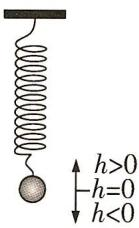

$\quad$A. 小球运动的最高点与最低点的距离为 $2 \mathrm{~cm}$   
$\quad$B. 小球经过 $4 \mathrm{~s}$ 往复运动一次  
$\quad$C. $t \in (3,5)$ 时小球是自下往上运动  
$\quad$D. 当 t=6.5 时, 小球到达最低点

##### 7.[2023 河南安阳模拟改编, ★★★]已知数列 $\{a_{n}\}$ 的前 n 项和为 $S_{n}$ ，且 $a_{i}=1, a_{i}=2$ 的概率均为 $\frac{1}{2}(i=1,2,3,\cdots,n)$ ，设 $S_{n}$ 能被 3 整除的概率为 $P_{n}$ ，则下述四个结论中正确的有（）

$\quad$A. $P_{2} = 1$   
$\quad$B. $P_{3} = \frac{1}{4}$   
$\quad$C. $P_{11} = \frac{341}{1024}$   
$\quad$D. 当 $n \geqslant 5$ 时, $P_{n} < \frac{1}{3}$

##### 8. [2023 湖南五市十校第二次大联考, ★★★★] 如图, 正方体 $ABCD - A_{1}B_{1}C_{1}D_{1}$ 的棱长为 1, P 为线段 $A_{1}D$ 上的一个动点, 下列结论中正确的是 ( )

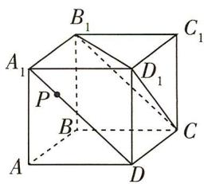

$\quad$A. ${BP} \bot  {BC}$   
$\quad$B. $BP \parallel$ 平面 $CB_{1}D_{1}$   
$\quad$C. $P$ 到 $A$ 和到 $B_{1}$ 的距离之和的最小值为 $\sqrt{2 + \sqrt{2}}$   
$\quad$D. $PB$ 与 $CD$ 所成角的正切值的最小值为 $\frac{\sqrt{2}}{2}$

##### 9. [2023 沈阳市质监(一), ★★★★] 已知圆 C: $(x-1)^{2}+(y-2)^{2}=2$ , 点 M 是直线 l: y = -x - 1 上的动点, 过点 M 作圆 C 的两条切线, 切点分别为 A, B, 则下列说法正确的是 ()

$\quad$A. 切线长 $|MA|$ 的最小值为 $\sqrt{6}$   
$\quad$B. 四边形 $ACBM$ 面积的最小值为 $2 \sqrt{3}$   
$\quad$C. 若 PQ 是圆 C 的一条直径, 则 $\overrightarrow{MP} \cdot \overrightarrow{MQ}$ 的最小值为 7  
$\quad$D. 直线 $AB$ 恒过点 $(\frac{1}{2}, \frac{3}{2})$

##### 10. [2023 大连市双基测试, ★★★★] 已知点 F 是抛物线 $y^{2}=4x$ 的焦点, AB, CD 是经过点 F 的弦且 $AB \perp CD$ , 直线 AB 的斜率为 k, 且 k > 0, C, A 两点在 x 轴上方, O 为坐标原点, 则下列结论正确的有 ( )

$\quad$A. $\overrightarrow{OC} \cdot \overrightarrow{OD} = -3$   
$\quad$B. 四边形 ACBD 面积的最小值为 64  
$\quad$C. $\frac{1}{|AB|} +\frac{1}{|CD|} = \frac{1}{4}$   
$\quad$D. 若 $|AF| \cdot |BF| = 16$ , 则直线 $CD$ 的斜率为 $-\sqrt{3}$

##### 11. [2023 安徽师范大学附属中学模拟, ★★★

★]有这样一句诗歌:世界上最远的距离,不是树枝无法相依,而是相互瞭望的星星,却没有交汇的轨迹;世界上最远的距离,不是星星之间的轨迹,而是纵然轨迹交汇,却在转瞬间无处寻觅.已知点 $F(1,0)$ ,直线l:x=4,动点P与点F之间的距离是点P到直线l的距离的一半.若某直线上存在这样的点P,则称该直线为“最远距离直线”,则下列结论中正确的是()

$\quad$A. 点 P 的轨迹方程是 $\frac{x^{2}}{3} + \frac{y^{2}}{4} = 1$   
$\quad$B. 直线 $x - 2y + 4 = 0$ 是“最远距离直线”  
$\quad$C. 平面上有一点 $A(-1, \sqrt{2})$ , 则 $|PA| + 2|PF|$ 的最小值为 5  
$\quad$D. 点 $P$ 到直线 $x - 2y + 6 = 0$ 距离的最大值为 $2 \sqrt{5}$

# 题型2 信息阅读题

# 题型攻略

信息阅读题的解题技巧:在平时做题时,要仔细梳理问题的脉络结构,培养良好的思维习惯,要有意识地锻炼数学阅读能力,加强对数学语言的理解和应用,并学会从复杂的背景中准确提取出有用的信息.

##### 1.[2023黑龙江哈尔滨模拟,★★★]密位制是度量角的一种方法,把一周角等分为6000份,每一份叫做1密位的角.在角的密位制中,单位可省去不写,采用四个数码表示角的大小,在百位数与十位数之间画一条短线,如7密位写成“0-07”,578密位写成“5-78”.若( $\sin\alpha-\cos\alpha$ ) $^{2}=2\sin\alpha\cos\alpha$ ,则角 $\alpha$ 可取的值用密位制表示正确的是()

$\quad$A. ${11} - {50}$

$\quad$B. $2 - {50}$

$\quad$C. ${13} - {50}$

$\quad$D. ${33} - {50}$

##### 2.[2023武汉市四月调研,★★★]阅读下面文字:“已知 $\sqrt{2}$ 为无理数,若( $\sqrt{2}$ ) $\sqrt{2}$ 为有理数,则存在无理数a=b= $\sqrt{2}$ ,使得 $a^{b}$ 为有理数;若( $\sqrt{2}$ ) $\sqrt{2}$ 为无理数,则存在无理数 $a=(\sqrt{2})\sqrt{2}$ , $b=\sqrt{2}$ ,此时 $a^{b}=[(\sqrt{2})\sqrt{2}]^{\sqrt{2}}=(\sqrt{2})^{\sqrt{2}\times\sqrt{2}}=(\sqrt{2})^{2}=2$ ,为有理数.”依据这段文字可以证明的结论是()

$\quad$A. $(\sqrt{2})^{\sqrt{2}}$ 是有理数  
$\quad$B. $(\sqrt{2})^{\sqrt{2}}$ 是无理数  
$\quad$C. 存在无理数 a, b, 使得 $a^{b}$ 为有理数  
$\quad$D. 对任意无理数 a, b, 都有 $a^{b}$ 为无理数

##### 3.[2023 南京市、盐城市一模, ★★★]某研究性学习小组发现,由双曲线 $C:\frac{x^{2}}{a^{2}}-\frac{y^{2}}{b^{2}}=1(a>0, b>0)$ 的两条渐近线所成的角可求离心率 e 的大小,联想到反比例函数 $y=\frac{k}{x}(k\neq0)$ 的图象

也是双曲线,据此可进一步推断双曲线 $y=\frac{5}{x}$ 的离心率为
()

$\quad$A. $\sqrt{2}$

$\quad$B. 2

$\quad$C. $\sqrt{5}$

$\quad$D. 5

##### 4.[多选,2023 湖北荆门模拟,★★★★]阅读数学材料:设 P 为多面体 M 的一个顶点,定义多面体 M 在点 P 处的离散曲率为 $1 - \frac{1}{2\pi} (\angle Q_{1}PQ_{2} + \angle Q_{2}PQ_{3} + \cdots + \angle Q_{k-1}PQ_{k} + \angle Q_{k}PQ_{1})$ ,其中 $Q_{i}(i=1,2,\cdots,k,k\geqslant3)$ 为多面体 M 的所有与点 P 相邻的顶点,且平面 $Q_{1}PQ_{2}$ ,平面 $Q_{2}PQ_{3}$ , $\cdots$ ,平面 $Q_{k-1}PQ_{k}$ 和平面 $Q_{k}PQ_{1}$ 为多面体 M 的所有以 P 为公共点的面.解答问题:已知在直四棱柱 $ABCD-A_{1}B_{1}C_{1}D_{1}$ 中,底面 ABCD 为菱形, $AA_{1}=AB$ ,则下列结论正确的是()

$\quad$A. 直四棱柱 $ABCD - A_{1}B_{1}C_{1}D_{1}$ 在其各顶点处的离散曲率都相等  
$\quad$B. 若 AC = BD，则直四棱柱 $ABCD - A_{1}B_{1}C_{1}D_{1}$ 在顶点 A 处的离散曲率为 $\frac{1}{4}$   
$\quad$C. 若四面体 $A_{1}ABD$ 在点 $A_{1}$ 处的离散曲率为 $\frac{7}{12}$ , 则 $AC_{1} \perp$ 平面 $A_{1}BD$   
$\quad$D. 若直四棱柱 $ABCD - A_{1}B_{1}C_{1}D_{1}$ 在顶点 $A$ 处的离散曲率为 $\frac{1}{3}$ , 则 $BC_{1}$ 与平面 $ACC_{1}$ 所成角的正弦值为 $\frac{\sqrt{2}}{4}$

# 题型 3 开放题

# 题型攻略

开放性试题是一类具有开放性和发散性的问题,此类问题一般条件或结论不完备,解题方向不明,自由度大,需要考生自己去探索,结合已知条件进行分析、比较和概括.开放性试题是近几年高考新出现的题型,常考类型有以下两类:（1）条件开放,就是已知结论,从结论出发逆向探求条件,此时条件不唯一;（2）结论开放,就是已知条件,从条件探求结论,此时结论不唯一.

##### 1. [2023 山东潍坊模拟, ★★★] 写出一个同时满足下列 3 个性质的函数的解析式: $f(x) =$ \_\_\_\_.

① $f(x)$ 是奇函数；② $f(x)$ 在 $(2,+\infty)$ 上单调递增；③ $f(x)$ 有且仅有3个零点.

##### 2. [2023 河南信阳高级中学模拟, ★★★] 写出同时满足下列条件①②的直线 $l$ 的方程: \_\_\_\_. (写出一个满足条件的答案即可)

①在 y 轴上的截距为 2; ②与双曲线 $\frac{x^{2}}{4}-\frac{y^{2}}{3}=1$ 只有一个交点.

##### 3. [2023 山东青岛二模, ★★★] 某市高三年级男生的身高 X (单位: cm) 近似服从正态分布 $N(175, \sigma^{2})$ , 已知 $P(175 \leqslant X < 180) = 0.2$ , 若 $P(X \leqslant a) \in [0.3, 0.5]$ . 写出一个符合条件的 a 的值为 \_\_\_\_.

##### 4. [2023 高三名校联考, ★★★] 记 $S_{n}$ 为等差数列 $\{a_{n}\}$ 的前 $n$ 项和, 且满足: ① $S_{n+1} - a_{n} > S_{n} + 2$ ; ② 对 $\forall n \in \mathbf{N}^{*}, S_{n} > S_{8}$ . 写出一个同时满足上述两个条件的数列 $\{a_{n}\}$ 的通项公式 $a_{n} =$ \_\_\_\_.

##### 5. [2023 湖北襄阳四中模拟, ★★★] 若函数 $f(x) = \sin x + \cos(x + \varphi)$ 的最小值为 $-\sqrt{3}$ ，则常数 $\varphi$ 的一个取值为 \_\_\_\_.（写出一个即可）

##### 6. [2023 广东惠州调研, ★★★]
如图所示, 在四棱锥 P-ABCD 中, $PA \perp$ 底面 ABCD, 且底面各边都相等, M 是 PC 上的一个

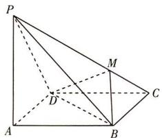

动点,当点 M 满足 \_\_\_\_ 时,平面 $MBD \perp$ 平面 PCD. (填写一个你认为是正确的条件即可)

##### 7.[2023 福建厦门一中模拟,★★★★]写出曲线 $y=e^{x}-1$ 与曲线 $y=\ln(x+1)$ 的公切线的一个方向向量\_\_\_\_.

##### 8. [2023 武汉市四月调研, ★★★★] 直线 $l_{1}: y = 2x, l_{2}: y = kx + 1$ 与 x 轴围成的三角形是等腰三角形, 写出满足条件的 k 的两个可能取值: \_\_\_\_ 和 \_\_\_\_.

##### 9. [★★★] 甲、乙两同学在复习数列知识时发现曾经做过的一道数列问题因纸张被破坏,一个条件看不清了,具体如下:

等比数列 $\{a_{n}\}$ 的前 $n$ 项和为 $S_{n}$ , 已知 \_\_\_\_,

（1） 判断 $S_{1}, S_{2}, S_{3}$ 的关系.  
（2） 若 $a_{1}-a_{3}=3$ ，设 $b_{n}=\frac{n}{12}|a_{n}|$ ，记 $\{b_{n}\}$ 的前 n 项和为 $T_{n}$ ，证明： $T_{n}<\frac{4}{3}$ .

甲同学记得缺少的条件是首项 $a_1$ 的值, 乙同学记得缺少的条件是公比 $q$ 的值, 并且他俩都记得第（1）问的答案是 $S_1, S_3, S_2$ 成等差数列. 如果甲、乙两同学记得的答案是正确的, 请你通过推理把条件补充完整并解答此题.

# 题型 4 新定义题

▶ 答案：111 页

# 题型攻略

新定义问题其实就是理解新信息、解决新问题,是数学应用的一种延伸,新定义问题大致可以分为两种:一种是定义没有学习过的内容(概念、运算、法则、性质等);另一种是定义新的形式,本质还是原来学习过的内容.解第一种新定义问题重在“按部就班”,直接利用新定义计算即可;解第二种新定义问题重在转化与化归.

##### 1.[2023 上海浦东区模拟, ★★★]对于数列 $\{a_{n}\}$ , 定义 $A_{n} = \frac{a_{1} + 2a_{2} + \cdots + 2^{n - 1}a_{n}}{n}$ 为数列 $\{a_{n}\}$ 的“好数”. 已知某数列 $\{a_{n}\}$ 的“好数”为 $A_{n} = 2^{n + 1}$ , 记数列 $\{a_{n} - kn\}$ 的前 $n$ 项和为 $S_{n}$ , 若 $S_{n} \leqslant S_{6}$ 对任意的 $n \in \mathbf{N}^{*}$ 恒成立, 则 $k$ 的取值范围为 ( )

$\quad$A. $\left[\frac{1}{3},\frac{7}{3}\right]$

$\quad$B. $\left[\frac{13}{6}, \frac{9}{4}\right]$

$\quad$C. $\left[\frac{2}{7}, \frac{5}{3}\right]$

$\quad$D. $\left[\frac{16}{7}, \frac{7}{3}\right]$

##### 2. [2023 浙江温州九校第一次联考, ★★★★] 在平面直角坐标系 $xOy$ 中 ( $O$ 为坐标原点), 把到定点 $F_{1}(-c,0)$ 和 $F_{2}(c,0)$ 距离之积等于 $c^{2}(c>0)$ 的点的轨迹称为双纽线, 记为 $\Gamma$ , 已知 $P(x_{0},y_{0})$ 为双纽线 $\Gamma$ 上任意一点, 有下列命题:

①双纽线 $\Gamma$ 的方程为 $(x^{2} + y^{2})^{2} = 2c^{2}(x^{2} - y^{2})$ ; ② $\triangle F_{1}PF_{2}$ 面积的最大值为 $\frac{1}{2}c^{2}$ ; ③ $-\frac{c}{2} \leqslant y_{0} \leqslant \frac{c}{2}$ ; ④ $|PO|$ 的最大值为 $\sqrt{2}c$ .

其中所有正确命题的序号是 （）

$\quad$A. ①②

$\quad$B.①②③

$\quad$C. ②③④

$\quad$D.①②③④

##### 3. [多选,2023 江苏南通如皋模拟改编, ★★★] 设集合 X 是实数集 R 的子集, 如果 $x_{0} \in R$ 满足对任意的 a > 0, 都存在 $x \in X$ , 使得 $0 < |x - x_{0}| < a$ , 则称 $x_{0}$ 为集合 X 的聚点. 则下列集合中是以 0 为聚点的集合有 ( )

$\quad$A. $\{x \mid x \in R, x \neq 0\}$

$\quad$B. $\{x\mid x\in \mathbf{Z},x\neq 0\}$

$\quad$C. $\{x\mid x = \frac{1}{n},n\in \mathbf{N}^{*}\}$

$\quad$D. $\{x\mid x = \frac{n}{n + 1},n\in \mathbf{N}^{*}\}$

##### 4.[多选,2023高三名校联考,★★★★★]现在给出一个向量的新运算 $a \times b$ ,叫做向量a与b的外积,它是一个满足如下两个条件的向量:① $a \cdot (a \times b) = 0, b \cdot (a \times b) = 0$ ,且a,b和 $a \times b$ 构成右手系(即三个向量的方向依次与右手的拇指、食指、中指的指向一致,如图1所示);②向量 $a \times b$ 的模 $|a \times b| = |a||b|\sin\langle a, b\rangle$ .如图2,在棱长为2的正四面体ABCD中,下列说法正确的是()

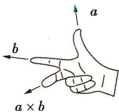

图 1

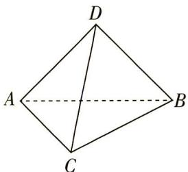

图 2

$\quad$A. $\overrightarrow{AB} \times \overrightarrow{AC} = \overrightarrow{AC} \times \overrightarrow{AB}$

$\quad$B. $4 \mid \overrightarrow{BC} \times \overrightarrow{AC}$ 与正四面体的表面积相等

$\quad$C. $(\overrightarrow{AC} \times \overrightarrow{AB}) \cdot \overrightarrow{AD} = 4\sqrt{2}$

$\quad$D. $|\overrightarrow{AC} \times \overrightarrow{AB}) \times \overrightarrow{AD}| = |\overrightarrow{AC} \times (\overrightarrow{AB} \times \overrightarrow{AD})|$

##### 5. [2023 吉林长春模拟改编, ★★★] 对于数列 $\{a_{n}\}$ , 定义 $\Delta_{n}^{（1）} = a_{n+1} - a_{n}$ , 称新数列 $\{\Delta_{n}^{（1）}\}$ 为数列 $\{a_{n}\}$ 的一阶差分数列; 定义 $\Delta_{n}^{（2）} = \Delta_{n+1}^{（1）} - \Delta_{n}^{（1）}$ , 称新数列 $\{\Delta_{n}^{（2）}\}$ 为数列 $\{a_{n}\}$ 的二阶差分数列. 若 $\Delta_{n}^{（2）} = d (d \in \mathbb{R})$ , 则称数列 $\{a_{n}\}$ 是二阶等差数列. 已知 $\{a_{n}\}$ 是二阶等差数列, $a_{1} = 2, a_{2} = 4, a_{3} = 8$ , 则数列 $\{a_{n}\}$ 的通项公式为 $a_{n} =$ \_\_\_\_ .

##### 6. [2023 南京市、盐城市一模, ★★★★★] 在概率论中常用散度描述两个概率分布的差异. 若离散型随机变量 X, Y 的取值集合均为 $\{0,1,2,3,\cdots,n\}(n \in \mathbf{N}^{*})$ ，则 X, Y 的散度 $D(X \parallel Y) = \sum_{i=0}^{n} P(X = i) \ln \frac{P(X = i)}{P(Y = i)}$ 。若 X, Y 的概率分布如下表所示，其中 0 < p < 1，则 $D(X \parallel Y)$ 的取值范围是 \_\_\_\_。

<table><tr><td>X</td><td>0</td><td>1</td></tr><tr><td>P</td><td> $\frac{1}{2}$ </td><td> $\frac{1}{2}$ </td></tr></table>

<table><tr><td>Y</td><td>0</td><td>1</td></tr><tr><td>P</td><td>1-p</td><td>p</td></tr></table>

##### 7. [2023 上海建平中学模拟, ★★★★] 已知有

穷数列 $\{a_{n}\}$ 各项均不相等,将 $\{a_{n}\}$ 的项从大到小重新排序后相应的项数构成新数列 $\{b_{n}\}$ ,称数列 $\{b_{n}\}$ 为数列 $\{a_{n}\}$ 的“序数列”.例如数列 $a_{1}$ , $a_{2},a_{3}$ 满足 $a_{1}>a_{3}>a_{2}$ ,则其序数列 $\{b_{n}\}$ 为1,3,2.
若有穷数列 $\{d_{n}\}$ 满足 $d_{1}=1,\left|d_{n+1}-d_{n}\right|=\left(\frac{1}{4}\right)^{n}$ (n 为正整数),且数列 $\{d_{2n-1}\}$ 的序数列递减,数列 $\{d_{2n}\}$ 的序数列递增,则 $d_{1}-d_{2}+d_{3}-d_{4}+\cdots+d_{2021}-d_{2022}=$ \_\_\_\_.

# 题型 5 数学文化题

答案: 112页

# 题型攻略

高考数学对数学文化的考查主要体现在以下方面：

（1）从中国古代数学名著进行数学文化的渗透,如《九章算术》《算法统宗》等;  
（2）从数学家或数学故事进行数学文化的渗透,如斐波那契、杨辉三角等;  
（3）从数学名题进行数学文化的渗透,如阿波罗尼斯圆、勾股定理、阿基米德三角形等.

##### 1. [2023 福建省适应性测试, ★]

★★]中国古代数学名著《九章算术》的第一章“方田”中载有“半周半径相乘得积

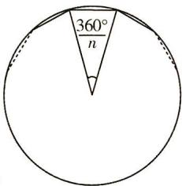

步”, 其大意为: 圆的半周长乘以其半径等于圆的面积. 南北朝时期杰出的数学家祖冲之曾用圆内接正多边形的面积“替代”圆的面积, 并通过增加圆内接正多边形的边数 n 使得正多边形的面积更接近圆的面积, 从而更为“精确”地估计圆周率 $\pi$ , 如图. 据此, 当 n 足够大时, 可以得到 $\pi$ 与 n 的关系为 ( )

$\quad$A. $\pi \approx \frac{n}{2}\sin \frac{360^{\circ}}{n}$   
$\quad$B. $\pi \approx n\sin \frac{180^{\circ}}{n}$   
$\quad$C. $\pi \approx n\sqrt{2(1 - \cos\frac{360^{\circ}}{n})}$   
$\quad$D. $\pi \approx \frac{n}{2}\sqrt{1 - \cos\frac{180^{\circ}}{n}}$

##### 2.[2023 辽宁大连模拟改编, ★★★★]泰勒公式是一个用函数在某点的信息描述其附近取值的公式, 得名于英国数学家泰勒. 根据泰勒公式, 有 $\sin x = x - \frac{x^3}{3!} + \frac{x^5}{5!} - \frac{x^7}{7!} + \cdots + (-1)^{n-1} \frac{x^{2n-1}}{(2n-1)!} + \cdots$ , 其中 $x \in \mathbf{R}, n \in \mathbf{N}^*$ , $n! = 1 \times 2 \times 3 \times \cdots \times n, 0! = 1$ . 现用上述式子求 $1 - \frac{4^2}{2!} + \frac{4^4}{4!} - \frac{4^6}{6!} + \cdots + (-1)^{n-1} \frac{4^{2n-2}}{(2n-2)!} + \cdots$ 的值, 下列选项中与该值最接近的是 ( )

$\quad$A. $\cos 49^{\circ}$   
$\quad$B. $\cos 41^{\circ}$   
$\quad$C. $-\sin 49^{\circ}$   
$\quad$D. $-\sin 41^{\circ}$

##### 3. [2023 福建龙泉中学模拟, ★★★★] 我国南北朝数学家何承天发明的“调日法”是程序化寻求分数来表示数值的算法, 其理论依据是:

设实数 x 的不足近似值和过剩近似值分别为 $\frac{b}{a}$ 和 $\frac{d}{c}$ ( $\frac{b}{a} < x < \frac{d}{c}, a, b, c, d \in N^{*}$ ), 则 $\frac{b + d}{a + c}$ 是 x 的更为精确的不足近似值或过剩近似值. 我们知道 $\sqrt{5} = 2.236067\cdots$ , 令 $\frac{11}{5} < \sqrt{5} < \frac{12}{5}$ , 则第一次用“调日法”后得到 $\frac{23}{10}$ 是 $\sqrt{5}$ 的更为精确的过剩近似值, 即 $\frac{11}{5} < \sqrt{5} < \frac{23}{10}$ , 若每次都取最简分数, 则从 $\frac{11}{5} < \sqrt{5} < \frac{12}{5}$ 开始, 用“调日法”得到 $\sqrt{5}$ 的近似分数与实际值误差小于 0.01 的次数最少为 ( )

$\quad$A. 五

$\quad$B. 四

$\quad$C. 三

$\quad$D. 二

##### 4. [多选,2023 四省联考,★]

★★★★]如图所示改编自李约瑟所著的《中国科学技术史》，用于说明元

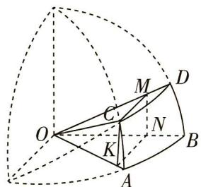

代数学家郭守敬在编制《授时历》时所做的天文计算. 图中的 $\widehat{AB}, \widehat{AC}, \widehat{BD}, \widehat{CD}$ 都是以 O 为圆心的圆弧（半径相同），CMNK 是为计算所作的矩形，其中 M, N, K 分别在线段 OD, OB, OA 上， $MN \perp OB, KN \perp OB$ ，记 $\alpha = \angle AOB, \beta = \angle AOC, \gamma = \angle BOD, \delta = \angle COD$ ，则 （）

$\quad$A. $\sin \beta = \sin \gamma \cos \delta$   
$\quad$B. $\cos \beta = \cos \gamma \cos \delta$   
$\quad$C. $\sin \alpha = \frac{\sin \delta}{\cos \beta}$   
$\quad$D. $\cos \alpha = \frac{\cos \gamma \cos \delta}{\cos \beta}$

##### 5.[2023 湖北襄阳模拟改编,★★★]2023年2月18日,首届中国非物质文化遗产保护年会开幕式在陕西省榆林市举行,年会主题为“打造非遗年度名片、绽放非遗绚丽色彩”.如图所示是我国传统算盘的示意图,每一档有两粒上

珠、五粒下珠,也称为“七珠算盘”. 未记数(或表示零)时,每档的各珠位置均与图中最左档一样;记数时,要拨珠靠梁,一个上珠表示“5”,一个下珠表示“1”. 例如图中,当“千位档”有一个上珠、“百位档”有一个上珠、“十位档”有一个下珠、“个位档”有一个上珠分别靠梁时,所表示的数是 5 515. 现选定“个位档”“十位档”“百位档”“千位档”,若规定每档拨动一珠靠梁(其他各珠不动),则在其可能表示的所有四位数中随机取一个数,这个数能被 3 整除的概率为 \_\_\_\_.

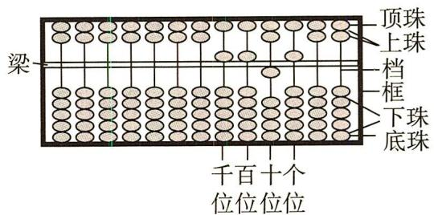

##### 6. [2023 江苏徐州模拟, ★★★★] 早在南北朝时期, 祖冲之和他的儿子祖暅在研究几何体的体积时, 得到了祖暅原理: 幂势既同, 则积不容异. 这就是说, 夹在两个平行平面之间的两个几何体, 被平行于这两个平面的任意平面所截, 如果截得的两个截面的面积总相等, 那么这两个几何体的体积相等. 将双曲线 $C_{1}: x^{2} - \frac{y^{2}}{3} = 1$ , 直线 $y = 0$ 与直线 $y = \sqrt{3}$ 所围成的平面图形 (含边界) 绕 $y$ 轴旋转一周得到如图所示的几何体 $\Gamma$ , 其中线段 $OA$ 为双曲线 $C_{1}$ 的实半轴, 点 $B$ 和点 $C$ 为直线 $y = \sqrt{3}$ 分别与双曲线一条渐近线及右支的交点, 则线段 $BC$ 绕 $y$ 轴旋转一周所得的图形的面积是 , 几何体 $\Gamma$ 的体积为 .

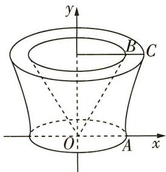

# 题型 6 结构不良题

# 题型攻略

# 处理结构不良问题常用的解题策略

（1）先“定”后“动”,当“定”的条件不止一个时,应先利用相关数学知识对“定”的条件进行分析推断,等价转化为最简结果,再观察分析“动”的条件,结合题干的要求选出最优条件(使解法简单且能发挥自己的优势)进行解答;  
（2）先“动”后“定”,先从“动”的条件入手,当“动”的条件中,无论选哪个难度都相近时,应根据自己的知识结构,选择自己熟悉和擅长的条件,然后结合“定”的条件进行解题;  
（3）逻辑推理,在解决某些结构不良试题时需要利用逻辑推理的方法对“定”与“动”的条件进行综合分析推断,从而高效解决问题.

##### 1. [2023 东北三省四市联考, ★★★]从下列条件中选择一个条件补充到题目中: ① $S = \frac{\sqrt{3}}{4} (b^{2} + c^{2} - a^{2})$ , 其中 $S$ 为 $\triangle ABC$ 的面积, ② $\frac{a + b}{\sin C} = \frac{c - b}{\sin A - \sin B}$ , ③ $\sqrt{3} \sin C + \cos C = \frac{c + b}{a}$ . 在 $\triangle ABC$ 中, 角 $A, B, C$ 对应的边分别为 $a, b, c$ , \_\_\_\_.

（1） 求角 A;

（2） 若 D 为边 AB 的中点, $CD = 2\sqrt{3}$ , 求 $b + c$ 的最大值.

##### 2.[2023银川市质检,★★★]已知数列 $\{a_{n}\}$ 满足 $a_{1}+3a_{2}+3^{2}a_{3}+\cdots+3^{n-1}a_{n}=n\cdot3^{n}$ .

（1）求数列 $\{a_{n}\}$ 的通项公式及前n项和 $S_{n}$ .
（2）若\_\_\_\_,求数列 $\{b_{n}\}$ 的前n项和 $T_{n}$ .
在① $b_{n}=\frac{S_{n}}{n}+2^{a_{n}}$ ,② $b_{n}=\frac{1}{S_{n}}$ ,③ $b_{n}=(a_{n}-1)$ .

$2^{n-1}$ 这三个条件中任选一个补充在第（2）问中,并求解.

##### 3. [2023 山东济宁育才中学学情检测, ★★★★] 如图所示为一个半圆柱, E 为半圆弧 CD 上一点, $CD = \sqrt{5}$ .

（1） 若 $AD = 2\sqrt{5}$ ，求四棱锥 E - ABCD 体积的最大值.  
（2）有三个条件:① $4\overrightarrow{DE}\cdot\overrightarrow{DC}=\overrightarrow{EC}\cdot\overrightarrow{DC}$ ,②直线AD与BE所成角的正弦值为 $\frac{2}{3}$ ,③ $\frac{\sin\angle EAB}{\sin\angle EBA}=\frac{\sqrt{6}}{2}$ .请你从中选择两个作为条件,求直线AD与平面EAB所成角的余弦值.

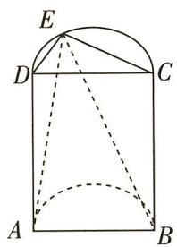

##### 4. [2023 山东菏泽二模, ★★★★★] 设抛物线 $C: y^{2} = 2px (p > 0)$ 的焦点为 $F$ , 点 $D(p, 0)$ , 过 $F$ 的直线交 $C$ 于 $M, N$ 两点. 当直线 $MD$ 垂直于 $x$ 轴时, $|MF| = 3$ .

（1）①求 C 的方程；
②若点 M 在第一象限且 $\frac{|MF|}{|NF|} = \frac{1}{4}$ ，求 $|MN|$ .

（2） 动直线 l 与抛物线 C 交于不同的两点 A, B, P 是抛物线上异于 A, B 的一点, 记 PA, PB 的斜率分别为 $k_{1}, k_{2}, t$ 为非零的常数.

从下面①②③中选取两个作为条件,证明另外一个成立:①点 P 坐标为 $(t^{2},2t)$ ; ② $k_{1}+k_{2}=\frac{2}{t}$ ; ③直线 AB 经过点 $(-t^{2},0)$ .

# 题型 7 数学应用题

# 题型攻略

破解以生产、生活实际为背景的试题的关键:一是认真读题,读懂题意;二是会观察;三是会利用知识解决问题.

##### 1. [2023 四川泸州一模, ★★★] 近年来, 中国加大了对电动汽车的研究与推广, 新型动力电池也随之迎来了蓬勃发展的机遇. 已知蓄电池的容量 $C$ (单位: $\mathrm{A} \cdot \mathrm{h}$ )、放电时间 $t$ (单位: $\mathrm{h}$ ) 与放电电流 $I$ (单位: $\mathrm{A}$ ) 之间所满足的经验公式为 $C = I^n \cdot t$ , 其中 $n = \log_{\frac{3}{2}} 2$ . 在电池容量不变的条件下, 当放电电流 $I = 10 \mathrm{~A}$ 时, 放电时间 $t = 57 \mathrm{~h}$ , 则当放电电流 $I = 15 \mathrm{~A}$ 时, 放电时间为 ( )

$\quad$A. ${28}\mathrm{\;h}$

$\quad$B. $28.5 \mathrm{~h}$

$\quad$C. $29 \mathrm{~h}$

$\quad$D. ${29.5}\mathrm{\;h}$

##### 2. [2023 陕西汉中二模, ★★★] 原始的蚊香出现在宋代, 根据宋代冒苏轼之名编写的《格物粗谈》记载: “端午时, 收贮浮萍, 阴干, 加雄黄,作纸缠香, 烧之, 能祛蚊虫.” 如图为某校数学社团用数学软件制作的“蚊香”. 画法如下: 在水平直线上取长度为 1 的线段 AB, 作一个等边三角形 ABC, 然后以点 B 为圆心、AB 为半径逆时针画圆弧交线段 CB 的延长线于点 D (第一段圆弧), 再以点 C 为圆心、CD 为半径逆时针画圆弧交线段 AC 的延长线于点 E, 再以点 A 为圆心、AE 为半径逆时针画圆弧……以此类推, 当得到的“蚊香”恰好有 11 段圆弧时, “蚊香的长度为 ( )

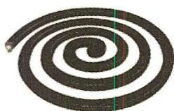

蚊香

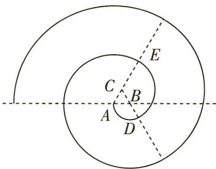

$\quad$A. ${14\pi }$

$\quad$B. ${18\pi }$

$\quad$C. ${24\pi }$

$\quad$D. ${44\pi }$

##### 3. [2023 东北三省四市联考, ★★★★] 早在一千多年之前, 我国已经把溢流孔技术用于造桥, 以减轻桥身重量和水流对桥身的冲击, 现设桥拱上有如图所示的四个溢流孔, 桥拱和溢

流孔轮廓线均为抛物线的一部分,且四个溢流孔轮廓线相同,建立如图所示的平面直角坐标系 $xOy$ ,根据图上尺寸,拱桥轮廓线 $OAC$ 所在抛物线的方程为 \_\_\_\_, 溢流孔与桥拱交点 $A$ 的横坐标为 \_\_\_\_.

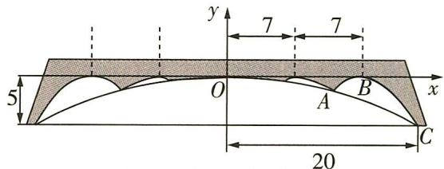

##### 4. [2023 福建厦门第一中学模拟, ★★★★]

ChatGPT 是由美国 OpenAI 研发的聊天机器人程序, 一经推出便引发热议. 在某次测试 ChatGPT 时, 输入的问题中出现语法错误的概率为 5%, 如果输入的问题没有语法错误, ChatGPT 的回答被采纳的概率为 90%, 如果出现语法错误, ChatGPT 的回答被采纳的概率为 50%.

（1） 求 ChatGPT 的回答被采纳的概率;

（2） 已知 ChatGPT 的回答被采纳, 求该测试输入的问题没有语法错误的概率.

##### 5. [2023 浙江杭州师大附中模拟, ★★★★] 如图, 矩形 ABCD 是某生态农庄的一块植物栽培基地的平面图, 现欲修一条笔直的小路 MN (宽度不计) 经过该矩形区域, 其中 M, N 都在矩形 ABCD 的边界上. 已知 AB = 8, AD = 6 (单位: 百米), 小路 MN 将矩形 ABCD 分成面积为 $S_{1}, S_{2}$ (单位: 平方百米) 的两部分, 其中 $S_{1} \leqslant S_{2}$ , 且点 A 在面积为 $S_{1}$ 的区域内, 记小路 MN 的长为 l 百米.

（1） 若 $l = 4$ , 求 $S_{1}$ 的最大值;

（2） 若 $S_{2} = 2S_{1}$ , 求 $l$ 的取值范围.

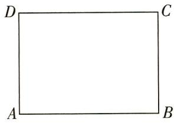

##### 6. [2023 安徽师范大学附属中学模拟, ★★★★

★]如图所示,一个仓库由上部屋顶和下部主体两部分组成,上部屋顶可视作四棱锥 P-ABCD,四边形 ABCD 是正方形,点 O 为正方形 ABCD 的中心, $PO \perp$ 平面 ABCD;下部主体可视作长方体 $ABCD-A_{1}B_{1}C_{1}D_{1}$ . 已知上部屋顶造价与屋顶面积成正比,比例系数为 $k(k>0)$ , 下部主体造价与主体高度成正比,比例系数为 4k. 现欲建造一个上、下总高度为 12, AB=6 的仓库.

（1）①若上部屋顶的高 $PO = x$ ，请将总造价表示为关于 $x$ 的函数；

②若上部屋顶侧面与底面所成锐二面角为 $\theta$ ，
请将总造价表示为关于 $\theta$ 的函数.

（2）选择（1）中的一个方案,求出总造价的最小值.

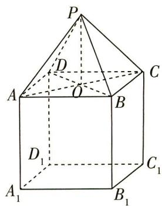

# 题型8 数学探索题

▶ 答案：115页

# 题型攻略

##### 1. 条件追溯探索型试题的解答方法: ①执果索因, 反溯条件应是结论的充分条件 (或充要条件); ②利用直接法求解.  
##### 2. 存在判断探索型试题的解答方法: ①假设存在法; ②特殊值法; ③直接法.  
##### 3. 结论或规律探索型试题的解答方法: 先探索结论, 再论证结论, 在探索过程中主要通过特殊值开路, 引入可能的结论或猜想, 再进行严格的证明.

##### 1.[2023 洛阳模拟, ★★★★]如图,在四面体ABCD中,AD=CD,∠ADB=∠CDB,E是AC的中点.

（1） 当 F 在棱 BD 上移动时, 判断 AC 与 EF 是否垂直, 并说明理由;  
（2） 若 $AB = AC = BD = 2, AD = \sqrt{2}$ ，试确定点 F 在棱 BD 上的什么位置时，直线 CF 与平面 ABD 所成角的正弦值为 $\frac{4\sqrt{3}}{7}$ .

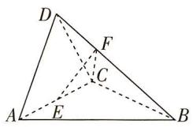

##### 2.[2023 湖南模拟, ★★★★]设正项数列 $\{a_{n}\}$ 的前 n 项和为 $S_{n}$ ，且 $4S_{n}=a_{n}^{2}+2a_{n}-8$ .

（1） 求数列 $\{a_{n}\}$ 的通项公式.  
（2）能否从 $\{a_{n}\}$ 中选出以 $a_{1}$ 为首项,以原次序组成的等比数列 $a_{k_{1}},a_{k_{2}},\cdots,a_{k_{m}},\cdots(k_{1}=1)$ ?  
若能,请找出公比最小的一组,写出此等比数列的通项公式,并求出数列 $\{k_{n}\}$ 的前n项和 $T_{n}$ ;若不能,请说明理由.

##### 3. [2023 广州市一测, ★★★★] 已知椭圆 $C: \frac{x^2}{a^2} + \frac{y^2}{b^2} = 1 (a > b > 0)$ 的离心率为 $\frac{\sqrt{2}}{2}$ , 以 $C$ 的短轴为直径的圆与直线 $y = ax + 6$ 相切.

（1） 求 $C$ 的方程;

（2） 直线 $l: y = k(x - 1) (k \neq 0)$ 与 $C$ 相交于 $A, B$ 两点, 过 $C$ 上的点 $P$ 作 $x$ 轴的平行线交线段 $AB$ 于点 $Q$ , 直线 $OP$ 的斜率为 $k'$ ( $O$ 为坐标原点), $\triangle APQ$ 的面积为 $S_1$ , $\triangle BPQ$ 的面积为 $S_2$ , 若 $|AP| \cdot S_2 = |BP| \cdot S_1$ , 判断 $k \cdot k'$ 是否为定值, 并说明理由.

##### 4. [2023 福建南平市四校联考, ★★★★★]已知 $a \in \mathbb{R}$ , 函数 $f(x) = \ln x + a(1 - x)$ .

（1） 若 $f(x) \leqslant a$ 恒成立, 求 $a$ 的取值范围.

（2） 过原点分别作曲线 $y = f(x)$ 和 $y = e^{x}$ 的切线 $l_{1}$ 和 $l_{2}$ ，是否存在 a > 0，使得切线 $l_{1}$ 和 $l_{2}$ 的斜率互为倒数？请说明理由.

# 题型 9 方案设计和决策题

# 题型攻略

# 1. 选择函数模型的解题策略

根据已知函数的特征(如指数函数“爆炸性增长”等)对所给函数模型进行排除选择,常利用待定系数法求解析式,进而解决相关问题.

# 2. 概率统计中的解题策略

（1）会“评价”.一般指在数据分析的基础上能够基于数字特征给出相应的统计意义上的评价结论.  
（2）会“决策”. 在基于数字特征给出有意义评价的基础上, 分析利弊、观察风险, 进而做出切实可行的合理决策、方案或建议.

##### 1. [2023 安徽淮南一中模拟, ★★★★] 教育储蓄是指个人按国家有关规定在指定银行开户、存入规定数额资金、用于教育目的的专项储蓄, 是一种专门为学生支付非义务教育所需教育金的专项储蓄, 储蓄存款享受免征利息税的政策. 若你的父母在你 12 岁生日当天向你的银行教育储蓄账户存入 1 000 元, 并且每年在你生日当天存入 1 000 元, 连续存 6 年, 在你十八岁生日当天一次性取出, 假设教育储蓄存款的年利率为 $10\%$ .

（1）在你十八岁生日当天时,一次性取出的金额总数为多少? (参考数据: $1.1^{7} \approx 1.95$ )  
（2） 当你取出存款后,你就有了第一笔启动资金,你可以用你的这笔资金做理财投资. 如果现在有三种投资理财方案.

①方案一:每天回报40元;

②方案二:第一天回报10元,以后每天比前一天多回报10元;

③方案三:第一天回报0.4元,以后每天的回报比前一天翻一番.

你会选择哪种方案？请说明你的理由。

##### 2. [2023 湖北模拟, ★★★★] 北京 2022 年冬奥会大大激发了人们对冰雪运动的热情, 某冰雪运动品商店对消费达一定金额的顾客开展了 “冬奥” 知识有奖竞答活动, 试题由选择题和填空题两种题型构成, 共需要回答三个问题, 对于每一个问题, 答错得 0 分, 答对填空题得 30 分, 答对选择题得 20 分. 现设置了两种答题方案供选择.

方案一: 只回答填空题.

方案二:第一题是填空题,后续选题按如下规则.若某题回答正确,则该题的下一题是填空题,若回答错误,则下一题是选择题.

某顾客获得了答题资格,已知其答对填空题的概率均为 $\frac{1}{2}$ ,答对选择题的概率均为 $p(1>p>$

0), 且能否正确回答问题与回答次序无关.

（1）若该顾客采用方案一答题,求其得分不低于60分的概率.  
（2）以得分的数学期望为判断依据,该顾客选择何种方案更加有利?说明理由.

##### 3.[2023 湖北荆州中学模拟,★★★★]某公司计划在 2023 年年初将 1 000 万元用于投资,现有两个项目供选择.

项目一:新能源汽车. 据市场调研,投资到该项目上,到年底可能获利 30%,也可能亏损 15%,且这两种情况发生的概率分别为 $\frac{7}{9}$ 和 $\frac{2}{9}$ . 项目二:通信设备. 据市场调研,投资到该项目上,到年底可能获利 50%,也可能亏损 30%,也可能不赔不赚,且这三种情况发生的概率分别为 $\frac{3}{5},\frac{1}{3},\frac{1}{15}$ .

（1）针对以上两个投资项目,请你为投资公司选择一个合理的项目,并说明理由.  
（2）若市场预期不变,该投资公司按照你选择的项目长期投资(每一年的利润和本金继续用作投资),大约在哪一年年底总资产(利润+本金)可以翻一番?(参考数据: $\lg 2\approx0.301\ 0$ , $\lg 3\approx0.477\ 1$ )

##### 4. [2023 南京市、盐城市二模, ★★★★] 人工智能是研究用于模拟和延伸人类智能的技术科学, 被认为是 21 世纪最重要的尖端科技之一, 其理论和技术正在日益成熟, 应用领域也在不断扩大. 人工智能背后的一个基本原理: 首先确定先验概率, 然后通过计算得到后验概率, 使先验概率得到修正和校对, 再根据后验概率做出推理和决策. 基于这一基本原理, 我们可以设计如下试验模型: 有完全相同的甲、乙两个袋子, 袋子里有形状和大小完全相同的小球, 其中甲袋中有 9 个红球和 1 个白球, 乙袋中有 2 个红球和 8 个白球. 从这两个袋子中选择一个袋子, 再从该袋子中等可能摸出一个球, 称为一次试验. 若多次试验直到摸出红球, 则试验结束. 假设首次试验选到甲袋或乙袋的概率均为 $\frac{1}{2}$ (先验概率).

（1） 求首次试验结束的概率.   
（2）在首次试验摸出白球的条件下,我们对选到甲袋或乙袋的概率(先验概率)进行调整.   
①求选到的袋子为甲袋的概率.   
②将首次试验摸出的白球放回原来袋子,继续进行第二次试验时有如下两种方案:方案一,从原来袋子中摸球;方案二,从另外一个袋子中摸球.请通过计算,说明选择哪个方案第二次试验结束的概率更大.

# 题型 10 学科内综合题

# 题型攻略

学科内的综合问题是对不同章节知识的综合考查,在解决此类问题时要注意对各个章节知识的活学活用.

##### 1.[2023 四川成都一诊,★★★]在平面直角坐标系 $xOy$ 中,O 为坐标原点, $M(x_0,y_0)$ 为任一动点. $p$ : 直线 $MO$ 与直线 $x = -1$ 相交于点 $N(-1,-\frac{4}{y_0})$ ; $q$ : 动点 $M(x_0,y_0)$ 在抛物线 $y^2 = 4x$ 上. 则 $p$ 是 $q$ 的 ( )

$\quad$A. 充分不必要条件  
$\quad$B. 必要不充分条件  
$\quad$C. 充要条件  
$\quad$D. 既不充分也不必要条件

##### 2. [2023 江西四校联考, ★★★] 已知圆 $M: x^{2} + y^{2} - 6x = 0$ , 过点 (1, 2) 的直线 $l_{1}, l_{2}, \cdots, l_{n} (n \in N^{*})$ 被圆 M 截得的弦长依次为 $a_{1}, a_{2}, \cdots, a_{n}$ . 若 $a_{1}, a_{2}, \cdots, a_{n}$ 是公差为 $\frac{1}{3}$ 的等差数列, 则 n 的最大值是 ( )

$\quad$A. 10

$\quad$B. 11

$\quad$C. 12

$\quad$D. 13

##### 3.[2023全国卷乙,★★★★]已知等差数列 $\{a_n\}$ 的公差为 $\frac{2\pi}{3}$ ,集合 $S=\{\cos a_n|n\in\mathbf{N}^*\}$ ,
若 $S=\{a,b\}$ ,则 $ab=$ ()

$\quad$A. -1

$\quad$B. $-\frac{1}{2}$

$\quad$C. 0

$\quad$D. $\frac{1}{2}$

##### 4. [2023 西安一中调研, ★★ ★]如图, 圆柱 $OO_1$ 的轴截面 $ABB_1A_1$ 是正方形, D, E 分别是 $AA_1$ 和 $BB_1$ 的中点, C 是弧 AB 的中点, 则经过 C, D, E 的平面与圆柱 $OO_1$ 侧面相交所得到的曲线的离心率是 \_\_\_\_.

##### 5. [2023 四川外国语大学附属外国语学校模拟, ★★★★] 如图, 已知正方体 $ABCD - A_{1}B_{1}C_{1}D_{1}$ 的顶点处有一质点 $Q$ , 点 $Q$ 每次

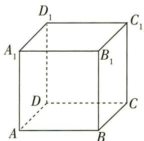

会随机地沿一条棱向相邻的某个顶点移动,且向每个顶点移动的概率相同,从一个顶点沿一条棱移动到相邻顶点称为移动一次.若质点Q的初始位置在点A处,则点Q移动2次后仍在底面ABCD上的概率为\_\_\_\_;点Q移动n次后仍在底面ABCD上的概率为\_\_\_\_.

##### 6.[2023广州大学附属中学模拟,★★★★★]已知数列 $\{a_{n}\},a_{1}=1,S_{n}$ 为数列 $\{a_{n}\}$ 的前n项和,且 $S_{n}=\frac{1}{3}(n+2)a_{n}$ .

（1）求数列 $\{a_{n}\}$ 的通项公式.

（2） 已知 $x > 0$ 时不等式 $\sin x < x$ 恒成立, 证明:

$(1 + \sin \frac {1}{a _ {1}}) (1 + \sin \frac {1}{a _ {2}}) \dots (1 + \sin \frac {1}{a _ {n}}) <   e ^ {2}.$

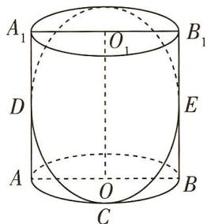

##### 7. [2023 山东临沂模拟, ★★★★★] 某市旅游局为推进该地旅游业发展, 准备在本市的景区推出旅游一卡通(年卡). 为了更科学地制订一卡通的有关条例, 该市旅游局随机调查了 2021 年到本市景区旅游的 1000 个游客的年旅游消费支出(单位: 百元), 并制成如图所示的频率分布直方图.

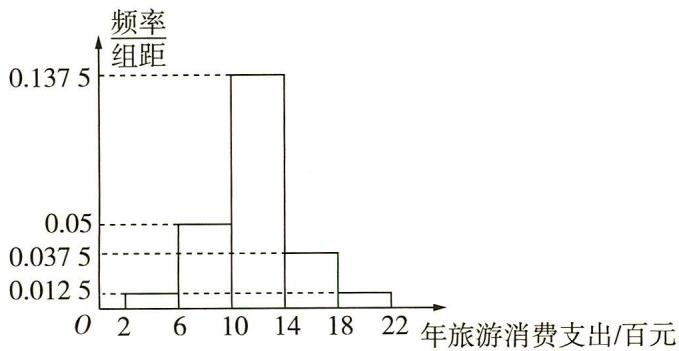

（1） 估计到该市景区旅游的游客的平均年旅游消费支出.

（2）该旅游景区游客的年旅游消费支出的中位数为11.8.现依次抽取 $n$ 个游客,假设每个游客的年旅游消费支出相互独立,记事件 $A$ 为“连续3人的年旅游消费支出超出11.8”.若 $P_{n}$ 表示 $\overline{A}$ 的概率, $P_{n} = aP_{n - 1} + \frac{1}{4} P_{n - 2} + bP_{n - 3}$ $(n\geqslant 3,a,b$ 为常数),且 $P_0 = P_1 = P_2 = 1$

①求 $P_{3},P_{4}$ 及a,b;

②判断并证明数列 $\{P_{n}\}$ 从第三项起的单调性，试用概率统计知识解释其实际意义.

##### 8. [2023 四省联考, ★★★★★] 椭圆曲线加密算法运用于区块链. 椭圆曲线 $C = \{(x, y) | y^2 = x^3 + ax + b, 4a^3 + 27b^2 \neq 0\}$ . $P \in C$ 且关于 $x$ 轴的对称点记为 $\tilde{P}$ . $C$ 在点 $P(x, y) (y \neq 0)$ 处的切线是指曲线 $y = \pm \sqrt{x^3 + ax + b}$ 在点 $P$ 处的切线. 定义“⊕”运算满足: ① 若 $P \in C, Q \in C$ , 且直线 $PQ$ 与 $C$ 有第三个交点 $R$ , 则 $P \oplus Q = \tilde{R}$ ; ② 若 $P \in C, Q \in C$ , 且 $PQ$ 为 $C$ 的切线, 切点为 $P$ , 则 $P \oplus Q = \tilde{P}$ ; ③ 若 $P \in C$ , 规定 $P \oplus \tilde{P} = 0^*$ , 且 $P \oplus 0^* = 0^* \oplus P = P$ .

（1） 当 $4a^{3} + 27b^{2} = 0$ 时, 讨论函数 $h(x) = x^{3} + ax + b$ 零点的个数.

（2）已知“ $\oplus$ ”运算满足交换律、结合律,若 $P \in C, Q \in C$ ,且 $PQ$ 为 $C$ 的切线,切点为 $P$ ,证明: $P \oplus P = \tilde{Q}$ .

（3） 已知 $P(x_{1}, y_{1}) \in C, Q(x_{2}, y_{2}) \in C$ ，且直线 PQ 与 C 有第三个交点，求 $P \oplus Q$ 的坐标.
参考公式: $m^{3}-n^{3}=(m-n)(m^{2}+mn+n^{2})$ .

# 题型 11 学科间综合题

# 题型攻略

试题多以图、表、文并用的方式呈现,各种题型都有可能出现. 试题紧密联系生活实际,经常与“五育”结合,与社会热点结合,与生产、生活实际结合,与现代最前沿的科学技术结合,与其他学科(化学、医学、物理、生物等)结合,以考查学生基础知识和基本能力为主线,注重基础性、综合性和应用性,强调以素养为导向,突出考查数学建模、数据分析、逻辑推理和数学运算等核心素养,深受命题专家的青睐.

##### 1. [2023 四川模拟, ★★★] 古生物体内的碳 14 含量 $C(t)$ 与其死之后所经过的时间 $t$ (单位: 年) 满足关系式 $C(t) = C_0 \left( \frac{1}{2} \right)^{\frac{t}{h}}$ ( $C_0$ 为碳 14 初始含量, $h$ 为碳 14 半衰期). 现测得一古墓内某生物体内碳 14 剩余含量为初始含量的 $40\%$ , 据此推算该生物距今约 (参考数据: $\lg 2 \approx 0.301$ ) ()

$\quad$A. 1.36h 年

$\quad$B. $1.34 h$ 年

$\quad$C. 1.32h 年

$\quad$D. $1.30 \mathrm{~h}$ 年

##### 2.[2023 成都七中模拟, ★★★]五声音阶按五度的相生顺序,从宫音开始到羽音,依次为宫,商、角、徵、羽,若将其排成一列,且要求宫、羽不相邻,则不同排法的种数为 ( )

$\quad$A. 12

$\quad$B. 48

$\quad$C. 72

$\quad$D. 120

##### 3. [2023 山西忻州模拟, ★★★] 溶液酸碱度是通过 pH 衡量的, pH 的计算公式为 pH = -lg $\left[H^{+}\right]$ , 其中 $\left[H^{+}\right]$ 表示溶液中氢离子的浓度, 单位是摩/升. 已知某溶液的 pH 为 2.921, 则该溶液中氢离子的浓度约为 (lg 2 ≈ 0.301, lg 3 ≈ 0.477) ()

$\quad$A. $1.2 \times 10^{-3}$ 摩/升

$\quad$B. $1.2 \times 10^{-4}$ 摩/升

$\quad$C. $6 \times 10^{-3}$ 摩/升

$\quad$D. $6 \times 10^{-4}$ 摩/升

##### 4.[2023安徽师范大学附属中学模拟,★★★]已知某物体在平面上做变速直线运动,且位移s(单位:米)与时间t(单位:秒)之间的关系可用函数 $s=\ln(t+1)+t^{2}-t$ 表示,则该物体在t=2秒时的瞬时速度为()

$\quad$A. $\frac{7}{3}$ 米/秒

$\quad$B. $\frac{10}{3}$ 米/秒

$\quad$C. (ln 3 + 2) 米/秒

$\quad$D. (ln 3 + 4) 米/秒

##### 5. [2023 北京人大附中模拟, ★★★★] 某无人机飞行时, 从某时刻开始 15 分钟内的速度 $V(x)$ (单

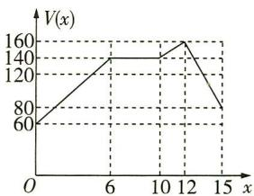

位:米/分)与时间 x(单位:分)的关系如图. 若定义“速度差函数” $v(x)$ 为无人机在时间段 $[0, x]$ 内的最大速度与最小速度的差, 则 $v(x)$ 的图象为 ( )

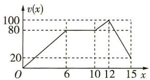

A

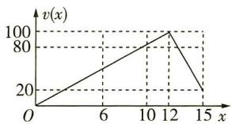

B

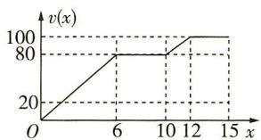

C

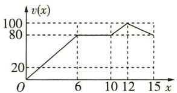

D

##### 6. [2023 陕西商洛联考, ★★★★] 窗花是贴在窗纸或窗户玻璃上的剪纸, 它是中国古老的传统民间艺术之一. 小明设计了一种由外围四个大小相等的半圆和中间正方形所构成的剪纸窗花(如图1). 已知正方形 ABCD 的边长为 2 , 中心为 O , 四个半圆的圆心分别为正方形 ABCD 各边的中点(如图2), 若 P 是 $\widehat{BC}$ 的中点, 则 $(\overrightarrow{PA} + \overrightarrow{PB}) \cdot \overrightarrow{PO} =$ \_\_\_\_.

图1

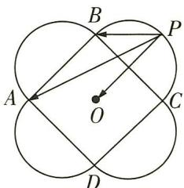

图2

# 专题一 函数与导数

# 题型12 与函数有关的新定义问题

▶ 答案: 119 页

# 题型攻略

##### 1. 与函数有关的新定义问题的一般形式:由命题者先给出一个新的概念、新的运算法则,或者给出一个抽象函数的性质等,然后按照这种“新定义”去解决相关的问题.  
##### 2. 解题关键: 紧扣新定义的函数的含义, 学会语言的翻译、新旧知识的转化, 便可使问题顺利获解.

# 综合 突破练

##### 1. [2023 河南开封一模, ★★★] 对于满足一定条件的连续函数 $f(x)$ , 存在一个点 $x_0$ , 使得 $f(x_0) = x_0$ , 那么我们称该函数为“不动点”函数. 若 $f(x) = x (a e^x - \ln x)$ 为“不动点”函数, 则实数 $a$ 的取值范围是 ( )

$\quad$A. $(-\infty, 0]$

$\quad$B. $(-\infty, \frac{1}{\mathrm{e}}]$

$\quad$C. $(-\infty, 1]$

$\quad$D. $(-\infty, e]$

##### 2.[多选,2023昆明市“三诊一模”,★★★]对于函数 $f(x)$ ,若存在两个常数a,b,使得 $f(a+x)\cdot f(a-x)=b$ ,则称函数 $f(x)$ 是“J函数”.则下列函数能被称为“J函数”的是()

$\quad$A. $f(x) = \mathrm{e}^{x}$

$\quad$B. $f(x) = \sqrt{\frac{2 - x}{x}}$

$\quad$C. $f(x)=3x-1$

$\quad$D. $f(x)=\tan x$

##### 3.[多选,2023河南省六市联考改编,★★★★]高斯是德国的天才数学家,享有“数学王子”的美誉,以“高斯”命名的概念、定理、公式很多,如高斯函数 $y = [x]$ :设 $x \in \mathbb{R}$ ,不超过 $x$ 的最大整数称为 $x$ 的整数部分,记作 $[x]$ .如[2022]=2022,[1.7]=1,[-1.5]=-2,记函数 $f(x) = x - [x]$ ,则下列说法正确的是()

$\quad$A. $f(-2.9) = 0.9$

$\quad$B. $f(x)$ 的值域为 $[0,1)$

$\quad$C. $f(x)$ 在 $[0,5]$ 上有5个零点

$\quad$D. $\forall a \in \mathbb{R}$ , 关于 $x$ 的方程 $f(x) + x = a$ 有两个实根

##### 4. [2023 安徽省合肥一中、安徽师大附中联考，★★★★]已知函数 $f(x), g(x), h(x)$ 在区间 $I$ 上均有定义，若对任意 $x_0 \in I, f(x_0), g(x_0), h(x_0)$ 成等差数列，则称函数 $f(x), g(x), h(x)$ 在区间 $I$ 上成“等差函数列”。若 $f(x) = \sqrt{4 - x^2}, g(x) = x + b, h(x)$ 在区间 $[-2, 2]$ 上成“等差函数列”，且 $h(x) \geqslant f(x)$ 恒成立，则实数 $b$ 的取值范围是\_\_\_\_。

# 创新 预测练

##### 5. [函数与正切函数综合, 2023 北京北师大实验中学模拟, ★★★★] 在平面直角坐标系 $xOy$ 中, 对于点 $(x, y)$ , 定义变换 $\sigma$ :

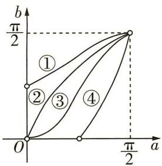

将点 $(x,y)$ 变换为点 $(a,b)$ ，使得 $\left\{\begin{aligned}x&=\tan a,\\ y&=\tan b,\end{aligned}\right.$ 其中 $a,b\in(-\frac{\pi}{2},\frac{\pi}{2})$ 。变换 $\sigma$ 可以将坐标系xOy内的曲线变换为坐标系aOb内的曲线，则四个函数 $y_{1}=2x(x>0),y_{2}=x^{2}(x>0),y_{3}=\ln x(x>1),y_{4}=e^{x}(x>0)$ 在坐标系xOy内的图象，变换为坐标系aOb内的四条曲线（如图）依次是（）

$\quad$A. ②, ③, ①, ④

$\quad$B.③，②，④，①

$\quad$C. ②, ③, ④, ①

$\quad$D.③，②，①，④

# 题型 13 抽象函数的性质及应用

# 题型攻略

# 解决抽象函数问题的常用策略

（1）赋值:利用抽象条件,对变量赋值(赋具体值或代数式),从而得出抽象函数的性质或在某点处的函数值.抽象函数的考查往往伴随着函数的性质的应用.  
（2） 逆用单调性: ① 若函数 $f(x)$ 在区间 $D$ 上单调递增, 且 $x_{1}, x_{2} \in D$ , 则由 $f(x_{1}) < f(x_{2})$ 可得 $x_{1} < x_{2}$ ; ② 若 $f(x)$ 在区间 $D$ 上单调递减, 且 $x_{1}, x_{2} \in D$ , 则由 $f(x_{1}) < f(x_{2})$ 可得 $x_{1} > x_{2}$ . 利用这两条性质, 常常能帮助我们很快获得抽象函数的自变量之间的关系.  
（3） 构建方程组: 已知抽象函数和抽象函数的导数关系, 来求某些函数值或合适值或解不等式问题, 是近几年新高考和模考的高频考点, 常常通过赋值、求导、消元来处理. 注意复合函数的求导法则: $y'_{x} = y'_{u} \cdot u'_{x}$ .

# 综合 突破练

##### 1.[2023 潍坊市高三统考, ★★★]已知定义在 R 上的函数 $f(x)$ 满足 $f(0)=1$ , 对任意 $x, y \in R$ , 有 $f(xy+1)=f(x)f(y)-f(y)-x+2$ , 则 $\sum_{i=1}^{2023}\frac{1}{f(i)f(i+1)}=$ ()

$\quad$A. $\frac{2023}{4050}$

$\quad$B. $\frac{2024}{2025}$

$\quad$C. $\frac{2023}{4048}$

$\quad$D. $\frac{2023}{2024}$

##### 2.[2023东北三省四市联考,★★★]已知函数 $f(x)$ 的定义域为R,且 $f(x+1)+f(x-1)=2$ , $f(x+2)$ 为偶函数,若 $f(0)=2$ ,则 $\sum_{k=1}^{115}f(k)=$

$\quad$A. 116

$\quad$B. 115

$\quad$C. 114

$\quad$D. 113

##### 3.[多选,2022新高考卷Ⅰ,★★★★]已知函数 $f(x)$ 及其导函数 $f'(x)$ 的定义域均为R,记 $g(x)=f'(x)$ .若 $f(\frac{3}{2}-2x)$ , $g(2+x)$ 均为偶函数,则()

$\quad$A. $f(0) = 0$

$\quad$B. $g(-\frac{1}{2}) = 0$

$\quad$C. $f(-1)=f(4)$

$\quad$D. $g(-1) = g(2)$

##### 4.[多选,2023江苏南通统考,★★★★]设定义在 $\mathbf{R}$ 上的函数 $f(x)$ 与 $g(x)$ 的导数分别为 $f'(x)$ 与 $g'(x)$ ,已知 $f(x) = g(3 - x) - 1$ , $f'(x + 1) = g'(x)$ ,且 $f'(x)$ 的图象关于直线

x=1 对称,则下列结论一定成立的是 （）

$\quad$A. $f(x) + f(2 - x) = 0$   
$\quad$B. $f'（2）=0$   
$\quad$C. $g(1 - x) = g(1 + x)$   
$\quad$D. $g'(x) + g'(2 - x) = 0$

##### 5.[2023湖南师大附中、长沙一中联考，★★★

★]已知函数 $f(x)$ 的导函数为 $f'(x)$ ，且 $f(x) + f'(x) > 0$ 在 R 上恒成立，则不等式 $e^{2x}f(2x + 1) > e^{2 - x}f(3 - x)$ 的解集是 \_\_\_\_.

# 创新 预测练

##### 6.[函数与数列综合,2023北京东城高三二模,

★★★★★]定义在区间 $[1, +\infty)$ 上的函数的图象是一条连续不断的曲线， $f(x)$ 在区间 $[2k - 1, 2k]$ 上单调递增，在区间 $[2k, 2k + 1]$ 上单调递减， $k = 1, 2, \cdots$ 给出下列四个结论：

①若 $\{f(2k)\}$ 为递增数列, 则 $f(x)$ 存在最大值;  
②若 $\{f(2k+1)\}$ 为递增数列,则 $f(x)$ 存在最小值;  
③若 $f(2k)f(2k+1)>0$ ，且 $f(2k)+f(2k+1)$ 存在最小值，则 $|f(x)|$ 存在最小值；  
④若 $f(2k)f(2k+1)<0$ ，且 $f(2k)-f(2k+1)$ 存在最大值，则 $|f(x)|$ 存在最大值.

其中所有错误结论的序号为\_\_\_\_。

# 题型 14 函数性质的综合应用

# 题型攻略

##### 1. 函数的单调性、奇偶性、周期性及对称性是函数的四大性质, 在高考中常常将它们综合在一起命题. 在解题时, 往往需要借助函数的奇偶性和周期性来实现区间的转换, 并借助图象解题.

##### 2. 解题时注意对函数性质的正用及逆用,要能够利用函数的性质判断具体函数的对称轴、对称中心、周期性等.

注意 不要忽略函数的定义域.

# 综合 突破练

##### 1.[2023 南京市、盐城市一模, ★★★]若函数 $f(x)=x^{3}+bx^{2}+cx+d$ 满足 $f(1-x)+f(1+x)=0$ 对一切实数 x 恒成立, 则不等式 $f'(2x+3)<f'(x-1)$ 的解集为 ( )

$\quad$A. $(0, +\infty)$   
$\quad$B. $(-∞,-4)$   
$\quad$C. $(-4,0)$   
$\quad$D. $(- \infty, -4) \cup (0, +\infty)$

##### 2.[2023上海市高三模拟,★★★★]已知函数 $f(x)=\frac{3^{x}}{1+3^{x}}$ ,设 $x_{t}(t=1,2,3)$ 为实数,且 $x_{1}+x_{2}+x_{3}=0$ .给出下列结论:（1） $f(x)$ 关于(0,1)中心对称;（2）存在 $x_{1}\cdot x_{2}\cdot x_{3}>0$ ,使得 $f(x_{1})+f(x_{2})+f(x_{3})\geqslant\frac{3}{2}$ ,则()

$\quad$A.（1）与（2）均正确   
$\quad$C.（1） 正确（2） 错误

$\quad$B.（1）与（2）均错误

$\quad$D.（1）错误（2）正确

##### 3.[多选,2023苏北四市第一次调研,★★★★]设函数 $f(x)$ 的定义域为R, $f(2x+1)$ 为奇函数, $f(x+2)$ 为偶函数.当 $x\in[0,1]$ 时, $f(x)=a^{x}+b$ .若 $f(0)+f(3)=-1$ ,则()

$\quad$A. $b = -2$   
$\quad$B. $f(2023) = -1$   
$\quad$C. $f(x)$ 为偶函数

$\quad$D. $f(x)$ 的图象关于点 $(\frac{1}{2},0)$ 对称

##### 4. [多选,2023 东北师大附中模拟, ★★★★] 已知函数 $y = f(x)$ 是 $\mathbf{R}$ 上的奇函数, 对于任意 $x \in$

R,都有 $f(x+4)=f(x)+f(2)$ 成立,且 $f(x)$ 在[0,2)上单调递增,给出下列结论,其中正确的是()

$\quad$A. $f(2) = 0$   
$\quad$B. 点 $(4,0)$ 是函数 $y=f(x)$ 的图象的一个对称中心  
$\quad$C. 函数 $y = f(x)$ 在 $(-6, -2)$ 上不具有单调性  
$\quad$D. 函数 $y = f(x)$ 在 $[-6, 6]$ 上有 3 个零点

##### 5.[多选,2023 潍坊市高三统考,★★★★★]已知函数 $f(x)=\frac{a\sqrt{-(x+2)(x-6)}}{\sqrt{x+2}+\sqrt{6-x}}$ ,其中a为实数,则下列说法正确的是()

$\quad$A. $f(x)$ 的图象关于直线 $x = 2$ 对称  
$\quad$B. 若 $f(x)$ 在区间 $[-2,2]$ 上单调递增，则 a < 0  
$\quad$C. 若 $a = 1$ , 则 $f(x)$ 的极大值为 1  
$\quad$D. 若 $a < 0$ , 则 $f(x)$ 的最小值为 $a$

# 创新 预测练

##### 6.[条件创新,2023贵阳市统考,★★★★]设函数 $f_{1}(x)=x^{2}-1,f_{2}(x)=\mathrm{e}^{-|x-\frac{1}{2}|},a_{i}=\frac{i}{2023},i=$ 0,1,2, $\cdots$ ,2023.记 $T_{k}=|f_{k}(a_{1})-f_{k}(a_{0})|+$ | $f_{k}(a_{2})-f_{k}(a_{1})|+\cdots+|f_{k}(a_{2023})-f_{k}(a_{2022})|$ ,k=1,2,则 $T_{1},T_{2}$ 的大小关系是()

$\quad$A. $T_{1} > T_{2}$   
$\quad$B. $T_{1} < T_{2}$   
$\quad$C. $T_{1} = T_{2}$

$\quad$D. $T_{1}, T_{2}$ 的大小无法确定

# 题型 15 与函数零点(方程根)的和(或积)有关的问题

▶ 答案：121 页

# 题型攻略

求解与函数零点(方程根)的和(或积)有关的问题时,一般都需要结合函数图象,作出图象获得与x轴(或平行于x轴的直线)的交点情况,利用对称性、周期性和奇偶性求解.

# 综合 突破练

##### 1. [2023 西安市五校联考, ★★★] 已知函数

$f(x) = \begin{cases} x + \frac{1}{x} - 2, & 0 < x \leqslant 2, \\ f(4 - x), & 2 < x < 4, \\ 10 - 2x, & x \geqslant 4, \end{cases}$ 当方程 $f(x) = m$ 有

5个不等实根 $x_{1}, x_{2}, x_{3}, x_{4}, x_{5} (x_{1} < x_{2} < x_{3} < x_{4} < x_{5})$ 时， $\sum_{i=1}^{5} x_{i} f(x_{i})$ 的取值范围为 （）

$\quad$A. (0,4)

$\quad$B. $(0, \frac{49}{8})$

$\quad$C. $(0, \frac{51}{8})$

$\quad$D. $(0, \frac{169}{4})$

##### 2.[多选,2023长沙市适应性考试,★★★]已知函数 $y=\frac{x+1}{x-1}$ 的图象与 $y=e^{x}$ 的图象相交于A,B两点,与 $y=\ln x$ 的图象相交于C,D两点,若A,B,C,D四点的横坐标分别为 $x_{1},x_{2},x_{3},x_{4}$ ,且 $x_{1}<x_{2},x_{3}<x_{4}$ ,则()

$\quad$A. $x_{1} + x_{2} = 0$

$\quad$B. $x_{3} x_{4} = 1$

$\quad$C. $x_{1} \ln x_{3} = 1$

$\quad$D. $x_{4}\mathrm{e}^{x_{1}} = 1$

##### 3. [多选,2023 石家庄市质检, ★★★★] 已知函

数 $f(x) = \left\{ \begin{array}{ll}2^{x - 1} + 2^{1 - x} - 2,x\geqslant 0,\\ x^2 +2x + \frac{1}{2},x <   0, \end{array} \right.$ 若 $f(x_{1}) =$

$f(x_{2}) = f(x_{3}) = f(x_{4})$ ，且 $x_{1} <   x_{2} <   x_{3} <   x_{4}$ ，则 （

$\quad$A. $x_{1} + x_{2} = -2$

$\quad$B. $0 < x_{3} < 1 < x_{4} < 2$

$\quad$C. $x_{3}x_{4}\geqslant 1$

$\quad$D. $x_{1} + x_{2} + x_{3} + x_{4} = 0$

##### 4.[多选,2023山东省日照一模,★★★★]函数 $f(x)$ 的定义域为R,且 $f(x)-1$ 是奇函数,当 $0\leqslant x\leqslant2$ 时, $f(x)=\sqrt{4x-x^{2}}+1$ ;当x>2时,

$f(x)=2^{|x-4|}+1$ . 当 k 变化时, 将函数 $g(x)=f(x)-kx-1$ 的所有零点从小到大记为 $x_{1}, x_{2}, \cdots, x_{n}$ , 则 $f(x_{1})+f(x_{2})+\cdots+f(x_{n})$ 的值可以为 ( )

$\quad$A. 3

$\quad$B. 5

$\quad$C. 7

$\quad$D. 9

##### 5.[多选,2023吉林省长春模拟,★★★★★]已知函数 $f(x)$ 定义域为R,满足 $f(x+2)=\frac{1}{2}f(x)$ ,当 $-1\leqslant x<1$ 时, $f(x)=|x|$ .若函数 $y=f(x)$ 的图象与函数 $g(x)=(\frac{1}{2})^{[\frac{x+1}{2}]}(-2023\leqslant x\leqslant2023)$ 的图象的交点为 $(x_{1},y_{1}),(x_{2},y_{2}),\cdots,(x_{n},y_{n})$ ,(其中[x]表示不超过x的最大整数),则()

$\quad$A. $g(x)$ 是偶函数

$\quad$B. $n = 2024$

$\quad$C. $\sum_{i=1}^{n} x_{i} = 0$

$\quad$D. $\sum_{i=1}^{n} y_i = 2^{1012} - 2^{-1011}$

##### 6. [2023 江西省南昌市第三中学模拟, ★★★]
函数 $y=\frac{1}{1-x}$ 的图象与函数 $y=2\sin\pi x(-2\leqslant x\leqslant4)$ 的图象所有交点的横坐标之和等于 \_\_\_\_.

##### 7.[2023河南省信阳市高级中学模拟,★★★]
已知函数 $f(x)=\left\{\begin{aligned}&|\log_{2}x-1|,0<x\leqslant4,\\ &3-\sqrt{x},x>4.\end{aligned}\right.$ 设a,
b,c是三个不相等的实数,且满足 $f(a)=f(b)=f(c)$ ,则abc的取值范围为\_\_\_\_.

##### 8.[2023广东省一模,★★★]已知 $f(x)$ 是定义在R上的奇函数,且 $f(x)$ 在[0,2]上单调递减, $f(x+2)$ 为偶函数,若 $f(x)=m$ 在[0,12]上恰好有4个不同的实数根 $x_{1},x_{2},x_{3},x_{4}$ ,则 $x_{1}+x_{2}+x_{3}+x_{4}=$ \_\_\_\_.

# 创新 预测练

##### 9. [设问创新,2023 银川市质检,★★★] 已知函数 $f(x)$ 的定义域为 R, 且 $f(1+x)+f(1-x)=2$ , $f(2+x)=f(2-x)$ , $f(x)$ 在 $[0,1]$ 上单调递

减,则不等式 $f(\frac{1}{2}x-1)<1$ 在区间 $[-8,8]$ 上
所有整数解的和为 （）

$\quad$A. 10

$\quad$B. 12

$\quad$C. 14

$\quad$D. 16

# 题型 16 复合函数的零点问题

▶ 答案：123 页

# 题型攻略

处理复合函数的零点问题的关键:一是注意观察图象,即认真观察两个函数的图象特征;二是将外层函数的定义域和内层函数的值域准确对接.

# 综合 突破练

##### 1. [2023 鄂东南省级示范高中联考, ★★★] 已

知函数 $f(x) = \left\{ \begin{array}{ll} \frac{3^x + 3}{3}, & x \leqslant 1, \\ |\log_3(x - 1)|, & x > 1, \end{array} \right.$ 则函数

$F(x)=f[f(x)]-3f(x)-\frac{1}{2}$ 的零点个数是
()

$\quad$A. 6

$\quad$B. 5

$\quad$C. 4

$\quad$D. 3

##### 2. [2023 济南市统考, ★★★] 已知函数 $f(x) = \frac{x}{\mathrm{e}\ln x}$ ，关于 x 的方程 $[f(x)]^{2} - 2(a + 1)f(x) + a^{2} + 2a = 0$ 至少有三个互不相等的实数解，则 a 的取值范围是 ( )

$\quad$A. $[1, +\infty)$   
$\quad$B. $(-1,0) \cup (1, +\infty)$   
$\quad$C. $(-1,0) \cup [1, +\infty)$   
$\quad$D. $(- \infty, 0) \cup (1, +\infty)$

##### 3. [2023 北京朝阳模拟, ★★★★] 已知函数 $f(x)$ 是 $\mathbf{R}$ 上的奇函数, 当 $x < 0$ 时, $f(x) = 4 - 2^{-x}$ . 若关于 $x$ 的方程 $f(f(x)) = m$ 有且仅有两个不相等的实数解, 则实数 $m$ 的取值范围是 ( )

$\quad$A. $(-∞,-3]∪[3,+∞)$

$\quad$B. $[-3,0) \cup (0,3]$   
$\quad$C. $(-4, -3] \cup [3, 4)$   
$\quad$D. $(- \infty, -4) \cup (4, +\infty)$

##### 4. [多选,2023 重庆模拟, ★★★★] 已知函数

$f(x) = \left\{ \begin{array}{l}x^{2}\mathrm{e}^{x},x <   1,\\ \frac{\mathrm{e}^x}{x^2},x\geqslant 1, \end{array} \right.$ 方程 $[f(x)]^2 -2af(x) = 0$

(a 为参数, $a \in R$ )有两个不等实根,则下列选项正确的是()

$\quad$A. $x = 1$ 是函数 $f(x)$ 的零点  
$\quad$B. $\exists x_{1}\in (0,1),x_{2}\in (1,3)$ ，使得 $f(x_{1}) > f(x_{2})$   
$\quad$C. $x = -2$ 是 $f(x)$ 的极大值点  
$\quad$D. $a$ 的取值范围是 $(\frac{2}{\mathrm{e}^2},\frac{\mathrm{e}^2}{8})\cup [\frac{\mathrm{e}}{2}, + \infty)$

##### 5. [2023 云南省大理市模拟, ★★★★] 若函数

$F(x) = \left|\left(\frac{1}{2}\right)^{|x|} - \frac{1}{2}\right| + \frac{b}{\left|\left(\frac{1}{2}\right)^{|x|} - \frac{1}{2}\right|} + c$ 有5

个零点,则实数 b 的取值范围是\_\_\_\_,实数 c 的取值范围是\_\_\_\_.

# 创新 预测练

##### 6.[设问创新,2023 浙江省高三模拟,★★★★]已知函数 $f(x)=|x-a|e^{x}$ ，则 $f(f(x))=a$ 的实数根的个数至多为()

$\quad$A. 5

$\quad$B. 6

$\quad$C. 7

$\quad$D. 8

# 题型17 用构造法求解比较大小问题

# 题型攻略

# 构造法求解比较大小问题的常见类型及解题方法

##### 1. 通过作差或作商, 构造新函数, 利用导数判断新函数的单调性, 对自变量进行赋值, 判断差(或商)与0(或1)的大小, 此时往往需要构造多个函数.

##### 2. 通过观察,利用同构法构造新函数,利用导数判断新函数的单调性,常见的函数及图象如下:

<table><tr><td> $f(x) = e^{x} - x$ 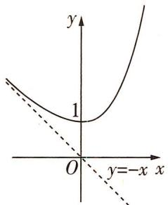</td><td> $f(x) = \frac{x e^{x}}{x}$ 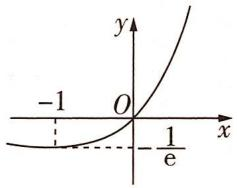</td><td> $f(x) = \frac{e^{x}}{x}$ 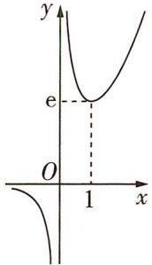</td><td> $f(x) = \frac{x}{e^{x}}$ 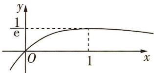</td></tr><tr><td> $f(x) = \ln x - x$ 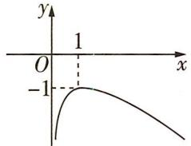</td><td> $f(x) = x \ln x$ 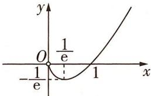</td><td> $f(x) = \frac{\ln x}{x}$ 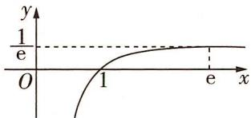</td><td> $f(x) = \frac{x}{\ln x}$ 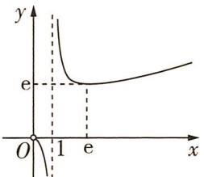</td></tr></table>

# 综合 突破练

##### 1. [2023 大连市双基测试, ★★★] 已知 $a = \frac{32(4 - \ln 32)}{\mathrm{e}^4}, b = \frac{1}{\mathrm{e}}, c = \frac{\log \sqrt{e} 2}{4}$ , 则 ( )

$\quad$A. $a < c < b$

$\quad$B. $c < a < b$

$\quad$C. $a < b < c$

$\quad$D. $b < a < c$

##### 2.[2023鄂东南联考,★★★]已知 $a = \mathrm{e} - 2, b =$ $1 - \ln 2, c = \mathrm{e}^{\mathrm{e}} - \mathrm{e}^{2}$ , 则 ( )

$\quad$A. $c > b > a$

$\quad$B. $a > b > c$

$\quad$C. $a > c > b$

$\quad$D. $c > a > b$

##### 3. [2021 全国卷乙, ★★★★] 设 $a = 2 \ln 1.01$ , $b=\ln1.02,c=\sqrt{1.04}-1$ , 则 ( )

$\quad$A. $a < b < c$

$\quad$B. $b < c < a$

$\quad$C. $b < a < c$

$\quad$D. $c < a < b$

##### 4. [2023 武汉市武昌区质检, ★★★★] 若 $a = \frac{10}{11} \cdot e^{\frac{11}{10}}$ , $b = \frac{10e^{2}}{11} \cdot \ln \frac{11}{10}$ , c = e, 则 ( )

$\quad$A. $b < c < a$

$\quad$B. $a < b < c$

$\quad$C. $c < b < a$

$\quad$D. $a < c < b$

##### 5.[2023江西省五校联考,★★★★]已知 $a = 5 - 8\ln 2, b = 4 - 4\ln 3, c = \mathrm{e}^{\frac{5}{4}} - 4$ ，则 （）

$\quad$A. $b > c > a$

$\quad$B. $c > b > a$

$\quad$C. $b > a > c$

$\quad$D. a > b > c

##### 6.[多选,2023重庆名校联考,★★★]若m>n>1,0<t<1,则下列不等式成立的是()

$\quad$A. $\log_m t < \log_n t$

$\quad$B. $m\mathrm{e}^{n}<ne^{m}$

$\quad$C. $m n^{t} > n m^{t}$

$\quad$D. $m\log_n t < n\log_m t$

##### 7.[多选,2023广州市调研,★★★★]已知a>0,b>0, $abe^{a}+\ln b-1=0$ ,则()

$\quad$A. $\ln b > \frac{1}{a}$

$\quad$B. $e^{a} > \frac{1}{b}$

$\quad$C. $a + \ln b < 1$

$\quad$D. ${ab} < 1$

##### 8.[多选,2023重庆市调研质量抽测(一),★★★
★]已知m,n是关于x的方程 $|\log_{a}x|=k(a>0,$ $a \neq 1$ )的两个根,且 $m < n < 2m$ ,则 ( )

$\quad$A. $2 < m + n < \frac{3\sqrt{2}}{2}$   
$\quad$B. $\log_n(m + 1) - 1 < m^{m + 1} - m^n$   
$\quad$C. $n^{m + 1} < (m + 1)^{n}$   
$\quad$D. $(m + 4)^{n + 1} < (n + 1)^{m + 4}$

# 创新 预测练

##### 9.[解题创新,2023嘉兴市测试,★★★]已知实数a满足 $\ln(e^{2}+1)-1<\ln(2a)<1+\ln2$ ,则()

$\quad$A. $\mathrm{e}^{\frac{1}{a}} > a$   
$\quad$B. $\mathrm{e}^{\frac{1}{a}} < a$   
$\quad$C. $e^{a-1} > a^{e-1}$   
$\quad$D. $e^{a-1} < a^{e-1}$

# 题型 18 用构造法求解 $f(x)$ 与 $f'(x)$ 共存的不等式问题

答案: 125页

# 题型攻略

常见构造类型

<table><tr><td>表达式</td><td>构造函数</td><td>表达式</td><td>构造函数</td><td>表达式</td><td>构造函数</td></tr><tr><td> $xf'(x) + f(x)$ </td><td> $g(x) = xf(x)$ </td><td> $f'(x) + f(x)$ </td><td> $g(x) = e^xf(x)$ </td><td> $f'(x) \pm g'(x)$ </td><td> $h(x) = f(x) \pm g(x)$ </td></tr><tr><td> $xf'(x) - f(x)$ </td><td> $g(x) = \frac{f(x)}{x}$ </td><td> $f'(x) - f(x)$ </td><td> $g(x) = \frac{f(x)}{e^x}$ </td><td> $f'(x) > k$ (或 $< k$ ) ( $k \neq 0$ )</td><td> $h(x) = f(x) - kx + b$ </td></tr><tr><td> $xf'(x) + nf(x)$ </td><td> $g(x) = x^n f(x)$ </td><td> $f'(x) + nf(x)$ </td><td> $g(x) = e^{nx} f(x)$ </td><td> $f'(x)g(x) + f(x)g'(x)$ </td><td> $h(x) = f(x)g(x)$ </td></tr><tr><td> $xf'(x) - nf(x)$ </td><td> $g(x) = \frac{f(x)}{x^n}$ </td><td> $f'(x) - nf(x)$ </td><td> $g(x) = \frac{f(x)}{e^{nx}}$ </td><td> $f'(x)g(x) - f(x)g'(x)$ </td><td> $h(x) = \frac{f(x)}{g(x)} (g(x) \neq 0)$ </td></tr></table>

# 综合 突破练

##### 1. [2023 四川绵阳模拟, ★★★] 设定义在 R 上的函数 $f(x)$ 的导函数为 $f'(x)$ ，若 $f(x) + f'(x) > 2$ , $f(0) = 2024$ ，则不等式 $f(x) > 2 + \frac{2022}{\mathrm{e}^{x}}$ （其中 e 为自然对数的底数）的解集为 ( )

$\quad$A. $(2020,+\infty)$   
$\quad$B. $(0, +\infty)$   
$\quad$C. $(2022,+\infty)$   
$\quad$D. $(- \infty, 0) \cup (2020, +\infty)$

##### 2. [2023 重庆二调, ★★★] 已知偶函数 $f(x)$ 的定义域为 $(- \frac{\pi}{2}, \frac{\pi}{2})$ , 其导函数为 $f'(x)$ , 当 $0 < x < \frac{\pi}{2}$ 时, 有 $f'(x) \cos x + f(x) \sin x > 0$ 成立, 则关于 $x$ 的不等式 $f(x) > 2f(\frac{\pi}{3}) \cdot \cos x$ 的解集为 ( )

$\quad$A. $(- \frac{\pi}{3}, \frac{\pi}{3})$

$\quad$B. $\left(\frac{\pi}{3},\frac{\pi}{2}\right)$

$\quad$C. $(- \frac{\pi}{2}, -\frac{\pi}{3}) \cup (\frac{\pi}{3}, \frac{\pi}{2})$   
$\quad$D. $(- \frac{\pi}{3}, 0) \cup (\frac{\pi}{3}, \frac{\pi}{2})$

##### 3. [2023 广州市一测, ★★★] 已知函数 $f(x)$ 的定义域为 $(0, +\infty)$ , 其导函数为 $f'(x)$ , 若 $xf'(x) - 1 < 0$ , $f(e) = 2$ , 则关于 $x$ 的不等式 $f(e^x) < x + 1$ 的解集为 \_\_\_\_.  
##### 4. [2023 河北名校联考, ★★★] 已知定义在 $\mathbf{R}$ 上的函数 $f(x)$ 满足 $f(x) = \mathrm{e}^{x} f(-x)$ , 且 $f(1) = \sqrt{\mathrm{e}}, f'(x)$ 是 $f(x)$ 的导函数, 当 $x \in [0, +\infty)$ 时, $f'(x) < \frac{1}{2} f(x)$ , 则不等式 $\sqrt{\mathrm{e}} f(x - 1) < \mathrm{e}^{\frac{x}{2}}$ 的解集为 \_\_\_\_.

# 创新 预测练

##### 5.[条件创新,2023佛山市质检,★★★★]设函数 $f(x)$ 的导函数是 $f'(x)$ ，且 $f(x)f'(x)>x$ 恒成立，则()

$\quad$A. $f(1)<f(-1)$   
$\quad$B. $f(1) > f(-1)$   
$\quad$C. $\left|f(1)\right|<\left|f(-1)\right|$   
$\quad$D. $|f(1)| > |f(-1)|$

# 题型19 同构法在处理指对混合问题中的应用

# 题型攻略

##### 1. 同构法即通过等价变形使得两个式子结构相同, 从而看成同一个函数的两个函数值, 进而简化运算. $x = \log_a a^x$ , $x = a^{\log_a x}$ 则是指对混合运算中变形的主要依据.

##### 2. 几种常见变形

（1） $x\mathrm{e}^{x} = \mathrm{e}^{x + \ln x}$ ; （2） $\frac{\mathrm{e}^x}{x} = \mathrm{e}^{x - \ln x}$ ; （3） $\frac{x}{\mathrm{e}^x} = \mathrm{e}^{\ln x - x}$ ; （4） $x + \ln x = \ln (x \cdot \mathrm{e}^x)$ ; （5） $x - \ln x = \ln \frac{\mathrm{e}^x}{x}$ .

##### 3. 三种基本形式

<table><tr><td colspan="2">基本形式</td><td colspan="3">同构变形</td></tr><tr><td colspan="2">a&gt;0,b&gt;0</td><td>同左</td><td>同右</td><td>取对数</td></tr><tr><td>和差型</td><td> $e^a \pm a > b \pm \ln b$ </td><td> $e^a \pm a > e^{\ln b} \pm \ln b \Rightarrow f(x) = e^x \pm x$ </td><td> $e^a \pm \ln e^a > b \pm \ln b \Rightarrow f(x) = x \pm \ln x$ </td><td>\</td></tr><tr><td>积型</td><td> $ae^a < b \ln b$ </td><td> $ae^a < (\ln b)e^{\ln b} \Rightarrow f(x) = xe^x$ </td><td> $e^a \ln e^a < b \ln b \Rightarrow f(x) = x \ln x$ </td><td> $a + \ln a < \ln b + \ln(\ln b) \Rightarrow f(x) = x + \ln x$ </td></tr><tr><td>商型</td><td> $\frac{e^a}{a} < \frac{b}{\ln b}$ </td><td> $\frac{e^a}{a} < \frac{e^{\ln b}}{\ln b} \Rightarrow f(x) = \frac{e^x}{x}$ </td><td> $\frac{e^a}{\ln e^a} < \frac{b}{\ln b} \Rightarrow f(x) = \frac{x}{\ln x}$ </td><td> $a - \ln a < \ln b - \ln(\ln b) \Rightarrow f(x) = x - \ln x$ </td></tr></table>

注意 等式或不等式两边同时取对数也是处理指数幂问题的常用方法,例如 $a^{b}>b^{a}\Rightarrow b\ln a>a\ln b\Rightarrow\frac{\ln a}{a}>\frac{\ln b}{b}\Rightarrow f(x)=\frac{\ln x}{x}(a>0,b>0)$ .

# 综合 突破练

##### 1. [2023 豫北名校联考, ★★★] 已知函数 $f(x) = \mathrm{e}^{x^{2} - 2\ln x} - 2a\ln x + ax^{2}$ 有两个不同的零点, 则实数 a 的取值范围是 ( )

$\quad$A. $(- \sqrt{\mathrm{e}}, 0)$

$\quad$B. $(-\infty, -\sqrt{\mathrm{e}})$

$\quad$C. $(- \infty, 0)$

$\quad$D. $(-\infty, -\mathrm{e})$

##### 2. [2023 辽宁省实验中学第二次月考, ★★★]
若关于 x 的不等式 $x^{2} + x \ln a - ae^{x} \ln x > 0$ 对 $\forall x \in (0,1)$ 恒成立, 则实数 a 的取值范围为
()

$\quad$A. $(-\infty, \frac{1}{\mathrm{e}}]$

$\quad$B. $(0, \frac{1}{\mathrm{e}}]$

$\quad$C. $\left[\frac{1}{e},1\right)$

$\quad$D. $\left[\frac{1}{\mathrm{e}}, +\infty\right)$

##### 3. [2022 新高考卷 I, ★★★★★] 已知函数 $f(x) = \mathrm{e}^{x} - ax$ 和 $g(x) = ax - \ln x$ 有相同的最小值.

（1） 求 $a$ ; （2） 证明: 存在直线 $y = b$ , 其与两条曲线 $y = f(x)$ 和 $y = g(x)$ 共有三个不同的交点, 并且从左到右的三个交点的横坐标成等差数列.

##### 4. [2023 云南省第二次统考, ★★★★] 已知 m > 0, e 是自然对数的底数, 函数 $f(x) = \mathrm{e}^{x} + m - m \ln(mx - m)$ .

（1） 若 $m = 2$ , 求函数 $F(x) = \mathrm{e}^{x} + \frac{x^{2}}{2} - 4x + 2 - f(x)$ 的极值.

（2） 是否存在实数 $m, \forall x > 1$ , 都有 $f(x) \geqslant 0$ ? 若存在, 求 $m$ 的取值范围; 若不存在, 请说明理由.

##### 5.[2023武汉市武昌区质检,★★★★]已知函数 $f(x)=a^{x}$ 与 $g(x)=\log_{a}x(a>0$ ,且 $a\neq1$ .

（1） 求曲线 $y = g(x)$ 在点 $(1, g(1))$ 处的切线方程；

（2） 若 $a > 1, h(x) = f(x) - g(x)$ 恰有两个零点, 求实数 $a$ 的取值范围.

# 创新 预测练

##### 6.[解题创新,2023 南京市六校联考,★★★]当 $x \in (1, +\infty)$ 时, $(\mathrm{e}^{x-1}-1)\ln x \geqslant a(x-1)^{2}$ 恒成立, 则实数 a 的取值范围为 \_\_\_\_.

# 题型 20 利用导数求解极值和最值问题

▶ 答案：127 页

# 题型攻略

一般通过讨论函数的单调性和极值点处导数为0求解问题.

# 综合 突破练

##### 1. [2023 南京市六校联考, ★★★] 已知 $x_{1}, x_{2}$ 是函数 $f(x) = e^{x} - \frac{1}{2} ax^{2}$ 的两个极值点, 且 $x_{2} = 2x_{1}$ , 则实数 a 的值为 ( )

$\quad$A. $\frac{2}{\sqrt{\mathrm{e}}}$

$\quad$B. $\frac{\sqrt{e}}{2}$

$\quad$C. $\frac{2}{\ln 2}$

$\quad$D. $\frac{\ln 2}{2}$

##### 2. [2022 全国卷乙, ★★★★] 已知 $x = x_{1}$ 和 $x = x_{2}$ 分别是函数 $f(x) = 2a^{x} - \mathrm{ex}^{2} (a > 0$ 且 $a \neq 1$ 的极小值点和极大值点. 若 $x_{1} < x_{2}$ , 则 $a$ 的取值范围是 \_\_\_\_.

##### 3.[2023武汉市高三调研,★★★★]已知函数 $f(x)=\frac{1}{k}(x-k-3)\mathrm{e}^{x}-x.$

（1） 讨论函数 $f(x)$ 的极值点个数；

（2） 当 $f(x)$ 恰有一个极值点 $x_{0}$ 时, 求当 $f(x_{0})$ 取得最大值时, 实数 k 的值.

##### 4. [2023 新高考卷Ⅱ, ★★★★★] （1） 证明: 当 $0 < x < 1$ 时, $x - x^{2} < \sin x < x$ ;

（2） 已知函数 $f(x) = \cos ax - \ln(1 - x^{2})$ ，若 x = 0 是 $f(x)$ 的极大值点，求 a 的取值范围.

##### 5. [2023 重庆市调研质量抽测(一), ★★★★ ★]已知函数 $f(x) = (2x - 3)e^{x} - ax + a (a \in \mathbb{R})$ , 设 $f(x)$ 的导函数为 $f'(x)$ , $h(x) = f'(x)$ .

（1） 讨论 $h(x)$ 的零点个数；
（2） 当 $a \geqslant 0$ 时, 记 $f(x)$ 的最小值为 $g(a)$ , 求 $g(a)$ 的最大值.

# 创新 预测练

##### 6. [情境创新,2023济南模拟,★★★★]机器学习是人工智能和计算机科学的分支,专注于使用数据和算法来模拟人类学习的方式.在研究时需要估算不同样本之间的相似性,通常采用的方法是计算样本间的“距离”,闵氏距离是常见的一种距离形式.两点 $A(x_{1},y_{1}),B(x_{2},y_{2})$ 的闵氏距离为 $D_{p}(A,B)=(|x_{1}-x_{2}|^{p}+|y_{1}-y_{2}|^{p})^{\frac{1}{p}}$ ,其中p为非零常数.如果点M在曲线 $y=e^{x}$ 上,点N在直线y=x-1上,则 $D_{1}(M,N)$ 的最小值为\_\_\_\_.

# 题型 21 重要不等式及其应用

# 题型攻略

常见的重要不等式

<table><tr><td>指数型</td><td> $e^{x} \geqslant x + 1$ (当且仅当x=0时取等号), $e^{x-1} \geqslant x$ (当且仅当x=1时取等号), $e^{x} \leqslant \frac{1}{1-x} (x < 1)$ (当且仅当x=0时取等号)</td></tr><tr><td>对数型</td><td> $\ln(x+1) \leqslant x(x > -1)$ (当且仅当x=0时取等号), $1 - \frac{1}{x} \leqslant \ln x \leqslant x - 1 (x > 0)$ (当且仅当x=1时取等号), $\ln x \leqslant \frac{x}{e}$ (当且仅当x=e时取等号)</td></tr><tr><td>三角型</td><td> $\sin x \leqslant x \leqslant \tan x (0 \leqslant x < \frac{\pi}{2})$ (当且仅当x=0时取等号), $\sin x \geqslant x \geqslant \tan x (-\frac{\pi}{2} < x \leqslant 0)$ (当且仅当x=0时取等号)</td></tr><tr><td>对数均值不等式</td><td> $\frac{a+b}{2} > \frac{a-b}{\ln a - \ln b} > \sqrt{ab} (a > 0, b > 0, a \ne b)$ </td></tr></table>

# 综合 突破练

##### 1. [2023 四川成都七中模拟, ★★★] 设 $a = 0.01$ , $b = \ln (1 + \sin 0.01)$ , $c = 1.1 \ln 1.01$ , 则 $a, b, c$ 的大小关系是 ( )

$\quad$A. $a < b < c$   
$\quad$B. $a < c < b$   
$\quad$C. $b < c < a$   
$\quad$D. b < a < c

##### 2. [2023 湖北名校联考, ★★★] 设 $a = (e - 0.1)^{e + 0.1}$ , $b = e^{e}$ , $c = (e + 0.1)^{e - 0.1}$ , 则 a, b, c 的大小关系为 ()

$\quad$A. $c < a < b$   
$\quad$B. $a < c < b$   
$\quad$C. $a < b < c$   
$\quad$D. c < b < a

##### 3.[2023福建省适应性测试,★★★]已知函数 $f(x)=\left\{\begin{aligned}&\mathrm{e}^{-2x}-1,x\leqslant0,\\&\frac{1}{2}\ln(x+1),x>0,\end{aligned}\right.$ 若 $x[f(x)-a|x|]\leqslant0$ ，则 a 的取值范围是\_\_\_\_。

##### 4. [2023 贵阳三校联考, ★★★★] 已知函数 $f(x)=\ln(x+t)+\frac{a}{x}$ , 其中 t, a 为实数.

（1） 当 $t = 0$ 时, 不等式 $f(x) \geqslant 1$ 在 $(0,1]$ 上恒

成立,求实数 a 的取值范围;

（2） 若 $g(x)=\mathrm{e}^{x}+\frac{a}{x}$ ，当 $t \leqslant 2$ 时，证明： $g(x)>f(x)$ .

##### 5.[2022新高考卷Ⅱ，★★★★★]已知函数 $f(x)=xe^{ax}-e^{x}$ .

（1） 当 a=1 时, 讨论 $f(x)$ 的单调性;  
（2） 当 $x > 0$ 时, $f(x) < -1$ , 求 $a$ 的取值范围;  
（3） 设 $n \in \mathbb{N}^*$ , 证明: $\frac{1}{\sqrt{1^2 + 1}} + \frac{1}{\sqrt{2^2 + 2}} + \cdots +$

$\frac {1}{\sqrt {n ^ {2} + n}} > \ln (n + 1).$

##### 6.[2023四川省开江中学模拟,★★★★★]已知函数 $f(x)=xe^{x}-ax+1,x\in(-1,+\infty)$ ,a>0, $g(x)=bx-\frac{\ln x}{x}.$

（1） 当 b=1 时, 若 $f(x)$ 和 $g(x)$ 有相同的最小值, 求 a 的值;  
（2） 若 $x_{1}, x_{2}$ 是函数 $g(x)$ 的两个不相等的零点, 且 $x_{1}x_{2} > k$ 恒成立, 求 k 的取值范围.

# 创新 预测练

##### 7.[解题创新,2023江苏姜堰中学、如东中学联考,★★★]已知 $a=0.1e^{0.1},b=0.11,c=\ln1.1$ ,则a,b,c的大小关系为()

$\quad$A. $a < b < c$

$\quad$B. $b > a > c$

$\quad$C. $a > b > c$

$\quad$D. $a < c < b$

# 题型 22 单变量不等式的证明

▶ 答案：130 页

# 题型攻略

# 单变量不等式的证明方法

（1） 直接证明: 利用函数的单调性和最值直接证明.  
（2）作差构造:证明不等式 $f(x)>g(x)$ 转化为证明 $f(x)-g(x)>0$ ,进而构造辅助函数 $h(x)=f(x)-g(x)$ ,通过研究函数 $h(x)$ 的单调性,证明 $h(x)_{\min}>0$ .  
（3）适当放缩构造:一是根据已知条件适当放缩,二是利用常见的放缩结论,如 $\ln x \leqslant x - 1, e^{x} \geqslant x + 1, \ln x < x < e^{x} (x > 0)$ 放缩,然后构造辅助函数求解.   
（4） 构造双函数: 将待证不等式进行变形, 构造两个函数, 转化为两个函数的最值问题 (或找到可以传递的中间量 a), 即将不等式转化为 $f(x) \geqslant g(x)$ 的形式, 证明 $f(x)_{\min} \geqslant g(x)_{\max}$ (或 $f(x) \geqslant a \geqslant g(x)$ ) 即可.

# 综合 突破练

##### 1. [2021 全国卷乙, ★★★★] 设函数 $f(x) = \ln(a - x)$ ，已知 x = 0 是函数 $y = xf(x)$ 的极值点.

（1） 求 $a$ ;   
（2） 设函数 $g(x) = \frac{x + f(x)}{xf(x)}$ ，证明： $g(x) < 1$ .

##### 2.[2023广州市阶段测试,★★★★]已知函数 $f(x)=2x-\ln x.$

（1） 当 $x \geqslant 1$ 时, 证明: $f(x) \geqslant x + \frac{1}{x}$ ;  
（2） 若 $f(x) + ae^{3x} + \ln a \geqslant 0$ , 求 $a$ 的取值范围.

##### 3. [2023 江苏南通中学检测, ★★★★] 已知函数 $f(x) = \mathrm{e}^{x - m} + \ln \frac{3}{x}$ .

（1） 设 x=1 是函数 $f(x)$ 的极值点, 求 m 的值并讨论 $f(x)$ 的单调性;  
（2） 当 $m \leqslant 2$ 时, 证明: $f(x) > \ln 3$ .

# 创新 预测练

##### 4.[解题创新,2023山东潍坊一模,★★★★]已知函数 $f(x)=\mathrm{e}^{x-1}\ln x,g(x)=x^{2}-x.$

（1） 讨论 $f(x)$ 的单调性;  
（2） 证明: 当 $x \in (0,2)$ 时, $f(x) \leqslant g(x)$ .

# 题型 23 双变量不等式的证明

# 题型攻略

# 证明双变量不等式的思路

（1）先选定主元,把含“双变量”的不等式转化为含“单变量”的不等式,再利用单变量不等式的证明方法处理;  
（2）从已知条件入手,寻找“双变量”满足的关系式,消掉一个元,转化为含“单变量”的不等式处理,此时要特别注意“单变量”的取值范围.

# 综合 突破练

##### 1.[2023泉州市质监(一),★★★★]已知函数 $f(x)=\mathrm{e}^{x}\left[x^{2}-(a+2)x+a+3\right].$

（1） 讨论 $f(x)$ 的单调性;  
（2） 若 $f(x)$ 在 $(0,2)$ 上有两个极值点 $x_{1}, x_{2}$ ，求证： $f(x_{1})f(x_{2}) < 4e^{2}$ .

##### 2.[2023大连市双基测试,★★★★★]已知函数 $f(x)=\frac{1}{2}\ln^{2}x+\ln x+kx-k$ , $g(x)=\frac{1}{2}\mathrm{e}^{2x}-\frac{1}{\mathrm{e}}x-f(x)$ .

（1） 若 $k \leqslant -1$ , 求证: 函数 $f(x)$ 只有一个零点;  
（2） 对任意 $x_{1} \neq x_{2}$ , 总有 $\frac{g(x_{1}) - g(x_{2})}{x_{1} - x_{2}} > 2$ 成立, 求 $k$ 的取值范围.

# 创新 预测练

##### 3. [角度创新,2023 嘉兴市测试, ★★★★★] 已知函数 $f(x) = ax \ln x$ 和 $g(x) = b(x - \sqrt{x}) (b > 0)$ 有相同的最小值.

（1） 求 $a + \frac{1}{b}$ 的最小值；  
（2） 设 $h(x)=f(x)+g(x)$ ，方程 $h(x)=p$ 有两个不相等的实根 $x_{1}, x_{2}$ ，求证： $\frac{1}{2}<x_{1}+x_{2}<2$ .

# 题型 24 导数中不等式的恒成立问题

# 题型攻略

##### 1. $f(x) > a$ 恒成立 $\Leftrightarrow f(x)_{\min} > a$ ; $f(x) < a$ 恒成立 $\Leftrightarrow f(x)_{\max} < a$ .  
##### 2. $f(x) > g(x)$ 恒成立 $\Leftrightarrow [f(x) - g(x)]_{\min} > 0; f(x) < g(x)$ 恒成立 $\Leftrightarrow [f(x) - g(x)]_{\max} < 0.$

# 综合 突破练

##### 1. [2023 浙江名校联考, ★★★] 若不等式 $\mathrm{e}^{x^{2}+x-a}\geqslant\ln x+\ln(x+1)+a$ (其中 e 为自然对数的底数, 约为 2.71828) 对一切正实数 x 都成立, 则实数 a 的取值范围是 ( )

$\quad$A. $(-∞,e]$

$\quad$B. $(-∞,1]$

$\quad$C. $(-\infty, \frac{1}{\mathrm{e}}]$

$\quad$D. $(-∞,0]$

##### 2. [2023 新高考卷 I, ★★★★] 已知函数 $f(x)=a(e^{x}+a)-x.$

（1） 讨论 $f(x)$ 的单调性;  
（2） 证明: 当 a > 0 时, $f(x) > 2 \ln a + \frac{3}{2}$ .

##### 3. [2023 四川南充模拟, ★★★★] 已知函数 $f(x)=ae^{x}-x^{2}-2x,a\in\mathbb{R}.$

（1） 若函数 $g(x)$ 为函数 $f(x)$ 的导函数, 讨论函数 $g(x)$ 的单调性;  
（2） 若函数 $f(x)$ 的两个极值点分别为 $x_{1}, x_{2}$ 且 $x_{1} < x_{2}$ ，若不等式 $x_{1} + \lambda x_{2} > 0$ 恒成立，求实数 $\lambda$ 的取值范围.

# 创新 预测练

##### 4. [条件创新,2023杭州市质检,★★★]已知函数 $f(x)=\mathrm{e}^{2x}-2\mathrm{e}^{x}+2x$ 的图象在点 $P(x_{0},f(x_{0}))$ 处的切线方程为 $l:y=g(x)$ ，若对任意 $x\in\mathbb{R}$ ，都有 $(x-x_{0})[f(x)-g(x)]\geqslant0$ 成立，则 $x_{0}=$ \_\_\_\_.

# 题型 25 导数中不等式的存在性问题

# 题型攻略

##### 1. $f(x) < a$ 在 $x \in I$ 上有解 $\Leftrightarrow \exists x \in I$ 使 $f(x) < a \Leftrightarrow f(x)_{\min} < a (x \in I)$ ;

$f(x) > a$ 在 $x \in I$ 上有解 $\Leftrightarrow \exists x \in I$ 使 $f(x) > a \Leftrightarrow f(x)_{\max} > a (a \in I)$ .

##### 2. $f(x) < g(x)$ 在 $x \in I$ 上有解 $\Leftrightarrow \exists x \in I, f(x) < g(x) \Leftrightarrow [f(x) - g(x)]_{\min} < 0 (x \in I)$ ;

$f(x) > g(x)$ 在 $x \in I$ 上有解 $\Leftrightarrow \exists x \in I, f(x) > g(x) \Leftrightarrow [f(x) - g(x)]_{\max} > 0 (x \in I)$ .

# 综合 突破练

##### 1. [2023 四川内江模拟, ★★★] 已知函数 $f(x) = \ln |x|$ , 若存在实数 $x$ 使不等式 $f(x) \geqslant x^2 - x - 2a - 2b - \ln 2$ 成立, 则实数 $a + b$ 的取值范围为 ( )

$\quad$A. $\left[-\frac{3}{8}, \frac{\ln 2}{2}\right)$

$\quad$B. $\left[-\frac{\ln 2}{2}, +\infty\right)$

$\quad$C. $\left[-\frac{\ln 2}{2}, \frac{3}{8}\right]$

$\quad$D. $\left[\frac{3}{8}, +\infty\right)$

##### 2. [2023 重庆模拟, ★★★★] 已知函数 $f(x) = \ln x + ax^{2} - x$ .

（1） 当 $a = 1$ 时, 求 $f(x)$ 的单调区间;

（2） 若存在 $x \geqslant 1$ , 使得 $f(x) \geqslant \frac{1}{2} x^3 + 1$ 成立, 求整数 $a$ 的最小值.

##### 3. [2023 全国卷乙, ★★★★★] 已知函数 $f(x) = \left(\frac{1}{x} + a\right)\ln(1 + x)$ .

（1） 当 a = -1 时, 求曲线 $y = f(x)$ 在点 (1, f(1)) 处的切线方程.
（2） 是否存在 a, b，使得曲线 $y = f(\frac{1}{x})$ 关于直

线x=b对称？若存在，求a,b的值；若不存在，说明理由.

（3） 若 $f(x)$ 在 $(0, +\infty)$ 上存在极值, 求 a 的取值范围.

# 创新 预测练

##### 4. [数学探索,2023 九江三校联考, ★★★★] 已知函数 $f(x) = \frac{1}{2}x^{2} - ax + (a - 1)\ln x$ .

（1） 当 a > 1 时, 讨论函数 $f(x)$ 的单调性.
（2） 当 a = 0 时, 令 $F(x) = 2f(x) - x\ln x + 2\ln x + 2$ , 是否存在区间 $[m, n] \subseteq (1, +\infty)$ , 使得函数 $F(x)$ 在区间 $[m, n]$ 上的值域为 $[k(m+2), k(n+2)]$ ? 若存在, 求出实数 k 的取值范围; 若不存在, 说明理由.

# 题型 26 导数中双变量 “存在性或任意性” 问题

▶ 答案：134 页

# 题型攻略

##### 1. $\forall x_{1}\in M,\forall x_{2}\in N,f(x_{1}) > g(x_{2})\Leftrightarrow f(x)_{\min} > g(x)_{\max}.$ 2. $\exists x_1\in M,\exists x_2\in N,f(x_1) > g(x_2)\Leftrightarrow f(x)_{\max} > g(x)_{\min}.$   
##### 3. $\forall x_{1}\in M,\exists x_{2}\in N,f(x_{1}) > g(x_{2})\Leftrightarrow f(x)_{\min} > g(x)_{\min}.$ 4. $\exists x_1\in M,\forall x_2\in N,f(x_1) > g(x_2)\Leftrightarrow f(x)_{\max} > g(x)_{\max}.$   
##### 5. $\forall x_{1} \in M, \exists x_{2} \in N, f(x_{1}) = g(x_{2}) \Leftrightarrow f(x)$ 的值域为 $g(x)$ 值域的子集. 6. $\exists x_{1} \in M, \exists x_{2} \in N, f(x_{1}) = g(x_{2}) \Leftrightarrow f(x)$ 的值域与 $g(x)$ 的值域的交集非空.

# 综合 突破练

##### 1. [2023 福建省福安一中检测, ★★★] 设函数 $f(x) = (x - 1)(\mathrm{e}^{x} - \mathrm{e}), g(x) = \mathrm{e}^{x} - ax - 1$ , 其中 $a \in \mathbb{R}$ . 若 $\forall x_{2} \in [0, +\infty)$ , 都 $\exists x_{1} \in \mathbb{R}$ , 使得不等式 $f(x_{1}) \leqslant g(x_{2})$ 成立, 则 $a$ 的最大值为 ( )

$\quad$A. 0

$\quad$B. $\frac{1}{\mathrm{e}}$

$\quad$C. 1

$\quad$D. e

##### 2. [2023 湖北省三校联考, ★★★★] 函数 $f(x) = \mathrm{e}^{x} \sin x$ , $g(x) = (x + 1) \cos x - \sqrt{2} \mathrm{e}^{x}$ .

（1） 求 $f(x)$ 的单调递增区间；  
（2） $\forall x_{1} \in [0, \frac{\pi}{2}], \forall x_{2} \in [0, \frac{\pi}{2}]$ , 使 $f(x_{1}) + g(x_{2}) \geqslant m$ 成立, 求实数 $m$ 的取值范围.

##### 3.[2023银川一中检测，★★★★]已知函数 $f(x)=\mathrm{e}^{x}-mx,g(x)=\mathrm{e}^{x}(-\sin x+\cos x+a)$ .

（1） 若函数 $f(x)$ 在 x=0 处取得极值, 求 m;

（2） 在（1）的条件下, $\exists x_{1}, x_{2} \in [0, \frac{\pi}{2}]$ , 使得不等式 $g(x_{1}) \geqslant f(x_{2})$ 成立, 求 $a$ 的取值范围.

# 创新 预测练

##### 4.[条件创新,2023惠州市二调,★★★★★]已知函数 $f(x)=a\ln x+2x^{2}-2(a\in\mathbf{R})$ .

（1） 讨论函数 $f(x)$ 的单调性;  
（2） 若曲线 $y = f(x)$ 在 $x = 1$ 处的切线方程为 $y = 8x - 8$ ，且对于任意实数 $\lambda \in [-1, 2]$ ，存在正实数 $x_1, x_2$ ，使得 $\lambda (x_1 + x_2) = f(x_1) + f(x_2)$ ，求 $x_1 + x_2$ 的最小正整数值.

# 题型 27 讨论函数的零点（方程根）的个数

# 题型攻略

# 讨论函数的零点(方程根)的个数的方法

（1） 方程法: 求方程 $f(x)=0$ 的实数根, 即为函数 $f(x)$ 的零点.  
（2） 图象法: 通过导数研究函数的单调性、极值、最值, 确定函数 $f(x)$ 的图象草图, 判断图象与横轴的交点个数, 结合零点存在定理处理.  
（3） 分离法: 设 $f(x) = g(x) - h(x)$ ，则 $f(x)$ 的零点个数 $\Leftrightarrow g(x)$ 与 $h(x)$ 图象的交点个数.

# 综合 突破练

##### 1. [2023 济南模拟, ★★★★] 函数 $f(x) = a^{x} + (a + 2)^{x} - 2(a + 1)^{x} (a > 0 \text{ 且 } a \neq 1)$ 的零点个数为 ()

$\quad$A. 1

$\quad$B. 2

$\quad$C. 3

$\quad$D. 4

##### 2.[多选,2023泉州市质监(一),★★★★]设函数 $f(x)=\ln x-(x-a)^{2}$ ,则下列判断正确的是()

$\quad$A. $f(x)$ 存在两个极值点  
$\quad$B. 当 $a > \frac{7}{3}$ 时, $f(x)$ 存在两个零点  
$\quad$C. 当 $a < 1$ 时, $f(x)$ 存在一个零点  
$\quad$D. 若 $f(x)$ 有两个零点 $x_{1}, x_{2}$ ，则 $x_{1} + x_{2} > 2a$

##### 3. [2023 济南市统考, ★★★★]已知函数 $f(x) = \frac{x - 1}{\mathrm{e}^{x - 1}} + a\ln x$ .

（1） 若 a=1，求函数 $f(x)$ 在 $[1,2]$ 上的最小值.  
（2） 若存在 $x_{0} \in (1, +\infty)$ ，使得 $f(x_{0}) = 0$ .  
(i) 求 a 的取值范围;  
(ii) 判断 $f(x)$ 在 $(0, +\infty)$ 上的零点个数，并说明理由.

##### 4. [2021 新高考卷Ⅱ, ★★★★] 已知函数 $f(x) = (x - 1)e^{x} - ax^{2} + b$ .

（1） 讨论 $f(x)$ 的单调性.  
（2）从下面两个条件中任选一个作为已知条件,证明: $f(x)$ 有一个零点.

$① \frac {1}{2} <   a \leqslant \frac {\mathrm{e} ^ {2}}{2}, b > 2 a; ② 0 <   a <   \frac {1}{2}, b \leqslant 2 a.$

# 创新 预测练

##### 5. [新定义题,2023高三名校联考,★★★]定义方程 $f(x)=f'(x)$ 的实数根 $x_{0}$ 叫做函数 $f(x)$ 的“平衡点”. 若函数 $g(x)=\ln x,h(x)=x^{3}-1$ 的“平衡点”分别为 $\alpha,\beta$ ,则 $\alpha,\beta$ 的大小关系为()

$\quad$A. $\alpha \geqslant \beta$

$\quad$B. $\alpha >\beta$

$\quad$C. $\alpha \leqslant \beta$

$\quad$D. $\alpha < \beta$

# 题型28 已知函数零点个数求参数的取值范围

# 题型攻略

# 已知函数零点个数求参数的取值范围的方法

（1） 数形结合法: 先根据函数的性质画出图象, 再根据函数零点个数的要求数形结合求解.  
（2） 分离参数法: 由 $f(x)=0$ 分离出参数 a, 得 $a=\varphi(x)$ , 利用导数求函数 $y=\varphi(x)$ 的单调性、极值和最值, 根据直线 y=a 与 $y=\varphi(x)$ 的图象的交点个数得参数的取值范围, 也可以转化为 $ax=t(x)$ , 利用切线方程找到临界位置, 从而得到参数的取值范围.  
（3） 分类讨论法: 先确定参数分类的标准, 在每个小范围内研究零点的个数是否符合题意, 将满足题意的参数的各小范围并在一起, 即为所求参数范围.

说明 对于函数图象交点个数问题,可以构造函数,转化为函数零点个数问题求解.

# 综合 突破练

##### 1. [2023 石家庄市二检, ★★★] 已知 $x^{\frac{1}{x^{2}}} - a = 0$ 在 $(0, +\infty)$ 上有两个不相等的实数解, 则实数 a 的取值范围是 ( )

$\quad$A. $(0, \frac{1}{2e}]$

$\quad$B. $(0, \frac{1}{2e})$

$\quad$C. $(1,e^{\frac{1}{2e}}]$

$\quad$D. $(1, \mathrm{e}^{\frac{1}{2\mathrm{e}}})$

##### 2.[多选,2023武汉市高三调研,★★★★]已知函数 $f(x)=\mathrm{e}^{x-1}+\ln x$ ,则过点 $(a,b)$ 恰能作曲线 $y=f(x)$ 的两条切线的充分条件可以是()

$\quad$A. $b = 2a - 1 > 1$

$\quad$B. $b = 2a - 1 <   1$

$\quad$C. 2a - 1 < b < f(a)

$\quad$D. $b < 2a - 1 \leqslant -1$

##### 3. [2023 云南省第二次统考, ★★★★] 已知 e 是自然对数的底数, 函数 $f(x) = (ae^{x} + 1)x + \ln x + 1$ 只有一个零点, 则实数 a 的取值范围为 \_\_\_\_.

##### 4.[2023 河北衡水中学联考改编, ★★★★]已知函数 $f(x)=\mathrm{e}^{x}-ax-1$ , 其中 e 为自然对数的底数, 若函数 $f(x)$ 在区间 $(0,1)$ 上存在零点, 则实数 a 的取值范围是 \_\_\_\_.

##### 5. [2022 全国卷乙, ★★★★★] 已知函数 $f(x)=\ln(1+x)+axe^{-x}$ .

（1） 当 a=1 时, 求曲线 $y=f(x)$ 在点 $(0,f(0))$ 处的切线方程;

（2） 若 $f(x)$ 在区间 $(-1,0)$ , $(0,+\infty)$ 各恰有一个零点, 求 a 的取值范围.

##### 6. [2023 合肥市质检, ★★★★★] 已知函数

$f (x) = \ln x + \frac {a - x ^ {2}}{2 x}.$

（1） 讨论函数 $f(x)$ 的单调性；  
（2） 若关于 $x$ 的方程 $f(x) = a$ 有两个实数解, 求 $a$ 的最大整数值.

# 创新 预测练

##### 7.[新定义题,多选,2023惠州市二调,★★★]

对于函数 $f(x)$ 和函数 $g(x)$ ，设 $x_{1} \in \{x \mid f(x) = 0\}$ ， $x_{2} \in \{x \mid g(x) = 0\}$ ，若存在 $x_{1}, x_{2}$ ，使得 $|x_{1} - x_{2}| \leqslant 1$ ，则称函数 $f(x)$ 与函数 $g(x)$ 互为“零点相邻函数”。现有函数 $f(x) = e^{x - 3} + x - 4$ 与函数 $g(x) = \ln x - mx$ 互为“零点相邻函数”，则实数 $m$ 的值可以是（）

$\quad$A. $\frac{\ln 5}{5}$

$\quad$B. $\frac{\ln 3}{3}$

$\quad$C. $\frac{\ln 2}{2}$

$\quad$D. $\frac{1}{2}$

# 题型 29 隐零点问题

▶ 答案: 138 页

# 题型攻略

# 求解隐零点问题的步骤

隐零点模型是指函数的零点或方程的根存在但不能直接解出来,但是又必须利用其根或零点解题的模型.解决此类问题的步骤为:（1）利用零点存在定理判定 $f'(x)$ 的零点存在情况并确定零点的范围;（2）以零点为分界点,得出 $f'(x)$ 的正负,从而判断函数 $f(x)$ 的单调性,进而得到 $f(x)$ 的极值表达式;（3）通过对方程适当变形,整体代入极值表达式进行化简证明,有时候零点范围还可以适当缩小.

# 综合 突破练

##### 1. [2023 武汉市调研, ★★★★] 已知关于 $x$ 的方程 $ax - \ln x = 0$ 有两个不相等的正实根 $x_{1}$ 和 $x_{2}$ , 且 $x_{1} < x_{2}$ .

（1） 求实数 $a$ 的取值范围;  
（2） 设 k 为常数, 当 a 变化时, 若 $x_{1}^{k}x_{2}$ 有最小值 $e^{e}$ , 求常数 k 的值.

##### 2. [2023 广州市一测, ★★★★★] 已知 $a > 0$ , 函数 $f(x) = (1 - ax)(e^x - 1)$ .

（1） 若 a = 1，证明：当 x > 0 时， $f(x) < \ln(x + 1)$ ;  
（2） 若函数 $h(x) = \ln(x + 1) - f(x)$ 存在极小值点 $x_{0}$ ，证明： $f(x_{0}) \geqslant 0$ .

##### 3.[2023 潍坊市高三统考, ★★★★★]已知函数 $f(x)=\mathrm{e}^{x}-ax^{2}-\cos x-\ln(x+1)$ .

（1） 若 $a = 1$ , 求证: 函数 $f(x)$ 的图象与 $x$ 轴相切于原点;  
（2） 若函数 $f(x)$ 在区间 $(-1,0)$ , $(0,+\infty)$ 上各恰有一个极值点, 求实数 a 的取值范围.

# 创新 预测练

##### 4. [设问创新,2023鄂东南联考,★★★★]已知函数 $f(x)=a\sin(1-x)+\ln x,a\in\mathbb{R}$ .

（1） 讨论函数 $f(x)$ 在 $x \in (0,1)$ 时的单调性；  
（2） 证明: $\sin \frac{1}{2^2} + \sin \frac{1}{3^2} + \sin \frac{1}{4^2} + \cdots +$

$\sin \frac {1}{(1 + n) ^ {2}} <   \ln 2 + \frac {1}{2} \left(\frac {1}{n + 1} + \frac {1}{n}\right), n \in \mathbf {N} ^ {*}.$

# 题型 30 极值点偏移问题

▶ 答案：139 页

# 题型攻略

##### 1. 研究对象: 一般地, 证明两数 $x_{1}, x_{2}$ 之和或积的不等式问题, 常常涉及函数的极值点偏移.  
##### 2. 满足条件: 对于函数 $y = f(x)$ 有 $f(x_{1}) = f(x_{2})$ ，且 $x_{0}$ 是 $f(x)$ 的极值点.  
##### 3. 构造函数: 满足条件后, 构造对称差函数 $h(x) = f(x) - f(2x_{0} - x)$ (证 $x_{1}, x_{2}$ 的和) 或 $h(x) = f(x) - f(\frac{x_{0}^{2}}{x})$ (证 $x_{1}, x_{2}$ 的积), 确定 $x_{1}, x_{2}$ 的取值范围.  
##### 4. 证出结论: （1） 利用 $h(x) = f(x) - f(2x_0 - x)$ 的单调性, 得出 $x_1 + x_2 > 2x_0$ 或 $x_1 + x_2 < 2x_0$ ; （2） 利用 $h(x) = f(x) - f(\frac{x_0^2}{x})$ 的单调性, 得出 $x_1 \cdot x_2 > x_0^2$ 或 $x_1 \cdot x_2 < x_0^2$ .

注意 1. 解决极值点偏移问题的关键是消元. 2. 有时待证的结论需要利用不等式转化变形.

# 综合 突破练

##### 1. [2022 全国卷甲, ★★★★★] 已知函数

$f (x) = \frac {\mathrm{e} ^ {x}}{x} - \ln x + x - a.$

（1） 若 $f(x) \geqslant 0$ ，求 a 的取值范围；  
（2） 证明: 若 $f(x)$ 有两个零点 $x_{1}, x_{2}$ , 则 $x_{1} x_{2} < 1$ .

##### 2. [2023 南京市六校联考, ★★★★★] 已知 $a \in$ $\mathbf{R}$ , 函数 $f(x) = \frac{a}{x} + \ln x$ , $g(x) = ax - \ln x - 2$ .

（1） 当 $f(x)$ 与 $g(x)$ 都存在极小值, 且极小值之和为 0 时, 求实数 a 的值;  
（2） 若 $f(x_{1}) = f(x_{2}) = 2 (x_{1} \neq x_{2})$ ，求证： $\frac{1}{x_{1}} + \frac{1}{x_{2}} > \frac{2}{a}$ .

##### 3.[2021 新高考卷 I, ★★★★★]已知函数 $f(x)=x(1-\ln x)$ .

（1） 讨论 $f(x)$ 的单调性;  
（2） 设 a, b 为两个不相等的正数, 且 $b \ln a - a \ln b = a - b$ , 证明: $2 < \frac{1}{a} + \frac{1}{b} < e$ .

# 创新 预测练

##### 4. [解题创新,2023 湖南省六校联考, ★★★★ ★]已知函数 $f(x) = \ln x + \frac{a}{x} (a \in \mathbb{R})$ .

（1） 若函数 $f(x)$ 有两个不同的零点, 求 a 的取值范围;  
（2） 若函数 $g(x)=xf(x)-ax^{2}-x$ 有两个不同的极值点 $x_{1}, x_{2}$ （其中 $x_{1}<x_{2}$ ），证明： $\ln x_{1}+2\ln x_{2}>3$ .

# 题型 31 导数与其他知识的综合问题

答案: 141页

# 题型攻略

导数是研究函数性质和图象的有力工具,利用导数可以解决数列中的复杂不等式问题、圆锥曲线的切线问题、几何中动态问题的最值问题、生活中的优化问题等,解决此类问题的关键都是转化为一元函数,从而借助导数研究其最值.

# 综合 突破练

##### 1.[多选,2023武汉市调研,★★★★]已知函数 $f(x)=\sin x+\ln x$ ,将 $f(x)$ 的所有极值点按照由小到大的顺序排列,得到数列 $\{x_{n}\}(n\in N^{*})$ ,则下列说法中正确的有()

$\quad$A. $(n - 1)\pi < x_{n} < n\pi$   
$\quad$B. $x_{n + 1} - x_n <   \pi$   
$\quad$C. $\{|x_{n} - \frac{(2n - 1)\pi}{2}|\}$ 为递减数列  
$\quad$D. $f(x_{2n}) > -1 + \ln \frac{(4n - 1)\pi}{2}$

##### 2.[多选,2023广州市一测,★★★★]平面内到两定点距离之积为常数(大于0)的点的轨迹称为卡西尼卵形线,它是1675年卡西尼在研究土星及其卫星的运行规律时发现的.已知在平面直角坐标系xOy中,M(-2,0),N(2,0),动点P满足|PM|·|PN|=5,则下列结论正确的是()

$\quad$A. 点 P 的横坐标的取值范围是 $\left[-\sqrt{5}, \sqrt{5}\right]$

$\quad$B. $|OP|$ 的取值范围是 $[1,3]$

$\quad$C. $\triangle PMN$ 面积的最大值为 $\frac{5}{2}$

$\quad$D. $|PM| + |PN|$ 的取值范围是 $[2\sqrt{5}, 5]$

##### 3. [2023 福州市质检, ★★★★] 已知函数 $f(x) = (x + 1) \ln x - ax + a$ .

（1） 若 a=2，试判断 $f(x)$ 的单调性，并证明你的结论.  
（2） 若 $x > 1, f(x) > 0$ 恒成立.  
(i) 求 a 的取值范围;  
(ii) 设 $a_{n}=\frac{1}{n+1}+\frac{1}{n+2}+\frac{1}{n+3}+\cdots+\frac{1}{2n},[x]$ 表示不超过 x 的最大整数, 求 $[10a_{n}]$ .

(参考数据: $\ln 2 \approx 0.69$ )

# 创新 预测练

##### 4. [数学应用,2023 江苏省苏州市模拟,★★★] 如图为某仓库一侧墙面的示意图,其下部是矩形 ABCD, 上部是圆弧 $\widehat{AB}$ , 该圆弧所在的圆心为 O, 为了调节仓库内的湿度和温度, 现要在墙面上开一个矩形的通风窗 EFGH(其中 E, F 在圆弧 $\widehat{AB}$ 上, G, H 在弦 AB 上). 过 O 作 $OP \perp AB$ , 交 AB 于 M, 交 EF 于 N, 交圆弧 $\widehat{AB}$ 于 P, 已知 OP = 10, MP = 6.5 (单位: m), 记通风窗 EF-GH 的面积为 S (单位: $m^{2}$ ).

（1） 设 $MN = x \, (\text{m})$ ，将 S 表示成 x 的函数；
（2）通风窗的高度MN为多少时,通风窗EFGH的面积S最大?

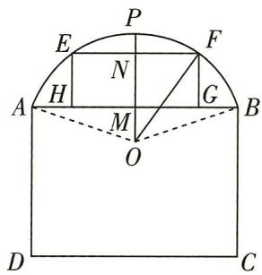

# 专题二

# 三角函数、解三角形、平面向量

# 题型 32 三角恒等变换

▶ 答案: 142 页

# 题型攻略

# 三角恒等变换技巧

（1）角变换. 观察发现问题中出现的角之间的数量关系, 把“未知角”分解成“已知角”的“和、差、倍、半角”, 然后运用相应的公式求解.  
（2） 名变换. 通过弦切互化, 同角三角函数基本关系, 诱导公式, 倍角公式等进行名变换.  
（3） 常数改写. 将问题中的常数写成某个三角函数值或式, 以利于完善式子结构, 运用相关公式求解.  
（4）当所给条件出现根式时,常用升幂公式去根号,当所给条件出现正、余弦的平方时,常用“降幂”技巧.

# 综合 突破练

##### 1. [2023 长沙市适应性考试, ★★★] 若 $\frac{1 - \tan(\alpha - \frac{\pi}{4})}{1 + \tan(\alpha - \frac{\pi}{4})} = \frac{1}{2}$ , 则 $\cos 2\alpha$ 的值为 ( )

$\quad$A. $- \frac{3}{5}$

$\quad$B. $\frac{3}{5}$

$\quad$C. $- \frac{4}{5}$

$\quad$D. $\frac{4}{5}$

##### 2.[2023 南宁市第一次适应性测试, ★★★]已知 $\sqrt{3} \sin \alpha - \sin (\alpha + \frac{\pi}{6}) = \frac{4}{5}$ , 则 $\cos (\frac{\pi}{3} - 2\alpha) =$ ( )

$\quad$A. $-\frac{1}{25}$

$\quad$B. $- \frac{7}{25}$

$\quad$C. $\frac{24}{25}$

$\quad$D. $\frac{9}{25}$

##### 3. [2023 柳州市三模, ★★★] 已知 $\alpha \in (0, \frac{\pi}{2})$ , 且 $\tan (\alpha + \frac{\pi}{4}) = 3 \cos 2\alpha$ , 则 $\sin 2\alpha =$ （）

$\quad$A. $\frac{2}{3}$

$\quad$B. $\frac{1}{6}$

$\quad$C. $\frac{1}{3}$

$\quad$D. $- \frac{5}{6}$

##### 4. [2023 南京市六校联考, ★★★] 已知 $\alpha \in (0, \frac{\pi}{2}), \beta \in (\frac{\pi}{2}, \pi), \cos 2\beta = -\frac{7}{9}, \sin (\alpha + \beta) = \frac{7}{9}$ , 则 $\sin \alpha$ 的值为 \_\_\_\_.

##### 5. [2023 贵州模拟, ★★★] 设 $\cos \alpha + \cos \beta = \frac{7}{5}$ , $\sin \alpha - \sin \beta = \frac{1}{5}$ ，则 $\tan(\alpha - \beta) =$ \_\_\_\_ .

##### 6. [2023 石家庄市质检(二), ★★★]已知 $\alpha \in (0, \frac{\pi}{2})$ , $\sin (\alpha - \frac{\pi}{4}) = \frac{1}{3}$ , 则 $\cos 2\alpha =$ \_\_\_\_.

# 创新 预测练

##### 7. [情境创新,2023 河北省沧州市部分学校联考,★★★]1796 年,年仅 19 岁的高斯发现了正十七边形的尺规作图法,要用尺规作出正十七边形就要将圆十七等分,如图所示. 设将圆十七等分后每等份圆弧所对的圆心角为 $\alpha$ , 则 $\cos(\pi - \alpha)\cos 2\alpha\cos 4\alpha\cos 8\alpha$ 的值为 \_\_\_\_.

# 题型33 三角函数中有关 $\omega$ 问题的求解

▶ 答案：142 页

# 题型攻略

# 求解三角函数中有关 $\omega$ 问题的关键

（1）若已知三角函数的单调性,则转化为集合的包含关系,进而建立 $\omega$ 所满足的不等式(组)求解;  
（2） 若已知函数图象的对称性, 则根据三角函数图象的对称性研究其周期性, 进而可以研究 $\omega$ 的取值;  
（3） 若已知三角函数的最值, 则利用三角函数的最值与图象对称轴或周期的关系, 可以列出关于 $\omega$ 的不等式 (组), 进而求出 $\omega$ 的值或取值范围.

# 综合 突破练

##### 1. [2022 全国卷甲, ★★★] 设函数 $f(x) = \sin (\omega x + \frac{\pi}{3})$ 在区间 $(0, \pi)$ 恰有三个极值点、两个零点, 则 $\omega$ 的取值范围是 ( )

$\quad$A. $\left[\frac{5}{3}, \frac{13}{6}\right)$

$\quad$B. $\left[\frac{5}{3}, \frac{19}{6}\right)$

$\quad$C. $\left(\frac{13}{6},\frac{8}{3}\right]$

$\quad$D. $(\frac{13}{6}, \frac{19}{6}]$

##### 2.[2023 乌鲁木齐市质监(一), ★★★]已知函数 $f(x)=2\sin(\omega x+\varphi)(\omega>0,0<\varphi<\frac{\pi}{2})$ 的图象过点(0,1)，且在区间 $(\pi,2\pi)$ 内不存在最值，则 $\omega$ 的取值范围是()

$\quad$A. $(0, \frac{1}{6}]$

$\quad$B. $\left[\frac{1}{4}, \frac{7}{12}\right]$

$\quad$C. $(0, \frac{1}{6}] \cup [\frac{1}{4}, \frac{7}{12}]$

$\quad$D. $(0, \frac{1}{6}] \cup [\frac{1}{3}, \frac{2}{3}]$

##### 3. [2023 贵州省适应性测试, ★★★] 将函数 $f(x) = \cos \omega x (\omega > 0)$ 的图象向左平移 $\frac{\pi}{2}$ 个单位长度后得到函数 $g(x)$ 的图象. 若 $g(x)$ 的图象关于点 $\left(\frac{\pi}{4}, 0\right)$ 对称, 且 $g(x)$ 在 $\left[\frac{\pi}{3}, \frac{5\pi}{6}\right]$ 上单调递减, 则 $\omega =$ ( )

$\quad$A. $\frac{1}{3}$

$\quad$B. $\frac{2}{3}$

$\quad$C. 1

$\quad$D. 2

##### 4. [2023 豫北名校联考, ★★★★] 已知函数 $f(x) = \sqrt{2} \sin x$ , 函数 $g(x)$ 的图象可以由函数 $f(x)$ 的图象先向右平移 $\frac{\pi}{4}$ 个单位长度, 再将所

得函数图象纵坐标保持不变,横坐标变为原来的 $\frac{1}{\omega}(\omega>0)$ 得到,若直线 $x=\frac{\pi}{8}$ 是函数 $g(x)$ 图象的一条对称轴,则 $\omega$ 的最小值为()

$\quad$A. 3

$\quad$B. 6

$\quad$C. 9

$\quad$D. 15

##### 5.[2023河南省部分重点中学联考,★★★★]
已知函数 $f(x)=\sin(\omega x+\frac{\pi}{6})+\sqrt{3}\sin(\omega x-\frac{\pi}{3})(\omega>0)$ 在区间 $\left[\frac{\pi}{6},\frac{\pi}{3}\right]$ 上单调,且当 $x_{1}-x_{2}=\frac{\pi}{2}$ 时, $|f(x_{1})-f(x_{2})|\geqslant4$ ,则 $\omega=$ ( )

$\quad$A. 2

$\quad$B. 4

$\quad$C. 6

$\quad$D. 8

##### 6. [2023 新高考卷 I, ★★★] 已知函数 $f(x) = \cos \omega x - 1 (\omega > 0)$ 在区间 $[0, 2\pi]$ 有且仅有 3 个零点, 则 $\omega$ 的取值范围是 \_\_\_\_.

##### 7. [2022 全国卷乙, ★★★] 记函数 $f(x) = \cos(\omega x + \varphi)(\omega > 0, 0 < \varphi < \pi)$ 的最小正周期为 $T$ . 若 $f(T) = \frac{\sqrt{3}}{2}, x = \frac{\pi}{9}$ 为 $f(x)$ 的零点, 则 $\omega$ 的最小值为 \_\_\_\_.

# 创新 预测练

##### 8.[条件创新,2023四川省名校联考,★★★★]
已知函数 $f(x)=\sin\omega x+\cos\omega x(\omega>0)$ ，若 $\exists x_{0}\in\left[-\frac{\pi}{4},\frac{\pi}{3}\right]$ ，使得 $f(x)$ 的图象在点 $(x_{0},f(x_{0}))$ 处的切线与x轴平行，则 $\omega$ 的最小值是()

$\quad$A. $\frac{3}{4}$

$\quad$B. 1

$\quad$C. $\frac{3}{2}$

$\quad$D. 2

# 题型 34 三角函数的图象与性质的综合应用

# 题型攻略

破解有关三角函数图象与性质的综合应用问题的关键:一是转化思想的应用,如将函数转化为“一角一函数”的形式;二是见数思形,熟悉正、余弦及正切函数的图象,并能适时应用;三是整体思想的应用,会用整体换元的思想研究函数的性质.

# 综合 突破练

##### 1. [多选,2022 新高考卷 II, ★★★★] 已知函数 $f(x) = \sin(2x + \varphi) (0 < \varphi < \pi)$ 的图象关于点 $\left(\frac{2\pi}{3}, 0\right)$ 中心对称, 则 ( )

$\quad$A. $f(x)$ 在区间 $(0, \frac{5\pi}{12})$ 单调递减  
$\quad$B. $f(x)$ 在区间 $(- \frac{\pi}{12}, \frac{11\pi}{12})$ 有两个极值点  
$\quad$C. 直线 $x = \frac{7\pi}{6}$ 是曲线 $y = f(x)$ 的对称轴  
$\quad$D. 直线 $y = \frac{\sqrt{3}}{2} - x$ 是曲线 $y = f(x)$ 的切线

##### 2. [多选, 2023 广东省华附、省实、广雅、深中四校联考, ★★★★] 已知函数 $f(x) = \sqrt{3} \sin \omega x + \cos \omega x (0 < \omega < 3)$ 满足 $f(x + \frac{\pi}{2}) = -f(x)$ , 其图象向右平移 $s(s \in \mathbb{N}^*)$ 个单位长度后可以得到函数 $g(x)$ 的图象, 且 $g(x)$ 在 $[- \frac{\pi}{6}, \frac{\pi}{6}]$ 上单调递减, 则下列说法正确的是 ( )

$\quad$A. $\omega = 1$   
$\quad$B. 函数 $f(x)$ 的图象关于点 $\left(\frac{5\pi}{12},0\right)$ 对称  
$\quad$C. $s$ 可以等于 5  
$\quad$D. s 的最小值为 2

##### 3. [多选,2023 重庆市名校联考, ★★★★] 已知函数 $f(x) = |\sin x + \cos x| - \sin x \cos x$ , 则下列说法正确的是 ( )

$\quad$A. $f(x)$ 是以 $\frac{\pi}{2}$ 为周期的周期函数  
$\quad$B. $f(x)$ 在 $[\pi, \frac{5}{4}\pi]$ 上单调递减  
$\quad$C. $f(x)$ 的值域为 $[0,1]$

$\quad$D. 存在实数 $a \in (0,3)$ ，使得 $f(x + a)$ 为偶函数，这样的 a 值可以有两个

##### 4. [2023 东北模拟, ★★★★] 已知函数 $f(x) = 2 \cos^{2} \omega x + 2 \sqrt{3} \sin \omega x \cos \omega x + a (\omega > 0, a \in \mathbb{R})$ , 从条件①、条件②、条件③这三个条件中选择能确定函数 $f(x)$ 解析式的两个合理条件作为已知. 条件①: $f(x)$ 的最大值为 1. 条件②: $f(x)$ 图象的一条对称轴是直线 $x = -\frac{\pi}{12 \omega}$ . 条件③: $f(x)$ 图象的相邻两条对称轴之间的距离为 $\frac{\pi}{2}$ .

（1） 求函数 $f(x)$ 的解析式, 并求 $f(x)$ 的单调递增区间、图象的对称中心坐标.  
（2） 将函数 $f(x)$ 图象上的点纵坐标不变, 横坐标变为原来的 $\frac{1}{2}$ , 再向右平移 $\frac{\pi}{12}$ 个单位长度, 得到函数 $g(x)$ 的图象, 若 $g(x)$ 在区间 $[0, m]$ 上的最小值为 $g(0)$ , 求 m 的最大值.

# 创新 预测练

##### 5.[新定义题,2023北京市模拟,★★★]定义 $a \otimes b = \begin{cases} a, & a \leqslant b, \\ b, & a > b. \end{cases}$ 如:1※2=1. 则函数 $f(x) = \sin x \otimes \cos x$ 的值域为 ( )

$\quad$A. $[-1, -\frac{\sqrt{2}}{2}]$

$\quad$B. $\left[-\frac{\sqrt{2}}{2}, \frac{\sqrt{2}}{2}\right]$

$\quad$C. $\left[-\frac{\sqrt{2}}{2}, 1\right]$

$\quad$D. $[-1, \frac{\sqrt{2}}{2}]$

# 题型 35 解三角形中的最值（范围）问题

▶ 答案：145 页

# 题型攻略

解三角形中的最值(范围)问题的求解方法

<table><tr><td>函数法</td><td>利用“一角一函数”模型或二次函数模型求解.</td></tr><tr><td>基本不等式法</td><td>先转化为“和”或“积”为定值的形式,然后利用基本不等式求解.</td></tr><tr><td>几何法</td><td>根据已知条件画出图形,结合图形,找出临界位置,数形结合求解.</td></tr></table>

注意 （1） 涉及求范围的问题, 一定要弄清已知变量的范围, 利用已知的范围进行求解, 已知边的范围求角的范围时可以利用余弦定理进行转化. （2） 注意题目中的隐含条件的应用, 如在 $\triangle ABC$ 中 $A + B + C = \pi$ , $0 < A < \pi$ , $|b - c| < a < b + c$ , 三角形中大边对大角等.

# 综合 突破练

##### 1.[多选,2023 湖北省仙桃中学等校联考,★★★]在锐角 $\triangle ABC$ 中,角 $A,B,C$ 所对的边分别为 $a,b,c$ ,且 $c-b=2b\cos A$ ,则下列结论正确的有()

$\quad$A. $A = {2B}$   
$\quad$B. $B \in (\frac{\pi}{6}, \frac{\pi}{4})$   
$\quad$C. $\frac{a}{b}$ 的取值范围为 $(\sqrt{2}, 2)$   
$\quad$D. $2\sin A + \frac{1}{\tan B} -\frac{1}{\tan A}$ 的取值范围为 $(\frac{5\sqrt{3}}{3},3)$

##### 2. [★★★] 在平面四边形 $ABCD$ 中, $A = B = C = 75^{\circ}, BC = 2$ , 则 $AB$ 的取值范围是 \_\_\_\_.  
##### 3. [2022 全国卷甲, ★★★] 已知 $\triangle ABC$ 中, 点 $D$ 在边 $BC$ 上, $\angle ADB = 120^{\circ}, AD = 2, CD = 2BD$ . 当 $\frac{AC}{AB}$ 取得最小值时, $BD = \_$ .  
##### 4.[2022 新高考卷Ⅰ, ★★★]记△ABC 的内角 A,B,C 的对边分别为 a,b,c, 已知 $\frac{\cos A}{1 + \sin A} = \frac{\sin 2B}{1 + \cos 2B}$ .

（1） 若 $C=\frac{2\pi}{3}$ ，求 B;  
（2） 求 $\frac{a^{2} + b^{2}}{c^{2}}$ 的最小值.

##### 5. [2023 苏北四市第一次调研, ★★★] 已知 $\triangle ABC$ 为锐角三角形, 内角 $A, B, C$ 的对边分别为 $a, b, c$ , 且 $a \cos B + b \cos A = 2c \cos C$ .

（1） 求角 $C$ ;   
（2） 若 $c = 2$ , 求 $\triangle ABC$ 的周长的取值范围.

##### 6. [2023 福建省适应性测试, ★★★★] △ABC 的内角 A, B, C 的对边分别为 a, b, c, 且 b = $2c\sin(A + \frac{\pi}{6})$ .

（1） 求 C;   
（2） 若 $c = 1, D$ 为 $\triangle ABC$ 的外接圆上的点, $\overrightarrow{BA} \cdot \overrightarrow{BD} = \overrightarrow{BA}^2$ , 求四边形 $ABCD$ 面积的最大值.

##### 7. [2023 山东省潍坊市一模, ★★★★] 在

① $\tan A\tan C-\sqrt{3}\tan A=1+\sqrt{3}\tan C,$ ② $(2c-\sqrt{3}a)\cos B=\sqrt{3}b\cos A,$ ③ $(a-\sqrt{3}c)\sin A+c\sin C=b\sin B$ 这三个条件中任选一个，补充在下面问题中并作答.

在 $\triangle ABC$ 中,角 $A,B,C$ 所对的边分别为 $a,b,c$ ,且\_\_\_\_.

（1）求角 B 的大小;  
（2） 已知 $c = b + 1$ , 且角 $A$ 有两解, 求 $b$ 的取值范围.

# 创新 预测练

##### 8.[情境创新,2023福建省福州市模拟,★★★★]“我将来要当一名麦田里的守望者,有那么一群孩子在一大

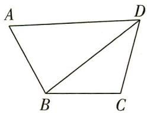

块麦田里玩. 几千几万的小孩子, 附近没有一个大人, 我是说——除了我."《麦田里的守望者》中的主人公霍尔顿将自己的精神生活寄托于那广阔的麦田. 假设霍尔顿在一块形状近似平面四边形 ABCD 的麦田里成为守望者, 麦田如图所示, 为了分割麦田, 他将 B, D 连接, 经测量知 $AB = BC = CD = \sqrt{6}$ , $AD = 3\sqrt{2}$ .

（1）霍尔顿发现无论 BD 多长, $\sqrt{3}\cos A-\cos C$ 都为一个定值,请你证明霍尔顿的结论,并求出这个定值.  
（2）霍尔顿发现小麦的生长和发育与分割土地面积的平方和呈正相关关系,记 $\triangle ABD$ 与 $\triangle CBD$ 的面积分别为 $S_{1}$ 和 $S_{2}$ ,为了更好地规划麦田,请你帮助霍尔顿求出 $S_{1}^{2}+S_{2}^{2}$ 的最大值.

# 题型 36 多三角形问题

# 题型攻略

# 多三角形问题的解题思路

（1） 把所提供的平面图形拆分成若干个三角形, 然后在各个三角形内利用正弦定理或余弦定理求解;  
（2） 寻找各个三角形之间的联系, 交叉使用公共条件, 求出结果.

# 综合 突破练

##### 1. [2020 全国卷I, ★★]如图, 在三棱锥 P-ABC 的平面展开图中, $AC = 1$ , $AB = AD = \sqrt{3}$ , $AB \perp AC$ , $AB \perp AD$ , $\angle CAE = 30^{\circ}$ , 则 $\cos \angle FCB =$ \_\_\_\_.

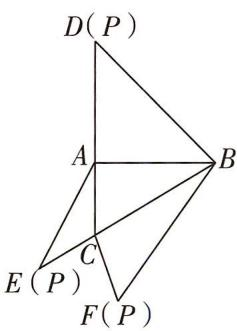

##### 2.[2021新高考卷Ⅰ,★★★]记△ABC的内角A,B,C的对边分别为a,b,c.已知 $b^{2}=ac$ ,点D在边AC上, $BD\sin\angle ABC=asinC$ .

（1） 证明: $BD = b$ .   
（2） 若 AD = 2DC, 求 $\cos \angle ABC$ .

# 创新 预测练

##### 3. [条件创新, ★★★] 如图, 在正方形 ABCD 中, E, F 分别是 BD, AB 上的点, 且满足 AF = 2FB = 4, $\angle AFE = 60^{\circ}$ .

（1） 求 $BE$ 的长;  
（2） 求 $\triangle CEF$ 的面积.

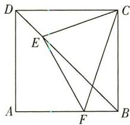

# 题型 37 三角形中的 “三线” 问题

# 题型攻略

# 有关三角形中的“三线”问题的解题技巧

三角形中的“三线”指的是三角形的高、中线、角平分线. 利用“三线”不同的性质特征, 我们可以解决某些有关三角形的面积与角度等问题. 具体解题技巧如下.

如图,在 $\triangle ABC$ 中,

##### 1. 若 AD 为边 BC 上的中线，则: （1） $\overrightarrow{AD} = \frac{1}{2} (\overrightarrow{AB} + \overrightarrow{AC})$ ，两边平方之后解题; （2） $S_{\triangle ABD} = S_{\triangle ACD}$ .

##### 2. 若 AD 为 $\angle BAC$ 的平分线，则: （1） $S_{\triangle ABC} = S_{\triangle ABD} + S_{\triangle ACD}$ ，利用三角形面积公式展开得到边的

关系；（2） $\cos\angle BAD=\cos\angle CAD$ ，利用余弦定理列方程；（3） $\frac{AB}{AC}=\frac{BD}{CD}$ .

##### 3. 若 AD 为边 BC 上的高线, 则: （1） 可得到 Rt△ADB 及 Rt△ADC, 利用勾股定理及三角函数解题; （2） $S_{\triangle ABC} = \frac{1}{2}AD \cdot BC$ .

注意 （1）利用相等角的余弦值相等，结合余弦定理列方程是解三角形中的常用方法；（2）在已知条件中见到面积时，也要考虑到三角形的高线.

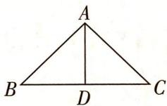

# 综合 突破练

##### 1. [★★★] 在 $\triangle ABC$ 中, 角 $A, B, C$ 所对的边分别是 $a, b, c$ , 若 $\triangle ABC$ 的面积为 $\frac{1}{2} a^2$ , 则 $\tan A$ 的最大值为 ( )

$\quad$A. $\frac{4}{3}$

$\quad$B. $\sqrt{3}$

$\quad$C. 2

$\quad$D. 3

##### 2. [2023 全国卷甲, ★★★] 在 $\triangle ABC$ 中, $\angle BAC = 60^{\circ}, AB = 2, BC = \sqrt{6}$ , $\angle BAC$ 的角平分线交 $BC$ 于 $D$ , 则 $AD =$ \_\_\_\_.

##### 3. [2023 西安市检测, ★★★] 已知 $\triangle ABC$ 的内角 A, B, C 对应的边分别是 a, b, c, 内角 A 的平分线交边 BC 于 D 点, 且 AD = 4. 若 $(2b + c) \cdot \cos \angle BAC + a \cos C = 0$ , 则 $\triangle ABC$ 面积的最小值是 \_\_\_\_.

##### 4. [2021 浙江, ★★★] 在 $\triangle ABC$ 中, $\angle B = 60^{\circ}$ , $AB = 2$ , $M$ 是 $BC$ 的中点, $AM = 2\sqrt{3}$ , 则 $AC = \_\_\_\_$ , $\cos \angle MAC = \_\_\_\_$ .

##### 5. [2023 广东省六校联考(一), ★★★★] 在 $\triangle ABC$ 中, 内角 $A, B, C$ 所对的边分别是 $a, b$ , $c$ , 已知 $c = 2b\cos B, C = \frac{2\pi}{3}$ .

（1） 求角 $B$ 的大小.

（2）在下列两个条件中选择一个作为已知,求BC边上的中线AM的长度.

①△ABC 的面积为 $\frac{3\sqrt{3}}{4}$ ;

② $\triangle ABC$ 的周长为 $4+2\sqrt{3}$ .

##### 6. [2023 沈阳市质监(一), ★★★★] 在 $\triangle ABC$ 中, 角 $A, B, C$ 的对边分别为 $a, b, c$ . 已知 $\sin A + \sqrt{3} \cos A = 0$ .

（1） 求角 A 的大小.

（2）给出以下三个条件，

$\begin{array}{l} ① a = 4 \sqrt {3}, b = 4; ② b ^ {2} - a ^ {2} + c ^ {2} + 1 0 b = 0; \\ ③ S _ {\triangle A B C} = 1 5 \sqrt {3}. \\ \end{array}$

若这三个条件中仅有两个正确,请选出正确的条件并回答下面问题:

(i) 求 $\sin B$ 的值;

(ii) $\angle BAC$ 的平分线交BC于点D,求AD的长.

# 创新 预测练

##### 7.[结论开放型,2023江苏省南通市调研,★★★★]已知函数 $f(x)=2\sin\omega x(\cos\omega x-\sqrt{3}\sin\omega x)+\sqrt{3}(\omega>0)$ .

（1） 若 $f(x)$ 在 $[0, \frac{\pi}{24}]$ 上单调递增, 求正数 $\omega$ 的取值范围.  
（2） 在 $\triangle ABC$ 中, 内角 $A, B, C$ 的对边分别为 $a$ , $b, c$ . 若 $a = 2, \omega = 2, f(\frac{A}{4}) = \sqrt{3}, D, E, H$ 为 $BC$ 边上的点. 从以下给出的 3 个条件中选择其中 1 个作为补充条件, 并判断是否存在满足条件的三角形. 若存在, 求出 $\triangle ABC$ 的周长; 若不存在, 请说明理由.

① $BC$ 边上的中线 $AD = \frac{\sqrt{3}}{2}$ ; ②角 $A$ 的平分线 $AE = \frac{\sqrt{3}}{2}$ ; ③ $BC$ 边上的垂线 $AH = \frac{\sqrt{3}}{2}$ .

# 题型 38 平面向量中的最值（范围）问题

# 题型攻略

# 平面向量中有关最值(范围)问题的求解思路

（1）“形化”,即利用平面向量的几何意义先将问题转化为平面几何中的最值或取值范围问题,然后根据平面图形的特征直接进行判断;  
（2）“数化”,即利用平面向量的坐标运算,先把问题转化为代数中的函数最值、不等式的解集、方程有解等问题,然后利用函数、不等式、方程的有关知识来解决.

说明 有关模的最值(范围)还可利用绝对值三角不等式 $||a| - |b|| \leqslant |a \pm b| \leqslant |a| + |b|$ 求解.

# 综合 突破练

##### 1. [2023 合肥市质检, ★★★] 已知线段 PQ 的中点为等边三角形 ABC 的顶点 A, 且 AB = PQ = 2, 当 PQ 绕点 A 转动时, $\overrightarrow{BP} \cdot \overrightarrow{CQ}$ 的取值范围是 ( )

$\quad$A. $[-3, 3]$

$\quad$B. $[-2, 2]$

$\quad$C. $[-3, 1]$

$\quad$D. $[-1, 3]$

##### 2. [★★★] 在 $\triangle ABC$ 中, $M$ 是边 $BC$ 的中点, $N$ 是线段 $BM$ 的中点. 若 $\angle BAC = \frac{\pi}{6}$ , $\triangle ABC$ 的面积为 $\sqrt{3}$ , 则 $\overrightarrow{AM} \cdot \overrightarrow{AN}$ 取最小值时, $BC = (\quad)$

$\quad$A. 2

$\quad$B. 4

$\quad$C. $8 \sqrt{3} - 12$

$\quad$D. $\frac{16\sqrt{3}}{3} - 4$

##### 3. [2023 山西省模拟, ★★★] 已知平面向量 a, b 是单位向量, 且 $\left|a - b\right| = 1$ , 向量 c 满足 $\left|c - a - b\right| = \frac{\sqrt{3}}{2}$ , 则 $\left|c\right|$ 的最大值为 ( )

$\quad$A. $\frac{3 \sqrt{3}}{2}$

$\quad$B. $2\sqrt{3}$

$\quad$C. $\sqrt{3} + 1$

$\quad$D. $2\sqrt{3}+1$

##### 4. [2022 北京, ★★★] 在 $\triangle ABC$ 中, AC = 3, BC = 4, $\angle C = 90^{\circ}$ . P 为 $\triangle ABC$ 所在平面内的动点, 且 PC = 1, 则 $\overrightarrow{PA} \cdot \overrightarrow{PB}$ 的取值范围是()

$\quad$A. $[-5,3]$

$\quad$B. $[-3, 5]$

$\quad$C. $[-6, 4]$

$\quad$D. $[-4, 6]$

##### 5.[浙江,★★★★]已知a,b,e是平面向量,e是单位向量.若非零向量a与e的夹角为 $\frac{\pi}{3}$ ,

向量 b 满足 $b^{2}-4e\cdot b+3=0$ ，则 $|a-b|$ 的最小值是（）

$\quad$A. $\sqrt{3} - 1$

$\quad$B. $\sqrt{3} + 1$

$\quad$C. 2

$\quad$D. $2 - \sqrt{3}$

##### 6. [2023 福建省适应性测试, ★★

★★]如图,2022年卡塔尔世界杯的会徽像阿拉伯数字中的“8”.在平面直角坐标系中,圆 $M:x^{2}+(y+m)^{2}=n^{2}$ 和圆 $N:x^{2}+(y-$

1) $^{2}=1$ 外切也形成一个8字形状,若 $P(0,-2)$ , $A(1,-1)$ 为圆M上两点,B为两圆圆周上任一点(不同于点A,P),则 $\overrightarrow{PA}\cdot\overrightarrow{PB}$ 的最大值为()

$\quad$A. $\frac{3\sqrt{2} + 2}{2}$

$\quad$B. $2 \sqrt{2} + 1$

$\quad$C. $3 + \sqrt{2}$

$\quad$D. $3 \sqrt{2} + 2$

##### 7.[2023 清华大学附属中学模拟, ★★★★]已知平面向量 a, b, c 满足 $a \perp b$ , 且 $|a| = |b| = 2$ , $|a + b + c| = 1$ , 则 $|b + c| + 2 |a + c|$ 的最小值为 ( )

$\quad$A. $\frac{\sqrt{15}}{2}$

$\quad$B. $\sqrt{15}$

$\quad$C. $\frac{\sqrt{17}}{2}$

$\quad$D. $\sqrt{17}$

# 创新 预测练

##### 8. [平面向量与函数综合, ★★★★] 在平行四边形 $ABCD$ 中, $\overrightarrow{BE} = \frac{1}{3}\overrightarrow{EA}, \overrightarrow{CF} = \frac{1}{2}\overrightarrow{FB}$ , 点 $M$ 在线段 BD 上(含端点), 若 $\overrightarrow{CM} = \lambda \overrightarrow{CE} + \mu \overrightarrow{AF} (\lambda, \mu \in \mathbb{R})$ , 则 $\frac{9}{10}\lambda^{2} - 4\mu^{2}$ 的最大值为 ( )

$\quad$A. $\frac{24}{25}$

$\quad$B. $\frac{117}{125}$

$\quad$C. $\frac{118}{125}$

$\quad$D. $\frac{119}{125}$

# 题型 39 坐标法在求解向量问题中的应用

▶ 答案：149 页

# 题型攻略

# 利用坐标法求解平面向量相关问题的技巧

根据题意建立合适的平面直角坐标系,利用向量加、减、数乘运算的法则等求解相关向量的坐标,实现向量的坐标化,将几何问题中的长度、垂直、平行等问题转化为代数运算.

# 综合 突破练

##### 1. [2023 甘肃省二诊, ★★★★]

如图所示,边长为2的正三角形 ABC 中, 若 $\overrightarrow{BD} = \overrightarrow{BA} + \lambda \overrightarrow{AC}$ $(\lambda\in[0,1])$ , $\overrightarrow{AE}=\overrightarrow{AC}+\lambda\overrightarrow{CB}(\lambda\in[0,1])$ , 则关于 $\overrightarrow{DE}\cdot\overrightarrow{AB}$ 的说法正确的是 ()

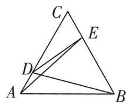

$\quad$A. 当 $\lambda = \frac{1}{2}$ 时, $\overrightarrow{DE} \cdot \overrightarrow{AB}$ 取到最大值  
$\quad$B. 当 $\lambda = 0$ 或 1 时, $\overrightarrow{DE} \cdot \overrightarrow{AB}$ 取到最小值  
$\quad$C. $\exists \lambda \in [0,1],\overrightarrow{DE}\cdot \overrightarrow{AB} = 0$   
$\quad$D. $\forall \lambda \in [0,1],\overrightarrow{DE}\cdot \overrightarrow{AB}$ 为定值

##### 2.[2023河北省联测,★★★]已知AB为单位圆的直径,C,D为圆上两点,且弦CD的长度为 $\sqrt{3}$ ,则 $\overrightarrow{AC}\cdot\overrightarrow{BD}$ 的取值范围是\_\_\_\_.

##### 3. [★★★] 如图, 在同一个平面内, 向量 $\overrightarrow{OA}, \overrightarrow{OB}$ , $\overrightarrow{OC}$ 的模分别为 1, 1, $2\sqrt{3}$ , $\overrightarrow{OA}$ 与 $\overrightarrow{OC}$ 的夹角为 $30^{\circ}$ , $\overrightarrow{OA}$ 与 $\overrightarrow{OB}$ 的夹角为 $120^{\circ}$ . 若 $\overrightarrow{OC} = m \overrightarrow{OA} + n \overrightarrow{OB} (m, n \in \mathbb{R})$ , 则 m - n = \_\_\_\_.

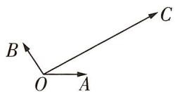

##### 4. [★★★★]设向量 $a, b, c$ 满足 $|a| = |b| = 1, a \cdot b = -\frac{1}{2}$ , 且 $\langle a - c, b - c \rangle = 60^\circ$ , 则 $|a - b + c|$ 的最大值为 \_\_\_\_.

##### 5. [2023 天津市模拟, ★★★★] 如图所示, 直角梯形 ABCD 中, $AB \parallel CD$ , $AB \perp AD$ , AB = 2CD = 2AD = 2, 在等腰直角三角形 CDE 中, $\angle DCE = 90^{\circ}$ , 则向量 $\overrightarrow{AE}$ 在向量 $\overrightarrow{CB}$ 上的投影向量的模为 \_\_\_\_ ; 若 M, N 分别为线段 BC, CE 上的动点 (包含端点), 且 $\overrightarrow{AM} \cdot \overrightarrow{AN} = \frac{5}{2}$ , 则 $\overrightarrow{MD} \cdot \overrightarrow{DN}$ 的最小值为 \_\_\_\_.

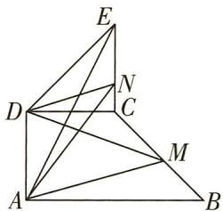

# 创新 预测练

##### 6.[多选,2023 湖北省黄冈市模拟,★★★]如图,在平面四边形ABCD中, $\overrightarrow{AB} \cdot \overrightarrow{BC} = 0$ , $\overrightarrow{AD} \cdot \overrightarrow{DC} = 0$ , $|\overrightarrow{AB}| = |\overrightarrow{AD}| = 1$ , $\overrightarrow{AD} \cdot \overrightarrow{BA} = \frac{1}{2}$ , 若点E为线段CD上的动点,则 $\overrightarrow{AE} \cdot \overrightarrow{BE}$ 的值可能为()

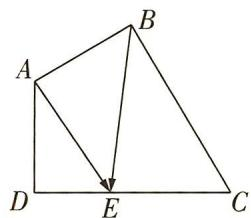

$\quad$A. 1

$\quad$B. $\frac{21}{16}$

$\quad$C. 2

$\quad$D. $\frac{7}{2}$

# 题型40 向量极化恒等式的应用

# 题型攻略

极化恒等式: a, b 是两个平面向量, 则 $a \cdot b = \frac{1}{4} \left[ (a + b)^{2} - (a - b)^{2} \right]$ .

几何意义: 向量 a, b 的数量积等于以这组向量所对应的线段为邻边的平行四边形的“和对角线长”与“差对角线长”的平方差的 $\frac{1}{4}$ .

<table><tr><td>平行四边形形式</td><td>平行四边形ABCD中, $\overrightarrow{AB} \cdot \overrightarrow{AD} = \frac{1}{4} (|\overrightarrow{AC}|^{2} - |\overrightarrow{BD}|^{2})$ ,即向量a,b的数量积可以表示为以向量a,b所对应的线段为邻边的平行四边形的两条对角线(和向量与差向量分别对应的对角线)的长的平方差的 $\frac{1}{4}$ .</td></tr><tr><td>三角形形式</td><td>三角形ABC中, $\overrightarrow{AB} \cdot \overrightarrow{AC} = |\overrightarrow{AO}|^{2} - |\overrightarrow{BO}|^{2} = |\overrightarrow{AO}|^{2} - \frac{1}{4} |\overrightarrow{BC}|^{2}$ (O为BC的中点).</td></tr></table>

推论:在平行四边形ABCD中,有 $AB^{2}+BC^{2}+CD^{2}+DA^{2}=AC^{2}+BD^{2}$ ,即平行四边形四边的平方和等于对角线的平方和.

# 综合 突破练

##### 1. [2023 江苏省南京市、盐城市部分学校第一次联考, ★★★★] 如图, 在

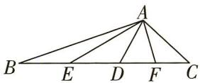

$\triangle ABC$ 中, 点 $D$ 在边 $BC$ 上, 且 $BD = 2CD$ , $\overrightarrow{AB} \cdot \overrightarrow{AD} = 4\overrightarrow{AC} \cdot \overrightarrow{AD}$ , 记 $BD, CD$ 中点分别为 $E, F$ , 且 $AE = EF$ , 则 $\cos \angle EAF =$ ( )

$\quad$A. $\frac{1}{4}$

$\quad$B. $\frac{\sqrt{15}}{8}$

$\quad$C. $\frac{\sqrt{15}}{4}$

$\quad$D. $\frac{7}{8}$

##### 2. [★★★★] 已知 $\triangle ABC, P_{0}$ 是边 AB 上一定点, 满足 $P_{0}B = \frac{1}{4}AB$ , 且对于边 AB 上任一点 P, 恒有 $\overrightarrow{PB} \cdot \overrightarrow{PC} \geqslant \overrightarrow{P_{0}B} \cdot \overrightarrow{P_{0}C}$ , 则 ( )

$\quad$A. $\angle ACB = 90^{\circ}$

$\quad$B. $\angle BAC = 90^{\circ}$

$\quad$C. ${AB} = {AC}$

$\quad$D. ${AC} = {BC}$

##### 3. [2020 天津, ★]

★★]如图,在四边形ABCD中, $\angle B=60^{\circ}$ ,AB=3,BC=6,

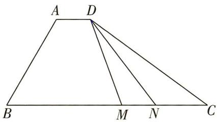

且 $\overrightarrow{AD} = \lambda \overrightarrow{BC},\overrightarrow{AD}\cdot \overrightarrow{AB} = -\frac{3}{2}$ ，则实数 $\lambda$ 的值为\_\_\_\_，若 $M,N$ 是线段 $BC$ 上的动点，且 $|\overrightarrow{MN}| = 1$ ，则 $\overrightarrow{DM}\cdot \overrightarrow{DN}$ 的最小值为\_\_\_\_.

##### 4. [2021 天津, ★★★★] 在边长为 1 的等边三角形 $ABC$ 中, $D$ 为线段 $BC$ 上的动点, $DE \perp AB$ 且交 $AB$ 于点 $E$ , $DF \parallel AB$ 且交 $AC$ 于点 $F$ , 则 $|2\overrightarrow{BE} + \overrightarrow{DF}|$ 的值为 \_\_\_\_; $(\overrightarrow{DE} + \overrightarrow{DF}) \cdot \overrightarrow{DA}$ 的最小值为 \_\_\_\_.

##### 5. [2023 河南省模拟, ★★★★] 已知圆 O 的半径为 2, A, B 是圆上两点, 且 $\angle AOB = 60^{\circ}$ , CD 是圆 O 的一条直径, 若动点 P 满足 $\overrightarrow{OP} = \lambda \overrightarrow{OA} + \mu \overrightarrow{OB} (\lambda, \mu \in \mathbb{R})$ , 且 $\lambda - \mu = 1$ . 则 $\overrightarrow{PC} \cdot \overrightarrow{PD}$ 的最小值为 \_\_\_\_.

##### 6. [2023 南京市模拟, ★★★★] 在 $\triangle ABC$ 中, $AB = 2$ , $AC = 3$ , $\overrightarrow{AB} = 2$ , $\overrightarrow{DB}$ , $\overrightarrow{EC} = 2$ , $\overrightarrow{AE}$ , $\overrightarrow{BE} \cdot \overrightarrow{BC} = 3$ , 则 $|\overrightarrow{DE}| =$ \_\_\_\_ ; 若 $M$ 是线段 $BC$ 上的一个动点 (包含端点), 则 $\overrightarrow{DM} \cdot \overrightarrow{EM}$ 的最小值为 \_\_\_\_.

# 创新 预测练

##### 7.[条件创新,★★★]如图,在等腰直角△ABC中,斜边AC=2,M为线段AB上的动点(包含端点),D为AC的中点.将

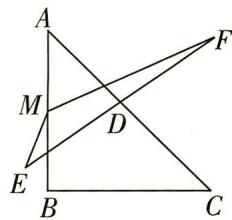

线段 AC 绕着点 D 旋转得到线段 EF, 则 $\overrightarrow{ME} \cdot \overrightarrow{MF}$ 的最小值为 ( )

$\quad$A. -2

$\quad$B. $-\frac{3}{2}$

$\quad$C. -1

$\quad$D. $-\frac{1}{2}$

# 题型 41 等和线定理的应用

# 题型攻略

如图,对于平面内一组基底 $\overrightarrow{OA},\overrightarrow{OB}$ 及任意向量 $\overrightarrow{OP},\overrightarrow{OP}=\lambda\overrightarrow{OA}+\mu\overrightarrow{OB}(\lambda,\mu\in\mathbb{R})$ ,若点P在直线AB上或在平行于AB的直线 $A'B'$ 上,则 $\lambda+\mu=k$ (定值),反之也成立.我们称直线AB以及与直线AB平行的直线 $A'B'$ 为等和线.等

和线有如下6个性质：

（1） 当等和线 $A'B'$ 恰为直线 $AB$ 时, $k=1$ .

（2） 当等和线 $A'B'$ 在点 $O$ 和直线 $AB$ 之间时, $k \in (0,1)$ .

（3） 当直线 $AB$ 在点 $O$ 和等和线 $A'B'$ 之间时, $k \in (1, +\infty)$ .

（4） 当等和线 $A'B'$ 过点 O 时, k=0.

（5） 若两等和线关于点 O 对称, 则它们对应的定值 k 互为相反数.

（6） 定值 k 与点 O 到等和线的距离有关, $\left|k\right|=\frac{OA'}{OA}=\frac{OB'}{OB}$ .

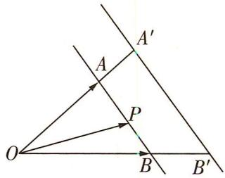

# 综合 突破练

##### 1. [全国卷Ⅲ, ★★★] 在矩形 ABCD 中, AB = 1, AD = 2, 动点 P 在以点 C 为圆心且与 BD 相切的圆上. 若 $\overrightarrow{AP} = \lambda \overrightarrow{AB} + \mu \overrightarrow{AD}$ , 则 $\lambda + \mu$ 的最大值为 ( )

$\quad$A. 3

$\quad$B. $2\sqrt{2}$

$\quad$C. $\sqrt{5}$

$\quad$D. 2

##### 2. [★★★★] 在平面直角坐标系 $xOy$ 中, 若 $A(1,0), B(3,4), \overrightarrow{OC} = x\overrightarrow{OA} + y\overrightarrow{OB}, x + y = 6$ , 则 $|\overrightarrow{AC}|$ 的最小值为 ( )

$\quad$A. 1

$\quad$B. 2

$\quad$C. $\sqrt{5}$

$\quad$D. $2\sqrt{5}$

##### 3. [★★★★] 在 $\triangle ABC$ 中, 内角 A, B, C 的对边分别为 a, b, c, a = b = 2, c = 3, 点 O 为 $\triangle ABC$ 的

外心, 若 $\overrightarrow{AO} = \lambda \overrightarrow{AB} + \mu \overrightarrow{AC}$ ，则 $\lambda + \mu =$ \_\_\_\_.

##### 4. [★★★★] 在扇形 AOB 中, C 为弧 AB 上的一个动点, $\angle AOB = 60^{\circ}$ . 若 $\overrightarrow{OC} = x \overrightarrow{OA} + y \overrightarrow{OB}$ , 则 $x + 3y$ 的取值范围是 \_\_\_\_.

# 创新 预测练

##### 5. [解题创新, ★★★★] 如图, 四边形ABCD是边长为

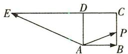

1 的正方形, 延长 CD 至 E, 使得 DE = 2CD. 动点 P 从点 A 出发, 沿正方形 ABCD 的边按逆时针方向运动一周回到 A 点, 若 $\overrightarrow{AP} = \lambda \overrightarrow{AB} + \mu \overrightarrow{AE}$ , 则 $\lambda - \mu$ 的取值范围为 \_\_\_\_.

# 题型 42 奔驰定理的应用

# 题型攻略

奔驰定理: P 为 $\triangle ABC$ 内一点, 则 $S_{A} \cdot \overrightarrow{PA} + S_{B} \cdot \overrightarrow{PB} + S_{C} \cdot \overrightarrow{PC} = 0$ , 其中 $S_{A}, S_{B}, S_{C}$ 分别是 $\triangle BPC, \triangle CPA, \triangle APB$ 的

面积. 给出证明如下:

延长 AP 交边 BC 于点 Q, 如图所示.

用 S 表示 $\triangle ABC$ 的面积, 则 $S = S_{A} + S_{B} + S_{C}$ ,

用 $h_{1}$ 表示 $\triangle BPC$ 的边 BC 上的高, 用 h 表示 $\triangle ABC$ 的边 BC 上的高,

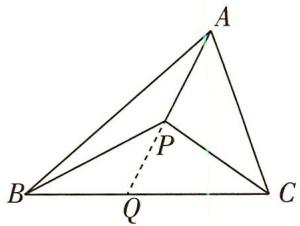

则 $\frac{PQ}{AQ} = \frac{h_1}{h} = \frac{\frac{1}{2}BC\cdot h_1}{\frac{1}{2}BC\cdot h} = \frac{S_A}{S},\frac{AP}{AQ} = \frac{AQ - PQ}{AQ} = 1 - \frac{PQ}{AQ} = 1 - \frac{S_A}{S} = \frac{S_B + S_C}{S}$ 所以 $\overrightarrow{AP} = \frac{S_B + S_C}{S}\cdot \overrightarrow{AQ}.$

用 $h_{2}$ 表示 $\triangle CPA$ 的边 AP 上的高, 用 $h_{3}$ 表示 $\triangle APB$ 的边 AP 上的高,

则 $\frac{CQ}{BQ} = \frac{h_2}{h_3} = \frac{S_B}{S_C}$ 所以 $\overrightarrow{AQ} = \frac{S_B}{S_B + S_C} \cdot \overrightarrow{AB} + \frac{S_C}{S_B + S_C} \cdot \overrightarrow{AC}$ , 则 $\overrightarrow{AP} = \frac{S_B}{S} \cdot \overrightarrow{AB} + \frac{S_C}{S} \cdot \overrightarrow{AC}$ ,

即 $S \cdot \overrightarrow{AP} = S_B \cdot (\overrightarrow{PB} - \overrightarrow{PA}) + S_C \cdot (\overrightarrow{PC} - \overrightarrow{PA})$ ，所以 $S_A \cdot \overrightarrow{PA} + S_B \cdot \overrightarrow{PB} + S_C \cdot \overrightarrow{PC} = 0$ .

# 综合 突破练

##### 1. [2023 安徽省模拟，

★★★]平面上有 $\triangle ABC$ 及其内一点

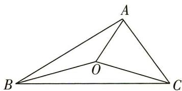

O, 构成如图所示的图形, 若将 $\triangle OAB, \triangle OBC, \triangle OCA$ 的面积分别记为 $S_{c}, S_{a}, S_{b}$ , 则有 $S_{a} \overrightarrow{OA} + S_{b} \overrightarrow{OB} + S_{c} \overrightarrow{OC} = 0$ . 我们常把上述结论称为“奔驰定理”. 已知 $\triangle ABC$ 的内角 A, B, C 的对边分别为 a, b, c, 若 $a \overrightarrow{OA} + b \overrightarrow{OB} + c \overrightarrow{OC} = 0$ , 则 O 为 $\triangle ABC$ 的 ( )

$\quad$A. 外心

$\quad$B. 内心

$\quad$C. 重心

$\quad$D. 垂心

##### 2.[2023 湖南省长沙一中、雅礼中学第一次联考,★★★]已知 O 为正三角形 ABC 内一点,且满足 $\overrightarrow{OA} + \lambda \overrightarrow{OB} + (1 + \lambda) \overrightarrow{OC} = 0$ , 若 $\triangle OAB$ 的面积与 $\triangle OAC$ 的面积的比值为 3, 则 $\lambda =$ ()

$\quad$A. $\frac{1}{2}$

$\quad$B. $\frac{1}{4}$

$\quad$C. $\frac{3}{4}$

$\quad$D. $\frac{3}{2}$

##### 3. [多选, ★★★★] 已知点 O 是 $\triangle ABC$ 内一点, 且 $3 \overrightarrow{OA} + 2 \overrightarrow{OB} + 4 \overrightarrow{OC} = 0$ , 则下列选项正确的是 ()

$\quad$A. $\overrightarrow{AO} = \frac{1}{3}\overrightarrow{AB} +\frac{2}{9}\overrightarrow{AC}$

$\quad$B. 直线 $AO$ 不过 $BC$ 的中点

$\quad$C. $S_{\triangle AOB}: S_{\triangle AOC} = 2: 1$

$\quad$D. 若 $\left|\overrightarrow{OA}\right|=\left|\overrightarrow{OB}\right|=\left|\overrightarrow{OC}\right|=1$ , 则 $\overrightarrow{OC} \cdot \overrightarrow{AB} = \frac{3}{16}$

##### 4. [★★★] 已知点 $G$ 是 $\triangle ABC$ 内一点, 如图, 若 $S_{\triangle AGB} = 7$ , $S_{\triangle BGC} = 5$ , $S_{\triangle AGC} = 6$ , 且 $\overrightarrow{AG} = x \overrightarrow{AB} + y \overrightarrow{AC}$ ( $x, y$ 为实数), 则 $x + y$

##### 5. [★★★★]在等腰直角三角形 $ABC$ 中, $\angle ACB = \frac{\pi}{2}$ , 点 $P$ 在三角形内, 满足 $\overrightarrow{PA} + \sqrt{2}\overrightarrow{PB} + (2\sqrt{2} + 2)\overrightarrow{PC} = 0$ , 则 $\angle APB =$ \_\_\_\_.

# 创新 预测练

##### 6.[解题创新,2023江西省赣州市名校联考,★

★★★]奔驰定理:点 O 是
△ABC 内的一点, △BOC,

$\triangle AOC, \triangle AOB$ 的面积分别记为 $S_{1}, S_{2}, S_{3}$ , 则 $S_{1} \cdot \overrightarrow{OA} + S_{2} \cdot \overrightarrow{OB} + S_{3} \cdot \overrightarrow{OC} = 0$ . 奔驰定理是平面向量中一个非常优美的结论, 因为这个定

理对应的图形与某品牌轿车的标志很相似,故形象地称其为奔驰定理.如图,O是△ABC的垂心,且 $\overrightarrow{OA}+2\overrightarrow{OB}+3\overrightarrow{OC}=0$ ,则 $\cos\angle ACB=$ ( )

$\quad$A. $\frac{3\sqrt{10}}{10}$

$\quad$B. $\frac{\sqrt{10}}{10}$

$\quad$C. $\frac{2\sqrt{5}}{5}$

$\quad$D. $\frac{\sqrt{5}}{5}$

# 题型 43 与三角形 “四心” 有关的问题

# 题型攻略

# 与三角形“四心”有关问题的解题技巧

在 $\triangle ABC$ 中, 内角 $A, B, C$ 所对的边分别为 $a, b, c$ .

<table><tr><td>三角形的重心(其三条中线的交点)</td><td>若O是△ABC的重心,则有（1） $\overrightarrow{OA}+\overrightarrow{OB}+\overrightarrow{OC}=0$ ;（2）重心到顶点的距离和到对边中点的距离之比为2:1;（3） $\overrightarrow{AO}=\frac{1}{3}\overrightarrow{AB}+\frac{1}{3}\overrightarrow{AC}$ ;（4）存在正实数λ使得 $\overrightarrow{AO}=\lambda\left(\frac{\overrightarrow{AB}}{|\overrightarrow{AB}|\sin B}+\frac{\overrightarrow{AC}}{|\overrightarrow{AC}|\sin C}\right)$ .</td></tr><tr><td>三角形的垂心(其三条高的交点)</td><td>若O是△ABC的垂心,则有（1） $\overrightarrow{OA}\cdot\overrightarrow{OB}=\overrightarrow{OB}\cdot\overrightarrow{OC}=\overrightarrow{OC}\cdot\overrightarrow{OA}$ ;（2） $\tan A\overrightarrow{OA}+\tan B\overrightarrow{OB}+\tan C\overrightarrow{OC}=0$ ;（3）存在正实数λ使得 $\overrightarrow{AO}=\lambda\left(\frac{\overrightarrow{AB}}{|\overrightarrow{AB}|\cos B}+\frac{\overrightarrow{AC}}{|\overrightarrow{AC}|\cos C}\right)$ .</td></tr><tr><td>三角形的内心(其三条内角平分线的交点)</td><td>若O是△ABC的内心,则有（1） $a\overrightarrow{OA}+b\overrightarrow{OB}+c\overrightarrow{OC}=0$ ;（2）存在正实数λ使得 $\overrightarrow{AO}=\lambda\left(\frac{\overrightarrow{AB}}{|\overrightarrow{AB}|}+\frac{\overrightarrow{AC}}{|\overrightarrow{AC}|}\right)$ .</td></tr><tr><td>三角形的外心(其三条边的垂直平分线的交点)</td><td>若O是△ABC的外心,则有（1） $|\overrightarrow{OA}|=|\overrightarrow{OB}|=|\overrightarrow{OC}|$ ;（2） $\sin 2A\overrightarrow{OA}+\sin 2B\overrightarrow{OB}+\sin 2C\overrightarrow{OC}=0$ ;（3） $(\overrightarrow{OA}+\overrightarrow{OB})\cdot\overrightarrow{AB}=(\overrightarrow{OA}+\overrightarrow{OC})\cdot\overrightarrow{AC}=(\overrightarrow{OB}+\overrightarrow{OC})\cdot\overrightarrow{BC}=0$ .</td></tr></table>

# 综合 突破练

##### 1. [★★★] 设 $\triangle ABC$ 的内角 $A, B, C$ 的对边分别为 $a, b, c, P$ 是 $\triangle ABC$ 所在平面上的一点, $\overrightarrow{PA} \cdot \overrightarrow{PB} = \frac{c}{b} \overrightarrow{PA} \cdot \overrightarrow{PC} + \frac{b - c}{b} \overrightarrow{PA^2} = \frac{c}{a} \overrightarrow{PB} \cdot \overrightarrow{PC} + \frac{a - c}{a} \cdot \overrightarrow{PB^2}$ , 则点 $P$ 是 $\triangle ABC$ 的 ( )

$\quad$A. 重心

$\quad$B. 外心

$\quad$C. 内心

$\quad$D. 垂心

##### 2. [多选, ★★★★] 已知点 $P$ 在 $\triangle ABC$ 所在的平面内, 则下列命题正确的是 ( )

$\quad$A. 若 P 为 $\triangle ABC$ 的垂心, $\overrightarrow{AB} \cdot \overrightarrow{AC} = 2$ , 则 $\overrightarrow{AP} \cdot \overrightarrow{AB} = 2$

$\quad$B. 若 $\triangle ABC$ 为边长为 2 的正三角形, 则 $\overrightarrow{PA} \cdot (\overrightarrow{PB} + \overrightarrow{PC})$ 的最小值为 -1

$\quad$C. 若 $\triangle ABC$ 为锐角三角形, $P$ 为其外心, $\overrightarrow{AP} = x\overrightarrow{AB} + y\overrightarrow{AC}$ 且 $x + 2y = 1$ , 则 $AB = BC$

$\quad$D. 若 $m \overrightarrow{AP} = \left(\frac{1}{|\overrightarrow{AB}| \cos B} + \frac{m}{2}\right) \overrightarrow{AB} + \left(\frac{1}{|\overrightarrow{AC}| \cos C} + \frac{m}{2}\right) \overrightarrow{AC} (m \neq 0)$ , 则点 $P$ 的轨迹过 $\triangle ABC$ 的外心

##### 3. [多选, ★★★★] 在 $\triangle ABC$ 中, 下列说法中正确的是 ( )

$\quad$A. O 是 $\triangle ABC$ 所在平面内一定点, 动点 P 满足 $\overrightarrow{OP} = \overrightarrow{OA} + \lambda (\overrightarrow{AB} + \overrightarrow{AC}), \lambda \in [0, +\infty)$ , 则动点 P 的轨迹一定过 $\triangle ABC$ 的重心

$\quad$B. O 是 $\triangle ABC$ 所在平面内一定点, 动点 P 满足 $\overrightarrow{OP} = \overrightarrow{OA} + \lambda \left( \frac{\overrightarrow{AB}}{|\overrightarrow{AB}|} + \frac{\overrightarrow{AC}}{|\overrightarrow{AC}|} \right), \lambda \in [0, +\infty)$ ,

则动点 P 的轨迹一定过 $\triangle ABC$ 的内心

$\quad$C. O 是 $\triangle ABC$ 所在平面内一定点, 且 $\overrightarrow{OA} + \overrightarrow{OB} + \overrightarrow{OC} = 0$ , 则 $\frac{S_{\triangle AOC}}{S_{\triangle ABC}} = \frac{2}{3}$

$\quad$D. 若 $\left(\frac{\overrightarrow{AB}}{|\overrightarrow{AB}|} + \frac{\overrightarrow{AC}}{|\overrightarrow{AC}|}\right) \cdot \overrightarrow{BC} = 0$ ，且 $\frac{\overrightarrow{AB}}{|\overrightarrow{AB}|} \cdot \frac{\overrightarrow{AC}}{|\overrightarrow{AC}|} = \frac{1}{2}$ ，则 $\triangle ABC$ 是等边三角形

##### 4.[多选,2023浙江省名校联考,★★★★]下列说法中,正确的是()

$\quad$A. 若 $a \cdot b > 0$ , 则 $a$ 与 $b$ 的夹角为锐角  
$\quad$B. 若 O 是 $\triangle ABC$ 的内心, 且满足 $2\overrightarrow{OA} + 3\overrightarrow{OB} + 4\overrightarrow{OC} = 0$ , 则这个三角形一定是锐角三角形  
$\quad$C. 在 $\triangle ABC$ 中, 若 $\overrightarrow{NA} + \overrightarrow{NB} + \overrightarrow{NC} = 0$ , 则 $N$ 为 $\triangle ABC$ 的重心  
$\quad$D. 在 $\triangle ABC$ 中, 若 $\overrightarrow{PA} \cdot \overrightarrow{PB} = \overrightarrow{PB} \cdot \overrightarrow{PC} = \overrightarrow{PA} \cdot \overrightarrow{PC}$ , 则 $P$ 为 $\triangle ABC$ 的垂心

##### 5. [★★★] 在平面直角坐标系中, $\triangle ABC$ 满足 $A(-1,0), B(1,0), \overrightarrow{GA} + \overrightarrow{GB} + \overrightarrow{GC} = 0, \overrightarrow{GP} = \overrightarrow{GA} + \lambda (\frac{\overrightarrow{AB}}{|\overrightarrow{AB}|} + \frac{\overrightarrow{AC}}{|\overrightarrow{AC}|})$ ( $\lambda$ 为常数), $\angle ACB$ 的平分线与点 $P$ 的轨迹相交于点 $I$ , 存在非零实数 $\mu$ , 使得 $\overrightarrow{GI} = \mu \overrightarrow{AB}$ , 则顶点 $C$ 的轨迹方程为 \_\_\_\_.

# 创新 预测练

##### 6.[结构不良,2023四川省内江市模拟,★★★ ★]△ABC的内角A,B,C所对的边分别为a,b,c,a=6,bsin $\frac{B+C}{2}=a\sin B.$

（1） 求角 $A$ .   
（2） M 为 $\triangle ABC$ 内一点, 线段 AM 的延长线交 BC 于点 D, \_\_\_\_, 求 $\triangle ABC$ 的面积.  
在下面三个条件中选择一个作为已知条件补充在横线上,使 $\triangle ABC$ 存在,并解决问题.

①M 为 $\triangle ABC$ 的外心, AM = 4; ②M 为 $\triangle ABC$ 的重心, $AM = 2\sqrt{3}$ ; ③M 为 $\triangle ABC$ 的内心, $AD = 3\sqrt{3}$ .

# 题型 44 平面向量与其他知识的综合

▶ 答案：154 页

# 题型攻略

平面向量作为一个运算工具,经常与不等式、三角函数、数列、解析几何等知识结合,当平面向量给出的形式中含有未知数时,由向量平行或垂直的充要条件可以得到关于该未知数的关系式.在此基础上,可以求解有关三角函数、不等式、数列、解析几何等的综合问题.

# 综合 突破练

##### 1. [2023 广东省三校联考, ★★★] 已知 $\triangle ABC$ 的三个顶点都在抛物线 $y^{2}=4x$ 上, F 为抛物线的焦点, 若 $\overrightarrow{AF}=\frac{1}{3}\left(\overrightarrow{AB}+\overrightarrow{AC}\right)$ , 则 $\left|\overrightarrow{AF}\right|+\left|\overrightarrow{BF}\right|+\left|\overrightarrow{CF}\right|=$ ()

$\quad$A. 3

$\quad$B. 6

$\quad$C. 9

$\quad$D. 12

##### 2. [2023 河北省石家庄一中等校联考, ★★★]
已知点列 $\{P_{n}\}$ 中的所有点都在 $\triangle ABC$ 内部, $\triangle ABP_{n}$ 的面积与 $\triangle ACP_{n}$ 的面积比值为 $\frac{1}{3}$ . 在

数列 $\{a_{n}\}$ 中， $a_{1} = 1$ ，若 $\forall n \in \mathbf{N}^{*}$ 且 $n \geqslant 2, \overrightarrow{AP_{n}} = 3a_{n} \overrightarrow{AB} + (4a_{n-1} + 3) \overrightarrow{AC}$ 恒成立，那么 $a_{4} =$ （）

$\quad$A. 15

$\quad$B. 31

$\quad$C. 63

$\quad$D. 127

##### 3. [2023 河南省南阳市模拟, ★★★★] 十七世纪法国数学家费马提出过一个著名的几何问题: “已知一个三角形, 求作一点, 使其与这个三角形的三个顶点的距离之和最小.” 这个问题的答案是: 当三角形的三个内角均小于 $120^{\circ}$ 时, 所求点为三角形的正等角中心, 即该点与三角形的三个顶点的连线两两夹角为 $120^{\circ}$ ; 当三角形有一内角大于或等于 $120^{\circ}$ 时, 所求点为三角形最大内角的顶点. 此问题中所求的点被称为费马点. 已知 $a, b, c$ 分别是 $\triangle ABC$ 三个内角 $A, B, C$ 的对边, 且 $b^{2} - (a - c)^{2} = 6$ , $\frac{\cos \angle BAC}{2\cos \angle ABC} = \sin (\angle BCA - 30^{\circ})$ , 若点 $P$ 为 $\triangle ABC$ 的费马点, 则 $\overrightarrow{PA} \cdot \overrightarrow{PB} + \overrightarrow{PB} \cdot \overrightarrow{PC} + \overrightarrow{PA} \cdot \overrightarrow{PC} =$

$\quad$A. - 6

$\quad$B. -4

$\quad$C. -3

$\quad$D. -2

##### 4. [2023 山东省潍坊市模拟, ★★★★] 单位圆 $O: x^{2} + y^{2} = 1$ 上有两定点 $A(1,0)$ , $B(0,1)$ 及两动点 C, D, 且 $\overrightarrow{OC} \cdot \overrightarrow{OD} = \frac{1}{2}$ , 则 $\overrightarrow{CA} \cdot \overrightarrow{CB} + \overrightarrow{DA} \cdot \overrightarrow{DB}$ 的最大值是 ( )

$\quad$A. $2 + \sqrt{6}$

$\quad$B. $2 + 2\sqrt{3}$

$\quad$C. $\sqrt{6} - 2$

$\quad$D. $2\sqrt{3} - 2$

##### 5.[多选,2021新高考卷Ⅰ,★★★★]已知O为坐标原点,点 $P_{1}(\cos\alpha,\sin\alpha)$ , $P_{2}(\cos\beta,-\sin\beta)$ , $P_{3}(\cos(\alpha+\beta),\sin(\alpha+\beta))$ ,A(1,0),则()

$\quad$A. $|\overrightarrow{OP_1}| = |\overrightarrow{OP_2}|$   
$\quad$B. $|\overrightarrow{AP_1}| = |\overrightarrow{AP_2}|$   
$\quad$C. $\overrightarrow{OA} \cdot \overrightarrow{OP_{3}} = \overrightarrow{OP_{1}} \cdot \overrightarrow{OP_{2}}$   
$\quad$D. $\overrightarrow{OA} \cdot \overrightarrow{OP_1} = \overrightarrow{OP_2} \cdot \overrightarrow{OP_3}$

##### 6.[多选,★★★★]把一条线段分为两部分,使较长部分与全长之比等于较短部分与较长部分之比,该比值是无理数 $\frac{\sqrt{5}-1}{2}$ ,由于按此比例设计的造型往往十分美丽,因此称为黄金分割比.黄金分割在绘画、雕塑、音乐、建筑等领域都有广泛的应用.在△ABC中,点D在线段BC上,BD与BC的比值等于DC与BD的比值, $AB=2,AC=3,\angle BAC=60^{\circ}$ ,点E为线段AB的中点,点P为线段AC上的动点(包含端点),给出下列四个说法正确的是()

$\quad$A. $\overrightarrow{AD} = \frac{\sqrt{5} - 1}{2}\overrightarrow{AB} +\frac{3 - \sqrt{5}}{2}\overrightarrow{AC}$   
$\quad$B. $\overrightarrow{AD} = \frac{3 - \sqrt{5}}{2}\overrightarrow{AB} +\frac{\sqrt{5} - 1}{2}\overrightarrow{AC}$

$\quad$C. $\overrightarrow{CE}$ 在 $\overrightarrow{AC}$ 上的投影向量为 $-\frac{5}{6} \overrightarrow{AC}$   
$\quad$D. $\overrightarrow{AP} \cdot \overrightarrow{BP}$ 的取值范围是 $[- \frac{1}{4}, 6]$

##### 7. [★★★] 在 $\triangle ABC$ 中, $D$ 为 $AC$ 上的一点, 满足 $\overrightarrow{AD} = \frac{1}{3}\overrightarrow{DC}$ . 若 $P$ 为 $BD$ 上的一点, 满足 $\overrightarrow{AP} = m\overrightarrow{AB} + n\overrightarrow{AC} (m > 0, n > 0)$ , 则 $mn$ 的最大值为\_\_\_\_; $\frac{4}{m} + \frac{1}{n}$ 的最小值为\_\_\_\_.

# 创新 预测练

##### 8.[结构不良,2023四川省内江市一模,★★★
★]已知向量 $\boldsymbol{m} = (\sqrt{3} \sin \frac{x}{2}, 1)$ , $\boldsymbol{n} = (\cos \frac{x}{2}, \sin^{2} \frac{x}{2})$ , 设函数 $f(x) = \boldsymbol{m} \cdot \boldsymbol{n}$ .

（1） 若 $f(x)=0$ , 求 $\sin(2x+\frac{\pi}{6})$ 的值.  
（2）设 $\triangle ABC$ 的内角 $A,B,C$ 所对的边分别为 $a,b,c$ ,且 $_{$ \_\_\_ $}$ ,求 $f(B)$ 的取值范围.

从下面两个条件中任选一个,补充在上面的横线上并作答.

$\begin{array}{l} ① \frac {\sqrt {3} c}{a \cos B} + \tan A + \tan B = 0; ② (2 c + b) \cos A + \\ a \cos B = 0. \\ \end{array}$

# 题型45 构造法求数列的通项公式

▶ 答案：155 页

# 题型攻略

<table><tr><td>方法</td><td>适用类型</td><td>要点</td></tr><tr><td rowspan="3">构造法</td><td> $a_{n+1} = pa_n + q (p \ne 0, p \ne 1, q \ne 0)$ </td><td>将原式转化为  $a_{n+1} + \lambda = p(a_n + \lambda)$ (利用待定系数法求  $\lambda$ ),构造公比为  $p$  的等比数列  $\{a_n + \lambda\}$  求解.注意 求解时,注意新构造的数列的首项和最后要求的数列的通项分别是什么.</td></tr><tr><td> $a_{n+1} = pa_n + kq^n (p, q, k \text{均为非零常数})$ </td><td>常用的两种方法:1等式两边同除以  $q^{n+1}$ ,变形为  $\frac{a_{n+1}}{q^{n+1}} = \frac{p}{q} \cdot \frac{a_n}{q^n} + \frac{k}{q}$ ,再用构造法求解;2等式两边同除以  $p^{n+1}$ ,变形为  $\frac{a_{n+1}}{p^{n+1}} - \frac{a_n}{p^n} = \frac{k}{p} \cdot \frac{q^n}{p^n}$ ,再用累加法求解.</td></tr><tr><td> $a_{n+1} = pa_n + qa_{n-1}(p, q \text{均为非零常数})$ </td><td>将原式变形为  $a_{n+1} + \lambda a_n = \mu (a_n + \lambda a_{n-1})$ ,由待定系数法求出  $\lambda, \mu$ ,将数列  $\{a_n\}$  相邻三项的递推关系转化为数列  $\{a_n\}$  相邻两项的递推关系,进而构造方程组或利用构造法求解.</td></tr><tr><td>取倒数法</td><td> $a_{n+1} = \frac{pa_n}{qa_n + r} (p, q, r \text{均为非零常数})$ </td><td>变形为  $\frac{1}{a_{n+1}} = \frac{r}{p} \cdot \frac{1}{a_n} + \frac{q}{p}$ ,再利用构造法或转化为等差数列求解.</td></tr><tr><td>取对数法</td><td> $a_{n+1} = pa_n^r (p > 0, a_n > 0)$ </td><td>将等式两边同时取对数后转化为  $b_{n+1} = rb_n + \lambda$  型,再利用构造法求解.</td></tr></table>

# 综合 突破练

##### 1. [2023 武汉模拟, ★★★] 已知在数列 $\{a_{n}\}$ 中, $a_{1}=\frac{5}{6},a_{n+1}=\frac{1}{3}a_{n}+(\frac{1}{2})^{n+1}$ , 则 $a_{n}=$ \_\_\_\_.

##### 2. [★★★] 已知数列 $\{a_{n}\}$ 的首项 $a_{1}=\frac{2}{5}$ ，且 $a_{n+1}=\frac{2a_{n}}{2a_{n}+1}$ ，则数列 $\{a_{n}\}$ 的通项公式为 $a_{n}=$

##### 3. [2023 辽宁沈阳二中等六校联考改编, ★★★]
已知数列 $\{a_{n}\}$ 的首项 $a_{1}=2, a_{n}=3a_{n-1}+2 (n\geqslant2, n\in\mathbb{N}^{*})$ ，则 $\{a_{n}\}$ 的通项公式为 \_\_\_\_.

##### 4. [★★★] 已知数列 $\{a_{n}\}$ 满足 $a_{1}=1, a_{2}=2$ ，且

对任意 $n \in \mathbf{N}^*$ , 都有 $a_{n+2} = 3a_{n+1} - 2a_n$ . 则 $\{a_n\}$ 的通项公式为 \_\_\_\_.

##### 5. [★★★★] 在数列 $\{a_{n}\}$ 中, 已知 $a_{1}=2, a_{n}a_{n-1}=2a_{n-1}-1 (n\geqslant2)$ . 记数列 $\{a_{n}\}$ 的前 n 项之积为 $T_{n}$ , 若 $T_{n}=2023$ , 则 n 的值为 \_\_\_\_.  
##### 6. [★★★★] 已知数列 $\{a_{n}\}$ 满足 $a_{n+1}=5a_{n}-6a_{n-1}(n\geqslant2)$ ，且 $a_{1}=1, a_{2}=4$ ，则数列 $\{a_{n}\}$ 的通项公式为 \_\_\_\_.

# 创新 预测练

##### 7.[解题创新,★★★★]已知数列 $\{a_{n}\}$ 满足 $a_{1}=2,a_{n}=\frac{a_{n-1}+2}{2a_{n-1}+1}(n\geqslant2)$ ，则数列 $\{a_{n}\}$ 的通项公式为\_\_\_\_.

# 题型46 数列中含绝对值的求和问题

# 题型攻略

一般地, 数列 $\{|a_n|\}$ 与数列 $\{a_n\}$ 是两个不相同的数列, 只有数列 $\{a_n\}$ 中的每一项都是非负数时, 它们表示的才是同一数列. 因此, 求数列 $\{|a_n|\}$ 的前 $n$ 项和时, 应先弄清 $n$ 取什么值时 $a_n > 0$ 或 $a_n < 0$ , 去掉绝对值符号后再求和.

# 综合 突破练

##### 1.[2023全国卷乙,★★★]记 $S_{n}$ 为等差数列 $\{a_{n}\}$ 的前n项和,已知 $a_{2}=11,S_{10}=40$ .

（1） 求 $\{a_{n}\}$ 的通项公式；  
（2）求数列 $\{|a_{n}|\}$ 的前n项和 $T_{n}$ .

##### 2. [★★★★] 已知等差数列 $\{a_{n}\}$ 的公差为 d，前 n 项和为 $S_{n}$ ，且 $a_{2}=10, S_{5}=20$ .

（1）求数列 $\{a_{n}\}$ 的通项公式;  
（2） 求数列 $\left\{a_{n}+2^{\frac{a_{n}}{2}}\right\}$ 的前 n 项和 $T_{n}$ ;  
（3） 设 $A_{n} = |a_{1}| + |a_{2}| + |a_{3}| + \cdots + |a_{n}|$ ,
求 $A_{n}$ .

##### 3. [★★★★] 设等比数列 $\{a_{n}\}$ 的前 n 项和为 $S_{n}, a_{1} = 1, S_{3} = 13$ .

（1） 求通项 $a_{n}$ ;   
（2） 若 $\{a_{n}\}$ 是递增数列, 求数列 $\{|a_{n}-n-2|\}$ 的前 n 项和.

# 创新 预测练

##### 4.[解题创新,★★★★]已知等比数列 $\{a_{n}\}$ 的前n项和为 $S_{n},S_{6}=-7S_{3}$ ，且 $a_{2},1,a_{3}$ 成等差数列.

（1）求数列 $\{a_{n}\}$ 的通项公式;  
（2） 设 $b_{n} = |a_{n} - 1|$ ，求数列 $\{b_{n}\}$ 的前 $2n$ 项和 $T_{2n}$ .

# 题型 47 数列中的奇、偶项问题

# 题型攻略

# 数列中的奇、偶项问题的常见类型及解题思路

常见类型:（1）数列中连续两项和或积的问题 $(a_{n}+a_{n+1}=f(n)$ 或 $a_{n}\cdot a_{n+1}=f(n)$ ;（2）含有 $(-1)^{n}$ 的问题;

（3）通项公式中的奇、偶项有不同表达式问题；（4）已知条件明确的奇、偶项或含有三角函数的数列问题.

解题思路: 当数列通项中出现奇偶、 $(-1)^{n}$ 、 $\cos n\pi$ 、 $\sin\frac{n\pi}{2}$ 时, 一般需要对n分n=2k, n=2k-1, $k \in N^{*}$ 讨论求解.

# 综合 突破练

##### 1. [2020 全国卷 I, ★★★★] 数列 $\{a_{n}\}$ 满足 $a_{n+2} + (-1)^{n}a_{n} = 3n - 1$ ，前 16 项和为 540，则 $a_{1} =$ \_\_\_\_ .

##### 2.[2023济南模拟,★★★]已知数列 $\{a_{n}\}$ 满足 $a_1 = 1,na_{n + 1} - (n + 1)a_n = 1.$

（1） 若数列 $\{b_{n}\}$ 满足 $b_{n}=\frac{1+a_{n}}{n}$ ，证明： $\{b_{n}\}$ 是常数数列；

（2） 若数列 $\{c_{n}\}$ 满足 $c_{n} = \sin \left(\frac{\pi}{2} a_{n}\right) + 2^{a_{n}}$ ，求 $\{c_{n}\}$ 的前 $2n$ 项和 $S_{2n}$ .

##### 3. [★★★★] 已知数列 $\{a_{n}\}$ 满足 $a_{n+1} + a_{n} = 4n - 3 (n \in \mathbf{N}^{*})$ .

（1） 若数列 $\{a_{n}\}$ 是等差数列, 求 $a_{1}$ 的值;

（2） 当 $a_{1}=2$ 时, 求数列 $\{a_{n}\}$ 的前 n 项和 $S_{n}$ .

##### 4. [★★★★] 在数列 $\{a_{n}\}$ 中, 已知 $a_{1} = 1, a_{n} \cdot a_{n+1} = (\frac{1}{2})^{n}$ , 记 $S_{n}$ 为 $\{a_{n}\}$ 的前 $n$ 项和, $b_{n} = a_{2n} + a_{2n-1}, n \in \mathbb{N}^{*}$ .

（1） 判断数列 $\{b_{n}\}$ 是否为等比数列, 并写出其通项公式;

（2）求数列 $\{a_{n}\}$ 的通项公式;

（3） 求 $S_{n}$ .

# 创新 预测练

##### 5.[条件创新,2023广州模拟,★★★★]已知数列 $\{a_{n}\}$ 满足 $a_{1}=2,a_{2}=8,a_{n+2}=4a_{n+1}-3a_{n}$ .

（1）求数列 $\{a_{n}\}$ 的通项公式;

（2） 若 $b_{n}=\frac{(-1)^{n}\cdot(2n^{2}+6n+5)}{\left[\log_{3}(1+a_{n+1})\right]^{2}\cdot\left[\log_{3}(1+a_{n+2})\right]^{2}}$ ,
求数列 $\{b_{n}\}$ 的前n项和 $T_{n}$ .

# 题型 48 数列中的最值、范围问题

# 题型攻略

# 数列中的最值与范围问题的常见类型

（1）求数列的最大项或最小项问题;  
（2）与前 n 项和有关的最值问题;  
（3） 求满足数列特定条件的 n 的最值问题;  
（4） 求满足条件的参数的最值与范围问题;  
（5）求数列中其他基本量的最值与范围问题.

# 综合 突破练

##### 1.[2023济南市学情检测,★★★]已知等比数列 $\{a_{n}\}$ 的公比为q,其前n项和为 $S_{n}$ ,若 $S_{n}<0$ 对任意的 $n\in N_{+}$ 恒成立,则q的取值范围是()

$\quad$A. $(- \infty, 0) \cup (0, 1)$   
$\quad$B. $(-1,0) \cup (0,1)$   
$\quad$C. $(- \infty, -1) \cup (0, +\infty)$   
$\quad$D. $(-1,0) \cup (0, +\infty)$

##### 2.[多选,2023 浙江省杭州市联考,★★★★]欧拉函数 $\varphi(n)(n\in\mathbf{N}^{*})$ 的函数值等于所有不超过正整数 n,且与 n 互素的正整数的个数(互素是指两个整数的公约数只有 1),例如 $\varphi(1)=1$ , $\varphi(3)=2$ , $\varphi(6)=2$ ,则()

$\quad$A. $\varphi(125) = 100$   
$\quad$B. 数列 $\{\varphi(5^{n})\}$ 是递增数列  
$\quad$C. 数列 $\left\{\frac{5n-4}{\varphi(5^{n})}\right\}$ 的前 10 项中最大项为第 3 项  
$\quad$D. 数列 $\{\frac{5n - 4}{\varphi(5^n)}\}$ 的前 $n$ 项和为 $S_{n}$ , 则 $S_{n} < \frac{45}{64}$

##### 3. [2022 浙江, ★★★★] 已知等差数列 $\{a_{n}\}$ 的首项 $a_{1} = -1$ , 公差 $d > 1$ . 记 $\{a_{n}\}$ 的前 $n$ 项和为 $S_{n}(n \in \mathbf{N}^{*})$ .

（1） 若 $S_{4}-2a_{2}a_{3}+6=0$ , 求 $S_{n}$ ;

（2） 若对于每个 $n \in \mathbf{N}^*$ , 存在实数 $c_n$ , 使 $a_n + c_n, a_{n+1} + 4c_n, a_{n+2} + 15c_n$ 成等比数列, 求 $d$ 的取值范围.

##### 4.[2023山东省潍坊市模拟,★★★]已知公差不为零的等差数列 $\{a_{n}\}$ 的前n项和为 $S_{n},S_{3}=15$ ,且 $a_{1},a_{3},a_{11}$ 成等比数列.

（1）求数列 $\{a_{n}\}$ 的通项公式;  
（2） 设 $b_{n} = a_{n} \cdot \left(\frac{5}{6}\right)^{n}$ , 试问数列 $\{b_{n}\}$ 是否存在最大项? 若存在, 求出最大项序号 $n$ 的值; 若不存在, 请说明理由.

##### 5.[2023天津模拟,★★★★]已知数列 $\{a_{n}\}$ 是公比大于1的等比数列, $S_{n}$ 为数列 $\{a_{n}\}$ 的前n项和, $S_{3}=7$ ,且 $a_{1}+3,3a_{2},a_{3}+4$ 成等差数列.等差数列 $\{b_{n}\}$ 满足 $b_{2}=a_{3},b_{4}=a_{4}-2$ .

（1） 求数列 $\{a_{n}\}$ , $\{b_{n}\}$ 的通项公式;  
（2） 设 $c_{n}=a_{n}\cdot b_{n}$ ,

①求 $\sum_{k=1}^{n} c_k$ 的值；  
② 设 $d_{n} = \frac{(-1)^{n} \cdot (2n^{2} + 10n + 13) \cdot 2^{4n - 2}}{c_{n}^{2} \cdot c_{n + 1}^{2}}$ ,

数列 $\{d_n\}$ 的前 $n$ 项和为 $T_{n}$ , 求 $T_{n}$ 的最大值和最小值.

# 创新 预测练

##### 6. [条件创新, ★★★★] 已知正项数列 $\{a_{n}\}$ 的前 n 项和为 $S_{n}, 2\sqrt{S_{n}} = a_{n} + 1$ .

（1） 证明: $\{a_{n}\}$ 是等差数列.   
（2）设数列 $\left\{\frac{S_n}{a_na_{n+1}}\right\}$ 的前 $n$ 项和为 $T_{n}$ , 若满足不等式 $T_{n} < m$ 的正整数 $n$ 的个数为 3, 求 $m$ 的取值范围.

# 题型 49 类杨辉三角数列问题

# 综合 突破练

##### 1. [★★★★] 我国南宋数学家杨辉在他所著的《详解九章算法》中提出了如图所示的三角形数表, 这就是著名的“杨辉三角”, 它是二项式系数在三角形中的一种几何排列. 从第 1 行开始, 第 $n$ 行从左至右的数字之和记为 $a_{n}$ , 如 $a_{1} = 1 + 1 = 2$ , $a_{2} = 1 + 2 + 1 = 4$ , $\cdots$ , $\{b_{n}\}$ 为各项非零的等差数列, 其前 $n$ 项和为 $S_{n}$ , 且 $S_{2n-1} = b_{n}b_{n+1}$ , 则数列 $\left\{\frac{b_{n}}{a_{n}}\right\}$ 的前 $n$ 和 $T_{n} = \_$ .

<table><tr><td>第1行</td><td></td><td></td><td>1</td><td>1</td><td></td><td></td></tr><tr><td>第2行</td><td></td><td>1</td><td>2</td><td>1</td><td></td><td></td></tr><tr><td>第3行</td><td></td><td>1</td><td>3</td><td>3</td><td>1</td><td></td></tr><tr><td>第4行</td><td></td><td>1</td><td>4</td><td>6</td><td>4</td><td>1</td></tr><tr><td>第5行</td><td>1</td><td>5</td><td>10</td><td>10</td><td>5</td><td>1</td></tr><tr><td> $\vdots$ </td><td></td><td></td><td> $\vdots$ </td><td></td><td></td><td></td></tr></table>

##### 2. [★★★★] 几位大学生响应国家的创业号召, 开发出一款应用软件, 为激发大家学习数学的兴趣, 他们推出了“解数学题获取软件激活码”的活动. 这款软件的激活码为下面数学问题的答案: 已知数列 1, 1, 2, 1, 2, 4, 1, 2, 4, 8, 1, 2, 4, 8, 16, …, 其中第一项是 $2^{0}$ , 接下来两项是 $2^{0}$ , $2^{1}$ , 再接下来的三项是 $2^{0}, 2^{1}, 2^{2}$ , 以此类推, 求满足如下条件的最小整数 $N: N > 100$ , 且该数

列的前 N 项和为 2 的整数幂. 那么该软件激活码 N 为 \_\_\_\_.

##### 3. [★★★★★] 已知数列 $\{a_{n}\} : \frac{1}{2}, \frac{1}{2^{2}}, \frac{2}{2^{2}}, \frac{3}{2^{2}}, \frac{1}{2^{3}}$ , $\frac{2}{2^{3}}, \frac{3}{2^{3}}, \frac{4}{2^{3}}, \frac{5}{2^{3}}, \frac{6}{2^{3}}, \frac{7}{2^{3}}, \frac{1}{2^{4}}, \frac{2}{2^{4}}$ , …的前 $n$ 项和为 $S_{n}$ , 正整数 $n_{1}$ 满足 $a_{n_{1}} = \frac{2^{11} - 1}{2^{11}}$ , 且 $n_{2}$ 是满足不等式 $S_{n} > 1019$ 的最小正整数, 则 $n_{1} + n_{2} =$ \_\_\_\_.

# 创新 预测练

##### 4. [情境创新,2023 山东临沂模拟,★★★★]如图所示的形状出现在南宋数学家杨辉所著的《详解九章算法·商功》中,后人

称为“三角垛”. “三角垛”的最上层有1个球, 第二层有3个球, 第三层有6个球……设第n层有 $a_{n}$ 个球, 从上往下n层球的总数为 $S_{n}$ , 则()

$\quad$A. $S_{4} = 19$   
$\quad$B. $a_{n + 1} - a_n = n$   
$\quad$C. $a_{2023} = 1012 \times 2023$   
$\quad$D. $\frac{1}{a_1} +\frac{1}{a_2} +\frac{1}{a_3} +\dots +\frac{1}{a_{2023}} = \frac{2022}{2023}$

# 题型 50 情境载体下的数列应用

▶ 答案：159 页

# 题型攻略

通过数学建模解决情景载体下的数列应用问题的步骤

<table><tr><td>读懂题意</td><td>会“脱去”题目中的背景,提取关键信息.</td></tr><tr><td>构造模型</td><td>由题意构建等差数列、等比数列或递推关系式的模型.</td></tr><tr><td>“解模”</td><td>把问题转化为与数列有关的问题,如求指定项、公差(或公比)、项数、通项公式或前n项和等.</td></tr></table>

# 综合 突破练

##### 1.[2023 河南郑州一模, ★★★]我国古代有这样一个数学问题:今有男子善走,日增等里,首

日行走一百里,九日共行一千二百六十里,问日增几何? 其大意是:现有一个善于步行的人,第一天行走了一百里,以后每天比前一天多走 d 里, 九天他一共行走了一千二百六十里, 求 d 的值. 关于该问题, 下列结论错误的是 ( )

$\quad$A. $d = {15}$

$\quad$B. 此人第三天行走了一百二十里

$\quad$C. 此人前七天一共行走了九百一十里

$\quad$D. 此人前八天一共行走了一千零八十里

##### 2. [★★★]某市抗洪指挥部接到最新雨情预报,未来24 h城区拦洪坝外洪水将超过警戒水位,因此需要紧急抽调工程机械加高加固拦洪坝.经测算,加高加固拦洪坝工程需要调用20辆某型号翻斗车,平均每辆翻斗车需要工作24h.而抗洪指挥部目前只有一辆翻斗车可立即投入施工,其余翻斗车需要从其他施工现场抽调.若抽调的翻斗车每隔20 min才有一辆到达施工现场投入工作,要在24 h内完成拦洪坝加高加固工程,指挥部至少还需要抽调这种型号翻斗车()

$\quad$A. 25 辆

$\quad$B. 24 辆

$\quad$C. 23 辆

$\quad$D. 22 辆

##### 3.[多选,2023安徽芜湖一中、蚌埠二中等校联考,★★★★]古希腊哲学家芝诺提出了如下悖论:一个人以恒定的速度径直从A点走向B点,要先走完总路程的二分之一,再走完剩下路程的二分之一,如此下去,会产生无限个“剩下的路程”,因此他有无限个“剩下路程的二分之一”要走,这个人永远走不到终点.由于古代人们对无限认识的局限性,故芝诺得到了错误的结论.设AB=S,这个人走的第n段距离为 $a_{n}$ ,这个人走的前n段距离总和为 $S_{n}$ ,则下列结论正确的有()

$\quad$A. $\forall n\in \mathbb{N}^*$ ，都有 $a_{n + 1} = \frac{3(S - S_n)}{2}$

$\quad$B. $\forall n\in \mathbb{N}^*$ ，都有 $a_{n + 1} = \frac{a_n}{2}$

$\quad$C. $\forall n\in \mathbf{N}^{*}$ ，都有 $\frac{S_n}{S} = 1 - (\frac{1}{2})^n$

$\quad$D. $\exists n\in N^{*}$ ，使得 $\frac{S_{n}}{S}=1$

##### 4. [多选,2023 东北师范大学附属中学模拟, ★★★★] 十二平均律是我国明代律学家朱载堉发现的. 明万历十二年(公元1584年), 他写成《律学新说》, 提出了十二平均律的理论. 十二平均律可以用数学语言表述为: 在1和2之间从小到大插入11个数, 使包含1和2的这13个数依次构成递增的等比数列. 记插入的11个数之和为M, 则依此规则, 下列结论正确的有 ( )

$\quad$A. $M > {11}$

$\quad$B. 该等比数列的公比为 $\sqrt[13]{2}$

$\quad$C. 插入的第 9 个数是插入的第 5 个数的 $\sqrt[3]{2}$ 倍

$\quad$D. $M = \frac{\sqrt[12]{2} - 2}{1 - \sqrt[12]{2}}$

##### 5.[2021新高考卷Ⅰ,★★★★]某校学生在研究民间剪纸艺术时,发现剪纸时经常会沿纸的某条对称轴把纸对折.规格为20 dm×12 dm的长方形纸,对折1次共可以得到10 dm×12 dm,20 dm×6 dm两种规格的图形,它们的面积之和 $S_{1}=240\ dm^{2}$ ,对折2次共可以得到5 dm×12 dm,10 dm×6 dm,20 dm×3 dm三种规格的图形,它们的面积之和 $S_{2}=180\ dm^{2}$ ,以此类推.则对折4次共可以得到不同规格图形的种数为\_\_\_\_;如果对折n次,那么 $\sum_{k=1}^{n}S_{k}=$ \_\_\_\_dm².

# 创新 预测练

##### 6.[情境创新,2023 浙江衢州模拟,★★★★]某中学开展做数学题猜Wi-Fi密码益智活动.已知数列 $\{a_{n}\}$ 的通项公式为 $a_{n}=2n,n\in N^{*}$ ，数列 $\{b_{n}\}$ 的通项公式为 $b_{n}=2^{n}+1,n\in N^{*}$ .现将数列 $\{a_{n}\}$ 和 $\{b_{n}\}$ 中所有的项混在一起,按照从小到大的顺序排,构成数列 $\{c_{n}\}$ ,若满足 $c_{1}+$ $c_{2}+c_{3}+\cdots+c_{n}>20c_{n+1}$ 成立的 n 的最小值为 m，该中学 Wi-Fi 密码为 $\frac{1\ 000}{m}$ 换算成小数后，小数点后的前 6 位数字，则该中学的 Wi-Fi 密

码为 （）

$\quad$A. 461538

$\quad$B. 255815

$\quad$C. 037036

$\quad$D. 255813

# 题型51 数列的创新型问题

▶ 答案：160 页

# 题型攻略

所谓数列的创新型问题,就是在现有的常规题的基础上,要么给出新定义,要么将有关信息进行迁移,要么针对某一问题展开研究性学习等,数列的创新型问题的“新”主要表现在:结构形式新、问题情景新、表达形式新等.求解数列创新型问题的关键是仔细观察,探求规律,注重转化,合理设计方案,最后利用数列的有关性质求解.

# 综合 突破练

##### 1. [2023 江苏省镇江市联考, ★★★] 北京 2022 年冬奥会开幕式上, 由 96 片“小雪花”组成的 “大雪花”惊艳了全世界. 数学中也有一朵美丽的雪花——“科赫雪花”. 它可以这样画: 如图, 任意画一个正三角形 $P_{1}$ , 并把每一边三等分; 取三等分后的一边中间的一段, 以此为边向外作正三角形, 并把这中间的一段擦掉, 形成雪花曲线 $P_{2}$ ; 重复上述两步, 画出更小的三角形, 形成雪花曲线 $P_{3}, P_{4}, \cdots, P_{n}, \cdots$ .

设雪花曲线 $P_{n}$ 的边长为 $a_{n}$ , 边数为 $b_{n}$ , 周长为 $l_{n}$ , 面积为 $S_{n}$ , 若 $a_{1} = 3$ , 则下列说法正确的是 ( )

$\quad$A. $a_{5} = \frac{1}{27}, l_{5} = \frac{243}{8}$

$\quad$B. $S_{1} <   S_{3} <   \frac{8}{5} S_{1}$

$\quad$C. $\{a_{n}\}, \{b_{n}\}, \{l_{n}\}, \{S_{n}\}$ 均是等比数列

$\quad$D. $S_{n} = S_{n - 1} + \frac{3\sqrt{3}}{4}\cdot \left(\frac{4}{9}\right)^{n - 1}$

##### 2.[多选,2023山东省德州市模拟,★★★]将 $n^{2}$ 个数排成n行n列的数阵,如图所示,其中

$a_{ij}(1 \leqslant i \leqslant n, 1 \leqslant j \leqslant n, i, j, n \in \mathbb{N}^*)$ 表示第 $i$ 行第 $j$ 列上的数. 该数阵第一列的 $n$ 个数从上到下构成以 $m$ 为公差的等差数列, 每一行的 $n$ 个数从左到右构成以 $m$ 为公比的等比数列 (其中 $m > 0$ ). 已知 $a_{11} = 3, a_{13} = a_{51} + 1$ , 记这 $n^2$ 个数的和为 $S$ , 下面叙述正确的是 ( )

$\begin{array}{l} a _ {1 1} \quad a _ {1 2} \quad a _ {1 3} \quad \dots \quad a _ {1 n} \\ a _ {2 1} \quad a _ {2 2} \quad a _ {2 3} \quad \dots \quad a _ {2 n} \\ a _ {3 1} \quad a _ {3 2} \quad a _ {3 3} \quad \dots \quad a _ {3 n} \\ a _ {n 1} \quad a _ {n 2} \quad a _ {n 3} \quad \dots \quad a _ {n n} \\ \end{array}$

...

$\quad$A. $m = 2$

$\quad$B. $a_{78} = 15 \times 2^{8}$

$\quad$C. $a_{ij} = (2i + 1)\cdot 2^{j - 1}$

$\quad$D. $S = n(n + 2)(2^n -1)$

##### 3.[多选,2023上海市模拟,★★★★]已知[x]表示大于x的最小整数,如[3)=4,[-1.3)=-1.则下列说法中正确的有()

$\quad$A. 函数 $f(x) = [x) - x$ 的值域是(0,1]  
$\quad$B. 若 $\{a_{n}\}$ 是等差数列, 则 $\{[a_{n})\}$ 也是等差数列  
$\quad$C. 若 $\{a_{n}\}$ 是等比数列, 则 $\{[a_{n})\}$ 也是等比数列  
$\quad$D. 若 $x \in (0, 2023)$ , 则方程 $[x) = (\frac{1}{\mathrm{e}})^{x - 1} + x$ 有 2022 个解

##### 4.[2023四省联考,★★★]数学家祖冲之曾给出圆周率π的两个分数形式:“约率” $\frac{22}{7}$ 与“密率” $\frac{355}{113}$ .它们可用“调日法”得到,称小于3.1415926的近似值为弱率,大于3.1415927的近似值为强率.由 $\frac{3}{1}<\pi<\frac{4}{1}$ ,取3为弱率,4为强率,得 $a_{1}=\frac{3+4}{1+1}=\frac{7}{2}$ ,故 $a_{1}$ 为强率;与上一次的弱率3计算得 $a_{2}=\frac{3+7}{1+2}=\frac{10}{3}$ ,故 $a_{2}$ 为强率,继续计算,……若某次得到的近似值为强率,与上一次的弱率继续计算得到新的近似值;若某次得到的近似值为弱率,与上一次的强率继续计算得到新的近似值,依此类推.已知 $a_{m}=\frac{22}{7}$ ,则m=\_\_\_\_; $a_{8}=$ \_\_\_\_.

##### 5. [2023 山东省潍坊市模拟, ★★★★] 对于任意一个有穷数列, 在其每相邻的两项间都插入这两项的和, 将得到的新数列称为一阶和数列, 如果在一阶和数列的基础上再在其每相邻的两项间都插入这两项的和, 则可得到二阶和数列, 以此类推, 可以得到 $n$ 阶和数列, 如数列 “2,4” 的一阶和数列是 “2,6,4”. 设数列 “2,4” 的 $n$ 阶和数列各项和为 $S_{n}$ .

（1）试求数列“2,4”的二阶和数列各项和 $S_{2}$ 与三阶和数列各项和 $S_{3}$ ，并猜想 $\{S_{n}\}$ 的通项公式（无须证明）.

（2） 设 $b_n = \frac{(S_n - 3)(2n + 1)}{\log_3(S_n - 3) \cdot \log_3(S_{n+1} - 3)}, \{b_n\}$ 的前 $m$ 项和为 $T_m$ ，若 $T_m > \frac{2025}{2}$ ，求 $m$ 的最小值.

# 创新 预测练

##### 6.[条件创新,2023广东六校联考(一),★★★]已知数列 $\{a_{n}\}$ 的前n项和为 $S_{n}$ ，且满足 $a_{1}=1$ ， $2S_{n}=na_{n+1},n\in N^{*}$ .

（1） 求数列 $\{a_{n}\}$ 的通项公式；
（2） 设数列 $\{b_{n}\}$ 满足 $b_{1}=1, b_{n}b_{n+1}=2^{n}, n\in N^{*}$ ，按照如下规律构造新数列 $\{c_{n}\}:a_{1},b_{2},a_{3},b_{4},a_{5},b_{6},a_{7},b_{8},\cdots$ ，求数列 $\{c_{n}\}$ 的前 2n 项和.

# 题型52 数列与其他知识的综合

# 题型攻略

数列与其他知识的综合常考类型及解题策略

<table><tr><td>数列与平面图形的综合</td><td>此类试题解答的关键是找规律,通过分析系列图形的变化,确定相关的线段、平面图形的周长与面积的具体变化情况,进而确定出数列模型.</td></tr><tr><td>数列与集合的综合</td><td>此类试题解答的关键是分析集合中可构成数列的这些元素的构成规律,进而确定出这些具体的元素或由这些元素构成的数列的通项公式,进而利用数列知识求解.</td></tr><tr><td>数列与函数的综合</td><td>主要有以下两类:1已知函数条件,解决数列问题,此类问题一般借助函数的性质、图象进行研究;2已知数列条件,解决函数问题,此类问题一般要充分利用数列的范围、公式、求和方法等对式子进行化简变形.</td></tr><tr><td>数列与不等式的综合</td><td>主要是指数列不等式的证明,或与数列有关的比较大小问题,以及恒成立问题,求解时需注意放缩法的应用.</td></tr></table>

# 综合 突破练

##### 1.[2023湖南长沙一中、雅礼中学联考，★★★]已知数列 $\{a_{n}\}$ 满足： $\forall n\in \mathbb{N}^*$ ， $a_{n}\in (0,\frac{\pi}{2})$ ，且 $a_1 = \frac{\pi}{4},f(a_{n + 1}) = \sqrt{f'(a_n)}$ ，其中 $f(x) = \tan x.$ 若 $b_{n} = \frac{(-1)^{n}}{\tan a_{n + 1} - \tan a_n}$ ，数列 $\{b_n\}$ 的前 $n$ 项和为 $T_{n}$ ，则使得 $T_{2m} = 10$ 成立的 $m =$ （

$\quad$A. 60

$\quad$B. 61

$\quad$C. 120

$\quad$D. 121

##### 2. [★★★] 如图, 在边长为 a 的等边三角形 ABC 中, 圆 $D_{1}$ 与 $\triangle ABC$ 相切, 圆 $D_{2}$ 与圆 $D_{1}$ 相切且与 AB, AC 相切, ……, 圆 $D_{n+1}$ 与圆 $D_{n}$ 相切且与 AB, AC 相切, 依次得到圆 $D_{3}, D_{4}, \cdots, D_{n}, \cdots$ . 设圆 $D_{1}, D_{2}, \cdots, D_{n}$ 的面积之和为 $X_{n} (n \in \mathbb{N}^{*})$ , 则 $X_{n} =$ ( )

$\quad$A. $\frac{1}{12}\pi a^2\left(\frac{1}{9}\right)^{n - 1}$   
$\quad$B. $\frac{3}{32}\pi a^2\left[1 - \left(\frac{1}{9}\right)^n\right]$   
$\quad$C. $\frac{1}{8}\pi a^2\left[1 - \left(\frac{1}{3}\right)^n\right]$

$\quad$D. $\frac{1}{12}\pi a^2\left[\left(\frac{1}{9}\right)^{n - 1} - \left(\frac{1}{3}\right)^{n - 1} + 1\right]$

##### 3.[多选,2023河北省保定市模拟,★★★★]已知公比为q的正项等比数列 $\{a_{n}\}$ ，其首项 $a_{1}>1$ ，前n项和为 $S_{n}$ ，前n项积为 $T_{n}$ ，且函数 $f(x)=x(x+a_{1})(x+a_{2})\cdots(x+a_{9})$ 的图象在点(0,0)处的切线斜率为1，则()

$\quad$A. 数列 $\{a_{n}\}$ 递增   
$\quad$B. 数列 $\{\lg a_{n}\}$ 递减   
$\quad$C. 当 $n = 4$ 或5时, $T_{n}$ 最大  
$\quad$D. $S_{n} <   \frac{1}{q^{4}(1 - q)}$

##### 4. [★★★] 已知函数 $f(x) = \frac{1}{2} x^2 + \frac{1}{2} x$ ，数列 $\{a_n\}$ 的前 $n$ 项和为 $S_n$ ，点 $(n, S_n) (n \in \mathbb{N}^*)$ 均在函数 $f(x)$ 的图象上，函数 $g(x) = \frac{4^x}{4^x + 2}$ .

（1）求数列 $\{a_{n}\}$ 的通项公式;  
（2） 求 $g(x) + g(1 - x)$ 的值；  
（3） 令 $b_{n} = g\left(\frac{a_{n}}{2021}\right) (n \in \mathbb{N}^{*})$ ，求数列 $\{b_{n}\}$ 的前 2020 项和 $T_{2020}$ .

##### 5.[2023重庆市二调,★★★]已知等差数列 $\{a_{n}\}$ 满足 $(n+1)a_{n}=4n^{2}+n+k,k\in\mathbb{R}$ .数列 $\{b_{n}\}$ 的前n项和 $T_{n}$ 满足 $2T_{n}=3b_{n}-3$ .

（1） 求数列 $\{a_{n}\}$ 和 $\{b_{n}\}$ 的通项公式.  
（2） 对于集合 $A, B$ , 定义集合 $A - B = \{x \mid x \in A$ 且 $x \notin B\}$ . 设数列 $\{a_n\}$ 和 $\{b_n\}$ 中的所有项分别构成集合 $A, B$ , 将集合 $A - B$ 中的所有元素按从小到大依次排列构成一个新数列 $\{c_n\}$ , 求数列 $\{c_n\}$ 的前 50 项和 $S_{50}$ .

（2）设数列 $\left\{\frac{(-1)^n a_n}{S_n}\right\}$ 的前 $n$ 项和为 $T_{n}$ , 若 $\lambda (T_{2n} + \frac{1}{9}) \leqslant \frac{1}{9}$ 对任意的正整数 $n$ 恒成立, 求实数 $\lambda$ 的取值范围.

# 创新 预测练

##### 7.[解题创新,2023广东省一模,★★★★]已知各项都是正数的数列 $\{a_{n}\}$ ，其前n项和 $S_{n}$ 满足 $a_{n}^{2}=2S_{n}-a_{n}(n\in\mathbf{N}^{*})$ .

（1）求数列 $\{a_{n}\}$ 的通项公式.  
（2） 记 $P_{n}$ 是数列 $\{\frac{1}{S_n}\}$ 的前 $n$ 项和, $Q_{n}$ 是数列 $\{\frac{1}{a_{2^{n-1}}}\}$ 的前 $n$ 项和. 当 $n \geqslant 2$ 时, 试比较 $P_{n}$ 与 $Q_{n}$ 的大小.

##### 6.[2023 湖湘五市十校联考, ★★★★]已知数列 $\{a_{n}\}$ 中, $a_{n}$ 是二项式 $(\sqrt{2}x^{2}-\sqrt{\frac{1}{2}x})^{2n}$ 的展开式的各项系数和. 数列 $\{b_{n}\}$ 的首项 $b_{1}=1$ , 前n项和为 $S_{n}(S_{n}\neq0)$ , 且当 $n\geqslant2$ 时, 有 $2S_{n}^{2}=2b_{n}S_{n}-b_{n}$ .

（1） 求 $a_{n}$ 和 $S_{n}$ ;

# 专题四

# 立体几何

# 题型53 求空间几何体的表面积（侧面积）

▶ 答案：162 页

# 题型攻略

##### 1. 多面体的表面积是各个面的面积之和.  
##### 2. 求解旋转体的表面积问题时应注意其侧面展开图的应用.

# 综合 突破练

##### 1.[2021新高考卷Ⅱ,★★★]北斗三号全球卫星导航系统是我国航天事业的重要成果.在卫星导航系统中,地球静止同步轨道卫星的轨道位于地球赤道所在平面,轨道高度为36 000 km(轨道高度是指卫星到地球表面的最短距离),把地球看成一个球心为O,半径r为6 400 km的球,其上点A的纬度是指OA与赤道所在平面所成角的度数,地球表面能直接观测到的一颗地球静止同步轨道卫星的点的纬度的最大值记为α,该卫星信号覆盖的地球表面面积S= $2\pi r^{2}(1-\cos\alpha)$ (单位:km²),则S占地球表面积的百分比约为()

$\quad$A. $26\%$

$\quad$B. 34%

$\quad$C. $42\%$

$\quad$D. $50\%$

##### 2. [2023 广东二模, ★★★] 现有一个轴截面是边长为 4 的等边三角形的倒置圆锥 (顶点在下方, 底面在上方), 将半径为 $\frac{\sqrt{3}}{2}$ 的小球放入圆锥中, 使得小球与圆锥的侧面相切, 过所有切点所在平面将圆锥分割成两部分, 则分割得到的圆台的侧面积为 ( )

$\quad$A. $\frac{27}{8}\pi$

$\quad$B. $\frac{33}{8}\pi$

$\quad$C. $\frac{45}{8}\pi$

$\quad$D. $\frac{55}{8}\pi$

##### 3. [2023 珠海一模, ★★★] 如图 1 是一栋度假别墅, 它的屋顶可近似看作一个多面体, 图 2 是该屋顶的结构示意图, 其中四边形 ABFE 和四边形 DCFE 是两个全等的等腰梯形, $AB \parallel CD \parallel EF$ , $\triangle EAD$ 和 $\triangle FBC$ 是两个全等的正三角形. 已知该多面体的棱 BF 与平面 ABCD 所

成的角为 $45^{\circ}, AB = 20, BC = 10$ ，则该屋顶的表面积为 （）

  
图1

图2

$\quad$A. 100

$\quad$B. ${100}\sqrt{3}$

$\quad$C. 200

$\quad$D. $200 \sqrt{3}$

##### 4. [2023 浙江杭州模拟, ★★★] 图 1 中的机械设备叫做“转子发动机”, 其核心零部件之一的转子形状是“曲侧面三棱柱”, 图 2 是一个曲侧面三棱柱, 它的侧棱垂直于底面, 底面是“勒洛三角形”(如图 3), 勒洛三角形是以正三角形的三个顶点为圆心, 正三角形的边长为半径画圆弧得到的. 若曲侧面三棱柱的高为 5 , 底面任意两顶点之间的距离为 4 , 则其表面积为 ( )

  
图 1

  
图 2

  
图 3

$\quad$A. $32 \pi - 16 \sqrt{3}$

$\quad$B. $36\pi - 16\sqrt{3}$

$\quad$C. $42\pi - 16\sqrt{3}$

$\quad$D. $48\pi - 16\sqrt{3}$

# 创新 预测练

##### 5.[情境创新,2023 潍坊二模,★★★]如图,宫灯又称宫廷花灯,是中国彩灯中富有特色的汉民族传统手工艺品之一.现制作一件三层六角宫灯模型,三层均为正六棱柱(内部全空),其中模型上、下层的底面周长均为 $36\sqrt{3}$ cm,高为4 cm.现在其内部放入一个体积为 $36\pi cm^{3}$ 的球形灯,且球形灯球心与各面的距离不少于8 cm,则该模型的侧面积至

少为 （）

$\quad$A. $800 \sqrt{3} \mathrm{~cm}^{2}$

$\quad$B. $544 \sqrt{3} \mathrm{~cm}^{2}$

$\quad$C. $(288\sqrt{3} + 384)\mathrm{cm}^2$

$\quad$D. $(288\sqrt{3} + 768)\mathrm{cm}^2$

# 题型 54 求空间几何体的体积

答案: 162 页

# 题型攻略

若所给几何体的体积可直接利用公式求出,则直接利用相应体积公式求解;若所给几何体的体积不能直接利用公式求出,则常用等体积法、分割法、补形法等进行求解.

# 综合 突破练

##### 1. [2021 北京, ★★★] 对 24 小时内降落在平地上的积水厚度 (mm) 进行如下定义:

<table><tr><td>积水厚度/mm</td><td>0~10</td><td>10~25</td><td>25~50</td><td>50~100</td></tr><tr><td>等级</td><td>小雨</td><td>中雨</td><td>大雨</td><td>暴雨</td></tr></table>

如图,小明用一个圆锥形容器接了24小时的雨水,则这一天的雨水属于哪个等级（）

$\quad$A. 小雨

$\quad$B. 中雨

$\quad$C. 大雨

$\quad$D. 暴雨

##### 2. [2021 全国卷甲, ★★★] 已知 A, B, C 是半径为 1 的球 O 的球面上的三个点, 且 $AC \perp BC, AC = BC = 1$ , 则三棱锥 O - ABC 的体积为 ( )

$\quad$A. $\frac{\sqrt{2}}{12}$

$\quad$B. $\frac{\sqrt{3}}{12}$

$\quad$C. $\frac{\sqrt{2}}{4}$

$\quad$D. $\frac{\sqrt{3}}{4}$

##### 3. [2023 昆明市“三诊一模”, ★★★★]某机床厂工人将一个实心圆锥的旧零件改造成一个正四棱柱的新零件, 且正四棱柱的中心在圆锥的轴上, 下底面在圆锥的底面内. 已知该圆锥的底面圆半径为 $3 \mathrm{~cm}$ , 高为 $3 \mathrm{~cm}$ , 则该正四棱

柱体积(单位: $cm^{3}$ )的最大值为()

$\quad$A. $54(10 - 7\sqrt{2})$

$\quad$B. 8

$\quad$C. $\frac{27}{4}$

$\quad$D. 9

##### 4. [2023 河北模拟, ★★★★] 大雁塔是佛塔这种古印度佛寺的建筑形式随佛教传入中原地区并融入华夏文化的典型物证, 是现存最早、规模最大的唐代四方楼阁式砖塔 (如图 1 所示). 2014 年, 它作为中华人民共和国、哈萨克斯坦和吉尔吉斯斯坦三国联合申遗 “丝绸之路” 中的一处遗址点, 被列入《世界遗产名录》. 大雁塔由塔基、塔身、塔刹三部分组成 (如图 2 所示), 全塔通高 64.7 m. 塔基为长方体, 高约为 4.2 m, 南北长约为 48.7 m, 东西长约为 45.7 m; 塔身近似呈正四棱台, 底层边长为 25.5 m, 侧面是底角约为 81.95° 的等腰梯形; 塔刹高为 4.87 m. 则大雁塔塔基与塔身的体积的比值约为 (参考数据: $\tan 81.95^{\circ} \approx 5\sqrt{2}$ )

图1

图2

$\quad$A. 0.62

$\quad$B.0.58

$\quad$C. 0.54

$\quad$D.0.51

##### 5.[多选,2022新高考卷Ⅱ,★★★]如图,四边形ABCD为正方形,ED⊥平面ABCD,FB∥ED,AB=ED=2FB.记三棱锥E-ACD,F-ABC,F-ACE的体积分别为 $V_{1},V_{2},V_{3}$ ,则()

$\quad$A. $V_{3} = 2 V_{2}$

$\quad$B. $V_{3} = V_{1}$

$\quad$C. $V_{3} = V_{1} + V_{2}$

$\quad$D. $2V_{3} = 3V_{1}$

##### 6.[多选,2023 浙江二模,★★★★]某学校课外社团活动课上,数学兴趣小组进行了一次有趣的数学实验,课题名称为“不用尺规等工具,探究水面高度”.如图1是一个可以旋转的装有一定量水的四棱锥密闭容器(容器厚度不计),底面ABCD是平行四边形,设棱锥的高为h,体积为V,现将容器以棱AB为轴向左侧倾斜,如图2,这时四边形CDEF为水面,其中E,F分别为棱PA,PB的中点,则()

图1

图2

$\quad$A. 水的体积为 $\frac{5}{8} V$

$\quad$B. 水的体积为 $\frac{3}{4} V$

$\quad$C. 图1中的水面高度为 $(1 - \frac{\sqrt[3]{3}}{2})h$

$\quad$D. 图2中的水面高度为 $(1 - \frac{\sqrt[3]{5}}{2})h$

##### 7.[2023 合肥市质检, ★★★★]如图,正方体 $ABCD-A_{1}B_{1}C_{1}D_{1}$ 的棱长为4,点M为棱 $AA_{1}$ 的中点,P,Q分别为棱 $BB_{1}, CC_{1}$ 上的点,且

$B_{1}P=CQ=1, PQ$ 交 $BC_{1}$ 于点 N.

（1） 求证: $MN \parallel$ 平面 ABCD;  
（2） 求多面体 $BDMPQ$ 的体积.

# 创新 预测练

##### 8. [情境创新, ★★★★]某市在休闲广场入口处曾安放一批路障球(如图1), 为方便市民休息, 计划将每个路障球改造成一个组合体, 上方为一个球内接十面体, 下方为半球(如图2), 其中十面体有16条棱、8个顶点、10个面(2个正方形、8个三角形), 它可以理解为将正四棱柱切去完全相同的4个角后得到的几何体(如图3中的几何体ABCDHEFG). 经过测量, 这批路障球的半径为R, 则改造一个路障球需要去掉的石料的体积为

  
图 1

  
图 2

图3

# 题型 55 球的切、接问题

# 题型攻略

解与球有关的切、接问题的通法是作截面,将空间几何问题转化为平面几何问题求解,其解题的思维流程如下:

# 综合 突破练

##### 1. [2021 天津, ★★★] 两个圆锥的底面是一个球的同一截面, 顶点均在球面上, 若球的体积为 $\frac{32\pi}{3}$ , 两个圆锥的高之比为 $1:3$ , 则这两个圆锥的体积之和为 ( )

$\quad$A. $3 \pi$

$\quad$B. ${4\pi }$

$\quad$C. ${9\pi }$

$\quad$D. ${12\pi }$

##### 2.[2023 石家庄市质检(二),★★★]已知圆台的上、下底面圆的半径之比为 $1:2$ ,侧面积为 $9 \pi$ ,在圆台的内部有一球 $O$ ,该球与圆台的上、下底面及母线均相切,则球 $O$ 的表面积为 ( )

$\quad$A. $3 \pi$

$\quad$B. $5 \pi$

$\quad$C. $8 \pi$

$\quad$D. $9 \pi$

##### 3. [2022 新高考卷 I, ★★★] 已知正四棱锥的侧棱长为 $l$ , 其各顶点都在同一球面上. 若该球的体积为 $36 \pi$ , 且 $3 \leqslant l \leqslant 3 \sqrt{3}$ , 则该正四棱锥体积的取值范围是 ( )

$\quad$A. $[18, \frac{81}{4}]$

$\quad$B. $\left[\frac{27}{4}, \frac{81}{4}\right]$

$\quad$C. $\left[\frac{27}{4}, \frac{64}{3}\right]$

$\quad$D. $[18,27]$

##### 4. [2023 安徽省名校联考，

★★★★] 如图, 平面 $ABCD \perp$ 平面 ABEF, 四边形 ABCD 是正方形, 四边形 ABEF 是矩形, G 是

$EF$ 的中点, $AF = 1$ , $AB = 2$ , 则三棱锥 $C - ABG$

外接球的表面积是 （）

$\quad$A. $6 \pi$

$\quad$B. $8 \pi$

$\quad$C. ${10\pi }$

$\quad$D. ${12\pi }$

##### 5. [多选,2023 武汉模拟, ★★★★] 已知正四面体的外接球、内切球的球面上各有一动点 M, N, 若线段 MN 的最小值为 $\sqrt{6}$ , 则 ( )

$\quad$A. 正四面体的棱长为 6

$\quad$B. 正四面体的内切球的表面积为 $6 \pi$

$\quad$C. 正四面体的外接球的体积为 $8 \sqrt{6} \pi$

$\quad$D. 线段 $MN$ 的最大值为 $2 \sqrt{6}$

##### 6.[多选,2023新高考卷Ⅰ,★★★★]下列物体中,能够被整体放入棱长为1(单位:m)的正方体容器(容器壁厚度忽略不计)内的有

$\quad$A. 直径为 $0.99 \, m$ 的球体 ( )

$\quad$B. 所有棱长均为 $1.4 \mathrm{~m}$ 的四面体

$\quad$C. 底面直径为 0.01 m, 高为 1.8 m 的圆柱体

$\quad$D. 底面直径为 $1.2 \mathrm{~m}$ , 高为 $0.01 \mathrm{~m}$ 的圆柱体

# 创新 预测练

##### 7. [情境创新,2023 贵州省适应性测试, ★★★★] 如图,某环保组织设计一款苗木培植箱,其外形由棱长为 2(单位:m) 的正方体截去四个相同的三棱锥(截面为等腰三角形)后得到. 若

将该培植箱置于一球形环境中,则该球表面积的最小值为\_\_\_\_m².

# 题型 56 求空间角

▶ 答案：164 页

# 题型攻略

##### 1. 利用向量法求空间角的步骤: 建立适当的空间直角坐标系, 通过计算两个向量 (直线方向向量与直线方向向量、直线方向向量与平面法向量、平面法向量与平面法向量) 夹角的余弦值, 即可得出结果.

##### 2. 空间直角坐标系的建系策略: （1） 有三条两两垂直的直线(即“墙角”模型)时可直接建系; （2） 没有明显的“墙角”时需通过已知条件或作辅助线找“墙角”或构造“墙角”; （3） 实在没有“墙角”时可借助图形中的直角建系,另一条坐标轴“悬空”.

# 综合 突破练

##### 1.[2023北京市东城区模拟,★★★★]如图,在长方体 $ABCD - A_{1}B_{1}C_{1}D_{1}$ 中, $AA_{1} = AD = 2,BD_{1}$ 和 $B_{1}D$ 交于点 $E,F$ 为 $AB$ 的中点.

（1） 求证: $EF \parallel$ 平面 $ADD_{1}A_{1}$ .  
（2）从条件①,条件②这两个条件中选择一个作为已知,求  
(i) 平面 $CEF$ 与平面 $BCE$ 的夹角的余弦值；  
(ii) 点 A 到平面 CEF 的距离.

条件①: $CE \perp B_{1}D$ ;

条件②: $B_{1}D$ 与平面 $BCC_{1}B_{1}$ 所成的角为 $\frac{\pi}{4}$ .

##### 2. [2023 天星原创, ★★★★] 如图, AB 是球 O 的直径, M, N 是半圆弧 $\widehat{AB}$ 上的三等分点, P 是球面上一点, 且平面 $ABNM \perp$ 平面 PON.

（1） 证明: $BM \perp NP$ ;   
（2） 若 OB = 2，二面角 M - OP - N 的余弦值为 $\frac{\sqrt{5}}{5}$ ，求线段 PN 的长.

##### 3. [2023 陕西西安检测, ★★★★] 如图, 在三棱台 $ABC - A_{1}B_{1}C_{1}$ 中, $\triangle ABC$ 为等边三角形, $AA_{1} \perp$ 平面 $ABC$ , 将梯形 $AA_{1}C_{1}C$ 绕 $AA_{1}$ 旋转至 $AA_{1}D_{1}D$ 的位置, 使二面角 $D_{1} - AA_{1} - C_{1}$ 的大小为 $30^{\circ}$ .

（1） 若 $A_{1}B_{1}=2AB$ , 证明: $BC_{1} \perp A_{1}B_{1}$ ;

（2） 若 $AA_{1}=A_{1}C_{1}=2AB=4$ ，设 G 为 $DD_{1}$ 的中点，求直线 $BB_{1}$ 与平面 $AB_{1}G$ 所成角的正弦值.

##### 4. [2023 新高考卷 II, ★★★★] 如图, 三棱锥 A - BCD 中, DA = DB = DC, BD ⊥ CD, ∠ADB = ∠ADC = 60°, E 为 BC 的中点.

（1） 证明: $BC \perp DA$ ;

（2） 点 F 满足 $\overrightarrow{EF} = \overrightarrow{DA}$ ，求二面角 D - AB - F 的正弦值.

# 创新 预测练

##### 5. [命题新角度, ★★★★] 已知如图所示的圆台 $O_{1}O_{2}$ , 平面 $ABCD$ 是其轴截面, 圆台的上底面圆半径与圆台的高相等, 下底面圆半径为圆台的高的两倍, 点 $E$ 为下底面圆周上 $\widehat{CD}$ 的中点, 点 $N$ 为上底面圆周上靠近点 $A$ 的 $\widehat{AB}$ 的四等分点, 经过 $O_{1}, O_{2}, N$ 三点的平面与 $\widehat{CD}$ 交于点 $M$ , 且 $E, M, N$ 三点在平面 $ABCD$ 的同侧.

（1） 判断平面 $O_{1}O_{2}MN$ 与直线 CE 的位置关系, 并证明你的结论;

（2） P 为上底面圆周上的一个动点, 当四棱锥 P-ABCD 的体积最大时, 求异面直线 CP 与 DB 所成角的余弦值.

# 题型 57 立体几何中的最值问题

▶ 答案：166 页

# 题型攻略

# 立体几何中最值问题的求解方法

（1）结合条件与图形恰当分析取得最值的条件；（2）直接建系，表示出最值的函数，转化为求函数的最值；（3）化立体为平面，利用平面几何知识求解.

# 综合 突破练

##### 1.[2023 温州市第一次适应性考试,★★★]在三棱锥 A-BCD 中,AD⊥平面 BCD,∠ABD+∠CBD= $\frac{\pi}{2}$ ,BD=BC=2,则三棱锥 A-BCD 外接球表面积的最小值为()

$\quad$A. $(2\sqrt{5} - 2)\pi$

$\quad$B. $(2\sqrt{5} - 1)\pi$

$\quad$C. $(2\sqrt{5} + 1)\pi$

$\quad$D. $(2\sqrt{5} + 2)\pi$

##### 2.[多选,2023合肥市质检,★★★★★]已知圆锥SO(O是底面圆的圆心,S是圆锥的顶点)的母线长为 $\sqrt{7}$ ,高为 $\sqrt{3}$ .若P,Q为底面圆周上任意两点,则下列结论正确的是()

$\quad$A. 三角形 SPQ 面积的最大值为 $2\sqrt{3}$

$\quad$B. 三棱锥 $O - SPQ$ 体积的最大值为 $\frac{2\sqrt{3}}{3}$

$\quad$C. 四面体 $SOPQ$ 外接球表面积的最小值为 $11 \pi$

$\quad$D. 直线 $SP$ 与平面 $SOQ$ 所成角的余弦值的最小值为 $\frac{\sqrt{21}}{7}$

##### 3. [2023 乌鲁木齐质监(二), ★★★★★] 晶胞是构成晶体的最基本的几何单元, 是结构化学研究的一个重要方面. 在如图1所示的体心立方晶胞中, 原子A与B(可视为球体)的中心分别位于正方体的顶点和中心, 且原子B与周围的8个原子均相切. 已知该晶胞边长(图2中正方体的棱长)为 $2\sqrt{3}$ , 则当图1中所有原子(原子B与周围的8个原子)的体积之和最小时, 原子A的半径为\_\_\_\_.

  
图1

图2

##### 4.[2023江苏泰州模拟,★★★★★]如图,在三棱台 $ABC-A_{1}B_{1}C_{1}$ 中,底面△ABC是等腰三角形,且BC=8,AB=AC=5,O为BC的中点.侧面 $BCC_{1}B_{1}$ 为等腰梯形,且 $B_{1}C_{1}=CC_{1}=4,M$ 为 $B_{1}C_{1}$ 的中点.

（1） 证明: 平面 $ABC \perp$ 平面 $AOM$ .

（2） 记二面角 $A - BC - B_{1}$ 的大小为 $\theta$ , 当 $\theta \in [\frac{\pi}{6}, \frac{\pi}{2}]$ 时, 求直线 $BB_{1}$ 与平面 $AA_{1}C_{1}C$ 所成角的正弦值的最大值.

# 创新 预测练

##### 5.[设问创新,2023河南省适应性测试,★★★★]如图,直线 $l\perp$ 平面 $\alpha$ ,垂足为O,正四面体ABCD(所有棱长

都相等的三棱锥)的棱长为2,点C在平面 $\alpha$ 内,B是直线l上的动点,当点O到直线AD的距离最大时,该正四面体在平面 $\alpha$ 上的射影面积为

( )

$\quad$A. $\sqrt{3}$

$\quad$B. $\frac{\sqrt{3}}{2}$

$\quad$C. $\sqrt{2}$

$\quad$D. $1 + \frac{\sqrt{2}}{2}$

# 题型 58 立体几何中的截面、交线问题

答案: 167页

# 题型攻略

# 立体几何中的截面、交线问题的解题策略

（1） 多面体的截面问题, 往往需要把满足条件的平面经过“延展”, 得到其与多面体各个面的交线, 从而确定“完整截面”的形状, 进而判断截面形状, 求得其周长、面积等, 得到交线的方法多是依据“线线平行”, 即在多面体中充分利用已知“特征点” (中点、三等分点、四等分点等) 作平行线得到交线.  
（2）求解截面的交线长度问题,关键是准确找到截面与几何体相交的轨迹形状,突破口是找到截面与几何体的公共点的位置和变化轨迹.常见的轨迹形状为特殊四边形(正方形、平行四边形、菱形、梯形)的组合图形、圆周或圆弧、圆锥曲线的一部分等.

# 综合 突破练

##### 1. [2023 高三名校联考(二),

★★★★]如图,在三棱锥

A - BCD中,平面ABD⊥平面

$C B D, A B = B C = C D = A D =$

BD=6, 点 M 在 AC 上, AM=2MC, 过点 M 作三棱锥 A-BCD 外接球的截面, 则截面圆面积的最小值为 ( )

$\quad$A. ${12\pi }$

$\quad$B. ${10\pi }$

$\quad$C. $8 \pi$

$\quad$D. $4\pi$

##### 2. [2023 合肥市质检, ★★★★] 已知正方体 $ABCD - A_{1}B_{1}C_{1}D_{1}$ 的棱长为 4, M, N 分别是侧面 $CD_{1}$ 和侧面 $BC_{1}$ 的中心, 过点 M 的平面 $\alpha$ 与直线 ND 垂直, 平面 $\alpha$ 截正方体 $AC_{1}$ 所得的截面记为 S, 则 S 的面积为 ( )

$\quad$A. $5\sqrt{3}$

$\quad$B. $4\sqrt{6}$

$\quad$C. $7\sqrt{6}$

$\quad$D. $9\sqrt{6}$

##### 3.[多选,2023岳阳市联考,★★★★]用一个平面截正方体,所得的截面不可能是()

$\quad$A. 锐角三角形  
$\quad$B. 直角梯形  
$\quad$C. 有一个内角为 $75^{\circ}$ 的菱形  
$\quad$D. 正五边形

##### 4. [多选,2023 南京模拟,★★★★] 如图,已知三棱锥 A-BCD 的截面 MNPQ 平行于对棱

$AC, BD$ ，且 $\frac{AC}{BD} = m, \frac{AM}{MB} = n$ ，其中

$m, n \in (0, +\infty)$ . 下列说法正确的是 （）

$\quad$A. 对于任意的 $m, n$ , 都有截面 MNPQ 是平行四边形

$\quad$B. 当 $AC \perp BD$ 时, 对任意的 m, 都存在 n, 使得截面 MNPQ 是正方形  
$\quad$C. 当 m=1 时, 截面 MNPQ 的周长与 n 有关  
$\quad$D. 当 $AC \perp BD$ ，且 AC = BD = 2 时，截面 MNPQ 的面积的最大值为 1

##### 5. [2020 新高考卷 I, ★★★] 已知直四棱柱 $ABCD - A_{1}B_{1}C_{1}D_{1}$ 的棱长均为 $2, \angle BAD = 60^{\circ}$ . 以 $D_{1}$ 为球心, $\sqrt{5}$ 为半径的球面与侧面 $BCC_{1}B_{1}$ 的交线长为 \_\_\_\_.  
##### 6. [2023 武汉市武昌实验中学模拟测试(一), ★★★★]已知在圆柱 $O_{1}O_{2}$ 内有一个球, 该球与圆柱的上、下底面及母线均相切. 过直线 $O_{1}O_{2}$ 的平面截圆柱得到四边形 $ABCD$ , 其面积为 8. 若 $P$ 为圆柱底面圆弧 $\widehat{CD}$ 的中点, 则平面 $PAB$ 与球的交线长为 \_\_\_\_.  
##### 7. [★★★★] 在棱长为 4 的正方体 $ABCD - A_{1}B_{1}C_{1}D_{1}$ 中, $P, Q$ 分别为棱 $A_{1}D_{1}, CC_{1}$ 的中点, 过 $P, Q, A$ 作正方体的截面, 则截面多边形的周长是 \_\_\_\_.

# 创新 预测练

##### 8. [条件创新, 2023 河南安阳统考, ★★★★] 2022 年12月7日为该年第21个节气“大雪”. “大雪”标志着仲冬时节正式开始, 该节气的特点是气温显著下降, 降水量增多, 天气变得更加寒冷. “大雪”节气的民俗活动有打雪仗、赏雪景等. 东北学生小张滚了一个半径为2分米的雪球, 准备对它进行切割, 制作一个正六棱柱模型 $ABCDEF-A_{1}B_{1}C_{1}D_{1}E_{1}F_{1}$ , 当削去的雪最少时, 平面 $ACE_{1}$ 截该正六棱柱所得的截面周长为\_\_\_\_分米.

# 题型59 立体几何中的动态问题

答案: 168页

# 题型攻略

# 立体几何中动态问题的类型及解题思路

类型: 常见动态问题包括空间动点轨迹的判断、轨迹的长度的求解、动角范围的判断以及动态问题中几何体表面积、体积的求值.

思路:解题时一般先判断动点运动的轨迹,再计算轨迹长度、求解动角的取值范围及表面积和体积的值.

# 综合 突破练

##### 1. [2023 武汉市调研, ★★★★] 设 A, B 是半径为 3 的球体 O 表面上两定点, 且 $\angle AOB = \frac{\pi}{3}$ , 球体 O 表面上动点 P 满足 PA = 2PB, 则点 P 的轨迹长度为 ( )

$\quad$A. $\frac{12\sqrt{11}}{11}\pi$

$\quad$B. $\frac{4\sqrt{15}}{5}\pi$

$\quad$C. $\frac{6\sqrt{14}}{7}\pi$

$\quad$D. $\frac{12\sqrt{13}}{13}\pi$

##### 2.[多选,2023武汉市武昌区质检,★★★★]如图,在正方体 $ABCD-A_{1}B_{1}C_{1}D_{1}$ 中,点E在线段BD上,且 $BE=\frac{1}{2}BD$ ,动点F在线段 $B_{1}C$ 上(含端点),则下列说法正确的有()

$\quad$A. 三棱锥 $D_{1} - ADF$ 的体积为定值  
$\quad$B. 若直线 $EF \parallel$ 平面 $AB_{1}D_{1}$ , 则 $CF = \frac{1}{2} CB_{1}$   
$\quad$C. 不存在点 $F$ 使平面 $DEF \perp$ 平面 $BB_{1}C_{1}C$   
$\quad$D. 存在点 $F$ 使直线 $EF$ 与平面 $ABCD$ 所成角为 $\frac{\pi}{3}$

##### 3. [多选, ★★★★★] 如图, 在直三棱柱 $ABC - A_{1}B_{1}C_{1}$ 中, $\triangle ABC$ 是边长为 2 的正三角形, $AA_{1} = 4$ , M 为 $CC_{1}$ 的中点, P 为线段 $A_{1}M$ 上的动点, 则下列说法正确的是 ( )

$\quad$A. $AP + BP$ 的最小值为 $4 \sqrt{2}$   
$\quad$B. 三棱锥 P-ABM 的体积的最大值为 $\frac{4\sqrt{3}}{3}$

$\quad$C. 不存在点 P, 使得 BP 与平面 $A_{1}B_{1}C_{1}$ 所成角为 $60^{\circ}$   
$\quad$D. 三棱锥 M-ABC 的外接球的表面积为 $\frac{28\pi}{3}$

##### 4. [2023 高三名校联考, ★★★★] 在正方体 $ABCD - A_{1}B_{1}C_{1}D_{1}$ 中, 已知 $AA_{1} = 7$ , 点 O 在棱 $AA_{1}$ 上, 且 AO = 4, 则该正方体表面上到点 O 距离为 5 的点的轨迹的总长度为 \_\_\_\_.  
##### 5. [2023 广州市一测, ★★★★★] 在棱长为 1 的正方体 $ABCD-A_{1}B_{1}C_{1}D_{1}$ 中, 点 $E, F$ 分别是棱 $BC, CC_{1}$ 的中点, $P$ 是侧面 $ADD_{1}A_{1}$ 上的动点, 且 $PC_{1} \parallel$ 平面 $AEF$ , 则点 $P$ 的轨迹长为 \_\_\_\_, 点 $P$ 到直线 $AF$ 的距离的最小值为 \_\_\_\_.  
##### 6. [2023 宝鸡市模拟, ★★★★★] 在棱长为 1 的正方体 $ABCD - A_{1}B_{1}C_{1}D_{1}$ 中, $M$ 是四边形 $BB_{1}C_{1}C$ 内一点 (含边界), 则下列命题中正确的是 \_\_\_\_. (把所有正确命题的序号填写在横线上)

①使 $AM = \sqrt{2}$ 的点 M 有且只有两个；  
②满足 $AM \perp B_{1}C$ 的点 M 的轨迹是一条线段；  
③满足 $AM \parallel$ 平面 $A_{1} C_{1} D$ 的点 $M$ 有无穷多个;  
④不存在点 M 使四面体 $MAA_{1}D$ 是鳖臑（四个面都是直角三角形的四面体）.

# 创新 预测练

##### 7.[解题创新,2023石家庄市质检(二),★★★

★★]长方体 $ABCD - A_{1}B_{1}C_{1}D_{1}$ 中, AB = BC = 1, $AA_{1} = 2$ , 平面 $AB_{1}C$ 与直线 $D_{1}C_{1}$ 的交点为 M, 现将 $\triangle MCB_{1}$ 绕 $CB_{1}$ 旋转一周, 在旋转过程中, 动直线 CM 与底面 $A_{1}B_{1}C_{1}D_{1}$ 内任一直线所成角中的最小角记为 $\alpha$ , 则 $\sin \alpha$ 的最大值是 \_\_\_\_.

# 题型 60 立体几何中的翻折问题

# 题型攻略

# 翻折问题的解题策略

##### 1.（1）画好两个图——折叠前的平面图和折叠后的立体图；

（2）分析好两个关系——折叠前后哪些位置关系和数量关系发生了变化,哪些没有发生变化.一般地,位于“折痕”同侧的点、线、面之间的位置和数量关系不变,而位于“折痕”两侧的点、线、面之间的位置关系会发生变化.

##### 2.（1）与折痕垂直的线段,翻折前后垂直关系不改变(常用于翻折后构成二面角的平面角);  
（2）与折痕平行的线段,翻折前后平行关系不改变.

# 综合 突破练

##### 1. [2023 浙江模拟, ★★★★] 已知平面四边形 ABCD, $\triangle BCD$ 是以 BD 为斜边的等腰直角三角形, $\triangle ABD$ 为等边三角形, BD = 2, 将 $\triangle ABD$ 沿对角线 BD 翻折到 $\triangle PBD$ 的位置. 在翻折的过程中, 下列结论中不正确的是 ( )

$\quad$A. ${BD}\bot {PC}$   
$\quad$B. DP 与 BC 可能垂直  
$\quad$C. 直线 DP 与平面 BCD 所成角的最大值是 $45^{\circ}$   
$\quad$D. 四面体 $PBCD$ 的体积的最大值是 $\frac{\sqrt{3}}{3}$

##### 2. [多选, ★★★★★] 某地举办数学建模大赛, 本次大赛的冠军奖杯由一个铜球和一个托盘组成, 如图 1. 已知球的表面积为 $16 \pi$ , 托盘由边长为 8 的等边三角形铜片沿各边中点的连线垂直向上折叠而成, 如图 2. 下列结论中正确的是 ( )

图1

图 2

$\quad$A. 直线 AD 与平面 DEF 所成的角为 $\frac{\pi}{3}$   
$\quad$B. 经过三个顶点 A, B, C 的球的截面圆的面积

为 $\frac{8\pi}{3}$

$\quad$C. 异面直线 $AD$ 与 $CF$ 所成角的余弦值为 $\frac{5}{8}$   
$\quad$D. 球面上的点到底面 $DEF$ 的最大距离为 $2 \sqrt{3} +$

$\frac {\sqrt {6}}{3} + 2$

##### 3. [2023 大连市双基测试, ★★★★★] 如图, 已知菱形 ABCD 的边长为 6, $\angle ADC = \frac{2\pi}{3}$ , E 为对角线 AC 上一点, $AE = \sqrt{3}$ . 将 $\triangle ABD$ 沿 BD 翻折到 $\triangle A'BD$ 的位置, E 移动到 $E'$ 且二面角 $A' - BD - A$ 的大小为 $\frac{\pi}{3}$ , 则三棱锥 $A' - BCD$ 的外接球的半径为 \_\_\_\_, 过 $E'$ 作平面 $\alpha$ 与该外接球相交, 所得截面面积的最小值为 \_\_\_\_.

##### 4.[全国卷Ⅲ,★★★★★]图1是由矩形ADEB, Rt△ABC和菱形BFGC组成的一个平面图形, 其中AB=1,BE=BF=2,∠FBC=60°.将其沿AB,BC折起,使得BE与BF重合,连接DG,如图2.

（1） 证明: 图 2 中的 A, C, G, D 四点共面, 且平面 $ABC \perp$ 平面 BCGE.

（2） 求图 2 中的二面角 $B - CG - A$ 的大小.

图1

  
图2

##### 5. [2023 沈阳市质监(一), ★★★★] 如图, 在矩形 ABCD 中, AB = 4, E 为边 CD 上的点, CB = CE, 以 BE 为折痕把 $\triangle CBE$ 折起, 使点 C 到达点 P 的位置, 且使二面角 P - BE - C 为直二面角, 三棱锥 P - ABE 的体积为 $\frac{4\sqrt{2}}{3}$ .

（1） 证明: 平面 $PAB \perp$ 平面 PAE;

（2） 求二面角 B - PA - D 的余弦值.

##### 6.[2023 湖北重点中学联考(一), ★★★★]已知一圆形纸片的圆心为 O, 直径 AB = 2, 圆周上有 C, D 两点. 如图 1, OC ⊥ AB, ∠AOD = $\frac{\pi}{6}$ , 点 P 是 $\widehat{BD}$ 上的动点, 沿 AB 将纸片折为直二面角, 并连接 PO, PD, PC, CD, 如图 2.

（1） 当 $AB \parallel$ 平面 PCD 时, 求 PD 的长;
（2） 当三棱锥 P - COD 的体积最大时, 求二面角 O - PD - C 的余弦值.

图1

图2

# 创新 预测练

##### 7.[设问创新,多选,2023广东汕头模拟,★★★

$\star \star ]$ 如图,在正方形 $AB-CD$ 中, $CD = a$ , $\overrightarrow{DE} = 3\overrightarrow{EC}$ , 将 $\triangle ADE$ 沿 $AE$ 翻折到 $\triangle AEP$ 的位置,点 $P \notin$ 平面 $ABCD$ ,记二面角 $P - AB -$ C 的大小为 $\theta$ , 在翻折过程中, 下列关系成立的有
()

$\quad$A. 四棱锥 P-ABCE 的体积最大值为 $\frac{a^{3}}{8}$

$\quad$B. 角 $\theta$ 可能为 $61^{\circ}$

$\quad$C. $\tan \theta \leqslant \frac{15}{16}$

$\quad$D. $\tan \theta \leqslant \frac{3\sqrt{7}}{7}$

# 题型 61 立体几何中的探索性问题

▶ 答案: 171 页

# 题型攻略

##### 1. 求解立体几何中探索性问题的策略

<table><tr><td>条件追溯型(如果已知的是问题的结论,要求的是问题的条件,这种试题为条件追溯型试题)</td><td>解题策略一般是先假设结论成立,然后把该结论作为一个已知条件,再结合题目中的其他已知条件逆推(即从后往前推),一步一步推出所要求的条件.此时要注意推理的可逆性,不要默认为所有的条件都是充要条件.</td></tr><tr><td>存在探索型(判断在某些确定条件下的某一数学对象(数值、图形等)是否存在或某一结论是否成立,这种试题为存在探索型试题)</td><td>解题策略:假定题中的数学对象存在(或结论成立)或暂且认可其中的一部分结论,然后在这个前提下进行逻辑推理,若由此导出矛盾,则否定假设;否则,给出肯定结论.</td></tr></table>

##### 2. 求解立体几何中探索性问题的技巧

（1） 涉及线段上点的位置的探索性问题, 所求点多为中点或三等分点中的某一个, 也可以根据相似知识找点, 求解时注意三点共线条件的应用.  
（2）借助空间直角坐标系,把几何对象上动点的坐标用参数表示出来,根据题设得到相应的方程或方程组.若方程或方程组有满足题设要求的解,则通过参数的值反过来确定几何对象的位置;若方程或方程组没有满足题设要求的解,则说明满足题设要求的几何对象不存在.

# 综合 突破练

##### 1. [2023 成都七中模拟, ★★

★★]如图,在直三棱柱 $ABC-A_{1}B_{1}C_{1}$ 中, $BA\perp BC$ .

（1） 若 $BA = BB_{1}$ ，求证： $AB_{1} \perp$ 平面 $A_{1}BC$ .  
（2） 若 $BA = BC = BB_{1} = 2, M$ 是棱 $BC$ 上的一动点. 试确定点 $M$ 的位置, 使点 $M$ 到平面 $A_{1}B_{1}C$ 的距离等于 $\frac{\sqrt{2}}{2}$ .

##### 2. [2023 温州市第一次适应性考试, ★★★★]

如图,线段 $AA_{1}$ 是圆柱 $OO_{1}$ 的母线, $\triangle ABC$ 是圆柱下底面 $\odot O$ 的内接正三角形, $AA_{1}=AB=3$ .

（1）劣弧 $\widehat{BC}$ 上是否存在点D,使得 $O_{1}D\parallel$ 平面 $A_{1}AB?$ 若存在,求出劣弧 $\widehat{BD}$ 的长度;若不存在,请说明理由.  
（2）求平面 $CBO_{1}$ 与平面 $BAA_{1}$ 夹角的余弦值.

##### 3. [2023 湖南省六校联考, ★★★★] 如图所示, 在四棱锥 $P-ABCD$ 中, 底面 $ABCD$ 为正方形, $E$ 为侧棱 $PC$ 的靠近 $P$ 的三等分点, $PA \perp$ 底面 $ABCD$ , 且 $PA = AD = 2$ .

（1） 在侧棱 $PD$ 上是否存在点 $F$ , 使得点 $A, B, E, F$ 四点共面? 若存在, 指出点 $F$ 的位置, 并证明; 若不存在, 请说明理由.

（2） 求二面角 $P - AB - E$ 的余弦值.

##### 4. [2023 石家庄市一检, ★★★★★] 如图, 在四棱锥 S-ABCD 中, 底面 ABCD 为矩形且垂直于侧面 SAB, O 为 AB 的中点, SA = SB = AB = 2, $AD = \sqrt{2}$ .

（1） 证明: $BD \perp$ 平面 $SOC$ .

（2） 侧棱 $SD$ 上是否存在点 $E$ , 使得平面 $ABE$ 与平面 $SCD$ 夹角的余弦值为 $\frac{1}{5}$ ? 若存在, 求

$\frac{SE}{SD}$ 的值; 若不存在, 说明理由.

# 创新 预测练

##### 5. [数学探索, ★★★★] 如图 1, 在等边三角形 $ABC$ 中, 点 $D, E$ 分别为边 $AB, AC$ 上的动点, 且满足 $DE \parallel BC$ , 记 $\frac{DE}{BC} = \lambda$ . 将 $\triangle ADE$ 沿 $DE$ 翻折到 $\triangle MDE$ 的位置, 并使得平面 $MDE \perp$ 平面 $DECB$ , 连接 $MB, MC$ , 得到图 2, 其中点 $N$ 为 $MC$ 的中点.

图1

图 2

（1） 当 $EN \parallel$ 平面 $MBD$ 时, 求 $\lambda$ 的值. （2） 随着 $\lambda$ 值的变化, 二面角 $B - MD - E$ 的大小是否改变? 如果改变, 请说明理由; 如果不改变, 请求出二面角 $B - MD - E$ 的正弦值.

# 专题五

# 平面解析几何

# 题型62 直线与圆的位置关系的应用

▶ 答案：173 页

# 题型攻略

##### 1. 求解位置关系问题的思路: 通过判断点到直线的距离与半径的关系或判断交点个数求解.  
##### 2. 求解弦长问题的思路: 根据圆心到直线的距离、半径、弦长的一半构成的直角三角形求解.  
##### 3. 求解切线问题的思路: 根据圆心到直线的距离等于半径, 从而建立关系求解.

# 综合 突破练

##### 1. [2023 全国卷乙, ★★★] 已知 $\odot O$ 的半径为 1, 直线 PA 与 $\odot O$ 相切于点 A, 直线 PB 与 $\odot O$ 交于 B, C 两点, D 为 BC 的中点, 若 $|PO| = \sqrt{2}$ , 则 $\overrightarrow{PA} \cdot \overrightarrow{PD}$ 的最大值为 ( )

$\quad$A. $\frac{1 + \sqrt{2}}{2}$

$\quad$B. $\frac{1 + 2\sqrt{2}}{2}$

$\quad$C. $1 + \sqrt{2}$

$\quad$D. $2 + \sqrt{2}$

##### 2.[多选,2023 湖北省重点中学联考,★★★]过直线 x=2 上的动点 P 作圆 $x^{2}+y^{2}=1$ 的两条切线,切点分别为 A,B,O 为坐标原点,则()

$\quad$A. 原点 O 在以 AB 为直径的圆内  
$\quad$B. 线段 $AB$ 的长度可以为 $\frac{\sqrt{11}}{2}$   
$\quad$C. 圆上存在两点 M, N, 使 $\angle MPN = 60^{\circ}$   
$\quad$D. 四边形 OAPB 面积的最小值为 $\sqrt{3}$

##### 3. [2023 重庆市二调, ★★★★] 已知直线 $l: x - y + 8 = 0$ 与 $x$ 轴相交于点 $A$ , 过直线 $l$ 上的动点 $P$ 作圆 $x^{2} + y^{2} = 16$ 的两条切线, 切点分别为 $C, D$ , 则直线 $CD$ 恒过定点的坐标为 \_\_\_\_; 若 $M$ 是线段 $CD$ 的中点, 则 $|AM|$ 的最小值为 \_\_\_\_.

##### 4. [2021 全国卷甲, ★★★★★] 抛物线 C 的顶点为坐标原点 O, 焦点在 x 轴上, 直线 l: x = 1 交 C 于 P, Q 两点, 且 $OP \perp OQ$ . 已知点 M(2, 0), 且 $\odot M$ 与 l 相切.

（1） 求 $C, \odot M$ 的方程.  
（2） 设 $A_{1}, A_{2}, A_{3}$ 是 C 上的三个点, 直线 $A_{1}A_{2}$ , $A_{1}A_{3}$ 均与 $\odot M$ 相切. 判断直线 $A_{2}A_{3}$ 与 $\odot M$ 的位置关系, 并说明理由.

# 创新 预测练

##### 5.[多选,2023 南京市、盐城市二模,★★★]已知点 $A(-1,0)$ , $B(1,0)$ ,点P为圆 $C:x^{2}+y^{2}-6x-8y+17=0$ 上的动点,则()

$\quad$A. $\triangle PAB$ 面积的最小值为 $8 - 4\sqrt{2}$

$\quad$B. $|AP|$ 的最小值为 $2 \sqrt{2}$

$\quad$C. $\angle PAB$ 的最大值为 $\frac{5\pi}{12}$

$\quad$D. $\overrightarrow{AB} \cdot \overrightarrow{AP}$ 的最大值为 $8 + 4\sqrt{2}$

# 题型 63 “阿波罗尼斯圆”的应用

▶ 答案：174 页

# 题型攻略

阿波罗尼斯圆: 满足 $\frac{|PA|}{|PB|}=k(k>0, k\neq1)$ (A, B 为平面上相异两点) 的动点 P 的轨迹是一个圆, 这个圆称为阿波罗尼斯圆. 应用: 若题目中的条件可转化为“ $\frac{|PA|}{|PB|}=k$ ”的形式, 则可借助阿波罗尼斯圆解题.

# 综合 突破练

##### 1. [★★★★] 在棱长为 6 的正方体 $ABCD - A_{1}B_{1}C_{1}D_{1}$ 中, $M$ 是 $BC$ 的中点, 点 $P$ 是正方形 $DCC_{1}D_{1}$ 内 (包括边界) 的动点, 且满足 $\angle APD = \angle MPC$ , 则三棱锥 $P - BCD$ 的体积最大值为 ( )

$\quad$A. 36

$\quad$B. 24

$\quad$C. $18\sqrt{3}$

$\quad$D. $12 \sqrt{3}$

##### 2. [多选, ★★★] 已知动点 $P$ 到原点 $O$ 与到点 $A(2,0)$ 的距离之比为 $2:1$ , 动点 $P$ 的轨迹记为 $C$ , 直线 $l:3x - 4y - 3 = 0$ , 则下列结论中正确的是 ( )

$\quad$A. C 的方程为 $\left(x-\frac{8}{3}\right)^{2}+y^{2}=\frac{16}{9}$   
$\quad$B. 动点 $P$ 到直线 $l$ 的距离的取值范围为 $\left[\frac{1}{3}, \frac{7}{3}\right]$   
$\quad$C. 直线 $l$ 被 $C$ 截得的弦长为 $\frac{2\sqrt{7}}{3}$   
$\quad$D. $C$ 上存在三个点到直线 $l$ 的距离为 $\frac{1}{3}$

##### 3.[多选,2023重庆市名校联考,★★★]若动点P满足 $\frac{|PA|}{|PB|}=k(k>0$ 且 $k\neq1$ )(其中点A,B是不重合的两个定点),则点P的轨迹是一个圆,该轨迹最先由古希腊数学家阿波罗尼斯发现,故称作阿波罗尼斯圆.已知点A(-2,0),

$B(2,0)$ , 动点 $P$ 满足 $\frac{|PA|}{|PB|} = \sqrt{2}$ , 点 $P$ 的轨迹为圆 $C$ , 则下列说法正确的有 ( )

$\quad$A. 圆 $C$ 的方程为 $(x - 6)^{2} + y^{2} = 32$   
$\quad$B. 若圆 C 与线段 AB 交于点 M，则 $\frac{|AM|}{|MB|} = \sqrt{2}$   
$\quad$C. 若点 $P$ 与点 $A, B$ 不共线, 则 $\triangle PAB$ 面积的最大值为 $4\sqrt{6}$   
$\quad$D. 若点 P 与点 A, B 不共线, 则 $\triangle PAB$ 的周长的取值范围是 $(8, 16 + 8\sqrt{2})$

##### 4. [2023 石家庄市质检, ★★★] 已知 O 为坐标原点, A, B 均在直线 x - y - 4 = 0 上, $|AB| = 2\sqrt{2}$ , 动点 M 满足 $|MA| = 2|MB|$ , 则 $|OM|$ 的最小值为 \_\_\_\_.

##### 5. [2023 北京模拟, ★★★★] 已知在平面直角坐标系 $xOy$ 中, 圆 $O: x^{2} + y^{2} = 4$ , 点 $A(-1,0)$ , $B(0,1)$ , $M$ 为圆 $O$ 上的动点, 则 $2|MA| + |MB|$ 的最小值为 \_\_\_\_.

# 创新 预测练

##### 6.[条件创新,2023河南商丘模拟,★★★★]圆 $M:x^{2}+y^{2}+2x-8=0$ 与x轴交于A,B两点(A在B的左侧),点N满足 $\frac{|NA|}{|NB|}=2$ ,直线 $l:y=kx+m(k>0)$ 与圆M和点N的轨迹同时相切,则直线l的斜率为\_\_\_\_.

# 题型 64 “蒙日圆”的应用

答案: 175页

# 题型攻略

# 椭圆的蒙日圆及其性质

蒙日圆:椭圆的两条切线互相垂直,则两条切线的交点位于以椭圆的中心为圆心的圆上,称该圆为蒙日圆.蒙日圆的半径等于椭圆长半轴长与短半轴长平方和的算术平方根.即椭圆 $C:\frac{x^{2}}{a^{2}}+\frac{y^{2}}{b^{2}}=1(a>b>0)$ 的两条互相垂直的切线的交点 P 的轨迹是蒙日圆 $x^{2}+y^{2}=a^{2}+b^{2}$ .

性质1:如图,过圆 $x^{2}+y^{2}=a^{2}+b^{2}$ 上的动点P作椭圆 $\frac{x^{2}}{a^{2}}+\frac{y^{2}}{b^{2}}=1(a>b>0)$ 的两条切线PA,PB,则 $PA\perp PB$ .

性质2:如图,设P为圆 $O:x^{2}+y^{2}=a^{2}+b^{2}$ 上任一点,过点P作椭圆 $\frac{x^{2}}{a^{2}}+\frac{y^{2}}{b^{2}}=1$ 的两条切线,切点分别为A,B,延长PA,PB交圆O于两点C,D,则:

（1） $C, O, D$ 三点共线；（2） $CD \parallel AB$ ; （3） $k_{OP} \cdot k_{CD} = -\frac{b^2}{a^2}, k_{OP} \cdot k_{AB} = -\frac{b^2}{a^2}, k_{OA} \cdot k_{PA} = -\frac{b^2}{a^2}, k_{OB} \cdot k_{PB} = -\frac{b^2}{a^2}$ ;  
（4） $k_{OA} \cdot k_{OB} = -\frac{b^{4}}{a^{4}}.$

性质3:如图,过圆 $x^{2}+y^{2}=a^{2}+b^{2}$ 上的动点P作椭圆 $\frac{x^{2}}{a^{2}}+\frac{y^{2}}{b^{2}}=1(a>b>0)$ 的两条切线,O为原点,则PO平分椭圆的切点弦AB.

# 综合 突破练

##### 1. [★★★]画法几何的创始人——法国数学家加斯帕尔·蒙日发现:椭圆的两条切线互相垂直,则两条切线的交点位于以椭圆的中心为圆心的圆上,称该圆为蒙日圆.已知椭圆 $C:\frac{x^{2}}{a^{2}}+\frac{y^{2}}{b^{2}}=1(a>b>0)$ 的蒙日圆方程为 $x^{2}+y^{2}=a^{2}+b^{2}$ , 椭圆 C 的离心率为 $\frac{\sqrt{2}}{2}$ , M 为蒙日圆上一个动点, 过点 M 作椭圆 C 的两条切线, 与蒙日圆分别交于 P, Q 两点, 则 $\triangle MPQ$ 面积的最大值为 ( )

$\quad$A. $3{b}^{2}$

$\quad$B. $2{b}^{2}$

$\quad$C. $\frac{4\sqrt{3}}{3}b^{2}$

$\quad$D. $6b^{2}$

##### 2. [★★★] 在圆 $(x-3)^{2}+(y-4)^{2}=r^{2}(r>0)$ 上总存在点 P，使得过点 P 能作椭圆 $\frac{x^{2}}{3} + y^{2} = 1$ 的两条相互垂直的切线，则 r 的取值范围是
()

$\quad$A. (3,7)

$\quad$B. $[3,7]$

$\quad$C. $(1,9)$

$\quad$D. $[1,9]$

##### 3.[2023天津学情调研,★★★★]定义椭圆C: $\frac{x^{2}}{a^{2}} +\frac{y^{2}}{b^{2}} = 1(a > b > 0)$ 的“蒙日圆”的方程为 $x^{2} + y^{2} = a^{2} + b^{2}$ ,已知椭圆C的长轴长为4,离心率为 $e = \frac{1}{2}$ .

（1）求椭圆 C 的标准方程和它的“蒙日圆”E 的方程.

（2）过“蒙日圆” $E$ 上的任意一点 $M$ 作椭圆 $C$

的一条切线 $MA, A$ 为切点, 延长 $MA$ 与“蒙日圆” $E$ 交于点 $D, O$ 为坐标原点, 若直线 $OM, OD$ 的斜率存在, 且分别为 $k_{1}, k_{2}$ , 证明: $k_{1}k_{2}$ 为定值.

# 创新 预测练

##### 4.[多选,2023江苏南通模拟,★★★★★]画法几何的创始人——法国数学家加斯帕尔·蒙日发现:椭圆的两条切线互相垂直,则两切线的交点位于一个与椭圆同中心的圆上,称此圆为该椭圆的蒙日圆.已知椭圆 $C:\frac{x^{2}}{a^{2}}+\frac{y^{2}}{b^{2}}=1(a>b>0)$ 的离心率为 $\frac{\sqrt{2}}{2},F_{1},F_{2}$ 分别为椭圆的左、右焦点,点A在椭圆上,直线 $l:bx+ay-a^{2}-b^{2}=0$ ,则()

$\quad$A. 直线 $l$ 与椭圆 $C$ 的蒙日圆相切

$\quad$B. 椭圆 $C$ 的蒙日圆的方程为 $x^{2} + y^{2} = 2a^{2}$

$\quad$C. 记点 A 到直线 l 的距离为 d，则 $d - |AF_{2}|$ 的最小值为 $\frac{(4\sqrt{3} - 6\sqrt{2})b}{3}$

$\quad$D. 若矩形 MNGH 的四条边均与 C 相切, 则矩形 MNGH 的面积的最大值为 $8b^{2}$

# 题型 65 求圆锥曲线的离心率或其范围

▶ 答案：175 页

# 题型攻略

# 求圆锥曲线的离心率问题的思路

（1） 直接求出 a, c 的值.  
（2） 寻找 a, b, c 的等量关系, 有以下三个方向: ① 题目给出的等量关系; ② 通过几何关系 (如垂直或夹角的关系等) 得出等量关系; ③ 挖掘题目中隐含的等量关系.  
（3） 寻找关于 $a, b, c$ 的不等关系, 有以下三个方向: ①题目中的已知范围或隐藏范围 (如某点的横 (纵) 坐标范围); ②若题目中有一个核心变量, 则考虑将离心率表示为这个变量的函数, 从而求该函数的值域即可; ③通过一些不等关系得到关于 $a, b, c$ 的不等式.

# 综合 突破练

##### 1. [2023 沈阳市质监(一), ★★★] 已知椭圆 $\frac{x^{2}}{a^{2}} + \frac{y^{2}}{b^{2}} = 1 (a > b > 0)$ 的右焦点为 $F$ , 过 $F$ 作倾斜角为 $120^{\circ}$ 的直线 $l$ 交该椭圆上半部分于点 $P$ , 以 $FP, FO$ ( $O$ 为坐标原点) 为邻边作平行四边形 $OFPQ$ , 点 $Q$ 恰好也在该椭圆上, 则该椭圆的离心率为 ( )

$\quad$A. $\frac{1}{2}$

$\quad$B. $\sqrt{3} - 1$

$\quad$C. $\frac{\sqrt{3}}{2}$

$\quad$D. $\frac{\sqrt{2}}{2}$

##### 2. [全国卷Ⅱ, ★★★] 设 F 为双曲线 $C: \frac{x^{2}}{a^{2}} - \frac{y^{2}}{b^{2}} = 1$ $(a > 0, b > 0)$ 的右焦点, O 为坐标原点, 以 OF 为直径的圆与圆 $x^{2} + y^{2} = a^{2}$ 交于 P, Q 两点. 若 $|PQ| = |OF|$ , 则 C 的离心率为 ( )

$\quad$A. $\sqrt{2}$

$\quad$B. $\sqrt{3}$

$\quad$C. 2

$\quad$D. $\sqrt{5}$

##### 3.[全国卷I, ★★★★]已知双曲线 $C:\frac{x^{2}}{a^{2}}-\frac{y^{2}}{b^{2}}=1(a>0,b>0)$ 的左、右焦点分别为 $F_{1},F_{2}$ ，过 $F_{1}$ 的直线与 C 的两条渐近线分别交于 A,B 两点. 若 $\overrightarrow{F_{1}A}=\overrightarrow{AB},\overrightarrow{F_{1}B}\cdot\overrightarrow{F_{2}B}=0$ ，则 C 的离心率为 \_\_\_\_.

##### 4. [2023 重庆名校联考, ★★★★] 已知椭圆 C: $\frac{x^{2}}{a^{2}} + \frac{y^{2}}{b^{2}} = 1 (a > b > 0)$ 的右焦点为 $F(2, 0)$ ，经过原点 O 且斜率 $k \geqslant \sqrt{3}$ 的直线与椭圆 C 交于 A，

B 两点, AF 的中点为 M, BF 的中点为 N. 若 $OM \perp ON$ , 则椭圆 C 的离心率 e 的取值范围是 \_\_\_\_.

##### 5. [2023 合肥市质检, ★★★★] 已知双曲线 E: $\frac{x^{2}}{a^{2}} - \frac{y^{2}}{b^{2}} = 1 (a > 0, b > 0)$ 的左、右焦点分别为 $F_{1}, F_{2}, A$ 为其右顶点, P 为双曲线右支上一点, 直线 $PF_{1}$ 与 y 轴交于 Q 点. 若 $AQ \parallel PF_{2}$ , 则双曲线 E 的离心率的取值范围为 \_\_\_\_.

# 创新 预测练

##### 6. [情境创新,2023甘肃省一诊,★★★★]如图所示,当篮球放在桌面并被斜上方一个灯泡P(当成质点)发出的光线照射后,在桌面上留下的影子是椭圆,且篮球与桌面的接触点是椭圆的右焦点.若篮球的半径为1个单位长度,灯泡与桌面的距离为4个单位长度,灯泡垂直照射在平面上的点为A,椭圆的右顶点到A点的距离为3个单位长度,则此时椭圆的离心率e等于()

$\quad$A. $\frac{2}{3}$

$\quad$B. $\frac{3}{4}$

$\quad$C. $\frac{4}{5}$

$\quad$D. $\frac{7}{9}$

# 题型 66 求轨迹方程

# 题型攻略

轨迹方程的求解方法

<table><tr><td>定义法</td><td>若动点的轨迹符合某种圆锥曲线的定义,则根据圆锥曲线方程,写出所求轨迹方程.</td></tr><tr><td>直接法</td><td>根据条件,转化为关于动点的几何关系,再利用解析几何有关公式进行整理化简.</td></tr><tr><td>相关点法</td><td>动点M(x,y)的坐标取决于已知曲线C上的点(m,n)的坐标,可先用x,y表示m,n,再代入曲线C的方程,即得点M的轨迹方程.</td></tr><tr><td>参数法</td><td>先取适当的参数,分别用参数表示动点坐标x,y,得出轨迹的参数方程,然后消去参数,即得其普通方程.</td></tr></table>

注意 （1） 利用定义求轨迹方程时, 要看所求轨迹是不是完整的曲线, 如果不是完整的曲线, 则应对其中的变量 $x$ 或 $y$ 进行限制; （2） 求点的轨迹与求轨迹方程时要求不同, 求轨迹时, 应说明轨迹的形状、位置、大小等.

# 综合 突破练

##### 1.[2023 武汉一中、武汉外国语等校联考, ★★
★]已知 $F_{1}, F_{2}$ 分别为椭圆 $C: \frac{x^{2}}{4} + \frac{y^{2}}{3} = 1$ 的左、
右焦点, 点 P 为椭圆 C 上的动点, 则 $\triangle PF_{1}F_{2}$ 的重心 G 的轨迹方程为 ( )

$\quad$A. $\frac{x^2}{36} +\frac{y^2}{27} = 1(y\neq 0)$

$\quad$B. $\frac{4x^2}{9} + y^2 = 1 (y \neq 0)$

$\quad$C. $\frac{9x^2}{4} + 3y^2 = 1 (y \neq 0)$

$\quad$D. $x^{2} + \frac{4y^{2}}{3} = 1(y\neq 0)$

##### 2. [多选, ★★★★] 在一张纸上有一圆 $C: (x + 2)^{2} + y^{2} = r^{2} (r > 0)$ 与点 $M(m, 0) (m \neq -2)$ , 折叠纸片, 使圆 $C$ 上某一点 $M'$ 恰好与点 $M$ 重合, 这样的每次折法都会留下一条直线折痕 $PQ$ , 设折痕 $PQ$ 与直线 $M'C$ 的交点为 $T$ , 则下列说法正确的是 ( )

$\quad$A. 当 $-2 - r < m < -2 + r$ 时, 点 T 的轨迹是椭圆

$\quad$B. 当 $m=2,1 \leqslant r \leqslant 2$ 时，点 T 的轨迹的离心率的取值范围为 [2,4]

$\quad$C. 当 r=1, m=2 时, 点 T 的轨迹方程为 $x^{2}-\frac{y^{2}}{3}=1$

$\quad$D. 当 $r = 2\sqrt{2}$ , m = 2 时, 在点 T 的轨迹上任取一点 S, 过 S 作直线 y = x 的垂线, 垂足为 N, 则 $\triangle SON(O$ 为坐标原点 $)$ 的面积为定值

##### 3.[2023上海行知中学模拟,★★★★]已知曲线 $\Gamma$ 上一动点 $P$ 到两定点 $F_{1}(0,-2),F_{2}(0,$ 2)的距离之和为 $4\sqrt{2}$ ,过点 $Q(-1,0)$ 的直线 $l$ 与曲线 $\Gamma$ 相交于点 $A,B$ .

（1） 求曲线 $\Gamma$ 的方程.

（2） 动弦 AB 满足 $\overrightarrow{AM} = \overrightarrow{MB}$ ，求点 M 的轨迹方程.

# 创新 预测练

##### 4. [条件创新,2023 石家庄二中质检, ★★★★] 已知点 P 是一个动点, 直线 PA 与直线 y = x 垂直, 垂足为点 A, 且点 A 位于第一象限, 直线 PB 与直线 y = -x 垂直, 垂足为点 B, 且点 B 位于第四象限, 四边形 OAPB(O 为坐标原点) 的面积为 2, 动点 P 的轨迹为 $\Omega$ .

（1） 求 $\Omega$ 的方程.  
（2） 设 T 为直线 x=1 上一点, 过 T 的直线 l 与 $\Omega$ 交于 C, D 两点, 试问是否存在点 T, 使得

$\overrightarrow{TC} \cdot \overrightarrow{TD} = \overrightarrow{OT^{2}}.$ 若存在, 求 T 的坐标; 若不存在, 请说明理由.

# 题型 67 “阿基米德三角形”的应用

▶ 答案：177 页

# 题型攻略

阿基米德三角形:圆锥曲线的弦与过弦的端点的两条切线所围成的三角形叫作阿基米德三角形.

##### 1. 椭圆的阿基米德三角形性质

（1） 过椭圆 $\frac{x^2}{a^2} + \frac{y^2}{b^2} = 1 (a > b > 0)$ 上一点 $P(x_0, y_0)$ 的切线方程是 $\frac{x_0x}{a^2} + \frac{y_0y}{b^2} = 1$ .  
（2） 过椭圆 $\frac{x^{2}}{a^{2}} + \frac{y^{2}}{b^{2}} = 1 (a > b > 0)$ 外一点 $P(x_{0}, y_{0})$ 所引两条切线的切点弦所在直线的方程是 $\frac{x_{0}x}{a^{2}} + \frac{y_{0}y}{b^{2}} = 1$ .

##### 2. 双曲线的阿基米德三角形的性质

（1） 过双曲线 $\frac{x^2}{a^2} - \frac{y^2}{b^2} = 1 (a > 0, b > 0)$ 上一点 $P(x_0, y_0)$ 的切线方程为 $\frac{x_0x}{a^2} - \frac{y_0y}{b^2} = 1$ .  
（2） 过双曲线 $\frac{x^{2}}{a^{2}} - \frac{y^{2}}{b^{2}} = 1 (a > 0, b > 0)$ 外一点 $P_{1}(x_{1}, y_{1})$ 所引两条切线的切点弦所在直线方程为 $\frac{x_{1}x}{a^{2}} - \frac{y_{1}y}{b^{2}} = 1$ .

##### 3. 抛物线的阿基米德三角形的性质

过抛物线 $x^{2}=2py(p>0)$ 上 A, B 两点作抛物线的切线，两切线相交于点 P，若 $A(x_{1},y_{1})$ , $B(x_{2},y_{2})$ ，则 $\triangle PAB$ 有以下基本性质：

（1） 过抛物线 $x^{2}=2py$ 上一点 $(x_{0},y_{0})$ 的切线方程为 $xx_{0}=p(y+y_{0})$ .  
（2） 若点 $P(x_0, y_0)$ , 则切点弦 $AB$ 的方程为 $xx_0 = p(y + y_0)$ .  
（3） $S_{\triangle PAB}=\frac{|x_{1}-x_{2}|^{3}}{8p}$ ，若边AB的长度为a，则 $\triangle PAB$ 面积的最大值为 $\frac{a^{3}}{8p}$ .  
（4） 点 $P$ 的坐标为 $(\frac{x_1 + x_2}{2}, \frac{x_1x_2}{2p})$ , 若 $AB$ 过焦点 $F$ , 则 $P(\frac{x_1 + x_2}{2}, -\frac{p}{2})$ , 点 $P$ 必在抛物线的准线上.  
（5） $\triangle PAB$ 边 $AB$ 上的中线平行于抛物线的对称轴.  
（6） 若弦 $AB$ 过抛物线内定点 $C(x_{c}, y_{c})$ , 则点 $P$ 的轨迹为一条直线, 直线方程为 $x_{c} x = p(y + y_{c})$ .

# 综合 突破练

##### 1. [2023 温州市第一次适应性考试, ★★★] 已知 P 为直线 y = -x - 1 上一动点, 过点 P 作抛

物线 $C: x^{2} = 2y$ 的两条切线, 切点分别记为 A, B,
则原点 O 到直线 AB 距离的最大值为 （）

$\quad$A. 1 
$\quad$B. $\sqrt{2}$ 
$\quad$C. $\sqrt{3}$ 
$\quad$D. 2

##### 2.[多选,2023云南省第二次统考,★★★★]已知抛物线 $C: x^{2} = 2py (p > 0)$ 的焦点为 $F$ , 过点 $F$ 作直线 $l$ 与抛物线 $C$ 交于 $A, B$ 两点, 分别以 $A, B$ 为切点作抛物线 $C$ 的切线, 两切线交于点 $T$ , 设线段 $AB$ 的中点为 $M$ , 若点 $T$ 的坐标为 $(2, -\frac{1}{2})$ , 则 ( )

$\quad$A. 点 $M$ 的横坐标为 2  
$\quad$B. 点 $M$ 的纵坐标为 3  
$\quad$C. 直线 $l$ 的斜率等于 2  
$\quad$D. $\left| {TM}\right|  = 5$

##### 3.[多选,2023济南模拟,★★★★★]在平面直角坐标系 $xOy$ 中,由直线 $x = -4$ 上任一点 $P$ 向椭圆 $\frac{x^2}{4} +\frac{y^2}{3} = 1$ 作切线,切点分别为 $A,B$ ,点 $A$ 在 $x$ 轴的上方,则()

$\quad$A. $\angle APB$ 恒为锐角  
$\quad$B. 当 AB 垂直于 x 轴时, 直线 AP 的斜率为 $\frac{1}{2}$   
$\quad$C. $|AP|$ 的最小值为 4  
$\quad$D. 存在点 P, 使得 $(\overrightarrow{PA} + \overrightarrow{PO}) \cdot \overrightarrow{OA} = 0$

##### 4.[2023 湖北十一校联考, ★★★★★]已知点 $M(4,4)$ 在抛物线 $\Gamma: x^{2} = 2py (p > 0)$ 上, 过动点 $P$ 作抛物线的两条切线, 切点分别为点 $A$ , $B$ , 且直线 $PA$ 与直线 $PB$ 的斜率之积为 -2.

（1） 证明: 直线 AB 过定点.  
（2） 过点 A, B 分别作抛物线准线的垂线, 垂足分别为 C, D, 问: 是否存在一点 P, 使得 A, C, P, D 四点共圆? 若存在, 求所有满足条件的点 P 的坐标; 若不存在, 请说明理由.

##### 5. [2021 全国卷乙, ★★★★★] 已知抛物线 C: $x^{2}=2py(p>0)$ 的焦点为 F, 且 F 与圆 $M: x^{2}+(y+4)^{2}=1$ 上点的距离的最小值为 4.

（1） 求 $p$ ;   
（2） 若点 P 在 M 上, PA, PB 是 C 的两条切线, A, B 是切点, 求 $\triangle PAB$ 面积的最大值.

# 创新 预测练

##### 6.[条件创新,2023绵阳二诊,★★★★]已知F为抛物线 $y^{2}=4x$ 的焦点,过直线l:x=-2上任一点P向抛物线引切线,切点分别为A,B,若点M(4,0)在直线AB上的射影为H,则|FH|的取值范围为\_\_\_\_.

# 题型 68 圆锥曲线中的弦长问题

# 题型攻略

求解弦长问题的一般思路:利用两点间距离公式或弦长公式求解,利用弦长公式求弦长时要注意斜率不存在的情况.对于直线与圆的弦长问题,常用勾股定理求解,对于圆锥曲线过焦点的弦长问题,可结合焦半径公式求解.

# 综合 突破练

##### 1. [2023 全国卷甲, ★★★★] 已知直线 $x - 2y + 1 = 0$ 与抛物线 $C: y^{2} = 2px (p > 0)$ 交于 $A, B$ 两点, $|AB| = 4\sqrt{15}$ .

（1） 求 $p$ ;   
（2） 设 F 为 C 的焦点, M, N 为 C 上两点, 且 $\overrightarrow{FM} \cdot \overrightarrow{FN} = 0$ , 求 $\triangle MFN$ 面积的最小值.

（2） 过抛物线 C 的焦点 F 作直线 PQ 的平行线与抛物线 C 相交于 M, N 两点, 求 $\frac{|MN|}{|AP| \cdot |AQ|}$ 的值.

# 创新 预测练

##### 3.[设问创新,★★★★]已知直线 $l_{1}:y=\frac{\sqrt{2}}{2}x$ , $l_{2}:y=-\frac{\sqrt{2}}{2}x$ , 动点 A, B 分别在直线 $l_{1}, l_{2}$ 上, $|AB|=2\sqrt{2}$ , P 是线段 AB 的中点, 记点 P 的轨迹为曲线 E.

（1） 求曲线 E 的方程.  
（2） 若直线 $l: y = x + m$ 与 E 相交于 M, N 两点，在 y 轴上是否存在点 C，使得 $\triangle MNC$ 为正三角形？若存在，求出 l 的方程及点 C 的坐标；若不存在，请说明理由.

##### 3. [2023 成都市模拟, ★★★★★] 已知抛物线 $C: y^{2} = 2px (p > 0, p \neq 4)$ ，过点 A(2,0) 且斜率为 k 的直线与抛物线 C 相交于 P, Q 两点.

（1）设点 B 在 x 轴上, 分别记直线 PB, QB 的斜率为 $k_{1}, k_{2}$ , 若 $k_{1} + k_{2} = 0$ , 求点 B 的坐标;

# 题型 69 圆锥曲线中的弦中点问题

# 题型攻略

##### 1. 用点差法求中点弦问题的步骤

（1）已知圆锥曲线上两点A,B及线段AB中点相关的条件(如中点坐标、中垂线斜率等);  
（2） 设 $A(x_{1}, y_{1})$ , $B(x_{2}, y_{2})$ ;   
（3） 将交点坐标分别代入圆锥曲线方程中并两式作差, 得到关于直线 $AB$ 的斜率和线段 $AB$ 的中点坐标的关系式;  
（4） 将已知条件代入关系式并化简求解.

##### 2. 弦中点问题的常用结论

设 AB 为圆锥曲线的弦, 点 P 为弦 AB 的中点, O 为坐标原点.

（1） 椭圆 $\frac{x^{2}}{a^{2}} + \frac{y^{2}}{b^{2}} = 1 (a > b > 0)$ 中的中点弦问题: $k_{AB} \cdot k_{OP} = -\frac{b^{2}}{a^{2}}$ .  
（2） 双曲线 $\frac{x^{2}}{a^{2}} - \frac{y^{2}}{b^{2}} = 1 (a > 0, b > 0)$ 中的中点弦问题: $k_{AB} \cdot k_{OP} = \frac{b^{2}}{a^{2}}$ .  
（3） 抛物线 $y^{2}=2px$ (p>0) 中的中点弦问题: $k_{AB}=\frac{p}{y_{0}}$ ( $y_{0}$ 为中点 P 的纵坐标).

# 综合 突破练

##### 1. [2023 全国卷乙, ★★★] 设 A, B 为双曲线 $x^{2}-\frac{y^{2}}{9}=1$ 上两点, 下列四个点中, 可为线段 AB 中点的是 ( )

$\quad$A. $(1,1)$

$\quad$B. $(-1,2)$

$\quad$C. $(1,3)$

$\quad$D. $(-1,-4)$

##### 2.[2022 新高考卷Ⅱ, ★★★]已知直线 l 与椭圆 $\frac{x^{2}}{6} + \frac{y^{2}}{3} = 1$ 在第一象限交于 A, B 两点, l 与 x 轴、y 轴分别交于 M, N 两点, 且 $|MA| = |NB|$ , $|MN| = 2\sqrt{3}$ , 则 l 的方程为 \_\_\_\_.

##### 3. [2023 重庆市调研质量抽测(一), ★★★★]
已知椭圆 $E: \frac{x^{2}}{a^{2}} + \frac{y^{2}}{b^{2}} = 1 (a > b > 0)$ 的左、右焦点分别为 $F_{1}, F_{2}, O$ 为坐标原点, $A$ 为椭圆 $E$ 的上顶点, 过点 $F_{1}$ 平行于 $AF_{2}$ 的直线 $l$ 与椭圆 $E$ 交于 $B, C$ 两点, $M$ 为弦 $BC$ 的中点且直线 $l$ 的斜率与 $OM$ 的斜率的乘积为 $-\frac{3}{4}$ , 则椭圆 $E$ 的离心率为\_\_\_\_; 若 $|OM| = 3\sqrt{19}$ , 则直线 $l$ 的方程为\_\_\_\_.

# 创新 预测练

##### 4.[设问创新,★★★★★]在平面直角坐标系中,O为坐标原点,抛物线 $C:x^{2}=2py(p>0)$ 上不同两点M,N满足 $|OM|=|ON|=|MN|=4\sqrt{3}$ .

（1） 求抛物线 C 的标准方程.
（2） 若直线 l 与抛物线 C 相切于点 P, l 与椭圆 $D: \frac{y^{2}}{4} + \frac{x^{2}}{2} = 1$ 相交于 A, B 两点, l 与直线 y = -2 交于点 Q, 以 PQ 为直径的圆与直线 y = -2 交于 Q, Z 两点. 求证: 直线 OZ 经过线段 AB 的中点.

# 题型 70 圆锥曲线中的最值问题

# 题型攻略

圆锥曲线中最值问题的求解方法

<table><tr><td>几何法</td><td>利用圆锥曲线的定义、几何性质将最值转化,结合平面几何中的定理、性质,及图形的直观性求解.</td></tr><tr><td>代数法</td><td>一是求出相关量的表达式;二是明确自变量及其限制条件(如方程的根的判别式大于0等);三是利用配方法、基本不等式法、函数单调性法等求最值或取值范围.</td></tr></table>

# 综合 突破练

##### 1. [★★★★] 已知双曲线 $C: \frac{x^{2}}{a^{2}} - \frac{y^{2}}{b^{2}} = 1 (a > 0, b > 0)$ 的实轴长为 2，且过点 $(e, 3)$ ，其中 e 为双曲线 C 的离心率.

（1） 求 C 的标准方程；
（2） 过点 $M(-2,0)$ 且斜率不为 0 的直线 l 与 C 的左、右两支分别交于点 A, B，点 N 在线段 AB 上，且 $\frac{|MA|}{|MB|} = \frac{|AN|}{|NB|}$ ，P 为线段 AB 的中点，记直线 OP, ON (O 为坐标原点) 的斜率分别为 $k_{1}, k_{2}$ ，求 $|k_{1}| + |k_{2}|$ 的最小值.

##### 2.[2022全国卷甲, ★★★★★]设抛物线 C: $y^{2}=2px(p>0)$ 的焦点为 F, 点 $D(p,0)$ , 过 F 的直线交 C 于 M, N 两点. 当直线 MD 垂直于 x 轴时, $|MF|=3$ .

（1） 求 C 的方程.

（2）设直线 MD, ND 与 C 的另一个交点分别为 A, B, 记直线 MN, AB 的倾斜角分别为 $\alpha, \beta$ . 当 $\alpha - \beta$ 取得最大值时, 求直线 AB 的方程.

# 创新 预测练

##### 3.[设问创新,★★★★★]已知x轴被动圆C截得的弦长为6,动圆C过定点A(0,3).

（1） 求动圆圆心 C 的轨迹 E 的方程；
（2） 点 M 是曲线 E 上的动点, 其纵坐标大于 2,
过点 M 作圆 $x^{2} + (y - 1)^{2} = 1$ 的两条切线分别与 x 轴交于点 P, Q, 求 $\triangle MPQ$ 面积最小时点 M 的纵坐标.

# 题型 71 圆锥曲线中的取值范围问题

# 题型攻略

# 求解圆锥曲线中的取值范围问题的常用方法

##### 1. 利用圆锥曲线的几何性质或判别式构造不等关系,从而确定参数的取值范围.  
##### 2. 利用已知的或隐含的不等关系建立不等式,从而求出参数的取值范围.  
##### 3. 将待求量表示为关于其他变量的函数, 利用函数思想或基本不等式求值域, 从而确定待求量的取值范围.

# 综合 突破练

##### 1. [2021 北京, ★★★★] 已知椭圆 $E: \frac{x^2}{a^2} + \frac{y^2}{b^2} = 1$ ( $a > b > 0$ ) 过点 $A(0, -2)$ , 其四个顶点的连线围成的四边形面积为 $4\sqrt{5}$ .

（1）求椭圆 E 的标准方程:  
（2） 过点 $P(0, -3)$ 的直线 l 的斜率为 k，交椭圆 E 于不同的两点 B, C，直线 AB, AC 分别交直线 y = -3 于点 M, N，若 $|PM| + |PN| \leqslant 15$ ，求 k 的取值范围.

##### 2. [★★★★] 已知椭圆 $C: \frac{x^{2}}{a^{2}} + \frac{y^{2}}{b^{2}} = 1 (a > b > 0)$ 的离心率为 $\frac{1}{2}$ ，过点 $P(1,0)$ 作x轴的垂线，与C交于A,B两点，且 $|AB|=\frac{2b^{2}}{a}$ .

（1） 求椭圆 C 的标准方程:  
（2）若直线 $l_{1}$ 与椭圆 C 交于 D, E 两点, 直线 $l_{2}$ 与椭圆 C 交于 M, N 两点, 且 $l_{1} \perp l_{2}, l_{1}, l_{2}$ 交于点 P, 求 $|DE| \cdot |MN|$ 的取值范围.

# 创新 预测练

##### 3.[结构不良,2023云南师范大学附属中学模拟,★★★★★]在① $\overrightarrow{OA}\cdot\overrightarrow{OB}=-12$ ,
② $\frac{1}{|AF|}+\frac{1}{|BF|}=\frac{1}{2}$ , ③△OAB面积的最小值为8,这三个条件中任选一个,补充在下列问题中的横线上,并解答.

已知抛物线 $x^{2}=2py(p>0)$ 的焦点为 F，过点 F 的直线与该抛物线交于 A, B 两点，O 为坐标原点，\_\_\_\_。

（1）求抛物线的方程.  
（2） 点 C 在抛物线上, $\triangle ABC$ 的重心 G 在 y 轴上, 直线 AC 交 y 轴于点 Q (点 Q 在点 F 上方). 记 $\triangle AFG$ , $\triangle CQG$ 的面积分别为 $S_{\triangle AFG}$ , $S_{\triangle CQG}$ , $T = \frac{S_{\triangle AFG}}{S_{\triangle CQG}}$ , 求 T 的取值范围.

# 题型 72 圆锥曲线中的 “非对称” 根与系数关系的应用

# 题型攻略

##### 1. 利用根与系数的关系解题时,一般是将已知条件转化为“ $m(x_1 + x_2) + nx_1x_2 + p = 0$ ”的形式,但是并不是所有的题都可以走这个套路,如有的题目将已知条件转化为方程后,会出现“ $x_1 = \lambda x_2$ ”“ $mx_1 + nx_2 + p = 0$ ”“ $mx_1 + nx_2 + px_1x_2 + q = 0$ ”或“ $\frac{r_1x_1x_2 + m_1x_1 + n_1x_2 + p_1}{r_2x_1x_2 + m_2x_1 + n_2x_2 + p_2}$ ”等形式,以上情况是无法直接利用根与系数的关系的,这类题一般称为“非对称”根与系数的关系问题.  
##### 2. 对于“非对称”根与系数的关系问题常用的解题策略如下: （1） 和积转换——找出根与系数关系中的两根之和与两根之积, 然后进行转换; （2） 配凑半代换——对能代换的部分进行根与系数关系的代换, 剩余的部分进行配凑; （3） 先猜后证——如求有关定值问题时, 先寻找一个特殊情况得到定值, 再证明其余情况也为该定值.

# 综合 突破练

##### 1. [★★★★★] 已知双曲线 $C: \frac{x^2}{a^2} - \frac{y^2}{b^2} = 1 (a > 0, b > 0)$ 的左、右焦点分别为 $F_1, F_2$ ，点 $P(3, 1)$ 在 $C$ 上，且 $|PF_1| \cdot |PF_2| = 10$ .

（1） 求 C 的方程.  
（2）斜率为-3的直线l与C交于A,B两点,点B关于原点的对称点为D.若直线PA,PD的斜率存在且分别为 $k_{1},k_{2}$ ,证明: $k_{1}k_{2}$ 为定值.

##### 2.[2020北京,★★★★★]已知椭圆 $C:\frac{x^{2}}{a^{2}}+\frac{y^{2}}{b^{2}}=$ 1 过点 A(-2, -1)，且 a = 2b.

（1） 求椭圆 C 的方程;  
（2） 过点 $B(-4,0)$ 的直线 $l$ 交椭圆 $C$ 于点 $M$ ,

N, 直线 MA, NA 分别交直线 x = -4 于点 P, Q,
求 $\frac{|PB|}{|BQ|}$ 的值.

# 创新 预测练

##### 3. [设问创新, ★★★★] 平面直角坐标系 $xOy$ 中, 双曲线 $C: \frac{x^2}{3} - \frac{y^2}{6} = 1$ 的右焦点为 $F, T$ 为直线 $l: x = 1$ 上一点, 过 $F$ 作 $TF$ 的垂线分别交 $C$ 的左、右支于 $P, Q$ 两点, 交 $l$ 于点 $A$ .

（1） 证明: 直线 OT 平分线段 PQ.  
（2） 若 $\left|PA\right|=3\left|QF\right|$ ，求 $\left|TF\right|^{2}$ 的值.

# 题型 73 圆锥曲线中的定点问题

▶ 答案：183 页

# 题型攻略

# 直线或曲线过定点问题的求解思路

（1）“特殊探路,一般证明”,即先通过特殊情况确定定点,再转化为有方向、有目标的一般性证明(技巧:寻找特殊情况,比如直线斜率不存在或点在顶点处).  
（2）“一般推理,特殊求解”,即先由题设条件得出直线或曲线的方程,再根据参数的任意性得到定点坐标(技巧:令参数的系数为0).  
（3） 求证直线过定点, 常利用直线的点斜式方程 $y - y_{0} = k(x - x_{0})$ 来证明.

# 综合 突破练

##### 1. [2023 全国卷乙, ★★★★] 已知椭圆 $C: \frac{y^2}{a^2} + \frac{x^2}{b^2} = 1 (a > b > 0)$ 的离心率为 $\frac{\sqrt{5}}{3}$ , 点 $A(-2,0)$ 在 $C$ 上.

（1） 求 C 的方程;

（2） 过点 $(-2,3)$ 的直线交 C 于 P, Q 两点, 直线 AP, AQ 与 y 轴的交点分别为 M, N, 证明: 线段 MN 的中点为定点.

##### 2. [北京, ★★★★] 已知抛物线 $C: x^{2} = -2py$ 经过点 $(2, -1)$ .

（1） 求抛物线 C 的方程及其准线方程.  
（2） 设 O 为原点, 过抛物线 C 的焦点作斜率不为 0 的直线 l 交抛物线 C 于两点 M, N, 直线 y = -1 分别交直线 OM, ON 于点 A 和点 B. 求证: 以 AB 为直径的圆经过 y 轴上的两个定点.

##### 3. [2022 全国卷乙, ★★★★★] 已知椭圆 E 的中心为坐标原点, 对称轴为 x 轴、y 轴, 且过 A(0, -2), B( $\frac{3}{2}$ , -1) 两点.

（1） 求 E 的方程.

（2）设过点 $P(1,-2)$ 的直线交 E 于 M, N 两点, 过 M 且平行于 x 轴的直线与线段 AB 交于点 T, 点 H 满足 $\overrightarrow{MT} = \overrightarrow{TH}$ . 证明: 直线 HN 过定点.

# 创新 预测练

##### 4.[条件创新,2023杭州市联考,★★★★]已知M是椭圆 $\frac{x^{2}}{4}+\frac{y^{2}}{3}=1$ 的左顶点,过M作两条射线,分别交椭圆于 $A(x_{1},y_{1}),B(x_{2},y_{2})$ ,交直线x=4于 $C(4,y_{3}),D(4,y_{4})$ .

（1） 若 $\angle AMB = 45^{\circ}$ , 求 $|CD|$ 的最小值.  
（2） 若 $\frac{1}{y_{1}} + \frac{1}{y_{2}} = \frac{1}{y_{3}} + \frac{1}{y_{4}}$ ，求证：直线 AB 过定点.

# 题型 74 圆锥曲线中的定值问题

# 题型攻略

# 求解定值问题的常用方法

# 1. 直接消参法

①确定一个(或两个)变量为核心变量,其余量均利用条件用核心变量进行表示;②将所求表达式用核心变量进行表示(有的甚至就是核心变量),然后进行化简,看能否得到一个常数.

# 2. 从特殊到一般法

常用技巧:①在运算过程中,尽量减少所求表达式中变量的个数,以便于向定值靠拢;②巧妙利用变量间的关系,例如点的坐标符合曲线方程等,尽量做到整体代入,简化运算.

# 综合 突破练

##### 1. [北京, ★★★★] 已知抛物线 $C: y^{2} = 2px$ 经过点 $P(1,2)$ . 过点 $Q(0,1)$ 的直线 $l$ 与抛物线 $C$ 有两个不同的交点 $A, B$ , 且直线 $PA$ 交 $y$ 轴于 $M$ , 直线 $PB$ 交 $y$ 轴于 $N$ .

（1） 求直线 l 的斜率的取值范围.

（2） 设 O 为原点, $\overrightarrow{QM} = \lambda \overrightarrow{QO}, \overrightarrow{QN} = \mu \overrightarrow{QO}$ , 求证: $\frac{1}{\lambda} + \frac{1}{\mu}$ 为定值.

##### 2. [2023 武汉市四月调研, ★★★★] 过点(4,2)

的动直线 l 与双曲线 $E: \frac{x^{2}}{a^{2}} - \frac{y^{2}}{b^{2}} = 1 (a > 0, b >$

0) 交于 M, N 两点, 当 l 与 x 轴平行时, $\left|MN\right| = 4\sqrt{2}$ , 当 l 与 y 轴平行时, $\left|MN\right| = 4\sqrt{3}$ .

（1） 求双曲线 E 的标准方程;

（2） 点 $P$ 是直线 $y = x + 1$ 上一定点, 设直线 $PM, PN$ 的斜率分别为 $k_{1}, k_{2}$ , 若 $k_{1}k_{2}$ 为定值, 求点 $P$ 的坐标.

##### 3. [2020 新高考卷 I, ★★★★★] 已知椭圆 C:

$\frac{x^2}{a^2} + \frac{y^2}{b^2} = 1 (a > b > 0)$ 的离心率为 $\frac{\sqrt{2}}{2}$ , 且过点 $A(2,1)$ .

（1） 求 C 的方程.

（2） 点 $M, N$ 在 $C$ 上, 且 $AM \perp AN, AD \perp MN, D$ 为垂足. 证明: 存在定点 $Q$ , 使得 $|DQ|$ 为定值.

# 创新 预测练

##### 4. [结构不良,2023 福建省适应性测试, ★★★

★★]已知圆 $A_{1}:(x+1)^{2}+y^{2}=16$ ，直线 $l_{1}$ 过点 $A_{2}(1,0)$ 且与圆 $A_{1}$ 交于点B,C,BC的中点为D，过 $A_{2}C$ 的中点E且平行于 $A_{1}D$ 的直线交 $A_{1}C$ 于点P，记P的轨迹为Γ.

（1） 求 $\Gamma$ 的方程.

（2）坐标原点 O 关于 $A_{1}, A_{2}$ 对称的点分别为 $B_{1}, B_{2}$ ，点 $A_{1}, A_{2}$ 关于直线 y = x 对称的点分别为 $C_{1}, C_{2}$ ，过 $A_{1}$ 的直线 $l_{2}$ 与 $\Gamma$ 交于点 M, N，直线 $B_{1}M, B_{2}N$ 相交于点 Q。请从下列结论中，选择一个正确的结论并给予证明。

① $\triangle QB_{1}C_{1}$ 的面积是定值；② $\triangle QB_{1}B_{2}$ 的面积是定值；③ $\triangle QC_{1}C_{2}$ 的面积是定值.

# 题型 75 圆锥曲线中的定线问题

▶ 答案：185 页

# 题型攻略

# 定线问题的求解思路

定线问题是指因图形的变化或点的移动而产生的动点在定线上的问题. 这类问题的核心在于确定点的轨迹, 一般先求出点的坐标, 看横、纵坐标是否为定值, 或者找出横、纵坐标的关系.

# 综合 突破练

##### 1. [2023 福州市质检, ★★★★] 已知抛物线 E: $y^{2}=2px(p>0)$ , 过点 $(-2,0)$ 的两条直线 $l_{1}, l_{2}$ 分别交 E 于 A, B 两点和 C, D 两点. 当 $l_{1}$ 的斜率为 $\frac{2}{3}$ 时, $|AB|=\sqrt{13}$ .

（1） 求 E 的标准方程.  
（2） 设 G 为直线 AD 与 BC 的交点, 证明: 点 G 必在定直线上.

（2） 记 $C$ 的左、右顶点分别为 $A_{1}, A_{2}$ , 过点 $(-4,0)$ 的直线与 $C$ 的左支交于 $M, N$ 两点, $M$ 在第二象限, 直线 $MA_{1}$ 与 $NA_{2}$ 交于点 $P$ , 证明: 点 $P$ 在定直线上.

# 创新 预测练

##### 3. [设问创新, ★★★★] 已知椭圆 $C: \frac{x^{2}}{a^{2}} + \frac{y^{2}}{b^{2}} = 1 (a > b > 0)$ 的右焦点为 $F(1,0)$ , 且过点 $A(-2,0)$ .

（1） 求 C 的方程.  
（2） 点 $P, Q$ 分别在 $C$ 和直线 $x = 4$ 上, $OQ \parallel AP$ ( $O$ 为坐标原点), $M$ 为 $AP$ 的中点, 求证: 直线 $OM$ 与直线 $QF$ 的交点在某定曲线上.

##### 2. [2023 新高考卷 II, ★★★★] 已知双曲线 C 的中心为坐标原点, 左焦点为 $(-2\sqrt{5}, 0)$ , 离心率为 $\sqrt{5}$ .

（1） 求 $C$ 的方程;

# 题型 76 圆锥曲线中的探索性问题

答案186页

# 题型攻略

# 探索性问题的求解方法

##### 1. 探索性问题通常采用“肯定顺推法”，将不确定的问题明朗化，其步骤如下：

##### 2. 反证法和验证法也是求解探索性问题常用的方法.

# 综合 突破练

##### 1. [2023 安徽蚌埠一检, ★★★★] 已知抛物线 $C: y^{2} = 4x$ 的焦点为 F, 点 O 为坐标原点, 直线 l 过定点 $T(t, 0)$ (其中 $t > 0, t \neq 1$ ) 与抛物线 C 交于 A, B 两点 (点 A 位于第一象限).

（1） 当 t=4 时, 求证: $OA \perp OB$ .
（2） 如图, 连接 AF, BF 并延长使其分别交抛物线 C 于 $A_{1}, B_{1}$ 两点, 设 $\triangle ABF$ 和 $\triangle A_{1}B_{1}F$ 的面积分别为 $S_{1}$ 和 $S_{2}$ , 则 $\frac{S_{1}}{S_{2}}$ 是不是与 l 的斜率无关的值? 若是, 求出该值; 若不是, 请说明理由.

##### 2.[2023济南市学情检测,★★★★]已知双曲线 $C:\frac{x^{2}}{a^{2}}-\frac{y^{2}}{b^{2}}=1(a>0,b>0)$ 的实轴长为2,直线 $y=\sqrt{3}x$ 为C的一条渐近线.

（1） 求 C 的方程.
（2） 若过点 $(2,0)$ 的直线与 C 交于 P, Q 两点，在 x 轴上是否存在定点 M，使得 $\overrightarrow{MP} \cdot \overrightarrow{MQ}$ 为定值？若存在，求出点 M 的坐标；若不存在，请说明理由.

##### 3. [2023 浙江省慈溪中学、余姚中学联考, ★★

$\star \star \star ]$ 如图，已知椭圆 $\frac{x^2}{a^2} +\frac{y^2}{b^2} = 1(a > b > 0)$

的离心率为 $\frac{\sqrt{2}}{2}$ , 以该椭圆上的点和左、右焦点 $F_{1}, F_{2}$ 为顶点的三角形的周长为 $4(\sqrt{2} + 1)$ . 一等轴双曲线的顶点是该椭圆的焦点, 设 $P$ 为该双曲线上异于顶点的任一点, 直线 $PF_{1}$ 和 $PF_{2}$ 与椭圆的交点分别为 $A, B$ 和 $C, D$ .

（1） 求椭圆和双曲线的标准方程.

（2） 设直线 $PF_{1}, PF_{2}$ 的斜率分别为 $k_{1}, k_{2}$ ，证明 $k_{1} \cdot k_{2} = 1$ .

（3） 是否存在常数 $\lambda$ , 使得 $|AB| + |CD| = \lambda |AB|\cdot |CD|$ 恒成立? 若存在, 求 $\lambda$ 的值; 若不存在, 请说明理由.

# 创新 预测练

##### 4. [设问创新,2023 银川市质检,★★★★★]已

知椭圆 $E:\frac{x^{2}}{a^{2}}+\frac{y^{2}}{b^{2}}=1(a>b>0)$ 的两个焦点与短轴的一个端点是直角三角形的三个顶点，且椭圆 E 过 $T(2,1)$ ，直线 $l:y=x+m$ 与椭圆 E 交于 A,B，如图.

（1） 求椭圆 E 的标准方程.

（2） 设直线 TA, TB 的斜率分别为 $k_{1}, k_{2}$ ，证明： $k_{1} + k_{2} = 0.$

（3） 直线 $l'$ 是过点 T 的椭圆 E 的切线, 且与直线 l 交于点 P, 定义 $\angle PTB$ 为椭圆 E 的弦切角, $\angle TAB$ 为弦 TB 对应的椭圆周角, 探究椭圆 E 的弦切角 $\angle PTB$ 与弦 TB 对应的椭圆周角 $\angle TAB$ 的关系, 并证明你的结论.

# 题型 77 圆锥曲线中的证明问题

▶ 答案：187 页

# 题型攻略

# 有关证明问题的解题策略

##### 1. 圆锥曲线中的证明问题,主要有两类:一是证明点、直线、曲线等几何元素中的位置关系,如某点在某直线上、某直线经过某个点、某两条直线平行或垂直等;二是证明直线与圆锥曲线中的一些数量关系(相等或不等).

##### 2. 解决证明问题时,主要根据直线、圆锥曲线的性质、直线与圆锥曲线的位置关系等,通过相关的性质应用、代数式的恒等变形以及必要的数值计算等进行证明.

# 综合 突破练

##### 1.[全国卷Ⅰ, ★★★★]设椭圆 $C: \frac{x^{2}}{2} + y^{2} = 1$ 的右焦点为 F, 过 F 的直线 l 与 C 交于 A, B 两点, 点 M 的坐标为 $(2,0)$ .

（1） 当 l 与 x 轴垂直时, 求直线 AM 的方程.

（2） 设 $O$ 为坐标原点, 证明: $\angle OMA = \angle OMB$ .

##### 2. [2023 南京市、盐城市二模, ★★★★★] 已知双曲线 $C: \frac{x^{2}}{a^{2}} - \frac{y^{2}}{b^{2}} = 1 (a > 0, b > 0)$ 的离心率为 $\sqrt{2}$ , 直线 $l_{1}: y = 2x + 4\sqrt{3}$ 与双曲线 $C$ 仅有一个公共点.

（1） 求双曲线 C 的方程.
（2） 设双曲线 C 的左顶点为 A, 直线 $l_{2}$ 平行于 $l_{1}$ , 且交双曲线 C 于 M, N 两点, 求证: $\triangle AMN$ 的垂心在双曲线 C 上.

##### 3. [2022 新高考卷 II, ★★★★★] 已知双曲线 $C: \frac{x^{2}}{a^{2}} - \frac{y^{2}}{b^{2}} = 1 (a > 0, b > 0)$ 的右焦点为 $F(2, 0)$ , 渐近线方程为 $y = \pm \sqrt{3} x$ .

（1） 求 C 的方程.  
（2） 过 $F$ 的直线与 $C$ 的两条渐近线分别交于 $A, B$ 两点, 点 $P(x_{1}, y_{1}), Q(x_{2}, y_{2})$ 在 $C$ 上, 且 $x_{1} > x_{2} > 0, y_{1} > 0$ . 过 $P$ 且斜率为 $-\sqrt{3}$ 的直线与过 $Q$ 且斜率为 $\sqrt{3}$ 的直线交于点 $M$ . 从下面①②③中选取两个作为条件, 证明另外一个成立.  
①M 在 AB 上; ②PQ // AB; ③|MA| = |MB|.

# 创新 预测练

##### 4. [情境载体创新,2023济南3月模拟, ★★★
★★★]已知抛物线 $H: x^{2} = 2py$ ( $p$ 为常数, $p > 0$ ).

（1） 若直线 $l: y = kx - 2pk + 2p$ 与 H 只有一个公共点, 求 k.  
（2） 贝塞尔曲线是计算机图形学和相关领域中重要的参数曲线. 法国数学家保尔·德·卡斯特里奥对贝塞尔曲线进行了图形化应用的测试, 提出了德卡斯特里奥算法: 已知三个定点, 根据对应的比例, 使用递推画法, 可以画出抛物线; 反之, 已知抛物线上三点的切线, 也有相应成比例的结论. 如图, A, B, C 是 H 上不同的三点, 在三点的三条切线分别两两交于点 D, E, F, 证明: $\frac{|AD|}{|DE|} = \frac{|EF|}{|FC|} = \frac{|DB|}{|BF|}$ .

# 题型 78 圆锥曲线与其他知识的综合问题

答案188页

# 题型攻略

解决圆锥曲线与圆、平面向量、数列等知识的综合问题的关键在于利用圆、平面向量、数列等知识,将条件等价转化为相关数量之间的关系,然后结合圆锥曲线的有关知识进行求解.

# 综合 突破练

##### 1. [2023 郑州市二检, ★★★★] 已知抛物线 $C: y^{2} = 2px (p > 0)$ , $O$ 为坐标原点, 焦点在直线 $2x + 4y - 1 = 0$ 上.

（1） 求抛物线 C 的标准方程.
（2） 如图, 过点 $(4,0)$ 作动直线 l 与抛物线 C 交于 M, N 两点, 直线 OM, ON 分别与圆 $(x - 1)^{2} + y^{2} = 1$ 交于 P, Q 两点 (异于点 O), 设直线 OM, ON 的斜率分别为 $k_{1}, k_{2}$ .

①求证: $k_{1} \cdot k_{2}$ 为定值.
②求证:直线 PQ 恒过定点.

##### 2. [2021 新高考卷 II, ★★★★★] 已知椭圆 C: $\frac{x^{2}}{a^{2}} + \frac{y^{2}}{b^{2}} = 1 (a > b > 0)$ 的右焦点为 $F(\sqrt{2}, 0)$ ，且离心率为 $\frac{\sqrt{6}}{3}$ .

（1） 求 C 的方程.
（2） 设 M, N 是 C 上的两点, 直线 MN 与曲线 $x^{2} + y^{2} = b^{2} (x > 0)$ 相切. 证明: M, N, F 三点共线的充要条件是 $|MN| = \sqrt{3}$ .

##### 3. [2023 新高考卷 I, ★★★★★] 在直角坐标系 $xOy$ 中, 点 $P$ 到 $x$ 轴的距离等于点 $P$ 到点 $(0, \frac{1}{2})$ 的距离, 记动点 $P$ 的轨迹为 $W$ .

（1） 求 W 的方程;  
（2）已知矩形ABCD有三个顶点在 $W$ 上,证明:矩形ABCD的周长大于 $3\sqrt{3}$ .

# 创新 预测练

##### 4.[探索定圆的存在性,2023江苏扬州中学适应性考试,★★★★]已知圆 $C_{1}:(x+2)^{2}+y^{2}=9$ ,圆 $C_{2}:(x-2)^{2}+y^{2}=1$ ,动圆P与圆 $C_{1}$ ,圆 $C_{2}$ 都外切.圆心P的轨迹为曲线C.

（1） 求 C 的方程.  
（2）已知 A, B 是 C 上不同的两点, AB 中点的横坐标为 2, 且 AB 的中垂线为直线 l, 是否存在半径为 1 的定圆 E, 使得 l 被圆 E 截得的弦长为定值, 若存在, 求出圆 E 的方程; 若不存在, 请说明理由.

# 专题六

# 概率与统计

# 题型 79 概率与统计的综合

▶ 答案：190 页

# 题型攻略

此类问题的主要依托点是统计图表,正确认识和使用这些图表是解决此类问题的关键.在弄清统计图表的含义的基础上要掌握好样本的数字特征、各类概率及随机变量的分布列、均值与方差的求解方法.

# 综合 突破练

##### 1. [多选,2023 重庆市名校联考,★★★]下列说法中正确的是 ( )

$\quad$A. 一组数据 7,8,8,9,11,13,15,17,20,22 的第 80 百分位数为 17

$\quad$B. 若随机变量 $\xi \sim N(3, \sigma^2)$ , 且 $P(\xi < 6) = 0.84$ , 则 $P(3 < \xi < 6) = 0.34$

$\quad$C. 袋中装有除颜色外完全相同的 4 个红球和 2 个白球, 从袋中不放回地依次抽取 2 个球, 记事件 $A = \{$ 第一次抽到的是白球 $\}$ , 事件 $B = \{$ 第二次抽到的是白球 $\}$ , 则 $P(B \mid A) = \frac{1}{3}$

$\quad$D. 设随机事件 A, B, 已知 $P(A) = 0.4$ , $P(B \mid A) = 0.3$ , $P(B \mid \overline{A}) = 0.2$ , 则 $P(B) = 0.24$

##### 2.[多选,2023 石家庄市质检,★★★]下列选项中,正确的是()

$\quad$A. 已知随机变量 $X \sim B(n, p)$ ，若 $E(X) = 30$ ， $D(X)=20$ , 则 $p=\frac{1}{3}$

$\quad$B. $\left(\frac{1}{2}x-2y\right)^{5}$ 的展开式中 $x^{2}y^{3}$ 的系数为10

$\quad$C. 用 $\chi^2$ 独立性检验进行检验时, $\chi^2$ 的值越大,说明有更大的把握认为两事件有关联

$\quad$D. 对于样本相关系数 r, $|r|$ 越接近 1, 成对样本数据的线性相关程度越弱

##### 3. [多选,2023 大连市双基测试,★★★]下列结论正确的有 ( )

$\quad$A. 若随机变量 $\xi \sim N(1, \sigma^{2})$ , $P(\xi < 4) = 0.77$ ,

则 $P(\xi \leqslant -2) = 0.23$

$\quad$B. 若随机变量 $X \sim B(10, \frac{1}{3})$ ，则 $D(3X - 1) = 19$

$\quad$C. 已知经验回归方程为 $\hat{y} = \hat{b}x + 10.8$ ，且 $\bar{x} = 4, \bar{y} = 50$ ，则 $\hat{b} = 9.8$

$\quad$D. 已知一组数据丢失了其中一个, 剩下的六个数据分别是 3, 3, 5, 3, 6, 11. 若这组数据的平均数、中位数、众数依次成等差数列, 则丢失数据的所有可能值的和为 22

##### 4. [2022 新高考卷 II, ★★★] 在某地区进行流行病学调查, 随机调查了 100 位某种疾病患者的年龄, 得到如下的样本数据的频率分布直方图:

（1）估计该地区这种疾病患者的平均年龄(同一组中的数据用该组区间的中点值为代表).

（2）估计该地区一位这种疾病患者的年龄位于区间[20,70)的概率.

（3）已知该地区这种疾病的患病率为 $0.1\%$ ，该地区年龄位于区间[40,50)的人口占该地区总人口的 $16\%$ 。从该地区中任选一人,若此人的年龄位于区间[40,50),求此人患这种疾病的概率(以样本数据中患者的年龄位于各区间的频率作为患者的年龄位于该区间的概率,精确到0.0001).

##### 5. [2023 湖北荆荆宜三校联考, ★★★] 近年来, 我国大学生毕业人数呈逐年上升趋势, 各省市出台优惠政策鼓励高校毕业生自主创业, 以创业带动就业. 某市统计了该市其中四所大学 2022 年毕业生人数及自主创业人数(单位: 千人), 得到下表:

<table><tr><td></td><td>A 大学</td><td>B 大学</td><td>C 大学</td><td>D 大学</td></tr><tr><td>2022 年毕业生人数 x/千人</td><td>3</td><td>4</td><td>5</td><td>6</td></tr><tr><td>自主创业人数 y/千人</td><td>0.1</td><td>0.2</td><td>0.4</td><td>0.5</td></tr></table>

（1）已知 y 与 x 具有较强的线性相关关系, 求 y

关于 $x$ 的经验回归方程 $\hat{y} = \hat{a} +\hat{b} x.$

（2） 假设该市政府对选择自主创业的大学生每人发放 1 万元的创业补贴.

(i)若该市 E 大学 2022 年毕业生人数为 7 千人,根据（1）的结论估计该市政府要给 E 大学选择自主创业的毕业生发放创业补贴的总金额;

(ii) 若 A 大学的毕业生中小明、小红选择自主创业的概率分别为 p, $2p - 1 \left( \frac{1}{2} < p < 1 \right)$ ，该市政府对小明、小红两人的自主创业的补贴总金额的期望不超过 1.4 万元，求 p 的取值范围.

参考公式及参考数据： $\hat{b} = \frac{\sum_{i = 1}^{n}(x_i - \bar{x})(y_i - \bar{y})}{\sum_{i = 1}^{n}(x_i - \bar{x})^2},$

$\hat {a} = \bar {y} - \hat {b} \bar {x}, \sum_ {i = 1} ^ {4} x _ {i} y _ {i} = 6. 1, \sum_ {i = 1} ^ {4} x _ {i} ^ {2} = 8 6.$

##### 6. [2023 全国卷甲, ★★★★] 一项试验旨在研究臭氧效应, 试验方案如下: 选 40 只小白鼠,随机地将其中 20 只分配到试验组, 另外 20 只分配到对照组, 试验组的小白鼠饲养在高浓度臭氧环境, 对照组的小白鼠饲养在正常环境,一段时间后统计每只小白鼠体重的增加量(单位: g).

（1） 设 X 表示指定的两只小白鼠中分配到对照组的只数, 求 X 的分布列和数学期望.

（2）试验结果如下:

对照组的小白鼠体重的增加量从小到大排序为

##### 15.2 18.8 20.2 21.3 22.5 23.2

##### 25.8 26.5 27.5 30.1 32.6 34.3

##### 34.8 35.6 35.6 35.8 36.2 37.3

##### 40.5 43.2

试验组的小白鼠体重的增加量从小到大排序为

##### 7.8 9.2 11.4 12.4 13.2 15.5

##### 16.5 18.0 18.8 19.2 19.8 20.2

##### 21.6 22.8 23.6 23.9 25.1 28.2

##### 32.3 36.5

(i) 求 40 只小白鼠体重的增加量的中位数 m，再分别统计两样本中小于 m 与不小于 m 的数据的个数，完成如下列联表：

<table><tr><td></td><td>≥m</td><td>≥m</td></tr><tr><td>对照组</td><td></td><td></td></tr><tr><td>试验组</td><td></td><td></td></tr></table>

(ii) 根据(i)中的列联表, 能否有 95% 的把握认为小白鼠在高浓度臭氧环境中与在正常环境中体重的增加量有差异?

附： $K^2 = \frac{n(ad - bc)^2}{(a + b)(c + d)(a + c)(b + d)}$

<table><tr><td> $P\left( {{K}^{2} \geqslant k}\right)$ </td><td>0.100</td><td>0.050</td><td>0.010</td></tr><tr><td>k</td><td>2.706</td><td>3.841</td><td>6.635</td></tr></table>

# 创新 预测练

##### 7.[综合创新,2023济南3月模拟,★★★★★]为了切实加强学校体育工作,促进学生积极参加体育锻炼,养成良好的锻炼习惯,某高中学校计划优化课程,增加学生体育锻炼时间,提高其体质健康水平.某体质监测中心抽取了该校10名学生进行体质测试,得到如下表格:

<table><tr><td>序号i</td><td>1</td><td>2</td><td>3</td><td>4</td><td>5</td><td>6</td><td>7</td><td>8</td><td>9</td><td>10</td></tr><tr><td>成绩xi/分</td><td>38</td><td>41</td><td>44</td><td>51</td><td>54</td><td>56</td><td>58</td><td>64</td><td>74</td><td>80</td></tr></table>

记这 10 名学生体质测试成绩的平均分与方差分别为 $\overline{x}, s^{2}$ . 经计算, $\sum_{i=1}^{10}(x_{i}-\overline{x})^{2}=1690$ , $\sum_{i=1}^{10}x_{i}^{2}=33050$ .

（1） 求 $\bar{x}$ ;

（2） 规定体质测试成绩低于 50 分为不合格, 从这 10 名学生中任取 3 名, 记体质测试成绩不合格的人数为 X, 求 X 的分布列;

（3） 经统计, 高中生体质测试成绩近似服从正态分布 $N(\mu, \sigma^2)$ , 用 $\bar{x}, s^2$ 的值分别作为 $\mu, \sigma^2$ 的近似值, 若监测中心计划从全市抽查 100 名高中生进行体质测试, 记这 100 名高中生的体质测试成绩恰好落在区间 [30, 82] 的人数为 $Y$ , 求 $Y$ 的数学期望 $E(Y)$ .

附: 若 $\xi \sim N(\mu, \sigma^{2})$ ，则 $P(\mu - \sigma \leqslant \xi \leqslant \mu + \sigma) \approx 0.6827$ ， $P(\mu - 2\sigma \leqslant \xi \leqslant \mu + 2\sigma) \approx 0.9545$ ， $P(\mu - 3\sigma \leqslant \xi \leqslant \mu + 3\sigma) \approx 0.9973$ .

# 题型80 概率统计与函数的综合

# 题型攻略

解概率统计与函数的综合问题的策略:读懂题意,提炼信息,构建函数模型,利用概率统计知识和函数思想求解问题.

# 综合 突破练

##### 1.[2023 新高考卷Ⅱ, ★★★★]某研究小组经过研究发现某种疾病的患病者与未患病者的某项医学指标有明显差异, 经过大量调查, 得到如下的患病者和未患病者该指标的频率分布直方图:

利用该指标制定一个检测标准,需要确定临界值 c,将该指标大于 c 的人判定为阳性,小于或等于 c 的人判定为阴性,此检测标准的漏诊率是将患病者判定为阴性的概率,记为 $p(c)$ ;误诊率是将未患病者判定为阳性的概率,记为 $q(c)$ .假设数据在组内均匀分布.以事件发生的频率作为相应事件发生的概率.

（1） 当漏诊率 $p(c)=0.5\%$ 时, 求临界值 c 和误诊率 $q(c)$ ;

（2） 设函数 $f(c) = p(c) + q(c)$ . 当 $c \in [95,$

105]时,求 $f(c)$ 的解析式,并求 $f(c)$ 在区间[95,105]的最小值.

##### 2. [2023 广东东莞东华高级中学模拟, ★★★★] 甲、乙两人进行象棋比赛(没有平局), 采用“五局三胜”制. 已知在每局比赛中, 甲获胜的概率为 $p, 0 < p < 1$ .

（1） 设甲以 3:1 获胜的概率为 $f(p)$ , 求 $f(p)$ 的最大值.

（2） 记（1）中 $f(p)$ 取得最大值时的 p 为 $p_{0}$ ，以 $p_{0}$ 作为 p 的值，用 X 表示甲、乙两人比赛的局数，求 X 的分布列和均值 $E(X)$ .

##### 3.[2021新高考卷Ⅱ,★★★]一种微生物群体可以经过自身繁殖不断生存下来,设一个这种微生物为第0代,经过一次繁殖后为第1代,再经过一次繁殖后为第2代……该微生物每代繁殖的个数是相互独立的且有相同的分布列,设X表示1个微生物个体繁殖下一代的个数, $P(X=i)=p_{i}(i=0,1,2,3)$ .

（1） 已知 $p_{0}=0.4, p_{1}=0.3, p_{2}=0.2, p_{3}=0.1$ ，求 $E(X)$ .

（2） 设 p 表示该种微生物经过多代繁殖后临近灭绝的概率, p 是关于 x 的方程 $p_{0} + p_{1}x + p_{2}x^{2} + p_{3}x^{3} = x$ 的一个最小正实根, 求证: 当 $E(X) \leqslant 1$ 时, p = 1, 当 $E(X) > 1$ 时, p < 1.

（3） 根据你的理解说明 （2） 问结论的实际含义.

# 创新 预测练

##### 4. [设问创新, ★★★]2022年9月20日是第34个“全国爱牙日”, 宣传主题是“口腔健康, 全身健康”. 要想口腔健康, 良好的刷牙习惯不可少, 牙刷的质量也是至关重要的, 与手动牙刷相比较, 电动牙刷的清洁力更高, 刷牙效果更好. 某医生计划购买某种品牌的电动牙刷, 预计使用寿命为5年, 该电动牙刷的刷头在使用过程中需要更换. 若购买该品牌电动牙刷的同时购买刷头, 则每个刷头20元; 若单独购买刷头, 则每个刷头30元. 某经销商随机调查了使用该品牌电动牙刷的100名医生在5年使用期内更换刷头的个数, 得到下表:

<table><tr><td>更换刷头的个数</td><td>14</td><td>15</td><td>16</td><td>17</td><td>18</td><td>19</td><td>20</td></tr><tr><td>频数</td><td>8</td><td>8</td><td>10</td><td>24</td><td>28</td><td>12</td><td>10</td></tr></table>

用 $n(n \in \mathbb{N})$ 表示 1 个该品牌电动牙刷在 5 年使用期内需更换刷头的个数, y 表示购买刷头的费用(单位: 元).

（1） 求这 100 名医生在 5 年使用期内更换刷头的个数的中位数；

（2）若购买1个该品牌电动牙刷的同时购买了18个刷头,求 $\gamma$ 关于n的函数解析式;

（3） 假设这 100 名医生购买 1 个该品牌电动牙刷的同时都购买了 17 个刷头或 18 个刷头, 分别计算这 100 名医生购买刷头费用的平均数, 以此作为决策依据, 判断购买 1 个该品牌电动牙刷的同时应购买 17 个刷头还是 18 个刷头.

# 题型81 概率统计与数列的综合

# 题型攻略

解概率统计与数列的综合问题的策略:找出概率或数学期望的递推关系式,然后根据构造法(一般构造等比数列),求出通项公式,进而利用数列的有关性质和求和公式等解题.

# 综合 突破练

##### 1. [2023 济南市学情检测, ★★★] 甲、乙两人进行抛掷骰子游戏, 两人轮流抛掷一枚质地均匀的骰子. 规定: 先掷出点数 6 的获胜, 游戏结束.

（1） 记两人抛掷骰子的总次数为 X, 若每人最多抛掷两次骰子, 求比赛结束时, X 的分布列和数学期望;

（2）已知甲先掷,求甲恰好抛掷 n 次骰子并获得胜利的概率.

##### 2.[2023 新高考卷 I, ★★★★]甲、乙两人投篮,每次由其中一人投篮,规则如下:若命中则此人继续投篮,若未命中则换为对方投篮.无论之前投篮情况如何,甲每次投篮的命中率均为0.6,乙每次投篮的命中率均为0.8.由抽签确定第1次投篮的人选,第1次投篮的人是甲、乙的概率各为0.5.

（1） 求第 2 次投篮的人是乙的概率.  
（2） 求第 i 次投篮的人是甲的概率.  
（3） 已知: 若随机变量 $X_{i}$ 服从两点分布, 且 $P(X_{i}=1)=1-P(X_{i}=0)=q_{i}, i=1,2,\cdots,$

n, 则 $E(\sum_{i=1}^{n} X_{i}) = \sum_{i=1}^{n} q_{i}$ . 记前 n 次(即从第 1 次到第 n 次投篮)中甲投篮的次数为 Y, 求 $E(Y)$ .

##### 3.[2023 东北三省四市联考, ★★★★]国学小组有编号为 $1,2,3,\cdots,n$ 的 $n$ 位同学, 现在有两个选择题, 每人答对第一题的概率为 $\frac{2}{3}$ 、答对第二题的概率为 $\frac{1}{2}$ , 每个同学的答题过程都是相互独立的, 比赛规则如下:

①按编号由小到大的顺序依次进行,第1号同学开始第1轮比赛,先答第一题. ②若第 $i(i=1,2,3,\cdots,n-1)$ 号同学未答对第一题,则第i轮比赛失败,由第 $i+1$ 号同学继续比赛. ③若第 $i(i=1,2,3,\cdots,n-1)$ 号同学答对第一题,则再答第二题,若该生答对第二题,则比赛在第i轮结束;若该生未答对第二题,则第i轮比赛失败,由第 $i+1$ 号同学继续答第二题,且以后比赛的同学不答第一题. ④若比赛进行到了第n轮,则不管第n号同学答题情况,比赛结束.

（1）令随机变量 $X_{n}$ 表示 $n$ 名同学在第 $X_{n}$ 轮比赛结束, 当 $n = 3$ 时, 求随机变量 $X_{3}$ 的分布列. （2）若把比赛规则③改为: 若第 $i (i = 1,2,3,\dots ,n - 1)$ 号同学答对第一题, 则再答第二题, 若该生答对第二题, 则比赛在第 $i$ 轮结束; 若该生未答对第二题, 则第 $i$ 轮比赛失败, 第 $i + 1$ 号同学重新从第一题开始作答. 令随机变量 $Y_{n}$ 表示 $n$ 名同学在第 $Y_{n}$ 轮比赛结束.

(i) 求随机变量 $Y_{n}(n \in \mathbb{N}^{*}, n \geqslant 2)$ 的分布列.
(ii) 证明: $E(Y_{n})(n \in \mathbb{N}^{*}, n \geqslant 2)$ 单调递增, 且小于 3.

# 创新 预测练

##### 4. [情境和设问创新,2023杭州市质检,★★★

★]马尔科夫链是概率统计中的一个重要模型,也是机器学习和人工智能的基石,在强化学习、自然语言处理、金融领域、天气预测等方面都有着极其广泛的应用.其数学定义为:假设我们的序列状态是 $\cdots,X_{t-2},X_{t-1},X_{t},X_{t+1},\cdots$ ,那么 $X_{t+1}$ 时刻的状态的条件概率仅依赖前一状态 $X_{t}$ ,即 $P(X_{t+1}|\cdots,X_{t-2},X_{t-1},X_{t})=P(X_{t+1}|X_{t})$ .

现实生活中也存在着许多马尔科夫链,例如人人唾弃的赌博.

假如一名赌徒进入赌场参与赌博,每一局赌徒赌赢的概率为 50%,且每局赌赢可以赢得 1 元,每一局赌徒赌输的概率为 50%,且赌输就要输掉 1 元. 赌徒会一直玩下去,直到遇到如下两种情况才会结束赌博:一种是手中赌金为 0 元,即赌徒输光;一种是赌金达到预期的 B 元,赌徒停止赌博. 记赌徒的本金为 A 元 (A ∈ N\*, A < B),赌博过程如下图的数轴所示.

当赌徒手中有 n 元 $(0 \leqslant n \leqslant B, n \in \mathbb{N})$ 时，最终输光的概率为 $P(n)$ ，请回答下列问题：

（1）请直接写出 $P(0)$ 与 $P(B)$ 的数值；  
（2） 证明 $\{P(n)\}$ 是一个等差数列, 并写出公差 d;  
（3） 当 A = 100 时, 分别计算 B = 200, B = 1000 时, $P(A)$ 的数值, 并结合实际, 解释当 $B \to +\infty$ 时, $P(A)$ 的统计含义.

# 2024《试题调研》

# 全程提分方略

<table><tr><td>系列</td><td>主题</td><td>提分关键词</td><td>上市时间</td><td>定价</td></tr><tr><td>智能教辅</td><td>解题秘籍18课(数学、物理、化学、生物)</td><td>考场没思路,也能多得分</td><td>2024.1</td><td>198元/册</td></tr><tr><td rowspan="15">月刊教辅系列</td><td>调研1辑·函数与导数</td><td></td><td>2023.6</td><td></td></tr><tr><td>调研2辑·三角函数&amp;平面向量</td><td rowspan="2">2024高考超重点 疑难点薄弱点 突破复习障碍</td><td>2023.7</td><td></td></tr><tr><td>调研3辑·数列&amp;立体几何</td><td>2023.8</td><td></td></tr><tr><td>调研4辑·解析几何&amp;概率与统计</td><td></td><td>2023.9</td><td></td></tr><tr><td>调研5辑·模型解题法</td><td>试题归类 解题思路 方法与技巧</td><td>2023.11</td><td></td></tr><tr><td>调研6辑·高频易错点快攻</td><td>易错易混点 设题陷阱 解题误区 快速攻克</td><td>2023.12</td><td></td></tr><tr><td>调研7辑·高考热点大串讲</td><td>网络构建 前沿热点 创新热点</td><td>2024.1</td><td>18.9元/册</td></tr><tr><td>调研8辑·情境题解读与预测</td><td>创新情境 深度解读 解题模型</td><td>2024.2</td><td></td></tr><tr><td>调研9辑·考前50天50题</td><td>名校名师 原创押题 前瞻预测</td><td>2024.3</td><td></td></tr><tr><td>调研10辑·考前抢分必备</td><td>必考点 易错点 命题热点 核心解法 考前密题</td><td>2024.4</td><td></td></tr><tr><td>作文素材(上)·名校模考满分作文</td><td>高分佳作 超热主题 高分模板</td><td>2023.6</td><td></td></tr><tr><td>作文素材(中)·年度精选素材</td><td>2023年1—11月鲜活素材 多维解读</td><td>2023.11</td><td></td></tr><tr><td>作文素材(下)·考前热点素材</td><td>2023年11月—2024年3月时新素材 速背速用</td><td>2024.3</td><td></td></tr><tr><td>时政热点 时政热点(上)</td><td>2023年4—12月重大时事 剖析解读</td><td>2023.12</td><td></td></tr><tr><td>时政热点(下)</td><td>全年度重大时事热点 分析预测</td><td>2024.4</td><td></td></tr><tr><td rowspan="11">热点题型专练系列</td><td>高考情境题(数学、物理、化学、生物、地理、历史)</td><td>情境全览 深度解读 模型解法 练精练透</td><td>2023.9</td><td></td></tr><tr><td>选择题(语文、物理、化学、生物、政治、历史、地理、文综、理综)</td><td>抓准热点 精选新题 多维巧解练准度 练速度 练题感</td><td></td><td></td></tr><tr><td>选择题&amp;填空题(数学)</td><td></td><td></td><td></td></tr><tr><td>应用文&amp;读后续写&amp;概要写作(英语)</td><td>巧学技法 速背素材 精练写作</td><td></td><td></td></tr><tr><td>文言文阅读(语文)</td><td>洞悉考向 攻克薄弱 套路解题 反思积累</td><td rowspan="7">2023.8</td><td rowspan="7">36.9—53.9元/册</td></tr><tr><td>数学解答题</td><td>模型构建 模型应用 分组强化 深度解析</td></tr><tr><td>阅读&amp;语言运用(英语)</td><td>主题语境 题型组合主题分类 巧思妙解 词语积累 综合提升</td></tr><tr><td>物理计算题</td><td>模型解法 思维建模 提分技法 规范答题</td></tr><tr><td>实验题(物理、化学)</td><td>热点实验 创新装置 高频考点 讲深讲透</td></tr><tr><td>工艺流程题(化学)</td><td>深度剖析流程 精准解读热点</td></tr><tr><td>生物遗传题</td><td>套路审题 传授技法 攻克疑难 专项提升</td></tr><tr><td rowspan="2">高考总复习系列</td><td>高考题型全练</td><td>高考题型 分类练习 通性通法</td><td>2023.6</td><td>73.9—79.9元/册</td></tr><tr><td>高考必备题型1000例(数学、物理)</td><td>高频题型 母题探究 解题大招 新题演练</td><td>2023.9</td><td>69.8元/册</td></tr><tr><td rowspan="6">随身速记系列</td><td>必背古诗文64篇</td><td>同步翻译 设题关键 重难词解 课外拓展</td><td></td><td></td></tr><tr><td>古诗文理解性默写72篇</td><td>巧记核心词 速记合成词 快记主题词</td><td rowspan="5">2023.1</td><td rowspan="5">17.9元/册</td></tr><tr><td>巧记英语3500词</td><td>常考话题 素材语料 亮点表达 写作套路</td></tr><tr><td>英语高分范文天天背</td><td>精选高考常考史实 梳理历史发展脉络</td></tr><tr><td>历史大事年表</td><td>高级标题 闪亮开头 深度结尾 点睛金句精彩分论点 高分论证句 提分名言与文采句</td></tr><tr><td>高中语文作文金句素材</td><td></td></tr></table>

# 为什么好题在天星？

25年

积累好题数据库

10000+

一线名师编委

1=100

分层设问,懂一题会百题

6审6校

品控远超国标

# 每月掌握一手考情 每月稳步提升成绩

1-4辑   
高考超重点①②③④  
5辑   
模型解题法  
6辑   
高频易错点快攻   
7辑   
高考热点大串讲  
8辑   
情境题解读与预测  
9辑   
考前50天50题  
10辑   
考前抢分必备   
  
##### 2023.6—2023.9

  
##### 2023.11

  
##### 2023.12

  
##### 2024.1

  
##### 2024.2

  
##### 2024.3

  
##### 2024.4

全年按月更新

掌握一手考情

月刊教辅开创品牌，21年超千万师生信赖！

全国高考名师情报网络，确保一手考向，一手素材，一手试题！

严选关键题型

只讲提分干货

针对关键题型，层层严选一手优质题例！

批注式讲透每一题的解题思路，满满的都是提分干货！

定价：79.90元

(共3册，本册不单独销售)

