# 创于2003

# 试题调研 微信公众号 教辅资料站 小考教网站

# 每月一手考情

# 讲透关键题型

微信公众号
教辅资料站
小考教辅站
初高教辅站

电子版

教辅资料站

电子教辅 试卷练习

知识总结 备课资源

—— 扫码关注获取更多学习资料 ——

第1辑

第2辑

第3辑

第4辑

第

第6辑

第7辑

第8辑

第9辑

第10辑

2023年6月上市

7月上市

8月上市

9月上市

11月上市

12月上市

2024年1月上市

2月上市

3月上市

4月上市

# 高考超重点1 函数与导数

5个高考新变化 15个必考超重点 19个高妙解题法

聚焦一手考情

\- 解读2023高考新变化

\- 再现“开放”命题 - 突出应用型情境

核心主干抓重点

\- 不等式恒成立与有解问题

\- 函数构造思想 · 极值点偏移问题

高效破题有方法

\- 变量代换法 · 对称构造法

\- 差值换元法

教辅资料站

小考教辅站

初高教辅站

# 创于2003

# 试题调研

# 每月一手考情

# 讲透关键题型

<table><tr><td>第1辑</td><td>第2辑</td><td>第3辑</td><td>第4辑</td><td>第5辑</td><td>第6辑</td><td>第7辑</td><td>第8辑</td><td>第9辑</td><td>第10辑</td></tr><tr><td>2023年6月上市</td><td>7月上市</td><td>8月上市</td><td>9月上市</td><td>11月上市</td><td>12月上市</td><td>2024年1月上市</td><td>2月上市</td><td>3月上市</td><td>4月上市</td></tr></table>

# 高考超重点1 函数与导数

# 特约名师

赵成海 正高级教师，河北省优秀教师，省级骨干教师。中国数学奥林匹克一级教练员，中国数学会会员。

王军 重庆一中数学教师，骨干教师，中国数学奥林匹克一级教练员，曾获“重庆市数学教学论文大赛一等奖”。

本微信公众号

教辅资料站

小老教辅站

小号教辅站
朝文教辅站

初高教辅站

赵成海 管目军 刘飞 王应祥 叶小斌 王军 王博渊

# 图书在版编目(CIP)数据

试题调研. 第1辑 高考超重点1新高考数学/杜志建主编. -- 乌鲁木齐：新疆青少年出版社，2022.6(2023.6重印)

ISBN 978-7-5590-8607-5

$\quad$I. ①试… II. ①杜… III. ①中学数学课 - 高中 - 升学参考资料 IV. ①G634

中国版本图书馆 CIP 数据核字（2022）第 089793 号

出版人:徐江

策划: 王启全

责任编辑:多艳萍

# 试题调研·第1辑 高考超重点1 新高考数学

# SHITI DIAOYAN · DI 1 JI GAOKAO CHAOZHONGDIAN 1 XINGAOKAO SHUXUE

# 杜志建 主编

出版:新疆青少年出版社有限公司

社址:乌鲁木齐市北京北路29号 邮政编码:830012

电话:0991-6239223(编辑部) 0371-68698015(读者服务部)

官网:http://www.qingshao.net 天猫旗舰店:http://xjqss.tmall.com

发行:新疆青少年出版社有限公司

经销:各地新华书店 法律顾问:王冠华 18699089007

印刷:河南新华印刷集团有限公司

开 本:787mm×1092mm 1/16 版 次:2022年6月第1版

印 张:7 印 次:2023年6月第2次印刷

字 数:130 千字

书号:ISBN 978-7-5590-8607-5

定 价:18.90元

CHISO 青 $^{36}$ 社 版权所有,侵权必究。印装问题可随时同印厂退换。

# 声明

基于对知识和创作的尊重,本书向所选文章、图片的作者支付补贴。因条件所限未能及时联系的作者,我们在此深表歉意,当您看到本书时,请与我们联系,以便我们向您支付补贴和赠送样书。联系方式:0371-68698015。

# 《试题调研》连续20年押中高考题

# 押题只凭实力，押中还要讲会！

<table><tr><td>2023年高考真题</td><td>2023版《试题调研》原题</td></tr><tr><td>【语文·全国乙卷·作文】吹灭别人的灯,并不会让自己更加光明;阻挡别人的路,也不会让自己行得更远。“一花独放不是春,百花齐放春满园。”如果世界上只有一种花朵,就算这种花朵再美,那也是单调的。</td><td>【语文·第5辑·P42】谚语道:“想要走得快,就独自上路;想要走得远,就结伴同行。”......独行或结伴也无非是两种不同的人生选择,孰优孰劣本无定论。结伴同行者自有许多人支持,然独自上路者也绝不能被视作孤行的莽夫——他们只是在群体性和独立性中偏爱后者。</td></tr><tr><td>【数学·新高考II卷·T22】（1）证明:当 $0 < x < 1$ 时, $x - x^{2} < \sin x < x$ ;【参考答案】（1）可设 $f(x) = \sin x - x (0 < x < 1)$ ,则 $f'(x) = \cos x - 1 < 0$ ,所以 $f(x)$ 在 $x \in (0,1)$ 上单调递减,故 $f(x) < \sin 0 - 0 = 0$ ,得 $\frac{\sin x}{x} < 1$ .即 $\sin x < x$ .</td><td>【新高考数学·第5辑·P29】设 $0 < x < 1$ .（1）证明: $1 - \frac{x^{2}}{6} < \frac{\sin x}{x} < 1$ .【参考答案】（1）可设 $f(x) = \sin x - x (0 < x < 1)$ ,则 $f'(x) = \cos x - 1 < 0$ ,所以 $f(x)$ 在 $x \in (0,1)$ 上单调递减,故 $f(x) < \sin 0 - 0 = 0$ ,得 $\frac{\sin x}{x}$ &lt;1.</td></tr><tr><td>【英语·全国乙卷·书面表达】学校英文报组织同学们分享自己在假期中学到的新技能,请你以此为主题写一篇短文投稿。内容包括:1.简要描述;2.体验和感受。</td><td>【英语·第8辑·P15】(讲述学到的最有用的东西)某英文网站刊登了一则征文广告,请据此写一篇100词左右的文章投稿。Articles WantedThe most useful thing I have ever learnedWhat is the most useful thing you have ever learned? Who did you learn it from? Why is it useful?</td></tr><tr><td>【理综·全国甲卷·T34】等腰三角形 $\triangle abc$ 为一棱镜的横截面, $ab = ac$ ;一平行于 $bc$ 边的细光束从 $ab$ 边射入棱镜,在 $bc$ 边反射后从 $ac$ 边射出,出射光分成了不同颜色的两束,甲光的出射点在乙光的下方,如图所示。</td><td>【物理·第6辑·P83】如图所示四边形ABCD是棱镜的横截面(底角为 $45^{\circ}$ 的等腰梯形),与底边BC平行的两束单色光 $a、b$ (间距可调)从AB边射入,经BC边反射从CD边射出(图中未画出)。</td></tr></table>

# 【理综·全国乙卷·T13】

一定温度下，AgCl和 $Ag_{2}CrO_{4}$ 的沉淀溶解平衡曲线如图所示。

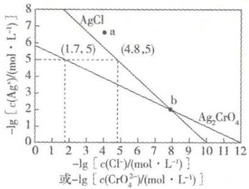

$\quad$C. $\mathrm{Ag_2CrO_4 + 2Cl = 2AgCl + CrO_4^{2 - }}$ 的平衡常数 $K = 10^{7.9}$

# 【理综·新课标卷·T32】

（4） 运动中出汗失水导致细胞外液渗透压升高,垂体释放的某种激素增加,促进肾小管、集合管对水的重吸收,该激素是\_\_\_\_。若大量失水使细胞外液量减少以及血钠含量降低时,可使醛固酮分泌增加。醛固酮的主要生理功能是\_\_\_\_。

答案（4）抗利尿激素 促进肾脏重吸收钠离子，从而间接引起肾小管和集合管重吸收水分增加，使得细胞外液含量增加

# 【文综·新课标卷·T20】

据商务部统计，2023年1—3月，全国实际使用外资4084.5亿元人民币，同比增长4.9%。高技术产业实际使用外资1567.1亿元人民币，同比增长18%。其中，电子及通信设备制造、科技成果转化服务、研发与设计服务、医药制造领域引资分别增长3.7%、50.3%、24.6%和20.2%。

①中国经济加快转型升级，利用外资质量提升  
③中国营商环境具有优势，对外资吸引力不减

# 【文综·新课标卷·T26】

汉武帝时设置十三州部，州部可以推举秀才。东汉，“州里”“州闾”“州党”等语汇逐渐行用，意为同乡，州刺史被尊称为“使君”。东汉后期，以州为中心的地域观念逐渐形成，这在当时

$\quad$B.不利于统一国家的巩固

# 【文综·全国甲卷·T36】

埃塞俄比亚人口超过1亿，农业人口约占80%，以小农户为主……

（3） 说明埃塞俄比亚难以大规模引进灌溉农机具的社会经济原因。(8分)

# 【化学·第2辑·P103】

常温下, AgCl(白色)与 $Ag_{2}CrO_{4}$ (砖红色)的沉淀溶解平衡曲线如图所示

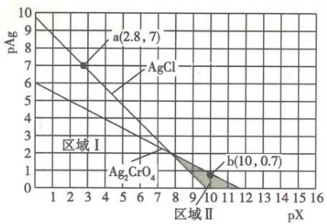

$\quad$D. 反应 $\mathrm{Ag}_{2} \mathrm{CrO}_{4}(\mathrm{s}) + 2 \mathrm{Cl}^{-}(\mathrm{aq}) \rightleftharpoons 2 \mathrm{AgCl}(\mathrm{s}) + \mathrm{CrO}_{4}^{2-}(\mathrm{aq})$ 的平衡常数 $K = 10^{8.2}$

# 【生物·第8辑·P99】

人体水盐平衡的调节离不开抗利尿激素（ADH）和醛固酮的作用。……

答案一
$\quad$A.抗利尿激素的受体位于细胞膜上，当血浆渗透压升高时，抗利尿激素分泌量增加

解析……当细胞外液含量下降时，肾上腺分泌的醛固酮增加，使肾脏重吸收钠离子，从而间接引起肾小管和集合管重吸收水分增加，使得细胞外液含量增加。

# 【政治·第4辑·P115】

全国实际使用外资和对外全行业直接投资

<table><tr><td colspan="3">(2022年一季度)</td></tr><tr><td>项目</td><td>数额(人民币)</td><td>增速</td></tr><tr><td>·实际使用外资</td><td>3798.7亿</td><td>25.6%</td></tr><tr><td>其中高技术产业实际使用外资</td><td>1328.3亿</td><td>52.9%</td></tr><tr><td>对安全行业直接投资</td><td>2177.6亿</td><td>5.6%</td></tr><tr><td>其中对“一带一路”沿线国家非金融类直接投资</td><td>334亿</td><td>16.5%</td></tr></table>

③境外投资者看好中国机遇,对中国发展有信心  
④我国引进外资呈现出量稳质升、结构优化的特点

# 【历史·第7辑·P78】

汉武帝元封五年（公元前106年）……“令州都察吏民有茂才异等可为将相及使绝国者”；汉成帝以后，“今部刺史居牧伯之位，秉一州之统，选第大吏，所荐位高至九卿，所恶立退，任重职大”。

$\quad$C. 助推了地方势力的膨胀

# 【地理·第9辑·P67】

卡塔尔位于波斯湾西南岸，国土面积约11521千米 $^{2}$ ，人口265.8万……

（2） 分析卡塔尔阿尔法丹农场引入中国智能LED植物工厂的社会经济原因。(10分)

# ① 聚焦一手考情 权威解读2023高考新变化

# 创新点1 数学文化题悄然失宠，教材情境题取而代之

[Non-Text]

真题 1 (2023 新高考 I 卷) 设 $S_{n}$ 为数列 $\{a_{n}\}$ 的前 $n$ 项和, 设甲: $\{a_{n}\}$ 为等差

取材教材情境，强调基础（P002）

数列；乙： $\{\frac{S_n}{n}\}$ 为等差数列.则

$\quad$A. 甲是乙的充分条件但不是必要条件  
$\quad$B. 甲是乙的必要条件但不是充分条件  
$\quad$C. 甲是乙的充要条件  
$\quad$D. 甲既不是乙的充分条件也不是乙的必要条件

# 创新点2 加强知识间的横向联系，考查综合能力

[Non-Text]

真题 2 (2023 新高考 I 卷) 甲、乙两人投篮, 每次由其中一人投篮, 规则如下: 若命中则此人继续投篮, 若未命中则换为对方投篮. 无论之前投篮情况如何, 甲每次投篮的命中率均为 0.6, 乙每次投篮的命中率均为 0.8. 由抽签确定第 1 次投篮的人选, 第 1 次投篮的人是甲、乙的概率各为 0.5.

（1） 求第 2 次投篮的人是乙的概率.

的人是甲的概率.

# 创新点3 上手容易满分难，加大思维能力的考查力度

[Non-Text]

真题 3 (2023 新高考 I 卷 | 多选) 下列物体中, 能够被整体放入棱长为 1 (单位: m) 的正方体容器 (容器壁厚度忽略不计) 内的有 ( )

$\quad$A. 直径为 0.99 m 的球体  
$\quad$B. 所有棱长均为 1.4 m 的四面体  
$\quad$C. 底面直径为 0.01 m, 高为 1.8 m 的圆柱体  
$\quad$D. 底面直径为 1.2 m, 高为 0.01 m 的圆柱体

加强知识联系，考查综合（P002）

低起点高落差，凸显灵活（P003）

# ② 核心主干抓重点 集中突破超重点、扫除疑难点

# 超重点1 新定义函数问题的破题妙招

聚焦新定义问题（P007）

调研 1: (新定义有源函数|2023 河北衡水第十四中学 4 月检测) 设函数 $f(x)$

的导函数为 $f'(x)$ ，若 $f(x)$ 在其定义域内存在 $x_0$ ，使得 $f(x_0) = f'(x)$ “有源”函数。已知 $f(x) = \ln x - 2x - a$ 是“有源”函数，则a的取值范

专攻疑难压轴（P094）

# 妙招1 对称构造

[Non-Text]

调研 1 (2023 浙江绍兴 5 月预测) 已知函数 $f(x) = x^{2} \left( \ln x - \frac{3}{2} a \right)$ , $a$ 为实数.

（1） 求函数 $f(x)$ 的单调区间；

（2） 若函数 $f(x)$ 在 x = e 处取得极值，且 $f'(x_{1}) = f'(x_{2})$ , $x_{1} < x_{2}$ ，证明： $2 < x_{1} + x_{2} < e$ .

# ③ 高效破题有方法 传授高妙解法，解透关键题型

解析 方法一 造函数法 第一步: 确定 a, b, c 的共性.

$a = \ln 5 - \ln 3 = \ln \frac {5}{3} = \ln (1 + \frac {2}{3}), \frac {2}{5} = \frac {\frac {2}{3}}{\frac {5}{3}} = \frac {\frac {2}{3}}{1 + \frac {2}{3}}.$

【破题有拓】将 a 化为对数值后，用 $\frac{2}{3}$ 表示 $\frac{3}{5}$ ， $\frac{2}{5}$ ，进而为构造函数奠定基础

第二步:作差法构造函数比较 a, c 的大小.

$\text { 记 } f (x) = \ln (x + 1) - x, x \in (0, 1), \text { 则 } f ^ {'} (x) = \frac {1}{x + 1} - 1 = - \frac {x}{x + 1},$

【会思考】直接构造与函数值对应的两个函数之差的形式，注意根据已

微信公众号
教辅资料站
小考教辅站
初高教辅站

,1)时, $f'(x)<0$ ,所以函数 $f(x)$ 单调递减,

1 - 0 = 0, 故 a < c.

天星老师如影随形，
找对方向易如反掌（P075）

分步套方法，解题有妙招（P089）

（2） $g(x)=f(x)+2x$ , 若函数 $g(x)$ 有两个零点 $x_{1}, x_{2}$ ，且 $\frac{x_{2}}{x_{1}}>e$ ，求证： $\ln a+\ln(x_{1}x_{2})>3$ .

# 天星老师明方向

根据函数零点的定义，将已知条件转化为直线 $y=\frac{1}{a}$ 与函数 $\varphi(x)=\frac{\ln x}{x}$ 的图象有两个交点 $\rightarrow a>e\rightarrow$ 借助零点建立两个方程，消去 $a\rightarrow$ 构造函数证明 $\ln(x_{1}x_{2})>2$ 即可.

# 亮点速览

# 创设真实情境

2023 高考数学注重创设自然真实情境,助力应用能力考查

· 排球比赛中的概率问题/P011  
·新能源汽车/P013   
· 仓库内部建造智能运货总干线/P018   
· 破译盒子密码/P028

# 凸显创新要求

2023 高考数学通过命题创新,创设新颖的试题情境、题目条件、设问方式,考查思维的灵活性与创造性

· 新定义有源函数/P007  
· 新定义巧值点/P008  
- 函数与概率交汇/P010  
- 函数与正态分布、二项分布交汇/P011  
- 数学与物理交汇/P013

微信公众号

教辅资料站开放性举例/P016

小考教辅站

初高教辅站函数的上界和下界/P069

· 接轨高数/P088

# CONTENTS

# 目录

# 每月一手考情

2023 高考数学命题变化一览表 001

2023 高考创新命题评析与解读 002

# 突破 15 大必考超重点

# 创新考法抢先知

超重点1 新定义函数问题的破题妙招 007

超重点2 玩转函数的创新交汇问题 010

超重点3 函数创新模型问题的解题模板 013

超重点4 破解函数新题型问题的高妙解法 015

# 核心主干抓重点

超重点5 函数的“4性”及综合应用 020

命题角度 1 利用函数的单调性判断大小 020

命题角度 2 利用函数的奇偶性求参数的取值范围 021

命题角度 3 利用函数的周期性与图象的对称性求值 021

命题角度4 函数性质的综合应用 022

超重点6 三次函数图象的切线问题 026

超重点7 函数图象的识别及应用问题 030

命题角度 1 利用函数图象的变换规则识别图象 030

命题角度2 复杂函数图象的识别问题 030

命题角度3 函数图象与性质的综合应用问题 031

超重点8 函数的零点问题 035

命题角度1 判断函数零点的个数 035

命题角度 2 已知函数零点个数求参数或参数的取值范围 036

命题角度 3 求函数零点的和、积等的值或取值范围 037

命题角度4 嵌套函数的零点问题 038

# 亮点速览

# 超重点9 有关 $x(x^{n})$ ， $\mathrm{e}^{x}$ ， $\ln x$ ， $\sin x$ 等的组合函数问题 041

命题角度1 基于 $x(x^{n})$ 与 $\ln x, e^x$ 的组合函数的恒成立问题 041

命题角度2 基于 $x(x^{n})$ 与 $\sin x$ 等的组合函数的极（最）值问题 042

命题角度 3 基于 $e^{x}$ 与 $\sin x$ 等的组合函数的最值问题 043

命题角度 4 基于 $\ln x$ 与 $\sin x$ ， $\cos x$ 的组合函数的最值
问题
044

超重点 10 不等式恒成立与有解问题 049

命题角度 1 单变量不等式恒成立问题 049

命题角度 2 单变量不等式能成立问题 050

命题角度 3 双变量不等式恒（能）成立问题 051

超重点 11 函数构造思想的应用问题 057

命题角度 1 利用导数运算构造函数 057

命题角度 2 利用对称法或同构法构造函数 058

命题角度 3 利用换元法构造函数 060

命题角度4 利用放缩法构造函数 061

# 高效破题有方法

# 超重点 12 7 招搞定函数最值与值域的求解问题 063

招法1 用函数性质法求函数最值 063

招法2 用导数法求函数的值域 064

招法3 用换元法求函数的最值 065

招法4 用基本不等式法求函数的最值 066

招法5 用分类讨论法求函数的值域 066

招法6 用判别式法求函数的最值 067

招法7 用数形结合法求函数的最值 068

超重点 13 用导数证明不等式的 5 大高妙解法 073

高妙解法1 用移项作差法证明不等式 073

# 强化大计算量

2023 高考数学在反套路、反机械刷题上下足了功夫,强调基础知识和能力,特别是运算能力

\- 基本初等函数与三角函数组合的极值问题/P042

\- 双变量不等式恒（能）成立问题/P051

· 新定义分割函数判断问题/P070

\- 极值点偏移问题/P094

# 强调方法技巧

2023 高考数学强调方法的灵活选用,彰显综合性要求,落实“四翼”

· 用同构法构造函数/P020

· 用参变分离法求参数的取值范围/P036

· 用移项作差法证明不等式/P073

· 用取特值法比较大小/P083

# 目录

# CONTENTS

高妙解法2 用等价转化法证明不等式 074

高妙解法3 用变量代换法证明不等式 075

高妙解法4 用分离参数法证明不等式 076

高妙解法5 用切线放缩法证明不等式 078

超重点 14 4 招攻破函数比大小问题 083

招法1 用取特值法比较大小 083

招法2 用临界值法比较大小 083

招法3 用构造函数法比较大小 084

招法4 用估值法比较大小 088

超重点 15 3 大妙招攻破极值点偏移问题 093

妙招1 对称构造 094

妙招2 比值换元构造 095

妙招3 差值换元构造 097

# 下辑精彩预告 2023年7月全新上市

# 《试题调研》第2辑将推出

——高考超重点2·三角函数&平面向量

# 每月一手考情

紧贴2023 高考“命题+情境”双创新的最新考情，从创新交汇命题视角出发，重点研究高考数学创新模块交汇、创新情境交汇、创新载体交汇等问题，为你揭秘最新趋势、指明备考方向！

# 解透超重考点

深入研究“三角函数 & 平面向量”模块的超重考点, 如三角函数图象的变换问题、解三角形中化角类与化边类问题的求解策略、三角形五心的向量表示与应用等, 独家原创 “天星老师教审题” “天星老师传技巧”等栏目, 用最通俗的语言, 审透题意、理透思路、解透重点, 另有保姆式批注解析助阵, 助你做一题更要学透一类题!

# 传授高妙解法

4 招搞定非合一结构的三角函数图象问题、用射影定理/角平分线定理/极化恒等式/等和线/奔驰定理等实现小题快做……本辑为你精心准备提分大招和高妙解法，让你的解题速度 up, up, up!

# 每月一手考情

2023 高考数学命题变化一览表

<table><tr><td>变化类型</td><td>变化内容</td><td>变化说明</td></tr><tr><td rowspan="3">突出情境化命题</td><td>设置新教材内容情境,突出课标、教材导向性</td><td>新高考I,II卷都没有出现弘扬优秀传统文化的试题,而以教材题目为情境的题却出现了不少,突出课标导向性.如新高考I卷第10题取自人教A版《必修第一册》第141页第10题</td></tr><tr><td>设置社会现实情境,融入其他学科知识</td><td>新高考II卷第19题,合理平衡漏诊率和误诊率,制定检测标准,试题情境既有现实意义,又体现数学学科的应用价值.新高考I卷第10题,通过噪声污染引入新定义,考查阅读能力、新信息的提取能力等</td></tr><tr><td>设置科技发展与进步情境</td><td>新高考II卷第12题以信号传输为背景,考查了对新概念、新知识的理解和探究能力,引导考生树立理想信念,热爱科学</td></tr><tr><td rowspan="2">紧扣课标,突出基础知识与基本能力</td><td>突出基础知识与基本能力</td><td>实现对基础知识的全方位覆盖.如新高考I卷第9题依托样本数据的基本数字特征,考查考生对概念的理解和掌握,使对基础知识和基本能力的考查有机结合</td></tr><tr><td>突出考查逻辑推理素养</td><td>新高考I卷第7题以等差数列为载体,考查充要条件的推证,新高考II卷第11题本质是根据一元二次方程根的性质判定方程系数之间的关系</td></tr><tr><td rowspan="2">加强素养考查,发挥选拔功能</td><td>加强知识间的横向联系,增强思维的灵活性</td><td>新高考I卷第21题第二问与数列递推关系融合,第22题解析几何与函数结合.新高考II卷第22题,以三角函数为载体呈现对函数、导数的考查</td></tr><tr><td>加强关键能力的考查,增强试题的选拔性</td><td>新高考I卷第22题与新高考II卷第22题,解题方法的选取与思维角度的拓展,都体现了选拔创新人才的功能</td></tr><tr><td rowspan="2">题型稳中有变,传统类型题目加强</td><td>开放再现,但呈现率降低</td><td>新高考II卷第15题,答案不唯一,只需要写出一个正确结果,因而结论具有开放性.没有出现结构不良试题,开放性题目呈现率有所降低</td></tr><tr><td>函数性质的考查以具体函数为主,同时兼顾抽象函数</td><td>新高考I卷第11题是抽象函数问题,考查函数的奇偶性、图象的对称性、极值点等,第4题和II卷第4、6、11题是通过具体函数考查函数的单调性、奇偶性等.两种类型函数同时出现,综合考查数学抽象、逻辑推理等核心素养</td></tr><tr><td rowspan="2">公众号资料帖降低难度,I卷题序有变</td><td>整体难度下降,有利于发挥</td><td>选填题的难度与2022年相比明显降低,单选题没有波澜,仅新高考I卷与II卷多选题第12题对抽象思维、运算能力的要求较高,填空题也没有无从下手的题</td></tr><tr><td>题序变化,形成新挑战</td><td>新高考I卷的题目顺序有变化,导数放在了第19题,概率放在了第21题,数列放在了第20题.导数提前出现意味着题简单了,而概率题的难度变大了,与平时的训练难度有差距,题目顺序的颠倒形成了新的挑战</td></tr></table>

# 2023 高考创新命题评析与解读

河北正高级教师 赵成海

# 创新点 1 数学文化题悄然失宠，教材情境题取而代之

真题 1 (2023 新高考 I 卷) 设 $S_{n}$ 为数列 $\{a_{n}\}$ 的前 $n$ 项和, 设甲: $\{a_{n}\}$ 为等差数列; 乙: $\{\frac{S_{n}}{n}\}$ 为等差数列. 则 ( )

$\quad$A. 甲是乙的充分条件但不是必要条件  
$\quad$B. 甲是乙的必要条件但不是充分条件  
$\quad$C. 甲是乙的充要条件  
$\quad$D. 甲既不是乙的充分条件也不是乙的必要条件

解析 数列 $\{a_{n}\}$ 为等差数列 $\Leftrightarrow a_{n}=an+b(a,b$ 为常数 $\Leftrightarrow S_{n}=\frac{n(a+b+an+b)}{2}=$ $\frac{n(an+a+2b)}{2}\Leftrightarrow\frac{S_{n}}{n}=\frac{an+a+2b}{2}=\frac{1}{2}an+\frac{1}{2}(a+2b)\Leftrightarrow\left\{\frac{S_{n}}{n}\right\}$ 为等差数列. 因而甲是乙的充要条件. 故选 C.

# 命题评析

微信公众号

教辅资料站

考题寻源:人教A版《选择性必修》第25页第7题.显然高考题是其变式,融入了简易逻辑知识.考查考生的基本功,即逻辑推理、数学运算等核心素养.

# 创新点 2 加强知识间的横向联系，考查综合能力

真题 2 (2023 新高考 I 卷) 甲、乙两人投篮, 每次由其中一人投篮, 规则如下: 若命中则此人继续投篮, 若未命中则换为对方投篮. 无论之前投篮情况如何, 甲每次投篮的命中率均为 0.6, 乙每次投篮的命中率均为 0.8. 由抽签确定第 1 次投篮的人选, 第 1 次投篮的人是甲、乙的概率各为 0.5.

（1）求第2次投篮的人是乙的概率.  
（2） 求第 i 次投篮的人是甲的概率.  
（3）已知:若随机变量 $X_{i}$ 服从两点分布,且 $P(X_{i}=1)=1-P(X_{i}=0)=q_{i}, i=1,2,\cdots,n$ , 则 $E(\sum_{i=1}^{n}X_{i})=\sum_{i=1}^{n}q_{i}$ . 记前 n 次(即从第 1 次到第 n 次投篮)中甲投篮的次数为 Y, 求 $E(Y)$ .

解析 （1） 第 2 次投篮的人是乙的情况有两种, 第 1 次投篮的人是甲且没投中和第 1 次投篮的人是乙且投中, 因而所求概率 $P = \frac{1}{2} \times \frac{2}{5} + \frac{1}{2} \times \frac{4}{5} = \frac{3}{5}$ .

# 扬帆起航

小编说：升入高三，理想大学离你又近了一步！数学复习，面广量大，不少学生既感到畏惧，又无从下手。如何提高高三数学复习的针对性和实效性？

关注微信公众号“初高教辅站”获取更多初高中教辅资料

（2） 记第 $i$ 次投篮的人是甲的概率为 $a_{i}$ , 则 $a_{1} = \frac{1}{2}$ .

由已知得 $a_{i+1}=a_{i}\cdot\frac{3}{5}+(1-a_{i})\cdot\frac{1}{5}$ ，即 $a_{i+1}=\frac{2}{5}a_{i}+\frac{1}{5}$ .

【扫清障碍】利用数列递推关系求解，第 $i + 1$ 次甲投篮分两种情况，第 $i$ 次甲投篮且投中与第 $i$ 次乙投篮且没投中

进而有 $a_{i + 1} - \frac{1}{3} = \frac{2}{5} (a_i - \frac{1}{3})$ ，其中 $a_1 - \frac{1}{3} = \frac{1}{6}$

所以 $a_{i} - \frac{1}{3} = \frac{1}{6}\times (\frac{2}{5})^{i - 1}$ ，即 $a_{i} = \frac{1}{3} +\frac{1}{6}\times (\frac{2}{5})^{i - 1}.$

（3） 记 $X_{i}$ 为第 $i$ 次投篮中甲的投篮次数,

则 $X_{i}$ 的所有可能取值为 0,1, $P(X_{i}=1)=1-P(X_{i}=0)=a_{i},i=1,2,\cdots,n.$

由题意得 $Y = \sum_{i=1}^{n} X_{i}$ ，由已知公式得 $E(Y) = E\left(\sum_{i=1}^{n} X_{i}\right) = \sum_{i=1}^{n} a_{i} = \sum_{i=1}^{n}\left[\frac{1}{3} + \frac{1}{6} \times \left(\frac{2}{5}\right)^{i-1}\right] = \sum_{i=1}^{n} \frac{1}{3} +$

【拓展提升】事实上， $E(\sum_{i=1}^{n}X_{i})=\sum_{i=1}^{n}a_{i}$ 即数列 $\{a_{n}\}$ 的前 n 项和

$\sum_{i=1}^{n}\left[\frac{1}{6}\times\left(\frac{2}{5}\right)^{i-1}\right]=\frac{n}{3}+\frac{5}{18}\times\left[1-\left(\frac{2}{5}\right)^{n}\right].$ 综上所述， $E(Y)=\frac{n}{3}+\frac{5}{18}\times\left[1-\left(\frac{2}{5}\right)^{n}\right].$

# 命题评析

本题以体育中投篮为背景设置考题,考查概率、数列的递推关系、分布列及期望等,可以追溯到人教A版《选择性必修第三册》第91页拓广探索第10题,可见其寓意深远,一方面,从教育角度,引导学生积极参加体育活动,强身健体,全面发展;另一方面,从学科教学角度,加强了知识模块间的相互渗透.

# 创新点 3 上手容易满分难，加大思维能力的考查力度

真题 3 (2023 新高考Ⅰ卷|多选)下列物体中,能够被整体放入棱长为1(单位:m)的正方体容器(容器壁厚度忽略不计)内的有()

$\quad$A. 直径为 $0.99 \mathrm{~m}$ 的球体  
$\quad$B. 所有棱长均为 $1.4 \mathrm{~m}$ 的四面体  
$\quad$C. 底面直径为 0.01 m, 高为 1.8 m 的圆柱体  
$\quad$D. 底面直径为 1.2 m, 高为 0.01 m 的圆柱体

解析 对于 A 选项, 正方体内切球直径为 1 m, 0.99 m < 1 m, 故 A 正确;

对于 B 选项, 如图 1, 正方体内部最大的正四面体棱长为 $BA_{1} = \sqrt{2} \, m$ , $\sqrt{2} \, m > 1.4 \, m$ , 故 B 正确;

对于 C 选项, 如图 2, 圆柱体的底面直径为 0.01 m (可忽略不计), 高为 1.8 m, 故可看作长为 1.8 m 的线段, 而正方体的体对角线长为 $AC_{1} = \sqrt{3}$ m < 1.8 m, 故 C 错误;

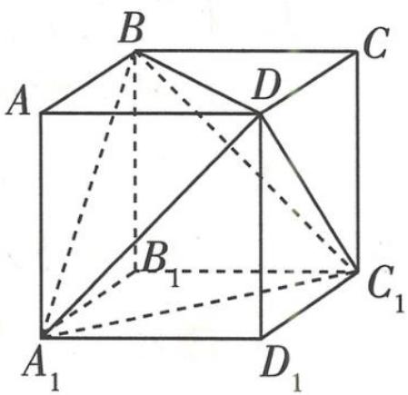

图1

对于 D 选项,圆柱体的高为 $0.01 \mathrm{~m}$ (可忽略不计),故可看作直径为 $1.2 \mathrm{~m}$ 的平面图形,如图 3,E,F,G,H,I,J 为各棱中点,六边形 EFGHIJ 为正六边形,

【扫清障碍】该选项是难点，估算的思维策略是解决问题的核心，思维入口是找最大截面，求最大截面多边形内切圆直径

其边长为 $\frac{\sqrt{2}}{2}\mathrm{m}$ ，如图4，连接 $FH$ ，其内切圆直径为 $FH$ ，易知 $\angle GFH = \angle GHF = 30^{\circ}$ ，所以 $FH = \sqrt{3} FG = \sqrt{3} GH = \frac{\sqrt{6}}{2}\mathrm{m},\left(\frac{\sqrt{6}}{2}\right)^{2} = \frac{6}{4} >(1.2)^{2} = 1.44,$ 所以D选项正确.故选ABD.

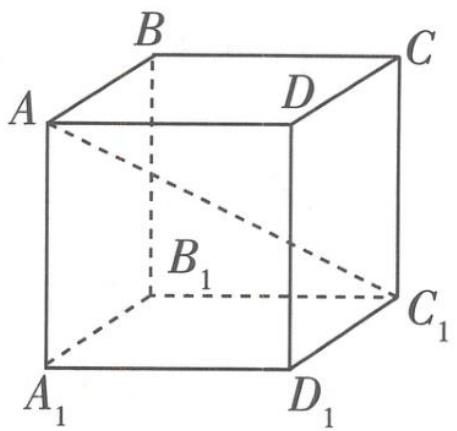

图 2

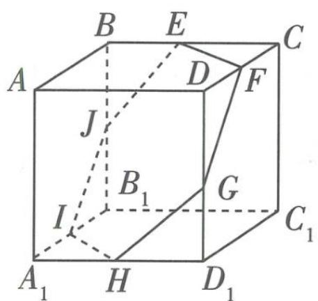

图3

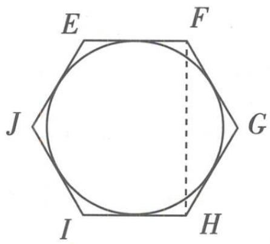

图 4

# 命题评析

本题深度考查考生的直观想象、逻辑推理、数学运算等核心素养,题意清晰易懂,但在考场上却是一道有考查力度的题,不需要严谨证明,但需要合情推理与判断,对于头脑灵活的同学来说是一个得分机会,对于一味刷题的同学来说是一个不小的挑战.

# 创新点 4 阅读理解、新概念题特色依然，对平时教学颇具导向

真题 4 (2023 新高考Ⅱ卷|多选)在信道内传输 0,1 信号,信号的传输相互独立. 发送 0 时,收到 1 的概率为 $\alpha(0<\alpha<1)$ ,收到 0 的概率为 $1-\alpha$ ;发送 1 时,收到 0 的概率为 $\beta(0<\beta<1)$ ,收到 1 的概率为 $1-\beta$ . 考虑两种传输方案:单次传输和三次传输. 单次传输是指每个信号只发送 1 次,三次传输是指每个信号重复发送 3 次. 收到的信号需要译码,译码规则如下:单次传输时,收到的信号即为译码;三次传输时,收到的信号中出现次数多的即为译码(例如,若依次收到 1,0,1,则译码为 1). ()

$\quad$A. 采用单次传输方案, 若依次发送 $1,0,1$ , 则依次收到 $1,0,1$ 的概率为 $(1 - \alpha)(1 - \beta)^{2}$

$\quad$B. 采用三次传输方案, 若发送 1 , 则依次收到 1 , 0 , 1 的概率为 $\beta (1 - \beta)^{2}$

$\quad$C. 采用三次传输方案, 若发送 1 , 则译码为 1 的概率为 $\beta (1 - \beta)^{2} + (1 - \beta)^{3}$

$\quad$D. 当 $0 < \alpha < 0.5$ 时, 若发送 0 , 则采用三次传输方案译码为 0 的概率大于采用单次传输方案译码为 0 的概率

解析 对于 A, 依次发送 1,0,1, 则依次接收到 1,0,1 的事件发生的概率是发 1 接 1, 发 0 接 0, 发 1 接 1 三个相互独立事件发生概率的积, 因而所求概率为 $(1 - \alpha)(1 - \beta)^{2}$ , 所以 A 正确.

对于 B, 三次传输发送 1 , 相当于依次发送 1 , 1 , 1 , 则依次接收到 1 , 0 , 1 的事件发生的概率是发 1

# 扬帆起航

注重基础 确保基本概念、公式等牢固掌握,要扎扎实实,切记欲速则不达.在此基础上,提炼与总结典型的解题方法.

关注微信公众号“初高教辅站”获取更多初高中教辅资料

接1,发1接0,发1接1三个相互独立事件发生概率的积,因而所求概率为 $\beta(1-\beta)^{2}$ ,所以B正确.

对于 C, 三次传输发送 1 , 则译码为 1 的事件发生的概率是依次收到 “1,1,0” “1,0,1” “0,1,1” “1,1,1”的事件发生概率的和, 由选项 B 知, 所求概率为 $C_{3}^{2} \beta (1 - \beta)^{2} + (1 - \beta)^{3} = (1 + 2 \beta)(1 - \beta)^{2}$ , C 错误.

对于 D, 由 C 的解法知, 三次传输发送 0 , 则译码为 0 的概率为 $P = (1 + 2\alpha)(1 - \alpha)^{2}$ ,

那么单次传输发送0,则译码为0的概率为 $P' = 1 - \alpha$ ,由于 $0 < \alpha < 0.5$ ,所以 $P - P' = (1 + 2\alpha)(1 - \alpha)^{2} - (1 - \alpha) = \alpha(1 - \alpha)(1 - 2\alpha) > 0$ ,即 $P > P'$ ,所以D正确.故选ABD.

【关键解读】译码事件互斥，且 D 选项的判断需要用到 C 选项的运算方法，因而二者是关联的

# 命题评析

以信号传输为情境考查二项分布及其应用,考查考生对新概念、新知识的理解和探究能力,平时对这类问题的强化训练是很有必要的.

# 创新点5 居高等数学之高，临中学数学之下

# 命题解读

今年新高考数学导数题的命制,呈现“高观点”下考查基础数学的特色.所谓“高观点”,是指中学教师应站在更高的视角(高等数学)来审视、理解数学问题,只有观点高了,事物才能显得明了而简单.近几年的高考题,以导数为主明显呈现“高观点”下考查基础数学的特色(如新教材中增加的泰勒展开式 $\sin x=x-\frac{x^{3}}{3!}+\frac{x^{5}}{5!}-\frac{x^{7}}{7!}+\cdots,\cos x=1-\frac{x^{2}}{2!}+\frac{x^{4}}{4!}-\frac{x^{6}}{6!}+\cdots$ ,其原理、思想、观点和方法时常发挥着重要作用).

真题 5 (2023 新高考Ⅱ卷)（1）证明:当0<x<1时, $x-x^{2}<\sin x<x$ .

（2） 已知函数 $f(x) = \cos ax - \ln(1 - x^{2})$ ，若 x = 0 是 $f(x)$ 的极大值点，求 a 的取值范围.

解析 （1） 设 $h(x) = \sin x - x$ ，则 $h'(x) = \cos x - 1$ ，当 $0 < x < 1$ 时， $h'(x) < 0$ ，

所以当 0 < x < 1 时, $h(x)$ 单调递减, $h(x) < h(0) = 0$ , 即 $\sin x < x (0 < x < 1)$ .

【扫清障碍】这一步是送分的， $\sin x < x (0 < x < 1)$ 可参见人教 A 版《选择性必修第二册》第 86 页例 1(2) 及第 97 页练习第 1 题

设 $g(x) = \sin x - x + x^2$ ，则 $g'(x) = \cos x - 1 + 2x, g''(x) = -\sin x + 2 > 0,$

因而当 0 < x < 1 时， $g'(x) > g'（0） = 0$ ， $g(x) > g(0) = 0$ ，则有 $\sin x > x - x^{2} (0 < x < 1)$ .

综上, 当 0 < x < 1 时, $x - x^{2} < \sin x < x$ .

（2） $f(x)=\cos ax-\ln(1-x^{2})$ ，由 $1-x^{2}>0$ 得函数定义域是 $(-1,1)$ .

由 $f(x)=f(-x)$ ，得函数 $f(x)$ 为偶函数，则 $f'(x)=-a\sin ax+\frac{2x}{1-x^{2}}$ 为奇函数， $f'（0）=0$ .

$f''(x) = -a^2\cos ax + \frac{2 + 2x^2}{(1 - x^2)^2}$ 为偶函数， $f''（0） = 2 - a^2$

若 $2 - a^2 = 0$ ，此时 $x = 0$ 是 $f(x)$ 的极小值点，不符合题意，则 $2 - a^2 \neq 0$ ，即 $a \neq \pm \sqrt{2}$

若 $f(x)$ 在 $x=0$ 处取得极大值,那么该函数在 $x=0$ 处是上凸的,因而 $f''（0）=2-a^{2}<0$ ,

【敲黑板】实际上, 这里蕴含着 “高观点”, 函数 $f(x)$ 在 $x_0$ 处具有二阶导数且 $f'(x_0) = 0$ , $f''(x_0) \neq 0$ , 则 $f(x)$ 在 $x_0$ 处取得极大值的充分条件为 $f''(x_0) < 0$

则 $a < -\sqrt{2}$ 或 $a > \sqrt{2}$ .

当 $a > \sqrt{2}$ 时，取 $0 < x < \frac{1}{a} < 1$ ，则 $0 < ax < 1$

从而 $f'(x) = -a\sin ax + \frac{2x}{1 - x^{2}} < -a(ax - a^{2}x^{2}) + \frac{2x}{1 - x^{2}} = x(-a^{2} + a^{3}x + \frac{2}{1 - x^{2}})$

【传技巧】利用（1）的结论进行放缩, 转化成不含三角函数式的形式, 有助于判断零点

易知 $s(x) = -a^2 + a^3 x + \frac{2}{1 - x^2}$ 在 $(0, \frac{1}{a})$ 上单调递增，而 $s(0) = 2 - a^2 < 0, s(\frac{1}{a}) = \frac{2a^2}{a^2 - 1} > 0,$

因而关于 $x$ 的方程 $f'(x) = 0$ 在 $(0, \frac{1}{a})$ 上有唯一解 $x_0$ , 当 $x \in (0, x_0)$ 时 $f'(x) < 0$ , $f(x)$ 单调递减, 当 $x \in (x_0, \frac{1}{a})$ 时 $f'(x) > 0$ , $f(x)$ 单调递增, 由 $f(x)$ 是偶函数且连续, 得当 $x \in (-x_0, 0)$ 时 $f(x)$ 单调递增, 所以 $f(x)$ 在 $x = 0$ 处取极大值.

【换个思路】也可利用 $f'(x)$ 为奇函数且连续，得在 $x \in (-x_0, 0)$ 时 $f'(x) > 0$ ，进而判断极值点当 $a < -\sqrt{2}$ 时，取 $\frac{1}{a} < x < 0$ ，则 $0 < ax < 1$ ，

从而 $f'(x) = -a\sin ax + \frac{2x}{1 - x^{2}} < -a(ax) + \frac{2x}{1 - x^{2}} = x(-a^{2} + \frac{2}{1 - x^{2}})$

易知 $u(x) = -a^2 + \frac{2}{1 - x^2}$ 在 $(\frac{1}{a}, 0)$ 上单调递减，而 $u(0) = -a^2 + 2 < 0$

由 $-a^2 + \frac{2}{1 - x^2} = 0$ 得 $x = \frac{\sqrt{a^2 - 2}}{a} < 0, x = -\frac{\sqrt{a^2 - 2}}{a} > 0$ （舍）.

【易错提醒】注意此时的前提条件 $a < 0$ , 所以 $- \frac{\sqrt{a^2 - 2}}{a}$ 要舍去, 舍根时细心检查, 避免出现错误

因而 $f(x)$ 在 $(\frac{\sqrt{a^2-2}}{a},0)$ （若 $\frac{\sqrt{a^2-2}}{a}<\frac{1}{a}$ ，则取区间 $(\frac{1}{a},0)$ ）上单调递增，由 $f(x)$ 为偶函数，得 $f(x)$ 在 $(0,-\frac{\sqrt{a^2-2}}{a})$ 上单调递减，结合函数 $f(x)$ 连续得 $f(x)$ 在x=0处取极大值.

综上所述, $a<-\sqrt{2}$ 或 $a>\sqrt{2}$ 满足题意.

# 命题评析

本题将导数与三角函数巧妙结合起来,通过对导数的分析,判断函数的单调性、极值等相关问题,以导数、函数、不等式等知识为载体,深入考查分类讨论思想、转化与化归思想.

# 扬帆起航

课前准备 上复习课之前一定要做好准备. 结合手中的复习资料, 在老师讲课之前, 要把题都做一遍, 做题中发现的难点就是听课的重点.

关注微信公众号“初高教辅站”获取更多初高中教辅资料

# 突破15大必考超重点

# 创新考法抢先知

# 超重点 1 新定义函数问题的破题妙招

调研 1: (新定义有源函数 | 2023 河北衡水第十四中学 4 月检测) 设函数 $f(x)$ 的导函数为 $f'(x)$ , 若在 $f(x)$ 定义域内存在 $x_0$ , 使得 $f(x_0) = f'(x_0)$ , 则称 $f(x)$ 为“有源”函数. 已知 $f(x) = \ln x - 2x - a$ 是“有源”函数, 则 $a$ 的取值范围是 ( )

$\quad$A. $(-\infty, -1]$

$\quad$B. $(-1, +\infty)$

$\quad$C. $(- \infty, -\ln 2 - 1]$

$\quad$D. $(- \ln 2 - 1, + \infty)$

# 天星老师引思路

新定义问题是只纸老虎, 看似信息新颖, 其实并不难, 抓住关键信息做好 “翻译”, 问题就能迎刃而解. 攻破该题的思路关键: 对函数求导, 设出 $x_0$ , 根据 $f(x_0) = f'(x_0)$ 构建方程, 这样就转化成方程有解问题, 实施参变分离, 利用数形结合思想研究, 便可柳暗花明.

解析 第一步:求导,根据定义建立方程,参变分离.

对 $f(x)=\ln x-2x-a$ 求导得 $f'(x)=\frac{1}{x}-2$ .

由“有源”函数的定义知,存在 $x_{0}$ ,使得 $\ln x_{0}-2x_{0}-a=\frac{1}{x_{0}}-2$ 成立,

即关于 $x_0$ 的方程 $a = \ln x_0 - 2x_0 - \frac{1}{x_0} + 2$ 有解.

第二步:构造新函数,借助导数研究新函数的单调性与值域.

记 $g(x_{0})=\ln x_{0}-2x_{0}-\frac{1}{x_{0}}+2(x_{0}>0)$ ，所以 a 的取值范围就是函数 $g(x_{0})$ 的值域.

【指点迷津】要使关于 $x_0$ 的方程 $a = \ln x_0 - 2x_0 - \frac{1}{x_0} + 2$ 有解, 就要保证 $a$ 的取值集合 $A$ 等于等号右边的代数式的取值集合 $B$ , 否则无法满足 “有源” 函数的定义, 如此便得到了 $a$ 的取值范围与函数 $g(x_0)$ 的值域的关系. 要想知道值域, 需要知道函数的单调性, 下一步的目标就是求导

$g ^ {'} \left(x _ {0}\right) = \frac {1}{x _ {0}} - 2 + \frac {1}{x _ {0} ^ {2}} = \frac {- 2 x _ {0} ^ {2} + x _ {0} + 1}{x _ {0} ^ {2}} = \frac {- (2 x _ {0} + 1) (x _ {0} - 1)}{x _ {0} ^ {2}},$

当 $0 < x_{0} < 1$ 时， $g'(x_{0}) > 0$ ，此时 $g(x_{0})$ 单调递增，

当 $x_{0}>1$ 时, $g'(x_{0})<0$ , 此时 $g(x_{0})$ 单调递减,

所以 $g(x_0) \leqslant g(1) = \ln 1 - 2 - 1 + 2 = -1$ .

# 第三步:根据函数的值域得取值范围.

所以 $a \leqslant -1$ ，即 a 的取值范围是 $(-∞, -1]$ 。故选 A.

调研 2: (新定义巧值点 | 2023 山东德州第一中学 4 月月考 | 多选) 已知函数 $f(x)$ 的导数为 $f'(x)$ , 若存在 $x_0$ , 使得 $f(x_0) = f'(x_0)$ , 则称 $x_0$ 是 $f(x)$ 的一个“巧值点”, 则下列函数中有“巧值点”的是 ( )

$\quad$A. $f(x) = x^{2}$

$\quad$B. $f(x) = \frac{1}{x}$

$\quad$C. $f(x) = \ln x$

$\quad$D. $f(x) = \left(\frac{1}{\mathrm{e}}\right)^x$

# 天星老师有话说

看这道题, 是不是非常眼熟? 本题的新定义和【调研1】的新定义看似不同, 但二者换汤不换药, 甚至本题更简单. 这也提醒我们做题时要看透本质, 挖掘新定义的内涵, 这样无论命题者怎么对问题进行包装, 都难不倒我们.

# 解析

<table><tr><td>选项</td><td>分析过程</td><td>正误</td></tr><tr><td>A</td><td> $f'(x) = 2x \rightarrow$ 令  $x^{2} = 2x \rightarrow x = 0$  或  $x = 2 \rightarrow$ 有“巧值点”</td><td>√</td></tr><tr><td>B</td><td> $f'(x) = -\frac{1}{x^{2}} \rightarrow$ 令  $\frac{1}{x} = -\frac{1}{x^{2}} \rightarrow x = -1 \rightarrow$ 有“巧值点”</td><td>√</td></tr><tr><td>C</td><td> $f'(x) = \frac{1}{x} \rightarrow$ 令  $\ln x = \frac{1}{x} \rightarrow$ 作出  $y = \ln x$  与  $y = \frac{1}{x}$  的图象【扫清障碍】该方程是超越方程,无法直接解,因此联想函数与方程的关系,把方程是否有解问题转化为函数图象是否有交点问题,即可得解(如图1)→结合  $y = \ln x, y = \frac{1}{x}$  的图象知方程  $\ln x = \frac{1}{x}$  有解→有“巧值点”</td><td>√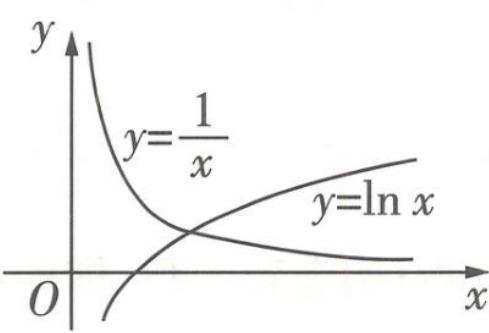图1</td></tr><tr><td>D</td><td> $f'(x) = -e^{-x} \rightarrow$ 令  $(\frac{1}{e})^{x} = e^{-x} = -e^{-x} \rightarrow$ 无解→无“巧值点”</td><td>×</td></tr></table>

# 扬帆起航

提高思维水平 对于自己已经理解了的内容,要与老师讲解中的不同之处进行比较,提高自己的思维水平.

关注微信公众号“初高教辅站”获取更多初高中教辅资料

调研 3: (新定义非减函数 |2023 雅礼中学 4 月月考 | 多选) 对于定义在区间 D 上的函数 $f(x)$ , 若满足 $\forall x_1, x_2 \in D$ 且 $x_1 < x_2$ , 都有 $f(x_1) \leqslant f(x_2)$ , 则称函数 $f(x)$ 为区间 D 上的“非减函数”. 若 $f(x)$ 为区间 $[0, 2]$ 上的“非减函数”, 且 $f(2) = 2$ , $f(x) + f(2 - x) = 2$ , 且当 $x \in [\frac{3}{2}, 2]$ 时, $f(x) \leqslant 2(x - 1)$ 恒成立, 则下列选项中正确的有 ( )

$\quad$A. $f(1) = 1$

$\quad$B. $\exists x_{0}\in\left[\frac{3}{2},2\right],f(x_{0})<1$

$\quad$C. $f(\frac{1}{4}) + f(\frac{2}{3}) + f(\frac{25}{18}) + f(\frac{7}{4}) = 4$

$\quad$D. $\forall x\in [0,\frac{1}{2}],f(f(x))\leqslant -f(x) + 2$

# 解析

<table><tr><td>选项</td><td>分析过程</td><td>正误</td></tr><tr><td>A</td><td>令 $x=1$ → $f(1)+f(2-1)=2$ → $f(1)=1$ 【题眼】 $f(x)+f(2-x)=2$ </td><td>√</td></tr><tr><td>B</td><td>令 $x=\frac{3}{2}$ → $f(\frac{3}{2})\leqslant1$ → $f(\frac{3}{2})\geqslant f(1)=1$ → $f(\frac{3}{2})=1$ → $\forall x\in[\frac{3}{2},2],f(x)\geqslant$ 【题眼1】当 $x\in[\frac{3}{2},2]$ 时, $f(x)\leqslant2(x-1)$ 恒成立【题眼2】 $f(x)$ 为区间 $[0,2]$ 上的“非减函数” $f(\frac{3}{2})=1$ </td><td>×</td></tr><tr><td>C</td><td> $\forall x\in[\frac{1}{2},\frac{3}{2}],f(\frac{1}{2})\leqslant f(x)\leqslant f(\frac{3}{2})$ ,而 $f(\frac{1}{2})+f(\frac{3}{2})=2$ → $f(\frac{1}{2})=f(\frac{3}{2})=1$ → $f(x)=1.f(\frac{1}{4})+f(\frac{7}{4})=2,\frac{2}{3}\in[\frac{1}{2},\frac{3}{2}],\frac{25}{18}\in[\frac{1}{2},\frac{3}{2}]$ → $f(\frac{2}{3})=f(\frac{25}{18})=1$ → $f(\frac{1}{4})+f(\frac{2}{3})+f(\frac{25}{18})+f(\frac{7}{4})=4$ </td><td>√</td></tr><tr><td>D</td><td>当 $x\in[0,\frac{1}{2}]$ 时, $f(0)=0,f(\frac{1}{2})=1,f(x)\in[0,1]$ .令 $t=f(x)\in[0,1]\rightarrow f(t)\in[0,1],-t+2\in[1,2]\rightarrow f(t)\leqslant-t+2\rightarrow f(f(x))\leqslant-f(x)+2$ </td><td>√</td></tr></table>

# 超重点2 玩转函数的创新交汇问题

调研 1: (与概率的求解交汇|2023 上海进才中学 4 月阶段性检测) 给出下列 4 个函数: ① $f_{1}(x)=x$ , ② $f_{2}(x)=\sin x$ , ③ $f_{3}(x)=\tan x$ , ④ $f_{4}(x)=e^{-x}$ . 从中任选 2 个, 则事件“所选 2 个函数的图象有且仅有一个公共点”的概率为 \_\_\_\_.

解析 作出题中4个函数的图象,如图1所示.

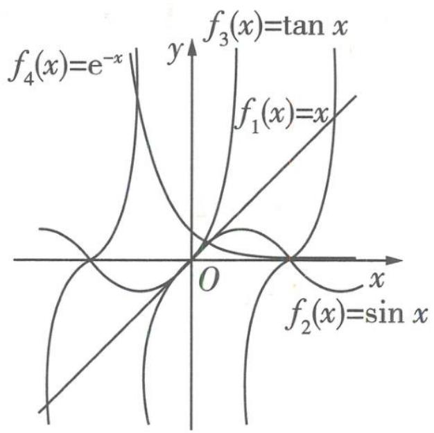

图1

由图可知, $f_{1}(x)=x$ 与 $f_{3}(x)=\tan x$ 的图象、 $f_{2}(x)=\sin x$ 与 $f_{3}(x)=\tan x$ 的图象、 $f_{2}(x)=\sin x$ 与 $f_{4}(x)=\mathrm{e}^{-x}$ 的图象、 $f_{3}(x)=\tan x$ 与 $f_{4}(x)=\mathrm{e}^{-x}$ 的图象均有多个公共点.

【破题有拓】本题中的4个函数都不复杂, 图象简单易画, 先剔除不符合题意的情况 (也就是2个函数图象没有交点或有2个及以上交点的情况), 针对剩下的情况, 构造函数, 从导数入手研究函数的单调性, 获得函数的零点信息, 即可得解

令 $g_{1}(x) = f_{1}(x) - f_{2}(x) = x - \sin x$ ，则 $g_1^' (x) = 1 - \cos x\geqslant 0,$

$\therefore g_{1}(x)$ 在 $\mathbb{R}$ 上单调递增，又 $g_{1}（0） = 0$

$\therefore g_{1}(x) = f_{1}(x) - f_{2}(x)$ 有唯一零点，

$\therefore f_{1}(x) = x$ 与 $f_{2}(x) = \sin x$ 的图象有且仅有一个公共点.

【敲黑板】实际上， $x \geqslant \sin x (x \geqslant 0)$ 是一个常见的不等式，因此本题解析给出具体证明过程，同学们可记住这个结论

令 $g_{2}(x) = f_{1}(x) - f_{4}(x) = x - \mathrm{e}^{-x}$ ，则 $g_{2}'(x) = 1 + \mathrm{e}^{-x} > 0$

$\therefore g_{2}(x)$ 在 $\mathbb{R}$ 上单调递增，又 $g_{2}（0） = -1 < 0, g_{2}（1） = 1 - \frac{1}{\mathrm{e}} > 0,$

∴ 存在 $x_{0} \in (0,1)$ ，使得 $g_{2}(x_{0}) = 0$ ，且 $x = x_{0}$ 是 $g_{2}(x) = f_{1}(x) - f_{4}(x)$ 的唯一零点，

$\therefore f_{1}(x) = x$ 与 $f_{4}(x) = \mathrm{e}^{-x}$ 的图象有且仅有一个公共点.

【敲黑板】该结论由图可直观得出，本题给出具体解析，以助同学们熟练掌握构造思想与函数零点存在定理

# 扬帆起航

勤做笔记 将听课中的要点、思维方法等进行简明扼要的记录,以便复习、消化、思考.每个要点后要留点空白,以备课后补充.

关注微信公众号“初高教辅站”获取更多初高中教辅资料

∴从4个函数中任选2个,共有 $C_{4}^{2}=6$ (种)情况,

而满足所选2个函数的图象有且仅有一个公共点的有 $f_{1}(x)=x$ 与 $f_{2}(x)=\sin x$ 的图象、 $f_{1}(x)=x$ 与 $f_{4}(x)=\mathrm{e}^{-x}$ 的图象,共2种情况.

故事件“所选2个函数的图象有且仅有一个公共点”的概率为 $\frac{2}{6}=\frac{1}{3}$ .

调研 2 (与正态分布、二项分布交汇|2023 山东潍坊 4 月检测)2023 年 3 月某学校举办了春季科技体育节,其中安排的女排赛事共有 12 个班级作为参赛队伍,本次比赛启用了新的排球用球. 已知这种球的质量指标 $\xi$ (单位:g) 服从正态分布 $N(\mu, \sigma^2)$ , 其中 $\mu = 270, \sigma = 5$ . 比赛赛制采取单循环方式, 即每支球队进行 11 场比赛, 最后靠积分选出冠军. 积分规则如下 (比赛采取 5 局 3 胜制): 比赛中以 3:0 或 3:1 取胜的球队积 3 分, 负队积 0 分; 而在比赛中以 3:2 取胜的球队积 2 分, 负队积 1 分. 9 轮过后, 积分榜上的前 2 名分别为 1 班排球队和 2 班排球队, 1 班排球队积 26 分, 2 班排球队积 22 分. 第 10 轮 1 班排球队对抗 3 班排球队, 设每局比赛 1 班排球队取胜的概率为 $p(0 < p < 1)$ .

（1） 令 $\eta = \frac{\xi - \mu}{\sigma}$ , 则 $\eta \sim N(0,1)$ , 且 $\Phi(a) = P(\eta < a)$ , 求 $\Phi(-2)$ , 并证明

$\Phi (- 2) + \Phi （2） = 1.$

（2）第10轮比赛中,记1班排球队以3:1取胜的概率为 $f(p)$ ,求出 $f(p)$ 的最大值点 $p_{0}$ ,并以 $p_{0}$ 作为p的值,解决下列问题.

# 天星老师传技巧

既是正态分布，又是求值，条条线索指向正态曲线的对称性。

(i) 在第 10 轮比赛中, 1 班排球队所得积分为 $X$ , 求 $X$ 的分布列.

(ii)已知第10轮2班排球队积3分,判断1班排球队能否提前一轮夺得冠军(第10轮过后,无论最后一轮即第11轮结果如何,1班排球队积分最多).若能,求出相应的概率;若不能,请说明理由.

参考数据: 若 $Z \sim N(\mu, \sigma^{2})$ ，则 $P(\mu - \sigma \leqslant Z \leqslant \mu + \sigma) \approx 0.6827, P(\mu - 2\sigma \leqslant Z \leqslant \mu + 2\sigma) \approx 0.9545, P(\mu - 3\sigma \leqslant Z \leqslant \mu + 3\sigma) \approx 0.9973.$

解析 （1） 由题意知 $\eta = \frac{\xi - 270}{5}$ ,

所以 $\Phi(-2)=P(\eta<-2)=P(\xi<260)$ ,

又 $P(\mu - 2\sigma \leqslant Z \leqslant \mu + 2\sigma) \approx 0.9545$

所以 $\Phi(-2)=P(\xi<260)=0.5-\frac{0.9545}{2}=0.5-0.47725=0.02275.$

$\Phi(-2)=P(\eta<-2)$ ,根据正态曲线的对称性得 $P(\eta<-2)=P(\eta>2)$ ,即 $\Phi(-2)=P(\eta>2)$ .

又 $\Phi(2) = P(\eta < 2) = 1 - P(\eta \geqslant 2)$ , 所以 $\Phi(-2) + \Phi(2) = 1$ .

（2） $f(p)=C_{3}^{2}p^{3}(1-p)=3p^{3}(1-p)$ ,

$f ^ {'} (p) = 3 \left[ 3 p ^ {2} (1 - p) - p ^ {3} \right] = 3 p ^ {2} (3 - 4 p).$

【易错提醒】复杂函数的求导是大家容易出错的地方，其实不管函数结构有多复杂，只要严格按照求导法则细心计算，就可以有效避错

令 $f'(p)=0$ , 得 $p=\frac{3}{4}$ .

当 $p \in (0, \frac{3}{4})$ 时， $f'(p) > 0, f(p)$ 在 $(0, \frac{3}{4})$ 上单调递增；

当 $p \in (\frac{3}{4}, 1)$ 时, $f'(p) < 0$ , $f(p)$ 在 $(\frac{3}{4}, 1)$ 上单调递减.

所以 $f(p)$ 的最大值点为 $p_{0}=\frac{3}{4}$ ，从而 $p=\frac{3}{4}$ .

【敲黑板】要区分函数的最值与最值点两个概念，最值是函数值，最值点是自变量的取值 (i) $X$ 的所有可能取值为 3,2,1,0.

$P (X = 3) = p ^ {3} + \mathrm{C} _ {3} ^ {2} p ^ {2} (1 - p) p = \frac {1 8 9}{2 5 6}, P (X = 2) = \mathrm{C} _ {4} ^ {2} p ^ {2} (1 - p) ^ {2} p = \frac {8 1}{5 1 2},$

$P (X = 1) = \mathrm{C} _ {4} ^ {2} p ^ {2} (1 - p) ^ {3} = \frac {2 7}{5 1 2}, P (X = 0) = (1 - p) ^ {3} + \mathrm{C} _ {3} ^ {1} p (1 - p) ^ {3} = \frac {1 3}{2 5 6}.$

所以 $X$ 的分布列为

<table><tr><td>X</td><td>3</td><td>2</td><td>1</td><td>0</td></tr><tr><td>P</td><td> $\frac{189}{256}$ </td><td> $\frac{81}{512}$ </td><td> $\frac{27}{512}$ </td><td> $\frac{13}{256}$ </td></tr></table>

(ii) 若 X=3，则 1 班 10 轮后的总积分为 29 分，2 班即便第 10 轮和第 11 轮都积 3 分，则 11 轮过后的总积分是 28 分，29 > 28，

所以 1 班如果第 10 轮积 3 分, 则可提前一轮夺得冠军, 其概率为 $P(X = 3) = \frac{189}{256}$ .

# 扬帆起航

有针对性地做题 典型的题目,应该规范完成,同时还应根据自身程度,有选择地做一些拔高的题目.

关注微信公众号“初高教辅站”获取更多初高中教辅资料

# 超重点 3 函数创新模型问题的解题模板

调研 1 (新能源汽车,指数型函数模型|2023 河南开封高级中学 5 月模拟)在倡导“节能环保”“低碳生活”的今天,新能源逐渐被人们接受,新能源汽车作为新能源中的重要支柱产业之一取得了长足的发展.为预测某省未来新能源汽车的保有量,采用模型 $y=\frac{M}{1+(\frac{M}{y_{0}}-1)e^{-rt}}$ 进行估计,其中 $y$ (单位:万辆)为第 t 年底新能源汽车的

保有量, $r$ 为年增长率, $M$ 为饱和量, $y_{0}$ 为初始值 (初始值对应第 0 年底的新能源汽车保有量). 若该省2021年底的新能源汽车保有量为 20 万辆, 以此为初始值, 以后每年的增长率为 $12\%$ , 饱和量为 1300 万辆, 那么2031年底该省新能源汽车的保有量为 (注: $\ln 0.887 \approx -0.12, \ln 0.30 \approx -1.2$ ) ()

$\quad$A. 62 万辆

$\quad$B. 63 万辆

$\quad$C. 64 万辆

$\quad$D. 65 万辆

# 天星老师教审题

像这样，在情境复杂的题设中标出关键信息，构建问题情境，如本题中，2021年的汽车保有量就是模型中的 $y_0$ ， $12\%$ 就是模型中的 $r$ ，1300 就是模型中的 $M$ ，要求的是 2031 年对应的 $y$ ，也就是 $t = 10$ 时的 $y$ ，一一对应代入即可求解。

解析 根据题中所给模型,代入有关数据,注意以2021年的为初始值,

所以2031年底该省新能源汽车的保有量为 $y = \frac{1300}{1 + (\frac{1300}{20} - 1)e^{-0.12\times 10}} = \frac{1300}{1 + 64e^{-1.2}}$ .

因为 $\ln 0.30 \approx -1.2$ ，所以 $e^{-1.2} \approx 0.30$ ，

所以 $y=\frac{1\ 300}{1+64e^{-1.2}}\approx\frac{1\ 300}{1+64\times0.30}\approx64$ . 故选 C.

调研 2: (与物理交汇, 对数型函数模型 | 2023 北京门头沟区 4 月检测) 在声学中, 音量模型被定义为 $L_{p} = 20 \lg \frac{p}{p_{0}}$ , 其中 $L_{p}$ 是音量 (单位: dB), $p_{0}$ 是基准声压, 为 $2 \times 10^{-5} \mathrm{~Pa}, p$ 是实际声压. 人耳能听到的最小音量称为听觉下限阈值. 经过研究表明, 人耳对于不同频率的声音有不同的听觉下限阈值, 如图 1 所示, 其中 $240 \mathrm{~Hz}$ 对应的听觉下限阈值为 $20 \mathrm{~dB}, 1000 \mathrm{~Hz}$ 对应的听觉下限阈值为 $0 \mathrm{~dB}$ . 则下列结论正确的是 ( )

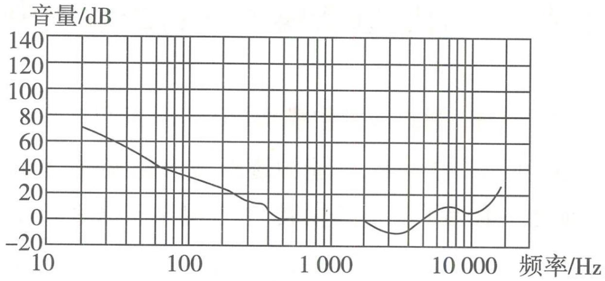

图1

$\quad$A. 音量同为 20 dB 的声音, $30 \sim 100 \mathrm{~Hz}$ 的低频比 $1000 \sim 10000 \mathrm{~Hz}$ 的高频更容易被人们听到 
$\quad$B. 听觉下限阈值随声音频率的增大而减小

直接观察图象得出听觉下限阈值与声音频率的关系进行判断

$\quad$C. 240 Hz 的听觉下限阈值的实际声压为 $0.002 \mathrm{~Pa}$ 
$\quad$D. 240 Hz 的听觉下限阈值的实际声压为 $1000 \mathrm{~Hz}$ 的听觉下限阈值实际声压的 10 倍

通过所给函数关系 $L_{p} = 20\lg \frac{p}{p_{0}}$ 代入听觉下限阈值计算即可判断

# 天星老师讲关键

以图表为工具记录数据，是生活中形象化处理数据的常用手段，这类问题一般不难，看清楚图中横、纵轴的意义，明白图象走势代表的变化关系，即可轻松得解。

解析 对于 A,30 \~ 100 Hz 的低频对应图象的听觉下限阈值高于 20 dB,

1 000 \~ 10 000 Hz 的高频对应的听觉下限阈值低于 20 dB,

所以对比可知高频更容易被听到,故 A 错误.

对于 B,从图象上看,听觉下限阈值随声音频率的增大有减小也有增大,故 B 错误.

对于 C,240 Hz 对应的听觉下限阈值为 20 dB, $p_{0}=2\times10^{-5}$ Pa,

令 $20\lg \frac{p}{p_0} = 20$ ，此时 $p = 10p_{0} = 0.0002\mathrm{Pa}$ ，故C错误

对于 D, 1 000 Hz 的听觉下限阈值为 0 dB, 令 $20 \lg \frac{p}{p_{0}} = 0$ , 此时 $p = p_{0}$ ,

所以 240 Hz 的听觉下限阈值的实际声压为 1 000 Hz 的听觉下限阈值实际声压的 10 倍, 故 D 正确.

故选D.

# 扬帆起航

追求准确性 无论是作业还是测试,都应把准确性放在第一位,而不是一味地追求速度.

关注微信公众号“初高教辅站”获取更多初高中教辅资料

# 超重点 4 破解函数新题型问题的高妙解法

调研 1: (多选题 | 2023 福建泉州第九中学 4 月月考) 设函数 $f(x) = \ln x - (x - a)^{2}$ , 则下列判断正确的是 ( )

$\quad$A. $f(x)$ 存在两个极值点  
$\quad$B. 当 $a > \frac{7}{3}$ 时, $f(x)$ 有两个零点 $\left\{\begin{array}{l}\text { 根据函数 } f(x) \text { 的结构, 得到两个函数, } \\ \text { 寻找两个函数的图象的交点即可 }\end{array}\right.$ 
$\quad$C. 当 $a \leqslant 1$ 时, $f(x)$ 只有一个零点
$\quad$D. 若 $f(x)$ 有两个零点 $x_{1}, x_{2}$ , 则 $x_{1} + x_{2} > 2a$

# 天星老师教审题

函数是否存在两个极值点，即导函数是否存在两个变号零点。对原函数实施求导即可。

解析 函数 $f(x)$ 的定义域为 $(0, +\infty)$ , $f'(x) = \frac{1}{x} - 2x + 2a = \frac{-2x^2 + 2ax + 1}{x}$ .

设 $g(x) = -2x^{2} + 2ax + 1$

易知关于 $x$ 的方程 $-2x^{2} + 2ax + 1 = 0$ 对应的 $\Delta > 0$ ，两根之积为 $-\frac{1}{2} < 0$

所以方程 $-2x^{2}+2ax+1=0$ 有一个正根, 设其为 $x_{0}$ .

在 $(0,x_{0})$ 上, $f'(x)>0$ ,函数 $f(x)$ 单调递增,

在 $(x_{0},+\infty)$ 上, $f'(x)<0$ ,函数 $f(x)$ 单调递减,

所以 $f(x)$ 存在一个极大值点, A 错误.

令 $f(x)=\ln x-(x-a)^{2}=0$ ，即 $\ln x=(x-a)^{2}$ ，函数 $f(x)$ 的零点即曲线 $y=\ln x$ 与 $y=(x-a)^{2}$ 的交点横坐标，作出图象，如图1所示.

【草图不草】利用数形结合思想作图求解问题时, 图象的开口方向、走势、所过的关键点、最值等要画准确, 否则容易影响交点的判断

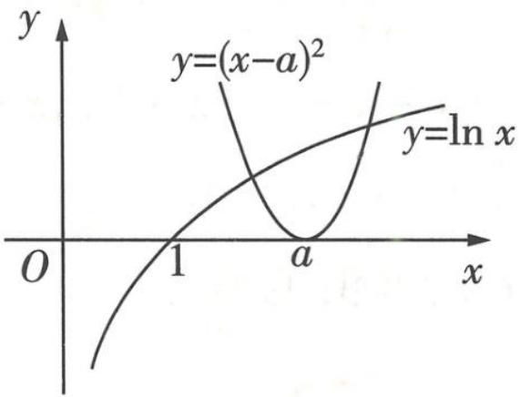

图1

函数 $y=(x-a)^{2}$ 的图象与 x 轴的交点为 $(a,0)$ .

当 $a > \frac{7}{3}$ 时，曲线 $y = \ln x$ 与 $y = (x - a)^2$ 有两个不同的交点，即 $f(x)$ 存在两个零点，B正确.

当 a=1 时, 曲线 $y=\ln x$ 与 $y=(x-a)^{2}$ 有两个不同的交点, C 错误.

若 $f(x)$ 有两个零点 $x_{1}, x_{2}$ ，假设 $x_{1} < x_{2}$ ，则 $f(x_{1}) = 0, f(x_{2}) = 0$ ，即 $\ln x_{1} = (x_{1} - a)^{2}, \ln x_{2} =$

$(x_{2} - a)^{2}$ , 两式相减得 $\ln \frac{x_1}{x_2} = (x_1 - x_2)(x_1 + x_2 - 2a)$ .

因为 $x_{1} < x_{2}$ , 所以 $\frac{x_{1}}{x_{2}} < 1$ , 所以 $\ln \frac{x_{1}}{x_{2}} < 0, x_{1} - x_{2} < 0$ , 所以 $x_{1} + x_{2} - 2a > 0$ , 即 $x_{1} + x_{2} > 2a$ , D 正确. 故选 BD.

调研 2: (开放性举例问题 | 2023 北京市第五十五中学 4 月调研) 已知函数 $f(x) = (x - a)(x - 3)^{2}(a \in \mathbb{R})$ , 当 $x = 3$ 时, $f(x)$ 有极大值. 写出符合上述要求的一个 $a$ 的值: \_\_\_\_.

解析 第一步:对函数求导,得到导函数的零点.

由题意得, $f'(x)=(x-3)^{2}+(x-a)\times2(x-3)=(x-3)(x-3+2x-2a)=(x-3)(3x-2a-3)$ ，令 $f'(x)=0$ ，解得x=3或 $\frac{2a+3}{3}$ .

【扫清障碍】结合 $f'(x)$ 图象的开口方向可知，要想 $f(x)$ 在x=3时有极大值，则 $f(x)$ 在 $(-∞,3)$ 上单调递增，在 $(3,\frac{2a+3}{3})$ 上单调递减，在 $(\frac{2a+3}{3},+\infty)$ 上单调递增，即要满足 $\frac{2a+3}{3}>3$

第二步:根据 $f(x)$ 在 x=3 时有极大值,得到导函数两个零点的大小关系,并进行验证.

当 $\frac{2a + 3}{3} > 3$ ，即 $a > 3$ 时， $f(x)$ 在 $(- \infty, 3)$ 上单调递增，在 $(3, \frac{2a + 3}{3})$ 上单调递减，所以 $f(x)$ 在 $x = 3$ 处取极大值。

第三步:从 a 的取值范围中得到一个取值.

所以 a > 3, a 可取 4, 故答案为 4 (答案不唯一, 满足 a > 3 即可).

调研 3:（双空题 | 2023 北京市海淀区 4 月一模）设函数 $f(x) = \left\{ \begin{array}{l} (x - a + 1)(x + 1), x < 1, \\ \lg x - a, x \geqslant 1. \end{array} \right.$ 当 $a = 0$ 时， $f(f(1)) =$ \_\_\_\_. 若 $f(x)$ 恰有 2 个零点，则 $a$ 的取值范围是 \_\_\_\_.

解析 第一空 当 $a = 0$ 时, $f(x) = \begin{cases} (x + 1)^2, & x < 1, \\ \lg x, & x \geqslant 1. \end{cases}$

所以 $f(1)=\lg 1=0$ , 所以 $f(f(1))=f(0)=1$ .

第二空 令 $f(x)=0$ , 可得:

当 $x < 1$ 时, $(x - a + 1)(x + 1) = 0$ , 所以 $x = -1$ 或 $x = a - 1$ . 当 $a = 0$ 或 $a \geqslant 2$ 时, 关于 $x$ 的方 【规避易错】 $f(x)$ 恰有 2 个零点, 是在整个定义域上有 2 个零点, 分段讨论后一定不要忘记这个前提程 $(x - a + 1)(x + 1) = 0$ 在 $(- \infty, 1)$ 上有唯一解 $x = -1$ . 当 $a < 0$ 或 $0 < a < 2$ 时, 关于 $x$ 的方程 $(x - a + 1)(x + 1) = 0$ 在 $(- \infty, 1)$ 上的解为 $x = -1$ 或 $x = a - 1$ .

# 扬帆起航

加强做题后的反思 解题不是目的,要学会通过解题来检验自己的学习效果,发现学习中的不足之处,以便改进和提高.

关注微信公众号“初高教辅站”获取更多初高中教辅资料

当 $x \geqslant 1$ 时, $\lg x - a = 0$ , 则当 $a \geqslant 0$ 时, $x = 10^{a}$ ; 当 $a < 0$ 时, 关于 $x$ 的方程 $\lg x - a = 0$ 在 $[1, +\infty)$ 上无解.

综上, 当 $a < 0$ 时, 函数 $f(x)$ 有两个零点 $-1, a - 1$ ; 当 $a = 0$ 时, 函数 $f(x)$ 有两个零点 $-1, 1$ ; 当 $0 < a < 2$ 时, 函数 $f(x)$ 有三个零点 $-1, a - 1, 10^{a}$ ; 当 $a \geqslant 2$ 时, 函数 $f(x)$ 有两个零点 $-1, 10^{a}$ .

因为 $f(x)$ 恰有2个零点，所以 $a \geqslant 2$ 或 $a \leqslant 0, a$ 的取值范围是 $(- \infty, 0] \cup [2, +\infty)$ .

调研 4 (结构不良问题 | 2023 湖北襄阳 4 月期中) 在① $f'(\ln 3)=2$ , ② $f(x)$ 的图象在点 $(0,f(0))$ 处的切线斜率为0, ③ $f(x)$ 的单调递减区间为 $(0,\ln 2)$ 这三个条件中任选一个补充在下面的问题（1）中, 并加以解答.

已知 $f(x) = \frac{1}{2}\mathrm{e}^{2x} - (a + 2)\mathrm{e}^x + 2ax.$

（1）若\_\_\_\_,求实数a的值;   
（2） 若 $a \in \mathbb{R}$ , 讨论函数 $f(x)$ 的单调性.

注:如果选择多个条件分别解答,按第一个解答计分.

# 天星老师传技巧

本题的三个条件是有联系的，不管是导数值、函数图象的切线斜率，还是函数的单调递减区间，都跟求导有关，因此对原函数实施求导，任选1个条件代入求解即可。

解析 （1） $f'(x)=\mathrm{e}^{2x}-(a+2)\mathrm{e}^{x}+2a=(\mathrm{e}^{x}-2)(\mathrm{e}^{x}-a)$ .

若选条件①,则 $f'(\ln 3)=(3-2)\times(3-a)=2$ , 所以 a=1.

若选条件②,则 $f'（0）=(1-2)\times(1-a)=0$ , 所以 a=1.

若选条件③,则依题意得0和 $\ln2$ 是关于x的方程 $(e^{x}-2)(e^{x}-a)=0$ 的两个根,所以 $a=e^{0}=1$ .

（2） $f'(x) = (e^x - 2)(e^x - a)$ .

分以下几种情况讨论：

①当 $a \leqslant 0$ 时，令 $f'(x) > 0$ ，则 $x > \ln 2$ ，令 $f'(x) < 0$ ，则 $x < \ln 2$

所以 $f(x)$ 在 $(-\infty, \ln 2)$ 上单调递减，在 $(\ln 2, +\infty)$ 上单调递增.

②当 $0 < a < 2$ 时, 令 $f'(x) > 0$ , 则 $x > \ln 2$ 或 $x < \ln a$ , 令 $f'(x) < 0$ , 则 $\ln a < x < \ln 2$ .

所以 $f(x)$ 在 $(-\infty, \ln a), (\ln 2, +\infty)$ 上单调递增，在 $(\ln a, \ln 2)$ 上单调递减。

③当 a=2 时， $f'(x)=(e^{x}-2)^{2}\geqslant0$ ，所以 $f(x)$ 在 R 上单调递增.

④当 a > 2 时，令 $f'(x) > 0$ ，则 $x > \ln a$ 或 $x < \ln 2$ ，令 $f'(x) < 0$ ，则 $\ln 2 < x < \ln a$ 。

所以 $f(x)$ 在 $(-\infty, \ln 2), (\ln a, +\infty)$ 上单调递增，在 $(\ln 2, \ln a)$ 上单调递减.

综上所述: 当 $a \leqslant 0$ 时, $f(x)$ 在 $(- \infty, \ln 2)$ 上单调递减, 在 $(\ln 2, + \infty)$ 上单调递增; 当 $0 < a < 2$ 时, $f(x)$ 在 $(- \infty, \ln a), (\ln 2, + \infty)$ 上单调递增, 在 $(\ln a, \ln 2)$ 上单调递减; 当 $a = 2$ 时, $f(x)$ 在 $\mathbf{R}$ 上单调递增; 当 $a > 2$ 时, $f(x)$ 在 $(- \infty, \ln 2), (\ln a, + \infty)$ 上单调递增, 在 $(\ln 2, \ln a)$ 上单调递减.

【规范步骤】做解答题时,分类讨论后一定不要忘记综述,否则正式考试时容易因为步骤不规范失去 1 分.这些好的习惯要在平时复习备考时就养成,考试时才能万无一失

调研 5: (函数解答题的新情境题|2023 黑龙江哈尔滨第三中学二模) 我国南北朝时期的数学家祖冲之计算的圆周率纪录在世界保持了近千年, 德国数学家鲁道夫用一生精力计算出了圆周率的 35 位小数……随着科技的进步, 一些常数的精确度不断被刷新. 例如: 现在我们很容易能得出函数 $J(x) = \mathrm{e}^{x} + x (\mathrm{e} = 2.71828 \cdots)$ 的零点 $x_{0}$ 的近似值, 为了实际应用, 本题中取 $x_{0}$ 的值为 -0.57. 哈三中毕业生创办的仓储型物流公司建造了占地面积足够大的仓库, 内部建造了一条智能运货总干线 $C_{1}$ , 其在已经建立的平面直角坐标系中的函数解析式为 $g(x) = \ln \left( x - 2 - \frac{1}{x_{0}} \right)$ , 其图象在 $x = 2$ 处的切线 $L_{1}$ 的方程为 $y = \psi(x)$ , 现计划再建一条总干线 $C_{2}: y = \mathrm{e}^{x + m}$ , 其中 $m$ 为待定的常数. (注: 本题中计算的最终结果均用数字表示)

（1）求出 $L_{1}$ 的方程,并证明:在平面直角坐标系中,智能运货总干线 $C_{1}$ 上的点不在直线 $L_{1}$ 的上方.

（2）在平面直角坐标系中,设直线 $L_{2}: y = \psi \left(x - \frac{x_{0}}{3}\right)$ , 计划将仓库中直线 $L_{1}$ 与 $L_{2}$ 之间的部分设为隔离区, 两条运货总干线 $C_{1}, C_{2}$ 分别在各自的区域内, 即曲线 $C_{2}$ 上的点不能越过直线 $L_{2}$ , 求实数 $m$ 的取值范围.

# 天星老师教审题

$C_{1}$ 上的点不在 $L_{1}$ 的上方，也就是 $L_{1}$ 对应的函数值总大于等于 $C_{1}$ 对应的函数值，作差构造新函数，问题就转化为证明新函数的最值与0的关系，如此就去掉了情境包装，回归到纯粹的数学问题。看，情境问题只要理解内涵，并不难哦！

解析 （1） 由 $g(x) = \ln \left(x - 2 - \frac{1}{x_0}\right)$ , 可得 $g'(x) = \frac{1}{x - 2 - \frac{1}{x_0}}$ ,

# 扬帆起航

“会而不对”是高三数学学习的大忌 造成“会而不对”的常见原因有审题失误、计算错误等,这是一种不良的学习习惯,必须在一轮复习中逐步克服.

关注微信公众号“初高教辅站”获取更多初高中教辅资料则 $g'（2） = -x_{0}, g(2) = \ln \left(-\frac{1}{x_{0}}\right) = -\ln \left(-x_{0}\right)$ ,

所以 $L_{1}$ 的方程为 $y + \ln (-x_0) = -x_0(x - 2)$ ，即 $y = -x_0x + 2x_0 - \ln (-x_0)$ .

因为 $x_0$ 是函数 $J(x) = \mathrm{e}^x + x$ 的零点，

所以 $\mathrm{e}^{x_0} + x_0 = 0$ ，所以 $\mathrm{e}^{x_0} = -x_0$ ，可得 $y = -x_0x + 2x_0 - \ln \mathrm{e}^{x_0} = -x_0x + x_0.$

又 $x_{0} = -0.57$ ，所以直线 $L_{1}$ 的方程为 y = 0.57x - 0.57。

令 $f(x) = g(x) - \psi(x) = \ln (x - 2 - \frac{1}{x_0}) - (-x_0 x + x_0) = \ln (x - 2 - \frac{1}{x_0}) + (x_0 x - x_0)$ ,

其中 $x > 2 + \frac{1}{x_0}$ 则 $f'(x) = \frac{1}{x - 2 - \frac{1}{x_0}} + x_0.$

令 $f'(x)=0$ , 解得 x=2,

当 $x \in (2 + \frac{1}{x_{0}}, 2)$ 时, $f'(x) > 0$ , $f(x)$ 单调递增;

当 $x \in (2, +\infty)$ 时， $f'(x) < 0, f(x)$ 单调递减.

所以当 x=2 时, 函数 $f(x)$ 取得极大值, 也是最大值, 为 $f(2)=0$ , 所以 $f(x)\leqslant0$ ,

所以在平面直角坐标系中,智能运货总干线 $C_{1}$ 上的点不在直线 $L_{1}$ 的上方.

（2） 令 $h(x) = \mathrm{e}^{x + m} - \psi \left(x - \frac{x_0}{3}\right) = \mathrm{e}^{x + m} + x_0\left(x - \frac{x_0}{3}\right) - x_0,$

【扫清障碍】要求使得两条运货总干线 $C_1, C_2$ 分别在各自的区域内，即曲线 $C_2$ 上的点不能越过直线 $L_2$ 的 $m$ 的取值范围，可将对应的两个函数作差得到新函数，通过分析新函数的最值与 0 的关系得解。根据这个思路对新函数实施求导，研究单调性，进而得最值

要使得两条运货总干线 $C_1, C_2$ 分别在各自的区域内, 则满足 $h(x) \geqslant 0$ 恒成立,

$h'(x) = \mathrm{e}^{x+m} + x_{0}$ , 令 $h'(x) = 0$ , 可得 $x + m = \ln(-x_{0})$ , 即 $x = x_{0} - m$ .

当 $x < x_{0} - m$ 时, $h'(x) < 0$ , $h(x)$ 单调递减; 当 $x > x_{0} - m$ 时, $h'(x) > 0$ , $h(x)$ 单调递增.

所以当 $x = x_0 - m$ 时，函数 $h(x)$ 取得最小值，最小值为 $h(x_0 - m) = \mathrm{e}^{x_0} + x_0\left[(x_0 - m) - \frac{x_0}{3}\right] - x_0 = \frac{2}{3} x_0^2 - 2x_0 - mx_0.$

令 $h(x_0 - m) \geqslant 0$ ，即 $\frac{2}{3} x_0^2 - 2x_0 - mx_0 \geqslant 0$ ，即 $mx_0 \leqslant \frac{2}{3} x_0^2 - 2x_0$ .

因为 $x_0 < 0$ ，可得 $m \geqslant \frac{2}{3} x_0 - 2$

又 $x_0 = -0.57$ ，所以 $m \geqslant \frac{2 \times (-0.57)}{3} - 2 = -2.38$

所以实数 m 的取值范围是 $[-2.38, +\infty)$ .

# 核心主干抓重点

# 超重点 5 函数的“4 性”及综合应用

# 命题角度1 利用函数的单调性判断大小

调研 1 (2023 杭州学军中学 4 月阶段性测试) 已知函数 $f(x)$ 是定义在 $\mathbf{R}$ 上的偶函数, 且在 $(0, +\infty)$ 上单调递减, 若 $p = f(e^{0.1}), q = f(\ln \frac{8}{7}), r = f(-\frac{1}{7})$ , 则 $p, q, r$ 的大小关系为 ( )

$\quad$A. $r < q < p$

$\quad$B. $q < r < p$

$\quad$C. $p < r < q$

$\quad$D. $r <   p <   q$

解析 第一步: 将自变量的值转化到同一单调区间内.

$f(x)$ 为偶函数，则 $p = f(\mathrm{e}^{0.1}), q = f(\ln \frac{8}{7}), r = f(\frac{1}{7})$ .

第二步:构造函数比较 $\frac{1}{7}$ 与 $\ln\frac{8}{7}$ 的大小关系.

设 $h(x)=\ln x-x+1$ ，则 $h'(x)=\frac{1}{x}-1=\frac{1-x}{x}(x>0)$ 。当 $x\in(0,1)$ 时， $h'(x)>0,h(x)$ 单调递增，当 $x\in(1,+\infty)$ 时， $h'(x)<0,h(x)$ 单调递减，所以当 x=1 时， $h(x)$ 取得最大值， $h(1)=0$ ，则 $\ln x\leqslant x-1,x=1$ 时，等号成立，所以 $\ln\frac{8}{7}<\frac{8}{7}-1=\frac{1}{7}$ ，所以 $e^{0.1}>1>\frac{1}{7}>\ln\frac{8}{7}>0$ ，

【会总结】该不等式和 $e^{x} \geqslant x + 1$ （当且仅当 x = 0 时等号成立）在高中阶段使用的频率非常高，记住并会用能够大大提高解题效率

第三步: 比较函数值的大小关系.

所以 $f(\mathrm{e}^{0.1}) < f(\frac{1}{7}) < f(\ln \frac{8}{7})$ ，故选C.

调研 2: (同构法构造函数 |2023 广东深圳第二次调研考试) 已知 $\varepsilon > 0, x, y \in (-\frac{\pi}{4}, \frac{\pi}{4})$ ，且 $e^{x + \varepsilon} \sin y = e^y \sin x$ ，则下列关系式恒成立的为 ( )

$\quad$A. $\cos x \leqslant \cos y$

$\quad$B. $\cos x \geqslant \cos y$

$\quad$C. $\sin x \leqslant \sin y$

$\quad$D. $\sin x \geqslant \sin y$

# 天星老师讲关键

此类含有多个未知数的等式，可先将含同一未知数的式子放在等号同一边，构造同构形式，进而联想到相应的函数，利用函数求解。

# 扬帆起航

第一类:审题之错. 对于这类错误,可采取“一慢一快”战术,即审题要慢、答题要快.

关注微信公众号“初高教辅站”获取更多初高中教辅资料

解析 构造 $f(x) = \frac{\sin x}{\mathrm{e}^x}, x \in (-\frac{\pi}{4}, \frac{\pi}{4})$ ，则 $f'(x) = \frac{\cos x - \sin x}{\mathrm{e}^x}$ ，当 $x \in (-\frac{\pi}{4}, \frac{\pi}{4})$ 时， $\cos x > \sin x, f'(x) = \frac{\cos x - \sin x}{\mathrm{e}^x} > 0$ ，所以 $f(x) = \frac{\sin x}{\mathrm{e}^x}$ 在 $(-\frac{\pi}{4}, \frac{\pi}{4})$ 上单调递增.

因为 $0 < \mathrm{e}^{x}, 0 < \mathrm{e}^{y}, \mathrm{e}^{\varepsilon} > 1$ ，则当 $\frac{\sin x}{\mathrm{e}^{x + \varepsilon}} = \frac{\sin y}{\mathrm{e}^{y}} > 0$ 时， $\frac{\sin x}{\mathrm{e}^{x}} > \frac{\sin y}{\mathrm{e}^{y}} > 0$ ，所以 $\frac{\pi}{4} > x > y > 0$ ，所以 $0 < \sin y < \sin x, \cos x < \cos y$ ；当 $\frac{\sin x}{\mathrm{e}^{x + \varepsilon}} = \frac{\sin y}{\mathrm{e}^{y}} < 0$ 时， $\frac{\sin x}{\mathrm{e}^{x}} < \frac{\sin y}{\mathrm{e}^{y}} < 0$ ，所以 $-\frac{\pi}{4} < x < y < 0$ ，所以 $\sin x < \sin y < 0, \cos x < \cos y$ ；当 $\frac{\sin x}{\mathrm{e}^{x + \varepsilon}} = \frac{\sin y}{\mathrm{e}^{y}} = 0$ 时， $x = y = 0$ ，所以 $\sin x = \sin y, \cos x = \cos y.$ 故选 A.

【易错提醒】在 $(- \frac{\pi}{4}, \frac{\pi}{4})$ 范围内，正弦值可正可负可为零，要进行分类讨论

# 命题角度 2 利用函数的奇偶性求参数的取值范围

调研 3 (2023 广州二模)已知偶函数 $f(x)$ 与其导函数 $f'(x)$ 的定义域均为 R, 且 $f'(x) + e^{-x} + x$ 也是偶函数, 若 $f(2a - 1) < f(a + 1)$ , 则实数 a 的取值范围是 ( )

$\quad$A. $(-\infty, 2)$

$\quad$B. $(0,2)$

$\quad$C. $(2, +\infty)$

$\quad$D. $(- \infty, 0) \cup (2, +\infty)$

# 天星老师传技巧

注意偶函数借助单调性去掉 “f” 的时候，经常用的技巧就是将括号内的整体加个绝对值，保证它们都是非负的，使自变量在同一单调区间内，所以解决此类问题的关键是找出偶函数在 $(0, +\infty)$ 上的单调性。

解析 因为 $f(x)$ 为偶函数, 则 $f(x)=f(-x)$ , 等式两边求导可得 $f'(x)=-f'(-x)$ ①,

【规避易错】对等式 $f(x) = f(-x)$ 两边同时求导的时候，要注意到等式右边是一个复合函数，不要把负号漏掉了

因为函数 $f'(x) + e^{-x} + x$ 为偶函数,则 $f'(x) + e^{-x} + x = f'(-x) + e^{x} - x$ ②,

联立①②可得 $f'(x)=\frac{e^{x}-e^{-x}}{2}-x.$

令 $g(x) = f'(x)$ ，则 $g'(x) = \frac{\mathrm{e}^x + \mathrm{e}^{-x}}{2} - 1 \geqslant \sqrt{\mathrm{e}^x \cdot \mathrm{e}^{-x}} - 1 = 0$ ，当且仅当 $x = 0$ 时取等号，所以函

【敲黑板】注意基本不等式的灵活运用，简化解题步骤

数 $g(x)$ 在 R 上单调递增, 即函数 $f'(x)$ 在 R 上单调递增, 故当 x > 0 时, $f'(x) > f'（0） = 0$ , 所以函数 $f(x)$ 在 $[0, +\infty)$ 上单调递增, 由 $f(2a - 1) < f(a + 1)$ 可得 $f(|2a - 1|) < f(|a + 1|)$ , 所以 $|2a - 1| < |a + 1|$ , 整理可得 $a^{2} - 2a < 0$ , 解得 0 < a < 2. 故选 B.

# 命题角度 3 利用函数的周期性与图象的对称性求值

调研 4 (2023 福建厦门一中 4 月检测)已知函数 $f(x)$ 的定义域为 $\mathbb{R}$ , 若 $f(x +$

1）-2 为奇函数，且 $f(1-x)=f(3+x)$ ，则 $f(2023)=$ \_\_\_\_。

# 天星老师破障碍

这两个条件实际上在告诉我们函数 $f(x)$ 图象的对称中心为点(1,2)(结合函数图象的平移变换规则得到)，对称轴为直线 $x=2$ （由结论“ $f(x)$ 的图象关于直线 $x=\frac{b+a}{2}$ 对称 $\Leftrightarrow f(a+x)=f(b-x)$ ”得出），从而得到函数 $f(x)$ 的周期为 $4 \times |1 - 2| = 4$ (由结论“ $f(x)$ 的图象既关于直线 $x = a$ 对称，又关于点 $(b, c)$ 对称，则 $f(x)$ 的周期 $T = 4|b - a|$ ) 得出). 解析中给出了另一种思路，同学们可自行体会.

解析 因为 $f(x + 1) - 2$ 为奇函数, 所以 $f(-x + 1) - 2 = -[f(x + 1) - 2]$ , 即 $f(1 + x) + f(1 - x) = 4$ , 在该式中, 令 $x = 0$ , 可得 $2f(1) = 4$ , 则 $f(1) = 2$ .

又 $f(1-x)=f(3+x)$ ，所以 $f(1+x)+f(3+x)=4$ ①，所以 $f(x+3)+f(x+5)=4$ ②，

由①②可得 $f(x+5)=f(x+1)$ ，即 $f(x+4)=f(x)$ ，所以函数 $f(x)$ 为周期函数，且该函数的周期为4.

【解题秘籍】当所求函数值的自变量非常大的时候，就要想到利用周期性去求解

所以 $f(2\ 023)=f(4\times505+3)=f(3)=4-f(1)=2.$ 故填2.

# 命题角度 4 函数性质的综合应用

调研 5: (分段函数性质的综合应用 |2023 武汉外国语学校、武昌实验中学等校 5 月联考 | 多选) 已知函数 $f(x)$ 和 $f(x+1)$ 都是偶函数, 当 $x \in [0,1]$ 时, $f(x) = -(x-1)^{2} + 2$ , 则下列结论正确的是 ( )

$\quad$A. 当 $x \in [-2, 0)$ 时, $f(x) = -(x + 1)^2 + 2$   
$\quad$B. 若函数 $g(x)=f(x)-2^{-x}-1$ 在区间 $(0,2)$ 上有两个零点 $x_{1}, x_{2}$ ，则有 $x_{1}+x_{2}<2$   
$\quad$C. 函数 $h(x)=\frac{f(x)}{2^{x}}$ 在 $[4,6]$ 上的最小值为 $\frac{1}{64}$   
$\quad$D. $f(\log_{3}4) < f(\log_{4}\frac{5}{16})$

解析 因为函数 $f(x)$ 和 $f(x + 1)$ 都是偶函数, 则 $f(-x) = f(x), f(1 - x) = f(1 + x)$ ,

所以 $f(x+1)=f(1-x)=f(x-1)$ ，即 $f(x+2)=f(x)$ ，因此 $f(x)$ 是周期为2的周期函数.

对于 A, 当 $x \in [-1,0)$ 时, $-x \in (0,1]$ , 则 $f(x) = f(-x) = -(-x - 1)^{2} + 2 = -(x + 1)^{2} + 2$ , 当 $x \in [-2, -1)$ 时, 则 $x + 2 \in [0,1)$ , 则 $f(x) = f(x + 2) = -(x + 2 - 1)^{2} + 2 = -(x + 1)^{2} + 2$ , 综上所述, 当 $x \in [-2,0)$ 时, $f(x) = -(x + 1)^{2} + 2$ , A 正确.

【另辟蹊径】也可根据函数 $f(x)$ 的图象关于 $y$ 轴及直线 $x = 1$ 对称作出其在 $[-2, 2]$ 上的图象，进而结合图象求出函数 $f(x)$ 在 $[-2, 0)$ 上的解析式

# 扬帆起航

第三类: 表达之错. 这类错误是答案正确但与题目要求的表达不一致, 建议在平时的练习中规范解题过程.

关注微信公众号“初高教辅站”获取更多初高中教辅资料

对于B,当 $x \in (0,2)$ 时, $-x \in (-2,0)$ , 则 $f(x) = f(-x) = -(-x + 1)^2 + 2 = -(x - 1)^2 + 2$ , 不妨设 $x_1 < x_2$ , 因为函数 $y = 2^{-x} + 1$ 在 $(0,2)$ 上单调递减, 则 $2^{-x_1} + 1 > 2^{-x_2} + 1$ , 由 $g(x_1) = g(x_2) = 0$ 可得 $\left\{ \begin{array}{l} f(x_1) = 2 - (x_1 - 1)^2 = 2^{-x_1} + 1, \\ f(x_2) = 2 - (x_2 - 1)^2 = 2^{-x_2} + 1, \end{array} \right.$ 所以 $2 - (x_1^2 - 2x_1 + 1) > 2 - (x_2^2 - 2x_2 + 1)$ , 即

【会转化】将函数的零点转化为方程的根，进而得到关于 $x_{1}, x_{2}$ 的不等式 $(x_{1} - x_{2})(x_{1} + x_{2} - 2) < 0$ ，则 $x_{1} + x_{2} - 2 > 0, \mathrm{B}$ 错误.

对于 C, 易知函数 $f(x)$ 在 $[0,1]$ 上单调递增, 在 $(1,2]$ 上单调递减, 由于函数 $f(x)$ 是周期为 2 的周期函数, 故函数 $f(x)$ 在 $[4,5]$ 上单调递增, 在 $(5,6]$ 上单调递减, 故当 $4 \leqslant x \leqslant 6$ 时, $1 = f(0) = f(4) = f(6) \leqslant f(x) \leqslant f(5)$ , 而函数 $y = 2^x$ 在 $[4,6]$ 上单调递增, 所以, $2^4 \leqslant 2^x \leqslant 2^6$ , 即 $\frac{1}{2^6} \leqslant \frac{1}{2^x} \leqslant \frac{1}{2^4}$ , 所以当 $4 \leqslant x \leqslant 6$ 时, $\frac{f(x)}{2^x} \geqslant \frac{f(6)}{2^6} = \frac{1}{64}$ , 所以函数 $h(x) = \frac{f(x)}{2^x}$ 在 $[4,6]$ 上的最小值为 $\frac{1}{64}$ , C 正确.

对于 $\mathrm{D}, f(\log_4\frac{5}{16}) = f(\log_45 - 2) = f(\log_45), \log_34 - \log_45 = \frac{\lg 4}{\lg 3} - \frac{\lg 5}{\lg 4} = \frac{(\lg 4)^2 - \lg 3 \cdot \lg 5}{\lg 3 \cdot \lg 4} >$

【巧用性质】结合函数的周期性，将两自变量的值转化到同一单调区间内

$\frac{(\lg 4)^2 - (\frac{\lg 3 + \lg 5}{2})^2}{\lg 3 \cdot \lg 4} = \frac{(\lg 4)^2 - (\lg \sqrt{15})^2}{\lg 3 \cdot \lg 4} > 0$ ，所以 $2 > \log_3 4 > \log_4 5 > 1$ ，又函数 $f(x)$ 在[1,2]

【点拨】此处放缩用到了不等式 $ab \leqslant \left(\frac{a + b}{2}\right)^2$ （当且仅当 $a = b$ 时取等号），这也是对数式放缩常用的方法

上单调递减,所以 $f(\log_{4}5)>f(\log_{3}4)$ , 即 $f(\log_{3}4)<f(\log_{4}\frac{5}{16})$ , D 正确. 故选 ACD.

# 新题演练

##### 1. (构造函数解函数不等式 |2023 湖南师大附中 4 月阶段测试) 已知函数 $f(x)$ 满足 $f(-x) = -f(x)$ , 且对任意的 $x_{1}, x_{2} \in [0, +\infty), x_{1} \neq x_{2}$ , 都有 $\frac{f(x_{2}) - f(x_{1})}{x_{2} - x_{1}} > 2$ , $f(1) = 2020$ , 则满足不等式 $f(x - 2020) > 2(x - 1011)$ 的 $x$ 的取值范围是 ( )

$\quad$A. (2021, +∞)

$\quad$B. (2 020, +∞)

$\quad$C. (1 011, +∞)

$\quad$D. $(1010, +\infty)$

# 天星老师教审题

这样的式子很常见，它往往是在告知我们某个函数的单调性，对其进行简单的变形，找出要构造的函数，问题就迎刃而解了。

##### 2. (2023 江苏南京 4 月学情调考) 设函数 $f(x) = -\sin x + \ln (\sqrt{x^2 + 1} + x) + x$ , 则满足 $f(x) + f(3 - 2x) < 0$ 的 $x$ 的取值范围是 ( )

$\quad$A. $(3, +\infty)$

$\quad$B. $(1, +\infty)$

$\quad$C. $(-∞,3)$

$\quad$D. $(-\infty, 1)$

小编说： 成功 = 艰苦的劳动 + 正确的方法 + 少谈空话. 数学方法在科学技术研究中具有重要的地位和作用.
关注微信公众号“初高教辅站”获取更多初高中教辅资料

# 天星老师讲关键

对于此类函数解析式结构复杂、解函数不等式的问题, 本质上是在考查函数的性质, 因此确定函数的性质是关键, 一般先确定函数的奇偶性, 再结合函数的单调性求解.

##### 3. (函数性质的综合应用 | 2023 江苏连云港 4 月调研 | 多选) 设函数 $f(x)$ 的定义域为 $\mathbf{R}$ , 且 $f(x+1)$ 是奇函数, $f(x)$ 是偶函数, 则下列说法正确的是 ( )

$\quad$A. $f(1) = 0$

$\quad$B. 函数 $f(x)$ 是以 2 为周期的周期函数

$\quad$C. 函数 $y=f(x)$ 的图象关于直线 x=2 对称

$\quad$D. 函数 $f(x-1)$ 为奇函数

##### 4. (2023 湖北荆荆襄宜七校 4 月联考 | 多选) 关于函数 $f(x) = \ln x + \frac{2}{x}$ , 下列说法正确的是

$\quad$A. $f(x)$ 在 $(2, +\infty)$ 上单调递增  
$\quad$B. 函数 $y = f(x) - x$ 有且只有 1 个零点  
$\quad$C. 存在正实数 k，使得 $f(x) > kx$ 恒成立  
$\quad$D. 对任意两个正实数 $x_{1}, x_{2}$ , 且 $x_{2} > x_{1}$ , 若 $f(x_{1}) = f(x_{2})$ , 则 $x_{1} + x_{2} > 4$

# 天星老师教审题

这个结构形式是不是很熟悉？实际上该选项是热点题型“极值点偏移问题”，利用换元法将双变量问题转化成单变量问题，结合函数的单调性求解，是解决此类问题的常用方法之一。

# 参考答案与解析

##### 1. A $\frac{f(x_{2})-f(x_{1})}{x_{2}-x_{1}}>2$ , 可转化为 $\frac{\left[f(x_{2})-2x_{2}\right]-\left[f(x_{1})-2x_{1}\right]}{x_{2}-x_{1}}>0$ , 所以 $f(x)-2x$ 在 $[0,+\infty)$ 上单调递增, 又 $f(-x)=-f(x)$ , 所以 $f(x)-2x$ 为奇函数, 所以 $f(x)-2x$ 在 R 上单调递增, 因为【破题有括】此处为解题的关键步骤, 也可通过 “令 $0 \leqslant x_{1}<x_{2}$ , 则 $f(x_{2})-f(x_{1})>2x_{2}-2x_{1}$ , 即 $\forall0 \leqslant x_{1}<x_{2}, f(x_{2})-2x_{2}>f(x_{1})-2x_{1}$ ” 得到 $f(x)-2x$ 在 $[0,+\infty)$ 上单调递增 $f(x-2020)>2(x-1011), f(1)=2020$ , 所以 $f(x-2020)-2(x-2020)>f(1)-2$ , 所以 x-2020>1, 解得 x>2021, 即 x 的取值范围是 $(2021,+\infty)$ . 故选 A.

024

##### 2. A 由题意知 $f(x)$ 的定义域为 $\mathbb{R}$ ，且 $f(-x) = -\sin(-x) + \ln(\sqrt{x^2 + 1} - x) - x = -[-\sin x + \ln(\sqrt{x^2 + 1} + x) + x] = -f(x)$ ，所以 $f(x)$ 为奇函数。令 $h(x) = -\sin x + x, g(x) = \ln(\sqrt{x^2 + 1} + x)$ 【突破口】本题的关键是要判断出函数 $f(x)$ 为奇函数，然后借助单调性甩掉“ $f$ ”进行求解 $x$ )，则 $h'(x) = -\cos x + 1 \geqslant 0$ ，所以 $h(x)$ 在 $\mathbb{R}$ 上单调递增。易知 $g(x) = \ln(\sqrt{x^2 + 1} + x)$ 在 $\mathbb{R}$ 上

# 数学方法

配方法 是指将一个式子(包括有理式和超越式)或一个式子的某一部分通过恒等变形化为完全平方式或几个完全平方式的和的方法.

关注微信公众号“初高教辅站”获取更多初高中教辅资料单调递增,所以 $f(x)$ 在R上单调递增,则由 $f(x)+f(3-2x)<0$ 得 $f(x)<-f(3-2x)$ ,即 $f(x)<f(-3+2x)$ ,所以 $x<-3+2x$ ,解得x>3.故选A.

##### 3. ACD

<table><tr><td>选项</td><td>分析过程</td><td>正误</td></tr><tr><td>A</td><td> $f(x+1)$ 是奇函数 $\rightarrow f(-x+1)=-f(x+1)\rightarrow f(-x+1)+f(x+1)=0\rightarrow f(x)$ 的图象关于点(1,0)对称 $\rightarrow f(1)=0$ </td><td>√</td></tr><tr><td>B</td><td> $f(-x+1)+f(x+1)=0\rightarrow f(2+x)+f(-x)=0\rightarrow f(x)$ 是偶函数 $\rightarrow f(-x)=f(x)\rightarrow f(2+x)+f(x)=0\rightarrow f(x+2)=-f(x)\rightarrow f(x+4)=-f(x+2)=f(x)\rightarrow f(x)$ 是以4为周期的周期函数</td><td>×</td></tr><tr><td>C</td><td> $f(x+4)=f(x)=f(-x)\rightarrow f(x+2)=f(2-x)\rightarrow y=f(x)$ 的图象关于直线x=2对称</td><td>√</td></tr><tr><td>D</td><td>令 $F(x)=f(x-1)\rightarrow F(-x)=f(-x-1)=f(x+1)\rightarrow f(x+1)$ 是奇函数, $f(x)$ 是偶函数, $f(x+1)=-f(1-x)=-f(x-1)\rightarrow F(-x)=-F(x)$ 【换个思路】可结合函数图象的平移变换求解: $f(x+1)$ 的图象关于(0,0)对称 $\rightarrow f(x-1)$ 的图象关于(2,0)对称 $\rightarrow f(x)$ 的图象关于直线x=0对称 $\rightarrow f(x-1)$ 的图象关于直线x=1对称 $\rightarrow f(x-1)$ 的图象关于(0,0)对称</td><td>√</td></tr></table>

##### 4. ABD 对于 A, 由 $f'(x) = \frac{1}{x} - \frac{2}{x^2} = \frac{x - 2}{x^2}$ 得, $f(x)$ 在 (0, 2) 上单调递减, 在 (2, +∞) 上单调递增, 故 A 正确. 对于 B, 设 $g(x) = f(x) - x$ , 则 $g'(x) = \frac{x - 2}{x^2} - 1 = \frac{-(x^2 - x + 2)}{x^2} < 0$ 恒成立, 所以 $g(x)$ 在 (0, +∞) 上单调递减, 又 $g(1) = 1 > 0$ , $g(2) = \ln 2 - 1 < 0$ , 所以 $g(x) = f(x) - x$ 在 (0, +∞) 上有且只有一个零点, 故 B 正确. 对于 C, $f(x) > kx \Leftrightarrow k < \frac{2}{x^2} + \frac{\ln x}{x}$ , 设 $h(x) = \frac{2}{x^2} + \frac{\ln x}{x}$ , 则 【关键提醒】分离参数法是解决求参数的范围问题最有效的方法之一, 但注意不要形成见到求参数范围就分离参数的僵化式思维

$h'(x)=\frac{1-\ln x}{x^{2}}-2\cdot\frac{2}{x^{3}}=\frac{1-\ln x-\frac{4}{x}}{x^{2}}=\frac{1-\ln x-\frac{1}{x}-\frac{3}{x}}{x^{2}}<0$ 恒成立,所以 $h(x)$ 在 $(0,+\infty)$ 上单调递减,又当x趋近于+∞时,h(x)趋近于0且大于0,所以h(x)无最小值,从而k<h(x)(k>0)不恒成立,故C错误.对于D,由题意知 $\ln x_{1}+\frac{2}{x_{1}}=\ln x_{2}+\frac{2}{x_{2}}$ ,即 $\ln\frac{x_{2}}{x_{1}}=\frac{2(x_{2}-x_{1})}{x_{1}x_{2}}$ ,设 $\frac{x_{2}}{x_{1}}=t(t>1)$ ,变形得 $\ln\frac{x_{2}}{x_{1}}=\frac{2(\frac{x_{2}}{x_{1}}-1)}{x_{2}}$ ,即 $\ln t=\frac{2(t-1)}{x_{2}},x_{2}=\frac{2(t-1)}{\ln t},x_{1}=\frac{x_{2}}{t}=\frac{2(t-1)}{t\ln t}$ ,所以 $x_{1}+$

【解题秘籍】变形成齐次式的结构后就可以采用比值代换的方法将双变量问题转化成单变量问题 $x_{2}>4\Leftrightarrow\frac{2(t-1)}{t\ln t}+\frac{2(t-1)}{\ln t}>4\Leftrightarrow\ln t+\frac{1-t^{2}}{2t}<0$ , 设 $m(t)=\ln t+\frac{1-t^{2}}{2t}(t>1)$ , 则 $m'(t)=\frac{1}{t}+\frac{1}{2}\cdot\frac{-t^{2}-1}{t^{2}}=\frac{-(t-1)^{2}}{2t^{2}}<0$ 恒成立, 所以 $m(t)$ 在 $(1,+\infty)$ 上单调递减, 所以 $m(t)<\ln 1+\frac{1-1^{2}}{2\times1}=0$ , 所以 $x_{1}+x_{2}>4$ , 故 D 正确.

# 超重点6 三次函数图象的切线问题

调研 1 (双空题|2023 四川内江 5 月模拟)已知 $a, b \in \mathbb{R}$ , 函数 $f(x) = ax^3 + bx^2 - x + 2$ . 若曲线 $y = f(x)$ 在点(1,1)处的切线与 $x$ 轴平行, 则 $|a| + |b| =$ \_\_\_\_; 若 $b = 3a$ , 过点(0,0)可以作曲线 $y = f(x)$ 的三条切线, 则 $a$ 的取值范围为 \_\_\_\_.

# 天星老师明关键

解决切线问题, 找切点是关键, 而找切点则需要区分描述中的语言. 一般来说, “在点 $(m, n)$ 处”, $(m, n)$ 是切点; 而 “过点 $(m, n)$ , $(m, n)$ 只是切线上的点, 不一定是切点.

# 思维导引

# 第一空

求 $f'(x)$

$\left\{ \begin{array}{l} f(1) = 1, \\ f'（1） = 0.5 \end{array} \right.$

a,b 的值

$|a| + |b|$ 的值

# 第二空

设切点为 $(x_0, y_0)$

切线过(0,0)

切线方程 $y = f'(x_0)x$

曲线与直线同时过 $(x_0, y_0)$

列方程

方程 $2ax_{0}^{3}+$

$3 a x _ {0} ^ {2} - 2 = 0$

存在3条切线满足题意

方程有3

个实根

变形

曲线 $y = 2x^{3} + 3x^{2}$ 与直

线 $y = \frac{2}{a}$ 有3个交点

数形结合求解

解析 第一空 由题意求导得 $f'(x) = 3ax^2 + 2bx - 1$ ,

∵ 曲线 $y=f(x)$ 在点 $(1,1)$ 处的切线与 x 轴平行，

∴ $\left\{\begin{aligned}f(1)&=1,\\ f'（1）&=0,\end{aligned}\right.$ 即 $\left\{\begin{aligned}a+b+1&=1,\\ 3a+2b-1&=0,\end{aligned}\right.$ 得 a=1,b=-1,∴ $|a|+|b|=2$ .

【破题有括】“曲线 $y=f(x)$ 在点 $(1,1)$ 处的切线与 x 轴平行”有两层含义：①曲线过点 $(1,1)$ ; ②切线斜率为 0. 据此将切线问题转化为三次函数及其导数的方程问题求解

第二空 $\because b = 3a, \therefore f(x) = ax^3 + 3ax^2 - x + 2, f'(x) = 3ax^2 + 6ax - 1,$

设过点(0,0)的直线与曲线 $y=f(x)$ 相切于点 $(x_{0},y_{0})$ ，则 $y_{0}=ax_{0}^{3}+3ax_{0}^{2}-x_{0}+2$ ，

易知切线的斜率存在,切线斜率为 $f'(x_{0})=3ax_{0}^{2}+6ax_{0}-1$ ,

∴ 切线方程为 $y=(3ax_{0}^{2}+6ax_{0}-1)x$ .

由 $\left\{\begin{aligned}y_{0}&=ax_{0}^{3}+3ax_{0}^{2}-x_{0}+2,\\ y_{0}&=(3ax_{0}^{2}+6ax_{0}-1)x_{0},\end{aligned}\right.$ 得 $ax_{0}^{3}+3ax_{0}^{2}-x_{0}+2=(3ax_{0}^{2}+6ax_{0}-1)x_{0}$ ，即 $2ax_{0}^{3}+3ax_{0}^{2}-2=0.$

易知 $a \neq 0$ , 若过点 $(0,0)$ 可以作曲线 $y = f(x)$ 的三条切线, 则关于 $x_0$ 的方程 $2ax_0^3 + 3ax_0^2 - 2 =$

# 数学方法

图象法 是利用图象这种特殊且形象的数学语言工具,来表达各种现象的过程和规律的方法.

关注微信公众号“初高教辅站”获取更多初高中教辅资料

0有3个实根,即关于x的方程 $2x^{3}+3x^{2}=\frac{2}{a}$ 有3个实根.

【指点迷津】方程中含有参数，首选分离参数，将方程求解问题转化为两个函数图象的交点问题，其中一个不含参数，易于求解 $(y=2x^{3}+3x^{2})$ ，另一个含参数，但形式简单 $(y=\frac{2}{a})$ ，这样转化之后，问题求解难度就大大下降了

设 $g(x) = 2x^{3} + 3x^{2}$ , 则 $g'(x) = 6x(x + 1)$ , $\therefore$ 当 $x \in (-\infty, -1) \cup (0, +\infty)$ 时, $g'(x) > 0$ , 当 $x \in (-1, 0)$ 时, $g'(x) < 0$ , 列表如下.

<table><tr><td>x</td><td>(-∞,-1)</td><td>-1</td><td>(-1,0)</td><td>0</td><td>(0,+∞)</td></tr><tr><td>g&#x27;(x)</td><td>+</td><td>0</td><td>-</td><td>0</td><td>+</td></tr><tr><td>g(x)</td><td>↑</td><td>极大值</td><td>↓</td><td>极小值</td><td>↑</td></tr></table>

要满足题意,则 $g(0) < \frac{2}{a} < g(-1)$ , 即 $0 < \frac{2}{a} < 1$ , 得 a > 2.

∴ 实数 a 的取值范围是 $(2, +\infty)$ .

调研 2 (定点问题|2023 黑龙江绥化5月检测)已知曲线 $f(x)=2ax^{3}+3ax^{2}+6x$ (a为常数, $a\neq0$ )在点 $A(x_{1},y_{1})$ 与 $B(x_{2},y_{2})(x_{1}\neq x_{2})$ 处的切线 $l_{1},l_{2}$ 平行,则直线AB恒过点()

$\quad$A. $(0,0)$

$\quad$B. $(- \frac{1}{2}, \frac{a - 6}{2})$

$\quad$C. $\left(\frac{1}{2},\frac{2a-3}{2}\right)$

$\quad$D. $(1, a - 3)$

解析 第一步:根据切线平行得出 $x_{1}, x_{2}, y_{1}, y_{2}$ 的关系式.

由题意可得 $f'(x)=6ax^{2}+6ax+6$ ，所以直线 $l_{1},l_{2}$ 的斜率分别为 $k_{1}=6ax_{1}^{2}+6ax_{1}+6,k_{2}=6ax_{2}^{2}+6ax_{2}+6.$

又直线 $l_{1}$ 与 $l_{2}$ 平行，所以 $k_{1} = k_{2}$ ，即 $6ax_{1}^{2} + 6ax_{1} + 6 = 6ax_{2}^{2} + 6ax_{2} + 6$ ，即 $6ax_{1}^{2} - 6ax_{2}^{2} = 6ax_{2} - 6ax_{1}$ .

因为 $a \neq 0, x_1 \neq x_2$ ，所以 $x_1 + x_2 = -1$ .

所以 $y_{1} + y_{2} = 2ax_{1}^{3} + 3ax_{1}^{2} + 6x_{1} - 2a(x_{1} + 1)^{3} + 3a(x_{1} + 1)^{2} - 6(x_{1} + 1) = a - 6.$

第二步:用 $x_{1}, x_{2}, y_{1}, y_{2}$ 表示直线 AB 的方程,并化简.

由题意得, 直线 AB 的方程可以表示为 $y - y_{1} = \frac{y_{1} - y_{2}}{x_{1} - x_{2}} (x - x_{1}) = \frac{2y_{1} - a + 6}{2x_{1} + 1} (x - x_{1})$ , 将 $y_{1} = 2ax_{1}^{3} + 3ax_{1}^{2} + 6x_{1}$ 代入得 $y - 2ax_{1}^{3} - 3ax_{1}^{2} - 6x_{1} = \frac{4ax_{1}^{3} + 6ax_{1}^{2} + 12x_{1} - a + 6}{2x_{1} + 1} (x - x_{1})$ , 接下来化简 $\frac{4ax_{1}^{3} + 6ax_{1}^{2} + 12x_{1} - a + 6}{2x_{1} + 1}$ 得, $\frac{(4ax_{1}^{3} + 2ax_{1}^{2}) + (4ax_{1}^{2} - a) + (12x_{1} + 6)}{2x_{1} + 1} = 2ax_{1}^{2} + 2ax_{1} - a + 6$ ,

【破题有拓】化简分式，首选把分子往分母上配凑，消去分母

所以原方程可以化简为 $y - 2ax_{1}^{3} - 3ax_{1}^{2} - 6x_{1} = (2ax_{1}^{2} + 2ax_{1} - a + 6)(x - x_{1}) = (2ax_{1}^{2} + 2ax_{1} - a + 6)x - (2ax_{1}^{3} + 2ax_{1}^{2} - ax_{1} + 6x_{1})$ ，即 $y - ax_{1}^{2} - ax_{1} = (2ax_{1}^{2} + 2ax_{1} - a + 6)x$ .

第三步: 将直线 AB 的方程变形, 令所有含 $x_{1}$ 的项的系数为 0, 得到定点坐标.

$y - ax_{1}^{2} - ax_{1} = (2ax_{1}^{2} + 2ax_{1} - a + 6)x$ 即 $y - (6 - a)x = ax_{1}(x_{1} + 1)(2x + 1)$

令 $\left\{\begin{aligned}y-(6-a)x=0,\\ 2x+1=0,\end{aligned}\right.$ 得 $\left\{\begin{aligned}x&=-\frac{1}{2},\\ y&=\frac{a-6}{2},\end{aligned}\right.$ 故直线AB恒过定点 $(- \frac{1}{2},\frac{a-6}{2})$ .故选B.

【优美解】由上述解析得 $x_{1} + x_{2} = -1, y_{1} + y_{2} = a - 6$ . 所以线段 $AB$ 的中点坐标为 $(- \frac{1}{2}, \frac{a - 6}{2})$ ,

【会总结】定点问题出现在解答题中较多，遇到方程化简比较困难时，可以尝试猜想线段中点、图象与坐标轴的交点等

所以直线 AB 恒过定点 $\left(-\frac{1}{2}, \frac{a-6}{2}\right)$ . 故选 B.

# 新题预测

##### 1. (2023 江西九江 5 月模拟) 已知函数 $f(x) = x^{3} + 3x^{2} + 4$ . 若过点 $(1, t)$ 可作函数 $f(x)$ 的图象的 2 条不同的切线, 则实数 $t$ 的值为 ( )

$\quad$A. 0

$\quad$B. 0 或 2

$\quad$C. 2

$\quad$D. 0 或 8

# 天星老师小提醒

从选项可以判断取值可能不止1个，解答时注意不要遗漏某种情况，同时要对求出的各个解进行检验。

##### 2. (创新命题情境|2023 天津南开中学 5 月检测) N 同学与 K 同学为了纪念他们深厚的友谊,以三次函数及其图象的三条切线为蓝本设计了一枚“NK 章”,把它放入一个盒子,并为盒子设置了一个密码,他们把密码隐藏于刻在盒子上的一道“数学谜语”中:

盒子中有一枚我们留下的徽章,它由“N”“K”两个字母组合而成.其中“N”蕴含在函数 $f(x)=\frac{1}{2}x^{3}+3x^{2}+x-1$ 的图象中,过点

$P(-6,a)$ 与曲线 $y=f(x)$ 相切的直线恰有三条,这三条切线勾勒出了“K”的形状,如图1. 请你求出满足条件的整数a的个数,这就是打开盒子的密码:

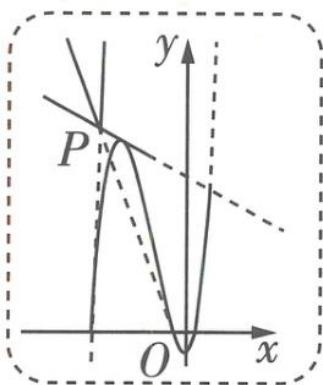

图 1

# 天星老师明关键

破解数学谜语的关键就在于把谜语翻译成数学问题, 即 “过点 $P(-6, a)$ 与曲线 $y = \frac{1}{2} x^{3} + 3 x^{2} + x - 1$ 相切的直线恰有三条, 求满足条件的整数 $a$ 的个数”, 这样便可以类比【调研 1】的破题思路求解了.

# 数学方法

特殊值法 又叫特值法,是指数学中设题中某个未知量为特殊值,从而通过简单的运算得出最终答案的方法.

关注微信公众号“初高教辅站”获取更多初高中教辅资料

# 参考答案与解析

##### 1. D 设所求切线的切点坐标为 $P(x_{0}, x_{0}^{3} + 3x_{0}^{2} + 4)$ , 则切线斜率 $k = 3x_{0}^{2} + 6x_{0}$ , 故切线方程为 $y - x_{0}^{3} - 3x_{0}^{2} - 4 = (3x_{0}^{2} + 6x_{0})(x - x_{0})$ ,

因为切线过点(1,t)，所以 $t-x_{0}^{3}-3x_{0}^{2}-4=(3x_{0}^{2}+6x_{0})(1-x_{0})$ ，即 $2x_{0}^{3}-6x_{0}+t-4=0$ 。

令 $g(x)=2x^{3}-6x+t-4$ ，则关于 x 的方程 $2x^{3}-6x+t-4=0$ 有 2 个实根，即曲线 $y=g(x)$ 与 x 轴有 2 个交点，

【破题有括】方程中虽然含有参数，但形式简单，可以看作含参数的三次函数问题，此时不需要分离参数也能通过数形结合快速求解

求导得 $g'(x)=6x^{2}-6$ ，令 $g'(x)>0$ ，得 x<-1 或 x>1，令 $g'(x)<0$ ，得 -1<x<1，列表如下.

<table><tr><td>x</td><td>(-∞,-1)</td><td>-1</td><td>(-1,1)</td><td>1</td><td>(1,+∞)</td></tr><tr><td>g&#x27;(x)</td><td>+</td><td>0</td><td>-</td><td>0</td><td>+</td></tr><tr><td>g(x)</td><td>↑</td><td>极大值t</td><td>↓</td><td>极小值t-8</td><td>↑</td></tr></table>

要满足题意,则需t=0或t=8,故选D.

【规避易错】 $g(x)$ 的图象与 $x$ 轴有 2 个交点，有 2 种可能：①极大值恰好为 0；②极小值恰好为 0。注意考虑全面

##### 2.31 由 $f(x) = \frac{1}{2} x^3 + 3x^2 + x - 1$ ，得 $f'(x) = \frac{3}{2} x^2 + 6x + 1$ ，设切点坐标为 $(x_0, \frac{1}{2} x_0^3 + 3x_0^2 + x_0 - 1)$ ，则切线斜率 $k = f'(x_0) = \frac{3}{2} x_0^2 + 6x_0 + 1$ ，切线方程为 $y - (\frac{1}{2} x_0^3 + 3x_0^2 + x_0 - 1) = (\frac{3}{2} x_0^2 + 6x_0 + 1)(x - x_0)$ ，

因为切线过点 $P(-6, a)$ ，则 $a - \left(\frac{1}{2} x_0^3 + 3x_0^2 + x_0 - 1\right) = \left(\frac{3}{2} x_0^2 + 6x_0 + 1\right)(-6 - x_0)$ ，

整理得 $a = -x_{0}^{3} - 12x_{0}^{2} - 36x_{0} - 7$ .

设函数 $g(x) = -x^{3} - 12x^{2} - 36x - 7$ ，则原问题等价于 $y = g(x)$ 与 y = a 的图象有三个不同的交点.

求导得 $g'(x) = -3x^{2} - 24x - 36$ ，令 $g'(x) > 0$ ，得 -6 < x < -2；令 $g'(x) < 0$ ，得 x < -6 或 x > -2。

所以 $g(x)$ 在 $(-6, -2)$ 上单调递增，在 $(-∞, -6)$ ， $(-2, +∞)$ 上单调递减，且 $g(-6) = -7$ ， $g(-2) = 25$ ，则 $g(x)$ 的图象如图 2 所示，

若 $y = g(x)$ 与 y = a 的图象有三个不同的交点, 则 -7 < a < 25, 所以整数 a 的个数为 31. 故打开盒子的密码为 31.

【解后反思】与【调研1】相比，这两题求解逻辑相同，但在命题形式上有区别：在【调研1】中，点的坐标是确定的，而三次函数不确定；本题中，三次函数确定，而点的坐标不确定

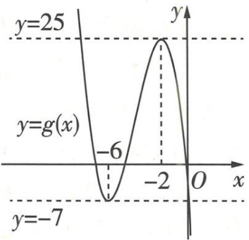

图 2

# 超重点 7 函数图象的识别及应用问题

# 命题角度1 利用函数图象的变换规则识别图象

调研 1 (2023 湖北恩施 5 月模拟) 函数 $f(x) = \ln(1 - x)$ 的图象向右平移 1 个单位长度, 再向上平移 2 个单位长度, 所得图象为 ( )

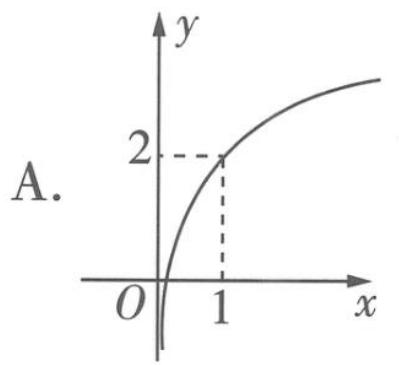

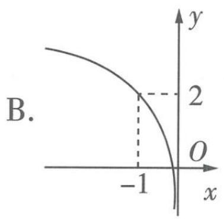

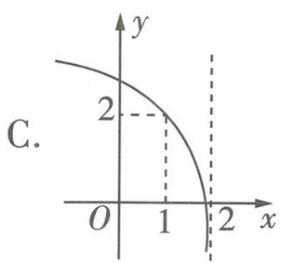

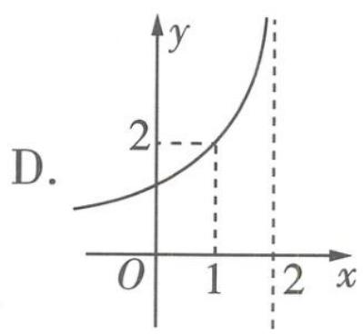

解析 根据所给函数的图象结合平移的规律,得到平移后图象对应的函数解析式为 $g(x)=f(x-1)+2=\ln(2-x)+2$ ,

【会总结】图象平移法则：左加右减，上加下减。并且左加右减一定是针对自变量 $x$ 的， $x$ 前面的系数一定要提出来

函数 $g(x)$ 的定义域为 $(-∞,2)$ ，故图象在直线 x=2 左侧。

【敲黑板】研究一个函数,优先研究它的定义域

由 $y = 2 - x$ 在 $(- \infty, 2)$ 上单调递减得 $g(x)$ 在 $(- \infty, 2)$ 上单调递减. 故选 C.

# 命题角度 2 复杂函数图象的识别问题

调研 2 (2023 湖北武汉 4 月调研 | 多选) 函数 $y = (kx^{2} + 1)e^{x}$ 的图象可能是 ( )

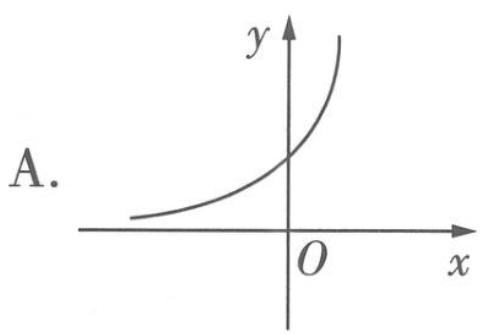

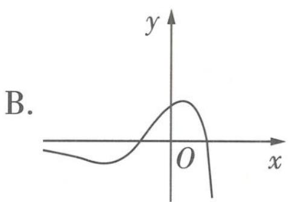

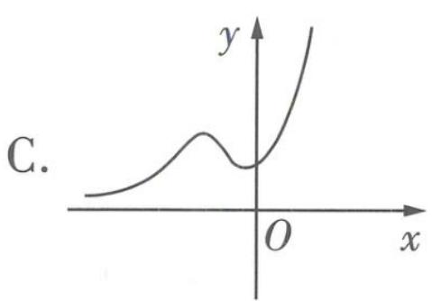

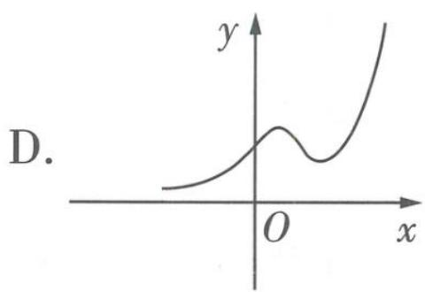

解析 记 $f(x)=(kx^{2}+1)e^{x}$ ，当 k=0 时， $f(x)=e^{x}$ ，A 选项正确.

【破题有拓】最高次项的系数是参数 $k$ 的时候, 通常要分 $k = 0, k > 0, k < 0$ 进行讨论, 优先考虑 $k = 0$ 的情况

当 $k \neq 0$ 时, $f'(x) = (kx^2 + 2kx + 1)e^x$ , 当关于 $x$ 的方程 $kx^2 + 2kx + 1 = 0$ 的根的判别式 $\Delta =$ 【会转化】 $f'(x)$ 的正负取决于 $kx^2 + 2kx + 1$ 的正负, $f'(x) = 0$ 的根就是 $kx^2 + 2kx + 1 = 0$ 的根 $4k^2 - 4k \leqslant 0$ , 即 $0 < k \leqslant 1$ 时, $f'(x) \geqslant 0$ , $f(x)$ 在 $\mathbb{R}$ 上单调递增.

当 $k > 1$ 时， $f'(x) = 0$ 有两个不等实根 $x_{1}, x_{2}$ ，且 $x_{1} + x_{2} = -2, x_{1}x_{2} = \frac{1}{k} > 0$ ，所以 $x_{1} < 0, x_{2} <$

# 数学方法

放缩法 指要证明不等式 $A < B$ 成立, 有时可以将它的一边放大或缩小, 寻找一个中间量, 如将 $A$ 放大成 $C$ , 即 $A < C$ , 后证 $C < B$ , 这种证法便是放缩法.

关注微信公众号“初高教辅站”获取更多初高中教辅资料

0,根据极值点可判断 C 选项正确,D 选项错误.

同理, 当 k<0 时, $f'(x)=0$ 有两个不等实根 $x_{1}, x_{2} (x_{1}<x_{2})$ , 且 $x_{1}+x_{2}=-2, x_{1}x_{2}=\frac{1}{k}<0$ , 所以 $x_{1}<0, x_{2}>0$ , 根据极值点可判断 B 选项正确. 故选 ABC.

调研 3 (2023 河北衡水中学 5 月模拟) 函数 $f(x) = \begin{cases} \ln \left( x - \frac{1}{x} \right), & x > 1, \\ \mathrm{e}^{\cos \pi x}, & x \leqslant 1 \end{cases}$ 的图象大致是

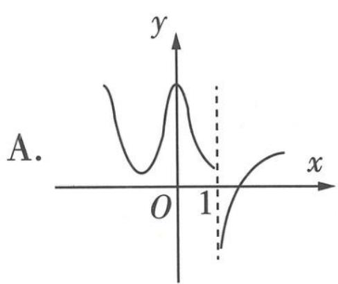

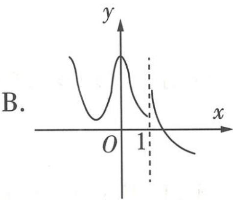

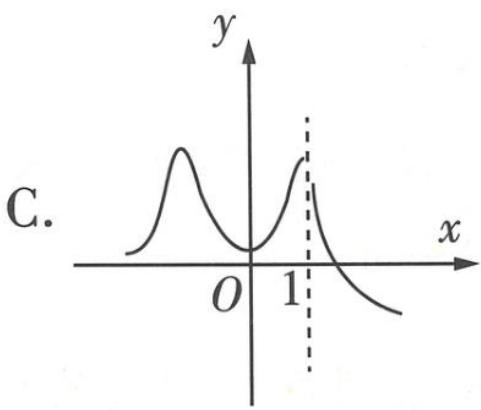

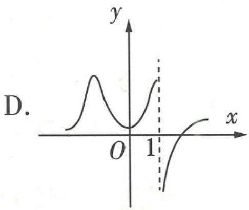

解析 当 x > 1 时, $f(x) = \ln\left(x - \frac{1}{x}\right)$ , 易知 $y = -\frac{1}{x}$ 在 $(1, +\infty)$ 上单调递增, 所以 $t = x - \frac{1}{x}$ 在 $(1, +\infty)$ 上单调递增, 又 $y = \ln t$ 是增函数, 所以 $f(x) = \ln\left(x - \frac{1}{x}\right)$ 在 $(1, +\infty)$ 上单调递增, 故排

【点拨】该函数是“飘带函数”, 和对勾函数比较像, 它在 $(-∞, 0)$ 和 $(0, +∞)$ 上单调递增除 BC. 当 $x ≤ 1$ 时, $f(x) = e^{\cos πx}$ , 若 $x ∈ (0, 1)$ , 则 $πx ∈ (0, π)$ , 所以 $m = \cos πx$ 在 $(0, 1)$ 上单调递减, 而 $y = e^{m}$ 是增函数, 所以 $f(x) = e^{\cos πx}$ 在 $(0, 1)$ 上单调递减, 所以 A 正确, D 错误. 故选 A.

# 命题角度 3 函数图象与性质的综合应用问题

调研 4 (2023 湖北武汉华中师大一附中 4 月检测 | 多选) 如图 1 是导函数 $y = f'(x)$ 的图象, 则下列说法正确的是 ( )

$\quad$A. 函数 $y = f(x)$ 在区间(1,3)上单调递减  
$\quad$B. 函数 $y = f(x)$ 在区间 $(- \infty, 0)$ 上单调递减  
$\quad$C. 函数 $y = f(x)$ 在 $x = 1$ 处取得极大值  
$\quad$D. 函数 $y = f(x)$ 在 $x = -2$ 处取得极小值

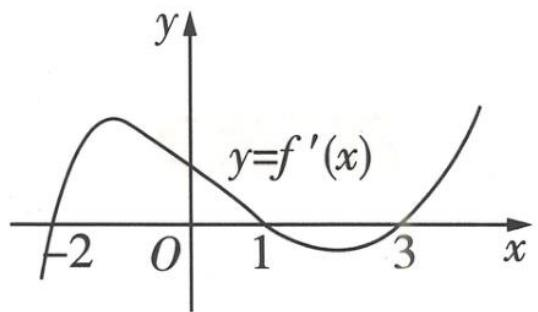

图 1

# 天星老师教审题

审题时一定要看清楚是原函数 $f(x)$ 的图象还是导函数 $f'(x)$ 的图象.

# 解析

<table><tr><td>选项</td><td>分析过程</td><td>正误</td></tr><tr><td>A</td><td>因为  $y=f'(x)<0$  在区间(1,3)上成立,所以在区间(1,3)上  $y=f(x)$  单调递减</td><td>√</td></tr><tr><td>B</td><td>因为当 -2 &lt; x &lt; 0 时, $f'(x)>0$ ,当 x&lt;-2 时, $f'(x)<0$ ,所以  $y=f(x)$  在  $(-\infty,0)$  上不单调</td><td>×</td></tr><tr><td>C</td><td>因为当 -2 &lt; x &lt; 1 时, $f'(x)>0$ ,当 1 &lt; x &lt; 3 时, $f'(x)<0$ ,所以函数  $y=f(x)$  在  $x=1$  处取得极大值</td><td>√</td></tr><tr><td>D</td><td>因为当 x&lt;-2 时, $f'(x)<0$ ,当 -2 &lt; x &lt; 1 时, $f'(x)>0$ ,所以函数  $y=f(x)$  在  $x=-2$  处取得极小值</td><td>√</td></tr></table>

调研 5 (2023 深圳第二次调研 | 多选) 已知 $f(x)$ 是定义在闭区间上的偶函数, 且在 $y$ 轴右侧的图象是函数 $y = \sin (\omega x + \varphi) (\omega > 0, 0 < \varphi < \pi)$ 图象的一部分 (如图 2 所示), 则 ( )

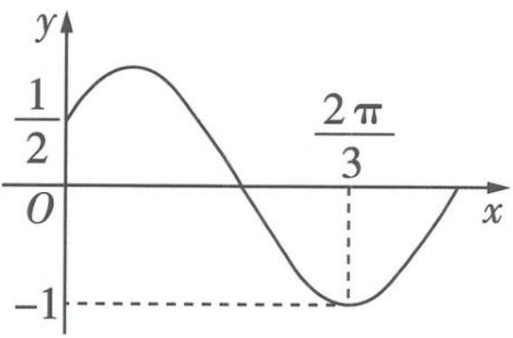

图2

$\quad$A. $f(x)$ 的定义域为 $[- \pi, \pi]$   
$\quad$B. 当 $x = \frac{\pi}{6}$ 时, $f(x)$ 取得最大值  
$\quad$C. 当 x < 0 时, $f(x)$ 的单调递增区间为 $\left[-\frac{2\pi}{3}, -\frac{\pi}{6}\right]$   
$\quad$D. 当 $x < 0$ 时, $f(x)$ 有且只有两个零点 $-\frac{5 \pi}{12}$ 和 $-\frac{11 \pi}{12}$

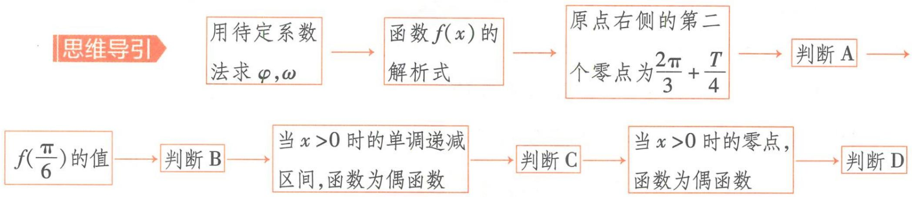

解析 由题图得 $f(0) = \sin \varphi = \frac{1}{2}$ ，根据图象的走势得 $\varphi = \frac{\pi}{6} + 2k\pi, k \in \mathbb{Z}$ ，

又 $0 < \varphi < \pi$ ，所以 $\varphi = \frac{\pi}{6}$

# 数学方法

数学归纳法 是一种数学证明方法,通常被用于证明某个给定命题在整个(或者局部)自然数范围内成立.

关注微信公众号“初高教辅站”获取更多初高中教辅资料

由题意得 $\left\{ \begin{array}{l} f\left(\frac{2\pi}{3}\right) = \sin \left(\frac{2\pi}{3}\omega + \frac{\pi}{6}\right) = -1, \\ \frac{3T}{4} > \frac{2\pi}{3}, \end{array} \right.$ $T$ 为函数 $y = \sin (\omega x + \varphi)$ 的最小正周期，则

$\left\{ \begin{array}{l l} { \frac {2 \pi}{3} \omega + \frac {\pi}{6} = \frac {3 \pi}{2} + 2 k \pi , k \in \mathbb {Z},} \\ { \frac {2 \pi}{\omega} > \frac {8 \pi}{9},} \end{array} \right. \quad \text {得} \left\{ \begin{array}{l l} {\omega = 2 + 3 k, k \in \mathbb {Z},} \\ {0 <   \omega <   \frac {9}{4},} \end{array} \right. \quad \text {所以}   \omega = 2.$

所以当 $x \geqslant 0$ 时, $f(x) = \sin \left(2x + \frac{\pi}{6}\right)$ , 由题图可知, 原点右侧的第二个零点为 $\frac{2\pi}{3} + \frac{T}{4} = \frac{2\pi}{3} + \frac{\pi}{4} = \frac{11\pi}{12}$ , 所以 $f(x)$ 的定义域为 $\left[-\frac{11\pi}{12}, \frac{11\pi}{12}\right]$ , 故 A 错误.

当 $x \in [0, \frac{11\pi}{12}]$ 时， $f(x) = \sin (2x + \frac{\pi}{6})$

因为 $f(\frac{\pi}{6})=\sin\frac{\pi}{2}=1$ ，所以当 $x=\frac{\pi}{6}$ 时， $f(x)$ 取得最大值，故B正确.

当 $x > 0$ 时, 令 $\frac{\pi}{2} + 2k\pi \leqslant 2x + \frac{\pi}{6} \leqslant \frac{3\pi}{2} + 2k\pi, k \in \mathbf{Z}$ , 则 $\frac{\pi}{6} + k\pi \leqslant x \leqslant \frac{2\pi}{3} + k\pi, k \in \mathbf{Z}$ , 又 $x \in (0, \frac{11\pi}{12}]$ , 所以当 $x > 0$ 时, $f(x)$ 的单调递减区间为 $[\frac{\pi}{6}, \frac{2\pi}{3}]$ . 因为函数 $f(x)$ 为偶函数, 所以当 $x < 0$ 时, $f(x)$ 的单调递增区间为 $[- \frac{2\pi}{3}, -\frac{\pi}{6}]$ , 故 C 正确.

【扫清障碍】偶函数在关于原点对称的两个区间上的单调性相反

当 $x \in [0, \frac{11\pi}{12}]$ 时, $2x + \frac{\pi}{6} \in [\frac{\pi}{6}, 2\pi]$ , 令 $f(x) = \sin(2x + \frac{\pi}{6}) = 0$ , 得 $2x + \frac{\pi}{6} = \pi$ 或 $2x + \frac{\pi}{6} = 2\pi$ , 则 $x = \frac{5\pi}{12}$ 或 $x = \frac{11\pi}{12}$ . 因为函数 $f(x)$ 为偶函数, 所以当 $x < 0$ 时, $f(x)$ 有且只有两个零点 $-\frac{5\pi}{12}$ 和 $-\frac{11\pi}{12}$ , 故 D 正确. 故选 BCD.

# 新题预测

##### 1. (2023 天津 5 月检测) 函数 $f(x) = \frac{\ln |x|}{x^2 + 2}$ 的图象大致为 ( )

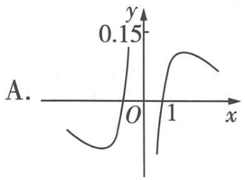

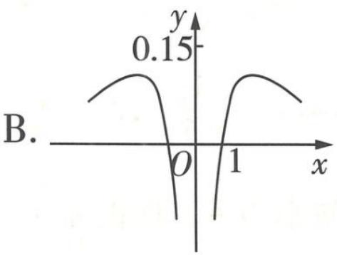

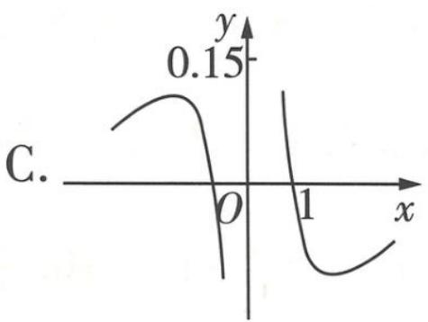

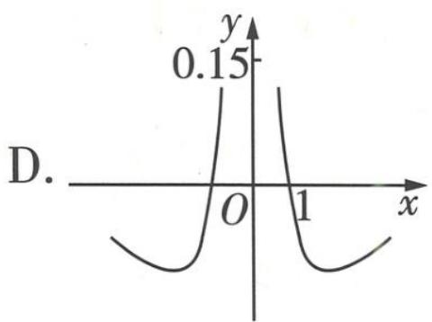

数学方法

##### 2. (2023 山东潍坊 4 月二模 | 多选) 已知函数 $f(x) = A \sin (\omega x + \varphi) + B (A > 0, \omega > 0, |\varphi| < \pi)$ 的部分图象如图 3 所示, 则 (   )

$\quad$A. $f(x)\leqslant f(\frac{11\pi}{6})$   
$\quad$B. 函数 $f(x + \frac{\pi}{6})$ 为偶函数  
$\quad$C. $f(x) + f(\frac{\pi}{6} - x) = 2$

$\quad$D. 曲线 $y = f(x)$ 在点 $(\frac{\pi}{12}, f(\frac{\pi}{12}))$ 处的切线斜率为 -2

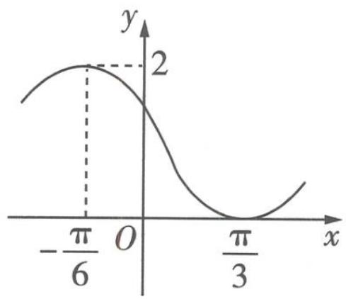  
图3

# 参考答案与解析

##### 1. B 根据题意, $f(x) = \frac{\ln |x|}{x^2 + 2}$ , 其定义域为 $\{x \mid x \neq 0\}$ , $f(-x) = \frac{\ln |x|}{x^2 + 2} = f(x)$ , $f(x)$ 是偶函数, 排除【关键提醒】观察选项中四个图象之间的区别, AC 关于原点对称, BD 关于 y 轴对称, 所以先考虑函数的奇偶性

AC, 在区间 $(0,1)$ 上, $\ln |x| = \ln x < 0$ , 必有 $f(x) < 0$ , 排除 D, 选 
$\quad$B.

【解题秘籍】选函数的大致图象,往往要借助函数的定义域、值域、单调性、奇偶性、图象的对称性或特殊函数值等进行排除

##### 2. ACD 由题中函数图象可知, $A = \frac{2 - 0}{2} = 1$ , $B = \frac{2 + 0}{2} = 1$ , $f(x)$ 的最小正周期 $T = 2(\frac{\pi}{3} + \frac{\pi}{6}) = \pi$ , 【解题秘籍】根据三角函数图象中的最大值和最小值, 结合方程组 $\left\{ \begin{array}{l} A + B = f(x)_{\max}, \\ -A + B = f(x)_{\min} \end{array} \right.$ 可以求出参数 $A$ 和 $B$

∴ $\omega = \frac{2\pi}{\pi} = 2$ ，当 $x = -\frac{\pi}{6}$ 时， $2 \times \left(-\frac{\pi}{6}\right) + \varphi = \frac{\pi}{2} + 2k\pi (k \in \mathbb{Z})$ ，∴ $\varphi = \frac{5\pi}{6} + 2k\pi (k \in \mathbb{Z})$ ，又 $|\varphi| < \pi, \therefore \varphi = \frac{5\pi}{6}, \therefore f(x) = \sin(2x + \frac{5\pi}{6}) + 1.$ 对于 A, $f(\frac{11\pi}{6}) = \sin(4\pi + \frac{\pi}{2}) + 1 = 2$ , $f(x) \leqslant f(\frac{11\pi}{6})$ , A 正确. 对于 B, $f(x + \frac{\pi}{6}) = \sin(2x + \frac{7\pi}{6}) + 1 = -\sin(2x + \frac{\pi}{6}) + 1$ , 显然不是偶函数, B 错误. 对于 C, 若 $f(x) + f(\frac{\pi}{6} - x) = 2$ , 则 $f(x)$ 的图象关于点 $(\frac{\pi}{12}, 1)$ 对称, 又 $f(\frac{\pi}{12}) = \sin(2x + \frac{\pi}{6}) + 1$ .

【关键提醒】若 $f(x) + f(c - x) = d$ ，则 $f(x)$ 的图象关于点 $\left(\frac{c}{2}, \frac{d}{2}\right)$ 中心对称

$\frac{\pi}{12} + \frac{5\pi}{6}) + 1 = 1, \therefore C$ 正确. 对于 $D, f'(x) = 2\cos (2x + \frac{5\pi}{6}), \therefore f'(\frac{\pi}{12}) = 2\cos (2 \times \frac{\pi}{12} + \frac{5\pi}{6}) = -2, \therefore$ 曲线 $y = f(x)$ 在点 $(\frac{\pi}{12}, f(\frac{\pi}{12}))$ 处的切线斜率为 $-2, D$ 正确. 故选 ACD.

# 超重点8 函数的零点问题

# 命题角度1 判断函数零点的个数

调研 1 (2023 陕西高新一中 4 月模拟) 函数 $y = f(x) (x \in \mathbb{R})$ 满足 $f(x + 1) = -f(x)$ ，且当 $x \in [-1, 1]$ 时， $f(x) = 1 - x^2$ . 已知函数 $g(x) = \begin{cases} |\lg x|, & x > 0, \\ \mathrm{e}^x, & x < 0, \end{cases}$ 则函数 $h(x) = f(x) - g(x)$ 在区间 $[-6, 6]$ 内的零点个数为 ( )

$\quad$A. 14

$\quad$B. 13

$\quad$C. 12

$\quad$D. 11

# 天星老师讲关键

这个式子的结构是不是非常眼熟？马上想到了结论“若 $f(x+a)=-f(x)$ ，则 $f(x)$ 的周期T=2a”，代入a=1，周期性立马浮出水面。

解析 函数 $y=f(x)$ 的定义域为 R, 因为 $f(x+1)=-f(x)$ , 所以 $f(x)$ 是周期为 2 的周期函数.

易知函数 $g(x)$ 在 $(- \infty, 0)$ 上单调递增，且 $0 < g(x) < 1; g(x)$ 在 $(0,1]$ 上单调递减，且 $g(x) \geqslant 0; g(x)$ 在 $[1, +\infty)$ 上单调递增，且 $g(x) \geqslant 0$

在同一平面直角坐标系内作出函数 $y=f(x)$ , $y=g(x)$ 的大致图象, 如图 1 所示.

【数形结合】要求函数 $h(x) = f(x) - g(x)$ 在区间 $[-6, 6]$ 内的零点个数，也就是求函数 $f(x), g(x)$ 的图象在区间 $[-6, 6]$ 内的交点个数，因此，准确作出两个函数的图象是解本题的关键，准确作图的准备工作：研究函数图象的走势（通过判断单调性、周期性等研究），确定函数图象所过的关键点（通过观察函数解析式确定）等

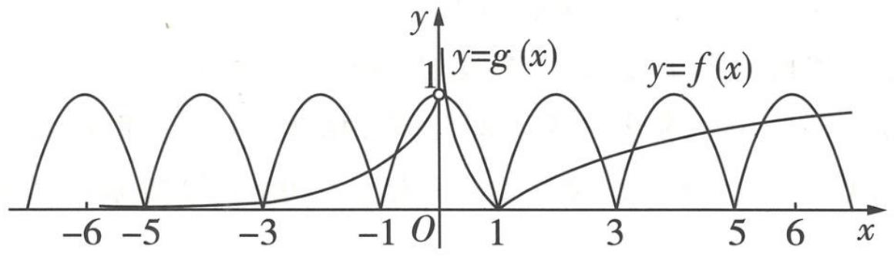

图1

由 $h(x)=0$ 得 $f(x)=g(x)$ ，即函数 $h(x)$ 在 $[-6,6]$ 内的零点个数是函数 $y=f(x)$ ， $y=g(x)$ 的图象在 $[-6,6]$ 内的交点个数，观察图象知，函数 $y=f(x)$ ， $y=g(x)$ 的图象在 $[-6,6]$ 内有 12 个交点，所以函数 $h(x)$ 在 $[-6,6]$ 内有 12 个零点，故选 C.

【敲黑板】函数 $g(x)$ 是分段函数，作图时一定要注意分界点处图象是实心点还是空心圈，这个一旦出错，会影响最终的答案

# 命题角度 2 已知函数零点个数求参数或参数的取值范围

调研 2 (2023 新高考 I 卷) 已知函数 $f(x) = \cos \omega x - 1 (\omega > 0)$ 在区间 [0, 2π] 有且仅有 3 个零点, 则 $\omega$ 的取值范围是 \_\_\_\_.

解析 函数 $f(x)=\cos \omega x-1$ 在区间 $[0,2\pi]$ 有且仅有3个零点, 即 $\cos \omega x=1$ 在区间 $[0,2\pi]$ 有且仅有3个根,

因为 $\omega > 0, x \in [0, 2\pi]$ , 所以 $\omega x \in [0, 2\omega\pi]$ ,

则由余弦函数的图象可知, $4\pi\leqslant2\omega\pi<6\pi$ ,解得 $2\leqslant\omega<3$ ,即 $\omega$ 的取值范围是[2,3).

调研 3 (2023 山东临沂 5 月三模) 已知函数 $f(x) = \begin{cases} x, & x \leqslant 0, \\ a \ln x, & x > 0, \end{cases} g(x) = f(x) - f(-x)$ , 若函数 $g(x)$ 有 5 个零点, 则实数 $a$ 的取值范围是 \_\_\_\_.

解析 函数 $y=f(-x)$ 与 $y=f(x)$ 的图象关于 y 轴对称, 且 $f(0)=0$ , 当 a>0 时, $y=f(-x)$ 与 $y=f(x)$ 的图象有 3 个交点, 当 a=0 时, 二者有 1 个交点, 均不符合题意, 所以 a<0.

方法一:参变分离 若函数 $g(x)$ 有 5 个零点, 则结合对称性可得, 当 x > 0 时, $g(x)$ 需要有 2 个零点, 即关于 x 的方程 $-x = a \ln x$ 要有两个不相等的实数根, x = 1 显然不是 $-x = a \ln x$ 的根.

【扫清障碍】实施参变分离，把 $a$ 放在等号的一侧，则 $\ln x$ 出现在分母的位置，要先保证分母不为0，因此需要先对 $x = 1$ 的情况进行说明

令 $h(x) = -\frac{x}{\ln x}$ , 其定义域为 $(0,1) \cup (1, +\infty)$ , 则 $h'(x) = \frac{1 - \ln x}{(\ln x)^2}$ , 令 $h'(x) = 0$ , 得 $x = e$ .

当 0 < x < 1 时, $h'(x) > 0$ , $h(x)$ 单调递增; 当 1 < x < e 时, $h'(x) > 0$ , $h(x)$ 单调递增; 当 x > e 时, $h'(x) < 0$ , $h(x)$ 单调递减. 所以 $h(x) = -\frac{x}{\ln x}$ 在 x = e 处取得极大值, 为 $h(e) = -e$ .

当 $0 < x < 1$ 时， $h(x) = -\frac{x}{\ln x} > 0$ 恒成立；当 $x > 1$ 时， $h(x) \leqslant -\mathrm{e}$ .

故只有满足 $a \in (-\infty, -\mathrm{e})$ ，直线 $y = a$ 才与曲线 $h(x) = -\frac{x}{\ln x}$ 有 2 个交点，从而函数 $g(x)$ 有 5 个零点。故实数 $a$ 的取值范围为 $(- \infty, -\mathrm{e})$ 。

方法二:数形结合 作出函数 $f(x)$ 的大致图象,如图2所示.

函数 $y=f(-x)$ 与 $y=f(x)$ 的图象关于 y 轴对称, 根据对称性可知, 要使函数 $g(x)$ 有 5 个零点, 则当 x>0 时, 函数 y=-x 与 $y=a\ln x$ 的图象必须存在 2 个交点.

设点 $(x_0, y_0)$ 为曲线 $y = a\ln x$ 上一点，则曲线 $y = a\ln x$ 在该点处的切线方程为 $y - y_0 = \frac{a}{x_0}(x - x_0)$ ，

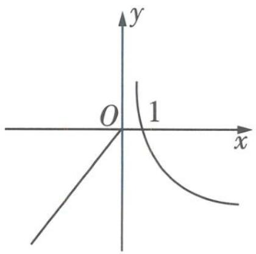

图 2

令 $\frac{a}{x_0} = -1$ ，设点(0,0)在切线上，于是有 $0 - y_0 = \frac{a}{x_0}(0 - x_0)$ ，结合 $y_0 = a\ln x_0$ 得 $x_0 = e, a = -e$ ，此时直线 $y = -x$ 与曲线 $y = a\ln x$ 相切，因此当 $a < -e$ 时，直线 $y = -x$ 与曲线 $y = a\ln x$ 有2个交点。

故实数 a 的取值范围为 $(-∞, -e)$ .

# 数学方法

分析法 指从要证的结论出发,逐步寻求使它成立的充分条件,直到归结为判定一个显然成立的条件为止,从而证明论点的正确性、合理性的论证方法.

关注微信公众号“初高教辅站”获取更多初高中教辅资料

# 命题角度 3 求函数零点的和、积等的值或取值范围

调研 4 (求函数零点积的取值范围 |2023 广东深圳 5 月三模) 已知函数 $f(x) = \left\{ \begin{array}{l} \left| \lg x \right|, 0 < x \leqslant 10, \\ -\frac{1}{2}x + 6, x > 10, \end{array} \right.$ 均不相等, 且 $f(a) = f(b) = f(c)$ , 则 $abc$ 的取值范围是 ( )

$\quad$A. (1,10)

$\quad$B. $(5,6)$

$\quad$C. (10,12)

$\quad$D. (20,24)

# 天星老师教审题

记 $f(a)=f(b)=f(c)=d$ ，则本题的本质是求函数 $y=f(x)-d$ 的零点的积的取值范围，解题关键在于确定函数每个零点所在区间。

解析 作出函数的图象,如图3所示.

【点透】去掉 $f(x)$ 解析式的绝对值得 $f(x)=\left\{\begin{aligned}-\lg x,0<x&\leqslant1,\\ \lg x,1&<x\leqslant10,\\ -\frac{1}{2}x+6,x&>10,\end{aligned}\right.$ 结合每段函数的单调性可知a，
b, c 分别在区间(0,1)，(1,10)，(10,12)上，这是解题的关键

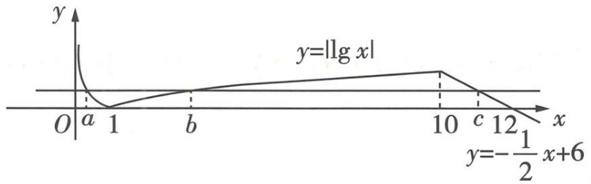

图 3

不妨设 $a < b < c$ ，则 $-\lg a = \lg b = -\frac{1}{2} c + 6 \in (0,1)$ ，所以 $\lg b + \lg a = 0$ ，得 $ab = 1$ 。

由 $-\frac{1}{2} c + 6 \in (0,1)$ 得 $c \in (10,12)$ , 所以 $10 < abc < 12$ , 故选 C.

调研 5: (求函数零点和的取值范围 |2023 甘肃兰州 4 月二模) 函数 $f(x)=$ $\left\{\begin{array}{l}2^{x}-t, x \geqslant 0, \\ -x^{2}-4x-t, x < 0\end{array}\right.$ 有三个零点 $x_{1}, x_{2}, x_{3}$ , 且 $x_{1}<x_{2}<x_{3}$ , 则 $x_{1}+x_{2}+x_{3}$ 的取值范围是 \_\_\_\_.

# 天星老师破障碍

乍一看似乎无从下手，函数每一段解析式中都含参数 t，如何去掉这个讨厌的绊脚石呢？不妨把 t 拿出来，把问题转化为直线 y = t 与函数 $y = \begin{cases} 2^{x}, & x \geqslant 0, \\ -x^{2} - 4x, & x < 0 \end{cases}$ 的图象有三个交点，这样问题就简单得多啦！

解析 函数 $f(x) = \begin{cases} 2^x - t, & x \geqslant 0, \\ -x^2 - 4x - t, & x < 0 \end{cases}$ 有三个零点 $x_1, x_2, x_3$ ，且 $x_1 < x_2 < x_3$ ，

设 $g(x) = \left\{ \begin{array}{l}2^{x},x\geqslant 0,\\ -x^{2} - 4x,x <   0, \end{array} \right.$ 则函数 $g(x)$ 的图象与直线 $y = t$ 的三个交点的横坐标分别为 $x_{1}$ ， $x_{2},x_{3}$ ，且 $x_{1} <   x_{2} <   x_{3}$ ，作出函数 $g(x)$ 的图象，如图4所示.

由图可知 $1 \leqslant t < 4$ ，且 $x_{1}, x_{2}$ 是关于 $x$ 的方程 $-x^{2} - 4x - t = 0$ 的两个不等实根，所以 $x_{1} + x_{2} = -\frac{-4}{-1} = -4$ ，

【指点迷津】由于二次函数图象有对称性，所以此时 $x_{1}, x_{2}$ 两零点之和为定值，为二次函数图象的对称轴与 $x$ 轴交点的横坐标的2倍

$x_{3}$ 满足 $2^{x_3} - t = 0$ ，即 $x_{3} = \log_{2}t$ ，因为 $1\leqslant t < 4$ ，所以 $\log_21\leqslant \log_2t< \log_24$ ，即 $0\leqslant x_3 < 2.$

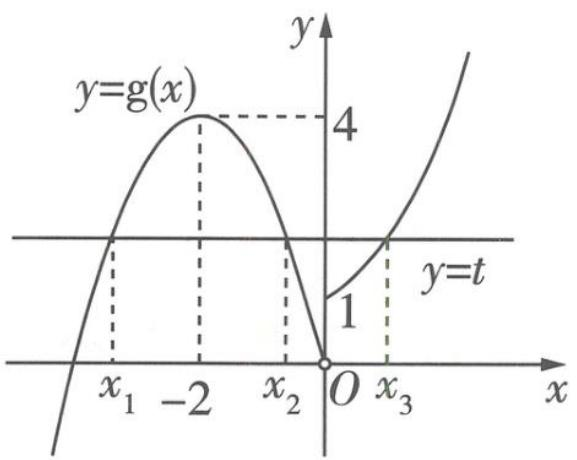

图4

所以 $-4 \leqslant x_{1} + x_{2} + x_{3} < -2$ ，即 $x_{1} + x_{2} + x_{3}$ 的取值范围是 $[-4, -2)$ .

# 命题角度 4 嵌套函数的零点问题

调研 6: (2023 山东师范大学附属中学 5 月模拟) 函数 $f(x)=\left\{\begin{aligned}&\ln(-x-1), x<-1,\\&2x+1, x \geqslant -1,\end{aligned}\right.$ 若函数 $g(x)=f(f(x))-a$ 有三个不同的零点, 则实数 $a$ 的取值范围是 \_\_\_\_.

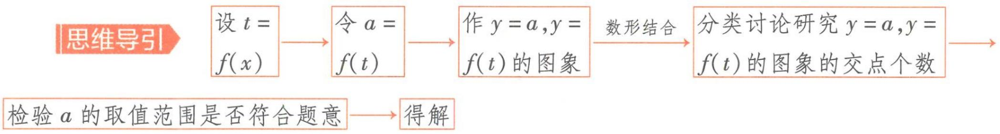

解析 设 $t=f(x)$ ，令 $g(x)=f(f(x))-a=0$ ，则 $a=f(t)$ .

在同一平面直角坐标系内作出 $y = a, y = f(t)$ 的图象, 如图 5 所示.

①当 $a \geq -1$ 时, $y = a$ 与 $y = f(t)$ 的图象有 2 个交点,

【扫清障碍】含参数的嵌套函数问题，应注意让参数的取值“动起来”，抓临界位置，动静结合

设交点的横坐标为 $t_1, t_2$ （不妨设 $t_2 > t_1$ ），则 $t_1 < -1, t_2 \geqslant -1$ .

当 $t_1 < -1$ 时, $t_1 = f(x)$ ( $t_1$ 为参数) 有一解; 当 $t_2 \geqslant -1$ 时, $t_2 = f(x)$ ( $t_2$ 为参数) 有两解.

所以 $g(x)=f(f(x))-a$ 有三个不同的零点, 满足题意.

②当 a < -1 时, y = a 与 $y = f(t)$ 的图象有一个交点.

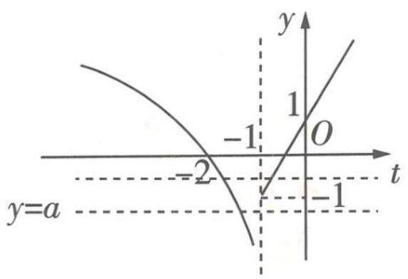

图5

# 数学方法

估算法 有些问题,由于题目条件限制,无法(或没有必要)进行精确的运算,此时可借助估算,通过观察、分析、比较、推算,得出正确的判断.

关注微信公众号“初高教辅站”获取更多初高中教辅资料

设交点的横坐标为 $t_3$ ，令 $\ln (-t - 1) = -1$ ，得 $t = -1 - \frac{1}{\mathrm{e}}$ ，所以 $-1 - \frac{1}{\mathrm{e}} < t_3 < -1$

【会检验】要注意检验零点是否满足要求，防止产生增根

此时 $t_{3}=f(x)$ 有一个解, 不满足题意.

综上所述,实数 a 的取值范围为 $[-1, +\infty)$ .

# 新题预测

##### 1. (2023 山东潍坊一中 5 月模拟) 已知函数 $f(x) = \begin{cases} \frac{2^x + 2}{2}, & x \leqslant 1, \\ |\log_2(x - 1)|, & x > 1, \end{cases}$ 则函数 $F(x) = f(f(x)) - 2f(x) - \frac{3}{2}$ 的零点个数是 ( )

$\quad$A. 4

$\quad$B. 5

$\quad$C. 6

$\quad$D. 7

# 天星老师破瓶颈

看到嵌套函数，立即考虑设参数，令 $t = f(x), F(x) = 0$ ，得到 $f(t) = 2t + \frac{3}{2}$ ，作出函数 $y = f(t)$ 与 $y = 2t + \frac{3}{2}$ 的图象，研究两函数图象的交点，进一步研究原函数的零点。

##### 2. (2023 云南宣威市第七中学 5 月预测 | 多选) 已知函数 $f(x) = \begin{cases} x^2 + 2x + 2, & x \leqslant 0, \\ 1 + \ln x, & x > 0, \end{cases}$ 若存在 $x_1 < x_2 < x_3$ , 使得 $f(x_1) = f(x_2) = f(x_3) = m$ , 则下列结论正确的有 ( )

$\quad$A. 实数 $m$ 的取值范围为 $(1,2]$

$\quad$B. $1 \leqslant x_{3} < e$

$\quad$C. $x_{1} + x_{2} = -2$

$\quad$D. $x_{1} x_{2}$ 的最大值为 1

##### 3. (开放性举例问题 | 2023 北京市第九中学 4 月模拟) 已知函数 $f(x) = \begin{cases} \ln x, & x > 0, \\ g(x), & x < 0, \end{cases}$ 若 $\exists x_0 \in (-\infty, 0)$ , 使得 $f(x_0) + f(-x_0) = 0$ 成立, 请写出一个符合条件的函数 $g(x)$ 的表达式: $g(x) =$ \_\_\_\_.

# 天星老师明思路

在 $(-\infty, 0)$ 上存在一个 $x_0$ 使 $f(x_0) + f(-x_0) = 0$ 成立，即 $g(x_0) + f(-x_0) = 0$ 成立，即 $g(x_0) = -f(-x_0)$ 成立，由此便得到了 $g(x)$ 与 $y = -f(-x), x \in (-\infty, 0)$ 的联系，从后者的图象入手，看，思路一下子就清晰了吧！

# 参考答案与解析

##### 1. A 令 $t=f(x)$ ，则 $t \geqslant 0$ ，令 $F(x)=0$ ，则 $f(t)-2t-\frac{3}{2}=0$ ，不考虑 $t$ 的范围，作出 $y=f(t)$ 的图象和直线 $y=2t+\frac{3}{2}$ ，如图6所示。由图象可得，二者有两个交点，设交点横坐标为 $t_1, t_2$ ，则 $t_1=0, t_2 \in (1,2)$ ，满足 $t \geqslant 0$ 。

【小提示】注意换元前后自变量的区别及范围的变化

当 $f(x)=t_{1}(t_{1}$ 为参数)时,x=2,即有一解;当 $f(x)=t_{2}(t_{2}$ 为参数)时,有三个解.
综上， $F(x)=0$ 共有4个解，即原函数有4个零点，故选A.

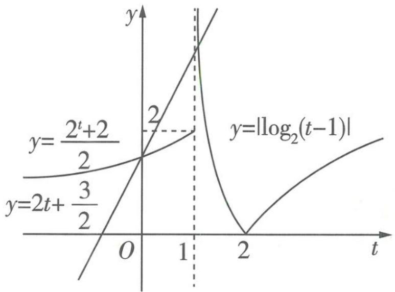

图6

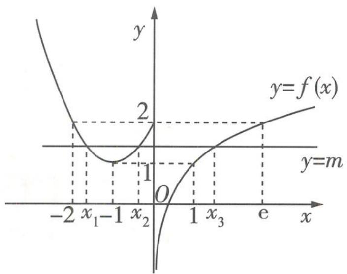

图7

##### 2. AC 画出 $f(x)$ 和 $y = m$ 的图象, 如图7所示.

<table><tr><td>选项</td><td>分析过程</td><td>正误</td></tr><tr><td>A</td><td>要满足题意,则直线 $y = m$ 与曲线 $y = f(x)$ 有三个不同的交点 $\rightarrow m \in (1,2]$ </td><td>√</td></tr><tr><td>B</td><td>由题意可知 $x_1 < x_2 \leqslant 0, x_3 \in (1,e]$ 且点 $(x_1,0), (x_2,0)$ 关于直线 $x = -1$ 对称 $\rightarrow$ </td><td>×</td></tr><tr><td>C</td><td> $x_1 + x_2 = -2$ </td><td>√</td></tr><tr><td>D</td><td> $-x_1 - x_2 = 2 \geqslant 2\sqrt{(-x_1) \cdot (-x_2)} = 2\sqrt{x_1x_2} \rightarrow x_1x_2 \leqslant 1$ ,当且仅当 $x_1 = x_2 = -1$ 时等号成立 $\rightarrow$ 但 $x_1 \ne -1, x_2 \ne -1$ ,所以等号取不到 $\rightarrow x_1x_2 < 1$ 【易遗漏】使用基本不等式时,一定要注意判断等号成立的条件</td><td>×</td></tr></table>

##### 3. $\frac{1}{x}$ (答案不唯一) 由 $\exists x_0 \in (-\infty, 0)$ , 使得 $f(x_0) + f(-x_0) = 0$ 成立, 可得 $\exists x_0 \in (-\infty, 0)$ , 使得 $g(x_0) = -f(-x_0)$ 成立.

由函数 $y=f(x)$ 与函数 $y=-f(-x)$ 的图象关于原点对称可得 $y=\ln x$ 的图象与 $y=-\ln(-x)$ 的图象关于原点对称,作图,如图8所示.

取 $g(x)=\frac{1}{x}$ ，易得曲线 $y=-\ln(-x)$ 与曲线 $y=\frac{1}{x}$ 在第三象限有一个交点，故取 $g(x)=\frac{1}{x}$ 符合题意（答案不唯一）.

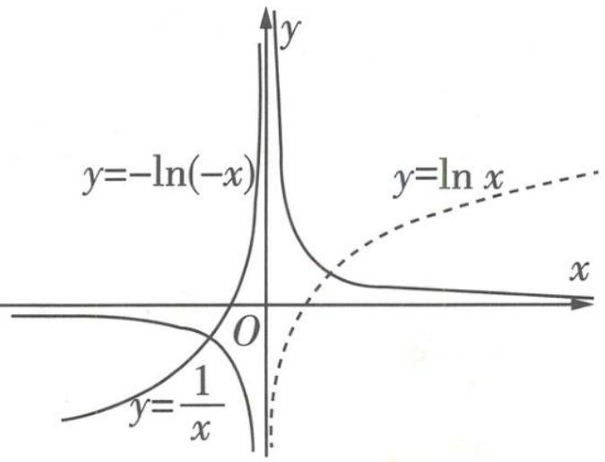

图8

# 超重点9 有关 $x(x^n), e^x, \ln x, \sin x$ 等的组合函数问题

# 命题角度 1 基于 $x(x^{n})$ 与 $\ln x, e^{x}$ 的组合函数的恒成立问题

调研 1 (2023 新高考 I 卷) 已知函数 $f(x) = a(e^x + a) - x$ .

（1） 讨论 $f(x)$ 的单调性;  
（2） 证明: 当 a > 0 时, $f(x) > 2 \ln a + \frac{3}{2}$ .

解析 （1） 第 1 步: 求导.

$f ^ {'} (x) = a \mathrm{e} ^ {x} - 1,$

第2步:对a分类讨论,判断 $f'(x)$ 的符号,得单调性.

当 $a \leqslant 0$ 时, $f'(x) \leqslant 0$ , 所以函数 $f(x)$ 在 $(- \infty, + \infty)$ 上单调递减;

当 $a > 0$ 时，令 $f'(x) > 0$ ，得 $x > -\ln a$ ，令 $f'(x) < 0$ ，得 $x < -\ln a$

所以函数 $f(x)$ 在 $(-∞,-\ln a)$ 上单调递减，在 $(-ln a,+∞)$ 上单调递增.

综上可得: 当 $a \leqslant 0$ 时, 函数 $f(x)$ 在 $(-∞, +∞)$ 上单调递减; 当 a > 0 时, 函数 $f(x)$ 在 $(-∞, -ln a)$ 上单调递减, 在 $(-ln a, +∞)$ 上单调递增.

（2） 第 1 步: 利用 （1） 的结论, 求函数 $f(x)$ 的最值.

由（1）得当 a > 0 时, 函数 $f(x) = a(\mathrm{e}^{x} + a) - x$ 的最小值为 $f(-\ln a) = a(\mathrm{e}^{-\ln a} + a) + \ln a = 1 + a^{2} + \ln a$ ,

第2步:构造函数 $g(a)=1+a^{2}+\ln a-2\ln a-\frac{3}{2}$ ，求导，判断其单调性.

令 $g(a) = 1 + a^2 + \ln a - 2\ln a - \frac{3}{2} = a^2 - \ln a - \frac{1}{2}, a \in (0, +\infty)$ ,

所以 $g'(a)=2a-\frac{1}{a}$ ，令 $g'(a)>0$ ，得 $a>\frac{\sqrt{2}}{2}$ ；令 $g'(a)<0$ ，得 $0<a<\frac{\sqrt{2}}{2}$ .

所以函数 $g(a)$ 在 $(0, \frac{\sqrt{2}}{2})$ 上单调递减，在 $(\frac{\sqrt{2}}{2}, +\infty)$ 上单调递增，

第3步:求函数 $g(a)=1+a^{2}+\ln a-2\ln a-\frac{3}{2}$ 的最小值,得结论.

所以函数 $g(a)$ 的最小值为 $g(\frac{\sqrt{2}}{2}) = (\frac{\sqrt{2}}{2})^2 - \ln \frac{\sqrt{2}}{2} - \frac{1}{2} = \ln \sqrt{2} > 0$

所以当 a > 0 时, $f(x) > 2\ln a + \frac{3}{2}$ 成立.

# 命题角度2 基于 $x(x^n)$ 与 $\sin x$ 等的组合函数的极（最）值问题

调研 2 (2023 杭州学军中学 5 月二模) 已知函数 $f(x) = a \sin x + b \tan x, x \in (0, \frac{\pi}{2})$ .

（1） 若 $a = 1, b = 0$ , 求证: $g(x) = f(x) - \frac{x^3}{2}$ 在 $(0, \frac{\pi}{2})$ 上有唯一极值点.  
（2） 若 $a \in \mathbb{N}, b = 1$ , 不等式 $f(x) \geqslant (1 + a)x$ 恒成立, 求 $a$ 的取值集合.

解析 （1） 由题意得 $g(x) = \sin x - \frac{x^3}{2}$ , 则 $g'(x) = \cos x - \frac{3x^2}{2}$ .

令 $h(x) = \cos x - \frac{3x^2}{2}$ , 则 $h'(x) = -\sin x - 3x$ .

令 $\varphi(x) = -\sin x - 3x$ ，则 $\varphi'(x) = -\cos x - 3 < 0$ ，所以 $\varphi(x) = -\sin x - 3x$ 在 $(0, \frac{\pi}{2})$ 上单调递减，

【破题有括】导函数值的符号无法确定时，再次构造函数求导，直到符号可以判断为止，再根据单调性和最值情况倒回去一层一层判断，这一步要细心、耐心

又 $\varphi(0) = 0$ ，所以 $\varphi(x) < 0$ 在 $(0, \frac{\pi}{2})$ 上恒成立.

故 $h(x)=\cos x-\frac{3x^{2}}{2}$ 在 $(0,\frac{\pi}{2})$ 上单调递减，又 $h(0)=1>0,h(\frac{\pi}{2})<0,$

【敲黑板】函数 $f(x)$ 在区间 $[a, b]$ 上的图象连续，且有 $f(a) \cdot f(b) < 0$ ，则函数 $f(x)$ 在区间 $(a, b)$ 内必有零点，若 $f(x)$ 在该区间上单调，则有唯一零点

所以存在唯一的 $x_0 \in (0, \frac{\pi}{2})$ ，使得 $h(x_0) = g'(x_0) = 0$

故当 $x \in (0, x_0)$ 时， $g'(x) > 0$ ，当 $x \in (x_0, \frac{\pi}{2})$ 时， $g'(x) < 0$

所以 $g(x)$ 在 $(0, x_{0})$ 上单调递增，在 $(x_{0}, \frac{\pi}{2})$ 上单调递减，故 $g(x)$ 在 $(0, \frac{\pi}{2})$ 上有唯一极值点 $x_{0}$ .

（2） 令 $F(x) = a \sin x + \tan x - (a + 1)x$ , 则原问题等价于当 $x \in (0, \frac{\pi}{2})$ 时, $F(x) \geqslant 0$ 恒成立.

$F ^ {'} (x) = a \cos x + \frac {1}{\cos^ {2} x} - (a + 1) = \frac {1}{\cos^ {2} x} (\cos x - 1) (a \cos^ {2} x - \cos x - 1).$

【攻克难点】此处对导函数解析式的整理是难点，整理成几个多项式相乘的形式，其中符号能够确定的式子越多越好，剩下的符号不易确定的，往往就是分类讨论的标准

①当 a=0 时, $F'(x)\geqslant0$ 恒成立,故 $F(x)$ 在 $(0,\frac{\pi}{2})$ 上单调递增,故 $F(x)>F(0)=0$ ,满足题意.  
②当 $a = 1$ 或 $a = 2$ 时, 因为 $x \in (0, \frac{\pi}{2})$ , 所以 $a \cos^2 x - \cos x - 1 \leqslant 2 \cos^2 x - \cos x - 1 = (2 \cos x + 1) (\cos x - 1) < 0$ , 故 $F'(x) > 0$ 在 $(0, \frac{\pi}{2})$ 上恒成立, 故 $F(x) > F(0) = 0$ , 满足题意.

# 数学方法

③当 $a \geqslant 3$ 时，令 $t = \cos x, x \in (0, \frac{\pi}{2})$ ，则 $t \in (0,1)$ ，令 $h(t) = at^2 - t - 1$

【易错点拨】此处进行三角换元，目的是转化成二次函数，要注意新元范围的变化

则根据二次函数的图象特征知 $h(t)$ 在 $(0, \frac{1}{2a})$ 上单调递减，在 $(\frac{1}{2a}, 1)$ 上单调递增.

令 $\cos x_{1} = \frac{1}{2a}$ 故 $m(x) = a\cos^2 x - \cos x - 1$ 在 $(0,x_1)$ 上单调递减，在 $(x_{1},\frac{\pi}{2})$ 上单调递增，

而 $m(0) = a - 2 > 0, m(x_1) = -\frac{1}{4a} - 1 < 0,$

所以存在唯一的 $x_{2} \in (0, x_{1})$ ，使得 $m(x_{2}) = 0$ ，所以当 $x \in (0, x_{2})$ 时， $m(x) > 0$

所以当 $x \in (0, x_{2})$ 时， $F'(x) = \frac{1}{\cos^{2}x} (\cos x - 1)m(x) < 0, F(x)$ 单调递减，所以 $F(x) < 0$ 在 $(0, x_{2})$ 上恒成立，不满足题意.

综上,a 的取值集合为 $\{0,1,2\}$ .

# 命题角度 3 基于 $e^{x}$ 与 $\sin x$ 等的组合函数的最值问题

调研 3 (2023 合肥第六中学 5 月月考) 已知函数 $f(x) = \mathrm{e}^{x}\sin x + \sqrt{2}a\cos (x + \frac{\pi}{4}), x \in [0, \pi]$ .

（1） 若 $a \leqslant 1$ , 判断函数 $f(x)$ 的单调性.  
（2） 当 a=1 时, 求函数 $f(x)$ 的最小值, 并证明: $\mathrm{e}^{x}(\pi-x)\geqslant\sin x-\cos x-1(x\in[0,\pi])$ .

解析 （1） $f'(x) = e^{x} \sin x + e^{x} \cos x - \sqrt{2} a \sin \left( x + \frac{\pi}{4} \right) = e^{x} \sin x + e^{x} \cos x - a (\sin x + \cos x) = \left( e^{x} - a \right) (\sin x + \cos x)$ .

因为 $a \leqslant 1$ ，所以 $e^{x} - a \geqslant 0$ 在 $[0, \pi]$ 上恒成立.

令 $f'(x)=0$ ，得 $x=\frac{3\pi}{4}$ ，当 $0\leqslant x\leqslant\frac{3\pi}{4}$ 时， $f'(x)\geqslant0,f(x)$ 在 $[0,\frac{3\pi}{4}]$ 上单调递增，当 $\frac{3\pi}{4}<x\leqslant\pi$ 时， $f'(x)<0,f(x)$ 在 $(\frac{3\pi}{4},\pi]$ 上单调递减.

综上, $f(x)$ 在 $\left[0,\frac{3\pi}{4}\right]$ 上单调递增,在 $\left(\frac{3\pi}{4},\pi\right]$ 上单调递减.

（2） 当 $a = 1$ 时, $f(x) = \mathrm{e}^{x}\sin x + \sqrt{2}\cos \left(x + \frac{\pi}{4}\right), x \in [0, \pi]$ .

由（1）知 $f(x)$ 在 $\left[0,\frac{3\pi}{4}\right]$ 上单调递增,在 $\left(\frac{3\pi}{4},\pi\right]$ 上单调递减, $f(0)=1,f(\pi)=-1$ ,

故函数 $f(x)$ 的最小值为 -1.

$f(x)\geqslant f(\pi) = -1$ ，即 $\mathrm{e}^x\sin x + \sqrt{2}\cos (x + \frac{\pi}{4})\geqslant -1$ ，即 $\mathrm{e}^x\sin x + \cos x - \sin x\geqslant -1$ ，即

$\mathrm{e} ^ {x} \sin x \geqslant \sin x - \cos x - 1.$

要证 $\mathrm{e}^{x}(\pi-x)\geqslant\sin x-\cos x-1$ 在 $[0,\pi]$ 上恒成立, 只需证 $\mathrm{e}^{x}(\pi-x)\geqslant\mathrm{e}^{x}\sin x$ 在 $[0,\pi]$ 上恒成立, 只需证 $\mathrm{e}^{x}(\pi-x-\sin x)\geqslant0$ 在 $[0,\pi]$ 上恒成立.

【破题有括】待证不等式的两边含有同一个变量时, 一般地, 可以直接 “左减右” 或 “右减左” 构造函数, 研究其单调性等相关性质证明不等式

令 $h(x) = \pi - x - \sin x, x \in [0, \pi]$ ，则 $h'(x) = -1 - \cos x \leqslant 0$ ，所以 $h(x)$ 单调递减，

所以 $h(x)_{\min} = h(\pi) = \pi -\pi -\sin \pi = 0$ ，故 $h(x)\geqslant 0$ 恒成立，

所以 $\mathrm{e}^{x}(\pi-x-\sin x)\geqslant0$ , 原不等式得证.

# 命题角度4 基于 $\ln x$ 与 $\sin x$ , $\cos x$ 的组合函数的最值问题

调研 4 (2023 河南信阳三模)已知函数 $f(x) = \ln (x + 1) + \sin x + \cos x$ .

（1） 当 $x \in [0, \pi]$ 时, 求证: $f(x) > 0$ .  
（2） 若 $f(x) \leqslant ax + 1$ 恒成立, 求 a 的值.

# 天星老师有妙招

看到这个结构，马上想到利用辅助角公式整合，这样可以减少一个函数名，降低难度。

解析 （1） $f(x)=\ln(x+1)+\sin x+\cos x=\ln(x+1)+\sqrt{2}\sin(x+\frac{\pi}{4})$ .

当 $x \in [0, \frac{3\pi}{4}]$ 时， $\ln(x + 1) \geqslant 0, \sin(x + \frac{\pi}{4}) \geqslant 0$ ，且二者不同时为 0，所以 $f(x) > 0$ .

【规避易错】两个不等关系，“合并”后一定要看两个等号是否能同时成立

当 $x \in (\frac{3\pi}{4}, \pi]$ 时, $\ln (x + 1) > \ln (1 + \frac{3\pi}{4}) > \ln 3 > 1$ , 且 $\sqrt{2} \sin (x + \frac{\pi}{4}) \geqslant \sqrt{2} \sin \frac{5\pi}{4} = -1$ , 所以 $f(x) > 0$ .

综上, 当 $x \in [0, \pi]$ 时, $f(x) > 0$ .

（2） 由 $f(x) \leqslant ax + 1$ ，令 $g(x) = \ln (1 + x) + \sin x + \cos x - ax - 1 (x > -1)$ ，

【易遗漏】移项后构造新函数，注意新函数的定义域不要漏掉

要使 $f(x)\leqslant ax+1$ 恒成立,即要使 $g(x)\leqslant0$ 恒成立,只要 $g(x)_{\max}\leqslant0$ .

因为 $g(0)=0$ ，且 $g(x)$ 的图象在定义域上连续不间断，所以 0 是 $g(x)$ 的一个极大值点，则有 $g'（0）=0$ .

因为 $g'(x)=\frac{1}{1+x}+\cos x-\sin x-a$ , 所以 $g'（0）=\frac{1}{1+0}+\cos 0-\sin 0-a=2-a=0, a=2.$

当 $a = 2$ 时， $g'(x) = \frac{1}{1 + x} + \cos x - \sin x - 2.$

# 数学名家

刘徽 魏晋时期伟大的数学家,中国古典数学理论的奠基人之一.他的杰作《九章算术注》和《海岛算经》是中国最宝贵的数学遗产.

关注微信公众号“初高教辅站”获取更多初高中教辅资料

当 $x \in (-1,0]$ 时， $\frac{1}{1 + x} > 1, \cos x - \sin x = \sqrt{2} \cos \left(x + \frac{\pi}{4}\right) \geqslant 1$ ，所以 $g'(x) > 0$ ，故 $g(x)$ 在 $(-1,0]$ 上单调递增；

当 $x \in (0, \frac{3\pi}{4}]$ 时， $g'(x) = \frac{1}{1 + x} + \cos x - \sin x - 2 = \frac{1}{1 + x} + \sqrt{2}\cos \left(x + \frac{\pi}{4}\right) - 2$ 在 $(0, \frac{3\pi}{4}]$ 上单调递减，且 $g'（0） = 0$ ，所以 $g'(x) < g'（0） = 0$ ，故 $g(x)$ 在 $(0, \frac{3\pi}{4}]$ 上单调递减；

当 $x \in (\frac{3\pi}{4}, +\infty)$ 时, $\frac{1}{1 + x} < \frac{1}{2}$ , 所以 $g'(x) = \frac{1}{1 + x} + \sqrt{2} \cos(x + \frac{\pi}{4}) - 2 < \frac{1}{2} + \sqrt{2} - 2 < 0$ , 故 $g(x)$ 在 $(\frac{3\pi}{4}, +\infty)$ 上单调递减.

综上, 当 $a=2$ 时, $g(x)$ 在 $(-1,0]$ 上单调递增, 在 $(0,+\infty)$ 上单调递减, $g(x)\leqslant0$ 恒成立.

故若 $f(x)\leqslant ax+1$ 恒成立,则a=2.

# 新题预测

##### 1. (2023 陕西西安一中 5 月模拟)已知不等式 $2m - \frac{x}{e^{x}} - 1 > \frac{\ln x}{x} + \frac{1}{x}$ 在 $(0, +\infty)$ 上恒成立, 则实数 $m$ 的取值范围是

$\quad$A. $m \leqslant 1 + \frac{1}{2 \mathrm{e}}$

$\quad$B. $m < 1 + \frac{1}{2\mathrm{e}}$

$\quad$C. $m \geqslant 1 + \frac{1}{2\mathrm{e}}$

$\quad$D. $m > 1 + \frac{1}{2\mathrm{e}}$

# 天星老师有话说

求参数的取值范围，首选大招就是参变分离 $\rightarrow 2m - 1 > \frac{\ln x + 1}{x} + \frac{x}{\mathrm{e}^x}$ ，如此一来便可构造函数 $g(x) = \frac{\ln x + 1}{x} + \frac{x}{\mathrm{e}^x} (x > 0)$ ，求导即可.

##### 2. (2023 黑龙江哈尔滨三中二模) 已知 $y = f(x + k) - k (k > 0)$ 是 $\mathbf{R}$ 上的偶函数, 且当 $x \geqslant k$ 时, $f(x) = \frac{\sin x - \cos x + 2}{\mathrm{e}^x}$ . 若 $f(x_1) > f(x_2)$ , 则 ( )

$\quad$A. $x_{1} + x_{2} > 2k$

$\quad$B. $x_{1} + x_{2} < 2k$

$\quad$C. $\left|x_{1}-k\right|<\left|x_{2}-k\right|$

$\quad$D. $\left|x_{1}-k\right|>\left|x_{2}-k\right|$

##### 3. (2023 湖南名校联合二模)已知函数 $f(x) = kx\cos x - \sin x$ .

（1） 若 $k = 1$ , 求 $f(x)$ 在 $(0, +\infty)$ 上的单调性.

（2） 若存在 $t > 0, \forall x \in (0, t)$ , 恒有 $|f(x)| < x$ , 求实数 $k$ 的取值范围.

##### 4. (2023 山东潍坊二模)已知函数 $f(x) = x + a\sin x, g(x) = m\ln x (m < 0)$ .

（1） 讨论 $f(x)$ 在区间 $(0, \frac{\pi}{2})$ 上的零点个数.

（2） $h(x)=f(x)+g(x)$ ，当 $a=-\frac{1}{2}$ 时，存在 $x_{1},x_{2}\in(0,+\infty)(x_{1}\neq x_{2})$ ，使得 $h(x_{1})=h(x_{2})$ 成立，证明： $\frac{x_{1}x_{2}}{4m^{2}}<1$ .

# 天星老师引思路

要确定函数的零点，就要知道函数图象的走势与函数的最值情况，就要知道函数的单调性，因此对函数实施求导，结合函数零点存在定理去判断零点个数，这个思路准没问题！

# 参考答案与解析

##### 1. D 由 $2m - \frac{x}{\mathrm{e}^x} - 1 > \frac{\ln x}{x} + \frac{1}{x}$ 得 $2m - 1 > \frac{\ln x + 1}{x} + \frac{x}{\mathrm{e}^x}$ .

令 $g(x) = \frac{\ln x + 1}{x} +\frac{x}{\mathrm{e}^x} (x > 0)$ ，则 $g'(x) = \frac{-\ln x}{x^{2}} +\frac{1 - x}{\mathrm{e}^{x}} (x > 0).$

$g'（1） = 0$ ，当 $0 < x < 1$ 时， $g'(x) = \frac{-\ln x}{x^{2}} +\frac{1 - x}{\mathrm{e}^{x}} >0,g(x)$ 单调递增；当 $x > 1$ 时， $g'(x) = \frac{-\ln x}{x^{2}} +$ $\frac{1 - x}{\mathrm{e}^x} < 0,g(x)$ 单调递减.

所以 $g(x)_{\max}=g(1)=1+\frac{1}{e}$ ，所以 $2m-1>1+\frac{1}{e}$ ，即 $m>1+\frac{1}{2e}$ 。故选 D.

【敲黑板】在某区间上， $f(x) < m$ 恒成立，则函数 $f(x)$ 的最大值小于 $m$

##### 2. C 由 $y = f(x + k) - k$ 是 $\mathbf{R}$ 上的偶函数, 得 $f(-x + k) - k = f(x + k) - k$ , 即 $f(-x + k) = f(x + k)$ , 所以 $f(x)$ 的图象关于直线 $x = k$ 对称.

【敲黑板】若对于 $\mathbf{R}$ 上的任意 $x$ ，都有 $f(2a - x) = f(x)$ 或 $f(-x) = f(2a + x)$ 或 $f(a + x) = f(a - x)$ ，则 $y = f(x)$ 的图象关于直线 $x = a$ 对称

当 $x \geqslant k$ 时, $f(x) = \frac{\sin x - \cos x + 2}{\mathrm{e}^x}, f'(x) = \frac{2(\cos x - 1)}{\mathrm{e}^x} \leqslant 0$ , 仅在 $x = 2n\pi, n \in \mathbb{Z}$ 时取等号, 所以 $f(x)$ 在区间 $[k, +\infty)$ 上单调递减, 在区间 $(- \infty, k)$ 上单调递增.

根据 $f(x)$ 图象的对称性,由 $f(x_{1})>f(x_{2})$ 得 $|x_{1}-k|<|x_{2}-k|$ ,则C正确,D错误.

【小技巧】结合图象的对称性与函数的单调性,数形结合,即可求解

当 $x_{1} - k, x_{2} - k$ 异号时， $x_{1} - k < -x_{2} + k$ 或 $-x_{1} + k < x_{2} - k$ ，即 $x_{1} + x_{2} < 2k$ 或 $x_{1} + x_{2} > 2k$ ，即选项A，B不能确定。故选C。

##### 3. （1） 当 $k = 1$ 时, $f(x) = x \cos x - \sin x$ , $f'(x) = -x \sin x$ .

当 $x \in (2n\pi, 2n\pi + \pi)$ , $n \in N$ 时, $f'(x) < 0$ , $f(x)$ 单调递减;

# 数学名家

祖暅 中国南北朝时期数学家、天文学家。同父亲祖冲之一起圆满解决了球面积的计算问题，得到了正确的体积公式，并据此提出了著名的“祖暅原理”。

关注微信公众号“初高教辅站”获取更多初高中教辅资料

当 $x \in (2n\pi + \pi, 2n\pi + 2\pi)$ , $n \in N$ 时, $f'(x) > 0$ , $f(x)$ 单调递增.

综上所述: $f(x)$ 在 $(2n\pi, 2n\pi + \pi) (n \in \mathbb{N})$ 上单调递减, 在 $(2n\pi + \pi, 2n\pi + 2\pi) (n \in \mathbb{N})$ 上单调递增.

（2） $|f(x)| < x \Leftrightarrow -x < f(x) < x \Leftrightarrow \begin{cases} x - kx\cos x + \sin x > 0, \\ x + kx\cos x - \sin x > 0. \end{cases}$

【点拨】等价转化，目的是使不等式一侧为常数或常见函数

令 $p(x) = x - kx\cos x + \sin x, q(x) = x + kx\cos x - \sin x,$

则 $p'(x) = 1 + (1 - k)\cos x + kx\sin x,q'(x) = (k - 1)\cos x - kx\sin x + 1.$

①若 $k < 0, x \in (0, \frac{\pi}{2})$ ，令 $m(x) = q'(x)$ ，则 $m'(x) = (1 - 2k) \sin x - kx \cos x > 0$ ，

【会思考】无法确定 $q'(x)$ 的符号，构造函数，二次求导

$m(x)$ 即 $q'(x)$ 在 $(0, \frac{\pi}{2})$ 上单调递增， $q'（0） = k < 0, q'(\frac{\pi}{2}) = 1 - \frac{k\pi}{2} > 0$

所以 $\exists x_{1}\in (0,\frac{\pi}{2})$ ，使得 $q'(x_{1}) = 0$ ，则 $\forall x\in (0,x_1),q'(x) <   0,q(x)$ 单调递减，所以当 $x\in (0,x_1)$ 时， $q(x) <   q(0) = 0$ ，不符合题意.

②若 $k > 2, x \in (0, \frac{\pi}{2})$ ，设 $n(x) = p'(x)$ ，则 $n'(x) = (2k - 1)\sin x + kx\cos x > 0$ ，
所以 $n(x)$ 即 $p'(x)$ 在 $(0, \frac{\pi}{2})$ 上单调递增， $p'（0） = 2 - k < 0, p'(\frac{\pi}{2}) = 1 + \frac{k\pi}{2} > 0$ ，
所以 $\exists x_{2}\in(0,\frac{\pi}{2})$ ，使得 $p'(x_{2})=0$ ，则 $\forall x\in(0,x_{2}),p'(x)<0,p(x)$ 单调递减，
所以当 $x \in (0, x_{2})$ 时， $p(x) < p(0) = 0$ ，不符合题意.

③若 $0 \leqslant k \leqslant 2, x \in (0, \frac{\pi}{2}), p'(x) \geqslant 1 - \cos x + kx\sin x \geqslant 0$

所以 $p(x)$ 在 $(0, \frac{\pi}{2})$ 上单调递增，所以 $p(x) > p(0) = 0$ 成立；

且 $q(x) = kx\cos x - \sin x + x \geqslant x - \sin x > 0$ 在 $(0, \frac{\pi}{2})$ 上恒成立.

故 $0 \leqslant k \leqslant 2$ 符合题意.

综上, $k$ 的取值范围是 $0 \leqslant k \leqslant 2$ .

##### 4. （1） $f'(x) = 1 + a \cos x.$

①若 $a \geqslant 0$ ，则 $f'(x) = 1 + a \cos x > 0$ 在 $(0, \frac{\pi}{2})$ 上恒成立，所以 $f(x)$ 在 $(0, \frac{\pi}{2})$ 上单调递增，又 $f(0) = 0$ ，所以 $f(x)$ 在 $(0, \frac{\pi}{2})$ 上无零点.

②若 $a < 0, x \in (0, \frac{\pi}{2})$ ，由 $0 < \cos x < 1$ ，得 $1 + a < 1 + a \cos x < 1$ .

当 $a + 1 \geqslant 0$ ，即 $-1 \leqslant a < 0$ 时， $f'(x) > 0$

所以 $f(x)$ 在 $(0, \frac{\pi}{2})$ 上单调递增，又 $f(0) = 0$ ，故 $f(x)$ 在 $(0, \frac{\pi}{2})$ 上无零点.

当 $a + 1 < 0$ ，即 $a < -1$ 时， $f'(x)$ 在 $(0, \frac{\pi}{2})$ 上单调递增，且 $f'（0） = 1 + a < 0, f'(\frac{\pi}{2}) = 1 > 0$ ，故存在 $x_0 \in (0, \frac{\pi}{2})$ ，使得 $f'(x_0) = 0$

所以 $f(x)$ 在 $(0, x_0)$ 上单调递减，在 $(x_0, \frac{\pi}{2})$ 上单调递增，又 $f(0) = 0$ ，故 $f(x_0) < 0, f(\frac{\pi}{2}) = \frac{\pi}{2} + a$ .

此时, 若 $\frac{\pi}{2} + a \leqslant 0$ , 即 $a \leqslant -\frac{\pi}{2}$ , 则 $f(x)$ 在 $(0, \frac{\pi}{2})$ 上无零点; 若 $\frac{\pi}{2} + a > 0$ , 即 $-\frac{\pi}{2} < a < -1$ , 则 【易错提醒】当 $a = -\frac{\pi}{2}$ 时, $f(\frac{\pi}{2}) = 0$ , 但要求的是区间 $(0, \frac{\pi}{2})$ 上的零点个数, 是开区间, 所以 $f(x)$ 依然没有零点, 等号不要漏掉哦$f(x)$ 在 $(0, \frac{\pi}{2})$ 上有一个零点.

综上: 当 $a \geqslant -1$ 时, $f(x)$ 在 $(0, \frac{\pi}{2})$ 上无零点; 当 $-\frac{\pi}{2} < a < -1$ 时, $f(x)$ 在 $(0, \frac{\pi}{2})$ 上有一个零点; 当 $a \leqslant -\frac{\pi}{2}$ 时, $f(x)$ 在 $(0, \frac{\pi}{2})$ 上无零点.

（2） 设 $0 < x_{1} < x_{2}$ , 由 $h(x_{1}) = h(x_{2})$ , 得 $x_{1} - \frac{1}{2} \sin x_{1} + m \ln x_{1} = x_{2} - \frac{1}{2} \sin x_{2} + m \ln x_{2}$ ,

即 $-m(\ln x_{2}-\ln x_{1})=x_{2}-x_{1}-\frac{1}{2}(\sin x_{2}-\sin x_{1})$ .

令 $y = x - \sin x, x \in (0, +\infty)$ ，则 $y' = 1 - \cos x \geqslant 0$ ，所以函数 $y = x - \sin x$ 在 $(0, +\infty)$ 上单调递增，

所以 $x_{2} - \sin x_{2} > x_{1} - \sin x_{1}$ ，即 $x_{2} - x_{1} > \sin x_{2} - \sin x_{1}$

所以 $-m(\ln x_{2}-\ln x_{1})=x_{2}-x_{1}-\frac{1}{2}(\sin x_{2}-\sin x_{1})>\frac{1}{2}(x_{2}-x_{1})$

所以 $-2m > \frac{x_{2} - x_{1}}{\ln x_{2} - \ln x_{1}} > 0.$

要证 $\frac{x_1x_2}{4m^2} < 1$ ，只需证明 $\frac{x_2 - x_1}{\ln x_2 - \ln x_1} > \sqrt{x_1x_2}$ ，令 $t = \frac{x_2}{x_1}$ ，则 $t > 1$ ，即 $\frac{t - 1}{\ln t} > \sqrt{t}$ ，只需证明 $\ln t - \frac{t - 1}{\sqrt{t}} < 0$ .

设 $p(t) = \ln t - \frac{t - 1}{\sqrt{t}}$ ，则在 $(1, +\infty)$ 上 $p'(t) = \frac{1}{t} - \frac{1}{2\sqrt{t}} - \frac{1}{2t\sqrt{t}} = \frac{2\sqrt{t} - t - 1}{2t\sqrt{t}} = -\frac{(\sqrt{t} - 1)^2}{2t\sqrt{t}} < 0,$

所以 $p(t)$ 在 $(1, +\infty)$ 上单调递减, $p(t) < 0$ , 即 $\ln t - \frac{t - 1}{\sqrt{t}} < 0$ 成立,

所以 $\frac{x_{1}x_{2}}{4m^{2}}<1$ 得证.

# 超重点 10 不等式恒成立与有解问题

# 命题角度 1 单变量不等式恒成立问题

调研 1 (2023 湖南衡阳 5 月三模) 已知函数 $f(x) = \frac{2}{x} + \ln x + a$ .

（1） 当 a = 0 时, 求 $f(x)$ 的极值;  
（2）若对任意的 $x \in [1, e^{2}], f(x) \leq 0$ 恒成立,求实数 $a$ 的取值范围.

# 天星老师引思路

解决函数问题，读题读什么？问题、函数形式往往是最重要的信息，问题的重要性自然不用多说，而函数的结构、特征，对选择解法非常重要：参数能否分离、需不需要分类讨论……通过观察函数的形式，要对题目的解法有一个大致的判断。如本题，明显可以看出参数容易分离，那我们就可以通过分离参数，比较 $f(x)$ 的最值与a的大小来解决问题。

解析 （1） 当 $a = 0$ 时, $f(x) = \frac{2}{x} + \ln x$ , 则 $f'(x) = -\frac{2}{x^2} + \frac{1}{x} = \frac{x - 2}{x^2}$ ,

当 0 < x < 2 时, $f'(x) < 0$ , 当 x > 2 时, $f'(x) > 0$ , 列表如下.

<table><tr><td>x</td><td>(0,2)</td><td>2</td><td>(2,+∞)</td></tr><tr><td>f&#x27;(x)</td><td>-</td><td>0</td><td>+</td></tr><tr><td>f(x)</td><td>↓</td><td>极小值</td><td>↑</td></tr></table>

所以 $f(x)$ 的极小值为 $f(2)=1+\ln2$ ，无极大值。

（2） 第一步: 分离参数, 设新函数, 转化原问题.

$f(x) = \frac{2}{x} +\ln x + a\leqslant 0$ ，即 $a\leqslant -\frac{2}{x} -\ln x.$

令 $g(x) = -\frac{2}{x} - \ln x, x \in [1, \mathrm{e}^2]$ ，则 $a \leqslant g(x)_{\min}$ .

第二步:求导,研究新函数的最值.

求导得 $g'(x) = \frac{2}{x^{2}} -\frac{1}{x} = \frac{2 - x}{x^{2}}$ ，当 $1\leqslant x <   2$ 时， $g'(x) > 0$ ，当 $2 <   x\leqslant \mathrm{e}^2$ 时， $g'(x) <   0,$

所以 $g(x)$ 在 $[1,2)$ 上单调递增，在 $(2,e^{2}]$ 上单调递减.

因为 $g(1)=-2,g(e^{2})=-\frac{2}{e^{2}}-\ln e^{2}=-\frac{2}{e^{2}}-2,g(1)>g(e^{2})$ ，所以 $g(x)_{\min}=g(e^{2})=-\frac{2}{e^{2}}-2.$

【易错提醒】研究函数的最值时，最好是画草图，结合图象走势判断.如本题，很容易判断函数的最大值是 $g(2)$ , 但这是个无用的信息, 我们需要的是最小值, 函数先增后减, 那么就比较端点值的大小, 较小的就是最小值

第三步: 比较大小, 得出结论.

所以 $a \leqslant g(x)_{\min} = -\frac{2}{\mathrm{e}^2} - 2$ ，即实数 $a$ 的取值范围为 $(- \infty, -\frac{2}{\mathrm{e}^2} - 2]$ .

调研 2 (2023 贵州黔西 4 月模拟) $a \in \mathbb{R}$ , 函数 $f(x) = \begin{cases} x^2 - 2ax + 2a, & x \leqslant 1, \\ x - a\ln x^2, & x > 1, \end{cases}$ 若关于 $x$ 的不等式 $f(x) \geqslant 0$ 在 $\mathbb{R}$ 上恒成立, 则 $a$ 的取值范围为 ( )

$\quad$A. $[0, \frac{e}{2}]$

$\quad$B. $[0,2]$

$\quad$C. $[0,1]$

$\quad$D. $[0, e]$

解析 第一步:研究 $x \leqslant 1$ 时函数的最小值.

当 $x \leqslant 1$ 时, $f(x) = x^2 - 2ax + 2a = (x - a)^2 + 2a - a^2$ .

若 a<1，则 $f(x)_{\min}=f(a)=2a-a^{2}\geqslant0$ ，解得 $0\leqslant a\leqslant2$ ，所以 $0\leqslant a<1$ ；

若 $a \geqslant 1$ ，则 $f(x)_{\min} = f(1) = 1$ 满足 $f(x) \geqslant 0$ . 综上， $a \geqslant 0$ .

【扫清障碍】曲线 $y=(x-a)^{2}+2a-a^{2}$ 的对称轴为直线 x=a，结合草图，比较 a 与 1 的大小得出函数 $y=(x-a)^{2}+2a-a^{2}$ 在 $x\leqslant1$ 时的最小值

第二步:研究 x > 1 时函数的最小值.

当 $x > 1$ 时， $f(x) = x - a\ln x^2 \geqslant 0$ ，即 $a \leqslant \frac{x}{2\ln x}$ . 令 $g(x) = \frac{x}{2\ln x} (x > 1)$ ，则 $g'(x) = \frac{\ln x - 1}{2(\ln x)^2}$ ,

由 $g'(x) > 0$ 得 $x > \mathrm{e}$ ，由 $g'(x) <   0$ 得 $1 <   x <   \mathrm{e},$

所以 $g(x)$ 在 $(1, \mathrm{e})$ 上单调递减，在 $(\mathrm{e}, +\infty)$ 上单调递增，所以 $g(x)_{\min} = g(\mathrm{e}) = \frac{\mathrm{e}}{2} \geqslant a$ ，即 $a \leqslant \frac{\mathrm{e}}{2}$ .

第三步:综合分类讨论的两种情况,得出结论.

综上所述， $a$ 的取值范围为 $[0, \frac{e}{2}]$ . 故选A.

【指点迷津】 $a$ 要同时满足分类讨论两种情况下的取值范围，因此，两个范围取交集

# 命题角度 2 单变量不等式能成立问题

调研 3 (2023 山东潍坊 4 月模拟改编) 已知函数 $f(x) = \frac{1}{4} x^3 - x^2 \sin \alpha + x + 1$ , 证明: 存在 $\alpha \in [-\frac{\pi}{6}, \frac{\pi}{2}]$ , 使得不等式 $f(x) > e^x$ 有解.

解析 要证存在 $\alpha \in [-\frac{\pi}{6}, \frac{\pi}{2}]$ , 使得 $f(x) > e^x$ 有解, 只需证存在 $\alpha \in [-\frac{\pi}{6}, \frac{\pi}{2}]$ , 使得

# 数学名家

商高 西周初数学家. 商高在公元前 1000 年左右发现勾股定理, 此发现早于西方的毕达哥拉斯五百到六百年.

关注微信公众号“初高教辅站”获取更多初高中教辅资料$\left(\frac{1}{4}x^{3}-x^{2}\sin\alpha+x+1\right)e^{-x}>1$ 有解.

因为 $\alpha \in [-\frac{\pi}{6}, \frac{\pi}{2}]$ , 所以 $-1 \leqslant -\sin \alpha \leqslant \frac{1}{2}$ , 所以存在 $\alpha \in [-\frac{\pi}{6}, \frac{\pi}{2}]$ , 使得 $-x^{2} \sin \alpha = \frac{1}{2} x^{2}$ ,

【破题有括】 $f(x)$ 结构复杂，不好研究，可以取参数的值，再去证明原不等式能成立所以只需证 $\left[\left(\frac{1}{4}x^{3}+\frac{1}{2}x^{2}+x+1\right)e^{-x}\right]_{\max}>1$ .

【指点迷津】类比恒成立问题，有解问题也可转化为最值问题来解决，但要注意与恒成立问题的区别

设函数 $g(x) = \left(\frac{1}{4} x^3 +\frac{1}{2} x^2 +x + 1\right)\mathrm{e}^{-x}$ ，则 $g'(x) = -\frac{1}{4} x^{2}(x - 1)\mathrm{e}^{-x}$

当 $x \in (-\infty, 1)$ 时, $g'(x) \geqslant 0$ , $g(x)$ 单调递增, 当 $x \in (1, +\infty)$ 时, $g'(x) < 0$ , $g(x)$ 单调递减, 所以 $g(x)_{\max} = g(1)$ .

因为 $g(1)=\frac{\frac{1}{4}+\frac{1}{2}+1+1}{e}=\frac{2.75}{e}>1$ ,

所以存在 $\alpha \in [-\frac{\pi}{6}, \frac{\pi}{2}]$ , 使得不等式 $f(x) > \mathrm{e}^{x}$ 有解.

# 提分干货

# 技法提炼

不等式恒成立与能成立问题的区别与联系

<table><tr><td>问题描述</td><td>等价转化的区别</td><td>联系</td></tr><tr><td>a≥f(x)在x∈D上恒成立</td><td>a≥f(x)max,x∈D</td><td rowspan="4">一般地,恒成立与能成立问题都需要分离参数或构造函数,转化为最值问题求解</td></tr><tr><td>a≥f(x)在x∈D上能成立</td><td>a≥f(x)min,x∈D</td></tr><tr><td>a≤f(x)在x∈D上恒成立</td><td>a≤f(x)min,x∈D</td></tr><tr><td>a≤f(x)在x∈D上能成立</td><td>a≤f(x)max,x∈D</td></tr></table>

# 命题角度 3 双变量不等式恒(能)成立问题

调研 4 (2023 浙江杭州二中 4 月阶段测试) $f(x)=\frac{a}{x}+x\ln x$ , $g(x)=x^{3}-x^{2}-3$ .

（1） 如果存在 $x_{1}, x_{2} \in [0, 2]$ , 使得 $g(x_{1}) - g(x_{2}) \geqslant M$ 成立, 求满足上述条件的最大整数 $M$ ;

（2） 如果对于任意的 $s, t \in \left[\frac{1}{2}, 2\right], f(s) \geqslant g(t)$ 成立, 求实数 $a$ 的取值范围.

# 天星老师有话说

s 与 t 之间没有数量关系, 取值互不影响, 因此本题为双变量问题, 注意与单变量问题的区别. 如果本题改为 “对于任意的 $x \in [ \frac{1}{2}, 2 ]$ , $f(x) \geqslant g(x)$ 成立”, 则为单变量问题.

解析 （1） 存在 $x_{1}, x_{2} \in [0, 2]$ , 使得 $g(x_{1}) - g(x_{2}) \geqslant M$ 成立, 即存在 $x_{1}, x_{2} \in [0, 2]$ , 使得 $[g(x_{1}) - g(x_{2})]_{\max} \geqslant M$ , 即 $g(x)_{\max} - g(x)_{\min} \geqslant M (x \in [0, 2])$ .

由 $g(x) = x^3 - x^2 - 3$ ，得 $g'(x) = 3x^2 - 2x = 3x\left(x - \frac{2}{3}\right)$ ，

当 $\frac{2}{3}<x<2$ 时, $g'(x)>0$ ,当 $0<x<\frac{2}{3}$ 时, $g'(x)<0$ ,列表如下.

<table><tr><td>x</td><td>(0,2/3)</td><td>2/3</td><td>(2/3,2)</td></tr><tr><td>g&#x27;(x)</td><td>-</td><td>0</td><td>+</td></tr><tr><td>g(x)</td><td>↓</td><td>极小值</td><td>↑</td></tr></table>

又 $g(0) = -3, g(2) = 1$ ，所以当 $x \in [0,2]$ 时， $g(x)_{\max} = g(2) = 1, g(x)_{\min} = g(\frac{2}{3}) = -\frac{85}{27}$ ，

所以 $g(x)_{\max} - g(x)_{\min} = \frac{112}{27}\geqslant M$ ，所以满足条件的最大整数 $M$ 为4.

（2） 对于任意的 $s, t \in \left[\frac{1}{2}, 2\right], f(s) \geqslant g(t)$ 成立, 则 $f(s)_{\min} \geqslant g(t)_{\max}$ .

【指点迷津】借助图象来理解，对于任意的 $s, t \in [\frac{1}{2}, 2]$ ， $f(s) \geqslant g(t)$ ，说明在 $[\frac{1}{2}, 2]$ 上， $f(x)$ 图象的最低点不比 $g(x)$ 图象的最高点低

由（1）易得当 $x \in \left[\frac{1}{2}, 2\right]$ 时, $g(x)_{\max} = g(2) = 1$ ,

所以对任意的 $x \in \left[\frac{1}{2}, 2\right], \frac{a}{x} + x \ln x \geqslant 1$ 恒成立，即 $a \geqslant x - x^2 \ln x$ 恒成立.

【破题有拓】到了此处，双变量问题就转化为单变量问题了，此时直接求解 $\left(\frac{a}{x}+x\ln x\right)_{\min}\geqslant1\left(\frac{1}{2}\leqslant x\leqslant2\right)$ 难度大，考虑分离参数，构造新函数求解

令 $h(x) = x - x^2\ln x\left(\frac{1}{2}\leqslant x\leqslant 2\right)$ ，则 $a\geqslant h(x)_{\max}$

求导得 $h'(x) = 1 - 2x\ln x - x$ ，令 $m(x) = 1 - 2x\ln x - x(\frac{1}{2}\leqslant x\leqslant 2)$ ，则 $m'(x) = -3 -$

# 数学名家

梅文鼎 清初天文学家、数学家,为清代“历算第一名家”,被世界科技史界誉为“三大世界科学巨擘”之一.

关注微信公众号“初高教辅站”获取更多初高中教辅资料

$2 \ln x <   0,$

所以 $h'(x)$ 在 $\left[\frac{1}{2},2\right]$ 上单调递减, 又 $h'（1）=0$ , 故列表如下.

<table><tr><td>x</td><td>(1/2,1)</td><td>1</td><td>(1,2)</td></tr><tr><td>h&#x27;(x)</td><td>+</td><td>0</td><td>-</td></tr><tr><td>h(x)</td><td>↑</td><td>极大值</td><td>↓</td></tr></table>

所以 $a \geqslant h(x)_{\max} = h(1) = 1$ ，故实数 a 的取值范围是 $[1, +\infty)$ .

调研 5 (2023 湖北省天门中学 4 月考试) 函数 $f(x) = x^{2} + \left(\frac{2}{m} - 3\right)(x - 1) + \ln(1 + mx), g(x) = x^{2} + 2x + \frac{a}{x} + (1 - a)\ln x - 4.$

（1） 若 $m = 2$ , 求 $f(x)$ 在 $(0, +\infty)$ 上的单调区间;

（2） 当 $a \leqslant 8$ 时, 若对任意的 $m \in (0, +\infty)$ , 总存在 $x_0 \in [1, 2]$ , 使得不等式 $f(x_0) < g(m + 1)$ 成立, 求实数 $a$ 的取值范围.

解析 （1） $m = 2$ ，则 $f(x) = x^2 - 2x + 2 + \ln(1 + 2x)$ ，

$f ^ {'} (x) = 2 (x - 1) + \frac {2}{1 + 2 x} = \frac {2 x (2 x - 1)}{1 + 2 x}.$

当 $0 < x < \frac{1}{2}$ 时， $f'(x) < 0$ ，当 $x > \frac{1}{2}$ 时， $f'(x) > 0$

∴ $f(x)$ 的单调递减区间为 $(0, \frac{1}{2})$ ，单调递增区间为 $(\frac{1}{2}, +\infty)$ .

（2） 对任意的 $m \in (0, +\infty)$ , 总存在 $x_0 \in [1, 2]$ , 使得不等式 $f(x_0) < g(m + 1)$ 成立, 即对任意的 $m \in (0, +\infty)$ , $f(x)_{\min} < g(m + 1)(1 \leqslant x \leqslant 2)$ .

求导得 $f'(x)=2x+\left(\frac{2}{m}-3\right)+\frac{m}{1+mx}=\frac{(2mx+2-m)(mx+1-m)}{m(1+mx)}$ ，易知当 $m\in(0,+\infty)$ ， $x \in [1,2]$ 时， $m(1+mx) > 0, 2mx + 2 - m = m(2x - 1) + 2 > 0, mx + 1 - m = m(x - 1) + 1 > 0,$ $\therefore f'(x)>0,$

$\therefore f(x)$ 在 $[1,2]$ 上单调递增， $f(x)_{\min} = f(1) = 1 + \ln (1 + m)(1 \leqslant x \leqslant 2)$ .

$\therefore 1 + \ln(1 + m) < g(m + 1)$ , 即 $1 + \ln x < g(x)$ , 当 $x \in (1, +\infty)$ 时恒成立,

【易错提醒】此处 $x$ 的取值范围对应 $m + 1$ 的取值范围，因此是 $(1, +\infty)$ ，而不是 $(0, +\infty)$ ，换元时注意取值范围要一并替换

整理得 $x^{2} + 2x + \frac{a}{x} - a\ln x - 5 > 0$ ，当 $x \in (1, +\infty)$ 时恒成立.

令 $h(x) = x^2 + 2x + \frac{a}{x} - a\ln x - 5(x > 1)$ ，则 $h'(x) = 2x + 2 - \frac{a}{x^2} - \frac{a}{x} = (x + 1)(2 - \frac{a}{x^2})$ 。

①当 $a \leqslant 0$ 时, $h'(x) > 0$ , $h(x)$ 单调递增, 则 $h(x) > 1 + 2 \times 1 + \frac{a}{1} - a \ln 1 - 5 = a - 2$ , $\therefore a - 2 \geqslant 0, a \geqslant 2$ , 不符合 $a \leqslant 0$ 的前提, 舍去, $\therefore 0 < a \leqslant 8$ .

【规避易错】分类讨论时, 一定要 “回头看”, 看得出的结论是否符合大前提, 不符合的要舍去令 $2 - \frac{a}{x^2} = 0$ , 得 $x = \sqrt{\frac{a}{2}}$ (负值舍去).

②当 $\sqrt{\frac{a}{2}} \leqslant 1$ ，即 $0 < a \leqslant 2$ 时，易知 $h(x)$ 在 $(1, +\infty)$ 上单调递增，则 $h(x) > a - 2 \geqslant 0$ ，结合 $0 < a \leqslant 2$ 得 $a = 2$ .

③当 $\sqrt{\frac{a}{2}} > 1$ ，即 $2 < a \leqslant 8$ 时，易知 $h(x)$ 在 $(1, \sqrt{\frac{a}{2}})$ 上单调递减，在 $(\sqrt{\frac{a}{2}}, +\infty)$ 上单调递增，

$\therefore h (x) \geqslant h (\sqrt {\frac {a}{2}}) = \frac {a}{2} + 2 \sqrt {2 a} - \frac {a}{2} \ln \frac {a}{2} - 5 > 0.$

令 $t = \frac{a}{2}, k(t) = t + 4\sqrt{t} - t\ln t - 5(1 < t \leqslant 4)$ ，则 $k'(t) = \frac{2}{\sqrt{t}} - \ln t$

易知 $k'(t)$ 单调递减, 且 $k'(e)=\frac{2}{\sqrt{e}}-1>0, k'（4）=1-\ln 4<0,$

∴ 存在 $t_{0} \in (\mathrm{e}, 4)$ 使 $k'(t_{0}) = 0, k(t)$ 在 $(1, t_{0})$ 上单调递增，在 $(t_{0}, 4)$ 上单调递减.

又 $k(4)=7-8\ln2>0,1+4\sqrt{1}-1\times\ln1-5=0$ ，故 $k(t)>0$ 在 $(1,4]$ 上恒成立，即 $h(\sqrt{\frac{a}{2}})>$ 【破题有拓】虚设零点，结合函数的单调性、端点值得出结论
0 恒成立，

∴ $2 < a \leqslant 8$ 符合题意.

综上, $a\in[2,8]$ .

# 提分干货

# 技法提炼

双变量不等式恒(能)成立问题的转化方法

<table><tr><td>问题描述</td><td>等价转化</td><td>语言描述</td></tr><tr><td> $\forall x_1 \in M, \forall x_2 \in N, f(x_1) < g(x_2)$ </td><td> $f(x_1)_{\max} < g(x_2)_{\min}$ </td><td>函数 $f(x)$ 在区间 $M$ 上的任意函数值都小于函数 $g(x)$ 在区间 $N$ 上的任意函数值</td></tr><tr><td> $\forall x_1 \in M, \exists x_2 \in N, f(x_1) < g(x_2)$ </td><td> $f(x_1)_{\max} < g(x_2)_{\max}$ </td><td>函数 $g(x)$ 在区间 $N$ 上的某个函数值大于函数 $f(x)$ 在区间 $M$ 上的所有函数值</td></tr><tr><td> $\exists x_1 \in M, \forall x_2 \in N, f(x_1) < g(x_2)$ </td><td> $f(x_1)_{\min} < g(x_2)_{\min}$ </td><td>函数 $f(x)$ 在区间 $M$ 上的某个函数值小于函数 $g(x)$ 在区间 $N$ 上的所有函数值</td></tr><tr><td> $\exists x_1 \in M, \exists x_2 \in N, f(x_1) < g(x_2)$ </td><td> $f(x_1)_{\min} < g(x_2)_{\max}$ </td><td>函数 $f(x)$ 在区间 $M$ 上的某个函数值小于函数 $g(x)$ 在区间 $N$ 上的某个函数值</td></tr></table>

# 新题预测

##### 1. (2023 福建厦门双十中学 5 月模拟) 已知函数 $f(x) = x \mathrm{e}^{x}$ , 若 $f(x) \geqslant ax - \frac{1}{2} a$ 恒成立, 则实数 $a$ 的最大值为 ( )

$\quad$A. $\frac{1}{2}\mathrm{e}^{-\frac{1}{2}}$

$\quad$B. $\mathrm{e} + 1$

$\quad$C. $2\mathrm{e}$

$\quad$D. $\mathrm{e} + 4$

# 天星老师破障碍

参数不易分离，但由含参数的式子可以联想直线 $y = ax - \frac{1}{2} a$ ，考虑从曲线 $y = x\mathrm{e}^x$ 与直线 $y = ax - \frac{1}{2} a$ 的位置关系入手.

##### 2. (2023 湖南长沙一中 5 月三模)已知函数 $f(x) = x \sin x + \cos x$ .

（1） 当 $x \in (0, \pi)$ 时, 求函数 $f(x)$ 的单调区间;

（2） 设函数 $g(x) = -x^2 + 2ax$ , 若对任意的 $x_1 \in [-\pi, \pi]$ , 存在 $x_2 \in [0,1]$ , 使得 $\frac{1}{2\pi} f(x_1) \leqslant g(x_2)$ 成立, 求实数 $a$ 的取值范围.

# 参考答案与解析

##### 1. C 由题意知 $f(x) = x \mathrm{e}^{x}$ ，则 $f'(x) = (x + 1) \mathrm{e}^{x}$ . 当 $x > -1$ 时， $f'(x) > 0$ ; 当 $x < -1$ 时， $f'(x) < 0$ . 故 $f(x)$ 在 $(- \infty, -1)$ 上单调递减，在 $(-1, +\infty)$ 上单调递增.

假设曲线 $y=f(x)=xe^{x}$ 与直线 $y=a\left(x-\frac{1}{2}\right)$ 相切，设切点为 $(x_{0},x_{0}e^{x_{0}})$ ,

【破题有拓】 $f(x) \geqslant ax - \frac{1}{2}a$ 恒成立，则曲线 $y = f(x) = x\mathrm{e}^{x}$ 恒在直线 $y = a\left(x - \frac{1}{2}\right)$ 的上方，相切的状况是临界状态，优先研究临界状态，然后结合图形判断

则切线斜率 $a=f'(x_{0})=(x_{0}+1)\mathrm{e}^{x_{0}}$ ,

所以该切线方程为 $y - x_0\mathrm{e}^{x_0} = (x_0 + 1)\mathrm{e}^{x_0}(x - x_0)$

则 $0 - x_0\mathrm{e}^{x_0} = (x_0 + 1)\mathrm{e}^{x_0}\left(\frac{1}{2} -x_0\right),$

整理得 $2x_{0}^{2}-x_{0}-1=0$ ，解得 $x_{0}=1$ 或 $-\frac{1}{2}$ .

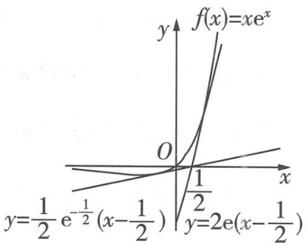

图1

当 $x_0 = 1$ 时， $a = f'（1） = 2\mathrm{e}$ ；当 $x_0 = -\frac{1}{2}$ 时， $a = f'(-\frac{1}{2}) = \frac{1}{2}\mathrm{e}^{-\frac{1}{2}}$ 。

如图1,结合图象可得实数a的取值范围为 $\left[\frac{1}{2}\mathrm{e}^{-\frac{1}{2}},2\mathrm{e}\right]$ ，即实数a的最大值为2e.故选C.

##### 2. （1） $f(x) = x \sin x + \cos x$ , 则 $f'(x) = \sin x + x \cos x - \sin x = x \cos x$ .

当 $x \in (0, \pi)$ 时，令 $f'(x) > 0$ ，得 $0 < x < \frac{\pi}{2}$ ，令 $f'(x) < 0$ ，得 $\frac{\pi}{2} < x < \pi$

所以当 $x \in (0, \pi)$ 时，函数 $f(x)$ 的单调递增区间为 $(0, \frac{\pi}{2})$ ，单调递减区间为 $(\frac{\pi}{2}, \pi)$ .

（2） 第一步: 将原问题等价转化为函数最值的比大小问题.

对任意的 $x_{1} \in [-\pi, \pi]$ , 存在 $x_{2} \in [0, 1]$ , 使得 $\frac{1}{2\pi} f(x_{1}) \leqslant g(x_{2})$ 成立, 即 $[\frac{1}{2\pi} f(x_{1})]_{\max} \leqslant [g(x_{2})]_{\max}$ .第二步: 求 $\left[\frac{1}{2\pi}f(x_{1})\right]_{\max}$ .

当 $x \in [-\pi, \pi]$ 时， $f(-x) = f(x)$ ，所以函数 $f(x)$ 为偶函数。

由（1）得 $f(x)$ 在 $[0,\pi]$ 上的最大值为 $f(\frac{\pi}{2})=\frac{\pi}{2}$ ，所以 $f(x)$ 在 $[-π,π]$ 上的最大值为 $\frac{\pi}{2}$ .

【小技巧】利用图象的对称性，结合（1）中得出的单调性，可以快速得出结论，缩短思维路径所以对 $x_{1} \in [-\pi, \pi]$ ， $\left[\frac{1}{2\pi} f(x_{1})\right]_{\max} = \frac{1}{2\pi} \times \frac{\pi}{2} = \frac{1}{4}$ .

第三步: 将双变量问题转化为单变量问题.

故原问题转化为存在 $x_{2} \in [0,1]$ , 使得 $g(x_{2}) \geqslant \frac{1}{4}$ 成立, 即 $[g(x_{2})]_{\max} \geqslant \frac{1}{4}$ .

第四步: 分类讨论, 求 $\left[g\left(x_{2}\right)\right]_{\max}$ , 得出结论.

易知函数 $g(x) = -x^{2} + 2ax$ 为二次函数, 图象的对称轴为直线 x = a.

①当 $a \leqslant 0$ 时, 函数 $g(x)$ 在区间 $[0,1]$ 上的最大值为 $g(0) = 0$ , 不合题意.

②当 0 < a < 1 时, 函数 $g(x)$ 在区间 $[0,1]$ 上的最大值为 $g(a) = a^{2}$ ,

令 $a^2 \geqslant \frac{1}{4}$ , 得 $a \geqslant \frac{1}{2}$ 或 $a \leqslant -\frac{1}{2}$ , 所以 $\frac{1}{2} \leqslant a < 1$ .

③当 $a \geqslant 1$ 时, 函数 $g(x)$ 在区间 $[0,1]$ 上的最大值为 $g(1) = 2a - 1$ ,

令 $2a - 1 \geqslant \frac{1}{4}$ , 得 $a \geqslant \frac{5}{8}$ , 所以 $a \geqslant 1$ .

综上, a 的取值范围是 $\left[\frac{1}{2}, +\infty\right)$ .

【解后反思】求解双变量问题的一般步骤是：转化为关于两个函数的最值的不等式——求出其中某个函数的最值——转化为单变量不等式——再按照单变量不等式的破题思路求解

# 超重点 11 函数构造思想的应用问题

# 命题角度 1 利用导数运算构造函数

调研 1: (利用 $f(x)$ 与 $x$ 构造 |2023 安徽合肥第六中学 5 月月考) 已知函数 $f(x)$ 满足 $f(x) + f(-x) = 0$ , 且当 $x \in (-\infty, 0)$ 时, $f(x) + xf'(x) < 0$ 成立. 若 $a = 2^{0.6} \cdot f(2^{0.6})$ , $b = \ln 2 \cdot f(\ln 2)$ , $c = \log_2 \frac{1}{8} \cdot f(\log_2 \frac{1}{8})$ , 则 $a, b, c$ 的大小关系是 ( )

$\quad$A. $a > b > c$

$\quad$B. $c > b > a$

$\quad$C. $a > c > b$

$\quad$D. $c > a > b$

# 天星老师明关键

出现 $f(x)+xf'(x)$ 的结构，思考什么样的函数求导后会得到该形式？显然原函数由 x 和 $f(x)$ 相乘组成，构造函数 $g(x)=x \cdot f(x)$ ，再观察 a, b, c 的结构特征，刚好对应了 3 个不同的 $g(x)$ 的函数值，根据 $f(x)+xf'(x)<0$ 得到函数 $g(x)$ 的单调性，即可得到 a，b, c 的大小关系.

解析 因为函数 $f(x)$ 满足 $f(x) + f(-x) = 0$ ，所以 $f(x)$ 是奇函数.

不妨令 $g(x)=x\cdot f(x)$ ，则 $g(-x)=-x\cdot f(-x)=x\cdot f(x)=g(x)$ ，所以 $g(x)$ 是偶函数.

【会思考】若题干中给的条件是 $f(x)-xf'(x)<0$ ，则可构造函数 $\frac{x}{f(x)}$ 或 $\frac{f(x)}{x}$

$g'(x)=f(x)+xf'(x)$ ，因为当 $x\in(-\infty,0)$ 时， $f(x)+xf'(x)<0$ 成立，所以 $g(x)$ 在 $(-∞,0)$ 上单调递减，又 $g(x)$ 是偶函数，所以 $g(x)$ 在 $(0,+\infty)$ 上单调递增.

$a = g \left(2 ^ {0. 6}\right), b = g (\ln 2), c = g \left(\log_ {2} \frac {1}{8}\right) = g \left(- \log_ {2} \frac {1}{8}\right),$

因为 $2^{0.6} > 1, 0 < \ln 2 < 1, -\log_2 \frac{1}{8} = -(-3) = 3 > 2,$

所以 $0 < \ln 2 < 1 < 2^{0.6} < -\log_2\frac{1}{8}$ , 所以 $c > a > b$ . 故选 D.

调研 2: (利用 $f(x)$ 与 $e^x$ 构造 |2023 广东汕头三模) 已知 $f(x)$ 为定义在 R 上的可导函数, $f'(x)$ 为其导函数,且 $f(x) < f'(x)$ 恒成立,则 ( )

$\quad$A. $f(2022) < \mathrm{ef}（2023）$

$\quad$B. $\mathrm{ef}（2022） < f(2023)$

$\quad$C. $\mathrm{e}f(2022) = f(2023)$

$\quad$D. $\mathrm{e}f(2022) > f(2023)$

解析 设函数 $g(x) = \frac{f(x)}{\mathrm{e}^x}$ ，可得 $g'(x) = \frac{f'(x) - f(x)}{\mathrm{e}^x}$ .

【会构造】观察题中所给条件 $f(x) < f'(x) \rightarrow f(x) - f'(x) < 0$ ，看到减号，考虑原函数是分式形式，再结合各选项中代数式的特征，不妨构造函数 $g(x) = \frac{f(x)}{\mathrm{e}^x}$ 进行求解。同理，若题干中给出的条件是 $f(x) + f'(x) < 0$ ，可考虑构造函数 $\mathrm{e}^x f(x)$ 求解

因为 $f(x) < f'(x)$ ，所以 $f'(x) - f(x) > 0$ ，所以 $g'(x) > 0$ ，可得 $g(x)$ 在 $\mathbb{R}$ 上单调递增，

所以 $\frac{f(2022)}{\mathrm{e}^{2022}} < \frac{f(2023)}{\mathrm{e}^{2023}}$ . 即 $\mathrm{ef}（2022） < f(2023)$ . 故选 B.

调研 3 (利用 $f(x)$ 与 $\sin x, \cos x$ 构造 |2023 山东潍坊 4 月二模) 已知函数 $f(x)$ 的定义域为 $(0, \pi)$ , 其导函数是 $f'(x)$ . 若 $f'(x) \sin x - f(x) \cos x > 0$ 恒成立, 则关于 $x$ 的不等式 $f(x) < 2f(\frac{\pi}{6}) \sin x$ 的解集为 \_\_\_\_.

解析 令 $F(x) = \frac{f(x)}{\sin x}$ , 则 $F'(x) = \frac{f'(x)\sin x - f(x)\cos x}{\sin^2 x} > 0$ , 所以 $F(x)$ 在定义域内单调递增. 关于 $x$ 的不等式 $f(x) < 2f(\frac{\pi}{6})\sin x$ 可化为 $\frac{f(x)}{\sin x} < \frac{f(\frac{\pi}{6})}{\sin \frac{\pi}{6}}$ , 即 $F(x) < F(\frac{\pi}{6})$ .

因为 $0 < x < \pi$ ，所以 $0 < x < \frac{\pi}{6}$ ，所以不等式 $f(x) < 2f\left(\frac{\pi}{6}\right)\sin x$ 的解集为 $(0, \frac{\pi}{6})$ 。

【解后提升】想熟练掌握函数构造思想、考试时遇到同类题目可以迅速找到原函数吗？秘诀就是平时多总结、多练习，培养“题感”。比如做完本题后就可以总结出由 $f(x)$ 与 $\sin x$ ， $\cos x$ 相结合构造可导函数的几种常见形式：（1） $F(x) = f(x) \sin x$ ，则 $F'(x) = f'(x) \sin x + f(x) \cos x$ ;

（2） $F(x)=\frac{f(x)}{\sin x}$ ，则 $F'(x)=\frac{f'(x)\sin x-f(x)\cos x}{\sin^{2}x}$ ; （3） $F(x)=f(x)\cos x$ ，则 $F'(x)=$

$f ^ {'} (x) \cos x - f (x) \sin x; （4） F (x) = \frac {f (x)}{\cos x}, \text {则} F ^ {'} (x) = \frac {f ^ {'} (x) \cos x + f (x) \sin x}{\cos^ {2} x}$

# 命题角度 2 利用对称法或同构法构造函数

调研 4 (名师原创) 已知函数 $f(x) = \frac{\mathrm{e}^x}{x} - \ln x + x - a$ .

（1） 若 $f(x) \geqslant 0$ , 求 a 的取值范围.  
（2） 证明: 若 $f(x)$ 有两个零点 $x_{1}, x_{2}$ , 则 $x_{1} x_{2} < 1$ .

解析 （1） $f(x)$ 的定义域为 $(0, +\infty)$ , $f'(x) = \frac{\mathrm{e}^x(x - 1)}{x} - \frac{1}{x} + 1 = \frac{(\mathrm{e}^x + x)(x - 1)}{x^2}$ .

令 $f'(x)>0$ ，解得x>1，故函数 $f(x)$ 在 $(0,1)$ 上单调递减，在 $(1,+\infty)$ 上单调递增，

# 数学名家

程大位 明代数学家、珠算发明家,著有《算法统宗》.《算法统宗》是一部十分重要的著作,流传极为广泛和长久,对中国在民间普及珠算起了很大的作用.
关注微信公众号“初高教辅站”获取更多初高中教辅资料

故 $f(x)_{\min}=f(1)=e+1-a$ ，要使 $f(x)\geqslant0$ 恒成立，则需 $e+1-a\geqslant0$ ，故 $a\leqslant e+1$ 。

故 a 的取值范围是 $(-∞, e+1]$ .

（2） 方法一: 利用对称法构造函数

不妨设 $x_{1} < x_{2}$ , 则由（1）知 $0 < x_{1} < 1 < x_{2}, \frac{1}{x_{1}} > 1$ .

令 $F(x)=f(x)-f(\frac{1}{x})$ ,

【解后提升】利用 $x_{1}x_{2} < 1$ ，对称构造函数 $F(x) = f(x) - f(\frac{1}{x})$

则 $F'(x) = \frac{(\mathrm{e}^{x} + x)(x - 1)}{x^{2}} +\frac{(\mathrm{e}^{\frac{1}{x}} + \frac{1}{x})(\frac{1}{x} - 1)}{\frac{1}{x^{2}}} \cdot \frac{1}{x^{2}} = \frac{x - 1}{x^{2}} (\mathrm{e}^{x} + x - x\mathrm{e}^{\frac{1}{x}} - 1).$

令 $g(x)=\mathrm{e}^{x}+x-x\mathrm{e}^{\frac{1}{x}}-1(x>0)$ ,

【扫清障碍】无法确定 $e^{x} + x - xe^{\frac{1}{x}} - 1$ 的符号，再次构造函数并求导

则 $g'(x) = \mathrm{e}^{x} + 1 - \mathrm{e}^{\frac{1}{x}} + x\mathrm{e}^{\frac{1}{x}}\cdot \frac{1}{x^{2}} = \mathrm{e}^{x} + 1 + \mathrm{e}^{\frac{1}{x}}(\frac{1}{x} -1)$

所以当 $x \in (0,1]$ 时， $g'(x) > 0$ ，所以此时 $g(x) \leqslant g(1) = 0$

所以当 $x \in (0,1]$ 时， $F'(x) > 0$ ，则 $F(x)$ 在 $(0,1]$ 上单调递增，所以此时 $F(x) \leqslant F(1) = 0$

即在(0,1)上 $f(x)-f(\frac{1}{x})<0.$

又 $f(x_{1}) = f(x_{2}) = 0$ ，所以 $f(x_{2}) - f(\frac{1}{x_{1}}) < 0$ ，即 $f(x_{2}) < f(\frac{1}{x_{1}})$

由（1）可知,函数 $f(x)$ 在 $(1,+\infty)$ 上单调递增,所以 $x_{2}<\frac{1}{x_{1}}$ ,即 $x_{1}x_{2}<1$ .

【解后反思】利用对称法构造函数要牢记：对 $x_{1} + x_{2} > 2x_{0}$ 型结论，构造函数 $F(x) = f(x) - f(2x_{0} - x)$ ；对 $x_{1}x_{2} > x_{0}^{2}$ 型结论，可构造函数 $F(x) = f(x) - f(\frac{x_{0}^{2}}{x})$ ，通过研究 $F(x)$ 的单调性证得不等式，也可两边同时取对数（前提是 $x_{1}, x_{2} \in (0, +\infty)$ ），转化成 $\ln x_{1} + \ln x_{2} > 2\ln x_{0}$ ，再把 $\ln x_{1}, \ln x_{2}$ 看成两个变量即可

# 方法二: 利用同构法构造函数

不妨设 $x_{1} < x_{2}$ , 则由（1）知 $0 < x_{1} < 1 < x_{2}, 0 < \frac{1}{x_{2}} < 1$ .

由 $f(x_{1})=f(x_{2})=0$ 得 $\frac{e^{x_{1}}}{x_{1}}-\ln x_{1}+x_{1}=\frac{e^{x_{2}}}{x_{2}}-\ln x_{2}+x_{2}$ ，即 $e^{x_{1}-\ln x_{1}}+x_{1}-\ln x_{1}=e^{x_{2}-\ln x_{2}}+x_{2}-\ln x_{2}$

因为函数 $y = e^{x} + x$ 在 R 上单调递增, 所以 $x_{1} - \ln x_{1} = x_{2} - \ln x_{2}$ 成立.

令 $h(x) = x - \ln x(x > 0), g(x) = h(x) - h\left(\frac{1}{x}\right) = x - \frac{1}{x} - 2\ln x(x > 0)$ ，

则 $g'(x) = 1 + \frac{1}{x^{2}} -\frac{2}{x} = \frac{(x - 1)^{2}}{x^{2}}\geqslant 0$ ，所以函数 $g(x)$ 在 $(0, + \infty)$ 上单调递增，

所以当 x > 1 时, $g(x) > g(1) = 0$ , 即当 x > 1 时, $h(x) > h\left(\frac{1}{x}\right)$ ,

所以 $h(x_{1})=h(x_{2})>h(\frac{1}{x_{2}})$ .

又 $h'(x)=1-\frac{1}{x}=\frac{x-1}{x}$ ，所以 $h(x)$ 在 $(0,1)$ 上单调递减，所以 $0<x_{1}<\frac{1}{x_{2}}<1$ ，即 $x_{1}x_{2}<1$ 。

# 命题角度 3 利用换元法构造函数

调研 5 (2023 山东德州 4 月二模) 已知函数 $f(x) = \ln x - ax, a$ 为常数.

（1） 当 a=1 时, 试比较 $f(m)$ 与 $f(\frac{1}{m})$ 的大小.  
（2） 若函数 $f(x)$ 有两个零点 $x_{1}, x_{2}$ , 试证明 $x_{1}x_{2} > e^{2}$ .

解析 （1） 当 $a = 1$ 时, $f(x) = \ln x - x$ .

令 $h(m) = f(m) - f(\frac{1}{m}) = \ln m - m - (\ln \frac{1}{m} -\frac{1}{m}) = 2\ln m - m + \frac{1}{m} (m > 0)$

则 $h'(m)=\frac{2}{m}-1-\frac{1}{m^{2}}=\frac{-m^{2}+2m-1}{m^{2}}=-\left(\frac{m-1}{m}\right)^{2}\leqslant0,h(m)$ 单调递减, $h(1)=0$ .

①当 0 < m < 1 时, h(m) > 0, 即 $f(m) > f(\frac{1}{m})$ ;  
②当 m=1 时, $h(m)=0$ , 即 $f(m)=f(\frac{1}{m})$ ;  
③当 m > 1 时, h(m) < 0, 即 $f(m) < f(\frac{1}{m})$ .

综上: 当 0 < m < 1 时, $f(m) > f(\frac{1}{m})$ ; 当 m = 1 时, $f(m) = f(\frac{1}{m})$ ; 当 m > 1 时, $f(m) < f(\frac{1}{m})$ .

【规范做题】平时就养成规范答题的好习惯，考试才能做到万无一失。做解答题时，分类讨论后千万不要忘记进行综述哦！

（2）不妨设 $x_{1} > x_{2}$ , 由题意得 $\ln x_{1} - ax_{1} = 0, \ln x_{2} - ax_{2} = 0$ ,

所以 $\ln x_{1} + \ln x_{2} = a(x_{1} + x_{2}),\ln x_{1} - \ln x_{2} = a(x_{1} - x_{2})$

所以 $\frac{\ln x_1 - \ln x_2}{x_1 - x_2} = a$ ，欲证明 $x_1x_2 > \mathrm{e}^2$ ，即证 $\ln x_1 + \ln x_2 > 2$ .

又 $\ln x_{1} + \ln x_{2} = a(x_{1} + x_{2})$ ，所以等价于证明 $\frac{\ln x_1 - \ln x_2}{x_1 - x_2} >\frac{2}{x_1 + x_2}$ 即证 $\ln \frac{x_1}{x_2} >\frac{2(x_1 - x_2)}{x_1 + x_2}.$

令 $t = \frac{x_1}{x_2} (t > 1)$ ，构造 $g(t) = \ln t - \frac{2(t - 1)}{t + 1}$ ，则 $g'(t) = \frac{1}{t} - \frac{4}{(t + 1)^2} = \frac{(t - 1)^2}{t(t + 1)^2} > 0$

# 数学名家

华罗庚 世界著名的数学家,中国解析数论、矩阵几何学、典型群、自守函数论等多方面研究的创始人与开拓者,中国现代数学之父.

关注微信公众号“初高教辅站”获取更多初高中教辅资料所以 $g(t)$ 在 $(1, +\infty)$ 上单调递增, 所以 $g(t) > \ln 1 - \frac{2 \times (1 - 1)}{1 + 1} = 0$ ,

所以 $\ln t > \frac{2(t - 1)}{t - 1}$ , 即 $x_{1}x_{2} > \mathrm{e}^{2}$ 得证.

# 命题角度 4 利用放缩法构造函数

调研 6: (2023 安徽淮南二模改编) 已知 $x \in (0,1)$ , 求证: $x^{2} - \frac{1}{x} < \frac{\ln x}{e^{x}}$ .

解析 方法一 要证 $x^{2} - \frac{1}{x} < \frac{\ln x}{\mathrm{e}^{x}}$ ，只需证 $\mathrm{e}^{x}(x^{2} - \frac{1}{x}) < \ln x$ ，

易证 $e^{x}>x+1(0<x<1)$ ，则只需证明 $\ln x+(x+1)\left(\frac{1}{x}-x^{2}\right)>0$ ，即证 $\ln x+1-x^{3}+\frac{1}{x}-x^{2}>0$ ，

【敲黑板】 $e^{x}>x+1(0<x<1)$ 是利用放缩法证明不等式成立常用到的结论，需要牢记，该式的证明很简单，只需移项构造函数、求导研究最值即可，此处不再赘述，留给同学们自行证明。需要提醒的是，高考中做解答题时，如果需要用到教材中未直接给出的定理、结论，需要给出证明过程，否则容易丢掉步骤分，若时间太紧来不及，哪怕写出简要证明思路或步骤，也能得到一定分数

而在 $x \in (0,1)$ 时有 $x^3 < x, x^2 < x$ ，所以只需证 $\ln x + 1 - 2x + \frac{1}{x} > 0$ .

令 $g(x)=\ln x+1-2x+\frac{1}{x}(0<x<1)$ ，则 $g'(x)=\frac{1}{x}-2-\frac{1}{x^{2}}=-\frac{2x^{2}-x+1}{x^{2}}$ ，而 $2x^{2}-x+1>0$ 恒成立，所以 $g'(x)<0$ ，所以 $g(x)$ 在 $(0,1)$ 上单调递减，所以当 $x\in(0,1)$ 时， $g(x)>\ln1+1-2\times1+\frac{1}{1}=0$ ，即 $\ln x+1-2x+\frac{1}{x}>0$ ，所以 $x^{2}-\frac{1}{x}<\frac{\ln x}{e^{x}}$ .

方法二 因为 $x \in (0,1)$ , 所以 $\mathrm{e}^{x} \in (1, \mathrm{e}), x^{2} - \frac{1}{x} \in (-\infty, 0)$ , 所以要证 $x^{2} - \frac{1}{x} < \frac{\ln x}{\mathrm{e}^{x}}$ 成立, 只需证 $\mathrm{e}^{x}(x^{2} - \frac{1}{x}) < \ln x$ 成立, 只需证 $x^{2} - \frac{1}{x} < \ln x$ .

又 $x^{2} < x(0 < x < 1)$ ，则只需证 $\ln x + \frac{1}{x} - x > 0$ .

令 $h(x) = \ln x + \frac{1}{x} - x(0 < x < 1)$ ，

则 $h'(x)=\frac{1}{x}-\frac{1}{x^{2}}-1=-\frac{x^{2}-x+1}{x^{2}}$ ，而 $x^{2}-x+1>0$ 恒成立，所以 $h'(x)<0$ ，

所以 $h(x)$ 在 $(0,1)$ 上单调递减, 所以当 $x \in (0,1)$ 时, $h(x) > \ln 1 + \frac{1}{1} - 1 = 0$ ,

所以 $\ln x + \frac{1}{x} - x > 0$ ，所以 $x^2 - \frac{1}{x} < \frac{\ln x}{\mathrm{e}^x}$ .

# 新题预测

##### 1. (2023 湖北校级联考 5 月预测) 已知 $x(a e^{x} + 1) > \ln \frac{e}{x}$ 有解, 则实数 $a$ 的取值范围为 ( )

$\quad$A. $(- \frac{1}{\mathrm{e}^2}, +\infty)$

$\quad$B. $\left(-\frac{1}{e},+\infty\right)$

$\quad$C. $(-1, +\infty)$

$\quad$D. $(-\infty, \frac{1}{\mathrm{e}})$

# 天星老师传思路

梳理解题思路： $x(a\mathrm{e}^x +1) > \ln \frac{\mathrm{e}}{x}\rightarrow a(x\mathrm{e}^x) + \ln (x\mathrm{e}^x) > 1\to$ 设 $t = x\mathrm{e}^{x}\rightarrow a > \frac{1 - \ln t}{t}\rightarrow f(t) = \frac{1 - \ln t}{t}\rightarrow f(t)_{\min}\rightarrow a > - \frac{1}{\mathrm{e}^2}\rightarrow a$ 的取值范围

##### 2. (2023 山东济南一中 5 月月考) 已知定义在 $\mathbf{R}$ 上的可导函数 $f(x)$ 的导函数为 $f'(x), f'(x) - f(x) < 0$ , 且 $f(x + 1) = f(1 - x), f(0) = e$ , 则不等式 $f(x) > e^{x - 1}$ 的解集是 \_\_\_\_.

# 参考答案与解析

##### 1. A 不等式 $x(a e^{x} + 1) > \ln \frac{e}{x}$ 可化为 $a(x e^{x}) + x + \ln x > 1$ ，即 $a(x e^{x}) + \ln(x e^{x}) > 1$ .

【会思考】结合不等式的特征，令 $t = x\mathrm{e}^{x}$ ，进行同构

令 $t = x e^{x}, t > 0$ ，则 $at + \ln t > 1$ 在 $(0, +\infty)$ 上有解，所以 $a > \frac{1 - \ln t}{t}$ 在 $(0, +\infty)$ 上有解。令 $f(t) = \frac{1 - \ln t}{t} (t > 0)$ ，则 $f'(t) = \frac{\ln t - 2}{t^2}$ ，当 $0 < t < e^2$ 时， $f'(t) < 0, f(t)$ 在 $(0, e^2)$ 上单调递减；当 $t > e^2$ 时， $f'(t) > 0, f(t)$ 在 $(e^2, +\infty)$ 上单调递增。

所以 $f(t)_{\min}=f(e^{2})=-\frac{1}{e^{2}}$ ，所以 $a>-\frac{1}{e^{2}}$ ，所以a的取值范围为 $(- \frac{1}{e^{2}},+\infty)$ ，故选A.

##### 2. $(-∞,2)$ 设 $g(x)=\frac{f(x)}{\mathrm{e}^{x}}$ ，则 $g'(x)=\frac{f'(x)-f(x)}{\mathrm{e}^{x}}<0$ ，所以 $g(x)$ 在 R 上单调递减.

因为 $f(x+1)=f(1-x)$ ，所以 $f(x)$ 的图象关于直线x=1对称，

【用结论】函数 $f(x)$ 满足 $f(a+x)=f(b-x)$ 暗含了函数图象的对称性，对称轴为直线 $x=\frac{a+b}{2}$ 所以 $f(2)=f(0)=\mathrm{e}$ ，所以 $g(2)=\frac{f(2)}{\mathrm{e}^{2}}=\frac{1}{\mathrm{e}}$ .

因为 $f(x) > \mathrm{e}^{x-1}$ ，所以 $\frac{f(x)}{\mathrm{e}^x} > \frac{1}{\mathrm{e}}$ ，即 $g(x) > g(2)$ ，所以 $x < 2$ ，故 $f(x) > \mathrm{e}^{x-1}$ 的解集是 $(-∞,2)$ .

# 数学名家

陈省身 20 世纪最伟大的几何学家之一,被誉为“整体微分几何之父”.他提出的 “Chern Class(陈氏示性类)”是经典杰作.

关注微信公众号“初高教辅站”获取更多初高中教辅资料

# 高效破题有方法

# 超重点 12 7 招搞定函数最值与值域的求解问题

# 招法 1 用函数性质法求函数最值

调研 1 (2023 四川成都玉林中学二诊) 若不等式 $x^{2} + ax - 2 > 0$ ( $a$ 为参数) 在 [1,5] 上有解, 则 $a$ 的取值范围是 ( )

$\quad$A. $(- \frac{23}{5}, 1]$

$\quad$B. $(-\infty, -\frac{23}{5})$

$\quad$C. $\left(-\frac{23}{5},+\infty\right)$

$\quad$D. $(1, +\infty)$

# 天星老师教审题

求参数的取值范围, 首选 “分离参数法”, 将不等式转化为 $a > \frac{2}{x} - x$ ( $a$ 为参数) 在 $[1,5]$ 上有解, 构造函数 $f(x) = \frac{2}{x} - x$ , 研究函数 $f(x)$ 在区间 $[1,5]$ 上的单调性, 进而求出函数 $f(x)$ 的最小值, 即可得出实数 $a$ 的取值范围.

解析 因为关于 $x$ 的不等式 $x^{2} + ax - 2 > 0$ 在[1,5]上有解，

所以 $a>\frac{2}{x}-x$ (a为参数)在[1,5]上有解.

【敲黑板】分离参数时要注意不等式的变形是否具有等价性，一般需要关注参数的系数是大于0，还是小于0，不确定时则需要分类讨论

设 $f(x)=\frac{2}{x}-x,x\in[1,5]$ ，易得 $f(x)$ 在区间 $[1,5]$ 上单调递减，所以 $f(x)$ 有最小值，为 $f(5)=\frac{2}{5}-$

【扫清障碍】由函数 $y=\frac{2}{x}$ 和 y=-x 在 [1,5] 上均单调递减，可判断函数 $f(x)$ 在区间 [1,5] 上单调递减，进而得出函数 $f(x)$ 在区间 [1,5] 上的最小值

$5 = -\frac{23}{5}$ ，所以实数 a 的取值范围是 $(- \frac{23}{5}, +\infty)$ ，故选 C.

调研 2 (2023 河北张家口 4 月二模) 函数 $f(x) = 2^{\sqrt{x^2 - 4x + 4}} + \sqrt{x^2 - 2x}$ 的最小值为 \_\_\_\_.

解析 由题意可知函数 $f(x)$ 的定义域满足 $\left\{\begin{aligned}x^{2}&-4x+4\geqslant0,\\ x^{2}&-2x\geqslant0,\end{aligned}\right.$ 即 $x\leqslant0$ 或 $x\geqslant2$ ，所以函数 $f(x)$ 的

定义域为 $(-∞,0]∪[2,+∞)$ ， $f(x)=2^{|x-2|}+\sqrt{x^{2}-2x}$ .

【易错提醒】在研究函数的基本性质的过程中，往往需要先求出函数的定义域，这是容易漏掉的一个重要环节，不能抛开函数定义域去研究函数的值域、单调性等性质

函数 $u = |x - 2|$ 在 $(-∞, 0]$ 上单调递减，在 $[2, +∞)$ 上单调递增，且函数 $y = 2^{u}$ 单调递增，所以 $y = 2^{|x - 2|}$ 在 $(-∞, 0]$ 上单调递减，在 $[2, +∞)$ 上单调递增，

【扫清障碍】分解复合函数，并分别判断内、外层函数的单调性，依据“同增异减”的原则判断复合函数的单调性

函数 $\nu = x^{2} - 2x$ 在 $(-∞, 0]$ 上单调递减，在 $[2, +∞)$ 上单调递增，且函数 $y = \sqrt{\nu}$ 单调递增，所以 $y = \sqrt{x^{2} - 2x}$ 在 $(-∞, 0]$ 上单调递减，在 $[2, +∞)$ 上单调递增.

故 $f(x)$ 在 $(-∞,0]$ 上单调递减，在 $[2,+∞)$ 上单调递增，而 $f(0)=4,f(2)=1$ ，所以函数 $f(x)$ 的最小值为1.

# 招法 2 用导数法求函数的值域

调研 3 (2023 陕西西安高级中学考前仿真测试) 已知函数 $f(x) = \frac{x}{\mathrm{e}^x} + ax - a\ln x$ , 若 $f(x) \leqslant 0$ 恒成立, 则 $a$ 的取值范围为 \_\_\_\_.

# 天星老师破障碍

若用 “分离参数法” 将 a 分离出来，所构造的函数非常复杂，不易研究函数的单调性和最值，因此我们要先观察函数，对不等式进行转化，利用换元法将原式简化后，再构造函数，研究函数的单调性和最值，从而求解。

解析 第一步:根据指、对数运算将原不等式等价转化.

$f(x)\leqslant 0$ 等价于 $\mathrm{e}^{-x + \ln x} - a(-x + \ln x)\leqslant 0.$

【扫清障碍】由指数运算和对数运算的法则有恒等式：（1） $a^{\log_{a}x}=x(a>0$ 且 $a\neq1)$ ;

（2） $\log_{a}a^{x}=x(a>0$ 且 $a\neq1)$ . 进而可得 $\frac{x}{e^{x}}=\frac{e^{\ln x}}{e^{x}}=e^{\ln x-x}$ . 事实上，还可以得出下列结论： $xe^{x}=e^{x+\ln x},x+\ln x=\ln(xe^{x}),x-\ln x=\ln\frac{e^{x}}{x},x^{2}e^{x}=e^{x+2\ln x},x+2\ln x=\ln(x^{2}e^{x}),\frac{e^{x}}{x^{2}}=e^{x-2\ln x}$

第二步:利用换元法,将不等式转化后参变分离.

令 $t = -x + \ln x$ ，则 $t' = -1 + \frac{1}{x} = \frac{-x + 1}{x}$ 当 $x \in (0,1)$ 时， $t' > 0, t = -x + \ln x$ 单调递增；当 $x \in (1, +\infty)$ 时， $t' < 0, t = -x + \ln x$ 单调递减。所以 $t \leqslant -1$ 。

# 数学名家

陈景润 中国著名数学家,主要从事解析数论方面的研究.他在哥德巴赫猜想的研究中证明了“1+2”,这一结果被国际上誉为“陈氏定理”.

关注微信公众号“初高教辅站”获取更多初高中教辅资料

故 $f(x)\leqslant0$ 可转化为 $e^{t}-at\leqslant0$ ，进一步可转化为 $a\leqslant\frac{e^{t}}{t}(t\leqslant-1)$ .

第三步:构造新函数,借助导数研究新函数的单调性与值域,根据函数的值域得取值范围.

令 $g(t)=\frac{\mathrm{e}^{t}}{t}, t \leqslant -1$ ，则 $g'(t)=\frac{\mathrm{e}^{t}(t-1)}{t^{2}} < 0$ ，所以 $g(t)$ 在 $(-∞,-1]$ 上单调递减，则 $g(t) \geqslant g(-1)=-\frac{1}{\mathrm{e}}$ ，故 a 的取值范围为 $(-∞,-\frac{1}{\mathrm{e}}]$ .

【关键提醒】观察不等式的形式，构造适当的函数，再结合分离参数法，利用导数研究函数的单调性、极值与最值，进而求解

# 招法 3 用换元法求函数的最值

调研 4 (2023 人大附中 5 月月考) 已知 $f(x), g(x)$ 分别是定义域为 $\mathbf{R}$ 的偶函数和奇函数, 且 $f(x) + g(x) = e^{x}$ , 若关于 $x$ 的不等式 $2f(x) - ag^{2}(x) \geqslant 0$ 在 $(0, \ln 2)$ 上恒成立, 则实数 $a$ 的最大值是 ( )

$\quad$A. $\frac{37}{9}$

$\quad$B. $\frac{38}{9}$

$\quad$C. $\frac{13}{3}$

$\quad$D. $\frac{40}{9}$

解析 第一步:根据函数奇偶性求 $f(x)$ , $g(x)$ .

由 $f(x)+g(x)=\mathrm{e}^{x}$ ①, 得 $f(-x)+g(-x)=\mathrm{e}^{-x}$ , 因为 $f(x), g(x)$ 分别为偶函数和奇函数, 所以 $f(x)-g(x)=\mathrm{e}^{-x}$ ②.

【关键提醒】利用函数的奇偶性建立关于函数 $f(x)$ , $g(x)$ 的方程组是解题的前提

联立①②可得 $f(x)=\frac{e^{x}+e^{-x}}{2},g(x)=\frac{e^{x}-e^{-x}}{2}.$

第二步:利用换元法,将不等式转化后参变分离.

不等式 $2f(x) - ag^2 (x)\geqslant 0$ 为 $\mathrm{e}^x +\mathrm{e}^{-x} - a\cdot \frac{(\mathrm{e}^x + \mathrm{e}^{-x})^2 - 4}{4}\geqslant 0$ ，且 $x\in (0,\ln 2)$ ，设 $\mathrm{e}^x +\mathrm{e}^{-x} =$ $t,x\in (0,\ln 2),$

【易错提醒】利用换元法求解时，要根据已知函数的定义域求出新元的取值范围，否则容易导致错解

则 $t' = \mathrm{e}^x - \mathrm{e}^{-x} > 0$ ，故 $t = \mathrm{e}^x + \mathrm{e}^{-x}$ 在 $(0, \ln 2)$ 上单调递增，所以 $t \in (2, \frac{5}{2})$ ，

所以 $a \leqslant \frac{4(\mathrm{e}^x + \mathrm{e}^{-x})}{(\mathrm{e}^x + \mathrm{e}^{-x})^2 - 4}$ , 即 $a \leqslant \frac{4t}{t^2 - 4} = \frac{4}{t - \frac{4}{t}}$ .

第三步:利用函数的单调性求得不等式右边代数式的取值范围,从而得到 a 的最大值.

因为函数 $y = t - \frac{4}{t}$ 在 $(2, \frac{5}{2})$ 上单调递增，所以 $0 < t - \frac{4}{t} < \frac{9}{10}$ ，故 $\frac{4}{t - \frac{4}{t}} > \frac{40}{9}$ ，要使 $a \leqslant$

$\frac{4\left(\mathrm{e}^{x}+\mathrm{e}^{-x}\right)}{\left(\mathrm{e}^{x}+\mathrm{e}^{-x}\right)^{2}-4}$ ，在 $x\in(0,\ln2)$ 时恒成立，则 $a\leqslant\frac{40}{9}$ ，即实数a的最大值是 $\frac{40}{9}$ 。故选D.

【解后思考】观察已知函数解析式的形式，若变量较多但相互关联，或形式较复杂但可化为一致形式，可引入新元整体代换，得一新函数，新函数的值域即原函数的值域

# 招法 4 用基本不等式法求函数的最值

调研 5 (2023 天津市和平区 4 月二模) 设 $x, y \in \mathbb{R}, a > 1, b > 1$ , 若 $a^x = b^y = 3$ , $3a + b = 18$ , 则 $\frac{1}{x} + \frac{1}{y}$ 的最大值为 \_\_\_\_.

# 天星老师引思路

x 和 y 在指数的位置，我们要研究，第一步就要把指数转化为对数，得到 x 和 y.

解析 因为 $a^x = b^y = 3$ ，所以 $x = \log_a 3, y = \log_b 3$ ，所以 $\frac{1}{x} = \log_3 a, \frac{1}{y} = \log_3 b$ .

【敲黑板】利用对数换底公式 $\log_a b = \frac{\log_c b}{\log_c a}$ 可得出

因为 a > 1, b > 1, 根据基本不等式有 $3ab \leqslant \left(\frac{3a + b}{2}\right)^{2} = 81$ , 当且仅当 a = b, 即 a = 3, b = 9 时等号成立, 所以 $ab \leqslant 27$ .

【易错提醒】利用基本不等式求最值时, 必须验证等号成立的条件, 若不能取等号, 则这个定值就不是所求的最值, 这也是最容易发生错误的地方

则 $\frac{1}{x} +\frac{1}{y} = \log_3a + \log_3b = \log_3ab\leqslant \log_327 = 3$ ，所以 $\frac{1}{x} +\frac{1}{y}$ 的最大值为3.

# 招法 5 用分类讨论法求函数的值域

调研 6 (2023 上海市徐汇区 4 月二模) 已知函数 $f(x) = x + \frac{a}{x} + b, x \in [b, +\infty)$ , 其中 $b > 0, a \in \mathbb{R}$ , 若 $f(x)$ 的最小值为 2 , 则实数 $a$ 的取值范围是 \_\_\_\_.

解析 ①当 $a \leqslant 0$ 时, $f(x)$ 在 $[b, +\infty)$ 上单调递增, $\therefore f(x)_{\min} = f(b) = 2b + \frac{a}{b} = 2, \because b > 0,$ $\therefore b=\frac{1+\sqrt{1-2a}}{2}$ ，因此 $a\leqslant0$ 满足题意.

②当a>0时, 函数 $y=x+\frac{a}{x}+b$ (a, b 为参数) 在 $[\sqrt{a}, +\infty)$ 上单调递增, 在 $(0,\sqrt{a})$ 上单调递减.

【扫清障碍】当 $a \leqslant 0$ 时, 函数 $f(x)$ 是单调递增的; 当 $a > 0$ 时, 函数 $f(x)$ 为对勾函数, 其

# 数学名家

熊庆来 中国函数论的主要开拓者之一,引进的无穷级的定义被称为“熊氏无穷级”,成为以后研究无穷级整函数与亚纯函数的得力工具.

关注微信公众号“初高教辅站”获取更多初高中教辅资料

单调性需要分类讨论，因此对 a 进行分类讨论是该题的突破点

(i) 当 $\sqrt{a} \leqslant b$ 时, $f(x)$ 在 $[b, +\infty)$ 上单调递增,

【会思考】当 a > 0 时，函数 $y = x + \frac{a}{x} + b (a, b$ 为参数）为对勾函数，且在 $(0, \sqrt{a})$ 上单调递减，在 $(\sqrt{a}, +\infty)$ 上单调递增，而已知定义域为 $[b, +\infty)$ ，因此需要讨论 $\sqrt{a}$ 与 b 的大小关系

$\therefore f(x)_{\min} = f(b) = 2b + \frac{a}{b} = 2$ ，则 $2b^{2} - 2b + a = 0, \therefore \Delta = 4 - 8a \geqslant 0$ ，即 $a \leqslant \frac{1}{2}$ ，又 $b = \frac{1 \pm \sqrt{1 - 2a}}{2} \geqslant \sqrt{a}, \therefore a \leqslant b^{2}$ ，即 $2b - 2b^{2} \leqslant b^{2}, \because b > 0, \therefore b \geqslant \frac{2}{3}, \therefore b = \frac{1 + \sqrt{1 - 2a}}{2}. \because \frac{1 + \sqrt{1 - 2a}}{2} \geqslant$

$\sqrt {a} \Rightarrow \sqrt {1 - 2 a} \geqslant 2 \sqrt {a} - 1 \Rightarrow 0 <   a \leqslant {\frac {1}{4}}   \text {或} \left\{ \begin{array}{l l} {a > {\frac {1}{4}},} \\ {1 - 2 a \geqslant 4 a - 4 \sqrt {a} + 1} \end{array} \right. \Rightarrow 0 <   a \leqslant {\frac {1}{4}}   \text {或} {\frac {1}{4}} <   a \leqslant {\frac {4}{9}}, \therefore 0 <   a \leqslant {\frac {4}{9}}.$

【易错提醒】解含参数不等式 $\sqrt{1 - 2a} \geqslant 2\sqrt{a} - 1$ ，误认为 $2\sqrt{a} - 1 > 0$ ，而忽视 $2\sqrt{a} - 1 \leqslant 0$ 这一情形，进而导致错解

(ii) 当 $\sqrt{a} > b$ 时, $f(x)$ 在 $[\sqrt{a}, +\infty)$ 上单调递增, 在 $[b, \sqrt{a})$ 上单调递减,

$\therefore f (x) _ {\min} = f (\sqrt {a}) = 2 \sqrt {a} + b = 2,$

$\because 0 < b < \sqrt{a}$ ，即 $\sqrt{a} > 2 - 2\sqrt{a} > 0$ ，∴ $\frac{4}{9} < a < 1$ .

综上, $a$ 的取值范围为 $(- \infty, 1)$ .

# 招法6 用判别式法求函数的最值

调研 7 (2023 山东青岛 4 月检测) 已知实数 $a, b$ 满足 $\lg a + \lg b = \lg (a + 2b)$ , 则 $a + b$ 的最小值是 \_\_\_\_.

思维导引 a>0,b>0,且 $ab=a+2b$ 令 $u=a+b$ 利用判别式法求出 $a+b$ 的最小值

解析 方法一: 判别式法 因为实数 a, b 满足 $\lg a + \lg b = \lg (a + 2b)$ ，所以 a > 0, b > 0，且 $ab = a + 2b$ .

令 $u = a + b$ ，则 $u > 0$ ，所以 $a = u - b$ ，代入 $ab = a + 2b$ ，则有 $(u - b)b = u - b + 2b$

所以关于 b 的一元二次方程 $b^{2}-(u-1)b+u=0$ 有解, 则 $\Delta=(u-1)^{2}-4u\geqslant0$ , 解得 $u\geqslant3+$

【关键提醒】要求 u 的最小值，应把 b 看作自变量，利用关于 b 的一元二次方程的判别式求解

$2\sqrt{2}$ 或 $u \leqslant 3 - 2\sqrt{2}$ .

此时,关于 b 的一元二次方程 $b^{2}-(u-1)b+u=0$ 的两根 $b_{1}b_{2}=u>0$ , 所以两根同号, 又 b>

0,那么 $b_{1}+b_{2}=u-1>0$ ,得u>1.

【易错提醒】由于 $b > 0$ , 需要检验关于 $b$ 的一元二次方程是否有正根, 进而得出 $u$ 的取值范围, 以检验 $u$ 的最小值是否取得到

综上所述, $u\geqslant3+2\sqrt{2}$ ，即 $a+b$ 的最小值是 $3+2\sqrt{2}$ （此时 $\Delta=0,a=2+\sqrt{2},b=1+\sqrt{2}$ ）.

方法二:基本不等式法 由题意知,a>0,b>0,ab=a+2b,所以 $\frac{1}{b}+\frac{2}{a}=1$ ,

则 $a + b = (a + b)\left(\frac{1}{b} +\frac{2}{a}\right) = 1 + 2 + \frac{a}{b} +\frac{2b}{a}\geqslant 3 + 2\sqrt{\frac{a}{b}\cdot\frac{2b}{a}} = 3 + 2\sqrt{2},$

当且仅当 $a=\sqrt{2}b=2+\sqrt{2}$ 时取等号, 所以 $a+b$ 的最小值是 $3+2\sqrt{2}$ .

# 招法 7 用数形结合法求函数的最值

调研 8 (2023 山东青岛教学质量检测) 函数 $f(x)$ 的定义域为 $\mathbf{R}, f(x) = 2f(x - 1)$ , 且当 $x \in (0,1]$ 时, $f(x) = x(1 - x)$ . 若对任意的 $x \in (-\infty, m]$ , 都有 $f(x) \leqslant \frac{16}{25}$ , 则 $m$ 的最大值是 ( )

$\quad$A. $\frac{11}{5}$

$\quad$B. $\frac{14}{5}$

$\quad$C. $\frac{32}{15}$

$\quad$D. $\frac{41}{15}$

解析 第一步:根据给定条件分段求解析式及对应函数值.

由题意知 $f(x) = 2f(x - 1)$ ，当 $x \in (0,1]$ 时， $f(x) = -(x - \frac{1}{2})^2 + \frac{1}{4} \in [0, \frac{1}{4}]$ .

当 $x \in (k, k + 1]$ , $k \in N^{*}$ 时, $x - k \in (0, 1]$ , 则 $f(x) = 2f(x - 1) = 2^{2}f(x - 2) = \cdots = 2^{k}f(x - k)$ ,
所以 $f(x) = -2^{k}(x - \frac{2k+1}{2})^{2} + \frac{2^{k}}{4} \in [0, 2^{k-2}]$ .

当 $x \in (-k, -k + 1], k \in \mathbb{N}^*$ 时， $x + k \in (0,1]$ ，则 $f(x) = 2^{-1} f(x + 1) = 2^{-2} f(x + 2) = \cdots = 2^{-k} f(x + k)$ ，所以 $f(x) = -2^{-k} \left( x + \frac{2k - 1}{2} \right)^2 + \frac{1}{2^{k + 2}} \in [0, 2^{-k - 2}]$ .

【扫清障碍】根据给定条件 $f(x)=2f(x-1)$ ，分段求解析式及对应值域是正确求解的前提

第二步:根据解析式作出函数图象.

作出函数 $f(x)$ 的大致图象如图1，

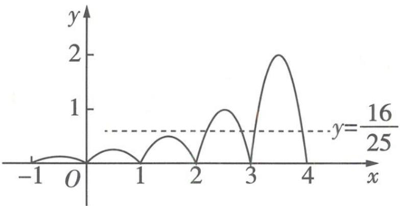

图1

# 数字对联

# 第三步:数形结合求解.

对任意的 $x \in (-\infty, m]$ , $f(x) \leqslant \frac{16}{25}$ , 设 $m$ 的最大值为 $t$ , 则 $f(t) = \frac{16}{25}$ , 且 $2 < t < \frac{5}{2}$ , 所以 $-2^2(t - \frac{5}{2})^2 + 1 = \frac{16}{25}$ , 解得 $t = \frac{11}{5}$ , 所以 $m$ 的最大值为 $\frac{11}{5}$ . 故选 A.

# 新题预测

##### 1. (2023 广东江门第一中学 4 月月考 | 多选) 若存在 $m$ , 使得 $f(x) \geqslant m$ 对任意 $x \in D$ 恒成立, 则函数 $f(x)$ 在 $D$ 上有下界, 其中 $m$ 为函数 $f(x)$ 的一个下界; 若存在 $M$ , 使得 $f(x) \leqslant M$ 对任意 $x \in D$ 恒成立, 则函数 $f(x)$ 在 $D$ 上有上界, 其中 $M$ 为函数 $f(x)$ 的一个上界. 如果一个函数既有上界又有下界, 那么称该函数有界. 则下列说法正确的是 ( )

$\quad$A. 1 是函数 $f(x) = x + \frac{1}{x} (x > 0)$ 的一个下界  
$\quad$B. 函数 $f(x) = x \ln x$ 有下界, 无上界  
$\quad$C. 函数 $f(x) = \frac{\mathrm{e}^x}{x^2}$ 有上界,无下界  
$\quad$D. 函数 $f(x)=\frac{\sin x}{x^{2}+1}$ 有下界, 无上界

##### 2. (2023 湖南长沙第一中学 5 月月考) 设 $f(x)$ 是定义在 $\mathbf{R}$ 上的函数, $f(x)+x^{2}$ 是奇函数, $f(x)-x$ 是偶函数, 函数 $g(x)=\left\{\begin{array}{l} f(x), x \in [0,1], \\ 2g(x-1), x \in (1,+\infty), \end{array}\right.$ 若对任意的 $x \in [0,m], g(x) \leqslant 3$ 恒成立, 则实数 $m$ 的最大值为 ( )

$\quad$A. $\frac{13}{3}$

$\quad$B. $\frac{17}{4}$

$\quad$C. $\frac{9}{2}$

$\quad$D. $\frac{14}{3}$

##### 3. (2023 重庆巴蜀中学 5 月月考) 函数 $y = \frac{\sqrt{x^2 + 4}}{x^2 + 5}$ 的最大值为 \_\_\_\_.  
##### 4. (2023 上海复兴高级中学、奉贤中学、金山中学等 4 月联考) 已知函数 $f(x)=\left\{\begin{array}{l} x+2, x<a, \\ x^{2}-x-1, x \geqslant a, \end{array}\right.$ 若对任意实数 $b$ , 总存

在实数 $x_0$ , 使得 $f(x_0) = b$ , 则实数 $a$ 的取值范围是 \_\_\_\_.

# 天星老师有话说

这句话其实就是在说, 函数 $f(x)$ 的值域为R.

##### 5. (2023 上海黄浦区 4 月二模) 三个互不相同的函数 $y = f(x), y = g(x)$ 与 $y = h(x)$ 在区间 $D$ 上恒有 $f(x) \geqslant h(x) \geqslant g(x)$ 或恒有 $f(x) \leqslant h(x) \leqslant g(x)$ ，则称 $y = h(x)$ 为 $y = f(x)$ 与 $y = g(x)$ 在区间 $D$ 上的“分割函数”.

（1） 设 $h_{1}(x)=4x, h_{2}(x)=x+1$ ，试分别判断 $y=h_{1}(x), y=h_{2}(x)$ 是否是 $y=2x^{2}+2$ 与 $y=-x^{2}+4x$ 在 R 上的“分割函数”，说明理由.

（2）求所有的二次函数,使得该函数是 $y = 2x^{2} + 2$ 与 $y = 4x$ 在 $\mathbf{R}$ 上的“分割函数”.

# 天星老师破障碍

解决新定义问题的关键，在于充分理解概念，透过现象看本质。“分割函数”就是在判断各个函数图象在同一区间上的位置关系，利用数形结合思想研究函数的单调性和最值，问题即可迎刃而解。

# 参考答案与解析

##### 1. AB

<table><tr><td>选项</td><td>分析过程</td><td>正误</td></tr><tr><td>A</td><td>当 $x>0$ 时, $x+\frac{1}{x} \geqslant 2$ (当且仅当 $x=1$ 时取等号), $\therefore f(x)>1$ 恒成立, $\therefore 1$ 是 $f(x)$ 的一个下界</td><td>√</td></tr><tr><td>B</td><td> $f'(x)=\ln x+1(x>0),\therefore$ 当 $x\in(0,\frac{1}{e})$ 时, $f'(x)<0$ ,当 $x\in(\frac{1}{e},+\infty)$ 时, $f'(x)>0,\therefore f(x)$ 在 $(0,\frac{1}{e})$ 上单调递减,在 $(\frac{1}{e},+\infty)$ 上单调递增, $\therefore f(x)\geqslant f(\frac{1}{e})=-\frac{1}{e},f(x)$ 有下界.【关键提醒】利用导数求出函数 $f(x)$ 的最小值是解题的关键又当 $x$ 越来越大时, $f(x)$ 趋向 $+\infty,\therefore f(x)$ 无上界.综上所述, $f(x)=x\ln x$ 有下界,无上界</td><td>√</td></tr><tr><td>C</td><td> $\because x^{2}>0,e^{x}>0,\therefore\frac{e^{x}}{x^{2}}>0,\therefore f(x)$ 有下界</td><td>×</td></tr><tr><td>D</td><td> $\because \sin x\in[-1,1],\therefore\frac{-1}{x^{2}+1}\leqslant\frac{\sin x}{x^{2}+1}\leqslant\frac{1}{x^{2}+1}.$ 又 $\frac{-1}{x^{2}+1}\geqslant-1,\frac{1}{x^{2}+1}\leqslant1,\therefore -1<\frac{\sin x}{x^{2}+1}<1,\therefore f(x)$ 既有上界又有下界</td><td>×</td></tr></table>

##### 2. B 第一步:根据函数的奇偶性,求出函数 $f(x)$ ,并分段求 $g(x)$ 的解析式及对应函数值.

因为 $f(x) + x^2$ 是奇函数， $f(x) - x$ 是偶函数，所以 $\left\{ \begin{array}{l} f(-x) + (-x)^2 = -f(x) - x^2, \\ f(-x) + x = f(x) - x, \end{array} \right.$ 得 $f(x) = x - x^2$ .

$g(x)=\left\{\begin{aligned}f(x),&x\in[0,1],\\ 2g(x-1),&x\in(1,+\infty)\end{aligned}\right.$ 当 $x\in(1,2]$ 时， $x-1\in(0,1]$ ，所以 $g(x)=2g(x-1)=2f(x-1)$ .

同理, 当 $x \in (2,3]$ 时, $g(x) = 2g(x - 1) = 4g(x - 2) = 4f(x - 2)$ .

【关键提醒】通过递推关系分析得出每一个区间的解析式是本题的关键

第二步:根据解析式作出函数图象.

以此类推,可以得到 $g(x)$ 的图象如图 2.

第三步:数形结合求解.

结合图象可得, 当 $x \in (4,5)$ 时, $g(x) = 16f(x - 4)$ , 由 $g(x) \leqslant 3$ , 得 $16(x - 4)(5 - x) \leqslant 3$ , 解得 $x \leqslant \frac{17}{4}$ 或 $x \geqslant \frac{19}{4}$ . 又因为对任意的 $x \in [0, m]$ , $g(x) \leqslant 3$ 恒成立, 所以 $0 < m \leqslant \frac{17}{4}$ , 所以实数 m 的最大值为 $\frac{17}{4}$ . 故选 B.

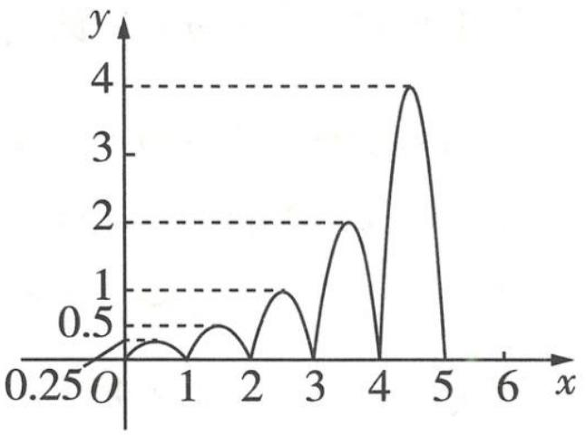

图2

##### 3. $\frac{2}{5}$ 因为 $y = \frac{\sqrt{x^2 + 4}}{x^2 + 5} = \frac{\sqrt{x^2 + 4}}{x^2 + 4 + 1} = \frac{1}{\sqrt{x^2 + 4} + \frac{1}{\sqrt{x^2 + 4}}}$ , 令 $t = \sqrt{x^2 + 4}$ , 则 $t \geqslant 2$ .

【易错提醒】由于当 $\sqrt{x^{2}+4}=\frac{1}{\sqrt{x^{2}+4}}$ 时，得到 $x^{2}=-3$ ，显然等号不能成立，因此不可使用基本不等式求其最值

令 $g(t) = t + \frac{1}{t}, t \in [2, +\infty)$ , 易得函数 $g(t) = t + \frac{1}{t}$ 在 $[2, +\infty)$ 上单调递增, 所以 $g(t) \in [\frac{5}{2}, +\infty)$ ,

即 $\sqrt{x^2 + 4} +\frac{1}{\sqrt{x^2 + 4}}\in [\frac{5}{2}, + \infty)$ ，则 $\frac{1}{\sqrt{x^2 + 4} + \frac{1}{\sqrt{x^2 + 4}}}\in (0,\frac{2}{5}],$

即函数 $y=\frac{\sqrt{x^{2}+4}}{x^{2}+5}$ 的最大值为 $\frac{2}{5}$ .

##### 4. $[- \frac{13}{4}, 3]$ 函数 $y = x + 2$ 在定义域 $\mathbf{R}$ 上单调递增, 函数 $y = x^2 - x - 1 = (x - \frac{1}{2})^2 - \frac{5}{4}$ 在 $(- \infty, \frac{1}{2})$ 上单调递减, 在 $(\frac{1}{2}, + \infty)$ 上单调递增. 要使对任意实数 $b$ , 总存在实数 $x_0$ , 使得 $f(x_0) = b$ ,

则函数 $f(x)$ 的值域为R.

当 $a \geqslant \frac{1}{2}$ 时, $f(x)$ 在 $(a, +\infty)$ 上单调递增, 在 $(- \infty, a)$ 上也单调递增, 则只需 $a + 2 \geqslant a^2 - a - 1$ , 得 $\frac{1}{2} \leqslant a \leqslant 3$ .

当 $a < \frac{1}{2}$ 时， $f(x)$ 在 $(a, +\infty)$ 上的最小值为 $-\frac{5}{4}$ ，则只需要 $a + 2 \geqslant -\frac{5}{4}$ ，得 $-\frac{13}{4} \leqslant a < \frac{1}{2}$ .

【关键提醒】分 $a \geqslant \frac{1}{2}$ , $a < \frac{1}{2}$ 两种情况讨论, 分别求出函数在各段的最大 (小) 值是求解的关键

综上可得 $-\frac{13}{4} \leqslant a \leqslant 3$ ，即实数 a 的取值范围是 $[- \frac{13}{4}, 3]$ .

##### 5. （1） 因为 $2x^{2} + 2 - 4x = 2(x - 1)^{2} \geqslant 0$ 恒成立, 且 $4x - (-x^{2} + 4x) = x^{2} \geqslant 0$ 恒成立,

所以当 $x \in R$ 时, $2x^{2} + 2 \geqslant 4x \geqslant -x^{2} + 4x$ 恒成立,

故 $y = h_{1}(x)$ 是 $y = 2x^{2} + 2$ 与 $y = -x^{2} + 4x$ 在 R 上的“分割函数”.

因为 $x+1-(-x^{2}+4x)=x^{2}-3x+1$ ，当 x 分别为 0,1 时，上述代数式的值分别为 1,-1，所以 $h_{2}(x)\geqslant-x^{2}+4x$ 与 $h_{2}(x)\leqslant-x^{2}+4x$ 在 R 上都不恒成立，

故 $y = h_{2}(x)$ 不是 $y = 2x^{2} + 2$ 与 $y = -x^{2} + 4x$ 在 R 上的“分割函数”.

（2） 设 $y = ax^{2} + cx + d (a \neq 0)$ 是 $y = 2x^{2} + 2$ 与 y = 4x 在 R 上的“分割函数”，

则 $2x^{2} + 2 \geqslant ax^{2} + cx + d \geqslant 4x$ 对一切实数 x 恒成立.

令 $(2x^{2}+2)'=4$ ,得x=1,

可知 $y = 2{x}^{2} + 2$ 的图象在点(1,4)处的切线为直线 $y = {4x}$ ,

它也是 $y = a{x}^{2} + {cx} + d$ 的图象在点(1, $a + c + d$ )处的切线,

【点拨】 $y=2x^{2}+2$ 的图象在点（1,4）处的切线与直线y=4x重合，则 $y=ax^{2}+cx+d$ 的图象在点 $(1,a+c+d)$ 处的切线只能为y=4x，如图3所示

所以 $\left\{\begin{aligned}2a+c=4,\\ a+c+d=4,\end{aligned}\right.$ 可得 $\left\{\begin{aligned}c=4-2a,\\ d=a,\end{aligned}\right.$

要使 $2x^{2} + 2 \geqslant ax^{2} + (4 - 2a)x + a \geqslant 4x$ 对一切实数 $x$ 恒成立, 即 $(2 - a)(x - 1)^{2} \geqslant 0$ 且 $a(x - 1)^{2} \geqslant 0$ 对一切实数 $x$ 恒成立, 则 $2 - a \geqslant 0$ 且 $a > 0$ , 即 $0 < a \leqslant 2$ ,

又当 a=2 时 $y=ax^{2}+(4-2a)x+a$ 与 $y=2x^{2}+2$ 为相同函数, 不合题意.
故所求的函数为 $y = ax^{2} + (4 - 2a)x + a (0 < a < 2)$ .

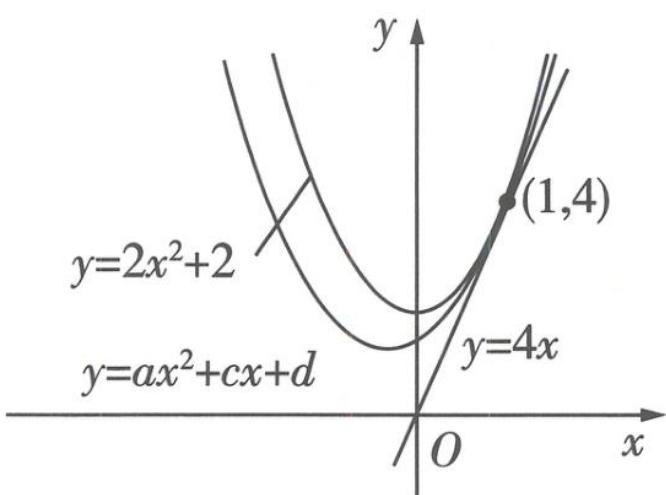

图 3

# 超重点 13 用导数证明不等式的 5 大高妙解法

# 高妙解法 1 用移项作差法证明不等式

调研 1 (2023 雅礼中学二模)已知函数 $f(x) = 2\sin x - \sin 2x$ .

（1） 当 $0 \leqslant x \leqslant \pi$ 时, 求 $f(x)$ 的最大值;  
（2） 当 $\frac{\pi}{3} \leqslant x \leqslant \frac{\pi}{2}$ 时, 求证: $f(x) > \ln(x + 1)$ (注: $\ln\frac{2\pi}{3} \approx 0.739$ ).

# 天星老师点思路

移项作差构造函数 $g(x) = f(x) - \ln (x + 1) = 2\sin x - \sin 2x - \ln (x + 1)\rightarrow g'(x) = -4\cos^2 x + 2\cos x + 2 - \frac{1}{x + 1}\rightarrow$ 根据 $\frac{\pi}{3}\leqslant x\leqslant \frac{\pi}{2}$ 放缩得 $g'(x) > - 4\cos^{2}x + 2\cos x + 1\to$ 结合 $0\leqslant \cos x\leqslant \frac{1}{2}$ 得 $g'(x) > 0\rightarrow g(x)$ 在 $[\frac{\pi}{3},\frac{\pi}{2}]$ 上单调递增 $\rightarrow g(x)\geqslant g(\frac{\pi}{3}) > 0\to$ 得证.

解析 （1） $f'(x)=2\cos x-2\cos 2x=2\cos x-2(2\cos^{2}x-1)=(-\cos x+1)(4\cos x+2)$ .

【敲黑板】对导函数解析式进行整理，利用倍角公式等整理成几个代数式相乘的形式，方便求导函数的零点

当 $0 \leqslant x \leqslant \pi$ 时, 令 $f'(x) > 0$ , 得 $-\frac{1}{2} < \cos x < 1$ , 即 $0 < x < \frac{2\pi}{3}$ ; 令 $f'(x) < 0$ , 得 $\cos x < -\frac{1}{2}$ , 即 $\frac{2\pi}{3} < x < \pi$ .

所以函数 $f(x)$ 在 $(0, \frac{2\pi}{3})$ 上单调递增，在 $(\frac{2\pi}{3}, \pi)$ 上单调递减，

所以当 $0 \leqslant x \leqslant \pi$ 时, $f(x)_{\max} = f(\frac{2\pi}{3}) = \frac{3\sqrt{3}}{2}$ .

【明易错】注意极值与最值的区别, 本题是求闭区间上函数的最大值, 函数是连续的, 且图象走势是 “↗↘”, 因此其最大值即其极大值. 否则还需要求出函数在区间端点处的函数值, 将极值与其进行比较, 进而得出所求的最值

（2） 设 $g(x) = f(x) - \ln (x + 1) = 2\sin x - \sin 2x - \ln (x + 1)$ ,

则 $g'(x) = -4\cos^{2}x + 2\cos x + 2 - \frac{1}{x + 1}.$

当 $\frac{\pi}{3} \leqslant x \leqslant \frac{\pi}{2}$ 时, $1 - \frac{1}{x + 1} > 0$ , 所以 $g'(x) > -4\cos^2 x + 2\cos x + 1$ ,

又 $-4\cos^2 x + 2\cos x + 1 = -4(\cos x - \frac{1}{4})^2 + \frac{5}{4}(0 \leqslant \cos x \leqslant \frac{1}{2})$

所以 $-4\cos^{2}x + 2\cos x + 1 > 0$ ，所以 $g'(x) > 0$ 在区间 $\left[\frac{\pi}{3}, \frac{\pi}{2}\right]$ 上恒成立。

所以 $y=g(x)$ 在区间 $\left[\frac{\pi}{3},\frac{\pi}{2}\right]$ 上单调递增，

所以 $g(x) \geqslant g\left(\frac{\pi}{3}\right) = \frac{\sqrt{3}}{2} - \ln\left(\frac{\pi}{3} + 1\right) > \frac{\sqrt{3}}{2} - \ln\frac{2\pi}{3} \approx \frac{\sqrt{3}}{2} - 0.739 > 0,$

所以当 $\frac{\pi}{3} \leqslant x \leqslant \frac{\pi}{2}$ 时, $f(x) > \ln (x + 1)$ .

【会总结】移项作差法是证明不等式的最常用的方法之一，当待证不等式的两边含有同一个变量时，一般地，可以直接构造“左减右”的函数（有时对复杂的式子要进行变形），利用导数研究其单调性和最值，借助所构造函数的单调性和最值即可得证

# 高妙解法 2 用等价转化法证明不等式

调研 2 (2023 广东茂名二模) 已知函数 $f(x) = \frac{x^2}{2} + \ln x - 2ax, a$ 为常数，且 $a > 0$ .

（1） 判断 $f(x)$ 的单调性;

（2） 当 0 < a < 1 时, 如果存在两个不同的正实数 m, n, 且 $f(m) + f(n) = 1 - 4a$ , 证明: $m + n > 2$ .

解析 （1） $f'(x)=x+\frac{1}{x}-2a=\frac{x^{2}-2ax+1}{x},x\in(0,+\infty)$ .

记 $g(x)=x^{2}-2ax+1,x\in(0,+\infty)$ .

①当 $4a^{2} - 4 \leqslant 0$ , 即 $0 < a \leqslant 1$ 时, $g(x) = x^{2} - 2ax + 1 \geqslant 0$ 恒成立, 所以 $f'(x) \geqslant 0$ 在 $(0, +\infty)$ 上恒成立, 所以 $f(x)$ 在 $(0, +\infty)$ 上单调递增.

②当 $4a^{2} - 4 > 0$ ，即 $a > 1$ 时，关于 $x$ 的方程 $x^{2} - 2ax + 1 = 0$ 有两个不等实根 $x_{1}, x_{2}$ ，且 $x_{1} = \frac{2a - \sqrt{4a^{2} - 4}}{2} = a - \sqrt{a^{2} - 1} > 0, x_{2} = \frac{2a + \sqrt{4a^{2} - 4}}{2} = a + \sqrt{a^{2} - 1} > 0, x_{1} < x_{2}$ .

所以 $\forall x\in(0,a-\sqrt{a^{2}-1})$ , $x^{2}-2ax+1>0$ , $f'(x)>0$ , $f(x)$ 单调递增;

$\forall x\in(a-\sqrt{a^{2}-1},a+\sqrt{a^{2}-1}),x^{2}-2ax+1<0,f'(x)<0,f(x)$ 单调递减；

$\forall x\in(a+\sqrt{a^{2}-1},+\infty),x^{2}-2ax+1>0,f'(x)>0,f(x)$ 单调递增.

综上所述: 当 $0 < a \leqslant 1$ 时, $f(x)$ 在 $(0, +\infty)$ 上单调递增; 当 a > 1 时, $f(x)$ 在 $(0, a - \sqrt{a^{2} - 1})$ 和 $(a + \sqrt{a^{2} - 1}, +\infty)$ 上单调递增, 在 $(a - \sqrt{a^{2} - 1}, a + \sqrt{a^{2} - 1})$ 上单调递减.

【敲黑板】当函数的单调区间由几个组成时，不同区间之间不能用“∪”连接，而是用“和”或“，”连接

（2） 因为 $f(1)=\frac{1}{2}-2a$ ，所以 $f(m)+f(n)=1-4a=2f(1)$ .

# 数字对联

由（1）可知当0<a<1时, $f(x)$ 在 $(0,+\infty)$ 上单调递增,故不妨设0<m<1<n.

要证 $m + n > 2$ ，即证 $n > 2 - m$ ，又当 $0 < a < 1$ 时， $f(x)$ 在 $(0, +\infty)$ 上单调递增，

所以只需证 $f(n)>f(2-m)$ ，又 $f(m)+f(n)=1-4a$ ，

所以只需证 $1 - 4a - f(m) > f(2 - m)$ , 即证 $f(m) + f(2 - m) < 1 - 4a (0 < m < 1)$ .

【知关键】结合 $f(x)$ 的单调性及已知条件等量代换，将问题转化为求证 $f(m)+f(2-m)<1-4a(0<m<1)$ 是该题的突破口

记 $F(x)=f(x)+f(2-x),x\in(0,1)$ ,

$F ^ {'} (x) = f ^ {'} (x) - f ^ {'} (2 - x) = x + \frac {1}{x} - 2 a - (2 - x) - \frac {1}{2 - x} + 2 a = - \frac {2 (x - 1) ^ {3}}{x (2 - x)},$

【高频易错】注意 $[f(2 - x)]'$ 与 $f'(2 - x)$ 的区别，否则容易出错，事实上， $[f(2 - x)]' = -f'(2 - x)$

所以当 $x \in (0,1)$ 时， $F'(x) > 0$ 恒成立， $F(x)$ 单调递增，所以 $F(x) < 2f(1) = 1 - 4a$

所以原命题得证,即 $m + n > 2$ .

# 高妙解法 3 用变量代换法证明不等式

调研 3 (2023 河南洛阳模拟)已知函数 $f(x) = ax \ln x - x^2 - 2x (a > 0)$ .

（1） 若 $a = 4$ , 求 $f'(x)$ 的极值;

（2） $g(x)=f(x)+2x$ , 若函数 $g(x)$ 有两个零点 $x_{1}, x_{2}$ ，且 $\frac{x_{2}}{x_{1}}>e$ ，求证： $\ln a+\ln(x_{1}x_{2})>3$ .

# 天星老师明方向

根据函数零点的定义，将已知条件转化为直线 $y=\frac{1}{a}$ 与函数 $\varphi(x)=\frac{\ln x}{x}$ 的图象有两个交点 $\rightarrow a>e\rightarrow$ 借助零点建立两个方程，消去 $a\rightarrow$ 构造函数证明 $\ln(x_{1}x_{2})>2$ 即可.

解析 （1） 当 $a = 4$ 时, $f(x) = 4x \ln x - x^2 - 2x$ , 定义域为 $(0, +\infty)$ ,

求导得 $f'(x)=4(1+\ln x)-2x-2=4\ln x-2x+2.$

令 $h(x)=4\ln x-2x+2$ ，则 $h'(x)=\frac{4}{x}-2$ .

当 0 < x < 2 时, $h'(x) > 0$ ; 当 x > 2 时, $h'(x) < 0$ .

所以函数 $h(x)$ 在 $(0,2)$ 上单调递增，在 $(2,+\infty)$ 上单调递减，所以当 x=2 时， $h(x)$ 取得极大值，为 $h(2)=4\ln2-2$ ，无极小值。

综上, $f'(x)$ 的极大值为 $4\ln2-2$ ,无极小值.

（2）依题意得 $g(x)=ax\ln x-x^{2},x>0,$

令 $g(x)=ax\ln x-x^{2}=0$ ,得 $\frac{1}{a}=\frac{\ln x}{x}$ ,

【小贴士】这一步转化的前提是已知 $a > 0$ , 因此可以出现在分母上, 否则要对参数进行讨论哦

因此函数 $g(x)$ 的两个零点 $x_{1}, x_{2}$ 即直线 $y = \frac{1}{a}$ 与函数 $\varphi(x) = \frac{\ln x}{x}$ 图象的两个交点的横坐标.

【划重点】涉及含参函数的零点问题，往往利用参数分离法将问题转化为两函数图象的交点问题

$\varphi'(x) = \frac{1 - \ln x}{x^{2}}$ ，当 $0 < x < e$ 时， $\varphi'(x) > 0$ ，当 $x > e$ 时， $\varphi'(x) < 0$ ，则函数 $\varphi(x) = \frac{\ln x}{x}$ 在 $(0, e)$ 上单调递增，在 $(e, +\infty)$ 上单调递减，所以 $\varphi(x)_{\max} = \frac{1}{e}$ .

而 $\varphi(1) = 0$ ，当 $x > 1$ 时，恒有 $\varphi(x) > 0$ ，于是 $0 < \frac{1}{a} < \frac{1}{\mathrm{e}}$ ，即 $a > \mathrm{e}$ .

令 $t = \frac{x_2}{x_1}$ 则 $t > \mathrm{e}$ 显然有 $\left\{ \begin{array}{l} a \ln x_1 = x_1, \\ a \ln x_2 = x_2, \end{array} \right.$ 则 $\left\{ \begin{array}{l} a \ln (x_1 x_2) = x_2 + x_1, \\ a \ln \frac{x_2}{x_1} = x_2 - x_1, \end{array} \right.$

【敲黑板】利用比值换元法，将 $x_{1}, x_{2}, a$ 用 $t$ 表示，将所证不等式转化为 $F(t) > 0$

则有 $\ln\left(x_{1}x_{2}\right)=\frac{x_{2}+x_{1}}{x_{2}-x_{1}}\cdot\ln\frac{x_{2}}{x_{1}}=\frac{\frac{x_{2}}{x_{1}}+1}{\frac{x_{2}}{x_{1}}-1}\cdot\ln\frac{x_{2}}{x_{1}}=\frac{t+1}{t-1}\ln t,$ 下面证明 $\frac{t+1}{t-1}\ln t>2.$

令 $F(t)=\ln t-\frac{2(t-1)}{t+1}=\ln t+\frac{4}{t+1}-2,t>e$ ，则 $F'(t)=\frac{1}{t}-\frac{4}{(t+1)^{2}}=\frac{(t-1)^{2}}{t(t+1)^{2}}>0$ ，即函数 $F(t)$ 在 $(e,+\infty)$ 上单调递增，所以 $F(t)>\ln e+\frac{4}{e+1}-2>0$ ，即有 $\ln t>\frac{2(t-1)}{t+1}$ ，从而 $\ln(x_{1}x_{2})=\frac{t+1}{t-1}\ln t>2$ .

又 $\ln a > 1$ , 所以 $\ln a + \ln (x_{1}x_{2}) > 3$ .

【会总结】对于含多个未知数的函数不等式问题, 其关键在于将多个未知数化为一个未知数, 常见的证明思路有以下 4 种: （1） 利用换元法, 化为一个未知数; （2） 利用未知数之间的关系消元, 化为一个未知数; （3） 分离未知数后, 构造函数, 利用函数的单调性证明; （4） 利用主元转换法构造函数证明

# 高妙解法 4 用分离参数法证明不等式

调研 4 (2023 湖南名校 4 月联考) 已知函数 $f(x) = \mathrm{e}^{x} - \ln x - a - 1$ .

# 数字对联

（1） 若点 $(1, e + 1)$ 为曲线 $y = f(x)$ 上一点, 求曲线 $y = f(x)$ 在该点处的切线方程.  
（2） 若 $a > 0$ , 证明: $f(x) \geqslant (1 - a) \ln a$ .

思维导引 （1） 点在曲线上 + 导数的几何意义 → 直线的点斜式方程 → 得解

（2） 分离参数 → 将所证问题转化为 $(e^{x}-\ln x)_{\min}\geqslant[(1-a)\ln a+a+1]_{\max}$ 利用导数求函数的最值 → 转化得解

解析 （1） 因为点 $(1, e + 1)$ 在曲线 $y = f(x)$ 上, 所以 $f(1) = e - a - 1 = e + 1$ , 所以 $a = -2$ .

所以 $f(x) = \mathrm{e}^{x} - \ln x + 1, f'(x) = \mathrm{e}^{x} - \frac{1}{x},$

所以曲线 $y=f(x)$ 在点 $(1,e+1)$ 处的切线的斜率为 $f'（1）=e-1$ ,

所以曲线在点 $(1, \mathrm{e} + 1)$ 处的切线 $l$ 的方程为 $y - (\mathrm{e} + 1) = (\mathrm{e} - 1)(x - 1)$ , 即 $y = (\mathrm{e} - 1)x + 2$ .

（2）要证明 $f(x) \geqslant (1 - a)\ln a$ , 即证 $e^x - \ln x - a - 1 \geqslant (1 - a)\ln a$ , 即证 $e^x - \ln x \geqslant (1 - a) \cdot \ln a + a + 1$ .

【扫清障碍】利用参数分离法，将含参数 $a$ 的式子移到不等式一边，含 $x$ 的式子移到不等式另一边，分别构造函数，并利用导数研究单调性与最值

设 $h(x) = \mathrm{e}^{x} - \ln x$ ，则 $h'(x) = \mathrm{e}^{x} - \frac{1}{x}$ 易得 $h^' (x)$ 单调递增，且 $h^' (\frac{1}{3}) < 0,h^' （1） > 0$ ，所以存在 $x_0\in (\frac{1}{3},1)$ ，使得 $h^' (x_0) = \mathrm{e}^{x_0} - \frac{1}{x_0} = 0$ ，即 $x_0 = \mathrm{e}^{-x_0}$

所以当 $x \in (0, x_0)$ 时， $h'(x) < 0$ ；当 $x \in (x_0, +\infty)$ 时， $h'(x) > 0$ .

所以 $h(x)$ 在 $(0, x_0)$ 上单调递减，在 $(x_0, +\infty)$ 上单调递增，所以 $h(x)_{\min} = \mathrm{e}^{x_0} - \ln x_0 = \frac{1}{x_0} - \ln \mathrm{e}^{-x_0} = \frac{1}{x_0} + x_0.$

令 $g(a) = (1 - a)\ln a + a + 1$ ，则 $g'(a) = -\ln a + \frac{1}{a}$ 易得 $g'(a)$ 单调递减，且 $g'(\frac{1}{3}) > 0$ $g'(\mathrm{e}) <   0,$

所以存在 $a_0 \in (\frac{1}{3}, e)$ , 使得 $g'(a_0) = -\ln a_0 + \frac{1}{a_0} = 0$ , 即 $\frac{1}{a_0} = \ln a_0$ .

所以当 $a \in (0, a_0)$ 时， $g'(a) > 0$ ；当 $a \in (a_0, +\infty)$ 时， $g'(a) < 0$ .

则 $g(a)$ 在 $(0, a_{0})$ 上单调递增，在 $(a_{0}, +\infty)$ 上单调递减，

所以 $g(a)_{\max} = (1 - a_0)\ln a_0 + a_0 + 1 = \frac{1 - a_0}{a_0} +a_0 + 1 = \frac{1}{a_0} +a_0.$

$y=e^{x}$ 与 $y=\ln x$ 互为反函数,两函数的图象均与函数 $y=\frac{1}{x}$ 的图象相交,设两交点分别为

$A(x_0, \mathrm{e}^{x_0}), B(a_0, \ln a_0)$ , 则它们关于直线 $y = x$ 对称,

又 $\mathrm{e}^{x_0} = \frac{1}{x_0},\ln a_0 = \frac{1}{a_0}$ 所以 $A(x_0,\frac{1}{x_0}),B(a_0,\frac{1}{a_0})$ ，所以 $x_0 = \frac{1}{a_0},\frac{1}{x_0} = a_0.$

【明关键】利用指数函数与对数函数互为反函数得到隐零点 $x_0$ 与 $a_0$ 之间的关系式是判断 $h(x)_{\min}$ 与 $g(a)_{\max}$ 的大小关系的关键

$h (x) _ {\min} - g (a) _ {\max} = \frac {1}{x _ {0}} + x _ {0} - \frac {1}{a _ {0}} - a _ {0} = 0,$

所以 $f(x) \geqslant (1 - a) \ln a$ 成立.

【会思考】利用不等式的性质对所证不等式进行拆分，转化成为 $h(x) \geqslant g(a)$ 的形式，若能证明 $h(x)_{\min} \geqslant g(a)_{\max}$ ，即可得 $h(x) \geqslant g(a)$

# 高妙解法 5 用切线放缩法证明不等式

调研 5: (2023 江苏南通 5 月三模) 已知函数 $f(x) = \frac{x}{\mathrm{e}^{x}}$ .

（1） 求曲线 $y = f(x)$ 在点 $(-e, f(-e))$ 处的切线方程；  
（2） 若 $\sum_{i=1}^{n} x_i = 2, x_i > 0, n \geqslant 2$ 且 $n \in \mathbb{N}$ , 证明: $\sum_{i=1}^{n} f(x_i) \leqslant 2\mathrm{e}^{-\frac{2}{n}}$ .

# 天星老师明思路

求出曲线 $y = f(x)$ 在点 $(a, f(a))$ 处的切线方程，为 $y = \frac{1 - a}{\mathrm{e}^a} x + \frac{a^2}{\mathrm{e}^a}$ ，由此可构造函数 $g(x) = \frac{1 - a}{\mathrm{e}^a} x + \frac{a^2}{\mathrm{e}^a} - \frac{x}{\mathrm{e}^x} (0 < x \leqslant 2)$ ，利用导数判断其单调性，从而证明 $\frac{1-a}{e^{a}}x+\frac{a^{2}}{e^{a}}\geqslant\frac{x}{e^{x}}(0<x\leq2)$ ，再采用累加法即可证明结论.

解析 （1） 由 $f(x) = \frac{x}{\mathrm{e}^x}$ 可得 $f'(x) = \frac{1 - x}{\mathrm{e}^x}$ ，故 $f'(-\mathrm{e}) = \frac{1 + \mathrm{e}}{\mathrm{e}^{-\mathrm{e}}} = \mathrm{e}^{\mathrm{e}}(1 + \mathrm{e})$ ，

而 $f(-\mathrm{e}) = \frac{-\mathrm{e}}{\mathrm{e}^{-\mathrm{e}}} = -\mathrm{e}^{\mathrm{e} + 1},$

所以曲线 $y = f(x)$ 在 $(-e, f(-e))$ 处的切线方程为 $y + e^{e+1} = e^e (1 + e)(x + e)$ ，即 $y = e^e (1 + e)x + e^{e+2}$ .

（2） 设曲线 $y = f(x) = \frac{x}{\mathrm{e}^{x}}$ 在点 $(a, f(a))$ 处的切线斜率为 k, 0 < a < 2，由 （1） 得 $k = f'(a) = \frac{1 - a}{\mathrm{e}^{a}}$ ，且 $f(a) = \frac{a}{\mathrm{e}^{a}}$ ,

# 数字对联

故曲线 $y = f(x)$ 在点 $(a, f(a))$ 处的切线方程为 $y = \frac{1 - a}{\mathrm{e}^a} x + \frac{a^2}{\mathrm{e}^a}$ .

【会思考】要证明不等式 $\sum_{i=1}^{n} f(x_i) \leqslant 2 e^{-\frac{2}{n}}$ ，可分析其结构特点，想到累加法，但关键的一步在于能想到和切线相关的不等式，即 $\frac{1-a}{e^a} x + \frac{a^2}{e^a} \geqslant \frac{x}{e^x} (0 < x \leqslant 2)$ ，因此需要先求得 $f(x)$ 的图象在点 $(a, f(a))$ 处的切线方程，继而构造函数，利用其单调性或最值证明不等式

设 $g(x) = \frac{1 - a}{\mathrm{e}^a} x + \frac{a^2}{\mathrm{e}^a} -\frac{x}{\mathrm{e}^x} (0 <   x\leqslant 2)$ ，则 $g'(x) = \frac{1 - a}{\mathrm{e}^a} -\frac{1 - x}{\mathrm{e}^x},g'(a) = 0.$

设 $h(x) = \frac{1 - a}{\mathrm{e}^a} -\frac{1 - x}{\mathrm{e}^x} (0 <   x\leqslant 2)$ ，则 $h^' (x) = \frac{2 - x}{\mathrm{e}^x},$

因为 $0 < x \leqslant 2$ ，所以 $h'(x) \geqslant 0$ ，仅在 x = 2 时取等号，故 $h(x)$ 在 $(0, 2]$ 上单调递增，且 $h(a) = 0$ .

故当 0 < x < a 时, $g'(x) = h(x) < 0$ ; 当 $a < x \leqslant 2$ 时, $g'(x) = h(x) > 0$ .

故 $g(x) \geqslant g(a) = 0$ ，即 $\frac{1 - a}{e^{a}} x + \frac{a^{2}}{e^{a}} \geqslant \frac{x}{e^{x}} (0 < x \leqslant 2)$ ，易得 $x_{1}, x_{2}, \cdots, x_{n} \in (0, 2)$ ，则 $\sum_{i=1}^{n} f(x_{i}) = \frac{x_{1}}{e^{x_{1}}} + \frac{x_{2}}{e^{x_{2}}} + \cdots + \frac{x_{n}}{e^{x_{n}}} \leqslant \frac{1 - a}{e^{a}} (x_{1} + x_{2} + \cdots + x_{n}) + \frac{na^{2}}{e^{a}} = \frac{2(1 - a)}{e^{a}} + \frac{na^{2}}{e^{a}}.$

不妨令 $a = \frac{2}{n}$ 则 $\frac{2(1 - a)}{\mathrm{e}^a} +\frac{na^2}{\mathrm{e}^a} = \frac{2(1 - \frac{2}{n})}{\mathrm{e}^{\frac{2}{n}}} +\frac{\frac{4}{n}}{\mathrm{e}^{\frac{2}{n}}} = 2\mathrm{e}^{-\frac{2}{n}}$ ，即 $\sum_{i = 1}^{n}f(x_i)\leqslant 2\mathrm{e}^{-\frac{2}{n}}.$

# 提分干货 大招解读

# 2 类用放缩法解决的问题

##### 1. 函数解析式中含有已知范围的参数, 可以考虑借助于常识或已知的范围减少变量, 对参数适当放缩, 达到证明的目的. 合理运用放缩法往往能起到事半功倍的效果, 有时能令人拍案叫绝. 但其缺点也是显而易见, 如果使用放缩法证题时没有注意放和缩的“度”, 容易造成不能同向传递.  
##### 2. 若第一小问是求曲线的切线方程, 就要注意是否运用切线放缩法进行放缩解决问题.

# 新题预测

##### 1. (2023 安徽蚌埠 4 月三模) 已知函数 $f(x) = 1 - \cos x$ .

（1） 证明: $f(x) \leqslant \frac{x^2}{2}$ .

（2） 证明: 函数 $h(x) = a \ln (x + 1) - f(x) (0 < a < 1)$ 在 $(0, \frac{\pi}{2})$ 上有唯一零点 $x_0$ , 且 $x_0 > \sqrt{4a + 1} - 1$ .

##### 2. (2023 河北名校 4 月模拟预测) 已知函数 $f(x) = \mathrm{e}^{x} - (x - a)^{2} (x > 0)$ , e 为自然对数的底数.

（1） 讨论函数 $f(x)$ 的极值点个数;  
（2） 当函数 $f(x)$ 存在唯一极值点 $x_{0}$ 时, 求证: $a + \frac{\operatorname{esin} x_{0}}{2} < x_{0} < -4a$ .

##### 3. (2023 成都七中校考模拟预测)已知函数 $f(x) = \cos x + \frac{a}{2}x^2 - 1, a \in \mathbb{R}$ .

（1） 若 $x = 0$ 是函数 $f(x)$ 唯一的极小值点, 求实数 $a$ 的取值范围;  
（2） 证明: $\sqrt{\sin^{3}\frac{1}{2}} + \sqrt{\sin^{3}\frac{2}{4}} + \sqrt{\sin^{3}\frac{3}{8}} + \cdots + \sqrt{\sin^{3}\frac{2023}{2^{2023}}} < 2.$

# 参考答案与解析

##### 1. （1） 令 $g(x) = \cos x - 1 + \frac{x^2}{2}$ ，则 $g'(x) = -\sin x + x$ ，令 $y = -\sin x + x$ ，则 $y' = 1 - \cos x \geqslant 0$ ，

【关键提醒】利用移项作差法构造函数，研究函数的单调性与最值，即可证明不等式

即函数 $g'(x)$ 在 R 上单调递增, $g'（0）=0$ , 由 $g'(x)>0$ 得 x>0, 由 $g'(x)<0$ 得 x<0, 因此函数 $g(x)$ 在 $(0,+\infty)$ 上单调递增, 在 $(-∞,0)$ 上单调递减, 所以 $g(x)\geqslant g(0)=0$ ,

即 $\cos x - 1 + \frac{x^{2}}{2} \geqslant 0$ ，所以 $f(x) \leqslant \frac{x^{2}}{2}$ .

（2） 由 $h(x) = a \ln (x + 1) - 1 + \cos x, x \in (0, \frac{\pi}{2})$ ，得 $h'(x) = \frac{a}{x + 1} - \sin x$ .

令 $\varphi(x) = \frac{a}{x + 1} - \sin x (0 \leqslant x \leqslant \frac{\pi}{2})$ ，则 $\varphi'(x) = -\frac{a}{(x + 1)^2} - \cos x$ ，易知 $\varphi'(x)$ 在 $[0, \frac{\pi}{2}]$ 上单调递增，则 $\varphi'(x) \leqslant \varphi'(\frac{\pi}{2}) < 0$ ，所以函数 $\varphi(x)$ 在 $(0, \frac{\pi}{2})$ 上单调递减。

又 $\varphi(0) = a > 0, \varphi\left(\frac{\pi}{2}\right) = \frac{a}{\frac{\pi}{2} + 1} - 1 < \frac{1}{\frac{\pi}{2} + 1} - 1 < 0$ ，所以存在唯一的实数 $m \in (0, \frac{\pi}{2})$ ，使得 $\varphi(m) = 0$ .

则当 $x \in (0, m)$ 时， $h'(x) > 0, h(x)$ 单调递增，当 $x \in (m, \frac{\pi}{2})$ 时， $h'(x) < 0, h(x)$ 单调递减，

则 $h(m) > a\ln (1 + 0) - 1 + \cos 0 = 0$ ，且 $h(x) > 0$ 在 $(0,m)$ 上恒成立，又 $a\ln (\frac{\pi}{2} +1) - 1+$ $\cos \frac{\pi}{2} < \ln (\frac{\pi}{2} +1) - 1 < 0,$

因此存在唯一的 $x_0 \in (0, \frac{\pi}{2})$ ，使得 $h(x_0) = 0$ ，下面证明 $x_0 > \sqrt{4a + 1} - 1$ .

由 $0 < a < 1$ 知 $0 < \sqrt{4a + 1} - 1 < \sqrt{5} - 1$ , 即 $\sqrt{4a + 1} - 1 \in (0, \frac{\pi}{2})$ , 则只需证 $h(\sqrt{4a + 1} - 1) > 0$ , 即证 $a \ln \sqrt{4a + 1} > f(\sqrt{4a + 1} - 1)$ .

【解题秘籍】利用导数，结合函数零点存在定理判断唯一零点，再借助单调性把不等式转化为 $h(\sqrt{4a + 1} - 1) > 0$ ，然后构造函数解答

由（1）知 $f(\sqrt{4a+1}-1)\leqslant\frac{(\sqrt{4a+1}-1)^{2}}{2}$ ，则只需证 $a\ln\sqrt{4a+1}>\frac{(\sqrt{4a+1}-1)^{2}}{2}$ .

令 $t = \sqrt{4a + 1} - 1$ ，则 $t \in (0, \sqrt{5} - 1)$ ， $a = \frac{(t + 1)^2 - 1}{4} = \frac{t^2 + 2t}{4}$ ，

故只需证 $\frac{t^2 + 2t}{4}\ln (t + 1) > \frac{t^2}{2}$ , 即证 $\ln (t + 1) > \frac{2t}{t + 2}$ , 其中 $t \in (0, \sqrt{5} - 1)$ .

令 $F(t)=\ln(t+1)-\frac{2t}{t+2}, t\in(0,\sqrt{5}-1)$ ，则 $F'(t)=\frac{1}{t+1}-\frac{4}{(t+2)^{2}}=\frac{t^{2}}{(t+1)(t+2)^{2}}>0$ ，所以函数 $F(t)$ 在 $(0,\sqrt{5}-1)$ 上单调递增，因此 $F(t)>\ln(0+1)-\frac{2\times0}{0+2}=0$ ，即当 $t\in(0,\sqrt{5}-1)$ 时， $\ln(t+1)>\frac{2t}{t+2}$ ，所以 $x_{0}>\sqrt{4a+1}-1$ 。

##### 2. （1） 令 $g(x) = f'(x) = \mathrm{e}^x - 2x + 2a$ , 则 $g'(x) = \mathrm{e}^x - 2$ ,

当 $0 < x < \ln 2$ 时, $g'(x) < 0$ , $f'(x)$ 单调递减, 当 $x > \ln 2$ 时, $g'(x) > 0$ , $f'(x)$ 单调递增,

所以 $f'(x) \geqslant f'(\ln 2) = 2(1 - \ln 2 + a)$ .

当 $a \geqslant \ln 2 - 1 = \ln \frac{2}{\mathrm{e}}$ 时, $f'(x) \geqslant 0$ 在 $(0, +\infty)$ 上恒成立, 此时 $f(x)$ 无极值点.

当 $a < \ln 2 - 1 = \ln \frac{2}{\mathrm{e}}$ 时， $f'(\ln 2) < 0, \mathrm{e}^0 - 2 \times 0 + 2a = 1 + 2a.$

若 $-\frac{1}{2} < a < \ln \frac{2}{\mathrm{e}}$ ，则 $1 + 2a > 0, f'（2） = \mathrm{e}^2 - 4 + 2a > 0$ ，所以 $f'(x)$ 在 $(0, \ln 2), (\ln 2, 2)$ 上各有一个零点，即 $f(x)$ 有两个极值点。若 $a \leqslant -\frac{1}{2}$ ，则 $1 + 2a \leqslant 0$ ，当 $x \to +\infty$ 时， $f'(x) \to +\infty$ ，所以 $f'(x)$ 在 $(0, +\infty)$ 上有一个零点，即 $f(x)$ 有一个极值点。

综上: 当 $a \leqslant -\frac{1}{2}$ 时, $f(x)$ 有一个极值点; 当 $-\frac{1}{2} < a < \ln \frac{2}{e}$ 时, $f(x)$ 有两个极值点; 当 $a \geqslant \ln \frac{2}{e}$ 时, $f(x)$ 无极值点.

（2）由（1）知 $f(x)$ 存在唯一极值点 $x_{0}$ 时, $a\leqslant-\frac{1}{2},f'(x_{0})=e^{x_{0}}-2x_{0}+2a=0,$

所以 $a = x_{0} - \frac{e^{x_{0}}}{2}$ ，则要证 $a + \frac{e\sin x_{0}}{2} < x_{0}$ ，只需证 $x_{0} - \frac{e^{x_{0}}}{2} + \frac{e\sin x_{0}}{2} < x_{0}$ ，即证 $\sin x_{0} - e^{x_{0}-1} < 0$ .

对于 $y = x - \sin x, x \in (0, +\infty)$ , $y' = 1 - \cos x \geqslant 0$ , 即 $y = x - \sin x$ 在 $x \in (0, +\infty)$ 上单调递增,
所以 $y = x - \sin x > 0$ ，即 $x > \sin x$ 在 $x \in (0, +\infty)$ 上恒成立；

对于 $y = x - \mathrm{e}^{x - 1}, x \in (0, +\infty), y' = 1 - \mathrm{e}^{x - 1}$ ，在(0,1)上 $y' = 1 - \mathrm{e}^{x - 1} > 0$ ，在 $(1, +\infty)$ 上 $y' = 1 - \mathrm{e}^{x - 1} < 0$ ，

所以 $y = x - \mathrm{e}^{x - 1}$ 在(0,1)上单调递增，在 $(1, +\infty)$ 上单调递减，故 $y = x - \mathrm{e}^{x - 1} \leqslant 0$ ，即 $x \leqslant \mathrm{e}^{x - 1}$ 在 $x \in (0, +\infty)$ 上恒成立.

综上, $e^{x-1}\geqslant x>\sin x$ 在 $x\in(0,+\infty)$ 上恒成立,故 $\sin x_{0}-e^{x_{0}-1}<0$ 成立.

要证 $x_0 < -4a$ ，即证 $2\mathrm{e}^{x_0} - 5x_0 > 0$ .

【解题秘籍】由（1）知 $a = x_0 - \frac{\mathrm{e}^{x_0}}{2}$ ，利用分析法将问题转化为证明 $\sin x_0 - \mathrm{e}^{x_0 - 1} < 0, 2\mathrm{e}^{x_0} - 5x_0 > 0$ 在 $(0, +\infty)$ 上同时恒成立是解题的关键

令 $h(x) = 2\mathrm{e}^{x} - 5x, x \in (0, +\infty)$ ，则 $h'(x) = 2\mathrm{e}^{x} - 5$

当 $0 < x < \ln \frac{5}{2}$ 时， $h'(x) < 0, h(x)$ 单调递减；当 $x > \ln \frac{5}{2}$ 时， $h'(x) > 0, h(x)$ 单调递增.

所以 $h(x) \geqslant h(\ln \frac{5}{2}) = 5(1 - \ln \frac{5}{2}) = 5\ln \frac{2e}{5} > 0$ ，即 $2e^{x} - 5x > 0$ 在 $x \in (0, +\infty)$ 上恒成立.

综上, $a+\frac{e\sin x_{0}}{2}<x_{0}<-4a.$

##### 3. （1） $f'(x) = -\sin x + ax$ , 且 $f'（0） = 0$ , 令 $g(x) = f'(x)$ , 则 $g'(x) = -\cos x + a$ .

①当 $a \geqslant 1$ 时, $g'(x) \geqslant 0$ , 则 $g(x)$ 单调递增,

当 $x > 0$ 时， $g(x) = f'(x) > g(0) = 0$ ，当 $x < 0$ 时， $g(x) = f'(x) < g(0) = 0$

即当 x > 0 时, $f(x)$ 单调递增, 当 x < 0 时, $f(x)$ 单调递减, 此时 x = 0 是函数 $f(x)$ 唯一的极小值点.

②当 a<1 时, $g'（0）=-1+a<0$ , 所以存在 $\delta>0$ 使得当 $x\in(0,\delta)$ 时, $g(x)=f'(x)$ 在 $(0,\delta)$ 上单调递减, 即当 $x\in(0,\delta)$ 时, $f'(x)<f'（0）=0$ , 所以 $f(x)$ 在 $(0,\delta)$ 上单调递减, 与 x=0 是函数 $f(x)$ 唯一的极小值点矛盾.

综上,实数 a 的取值范围为 $[1, +\infty)$ .

（2）由（1）可知,当a=1且x>0时, $-\sin x+x>0$ ,即当x>0时, $x>\sin x$ ,

故当 x > 0 且 $x \in [2k\pi, \pi + 2k\pi]$ , $k \in N$ 时, $\sin^{3}x < 1 \cdot x^{2}$ , 即 $\sqrt{\sin^{3}x} < x$ ,

【明关键】利用不等式 $x > \sin x$ 进行放缩得 $\sqrt{\sin^{3}x} < x$ ，再由累加法、等比数列前 n 项和的公式及错位相减法进行证明是解本题的关键

故可得 $\sqrt{\sin^3\frac{1}{2}} +\sqrt{\sin^3\frac{2}{4}} +\sqrt{\sin^3\frac{3}{8}} +\dots +\sqrt{\sin^3\frac{2023}{2^{2023}}} <   \frac{1}{2} +\frac{2}{4} +\frac{3}{8} +\dots +\frac{2023}{2^{2023}}.$

令 $S=\frac{1}{2}+\frac{2}{4}+\frac{3}{8}+\cdots+\frac{2023}{2^{2023}}$ ，则 $\frac{1}{2}S=\frac{1}{4}+\frac{2}{8}+\frac{3}{16}+\cdots+\frac{2023}{2^{2024}}$

两式相减可得 $\frac{1}{2} S = \frac{1}{2} +\frac{1}{4} +\frac{1}{8} +\dots +\frac{1}{2^{2023}} -\frac{2023}{2^{2024}}$ ，化简可得 $S = 2\left[1 - \left(\frac{1}{2}\right)^{2023} - \frac{2023}{2^{2024}}\right] <   2.$

故 $\sqrt{\sin^3\frac{1}{2}} +\sqrt{\sin^3\frac{2}{4}} +\sqrt{\sin^3\frac{3}{8}} +\dots +\sqrt{\sin^3\frac{2023}{2^{2023}}} <  2.$

# 超重点 14 4 招攻破函数比大小问题

# 招法 1 用取特值法比较大小

调研 1 (2023 湖南长沙一中 4 月模拟预测) 已知正实数 $x, y$ 满足 $x < y$ , 设 $a = x \mathrm{e}^{x} + y$ , $b = y \mathrm{e}^{y} + x$ , $c = y \mathrm{e}^{x} + x$ (其中 e 为自然对数: $e = 2.71828 \cdots$ ), 则 $a, b, c$ 的大小关系是 ( )

$\quad$A. $a < c < b$

$\quad$B. $c < a < b$

$\quad$C. $c < b < a$

$\quad$D. $b < c < a$

# 天星老师传技巧

a, b, c 中均只含 x, y 两个未知参数，且式子结构简单，故可对 x, y 取特值直接判断.

解析 由题意知 $b-c=y(e^{y}-e^{x})$ ，因为y>x>0，所以 $e^{y}>e^{x}$ ，所以b>c；

【敲黑板】条件中的式子结构相似，故可直接采用作差法，利用指数函数的单调性比较大小

$c-a=(x-y)+(y-x)e^{x}=(y-x)(e^{x}-1)$ ，因为 y>x>0, $e^{x}>1$ ，所以 c>a 。综上，a<c<b 。故选 A。

【秒解】取特值法 根据题意可取 $x = 1, y = 2$ ，则 $a = e + 2, b = 2e^2 + 1, c = 2e + 1$ ，从而 $a < c < b$ ，故选A.

# 招法 2 用临界值法比较大小

调研 2 (2023 福建莆田 4 月模拟) 已知 $a = \log_5 3, b = 0.2^{-0.3}, c = \log_{\frac{1}{6}} \frac{1}{2}$ , 则 ( )

$\quad$A. $c < a < b$

$\quad$B. $a < b < c$

$\quad$C. $c < b < a$

$\quad$D. $b < c < a$

# 天星老师讲方法

比较两个对数式与一个指数式的大小关系, 优先考虑临界值法,利用指数函数、对数函数或幂函数的单调性先将这几个数与 0,1 比较, 此时注意指数或对数函数中底数对其单调性的影响. 若不能比较得出最终结果, 则继续寻找临界值, 此时的临界值通常是取区间的中点，如若 0 < m < 1, 0 < n < 1，则取 $\frac{1}{2}$ ，比较 m, n 与 $\frac{1}{2}$ 的大小.

解析 第一步: 分别比较 a, b, c 与 0, 1 的大小.

因为 $1 < 3 < 5$ , 所以 $\log_5 1 < a = \log_5 3 < \log_5 5$ , 即 $0 < a < 1$ ; 因为 $-0.3 < 0, 0 < 0.2 < 1$ , 所以 $b = 0.2^{-0.3} > 0.2^0 = 1$ , 即 $b > 1$ ; 因为 $0 < \frac{1}{6} < \frac{1}{2} < 1$ , 所以 $\log_{\frac{1}{6}} 1 < c = \log_{\frac{1}{6}} \frac{1}{2} < \log_{\frac{1}{6}} \frac{1}{6}$ , 即 $0 < c < 1$ .

第二步: 比较 a 与 c 的大小.

因为 a, c 都属于区间 $(0,1)$ ，故取区间中点 $\frac{1}{2}$ 进行比较。显然 $3 = \sqrt{9} > \sqrt{5}$ ，所以 $a = \log_{5}3 > \log_{5}\sqrt{5} = \frac{1}{2}$ ; 而 $\frac{1}{2} = \frac{1}{\sqrt{4}} > \frac{1}{\sqrt{6}}$ ，所以 $c = \log_{\frac{1}{6}}\frac{1}{2} < \log_{\frac{1}{6}}\frac{1}{\sqrt{6}} = \frac{1}{2}$ 。所以 c < a。

【关键提醒】将中间值化为对数的形式，根据对数函数的单调性进行比较

第三步: 比较 a, b, c 的大小.

故 $0 < c < \frac{1}{2} < a < 1 < b$ ，即 $c < a < b$ ，故选A.

# 提分干货

# 方法总结

利用临界值法比较大小的基本思路:（1） 比较指数式和对数式的大小, 可以利用函数的单调性, 引入中间量, 有时也可用数形结合的方法。（2） 解题时要根据实际情况来构造相应的函数, 如果指数相同而底数不同则构造幂函数, 若底数相同而指数不同则构造指数函数。（3） 若两个数值在同一个范围, 则可以利用二分法进一步将范围缩小, 直至把其置于两个不同的范围, 进而比较大小.

# 招法 3 用构造函数法比较大小

# 1. 构造函数比较数值的大小

调研 3 (2023 山东青岛 4 月检测) 已知 $a = \mathrm{e}^{0.2} - 1, b = \ln 1.2, c = \tan 0.2$ ，则（）

$\quad$A. $b > a > c$

$\quad$B. $c > a > b$

$\quad$C. $a > b > c$

$\quad$D. $a > c > b$

# 天星老师点思路

观察三个式子，a,b,c 都与 0.2 有关系，则 0.2 是 x 的话，a,b,c 分别对应为 $e^{x}-1,\ \ln(x+1)$ 和 $\tan x$ ，据此可分别构建函数 $f(x)=e^{x}-1-\tan x$ ， $g(x)=\tan x-\ln(x+1)$ ，结合导数分析 a 与 c，b 与 c 的大小关系。

解析 令 $f(x) = \mathrm{e}^{x} - 1 - \tan x (x \in (0, \frac{1}{2}))$ ，则 $f'(x) = \mathrm{e}^{x} - \frac{1}{\cos^{2} x} = \frac{\cos^{2} x \cdot \mathrm{e}^{x} - 1}{\cos^{2} x}$ .

# 数字对联

令 $\varphi(x) = \cos^2 x \cdot e^x - 1$ ，则 $\varphi'(x) = (-2\sin x \cos x + \cos^2 x)e^x = (1 - 2\tan x)\cos^2 x \cdot e^x$ .

【技法点拨】导函数值的符号无法确定，需要针对符号不确定的因子，构造相应的函数进行研究

令 $m(x) = 1 - 2\tan x$ ，则 $m(x)$ 在 $(0,\frac{1}{2})$ 上单调递减，且 $1 - 2\tan 0 > 0,1 - 2\tan \frac{1}{2} < 0,$

【点透讲透】令 $h(x)=\tan x-x$ ，则 $h'(x)=\frac{1}{\cos^{2}x}-1=\frac{1-\cos^{2}x}{\cos^{2}x}>0$ 对任意 $x\in(0,\frac{1}{2})$ 恒成立，∴ $h(x)$ 在 $(0,\frac{1}{2})$ 上单调递增，则 $h(x)>\tan0-0=0$ ，可得 $\tan x>x$ ，则 $\tan\frac{1}{2}>\frac{1}{2}$ ，∴ $1-2\tan\frac{1}{2}<0$

故存在 $x_0 \in (0, \frac{1}{2})$ ，使得 $m(x_0) = 0$ ，则当 $x \in (0, x_0)$ 时， $m(x) > 0$ ，当 $x \in (x_0, \frac{1}{2})$ 时， $m(x) < 0$ .

当 $x \in (0, \frac{1}{2})$ 时, $\cos^2 x > 0$ , $\mathrm{e}^x > 0$ , $\therefore$ 当 $x \in (0, x_0)$ 时, $\varphi'(x) > 0$ , 当 $x \in (x_0, \frac{1}{2})$ 时, $\varphi'(x) < 0$ , 故 $\varphi(x)$ 在 $(0, x_0)$ 上单调递增, 在 $(x_0, \frac{1}{2})$ 上单调递减.

$\because \frac{1}{2} < \frac{\pi}{6}$ , 则 $\cos \frac{1}{2} > \cos \frac{\pi}{6} = \frac{\sqrt{3}}{2} > 0, \therefore \varphi \left( \frac{1}{2} \right) = \cos^2 \frac{1}{2} \cdot e^{\frac{1}{2}} - 1 > \frac{3\sqrt{e}}{4} - 1 > 0,$

又 $\varphi(0) = 0$ ，故 $\varphi(x) > 0$ 在 $(0, \frac{1}{2})$ 上恒成立，则 $f'(x) > 0$ 在 $(0, \frac{1}{2})$ 上恒成立， $\therefore f(x)$ 在 $(0, \frac{1}{2})$ 上单调递增，则 $f(0.2) > e^0 - 1 - \tan 0 = 0$ ，即 $e^{0.2} - 1 > \tan 0.2$ ，所以 $a > c$ .

令 $g(x)=\tan x-\ln(x+1)$ , $x\in(0,1)$ ，则 $g'(x)=\frac{1}{\cos^{2}x}-\frac{1}{x+1}$ ，由 $x\in(0,1)$ ，得 $\frac{1}{\cos^{2}x}>1>\frac{1}{x+1}$ ，即 $\frac{1}{\cos^{2}x}-\frac{1}{x+1}>0$ ，故 $g'(x)>0$ 在 $(0,1)$ 上恒成立，∴ $g(x)$ 在 $(0,1)$ 上单调递增，则 $g(0.2)>\tan0-\ln(0+1)=0$ ，即 $\tan0.2-\ln1.2>0$ ，则 $\tan0.2>\ln1.2$ ，即 c>b.

【用结论】由 $\tan x > x > \ln (x + 1)(x\in (0,\frac{\pi}{2}))$ 恒成立，得 $\tan 0.2 > 0.2 > \ln 1.2$ ，∴ $b < c$

综上所述,a>c>b.故选D.

调研 4 (2023 山东济宁二模) 若实数 $a, b, c \in [0,1]$ , 且满足 $ae = e^{a}, be^{1.2} = 1.2e^{b}, ce^{1.6} = 1.6e^{c}$ , 则 $a, b, c$ 的大小关系是 ( )

$\quad$A. $c > b > a$

$\quad$B. $b > a > c$

$\quad$C. $a > b > c$

$\quad$D. $b > c > a$

# 天星老师教方法

此类待比较的字母含在式子中的情况，一般需要对所给式子进行简单变形，利用同构法构造函数求解。

解析 由 $a\mathrm{e} = \mathrm{e}^{a}, b\mathrm{e}^{1.2} = 1.2\mathrm{e}^{b}, c\mathrm{e}^{1.6} = 1.6\mathrm{e}^{c}$ , 得 $\frac{a}{\mathrm{e}^a} = \frac{1}{\mathrm{e}}, \frac{b}{\mathrm{e}^b} = \frac{1.2}{\mathrm{e}^{1.2}}, \frac{c}{\mathrm{e}^c} = \frac{1.6}{\mathrm{e}^{1.6}}$ .

【换个思路】等式两边同取自然对数并变形得， $\ln a - a = \ln 1 - 1, \ln b - b = \ln 1.2 - 1.2,$ $\ln c - c = \ln 1.6 - 1.6$ ，进而构造函数 $g(x) = \ln x - x$ 求解

令 $f(x)=\frac{x}{e^{x}}$ ，则 $f'(x)=\frac{1-x}{e^{x}}$ ，当x<1时， $f'(x)>0$ ，当x>1时， $f'(x)<0$ ，所以 $f(x)$ 在 $(-∞,1)$ 上单调递增，在 $(1,+∞)$ 上单调递减，于是 $f(1)>f(1.2)>f(1.6)$ ，即 $f(a)>f(b)>f(c)$ ，又 $a,b,c∈[0,1]$ ，所以a>b>c。故选C。

【警示】若遗漏此条件，则易得到错解 $a = 1, b = 1.2, c = 1.6$ ，从而得出 $a < b < c$ 的错误结论

# 2. 构造函数比较抽象函数值的大小

调研 5 (2023 山东泰安二模) 已知奇函数 $f(x)$ 在 $\mathbf{R}$ 上单调递减, $g(x)=xf(x)$ , 若 $a=g(-\log_{2}5.1), b=g(3), c=g(2^{0.8})$ , 则 $a,b,c$ 的大小关系为 ( )

$\quad$A. $a < b < c$

$\quad$B. $c < b < a$

$\quad$C. b < c < a

$\quad$D. $b < a < c$

# 天星老师明关键

要比较的三个数值的形式为函数值, 故要找到函数 $g(x)$ 的单调性, 若自变量不在函数同一单调区间内, 一般利用函数的奇偶性、周期性或图象的对称性进行转化, 这是解题的关键.

解析 因为 $f(x)$ 为奇函数且在R上单调递减,所以 $f(-x)=-f(x)$ ,且当x>0时, $f(x)<0$ .

【点透讲透】函数 $f(x)$ 为R上的奇函数，所以 $f(0)=0$ ；又 $f(x)$ 在R上单调递减，所以当x>0时， $f(x)<f(0)=0$

因为 $g(x)=xf(x)$ ，所以 $g(-x)=-xf(-x)=xf(x)$ ，故 $g(x)$ 为偶函数。

【用结论】也可利用“奇×奇=偶”直接判断

$g'(x)=f(x)+xf'(x)$ ，当x>0时，因为 $f(x)<0,f'(x)\leqslant0$ ，所以 $g'(x)<0$ ，所以 $g(x)$ 在 $(0,$

【扫清障碍】函数 $f(x)$ 在 R 上单调递减，故 $f'(x) \leq 0$ ，然后根据 $g'(x)$ 的表达式即可判断其符号，进而判断 $g(x)$ 的单调性

$+\infty$ )上单调递减.

$a = g(-\log_25.1) = g(\log_25.1)$ , 因为 $3 = \log_28 > \log_25.1 > \log_24 = 2 > 2^{0.8} > 0$ , 所以 $g(3) < g(\log_25.1) < g(2^{0.8})$ , 即 $b < a < c$ . 故选 D.

调研 6 (2023 山东青岛二模) 设定义在 $\mathbf{R}$ 上的函数 $y = f(x)$ 满足对任意的 $x \in \mathbb{R}$ , 都有 $f(x + 4) = f(x)$ , 且当 $x \in (0,4]$ 时, $xf'(x) > f(x)$ , 则 $f(2021), \frac{f(2022)}{2}$ ,

# 名人数语

数学是知识的工具,亦是其他知识工具的泉源.所有研究顺序和度量的科学均和数学有关.
——笛卡尔

关注微信公众号“初高教辅站”获取更多初高中教辅资料

$\frac{f(2023)}{3}$ 的大小关系是

( )

$\quad$A. $f(2021) < \frac{f(2022)}{2} < \frac{f(2023)}{3}$

$\quad$B. $\frac{f(2022)}{2}<f(2021)<\frac{f(2023)}{3}$

$\quad$C. $\frac{f(2023)}{3} < \frac{f(2022)}{2} < f(2021)$

$\quad$D. $\frac{f(2023)}{3}<f(2021)<\frac{f(2022)}{2}$

# 思维导引

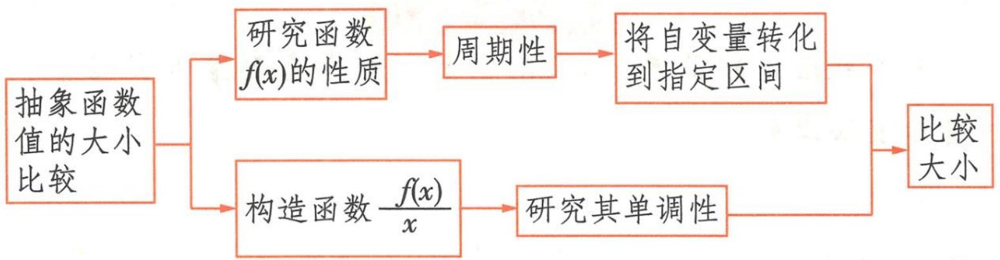

解析 依题意,对任意的 $x \in \mathbb{R}$ , 都有 $f(x + 4) = f(x)$ , 所以 $f(x)$ 是周期为 4 的周期函数.

因为 $2021 = 4 \times 505 + 1, 2022 = 4 \times 505 + 2, 2023 = 4 \times 505 + 3,$

所以 $f(2021)=f(1)$ , $\frac{f(2022)}{2}=\frac{f(2)}{2}$ , $\frac{f(2023)}{3}=\frac{f(3)}{3}$ .

【会思考】所给函数值对应的自变量太大，往往需要利用函数的周期性将其进行转化

构造函数 $F(x) = \frac{f(x)}{x} (0 < x \leqslant 4)$ ，则 $F'(x) = \frac{xf'(x) - f(x)}{x^2} > 0$

所以 $F(x)$ 在 $(0,4]$ 上单调递增, 所以 $F(1) < F(2) < F(3)$ ,

即 $\frac{f(1)}{1} < \frac{f(2)}{2} < \frac{f(3)}{3}$ , 所以 $f(2021) < \frac{f(2022)}{2} < \frac{f(2023)}{3}$ . 故选 A.

# 提分干货

# 方法归纳

# 构造函数比较大小的方法

##### 1. 分析给出的数值之间的关系,找相应数值的共性,进而把某个数值看作变量,然后找出该数值与其他数值之间的关系,把给出的数值转化为相应的函数值,最后构造函数利用函数的单调性比较大小.一般通过作差或作商构造函数,作差法构造函数的关键点是函数的单调性与函数的零点,作商法构造函数的关键点是函数值的正负、函数的单调性及函数的最值与1的大小关系.

##### 2. 利用同构法构造函数, 结合函数的单调性比较大小.

##### 3. 对于抽象函数值比较大小, 构造函数的依据有两个方面, 一是所比较数值的统一结构形式, 二是求导法则, 可两者结合相互印证. 在利用求导法则构造相应函数时, 需要熟练掌握 $x^{n}, e^{x}$ 以及 $\sin x, \cos x$ 与 $f(x)$ 的积与商的导数形式, 这是正确判断构造函数单调性的基础.

# 招法 4 用估值法比较大小

调研 7 (2023 湖北武汉二中、襄阳五中等十一校第二次联考) 已知 $a = \frac{0.2}{\pi}$ , $b = \frac{0.4}{e^2} (e \approx 2.718), c = \sin 0.1$ , 则 ( )

$\quad$A. $a < b < c$

$\quad$B. $b < a < c$

$\quad$C. $c < b < a$

$\quad$D. $c < a < b$

# 天星老师传技巧

三个数值结构简单，且 $\sin 0.1$ 可利用泰勒展开式估算，故本题可利用估值法求解。

解析 方法一 由已知得 $a - b = \frac{0.2}{\pi} - \frac{0.4}{\mathrm{e}^2} = \frac{0.2}{\pi \mathrm{e}^2} (\mathrm{e}^2 - 2\pi)$ ,

又 $e^{2}>2.7^{2}=7.29>2\pi$ , 所以 a-b>0 , 所以 a>b .

【另解】采用作商法比较 $a$ 与 $b$ : $\frac{a}{b} = \frac{\frac{0.2}{\pi}}{\frac{0.4}{e^2}} = \frac{e^2}{2\pi} > \frac{2.7^2}{2\pi} > 1$ , 即 $a > b$ . 用作商法比较大小, 是比较商与 1 的大小, 同时要注意两数的符号

记 $f(x)=\frac{2}{\pi}x-\sin x(x\in(0,\frac{\pi}{6}))$ ，则 $a-c=f(0.1),f'(x)=\frac{2}{\pi}-\cos x,$

【关键提醒】把某个数值(本题为0.1)看作变量, 找出其与其他量之间的关系, 这是将给出的数值转化为函数值的依据

当 $x \in (0, \frac{\pi}{6})$ 时，因为函数 $y = \cos x$ 单调递减，所以 $\cos x > \cos \frac{\pi}{6} = \frac{\sqrt{3}}{2}$ ，又 $\frac{2}{\pi} < \frac{2}{3} \approx 0.67 < \frac{\sqrt{3}}{2}$ ，所以 $f'(x) < 0$ ，即函数 $f(x)$ 单调递减，所以 $f(x) < \frac{2}{\pi} \times 0 - \sin 0 = 0$ ，故 $f(0.1) < 0$ ，即 $a < c$ 。综上所述， $b < a < c$ 。故选 B.

方法二 根据泰勒展开式 $\sin x = x - \frac{x^{3}}{3!} + \frac{x^{5}}{5!} + \cdots + (-1)^{m-1} \frac{x^{2m-1}}{(2m-1)!} + \cdots$ ，得 $c = \sin 0.1 \approx 0.1 - \frac{0.1^{3}}{6} \approx 0.0998$ ，又 $a = \frac{0.2}{\pi} \approx 0.0637, b = \frac{0.4}{e^{2}} \approx 0.0541$ ，所以 b < a < c，故选 B.

调研 8 (2023 河北邯郸二模) 设 $a = \ln 5 - \ln 3, b = \frac{2}{5} \mathrm{e}^{\frac{2}{3}}, c = \frac{2}{3}$ , 则 ( )

$\quad$A. $b > c > a$

$\quad$B. $a > b > c$

$\quad$C. $a > c > b$

$\quad$D. $c > a > b$

# 名人数语

# 思维导引 思路一

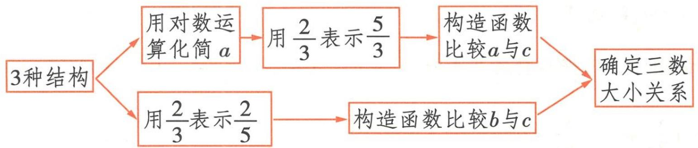

思路二 根据泰勒展开式估算 $a, b \longrightarrow a \approx \frac{44}{81}, b \approx \frac{34}{45} \longrightarrow b > c > a$

解析 方法一:构造函数法 第一步:确定 a,b,c 的共性.

$a = \ln 5 - \ln 3 = \ln \frac {5}{3} = \ln (1 + \frac {2}{3}), \frac {2}{5} = \frac {\frac {2}{3}}{\frac {5}{3}} = \frac {\frac {2}{3}}{1 + \frac {2}{3}}.$

【破题有括】将 $a$ 化为对数值后, 用 $\frac{2}{3}$ 表示 $\frac{5}{3}, \frac{2}{5}$ , 进而为构造函数奠定基础

第二步:作差法构造函数比较 a, c 的大小.

记 $f(x)=\ln(x+1)-x,x\in(0,1)$ ，则 $f'(x)=\frac{1}{x+1}-1=-\frac{x}{x+1}$

【会思考】直接构造与函数值对应的两个函数之差的形式，注意根据已知确定自变量的取值范围

显然当 $x \in (0,1)$ 时, $f'(x) < 0$ , 所以函数 $f(x)$ 单调递减,

所以 $f(x)<\ln1-0=0$ ，故a<c.

第三步:作差法构造函数比较 b, c 的大小.

由 $b - c = \frac{\frac{2}{3}}{1 + \frac{2}{3}}\mathrm{e}^{\frac{2}{3}} - \frac{2}{3} = \frac{\frac{2}{3}}{1 + \frac{2}{3}} (\mathrm{e}^{\frac{2}{3}} - \frac{2}{3} - 1)$ , 记 $h(x) = \mathrm{e}^{x} - x - 1, x \in (0,1)$ , 则 $h'(x) = \mathrm{e}^{x} - 1$ ,

【扫清障碍】构造函数时, 若直接作差所得的式子比较复杂, 可通过提取公因式, 找出需要判断符号的关键式子, 再构造函数, 简化比较过程

因为 $h'(x) = \mathrm{e}^{x} - 1 > \mathrm{e}^{0} - 1 = 0$ ，所以函数 $h(x)$ 在 $(0,1)$ 上单调递增，

所以 $h(x) > e^{0} - 0 - 1 = 0$ ，故 b > c.

【换个思路】观察式子的结构形式，b 与 c 的大小也可采用作商法进行比较。记 $p(x)=\frac{x}{1+x}\mathrm{e}^{x}=\frac{\mathrm{e}^{x}}{1+x}, x\in(0,1)$ ，则 $p'(x)=\frac{x\mathrm{e}^{x}}{(1+x)^{2}}>0$ ，故函数 $p(x)$ 在 $(0,1)$ 上单调递增，所以 $p(x)>\frac{\mathrm{e}^{0}}{1+0}=1$ ，即 $\frac{\mathrm{e}^{x}}{1+x}>1$ ，所以当 $x\in(0,1)$ 时， $\frac{\frac{x}{1+x}\mathrm{e}^{x}}{x}>1$ ，即 $\frac{x}{1+x}\mathrm{e}^{x}>x$ ，所以 b>c

第四步: 比较 a, b, c 的大小.

综上, $b>c>a$ ,故选A.

方法二:估值法 根据泰勒展开式 $\ln(1+x)=x-\frac{x^{2}}{2}+\frac{x^{3}}{3}-\cdots+(-1)^{n-1}\frac{x^{n}}{n}+\cdots,$

$\mathrm{e} ^ {x} = 1 + x + \frac {x ^ {2}}{2 !} + \dots + \frac {x ^ {n}}{n !} + \dots ,$

可得 $a = \ln 5 - \ln 3 = \ln \frac{5}{3} = \ln (1 + \frac{2}{3}) \approx \frac{2}{3} - \frac{\left(\frac{2}{3}\right)^2}{2} + \frac{\left(\frac{2}{3}\right)^3}{3} = \frac{44}{81} < \frac{2}{3} = c,$

$b=\frac{2}{5}e^{\frac{2}{3}}\approx\frac{2}{5}\times\left[1+\frac{2}{3}+\frac{\left(\frac{2}{3}\right)^{2}}{2}\right]=\frac{34}{45}>\frac{2}{3}=c$ ,从而b>c>a,故选A.

【拓展延伸】除了利用泰勒展开式之外，有时也可使用帕德逼近进行估算，常见的帕德逼近有：① $\ln(1+x)\approx\frac{2x}{2+x}$ 或 $\ln(1+x)\approx\frac{3x^{2}+6x}{x^{2}+6x+6}$ ；② $\sin x\approx\frac{6x}{x^{2}+6}$ 或 $\sin x\approx\frac{60x-7x^{3}}{60+3x^{2}}$ ；③ $\tan x\approx\frac{3x}{3-x^{2}}$ 或 $\tan x\approx\frac{15x-x^{3}}{15-6x^{2}}$ ；④ $e^{x}\approx-\frac{x^{2}+4x+6}{2(x-3)}$ 或 $e^{x}\approx\frac{x^{2}+6x+12}{x^{2}-6x+12}$

# 新题演练

##### 1. (2023 湖南长沙 4 月模拟预测 | 多选) 已知 $a = \log_{2} x, b = 2^{x}, c = 3^{x}$ , 其中 $x \in (1, 2)$ , 则下列结论正确的是 ( )

$\quad$A. $a > \log_b c$

$\quad$B. $a^b > b^c$

$\quad$C. $a^b < b^c$

$\quad$D. $\log_a b < \log_b c$

# 天星老师点思路

三个式子中都含有自变量 x，可先根据自变量的取值范围确定 a, b, c 的范围及大小关系，再逐一分析各选项的正误。

##### 2. (2023 南宁三中 5 月模拟) 若 $3^{a} + \log_{3} a = 27^{b} + 3 \log_{27} b$ , 则 ( )

$\quad$A. $a <   3b$

$\quad$B. $a > 3 b$

$\quad$C. $a > b^{2}$

$\quad$D. $a < b^{2}$

# 天星老师传技巧

这是非标准的同构形式，但仍可根据同构法构造函数，利用题中所给等式换元，结合函数的单调性进行判断，即可求解此类题目。

##### 3. (2023 陕西渭南二模) 若定义在 $[0, \frac{\pi}{2})$ 上的函数 $f(x)$ 的导函数为 $f'(x)$ , 且 $f(0) = 0$ , $f'(x) \cos x + f(x) \sin x < 0$ , 则下列不等关系中正确的是 ( )

# 名人数语

在终极的分析中,一切知识都是历史;在抽象的意义下,一切科学都是数学;在理性的基础上,所有判断都是统计学. ——C.R.劳

关注微信公众号“初高教辅站”获取更多初高中教辅资料

$\quad$A. $f(\frac{\pi}{6}) < \frac{\sqrt{6}}{2} f(\frac{\pi}{4})$

$\quad$B. $f(\ln \frac{\pi}{3}) > 0$

$\quad$C. $f(\frac{\pi}{6}) > \sqrt{3} f(\frac{\pi}{3})$

$\quad$D. $f(\frac{\pi}{4}) < \sqrt{2} f(\frac{\pi}{3})$

# 天星老师明关键

这是构造函数的重要依据，结合导数的运算可知 $\left[\frac{f(x)}{\cos x}\right]' = \frac{f'(x)\cos x + f(x)\sin x}{\cos^2 x}$ ，据此构造函数 $g(x) = \frac{f(x)}{\cos x}, x \in [0, \frac{\pi}{2})$ 。

##### 4. (2023 山东滨州二模) 设 $a = \sin \frac{1}{4}, b = \sqrt[4]{\mathrm{e}} - 1, c = \ln \frac{5}{4}$ , 则 $a, b, c$ 的大小关系为

$\quad$A. $a > b > c$

$\quad$B. $b > a > c$

$\quad$C. $b > c > a$

$\quad$D. $c > b > a$

# 天星老师讲方法

将所给的式子简单变形，即 $a = \sin \frac{1}{4}, b = \mathrm{e}^{\frac{1}{4}} - 1, c = \ln (1 + \frac{1}{4})$ ，找出它们的共性，即可构造函数比较大小。当然这三个具体数值泰勒展开式估算，利用估值法求解，降低思维难度。

# 参考答案与解析

##### 1. CD 因为 $x \in (1,2)$ ，所以 $a \in (0,1)$ ， $b \in (2,4)$ ， $c \in (3,9)$ ，且 b < c。

对于 A, $\log_{b}c = \log_{2}3 > 1 > a$ , 故 A 错误; 对于 B, C, $a^{b} < 1, b^{c} > 1$ , 即 $a^{b} < b^{c}$ , 故 B 错误, C 正确; 因为 $\log_{a}b < 0, \log_{b}c > 0$ , 所以 $\log_{a}b < \log_{b}c$ , 故 D 正确. 故选 CD.

##### 2. A 设 $f(x) = 3^x + \log_3 x (x > 0)$ ，则 $f(x)$ 为增函数.

因为 $3^{a} + \log_{3}a = 27^{b} + 3\log_{27}b = 3^{3b} + \log_{3}b$ ，所以 $f(a) - f(3b) = 3^{a} + \log_{3}a - 3^{3b} - \log_{3}(3b) = 3^{3b} + \log_{3}b - (3^{3b} + \log_{3}b) - \log_{3}3 = -1 < 0$ ，所以 $f(a) < f(3b)$ ，所以 a < 3b，所以 A 正确，B 错误。

【小技巧】作差比较大小，注意对数性质的灵活应用，即 $\log_{3}(3b)=\log_{3}b+\log_{3}3$

$f(a)-f(b^{2})=3^{a}+\log_{3}a-(3^{b^{2}}+\log_{3}b^{2})=3^{3b}+\log_{3}b-(3^{b^{2}}+\log_{3}b^{2})=3^{3b}-3^{b^{2}}-\log_{3}b$ ，当 b=

【点拨】很难直接判断该式与0的大小，故可对b取特殊值进行判断，为保证准确性，可多取几个

1 时, $f(a)-f(b^{2})=24>0$ ,此时 $f(a)>f(b^{2})$ ,有 $a>b^{2}$ ,当b=3时, $f(a)-f(b^{2})=-1<0$ ,此时 $f(a)<f(b^{2})$ ,有 $a<b^{2}$ ,所以CD错误.故选A.

##### 3. C 令 $g(x) = \frac{f(x)}{\cos x}, x \in [0, \frac{\pi}{2})$ ，则 $g'(x) = \frac{f'(x)\cos x + f(x)\sin x}{\cos^2 x} < 0$ 在 $[0, \frac{\pi}{2})$ 上恒成立，因此函数 $g(x) = \frac{f(x)}{\cos x}$ 在 $[0, \frac{\pi}{2})$ 上单调递减。

对于 A, $g(\frac{\pi}{6}) > g(\frac{\pi}{4})$ ，即 $\frac{f(\frac{\pi}{6})}{\cos\frac{\pi}{6}} > \frac{f(\frac{\pi}{4})}{\cos\frac{\pi}{4}}$ ，即 $f(\frac{\pi}{6}) > \frac{\sqrt{6}}{2} f(\frac{\pi}{4})$ ，故 A 错误；

对于 B, $f(0)=0$ , 所以 $g(0)=\frac{f(0)}{\cos 0}=0$ , 所以 $g(x)=\frac{f(x)}{\cos x}\leqslant0$ 在 $[0,\frac{\pi}{2})$ 上恒成立,

【会思考】判断该项的关键是寻找 x=0 所对应的函数值，切勿遗漏 “ $f(0)=0$ ” 这个条件因为 $0=\ln 1<\ln \frac{\pi}{3}<\ln e=1<\frac{\pi}{2}$ ，所以 $f(\ln \frac{\pi}{3})<0$ ，故 B 错误；

对于 C, $g(\frac{\pi}{6}) > g(\frac{\pi}{3})$ , 所以 $\frac{f(\frac{\pi}{6})}{\cos\frac{\pi}{6}} > \frac{f(\frac{\pi}{3})}{\cos\frac{\pi}{3}}$ , 即 $f(\frac{\pi}{6}) > \sqrt{3}f(\frac{\pi}{3})$ , 故 C 正确;

对于 D, $g(\frac{\pi}{4}) > g(\frac{\pi}{3})$ ，所以 $\frac{f(\frac{\pi}{4})}{\cos\frac{\pi}{4}} > \frac{f(\frac{\pi}{3})}{\cos\frac{\pi}{3}}$ ，即 $f(\frac{\pi}{4}) > \sqrt{2}f(\frac{\pi}{3})$ ，故 D 错误。故选 C.

##### 4. B 方法一: 构造函数法 令 $f(x) = \sin x - \ln (x + 1), x \in [0,1]$ ，则 $f'(x) = \cos x - \frac{1}{x + 1}$ ，令 $g(x) = f'(x) = \cos x - \frac{1}{x + 1}, x \in [0,1]$ ，则 $g'(x) = -\sin x + \frac{1}{(x + 1)^2}$ ，易知 $g'(x)$ 在 $[0,1]$ 上单调递减，且 $g'（0） = 1 > 0, g'（1） = \frac{1}{4} - \sin 1 < 0, \therefore \exists x_0 \in [0,1]$ ，使得 $g'(x_0) = 0$ ，当 $x \in [0, x_0)$

【点透】 $\frac{1}{4}$ 与sin1的大小关系可通过中间值判断，即 $\frac{1}{4}<\frac{1}{2}=\sin\frac{\pi}{6}<\sin1$

时, $g'(x)>0,f'(x)$ 单调递增;当 $x\in(x_{0},1]$ 时, $g'(x)<0,f'(x)$ 单调递减.又 $f'（0）=0$ , $f'（1）=\cos1-\frac{1}{2}>0,\therefore f'(x)\geqslant0,\therefore f(x)$ 在[0,1]上单调递增, $\therefore f(x)\geqslant f(0)=0$ ,即当 $x\in(0,1)$ 时, $\sin x>\ln(x+1),\therefore a>c.$

记 $h(x) = \mathrm{e}^{x} - (\sin x + 1), x \in (0,1)$ , 则 $h'(x) = \mathrm{e}^{x} - \cos x > 0, h(x)$ 在 $(0,1)$ 上单调递增， $\therefore h\left(\frac{1}{4}\right) > \mathrm{e}^{0} - (\sin 0 + 1) = 0$ ，即 $b > a$ . 综上， $b > a > c$ . 故选 B.

方法二:估值法 根据泰勒展开式可得 $a=\sin\frac{1}{4}\approx\frac{1}{4}-\frac{\left(\frac{1}{4}\right)^{3}}{6}\approx0.247,b=e^{\frac{1}{4}}-1\approx1+\frac{1}{4}-1=$ $0.25,c=\ln(1+\frac{1}{4})\approx\frac{1}{4}-\frac{\left(\frac{1}{4}\right)^{2}}{2}\approx0.219$ ,故 b>a>c. 故选 B.

【注意】利用泰勒展开式估值时要保持项数一致，为保证准确性可多代入几项

# 超重点 15 3 大妙招攻破极值点偏移问题

# 天星老师讲知识

什么叫极值点偏移？如图1，已知函数 $f(x)$ 图象的顶点的横坐标就是极值点 $x_{0}$ ，若以关于x的方程 $f(x)=c$ 的两实数解 $x_{1},x_{2}$ 为端点的区间的中点为 $\frac{x_1 + x_2}{2}, \frac{x_1 + x_2}{2} = x_0$ ，即极值点为以两实数解为端点的区间的中点，则极值点没有偏移，此时函数$f(x)$ 在极值点 $x_{0}$ 的两侧函数值变化快慢相同. 若 $\frac{x_{1}+x_{2}}{2}\neq$

$x_{0}$ ，则极值点偏移，此时函数 $f(x)$ 在极值点 $x_{0}$ 两侧函数值变化快慢不同，如图2（1）（2）（3）（4）.

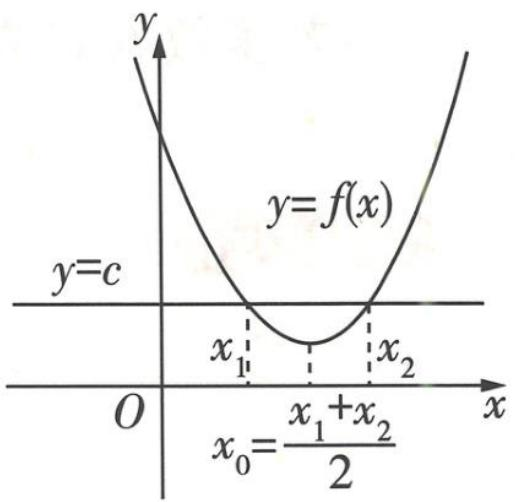

图 1

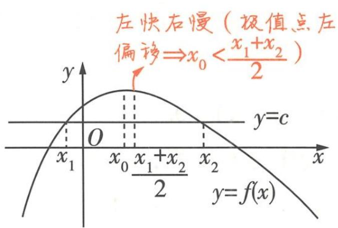

（1）

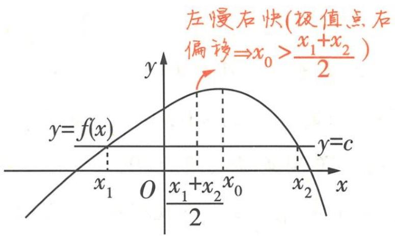

（2）

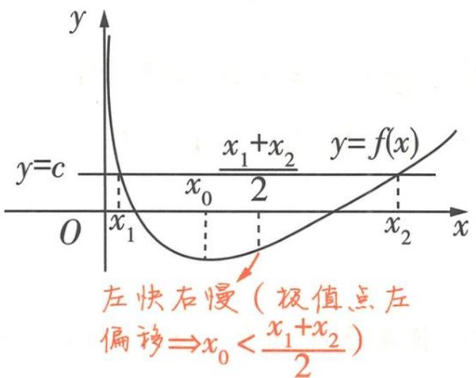

（3）

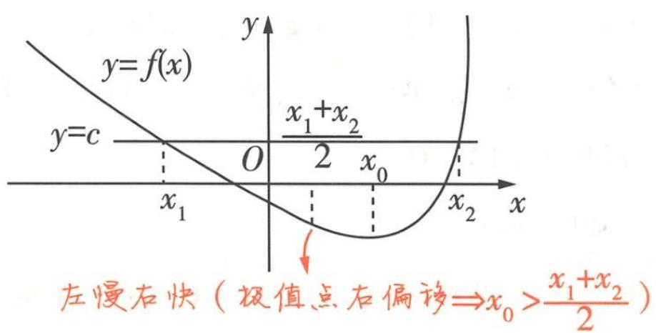

（4）   
图2

对于此类问题，同学们不必一定要知道极值点偏移是什么意思，只要记住并学会下文中讲的解题方法，在考试时加以运用即可。

# 妙招1 对称构造

调研 1 (2023 浙江绍兴 5 月预测) 已知函数 $f(x) = x^{2} \left( \ln x - \frac{3}{2} a \right)$ , $a$ 为实数.

（1） 求函数 $f(x)$ 的单调区间；

（2） 若函数 $f(x)$ 在 $x = e$ 处取得极值, 且 $f'(x_1) = f'(x_2), x_1 < x_2$ , 证明: $2 < x_1 + x_2 < e$ .

# 思维导引

（1） 求定义域 → 求导 → 判断 $f'(x)$ 的符号 → $f(x)$ 的单调区间

（2） 利用极值点求 a → 判断 $x_{1}, x_{2}$ 的范围 → 对称构造法证 $x_{1} + x_{2} > 2$ 构造函数证 $x_{1} + x_{2} < e$

解析 （1） 函数 $f(x) = x^{2} \left( \ln x - \frac{3}{2} a \right)$ 的定义域为 $(0, +\infty)$ ,

$f'(x)=2x\left(\ln x-\frac{3}{2}a\right)+x=x(2\ln x-3a+1)$ ，令 $f'(x)=0$ ，则 $\ln x=\frac{3a-1}{2}$ ，得 $x=e^{\frac{3a-1}{2}}$ .

【会思考】导函数解析式中“变号因子”为 $2 \ln x - 3a + 1$ ，显然 $y = 2 \ln x - 3a + 1$ 为增函数，故只需求出其零点，即可判断 $f'(x)$ 的符号

当 $x \in (0, \mathrm{e}^{\frac{3a - 1}{2}})$ 时， $f'(x) < 0$ ；当 $x \in (\mathrm{e}^{\frac{3a - 1}{2}}, +\infty)$ 时， $f'(x) > 0$ .

故函数 $f(x)$ 的单调递减区间为 $(0, e^{\frac{3a-1}{2}})$ ，单调递增区间为 $(e^{\frac{3a-1}{2}}, +\infty)$ .

（2） 因为函数 $f(x)$ 在 $x = \mathrm{e}$ 处取得极值, 由 （1） 知 $x = \mathrm{e}^{\frac{3a - 1}{2}} = \mathrm{e}$ , 得 $a = 1$ ,

所以 $f(x) = x^{2}(\ln x - \frac{3}{2})$ ，得 $f'(x) = x(2\ln x - 2) = 2x(\ln x - 1)$ .

令 $g(x) = 2x(\ln x - 1)$ , 因为 $g'(x) = 2\ln x$ , 当 $x = 1$ 时, $g'(x) = 0$ , 所以函数 $g(x)$ 在 $(0,1)$ 上单调递减, 在 $(1, +\infty)$ 上单调递增, 且当 $x \in (0, e)$ 时, $g(x) = 2x(\ln x - 1) < 0$ , 当 $x \in (e, +\infty)$ 时, $g(x) = 2x(\ln x - 1) > 0$ ,

故 $0 < x_{1} < 1 < x_{2} < \mathrm{e}$ .

【指点迷津】首先确定 $x_{1}, x_{2}$ 的取值范围, 然后把所证不等式变形, 目的是把两个变量化归到同一个单调区间内, 便于构造函数

先证 $x_{1} + x_{2} > 2$ ，只需证 $x_{2} > 2 - x_{1}$ ，易知 $x_{2} > 1,2 - x_{1} > 1$ ，下面证明 $g(x_{1}) = g(x_{2}) > g(2 - x_{1})$

设 $t(x) = g(2 - x) - g(x), x \in (0,1)$ ，则 $t'(x) = -g'(2 - x) - g'(x), t'(x) = -2\ln (2 - x) - 2\ln x = -2\ln [(2 - x)x] > 0$ ，故 $t(x)$ 在 $(0,1)$ 上单调递增，故 $t(x) < 0$

所以 $t(x_{1}) = g(2 - x_{1}) - g(x_{1}) < 0$ ，则 $g(2 - x_1) < g(x_2)$

# 名人数语

所以 $2 - x_{1} < x_{2}$ , 即得 $x_{1} + x_{2} > 2$ .

下面证明: $x_{1} + x_{2} < \mathrm{e}$ .

令 $g(x_{1}) = g(x_{2}) = m$ ，当 $x\in (0,1)$ 时， $g(x) - (-2x) = 2x\ln x <   0$ ，所以 $g(x) <   - 2x$ 成立，

所以 $-2x_{1} > g(x_{1}) = m$ ，所以 $x_{1} < -\frac{m}{2}$

当 $x \in (1, \mathrm{e})$ 时，记 $h(x) = g(x) - (2x - 2\mathrm{e}) = 2x\ln x - 4x + 2\mathrm{e}$ ，

所以当 $x \in (1, \mathrm{e})$ 时, $h'(x) = 2\ln x - 2 < 0$ , 所以 $h(x)$ 为减函数, 得 $h(x) > 2\mathrm{e} - 4\mathrm{e} + 2\mathrm{e} = 0$ ,

所以 $m = g(x_{2}) > 2x_{2} - 2\mathrm{e}$ ，即得 $x_{2} <   \frac{m}{2} +\mathrm{e},$ 所以 $x_{1} + x_{2} <   - \frac{m}{2} +\frac{m}{2} +\mathrm{e} = \mathrm{e}$ 得证.

综上, $2<x_{1}+x_{2}<e.$

【解后反思】对称构造法是解决极值点偏移的基本方法, 主要有四个基本步骤: ①求函数 $f(x)$ 的极值点 $x_0$ ; ②构造函数 $F(x) = f(x) - f(2x_0 - x)$ ; ③确定函数 $F(x)$ 的单调性; ④结合 $F(x_0) = 0$ , 判断 $F(x)$ 的符号, 从而确定 $f(x), f(2x_0 - x)$ 的大小关系. 记忆口诀为: 极值偏离对称轴, 构造函数宽行踪; 四个步骤环相扣, 两次单调紧跟随

# 妙招 2 比值换元构造

调研 2 (2023 江西南昌二模) 已知函数 $f(x) = x (\ln x - a), g(x) = \frac{f(x)}{x} + a - ax$ .

（1） 当 $x \geqslant 1$ 时, $f(x) \geqslant -\ln x - 2$ 恒成立, 求 $a$ 的取值范围.

（2） 若 $g(x)$ 的两个相异零点为 $x_{1}, x_{2}$ ，求证： $x_{1}x_{2} > e^{2}$ .

# 天星老师教审题

看到恒成立问题，优先将其转化为 $F(x) = (x + 1)\ln x - ax + 2$ 的最小值问题，再利用导数求解最值即可.

解析 （1） 当 $x \geqslant 1$ 时, $f(x) \geqslant -\ln x - 2$ 恒成立, 即当 $x \geqslant 1$ 时, $(x + 1) \ln x - ax + 2 \geqslant 0$ 恒成立, 设 $F(x) = (x + 1) \ln x - ax + 2 (x \geqslant 1)$ .

【会转化】构造函数，转化为该函数的最小值问题

所以 $F(1)=2-a\geqslant0$ , 即 $a\leqslant2, F'(x)=\ln x+\frac{1}{x}+1-a(x\geqslant1)$ .

设 $r(x) = \ln x + \frac{1}{x} + 1 - a (x \geqslant 1)$ ，则 $r'(x) = \frac{1}{x} - \frac{1}{x^2} = \frac{x - 1}{x^2} (x \geqslant 1)$ ，

【难点破解】 $F'(x)$ 的符号无法直接确定，利用导数研究其单调性，从而研究其符号的变化

所以当 $x \geqslant 1$ 时， $r'(x) \geqslant 0$ ，即 $r(x)$ 在 $[1, +\infty)$ 上单调递增，所以 $r(x) \geqslant r(1) = 2 - a \geqslant 0$ ，

所以当 $x \geqslant 1$ 时, $F'(x) = r(x) \geqslant 0$ , 即 $F(x)$ 在 $[1, +\infty)$ 上单调递增, 所以 $F(x) \geqslant F(1) = 2 - a$ , 若 $F(x) \geqslant 0$ 恒成立, 则 $a \leqslant 2$ .

所以当 $x \geqslant 1$ 时, 要使 $f(x) \geqslant -\ln x - 2$ 恒成立, $a$ 的取值范围为 $(- \infty, 2]$ .

（2）方法一:等价变换后构商引参 由题意知, $g(x)=\ln x-ax$ ,

不妨设 $x_{1} > x_{2} > 0$ ，由 $\left\{ \begin{array}{l}\ln x_1 = ax_1,\\ \ln x_2 = ax_2 \end{array} \right.$ 得 $\left\{ \begin{array}{l}\ln (x_1x_2) = a(x_1 + x_2),\\ \ln \frac{x_1}{x_2} = a(x_1 - x_2), \end{array} \right.$

【扫清障碍】进行两式的和与差的运算，构建出两个变量的积、商、和、差的式子

则 $\frac{\ln(x_1x_2)}{\ln\frac{x_1}{x_2}} = \frac{x_1 + x_2}{x_1 - x_2} = \frac{\frac{x_1}{x_2} + 1}{\frac{x_1}{x_2} - 1}$ , 令 $t = \frac{x_1}{x_2}$ , 则 $t > 1$ , $\frac{\ln(x_1x_2)}{\ln t} = \frac{t + 1}{t - 1}$ , 即 $\ln(x_1x_2) = \frac{t + 1}{t - 1}\ln t$ .

要证 $x_{1}x_{2} > \mathrm{e}^{2}$ ，只需证 $\ln (x_1x_2) > 2$ ，只需证 $\frac{t + 1}{t - 1}\ln t > 2(t > 1)$ ，即证 $\ln t > \frac{2(t - 1)}{t + 1} (t > 1)$ ，即证 $\ln t - \frac{2(t - 1)}{t + 1} >0(t > 1)$

令 $m(t)=\ln t-\frac{2(t-1)}{t+1}(t>1)$ ，因为 $m'(t)=\frac{(t-1)^{2}}{t(t+1)^{2}}>0$ ，所以 $m(t)$ 在 $(1,+\infty)$ 上单调递增，

则当 $t \in (1, +\infty)$ 时， $m(t) > \ln 1 - \frac{2 \times (1 - 1)}{1 + 1} = 0$ ，所以 $\ln t - \frac{2(t - 1)}{t + 1} > 0$ 成立，故 $x_1 x_2 > e^2$ .

方法二: 直接引入两变量之商作为变量 $g(x) = \ln x - ax$ ,

不妨设 $x_{1} > x_{2} > 0$ ，设 $t = \frac{x_1}{x_2}$ 显然 $t > 1$ ，则 $x_{1} = tx_{2}$

【会思考】根据两数大小关系，引入两者之商作为变量，构建两个自变量之间的关系

由 $\left\{ \begin{array}{l} \ln x_{1} = ax_{1}, \\ \ln x_{2} = ax_{2}, \end{array} \right.$ 得 $\left\{ \begin{array}{l} \ln (tx_2) = atx_2, \\ \ln x_2 = ax_2, \end{array} \right.$ 即 $\left\{ \begin{array}{l} \ln t + \ln x_2 = atx_2, \\ \ln x_2 = ax_2, \end{array} \right.$

两者相除得 $\frac{\ln t + \ln x_2}{\ln x_2} = \frac{atx_2}{ax_2}$ , 即 $1 + \frac{\ln t}{\ln x_2} = t$ , 得 $\ln x_2 = \frac{\ln t}{t - 1}$ ,

所以 $\ln x_{1} = \ln (tx_{2}) = \ln t + \ln x_{2} = \ln t + \frac{\ln t}{t - 1} = (1 + \frac{1}{t - 1})\ln t = \frac{t}{t - 1}\ln t.$

所以 $\ln x_{1} + \ln x_{2} = \frac{t}{t - 1}\ln t + \frac{\ln t}{t - 1} = \frac{t + 1}{t - 1}\ln t.$

要证 $x_{1}x_{2} > \mathrm{e}^{2}$ ，只需证 $\ln (x_1x_2) > 2$ ，即 $\ln x_{1} + \ln x_{2} > 2$ ，也就是 $\frac{t + 1}{t - 1}\ln t > 2.$

【敲黑板】应注意等价转化，使结构最简，从而使构造的函数解析式最简，达到简化解题思路的目的. 如此处转化为 $\frac{t + 1}{t - 1} \ln t > 2$ 后, 可以直接构造函数 $y = \frac{t + 1}{t - 1} \ln t - 2$ ; 也可以根据 $t > 1$ , 将不等式转化为 $(t + 1) \ln t > 2(t - 1)$ , 进而构造函数 $y = (t + 1) \ln t - 2(t - 1)$ ; 还可以转化为 $\ln t > \frac{2(t - 1)}{t + 1}$ , 进而构造函数 $y = \ln t - \frac{2(t - 1)}{t + 1}$

又 $t > 1$ ，所以 $t - 1 > 0$ ，不等式等价于 $(t + 1)\ln t > 2(t - 1)$ ，即 $(t + 1)\ln t - 2(t - 1) > 0.$

记 $G(t) = (t + 1)\ln t - 2(t - 1)(t > 1)$ ，则 $G'(t) = \ln t + (t + 1) \times \frac{1}{t} - 2 = \ln t + \frac{1}{t} - 1$ .

记 $h(t) = G'(t) = \ln t + \frac{1}{t} - 1 (t > 1)$ ，则 $h'(t) = \frac{1}{t} - \frac{1}{t^2} = \frac{t - 1}{t^2}$ ，

因为 t > 1，所以 $h'(t) > 0$ ，故 $h(t)$ 在 $(1, +\infty)$ 上单调递增，所以 $h(t) > \ln 1 + \frac{1}{1} - 1 = 0$ ，

故 $G'(t) > 0$ ，所以 $G(t)$ 在 $(1, +\infty)$ 上单调递增，所以 $G(t) > (1 + 1)\ln 1 - 2\times (1 - 1) = 0$ ，即 $(t + 1)\ln t - 2(t - 1) > 0.$

故原不等式得证.

# 提分干货 万能模型

本题第（2）问两种方法的基本思路都是先根据方程的特点,直接消掉参数 a,构造两个变量 $x_{1}, x_{2}$ 之间的关系,然后结合所证问题,巧用“比商”换元,构造相应的函数.用比值换元构造求解此类问题的解题模型为:

<table><tr><td>第一步</td><td>联立消参</td><td>利用方程 $f(x_1) = f(x_2)$ 消掉解析式中的参数</td></tr><tr><td>第二步</td><td>转化所证</td><td>根据所求问题,结合消参后的式子合理转化为 $x_1, x_2$ 的关系</td></tr><tr><td>第三步</td><td>抓商构元</td><td>令 $t = \frac{x_2}{x_1}$ ,则 $x_2 = tx_1$ ,代入式子,直接消掉变量 $x_1, x_2$ ,转化为关于t的函数</td></tr><tr><td>第四步</td><td>用导求解</td><td>利用导数求解关于t的函数的极值、最值等问题</td></tr></table>

# 妙招 3 差值换元构造

调研 3 (名师原创) 已知函数 $f(x) = \mathrm{e}^{x - 1} - \frac{1}{2} ax^2 + ax + 1$ .

（1） 讨论 $f(x)$ 的极值点个数.

（2）若 $f(x)$ 有两个不同的极值点 $x_{1},x_{2}$ ，证明： $x_{1}+x_{2}>4$ .

# 天星老师传技巧

解答题上下问之间通常都有联系, 本题第一问已经研究了极值点的个数, 此问可利用第一问的研究过程确定极值点的范围, 接下来作商消参, 用前面学过的对称构造, 或者直接引入两极值点之差作为变量, 转化所证不等式, 构造目标函数进行证明即可.

解析 （1） $f'(x)=\mathrm{e}^{x-1}-ax+a.$

因为 $f'（1）=1\neq0$ , 所以 1 不是 $f(x)$ 的极值点.

$f'(x) = \mathrm{e}^{x - 1} - a(x - 1) = 0$ 可变形为 $\frac{\mathrm{e}^{x - 1}}{x - 1} = a,$

【会思考】分离参数，找出目标函数

令 $g(x)=\frac{\mathrm{e}^{x-1}}{x-1}$ ，则 $f(x)$ 的极值点个数即直线 y=a 与 $g(x)$ 图象的交点个数.

$g'(x)=\frac{\mathrm{e}^{x-1}(x-2)}{(x-1)^{2}}$ ，令 $g'(x)=0$ ，得x=2，又 $x\neq1$ ，所以 $g(x)$ 在 $(-∞,1)$ ，(1,2)上单调递减，在 $(2,+∞)$ 上单调递增.

因为 $g(2)=\mathrm{e}$ ，且当 x<1 时， $g(x)<0$ ，

所以当 $a \in [0, e]$ 时, $f(x)$ 没有极值点; 当 $a \in (-\infty, 0)$ 时, $f(x)$ 有一个极值点; 当 $a \in (e, f(x))$

【明误区】可导函数的极值点就是导函数的变号零点. 当 $a = e$ 时, 直线 $y = a$ 与函数 $g(x)$ 的图象虽然有 1 个交点, 但当 $x \in (1, +\infty)$ 时, 函数图象恒在该直线的上方, 因此函数 $f(x)$ 没有极值点

$+\infty$ )时, $f(x)$ 有两个极值点.

（2） 方法一: 对称构造法 由（1）知, 当 $a \in (e, +\infty)$ 时, $f(x)$ 有两个不同的极值点.

设 $x_{1} < x_{2}$ , 则 $x_{1} \in (1, 2), x_{2} \in (2, +\infty)$ , 由 $\left\{ \begin{array}{l} \mathrm{e}^{x_{1} - 1} - a(x_{1} - 1) = 0, \\ \mathrm{e}^{x_{2} - 1} - a(x_{2} - 1) = 0, \end{array} \right.$ 得 $\mathrm{e}^{x_{1} - x_{2}} = \frac{x_{1} - 1}{x_{2} - 1}$ ,

【扫清障碍】两式变形作商，去掉参数 $a$

所以 $x_{1} - x_{2} = \ln (x_{1} - 1) - \ln (x_{2} - 1)$ ，即 $x_{1} - \ln (x_{1} - 1) = x_{2} - \ln (x_{2} - 1).$

令 $h(x) = x - \ln (x - 1), x \in (1, +\infty)$ ，则 $h'(x) = 1 - \frac{1}{x - 1} = \frac{x - 2}{x - 1}$ ，

易得 $h(x)$ 在 $(1,2)$ 上单调递减，在 $(2,+\infty)$ 上单调递增.

要证 $x_{1} + x_{2} > 4$ ，即证 $x_{2} > 4 - x_{1}$

因为 $x_{2}>2,4-x_{1}>2$ ，且 $h(x)$ 在 $(2,+\infty)$ 上单调递增，所以只需证 $h(x_{2})>h(4-x_{1})$

因为 $h(x_{1})=h(x_{2})$ ，所以即证 $h(x_{1})>h(4-x_{1})$ .

【难点突破】利用极值点所在区间和函数单调性转化所证不等式，从而利用对称构造求解

令 $F(x) = h(x) - h(4 - x) = x - \ln (x - 1) - (4 - x) + \ln (3 - x) = 2x - 4 - \ln (x - 1) + \ln (3 - x), x \in (1,2)$ ，则 $F'(x) = 2 - \frac{1}{x - 1} + \frac{1}{x - 3} = \frac{2(x - 2)^2}{(x - 1)(x - 3)} < 0$ ，所以 $F(x)$ 在 $(1,2)$ 上单调递减，

则 $F(x)>0$ , 所以 $h(x_{1})>h(4-x_{1})$

即 $h(x_{2}) > h(4 - x_{1})$ ，故 $x_{1} + x_{2} > 4.$

方法二:差值换元法 由已知得 $\left\{\begin{aligned}e^{x_{1}-1}&=a(x_{1}-1),\\ e^{x_{2}-1}&=a(x_{2}-1),\end{aligned}\right.$

不妨设 $x_{2} > x_{1}$ ，记 $t = x_{2} - x_{1}$ ，则 $t > 0, x_{2} = x_{1} + t$ ，则有 $\left\{ \begin{array}{l} \mathrm{e}^{x_1 - 1} = a(x_1 - 1), \\ \mathrm{e}^{x_1 + t - 1} = a(x_1 + t - 1), \end{array} \right.$

两式相除得 $\frac{\mathrm{e}^{x_1 + t - 1}}{\mathrm{e}^{x_1 - 1}} = \frac{a(x_1 + t - 1)}{a(x_1 - 1)}$ 即 $\mathbf{e}^t = 1 + \frac{t}{x_1 - 1}$ 整理得 $x_{1} = \frac{t}{\mathbf{e}^{t} - 1} +1.$

故 $x_{2} = x_{1} + t = \frac{t}{\mathrm{e}^{t} - 1} +1 + t.$

所证不等式 $x_{1} + x_{2} > 4$ 等价于 $\left(\frac{t}{\mathrm{e}^t - 1} +1\right) + \left(\frac{t}{\mathrm{e}^t - 1} +1 + t\right) > 4$ ，即 $\frac{2t}{\mathrm{e}^t - 1} +t > 2.$

因为 t > 0，所以 $e^{t} - 1 > 0$ ，故不等式等价于 $2t + (t - 2)(e^{t} - 1) > 0$ ，即 $t + 2 + (t - 2)e^{t} > 0$ 。

记 $m(x) = x + 2 + (x - 2)\mathrm{e}^{x}(x > 0)$ ，则 $m'(x) = 1 + (x - 1)\mathrm{e}^x$

记 $k(x) = 1 + (x - 1)\mathrm{e}^{x}(x > 0)$ ，则 $k'(x) = x\mathrm{e}^x$

因为 $x > 0, \mathrm{e}^{x} > 0$ ，所以 $k'(x) > 0$ ，故函数 $k(x)$ 在 $(0, +\infty)$ 上单调递增，

故 $k(x) > 1 + (0 - 1) \times \mathrm{e}^{0} = 0$ ，所以 $m'(x) > 0$ ，故函数 $m(x)$ 在 $(0, +\infty)$ 上单调递增，

所以 $m(x)>0+2+(0-2)\times\mathrm{e}^{0}=0$ , 即当 x>0 时, $x+2+(x-2)\mathrm{e}^{x}>0$

原不等式得证.

# 提分干货 万能模型

本题第（2）问方法二用了差值换元法,巧妙引入 $x_{2}-x_{1}$ 作为变量,然后利用等式关系,把 $x_{1},x_{2}$ 消掉,从而构造相应的函数,将所证问题进行转化.用差值换元构造求解此类问题的解题模型为:

<table><tr><td>第一步</td><td>取差构元</td><td>记  $t = {x}_{2} - {x}_{1}$  ,则  ${x}_{2} = {x}_{1} + t$  ,利用该式消掉  ${x}_{2}$ </td></tr><tr><td>第二步</td><td>作商消参</td><td>利用  $f\left( {x}_{1}\right) = f\left( {x}_{2}\right) = 0$  ,构造方程,作商消参</td></tr><tr><td>第三步</td><td>构造函数</td><td>利用  $t$  表示  ${x}_{1},{x}_{2}$  ,构造关于  $t$  的函数</td></tr><tr><td>第四步</td><td>转化求解</td><td>利用导数研究函数的单调性和极值,求解相关问题</td></tr></table>

# 新题预测

##### 1. (2023 山东日照二模)已知函数 $f(x) = x - a\ln x$ .

（1） 若 $f(x) \geqslant 1$ 恒成立, 求实数 a 的值.  
（2） 若 $x_{1} > 0, x_{2} > 0, \mathrm{e}^{x_{1}} + \ln x_{2} > x_{1} + x_{2}$ , 证明: $\mathrm{e}^{x_1} + x_2 > 2$ .

# 天星老师明关键

将该式化为 $e^{x_{1}} - \ln e^{x_{1}} > x_{2} - \ln x_{2}$ ，令 $h(x) = x - \ln x$ ，利用导数可求得 $h(x)$ 的单调性，易知当 $x_{2} \geqslant 1$ 时，待证不等式成立，当 $0 < x_{2} < 1$ 时，分析可知只需证 $h(x_{2}) \geqslant h(2 - x_{2})$ ，构造函数 $m(x) = 2 - x)$ ， $x \in (0,1)$ ，利用导数可说明 $m(x) > 0$ ，由此可得结论。

##### 2. (2023 天津二模) 设函数 $f(x) = (x - 1)\ln x - x^2 + (m - 1)x, m \in \mathbb{R}, g(x)$ 为 $f(x)$ 的导函数.

（1） 求 $g(x)$ 的单调区间.  
（2） 讨论 $g(x)$ 零点的个数.  
（3） 若 $f(x)$ 有两个极值点 $x_{1}, x_{2}$ ，且 $x_{1} < x_{2}$ ，证明： $x_{1} + x_{2} > 2$ .

##### 3. (2023 四川绵阳 4 月模拟预测) 已知函数 $f(x) = \frac{a}{x} + \ln x (a \in \mathbb{R})$ .

（1） 讨论 $f(x)$ 的单调性.  
（2） 若 $f(x)$ 有两个不相同的零点 $x_{1}, x_{2}$ ，证明： $x_{1}f'(x_{1}) + x_{2}f'(x_{2}) > 2\ln a + 2$ .

# 天星老师引思路

先确定 $a$ 的取值范围为 $0 < a < \frac{1}{\mathrm{e}}$ ，对函数求导，对不等式变形，只需证明 $x_{1}x_{2} > a^{2}$ ，得 $\frac{x_{2} - x_{1}}{\ln x_{2} - \ln x_{1}} = \frac{x_{1}x_{2}}{a}$ ，接下来证明对数平均不等式，得 $\frac{x_2 - x_1}{\ln x_2 - \ln x_1} >\sqrt{x_1x_2}$ ，从而得 $\frac{x_1x_2}{a} >\sqrt{x_1x_2}$ ，所以 $\sqrt{x_1x_2} >a$ ， $x_{1}x_{2} > a^{2}$

# 参考答案与解析

##### 1. （1） 由题意得 $f(x)$ 的定义域为 $(0, +\infty)$ , $f'(x) = 1 - \frac{a}{x} = \frac{x - a}{x}$ .

# 名人数语

宇宙之大,粒子之微,火箭之速,化工之巧,地球之变,生物之谜,日用之繁,无处不用到数学.
——华罗庚
关注微信公众号“初高教辅站”获取更多初高中教辅资料

①当 $a \leq 0$ 时, ${f}^{' }\left( x\right)  > 0,f\left( x\right)$ 在 $\left( {0, + \infty }\right)$ 上单调递增.

【破题有拓】得到函数 $f(x)$ 单调递增后，只要能找到一个特殊的自变量，使对应的函数值小于1，则说明 $f(x)\geqslant1$ 不恒成立，此时对应的a的值要舍弃

当 a=0 时, $f(x)=x(x>0)$ ,所以当 $x\in(0,1)$ 时, $f(x)<1$ ,不符合题意.

当 $a < 0$ 时, $f(\mathrm{e}^{\frac{1}{a}}) = \mathrm{e}^{\frac{1}{a}} - a\ln \mathrm{e}^{\frac{1}{a}} = \mathrm{e}^{\frac{1}{a}} - 1 < 0$ , 不符合题意.

②当 a > 0 时, 若 $x \in (0, a)$ , 则 $f'(x) < 0$ ; 若 $x \in (a, +\infty)$ , 则 $f'(x) > 0$ .

$f(x)$ 在 $(0, a)$ 上单调递减，在 $(a, +\infty)$ 上单调递增，所以 $f(x)_{\min} = f(a) = a - a \ln a$ .

若 $f(x)\geqslant1$ 恒成立,则 $a-a\ln a\geqslant1$ .

令 $g(a) = a - a\ln a$ ，则 $g'(a) = -\ln a$ ，所以当 $a\in (0,1)$ 时， $g'(a) > 0$ ；当 $a\in (1, + \infty)$ 时， $g'(a) <   0.$

所以 $g(a)$ 在 $(0,1)$ 上单调递增，在 $(1,+\infty)$ 上单调递减，又 $g(1)=1$ ，所以 $a-a\ln a\leqslant1$ 。

则当 a=1 时, $a-a\ln a=1$ 符合题意.

综上所述,a=1.

（2） 由 $\mathrm{e}^{x_1} + \ln x_2 > x_1 + x_2$ 得 $\mathrm{e}^{x_1} - x_1 = \mathrm{e}^{x_1} - \ln \mathrm{e}^{x_1} > x_2 - \ln x_2$ .

令 $h(x)=x-\ln x$ ，则 $h'(x)=1-\frac{1}{x}=\frac{x-1}{x}$ .

当 $x \in (0,1)$ 时， $h'(x) < 0$ ；当 $x \in (1, +\infty)$ 时， $h'(x) > 0$ .

所以 $h(x)$ 在 $(0,1)$ 上单调递减，在 $(1,+\infty)$ 上单调递增.

由 $\mathrm{e}^{x_1} - \ln \mathrm{e}^{x_1} > x_2 - \ln x_2$ 得 $h(\mathrm{e}^{x_1}) > h(x_2)$ ，因为 $x_1 > 0$ ，所以 $\mathrm{e}^{x_1} > 1$ .

当 $x_{2} \geqslant 1$ 时，由 $h(\mathrm{e}^{x_1}) > h(x_2)$ 得 $\mathrm{e}^{x_1} > x_2 \geqslant 1$ ，所以 $\mathrm{e}^{x_1} + x_2 > 2$ .

当 $0 < x_{2} < 1$ 时，要证 $\mathrm{e}^{x_1} + x_2 > 2$ ，只需证 $\mathrm{e}^{x_1} > 2 - x_2.$

因为 $0 < x_{2} < 1$ ，所以 $1 < 2 - x_{2} < 2$ ，则只需证 $h(\mathrm{e}^{x_1}) > h(2 - x_2)$

又 $h(\mathrm{e}^{x_1}) > h(x_2)$ ，所以只需证 $h(x_2) \geqslant h(2 - x_2)$ .

令 $m(x) = h(x) - h(2 - x), x \in (0,1)$ ，则 $m'(x) = 1 - \frac{1}{x} + (1 - \frac{1}{2 - x}) = 2 - \frac{1}{x} - \frac{1}{2 - x} =$

$- \frac {2 (x - 1) ^ {2}}{x (2 - x)} <   0,$

所以 $m(x)$ 在 $(0,1)$ 上单调递减，所以 $m(x)>0$ ，所以 $m(x_{2})>0$ ，即 $h(x_{2})>h(2-x_{2})$ ，则 $h(\mathrm{e}^{x_{1}})>h(2-x_{2})$ ，所以 $e^{x_{1}}+x_{2}>2$ 。

综上, $e^{x_{1}}+x_{2}>2$ 成立.

##### 2. （1） $g(x) = f'(x) = \ln x - 2x - \frac{1}{x} + m (x > 0)$ , 则 $g'(x) = \frac{1}{x} - 2 + \frac{1}{x^2} = \frac{-(2x + 1)(x - 1)}{x^2}$ .

当 $x \in (0,1)$ 时， $g'(x) > 0, g(x)$ 单调递增；当 $x \in (1, +\infty)$ 时， $g'(x) < 0, g(x)$ 单调递减.

所以 $g(x)$ 的单调递增区间为 $(0,1)$ ， $g(x)$ 的单调递减区间为 $(1,+\infty)$ .

（2）由（1）得 $g(x)_{\max}=g(1)=m-3.$

当 $m < 3$ 时, $g(x) < 0$ , 则 $g(x)$ 在 $(0, +\infty)$ 上无零点.

当 $m = 3$ 时， $g(1) = 0$ ，则 $g(x)$ 在 $(0, +\infty)$ 上有一个零点。

当 $m > 3$ 时， $0 < \frac{1}{m} < \frac{1}{3}$ ，因为 $g(1) > 0, g(\frac{1}{m}) = \ln \frac{1}{m} - \frac{2}{m} < 0, g(m) = \ln m - m - \frac{1}{m} < \ln m - m < 0,$

所以 $\exists x_{1} \in (\frac{1}{m}, 1), x_{2} \in (1, m)$ , 使得 $g(x_{1}) = g(x_{2}) = 0$ , 故 $g(x)$ 在 $(0, +\infty)$ 上有两个零点.

综上, 当 $m < 3$ 时, $g(x)$ 在 $(0, +\infty)$ 上无零点; 当 $m = 3$ 时, $g(x)$ 在 $(0, +\infty)$ 上有一个零点; 当 $m > 3$ 时, $g(x)$ 在 $(0, +\infty)$ 上有两个零点.

【规范答题】做解答题时，分类讨论后一定要对结论进行综述，否则容易因为缺步骤失去1分

（3）由（2）及 $f(x)$ 有两个极值点 $x_{1},x_{2}$ ，且 $x_{1}<x_{2}$ ，可得m>3， $g(x)$ 在 $(0,+\infty)$ 上有两个零点，

且 $0 < x_{1} < 1 < x_{2}$ ，所以 $\left\{ \begin{array}{l} \ln x_{1} - 2x_{1} - \frac{1}{x_{1}} + m = 0, \\ \ln x_{2} - 2x_{2} - \frac{1}{x_{2}} + m = 0, \end{array} \right.$

两式相减得 $\ln x_{2} - \ln x_{1} - 2(x_{2} - x_{1}) + \frac{x_{2} - x_{1}}{x_{1}x_{2}} = 0$ ，即 $\frac{\ln x_2 - \ln x_1}{x_2 - x_1} + \frac{1}{x_1x_2} - 2 = 0.$

因为 $x_{1} + x_{2} > 2\sqrt{x_{1}x_{2}}$ ，所以 $\frac{1}{x_1x_2} >\frac{4}{(x_1 + x_2)^2}$ ，下面证明 $\frac{\ln x_2 - \ln x_1}{x_2 - x_1} >\frac{2}{x_1 + x_2}$ 即证 $\ln \frac{x_2}{x_1} >\frac{2(\frac{x_2}{x_1} - 1)}{\frac{x_2}{x_1} + 1}$

令 $t = \frac{x_2}{x_1}$ 则 $t > 1$ ，即证 $\ln t - \frac{2t - 2}{t + 1} >0.$

令 $h(t) = \ln t - \frac{2t - 2}{t + 1}, t > 1$ ，则 $h'(t) = \frac{1}{t} - \frac{4}{(t + 1)^2} = \frac{(t - 1)^2}{t(t + 1)^2} > 0$

所以 $h(t)$ 在 $(1, +\infty)$ 上单调递增，所以 $h(t) > 0$ ，故 $\frac{\ln x_2 - \ln x_1}{x_2 - x_1} > \frac{2}{x_1 + x_2}$ .

又 $0 = \frac{\ln x_2 - \ln x_1}{x_2 - x_1} +\frac{1}{x_1x_2} -2 > \frac{2}{x_1 + x_2} +\frac{4}{(x_1 + x_2)^2} -2,$

所以 $(x_{1} + x_{2})^{2} - (x_{1} + x_{2}) - 2 = (x_{1} + x_{2} - 2)(x_{1} + x_{2} + 1) > 0$ ，故 $x_{1} + x_{2} > 2$

##### 3. （1） $f(x) = \frac{a}{x} + \ln x$ 的定义域为 $(0, +\infty)$ , $f'(x) = \frac{1}{x} - \frac{a}{x^2} = \frac{x - a}{x^2}$ .

当 $a \leqslant 0$ 时, $f'(x) > 0$ 恒成立, $f(x)$ 在 $(0, +\infty)$ 上单调递增.

当 a > 0 时, 令 $f'(x) > 0$ , 解得 x > a, 令 $f'(x) < 0$ , 解得 0 < x < a.

故 $f(x)$ 在 $(0,a)$ 上单调递减,在 $(a,+\infty)$ 上单调递增.

综上: 当 $a \leqslant 0$ 时, $f(x)$ 在 $(0, +\infty)$ 上单调递增; 当 a > 0 时, $f(x)$ 在 $(0, a)$ 上单调递减, 在 $(a, +\infty)$ 上单调递增.

（2）由（1）知,当 $a\leqslant0$ 时, $f(x)$ 在 $(0,+\infty)$ 上单调递增,故 $f(x)$ 至多有一个零点,不合要求,故a>0.

要想 $f(x)$ 有两个不相同的零点 $x_{1},x_{2}$ ，则 $f(a)=1+\ln a<0$ ，解得 $0<a<\frac{1}{e}$ .

因为 $\frac{a}{x_1} +\ln x_1 = 0,\frac{a}{x_2} +\ln x_2 = 0$ ，所以 $\frac{a}{x_1} +\frac{a}{x_2} = -\ln x_1 - \ln x_2 = -\ln (x_1x_2).$

要证 $x_{1}f'(x_{1}) + x_{2}f'(x_{2}) > 2\ln a + 2$ ，即证 $x_{1}\cdot \frac{x_{1} - a}{x_{1}^{2}} +x_{2}\cdot \frac{x_{2} - a}{x_{2}^{2}} = \frac{x_{1} - a}{x_{1}} +\frac{x_{2} - a}{x_{2}} = 2 + \ln (x_{1}x_{2})>$ $2\ln a + 2,$ 即证 $\ln (x_1x_2) > 2\ln a.$

因为 $y = \ln x$ 在 $(0, +\infty)$ 上单调递增, 所以只需证 $x_{1}x_{2} > a^{2}$ .

不妨设 $0 < x_{1} < x_{2}$ , 由 $\frac{a}{x_{1}} + \ln x_{1} = 0, \frac{a}{x_{2}} + \ln x_{2} = 0$ , 两式相减得 $\frac{a}{x_{1}} - \frac{a}{x_{2}} = \ln x_{2} - \ln x_{1}$ , 变形为 $\frac{x_{2} - x_{1}}{\ln x_{2} - \ln x_{1}} = \frac{x_{1}x_{2}}{a}$ .

证明 $\frac{x_2 - x_1}{\ln x_2 - \ln x_1} >\sqrt{x_1x_2}$ 在 $0 <   x_{1} <   x_{2}$ 上成立，只需证 $\frac{x_2 - x_1}{\sqrt{x_1x_2}} >\ln x_2 - \ln x_1$ ，即 $\sqrt{\frac{x_2}{x_1}} -\sqrt{\frac{x_1}{x_2}}>$ $\ln \frac{x_2}{x_1}.$

令 $\sqrt{\frac{x_2}{x_1}} = t$ ，则 $t > 1$ ，即证 $t - \frac{1}{t} > 2\ln t, t > 1$ ，构造 $h(t) = t - \frac{1}{t} - 2\ln t, t > 1$ ，则 $h'(t) = 1 + \frac{1}{t^2} - \frac{2}{t} = \frac{t^2 - 2t + 1}{t^2} = \frac{(t - 1)^2}{t^2} > 0$ 恒成立，故 $h(t) = t - \frac{1}{t} - 2\ln t$ 在 $(1, +\infty)$ 上单调递增.

故 $h(t) > 1 - 1 - 2\ln 1 = 0$ ，所以 $t - \frac{1}{t} > 2\ln t, t > 1$

故 $\frac{x_2 - x_1}{\ln x_2 - \ln x_1} >\sqrt{x_1x_2}$ ，即 $\frac{x_1x_2}{a} >\sqrt{x_1x_2}$ ，所以 $\sqrt{x_1x_2} >a,x_1x_2 > a^2$ ，证毕.

【敲黑板】对数平均不等式 $\sqrt{x_{1}x_{2}} < \frac{x_{1}-x_{2}}{\ln x_{1}-\ln x_{2}} < \frac{x_{1}+x_{2}}{2}$ 在处理函数极值点偏移问题中经常用到，可先证明，再利用其解决相关问题，一般是结合 $\ln x_{1}-\ln x_{2}=\ln\frac{x_{1}}{x_{2}}$ ，换元后将二元问题一元化，利用导函数进行证明

# 全程提分方略

<table><tr><td>系列</td><td colspan="2">主题</td><td>提分关键词</td><td>上市时间</td><td>定价</td></tr><tr><td>智能教辅</td><td colspan="2">解题秘籍18课(数学、物理、化学、生物)</td><td>考场没思路,也能多得分</td><td>2024.1</td><td>198元/册</td></tr><tr><td rowspan="15">月刊教辅系列</td><td colspan="2">调研1辑·函数与导数</td><td rowspan="4">2024高考超重点 疑难点薄弱点 突破复习障碍</td><td>2023.6</td><td rowspan="15">18.9元/册</td></tr><tr><td colspan="2">调研2辑·三角函数&amp;平面向量</td><td>2023.7</td></tr><tr><td colspan="2">调研3辑·数列&amp;立体几何</td><td>2023.8</td></tr><tr><td colspan="2">调研4辑·解析几何&amp;概率与统计</td><td>2023.9</td></tr><tr><td colspan="2">调研5辑·模型解题法</td><td>试题归类 解题思路 方法与技巧</td><td>2023.11</td></tr><tr><td colspan="2">调研6辑·高频易错点快攻</td><td>易错易混点 设题陷阱 解题误区 快速攻克</td><td>2023.12</td></tr><tr><td colspan="2">调研7辑·高考热点大串讲</td><td>网络构建 前沿热点 创新热点</td><td>2024.1</td></tr><tr><td colspan="2">调研8辑·情境题解读与预测</td><td>创新情境 深度解读 解题模型</td><td>2024.2</td></tr><tr><td colspan="2">调研9辑·考前50天50题</td><td>名校名师 原创押题 前瞻预测</td><td>2024.3</td></tr><tr><td colspan="2">调研10辑·考前抢分必备</td><td>必考点 易错点 命题热点 核心解法 考前密题</td><td>2024.4</td></tr><tr><td rowspan="3">作文素材</td><td>作文素材(上)·名校模考满分作文</td><td>高分佳作 超热主题 高分模板</td><td>2023.6</td></tr><tr><td>作文素材(中)·年度精选素材</td><td>2023年1-11月鲜活素材 多维解读</td><td>2023.11</td></tr><tr><td>作文素材(下)·考前热点素材</td><td>2023年11月-2024年3月时新素材 速背速用</td><td>2024.3</td></tr><tr><td rowspan="2">时政热点</td><td>时政热点(上)</td><td>2023年4-12月重大时事 剖析解读</td><td>2023.12</td></tr><tr><td>时政热点(下)</td><td>全年度重大时事热点 分析预测</td><td>2024.4</td></tr><tr><td rowspan="11">热点题型专练系列</td><td colspan="2">高考情境题(数学、物理、化学、生物、地理、历史)</td><td>情境全览 深度解读 模型解法 练精练透</td><td>2023.9</td><td rowspan="11">36.9-53.9元/册</td></tr><tr><td colspan="2">选择题(语文、物理、化学、生物、政治、历史、地理、文综、理综)</td><td rowspan="2">抓准热点 精选新题 多维巧解练准度 练速度 练题感</td><td rowspan="10">2023.8</td></tr><tr><td colspan="2">选择题&amp;填空题(数学)</td></tr><tr><td colspan="2">应用文&amp;读后续写&amp;概要写作(英语)</td><td>巧学技法 速背素材 精练写作</td></tr><tr><td colspan="2">文言文阅读(语文)</td><td>洞悉考向 攻克薄弱 套路解题 反思积累</td></tr><tr><td colspan="2">数学解答题</td><td>模型构建 模型应用 分组强化 深度解析</td></tr><tr><td colspan="2">阅读&amp;语言运用(英语)</td><td>主题语境 题型组合主题分类 巧思妙解 词语积累 综合提升</td></tr><tr><td colspan="2">物理计算题</td><td>模型解法 思维建模 提分技法 规范答题</td></tr><tr><td colspan="2">实验题(物理、化学)</td><td>热点实验 创新装置 高频考点 讲深讲透</td></tr><tr><td colspan="2">工艺流程题(化学)</td><td>深度剖析流程 精准解读热点</td></tr><tr><td colspan="2">生物遗传题</td><td>套路审题 传授技法 攻克疑难 专项提升</td></tr><tr><td rowspan="2">高考总复习系列</td><td colspan="2">高考题型全练</td><td>高考题型 分类练习 通性通法</td><td>2023.6</td><td>73.9-79.9元/册</td></tr><tr><td colspan="2">高考必备题型1000例(数学、物理)</td><td>高频题型 母题探究 解题大招 新题演练</td><td>2023.9</td><td>69.8元/册</td></tr><tr><td rowspan="6">随身速记系列</td><td colspan="2">必背古诗文64篇</td><td rowspan="2">同步翻译 设题关键 重难词解 课外拓展</td><td rowspan="6">2023.1</td><td rowspan="6">17.9元/册</td></tr><tr><td colspan="2">古诗文理解性默写72篇</td></tr><tr><td colspan="2">巧记英语3500词</td><td>巧记核心词 速记合成词 快记主题词</td></tr><tr><td colspan="2">英语高分范文天天背</td><td>常考话题 素材语料 亮点表达 写作套路</td></tr><tr><td colspan="2">历史大事年表</td><td>精选高考常考史实 梳理历史发展脉络</td></tr><tr><td colspan="2">高中语文作文金句素材</td><td>高级标题 闪亮开头 深度结尾 点睛金句精彩分论点 高分论证句 提分名言与文采句</td></tr></table>

