# 创于2003

# 试题调研 微信公众号 教辅资料站 小考教辅站

# 每月一手考情

# 讲透关键题型

微信公众号
教辅资料站
小考教辅站
初高教辅站

教辅资料站

电子教辅 试卷练习

知识总结 备课资源

一 扫码关注获取更多学习资料

<table><tr><td>第1辑</td><td>第2辑</td><td>第3辑</td><td>第4辑</td><td>第5辑</td><td>第6辑</td><td>第7辑</td><td>第8辑</td><td>第9辑</td><td>第10辑</td></tr><tr><td>2023年6月上市</td><td>7月上市</td><td>8月上市</td><td>9月上市</td><td>11月上市</td><td>12月上市</td><td>2024年1月上市</td><td>2月上市</td><td>3月上市</td><td>4月上市</td></tr></table>

# 高考超重点2 三角函数&平面向量

3个高考新视角

15个必考超重点

16个高妙解法

聚焦一手考情

·用圆锥曲线构建题目背景  
·重视与不等关系的交汇融合

微信公众号教辅资料站小考教辅站初高教辅站

核心主干抓重点

- 三角函数图象变换综合问题  
- 3类向量运算关键题型

高效破题有方法

·用整体换元法快解三角求值问题  
- 用二级结论法速算向量的数量积

# 高考情境题

专练系列（共6册）

9月初创新上市

无情境，不命题，高考必考情境题

练情境，练鲜度，专练热点提分快

# 高考选择题、非选择题

专练系列（全19册）

微信公众号

教辅资料站

小考教辅站

初高教辅站

抓热点 专项突破稳拿分

练速度 小题速解快得分

提准度 大题巧解拿高分

→ 本套图书具体出版书目详见 “2024《试题调研》全程提分方略”（内文最后一页）

# 创于2003 试题页调研

# 每月一手考情

# 讲透关键题型

第1辑

第2辑

第3辑

第4辑

第5辑

第6辑

第7辑

第8辑

第9辑

第10辑

2023年6月上市

7月上市

8月上市

9月上市

11月上市

12月上市

2024年1月上市

2月上市

3月上市

4月上市

# 高考超重点2

# 三角函数&平面向量

特约名师

滕文秀

黑龙江大庆实验中学数学教研组长，高级教师，大庆市优秀教师、大庆市教学能手。

章礼抗

重庆一中数学教师，骨干教师，中国数学奥林匹克一级教练员，曾获“重庆市数学教学论文大赛一等奖”。

微信公众号

教辅资料站委 小学教材站

小考教辅站

初高教辅站

滕文秀

章礼抗

吕二动

王应祥

王博渊

叶晓斌

王

军谭

倩 桁

飞

王重光

# 图书在版编目(CIP)数据

试题调研. 第2辑 高考超重点2 新高考 数学 / 杜志
建主编. -- 乌鲁木齐：新疆青少年出版社，2022.8(2023.7 重印)

ISBN 978-7-5590-8785-0

$\quad$I. ①试… II. ①杜… III. ①中学数学课 - 高中 - 升学参考资料 IV. ①G634

中国版本图书馆 CIP 数据核字（2022）第 134264 号

出版人:徐江

策划:王启全

责任编辑:多艳萍

# 试题调研·第2辑 高考超重点2新高考数学

# SHITI DIAOYAN · DI 2 JI GAOKAO CHAOZHONGDIAN 2 XINGAOKAO SHUXUE

杜志建 主编

出版:新疆青少年出版社有限公司

社址:乌鲁木齐市北京北路29号 邮政编码:830012

电话:0991-6239223(编辑部) 0371-68698015(读者服务部)

官网:http://www.qingshao.net 天猫旗舰店:http://xjqss.tmall.com

发行:新疆青少年出版社有限公司

经销:各地新华书店 法律顾问:王冠华 18699089007

印刷:洛阳和众印刷有限公司

开 本:787mm×1092mm 1/16 版 次:2022年8月第1版

印 张:7 印 次:2023年7月第2次印刷

字 数:130 千字

书号:ISBN 978-7-5590-8785-0

定 价:18.90元

CHISO 青少社 版权所有,侵权必究。印装问题可随时同印厂退换。

# 声明

基于对知识和创作的尊重,本书向所选文章、图片的作者支付补贴。因条件所限未能及时联系的作者,我们在此深表歉意,当您看到本书时,请与我们联系,以便我们向您支付补贴和赠送样书。联系方式:0371-68698015。

# 《试题调研》连续20年押中高考题

# 押题只凭实力，押中还要讲会！

<table><tr><td>2023年高考真题</td><td>2023版《试题调研》原题</td></tr><tr><td>【语文·全国乙卷·作文】吹灭别人的灯,并不会让自己更加光明;阻挡别人的路,也不会让自己行得更远。“一花独放不是春,百花齐放春满园。”如果世界上只有一种花朵,就算这种花朵再美,那也是单调的。</td><td>【语文·第5辑·P42】谚语道:“想要走得快,就独自上路;想要走得远,就结伴同行。”......独行或结伴也无非是两种不同的人生选择,孰优孰劣本无定论。结伴同行者自有许多人支持,然独自上路者也绝不能被视作意孤行的莽夫——他们只是在群体性和独立性中偏爱后者。</td></tr><tr><td>【数学·新高考II卷·T22】（1）证明:当 $0 < x < 1$ 时, $x - x^{2} < \sin x < x$ ;【参考答案】（1）可设 $f(x) = \sin x - x (0 < x < 1)$ ,则 $f'(x) = \cos x - 1 < 0$ ,所以 $f(x)$ 在 $x \in (0,1)$ 上单调递减,故 $f(x) < \sin 0 - 0 = 0$ ,得 $\frac{\sin x}{x} < 1$ .即 $\sin x < x$ .</td><td>【新高考数学·第5辑·P29】设问、答案完全一致设 $0 < x < 1$ .（1）证明: $1 - \frac{x^{2}}{6} < \frac{\sin x}{x} < 1$ .【参考答案】（1）可设 $f(x) = \sin x - x (0 < x < 1)$ ,则 $f'(x) = \cos x - 1 < 0$ ,所以 $f(x)$ 在 $x \in (0,1)$ 上单调递减,故 $f(x) < \sin 0 - 0 = 0$ ,得 $\frac{\sin x}{x}$  &lt; 1.</td></tr><tr><td>【英语·全国乙卷·书面表达】学校英文报组织同学们分享自己在假期中学到的新技能,请你以此为主题写一篇短文投稿。内容包括:1.简要描述;2.体验和感受。</td><td>【英语·第8辑·P15】(讲述学到的最有用的东西)某英文网站刊登了一则征文广告,请据此写一篇100词左右的文章投稿。Articles WantedThe most useful thing I have ever learnedWhat is the most useful thing you have ever learned? Who did you learn it from? Why is it useful?</td></tr><tr><td>【理综·全国甲卷·T34】等腰三角形△abc为一棱镜的横截面, $ab = ac$ ;一平行于bc边的细光束从ab边射入棱镜,在bc边反射后从ac边射出,出射光分成了不同颜色的两束,甲光的出射点在乙光的下方,如图所示。</td><td>【物理·第6辑·P83】如图所示四边形ABCD是棱镜的横截面(底角为45°的等腰梯形),与底边BC平行的两束单色光a、b(间距可调)从AB边射入,经BC边反射从CD边射出(图中未画出)。</td></tr><tr><td>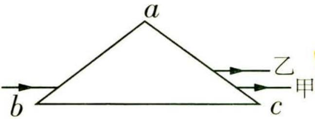</td><td>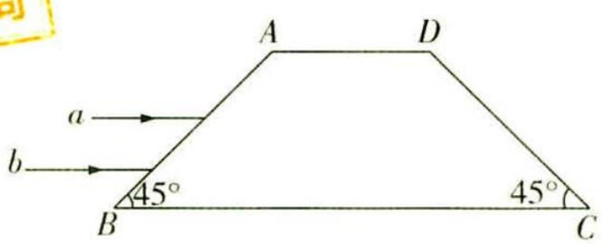</td></tr></table>

微信公众号
教辅资料站
小考教辅站
初高教辅站

# 2023年高考真题

# 2023版《试题调研》原题

# 【理综·全国乙卷·T13】

一定温度下，AgCl和 $Ag_{2}CrO_{4}$ 的沉淀溶解平衡曲线如图所示。

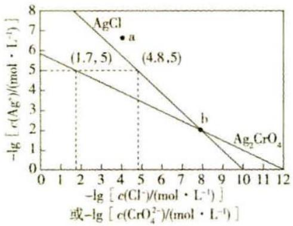

$\quad$C. $Ag_{2}CrO_{4} + 2Cl^{-} \rightleftharpoons 2AgCl + CrO_{4}^{2-}$ 的平衡常数 $K=10^{7.9}$

# 【理综·新课标卷·T32】

（4） 运动中出汗失水导致细胞外液渗透压升高,垂体释放的某种激素增加,促进肾小管、集合管对水的重吸收,该激素是\_\_\_\_。若大量失水使细胞外液量减少以及血钠含量降低时,可使醛固酮分泌增加。醛固酮的主要生理功能是\_\_\_\_。

答案（4）抗利尿激素 促进肾脏重吸收钠离子，从而间接引起肾小管和集合管重吸收水分增加，使得细胞外液含量增加

# 【文综·新课标卷·T20】

据商务部统计，2023年1—3月，全国实际使用外资4084.5亿元人民币，同比增长4.9%。高技术产业实际使用外资1567.1亿元人民币，同比增长18%。其中，电子及通信设备制造、科技成果转化服务、研发与设计服务、医药制造领域引资分别增长3.7%、50.3%、24.6%和20.2%。

①中国经济加快转型升级，利用外资质量提升

③中国营商环境具有优势，对外资吸引力不减

# 【文综·新课标卷·T26】

汉武帝时设置十三州部，州部可以推举秀才。东汉，“州里”“州闾”“州党”等语汇逐渐行用意为同乡，州刺史被尊称为“使君”。东汉后期，以州为中心的地域观念逐渐形成，这在当时

$\quad$B. 不利于统一国家的巩固

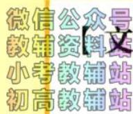

# 综·全国甲卷·T36】

埃塞俄比亚人口超过1亿，农业人口约占80%，以户为主……

（3）说明埃塞俄比亚难以大规模引进灌溉农机具的社会经济原因。（8分）

# 【化学·第2辑·P103】

常温下, AgCl(白色)与 $Ag_{2}CrO_{4}$ (砖红色)的沉淀溶解平衡曲线如图所示

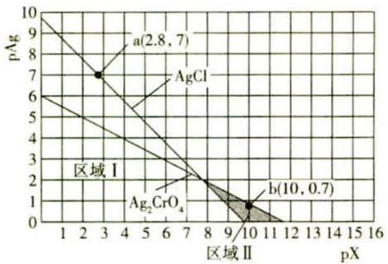

$\quad$D. 反应 $\mathrm{Ag_{2}CrO_{4}(s)+2Cl^{-}(aq)}\rightleftharpoons2\mathrm{AgCl(s)}+\mathrm{CrO_{4}^{2-}(aq)}$ 的平衡常数 $K=10^{8.2}$

# 【生物·第8辑·P99】

人体水盐平衡的调节离不开抗利尿激素（ADH）和醛固酮的作用。……

$\quad$A. 抗利尿激素的受体位于细胞膜上，当血浆渗透压升高时，抗利尿激素分泌量增加

解析……当细胞外液含量下降时，肾上腺分泌的醛固酮增加，使肾脏重吸收钠离子，从而间接引起肾小管和集合管重吸收水分增加，使得细胞外液含量增加。

# 【政治·第4辑·P115】

全国实际使用外资和对外全行业直接投资

<table><tr><td colspan="3">(2022年一季度)</td></tr><tr><td>项目</td><td>数额(人民币)</td><td>增速</td></tr><tr><td>·实际使用外资</td><td>3798.7亿</td><td>25.6%</td></tr><tr><td>其中高技术产业实际使用外资</td><td>1328.3亿</td><td>52.9%</td></tr><tr><td>对非金融行业直接投资</td><td>2177.6亿</td><td>5.6%</td></tr><tr><td>其中对“一带一路”沿线国家非金融类直接投资</td><td>334亿</td><td>16.5%</td></tr></table>

③境外投资者看好中国机遇,对中国发展有信心

④我国引进外资呈现出量稳质升、结构优化的特点

# 【历史·第7辑·P78】

汉武帝元封五年（公元前106年）……“令州察更民有茂才异等可为将相及使绝国者”；汉成帝以后，“今部刺史居牧伯之位，秉一州之统，选第大吏，所荐位高至九卿，所恶立退，任重职大”。

$\quad$C.助推了地方势力的膨胀

# 【地理·第9辑·P67】

卡塔尔位于波斯湾西南岸，国土面积约11521千米 $^{2}$ ，人口265.8万……

（2） 分析卡塔尔阿尔法丹农场引入中国智能LED植物工厂的社会经济原因。(10分)

# 每月一手考情 解透关键题型

# ① 聚焦一手考情 权威解读2023高考创新考法

调研 1 即(大运算量12023 北京第四中学考前保温测试)已知集合 $P = \{(x, y) \mid (x - \cos \theta)^2 + (y - \sin \theta)^2 = 4, 0 \leqslant \theta \leqslant \pi\}$ . 由集合 $P$ 中所有的点组成的图形如图1中阴影部分所示, 中间白色部分形如美丽的“水滴”. 现给出下列结论:

①白色“水滴”区域(含边界)任意两点间距离的最大值为 $1+\sqrt{3}$ ;

②在阴影部分任取一点E，则E到坐标轴的距离小于等于3；

③阴影部分的面积为 $8\pi$ ;

④阴影部分的内外边界曲线长为8π.

其中正确的有 .（填写正确结论的序号）

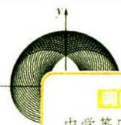

# 凸显大运算量（P001）

调研 5（平面向量与不等关系结合12023 浙江杭州第二中学等四校5月模拟1多选）如图6, $l_{1} \parallel l_{2}$ ，点A是 $l_{1}, l_{2}$ 之间的一个定点，点A到 $l_{1}, l_{2}$ 的距离分别为1和2。点B是直线 $l_{2}$ 上一个动点，过点A作 $AC \perp AB$ ，交直线 $l_{1}$ 于点C, $\overrightarrow{GA} + \overrightarrow{GB} + \overrightarrow{GC} = 0$ ，则()

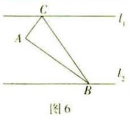

$\overrightarrow {A G} = \frac {1}{2} (\overrightarrow {A B} + \overrightarrow {A C})$

$\quad$B. $\triangle GAB$ 面积的最小值是 $\frac{2}{3}$

$\quad$D. $\overrightarrow{GA} \cdot \overrightarrow{GB}$ 存在最小值

# 视角3 函数思想本质一脉相承

调研 6（三角函数与数列、集合|2023全国乙卷）已知等差数列 $\{a_{n}\}$ 的公差为 $\frac{2\pi}{3}$ ，集合 $S=\left|\cos a_{n}\right|n\in N^{*}$ ，若 $S=\{a,b\}$ ，则ab=

$\quad$A. -1

$\quad$B. $-\frac{1}{2}$

$\quad$C. 0

$\quad$D. $\frac{1}{2}$

# 强调在知识交汇处命题（P005） 重视函数思想（P007）

# ② 核心主干抓重点 集中突破超重点、扫除疑难点

(2023 上海同济大学第一附属中学三模) 对任意两个非零的平面向量 $\alpha\otimes\beta=\frac{\alpha\cdot\beta}{\beta\cdot\beta}$ . 若平面向量 a, b 满足 $|a|\geqslant|b|>0$ , a 与 b 的夹角 $\theta\in(0$ 和 $b\otimes a$ 都在集合 $\left\{\frac{n}{2}|n\in Z\right\}$ 中，则 $a\otimes b=$ \_\_\_\_.

专研向量的新定义（P013）

突破测量问题（P019）

(2023 河北衡水中学 6 月月考) 如图 5, 某城市有一条公路从正西方向的 AO 通过市中心 O 后转向东偏北 $\alpha$ 角方向的 OB, 位于该市的某大学 M 到市中心 O 的距离 OM = 3 $\sqrt{13}$ km, 且 $\angle AOM = \beta$ . 现要修筑一条铁路 L, L 在 OA 上设一车站 A, 在 OB 上设一车站 B, 铁路在 AB 部分为直线段, 且经过大学 M, 其中 $\tan \alpha = 2$ , $\cos \beta = \frac{3\sqrt{13}}{13}$ , OA = 15 km.

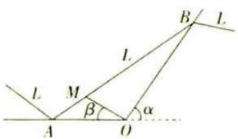  
图5

# ③ 高效破题有方法 传授高妙解法，解透关键题型

故答案为5.

【一足多针】因为 $\tan \theta = 2$ ，所以 $\frac{\sin \theta}{\cos \theta} = 2$ ，即 $\sin \theta = 2\cos \theta$ ，又 $\sin^2 \theta + \cos^2 \theta = 1$ ，所以 $\sin^2 \theta =$

$\frac{4}{5}, \cos^2\theta = \frac{1}{5}$ ，用 $x_i \frac{1}{\sin 2\theta + \cos 2\theta} = \frac{1}{2\sin\theta \cos\theta + \cos^2\theta - \sin^2\theta} = \frac{1}{4\cos^2\theta + \cos^2\theta - \sin^2\theta} =$

$\frac{1}{5\cos^{2}\theta - \sin^{2}\theta} = \frac{1}{5\times\frac{1}{5} - \frac{4}{5}} = 5$

# 会审题才能做对题（P038）

# 一题多解，多维分析（P023）

# 天星老师破障碍

解题完全没思路,怎么办?不要紧,先算着再说,算着算着说不定答案就出来了.唯一可算的点就是 $|\overrightarrow{PQ}\cdot a|=\frac{3\pi}{2}$ ,那我们先设参数,利用向量的坐标运算求不好了.咦?参数都消失了,居然轻松把 $\omega$ 解出来了!

微信公众号教辅资料站小考教辅站初高教辅站

# 核心技法5 用极化恒等式计算

调研 6 (2023 河北高三四模) 如图 8, 在边长为 2 的正方形 ABCD 中, 以 C 为圆心, 1 为半径的圆分别交 CD, BC 于点 E, F. 当点 P 在劣弧 EF 上运动时, $\overrightarrow{BP} \cdot \overrightarrow{DP}$ 的最小值为 \_\_\_\_.

解析 方法一: 极化恒等式法 连接 BD, 取 BD 的中点 M, 连接 PM, 则 $\overrightarrow{BP} \cdot \overrightarrow{DP} = \overrightarrow{PB} \cdot \overrightarrow{PD} = \overrightarrow{PM^{2}} - \overrightarrow{MB^{2}} = \overrightarrow{PM^{2}} - 2$ ,

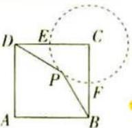  
图8

妙用二级结论，解题速度
Up! Up! Up! (P052)

# 亮点速览

# 专研创新题型

近几年每年必出现的创新题型,对学生的综合能力提出了更高的要求,要有意识加强对新题型的训练

· 大运算量问题/P001  
· 组合型填空题/P031   
· 结构不良试题/P045   
· 双空题/P064   
· 新定义问题/P085

# 聚焦创新交汇

创新交汇问题在近几年的
高考中颇受命题者青睐，
要注意知识间的横纵联系

- 圆锥曲线与三角函数交汇/P001  
- 圆锥曲线与平面向量交汇/P003   
· 三角函数与数列、集合

微信公众号
教辅资料站
小考教辅站
初高教辅站
P014
交汇/P007
面向量与数列交汇/

# CONTENTS

# 目录

# 每月一手考情

# 聚焦高考命题中 3 类创新交汇视角 001

视角 1 用圆锥曲线构建题目背景 001

视角 2 结合不等关系是解题关键 004

视角 3 函数思想本质一脉相承 007

# 突破 15 大必考超重点

# 创新考法抢先知

超重点1 巧用模板破解三角函数中的摩天轮问题 008

超重点2 轻松撕掉平面向量的新定义“外衣” 011

超重点3 向量：千题万难，一招制敌 014

超重点 4 解锁三角函数实际应用问题的建模思维 017

# 核心主干抓重点

超重点5 角度、名称、次数统一在三角函数求值问题中的核心应用 021

核心应用 1 用角度统一思想化简求值 021

核心应用 2 用名称统一思想化简求值 022

核心应用 3 用次数统一思想化简求值 023

核心应用 4 三大统一思想的综合应用 023

超重点6 揭秘求 $f(x)=A\sin(\omega x+\varphi)+B$ 的两类关键题型 026

### 题型 1 “拆” “降” “合” 化简函数解析式 026

### 题型 2 根据部分图象求函数解析式 028

超重点7 变换之道：应用平移、伸缩规则解决图象变换问题 034

命题角度 1 利用平移规则变换 034

命题角度 2 利用伸缩规则变换 036

命题角度 3 平移规则、伸缩规则的综合应用 037

超重点8 3大解三角形中化角类、化边类问题求解策略 040

策略 1 利用正、余弦定理边化角 040

策略 2 利用余弦定理角化边 042

策略 3 利用两次余弦法或向量平方法化边 043

超重点9 求解平面向量数量积的5大核心技法 048

核心技法 1 用定义法计算 048

核心技法 2 用坐标法计算 049

核心技法 3 用基底法计算 050

核心技法 4 用投影法计算 051

核心技法5 用极化恒等式计算 052

超重点 10 破解平面向量运算的 3 类关键题型 056

### 题型1 与平面几何有关的平面向量运算 056

### 题型 2 与解析几何相关的平面向量运算 057

### 题型3 与数列相关的平面向量运算 059

超重点 11 向量之心：揭秘三角形四心的数学奥秘 062

命题角度 1 垂心的向量表示与应用 062

命题角度 2 重心的向量表示与运用 063

命题角度 3 外心的向量表示与运用 065

命题角度 4 内心的向量表示与运用 066

命题角度 5 三角形四心的综合运用 067

# 高效破题有方法

超重点 12 换而不乱：探索整体换元法在三角函数问题中的应用 073

微信公众号

教辅资料

小考教辅

初高教辅站

应用1 用整体换元法求值 073

应用 2 用整体换元法求单调区间、参数等 074

超重点 13 利用图象工具破解三角函数综合问题 081

角度 1 利用图象比大小、求最值 081

# 亮点速览

# 关注数学应用

应用类数学问题一直是高考的热点,此类问题能体现数学的应用价值,要多阅读、多练习

\- 筒车/P008

· 摩天轮/P009

· 释迦塔/P017

· 射击训练/P018

· 雪花曲线/P059

# 传授高妙技法

灵活的解题技巧与方法可以使学习效果在有限的学习时间内达到最大化,学数学,最重要的就是学方法

\- 摩天轮模型的两步解题法/P009

· 用定义法计算平面向量数量积/P048

· 用整体换元法求值/P073

· 用角平分线定理解三角形/P091

· 用等和线定理解平面向量问题/P096

角度 2 利用图象求单调区间 082  
角度 3 利用函数值关系反推图象的对称性 083  
角度 4 结合图象，利用零点、最值点推周期或 $\omega$ 084  
角度 5 结合图象，解决参数的取值范围问题 085

# 超重点 14 解三角形中 3 大重要定理的巧妙应用 089

应用 1 射影定理在解三角形问题中的应用 089  
应用 2 角平分线定理在解三角形问题中的应用 090  
应用 3 中线定理在解三角形问题中的应用 093

# 超重点 15 平面向量问题高频使用的 3 个二级结论 096

结论 1 等和线定理 096  
结论 2 极化恒等式 098  
结论 3 奔驰定理 100

# 下辑精彩预告 2023年8月全新上市

# 《试题调研》第3辑将推出

——高考超重点3·数列 & 立体几何

# 聚焦一手考情

紧贴2023高考“无情境不命题”的考情，独家原创“天星老师审题法”，教你解读情境；深研归纳“模型构建法”，帮你转化情境；批注式深度解析，助你解透情境. 情境题也可以很简单！

# 核心主干抓重点

深入研究“数列 & 立体几何”模块的核心主干知识, 如用构造法求数列通项的 4 类情形、数列中不等关系的研究、外接球模型与应用、破解立体几何存在探索性问题等, 独家

微信公原创站
教辅资料站
小考教题
初高教辅
题

“天星老师教审题” “天星老师传技巧” ……栏目，用最容易理解的语言为你讲透审路、厘清知识脉络，批注式解析、多法并举，助你夯实基础、稳步拔高！

# 高效破题有方法

求数列通项的核心技法、快速求解数列求和问题的必备大招、立体几何中动态问题的探究秘籍……掌握高妙解法，才能解透关键题型！

# 每月一手考情

# 聚焦高考命题中 3 类创新交汇视角

重庆市字水中学优秀教师 谭倩

# 视角 1 用圆锥曲线构建题目背景

# 1. 圆锥曲线与三角函数

调研 1 (大运算量 | 2023 北京第四中学 6 月考前保温测试) 已知集合 $P = \{(x, y) \mid (x - \cos \theta)^{2} + (y - \sin \theta)^{2} = 4, 0 \leqslant \theta \leqslant \pi\}$ . 由集合 $P$ 中所有的点组成的图形如图 1 中阴影部分所示, 中间白色部分形如美丽的“水滴”. 现给出下列结论:

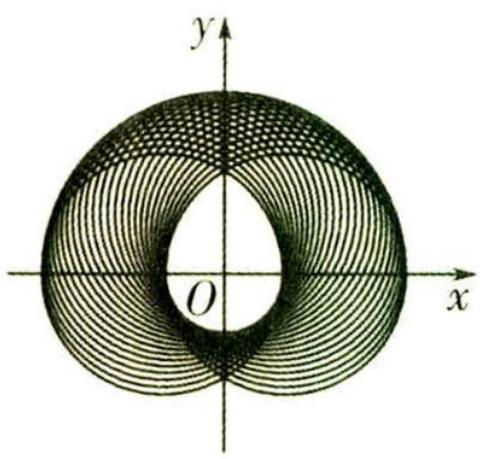

图1

①白色“水滴”区域(含边界)任意两点间距离的最大值为 $1+\sqrt{3}$ ;  
②在阴影部分任取一点 E，则 E 到坐标轴的距离小于等于 3；  
③阴影部分的面积为 $8 \pi$ ; 小考教辅站  
④阴影部分的内外边界曲线长为 $8 \pi$ .

其中正确的有\_\_\_\_。(填写正确结论的序号)

解析 对于①, 令 $(x - \cos \theta)^2 + (y - \sin \theta)^2 = 4$ 中 $x = 0$ , 得 $2 \sin \theta = y - \frac{3}{y} \in [0, 2]$ , 解得 $y \in [-\sqrt{3}, -1] \cup [\sqrt{3}, 3]$ .

“水滴”与 y 轴相交, 最高点记为 A, 最低点记为 B, 则 $A(0, \sqrt{3})$ , $B(0, -1)$ , 白色 “水滴” 区域 (含边界) 任意两点间距离的最大值为 $|AB| = 1 + \sqrt{3}$ , 故①正确.

对于②, 对 $(x-\cos\theta)^{2}+(y-\sin\theta)^{2}=4$ 整理得 $\left\{\begin{aligned}x&=2\cos\alpha+\cos\theta,\\ y&=2\sin\alpha+\sin\theta\end{aligned}\right.$ ( $\alpha$ 为参数),

【扫清障碍】这里用到了圆 $(x-a)^{2}+(y-b)^{2}=r^{2}$ 的参数方程 $\left\{\begin{aligned}x&=a+r\cos\alpha,\\ y&=b+r\sin\alpha\end{aligned}\right.$ （ $\alpha$ 为参数），也可以理解为三角换元

所以可设 $E(2\cos \alpha + \cos \theta, 2\sin \alpha + \sin \theta)$ , 所以 $E$ 到坐标轴的距离为 $|2\cos \alpha + \cos \theta|$ 或 $|2\sin \alpha + \sin \theta|$ . 因为 $\cos \theta \in [-1, 1]$ , $\sin \theta \in [0, 1]$ , 所以 $|2\cos \alpha + \cos \theta| \leqslant |2\cos \alpha| + |\cos \theta| \leqslant 2 + 1 = 3$ , $|2\sin \alpha + \sin \theta| \leqslant |2\sin \alpha| + |\sin \theta| \leqslant 2 + 1 = 3$ , 所以 $E$ 到坐标轴的距离小于等于 3, 故②正确.

对于③, 令 $(x - \cos \theta)^{2} + (y - \sin \theta)^{2} = 4$ 中 $y = 0$ , 得 $2\cos \theta = x - \frac{3}{x} \in [-2, 2]$ , 解得 $x \in [-3, -1] \cup [1, 3]$ . 因为对于确定的 $\theta$ 值, $(x - \cos \theta)^{2} + (y - \sin \theta)^{2} = 4$ 表示圆心为 $Q(\cos \theta, \sin \theta)$ , 半径为 $r = 2$ 的圆, 连接 $OE, OQ$ , 所以 $1 = r - |OQ| \leqslant |OE| \leqslant |OQ| + r = 3$ . 由 $0 \leqslant \theta \leqslant \pi$ , 得 $Q(\cos \theta, \sin \theta)$ 在 $x$ 轴上方 (包含 $x$ 轴), 故白色“水滴”的下半部分 ( $x$ 轴及以下部分) 的边界为以 $O$ 为圆心, 1 为半径的半圆弧, 阴影的上半部分 ( $x$ 轴及以上部分) 的外边界是以 $O$ 为圆心, 3 为半径的半圆弧.

【难点解疑】 $(x-\cos\theta)^{2}+(y-\sin\theta)^{2}=4$ 表示的图形永远与圆 $x^{2}+y^{2}=1$ 的x轴及以下部分相切，故白色“水滴”的下半部分的边界为以O为圆心，1为半径的半圆弧； $(x-\cos\theta)^{2}+(y-\sin\theta)^{2}=4$ 表示的图形上的x轴及以上部分的点离原点的最远距离永远为3，故阴影的上半部分的外边界是以O为圆心，3为半径的半圆弧

根据对称可知:白色“水滴”在第一象限的边界是以 $(-1,0)$ 为圆心,2为半径的圆弧.

【易错提醒】由于 $0 \leqslant \theta \leqslant \pi$ , 圆心 $Q$ 不会移动到圆 $x^{2} + y^{2} = 1$ 的 $x$ 轴以下部分, 当 $\theta = 0$ 与 $\theta = \pi$ 时, 两个圆在 $x$ 轴及以上部分相交形成的图形构成了水滴的上半部分

如图2, 设 $M(-1,0), N(1,0)$ , 连接 $AM, AN$ , 则 $|AN| = |AM| = |MN| = 2$ , 即 $\widehat{AN}$ 所对的圆心角为 $\frac{\pi}{3}$ , 同理 $\widehat{AM}$ 所在圆的半径为 2, 所对的圆心角为 $\frac{\pi}{3}$ , 阴影部分在第四象限的外边界为以 $N(1,0)$ 为圆心, 2 为半径的圆弧.

记阴影部分交 y 轴的最高点为 C，最低点为 D，连接 ND，设 $G(3,0)$ ， $H(-3,0)$ ，可得 $|ON|=1,|OD|=\sqrt{3},\angle OND=\frac{\pi}{3},\widehat{DG}$ 所对的圆心角为 $\frac{2\pi}{3}$ ，同理 $\widehat{DH}$ 所在圆的半径为 2，所对的圆心角为 $\frac{2\pi}{3}$ .

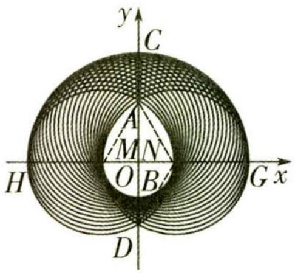

图2

故白色“水滴”由一个等腰三角形、两个全等的弓形和一个半圆组成,所以它的面积 $S = S_{\text{半圆}} + 2S_{\text{弓形}} + S_{\text{三角形}} = \frac{1}{2} \times \pi \times 1^{2} + 2 \times \left( \frac{2\pi}{3} - \sqrt{3} \right) + \sqrt{3} = \frac{11\pi}{6} - \sqrt{3}.$

不考虑白色“水滴”区域， $x$ 轴上方的阴影半圆的面积为 $\frac{1}{2}\pi \times 3^2 = \frac{9}{2}\pi .$

同样不考虑白色“水滴”区域,第四象限的阴影部分面积可以看作一个直角三角形和一个扇形的面积的和,等于 $\frac{1}{2}\times\sqrt{3}\times1+\frac{1}{3}\times\pi\times2^{2}=\frac{4}{3}\pi+\frac{\sqrt{3}}{2}$ ,所以阴影部分的面积为 $\frac{9}{2}\pi+2\times(\frac{4}{3}\pi+\frac{\sqrt{3}}{2})-\frac{11}{6}\pi+\sqrt{3}=\frac{16}{3}\pi+2\sqrt{3}$ ,故③错误.

对于④, $x$ 轴上方的阴影部分的内外边界曲线长为 $\frac{1}{2} \times 2\pi \times 3 + \frac{\pi}{3} \times 2 \times 2 = \frac{13}{3}\pi, x$ 轴下方的

# 活学巧用

小编说:高中数学有许多巧解妙招,下面是小编给大家总结的一些运用巧解妙招必备的速解公式、结论,我们一起来学习一下吧!

关注微信公众号“初高教辅站”获取更多初高中教辅资料

阴影部分的内外边界曲线长为 $\frac{1}{2}\times2\pi\times1+\frac{1}{3}\times2\pi\times2\times2=\frac{11}{3}\pi$ ，所以阴影部分的内外边界曲线长为 $\frac{13\pi}{3}+\frac{11\pi}{3}=8\pi$ ，故④正确.

故答案为①②④.

# 2. 圆锥曲线与平面向量

调研 2 (2023 辽宁省实验中学第五次模拟) 已知向量 b, c 和单位向量 a 满足 |a - b| = 2 |b|, |c - a| + |c + a| = 4, 则 b · c 的最大值为 ( )

$\quad$A. $\frac{4 \sqrt{2}}{3}$

$\quad$B. $\sqrt{2}$

$\quad$C. 2

$\quad$D. $\frac{\sqrt{5}}{2}$

# 天星老师传技巧

此类向量问题单纯通过向量的线性运算无法解决,题目中没有给出具体的图形,也没有一组明显的基底,我们可以尝试将它放置在坐标系中进行探究.

解析 设 $\boldsymbol{a}=(1,0)$ , $\boldsymbol{b}=(x,y)$ ，由 $\left|\boldsymbol{a}-\boldsymbol{b}\right|=2\left|\boldsymbol{b}\right|$ 可得 $(x-1)^{2}+y^{2}=4(x^{2}+y^{2})$ ，化简可得 $3x^{2}+3y^{2}+2x-1=0$ ，即 $\left(x+\frac{1}{3}\right)^{2}+y^{2}=\frac{4}{9}$ .

设 $\boldsymbol{c}=(x_{0},y_{0})$ ，则由 $\left|c-a\right|+\left|c+a\right|=4$ ，可得 $\sqrt{(x_{0}-1)^{2}+y_{0}^{2}}+\sqrt{(x_{0}+1)^{2}+y_{0}^{2}}=4$ ，

故点 $(x_{0},y_{0})$ 的轨迹为以 $(-1,0),(1,0)$ 为焦点,2a=4的椭圆,其方程为 $\frac{x^{2}}{4}+\frac{y^{2}}{3}=1$ .

设 b, c 夹角为 $\theta$ ，则 $b \cdot c = |b||c| \cos \theta$ ，

由圆与椭圆的性质可得, $|b|\leqslant\frac{2}{3}+\frac{1}{3}=1,|c|\leqslant2,\cos\theta\leqslant1$ ,三者可同时取等号.

故当 b, c 同向且方向与 x 轴正方向相反时, $b \cdot c$ 取得最大值 2.

故选C.

【解后思考】结合向量的几何意义，等式 $|a-b|=2|b|$ 可理解为动点 $B(\text{满足}\overrightarrow{OB}=b)$ 到定点 $A(\text{满足}\overrightarrow{OA}=a)$ 的距离与到原点O的距离之比

为2, $B$ 的轨迹为阿波罗尼斯圆,如图3所示. 这为使用坐标法解决向量问题指明了方向, $\left| c - a\right|  + \left| {c + a}\right|  = 4$ 则更为直接,可理解为动点 $C$ (满足 $\overrightarrow{OC} = c$ )到定点 $A$ 和定点 ${A}^{' }$ (满足 $\overrightarrow{O{A}^{' }} =  - a$ ) 的距离之和为定值,所以 $C$ 的轨迹为以 $A,{A}^{' }$ 为焦点, $a = 2$ 的椭圆.

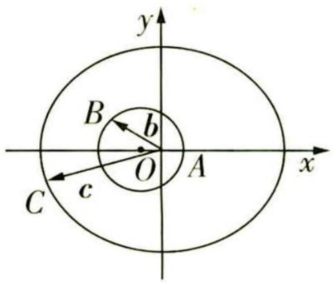

图 3

# 活学巧用

“1”的代换 在三角函数的求值运算中, 常用“1”的代换: $1 = \sin^{2}\alpha + \cos^{2}\alpha = \tan 45^{\circ} = \sin 90^{\circ} = \cos 0^{\circ} = \cdots$

关注微信公众号“初高教辅站”获取更多初高中教辅资料

# 视角 2 结合不等关系是解题关键

调研 3 (三角函数与不等关系结合 |2023 安徽五校 5 月联考) 若 $\exists m \in \mathbf{R}$ , $\forall x \in [a, b]$ , 恒有 $2m^{2} - 2\sqrt{2}\sin \left(x + \frac{\pi}{4}\right)m + \sin 2x \leqslant 0$ , 则 $b - a$ 的最大值是 ( )

$\quad$A. $\frac{3\pi}{4}$

$\quad$B. $\pi$

$\quad$C. $\frac{4\pi}{3}$

$\quad$D. $2\pi$

# 天星老师有妙招

此题的不等式中有两个变量“m,x”，以“m”为主元的一元二次不等式结构非常清晰，所以以它为主元更优.

解析 由 $2m^{2} - 2\sqrt{2}\sin \left(x + \frac{\pi}{4}\right)m + \sin 2x \leqslant 0$ 得 $m^{2} - (\sin x + \cos x)m + \sin x\cos x \leqslant 0$ , 即 $(m - \sin x)(m - \cos x) \leqslant 0$ ,

【统一思想】对于含三角函数式的化简，应该朝着“统一角或统一函数名称”的方向进行，这里就是“统一角”思想的体现，此题将 $x+\frac{\pi}{4}$ 和2x统一为x

由几何意义可知,在区间 $[a,b]$ 上,函数y=m的图象在函数 $y=\sin x,y=\cos x$ 的图象之间,
如图4所示,要使b-a达到最大,则 $m=-\frac{\sqrt{2}}{2}$ 或 $m=\frac{\sqrt{2}}{2}$ ,此时 $b-a=\frac{3\pi}{4}-(-\frac{\pi}{4})=\pi$ .故选B.

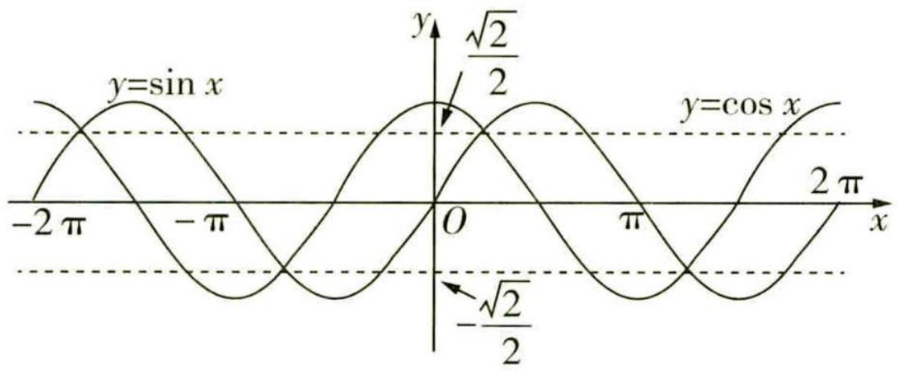

图4

调研 4 (解三角形与不等关系结合 | 2023 黑龙江哈三中 5 月阶段测试) 在 $\triangle ABC$ 中, $\angle BAC = 120^{\circ}$ , $AD$ 平分 $\angle BAC$ , $AD = 3$ , 则 $2AC + AB$ 的最小值为 ( )

$\quad$A. $6 + 3\sqrt{2}$

$\quad$B. $6 - 3\sqrt{2}$

$\quad$C. $9 + 6\sqrt{2}$

$\quad$D. $9 - 6 \sqrt{2}$

解析 如图 5, 记 AB = c, AC = b.

第一步:在 $\triangle ABD, \triangle ACD$ 中使用余弦定理表示出 BD, CD.

在 $\triangle ABD$ 中， $AD = 3$ ， $\angle BAD = 60^{\circ}$ ， $AB = c$ ，则 $BD^{2} = c^{2} + 9 - 2\times 3c\times \frac{1}{2} = c^{2} + 9 - 3c,$

# 活学巧用

极化恒等式 $a \cdot b = \frac{1}{4} \left[ (a + b)^{2} - (a - b)^{2} \right]$ .

关注微信公众号“初高教辅站”获取更多初高中教辅资料

在 $\triangle ACD$ 中， $AD = 3$ ， $\angle CAD = 60^{\circ}$ ， $AC = b$ ，则 $CD^{2} = b^{2} + 9 - 2\times$ $3b\times \frac{1}{2} = b^{2} + 9 - 3b.$

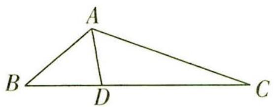

图5

第二步:利用角平分线定理构造一个关于 b, c 的等式并化简.

∵ AD 平分 ∠BAC, ∴ $\frac{BD}{CD} = \frac{AB}{AC} = \frac{c}{b}$ , ∴ $\frac{BD^{2}}{CD^{2}} = \frac{c^{2}}{b^{2}} = \frac{c^{2} + 9 - 3c}{b^{2} + 9 - 3b}$ ,

【用定理】角平分线定理：三角形的内角平分线分对边所得的两条线段与这个角的两边对应成比例

$\begin{array}{l} \therefore c ^ {2} (b ^ {2} + 9 - 3 b) = b ^ {2} (c ^ {2} + 9 - 3 c), \therefore 9 c ^ {2} - 3 b c ^ {2} = 9 b ^ {2} - 3 b ^ {2} c, \\ \therefore 3 c ^ {2} - b c ^ {2} = 3 b ^ {2} - b ^ {2} c, \therefore 3 (c ^ {2} - b ^ {2}) - (b c ^ {2} - b ^ {2} c) = 0, \\ \therefore 3 (c + b) (c - b) - b c (c - b) = 0, \therefore (c - b) [ 3 (c + b) - b c ] = 0, \therefore c = b \text {或} 3 (b + c) = b c. \\ \end{array}$

第三步:根据化简结果分类讨论.

当 c=b 时， $\triangle ABC$ 为等腰三角形， $\therefore AD\perp BC,c=b=\frac{AD}{\cos60^{\circ}}=6,\therefore2AC+AB=2b+c=18.$

当 $3(b+c)=bc$ 时,有 $\frac{1}{c}+\frac{1}{b}=\frac{1}{3}$ .

【变换技巧】根据 $3(b+c)=bc$ 去寻找 $2b+c$ 的最小值，需在等式两边同时除以 3bc 变形为 $\frac{1}{c}+\frac{1}{b}=\frac{1}{3}$ ，转化为“倒数和结构”模型

$\therefore 2AC + AB = 2b + c = 3(2b + c)\left(\frac{1}{c} + \frac{1}{b}\right) = 3\left(\frac{2b}{c} + \frac{c}{b} + 3\right) \geqslant 3\left(2\sqrt{\frac{2b}{c} \times \frac{c}{b}} + 3\right) = 9 + 6\sqrt{2}$ , 当且仅当 $\frac{2b}{c} = \frac{c}{b}$ , 即 $c = \sqrt{2} b$ 时, 等号成立.

$\because 9+6\sqrt{2}<18,\therefore 2AC+AB$ 的最小值为 $9+6\sqrt{2}$ . 故选 C.

调研 5: (平面向量与不等关系结合 |2023 浙江杭州第二中学等四校 5 月模拟 | 多选) 如图 6, $l_{1} \parallel l_{2}$ , 点 A 是 $l_{1}, l_{2}$ 之间的一个定点, 点 A 到 $l_{1}, l_{2}$ 的距离分别为 1 和 2. 点 B 是直线 $l_{2}$ 上一个动点, 过点 A 作 $AC \perp AB$ , 交直线 $l_{1}$ 于点 C, $\overrightarrow{GA} + \overrightarrow{GB} + \overrightarrow{GC} = 0$ , 则 ( )

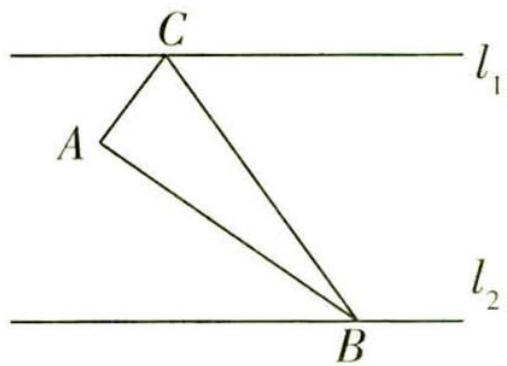

图6

$\quad$A. $\overrightarrow{AG} = \frac{1}{2} (\overrightarrow{AB} +\overrightarrow{AC})$

$\quad$B. $\triangle GAB$ 面积的最小值是 $\frac{2}{3}$

$\quad$C. $|\overrightarrow{AG}| \geqslant 1$

$\quad$D. $\overrightarrow{GA} \cdot \overrightarrow{GB}$ 存在最小值

解析 过点 A 作 $AE \perp l_{1}$ 于 E, $AD \perp l_{2}$ 于 D, 设 AB 中点为 F, 连接 CF, 以 D 为原点, $\overrightarrow{DB}, \overrightarrow{DE}$ 方向分别为 x 轴, y 轴正方向建立如图 7 所示的平面直角坐标系,

【破题有拓】坐标法是解决向量问题的常用方法，建立适当的坐标系往往能起到事半功倍的作用

# 活学巧用

矩形中的小性质 已知 O 是矩形 ABCD 所在平面内任意一点, 则 $\overrightarrow{OA} \cdot \overrightarrow{OC} = \overrightarrow{OB} \cdot \overrightarrow{OD}$ , 且 $|\overrightarrow{OA}|^{2} + |\overrightarrow{OC}|^{2} = |\overrightarrow{OB}|^{2} + |\overrightarrow{OD}|^{2}$ .

关注微信公众号“初高教辅站”获取更多初高中教辅资料

则 $A(0,2), E(0,3)$ , 设 $C(m,3), B(n,0), G(x,y), m,n,x,y \in \mathbf{R}$ , 且 $m,n>0$ , 所以 $\overrightarrow{AC}=(m,1), \overrightarrow{AB}=(n,-2)$ .

因为 $AC \perp AB$ ，所以 $\overrightarrow{AC} \cdot \overrightarrow{AB} = 0$ ，即 mn - 2 = 0，故 $n = \frac{2}{m}$ ，即 $B(\frac{2}{m}, 0)$ ，所以 $\overrightarrow{GA} = (-x, 2 - y)$ ， $\overrightarrow{GB} = (\frac{2}{m} - x, -y)$ ， $\overrightarrow{GC} = (m - x, 3 - y)$ 。

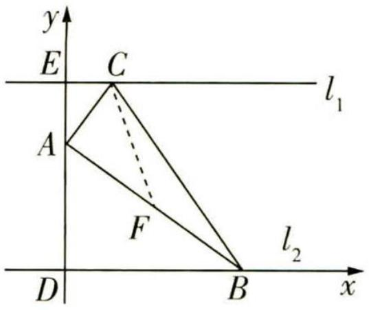

图 7

因为 $\overrightarrow{GA} +\overrightarrow{GB} +\overrightarrow{GC} = 0$ ，所以 $\left\{ \begin{array}{l}\frac{2}{m} +m - 3x = 0,\\ 5 - 3y = 0, \end{array} \right.$ 则 $\left\{ \begin{array}{l}x = \frac{1}{3} (\frac{2}{m} +m),\\ y = \frac{5}{3}. \end{array} \right.$

因为 $\frac{1}{3} (\overrightarrow{AB} +\overrightarrow{AC}) = (\frac{\frac{2}{m} + m}{3}, - \frac{1}{3})$ ，所以 $\overrightarrow{AG} = \frac{1}{3} (\overrightarrow{AB} +\overrightarrow{AC})$ ，故A错误.

因为 $\overrightarrow{GA} +\overrightarrow{GB} +\overrightarrow{GC} = 0$ ，所以 $\overrightarrow{GC} = -(\overrightarrow{GA} +\overrightarrow{GB})$ ，连接 $GF$ ，即 $\overrightarrow{GC} = -2\overrightarrow{GF}$

所以 G, C, F 三点共线, 且 G 为 CF 上靠近 F 的三等分点.

【指点迷津】A, B, C 三点共线有两种向量关系可以说明： $\exists\lambda\in\mathbb{R},\overrightarrow{AB}=\lambda\overrightarrow{BC}$ 或 $\exists\mu\in\mathbb{R},\overrightarrow{OA}=\mu\overrightarrow{OB}+(1-\mu)\overrightarrow{OC}$

所以 $S_{\triangle GAB} = \frac{1}{3} S_{\triangle ABC} = \frac{1}{6} |\overrightarrow{AC}| |\overrightarrow{AB}| = \frac{1}{6} \times \sqrt{m^{2} + 1} \times \sqrt{\frac{4}{m^{2}} + 4} = \frac{1}{3} \times \sqrt{(m^{2} + 1)(\frac{1}{m^{2}} + 1)} = \frac{1}{3} \times \sqrt{m^{2} + \frac{1}{m^{2}} + 2} \geqslant \frac{1}{3} \times \sqrt{2\sqrt{m^{2} \times \frac{1}{m^{2}}} + 2} = \frac{2}{3}$ ，当且仅当 $m^{2} = \frac{1}{m^{2}}$ ，即 m = 1 时取等号，故 B 正确.

因为 $\overrightarrow{AG} = \frac{1}{3} (\overrightarrow{AB} +\overrightarrow{AC}) = (\frac{\frac{2}{m} + m}{3}, - \frac{1}{3})$ ，所以 $|\overrightarrow{AG}| = \sqrt{\left(\frac{\frac{2}{m} + m}{3}\right)^2 + \frac{1}{9}} = \sqrt{\frac{\frac{4}{m^2} + m^2 + 4}{9} + \frac{1}{9}}\geqslant$ $\sqrt{\frac{2\sqrt{\frac{4}{m^2}\cdot m^2} + 4}{9} + \frac{1}{9}} = 1$ ，当且仅当 $\frac{4}{m^2} = m^2$ ，即 $m = \sqrt{2}$ 时取等号，故 $|\overrightarrow{AG} |\geqslant 1$ ，故C正确.

因为 $\overrightarrow{GA} = (-\frac{\frac{2}{m} + m}{3}, \frac{1}{3}), \overrightarrow{GB} = (\frac{\frac{4}{m} - m}{3}, -\frac{5}{3})$ ，所以 $\overrightarrow{GA} \cdot \overrightarrow{GB} = -\frac{\frac{2}{m} + m}{3} \times \frac{\frac{4}{m} - m}{3} - \frac{5}{9} = \frac{m^2 - \frac{8}{m^2} - 2}{9} - \frac{5}{9} = \frac{m^2 - \frac{8}{m^2} - 7}{9}$ ，

记 $f(x)=x-\frac{8}{x}-7,x>0$ ，则 $f'(x)=1+\frac{8}{x^{2}}>0$ ，可知 $f(x)$ 单调递增，没有最值，即 $\overrightarrow{GA}\cdot\overrightarrow{GB}$ 没有最值，故D错误.故选BC.

# 活学巧用

中线定理 三角形一条中线两侧所对的边的平方和等于底边一半的平方与该中线平方的和的2倍.

关注微信公众号“初高教辅站”获取更多初高中教辅资料

# 视角 3 函数思想本质一脉相承

调研 6: (三角函数与数列、集合 |2023 全国乙卷) 已知等差数列 $\{a_{n}\}$ 的公差为 $\frac{2\pi}{3}$ , 集合 $S = \{\cos a_{n} | n \in \mathbf{N}^{*}\}$ , 若 $S = \{a, b\}$ , 则 $ab =$ ( )

$\quad$A. -1

$\quad$B. $-\frac{1}{2}$

$\quad$C. 0

$\quad$D. $\frac{1}{2}$

解析 第一步:用首项表示等差数列 $\{a_{n}\}$ 的通项公式.

依题意得,等差数列 $\{a_{n}\}$ 中, $a_{n}=a_{1}+(n-1)\cdot\frac{2\pi}{3}=\frac{2\pi}{3}n+(a_{1}-\frac{2\pi}{3})$ .

第二步:用函数思想探究集合元素 $\cos a_{n}$ 的性质.

显然函数 $y = \cos \left[\frac{2\pi}{3} n + \left(a_1 - \frac{2\pi}{3}\right)\right]$ 的周期为 3，而 $n \in \mathbf{N}^*$ ，即 $\cos a_n$ 最多有 3 个不同取值.

第三步:从集合角度,根据集合中元素的互异性对其中三个元素分类讨论.

又 $\{\cos a_n | n \in \mathbb{N}^*\} = \{a, b\}$ ，则在 $\cos a_1, \cos a_2, \cos a_3$ 中， $\cos a_1 = \cos a_2 \neq \cos a_3$ 或 $\cos a_1 \neq \cos a_2 = \cos a_3$ 或 $\cos a_1 = \cos a_3 \neq \cos a_2$ .

第四步:提炼三类情况的本质关系,并回代计算 ab 的值.

设 $a_1 = \theta$ . 对于 $\cos a_1 = \cos a_2 \neq \cos a_3$ , 有 $\cos \theta = \cos (\theta + \frac{2\pi}{3})$ 且 $\cos \theta \neq \cos (\theta + \frac{4\pi}{3})$ , 即有 $\theta + (\theta + \frac{2\pi}{3}) = 2k\pi$ 且 $\theta + (\theta + \frac{4\pi}{3}) \neq 2k\pi, k \in \mathbf{Z}$ , 得 $\theta = k\pi - \frac{\pi}{3}, k \in \mathbf{Z}$ .

所以 $ab = \cos (k\pi -\frac{\pi}{3})\cos (k\pi -\frac{\pi}{3} +\frac{4\pi}{3}) = -\cos (k\pi -\frac{\pi}{3})\cos k\pi = -\cos^2 k\pi \cos \frac{\pi}{3} = -\frac{1}{2}.$

对于 $\cos a_{1} \neq \cos a_{2} = \cos a_{3}$ , 有 $\cos (\theta + \frac{2\pi}{3}) = \cos (\theta + \frac{4\pi}{3})$ 且 $\cos \theta \neq \cos (\theta + \frac{4\pi}{3})$ , 得 $\theta = k\pi - \pi, k \in \mathbf{Z}$ .

所以 $ab = \cos (k\pi -\pi)\cos (k\pi -\pi +\frac{2\pi}{3}) = -\cos k\pi \cos (k\pi -\frac{\pi}{3}) = -\cos^2 k\pi \cos \frac{\pi}{3} = -\frac{1}{2}.$

对于 $\cos a_{1}=\cos a_{3}\neq\cos a_{2}$ ，有 $\cos\theta=\cos(\theta+\frac{4\pi}{3})$ 且 $\cos\theta\neq\cos(\theta+\frac{2\pi}{3})$ ，得 $\theta=k\pi-\frac{2\pi}{3},k\in Z.$

所以 $ab = \cos (k\pi -\frac{2\pi}{3})\cos (k\pi -\frac{2\pi}{3} +\frac{2\pi}{3}) = \cos (k\pi -\frac{2\pi}{3})\cos k\pi = \cos^2 k\pi \cos \frac{2\pi}{3} = -\frac{1}{2}.$

综上, $ab=-\frac{1}{2}$ .

故选B.

【秒解】取 $a_{1} = -\frac{\pi}{3}$ ，则 $\cos a_{1} = \frac{1}{2}$ ， $\cos a_{2} = \cos\left(-\frac{\pi}{3} + \frac{2\pi}{3}\right) = \frac{1}{2}$ ， $\cos a_{3} = \cos\left(-\frac{\pi}{3} + \frac{4\pi}{3}\right) = -1$ ，完全满足题意，所以 $S = \left\{\frac{1}{2}, -1\right\}$ ， $ab = -\frac{1}{2}$ ，故选 B.

# 活学巧用

内角平分线定理 角平分线上的点到这个角两边的距离相等. 三角形一个内角的平分线截其对边所成的两条线段与这个角的两边对应成比例.

关注微信公众号“初高教辅站”获取更多初高中教辅资料

# 突破15大必考超重点

# 创新考法抢先知

# 超重点 1 巧用模板破解三角函数中的摩天轮问题

调研 (2023 黑龙江大庆三模 | 多选) 筒车是我国古代发明的一种水利灌溉工具, 既经济又环保, 明朝科学家徐光启在《农政全书》中用图画描绘了筒车的工作原理, 如图 1 所示. 假定在水流量稳定的情况下, 筒车上的每一个盛水筒都做匀速圆周运动. 为研究筒车的运动情况, 将筒车抽象为一个以原点为圆心, $R$ 为半径的圆, 某盛水筒抽象为圆上的点 $P$ , 如图 2 所示. 设筒车按逆时针方向每旋转一周用时 100 秒, 记点 $P$ 位于初始点 $P_{0}(2, -2 \sqrt{3})$ 时为 $t = 0$ 秒, 在筒车旋转 $t$ 秒的过程中, 点 $P(x, y)$ 的纵坐标满足 $y = f(t) = R \sin(\omega t + \varphi) (t \geqslant 0, \omega > 0, |\varphi| < \frac{\pi}{2})$ , 则下列叙述正确的是 ( )

特别需要关注参数的物理意义, 将简车抽象为一个圆, 根据初始点 $P_{0}$ 可以确定 $R, \varphi$ , 点 $P$ 的运动具有周期性, 利用三角函数的图象和性质来解决

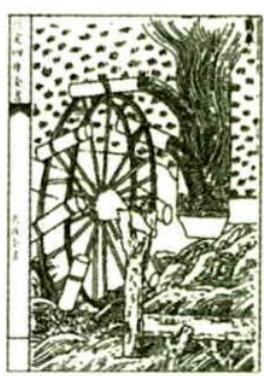

图1

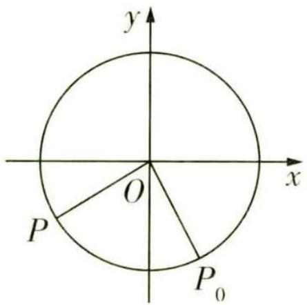

图 2

$\quad$A. 筒车转动的角速度 $\omega = \frac{\pi}{50}$   
$\quad$B. 当 t = 75 秒时, 点 P 的纵坐标为 -2  
$\quad$C. 当 t = 75 秒时, 点 P 和初始点 $P_{0}$ 的距离为 4  
$\quad$D. 当 $0 < t \leqslant 30$ 时, 点 P 与 x 轴的最大距离为 4

# 天星老师有妙招

D 选项可以不必严格计算,由 R=4 得当点 P 位于最高点或最低点时,与 x 轴的距离为 4 , 按逆时针方向每旋转一周用时 100 秒, 当 $0 < t \leqslant 30$ 时, 点 P 不能到达最高点或最低点.

# 活学巧用

角平分线长公式 已知 $\triangle ABC$ 的三个内角 $A, B, C$ 的对边分别为 $a, b, c$ , 点 $D$ 在 $BC$ 上, $AD$ 平分 $\angle BAC$ , 则有 $AD = 2bc\cos \angle BAD / (b + c)$ .

关注微信公众号“初高教辅站”获取更多初高中教辅资料

解析 解决摩天轮模型 $y = A \sin (\omega x + \varphi) (A > 0, \omega > 0)$ 有关问题的两步解题法：

第一步:审读题意提取关键信息,求出 $\omega, R$ 和 $\varphi$ 的值,得到函数解析式.

因为筒车按逆时针方向每旋转一周用时100秒,所以 $\omega=\frac{2\pi}{100}=\frac{\pi}{50}$ .

当 t=0 时, 盛水筒 P 位于点 $P_{0}(2,-2\sqrt{3})$ 处, 所以 $R=\sqrt{2^{2}+(-2\sqrt{3})^{2}}=4$ , 所以 $f(0)=4\sin\varphi=-2\sqrt{3}$ , 所以 $\sin\varphi=-\frac{\sqrt{3}}{2}$ .

因为 $|\varphi| < \frac{\pi}{2}$ , 所以 $\varphi = -\frac{\pi}{3}$ , 所以 $f(t) = 4\sin\left(\frac{\pi}{50}t - \frac{\pi}{3}\right)$ .

第二步:根据函数解析式依次判断选项,关键之处在于理解参数在圆周运动中的实际意义和它们对函数图象的影响,最终回归实际问题.

对于 A 项, $\omega=\frac{\pi}{50}$ ,故 A 正确;

对于 B 项, $f(75)=4\sin(\frac{\pi}{50}\times75-\frac{\pi}{3})=4\sin(\frac{3\pi}{2}-\frac{\pi}{3})=-2$ ,故 B 正确;

对于 C 项,由 B 可知盛水筒 P 的纵坐标为 -2 ,设它的横坐标为 x ,则有 $\sqrt{x^{2}+(-2)^{2}}=4$ ,易知筒车旋转 75 秒时,盛水筒 P 在第三象限,故 $x=-2\sqrt{3}$ ,盛水筒 P 和初始点 $P_{0}$ 的距离为 $\sqrt{(2+2\sqrt{3})^{2}+(-2\sqrt{3}+2)^{2}}=4\sqrt{2}$ ,故 C 错误;

【扫清障碍】当 $t = 75$ 秒时, 初始点 ${P}_{0}$ 逆时针旋转了 $\frac{3}{4}T$ ,则 $\angle {P}_{0}{OP} = \frac{\pi }{2}$ ,故此时 $P$ 在第三象限. 另外,结合直角三角形还可以这样求解：在 $\operatorname{Rt}\bigtriangleup {P}_{0}\mathrm{{OP}}$ 中, ${P}_{0}O = {PO} = 4$ ,所以盛水筒 $P$ 和初始点 ${P}_{0}$ 的距离为 $4\sqrt{2}$

对于 D 项, 因为 $0 < t \leqslant 30$ , 所以 $-\frac{\pi}{3} < \frac{\pi}{50}t - \frac{\pi}{3} \leqslant \frac{4\pi}{15}$ , 所以此时点 P 与 x 轴的最大距离不是 4, 故 D 错误. 故选 AB.

# 新题演练

(2023 浙江嘉兴考前冲刺)摩天轮是一种大型转轮状的机械建筑设施,游客坐在摩天轮的座舱里慢慢地往上转,可以从高处俯瞰四周景色. 已知某摩天轮的转盘直径为 110 米,摩天轮的中心 O 点距离地面的高度为 80 米,摩天轮逆时针匀速旋转,每 30 分钟转一圈. 若摩天轮上点 P 的起始位置在最低点处,下列说法中错误的是 ( ) A. 经过 10 分钟,点 P 上升了 82.5 米

# 活学巧用

面积射影定理 平面图形射影面积等于被射影图形的面积乘以该图形所在平面与射影面所成锐二面角的余弦值.

关注微信公众号“初高教辅站”获取更多初高中教辅资料

$\quad$B. 在第 10 分钟和第 40 分钟时点 $P$ 距离地面的高度相同  
$\quad$C. 摩天轮旋转一周的过程中, 点 P 距离地面的高度不低于 55 米的时间大于 20 分钟  
$\quad$D. 点 $P$ 从第 5 分钟至第 10 分钟上升的高度是其从第 10 分钟到第 15 分钟上升的高度的 2 倍

# 天星老师抓题眼

摩天轮上点 P 的位置与时间 t 有关, 具有周期性, 可以利用三角函数模型 $f(t) = A \sin(\omega t + \varphi) + b (A, \omega > 0)$ 来模拟这种运动状态, 将实际问题数学化. 根据 “每 30 分钟转一圈” 可得最小正周期 $T = \frac{2\pi}{\omega} = 30$ , 进而可以得到 $\omega = \frac{\pi}{15}$ .

# 参考答案与解析

C 由已知得 P 点从最低处开始, 转动时间与其距地面高度的关系可以用正弦型函数 $f(t) = A \sin(\omega t + \varphi) + b (A, \omega > 0)$ 表示.

第一步:审读题意提取关键信息,求出 $\omega, A, b$ 和 $\varphi$ 的值,得到函数解析式.

∵ 每 30 分钟转一圈, ∴ 最小正周期 $T=\frac{2\pi}{\omega}=30$ , ∴ $\omega=\frac{\pi}{15}$ .

∵ 摩天轮直径为 110 米, ∴ 振幅 $A = 110 \div 2 = 55$ .

∵ 摩天轮中心距地面 80 米, ∴ b = 80.

将 $P(0,25)$ 代入可得 $55\sin\varphi+80=25,\therefore\varphi=-\frac{\pi}{2}+2k\pi,k\in\mathbf{Z}$ ，取 $\varphi=-\frac{\pi}{2}$ .

故 $f(t)=55\sin\left(\frac{\pi}{15}t-\frac{\pi}{2}\right)+80(t\geqslant0)$ .

【会检验】实际问题中求出函数解析式后一定不要忘记检验, 要根据数学模型的解检验是否符合实际问题的意义, 如此处可以简单代值检验: $f ( 5 ) = 52 . 5$ , 若出现负值, 说明不符合实际,肯定出错了

第二步: 回归实际问题, 根据函数解析式依次判断选项.

对于 A 项, 经过 10 分钟, 则 $f(10) = 107.5 = 82.5 + 25$ , 故点 P 上升了 82.5 米, 故 A 正确;

对于 B 项, 周期为 30 分钟, 40 分钟比 10 分钟正好多一个周期, 故距离地面高度相同, 故 B 正确;

对于 C 项, 当旋转 5 分钟时, $f(5) = 55 \sin \left( \frac{\pi}{3} - \frac{\pi}{2} \right) + 80 = 52.5 < 55$ , 此时 P 距离地面 52.5 米, 从而高度低于 55 米的时间大于 10 分钟, 即不低于 55 米的时间小于 20 分钟, 故 C 错误;

对于 D 项, $f(10)-f(5)=107.5-52.5=55$ , $f(15)-f(10)=80+55-107.5=27.5$ ,故 D 正确.

# 活学巧用

三角形面积公式的坐标表示 $\overrightarrow{AB}=(x_{1},y_{1}),\overrightarrow{AC}=(x_{2},y_{2})$ ，则 $S_{\triangle ABC}=\frac{1}{2}|x_{1}y_{2}-x_{2}y_{1}|$ .

关注微信公众号“初高教辅站”获取更多初高中教辅资料

# 超重点 2 轻松撕掉平面向量的新定义“外衣”

调研 1 (定义向量新运算 |2023 长沙雅礼中学第四次月考 | 多选) 现给出一个向量的新运算 $a \times b$ (叫作向量 $a$ 与 $b$ 的外积), 它是一个满足如下两个条件的向量: ① $a \cdot (a \times b) = 0, b \cdot (a \times b) = 0$ , 且 $a, b$ 和 $a \times b$ 构成右手系 (即三个向量的方向依次与右手的拇指、食指、中指的指向一致, 如图 1 所示); ② 向量 $a \times b$ 的模 $|a \times b| = |a||b|\sin \langle a, b \rangle$ . 如图 2, 在棱长为 2 的正四面体 ABCD 中, 下列说法正确的是 ( )

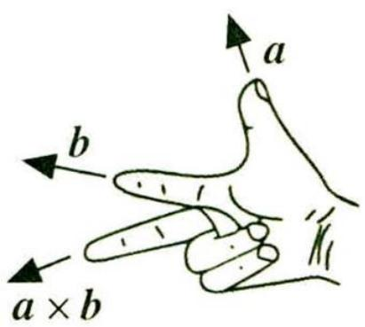

图1

$\quad$A. $\overrightarrow{AB} \times \overrightarrow{AC} = \overrightarrow{AC} \times \overrightarrow{AB}$

$\quad$C. $(\overrightarrow{AC} \times \overrightarrow{AB}) \cdot \overrightarrow{AD} = 4\sqrt{2}$

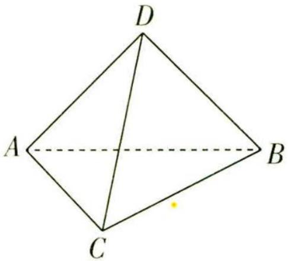

图 2

$\quad$B. $4 \mid \overrightarrow{BC} \times \overrightarrow{AC}$ 与正四面体的表面积相等

$\quad$D. $|\overrightarrow{AC} \times \overrightarrow{AB}) \times \overrightarrow{AD}| = |\overrightarrow{AC} \times (\overrightarrow{AB} \times \overrightarrow{AD})|$

# 天星老师传技巧

新定义问题并不可怕, 只需要根据题目条件进行分析, 明白新定义的本质, 根据新定义“照章办事”即可. 本题定义了向量 a 与 b 的外积 $a \times b$ , 外积是一个向量, 既有大小又有方向, 根据其模的计算公式和方向的判断规则进行解答即可.

解析 对于 A 项,根据外积的定义可得 $|\overrightarrow{AB} \times \overrightarrow{AC}| = |\overrightarrow{AC} \times \overrightarrow{AB}|, \overrightarrow{AB} \times \overrightarrow{AC}$ 垂直平面 $ABC$ ,方向向下, $\overrightarrow{AC} \times \overrightarrow{AB}$ 垂直平面 $ABC$ ,方向向上,所以 $\overrightarrow{AB} \times \overrightarrow{AC}$ 与 $\overrightarrow{AC} \times \overrightarrow{AB}$ 两向量模相同,方向相反,故 A 错误.

【会辨析】向量的外积是向量,既有大小又有方向,要满足向量的外积相等,需要大小和方向都相同. 注意和已学过的向量的内积(数量积)进行区分,内积是一个数量,只有大小

对于 B 项, $4|\overrightarrow{BC} \times \overrightarrow{AC}| = 4|\overrightarrow{BC}| |\overrightarrow{AC}|\sin \frac{\pi}{3} = 4 \times 2 \times 2 \times \frac{\sqrt{3}}{2} = 8\sqrt{3}, S_{\triangle ABC} = \frac{1}{2} \times BC \times AC \times$ $\sin \frac{\pi}{3} = \sqrt{3}$ , 正四面体的表面积为 $4S_{\triangle ABC} = 4\sqrt{3}$ , 故 B 错误.

对于 C 项, 设 $\overrightarrow{AC} \times \overrightarrow{AB} = \overrightarrow{AM}$ , 则 $|\overrightarrow{AM}| = |\overrightarrow{AC}| |\overrightarrow{AB}| \sin \frac{\pi}{3} = 2\sqrt{3}$ , 又 $\overrightarrow{AM}$ 垂直于平面 $ABC$ , 且方向向上, 所以 $(\overrightarrow{AC} \times \overrightarrow{AB}) \cdot \overrightarrow{AD} = \overrightarrow{AM} \cdot \overrightarrow{AD} = |\overrightarrow{AM}| |\overrightarrow{AD}| \cos \langle \overrightarrow{AM}, \overrightarrow{AD} \rangle = 4\sqrt{3} \cos \langle \overrightarrow{AM}, \overrightarrow{AD} \rangle$ .

【等价转化】把 $\overrightarrow{AC}$ 与 $\overrightarrow{AB}$ 的外积视为一个新的向量，则问题等价转化为两个向量的数量和运算，进而求解

# 活学巧用

和差化积公式 $\sin \alpha +\sin \beta = 2\sin \frac{\alpha + \beta}{2}\cos \frac{\alpha - \beta}{2},\cos \alpha +\cos \beta = 2\cos \frac{\alpha + \beta}{2}\cos \frac{\alpha - \beta}{2}.$

关注微信公众号“初高教辅站”获取更多初高中教辅资料

如图 3 所示, 过点 A 作 $AE \perp BC$ 于点 E, 过点 D 作 $DF \perp AE$ 于点 F,

则 FD 是正四面体 ABCD 的高, $\overrightarrow{AM}$ 与 $\overrightarrow{FD}$ 共线, $\langle\overrightarrow{AM},\overrightarrow{AD}\rangle=\angle ADF.$

由 $\frac{1}{3} \times FD \times S_{\triangle ABC} = \frac{\sqrt{2}}{12} \times 2^3$ ，得 $FD = \frac{2\sqrt{6}}{3}$ ，

所以 $\cos\langle\overrightarrow{AM},\overrightarrow{AD}\rangle=\frac{FD}{AD}=\frac{\sqrt{6}}{3}.$

所以 $(\overrightarrow{AC}\times\overrightarrow{AB})\cdot\overrightarrow{AD}=4\sqrt{3}\times\frac{\sqrt{6}}{3}=4\sqrt{2}$ ，故C正确.

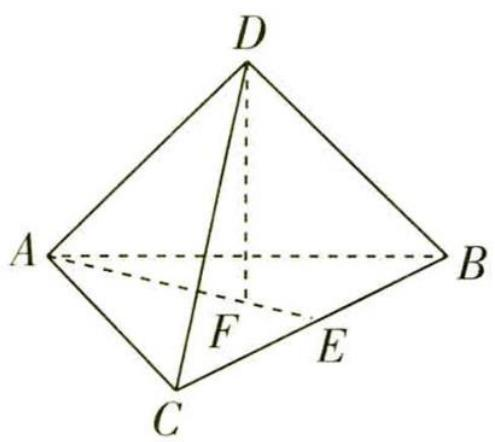

图3

对于 D 项, 设 $\overrightarrow{AC} \times \overrightarrow{AB} = \overrightarrow{AP}, \overrightarrow{AB} \times \overrightarrow{AD} = \overrightarrow{AQ}$ , 则 $|\overrightarrow{AP}| = |\overrightarrow{AC} \times \overrightarrow{AB}| = |\overrightarrow{AC}| \times |\overrightarrow{AB}| \times \sin \frac{\pi}{3}$ , $|\overrightarrow{AQ}| = |\overrightarrow{AB} \times \overrightarrow{AD}| = |\overrightarrow{AB}| \times |\overrightarrow{AD}| \times \sin \frac{\pi}{3}$ , 所以 $|\overrightarrow{AP}| = |\overrightarrow{AQ}|$ , 又 $|\overrightarrow{AD}| = |\overrightarrow{AC}|$ , $\sin \langle \overrightarrow{AP}, \overrightarrow{AD} \rangle = \sin \langle \overrightarrow{AC}, \overrightarrow{AQ} \rangle$ , 所以 $|(\overrightarrow{AC} \times \overrightarrow{AB}) \times \overrightarrow{AD}| = |\overrightarrow{AC} \times (\overrightarrow{AB} \times \overrightarrow{AD})|$ , 故 D 正确. 故选 CD.

调研 2 (定义新坐标系|2023 华中师大一附中 5 月模拟|多选) 假设 $\alpha \in (0, \pi)$ 且 $\alpha \neq \frac{\pi}{2}$ . 当 $\angle xOy = \alpha$ 时, 定义平面坐标系 $xOy$ 为 $\alpha$ -仿射坐标系, 在 $\alpha$ -仿射坐标系中, $e_1, e_2$ 分别为 $x$ 轴, $y$ 轴正方向上的单位向量, 若 $\overrightarrow{OP} = xe_1 + ye_2$ , 则记 $\overrightarrow{OP} = (x, y)$ . 那么下列说法中正确的是 ( )

$\quad$A. 设 $\boldsymbol{a} = (m, n)$ ，则 $\left|\boldsymbol{a}\right| = \sqrt{m^{2} + n^{2} + 2mn\cos\alpha}$   
$\quad$B. 设 $\boldsymbol{a} = (m, n)$ , $\boldsymbol{b} = (s, t)$ , 若 $a \parallel b$ , 则 mt - ns = 0   
$\quad$C. 设 $\boldsymbol{a}=(m,n)$ , $\boldsymbol{b}=(s,t)$ , 若 $a\perp b$ , 则 $ms+nt+(mt+ns)\sin\alpha=0$   
$\quad$D. 设 $a = (-1, 2)$ , $b = (-2, 1)$ , 若 a 与 b 的夹角为 $\frac{\pi}{3}$ , 则 $\alpha = \frac{\pi}{3}$

# 天星老师引思路

α - 仿射坐标系乍一听似乎很“高级”, 其实与同学们熟悉的平面直角坐标系是类似的, 在平面直角坐标系中, $\angle xOy = \frac{\pi}{2}$ , 可以类比平面直角坐标系中的运算方法进行求解.

解析 由题意可得 $|\pmb{e}_1| = |\pmb{e}_2| = 1, \pmb{e}_1 \cdot \pmb{e}_2 = 1 \times 1 \times \cos \alpha = \cos \alpha$ .

【扫清障碍】根据 “ $e_{1}, e_{2}$ 分别为 x 轴，y 轴正方向上的单位向量” 和平面向量的数量和转化可得

对于 A 项, 若 $\boldsymbol{a} = (m, n)$ , 则 $a = m e_{1} + n e_{2}$ , 可得 $\boldsymbol{a}^{2} = (m e_{1} + n e_{2})^{2} = m^{2} e_{1}^{2} + 2 m n e_{1} \cdot e_{2} + n^{2} e_{2}^{2} =$

# 活学巧用

$\begin{array}{r l} & {\text {积化和差公式} \quad \sin \alpha \cos \beta = [ \sin (\alpha + \beta) + \sin (\alpha - \beta) ] / 2, \cos \alpha \sin \beta = [ \sin (\alpha + \beta) - \sin (\alpha - \beta) ] / 2,} \\ & {\cos \alpha \cos \beta = [ \cos (\alpha + \beta) + \cos (\alpha - \beta) ] / 2, \sin \alpha \sin \beta = - [ \cos (\alpha + \beta) - \cos (\alpha - \beta) ] / 2.} \end{array}$

关注微信公众号“初高教辅站”获取更多初高中教辅资料

$m^{2}+n^{2}+2mn\cos\alpha$ , 所以 $|a|=\sqrt{m^{2}+n^{2}+2mn\cos\alpha}$ , 故 A 正确.

对于 B 项, $a=(m,n)$ , $b=(s,t)$ , 则 $a=me_{1}+ne_{2}$ , $b=se_{1}+te_{2}$ , 若 $a//b$ , 则有:

当 b=0 时, s=t=0, 可得 mt-ns=0 成立;

当 $b \neq 0$ 时, 存在唯一实数 $\lambda$ , 使得 $a = \lambda b$ ,

【易错提醒】利用向量共线定理时一定要注意条件，若写成 $a = \lambda b$ 的形式，要求 $b \neq 0$ ，所以要进行分类讨论

则 $m\pmb{e}_1 + n\pmb{e}_2 = \lambda (s\pmb{e}_1 + t\pmb{e}_2) = \lambda s\pmb{e}_1 + \lambda t\pmb{e}_2$ ，可得 $\left\{ \begin{array}{l} m = \lambda s, \\ n = \lambda t, \end{array} \right.$ 所以 $mt - ns = 0.$

综上所述, 若 $a \parallel b$ , 则 mt - ns = 0, 故 B 正确.

对于 C 项, $\boldsymbol{a}=(m,n)$ , $\boldsymbol{b}=(s,t)$ , 则 $\boldsymbol{a}=me_{1}+ne_{2}$ , $\boldsymbol{b}=se_{1}+te_{2}$ , 若 $\boldsymbol{a}\perp\boldsymbol{b}$ , 则 $\boldsymbol{a}\cdot\boldsymbol{b}=(me_{1}+ne_{2})\cdot(s\boldsymbol{e}_{1}+te_{2})=ms\boldsymbol{e}_{1}^{2}+(mt+ns)\boldsymbol{e}_{1}\cdot\boldsymbol{e}_{2}+nte_{2}^{2}=ms+nt+(mt+ns)\cos\alpha=0$ , 故 C 错误.

对于 D 项, 由 $\boldsymbol{a}=(-1,2)$ , $\boldsymbol{b}=(-2,1)$ 得 $\left|\boldsymbol{a}\right|=\sqrt{(-1)^{2}+2^{2}+2\times(-1)\times2\cos\alpha}=\sqrt{5-4\cos\alpha}$ ,

$| \boldsymbol {b} | = \sqrt {(- 2) ^ {2} + 1 ^ {2} + 2 \times (- 2) \times 1 \times \cos \alpha} = \sqrt {5 - 4 \cos \alpha},$

$\boldsymbol {a} \cdot \boldsymbol {b} = (- 1) \times (- 2) + 2 \times 1 + [ (- 1) \times 1 + 2 \times (- 2) ] \cos \alpha = 4 - 5 \cos \alpha ,$

若 a 与 b 的夹角为 $\frac{\pi}{3}$ ，则 $\cos \frac{\pi}{3} = \frac{a \cdot b}{|a| \cdot |b|}$ ，即 $\frac{1}{2} = \frac{4 - 5\cos \alpha}{\sqrt{5 - 4\cos \alpha} \cdot \sqrt{5 - 4\cos \alpha}} = \frac{4 - 5\cos \alpha}{5 - 4\cos \alpha}$ ，得 $\cos \alpha = \frac{1}{2}$ ，又 $\alpha \in (0, \pi)$ ，则 $\alpha = \frac{\pi}{3}$ ，故 D 正确。故选 ABD.

# 新题演练

(2023 上海同济大学第一附属中学三模)对任意两个非零的平面向量 $\alpha$ 和 $\beta$ ，定义 $\alpha\otimes\beta=\frac{\alpha\cdot\beta}{\beta\cdot\beta}$ 。若平面向量 a, b 满足 $|a|\geqslant|b|>0$ ，a 与 b 的夹角 $\theta\in(0,\frac{\pi}{4})$ ，且 $a\otimes b$ 和 $b\otimes a$ 都在集合 $\left\{\frac{n}{2}|n\in\mathbf{Z}\right\}$ 中，则 $a\otimes b=$ \_\_\_\_.

# 参考答案与解析

$\frac{3}{2}$ 由题意得 $a \otimes b = \frac{a \cdot b}{b \cdot b} = \frac{|a| \cos \theta}{|b|} \in \left\{\frac{n}{2} |n \in Z\right\}, b \otimes a = \frac{|b| \cos \theta}{|a|} \in \left\{\frac{n}{2} |n \in Z\right\}.$

【小技巧】求出 $a \otimes b$ 的表达式后, 用 $b$ 替换 $a$ , 用 $a$ 替换 $b$ , 即可得到 $b \otimes a$ 的表达式设 $m \in \mathbf{Z}, t \in \mathbf{Z}$ , 令 $a \otimes b = \frac{m}{2}, b \otimes a = \frac{t}{2}$ , 由 $|a| \geqslant |b| > 0$ , 得 $\frac{|a|}{|b|} \geqslant 1, 0 < \frac{|b|}{|a|} \leqslant 1$ , 所以 $m \geqslant t > 0$ ,

【易错提醒】根据 $|a|\geqslant|b|>0$ 这个条件得到m，t的大小关系，否则会出现增解

又 $\theta\in(0,\frac{\pi}{4})$ ，所以 $\cos^{2}\theta=\frac{mt}{4}\in(\frac{1}{2},1)$ ，所以 $mt\in(2,4)$ ，又 $m\in Z,t\in Z$ ，所以 $mt\in Z,mt=3$ 。

因为 $m\geqslant t>0$ ，所以 $\left\{\begin{aligned}m&=3,\\ t&=1,\end{aligned}\right.$ 所以 $a\otimes b=\frac{m}{2}=\frac{3}{2}$ 。故答案为 $\frac{3}{2}$ 。

活学巧用

万能公式 $\sin\alpha=2\tan\frac{\alpha}{2}/(1+\tan^{2}\frac{\alpha}{2}),\cos\alpha=(1-\tan^{2}\frac{\alpha}{2})/(1+\tan^{2}\frac{\alpha}{2}),\tan\alpha=2\tan\frac{\alpha}{2}/(1-\tan^{2}\frac{\alpha}{2}).$

关注微信公众号“初高教辅站”获取更多初高中教辅资料

# 超重点 3 向量: 千题万难, 一招制敌

调研 1 (用平面向量解数列问题 |2023 北京昌平区考前模拟) 已知 A, B, C 是同一条直线上三个不同的点, O 为直线外一点. 在正项等比数列 $\{a_{n}\}$ 中, 已知 $a_{4} > 2$ , $\overrightarrow{OA} = a_{2} \overrightarrow{OB} + a_{3} \overrightarrow{OC}$ , 则 $\{a_{n}\}$ 的公比 q 的取值范围是 ( )

$\quad$A. $(0,1+\sqrt{3})$

$\quad$B. $(1+\sqrt{3},+\infty)$

$\quad$C. $(0,1+\sqrt{2})$

$\quad$D. $(1+\sqrt{2},+\infty)$

# 天星老师传技巧

利用向量共线定理的推论可得 $a_2 + a_3 = 1$ ，利用 $a_4$ 分别表示出 $a_2, a_3$ ，结合 $a_4 > 2$ 求解即可.

解析 因为 A, B, C 三点共线，且 $\overrightarrow{OA} = a_{2} \overrightarrow{OB} + a_{3} \overrightarrow{OC}$ ，所以 $a_{2} + a_{3} = 1$ .

因为 $\{a_{n}\}$ 为正项等比数列，所以数列 $\{a_{n}\}$ 的公比 $q > 0$

又 $\frac{a_{4}}{q^{2}}+\frac{a_{4}}{q}=1$ ，所以 $a_{4}=\frac{q^{2}}{1+q}>2$ ，又q>0，所以 $q>1+\sqrt{3}$ .

故选 B.

调研 2 (用平面向量解解三角形问题 | 2023 广东汕头二模 | 多选) 在 $\triangle ABC$ 中, 已知 $AB = 2$ , $AC = 5$ , $\angle BAC = 60^{\circ}$ , $BC$ , $AC$ 边上的中线 $AM$ , $BN$ 相交于点 $P$ , 下列结论正确的是 ( )

$\quad$A. $AM = \frac{\sqrt{39}}{2}$

$\quad$B. $BN = \frac{\sqrt{21}}{2}$

$\quad$C. $\angle MPN$ 的余弦值为 $\frac{\sqrt{21}}{21}$

$\quad$D. $\overrightarrow{PA} + \overrightarrow{PB} + \overrightarrow{PC} = 0$

# 天星老师教方法

遇到中线问题,可考虑利用中线定理,这也是向量的工具作用的体现.

# 思维导引

以 $\overrightarrow{AB},\overrightarrow{AC}$ 为基底
表示 $\overrightarrow{AM},\overrightarrow{BN}$

平方后求得 $\overrightarrow{AM},\overrightarrow{BN}$ 的模,判断AB的对错

$\angle MPN$ 为 $\overrightarrow{AM}, \overrightarrow{BN}$ 的夹角, 利用数量积求解余弦值, 判断 C 的对错

# 活学巧用

中线 AM, BN 相交于点 P $\rightarrow$ P 为 $\triangle ABC$ 的重心 $\rightarrow$ $\overrightarrow{PA} + \overrightarrow{PB} + \overrightarrow{PC} = 0$ 判断 D 的对错

解析 因为 M 是 BC 中点, 所以 $\overrightarrow{AM} = \frac{1}{2} (\overrightarrow{AB} + \overrightarrow{AC})$ .

对于 A 项, $AM = |\overrightarrow{AM}| = \frac{1}{2}\sqrt{(\overrightarrow{AB} + \overrightarrow{AC})^2} = \frac{1}{2}\sqrt{\overrightarrow{AB}^2 + \overrightarrow{AC}^2 + 2\overrightarrow{AB} \cdot \overrightarrow{AC}} = \frac{\sqrt{39}}{2}$ , 故 A 正确.

对于 B 项, $BN = |\overrightarrow{BN}| = \sqrt{\left(\frac{1}{2}\overrightarrow{AC} - \overrightarrow{AB}\right)^2} = \sqrt{\overrightarrow{AB^2} + \frac{1}{4}\overrightarrow{AC^2} - \overrightarrow{AB} \cdot \overrightarrow{AC}} = \frac{\sqrt{21}}{2}$ , 故 B 正确.

【解题妙拓】熟悉教材中的结论，做小题时可直接应用，对于选项B，还可以这样解：在 $\triangle ABC$ 中， $AB=2$ ， $AC=5$ ， $\angle BAC=60^{\circ}$ ，易得 $BC=\sqrt{19}$ ，以 $BC, BA$ 为邻边构造平行四边形ABCD，连接 $ND$ ，则 $AB^{2}+BC^{2}=\frac{AC^{2}+BD^{2}}{2}=2(AN^{2}+BN^{2})$ ，所以 $BN=\frac{\sqrt{21}}{2}$

对于 C 项, $\overrightarrow{AM}\cdot\overrightarrow{BN}=\frac{1}{2}(\overrightarrow{AB}+\overrightarrow{AC})\cdot(\frac{1}{2}\overrightarrow{AC}-\overrightarrow{AB})=\frac{1}{4}|\overrightarrow{AC}|^{2}-\frac{1}{4}\overrightarrow{AB}\cdot\overrightarrow{AC}-\frac{1}{2}|\overrightarrow{AB}|^{2}=3$ $\cos\angle MPN=\cos\langle\overrightarrow{AM},\overrightarrow{BN}\rangle=\frac{\overrightarrow{AM}\cdot\overrightarrow{BN}}{|\overrightarrow{AM}||\overrightarrow{BN}|}=\frac{4\sqrt{91}}{91}$ ，故 C 错误.

对于 D 项,由题意知,P 为 $\triangle ABC$ 的重心,则 $\overrightarrow{PA} + \overrightarrow{PB} + \overrightarrow{PC} = -\frac{1}{3} (\overrightarrow{AB} + \overrightarrow{AC}) - \frac{1}{3} \overrightarrow{AC} + \frac{2}{3} \overrightarrow{AB} + \frac{2}{3} \overrightarrow{AC} - \frac{1}{3} \overrightarrow{AB} = 0$ , 故 D 正确.

故选 ABD.

调研 3 (用平面向量解解析几何问题|名师原创)已知 O 为坐标原点,过抛物线 $C: y^{2} = 2px (p > 0)$ 焦点 F 的直线与 C 交于 A, B 两点,其中 A 在第一象限,点 $M(p, 0)$ ,则 $\angle OAM$ 是 ()

$\quad$A. 钝角

$\quad$B. 直角

$\quad$C. 锐角

$\quad$D. 不确定

# 天星老师讲备考

涉及角的大小的判断,要么用余弦定理解决(需要建立三角形模型,并且知道三边的长度),要么利用向量的数量积来解决(需要建系,且点的坐标易求).很多学生在做题时往往无法一上去就找到解题策略,需要尝试调整,提高数学成绩没有捷径可走,需要多练习、多思考,形成“题感”.

# 活学巧用

解析 设 $A(x_0, y_0)(x_0 > 0, y_0 > 0)$ , 则 $\overrightarrow{AO} = (-x_0, -y_0), \overrightarrow{AM} = (p - x_0, -y_0)$ ,

【解题有法】利用已知条件设出坐标, 只需判断 $\overrightarrow{AO} \cdot \overrightarrow{AM}$ 的正负, 即可判断 $\angle OAM$ 的范围所以 $\overrightarrow{AO} \cdot \overrightarrow{AM} = -px_{0} + x_{0}^{2} + y_{0}^{2}$ .

又 $y_0^2 = 2px_0$ ，所以 $\overrightarrow{AO}\cdot \overrightarrow{AM} = -px_0 + x_0^2 +2px_0 = x_0^2 +px_0 > 0,$

【点明思路】利用点 A 在抛物线上，将数量积表示为关于 $x_{0}$ 的二次函数，再判断正负，则 $\angle OAM$ 为锐角，故选 C.

【秒杀解】焦点 F 为 OM 的中点, 如图 1 所示, 以 F 为圆心, $|OF|$ 为半径作圆, 设线段 FA 与圆 F 交于点 Q, 连接 OQ, MQ, 则 $\angle OQM = 90^{\circ}$ .

易知点 A 在圆 F 外, 所以 $\angle OAM < \angle OQM = 90^{\circ}$ , 故选 C.

【释疑解惑】根据抛物线的定义知 $|FA|$ 等于点 $A$ 到抛物线准线的距离，其必大于 $|OF|$ ，所以 $|FA| > |FQ|$

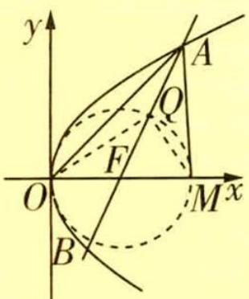

图1

# 新题演练

(2023 黑龙江哈六中 5 月三模) 已知 M, N 是椭圆 $C: \frac{x^{2}}{a^{2}} + \frac{y^{2}}{b^{2}} = 1 (a > b > 0)$ 上关于原点 O 对称的两点, P 是椭圆 C 上异于 M, N 的点, 且 $\overrightarrow{PM} \cdot \overrightarrow{PN}$ 的最大值是 $\frac{1}{2} a^{2}$ , 则椭圆 C 的离心率是 ( )

$\quad$A. $\frac{1}{3}$

$\quad$B. $\frac{1}{2}$

$\quad$C. $\frac{\sqrt{2}}{2}$

$\quad$D. $\frac{\sqrt{3}}{3}$

# 参考答案与解析

C 由题意知 M, N 是椭圆 $\frac{x^{2}}{a^{2}} + \frac{y^{2}}{b^{2}} = 1 (a > b > 0)$ 上关于原点 O 对称的两点，连接 OP, OM, ON，
故 $\overrightarrow{PM}\cdot\overrightarrow{PN}=(\overrightarrow{PO}+\overrightarrow{OM})\cdot(\overrightarrow{PO}+\overrightarrow{ON})=(\overrightarrow{PO}+\overrightarrow{OM})\cdot(\overrightarrow{PO}-\overrightarrow{OM})=\overrightarrow{PO}^{2}-\overrightarrow{OM}^{2}$

【会转化】根据向量的线性运算及数量积运算等价转化 $\overrightarrow{PM} \cdot \overrightarrow{PN}$

由椭圆上点的横、纵坐标的取值范围可知 $|\overrightarrow{PO}|\in[b,a]$ ， $|\overrightarrow{OM}|\in[b,a]$ ，

【扫清障碍】当点 P 在椭圆的左、右顶点时， $|\overrightarrow{PO}|$ 取得最大值，为 a；当点 P 在椭圆的上、下顶点时， $|\overrightarrow{PO}|$ 取得最小值，为 b

故 $\overrightarrow{PM}\cdot\overrightarrow{PN}$ 的最大值为 $a^{2}-b^{2}$ ，又 $a^{2}-b^{2}=c^{2}=\frac{1}{2}a^{2}$ ，所以 $\frac{c}{a}=\frac{\sqrt{2}}{2}$

即椭圆 C 的离心率是 $\frac{\sqrt{2}}{2}$ ，故选 C.

# 活学巧用

# 超重点 4 解锁三角函数实际应用问题的建模思维

调研 1 (测量高度|2023 河北衡水 6 月考前模拟)释迦塔(如图 1 所示)建于公元 1056 年,与意大利比萨斜塔、巴黎埃菲尔铁塔并称“世界三大奇塔”.2016 年,释迦塔被吉尼斯世界纪录认定为世界最高的木塔.小张为测量释迦塔 AB 的高度,设计了如下方案:在木塔所在地面上取一点 M,并垂直竖起一根高度为 1 m 的标杆 MN,从点 N 处测得木塔顶端 A 的仰角为 $60^{\circ}$ ,再沿 BM 方向前进 92 m 到达 C 点,并垂直竖立一高度为 2.5 m 的标杆 CD,再沿 BC 方向前进 2 m 到达点 E 处,若小张的眼睛 F 到地面的距离 EF = 1.5 m,则此时点 A, D, F 在一条直线上,示意图如图 2 所示.则小张用此法测得的释迦塔的高度 AB 约为(参考数据: $\sqrt{3} \approx 1.732$ )()

图1

$\quad$A. $64.5 \mathrm{~m}$

$\quad$B. $67.8 \mathrm{~m}$

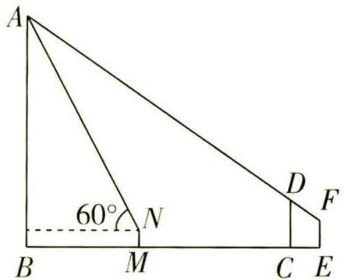

图2

$\quad$C. $70.2 \mathrm{~m}$

$\quad$D. $72.4 \mathrm{~m}$

# 天星老师破障碍

对于无法直接测量物体高度的问题,可以在与地面垂直的竖直平面内构造三角形或者在空间中构造三棱锥,利用正、余弦定理解其中的一个或者几个三角形,从而得到所测量物体的高度.

解析 第一步:审题,根据问题背景提炼数学信息,画出示意图.

如图3, 过点 N 作 $NQ \perp AB$ 于点 Q, 过点 F 作 $FP \perp AB$ 于点 P, 交 CD 于点 G,

则四边形 BMNQ, BCGP, BEFP 都是矩形.

第二步:建模,将实际问题转化为数学问题,把已知和所求的边、角尽量集中在有关三角形中.

所以 $BQ = MN = 1 \, m, BM = QN, BP = CG = EF = 1.5 \, m, FG = CE = 2 \, m,$

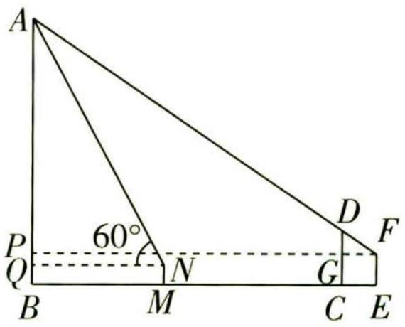

图3

# 活学巧用

斐波那契数列常用结论 斐波那契数列 $\{F_{n}\}$ 的前 n 项和 $F_{1} + F_{2} + \cdots + F_{n} = F_{n+2} - 1$ ，且奇数项和 $F_{1} + F_{3} + \cdots + F_{2n-1} = F_{2n}$ ，偶数项和 $F_{2} + F_{4} + \cdots + F_{2n} = F_{2n+1} - 1$ .

关注微信公众号“初高教辅站”获取更多初高中教辅资料

所以 DG = CD - EF = 2.5 - 1.5 = 1 (m).

第三步: 解模, 根据题意求解.

在 Rt△AQN 中，QN = $\frac{AQ}{\tan\angle ANQ} = \frac{AB - 1}{\tan60^{\circ}} = \frac{AB - 1}{\sqrt{3}}$ ,

所以 $FP = BM + MC + CE = \frac{AB - 1}{\sqrt{3}} + 94$ ,

由已知得 $\triangle DFG \sim \triangle AFP$ ，所以 $\frac{FG}{DG} = \frac{FP}{AP}$ ，

第四步: 将三角形问题还原为实际问题, 并根据实际意义给出答案.

即 $\frac{2}{1} = \frac{\frac{AB - 1}{\sqrt{3}} + 94}{AB - 1.5}$ , 解得 $AB = \frac{581 + 95\sqrt{3}}{11} \approx \frac{581 + 95 \times 1.732}{11} \approx 67.8(\mathrm{~m})$ .

故选 B.

调研 2 (测量角度 | 2023 长沙雅礼中学考前预测) 如图4, 某人在垂直于水平地面 $ABC$ 的墙面前的点 $A$ 处进行射击训练. 已知点 $A$ 到墙面的距离为 $AB$ , 某目标点 $P$ 沿墙面上的射线 $CM$ 移动, 此人为了准确瞄准目标点 $P$ , 需计算由点 $A$ 观察点 $P$ 的仰角 $\theta$ 的大小, 若 $AB = 15 \mathrm{~m}, AC = 25 \mathrm{~m}, \angle B C M = 30^{\circ}$ , 则 $\tan \theta$ 的最大值是 (仰角 $\theta$ 为直线 $AP$ 与平面 $ABC$ 所成的角) ()

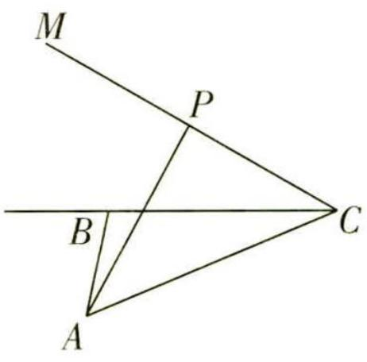

图 4

$\quad$A. $\frac{\sqrt{30}}{5}$

$\quad$B. $\frac{\sqrt{30}}{10}$

$\quad$C. $\frac{4\sqrt{3}}{9}$

$\quad$D. $\frac{5\sqrt{3}}{9}$

解析 由题可得, $AB = 15 \mathrm{~m}, AC = 25 \mathrm{~m}, AB \perp BC$ , 由勾股定理得, $BC = 20 \mathrm{~m}$ ,

过点 P 作 $PH \perp BC$ ，垂足为 H，连接 AH，则 $\tan \theta = \frac{PH}{AH}$ .

设 BH = x m (x ≥ 0),

若 H 在线段 BC 上, 即 $0 \leqslant x \leqslant 20$ , 则 $CH = (20 - x) \, \text{m}$ ,

【易错提醒】过 $P$ 作 $PH \perp BC$ , 要对垂足 $H$ 的位置按 $H$ 在线段 $BC$ 上, $H$ 在 $CB$ 的延长线上这两种情况进行分类讨论

由 $\angle BCM = 30^{\circ}$ ，得 $PH = CH\tan 30^{\circ} = \frac{\sqrt{3}}{3} (20 - x)(\mathrm{m})$

在 Rt△ABH 中, $AH = \sqrt{225 + x^{2}}$ m, 所以 $\tan \theta = \frac{\sqrt{3}}{3} \cdot \frac{20 - x}{\sqrt{225 + x^{2}}}$ ,

令 $y = \frac{20 - x}{\sqrt{225 + x^2}}$ ，易知该函数在 $x\in [0,20]$ 上单调递减，

所以当 x=0 时, $\tan\theta$ 取得最大值, 为 $\frac{20\sqrt{3}}{45}=\frac{4\sqrt{3}}{9}$ .

若 H 在 CB 的延长线上, 则 $CH = (20 + x) \, \text{m}, PH = CH \tan 30^{\circ} = \frac{\sqrt{3}}{3} (20 + x) (\text{m})$ ,

在 Rt△ABH 中, $AH = \sqrt{225 + x^{2}}$ m, 所以 $\tan \theta = \frac{\sqrt{3}}{3} \cdot \frac{20 + x}{\sqrt{225 + x^{2}}}$ ,

令 $y=\frac{(20+x)^{2}}{225+x^{2}}$ ，则 $y'=\frac{2(20+x)(225+x^{2})-(20+x)^{2}\cdot2x}{(225+x^{2})^{2}}=\frac{9000-40x^{2}-350x}{(225+x^{2})^{2}}$ ，令 $y'=0$ ，
【扫清障碍】目标函数式结构较复杂时，可以利用导数研究函数的单调性，求最大值可得 $x=\frac{45}{4}$ ，则 $y=\frac{(20+x)^{2}}{225+x^{2}}$ 在 $x\in(0,\frac{45}{4})$ 上单调递增，在 $x\in(\frac{45}{4},+\infty)$ 上单调递减，故当 $x=\frac{45}{4}$ 时, $\tan\theta$ 取得最大值 $\frac{5\sqrt{3}}{9}$ . 故选D.

# 新题演练

(2023 河北衡水中学 6 月月考)如图 5, 某城市有一条公路从正西方向的 AO 通过市中心 O 后转向东偏北 $\alpha$ 角方向的 OB, 位于该市的某大学 M 到市中心 O 的距离 OM = 3 $\sqrt{13}$ km, 且 $\angle AOM = \beta$ . 现要修筑一条铁路 L, L 在 OA 上设一车站 A, 在 OB 上设一车站 B, 铁路在 AB 部分为直线段, 且经过大学 M, 其中 $\tan \alpha = 2$ , $\cos \beta = \frac{3\sqrt{13}}{13}$ , OA = 15 km.

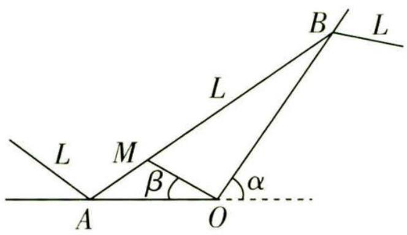

图 5

（1） 求大学 M 到车站 A 的距离 AM;  
（2） 求铁路 AB 段的长.

# 天星老师引思路

在 $\triangle AOM$ 中, 利用正弦定理求得 $\angle MAO = \frac{\pi}{4}$ , 根据同角三角函数的基本关系求得 $\sin \alpha$ 和 $\cos \alpha$ 的值, 再在 $\triangle AOB$ 中, 由正弦定理求 $AB$ 的长.

# 参考答案与解析

（1） 在 $\triangle AOM$ 中, $OA = 15$ , $\angle AOM = \beta$ , 且 $\cos \beta = \frac{3\sqrt{13}}{13}$ , $OM = 3\sqrt{13}$ ,

# 活学巧用

数列的周期 若数列 $\{a_{n}\}$ 的任意连续 $m$ 项之和（积）为常数，则 $m$ 是数列 $\{a_{n}\}$ 的周期；若 $a_{n + 2} = a_{n + 1} - a_n$ ，则6是数列 $\{a_{n}\}$ 的周期.

关注微信公众号“初高教辅站”获取更多初高中教辅资料由余弦定理得 $AM^2 = OA^2 + OM^2 - 2OA \cdot OM\cos \beta = 15^2 + (3\sqrt{13})^2 - 2 \times 15 \times 3\sqrt{13} \times \frac{3\sqrt{13}}{13} = 72$

【关键提醒】在 $\triangle AOM$ 中, 已知两边及其夹角求第三边, 运用余弦定理即可

所以 $AM = 6\sqrt{2}$ ，即大学 M 到车站 A 的距离 AM 为 $6\sqrt{2}$ km.

（2） 方法一 因为 $\cos \beta = \frac{3\sqrt{13}}{13}$ , 且 $\beta$ 为锐角, 所以 $\sin \beta = \frac{2}{\sqrt{13}}$ ,

在 $\triangle AOM$ 中，由正弦定理得 $\frac{AM}{\sin\beta} = \frac{OM}{\sin\angle MAO}$ 即 $\frac{6\sqrt{2}}{\frac{2}{\sqrt{13}}} = \frac{3\sqrt{13}}{\sin\angle MAO},$

解得 $\sin \angle MAO = \frac{\sqrt{2}}{2}$ .

由题意知 $\angle MAO$ 为锐角, 所以 $\angle MAO = \frac{\pi}{4}$ , 所以 $\angle ABO = \alpha - \frac{\pi}{4}$ ,

因为 $\tan \alpha = 2 = \frac{\sin \alpha}{\cos \alpha}, \sin^2\alpha + \cos^2\alpha = 1$ ，且 $\alpha$ 为锐角，

所以 $\sin \alpha = \frac{2}{\sqrt{5}}, \cos \alpha = \frac{1}{\sqrt{5}}$

所以 $\sin \angle ABO = \sin (\alpha -\frac{\pi}{4}) = \frac{1}{\sqrt{10}},$

又 $\angle AOB = \pi -\alpha$ ，所以 $\sin \angle AOB = \sin (\pi -\alpha) = \sin \alpha = \frac{2}{\sqrt{5}}$

在 $\triangle AOB$ 中,由正弦定理,得 $\frac{AB}{\sin \angle AOB}=\frac{OA}{\sin \angle ABO}$ ,即 $\frac{AB}{\frac{2}{\sqrt{5}}}=\frac{15}{\frac{1}{\sqrt{10}}}$ ,解得 $AB=30\sqrt{2}$ ,

所以铁路 AB 段的长为 $30\sqrt{2}$ km.

方法二 由方法一知 $\angle MAO = \frac{\pi}{4}$ .

过点 B 向 AO 的延长线作垂线, 垂足为 H, 在 Rt△OBH 中, 不妨令 BH = 2m,

因为 $\tan \alpha = 2$ ，则 OH = m。

在 Rt△ABH 中，∠BAH = $\frac{\pi}{4}$ ，所以 AH = BH，即 $15 + m = 2m$ ，得 m = 15，

所以 $AB = \sqrt{2} BH = 30\sqrt{2}$

所以铁路 AB 段的长为 $30\sqrt{2}$ km.

# 活学巧用

等差数列的性质 公差为 $d$ 的等差数列 $\{a_{n}\}$ 的前 $n$ 项和为 $S_{n}, p, q \in \mathbf{N}^{*}$ . ①若 $a_{p} = q, a_{q} = p (p \neq q)$ , 则 $d = -1, a_{p + q} = 0$ . ②若 $S_{p} = q, S_{q} = p (p \neq q)$ , 则 $S_{p + q} = -(p + q)$ .

关注微信公众号“初高教辅站”获取更多初高中教辅资料

# 核心主干抓重点

# 超重点5 角度、名称、次数统一在三角函数求值问题中的核心应用

# 核心应用 1 用角度统一思想化简求值

调研 1 (2023 山东威海 5 月二模) 已知 $\sin (\alpha - \frac{\pi}{3}) = \frac{\sqrt{5}}{5}$ , 则 $\cos (\frac{2\pi}{3} - 2\alpha) =$ ()

$\quad$A. $\frac{4}{5}$

$\quad$B. $-\frac{4}{5}$

$\quad$C. $\frac{3}{5}$

$\quad$D. $-\frac{3}{5}$

# 天星老师讲方法

在三角函数的化简求值中,往往会出现已知角与所求角不同的情况,此时要观察两个角度之间的关系,通过二倍角公式、诱导公式等进行转化即可得出结果.

解析 因为 $\sin\left(\alpha-\frac{\pi}{3}\right)=\frac{\sqrt{5}}{5}$ ，所以 $\cos\left(\frac{2\pi}{3}-2\alpha\right)=\cos\left(2\alpha-\frac{2\pi}{3}\right)=\cos\left[2\left(\alpha-\frac{\pi}{3}\right)\right]=1-$ 【点拨】拆角、变角的目的是将题设条件与问题中所涉及的角联系起来 $2\sin^{2}\left(\alpha-\frac{\pi}{3}\right)=1-2\times\left(\frac{\sqrt{5}}{5}\right)^{2}=\frac{3}{5}$ . 故选 C.

调研 2 (2023 山西吕梁三模) 已知 $\sin 37^{\circ} \approx \frac{3}{5}$ , 则 $\frac{\sqrt{2} \sin 8^{\circ} + \cos 53^{\circ}}{\sqrt{2} \cos 8^{\circ} - \sin 53^{\circ}}$ 的近似值为 ( )

$\quad$A. $\frac{3}{4}$

$\quad$B. $\frac{4}{3}$

$\quad$C. $\frac{3\sqrt{2}}{4}$

$\quad$D. $\frac{4\sqrt{2}}{3}$

思维导引

求出 $\cos 37^{\circ}$

$\frac{\sqrt{2}\sin 8^{\circ} + \cos 53^{\circ}}{\sqrt{2}\cos 8^{\circ} - \sin 53^{\circ}} = \frac{\sin(53^{\circ} - 45^{\circ}) + \sin 45^{\circ}\cos 53^{\circ}}{\cos(53^{\circ} - 45^{\circ}) - \sin 45^{\circ}\sin 53^{\circ}}$

利用两角差的正、余弦公式展开——→ 利用诱导公式变形,代入计算即可

解析 因为 $\sin 37^{\circ} \approx \frac{3}{5}$ , 所以 $\cos 37^{\circ} = \sqrt{1 - \sin^{2} 37^{\circ}} \approx \frac{4}{5}$ ,

# 活学巧用

等比数列的性质 公比为 $q$ 的等比数列 $\{a_{n}\}$ 的前 $n$ 项和为 $S_{n}, m \in \mathbf{N}^{*}$ , 则 $S_{n+m} = S_{m} + q^{m} S_{n}$ .

关注微信公众号“初高教辅站”获取更多初高中教辅资料

所以 $\frac{\sqrt{2}\sin 8^{\circ} + \cos 53^{\circ}}{\sqrt{2}\cos 8^{\circ} - \sin 53^{\circ}} = \frac{\sin 8^{\circ} + \frac{\sqrt{2}}{2}\cos 53^{\circ}}{\cos 8^{\circ} - \frac{\sqrt{2}}{2}\sin 53^{\circ}} = \frac{\sin(53^{\circ} - 45^{\circ}) + \sin 45^{\circ}\cos 53^{\circ}}{\cos(53^{\circ} - 45^{\circ}) - \sin 45^{\circ}\sin 53^{\circ}} =$

【关键提醒】将 $8^{\circ}$ 折成 $53^{\circ} - 45^{\circ}$ 是解题的突破口

$\frac {\sin 5 3 ^ {\circ} \cos 4 5 ^ {\circ} - \cos 5 3 ^ {\circ} \sin 4 5 ^ {\circ} + \sin 4 5 ^ {\circ} \cos 5 3 ^ {\circ}}{\cos 5 3 ^ {\circ} \cos 4 5 ^ {\circ} + \sin 5 3 ^ {\circ} \sin 4 5 ^ {\circ} - \sin 4 5 ^ {\circ} \sin 5 3 ^ {\circ}} = \frac {\sin 5 3 ^ {\circ} \cos 4 5 ^ {\circ}}{\cos 5 3 ^ {\circ} \cos 4 5 ^ {\circ}} = \frac {\sin (9 0 ^ {\circ} - 3 7 ^ {\circ})}{\cos (9 0 ^ {\circ} - 3 7 ^ {\circ})} = \frac {\cos 3 7 ^ {\circ}}{\sin 3 7 ^ {\circ}} \approx \frac {\frac {4}{5}}{\frac {3}{5}} =$

$\frac{4}{3}$ . 故选 B.

【解后反思】根据式子的结构特征进行变形，使其更贴近某个公式或某个期待的目标，常用的方法有“常值代换”“逆用、变用公式”“通分约分”“分解与组合”“配方与平方”等

# 核心应用 2 用名称统一思想化简求值

调研 3 (2023 重庆市万州区 5 月模拟) 若 $\frac{1}{\sin 2\beta} = \frac{1}{\tan \beta} - \frac{1}{\tan \alpha}$ , 则 $\sin (\alpha - 2\beta) =$

$\quad$A. $-\frac{1}{2}$

$\quad$B. 0

$\quad$C. $\frac{1}{2}$

$\quad$D. 1

# 天星老师点思路

首先利用同角三角函数的基本关系 $\tan\theta=\frac{\sin\theta}{\cos\theta}$ ，将题设中的已知等式切化弦，然后结合二倍角公式及两角差的正弦公式将已知等式化简变形，最后结合 $\alpha=(\alpha-\beta)+\beta$ 及两角和的正弦公式即可得解.

解析 因为 $\frac{1}{\sin 2\beta} = \frac{1}{\tan \beta} - \frac{1}{\tan \alpha}$ , 所以 $\frac{1}{\sin 2\beta} = \frac{\cos \beta}{\sin \beta} - \frac{\cos \alpha}{\sin \alpha} = \frac{\cos \beta \sin \alpha - \cos \alpha \sin \beta}{\sin \beta \sin \alpha}$ ,

【扫清障碍】通过变换函数名称达到便于化简的目的，常用的技巧与方法有“切化弦”“升幂与降幂”“诱导公式”等

即 $\frac{1}{2\sin\beta\cos\beta} = \frac{\sin(\alpha - \beta)}{\sin\beta\sin\alpha}$ , 则 $\frac{1}{2\cos\beta} = \frac{\sin(\alpha - \beta)}{\sin\alpha}$ , 故 $2\sin (\alpha - \beta)\cos \beta = \sin \alpha.$

所以 $2\sin (\alpha -\beta)\cos \beta = \sin [(\alpha -\beta) + \beta ] = \sin (\alpha -\beta)\cos \beta +\cos (\alpha -\beta)\sin \beta ,$

则 $\sin (\alpha -\beta)\cos \beta -\cos (\alpha -\beta)\sin \beta = 0$ ，即 $\sin [(\alpha -\beta) - \beta ] = \sin (\alpha -2\beta) = 0.$

故选 B.

# 趣味数学

# 核心应用 3 用次数统一思想化简求值

调研 4 (2023 西安交通大学附属中学 5 月检测) 已知 $\tan \theta = 2$ , 则 $\frac{1}{\sin 2 \theta + \cos 2 \theta}$ 的值是 \_\_\_\_.

$\begin{array}{r l} & {\text {因为} \tan \theta = 2, \text {所以} \frac {1}{\sin 2 \theta + \cos 2 \theta} = \frac {1}{2 \sin \theta \cos \theta + \cos^ {2} \theta - \sin^ {2} \theta}} \\ & {\frac {\cos^ {2} \theta + \sin^ {2} \theta}{2 \sin \theta \cos \theta + \cos^ {2} \theta - \sin^ {2} \theta} = \frac {1 + \tan^ {2} \theta}{2 \tan \theta + 1 - \tan^ {2} \theta} = \frac {1 + 2 ^ {2}}{2 \times 2 + 1 - 2 ^ {2}} = 5,} \end{array}$

【关键提醒】由于分母是关于 $\sin \theta, \cos \theta$ 的二次形式，利用同角三角函数的基本关系 $\sin^2\theta + \cos^2\theta = 1$ 将分子也化为二次形式，构成齐次形式求解

故答案为5.

【一题多解】因为 $\tan\theta=2$ ，所以 $\frac{\sin\theta}{\cos\theta}=2$ ，即 $\sin\theta=2\cos\theta$ ，又 $\sin^{2}\theta+\cos^{2}\theta=1$ ，所以 $\sin^{2}\theta=\frac{4}{5}$ ， $\cos^{2}\theta=\frac{1}{5}$ ，所以 $\frac{1}{\sin2\theta+\cos2\theta}=\frac{1}{2\sin\theta\cos\theta+\cos^{2}\theta-\sin^{2}\theta}=\frac{1}{4\cos^{2}\theta+\cos^{2}\theta-\sin^{2}\theta}=5$

# 核心应用 4 三大统一思想的综合应用

调研 5 (2023 山东烟台 5 月模拟) 已知 $\alpha, \beta$ 满足 $\sin(2\alpha + \beta) = \cos \beta, \tan \alpha = 2$ , 则 $\tan \beta$ 的值为 ( )

$\quad$A. $-\frac{1}{3}$

$\quad$B. $-\frac{2}{3}$

$\quad$C. $\frac{1}{3}$

$\quad$D. $\frac{2}{3}$

# 天星老师传技巧

化简诸如此类的式子,要注意灵活拆角,如本题中 $2\alpha + \beta = \alpha + (\alpha + \beta)$ , $\beta = (\alpha + \beta) - \alpha$ , 此外还有 $2\alpha = (\alpha + \beta) + (\alpha - \beta) = (\frac{\pi}{4} + \alpha) - (\frac{\pi}{4} - \alpha)$ , $\alpha = (2\alpha + \beta) - (\alpha + \beta) = (\frac{\alpha}{2} + \beta) + (\frac{\alpha}{2} - \beta)$ , $2\alpha - \beta = \alpha + (\alpha - \beta)$ 等.

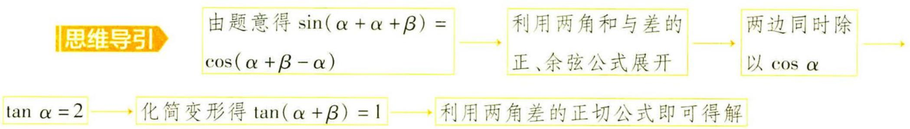

# 趣味数学

你身上的计算器 我们的手也能成为一个可以进行简单计算的计算器. 比如计算 9 的 10 以内的倍数时, 从左到右给你的手指编号 1,2,3,…, 然后选择你想计算的 9 的倍数.

关注微信公众号“初高教辅站”获取更多初高中教辅资料

解析 因为 $\sin(2\alpha+\beta)=\cos\beta$ ，所以 $\sin(\alpha+\alpha+\beta)=\cos(\alpha+\beta-\alpha)$ ，

【会思考】由于对 $\sin(2\alpha+\beta)=\cos\beta$ 直接展开不能得出 $\alpha$ 与 $\beta$ 的关系，因此需要进行合理的拆角

即 $\sin \alpha \cos (\alpha +\beta) + \cos \alpha \sin (\alpha +\beta) = \cos (\alpha +\beta)\cos \alpha +\sin \alpha \sin (\alpha +\beta),$

显然 $\cos\alpha\neq0$ ，两边同时除以 $\cos\alpha$ 得 $\tan\alpha\cos(\alpha+\beta)+\sin(\alpha+\beta)=\cos(\alpha+\beta)+\tan\alpha\sin(\alpha+\beta)$

【关键提醒】题设已知 $\tan \alpha = 2$ ，故在等式中化简出 $\tan \alpha$

即 $2\cos (\alpha +\beta) + \sin (\alpha +\beta) = \cos (\alpha +\beta) + 2\sin (\alpha +\beta),$

即 $\cos(\alpha+\beta)=\sin(\alpha+\beta)$ ，则 $\tan(\alpha+\beta)=1$ ，

$\tan \beta = \tan (\alpha +\beta -\alpha) = \frac{\tan(\alpha + \beta) - \tan\alpha}{1 + \tan(\alpha + \beta)\tan\alpha} = \frac{1 - 2}{1 + 1\times 2} = -\frac{1}{3}$ 故选A.

# 新题演练

##### 1. (2023 四川成都 5 月检测) 若 $\alpha$ 为锐角, 且 $\cos\left(\alpha+\frac{\pi}{12}\right)=\frac{3}{5}$ , 则 $\cos\left(\alpha+\frac{\pi}{3}\right)=$ ()

$\quad$A. $\frac{\sqrt{2}}{10}$

$\quad$B. $\frac{7\sqrt{2}}{10}$

$\quad$C. $-\frac{7\sqrt{2}}{10}$

$\quad$D. $-\frac{\sqrt{2}}{10}$

# 天星老师明关键

找到待求角与已知角的内在关系是解题的关键, $\alpha+\frac{\pi}{3}=(\alpha+\frac{\pi}{12})+\frac{\pi}{4}$ ,据此借助两角和的余弦公式求解即可.

##### 2. (2023 广东广州三模) 若 $\tan \beta = \frac{\sin \alpha - \cos \alpha}{\sin \alpha + \cos \alpha}$ ，则 ( )

$\quad$A. $\tan (\alpha -\beta) = 1$

$\quad$B. $\tan(\alpha-\beta)=-1$

$\quad$C. $\tan (\alpha +\beta) = 1$

$\quad$D. $\tan (\alpha +\beta) = -1$

##### 3. (2023 石家庄二中 5 月月考) 已知 $\cos\left(\frac{\pi}{3}-\alpha\right)=2\cos\left(\alpha+\frac{\pi}{6}\right)$ , 则 $\sin\left(2\alpha+\frac{\pi}{3}\right)=$

$\quad$A. $-\frac{4}{5}$

$\quad$B. $-\frac{3}{5}$

$\quad$C. $\frac{3}{5}$

$\quad$D. $\frac{4}{5}$

##### 4. (2023 江苏无锡三模)已知 $\tan\beta=\frac{\cos\alpha}{1-\sin\alpha},\tan(\alpha+\beta)=\frac{1+\sin\alpha}{\cos\alpha}$ ，若 $\beta\in(0,\frac{\pi}{2})$ ，则 $\beta=$ ()

$\quad$A. $\frac{\pi}{12}$

$\quad$B. $\frac{\pi}{6}$

$\quad$C. $\frac{\pi}{4}$

$\quad$D. $\frac{\pi}{3}$

# 趣味数学

假设这个乘式是 $9 \times 7$ , 弯曲编号为 7 的手指, 然后数得弯曲的那根手指左边剩下的手指数是 6 , 它右边剩下的手指数是 3 , 于是便得出 $9 \times 7$ 的答案是 63 .

关注微信公众号“初高教辅站”获取更多初高中教辅资料

# 参考答案与解析

##### 1. D 因为 $\alpha$ 为锐角, 所以 $\alpha \in (0, \frac{\pi}{2})$ , 所以 $\alpha + \frac{\pi}{12} \in (\frac{\pi}{12}, \frac{7\pi}{12})$ .

【易遗漏】切勿遗漏角的范围，以此确定其正余弦值的符号又 $\cos\left(\alpha+\frac{\pi}{12}\right)=\frac{3}{5}$ ，所以 $\sin\left(\alpha+\frac{\pi}{12}\right)=\frac{4}{5}$ ，

所以 $\cos\left(\alpha+\frac{\pi}{3}\right)=\cos\left[\left(\alpha+\frac{\pi}{12}\right)+\frac{\pi}{4}\right]=\cos\left(\alpha+\frac{\pi}{12}\right)\cos\frac{\pi}{4}-\sin\left(\alpha+\frac{\pi}{12}\right)\sin\frac{\pi}{4}=\frac{3}{5}\times\frac{\sqrt{2}}{2}-\frac{4}{5}\times\frac{\sqrt{2}}{2}=-\frac{\sqrt{2}}{10}.$ 故选 D.

##### 2. A 因为 $\tan\beta=\frac{\sin\alpha-\cos\alpha}{\sin\alpha+\cos\alpha}$ ，所以 $\tan\beta=\frac{\tan\alpha-1}{\tan\alpha+1}$ ，所以 $\tan\alpha\tan\beta+\tan\beta=\tan\alpha-1$ ，

【敲黑板】涉及切与弦的关系式，常用的解题方法与技巧是“切化弦”“弦化切”

所以 $1 + \tan \alpha \tan \beta = \tan \alpha - \tan \beta$ ，所以 $\tan (\alpha - \beta) = \frac{\tan \alpha - \tan \beta}{1 + \tan \alpha \tan \beta} = 1$ ，故选 A.

##### 3. D $\because \cos\left(\frac{\pi}{3}-\alpha\right)=\cos\left[\frac{\pi}{2}-\left(\alpha+\frac{\pi}{6}\right)\right]=\sin\left(\alpha+\frac{\pi}{6}\right)=2\cos\left(\alpha+\frac{\pi}{6}\right),\therefore\tan\left(\alpha+\frac{\pi}{6}\right)=2,$

【小技巧】根据角的变换及诱导公式、同角三角函数的基本关系求解

$\sin (2 \alpha + \frac {\pi}{3}) = 2 \sin (\alpha + \frac {\pi}{6}) \cos (\alpha + \frac {\pi}{6}) = \frac {2 \sin (\alpha + \frac {\pi}{6}) \cos (\alpha + \frac {\pi}{6})}{\sin^ {2} (\alpha + \frac {\pi}{6}) + \cos^ {2} (\alpha + \frac {\pi}{6})} = \frac {2 \tan (\alpha + \frac {\pi}{6})}{\tan^ {2} (\alpha + \frac {\pi}{6}) + 1} = \frac {4}{5}.$

故选 D.

##### 4. C 第一步: 用 $\tan \beta, \tan (\alpha + \beta)$ 表示出 $\tan \alpha$ .

因为 $\tan \alpha = \tan (\alpha +\beta -\beta) = \frac{\tan(\alpha + \beta) - \tan\beta}{1 + \tan(\alpha + \beta)\cdot\tan\beta},\tan \beta = \frac{\cos\alpha}{1 - \sin\alpha},\tan (\alpha +\beta) = \frac{1 + \sin\alpha}{\cos\alpha},$

【解题秘籍】利用已知条件和两角和的正切公式，先求出角 $\alpha$ ，再利用已知条件即可求解

所以 $\tan\alpha=\frac{\frac{1+\sin\alpha}{\cos\alpha}-\frac{\cos\alpha}{1-\sin\alpha}}{1+\frac{1+\sin\alpha}{\cos\alpha}\cdot\frac{\cos\alpha}{1-\sin\alpha}}=\frac{\frac{(1+\sin\alpha)\cdot(1-\sin\alpha)-\cos\alpha\cdot\cos\alpha}{\cos\alpha(1-\sin\alpha)}}{\frac{\cos\alpha\cdot(1-\sin\alpha)+\cos\alpha\cdot(1+\sin\alpha)}{\cos\alpha(1-\sin\alpha)}}$

第二步:化简 $\tan \alpha$ 并求出 $\alpha$ .

所以 $\tan \alpha = \frac{(1 + \sin \alpha) \cdot (1 - \sin \alpha) - \cos \alpha \cdot \cos \alpha}{\cos \alpha \cdot (1 - \sin \alpha) + \cos \alpha \cdot (1 + \sin \alpha)} = \frac{1 - \sin^2 \alpha - \cos^2 \alpha}{2 \cos \alpha},$

因为 $\sin^{2}\alpha+\cos^{2}\alpha=1$ ，所以 $\tan\alpha=0$ ，所以 $\alpha=k\pi,k\in Z$ .

第三步:代值求出 $\beta$ .

当 k 为奇数时, $\cos \alpha = -1$ , $\sin \alpha = 0$ ; 当 k 为偶数时, $\cos \alpha = 1$ , $\sin \alpha = 0$ .

因为 $\tan \beta = \frac{\cos \alpha}{1 - \sin \alpha}$ , 所以 $\tan \beta = \pm 1$ , 因为 $\beta \in (0, \frac{\pi}{2})$ , 所以 $\beta = \frac{\pi}{4}$ . 故选 C.

趣味数学

燃绳计时 一根绳子,从一端开始燃烧,烧完需要1小时.现在你需要在不看表的情况下,仅借助这根绳子和一盒火柴测量出半小时的时间.

关注微信公众号“初高教辅站”获取更多初高中教辅资料

# 超重点 6 揭秘求 $f(x) = A \sin (\omega x + \varphi) + B$ 的两类关键题型

# 题型 1 “拆” “降” “合” 化简函数解析式

调研 1 (2023 上海进才中学 5 月月考) 已知函数 $f(x) = \sin \left(4x + \frac{\pi}{3}\right) + \cos \left(4x - \frac{\pi}{6}\right)$ , 则下列结论不正确的是 ( )

$\quad$A. $f(x)$ 的最大值为2  
$\quad$B. $f(x)$ 在 $\left[-\frac{\pi}{8},\frac{\pi}{12}\right]$ 上单调递增  
$\quad$C. $f(x)$ 在 $[0, \pi]$ 上有 4 个零点  
$\quad$D. 把 $f(x)$ 的图象向右平移 $\frac{\pi}{12}$ 个单位长度, 得到的图象关于直线 $x = -\frac{\pi}{8}$ 对称

# 天星老师传技巧

解析式中遇到类似“ $\sin\left(4x+\frac{\pi}{3}\right)$ , $\cos\left(4x-\frac{\pi}{6}\right)$ ”的结构,通常先利用两角和与差的正、余弦公式拆开,然后利用辅助角公式将其转化为 $y=A\sin(\omega x+\varphi)+B$ 的形式.有时也可根据两角之间的关系,利用诱导公式化简.

# 解析

<table><tr><td>选项</td><td>分析过程</td><td>正误</td></tr><tr><td>A</td><td> $f(x) = \frac{1}{2}\sin 4x + \frac{\sqrt{3}}{2}\cos 4x + \frac{\sqrt{3}}{2}\cos 4x + \frac{1}{2}\sin 4x = \sin 4x + \sqrt{3}\cos 4x =$   $2\sin(4x + \frac{\pi}{3}) \rightarrow$  函数  $f(x)$  的最大值为 2【另辟蹊径】 $f(x) = \sin(4x + \frac{\pi}{3}) + \cos(4x + \frac{\pi}{3} - \frac{\pi}{2}) = 2\sin(4x + \frac{\pi}{3})$ </td><td>√</td></tr><tr><td>B</td><td> $x \in [-\frac{\pi}{8}, \frac{\pi}{12}] \rightarrow \theta = 4x + \frac{\pi}{3} \in [-\frac{\pi}{6}, \frac{2\pi}{3}] \rightarrow$  函数  $y = \sin \theta$  在  $[-\frac{\pi}{6}, \frac{2\pi}{3}]$  上不单调  $\rightarrow f(x)$  在  $[-\frac{\pi}{8}, \frac{\pi}{12}]$  上不单调【小技巧】利用整体代换法判断函数  $f(x)$  的单调性,也可通过令  $-\frac{\pi}{2} + 2k\pi \leqslant 4x + \frac{\pi}{3} \leqslant \frac{\pi}{2} + 2k\pi, \frac{\pi}{2} + 2k\pi \leqslant 4x + \frac{\pi}{3} \leqslant \frac{3\pi}{2} + 2k\pi, k \in \mathbb{Z}$ ,解不等式分别求出函数的单调递增与单调递减区间,进而判断函数的单调性</td><td>×</td></tr></table>

# 趣味数学

你可能认为这很容易,只要在绳子中间做个标记,然后测量出这根绳子燃烧完一半所用的时间不就行了?

关注微信公众号“初高教辅站”获取更多初高中教辅资料

续表

<table><tr><td>选项</td><td>分析过程</td><td>正误</td></tr><tr><td>C</td><td> $x \in [0, \pi] \rightarrow 4x + \frac{\pi}{3} \in [\frac{\pi}{3}, \frac{13\pi}{3}] \rightarrow$ 令 $f(x) = 0$ ,得 $4x + \frac{\pi}{3} \in \{ \pi, 2\pi, 3\pi, 4\pi \} \rightarrow x \in \{ \frac{\pi}{6}, \frac{5\pi}{12}, \frac{2\pi}{3}, \frac{11\pi}{12} \} \rightarrow f(x)$ 在 $[0, \pi]$ 上有4个零点</td><td>√</td></tr><tr><td>D</td><td> $f(x)$ 的图象向右平移 $\frac{\pi}{12}$ 个单位长度 $\rightarrow y = f(x - \frac{\pi}{12}) = 2\sin[4(x - \frac{\pi}{12}) + \frac{\pi}{3}] = 2\sin 4x$ 的图象→当 $x = -\frac{\pi}{8}$ 时, $2\sin 4x = 2\sin(-\frac{\pi}{2}) = -2 \rightarrow$ 函数【警示】利用“左加右减”时,注意“提出x的系数” $y = 2\sin 4x$ 的图象关于直线 $x = -\frac{\pi}{8}$ 对称</td><td>√</td></tr></table>

调研 2 (2023 广东广州三模 | 多选) 已知函数 $f(x) = \sqrt{3} \sin x \cos x - \cos^{2} x + \frac{1}{2}$ , 则下列说法正确的是 ( )

$\quad$A. $f(x) = \sin(2x - \frac{\pi}{6})$   
$\quad$B. 函数 $f(x)$ 的最小正周期为 $\pi$   
$\quad$C. 函数 $f(x)$ 的图象的对称轴为直线 $x = k\pi + \frac{\pi}{12} (k \in \mathbf{Z})$   
$\quad$D. 函数 $f(x)$ 的图象可由 $y = \cos 2x$ 的图象向左平移 $\frac{\pi}{12}$ 个单位长度得到

# 天星老师传技巧

解析式中遇到类似“ $\sin^{2}x,\cos^{2}x,\sin x\cos x$ ”的结构,可采用降次处理,然后利用辅助角公式将其转化为 $y=A\sin(\omega x+\varphi)+B$ 的形式.

解析 $f(x)=\sqrt{3}\sin x\cos x-\cos^{2}x+\frac{1}{2}=\frac{\sqrt{3}}{2}\sin 2x-\frac{1+\cos 2x}{2}+\frac{1}{2}=\frac{\sqrt{3}}{2}\sin 2x-\frac{1}{2}\cos 2x=$ $\sin(2x-\frac{\pi}{6})$ ，故 A 正确；

函数 $f(x)$ 的最小正周期为 $T=\frac{2\pi}{2}=\pi$ ，故B正确；

由 $2x - \frac{\pi}{6} = \frac{\pi}{2} + k\pi (k \in \mathbf{Z})$ ，得 $x = \frac{\pi}{3} + \frac{k\pi}{2} (k \in \mathbf{Z})$ ，故 C 错误；

# 趣味数学

然而,这根绳子粗细并不均匀,因此燃烧速率不同,也许其中一半绳子燃烧完仅需5分钟,而另一半燃烧完却需要55分钟.

关注微信公众号“初高教辅站”获取更多初高中教辅资料

由 $y = \cos 2x$ 的图象向左平移 $\frac{\pi}{12}$ 个单位长度, 得 $y = \cos 2(x + \frac{\pi}{12}) = \cos(2x + \frac{\pi}{6}) = \cos\left[\frac{\pi}{2} - (\frac{\pi}{3} - 2x)\right] = \sin\left(\frac{\pi}{3} - 2x\right) = \sin\left[\pi - (\frac{2\pi}{3} + 2x)\right] = \sin(2x + \frac{2\pi}{3})$ 的图象, 故 D 错误. 故选 AB.

【技巧点拨】灵活使用诱导公式转换函数名称

# 题型 2 根据部分图象求函数解析式

调研 3 (2023 江苏扬州中学考前保温练 | 多选) 已知函数 $f(x) = A \sin (\omega x + \varphi)(A > 0, \omega > 0, |\varphi| < \pi)$ 的部分图象如图 1 所示, 则下列结论中正确的是 ( )

$\quad$A. $f(x) = \sqrt{3} \sin\left(\frac{\pi}{4}x - \frac{3\pi}{4}\right)$

$\quad$B. $f(x) = \sqrt{3}\sin \left(\frac{\pi}{4} x + \frac{\pi}{4}\right)$

$\quad$C. 点(2023,0)是 $f(x)$ 图象的一个对称中心

$\quad$D. 函数 $f(x)$ 的图象向左平移 $\frac{\pi}{4}$ 个单位长度得到的图象关

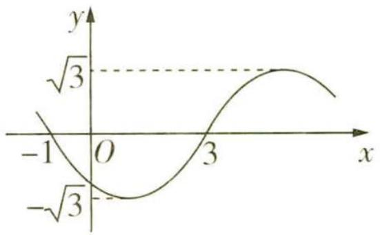

图1

于 $y$ 轴对称

# 天星老师讲方法

已知 $f(x) = A\sin (\omega x + \varphi)(A > 0, \omega > 0)$ 的部分图象求其解析式，常用如下两种方法：①升降零点法，由 $\omega = \frac{2\pi}{T}$ ，即可求出 $\omega$ ，求 $\varphi$ 时，若能求出离原点最近的右侧图象上升（或下降）的“零点”横坐标 $x_0$ ，一般令 $\omega x_0 + \varphi = 0$ （或 $\omega x_0 + \varphi = \pi$ ），即可求出 $\varphi$ ;②代入最值法,将图象最高点或最低点的坐标代入解析式,再结合图象解出 $\omega$ 和 $\varphi$ .

# 解析

<table><tr><td>选项</td><td>分析过程</td><td>正误</td></tr><tr><td>A</td><td>由图可知函数 $f(x)$ 的周期 $T=2\times[3-(-1)]$ , $A=\sqrt{3}\rightarrow T=\frac{2\pi}{\omega}=8\rightarrow\omega=$  $\frac{\pi}{4}\rightarrow f(x)=\sqrt{3}\sin(\frac{\pi}{4}x+\varphi)\rightarrow f(-1)=\sqrt{3}\sin(-\frac{\pi}{4}+\varphi)=0\rightarrow-\frac{\pi}{4}+\varphi=$ </td><td>√</td></tr><tr><td>B</td><td> $\pi+2k\pi,k\in\mathbf{Z}\rightarrow\varphi=\frac{5\pi}{4}+2k\pi,k\in\mathbf{Z}\rightarrow|\varphi|<\pi\rightarrow\varphi=-\frac{3\pi}{4}\rightarrow$ 【关键提醒】利用零点求 $\varphi$ 的值时,要注意零点所在的单调区间 $f(x)=\sqrt{3}\sin(\frac{\pi}{4}x-\frac{3\pi}{4})$ </td><td>×</td></tr></table>

面对这种情况,难道就无计可施了吗? 事实并非如此,我们可以同时从绳子两头点火,此时绳子燃烧完所用的时间一定是30分钟.

关注微信公众号“初高教辅站”获取更多初高中教辅资料

续表

<table><tr><td>选项</td><td>分析过程</td><td>正误</td></tr><tr><td>C</td><td> $f(2023)=\sqrt{3}\sin(\frac{2023\pi}{4}-\frac{3\pi}{4})=\sqrt{3}\sin505\pi=0 \rightarrow$ 点(2023,0)是 $f(x)$ 【敲黑板】对于 $f(x)=A\sin(\omega x+\varphi)+B(A>0,\omega>0)$ ,其图象的对称中心为 $(\frac{k\pi-\varphi}{\omega},B)$ 图象的一个对称中心</td><td>√</td></tr><tr><td>D</td><td>将函数 $f(x)$ 的图象向左平移 $\frac{\pi}{4}$ 个单位长度 $\rightarrow y=\sqrt{3}\sin[\frac{\pi}{4}(x+\frac{\pi}{4})-\frac{3\pi}{4}]=\sqrt{3}\sin(\frac{\pi}{4}x+\frac{\pi^{2}}{16}-\frac{3\pi}{4})$ 的图象 $\rightarrow$ 函数 $y=\sqrt{3}\sin(\frac{\pi}{4}x+\frac{\pi^{2}}{16}-\frac{3\pi}{4})$ 不是偶函数,其图象不关于y轴对称</td><td>×</td></tr></table>

调研 4 (2023 沈阳二中 5 月模拟 | 多选) 函数 $f(x) = \sin(\omega x - \frac{\pi}{3})(\omega > 0)$ 的图象关于点 $\left(\frac{4\pi}{9}, 0\right)$ 中心对称, 且在区间 $(0, \pi)$ 内恰有三个极值点, 则 ( )

$\quad$A. $f(x)$ 在区间 $(- \frac{\pi}{9}, \frac{\pi}{9})$ 上单调递增  
$\quad$B. $f(x)$ 在区间 $(-π,0)$ 内有三个零点  
$\quad$C. 直线 $x = \frac{11\pi}{18}$ 是曲线 $y = f(x)$ 的对称轴

$\quad$D. 将 $f(x)$ 的图象向左平移 $\frac{\pi}{3}$ 个单位长度, 所得图象对应的函数为奇函数

解析 因为函数 $f(x) = \sin (\omega x - \frac{\pi}{3})$ 的图象关于点 $(\frac{4\pi}{9}, 0)$ 中心对称, 所以 $\frac{4\pi}{9}\omega - \frac{\pi}{3} = k\pi$ , $k \in \mathbf{Z}$ , 即 $\omega = \frac{9}{4}k + \frac{3}{4}, k \in \mathbf{Z}$ .

当 $0 < x < \pi$ 时， $-\frac{\pi}{3} < \omega x - \frac{\pi}{3} < \omega \pi - \frac{\pi}{3}$ ，则由函数 $f(x)$ 在区间 $(0, \pi)$ 内恰有三个极值点，得 $\frac{5\pi}{2} < \omega \pi - \frac{\pi}{3} \leqslant \frac{7\pi}{2}$ ，解得 $\frac{17}{6} < \omega \leqslant \frac{23}{6}$ . 因此 $\omega = 3, f(x) = \sin (3x - \frac{\pi}{3})$ .

【点透】运用整体代换的思想，根据函数 $y = \sin x$ 在 $\left(-\frac{\pi}{3}, \frac{7\pi}{2}\right)$ 上的图象求出 $\omega$ 的取值范围，注意区间端点值的取舍

趣味数学

对于 A, 当 $-\frac{\pi}{9} < x < \frac{\pi}{9}$ 时, $-\frac{2\pi}{3} < 3x - \frac{\pi}{3} < 0$ , 而正弦函数 $y = \sin x$ 在 $(- \frac{2\pi}{3}, 0)$ 上不单调, 故 $f(x)$ 在区间 $(- \frac{\pi}{9}, \frac{\pi}{9})$ 上不单调, A 不正确;

对于 B, 令 $f(x)=0$ , 可得 $x=\frac{\pi}{9}+\frac{k\pi}{3}(k\in\mathbf{Z})$ , 又 $-\pi<x<0$ , 所以 $x=-\frac{2\pi}{9}, -\frac{5\pi}{9}$ 或 $-\frac{8\pi}{9}$ , 则函数【小妙拓】对于此类函数解析式较为简单的函数零点问题, 可通过解方程直接求出函数的零点数 $f(x)$ 在区间 $(-π,0)$ 内有三个零点, B 正确;

对于 C, 因为 $f(\frac{11\pi}{18}) = \sin(3 \times \frac{11\pi}{18} - \frac{\pi}{3}) = \sin \frac{3\pi}{2} = -1$ , 所以直线 $x = \frac{11\pi}{18}$ 是曲线 $y = f(x)$ 的对称轴, C 正确;

对于 D, $f(x)$ 的图象向左平移 $\frac{\pi}{3}$ 个单位长度, 所得图象对应的函数为 $g(x) = \sin\left[3\left(x + \frac{\pi}{3}\right) - \frac{\pi}{3}\right] = \sin\left(3x + \frac{2\pi}{3}\right)$ , 因为 $g(0) = \sin\frac{2\pi}{3} = \frac{\sqrt{3}}{2} \neq 0$ , 所以函数 $g(x)$ 不是奇函数, D 不正确. 故选 BC.

# 新题演练

##### 1. (2023 吉林通化 6 月考前预测) 已知函数 $f(x) = \sin \left( {4x + \frac{\pi }{3}}\right)  - \sin \left( {{4x} - \frac{\pi }{6}}\right)$ ,把 $f\left( x\right)$ 的图象向右平移 $\frac{\pi }{12}$ 个单位长度,得到函数 $g\left( x\right)$ 的图象,则 $g\left( {-\frac{\pi }{16}}\right)  =$ \_\_\_\_.

##### 2. (2023 河北石家庄二中 5 月月考 | 多选) 函数 $f(x) = A \cos (\omega x + \varphi) (A > 0, \omega > 0, |\varphi| < \frac{\pi}{2})$ 的部分图象如图 2 所示, $f(\frac{7\pi}{12}) = f(\frac{11\pi}{12}) = 0, f(\frac{\pi}{2}) = -\frac{2}{3}$ , 则下列选项中正确的有

$\quad$A. $\varphi = \frac{\pi}{4}$

$\quad$B. $A = \frac{2\sqrt{2}}{3}$

$\quad$C. 将 $f(x)$ 的图象向右平移 $\frac{\pi}{12}$ 个单位长度所得图象对应的函数为奇函数

$\quad$D. $f(x)$ 的单调递增区间为 $\left[-\frac{\pi}{12}+\frac{2k\pi}{3},\frac{\pi}{4}+\frac{2k\pi}{3}\right](k\in\mathbf{Z})$

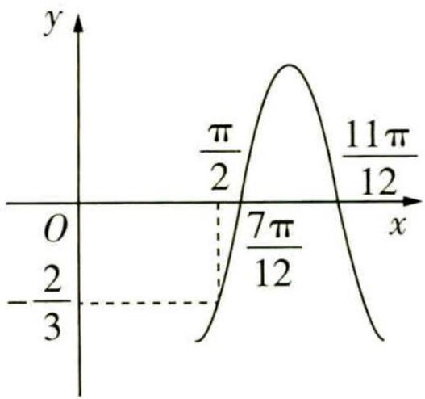

图 2

##### 3. (2023 南京师范大学附属中学 5 月模拟 | 多选) 已知函数 $f(x) = \cos \left( {\omega x + \frac{2\pi }{3}}\right) \left( {\omega  > }\right.$ 0) 在 $[- \pi, \frac{\pi }{2}]$ 上单调, 且 $f\left( x\right)$ 的图象关于点 $\left(-\frac{\pi}{3},0\right)$ 对称, 则 (   )

# 趣味数学

它与火车 B 相遇后,马上掉头向火车 A 方向飞行,如此反复,直到两辆火车相撞在一起.这只苍蝇在“粉身碎骨”之前一共飞行了多远?

关注微信公众号“初高教辅站”获取更多初高中教辅资料

$\quad$A. $f(x)$ 的最小正周期为 $4\pi$   
$\quad$B. $f(\frac{2\pi}{9}) > f(\frac{10\pi}{9})$   
$\quad$C. 将 $f(x)$ 的图象向右平移 $\frac{4\pi}{3}$ 个单位长度后所得图象对应的函数为偶函数  
$\quad$D. 函数 $y = 5f(x) + 4$ 在 $[0, \pi]$ 上有且仅有一个零点

##### 4. (2023 江西师大附中模拟 5 月检测) 已知函数 $f(x) = 4\sin x \cos x - 2\sin^{2}x + 2\cos^{2}x + 1$ , 则下列说法中正确的是 \_\_\_\_.

① $f(x)$ 图象的一条对称轴为直线 $x=\frac{\pi}{8}$ ;  
②将 $f(x)$ 的图象向右平移 $\frac{\pi}{4}$ 个单位长度,再向下平移1个单位长度得到的新图象关于原点对称;  
③若 $f(\frac{x}{2})=\sqrt{5}+1$ ，则 $\tan x=4\pm\sqrt{15}$ ;  
④若函数 $y=f(\frac{\omega x}{2})(\omega>0)$ 在区间 $\left[\frac{\pi}{3},\pi\right]$ 上恰有两个极大值点, 则实数 $\omega$ 的取值范围是 $\left[\frac{17}{4},\frac{25}{4}\right)$ .

# 参考答案与解析

##### 1.0 第一步:化简 $f(x)$ 的解析式.

$f (x) = \sin \left(4 x + \frac {\pi}{3}\right) - \sin \left(4 x - \frac {\pi}{6}\right) = \sin \left(4 x + \frac {\pi}{3}\right) - \sin \left(4 x + \frac {\pi}{3} - \frac {\pi}{2}\right) = \sin \left(4 x + \frac {\pi}{3}\right) + \cos \left(4 x + \frac {\pi}{3}\right) =$

【敲黑板】此处直接利用两角和与差的正弦公式展开化简有一定难度，特别是若未牢记 $\sin\frac{7\pi}{12}=\frac{\sqrt{2}+\sqrt{6}}{4},\cos\frac{7\pi}{12}=\frac{\sqrt{2}-\sqrt{6}}{4}$ ，运用此法很难推进

$\sqrt {2} \sin (4 x + \frac {\pi}{3} + \frac {\pi}{4}) = \sqrt {2} \sin (4 x + \frac {7 \pi}{1 2}).$

第二步: 求出 $g(x)$ 的解析式.

将函数 $f(x)$ 的图象向右平移 $\frac{\pi}{12}$ 个单位长度,得到函数 $g(x)$ 的图象,则 $g(x)=\sqrt{2}\sin\left[4\left(x-\frac{\pi}{12}\right)+\right.$ $\frac{7\pi}{12}=\sqrt{2}\sin\left(4x+\frac{\pi}{4}\right)$ ,

第三步:求出 $g(-\frac{\pi}{16})$ .

# 趣味数学

你不必把问题想得过于复杂,苍蝇怎样飞其实并不重要,无论它是沿直线飞行,还是沿“z”型线路飞行,都正好飞了1小时,因此苍蝇刚好飞行了6千米.

关注微信公众号“初高教辅站”获取更多初高中教辅资料

所以 $g(-\frac{\pi}{16})=\sqrt{2}\sin(-\frac{\pi}{4}+\frac{\pi}{4})=0.$

##### 2. BC 根据图象可得函数 $f(x)$ 的最小正周期 $T = 2 \times (\frac{11\pi}{12} - \frac{7\pi}{12}) = \frac{2\pi}{3}$ , 因为 $\omega > 0$ , 所以 $\frac{2\pi}{\omega} = \frac{2\pi}{3}$ , 解得 $\omega = 3$ , 则 $f(\frac{7\pi}{12}) = A\cos(\frac{7\pi}{4} + \varphi) = A\cos(-\frac{\pi}{4} + \varphi) = 0$ , 因为 $A > 0$ , 所以 $\cos(-\frac{\pi}{4} + \varphi) = 0$ , 因为 $-\frac{\pi}{2} < \varphi < \frac{\pi}{2}$ , 所以 $-\frac{3\pi}{4} < \varphi - \frac{\pi}{4} < \frac{\pi}{4}$ , 故 $\varphi - \frac{\pi}{4} = -\frac{\pi}{2}$ , 解得 $\varphi = -\frac{\pi}{4}$ , 故 $f(x) = A\cos(3x - \frac{\pi}{4})$ , 所以 $f(\frac{\pi}{2}) = A\cos(\frac{3\pi}{2} - \frac{\pi}{4}) = -\frac{\sqrt{2}}{2}A = -\frac{2}{3}$ , 解得 $A = \frac{2\sqrt{2}}{3}$ , A 错误, B 正确.

【提示】求参数 A 通常用最大值或最小值，但本题未给出函数的最值，故直接代点求解 $f(x)=\frac{2\sqrt{2}}{3}\cos(3x-\frac{\pi}{4})$ ，将 $f(x)$ 的图象向右平移 $\frac{\pi}{12}$ 个单位长度得到 $g(x)=\frac{2\sqrt{2}}{3}\cos(3x-\frac{\pi}{4}-\frac{\pi}{4})=\frac{2\sqrt{2}}{3}\cos(3x-\frac{\pi}{2})=\frac{2\sqrt{2}}{3}\sin3x$ 的图象，该函数的定义域为 R, $f(-x)=\frac{2\sqrt{2}}{3}\sin(-3x)=-\frac{2\sqrt{2}}{3}\sin3x=-f(x)$ , C 正确.

由 $3x-\frac{\pi}{4}\in\left[-\pi+2k\pi,2k\pi\right],k\in\mathbf{Z}$ ，得 $x\in\left[-\frac{\pi}{4}+\frac{2k\pi}{3},\frac{\pi}{12}+\frac{2k\pi}{3}\right],k\in\mathbf{Z}$ ，故 $f(x)$ 的单调递增

【易错警示】注意本题为余弦型函数，要代入余弦函数的单调递增区间
区间为 $\left[-\frac{\pi}{4}+\frac{2k\pi}{3},\frac{\pi}{12}+\frac{2k\pi}{3}\right],k\in\mathbf{Z},D$ 错误.故选BC.

##### 3. ACD 因为函数 $f(x) = \cos (\omega x + \frac{2\pi}{3})(\omega > 0)$ 在 $[- \pi, \frac{\pi}{2}]$ 上单调, 所以 $f(x)$ 的最小正周期 $T$ 满足 $\frac{T}{2} \geqslant \frac{\pi}{2} - (-\pi) = \frac{3\pi}{2}$ , 即 $\frac{\pi}{\omega} \geqslant \frac{3\pi}{2}$ , 所以 $0 < \omega \leqslant \frac{2}{3}$ . 因为 $f(x)$ 的图象关于点 $(- \frac{\pi}{3}, 0)$ 对称, 所【会分析】正、余弦型函数在某个区间上单调, 则该区间的长度不大于函数的半个最小正周期以 $-\frac{\pi}{3}\omega + \frac{2\pi}{3} = \frac{\pi}{2} + k\pi, k \in \mathbf{Z}$ , 得 $\omega = \frac{1}{2} - 3k, k \in \mathbf{Z}$ , 由 $0 < \omega = \frac{1}{2} - 3k \leqslant \frac{2}{3}$ , 得 $-\frac{1}{18} \leqslant k < \frac{1}{6}$ , 因为 $k \in \mathbf{Z}$ , 所以 $k = 0, \omega = \frac{1}{2}$ . 所以 $f(x) = \cos (\frac{1}{2}x + \frac{2\pi}{3})$ .

对于 A, $f(x)$ 的最小正周期为 $T = \frac{2\pi}{\frac{1}{2}} = 4\pi$ , 故 A 正确;

对于 B, $f(\frac{2\pi}{9}) = \cos(\frac{1}{2} \times \frac{2\pi}{9} + \frac{2\pi}{3}) = \cos\frac{7\pi}{9} = -\cos\frac{2\pi}{9}$ ,

$f(\frac{10\pi}{9})=\cos(\frac{1}{2}\times\frac{10\pi}{9}+\frac{2\pi}{3})=\cos\frac{11\pi}{9}=-\cos\frac{2\pi}{9}$ ，所以 $f(\frac{2\pi}{9})=f(\frac{10\pi}{9})$ ，故B不正确；

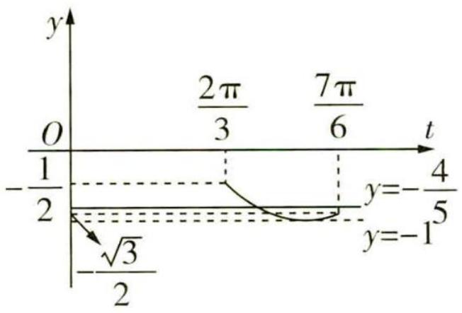

图3

# 趣味数学

对于 C, 将 $f(x)$ 的图象向右平移 $\frac{4\pi}{3}$ 个单位长度后所得图象对应的函数为 $g(x) = \cos\left[\frac{1}{2}(x - \frac{4\pi}{3}) + \frac{2\pi}{3}\right] = \cos\frac{1}{2}x$ , 易知 $g(x)$ 为偶函数, 故 C 正确;

对于 D, $y = 5f(x) + 4 = 5\cos\left(\frac{1}{2}x + \frac{2\pi}{3}\right) + 4$ , 令 y = 0, 得 $\cos\left(\frac{1}{2}x + \frac{2\pi}{3}\right) = -\frac{4}{5}$ , 令 $t = \frac{1}{2}x + \frac{2\pi}{3}$ ,
由 $0 \leqslant x \leqslant \pi$ ，得 $\frac{2\pi}{3} \leqslant t \leqslant \frac{7\pi}{6}$ ，作出函数 $y = \cos t \left( \frac{2\pi}{3} \leqslant t \leqslant \frac{7\pi}{6} \right)$ 的图象与直线 $y = -\frac{4}{5}$ ，如图 3，由图

【数形结合】将函数的零点问题转化为函数图象的交点问题, 数形结合求解, 作函数图象时, 要注意标出特殊点

可知, 函数 $y = \cos t \left( \frac{2\pi}{3} \leqslant t \leqslant \frac{7\pi}{6} \right)$ 的图象与直线 $y = -\frac{4}{5}$ 有且只有一个交点, 所以函数 $y = 5f(x) + 4$ 在 $[0, \pi]$ 上有且仅有一个零点, 故 D 正确. 故选 ACD.

##### 4. ①③ $f(x)=4\sin x\cos x-2\sin^{2}x+2\cos^{2}x+1=2\sin2x+2\cos2x+1=2\sqrt{2}\sin(2x+\frac{\pi}{4})+1.$

【解题秘籍】逆用倍角公式将已知解析式降次化简，然后利用辅助角公式将其转化为 $f(x)=A\sin(\omega x+\varphi)+B$ 的形式

令 $2x + \frac{\pi}{4} = \frac{\pi}{2} + k\pi, k \in \mathbf{Z}$ , 得 $x = \frac{\pi}{8} + \frac{k\pi}{2}, k \in \mathbf{Z}$ , 当 $k = 0$ 时, $x = \frac{\pi}{8}$ , ①正确.

$f(x)$ 的图象向右平移 $\frac{\pi}{4}$ 个单位长度, 再向下平移 1 个单位长度后得到函数 $g(x)=2\sqrt{2}\sin[2(x-\frac{\pi}{4})+\frac{\pi}{4}]+1-1=2\sqrt{2}\sin(2x-\frac{\pi}{4})$ 的图象, $g(x)$ 非奇非偶, ②错误.

$f(\frac{x}{2})=2\sqrt{2}\sin(x+\frac{\pi}{4})+1=\sqrt{5}+1$ , 即 $\sin(x+\frac{\pi}{4})=\frac{\sqrt{10}}{4}$ , $\sin x+\cos x=\frac{\sqrt{5}}{2}$ , 将上式等号左右两边同时平方并化简可得 $2\sin x\cos x=\frac{1}{4}$ , 则 $\frac{2\sin x\cos x}{\sin^{2}x+\cos^{2}x}=\frac{1}{4}$ , 则 $\frac{2\tan x}{\tan^{2}x+1}=\frac{1}{4}$ , 得 $\tan x=4\pm\sqrt{15}$ , ③正确.

【小技巧】“1的妙用”，灵活运用 $\sin^{2}x+\cos^{2}x=1$ 构造齐次式求解

$y=f(\frac{\omega x}{2})=2\sqrt{2}\sin(\omega x+\frac{\pi}{4})+1$ , 若函数 $y=f(\frac{\omega x}{2})(\omega>0)$ 在区间 $\left[\frac{\pi}{3},\pi\right]$ 上恰有两个极大值点, 那么函数的最小正周期 $T=\frac{2\pi}{\omega}<|\frac{\pi}{3}-\pi|$ , 且 $3T=\frac{6\pi}{\omega}\geqslant|\frac{\pi}{3}-\pi|$ , 从而 $3<\omega\leqslant9$ , 令 $t=\omega x+\frac{\pi}{4}$ ,

【易错提醒】注意临界值的取舍，函数不在区间端点处取极值

则 $t \in \left[\frac{\omega\pi}{3} + \frac{\pi}{4}, \omega\pi + \frac{\pi}{4}\right]$ , 从而 $\pi + \frac{\pi}{4} < \frac{\omega\pi}{3} + \frac{\pi}{4} \leqslant 3\pi + \frac{\pi}{4}, 3\pi + \frac{\pi}{4} < \omega\pi + \frac{\pi}{4} \leqslant 9\pi + \frac{\pi}{4}$ .

结合正弦函数 $y = \sin x$ 的图象分析, 当 $\pi + \frac{\pi}{4} < \frac{\omega\pi}{3} + \frac{\pi}{4} < \frac{5\pi}{2}$ , 即 $3 < \omega < \frac{27}{4}$ 时, 要满足题意需使 $\frac{9\pi}{2} < \omega\pi + \frac{\pi}{4} \leqslant \frac{13\pi}{2}$ , 解得 $\frac{17}{4} < \omega \leqslant \frac{25}{4}$ ; 当 $\frac{5\pi}{2} \leqslant \frac{\omega\pi}{3} + \frac{\pi}{4} \leqslant 3\pi + \frac{\pi}{4}$ , 即 $\frac{27}{4} \leqslant \omega \leqslant 9$ 时, 要满足题意需使 $\frac{13\pi}{2} < \omega\pi + \frac{\pi}{4} \leqslant \frac{17\pi}{2}$ , 解得 $\frac{25}{4} < \omega \leqslant \frac{33}{4}$ . 综上, $\frac{17}{4} < \omega \leqslant \frac{33}{4}$ , 所以④错误. 故答案为①③.

# 趣味数学

若叶片数量为偶数,且对称排列,那么风扇自身的平衡难以调整,且风扇在高速转时容易产生更多的共振,从而导致叶片无法长时间承受共振产生的疲劳,最终出现叶片断裂等情况.

关注微信公众号“初高教辅站”获取更多初高中教辅资料

# 超重点 7 变换之道: 应用平移、伸缩规则解决图象变换问题

# 命题角度1 利用平移规则变换

调研 1 (2023 浙江金华 5 月模拟)为了得到函数 $y = 3\sin \left(2x - \frac{\pi}{5}\right)$ 的图象, 只要把 $y = 3\sin \left(2x + \frac{\pi}{5}\right)$ 图象上所有的点 ( )

$\quad$A. 向右平移 $\frac{\pi}{5}$ 个单位长度

$\quad$B. 向左平移 $\frac{\pi}{5}$ 个单位长度

$\quad$C. 向右平移 $\frac{2 \pi}{5}$ 个单位长度

$\quad$D. 向左平移 $\frac{2 \pi}{5}$ 个单位长度

# 天星老师传技巧

三角函数图象变换问题要弄准变换量的大小,特别是平移变换中,函数 $y = A \sin x$ 的图象到 $y = A \sin (x + \varphi)$ 的图象的变换量是 $|\varphi|$ 个单位长度,而函数 $y = A \sin \omega x$ 的图象到 $y = A \sin (\omega x + \varphi)$ 的图象时,变换量是 $|\frac{\varphi}{\omega}|$ 个单位长度.

解析 $y=3\sin(2x-\frac{\pi}{5})=3\sin\left[2\left(x-\frac{\pi}{5}\right)+\frac{\pi}{5}\right]$ ，所以只要把函数 $y=3\sin(2x+\frac{\pi}{5})$ 图象上所有的点向右平移 $\frac{\pi}{5}$ 个单位长度，即可得到函数 $y=3\sin(2x-\frac{\pi}{5})$ 的图象，故选 A.

【易错提醒】注意变换的方向，即区分变换的是哪个函数的图象，得到的是哪个函数的图象，切不可弄错方向

调研 2 (2023 四川南充三模) 已知点 $(\varphi, 0)$ 是函数 $f(x) = 2 \sin (3x + \varphi) (0 < \varphi < \frac{\pi}{2})$ 图象的一个对称中心, 则为了得到函数 $y = 2 \sin 3x + 1$ 的图象, 可以将 $f(x)$ 的图象 ( )

$\quad$A. 向右平移 $\frac{\pi}{12}$ 个单位长度, 再向上移动 1 个单位长度  
$\quad$B. 向左平移 $\frac{\pi}{4}$ 个单位长度, 再向上移动 1 个单位长度  
$\quad$C. 向右平移 $\frac{\pi}{12}$ 个单位长度, 再向下移动 1 个单位长度

# 趣味数学

$\quad$D. 向右平移 $\frac{\pi}{4}$ 个单位长度, 再向下移动 1 个单位长度

思维导引

$f(\varphi)=0$ → 结合 $\varphi$ 的取值范围求出 $\varphi$

根据图象平移变换规则即可得解

解析

因为点 $(\varphi,0)$ 是函数 $f(x)=2\sin(3x+\varphi)(0<\varphi<\frac{\pi}{2})$ 图象的一个对称中心，

所以 $f(\varphi) = 2\sin (3\varphi + \varphi) = 0$ ，所以 $4\varphi = k\pi, k \in \mathbf{Z}$ ，又 $0 < \varphi < \frac{\pi}{2}$ ，所以 $\varphi = \frac{\pi}{4}$ .

所以 $f(x) = 2\sin \left(3x + \frac{\pi}{4}\right) = 2\sin 3\left(x + \frac{\pi}{12}\right)$ ，所以要得到函数 $y = 2\sin 3x + 1$ 的图象，只需将 $f(x)$ 的图象向右平移 $\frac{\pi}{12}$ 个单位长度，再向上移动1个单位长度，故选A.

调研 3 (2023 全国甲卷) 函数 $y = f(x)$ 的图象由函数 $y = \cos \left( {2x + \frac{\pi }{6}}\right)$ 的图象向左平移 $\frac{\pi }{6}$ 个单位长度得到,则 $y = f(x)$ 的图象与直线 $y = \frac{1}{2}x - \frac{1}{2}$ 的交点个数为 (   )

$\quad$A. 1

$\quad$B. 2

$\quad$C. 3

$\quad$D. 4

# 天星老师有话说

先利用三角函数图象平移的规则求得 $f(x) = -\sin 2x$ ，再作出 $f(x)$ 与 $y = \frac{1}{2} x - \frac{1}{2}$ 的大致图象，考虑特殊点对应的 $f(x)$ 与 $y = \frac{1}{2} x - \frac{1}{2}$ 函数值的大小关系，从而得解.

解析 将函数 $y = \cos\left(2x + \frac{\pi}{6}\right)$ 的图象向左平移 $\frac{\pi}{6}$ 个单位长度后, 可得到函数 $y = \cos\left[2(x + \frac{\pi}{6}) + \frac{\pi}{6}\right] = \cos\left(2x + \frac{\pi}{2}\right) = -\sin 2x$ 的图象, 所以 $f(x) = -\sin 2x$ .

【关键警示】此处万不可忽略“左加右减”是只针对于 $x$ 的, 如果错误地得到函数 $f(x) = \cos (2 x + \frac {\pi}{6} + \frac {\pi}{6}) = \cos (2 x + \frac {\pi}{3})$ , 虽然对最终结果没有影响, 但思路是错误的

作出 $y = f(x)$ 与 $y = \frac{1}{2} x - \frac{1}{2}$ 的大致图象如图1，

考虑 $x = -\frac{3\pi}{4}, x = \frac{3\pi}{4}, x = \frac{7\pi}{4}$ 处 $f(x)$ 与 $y = \frac{1}{2} x - \frac{1}{2}$ 函数值的大小关系：

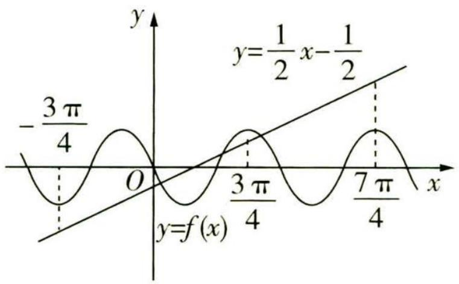

图1

# 趣味数学

$f (- \frac {3 \pi}{4}) = - \sin (- \frac {3 \pi}{2}) = - 1, \frac {1}{2} \times (- \frac {3 \pi}{4}) - \frac {1}{2} = - \frac {3 \pi + 4}{8} <   - 1;$

$f (\frac {3 \pi}{4}) = - \sin \frac {3 \pi}{2} = 1, \frac {1}{2} \times \frac {3 \pi}{4} - \frac {1}{2} = \frac {3 \pi - 4}{8} <   1;$

$f (\frac {7 \pi}{4}) = - \sin \frac {7 \pi}{2} = 1, \frac {1}{2} \times \frac {7 \pi}{4} - \frac {1}{2} = \frac {7 \pi - 4}{8} > 1.$

所以 $f(x)$ 的图象与直线 $y=\frac{1}{2}x-\frac{1}{2}$ 的交点个数为 3, 故选 C.

# 命题角度 2 利用伸缩规则变换

调研 4 (2023 河南省部分重点高中四模) 将函数 $y = \sin x$ 图象上各点的横坐标缩小为原来的 $\frac{1}{3}$ , 得到函数 $y = f(x)$ 的图象, 若 $f(x)$ 在区间 $[t, t + \frac{\pi}{6}]$ 上的最大值为 $M$ , 最小值为 $N$ , 则 $M - N$ 的最小值为 ( )

$\quad$A. 1

$\quad$B. $\frac{\sqrt{2}}{2}$

$\quad$C. $\frac{\sqrt{2}-1}{2}$

$\quad$D. $\frac{2-\sqrt{2}}{2}$

# 天星老师教审题

三角函数的图象的变化是有规律的, 计算得题中所给区间长度为函数 $f(x)$ 的周期的四分之一, 因此只有当这个区间恰好一半在对称轴左侧、一半在对称轴右侧的时候, 最大值与最小值的差最小, 也就是说, 这个时候直线 x = t 与直线 $x = t + \frac{\pi}{6}$ 关于直线 $x = \frac{k\pi}{3} + \frac{\pi}{6} (k \in \mathbf{Z})$ 对称.

解析 由题意知 $f(x)=\sin3x$ ，最小正周期为 $\frac{2\pi}{3}$ ，其图象的对称轴为直线 $x=\frac{k\pi}{3}+\frac{\pi}{6}(k\in\mathbf{Z})$ ，

【扫清障碍】三角函数图象伸缩变换时, 如果纵坐标不变, 横坐标伸长, 则周期变大, $x$ 的系数缩小, 反之, 横坐标缩短, 则周期变小, $x$ 的系数扩大, 即图象上各点横坐标的 “扩大” “缩小”与 $x$ 的系数变化是相反的

由正弦曲线的形状可知,当直线 x=t 与直线 $x=t+\frac{\pi}{6}$ 关于直线 $x=\frac{k\pi}{3}+\frac{\pi}{6}(k\in\mathbb{Z})$ 对称时,
M-N 最小,取对称轴为直线 $x=\frac{\pi}{6}$ ，则 $t=\frac{\pi}{12}$ ，此时 $f(x)$ 在区间 $\left[\frac{\pi}{12},\frac{\pi}{4}\right]$ 上的最大值为 1，最小值为 $\frac{\sqrt{2}}{2}$ ，故 M-N 的最小值为 $1-\frac{\sqrt{2}}{2}$ . 故选 D.

# 趣味数学

# 命题角度 3 平移规则、伸缩规则的综合应用

调研 5 (2023 湖南长沙一中二模) 设函数 $f(x) = \sin (\omega x + \varphi) (\omega > 0, 0 < \varphi < \pi)$ , 将函数 $f(x)$ 的图象先向右平移 $\frac{\pi}{6}$ 个单位长度, 再将横坐标伸长到原来的 2 倍, 纵坐标不变, 所得的图象与 $y = \cos x$ 图象重合, 则 ( )

$\quad$A. $\omega = \frac{1}{2},\varphi = \frac{\pi}{6}$

$\quad$B. $\omega=\frac{1}{2},\varphi=\frac{\pi}{3}$

$\quad$C. $\omega = 2, \varphi = \frac{5\pi}{6}$

$\quad$D. $\omega = 2, \varphi = \frac{\pi}{3}$

解析 将函数 $f(x)$ 的图象向右平移 $\frac{\pi}{6}$ 个单位长度，

可得 $y = f(x - \frac{\pi}{6}) = \sin [\omega (x - \frac{\pi}{6}) + \varphi ] = \sin (\omega x - \frac{\pi}{6}\omega +\varphi)$ 的图象，

再将横坐标伸长到原来的2倍,纵坐标不变,得到 $y=\sin(\frac{\omega}{2}x-\frac{\pi}{6}\omega+\varphi)$ 的图象,

【扫清障碍】注意两种变换顺序的区别：①先平移变换再伸缩变换，平移的量是 $|\varphi|$ 个单位长度；②先伸缩变换再平移变换，平移的量是 $\left|\frac{\varphi}{\omega}\right|$ 个单位长度

由于得到的函数的图象与 $y = \cos x$ 图象重合，

故 $\omega = 2, -\frac{\pi}{6}\omega + \varphi = \frac{\pi}{2} + 2k\pi (k \in \mathbf{Z})$

【易错提醒】平移、伸缩变换前后，函数的名称要一致，若不一致，应先利用诱导公式转化为同名函数

所以 $\varphi = \frac{5\pi}{6} + 2k\pi (k \in \mathbf{Z})$ ，又 $0 < \varphi < \pi$ ，所以 $\varphi = \frac{5\pi}{6}$ ，故选C.

# 新题演练

##### 1. (2023 山东日照三模) 函数 $f(x) = \sin (2x + \varphi)$ 的图象向左平移 $\frac{\pi}{3}$ 个单位长度后得到函数 $g(x)$ 的图象, 若函数 $g(x)$ 是偶函数, 则 $\tan \varphi =$

$\quad$A. $- \sqrt{3}$

$\quad$B. $\sqrt{3}$

$\quad$C. $-\frac{\sqrt{3}}{3}$

$\quad$D. $\frac{\sqrt{3}}{3}$

##### 2. (2023 重庆巴蜀中学 6 月模拟 | 多选) 要得到函数 $y = \sin x$ 的图象, 只需将 $y = \sin \left( {2x - \frac{\pi}{4}}\right)$ 图象上的所有点 (   )

趣味数学

$\quad$A. 横坐标伸长到原来的 2 倍, 再向左平移 $\frac{\pi}{4}$ 个单位长度  
$\quad$B. 横坐标伸长到原来的 2 倍, 再向左平移 $\frac{\pi}{8}$ 个单位长度  
$\quad$C. 向左平移 $\frac{\pi}{8}$ 个单位长度, 再把横坐标伸长到原来的 2 倍  
$\quad$D. 向右平移 $\frac{\pi}{4}$ 个单位长度, 再把横坐标缩短到原来的 $\frac{1}{2}$

##### 3. (2023 四川成都七中二诊) 函数 $f(x) = 4\sin \left( {\omega x + \frac{\pi }{3}}\right)  + b\left( {b > 0,\omega  > 0}\right)$ 的最大值为 5. $P,Q$ 分别为 $f\left( x\right)$ 的图象两条相邻对称轴上的动点,向量 $a = \left( {1,0}\right) ,\left| {\overrightarrow{PQ} \cdot  a}\right|  =$ $\frac{3\pi }{2}$ . 为得到函数 $g\left( x\right)  = 4\sin \left( {\omega x - \frac{\pi }{3}}\right)  + 5$ 的图象,需要将 $f\left( x\right)$ 的图象 (   )

$\quad$A. 先向右平移 $\frac{2 \pi}{3}$ 个单位长度, 再向上平移 1 个单位长度  
$\quad$B. 先向右平移 $\pi$ 个单位长度, 再向上平移 4 个单位长度  
$\quad$C. 先向右平移 $2 \pi$ 个单位长度, 再向上平移 1 个单位长度  
$\quad$D. 先向右平移 $\frac{4 \pi}{9}$ 个单位长度, 再向上平移 4 个单位长度

# 天星老师破障碍

解题完全没思路,怎么办? 不要紧,先算着再说,算着算着说不定答案就出来了. 唯一可算的点就是 $|\overrightarrow{PQ} \cdot a| = \frac{3\pi}{2}$ , 那我们先设参数、利用向量的坐标运算求一下好了. 嗦? 参数都消失了,居然轻松把 $\omega$ 解出来了!

##### 4. (2023 湖北黄冈市三模) 将函数 $f(x) = \sin \left( {x + \frac{\pi }{3}}\right)  + 1$ 的图象上所有点的横坐标变为原来的 $\frac{1}{2}$ (纵坐标不变),得到函数 $g\left( x\right)$ 的图象. 若存在 $\theta  \in  \left( {0,\pi }\right)$ ,使得 $g\left( x\right)  +$ $g\left( {\theta  - x}\right)  = 2$ 对任意 $x \in  \mathbf{R}$ 恒成立,则 $\theta  =$

$\quad$A. $\frac{\pi}{6}$

$\quad$B. $\frac{\pi}{3}$

$\quad$C. $\frac{2\pi}{3}$

$\quad$D. $\frac{5\pi}{6}$

# 参考答案与解析

##### 1. C 函数 $f(x)=\sin(2x+\varphi)$ 的图象向左平移 $\frac{\pi}{3}$ 个单位长度, 得 $g(x)=\sin(2x+\frac{2\pi}{3}+\varphi)$ 的图象,而函数 $g(x)$ 是偶函数, 则有 $\frac{2\pi}{3} + \varphi = k\pi + \frac{\pi}{2} (k \in \mathbf{Z})$ , 解得 $\varphi = k\pi - \frac{\pi}{6}, k \in Z$ . 所以 $\tan \varphi = \tan(k\pi - \frac{\pi}{6}) = -\frac{\sqrt{3}}{3}$ . 故选 C.

##### 2. AC 将函数 $y = \sin\left(2x - \frac{\pi}{4}\right)$ 的图象上各点的横坐标伸长为原来的 2 倍, 得到 $y = \sin\left(x - \frac{\pi}{4}\right)$ 的图象, 再将 $y = \sin\left(x - \frac{\pi}{4}\right)$ 图象上所有点向左平移 $\frac{\pi}{4}$ 个单位长度, 得到 $y = \sin x$ 的图象, 所以 A 正确, B 错误.

将函数 $y = \sin(2x - \frac{\pi}{4})$ 图象上所有点向左平移 $\frac{\pi}{8}$ 个单位长度, 得到 $y = \sin\left[2\left(x + \frac{\pi}{8}\right) - \frac{\pi}{4}\right] = \sin 2x$ 的图象, 再将 $y = \sin 2x$ 图象上各点的横坐标伸长到原来的 2 倍, 得到 $y = \sin x$ 的图象, 所以 C 正确, D 错误. 故选 AC.

##### 3. B 由题意得, 当 $\sin(\omega x + \frac{\pi}{3}) = 1$ 时, $4 + b = 5$ , 解得 b = 1.

因为 $\omega > 0$ ，所以 $f(x)$ 的图象两条相邻对称轴之间的距离为 $\frac{2\pi}{\omega} \times \frac{1}{2} = \frac{\pi}{\omega}$ ，

【小技巧】通过建立点 $P, Q$ 横坐标之间的关系, 可以减少参数的数量

不妨设 $P(m,t),Q(\frac{\pi}{\omega} +m,u)$ ，则 $\overrightarrow{PQ} = (\frac{\pi}{\omega},u - t)$

所以 $|\overrightarrow{PQ} \cdot \boldsymbol{a}| = \frac{\pi}{\omega} = \frac{3\pi}{2}$ , 解得 $\omega = \frac{2}{3}$ , 故 $f(x) = 4\sin\left(\frac{2}{3}x + \frac{\pi}{3}\right) + 1 = 4\sin\frac{2}{3}(x + \frac{\pi}{2}) + 1$ .

又 $g(x)=4\sin\left(\frac{2}{3}x-\frac{\pi}{3}\right)+5=4\sin\frac{2}{3}\left(x-\frac{\pi}{2}\right)+5,$

故需要将 $f(x)$ 的图象先向右平移 $\pi$ 个单位长度,再向上平移4个单位长度.故选B.

##### 4. C 将函数 $f(x) = \sin \left( x + \frac{\pi}{3} \right) + 1$ 的图象上所有点的横坐标变为原来的 $\frac{1}{2}$ (纵坐标不变), 得到 $g(x) = \sin \left( 2x + \frac{\pi}{3} \right) + 1$ 的图象.

【敲黑板】注意伸缩变换是针对自变量 $x$ 而言的, 即图象伸缩变换要看 “ $x$ ” 发生多大变化, 而不是看“ $\omega x + \varphi$ ” 的变化

若存在 $\theta \in (0, \pi)$ ，使得 $g(x) + g(\theta - x) = 2$ 对任意 $x \in \mathbf{R}$ 恒成立，

则 $g(x)$ 的图象关于点 $(\frac{\theta}{2},1)$ 对称，则 $2 \times \frac{\theta}{2} + \frac{\pi}{3} = k\pi, k \in Z$ ,

解得 $\theta = -\frac{\pi}{3} + k\pi, k \in Z$ ，因为 $\theta \in (0, \pi)$ ，所以 $\theta = \frac{2\pi}{3}$ 。故选 C.

# 趣味数学

植物界也有体现黄金分割的地方,如果从某些植物的嫩枝的顶端向下看,就会看到叶子是按照黄金分割的规律排列着的.

关注微信公众号“初高教辅站”获取更多初高中教辅资料

# 超重点8 3大解三角形中化角类、化边类问题求解策略

# 策略 1 利用正、余弦定理边化角

调研 1 (2023 重庆南开中学第九次质检) 在 $\triangle ABC$ 中, 内角 $A, B, C$ 所对的边分别为 $a, b, c$ , 已知 $b \sin \left( A + \frac{\pi}{3} \right) + a \cos \left( \frac{\pi}{2} + B \right) = 0$ .

（1） 求角 A.   
（2） 点 D 为边 BC 上一点(不包含端点), 且满足 $\angle ADB = 2 \angle ACB$ , 求 $\frac{DC}{BC}$ 的取值范围.

# 天星老师引思路

边化角 $\rightarrow$ 多角化 $\rightarrow$ 多函数名化 $\rightarrow$ 缩小角范围 $\rightarrow$ 目标函数范围, 此流程化思考路线适用于大多数解三角形中的最值或范围问题的求解.

解析 （1） $b\sin(A+\frac{\pi}{3})+a\cos(\frac{\pi}{2}+B)=0$ ,

结合正弦定理可得 $\sin B\left(\frac{1}{2}\sin A + \frac{\sqrt{3}}{2}\cos A\right) - \sin A\sin B = 0$ ，即 $\sin B\left(\frac{\sqrt{3}}{2}\cos A - \frac{1}{2}\sin A\right) = 0$ ，
因为 $B \in (0, \pi)$ ，所以 $\sin B \neq 0$ ，

【易错警示】此处若漏掉说明 $\sin B \neq 0$ 的步骤可能会丢分

故 $\frac{\sqrt{3}}{2}\cos A=\frac{1}{2}\sin A$ ，所以 $\tan A=\sqrt{3}$ ，而 $A\in(0,\pi)$ ，所以 $A=\frac{\pi}{3}$ .

（2）作出图形如图1所示. 由 $\angle ADB = 2 \angle ACB = \angle ACB + \angle CAD$ , 可得 $\angle ACD = \angle CAD$ , 所以 $AD = CD$ , $\angle ACB < \angle BAC$ , 即 $C \in (0, \frac{\pi}{3})$ .

【敲黑板】根据已知条件，缩小角度的范围，这里 $\angle ACB < \angle BAC$ 极其容易被忽视

易知 $B=\frac{2\pi}{3}-C,\angle BAD=\frac{\pi}{3}-C,$

由 $AD = CD$ 及正弦定理可得 $\frac{BD}{\sin(\frac{\pi}{3} - C)} = \frac{CD}{\sin(\frac{2\pi}{3} - C)} = \frac{BD + CD}{\sin(\frac{\pi}{3} - C) + \sin(\frac{2\pi}{3} - C)}$

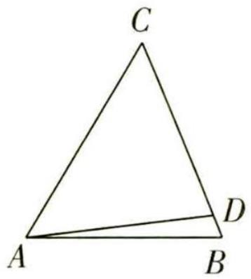

图1

【指点迷津】这里使用了“和差比定理”，即 $\frac{a}{b} = \frac{c}{d} = \frac{a \pm c}{b \pm d} (b \neq 0, d \neq 0, b \neq \pm d)$

所以 $\frac{CD}{CB} = \frac{\sin\left(\frac{2\pi}{3} - C\right)}{\sin\left(\frac{\pi}{3} - C\right) + \sin\left(\frac{2\pi}{3} - C\right)} = \frac{\frac{\sqrt{3}}{2}\cos C + \frac{1}{2}\sin C}{\sqrt{3}\cos C} = \frac{1}{2} + \frac{1}{2\sqrt{3}}\tan C.$

由 $C \in (0, \frac{\pi}{3})$ 可得 $\tan C \in (0, \sqrt{3})$ , 所以 $\frac{CD}{CB} \in (\frac{1}{2}, 1)$ , 即 $\frac{DC}{BC}$ 的取值范围为 $(\frac{1}{2}, 1)$ .

调研 2 (名师原创) 如图 2, 在凸四边形 ABCD 中, A, B, C, D 四点共圆, AB = 1, $AD = \sqrt{2}$ , $BD = \sqrt{5}$ .

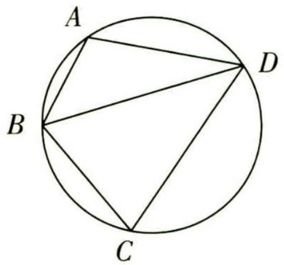

图2

（1） 若 $\cos \angle BDC = \frac{3}{5}$ ，求 CD.  
（2） 求四边形 ABCD 面积的最大值.

解析 （1） 在 $\triangle ABD$ 中, 由余弦定理得 $\cos A = \frac{AB^2 + AD^2 - BD^2}{2 \times AB \times AD} =$

$\frac {1 + 2 - 5}{2 \times 1 \times \sqrt {2}} = - \frac {\sqrt {2}}{2}, \text {所以} A = \frac {3 \pi}{4}.$

由圆的几何性质可知, $C=\pi-A=\frac{\pi}{4}$ .

在 $\triangle BCD$ 中， $\cos \angle BDC = \frac{3}{5}$ ，所以 $\sin \angle BDC = \sqrt{1 - \cos^2 \angle BDC} = \frac{4}{5}$ ，

$\sin \angle C B D = \sin (C + \angle B D C) = \sin C \cos \angle B D C + \cos C \sin \angle B D C = \frac {\sqrt {2}}{2} \times \frac {3}{5} + \frac {\sqrt {2}}{2} \times \frac {4}{5} = \frac {7 \sqrt {2}}{1 0},$

由正弦定理得 $\frac{CD}{\sin\angle CBD} = \frac{BD}{\sin C}$ 解得 $CD = \frac{7\sqrt{5}}{5}$

【敲黑板】遇到含有多个三角形的情境时, 需冷静分析, 寻找联系, $CD$ 在 $\triangle BCD$ 中, 已知这个三角形的一边 ( $BD$ ) 一角 ( $\angle BDC$ ), 需再求一边, 那么用正弦定理是合适的, 由此去寻找 $\sin C$ 和 $\sin \angle CBD$

（2） 在 $\triangle ABD$ 中, $2R = \frac{BD}{\sin A} = \frac{\sqrt{5}}{\sin \frac{3\pi}{4}} = \sqrt{10}$ , 其中 $R$ 为 $\triangle ABD$ 的外接圆半径, $S_{\triangle ABD} = \frac{1}{2} AB \cdot AD\sin \frac{3\pi}{4} = \frac{1}{2}$ .

令 $\angle CDB = \alpha$ ，在 $\triangle BCD$ 中， $S_{\triangle BCD} = \frac{1}{2} CB\times CD\sin \angle BCD = \frac{1}{2}\times 2R\sin \angle CDB\times 2R\sin \angle CBD\times$

# 趣味数学

理财中的数学 如果你用 100 万元本金买了一只股票, 涨了 100% 后会变成 200 万元; 但要再跌 50%, 就又回到 100 万元了; 如果跌 100%, 本金就变成 0 元了, 而不是想象的 100 万元.

关注微信公众号“初高教辅站”获取更多初高中教辅资料

$\frac {\sqrt {2}}{2} = \frac {5 \sqrt {2}}{2} \sin \alpha \sin (\pi - \alpha - \frac {\pi}{4}) = \frac {5 \sqrt {2}}{2} \sin \alpha \sin (\alpha + \frac {\pi}{4}) = \frac {5}{2} (\sin^ {2} \alpha + \sin \alpha \cos \alpha) = \frac {5}{4} (1 - \cos 2 \alpha +$

【指点迷津】四点共圆决定了两个三角形具有相同的外接圆半径，保障了边化角的可行性 $\sin 2\alpha)=\frac{5}{4}+\frac{5\sqrt{2}}{4}\sin(2\alpha-\frac{\pi}{4})$

因为 $\alpha\in(0,\frac{3\pi}{4})$ ，所以 $2\alpha\in(0,\frac{3\pi}{2})$ ， $2\alpha-\frac{\pi}{4}\in(-\frac{\pi}{4},\frac{5\pi}{4})$ ，所以当 $2\alpha-\frac{\pi}{4}=\frac{\pi}{2}$ 时， $S_{\triangle BCD}$ 最大， $(S_{\triangle BCD})_{\max}=\frac{5}{4}+\frac{5\sqrt{2}}{4}$ .

所以四边形 ABCD 面积的最大值为 $\frac{7 + 5\sqrt{2}}{4}$ .

# 策略 2 利用余弦定理角化边

调研 3 (2023 黑龙江大庆实验中学 5 月考前模拟) 在 $\triangle ABC$ 中, 角 $A, B, C$ 所对的边分别为 $a, b, c$ , 已知 $b - c \cos A = 2 a \cos B \cos C$ , 其中 $C \neq \frac{\pi}{2}$ .

（1） 求角 B.   
（2） 若 $b^{2} + 3c^{2} = 12 - 5ac$ ，求 $\triangle ABC$ 面积的最大值.

# 天星老师小课堂

当题目中出现边和角的“混合体”时有两种方案: ①全部统一为角, 将“边的齐次式”中的边直接化为对应角的正弦; ②全部统一为边, 利用正、余弦定理将角转化为边, 最后用因式分解等代数技巧化简即可.

解析 （1） 方法一: 角化边 由 $b - c \cos A = 2a \cos B \cos C$ ,

根据余弦定理得 $b - c \cdot \frac{b^2 + c^2 - a^2}{2bc} = 2a\cos B \cdot \frac{a^2 + b^2 - c^2}{2ab}$ , 即 $\frac{b^2 - c^2 + a^2}{2b} = 2\cos B \cdot \frac{a^2 + b^2 - c^2}{2b}$ ,

因为 $C \neq \frac{\pi}{2}$ , 所以 $\frac{a^2 + b^2 - c^2}{2b} \neq 0$ , 所以 $\cos B = \frac{1}{2}$ , 又 $0 < B < \pi$ , 所以 $B = \frac{\pi}{3}$ .

方法二: 边化角 由 $b - c \cos A = 2a \cos B \cos C$ ,

根据正弦定理得 $\sin B - \sin C \cos A = 2 \sin A \cos B \cos C$ ,

# 趣味数学

即 $\sin (A + C) - \sin C\cos A = 2\sin A\cos B\cos C$ ，所以 $\sin A\cos C = 2\sin A\cos B\cos C,$

因为 $C \neq \frac{\pi}{2}$ ，所以 $\cos C \neq 0$ ，又 $\sin A > 0$ ，所以 $\cos B = \frac{1}{2}$ ，

又 $0 < B < \pi$ ，所以 $B = \frac{\pi}{3}$

（2） 由（1）及余弦定理知 $\cos B = \frac{a^2 + c^2 - b^2}{2ac} = \frac{1}{2}$ , 所以 $a^2 + c^2 - b^2 = ac$ ,

又 $b^{2} + 3c^{2} = 12 - 5ac$ ,

所以 $a^2 + c^2 - (12 - 3c^2 - 5ac) = ac$ ，化简得 $a^2 + 4ac + 4c^2 = (a + 2c)^2 = 12$

【破题有拓】结合目标式，消去不需要的 $b^{2}$ ，再采用基本不等式得最值，注意验证等号成立的条件

因为 $a > 0, c > 0$ ，所以 $a + 2c = 2\sqrt{3}$ .

因为 $\left(\frac{a+2c}{2}\right)^{2}\geqslant a\cdot2c$ ，当且仅当 $a=2c=\sqrt{3}$ ，即 $a=\sqrt{3}$ ， $c=\frac{\sqrt{3}}{2}$ 时取等号，所以 $ac\leqslant\frac{3}{2}$ ，

所以 $\triangle ABC$ 的面积 $S = \frac{1}{2} ac\sin B = \frac{\sqrt{3}}{4} ac \leqslant \frac{3\sqrt{3}}{8}$ , 即 $\triangle ABC$ 面积的最大值为 $\frac{3\sqrt{3}}{8}$ .

# 策略 3 利用两次余弦法或向量平方法化边

调研 4 (2023 新课标 II 卷) 记 $\triangle ABC$ 的内角 $A, B, C$ 的对边分别为 $a, b, c$ , 已知 $\triangle ABC$ 面积为 $\sqrt{3}, D$ 为 $BC$ 的中点, 且 $AD = 1$ .

（1） 若 $\angle ADC = \frac{\pi}{3}$ , 求 $\tan B$ ;   
（2） 若 $b^{2} + c^{2} = 8$ , 求 b, c.

解析 （1） 在 $\triangle ABC$ 中, 因为 $D$ 为 $BC$ 的中点, $\angle ADC = \frac{\pi}{3}, AD = 1$ ,

所以 $S_{\triangle ADC} = \frac{1}{2} AD \times DC \sin \angle ADC = \frac{1}{2} \times 1 \times \frac{1}{2} a \times \frac{\sqrt{3}}{2} = \frac{\sqrt{3}}{8} a = \frac{1}{2} S_{\triangle ABC} = \frac{\sqrt{3}}{2}$ ，解得 a = 4.

【破题有拓】利用面积关系转化, 求出 $a$ , 在三角模块中, 面积法是建立方程的有效手段

方法一: 余弦定理 + 三角恒等变换 在 $\triangle ABD$ 中, $\angle ADB = \frac{2\pi}{3}$ ,

由余弦定理得 $c^{2}=BD^{2}+AD^{2}-2BD\cdot AD\cos\angle ADB$

即 $c^{2}=4+1-2\times2\times1\times(-\frac{1}{2})=7$ , 得 $c=\sqrt{7}$ , 则 $\cos B=\frac{7+4-1}{2\times\sqrt{7}\times2}=\frac{5\sqrt{7}}{14}$

# 趣味数学

假如你用 100 万元买股票,每天挣 1% 就离场,那么以每年 250 个交易日计算,一年下来你的资产可以达到 1203.2 万元,两年后你就可以坐拥近 1.45 亿元.复利果然是一个奇迹.

关注微信公众号“初高教辅站”获取更多初高中教辅资料

$\sin B = \sqrt{1 - \cos^2 B} = \sqrt{1 - (\frac{5\sqrt{7}}{14})^2} = \frac{\sqrt{21}}{14}$ , 所以 $\tan B = \frac{\sin B}{\cos B} = \frac{\sqrt{3}}{5}$ .

方法二: 几何法 在 $\triangle ACD$ 中, 由余弦定理得 $b^{2}=CD^{2}+AD^{2}-2CD\cdot AD\cos\angle ADC$ ,

即 $b^{2}=4+1-2\times2\times1\times\frac{1}{2}=3$ , 解得 $b=\sqrt{3}$

所以 $AC^{2} + AD^{2} = 4 = CD^{2}$ ，则 $\angle CAD = \frac{\pi}{2}, C = \frac{\pi}{6}$ .

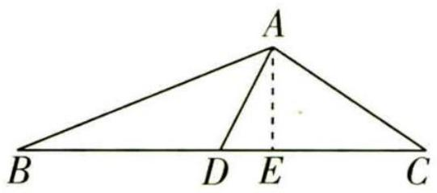

图 3

如图3, 过 $A$ 作 $AE \perp BC$ 于 $E$ , 于是 $AE = AC \sin C = \frac{\sqrt{3}}{2}, CE = AC \cos C = \frac{3}{2}$ , 所以 $BE = \frac{5}{2}$ ,

所以 $\tan B = \frac{AE}{BE} = \frac{\sqrt{3}}{5}.$

（2） 方法一: 两次余弦法 在 $\triangle ABD$ 与 $\triangle ACD$ 中, 分别由余弦定理得 $c^{2} = \frac{1}{4} a^{2} + 1 - 2 \times \frac{1}{2} a \times$ $1 \times \cos (\pi - \angle ADC), b^{2} = \frac{1}{4} a^{2} + 1 - 2 \times \frac{1}{2} a \times 1 \times \cos \angle ADC$ ,

【扫清障碍】题目中出现“互补角”“相等角”的情形时，在两个三角形中分别使用余弦定理，再将两式相加，即可得到一个关于边的方程，这就是“两次余弦法”

整理得 $\frac{1}{2} a^2 + 2 = b^2 + c^2$ ，而 $b^2 + c^2 = 8$ ，则 $a = 2\sqrt{3}$ .

又 $S_{\triangle ADC} = \frac{1}{2}\times \sqrt{3}\times 1\times \sin \angle ADC = \frac{\sqrt{3}}{2}$ ，得 $\sin \angle ADC = 1$ ，而 $0 <   \angle ADC <   \pi$ ，于是 $\angle ADC = \frac{\pi}{2}$ 所以 $b = c = 2$

方法二: 向量平方法 在 $\triangle ABC$ 中, 因为 $D$ 为 $BC$ 的中点, 所以 $2\overrightarrow{AD}=\overrightarrow{AB}+\overrightarrow{AC}$ ,

又 $\overrightarrow{CB} = \overrightarrow{AB} -\overrightarrow{AC}$ ，所以 $4\overrightarrow{AD}^2 +\overrightarrow{CB}^2 = (\overrightarrow{AB} +\overrightarrow{AC})^2 +(\overrightarrow{AB} -\overrightarrow{AC})^2 = 2(b^2 +c^2) = 16,$

【指点迷津】此处采用向量平方的方法，得到了关于边的方程，和两次余弦法有同样的效果

即 $4 + a^2 = 16$ ，解得 $a = 2\sqrt{3}$ ，又 $S_{\triangle ADC} = \frac{1}{2}\times \sqrt{3}\times 1\times \sin \angle ADC = \frac{\sqrt{3}}{2}$ 所以 $\sin \angle ADC = 1$

而 $0 < \angle ADC < \pi$ ，于是 $\angle ADC = \frac{\pi}{2}$ 所以 $b = c = 2$

# 数学起源

# 新题演练

##### 1. (结构不良试题|2023 山东师大附中 6 月模拟) 在“① $2b\sin C = c\sin B - \sqrt{3}c\cos B$ , ② $b\cos C + (2a + c)\cos B = 0$ ”这两个条件中任选一个, 补充在下面的问题中, 并解答.

在 $\triangle ABC$ 中,内角 $A,B,C$ 所对的边分别为 $a,b,c$ ,若 $D$ 为 $AC$ 边上一点,满足 $AB\perp BD$ ,且 $BD=2$ ,\_\_\_\_.

（1） 求角 B.   
（2） 求 $\frac{2}{AD} + \frac{1}{CD}$ 的取值范围.

注:如果选择多个条件分别解答,按第一个解答计分.

##### 2. (2023 陕西安康中学 5 月质检)已知 $\triangle ABC$ 的内角 $A, B, C$ 的对边分别为 $a, b, c$ , 且 $\sin C \cos B - 2 \sin B \cos C = 0$ .

（1） 证明: $c^2 - b^2 = \frac{1}{3} a^2$ .   
（2） 若 a = 3，点 D 在边 BC 上，且 $AD \perp BC, AD = \sqrt{3}$ ，求 $\triangle ABC$ 的周长.

##### 3. (2023 河北石家庄 5 月模拟) 在 $\triangle ABC$ 中, 内角 $A, B, C$ 的对边分别为 $a, b, c, A = 150^{\circ}$ , 点 $D$ 满足 $\overrightarrow{CD} = 2\overrightarrow{DB}$ , 且 $\frac{\sin \angle BAD}{b} + \frac{\sin \angle CAD}{c} = \frac{3}{2a}$ .

（1） 求证: $AD = \frac{1}{3}a.$   
（2） 求 $\frac{\sin^{2}A}{\sin B\sin C}$ 的值.

# 天星老师讲思路

以目标中的边为导向,分别在 $\triangle ABD, \triangle ACD, \triangle ABC$ 中利用正弦定理把角化为边,最后用已知条件串联所有边,化简即得证.

# 参考答案与解析

##### 1.（1）若选择条件①,解答过程如下:

由正弦定理可得 $2\sin B\sin C = \sin C\sin B - \sqrt{3}\sin C\cos B$ ，即 $\sin B\sin C = -\sqrt{3}\sin C\cos B.$

数学起源

因为 $0 < C < \pi$ ，所以 $\sin C \neq 0$ ，故 $\sin B = -\sqrt{3} \cos B$ ，所以 $\tan B = -\sqrt{3}$

又 $0 < B < \pi$ , 故 $B = \frac{2\pi}{3}$ .

若选择条件②,解答过程如下:

由正弦定理得 $\sin B\cos C + (2\sin A + \sin C)\cos B = 0$ ，即 $\sin B\cos C + \sin C\cos B = -2\sin A\cos B$ ，即 $\sin (B + C) = -2\sin A\cos B$ ，即 $\sin A = -2\sin A\cos B$ ，

而 $0 < A < \pi$ ，所以 $\sin A \neq 0$ ，故 $\cos B = -\frac{1}{2}$ 又 $0 < B < \pi$ ，故 $B = \frac{2\pi}{3}$ .

（2） 因为 $AB \perp BD$ ，故 $\angle DBC = \frac{2\pi}{3} - \frac{\pi}{2} = \frac{\pi}{6}$ ，

在 $\triangle BCD$ 中，由 $\frac{CD}{\sin\angle DBC}=\frac{BD}{\sin C}$ ，得 $CD=\frac{2\sin\frac{\pi}{6}}{\sin C}=\frac{1}{\sin C}$

在 $\triangle ABD$ 中,由 $\frac{AD}{\sin\angle ABD}=\frac{BD}{\sin A}$ ,得 $AD=\frac{2\sin\frac{\pi}{2}}{\sin A}=\frac{2}{\sin A}$ .

【扫清障碍】仔细观察,选择合适的三角形,利用正弦定理边化角

故 $\frac{2}{AD}+\frac{1}{CD}=\sin A+\sin C$ ，而 $\angle ABC=\frac{2\pi}{3}$ ，所以 $A+C=\frac{\pi}{3}$

所以 $\frac{2}{AD} +\frac{1}{CD} = \sin A + \sin C = \sin (\frac{\pi}{3} -C) + \sin C = \frac{\sqrt{3}}{2}\cos C + \frac{1}{2}\sin C = \sin (C + \frac{\pi}{3})$

由题意知 $C \in (0, \frac{\pi}{3})$ ，所以 $C + \frac{\pi}{3} \in (\frac{\pi}{3}, \frac{2\pi}{3})$ ，

故 $\sin\left(C+\frac{\pi}{3}\right)\in\left(\frac{\sqrt{3}}{2},1\right]$ ，即 $\frac{2}{AD}+\frac{1}{CD}$ 的取值范围为 $\left(\frac{\sqrt{3}}{2},1\right]$ .

##### 2. （1） 由 $\sin C \cos B - 2 \sin B \cos C = 0$ , 可得 $\sin C \cos B + \sin B \cos C = 3 \sin B \cos C$ ,

【扫清障碍】观察已知式的结构, 配凑出一个 $\sin (B + C)$ , 再利用内角和关系转化角所以 $\sin (B + C) = 3 \sin B \cos C$ , 由 $B + C = \pi - A$ , 可得 $\sin (B + C) = \sin A$ , 即 $\sin A = 3 \sin B \cos C$ , 所以 $a = 3b \times \frac{a^2 + b^2 - c^2}{2ab}$ , 可得 $2a^2 = 3a^2 + 3b^2 - 3c^2$ , 即 $c^2 - b^2 = \frac{1}{3} a^2$ .

【指点迷津】正弦齐次式可以直接用正弦定理化角为边，而余弦式要用对应的余弦定理化角为边，然后通过代数恒等变形进行证明

（2） $a = 3$ ，由（1）知 $c^2 - b^2 = 3$ ，可得 $c^2 = b^2 + 3$

# 数学起源

两千多年前,中国有了分数,但是,秦汉时期的分数的表现形式不一样. 后来,印度出现了和我国相似的分数表示法. 再往后,阿拉伯人发明了分数线,今天分数的表示法就由此而来.

关注微信公众号“初高教辅站”获取更多初高中教辅资料由余弦定理得 $\cos \angle BAC = \frac{b^{2} + c^{2} - a^{2}}{2bc} = \frac{b^{2} - 3}{bc}$ .

由 $AD \perp BC, AD = \sqrt{3}$ , 可得 $S_{\triangle ABC} = \frac{1}{2} \times 3 \times \sqrt{3} = \frac{3\sqrt{3}}{2}$ ,

又 $S_{\triangle ABC} = \frac{1}{2} bc\sin \angle BAC$ ，所以 $\frac{1}{2} bc\sin \angle BAC = \frac{3\sqrt{3}}{2}$ 可得 $\sin \angle BAC = \frac{3\sqrt{3}}{bc}$

因为 $\cos^2\angle BAC + \sin^2\angle BAC = (\frac{b^2 - 3}{bc})^2 +(\frac{3\sqrt{3}}{bc})^2 = 1$ ，所以 $b^{2} = 4$ ，解得 $b = 2$

【解题关键】分别用余弦定理和面积公式“刻画”出 $\angle BAC$ 的正、余弦值, 再用平方和为 1 消去角, 得到关于边的方程, 即可求边

所以 $c^{2}=b^{2}+3=7$ , 可得 $c=\sqrt{7}$ , 所以 $\triangle ABC$ 的周长为 $a+b+c=3+2+\sqrt{7}=5+\sqrt{7}$

##### 3. （1） 由题意知 $\overrightarrow{CD} = 2\overrightarrow{DB}$ , 则 $CD = \frac{2}{3}a, BD = \frac{1}{3}a$ .

在 $\triangle ABD$ 中， $\sin \angle BAD = \frac{BD\sin B}{AD} = \frac{a\sin B}{3AD}$ ，在 $\triangle ACD$ 中， $\sin \angle CAD = \frac{CD\sin C}{AD} = \frac{2a\sin C}{3AD}$ ，

又 $\frac{\sin B}{b} = \frac{\sin C}{c} = \frac{\sin 150^{\circ}}{a} = \frac{1}{2a}$

所以 $\frac{\sin\angle BAD}{b} +\frac{\sin\angle CAD}{c} = \frac{a\sin B}{3b\cdot AD} +\frac{2a\sin C}{3c\cdot AD} = \frac{a}{3AD}\cdot \frac{1}{2a} +\frac{2a}{3AD}\cdot \frac{1}{2a} = \frac{3}{2a},$

即 6AD = 2a，所以 $AD = \frac{1}{3}a$ .

（2） 在 $\triangle ABD$ 中, 由余弦定理得 $\cos \angle ADB = \frac{BD^2 + AD^2 - AB^2}{2BD \cdot AD} = \frac{2a^2 - 9c^2}{2a^2}$ ,

在 $\triangle ACD$ 中，由余弦定理得 $\cos \angle ADC = \frac{AD^2 + CD^2 - AC^2}{2AD\cdot CD} = \frac{5a^2 - 9b^2}{4a^2}$

$\angle ADB + \angle ADC = 180^{\circ}$ , 则 $\angle ADB = 180^{\circ} - \angle ADC$ ,

【学以致用】此处出现前文提到的“互补角”模型，可以用两次余弦法得到关于边的方程即 $\frac{2a^{2}-9c^{2}}{2a^{2}}=-\frac{5a^{2}-9b^{2}}{4a^{2}}$ ，整理可得 $a^{2}-b^{2}=2c^{2}$ .

在 $\triangle ABC$ 中，由余弦定理得 $\cos A = \frac{b^2 + c^2 - a^2}{2bc} = -\frac{\sqrt{3}}{2}$

即 $-\frac{c^{2}}{2bc}=-\frac{c}{2b}=-\frac{\sqrt{3}}{2}$ ，所以 $c=\sqrt{3}b$ ，

所以 $a^2 - b^2 = 6b^2$ ，即 $a = \sqrt{7}b$ ，所以 $\frac{\sin^2 A}{\sin B \sin C} = \frac{a^2}{bc} = \frac{7b^2}{b \cdot \sqrt{3}b} = \frac{7\sqrt{3}}{3}$ .

# 超重点9 求解平面向量数量积的5大核心技法

# 核心技法 1 用定义法计算

调研 1 (2023 全国乙卷)已知 $\odot O$ 的半径为1,直线 $PA$ 与 $\odot O$ 相切于点A,直线 $PB$ 与 $\odot O$ 交于B,C两点,D为BC的中点,若 $|PO|=\sqrt{2}$ ,则 $\overrightarrow{PA} \cdot \overrightarrow{PD}$ 的最大值为()

$\quad$A. $\frac{1 + \sqrt{2}}{2}$

$\quad$B. $\frac{1+2\sqrt{2}}{2}$

$\quad$C. $1 + \sqrt{2}$

$\quad$D. $2 + \sqrt{2}$

# 天星老师传技巧

大道至简,采用定义法求解平面向量的数量积及其范围时,需选取合适的变量,把其他量统一表征出来,按部就班地求值即可.

# 解析 第一步:求切线长,做好准备工作.

连接 $OA$ , 则 $|OA| = 1, |OP| = \sqrt{2}$ , 由题意可知 $\angle APO = 45^{\circ}$ , 由勾股定理可得 $|PA| = \sqrt{|OP^{2}| - |OA^{2}|} = 1$ .

第二步: 讨论点 A, D 位于直线 PO 异侧(包含点 D 在 PO 上)的情况, 将目标结构表示为关于 $\angle OPC = \alpha$ 的函数.

当点 A, D 位于直线 PO 异侧(包含点 D 在 PO 上)时, 如图 1 所示.

【敲黑板】结合题目条件，画出示意图，把所有信息集中到图形中，有助于我们捕捉思路，制订解题计划

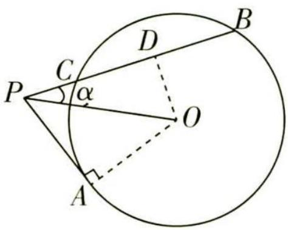

图 1

设 $\angle OPC=\alpha,0\leqslant\alpha<\frac{\pi}{4}$ ,连接 $OD$ ,则在 $\triangle POD$ 中,易知 $OD\perp PD$ ,所以
【善于表征】结合几何条件,选取合适的变量,将目标中需要用到的各个量统一表征出来,相当于在选取函数的自变量

$\mid P D \mid = \sqrt {2} \cos \alpha ,$

$\begin{array}{r l} & {\text {则} \overrightarrow {P A} \cdot \overrightarrow {P D} = | \overrightarrow {P A} | | \overrightarrow {P D} | \cos (\alpha + \frac {\pi}{4}) = 1 \times \sqrt {2} \cos \alpha \cos (\alpha + \frac {\pi}{4}) = \sqrt {2} \cos \alpha (\frac {\sqrt {2}}{2} \cos \alpha - \frac {\sqrt {2}}{2} \sin \alpha) =} \\ & {\cos^ {2} \alpha - \sin \alpha \cos \alpha = \frac {1 + \cos 2 \alpha}{2} - \frac {1}{2} \sin 2 \alpha = \frac {1}{2} - \frac {\sqrt {2}}{2} \sin (2 \alpha - \frac {\pi}{4}),} \end{array}$

因为 $0 \leqslant \alpha < \frac{\pi}{4}$ , 所以 $-\frac{\pi}{4} \leqslant 2\alpha - \frac{\pi}{4} < \frac{\pi}{4}$ , 所以当 $2\alpha - \frac{\pi}{4} = -\frac{\pi}{4}$ 时, $\overrightarrow{PA} \cdot \overrightarrow{PD}$ 有最大值 1.

# 数学起源

我国魏晋时期的学者刘徽首先给出了正、负数的定义: 今两算得失相反, 要令正负以名之. 意思是说, 在计算过程中遇到具有相反意义的量, 要用正数和负数来区分它们.

关注微信公众号“初高教辅站”获取更多初高中教辅资料

第三步: 讨论点 A, D 位于直线 PO 同侧的情况, 将目标结构表示为关于 $\angle OPC = \alpha$ 的函数.

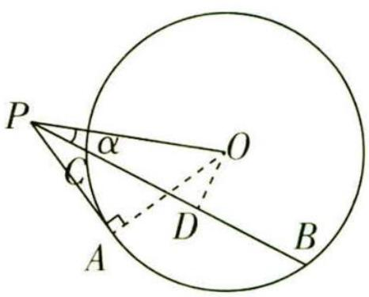

图 2

当点 A, D 位于直线 PO 同侧时, 如图 2 所示,

【易错提醒】点 $A, D$ 可能位于直线 $P O$ 异侧也可能位于同侧，结合图形，整体考虑，切勿遗漏

设 $\angle OPC = \alpha, 0 < \alpha < \frac{\pi}{4}$ , 连接 $OD$ , 则 $OD \perp PD, |PD| = \sqrt{2} \cos \alpha$ , 所以

$\overrightarrow {P A} \cdot \overrightarrow {P D} = | \overrightarrow {P A} | | \overrightarrow {P D} | \cos (\frac {\pi}{4} - \alpha) = 1 \times \sqrt {2} \cos \alpha \cos (\frac {\pi}{4} - \alpha) = \sqrt {2} \cos \alpha (\frac {\sqrt {2}}{2} \cos \alpha + \frac {\sqrt {2}}{2} \sin \alpha) =$

$\cos^ {2} \alpha + \sin \alpha \cos \alpha = \frac {1 + \cos 2 \alpha}{2} + \frac {1}{2} \sin 2 \alpha = \frac {1}{2} + \frac {\sqrt {2}}{2} \sin (2 \alpha + \frac {\pi}{4}),$

因为 $0 < \alpha < \frac{\pi}{4}$ , 所以 $\frac{\pi}{4} < 2\alpha + \frac{\pi}{4} < \frac{3\pi}{4}$ , 所以当 $2\alpha + \frac{\pi}{4} = \frac{\pi}{2}$ 时, $\overrightarrow{PA} \cdot \overrightarrow{PD}$ 有最大值 $\frac{1 + \sqrt{2}}{2}$ .

第四步: 比较两个最值, 确定答案.

综上可得, $\overrightarrow{PA}\cdot\overrightarrow{PD}$ 的最大值为 $\frac{1+\sqrt{2}}{2}$ .故选A.

# 核心技法 2 用坐标法计算

调研 2 (2023 重庆九龙坡区三模)已知 a, b 均为单位向量,且夹角为 $\frac{\pi}{3}$ , 若向量 c 满足 $(c - 2a) \cdot (c - b) = 0$ , 则 $|c|$ 的最大值为 ( )

$\quad$A. $\frac{7 + \sqrt{3}}{2}$

$\quad$B. $\frac{\sqrt{7}-\sqrt{3}}{2}$

$\quad$C. $\frac{\sqrt{11}+\sqrt{7}}{2}$

$\quad$D. $\frac{\sqrt{7}+\sqrt{3}}{2}$

# 天星老师引思路

将向量改写为共起点的大写字母形式 $\rightarrow$ 建立合适的坐标系 $\rightarrow$ 挖掘 $|c|$ 的几何性质得到“隐圆” $\rightarrow$ 利用圆的性质求得最值.

解析 第一步: 统一起点, 转化向量条件.

将向量 a, b, c 的起点平移到点 O，设向量 2a, b, c 的终点分别为 A, B, C，

则 $c - 2a = \overrightarrow{OC} - \overrightarrow{OA} = \overrightarrow{AC}, c - b = \overrightarrow{OC} - \overrightarrow{OB} = \overrightarrow{BC},$

由 $(c-2a)\cdot(c-b)=0$ 得 $\overrightarrow{AC}\cdot\overrightarrow{BC}=0$ ，即 $\overrightarrow{AC}\perp\overrightarrow{BC}$ ，连接AB，则点C在以AB为直径的圆上.

第二步:建系写坐标,寻找点 C 的轨迹.

a,b 均为单位向量,且夹角为 $\frac{\pi}{3}$ , 则以 O 为坐标原点建立如图 3 所示的平面直角坐标系,

【解题关键】建立合适的坐标系，一般将坐标原点选在已知长度和夹角的两个向量的起点处

# 数学起源

印度数学家婆罗摩笈多于公元628年才认识到负数可以是二次方程的根,而在欧洲,直到17世纪荷兰人日拉尔才首先认识和使用负数解决几何问题.

关注微信公众号“初高教辅站”获取更多初高中教辅资料

则 $\boldsymbol{a}=(1,0)$ , $\boldsymbol{b}=(\frac{1}{2},\frac{\sqrt{3}}{2})$ , 则 $A(2,0)$ , $B(\frac{1}{2},\frac{\sqrt{3}}{2})$ ,

所以以 AB 为直径的圆的圆心为 $M\left(\frac{5}{4}, \frac{\sqrt{3}}{4}\right)$ ，半径为 $\frac{1}{2} \times \sqrt{(2 - \frac{1}{2})^{2} + (0 - \frac{\sqrt{3}}{2})^{2}} = \frac{\sqrt{3}}{2}$ .

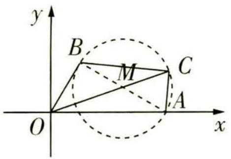

图3

第三步:利用圆的几何性质,巧推目标最值.

连接 $OM$ ，则 $\vert OM\vert = \sqrt{\frac{25}{16} + \frac{3}{16}} = \frac{\sqrt{7}}{2}$ 所以 $\vert c\vert = \vert OC\vert \leqslant \vert OM\vert +\frac{\sqrt{3}}{2} = \frac{\sqrt{7}}{2} +\frac{\sqrt{3}}{2}.$

【会转化】 $|c|$ 可以转化为圆 M 上一点到坐标原点 O 的距离

即 $|c|$ 的最大值为 $\frac{\sqrt{7}+\sqrt{3}}{2}$ ，故选D.

# 核心技法 3 用基底法计算

调研 3 (2023 安徽合肥一六八中学最后一卷) 在菱形 ABCD 中, AB = 2, 点 E, F 分别为 BC 和 CD 的中点, 且 $\overrightarrow{AB} \cdot \overrightarrow{AF} = 4$ , 则 $\overrightarrow{AE} \cdot \overrightarrow{BF} =$ ()

$\quad$A. 1

$\quad$B. $\frac{3}{2}$

$\quad$C. 2

$\quad$D. $\frac{5}{2}$

解析 作出图形如图4,选择一组不共线的向量 $\overrightarrow{AB},\overrightarrow{AD}$ 作为基底.

【会分析】当角度关系未知时, 不能盲目建系, 采用基底法分析是很好的选择

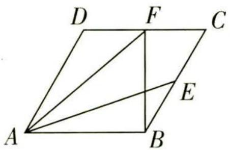

图4

因为点 E, F 分别为 BC 和 CD 的中点,

所以 $\overrightarrow{AB} \cdot \overrightarrow{AF} = \overrightarrow{AB} \cdot (\overrightarrow{AD} + \frac{1}{2}\overrightarrow{AB}) = \overrightarrow{AB} \cdot \overrightarrow{AD} + \frac{1}{2}\overrightarrow{AB}^2 = 4$ ，所以 $\overrightarrow{AB} \cdot \overrightarrow{AD} = 2$ .

所以 $\overrightarrow{AE} \cdot \overrightarrow{BF} = (\overrightarrow{AB} + \frac{1}{2}\overrightarrow{BC}) \cdot (\overrightarrow{BC} + \frac{1}{2}\overrightarrow{CD}) = (\overrightarrow{AB} + \frac{1}{2}\overrightarrow{AD}) \cdot (\overrightarrow{AD} - \frac{1}{2}\overrightarrow{AB}) = \frac{3}{4}\overrightarrow{AB} \cdot \overrightarrow{AD} + \frac{1}{2}\overrightarrow{AD}^2 -$

【会表示】想用基底快速准确地表示出其他向量, 需扎实掌握向量的线性运算, 先找一条 “路线” “走出” 目标向量, 再逐步转化成基底 $\frac{1}{2}\overrightarrow{AB^{2}}=\frac{3}{4}\times2=\frac{3}{2}$ , 故选 B.

调研 4 (2023 湖南部分名校联盟 5 月冲刺) 在 $\triangle ABC$ 中, 已知 $AC = 3$ , 向量 $\overrightarrow{AB}$ 在向量 $\overrightarrow{AC}$ 上的投影向量为 $\frac{\overrightarrow{AC}}{|\overrightarrow{AC}|}$ , 点 $D$ 是 $BC$ 边上靠近 $C$ 的三等分点, 则 $\overrightarrow{AD} \cdot \overrightarrow{AC} =$ ()

$\quad$A. 3

$\quad$B. 6

$\quad$C. 7

$\quad$D. 9

# 数学起源

无理数的起源 公元前500年,毕达哥拉斯学派的弟子希伯修斯发现,一个正方形的对角线与其一边的长度是不可公度的(若正方形的边长为1,则对角线的长不是一个有理数).

关注微信公众号“初高教辅站”获取更多初高中教辅资料

解析 作出图形如图5,选AB,AC作为一组基底,根据投影向量的计算公式,可知向量AB在向量 $\overrightarrow{AC}$ 上的投影向量为 $\frac{\overrightarrow{AB}\cdot\overrightarrow{AC}}{|\overrightarrow{AC}|}\cdot\frac{\overrightarrow{AC}}{|\overrightarrow{AC}|}$ ，由题意知 $\frac{\overrightarrow{AB}\cdot\overrightarrow{AC}}{|\overrightarrow{AC}|}\cdot\frac{\overrightarrow{AC}}{|\overrightarrow{AC}|}=\frac{\overrightarrow{AC}}{|\overrightarrow{AC}|}$ ，于是 $\frac{\overrightarrow{AB}\cdot\overrightarrow{AC}}{|\overrightarrow{AC}|}=1$ ，即 $\overrightarrow{AB}\cdot\overrightarrow{AC}=3$ .

【扫清障碍】需记住或者会推导投影向量的计算公式，再结合其他条件计算出基底向量的数量积

$\text { 又 } \overrightarrow {A D} = \overrightarrow {A B} + \overrightarrow {B D} = \overrightarrow {A B} + \frac {2}{3} \overrightarrow {B C} = \overrightarrow {A B} + \frac {2}{3} (\overrightarrow {A C} - \overrightarrow {A B}) = \frac {1}{3} \overrightarrow {A B} + \frac {2}{3} \overrightarrow {A C},$

所以 $\overrightarrow{AD} \cdot \overrightarrow{AC} = (\frac{1}{3}\overrightarrow{AB} + \frac{2}{3}\overrightarrow{AC}) \cdot \overrightarrow{AC} = \frac{1}{3}\overrightarrow{AB} \cdot \overrightarrow{AC} + \frac{2}{3}\overrightarrow{AC} \cdot \overrightarrow{AC} = \frac{1}{3} \times 3 + \frac{2}{3} \times 9 = 7.$ 故选C.

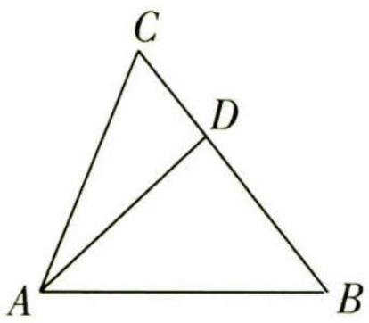

图5

# 核心技法 4 用投影法计算

调研 5 (2023 豫南名校三模) 如图 6, 这是用来构造无理数 $\sqrt{2}, \sqrt{3}, \sqrt{5}, \cdots$ 的图形, 已知 $P$ 是平面四边形 $ABCD$ 内 (包含边界) 一点, 则 $\overrightarrow{CB} \cdot \overrightarrow{CP}$ 的取值范围是 ( )

$\quad$A. $\left[-\frac{\sqrt{2}}{2},\sqrt{2}\right]$

$\quad$B. $[-1, \sqrt{2}]$

$\quad$C. $\left[\frac{\sqrt{2}}{2}, 1\right]$

$\quad$D. $\left[-\frac{\sqrt{2}}{2},1\right]$

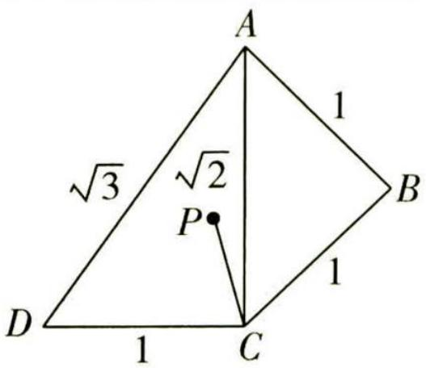

图6

# 天星老师有话说

由于动点 P 在一个复杂图形内, $\overrightarrow{CP}$ 的模和两向量夹角均未知, 定义法、基底法、坐标法均难以下手, 此时投影法闪亮登场.

解析 如图7,过点D作 $DE \perp BC$ 交BC的延长线于点E.

【易错提醒】 $\overrightarrow{CP}$ 在 $\overrightarrow{CB}$ 上的投影向量与 $\overrightarrow{CB}$ 可能是同向的，也可能是反向的，所以延长BC以保障情况研究全面

因为 $DE \perp BC, DC = 1, \angle DCE = 45^{\circ}$ ，所以 $CE = \frac{\sqrt{2}}{2}$ .

由图可知当 $P$ 在线段 ${AB}$ 上时, $\left| \overrightarrow{CP}\right|  \cos \angle {PCB}$ 有最大值1,当 $P$ 在点 $D$ 处时, $\left| \overrightarrow{CP}\right|  \cos \angle {PCB}$ 有最小值 $- \frac{\sqrt{2}}{2}$ ,

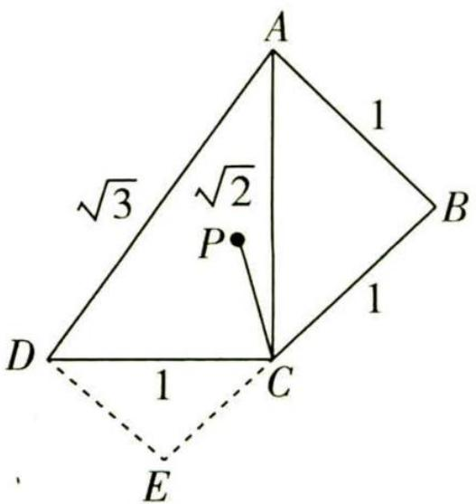

图 7

【解题关键】寻找 $|\overrightarrow{CP}| \cos \angle PCB$ 的最大值和最小值时，最值往往在图形的边界和顶点处取到又 $|\overrightarrow{CB}| = 1$ ，所以 $\overrightarrow{CB} \cdot \overrightarrow{CP}$ 的取值范围是 $[-\frac{\sqrt{2}}{2}, 1]$ . 故选 D.

# 数学起源

这与毕氏学派的“万物皆为数”(指有理数)的哲理大相径庭,使得该学派领导人认为这将动摇他们在学术界的统治地位,希伯修斯被毕氏门徒残忍地杀害了.

关注微信公众号“初高教辅站”获取更多初高中教辅资料

# 核心技法 5 用极化恒等式计算

调研 6 (2023 河北高三四模) 如图 8, 在边长为 2 的正方形 ABCD 中, 以 C 为圆心, 1 为半径的圆分别交 CD, BC 于点 E, F. 当点 P 在劣弧 EF 上运动时, $\overrightarrow{BP} \cdot \overrightarrow{DP}$ 的最小值为 \_\_\_\_.

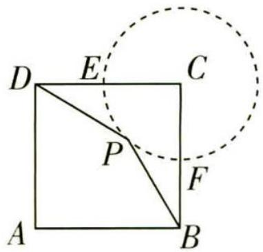

图8

解析 方法一: 极化恒等式法 连接 BD, 取 BD 的中点 M, 连接 PM, 则 $\overrightarrow{BP} \cdot \overrightarrow{DP} = \overrightarrow{PB} \cdot \overrightarrow{PD} = \overrightarrow{PM^{2}} - \overrightarrow{MB^{2}} = \overrightarrow{PM^{2}} - 2$ ,

【三角形中的极化恒等式】在 $\triangle ABC$ 中，若 $M$ 是 $BC$ 的中点，则有 $\overrightarrow{AB} \cdot \overrightarrow{AC} = \overrightarrow{AM^{2}} - \frac{1}{4} \overrightarrow{BC^{2}} = \overrightarrow{AM^{2}} - \overrightarrow{BM^{2}}$

又 $|\overrightarrow{PM}| \geqslant CM - r = \sqrt{2} - 1$ （ $r$ 为圆 $C$ 的半径），所以 $\overrightarrow{PM}^2 - 2 \geqslant (\sqrt{2} - 1)^2 - 2 = 1 - 2\sqrt{2}$ .

【指点迷津】这里用到圆外一点 M 到圆上一点 P 的距离范围的结论： $|\overrightarrow{PM}| \in [PC - r, PC + r]$ (C 为圆心，r 为圆 C 的半径)

所以 $\overrightarrow{BP}\cdot\overrightarrow{DP}$ 的最小值为 $1-2\sqrt{2}$ .

方法二: 参数方程法 如图9,以点C为坐标原点建立平面直角坐标系,

则 $B(0,-2)$ , $D(-2,0)$ , 设 $P(\cos\theta,\sin\theta)$ , $\theta\in[\pi,\frac{3\pi}{2}]$ ,

则 $\overrightarrow{DP} = (\cos \theta + 2, \sin \theta), \overrightarrow{BP} = (\cos \theta, \sin \theta + 2)$ ,

所以 $\overrightarrow{BP} \cdot \overrightarrow{DP} = \cos \theta (\cos \theta + 2) + \sin \theta (\sin \theta + 2) = 2\sqrt{2}\sin (\theta + \frac{\pi}{4}) + 1,$

由 $\theta \in [\pi, \frac{3\pi}{2}]$ , 得 $\theta + \frac{\pi}{4} \in [\frac{5\pi}{4}, \frac{7\pi}{4}]$ ,

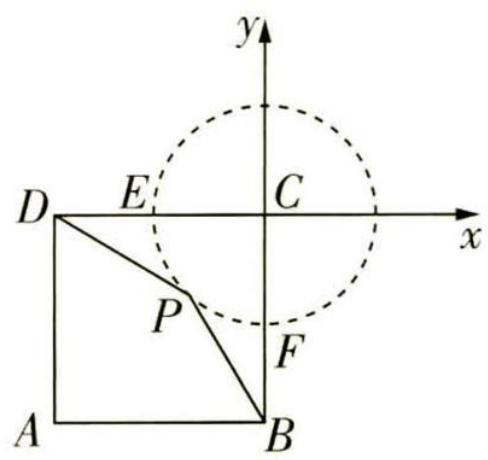

图9

【易遗漏】角度的范围需要精确化，依据是题干中的“点 $P$ 在劣弧 $EF$ 上运动”

所以当 $\theta + \frac{\pi}{4} = \frac{3\pi}{2}$ ，即 $\theta = \frac{5\pi}{4}$ 时， $\overrightarrow{BP} \cdot \overrightarrow{DP}$ 取得最小值 $1 - 2\sqrt{2}$ .

# 新题演练

##### 1. (2023 福建泉州实验中学 6 月测试 | 多选) 圆 $O$ 为锐角 $\triangle ABC$ 的外接圆, $AC = 2AB = 2$ , 则 $\overrightarrow{OA} \cdot \overrightarrow{OB}$ 的值可能为 ( )

$\quad$A. $\frac{1}{2}$

$\quad$B. $\frac{9}{16}$

$\quad$C. $\frac{5}{8}$

$\quad$D. $\frac{7}{8}$

##### 2. (2023 东北师大附中七模) 在矩形 $ABCD$ 中, $AB = 1$ , $AD = 2$ , $AC$ 与 $BD$ 相交于点 $O$ ,过点 A 作 $AE \perp BD$ 于 E, 则 $\overrightarrow{AE} \cdot \overrightarrow{AO} =$ ()

$\quad$A. $\frac{12}{25}$

$\quad$B. $\frac{24}{25}$

$\quad$C. $\frac{12}{5}$

$\quad$D. $\frac{4}{5}$

##### 3. (2023 江苏镇江中学 5 月模拟) 已知半径为 1 的圆 $O$ 上有三个动点 $A, B, C$ , 且 $|AB| = \sqrt{2}$ , 则 $\overrightarrow{AC} \cdot \overrightarrow{BC}$ 的最小值为

$\quad$A. $1 - \sqrt{2}$

$\quad$B. $\sqrt{2} - 1$

$\quad$C. $\frac{1}{2} -\sqrt{2}$

$\quad$D. $\sqrt{2} - \frac{1}{2}$

##### 4. (2023 湖南长沙实验中学二模)已知 $\triangle ABC$ 是单位圆 $O$ 的内接三角形, 若 $A = \frac{\pi}{4}$ , 则 $\overrightarrow{BA} \cdot \overrightarrow{BC}$ 的最大值为 ( )

$\quad$A. $\sqrt{2} + 1$

$\quad$B. $2\sqrt{2}$

$\quad$C. 2

$\quad$D. $1 - \sqrt{2}$

##### 5. (2023 浙江慈溪中学等校三模)已知点 $P$ 是边长为 1 的正十二边形 $A_{1} A_{2} \cdots A_{12}$ 边上任意一点, 则 $\overrightarrow{A_{1} P} \cdot \overrightarrow{A_{1} A_{2}}$ 的最小值为

$\quad$A. $-\frac{\sqrt{3}-1}{2}$

$\quad$B. $-\frac{\sqrt{3}+1}{2}$

$\quad$C. $-\sqrt{3}$

$\quad$D. -2

##### 6. (2023 浙江温州 5 月仿真模拟) 设 $a, b$ 是平面内的两条互相垂直的直线, 线段 $A B$ , $C D$ 的长度分别为 2,10, 点 $A, C$ 在 $a$ 上, 点 $B, D$ 在 $b$ 上, 若 $M$ 是 $A B$ 的中点, 则 $\overrightarrow{M C} \cdot \overrightarrow{M D}$ 的取值范围是 \_\_\_\_.

# 参考答案与解析

##### 1. BC 记圆 O 的半径为 R, 则 $R = \frac{AB}{2\sin C} = \frac{1}{2\sin C}$ .

【破题有拓】用 $C$ 作为变量, 利用正弦定理求出向量模, 利用圆心角和圆周角关系求出向量夹角

又 $\angle AOB = 2C$ ，所以 $\overrightarrow{OA} \cdot \overrightarrow{OB} = \frac{1}{2\sin C} \times \frac{1}{2\sin C} \times \cos 2C = \frac{1 - 2\sin^2 C}{4\sin^2 C} = \frac{1}{4\sin^2 C} - \frac{1}{2}$ .

因为 $\triangle ABC$ 为锐角三角形, 如图10, 则有 $\frac{1}{\sqrt{5}} < \sin C < \frac{1}{2}$ , 所以 $\frac{4}{5} < 4\sin^2 C < 1$ ,

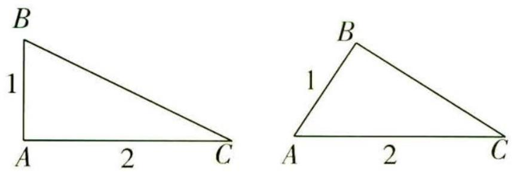

图 10

# 数学起源

希伯修斯虽然被害死了,但他发现的“新数”还存在着,人们把不可通约的量取名“无理数”——这就是无理数的由来.

关注微信公众号“初高教辅站”获取更多初高中教辅资料

所以 $\frac{1}{2} < \frac{1}{4\sin^2C} - \frac{1}{2} < \frac{3}{4}$ , 即 $\frac{1}{2} < \overrightarrow{OA} \cdot \overrightarrow{OB} < \frac{3}{4}$ . 故选 BC.

##### 2. D 根据题意建立如图 11 所示的平面直角坐标系, 则 $A(0,1), B(0,0), C(2,0), D(2,1)$ ,

设 $E(x,y)$ ，则 $\overrightarrow{AE} = (x,y - 1),\overrightarrow{BE} = (x,y),\overrightarrow{BD} = (2,1).$

∵ $AE \perp BD, \therefore \overrightarrow{AE} \perp \overrightarrow{BD}$ 且 $\overrightarrow{BE} \parallel \overrightarrow{BD},$

∴ $\left\{\begin{aligned}&2x+y-1=0,\\ &x-2y=0,\end{aligned}\right.$ 解得 $\left\{\begin{aligned}&x=\frac{2}{5},\\ &y=\frac{1}{5},\end{aligned}\right.$ $\therefore E\left(\frac{2}{5},\frac{1}{5}\right),\overrightarrow{AE}=\left(\frac{2}{5},-\frac{4}{5}\right).$

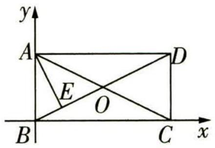

图11

【划重点】设出 E 点的坐标，将挖掘出的几何条件用代数语言翻译出来在矩形 ABCD 中, O 为 BD 的中点, ∴ $O(1, \frac{1}{2})$ ,

又 $A(0,1), \therefore \overrightarrow{AO} = (1, -\frac{1}{2}), \overrightarrow{AE} \cdot \overrightarrow{AO} = \frac{2}{5} \times 1 + (-\frac{4}{5}) \times (-\frac{1}{2}) = \frac{4}{5}$ , 故选 D.

##### 3. A 连接 OA, OB, 因为 $\left|AB\right| = \sqrt{2}$ , $\left|OA\right| = \left|OB\right| = 1$ , 所以 $\left|OA\right|^{2} + \left|OB\right|^{2} = \left|AB\right|^{2}$ , 所以 $\angle AOB = \frac{\pi}{2}$ .

以 O 为坐标原点, OA, OB 所在直线分别为 x 轴, y 轴建立平面直角坐标系, 如图 12 所示, 则 A(1,0), B(0,1),

设 $C(x,y)$ ，则 $x^{2} + y^{2} = 1,\overrightarrow{AC} = (x - 1,y),\overrightarrow{BC} = (x,y - 1),$

所以 $\overrightarrow{AC} \cdot \overrightarrow{BC} = x(x - 1) + y(y - 1) = x^2 + y^2 - x - y = -x - y + 1.$

设 $-x - y + 1 = t$ ，则 $x + y + t - 1 = 0$ ，依题意直线 $x + y + t - 1 = 0$ 与圆 O 有公共点，

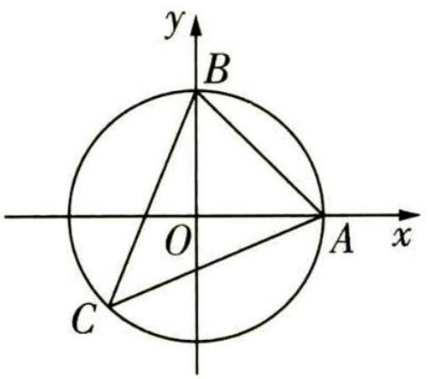

图12

【难点分析】令 $-x - y + 1 = t$ ，得到方程 $x + y + t - 1 = 0$ ，点 C 是在这个方程对应的直线上
的，与此同时，点 C 又在圆 O 上，那么只要此直线与圆 O 有交点，就满足题意了，这个交点，就是我们的点 C

所以 $\frac{|t - 1|}{\sqrt{1 + 1}} \leqslant 1$ ，得 $1 - \sqrt{2} \leqslant t \leqslant 1 + \sqrt{2}$ ，所以 $\overrightarrow{AC} \cdot \overrightarrow{BC}$ 的最小值为 $1 - \sqrt{2}$ ，故选A.

##### 4. A 连接 OA, OB, OC, 由圆 O 是 $\triangle ABC$ 的外接圆, 且 $A = \frac{\pi}{4}$ , 得 $\angle BOC = \frac{\pi}{2}$ , 即 $OB \perp OC$ ,

则 $\overrightarrow{BA} \cdot \overrightarrow{BC} = (\overrightarrow{OA} - \overrightarrow{OB}) \cdot (\overrightarrow{OC} - \overrightarrow{OB}) = \overrightarrow{OA} \cdot \overrightarrow{OC} - \overrightarrow{OA} \cdot \overrightarrow{OB} - \overrightarrow{OB} \cdot \overrightarrow{OC} + \overrightarrow{OB}^2 = \cos \angle AOC -$

$\cos \angle A O B + 1 = \cos \angle A O C - \cos \left(\frac {3 \pi}{2} - \angle A O C\right) + 1 = \cos \angle A O C + \sin \angle A O C + 1 = \sqrt {2} \sin (\angle A O C +$

# 数学起源

复数的起源 最早有关复数方根的文献出自公元1世纪希腊数学家海伦,他考虑的是平顶金字塔不可能问题.

关注微信公众号“初高教辅站”获取更多初高中教辅资料

$\left. \frac {\pi}{4}\right) + 1 \leqslant \sqrt {2} + 1,$

【指点迷津】用 $\overrightarrow{OA},\overrightarrow{OB},\overrightarrow{OC}$ 表示出待求式，计算后得到关于 $\angle AOC$ 的三角函数，化简求出最值，注意取等条件的验证

当且仅当 $\angle AOC = \frac{\pi}{4}$ 时等号成立. 故选A.

##### 5. B 作出图形如图 13 所示, 延长 $A_{10}A_{11}, A_{2}A_{1}$ 交于 $Q$ , 由题意知 $A_{10}A_{11} \perp A_{2}A_{1}$ .

过 $A_{12}$ 分别作 $A_{1}Q, A_{11}Q$ 的垂线, 垂足为 M, N,

易知正十二边形 $A_{1}A_{2}\cdots A_{12}$ 的每个内角均为 $\frac{(12-2)\times180^{\circ}}{12}=150^{\circ}$ ,

在 $\mathrm{Rt}\triangle A_{12}MA_1$ 中， $|A_{1}A_{12}| = 1,\angle MA_{1}A_{12} = 30^{\circ},|A_{1}M| = |A_{1}A_{12}|\cos 30^{\circ} = \frac{\sqrt{3}}{2},$

在 Rt△A $_{11}$ NA $_{12}$ 中，|A $_{11}$ A $_{12}$ | = 1，∠NA $_{11}$ A $_{12}$ = 30°，|QM| = |A $_{12}$ N| =

$\left|A_{11}A_{12}\right|\sin30^{\circ}=\frac{1}{2},$

则 $|A_{1}Q| = |A_{1}M| + |QM| = \frac{\sqrt{3} + 1}{2}.$

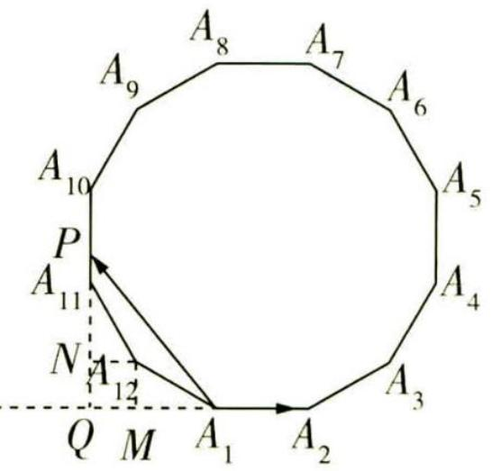

图 13

【小技巧】此处求 $\left| {{A}_{1}Q}\right|$ 采用了分段的策略,放在两个直角三角形中,分别求解

因为 $\overrightarrow{A_1P} \cdot \overrightarrow{A_1A_2} = |\overrightarrow{A_1P}| |\overrightarrow{A_1A_2}| \cos \theta = |\overrightarrow{A_1P}| \cos \theta, \theta$ 为 $\overrightarrow{A_1P}, \overrightarrow{A_1A_2}$ 的夹角，

所以当 P 在线段 $A_{10}A_{11}$ 上时， $\overrightarrow{A_{1}P} \cdot \overrightarrow{A_{1}A_{2}}$ 取得最小值，最小值为 $-|A_{1}Q| = -\frac{\sqrt{3} + 1}{2}$ . 故选 B.

##### 6. [-9,11] 作出图形如图 14 所示, 设直线 a 与直线 b 的交点为 O, 连接 OM,

因为 M 是 AB 的中点, AB = 2 , 所以 MO = 1 , 所以点 M 在以 O 为圆心, 1 为半径的圆上.

【敲黑板】这里用到“直角三角形斜边上的中线等于斜边的一半”和圆的定义

设线段 CD 的中点为 N, 连接 ON, 因为 CD = 10, 所以 NO = 5, 故点 N 在以 O 为圆心, 5 为半径的圆上.

连接 MN，因为 $\overrightarrow{MC} \cdot \overrightarrow{MD} = (\overrightarrow{MN} + \overrightarrow{NC}) \cdot (\overrightarrow{MN} + \overrightarrow{ND}) = (\overrightarrow{MN} + \overrightarrow{NC}) \cdot (\overrightarrow{MN} - \overrightarrow{NC})$ ， $|\overrightarrow{NC}| = 5$ ，
所以 $\overrightarrow{MC}\cdot\overrightarrow{MD}=\overrightarrow{MN^{2}}-\overrightarrow{NC^{2}}=\overrightarrow{MN^{2}}-25$

又 $4 \leqslant |\overrightarrow{MN}| \leqslant 6$ ，所以 $-9 \leqslant \overrightarrow{MC} \cdot \overrightarrow{MD} \leqslant 11$ ，所以 $\overrightarrow{MC} \cdot \overrightarrow{MD}$ 的取值范围是 $[-9, 11]$ .

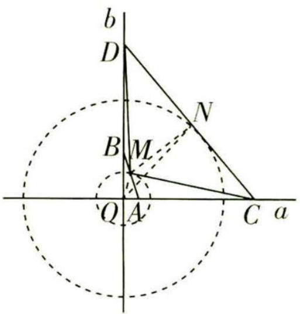

图 14

# 数学起源

16 世纪意大利米兰学者卡尔达诺在 1545 年发表的《重要的艺术》一书中, 公布了一元三次方程的一般解法, 被后人称为“卡当公式”, 他是第一个把负数的平方根写到公式中的数学家.

关注微信公众号“初高教辅站”获取更多初高中教辅资料

# 超重点 10 破解平面向量运算的 3 类关键题型

# 题型 1 与平面几何有关的平面向量运算

调研 1 (2023 重庆第二次联合诊断) 已知点 O 是 $\triangle ABC$ 的外心, AB = 6,
BC = 8, $B = \frac{2\pi}{3}$ , 若 $\overrightarrow{BO} = x \overrightarrow{BA} + y \overrightarrow{BC}$ , 则 $3x + 4y =$

$\quad$A. 5

$\quad$B. 6

$\quad$C. 7

$\quad$D. 8

# 天星老师引思路

设 BO 与 AC 交于点 P, 对于本题, 最直接的求解思路是找到 BP 与 BO 的数量关系, 然后结合向量的线性运算求解. 但此法计算烦琐, 过程复杂, 故考虑另一个思路, 即结合外接圆的性质, 利用数量积构造方程求解: $OD \perp AB, OE \perp BC \rightarrow BD = \frac{1}{2}AB, BE = \frac{1}{2}BC \rightarrow$ 计算出 $\overrightarrow{BO} \cdot \overrightarrow{BA}, \overrightarrow{BO} \cdot \overrightarrow{BC}, \overrightarrow{BA} \cdot \overrightarrow{BC} \rightarrow$ 用 x, y 表示出 $\overrightarrow{BO} \cdot \overrightarrow{BA}$ ,$\overrightarrow{BO} \cdot \overrightarrow{BC} \rightarrow$ 解出 x, y 即可.

解析 如图 1, 过点 O 作 $OD \perp AB$ 于 D, $OE \perp BC$ 于 E, 则 $BD = \frac{1}{2}AB$ , $BE = \frac{1}{2}BC$ .

由数量积的几何意义, 可得 $\overrightarrow{BO} \cdot \overrightarrow{BA} = |\overrightarrow{BD}| \cdot |\overrightarrow{BA}| = \frac{1}{2} |\overrightarrow{AB}|^{2} = 18$ , $\overrightarrow{BC} \cdot \overrightarrow{BO} = |\overrightarrow{BC}| \cdot |\overrightarrow{BE}| = \frac{1}{2} |\overrightarrow{BC}|^{2} = 32$ ,

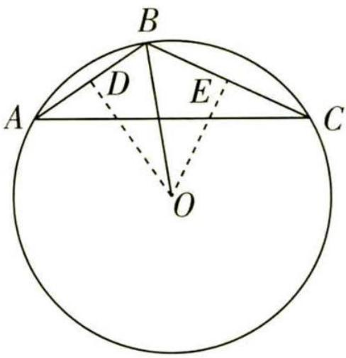

又 $B = \frac{2\pi}{3}$ , 所以 $\overrightarrow{BA} \cdot \overrightarrow{BC} = |\overrightarrow{BA}| |\overrightarrow{BC}| \cos \angle ABC = 6 \times 8 \times (-\frac{1}{2}) = -24$ .

【关键提醒】根据数量积的定义计算出 $\overrightarrow{BO}\cdot\overrightarrow{BA},\overrightarrow{BO}\cdot\overrightarrow{BC},\overrightarrow{BA}\cdot\overrightarrow{BC}$ ，这是关键

图1

因为 $\overrightarrow{BO}=x\overrightarrow{BA}+y\overrightarrow{BC}$ ，所以 $\overrightarrow{BO}\cdot\overrightarrow{BA}=(x\overrightarrow{BA}+y\overrightarrow{BC})\cdot\overrightarrow{BA}=x|\overrightarrow{BA}|^{2}+$ $y\overrightarrow{BC}\cdot\overrightarrow{BA}=36x-24y=18$ ，即6x-4y=3，同理 $\overrightarrow{BO}\cdot\overrightarrow{BC}=(x\overrightarrow{BA}+y\overrightarrow{BC})\cdot\overrightarrow{BC}=x\overrightarrow{BC}\cdot\overrightarrow{BA}+y|\overrightarrow{BC}|^{2}=$

【等价转化】利用数量积将向量关系转化为方程关系，进而求解

$-24x + 64y = 32$ ，即 $-3x + 8y = 4$ ，所以 $\left\{ \begin{array}{l} x = \frac{10}{9}, \\ y = \frac{11}{12}. \end{array} \right.$ 所以 $3x + 4y = 3 \times \frac{10}{9} + 4 \times \frac{11}{12} = 7$ . 故选 C.

【解后反思】题设给出了三角形的两边及夹角，故可考虑建系，其中外接圆圆心的坐标可通过其为三条中垂线的交点求解，此处不再赘述，同学们可自行尝试！

调研 2 (2023 合肥八中 5 月模拟) 如图 2, 已知 $\triangle ABC$ 是面积为 $3\sqrt{3}$ 的等边三角形, 正方形 MNPQ 的面积为 2, 其各顶点均位于 $\triangle ABC$ 的内部或三边上, 且该正

# 数学起源

给出“虚数”这一名称的是法国数学家笛卡尔,他在《几何学》中使“虚的数”与“实的数”相对应,从此,虚数才流传开来.

关注微信公众号“初高教辅站”获取更多初高中教辅资料方形可在 $\triangle ABC$ 内任意旋转,则当 $\overrightarrow{BQ} \cdot \overrightarrow{CP} = 0$ 时, $|\overrightarrow{BQ} + \overrightarrow{CP}|^{2} =$

$\quad$A. $2 + 4\sqrt{3}$

$\quad$B. $4 + 2\sqrt{3}$

$\quad$C. $3 + 2\sqrt{3}$

$\quad$D. $2 + 3\sqrt{3}$

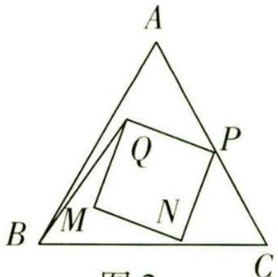

图 2

解析 第一步: 求出 $\triangle ABC$ 内切圆及正方形 MNPQ 的外接圆半径.

记 $\triangle ABC$ 的边长为 $a$ , 由题意得 $\frac{1}{2} \times \frac{\sqrt{3}}{2} \times a^2 = 3\sqrt{3}$ , 解得 $a = 2\sqrt{3}$ . 记 $\triangle ABC$ 内切圆的半径为 $r$ , 则 $S_{\triangle ABC} = \frac{1}{2} \cdot 3a \cdot r$ , 即 $3\sqrt{3} = \frac{1}{2} \times 3 \times 2\sqrt{3} \times r$ , 解得 $r = 1$ . 由题意知正方形 MNPQ 的边长为 $\sqrt{2}$ , 记其外接圆的半径为 $R$ , 则 $2R = \sqrt{(\sqrt{2})^2 + (\sqrt{2})^2} = 2$ , 故 $R = 1$ .

第二步:探索正方形 MNPQ 与 $\triangle ABC$ 内切圆的关系.

因为正方形 MNPQ 可在 $\triangle ABC$ 内任意旋转, 且 R = r, 所以正方形的外接圆与三角形的内切圆重合, 即正方形 MNPQ 各个顶点均在 $\triangle ABC$ 的内切圆上.

第三步:建立平面直角坐标系,利用向量的坐标运算求解.

以 $\triangle ABC$ 的底边 $BC$ 所在直线为 $x$ 轴，以 $BC$ 的垂直平分线为 $y$ 轴建立平面直角坐标系，如图3所示，则 $B(-\sqrt{3},0),C(\sqrt{3},0),A(0,3)$ ，三角形内切圆的方程为 $x^{2} + (y - 1)^{2} = 1$

故可设 $P(\cos \alpha,1+\sin \alpha)$ ，则 $Q(\cos(\alpha+\frac{\pi}{2}),1+\sin(\alpha+\frac{\pi}{2}))$ ，即
【技巧点拨】利用圆的参数方程设点，借助三角函数求解 $Q(-\sin\alpha,1+\cos\alpha)$ ,

图 3

所以 $\overrightarrow{BQ}\cdot\overrightarrow{CP}=(\sqrt{3}-\sin\alpha,1+\cos\alpha)\cdot(\cos\alpha-\sqrt{3},1+\sin\alpha)=$ $(\sqrt{3}+1)(\cos\alpha+\sin\alpha)-2=0$ ，所以 $\cos\alpha+\sin\alpha=\sqrt{3}-1$ ，所以 $|\overrightarrow{BQ}+\overrightarrow{CP}|^{2}=(\cos\alpha-\sin\alpha)^{2}+(2+\cos\alpha+\sin\alpha)^{2}=(\cos\alpha-\sin\alpha)^{2}+(\cos\alpha+\sin\alpha)^{2}+4(\cos\alpha+\sin\alpha)+4=2+4(\sqrt{3}-1)+4=2+4\sqrt{3}$ . 故选 A.

【会化简】化简过程中注意整体思想的应用， $(\cos\alpha+\sin\alpha)^{2}+(\cos\alpha-\sin\alpha)^{2}=2$

# 题型 2 与解析几何相关的平面向量运算

调研 3 (2023 新课标 I 卷) 已知双曲线 $C: \frac{x^{2}}{a^{2}} - \frac{y^{2}}{b^{2}} = 1 (a > 0, b > 0)$ 的左、右焦点分别为 $F_{1}, F_{2}$ . 点 $A$ 在 $C$ 上, 点 $B$ 在 $y$ 轴上, $\overrightarrow{F_{1} A} \perp \overrightarrow{F_{1} B}, \overrightarrow{F_{2} A} = -\frac{2}{3} \overrightarrow{F_{2} B}$ , 则 $C$ 的离心率为 \_\_\_\_.

解析 方法一 依题意, 设 $\left|A{F}_{2}\right| = {2m}$ ,则 $\left| B{F}_{2}\right|  = {3m} = \left| B{F}_{1}\right| ,\left| A{F}_{1}\right|  = {2a} + {2m}$ .

在 Rt $\triangle ABF_{1}$ 中, $9m^{2}+(2a+2m)^{2}=25m^{2}$ , 则 $(a+3m)(a-m)=0$ , 故 $a=m$ 或 $a=-3m$ (舍去),

# 数学起源

法国数学家达朗贝尔在1747年指出,如果按照多项式的四则运算规则对虚数进行运算,那么它的结果总是 $a+bi$ 的形式(a,b都是实数).

关注微信公众号“初高教辅站”获取更多初高中教辅资料所以 $|AF_{1}|=4a,|AF_{2}|=2a,|BF_{2}|=|BF_{1}|=3a$ ，则 $|AB|=5a$ ，故 $\cos\angle F_{1}AF_{2}=\frac{|AF_{1}|}{|AB|}=\frac{4a}{5a}=\frac{4}{5}$ .

所以在 $\triangle AF_{1}F_{2}$ 中， $\cos \angle F_{1}AF_{2} = \frac{16a^{2} + 4a^{2} - 4c^{2}}{2 \times 4a \times 2a} = \frac{4}{5}$ ，整理得 $5c^{2} = 9a^{2}$ ，故离心率 $e = \frac{c}{a} = \frac{3\sqrt{5}}{5}$ .

方法二 依题意得 $F_{1}(-c,0), F_{2}(c,0)$ , 设 $A(x_{0},y_{0}), B(0,t)$ .

因为 $\overrightarrow{F_2A} = -\frac{2}{3}\overrightarrow{F_2B}$ , 所以 $(x_0 - c, y_0) = -\frac{2}{3}(-c, t)$ , 则 $x_0 = \frac{5}{3}c, y_0 = -\frac{2}{3}t$ .

又 $\overrightarrow{F_1A} \perp \overrightarrow{F_1B}$ , 所以 $\overrightarrow{F_1A} \cdot \overrightarrow{F_1B} = (\frac{8}{3}c, -\frac{2}{3}t) \cdot (c, t) = \frac{8}{3}c^2 - \frac{2}{3}t^2 = 0$ , 则 $t^2 = 4c^2$ .

【会转化】根据向量数量积的坐标运算将几何关系转化为代数关系

又点 $A$ 在 $C$ 上，则 $\frac{\frac{25}{9}c^2}{a^2} -\frac{\frac{4}{9}t^2}{b^2} = 1$ ，整理得 $\frac{25c^2}{9a^2} -\frac{4t^2}{9b^2} = 1$ ，即 $\frac{25c^2}{9a^2} -\frac{16c^2}{9b^2} = 1$

【关键步骤】将所得结果代回双曲线方程，寻找 a, c 的关系

所以 $25c^{2}b^{2}-16c^{2}a^{2}=9a^{2}b^{2}$ ，即 $25c^{2}(c^{2}-a^{2})-16a^{2}c^{2}=9a^{2}(c^{2}-a^{2})$ ，整理得 $25c^{4}-50a^{2}c^{2}+9a^{4}=0$ ，则 $(5c^{2}-9a^{2})(5c^{2}-a^{2})=0$ ，得 $5c^{2}=9a^{2}$ 或 $5c^{2}=a^{2}$ （根据 c>a 舍去）。故所求离心率 $e=\frac{c}{a}=\frac{3\sqrt{5}}{5}$ 。

调研 4 (2023 长沙长郡中学二模 | 多选) 已知圆 $C: (x - 2)^{2} + (y - 3)^{2} = 4$ , 恒过点 $A(1,3)$ 的直线 $l$ 与圆 $C$ 交于 $P, Q$ 两点. 下列说法正确的是 ( )

$\quad$A. $|PQ|$ 的最小值为 $2 \sqrt{2}$   
$\quad$B. $\overrightarrow{PC} \cdot \overrightarrow{PQ} \in [6,8]$   
$\quad$C. $\overrightarrow{CP} \cdot \overrightarrow{CQ}$ 的最大值为 -2  
$\quad$D. 过点 C 作直线 l 的垂线, 垂足为点 B, 则点 B 在某个定圆上

# 天星老师讲方法

求解向量数量积的方法一般有三个：

①定义法,适用于向量的模和夹角已知或易求的情况;②坐标法,题设中有明显的垂直、对称关系等,且与向量相关的点易求时可考虑使用该法;③基向量法,上述两法均不适用且题目中涉及其他模与夹角易求的向量时,考虑该法.而本题的

向量涉及多个动点,运用坐标法求解较烦琐,故优先选择使用定义法或基向量法求解.

# 解析

<table><tr><td>选项</td><td>分析过程</td><td>正误</td></tr><tr><td>A</td><td>圆 $C:(x-2)^{2}+(y-3)^{2}=4$ →圆心为 $C(2,3)$ ,半径 $r$ 为 $2\rightarrow A(1,3)$ 在圆 $C$ 内→连接 $AC$ ,则当 $AC\perp PQ$ 时,圆心 $C$ 到直线 $l$ 的距离 $d$ 最大→当 $AC\perp PQ$ 时, $|PQ|$ 【指点迷津】数形结合知垂直时点线距最大,结合 $|PQ|=2\sqrt{r^{2}-d^{2}}$ 得此时 $|PQ|$ 最小最小→ $|AC|=1$ , $|PQ|_{\min}=2\sqrt{2^{2}-1^{2}}=2\sqrt{3}$ </td><td>×</td></tr></table>

# 数学起源

法国数学家棣莫弗在 1722 年发现了著名的棣莫弗定理. 欧拉在《微分公式》一文中第一次用 i 来表示 -1 的平方根,首创了用符号 i 作为虚数的单位.

关注微信公众号“初高教辅站”获取更多初高中教辅资料

续表

<table><tr><td>选项</td><td>分析过程</td><td>正误</td></tr><tr><td>B</td><td>设N是PQ的中点→ $\overrightarrow{PC} \cdot \overrightarrow{PQ} = \overrightarrow{PC} \cdot 2\overrightarrow{PN} = 2|\overrightarrow{PC}| \cdot |\overrightarrow{PN}| \cdot \cos \angle CPQ = 2|\overrightarrow{PN}|^{2} =$ 【会运用】灵活运用向量的数量积运算,  $|\overrightarrow{PC}| \cdot \cos \angle CPQ = |\overrightarrow{PN}|$  $\frac{|\overrightarrow{PQ}|^{2}}{2}$ →结合A选项知 $2\sqrt{3} \leqslant |\overrightarrow{PQ}| \leqslant 4 \rightarrow 12 \leqslant |\overrightarrow{PQ}|^{2} \leqslant 16 \rightarrow \overrightarrow{PC} \cdot \overrightarrow{PQ} \in [6,8]$ </td><td>√</td></tr><tr><td>C</td><td> $\overrightarrow{CP} \cdot \overrightarrow{CQ} = |\overrightarrow{CP}| \cdot |\overrightarrow{CQ}| \cdot \cos \angle PCQ = |\overrightarrow{CP}| \cdot |\overrightarrow{CQ}| \cdot \frac{|\overrightarrow{CP}|^{2} + |\overrightarrow{CQ}|^{2} - |\overrightarrow{PQ}|^{2}}{2|\overrightarrow{CP}| \cdot |\overrightarrow{CQ}|} =$  $\frac{8 - |\overrightarrow{PQ}|^{2}}{2} \rightarrow \overrightarrow{CP} \cdot \overrightarrow{CQ} \in [-4,-2] \rightarrow \overrightarrow{CP} \cdot \overrightarrow{CQ}$ 的最大值为-2</td><td>√</td></tr><tr><td>D</td><td>设 $B(x,y)$ →由题意知 $|\overrightarrow{AC}|^{2} = |\overrightarrow{AB}|^{2} + |\overrightarrow{BC}|^{2} \rightarrow (2-1)^{2} + (3-3)^{2} = (x-1)^{2} +$ 【方法点拨】利用直接法求轨迹方程,根据垂直关系建立关于x、y的等式,化简变形即可 $(y-3)^{2} + (x-2)^{2} + (y-3)^{2} \rightarrow (x-\frac{3}{2})^{2} + (y-3)^{2} = \frac{1}{4} \rightarrow$ 点B在定圆上</td><td>√</td></tr></table>

# 题型 3 与数列相关的平面向量运算

调研 5 (雪花曲线 | 2023 湖南益阳三模 | 多选) 如图 4, 有一系列曲线 $\Omega_{1}, \Omega_{2}, \cdots, \Omega_{n}, \cdots$ , 且 $\Omega_{1}$ 是边长为 6 的等边三角形, $\Omega_{i+1}$ 是对 $\Omega_{i} (i = 1, 2, \cdots)$ 进行如下操作而得到: 将曲线 $\Omega_{i}$ 的每条边进行三等分, 以每边中间部分的线段为边, 向外作等边三角形, 再将中间部分的线段去掉, 得到 $\Omega_{i+1}$ . 这样的曲线被称为“雪花曲线”. 记曲线 $\Omega_{n} (n = 1, 2, \cdots)$ 的边长为 $a_{n}$ , 周长为 $c_{n}$ , 则下列说法正确的是 ( )

图4

$\quad$A. $a_{n} = 2 \times \left(\frac{1}{3}\right)^{n - 2}$

$\quad$B. $c_{5}=\frac{256}{9}$

$\quad$C. 在 $\Omega_{3}$ 中, $\overrightarrow{OA} \cdot \overrightarrow{OC} = \overrightarrow{OD} \cdot \overrightarrow{OC}$

$\quad$D. 在 $\Omega_{3}$ 中, $\overrightarrow{OB} \cdot \overrightarrow{OC} = 40$

# 解析

<table><tr><td>选项</td><td>分析过程</td><td>正误</td></tr><tr><td>A</td><td>数列{an}是首项为6,公比为 $\frac{1}{3}$ 的等比数列→an=6× $(\frac{1}{3})^{n-1}$ =2× $(\frac{1}{3})^{n-2}$ </td><td>√</td></tr></table>

# 数学起源

函数的起源 中文数学书上使用的“函数”一词是转译词,是我国清代数学家李善兰在翻译《代数学》一书时,把“function”译成“函数”的.

关注微信公众号“初高教辅站”获取更多初高中教辅资料

续表

<table><tr><td>选项</td><td>分析过程</td><td>正误</td></tr><tr><td>B</td><td>设曲线 $\Omega_{n}$ 的边数为 $L_{n}$ ,则 $L_{n+1}=4L_{n}\rightarrow L_{n}=3\times4^{n-1}\rightarrow c_{n}=a_{n}L_{n}=18\times(\frac{4}{3})^{n-1}\rightarrow c_{5}=$ 【会思考】根据“周长=边长×边数”计算 $|c_{n}|$ 的通项公式 $18\times(\frac{4}{3})^{5-1}=\frac{512}{9}$ </td><td>×</td></tr><tr><td>C</td><td>连接 $AC,OA=6,\angle OAC=90^{\circ}\rightarrow AC=2\sqrt{3}\rightarrow\overrightarrow{OC}=\overrightarrow{OA}+\overrightarrow{AC}\rightarrow\overrightarrow{OA}\cdot\overrightarrow{OC}=\overrightarrow{OA}\cdot(\overrightarrow{OA}+\overrightarrow{AC})=\overrightarrow{OA}^{2}=36\rightarrow$ 连接 $CD,\angle OCD=30^{\circ},OC=4\sqrt{3},CD=2,\overrightarrow{OD}=\overrightarrow{OC}+$ 【易错提醒】直接根据图形进行向量的运算,易错点是没有摸清楚相应的夹角和模 $\overrightarrow{CD}\rightarrow\overrightarrow{OD}\cdot\overrightarrow{OC}=(\overrightarrow{OC}+\overrightarrow{CD})\cdot\overrightarrow{OC}=\overrightarrow{OC}^{2}+\overrightarrow{OC}\cdot\overrightarrow{CD}=48-12=36\rightarrow\overrightarrow{OA}\cdot\overrightarrow{OC}=\overrightarrow{OD}\cdot\overrightarrow{OC}$ </td><td>√</td></tr><tr><td>D</td><td>连接 $AB,\angle OAB=90^{\circ},AB=\frac{2\sqrt{3}}{3},\overrightarrow{OB}=\overrightarrow{OA}+\overrightarrow{AB}\rightarrow$ 结合C可知, $\overrightarrow{AC}=3\overrightarrow{AB}\rightarrow\overrightarrow{OB}\cdot\overrightarrow{OC}=(\overrightarrow{OA}+\overrightarrow{AB})\cdot(\overrightarrow{OA}+\overrightarrow{AC})=(\overrightarrow{OA}+\overrightarrow{AB})\cdot(\overrightarrow{OA}+3\overrightarrow{AB})=\overrightarrow{OA}^{2}+3\overrightarrow{AB}^{2}=36+3\times(\frac{2\sqrt{3}}{3})^{2}=40$ </td><td>√</td></tr></table>

# 新题演练

##### 1. (2023 广东深圳第二次调研)已知△OAB 中, $\overrightarrow{OC} = \overrightarrow{CA}, \overrightarrow{OD} = 2\overrightarrow{DB}, AD$ 与 BC 相交于点 M, $\overrightarrow{OM} = x\overrightarrow{OA} + y\overrightarrow{OB}$ , 则有序数对 $(x, y)$ 为 ( )

$\quad$A. $\left(\frac{1}{2},\frac{1}{3}\right)$

$\quad$B. $\left(\frac{1}{3},\frac{1}{2}\right)$

$\quad$C. $\left(\frac{1}{2},\frac{1}{4}\right)$

$\quad$D. $\left(\frac{1}{4},\frac{1}{2}\right)$

##### 2. (2023 安徽黄山二模 | 多选) 已知椭圆 $C: \frac{x^{2}}{3} + y^{2} = 1, F_{1}, F_{2}$ 分别为椭圆的左、右焦点, $A, B$ 分别是椭圆的左、右顶点, 点 $P$ 是椭圆上 (异于 $A, B$ ) 的一个动点, 则下列正确的是 ( )

$\quad$A. 存在点 P, 使得 $\cos \angle F_{1}PF_{2} = -\frac{\sqrt{2}}{2}$   
$\quad$B. 满足 $\triangle PF_{1}F_{2}$ 为直角三角形的点 $P$ 有 4 个  
$\quad$C. 直线 PA 与直线 PB 的斜率乘积为定值 $-\frac{1}{3}$

$\quad$D. 椭圆 C 内接矩形的周长的取值范围是 $(4,8]$

# 参考答案与解析

##### 1. D 依题意设 $\overrightarrow{AM} = \lambda \overrightarrow{AD}, \overrightarrow{CM} = \mu \overrightarrow{CB}$ ，则 $\overrightarrow{OM} = \overrightarrow{OA} + \overrightarrow{AM} = \overrightarrow{OA} + \lambda \overrightarrow{AD} = \overrightarrow{OA} + \lambda (\overrightarrow{OD} - \overrightarrow{OA}) = \overrightarrow{OA} + \lambda (\frac{2}{3}\overrightarrow{OB} - \overrightarrow{OA}) = \frac{2\lambda}{3}\overrightarrow{OB} + (1 - \lambda)\overrightarrow{OA}$ ，且 $\overrightarrow{OM} = \overrightarrow{OC} + \overrightarrow{CM} = \overrightarrow{OC} + \mu \overrightarrow{CB} = \overrightarrow{OC} + \mu (\overrightarrow{OB} - \overrightarrow{OC}) = (1 -$

$\mu) \overrightarrow{OC} + \mu \overrightarrow{OB} = \frac{1 - \mu}{2}\overrightarrow{OA} + \mu \overrightarrow{OB}$ , 所以 $\left\{ \begin{array}{l} \frac{1 - \mu}{2} = 1 - \lambda, \\ \mu = \frac{2\lambda}{3}, \end{array} \right.$ 解得 $\left\{ \begin{array}{l} \lambda = \frac{3}{4}, \\ \mu = \frac{1}{2}, \end{array} \right.$ 所以 $\overrightarrow{OM} = \frac{1}{2}\overrightarrow{OB} + \frac{1}{4}\overrightarrow{OA}$ , 又 $\overrightarrow{OM} =$

【点透讲透】根据两个共线关系,结合平面向量基本定理,由系数对应相等即可得解

$x\overrightarrow{OA} +y\overrightarrow{OB}$ ，所以 $\left\{ \begin{array}{l}x = \frac{1}{4},\\ y = \frac{1}{2}. \end{array} \right.$ 故选D.

##### 2. CD 易知 $\left|F_{1}F_{2}\right|=2c=2\sqrt{2}$ ，由余弦定理得 $\cos\angle F_{1}PF_{2}=\frac{\left|PF_{1}\right|^{2}+\left|PF_{2}\right|^{2}-8}{2\left|PF_{1}\right|\left|PF_{2}\right|}=$ $\frac{\left(\left|PF_{1}\right|+\left|PF_{2}\right|\right)^{2}-2\left|PF_{1}\right|\left|PF_{2}\right|-8}{2\left|PF_{1}\right|\left|PF_{2}\right|}=\frac{(2\sqrt{3})^{2}-2\left|PF_{1}\right|\left|PF_{2}\right|-8}{2\left|PF_{1}\right|\left|PF_{2}\right|}=\frac{2}{\left|PF_{1}\right|\left|PF_{2}\right|}-1$ ，因为 $\left|PF_{1}\right|\left|PF_{2}\right|\leqslant\frac{\left(\left|PF_{1}\right|+\left|PF_{2}\right|\right)^{2}}{4}=3$ ，所以 $\cos\angle F_{1}PF_{2}\geqslant-\frac{1}{3}$ ，当且仅当 $\left|PF_{1}\right|=$ $\left|PF_{2}\right|$ 时等号成立，此时 P 在椭圆的上（下）顶点处， $\cos\angle F_{1}PF_{2}$ 最小， $\angle F_{1}PF_{2}$ 最大.

【会思考】将角的最值转化为其余弦值的最值，进而结合余弦定理及基本不等式求解

对于 A, $\cos\angle F_{1}PF_{2}\geqslant-\frac{1}{3}>-\frac{\sqrt{2}}{2}$ ，故不存在点 P，使得 $\cos\angle F_{1}PF_{2}=-\frac{\sqrt{2}}{2}$ ，故 A 错误.

对于 B, 当 P 在椭圆的上(下)顶点时, $\angle F_{1}PF_{2}$ 最大, $\cos \angle F_{1}PF_{2} = -\frac{1}{3} < 0$ , 此时 $\angle F_{1}PF_{2}$ 为钝角, 则存在点 P 使得 $\angle F_{1}PF_{2}$ 为直角. 由椭圆的对称性可知, 在 Rt△ $PF_{1}F_{2}$ 中, 当 $\angle F_{1}PF_{2}$ 为直角时, 满足题意的点 P 有 4 个, 当 $\angle PF_{1}F_{2}$ 为直角时, 满足题意的点 P 有 2 个, 同理 $\angle PF_{2}F_{1}$ 为直角时, 满足题意的点 P 也有 2 个,

【易错提醒】 $\triangle PF_{1}F_{2}$ 为直角三角形，并未确定哪个角是直角，故需分三种情况讨论，切勿漏解

故满足 $\triangle PF_{1}F_{2}$ 为直角三角形的点P有8个,故B错误.

对于 C, 设 $P(x,y)$ , $A(-\sqrt{3},0)$ , $B(\sqrt{3},0)$ , 所以 $k_{AP}k_{BP}=\frac{y}{x+\sqrt{3}}\times\frac{y}{x-\sqrt{3}}=$ $\frac{1-\frac{x^{2}}{3}}{x^{2}-3}=-\frac{1}{3}$ ，故C正确.

图 5

对于 D, 如图 5 所示, 不妨设 $M(\sqrt{3}\cos\alpha,\sin\alpha)(0<\alpha<\frac{\pi}{2})$ 是椭圆内接矩形在第一象限的顶

【小技巧】结合椭圆 $\frac{x^{2}}{a^{2}}+\frac{y^{2}}{b^{2}}=1(a>b>0)$ 的参数方程 $\left\{\begin{aligned}x &= a\cos\alpha, \\ y &= b\sin\alpha\end{aligned}\right.$ ( $\alpha$ 为参数) 巧设点的坐标, 减少计算量

点, 由椭圆的对称性可知内接矩形的周长为 $4(\sqrt{3} \cos \alpha, \sin \alpha) = 8 \sin (\alpha + \frac{\pi}{3}) (\alpha \in (0, \frac{\pi}{2}))$ . 故当 $\alpha = \frac{\pi}{6}$ 时, 周长最大, 为 8 , 此时 $M(\frac{3}{2}, \frac{1}{2})$ . 考虑极限位置, 当 $\alpha = \frac{\pi}{2}$ 时, $8 \sin (\alpha + \frac{\pi}{3}) = 4$ , 此时 $M$ 在短轴上, 不能构成矩形, 故周长大于 4 . 故周长的取值范围为 (4,8], 故 D 正确. 故选 CD.

# 数学起源

对数的起源 公元 16,17 世纪之交,随着天文、航海、工程、贸易以及军事的发展,改进数字计算方法成了当务之急.约翰·纳皮尔正是在研究天文学的过程中,为了简化其中的计算而发明了对数.

关注微信公众号“初高教辅站”获取更多初高中教辅资料

# 超重点 11 向量之心: 揭秘三角形四心的数学奥秘

# 命题角度1 垂心的向量表示与应用

# 天星老师小课堂

垂心的定义:三角形三条高的交点称为该三角形的垂心.

垂心的性质:（1）锐角三角形的垂心在三角形的内部,直角三角形的垂心在直角的顶点;钝角三角形的垂心在三角形外.（2）三角形有且只有一个垂心.

图1

垂心的向量表示:如图1,H为 $\triangle ABC$ 所在平面上一点,则 $\overrightarrow{HA}\cdot\overrightarrow{HB}=\overrightarrow{HB}\cdot\overrightarrow{HC}=\overrightarrow{HC}\cdot\overrightarrow{HA}\Leftrightarrow H$ 为 $\triangle ABC$ 的垂心.

证明:依题意可得 $\overrightarrow{HA}\cdot\overrightarrow{HB}-\overrightarrow{HB}\cdot\overrightarrow{HC}=0$ ,则 $(\overrightarrow{HA}-\overrightarrow{HC})\cdot\overrightarrow{HB}=0$ ,即 $\overrightarrow{CA}\cdot\overrightarrow{HB}=0$ ,同理得 $\overrightarrow{AB}\cdot\overrightarrow{HC}=0,\overrightarrow{BC}\cdot\overrightarrow{HA}=0$ ,故H为 $\triangle ABC$ 的垂心.反之亦可证.

调研 1 (2023 山西朔州 5 月模拟) 已知 $H$ 为 $\triangle ABC$ 的垂心, 若 $\overrightarrow{AH} = \frac{1}{3}\overrightarrow{AB} + \frac{2}{5}\overrightarrow{AC}$ , 则 $\sin \angle BAC = \_$ .

思维导引 用 $\overrightarrow{AB},\overrightarrow{AC}$ 表示 $\overrightarrow{BH},\overrightarrow{CH}$ $\frac{\overrightarrow{BH}\cdot\overrightarrow{AC}=0}{\overrightarrow{CH}\cdot\overrightarrow{AB}=0}$ $\cos^{2}\angle BAC=\frac{1}{3}$ $\sin\angle BAC$

解析 如图2, 连接 $BH, CH$ , 因为 $\overrightarrow{AH} = \frac{1}{3}\overrightarrow{AB} + \frac{2}{5}\overrightarrow{AC}$ , 所以 $\overrightarrow{BH} = \overrightarrow{BA} + \overrightarrow{AH} = -\frac{2}{3}\overrightarrow{AB} + \frac{2}{5}\overrightarrow{AC}, \overrightarrow{CH} = \overrightarrow{CA} + \overrightarrow{AH} = \frac{1}{3}\overrightarrow{AB} - \frac{3}{5}\overrightarrow{AC}.$

图 2

【扫清障碍】以 $\overrightarrow{AB}, \overrightarrow{AC}$ 为基底表示 $\overrightarrow{BH}, \overrightarrow{CH}$ ，为什么选择 $\overrightarrow{AB}, \overrightarrow{AC}$ ，而不是 $\overrightarrow{AB}, \overrightarrow{BC}$ 或者 $\overrightarrow{AC}, \overrightarrow{BC}$ ？这是因为题目要求的是 $\angle BAC$ 的正弦值，而 $\overrightarrow{AB}, \overrightarrow{AC}$ 的夹角正是 $\angle BAC$

由 $H$ 为 $\triangle ABC$ 的垂心, 得 $\overrightarrow{BH} \cdot \overrightarrow{AC} = 0$ , 即 $(- \frac{2}{3} \overrightarrow{AB} + \frac{2}{5} \overrightarrow{AC}) \cdot \overrightarrow{AC} = 0$ , 可知 $\frac{2}{5} |\overrightarrow{AC}|^2 = \frac{2}{3} |\overrightarrow{AC}|$ $\cdot |\overrightarrow{AB}| \cos \angle BAC$ , 即 $\cos \angle BAC = \frac{3|\overrightarrow{AC}|}{5|\overrightarrow{AB}|}$ ①,

# 数学起源

纳皮尔在讨论对数概念时,并没有使用指数与对数的互逆关系,造成这种状况的主要原因是当时还没有明确的指数概念.

关注微信公众号“初高教辅站”获取更多初高中教辅资料

同理有 $\overrightarrow{CH}\cdot\overrightarrow{AB}=0$ ，即 $\left(\frac{1}{3}\overrightarrow{AB}-\frac{3}{5}\overrightarrow{AC}\right)\cdot\overrightarrow{AB}=0$ ，可知 $\frac{1}{3}|\overrightarrow{AB}|^{2}=\frac{3}{5}|\overrightarrow{AC}||\overrightarrow{AB}|\cos\angle BAC$ ，即 $\cos\angle BAC=\frac{5|\overrightarrow{AB}|}{9|\overrightarrow{AC}|}$ ②,

①×②得 $\cos^{2}\angle BAC=\frac{1}{3}$ ，结合 $\sin\angle BAC>0$ 得 $\sin^{2}\angle BAC=1-\cos^{2}\angle BAC=1-\frac{1}{3}=\frac{2}{3}$

所以 $\sin \angle BAC = \frac{\sqrt{6}}{3}.$

# 命题角度 2 重心的向量表示与运用

# 天星老师小课堂

重心的定义:三角形三条中线的交点称为该三角形的重心.

重心的性质:（1）设三角形重心为 G, AB 边中点为 D, GD: CG = 1:2.

图3

（2）三角形的重心与三顶点的连线所构成的三个三角形面积相等.

（3） 在平面直角坐标系中, 重心的纵、横坐标分别为三角形三个顶点纵、横坐标的平均值.

重心的向量表示:如图3,若G为△ABC内部一点,则 $\overrightarrow{GA}+\overrightarrow{GB}+\overrightarrow{GC}=\mathbf{0}\Leftrightarrow G$ 为△ABC的重心.

证明: 设 AB, BC, AC 的中点分别为 D, E, F. 由 $\overrightarrow{GA} + \overrightarrow{GB} + \overrightarrow{GC} = 2\overrightarrow{GD} + \overrightarrow{GC} = 0$ , 得 C, G, D 三点共线, 且 $|\overrightarrow{GC}| = 2|\overrightarrow{GD}|$ , 同理可证 A, G, E 三点共线且 $|\overrightarrow{GA}| = 2|\overrightarrow{GE}|$ , B, G, F 三点共线且 $|\overrightarrow{GB}| = 2|\overrightarrow{GF}|$ , 故 G 为 $\triangle ABC$ 的重心. 反之亦可证.

调研 2 (2023 广州一中 5 月诊断) 如图 4, 已知点 G 是 $\triangle ABC$ 的重心, 过 G 作直线与 AB, AC 分别交于 M, N 两点, $\overrightarrow{AM} = x \overrightarrow{AB}, \overrightarrow{AN} = y \overrightarrow{AC}$ , 则 $\frac{xy}{x + y} =$ \_\_\_\_.

图 4

解析 由 M, G, N 三点共线得, 存在实数 $\lambda$ 使得 $\overrightarrow{AG} = \lambda \overrightarrow{AM} + (1 - \lambda) \overrightarrow{AN} = x \lambda \overrightarrow{AB} + y (1 - \lambda) \overrightarrow{AC}$ ,

且 $0 < \lambda < 1$ . 因为 $G$ 是 $\triangle ABC$ 的重心, 则 $\overrightarrow{AG} = \frac{1}{3} (\overrightarrow{AB} + \overrightarrow{AC})$ ,

【解题依据】延长 ${AG}$ 交 ${BC}$ 于 $F$ ,则 $\overrightarrow{AF} = \frac{1}{2}\left( {\overrightarrow{AB} + \overrightarrow{AC}}\right)$ ,结合重心的性质得 $\overrightarrow{AG} = \frac{2}{3}\overrightarrow{AF}$

# 数学起源

直到18世纪,才由瑞士数学家欧拉发现了指数与对数的互逆关系.对数的发明先于指数,成为了数学史上的珍闻.

关注微信公众号“初高教辅站”获取更多初高中教辅资料

所以 $\left\{\begin{aligned}x\lambda&=\frac{1}{3},\\ y(1-\lambda)&=\frac{1}{3},\end{aligned}\right.$ 则 $\left\{\begin{aligned}x&=\frac{1}{3\lambda},\\ y&=\frac{1}{3(1-\lambda)},\end{aligned}\right.$ 故 $xy=\frac{1}{9\lambda(1-\lambda)},x+y=\frac{1}{3\lambda(1-\lambda)}$ ，则 $\frac{xy}{x+y}=$

$\frac {1}{9 \lambda (1 - \lambda)} \times 3 \lambda (1 - \lambda) = \frac {1}{3}.$

调研 3 (2023 东北师大附中考前预测) 设 $G$ 为 $\triangle ABC$ 的重心, $BG \perp CG$ , 则 $\frac{AB^{2} + AC^{2}}{BC^{2}} =$ \_\_\_\_; $\frac{3AB + 4AC}{BC}$ 的最大值为 \_\_\_\_.

解析 第一空 取 BC 的中点 O, 以 O 为坐标原点, BC 所在直线为 x 轴, 垂直于 x 轴的直线为 y 轴, 建立平面直角坐标系, 如图 5, 设 $B(-\frac{a}{2},0)$ , $C(\frac{a}{2},0)$ ,

图5

因为 $BG \perp CG$ ，所以 G 点的轨迹为以 O 为圆心、 $\frac{a}{2}$ 为半径的圆，

不妨设 $G\left(\frac{a}{2}\cos \theta ,\frac{a}{2}\sin \theta\right),\theta \in (0,\pi),A(m,n)$

连接 OA, 由 G 为 $\triangle ABC$ 的重心得 $\overrightarrow{OA} = 3 \overrightarrow{OG}$ ,

【拓展思路】由此可得点 $A$ 在以 $O$ 为圆心、 $\frac{3a}{2}$ 为半径的圆上，因此 $m^2 + n^2 = \frac{9a^2}{4}$

所以 $m=\frac{3a}{2}\cos\theta,n=\frac{3a}{2}\sin\theta,$

故 $\frac{AB^2 + AC^2}{BC^2} = \frac{(m + \frac{a}{2})^2 + n^2 + (m - \frac{a}{2})^2 + n^2}{a^2} = \frac{2m^2 + 2n^2}{a^2} + \frac{1}{2} = \frac{9}{2} (\cos^2\theta + \sin^2\theta) + \frac{1}{2} = 5.$

第二空 由柯西不等式得 $\left(\frac{AB^{2}}{BC^{2}}+\frac{AC^{2}}{BC^{2}}\right)\left(3^{2}+4^{2}\right)\geqslant\left(\frac{3AB}{BC}+\frac{4AC}{BC}\right)^{2}$ ，当且仅当 $\frac{AB}{3BC}=\frac{AC}{4BC}$ 时，等号成立，

所以 $\frac{3AB+4AC}{BC}\leqslant5\sqrt{5}$ ，故 $\frac{3AB+4AC}{BC}$ 的最大值为 $5\sqrt{5}$ .

# 数学起源

三角学的起源 公元5世纪到12世纪,印度数学家对三角学做出了很大的贡献.尽管当时三角学只是天文学的一个计算工具,但是三角学的内容却由于印度数学家的努力而大大丰富了.

关注微信公众号“初高教辅站”获取更多初高中教辅资料

# 命题角度 3 外心的向量表示与运用

# 天星老师小课堂

外心的定义:三角形三边垂直平分线的交点,即三角形外接圆的圆心,称为该三角形的外心.

外心的性质:（1） 外心是三角形外接圆的圆心.

（2） 锐角三角形的外心在三角形内部; 直角三角形的外心在三角形斜边的中点处；钝角三角形的外心在三角形外部.

外心的向量表示:如图6,若O为△ABC所在平面内一点,则 $(\overrightarrow{OA}+\overrightarrow{OB})\cdot\overrightarrow{AB}=(\overrightarrow{OB}+\overrightarrow{OC})\cdot\overrightarrow{BC}=(\overrightarrow{OC}+\overrightarrow{OA})\cdot\overrightarrow{CA}=0\Leftrightarrow O$ 为△ABC的外心.

图6

证明:设 AB, BC, AC 的中点分别为 D, E, F. 由 $(\overrightarrow{OA} + \overrightarrow{OB}) \cdot \overrightarrow{AB} = 2 \overrightarrow{OD} \cdot \overrightarrow{AB} = 0$ , 知 OD 是 AB 的垂直平分线, 同理得 OE 是 BC 的垂直平分线, OF 是 AC 的垂直平分线, 故 O 为 $\triangle ABC$ 的外心. 反之亦可证.

调研 4 (2023 湖北荆门 5 月模拟) 已知点 O 为 $\triangle ABC$ 所在平面内一点, 在 $\triangle ABC$ 中, 满足 $2\overrightarrow{AB} \cdot \overrightarrow{AO} = |\overrightarrow{AB}|^{2}, 2\overrightarrow{AC} \cdot \overrightarrow{AO} = |\overrightarrow{AC}|^{2}$ , 则点 O 为该三角形的 ( )

$\quad$A. 内心

$\quad$B. 外心

$\quad$C. 垂心

$\quad$D. 重心

解析 根据题意, $2\overrightarrow{AB}\cdot\overrightarrow{AO}=|\overrightarrow{AB}|^{2}$ ，即 $2\overrightarrow{AB}\cdot\overrightarrow{AO}=2|\overrightarrow{AB}||\overrightarrow{AO}|\cos\angle OAB=|\overrightarrow{AB}|^{2}$

【扫清障碍】根据数量积的定义进行化简

所以 $|\overrightarrow{AO}|\cos\angle OAB=\frac{1}{2}|\overrightarrow{AB}|$ ，则向量 $\overrightarrow{AO}$ 在向量 $\overrightarrow{AB}$ 上的投影向量长度为 $|\overrightarrow{AB}|$ 的一半，

所以点 O 在边 AB 的中垂线上, 同理, 点 O 在边 AC 的中垂线上,

所以点 O 为该三角形的外心, 故选 B.

调研 5 (2023 安徽六安 5 月模拟) 已知 $O$ 是 $\triangle ABC$ 所在平面上一定点, 该平面一动点 $P$ 满足 $\overrightarrow{OP} = \frac{\overrightarrow{OA} + \overrightarrow{OB}}{2} + \lambda \left( \frac{\overrightarrow{CA}}{|\overrightarrow{CA}| \cos A} + \frac{\overrightarrow{CB}}{|\overrightarrow{CB}| \cos B} \right), \lambda \in \mathbf{R}$ , 则 $P$ 的轨迹一定经过 $\triangle ABC$ 的 \_\_\_\_. (从“重心”“外心”“内心”“垂心”中选择一个填写)

# 天星老师教审题

这个结构是不是很熟悉？我们知道 $\frac{\overrightarrow{CA}}{|\overrightarrow{CA}|} + \frac{\overrightarrow{CB}}{|\overrightarrow{CB}|}$ 表示的向量与 $\angle ACB$ 的平分线对应的向量共线，这里分母多了两个余弦值，结合向量点乘的意义可知 $\overrightarrow{CA} \cdot \overrightarrow{BA} = |\overrightarrow{CA}| |\overrightarrow{BA}| \cos A, \overrightarrow{CB} \cdot \overrightarrow{BA} = -|\overrightarrow{CB}| |\overrightarrow{BA}| \cos B$ , 那么等式两边点乘 $\overrightarrow{BA}$ ，就可以化简这个复杂的式子了!

# 数学起源

三角学输入中国,开始于明崇祯四年(1631年),这年徐光启等人合编《大测》,这是我国第一部编译的三角学.

关注微信公众号“初高教辅站”获取更多初高中教辅资料

解析 第一步:移项.

由 $\overrightarrow{OP}=\frac{\overrightarrow{OA}+\overrightarrow{OB}}{2}+\lambda\left(\frac{\overrightarrow{CA}}{|\overrightarrow{CA}|\cos A}+\frac{\overrightarrow{CB}}{|\overrightarrow{CB}|\cos B}\right)$ 移项得 $\overrightarrow{OP}-\frac{\overrightarrow{OA}+\overrightarrow{OB}}{2}=\lambda\left(\frac{\overrightarrow{CA}}{|\overrightarrow{CA}|\cos A}+\frac{\overrightarrow{CB}}{|\overrightarrow{CB}|\cos B}\right)$ ,

【敲黑板】先忽略含参数的、复杂的式子，把方程中确定的、不含参数的放在一起化简第二步:化简 $\overrightarrow{OP}-\frac{\overrightarrow{OA}+\overrightarrow{OB}}{2}$ .

如图7,取D为AB中点,连接OD,DP,则 $\overrightarrow{OP}-\frac{\overrightarrow{OA}+\overrightarrow{OB}}{2}=\overrightarrow{OP}-\overrightarrow{OD}=\overrightarrow{DP}.$ 因此，原式可转化为 $\overrightarrow{DP} = \lambda \left(\frac{\overrightarrow{CA}}{|\overrightarrow{CA}|\cos A} +\frac{\overrightarrow{CB}}{|\overrightarrow{CB}|\cos B}\right).$

第三步:方程两边同时点乘 $\overrightarrow{BA}$ ,化简得结论.

图7

等式两边同时点乘 $\overrightarrow{BA}$ 得 $\overrightarrow{DP} \cdot \overrightarrow{BA} = \lambda \left( \frac{\overrightarrow{CA}}{|\overrightarrow{CA}| \cos A} + \frac{\overrightarrow{CB}}{|\overrightarrow{CB}| \cos B} \right)$ .$\overrightarrow{BA}=0$ , 即 $\overrightarrow{DP} \perp \overrightarrow{BA}$ , 又 D 是 AB 的中点, 故 P 的轨迹一定经过 $\triangle ABC$ 的外心.

# 命题角度 4 内心的向量表示与运用

# 天星老师小课堂

内心的定义:三角形三条内角平分线的交点称为该三角形的内心.

内心的性质:（1）三角形的内心为其内切圆的圆心.

图8

（2）三角形的内心一定在其内部.

内心的向量表示:如图8,在 $\triangle ABC$ 中,角A,B,C的对边分别为a,b,c,I为 $\triangle ABC$ 所在平面内一点,则 $a\overrightarrow{IA}+b\overrightarrow{IB}+c\overrightarrow{IC}=\mathbf{0}\Leftrightarrow I$ 为 $\triangle ABC$ 的内心.

证明:由 $a \overrightarrow{IA} + b \overrightarrow{IB} + c \overrightarrow{IC} = 0$ 可得 $a \overrightarrow{CA} + b \overrightarrow{CB} + (a + b + c) \overrightarrow{IC} = 0$ ，即 $\overrightarrow{CI} = \frac{a \overrightarrow{CA} + b \overrightarrow{CB}}{a + b + c}$ ，又 $|\overrightarrow{CA}| = b, |\overrightarrow{CB}| = a$ ，所以 $\overrightarrow{CI} = \frac{ab}{a + b + c} (\frac{\overrightarrow{CA}}{|\overrightarrow{CA}|} + \frac{\overrightarrow{CB}}{|\overrightarrow{CB}|})$ ，所以 I 在 $\angle ACB$ 的平分线上，同理得 I 在 $\angle ABC, \angle BAC$ 的平分线上，所以 I 为 $\triangle ABC$ 的内心。反之亦可证。

# 数学起源

向量的起源 向量,最初被应用于物理学.“向量”一词来自力学、解析几何中的有向线段,最先使用有向线段表示向量的是英国科学家牛顿.

关注微信公众号“初高教辅站”获取更多初高中教辅资料

调研 6 (2023 四川南充 5 月阶段测试) 已知 O 是 $\triangle ABC$ 所在平面内一点, 且点 O 满足 $\overrightarrow{OA} \cdot (\frac{\overrightarrow{AB}}{|\overrightarrow{AB}|} - \frac{\overrightarrow{AC}}{|\overrightarrow{AC}|}) = \overrightarrow{OB} \cdot (\frac{\overrightarrow{BA}}{|\overrightarrow{BA}|} - \frac{\overrightarrow{BC}}{|\overrightarrow{BC}|}) = \overrightarrow{OC} \cdot (\frac{\overrightarrow{CA}}{|\overrightarrow{CA}|} - \frac{\overrightarrow{CB}}{|\overrightarrow{CB}|}) = 0$ 则点 O 为 $\triangle ABC$ 的 ( )

$\quad$A. 外心

$\quad$B. 重心

$\quad$C. 内心

$\quad$D. 垂心

解析 $\frac{\overrightarrow{AB}}{|\overrightarrow{AB}|}$ ， $\frac{\overrightarrow{AC}}{|\overrightarrow{AC}|}$ 分别是与 $\overrightarrow{AB}$ ， $\overrightarrow{AC}$ 方向相同的单位向量，可令 $\frac{\overrightarrow{AB}}{|\overrightarrow{AB}|} = \overrightarrow{AD}$ ， $\frac{\overrightarrow{AC}}{|\overrightarrow{AC}|} = \overrightarrow{AE}$ ，连接 ED，则 $\triangle ADE$ 为腰长是 1 的等腰三角形， $\frac{\overrightarrow{AB}}{|\overrightarrow{AB}|} - \frac{\overrightarrow{AC}}{|\overrightarrow{AC}|} = \overrightarrow{ED}$ ，所以 $\overrightarrow{OA} \cdot \overrightarrow{ED} = 0$ ，所以 AO 为 $\angle CAB$ 的平分线，同理 BO 为 $\angle ABC$ 的平分线，CO 为 $\angle ACB$ 的平分线，所以 O 为 $\triangle ABC$ 的内心。故选 C.

【另解】 $\overrightarrow{OA} \cdot (\frac{\overrightarrow{AB}}{|\overrightarrow{AB}|} - \frac{\overrightarrow{AC}}{|\overrightarrow{AC}|}) = 0$ ，即 $\overrightarrow{OA} \cdot \frac{\overrightarrow{AB}}{|\overrightarrow{AB}|} = \overrightarrow{OA} \cdot \frac{\overrightarrow{AC}}{|\overrightarrow{AC}|}$ ，即 $|\overrightarrow{OA}| \cdot \frac{|\overrightarrow{AB}|}{|\overrightarrow{AB}|} \cos(\pi - \angle OAB) = |\overrightarrow{OA}| \cdot \frac{|\overrightarrow{AC}|}{|\overrightarrow{AC}|} \cos(\pi - \angle OAC)$ ，所以 $\angle OAB = \angle OAC$ ，即 AO 是 $\angle BAC$ 的平分线，同理可得 BO 为 $\angle ABC$ 的平分线，CO 为 $\angle ACB$ 的平分线，所以 O 为 $\triangle ABC$ 的内心

# 命题角度 5 三角形四心的综合运用

# 天星老师小课堂

三角形的“四心”之间的内在联系：

（1）三角形的垂心是它的垂足三角形(连接三角形三条高的垂足所成的三角形)的内心.

（2）三角形的外心是它的中点三角形(连接三角形的三边中点所成的三角形)的垂心.

（3）三角形的重心也是它的中点三角形的重心.

（4）三角形的中点三角形的外心也是其垂足三角形的外心.

（5）三角形的任一顶点到垂心的距离,等于外心到对边的距离的二倍.

（6）三角形的重心与三顶点的连线所构成的三个三角形面积相等.

（7）三角形的垂心与三顶点这四个点中,任一点是其余三点所构成的三角形的垂心.

调研 7 (2023 长春 5 月模拟) 点 O 是平面上一定点, 点 P 是平面上一动点, A, B, C 是平面上 $\triangle ABC$ 的三个顶点 (点 O, P, A, B, C 均不重合), $\angle B$ 、 $\angle C$ 分别是边

# 数学起源

从数学发展史来看,很长一段时间,空间的向量结构并未被数学家们所认识,直到19世纪末20世纪初,人们才把空间的性质与向量运算联系起来,使向量成为具有一套优良运算通性的数学体系.

关注微信公众号“初高教辅站”获取更多初高中教辅资料

AC, AB 的对角, 以下命题正确的是 \_\_\_\_.

①动点 P 满足 $\overrightarrow{OP} = \overrightarrow{OA} + \overrightarrow{PB} + \overrightarrow{PC}$ ，则 $\triangle ABC$ 的重心一定在满足条件的 P 点的集合中；

②动点 P 满足 $\overrightarrow{OP} = \overrightarrow{OA} + \lambda \left( \frac{\overrightarrow{AB}}{|\overrightarrow{AB}|} + \frac{\overrightarrow{AC}}{|\overrightarrow{AC}|} \right) (\lambda > 0)$ ，则 $\triangle ABC$ 的内心一定在满足条件的 P 点的集合中；

③动点 $P$ 满足 $\overrightarrow{OP} = \overrightarrow{OA} + \lambda\left(\frac{\overrightarrow{AB}}{|\overrightarrow{AB}| \sin B} + \frac{\overrightarrow{AC}}{|\overrightarrow{AC}| \sin C}\right) (\lambda > 0)$ , 则 $\triangle ABC$ 的重心一定在满足条件的 $P$ 点的集合中;

④动点 $P$ 满足 $\overrightarrow{OP} = \overrightarrow{OA} + \lambda\left(\frac{\overrightarrow{AB}}{|\overrightarrow{AB}| \cos B} + \frac{\overrightarrow{AC}}{|\overrightarrow{AC}| \cos C}\right) (\lambda > 0)$ , 则 $\triangle ABC$ 的垂心一定在满足条件的 $P$ 点的集合中.

# 天星老师教审题

从【调研5】中,我们已经知道,可以结合向量点乘的意义来处理 $\frac{\overrightarrow{AB}}{|\overrightarrow{AB}|\cos B}+\frac{\overrightarrow{AC}}{|\overrightarrow{AC}|\cos C}$ ,那么 $\frac{\overrightarrow{AB}}{|\overrightarrow{AB}|\sin B}+\frac{\overrightarrow{AC}}{|\overrightarrow{AC}|\sin C}$ 该如何处理呢?结合正弦值的运算,我们可以得知 $|\overrightarrow{AB}|\sin B,|\overrightarrow{AC}|\sin C$ 都表示△ABC中边BC上的高,那么就可以提取公因式来解决问题了.

解析 对于①, $\overrightarrow{OP} = \overrightarrow{OA} + \overrightarrow{PB} + \overrightarrow{PC}$ , 移项得 $-\overrightarrow{OA} + \overrightarrow{OP} = \overrightarrow{AP} = \overrightarrow{PB} + \overrightarrow{PC}$ , 即 $\overrightarrow{PA} + \overrightarrow{PB} + \overrightarrow{PC} = 0$ , 则点 $P$ 是 $\triangle ABC$ 的重心, 故①正确.

对于②, 因为动点 $P$ 满足 $\overrightarrow{OP} = \overrightarrow{OA} + \lambda\left(\frac{\overrightarrow{AB}}{|\overrightarrow{AB}|} + \frac{\overrightarrow{AC}}{|\overrightarrow{AC}|}\right) (\lambda > 0)$ , 移项得 $\overrightarrow{AP} = \lambda\left(\frac{\overrightarrow{AB}}{|\overrightarrow{AB}|} + \frac{\overrightarrow{AC}}{|\overrightarrow{AC}|}\right)$ ( $\lambda > 0$ ), 所以 $\overrightarrow{AP}$ 与 $\angle BAC$ 的平分线对应的向量共线, 所以 $P$ 在 $\angle BAC$ 的平分线上, 所以 $\triangle ABC$ 的内心在满足条件的 $P$ 点的集合中, ② 正确.

对于③, $\overrightarrow{OP} = \overrightarrow{OA} + \lambda\left(\frac{\overrightarrow{AB}}{|\overrightarrow{AB}| \sin B} + \frac{\overrightarrow{AC}}{|\overrightarrow{AC}| \sin C}\right) (\lambda > 0)$ , 即 $\overrightarrow{AP} = \lambda\left(\frac{\overrightarrow{AB}}{|\overrightarrow{AB}| \sin B} + \frac{\overrightarrow{AC}}{|\overrightarrow{AC}| \sin C}\right)$ , 过点 $A$ 作 $AD \perp BC$ , 垂足为 $D$ , 则 $|\overrightarrow{AB}| \sin B = |\overrightarrow{AC}| \sin C = AD$ , $\overrightarrow{AP} = \frac{\lambda}{AD} (\overrightarrow{AB} + \overrightarrow{AC})$ , 向量 $\overrightarrow{AB} + \overrightarrow{AC}$ 与 $BC$ 边上的中线对应的向量共线, 所以 $P$ 在 $BC$ 的中线上, 所以 $\triangle ABC$ 的重心一定在满足条件的 $P$ 点

# 建筑数学

一直以来,数学都是设计和建造中的宝贵工具,它是建筑设计思想的来源,也是实现建筑的基础,因此,诸多建筑中总会含有一股“数学味”.

关注微信公众号“初高教辅站”获取更多初高中教辅资料

的集合中,③正确.

对于④, $\overrightarrow{OP} = \overrightarrow{OA} + \lambda\left(\frac{\overrightarrow{AB}}{|\overrightarrow{AB}| \cos B} + \frac{\overrightarrow{AC}}{|\overrightarrow{AC}| \cos C}\right) (\lambda > 0)$ , 即 $\overrightarrow{AP} = \lambda\left(\frac{\overrightarrow{AB}}{|\overrightarrow{AB}| \cos B} + \frac{\overrightarrow{AC}}{|\overrightarrow{AC}| \cos C}\right)$ , 所以 $\overrightarrow{AP} \cdot \overrightarrow{BC} = \lambda\left(\frac{\overrightarrow{AB} \cdot \overrightarrow{BC}}{|\overrightarrow{AB}| \cos B} + \frac{\overrightarrow{AC} \cdot \overrightarrow{BC}}{|\overrightarrow{AC}| \cos C}\right) = \lambda\left(-|\overrightarrow{BC}| + |\overrightarrow{BC}|\right) = 0$ , 所以 $\overrightarrow{AP} \perp \overrightarrow{BC}$ , 所以 $P$ 在边 $BC$ 上的高所在的直线上, 所以 $\triangle ABC$ 的垂心一定在满足条件的 $P$ 点的集合中, ④ 正确. 故正确的 【易错】下结论时牢记对应关系: 角平分线→内心, 中线→重心, 高→垂心, 中垂线→外心命题是 ①②③④.

调研 8 (2023 湖北荆荆襄宜四地七校 5 月联考 | 多选) 在 $\triangle ABC$ 所在的平面上存在一点 $P$ , 且 $\overrightarrow{AP} = \lambda \overrightarrow{AB} + \mu \overrightarrow{AC} (\lambda, \mu \in \mathbf{R})$ , 则下列说法错误的是 ( )

$\quad$A. 若 $\lambda + \mu = 1$ , 则点 $P$ 的轨迹不可能经过 $\triangle ABC$ 的外心  
$\quad$B. 若 $\lambda + \mu = 1$ , 则点 $P$ 的轨迹不可能经过 $\triangle ABC$ 的垂心  
$\quad$C. 若 $\lambda + \mu = \frac{1}{2}$ , 则点 $P$ 的轨迹不可能经过 $\triangle ABC$ 的重心  
$\quad$D. 若 $\lambda \in [0,1], \mu \in [0,1]$ , 则点 $P$ 的轨迹一定过 $\triangle ABC$ 的外心

思维导引 由 $\lambda + \mu = 1$ , 结合向量共线的推论判断 $P$ 的轨迹, 讨论 $\triangle ABC$ 的形状判断 AB 的正误; 根据重心的性质得 $\overrightarrow{AP} = \frac{1}{3} (\overrightarrow{AB} + \overrightarrow{AC})$ , 进而判断 C 的正误; 根据题设确定 $\lambda \in [0,1]$ , $\mu \in [0,1]$ 时 $P$ 点的轨迹, 讨论 $\triangle ABC$ 的形状判断 D 的正误.

# 解析

<table><tr><td>选项</td><td>分析过程</td><td>正误</td></tr><tr><td>A</td><td>若 $\lambda + \mu = 1$ ,根据向量共线的推论知 $P, B, C$ 三点共线 $\rightarrow P$ 在直线 $BC$ 上.在 $\triangle ABC$ 中,若 $\angle A = 90^{\circ} \rightarrow BC$ 的中点为 $\triangle ABC$ 的外心 $\rightarrow P$ 有可能为外心,</td><td>×</td></tr><tr><td>B</td><td>在 $\triangle ABC$ 中,若 $\angle B = 90^{\circ}$ 或 $\angle C = 90^{\circ} \rightarrow B$ 或 $C$ 为 $\triangle ABC$ 的垂心 $\rightarrow P$ 有可能为垂心</td><td>×</td></tr><tr><td>C</td><td>若 $P$ 为 $\triangle ABC$ 的重心 $\rightarrow \overrightarrow{AP} = \frac{2}{3} \times \frac{1}{2} (\overrightarrow{AB} + \overrightarrow{AC}) = \frac{1}{3} (\overrightarrow{AB} + \overrightarrow{AC}) \rightarrow \lambda + \mu = \frac{2}{3}$ 【小技巧】假设结论成立,推导得出的结果 $\lambda + \mu = \frac{2}{3}$ 与前提 $\lambda + \mu = \frac{1}{2}$ 矛盾,进而判断C的说法正确</td><td>√</td></tr></table>

# 建筑数学

黄金分割 上海东方明珠广播电视塔的塔高 468 米, 上球体到塔底的距离约为 289.2 米, 两个数字的比值非常接近黄金分割比值 0.618, 因此显得格外挺拔.

关注微信公众号“初高教辅站”获取更多初高中教辅资料

续表

<table><tr><td>选项</td><td>分析过程</td><td>正误</td></tr><tr><td>D</td><td> $\lambda \in [0,1],\mu \in [0,1],\overrightarrow{AP} = \lambda \overrightarrow{AB} + \mu \overrightarrow{AC} \rightarrow P$ 点在以  $AB,AC$  为邻边的平行四边形  $ABDC$  内(含边界).若 $\triangle ABC$  为锐角三角形 $\rightarrow$ 外心在 $\triangle ABC$  内 $\rightarrow P$ 必过外心;若 $\triangle ABC$  为直角三角形 $\rightarrow$ 外心为斜边中点 $\rightarrow P$ 必过外心;若 $\triangle ABC$  为钝角三角形且 $\angle A >90^{\circ} \rightarrow$ 外心在 $\triangle ABC$  外,即边  $BC$  的另一侧.当外心在 $\triangle BCD$  内(含边界)时, $P$  必过外心;当外心在 $\triangle BCD$  外时, $P$  不过外心.综上, $P$  的轨迹不一定过 $\triangle ABC$  的外心</td><td>×</td></tr></table>

# 新题演练

##### 1. (2023 广东佛山一中 4 月模拟) 在 $\triangle ABC$ 中, $\overrightarrow{AC}^{2}-\overrightarrow{AB}^{2}=2\overrightarrow{AM}\cdot(\overrightarrow{AC}-\overrightarrow{AB})$ , 那么动点 $M$ 的轨迹必通过 $\triangle ABC$ 的 ( )

$\quad$A. 垂心

$\quad$B. 内心

$\quad$C. 重心

$\quad$D. 外心

##### 2. (2023 四川成都石室中学 4 月测试) 在 $\triangle ABC$ 中, $AB = 5$ , $AC = 6$ , $D$ 是 $BC$ 的中点, $H$ 是 $\triangle ABC$ 的垂心, 则 $\overrightarrow{DH} \cdot \overrightarrow{BC} =$ \_\_\_\_.

##### 3. (2023 湖北天门中学、仙桃中学等校 5 月联考) 如图 9, 在 $\triangle ABC$ 中, $AD$ 为 $BC$ 上的中线, $G$ 为 $\triangle ABC$ 的重心, $M, N$ 分别为线段 $AB$ , $AC$ 上的动点, 且 $M, N, G$ 三点共线, 若 $\overrightarrow{AM} = \lambda \overrightarrow{AB}, \overrightarrow{AN} = \mu \overrightarrow{AC}$ , 则 $\lambda + 4\mu$ 的最小值为 ( )

图9

$\quad$A. $\frac{3}{2}$

$\quad$B. 3

$\quad$C. 2

$\quad$D. $\frac{9}{4}$

##### 4. (欧拉线|2023 安徽淮北师大附中模拟|多选)数学家欧拉在 1765 年发表的《三角形的几何学》一书中有这样一个定理:三角形的重心、垂心和外心共线.这条线就是三角形的欧拉线. 在 $\triangle ABC$ 中, $O,H,G$ 分别是外心、垂心和重心, $D$ 为 $BC$ 边的中点,则下列四个选项中正确的是 ( )

$\quad$A. $GH = 2OG$

$\quad$B. $\overrightarrow{GA} +\overrightarrow{GB} +\overrightarrow{GC} = 0$

$\quad$C. ${AH} = {OD}$

$\quad$D. $S_{\triangle ABG} = S_{\triangle BCG} = S_{\triangle ACG}$

# 建筑数学

##### 5. (2023 江苏无锡 5 月模拟) 点 $G, O$ 分别是 $\triangle ABC$ 的重心和外心, 且 $\overrightarrow{AG} \cdot \overrightarrow{AO} = 6$ , $|\overrightarrow{AG}| = 2$ , 则边 $BC$ 的长为 \_\_\_\_.

# 天星老师传技巧

由重心的性质得 $\overrightarrow{AG} = \frac{2}{3}\overrightarrow{AD} = \frac{2}{3}\times \frac{1}{2} (\overrightarrow{AB} +\overrightarrow{AC}) = \frac{1}{3} (\overrightarrow{AB} +\overrightarrow{AC})$ ，那么 $\overrightarrow{AG}$ · $\overrightarrow{AO}$ 可变形为 $\frac{1}{3} (\overrightarrow{AB} +\overrightarrow{AC})\cdot \overrightarrow{AO}$ ，由外心的性质得 $\overrightarrow{AB}\cdot \overrightarrow{AO} = \frac{1}{2} |\overrightarrow{AB}|^2 = \frac{1}{2}\overrightarrow{AB}^2,\overrightarrow{AC}$ · $\overrightarrow{AO} = \frac{1}{2} |\overrightarrow{AC}|^2 = \frac{1}{2}\overrightarrow{AC}^2$ ，这样便可以将原式转化，得到 $\overrightarrow{AB},\overrightarrow{AC}$ 的关系了.

# 参考答案与解析

##### 1. D 设线段 BC 的中点为 D, 连接 AD, 则 $\overrightarrow{AB} + \overrightarrow{AC} = 2\overrightarrow{AD}$ .

$\overrightarrow{AC^{2}}-\overrightarrow{AB^{2}}=2\overrightarrow{AM}\cdot(\overrightarrow{AC}-\overrightarrow{AB})$ ，即 $(\overrightarrow{AC}+\overrightarrow{AB})\cdot\overrightarrow{BC}=2\overrightarrow{AM}\cdot\overrightarrow{BC}$ ，即 $2\overrightarrow{AD}\cdot\overrightarrow{BC}=2\overrightarrow{AM}\cdot\overrightarrow{BC}$

【解题秘籍】根据数量积的几何意义，将 $\overrightarrow{AC^{2}}-\overrightarrow{AB^{2}}$ 展开得 $\overrightarrow{AC^{2}}-\overrightarrow{AB^{2}}=(\overrightarrow{AC}+\overrightarrow{AB})\cdot(\overrightarrow{AC}-\overrightarrow{AB})=(\overrightarrow{AC}+\overrightarrow{AB})\cdot\overrightarrow{BC}$

移项得 $\overrightarrow{BC} \cdot (\overrightarrow{AM} - \overrightarrow{AD}) = \overrightarrow{BC} \cdot \overrightarrow{DM} = 0$ ，所以 $DM \perp BC$ ，所以 $DM$ 垂直且平分线段 $BC$ ，因此动点 $M$ 的轨迹过 $\triangle ABC$ 的外心。故选 D.

##### 2. $-\frac{11}{2}$ 连接 AH, AD, 因为 H 是 $\triangle ABC$ 的垂心, 所以 $\overrightarrow{AH} \cdot \overrightarrow{BC} = 0$ . 又 D 是 BC 的中点, 所以 $\overrightarrow{AD} = \frac{1}{2} (\overrightarrow{AB} + \overrightarrow{AC})$ . 所以 $\overrightarrow{DH} \cdot \overrightarrow{BC} = (\overrightarrow{AH} - \overrightarrow{AD}) \cdot \overrightarrow{BC} = \overrightarrow{AH} \cdot \overrightarrow{BC} - \overrightarrow{AD} \cdot \overrightarrow{BC} = -\overrightarrow{AD} \cdot \overrightarrow{BC} = -\frac{1}{2} (\overrightarrow{AB} + \overrightarrow{AC}) \cdot (\overrightarrow{AC} - \overrightarrow{AB}) = \frac{1}{2} (\overrightarrow{AB^{2}} - \overrightarrow{AC^{2}}) = \frac{25 - 36}{2} = -\frac{11}{2}.$

##### 3. B 由题意得 $\overrightarrow{AG} = \frac{2}{3}\overrightarrow{AD} = \frac{2}{3} \times \frac{1}{2} (\overrightarrow{AB} + \overrightarrow{AC}) = \frac{1}{3} (\overrightarrow{AB} + \overrightarrow{AC}) = \frac{1}{3} (\frac{1}{\lambda}\overrightarrow{AM} + \frac{1}{\mu}\overrightarrow{AN})$ ，

由于 M, N, G 三点共线, 故 $\frac{1}{3\lambda} + \frac{1}{3\mu} = 1$ .

故 $\lambda + 4\mu = (\lambda + 4\mu) \left( \frac{1}{3\lambda} + \frac{1}{3\mu} \right) = \frac{5}{3} + \frac{4\mu}{3\lambda} + \frac{\lambda}{3\mu} \geqslant \frac{5}{3} + 2\sqrt{\frac{4\mu}{3\lambda} \cdot \frac{\lambda}{3\mu}} = 3$ ，当且仅当 $\frac{4\mu}{3\lambda} = \frac{\lambda}{3\mu}$ ，即 $\lambda = 1$ ， $\mu=\frac{1}{2}$ 时等号成立,故 $\lambda+4\mu$ 的最小值为3,故选B.

【易遗漏】利用基本不等式时，切勿遗漏判断等号成立的条件

# 建筑数学

球形结构 1967 年加拿大蒙特利尔世界博览会的美国馆被富勒设计成了 20 层高的高圆顶建筑,人们亲切地称其为“富勒球”,从那时起,球形建筑开始在全球流行.

关注微信公众号“初高教辅站”获取更多初高中教辅资料

##### 4. ABD 根据题意画出图形, 如图 10 所示.

对于 B, 连接 GD, 由重心的性质可得 G 为 AD 的三等分点, 且 $\overrightarrow{GA} = -2\overrightarrow{GD}$ , 又 D 为 BC 的中点, 所以 $\overrightarrow{GB} + \overrightarrow{GC} = 2\overrightarrow{GD}$ , 所以 $\overrightarrow{GA} + \overrightarrow{GB} + \overrightarrow{GC} = -2\overrightarrow{GD} + 2\overrightarrow{GD} = 0$ , 故 B 正确.

对于 AC, 因为 O 为 $\triangle ABC$ 的外心, D 为 BC 的中点, 所以 $OD \perp BC$ , 所以 $AH \parallel OD$ , 所以 $\triangle AHG \sim \triangle DOG$ , 所以 $\frac{GH}{OG} = \frac{AH}{OD} = \frac{AG}{DG} = 2$ , 即 GH = 2OG, AH = 2OD, 故 A 正确, C 不正确.

对于 D, 延长 AH 交 BC 于 N, 过点 G 作 $GE \perp BC$ , 垂足为 E, 则 $\triangle DEG \sim \triangle DNA$ , 所以 $\frac{GE}{AN} = \frac{DG}{DA} = \frac{1}{3}$ ,

所以 $S_{\triangle BGC} = \frac{1}{2}\times BC\times GE = \frac{1}{2}\times BC\times \frac{1}{3}\times AN = \frac{1}{3} S_{\triangle ABC}$ ，同理， $S_{\triangle AGC} = S_{\triangle AGB} = \frac{1}{3} S_{\triangle ABC}$ ，所以 $S_{\triangle ABG} = S_{\triangle BCG} = S_{\triangle ACG}$ ，故D正确.故选ABD.

图 10

# 天星老师扩视野

利用奔驰定理可以快速得出 D 选项正确. 由奔驰定理(具体见本书第 100 页)及 $\overrightarrow{GA} + \overrightarrow{GB} + \overrightarrow{GC} = 0$ , 得 $S_{\triangle GBC}: S_{\triangle GAC}: S_{\triangle GAB} = 1:1:1$ , 即 $S_{\triangle ABG} = S_{\triangle BCG} = S_{\triangle ACG}$ .

##### 5.6 第一步:作辅助线,由 $\overrightarrow{AG}\cdot\overrightarrow{AO}=6$ ,结合重心和外心的性质求出 $\overrightarrow{AB^{2}}+\overrightarrow{AC^{2}}$ .

如图11,延长AG交BC于D,连接OD,过点O作OH⊥AC于H,则D,H分别是BC,CA的中点, $\overrightarrow{AG}=\frac{2}{3}\overrightarrow{AD}=\frac{2}{3}\times\frac{1}{2}(\overrightarrow{AB}+\overrightarrow{AC})=\frac{1}{3}(\overrightarrow{AB}+\overrightarrow{AC})$ ,
所以 $\overrightarrow{AG}\cdot\overrightarrow{AO}=\frac{1}{3}(\overrightarrow{AB}+\overrightarrow{AC})\cdot\overrightarrow{AO}=\frac{1}{3}(\overrightarrow{AB}\cdot\overrightarrow{AO}+\overrightarrow{AC}\cdot\overrightarrow{AO})$ .

由点 O 是 $\triangle ABC$ 的外心得 $\overrightarrow{AC} \cdot \overrightarrow{AO} = |\overrightarrow{AC}| |\overrightarrow{AO}| \cos \angle OAC = |\overrightarrow{AC}| |\overrightarrow{AH}| = \frac{1}{2} |\overrightarrow{AC}|^{2} = \frac{1}{2}\overrightarrow{AC}^{2}$ ，同理 $\overrightarrow{AB} \cdot \overrightarrow{AO} = \frac{1}{2} |\overrightarrow{AB}|^{2} = \frac{1}{2}\overrightarrow{AB}^{2}$ ，所以 $\overrightarrow{AG} \cdot \overrightarrow{AO} = \frac{1}{3} (\overrightarrow{AB} \cdot \overrightarrow{AO} + \overrightarrow{AC} \cdot \overrightarrow{AO}) = \frac{1}{6} (\overrightarrow{AB}^{2} + \overrightarrow{AC}^{2}) = 6$ ，所以 $\overrightarrow{AB}^{2} + \overrightarrow{AC}^{2} = 36$ 。

图 11

第二步:由重心的性质得 $|\overrightarrow{AD}|=3$ ，进而得 $|\overrightarrow{AC}+\overrightarrow{AB}|=6$ .

易知 $|\overrightarrow{AD}|=\frac{3}{2}|\overrightarrow{AG}|=3$ ，所以 $\frac{1}{2}|\overrightarrow{AC}+\overrightarrow{AB}|=3$ ，即 $|\overrightarrow{AC}+\overrightarrow{AB}|=6$ 。

第三步: 将 $\left|\overrightarrow{AC} + \overrightarrow{AB}\right| = 6$ 两边同时平方, 结合 $\overrightarrow{AB^{2}} + \overrightarrow{AC^{2}} = 36$ 得 $\overrightarrow{AB} \cdot \overrightarrow{AC} = 0$ .

$|\overrightarrow{AC}+\overrightarrow{AB}|^{2}=(\overrightarrow{AC}+\overrightarrow{AB})^{2}=\overrightarrow{AC}^{2}+\overrightarrow{AB}^{2}+2\overrightarrow{AB}\cdot\overrightarrow{AC}=36$ ，所以 $\overrightarrow{AB}\cdot\overrightarrow{AC}=0$ ，即 $AB\perp AC$ .

第四步:根据直角三角形斜边上的中线等于斜边的一半得出结论.

由 $\angle BAC = 90^{\circ}$ 且 D 为 BC 的中点得， $|\overrightarrow{BC}| = 2 |\overrightarrow{AD}| = 6.$

# 建筑数学

悉尼歌剧院的形状实际上参照了同一个被“拨开”的球体的扇形部分,也就是说,这些曲面可以同属一个球面方程.

关注微信公众号“初高教辅站”获取更多初高中教辅资料

# 高效破题有方法

# 超重点 12 换而不乱:探索整体换元法在三角函数问题中的应用

# 应用 1 用整体换元法求值

调研 1 (2023 四川雅安三模) 已知 $\cos\left(\alpha-\frac{\pi}{6}\right)=\frac{1}{3}$ ，则 $\sin\left(2\alpha+\frac{\pi}{6}\right)=$ （）

$\quad$A. $-\frac{7}{9}$

$\quad$B. $\frac{7}{9}$

$\quad$C. $-\frac{2\sqrt{2}}{3}$

$\quad$D. $\frac{2\sqrt{2}}{3}$

# 天星老师传技巧

题中给出了 $\cos(\alpha-\frac{\pi}{6})$ 的值, 我们可以用整体换元法, 令 $\alpha-\frac{\pi}{6}=\theta$ , 则 $\alpha=\theta+\frac{\pi}{6}, \cos\theta=\frac{1}{3}$ , 将 $\sin(2\alpha+\frac{\pi}{6})$ 中的 $\alpha$ 用 $\theta$ 表示, 根据诱导公式及二倍角的余弦公式即可求得答案.

解析 令 $\alpha - \frac{\pi}{6} = \theta$ , 则 $\alpha = \theta + \frac{\pi}{6}, \cos \theta = \frac{1}{3}$ , 故 $\sin (2\alpha + \frac{\pi}{6}) = \sin [2(\theta + \frac{\pi}{6}) + \frac{\pi}{6}] = \sin (2\theta + \frac{\pi}{2}) = \cos 2\theta = 2\cos^2\theta - 1 = \frac{2}{9} - 1 = -\frac{7}{9}$ , 故选 A.

【扫清障碍】将待求算式转化成只含有 $\cos\theta$ 的式子

调研 2 (2023 广东珠海考前预测) 已知 $\sin x - \cos x = t$ .

（1） 用 t 表示 $\sin^{3}x - \cos^{3}x$ 的值；

（2） 求函数 $y = \sin x - \cos x + \sin x \cos x, x \in [0, \pi]$ 的最大值和最小值.

参考公式: $a^{3}-b^{3}=(a-b)(a^{2}+ab+b^{2})$ .

# 天星老师明关键

观察（1）（2）问发现,解题时都需要用到 $\sin x \cos x$ , 所以本题的关键是用 t 表示出 $\sin x \cos x$ .

解析 由 $\sin x - \cos x = t$ ，得 $1 - 2\sin x\cos x = t^2$ ，即 $\sin x\cos x = \frac{1 - t^2}{2}$ .

【敲黑板】等式两边平方，即可得到 $\sin x\cos x$ 的表达式，要熟练掌握 $\sin x + \cos x, \sin x - \cos x, \sin x\cos x$ 三者的相互转化

# 建筑数学

拱形结构 我国著名的赵州桥为拱形桥,拱形具有坚固的特点,它可以使受力分散,增强桥体的承重能力.

关注微信公众号“初高教辅站”获取更多初高中教辅资料

（1） $\sin^3 x - \cos^3 x = (\sin x - \cos x)(1 + \sin x\cos x) = t(1 + \frac{1 - t^2}{2}) = \frac{3t - t^3}{2}.$

（2） 由题设知, $t = \sqrt{2}\sin \left( {x - \frac{\pi }{4}}\right) ,\because 0 \leq  x \leq  \pi ,\therefore  - \frac{\pi }{4} \leq  x - \frac{\pi }{4} \leq  \frac{3\pi }{4},\therefore   - \frac{\sqrt{2}}{2} \leq  \sin \left( {x - \frac{\pi }{4}}\right)  \leq  1$ , 即 $- 1 \leq  t \leq  \sqrt{2}.\therefore$ 题中函数可转化为 $y = t + \frac{{1} - {t}^{2}}{2} =  - \frac{1}{2}{t}^{2} + t + \frac{1}{2} =  - \frac{1}{2}{\left( t - 1\right) }^{2} + 1,t \in  \left\lbrack  {-1,\sqrt{2}}\right\rbrack$ .

【易错提醒】不要忽略 $l$ 的取值范围

∴ 当 t=1 时, $y_{max}=1$ ; 当 t=-1 时, $y_{min}=-1$ .

# 应用 2 用整体换元法求单调区间、参数等

调研 3 (2023 江苏盐城高级实验中学三模) 已知函数 $f(x) = \sqrt{2} a \sin ax + a \cos \left( ax + \frac{\pi}{4} \right) + b (a > 0)$ 的值域为 $[-1, 3]$ .

（1） 求 $f(x)$ 的单调递增区间；

（2） 若 $f(\omega x)(\omega > 0)$ 在 $\left[0, \frac{\pi}{6}\right]$ 上恰有一个零点，求 $\omega$ 的取值范围.

解析 （1） 第一步: 利用三角恒等变换化简函数 $f(x)$ 的解析式.

$\begin{array}{r l} & f (x) = \sqrt {2} a \sin a x + a \cos \left(a x + \frac {\pi}{4}\right) + b = \sqrt {2} a \sin a x + a \left(\frac {\sqrt {2}}{2} \cos a x - \frac {\sqrt {2}}{2} \sin a x\right) + b = \frac {\sqrt {2}}{2} a \sin a x + \\ & \frac {\sqrt {2}}{2} a \cos a x + b = a \sin \left(a x + \frac {\pi}{4}\right) + b. \end{array}$

第二步: 利用函数 $f(x)$ 的值域得出关于 a, b 的方程组, 解出 a, b, 得出解析式.

因为 $a > 0$ ，且函数 $f(x)$ 的值域为 $[-1,3]$ ，则 $\left\{ \begin{array}{l} -a + b = -1,\\ a + b = 3, \end{array} \right.$ 解得 $\left\{ \begin{array}{l}a = 2,\\ b = 1, \end{array} \right.$

所以 $f(x)=2\sin(2x+\frac{\pi}{4})+1.$

第三步:利用正弦型函数的单调性整体代换得单调递增区间.

令 $\theta = 2x + \frac{\pi}{4}$ , 则 $y = 2\sin \theta + 1$ 在 $[2k\pi - \frac{\pi}{2}, 2k\pi + \frac{\pi}{2}]$ ( $k \in \mathbf{Z}$ ) 上单调递增,

故 $2k\pi - \frac{\pi}{2} \leqslant 2x + \frac{\pi}{4} \leqslant 2k\pi + \frac{\pi}{2}(k \in \mathbf{Z})$ ，即 $k\pi - \frac{3\pi}{8} \leqslant x \leqslant k\pi + \frac{\pi}{8}(k \in \mathbf{Z})$ ，

因此, 函数 $f(x)$ 的单调递增区间为 $\left[k\pi - \frac{3\pi}{8}, k\pi + \frac{\pi}{8}\right] (k \in \mathbf{Z})$ .

【易错提醒】写三角函数的单调区间的时候，不要忘记 $k \in \mathbf{Z}$

（2） $f(\omega x)=2\sin(2\omega x+\frac{\pi}{4})+1$ ，令 $2\omega x+\frac{\pi}{4}=t$ ，由 $0\leqslant x\leqslant\frac{\pi}{6}$ ，得 $\frac{\pi}{4}\leqslant t\leqslant\frac{\pi\omega}{3}+\frac{\pi}{4}$

# 建筑数学

令 $f(\omega x)=0$ 可得 $\sin t=-\frac{1}{2}$ ，则 $t=-\frac{\pi}{6}+2k\pi$ 或 $t=\frac{7\pi}{6}+2k\pi,k\in\mathbf{Z}$ ，因为 $f(\omega x)(\omega>0)$ 在 $[0,\frac{\pi}{6}]$ 上恰有一个零点，所以 $\frac{7\pi}{6}\leqslant\frac{\pi\omega}{3}+\frac{\pi}{4}<\frac{11\pi}{6}$ ，解得 $\frac{11}{4}\leqslant\omega<\frac{19}{4}$ 。因此 $\omega$ 的取值范围是 $\left[\frac{11}{4},\frac{19}{4}\right)$ 。

调研 4 (2023 海南中学三模) 已知函数 $f(x) = \sin 2x - \sqrt{3} \cos 2x, x \in \mathbb{R}$ .

（1） 若 $h(x)=f(x+t)$ 的图象关于点 $\left(\frac{\pi}{3},0\right)$ 对称, 且 $t\in(0,\frac{\pi}{2})$ , 求 t 的值;

（2） 不等式 $\left|f(x)-m\right|<3$ 对任意的 $x\in\left[\frac{\pi}{4},\frac{\pi}{2}\right]$ 恒成立, 求实数 m 的取值范围.

解析 （1） $f(x)=\sin2x-\sqrt{3}\cos2x=2\left(\frac{1}{2}\sin2x-\frac{\sqrt{3}}{2}\cos2x\right)=2\sin\left(2x-\frac{\pi}{3}\right).$

方法一 易知 $f(x)$ 的图象关于点 $(\frac{2\pi}{3},0)$ 对称,把 $f(x)$ 的图象向左平移 $\frac{\pi}{3}$ 个单位长度,所得图象关于点 $(\frac{\pi}{3},0)$ 对称,因此 $t=\frac{\pi}{3}$ .

【敲黑板】函数 $f(x)$ 的图象向左平移 $t$ 个单位长度得到的图象对应函数 $f(x + t)$ ，因此求 $t$ 的值，就是求 $f(x)$ 的图象向左平移了多少

方法二 由题知, $h(\frac{\pi}{3})=f(\frac{\pi}{3}+t)=2\sin\left[2(\frac{\pi}{3}+t)-\frac{\pi}{3}\right]=2\sin(2t+\frac{\pi}{3})=0$ ,

所以 $2t + \frac{\pi}{3} = k\pi, k \in \mathbf{Z}$ , 所以 $t = \frac{1}{2} k\pi - \frac{\pi}{6}, k \in \mathbf{Z}$ , 又 $t \in (0, \frac{\pi}{2})$ , 所以 $t = \frac{\pi}{3}$ .

（2） $|f(x) - m| < 3$ 对任意的 $x \in [\frac{\pi}{4}, \frac{\pi}{2}]$ 恒成立, 即 $m - 3 < f(x) < m + 3$ 对任意的 $x \in [\frac{\pi}{4}, \frac{\pi}{2}]$ 恒成立,

由（1）知 $f(x)=2\sin(2x-\frac{\pi}{3})$ ，令 $\theta=2x-\frac{\pi}{3}$ ，则当 $x\in\left[\frac{\pi}{4},\frac{\pi}{2}\right]$ 时， $\theta\in\left[\frac{\pi}{6},\frac{2\pi}{3}\right]$ ，

所以当 $\theta \in [\frac{\pi}{6},\frac{\pi}{2})$ ，即 $x\in [\frac{\pi}{4},\frac{5\pi}{12})$ 时， $f(x)$ 单调递增，当 $\theta \in (\frac{\pi}{2},\frac{2\pi}{3} ]$ ，即 $x\in (\frac{5\pi}{12},\frac{\pi}{2} ]$ 时， $f(x)$ 单调递减，又 $f(\frac{\pi}{4}) = 1,f(\frac{\pi}{2}) = \sqrt{3}$ ，所以当 $x\in [\frac{\pi}{4},\frac{\pi}{2} ]$ 时， $f(x)_{\max} = f(\frac{5\pi}{12}) = 2,f(x)_{\min} = f(\frac{\pi}{4}) = 1,$

所以 $\left\{\begin{aligned}m-3&<1,\\ m+3&>2,\end{aligned}\right.$ 解得-1<m<4.故m的取值范围为(-1,4).

调研 5 (名师原创) 设函数 $f(x) = \sin (\omega x + \frac{\pi}{3})$ 在区间 $(0, \pi)$ 上恰有三个极

建筑数学

值点、两个零点,则 $\omega$ 的取值范围是 \_\_\_\_.

解析 设 $\omega x + \frac{\pi}{3} = t$ ，则 $t \in \left( \frac{\pi}{3}, \pi \omega + \frac{\pi}{3} \right)$ .

由函数 $f(x)$ 有两个零点可得 $2\pi < \pi\omega + \frac{\pi}{3} \leqslant 3\pi$ , 即 $\frac{5}{3} < \omega \leqslant \frac{8}{3}$ .

【关键提醒】结合函数 $f(x)$ 有两个零点，数形结合可得 $\pi\omega+\frac{\pi}{3}$ 的取值范围，注意区间端点值的取舍

由函数 $f(x)$ 有三个极值点可得 $\frac{5\pi}{2}<\pi\omega+\frac{\pi}{3}\leqslant\frac{7\pi}{2}$ ，即 $\frac{13}{6}<\omega\leqslant\frac{19}{6}$

综上, $\omega$ 的取值范围是 $\left(\frac{13}{6},\frac{8}{3}\right]$ .

调研 6 (2023 辽宁沈阳 5 月模考) $f(x)=\frac{1}{2}\sin(2x+\varphi)-\frac{3}{4}(\frac{\pi}{2}<\varphi<\pi)$ ，且 $f(\frac{\pi}{6}) = -1$ .

（1）关于 x 的方程 $f(x)=2k+1$ 在 $x\in[0,\frac{\pi}{2}]$ 上有且仅有一个解, 求 k 的取值范围.

（2） 设 $g(x)=2\sin^{2}x+4t\sin x$ ，若 $\forall x_{1}\in[0,\frac{\pi}{2}]$ ， $\exists x_{2}\in[\frac{\pi}{3},\frac{\pi}{2}]$ ，使得 $f(x_{1})\geqslant g(x_{2})$ 成立，求 t 的取值范围.

（3） 若 $h(x)$ 与 $f(x)$ 的图象关于直线 $x = -\frac{\pi}{12}$ 对称, 求不等式 $h(\sin x) \geqslant h(\frac{\sqrt{3}}{2})$ 的解集.

# 天星老师破障碍

（1） 关于 $x$ 的方程 $f(x) = 2k + 1$ 在 $x \in [0, \frac{\pi}{2}]$ 上有且仅有一个解, 就是函数 $y = 2k + 1$ ( $k$ 为参数) 与函数 $y = f(x)$ 在 $x \in [0, \frac{\pi}{2}]$ 上的图象只有一个公共点, 数形结合求解.

（2） $\forall x_{1} \in [0, \frac{\pi}{2}], \exists x_{2} \in [\frac{\pi}{3}, \frac{\pi}{2}]$ , 使得 $f(x_{1}) \geqslant g(x_{2})$ 成立, 即 $f(x_{1})_{\min} \geqslant g(x_{2})_{\min}$ , 求出 $f(x)$ 的最小值后, 分离参数, 构造函数求解最值即可.

（3） $h(x)$ 与 $f(x)$ 的图象关于直线 $x = -\frac{\pi}{12}$ 对称, 即 $h(x) = f(-\frac{\pi}{6} - x)$ , 据此得出函数 $h(x)$ 的解析式.

# 建筑数学

双曲抛物面 双曲抛物面又称马鞍面,由于其具有良好的稳定性和漂亮的外观,常常被应用于一些大型的建筑结构,如广州星海音乐厅外形之一就是双曲抛物面.

关注微信公众号“初高教辅站”获取更多初高中教辅资料

解析 （1） $f(x)=\frac{1}{2}\sin(2x+\varphi)-\frac{3}{4}(\frac{\pi}{2}<\varphi<\pi)$ ,

则 $f(\frac{\pi}{6}) = \frac{1}{2}\sin (\frac{\pi}{3} +\varphi) - \frac{3}{4} = -1$ ，可得 $\sin (\varphi +\frac{\pi}{3}) = -\frac{1}{2},$

因为 $\frac{\pi}{2} < \varphi < \pi$ ，则 $\frac{5\pi}{6} < \varphi + \frac{\pi}{3} < \frac{4\pi}{3}$ ，所以 $\varphi + \frac{\pi}{3} = \frac{7\pi}{6}$ ，可得 $\varphi = \frac{5\pi}{6}$ ，

所以 $f(x)=\frac{1}{2}\sin(2x+\frac{5\pi}{6})-\frac{3}{4}.$

当 $0 \leqslant x \leqslant \frac{\pi}{2}$ 时， $\frac{5\pi}{6} \leqslant 2x + \frac{5\pi}{6} \leqslant \frac{11\pi}{6}$ ，

作出函数 $y=2k+1$ (k 为参数) 与函数 $y=f(x)$ 在 $x\in[0,\frac{\pi}{2}]$ 上的图象, 如图 1 所示.

图1

由图可知当 $2k + 1 = -\frac{5}{4}$ 或 $-1 < 2k + 1 \leqslant -\frac{1}{2}$ , 即当 $k = -\frac{9}{8}$

或 $k \in (-1, -\frac{3}{4}]$ 时，函数 $y = 2k + 1$ （ $k$ 为参数）与函数 $y = f(x)$ 在 $x \in [0, \frac{\pi}{2}]$ 上的图象只有一个公共点，

所以实数 k 的取值范围是 $\left\{-\frac{9}{8}\right\} \cup (-1, -\frac{3}{4}]$ .

（2） 因为 $g(x) = 2\sin^2 x + 4t\sin x, \forall x_1 \in [0, \frac{\pi}{2}], \exists x_2 \in [\frac{\pi}{3}, \frac{\pi}{2}]$ , 使得 $f(x_1) \geqslant g(x_2)$ , 即 $f(x_1)_{\min} \geqslant g(x_2)_{\min}$ ,

当 $0 \leqslant x \leqslant \frac{\pi}{2}$ 时， $\frac{5\pi}{6} \leqslant 2x + \frac{5\pi}{6} \leqslant \frac{11\pi}{6}$ ，则 $f(x)_{\min} = \frac{1}{2}\sin \frac{3\pi}{2} - \frac{3}{4} = -\frac{5}{4}$ .

所以 $\exists x_{2} \in \left[\frac{\pi}{3}, \frac{\pi}{2}\right]$ , 使得 $g(x_{2}) = 2 \sin^{2} x_{2} + 4 t \sin x_{2} \leqslant -\frac{5}{4}$ ,

所以 $\exists x_{2} \in [\frac{\pi}{3}, \frac{\pi}{2}]$ , 使得 $t \leqslant \frac{-2\sin^{2}x_{2}-\frac{5}{4}}{4\sin x_{2}} = -\frac{1}{2} (\sin x_{2} + \frac{5}{8\sin x_{2}})$ ,

【会变形】观察不等式的形式，使用分离参数法，构造新函数后研究函数的单调性，求最值

因为 $x_{2} \in \left[\frac{\pi}{3}, \frac{\pi}{2}\right]$ , 所以 $\frac{\sqrt{3}}{2} \leqslant \sin x_{2} \leqslant 1$ ,

令 $p = \sin x_{2}$ ，则 $p\in [\frac{\sqrt{3}}{2},1]$ ，则函数 $y = -\frac{1}{2} (p + \frac{5}{8p})$ 在 $[\frac{\sqrt{3}}{2},1]$ 上单调递减，

【易错提醒】使用基本不等式求最值时, 必须验证等号成立的条件. 此处不能取等号, 需要根据 $p$ 的取值范围, 利用函数的单调性求解

建筑数学

对称结构 故宫博物院采取严格的中轴对称的布局方式, 中轴线上的建筑高大华丽, 轴线两侧的建筑相对低小简单, 给人一种庄严肃穆的感觉.

关注微信公众号“初高教辅站”获取更多初高中教辅资料

所以 $y_{\max} = -\frac{1}{2}\left(\frac{\sqrt{3}}{2} + \frac{5}{8 \times \frac{\sqrt{3}}{2}}\right) = -\frac{11\sqrt{3}}{24}$ ，所以 $t \leqslant -\frac{11\sqrt{3}}{24}$ .

故实数 t 的取值范围是 $(-∞, -\frac{11\sqrt{3}}{24}]$ .

（3） 因为 $h(x)$ 与 $f(x)$ 的图象关于直线 $x = -\frac{\pi}{12}$ 对称，

则 $h(x) = f(-\frac{\pi}{6} - x) = \frac{1}{2}\sin \left[\frac{5\pi}{6} + 2(-\frac{\pi}{6} - x)\right] - \frac{3}{4} = \frac{1}{2}\sin \left(\frac{\pi}{2} - 2x\right) - \frac{3}{4} = \frac{1}{2}\cos 2x - \frac{3}{4}.$

$h(\sin x) \geqslant h\left(\frac{\sqrt{3}}{2}\right)$ ，令 $m = \sin x$ ，则 $h(m) = \frac{1}{2} \cos 2m - \frac{3}{4} \geqslant h\left(\frac{\sqrt{3}}{2}\right) = \frac{1}{2} \cos \sqrt{3} - \frac{3}{4}$ ，即 $\cos 2m \geqslant \cos \sqrt{3}$ ，

可得 $2k\pi - \sqrt{3} \leqslant 2m \leqslant 2k\pi + \sqrt{3} (k \in \mathbf{Z})$ ，即 $k\pi - \frac{\sqrt{3}}{2} \leqslant \sin x \leqslant k\pi + \frac{\sqrt{3}}{2} (k \in \mathbf{Z})$ .

因为 $-1 \leqslant \sin x \leqslant 1$ ，故 $k = 0$ ，可得 $-\frac{\sqrt{3}}{2} \leqslant \sin x \leqslant \frac{\sqrt{3}}{2}$ ，解得 $k\pi - \frac{\pi}{3} \leqslant x \leqslant k\pi + \frac{\pi}{3} (k \in \mathbf{Z})$ 。

故原不等式的解集为 $[k\pi - \frac{\pi}{3}, k\pi + \frac{\pi}{3}](k \in \mathbf{Z})$ .

# 新题演练

##### 1. (2023 安徽芜湖 5 月模考) 已知函数 $f(x) = \frac{\sin^2 x}{\sin x + 2}$ , 则 $f(x)$ 的最大值为 ( )

$\quad$A. -2

$\quad$B. - 1

$\quad$C. 0

$\quad$D. 1

# 天星老师引思路

常用的求函数最值的方法有导数法、配方法、单调性法、数形结合法、基本不等式法等, 观察这个分式, 直接使用导数法、单调性法、数形结合法不易求解, 考虑对分式进行化简, 分子是 $\sin^2 x$ , 可以对分子进行配方, 利用整体换元法研究函数的单调性.

##### 2. (2023 陕西安康中学 5 月模拟预测) 已知函数 $f(x) = \sin \omega x + \cos \omega x, g(x) = \cos \omega x - \sin \omega x, \omega > 0$ , 在区间 $(0, \frac{\pi}{2})$ 上, 若 $f(x)$ 为增函数, $g(x)$ 为减函数, 则 $\omega$ 的取值范围是

$\quad$A. $(0,\frac{1}{2}]$

$\quad$B. $(0,1]$

$\quad$C. $(0, \frac{3}{2}]$

$\quad$D. $\left[\frac{1}{2}, \frac{3}{2}\right]$

# 天星老师传技巧

要研究函数 $f(x)$ 和 $g(x)$ 在相同区间的单调性, 可以利用辅助角公式化简两函数, 将角度统一, 再利用整体换元法结合三角函数的性质求范围即可.

##### 3. (2023 浙江宁波镇海中学 5 月模考) 设函数 $f(x) = \sin (x + \alpha) -$

$\cos x, \alpha \in (0, \frac {\pi}{2}), f (\frac {\pi}{3}) = \frac {1}{2}.$

（1） 求函数 $f(x)$ 的单调递增区间；

（2）如图2,已知凸四边形ABCD中, $AB = AC = 2$ , $AD = 4$ , $f(\angle BAD) = 1$ ,求凸四边形ABCD面积的最大值.

图2

# 天星老师引思路

四边形 $ABCD$ 的面积可以由 $S_{\triangle BAC} + S_{\triangle DAC}$ 得到, 题中给出了几条边的长度, 又给出了夹角, 考虑用三角形的面积公式 $S = \frac{1}{2} ab \sin C$ 表达出四边形 $ABCD$ 的面积,结合三角函数的性质求最大值.

# 参考答案与解析

##### 1. D $f(x)=\frac{\sin^{2}x}{\sin x+2}=\sin x+2+\frac{4}{\sin x+2}-4$ ，令 $t=\sin x+2$ ，则 $t\in[1,3]$ ， $y=t+\frac{4}{t}-4$ ，由对勾函数的性质可知 $y = t + \frac{4}{t} - 4$ 在 $[1, 2)$ 上单调递减，在 $(2, 3]$ 上单调递增，

当 t=1 时, y=1, 当 t=3 时, $y=\frac{1}{3}$ , 所以函数 $f(x)$ 的最大值为 1. 故选 D.

【关键提醒】注意此处要求的是最大值，需要分别求出两个端点的值后比较大小

##### 2. A 由题意得 $f(x) = \sqrt{2}\sin (\omega x + \frac{\pi}{4}), g(x) = \sqrt{2}\cos (\omega x + \frac{\pi}{4})$ .

令 $t = \omega x + \frac{\pi}{4}$ , 由 $x \in (0, \frac{\pi}{2})$ , 得 $t \in (\frac{\pi}{4}, \frac{\omega}{2}\pi + \frac{\pi}{4})$ .

因为在区间 $(0, \frac{\pi}{2})$ 上， $f(x)$ 为增函数， $g(x)$ 为减函数，所以 $\left\{ \begin{array}{l} \frac{\omega}{2}\pi + \frac{\pi}{4} \leqslant \frac{\pi}{2}, \\ \frac{\omega}{2}\pi + \frac{\pi}{4} \leqslant \pi, \end{array} \right.$ 得 $\omega \leqslant \frac{1}{2}$ ，所以 $0 <$

【敲黑板】根据函数 $y=\sqrt{2}\sin t$ 和 $y=\sqrt{2}\cos t$ 的单调区间列不等式求解

建筑数学

莫比乌斯环 湖南长沙的中国结步行桥位于梅溪湖上,其设计灵感源于中国结的结绳艺术和莫比乌斯环的结构特征.

关注微信公众号“初高教辅站”获取更多初高中教辅资料

$\omega\leqslant\frac{1}{2}$ . 故选 A.

##### 3. （1） 第一步: 由 $\alpha \in (0, \frac{\pi}{2})$ , $f(\frac{\pi}{3}) = \frac{1}{2}$ 求出 $\alpha$ .

由题意知 $\sin (\frac{\pi}{3} +\alpha) - \cos \frac{\pi}{3} = \frac{1}{2}$ ，得 $\sin (\frac{\pi}{3} +\alpha) = 1.$

因为 $\alpha \in (0, \frac{\pi}{2})$ ，所以 $\frac{\pi}{3} + \alpha \in (\frac{\pi}{3}, \frac{5}{6}\pi)$ ，所以 $\frac{\pi}{3} + \alpha = \frac{\pi}{2}$ ，所以 $\alpha = \frac{\pi}{6}$ .

第二步:利用三角恒等变换公式求出函数解析式.

所以 $f(x) = \sin (x + \frac{\pi}{6}) - \cos x = \sin x\cos \frac{\pi}{6} +\cos x\sin \frac{\pi}{6} -\cos x = \sin x\cos \frac{\pi}{6} -\cos x\sin \frac{\pi}{6} =$ $\sin (x - \frac{\pi}{6}).$

第三步:利用整体换元法求函数的单调递增区间.

令 $\theta = x - \frac{\pi}{6}$ , 则 $y = \sin \theta$ 的单调递增区间为 $[- \frac{\pi}{2} + 2k\pi, \frac{\pi}{2} + 2k\pi]$ , $k \in \mathbf{Z}$ ,

即 $-\frac{\pi}{2} + 2k\pi \leqslant x - \frac{\pi}{6} \leqslant \frac{\pi}{2} + 2k\pi, k \in \mathbf{Z}$ , 得 $-\frac{\pi}{3} + 2k\pi \leqslant x \leqslant \frac{2\pi}{3} + 2k\pi, k \in \mathbf{Z}$ ,

所以 $f(x)$ 的单调递增区间为 $\left[2k\pi-\frac{\pi}{3},2k\pi+\frac{2\pi}{3}\right],k\in\mathbf{Z}.$

（2） 第一步: 由 $f(\angle BAD) = 1$ 求出 $\angle BAD$ .

由 $f(\angle BAD) = 1$ ，可得 $\sin (\angle BAD - \frac{\pi}{6}) = 1$ ，而 $\angle BAD\in (0,\pi)$

所以 $-\frac{\pi}{6}<\angle BAD-\frac{\pi}{6}<\frac{5\pi}{6}$ ，所以 $\angle BAD-\frac{\pi}{6}=\frac{\pi}{2}$ ，故 $\angle BAD=\frac{2\pi}{3}$ .

第二步: 设 $\angle BAC = \beta$ , 表示出四边形的面积, 用辅助角公式化简.

设 $\angle BAC = \beta, \beta \in (0, \frac{2\pi}{3})$ ，结合四边形 $ABCD$ 的面积 $S = S_{\triangle BAC} + S_{\triangle DAC}$ ，

得 $S=\frac{1}{2}\times2\times2\sin\beta+\frac{1}{2}\times2\times4\sin\left(\frac{2\pi}{3}-\beta\right)=2\sin\beta+4\left(\frac{\sqrt{3}}{2}\cos\beta+\frac{1}{2}\sin\beta\right)=4\sin\beta+2\sqrt{3}\cos\beta=$ $2\sqrt{7}\sin(\beta+\varphi)$ ，其中 $\cos\varphi=\frac{2\sqrt{7}}{7}$ ， $\sin\varphi=\frac{\sqrt{21}}{7}$ .

【敲黑板】此处不需要求出 $\varphi$ 具体的值，只要找出 $\varphi$ 的取值范围即可

第三步:利用正弦型函数的性质,求面积的最大值.

当 $\varphi \in (0, \frac{\pi}{2})$ 时， $\frac{\pi}{2} - \varphi \in (0, \frac{\pi}{2}) \subseteq (0, \frac{2\pi}{3})$ ，故当 $\beta = \frac{\pi}{2} - \varphi$ 时， $S$ 取最大值， $S_{\max} = 2\sqrt{7}$ .

# 超重点 13 利用图象工具破解三角函数综合问题

# 角度 1 利用图象比大小、求最值

调研 1 (2023 陕西咸阳中学三模) 已知函数 $f(x) = A \sin (\omega x + \varphi) + b (A > 0, \omega > 0, 0 < \varphi < \pi)$ 的图象如图 1 所示.

  
图1

（1） 求函数 $f(x)$ 的解析式;  
（2）试比较 $f(\frac{2023}{2}\pi),f(1012\pi)$ 的大小.

# 天星老师讲方法

根据图象求解析式 $f(x)=A\sin(\omega x+\varphi)+B$ 的方法如下.

用最高点和最低点(即函数的最大值和最小值)求 A 和 B:

$\left\{ \begin{array}{l} f (x) _ {\max} = | A | + B, \\ f (x) _ {\min} = - | A | + B \end{array} \Rightarrow | A | = \frac {f (x) _ {\max} - f (x) _ {\min}}{2}, B = \frac {f (x) _ {\max} + f (x) _ {\min}}{2}. \right.$

用最小正周期 T 求 $\omega:|\omega|=\frac{2\pi}{T}$ .

用最值点求 $\varphi$ : 优先选函数的最大值点或最小值点代入解析式, 求出 $\varphi$ . 若无法找出最值点, 再代入图象上的其他已知点的坐标求 $\varphi$ . 之所以首选最值点, 是因为一个周期内, 只有最大值点或最小值点是唯一的, 若代入其他点的坐标, 则可能有增根, 需要舍去.

解析 （1） 由题意可得 $\left\{ \begin{array}{l} A + b = 2, \\ -A + b = 0, \end{array} \right.$ 解得 $\left\{ \begin{array}{l} A = 1, \\ b = 1. \end{array} \right.$

记函数 $f(x)$ 的最小正周期为T,则由图象得 $\frac{T}{2}=\frac{3\pi}{5}-\frac{\pi}{10}=\frac{\pi}{2}$ ，可得 $T=\frac{2\pi}{|\omega|}=\pi$ ,

又 $\omega > 0$ ，解得 $\omega = 2$ ，所以 $f(x) = \sin (2x + \varphi) + 1$ .

把点 $(\frac{7\pi}{20}, 0)$ 的坐标代入，得 $f(\frac{7\pi}{20}) = \sin (\frac{7\pi}{10} + \varphi) + 1 = 0$ ，即 $\sin (\frac{7\pi}{10} + \varphi) = -1$

则 $\frac{7\pi}{10} +\varphi = 2k\pi -\frac{\pi}{2},k\in \mathbf{Z}$ ，得 $\varphi = 2k\pi -\frac{6\pi}{5},k\in \mathbf{Z}.$

【易错提醒】一定不要忘记加上 $2k\pi$

又 $0 < \varphi < \pi$ ，可得 $k = 1, \varphi = \frac{4\pi}{5}$ ，所以 $f(x) = \sin (2x + \frac{4\pi}{5}) + 1$ .

（2） 函数 $f(x)$ 的最小正周期为 $\pi$ ,

所以 $f(\frac{2023}{2}\pi)=f(\frac{\pi}{2})=-\sin\frac{4\pi}{5}+1,f(1012\pi)=f(0)=\sin\frac{4\pi}{5}+1$

故 $f(\frac{2023}{2})<f(1012)$ .

# 建筑数学

数列 宁夏的一百零八塔是按照等差数列的原理排列而成的,从上向下数,从第五层开始,每层塔的个数依次为5,7,9,11,13,15,17,19,塔群总体类似等腰三角形.

关注微信公众号“初高教辅站”获取更多初高中教辅资料

# 角度 2 利用图象求单调区间

调研 2 (2023 广东韶关 5 月模拟) 函数 $f(x)=A\sin(\omega x+\varphi)$ ( $A>0, \omega>0, |\varphi|<\frac{\pi}{2}$ ) 的部分图象如图 2 所示, 将函数 $f(x)$ 图象上所有点的横坐标变为原来的 $\frac{\omega}{2}$ (纵坐标不变), 再将所得图象向左平移 $\frac{\pi}{12}$ 个单位长度, 得到 $y=g(x)$ 的图象, 则下列说法不正确的是 ( )

  
图2

$\quad$A. 函数 $g(x)$ 的最小正周期为 $\pi$   
$\quad$B. 函数 $g(x)$ 在 $[0, \frac{\pi}{2}]$ 上单调递增  
$\quad$C. 函数 $g(x)$ 的一个极值点为 $x=\frac{\pi}{12}$   
$\quad$D. 函数 $g(x)$ 的一个零点为 $x = -\frac{\pi}{6}$

解析 第一步:根据图象确定 $f(x)$ 的解析式.

由题图可知 $A = 3, \frac{1}{4} T = \frac{5}{3} - \frac{2}{3} = 1$ (T 为函数 $f(x)$ 的最小正周期), 所以 $T = 4$ , 又 $T = \frac{2\pi}{\omega}$ , 所以 $\omega = \frac{\pi}{2}$ .

因为 $f(\frac{2}{3}) = 3$ ，所以 $3\sin \left(\frac{\pi}{2} \times \frac{2}{3} + \varphi\right) = 3$ ，所以 $\frac{\pi}{2} \times \frac{2}{3} + \varphi = 2k\pi + \frac{\pi}{2}, k \in \mathbf{Z}$ ，所以 $\varphi = 2k\pi + \frac{\pi}{6}, k \in \mathbf{Z}$ .

因为 $|\varphi|<\frac{\pi}{2}$ ，所以 $\varphi=\frac{\pi}{6}$ ，故 $f(x)=3\sin(\frac{\pi}{2}x+\frac{\pi}{6})$ .

第二步:根据函数图象的变换法则求 $g(x)$ 的解析式.

将函数 $f(x)$ 图象上所有点的横坐标变为原来的 $\frac{\omega}{2}$ (纵坐标不变), 得到 $y = 3\sin \left( \frac{\pi}{2} \times \frac{4}{\pi} x + \frac{\pi}{6} \right) = 3\sin \left( 2x + \frac{\pi}{6} \right)$ 的图象, 再向左平移 $\frac{\pi}{12}$ 个单位长度, 得到 $y = 3\sin \left[ 2\left( x + \frac{\pi}{12} \right) + \frac{\pi}{6} \right] = 3\sin \left( 2x + \frac{\pi}{3} \right)$ 的图象,

【会总结】函数图象的平移变换的口诀为“左加右减，上加下减”。函数图象的伸缩变换法则为： $y=f(x)$ 的图象上所有点的纵坐标不变，横坐标变为原来的 $\frac{1}{\omega}$ 倍，得到 $y=f(\omega x)$ 的图象； $y=f(x)$ 的图象上所有点的横坐标不变，纵坐标伸长 (A>1) 或缩短 (0<A<1) 到原来的 A 倍，得到 $y=Af(x)$ 的图象

# 建筑数学

悬链线 位于美国旧金山的金门大桥,是世界著名的桥梁之一.金门大桥是一种悬索桥,用到了数学上悬链线的原理.

关注微信公众号“初高教辅站”获取更多初高中教辅资料

故 $g(x)=3\sin(2x+\frac{\pi}{3})$ .

第三步:根据正弦型函数的性质判断选项的正误.

对于 A, $g(x)$ 的最小正周期为 $\frac{2\pi}{2} = \pi$ , 故 A 正确;

对于 B, 因为 $x \in [0, \frac{\pi}{2}]$ , 所以 $\frac{\pi}{3} \leqslant 2x + \frac{\pi}{3} \leqslant \frac{4\pi}{3}$ , 则 $g(x)$ 在 $[0, \frac{\pi}{2}]$ 上不单调, 故 B 错误;

对于 C, 令 $2x + \frac{\pi}{3} = k\pi + \frac{\pi}{2}, k \in Z$ , 得 $x = \frac{k\pi}{2} + \frac{\pi}{12}, k \in Z$ ,

当 k=0 时, 得函数 $g(x)$ 的一个极值点为 $x=\frac{\pi}{12}$ , 所以 C 正确;

对于 D, 令 $2x + \frac{\pi}{3} = k\pi, k \in Z$ , 得 $x = \frac{k\pi}{2} - \frac{\pi}{6}, k \in Z$ ,

当 k=0 时, 得函数 $g(x)$ 的一个零点为 $x=-\frac{\pi}{6}$ , 所以 D 正确. 故选 B.

# 角度 3 利用函数值关系反推图象的对称性

调研 3 (2023 山西吕梁三模 | 多选) 已知函数 $f(x) = \sin (\omega x + \varphi) (\omega > 0, |\varphi| < \frac{\pi}{2})$ ，满足 $f(x) = f(-\frac{\pi}{6} - x), f(\frac{5\pi}{12}) = 0$ ，且在 $(\frac{\pi}{18}, \frac{2\pi}{9})$ 上单调，则 $\omega$ 的取值可能为 ( )

$\quad$A. 1

$\quad$B. 3

$\quad$C. 5

$\quad$D. 7

解析 由 $f(x) = f\left( {-\frac{\pi}{6} - x}\right)$ ,知函数 $f\left( x\right)$ 的图象关于直线 $x =  - \frac{\pi }{12}$ 对称,

【记结论】函数 $y=f(x)$ 的图象关于点 $(a,0)$ 对称 $\Leftrightarrow f(a-x)+f(a+x)=0$ ；函数 $y=f(x)$ 的图象关于直线 $x=\frac{a+b}{2}$ 对称 $\Leftrightarrow f(a+mx)=f(b-mx)(m\neq0)$

又 $f(\frac{5\pi}{12})=0$ ，即 $x=\frac{5\pi}{12}$ 是函数 $f(x)$ 的零点，

则 $\frac{5\pi}{12} - (-\frac{\pi}{12}) = (2n + 1) \times \frac{1}{4} T = (2n + 1) \times \frac{1}{4} \times \frac{2\pi}{\omega}, n \in \mathbf{Z}, T$ 为函数 $f(x)$ 的最小正周期，所以 $\omega = 2n + 1, n \in \mathbf{Z}$ .

因为 $f\left( x\right)$ 在 $\left( {\frac{\pi }{18},\frac{2\pi }{9}}\right)$ 上单调,所以 $\frac{1}{2} \times  \frac{2\pi }{\omega } \geq  \frac{2\pi }{9} - \frac{\pi }{18} = \frac{\pi }{6}$ ,即 $\omega  \leq  6$ ,所以 $\omega  = 1,3,5$ .

【关键提醒】求出 $\omega$ 所有可能的取值后，不要忘记分类讨论，分别代入 $\omega$ 的值，求出具体的函数解析式及单调区间，判断 $f(x)$ 是否在 $\left(\frac{\pi}{18}, \frac{2\pi}{9}\right)$ 上单调

当 $\omega = 1$ 时，由 $\frac{5\pi}{12} +\varphi = k\pi ,k\in \mathbf{Z}$ ，得 $\varphi = -\frac{5\pi}{12} +k\pi ,k\in \mathbf{Z},$

# 建筑数学

拓扑几何 卡塔尔国际会议中心,设计者将长达 $250 \mathrm{~m}$ 的入口支撑结构,运用拓扑优化的逻辑,设计成类似“树干状”的有机形态.

关注微信公众号“初高教辅站”获取更多初高中教辅资料

又 $|\varphi|<\frac{\pi}{2}$ ，所以 $\varphi=-\frac{5\pi}{12}$ ，当 $x\in(\frac{\pi}{18},\frac{2\pi}{9})$ 时， $x-\frac{5\pi}{12}\in(-\frac{13\pi}{36},-\frac{7\pi}{36})$ ，

$f(x)=\sin(x-\frac{5\pi}{12})$ 在 $(\frac{\pi}{18},\frac{2\pi}{9})$ 上单调递增, 故 $\omega=1$ 符合题意;

当 $\omega = 3$ 时，由 $\frac{5\pi}{12} \times 3 + \varphi = k\pi, k \in \mathbf{Z}$ ，得 $\varphi = -\frac{5\pi}{4} + k\pi, k \in \mathbf{Z}$ ，

又 $|\varphi|<\frac{\pi}{2}$ ，所以 $\varphi=-\frac{\pi}{4}$ ，当 $x\in(\frac{\pi}{18},\frac{2\pi}{9})$ 时， $3x-\frac{\pi}{4}\in(-\frac{\pi}{12},\frac{5\pi}{12})$

$f(x)=\sin(3x-\frac{\pi}{4})$ 在 $\left(\frac{\pi}{18},\frac{2\pi}{9}\right)$ 上单调递增, 故 $\omega=3$ 符合题意;

当 $\omega = 5$ 时，由 $\frac{5\pi}{12} \times 5 + \varphi = k\pi, k \in \mathbf{Z}$ ，得 $\varphi = -\frac{25\pi}{12} + k\pi, k \in \mathbf{Z}$ ，

又 $|\varphi|<\frac{\pi}{2}$ ，所以 $\varphi=-\frac{\pi}{12}$ ，当 $x\in(\frac{\pi}{18},\frac{2\pi}{9})$ 时， $5x-\frac{\pi}{12}\in(\frac{7\pi}{36},\frac{37\pi}{36})$ ，

$f(x)=\sin(5x-\frac{\pi}{12})$ 在 $\left(\frac{\pi}{18},\frac{2\pi}{9}\right)$ 上不单调,故 $\omega=5$ 不符合题意.

综上所述, $\omega=1$ 或3.

故选 AB.

# 角度 4 结合图象，利用零点、最值点推周期或 $\omega$

调研 4 (2023 新课标 II 卷) 已知函数 $f(x)=\sin(\omega x+\varphi)$ , 如图 3, A, B 是直线 $y=\frac{1}{2}$ 与曲线 $y=f(x)$ 的两个交点, 若 $|AB|=\frac{\pi}{6}$ , 则 $f(\pi)=$ \_\_\_\_.

图3

解析 设 $A(x_{1},\frac{1}{2})$ , $B(x_{2},\frac{1}{2})$ , 由 $|AB|=\frac{\pi}{6}$ 可得 $x_{2}-x_{1}=\frac{\pi}{6}$ .

由 $\sin x = \frac{1}{2}$ 得 $x = \frac{\pi}{6} + 2k\pi$ 或 $x = \frac{5\pi}{6} + 2k\pi, k \in \mathbf{Z}$ ,

由题图可知, $\omega x_{2}+\varphi-(\omega x_{1}+\varphi)=\frac{5\pi}{6}-\frac{\pi}{6}=\frac{2\pi}{3}$ ，即 $\omega(x_{2}-x_{1})=\frac{2\pi}{3}$ ，所以 $\omega=4$ .

因为 $f\left(\frac{2\pi}{3}\right) = \sin \left(\frac{8\pi}{3} +\varphi\right) = 0$ ，结合图象可知 $\frac{8\pi}{3} +\varphi = 2k\pi ,k\in \mathbf{Z}$ 即 $\varphi = -\frac{8\pi}{3} +2k\pi ,k\in \mathbf{Z}.$

所以 $f(x)=\sin(4x-\frac{8\pi}{3}+2k\pi)$ , $k\in Z$ ,

所以 $f(\pi) = \sin (4\pi - \frac{8\pi}{3} + 2k\pi)(k \in \mathbb{Z}) = \sin \frac{4\pi}{3} = -\frac{\sqrt{3}}{2}$ .

调研 5 (2023 新课标 I 卷) 已知函数 $f(x) = \cos \omega x - 1 (\omega > 0)$ 在区间 $[0, 2\pi]$ 上有且仅有 3 个零点, 则 $\omega$ 的取值范围是 \_\_\_\_.

# 建筑数学

解析 因为 $0 \leqslant x \leqslant 2\pi, \omega > 0$ ，所以 $0 \leqslant \omega x \leqslant 2\omega\pi$ .

令 $f(x)=\cos\omega x-1=0$ ，则 $\cos\omega x=1$ 在区间 $[0,2\pi]$ 上有3个根.

令 $t = \omega x$ ，则 $\cos t = 1$ 有3个根，其中 $t\in [0,2\omega \pi ]$

结合余弦函数 $y = \cos t$ 的图象（如图 4）可得 $4\pi \leqslant 2\omega\pi < 6\pi$ ，故 $2 \leqslant \omega < 3$ ，故答案为 [2,3).

图4

# 角度 5 结合图象, 解决参数的取值范围问题

调研 6 (M 型 a 函数 | 2023 河南南阳 5 月模拟) 若函数 $f(x)$ 满足 $f\left( {x - \frac{\pi }{2}}\right)  =$ $f\left( {x + \frac{\pi }{2}}\right)$ ,且 $f\left( {a - x}\right)  = f\left( {x + a}\right) ,a \in  \mathbf{R}$ ,则称 $f\left( x\right)$ 为“ $M$ 型 $a$ 函数”.

（1） 判断函数 $y = \sin\left(2x - \frac{\pi}{4}\right)$ 是否为“M 型 $\frac{3\pi}{8}$ 函数”，并说明理由.

（2）已知 $g(x)$ 为定义域为 R 的奇函数, 当 x > 0 时, $g(x) = \ln x$ , 函数 $h(x)$ 为 “M 型 $\frac{\pi}{6}$ 函数”, 当 $x \in \left[-\frac{\pi}{3}, \frac{\pi}{6}\right]$ 时, $h(x) = 2 \cos 2x$ . 若函数 $F(x) = g(h(x) - m) (m \in \mathbb{R})$ 在 $\left[-\frac{5\pi}{6}, \frac{2\pi}{3}\right]$ 上的零点个数为 9, 求 m 的取值范围.

# 天星老师教审题

解决新定义问题,关键在于解读题目中有关新定义的信息.由 $f(x-\frac{\pi}{2})=f(x+\frac{\pi}{2})$ 可以得到 $f(x)$ 的周期为 $\pi$ .由 $f(a-x)=f(x+a),a\in\mathbf{R}$ ,可得 $f(x)$ 的图象关于直线x=a对称.故“M型a函数”即周期为 $\pi$ 、对称轴为直线x=a的函数.

解析 （1） 由 $f(x - \frac{\pi}{2}) = f(x + \frac{\pi}{2})$ 得 $f(x) = f(x + \pi)$ ，所以 $f(x)$ 的周期为 $\pi$ .

由 $f(a-x)=f(x+a)$ ， $a\in R$ ，得 $f(x)$ 的图象关于直线x=a对称.

$2 \times \frac{3\pi}{8} - \frac{\pi}{4} = \frac{\pi}{2}$ ，所以 $y = \sin(2x - \frac{\pi}{4})$ 的图象关于直线 $x = \frac{3\pi}{8}$ 对称，

又 $y = \sin\left(2x - \frac{\pi}{4}\right)$ 的最小正周期为 $\frac{2\pi}{2} = \pi$ ，所以函数 $y = \sin\left(2x - \frac{\pi}{4}\right)$ 是“M 型 $\frac{3\pi}{8}$ 函数”.

（2） 令 $g(x) = \ln x = 0$ , 得 $x = 1$ .

因为 $g(x)$ 是定义域为 R 的奇函数, 所以 $g(x)$ 的零点为 -1, 0, 1.

令 $F(x) = g(h(x) - m) = 0$ ，则 $h(x) - m = -1$ 或0或1，即 $h(x) = m - 1$ 或 $m$ 或 $m + 1$

# 建筑数学

画出 $h(x)$ 在 $\left[-\frac{\pi}{3},\frac{\pi}{6}\right]$ 上的图象, 如图 5 所示.

由 $h(x)$ 为“M 型 $\frac{\pi}{6}$ 函数”得 $h(x)$ 的图象关于直线 $x=\frac{\pi}{6}$ 对称, 可画出 $h(x)$ 在 $\left[\frac{\pi}{6},\frac{2\pi}{3}\right]$ 上的图象.

由 $h(x)$ 为“ $M$ 型 $\frac{\pi}{6}$ 函数”得 $h(x)$ 的周期为 $\pi$ , 可画出 $h(x)$ 在 $[- \frac{5\pi}{6}, -\frac{\pi}{3}]$ 上的图象.

图5

所以函数 $F(x)$ 在 $\left[-\frac{5\pi}{6}, \frac{2\pi}{3}\right]$ 上的零点个数等于 $h(x)$ 在 $\left[-\frac{5\pi}{6}, \frac{2\pi}{3}\right]$ 上的图象与直线 $y = m + 1, y = m, y = m - 1$ 的交点个数之和.

【关键提醒】将函数零点问题或方程解的问题转化为两函数图象的交点问题,将代数问题几何化,借助图象分析,大大降低了思维难度.首先要熟悉常见的函数图象,包括指数函数、对数函数、幂函数、三角函数等,还要熟练掌握函数图象的变换,包括平移、伸缩、对称和翻折等,涉及零点之和问题,通常考虑用图象的对称性进行解决

由图象可知, 只有当 $0 < m - 1 < 1$ , 即 $1 < m < 2$ 时, $h(x)$ 在 $\left[-\frac{5 \pi}{6}, \frac{2 \pi}{3}\right]$ 上的图象与直线 $y = m + 1, y = m, y = m - 1$ 的交点个数之和为 9. 故 $m$ 的取值范围为 $(1, 2)$ .

# 新题演练

##### 1. (2023 河北 5 月模考 | 多选) 已知函数 $f(x) = 3\sin (\omega x + \varphi) (\omega > 0, |\varphi| < \frac{\pi}{2})$ 的最小正周期为 $T$ , 且满足 $\frac{5\pi}{6} < T < \frac{4\pi}{3}$ , $f(\frac{13\pi}{6} - x) = -f(x)$ , $f(-\frac{\pi}{6} - x) = f(-\frac{\pi}{6} + x)$ , 若 $y = f(x) - m$ 在 $[0, \frac{5\pi}{4}]$ 上有三个不同的零点, 则 $m$ 的取值可以是 ( )

$\quad$A. $-\frac{3}{2}$

$\quad$B. $\frac{3}{2}$

$\quad$C. $\frac{3\sqrt{3}}{2}$

$\quad$D. 3

# 天星老师讲方法

求出函数 $f(x)$ 的解析式后, 可以将 $y = f(x) - m$ 在 $[0, \frac{5\pi}{4}]$ 上有三个不同的零点转化为 $y = f(x)$ 的图象与直线 $y = m$ 有三个交点, 数形结合进行求解.

##### 2. (2023 吉林长春三模)已知函数 $f(x) = 2\cos \left( {\omega x - \frac{\pi }{3}}\right)  + 1\left( {\omega  > 0}\right)$ 的图象在区间(0, ${2\pi })$ 内至多存在 3 条对称轴,则 $\omega$ 的取值范围是

$\quad$A. $(0,\frac{5}{3}]$

$\quad$B. $\left(\frac{2}{3},\frac{5}{3}\right]$

$\quad$C. $\left[\frac{7}{6},\frac{5}{3}\right)$

$\quad$D. $\left[\frac{5}{3},+\infty\right)$

实际上看它内部的钢架结构,里面有两族彼此垂直的曲线结构,形态十分优美,而它在几何中对应一个非常深刻的数学概念,叫作“叶状结构”.

关注微信公众号“初高教辅站”获取更多初高中教辅资料

##### 3. (2023 山东 5 月模考 | 多选) 已知函数 $f(x) = \cos \left( {2\omega x - \frac{\pi }{3}}\right)  - 2\sin^2 {\omega x}\left( {\omega  > 0}\right)$ 的图象相邻两个对称中心的距离为 $\frac{\pi }{2}$ ,则 (   )

$\quad$A. $f(x)$ 的解析式为 $f(x) = \sqrt{3}\sin (2x + \frac{\pi}{3}) - 1$

$\quad$B. $f(\frac{\pi}{3}) + f(\frac{2\pi}{3}) + f(\frac{3\pi}{3}) + \cdots + f(\frac{2023\pi}{3}) = 2023$

$\quad$C. 若 $f(x)$ 在 $[-m, m]$ 上单调递增，则 $0 < m \leqslant \frac{\pi}{12}$

$\quad$D. 若将 $f(x)$ 图象上每个点的横坐标变为原来的 $\frac{1}{t}(t>0)$ 后, 所得图象在 $[0, \frac{\pi}{2}]$ 上恰有 4 个最高点, 则 $\frac{37}{6} \leq t < \frac{49}{6}$

# 参考答案与解析

##### 1. ABC 由题意得 $\frac{5\pi}{6} < \frac{2\pi}{\omega} < \frac{4\pi}{3}$ , 则 $\frac{3}{2} < \omega < \frac{12}{5}$ . 由 $f(\frac{13\pi}{6} - x) = -f(x), f(-\frac{\pi}{6} - x) = f(-\frac{\pi}{6} + x)$ , 得 $f(x)$ 的图象关于点 $(\frac{13\pi}{12}, 0)$ 对称, 也关于直线 $x = -\frac{\pi}{6}$ 对称,

所以 $\frac{13\pi}{12}-(-\frac{\pi}{6})=\frac{5\pi}{4}=\frac{kT}{2}+\frac{T}{4},k\in\mathbf{Z},T$ 为 $f(x)$ 的最小正周期.

【点拨】相邻的对称轴和对称中心间的距离为 $\frac{T}{4}$ ，任意对称轴和对称中心之间的距离为 $\frac{kT}{2}+\frac{T}{4}$ ， $k\in Z$

则 $\frac{5}{4} = \frac{1}{\omega}(k + \frac{1}{2})$ ，即 $\omega = \frac{4}{5} k + \frac{2}{5}, k \in \mathbf{Z}$ . 所以 $\frac{11}{8} < k < \frac{5}{2}$ ，则 $k = 2$ ，故 $\omega = 2$ .

由 $\sin (2\times \frac{13\pi}{12} +\varphi) = 0$ ，则 $\frac{13\pi}{6} +\varphi = k_1\pi ,k_1\in \mathbf{Z}$ ，所以 $\varphi = k_{1}\pi -\frac{13\pi}{6},$ $k_{1}\in \mathbf{Z}$ ，又 $|\varphi | <   \frac{\pi}{2}$ 故 $k_{1} = 2,\varphi = -\frac{\pi}{6},$

综上, $f(x)=3\sin(2x-\frac{\pi}{6})$ .

要使 $y=f(x)-m$ 在 $\left[0,\frac{5\pi}{4}\right]$ 上有三个不同的零点，则直线 y=m 与 $y=f(x)$ 的图象有三个交点，作出 $f(x)$ 在 $\left[0,\frac{5\pi}{4}\right]$ 上的图象，如图6所示，由图知 $-\frac{3}{2}\leqslant m\leqslant\frac{3\sqrt{3}}{2}$ . 故选 ABC.

图6

##### 2. A $x \in (0, 2\pi)$ , $\omega > 0$ , 令 $z = \omega x - \frac{\pi}{3}$ , 则 $z \in (-\frac{\pi}{3}, 2\omega\pi - \frac{\pi}{3})$ ,

【易错提醒】换元后，要注意新元的取值范围画出 $y=2\cos z+1$ 的图象, 如图 7 所示,

要想函数 $f(x)$ 的图象在区间 $(0,2\pi)$ 内至多存在3条对称轴，则 $2\omega\pi - \frac{\pi}{3} \in (-\frac{\pi}{3}, 3\pi]$ ，解得 $\omega \in (0, \frac{5}{3}]$ 。故选 A.

  
图7

##### 3. ACD $f(x) = \cos(2\omega x - \frac{\pi}{3}) - 2\sin^{2}\omega x = \frac{1}{2} \cos 2\omega x + \frac{\sqrt{3}}{2} \sin 2\omega x - 1 + \cos 2\omega x =$

$\frac {\sqrt {3}}{2} \sin 2 \omega x + \frac {3}{2} \cos 2 \omega x - 1 = \sqrt {3} \sin \left(2 \omega x + \frac {\pi}{3}\right) - 1.$

因为函数 $f(x)$ 的图象相邻两个对称中心的距离为 $\frac{\pi}{2}$ ，所以 $f(x)$ 的最小正周期 $T = \frac{2\pi}{2\omega} = 2 \times \frac{\pi}{2} = \pi$ ，解得 $\omega = 1$ ，则 $f(x) = \sqrt{3}\sin (2x + \frac{\pi}{3}) - 1$ ，故 A 正确.

因为 $f(\frac{\pi}{3}) + f(\frac{2023\pi}{3}) = \sqrt{3}\sin \pi - 1 + \sqrt{3}\sin \pi - 1 = -2$ ,

$f \left(\frac {2 \pi}{3}\right) + f \left(\frac {2 0 2 2 \pi}{3}\right) = \sqrt {3} \sin \frac {5 \pi}{3} - 1 + \sqrt {3} \sin \frac {\pi}{3} - 1 = - 2,$

......

所以 $f(\frac{\pi}{3})+f(\frac{2\pi}{3})+f(\frac{3\pi}{3})+\cdots+f(\frac{2023\pi}{3})=1011\times(-2)+f(\frac{1012\pi}{3})=-2023$ ，故B错误.

令 $-\frac{\pi}{2} + 2k\pi \leqslant 2x + \frac{\pi}{3} \leqslant \frac{\pi}{2} + 2k\pi, k \in \mathbf{Z}$ , 得 $-\frac{5\pi}{12} + k\pi \leqslant x \leqslant \frac{\pi}{12} + k\pi, k \in \mathbf{Z}$ ,

因为 $f(x)$ 在 $[-m,m]$ 上单调递增,所以 $0<m\leqslant\frac{\pi}{12}$ ,故C正确.

将 $f(x)$ 图象上每个点的横坐标变为原来的 $\frac{1}{t}(t>0)$ 后,得到图象的解析式为 $g(x)=\sqrt{3}\sin(2tx+\frac{\pi}{3})-1$ ,由 $x\in[0,\frac{\pi}{2}]$ 得 $2tx+\frac{\pi}{3}\in[\frac{\pi}{3},\pi t+\frac{\pi}{3}]$ ,

【敲黑板】利用整体代换的思想，令 $\theta=2tx+\frac{\pi}{3},\theta\in\left[\frac{\pi}{3},\pi t+\frac{\pi}{3}\right]$ ，研究正弦型函数 $y=\sqrt{3}\sin\theta-1$ 的最大值，数形结合得出不等式即可

因为函数 $g(x)$ 的图象在 $[0, \frac{\pi}{2}]$ 上恰有 4 个最高点，

所以 $\frac{13\pi}{2} \leqslant \pi t + \frac{\pi}{3} < \frac{17\pi}{2}$ , 解得 $\frac{37}{6} \leqslant t < \frac{49}{6}$ , 故 D 正确. 故选 ACD.

# 逐梦青春

# 超重点 14 解三角形中 3 大重要定理的巧妙应用

# 应用 1 射影定理在解三角形问题中的应用

# 天星老师小课堂

射影定理: 在 $\triangle ABC$ 中, a, b, c 分别为内角 A, B, C 的对边, 则 $a = b \cos C + c \cos B$ , $b = a \cos C + c \cos A$ , $c = a \cos B + b \cos A$ .

调研 1 (2023 四川遂宁三诊) 在 $\triangle ABC$ 中, 角 $A, B, C$ 所对的边分别为 $a, b, c$ , 若 $\frac{c}{a} = \frac{1 + \cos C}{2 - \cos A}, c = 4, C = \frac{\pi}{3}$ , 则 $\triangle ABC$ 的面积为 ( )

$\quad$A. $2\sqrt{3}$

$\quad$B. $4\sqrt{3}$

$\quad$C. 12

$\quad$D. 16

思维导引 $\frac{c}{a}=\frac{1+\cos C}{2-\cos A}$ 正弦定理 两角和的正弦公式 $\sin A+\sin B=2\sin C$ 正弦定理 $a+b=2c$ 余弦定理 ab=16 $\triangle ABC$ 的面积

解析 方法一 第一步:化简 $\frac{c}{a}=\frac{1+\cos C}{2-\cos A}.$

由正弦定理及 $\frac{c}{a} = \frac{1 + \cos C}{2 - \cos A}$ , 得 $\frac{\sin C}{\sin A} = \frac{1 + \cos C}{2 - \cos A}$ ,

所以 $\sin A + \sin A\cos C = 2\sin C - \cos A\sin C,$

所以 $\sin A + \sin A\cos C + \cos A\sin C = 2\sin C,$

即 $\sin A + \sin (A + C) = 2\sin C$ ，所以 $\sin A + \sin B = 2\sin C$ ，由正弦定理得 $a + b = 2c.$

【用定理】灵活运用三角形内角和定理转化

第二步: 求出 ab 的值.

因为 c=4，所以 $a+b=2c=8$ ，又 $C=\frac{\pi}{3}$ ，所以由余弦定理得 $\cos C=\frac{a^{2}+b^{2}-c^{2}}{2ab}=$ $\frac{(a+b)^{2}-2ab-16}{2ab}=\frac{48-2ab}{2ab}=\frac{1}{2}$ ，得 ab=16.

【小技巧】注意运用整体代换的思想，把 $a+b$ ,ab分别看作整体求解

第三步: 求 $\triangle ABC$ 的面积.

所以 $\triangle ABC$ 的面积为 $\frac{1}{2}ab\sin C = \frac{1}{2}ab\sin \frac{\pi}{3} = \frac{\sqrt{3}}{4}ab = 4\sqrt{3}$ . 故选 B.

逐梦青春

方法二: 射影定理法 由 $\frac{c}{a}=\frac{1+\cos C}{2-\cos A}$ 得 $2c=a+a\cos C+c\cos A$ , 则由射影定理可得 $a+b=$ 【规范答题】小题中可直接利用射影定理快速求解, 但在解答题中需给出证明 $2c$ , 后同方法一.

调研 2 (2023 济南历城二中 5 月模拟) $\triangle ABC$ 的内角 $A, B, C$ 的对边分别为 $a, b, c$ , 若 $3b \cos C + 3c \cos B = 5a \sin A$ , 且 $A$ 为锐角, 则当 $\frac{a^2}{bc}$ 取最小值时, $\frac{a}{2b + c}$ 的值为 \_\_\_\_.

# 天星老师传技巧

对于此类既含边又含角的三角恒等式,化简技巧有两个:化边为角或化角为边.正、余弦定理是转化的桥梁,一般式子中含有正弦或余弦的“齐次式”时考虑“角化边”,含有边的“齐次式”时考虑“边化角”.在选填题中,有时也利用射影定理、角平分线定理及中线定理等结论快速转化,转化之后,一般通过三角变换找出角之间的关系,通过代数变形找出边之间的关系.

解析 由 $3b\cos C + 3c\cos B = 5a\sin A$ 及射影定理得 $3a = 5a\sin A$ ，可得 $\sin A = \frac{3}{5}$

【另解】由正弦定理得 $3\sin B\cos C + 3\sin C\cos B = 5\sin^{2}A$ ，即 $3\sin(B + C) = 5\sin^{2}A$ ，则由 $\sin(B + C) = \sin A > 0$ 可得 $\sin A = \frac{3}{5}$

而 A 是锐角, 所以 $\cos A = \frac{4}{5}$ , 则由余弦定理得 $a^{2} = b^{2} + c^{2} - 2bc\cos A = b^{2} + c^{2} - \frac{8}{5}bc$ ,

【题眼】由题设中 $\frac{a^2}{bc}$ 的结构形式联想利用余弦定理化简变形

则 $\frac{a^2}{bc} = \frac{b^2 + c^2 - \frac{8}{5}bc}{bc} = \frac{b^2 + c^2}{bc} -\frac{8}{5}\geqslant \frac{2bc}{bc} -\frac{8}{5} = \frac{2}{5}$ ，当且仅当 $b = c$ 时， $\frac{a^2}{bc}$ 取得最小值 $\frac{2}{5}$

【易遗漏】借助基本不等式求最值，注意写出等式成立的条件此时 $a^{2}=\frac{2}{5}b^{2}$ ，即 $a=\frac{\sqrt{10}}{5}b$ ，所以 $\frac{a}{2b+c}=\frac{\sqrt{10}}{15}$ .

# 应用 2 角平分线定理在解三角形问题中的应用

# 天星老师小课堂

角平分线定理: 在 $\triangle ABC$ 中, a, b, c 分别为内角 A, B, C 的对边, 若 AD 是 $\angle BAC$ 的平分线, D 在 BC 上, 则有 $\frac{AB}{AC} = \frac{BD}{CD}$ .

调研 3 (2023 山东临沂 5 月三模) 在 $\triangle ABC$ 中, $A = 2B$ , $AC = 9$ , $BC = 12$ , $CD$ 平分 $\angle ACB$ 交 $AB$ 于点 $D$ , 则 $BD$ 的长度为 \_\_\_\_.

解析 第一步:利用正弦定理求出 BD 与 AB 的数量关系.

因为 CD 平分 $\angle ACB$ ，所以 $\angle ACD = \angle BCD$ ，

由正弦定理可知 $\frac{AC}{\sin \angle ADC} = \frac{AD}{\sin \angle ACD} \Rightarrow \frac{9}{\sin \angle ADC} = \frac{AD}{\sin \angle ACD}$ ,

$\frac {B C}{\sin \angle B D C} = \frac {B D}{\sin \angle B C D} \Rightarrow \frac {1 2}{\sin \angle B D C} = \frac {B D}{\sin \angle B C D}.$

因为 $\angle ADC + \angle BDC = \pi$ ，所以 $\sin \angle ADC = \sin \angle BDC$ ，所以有 $\frac{BD}{AD} = \frac{4}{3}$ ，即 $BD = \frac{4}{7} AB$ .

【用定理】由 $CD$ 平分 $\angle ACB$ 交 $AB$ 于点 $D$ , 可得 $\frac{BD}{AD} = \frac{BC}{AC} = \frac{12}{9} = \frac{4}{3}$ , 所以 $BD = \frac{4}{7} AB$ , 选填题中可直接使用角平分线定理实现速解, 但在解答题中使用该定理需进行简单的证明

第二步: 利用正弦定理求出 B.

由正弦定理可知，

$\frac {B C}{\sin A} = \frac {A C}{\sin B} \Rightarrow \frac {1 2}{\sin 2 B} = \frac {9}{\sin B} \Rightarrow \frac {1 2}{2 \sin B \cos B} = \frac {9}{\sin B} \Rightarrow \cos B = \frac {2}{3}.$

第三步:利用余弦定理求出 AB.

由余弦定理可知 $AC^{2}=AB^{2}+BC^{2}-2AB\times BC\times\cos B$ ，即 $81=AB^{2}+144-2\times AB\times12\times\frac{2}{3}$ ，解得 AB=7 或 AB=9.

第四步:分类讨论求出 BD.

当 AB = 7 时, BD = 4.

当 $AB = 9$ 时，因为 $AC = 9$ ，所以 $AC = AB$ ，因此 $B = \angle ACB, A + B + \angle ACB = \pi \Rightarrow 2B + B + B =$ $\pi \Rightarrow B = \frac{\pi}{4}, \cos B = \frac{\sqrt{2}}{2} \neq \frac{2}{3}$ 所以 $AB = 9$ 不成立.

故 $BD = 4$

调研 4 (2023 华南师大附中 5 月三模) 在 $\triangle ABC$ 中, $AB = 2AC$ , $\angle BAC$ 的平分线交边 $BC$ 于点 $D$ .

（1） 证明: BC = 3CD.

（2） 若 AD = AC，且 $\triangle ABC$ 的面积为 $6\sqrt{7}$ ，求 BC 的长.

# 天星老师明思路

此问实际是证明角平分线定理, 意在考查正弦定理的综合应用, 证明时注意互补的两个角的正弦值相等. 当然, 此定理也可以利用面积法求证, 同学们可自行体会两种方法的思维量差异.

思维导引

（1） 设 $\angle BAD = \alpha, \angle BDA = \beta$

正弦定理

$\frac {A B}{B D} = \frac {\sin \beta}{\sin \alpha}, \frac {A C}{C D} = \frac {\sin (\pi - \beta)}{\sin \alpha}$

$\frac {A B}{A C} = \frac {B D}{C D} \longrightarrow B C = 3 C D$

（2） 设 AB = 2AC = 2t → AD = AC = t $\xrightarrow{S_{\triangle ABC} = S_{\triangle ACD} + S_{\triangle ABD}}$ $4\sin\alpha\cos\alpha = 3\sin\alpha$ $\xrightarrow{\sin\alpha \neq 0}$

$\cos \alpha = \frac {3}{4} \longrightarrow \cos 2 \alpha = \frac {1}{8}, \sin 2 \alpha = \frac {3 \sqrt {7}}{8} \xrightarrow {S _ {\triangle A B C} = 6 \sqrt {7}} t ^ {2} = 1 6 \xrightarrow {\text {余弦定理}} B C$

解析 （1） 设 $\angle BAD = \alpha, \angle BDA = \beta$ , 则 $\angle CAD = \alpha, \angle CDA = \pi - \beta$ .

在 $\triangle ABD$ 和 $\triangle ACD$ 中分别运用正弦定理, 得 $\frac{AB}{BD} = \frac{\sin \beta}{\sin \alpha}, \frac{AC}{CD} = \frac{\sin (\pi - \beta)}{\sin \alpha}$ ,

所以 $\frac{AB}{BD}=\frac{AC}{CD}$ ，即 $\frac{AB}{AC}=\frac{BD}{CD}$ ，又AB=2AC，故BD=2CD，所以BC=3CD.

【析实质】上述就是利用正弦定理证明角平分线定理的过程，也可利用面积法求证：设△ABC

中 BC 边上的高为 h， $\angle BAD = \angle CAD = \alpha$ ，则 $\frac{S_{\triangle ABD}}{S_{\triangle ADC}} = \frac{\frac{1}{2} BD \cdot h}{\frac{1}{2} CD \cdot h} = \frac{\frac{1}{2} AB \cdot AD \sin \alpha}{\frac{1}{2} AC \cdot AD \sin \alpha}$ ，即 $\frac{S_{\triangle ABD}}{S_{\triangle ADC}} = \frac{BD}{CD} = \frac{AB}{AC}$

（2） 设 AB = 2AC = 2t，所以 AD = AC = t.

由 $S_{\triangle ABC} = S_{\triangle ACD} + S_{\triangle ABD}$ ，可得 $\frac{1}{2}\cdot t\cdot 2t\cdot \sin 2\alpha = \frac{1}{2}\cdot t\cdot t\cdot \sin \alpha +\frac{1}{2}\cdot 2t\cdot t\cdot \sin \alpha ,$

所以 $4\sin \alpha\cos \alpha = 3\sin \alpha.$

因为 $\sin\alpha\neq0$ , 所以 $\cos\alpha=\frac{3}{4}$ , 所以 $\cos2\alpha=2\cos^{2}\alpha-1=\frac{1}{8}$

又 $0 < 2\alpha < \pi$ ，所以 $\sin 2\alpha = \sqrt{1 - \cos^2 2\alpha} = \frac{3\sqrt{7}}{8}$

【易错点拨】运用平方关系，注意根据 $2 \alpha$ 的范围确定 $\sin 2 \alpha$ 的正负

所以 $S_{\triangle ABC}=6\sqrt{7}=\frac{1}{2}\cdot t\cdot2t\cdot\sin2\alpha=\frac{3\sqrt{7}}{8}t^{2}$ ，所以 $t^{2}=16$ ，

所以 $BC^{2}=t^{2}+4t^{2}-2\times t\times2t\times\cos2\alpha=\frac{9}{2}t^{2}=\frac{9}{2}\times16=72$ , 所以 $BC=6\sqrt{2}$

# 应用 3 中线定理在解三角形问题中的应用

# 天星老师小课堂

中线定理: 在 $\triangle ABC$ 中, AD 是 BC 边上的中线, 则 $AD^{2} = \frac{1}{2}(AB^{2} + AC^{2}) - \frac{1}{4}BC^{2}$ .

调研 5 (2023 湖南长郡中学 5 月模拟) 锐角 $\triangle ABC$ 中, 角 $A, B, C$ 所对的边分别为 $a, b, c$ , 且 $\frac{a}{c \cos B} = \tan B + \tan C$ .

（1） 求角 C;  
（2） 若 c=2 ，边 AB 的中点为 D ，求中线 CD 长度的取值范围.

解析 （1） 因为 $\frac{a}{c\cos B} = \tan B + \tan C$ , 所以 $\frac{\sin A}{\sin C\cos B} = \frac{\sin B}{\cos B} + \frac{\sin C}{\cos C}$ ,

【技巧总结】化简的常用方法: ①弦切互化, 异名化同名, 异角化同角; ②降幂或升幂; ③利用重要结论, 如 $(\sin \theta \pm \cos \theta)^{2} = 1 \pm \sin 2 \theta$

即 $\frac{\sin A}{\sin C\cos B} = \frac{\sin B\cos C + \sin C\cos B}{\cos B\cos C} = \frac{\sin(B + C)}{\cos B\cos C} = \frac{\sin A}{\cos B\cos C},$

又 $A, B \in (0, \pi)$ , 所以 $\sin A \neq 0$ , 所以 $\tan C = 1$ .

因为 $C \in (0, \pi)$ ，所以 $C = \frac{\pi}{4}$ .

（2） 第一步: 利用正、余弦定理将 a, b 用三角式表示出来.

由余弦定理可得 $c^2 = a^2 + b^2 - 2ab\cos C = a^2 + b^2 - \sqrt{2}ab = 4$

由正弦定理可得 $\frac{a}{\sin A} = \frac{b}{\sin B} = \frac{c}{\sin C} = 2\sqrt{2}$ , 所以 $a = 2\sqrt{2}\sin A, b = 2\sqrt{2}\sin B = 2\sqrt{2}\sin (\frac{3\pi}{4} - A) = 2\cos A + 2\sin A$ .

第二步:利用向量将 $\overrightarrow{CD^{2}}$ 用ab表示出来.

$\overrightarrow {C D} = \frac {1}{2} (\overrightarrow {C A} + \overrightarrow {C B}), \overrightarrow {A D} = \frac {1}{2} \overrightarrow {A B} = \frac {1}{2} (\overrightarrow {C B} - \overrightarrow {C A}), \text {则} \overrightarrow {C D ^ {2}} = \frac {1}{4} (\overrightarrow {C A} + \overrightarrow {C B}) ^ {2} + \frac {1}{4} (\overrightarrow {C B} - \overrightarrow {C A}) ^ {2} -$

$\frac {1}{4} \overrightarrow {A B ^ {2}} = \frac {1}{2} (a ^ {2} + b ^ {2}) - 1 = \frac {\sqrt {2}}{2} a b + 1.$

【规范答题】利用中线定理求解，注意给出证明过程，切勿因此失分

第三步: 利用三角函数求出 CD 的取值范围.

$a b = 4 \sqrt {2} \sin^ {2} A + 4 \sqrt {2} \sin A \cos A = 4 \sqrt {2} \cdot \frac {1 - \cos 2 A}{2} + 2 \sqrt {2} \sin 2 A = 4 \sin (2 A - \frac {\pi}{4}) + 2 \sqrt {2},$

逐梦青春

由题意得 $\left\{\begin{aligned}0&A<\frac{\pi}{2},\\ 0&<\frac{3\pi}{4}-A<\frac{\pi}{2},\end{aligned}\right.$ 解得 $\frac{\pi}{4}<A<\frac{\pi}{2}$ ，则 $2A-\frac{\pi}{4}\in(\frac{\pi}{4},\frac{3\pi}{4})$ ，所以 $\sin(2A-\frac{\pi}{4})\in(\frac{\sqrt{2}}{2},1]$ ，

【易遗漏】注意锐角三角形内角的取值范围

所以 $ab \in (4\sqrt{2}, 4 + 2\sqrt{2}]$ ，所以 $\overrightarrow{CD^{2}} \in (5, 3 + 2\sqrt{2}]$ ，

所以中线 CD 长度的取值范围为 $(\sqrt{5}, 1 + \sqrt{2}]$ .

# 新题演练

##### 1. (2023 安徽淮南第四次联考) 在 $\triangle ABC$ 中, 内角 $A, B, C$ 的对边分别为 $a, b, c, b = 3$ , $BD$ 为 $AC$ 边上的中线, $BD = 2$ , 且 $a \cos C - 2b \cos B + c \cos A = 0$ , 则 $\triangle ABC$ 的面积为 ( )

$\quad$A. 2 
$\quad$B. $\frac{7}{8}$

$\quad$C. $\frac{7\sqrt{3}}{8}$ 
$\quad$D. $\frac{5\sqrt{3}}{8}$

##### 2. (2023 合肥六中 5 月模拟) 在 $\triangle ABC$ 中, 角 $A, B, C$ 所对的边分别是 $a, b, c$ , 若 $c \cos A + a \cos C = 2, AC$ 边上的高为 $\sqrt{3}$ , 则 $\angle ABC$ 的最大值为 ( )

$\quad$A. $\frac{\pi}{6}$

$\quad$B. $\frac{\pi}{3}$

$\quad$C. $\frac{\pi}{2}$

$\quad$D. $\frac{2 \pi}{3}$

# 天星老师讲关键

求角的最值问题的关键是将其转化为求三角函数的最值问题,一般借助辅助角公式,利用三角函数的单调性求解.

##### 3. (2023 山东德州 5 月三模)已知 $\triangle ABC$ 的内角 $A, B, C$ 所对的边分别为 $a, b, c, \tan B + \tan C - \sqrt{3} \tan B \tan C + \sqrt{3} = 0$ .

（1） 求角 A;  
（2） 若 $\overrightarrow{BD}=2\overrightarrow{DC}, AD=2$ , 且 AD 平分 $\angle BAC$ , 求 $\triangle ABC$ 的面积.

注:在 $\triangle PQR$ 中,点 $M$ 在边 $QR$ 上,且 $PM$ 为 $\angle QPR$ 的内角平分线,有 $\frac{PQ}{PR}=\frac{QM}{MR}$ ,这是三角形的内角平分线定理.

# 参考答案与解析

##### 1. C 由射影定理知 $a \cos C + c \cos A = 2b \cos \angle ABC = b, \therefore \cos \angle ABC = \frac{1}{2}, \because \angle ABC$ 是三角形内

# 逐梦青春

角，∴ $\angle ABC = \frac{\pi}{3}$ .

由余弦定理得 $b^{2}=a^{2}+c^{2}-2ac\cos\angle ABC\Rightarrow9=a^{2}+c^{2}-ac.$

由中线定理知 $a^2 + c^2 = 2(BD^2 + AD^2)$ , 即 $a^2 + c^2 = 2 \times [2^2 + (\frac{3}{2})^2] = \frac{25}{2}, \therefore ac = \frac{7}{2}$ ,

【用定理】运用定理求解选填题，减少计算量，更便捷

$\therefore S_{\triangle ABC} = \frac{1}{2} ac\sin \angle ABC = \frac{1}{2} \times \frac{7}{2} \times \frac{\sqrt{3}}{2} = \frac{7\sqrt{3}}{8}$ , 故选 C.

##### 2. B 由射影定理得 $c \cos A + a \cos C = 2 = b$ .

∵ AC 边上的高为 $\sqrt{3}$ , ∴ $\frac{1}{2} \times 2 \times \sqrt{3} = \frac{1}{2} ac \sin \angle ABC$ , 即 $ac = \frac{2\sqrt{3}}{\sin \angle ABC}$ .

$\because \cos \angle ABC = \frac{a^2 + c^2 - b^2}{2ac} \geqslant \frac{2ac - b^2}{2ac} = 1 - \frac{2}{ac}$ , 当且仅当 $a = c$ 时等号成立.

$\therefore \cos \angle ABC \geqslant 1 - \frac{\sqrt{3}}{3} \sin \angle ABC$ ，即 $\sqrt{3} \sin \angle ABC + 3 \cos \angle ABC \geqslant 3$ ，则 $\sin (\angle ABC + \frac{\pi}{3}) \geqslant \frac{\sqrt{3}}{2}$ .

$\because \angle ABC \in (0, \pi), \therefore \angle ABC + \frac{\pi}{3} \in (\frac{\pi}{3}, \frac{4\pi}{3})$ ，则 $\angle ABC + \frac{\pi}{3} \in (\frac{\pi}{3}, \frac{2\pi}{3}], \therefore \angle ABC \in (0, \frac{\pi}{3}]$ ，验证知当 $\angle ABC = \frac{\pi}{3}$ 时，符合题意。故 $\angle ABC$ 的最大值为 $\frac{\pi}{3}$ 。故选 B.

##### 3. （1） 因为 $\tan B + \tan C - \sqrt{3} \tan B \tan C + \sqrt{3} = 0$ , 易知 $\tan B \tan C \neq 1$ , 所以 $-\sqrt{3} = \frac{\tan B + \tan C}{1 - \tan B \tan C}$ , 【会变形】牢记变形公式: $\tan \alpha + \tan \beta = \tan (\alpha + \beta)(1 - \tan \alpha \cdot \tan \beta)$ , $\tan \alpha - \tan \beta = \tan (\alpha - \beta)(1 + \tan \alpha \tan \beta)$

即 $-\sqrt{3}=\tan(B+C)$ ,

所以 $\tan A = \sqrt{3}$ ，又 A 为三角形内角，故 $A = \frac{\pi}{3}$ .

（2） 因为 $\overrightarrow{BD}=2\overrightarrow{DC}$ ，所以 BD=2DC.

因为 AD 为 $\angle BAC$ 的平分线, 所以 $\angle BAD = \angle CAD = \frac{\pi}{6}$ , 且 $\frac{AB}{AC} = \frac{BD}{DC} = 2$ , 即 AB = 2AC.

【用定理】由于题设条件已给出三角形的内角平分线定理，故解题时无须证明，可直接运用由余弦定理可得 $BD^{2}=BA^{2}+4-4\times BA\times\frac{\sqrt{3}}{2}=BA^{2}+4-2\sqrt{3}BA$ ，且 $CD^{2}=CA^{2}+4-4\times CA\times\frac{\sqrt{3}}{2}=CA^{2}+4-2\sqrt{3}CA$ ，

所以 $4CA^{2} + 4 - 4\sqrt{3}CA = 4(CA^{2} + 4 - 2\sqrt{3}CA)$ ，解得 $CA = \sqrt{3}$ ，故 $BA = 2\sqrt{3}$ .

所以 $\triangle ABC$ 的面积为 $\frac{1}{2} \times BA \times CA \times \sin \angle BAC = \frac{1}{2} \times 2\sqrt{3} \times \sqrt{3} \times \frac{\sqrt{3}}{2} = \frac{3\sqrt{3}}{2}$ .

# 超重点 15 平面向量问题高频使用的 3 个二级结论

# 结论 1 等和线定理

# 天星老师小课堂

如图1,对于平面内一组基底 $\overrightarrow{OA},\overrightarrow{OB}$ 及任一向量 $\overrightarrow{OP}$ , $\overrightarrow{OP} = \lambda \overrightarrow{OA} +\mu \overrightarrow{OB} (\lambda ,\mu \in \mathbf{R})$ ，若点 $P$ 在直线 $AB$ 上或在平行于 $AB$ 的直线 $A_{1}B_{1}$ 上，则 $\lambda +\mu = k$ （定值）且 $|k| = \frac{OP}{OF} =$ $\frac{OB_{1}}{OB}=\frac{OA_{1}}{OA}$ (F 为 OP 与 AB 的交点), 反之也成立. 我们把直线 AB 以及与直线 AB 平行的直线 $A_{1}B_{1}$ 称为等和线.

图1

（1） 当等和线 $A_{1}B_{1}$ 恰为直线 AB 时, k=1.  
（2） 当等和线 $A_{1}B_{1}$ 在点 O 和直线 AB 之间时, $k \in (0,1)$ .  
（3） 当直线 AB 在点 O 和等和线 $A_{1}B_{1}$ 之间时, $k \in (1, +\infty)$ .  
（4） 当等和线 $A_{1}B_{1}$ 过点 O 时, k=0.  
（5） 当点 O 在直线 AB 和等和线 $A_{1}B_{1}$ 之间时, $k \in (-\infty, 0)$ .  
（6） 若两等和线关于点 O 对称, 则它们对应的定值 k 互为相反数.

调研 1 (2023 湖北武汉三模) 给定两个模为 3 的平面向量 $\overrightarrow{OA}$ 和 $\overrightarrow{OB}$ , 它们的夹角为 $\frac{2\pi}{3}$ , 如图 2 所示, 点 $C$ 在以 $O$ 为圆心的 $\widehat{AB}$ 上运动, 若 $\overrightarrow{OC} = x \overrightarrow{OA} + y \overrightarrow{OB}$ , 其中 $x, y \in \mathbb{R}$ , 则 $x + y$ 的最大值是 \_\_\_\_.

图2

解析 第一步:建立平面直角坐标系,得出 A,B 的坐标.

建立如图3所示的平面直角坐标系,则 $A(3,0)$ , $B(-\frac{3}{2},\frac{3\sqrt{3}}{2})$ .

图3

# 逐梦青春

如果你曾经把失败当成清醒剂,就千万别让成功变成迷魂汤.关注微信公众号“初高教辅站”获取更多初高中教辅资料第二步: 设 $C(3\cos \alpha, 3\sin \alpha)$ ，用 $\alpha$ 表示 x, y.

设 $C(3\cos \alpha, 3\sin \alpha), \alpha \in [0, \frac{2}{3}\pi]$ ，则由 $\overrightarrow{OC} = x\overrightarrow{OA} + y\overrightarrow{OB}$ 得 $\left\{ \begin{array}{l} 3\cos \alpha = 3x - \frac{3}{2}y, \\ 3\sin \alpha = \frac{3\sqrt{3}}{2}y, \end{array} \right.$

【易遗漏】新设变量时，务必要关注变量的取值范围

所以 $\left\{ \begin{array}{l} x = \frac{\sqrt{3}}{3}\sin \alpha + \cos \alpha, \\ y = \frac{2\sqrt{3}}{3}\sin \alpha. \end{array} \right.$

第三步: 将 $x + y$ 转化为关于 $\alpha$ 的三角函数, 化简得最值.

所以 $x + y = \frac{\sqrt{3}}{3}\sin\alpha + \cos\alpha + \frac{2\sqrt{3}}{3}\sin\alpha = \sqrt{3}\sin\alpha + \cos\alpha = 2\sin\left(\alpha + \frac{\pi}{6}\right)$ ，则当 $\sin\left(\alpha + \frac{\pi}{6}\right) = 1$ ，
即 $\alpha=\frac{\pi}{3}$ 时， $x+y$ 最大，最大值为2.

【秒杀解】连接AB,设 $x+y=k$ ,当C与A或B重合时, $x+y=1$ ,即直线AB为k=1对应的等和线.

在所有与直线 ${AB}$ 平行且与 $\overset{⏜}{AB}$ 相交的直线中, $\overset{⏜}{AB}$ 的切线离圆心 $O$ 最远, 即点 $C$ 在该切线上时, $k$ 取得最大值,记切点为 $D,{OD}$ 交 ${AB}$ 于点 $E$ ,如图4,

【技法应用】根据等和线的性质得, 等和线距离点 $O$ 的距离越远, $|k|$ 越大, 据此平移等和线寻找最大值

易知 $OE \perp AB, OA = OB = 3, \angle BOA = \frac{2\pi}{3}$ , 所以 $\angle AOE = \frac{\pi}{3}, OE = \frac{3}{2}$ ,

所以此时 $k=\frac{OD}{OE}=\frac{3}{\frac{3}{2}}=2$ ，即 $x+y$ 的最大值为 2.

图 4

调研 2 (2023 山东泰安一中三模) 如图 5, 平面内有三个向量 $\overrightarrow{OA}, \overrightarrow{OB}, \overrightarrow{OC}$ , 其中 $\overrightarrow{OA}$ 与 $\overrightarrow{OB}$ 的夹角为 $120^{\circ}$ , $\overrightarrow{OA}$ 与 $\overrightarrow{OC}$ 的夹角为 $30^{\circ}$ , 且 $|\overrightarrow{OA}| = |\overrightarrow{OB}| = 1$ , $|\overrightarrow{OC}| = 2\sqrt{3}$ . 若 $\overrightarrow{OC} = \lambda \overrightarrow{OA} + \mu \overrightarrow{OB} (\lambda, \mu \in \mathbb{R})$ , 则 $\lambda + \mu =$ \_\_\_\_.

解析 如图6所示, 过点 C 作 OA 和 OB 的平行线, 分别与 OB, OA 的延长线交于点 E, D, 可得平行四边形 ODCE, ∵ $\overrightarrow{OC} = \lambda \overrightarrow{OA} + \mu \overrightarrow{OB} =$

【平行四边形法则】构造平行四边形，根据平行四边形法则表示出 $\overrightarrow{OC}$

图5  

图6

# 逐梦青春

$\overrightarrow {O D} + \overrightarrow {O E} = \overrightarrow {O D} + \overrightarrow {D C}, \therefore \overrightarrow {O D} = \lambda \overrightarrow {O A}, \overrightarrow {D C} = \mu \overrightarrow {O B}.$

$\because \overrightarrow{OA}$ 与 $\overrightarrow{OB}$ 的夹角为 $120^{\circ}, \overrightarrow{OA}$ 与 $\overrightarrow{OC}$ 的夹角为 $30^{\circ}, \therefore \angle BOC = 90^{\circ}, \therefore \angle OCD = 90^{\circ},$

在 Rt△OCD 中， $|\overrightarrow{CD}| = |\overrightarrow{OC}|\tan 30^{\circ} = 2\sqrt{3} \times \frac{\sqrt{3}}{3} = 2, |\overrightarrow{OD}| = 2|\overrightarrow{CD}| = 4$

结合 $|\overrightarrow{OD}|=\lambda|\overrightarrow{OA}|$ ， $|\overrightarrow{DC}|=\mu|\overrightarrow{OB}|$ 得 $\lambda=4,\mu=2,\therefore\lambda+\mu=6.$

【秒杀解】第一步:作出定值为1时对应的等和线,结合长度比得出 $\frac{\lambda+\mu}{\lambda_{1}+\mu_{1}}=\frac{OC}{OD}$ .

连接 $AB$ ，设 $OC$ 交 $AB$ 于 $D, \overrightarrow{OD} = \lambda_1 \overrightarrow{OA} + \mu_1 \overrightarrow{OB}$ ，则根据等和线的性质得 $\lambda_1 + \mu_1 = 1, \frac{\lambda + \mu}{\lambda_1 + \mu_1} = \frac{OC}{OD}$ .第二步: 求 OD, 得解.

在 $\triangle BOD$ 中， $\angle BOD = 120^{\circ} - 30^{\circ} = 90^{\circ}$ ， $\angle OBD = \frac{1}{2} \times (180^{\circ} - 120^{\circ}) = 30^{\circ}$ ，故 $OD = OB \times \tan 30^{\circ} = \frac{\sqrt{3}}{3}$ ，因此 $\frac{\lambda + \mu}{1} = \frac{OC}{OD} = \frac{2\sqrt{3}}{\frac{\sqrt{3}}{3}} = 6$ ，即 $\lambda + \mu = 6$ 。

【解后反思】应用等和线解题的关键是从定值1对应的等和线入手，如果有困难，则找出另外某条定值确定、向量确定的等和线

# 结论 2 极化恒等式

# 天星老师小课堂

极化恒等式: 已知 a, b 是两个平面向量, $a \cdot b = \frac{1}{4} \left[ (a + b)^{2} - (a - b)^{2} \right]$ .

（1） 理解: 向量的数量积等于向量和与向量差的平方差的四分之一.  
（2） 平行四边形形式: 平行四边形 ABCD 中, $\overrightarrow{AB} \cdot \overrightarrow{AD} = \frac{1}{4}(AC^{2} - BD^{2})$ .

（3）三角形形式:三角形ABC中, $\overrightarrow{AB}\cdot\overrightarrow{AC}=AO^{2}-BO^{2}$ (O为BC的中点),即向量的数量积等于对应中线长与对边长一半的平方差.  
（4） 其他形式: $2(a^{2} + b^{2}) = (a + b)^{2} + (a - b)^{2}$ , 即平行四边形的四边平方和等于对角线平方和.

调研 3 (双空题12023 山东青岛二中5月模拟)如图7,在四边形ABCD中, $\angle B=60^{\circ},AB=3,BC=6$ ,且 $\overrightarrow{AD}=\lambda\overrightarrow{BC}$ , $\overrightarrow{AD}\cdot\overrightarrow{AB}=-\frac{3}{2}$ ,则 $\lambda=$ \_\_\_\_.若M,N是线段BC上的动

图 7

# 逐梦青春

点,且 $|\overrightarrow{MN}|=1$ ,则 $\overrightarrow{DM}\cdot\overrightarrow{DN}$ 的最小值为\_\_\_\_.

解析 第一空 $\because \overrightarrow{AD} = \lambda \overrightarrow{BC}, \therefore AD \parallel BC, \therefore \angle A = 180^{\circ} - \angle B = 120^{\circ}$ ,

$\overrightarrow{AD} \cdot \overrightarrow{AB} = \lambda \overrightarrow{BC} \cdot \overrightarrow{AB} = \lambda |\overrightarrow{BC}| |\overrightarrow{AB}| \cos 120^{\circ} = \lambda \times 6 \times 3 \times$ $(- \frac{1}{2}) = -9\lambda = -\frac{3}{2}$ , 得 $\lambda = \frac{1}{6}$ .

第二空 以点 B 为坐标原点, BC 所在直线为 x 轴建立如图 8 所示的平面直角坐标系 xBy, 则 C(6,0).

图8

【小技巧】把握图形的特征，建立平面直角坐标系，结合向量的坐标表示能够快速求解最值

$\because AB = 3, \angle ABC = 60^{\circ}, \therefore A(\frac{3}{2}, \frac{3\sqrt{3}}{2})$ ，又 $\overrightarrow{AD} = \frac{1}{6}\overrightarrow{BC} = (1,0)$ ，则 $D(\frac{5}{2}, \frac{3\sqrt{3}}{2})$ .

设 $M(x,0)$ ，则 $N(x+1,0)(0 \leqslant x \leqslant 5)$ ， $\overrightarrow{DM} = (x - \frac{5}{2}, -\frac{3\sqrt{3}}{2})$ ， $\overrightarrow{DN} = (x - \frac{3}{2}, -\frac{3\sqrt{3}}{2})$ ，

【易遗漏】注意变量的取值范围： $M$ 是线段 $BC$ 上的动点 $\rightarrow 0 \leqslant x \leqslant 6$ ； $N$ 是线段 $BC$ 上的动点 $\rightarrow 0 \leqslant x + 1 \leqslant 6$ . 循上， $0 \leqslant x \leqslant 5$

$\overrightarrow{DM} \cdot \overrightarrow{DN} = (x - \frac{5}{2})(x - \frac{3}{2}) + (\frac{3\sqrt{3}}{2})^2 = x^2 - 4x + \frac{21}{2} = (x - 2)^2 + \frac{13}{2}$ ，所以当 x = 2 时， $\overrightarrow{DM} \cdot \overrightarrow{DN}$ 取得最小值 $\frac{13}{2}$ .

【秒杀解】取 $MN$ 的中点 $E$ , 连接 $DE$ , 则 $\overrightarrow{DM} + \overrightarrow{DN} = 2\overrightarrow{DE}, \overrightarrow{DM} \cdot \overrightarrow{DN} = \overrightarrow{DE}^{2} - \frac{1}{4}\overrightarrow{NM}^{2} = \overrightarrow{DE}^{2}$ - 【小技巧】应用极化恒等式的关键在于找三角形的中线, 把数量积与三角形结合, 根据几何意义求解 $\frac{1}{4}$ , 因此, 当 $DE$ 取最小值时, $\overrightarrow{DM} \cdot \overrightarrow{DN}$ 取最小值.

易知 DE 的最小值等于点 D 到直线 BC 的距离, 则 $DE_{\min}=AB\sin60^{\circ}=\frac{3\sqrt{3}}{2}$ , 因此 $\overrightarrow{DE^{2}}-\frac{1}{4}$ 的最小值为 $\left(\frac{3\sqrt{3}}{2}\right)^{2}-\frac{1}{4}=\frac{13}{2}$ , 即 $\overrightarrow{DM}\cdot\overrightarrow{DN}$ 的最小值为 $\frac{13}{2}$ .

调研 4 (2023 四川绵阳 5 月联考) 如图 9, 正方体 ABCD - $A_{1}B_{1}C_{1}D_{1}$ 的棱长为 2, MN 是它的内切球球 O 的一条弦 (球面上任意两点连成的线段为球的弦), P 为正方体表面上的动点, 当弦 MN 的长度最大时, $\overrightarrow{PM} \cdot \overrightarrow{PN}$ 的取值范围是 \_\_\_\_.

图9

# 逐梦青春

# 天星老师教审题

与向量有关的最值、范围问题,除了用坐标法求解外,往往还可以应用等和线、极化恒等式求解.

解析 当弦 MN 的长度最大时, MN 为球 O 的直径, 连接 PO, 如图 10 所示, 则 $\overrightarrow{PM} \cdot \overrightarrow{PN} = \overrightarrow{PO^{2}} - \overrightarrow{ON^{2}} = \overrightarrow{PO^{2}} - 1$ .

因为 P 为正方体表面上的动点, 故 $PO \in [1, \sqrt{3}]$ , 所以 $\overrightarrow{PM} \cdot \overrightarrow{PN} \in$

【破题有招】PO 最短为内切球的半径，最长为正方体体对角线的一半

[0,2].

图10

# 结论 3 奔驰定理

# 天星老师小课堂

奔驰定理: P 为 $\triangle ABC$ 内一点, 则 $S_{A} \cdot \overrightarrow{PA} + S_{B} \cdot \overrightarrow{PB} + S_{C} \cdot \overrightarrow{PC} = 0$ , 其中 $S_{A}$ , $S_{B}, S_{C}$ 分别是 $\triangle BPC, \triangle CPA, \triangle APB$ 的面积. 给出证明如下:

延长 AP 交边 BC 于点 Q, 如图 11 所示.

用 S 表示 $\triangle ABC$ 的面积, 则 $S = S_{A} + S_{B} + S_{C}$ ,

用 $h_{1}$ 表示 $\triangle BPC$ 的边 BC 上的高, 用 h 表示 $\triangle ABC$ 的边 BC 上的高.

图11

则 $\frac{PQ}{AQ} = \frac{h_1}{h} = \frac{\frac{1}{2}BC\cdot h_1}{\frac{1}{2}BC\cdot h} = \frac{S_A}{S},\frac{AP}{AQ} = \frac{AQ - PQ}{AQ} = 1 - \frac{PQ}{AQ} = 1 - \frac{S_A}{S} =$

$\frac{S_{B}+S_{C}}{S}$ ，所以 $\overrightarrow{AP}=\frac{S_{B}+S_{C}}{S}\cdot\overrightarrow{AQ}.$

用 $h_{2}$ 表示 $\triangle CPA$ 的边 AP 上的高, 用 $h_{3}$ 表示 $\triangle APB$ 的边 AP 上的高.

则 $\frac{CQ}{BQ} = \frac{h_2}{h_3} = \frac{S_B}{S_C}$ 所以 $\overrightarrow{AQ} = \frac{S_B}{S_B + S_C} \cdot \overrightarrow{AB} + \frac{S_C}{S_B + S_C} \cdot \overrightarrow{AC}$ , 则 $\overrightarrow{AP} = \frac{S_B}{S} \cdot \overrightarrow{AB} + \frac{S_C}{S} \cdot \overrightarrow{AC}$ ,

即 $S \cdot \overrightarrow{AP} = S_B \cdot (\overrightarrow{PB} - \overrightarrow{PA}) + S_C \cdot (\overrightarrow{PC} - \overrightarrow{PA})$ ，所以 $S_A \cdot \overrightarrow{PA} + S_B \cdot \overrightarrow{PB} + S_C \cdot \overrightarrow{PC} = 0$ .

调研 5 (2023 江苏苏州市第六中学 5 月三模) 已知 O 是 $\triangle ABC$ 内一点, 满足 $\overrightarrow{OA} + 2\overrightarrow{OB} + m\overrightarrow{OC} = 0$ , 且 $\frac{S_{\triangle AOB}}{S_{\triangle ABC}} = \frac{4}{7}$ , 则 m = ()

$\quad$A. 2

$\quad$B. 3

$\quad$C. 4

$\quad$D. 5

# 逐梦青春

解析 延长 CO 到点 M, 使得 $\overrightarrow{OM} = -\frac{m}{3}\overrightarrow{OC}$ ,

由 $\overrightarrow{OA} + 2\overrightarrow{OB} + m\overrightarrow{OC} = 0$ ，得 $-\frac{m}{3}\overrightarrow{OC} = \frac{1}{3}\overrightarrow{OA} + \frac{2}{3}\overrightarrow{OB}$ 即 $\overrightarrow{OM} = \frac{1}{3}\overrightarrow{OA} + \frac{2}{3}\overrightarrow{OB}$ 所以 $A, B, M$ 三点共线，所以 $\frac{S_{\triangle AOB}}{S_{\triangle ABC}} = \frac{m}{m + 3} = \frac{4}{7}$ 解得 $m = 4$ 故选C.

【破题有据】A, B, M 三点共线，则 $\frac{S_{\triangle AOB}}{S_{\triangle ABC}} = \frac{\frac{1}{2} AB \times h_{1}}{\frac{1}{2} AB \times h_{2}} = \frac{h_{1}}{h_{2}}$ ，其中 $h_{1}, h_{2}$ 分别为 $\triangle AOB, \triangle ABC$ 中边 AB 上的高，由三角形相似可得 $\frac{h_{1}}{h_{2}} = \frac{OM}{MC} = \frac{OM}{OM + OC}$ ，不妨取 OC = 3，则 OM = m，故 $\frac{S_{\triangle AOB}}{S_{\triangle ABC}} = \frac{m}{m + 3}$

【秒杀解】由奔驰定理得 $S_{\triangle BOC} \cdot \overrightarrow{OA} + S_{\triangle AOC} \cdot \overrightarrow{OB} + S_{\triangle AOB} \cdot \overrightarrow{OC} = 0$ ，又 $\overrightarrow{OA} + 2\overrightarrow{OB} + m\overrightarrow{OC} = 0$ ，所以 $S_{\triangle BOC}: S_{\triangle AOC}: S_{\triangle AOB} = 1:2:m$ ，所以 $\frac{S_{\triangle AOB}}{S_{\triangle ABC}} = \frac{m}{1 + 2 + m} = \frac{4}{7}$ ，解得 $m = 4$ 。故选 C.

调研 6 (2023 江苏南京 5 月三模) 如图 12, O 是 △ABC 内一点, 且 $\overrightarrow{OA} + \overrightarrow{OB} + 2\overrightarrow{OC} = 0$ , 则 $\frac{S_{\triangle ABC}}{S_{\triangle AOC}} =$ \_\_\_\_.

# 天星老师传技巧

涉及三角形面积比的问题,常常可以应用奔驰定理快速求解.

解析 取 AB 的中点 D, 连接 OD, 则 $\overrightarrow{OD} = \frac{1}{2} (\overrightarrow{OA} + \overrightarrow{OB})$ , 又 $\overrightarrow{OA} + \overrightarrow{OB} + 2 \overrightarrow{OC} = 0$ , 所以 $\overrightarrow{OD} = -\overrightarrow{OC}$ , 即 O 为 CD 的中点.

又 D 为 AB 的中点, 所以 $S_{\triangle AOC} = \frac{1}{2} S_{\triangle ADC} = \frac{1}{4} S_{\triangle ABC}$ , 故 $\frac{S_{\triangle ABC}}{S_{\triangle AOC}} = 4$ .

【秒杀解】 $\overrightarrow{OA} +\overrightarrow{OB} +2\overrightarrow{OC} = 0$ ，则由奔驰定理得 $\frac{S_{\triangle ABC}}{S_{\triangle AOC}} = \frac{1 + 1 + 2}{1} = 4.$

# 新题演练

##### 1. (2023 陕西西安中学 5 月预测) 如图 13 所示, 在正六边形 $ABC-DEF$ 中, 点 $P$ 是 $\triangle CDE$ 内的一个动点 (包括边界), $\overrightarrow{AP} = \lambda \overrightarrow{AF} + \mu \overrightarrow{AB}$ , 则 $\lambda + \mu$ 的取值范围是 ( )

$\quad$A. $\left[\frac{3}{2},4\right]$

$\quad$B. $[3,4]$

$\quad$C. $\left[\frac{3}{2},\frac{5}{2}\right]$

$\quad$D. $\left[\frac{3}{4},2\right]$

图13

# 逐梦青春

##### 2. (2023 山东烟台二中 5 月三模)已知 $AB$ 是圆 $O$ 的直径, $AB = 2$ , $C$ 是圆 $O$ 上异于 $A$ , $B$ 的一点, $P$ 是圆 $O$ 所在平面上任意一点, 则 $(\overrightarrow{PA} + \overrightarrow{PB}) \cdot \overrightarrow{PC}$ 的最小值为 ( )

$\quad$A. $-\frac{1}{4}$

$\quad$B. $-\frac{1}{3}$

$\quad$C. $-\frac{1}{2}$

$\quad$D. - 1

##### 3. (2023 湖南长沙一中 5 月预测) 如图 14, 已知点 $A, B, C, P$ 在同一平面内, $\overrightarrow{PQ} = \frac{1}{3}\overrightarrow{PA}, \overrightarrow{QR} = \frac{1}{3}\overrightarrow{QB}, \overrightarrow{RP} = \frac{1}{3}\overrightarrow{RC}$ , 则 $\frac{S_{\triangle ABC}}{S_{\triangle PBC}} =$ \_\_\_\_.

图14

# 参考答案与解析

##### 1. B 在正六边形 $ABCDEF$ 中, 连接 $FB$ , 取 $FB$ 的中点 $O$ , 以 $O$ 为坐标原点, 直线 $FB$ 为 $x$ 轴, 线段 $FB$ 的中垂线为 $y$ 轴建立平面直角坐标系, 如图 15,

令 AB=2，则 $A(0,-1)$ , $B(\sqrt{3},0)$ , $F(-\sqrt{3},0)$ , $C(\sqrt{3},2)$ , $E(-\sqrt{3},2)$ , $D(0,3)$ ，因此 $\overrightarrow{AF}=(-\sqrt{3},1)$ , $\overrightarrow{AB}=(\sqrt{3},1)$ ，则 $\overrightarrow{AP}=(-\sqrt{3}\lambda+\sqrt{3}\mu,\lambda+\mu)$

于是得 $P(-\sqrt{3}\lambda + \sqrt{3}\mu, \lambda + \mu - 1)$ ，又点 P 是 $\triangle CDE$ 内的一个动点（包括边界），则有 $2 \leqslant \lambda + \mu - 1 \leqslant 3$ ，即 $3 \leqslant \lambda + \mu \leqslant 4$ ，所以 $\lambda + \mu$ 的取值范围是 [3,4]。故选 B.

图 15

图 16

【秒杀解】如图16,连接BF,AD,AD分别交BF,CE于M,N,设 $\lambda+\mu=k$ ,由 $\overrightarrow{AP}=\lambda\overrightarrow{AF}+\mu\overrightarrow{AB}$ 得直线BF为k=1对应的等和线,当P在 $\triangle CDE$ 内时(包括边界),直线CE是距离BF最近的【破题有拓】优先寻找定值1对应的等和线

等和线, 过点 $D$ 的等和线是距离 $BF$ 最远的等和线, 所以 $\lambda + \mu \in [ \frac{AN}{AM}, \frac{AD}{AM} ]$ . 不妨设正六边形的边长为 2 , 则 $AN = 3, AM = 1, AD = 4$ , 故 $\lambda + \mu \in [3,4]$ . 故选 B.

# 逐梦青春

##### 2. C 连接 $PO$ , 易知 $\overrightarrow{PA} + \overrightarrow{PB} = 2\overrightarrow{PO}$ , 则 $(\overrightarrow{PA} + \overrightarrow{PB}) \cdot \overrightarrow{PC} = 2\overrightarrow{PO} \cdot \overrightarrow{PC}$ ,

连接 OC, 取 OC 的中点 D, 由极化恒等式得, $\overrightarrow{PO} \cdot \overrightarrow{PC} = \overrightarrow{PD^{2}} - \frac{1}{4} \overrightarrow{OC^{2}} = \overrightarrow{PD^{2}} - \frac{1}{4}$ ,

又 $PD_{\mathrm{min}} = 0$ ，故 $(\overrightarrow{PA} +\overrightarrow{PB})\cdot \overrightarrow{PC}$ 的最小值为 $-\frac{1}{2}$ .故选C.

【易错】 $\overrightarrow{PO} \cdot \overrightarrow{PC}$ 的最小值为 $-\frac{1}{4}$ ，注意 $(\overrightarrow{PA} + \overrightarrow{PB}) \cdot \overrightarrow{PC} = 2\overrightarrow{PO} \cdot \overrightarrow{PC}$ ，因此 $(\overrightarrow{PA} + \overrightarrow{PB}) \cdot \overrightarrow{PC}$ 的最小值为 $-\frac{1}{2}$ ，如果遗漏二者之间的倍数关系，会错选A

##### 3. $\frac{19}{4} \because \overrightarrow{QR} = \frac{1}{3}\overrightarrow{QB}, \therefore$ 以 $PQ$ 为底边, $\triangle PQR$ 与 $\triangle PQB$ 的高的比为 $1:3$ ,

$\therefore S_{\triangle PQB}=3S_{\triangle PQR}$ ，即 $S_{\triangle PRB}=2S_{\triangle PQR}$ .

∵ $\overrightarrow{RP} = \frac{1}{3}\overrightarrow{RC}, \therefore$ 以 BR 为底边，△PBR 与 △CBR 的高的比为 1:3，

$\therefore S _ {\triangle C B R} = 3 S _ {\triangle P B R} = 6 S _ {\triangle P Q R}, S _ {\triangle P B C} = 2 S _ {\triangle P B R} = 4 S _ {\triangle P Q R}.$

连接 AR, 同理, 由 $\overrightarrow{PQ} = \frac{1}{3} \overrightarrow{PA}$ 可得 $S_{\triangle AQR} = 2S_{\triangle PQR}, S_{\triangle ABQ} = 3S_{\triangle AQR} = 6S_{\triangle PQR}$ ,

由 $\overrightarrow{RP} = \frac{1}{3}\overrightarrow{RC}$ 可得 $S_{\triangle ACP} = 2S_{\triangle APR} = 2(S_{\triangle ARQ} + S_{\triangle RPQ}) = 6S_{\triangle PQR}$ .

【破题有拓】题目要求面积比值，把所有的三角形面积都用 $S_{\triangle PQR}$ 的倍数表示出来，分子分母同时约去 $S_{\triangle PQR}$ ，即可得解

所以 $\frac{S_{\triangle ABC}}{S_{\triangle PBC}} = \frac{S_{\triangle CBR} + S_{\triangle ACP} + S_{\triangle ABQ} + S_{\triangle PQR}}{S_{\triangle PBC}} = \frac{19S_{\triangle PQR}}{4S_{\triangle PQR}} = \frac{19}{4}.$

【秒杀解】由 $\overrightarrow{QR}=\frac{1}{3}\overrightarrow{QB}$ ，得 $\overrightarrow{PR}-\overrightarrow{PQ}=\frac{1}{3}(\overrightarrow{PB}-\overrightarrow{PQ})$ ，

整理得 $\overrightarrow{PR}=\frac{1}{3}\overrightarrow{PB}+\frac{2}{3}\overrightarrow{PQ}=\frac{1}{3}\overrightarrow{PB}+\frac{2}{9}\overrightarrow{PA}$ ，由 $\overrightarrow{RP}=\frac{1}{3}\overrightarrow{RC}=\frac{1}{3}(\overrightarrow{PC}-\overrightarrow{PR})$

整理得 $\overrightarrow{PR}=-\frac{1}{2}\overrightarrow{PC}$ ,

所以 $-\frac{1}{2}\overrightarrow{PC}=\frac{1}{3}\overrightarrow{PB}+\frac{2}{9}\overrightarrow{PA}$ ，整理得 $6\overrightarrow{PB}+4\overrightarrow{PA}+9\overrightarrow{PC}=0$ ，所以 $S_{\triangle PAC}:S_{\triangle PBC}:S_{\triangle PAB}=6:4:9$

$\therefore \frac {S _ {\triangle A B C}}{S _ {\triangle P B C}} = \frac {4 + 6 + 9}{4} = \frac {1 9}{4}.$

# 2024《试题调研》

# 全程提分方略

<table><tr><td>系列</td><td colspan="2">主题</td><td>提分关键词</td><td>上市时间</td><td>定价</td></tr><tr><td>智能教辅</td><td colspan="2">解题秘籍18课(数学、物理、化学、生物)</td><td>考场没思路,也能多得分</td><td>2024.1</td><td>198元/册</td></tr><tr><td rowspan="15">月刊教辅系列</td><td colspan="2">调研1辑·函数与导数</td><td rowspan="4">2024高考超重点 疑难点薄弱点 突破复习障碍</td><td>2023.6</td><td rowspan="15">18.9元/册</td></tr><tr><td colspan="2">调研2辑·三角函数&amp;平面向量</td><td>2023.7</td></tr><tr><td colspan="2">调研3辑·数列&amp;立体几何</td><td>2023.8</td></tr><tr><td colspan="2">调研4辑·解析几何&amp;概率与统计</td><td>2023.9</td></tr><tr><td colspan="2">调研5辑·模型解题法</td><td>试题归类 解题思路 方法与技巧</td><td>2023.11</td></tr><tr><td colspan="2">调研6辑·高频易错点快攻</td><td>易错易混点 设题陷阱 解题误区 快速攻克</td><td>2023.12</td></tr><tr><td colspan="2">调研7辑·高考热点大串讲</td><td>网络构建 前沿热点 创新热点</td><td>2024.1</td></tr><tr><td colspan="2">调研8辑·情境题解读与预测</td><td>创新情境 深度解读 解题模型</td><td>2024.2</td></tr><tr><td colspan="2">调研9辑·考前50天50题</td><td>名校名师 原创押题 前瞻预测</td><td>2024.3</td></tr><tr><td colspan="2">调研10辑·考前抢分必备</td><td>必考点 易错点 命题热点 核心解法 考前密题</td><td>2024.4</td></tr><tr><td rowspan="3">作文素材</td><td>作文素材(上)·名校模考满分作文</td><td>高分佳作 超热主题 高分模板</td><td>2023.6</td></tr><tr><td>作文素材(中)·年度精选素材</td><td>2023年1—11月鲜活素材 多维解读</td><td>2023.11</td></tr><tr><td>作文素材(下)·考前热点素材</td><td>2023年11月—2024年3月时新素材 速背速用</td><td>2024.3</td></tr><tr><td rowspan="2">时政热点</td><td>时政热点(上)</td><td>2023年4—12月重大时事 剖析解读</td><td>2023.12</td></tr><tr><td>时政热点(下)</td><td>全年度重大时事热点 分析预测</td><td>2024.4</td></tr><tr><td rowspan="11">热点题型专练系列</td><td colspan="2">高考情境题(数学、物理、化学、生物、地理、历史)</td><td>情境全览 深度解读 模型解法 练精练透</td><td>2023.9</td><td rowspan="11">26.9—53.9元/册</td></tr><tr><td colspan="2">选择题(语文、物理、化学、生物、政治、历史、地理、文综、理综)</td><td rowspan="2">抓准热点 精选新题 多维巧解练准度 练速度 练题感</td><td rowspan="10">2023.8</td></tr><tr><td colspan="2">选择题&amp;填空题(数学)</td></tr><tr><td colspan="2">应用文&amp;读后续写&amp;概要写作(英语)</td><td>巧学技法 速背素材 精练写作</td></tr><tr><td colspan="2">文言文阅读(语文)</td><td>洞悉考向 攻克薄弱 套路解题 反思积累</td></tr><tr><td colspan="2">数学解答题</td><td>模型构建 模型应用 分组强化 深度解析</td></tr><tr><td colspan="2">阅读&amp;语言运用(英语)</td><td>主题语境 题型组合主题分类 巧思妙解 词语积累 综合提升</td></tr><tr><td colspan="2">物理计算题</td><td>模型解法 思维建模 提分技法 规范答题</td></tr><tr><td colspan="2">实验题(物理、化学)</td><td>热点实验 创新装置 高频考点 讲深讲透</td></tr><tr><td colspan="2">工艺流程题(化学)</td><td>深度剖析流程 精准解读热点</td></tr><tr><td colspan="2">生物遗传题</td><td>套路审题 传授技法 攻克疑难 专项提升</td></tr><tr><td rowspan="2">高考总复习系列</td><td colspan="2">高考题型全练</td><td>高考题型 分类练习 通性通法</td><td>2023.6</td><td>73.9—79.9元/册</td></tr><tr><td colspan="2">高考必备题型1000例(数学、物理)</td><td>高频题型 母题探究 解题大招 新题演练</td><td>2023.9</td><td>69.8元/册</td></tr><tr><td rowspan="6">随身速记系列</td><td colspan="2">必背古诗文64篇</td><td rowspan="2">同步翻译 设题关键 重难词解 课外拓展</td><td rowspan="6">2023.1</td><td rowspan="6">17.9元/册</td></tr><tr><td colspan="2">古诗文理解性默写72篇</td></tr><tr><td colspan="2">巧记英语3500词</td><td>巧记核心词 速记合成词 快记主题词</td></tr><tr><td colspan="2">英语高分范文天天背</td><td>常考话题 素材语料 亮点表达 写作套路</td></tr><tr><td colspan="2">历史大事年表</td><td>精选高考常考史实 梳理历史发展脉络</td></tr><tr><td colspan="2">高中语文作文金句素材</td><td>高级标题 闪亮开头 深度结尾 点睛金句精彩分论点 高分论证句 提分名言与文采句</td></tr></table>

# 高考提分好搭档

# 21辑数学元/本

# 每月一手考情 讲透关键题型

21年品牌积淀相见恨晚的提分利器，知乎、小红书高中生推崇的好教辅

# 每期严选10套卷 每套值得刷两遍

24年品牌积淀 B站、知乎大神力荐，与专家名师深度对话的好试卷

# 为什么好题在天星？

25年

积累好题数据库

10000+

一线名师编委

1=100

分层设问,懂一题会百题

6审6校

品控远超国标

# 每月一手考情 讲透关键题型

# 全年按月更新 掌握一手考情

·月刊教辅开创品牌，21年超千万师生信赖！  
·全国高考名师情报网络，确保一手考向，一手素材，一手试题！

# 严选关键题型 只讲提分干货

- 针对关键题型，层层严选一手优质题例！  
·批注式讲透每一题的解题思路，满满的都是提分干货！

# 每月掌握一手考情 每月稳步提升成绩

上市时间

##### 2023.6—2023.9

##### 2023.11

##### 2023.12

##### 2024.1

##### 2024.2

##### 2024.3

##### 2024.4

  
1—4辑

高考超重点①②③④

  
5辑

模型解题法

  
6辑

高频易错点快攻

  
7辑

高考热点大串讲

  
8辑

情境题解读与预测

  
9辑

考前50天50题

  
10辑

考前抢分必备

定价：18.90元

