# 创于2003

# 试题调 微信公众号 教辅资料站 小考教辅站 初高教辅站

# 每月一手考情

# 讲透关键题型

教辅资料站

电子教辅

试卷练习

知识总结

备课资源

扫码关注获取更多学习资料——

<table><tr><td>第1辑</td><td>第2辑</td><td>第3辑</td><td>第4辑</td><td>第5辑</td><td>第6辑</td><td>第7辑</td><td>第8辑</td><td>第9辑</td><td>第10辑</td></tr><tr><td>2023年6月上市</td><td>7月上市</td><td>8月上市</td><td>9月上市</td><td>11月上市</td><td>12月上市</td><td>2024年1月上市</td><td>2月上市</td><td>3月上市</td><td>4月上市</td></tr></table>

# 高考超重点4 解析几何&概率与统计

3个高考新考法 14个必考超重点 26个高妙解法

聚焦一手考情

- 呼应社会热点，突出情境化  
- 设置决策问题，凸显开放性  
注重创新交汇，体现综合性

教辅资料站

小老教材社

小考教辅站

初高教辅站

核心主干抓重点

·用圆锥曲线第二定义快速求值  
- 焦点三角形的性质解读与应用  
- 二项分布与超几何分布的辨析

高效破题有方法

- 用图形关系转化法求面积  
·用逐位考虑法解数字问题  
- 用隔板法求目标数量

natural_image

Cartoon star character wearing a yellow outfit with stars and a blue patterned shirt, giving a thumbs-up (no text or symbols)

# 新书推荐

# 2024版《试题调研·热点题型专练》

# 专练热点提分快

text_image

21年品牌积淀

text_image

天星教育 | 上课认真听
下课练天星
杜志建 主编
语文
2024高考
创于2003
试题调研
每月一手考情
讲透关键题型
月刊教辅 点参题型全题 热点题型专练 高考必答题型1000项 随身速记
2023年～2024年择月上市 6月上市 8月上市 9月上市
语文选择题专练
物理
化学
数学
物理计算题专练
物理实验题专练
论文选择题专练
语文
35类热点题型全覆盖
·10类题型新变化
·15类命题新动向
·10类考法新亮点
150类创新好题一次练透
·95道强市模考题
·45道名校联考题
·10道试题调研原创题
55类选文话题全覆盖
·30类热点材料
·15类群文阅读
·10类跨学科选材
CHISO 新建青少年出版社

创新上市热销中

  
电子书试读

抓热点 专项突破稳拿分

练速度 小题速解快得分

提准度 大题巧解拿高分

2024《试题调研·热点题型专练》系列（25本）

<table><tr><td>语文学科</td><td>数学学科</td><td>英语学科</td><td>物理学科</td><td>化学学科</td></tr><tr><td>选择题文言文阅读</td><td>选择题&amp;填空题解答题高考情境题</td><td>应用文&amp;读后续写&amp;概要写作阅读&amp;语言运用</td><td>选择题计算题实验题高考情境题</td><td>选择题工艺流程题实验综合题高考情境题</td></tr><tr><td>生物学科</td><td>历史学科</td><td>地理学科</td><td>政治学科</td><td>文综/理综</td></tr><tr><td>选择题遗传题高考情境题</td><td>选择题高考情境题</td><td>选择题高考情境题</td><td>选择题</td><td>选择题</td></tr></table>

微信公众号
教辅资料站
小考教辅站
初高教辅站

》本套书上市时间、价格区间详见“2024《试题调研》全程提分方略”（正文最后一页）

# 创于2003

# 试题调研

# 每月一手考情

# 讲透关键题型

第1辑

第2辑

第3辑

第4辑

第5辑

第6辑

第7辑

第8辑

第9辑

第10辑

2023年6月上市

7月上市

8月上市

9月上市

11月上市

12月上市

2024年1月上市

2月上市

3月上市

4月上市

# 高考超重点4

# 解析几何&概率与统计

# 特约名师

赵成海

正高级教师，河北省优秀教师，省级骨干教师。中国数学奥林匹克一级教练员，中国数学会会员，在国家级及省级等各类专业报刊上发表教育教学论文近二百篇。

周鸿高

高中数学高级教师，佛山首届优秀青年教师，多年担任高三数学备课组长，教育教学成绩突出。

微信公众号
教育资料站

小考教辅站

初高教辅站

赵成海 王博渊 周鸿高 汤小梅 杨飞 王常青

# 图书在版编目(CIP)数据

试题调研. 第4辑 高考超重点4数学/杜志建主编
-- 乌鲁木齐：新疆青少年出版社，2023.9

ISBN 978-7-5590-0220-4

I. ①试… II. ①杜… III. ①中学数学课 - 高中 - 升学参考资料 IV. ①G634

中国国家版本馆 CIP 数据核字(2023)第 165530 号

出版人:徐江

策划:王启全

责任编辑:多艳萍

# 试题调研·第4辑 高考超重点4数学

# SHITI DIAOYAN · DI 4 JI GAOKAO CHAOZHONGDIAN 4 SHUXUE

杜志建 主编

出版:新疆青少年出版社有限公司

社址:乌鲁木齐市北京北路29号 邮政编码:830012

电话:0991-6239223(编辑部) 0371-68698015(读者服务部)

官网:http://www.qingshao.net 天猫旗舰店:http://xjqss.tmall.com

发行:新疆青少年出版社有限公司

经销:各地新华书店 法律顾问:王冠华 18699089007

印刷:河南瑞之光印刷股份有限公司

开 本:787mm×1092mm 1/16 版 次:2023年9月第1版

印 张:7 印 次:2023年9月第1次印刷

字 数:130 千字

书号:ISBN 978-7-5590-0220-4

定 价:18.90元

CHISO 青少社 版权所有,侵权必究。印装问题可随时同印厂退换。

# 声 明

基于对知识和创作的尊重,本书向所选文章、图片的作者支付补贴。因条件所限未能及时联系的作者,我们在此深表歉意,当您看到本书时,请与我们联系,以便我们向您支付补贴和赠送样书。联系方式:0371-68698015。

# 每月一手考情 解透关键题型

# 1 聚焦一手考情 权威解读2023高考创新情境

# 调研

1 (试题调研原创 | 第 31 届世界大学

生夏季运动会)第31届世界大学生夏季运动会(简称“成都大运会”)于2023年7月28日在四川成都开幕,这是中国西部第一次举办世界性综合运动会.为普及大运会相关知识,营造良好的赛事氛围,某学校举行“大运会百科知识”答题活动,并随机抽取了20名学生,他们的答题得分(满分100分)的频

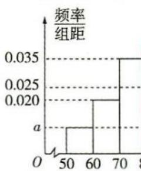  
图1

弘扬优秀传统文化（P015）

# 关注一手时事热点（P001）

# 调研

1: (脸谱|2024 山东枣庄滕州一中7月期末|多选) 脸谱是戏曲舞台演出

时的化妆造型艺术,更是中国传统戏曲文化的重要载体.如图1,脸谱图形可近似看作由半圆和半椭圆组成的曲线C.半圆 $C_{1}$ 的方程为 $x^{2}+y^{2}=9(y\geqslant0)$ ,半椭圆 $C_{2}$ 的方程为 $\frac{x^{2}}{9}+\frac{y^{2}}{16}=1(y\leqslant0)$ .则下列说法正确的是()

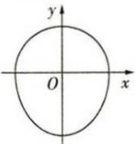  
图1

A. 点 M 在半圆 $C_{1}$ 上, 点 N 在半椭圆 $C_{2}$ 上, O 为坐标原点, $OM \perp ON$ , 则 $\triangle OMN$ 面积的最大值为 6  
B. 曲线 C 上任意一点到原点的距离的最大值与最小值之和为 7

C. 若 $A(0, -\sqrt{7}), B(0, \sqrt{7}), P$ 是半椭圆 $C_2$ 上的一个动点，则 $\cos \angle APB$ 的最小值为 $\frac{1}{9}$

# 2 核心主干抓重点 集中突破超重点、扫除疑难点

# 调研

3: (椭圆的光学性质|2024 贵州贵阳清华中学 8 月阶段练习|多选|较

# 研究光学性质，交汇物理（P012）

难)椭圆有如下光学性质:从椭圆的一个焦点发出的光线经过椭圆反射后,反射光线

经过另一个焦点. 现椭圆 C 的焦点在 x 轴上, 中心在坐标原点, 一束光射出经过椭圆反射后到右焦点 $F_{2}$ , 两段光线总长度为 4, 且椭圆的离心点和上顶点分别为 A, B. 则下列说法正确的是

A. 椭圆的标准方程为 $\frac{x^{2}}{4}+y^{2}=1$   
B. 若点 P 在椭圆上, 则 $\left|BP\right|$ 的最大值为 $\frac{4\sqrt{3}}{3}$

核心知识深入讲解（P035）

# 巧抓关键

双曲线上异于实轴两端点的点 $P(x_0, y_0)$ 与两焦点 $F_1, F_2$ 构成的 $\triangle PF_1F_2$ 叫作双曲线的焦点三角形. 如图2所示, 已知双曲线 $\frac{x^2}{a^2} - \frac{y^2}{b^2} = 1 (a > 0, b > 0)$ 上的点 $P(x_0, y_0) (y_0 \neq 0), F_1$ ,

$F_{2}$ 分别为双曲线的左、右焦点，称 $\angle F_{1}PF_{2} = \theta$ 为双曲线上的点对双曲线焦点的张角，则①由余弦定理可得 $|PF_{1}| \cdot |PF_{2}| = \frac{2b^{2}}{1 - \cos\theta} \in (b^{2}, +\infty), \overrightarrow{PF_{1}} \cdot \overrightarrow{PF_{2}} \in (-b^{2}, +\infty)$ ; ② $P(x_{0}, y_{0})$ 为实轴端点时，张角 $\theta = \pi$ 最大，但不构成三角形；③焦点三角形面积 $S_{\triangle PF_{1}F_{2}} = \frac{1}{2} |PF_{1}| \cdot |PF_{2}| \sin \theta = \frac{b^{2}}{\tan \frac{\theta}{2}} = c \cdot |y_{0}|$ ; ④ 若 $\angle PF_{1}F_{2} =$

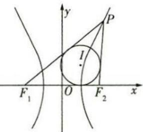  
图2

# 3 高效破题有方法 传授高妙解法，解透关键题型

# 超重点7 构造圆锥曲线中的弦长问题的解题模板

# 万能模版

直线与圆锥曲线相交于两点,两点之间的线段为弦,其长度为弦长.弦线问题的基本问题,很多圆锥曲线问题都围绕弦长来设计,这类问题也形成题模板.

第一步:设点、设线,注意考虑斜率不存在或斜率为0的特殊情况.

第二步:联立“线锥”方程(这里“线”指直线,“锥”指圆锥曲线),消元得第三步:计算 $\Delta$ (根的判别式),注意 $\Delta>0$ ,计算得根与系数的关系、点的第四步:结合弦长公式求解,即弦长= $\sqrt{1+k^{2}}\cdot\sqrt{(x_{1}+x_{2})^{2}-4x_{1}x_{2}}$ 或

巧用二级结论，助力秒杀速解（P044）

# 构建万能模板，没有思路也能做题（P045）

则 $\frac{|MQ|-|PQ|}{|PQ|}=\frac{a}{c}$ ，即 $\frac{|MP|}{|PQ|}=\frac{1}{e}$ ，∵椭圆C的离心率为 $\frac{1}{2}$ ，∴ $\frac{|MP|}{|PQ|}=2$ ，故选A.

【秒杀】利用性质 $\frac{|PQ|}{|MP|}=e$ ，实现秒杀。实际上，本题首选解答过程，给出了此性质的一种证明方法，也可以利用三角形内角平分线定理证明，如下：P是内心，因而MQ， $F_{2}P$ 分别是 $\angle F_{1}MF_{2}$ ， $\angle MF_{2}Q$ 的内角平分线，则在 $\triangle F_{1}MF_{2}$ 中， $\frac{|MF_{2}|}{|MF_{1}|}=\frac{|QF_{2}|}{|F_{1}Q|}$ ，利用合比定理得 $\frac{|MF_{2}|}{|MF_{1}|+|MF_{2}|}=\frac{|QF_{2}|}{|F_{1}Q|+|QF_{2}|}$ ，利用定义得 $\frac{|MF_{2}|}{2a}=\frac{|QF_{2}|}{2c}$ ，所以 $\frac{|QF_{2}|}{|MF_{2}|}=\frac{c}{a}$ ，又在 $\triangle MQF_{2}$

中， $\frac{|PQ|}{|MP|}=\frac{|QF_{2}|}{|MF_{2}|}=\frac{c}{a}=e$ ，结论得证

# 本书7类创新好题速览

<table><tr><td>具体考法</td><td>原创新题</td><td>变式好题</td><td>创新设问</td><td>真实情境</td><td>模块交汇</td><td>接轨高数</td><td>学科融合</td></tr><tr><td>本书题量</td><td>12</td><td>30</td><td>16</td><td>30</td><td>22</td><td>6</td><td>8</td></tr></table>

# 亮点速览

# 一手时事热点

应用问题题材贴近生活,涉及知识面广,考查能力全面,是高考的热点问题之一,其中以时事热点为背景的问题,尤其能够体现数学的应用性与创新性,要引起重视

①第31届世界大学生夏季运动会/P001  
②杭州第19届亚运会/P002   
③中国空间站/P004

# 传授高妙技法

高考试题十分重视对方法、思想的考查,熟练应用各种技法,逐渐形成能力,提高素质,方能掌握解题的金钥匙

①区分二项分布与超几何分布的技巧点拨/P083  
②用割补法求四边形面积的取值范围/P092

③用图形关系转化法求四边微信公众号  
教辅资料站  
小考教辅面积的最大值/P094  
初高教辅站  
④用隔板法求“英雄数”的个数/P101

# 每月一手考情

概率与统计命题的3大创新考法 001

创新考法 1 呼应社会热点，突出情境化 001

创新考法 2 设置决策问题，凸显开放性 004

创新考法 3 注重创新交汇，体现综合性 008

# 突破 14 大必考超重点

# 创新考法抢先知

超重点1 圆锥曲线的光学性质及其应用 010

超重点2 数学文化中的圆锥曲线问题 015

超重点3 统计图表特色问题 018

超重点4 概率统计中的接轨高数题 021

# 核心主干抓重点

超重点 5 巧用圆锥曲线的定义与性质快速求值 023

命题角度 1 圆锥曲线第一定义的应用 023

命题角度 2 圆锥曲线第二定义的应用 025

命题角度 3 圆锥曲线第三定义的应用 026

超重点6 圆锥曲线焦点三角形的性质解读与应用问题 033

命题角度 1 椭圆的焦点三角形 033

命题角度 2 双曲线的焦点三角形 035

命题角度 3 抛物线的焦点三角形 038

命题角度 4 椭圆、双曲线的共焦点三角形 041

超重点7 构造圆锥曲线中的弦长问题的解题模板 045

情形 1 显性弦长问题 045

情形 2 隐性弦长问题 047

# 超重点8 圆锥曲线的定点、定值问题 053

角度1 直线过定点问题 053

角度2 其他定点问题 055

角度3 定直线问题 056

角度4 定值问题 057

# 超重点9 两个计数原理的应用 064

命题角度 1 “相邻”与“不相邻”问题 064

命题角度2 特殊限制条件优先考虑 064

命题角度3 分组与分配问题 065

命题角度4 涂色问题 067

# 超重点 10 二项展开式中特定项及特定项的系数求解问题 069

命题角度 1 求 $(a + b)^n$ 或 $(a + b + c)^n$ 的展开式中特定项或特定项的系数 069

命题角度2 求 $(a + b)^{n}(c + d)^{m}$ 或 $(a + b)^{n}(c + d + e)^{m}$ 的展开式中特定项或特定项的系数 070

命题角度 3 二项展开式中的系数和问题 071

命题角度 4 求二项展开式中的二项式系数或项的系数的最值问题 072

命题角度 5 以数学文化为背景的二项展开式问题 073

# 超重点11 条件概率与全概率公式 075

命题角度 1 条件概率的求解 075

命题角度2 全概率公式的应用 076

# 超重点12 常见分布的辨析与应用 081

微信公众号 类型 1 二项分布 081

教辅资料站
小考教辅站

初高教辅站类型2 超几何分布 082

类型 3 正态分布 084

# 亮点速览

# 重视数学文化

数学文化在高考数学中的渗透是显而易见的,具体表现在思想方式的展示、见解的拓展与学习方式的优化,关注数学文化,有助于综合能力的提升

① 脸谱/P015

②伯努利双纽线/P016

③黄金双曲线/P017

④泊松分布/P021

⑤最大似然估计/P022

⑥杨辉三角/P073

# 注重交汇创新

随着新高考的稳步推进,以单一知识点为载体的命题越来越少,高考越来越注重不同知识模块间的交汇,加大考生解决问题能力的考核力度

①概率与导数交汇/P008

②概率与平面几何交汇/P009

③圆锥曲线与平面向量交汇/P014

④正态分布与二项分布交汇/P086

# 目录

# CONTENTS

# 高效破题有方法

# 超重点 13 求圆锥曲线中面积问题的 4 大核心技法 089

核心技法 1 用直接法求面积 089

核心技法 2 用向量法求面积 092

核心技法 3 用割补法求面积 092

核心技法 4 用图形关系转化法求面积 094

# 超重点 14 计数原理问题中高频使用的 6 个必会技法 101

必会技法 1 隔板法 101

必会技法 2 捆绑法 & 插空法 102

必会技法 3 正难则反法 102

必会技法4 先分组后排序法 103

必会技法 5 数字问题逐位考虑法 103

必会技法6 定序问题多种策略 104

# 下辑精彩预告 2023年11月全新上市

# 《试题调研》第5辑将推出

——模型解题法

# 聚焦一手考情

根据高考数学“无情境不命题”的考情, 聚焦 3 个前沿热点情境: 应用型情境, 综合型情境, 转化型情境. 解读情境, 建立模型, 有效提分!

# 构建破题模型

巧用 5 类思维模型, 快解创新热点问题, 如: 用大局观快解多选题、用特值思想快解答案不唯一题、用二级结论快解高数接轨题等. 提升思维能力, 秒破解题障碍!

妙用 10 类技法模型, 速解核心必考问题, 如: 用设而不求法速解函数零点问题、用临界思想速解取值范围问题等. 掌握关键技法, 助你破题有招!

会用6类图象模型,巧解高频关键问题,如:翻折模型、中线与角平分线模型、极点与极线模型等.提升核心能力,提分事半功倍!

必用 5 类解题模型，会解专项疑难问题，如：动态几何中轨迹与截面问题的破解模型、平面向量几何意义的应用模型等.有效抓取重难，实现精准备考!

# 每月一手考情

# 概率与统计命题的 3 大创新考法

正高级教师 赵成海

# 创新考法 1 呼应社会热点，突出情境化

调研 1: (试题调研原创|第31届世界大学生夏季运动会)第31届世界大学生夏季运动会(简称“成都大运会”)于2023年7月28日在四川成都开幕,这是中国西部第一次举办世界性综合运动会.为普及大运会相关知识,营造良好的赛事氛围,某学校举行“大运会百科知识”答题活动,并随机抽取了20名学生,他们的答题得分(满分100分)的频率分布直方图如图1所示(分组区间为[50,60), [60,70), [70,80), [80,90), [90,100]).

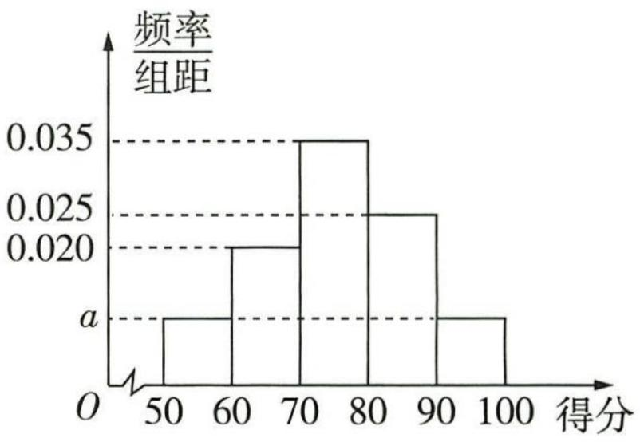

histogram

| 得分 | 频率/组距 |
| ---- | --------- |
| 50-60 | 0.020     |
| 60-70 | 0.025     |
| 70-80 | 0.035     |
| 80-90 | 0.025     |
| 90-100 | 0.020     |

图1

(1) 求频率分布直方图中 a 的值及这 20 名学生得分的 80% 分位数;

(2)若从样本中任选2名得分在 $[50,70)$ 内的学生,求这2人中恰有1人的得分在 $[60,70)$ 内的概率.

# 思路指引

第(1)问,由频率分布直方图中所有小矩形的面积和为1可知 $(2a+0.020+0.025+0.035)\times10=1$ ,求解可得a的值;设80%分位数为x,则由前3组的频率之和为0.65,前4组的频率之和为0.9,求解可得x的值.第(2)问,由已知可得得分在 $[50,60)$ 内的学生人数为 $0.01\times10\times20=2$ ,记为a,b,得分在 $[60,70)$ 内的学生人数为 $0.02\times10\times20=4$ ,记为c,d,e,f,利用列举法或排列组合法即可求解.

微信公众号教辅资料站小考教辅站初高教辅站

解析 (1)由频率分布直方图知 $(2a + 0.020 + 0.025 + 0.035) \times 10 = 1$ , 所以 $a = 0.010$ .

【易遗漏】注意此处是频率和为1，不要漏乘10

设 $80 \%$ 分位数为 $x$ , 由图可知前 3 组的频率之和为 0.65, 前 4 组的频率之和为 0.9, 所以 $x \in$

[80,90),

【扫清障碍】求 $80 \%$ 分位数, 就是求这组数据中这样一个值, 它使得这组数据中至少有 $80 \%$ 的数据小于或等于这个数, 且至少有 $20 \%$ 的数据大于或等于这个数, 故结合前几组的频率之和先初步判断 $80 \%$ 分位数所在区间, 再根据等式求解

且 $x = 80 + \frac{0.8 - 0.65}{0.9 - 0.65} \times 10 = 86.$

故这20名学生得分的 $80\%$ 分位数为86.

(2)由已知可得得分在[50,60)内的学生人数为 $0.01 \times 10 \times 20 = 2$ ,

得分在[60,70)内的学生人数为 $0.02 \times 10 \times 20 = 4$ .

方法一:列举法 记得分在[50,60)内的学生为a,b,得分在[60,70)内的学生为c,d,e,f.

则所有的样本点为 $\{a, b\}, \{a, c\}, \{a, d\}, \{a, e\}, \{a, f\}, \{b, c\}, \{b, d\}, \{b, e\}, \{b, f\}, \{c, d\}$ , $\{c, e\}, \{c, f\}, \{d, e\}, \{d, f\}, \{e, f\}$ , 共 15 个.

其中恰有1人的得分在[60,70)内的样本点为 $\{a,c\},\{a,d\},\{a,e\},\{a,f\},\{b,c\},\{b,d\}$ , $\{b,e\},\{b,f\}$ , 共8个.

故这2人中恰有1人的得分在[60,70)内的概率 $P=\frac{8}{15}$ .

方法二:排列组合法 从这6人中任选2人,所有基本事件种数为 $C_{6}^{2}=15$ ,满足题意的基本事件种数为 $C_{4}^{1}C_{2}^{1}=8$ ,故这2人中恰有1人的得分在[60,70)内的概率 $P=\frac{8}{15}$ .

调研 2: (杭州第19届亚运会|2024 注福建龙岩8月质量检测) 杭州第19届亚运会于2023年9月23日至10月8日在杭州举办. 为了让中学生了解亚运会, 某市举办了一次亚运会知识竞赛, 分预赛和复赛两个环节, 现从参加预赛的全体学生中随机抽取100人的预赛成绩作为样本, 得到频率分布表(见下表).

<table><tr><td>分组(百分制)</td><td>频数</td><td>频率</td></tr><tr><td>[0,20)</td><td>10</td><td>0.1</td></tr><tr><td>[20,40)</td><td>20</td><td>0.2</td></tr><tr><td>[40,60)</td><td>30</td><td>0.3</td></tr><tr><td>[60,80)</td><td>25</td><td>0.25</td></tr><tr><td>[80,100]</td><td>15</td><td>0.15</td></tr><tr><td>合计</td><td>100</td><td>1</td></tr></table>

微信公众号教辅资料站小考教辅站初高教辅站

注

本书题目出处中,2024 意为 2024 届,2023 意为 2023 届.

# 数学奖项

菲尔兹奖 菲尔兹奖是根据加拿大数学家约翰·查尔斯·菲尔兹要求设立的国际性数学奖项，于1936年首次颁发，被誉为“数学界的诺贝尔奖”（诺贝尔奖未设置数学奖）.

关注微信公众号“初高教辅站”获取更多初高中教辅资料

(1)由频率分布表可认为该市参加预赛的全体学生的预赛成绩 X 服从正态分布 $N(\mu, \sigma^{2})(\sigma > 0)$ ，其中 $\mu$ 可近似视为样本中的 100 名学生预赛成绩的平均值（同一组数据用该组区间的中点值代替），且 $\sigma^{2} = 342$ 。利用该正态分布，求 $P(X \geqslant 90)$ 。

(2)预赛成绩不低于80分的学生将参加复赛,现用样本估计总体,将频率视为概率,从该市参加预赛的学生中随机抽取2人,记进入复赛的人数为Y,求Y的分布列和数学期望.

附： $\sqrt{342} \approx 18.5$ 若 $X \sim N(\mu, \sigma^2)$ ，则 $P(\mu - \sigma \leqslant X \leqslant \mu + \sigma) \approx 0.6827, P(\mu - 2\sigma \leqslant X \leqslant \mu + 2\sigma) \approx 0.9545, P(\mu - 3\sigma \leqslant X \leqslant \mu + 3\sigma) \approx 0.9973.$

解析 (1) 由题意知, 样本中的 100 名学生预赛成绩的平均值为 $10 \times 0.1 + 30 \times 0.2 + 50 \times$ $0.3 + 70 \times 0.25 + 90 \times 0.15 = 53$ ,

由 $\sigma^{2}=342$ 得 $\sigma=\sqrt{342}\approx18.5$

所以 $P(X \geqslant 90) = P(X \geqslant \mu + 2\sigma) = \frac{1}{2} \times [1 - P(\mu - 2\sigma \leqslant X \leqslant \mu + 2\sigma)] \approx 0.02275.$

【扫清障碍】根据正态曲线的对称性知 $P(X \geqslant 90) = P(X \geqslant \mu + 2\sigma) = P(X \leqslant \mu - 2\sigma)$ ，所以 $P(X \geqslant 90) = \frac{1}{2} \times [1 - P(\mu - 2\sigma \leqslant X \leqslant \mu + 2\sigma)]$ 初高教辅站

(2) 第一步: 判断 Y 的分布类型, 求出 Y 的所有可能取值.

由题意得,随机抽取2人进入复赛的人数 $Y \sim B(2, \frac{3}{20})$ , 且 Y 的所有可能取值为 0,1,2.

第二步:利用概率公式求出 Y 取每个值时对应的概率,列出分布列.

$$
P (Y = 0) = \mathrm{C} _ {2} ^ {0} \times (1 - \frac {3}{2 0}) ^ {2} = \frac {2 8 9}{4 0 0},
$$

$$
P (Y = 1) = \mathrm{C} _ {2} ^ {1} \times \frac {3}{2 0} \times (1 - \frac {3}{2 0}) = \frac {5 1}{2 0 0},
$$

$$
P (Y = 2) = \mathrm{C} _ {2} ^ {2} \times (\frac {3}{2 0}) ^ {2} = \frac {9}{4 0 0}.
$$

所以 $Y$ 的分布列为

<table><tr><td>Y</td><td>0</td><td>1</td><td>2</td></tr><tr><td>P</td><td> $\frac{289}{400}$ </td><td> $\frac{51}{200}$ </td><td> $\frac{9}{400}$ </td></tr></table>

数学奖项

每四年颁发一次,在由国际数学联合会主办的四年一度的国际数学家大会上举行颁奖仪式,每次授予二至四名有卓越贡献的年轻数学家.

关注微信公众号“初高教辅站”获取更多初高中教辅资料

第三步:求出 Y 的期望.

所以 $Y$ 的数学期望为 $E(Y) = 0 \times \frac{289}{400} + 1 \times \frac{51}{200} + 2 \times \frac{9}{400} = \frac{3}{10}$ .

【会检验】这里需要检验的有两点：①检验分布列中概率和是否为1，看分布列是否求错； ②也可以根据二项分布的期望公式直接计算期望，得 $E(Y)=2\times\frac{3}{20}=\frac{3}{10}$ ，看期望是否求错

# 创新考法2 设置决策问题，凸显开放性

调研 3 (中国空间站|2024 广西玉林 7 月期末)2023 年 5 月 10 日,长征七号遥七运载火箭剑指苍穹,搭载天舟六号货运飞船为中国空间站运送补给物资,为中国空间站的航天员们长时间探索宇宙奥秘提供强有力的后援支持.5 月 30 日,神舟十六号发射成功.在“神箭”“神舟”的护送下,景海鹏、朱杨柱、桂海潮 3 名中国航天员顺利进入太空,开启为期 5 个月的太空科研之旅.某校部分学生十分关注中国空间站的发展,若将累计关注中国空间站发展的消息 6 次及以上者称为“航天达人”,未达到 6 次者称为“非航天达人”.现从该校随机抽取 200 人进行分析,得到数据如下表所示:

<table><tr><td></td><td>航天达人</td><td>非航天达人</td><td>合计</td></tr><tr><td>男</td><td>80</td><td>40</td><td>120</td></tr><tr><td>女</td><td>30</td><td>50</td><td>80</td></tr><tr><td>合计</td><td>110</td><td>90</td><td>200</td></tr></table>

(1)依据小概率值 $\alpha = 0.01$ 的 $\chi^2$ 独立性检验,能否认为是否为“航天达人”与性别有关联?

(2)①从随机抽取的这200名学生中采用分层抽样的方法抽取20人,再从这20人中随机抽取3人.记事件A=“至少有2名是男生”,事件B=“至少有2名既是‘航天达人’又是男生”,事件C=“至多有1名既是‘航天达人’又是女生”.试计算P(A)P(B|A)P(C|AB)和P(ABC)的值,并比较它们的大小.

②由①中 $P(ABC)$ 与 $P(A)P(B|A)P(C|AB)$ 的大小关系能否推广到更一般的情形? 请写出结论,并说明理由.

参考公式及数据: $\chi^{2}=\frac{n(ad-bc)^{2}}{(a+b)(c+d)(a+c)(b+d)},n=a+b+c+d.$

# 数学奖项

沃尔夫数学奖 沃尔夫数学奖是沃尔夫奖的一个奖项,它和菲尔兹奖被共同誉为数学界的最高荣誉.获得该奖项的华人有陈省身和丘成桐.

关注微信公众号“初高教辅站”获取更多初高中教辅资料

<table><tr><td> $\alpha$ </td><td>0.1</td><td>0.05</td><td>0.01</td><td>0.001</td></tr><tr><td> $x_{\alpha}$ </td><td>2.706</td><td>3.841</td><td>6.635</td><td>10.828</td></tr></table>

解析 (1)零假设为 $H_{0}$ : 是否为“航天达人”与性别无关联.

根据表中数据计算得 $\chi^2 = \frac{200\times(80\times 50 - 40\times 30)^2}{120\times 80\times 110\times 90}\approx 16.498 > 6.635 = x_{0.01}$

所以根据小概率值 $\alpha=0.01$ 的 $\chi^{2}$ 独立性检验, 我们推断 $H_{0}$ 不成立,

即认为是否为“航天达人”与性别有关联,此推断犯错误的概率不大于0.01.

(2)由题意可知:抽取的20人中,男“航天达人”有8人,男“非航天达人”有4人,女“航天达人”有3人,女“非航天达人”有5人.

①事件 $ABC$ 表示“抽取的 3 人为 2 名男生 1 名女生, 男生都是‘航天达人’”和“抽取的 3 人为 3 名男生, 其中至少 2 人是‘航天达人’”,

设 D=“抽取的3人为2名男生1名女生,男生都是‘航天达人’”,

$E =$ “抽取的3人为3名男生，且其中至少2人是‘航天达人’”，

$$
P (D) = \frac {\mathrm{C} _ {8} ^ {2} (\mathrm{C} _ {3} ^ {1} + \mathrm{C} _ {5} ^ {1})}{\mathrm{C} _ {2 0} ^ {3}} = \frac {5 6}{2 8 5}, P (E) = \frac {\mathrm{C} _ {8} ^ {2} \mathrm{C} _ {4} ^ {1} + \mathrm{C} _ {8} ^ {3}}{\mathrm{C} _ {2 0} ^ {3}} = \frac {1 4}{9 5},
$$

所以 $P(ABC) = P(D) + P(E) = \frac{56}{285} + \frac{14}{95} = \frac{98}{285}$ ,

$$
P (A) P (B \mid A) P (C \mid A B) = \frac {\mathrm{C} _ {1 2} ^ {2} \mathrm{C} _ {8} ^ {1} + \mathrm{C} _ {1 2} ^ {3}}{\mathrm{C} _ {2 0} ^ {3}} \times \frac {\mathrm{C} _ {8} ^ {2} \left(\mathrm{C} _ {4} ^ {1} + \mathrm{C} _ {3} ^ {1} + \mathrm{C} _ {5} ^ {1}\right) + \mathrm{C} _ {8} ^ {3}}{\mathrm{C} _ {1 2} ^ {2} \mathrm{C} _ {8} ^ {1} + \mathrm{C} _ {1 2} ^ {3}} \times \frac {\mathrm{C} _ {8} ^ {2} \left(\mathrm{C} _ {3} ^ {1} + \mathrm{C} _ {5} ^ {1}\right) + \mathrm{C} _ {8} ^ {2} \mathrm{C} _ {4} ^ {1} + \mathrm{C} _ {8} ^ {3}}{\mathrm{C} _ {8} ^ {2} \left(\mathrm{C} _ {4} ^ {1} + \mathrm{C} _ {3} ^ {1} + \mathrm{C} _ {5} ^ {1}\right) + \mathrm{C} _ {8} ^ {3}} = \frac {9 8}{2 8 5},
$$

所以 $P(ABC)=P(A)P(B|A)P(C|AB)$ .

②由①中 $P(ABC)$ 与 $P(A)P(B|A)P(C|AB)$ 相等的关系可以推广到更一般的情形，

即对于一般的三个事件 A, B, C, 有 $P(ABC) = P(A)P(B \mid A)P(C \mid AB)$ ,

理由是: $P(A)P(B|A)P(C|AB)=P(A)\cdot\frac{P(AB)}{P(A)}\cdot\frac{P(ABC)}{P(AB)}=P(ABC)$ ，得证.

【扫清障碍】结合条件概率的公式进行变形化简，即可得证

调研 4 (2024 山东枣庄开学测试) 某企业拥有甲、乙两条零件生产线, 为了解零件质量情况, 采用随机抽样的方法从两条生产线上共抽取 180 个零件, 测量其尺寸 (单位: mm), 得到如下统计表, 其中尺寸位于 [55,58) 内的零件为一等品, 位于 [54,55) 内和 [58,59) 内的零件为二等品, 否则为三等品.

<table><tr><td>生产线</td><td>[53,54)</td><td>[54,55)</td><td>[55,56)</td><td>[56,57)</td><td>[57,58)</td><td>[58,59)</td><td>[59,60]</td></tr><tr><td>甲</td><td>4</td><td>9</td><td>23</td><td>28</td><td>24</td><td>10</td><td>2</td></tr><tr><td>乙</td><td>2</td><td>14</td><td>15</td><td>17</td><td>16</td><td>15</td><td>1</td></tr></table>

数学奖项

沃尔夫及其家族成立了沃尔夫基金会,沃尔夫基金会起初设有数学、物理、化学、医学和农学五个奖,1981年又增设了艺术奖.

(1) 完成下列 $2 \times 2$ 列联表, 依据小概率值 $\alpha = 0.05$ 的独立性检验, 能否认为零件为一等品与生产线有关联?

<table><tr><td></td><td>一等品</td><td>非一等品</td><td>合计</td></tr><tr><td>甲</td><td></td><td></td><td></td></tr><tr><td>乙</td><td></td><td></td><td></td></tr><tr><td>合计</td><td></td><td></td><td></td></tr></table>

(2) 将样本的频率视为概率, 从甲、乙两条生产线中分别随机抽取 2 个零件, 每次抽取零件互不影响, 以 $\xi$ 表示这 4 个零件中一等品的数量, 求 $\xi$ 的分布列和数学期望 $E(\xi)$ .

(3)已知该企业生产的零件随机装箱出售,每箱60个.产品出厂前,该企业可自愿选择是否对每箱零件进行检验.若执行检验,则每个零件的检验费用为5元,并将检验出的三等品更换为一等品或二等品;若不执行检验,则对卖出的每个三等品零件支付120元赔偿费用.现对一箱零件随机检验了10个,检出了1个三等品.将从两条生产线抽取的所有样本数据的频率视为概率,以整箱检验费用与赔偿费用之和的期望作为决策依据,是否需要对该箱余下的所有零件进行检验?请说明理由.

附： $\chi^2 = \frac{n(ad - bc)^2}{(a + b)(c + d)(a + c)(b + d)}$ ，其中 $n = a + b + c + d;x_{0.05} = 3.841.$

解析 (1) 由题意得列联表如下:

<table><tr><td></td><td>一等品</td><td>非一等品</td><td>合计</td></tr><tr><td>甲</td><td>75</td><td>25</td><td>100</td></tr><tr><td>乙</td><td>48</td><td>32</td><td>80</td></tr><tr><td>合计</td><td>123</td><td>57</td><td>180</td></tr></table>

零假设为 $H_{0}$ :零件为一等品与生产线没有关联.

$$
\chi^ {2} = \frac {1 8 0 \times (7 5 \times 3 2 - 4 8 \times 2 5) ^ {2}}{1 2 3 \times 5 7 \times 1 0 0 \times 8 0} \approx 4. 6 2 1.
$$

因为 $4.621 > 3.841 = x_{0.05}$ , 所以依据小概率值 $\alpha = 0.05$ 的独立性检验, 我们推断 $H_0$ 不成立, 即认为零件为一等品与生产线有关联.

(2)由已知得任取一个甲生产线零件为一等品的概率为 $\frac{75}{100}=\frac{3}{4}$ ，任取一个乙生产线零件为一等品的概率为 $\frac{48}{80}=\frac{3}{5}$ .

# 数学奖项

阿贝尔奖 阿贝尔奖是挪威设立的国际数学界年度奖项之一. 2001 年,为了纪念挪威著名数学家尼尔斯·亨利克·阿贝尔二百周年诞辰,挪威政府宣布将开始颁发此奖.

关注微信公众号“初高教辅站”获取更多初高中教辅资料

$\xi$ 的所有可能取值为0,1,2,3,4.

$$
P (\xi = 0) = \frac {1}{4} \times \frac {1}{4} \times \frac {2}{5} \times \frac {2}{5} = \frac {1}{1 0 0},
$$

$$
P (\xi = 1) = \mathrm{C} _ {2} ^ {1} \times \frac {1}{4} \times \frac {3}{4} \times \left(\frac {2}{5}\right) ^ {2} + \mathrm{C} _ {2} ^ {1} \times \frac {2}{5} \times \frac {3}{5} \times \left(\frac {1}{4}\right) ^ {2} = \frac {9}{1 0 0},
$$

$$
P (\xi = 2) = \left(\frac {3}{4}\right) ^ {2} \times \left(\frac {2}{5}\right) ^ {2} + \left(\frac {1}{4}\right) ^ {2} \times \left(\frac {3}{5}\right) ^ {2} + C _ {2} ^ {1} \times \frac {1}{4} \times \frac {3}{4} \times C _ {2} ^ {1} \times \frac {2}{5} \times \frac {3}{5} = \frac {1 1 7}{4 0 0},
$$

【易遗漏】 $\xi=2$ 对应的情况包括:从甲生产线中抽取的2个零件都是一等品,且从乙生产线中抽取的2个零件都不是一等品;从甲生产线中抽取的2个零件都不是一等品,且从乙生产线中抽取的2个零件都是一等品;从甲生产线中抽取的2个零件中只有1个是一等品,且从乙生产线中抽取的2个零件中只有1个是一等品.三种情况注意不要遗漏

$$
P (\xi = 3) = \left(\frac {3}{4}\right) ^ {2} \times \mathrm{C} _ {2} ^ {1} \times \frac {2}{5} \times \frac {3}{5} + \mathrm{C} _ {2} ^ {1} \times \frac {1}{4} \times \frac {3}{4} \times \left(\frac {3}{5}\right) ^ {2} = \frac {8 1}{2 0 0},
$$

$$
P (\xi = 4) = \left(\frac {3}{4}\right) ^ {2} \times \left(\frac {3}{5}\right) ^ {2} = \frac {8 1}{4 0 0},
$$

所以 $\xi$ 的分布列为

<table><tr><td>ξ</td><td>0</td><td>1</td><td>2</td><td>3</td><td>4</td></tr><tr><td>P</td><td> $\frac{1}{100}$ </td><td> $\frac{9}{100}$ </td><td> $\frac{117}{400}$ </td><td> $\frac{81}{200}$ </td><td> $\frac{81}{400}$ </td></tr></table>

$$
E (\xi) = 0 \times \frac {1}{1 0 0} + 1 \times \frac {9}{1 0 0} + 2 \times \frac {1 1 7}{4 0 0} + 3 \times \frac {8 1}{2 0 0} + 4 \times \frac {8 1}{4 0 0} = \frac {2 7}{1 0}.
$$

(3)由已知得,每个零件为三等品的频率为 $\frac{4+2+2+1}{180}=\frac{1}{20}$ ,

设余下的 50 个零件中的三等品个数为 X, 则 $X \sim B(50, \frac{1}{20})$ , 所以 $E(X) = 50 \times \frac{1}{20} = \frac{5}{2}$ .

设整箱检验费用与赔偿费用之和为 Y 元，

若不对余下的所有零件进行检验,则 $Y=10\times5+120X$ ,

$$
E (Y) = 5 0 + 1 2 0 \times E (X) = 5 0 + 1 2 0 \times \frac {5}{2} = 3 5 0 (\text {元}).
$$

【敲黑板】解此类问题常常用到期望的性质, 要进行记忆: ①设 $X$ 是离散型随机变量, $C$ 是常数, 则 $E(CX) = CE(X)$ ; ②设 $X$ , $Y$ 是任意两个离散型随机变量, 则有 $E(X + Y) = E(X) + E(Y)$ ; ③设 $X$ , $Y$ 是相互独立的离散型随机变量, 则有 $E(XY) = E(X)E(Y)$ ; ④ $C$ 是常数, 则 $E(C) = C$

若对余下的所有零件进行检验,则总检验费用为 $60 \times 5 = 300$ (元).

因为 350 > 300, 所以应对该箱余下的所有零件进行检验.

# 数学奖项

阿贝尔奖的奖金数额与诺贝尔奖相近,设立此奖的一个原因是诺贝尔奖没有数学奖项,设立此奖的主要目的是扩大数学的影响,吸引年轻人从事数学研究.

# 创新考法 3 注重创新交汇，体现综合性

调研 5: (概率与导数交汇|2024 贵州六校联盟第一次联考)为了丰富学生的课外活动,某中学举办羽毛球比赛,经过三轮的筛选,最后剩下甲、乙两人进行最终决赛,决赛采用五局三胜制,即当甲、乙两人中有一人先赢得三局比赛时,该选手获胜,比赛结束.每局比赛皆须分出胜负,且每局比赛的胜负不受之前比赛结果影响.假设甲在每一局获胜的概率均为 $p(0 < p < 1)$ .

(1) 若比赛进行三局就结束的概率为 $f(p)$ ，求 $f(p)$ 的最小值；

(2) 记(1)中, $f(p)$ 取得最小值时, $p$ 的值为 $p_0$ , 以 $p_0$ 作为 $p$ 的值, 用 $X$ 表示甲、乙实际比赛的局数, 求 $X$ 的分布列及数学期望 $E(X)$ .

# 审题妙招

此类问题的解题关键是理解清楚比赛规则,本题给出的赛制是五局三胜制,要比赛进行三局就结束,则甲连胜三局或乙连胜三局,据此求出 $f(p)$ 的表达式,要求 $f(p)$ 的最小值,则转化为函数最值的求解问题,对 $f(p)$ 求导,分析单调性,即可得解.

解析 (1) 三局就结束比赛的概率 $f(p) = p^3 + (1 - p)^3$ ,

$$
f ^ {\prime} (p) = 3 p ^ {2} - 3 (1 - p) ^ {2} = 6 p - 3,
$$

当 $0 < p < \frac{1}{2}$ 时, $f'(p) < 0$ ; 当 $\frac{1}{2} < p < 1$ 时, $f'(p) > 0$ .

所以 $f(p)$ 在 $(0,\frac{1}{2})$ 上单调递减，在 $(\frac{1}{2},1)$ 上单调递增，

所以当 $p=\frac{1}{2}$ 时, $f(p)$ 取得最小值, 为 $\frac{1}{4}$ .

(2) 由(1)知, $p=p_{0}=\frac{1}{2}$ .

设实际比赛局数为 X, 则 X 的所有可能取值为 3, 4, 5,

【会审题】根据五局三胜制比赛规则知，至少比赛3局，至多比赛5局

所以 $P(X=3)=\left(\frac{1}{2}\right)^{3}+\left(1-\frac{1}{2}\right)^{3}=\frac{1}{4}$ ,

$$
P (X = 4) = 2 \times \mathrm{C} _ {3} ^ {2} \times \left(\frac {1}{2}\right) ^ {2} \times \left(1 - \frac {1}{2}\right) \times \frac {1}{2} = \frac {3}{8},
$$

$$
P (X = 5) = 2 \times \mathrm{C} _ {4} ^ {2} \times \left(\frac {1}{2}\right) ^ {2} \times \left(1 - \frac {1}{2}\right) ^ {2} \times \frac {1}{2} = \frac {3}{8},
$$

# 数学奖项

陈省身奖 国际数学联合会为了纪念已故华人数学家陈省身而设立陈省身奖,这是国际数学联盟首次以华人数学家的名字命名的数学大奖.

$X$ 的分布列为

<table><tr><td>X</td><td>3</td><td>4</td><td>5</td></tr><tr><td>P</td><td> $\frac{1}{4}$ </td><td> $\frac{3}{8}$ </td><td> $\frac{3}{8}$ </td></tr></table>

$$
E (X) = 3 \times \frac {1}{4} + 4 \times \frac {3}{8} + 5 \times \frac {3}{8} = \frac {3 3}{8}.
$$

调研 6: (概率与平面几何交汇12024 四川绵阳8月开学考试) 设 a, b 是从集合 $\{1,2,3,4,5\}$ 中随机选取的数, 则直线 $y = ax + b$ 与圆 $x^{2} + y^{2} = 2$ 有公共点的概率是 \_\_\_\_.

# 巧抓关键

求解本题的关键在于转化,把直线与圆的位置关系转化为 a, b 间的关系,结合所给集合的元素,找到满足 a, b 间关系的数对的数量,再求出所有数对数量,利用古典概型的概率计算公式求解即可.

解析 直线 $y = ax + b$ 与圆 $x^{2} + y^{2} = 2$ 有公共点, 等价于 $\frac{|b|}{\sqrt{a^2 + 1}} \leqslant \sqrt{2}$ , 即 $b^{2} \leqslant 2a^{2} + 2$ .

记 $\Omega = \{(a,b) | a,b\in \{1,2,3,4,5\}\} ,n(\Omega) = 25.$

设 $A = \{(a,b) | b^2 \leqslant 2a^2 + 2\}$ ,

则当 b=1 时, a=1,2,3,4,5;

当 b=2 时, a=1,2,3,4,5;

当 b=3 时, a=2,3,4,5;

当 b=4 时, a=3,4,5;

当 b=5 时, a=4,5.

【多维思考】此处除了用枚举法外，还可以用列表法、树状图法求解，用枚举法时，选择其中一个变量进行固定，这个变量每更换一个取值，均研究一次另一个变量的取值情况，这样可以不重不漏

故 $n(A) = 19$ .

所以所求概率为 $P(A)=\frac{n(A)}{n(\Omega)}=\frac{19}{25}$ ，即直线 $y=ax+b$ 与圆 $x^{2}+y^{2}=2$ 有公共点的概率是 $\frac{19}{25}$ .

# 数学奖项

陈省身奖为终身成就奖,不限数学分支,授予“凭借数学领域的终身杰出成就赢得最高赞誉的个人”.

# 突破14大必考超重点

# 创新考法抢先知

# 超重点 1 圆锥曲线的光学性质及其应用

调研 1 (试题调研原创 | 双曲线的光学性质 | 多选) 费马原理是几何光学中的一条重要原理, 可以推导出双曲线具有如下光学性质: 从双曲线的一个焦点发出的光线, 经双曲线反射后, 反射光线的反向延长线经过双曲线的另一个焦点. 由此可得, 过双曲线上任意一点的切线平分该点与两焦点连线的夹角. 如图 1, $F_{1}, F_{2}$ 分别是以直线 $y = \pm \frac{3}{4} x$ 为渐近线且过点 $A(4\sqrt{2}, 3)$ 的双曲线 $C$ 的左、右焦点, 在双曲线 $C$ 右支上一点 $P(x_{0}, y_{0})(x_{0} > 4, y_{0} > 0)$ 处的切线 $l$ 交 $x$ 轴于点 $Q$ , 则下列说法不正确的是 ( )

A. 双曲线 C 的离心率为 $\frac{\sqrt{7}}{4}$

B. 双曲线 C 的方程为 $\frac{x^{2}}{16}-\frac{y^{2}}{9}=1$

C. 过点 $F_{1}$ 作 $F_{1}K \perp PQ$ ，垂足为 K，则 $|OK| = 8$

D. 点 Q 的坐标为 $\left(\frac{16}{x_{0}},0\right)$

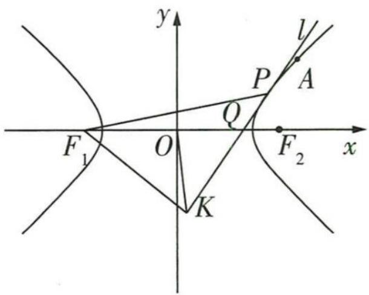

text_image

y
l/
P
A
Q
F₁ O F₂ x
K

图1

# 思路指引

对于选项 A, B, 根据双曲线的渐近线和双曲线所过点的坐标求出双曲线的方程, 进而可得双曲线的离心率; 对于选项 C, 根据题意结合双曲线的定义和光学性质运算求解; 对于选项 D, 根据导数的几何意义运算求解.

# 数学奖项

高斯奖 高斯奖是由国际数学联合会和德国数学家联合会共同设立的国际性数学大奖,德国数学家联盟具体负责奖项的管理工作.

# 解析

<table><tr><td>选项</td><td>分析过程</td><td>正误</td></tr><tr><td>A</td><td rowspan="2">由双曲线的渐近线为直线 $y = \pm \frac{3}{4}x$ ,可设双曲线方程为 $\frac{x^{2}}{16} - \frac{y^{2}}{9} = \lambda$ ,将点 $A(4\sqrt{2}$ ,【用结论】共渐近线的双曲线系方程的设法:与双曲线 $\frac{x^{2}}{a^{2}} - \frac{y^{2}}{b^{2}} = 1 (a > 0, b > 0)$ 有共同渐近线的双曲线方程为 $\frac{x^{2}}{a^{2}} - \frac{y^{2}}{b^{2}} = \lambda (\lambda \neq 0)$ .本题已知渐近线,可以这样设双曲线方程,结合双曲线所过点的坐标,即可求解3)的坐标代入得 $\lambda = \frac{(4\sqrt{2})^{2}}{16} - \frac{3^{2}}{9} = 1$ ,则双曲线C的方程为 $\frac{x^{2}}{16} - \frac{y^{2}}{9} = 1$ ,故 $a = 4$ , $b = 3$ , $c = \sqrt{a^{2} + b^{2}} = 5$ ,所以离心率 $e = \frac{c}{a} = \frac{5}{4}$ </td><td>×</td></tr><tr><td>B</td><td>√</td></tr><tr><td>C</td><td>连接 $PF_{2}$ 并延长交 $F_{1}K$ 的延长线于点M,易知 $|PF_{1}| - |PF_{2}| = 2a = 8$ ,因为 $F_{1}K \perp PQ$ ,且l为 $\angle F_{1}PF_{2}$ 的平分线,则K为 $F_{1}M$ 的中点, $|PF_{1}| = |PM|$ ,且 $|OK| = \frac{1}{2}|MF_{2}| = \frac{1}{2}(|PM| - |PF_{2}|) = \frac{1}{2}(|PF_{1}| - |PF_{2}|) = 4$ </td><td>×</td></tr><tr><td>D</td><td>当x&gt;4,y&gt;0时, $\frac{x^{2}}{16} - \frac{y^{2}}{9} = 1$ 可变形为 $y = \frac{3}{4}\sqrt{x^{2} - 16}$ ,则 $y' = \frac{3x}{4\sqrt{x^{2} - 16}}$ ,可得 $y'|_{x=x_{0}} = \frac{3x_{0}}{4\sqrt{x_{0}^{2} - 16}}$ ,即切点 $P(x_{0},y_{0})$ 对应的切线斜率 $k = \frac{3x_{0}}{4\sqrt{x_{0}^{2} - 16}}$ ,则切线的方程为 $y - y_{0} = \frac{3x_{0}}{4\sqrt{x_{0}^{2} - 16}} (x - x_{0})$ ,令y=0,整理得 $x = x_{0} - \frac{4y_{0}\sqrt{x_{0}^{2} - 16}}{3x_{0}}$ ,又 $y_{0} = \frac{3}{4}\sqrt{x_{0}^{2} - 16}$ ,可得 $x = x_{0} - \frac{x_{0}^{2} - 16}{x_{0}} = \frac{16}{x_{0}}$ ,所以点Q的坐标为 $(\frac{16}{x_{0}},0)$ </td><td>√</td></tr></table>

故选 AC.

调研 2 (抛物线的光学性质 | 2024 河南许昌 7 月期末) 抛物线的光学性质: 从抛物线的焦点发出的光经抛物线反射后, 反射光线与抛物线的轴平行 (或重合). 已知抛物线 $y^{2} = 2x$ , 若从点 $Q(3,2)$ 发射平行于 $x$ 轴的光射向抛物线上的 $A$ 点, 经 $A$ 点反射后交抛物线于 $B$ 点, 则 $|AB| =$ \_\_\_\_.

# 数学奖项

高斯奖是为纪念数学家高斯而设,主要用于奖励在应用数学方面取得成果者,是应用数学领域的最高奖.

关注微信公众号“初高教辅站”获取更多初高中教辅资料

# 扫清障碍

根据题意知点 A 的纵坐标一定是 2, 因为点 A 在抛物线上, 所以把 y = 2 代入抛物线方程, 即可得到点 A 的坐标, 由于直线 AB 过焦点, 利用点斜式方程求出直线 AB 的方程, 与抛物线的方程联立, 由根与系数的关系求出点 B 的坐标, 利用两点间的距离公式即可求出 $\left|AB\right|$ .

解析 由条件可知 AQ 与 x 轴平行, $y_{A}=2$ , 可得 $x_{A}=2$ , 故 A 点的坐标为 $(2,2)$ .

因为直线 AB 经过抛物线的焦点 $F(\frac{1}{2},0)$ ,

所以直线 AB 的方程为 $y - 0 = \frac{2 - 0}{2 - \frac{1}{2}} (x - \frac{1}{2})$ ，整理得 4x - 3y - 2 = 0.

联立抛物线方程与直线方程得方程组 $\left\{\begin{aligned}y^{2}&=2x,\\ 4x&-3y-2=0,\end{aligned}\right.$ 消去x,得 $y^{2}-\frac{3}{2}y-1=0$ ,方程的根的判别式 $\Delta=(-\frac{3}{2})^{2}-4\times1\times(-1)=\frac{25}{4}>0$ ,所以 $y_{A}+y_{B}=\frac{3}{2}$ ,

又 $y_{A}=2$ ，所以 $y_{B}=-\frac{1}{2}, x_{B}=\frac{1}{2}\times\left(-\frac{1}{2}\right)^{2}=\frac{1}{8}$ ，故 B 点的坐标为 $\left(\frac{1}{8}, -\frac{1}{2}\right)$ .

所以 $|AB|=\sqrt{(2-\frac{1}{8})^{2}+(2+\frac{1}{2})^{2}}=\frac{25}{8}.$

调研 3: (椭圆的光学性质 | 2024 贵州贵阳清华中学 8 月阶段练习 | 多选 | 较难) 椭圆有如下光学性质: 从椭圆的一个焦点发出的光线经过椭圆反射后, 反射光线经过另一个焦点. 现椭圆 C 的焦点在 x 轴上, 中心在坐标原点, 一束光线从左焦点 $F_{1}$ 射出经过椭圆反射后到右焦点 $F_{2}$ , 两段光线总长度为 4, 且椭圆的离心率为 $\frac{\sqrt{3}}{2}$ , 左顶点和上顶点分别为 A, B. 则下列说法正确的是 ( )

A. 椭圆的标准方程为 $\frac{x^{2}}{4}+y^{2}=1$

B. 若点 P 在椭圆上, 则 $\left|BP\right|$ 的最大值为 $\frac{4\sqrt{3}}{3}$

C. 若点 $P$ 在椭圆上, 则 $\angle F_{1}PF_{2}$ 的最大值为 $\frac{3\pi}{4}$

D. 过直线 $y = x + 1$ 上一点 M 作椭圆的切线分别交椭圆于 P, Q 两点, 则直线 PQ 恒过定点 $(-4, 1)$

解析 根据题意,一束光线从 $F_{1}$ 射出,经椭圆 $\frac{x^{2}}{a^{2}} + \frac{y^{2}}{b^{2}} = 1 (a > b > 0)$ 上的点 E 反射至 $F_{2}$ ,作出示意图,如图 2 所示.

# 数学奖项

获奖者可获得一枚绘有高斯肖像的奖章和一笔奖金. 该奖项首次颁发是在马德里召开的第25届国际数学家大会上.

则 $|EF_{1}| + |EF_{2}| = 2a = 4$ ，即 $a = 2$ .

又椭圆的离心率为 $e = \frac{c}{a} = \frac{\sqrt{3}}{2}$ , 可得 $c = \sqrt{3}$ , 所以 $b^{2} = a^{2} - c^{2} = 1$ .

故椭圆的标准方程为 $\frac{x^{2}}{4}+y^{2}=1$ , A 正确.

易知 $A(-2,0), B(0,1)$ , 设 $P(x_{P}, y_{P})$ ,

若点 P 在椭圆上, 则 $\frac{x_{P}^{2}}{4} + y_{P}^{2} = 1$ ,

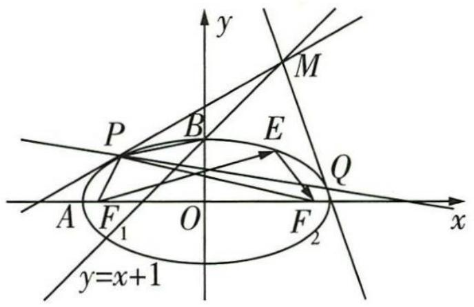

text_image

y
M
P
B
E
Q
A
F₁
O
F₂
x
y=x+1

图2

则 $|BP| = \sqrt{x_P^2 + (y_P - 1)^2} = \sqrt{4 - 4y_P^2 + (y_P - 1)^2} = \sqrt{-3y_P^2 - 2y_P + 5} = \sqrt{-3(y_P + \frac{1}{3})^2 + \frac{16}{3}}$ ,

又 $-1 \leqslant y_{P} \leqslant 1$ ，则 $|BP| = \sqrt{-3(y_{P} + \frac{1}{3})^{2} + \frac{16}{3}} \leqslant \sqrt{\frac{16}{3}} = \frac{4\sqrt{3}}{3}$ ，所以 $|BP|$ 的最大值为 $\frac{4\sqrt{3}}{3}$ ，B 正确.

由椭圆的定义可知 $\left|PF_{1}\right|+\left|PF_{2}\right|=4$ ，不妨设 $\left|PF_{1}\right|=m,\left|PF_{2}\right|=n(m>0,n>0)$ ，

$$
\cos \angle F _ {1} P F _ {2} = \frac {m ^ {2} + n ^ {2} - 4 c ^ {2}}{2 m n} = \frac {(m + n) ^ {2} - 2 m n - 4 c ^ {2}}{2 m n} = \frac {4 - 2 m n}{2 m n} = \frac {2}{m n} - 1,
$$

因为 $m + n = 4 \geqslant 2\sqrt{mn}$ ，所以 $0 < mn \leqslant 4$ ，所以 $\cos \angle F_{1}PF_{2} = \frac{2}{mn} - 1 \geqslant \frac{2}{4} - 1 = -\frac{1}{2}$ ，当且仅当 m = n = 2 时，等号成立，此时 $\angle F_{1}PF_{2}$ 的余弦值最小，为 $-\frac{1}{2}$ ，所以 $\angle F_{1}PF_{2}$ 的最大值为 $\frac{2\pi}{3}$ ，C 错误。
【易错提醒】利用基本不等式时一定要注意判断等号成立的条件

易知椭圆 $\frac{x^2}{a^2} +\frac{y^2}{b^2} = 1(a > b > 0)$ 在点 $(x_0,y_0)$ 处的切线方程为 $\frac{x_0x}{a^2} +\frac{y_0y}{b^2} = 1$

【记结论】椭圆 $\frac{x^{2}}{a^{2}}+\frac{y^{2}}{b^{2}}=1(a>b>0)$ 在点 $(x_{0},y_{0})$ 处的切线方程为 $\frac{x_{0}x}{a^{2}}+\frac{y_{0}y}{b^{2}}=1$ ，这是一个经常用到的结论，需要进行记忆，可加快解题速度。该结论的证明如下：当切线斜率存在时，设直线 $y=kx+m$ 与 $\frac{x^{2}}{a^{2}}+\frac{y^{2}}{b^{2}}=1(a>b>0)$ 相切于点 $(x_{0},y_{0})$ ，由 $\left\{\begin{aligned}y&=kx+m,\\ \frac{x^{2}}{a^{2}}+\frac{y^{2}}{b^{2}}&=1,\end{aligned}\right.$ 得 $(a^{2}k^{2}+b^{2})x^{2}+2a^{2}kmx+a^{2}(m^{2}-b^{2})=0$ ，所以 $\Delta=(2a^{2}km)^{2}-4a^{2}(m^{2}-b^{2})(a^{2}k^{2}+b^{2})=0$ ，整理得 $m^{2}=a^{2}k^{2}+b^{2}$ 。又 $y_{0}=kx_{0}+m$ ，即 $m=y_{0}-kx_{0}$ ，所以 $m^{2}=(y_{0}-kx_{0})^{2}=a^{2}k^{2}+b^{2}$ ，整理得 $k^{2}(a^{2}-x_{0}^{2})+b^{2}-y_{0}^{2}+2kx_{0}y_{0}=0$ ①。又 $\frac{x_{0}^{2}}{a^{2}}+\frac{y_{0}^{2}}{b^{2}}=1$ ，整理得 $\left\{\begin{aligned}a^{2}-x_{0}^{2}&=\frac{a^{2}y_{0}^{2}}{b^{2}},\\ b^{2}-y_{0}^{2}&=\frac{b^{2}x_{0}^{2}}{a^{2}}\end{aligned}\right.$ ②。联立①②得 $\frac{a^{2}y_{0}^{2}k^{2}}{b^{2}}+\frac{b^{2}x_{0}^{2}}{a^{2}}+2kx_{0}y_{0}=0$ ，即 $(\frac{ay_{0}k}{b}+\frac{bx_{0}}{a})^{2}=0$ ，得 $k=-\frac{b^{2}x_{0}}{a^{2}y_{0}}$ 。所以切线方程为 $y-y_{0}=-\frac{b^{2}x_{0}}{a^{2}y_{0}}(x-x_{0})$ ，化简得 $\frac{x_{0}x}{a^{2}}+\frac{y_{0}y}{b^{2}}=1$ ，经检验，切线斜率不存在时也符合上式，得证

设 $M(t,t + 1),Q(x_Q,y_Q)$

# 数学奖项

克拉福德奖 克拉福德奖是一项几乎与诺贝尔奖齐名的世界性科学大奖,由瑞典皇家科学院于1980年设立,基金来源于霍尔格·克拉福德夫妇的捐赠.

关注微信公众号“初高教辅站”获取更多初高中教辅资料

易知椭圆 $\frac{x^2}{4} + y^2 = 1$ 的切线 $PM$ 的方程为 $\frac{x_P x}{4} + y_P y = 1$ ，切线 $QM$ 的方程为 $\frac{x_Q x}{4} + y_Q y = 1$ ，

又两切线交于点 $M$ ，可得 $\left\{ \begin{array}{l} \frac{x_P t}{4} + y_P(t + 1) = 1, \\ \frac{x_Q t}{4} + y_Q(t + 1) = 1, \end{array} \right.$ 即 $P, Q$ 满足方程 $\frac{tx}{4} + (t + 1)y = 1$ ，所以直线 $PQ$ 的方程为 $\frac{tx}{4} + (t + 1)y - 1 = 0$ ，变形得直线 $PQ$ 的方程为 $(\frac{x}{4} + y)t + y - 1 = 0$

若过定点,则定点坐标满足 $\left\{\begin{aligned}\frac{x}{4}+y=0,\\ y-1=0,\end{aligned}\right.$ 解得 $\left\{\begin{aligned}x=-4,\\ y=1,\end{aligned}\right.$ 即直线PQ恒过定点(-4,1);D正确.
故选 ABD.

# 变式演练

(调研1变式,变考法,与向量交汇|2024河南许昌7月期末)双曲线具有光学性质,从双曲线一个焦点发出的光线经过双曲线反射,其反射光线的反向延长线经过双曲线的另一个焦点. 双曲线 $E:\frac{x^{2}}{a^{2}}-\frac{y^{2}}{b^{2}}=1(a>0,b>0)$ 的左、右焦点分别为 $F_{1},F_{2}$ , 从 $F_{2}$ 发出的光线经过图3中的 A,B 两点 $(A,F_{2},B$ 共线)反射后,分别经过点 C 和 D,且 $\cos\angle BAC=-\frac{5}{13},\overrightarrow{AB}\cdot\overrightarrow{BD}=0$ , 则双曲线 E 的离心率为

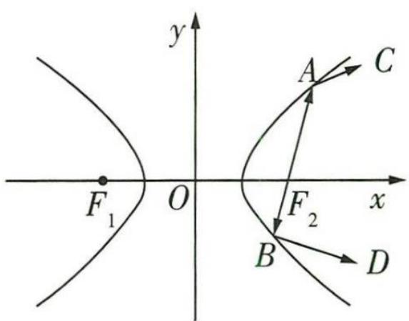

text_image

y
A
C
F₁ O
F₂ x
B
D

图3

A. $\frac{\sqrt{17}}{3}$

B. $\frac{\sqrt{37}}{5}$

C. $\frac{\sqrt{10}}{2}$

D. $\sqrt{5}$

# 参考答案与解析

B 由题意知延长 CA, DB, 则二者必过点 $F_{1}$ , 作出图象, 如图 4 所示.

由双曲线的定义知 $\left\{ \begin{array}{l} |AF_1| - |AF_2| = 2a, \\ |BF_1| - |BF_2| = 2a, \end{array} \right.$ 又 $\cos \angle BAC = -\frac{5}{13}$ , 所以 $\cos \angle F_1AB = \frac{5}{13}$ .

因为 $\overrightarrow{AB}\cdot\overrightarrow{BD}=0$ ，所以 $AB\perp BD$ ，设 $\left|AF_{1}\right|=13m,m>0$ ，

则 $|AB|=5m,|BF_{1}|=12m$ ，因此 $\left\{\begin{aligned}|AF_{2}|&=13m-2a,\\ |BF_{2}|&=12m-2a,\end{aligned}\right.$

由 $|AF_{2}|+|BF_{2}|=|AB|$ 得13m-2a+12m-2a=5m，

所以 $a = 5m$ ，则 $\vert BF_1\vert = \frac{12}{5} a,\vert BF_2\vert = \frac{2}{5} a,\vert F_1F_2\vert = 2c,$

又 $|BF_{1}|^{2}+|BF_{2}|^{2}=|F_{1}F_{2}|^{2}$ ，所以 $\left(\frac{12}{5}a\right)^{2}+\left(\frac{2}{5}a\right)^{2}=(2c)^{2}$ ，即 $37a^{2}=25c^{2}$ ，即 $e=\frac{\sqrt{37}}{5}$ ，故选B.

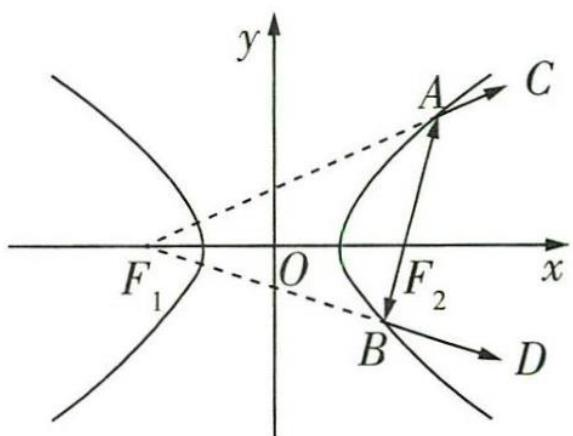

text_image

y
A
C
F₁
O
F₂
x
B
D

图 4

# 数学奖项

克拉福德奖授奖学科包括数学、地球科学、天文学和生物科学各个领域,每年颁发一次,奖励其中一个学科的杰出成就.

关注微信公众号“初高教辅站”获取更多初高中教辅资料

# 超重点 2 数学文化中的圆锥曲线问题

调研 1: (脸谱|2024 山东枣庄滕州一中7月期末|多选) 脸谱是戏曲舞台演出

时的化妆造型艺术,更是中国传统戏曲文化的重要载体.如图1,脸谱图形可近似看作由半圆和半椭圆组成的曲线C.半圆 $C_{1}$ 的方程为 $x^{2}+y^{2}=9(y\geqslant0)$ ,半椭圆 $C_{2}$ 的方程为 $\frac{x^{2}}{9}+\frac{y^{2}}{16}=1(y\leqslant0)$ .则下列说法正确的是()

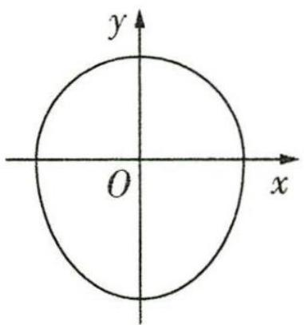

text_image

y
O
x

图1

A. 点 $M$ 在半圆 $C_{1}$ 上, 点 $N$ 在半椭圆 $C_{2}$ 上, $O$ 为坐标原点, $OM \perp ON$ , 则 $\triangle OMN$ 面积的最大值为 6

B. 曲线 $C$ 上任意一点到原点的距离的最大值与最小值之和为 7

C. 若 $A(0, -\sqrt{7})$ , $B(0, \sqrt{7})$ , P 是半椭圆 $C_{2}$ 上的一个动点, 则 $\cos \angle APB$ 的最小值为 $\frac{1}{9}$

D. 画法几何的创始人加斯帕尔·蒙日发现: 椭圆中任意两条互相垂直的切线, 其交点在与椭圆同中心的同一个圆上. 称该圆为椭圆的蒙日圆, 那么半椭圆 $C_{2}$ 扩充为整个椭圆 $C'$ : $\frac{x^{2}}{9} + \frac{y^{2}}{16} = 1 (-4 \leqslant y \leqslant 4)$ 后, 椭圆 $C'$ 的蒙日圆方程为 $x^{2} + y^{2} = 25$

解析

<table><tr><td>选项</td><td>分析过程</td><td>正误</td></tr><tr><td>A</td><td>因为点M在半圆 $C_1$ 上,点N在半椭圆 $C_2$ 上,O为坐标原点, $OM\perp ON$ ,则 $|OM|=3$ , $|ON|\leqslant4$ ,则 $S_{\triangle MON}=\frac{1}{2}|OM||ON|=\frac{3}{2}|ON|\leqslant6$ ,当N位于半椭圆的下顶点时取等号,所以 $\triangle OMN$ 面积的最大值为6</td><td>√</td></tr><tr><td>B</td><td>半圆 $C_1$ 上的点到O点的距离都是3,半椭圆 $C_2$ 上的点到O点的距离的最小值为3,最大值为4,所以曲线C上任意一点到原点的距离的最大值与最小值之和为7</td><td>√</td></tr><tr><td>C</td><td> $A(0,-\sqrt{7})$ , $B(0,\sqrt{7})$ 是椭圆 $\frac{x^2}{9}+\frac{y^2}{16}=1$ 的两个焦点,在 $\triangle PAB$ 中, $|AB|=2\sqrt{7}$ , $\cos\angle APB=\frac{|PA|^2+|PB|^2-|AB|^2}{2|PA|\cdot|PB|}=\frac{(|PA|+|PB|)^2-|AB|^2-2|PA|\cdot|PB|}{2|PA|\cdot|PB|}=\frac{8^2-28-2|PA|\cdot|PB|}{2|PA|\cdot|PB|}=\frac{18}{|PA|\cdot|PB|}-1\geqslant\frac{18}{\frac{(|PA|+|PB|)^2}{4}}-1=\frac{1}{8}$ ,当且仅当 $|PA|=|PB|$ 时取等号,所以 $\cos\angle APB$ 的最小值为 $\frac{1}{8}$ </td><td>×</td></tr></table>

# 数学奖项

奈望林纳奖 奈望林纳奖,于四年一度的国际数学家大会上颁发,颁予在计算机科学的数学方面有主要贡献者.

关注微信公众号“初高教辅站”获取更多初高中教辅资料

续表

<table><tr><td>选项</td><td>分析过程</td><td>正误</td></tr><tr><td>D</td><td>由题意知蒙日圆的圆心为原点 $O(0,0)$ ,在椭圆 $C':\frac{x2}{9}+\frac{y2}{16}=1(-4\leqslant y\leqslant4)$ 中取两条互相垂直的切线: $x=3$ 和 $y=4$ ,它们的交点为(3,4),该点在椭圆 $C'$ 的蒙日圆上,故椭圆 $C'$ 的蒙日圆半径为 $\sqrt{3^2+4^2}=5$ ,方程为 $x^2+y^2=25$ 【会审题】分析所求蒙日圆的关键信息,圆心是原点,再找两条特殊的切线,根据切线交点在圆上,求得圆半径,即得圆方程</td><td>√</td></tr></table>

调研 2: (伯努利双纽线|2024 江西临川一中7月期末|多选)2022年卡塔尔世界杯会徽正视图(如图2)近似伯努利双纽线. 伯努利双纽线最早于1694年被瑞士数学家雅各布·伯努利用来描述他所发现的曲线. 在平面直角坐标系 $xOy$ 中, 把到定点 $F_{1}(-a,0), F_{2}(a,0)$ 距离之积等于 $a^{2}(a > 0)$ 的点的轨迹称为双纽线, 已知点 $P(x_{0}, y_{0})$ 是 $a = 1$ 时的双纽线 $C$ 上一点, 下列说法正确的是 ( )

  
FIFA WORLD CUP
Qatar2022   
图 2

A. 双纽线 C 是中心对称图形

B. $-\frac{1}{2} \leqslant y_0 \leqslant \frac{1}{2}$

C. 双纽线 $C$ 上满足 $\left|PF_{1} \right| = \left|PF_{2} \right|$ 的点有 2 个

D. $|PO|$ 的最大值为 $\sqrt{2}$

解析 由到定点 $F_{1}(-a,0), F_{2}(a,0)$ 的距离之积等于 $a^{2}$ 的点的轨迹称为双纽线, 得双纽线 $C$ 的方程为 $\sqrt{(x+1)^{2} + y^{2}} \times \sqrt{(x-1)^{2} + y^{2}} = 1$ , 用 $-x, -y$ 替换方程中的 $x, y$ , 方程不变,

【敲黑板】判断曲线是否关于原点对称，用 -x, -y 替换方程中的 x, y，看方程是否改变；判断曲线是否关于 x 轴对称，用 -y 替换方程中的 y，看方程是否改变；判断曲线是否关于 y 轴对称，用 -x 替换方程中的 x，看方程是否改变

故双纽线 C 关于原点 O 成中心对称, 故 A 正确;

由等面积法得 $\frac{1}{2} |PF_1| \cdot |PF_2| \cdot \sin \angle F_1PF_2 = \frac{1}{2} |F_1F_2| \cdot |y_0|$ ，则 $|y_0| = \frac{1}{2} \cdot \sin \angle F_1PF_2$

所以 $-\frac{1}{2}\leqslant y_{0}\leqslant\frac{1}{2}$ ，故 B 正确；

$|PF_{1}|=|PF_{2}|$ ，则 $\sqrt{(x_{0}+1)^{2}+y_{0}^{2}}=\sqrt{(x_{0}-1)^{2}+y_{0}^{2}}$ ，解得 $x_{0}=0$ ，则 $\sqrt{1+y_{0}^{2}}\times\sqrt{1+y_{0}^{2}}=1$ ，解得 $y_{0}=0$ ，

所以双曲线 C 上满足 $\left|PF_{1}\right|=\left|PF_{2}\right|$ 的点 P 有一个, 故 C 错误;

因为 $\overrightarrow{PO} = \frac{1}{2}\left(\overrightarrow{PF_1} +\overrightarrow{PF_2}\right)$ ，所以 $\overrightarrow{PO^2} = \frac{1}{4}\left(|\overrightarrow{PF_1}|^2 +2|\overrightarrow{PF_1} |\cdot |\overrightarrow{PF_2} |\cdot \cos \angle F_1PF_2 + \right.$

# 数学奖项

$$
\left. \left| \overrightarrow {P F _ {2}} \right| ^ {2}\right),
$$

由余弦定理得 $2^{2} = |\overrightarrow{PF_{1}}|^{2} + |\overrightarrow{PF_{2}}|^{2} - 2|\overrightarrow{PF_{1}}|\cdot |\overrightarrow{PF_{2}}|\cdot \cos \angle F_{1}PF_{2},$

所以 $\overrightarrow{PO^2} = 1 + |\overrightarrow{PF_1}| \cdot |\overrightarrow{PF_2}| \cdot \cos \angle F_1PF_2 = 1 + \cos \angle F_1PF_2 \leqslant 2,$

【小提示】显然当 $F_{1}, P, F_{2}$ 三点共线，且点 $F_{1}, F_{2}$ 在 P 同侧时 $\cos \angle F_{1}PF_{2}$ 可以取 1 所以 $|\overrightarrow{PO}|$ 的最大值为 $\sqrt{2}$ ，故 D 正确。故选 ABD。

# 变式演练

(试题调研原创 | 调研 1 变式, 变载体, 黄金双曲线) 我们把离心率 $e = \frac{\sqrt{5} + 1}{2}$ 的双曲线 $\frac{x^2}{a^2} - \frac{y^2}{b^2} = 1 (a > 0, b > 0)$ 称为黄金双曲线, 给出以下几个说法:

(1)双曲线 $x^{2}-\frac{2y^{2}}{\sqrt{5}+1}=1$ 是黄金双曲线; ②若 $b^{2}=a c$ , 则该双曲线是黄金双曲线; ③若 $F_{1}, F_{2}$ 分别为左、右焦点, $A_{1}, A_{2}$ 分别为左、右顶点, $B_{1}(0,b), B_{2}(0,-b)$ 且 $\angle F_{1} B_{1} A_{2}=90^{\circ}$ , 则该双曲线是黄金双曲线; ④若 $M N$ 经过右焦点 $F_{2}$ 且 $M N \perp F_{1} F_{2}, \angle M O N=90^{\circ}, M, N$ 在双曲线上, 则该双曲线是黄金双曲线. 其中正确命题的序号为 \_\_\_\_.

# 参考答案与解析

①②③④

<table><tr><td>序号</td><td colspan="2">分析过程</td><td>正误</td></tr><tr><td>1</td><td colspan="2"> $x^{2}-\frac{2y^{2}}{\sqrt{5}+1}=1→e=\frac{c}{a}=\frac{\sqrt{1+\frac{\sqrt{5}+1}{2}}}{1}=\frac{\sqrt{5}+1}{2}$ 是黄金双曲线</td><td>√</td></tr><tr><td>2</td><td colspan="2"> $b^{2}=ac→e=\frac{c}{a}=\sqrt{\frac{a^{2}+b^{2}}{a^{2}}}=\sqrt{\frac{a^{2}+ac}{a^{2}}}=\sqrt{1+e}\rightarrow e^{2}-e-1=0→e=\frac{\sqrt{5}+1}{2}$ 或 $e=\frac{1-\sqrt{5}}{2}$ (舍去)→是黄金双曲线</td><td>√</td></tr><tr><td>3</td><td colspan="2"> $∠F_{1}B_{1}A_{2}=90^{\circ}\rightarrow|B_{1}F_{1}|^{2}+|B_{1}A_{2}|^{2}=|A_{2}F_{1}|^{2}\rightarrow b^{2}+2c^{2}=(a+c)^{2}\rightarrow b^{2}=ac$ →由2知是黄金双曲线</td><td>√</td></tr><tr><td>4</td><td>作出示意图(如图3所示)→MN经过右焦点 $F_{2}$ ,且 $MN\perp F_{1}F_{2},\angle MON=90^{\circ}\rightarrow|NF_{2}|=|OF_{2}|\rightarrow\frac{b^{2}}{a}=c$ → $b^{2}=ac$ →由2知是黄金双曲线</td><td>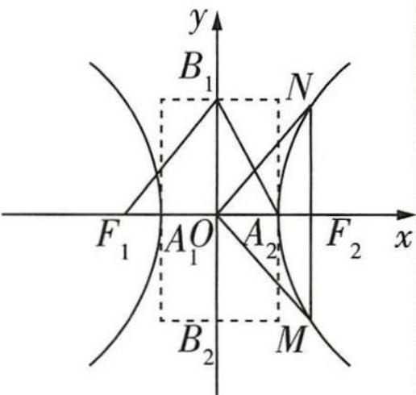图3</td><td>[xDDS]</td></tr></table>

# 数学奖项

华罗庚数学奖 华罗庚数学奖是为缅怀华罗庚先生的巨大功绩而设立的,旨在激励中国数学家在中国数学事业的发展中做出突出贡献.华罗庚数学奖每两年评选和颁发一次.

关注微信公众号“初高教辅站”获取更多初高中教辅资料

# 超重点 3 统计图表特色问题

调研 1 (等高堆积条形图|2024重庆南开中学8月开学考试|多选)为保护学生视力、促进学生身心健康发展,某中学研究型学习小组从该校学生中按男、女生比例,采用分层随机抽样的方法选取了100名学生(其中男生60人,女生40人),调查他们每日使用手机的时间.若每日使用手机时间超过40分钟,则认为该生手机成瘾.根据统计数据得到如图1所示的等高堆积条形图,用样本估计总体,用频率估计概率,下列说法正确的有()

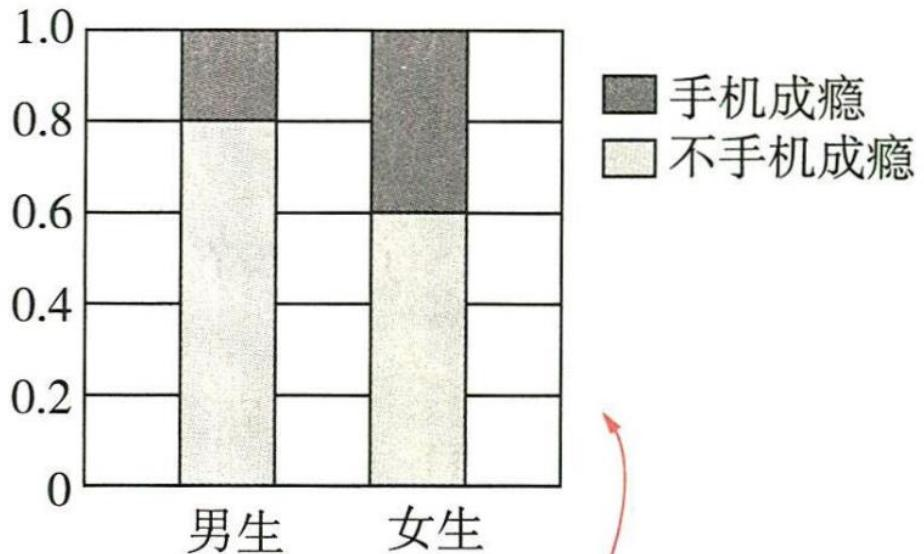

bar_stacked

| 性别 | 不手机成瘾 (%) | 手机成瘾 (%) |
| :--- | :--- | :--- |
| 男生 | 0.8 | 0.2 |
| 女生 | 0.6 | 0.4 |

图1

A. 该校男生和女生人数之比为 $3: 2$

B. 手机是否成瘾一定与学生的性别有关系

C. 从该校学生中随机抽取一名学生, 则该生手机成瘾的概率为 $\frac{7}{25}$

D. 从该校学生中抽到一名手机成瘾的学生, 则该生是男生的概率为 $\frac{1}{3}$

【会读图】统计图表类问题的解题关键是读懂图意，从该图中可以得到的信息有：调查的样本中，男生中有 $\frac{4}{5}$ 不手机成瘾， $\frac{1}{5}$ 手机成瘾；女生中有 $\frac{3}{5}$ 不手机成瘾， $\frac{2}{5}$ 手机成瘾。

解析

<table><tr><td>选项</td><td>分析过程</td><td>正误</td></tr><tr><td>A</td><td>根据分层抽样的抽样比可知,样本中男生和女生人数之比为60:40=3:2,用样本估计总体可知全校男生和女生人数之比为3:2</td><td>√</td></tr><tr><td>B</td><td>样本中男生有20%手机成瘾,女生有40%手机成瘾,比例关系差异很大,因此手机是否成瘾与学生的性别很大概率上有关系,但不能说“一定有关系”</td><td>×</td></tr><tr><td>C</td><td>易知样本的100人中有28人手机成瘾,所以样本中学生手机成瘾的频率为 $\frac{28}{100}=\frac{7}{25}$ ,用频率估计概率可知,从该校学生中随机抽取一名学生,该生手机成瘾的概率为 $\frac{7}{25}$ </td><td>√</td></tr><tr><td>D</td><td>从样本中抽到一名手机成瘾的学生,则该生是男生的概率为 $\frac{12}{12+16}=\frac{3}{7}$ ,用样本估计总体可知从该校学生中抽到一名手机成瘾的学生,该生是男生的概率也为 $\frac{3}{7}$ </td><td>×</td></tr></table>

# 数学奖项

钟家庆数学奖 钟家庆数学奖是为纪念中国杰出的数学家钟家庆而设立的. 钟家庆数学奖每两年颁发一次, 同时颁发奖金及获奖证书.

调研 2 (2024 湖南衡阳田家炳实验中学 8 月测试|多选)某学校对一次高三联考物理成绩进行统计分析,随机抽取100名学生成绩,得到如图2所示的频率分布直方图,分组区间为[40,50), [50,60), [60,70), [70,80), [80,90), [90,100], 同时学校计划从样本中随机抽取个体进行访谈,若从样本随机抽取的个体互不影响,把频率视为概率,则下列结论正确的是 ( )

A. 学生成绩的众数估计为 75

B. 学生成绩的第 75 百分位数估计为 80

C. 从成绩在 $[90,100]$ 内的学生(包含甲)中随机抽取一人访谈,则甲被抽到的概率为 0.01

D. 从成绩在 $[40,50)$ 内和 $[90,100]$ 内的学生中各抽 1 人, 从成绩在 $[70,80)$ 内的学生中抽 2 人, 再从他们 4 人中任取 2 人, 则这 2 人来自不同组的概率为 0.13

解析

<table><tr><td>选项</td><td>分析过程</td><td>正误</td></tr><tr><td>A</td><td>由频率分布直方图得,成绩在[70,80)内的频率最高,所以估计成绩的众数为75</td><td>√</td></tr><tr><td>B</td><td>因为0.010×10+0.015×10+0.020×10+0.030×10=0.75,所以估计成绩的第75百分位数为80</td><td>√</td></tr><tr><td>C</td><td>成绩在[90,100]内的人数为100×0.010×10=10,所以甲被抽到的概率为0.1</td><td>×</td></tr><tr><td>D</td><td>记从成绩在[40,50)内的学生中抽取的1人为a,从成绩在[90,100]内的学生中抽取的1人为b,从成绩在[70,80)内的学生中抽取的2人分别为c,d,则从这4人中抽取2人,所有的可能结果为ab,ac,ad,bc,bd,cd,共6种,其中2人不同组的有ab,ac,ad,bc,bd,共5种,所以这2人来自不同组的概率为 $\frac{5}{6} \approx 0.83$ </td><td>×</td></tr></table>

调研 3 (2023 福建三明三模 | 多选) 已知某地区中小学生人数如图 3 所示, 为了解该地区中小学生的近视情况, 卫生部门根据当地中小学生人数, 用分层抽样的方

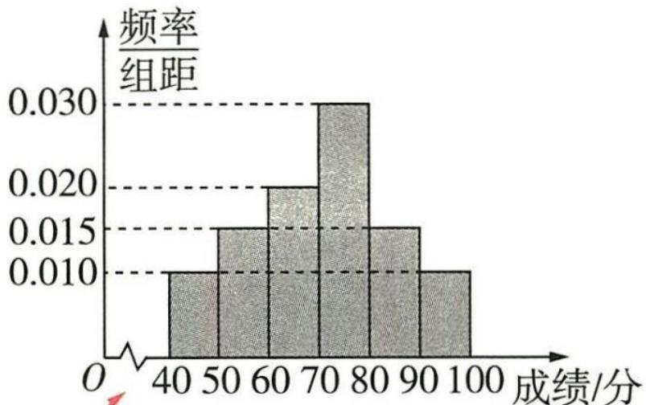

histogram

| 成绩/分 | 频率/组距 |
| :--- | :--- |
| 40-50 | 0.010 |
| 50-60 | 0.015 |
| 60-70 | 0.020 |
| 70-80 | 0.030 |
| 80-90 | 0.015 |
| 90-100 | 0.010 |

图 2

【会读图】从该图中可以得到的信息有：①最高小矩形底边中点值是众数，也就是75；②根据频率与百分位数的定义可以求出成绩的第75百分位数；③每个成绩区间对应的频率.

# 数学奖项

晨兴数学奖 晨兴数学奖被誉为“华人菲尔兹奖”,该奖项面向45岁以下,为在理论及应用数学方面取得杰出成就的华人数学家而设立,每三年颁发一次.

关注微信公众号“初高教辅站”获取更多初高中教辅资料

法抽取了 $10 \%$ 的学生进行视力调查,调查数据如图4所示,则下列说法正确的有( )

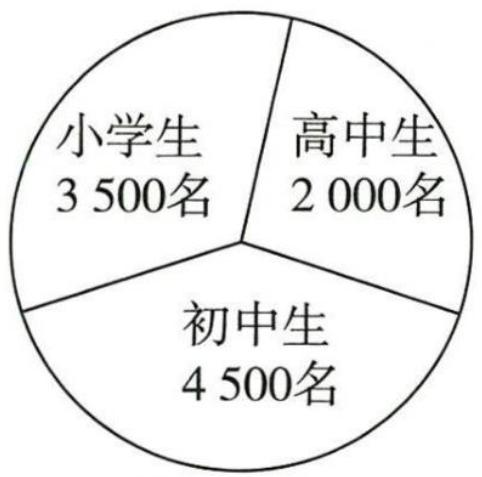

pie

| 学生类型 | 数量 (名) |
| :--- | :--- |
| 小学生 | 3500 |
| 高中生 | 2000 |
| 初中生 | 4500 |

图3

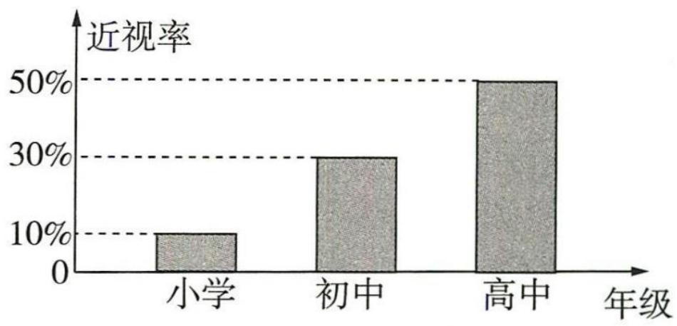

bar

| 年级 | 近视率 (%) |
| :--- | :--- |
| 小学 | 10 |
| 初中 | 30 |
| 高中 | 50 |

图 4

【会读图】从图3中可以得到的信息是总体内小学生、初中生、高中生各自的人数，可得到该地区小学生、初中生、高中生的占比，进而得到样本内小学生、初中生、高中生的人数和占比；从图4中可以得到的信息是样本内小学生、初中生、高中生各自的近视率.

A. 该地区的中小学生中,高中生占比为 $20 \%$   
B. 抽取调查的高中生人数为 200  
C. 该地区近视的中小学生中,高中生占比超过 $40 \%$   
D. 从该地区的中小学生中任取 3 名学生, 记近视人数为 $\xi$ , 则 $\xi$ 的数学期望约为 0.81

# 解析

<table><tr><td>选项</td><td>分析过程</td><td>正误</td></tr><tr><td>A</td><td>由题图可知,该地区中小学生中高中生占比为 $\frac{2\ 000}{3\ 500 + 4\ 500 + 2\ 000} \times 100\% = 20\%$ </td><td>√</td></tr><tr><td>B</td><td>用分层抽样的方法抽取了10%的学生,则抽取的高中生人数为 $2\ 000 \times 10\% = 200$ </td><td>√</td></tr><tr><td>C</td><td>该地区近视的中小学生中,小学生近视的人数为 $3\ 500 \times 0.1 = 350$ ,初中生近视的人数为 $4\ 500 \times 0.3 = 1\ 350$ ,高中生近视的人数为 $2\ 000 \times 0.5 = 1\ 000$ ,所以该地区近视的中小学生中,高中生占比为 $\frac{1\ 000}{350 + 1\ 350 + 1\ 000} = \frac{10}{27} < \frac{2}{5}$ </td><td>×</td></tr><tr><td>D</td><td>从该地区中的中小学生中任意抽取一名,该学生近视的概率为 $\frac{350 + 1\ 350 + 1\ 000}{3\ 500 + 4\ 500 + 2\ 000} = \frac{27}{100}$ ,从该地区的中小学生中任取3名学生,记近视人数为ξ,则ξ~B(3, $\frac{27}{100}$ ),所以E(ξ)=3× $\frac{27}{100}$ =0.81</td><td>√</td></tr></table>

# 数学奖项

伯格曼奖 伯格曼奖由伯格曼信托基金会授奖. 出生于波兰的美国数学家伯格曼的遗孀去世后, 按其遗愿为纪念其丈夫, 把她的捐款于 1988 年设立了伯格曼信托基金会, 并设此奖.

关注微信公众号“初高教辅站”获取更多初高中教辅资料

# 超重点 4 概率统计中的接轨高数题

# 考情研报

近几年高考,尤其是新高考中,关于概率统计的题目命制呈现出这样的特点:①更加严谨,这与新教材中相关知识的讲解和说法更加严谨是一致的;②出现了高等数学中的名词、概念(如下文中的泊松分布、最大似然估计),体现了高中数学向高等数学的过渡;③应用性强,题目多呈现生活、生产中的情境.同学们在复习过程中,要有意识地针对以上特点备考.

调研 1 (试题调研原创|泊松分布) 泊松分布是一种描述随机现象的概率分布, 在经济生活、事故预测、生物学、物理学等领域都有广泛应用, 泊松分布的概率分布列为 $P(X=k)=\frac{\lambda^k}{k!}\mathrm{e}^{-\lambda}(k=0,1,2,\cdots)$ , 其中 $\mathbf{e}$ 为自然对数的底数, $\lambda$ 是泊松分布的均值. 若随机变量 $X$ 服从二项分布, 即 $X \sim B(n,p)$ , 当 $n$ 很大且 $p$ 很小时, 二项分布近似于泊松分布, 其中 $\lambda = np$ , 即 $P(X=i)=\frac{\mathrm{e}^{-np}(np)^i}{i!}(n \in \mathbb{N})$ . 现已知某种元件的次品率为 0.01 , 抽检 100 个该种元件, 正品率大于 97% 的概率约为 (参考数据: $\frac{1}{\mathrm{e}} \approx 0.368$ )

A. $99\%$

B. $97\%$

C. $92\%$

D. $74\%$

解析 由题意得, $n = 100, p = 0.01$ , 此时泊松分布可作为二项分布的近似, $\lambda = 100 \times 0.01 = 1$ .

【传技巧】虽然是与高等数学接轨的问题, 但难度并不高. 新信息问题往往让很多学生因为
陌生产生压力, 面对题目束手无策时, 告诉自己平心静气, 盯准题眼, 理解公式 $P(X=i)=\frac{e^{-np}(np)^i}{i!}$ 中各参数的意义, 将式子简化, 就会发现其实并不难

所以 $P(X=i)=\frac{1}{i!}e^{-1}$ ,

所以 $P(X=0)=\frac{1}{0!}e^{-1}=\frac{1}{e},P(X=1)=\frac{1}{1!}e^{-1}=\frac{1}{e},P(X=2)=\frac{1}{2!}e^{-1}=\frac{1}{2e}$

正品率大于 $97\%$ 的概率 $P = P(X = 0) + P(X = 1) + P(X = 2) = \frac{1}{\mathrm{e}} +\frac{1}{\mathrm{e}} +\frac{1}{2\mathrm{e}}\approx 92\%$ .故选C.

# 数学奖项

安培奖 安培奖是为纪念物理学家安培诞生200周年而设立的,奖励一位或几位在纯粹数学、应用数学或物理学领域中研究成果突出的法国科学家.

关注微信公众号“初高教辅站”获取更多初高中教辅资料

调研 2 (最大似然估计|2023 山东济南历城一中押题) 统计与概率主要研究现实生活中的数据和客观世界中的随机现象,通过对数据的收集、整理、分析、描述及对事件发生的可能性刻画,来帮助人们做出合理的决策.

(1) 现有池塘甲, 已知池塘甲里有 50 条鱼, 其中 A 种鱼有 7 条, 若从池塘甲中捉了 2 条鱼. 用 $\xi$ 表示其中 A 种鱼的条数, 请写出 $\xi$ 的分布列, 并求 $\xi$ 的数学期望 $E(\xi)$ .

(2)另有池塘乙,为估计池塘乙中的鱼数,某同学先从中捉了50条鱼,做好记号后放回池塘,再从中捉了20条鱼,发现有记号的有5条.

(i)请从分层抽样的角度估计池塘乙中的鱼数.

(ii) 统计学中有一种重要而普遍的求估计量的方法——最大似然估计, 其原理是使用概率模型寻找能够以较高概率产生观察数据的系统发生树, 即在什么情况下最有可能发生已知的事件. 请从条件概率的角度, 采用最大似然估计法估计池塘乙中的鱼数.

解析 (1) 由题意可知, $\xi$ 的所有可能取值为 $0, 1, 2$ .

$$
P (\xi = 0) = \frac {\mathrm{C} _ {4 3} ^ {2}}{\mathrm{C} _ {5 0} ^ {2}} = \frac {1 2 9}{1 7 5}, P (\xi = 1) = \frac {\mathrm{C} _ {4 3} ^ {1} \cdot \mathrm{C} _ {7} ^ {1}}{\mathrm{C} _ {5 0} ^ {2}} = \frac {4 3}{1 7 5}, P (\xi = 2) = \frac {\mathrm{C} _ {7} ^ {2}}{\mathrm{C} _ {5 0} ^ {2}} = \frac {3}{1 7 5},
$$

故 $\xi$ 的分布列为

<table><tr><td>ξ</td><td>0</td><td>1</td><td>2</td></tr><tr><td>P</td><td> $\frac{129}{175}$ </td><td> $\frac{43}{175}$ </td><td> $\frac{3}{175}$ </td></tr></table>

$$
E (\xi) = 0 \times \frac {1 2 9}{1 7 5} + 1 \times \frac {4 3}{1 7 5} + 2 \times \frac {3}{1 7 5} = \frac {7}{2 5}.
$$

(2)(i)设池塘乙中鱼数为 m, 则 $\frac{50}{m} = \frac{5}{20}$ , 解得 m = 200, 故估计池塘乙中的鱼数为 200.

(ii)设池塘乙中鱼数为 $n$ , 令事件 $B =$ “再捉20条鱼,5条有记号”, 事件 $C =$ “池塘乙中鱼数为 $n$ ”, 则 $p_{n} = P(B \mid C) = \frac{C_{50}^{5} \cdot C_{n-50}^{15}}{C_{n}^{20}}$ , 由最大似然估计法, 即求 $p_{n}$ 最大时 $n$ 的值, 其中 $n \geqslant 65$ ,

【扫清障碍】用最大似然估计法估计池塘乙中的鱼数，理解最大似然估计的原理，即求对应的概率最大时池塘乙中的鱼数

$\frac{p_{n+1}}{p_n}=\frac{(n-49)(n-19)}{(n-64)(n+1)}$ ，当 $n=65,66,\cdots,198$ 时， $\frac{p_{n+1}}{p_n}>1$ ，当 n=199 时， $\frac{p_{n+1}}{p_n}=1$ ，当 n=200，
201, $\cdots$ 时, $\frac{p_{n+1}}{p_n}<1$ ,即 $p_{65}<p_{66}<\cdots<p_{199}=p_{200}>p_{201}>p_{202}>\cdots$

所以池塘乙中的鱼数为 199 或 200.

# 数学奖项

巴尔扎恩奖 巴尔扎恩奖创立于 1961 年,由巴尔扎恩国际基金会提供资金支持和管理,一年颁发一次.

# 核心主干抓重点

# 超重点 5 巧用圆锥曲线的定义与性质快速求值

# 命题角度1 圆锥曲线第一定义的应用

# 巧抓关键

圆锥曲线的第一定义是我们最常用的定义,具体为:平面内与两个定点 $F_{1}, F_{2}$ 的距离的和等于常数(大于 $|F_{1}F_{2}|$ )的点的轨迹为椭圆;平面内与两个定点 $F_{1}, F_{2}$ 的距离的差的绝对值等于非零常数(小于 $|F_{1}F_{2}|$ )的点的轨迹为双曲线;平面内与一个定点 $F$ 和一条定直线 $l(l$ 不经过点 $F$ )的距离相等的点的轨迹为抛物线.在实际应用过程中,要尤其注意限制条件,避免因粗心而出错.

调研 1 (2024 广州执信中学开学测试) 已知双曲线 $\Gamma: \frac{x^{2}}{4} - \frac{y^{2}}{2} = 1$ 的左、右焦点分别为 $F_{1}, F_{2}$ , 过 $F_{1}$ 的直线分别交双曲线 $\Gamma$ 的左、右两支于 $A, B$ 两点, 且 $\angle F_{2}AB = \angle F_{2}BA$ , 则 $|BF_{2}| =$

A. $\sqrt{5} + 4$

B. $2\sqrt{5}+4$

C. $2\sqrt{5}$

D. $\sqrt{5}$

解析 由双曲线 $\Gamma: \frac{x^2}{4} - \frac{y^2}{2} = 1$ ，得 $a = 2, b = \sqrt{2}, c = \sqrt{6}$ .

因为 $\angle F_{2}AB = \angle F_{2}BA$ ，所以 $|F_{2}A| = |F_{2}B|$

如图1,作 $F_{2}C\perp AB$ 于C,则C是AB的中点.

设 $\left|F_{2}A\right|= \left|F_{2}B\right|=x,$

则由双曲线的定义得 $\left|F_{2}A\right|-\left|F_{1}A\right|=2a,\left|F_{1}B\right|-\left|F_{2}B\right|=2a,$

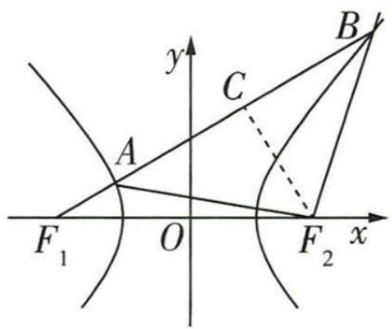

text_image

y
A
C
B
F₁ O F₂ x

图1

可得 $|F_{1}A|=x-4,|F_{1}B|=x+4$ ，所以 $|AB|=8$ ，即 $|BC|=4$ ，故 $\cos\angle F_{1}BF_{2}=\frac{|CB|}{|BF_{2}|}=\frac{4}{x}$

【敲黑板】利用定义用同一个参数 x 表示 $\left|F_{1}A\right|$ , $\left|F_{1}B\right|$ 的长度，进而用两种方式表示 $\cos \angle F_{1}BF_{2}$ ，列方程求解

又 $\triangle BF_{1}F_{2}$ 中，由余弦定理得 $\cos \angle F_{1}BF_{2} = \frac{|F_{1}B|^{2} + |F_{2}B|^{2} - |F_{1}F_{2}|^{2}}{2|F_{1}B|\cdot|F_{2}B|} =$ $\frac{(x + 4)^2 + x^2 - (2\sqrt{6})^2}{2(x + 4)\cdot x} = \frac{x^2 + 4x - 4}{(x + 4)\cdot x},$

所以 $\frac{4}{x}=\frac{x^{2}+4x-4}{(x+4)\cdot x}$ ，解得 $x=2\sqrt{5}$ 。故选C.

【多角度思考】本题也可以通过联立方程，求出 $|AF_{1}|$ ，再根据定义得到 $|BF_{2}|$ ，此方法思

# 数学奖项

巴尔扎恩奖主要奖励在文学、道德科学与艺术、物理学、数学与自然科学、医学等学科获得成就的个人或机构。有趣的是，历史上第一个巴尔扎恩奖颁给了诺贝尔基金会。

关注微信公众号“初高教辅站”获取更多初高中教辅资料路简单，但过程比较复杂，仅做补充用，具体步骤如下。设直线 $AB$ 的方程为 $x = my - \sqrt{6}$ ， $|m| > \sqrt{2}$ ，将直线方程与双曲线方程联立，消去 $x$ 得关于 $y$ 的方程 $(m^2 - 2)y^2 - 2\sqrt{6}my + 2 = 0$ ， $\Delta = 16 + 16m^2 > 0$ 。设 $A(x_1, y_1), B(x_2, y_2)$ ，则 $y_1 + y_2 = \frac{2\sqrt{6}m}{m^2 - 2}$ 。设 $AB$ 的中点为 $M(x_0, y_0)$ ，则 $y_0 = \frac{\sqrt{6}m}{m^2 - 2}, x_0 = \frac{2\sqrt{6}}{m^2 - 2}$ ，连接 $MF_2$ ，则 $k_{MF_2} = \frac{y_0}{x_0 - \sqrt{6}} = \frac{m}{4 - m^2}$ 。由 $\triangle ABF_2$ 为等腰三角形，得 $\frac{m}{4 - m^2} \cdot \frac{1}{m} = -1$ ，则 $m^2 = 5$ ，所以 $x_0 = \frac{2\sqrt{6}}{3}, y_0 = \frac{\pm\sqrt{30}}{3}, |MF_1| = \sqrt{(x_0 + \sqrt{6})^2 + y_0^2} = 2\sqrt{5}$ 。由双曲线的定义易得 $|AM| = \frac{1}{2}|AB| = 4$ ，所以 $|AF_1| = 2\sqrt{5} - 4$ ，从而 $|BF_2| = |AF_2| = 4 + |AF_1| = 2\sqrt{5}$

调研 2 (2023 江西九江三模) 已知椭圆 $C: \frac{x^{2}}{8} + \frac{y^{2}}{4} = 1$ 的左、右焦点分别为 $F_{1}, F_{2}, A, B$ 为平面内异于 $F_{1}, F_{2}$ 的两点. 若 $AB$ 的中点 $P$ 在 $C$ 上, 且 $\overrightarrow{AC} = 2\overrightarrow{AF_{1}}, \overrightarrow{AD} = 2\overrightarrow{AF_{2}}$ , 则 $|BC| + |BD| =$

A. 4

B. $4\sqrt{2}$

C. 8

D. $8\sqrt{2}$

# 思路指引

如何把向量关系转化为长度关系? 注意关键数字“2”, “2”可以联想到中点, 结合“AB的中点P”, 不难想到中位线, 由此我们连接 $PF_{1}, PF_{2}$ , 得到 $PF_{1}, PF_{2}$ 分别是 $\triangle ABC$ 和 $\triangle ABD$ 的中位线, 即可得到 $|BC| = 2|PF_{1}|$ , $|BD| = 2|PF_{2}|$ , 再根据椭圆的定义计算即可得解.

解析 如图 2 所示, 连接 $PF_{1}, PF_{2}, \because \overrightarrow{AC} = 2 \overrightarrow{AF_{1}}, \overrightarrow{AD} = 2 \overrightarrow{AF_{2}}$ ,

$\therefore F_{1},F_{2}$ 分别为线段 AC,AD 的中点.

又 $P$ 为 $AB$ 的中点， $\therefore PF_{1}, PF_{2}$ 分别是 $\triangle ABC$ 和 $\triangle ABD$ 的中位线，

$$
\therefore | B C | = 2 \left| P F _ {1} \right|, \left| B D \right| = 2 \left| P F _ {2} \right|,
$$

【划重点】通过中位线将待求长度转化为椭圆上的点到焦点的距离，便可利用椭圆定义求值了

∵ 点 P 在 C 上, ∴ $\left|PF_{1}\right| + \left|PF_{2}\right| = 4\sqrt{2}$ ,

$\therefore |BC| + |BD| = 8\sqrt{2}$ . 故选 D.

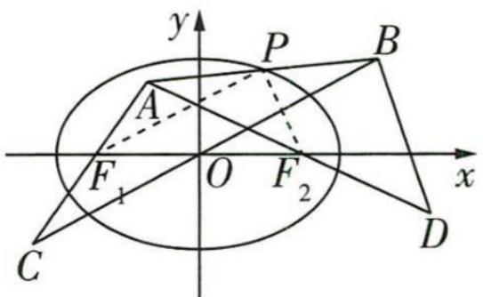

text_image

y
P
B
A
F₁
O
F₂
x
C
D

图2

调研 3 (2023 华东师大一附中三模) 已知 $F$ 是抛物线 $C: y^{2} = 4x$ 的焦点, $P$ 是抛物线 $C$ 上一动点, $Q$ 是曲线 $x^{2} + y^{2} - 8x - 2y + 16 = 0$ 上一动点, 则 $|PF| + |PQ|$ 的最小值为 \_\_\_\_.

解析 第一步:根据抛物线定义和圆的定义将 $|PF|+|PQ|$ 转化为 $|PA|+|PM|-1$ .

由抛物线 $C: y^{2} = 4x$ ，可得 $F(1,0)$ ，准线方程为 l:x = -1。

# 数学文化

米勒问题 米勒问题的数学表达为:在已知直线 l 的同侧有 A, B 两点, 试在直线 l 上求一点 C, 使得 C 对 A, B 两点的张角最大, 即 $\angle ACB$ 最大.

关注微信公众号“初高教辅站”获取更多初高中教辅资料

$x^{2}+y^{2}-8x-2y+16=0$ 即 $(x-4)^{2}+(y-1)^{2}=1$ ，表示以 $M(4,1)$ 为圆心、1为半径的圆.

如图3所示,过点P作 $PA\perp l$ ,垂足为A,连接PM,交圆M于Q,则 $\vert PF\vert+\vert PQ\vert=\vert PA\vert+\vert PM\vert-1$ .

【两步转化】从 $|PF|$ 到 $|PA|$ ，利用了抛物线的定义，而从 $|PQ|$ 到 $|PM|-1$ ，则利用了圆外一点到圆上一点的距离的最小值为该点到圆心的距离减去半径，如此我们便可利用平面几何知识求最值了

第二步:根据“两点之间,线段最短”和“点到直线的线段中,垂线段最短”得到最小值.

连接 $AM$ , 则 $|PA| + |PM| - 1 \geqslant |AM| - 1$ , 当且仅当 $A, P, M$ 三点共线时取等号.

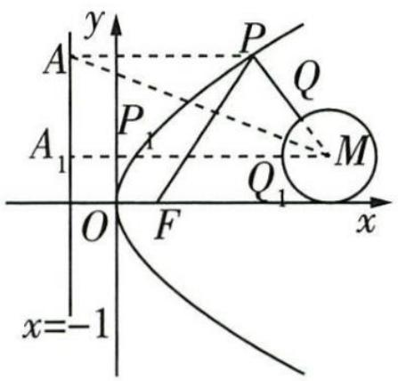

text_image

y
A
P
Q
A₁
P
O
F
x
M
Q₁
x=-1

图3

过点 M 作 $MA_{1} \perp l$ ，垂足为 $A_{1}$ ，交抛物线于 $P_{1}$ ，交圆 M 于 $Q_{1}$ ，则 $|AM| - 1 \geqslant |A_{1}M| - 1$ .

综上,要想得到 $|PF|+|PQ|$ 的最小值,则A,P,Q,M四点共线,且所在直线与准线l垂直时 $|PF|+|PQ|$ 取最小值,为 $|A_{1}M|-1=5-1=4$ .故填4.

# 命题角度 2 圆锥曲线第二定义的应用

# 拓展提升

圆锥曲线的第二定义:平面内到定点 F 的距离与到定直线 l 距离的比值为常数 e 的点的轨迹为圆锥曲线,其中定点 F 为焦点,定直线 l 为准线.若 $e \in (0,1)$ , 则轨迹是椭圆; 若 $e \in (1, +\infty)$ , 则轨迹是双曲线; 若 e = 1, 则轨迹是抛物线. 注意定点不在定直线上, 当轨迹是以原点为中心、焦点在 x 轴上的椭圆或双曲线时, $F(c,0), l: x = \frac{a^{2}}{c}$ (或 $F(-c,0), l: x = -\frac{a^{2}}{c}$ ).

调研 4 (2024 山西长治 7 月期末) 已知点 $F_{1}(-1,0), F_{2}(1,0)$ , 动点 $P$ 到直线 $x = 3$ 的距离为 $d, \frac{|PF_{2}|}{d} = \frac{\sqrt{3}}{3}$ , 则 $\triangle PF_{1}F_{2}$ 的周长为 ( )

A. 4

B. 6

C. $4\sqrt{3}$

D. $2\sqrt{3}+2$

解析 方法一 设 $P(x,y)$ ，则 $\left|PF_{2}\right|=\sqrt{(x-1)^{2}+y^{2}}$ , $d=|x-3|$ ,

因为 $\frac{|PF_2|}{d} = \frac{\sqrt{3}}{3}$ , 所以 $\frac{(x - 1)^2 + y^2}{(x - 3)^2} = \frac{1}{3}$ , 整理可得 $\frac{x^2}{3} + \frac{y^2}{2} = 1$ ,

即点 P 的轨迹为椭圆且轨迹方程为 $\frac{x^{2}}{3} + \frac{y^{2}}{2} = 1$ ，所以 $\triangle PF_{1}F_{2}$ 的周长为 $2a + 2c = 2\sqrt{3} + 2$ 。故选 D.

方法二 由 $0 < \frac{\sqrt{3}}{3} < 1$ 及椭圆的第二定义知点 $P$ 的轨迹为椭圆，

$c = 1$ ，其离心率为 $\frac{c}{a} = \frac{\sqrt{3}}{3}$ 则 $a = \sqrt{3}$

# 数学文化

格点问题 又称整点问题,是研究一些特殊区域甚至一般区域中的格点的个数的问题.格点问题所涉及的知识点通常与抽屉原理和图论知识结合在一起.

关注微信公众号“初高教辅站”获取更多初高中教辅资料

所以焦点三角形 $PF_{1}F_{2}$ 的周长为 $2a + 2c = 2\sqrt{3} + 2.$ 故选D.

调研 5 (2023 重庆一中等校联考 | 多选) 如果双曲线 $\frac{x^{2}}{a^{2}} - \frac{y^{2}}{b^{2}} = 1 (a > 0, b > 0)$ 的一条渐近线上的点 $M(-1, \sqrt{3})$ 关于另一条渐近线的对称点恰为双曲线的右焦点 $F, P$ 为双曲线上的动点, 已知 $A(3,1)$ , 则 $|PA| + \frac{1}{2} |PF|$ 的值可能为 ( )

A. $\frac{3}{2}$

B. 2

C. $\frac{5}{2}$

D. 4

解析 依题意可知点 $M(-1, \sqrt{3})$ 在渐近线 $y = -\frac{b}{a} x$ 上, 所以 $\frac{b}{a} = \sqrt{3}$ , 即 $b = \sqrt{3} a$ ,

设 $F(c,0)$ ，则 $\left\{ \begin{array}{l} \frac{\sqrt{3} - 0}{-1 - c} = -\frac{a}{b}, \\ \frac{\sqrt{3} + 0}{2} = \frac{b}{a} \times \frac{-1 + c}{2}, \end{array} \right.$ 得 $c = 2$

【敲黑板】注意 “点 $M(-1,\sqrt{3})$ 关于另一条渐近线的对称点恰为右焦点 F”，简单来说就是渐近线 $y=\frac{b}{a}x$ 是线段 MF 的垂直平分线，利用 “垂直” 和 “中点在垂线上” 列方程组求解

又 $c^{2}=a^{2}+b^{2}$ ，所以 $a^{2}=1, b^{2}=3$ ，所以离心率 $e=\frac{c}{a}=2$ ，右焦点对应的准线为直线 $x=\frac{a^{2}}{c}=\frac{1}{2}$ .

设点 P 到准线 $x=\frac{1}{2}$ 的距离为 d，则 $\frac{|PF|}{d}=e=2$ ，即 $|PF|=2d$ .

所以 $|PA| + \frac{1}{2}|PF| = |PA| + \frac{1}{2} \times 2d = |PA| + d \geqslant 3 - \frac{1}{2} = \frac{5}{2}$ . 故选 CD.

# 命题角度 3 圆锥曲线第三定义的应用

# 拓展提升

椭圆和双曲线的第三定义为“平面内的动点到两定点 $A_{1}(a,0), A_{2}(-a,0)$ 的直线斜率乘积等于常数 $e^{2}-1$ 的点的轨迹, 其中 $e$ 为离心率”, 严格来说, 这个定义是有瑕疵的, 动点的轨迹不包括 $A_{1}, A_{2}$ 两点, 在实际解题中, 我们多使用下述结论.

①已知椭圆 $C: \frac{x^2}{a^2} + \frac{y^2}{b^2} = 1 (a > b > 0)$ 的左、右顶点分别为 $A_1(-a, 0), A_2(a, 0)$ ，动点 $P(x, y)$ 是椭圆上异于 $A_1, A_2$ 的点，则 $k_{PA_1} \cdot k_{PA_2} = -\frac{b^2}{a^2}$ .

# 数学文化

阿基米德穷竭法 阿基米德运用穷竭法求曲边形的面积的具体步骤是先将一个曲边图形细分成若干个窄条,对每个窄条,近似用矩形条代替.

关注微信公众号“初高教辅站”获取更多初高中教辅资料

拓展: 已知 $M_{1}(m,n)$ , $M_{2}(-m,-n)$ 是椭圆上关于原点对称的两点, $P(x,y)$ 是椭圆上异于 $M_{1}, M_{2}$ 的任意一点, 若 $k_{PM_{1}}, k_{PM_{2}}$ 存在, 则 $k_{PM_{1}} \cdot k_{PM_{2}} = -\frac{b^{2}}{a^{2}}$ (或者 $e^{2}-1$ , 其中 e 为椭圆的离心率).

②已知双曲线 $C:\frac{x^{2}}{a^{2}}-\frac{y^{2}}{b^{2}}=1(a>0,b>0)$ 的左、右顶点分别为 $A_{1}(-a,0)$ , $A_{2}(a,0)$ ，动点 $P(x,y)$ 是双曲线上异于 $A_{1}, A_{2}$ 的点，则 $k_{PA_{1}} \cdot k_{PA_{2}} = \frac{b^{2}}{a^{2}}$ .

拓展: 已知 $M_{1}(m,n)$ , $M_{2}(-m,-n)$ 是双曲线上关于原点对称的两点, $P(x,y)$ 是双曲线上异于 $M_{1}, M_{2}$ 的任意一点, 若 $k_{PM_{1}}, k_{PM_{2}}$ 存在, 则 $k_{PM_{1}} \cdot k_{PM_{2}} = \frac{b^{2}}{a^{2}}$ (或者 $e^{2}-1$ , 其中 e 为双曲线的离心率).

调研 6 (2023 成都石室中学 6 月模拟) 已知椭圆 $\Gamma: \frac{x^{2}}{a^{2}} + \frac{y^{2}}{b^{2}} = 1 (a > b > 0)$ , 过原点的直线交椭圆于 $A, B$ ( $A$ 在第一象限) 两点. 由 $A$ 向 $x$ 轴作垂线, 垂足为 $C$ , 连接 $BC$ 并延长交椭圆于 $D$ . 若 $\triangle ABD$ 为直角三角形, 则椭圆的离心率为 ( )

A. $\frac{1}{2}$

B. $\frac{\sqrt{2}}{2}$

C. $\frac{\sqrt{3}}{2}$

D. $\frac{\sqrt{3}}{3}$

# 巧抓关键

过原点的直线交椭圆于 $A, B$ 两点, 说明 $A, B$ 关于原点对称, 问题又涉及离心率, 应用椭圆第三定义便是解题的不二之选. 当然, 也可以利用点差法, 不过运算量偏大, 倒不符合“小题小做”的原则了.

解析 方法一 如图4所示,设 $A(x_{0},y_{0})$ ,其中 $x_{0}>0,y_{0}>0$ ,

则 $B(-x_0, -y_0), C(x_0, 0), k_{AB} = \frac{y_0}{x_0}, k_{BC} = \frac{y_0}{2x_0}$ .

设点 $D(x_{1},y_{1})$ ，则 $\left\{ \begin{array}{l} \frac{x_1^2}{a^2} +\frac{y_1^2}{b^2} = 1,\\ \frac{x_0^2}{a^2} +\frac{y_0^2}{b^2} = 1, \end{array} \right.$ 作差可得 $\frac{x_1^2 - x_0^2}{a^2} +\frac{y_1^2 - y_0^2}{b^2} = 0,$

所以 $\frac{y_1^2 - y_0^2}{x_1^2 - x_0^2} = -\frac{b^2}{a^2}$ , 所以 $k_{DA}k_{DB} = \frac{y_1 - y_0}{x_1 - x_0} \cdot \frac{y_1 + y_0}{x_1 + x_0} = \frac{y_1^2 - y_0^2}{x_1^2 - x_0^2} = -\frac{b^2}{a^2}$ .

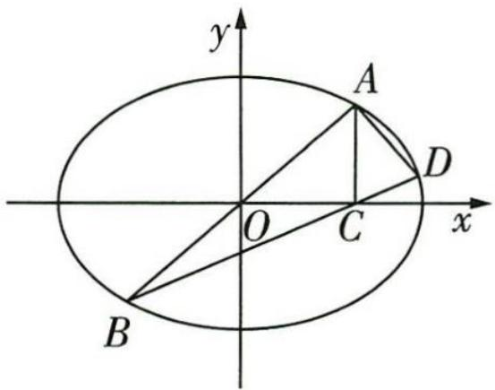

text_image

y
A
D
O
C
x
B

图4

【点透讲透】以上过程实际上是利用点差法给出了前述结论的证明，该结论在解选择题、填空题时可直接应用

数学文化

又 $\triangle ABD$ 为直角三角形, 所以 $AD \perp AB$ , 则 $k_{AD} k_{AB} = -1$ , 所以 $k_{AD} = -\frac{1}{k_{AB}} = -\frac{x_0}{y_0}$ ,

又 $k_{DA}k_{DB} = k_{DA}k_{BC} = -\frac{x_0}{y_0}\cdot \frac{y_0}{2x_0} = -\frac{1}{2},$ 所以 $\frac{b^2}{a^2} = \frac{1}{2},$

所以该椭圆的离心率为 $e = \frac{c}{a} = \sqrt{\frac{c^2}{a^2}} = \sqrt{\frac{a^2 - b^2}{a^2}} = \sqrt{1 - \frac{b^2}{a^2}} = \frac{\sqrt{2}}{2}$ . 故选 B.

方法二 设点 $A(x_0, y_0)$ , 其中 $x_0 > 0, y_0 > 0$ , 则 $B(-x_0, -y_0), C(x_0, 0)$ , 则 $k_{AB} = \frac{y_0}{x_0}, k_{BC} = \frac{y_0}{2x_0}$ , 易知 $k_{DA} k_{DB} = -\frac{1}{k_{AB}} \cdot k_{BC} = -\frac{1}{2} = e^2 - 1$ , 因为 $0 < e < 1$ , 所以该椭圆的离心率为 $\frac{\sqrt{2}}{2}$ .

调研 7 (2024 贵州凯里一中 8 月模拟) 已知 $A, B$ 分别是双曲线 $C: \frac{x^2}{a^2} - \frac{y^2}{b^2} = 1$ ( $a > 0, b > 0$ ) 的左、右顶点, $F$ 是 $C$ 的右焦点, 点 $P$ 为 $C$ 的右支上位于第一象限内的点, 且 $PF \perp x$ 轴. 若直线 $PB$ 与直线 $PA$ 的斜率的比值为 $\frac{b^2}{a^2}$ , 则 $C$ 的离心率为 ( )

A. $\sqrt{2}$

B. $\sqrt{3}$

C. 2

D. 3

解析 方法一 由题意可知 $x_{P} = c$ ，将其代入双曲线方程，可得 $y_{P} = \frac{b^{2}}{a}$ 则 $P(c, \frac{b^2}{a})$

【二级结论】 $|PF|$ 的长为双曲线通径的一半，双曲线的通径长为 $\frac{2b^{2}}{a}$ ，则 $|PF|=\frac{b^{2}}{a}$

因为 $A(-a,0), B(a,0)$ ，所以 $k_{PA} = \frac{\frac{b^2}{a}}{c + a}, k_{PB} = \frac{\frac{b^2}{a}}{c - a}$ ，可得 $\frac{k_{PB}}{k_{PA}} = \frac{c + a}{c - a} = \frac{b^2}{a^2}$ ，

所以 $c^{2}=2ac$ ，可得 $e=\frac{c}{a}=2$ 。故选 C.

方法二 根据双曲线的第三定义可得 $k_{PA} \cdot k_{PB} = \frac{b^{2}}{a^{2}}$ ，因为 $\frac{k_{PB}}{k_{PA}} = \frac{b^{2}}{a^{2}}$ ，所以 $k_{PA} \cdot k_{PB} = \frac{k_{PB}}{k_{PA}}$ ，

所以 $k_{PA}=1$ ，即 $|AF|=|PF|$ ，所以 $c+a=\frac{b^{2}}{a}$ ，化简并整理得 $(e-2)(e+1)=0$ ，因为 e>1，所以 e=2。

调研 8 (2023 厦门外国语学校 6 月模拟) 已知椭圆 $C$ 的一个焦点为 $F$ , 短轴 $B_{1}B_{2}$ 的长为 $2 \sqrt{3}, P, Q$ 为 $C$ 上异于 $B_{1}, B_{2}$ 的两点. 设 $\angle PB_{1}B_{2} = \alpha, \angle PB_{2}B_{1} = \beta$ , 且 $\tan (\alpha + \beta) = -3 (\tan \alpha + \tan \beta)$ , 则 $\triangle PQF$ 的周长的最大值为 \_\_\_\_.

解析 由两角和的正切公式可得 $\tan (\alpha + \beta) = -3 (\tan \alpha + \tan \beta) = \frac{\tan \alpha + \tan \beta}{1 - \tan \alpha \tan \beta}$ ,

$\because 0 < \alpha + \beta < \pi, \therefore \tan \alpha + \tan \beta \neq 0, \therefore 1 - \tan \alpha \tan \beta = -\frac{1}{3}$ , 即 $\tan \alpha \tan \beta = \frac{4}{3}$ .

# 数学文化

阿波罗尼斯圆 简称阿氏圆. 在平面上给定相异两点 $A, B$ , 设 $P$ 点在同一平面上且满足 $\frac{|PA|}{|PB|} = k$ , 当 $k > 0$ 且 $k \neq 1$ 时, $P$ 点的轨迹是一个圆. 这个轨迹最先由阿波罗尼斯发现, 故称阿氏圆.

关注微信公众号“初高教辅站”获取更多初高中教辅资料

设 $P(x_0, y_0)$ , 不妨取 $B_1(0, \sqrt{3}), B_2(0, -\sqrt{3})$ , 易知 $\tan \alpha = \frac{x_0}{\sqrt{3} - y_0}, \tan \beta = \frac{x_0}{\sqrt{3} + y_0}$ ,

$\therefore \tan \alpha \tan \beta = \frac{x_{0}^{2}}{3 - y_{0}^{2}} = \frac{4}{3}$ , 即 $\frac{x_{0}^{2}}{4} + \frac{y_{0}^{2}}{3} = 1 (y_{0}^{2} \neq 3)$ , $\therefore$ 椭圆 $C$ 的标准方程为 $\frac{x^{2}}{4} + \frac{y^{2}}{3} = 1$ .

【另解】利用椭圆的第三定义可得 $k_{PB_1} \cdot k_{PB_2} = (-\frac{1}{\tan \alpha}) \cdot \frac{1}{\tan \beta} = -\frac{b^2}{a^2}$ , 即 $\tan \alpha \tan \beta = \frac{a^2}{b^2} = \frac{4}{3}$ , 结合 $b = \sqrt{3}$ , 可得 $a^2 = 4$ , 同样可得椭圆的标准方程

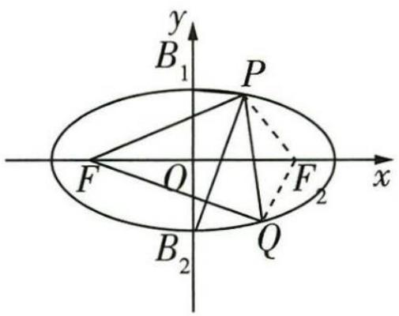

text_image

y
B₁
P
F
O
x
F₂
Q
B₂

图 5

设椭圆的左焦点为 F，右焦点为 $F_{2}$ ，连接 $PF_{2}, QF_{2}$ ，如图 5 所示，

则 $\triangle PFQ$ 的周长 $l = |PF| + |QF| + |PQ| = 4a - |PF_2| - |QF_2| + |PQ|$ ，

【小提示】利用了椭圆的第一定义 $|PF| + |PF_{2}| = |QF| + |QF_{2}| = 2a$

$\because\left|PF_{2}\right|+\left|QF_{2}\right|\geqslant\left|PQ\right|$ ，当 $P,F_{2},Q$ 三点共线时等号成立， $\therefore l\leqslant4a=8$

∴ $\triangle PQF$ 的周长的最大值为 8.

# 变式演练

1. (调研 2 变式, 变设问, 求长度之比 |2023 河北唐山三模) 已知椭圆 $C: \frac{x^{2}}{2} + y^{2} = 1$ 的左、右焦点分别为 $F_{1}, F_{2}$ , 点 $M$ 为 $C$ 上异于长轴两端点的任意一点, $\angle F_{1} M F_{2}$ 的平分线交线段 $F_{1} F_{2}$ 于点 $N$ , 则 $\frac{|M F_{2}|}{|N F_{2}|} =$ ()

A. $\frac{1}{5}$

B. $\frac{\sqrt{10}}{5}$

C. $\frac{\sqrt{2}}{2}$

D. $\sqrt{2}$

2. (调研 1 变式, 变设问 |2023 辽宁省实验中学四模) 已知 $O$ 为坐标原点, 双曲线 $C$ : $\frac{x^{2}}{a^{2}} - \frac{y^{2}}{b^{2}} = 1 (a > 0, b > 0)$ 的左、右焦点分别为 $F_{1}, F_{2}$ , 离心率为 $\frac{\sqrt{6}}{2}$ , 点 $P$ 是 $C$ 的右支上异于顶点的任意一点, 过 $F_{2}$ 作 $\angle F_{1}PF_{2}$ 的平分线的垂线, 垂足是 $M, |MO| = \sqrt{2}$ , 则 $b =$

A. $\sqrt{2}$

B. $\sqrt{3}$

C. 1

D. 2

3. (试题调研原创|调研 4,5 变式,变角度,判断轨迹形状|多选)在正方体 $ABCD - A_{1}B_{1}C_{1}D_{1}$ 中,点 $M$ 为正方形 $ABB_{1}A_{1}$ 所在平面内一动点, $d_{1}$ 是点 $M$ 到平面 $ADD_{1}A_{1}$ 的距离, $d_{2}$ 是点 $M$ 到直线 $BC$ 的距离,且 $d_{1} = \lambda d_{2} (\lambda >0, \lambda$ 为常数),则点 $M$ 的轨迹可能为

A. 圆

B. 椭圆

C. 双曲线

D. 抛物线

# 数学文化

形数 是一种与图形有关的数. 毕达哥拉斯学派在研究数论时, 常用沙滩上的小石子表示数, 小石子能够摆成不同的几何图形, 于是就产生了一系列的形数. 如三角形数、四边形数等.

关注微信公众号“初高教辅站”获取更多初高中教辅资料

4. (2023 吉林通化七模 | 多选) 已知点 $F$ 是抛物线 $C: y^{2} = 2px (p > 0)$ 的焦点, $O$ 为坐标原点, 直线 $l$ 与抛物线交于 $A, B$ 两点, 抛物线 $C$ 的准线 $l'$ 与 $x$ 轴交于点 $P$ , 则下列说法正确的是 ( )

A. 若 $l$ 过抛物线 $C$ 的焦点 $F$ , 则直线 $OA, OB$ 的斜率之积为定值  
B. 若抛物线上的点 $E(2, t)$ 到点 F 的距离为 4，则抛物线的方程为 $y^{2} = 4x$   
C. 以 AB 为直径的圆与准线相切  
D. 直线 m 过点 P 且交 C 于不同的 M, N 两点, 则 $\left|MF\right| + \left|NF\right| > 2\left|PF\right|$

# 参考答案与解析

1. D 由三角形内角平分线定理得 $\frac{|MF_{2}|}{|MF_{1}|} = \frac{|NF_{2}|}{|F_{1}N|}$ ,

【会思考】分子是我们的待求量，那么如何把分母求出来便是解题的关键，所以我们利用合比定理和椭圆的定义将分母转化成了 $2a$ 和 $2c$

由合比定理得 $\frac{|MF_2|}{|MF_1| + |MF_2|} = \frac{|NF_2|}{|NF_1| + |NF_2|}$ , 即 $\frac{|MF_2|}{2a} = \frac{|NF_2|}{2c}$ ,

因为 $a = \sqrt{2}, c = 1$ ，所以 $\frac{|MF_2|}{|NF_2|} = \frac{a}{c} = \sqrt{2}$ ，故选D.

2. C 设半焦距为 c，如图 6，延长 $F_{2}M$ 交 $PF_{1}$ 于点 N，

因为 $PM$ 是 $\angle F_{1}PF_{2}$ 的平分线， $F_{2}M \perp PM$

所以 $\triangle NPF_{2}$ 是等腰三角形，

所以 $|PN|=|PF_{2}|$ ，且M是 $NF_{2}$ 的中点.

根据双曲线的定义可知 $\left|PF_{1}\right|-\left|PF_{2}\right|=2a$ ，所以 $\left|NF_{1}\right|=2a$ .

由于 O 是 $F_{1}F_{2}$ 的中点, 所以 MO 是 $\triangle F_{1}NF_{2}$ 的中位线, 所以 $|MO| = \frac{1}{2}|NF_{1}| = a = \sqrt{2}$ ,

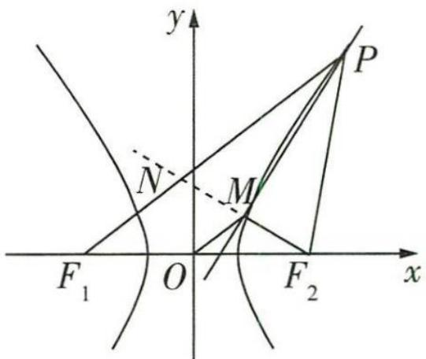

text_image

y
P
N
M
F₁ O F₂ x

图6

【二级结论】事实上, 动点 $M$ 的轨迹是以原点为圆心、 $a$ 为半径的圆, 那么直接可以得到 $a = \sqrt{2}$ . 类似地, 在椭圆中, 如图7, $P$ 为椭圆上一点, ${F}_{1}$ 为左焦点, 若过椭圆右焦点 ${F}_{2}$ 作 $\angle {F}_{1}P{F}_{2}$ 外角平分线的垂线, 记垂足为 $M$ ,则动点 $M$ 的轨迹是以原点为圆心、 $a$ 为半径的圆

又双曲线的离心率为 $\frac{\sqrt{6}}{2}$ ，故 $\frac{c}{a}=\frac{\sqrt{6}}{2}$ ，所以 $c=\sqrt{3}$ ，所以 $b=\sqrt{c^{2}-a^{2}}=1$ 。故选C.

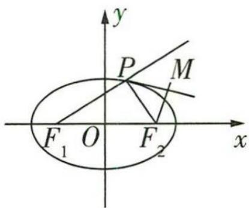

text_image

y
P
M
F₁ O F₂ x

图7

3. BCD 方法一 第一步: 确定点 M 的轨迹方程.

由题意作出正方体 $ABCD - A_{1}B_{1}C_{1}D_{1}$ ，并以 A 为坐标原点，直线 AB, AD 和 $AA_{1}$ 分别为 x 轴，y 轴和 z 轴建立空间直角坐标系，如图 8 所示.

# 数学文化

设正方体的棱长为 $a(a > 0), M(x,0,z)$ ，则 $d_{1} = |x|, d_{2} = \sqrt{(a - x)^{2} + z^{2}}$ .

由 $d_{1} = \lambda d_{2}(\lambda >0)$ ，得 $|x| = \lambda \sqrt{(a - x)^{2} + z^{2}}$

所以 $x^{2}=\lambda^{2}\left[(a-x)^{2}+z^{2}\right]$ ，即 $\lambda^{2}z^{2}+(\lambda^{2}-1)x^{2}-2\lambda^{2}ax=-\lambda^{2}a^{2}(\lambda>0)$ .

【点关键】通过建立空间直角坐标系，求得在 $xAz$ 平面内的轨迹方程，不习惯的话，可以把“ $z$ ”当作“ $y$ ”进行后续思考

第二步:根据参数变化判断轨迹形状.

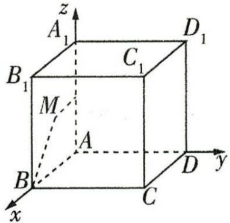

text_image

z
A₁
D₁
B₁
C₁
M
A
B
C
D
y
x

图8

当 $\lambda=1$ 时, 轨迹方程为 $z^{2}=2ax-a^{2}$ , 此时点 M 的轨迹是抛物线.

当 $\lambda \neq 1$ 时，可得 $\lambda^2 z^2 + (\lambda^2 - 1)(x^2 - \frac{2\lambda^2ax}{\lambda^2 - 1}) = -\lambda^2 a^2$ ，即 $\lambda^2 z^2 + (\lambda^2 - 1)(x - \frac{\lambda^2a}{\lambda^2 - 1})^2 =$

$-\lambda^{2}a^{2}+\frac{\lambda^{4}a^{2}}{\lambda^{2}-1}$ , 即 $\lambda^{2}z^{2}+(\lambda^{2}-1)(x-\frac{\lambda^{2}a}{\lambda^{2}-1})^{2}=\frac{\lambda^{2}a^{2}}{\lambda^{2}-1}$ , 即 $\frac{z^{2}}{\lambda^{2}-1}+\frac{(x-\frac{\lambda^{2}a}{\lambda^{2}-1})^{2}}{\lambda^{2}}=\frac{a^{2}}{(\lambda^{2}-1)^{2}}>0.$

当 $0 < \lambda < 1$ 时, $\lambda^{2} - 1 < 0$ , 点 M 的轨迹为双曲线;

当 $\lambda > 1$ 时, $\lambda^{2} - 1 > 0$ , 点 M 的轨迹为椭圆, 故选 BCD.

方法二:应用圆锥曲线的第二定义 由已知得 $d_{1}$ 是点 M 到平面 $ADD_{1}A_{1}$ 的距离, 即 M 到直线 $AA_{1}$ 的距离, $d_{2}$ 是点 M 到直线 BC 的距离, 即点 M 到点 B 的距离.

又 $\frac{d_{2}}{d_{1}}=\frac{1}{\lambda}$ ，那就相当于动点M到定点B的距离与到定直线 $AA_{1}$ 的距离的比值为常数 $\frac{1}{\lambda}$ .

由圆锥曲线的第二定义知, 当 $\lambda = 1$ 时, 轨迹为抛物线, 当 $0 < \lambda < 1$ 时, $\frac{1}{\lambda} > 1$ , 轨迹为双曲线, 当 $\lambda > 1$ 时, $0 < \frac{1}{\lambda} < 1$ , 轨迹为椭圆. 故选 BCD.

4. AD

<table><tr><td>选项</td><td>判断过程</td><td>正误</td></tr><tr><td>A</td><td>设直线l的方程为 $x = my + \frac{p}{2}, A(x_1, y_1), B(x_2, y_2)$ ,由 $\begin{cases} x = my + \frac{p}{2}, \\ y^2 = 2px, \end{cases}$ 可得关于y的方程 $y^2 - 2pmy - p^2 = 0, \Delta = 4p^2m^2 + 4p^2 > 0$ .所以 $y_1y_2 = -p^2, x_1x_2 = \frac{y_1^2}{2p} \cdot \frac{y_2^2}{2p} = \frac{p^2}{4}$ ,所以 $k_{OA} \cdot k_{OB} = \frac{y_1y_2}{x_1x_2} = -4$ .【二级结论】对于抛物线 $y^2 = 2px (p > 0)$ 的焦点弦,设其两端点分别为 $A(x_1, y_1), B(x_2, y_2)$ ,则 $x_1x_2 = \frac{p^2}{4}, y_1y_2 = -p^2$ ,均为定值</td><td>√</td></tr></table>

# 数学文化

勾股数 又名毕氏三元数, 即可以构成一个直角三角形三边边长的一组正整数. 若 $a, b, c (c > a$ 且 $c > b, a, b, c \in \mathbb{N}^*$ ) 为勾股数, 则 $a^2 + b^2 = c^2$ .

关注微信公众号“初高教辅站”获取更多初高中教辅资料

续表

<table><tr><td>选项</td><td>判断过程</td><td>正误</td></tr><tr><td>B</td><td>若抛物线上一点 $E(2,t)$ 到焦点 $F$ 的距离等于4,由抛物线的定义可得 $2+\frac{p}{2}=$ 4,解得 $p=4$ ,则抛物线的方程为 $y^{2}=8x$ .【用定义】抛物线 $y^{2}=2px(p>0)$ 上一点 $P(x_{0},y_{0})$ 到焦点 $F$ 的距离为 $|PF|=x_{0}+\frac{p}{2}$ ,无需借助纵坐标即可求解</td><td>×</td></tr><tr><td>C</td><td>当 $l$ 过抛物线 $C$ 的焦点 $F$ 时,如图9,设 $E$ 为 $AB$ 的中点,分别过点 $A,B,E$ 作 $AA_{1}\perp l',BB_{1}\perp l',EE'\perp l'$ ,垂足分别为 $A_{1},B_{1},E'$ ,可得 $|EE'|=\frac{1}{2}(|AA_{1}|+|BB_{1}|)$ .则 $|AA_{1}|+|BB_{1}|=|AF|+|BF|=|AB|$ ,所以 $|EE'|=\frac{1}{2}|AB|$ ,此时以 $AB$ 为直径的圆与准线相切.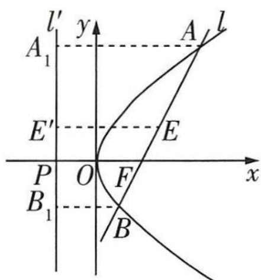 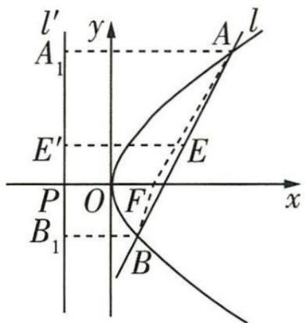图9 图10当直线 $l$ 不过抛物线 $C$ 的焦点 $F$ 时,如图10,设 $E$ 为 $AB$ 的中点,分别过 $A,B,E$ 作 $AA_{1}\perp l',BB_{1}\perp l',EE'\perp l'$ ,垂足分别为 $A_{1},B_{1},E'$ ,连接 $AF,BF$ ,则 $|EE'|=\frac{1}{2}(|AA_{1}|+|BB_{1}|)=\frac{1}{2}(|AF|+|BF|)>\frac{1}{2}|AB|$ ,此时以 $AB$ 为直径的圆与准线不相切.综上,以 $AB$ 为直径的圆与准线不一定相切.</td><td>×</td></tr><tr><td>D</td><td>如图11所示,设直线 $m$ 的方程为 $y=k(x+\frac{p}{2})$ , $M(x_{3},y_{3})$ , $N(x_{4},y_{4})$ ,由 $\begin{cases}y=k(x+\frac{p}{2}),\\y^{2}=2px,\end{cases}$ 消去 $y$ 并整理得关于 $x$ 的方程 $k^{2}x^{2}+$  $(k^{2}p-2p)x+\frac{k^{2}p^{2}}{4}=0$ , $\Delta=4p^{2}(1-k^{2})>0$ ,可得 $k^{2}<1$ ,则 $x_{3}+x_{4}=\frac{2p-k^{2}p}{k^{2}}$ .所以 $|MF|+|NF|=x_{3}+x_{4}+p=\frac{2p}{k^{2}}>2p$ ,即 $|MF|+|NF|>2|PF|$ 成立.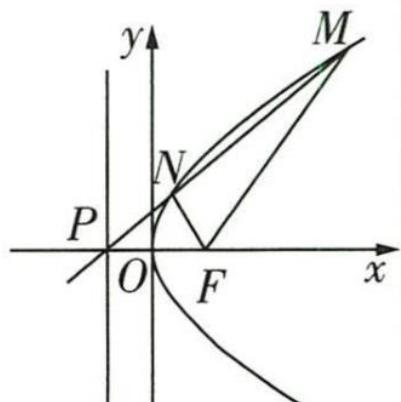图11</td><td>√</td></tr></table>

# 数学文化

皮克定理 指一个计算点阵中顶点在格点上的多边形的面积公式, 可表示为 $S = a + \frac{1}{2}b - 1$ , 其中 a 与 b 分别表示这个多边形内部与边界上的格点数.

关注微信公众号“初高教辅站”获取更多初高中教辅资料

# 超重点6 圆锥曲线焦点三角形的性质解读与应用问题

# 命题角度 1 椭圆的焦点三角形

# 巧抓关键

椭圆上异于长轴两端点的点 $P(x_0, y_0)$ 与两焦点 $F_1, F_2$ 构成的 $\triangle PF_1F_2$ 叫作椭圆的焦点

三角形. 如图 1 所示, 已知椭圆 $\frac{x^2}{a^2} + \frac{y^2}{b^2} = 1 (a > b > 0)$ 上的点 $P(x_0, y_0) (y_0 \neq 0), F_1, F_2$ 分别为椭圆的左、右焦点, $\angle F_1PF_2$ 为椭圆上的点对椭圆焦点的张角, 记为 $\theta$ , 则①由余弦定理可得 $|PF_1| \cdot |PF_2| = \frac{2b^2}{1 + \cos \theta} \in (b^2, a^2], \overrightarrow{PF_1} \cdot \overrightarrow{PF_2} \in [b^2 - c^2, b^2)$ ; ②当 $P(x_0, y_0)$ 为短轴

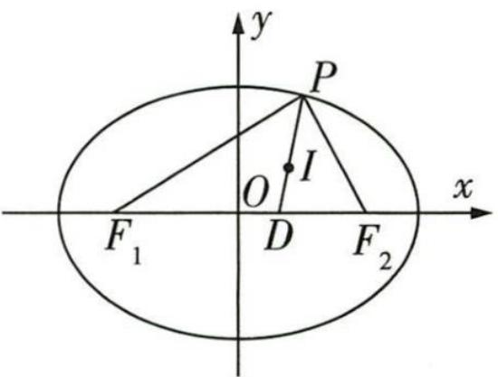

text_image

y
P
O
I
x
F₁
D
F₂

图1

端点时, 张角 $\theta$ 最大; ③焦点三角形周长为 $2a + 2c$ , 焦点三角形面积 $S_{\triangle PF_1F_2} = \frac{1}{2} |PF_1|$ · $|PF_2| \sin \theta = b^2 \tan \frac{\theta}{2} = c \cdot |y_0| = (a + c)r$ ( $r$ 为焦点三角形内切圆半径), 当 $P(x_0, y_0)$ 为短轴端点时, 焦点三角形面积最大, 为 $bc$ ; ④若 $\angle PF_1F_2 = \alpha$ , $\angle PF_2F_1 = \beta$ , 则椭圆离心率 $e = \frac{\sin (\alpha + \beta)}{\sin \alpha + \sin \beta}$ ; ⑤记 $I$ 为焦点 $\triangle PF_1F_2$ 的内心, $PI$ 延长线交 $F_1F_2$ 于 $D$ , 则离心率 $e = \frac{|ID|}{|PI|}$ .

调研 1 (2023 哈尔滨第六中学模拟 | 多选 | 较难) 已知椭圆 $C: \frac{x^{2}}{36} + \frac{y^{2}}{20} = 1, F_{1}$ , $F_{2}$ 分别为其左、右焦点, $A$ 为椭圆 $C$ 上一动点. 则下列说法正确的是 ( )

A. 若 $\angle F_{1}AF_{2}=\frac{\pi}{3}$ ，则 $S_{\triangle F_{1}AF_{2}}=\frac{20\sqrt{3}}{3}$   
B. $\frac{2}{|AF_1|} + \frac{1}{|AF_2|}$ 的最小值为 $\frac{1}{4} + \frac{\sqrt{2}}{6}$   
C. 使得 $\triangle F_{1}AF_{2}$ 为直角三角形的点 $A$ 共有 6 个  
D. $\triangle F_{1}AF_{2}$ 内切圆半径的最大值为 $\frac{4\sqrt{5}}{5}$

# 数学文化

四色定理 世界三大数学猜想之一. 指任何一张地图只用四种颜色就能使具有共同边界的国家着上不同的颜色.

关注微信公众号“初高教辅站”获取更多初高中教辅资料

# 解析

<table><tr><td>选项</td><td>分析过程</td><td>正误</td></tr><tr><td>A</td><td> $c^{2}=36-20=16\rightarrow c=4\rightarrow|F_{1}F_{2}|=2c=8\rightarrow$ 由椭圆定义可知 $|AF_{1}|+|AF_{2}|=12\rightarrow$ 在 $\triangle F_{1}AF_{2}$ 中,由余弦定理得 $\cos\angle F_{1}AF_{2}=\frac{|AF_{1}|^{2}+|AF_{2}|^{2}-|F_{1}F_{2}|^{2}}{2|AF_{1}|\cdot|AF_{2}|}=\frac{(|AF_{1}|+|AF_{2}|)^{2}-2|AF_{1}|\cdot|AF_{2}|-64}{2|AF_{1}|\cdot|AF_{2}|}=\frac{12^{2}-2|AF_{1}|\cdot|AF_{2}|-64}{2|AF_{1}|\cdot|AF_{2}|}=\frac{1}{2}\rightarrow|AF_{1}|\cdot|AF_{2}|=\frac{80}{3}\rightarrow S_{\triangle F_{1}AF_{2}}=\frac{1}{2}|AF_{1}|\cdot|AF_{2}|\sin\angle F_{1}AF_{2}=\frac{1}{2}\times\frac{80}{3}\times\frac{\sqrt{3}}{2}=\frac{20\sqrt{3}}{3}【秒杀】利用二级结论实现秒杀:\( S_{\triangle F_{1}AF_{2}}=b^{2}\tan\frac{\theta}{2}=20\tan\frac{\pi}{6}=\frac{20\sqrt{3}}{3}$ </td><td>√</td></tr><tr><td>B</td><td> $\frac{2}{|AF_{1}|}+\frac{1}{|AF_{2}|}=\frac{1}{12}\left(\frac{2}{|AF_{1}|}+\frac{1}{|AF_{2}|}\right)\left(|AF_{1}|+|AF_{2}|\right)=\frac{1}{12}(2+\frac{2|AF_{2}|}{|AF_{1}|}+1+\frac{|AF_{1}|}{|AF_{2}|})\rightarrow$ 由基本不等式得 $\frac{2}{|AF_{1}|}+\frac{1}{|AF_{2}|}\geqslant\frac{1}{12}(3+2\sqrt{\frac{2|AF_{2}|}{|AF_{1}|}\cdot|\frac{|AF_{1}|}{|AF_{2}|}})=\frac{1}{12}(3+2\sqrt{\frac{2|AF_{2}|}{|AF_{1}|}\cdot|\frac{|AF_{1}|}{|AF_{2}|}})=\frac{1}{12}(3+2\sqrt{\frac{2|AF_{2}|}{|AF_{1}|}\cdot|\frac{|AF_{1}|}{|AF_{2}|}})=\frac{1}{12}(3+\frac{2|AF_{2}|}{|AF_{1}|}\cdot|\frac{|AF_{1}|}{|AF_{2}|})\rightarrow\frac{1}{4}+\frac{\sqrt{2}}{6},当且仅当\( \frac{2|AF_{2}|}{|AF_{1}|}=\frac{|AF_{1}|}{|AF_{2}|}$ ,即 $|AF_{1}|=\sqrt{2}|AF_{2}|$ 时,等号成立【点睛】利用椭圆定义确定此处属于“和与倒数和关系求最值类型”,因而用“1”代换,结合基本不等式求最值</td><td>√</td></tr><tr><td>C</td><td>1以 $F_{1}F_{2}$ 为直径,O为圆心的圆的方程为 $x^{2}+y^{2}=16\rightarrow$ 与 $\frac{x^{2}}{36}+\frac{y^{2}}{20}=1$ 联立得【提示】由于没有明确三角形哪个角是直角,因而需要分类讨论 $x^{2}=-9<0\rightarrow$ 使得 $\angle F_{1}AF_{2}=90^{\circ}$ 的点A不存在→2过点 $F_{1}$ 作x轴的垂线,交椭圆于两点,则点A在这两点处时, $\angle AF_{1}F_{2}=90^{\circ}\rightarrow$ 3过点 $F_{2}$ 作x轴的垂线,交椭圆于两点,则点A在这两点处时, $\angle AF_{2}F_{1}=90^{\circ}\rightarrow$ 综上,使得 $\triangle F_{1}AF_{2}$ 为直角三角形的顶点A共有4个【知识链接】对于椭圆焦点 $\triangle F_{1}AF_{2}$ 张角 $\angle F_{1}AF_{2}$ 的最大值 $\theta_{0}$ 的情况分三类:1若 $0减小$ 时 $\theta_{0}<90^{\circ}$ ,此时使得 $\angle F_{1}AF_{2}=90^{\circ}$ 的点A不存在;2若 $e=\frac{\sqrt{2}}{2}$ ,即 $b=c$ ,这时 $\theta_{0}=90^{\circ}$ ,此时使得 $\angle F_{1}AF_{2}=90^{\circ}$ 的点A存在2个,为短轴的端点;3若 $e>\frac{\sqrt{2}}{2}$ ,即 $b减小$ ,这时 $\theta_{0}>90^{\circ}$ ,此时使得 $\angle F_{1}AF_{2}=90^{\circ}$ 的点A存在4个</td><td>×</td></tr></table>

# 数学文化

续表

<table><tr><td>选项</td><td>分析过程</td><td>正误</td></tr><tr><td>D</td><td> $\triangle F_{1}AF_{2}$ 的周长为 $|AF_{1}|+|AF_{2}|+|F_{1}F_{2}|=12+8=20$ →要想 $\triangle F_{1}AF_{2}$ 内切圆的半径最大,只需 $\triangle F_{1}AF_{2}$ 的面积最大→当A点位于上顶点或下顶点时, $\triangle F_{1}AF_{2}$ 的面积最大,此时 $A(0,\pm2\sqrt{5})$ →最大面积为 $\frac{1}{2}\times2\sqrt{5}|F_{1}F_{2}|=8\sqrt{5}$ →设 $\triangle F_{1}AF_{2}$ 内切圆半径为r,则 $\frac{1}{2}\times20r\leqslant8\sqrt{5}\rightarrow r\leqslant\frac{4\sqrt{5}}{5}\rightarrow\triangle F_{1}AF_{2}$ 内切圆半径的最大值为 $\frac{4\sqrt{5}}{5}$ 【速解】三角形周长为 $2a+2c=20$ ,为定值,因而内切圆半径最大,只需三角形面积最大,而椭圆焦点三角形面积最大为 $bc=8\sqrt{5}$ ,又 $S_{\triangle F_{1}AF_{2}}=pr$ (半周长乘内切圆半径),所以 $10r_{max}=8\sqrt{5}$ , $r_{max}=\frac{4\sqrt{5}}{5}$ </td><td>√</td></tr></table>

# 命题角度2 双曲线的焦点三角形

# 巧抓关键

双曲线上异于实轴两端点的点 $P(x_0, y_0)$ 与两焦点 $F_1, F_2$ 构成的 $\triangle PF_1F_2$ 叫作双曲线的焦点三角形. 如图2所示, 已知双曲线 $\frac{x^2}{a^2} - \frac{y^2}{b^2} = 1 (a > 0, b > 0)$ 上的点 $P(x_0, y_0)(y_0 \neq 0), F_1$ ,

$F_{2}$ 分别为双曲线的左、右焦点,称 $\angle F_{1}PF_{2}=\theta$ 为双曲线上的点对双曲线焦点的张角,则①由余弦定理可得 $|PF_{1}|\cdot|PF_{2}|=\frac{2b^{2}}{1-\cos\theta}\in(b^{2},+\infty),\overrightarrow{PF_{1}}\cdot\overrightarrow{PF_{2}}\in(-b^{2},+\infty)$ ;② $P(x_{0},y_{0})$ 为实轴端点时,张角 $\theta=\pi$ 最大,但不构成三角形;③焦点三角形面积 $S_{\triangle PF_{1}F_{2}}=\frac{1}{2}|PF_{1}|\cdot|PF_{2}|\sin\theta=\frac{b^{2}}{\tan\frac{\theta}{2}}=c\cdot|y_{0}|$ ;④若 $\angle PF_{1}F_{2}=$

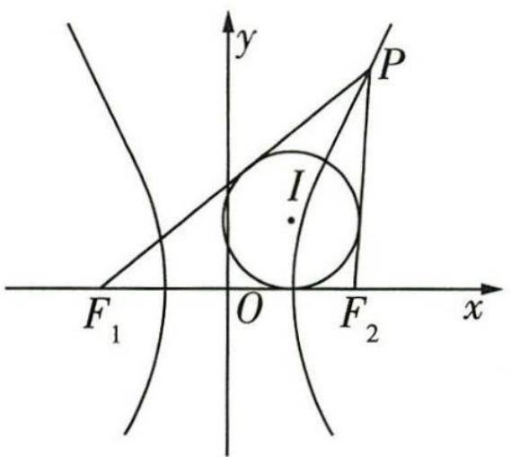

text_image

y
P
I
F₁ O F₂ x

图2

$\alpha, \angle PF_{2}F_{1} = \beta$ ，则离心率 $e = \frac{\sin (\alpha + \beta)}{|\sin \alpha - \sin \beta|}$ ；⑤焦点 $\triangle PF_{1}F_{2}$ 的内切圆与实轴的切点为双曲线的顶点，即内心 $I$ 的横坐标 $x_{I} = a$ （ $P$ 在右支上）或 $x_{I} = -a$ （ $P$ 在左支上）；⑥若 $I'$ 为焦点 $\triangle PF_{1}F_{2}$ 的一个旁心， $PI'$ 延长线（ $P, I'$ 在 $x$ 轴同侧）交 $x$ 轴于 $D$ ，则离心率 $e = \frac{|I'D|}{|PI'|}$ .

# 数学文化

杨辉三角中,“一肩扛两数”,按从上到下的顺序观察,除第1行外,上行相邻两数的和与下行对应的数相等;莱布尼茨三角形中,“一脚踏两数”,按从下到上的顺序观察,下行相邻两数的和与上行对应的数相等.

关注微信公众号“初高教辅站”获取更多初高中教辅资料

调研 2 (2024 四川宜宾 7 月期末) 已知 $F_{1}, F_{2}$ 分别为双曲线 $C: \frac{x^{2}}{4} - \frac{y^{2}}{b^{2}} = 1$ $(b > 0)$ 的左、右焦点, 且 $F_{1}$ 到渐近线的距离为 1 , 过 $F_{2}$ 的直线 $l$ 与 $C$ 的左、右两支分别交于 $A, B$ 两点, 且 $l \perp AF_{1}$ , 则下列说法正确的为 ( )

A. $\triangle AF_{1}F_{2}$ 的面积为 2

B. 双曲线 C 的离心率为 $\sqrt{2}$

C. $\overrightarrow{AF_1} \cdot \overrightarrow{BF_1} = 10 + 4\sqrt{6}$

D. $\frac{1}{|AF_2|} +\frac{1}{|BF_2|} = \sqrt{6} +2$

解析 设双曲线 C 的半焦距为 $c(c>0)$ ，因为双曲线 C 的焦点在 x 轴上，且 a=2，所以其中一条渐近线方程为 $y=\frac{b}{2}x$ ，即 bx-2y=0，且 $F_{1}(-c,0)$ ，则 $F_{1}$ 到渐近线的距离为 $\frac{|-bc|}{\sqrt{4+b^{2}}}=\frac{bc}{c}=b=1$ ，可得 $c=\sqrt{a^{2}+b^{2}}=\sqrt{5}$ .

【知识链接】过双曲线焦点作双曲线渐近线的垂线，垂足是双曲线的渐近线与准线（准线方程为 $x = \pm \frac{a^{2}}{c}$ ）的交点，焦点到渐近线距离为 b，垂足到原点距离为 a。因而本题可直接得 b = 1

<table><tr><td>选项</td><td>分析过程</td><td>正误</td></tr><tr><td>A</td><td> $|AF_2| - |AF_1| = 4, |AF_1|^2 + |AF_2|^2 = |F_1F_2|^2 = (2c)^2 = 20 \rightarrow ( |AF_2| - |AF_1| )^2 + 2 |AF_1| \cdot |AF_2| = 16 + 2 |AF_1| \cdot |AF_2| = 20 \rightarrow |AF_1| \cdot |AF_2| = 2 \rightarrow \triangle AF_1F_2$ 的面积为 $\frac{1}{2} |AF_1| \cdot |AF_2| = 1$ 【二级结论】由于 $\angle F_1AF_2 = 90^\circ$ ,因而 $S_{\triangle F_1AF_2} = \frac{b^2}{\tan 45^\circ} = 1$ </td><td>×</td></tr><tr><td>B</td><td>双曲线C的离心率为 $e = \frac{c}{a} = \frac{\sqrt{5}}{2}$ </td><td>×</td></tr><tr><td>C</td><td> $\begin{cases} |AF_2| - |AF_1| = 4, \\ |AF_1| \cdot |AF_2| = 2 \end{cases} \rightarrow \begin{cases} |AF_1| = \sqrt{6} - 2, \\ |AF_2| = \sqrt{6} + 2 \end{cases} \rightarrow \overrightarrow{AF_1} \cdot \overrightarrow{BF_1} = \overrightarrow{F_1A} \cdot (\overrightarrow{F_1A} + \overrightarrow{AB}) = \overrightarrow{F_1A^2} + \overrightarrow{F_1A} \cdot \overrightarrow{AB} = \overrightarrow{F_1A^2} = (\sqrt{6} - 2)^2 = 10 - 4\sqrt{6}$ </td><td>×</td></tr><tr><td>D</td><td>设 $|BF_2| = m \rightarrow |BF_1| = m + 4, |AB| = \sqrt{6} + 2 - m \rightarrow |BF_1|^2 = |AB|^2 + |AF_1|^2 \rightarrow (m + 4)^2 = (\sqrt{6} + 2 - m)^2 + (\sqrt{6} - 2)^2 \rightarrow m = \frac{6 - \sqrt{6}}{15} \rightarrow \frac{1}{|AF_2|} + \frac{1}{|BF_2|} = \frac{1}{\sqrt{6} + 2} + \frac{1}{\frac{6 - \sqrt{6}}{15}} = \sqrt{6} + 2$ </td><td>√</td></tr></table>

# 数学文化

黄金分割比 把一条线段分割为两部分,使较长部分与全长之比等于较短部分与较长部分之比.按此比例设计的造型十分美丽,因此称为黄金分割比,也称为中外比.

调研 3 (2024 广东茂名 7 月调研 I 较难)与三角形的一条边以及另外两条边的延长线都相切的圆被称为三角形的旁切圆,旁切圆的圆心被称为三角形的旁心,每个三角形有三个旁心,如图 3 所示.

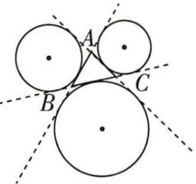

text_image

A
B
C

图3

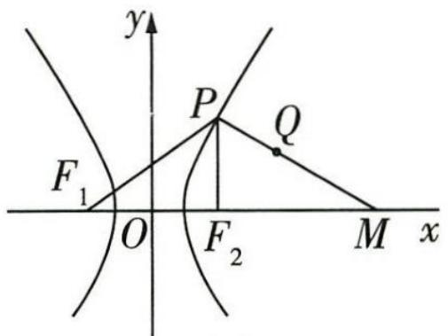

text_image

y
P
Q
F₁
O
F₂
M x

图 4

已知 $F_{1}, F_{2}$ 是双曲线 $\frac{x^{2}}{9}-\frac{y^{2}}{16}=1$ 的左、右焦点, P 是双曲线右支上一点, Q 是 $\triangle PF_{1}F_{2}$ 的一个旁心, 如图 4 所示, 直线 PQ 与 x 轴交于点 M, 则 $\frac{|MQ|}{|PQ|}=$ ()

A. $\frac{3}{4}$

B. $\frac{4}{3}$

C. $\frac{3}{2}$

D. $\frac{5}{3}$

解析 第一步: 求出 c.

双曲线 $\frac{x^{2}}{9}-\frac{y^{2}}{16}=1$ 中 $a^{2}=9,b^{2}=16$ ，所以a=3,b=4，则 $c=\sqrt{a^{2}+b^{2}}=5$ .

第二步:结合旁心的定义及正弦定理可得 $\frac{|MQ|}{|PQ|}=\frac{|MF_{1}|}{|PF_{1}|},\frac{|MQ|}{|PQ|}=\frac{|MF_{2}|}{|PF_{2}|}.$

连接 $F_{1}Q, F_{2}Q$ , 由三角形旁心的定义可知 $F_{1}Q, F_{2}Q$ 分别平分 $\angle PF_{1}M, \angle PF_{2}M$ ,

在 $\triangle PF_{1}Q$ 中， $\frac{|PF_1|}{\sin\angle PQF_1} = \frac{|PQ|}{\sin\angle PF_1Q}$ ，在 $\triangle MF_{1}Q$ 中， $\frac{|MF_1|}{\sin\angle MQF_1} = \frac{|MQ|}{\sin\angle MF_1Q}$ ，

因为 $\angle PQF_{1} + \angle MQF_{1} = \pi, \angle PF_{1}Q = \angle MF_{1}Q,$

所以 $\sin\angle PQF_{1}=\sin\angle MQF_{1},\sin\angle PF_{1}Q=\sin\angle MF_{1}Q,$

所以 $\frac{|MQ|}{|PQ|}=\frac{|MF_{1}|}{|PF_{1}|}$ ，同理可得 $\frac{|MQ|}{|PQ|}=\frac{|MF_{2}|}{|PF_{2}|}$

第三步:利用等比定理,求出 $\frac{|MQ|}{|PQ|}$ .

所以 $\frac{|MQ|}{|PQ|} = \frac{|MF_2|}{|PF_2|} = \frac{|MF_1|}{|PF_1|} = \frac{|MF_1| - |MF_2|}{|PF_1| - |PF_2|} = \frac{2c}{2a} = e$ ，又 $e = \frac{c}{a} = \sqrt{1 + \frac{b^2}{a^2}} = \frac{5}{3}$ ，故 $\frac{|MQ|}{|PQ|} = \frac{5}{3}$ .

【小技巧】利用等比定理转化，进而应用双曲线定义求解

故选D.

【秒杀】利用性质直接得到 $\frac{|MQ|}{|QP|}=e=\frac{5}{3}$ . 事实上，上述解题过程即该性质的证明，若直接利用三角形外角平分线定理也可证明：由 $\frac{|PF_{1}|}{|PF_{2}|}=\frac{|MF_{1}|}{|MF_{2}|}$ ，得 $\frac{|PF_{1}|-|PF_{2}|}{|PF_{2}|}=\frac{|MF_{1}|-|MF_{2}|}{|MF_{2}|}$ ，即 $\frac{|MF_{2}|}{|PF_{2}|}=\frac{|MF_{1}|-|MF_{2}|}{|PF_{1}|-|PF_{2}|}=\frac{c}{a}$ ，连接 $QF_{2}$ ，又 $QF_{2}$ 平分 $\angle PF_{2}M$ ，因而 $\frac{|MQ|}{|QP|}=\frac{|MF_{2}|}{|PF_{2}|}=\frac{c}{a}=e$

数学文化

摆线 是数学中众多的迷人曲线之一. 它指一个圆沿一条定直线滚动时, 圆边界上一点运动所形成的轨迹.

关注微信公众号“初高教辅站”获取更多初高中教辅资料

# 命题角度 3 抛物线的焦点三角形

# 巧抓关键

抛物线的焦点三角形指过抛物线焦点的直线交抛物线于 $A, B$ 两点，这两点与原点 $O$ 构成的 $\triangle ABO$ . 如图5所示，直线 $l$ （斜率不为0，即倾斜角 $\theta \neq 0$ ）经过抛物线 $y^{2} = 2px (p > 0)$ 的焦点 $F\left(\frac{p}{2}, 0\right)$ ，且与抛物线交于 $A(x_{1}, y_{1}), B(x_{2}, y_{2})$ 两点，则① $x_{1}x_{2} = \frac{p^{2}}{4}, y_{1}y_{2} = -p^{2}, k_{OA} \cdot k_{OB} = -4, \overrightarrow{OA} \cdot \overrightarrow{OB} = x_{1}x_{2} + y_{1}y_{2} = -\frac{3}{4} p^{2}$ ，均是定值；②若点 $A$ 在第一象限，有 $|AF| = x_{1} +$

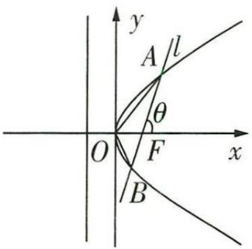

text_image

y
A
l
θ
O
F
x
B

图 5

$\frac{p}{2} = \frac{p}{1 - \cos \theta}, |BF| = x_{2} + \frac{p}{2} = \frac{p}{1 + \cos \theta}, \frac{1}{|AF|} + \frac{1}{|BF|} = \frac{2}{p}$ ; ③ $|AB| = x_{1} + x_{2} + p = \frac{2p}{\sin^{2}\theta}$ , 当直线 $AB$ 与抛物线对称轴垂直时 $|AB|$ (即抛物线通径) 最短, 为 $2p$ ; ④ $S_{\triangle ABO} = \frac{1}{2} |OF| \cdot |y_{2} - y_{1}| = \frac{p^{2}}{2\sin \theta}$ .

调研 4 (2024 重庆市巴蜀中学适应性月考 | 多选) 抛物线 $C: y^{2} = 2px (p > 0)$ 的焦点是 $F$ , 直线 $m$ 与 $C$ 相交于不同的两点 $A, B, M$ 是线段 $AB$ 的中点, $O$ 是坐标原点, 则下列说法正确的是 ( )

A. 过点 $(0, p)$ 可作 3 条与抛物线 $C$ 只有一个公共点的直线

B. 若 $\angle AOB = \frac{\pi}{2}$ , 则直线 $m$ 过定点 $(2p, 0)$

C. 若直线 $m$ 经过焦点 $F$ , 且 $|AF| + 4|BF|$ 的最小值是 9 , 则 $p = 3$

D. 若 $\left|AB\right|=a$ (a 为一常数且 $a\geqslant2p$ )，则点 M 到 y 轴距离的最小值为 $\frac{a-p}{2}$

# 解析

<table><tr><td>选项</td><td>分析过程</td><td>正误</td></tr><tr><td>A</td><td>过点(0,p)可作2条与抛物线C相切的直线,可作1条与抛物线C对称轴平行的直线,所以共有3条与C只有一个公共点的直线【特别提醒】直线与抛物线有一个公共点是直线与抛物线相切的必要不充分条件</td><td>√</td></tr><tr><td>B</td><td>设直线AB的方程为 $x = ny + t$ ,设 $A(x_1, y_1)$ , $B(x_2, y_2)$ ,由 $\begin{cases} y^2 = 2px, \\ x = ny + t, \end{cases}$ 消去x得 $y^2 - 2pny - 2pt = 0$ ,则 $y_1y_2 = -2pt$ .  $\angle AOB = \frac{\pi}{2} \rightarrow x_1x_2 + y_1y_2 = 0 \rightarrow \frac{y_1^2y_2^2}{4p^2} + y_1y_2 = 0 \rightarrow y_1y_2 = -4p^2$ ,所以 $-2pt = -4p^2 \rightarrow t = 2p$ ,所以直线 $m: x = ny + 2p \rightarrow$ 过定点(2p,0)</td><td>√</td></tr></table>

# 数学文化

圆滚动一周时,动点所形成的轨迹为摆线的一支,称为一拱,拱的长度等于圆直径的4倍,尤其令人惊叹的是,它的长度计算公式不依赖于圆周率 $\pi$ .

续表

<table><tr><td>选项</td><td>分析过程</td><td>正误</td></tr><tr><td>C</td><td>设直线AB的倾斜角为 $\alpha$ ,不妨令点A在第一象限,则由抛物线定义可得 $|AF|=p+|AF|\cos\alpha,|BF|=p-|BF|\cos\alpha$ ,则 $|AF|=\frac{p}{1-\cos\alpha},|BF|=\frac{p}{1+\cos\alpha}$ ,故 $\frac{1}{|AF|}+\frac{1}{|BF|}=\frac{2}{p}$ ,则 $|AF|+4|BF|=(|AF|+4|BF|)(\frac{1}{|AF|}+\frac{1}{|BF|})\cdot\frac{p}{2}=\frac{p}{2}(5+【小提示】上述过程给出了这一性质的证明,即焦半径用直线倾斜角表示,在解选填题时是可以直接应用的\( \frac{4|BF|}{|AF|}+\frac{|AF|}{|BF|})\geqslant\frac{9p}{2}=9$ ,因而p=2,当且仅当 $|AF|=2|BF|$ 即 $|AF|=\frac{3}{2}p$ , $|BF|=\frac{3}{4}p$ 时取得最小值,此时 $\cos\alpha=\frac{1}{3}$ </td><td>×</td></tr><tr><td>D</td><td>过A,B,M分别作C的准线l的垂线,垂足分别是 $A_1,B_1,M_1$ ,如图6, $|MM_1|=\frac{1}{2}(|AA_1|+|BB_1|)=\frac{1}{2}(|AF|+|BF|)\geqslant\frac{1}{2}a$ ,当AB过焦点F时取等号,这样M到y轴的【小技巧】三角形两边之和大于第三边,因为 $a\geqslant2p$ (通径长即最短焦点弦长),所以能保证AB过焦点距离 $|MN|\geqslant\frac{1}{2}(a-p)$ ,故最小值为 $\frac{a-p}{2}$ 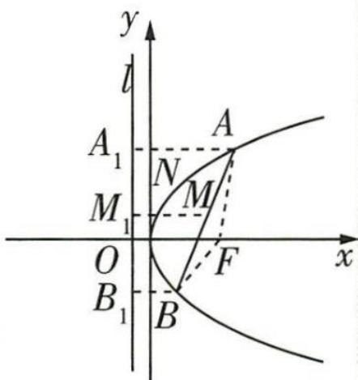图6</td><td>√</td></tr></table>

调研 5: (2024 福建福州 7 月考试 | 多选) 抛物线 $C: y^{2} = 6x$ , $AB$ 是 $C$ 的焦点弦, 则下列说法正确的是 ( )

A. 点 P 在 C 的准线上, 则 $\overrightarrow{PA} \cdot \overrightarrow{PB}$ 的最小值为 0  
B. 以 AB 为直径的所有圆中, 圆面积的最小值为 $9\pi$   
C. 若 AB 的斜率 $k = \sqrt{3}$ ，则 $\triangle ABO$ 的面积 S = 12  
D. 存在一个半径为 $\frac{9}{4}$ 的定圆与以 $AB$ 为直径的圆都内切

解析 由题意可知,抛物线 $C: y^{2} = 6x$ 的焦点为 $F(\frac{3}{2}, 0)$ , 准线方程为 $x = -\frac{3}{2}$ .

<table><tr><td>选项</td><td>分析过程</td><td>正误</td></tr><tr><td>A</td><td>根据抛物线的性质可知,以AB为直径的圆与准线相切,若点P是以AB为直径的圆与准线的切点,则 $\overrightarrow{PA} \perp \overrightarrow{PB}$ ,所以 $\overrightarrow{PA} \cdot \overrightarrow{PB} = 0$ ;若点P不是以AB为直径的圆与准线的切点,则 $\angle APB$ 为锐角,所以 $\overrightarrow{PA} \cdot \overrightarrow{PB} >0$ .综上, $\overrightarrow{PA} \cdot \overrightarrow{PB}$ 的最小值为0【点睛】准线上的点,除了切点,其他点均在圆外,直径所对“圆外角”为锐角</td><td>√</td></tr></table>

数学文化

渐开线 在平面上,一条动直线在沿着一个固定的圆滚动的过程中,此直线上任意一点运动的轨迹为此圆的一条渐开线.

续表

<table><tr><td>选项</td><td>分析过程</td><td>正误</td></tr><tr><td>B</td><td>设直线 $AB: x = my + \frac{3}{2}, A(x_1, y_1), B(x_2, y_2)$ ,由 $\begin{cases} x = my + \frac{3}{2}, \\ y^2 = 6x, \end{cases}$ 得关于y的方程 $y^2 - 6my - 9 = 0$ ,则 $\Delta = 36m^2 + 36 > 0, y_1 + y_2 = 6m, y_1y_2 = -9$ ,可得 $|AB| = x_1 + x_2 + 3 = (my_1 + \frac{3}{2}) + (my_2 + \frac{3}{2}) + 3 = m(y_1 + y_2) + 6 = 6(m^2 + 1)$ ,当m=0时, $|AB|$ 取到最小值6,此时以AB为直径的圆的面积最小,最小值为 $\pi \times (\frac{6}{2})^2 = 9\pi$ 【速解】用性质求解,焦点弦为通径时,长度最短,即直径最小值为6,所以圆面积的最小值为 $9\pi$ </td><td>√</td></tr><tr><td>C</td><td>若AB的斜率 $k = \sqrt{3}$ ,则 $m = \frac{\sqrt{3}}{3}$ ,直线 $AB: x = \frac{\sqrt{3}}{3}y + \frac{3}{2}$ ,即 $x - \frac{\sqrt{3}}{3}y - \frac{3}{2} = 0$ ,由选项B可得 $|AB| = 6 \times [(\frac{\sqrt{3}}{3})^2 + 1] = 8$ ,点 $O(0,0)$ 到直线AB的距离 $d = \frac{\frac{3}{2}}{\sqrt{1 + (-\frac{\sqrt{3}}{3})^2}} = \frac{3\sqrt{3}}{4}$ ,所以 $\triangle ABO$ 的面积 $S = \frac{1}{2} \times 8 \times \frac{3\sqrt{3}}{4} = 3\sqrt{3}$ 【秒杀】运用性质直接求解 $S_{\triangle ABO} = \frac{p^2}{2\sin\alpha} = \frac{3^2}{2 \times \frac{\sqrt{3}}{2}} = 3\sqrt{3}$ ,其中 $\alpha$ 为直线AB的倾斜角</td><td>×</td></tr><tr><td>D</td><td>由选项B可知,以AB为直径的圆的圆心为 $M(3m^2 + \frac{3}{2}, 3m)$ ,半径 $R = 3m^2 + 3$ ,设圆N的圆心为 $N(x_0, y_0)$ ,半径 $r = \frac{9}{4}$ ,如图7,若圆M与圆N内切,连接MN,则 $|MN| = R - r$ ,即 $\sqrt{(x_0 - 3m^2 - \frac{3}{2})^2 + (y_0 - 3m)^2} = 3m^2 + \frac{3}{4}$ ,整理得 $(6x_0 - \frac{27}{2})m^2 + 6y_0m + \frac{9}{16} - (x_0 - \frac{3}{2})^2 - y_0^2 = 0$ ,因为该式对任意的m恒成立,则 $\begin{cases} 6x_0 - \frac{27}{2} = 0, \\ 6y_0 = 0, \\ \frac{9}{16} - (x_0 - \frac{3}{2})^2 - y_0^2 = 0, \end{cases}$ 解得 $\begin{cases} x_0 = \frac{9}{4}, \\ y_0 = 0, \end{cases}$ 心为 $N(\frac{9}{4}, 0)$ ,半径 $r = \frac{9}{4}$ 的圆恒与以AB为直径的圆内切</td><td>√</td></tr></table>

# 数学文化

蒙日圆 在椭圆(双曲线)中,任意两条互相垂直的切线的交点都在同一个圆上,这个圆叫蒙日圆,它的圆心是椭圆(双曲线)的中心,半径等于长半轴(实半轴)长与短半轴(虚半轴)长平方和(差)的算术平方根

关注微信公众号“初高教辅站”获取更多初高中教辅资料

# 命题角度 4 椭圆、双曲线的共焦点三角形

# 巧抓关键

共焦点 $F_{1}, F_{2}$ 的椭圆 $\frac{x^{2}}{a^{2}} + \frac{y^{2}}{b^{2}} = 1 (a > b > 0)$ 与双曲线 $\frac{x^{2}}{p^{2}} - \frac{y^{2}}{q^{2}} = 1$ $(p > 0, q > 0)$ 的交点为 $P$ , 那么 $\triangle PF_{1}F_{2}$ 为两曲线的共焦点三角形, 如图8, 若椭圆、双曲线的离心率分别为 $e_{1}, e_{2}$ , 那么① $a^{2} - b^{2} = p^{2} + q^{2}$ ; ②若 $\angle F_{1}PF_{2} = \frac{\pi}{2}$ , 则 $\frac{1}{e_1^2} + \frac{1}{e_2^2} = 2$ ; ③ $|\overrightarrow{PF_1}| \cdot |\overrightarrow{PF_2}| = a^2 - p^2$ .

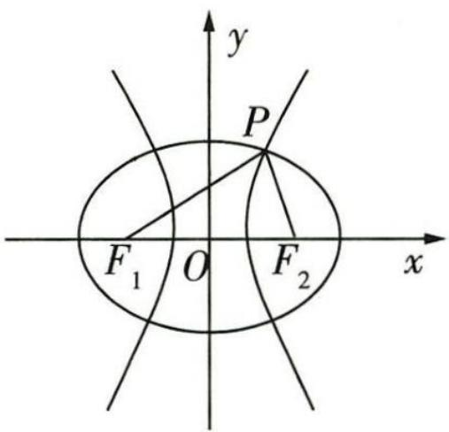

text_image

y
P
F₁ O F₂ x

图8

调研 6 (2024 辽宁锦州 7 月检测 | 多选) 已知 $F_{1}, F_{2}$ 是椭圆 $C_{1}: \frac{x^{2}}{a_{1}^{2}} + \frac{y^{2}}{b_{1}^{2}} = 1$ ( $a_{1} > b_{1} > 0$ ) 与双曲线 $C_{2}: \frac{x^{2}}{a_{2}^{2}} - \frac{y^{2}}{b_{2}^{2}} = 1 (a_{2} > 0, b_{2} > 0)$ 的公共焦点, $e_{1}, e_{2}$ 分别是 $C_{1}$ 与 $C_{2}$ 的离心率, 且 $P$ 是 $C_{1}$ 与 $C_{2}$ 的一个公共点, 满足 $\overrightarrow{PF_1} \cdot \overrightarrow{PF_2} = 0$ , 则下列结论中正确的是 ( )

A. $a_{1}^{2} + b_{1}^{2} = a_{2}^{2} - b_{2}^{2}$

B. $\frac{1}{e_1^2} +\frac{1}{e_2^2} = 2$

C. $e_{1}^{2} + 2e_{2}^{2}$ 的最小值为 $\frac{3}{2} + 2\sqrt{2}$

D. $\frac{\sqrt{3}}{e_1} + \frac{1}{e_2}$ 的最大值为 $2\sqrt{2}$

# 解析

<table><tr><td>选项</td><td colspan="2">分析过程</td><td>正误</td></tr><tr><td>A</td><td colspan="2">椭圆和双曲线共焦点 $\rightarrow a_{1}^{2}-b_{1}^{2}=a_{2}^{2}+b_{2}^{2}$ </td><td>×</td></tr><tr><td>B</td><td> $\overrightarrow{PF_{1}}\cdot\overrightarrow{PF_{2}}=0\rightarrow\angle F_{1}PF_{2}=\frac{\pi}{2}\rightarrow$ 如图9,不妨设P为第一象限内的点 $\rightarrow|PF_{1}|+|PF_{2}|=2a_{1},|PF_{1}|-|PF_{2}|=2a_{2}\rightarrow|PF_{1}|=a_{1}+a_{2},|PF_{2}|=a_{1}-a_{2}\rightarrow(a_{1}+a_{2})^{2}+(a_{1}-a_{2})^{2}=4c^{2}\rightarrow a_{1}^{2}+a_{2}^{2}=2c^{2}\rightarrow\frac{1}{e_{1}^{2}}+\frac{1}{e_{2}^{2}}=2$ </td><td>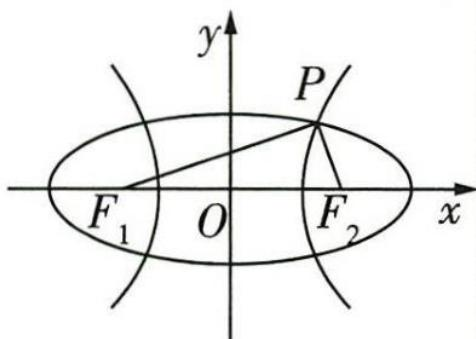图9</td><td>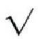</td></tr></table>

图9

# 数学文化

月牙定理 以直角三角形两条直角边为直径向外作两个半圆,以斜边为直径向内作半圆,则三个半圆所围成的两个月牙形面积之和等于该直角三角形的面积.

关注微信公众号“初高教辅站”获取更多初高中教辅资料

续表

<table><tr><td>选项</td><td>分析过程</td><td>正误</td></tr><tr><td>C</td><td> $\frac{1}{e_{1}^{2}} + \frac{1}{e_{2}^{2}} = 2 \rightarrow e_{1}^{2} + 2e_{2}^{2} = \frac{1}{2}(e_{1}^{2} + 2e_{2}^{2})(\frac{1}{e_{1}^{2}} + \frac{1}{e_{2}^{2}}) = \frac{1}{2}(3 + \frac{2e_{2}^{2}}{e_{1}^{2}} + \frac{e_{1}^{2}}{e_{2}^{2}}) \geqslant \frac{3 + 2\sqrt{2}}{2}$ ,当 $\frac{2e_{2}^{2}}{e_{1}^{2}} = \frac{e_{1}^{2}}{e_{2}^{2}}$ ,即 $e_{1}^{2} = \sqrt{2}e_{2}^{2}$ 时等号成立→又 $e_{1} < e_{2}$ ,等号不成立,故没有最小值【易错提醒】最小值是否可以为 $\frac{3 + 2\sqrt{2}}{2}$ ,需要判断等号成立条件,也可利用对勾函数判断: $e_{1}^{2} = \frac{e_{2}^{2}}{2e_{2}^{2} - 1}$ ,则 $e_{1}^{2} + 2e_{2}^{2} = \frac{e_{2}^{2}}{2e_{2}^{2} - 1} + 2e_{2}^{2}$ ,令 $2e_{2}^{2} - 1 = t,t > 1$ ,所以 $e_{1}^{2} + 2e_{2}^{2} = \frac{e_{2}^{2}}{2e_{2}^{2} - 1} + 2e_{2}^{2} = \frac{\frac{t+1}{2}}{t} + t + 1 = \frac{3}{2} + \frac{1}{2t} + t$ ,由于 $t > 1$ ,且函数 $y = \frac{1}{2t} + t$ 在 $t > 1$ 上单调递增,故 $e_{1}^{2} + 2e_{2}^{2} = \frac{3}{2} + \frac{1}{2t} + t > \frac{3}{2} + \frac{1}{2} + 1 = 3$ , $e_{1}^{2} + 2e_{2}^{2}$ 没有最小值</td><td>×</td></tr><tr><td>D</td><td>设 $\frac{1}{e_{1}} = \sqrt{2}\sin\theta$ , $\frac{1}{e_{2}} = \sqrt{2}\cos\theta \rightarrow \frac{\sqrt{3}}{e_{1}} + \frac{1}{e_{2}} = \sqrt{6}\sin\theta + \sqrt{2}\cos\theta = 2\sqrt{2}\sin(\theta + \frac{\pi}{6}) \rightarrow$ 若【点睛】平方和为定值,因而可采用三角换元最大值为 $2\sqrt{2} \rightarrow \theta + \frac{\pi}{6} = \frac{\pi}{2} + 2k\pi$ , $k \in \mathbb{Z} \rightarrow \theta = \frac{\pi}{3} + 2k\pi$ , $k \in \mathbb{Z}$ , $\frac{1}{e_{1}} = \frac{\sqrt{6}}{2}$ , $\frac{1}{e_{2}} = \frac{\sqrt{2}}{2}$ → $e_{1} = \frac{\sqrt{6}}{3}$ , $e_{2} = \sqrt{2}$ ,成立【多解】利用柯西不等式, $(\frac{\sqrt{3}}{e_{1}} + \frac{1}{e_{2}})^{2} \leqslant (3 + 1)(\frac{1}{e_{1}^{2}} + \frac{1}{e_{2}^{2}}) = 8$ ,所以 $\frac{\sqrt{3}}{e_{1}} + \frac{1}{e_{2}} \leqslant 2\sqrt{2}$ ,当 $\sqrt{3} \cdot \frac{1}{e_{2}} = 1 \cdot \frac{1}{e_{1}}$ ,即 $e_{2} = \sqrt{3}e_{1}$ 时取最大值,故D正确</td><td>√</td></tr></table>

# 变式演练

1. (试题调研原创 | 调研 1 变式, 变考点, 焦点三角形的内切圆问题) 若椭圆 $C: \frac{x^{2}}{a^{2}} + \frac{y^{2}}{b^{2}} = 1 (a > b > 0)$ 的离心率为 $\frac{1}{2}$ , 两个焦点分别为 $F_{1}(-c,0), F_{2}(c,0)(c > 0), M$ 为椭圆

# 数学文化

这是古希腊数学家希波克拉底发现的一条平面几何中应用广泛的优美定理,可用来解决化月牙形为方的问题.

C 上异于顶点的任意一点, 点 P 是 $\triangle MF_{1}F_{2}$ 的内心, 连接 MP 并延长交 $F_{1}F_{2}$ 于点 Q, 则 $\frac{|PM|}{|PQ|}=$ ( )

A. 2

B. $\frac{1}{2}$

C. 4

D. $\frac{1}{4}$

# 思路指引

要求 $\frac{|PM|}{|PQ|}$ ，可转化为求 $\frac{|MQ|}{|PQ|}$ ，进而转化为求 $\frac{S_{\triangle MF_{1}F_{2}}}{S_{\triangle PF_{1}F_{2}}}$ ，将焦点三角形 $MF_{1}F_{2}$ 的面积用其内切圆的半径表示，即可化简求解.

2. (调研 6 变式, 变考法, 共焦点三角形的离心率问题 | 2023 湖北咸宁 6 月押题调研) 已知中心在原点的椭圆与双曲线有公共焦点, 左、右焦点分别为 $F_{1}, F_{2}$ , 且两条曲线在第一象限的交点为 $P$ , $\triangle PF_{1}F_{2}$ 是以 $PF_{1}$ 为底边的等腰三角形, 若 $|PF_{1}| = 24$ , 椭圆与双曲线的离心率分别为 $e_{1}, e_{2}$ , 则 $3e_{1}e_{2}$ 的取值范围是 ( )

A. $(\frac{1}{9}, +\infty)$

B. $(1, +\infty)$

C. $\left(\frac{1}{3},+\infty\right)$

D. $\left(\frac{1}{2},+\infty\right)$

# 参考答案与解析

1. A 如图 10, 连接 $PF_{1}, PF_{2}$ , 设 $P$ 到 $x$ 轴的距离为 $d_{P}, M$ 到 $x$ 轴的距离为 $d_{M}$ , 则 $\frac{|MQ|}{|PQ|} = \frac{d_{M}}{d_{P}} = \frac{S_{\triangle MF_{1}F_{2}}}{S_{\triangle PF_{1}F_{2}}}$ , 设 $\triangle MF_{1}F_{2}$ 内切圆的半径为 $r$ , 则

$$
S _ {\triangle P F _ {1} F _ {2}} = \frac {1}{2} \mid F _ {1} F _ {2} \mid r = \frac {1}{2} \cdot 2 c \cdot r = c r, S _ {\triangle M F _ {1} F _ {2}} = S _ {\triangle P F _ {1} F _ {2}} + S _ {\triangle M P F _ {1}} +
$$

$$
S _ {\triangle M P F _ {2}} = \frac {1}{2} \left| F _ {1} F _ {2} \right| r + \frac {1}{2} \left| M F _ {1} \right| r + \frac {1}{2} \left| M F _ {2} \right| r = \frac {1}{2} \left| F _ {1} F _ {2} \right| r + \frac {1}{2} r \cdot
$$

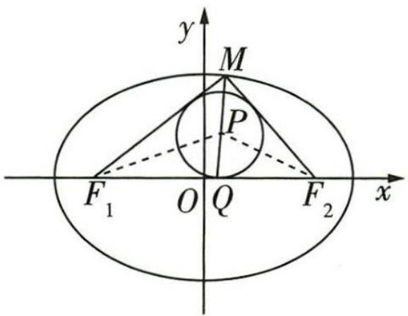

text_image

y
M
P
F₁ O Q F₂ x

图10

$$
\left(\left| M F _ {1} \right| + \left| M F _ {2} \right|\right) = \frac {1}{2} \cdot 2 c \cdot r + \frac {1}{2} r \cdot 2 a = (c + a) r, \therefore \frac {| M Q |}{| P Q |} = \frac {d _ {M}}{d _ {P}} = \frac {S _ {\triangle M F _ {1} F _ {2}}}{S _ {\triangle P F _ {1} F _ {2}}} = \frac {(c + a) r}{c r} = \frac {c + a}{c},
$$

【小提示】可直接用内切圆半径表示三角形面积公式，即 $S_{\triangle F_1MF_2} = pr(p = \frac{2a + 2c}{2} = a + c)$

# 数学文化

祖暅原理 祖暅在求球体积时,使用原理“幂势既同,则积不容异”. “幂”是截面积,“势”是立体的高. 意思是两个同高的几何体,若在等高处的截面积恒相等,则体积相等.

关注微信公众号“初高教辅站”获取更多初高中教辅资料则 $\frac{|MQ|-|PQ|}{|PQ|}=\frac{a}{c}$ ，即 $\frac{|MP|}{|PQ|}=\frac{1}{e}$ ，∵椭圆C的离心率为 $\frac{1}{2}$ ，∴ $\frac{|MP|}{|PQ|}=2$ ，故选A.

【秒杀】利用性质 $\frac{|PQ|}{|MP|}=e$ ，实现秒杀。实际上，本题前述解答过程，给出了此性质的一种证明方法，也可以利用三角形内角平分线定理证明，如下：P是内心，因而MQ， $F_{2}P$ 分别是 $\angle F_{1}MF_{2}$ ， $\angle MF_{2}Q$ 的内角平分线，则在 $\triangle F_{1}MF_{2}$ 中， $\frac{|MF_{2}|}{|MF_{1}|}=\frac{|QF_{2}|}{|F_{1}Q|}$ ，利用合比定理得 $\frac{|MF_{2}|}{|MF_{1}|+|MF_{2}|}=\frac{|QF_{2}|}{|F_{1}Q|+|QF_{2}|}$ ，利用定义得 $\frac{|MF_{2}|}{2a}=\frac{|QF_{2}|}{2c}$ ，所以 $\frac{|QF_{2}|}{|MF_{2}|}=\frac{c}{a}$ ，又在 $\triangle MQF_{2}$ 中， $\frac{|PQ|}{|MP|}=\frac{|QF_{2}|}{|MF_{2}|}=\frac{c}{a}=e$ ，结论得证

# 2. B 第一步: 求出 c 的取值范围.

如图11, 设椭圆与双曲线的半焦距为 $c$ , 椭圆长半轴长为 $a_1$ , 双曲线实半轴长为 $a_2$ , $|PF_1| = r_1$ , $|PF_2| = r_2$ , $\because \triangle PF_1F_2$ 是以 $PF_1$ 为底边的等腰三角形, 点 $P$ 在第一象限内, $\therefore |PF_2| = |F_1F_2|$ , $|PF_1| > |PF_2|$ , $|PF_2| + |F_1F_2| > |PF_1|$ , 即 $r_1 = 24$ , $r_2 = 2c$ , 且 $r_1 > r_2$ , $2r_2 > r_1$ , $\therefore 2c < 24$ , $4c > 24$ , 解得 $6 < c < 12$ .

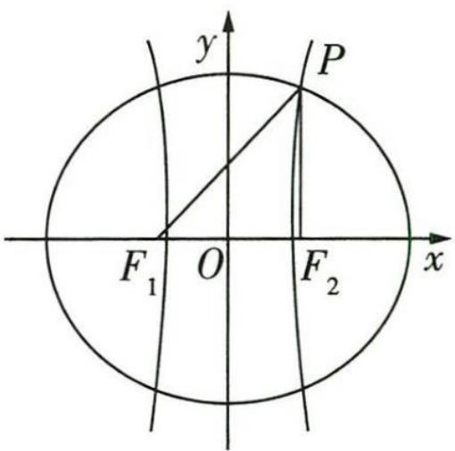

text_image

y
P
F₁ O F₂ x

图11

第二步:根据圆锥曲线的定义用 c 表示出 $e_{1}e_{2}$ .

在双曲线中， $|PF_{1}| - |PF_{2}| = 2a_{2},\therefore e_{2} = \frac{c}{a_{2}} = \frac{2c}{2a_{2}} = \frac{2c}{r_{1} - r_{2}} = \frac{2c}{24 - 2c} = \frac{c}{12 - c};$ 在椭圆中， $|PF_1| +$ $|PF_2| = 2a_1,\therefore e_1 = \frac{c}{a_1} = \frac{2c}{2a_1} = \frac{2c}{r_1 + r_2} = \frac{2c}{24 + 2c} = \frac{c}{12 + c}.\therefore e_1e_2 = \frac{c}{12 + c}\cdot \frac{c}{12 - c} = \frac{1}{\frac{144}{c^2} - 1}.$

第三步:根据 c 的取值范围求出 $3e_{1}e_{2}$ 的范围.

$\because 6 < c < 12, \therefore 36 < c^{2} < 144$ , 则 $1 < \frac{144}{c^{2}} < 4, \therefore 0 < \frac{144}{c^{2}} - 1 < 3$ , 可得 $\frac{1}{\frac{144}{c^{2}} - 1} > \frac{1}{3}, \therefore 3e_{1}e_{2}$ 的取值范围为 $(1, +\infty)$ . 故选 B.

【速解】运用性质，设等腰 $\triangle PF_{1}F_{2}$ 的底角为 $\alpha$ ， $\because |PF_1| > |PF_2|$ ， $\therefore \angle PF_2F_1 = \pi - 2\alpha > \frac{\pi}{3}$ ，即 $\alpha \in (0, \frac{\pi}{3})$ ，对于椭圆有 $e_1 = \frac{\sin \alpha}{\sin (\pi - 2\alpha) + \sin \alpha} = \frac{1}{2\cos \alpha + 1}$ ，对于双曲线有 $e_2 = \frac{\sin \alpha}{|\sin (\pi - 2\alpha) - \sin \alpha|} = \frac{1}{2\cos \alpha - 1}$ ，从而 $3e_1e_2 = \frac{3}{4\cos^2\alpha - 1}$ ，其中 $4\cos^2\alpha - 1 \in (0,3)$ ，从而 $3e_1e_2 > 1$

# 数学文化

更详细点说就是,夹在两个平行平面之间的两个几何体,被任一平行于这两个平面的平面所截,如果所得两个截面的面积恒相等,则这两个几何体的体积相等.

# 超重点 7 构造圆锥曲线中的弦长问题的解题模板

# 万能模版

直线与圆锥曲线相交于两点,两点之间的线段为弦,其长度为弦长.弦长问题是圆锥曲线问题的基本问题,很多圆锥曲线问题都围绕弦长来设计,这类问题也形成了相对固定的解题模板.

第一步:设点、设线,注意考虑斜率不存在或斜率为0的特殊情况.

第二步:联立“线锥”方程(这里“线”指直线,“锥”指圆锥曲线),消元得到一元二次方程.

第三步: 计算 $\Delta$ (根的判别式), 注意 $\Delta > 0$ , 计算得根与系数的关系、点的坐标等.

第四步:结合弦长公式求解,即弦长= $\sqrt{1+k^{2}}\cdot\sqrt{(x_{1}+x_{2})^{2}-4x_{1}x_{2}}$ 或弦长= $\sqrt{1+\frac{1}{k^{2}}}\cdot\sqrt{(y_{1}+y_{2})^{2}-4y_{1}y_{2}}(k\neq0)$ ,其中k是直线的斜率, $(x_{1},y_{1}),(x_{2},y_{2})$ 是两交点的坐标.

# 情形 1 显性弦长问题

调研 1 (试题调研原创) 已知直线 $x - 2y + 1 = 0$ 与抛物线 $C: y^2 = 2px (p > 0)$ 交于 $A, B$ 两点, $|AB| = 4\sqrt{15}$ .

(1) 求 $p$ ;

(2) 设 F 为 C 的焦点, M, N 为 C 上两点, $\overrightarrow{FM} \cdot \overrightarrow{FN} = 0$ , 求 $|MN|$ 的最小值.

思维导引 (1) 套用解题模板, 用 $p$ 表示 $|AB|$ , 结合 $|AB| = 4\sqrt{15}$ 列方程即可得出 $p$ . (2) 套用解题模板, 设直线 $MN$ 的方程为 $x = my + n$ , $M(x_1, y_1)$ , $N(x_2, y_2)$ , 利用 $\overrightarrow{FM} \cdot \overrightarrow{FN} = 0$ , 找到 $m, n$ 的关系, 得到 $|MN|$ 的表达式, 再结合函数的性质求最小值.

解析 (1) 第一步: 设点.

设 $A(x_{A},y_{A}),B(x_{B},y_{B})$ ,

第二步:联立方程得方程组,消元.

由 $\left\{\begin{aligned}x-2y+1&=0,\\ y^{2}&=2px,\end{aligned}\right.$ 消去x可得关于y的一元二次方程 $y^{2}-4py+2p=0$ ,

第三步: 计算 $\Delta$ 并检验, 然后计算得根与系数的关系.

$\Delta = 16p^{2} - 8p = 8p(2p - 1) > 0$ ，结合 $p > 0$ 可得 $p > \frac{1}{2}$ ，则 $y_{A} + y_{B} = 4p, y_{A}y_{B} = 2p$

【易遗漏】检验 $\Delta > 0$ 往往会得出参数的取值范围，在后续计算时要考虑进去，验证答案的合理性

知识解密

求参数的取值范围时,应建立关于参数的等式或不等式,在对式子变形的过程中,优先选择分离参数法.

第四步: 计算 $\left|AB\right|$ .

所以 $|AB| = \sqrt{1 + 2^2} \times \sqrt{(y_A + y_B)^2 - 4y_A y_B} = \sqrt{5} \times \sqrt{16p^2 - 8p} = 4\sqrt{15}$ ,

【会运用】在直线方程为 $x = py + q$ 形式时，把弦长公式 $\sqrt{1 + \frac{1}{k^2}}\cdot \sqrt{(y_1 + y_2)^2 - 4y_1y_2}$ 中的 $\sqrt{1 + \frac{1}{k^2}}$ 改写为 $\sqrt{1 + p^2}$ ，可缩短思维路径

即 $2p^{2}-p-6=0$ ，解得 p=2（负值舍去）.

(2) 第一步: 分析特殊情况, 然后考虑一般情况, 设点和直线.

由 $F(1,0)$ ，可得直线 MN 的斜率不可能为 0，

设直线 MN 的方程为 $x = my + n, M(x_{1}, y_{1}), N(x_{2}, y_{2})$ ,

【小技巧】一般来说, “斜率不存在” 和 “斜率为 0 ” 的可能性不会同时存在, 在这种情形下, 选择合适的直线方程的形式, 可以 “跳过” 对特殊情况的考虑: ① 如果斜率可能不存在,但一定不会为 0 (如本题), 则将直线方程设为 $x = m y + n$ 的形式; ② 如果斜率可能为 0 , 但不可能不存在, 则将直线方程设为 $y = k x + b$ 的形式

第二步:联立方程得方程组,消元.

由 $\left\{\begin{aligned}y^{2}&=4x,\\ x&=my+n,\end{aligned}\right.$ 消去x可得关于y的一元二次方程 $y^{2}-4my-4n=0$ ,

第三步: 计算 $\Delta$ 并检验, 然后计算得根与系数的关系.

$$
\Delta = 1 6 m ^ {2} + 1 6 n > 0, \text {所以} m ^ {2} + n > 0, y _ {1} + y _ {2} = 4 m, y _ {1} y _ {2} = - 4 n,
$$

第四步:结合 $\overrightarrow{FM}\cdot\overrightarrow{FN}=0$ 得m,n的关系和n的取值范围,然后用n表示出 $|MN|$ .

$\overrightarrow{FM} \cdot \overrightarrow{FN} = 0$ ，即 $(x_{1} - 1)(x_{2} - 1) + y_{1}y_{2} = 0$ ，即 $(my_{1} + n - 1)(my_{2} + n - 1) + y_{1}y_{2} = 0$

化简得 $(m^2 + 1)y_1y_2 + m(n - 1)(y_1 + y_2) + (n - 1)^2 = 0$

将 $y_{1} + y_{2} = 4m, y_{1}y_{2} = -4n$ 代入得 $4m^{2} = n^{2} - 6n + 1$ ,

又 $m^2 + n > 0$ ，可得 $m^2 + n = \frac{1}{4} (n - 1)^2 > 0$ ，所以 $n \neq 1$ .

又 $n^{2}-6n+1\geqslant0$ ，解得 $n\geqslant3+2\sqrt{2}$ 或 $n\leqslant3-2\sqrt{2}$ .

【依据】挖掘隐含信息， $4m^{2}=n^{2}-6n+1$ ，那么由 $m^{2}\geqslant0$ 可得 $n^{2}-6n+1\geqslant0$

$$
\begin{array}{r l} \mid M N \mid & = \sqrt {1 + m ^ {2}} \sqrt {\left(y _ {1} + y _ {2}\right) ^ {2} - 4 y _ {1} y _ {2}} = \sqrt {1 + m ^ {2}} \sqrt {1 6 m ^ {2} + 1 6 n} = 2 \sqrt {1 + m ^ {2}} \sqrt {4 m ^ {2} + 4 n} = \\ & \sqrt {4 + 4 m ^ {2}} \sqrt {n ^ {2} - 2 n + 1} = \sqrt {n ^ {2} - 6 n + 5} \sqrt {n ^ {2} - 2 n + 1} = \sqrt {(n - 1) ^ {3} (n - 5)}. \end{array}
$$

第五步: 结合 n 的取值范围求 $\left|MN\right|$ 的最小值.

设 $f(x)=(x-1)^{3}(x-5)$ ， $x\geqslant3+2\sqrt{2}$ 或 $x\leqslant3-2\sqrt{2}$ ，则 $f'(x)=4(x-1)^{2}(x-4)$ ，

所以当 $x \geqslant 3 + 2\sqrt{2}$ 时， $f(x)$ 单调递增，当 $x \leqslant 3 - 2\sqrt{2}$ 时， $f(x)$ 单调递减，

$$
f (3 + 2 \sqrt {2}) = 1 6 (3 + 2 \sqrt {2}), f (3 - 2 \sqrt {2}) = 1 6 (3 - 2 \sqrt {2}), \text {又} 1 6 (3 + 2 \sqrt {2}) > 1 6 (3 - 2 \sqrt {2}),
$$

所以当 $n = 3 - 2\sqrt{2}$ 时， $\vert MN\vert$ 取最小值，为 $\sqrt{16(3 - 2\sqrt{2})} = 4(\sqrt{2} -1)$

# 提分干货 解题模版

# 牢记一点,巧妙缩小弦长公式的计算量

应用弦长公式,需要结合根与系数的关系计算,计算量很大,很容易出错,有没有什么办法来简化这个步骤呢?我们从解题模板来展开看.

第一步:考虑一般情况,设交点 $M(x_{1},y_{1}), N(x_{2},y_{2})$ , 直线 $l:y=kx+b$ .

第二步:联立“线锥”方程,得到一个关于x的一元二次方程 $Ax^{2}+Bx+C=0(A\neq0)$ .

第三步:检验 $\Delta = B^{2} - 4AC > 0$ , 然后由根与系数的关系得 $x_{1} + x_{2} = -\frac{B}{A}, x_{1}x_{2} = \frac{C}{A}$ .

第四步:代入弦长公式得 $|MN|=\sqrt{1+k^{2}}\cdot\sqrt{(x_{1}+x_{2})^{2}-4x_{1}x_{2}}=\sqrt{1+k^{2}}\cdot\sqrt{(-\frac{B}{A})^{2}-\frac{4C}{A}}$

观察上式, 可得 $(- \frac{B}{A})^2 - \frac{4C}{A} = \frac{B^2 - 4AC}{A^2} = \frac{\Delta}{A^2}$ , 由此, 弦长公式就和 $\Delta$ 建立了关系, 可以得到简化的弦长公式 $|MN| = \sqrt{1 + k^2} \cdot \sqrt{\frac{\Delta}{A^2}}$ (此处的 $\Delta$ 和 $A$ 都是对应 $x$ 来说的), 而若得到的是关于 $y$ 的一元二次方程 $A' y^2 + B' y + C' = 0$ , 同理可得 $|MN| = \sqrt{1 + \frac{1}{k^2}} \cdot \sqrt{\frac{\Delta'}{A'^2}}$ (此处的 $\Delta'$ 和 $A'$ 则是对应 $y$ 来说的, $k \neq 0$ ).

牢记“算 $\Delta$ ”这一点,既可以避免丢失步骤分,又可以简化计算.

# 情形 2 隐性弦长问题

调研 2 (2023 安徽皖江名校 7 月联考) 已知点 $M(1,1)$ 为椭圆 $C: \frac{x^2}{4} + \frac{y^2}{b^2} = 1$ $(0 < b < 2)$ 上一点, 直线 $l: x + ty - 1 = 0 (t \in \mathbb{R})$ 与椭圆 $C$ 交于 $A, B$ 两点.

(1) 当 t=1 时, 求 $\triangle ABM$ 的面积;

(2) 设直线 AM 和 BM 分别与直线 x=4 交于点 P, Q, 若 $\triangle ABM$ 与 $\triangle PQM$ 的面积满足 $S_{\triangle PQM}=5S_{\triangle ABM}$ , 求实数 t 的值.

# 巧抓关键

第(1)问中， $M$ 的坐标已知，设未知数并用未知数表示以下两项：①点 $M$ 到直线 $l$ 的距离 $d$ ，② $|AB|$ . 根据 $S_{\triangle ABM} = \frac{1}{2} |AB| d$ 即可求解.

# 知识解密

对于求曲线方程的题目,如果知道曲线的形状,可选择待定系数法;如果不知道曲线的形状,求解的一般步骤为建系、设点、列式、化简(注意去掉不符合条件的特殊点).

关注微信公众号“初高教辅站”获取更多初高中教辅资料

解析(1)将 $M(1,1)$ 的坐标代入 $\frac{x^{2}}{4} + \frac{y^{2}}{b^{2}} = 1$ ，得 $\frac{1}{4} + \frac{1}{b^{2}} = 1$ ，得 $b^{2} = \frac{4}{3}$ ，

所以椭圆 $C:\frac{x^{2}}{4}+\frac{3y^{2}}{4}=1.$

当 t=1 时, 直线 $l: x + y - 1 = 0$ .

第一步:设点.

设 $A(x_{1},y_{1}),B(x_{2},y_{2})$

【灵活运用】直线方程已知，则不需要考虑斜率不存在或为0的情况，灵活运用解题模板，直接按照一般情况计算即可

第二步:联立方程得方程组,消元.

由 $\left\{\begin{aligned}\frac{x^{2}}{4}+\frac{3y^{2}}{4}&=1,\\ x+y-1&=0,\end{aligned}\right.$ 消去 y，整理得关于 x 的一元二次方程 $4x^{2}-6x-1=0$ .

第三步: 计算 $\Delta$ 并检验, 然后计算得根与系数的关系.

$$
\Delta = 3 6 + 1 6 = 5 2 > 0, x _ {1} + x _ {2} = \frac {3}{2}, x _ {1} x _ {2} = - \frac {1}{4}.
$$

第四步: 计算 $\left|AB\right|$ , 然后计算 $S_{\triangle ABM}$ .

$$
\vert A B \vert = \sqrt {1 + (- 1) ^ {2}} \times \sqrt {\left(x _ {1} + x _ {2}\right) ^ {2} - 4 x _ {1} x _ {2}} = \sqrt {2} \times \sqrt {\left(\frac {3}{2}\right) ^ {2} + 1} = \frac {\sqrt {2 6}}{2},
$$

【另解】 $|AB|=\sqrt{1+(-1)^{2}}\times\sqrt{\frac{\Delta}{4^{2}}}=\frac{\sqrt{2}}{4}\times\sqrt{52}=\frac{\sqrt{26}}{2}$

点 M 到直线 l 的距离为 $d=\frac{|1+1-1|}{\sqrt{2}}=\frac{\sqrt{2}}{2}$ ,

所以 $S_{\triangle ABM} = \frac{1}{2}\times |AB|\times d = \frac{1}{2}\times \frac{\sqrt{26}}{2}\times \frac{\sqrt{2}}{2} = \frac{\sqrt{13}}{4}.$

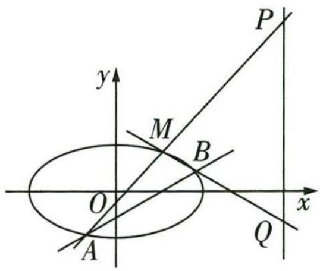

text_image

y
M
P
B
O
x
A
Q

图1

(2)根据题意作出示意图,如图1所示.

由 $\left\{\begin{aligned}\frac{x^{2}}{4}+\frac{3y^{2}}{4}=1,\\x+t y-1=0,\end{aligned}\right.$ 消去x，整理得关于y的一元二次方程 $(t^{2}+3)y^{2}-2ty-3=0.$

$$
\Delta_ {1} = 4 t ^ {2} + 1 2 (t ^ {2} + 3) = 1 6 t ^ {2} + 3 6 > 0, y _ {1} + y _ {2} = \frac {2 t}{t ^ {2} + 3}, y _ {1} y _ {2} = \frac {- 3}{t ^ {2} + 3}.
$$

则 $|AB| = \sqrt{1 + t^2} \cdot \sqrt{(y_1 + y_2)^2 - 4y_1y_2} = \sqrt{1 + t^2} \cdot \sqrt{\frac{\Delta_1}{(t^2 + 3)^2}} = \frac{2\sqrt{(t^2 + 1)(4t^2 + 9)}}{t^2 + 3}$ ,

点 $M$ 到直线 $l$ 的距离 $d' = \frac{|1 + t - 1|}{\sqrt{1 + t^2}} = \frac{|t|}{\sqrt{1 + t^2}}$

【易错】不要漏写分子的绝对值，如果漏写，得到的答案可能不全面

所以 $S_{\triangle ABM} = \frac{1}{2} |AB| \cdot d' = \frac{|t| \sqrt{4t^{2} + 9}}{t^{2} + 3}.$

直线 AM 的方程为 $y - 1 = \frac{y_{1} - 1}{x_{1} - 1}(x - 1)$ ,

令 $x = 4$ ，得 $y = \frac{3(y_1 - 1)}{x_1 - 1} + 1 = \frac{3(y_1 - 1)}{-ty_1} + 1 = \frac{(t - 3)y_1 + 3}{ty_1},$

即 $P(4, \frac{(t - 3)y_1 + 3}{ty_1})$ . 同理 $Q(4, \frac{(t - 3)y_2 + 3}{ty_2})$ ,

所以 $|PQ| = \left|\frac{(t - 3)y_1 + 3}{ty_1} - \frac{(t - 3)y_2 + 3}{ty_2}\right| = \left|\frac{3(y_2 - y_1)}{ty_1y_2}\right|$ .

又 $|y_{2} - y_{1}| = \sqrt{\frac{\Delta_{1}}{(t^{2} + 3)^{2}}} = \frac{2\sqrt{4t^{2} + 9}}{t^{2} + 3},$

所以 $|PQ| = \left|\frac{3(y_2 - y_1)}{ty_1y_2}\right| = \left|\frac{3 \times \frac{2\sqrt{4t^2 + 9}}{t^2 + 3}}{t \times \frac{-3}{t^2 + 3}}\right| = \frac{2\sqrt{4t^2 + 9}}{|t|}$ .

所以 $S_{\triangle PQM}=\frac{1}{2}|PQ|\times3=\frac{3\sqrt{4t^{2}+9}}{|t|}$ .

因为 $S_{\triangle PQM} = 5S_{\triangle ABM}$ ，所以 $\frac{3\sqrt{4t^{2} + 9}}{|t|} = 5 \times \frac{|t| \sqrt{4t^{2} + 9}}{t^{2} + 3}$ ，化简得 $3(t^{2} + 3) = 5t^{2}$ ，解得 $t = \pm \frac{3\sqrt{2}}{2}$ ，即实数 t 的值为 $\pm \frac{3\sqrt{2}}{2}$ .

调研 3 (双曲线与等差数列交汇12023 南京一中7月模拟)如图2,双曲线 $M: x^{2} - \frac{y^{2}}{3} = 1$ 的右支上存在不同于点 $A(2,3)$ 的两点 $P, Q$ ,记直线 $AP, AQ, PQ$ 的斜率分别为 $k_{1}, k_{2}, k$ ,且 $k_{1}, k, k_{2}$ 成等差数列.

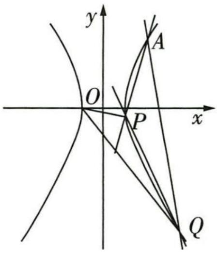

text_image

y
O
P
x
A
Q

图2

(1) 求 k 的取值范围;

(2) 若 $\triangle OPQ$ 的面积为 $\sqrt{6}$ (O 为坐标原点), 求直线 PQ 的方程.

知识解密

解析 (1) 第一步: 设点和直线.

设 $P(x_{1},y_{1})$ , $Q(x_{2},y_{2})$ , 直线 PQ 的方程为 $y=kx+m$ .

【小技巧】本题中，直线 $PQ$ 的斜率一定存在且不为 0，方程设为 $y = kx + m$ 或 $x = k'y + m'$ 都可以求解

第二步:联立方程得方程组,消元.

由 $\left\{\begin{aligned}y&=kx+m,\\ x^{2}-\frac{y^{2}}{3}&=1,\end{aligned}\right.$ 整理得关于x的一元二次方程 $(3-k^{2})x^{2}-2kmx-m^{2}-3=0.$

第三步: 计算 $\Delta$ 并检验, 然后计算得根与系数的关系, 进而得 k, m 的限制条件.

依题意,可得 $\left\{\begin{aligned}&3-k^{2}\neq0,\\&\Delta=4k^{2}m^{2}+4(3-k^{2})(m^{2}+3)=12(m^{2}+3-k^{2})>0,\end{aligned}\right.$

【易忽略】看到一元二次方程首先看二次项的系数，如果含参数，则要考虑二次项系数能否为0

又点 $P, Q$ 在双曲线的右支上，则 $\left\{ \begin{array}{l} x_{1} + x_{2} = \frac{2km}{3 - k^{2}} > 0, \\ x_{1}x_{2} = -\frac{m^{2} + 3}{3 - k^{2}} > 0, \end{array} \right.$ 综上， $\left\{ \begin{array}{l} k^{2} > 3, \\ m^{2} + 3 > k^{2}, \\ mk < 0. \end{array} \right.$

第四步:根据等差中项的性质,缩小 k 的取值范围.

又 $k_{1}, k, k_{2}$ 成等差数列，所以 $2k = k_{1} + k_{2} = \frac{y_{1} - 3}{x_{1} - 2} + \frac{y_{2} - 3}{x_{2} - 2} = \frac{kx_{1} + m - 3}{x_{1} - 2} + \frac{kx_{2} + m - 3}{x_{2} - 2} = \frac{k(x_{1} - 2) + 2k + m - 3}{x_{1} - 2} + \frac{k(x_{2} - 2) + 2k + m - 3}{x_{2} - 2} = 2k + (2k + m - 3)\left(\frac{1}{x_{1} - 2} + \frac{1}{x_{2} - 2}\right)$ ，

所以 $(2k + m - 3)\left(\frac{1}{x_1 - 2} +\frac{1}{x_2 - 2}\right) = 0.$

因为 P, Q 不同于 A, 即 $A(2,3)$ 不在直线 PQ: $y = kx + m$ 上, 所以 $3 \neq 2k + m$ , 即 $2k + m - 3 \neq 0$ ,

所以 $\frac{1}{x_1 - 2} +\frac{1}{x_2 - 2} = 0$ ，即 $\frac{x_1 - 2 + x_2 - 2}{(x_1 - 2)(x_2 - 2)} = 0$ ，所以 $x_{1} + x_{2} = 4$

所以 $\frac{2km}{3 - k^2} = 4$ ，即 $m = \frac{6 - 2k^2}{k}$

代入 $m^2 + 3 > k^2$ ，得 $\left(\frac{6 - 2k^2}{k}\right)^2 + 3 > k^2$ ，得 $4(k^2 - 3)^2 > k^2(k^2 - 3)$ .

因为 $k^{2}>3$ ，所以 $4(k^{2}-3)>k^{2}$ ，即 $k^{2}>4$ ，所以 k<-2 或 k>2。

【解后反思】此问不涉及弦长，但依然可以参照解题模板的前三步，结合等差中项的性质求解

# 知识解密

数列的求和问题,需注意灵活使用等差数列或等比数列的通项公式及前 n 项和公式,体会方程的思想,同时也应注意错位相减法、裂项相消法等求和方法的适用情况.

(2)第一步:计算 $|PQ|$ 和点O到直线PQ的距离d,然后计算 $S_{\triangle OPQ}$ .

结合(1)得 $|PQ|=\sqrt{1+k^{2}}\times\sqrt{\frac{\Delta}{\left(k^{2}-3\right)^{2}}}=\frac{2\sqrt{3}\times\sqrt{1+k^{2}}}{k^{2}-3}\times\sqrt{m^{2}+3-k^{2}}$

点 $O$ 到直线 $PQ$ 的距离 $d = \frac{|m|}{\sqrt{1 + k^2}}$

所以 $S_{\triangle OPQ} = \frac{1}{2}\times \frac{|m|}{\sqrt{1 + k^2}}\times \frac{2\sqrt{3}\times\sqrt{1 + k^2}}{k^2 - 3}\times \sqrt{m^2 + 3 - k^2} = \sqrt{6},$

第二步:根据 $S_{\triangle OPQ}=\sqrt{6}$ 列方程求解.

两边平方并化简得 $m^2 (m^2 +3 - k^2) = 2(k^2 -3)^2$

由 $\frac{2km}{3 - k^2} = 4$ ，得 $(k^2 -3)^2 = \frac{k^2m^2}{4}$ ，代入上式得 $m^2 (m^2 +3 - k^2) = 2\times \frac{k^2m^2}{4},$

因为 $m^2 > 0$ ，所以 $m^2 + 3 - k^2 = \frac{k^2}{2}$ ，将 $m = \frac{6 - 2k^2}{k}$ 代入得 $(\frac{6 - 2k^2}{k})^2 + 3 - k^2 = \frac{k^2}{2}$ ，

整理得 $5k^{4} - 42k^{2} + 72 = 0$ ，所以 $(5k^{2} - 12)(k^{2} - 6) = 0$ ，解得 $k^2 = 6$ 或 $k^2 = \frac{12}{5}$

由(1)知 $k^{2}>3$ ，所以 $k^{2}=6$ ，即 $k=\pm\sqrt{6}$ .

当 $k = \sqrt{6}$ 时， $m = \frac{6 - 2 \times 6}{\sqrt{6}} = -\sqrt{6}$ ，直线 $PQ$ 的方程为 $y = \sqrt{6} x - \sqrt{6}$ ；

当 $k = -\sqrt{6}$ 时， $m = \frac{6 - 2 \times 6}{-\sqrt{6}} = \sqrt{6}$ ，直线 $PQ$ 的方程为 $y = -\sqrt{6} x + \sqrt{6}$ .

综上, 直线 PQ 的方程为 $y = \sqrt{6}x - \sqrt{6}$ 或 $y = -\sqrt{6}x + \sqrt{6}$ .

# 变式演练

(调研2 变式,变考法,求面积的最值 $12023$ 陕西咸阳7月模拟)已知点 $P$ 为椭圆 $E: \frac{x^{2}}{a^{2}}+\frac{y^{2}}{b^{2}}=1 (a>b>0)$ 上的动点, $F_{1}, F_{2}$ 分别是椭圆 $E$ 的左、右焦点, $\triangle PF_{1}F_{2}$ 的周长是 $12$ , 椭圆 $E$ 上的点到焦点的最短距离是 $2$ .

(1) 求椭圆 E 的标准方程;  
(2) 过点 $(2,0)$ 的动直线 l 与椭圆交于 M, Q 两点, 求面积 $S_{\triangle F_{1}MQ}$ 的最大值及此时 l 的方程.

# 参考答案与解析

(1)由题意得, $\left\{\begin{aligned}&2a+2c=12,\\ &a-c=2,\end{aligned}\right.$ 得 $\left\{\begin{aligned}a=4,\\ &c=2,\end{aligned}\right.$ 所以 $b^{2}=a^{2}-c^{2}=12$ ,

【用结论】椭圆焦点三角形的周长为 $2a + 2c$ ，椭圆上的点到焦点的最短距离是 $a - c$

知识解密

所以椭圆 E 的标准方程是 $\frac{x^{2}}{16} + \frac{y^{2}}{12} = 1$ .

(2) 第一步: 设点和直线.

设 l 的方程为 $x = my + 2$ , $M(x_{1}, y_{1})$ , $Q(x_{2}, y_{2})$ ,

第二步:联立方程得方程组,消元.

由 $\left\{\begin{aligned}x&=my+2,\\ \frac{x^{2}}{16}&+\frac{y^{2}}{12}=1,\end{aligned}\right.$ 消去 x 整理得关于 y 的一元二次方程 $(3m^{2}+4)y^{2}+12my-36=0$ ,

第三步: 计算 $\Delta$ 并检验, 然后计算得根与系数的关系.

$$
\Delta = 5 7 6 (m ^ {2} + 1) > 0, 3 m ^ {2} + 4 \neq 0, y _ {1} + y _ {2} = - \frac {1 2 m}{3 m ^ {2} + 4}, y _ {1} y _ {2} = - \frac {3 6}{3 m ^ {2} + 4},
$$

第四步: 计算 $S_{\triangle F_{1}MQ}$ .

方法一: 直接应用弦长公式 $\left|MQ\right|=\sqrt{1+m^{2}}\sqrt{\frac{\Delta}{\left(3m^{2}+4\right)^{2}}}=\frac{24\left(m^{2}+1\right)}{3m^{2}+4}$ ,

点 $F_{1}(-2,0)$ 到直线 $l$ 的距离 $d = \frac{4}{\sqrt{1 + m^2}}$

所以 $S_{\triangle F_1MQ} = \frac{1}{2}\times |MQ|\times d = \frac{48\sqrt{m^2 + 1}}{3m^2 + 4}.$

方法二:分解三角形求面积 由题可知点(2,0)即点 $F_{2}$ ，所以 $S_{\triangle F_{1}MQ}=S_{\triangle F_{1}F_{2}M}+S_{\triangle F_{1}F_{2}Q}=\frac{1}{2}\times4\times$ $|y_{1}|+\frac{1}{2}\times4\times|y_{2}|=\frac{1}{2}\times4\times|y_{1}-y_{2}|=2|y_{1}-y_{2}|$

所以 $S_{\triangle F_1MQ} = 2|y_1 - y_2| = 2\sqrt{\frac{\Delta}{(3m^2 + 4)^2}} = \frac{48\sqrt{m^2 + 1}}{3m^2 + 4}$ .

【会运用】此处应用 $|y_{1} - y_{2}| = \sqrt{\frac{\Delta}{(3m^{2} + 4)^{2}}}$ 简化计算

第五步:换元,求最值.

令 $t = \sqrt{m^2 + 1}$ ，则 $t\geqslant 1$ ，所以 $S_{\triangle F_1MQ} = \frac{48t}{3t^2 + 1} = \frac{48}{3t + \frac{1}{t}}$

易知函数 $y = 3t + \frac{1}{t}$ 在 $[1, +\infty)$ 上单调递增，

所以当 t=1 时, $S_{\triangle F_{1}MO}$ 取最大值 12, 此时 m=0, 直线 l 的方程为 x=2.

# 知识解密

与函数图象平移有关的问题,可应用口诀“左加右减,上加下减”,其中“左加右减”针对自变量,“上加下减”针对因变量.

# 超重点8 圆锥曲线的定点、定值问题

# 角度1 直线过定点问题

调研 1 (2023 安徽省定远中学 6 月考前预测) 已知双曲线 $C: \frac{x^{2}}{a^{2}} - \frac{y^{2}}{b^{2}} = 1 (a > 0, b > 0)$ 的实轴长为 $2 \sqrt{2}, C$ 的一条渐近线斜率为 $-\frac{\sqrt{2}}{2}$ , 直线 $l$ 交 $C$ 于 $P, Q$ 两点, 点 $M(\sqrt{2} a, b)$ 在双曲线 $C$ 上.

(1)若直线 l 过 C 的右焦点,且斜率为 -1,求 $\triangle PMQ$ 的面积.

(2) 设 P, Q 异于点 M, 记直线 MP, MQ 的斜率分别为 $k_{1}, k_{2}$ , 若 $k_{1} + k_{2} = 2k_{1}k_{2}$ , 求证: 直线 PQ 过定点.

# 思路指引

(1)已知直线和圆锥曲线交于的两点和直线外一点,求这三个点围成的三角形的面积,常用弦长公式和点到直线的距离公式分别求出三角形的底边和底边上的高,设 $P(x_{1},y_{1})$ , $Q(x_{2},y_{2})$ , 直线 PQ 的斜率为 k, 则弦长 $|PQ|=\sqrt{1+k^{2}}\left|x_{1}-x_{2}\right|=\sqrt{(1+k^{2})\left[(x_{1}+x_{2})^{2}-4x_{1}x_{2}\right]}$ . (2)所要研究的对象为直线 PQ, 设出直线方程并与双曲线方程联立, 整理得一元二次方程, 根据根的判别式、根与系数的关系、直线的斜率公式结合已知条件化简, 得出等量关系, 从而得出直线所过的定点.

解析 (1) 第一步: 根据双曲线的实轴长和渐近线斜率求得双曲线方程与直线 $l$ 的方程.

如图1,由题可得 $\left\{\begin{aligned}&2a=2\sqrt{2},\\ &-\frac{b}{a}&=-\frac{\sqrt{2}}{2},\end{aligned}\right.$ 解得 $\left\{\begin{aligned}a&=\sqrt{2},\\ b&=1.\end{aligned}\right.$

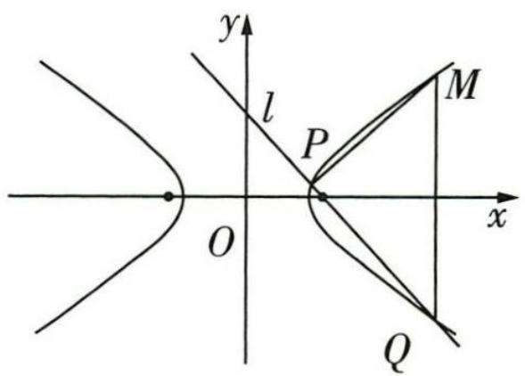

text_image

y
l
P
M
O
x
Q

图1

【易错点】双曲线 $\frac{x^{2}}{a^{2}}-\frac{y^{2}}{b^{2}}=1(a>0,b>0)$ 的渐近线方程为y= $\pm\frac{b}{a}x$ ，双曲线 $\frac{y^{2}}{a^{2}}-\frac{x^{2}}{b^{2}}=1(a>0,b>0)$ 的渐近线方程为 $y=\pm\frac{a}{b}x$ ，注意区分

所以双曲线 $C:\frac{x^{2}}{2}-y^{2}=1$ ，则其右焦点为 $(\sqrt{3},0)$ .

从而直线 l 的方程为 $y = -x + \sqrt{3}$ , $M(2,1)$ .

知识解密

常用的放缩技巧: $\frac{1}{n}-\frac{1}{n+1}=\frac{1}{n(n+1)}<\frac{1}{n^{2}}<\frac{1}{n(n-1)}=\frac{1}{n-1}-\frac{1}{n}(n>1)$ .

关注微信公众号“初高教辅站”获取更多初高中教辅资料

第二步:用弦长公式求弦长|PQ|,求点M到直线l的距离,得△PMQ的面积.

设 $P(x_{1},y_{1}),Q(x_{2},y_{2})$ ，由 $\left\{ \begin{array}{ll}y = -x + \sqrt{3},\\ \frac{x^2}{2} -y^2 = 1, \end{array} \right.$ 消去 $y$ 得关于 $x$ 的方程 $x^{2} - 4\sqrt{3} x + 8 = 0,$

$\Delta_{1} > 0$ ，则 $x_{1} + x_{2} = 4\sqrt{3}, x_{1}x_{2} = 8.$

所以 $|PQ| = \sqrt{[1 + (-1)^2][(x_1 + x_2)^2 - 4x_1x_2]} = \sqrt{2 \times (48 - 32)} = 4\sqrt{2}$ ,

点 $M(2,1)$ 到直线 $l$ 的距离 $d = \frac{|2 + 1 - \sqrt{3}|}{\sqrt{2}} = \frac{3 - \sqrt{3}}{\sqrt{2}}.$

所以 $S_{\triangle PMQ} = \frac{1}{2}|PQ|d = \frac{1}{2}\times 4\sqrt{2}\times \frac{3 - \sqrt{3}}{\sqrt{2}} = 6 - 2\sqrt{3}.$

(2) 第一步: 设直线 PQ 的方程, 与双曲线方程联立得根与系数的关系.

如图2,设直线 $PQ$ 的方程为 $x = my + n$ ,

由 $\left\{\begin{aligned}x&=my+n,\\ \frac{x^{2}}{2}-y^{2}&=1\end{aligned}\right.$ 消去 x 得关于 y 的一元二次方程 $(m^{2}-2)y^{2}+$

$$
2 m n y + n ^ {2} - 2 = 0, m ^ {2} - 2 \neq 0,
$$

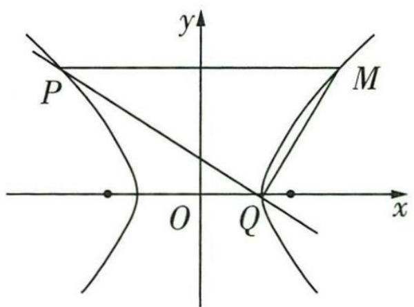

text_image

y
P
M
O
Q
x

图 2

则 $\Delta_2 = 4m^2 n^2 -4(m^2 -2)(n^2 -2) = 8(m^2 +n^2 -2) > 0$ ，即 $m^2 +n^2 >2$

所以 $y_{1} + y_{2} = \frac{-2mn}{m^{2} - 2},y_{1}y_{2} = \frac{n^{2} - 2}{m^{2} - 2}.$

第二步:结合 M 的坐标,得斜率 $k_{1}, k_{2}$ 的表达式,根据等量关系进行化简.

$M(2,1)$ ，则 $k_{1} = \frac{y_{1} - 1}{x_{1} - 2}, k_{2} = \frac{y_{2} - 1}{x_{2} - 2}$ .

$k_{1}+k_{2}=2k_{1}k_{2}$ ，即 $\frac{y_{1}-1}{x_{1}-2}+\frac{y_{2}-1}{x_{2}-2}=2\times\frac{y_{1}-1}{x_{1}-2}\times\frac{y_{2}-1}{x_{2}-2}$

整理得 $\frac{(y_1 - 1)(x_2 - 2)}{(x_1 - 2)(x_2 - 2)} +\frac{(y_2 - 1)(x_1 - 2)}{(x_1 - 2)(x_2 - 2)} = 2\times \frac{y_1 - 1}{x_1 - 2}\times \frac{y_2 - 1}{x_2 - 2},$

所以 $(y_{1} - 1)(x_{2} - 2) + (y_{2} - 1)(x_{1} - 2) = 2(y_{1} - 1)(y_{2} - 1)$

所以 $y_{1}x_{2} + y_{2}x_{1} - x_{2} - x_{1} + 2 = 2y_{1}y_{2}$

所以 $y_{1}(my_{2} + n) + y_{2}(my_{1} + n) - (my_{2} + n) - (my_{1} + n) + 2 = 2y_{1}y_{2}$

整理得 $(2m - 2)y_{1}y_{2} + (n - m)(y_{1} + y_{2}) - 2n + 2 = 0$

所以 $\frac{(2m - 2)(n^2 - 2)}{m^2 - 2} + \frac{-2mn(n - m)}{m^2 - 2} + \frac{(-2n + 2)(m^2 - 2)}{m^2 - 2} = 0,$

所以 $(2m - 2)(n^2 - 2) - 2mn(n - m) + (-2n + 2)(m^2 - 2) = 0$

整理得 $m^{2}-n^{2}-2m+2n=0$ ，即 $(m-n)(m+n-2)=0$ ，则 m=n 或 m=2-n.

第三步:分类讨论,分别求出定点坐标,舍去不合题意的点.

当 m=n 时, 直线 PQ 的方程为 $x=ny+n=n(y+1)$ , 所以直线 PQ 过定点 $(0,-1)$ .

当 $m = 2 - n$ 时, 直线 $PQ$ 的方程为 $x = (2 - n)y + n = n(1 - y) + 2y$ , 所以直线 $PQ$ 过定点 $(2, 1)$ , 即 $M(2,1)$ , 此时 $P, Q$ 中一点与 $M$ 重合, 不符合题意.

【易错提醒】警惕不符合题意的情况，懂得取舍

故直线 PQ 过定点 $(0, -1)$ .

# 角度 2 其他定点问题

调研 2 (2023 陕西师范大学附属中学十模) 已知椭圆 $C: \frac{x^{2}}{a^{2}} + \frac{y^{2}}{3} = 1 (a > 0)$ 经过点 $(-1, \frac{3}{2})$ , 过点 $T(\sqrt{3}, 0)$ 的直线交该椭圆于 $P, Q$ 两点.

(1) 求 $\triangle OPQ$ 面积的最大值 ( $O$ 为坐标原点), 并求此时直线 $PQ$ 的方程.

(2)若直线 PQ 与 x 轴不垂直, 在 x 轴上是否存在点 $S(s,0)$ 使得 $\angle PST = \angle QST$ 恒成立? 若存在, 求出 s 的值; 若不存在, 说明理由.

# 巧抓关键

此处由角相等可以得到 $k_{PS} + k_{QS} = 0$ ，代入斜率公式，可以化简为 $2ty_{1}y_{2} + (\sqrt{3} -s)(y_{1} + y_{2}) = 0$ ，在第(1)问的基础上，代入两根之和，两根之积，化简即可得到答案.

解析 (1) 第一步: 将 $(-1, \frac{3}{2})$ 代入椭圆方程.

将 $(-1,\frac{3}{2})$ 代入椭圆方程,得 $\frac{1}{a^{2}}+\frac{9}{4\times3}=1$ ,则 $a^{2}=4$ ,所以椭圆方程为 $\frac{x^{2}}{4}+\frac{y^{2}}{3}=1$ .

第二步:设直线 PQ 的方程,与椭圆方程联立,得到根与系数的关系.

当直线 PQ 的斜率为 0 时, 此时 O, P, Q 三点共线, 不合要求, 舍去;

【易错提醒】设直线方程为 $x = ty + n$ 的形式时，要先对直线斜率为 0 的情况进行分析说明

当直线 PQ 的斜率不为 0 时，设直线 PQ 的方程为 $x = ty + \sqrt{3}$ , $P(x_{1}, y_{1})$ , $Q(x_{2}, y_{2})$ ,

由 $\left\{\begin{aligned}x&=ty+\sqrt{3},\\ \frac{x^{2}}{4}&+\frac{y^{2}}{3}=1\end{aligned}\right.$ 消去x得关于y的一元二次方程 $(3t^{2}+4)y^{2}+6\sqrt{3}ty-3=0,3t^{2}+4\neq0,\Delta>0,$

知识解密

则 $y_{1} + y_{2} = -\frac{6\sqrt{3}t}{3t^{2} + 4}, y_{1}y_{2} = -\frac{3}{3t^{2} + 4},$

第三步:用 t 表示出 $\triangle OPQ$ 的面积, 利用基本不等式求出最值, 并得出此时直线 PQ 的方程.

$$
\begin{array}{r l} & {\text {所以} S _ {\triangle O P Q} = \frac {1}{2} | O T | | y _ {1} - y _ {2} | = \frac {1}{2} \times \sqrt {3} \times \sqrt {(y _ {1} + y _ {2}) ^ {2} - 4 y _ {1} y _ {2}} = \frac {\sqrt {3}}{2} \times \sqrt {(- \frac {6 \sqrt {3} t}{3 t ^ {2} + 4}) ^ {2} + \frac {1 2}{3 t ^ {2} + 4}} =} \\ & {6 \sqrt {\frac {3 t ^ {2} + 1}{[ (3 t ^ {2} + 1) + 3 ] ^ {2}}} = 6 \sqrt {\frac {3 t ^ {2} + 1}{(3 t ^ {2} + 1) ^ {2} + 6 (3 t ^ {2} + 1) + 9}} = 6 \sqrt {\frac {1}{(3 t ^ {2} + 1) + \frac {9}{3 t ^ {2} + 1} + 6}} \leqslant} \end{array}
$$

6 $\sqrt{\frac{1}{2\sqrt{(3t^{2}+1)\times\frac{9}{3t^{2}+1}}+6}}=\sqrt{3}$ ，当且仅当 $3t^{2}+1=\frac{9}{3t^{2}+1}$ ，即 $t=\pm\frac{\sqrt{6}}{3}$ 时，等号成立.

【易错提醒】利用基本不等式求最值时，注意验证等号成立的条件

故 $\triangle OPQ$ 面积的最大值为 $\sqrt{3}$ , 此时直线 $PQ$ 的方程为 $\sqrt{3} x + \sqrt{2} y - 3 = 0$ 或 $\sqrt{3} x - \sqrt{2} y - 3 = 0$ .

(2) 在 $x$ 轴上存在点 $S\left(\frac{4\sqrt{3}}{3}, 0\right)$ , 使得 $\angle PST = \angle QST$ 恒成立, 理由如下.

因为 $\angle PST = \angle QST$ ，所以 $k_{PS} + k_{QS} = 0$ ，即 $\frac{y_1}{x_1 - s} +\frac{y_2}{x_2 - s} = 0$ ，整理得 $(x_{2} - s)y_{1} + (x_{1} - s)y_{2} = 0,$ 即 $(ty_{2} + \sqrt{3})y_{1} + (ty_{1} + \sqrt{3})y_{2} - s(y_{1} + y_{2}) = 0$ ，所以 $2ty_{1}y_{2} + (\sqrt{3} -s)(y_{1} + y_{2}) = 0,$

则 $2t \times (-\frac{3}{3t^2 + 4}) + (\sqrt{3} - s) \times (-\frac{6\sqrt{3}t}{3t^2 + 4}) = 0$ ，又 $t \neq 0$ ，解得 $s = \frac{4\sqrt{3}}{3}$ .

故在 x 轴上存在点 $S(\frac{4\sqrt{3}}{3},0)$ ，使得 $\angle PST = \angle QST$ 恒成立.

# 角度 3 定直线问题

调研 3 (2023 河北唐山开滦二中6月阶段测试) 椭圆 $\Gamma:\frac{x^{2}}{a^{2}}+\frac{y^{2}}{b^{2}}=1(a>b>0)$ 的上顶点为 $A(0,\sqrt{2})$ ，下顶点为 B，
离心率为 $\frac{\sqrt{2}}{2}$ ，点 $P(0,2)$ .

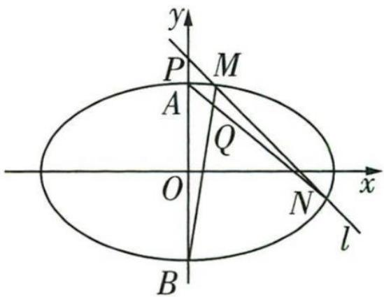

text_image

y
P M
A Q
O N x
B l

图3

(1) 求椭圆 $\Gamma$ 的方程.

(2)如图3,过点P的动直线l交椭圆Γ于M,N两点(不同于A,B两点),若直线AN与直线BM交于点Q,点Q是否在一条定直线上?若是,求出该直线方程;若不是,请说明理由.

# 知识解密

解析 (1) 椭圆 $\Gamma$ 的离心率为 $\frac{\sqrt{2}}{2}$ , 则 $\frac{c}{a} = \frac{\sqrt{2}}{2}$ , 得 $c = \frac{\sqrt{2}}{2} a$ , 又 $a^2 = b^2 + c^2, b = \sqrt{2}$ ,

所以 $a^{2}=2+\frac{1}{2}a^{2}$ ，得 $a^{2}=4$ ，所以椭圆 $\Gamma$ 的方程为 $\frac{x^{2}}{4}+\frac{y^{2}}{2}=1$ 。

(2)由题可得 $A(0,\sqrt{2}), B(0, -\sqrt{2})$ ，过点 $P(0,2)$ 的直线 $l$ 斜率存在，

设直线 l 的方程为 $y = kx + 2$ , $M(x_{1}, y_{1})$ , $N(x_{2}, y_{2})$ ,

由 $\left\{\begin{aligned}\frac{x^{2}}{4}+\frac{y^{2}}{2}&=1,\\ y&=kx+2\end{aligned}\right.$ 消去 y 得关于 x 的一元二次方程 $(1+2k^{2})x^{2}+8kx+4=0,1+2k^{2}\neq0$

则 $\Delta = (8k)^2 - 16(1 + 2k^2) = 32k^2 - 16 > 0$ ，即 $k < -\frac{\sqrt{2}}{2}$ 或 $k > \frac{\sqrt{2}}{2}$ ，

$$
x _ {1} + x _ {2} = \frac {- 8 k}{1 + 2 k ^ {2}}, x _ {1} x _ {2} = \frac {4}{1 + 2 k ^ {2}}.
$$

直线 AN 的方程为 $y=\frac{y_{2}-\sqrt{2}}{x_{2}}x+\sqrt{2}$ ，直线 BM 的方程为 $y=\frac{y_{1}+\sqrt{2}}{x_{1}}x-\sqrt{2}$ ，设 $Q(x_{0},y_{0})$ ，

由 $\left\{ \begin{array}{l} y = \frac{y_2 - \sqrt{2}}{x_2} x + \sqrt{2}, \\ y = \frac{y_1 + \sqrt{2}}{x_1} - \sqrt{2}, \\ y_1 = kx_1 + 2, \\ y_2 = kx_2 + 2, \end{array} \right.$ 可得 $\left\{ \begin{array}{l} x_0 = \frac{2\sqrt{2}x_1x_2}{(2 + \sqrt{2})x_2 - (2 - \sqrt{2})x_1}, \\ y_0 = \frac{\sqrt{2}[2kx_1x_2 + (2 - \sqrt{2})x_1 + (2 + \sqrt{2})x_2]}{(2 + \sqrt{2})x_2 - (2 - \sqrt{2})x_1}. \end{array} \right.$

易知 $x_{1} + x_{2} = -2kx_{1}x_{2}$ ,

则 $y_{0}=\frac{\sqrt{2}\left[-x_{1}-x_{2}+(2-\sqrt{2})x_{1}+(2+\sqrt{2})x_{2}\right]}{(2+\sqrt{2})x_{2}-(2-\sqrt{2})x_{1}}=\frac{(1-\sqrt{2})x_{1}+(1+\sqrt{2})x_{2}}{(1+\sqrt{2})x_{2}-(\sqrt{2}-1)x_{1}}=1$

【解题心得】这里需要观察分析横、纵坐标的特征，可以先探求直线过特殊点时的坐标，如让动直线过左、右焦点和左、右顶点分别得到 Q 点的坐标，分析特征；或者通过对称性（调换点 M, N 的位置）猜想点 Q 的纵坐标可能是常数，再进行一般性的转化与证明

则直线 AN 与直线 BM 交点 Q 的纵坐标为定值 1, 所以点 Q 在定直线 y = 1 上.

# 角度4 定值问题

调研 4 (2023 广东佛山 H7 教育共同体 6 月联考) 已知 $P$ 是圆 $C: (x + 2)^{2} + y^{2} = 12$ 上一动点, 定点 $M(2,0)$ , 线段 $PM$ 的垂直平分线 $n$ 与直线 $PC$ 交于点 $T$ , 记点 $T$ 的轨迹为 $C'$ .

知识解密

(1) 求 $C'$ 的方程.

(2) 若直线 l 与曲线 $C'$ 恰有一个公共点, 且 l 与直线 $l_{1}: y = \frac{\sqrt{3}}{3}x, l_{2}: y = -\frac{\sqrt{3}}{3}x$ 分别交于 A, B 两点, $\triangle OAB$ 的面积是否为定值 (O 为坐标原点)? 若是, 求出该定值, 若不是, 请说明理由.

# 思路指引

(1) 由题意可得 $|TP| = |TM|$ , 即可得到 $||TM| - |TC|| = 2\sqrt{3} < |CM|$ , 根据双曲线的定义得到点 $T$ 的轨迹是以 $(2,0)$ , $(-2,0)$ 为焦点的双曲线, 从而得解. (2) 讨论直线 $l$ 的斜率是否存在, 当直线 $l$ 的斜率存在时, 设出直线方程, 与双曲线方程联立, 根据 $\Delta = 0$ 找到参数 $m, k$ 之间的关系, 再利用弦长公式求得 $|AB|$ , 并用点到直线的距离公式求得三角形的高, 求得面积. 当直线 $l$ 的斜率不存在时, 得到此时三角形的面积. 综上即可证明.

解析 (1) 由 $C: (x + 2)^{2} + y^{2} = 12$ , 可知 $C(-2,0)$ , 圆 $C$ 的半径 $r = 2\sqrt{3}$ ,

连接 TM, 因为线段 PM 的垂直平分线 n 与直线 PC 交于点 T, 所以 $\left|TP\right| = \left|TM\right|$ ,

所以 $|TM| = |TC| + 2\sqrt{3}$ 或 $|TC| = |TM| + 2\sqrt{3}$ ，所以 $||TM| - |TC|| = 2\sqrt{3} < |CM| = 4$ ，

所以由双曲线的定义可知,点 $T$ 的轨迹是以 $(2,0)$ , $(-2,0)$ 为焦点的双曲线,

【方法总结】定义法 + 待定系数法求解双曲线方程，注意定义的完备性，即是否完全满足双曲线标准方程的条件

设双曲线方程为 $\frac{x^2}{a^2} -\frac{y^2}{b^2} = 1(a > 0,b > 0)$ ，易知 $2a = 2\sqrt{3},c = 2$ ，所以 $a = \sqrt{3},c = 2,b = \sqrt{c^2 - a^2} = 1,$

所以 $C'$ 的方程为 $\frac{x^{2}}{3}-y^{2}=1$ .

(2)第一步:当直线 l 的斜率存在时,设直线 l 的方程,分析斜率取值范围,与曲线 $C'$ 方程联立.

当直线 l 的斜率存在时, 设直线 l 的方程为 $y = kx + m$ ,

因为直线 l 与直线 $l_{1}: y = \frac{\sqrt{3}}{3}x, l_{2}: y = -\frac{\sqrt{3}}{3}x$ 分别交于 A, B 两点, 所以 $k \neq \pm \frac{\sqrt{3}}{3}$ .

由 $\left\{\begin{aligned}y&=kx+m,\\ \frac{x^{2}}{3}-y^{2}&=1,\end{aligned}\right.$ 得关于x的方程 $(1-3k^{2})x^{2}-6mkx-3m^{2}-3=0$ ，因为 $k\neq\pm\frac{\sqrt{3}}{3}$ ，所以 $1-3k^{2}\neq0$ ，

因为直线 l 与曲线 $C'$ 恰有一个公共点，

所以 $\Delta = 36m^{2}k^{2} + 4(1 - 3k^{2})(3m^{2} + 3) = 0$ ，即 $3k^{2} = m^{2} + 1$ .

# 知识解密

由 $\left\{\begin{aligned}y&=kx+m,\\ y&=\frac{\sqrt{3}}{3}x,\end{aligned}\right.$ 得 $x=-\frac{\sqrt{3}m}{\sqrt{3}k-1},$ 即 $x_{A}=-\frac{\sqrt{3}m}{\sqrt{3}k-1}.$

第二步:根据弦长公式得 $|AB|$ ,求点O到直线l的距离,得 $\triangle OAB$ 的面积.

同理可得 $x_{B} = -\frac{\sqrt{3}m}{\sqrt{3}k + 1}$ 则 $|AB| = \sqrt{1 + k^2}\cdot |x_A - x_B| = \frac{2\sqrt{3}|m|\sqrt{k^2 + 1}}{|1 - 3k^2|},$

又原点 $O$ 到直线 $l$ 的距离 $d = \frac{|m|}{\sqrt{k^2 + 1}}$ ，所以 $S_{\triangle OAB} = \frac{1}{2} |AB| d = \frac{\sqrt{3} m^2}{|1 - 3k^2|}$ .

因为 $3k^{2}=m^{2}+1$ ，所以 $S_{\triangle OAB}=\sqrt{3}$ .

第三步:当直线 l 的斜率不存在时,求直线 l 的方程,以及此时 $\triangle OAB$ 的面积,得出结论.

当直线 l 的斜率不存在时, 直线 l 的方程为 $x = \pm \sqrt{3}$ , 又渐近线方程为 $y = \pm \frac{\sqrt{3}}{3}x$ ,

【方法总结】本解答先求解直线斜率存在的情况，再对斜率不存在的情况补充说明，也可以反过来，先计算斜率不存在的情况，容易得到 $S_{\triangle OAB} = \sqrt{3}$ ，再计算斜率存在的情况，这样会有一个指引的作用

此时 $|AB|=2,S_{\triangle OAB}=\frac{1}{2}\times\sqrt{3}\times2=\sqrt{3}$ . 故 $\triangle OAB$ 的面积为定值 $\sqrt{3}$ .

# 变式演练

1. (调研 1 变式, 变条件 | 2024 辽东十一所重点高中联合教研体开学摸底考试) 已知双曲线 $C: \frac{x^{2}}{a^{2}} - \frac{y^{2}}{b^{2}} = 1 (a > 0, b > 0)$ 的离心率为 $\frac{\sqrt{5}}{2}, A, B$ 分别是 $C$ 的左、右顶点, 点 $(4, \sqrt{3})$ 在 $C$ 上, 点 $D(1, t)$ , 直线 $A D, B D$ 与 $C$ 的另一个交点分别为 $P, Q$ .

(1) 求双曲线 C 的标准方程.  
(2) 证明: 直线 PQ 经过定点.

2. (调研 2 变式, 变条件 | 2023 四川泸县第一中学三诊) 已知曲线 C 上动点 M 到定点 $F(-\sqrt{2}, 0)$ 的距离和它到定直线 $l_{1}: x = -2\sqrt{2}$ 的距离的比值是常数 $\frac{\sqrt{2}}{2}$ , 过 $P(0,1)$ 的动直线 l 与曲线 C 相交于 A, B 两点.

(1)说明曲线 C 的形状,并写出其标准方程.  
(2)是否存在与点 P 不同的定点 Q, 使得 $\frac{|QA|}{|QB|} = \frac{|PA|}{|PB|}$ 恒成立? 若存在, 求出点 Q 的坐标; 若不存在, 请说明理由.

知识解密

# 思路指引

(1) 设 $M(x, y)$ ，根据其到定点 $F(-\sqrt{2}, 0)$ 的距离和到定直线 $l_{1}: x = -2\sqrt{2}$ 的距离的比值是 $\frac{\sqrt{2}}{2}$ 可得等式，化简整理可得曲线 C 为椭圆。(2) ① 当直线 l 与 y 轴垂直时，可知 Q 在 y 轴上。

② 当直线 l 与 x 轴垂直时，设 $Q(0, t) (t \neq 1)$ ，得 $Q(0, 2)$ ，若存在定点满足题意，则有 $Q(0, 2)$ 。

③ 当直线 l 斜率存在且不为 0 时，只需证明对于 $Q(0, 2)$ ， $\frac{|QA|}{|QB|} = \frac{|PA|}{|PB|}$ 成立，设 $l: y = kx + 1$ ，与椭圆方程联立，由根与系数关系得 $\frac{1}{x_{1}} + \frac{1}{x_{2}} = 2k$ 。设点 B 关于 y 轴的对称点为 $B'$ ，由 $k_{QA} - k_{QB'} = 0$ 可得 $Q, A, B'$ 三点共线，由此可得 $\frac{|QA|}{|QB|} = \frac{|PA|}{|PB|}$ 成立。综上得解。

3. (调研 3 变式, 变载体 | 2023 福建漳州第四次教学质量检测) 如图 4, 已知 $R$ 是圆 $M: (x + \sqrt{3})^{2} + y^{2} = 8$ 上的动点, 点 $N(\sqrt{3}, 0)$ , 直线 $NR$ 与圆 $M$ 的另一个交点为 $S$ , 点 $L$ 在直线 $MR$ 上, $MS \parallel NL$ , 动点 $L$ 的轨迹为曲线 $C$ .

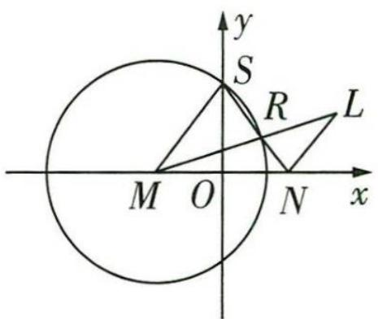

text_image

y
S
R
L
M O N x

图4

(1) 求曲线 C 的方程.

(2)若过点 $P(-2,0)$ 的直线 $l$ 与曲线 $C$ 相交于 $A, B$ 两点, 且 $A, B$ 都在 $x$ 轴上方,问: 在 $x$ 轴上是否存在定点 $Q$ , 使得 $\triangle QAB$ 的内心在一条定直线上? 给出结论并证明.

4. (调研 4 变式, 变设问 | 2024 江西临川一中、吉安一中等校第一次联考) 如图 5, 已知双曲线 $C: \frac{x^{2}}{a^{2}} - \frac{y^{2}}{b^{2}} = 1 (a > 0, b > 0)$ , 渐近线方程为 $y = \pm \frac{x}{2}$ , 点 $A(2,0)$ 在 $C$ 上.

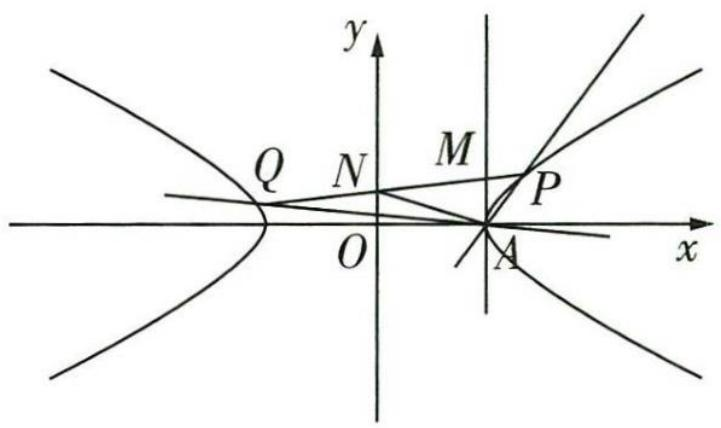

text_image

y
Q N M P
O A x

图 5

(1) 求双曲线 C 的方程.

(2) 直线 AP, AQ 分别与双曲线 C 交于点 A 之外的 P, Q 两点, 且两条直线的斜率 $k_{1}, k_{2}$ 满足 $k_{1} + k_{2} = 1$ , 直线 PQ 与直线 x = 2, y 轴分别交于 M, N 两点, 求证: $\triangle AMN$ 的面积为定值.

# 参考答案与解析

1. (1) 由题意得双曲线的离心率 $e = \frac{c}{a} = \frac{\sqrt{5}}{2}, \therefore 5a^2 = 4c^2 = 4(a^2 + b^2), \therefore a^2 = 4b^2$ ,

# 知识解密

∵ 点 $(4,\sqrt{3})$ 在 C 上，∴ $\frac{16}{a^{2}}-\frac{3}{b^{2}}=1$ ，∴ $\frac{4}{b^{2}}-\frac{3}{b^{2}}=1$ ，得 $b^{2}=1$ ，∴ $a^{2}=4$ ，

∴ 双曲线 C 的标准方程为 $\frac{x^{2}}{4}-y^{2}=1$ .

(2)第一步:将直线 $AD$ 的方程与 $C$ 的方程联立得 $P$ 点坐标.

由(1)知 $A(-2,0)$ , $B(2,0)$ ，直线 AD 的方程为 $y=\frac{t}{3}(x+2)$ ,

设 $P(x_{1},y_{1})$ , $Q(x_{2},y_{2})$ ，将直线 AD 的方程与 C 的方程联立消去 y 得关于 x 的方程 $(9-4t^{2})x^{2}-16t^{2}x-16t^{2}-36=0$ ①,

$$
\therefore \left\{ \begin{array}{l} 9 - 4 t ^ {2} \neq 0, \\ \Delta_ {1} = 2 5 6 t ^ {4} + 4 (9 - 4 t ^ {2}) (1 6 t ^ {2} + 3 6) = 1 2 9 6 > 0, \end{array} \right. \therefore t \neq \pm \frac {3}{2}.
$$

【易错提醒】直线与双曲线有两个交点，除了根的判别式大于0外，还要注意二次项系数不为0

当 $t \neq \pm \frac{3}{2}$ 时, 方程①的两根分别为 $x_{1}, -2, \therefore -2x_{1} = -\frac{16t^{2} + 36}{9 - 4t^{2}}$ ,

$\therefore x_{1} = \frac{8t^{2} + 18}{9 - 4t^{2}},y_{1} = \frac{12t}{9 - 4t^{2}}$ 即 $P(\frac{8t^2 + 18}{9 - 4t^2},\frac{12t}{9 - 4t^2}).$

第二步: 将直线 BD 的方程与 C 的方程联立得 Q 点坐标.

直线 BD 的方程为 $y = -t(x - 2)$ ，与 C 的方程联立消去 y 得关于 x 的方程 $(1 - 4t^{2})x^{2} + 16t^{2}x -$

$$
1 6 t ^ {2} - 4 = 0 \quad ②, \therefore \left\{ \begin{array}{l} 1 - 4 t ^ {2} \neq 0, \\ \Delta_ {2} = 2 5 6 t ^ {4} + 4 (1 - 4 t ^ {2}) (1 6 t ^ {2} + 4) = 1 6 > 0, \end{array} \right. \therefore t \neq \pm \frac {1}{2}.
$$

当 $t \neq \pm \frac{1}{2}$ 时，方程②的两根分别为 $x_{2}, 2, \therefore 2x_{2} = -\frac{16t^{2} + 4}{1 - 4t^{2}}$

$\therefore x_{2} = -\frac{8t^{2} + 2}{1 - 4t^{2}},y_{2} = \frac{4t}{1 - 4t^{2}}$ ，即 $Q(-\frac{8t^2 + 2}{1 - 4t^2},\frac{4t}{1 - 4t^2}).$

第三步: 讨论直线 PQ 的斜率是否存在, 得到直线 PQ 的方程, 得出所过定点.

当直线 $PQ$ 的斜率存在时， $k_{PQ} = \frac{y_1 - y_2}{x_1 - x_2} = \frac{\frac{12t}{9 - 4t^2} - \frac{4t}{1 - 4t^2}}{\frac{8t^2 + 18}{9 - 4t^2} + \frac{8t^2 + 2}{1 - 4t^2}} = -\frac{2t}{3 - 4t^2}$ .

∴ 直线 PQ 的方程为 $y - y_{1} = -\frac{2t}{3 - 4t^{2}}(x - x_{1})$ ，整理得 $y = -\frac{2t}{3 - 4t^{2}}(x - 4)$ ，

此时直线 PQ 过定点 $(4,0)$ .

【关键提醒】直线所过定点应与参数的取值无关,据此寻找定点

当直线 PQ 的斜率不存在时, $t^{2}=\frac{3}{4}$ ,此时 $x_{1}=x_{2}=4$ ,

则直线 PQ 的方程为 x=4，直线 PQ 过点 $(4,0)$ .

综上,直线 PQ 经过定点(4,0).

2. (1) 设 $M(x, y)$ , 则 $\frac{\sqrt{(x + \sqrt{2})^2 + y^2}}{|x + 2\sqrt{2}|} = \frac{\sqrt{2}}{2}$ , 整理可得 $\frac{x^2}{4} + \frac{y^2}{2} = 1$ ,

所以曲线 C 为椭圆, 标准方程为 $\frac{x^{2}}{4} + \frac{y^{2}}{2} = 1$ .

(2)①当直线 l 与 y 轴垂直时, 即 l: y = 1 , 由椭圆对称性可知 $\left|PA\right| = \left|PB\right|$ , 所以 $\left|QA\right| = \left|QB\right|$ , 所以点 Q 在 y 轴上.

②当直线 l 与 x 轴垂直时, 即 l: x = 0 , 不妨取 A(0,√2), B(0,-√2),

若存在定点 Q，则由①知点 Q 在 y 轴上，可设 $Q(0, t) (t \neq 1)$ ，

则由 $\frac{|QA|}{|QB|} = \frac{|PA|}{|PB|}$ , 得 $\frac{|t - \sqrt{2}|}{|t + \sqrt{2}|} = \frac{\sqrt{2} - 1}{\sqrt{2} + 1}$ , 得 $t = 1$ (舍) 或 $t = 2$ , 所以 $Q(0,2)$ .

则若存在定点 Q 满足题意, 则 Q 点坐标为 $(0,2)$ .

【技巧点拨】一般情况不好把握时，可先探讨特殊情况，得到定点坐标，再证明一般情况也成立，只需证明当直线 l 斜率存在时，对于 $Q(0,2)$ ，都有 $\frac{|QA|}{|QB|} = \frac{|PA|}{|PB|}$ 成立即可

③当直线 l 的斜率存在且不为 0 时, 取 $Q(0,2)$ , 设 $l: y = kx + 1$ , $A(x_{1}, y_{1})$ , $B(x_{2}, y_{2})$ ,

由 $\left\{\begin{aligned}y&=kx+1,\\ \frac{x^{2}}{4}&+\frac{y^{2}}{2}=1,\end{aligned}\right.$ 得关于x的一元二次方程 $(1+2k^{2})x^{2}+4kx-2=0,1+2k^{2}\neq0,$

其中 $\Delta = 32k^{2} + 8 > 0$ 恒成立，则 $x_{1} + x_{2} = -\frac{4k}{1 + 2k^{2}}, x_{1}x_{2} = -\frac{2}{1 + 2k^{2}}$ ，所以 $\frac{1}{x_{1}} + \frac{1}{x_{2}} = \frac{x_{1} + x_{2}}{x_{1}x_{2}} = 2k$ ，设点 B 关于 y 轴的对称点为 $B'$ ，连接 $QB'$ ，则 $B'(-x_{2}, y_{2})$ ，

因为 $k_{QA} = \frac{y_1 - 2}{x_1} = \frac{kx_1 - 1}{x_1} = k - \frac{1}{x_1}, k_{QB'} = \frac{y_2 - 2}{-x_2} = \frac{kx_2 - 1}{-x_2} = -k + \frac{1}{x_2}$ ,

所以 $k_{QA}-k_{QB'}=2k-\left(\frac{1}{x_{1}}+\frac{1}{x_{2}}\right)=2k-2k=0$ , 即 Q, A, $B'$ 三点共线，

所以 $\frac{|QA|}{|QB|}=\frac{|QA|}{|QB'|}=\frac{|x_{1}|}{|x_{2}|}=\frac{|PA|}{|PB|}$

综上所述,存在定点 $Q(0,2)$ , 使得 $\frac{|QA|}{|QB|} = \frac{|PA|}{|PB|}$ 恒成立.

3.(1)圆M的圆心为 $M(-\sqrt{3},0)$ ，半径 $r=2\sqrt{2}$ ，

因为 $MS \parallel NL$ ，所以 $\triangle MSR \sim \triangle LNR$ ，又 $|MR| = |MS|$ ，所以 $|LR| = |LN|$

所以 $\left|\left|LM\right|-\left|LN\right|\right|= \left|\left|LM\right|-\left|LR\right|\right|= \left|M R\right|=r=2\sqrt{2}<2\sqrt{3}= \left|M N\right|$

所以点 L 在焦点为 M, N, 实轴长为 $2\sqrt{2}$ 的双曲线上,

设双曲线的方程为 $\frac{x^{2}}{a^{2}}-\frac{y^{2}}{b^{2}}=1(a>0,b>0)$ ，则 $2a=2\sqrt{2},2c=2\sqrt{3}$

所以 $a=\sqrt{2}$ , $c=\sqrt{3}$ , b=1, 又 L 不可能在 x 轴上, 所以曲线 C 的方程为 $\frac{x^{2}}{2}-y^{2}=1(y\neq0)$ .

【方法总结】用定义法+待定系数法求曲线方程，注意不满足的点要舍去

(2) 在 $x$ 轴上存在定点 $Q(-1,0)$ , 使得 $\triangle QAB$ 的内心在一条定直线上. 证明如下.

由条件可设 $l: x = my - 2, A(x_{1}, y_{1}), B(x_{2}, y_{2})$ ,

由 $\left\{\begin{aligned}x&=my-2,\\ \frac{x^{2}}{2}-y^{2}&=1,\end{aligned}\right.$ 消去 x 得关于 y 的方程 $(m^{2}-2)y^{2}-4my+2=0,$

则 $\left\{\begin{aligned}m^{2}-2\neq0,\\ \Delta=8m^{2}+16>0,\end{aligned}\right.$ 得 $m^{2}\neq2$ ,

由题知 $y_{1} + y_{2} = \frac{4m}{m^{2} - 2} >0, y_{1}y_{2} = \frac{2}{m^{2} - 2} >0$ ，所以 $y_{1} + y_{2} = 2my_{1}y_{2}$ .

取 $Q(-1,0)$ ，则 $k_{AQ} + k_{BQ} = \frac{y_1}{x_1 + 1} +\frac{y_2}{x_2 + 1} = \frac{y_1}{my_1 - 2 + 1} +\frac{y_2}{my_2 - 2 + 1} = \frac{2my_1y_2 - (y_1 + y_2)}{(my_1 - 1)(my_2 - 1)} = 0.$

【取点探求】设 $Q(q,0)$ ，则 $k_{AQ} + k_{BQ} = \frac{y_{1}}{x_{1} - q} + \frac{y_{2}}{x_{2} - q} = \frac{2my_{1}y_{2} - (2 + q)(y_{1} + y_{2})}{(my_{1} - 2 - q)(my_{2} - 2 - q)}$ ，又 $y_{1} + y_{2} = 2my_{1}y_{2}$ ，则分子为 $2my_{1}y_{2}(-1 - q)$ ，当 q = -1 时，可得 $k_{AQ} + k_{BQ} = 0$ ，则 $\angle AQB$ 的平分线为直线 x = -1，满足题设

又 A, B 都在 x 轴上方, 所以 $\angle AQB$ 的平分线为定直线 x = -1,

所以在 x 轴上存在定点 $Q(-1,0)$ ，使得 $\triangle QAB$ 的内心在定直线 x = -1 上.

4. (1) $\because a > 0, b > 0$ , 由题易知 $a = 2, \frac{b}{a} = \frac{1}{2}$ , 则 $b = 1$ , 故双曲线 $C$ 的方程为 $\frac{x^2}{4} - y^2 = 1$ .

(2) 易知直线 PQ 的斜率存在, 设直线 PQ 的方程为 $y = kx + m$ , $P(x_{1}, y_{1})$ , $Q(x_{2}, y_{2})$ ,

由 $\left\{\begin{aligned}y&=kx+m,\\ \frac{x^{2}}{4}-y^{2}&=1,\end{aligned}\right.$ 消去 y 得关于 x 的方程 $(1-4k^{2})x^{2}-8kmx-4m^{2}-4=0,1-4k^{2}\neq0,$

$\Delta = 16(m^2 + 1 - 4k^2) > 0$ ，即 $m^2 + 1 > 4k^2$ ，则 $x_1 + x_2 = \frac{8km}{1 - 4k^2}, x_1x_2 = -\frac{4m^2 + 4}{1 - 4k^2}$ ，则 $k_1 + k_2 = \frac{y_1}{x_1 - 2} + \frac{y_2}{x_2 - 2} = \frac{2kx_1x_2 + (m - 2k)(x_1 + x_2) - 4m}{x_1x_2 - 2(x_1 + x_2) + 4} = 1$ ，化简得 $(m + 2k)(m + 2k - 1) = 0.$

当 $m+2k=0$ 时, PQ 的方程为 y=kx-2k, 此时 P, Q, A 三点共线, $\triangle AMN$ 不存在, 舍去.

当 $m+2k-1=0$ 时，PQ 的方程为 $y=kx-2k+1$ ，则 $M(2,1)$ ，

故 $S_{\triangle AMN}=\frac{1}{2}\times2\times1=1$ ,为定值.

【敲黑板】注意点 N 在 y 轴上，点 A, M 在直线 x = 2 上，则 $\triangle AMN$ 底边 AM 上的高为 2，又 $|AM| = 1$ ，故 $\triangle AMN$ 的面积为定值

# 超重点9 两个计数原理的应用

# 命题角度1 “相邻”与“不相邻”问题

调研 1 (2024 湖南衡阳创新实验班 8 月测试)2023 年春节,在北京工作的五个家庭开车搭伴一起回老家过年,若五辆车分别为 A, B, C, D, E, 五辆车随机排成一列,则 A 车与 B 车相邻,A 车与 C 车不相邻的排法有 ( )

A. 36 种

B. 42 种

C. 48 种

D. 60 种

# 锁定题眼

抓题眼“A 车与 B 车相邻，A 车与 C 车不相邻”，想到相邻元素用捆绑法，不相邻元素用插空法，即把 A 车与 B 车“捆绑”，当成一个元素，与除 C 车外的 2 个元素全排列，再将 C 车插入，注意 C 车插入时不与 A 车相邻，利用分步乘法计数原理即可求解.

解析 第一步: 将 A 车与 B 车捆在一起, 与除 C 车外的 2 个元素全排列.

将 $A$ 车与 $B$ 车捆在一起当成一个元素使用, 有 $\mathrm{A}_{2}^{2}$ 种不同的捆法,

【解题有法】相邻元素用 “捆绑法”，注意 “定元”，确定要求相邻的元素，不要忽视捆在一起的两元素的排序的种数

将其与除 C 车外的 2 个元素全排列, 有 $A_{3}^{3}$ 种排法,

第二步: 将 C 车插空, 利用分步乘法计数原理求排法种数.

将 C 车插入, 不与 A 车相邻, 有 $A_{3}^{1}$ 种插法,

【扫清障碍】不相邻元素用“插空法”，先把无位置要求的几个元素全排列，再把要求不相邻的元素插到产生的空位中，注意个别位置由于限制条件的原因是不能插入的

故共有 $A_{2}^{2} \times A_{3}^{3} \times A_{3}^{1} = 36$ (种) 排法. 故选 A.

# 命题角度2 特殊限制条件优先考虑

调研 2 (2024 湖南湘潭 7 月联考 | 多选)从 10 名男生和 8 名女生中选出 3 人去参加创新大赛,则至少有 1 名女生的选法种数为 ( )

A. $C_{18}^{3} - C_{10}^{3}$

B. $C_{8}^{1}C_{17}^{2}$

C. $C_{8}^{1}C_{10}^{2} + C_{8}^{2}C_{10}^{1} + C_{8}^{3}$

D. $C_{10}^{2}C_{8}^{1} + C_{10}^{1}C_{8}^{2}$

# 思维导引

思路一: 直接法

根据题设限制条件“至少有1名女生”,对有几名女生分三类讨论

利用分类加法计数原理

不同的选法种数

# 知识解密

思路二:间接法
不考虑特殊条件
利用组合数
18人中任选3人的选法总数
排除不符合限制条件的种数
不同的选法种数

解析

<table><tr><td>选项</td><td>分析过程</td><td>正误</td></tr><tr><td>A</td><td>从18名学生中选取3人,有 $C_{18}^{3}$ 种不同的选法,从18名学生中选取3人,选的都是男生有 $C_{10}^{3}$ 种不同的选法,所以至少有1名女生的选法有 $C_{18}^{3}-C_{10}^{3}=696$ (种)【小技巧】利用间接法,先不去关注特殊条件,求出所有的选法总数,再排除都是男生的情形</td><td>√</td></tr><tr><td>B</td><td> $C_{8}^{1}C_{17}^{2}=1088\neq696$ </td><td>×</td></tr><tr><td>C</td><td>至少有1名女生的选法有三种情况:1名女生,2名女生,3名女生,【指点迷津】特殊条件“至少有1名女生”优先考虑,故可分三类,再利用分类加法计数原理计算即可所以至少有1名女生的选法有 $C_{8}^{1}C_{10}^{2}+C_{8}^{2}C_{10}^{1}+C_{8}^{3}=360+280+56=696$ (种)</td><td>√</td></tr><tr><td>D</td><td> $C_{10}^{2}C_{8}^{1}+C_{10}^{1}C_{8}^{2}=360+280=640\neq696$ </td><td>×</td></tr></table>

# 命题角度 3 分组与分配问题

调研 3 (试题调研原创|整体均分问题)高考期间,为保证考生能够顺利进入某考点,交管部门将6名交警分配到该考点周边三个不同路口疏导交通,每个路口2人,则不同的分配方法共有\_\_\_\_种.

# 思路指引

交管部门将6名交警分配到该考点周边三个不同路口疏导交通,可分两步:第一步,将6名交警分成“2,2,2”的三组,属于整体均分问题;第二步,将分好的三组全排列,对应3个路口,由分步乘法计数原理,即可得不同的分配方法种数.

解析 根据题意,分两步进行分析.

第一步,将6名交警分成“2,2,2”的三组,有 $\frac{C_{6}^{2}C_{4}^{2}C_{2}^{2}}{A_{3}^{3}}=15$ (种)分组方法;

【点技巧】整体均分问题用除法：均分三份，需除以 $A_{3}^{3}$

第二步,将分好的三组全排列,对应3个路口,有 $A_{3}^{3}=6$ (种)情况,

【扫清障碍】注意有序用排列，无序用组合，此处有顺序

则共有 $15 \times 6 = 90$ (种) 分配方法.

知识解密

调研 4 (部分均分问题|2024 福建省德化一中、永安一中、漳平一中三校 8 月联考)2023 年 3 月 13 日,第十四届全国人民代表大会第一次会议在北京人民大会堂闭幕,为记录这一历史时刻,会务组将 6 张不同的纪念邮票分配给来自 A 省的 2 名代表和 B 省的 2 名代表,每名代表至少 1 张,邮票全部用完,则有\_\_\_\_种分配方法. (用数字作答)

# 技巧速递

对于部分均分问题,由于各均分组的地位均等,所以平均分成的 n 组就一定要除以 $A_{n}^{n}$ . 本题在部分均分时,若按 1,1,2,2 分组,平均分成的 2 组有两种情形,就一定要除以 $A_{2}^{2}A_{2}^{2}$ .

解析 可分两类：

【技巧点拨】6张邮票分为4组，根据 $6=1+1+2+2=1+1+1+3$ ，可分成两类

第一类,按1,1,2,2分组,则有 $\frac{C_{6}^{1}C_{5}^{1}C_{4}^{2}C_{2}^{2}}{A_{2}^{2}A_{2}^{2}}\times A_{4}^{4}=1080$ (种)分配方法;

第二类, 按 1,1,1,3 分组, 则有 $\frac{\mathrm{C}_{6}^{3} \mathrm{C}_{3}^{1} \mathrm{C}_{2}^{1} \mathrm{C}_{1}^{1}}{\mathrm{A}_{3}^{3}} \times \mathrm{A}_{4}^{4}=480$ (种) 分配方法.

【极易出错】注意此处部分均分只有三组，因此除以 $A_{3}^{3}$

根据分类加法计数原理,共有 $1080 + 480 = 1560$ (种) 分配方法.

调研 5: (不等分问题|2024 黑龙江省大兴安岭实验中学 7 月质检) 北京 2022 年冬奥会共设 7 个大项. 现将甲、乙、丙 3 名志愿者分配到 7 个大项中参加志愿活动, 每名志愿者只能参加 1 个大项的志愿活动, 则有且只有两人被分到同一大项的情况有 ( )

A. 42 种

B. 216 种

C. 96 种

D. 126 种

# 技巧速递

对于不等分问题,由于分组时,每组中元素的个数都不相等,所以不需要除以全排列数.破解此类不等分的分配问题,一般都是先分组,后排列.

解析 第一步, 将甲、乙、丙 3 名志愿者分为两组, 两组人数分别为 2, 1, 有 $\mathrm{C}_{3}^{2}$ 种不同的分法;

【扫清障碍】不等分问题，不用排序，是组合问题

第二步,将这两组人分配给7个大项中的两个,有 $A_{7}^{2}$ 种分配方法.

【极易出错】从7个大项中选择2个大项分给这两组人，需要排序，是排列问题，不是组合问题

# 知识解密

根据分步乘法计数原理,不同的分配方法种数为 $C_{3}^{2}A_{7}^{2}=3\times42=126$ (种). 故选 D.

调研 6: (相同元素的分配问题12024 上海市华东师范大学第二附属中学8月质检)7名志愿者的名额分给3个班,每班至少一个名额,则有\_\_\_\_种不同的分配方法(用数字作答).

# 秒破瓶颈

破解“相同元素的分配”问题的突破口是利用“档板分隔法”，即将 $n$ 个相同的元素分成 $m$ 份 $(n, m$ 为正整数），每份至少一个元素时，其不同的分组方式有 $\mathrm{C}_{n-1}^{m-1}$ 种，即在 $n$ 个元素中间形成的 $n-1$ 个空位中插入 $m-1$ 个“档板”.

解析 7 名志愿者的名额分配给 3 个班, 每班至少一个名额,

【指点迷津】注意题眼“名额”，其名额之间无差别，故是属于相同元素的分配问题。其实就是在7名志愿者的名额产生的6个空位中插入2个“档板”，

【极易出错】“档板”需放入, 故算空位时两端的空位不能算, 注意与插空法的区别共有 $C_{6}^{2}=15$ (种) 不同的分配方法.

# 命题角度4 涂色问题

调研 7 (2024 甘肃白银 7 月开学检测)用 4 种不同的颜色对图 1 中 5 个区域涂色(4 种颜色全部使用),要求每个区域涂一种颜色,相邻的区域不能涂相同的颜色,则不同的涂色方法有\_\_\_\_种.

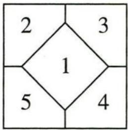  
图1

# 思路指引

此类涂色问题,先按照使用色彩的种类进行分类,根据分步乘法计数原理,对各个区域分步涂色,讨论并分别计算出各种情形的种数,再由分类加法计数原理,求出不同的涂色方法的种数.本题中使用色彩的数量是固定的,只需分步涂色即可.

解析 可分四步：

第一步,涂区域1,有4种选择;

第二步,涂区域2,有3种选择;

第三步,涂区域3,有2种选择;

第四步,涂剩下的两个区域,有2种选择.

【扫清障碍】区域4，由于与区域1，3不同色，故只有2种选择。若区域4与区域2同色，由于4色都得涂，故区域5只能选余下一种颜色；若区域4与区域2不同色，由于区域5与

# 知识解密

区域 1, 2, 4 不同色, 故区域 5 只能有一种色可选. 故剩下的两个区域一共有 2 种选择

故不同的涂色方法有 $4 \times 3 \times 2 \times 2 = 48$ (种).

【另解】也可以按照两个不相邻的区域同色与不同色分类求解，区域2,4同色（也就是区域3,5不同色），或区域3,5同色（也就是区域2,4不同色），不同的涂色方法共有 $C_{2}^{1}A_{4}^{4}=48$ （种）

# 变式演练

1. (调研 2 变式,变载体,有限制条件排课程表 | 2024 北京市顺义区 7 月联考质量监测)某班一天上午有 4 节课,下午有 2 节课. 现要安排该班一天中语文、数学、政治、英语、体育、艺术 6 门课的课程表,要求数学课排在上午,体育课排在下午,不同排法种数有

A. 48 种

B. 96 种

C. 144 种

D. 192 种

2. (调研 4 变式,变情境,乡村支教|2024 陕西省宝鸡市金台区 7 月期末)为了缩小城乡教育资源的差距,国家鼓励教师去乡村支教,某校选派了 5 名教师到 A,B,C 三个乡村学校去支教,每个学校至少去 1 人,每名教师只能去一个学校,不同的选派方法种数有

A. 25

B. 60

C. 90

D. 150

# 参考答案与解析

1. D 由题意, 要求数学课排在上午, 体育课排在下午, 先考虑这两门课程, 有 $C_{4}^{1} C_{2}^{1} = 8$ (种) 方法,

【会思考】有限制的条件优先考虑

再排其余4节课,有 $A_{4}^{4}=24$ (种) 方法,根据分步乘法计数原理,共有 $8 \times 24 = 192$ (种) 方法,故选D.

2. D 第一步: 将 5 人分成 3 组.

由题意可知,先将5人分成3组,有两类分法,

第一类,各组人数分别为3,1,1,共有 $\frac{C_{5}^{3}C_{2}^{1}C_{1}^{1}}{A_{2}^{2}}$ 种分法;

第二类,各组人数分别为1,2,2,共有 $\frac{C_{5}^{1}C_{4}^{2}C_{2}^{2}}{A_{2}^{2}}$ 种分法.

【极易出错】对于部分均分问题，需注意均分的只有两组，因此除以 $A_{2}^{2}$

第二步: 将 3 组人员分配到对应的三个乡村学校.

将 3 组人员分配到 A, B, C 三个乡村学校去, 共有 $A_{3}^{3}$ 种分法,

第三步:根据分步乘法计数原理计算总的选派方法数.

所以不同的选派方法共有 $\left(\frac{\mathrm{C}_5^3\mathrm{C}_2^1\mathrm{C}_1^1}{\mathrm{A}_2^2} +\frac{\mathrm{C}_5^1\mathrm{C}_4^2\mathrm{C}_2^2}{\mathrm{A}_2^2}\right)\mathrm{A}_3^3 = 150$ （种）.故选D.

# 知识解密

二项展开式中二项式系数最大项与系数最大项易混淆. 二项式系数最大项为中间一项或两项; 系数最大项需通过解不等式求解.

# 超重点 10 二项展开式中特定项及特定项的系数求解问题

# 命题角度 1 求 $(a+b)^{n}$ 或 $(a+b+c)^{n}$ 的展开式中特定项或特定项的系数

调研 1 (2024 河北保定部分示范高中 7 月统考) $(9x + \frac{8}{\sqrt{x}})^{5}$ 的展开式中含 $x^{2}$ 的项的系数为 （）

A. $C_{5}^{2} \times 9^{2} \times 8^{3}$

B. $\mathrm{C}_5^4\times 9\times 8^4$

C. $C_{5}^{1} \times 9^{4} \times 8$

D. $C_{5}^{2} \times 9^{3} \times 8^{2}$

# 思路指引

求展开式中含 $x^{2}$ 的项的系数, 先写出 $(9x + \frac{8}{\sqrt{x}})^{5}$ 的二项展开式的通项, 令 $x$ 的指数为 2, 得 $r$ 的值, 再把 $r$ 的值代入 $T_{r+1}$ , 可得含 $x^{2}$ 的项的系数.

解析 $(9x+\frac{8}{\sqrt{x}})^{5}$ 的二项展开式的通项 $T_{r+1}=C_{5}^{r}(9x)^{5-r}(8x^{-\frac{1}{2}})^{r}=C_{5}^{r}\cdot9^{5-r}\cdot8^{r}\cdot x^{5-\frac{3}{2}r},0\leqslant$ 【易错】 $(9x)^{5-r}$ 不要丢了数字 9 $r\leqslant5,r\in N,$

令 $5-\frac{3}{2}r=2$ ，得r=2，所以展开式中含 $x^{2}$ 的项为 $T_{2+1}=C_{5}^{2}\times9^{3}\times8^{2}x^{2}$ ，其系数为 $C_{5}^{2}\times9^{3}\times8^{2}$ .
故选 D.

优美解: 排除法 对选项 A, $x^{2-\frac{3}{2}} = x^{\frac{1}{2}} \neq x^{2}$ , 故 $C_{5}^{2} \times 9^{2} \times 8^{3}$ 是含 $x^{\frac{1}{2}}$ 的项的系数, 排除 A;

【小技巧】对选项验证其是否为含 $x^{2}$ 的项的系数

对选项 B, $x^{1-\frac{4}{2}}=x^{-1}\neq x^{2}$ ，故 $C_{5}^{4}\times9\times8^{4}$ 是含 $x^{-1}$ 的项的系数，排除 B;

对选项 C, $x^{4-\frac{1}{2}} = x^{\frac{7}{2}} \neq x^{2}$ ，故 $C_{5}^{1} \times 9^{4} \times 8$ 是含 $x^{\frac{7}{2}}$ 的项的系数，排除 C. 选 D.

调研 2 (2024 吉林一中、东北师大附中等校 7 月联考) $(x^{2}-x+1)^{5}$ 的展开式中, $x^{5}$ 的系数为 \_\_\_\_.

# 技巧速递

对于 $(x^{2}-x+1)^{5}$ 的展开式的系数问题,可以将 $(x^{2}-x+1)^{5}$ 看作5个盒子,每个盒子中有 $x^{2},-x,1$ 三个元素,从每个盒子中取一个元素,结合组合数公式,可得 $x^{5}$ 的系数.

解析 $(x^{2} - x + 1)^{5}$ 可以看作5个盒子,每个盒子中有 $x^{2}, - x,1$ 三个元素,要想得到含 $x^{5}$ 的

# 数学名著

《近代欧氏几何学》 本书探讨了三角形和圆形的几何结构,主要专注于欧氏理论的延伸,并详细地研究了许多相关定理.

关注微信公众号“初高教辅站”获取更多初高中教辅资料

项,可分三类:

①5个盒子中选2个盒子取 $x^{2}$ ，1个盒子取-x，2个盒子取1；

②5个盒子中选1个盒子取 $x^{2}$ ，3个盒子取-x，1个盒子取1；

③5 个盒子中都取 -x.

所以展开式中含 $x^{5}$ 的项为 $\mathrm{C}_{5}^{2} \cdot (x^{2})^{2} \cdot \mathrm{C}_{3}^{1} \cdot (-x) \cdot \mathrm{C}_{2}^{2} \cdot 1^{2} + \mathrm{C}_{5}^{1} \cdot x^{2} \cdot \mathrm{C}_{4}^{3} \cdot (-x)^{3} \cdot 1 + \mathrm{C}_{5}^{5} \cdot (-x)^{5} = -51x^{5}$ ,

【指点迷津】直接利用两个计数原理来解决，注意符号因子不能丢

所以 $x^5$ 的系数为-51.

# 命题角度2

# 求 $(a + b)^{n}(c + d)^{m}$ 或 $(a + b)^{n}(c + d + e)^{m}$ 的展开式中特定项或特定项的系数

调研 3 (2024 山东青岛一中 8 月统考) 若 $(x + \frac{m}{x})(x - \frac{1}{x})^5$ 的展开式中常数项是 10, 则 $m =$

A. -2

B. -1

C. 1

D. 2

解析 第一步: 将 $x, \frac{m}{x}$ 分别分配给 $(x - \frac{1}{x})^{5}$ .

$$
\left(x + \frac {m}{x}\right) \left(x - \frac {1}{x}\right) ^ {5} = x \left(x - \frac {1}{x}\right) ^ {5} + \frac {m}{x} \left(x - \frac {1}{x}\right) ^ {5}.
$$

【会思考】 $x+\frac{m}{x}$ 的每一项都要考虑，要注意系数和符号因子不能丢

第二步: 写出 $\left(x-\frac{1}{x}\right)^{5}$ 的展开式的通项.

$(x - \frac{1}{x})^5$ 的展开式的通项为 $T_{r + 1} = \mathrm{C}_5^r x^{5 - r}(-\frac{1}{x})^r = \mathrm{C}_5^r (-1)^r x^{5 - 2r}$

第三步:分别求出 $x(x-\frac{1}{x})^{5}$ 和 $\frac{m}{x}(x-\frac{1}{x})^{5}$ 的展开式的常数项.

令 $5 - 2r = -1$ ，解得 $r = 3$ ，则 $x\left(x - \frac{1}{x}\right)^5$ 的展开式的常数项为 $-\mathrm{C}_5^3 = -10$

令 5 - 2r = 1 , 解得 r = 2 , 则 $\frac{m}{x}(x - \frac{1}{x})^{5}$ 的展开式的常数项为 $mC_{5}^{2} = 10m$ .

第四步:根据题目条件列方程,求 m 的值.

因为 $\left(x+\frac{m}{x}\right)\left(x-\frac{1}{x}\right)^{5}$ 的展开式中常数项是10,所以10m-10=10,解得m=2,故选D.

调研 4: (2024 湖北武汉第四十九中 8 月模拟) $(1 + x + x^{2})(1 - x)^{10}$ 的展开式中 $x^{5}$ 的系数为

A. 120

B. 135

C. - 140

D. -162

# 数学名著

主要包括引论、相似形、三角形及多边形、圆的几何学、相切的圆、密克定理、三个特殊点、内切圆与旁切圆、九点圆、透视的三角形、垂足三角形与垂足圆等内容.

# 秒破瓶颈

多项式与二项式相乘求展开式的特定项或特定项的系数, 分配时注意各项因式都要考虑, 并注意系数和符号因子不能丢, 如本题, $1 + x + x^{2}$ 是三项式, 结合 $(1 - x)^{10}$ 展开式的通项, 可得 $r = 5, 4, 3$ 时均能得到含 $x^{5}$ 的项, 进而得 $x^{5}$ 的系数.

解析 第一步:利用二项式定理写出 $(1-x)^{10}$ 展开式的通项.

$(1 - x)^{10}$ 展开式的通项为 $T_{r + 1} = \mathrm{C}_{10}^{r}(-x)^{r} = (-1)^{r}\cdot \mathrm{C}_{10}^{r}x^{r}$

【易错】注意符号因子不能丢，否则就与正确解法擦肩而过

第二步: 分别令 r=5,4,3, 确定 $x^{5}$ 的系数.

令 r=5，则 $1 \times (1-x)^{10}$ 展开式中 $x^{5}$ 的系数为 $(-1)^{5}C_{10}^{5}=-252$ ;

【指点迷津】把 $1+x+x^{2}$ 中的三项1，x， $x^{2}$ 分配给 $(1-x)^{10}$ ，分三类讨论

令 r=4，则 $x(1-x)^{10}$ 展开式中 $x^{5}$ 的系数为 $(-1)^{4}C_{10}^{4}=210$ ;

令 r=3，则 $x^{2}(1-x)^{10}$ 展开式中 $x^{5}$ 的系数为 $(-1)^{3}C_{10}^{3}=-120$ .

第三步: 写出所求的系数.

$\therefore (1 + x + x^2)(1 - x)^{10}$ 的展开式中 $x^5$ 的系数为 $-252 + 210 - 120 = -162$ . 故选 D.

# 命题角度 3 二项展开式中的系数和问题

调研 5: (2024 江苏连云港 8 月统考 | 多选) 已知 $(1 - 2x)^{6} = a_{0} + a_{1}x + a_{2}x^{2} + \cdots + a_{6}x^{6}$ , 则下列选项正确的是 ( )

A. $a_0 = 1$

B. $a_{2} = 120$

C. $\left|a_{0}\right|+\left|a_{1}\right|+\left|a_{2}\right|+\cdots+\left|a_{6}\right|=729$

D. $a_{1} + a_{2} + \cdots + a_{5} = 0$

# 易错辨析

如何辨析“二项式系数和”和“各项系数的和”？二项式系数为 $C_{n}^{r}(r=0,1,\cdots,n)$ ，二项式系数的和为 $C_{n}^{0}+C_{n}^{1}+\cdots+C_{n}^{n}=2^{n}$ ；各项系数的和需要用赋值法来求，如本题令 x=1，可得各项系数和为 $(-1)^{6}=1$ 。

# 解析

<table><tr><td>选项</td><td>分析过程</td><td>正误</td></tr><tr><td>A</td><td>令 $x = 0$ ,则 $1 = a_0$ </td><td>√</td></tr><tr><td>B</td><td> $(1 - 2x)^6$ 展开式的通项为 $T_{r+1} = C_6^r (-2x)^r = C_6^r (-2)^rx^r$ ,【会思考】利用通项法,求指定项的系数所以令 $r = 2$ 可得 $a_2 = C_6^2 (-2)^2 = 60$ </td><td>×</td></tr></table>

# 数学名著

《古今数学思想》本书讲述了近代数学的历史发展,着重论述了数学思想的古往今来及数学的意义,包括四册内容.

关注微信公众号“初高教辅站”获取更多初高中教辅资料

续表

<table><tr><td>选项</td><td>分析过程</td><td>正误</td></tr><tr><td>C</td><td>当 $r=1,3,5$ 时,可得 $a_{1},a_{3},a_{5}<0$ ,同理 $a_{0},a_{2},a_{4},a_{6}>0$ ,所以令 $x=-1$ ,则 $3^{6}=a_{0}-a_{1}+a_{2}-a_{3}+a_{4}-a_{5}+a_{6}$ ,【小妙拓】利用赋值法处理展开式的系数正负交叉的情况所以 $|a_{0}|+|a_{1}|+|a_{2}|+\cdots+|a_{6}|=a_{0}-a_{1}+a_{2}-a_{3}+a_{4}-a_{5}+a_{6}=3^{6}=729$ </td><td>√</td></tr><tr><td>D</td><td>令 $r=6$ ,可得 $a_{6}=C_{6}^{6}(-2)^{6}=64$ ,由A知 $a_{0}=1$ .令 $x=1$ ,则 $1=a_{0}+a_{1}+a_{2}+a_{3}+a_{4}+a_{5}+a_{6}$ ,所以 $a_{1}+a_{2}+\cdots+a_{5}=1-64-1=-64$ </td><td>×</td></tr></table>

# 命题角度 4 求二项展开式中的二项式系数或项的系数的最值问题

调研 6: (2024 陕西宝鸡金台区 8 月统考) 若 $(x - \frac{1}{x})^n$ 的展开式中第 3 项与第 9 项的二项式系数相等, 则展开式中二项式系数最大的项为 ( )

A. 第4项

B. 第5项

C. 第6项

D. 第7项

# 方法速通

求 $(a+b)^{n}$ 展开式中的二项式系数最大的项的关键是“分类讨论”，如果n是偶数，则 $C_{n}^{\frac{n}{2}}$ 最大，二项式系数最大的项是第 $\frac{n}{2}+1$ 项；如果n是奇数，则 $C_{n}^{\frac{n-1}{2}}$ 与 $C_{n}^{\frac{n+1}{2}}$ 相等且最大，二项式系数最大的项是第 $\frac{n+1}{2}$ 项和第 $\frac{n+3}{2}$ 项。

解析 由二项式定理可得展开式中第3项与第9项的系数分别为 $C_{n}^{2}$ 和 $C_{n}^{8}$ , 即 $C_{n}^{2} = C_{n}^{8}$ , 解得 【记结论】利用二项式系数性质 $C_{n}^{m} = C_{n}^{n - m}$ $n = 10$ . 因此展开式中二项式系数最大的项为 $C_{10}^{5} x^{5} \left( -\frac{1}{x} \right)^{5}$ , 是第6项, 故选C.

调研 7: (2023 湖北十堰 6 月统考) $(2x + 11)^{10}$ 的展开式中系数最大的项是第\_\_\_\_项.

# 秒破瓶颈

如何求 $(a + b)^n$ 展开式中系数最大的项？设 $(a + b)^n$ 展开式中的第 $k + 1$ 项的系数最大，则有 $\left\{ \begin{array}{l} T_{k + 1}' \geqslant T_k', \\ T_{k + 1}' \geqslant T_{k + 2}', \end{array} \right.$ 解不等式组即可得系数最大的项.

解析 $(2x + 11)^{10}$ 展开式的通项为 $T_{r + 1} = \mathrm{C}_{10}^{r}(2x)^{10 - r}11^{r} = \mathrm{C}_{10}^{r}\cdot 2^{10 - r}\cdot 11^{r}\cdot x^{10 - r},$

【指点迷津】注意 $x^{10 - r}$ 项的系数为 $\mathrm{C}_{10}^r\cdot 2^{10 - r}\cdot 11^r$ ， $x^{10 - r}$ 项的二项式系数为 $\mathrm{C}_{10}^r$ ，不要混淆

# 数学名著

《东西数学物语》 本书从不同国家的数学史文献中精选了300多道经典问题,同时对不同国家的同类问题进行了比较,并尽可能地考证了有关问题.

关注微信公众号“初高教辅站”获取更多初高中教辅资料

由 $\left\{\begin{aligned}C_{10}^{r}\cdot2^{10-r}\cdot11^{r}&\geqslant C_{10}^{r-1}\cdot2^{11-r}\cdot11^{r-1},\\ C_{10}^{r}\cdot2^{10-r}\cdot11^{r}&\geqslant C_{10}^{r+1}\cdot2^{9-r}\cdot11^{r+1},\end{aligned}\right.$ 得 $\frac{108}{13}\leqslant r\leqslant\frac{121}{13},$

因为 $r \in N$ ，所以 r = 9，故系数最大的项是第10项。

【敲黑板】注意 $r$ 的范围限制, 以及系数最大的项的项数比 $r$ 多 1

# 命题角度 5 以数学文化为背景的二项展开式问题

# 调研 8:（杨辉三角12023 安徽滁州7月

期末)习近平总书记在党的十九大报告中指出:“要坚定文化自信,推动社会主义文化繁荣兴盛.”“杨辉三角”揭示了二项式系数在三角形中的一种几何排列规律,最早在我国南宋数学家杨辉1261年所著的《详解九章算法》一书中出现.“杨辉三角”是中国数学史上的一个伟大成就,激发了一批又一批数学爱好者的探究欲望.如图1,由“杨辉三角”,下列叙述正确的是

第0行行行行行行行行行行行行行行行行行行行行行行行行行行行行行行行行行行行行行行行行行行行行行行行行行行行行行行行行行行行行行行行行行行行行行行行行行行行行行行行行行行行行行行行行行行行行行行行行行行行行

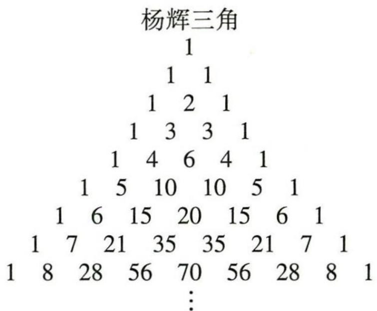

text_image

杨辉三角
1
1 1
1 2 1
1 3 3 1
1 4 6 4 1
1 5 10 10 5 1
1 6 15 20 15 6 1
1 7 21 35 35 21 7 1
1 8 28 56 70 56 28 8 1
⋮

图1

A. $C_{3}^{2} + C_{4}^{2} + C_{5}^{2} + \cdots + C_{9}^{2} = 120$   
B. 第 2023 行中从左往右第 1013 个数与第 1014 个数相等  
C. 记第 n 行的第 i 个数为 $a_{i}$ ，则 $\sum_{i=1}^{n+1}2^{i-1}a_{i}=4^{n}$   
D. 第20行中第8个数与第9个数之比为8:13

思维导引

观察“杨辉三角”

归纳规律

第 $n$ 行的第 $r$ 个数的特征

利用组合数的性质

依次分析选项是否正确

解析 根据题意,由“杨辉三角”可得,第 n 行的第 r 个数为 $C_{n}^{r-1}$ ,由此分析选项.

<table><tr><td>选项</td><td>分析过程</td><td>正误</td></tr><tr><td>A</td><td> $C_{3}^{2} + C_{4}^{2} + \cdots + C_{9}^{2} = C_{3}^{3} + C_{3}^{2} + C_{4}^{2} + \cdots + C_{9}^{2} - 1 = C_{10}^{3} - 1 = 119$ 【记结论】利用组合数的性质  $C_{n}^{m+1} + C_{n}^{m} = C_{n+1}^{m+1}$ </td><td>×</td></tr><tr><td>B</td><td>第2023行中从左往右第1013个数为  $C_{2023}^{1012}$ ,第1014个数为  $C_{2023}^{1013}$ ,两者不相等【会思考】 $C_{2023}^{1012}$ 与 $C_{2023}^{1013}$ 下标相同,上标不相等,且上标和不等于下标,故 $C_{2023}^{1012} \neq C_{2023}^{1013}$ </td><td>×</td></tr><tr><td>C</td><td>记第n行的第i个数为 $a_{i}$ ,则 $a_{i} = C_{n}^{i-1}$ ,则 $\sum_{i=1}^{n+1} 2^{i-1} a_{i} = \sum_{i=1}^{n+1} 2^{i-1} C_{n}^{i-1} \times 1^{n-i+1} = (1 + 2)^{n} = 3^{n}$ </td><td>×</td></tr></table>

# 数学名著

《拓扑学奇趣》 本书简明介绍了拓扑学,并把通常数学理论所必备的定义、定理,用通俗的语言和大量的插图进行了较为直观的描述.

关注微信公众号“初高教辅站”获取更多初高中教辅资料

续表

<table><tr><td>选项</td><td>分析过程</td><td>正误</td></tr><tr><td>D</td><td>第20行中第8个数为 $C_{20}^{7}$ ,第9个数为 $C_{20}^{8}$ ,则两个数的比为 $C_{20}^{7}:C_{20}^{8}=\frac{20!}{7!\times13!}:$  $\frac{20!}{8!\times12!}=8:13$ </td><td>√</td></tr></table>

# 变式演练

1. (调研 5 变式, 变考法, 由各项系数和求最值、某些项等 | 2024 湖南师范大学附中 7 月期末 | 多选) 已知 $(a \sqrt{x} + \frac{1}{x^{2}})^{10} (a > 0)$ 的展开式的各项系数之和为 1024 , 则展开式中 ( )

A. 奇数项的二项式系数和为 256

B. 第6项的系数最大

C. 存在常数项

D. 有理项共有6项

2. (调研 3 变式, 变条件, 给出某项的系数求参数 | 2024 河南漯河 7 月期末) 若 $(1 + x)^{6}(m + \frac{m}{x^{2}})$ 展开式中 $x^{2}$ 的系数为 30, 则 m = \_\_\_\_.

# 参考答案与解析

1. BCD 令 x=1，得 $(a+1)^{10}=1024$ ，则 a=1 或 a=-3（舍去）.

$\therefore \left(\sqrt{x} + \frac{1}{x^2}\right)^{10}$ 的展开式的通项为 $T_{r+1} = \mathrm{C}_{10}^{r}\left(\sqrt{x}\right)^{10-r} \cdot \left(\frac{1}{x^2}\right)^r = \mathrm{C}_{10}^{r} x^{5-\frac{5}{2} r}$ .

<table><tr><td>选项</td><td>分析过程</td><td>正误</td></tr><tr><td>A</td><td>奇数项的二项式系数和为 $\frac{1}{2}(C_{10}^{0} + C_{10}^{1} + \cdots + C_{10}^{10}) = \frac{1}{2} \times 2^{10} = 512$ 【记结论】二项式 $(a+b)^{n}$ 的展开式的二项式系数之和为 $C_{n}^{0} + C_{n}^{1} + C_{n}^{2} + \cdots + C_{n}^{n} = 2^{n}$ ,其奇数项的二项式系数和与偶数项的二项式系数和相等,都等于 $2^{n-1}$ ,即 $C_{n}^{0} + C_{n}^{2} + \cdots = C_{n}^{1} + C_{n}^{3} + \cdots = 2^{n-1}$ </td><td>×</td></tr><tr><td>B</td><td>由题意知展开式共11项,故第6项的系数最大</td><td>√</td></tr><tr><td>C</td><td>令 $5 - \frac{5}{2}r = 0$ ,解得 $r = 2$ ,故存在常数项,且常数项为第3项</td><td>√</td></tr><tr><td>D</td><td>当 $r = 0,2,4,6,8,10$ 时,为有理项,故有理项共有6项</td><td>√</td></tr></table>

2.1 $(1+x)^{6}$ 展开式的通项为 $T_{r+1}=C_{6}^{r}x^{r}$ ，则 $C_{6}^{r}x^{r}(m+\frac{m}{x^{2}})=mC_{6}^{r}x^{r}+mC_{6}^{r}x^{r-2}$

【扫清障碍】注意各项的分配，求出相应的特定项进行合并即可

令 $m\mathrm{C}_6^2 + m\mathrm{C}_6^4 = 30$ ，解得 $m = 1$

# 数学名著

《几何学的故事》这本书采用了易于理解的、令人愉快的讲故事的形式,用出色的、独创性的论证维护了几何学的领先地位.

关注微信公众号“初高教辅站”获取更多初高中教辅资料

# 超重点 11 条件概率与全概率公式

# 命题角度1 条件概率的求解

调研 1: (2024 山东威海 7 月统考) 某大学在一次调查学生是否有自主创业打算的活动中,获得了如下数据.

<table><tr><td></td><td>男生人数</td><td>女生人数</td></tr><tr><td>有自主创业打算</td><td>16</td><td>m</td></tr><tr><td>无自主创业打算</td><td>64</td><td>n</td></tr></table>

(1) 若 $m = 24, n = 36$ , 根据调查数据判断, 能否依据 $\alpha = 0.01$ 的独立性检验认为该校学生有无自主创业打算与性别有关.

(2) 若 $m = 15, n = 60$ , 从这些学生中随机抽取一人.  
(i) 若已知抽到的人有自主创业打算, 求该学生是男生的概率;  
(ii) 判断“抽到的人无自主创业打算”与“抽到的人是男生”是否相互独立.

附: $\chi^{2}=\frac{n(ad-bc)^{2}}{(a+b)(c+d)(a+c)(b+d)},n=a+b+c+d.$

<table><tr><td> $\alpha$ </td><td>0.10</td><td>0.05</td><td>0.01</td><td>0.005</td><td>0.001</td></tr><tr><td> $x_{\alpha}$ </td><td>2.706</td><td>3.841</td><td>6.635</td><td>7.879</td><td>10.828</td></tr></table>

# 思路指引

想要判断两个事件是否独立,大体有两个思路,第一个思路是根据“当事件甲与乙相互独立时,事件甲发生与否不影响事件乙发生的概率,这等价于 $P(\text{乙} \mid \text{甲}) = P(\text{乙})$ 成立”,所以可以通过计算 $P(\text{乙} \mid \text{甲})$ 和 $P(\text{乙})$ 判断;第二个思路是利用独立性检验的思想,把两个事件对应到两个分类变量中,如本题,可以假设学生有无自主创业打算与性别无关,这时计算 $\chi^2$ 即可判断.

解析 (1)零假设为 $H_{0}$ :该校学生有无自主创业打算与性别无关.

【易遗漏】假设两个分类变量 X 与 Y 无关，提出零假设这一步不能省

$$
\chi^ {2} = \frac {(1 6 + 6 4 + 2 4 + 3 6) \times (1 6 \times 3 6 - 6 4 \times 2 4) ^ {2}}{(1 6 + 6 4) \times (2 4 + 3 6) \times (1 6 + 2 4) \times (6 4 + 3 6)} = \frac {1 6 8}{2 5} = 6. 7 2 > 6. 6 3 5,
$$

数学名著

《有限群表示论》 本书介绍了有限群的表示理论,包括群表示论的基本概念与两条主要研究途径.

关注微信公众号“初高教辅站”获取更多初高中教辅资料

依据小概率值 $\alpha=0.01$ 的 $\chi^{2}$ 独立性检验, 可以认为该校学生有无自主创业打算与性别有关.

(2)(i)记 $A$ 为“抽到的人有自主创业打算”, $B$ 为“抽到的人是男生”.

方法一 $P(A)=\frac{16+15}{16+15+64+60}=\frac{31}{155}=\frac{1}{5},P(AB)=\frac{16}{16+64+15+60}=\frac{16}{155},$

所以 $P(B|A)=\frac{P(AB)}{P(A)}=\frac{16}{31}.$

【小技巧】用定义法求条件概率，先求出 $P(A)$ 和 $P(AB)$ ，再根据公式 $P(B|A)=\frac{P(AB)}{P(A)}$ 求解

方法二 $P(B|A) = \frac{n(AB)}{n(A)} = \frac{16}{16 + 15} = \frac{16}{31}.$

【敲黑板】当基本事件有限且等可能时,可借助古典概型的概率计算公式计算条件概率: $P(B|A)=\frac{n(AB)}{n(A)}$

(ii) 记 $C$ 为“抽到的人无自主创业打算”，由 (i) 知 $B$ 为“抽到的人是男生”，

方法一 $P(B|C)=\frac{64}{124}=\frac{16}{31},P(B)=\frac{64+16}{16+15+64+60}=\frac{16}{31}$ ，所以 $P(B)=P(B|C)$ ，

所以“抽到的人无自主创业打算”与“抽到的人是男生”相互独立.

方法二 $P(C|B)=\frac{64}{80}=\frac{4}{5}, P(C)=\frac{64+60}{16+15+64+60}=\frac{4}{5}$ ，所以 $P(C)=P(C|B)$ ，

所以“抽到的人无自主创业打算”与“抽到的人是男生”相互独立.

方法三 零假设为 $H_0'$ : 该校学生有无自主创业打算与性别无关.

根据题意得到如下 $2 \times 2$ 列联表：

<table><tr><td></td><td>男生人数</td><td>女生人数</td><td>合计</td></tr><tr><td>有自主创业打算</td><td>16</td><td>15</td><td>31</td></tr><tr><td>无自主创业打算</td><td>64</td><td>60</td><td>124</td></tr><tr><td>合计</td><td>80</td><td>75</td><td>155</td></tr></table>

$\chi_{1}^{2}=\frac{155\times(16\times60-64\times15)^{2}}{80\times75\times124\times31}=0$ , 零假设成立, 所以该校学生有无自主创业打算与性别无关,

所以“抽到的人无自主创业打算”与“抽到的人是男生”相互独立.

# 命题角度2 全概率公式的应用

调研 2 (2023 江苏金陵中学等校三模) 一只不透明的袋中装有 10 个相同的

# 数学名著

《曲线与曲面的微分几何》 本书详细讲解了曲线和曲面微分几何学,广泛应用线性代数基础知识和几何基础事实,内容深入浅出,论述条理清晰.

小球,分别标有数字 $0 \sim 9$ ,先后从袋中随机取两只小球.用事件 $A$ 表示“第二次取出小球的标号是 $2$ ”,事件 $B$ 表示“两次取出小球的标号之和是 $m$ ”.

(1)若用不放回的方式取球,求 $P(A)$ .  
(2)若用有放回的方式取球,求证:事件A与事件B相互独立的充要条件是m=9.

思维导引 (1) 记事件 $C$ 为“第一次取出小球的标号是2” $\xrightarrow{\text{求} P(C), P(A|C),}$ 全概率公式 $P(A)$

(2) 有放回地取球 $\xrightarrow{\text{列举法}}$ $P(B), P(AB)$ $\xrightarrow{\text{判断充分性}}$ $\xrightarrow{\text{条件概率公式}}$ 判断必要性

解析 (1) 用 $C$ 表示“第一次取出小球的标号是 2”，则 $P(C) = \frac{1}{10}$ ，

所以 $P(\overline{C})=1-P(C)=\frac{9}{10},P(A|C)=0,P(A|\overline{C})=\frac{1}{9}.$

所以 $P(A) = P(CA + \overline{C} A) = P(C) \times P(A|C) + P(\overline{C}) \times P(A|\overline{C}) = \frac{1}{10} \times 0 + \frac{9}{10} \times \frac{1}{9} = \frac{1}{10}$ .

【会应用】熟练运用全概率公式 $P(B)=\sum_{i=1}^{n}P(A_{i})P(B|A_{i})$ （其中 $A_{1},A_{2},\cdots,A_{n}$ 两两互斥，且 $A_{1}\cup A_{2}\cup\cdots\cup A_{n}=\Omega,P(A_{i})>0,i=1,2,\cdots,n$ ），就能轻松应对稍复杂事件的概率求解。当然本题也可以直接分析得到 $P(A)=\frac{9}{10}\times\frac{1}{9}=\frac{1}{10}$

(2)记第一次取出的球的标号为 $x$ , 第二次取出的球的标号为 $y$ , 用数组 $(x, y)$ 表示两次取球的情况, 记样本空间为 $\Omega$ , 则 $n(\Omega) = 100$ .

下面证明充分性：

【注意细节】充分性与必要性不要颠倒，要证明充分性，应该证明“ $m=9$ ”⇒“事件A与事件B相互独立”，证明必要性的时候才是证明“事件A与事件B相互独立”⇒“ $m=9$ ”

当 m=9 时,事件 B 发生的情况为 $(0,9)$ , $(1,8)$ , $(2,7)$ , $(3,6)$ , $(4,5)$ , $(5,4)$ , $(6,3)$ , $(7,2)$ , $(8,1)$ , $(9,0)$ , 共 10 种,事件 AB 发生的情况为 $(7,2)$ , 共 1 种,

因此 $P(B) = \frac{n(B)}{n(\Omega)} = \frac{10}{100} = \frac{1}{10}, P(AB) = \frac{n(AB)}{n(\Omega)} = \frac{1}{100}$ ,

又 $P(A) = \frac{1}{10}$ , 于是 $P(AB) = P(A)P(B)$ , 所以 $P(B) = \frac{P(AB)}{P(A)} = P(B|A)$ ,

所以事件 A 与事件 B 相互独立, 充分性成立.

下面证明必要性：

因为事件 A 与事件 B 相互独立, 所以 $P(AB) = P(A)P(B)$ , 即 $P(A) = \frac{P(AB)}{P(B)}$ ,

数学名著

《数学的发现》 本书通过对各种类型的生动而有趣的典型问题进行细致剖析,提出了它们的本质特征,从而总结出各种数学模型.

而 $P(A) = \frac{1}{10}, \frac{P(AB)}{P(B)} = \frac{n(AB)}{n(B)}$ ，于是 $\frac{n(AB)}{n(B)} = \frac{1}{10}$ ，

易知事件 AB 发生的情况只有一种, 即 $(m-2,2)$ , 所以 $n(AB)=1$ , 则 $n(B)=10$ ,

令 $x + y = m$ ，由 $0\leqslant x\leqslant 9,0\leqslant y\leqslant 9$ ，可得关于 $x$ 的不等式组 $\left\{ \begin{array}{l}0\leqslant x\leqslant 9,\\ 0\leqslant m - x\leqslant 9, \end{array} \right.$

要使上述不等式有10个整数解, 只能 m=9, 所以必要性成立.

综上,事件 A 与事件 B 相互独立的充要条件是 m=9.

# 变式演练

1. (调研 1 变式, 变题型, 与条件概率相关的计算 | 2023 江苏海安中学三模 | 多选) 记 A, B 为随机事件, 则下列说法正确的有 ( )

A. 若事件 $A, B$ 互斥, $P(A) = \frac{1}{2}, P(B) = \frac{1}{3}$ , 则 $P(\overline{A} \cup B) = \frac{5}{6}$   
B. 若事件 A, B 相互独立, $P(A) = \frac{1}{2}$ , $P(B) = \frac{1}{3}$ , 则 $P(A \cup B) = \frac{2}{3}$   
C. 若 $P(A) = \frac{1}{2}, P(\overline{A} | B) = \frac{3}{4}, P(\overline{A} | \overline{B}) = \frac{3}{8}$ , 则 $P(B) = \frac{1}{3}$   
D. 若 $P(A)=\frac{1}{2}, P(\overline{A}|B)=\frac{3}{4}, P(\overline{A}|\overline{B})=\frac{3}{8}$ ，则 $P(B|A)=\frac{1}{4}$

2. (调研 1 变式,变设问,条件概率的求解 | 2023 云南昆明 7 月诊断)某商场在周年庆活动期间为回馈新老顾客,采用抽奖的形式领取购物卡.该商场在一个纸箱里放 15 个小球(除颜色外其余均相同),包括 3 个红球、5 个黄球和 7 个白球.每个顾客不放回地从中拿 3 次,每次拿 1 个球,每拿到一个红球获得一张 A 类购物卡,每拿到一个黄球获得一张 B 类购物卡,每拿到一个白球获得一张 C 类购物卡.

(1)已知某顾客在3次中只有1次拿到白球,求其至多有1次拿到红球的概率;   
(2)设抽奖获得A类购物卡的数量为X,求X的分布列和数学期望.

3. (调研2变式, 变载体, 生活实际问题12023 山东日照三模) 某学校有 $A, B$ 两个食堂, 小瑞同学第一天午餐时等可能地随机选择一家食堂用餐. 如果第一天去 $A$ 食堂, 那么第二天仍去 $A$ 食堂的概率为 0.6. 如果第一天去 $B$ 食堂, 那么第二天改去 $A$ 食堂的概率为 0.8.

(1) 计算小瑞同学第二天去 A 食堂用餐的概率.  
(2) 小瑞同学某次在 $A$ 食堂用餐, 该食堂提供 5 种西式点心, $n (n \geqslant 2, n \in \mathbb{N}^{*})$ 种中式点心. 他从这些点心中随机选择 3 种, 记其中西式点心的种数为 $X$ , 求 $P(X = 1)$ 的最大值, 并求此时 $n$ 的值.

# 数学名著

# 参考答案与解析

1. BC

<table><tr><td>选项</td><td>分析过程</td><td>正误</td></tr><tr><td>A</td><td> $P(\overline{A} \cup B) = P(\overline{A}) + P(B) - P(\overline{A}B) = (1 - \frac{1}{2}) + \frac{1}{3} - P(\overline{A}B),$ 【指点迷津】由于事件A,B互斥不能推出事件 $\overline{A},B$ 互斥,故要求 $P(\overline{A}B)$ ,还得从 $P(B)$ 入手而 $P(B) = P(\overline{A}B) + P(AB) = P(\overline{A}B) = \frac{1}{3},\therefore P(\overline{A}B) = \frac{1}{3},\therefore P(\overline{A} \cup B) = \frac{1}{2}$ </td><td>×</td></tr><tr><td>B</td><td> $P(A \cup B) = P(A) + P(B) - P(AB) = P(A) + P(B) - P(A)P(B) = \frac{1}{2} + \frac{1}{3} - \frac{1}{2} \times \frac{1}{3} = \frac{2}{3}$ </td><td>√</td></tr><tr><td>C</td><td>令 $P(B) = x$ ,则 $P(\overline{B}) = 1 - x$ ,又 $P(\overline{A} | B) = \frac{P(\overline{A}B)}{P(B)} = \frac{P(\overline{A}B)}{x} = \frac{3}{4},$  $\therefore P(\overline{A}B) = \frac{3}{4}x$ ,又 $P(\overline{A} | \overline{B}) = \frac{P(\overline{A}\overline{B})}{P(\overline{B})} = \frac{P(\overline{A}\overline{B})}{1 - x} = \frac{3}{8},\therefore P(\overline{A}\overline{B}) = \frac{3}{8}(1 - x),$ 【易错提醒】利用条件概率公式变形得 $P(\overline{A} | \overline{B}) = \frac{P(\overline{A}\overline{B})}{P(\overline{B})}$ ,注意每一处都是对立事件的概率值,不要代错 $P(\overline{A}) = P(\overline{A}B) + P(\overline{A}\overline{B}) = \frac{3}{4}x + \frac{3}{8}(1 - x) = 1 - \frac{1}{2}$ ,解得 $x = \frac{1}{3}$ </td><td>√</td></tr><tr><td>D</td><td>由C知 $P(B) = \frac{1}{3},P(\overline{A}B) = \frac{3}{4} \times \frac{1}{3} = \frac{1}{4},\therefore P(B | A) = \frac{P(AB)}{P(A)} = \frac{P(B) - P(\overline{A}B)}{P(A)} = \frac{\frac{1}{3} - \frac{1}{4}}{\frac{1}{2}} = \frac{1}{6}$ </td><td>×</td></tr></table>

2. (1)记事件 $A$ 为“在3次中只有1次拿到白球”,事件 $B$ 为“在3次中至多有1次拿到红球”,则事件 $AB$ 为“在3次中只有1次拿到白球,其他两次至多1次拿到红球”.

方法一 所以 $P(A) = \frac{C_7^1C_8^2}{C_{15}^3} = \frac{28}{65}, P(AB) = \frac{C_7^1C_3^1C_5^1 + C_7^1C_5^2}{C_{15}^3} = \frac{5}{13}, P(B|A) = \frac{P(AB)}{P(A)} = \frac{25}{28}$ .

【敲黑板】事件 $A, B$ 同时发生只有两种情况, 第一种是取出 “1 白 1 红 1 黄”, 第二种是取出 “1 白 2 黄”

方法二 $P(B|A) = \frac{n(AB)}{n(A)} = \frac{\mathrm{C}_7^1\mathrm{C}_3^1\mathrm{C}_5^1 + \mathrm{C}_7^1\mathrm{C}_5^2}{\mathrm{C}_7^1\mathrm{C}_8^2} = \frac{25}{28}.$

数学名著

《数学大师》 本书是介绍数学史和数学艺术的经典著作,它深入浅出地介绍了数学发展的历程,从古希腊的几何学,历经牛顿的微积分学,再到概率论、符号逻辑等,都有详略合适的叙述.

关注微信公众号“初高教辅站”获取更多初高中教辅资料

(2) 第一步: 写出离散型随机变量 X 的所有可能取值及对应概率.

依题意得 X 的所有可能取值为 0,1,2,3.

则 $P(X = 0) = \frac{C_{12}^3}{C_{15}^3} = \frac{44}{91}, P(X = 1) = \frac{C_3^1 C_{12}^2}{C_{15}^3} = \frac{198}{455}, P(X = 2) = \frac{C_3^2 C_{12}^1}{C_{15}^3} = \frac{36}{455}, P(X = 3) = \frac{C_3^3}{C_{15}^3} = \frac{1}{455}$ ,

第二步: 写出分布列.

所以 $X$ 的分布列为

<table><tr><td>X</td><td>0</td><td>1</td><td>2</td><td>3</td></tr><tr><td>P</td><td>44/91</td><td>198/455</td><td>36/455</td><td>1/455</td></tr></table>

第三步: 计算期望.

方法一 所以 $E(X)=\frac{44}{91}\times0+\frac{198}{455}\times1+\frac{36}{455}\times2+\frac{1}{455}\times3=\frac{273}{455}=\frac{3}{5}$ .

方法二 因为 X 服从超几何分布 $H(15,3,3)$ ，所以 $E(X)=\frac{3\times3}{15}=\frac{3}{5}$ .

3. (1) 设 $A_{1} =$ “第一天去 $A$ 食堂用餐”, $B_{1} =$ “第一天去 $B$ 食堂用餐”, $A_{2} =$ “第二天去 $A$ 食堂用餐”, 根据题意得 $P(A_{1}) = P(B_{1}) = 0.5, P(A_{2} \mid A_{1}) = 0.6, P(A_{2} \mid B_{1}) = 0.8$ ,

【会翻译】注意把题干文字内容翻译成符号语言的技巧，题干三句话依次对应了三个概率值所以 $P(A_{2})=P(A_{1})P(A_{2}|A_{1})+P(B_{1})P(A_{2}|B_{1})=0.5\times0.6+0.5\times0.8=0.7$ ，

【记结论】应用全概率公式的关键是把事件拆分，本题分了“第一天去 A 食堂”和“第一天去 B 食堂”两类，注意字母的下标不要写乱

所以小瑞同学第二天去 A 食堂用餐的概率为 0.7.

(2) 第一步: 写出 $P(X=1)$ .

由题意, $X$ 的所有可能取值为0,1,2,3, $P(X = 1) = \frac{\mathrm{C}_5^1\mathrm{C}_n^2}{\mathrm{C}_{n + 5}^3} = \frac{15n(n - 1)}{(n + 5)(n + 4)(n + 3)}.$

【名师叨叨】事实上，X服从超几何分布 $H(n+5,5,3)$

第二步: 求 $P(X=1)$ 最大时 n 的取值范围.

令 $a_{n} = \frac{15n(n - 1)}{(n + 5)(n + 4)(n + 3)}$ ，若 $a_{n}$ 最大，则 $\left\{ \begin{array}{l} \frac{15n(n - 1)}{(n + 5)(n + 4)(n + 3)}\geqslant \frac{15(n + 1)n}{(n + 6)(n + 5)(n + 4)},\\ \frac{15n(n - 1)}{(n + 5)(n + 4)(n + 3)}\geqslant \frac{15(n - 1)(n - 2)}{(n + 4)(n + 3)(n + 2)}, \end{array} \right.$ 解得

【指点迷津】 $a_{n}$ 最大，即 $a_{n}$ 不小于其相邻的两项，符号语言为 $\left\{\begin{aligned}a_{n}&\geqslant a_{n+1},\\ a_{n}&\geqslant a_{n-1}(n\geqslant2)\end{aligned}\right.$ $9 \leqslant n \leqslant 10.$

第三步: 求出 $P(X=1)$ 的最大值及此时 n 的值.

又 $n \in \mathbf{N}$ , 所以 $n = 9, 10$ , 易知当 $n = 9$ 和 $n = 10$ 时, $P(X = 1)$ 的值相等, 为 $\frac{45}{91}$ ,

所以当 n=9 或 10 时, $P(X=1)$ 有最大值 $\frac{45}{91}$ .

# 超重点 12 常见分布的辨析与应用

# 类型 1 二项分布

调研 1 (企业招聘|2024 长沙一中等校开学测试) 甲、乙两家公司招聘高级软件工程师,应聘程序都是应聘者先进行三项专业技能测试,专业技能测试通过项数越多,聘用可能性越大,程序员小明准备应聘这两家公司. 已知小明应聘甲公司,每项专业技能测试通过的概率均为 $\frac{2}{3}$ ; 小明应聘乙公司,三项专业技能测试通过的概率依次为 $\frac{5}{6}, \frac{2}{3}, m$ , 其中 $0 < m < 1$ . 各项专业技能测试是否通过相互独立.

(1) 若 $m = \frac{2}{3}$ ，分别求小明应聘甲、乙两家公司，三项专业技能测试恰好通过两项的概率.  
(2)若甲、乙两家公司的招聘在同一时间进行,小明只能应聘其中一家,则当 m 的取值在什么范围内时,小明应选择应聘乙公司?

# 锁定题眼

“应聘甲公司,每项专业技能测试通过的概率均为 $\frac{2}{3}$ ”且各项测试是否通过相互独立,因此应聘甲公司参加三项专业技能测试可以看作一个3重伯努利试验.

解析 (1) 设 $A =$ “小明应聘甲公司恰好通过两项专业技能测试”, $B =$ “小明应聘乙公司恰好通过两项专业技能测试”,

根据题意可得 $P(A)=C_{3}^{2}\times\left(\frac{2}{3}\right)^{2}\times\left(1-\frac{2}{3}\right)=\frac{4}{9}$ ,

$$
P (B) = \frac {5}{6} \times C _ {2} ^ {1} \times \frac {2}{3} \times (1 - \frac {2}{3}) + (1 - \frac {5}{6}) \times \frac {2}{3} \times \frac {2}{3} = \frac {4}{9}.
$$

(2)设小明应聘甲公司通过测试的项数为 X, 应聘乙公司通过测试的项数为 Y,

根据题意可知, $X\sim B(3,\frac{2}{3})$ ,则 $E(X)=3\times\frac{2}{3}=2$ .

【会读懂】结合题意可知小明应聘甲公司，通过测试的项数服从二项分布，计算期望时，直接应用二项分布的期望计算公式即可

# 数学名著

《从微分观点看拓扑》菲尔兹奖和沃尔夫奖得主 J. W. Milnor 所著, 是一本蜚声国际数学界的经典之作.

Y 的所有可能取值为 0,1,2,3,

$$
\begin{array}{l} P (Y = 0) = \left(1 - \frac {5}{6}\right) \times \left(1 - \frac {2}{3}\right) \times (1 - m) = \frac {1}{1 8} - \frac {1}{1 8} m, \\ P (Y = 1) = \frac {5}{6} \times \left(1 - \frac {2}{3}\right) \times (1 - m) + \left(1 - \frac {5}{6}\right) \times \frac {2}{3} \times (1 - m) + \left(1 - \frac {5}{6}\right) \times \left(1 - \frac {2}{3}\right) \times m = \frac {7}{1 8} - \frac {1}{3} m, \\ P (Y = 2) = \frac {5}{6} \times \frac {2}{3} \times (1 - m) + (1 - \frac {5}{6}) \times \frac {2}{3} \times m + \frac {5}{6} \times (1 - \frac {2}{3}) \times m = \frac {5}{9} - \frac {1}{6} m, \\ P (Y = 3) = \frac {5}{6} \times \frac {2}{3} \times m = \frac {5}{9} m, \\ \end{array}
$$

则随机变量 $Y$ 的分布列为

<table><tr><td>Y</td><td>0</td><td>1</td><td>2</td><td>3</td></tr><tr><td>P</td><td> $\frac{1}{18} - \frac{1}{18}m$ </td><td> $\frac{7}{18} - \frac{1}{3}m$ </td><td> $\frac{5}{9} - \frac{1}{6}m$ </td><td> $\frac{5}{9}m$ </td></tr></table>

$$
E (Y) = \left(\frac {1}{1 8} - \frac {1}{1 8} m\right) \times 0 + \left(\frac {7}{1 8} - \frac {1}{3} m\right) \times 1 + \left(\frac {5}{9} - \frac {1}{6} m\right) \times 2 + \frac {5}{9} m \times 3 = \frac {3}{2} + m.
$$

若 $E(Y)>E(X)$ ，则 $\frac{3}{2}+m>2$ ，故 $\frac{1}{2}<m<1$ ，

【读懂题意】专业技能测试通过项数越多，聘用可能性越大，也就是说，通过项数的期望越大，聘用可能性越大。因此，小明应该比较两家公司专业技能测试的通过项数的期望，选取期望较大的公司去应聘

故当 m 的取值范围是 $\left(\frac{1}{2},1\right)$ 时, 小明应选择应聘乙公司.

# 类型 2 超几何分布

调研 2 (2024 广东梅州 8 月模拟) 某校高三 1 000 名学生的开学考试数学成绩频率分布直方图如图 1 所示, 其中成绩分组区间是 [30, 50), [50,70), [70,90), [90,110), [110,130), [130,150] (单位: 分).

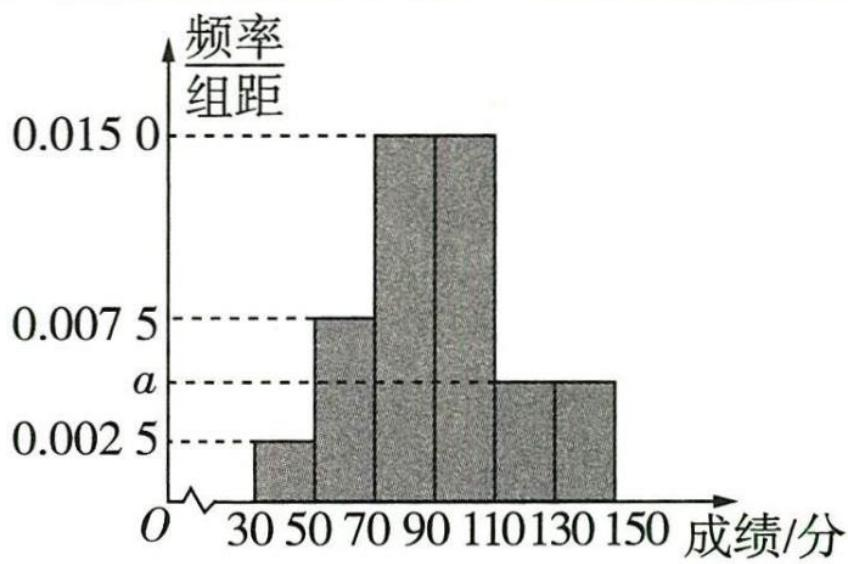

histogram

| 成绩/分 | 频率/组距 |
| :--- | :--- |
| 30-50 | 0.0025 |
| 50-70 | 0.0075 |
| 70-90 | 0.0150 |
| 90-110 | 0.0150 |
| 110-130 | 0.0025 |
| 130-150 | 0.0025 |

图1

(1) 求 $a$ ;

(2)根据频率分布直方图,估计这1 000名学

生数学成绩的平均分(同一组中的数据用该组区间的中点值代表);

(3)从数学成绩位于[90,110), [110,130)内的学生中采用分层抽样的方法抽取8人,再从这8人中随机抽取2人,记这2人中成绩在区间[90,110)内的人数为 $X$ ,求

内容涉及光滑流形和光滑映射,Sard 定理和 Brown 定理,映射的模 2 度,定向流形,向量场与 Euler 数,标架式协边,Pontryagin 构造等.

# X 的分布列及数学期望.

解析 (1) 由频率分布直方图可知, $(0.0025 + 2a + 0.0075 + 2 \times 0.0150) \times 20 = 1$ ,

所以 $a = 0.0050$

(2)所求数学成绩的平均分约为 $40 \times 0.05 + 60 \times 0.15 + 80 \times 0.3 + 100 \times 0.3 + 120 \times 0.1 + 140 \times 0.1 = 91$ (分).

(3)由(1)知, $a = 0.0050$ , 所以数学成绩在区间 $[90,110)$ 与 $[110,130)$ 内的人数之比为 $3:1$ , 所以采用分层抽样的方法抽取的 8 人中有 6 人的数学成绩在区间 $[90,110)$ 内, 有 2 人的数学成绩在区间 $[110,130)$ 内, $X$ 的所有可能取值为 $0,1,2$ ,

$$
P (X = 0) = \frac {\mathrm{C} _ {6} ^ {0} \mathrm{C} _ {2} ^ {2}}{\mathrm{C} _ {8} ^ {2}} = \frac {1}{2 8}, P (X = 1) = \frac {\mathrm{C} _ {6} ^ {1} \mathrm{C} _ {2} ^ {1}}{\mathrm{C} _ {8} ^ {2}} = \frac {3}{7}, P (X = 2) = \frac {\mathrm{C} _ {6} ^ {2} \mathrm{C} _ {2} ^ {0}}{\mathrm{C} _ {8} ^ {2}} = \frac {1 5}{2 8},
$$

所以 $X$ 的分布列为

<table><tr><td>X</td><td>0</td><td>1</td><td>2</td></tr><tr><td>P</td><td> $\frac{1}{28}$ </td><td> $\frac{3}{7}$ </td><td> $\frac{15}{28}$ </td></tr></table>

所以期望 $E(X)=0\times\frac{1}{28}+1\times\frac{3}{7}+2\times\frac{15}{28}=\frac{3}{2}.$

【另解】由题意知 $X \sim H(8,6,2)$ ，所以 $E(X) = \frac{2 \times 6}{8} = \frac{3}{2}$ ，这是利用了超几何分布的性质——随机变量 $X$ 服从超几何分布 $H(N,M,n)(n,N,M \in \mathbb{N}^*, M \leqslant N, n \leqslant N)$ ，则 $E(X) = \frac{nM}{N}$

# 提分干货 易错辨析

# 抓住关键,区分二项分布与超几何分布

二项分布和超几何分布都是重要的离散型随机变量的分布形式, 它们的表述也往往都是这样的形式: 从数量为 $N$ 的总体中抽取 $M$ 个个体, 满足限制条件的个体 $n$ 的数量 $X$ 的期望. 如何区分呢?

从本质上看,两种分布是完全不一样的,最明显的区别是二项分布是“放回抽样检查”,而超几何分布的最明显特点是“一次性抽取”,可以看作“不放回抽样”.也就是说,二项分布中,每一次抽取都是独立的,超几何分布中,前一次抽取会影响后一次抽取各种情况的概率,是相互关联的.

抓住“独立”这个字眼去判断, 就很好分辨二项分布与超几何分布了. (特别地, 对于不放回抽样, 当 $n$ 远远小于 $N$ 时, 每抽取一次后, 对 $N$ 的影响很小, 此时, 超几何分布可以用二项分布近似)

# 数学名著

《微积分学教程》 本书包括实数、极限论、一元函数、导数及微分、利用导数研究函数、多元函数、函数行列式及其应用、微积分在几何上的应用等内容.

# 类型 3 正态分布

调研 3 (2024 河北张家口 7 月统考) 某校举办乒乓球颠球比赛, 现从高一年级 1 000 名学生中随机选出 40 名学生统计成绩 (单位: 个), 其中 24 名女生平均成绩 $\overline{x}_{\text {女}} = 70$ , 标准差 $s_{\text {女}} = 4$ ; 16 名男生平均成绩 $\overline{y}_{\text {男}} = 80$ , 标准差 $s_{\text {男}} = 6$ .

(1)高一年级全员参加颠球比赛的成绩 X 近似服从正态分布 $N(\mu, \sigma^{2})$ ，若用这40名参赛同学的样本平均数 $\bar{x}$ 和标准差 s（四舍五入取整数）分别作为 $\mu, \sigma$ ，估计高一年级颠球成绩不超过60个的人数（四舍五入取整数）；  
(2)颠球比赛决赛采用5局3胜制,甲、乙两名同学争夺冠、亚军,如果甲每局比赛获胜的概率为 $\frac{2}{3}$ ,在甲获胜的条件下,求其前2局获胜的概率.

附: 若 $X \sim N(\mu, \sigma^{2})$ ，则 $P(|X - \mu| \leqslant \sigma) \approx 0.6827, P(|X - \mu| \leqslant 2\sigma) \approx 0.9545, P(|X - \mu| \leqslant 3\sigma) \approx 0.9973.$

解析 (1) 依题意, $\overline{x} = \frac{70 \times 24 + 80 \times 16}{40} = 74$ , 即 $\mu = 74$ ,

$$
s _ {\text {女}} ^ {2} = \frac {\sum_ {i = 1} ^ {2 4} (x _ {i} - \overline {{x}} _ {\text {女}}) ^ {2}}{2 4} = \frac {x _ {1} ^ {2} + x _ {2} ^ {2} + \cdots + x _ {2 4} ^ {2} - 2 4 \overline {{x}} _ {\text {女}} ^ {2}}{2 4} = 4 ^ {2}, \text {所以} x _ {1} ^ {2} + x _ {2} ^ {2} + \dots + x _ {2 4} ^ {2} = 2 4 \times (1 6 + 7 0 ^ {2}),
$$

同理 $s_{男}^{2}=\frac{\sum\limits_{i=1}^{16}(y_{i}-\overline{y}_{男})^{2}}{16}=\frac{y_{1}^{2}+y_{2}^{2}+\cdots+y_{16}^{2}-16\overline{y}_{男}^{2}}{16}=6^{2}$ ，所以 $y_{1}^{2}+y_{2}^{2}+\cdots+y_{16}^{2}=16\times(36+80^{2})$

【小技巧】题中分别给出男、女生的成绩方差，无法直接应用求总的方差，可以把方差的公式 $s^{2}=\frac{\sum_{i=1}^{n}(x_{i}-\bar{x})^{2}}{n}$ 转化为 $s^{2}=\frac{\sum_{i=1}^{n}x_{i}^{2}-n\bar{x}^{2}}{n}$ ，即可将三者联系起来

所以 $s^{2}=\frac{x_{1}^{2}+x_{2}^{2}+\cdots+x_{24}^{2}+y_{1}^{2}+y_{2}^{2}+\cdots+y_{16}^{2}-40\overline{x}^{2}}{40}=\frac{24\times(16+70^{2})+16\times(36+80^{2})-40\times74^{2}}{40}=48$

所以 $s = \sqrt{48} \approx 7$ ，即 $\sigma = 7$ 。

因为 $X \sim N(74, 7^{2})$ ，且 $P(|X - \mu| \leqslant 2\sigma) \approx 0.9545$ ，

【易错】 $X \sim N(\mu, \sigma^2)$ ，则 $\sigma^2 = 7^2$ ，不要误以为 $\sigma^2 = 7$

所以 $P(X \leqslant 60) \approx \frac{1 - 0.9545}{2} = 0.02275$

所以 $0.02275 \times 1000 = 22.75 \approx 23$ ，即估计高一年级颠球成绩不超过60个的人数为23.

(2)设事件A表示“甲获胜”,事件B表示“甲前2局获胜”,

所以 $P(A) = \left(\frac{2}{3}\right)^3 +\mathrm{C}_3^1\times \frac{1}{3}\times \left(\frac{2}{3}\right)^3 +\mathrm{C}_4^2\times \left(\frac{1}{3}\right)^2\times \left(\frac{2}{3}\right)^3 = \frac{64}{81},$

【突破瓶颈】甲获胜有3:0,3:1,3:2三类，分别求对应的概率

# 数学名著

《代数学基础》 本书系统地介绍了代数学的一些基础理论,包括六章内容.介绍了群的基本概念与性质,环、理想与商环的基本概念与性质,域扩张的基本理论及其经典应用问题等.

$$
P (A B) = \left(\frac {2}{3}\right) ^ {3} + \frac {1}{3} \times \left(\frac {2}{3}\right) ^ {3} + \left(\frac {1}{3}\right) ^ {2} \times \left(\frac {2}{3}\right) ^ {3} = \frac {1 0 4}{2 4 3},
$$

所以 $P(B|A)=\frac{P(AB)}{P(A)}=\frac{13}{24}$ ,

所以在甲获胜的条件下,其前2局获胜的概率为 $\frac{13}{24}$ .

# 提分干货 辨析总结

# 区分正态分布与二项分布、超几何分布

一般通过观察表述形式就可以很容易地区分正态分布与二项分布、超几何分布,但我们仍要从本质上来理解它们的区别——二项分布、超几何分布,都是对应离散型随机变量来说的,而正态分布是对于连续型随机变量来说的.高中阶段所学的离散型随机变量的取值是有限的,取各个值都有固定的概率,而连续型随机变量往往取值充满某个区间甚至整个实轴,但取一点的概率为0.

# 变式演练

1. (调研 1 变式,变背景,房交会|2023 贵州铜仁 6 月质量监测)2023 年 6 月 17 日,铜仁市碧江区第二届房地产交易展示会在三江公园隆重开幕.本次房交会从 6 月 17 日持续到 6 月 22 日,每天都安排有精彩演出、免费美食、互动游戏、露天电影和游江龙舟五类活动.

(1)甲、乙两名市民参加了不同类的活动,且每人只参加一类活动.已知甲参加了免费美食的活动,求乙参加游江龙舟活动的概率;  
(2)已知来自某小区的市民参加互动游戏的概率是 $\frac{1}{10}$ , 设来自该小区的 2 名市民参加互动游戏的人数为 $\xi$ , 求 $\xi$ 的分布列与期望.

# 审题妙招

注意题眼“不同类”,在这个前提下,甲参加了某项活动,乙就不能参加这项活动了.甲、乙参加活动是相互关联的事件.

2. (调研 2 变式,变考法,超几何分布与回归分析结合 | 2023 河南驻马店 6 月模拟)
2023 年是充满挑战的一年,为应对复杂的经济形势,各地出台了促进经济发展的各项政策,并取得了较好的效果.某市零售行业为促进消费,开展了新一轮的让利促销的活动,活动之初,利用各种媒体进行了大量的广告宣传,为了解传媒对本次

# 数学名著

《数论中未解决的问题》 本书分题目列出了数论中尚未解决的一些问题和猜想,对开展研究工作有很好的指导意义.

关注微信公众号“初高教辅站”获取更多初高中教辅资料促销活动的影响,在本市内随机抽取了6个大型零售卖场(分别编号为1,2,3,…,6),得到其宣传费用x(单位:万元)和销售额y(单位:万元)的数据如下:

<table><tr><td></td><td>1</td><td>2</td><td>3</td><td>4</td><td>5</td><td>6</td></tr><tr><td>x/万元</td><td>2</td><td>3</td><td>5</td><td>6</td><td>8</td><td>12</td></tr><tr><td>y/万元</td><td>30</td><td>34</td><td>40</td><td>45</td><td>50</td><td>60</td></tr></table>

(1) 求 $y$ 关于 $x$ 的线性回归方程, 并预测当宣传费用至少多少万元时 (结果取整数), 销售额能突破 100 万元;  
(2) 经济活动中, 人们往往关注投入和产出比值, 在这次促销活动中, 设销售额与投入的宣传费用的比值为 $\lambda$ , 若 $\lambda > 10$ , 称这次宣传策划是高效的; 否则为非高效的. 从这 6 家卖场中随机抽取 3 家.

①若抽取的 3 家中含有宣传策划高效的卖场, 求抽取的 3 家中恰有一家是宣传策划高效卖场的概率;  
②若抽取的 3 家卖场中宣传策划高效的有 X 家,求 X 的分布列和数学期望.

附:参考数据 $\sum_{i=1}^{6}x_{i}y_{i}=1\ 752$ ,回归直线方程 $\hat{y}=\hat{b}x+\hat{a}$ 中 $\hat{b}$ 和 $\hat{a}$ 的最小二乘估计分别

为 $\hat{b} = \frac{\sum_{i=1}^{n}(x_i - \overline{x})(y_i - \overline{y})}{\sum_{i=1}^{n}(x_i - \overline{x})^2}, \hat{a} = \overline{y} - \hat{b}\overline{x}$ .

3. (调研 3 变式,变考法,正态分布与二项分布结合 | 2024 福建晋江平山中学、泉州中远学校等六校 7 月联考)为了切实加强学校体育工作,促进学生积极参加体育锻炼,养成良好的锻炼习惯,某高中学校计划优化课程,增加学生体育锻炼时间,提高体质健康水平,某体质监测中心抽取了该校 10 名学生进行体质测试,得到如下表格:

<table><tr><td>序号i</td><td>1</td><td>2</td><td>3</td><td>4</td><td>5</td><td>6</td><td>7</td><td>8</td><td>9</td><td>10</td></tr><tr><td>成绩xi/分</td><td>38</td><td>41</td><td>44</td><td>51</td><td>54</td><td>56</td><td>58</td><td>64</td><td>74</td><td>80</td></tr></table>

(1) 记这 10 名学生体质测试成绩的平均分与方差分别为 $\bar{x}, s^{2}$ ，求 $\bar{x}$ ;  
(2)经统计,高中生体质测试成绩 $\xi$ 近似服从正态分布 $N(\mu, \sigma^2)$ , 用 $\overline{x}, s^2$ 的值分别作为 $\mu, \sigma^2$ 的近似值, 若监测中心计划从全市抽查 100 名高中生进行体质测试, 记这 100 名高中生的体质测试成绩恰好落在区间 [30,82] 内的人数为 $Y$ , 求

# 数学名著

《数值数学》 本书主要写给本科高年级学生及工程、数学、物理和计算机科学各专业的研究生,强调应用性和对相关软件的发展的关注.

Y 的数学期望 $E(Y)$ .

附： $\sum_{i = 1}^{10}(x_i - \overline{x})^2 = 1690, \sum_{i = 1}^{10}x_i^2 = 33050.$ 若 $\xi \sim N(\mu ,\sigma^2)$ ，则 $P(\mu -\sigma \leqslant \xi \leqslant \mu +\sigma)\approx$ 0.6827， $P(\mu -2\sigma \leqslant \xi \leqslant \mu +2\sigma)\approx 0.9545, P(\mu -3\sigma \leqslant \xi \leqslant \mu +3\sigma)\approx 0.9973.$

# 参考答案与解析

1. (1) 记“在甲参加了免费美食活动的条件下, 乙参加游江龙舟活动”为 $A$ 事件, 则 $P(A) = \frac{1}{4}$ .所以已知甲参加了免费美食的活动,乙参加游江龙舟活动的概率是 $\frac{1}{4}$ .

(2)依题意 $\xi \sim B(2, \frac{1}{10}), P(\xi = 0) = (1 - \frac{1}{10})^2 = \frac{81}{100}, P(\xi = 1) = C_2^1 \times (1 - \frac{1}{10}) \times \frac{1}{10} = \frac{9}{50}$ ,

【辨析比较】二项分布的最明显特点是“放回抽样”，而超几何分布的最明显特点是“不放回抽样”，注意识别

$$
P (\xi = 2) = \left(\frac {1}{1 0}\right) ^ {2} = \frac {1}{1 0 0}.
$$

所以 $\xi$ 的分布列如下

<table><tr><td>ξ</td><td>0</td><td>1</td><td>2</td></tr><tr><td>P</td><td>81/100</td><td>9/50</td><td>1/100</td></tr></table>

$$
E (\xi) = 2 \times \frac {1}{1 0} = \frac {1}{5}.
$$

2. (1) $\overline{x} = \frac{2 + 3 + 5 + 6 + 8 + 12}{6} = 6, \overline{y} = \frac{30 + 34 + 40 + 45 + 50 + 60}{6} = \frac{259}{6}$ ,

$$
\sum_ {i = 1} ^ {6} x _ {i} ^ {2} = 2 ^ {2} + 3 ^ {2} + 5 ^ {2} + 6 ^ {2} + 8 ^ {2} + 1 2 ^ {2} = 2 8 2,
$$

所以 $\hat{b} = \frac{\sum_{i=1}^{6}x_iy_i - 6\overline{x}\overline{y}}{\sum_{i=1}^{6}x_i^2 - 6\overline{x}^2} = \frac{1752 - 6\times 6\times\frac{259}{6}}{282 - 6\times 6^2} = 3,$

【灵活运用】把题目所附的参考公式 $\hat{b}=\frac{\sum_{i=1}^{n}(x_{i}-\bar{x})(y_{i}-\bar{y})}{\sum_{i=1}^{n}(x_{i}-\bar{x})^{2}}$ 转化为 $\hat{b}=\frac{\sum_{i=1}^{n}x_{i}y_{i}-n\bar{x}\bar{y}}{\sum_{i=1}^{n}x_{i}^{2}-n\bar{x}^{2}}$ ，即可利用题目所附的参考数据，求出回归直线的斜率 $\hat{b}$ 。做关于统计的解答题，有时需要“抬头看看”，解决问题的突破口可能就藏在题目的参考数据和括号里提示的内容中

数学名著

《函数型数据分析》 本书主要内容包括经典的线性回归方法、主成分分析、线性建模、典型相关分析及特殊的泛函技巧.

关注微信公众号“初高教辅站”获取更多初高中教辅资料$\hat{a} = \overline{y} -\hat{b}\overline{x} = \frac{259}{6} -3\times 6 = \frac{151}{6}$ 所以 $\hat{y} = 3x + \frac{151}{6}$

令 $3x + \frac{151}{6} = 100$ ，解得 $x = \frac{449}{18}\approx 25.$

故预测当宣传费用至少为 25 万元时,销售额能突破 100 万元.

(2)①记事件 A 为“抽取的 3 家中含有宣传策划高效的卖场”，

事件 B 为“抽取的 3 家卖场中恰有 1 家为宣传策划高效卖场”，

由已知数据,卖场1,2的宣传策划是高效的,卖场3,4,5,6的宣传策划是非高效的,

$P(A)=\frac{C_{4}^{2}C_{2}^{1}+C_{4}^{1}C_{2}^{2}}{C_{6}^{3}}=\frac{4}{5},P(AB)=\frac{C_{4}^{2}C_{2}^{1}}{C_{6}^{3}}=\frac{3}{5},$ 所以 $P(B|A)=\frac{P(AB)}{P(A)}=\frac{3}{4}.$

故所求概率为 $\frac{3}{4}$ .

②由题意知 X 的所有可能取值为 0,1,2,

$$
P (X = 0) = \frac {\mathrm{C} _ {4} ^ {3}}{\mathrm{C} _ {6} ^ {3}} = \frac {1}{5}, P (X = 1) = \frac {\mathrm{C} _ {4} ^ {2} \mathrm{C} _ {2} ^ {1}}{\mathrm{C} _ {6} ^ {3}} = \frac {3}{5}, P (X = 2) = \frac {\mathrm{C} _ {4} ^ {1} \mathrm{C} _ {2} ^ {2}}{\mathrm{C} _ {6} ^ {3}} = \frac {1}{5},
$$

故 $X$ 的分布列为

<table><tr><td>X</td><td>0</td><td>1</td><td>2</td></tr><tr><td>P</td><td> $\frac{1}{5}$ </td><td> $\frac{3}{5}$ </td><td> $\frac{1}{5}$ </td></tr></table>

所以 $E(X)=0\times\frac{1}{5}+1\times\frac{3}{5}+2\times\frac{1}{5}=1.$

【另解】X 服从超几何分布 $H(6,2,3)$ ，所以 $E(X)=\frac{3\times2}{6}=1$ 。解答时可以利用这个结论检验由分布列计算出的期望是否正确

3. (1) 由题意得 $\overline{x} = \frac{1}{10} \times (38 + 41 + 44 + 51 + 54 + 56 + 58 + 64 + 74 + 80) = 56$ .

(2) 因为 $\bar{x}=56, s^{2}=\frac{1}{10}\sum_{i=1}^{10}(x_{i}-\bar{x})^{2}=\frac{1}{10}\times1690=169$ ，所以 $\mu=56, \sigma=13$ .

【易错】用 $s^2$ 的值作为 $\sigma^2$ 的近似值，所以 $\sigma^2 = 169$ ， $\sigma = 13$ ，而不是 $\sigma = 169$

因为 $P(30 \leqslant \xi \leqslant 82) = P(\mu - 2\sigma \leqslant \xi \leqslant \mu + 2\sigma) \approx 0.9545$

所以这 100 名高中生中每人的体质测试成绩恰好落在区间 [30,82] 内的概率约为 0.9545，故 $Y \sim B(100, 0.9545)$ ，所以 $E(Y) = 100 \times 0.9545 = 95.45$ .

【会判断】这 100 名高中生的体质测试成绩互不影响, 因此可以看作 100 重伯努利试验, 进而判断 $Y$ 服从二项分布

# 数学名著

《离散几何中的研究问题》 本书中包括500多个颇具吸引力的公开问题,介绍了各个问题的历史细节及最重要的相关成果.

关注微信公众号“初高教辅站”获取更多初高中教辅资料

# 高效破题有方法

# 超重点 13 求圆锥曲线中面积问题的 4 大核心技法

# 核心技法 1 用直接法求面积

调研 1 (2024 四川绵阳南山中学 7 月模拟) 已知 $O$ 为坐标原点, 直线 $l$ 过抛物线 $D: y^{2} = 2px (p > 0)$ 的焦点 $F$ , 与抛物线 $D$ 及其准线依次交于 $A, B, C$ 三点 (其中点 $B$ 在 $A, C$ 之间), 若 $|AF| = 4$ , $|BC| = 2|BF|$ . 则 $\triangle OAB$ 的面积是 \_\_\_\_.

# 拓展思维

求抛物线焦点三角形的面积除了直接套用三角形的面积公式, 还可以利用二级结论中的抛物线焦点三角形的面积公式 $S_{\triangle OAB} = \frac{p^{2}}{2 \sin \alpha}$ (其中 $\alpha$ 为直线 AB 的倾斜角), 本题由 $|BC| = 2|BF|$ , 设点 A 在第四象限, 可以得到直线 AB 的倾斜角 $\alpha = 120^{\circ}$ , 再由 $|AF| = \frac{p}{1 + \cos \alpha} = 4$ , 得到 p = 2, 那么 $S_{\triangle OAB} = \frac{2^{2}}{2 \times \frac{\sqrt{3}}{2}} = \frac{4\sqrt{3}}{3}$ , 这样更快捷.

# 解析 第一步:根据题意作图.

不妨设点 $A$ 在第四象限, 过点 $B$ 作 $BM$ 垂直于准线, 垂足为 $M$ , 过点 $A$ 作 $AN$ 垂直于准线, 垂足为 $N$ , 设准线与 $x$ 轴相交于点 $P$ , 如图 1, 则 $|BM| = |BF|$ , $|AN| = |AF| = 4$ ,

【会转化】根据抛物线的定义，将抛物线上点到焦点的距离转化为到准线的距离

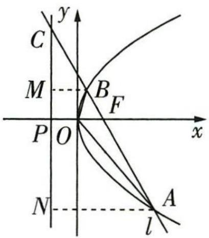

text_image

y
C
M
B
F
P O x
N
A
l

图1

第二步:求抛物线的方程及焦点 F.

在 $\triangle MBC$ 中， $|BC| = 2|BF|$ ，所以 $|BC| = 2|BM|$ ，所以 $\angle MCB = 30^{\circ}$

故在 $\triangle ANC$ 中， $|AC|=2|AN|=8$ ，所以 $|AC|=|AF|+|CF|=8$ ，则 $|CF|=8-|AF|=4$ 。

又 $CN \perp x$ 轴， $\angle MCB = 30^{\circ}$ ，所以 $|PF| = \frac{1}{2} |CF| = 2$

抛物线 $D:y^{2} = 2px(p > 0)$ ，则 $P(-\frac{p}{2},0),F(\frac{p}{2},0)$ ，所以 $|PF| = \frac{p}{2} +\frac{p}{2} = p = 2$

所以抛物线 $D: y^{2} = 4x, F(1,0)$ .

数学哲言

第三步: 求直线 AB 的方程.

因为 $\angle MCB = 30^{\circ}$ ，所以直线 AB 的斜率 $k = -\sqrt{3}$ ，则直线 AB 的方程为 $y = -\sqrt{3}(x - 1)$ .

第四步:联立直线与抛物线的方程,利用抛物线定义与点到直线距离公式求得|AB|与点O到直线AB的距离d.

由 $\left\{\begin{aligned}y&=-\sqrt{3}(x-1),\\ y^{2}&=4x,\end{aligned}\right.$ 消去y并化简得 $3x^{2}-10x+3=0,$

易得 $\Delta > 0$ ，设点 $A(x_1, y_1), B(x_2, y_2)$ ，则 $x_1 + x_2 = \frac{10}{3}$ ，

$$
\text {则} \vert A B \vert = \vert B F \vert + \vert A F \vert = \vert B M \vert + \vert A N \vert = x _ {1} + \frac {p}{2} + x _ {2} + \frac {p}{2} = x _ {1} + x _ {2} + p = \frac {1 0}{3} + 2 = \frac {1 6}{3},
$$

【关键提醒】抛物线的“焦点弦”通常根据抛物线定义进行求解，可简记为 $|AB|=x_{1}+x_{2}+p$ 点 O 到直线 AB 的距离 $d=\frac{|-\sqrt{3}|}{\sqrt{3+1}}=\frac{\sqrt{3}}{2}$ .

第五步:根据三角形面积公式求 $\triangle OAB$ 的面积.

所以 $S_{\triangle OAB} = \frac{1}{2}\times |AB|\times d = \frac{1}{2}\times \frac{16}{3}\times \frac{\sqrt{3}}{2} = \frac{4\sqrt{3}}{3}.$

【用公式】根据三角形面积公式 “ $S=\frac{底 \times 高}{2}$ ” 直接求出面积

调研 2: (2024 山西朔州 8 月开学联考) 已知椭圆 $E: \frac{x^{2}}{a^{2}} + \frac{y^{2}}{b^{2}} = 1 (a > b > 0)$ 的左、右焦点分别为 $F_{1}, F_{2}, M$ 为椭圆 $E$ 的上顶点, $\overrightarrow{MF_{1}} \cdot \overrightarrow{MF_{2}} = 0$ , 点 $N(\sqrt{2}, -1)$ 在椭圆 $E$ 上.

(1) 求椭圆 E 的标准方程;

(2)设经过焦点 $F_{2}$ 的两条互相垂直的直线分别与椭圆 $E$ 相交于 $A, B$ 两点和 $C$ , $D$ 两点,求四边形 $ACBD$ 的面积的最小值.

# 锁定题眼

注意题眼“经过焦点 $F_{2}$ 的两条互相垂直的直线”，可以推出直线 AB 与 CD 互相垂直，本题是求四边形 ACBD 的面积的最小值，根据对角线互相垂直的四边形的面积等于其两条对角线乘积的一半，可得 $S_{四边形ACBD} = \frac{1}{2} \times |AB| \times |CD|$ .

解析 (1) 设 $F_{2}(c,0)$ , 由 $\overrightarrow{MF_{1}} \cdot \overrightarrow{MF_{2}} = 0$ , 有 $\overrightarrow{MF_{1}} \perp \overrightarrow{MF_{2}}$ .

因为 $|MF_{1}| = |MF_{2}|$ ，所以 $\angle MF_{2}O = \frac{\pi}{4}$ （ $O$ 为坐标原点），可得 $b = c, a^{2} = 2b^{2}$ ，

可得椭圆 E 的方程为 $\frac{x^{2}}{2b^{2}} + \frac{y^{2}}{b^{2}} = 1$ ,

# 数学哲言

代入点 $N$ 的坐标，有 $\frac{2}{2b^2} +\frac{1}{b^2} = 1$ ，解得 $b = \sqrt{2}$ ，故 $a = 2$

故椭圆 E 的标准方程为 $\frac{x^{2}}{4} + \frac{y^{2}}{2} = 1$ .

(2)第一步:按照直线AB的斜率情况进行分类讨论.

①当直线AB的斜率不存在或为0时， $|AB|$ 为长轴长或 $\frac{2b^{2}}{a}$ ，

【易错】不要忘记讨论斜率不存在或为0的情况

不妨设 $|AB|=2a=4,|CD|=\frac{2b^{2}}{a}=2$ ，则 $S_{四边形ACBD}=\frac{1}{2}\times|AB|\times|CD|=4.$

②当直线AB的斜率存在且不为0时,设直线AB的方程为 $y=k(x-\sqrt{2})$ , $A(x_{1},y_{1})$ , $B(x_{2},y_{2})$ ,

由 $\left\{\begin{aligned}y&=k(x-\sqrt{2}),\\ \frac{x^{2}}{4}&+\frac{y^{2}}{2}=1,\end{aligned}\right.$ 消去 y 得关于 x 的方程 $(1+2k^{2})x^{2}-4\sqrt{2}k^{2}x+4k^{2}-4=0,1+2k^{2}\neq0,\Delta>0,$

则 $x_{1} + x_{2} = \frac{4\sqrt{2}k^{2}}{1 + 2k^{2}}, x_{1}x_{2} = \frac{4k^{2} - 4}{1 + 2k^{2}},$

第二步:结合根与系数的关系,用 k 表示 $\left|AB\right|$ , $\left|CD\right|$ .

所以 $|AB|=\sqrt{1+k^{2}}\times\sqrt{(x_{1}+x_{2})^{2}-4x_{1}x_{2}}=\sqrt{1+k^{2}}\times\sqrt{\left(\frac{4\sqrt{2}k^{2}}{1+2k^{2}}\right)^{2}-4\times\frac{4k^{2}-4}{1+2k^{2}}}=\frac{4(k^{2}+1)}{2k^{2}+1}$

【会思考】根据“弦长”公式，求得 $|AB|$ ，再根据“变量代换”可求得 $|CD|$

同理可得 $|CD|=\frac{4\left(\frac{1}{k^{2}}+1\right)}{\frac{2}{k^{2}}+1}=\frac{4\left(k^{2}+1\right)}{k^{2}+2}$ ,

第三步:写出四边形 ACBD 面积的表达式.

所以 $S_{四边形ACBD}=\frac{1}{2}\times|AB|\times|CD|=\frac{8(k^{2}+1)^{2}}{(k^{2}+2)(2k^{2}+1)}$ ,

【会转化】对角线互相垂直的四边形的面积为其两条对角线乘积的一半

第四步:利用基本不等式求四边形 ACBD 面积的最小值.

因为 $(k^2 + 2)(2k^2 + 1) \leqslant \left[\frac{(k^2 + 2) + (2k^2 + 1)}{2}\right]^2 = \frac{9(k^2 + 1)^2}{4},$

当且仅当 $k^{2}+2=2k^{2}+1$ ，即 $k=\pm1$ 时等号成立，

所以 $S_{四边形ACBD} \geqslant \frac{8(k^{2}+1)^{2}}{\frac{9(k^{2}+1)^{2}}{4}} = \frac{32}{9}.$

而 $\frac{32}{9}<4$ ,故四边形ACBD的面积的最小值为 $\frac{32}{9}$ .

数学哲言

分数 人生价值好比一个分数,一个人的实际才能是分子,而一个人对自己的估价则是分母,分母越大,则分数的值越小.

# 核心技法 2 用向量法求面积

调研 3 (试题调研原创)已知椭圆 $\Gamma: \frac{x^{2}}{25} + \frac{16y^{2}}{25} = 1, A, B$ 分别为 $\Gamma$ 的左、右顶点. 若点 $P$ 在 $\Gamma$ 上, 点 $Q$ 在直线 $x = 6$ 上, 且 $|BP| = |BQ|, BP \perp BQ$ , 则 $\triangle APQ$ 的面积为 \_\_\_\_.

# 巧抓关键

在 $\triangle ABC$ 中,若 $\overrightarrow{AB}=(x_{1},y_{1}),\overrightarrow{AC}=(x_{2},y_{2})$ ,则 $\triangle ABC$ 的面积 $S_{\triangle ABC}=\frac{1}{2}|x_{1}y_{2}-x_{2}y_{1}|$ .证明如下: $S_{\triangle ABC}=\frac{1}{2}|\overrightarrow{AB}||\overrightarrow{AC}|\sin A=\frac{1}{2}\sqrt{|\overrightarrow{AB}|^{2}|\overrightarrow{AC}|^{2}-(\overrightarrow{AB}\cdot\overrightarrow{AC})^{2}}=\frac{1}{2}\sqrt{(x_{1}^{2}+y_{1}^{2})(x_{2}^{2}+y_{2}^{2})-(x_{1}x_{2}+y_{1}y_{2})^{2}}=$ $\frac{1}{2}\sqrt{x_{1}^{2}y_{2}^{2}-2x_{1}x_{2}y_{1}y_{2}+x_{2}^{2}y_{1}^{2}}=\frac{1}{2}|x_{1}y_{2}-x_{2}y_{1}|.$

解析 第一步: 结合条件判断三角形相似, 可得 $x_{p} = \pm 3$ .

由对称性,不妨设 P, Q 在 x 轴上方, 过 P 作 $PC \perp x$ 轴, 垂足为 C, 设 $D(6,0)$ , 则 $|BD| = 1$ .

由题意知 $\triangle PBC \sim \triangle BQD$ ，所以 $\frac{|BP|}{|QB|} = \frac{|PC|}{|BD|} = 1$ ，所以 $|PC| = 1$ ，所以 $y_p = 1, x_p = \pm 3$ .

第二步: 分点 P 在 y 轴左、右侧两种情况分类讨论, 利用向量法求三角形面积.

若 $P(3,1)$ ，则 $A(-5,0),Q(6,2)$ ，易知 $\overrightarrow{AP} = (8,1),\overrightarrow{AQ} = (11,2)$

$$
S _ {\triangle A P Q} = \frac {1}{2} | x _ {1} y _ {2} - x _ {2} y _ {1} | = \frac {1}{2} \times | 8 \times 2 - 1 1 \times 1 | = \frac {5}{2} (\text {其中} \overrightarrow {A P} = (x _ {1}, y _ {1}), \overrightarrow {A Q} = (x _ {2}, y _ {2})).
$$

若 $P(-3,1)$ ，则 $A(-5,0)$ ， $Q(6,8)$ ，易知 $\overrightarrow{AP} = (2,1)$ ， $\overrightarrow{AQ} = (11,8)$ ，

$$
S _ {\triangle A P Q} = \frac {1}{2} | x _ {1} y _ {2} - x _ {2} y _ {1} | = \frac {1}{2} \times | 2 \times 8 - 1 1 \times 1 | = \frac {5}{2} (\text {其中} \overrightarrow {A P} = (x _ {1}, y _ {1}), \overrightarrow {A Q} = (x _ {2}, y _ {2})).
$$

综上, $\triangle APQ$ 的面积为 $\frac{5}{2}$ .

【会思考】本题还可以利用点到直线的距离公式以及三角形的面积公式求解，但此法比较复杂，计算量较大，需要分两种情况求解点 $A$ 到直线 $PQ$ 的距离和 $|PQ|$ ，本题用向量法更方便

# 核心技法 3 用割补法求面积

调研 4 (2023 浙江镇海中学 7 月期末) 已知椭圆 $C_{1}: \frac{y^{2}}{a^{2}} + \frac{x^{2}}{b^{2}} = 1 (a > b > 0)$ 的离心率为 $\frac{\sqrt{2}}{2}$ , 抛物线 $C_{2}: x^{2} = 8y$ 的准线与 $C_{1}$ 相交, 所得弦长为 $2\sqrt{6}$ .

# 数学哲言

(1) 求椭圆 $C_{1}$ 的标准方程.

(2) 若 $A(x_{1}, y_{1}), B(x_{2}, y_{2})$ 在 $C_{2}$ 上, 且 $x_{1} < 0 < x_{2}$ , 分别以 $A, B$ 为切点作 $C_{2}$ 的切线, 两切线相交于点 $P$ , 点 $P$ 恰好在 $C_{1}$ 上, 直线 $AP, BP$ 分别交 $x$ 轴于 $M, N$ 两点. 求四边形 $ABNM$ 面积的取值范围.

解析 (1) 由题意知 $C_1$ 过点 $(\sqrt{6}, -2)$ , 则 $\left\{ \begin{array}{l} \frac{c}{a} = \frac{\sqrt{2}}{2}, \\ \frac{4}{a^2} + \frac{6}{b^2} = 1, \\ a^2 = b^2 + c^2, \end{array} \right.$ 解得 $\left\{ \begin{array}{l} a = 4, \\ b = 2\sqrt{2}, \\ c = 2\sqrt{2}, \end{array} \right.$

所以椭圆 $C_{1}$ 的标准方程为 $\frac{y^{2}}{16} + \frac{x^{2}}{8} = 1$ .

(2)第一步:设直线 $AB$ 的方程,并与抛物线 $C_2$ 的方程联立,求 $|AB|$ .

如图2, 易知直线 $AB$ 的斜率存在, 设直线 $AB$ 的方程为 $y = kx + m (m > 0), A(x_1, y_1), B(x_2, y_2)$ ,

由 $\left\{\begin{aligned}y&=kx+m,\\ x^{2}&=8y,\end{aligned}\right.$ 消去 y 得关于 x 的方程 $x^{2}-8kx-8m=0,\Delta=64k^{2}+32m>0,$

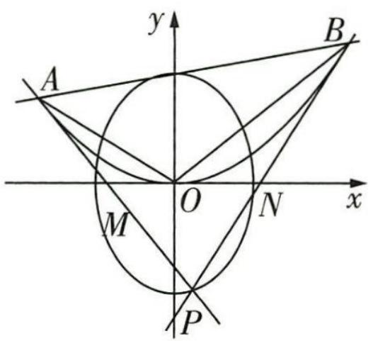

text_image

y
A
B
O
x
M
N
P

图 2

$$
x _ {1} + x _ {2} = 8 k, x _ {1} x _ {2} = - 8 m \text {, 则} | A B | = \sqrt {1 + k ^ {2}} | x _ {1} - x _ {2} |.
$$

第二步:利用曲线的切线方程求出 M, N 两点的坐标,并求出 $\left|MN\right|$ 与点 P 到直线 AB 的距离.

对于抛物线 $C_{2}: x^{2} = 8y$ ，即 $y = \frac{x^{2}}{8}$ ，则 $y' = \frac{x}{4}$ ，

【会思考】对于“开口向上(下)”的抛物线，可以借助导数工具解决切线问题

故以 $A$ 为切点的切线方程为 $y - y_{1} = \frac{x_{1}}{4} (x - x_{1})$ ，即 $y = \frac{x_{1}}{4} x - \frac{x_{1}^{2}}{8}$ ，所以 $M(\frac{x_1}{2},0)$ ，

同理,以 B 为切点的切线方程为 $y=\frac{x_{2}}{4}x-\frac{x_{2}^{2}}{8}$ , 所以 $N(\frac{x_{2}}{2},0)$ , 则 $|MN|=\left|\frac{x_{1}-x_{2}}{2}\right|$ .

由 $\left\{\begin{aligned}y&=\frac{x_{1}}{4}x-\frac{x_{1}^{2}}{8},\\ y&=\frac{x_{2}}{4}x-\frac{x_{2}^{2}}{8},\end{aligned}\right.$ 两式作差得 $\left(\frac{x_{1}}{4}-\frac{x_{2}}{4}\right)x=\frac{x_{1}^{2}}{8}-\frac{x_{2}^{2}}{8}$ ，所以 $x=\frac{x_{1}+x_{2}}{2}=4k$ ，

两式求和得 $2y = \frac{x_1 + x_2}{4} x - \frac{x_1^2 + x_2^2}{8} = \frac{x_1 + x_2}{4} x - \frac{(x_1 + x_2)^2 - 2x_1x_2}{8} = -2m$ ，即 $y = -m$

所以 $P(4k,-m)$ ，由 P 在椭圆 $C_{1}$ 上得 $\frac{m^{2}}{16}+2k^{2}=1, m\in(0,4]$ .

点 $P$ 到直线 $AB$ 的距离 $d = \frac{|4k^2 + 2m|}{\sqrt{k^2 + 1}}$

第三步: 将四边形 ABNM 补形为 $\triangle ABP$ , 写出四边形 ABNM 的面积表达式, 结合函数的性质求取值范围.

所以 $S_{\triangle ABP} = \frac{1}{2} d\cdot |AB| = \frac{1}{2} |\frac{4k^2 + 2m}{\sqrt{k^2 + 1}} |\cdot \sqrt{1 + k^2}|x_1 - x_2|$

$$
S _ {\triangle M N P} = \frac {1}{2} | m | \cdot | \frac {x _ {1} - x _ {2}}{2} |,
$$

四边形ABNM的面积 $S = S_{\triangle ABP} - S_{\triangle MNP}$

【点技巧】利用补形法，将四边形ABMN的面积通过“ $S_{\triangle ABP}-S_{\triangle MNP}$ ”表示

$$
\begin{array}{l} = \frac {1}{2} \left| \frac {4 k ^ {2} + 2 m}{\sqrt {k ^ {2} + 1}} \right| \cdot \sqrt {1 + k ^ {2}} \left| x _ {1} - x _ {2} \right| - \frac {1}{2} | m | \cdot \left| \frac {x _ {1} - x _ {2}}{2} \right| \\ = (2 k ^ {2} + \frac {3}{4} m) | x _ {1} - x _ {2} | \\ = (8 k ^ {2} + 3 m) \sqrt {4 k ^ {2} + 2 m} \\ = \left(- \frac {m ^ {2}}{4} + 3 m + 4\right) \sqrt {- \frac {m ^ {2}}{8} + 2 m + 2} \\ = [ 1 3 - \frac {(m - 6) ^ {2}}{4} ] \sqrt {1 0 - \frac {(m - 8) ^ {2}}{8}}, \\ \end{array}
$$

而 $y=13-\frac{(m-6)^{2}}{4},y=10-\frac{(m-8)^{2}}{8}$ 在 $m\in(0,4]$ 上单调递增且恒为正，

【指点迷津】两个含参函数的单调性一致，即都为增或都为减，那么它们的乘积与原函数单调性一致

则 S 在 $m \in (0,4]$ 上单调递增, 所以 $S \in (4\sqrt{2}, 24\sqrt{2}]$ , 即四边形 ABNM 面积的取值范围为 $(4\sqrt{2}, 24\sqrt{2}]$ .

# 核心技法 4 用图形关系转化法求面积

调研 5 (2024 重庆九龙坡区 8 月开学模拟) 在平面直角坐标系中, 点 O 为坐标原点, M(-1,0), N(1,0), Q 为线段 MN 上异于 M, N 的一动点, 点 P 满足 $\frac{|PM|}{|QM|} = \frac{|PN|}{|QN|} = 2$ .

(1) 求点 P 的轨迹 E 的方程.

(2) $A, C$ 是曲线 $E$ 上两点, 且在 $x$ 轴上方, 满足 $AM \parallel NC$ , 求四边形 $AMNC$ 面积的

最大值.

# 锁定题眼

看到题眼“点 P 满足 $\frac{|PM|}{|QM|} = \frac{|PN|}{|QN|} = 2$ ”, 想到利用几何特征和等量关系进行转化, 可得 $|PM| + |PN| = 4 > |MN|$ , 符合椭圆的定义, 得出轨迹方程. 求四边形 AMNC 的面积, 通过题眼 “AM // NC”, 延长 CO 交曲线 E 于点 B, 可转化得 CN // BM 且 A, M, B 三点共线, 所以 $S_{\triangle BOM} = S_{\triangle CON}$ , 如此便可将四边形 AMNC 的面积转化为 $\triangle ABC$ 的面积求解.

解析(1) $\because\frac{|PM|}{|QM|}=\frac{|PN|}{|QN|=2,\therefore|PM|=2|QM|,|PN|=2|QN|,$

$$
\therefore | P M | + | P N | = 2 (| Q M | + | Q N |) = 2 | M N | = 4 > | M N |,
$$

【会转化】转化比例关系,得出动点 $P$ 满足的条件,结合椭圆定义,得出轨迹方程

∴ 点 P 的轨迹是以 M, N 为左、右焦点, 4 为长轴长的椭圆, 设其方程为 $\frac{x^{2}}{a^{2}} + \frac{y^{2}}{b^{2}} = 1 (a > b > 0)$ ,

则 $a = 2, c = 1, \therefore b^2 = a^2 - c^2 = 3$ .

∴ 点 P 的轨迹 E 的方程为 $\frac{x^{2}}{4} + \frac{y^{2}}{3} = 1$ .

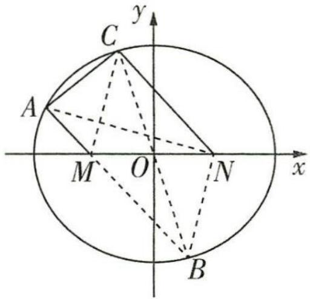

text_image

y
C
A
M O N x
B

图3

(2)第一步:作辅助线,根据椭圆对称性,将四边形 AMNC 的面积转化为三角形 ABC 的面积.

连接 $CO$ , 延长 $CO$ 交椭圆 $E$ 于点 $B$ , 连接 $BN, BM, AN, CM$ , 如图3,

由椭圆对称性可知 $|OC|=|OB|$ ，又 $|OM|=|ON|$ ，∴四边形CMBN为平行四边形，

$\therefore CN \parallel BM, |CN| = |BM|, \therefore S_{\triangle BOM} = S_{\triangle CON}$ 且 $A, M, B$ 三点共线，

∴ 四边形 AMNC 的面积 $S = S_{\triangle ACM} + S_{\triangle COM} + S_{\triangle CON} = S_{\triangle ACM} + S_{\triangle COM} + S_{\triangle BOM} = S_{\triangle ABC}$ ,

【会转化】根据对称性和平行关系,将四边形 ${AMNC}$ 的面积转化为 $\bigtriangleup  {ABC}$ 的面积

第二步:设直线 AB 的方程,将直线方程与椭圆方程联立,根据根与系数的关系求 $\left|AB\right|$ .

易知直线 ${AB}$ 的斜率不为0,设直线 ${AB}$ 的方程为 $x = {my} - 1,A\left( {{x}_{1},{y}_{1}}\right) \left( {{y}_{1} > 0}\right) ,B\left( {{x}_{2},{y}_{2}}\right)$ ,

【指点迷津】在联立直线方程与圆锥曲线方程时, 要注意对直线的 “特征” 进行仔细观察, 巧设直线方程, 往往会减少一定的运算量, 有时也能够避免对直线斜率存在与否的分类讨论

由 $\left\{\begin{aligned}\frac{x^{2}}{4}+\frac{y^{2}}{3}=1,\\ x=my-1,\end{aligned}\right.$ 得关于y的方程 $(3m^{2}+4)y^{2}-6my-9=0,\Delta>0,3m^{2}+4\neq0,\therefore y_{1}+y_{2}=$

数学哲言

$$
\frac {6 m}{3 m ^ {2} + 4}, y _ {1} y _ {2} = - \frac {9}{3 m ^ {2} + 4},
$$

$$
\therefore | A B | = \sqrt {1 + m ^ {2}} \cdot \sqrt {\left(y _ {1} + y _ {2}\right) ^ {2} - 4 y _ {1} y _ {2}} = \frac {\sqrt {1 + m ^ {2}} \sqrt {1 4 4 (m ^ {2} + 1)}}{3 m ^ {2} + 4} = \frac {1 2 (1 + m ^ {2})}{3 m ^ {2} + 4}.
$$

第三步: 求出点 N 到直线 AB 的距离的表达式.

又 $AM \parallel NC, \therefore$ 点 $C$ 到直线 $AB$ 的距离即点 $N$ 到直线 $AB$ 的距离，

点 N 到直线 AB 的距离 $d=\frac{2}{\sqrt{1+m^{2}}}$ ,

第四步:写出四边形 AMNC 的面积表达式,通过换元求最值.

$$
\therefore S = \frac {1}{2} | A B | \cdot d = \frac {1 2 \sqrt {1 + m ^ {2}}}{3 m ^ {2} + 4} = 1 2 \sqrt {\frac {1 + m ^ {2}}{(3 m ^ {2} + 4) ^ {2}}},
$$

设 $3m^{2}+4=t$ ，则 $m^{2}=\frac{t-4}{3},t\geqslant4,\therefore S=12\sqrt{\frac{1+\frac{t-4}{3}}{t^{2}}}$ =12 $\sqrt{\frac{t-1}{3t^{2}}}$ =4 $\sqrt{3}\sqrt{-\frac{1}{t^{2}}+\frac{1}{t}}$ =

【小技巧】通过换元法求得函数的最值

$$
4 \sqrt {3} \cdot \sqrt {- (\frac {1}{t} - \frac {1}{2}) ^ {2} + \frac {1}{4}}.
$$

又 $0 < \frac{1}{t} \leqslant \frac{1}{4}, \therefore$ 当 $\frac{1}{t} = \frac{1}{4}$ , 即 $m = 0$ 时, 四边形 $AMNC$ 面积取得最大值, 最大值为 3.

# 变式演练

1. (调研 1 变式, 变情境, 电影放映灯的反射镜面 | 2024 黑龙江大庆中学 8 月模拟) 一种电影放映灯的反射镜面是旋转椭圆面 (椭圆绕其对称轴旋转一周形成的曲面) 的一部分. 如图 4, 过对称轴的截口 BAC 是椭圆的一部分, 灯丝位于椭圆的一个焦点 $F_{1}$ 上, 片门位于另一个焦点 $F_{2}$ 上. 由椭圆一个焦点 $F_{1}$ 发出的光线, 经过旋转椭圆面反射后集中到另一个焦点 $F_{2}$ . 已知 $BF_{1} \perp F_{1}F_{2}, |F_{1}B| = \frac{5}{3}, |F_{1}F_{2}| = 4.$

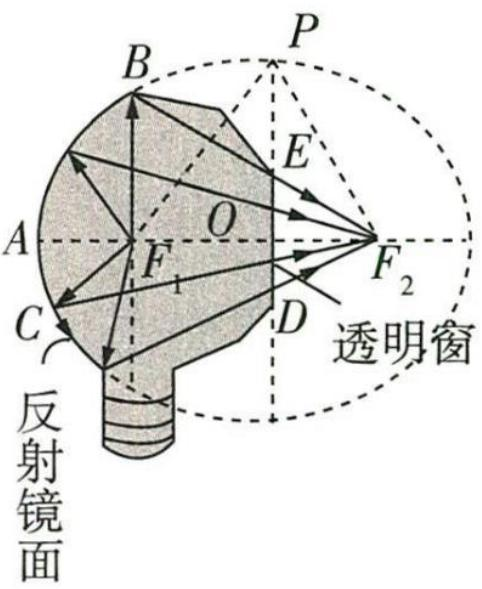

text_image

反射镜面
A
B
P
E
O
F₁
F₂
C
D
透明窗

图4

(1)试建立适当的平面直角坐标系,求截口 BAC 所在的椭圆的方程.  
(2)若透明窗 DE 所在的直线与截口 BAC 所在的椭圆交于一点 P, 且 $\angle F_{1}PF_{2}=60^{\circ}$ , 求 $\triangle F_{1}PF_{2}$ 的面积.

# 数学哲言

# 思路指引

对于以现实情境命制的题目,要读懂题意,转化为数学语言,本题首先建立适当的坐标系,由已知垂直关系及线段长度,应用勾股定理求 $|F_{2}B|$ ,进而可求得a,c,b,由此写出椭圆方程.结合椭圆定义 $|PF_{1}|+|PF_{2}|=6$ ,根据 $\angle F_{1}PF_{2}=60^{\circ}$ ,结合余弦定理可得 $|PF_{1}||PF_{2}|$ 的值,即可求出 $\triangle F_{1}PF_{2}$ 的面积.

2. (调研 2 变式, 变载体, 创新题型 |2023 湖北襄阳 7 月模拟) 设双曲线 $E: \frac{x^{2}}{a^{2}} - \frac{y^{2}}{b^{2}} = 1$ $(a > 0, b > 0)$ 的左、右焦点分别为 $F_{1}, F_{2}, |F_{1}F_{2}| = 2\sqrt{5}$ , 且 $E$ 的渐近线方程为 $y = \pm \frac{x}{2}$ .

(1) 求 E 的方程;  
(2) 过 $F_{2}$ 作两条相互垂直的直线 $l_{1}$ 和 $l_{2}$ , 与 $E$ 的右支分别交于 $A, C$ 两点和 $B, D$ 两点, 求四边形 $ABCD$ 面积的最小值.

3. (交汇基本不等式 |2024 福建福州一中 7 月模拟 |较难) 已知 $A_{1}(-2,0), A_{2}(2,0)$ 分别是椭圆 $C: \frac{x^{2}}{a^{2}} + \frac{y^{2}}{b^{2}} = 1 (a > b > 0)$ 的左、右顶点, 过 $A_{1}$ 作两条互相垂直的直线 $A_{1} M, A_{1} N$ , 分别交椭圆 $C$ 于 $M, N$ 两点, $\triangle A_{1} M A_{2}$ 面积的最大值为 $2 \sqrt{2}$ .

(1) 求椭圆 C 的方程.  
(2) 若直线 $A_{2} M$ 与 $A_{1} N$ 交于点 $P$ , 直线 $A_{2} N$ 与 $A_{1} M$ 交于点 $Q$ .  
(i) 求直线 PQ 的方程;  
(ii) 记 $\triangle MNA_{1}, \triangle PQA_{1}$ 的面积分别为 $S_{1}, S_{2}$ ，求 $\frac{S_{1}}{S_{2}}$ 的最大值.

# 参考答案与解析

1.(1)建立如图5所示的平面直角坐标系,

设截口 BAC 所在椭圆方程为 $\frac{x^{2}}{a^{2}} + \frac{y^{2}}{b^{2}} = 1 (a > b > 0)$ ,

因为 $BF_{1} \perp F_{1}F_{2}, |F_{1}B| = \frac{5}{3}, |F_{1}F_{2}| = 4,$

所以在直角 $\triangle BF_{1}F_{2}$ 中， $|F_{2}B| = \sqrt{|F_{1}B|^{2} + |F_{1}F_{2}|^{2}} = \frac{13}{3}$ ，

故 $2a = |F_{1}B| + |F_{2}B| = 6$ ，即 $a = 3$

又 $2c = |F_{1}F_{2}| = 4, c = 2$ ，所以 $b^{2} = a^{2} - c^{2} = 5$ ，所以所求椭圆方程为 $\frac{x^2}{9} + \frac{y^2}{5} = 1$ .

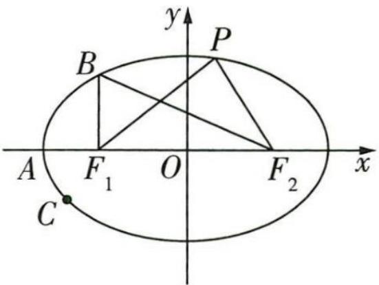

text_image

y
P
B
A F₁ O F₂ x
C

图5

数学哲言

(2) 因为点 P 在椭圆上, 所以 $\left|PF_{1}\right| + \left|PF_{2}\right| = 2a = 6$ ,

又 $\angle F_{1}PF_{2} = 60^{\circ}$ ，所以 $\cos 60^{\circ} = \frac{|PF_1|^2 + |PF_2|^2 - |F_1F_2|^2}{2|PF_1||PF_2|} = \frac{1}{2}$ ①，

又 $\left|PF_{1}\right|^{2}+\left|PF_{2}\right|^{2}=\left(\left|PF_{1}\right|+\left|PF_{2}\right|\right)^{2}-2\left|PF_{1}\right|\left|PF_{2}\right|=36-2\left|PF_{1}\right|\left|PF_{2}\right|,\left|F_{1}F_{2}\right|=2c=4,$ 代入①式,即可得 $\left|PF_{1}\right|\left|PF_{2}\right|=\frac{20}{3}$ ,

故 $\triangle F_{1}PF_{2}$ 的面积为 $\frac{1}{2} \times |PF_{1}| |PF_{2}| \times \sin 60^{\circ} = \frac{1}{2} \times \frac{20}{3} \times \frac{\sqrt{3}}{2} = \frac{5\sqrt{3}}{3}$ .

【一题多解】求椭圆焦点三角形的面积，还可以直接用二级结论求解， $\triangle F_{1}PF_{2}$ 的面积 $S_{\triangle F_{1}PF_{2}} = b^{2}\tan \frac{\angle F_{1}PF_{2}}{2} = 5 \times \tan 30^{\circ} = \frac{5\sqrt{3}}{3}$

2.(1)第一步:由双曲线的渐近线方程得a,b间的关系.

如图6,由题意得 $E:\frac{x^{2}}{a^{2}}-\frac{y^{2}}{b^{2}}=1(a>0,b>0)$ 的渐近线方程为 $y=\pm\frac{b}{a}x$ ,因为双曲线 E 的渐近线方程为 $y = \pm \frac{x}{2}$ ，所以 $\frac{b}{a} = \frac{1}{2}$ ，即 a = 2b。第二步:结合焦距与 a, b 的关系, 求得 a, b 的值, 写出 E 的方程.因为 $|F_{1}F_{2}|=2\sqrt{a^{2}+b^{2}}=2\sqrt{5b^{2}}=2\sqrt{5}$ ，所以b=1，所以a=2，
故 E 的方程为 $\frac{x^{2}}{4}-y^{2}=1$ .

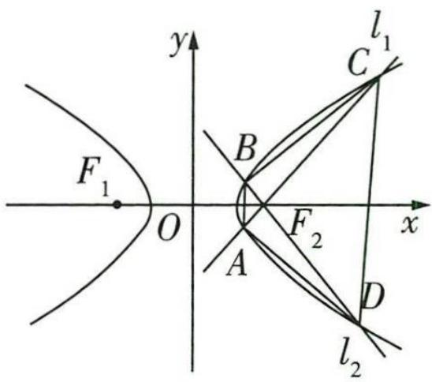

text_image

F₁
O
y
B
C
l₁
F₂
x
A
D
l₂

图6

(2)第一步:设直线 $l_{1}, l_{2}$ 的方程,结合题意,求出 $k^{2}$ 的取值范围.根据题意,直线 $l_{1}, l_{2}$ 的斜率都存在且不为 0,

【易错警示】涉及直线与圆锥曲线位置关系的问题，要对直线的斜率的存在性进行判断或讨论

设直线 $l_{1}: y = k(x - \sqrt{5})$ , $l_{2}: y = -\frac{1}{k}(x - \sqrt{5})$ , 其中 $k \neq 0$ ,

因为直线 $l_{1}, l_{2}$ 均与 E 的右支有两个交点, 所以 $|k| > \frac{1}{2}, |- \frac{1}{k}| > \frac{1}{2}$ , 所以 $\frac{1}{4} < k^{2} < 4$ ,

【敲黑板】注意直线 $l_{1}, l_{2}$ 不与 $E$ 的左支相交, 都是与右支有两个交点, 所以其斜率的绝对值都大于 $\frac{1}{2}$

第二步: 将直线 $l_{1}$ 与 E 的方程联立, 利用根与系数的关系, 可得 $|AC|$ 的表达式, 进一步得 $|BD|$ 的表达式.

将 $l_{1}$ 的方程与 $\frac{x^{2}}{4}-y^{2}=1$ 联立, 可得关于 x 的一元二次方程 $(1-4k^{2})x^{2}+8\sqrt{5}k^{2}x-20k^{2}-4=0$ ,

# 数学哲言

$$
1 - 4 k ^ {2} \neq 0, \Delta > 0,
$$

设 $A(x_{1},y_{1}),C(x_{2},y_{2})$ ，则 $x_{1} + x_{2} = \frac{-8\sqrt{5}k^{2}}{1 - 4k^{2}},x_{1}x_{2} = \frac{-20k^{2} - 4}{1 - 4k^{2}},$

又 $4k^{2} - 1 > 0$ ，所以 $\mid AC\mid = \sqrt{1 + k^2}\mid x_1 - x_2\mid = \sqrt{1 + k^2}\sqrt{(x_1 + x_2)^2 - 4x_1x_2} =$

$$
\sqrt {1 + k ^ {2}} \sqrt {\left(\frac {- 8 \sqrt {5} k ^ {2}}{1 - 4 k ^ {2}}\right) ^ {2} - 4 \cdot \frac {- 2 0 k ^ {2} - 4}{1 - 4 k ^ {2}}} = \sqrt {1 + k ^ {2}} \cdot \frac {4 \sqrt {1 + k ^ {2}}}{| 1 - 4 k ^ {2} |} = \frac {4 (1 + k ^ {2})}{4 k ^ {2} - 1},
$$

用 $-\frac{1}{k}$ 替换 k, 可得 $|BD| = \frac{4(k^{2} + 1)}{4 - k^{2}}$ .

第三步:写出四边形 ABCD 面积的表达式,换元,利用函数性质求最值.

所以 $S_{\text{四边形}ABCD} = \frac{1}{2}|AC| \cdot |BD| = \frac{1}{2} \cdot \frac{4(1 + k^2)}{4k^2 - 1} \cdot \frac{4(k^2 + 1)}{4 - k^2} = \frac{8(k^2 + 1)^2}{(4k^2 - 1)(4 - k^2)}.$

令 $t=k^{2}+1$ , 所以 $k^{2}=t-1, t\in(\frac{5}{4},5)$

则 $S_{四边形ABCD}=\frac{8t^{2}}{-4t^{2}+25t-25}=\frac{8}{-4+\frac{25}{t}-\frac{25}{t^{2}}}=\frac{8}{-25\left(\frac{1}{t}-\frac{1}{2}\right)^{2}+\frac{9}{4}}\geqslant\frac{32}{9}$

当 $\frac{1}{t}=\frac{1}{2}$ ，即 $k=\pm1$ 时，等号成立.

【敲黑板】涉及最值问题时，要注意等号成立的条件

故四边形 ABCD 面积的最小值为 $\frac{32}{9}$ .

3.(1)由题意可知 a=2，且 $\triangle A_{1}MA_{2}$ 面积的最大值为 $\frac{1}{2}\times2a\times b=ab=2\sqrt{2}$ ，所以 $a=2, b=\sqrt{2}$ .

【会思考】易知当 M 点为短轴端点时， $\triangle A_{1}MA_{2}$ 面积取最大值，求最值时一定不要忘记考虑在短轴端点处的情况

所以椭圆 C 的方程为 $\frac{x^{2}}{4} + \frac{y^{2}}{2} = 1$ .

(2)(i)第一步:作出图象,设点,利用垂直关系分别写出直线 $A_{2}M$ 和 $A_{1}N$ 的方程.

如图7所示,设 $M(x_{1},y_{1})$ , $N(x_{2},y_{2})$ , 由题意知直线 $A_{2}M$ 的斜率一定存在, 即 $k_{A_{2}M}=\frac{y_{1}}{x_{1}-2}$ ,

【易错】直线 $A_{2} M$ 若与 $x$ 轴垂直, 只与椭圆交于一点 $A_{2}$ , 不合题意, 所以其斜率一定存在

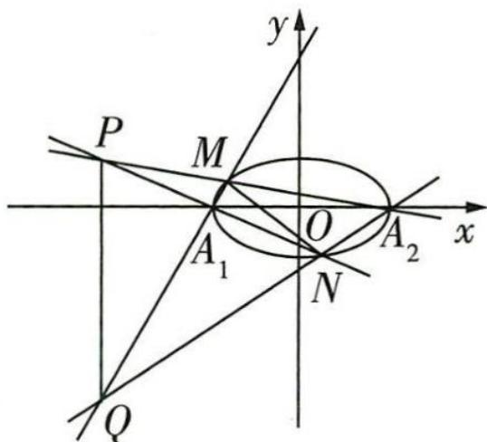

text_image

P
M
A₁
O
N
A₂
x
y
Q

图7

代入直线的点斜式方程可得直线 $A_{2}M$ 的方程为 $y=\frac{y_{1}}{x_{1}-2}(x-2)$ ①.

因为直线 $A_{1}N$ 与直线 $A_{1}M$ 垂直，所以 $k_{A_1M} \cdot k_{A_1N} = -1$

又 $k_{A_1M} = \frac{y_1}{x_1 + 2}$ , 所以 $k_{A_1N} = -\frac{x_1 + 2}{y_1}$ , 即直线 $A_1N$ 的方程为 $y = -\frac{x_1 + 2}{y_1}(x + 2)$ ②.

第二步:根据点 $M(x_{1},y_{1})$ 在椭圆上,求出 P 的横坐标,同理可求得 Q 的横坐标,即可得出直线 PQ 的方程.

又 $M(x_{1},y_{1})$ 在椭圆上，可得 $\frac{x_1^2}{4} +\frac{y_1^2}{2} = 1$ ③，

联立①②③可得, $\frac{x+2}{x-2}=-\frac{y_{1}^{2}}{(x_{1}-2)(x_{1}+2)}=-\frac{y_{1}^{2}}{x_{1}^{2}-4}=-\frac{2-\frac{1}{2}x_{1}^{2}}{x_{1}^{2}-4}=\frac{1}{2}$ ，即x=-6，

即直线 $A_{2}M$ 与 $A_{1}N$ 的交点 P 的横坐标为 -6.

同理可得 $\frac{x + 2}{x - 2} = -\frac{y_2^2}{x_2^2 - 4} = -\frac{2 - \frac{1}{2}x_2^2}{x_2^2 - 4} = \frac{1}{2}$ , 可得 $x = -6$ ,

即直线 $A_{2}N$ 与 $A_{1}M$ 的交点 Q 的横坐标为 -6.

所以直线 PQ 的方程为 x = -6.

(ii) 第一步: 将直线 $A_{1} M$ 方程与椭圆方程联立, 利用根与系数的关系可解得 $M$ 点的纵坐标, 同理得 $N$ 点的纵坐标.

设直线 $A_{1}M$ 的方程为 $x = ty - 2 (t \neq 0)$ ，与 $\frac{x^{2}}{4} + \frac{y^{2}}{2} = 1$ 联立可得关于 y 的一元二次方程 $(t^{2} + 2)y^{2} - 4ty = 0, t^{2} + 2 \neq 0, \Delta > 0$ ，所以 $y_{1} = \frac{4t}{t^{2} + 2}$ .

同理可得 $y_{2}=\frac{-4t}{2t^{2}+1}$ .

第二步: 结合(i)中直线 PQ 的方程可得 $y_{Q}, y_{P}$ ，分别表示出 $S_{1}, S_{2}$ 的表达式，再利用基本不等式求得 $\frac{S_{1}}{S_{2}}$ 的最大值.

由 $\left\{\begin{aligned}x&=ty-2,\\ x&=-6,\end{aligned}\right.$ 可得 $y_{Q}&=-\frac{4}{t}.$ 同理可得 $y_{P}=4t.$

所以 $\frac{S_1}{S_2} = \frac{\frac{1}{2}|A_1M||A_1N|\sin\angle MA_1N}{\frac{1}{2}|A_1Q||A_1P|\sin\angle PA_1Q} = \frac{|A_1M||A_1N|}{|A_1Q||A_1P|} = \frac{|y_1||y_2|}{|y_Q||y_P|} = \frac{t^2}{(t^2 + 2)(2t^2 + 1)} = \frac{1}{2t^2 + \frac{2}{t^2} + 5},$

易知 $2t^{2} + \frac{2}{t^{2}} + 5 \geqslant 2\sqrt{2t^{2} \cdot \frac{2}{t^{2}}} + 5 = 9$ ，所以 $\frac{S_{1}}{S_{2}} = \frac{1}{2t^{2} + \frac{2}{t^{2}} + 5} \leqslant \frac{1}{9}$ ，当且仅当 $t = \pm 1$ 时，等号成

立,所以 $\frac{S_{1}}{S_{2}}$ 的最大值为 $\frac{1}{9}$ .

# 超重点 14 计数原理问题中高频使用的 6 个必会技法

# 必会技法 1 隔板法

调研 1: (试题调研原创)有许多与“8”有关的可歌可泣的感人故事,如“八子参军”“八女投江”“八勇士智取华山”等,因此数字“8”是当之无愧的新时代“英雄数字”. 如果一个四位数,各个位置上数字之和等于8,这样的数称为“英雄数”(比如1223就是一个“英雄数”, $1 + 2 + 2 + 3 = 8$ ),则所有的“英雄数”有\_\_\_\_个.

# 方法速通

根据题意,将原问题转化为将8个小球分为4组且第一组的数量不能为0,根据0的个数分情况讨论,结合隔板法即可求解.

解析 由题意,8个相同的小球排成一排,8个小球两两之间共有7个空位(不包括头尾),

若“英雄数”中四个位置数字都不为0,则在这7个空位中随机安排3个隔板,可以将小球分为4组,共有 $C_{7}^{3}=35$ (组),因而可组成满足条件的四位数35个;

【关键提醒】3 个隔板将小球分成 4 组后, 各组小球个数分别是四位数的千位、百位、十位、个位上的数字

若“英雄数”中4个数字只有1个0,则需要在这7个空位中随机安排2个隔板,可以将小球分成个数不为0的3组,共有 $C_{7}^{2}$ 组,根据0可以作为百位、十位、个位上的数字,此时共有 $3 \times C_{7}^{2} = 63$ (个)“英雄数”;

【关键提醒】将小球分成3组，每组的个数不为0，0作为百位上的数字时，各组小球个数分别为千位、十位、个位上的数字，当0作为十位或个位上的数字时，同理

同理, 若“英雄数”中 4 个数字有 2 个 0 , 则需要在这 7 个空位中随机安排 1 个隔板, 可以将小球分成个数不为 0 的 2 组, 0 可以作为百位、十位、个位其中两位上的数字, 此时共有 $C_{7}^{1} \times C_{3}^{2} = 21$ (个) “英雄数”;

若“英雄数”中4个数字有3个0,则只能是8000,只有一种情况.

综上,共有 $35 + 63 + 21 + 1 = 120$ (个)“英雄数”.

# 提分干货 类型总结

隔板法往往适合名额分配、不定方程解的个数等类型,比如:5个三好学生名额,分给3个班级,每班至少一个名额,则将5个名额用隔板法分成3组,依次对应到3个班级,即 $C_{4}^{2}=6$ (种)方法.

数学哲言

# 必会技法 2 捆绑法 & 插空法

调研 2 (2024 四川内江 8 月零模)甲、乙、丙、丁、戊 5 名同学站成一排参加文艺汇演,甲和乙相邻,丙不站在两端,则不同的排列方式共有 ( )

A. 12 种

B. 24 种

C. 36 种

D. 48 种

# 巧抓关键

甲和乙相邻,采用捆绑法,将甲、乙看作一个整体,丙不站在两端,利用特殊位置特殊处理法,结合分步乘法计数原理求得结果.

解析 将甲和乙看作一个整体,有 $A_{2}^{2}=2$ (种)方法,将丁、戊和甲、乙的整体首先选择两个安排到两端,则有 $A_{3}^{2}=6$ (种)方法,再安排丙和剩余的人,有 $A_{2}^{2}=2$ (种)方法,

【技巧点拨】丙不站在两端，故先在甲、乙这个整体还有丁和戊三个元素中选择两个站两端，剩下的进行全排列

根据分步乘法计数原理可得不同的排列方式有 $2 \times 6 \times 2 = 24$ (种). 故选 B.

调研 3: (2024 浙江省名校协作体 7 月适应性考试)某校银杏大道上共有 20 盏路灯排成一列,为了节约用电,学校打算关掉 3 盏路灯,头尾 2 盏路灯不能关闭,关掉的相邻 2 盏路灯之间至少有 2 盏亮的路灯,则不同的方案种数是 ( )

A. 324

B. 364

C. 560

D. 680

# 思路指引

先将 20 盏灯分成 2 盏,15 盏,3 盏共 3 组,取出 2 盏亮的路灯,用来保证关掉的相邻 2 盏路灯之间至少有 2 盏亮的路灯,用插空法,在 15 盏亮的路灯的 14 个空位中插入 3 盏关掉的路灯,再将剩下 2 盏亮的路灯分别插入每 2 盏关掉的路灯之间即可.

解析 将20盏路灯分成2盏,15盏,3盏共3组,先将15盏亮的路灯排成一列,把3盏关掉的路灯插空,而头尾2盏路灯不能关闭,

所以是在除头尾之外的 14 个空位中插入 3 盏关掉的路灯, 共 $C_{14}^{3}=364$ (种) 方法,

在每2盏关掉的路灯之间再各放入1盏亮的路灯,且路灯无差异,保证关掉的相邻2盏路灯

【指点迷津】此时每2盏关掉的路灯之间已经至少有1盏亮的路灯，此时将剩下2盏亮的路灯分别插入3盏关掉的路灯之间的2个空位中即可保证能够满足要求之间至少有2盏亮的路灯，只有1种方法。

综上,共有 $364 \times 1 = 364$ (种) 方案. 故选 B.

# 必会技法 3 正难则反法

调研 4 (试题调研原创)某艺术团的演员中,会演歌唱节目的有6人,会演舞蹈节目的有5人,当中同时能歌能舞的只有2人,现在从中选派4人参加演出,要求

# 数学哲言

零点存在定理 零点存在定理告诉我们,哪怕你和他站在对立面,只要你们的心还是连续的,就能找到你们的平衡点.

关注微信公众号“初高教辅站”获取更多初高中教辅资料

至少有 2 人能演舞蹈节目,那么不同选派方法共有\_\_\_\_种.

解析 根据题意,艺术团的演员中,会演歌唱节目的有6人,会演舞蹈节目的有5人,当中同时能歌能舞的只有2人,则该艺术团一共有9人,不会演舞蹈节目的有4人,从9人中任选4人,

【敲黑板】根据已知条件利用集合元素运算方法，确定演员总人数有 $C_{9}^{4}=126$ (种) 选法，

至少有2人能演舞蹈节目的对立事件为:4人都不会演舞蹈节目和只有1人会演舞蹈节目.

4 人都不会演舞蹈节目有 $C_{4}^{4}=1$ (种) 情况, 只有 1 人会演舞蹈节目有 $C_{4}^{3}C_{5}^{1}=20$ (种) 情况,

则至少有2人能演舞蹈节目的选派方法有126-1-20=105(种).

# 必会技法 4 先分组后排序法

调研 5 (2024 宁夏银川贺兰二中 7 月期末) 某宾馆安排 A, B, C, D, E 五人入住 3 个房间, 每个房间至少住 1 人, 且 A, B 不能住同一房间, 则不同的安排方法种数为 ( )

A. 24

B. 48

C. 98

D. 114

解析 五人住三个房间,每个房间至少住1人,先将5人分成3组,则有3,1,1和2,2,1两类.

第一类,按照3,1,1分组有 $C_{5}^{3}$ 种方法,将3组分到三个房间有 $C_{5}^{3}A_{3}^{3}=60$ (种)方法,其中A,B住同一房间有 $C_{3}^{1}A_{3}^{3}=18$ (种)方法,A,B不住同一房间有60-18=42(种)方法;

【指点迷津】A, B 必在同一组，这组再加 1 人，再分到 3 个房间

第二类,按照2,2,1分组有 $\frac{C_{5}^{2}C_{3}^{2}}{A_{2}^{2}}$ 种方法,分到三个房间有 $\frac{C_{5}^{2}C_{3}^{2}}{A_{2}^{2}}\cdot A_{3}^{3}=90$ (种)方法,其中A,B住同一房间有 $C_{3}^{2}A_{3}^{3}=18$ (种)方法,故A,B不住同一房间有90-18=72(种)方法.

综上,不同的安排方法有 $42 + 72 = 114$ (种). 故选 D.

# 必会技法 5 数字问题逐位考虑法

调研 6: (2024 北京市景山学校期末) 在 0,1,2,3,4,5,6 这 7 个数中任取 4 个数, 将其组成无重复数字的四位数, 其中能被 5 整除且比 4351 大的数共有 ( )

A. 54 个

B. 62 个

C. 74 个

D. 82 个

# 思路指引

被 5 整除的数特点是个位是 0 或 5, 因而先按个位数字情况进行讨论, 再考虑千位, 若千位大于等于 5, 必然大于 4351, 若千位为 4, 考虑百位、十位的情况讨论求解.

解析 根据被5整除的数特点,分成两类.第一类:个位为0,则千位为5或6时,有 $A_{2}^{1}A_{5}^{2}=$ 40(个)四位数大于4351;千位为4,百位为5或6时,有 $A_{2}^{1}A_{4}^{1}=8$ (个)四位数大于4351;千位为

# 数学哲言

级数 人生是一个级数,理想是你渴望收敛到的那个值. 不必太在意,因为我们要认识到有限的人生刻画不出无穷的级数,收敛也只是一个梦想罢了. 不如脚踏实地,经营好每一天.

关注微信公众号“初高教辅站”获取更多初高中教辅资料

4, 百位为 3 时, 十位为 6, 有 1 个四位数大于 4351.

【方法点拨】按千位、百位、十位的数字特点逐位考虑

第二类:个位为5,则千位为6时,有 $A_{5}^{2}=20$ (个)四位数大于4351;千位为4,百位是6时,有4个四位数大于4351;千位为4,百位为3时,有1个四位数大于4351.

综上,满足条件的数共有 $40+8+1+20+4+1=74$ (个).故选C.

# 必会技法6 定序问题多种策略

调研 7 (2024 北京市第十二中学期末) 4 位同学排成一排准备照相时, 又来了 2 位同学要加入, 如果保持原来 4 位同学的相对顺序不变, 则不同的加入方法种数为 ( )

A. 10

B. 20

C. 24

D. 30

解析 方法一 不考虑限制条件, 将 6 位同学排成一排准备照相, 共有 $A_{6}^{6}$ 种排法,

如果保持原来4位同学的相对顺序不变,则有 $\frac{A_{6}^{6}}{A_{4}^{4}}=30$ (种)排法,故选D.

【指点迷津】重新排列后原4名同学有 $A_{4}^{4}$ 种排法, 只有一种顺序与原顺序相同, 因而占总排法种数的 $\frac{1}{A_{4}^{4}}$

方法二 插入2位同学后变成6位同学6个位置,原4位同学占4个位置,但相对顺序没变,因而有 $C_{6}^{4}$ 种排法,再排新插入的2位同学有 $A_{2}^{2}$ 种排法,从而共有 $C_{6}^{4}A_{2}^{2}=30$ (种)排法,故选D.

方法三 6个位置可以先排后加入的2位同学,有 $A_{6}^{2}=30$ (种)排法,剩下4个位置原4位同学按原顺序排入即可,只有1种方法,因而共有30种排法,故选D.

# 变式演练

1. (调研 2 变式,变情境 | 2024 河南省实验中学开学考试)某院派出医护人员共 5 人,分别派往 $A, B, C$ 三个区,每区至少一人,甲、乙主动申请前往 $A$ 区或 $B$ 区,且甲、乙恰好分在同一个区,则不同的安排方法有 ( )

A. 12 种

B. 18 种

C. 24 种

D. 30 种

2. (调研 4,7 变式,变设问12024 吉林辽源田家炳高级中学期末)从 A, B, C, D, E 这 5 人中选出 4 人,安排在甲、乙、丙、丁 4 个岗位上,如果 A 不能安排在甲岗位上,则安排的方法有 ()

A. 56 种

B. 64 种

C. 72 种

D. 96 种

3. (调研 5 变式,变情境12024 武汉市第四十九中学 8 月调考)某校有 4 名同学到三个社区参加新时代文明实践宣传活动,要求每名同学只去 1 个社区,每个社区至少安排 1 名同学,则甲、乙 2 人被分配到同一个社区的概率为 \_\_\_\_.

# 数学哲言

导数 我们曾有多少的理想和承诺,在经历几次求导的考验之后就面目全非甚至荡然无存?有没有那么一个誓言,叫作 $f(x)=\mathrm{e}^{x}$ ?

关注微信公众号“初高教辅站”获取更多初高中教辅资料

4. (调研6 变式, 变设问, 新定义“凹数”|2023 北京通州区期末质量检测) 已知一个三位数, 如果满足个位上的数字和百位上的数字都大于十位上的数字, 那么我们称该三位数为三位数“凹数”, 则没有重复数字的三位数“凹数”的个数为 \_\_\_\_. (用数字作答)

# 参考答案与解析

1. C 用捆绑法将甲、乙两人看成一个整体,若甲、乙和另一人共3人分为一组,则有 $2C_{3}^{1}A_{2}^{2}=12$ (种)

【关键提醒】共有3个区可以去，但注意甲、乙二人只去封控区或管控区安排方法;若甲、乙两人分为一组,另外三人分为两组,一组1人,一组2人,则有 $C_{3}^{1}C_{2}^{2}A_{2}^{2}A_{2}^{2}=$ 12(种)安排方法.

综上,共有 $12 + 12 = 24$ (种) 安排方法. 故选 C.

2. D 方法一:优先特殊元素 根据题意可知,按 A 是否入选进行分类.

若 A 入选, 则先从乙、丙、丁 3 个岗位上安排 1 个岗位给 A, 有 $C_{3}^{1}=3$ (种) 安排方法, 再给剩下 3 个岗位安排人, 有 $A_{4}^{3}=24$ (种) 安排方法, 共有 $3 \times 24 = 72$ (种) 安排方法.

若 A 不入选, 则 4 个人 4 个岗位, 有 $A_{4}^{4}=24$ (种) 安排方法.

综上,共有 $72 + 24 = 96$ (种) 安排方法. 故选 D.

方法二:优先特殊位置 先安排去甲岗位的,A不能去,其他4人中选1人,因而有 $C_{4}^{1}$ 种安排方法,再选3人安排其他岗位,有 $A_{4}^{3}$ 种安排方法,从而共有 $C_{4}^{1}A_{4}^{3}=96$ (种)安排方法.故选D.

【另解】正难则反, 任意安排岗位有 $A_{5}^{4}$ 种安排方法, $A$ 在甲岗有 $A_{4}^{3}$ 种安排方法, 因而共有 $A_{5}^{4} - A_{4}^{3} = 96$ (种) 安排方法

3. $\frac{1}{6}$ 先将 4 名同学中的 2 名同学看作一组, 有 $\mathrm{C}_{4}^{2}$ 种情况, 另外两组各 1 人, 分配到 3 个社区, 则总分法有 $\mathrm{C}_{4}^{2} \mathrm{~A}_{3}^{3}$ 种, 其中甲、乙 2 人被分配到同一个社区的分法有 $\mathrm{A}_{3}^{3}$ 种,

则甲、乙2人被分配到同一个社区的概率为 $P=\frac{A_{3}^{3}}{C_{4}^{2}A_{3}^{3}}=\frac{1}{6}$ . 故填 $\frac{1}{6}$ .

4.240 依题意,无重复数字的三位数“凹数”,十位数字只可能为0,1,2,3,4,5,6,7之一,

个位和百位上的数字从比对应十位数字大的数字中任取两个进行排列，

所以没有重复数字的三位数“凹数”的个数为: $A_{9}^{2} + A_{8}^{2} + A_{7}^{2} + A_{6}^{2} + A_{5}^{2} + A_{4}^{2} + A_{3}^{2} + A_{2}^{2} = 72 + 56 + 42 + 30 + 20 + 12 + 6 + 2 = 240$ . 故填 240.

【变式训练】如果定义五位数“凹数”：万位数字大于千位数字、千位数字大于百位数字、百位数字小于十位数字、十位数字小于个位数字的五位数，比如43012。那么没有重复数字的五位数“凹数”有多少个？先从百位数字考虑，只可能为0，1，2，3，4，5之一。当百位数字为0时有 $C_{9}^{2}C_{7}^{2}$ 个，当百位数字为1时有 $C_{8}^{2}C_{6}^{2}$ 个，当百位数字为2时有 $C_{7}^{2}C_{5}^{2}$ 个，当百位数字为3时有 $C_{6}^{2}C_{4}^{2}$ 个，当百位数字为4时有 $C_{5}^{2}C_{3}^{2}$ 个，当百位数字为5时有 $C_{4}^{2}C_{2}^{2}$ 个，从而五位数“凹数”共有 $C_{9}^{2}C_{7}^{2}+C_{8}^{2}C_{6}^{2}+C_{7}^{2}C_{5}^{2}+C_{6}^{2}C_{4}^{2}+C_{5}^{2}C_{3}^{2}+C_{4}^{2}C_{2}^{2}=756+420+210+90+30+6=1512$ （个）

数学哲言

# 2024《试题调研》

# 全程提分方略

<table><tr><td>系列</td><td colspan="2">主题</td><td>提分关键词</td><td>上市时间</td><td>定价</td></tr><tr><td>智能教辅</td><td colspan="2">解题秘籍18课(数学、物理、化学、生物)</td><td>考场设思路,也能多得分</td><td>2024.1</td><td>198元/册</td></tr><tr><td rowspan="15">月刊教辅系列</td><td colspan="2">调研1辑·函数与导数</td><td rowspan="4">2024高考超重点 疑难点薄弱点 突破复习障碍</td><td>2023.6</td><td rowspan="15">18.9元/册</td></tr><tr><td colspan="2">调研2辑·三角函数&amp;平面向量</td><td>2023.7</td></tr><tr><td colspan="2">调研3辑·数列&amp;立体几何</td><td>2023.8</td></tr><tr><td colspan="2">调研4辑·解析几何&amp;概率与统计</td><td>2023.9</td></tr><tr><td colspan="2">调研5辑·模型解题法</td><td>试题归类 解题思路 方法与技巧</td><td>2023.11</td></tr><tr><td colspan="2">调研6辑·高频易错点快攻</td><td>易错易混点 设题陷阱 解题误区 快速攻克</td><td>2023.12</td></tr><tr><td colspan="2">调研7辑·高考热点大串讲</td><td>网络构建 前沿热点 创新热点</td><td>2024.1</td></tr><tr><td colspan="2">调研8辑·情境题解读与预测</td><td>创新情境 深度解读 解题模型</td><td>2024.2</td></tr><tr><td colspan="2">调研9辑·考前50天50题</td><td>名校名师 原创押题 前瞻预测</td><td>2024.3</td></tr><tr><td colspan="2">调研10辑·考前抢分必备</td><td>必考点 易错点 命题热点 核心解法 考前密题</td><td>2024.4</td></tr><tr><td rowspan="3">作文素材</td><td>作文素材(上)·名校模考满分作文</td><td>高分佳作 超热主题 高分模板</td><td>2023.6</td></tr><tr><td>作文素材(中)·年度精选素材</td><td>2023年1-11月鲜活素材 多维解读</td><td>2023.11</td></tr><tr><td>作文素材(下)·考前热点素材</td><td>2023年11月-2024年3月时新素材 速背速用</td><td>2024.3</td></tr><tr><td rowspan="2">时政热点</td><td>时政热点(上)</td><td>2023年4-12月重大时事 剖析解读</td><td>2023.12</td></tr><tr><td>时政热点(下)</td><td>全年度重大时事热点 分析预测</td><td>2024.4</td></tr><tr><td rowspan="11">热点题型专练系列</td><td colspan="2">高考情境题(数学、物理、化学、生物、地理、历史)</td><td>情境全览 深度解读 模型解法 练精练透</td><td>2023.9</td><td rowspan="11">26.9-53.9元/册</td></tr><tr><td colspan="2">选择题(语文、物理、化学、生物、政治、历史、地理、文综、理综)</td><td rowspan="2">抓准热点 精选新题 多维巧解练准度 练速度 练题感</td><td rowspan="10">2023.8</td></tr><tr><td colspan="2">选择题&amp;填空题(数学)</td></tr><tr><td colspan="2">应用文&amp;读后续写&amp;概要写作(英语)</td><td>巧学技法 速背素材 精练写作</td></tr><tr><td colspan="2">文言文阅读(语文)</td><td>洞悉考向 攻克薄弱 套路解题 反思积累</td></tr><tr><td colspan="2">数学解答题</td><td>模型构建 模型应用 分组强化 深度解析</td></tr><tr><td colspan="2">阅读&amp;语言运用(英语)</td><td>主题语境 题型组合主题分类 巧思妙解 词语积累 综合提升</td></tr><tr><td colspan="2">物理计算题</td><td>模型解法 思维建模 提分技法 规范答题</td></tr><tr><td colspan="2">实验题(物理、化学)</td><td>热点实验 创新装置 高频考点 讲深讲透</td></tr><tr><td colspan="2">工艺流程题(化学)</td><td>深度剖析流程 精准解读热点</td></tr><tr><td colspan="2">生物遗传题</td><td>套路审题 传授技法 攻克疑难 专项提升</td></tr><tr><td rowspan="2">高考总复习系列</td><td colspan="2">高考题型全练</td><td>高考题型 分类练习 通性通法</td><td>2023.6</td><td>73.9-79.9元/册</td></tr><tr><td colspan="2">高考必备题型1000例(数学、物理)</td><td>高频题型 母题探究 解题大招 新题演练</td><td>2023.9</td><td>69.8元/册</td></tr><tr><td rowspan="6">随身速记系列</td><td colspan="2">必背古诗文64篇</td><td rowspan="2">同步翻译 设题关键 重难词解 课外拓展</td><td rowspan="6">2023.1</td><td rowspan="6">17.9元/册</td></tr><tr><td colspan="2">古诗文理解性默写72篇</td></tr><tr><td colspan="2">巧记英语3500词</td><td>巧记核心词 速记合成词 快记主题词</td></tr><tr><td colspan="2">英语高分范文天天背</td><td>常考话题 素材语料 亮点表达 写作套路</td></tr><tr><td colspan="2">历史大事年表</td><td>精选高考常考史实 梳理历史发展脉络</td></tr><tr><td colspan="2">高中语文作文金句素材</td><td>高级标题 闪亮开头 深度结尾 点睛金句精彩分论点 高分论证句 提分名言与文采句</td></tr></table>

natural_image

Cartoon character wearing a red star-patterned outfit with a '100' badge, standing on snow (no text or symbols beyond the badge)

# 新书推荐 《试题调研》第5辑

# 模型解题法

一个模型，理清千头万绪

text_image

天星教育
杜志建 主编
上课认真听
下课练天星
第5辑·数学
11月 月刊教辅 2024高考
创于2003
试题调研
每月一手考情
讲透关键题型
第1辑 第2辑 第3辑 第4辑 第5辑 第6辑 第7辑 第8辑 第9辑 考10辑
2023年4月1日 第1次 第2次 第3次 第4次 第5次 第6次 第7次 第8次 第9次 考10次
模型解题法 ·
一个模型，理清千头万绪！
4个高考新考法
• 创新交汇题审题模板
• 逻辑分析领万能模板
• 信息阅读题被解模型
37 核心解题模型
• 20个串题被解模型，快速擦思路
• 12个高分技法模型，轻松拿高分
• 5个突破障碍模型，精准退失分
6 创新热点模型
• 创新命题情境热点模型
• 创新命题形式热点模型
• 创新命题角度热点模型
CHISO 新疆青少年出版社

11月初焕新上市  
学科 数学、物理、化学、生物、地理、政治、历史

# 本辑特别推荐

text_image

天星教育
杜书瑾 主编
第5辑·英语
创于2003
试题调研
每月一手考情
讲透关键题型
第5辑 | 空调 | 多词 | 高题 | 第5辑 | 深写 | 老读 | 读/写 | 读/写 | 读/写 | 读/写 |
·写作高分技法·
高分作文，赢在技法！
20 热考作文类型
• 题题式练习技巧及方法
• 题题式练习方法和方法的训练
• 题题式练习方法和方法的训练
25 高分写作技法
• 1. 语言与语言、词语和语法
• 2. 语言与语言、词语和语法
• 3. 语言与语言、词语和语法
66 高分写作技巧及方法
• 1. 语言与语言、词语和语法
• 2. 语言与语言、词语和语法
CNCSO! 海通少儿出版社

英语作文，赢在技法万能素材，巧夺高分

text_image

天星教育
创于20
试题
每月一手
讲透关键题型
创于2003
试题调研
每月一手考情
讲透关键题型
作文高分技法
24大速成模板，拯救作文
CNISOR 向导1号
中册：华数智选教材  中册：华数智选教材  年度精选素材
鲜活素材，成就满分作文！
CNISOR 向导1号出版红

巧用速成模板，拯救作文平庸活用时新素材，突破高分上限

text_image

天星教育
创于
试题
每月
讲透关
第5辑·文科综合
记志敏 主编
第5辑·文科综合
创于2003
试题调研
每月一手考情
讲透关键题型
· 大题
· 大题冲关 ·
套路解题，规范答题。
3.创新考试
14.考试主观成型
3.创新考试
26.考试主观成型
33.成形解题手法
· “三格论”经典试题的试题
· “两格论”经典试题的试题
· “两格论”经典试题的试题
· “两格论”经典试题的试题
· “两格论”经典试题的试题
· “两格论”经典试题的试题
· “两格论”经典试题的试题
· “两格论”经典试题的试题
· “两格论”经典试题的试题
· “两格论”经典试题的试题
· “两校必修”学习必修
· “两校必修”学习必修
· “两校必修”学习必修
· “两校必修”学习必修
· “两校必修”学习必修
· “两校必修”学习必修
· “两校必修”学习必修
· “两校必修”学习必修
· “两校必修”学习必修
· “两校必修”学习必修

套路解题，规范答题专攻大题，锁定高分

natural_image

Yellow star-shaped mascot wearing a blue patterned jacket and white pants, holding a white object, standing in front of a green chalkboard (no text or symbols visible on the character itself)

# 为什么好题在天星？

25年

积累好题数据库

10000+

一线名师编委

1=100

分层设问,懂一题会百题

6审6校

品控超越国标

# 每月一手考情 讲透关键题型

natural_image

Illustration of a calendar with red grid layout and a clock icon (no text or symbols)

# 全年按月更新 掌握一手考情

·月刊教辅开创品牌，21年超千万师生信赖！  
·全国一线名师网络，确保一手考向，一手素材，一手试题！

natural_image

Illustration of a document with a magnifying glass, symbolizing search or review (no text or symbols present)

# 严选关键题型 只讲提分干货

- 针对关键题型，层层严选一手高质量题例！  
·批注式讲透每一题的解题思路，满满的都是提分干货！

# 每月掌握一手考情 每月稳步提升成绩

上市时间

2023.6—2023.9

2023.11

2023.12

2024.1

2024.2

2024.3

2024.4

  
1—4辑

高考超重点①②③④

  
5辑

模型解题法

  
6辑

高频易错点快攻

  
7辑

高考热点大串讲

  
8辑

情境题解读与预测

  
9辑

考前50天50题

  
10辑

考前抢分必备

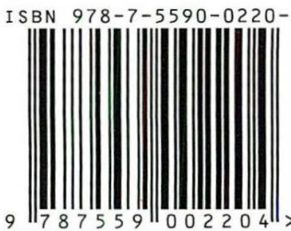

text_image

ISBN 978-7-5590-0220-
9 787559 002204 >

定价：18.90元

