# 创于2003

# 试题调研

# 每月一手考情

# 讲透关键题型

第1辑

第2辑

第3辑

第4辑

第5辑

第6辑

第7辑

第8辑

第9辑

第10辑

2023年6月上市

7月上市

8月上市

9月上市

11月上市

12月上市

2024年1月上市

2月上市

3月上市

4月上市

# · 高考热点大串讲 ·

# 热点串成串，考试不卡壳

串6类创新命题热点，破思维卡壳点

攻克疑难陌生新题型，知识迁移不卡壳

串讲必考新情境命题，信息转换不卡壳

串22类核心命题热点，破解题卡壳点

\- 串讲“图象”读取热点，数形关联不卡壳

\- 理顺“性质”运用热点，应用解题不卡壳

New

每月一手考情

北京市特级教师、正高级教师 张健

从数列题的题设条件挖掘高考命题新视角

# 高考必考情境题，高分必破情境题

高考必考情境题！《中国高考评价体系》、新课程标准中都明确提出了“情境化”的命题要求。近两年高考中，情境化试题超过了 $70\%$ ，语文、历史、政治等学科已经达到了全情境命题。高考命题已完全进入“无情境，不成题”的创新模式！

对于高考情境题的命题逻辑、去情境化解题模型、情境类型、命题趋势，调研8辑进行了全方位解读。

参透情境题底层命题逻辑  
√ 构建9大学科去情境化快速解题模型  
系统梳理高考中常见的27大情境题类型  
☑ 锁定2024高考119个热点命题情境

高分必破情境题！情境题阅读量大、设问背景新颖、解题模型难建立，是提分难点和高考拉分的主要题型。要想把拉分题转化成送分题，必须攻破情境题，调研8辑将助你一臂之力，冲刺得高分！

# 二轮备考 好书推荐

2024版《试题调研·热点题型专练》

# 专练热点提分快

火热销售中

电子书试读

抓热点 专项突破稳拿分

练速度 小题速解快得分

提准度 大题巧解拿高分

》本套书共25个题型专项，具体书目详见“2024《试题调研》全程提分方略”（正文最后一页）

更多资源，找vx:GZSJJ2000

<table><tr><td>第1辑</td><td>第2辑</td><td>第3辑</td><td>第4辑</td><td>第5辑</td><td>第6辑</td><td>第7辑</td><td>第8辑</td><td>第9辑</td><td>第10辑</td></tr><tr><td>2023年6月上市</td><td>7月上市</td><td>8月上市</td><td>9月上市</td><td>11月上市</td><td>12月上市</td><td>2024年1月上市</td><td>2月上市</td><td>3月上市</td><td>4月上市</td></tr></table>

# · 高考热点大串讲 ·

# 特约名师 张健

北京市特级教师，人民教育出版社高中数学A版教材培训专家，中央电教馆“教育部教研共同体协同提升项目”高三数学主讲教师，首师大硕士生教学实践指导教师。  
在《数学通报》等刊物上发表论文120多篇，主持并完成省市、区级课题五项，主编、参编高中教辅20多本。

本册编委 张健 赵成海 熊焕军 汤小梅 韦莉 王博渊 林明成

# 图书在版编目(CIP)数据

试题调研. 第7辑 高考热点大串讲 新高考数学 / 杜志建主编. -- 乌鲁木齐 : 新疆青少年出版社, 2023.1(2024.1重印)

ISBN 978-7-5590-9158-1

$\quad$I. ①试… II. ①杜… III. ①中学数学课 - 高中 - 升学参考资料 IV. ①G634

中国版本图书馆 CIP 数据核字（2022）第 239932 号

出版人:徐江

策划:王启全

责任编辑:多艳萍

# 试题调研第7辑 高考热点大串讲 新高考数学

# SHITI DIAOYAN DI 7 JI GAOKAO REDIAN DA CHUANJIANG XINGAOKAO SHUXUE

杜志建 主编

出版:新疆青少年出版社有限公司

社 址:乌鲁木齐市北京北路29号 邮政编码:830012

电话:0991-6239223(编辑部) 0371-68698015(读者服务部)

官网:http://www.qingshao.net 天猫旗舰店:http://xjqss.tmall.com

发行:新疆青少年出版社有限公司

经销:各地新华书店 法律顾问:王冠华 18699089007

印刷:河南新华印刷集团有限公司

开 本:787mm×1092mm 1/16 版 次:2023年1月第1版

印 张:7 印 次:2024年1月第2次印刷

字 数:130 千字

书号:ISBN 978-7-5590-9158-1

定 价:18.90元

CHISO 青少社
SINCE 1956

版权所有，侵权必究。印装问题可随时同印厂退换。

# 声明

基于对知识和创作的尊重,本书向所选文章、图片的作者支付补贴。因条件所限未能及时联系的作者,我们在此深表歉意,当您看到本书时,请与我们联系,以便我们向您支付补贴和赠送样书。联系方式:0371-68698015。

# 热点串成串，考试不卡壳

# 1 聚焦一手考情 从数列题的题设条件挖掘高考命题新视角

调研 1: (试题调研原创|双空题) 图 1 是一个塔形建筑雕塑, 它是由 3 个正方体叠放而成的, 上层正方体下底面的四个顶点是下层正方体上底面各边的中点, 已知最底层正方体的棱长为 $4 \mathrm{~m}$ . 若按照该雕塑的叠放规律, 继续向上叠放, 用 8 个正方体叠放成一个新的雕塑, 则新雕塑的表面积 (不含上下层之间的叠加面积) 为 $\mathrm{m}^{2}$ ; 若新雕塑的表面超过 $139 \mathrm{~m}^{2}$ , 则雕塑中正方体的个数至少是

以已知数列性质为条件进行探究（P004）

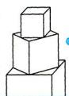

浸润数学文化（P001）

调研 5: (2024 北京一零一中学 11 月期中) 已知等比数列 $\{a_{n}\}$ 的公比为 $q$ , 前 $n$ 项和为 $S_{n}$ , 下列结论正确的是 ( )

$\quad$A. 若 $q > 0$ ，则 $\{a_{n}\}$ 是递增数列或递减数列  
$\quad$B. 若 $a_1 > 0, a_1 \geqslant S_{2023}$ , 则 $q \in (-1, 0)$   
$\quad$C. 若 $q^2 < 1$ ，则 $\exists M \in \mathbf{R}$ ，使得 $\forall n \in \mathbf{N}^*$ ， $|S_n| \leqslant M$   
$\quad$D. 若 $a_2\sqrt{a_1 - a_3} \leqslant 0$ ，则 $S_n$ 有最大值

# 串必考创新命题热点 破知识迁移、信息转换卡亮点

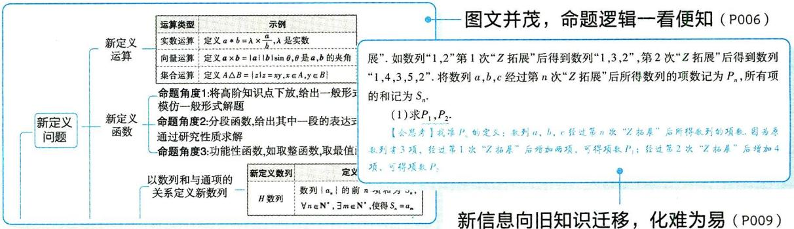

# 3 串必考核心主干热点 破图象识别、性质运用卡壳点

选)已知函数 $f(x)$ 及其导函数 $f'(x)$ 的部分图象如图4所示,设函数 $g(x)=\frac{f(x)}{\mathrm{e}^{x}}$ ,则 $g(x)$ ( )

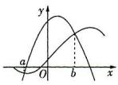

总结干货，利用性质
结论实现速算秒解（P080）

新信息向旧知识迁移，化难为易（P009）

解读难点，消除图象识别卡壳（P044）

# 提分干货 规律总结

“对称性 + 对称性→周期性”的高考必用结论

##### 1. 若函数 $f(x)$ 的图象关于直线 $x = a$ 和 $x = b$ 对称，则 $T = 2|a - b|$ 是函数 $f(x)$ 的一个周期.  
##### 2. 若函数 $f(x)$ 的图象关于点 $(a,0)$ 和点 $(b,0)$ 对称，则 $T = 2|a - b|$ 是函数 $f(x)$ 的一个周期.  
##### 3. 若函数 $f(x)$ 的图象关于直线 $x = a$ 和点 $(b,0)$ 对称，则 $T = 4|a - b|$ 是函数 $f(x)$ 的一个周期.

# 本书6类117道创新好题速览

<table><tr><td>具体考法</td><td>原创新题</td><td>变式好题</td><td>创新设问</td><td>真实情境</td><td>模块交汇</td><td>学科融合</td></tr><tr><td>本书题量</td><td>23</td><td>40</td><td>18</td><td>17</td><td>12</td><td>7</td></tr></table>

# 亮点速览

新情境 塔形建筑雕塑 P001

新考法 数列与集合交汇 P003

新题型 双空题 P004

新定义 数列的 “Z 拓展”
P009

新考法 圆锥曲线与立体几何交汇 P018

新情境 达·芬奇方砖 P020

新情境 《孙子算经》“中国剩余定理”P027

新题型 开放性填空题 P032

新视角 电路中的概率求解
问题 P033

# CONTENTS

# 目录

# 每月一手考情

从数列题的题设条件挖掘高考命题新视角 001

创新考向1 以数学文化背景为条件的数列问题 001

创新考向2 以 $n$ 的奇偶讨论为条件的数列问题 003

创新考向3 以已知数列性质为条件的探究性问题 004

# 高考热点大串讲

# 串讲 4 类必考新题型，知识迁移不卡壳

新题型1 新定义问题 007

命题角度1 新定义运算问题 007

命题角度2 新定义函数问题 007

命题角度3 新定义数列问题 009

新题型 2 结论开放题 011

新题型3 劣构性试题 014

新题型4 创新角度试题 018

# 串讲 2 类必考新情境，信息转换不卡壳

新情境 1 数学文化情境 4 个必考命题角度 027

命题角度1 搭载数学文化情境的数列问题 027

命题角度 2 搭载数学文化情境的立体几何问题 029

命题角度3 搭载数学文化情境的概率问题 030

命题角度4 搭载数学文化情境的解析几何问题 030

新情境 2 学科交汇情境的 4 个必考命题角度 033

命题角度1 与物理交汇 033

命题角度2 与化学交汇 034

命题角度3 与地理交汇 035

命题角度4 与生物交汇 036

# 串讲 7 类必考图象，数形关联不卡壳

热点图象 1 复杂函数与抽象函数的图象识别 041

热点图象2 函数图象的变换 046

热点图象 3 两条曲线的公切线问题 051

热点图象4 几何体的截面 056

命题角度1 柱体的截面问题 057

命题角度2 锥体的截面问题 057

命题角度3 球的截面问题 058

热点图象 5 立体几何中的翻折问题 060

热点图象 6 几组切线不等式的解读与应用问题 065

热点图象 7 5 类必考统计图表的分析问题 070

# 串讲 15 个必考性质，应用解题不卡壳

热点性质 1 函数必考的 4 个热点性质及关键应用 077

命题角度1 函数的单调性 077

命题角度2 函数的奇偶性 077

命题角度3 函数的周期性 078

命题角度4 函数图象的对称性 079

命题角度5 函数性质的综合应用 079

热点性质 2 三角函数的 4 个热点性质及关键应用 085

命题角度1 三角函数的周期性 086

命题角度2 三角函数的单调性 086

命题角度3 三角函数的奇偶性 087

命题角度4 三角函数图象的对称性 087

# 亮点速览

新应用 判断古树的树龄
P038

新解法 用特殊值法快速排除错误选项 P041

新考法 三角函数与空间向量交汇 P049

新定义 曲线的自公切线
P054

新考法 研究两种折叠方式形成的几何体P060

新视角 翻折过程中的动态探索问题P064

新解法 利用结论直接得到函数图象的对称性P079

新视角 函数性质新信息问题 P083

新情境 信号处理 P088

# 目录

# CONTENTS

命题角度5 三角函数性质的综合应用 087

热点性质3 数列必考的4个热点性质及关键应用 093

命题角度1 等差数列、等比数列通项的性质 093

命题角度2 等差数列、等比数列的前 $n$ 项和的性质 094

命题角度3 数列的增减性 095

命题角度4 数列的周期性 096

热点性质4 圆锥曲线必考的3个热点性质及关键应用 098

命题角度1 圆锥曲线的几何性质 098

命题角度2 圆锥曲线的中点弦 100

命题角度3 圆锥曲线的焦点三角形 102

# 下辑精彩预告 2024年2月全新上市

# 《试题调研》第8辑将重磅推出：情境题解读与预测

# 高考必考情境题，高分必破情境题！

本辑将深度剖析情境题命题逻辑,系统梳理高考中常见的情境类型,进而构建“去情境化解题模型”,轻松破解情境题;快速攻克复杂情境、创新情境命题,精准预测2024高考必考的热点情境问题.考前拿下情境题,高考冲刺得高分!

高考必考7大热点情境问题 精选名校好题,深度原创优质题,解读社会热点情境、个人生活情境、社会生活情境、科学研究情境等7大热点情境,教你读透情境、去掉情境、精准选择最佳技法快速解题!

高考必知 4 大教材迁移情境问题 本辑挖掘教材“数学探究”“数学建模”栏目素材, 研析教材重要例题、习题与变式, 预测教材中【思考】【探究】内容的迁移与应用, 挖掘高考命题逻辑, 预测高考命题趋势.

高考必破5大创新设问情境问题 深入剖析创新定义题、答案不唯一开放题、结构不良题、多模块知识融合题等创新设问情境题，总结破题模板，助你高效提分！

考情速报》本辑将邀请高考命题专家,深度解读2024年新高考适应性演练中的新题型、创新命题形式、命题新导向,研判2024高考命题新趋势,挖掘高考冲刺备考重点.

# 每月一手考情

# 从数列题的题设条件挖掘高考命题新视角

北京市特级教师、正高级教师 张健

数列是高中阶段的重要课程内容,等差数列、等比数列的概念、性质、通项公式、前 $n$ 项和公式是课程标准中数列部分的重点内容. 在 2023 年的高考中,新课标 I 卷第 7 题和第 20 题,新课标 II 卷第 8 题和第 18 题,全国甲卷理科的第 5 题和第 17 题,全国甲卷文科的第 5 题和第 13 题,全国乙卷理科的第 10 题和第 15 题,全国乙卷文科的第 18 题等,都是以等差数列、等比数列的概念、性质、通项公式、前 $n$ 项和公式等基础内容为载体,考查考生的“四基”“四能”,突出对化归转化、分类讨论、理性思维、数学探究和运算求解等能力的考查,试题强调“多思考,少运算”的理念,体现了对数学基础知识与核心素养的考查,能够有效助力创新人才的选拔.

对于数列的考查,北京、上海等自主命题地区的高考题、模考题,具有更创新和超前的思维,且对全国卷、课标卷的创新命题趋势都有很强的引领作用.本文深度研究北京卷有关数列问题的3大创新考向,精选最新试题进行剖析解读,以期让大家能更深度地掌握数列问题的创新考法.

# 创新考向1 以数学文化背景为条件的数列问题

调研 1: (试题调研原创|双空题) 图 1 是一个塔形建筑雕塑, 它是由 3 个正方体叠放而成的, 上层正方体下底面的四个顶点是下层正方体上底面各边的中点, 已知最底层正方体的棱长为 $4 \mathrm{~m}$ . 若按照该雕塑的叠放规律, 继续向上叠放, 用 8 个正方体叠放成一个新的雕塑, 则新雕塑的表面积 (不含上下层之间的叠加面积) 为 $\mathrm{m}^{2}$ ; 若新雕塑的表面积超过 $139 \mathrm{~m}^{2}$ , 则雕塑中正方体的个数至少是 .

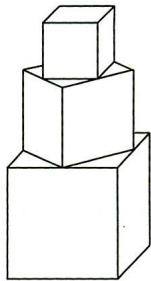

图1

卡壳诊断 本题的卡壳在于雕塑表面积的表达式,若对图形结构特征了解不透彻,就不能意识到这是一道数列问题.消除卡壳的策略:设从最底层开始的第n层正方体的棱长为 $a_{n}$ m,则 $\{a_{n}\}$ 为等

图书反馈

比数列,由此求出塔形建筑雕塑表面积 $S_{n}$ (单位: $\mathrm{m}^{2}$ ) 的表达式: $S_{n}=a_{1}^{2}+(5a_{1}^{2}-a_{2}^{2})+(5a_{2}^{2}-a_{3}^{2})+(5a_{3}^{2}-a_{4}^{2})+\cdots+(5a_{n-1}^{2}-a_{n}^{2})+5a_{n}^{2}$ . 令 $n=8$ , 得所求雕塑表面积; 令 $S_{n}>139$ , 即可得出 $n$ 的范围.

【突破瓶颈】最底层正方体的表面积为 $a_{1}^{2} + (5a_{1}^{2} - a_{2}^{2})$ ，向上一层的表面积为 $(5a_{2}^{2} - a_{3}^{2})$ 以此类推，最上面一层的表面积为 $5a_{n}^{2}$

解析 设从最底层开始的第 $n$ 层正方体的棱长为 $a_{n} \mathrm{~m}$ , 则数列 $\{a_{n}\}$ 是以 4 为首项、 $\frac{\sqrt{2}}{2}$ 为公比的等比数列,

则 $\{a_n^2\}$ 是以16为首项、 $\frac{1}{2}$ 为公比的等比数列.

【消除卡壳】灵活运用等比数列的性质：若等比数列 $\{a_{n}\}$ 的公比为 q，则 $\{a_{n}^{2}\}$ 是以 $q^{2}$ 为公比的等比数列

设塔形建筑雕塑的表面积为 $S_{n}(n$ 为正方体个数） $\mathrm{m}^2$ ，则 $S_{8} = a_{1}^{2} + (5a_{1}^{2} - a_{2}^{2}) + (5a_{2}^{2} - a_{3}^{2})+$

$\left(5 a _ {3} ^ {2} - a _ {4} ^ {2}\right) + \dots + \left(5 a _ {7} ^ {2} - a _ {8} ^ {2}\right) + 5 a _ {8} ^ {2} = 4 \left(a _ {1} ^ {2} + a _ {2} ^ {2} + \dots + a _ {8} ^ {2}\right) + 2 a _ {1} ^ {2} = 4 \times \frac {1 6 \times \left(1 - \frac {1}{2 ^ {8}}\right)}{1 - \frac {1}{2}} + 3 2 = 1 2 7. 5 +$

$3 2 = 1 5 9. 5.$

$S _ {n} = a _ {1} ^ {2} + \left(5 a _ {1} ^ {2} - a _ {2} ^ {2}\right) + \left(5 a _ {2} ^ {2} - a _ {3} ^ {2}\right) + \left(5 a _ {3} ^ {2} - a _ {4} ^ {2}\right) + \dots + \left(5 a _ {n - 1} ^ {2} - a _ {n} ^ {2}\right) + 5 a _ {n} ^ {2} = 4 \left(a _ {1} ^ {2} + a _ {2} ^ {2} + \dots + \right.$

$\left. a _ {n} ^ {2}\right) + 2 a _ {1} ^ {2} = 4 \times \frac {1 6 \times \left(1 - \frac {1}{2 ^ {n}}\right)}{1 - \frac {1}{2}} + 3 2 = \frac {2 ^ {n} - 1}{2 ^ {n - 7}} + 3 2.$

当 $S_{n} > 139$ 时，令 $\frac{2^n - 1}{2^{n - 7}} + 32 > 139$ ，即 $2^{n} > \frac{128}{21} \approx 6.1$ ，所以 $n \geqslant 3$ .

调研 2 (2024 北京师大二附中 11 月期中)《九章算术》是中国古代数学经典著作之一. 全书分为九章, 第六章“均输”有一问题“今有竹九节, 下三节容四升, 上四节容三升. 问中间二节欲均容, 各多少?” 其意思为: 今有竹 9 节, 下 3 节容量共 4 升, 上 4 节容量共 3 升, 使中间两节也均匀变化, 每节容量是多少? 在这一问题中, 从下部算起第 5 节容量是 \_\_\_\_ 升.

卡壳诊断 记从下部算起第1节到第9节的容量(单位:升)分别为 $a_{1},a_{2},\cdots,a_{9}$ ，可知数列 $\{a_{n}\}$ 为等差数列，设其公差为d，利用等差数列通项公式可构造关于 $a_{1},d$ 的方程组，解方程组求得 $a_{1},d$ 后，利用通项公式可求得 $a_{5}$ .

# 二轮指南

小编说:相较于一轮复习,二轮复习要更有侧重点,要把有限的时间花在重点知识和失分点上.那么,二轮复习应该注意什么?如何提高二轮复习的效率呢?更多资源,找VX.GZSJ2000

解析 记从下部算起第 n 节的容量为 $a_{n}$ 升，

由题意可知,数列 $\{a_{n}\}$ 为等差数列,设其公差为d,

则 $\left\{ \begin{array}{l}a_{1} + a_{2} + a_{3} = 3a_{1} + 3d = 4,\\ a_{6} + a_{7} + a_{8} + a_{9} = 4a_{1} + 26d = 3, \end{array} \right.$ 解得 $\left\{ \begin{array}{l}a_1 = \frac{95}{66},\\ d = -\frac{7}{66}. \end{array} \right.$

【盯题眼】根据条件中的“下3节容量共4升，上4节容量共3升”可列两个方程，使用基本量法列方程组，求出等差数列的基本量 $a_{1}$ 和d

所以 $a_{5}=a_{1}+4d=\frac{67}{66}$ ，即从下部算起第5节容量是 $\frac{67}{66}$ 升.

# 创新考向2 以 $n$ 的奇偶讨论为条件的数列问题

调研 3: (数列与集合交汇 | 2024 北京汇文中学 11 月期中) 已知数列 $\{a_{n}\}$ 满足 $a_{1} = 1, a_{2n} = n + 1, a_{2n+1} = a_{2n} + a_{2n-1}, n \in \mathbf{N}^{*}$ , 则集合 $\{m \mid a_{m} \leqslant 20\}$ 中元素的个数为 \_\_\_\_.

卡壳诊断 由已知条件可知,数列 $\{a_{n}\}$ 的通项公式是以n为奇数或偶数分段的形式,求出通项公式,然后依据通项公式写出集合 $\{m|a_{m}\leqslant20\}$ 中的元素个数.

解析 由 $a_{2n} = n + 1 = \frac{1}{2} \cdot (2n) + 1$ 得, 当 $n$ 为偶数时, $a_n = \frac{n}{2} + 1$ .

由 $a_{2n + 1} = a_{2n} + a_{2n - 1}$ 得， $a_{2n + 1} - a_{2n - 1} = a_{2n} = n + 1,n\in \mathbf{N}^{*}$

所以 $a_{2n + 1} = (a_{2n + 1} - a_{2n - 1}) + (a_{2n - 1} - a_{2n - 3}) + \dots +(a_3 - a_1) + a_1 = \frac{(n + 1 + 1)(n + 1)}{2} =$

【消除卡壳】当看到模型 $a_{n+1}-a_{n}=f(n)$ 时，用累加法求数列通项，即 $a_{n}=(a_{n}-a_{n-1})+(a_{n-1}-a_{n-2})+\cdots+(a_{2}-a_{1})+a_{1}$

$\frac {n ^ {2} + 3 n + 2}{2} = \frac {(2 n + 1) ^ {2} + 4 (2 n + 1) + 3}{8},$

即当 n 为奇数时, $a_{n}=\frac{n^{2}+4n+3}{8}$ .

所以 \(a\_{n} = \left\{ \begin{array}{ll}\frac{n}{2} +1(n\) 为偶数）， & n\in \mathbf{N}^{\*}.\\ \frac{n^{2} + 4n + 3}{8} (n\) 为奇数）， & \end{array} \right.\)

当 n 为偶数时, 令 $\frac{n}{2} + 1 \leqslant 20$ , 解得 $n \leqslant 38$ ,

# 二轮指南

当 $n$ 为奇数时，令 $\frac{n^2 + 4n + 3}{8} \leqslant 20$ ，函数 $y = \frac{n^2 + 4n + 3}{8}$ 的图象的对称轴为直线 $n = -2$ ，当 $n = 9$ 时， $\frac{n^2 + 4n + 3}{8} = 15 < 20$ ，当 $n = 11$ 时， $\frac{n^2 + 4n + 3}{8} = 21 > 20$ ，所以 $n \leqslant 9$ .

综上可得,集合 $\{m|a_{m}\leqslant20\}$ 中元素的个数为 $\frac{38}{2}+\frac{9+1}{2}=24.$

调研 4 (2024 北京景山学校 11 月期中) 已知数列 $\{a_{n}\}$ 的前 $n$ 项和为 $S_{n}$ , 且 $a_{n+2} = 2a_{n}, S_{2} = 3a_{1} = 3$ , 则 $a_{5} =$ \_\_\_\_; 若 $S_{m} > 30$ , 则 $m$ 的最小值为 \_\_\_\_.

卡壳诊断 由 $a_{n+2} = 2a_n$ 得 $\frac{a_{n+2}}{a_n} = 2$ , 可知数列 $a_1, a_3, a_5, \cdots, a_{2n-1}$ 和 $a_2, a_4, a_6, \cdots, a_{2n}$ 分别是以 2 为公比的等比数列. 由已知求出 $a_1, a_2$ , 从而可得数列的前几项, 利用 $\{S_n\}$ 是递增数列, 求出值为 30 左右的 $S_n$ 后可得 $m$ 的最小值.

解析 因为 $S_{2}=3a_{1}=3$ ，所以 $a_{1}=1, a_{2}=2$ .

因为 $a_{n + 2} = 2a_{n}$ ，所以 $\{a_{n}\}$ 的奇数项与偶数项分别是公比为2的等比数列，

【消除卡壳】当已知条件中出现“① $a_{n}=\begin{cases}f(n),n=2k-1,\\g(n),n=2k\end{cases}(k\in\mathbb{N}^{*})$ ，② $a_{n+2}-a_{n}=\lambda$ ，
③ $\frac{a_{n+2}}{a_{n}}=\lambda$ ，④递推式中含有 $(-1)^{n}$ 的结构”时，需要对n分奇数、偶数讨论

所以 $a_{1}=1, a_{3}=2, a_{5}=4, \cdots; a_{2}=2, a_{4}=4, a_{6}=8, \cdots.$

所以数列 $\{a_{n}\}$ 的各项依次为:1,2,2,4,4,8,8,16,16,…,

又 $\{a_{n}\}$ 各项均为正数，因此 $\{S_n\}$ 是递增数列.

因为 $S_{7} = 1 + 2 + 2 + 4 + 4 + 8 + 8 = 29, S_{8} = S_{7} + a_{8} = 29 + 16 = 45 > 30$ ，所以 $m$ 的最小值是8.

# 创新考向3 以已知数列性质为条件的探究性问题

调研 5: (2024 北京一零一中学 11 月期中) 已知等比数列 $\{a_{n}\}$ 的公比为 $q$ , 前 $n$ 项和为 $S_{n}$ , 下列结论正确的是 ( )

$\quad$A. 若 q > 0，则 $\{a_{n}\}$ 是递增数列或递减数列  
$\quad$B. 若 $a_1 > 0, a_1 \geqslant S_{2023}$ , 则 $q \in (-1, 0)$   
$\quad$C. 若 $q^2 < 1$ ，则 $\exists M \in \mathbf{R}$ ，使得 $\forall n \in \mathbf{N}^*$ ， $|S_n| \leqslant M$   
$\quad$D. 若 $a_{2}\sqrt{a_{1}-a_{3}}\leqslant0$ ，则 $S_{n}$ 有最大值

# 二轮指南

保障训练充足 充足的题量才能把理论转化为能力,通过做题可以熟悉题型、积累方法,分数自然就上去了.
更多资源，找vx:GZSJJ2000

# 解析

<table><tr><td>选项</td><td>分析过程</td><td>正误</td></tr><tr><td>A</td><td>当 $q=1$ 时,数列 $\{a_n\}$ 为常数列</td><td>×</td></tr><tr><td>B</td><td>当 $a_1=1,q=-1$ 时, $S_{2023}=S_{2022}+1=1=a_1$ ,满足条件 $a_1>0,a_1\geqslant S_{2023}$ ,与 $q\in(-1,0)$ 矛盾</td><td>×</td></tr><tr><td>C</td><td>若 $q^2<1$ ,则 $-10,则|S_n|=|\frac{a_1(1-q^n)}{1-q}|=\frac{|a_1|}{1-q}\cdot(1-q^n)<\frac{2|a_1|}{1-q}$ ,故存在实数 $M=\frac{2|a_1|}{1-q}$ ,使得 $\forall n\in\mathbf{N}^*,|S_n|\leqslant M$ </td><td>√</td></tr><tr><td>D</td><td>当 $q=1$ 时, $a_1=a_2=a_3,a_2\sqrt{a_1-a_3}=0$ ,满足条件 $a_2\sqrt{a_1-a_3}\leqslant 0$ ,设 $a_n=2$ ,则 $S_n=2n$ 无最大值</td><td>×</td></tr></table>

调研 6: (2024 北京市第一七一中学 11 月期中) 在无穷数列 $\{a_{n}\}$ 中, $a_{1}=1$ , 对于任意 $n \in \mathbf{N}^{*}$ , 都有 $a_{n} \in \mathbf{N}^{*}, a_{n}<a_{n+1}$ . 设 $m \in \mathbf{N}^{*}$ , 记使得 $a_{n} \leqslant m$ 成立的 $n$ 的最大值为 $b_{m}$ .

（1） 设数列 $\{a_{n}\}$ 为 1,3,5,7, $\cdots$ , 写出 $b_{1}, b_{2}, b_{3}$ 的值;

（2） 若 $\{b_{n}\}$ 为等差数列, 求出所有可能的数列 $\{a_{n}\}$ .

卡壳诊断 由已知可得,数列 $\{a_{n}\}$ 的各项均为正整数且 $\{a_{n}\}$ 为递增数列.（1）由“使得 $a_{n}\leqslant m$ 成立的n的最大值为 $b_{m}$ ”写出 $b_{1},b_{2},b_{3}$ 的值;（2）若 $\{b_{n}\}$ 为等差数列,先判断 $a_{n}\geqslant n$ ,再证明 $a_{n}\leqslant n$ ,即可求出所有可能的数列 $\{a_{n}\}$ .

解析 （1） 若 $a_{n} \leqslant 1$ , 则 $b_{1} = 1$ ; 若 $a_{n} \leqslant 2$ , 则 $b_{2} = 1$ ; 若 $a_{n} \leqslant 3$ , 则 $b_{3} = 2$ .

（2） 由题意得 $1 = a_{1} < a_{2} < \dots < a_{n} < \dots$ ，得 $a_{n} \geqslant n$ .

因为使得 $a_{n} \leqslant m$ 成立的 $n$ 的最大值为 $b_{m}$ , 使得 $a_{n} \leqslant m + 1$ 成立的 $n$ 的最大值为 $b_{m+1}$ ,

所以 $b_{1} = 1, b_{m} \leqslant b_{m + 1}$ . 设 $a_{2} = k$ , 由 $a_{n} \in \mathbf{N}^{*}$ 及 $1 = a_{1} < a_{2}$ , 得 $k \geqslant 2$ .

假设 $k > 2$ ，即 $a_2 = k > 2$ ，则当 $n \geqslant 2$ 时， $a_n > 2$ ；当 $n \geqslant 3$ 时， $a_n \geqslant k + 1$ .

所以 $b_{2}=1, b_{k}=2.$

因为 $\{b_n\}$ 为等差数列，所以公差 $d = b_{2} - b_{1} = 0$ ，所以 $b_{n} = 1$ ，这与 $b_{k} = 2(k > 2)$ 矛盾，所以 $a_2 = k = 2$

因为 $a_{1}<a_{2}<\cdots<a_{n}<\cdots$ ，所以 $b_{2}=2$ 。由 $\{b_{n}\}$ 为等差数列，得 $b_{n}=n$ 。

因为使得 $a_{n} \leqslant m$ 成立的 $n$ 的最大值为 $b_{m}$ , 所以 $a_{n} \leqslant n$ , 再由 $a_{n} \geqslant n$ , 得 $a_{n} = n$ .

【消除卡壳】在讨论中不断排除，得出 $a_{2}=b_{2}=2$ ，进而得 $a_{n}\leqslant n$ ，再由 $\{a_{n}\}$ 是递增数列得到 $a_{n}\geqslant n$ ，由“两边夹”即可得到 $a_{n}=n$

所以数列 $\{a_{n}\}$ 为1,2,3,….

# 二轮指南

# 高考热点大串讲

# 串讲 4 类必考新题型,知识迁移不卡壳

# 一手考情 热点串讲

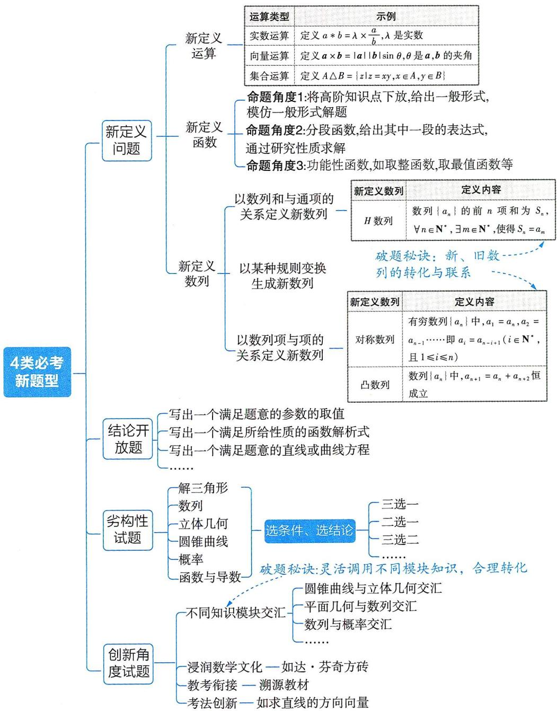

# 二轮指南

切勿盲目刷题 片面追求做题数量是不可取的,既要有数量也要有质量,做好题的同时还应注重方法的总结、题型的归纳、不同题型间的对比等;做到融会贯通更多资源,找Vx.GZSJ2000

# 新题型 1 新定义问题

【热点解读与预测】近年来高考中出现越来越多的新定义问题,如:2023 新课标 I 卷第 10 题,考查新定义“声压级”;2023 北京卷第 21 题,考查新定义运算“ $r_k = \max \{i | B_i \leq A_k, i \in \{0,1,2,\cdots,m\}\}$ ”;2023 上海卷第 16 题,考查新定义“自相关曲线”;2023 上海春季卷第 19 题,考查新定义“体形系数”……新定义问题着重考查学习能力、知识水平、创新意识和综合素养,解题关键在于从新定义中抽象出定义的本质,类比所学知识的思想和方法,并完成解答.

# 命题角度1 新定义运算问题

调研 1: (新定义运算 $a * b = \lambda \times \frac{a}{b} \mid 2024$ 广东中山 11 月第二次段考) 对于任意两个正实数 $a, b$ , 定义 $a * b = \lambda \times \frac{a}{b}$ , 其中常数 $\lambda \in (1, \frac{\sqrt{6}}{2})$ , “×”是实数乘法运算. 若 $8 * 3 = 3$ , 则 $\lambda =$ \_\_\_\_; 若 $a > b > 0$ , $a * b$ 与 $b * a$ 都是集合 $\{x \mid x = \frac{n}{2}, n \in \mathbf{Z}\}$ 中的元素, 则 $a * b =$ \_\_\_\_.

解析 第一空 根据新定义运算的规则得 $8 * 3 = \lambda \times \frac{8}{3} = 3$ ，解得 $\lambda = \frac{9}{8}$ ，满足 $\lambda \in (1, \frac{\sqrt{6}}{2})$ ，所以 $\lambda = \frac{9}{8}$ .

第二空 因为 $a > b > 0, a * b$ 与 $b * a$ 都是集合 $\{x \mid x = \frac{n}{2}, n \in \mathbf{Z}\}$ 中的元素, 所以不妨记 $\lambda \times \frac{a}{b} = \frac{m}{2}, \lambda \times \frac{b}{a} = \frac{n}{2} (m, n \in \mathbf{N}^*, m > n)$ ,

因此 $\lambda^2 = \frac{mn}{4} \in (1, \frac{3}{2})$ ，即 $4 < mn < 6$ ，则 $mn = 5, m = 5, n = 1$ ，所以 $a * b = \frac{5}{2}$ .

【消除卡壳】观察上面两个式子，等号左边相乘后 $\frac{a}{b}$ ， $\frac{b}{a}$ 可以抵消，得到 $\lambda^{2}$ ，右边相乘后是含mn的代数式，而题中已知 $\lambda$ 的取值范围，据此可得mn的取值范围，再结合m,n是正整数，即可得解

# 命题角度2 新定义函数问题

调研 2: (试题调研原创 | 新定义函数类型) 对于任意实数 $x$ , 函数 $f(x)$ 满足:

# 二轮指南

生活学习有规律 良好的生物钟能够使身心处于最佳状态,在复习的时候精力充沛,效率大大提高.该学习时就好好学习,该休息时就好好休息.
更多资源，找vx:GZSJJ2000

当 $n - \frac{1}{2} \leqslant x < n + \frac{1}{2}$ 时, $f(x) = n (n \in \mathbf{Z})$ . 则下列关于函数 $f(x)$ 的叙述不正确的是 ( )

$\quad$A. $f(2023) = 2023$

$\quad$B. $f(x)$ 是奇函数

$\quad$C. $\forall x\in \mathbf{R},f(x - 2) = f(x) - 2$

$\quad$D. $\exists x,y\in R,$ 使得 $f(x+y)<f(x)+f(y)$

# 解析

<table><tr><td>选项</td><td>分析过程</td><td>正误</td></tr><tr><td>A</td><td> $x = 2023 \rightarrow 2023 - \frac{1}{2} \leqslant 2023 < 2023 + \frac{1}{2} \rightarrow n = 2023 \rightarrow f(2023) = 2023$ </td><td>√</td></tr><tr><td>B</td><td>取  $x = -0.5 \rightarrow 0 - \frac{1}{2} \leqslant -0.5 < 0 + \frac{1}{2} \rightarrow f(-0.5) = 0$ ,取  $x = 0.5 \rightarrow 1 - \frac{1}{2} \leqslant 0.5 < 1 + \frac{1}{2} \rightarrow f(0.5) = 1$ .不满足奇函数的定义【消除卡壳】判断函数奇偶性往往是结合定义,如此处判断是否对于任意的  $x$ ,都有  $f(x) = -f(-x)$ ,快解路径是先找特值进行尝试,若能找到一个不符合题意的值,就能说明不是奇函数</td><td>×</td></tr><tr><td>C</td><td> $\forall x \in \mathbb{R}, n - \frac{1}{2} \leqslant x < n + \frac{1}{2}, f(x) = n$ ,则  $(n-2) - \frac{1}{2} \leqslant x - 2 < (n-2) + \frac{1}{2}, f(x - 2) = n - 2 = f(x) - 2$ </td><td>√</td></tr><tr><td>D</td><td>当  $x = -0.5, y = 0.5$  时, $f(-0.5 + 0.5) = 0 < f(-0.5) + f(0.5)$ </td><td>√</td></tr></table>

调研 3: (新定义函数 $\mathrm{si}(\cos \theta)$ |2024 河南洛阳部分学校11月三调|多选)在平面直角坐标系 $xOy$ 中, 已知任意角 $\theta$ 以坐标原点 $O$ 为顶点, $x$ 轴的非负半轴为始边, 若终边经过点 $P(x_0, y_0)$ , 且 $|OP| = r (r > 0)$ , 定义 $\mathrm{si}(\cos \theta) = \frac{y_0 + \sqrt{3} x_0}{2r}$ , 称 $\mathrm{si}(\cos \theta)$ 为“正余弦函数”. 对于正余弦函数 $f(x) = \mathrm{si}(\cos x)$ , 下列结论中正确的是 ( )

$\quad$A. 将 $f(x)$ 的图象向右平移 $\frac{\pi}{3}$ 个单位长度, 得到的图象关于原点对称

$\quad$B. $f(x)$ 在区间 $[-2\pi, 2\pi]$ 上的所有零点之和为 $\frac{2\pi}{3}$

# 二轮指南

$\quad$C. $f(x)$ 在区间 $\left[\frac{\pi}{3}, \frac{3\pi}{4}\right]$ 上单调递减  
$\quad$D. $f(x)$ 在区间 $(0,7\pi)$ 上有且仅有 5 个极大值点

解析 根据点 $P(x_0, y_0), |OP| = r$ 及角为 $x$ 可得 $x_0 = r \cos x, y_0 = r \sin x$ ,

所以 $f(x) = \mathrm{si}(\cos x) = \frac{y_0 + \sqrt{3}x_0}{2r} = \frac{r\sin x + \sqrt{3}r\cos x}{2r} = \frac{1}{2}\sin x + \frac{\sqrt{3}}{2}\cos x = \sin (x + \frac{\pi}{3}).$

<table><tr><td>选项</td><td>分析过程</td><td>正误</td></tr><tr><td>A</td><td>将f(x)的图象向右平移 $\frac{\pi }{3}$ 个单位长度→y=sin[(x- $\frac{\pi }{3}$ )+ $\frac{\pi }{3}$ ]=sinx的图象→y=sinx为奇函数→图象关于原点对称</td><td>√</td></tr><tr><td>B</td><td>令f(x)=sin(x+ $\frac{\pi }{3}$ )=0→x+ $\frac{\pi }{3}$ =kπ,k∈Z→x=- $\frac{\pi }{3}$ +kπ,k∈Z→由题意知x∈[-2π,2π]→x=- $\frac{4\pi }{3}$ 或x=- $\frac{\pi }{3}$ 或x= $\frac{2\pi }{3}$ 或x= $\frac{5\pi }{3}$ →f(x)在区间[-2π,2π]上的所有零点之和为- $\frac{4\pi }{3}$ +(- $\frac{\pi }{3}$ )+ $\frac{2\pi }{3}$ + $\frac{5\pi }{3}$ = $\frac{2\pi }{3}$ </td><td>√</td></tr><tr><td>C</td><td>x∈[ $\frac{\pi }{3}$ , $\frac{3\pi }{4}$ ]→x+ $\frac{\pi }{3}$ ∈[ $\frac{2\pi }{3}$ , $\frac{13\pi }{12}$ ]→[ $\frac{2\pi }{3}$ , $\frac{13\pi }{12}$ ]⊆[ $\frac{\pi }{2}$ , $\frac{3\pi }{2}$ ]→f(x)在[ $\frac{\pi }{3}$ , $\frac{3\pi }{4}$ ]上【会运算】令x+ $\frac{\pi }{3}$ =t,函数f(t)=sin t在[ $\frac{\pi }{2}$ , $\frac{3\pi }{2}$ ]上单调递减单调递减</td><td>√</td></tr><tr><td>D</td><td>令x+ $\frac{\pi }{3}$ = $\frac{\pi }{2}$ +2kπ,k∈Z→x= $\frac{\pi }{6}$ +2kπ,k∈Z,所以f(x)在区间(0,7π)上的极大值点有 $\frac{\pi }{6}$ , $\frac{13\pi }{6}$ , $\frac{25\pi }{6}$ , $\frac{37\pi }{6}$ ,共4个</td><td>×</td></tr></table>

# 命题角度3 新定义数列问题

调研 4 (2024 北京育才学校 11 月期中|难题)在一个有穷数列的每相邻两项之间插入这两项的和,形成新的数列,我们把这样的操作称为该数列的一次“Z拓展”.如数列“1,2”第1次“Z拓展”后得到数列“1,3,2”,第2次“Z拓展”后得到数列“1,4,3,5,2”.将数列a,b,c经过第n次“Z拓展”后所得数列的项数记为 $P_{n}$ ,所有项的和记为 $S_{n}$ .

（1） 求 $P_{1}, P_{2}$ .

【会思考】找准 $P_{n}$ 的定义: 数列 $a, b, c$ 经过第 $n$ 次 “Z 拓展” 后所得数列的项数. 因为原数列有 3 项, 经过第 1 次 “Z 拓展” 后增加两项, 可得项数 $P_{1}$ ; 经过第 2 次 “Z 拓展” 后增加 4 项, 可得项数 $P_{2}$

# 二轮指南

（2） 若 $P_{n} \geqslant 2024$ , 求 n 的最小值.

（3） 是否存在实数 $a, b, c$ , 使得数列 $\{S_n\}$ 为等比数列? 若存在, 求 $a, b, c$ 满足的条件; 若不存在, 请说明理由.

解析 （1） 原数列有 3 项, 经过第 1 次 “Z 拓展” 后数列的项数为 $P_{1} = 3 + 2 = 5$ .

经过第2次“Z拓展”后数列的项数为 $P_{2} = 5 + 4 = 9$ .

（2）数列每一次“Z拓展”都是在原数列的相邻两项中增加一项，

由数列经过第 $n$ 次“ $Z$ 拓展”后数列的项数为 $P_{n}$ , 则经过第 $n + 1$ 次“ $Z$ 拓展”后数列增加的项数为 $P_{n} - 1$ ,

所以 $P_{n+1}=P_{n}+(P_{n}-1)=2P_{n}-1$ ，

【消除卡壳】遇到 $a_{n+1} = pa_n + q (p, q \neq 0)$ 型的递推式，可采用待定系数法得数列的通项公式，如此处，令 $P_{n+1} + x = \lambda (P_n + x)$ ，则 $P_{n+1} = \lambda P_n + (\lambda - 1)x$ ，则 $\lambda = 2, x = -1$ ，则 $P_{n+1} - 1 = 2(P_n - 1)$

所以 $P_{n + 1} - 1 = 2(P_n - 1)$ ，所以数列 $\{P_n - 1\}$ 是以 $P_{1} - 1$ 为首项、2为公比的等比数列.

由（1）知 $P_{1}-1=4$ ，所以 $P_{n}-1=4\cdot2^{n-1}=2^{n+1}$ ，所以 $P_{n}=2^{n+1}+1$ 。

由 $P_{n} \geqslant 2024$ 得 $2^{n + 1} \geqslant 2023$ , 解得 $n \geqslant 10$ .

【特殊值】 $2^{10}=1\ 024$ ，记住这个特殊值，有时可以事半功倍

所以 n 的最小值为 10.

（3）设第 n 次“Z 拓展”后数列的各项为 $a, a_{1}, a_{2}, a_{3}, \cdots, a_{m}, c$ ,

【会分析】根据数列的“Z拓展”规则知,每次“Z拓展”都是在原数列相邻两项中增加一项,所以不管 “Z拓展” 几次,最后得到的数列的首项与末项都不变,仍分别为 $a$ 和 $c$

所以 $S_{n}=a+a_{1}+a_{2}+\cdots+a_{m}+c,$

$S _ {n + 1} = a + \left(a + a _ {1}\right) + a _ {1} + \left(a _ {1} + a _ {2}\right) + a _ {2} + \dots + a _ {m} + \left(a _ {m} + c\right) + c,$

即 $S_{n+1}=2a+3a_{1}+3a_{2}+\cdots+3a_{m}+2c,$

所以 $S_{n + 1} = 3S_n - (a + c), S_{n + 1} - \frac{a + c}{2} = 3(S_n - \frac{a + c}{2})$ ，所以数列 $\{S_n - \frac{a + c}{2}\}$ 是以 $S_1 - \frac{a + c}{2}$ 为

【找准方法】这里再次用到待定系数法构造等比数列的递推公式

首项,3为公比的等比数列,得 $S_{n}-\frac{a+c}{2}=(S_{1}-\frac{a+c}{2})3^{n-1}$ ,

由 $S_{1} = 2a + 3b + 2c$ ，得 $S_{n} = (b + \frac{a + c}{2})3^{n} + \frac{a + c}{2}$

# 二轮指南

明确复习重点 了解自己的强项和弱点,最后的复习阶段,各科投入时间要合理安排,这一点非常重要.
更多资源，找vx:GZSJJ2000

若使 $\{S_n\}$ 为等比数列，则 $\left\{ \begin{array}{l} \frac{a + c}{2} = 0, \\ b + \frac{a + c}{2} \neq 0 \end{array} \right.$ 或 $\left\{ \begin{array}{l} b + \frac{a + c}{2} = 0, \\ \frac{a + c}{2} \neq 0. \end{array} \right.$

本题与 T8 联考第 19 题命题思路一致. 研究北京地区的模考、真题, 对摸索全国卷命题趋势很有帮助!

所以 $a, b, c$ 满足的条件为 $\left\{ \begin{array}{l} a + c = 0, \\ b \neq 0 \end{array} \right.$ 或 $\left\{ \begin{array}{l} 2b + a + c = 0, \\ b \neq 0. \end{array} \right.$

# 变式演练

(变函数类型, 取较大值函数 |2024 福建福安一中 10 月月考) 记 $\max \{a, b\} = \begin{cases} a, & a \geqslant b, \\ b, & a < b, \end{cases}$ 设函数 $f(x) = \max \{|x + 1|, |x - t|\}$ , 若对于任意 $x \in \mathbf{R}$ , 都有 $f(x) \geqslant 2$ 成立, 则实数 $t$ 的取值范围为 \_\_\_\_.

# 参考答案与解析

$(-\infty, -5] \cup [3, +\infty)$ 分以下两种情况讨论：

若 $|x+1|\geqslant|x-t|$ ，则 $f(x)=|x+1|$ ，则 $\left\{\begin{aligned}t^{2}-1&\leqslant2(t+1)x,\\ |x+1|\geqslant2,\end{aligned}\right.$ 则 $\left\{\begin{aligned}t^{2}-1&\leqslant2(t+1)x,\\ x&\in(-\infty,-3]\cup[1,+\infty).\end{aligned}\right.$

【消除卡壳】新定义函数的本质在于取两个数中的较大值, 因为含参数 $t$ , 无法直接比较, 所以采用分类讨论法, 将两数中的较大者选出, 函数的解析式也就确定了, 根据 $f(x) \geqslant 2$ 列出不等关系式, 解不等式即可

对于 $t^2 - 1 \leqslant 2(t + 1)x$ ，当 $t < -1$ 时， $x \leqslant \frac{t - 1}{2}$ ，所以 $\frac{t - 1}{2} \leqslant -3$ ，所以 $t \leqslant -5$ ；当 $t = -1$ 时，关于 $x$ 的不等式 $t^2 - 1 \leqslant 2(t + 1)x$ 的解集为 $\mathbf{R}$ ，与 $x \in (-\infty, -3] \cup [1, +\infty)$ 矛盾，舍去；当 $t > -1$ 时， $x \geqslant \frac{t - 1}{2}$ ，所以 $\frac{t - 1}{2} \geqslant 1$ ，所以 $t \geqslant 3$ 。

若 $|x-t|>|x+1|$ ，则 $f(x)=|x-t|$ ，则 $\left\{\begin{aligned}&2(t+1)x<t^{2}-1,\\&|x-t|\geqslant2,\end{aligned}\right.$ 则 $\left\{\begin{aligned}&2(t+1)x<t^{2}-1,\\&x\in(-\infty,t-2]\cup[2+t,+\infty).\end{aligned}\right.$

对于 $t^2 - 1 > 2(t + 1)x$ ，当 $t < -1$ 时， $x > \frac{t - 1}{2}$ ，所以 $\frac{t - 1}{2} \geqslant 2 + t$ ，所以 $t \leqslant -5$ ；当 $t = -1$ 时，关于 $x$ 的不等式 $t^2 - 1 > 2(t + 1)x$ 的解集为 $\varnothing$ ，舍去；当 $t > -1$ 时， $x \leqslant \frac{t - 1}{2}$ ，所以 $\frac{t - 1}{2} \leqslant t - 2$ ，所以 $t \geqslant 3$ 。综上， $t \in (-\infty, -5] \cup [3, +\infty)$ 。

# 新题型 2 结论开放题

【热点解读与预测】结论开放题是指正确答案不止一个,考生只需写出一个即可得分的试题,在近几年高考中有一定的出现频率,如:2023 新课标Ⅱ卷第 15 题,写出

# 二轮指南

一个满足三角形面积为定值的参数的值;2023 北京卷第 13 题,写出一组使得命题为假命题的角的值……这类题大多为基础题,从知识层面看并不难,关键在于如何最快找到一个结果,提高做题速度,为答其他题争取时间.

调研 1: (2024 广东中山 11 月第二次段考) 已知函数 $f(x)=\left\{\begin{array}{l}\sin x, x<0, \\ \cos(x+\alpha), x \geqslant 0\end{array}\right.$ 是偶函数, 那么 $\alpha$ 的一个取值可以是 \_\_\_\_.

解析 因为函数 $f(x)$ 是偶函数,所以 $f(x)=f(-x)$ .

当 $x > 0$ 时，由 $\cos (x + \alpha) = \sin (-x)$ 得 $\cos (x + \alpha) = -\sin x = \cos (\frac{\pi}{2} +x)$ ，所以 $x + \alpha = 2k\pi +$ $\frac{\pi}{2} +x(k\in \mathbf{Z})$ 或 $x + \alpha = 2k\pi -(\frac{\pi}{2} +x)(k\in \mathbf{Z})$ ，解得 $\alpha = 2k\pi +\frac{\pi}{2} (k\in \mathbf{Z}).$

当 $x < 0$ 时，由 $\sin x = \cos (-x + \alpha)$ 得 $\cos (\frac{\pi}{2} - x) = \cos (-x + \alpha)$ ，所以 $-x + \alpha = 2k\pi + \frac{\pi}{2} - x$ （ $k \in \mathbf{Z}$ ）或 $-x + \alpha = 2k\pi - (\frac{\pi}{2} - x)(k \in \mathbf{Z})$ ，解得 $\alpha = 2k\pi + \frac{\pi}{2}(k \in \mathbf{Z})$ 。

所以 $\alpha$ 的一个取值可以是 $\frac{\pi}{2}$ ，故答案为 $\frac{\pi}{2}$ （答案不唯一）.

# 秒解

根据正弦函数与余弦函数的图象关系可得 $\alpha$ 的一个取值可以是 $\frac{\pi}{2}$ .

【锦囊妙计】不要急着计算，函数是分段函数，一半是正弦一半是余弦，要求是偶函数，思考：余弦函数 $y = \cos x$ 的图象向右平移 $\frac{\pi}{2}$ 个单位长度和正弦函数 $y = \sin x$ 的图象重合，那么其向左平移 $\frac{\pi}{2}$ 个单位长度后，其在 $y$ 轴右侧的部分与正弦函数图象在 y 轴左侧的部分刚好关于 y 轴对称(如图 1)，所以可以秒得 $\frac{\pi}{2}$

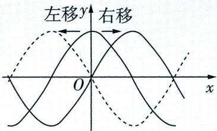

图1

调研 2 (试题调研原创) 函数 $f(x)=A \cos x (A \neq 0)$ 的图象向右平移 $\varphi(0 < \varphi < \pi)$ 个单位长度得到曲线 $C$ , 若 $C$ 在 $x=0$ 对应的点处的切线方程是 $y=x+\sqrt{3}$ , 写出曲线 $C$ 的一条对称轴的方程: \_\_\_\_.

解析 记函数 $f(x) = A\cos x (A \neq 0)$ 的图象向右平移 $\varphi (0 < \varphi < \pi)$ 个单位长度后所得图象对应的函数为 $g(x)$ ，则 $f(x - \varphi) = A\cos (x - \varphi) = g(x)$ .

【防错谨记】函数图象的平移规则：左加右减，上加下减. 符号不要写错

# 二轮指南

搭建知识结构桥梁 不能照搬别人的经验,要根据自身实际情况一步一步把基础夯实,在牢固掌握知识的基础之上构建自己的知识结构桥梁,找vx:GZSJJ2000

切点坐标为 $(0, A\cos \varphi), g'(x) = -A\sin (x - \varphi), g'（0） = -A\sin (0 - \varphi) = A\sin \varphi.$

切线方程为 $y - A\cos \varphi = A\sin \varphi (x - 0)$ ，即 $y = A\sin \varphi \cdot x + A\cos \varphi$

则 $\left\{\begin{aligned}A\sin\varphi=1,\\ A\cos\varphi=\sqrt{3},\end{aligned}\right.$ 又 $0<\varphi<\pi$ ，解得 $\left\{\begin{aligned}A&=2,\\ \varphi=\frac{\pi}{6},\end{aligned}\right.$ 则 $g(x)=2\cos(x-\frac{\pi}{6})$ .

【速解指南】得到 $g(x)$ 的解析式后, 其实无须利用整体代入法求对称轴, 只需找到一个特值, 如根据余弦函数图象的一条对称轴为直线 $x = 0$ , 令 $x - \frac{\pi}{6} = 0$ , 得直线 $x = \frac{\pi}{6}$ 即为所求

由 $x - \frac{\pi}{6} = k\pi, k \in \mathbf{Z}$ , 得 $x = \frac{\pi}{6} + k\pi, k \in \mathbf{Z}$ , 当 $k = 0$ 时, $x = \frac{\pi}{6}$ ,

所以曲线 C 的一条对称轴的方程可以为 $x=\frac{\pi}{6}$ (答案不唯一).

# 变式演练

##### 1. (变考法, 给出函数性质找函数解析式 |2024 河南洛阳部分学校 11 月三调) 已知 $f(x)$ 有三个性质: ① $f(x)$ 的最小正周期为 2; ② $f(-x) + f(x) = 2$ ; ③ $f(x)$ 无零点. 写出一个同时具有以上三个性质, 且定义域为 $\mathbf{R}$ 的函数: $f(x) =$ \_\_\_\_.

##### 2. (变考点, 给出焦距和曲线与直线的交点个数找曲线方程 |2024 江苏南通 11 月联考 |较难) 写出满足下列两个条件的一个双曲线 $C$ 的方程: \_\_\_\_.

①焦距为 $4\sqrt{3}$ ;②直线 y = x - 3 与 C 的一支有 2 个公共点.

# 参考答案与解析

##### 1. $\frac{1}{2}\sin \pi x + 1$ (答案不唯一) 设函数 $f(x) = A\sin (\omega x + \varphi) + B(A > 0)$ .

【消除卡壳】为什么想到这样设函数？因为要求的函数有周期性，首先考虑正弦与余弦型函数，这类函数定义域为 $\mathbf{R}$ ，且自带周期性

由最小正周期为2得 $\frac{2\pi}{|\omega|} = 2$ ，不妨取 $\omega = \pi$ ，则 $f(x) = A\sin (\pi x + \varphi) + B.$

因为 $f(x)$ 无零点, 振幅为 A, 所以曲线 $y = A \sin(\omega x + \varphi)$ 向上或向下平移的单位长度大于 A, 才能使平移后图象对应的函数无零点, 所以 $A < |B|$ , 不妨取 $A = \frac{1}{2}$ , $B = 1$ , $\varphi = 0$ .

【快解技巧】到这一步已经满足了性质①③，还差一个参数 $\varphi$ 没有确定，大胆设想它对解题没有影响，不妨使 $\varphi=0$ ，再根据解析式与性质②进行验证，这样可以简化运算

则 $f(-x)+f(x)=\frac{1}{2}\sin(-\pi x)+1+\frac{1}{2}\sin\pi x+1=-\frac{1}{2}\sin\pi x+1+\frac{1}{2}\sin\pi x+1=2$ ，满足性质②.

则函数 $f(x)=\frac{1}{2}\sin\pi x+1$ 符合题意(答案不唯一).

# 二轮指南

##### 2. $\frac{x^{2}}{7}-\frac{y^{2}}{5}=1$ (答案不唯一) 当双曲线的焦点在 $x$ 轴上时, 设 $C$ 的方程为 $\frac{x^{2}}{m}-\frac{y^{2}}{n}=1 (m>0, n>$ 【快解技巧】开放性问题的特征就是只需要写出一个正确的, 所以对于本题, 可以直接令双曲线的焦点在 $x$ 轴或 $y$ 轴上

0），由焦距为 $4\sqrt{3}$ 得 $m + n = (2\sqrt{3})^2 = 12$ ，则 $\frac{x^2}{m} -\frac{y^2}{12 - m} = 1(m <   12).$

要使直线 $y = x - 3$ 与 $C$ 的一支有2个公共点，则直线 $y = x - 3$ 与 $C$ 的右支有2个公共点，

由 $\left\{\begin{aligned}\frac{x^{2}}{m}-\frac{y^{2}}{12-m}=1,\\ y=x-3\end{aligned}\right.$ 消去 y 得关于 x 的一元二次方程 $(12-2m)x^{2}+6mx+m^{2}-21m=0$ ，则

$\begin{array}{r} {\left\{ \begin{array}{l l} {1 2 - 2 m \neq 0,} \\ {\Delta = 3 6 m ^ {2} - 4 (1 2 - 2 m) (m ^ {2} - 2 1 m) > 0,} \\ {- \frac {6 m}{1 2 - 2 m} > 0,} \\ {\frac {m ^ {2} - 2 1 m}{1 2 - 2 m} > 0,} \end{array} \right. \text {即} \left\{ \begin{array}{l l} {m \neq 6,} \\ {m > 1 2 \text {或} m <   \frac {2 1}{2},} \\ {m > 6,} \\ {6 <   m <   2 1,} \end{array} \right. \text {解得} 6 <   m <   \frac {2 1}{2}.} \end{array}$

# 新题型 3 劣构性试题

【热点解读与预测】在数学考试中引入、设置劣构性试题是考试内容改革的要求,劣构性试题是实现“从能力立意到素养导向的转变”的载体之一,2023北京卷第17题,要求从3个条件中选择一个作为已知,求参数的值;2022北京卷第17题,要求从2个条件中选择一个作为已知,求线面角的正弦值……虽然2023全国卷与新课标卷均未出现劣构性试题,但作为一种新题型,其在2024年高考中出现的可能性依然很高,不可放松警惕.

调研 1 (二选一,以解三角形为考点命题|2024 湖南衡阳八中 11 月模拟)在
① $\cos A=\frac{2c-a}{2b}$ ,② $b\cos C=(2a-c)\cos B$ 中任选一个作为已知条件,补充在下列问题中,并作答.

问题:在 $\triangle ABC$ 中,内角A,B,C所对的边分别为a,b,c,已知\_\_\_\_.

（1） 求 B;   
（2） 若 $\triangle ABC$ 的外接圆半径为 2, 且 $\cos A\cos C = -\frac{1}{8}$ , 求 $ac$ .

注:若选择不同的条件分别解答,则按第一个解答计分.

# 二轮指南

提高做题效果 第一,在题目拿到手后,先思考它属于哪种题型;第二,多比较,经常拿自己的答案和参考答案比较;第三,多总结,自己总结有对答题有指导性作用的方法.

解析 （1） 若选择条件①, 解题过程如下.

$\cos A = \frac{2c - a}{2b}$ , 则在 $\triangle ABC$ 中, 由余弦定理可得 $\frac{b^2 + c^2 - a^2}{2bc} = \frac{2c - a}{2b}$ ,

【边角互化】条件①中等式的结构很清晰，左侧为角，右侧为边，考虑化角为边的策略更简便

即 $a^2 + c^2 - b^2 = ac$ ，则 $\cos B = \frac{a^2 + c^2 - b^2}{2ac} = \frac{ac}{2ac} = \frac{1}{2}$ ，

又 $B\in(0,\pi)$ ，所以 $B=\frac{\pi}{3}$ .

【敲黑板】注意三角形中角的取值范围的隐含要求

若选择条件②,解题过程如下.

$b\cos C=(2a-c)\cos B$ ，则在 $\triangle ABC$ 中，由正弦定理可得 $\sin B\cos C+\sin C\cos B=2\sin A\cos B$ ，即 $\sin(B+C)=2\sin A\cos B$ ，则 $\sin A=2\sin A\cos B$ ，

因为 $A \in (0, \pi)$ , 所以 $\sin A \neq 0$ , 所以 $\cos B = \frac{1}{2}$ ,

又 $B \in (0, \pi)$ , 所以 $B = \frac{\pi}{3}$ .

（2） 因为 $B = \frac{\pi}{3}$ , 所以 $A + C = \frac{2\pi}{3}$ , 则 $\cos(A + C) = -\frac{1}{2}$ , 即 $\cos A \cos C - \sin A \sin C = -\frac{1}{2}$ ,

又 $\cos A\cos C = -\frac{1}{8}$ 所以 $\sin A\sin C = \frac{1}{2} -\frac{1}{8} = \frac{3}{8}$

因为 $\triangle ABC$ 的外接圆半径 $R = 2$

所以由正弦定理可得 $\sin A\sin C = \frac{a}{4}\cdot \frac{c}{4} = \frac{3}{8}$ 所以 $ac = 6$

调研 2: (三选二作条件,选一作结论,以抛物线为考点命题12024湘豫名校第二次摸底考试)已知抛物线 $C: y^{2} = 2px (p > 0)$ 的焦点为 $F$ ,准线为 $l, C$ 上的动点 $A$ 到点 $F$ 与到直线 $x = -2$ 的距离之和的最小值为 3.

（1） 求 $C$ 的方程. （2） 过点 $A$ 作直线交 $C$ 于另一点 $B$ , 过点 $A$ 作 $C$ 的切线 $l'$ , 点 $P$ 在 $l'$ 上. 从下面①②③中选取两个作为条件, 证明另一个成立.

①点 P 在 l 上; ②直线 PB 与 C 相切; ③点 F 在直线 AB 上.

注:若选择不同的组合分别解答,则按第一个解答计分.

解析（1）设 $A(x_{1},y_{1}),x_{1}\geqslant0$ ，由题意知准线l的方程为 $x=-\frac{p}{2},F(\frac{p}{2},0)$ ,

二轮指南

由抛物线的定义可知点 $A$ 到点 $F$ 的距离等于点 $A$ 到准线 $l$ 的距离,

所以点 $A$ 到点 $F$ 的距离与到直线 $x = -2$ 的距离之和为 $x_{1} + \frac{p}{2} + x_{1} + 2 = 2x_{1} + 2 + \frac{p}{2}$

由题意知当 $x_{1} = 0$ 时，距离之和最小，所以 $2 + \frac{p}{2} = 3$ ，解得 $p = 2$ ，所以 $C$ 的方程为 $y^{2} = 4x.$

（2）由（1）得 $F\left( {1,0}\right)$ . 由题意可知直线 ${l}^{' }$ 的斜率不为0,

所以可设直线 $l'$ 的方程为 $x - x_{1} = m(y - y_{1})$ ,

【锦囊妙计】只要直线不与 $x$ 轴平行，都可以把直线方程设成此形式，可以避免讨论直线斜率是否存在

由 $\left\{\begin{aligned}x-x_{1}&=m(y-y_{1}),\\ y^{2}&=4x\end{aligned}\right.$ 化简得关于y的方程 $y^{2}-4my+4my_{1}-4x_{1}=0$ ,

则 $\Delta = 16m^2 - 16my_1 + 16x_1 = 0$

即 $\Delta = 16m^2 - 16my_1 + 4y_1^2 = 4(2m - y_1)^2 = 0$ ，得 $m = \frac{y_1}{2}$ ，

所以 $l'$ 的方程为 $x - x_{1} = \frac{y_{1}}{2}(y - y_{1})$ ，即 $y_{1}y = 2(x + x_{1})$ 。

若选择①②作为条件,证明③成立,解题过程如下.

设 $B(x_{2},y_{2})$ ，则 $y_{2}\neq y_{1},y_{1},y_{2}\neq 0$

由求解直线 $l'$ 的方程的过程同理可得直线 $PB$ 的方程为 $y_{2}y = 2(x + x_{2})$ ，

设 $P(-1, t)$ ，则 $ty_{1} = 2(-1 + x_{1})$ ， $ty_{2} = 2(-1 + x_{2})$ ，

所以点 A, B 在直线 $ty = 2(x - 1)$ 上, 所以点 F 在直线 AB 上, 即③成立.

若选择②③作为条件,证明①成立,解题过程如下.

设 $B(x_{2},y_{2})$ ，则 $y_{2}\neq y_{1},y_{1},y_{2}\neq 0,$

由求解直线 $l'$ 的方程的过程同理可得直线 $PB$ 的方程为 $y_{2}y = 2(x + x_{2})$ ，

由 $\left\{\begin{aligned}y_{2}y&=2(x+x_{2}),\\ y_{1}y&=2(x+x_{1}),\end{aligned}\right.$ 即 $\left\{\begin{aligned}y_{2}y&=2(x+\frac{y_{2}^{2}}{4}),\\ y_{1}y&=2(x+\frac{y_{1}^{2}}{4}),\end{aligned}\right.$ 得 $x_{P}=\frac{y_{1}y_{2}}{4}.$

设 $AB$ 的方程为 $x = ty + 1$ ，由 $\left\{ \begin{array}{l} x = ty + 1, \\ y^2 = 4x \end{array} \right.$ 得关于 $y$ 的方程 $y^2 - 4ty - 4 = 0$

则 $\Delta_1 = 16t^2 + 16 > 0, y_1y_2 = -4$

所以 $x_{P} = \frac{y_{1}y_{2}}{4} = -1$ ，所以点 $P$ 在 $l$ 上，即①成立.

若选择①③作为条件,证明②成立,解题过程如下.

设 $B(x_{2},y_{2})$ ，则 $y_{2}\neq y_{1},y_{1},y_{2}\neq 0,$

由求解直线 $l'$ 的方程的过程得, 若直线 $PB$ 与 $C$ 相切, 则直线 $PB$ 的方程为 $y_2y = 2(x + x_2)$ ,

在 $y_{1}y = 2(x + x_{1})$ 中，令 $x = -1$ ，得 $y = \frac{2(x_1 - 1)}{y_1}$ 所以 $P(-1, \frac{2(x_1 - 1)}{y_1})$

设 $AB$ 的方程为 $x = ty + 1$ ，由 $\left\{ \begin{array}{l} x = ty + 1, \\ y^2 = 4x \end{array} \right.$ 得关于 $y$ 的方程 $y^2 - 4ty - 4 = 0$

则 $\Delta_1 = 16t^2 + 16 > 0, y_1y_2 = -4$ ，则 $y_2 = -\frac{4}{y_1}$ ，

所以 $B\left(\frac{4}{y_1^2}, -\frac{4}{y_1}\right)$ ，所以 $k_{PB} = \frac{-\frac{4}{y_1} - \frac{2(x_1 - 1)}{y_1}}{\frac{4}{y_1^2} + 1} = \frac{-4y_1 - 2(x_1 - 1)y_1}{4 + y_1^2} = \frac{-4y_1 - 2(\frac{y_1^2}{4} - 1)y_1}{4 + y_1^2} =$

$\frac{-\frac{y_{1}}{2}(4+y_{1}^{2})}{4+y_{1}^{2}}=-\frac{y_{1}}{2}$ ，则直线PB的方程为 $y-\frac{2(x_{1}-1)}{y_{1}}=-\frac{y_{1}}{2}(x+1)$ ,

又 $y_{1}^{2}=4x_{1}$ ，所以 $y-\frac{2(\frac{y_{1}^{2}}{4}-1)}{y_{1}}=-\frac{y_{1}}{2}(x+1)$ ，所以 $y=-\frac{y_{1}}{2}x-\frac{2}{y_{1}}$

因为 $y_{1}y_{2} = -4$ ，所以 $y = \frac{2}{y_{2}}x + \frac{y_{2}}{2} = \frac{2}{y_{2}}x + \frac{y_{2}^{2}}{2y_{2}} = \frac{2}{y_{2}}x + \frac{4x_{2}}{2y_{2}} = \frac{2(x + x_{2})}{y_{2}}$ ，所以 PB 的方程为 $y_{2}y = 2(x + x_{2})$ ，所以直线 PB 与 C 相切，即②成立.

# 变式演练

(变考法, 三选一且只有一组正确条件 |2024 北京市汇文中学 11 月期中) 在 $\triangle ABC$ 中, 内角 $A, B$ , $C$ 所对的边分别为 $a, b, c, b^{2} + c^{2} = a^{2} + \sqrt{3} bc$ .

（1） 求 $A$ .

（2）以下三组条件中恰有一组条件使得三角形存在且唯一确定,请选出该组条件并求 $\triangle ABC$ 的面积.

条件①: $\sin B = \frac{\sqrt{2}}{2}, b = \sqrt{2}.$

条件②: $\cos B = \frac{2\sqrt{2}}{3}, a = \sqrt{2}.$

条件③: a = 1, $b = \sqrt{2}$ .

# 参考答案与解析

（1）由余弦定理得 $a^2 = b^2 + c^2 - 2bc\cos A$ ，又 $b^2 + c^2 = a^2 + \sqrt{3}bc$ ，所以 $2bc\cos A = \sqrt{3}bc$

【指点迷津】关于解三角形的问题, 需要选用合适的公式求解, 涉及边长的平方及三边一角的关系时, 一般用余弦定理, 涉及两边两角的关系时, 一般用正弦定理

所以 $\cos A = \frac{\sqrt{3}}{2}$ ，又 $A \in (0, \pi)$ ，所以 $A = \frac{\pi}{6}$ .

（2）选择条件②,原因如下.

由（1）知, $A=\frac{\pi}{6}$ ，根据条件②中 $\cos B=\frac{2\sqrt{2}}{3}$ ，且 $B\in(0,\pi)$ ，可知B也是唯一确定的，从而可得C也是唯一确定的，再由 $a=\sqrt{2}$ ，代入正弦定理计算可得边b,c也是唯一确定的，故选择条件②.

因为 $\cos B=\frac{2\sqrt{2}}{3},B\in(0,\pi)$ ，所以 $\sin B=\frac{1}{3}$ .

由正弦定理得 $\frac{a}{\sin A} = \frac{b}{\sin B}$ , 可得 $b = \frac{\sin B}{\sin A} a = \frac{\frac{1}{3} \times \sqrt{2}}{\frac{1}{2}} = \frac{2\sqrt{2}}{3}$ ,

所以 $\sin C = \sin (A + B) = \sin A\cos B + \cos A\sin B = \frac{1}{2}\times \frac{2\sqrt{2}}{3} +\frac{\sqrt{3}}{2}\times \frac{1}{3} = \frac{2\sqrt{2} + \sqrt{3}}{6},$

所以三角形的面积 $S=\frac{1}{2}ab\sin C=\frac{2\sqrt{2}+\sqrt{3}}{9}$ .

# 新题型 4 创新角度试题

【热点解读与预测】创新角度试题在近几年高考中层出不穷,如:2023 新课标Ⅰ卷第 20 题对数列条件的设计新颖,第 21 题考查概率与数列的综合交汇问题;2023 新课标Ⅱ卷第 12 题以“信号传输”为背景考查概率与统计,第 22 题巧妙地将导数与三角函数结合起来考查;2023 全国乙卷理科第 10 题体现集合、数列、三角函数的综合创新……此类试题设题角度创新、涉及知识点全面多样、解题方法灵活,对综合能力要求较高,有一定难度,需要多加练习.

调研 1: (圆锥曲线与立体几何交汇命题|2024 广东珠海金砖四校 11 月联考) 古希腊数学家阿波罗尼斯采用平面切割圆锥面的方法来研究圆锥曲线, 如图 1, 设圆锥轴截面的顶角为 $2 \alpha (0 < \alpha < \frac {\pi}{2})$ , 用一个平面 $\Gamma$ 去截该圆锥面, 随着圆锥的轴和 $\Gamma$ 所成角 $\beta (0 \leqslant \beta \leqslant \frac{\pi}{2})$ 的变化, 截得的曲线的形状也不同. 据研究, 曲线的离心率为 $e = \frac{\cos \beta}{\cos \alpha}$ , 比如, 当 $\alpha > \beta$ 且平面 $\Gamma$ 不过圆锥顶点时, $e > 1$ , 此时截得的曲线是双曲线. 如图2, 在底面半径为2、高为 $\sqrt{5}$ 的圆锥 $SO$ 中, $AB, CD$ 是底面圆 $O$ 上互相垂直的直径, $E$ 是母线 $SC$ 上一点, $CE = 2ES$ , 则平面 $ABE$ 截该圆锥面所得的曲线的离心率为 ( )

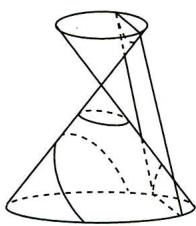

图1

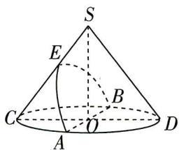

图2

$\quad$A. $\frac{\sqrt{3}}{2}$

$\quad$B. $\frac{\sqrt{5}}{2}$

$\quad$C. $\frac{\sqrt{15}}{3}$

$\quad$D. $\frac{\sqrt{6}}{2}$

卡壳诊断 求出 $\cos\alpha$ 的值, 然后以点 O 为坐标原点, OA, OD, OS 所在直线分别为 x 轴、y 轴、z 轴建立空间直角坐标系, 利用空间向量法结合同角三角函数的基本关系求出 $\cos\beta$ 的值, 即可求得该曲线的离心率的值.

解析 在圆锥 $SO$ 中, $OC = OD = 2$ , $SO = \sqrt{5}$ , 易知 $\angle OSC = \alpha$ .

【会分析】根据题眼“设圆锥轴截面的顶角为 $2 \alpha$ ”，在题图中找到轴截面 $\triangle SCD$ ，即可发现顶角 $\angle CSD$ ，注意关系是 $2 \alpha = \angle CSD$ ，系数不要弄丢

由圆锥的几何性质可知, $SO \perp$ 平面 ABC, 又 $OC \subset$ 平面 ABC, 所以 $SO \perp OC$ ,

所以 $SC = \sqrt{SO^2 + OC^2} = \sqrt{(\sqrt{5})^2 + 2^2} = 3$ ，则 $\cos \alpha = \frac{SO}{SC} = \frac{\sqrt{5}}{3}$ .

在圆锥 $SO$ 中, $AB, CD$ 是底面圆 $O$ 上互相垂直的直径, 以点 $O$ 为坐标原点, $OA, OD, OS$ 所在直线分别为 $x$ 轴、 $y$ 轴、 $z$ 轴建立空间直角坐标系, 如图3所示,

则 $S(0,0,\sqrt{5}),O(0,0,0),C(0,-2,0),A(2,0,0),B(-2,0,0)$

E 是母线 SC 上一点, 可设 $E(0, p, q)$ , 由 CE = 2ES, 可得 $\overrightarrow{CS} = 3 \overrightarrow{ES}$ ,
即 $(0,2,\sqrt{5})=3(0,-p,\sqrt{5}-q)$ ，则 $E(0,-\frac{2}{3},\frac{2\sqrt{5}}{3})$

$\overrightarrow{BA}=(4,0,0)$ ，连接OE，则 $\overrightarrow{OE}=(0,-\frac{2}{3},\frac{2\sqrt{5}}{3})$ .

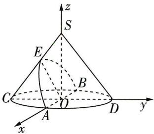

图3

数说新语

设平面 $ABE$ 的法向量为 $\pmb {m} = (x,y,z)$ ，则 $\left\{ \begin{array}{l}\pmb {m}\cdot \overrightarrow{BA} = 4x = 0,\\ \pmb {m}\cdot \overrightarrow{OE} = -\frac{2y}{3} +\frac{2\sqrt{5}}{3} z = 0, \end{array} \right.$

取 $y=\sqrt{5}$ ，可得 $\boldsymbol{m}=(0,\sqrt{5},1)$ 为平面 ABE 的一个法向量，

又 $\overrightarrow{OS} = (0,0,\sqrt{5})$ ，所以 $\cos \langle m,\overrightarrow{OS}\rangle = \frac{\pmb{m}\cdot\overrightarrow{OS}}{|\pmb{m}||\overrightarrow{OS}|} = \frac{\sqrt{5}}{\sqrt{6}\times\sqrt{5}} = \frac{\sqrt{6}}{6},$

所以 $\cos \beta = \sqrt{1 - \cos^2\langle m, \overrightarrow{OS}\rangle} = \sqrt{1 - (\frac{\sqrt{6}}{6})^2} = \frac{\sqrt{30}}{6},$

【消除卡壳】 $\beta$ 是平面 ABE 与圆锥的轴 SO 所成的角， $\langle m,\overrightarrow{OS}\rangle$ 是平面 ABE 的法向量与圆锥的轴 SO 的方向向量所成的角，其与 $\beta$ 是互余的关系

故该圆锥曲线的离心率为 $e = \frac{\cos\beta}{\cos\alpha} = \frac{\sqrt{30}}{6}\times \frac{3}{\sqrt{5}} = \frac{\sqrt{6}}{2}$ ，故选D.

调研 2 (浸润数学文化构建情境12024 北京市汇文中学 11 月期中) 图 4 所示的达·芬奇方砖, 在正六边形上画了具有视觉效果的正方体图案, 把三片这样的达·芬奇方砖形成图 5 的组合, 这个组合表达了图 6 所示的几何体. 图 6 中每个正方体的棱长为 1 , 则点 A 到平面 QGC 的距离为 ( )

  
图 4

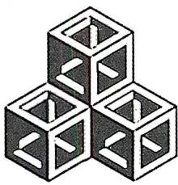

图5

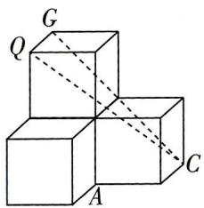

图6

$\quad$A. $\frac{\sqrt{2}}{2}$

$\quad$B. $\frac{\sqrt{3}}{2}$

$\quad$C. 1

$\quad$D. $\sqrt{2}$

解析 根据题意建立如图7所示的空间直角坐标系 $O - xyz$

【画图技巧】题图中涉及的点、线元素过多，可能会干扰解题思路，因此解题时画图可以只画出关键元素，再根据后面的解析选择性添加

则 $A(1,1,0),C(0,2,0),G(0,0,2),Q(1,0,2)$

连接 $CA$ ，所以 $\overrightarrow{GQ} = (1,0,0),\overrightarrow{GC} = (0,2, - 2),\overrightarrow{CA} = (1, - 1,0).$

设平面 QGC 的法向量为 $\boldsymbol{n}=(x,y,z)$ ,

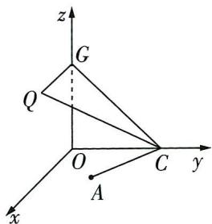

图7

所以 $\left\{\begin{aligned}\boldsymbol{n}\cdot\overrightarrow{GQ}&=x=0,\\\boldsymbol{n}\cdot\overrightarrow{GC}&=2y-2z=0,\end{aligned}\right.$

令 z=1，得 $\boldsymbol{n}=(0,1,1)$ 为平面 QGC 的一个法向量.

所以点 $A$ 到平面 $QGC$ 的距离是 $\frac{|\pmb{n} \cdot \overrightarrow{CA}|}{|\pmb{n}|} = \frac{|1 \times 0 - 1 \times 1 + 0 \times 1|}{\sqrt{2}} = \frac{\sqrt{2}}{2}$ . 故选 A.

调研 3 (教材溯源题,源自人教 A 版《选择性必修第一册》P140 阅读与思考——圆锥曲线的光学性质及其应用 |2024 湖南衡阳八中 11 月模拟 |多选) 抛物线有如下光学性质:由其焦点射出的光线经抛物线反射后,沿与抛物线对称轴平行(重合)的方向射出. 反之,平行于抛物线对称轴的入射光线经抛物线反射后必过抛物线的焦点. 已知抛物线 $C: y^{2} = 2x$ , $O$ 为坐标原点,一束平行于 $x$ 轴的光线 $l_{1}$ 从点 $P(m, 2)(m > 2)$ 射入,经过 $C$ 上的点 $A(x_{1}, y_{1})$ 反射后,再经过 $C$ 上另一点 $B(x_{2}, y_{2})$ 反射后,沿直线 $l_{2}$ 射出,经过点 $Q$ ,则 ( )

$\quad$A. $x_{1}x_{2} = \frac{1}{4}$   
$\quad$B. 延长 AO 交直线 $x = -\frac{1}{2}$ 于点 D，则 D, B, Q 三点共线  
$\quad$C. $\left| {AB}\right|  = \frac{13}{4}$   
$\quad$D. 若 $PB$ 平分 $\angle ABQ$ , 则 $m = \frac{9}{4}$

解析 由题意知,抛物线焦点为点 $F(\frac{1}{2},0)$ , $A(x_{1},2)$ , 根据题意作出示意图, 如图 8 所示.

将 $A(x_{1},2)$ 的坐标代入 $y^{2} = 2x$ ，得 $x_{1} = 2$ ，所以 $A(2,2)$

由抛物线的光学性质知直线 AB 过焦点 F,

则直线 $AB$ 的斜率 $k = \frac{2 - 0}{2 - \frac{1}{2}} = \frac{4}{3}$

则直线 $AB$ 的方程为 $y - 0 = \frac{4}{3} (x - \frac{1}{2})$ ，即 $y = \frac{4}{3} x - \frac{2}{3}$ .

由 $\left\{\begin{aligned}y^{2}&=2x,\\ y&=\frac{4}{3}x-\frac{2}{3},\end{aligned}\right.$ 消去y得 $8x^{2}-17x+2=0$ ，得 $x_{1}=2,x_{2}=\frac{1}{8}$

把 $x_{2} = \frac{1}{8}$ 代入直线 $AB$ 的方程，得 $y_{2} = -\frac{1}{2}$ ，则 $B(\frac{1}{8}, -\frac{1}{2})$

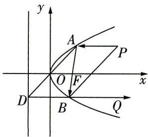

图8

数说新语

所以 $x_{1}x_{2} = 2\times \frac{1}{8} = \frac{1}{4}$ 所以A正确.

$|AB|=x_{1}+x_{2}+1=2+\frac{1}{8}+1=\frac{25}{8}$ ，所以C错误.

【敲黑板】利用抛物线的定义，将点与焦点连线的长度转化为点到准线的距离

由抛物线的光学性质得直线 $BQ \parallel x$ 轴，

又 $B(\frac{1}{8}, -\frac{1}{2})$ ，则直线 $BQ$ 的方程为 $y = -\frac{1}{2}$

又 $A(2,2)$ , 所以直线 $AO$ 的方程为 $y = x$ ,

令 $x = -\frac{1}{2}$ ，则 $y = -\frac{1}{2}$ 即 $D(-\frac{1}{2}, - \frac{1}{2})$

所以 D 在直线 BQ 上, 所以 D, B, Q 三点共线, 所以 B 正确.

设直线 $PB$ 的倾斜角为 $\theta (\theta \in (0,\frac{\pi}{2}))$ ，斜率为 $k_{0}$ ，直线 $AB$ 的倾斜角为 $\alpha$

若 $PB$ 平分 $\angle ABQ$ ，则 $\angle ABQ = 2\angle PBQ$ ，即 $\alpha = 2\theta$

所以 $\tan \alpha = \tan 2\theta = \frac{2\tan\theta}{1 - \tan^2\theta}$ 则 $\frac{4}{3} = \frac{2k_0}{1 - k_0^2}$ 且 $k_{0} > 0$ ，解得 $k_{0} = \frac{1}{2}$

【敲黑板】注意挖掘隐含条件，根据点的位置判断直线的倾斜角小于 $90^{\circ}$ ，进而得到斜率为正值，排除负根

又 $P(m,2), B(\frac{1}{8}, -\frac{1}{2})$ ，所以 $k_0 = \frac{2 - (-\frac{1}{2})}{m - \frac{1}{8}} = \frac{1}{2}$ ，解得 $m = \frac{41}{8}$ ，所以 D 错误。故选 AB.

调研 4 (创新设问,求直线的方向向量|2024 贵州贵阳 11 月期中质量监测) 圆 $O: x^{2} + y^{2} = 4$ 与 $x$ 轴的负半轴和正半轴分别交于 $A, B$ 两点, $MN$ 是圆与 $x$ 轴垂直的非直径的弦, 直线 $AM$ 与直线 $BN$ 交于点 $P$ , 记动点 $P$ 的轨迹为 $E$ .

（1）求轨迹 $E$ 的方程.

（2）在平面直角坐标系中,倾斜角确定的直线被称为定向直线.是否存在不过点A的定向直线l,当直线l与轨迹E交于C,D时, $AC\perp AD$ ;若存在,求直线l的一个方向向量;若不存在,说明理由.

解析 （1） 由题意得 $A(-2,0), B(2,0)$ .

设 $M(m,n)$ , $N(m,-n)$ ( $m\neq0, m\neq\pm2$ ), 则 $m^{2}+n^{2}=4$ .

【敲黑板】因为 $MN$ 是圆与 $x$ 轴垂直的弦, 所以 $M, N$ 横坐标一样, 纵坐标互为相反数; 因为 $MN$ 不是圆的直径, 所以 $M, N$ 横坐标不为 0; 因为 $M, N$ 是不同的两点, 所以 $M, N$ 横坐标不为 $\pm 2$ . 这些限制条件要考虑全面, 为后面得到的轨迹方程是否要去掉某些点打好基础

直线 $PA$ 的方程为 $y = \frac{n}{m + 2} (x + 2)$ ，直线 $PB$ 的方程为 $y = -\frac{n}{m - 2} (x - 2)$ ，

所以 $y^{2} = \frac{-n^{2}}{m^{2} - 4}(x + 2)(x - 2) = \frac{m^{2} - 4}{m^{2} - 4}(x^{2} - 4) = x^{2} - 4$ ，易得 $x \neq \pm 2$ ，

所以轨迹 E 的方程为 $x^{2}-y^{2}=4(x\neq\pm2)$ .

（2） 当定向直线 l 的倾斜角为 $90^{\circ}$ 时, 设 $l: x = s (|s| > 2)$ ,

由 $\left\{\begin{aligned}x=s,\\ x^{2}-y^{2}=4\end{aligned}\right.$ 得 $y=\pm\sqrt{s^{2}-4}.$

当 $AC \perp AD$ 时, $\overrightarrow{AC} \cdot \overrightarrow{AD} = 0$ , 即 $(s + 2)(s + 2) - \sqrt{s^2 - 4} \times \sqrt{s^2 - 4} = 0$ , 所以 $s = -2$ , 与 $|s| > 2$ 矛盾.

当定向直线 l 的倾斜角不为 $90^{\circ}$ 时, 假设存在定向直线 $l: y = kx + t$ ,

由 $\left\{\begin{aligned}y&=kx+t,\\ x^{2}-y^{2}&=4\end{aligned}\right.$ 得关于x的方程 $(1-k^{2})x^{2}-2ktx-t^{2}-4=0.$

由题意知 $1 - k^{2} \neq 0, \Delta = 4(t^{2} - 4k^{2} + 4) > 0$

【防错警示】注意：关于 $x$ 的方程 $(1 - k^2)x^2 - 2ktx - t^2 - 4 = 0$ ，在 $k$ 未知的情况下，不能认为一定是二次方程，要对二次项系数是否为 0 进行讨论

设 $C(x_{1},y_{1}),D(x_{2},y_{2})$ ，则 $x_{1} + x_{2} = \frac{2kt}{1 - k^{2}},x_{1}x_{2} = \frac{-t^{2} - 4}{1 - k^{2}}.$

由 $AC \perp AD$ 得 $\overrightarrow{AC} \cdot \overrightarrow{AD} = 0$ , 即 $(x_{1} + 2)(x_{2} + 2) + (kx_{1} + t)(kx_{2} + t) = 0$ ,

故 $(1 + k^2)x_1x_2 + (2 + kt)(x_1 + x_2) + t^2 +4 = 0$ ，即 $(1 + k^{2})\frac{-t^{2} - 4}{1 - k^{2}} +(2 + kt)\frac{2kt}{1 - k^{2}} +t^{2} + 4 = 0,$ 化简得 $k(t - 2k) = 0$ ，所以 $k = 0$ 或 $t = 2k$

当 k=0 时, 经验证, 满足条件; 当 t=2k 时, $l: y=kx+2k=k(x+2)$ 过点 A, 不符合题意.

综上所述, 当 k=0, 即直线 l 的一个方向向量为 $(1,0)$ 时, $AC \perp AD$ .

# 变式演练

##### 1. (变考点, 平面几何与数列交汇命题 |2024 北京景山学校 11 月期中) 已知直线 $l_{1}: x + y - 2 = 0$ 与 $l_{2}: x - 2y + 1 = 0$ 相交于点 $P$ , 直线 $l_{1}$ 与 $x$ 轴交于点 $P_{1}$ , 过点 $P_{1}$ 作 $x$ 轴的垂线交直线 $l_{2}$ 于点 $Q_{1}$ , 过点 $Q_{1}$ 作 $y$ 轴的垂线交直线 $l_{1}$ 于点 $P_{2}$ , 过点 $P_{2}$ 作 $x$ 轴的垂线交直线 $l_{2}$ 于点 $Q_{2} \cdots \cdots$ 这样一直作下去, 可得到一系列点 $P_{1}, Q_{1}, P_{2}, Q_{2}, \cdots$ , 记点 $P_{n} (n \in \mathbf{N}^{*})$ 的横坐标构成数列 $\{x_{n}\}$ , 给出下列四个结论:

数说新语

①点 $Q_{2}(\frac{1}{2},\frac{3}{4})$ ；②数列 $\{x_{2n}\}$ 递减；③ $|PP_n|^2 = 2 \times (\frac{1}{4})^{n-1}$ ；④数列 $\{x_n\}$ 的前 $n$ 项和 $S_n$ 满足 $2S_{n+1} + S_n = 4n + 3$ .

其中所有正确结论的序号是\_\_\_\_。

##### 2. (变角度, 利用人教 A 版《必修第一册》P256 拓广探索第 26 题的泰勒展开式解题 | 教材溯源题)

2024 哈尔滨第一二二中学 11 月期中) 已知 $a = \frac{31}{16}, b = 2\cos \frac{1}{4}, c = 8\sin \frac{1}{4}$ , 则 ( )

$\quad$A. $a > c > b$

$\quad$B. $b > a > c$

$\quad$C. $a > b > c$

$\quad$D. $c > b > a$

# 参考答案与解析

##### 1. ①③

<table><tr><td>结论</td><td>分析过程</td><td>正误</td></tr><tr><td>1</td><td>由题设知 $P_{1}(2,0)\rightarrow Q_{1}(2,\frac{3}{2})\rightarrow P_{2}(\frac{1}{2},\frac{3}{2})\rightarrow Q_{2}(\frac{1}{2},\frac{3}{4})$ 【防错妙招】过点作x轴(y轴)的垂线,对应的横(纵)坐标不变,此处运算一定要认真,必要时可画出图象,避免出错</td><td>√</td></tr><tr><td>2</td><td>设 $P_{n}(x_{n},y_{n})$ ,则 $Q_{n}(x_{n},\frac{1}{2}x_{n}+\frac{1}{2})\rightarrow P_{n+1}(\frac{3}{2}-\frac{1}{2}x_{n},\frac{1}{2}x_{n}+\frac{1}{2})\rightarrow x_{n+1}=-\frac{1}{2}x_{n}+\frac{3}{2}\rightarrow x_{n+1}-1=-\frac{1}{2}(x_{n}-1)\rightarrow$ 因为 $l_{1}$ 与 $l_{2}$ 交于 $P(1,1)$ ,所以 $x_{n}\neq1\rightarrow\{x_{n}-1\}$ 是以1为首项、 $-\frac{1}{2}$ 为公比的等比数列 $\rightarrow x_{n}=1+(-\frac{1}{2})^{n-1}\rightarrow$ 对于 $\{x_{2n}\}$ ,有 $x_{2n}=1+(-\frac{1}{2})^{2n-1}=1-2\cdot\frac{1}{4^{n}}\rightarrow$ 观察式子可知数列 $\{x_{2n}\}$ 递增</td><td>×</td></tr><tr><td>3</td><td> $P(1,1),P_{n}(x_{n},2-x_{n})\rightarrow|PP_{n}|^{2}=(x_{n}-1)^{2}+(1-x_{n})^{2}=2(x_{n}-1)^{2}=2\times(\frac{1}{4})^{n-1}$ </td><td>√</td></tr><tr><td>4</td><td> $S_{n}=n+\frac{1-(-\frac{1}{2})^{n}}{1-(-\frac{1}{2})}=n+\frac{2}{3}-\frac{2}{3}\cdot(-\frac{1}{2})^{n}\rightarrow 2S_{n+1}=2n+\frac{10}{3}+\frac{2}{3}\cdot(-\frac{1}{2})^{n}\rightarrow 2S_{n+1}+S_{n}=3n+4$ </td><td>×</td></tr></table>

##### 2. D 方法一: 泰勒展开式法 根据题意, 构造函数 $f(x) = 1 - \frac{x^2}{2}, g(x) = \cos x, h(x) = \frac{\sin x}{x}$ , 则 $a = 2f(\frac{1}{4}), b = 2g(\frac{1}{4}), c = 2h(\frac{1}{4})$ .

# 数说新语

由泰勒展开式得 $g(x)=1-\frac{x^{2}}{2!}+\frac{x^{4}}{4!}-\cdots,h(x)=1-\frac{x^{2}}{3!}+\frac{x^{4}}{5!}-\cdots.$

【链接教材】正弦和余弦的泰勒展开式： $\sin x=x-\frac{x^{3}}{3!}+\frac{x^{5}}{5!}-\frac{x^{7}}{7!}+\cdots,\cos x=1-\frac{x^{2}}{2!}+\frac{x^{4}}{4!}-\frac{x^{6}}{6!}+\cdots$

易得 $g(x)=1-\frac{x^{2}}{2!}+\frac{x^{4}}{4!}-\cdots>1-\frac{x^{2}}{2!}(x<1)$ ，即 $g(x)>f(x)(x<1)$ ，所以 a<b.

所以 $g(\frac{1}{4}) \approx 1 - \frac{1}{2} \times \frac{1}{16} + \frac{1}{24} \times \frac{1}{256} = \frac{31}{32} + \frac{1}{24} \times \frac{1}{256}$ ,

$h \left(\frac {1}{4}\right) \approx 1 - \frac {1}{6} \times \frac {1}{1 6} + \frac {1}{1 2 0} \times \frac {1}{2 5 6} = \frac {9 5}{9 6} + \frac {1}{1 2 0} \times \frac {1}{2 5 6},$

而 $\frac{95}{96} + \frac{1}{120} \times \frac{1}{256} - (\frac{31}{32} + \frac{1}{24} \times \frac{1}{256}) = \frac{1}{48} - \frac{1}{256} \times \frac{1}{30} > 0$ ，所以 $b < c$ .

故 $a < b < c$ . 故选 D.

方法二:作差法 + 构造函数法 因为 $b=2\cos\frac{1}{4}=2-4\sin^{2}\frac{1}{8}$ ,

所以 $\frac{b}{2} -\frac{a}{2} = 1 - 2\sin^2{\frac{1}{8}} -\frac{31}{32} = \frac{1}{32} -2\sin^2{\frac{1}{8}} = 2\left(\frac{1}{64} -\sin^2{\frac{1}{8}}\right).$

令 $f(x)=x-\sin x$ ，则 $f'(x)=1-\cos x\geqslant0$

所以函数 $f(x)$ 在 $\mathbf{R}$ 上单调递增，

所以当 $x > 0$ 时， $f(x) > f(0) = 0$ ，即有 $x > \sin x (x > 0)$ 成立，

所以 $\frac{1}{8} >\sin \frac{1}{8}$ ，得 $\frac{1}{64} >\sin^2\frac{1}{8}$ 所以 $b > a$

$\frac {c}{b} = \frac {4 \sin \frac {1}{4}}{\cos \frac {1}{4}} = 4 \tan \frac {1}{4}, \text {令} g (x) = \tan x - x (0 <   x <   \frac {\pi}{2}),$

则 $g'(x) = \frac{\cos^{2}x + \sin^{2}x}{\cos^{2}x} - 1 = \frac{\sin^{2}x}{\cos^{2}x} \geqslant 0$

所以函数 $g(x)$ 在定义域内单调递增，

所以 $g(x) > \tan 0 - 0 = 0$ ，即有 $\tan x > x (0 < x < \frac{\pi}{2})$ 成立，

【快解技巧】这个不等式是常用不等式之一，平时积累这些不等式，考试时在小题中直接应用，可省去求导、求值的频琐过程，类似的不等式还有 $x > \sin x (x > 0)$ ， $x < \cos x (x < 0)$ ， $x \geqslant \ln x + 1 (x > 0$ ，取等号的条件是 x = 1），等等

所以 $\tan\frac{1}{4}>\frac{1}{4}$ ，即 $4\tan\frac{1}{4}>1$ ，所以 $\frac{c}{b}>1$ ，又 b>0，所以 c>b.

综上,c>b>a.故选D.

# 串讲 2 类必考新情境,信息转换不卡壳

# 一手考情 热点串讲

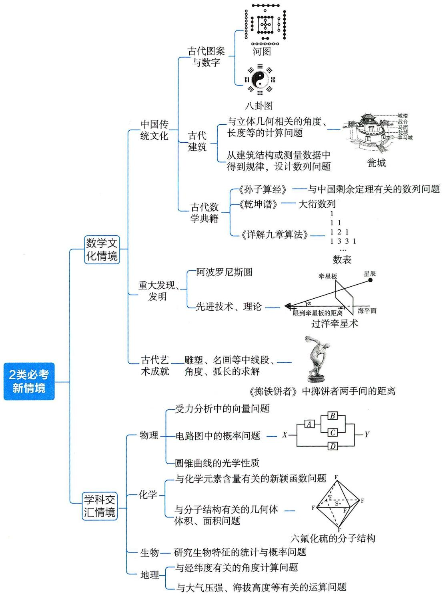

# 数说新语

# 新情境 1 数学文化情境 4 个必考命题角度

【热点解读与预测】《义务教育数学课程标准(2022年版)》明确提出,数学课程内容的选择应关注数学文化,“继承和弘扬中华优秀传统文化”.高考中,数学文化题几乎每年必出,如:2023北京卷第9题以我国传统建筑造型之一——坡屋顶为模型,求五面体的棱长之和;2022新高考Ⅱ卷第3题以中国古代建筑中的举架结构为模型,求线段长的比值;2022全国甲卷理科第8题以中国古代科技史上的杰作《梦溪笔谈》为背景,求弧长的近似值……数学文化常结合数列、立体几何、概率、解析几何等考点命题.

# 命题角度1 搭载数学文化情境的数列问题

调研 1 (《孙子算经》“中国剩余定理”|2024 山东德州第一中学检测)“中国剩余定理”又称“孙子定理”,最早可见于中国古代数学著作《孙子算经》卷下第二十六题,叫作“物不知数”,原文如下:今有物不知其数,三三数之剩二,五五数之剩三,七七数之剩二,问物几何?现有这样一个相关的问题:被3除余2且被5除余3的正整数按照从小到大的顺序排成一列,构成数列 $\{a_{n}\}$ ,记数列 $\{a_{n}\}$ 的前n项和为 $S_{n}$ ,则 $\frac{S_{n}+30}{n}$ 的最小值为()

$\quad$A. 30

$\quad$B. $\frac{61}{2}$

$\quad$C. $\frac{65}{3}$

$\quad$D. 41

解析 被3除余2的正整数按照从小到大的顺序排列为 $2,5,8,11,\cdots$ ，记该数列为 $\{b_{n}\}$ ，

则 $b_{n} = 2 + 3(n - 1) = 3n - 1.$

被5除余3的正整数按照从小到大的顺序排列为3,8,13,18,…,记该数列为 $\{c_{n}\}$ ,

则 $c_{n} = 3 + 5(n - 1) = 5n - 2.$

数列 $\{b_n\}, \{c_n\}$ 的第一个公共项为 $a_1 = 8$

由题意知被3除余2且被5除余3的正整数按照从小到大的顺序排列,所构成的数列也是等差数列,其首项为数列 $\{b_{n}\},\{c_{n}\}$ 的第一个公共项 $a_{1}=8$ ,其公差d为数列 $\{b_{n}\},\{c_{n}\}$ 的公差的最小公倍数,

【消除卡壳】这里是根据等差数列的性质分析的，被3除余2的正整数按从小到大的顺序排列构成等差数列，被5除余3的正整数按照从小到大的顺序排列构成等差数列，那么被3除余2且被5除余3的正整数按照从小到大的顺序排列也构成等差数列，可以看作一个二级结论

所以 $d = 3 \times 5 = 15$ ，所以数列 $\{a_n\}$ 的通项公式为 $a_n = a_1 + (n - 1)d = 8 + 15(n - 1) = 15n - 7$ .

# 数说新语

分数 分数(分子、分母均大于0)的分子固定,分母越大,分数值越小,人的才能是客观存在的,对自己估计越高,实际价值就越低. 更多资源,找vx:GZSJJ2000

由等差数列前 $n$ 项和的公式得 $S_{n} = \frac{n(8 + 15n - 7)}{2} = \frac{n(15n + 1)}{2}$

所以 $\frac{S_n + 30}{n} = \frac{\frac{n(15n + 1)}{2} + 30}{n} = \frac{15n}{2} + \frac{30}{n} + \frac{1}{2} \geqslant 2\sqrt{\frac{15n}{2} \cdot \frac{30}{n}} + \frac{1}{2} = \frac{61}{2}$ , 当且仅当 $\frac{15n}{2} = \frac{30}{n}, n \in$ $\mathbf{N}^*$ , 即 $n = 2$ 时, 等号成立, 所以 $\frac{S_n + 30}{n}$ 的最小值为 $\frac{61}{2}$ . 故选 B.

【敲黑板】使用基本不等式求最值时要判断是否符合条件“一正、二定、三相等”，此处 $\frac{15n}{2}, \frac{30}{n}$ 均为正数，两者之积为定值 225，等号成立的条件为 $\frac{15n}{2} = \frac{30}{n}$ 且该式有解，故可以使用基本不等式

调研 2: (《乾坤谱》中的“大衍数列”|2024 江苏盐城 11 月期中) “大衍数列”来源于《乾坤谱》, 用于解释中国传统文化中的太极衍生原理. “大衍数列” $\{a_{n}\}$ 是 0, 2,4,8,12,18,24, $\cdots$ , $\{a_{n}\}$ 满足 $a_{n}=\begin{cases} a_{n-1}+n, n=2k, \\ a_{n-1}+n-1, n=2k+1, \end{cases}$ 其中 $k \in \mathbf{N}^{*}$ .

（1） 求 $a_{2k}$ (用 k 表示).

（2） 设数列 $\{b_{n}\}$ 满足 $b_{n} = \begin{cases} 2a_{n}, & n = 2k, \\ 2a_{n} + 1, & n = 2k - 1, \end{cases}$ 其中 $k \in \mathbf{N}^{*}$ , $T_{n}$ 是 $\{b_{n}\}$ 的前 $n$ 项的积, 求证: $\ln T_{n} \leqslant n^{2} - n, n \in \mathbf{N}^{*}$ .

解析 （1） $a_{2k + 2} = a_{2k + 1} + 2k + 2 = a_{2k} + 2k + 2k + 2 = a_{2k} + 4k + 2$ ，则 $a_{2k + 2} - a_{2k} = 4k + 2$

$\therefore a _ {2 k} = a _ {2} + a _ {4} - a _ {2} + a _ {6} - a _ {4} + \dots + a _ {2 k} - a _ {2 k - 2} = 2 + 6 + 1 0 + \dots + 4 k - 2 = \frac {4 k \cdot k}{2} = 2 k ^ {2}.$

【消除卡壳】①形如 $a_{n+1}=a_{n}+f(n)$ 的递推关系式，利用累加法求和，要注意能消去多少项、保留多少项；②形如 $a_{n+1}=a_{n}\cdot f(n)$ 的递推关系式，可先化为 $\frac{a_{n+1}}{a_{n}}=f(n)$ 的形式，然后用累乘法，即用 $a_{n}=\frac{a_{n}}{a_{n-1}}\cdot\frac{a_{n-1}}{a_{n-2}}\cdot\cdots\cdot\frac{a_{2}}{a_{1}}\cdot a_{1}$ 求出通项

（2） 由 （1） 知 $a_{2k} = 2k^2, a_{2k-1} = a_{2k-2} + 2k - 2 = 2(k - 1)^2 + 2k - 2 = 2k^2 - 2k, k \geqslant 2$ ,

而 $a_{1}=0$ 也满足上式, 故 $a_{2k-1}=2k^{2}-2k$ .

$\therefore a_{n} = \left\{ \begin{array}{l} \frac{1}{2} n^{2}, n = 2k, \\ \frac{n^{2} - 1}{2}, n = 2k - 1, \end{array} \right.$ $k \in \mathbf{N}^{*}$ , 故 $b_{n} = \left\{ \begin{array}{l} n^{2}, n = 2k, \\ n^{2}, n = 2k - 1, \end{array} \right.$ $k \in \mathbf{N}^{*}$ , 即 $b_{n} = n^{2}$ ,

$\therefore T_{n}=(1\times2\times\cdots\times n)^{2}$ ，则 $\ln T_{n}=2(\ln1+\ln2+\cdots+\ln n)$ .

令 $f(x)=\ln x-x+1,x\in[1,+\infty)$ ，则 $f'(x)=\frac{1-x}{x}\leqslant0$ ，即 $f(x)$ 单调递减，所以 $f(x)\leqslant f(1)=0$

即 $\ln x \leqslant x - 1$ 在 $[1, +\infty)$ 上恒成立，故 $\ln n \leqslant n - 1 (n \in \mathbf{N}^*$ ，当且仅当 $n = 1$ 时取等号），

【速解技巧】不等式 $x - 1 \geqslant \ln x (x = 1$ 时取等号) 在做题时经常用到, 应加以记忆, 做小题时可以直接应用

所以 $2(\ln 1 + \ln 2 + \cdots + \ln n) \leqslant 2 \cdot \frac{(0 + n - 1)n}{2} = n^{2} - n, n \in \mathbb{N}^{*}$ ，即 $\ln T_{n} \leqslant n^{2} - n, n \in \mathbb{N}^{*}$ .

# 命题角度2 搭载数学文化情境的立体几何问题

调研 3 (古代城池中的“瓮城”|2024 广东东莞实验中学 11 月月考) 古代城池中的“瓮城”, 又叫“曲池”, 是在城门外侧(或内侧)修建的半圆形或方形的护门小城(如图 1), 若敌人攻入瓮城中, 可形成“瓮中捉鳖”之势. 图 2 所示的“曲池”是上、下底面均为扇环形的柱体, 且底面扇环所对的圆心角为 $\pi$ , 若 $AA_{1}$ 垂直于柱体下底面, $AA_{1} = 3$ , $AB = 4$ , $CD = 2$ , $E$ 为弧 $A_{1}B_{1}$ 的中点, 则直线 $CE$ 与平面 $DEB_{1}$ 所成角的正弦值为 ( )

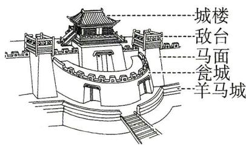

图1

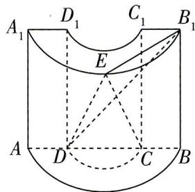

图2

$\quad$A. $\frac{\sqrt{399}}{21}$

$\quad$B. $\frac{\sqrt{273}}{21}$

$\quad$C. $\frac{2\sqrt{42}}{21}$

$\quad$D. $\frac{\sqrt{42}}{21}$

解析 由题意,以点A为坐标原点,“曲池”下底面所在平面内过A且垂直于AB的直线为x轴, $AB,AA_{1}$ 分别为y轴,z轴,建立如图3所示的空间直角坐标系.

【消除卡壳】建立合适的坐标系是正确应用空间向量解题的关键,根据“曲池”的特点, $AA_{1}$ 垂直于下底面,则以点A为坐标原点建系

于是 $C(0,3,0)$ , $D(0,1,0)$ , $B_{1}(0,4,3)$ ,

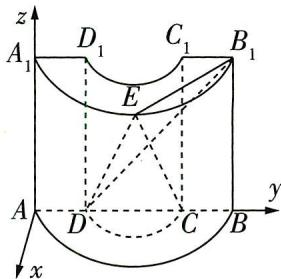

图3

又 $E$ 为 $\widehat{A_1B_1}$ 的中点，则 $E(2,2,3),\overrightarrow{B_1E} = (2, - 2,0),\overrightarrow{B_1D} = (0, - 3, - 3),\overrightarrow{CE} = (2, - 1,3)$

设平面 $DEB_{1}$ 的法向量为 $\boldsymbol{n}=(x,y,z)$ ，则 $\left\{\begin{aligned}\overrightarrow{B_{1}E}\cdot\boldsymbol{n}&=2x-2y=0,\\\overrightarrow{B_{1}D}\cdot\boldsymbol{n}&=-3y-3z=0,\end{aligned}\right.$

# 心理效应

小编说:当你进电梯时,会不自觉跟着电梯里其他人的朝向站位,这就是从众效应的体现,类似有趣的心理效应还有哪些?跟小编更多资源,找vx:GZSJJ2000

令 $x = 1$ ，得 $\pmb {n} = (1,1, - 1)$ 为平面 $DEB_{1}$ 的一个法向量.

设直线 CE 与平面 $DEB_{1}$ 所成角为 $\theta$ ,

则 $\sin \theta = |\cos \langle \overrightarrow{CE},\pmb {n}\rangle | = \frac{|\overrightarrow{CE}\cdot\pmb{n}|}{|\overrightarrow{CE}||\pmb{n}|} = \frac{|2 - 1 - 3|}{\sqrt{14}\times\sqrt{3}} = \frac{\sqrt{42}}{21}.$

所以直线 CE 与平面 $DEB_{1}$ 所成角的正弦值为 $\frac{\sqrt{42}}{21}$ ，故选 D.

# 命题角度3 搭载数学文化情境的概率问题

调研 4: (《详解九章算法》中的数表 |2024 四川蒲江中学 11 月模拟) 我国南宋时期数学家杨辉于 1261 年写下《详解九章算法》, 书中记载的图表给出了 $(a + b)^{n}$ 展开式的系数规律, 如图 4 所示. 当代数式 $x^{4} - 12x^{3} + 54x^{2} - 108x + 81$ 的值为 1 时, $x$ 的值为 ( )

$\begin{array}{l l l l} 1 & & & (a + b) ^ {0} = 1 \\ 1 & 1 & & (a + b) ^ {1} = a + b \\ 1 & 2 & 1 & (a + b) ^ {2} = a ^ {2} + 2 a b + b ^ {2} \\ 1 & 3 & 3 & 1 \\ & \dots & & \dots \end{array}$

图4

$\quad$A. 2 或 4

$\quad$B. 2 或 -4

$\quad$C. 2

$\quad$D. -4

解析 由题图中的规律可得: $(a + b)^{4} = a^{4} + 4a^{3}b + 6a^{2}b^{2} + 4ab^{3} + b^{4}$ .

令 a = x, b = -3,

【突破障碍】找到代数式 $x^{4} - 12x^{3} + 54x^{2} - 108x + 81$ 与题图的联系是关键, 代数式的最高次为 4 次, 题图给出了 $(a + b)^{n} (n = 0, 1, 2, 3)$ 展开式的系数规律, 因此根据规律先写出 $(a + b)^{4}$ 的展开式, 再对 $a, b$ 赋值, 使其在形式上与代数式一样

则 $(x - 3)^4 = x^4 - 12x^3 + 54x^2 - 108x + 81$ ，当 $x^4 - 12x^3 + 54x^2 - 108x + 81 = 1$ 时，

$(x-3)^{4}=1$ , 所以 $x-3=\pm1$ , 解得 x=4 或 x=2, 故选 A.

# 命题角度4 搭载数学文化情境的解析几何问题

调研 5: (阿波罗尼斯圆|2024 江苏徐州 11 月学情调研|多选) 古希腊著名数学家阿波罗尼斯发现: 平面内到两个定点 A, B 的距离之比为定值 $\lambda (\lambda \neq 1)$ 的点的轨迹是圆, 此圆被称为“阿波罗尼斯圆”. 在平面直角坐标系 xOy 中, A(-3,0), B(6,0), 点 P 满足 $\frac{|PA|}{|PB|} = \frac{1}{2}$ . 设点 P 的轨迹为 C, 则下列说法正确的是 ( )

# 心理效应

$\quad$A. 轨迹 C 的方程为 $(x + 3)^{2} + y^{2} = 36$   
$\quad$B. 在 $x$ 轴上存在异于 $A, B$ 的两点 $D, E$ , 使得 $\frac{|PD|}{|PE|} = \frac{1}{2}$   
$\quad$C. 当 A, B, P 三点不共线时, 射线 PO 是 $\angle APB$ 的平分线  
$\quad$D. 在轨迹 C 上存在点 M, 使得 $\overrightarrow{MA} \cdot \overrightarrow{MO} = 2$

# 解析

<table><tr><td>选项</td><td>分析过程</td><td>正误</td></tr><tr><td>A</td><td>设 $P(x,y) \rightarrow \frac{|PA|}{|PB|} = \frac{\sqrt{(x+3)^2+y^2}}{\sqrt{(x-6)^2+y^2}} = \frac{1}{2} \rightarrow x^2 + y^2 + 12x = 0 \rightarrow (x+6)^2 + y^2 = 36$ 【消除卡壳】利用直接法求解,根据 $\frac{|PA|}{|PB|} = \frac{1}{2}$ 与两点间的距离公式求得轨迹方程</td><td>×</td></tr><tr><td>B</td><td>假设在x轴上存在异于A,B的两点D,E,使得 $\frac{|PD|}{|PE|} = \frac{1}{2}$ →设 $D(m,0),E(n,0) \rightarrow \sqrt{(x-n)^2+y^2} = 2\sqrt{(x-m)^2+y^2} \rightarrow 3x^2 + 3y^2 - (8m-2n)x + 4m^2 - n^2 = 0 \rightarrow$ 点P的轨迹方程为 $x^2 + y^2 + 12x = 0 \rightarrow \begin{cases} - (8m-2n) = 36, \\ 4m^2 - n^2 = 0 \end{cases} \rightarrow \begin{cases} m = -9, \\ n = -18 \end{cases}$ 或 $\begin{cases} m = -3, \\ n = 6 \end{cases}$ (舍去)</td><td>√</td></tr><tr><td>C</td><td>如图5所示,当A,B,P三点不共线时, $\frac{|OA|}{|OB|} = \frac{1}{2} = \frac{|PA|}{|PB|} \rightarrow \frac{|PA|}{|PB|} = \frac{|OA|}{|OB|} = \frac{S_{\triangle PAO}}{S_{\triangle PBO}} = \frac{\frac{1}{2}|PA||PO|\sin\angle APO}{\frac{1}{2}|PB||PO|\sin\angle BPO} = \frac{|PA|\sin\angle APO}{|PB|\sin\angle BPO} \rightarrow \sin\angle APO =$  $\sin\angle BPO \rightarrow 0 < \angle APO + \angle BPO < \pi \rightarrow \angle APO = \angle BPO \rightarrow$ 射线PO是∠APB的平分线图5</td><td>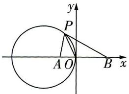</td></tr><tr><td>D</td><td>假设存在→设 $M(t,s) \rightarrow \overrightarrow{MA} = (-3-t,-s), \overrightarrow{MO} = (-t,-s) \rightarrow \overrightarrow{MA} \cdot \overrightarrow{MO} = (-3-t)(-t) + (-s)(-s) = 2 \rightarrow t^2 + s^2 + 3t = 2 \rightarrow t^2 + s^2 + 12t = 0 \rightarrow \begin{cases} t = -\frac{2}{9}, \\ s = -\frac{2\sqrt{53}}{9} \end{cases}$ 或 $\begin{cases} t = -\frac{2}{9}, \\ s = \frac{2\sqrt{53}}{9} \end{cases}$ </td><td></td></tr></table>

# 心理效应

如:要养成良好的学习和生活习惯,可以先从找准自己的不足做起,制订一个短时间(如一周、半个月)养成一个好习惯的目标,长此以往,就能养成良好的学习和生活习惯.

# 变式演练

##### 1. (变考点, 考查二项展开式的应用 | 圆柱容球问题 | 2024 广西贵港西江高级中学第二次模拟 | 多选)传说古希腊数学家阿基米德的墓碑上刻着一个圆柱, 圆柱内有一个内切球, 这个球的直径恰好与圆柱的高相等, 示意图如图6所示. 设圆柱的体积与其内切球的体积的比值为 $m$ , 圆柱的表面积与其内切球的表面积的比值为 $n$ , 若 $f(x) = \left(\frac{m}{n} x^3 - \frac{1}{x}\right)^8$ , 则下列说法不正确的是 ( )

$\quad$A. $\left(\frac{m}{n} x^{3}-\frac{1}{x}\right)^{8}$ 的展开式中的常数项是 56

$\quad$B. $(\frac{m}{n} x^3 - \frac{1}{x})^8$ 的展开式中的各项系数之和为 0

$\quad$C. $\left(\frac{m}{n} x^{3}-\frac{1}{x}\right)^{8}$ 的展开式中的二项式系数最大值是 70

$\quad$D. $f(\mathrm{i}) = -16$ ，其中 $\mathbf{i}$ 为虚数单位

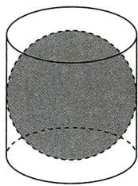

图6

##### 2.（变题型，开放性填空题 | 阿波罗尼斯圆 | 2024 湖北部分省级示范高中 11 月期中）古希腊著名数学家阿波罗尼斯发现了平面内到两个定点 A, B 的距离之比为定值 $\lambda (\lambda \neq 1)$ 的点的轨迹是圆，此圆被称为“阿波罗尼斯圆”。在平面直角坐标系中，已知 $A(1,0)$ ， $B(4,0)$ ，若动点 P 满足 $\frac{|PA|}{|PB|} = \frac{1}{2}$ ，点 P 的轨迹为 C，过点 $(1,2)$ 作直线 l, C 上恰有三个点到直线 l 的距离为 1，则满足条件的一条直线 l 的方程为 \_\_\_\_。

# 参考答案与解析

##### 1. AD 设内切球的半径为 $r$ , 则圆柱的底面半径为 $r$ , 高为 $2 r$ ,

所以 $m = \frac{\pi r^2\cdot 2r}{\frac{4}{3}\pi r^3} = \frac{3}{2},n = \frac{2\pi r^2 + 2\pi r\cdot 2r}{4\pi r^2} = \frac{3}{2}$ 则 $\frac{m}{n} = 1,f(x) = (x^3 -\frac{1}{x})^8.$

<table><tr><td>选项</td><td>分析过程</td><td>正误</td></tr><tr><td>A</td><td> $f(x)$ 展开式的通项为 $T_{r+1} = C_8^r x^{24-3r} \cdot (-\frac{1}{x})^r = (-1)^r C_8^r x^{24-4r} \rightarrow$ 令 $24 - 4r = 0 \rightarrow r = 6 \rightarrow$ 展开式的常数项为 $(-1)^6 C_8^6 = 28$ </td><td>×</td></tr><tr><td>B</td><td>令 $x = 1 \rightarrow f(1) = (1^3 - \frac{1}{1})^8 = 0 \rightarrow$ 展开式的各项系数之和为0</td><td>√</td></tr><tr><td>C</td><td>展开式中的二项式系数最大值为 $C_8^4 = 70$ 【用结论】本题二项式中指数为8,为偶数,故二项式系数最大的是中间一项的系数,即第 $\frac{8}{2} = 4$ 项的系数,若为奇数,则二项式系数最大的是中间两项的系数.注意二项式系数与项的系数的区别</td><td>√</td></tr><tr><td>D</td><td> $f(i) = (i^3 - \frac{1}{i})^8 = (-i + i)^8 = 0$ </td><td>×</td></tr></table>

# 心理效应

皮格马利翁效应(所愿即所得) 指人们基于对某种情境的知觉而形成的期望,会使该情境产生适应这一期望或预言的效应. 期望什么就会得到什么很多当下所得其实是过去的“未来期待”产生的结果.

##### 2. $x = 1$ (答案不唯一) 根据题意, 设 $P(x, y)$ , 则 $\frac{\sqrt{(x - 1)^2 + y^2}}{\sqrt{(x - 4)^2 + y^2}} = \frac{1}{2}$ , 化简得 $x^2 + y^2 = 4$ , 所以圆 $C$ 的半径为 2.

因为圆 C 上恰有三个点到直线 l 的距离为 1, 所以圆心到直线 l 的距离 d 为 1.

若直线 l 的斜率不存在, 则直线 l 的方程为 x = 1.

【速解技巧】开放性填空题只需要写出一个正确答案，因此将所求直线特殊化处理：斜率不存在或斜率为0. 显然过点(1,2)的直线 $l$ 斜率为0时不满足题意，因此考虑斜率不存在的情况，得到结果后即刻停止答题，不需要考虑所有情况

若直线 l 的斜率存在, 设直线 l 的方程为 $y - 2 = k(x - 1)$ , 即 $kx - y - k + 2 = 0$ , 则 $d = \frac{|-k + 2|}{\sqrt{k^{2} + 1}} = 1$ , 解得 $k = \frac{3}{4}$ , 所以直线 l 的方程为 $3x - 4y + 5 = 0$ . 故答案为 x = 1 或 $3x - 4y + 5 = 0$ (写出一个即可).

# 新情境 2 学科交汇情境的 4 个必考命题角度

【热点解读与预测】《义务教育数学课程标准(2022年版)》提到，“数学是自然科学的重要基础”，数学课程内容的选择应“与时俱进，反映现代科学技术与社会发展需要”。自然科学中的各个方面联系紧密，高考数学每年都涉及其他学科的概念、知识点，如2023新课标Ⅰ卷第10题以物理中的声压级为背景，考查指、对运算；2023全国甲卷理科第19题以生物试验为背景，考查统计知识；2022全国乙卷理科第4题以物理中的航天知识为背景，考查数列……学科交汇问题常常与三角函数、数列、概率与统计结合，主要考查运用数学知识和方法分析、解决问题的能力，解题的关键是仔细阅读，提取并“翻译”关键信息，准确地把文字内容转化为数学问题求解。

# 命题角度1 与物理交汇

调研 1 (2024 湖南 A9 联盟 11 月期中) 如图 1, 由 X 到 Y 的电路中有 4 个元件, 分别为 A, B, C, D, 若 A, B, C, D 能正常工作的概率都是 $\frac{1}{2}$ , 且互不影响, 记 $N =$ “X 到 Y 的电路是通路”, 则 $P(N) =$ \_\_\_\_.

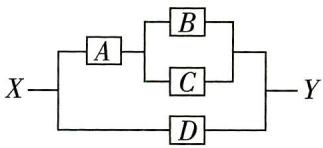

图1

解析 事件“X到Y的电路是通路”包含事件“D正常工作”和“D没有正常工作，A正常工

# 心理效应

如:小时候,妮妮不自信,爸妈常对她说:“妮妮,你真漂亮,成绩一直在进步,真为你开心!”于是妮妮越来越自信,对自己的要求也越来越高,连成绩也变好了CZS110000

作,且 $B, C$ 中至少有一个正常工作”.

【破障碍】把所求事件拆分为互斥事件，分别考虑各事件发生的概率

设 $N_{1}$ =“D 正常工作”， $N_{2}$ =“D 没有正常工作，A 正常工作，且 B,C 中至少有一个正常工作”，

则 $N = N_{1}\cup N_{2},P(N_{1}) = \frac{1}{2},P(N_{2}) = (1 - \frac{1}{2})\times \frac{1}{2}\times (1 - \frac{1}{2}\times \frac{1}{2}) = \frac{3}{16}.$

由于事件 $N_{1}, N_{2}$ 互斥, 所以根据互斥事件的概率加法公式,

可得 $P(N) = P(N_{1}\cup N_{2}) = \frac{1}{2} +\frac{3}{16} = \frac{11}{16}.$

【另解】“X 到 Y 的电路是通路”的对立事件为 “X 到 Y 的电路不是通路”，此对立事件可以拆分为 “A, D 都不正常工作” 和 “A 正常工作，B, C, D 都不正常工作”，所以 $P(N) = 1 - \left(1 - \frac{1}{2}\right) \times \left(1 - \frac{1}{2}\right) - \frac{1}{2} \times \left(1 - \frac{1}{2}\right) \times \left(1 - \frac{1}{2}\right) \times \left(1 - \frac{1}{2}\right) = \frac{11}{16}$ . 无论是从正面还是反面求解，在拆分事件时，牢记所拆分的事件要互斥，这是避免错误的有效方法

# 命题角度2 与化学交汇

调研 2 (2024 安徽太湖中学、定远中学等校 11 月期中联考) 碳 14 具有放射性. 活体生物组织内的碳 14 含量大致不变, 当生物死亡后, 其组织内的碳 14 开始衰减. 已知碳 14 的半衰期约为 5730 年, 即生物死亡 $t$ 年后, 碳 14 含量 $C(t) = C_0 \left( \frac{1}{2} \right)^{\frac{t}{5730}}$ , 其中 $C_0$ 为活体生物组织内碳 14 的含量. 科学家一般利用碳 14 这一特性测定生物死亡年代. 2023 年科学家在我国发现的某生物遗体中碳 14 的含量约为原始含量的 0.92, 已知 $\left( \frac{1}{2} \right)^{2.12} \approx 0.23$ , 则根据所给的数据可推断该生物死亡的朝代为 ( )

$\quad$A. 宋(公元960\~1279年)

$\quad$B. 元(公元 1271 \~ 1368 年)

$\quad$C. 明(公元 1368 \~ 1644 年)

$\quad$D. 清(公元 1636 \~ 1912 年)

解析 设活体生物组织内碳 14 的含量 $C_0 = 1$ ，由题意知 $\left(\frac{1}{2}\right)^{\frac{t}{5730}} = 0.92$

【抓题眼】“某生物遗体中碳14的含量约为原始含量的0.92”，则 $\frac{C(t)}{C_0} = 0.92$

又 $0.92 = 0.23 \times 4 \approx \left(\frac{1}{2}\right)^{2.12} \times \left(\frac{1}{2}\right)^{-2} = \left(\frac{1}{2}\right)^{0.12}$ ,

所以 $t \approx 5730 \times 0.12 = 687.6, 2023 - 687.6 = 1335.4 \approx 1335,$

# 心理效应

阿伦森效应(得到赞扬就开心,失去赞扬就灰心) 指随着奖励减少而态度逐渐消极,随着奖励增加而态度逐渐积极的心理现象. 更多资源,找vx:GZSJJ2000

所以推断该生物死亡的朝代为元. 故选 B.

# 命题角度3 与地理交汇

调研 3 (2024 广东东莞虎门中学等校 11 月联考 | 多选) 已知大气压强 $p(\mathrm{Pa})$ 与海拔高度 $h(\mathrm{m})$ 满足关系式 $\ln p_0 - \ln p = 10^{-4} h, p_0$ 是海平面大气压强. 我国陆地地势可划分为三级阶梯, 其平均海拔如下表:

<table><tr><td></td><td>平均海拔/m</td></tr><tr><td>第一级阶梯</td><td>≥4000</td></tr><tr><td>第二级阶梯</td><td>1000~2000</td></tr><tr><td>第三级阶梯</td><td>≤500</td></tr></table>

若用平均海拔的范围直接代表各级阶梯海拔的范围,设在第一、二、三级阶梯某处的大气压强分别为 $p_{1}, p_{2}, p_{3}$ , 则 ( )

$\quad$A. $p_1 \leqslant \frac{p_0}{\mathrm{e}^{0.4}}$

$\quad$B. ${p}_{0} < {p}_{3}$

$\quad$C. $p_{2}< p_{3}$

$\quad$D. $p_3 \leqslant \mathrm{e}^{0.2} p_2$

解析 设在第一级阶梯的大气压强为 $p_1$ 处的海拔为 $h_1$ ,

则 $\ln p_0 - \ln p_1 = 10^{-4}h_1$ ，即 $h_1 = 10^4\ln \frac{p_0}{p_1}$

因为 $h_1 \geqslant 4000$ ，所以 $10^4 \ln \frac{p_0}{p_1} \geqslant 4000$ ，得 $p_1 \leqslant \frac{p_0}{\mathrm{e}^{0.4}}$ ，A 正确。

由 $\ln p_0 - \ln p = 10^{-4}h$ ，得 $\mathrm{e}^{10^{-4}h} = \frac{p_0}{p}$

【厘思路】B选项可以通过比较 $p_{0},p$ 来解决，要比较 $p_{0},p$ ，构造 $\frac{p_{0}}{p}$ ，与1比较大小

当 $h > 0$ 时， $\mathrm{e}^{10^{-4h}} = \frac{p_0}{p} >1$ ，即 $p_0 > p$ ，所以 $p_0 > p_3$ ，B错误.

设在第二级阶梯的大气压强为 $p_{2}$ 处的海拔为 $h_{2}$ ，在第三级阶梯的大气压强为 $p_{3}$ 处的海拔为 $h_{3}$ ，

则 $\left\{ \begin{array}{l} \ln p_0 - \ln p_2 = 10^{-4}h_2, \\ \ln p_0 - \ln p_3 = 10^{-4}h_3, \end{array} \right.$ 两式相减可得 $\ln \frac{p_3}{p_2} = 10^{-4}(h_2 - h_3)$ .

因为 $h_2 \in [1000, 2000]$ , $h_3 \in [0, 500]$ , 所以 $-h_3 \in [-500, 0]$ , 所以 $h_2 - h_3 \in [500, 2000]$ ,

【避陷阱】不能由 $h_2 \in [1000, 2000], h_3 \in [0, 500]$ 想当然地将左、右区间端点值分别相减，得出 $h_2 - h_3 \in [1000, 1500]$ ，要先求出 $-h_3$ 的范围，才能根据 $h_2 + (-h_3)$ 求解

# 心理效应

如:某居民区,在中午放学后,孩子们都喜欢蹦蹦跳跳,声音扰人,很多人劝阻都无济于事,甚至愈加闹腾.一天,一位老爷爷说:“我们来打企赌,谁最大声,谁就可以拿到一把玩具枪.”获胜者成功拿奖.更多资源,找VX:GZSJ2000则 $10^{-4} \times 500 \leqslant \ln \frac{p_3}{p_2} \leqslant 10^{-4} \times 2000$ ，即 $\mathrm{e}^{0.05} \leqslant \frac{p_3}{p_2} \leqslant \mathrm{e}^{0.2}$ ，

故 $p_2 < \mathrm{e}^{0.05} p_2 \leqslant p_3 \leqslant \mathrm{e}^{0.2} p_2$ ，CD 正确。故选 ACD。

# 命题角度4 与生物交汇

调研 4 (2024 湖南师范大学附属中学 11 月月考)某种植物感染病毒 $\gamma$ 极易死亡, 当地生物研究所为此研发出了一种抗病毒 $\gamma$ 的制剂. 现对 20 株感染了病毒 $\gamma$ 的该植株样本进行喷雾试验测试药效, 分“植株死亡”和“植株存活”两个结果进行统计, 并对植株吸收制剂的量 (单位: 毫克) 进行统计. 规定植株吸收的量在 6 毫克及以上为“足量”, 否则为“不足量”. 现对该植株 20 株样本进行统计, 其中“植株存活”的有 13 株, 所有植株样本对制剂吸收量的统计如下表. 已知“植株存活”但“制剂吸收不足量”的植株共 1 株.

<table><tr><td>编号</td><td>1</td><td>2</td><td>3</td><td>4</td><td>5</td><td>6</td><td>7</td><td>8</td><td>9</td><td>10</td></tr><tr><td>吸收量/毫克</td><td>6</td><td>8</td><td>3</td><td>8</td><td>9</td><td>5</td><td>6</td><td>6</td><td>2</td><td>7</td></tr><tr><td>编号</td><td>11</td><td>12</td><td>13</td><td>14</td><td>15</td><td>16</td><td>17</td><td>18</td><td>19</td><td>20</td></tr><tr><td>吸收量/毫克</td><td>7</td><td>5</td><td>10</td><td>6</td><td>7</td><td>8</td><td>8</td><td>4</td><td>6</td><td>9</td></tr></table>

（1）补全列联表中的空缺部分,依据 $\alpha=0.01$ 的独立性检验,能否认为“植株的存活”与“制剂吸收足量”有关?

<table><tr><td></td><td>吸收足量</td><td>吸收不足量</td><td>合计</td></tr><tr><td>植株存活</td><td></td><td>1</td><td></td></tr><tr><td>植株死亡</td><td></td><td></td><td></td></tr><tr><td>合计</td><td></td><td></td><td>20</td></tr></table>

（2）现假设该植物感染病毒 $\gamma$ 后的存活日数为随机变量 $X(X$ 可取任意正整数). 研究人员统计大量数据后发现: 对于任意的 $k \in \mathbf{N}^{*}$ , 存活日数为 $(k + 1)$ 的样本在存活日数超过 $k$ 的样本里的数量占比与存活日数为 1 的样本在全体样本中的数量占比相同, 均等于 0.1 , 这种现象被称为“几何分布的无记忆性”. 试推导 $P(X = k)$ $(k \in \mathbf{N}^{*})$ 的表达式, 并求该植物感染病毒 $\gamma$ 后存活日数的期望 $E(X)$ .

# 心理效应

第二天,老爷爷把礼物改成了两颗奶糖,孩子们没多大兴趣,敷衍地吵闹了一下,胜者拿走了奶糖.第三天,礼物被改成了两颗花生,孩子们纷纷表示意思通过巧妙的心理效应,把困扰大家的“熊孩子”解决了.更多资源,找VX:GZSJJ2000附; $\chi^2 = \frac{n(ad - bc)^2}{(a + b)(c + d)(a + c)(b + d)}$ ，其中 $n = a + b + c + d$ ；当 $n$ 足够大时， $0.9^n \approx 0$ .

<table><tr><td> $\alpha$ </td><td>0.010</td><td>0.005</td><td>0.001</td></tr><tr><td> $x_{\alpha}$ </td><td>6.635</td><td>7.879</td><td>10.828</td></tr></table>

解析 （1） 根据题意, 补全列联表如下:

<table><tr><td></td><td>吸收足量</td><td>吸收不足量</td><td>合计</td></tr><tr><td>植株存活</td><td>12</td><td>1</td><td>13</td></tr><tr><td>植株死亡</td><td>3</td><td>4</td><td>7</td></tr><tr><td>合计</td><td>15</td><td>5</td><td>20</td></tr></table>

零假设为 $H_{0}$ ：“植株的存活”与“制剂吸收足量”无关联.

根据列联表中的数据得到 $\chi^2 = \frac{20\times(12\times 4 - 3\times 1)^2}{13\times 7\times 15\times 5}\approx 5.934 <   6.635,$

依据 $\alpha=0.01$ 的独立性检验, 没有充分证据推断 $H_{0}$ 不成立, 因此可以认为 $H_{0}$ 成立, 即认为 “植株的存活” 与 “制剂吸收足量” 无关.

（2）由题意得 $P(X=1)=P(X=k+1|X>k)=0.1$ .

【理解题意】提取关键信息，并将其转化为符号语言。“存活日数为 $(k+1)$ ”的概率即 $P(X=k+1)$ ，“存活日数超过k”的概率即 $P(X>k)$ ，“存活日数为1”的概率即 $P(X=1)$ ，结合题意列等式

又 $P(X = k + 1|X > k) = \frac{P(X = k + 1)}{P(X > k)}$ ，故 $P(X = k + 1) = 0.1P(X > k)$

把 $k$ 换成 $k - 1$ , 得 $P(X = k) = 0.1P(X > k - 1), k \geqslant 2$ ,

两式相减, 得 $P(X=k)-P(X=k+1)=0.1P(X=k)$ , 即 $\frac{P(X=k+1)}{P(X=k)}=0.9, k\geqslant2.$

【破障碍】由递推公式作差得出式子, 取值范围不要遗漏, 后续检验 $k = 1$ 也满足该式, 才可以整合

由存活日数为 1 的样本在全体样本中的数量占比为 0.1 可得 $P(X=1)=0.1$ ,

所以 $P(X=2)=0.1P(X>1)=0.1\times[1-P(X=1)]=0.9P(X=1)$ ,

故 $\frac{P(X = k + 1)}{P(X = k)} = 0.9$ 对任意 $k\in \mathbf{N}^*$ 都成立，

心理效应

从而 $\{P(X = k)\}$ 是首项为0.1、公比为0.9的等比数列，因此 $P(X = k) = 0.1\times 0.9^{k - 1}$

由定义可知 $E(X)=P(X=1)+2P(X=2)+3P(X=3)+\cdots+kP(X=k)+\cdots$

而 $\sum_{i=1}^{k} iP(X=i)=0.1\sum_{i=1}^{k} i \times 0.9^{i-1}$ , 下面先求 $\sum_{i=1}^{k} i \times 0.9^{i-1}$ .

【点思路】该式可以看作数列 $\{n \times 0.9^{n-1}\}$ 的前 n 项和，式子为 “等差 × 等比” 的形式，用错位相减法求和

$\sum_ {i = 1} ^ {k} i \times 0. 9 ^ {i - 1} = 1 \times 0. 9 ^ {0} + 2 \times 0. 9 ^ {1} + \dots + (k - 1) \times 0. 9 ^ {k - 2} + k \times 0. 9 ^ {k - 1},$

$0. 9 \sum_ {i = 1} ^ {k} i \times 0. 9 ^ {i - 1} = 1 \times 0. 9 ^ {1} + 2 \times 0. 9 ^ {2} + \dots + (k - 1) \times 0. 9 ^ {k - 1} + k \times 0. 9 ^ {k},$

作差得 $0.1\sum_{i = 1}^{k}i\times 0.9^{i - 1} = 1 + 0.9^{1} + 0.9^{2} + \dots +0.9^{k - 1} - k\times 0.9^{k} = \frac{1\times(1 - 0.9^{k})}{1 - 0.9} -k\times 0.9^{k} =$ $10 - (k + 10)\times 0.9^k.$

所以 $\sum_{i=1}^{k} iP(X=i)=0.1\sum_{i=1}^{k} i \times 0.9^{i-1}=10-(k+10) \times 0.9^k$

当 $k$ 足够大时， $0.9^{k} \approx 0$ ，故 $\sum_{i=1}^{k} iP(X = i) \approx 10$ ，可认为 $E(X) = 10$ .

# 变式演练

##### 1.（变载体，结合电路考查概率 |2024 北京二中 11 月学段测试）如图 2，设每个电子元件能正常工作的概率为 $p$ ，且互不影响，则电路能正常工作的概率为 （）

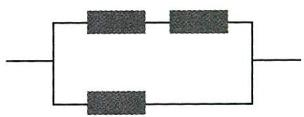

图2

$\quad$A. $p + p^{2}$

$\quad$B. $p + {p}^{2} - {p}^{3}$

$\quad$C. $p^3$

$\quad$D. ${p}^{2} + {p}^{3}$

##### 2.（变载体，与化学交汇考查指对运算 |2024 江苏南通 11 月质量监测）已知树木样本中碳 14 含量 k 与树龄之间的函数关系式为 $k = k_{0} \left( \frac{1}{2} \right)^{\frac{n}{5730}}$ ，其中 $k_{0}$ 为树木最初生长时的碳 14 含量，n 为树龄（单位：年）。通过测定发现某古树样品中碳 14 含量为 $0.6k_{0}$ ，则该古树的树龄约为 \_\_\_\_ 万年。（精确到 $0.01, \lg 3 \approx 0.48, \lg 5 \approx 0.70$ ）

##### 3. (变考点, 考查二次函数与指数函数模型 | 2024 江苏淮安 11 月期中) 某机构对一种病毒在特定环境下进行观测, 每隔单位时间 $T$ 进行一次记录, 用 $x(x \in \mathbf{N}^{*})$ 表示经过的单位时间数, 用 $y$ 表示病毒感染小白鼠的数量, 得到的观测数据如下:

<table><tr><td>x</td><td>1</td><td>2</td><td>3</td><td>4</td><td>5</td><td>6</td><td>...</td></tr><tr><td>y</td><td>...</td><td>6</td><td>...</td><td>36</td><td>...</td><td>216</td><td>...</td></tr></table>

若 y 与 x 的关系有两个函数模型可供选择: ① $y = mx^{2} + n$ ; ② $y = k \cdot a^{x} (k > 0, a > 1)$ . 该机构选择合适的函数模型后, 根据模型预测经过 M 个单位时间, 感染该病毒的小白鼠数量不少于 1 万, 则 M 的最小值为 (取 $\sqrt{2} = 1.41, \sqrt{3} = 1.73, \lg 2 = 0.30, \lg 3 = 0.48$ ) ()

$\quad$A. 9

$\quad$B. 10

$\quad$C. 11

$\quad$D. 12

# 参考答案与解析

##### 1. B 记上端左、右两个电子元件正常工作分别为事件 A, B, 下端电子元件正常工作为事件 C, 设电路能正常工作为事件 M, 电路能正常工作, 则下端电子元件正常工作, 或下端电子元件不正常工作, 上端两个电子元件都正常工作.

【破障碍】把所求事件拆分为2个互斥事件求解

$P (C) = p, P (A B \overline {{C}}) = P (A) P (B) P (\overline {{C}}) = p ^ {2} (1 - p) = p ^ {2} - p ^ {3},$

则 $P(M)=P(C)+P(AB\overline{C})=p+p^{2}-p^{3}$ . 故选 B.

##### 2.0.42 由题意得 $0.6k_{0} = k_{0}\left(\frac{1}{2}\right)^{\frac{n}{5730}}$ ，即 $\left(\frac{1}{2}\right)^{\frac{n}{5730}} = \frac{3}{5}$ ，两边取常用对数得 $\frac{n}{5730} \lg \frac{1}{2} = \lg \frac{3}{5}$ ，变形得到 $n=\frac{\lg5-\lg3}{\lg2}\times5730=\frac{\lg5-\lg3}{1-\lg5}\times5730$

【破障碍】两边取常用对数，利用对数的运算和参考数据求解，注意变换单位

因为 $\lg 3\approx 0.48,\lg 5\approx 0.70$ ，所以 $n\approx \frac{0.70 - 0.48}{1 - 0.70}\times 5730 = 4202,$

故该古树的树龄约为 0.42 万年.

##### 3. C 若选 $y = mx^{2} + n$ ，将 $\left\{\begin{aligned} x &= 2, \\ y &= 6 \end{aligned}\right.$ 和 $\left\{\begin{aligned} x &= 4, \\ y &= 36 \end{aligned}\right.$ 分别代入得 $\left\{\begin{aligned} 4m + n &= 6, \\ 16m + n &= 36, \end{aligned}\right.$ 解得 $\left\{\begin{aligned} m &= \frac{5}{2}, \\ n &= -4, \end{aligned}\right.$

所以 $y=\frac{5}{2}x^{2}-4$ ，将 x=6 代入，有 $y=86\neq216$ ，差异过大，不合题意.

【破障碍】题干给出2个函数模型、3组数据，选择2组数据计算函数模型中的参数，用剩下的1组数据检验函数模型是否符合真实情况

若选 $y = k \cdot a^x (k > 0, a > 1)$ ，将 $\left\{ \begin{array}{l} x = 2, \\ y = 6 \end{array} \right.$ 和 $\left\{ \begin{array}{l} x = 4, \\ y = 36 \end{array} \right.$ 分别代入得 $\left\{ \begin{array}{l} k \cdot a^2 = 6, \\ k \cdot a^4 = 36, \end{array} \right.$ 解得 $\left\{ \begin{array}{l} k = 1, \\ a = \sqrt{6}, \end{array} \right.$

所以 $y=(\sqrt{6})^{x}$ ，将 x=6 代入，有 y=216，符合题意.

所以合适的函数模型为 $y = (\sqrt{6})^x$ . 依题意可得 $(\sqrt{6})^M \geqslant 10000$ , 即 $M\lg \sqrt{6} \geqslant 4$ , 则 $M(\lg 2 + \lg 3) \geqslant 8$ , 又 $\lg 2 = 0.30, \lg 3 = 0.48$ , 所以 $M \geqslant \frac{8}{0.30 + 0.48} \approx 10.256$ .

因为 $M \in N^{*}$ ，所以 M 的最小值为 11。故选 C.

心理效应

# 串讲 7 类必考图象, 数形关联不卡壳

一手考情 热点串讲  
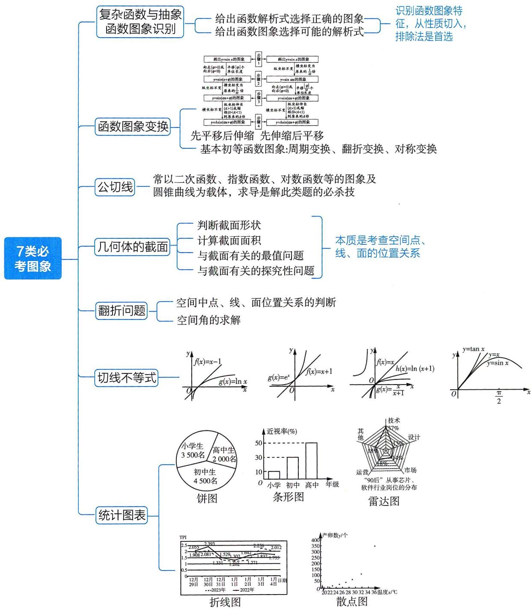

# 心理效应

# 热点图象 1 复杂函数与抽象函数的图象识别

【热点解读与预测】函数图象识别题考法比较单一,多在选择题中考查,常见考法有:给出函数解析式选择正确的图象,或者给出函数图象选择可能的解析式. 在近几年高考中有一定的考查频率,如:2023 天津卷第 4 题,给出函数图象选择可能的解析式;2022 全国甲卷理科第 5 题,给出函数解析式选择给定区间上的大致图象;2022 天津卷第 3 题,给出函数解析式选择正确的图象……这类题的难度一般不大,关键在于识别图象的特征,从奇偶性、单调性、特殊点等切入,利用排除法快速破题.

调研 1 (2024 河南洛阳一高 11 月阶段考试) 函数 $f(x) = \frac{(4^x - 1)\cos x}{2^x}$ 的部分图象大致为 ( )

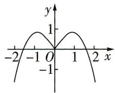

A

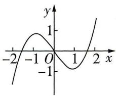

B

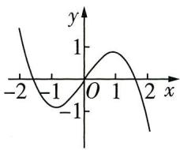

C

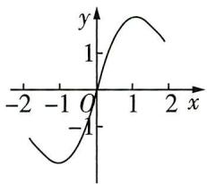

D

解析 方法一 $f(x)=(2^{x}-2^{-x})\cos x=-f(-x)$ ，其定义域为 R，函数 $f(x)$ 为奇函数，故排除 A.

【消除卡壳】已知函数的解析式选择函数的图象, 先观察所给选项图象, 如果图象有明显的奇偶性, 往往从这里作为切入点进行研究. 如果函数非奇非偶呢? 请参阅【调研2】

又 $f(2)=\frac{15}{4}\cos2<0$ , 排除 BD, 选 C.

方法二:特殊值法 由 $f(1)=\frac{(4-1)\cos1}{2}=\frac{3}{2}\cos1>0$ ，可排除 B，由 $f(-1)=$

【指点迷津】当一般性质不易分析或图象有明显的特征点时, 可以用特值验证法排除错误选项 $\frac{(4^{-1}-1)\cos(-1)}{\frac{1}{2}} = -\frac{3}{2}\cos 1 < 0$ , 可排除 A, 由 $f(2) = \frac{(4^2-1)\cos 2}{4} = \frac{15}{4}\cos 2 < 0$ , 可排除 D, 选 C.

调研 2 (2024 四川宜宾 10 月月考) 已知函数 $f(x) = \mathrm{e}^{x} - \lg |x|$ ，则 $f(x)$ 的图象大致为 ( )

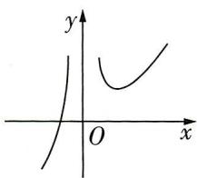

A

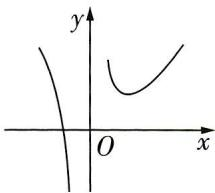

B

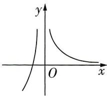

C

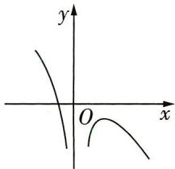

D

# 心理效应

角色效应 指当一个人处于某种角色中或角色发生改变时,因这种角色或角色的改变而引起的心理或行为变化的现象. 更多资源, 找vx:GZSJJ2000

解析 函数 $f(x) = \mathrm{e}^{x} - \lg |x|$ 的定义域为 $(- \infty, 0) \cup (0, +\infty)$ ,

当 x<0 时， $f(x)=\mathrm{e}^{x}-\lg(-x)$ ，因为函数 $y=\mathrm{e}^{x}$ 在 $(-∞,0)$ 上单调递增，函数 $y=\lg(-x)$ 在 $(-∞,0)$ 上单调递减，因此函数 $f(x)=\mathrm{e}^{x}-\lg(-x)$ 在 $(-∞,0)$ 上单调递增，BD 错误.

【消除卡壳】函数 $f(x)$ 显然不具有奇偶性，且无特殊点，故从函数单调性进行分析

当 $x > 0$ 时， $f(x) = \mathrm{e}^x - \lg x, f'(x) = \mathrm{e}^x - \frac{1}{x \ln 10}, f''(x) = \mathrm{e}^x + \frac{1}{x^2 \ln 10} > 0$ ，故 $f'(x)$ 在 $(0, +\infty)$

【敲黑板】 $(\log_{a}x)'=\frac{1}{x\ln a},\quad(a^{x})'=a^{x}\ln a$ ，这两个基本初等函数的求导公式用得比较少，但不能忽略了

上单调递增，

$f'（1） = \mathrm{e} - \frac{1}{\ln 10} >0,f'(\mathrm{e}^{-2}) = \mathrm{e}^{\mathrm{e} - 2} - \frac{\mathrm{e}^{2}}{\ln 10},$ 易知 $0 <   \mathrm{e}^{\mathrm{e} - 2} <   2,2 <   \ln 10 <   3,7 <   \mathrm{e}^{2} <   8,$ 则 $0<$ $\mathrm{e}^{\mathrm{e}^{-2}} <   2 <   \frac{7}{3} <  \frac{\mathrm{e}^{2}}{\ln 10} <  4,$ 即有 $f'(\mathrm{e}^{-2}) <   0,$

则存在 $x_0 \in (\mathrm{e}^{-2}, 1)$ ，使得 $f'(x_0) = 0$ ，当 $0 < x < x_0$ 时， $f'(x) < 0$ ，当 $x > x_0$ 时， $f'(x) > 0$

即函数 $f(x)$ 在 $(0, x_0)$ 上单调递减，在 $(x_0, +\infty)$ 上单调递增，C错误。故选A.

调研 3 (2024 天津市第二十中学 11 月模考) 函数 $f(x)$ 的部分图象如图 1 所示, 则 $f(x)$ 的解析式可以是 ( )

$\quad$A. $f(x) = x + \sin x$

$\quad$B. $f(x) = \frac{\cos x}{x}$

$\quad$C. $f(x) = x\left(x - \frac{\pi}{2}\right)\left(x - \frac{3\pi}{2}\right)$

$\quad$D. $f(x) = x\cos x$

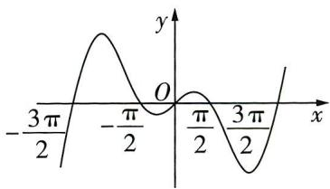

图1

解析 函数图象过点 $(- \frac{\pi}{2}, 0)$ ，对于 A 选项： $f(-\frac{\pi}{2}) = -\frac{\pi}{2} + \sin(-\frac{\pi}{2}) = -\frac{\pi}{2} - 1 \neq 0$ ，故

【关键提醒】通过图象寻找关键信息——特殊点，代入各个选项进行验证

A 错误. 对于 C 选项: $f(-\frac{\pi}{2}) = (-\frac{\pi}{2}) \times (-\pi) \times (-2\pi) = -\pi^3 \neq 0$ , 故 C 错误. 因为函数图象过点 $(0,0)$ , 但 $f(x) = \frac{\cos x}{x}$ 的定义域为 $\{x \mid x \neq 0\}$ , 故 B 错误. 故选 
$\quad$D.

【换个思路】依次判断各选项与所给函数图象的矛盾点. 对于 A, $f'(x) = 1 + \cos x$ ，在 $(- \frac{\pi}{2}, \frac{\pi}{2})$ 上 $f'(x) > 0$ , $f(x)$ 单调递增，排除 A；函数图象过原点，排除 B；因为三次函数至多个有两个极值点，排除 C. 故选 D

# 心理效应

如:曾经贪玩捣蛋的哆哆,自从当上班长后,因为自己的角色的转变,不仅学习认真,还积极主持班里的各项事务.主动组织班级公重流动资源感和自信:639720.09之前判若两人.

调研 4 (2024 辽宁沈阳东北育才学校联考 | 多选) 已知定义在区间 $[a, b]$ 上的函数 $f(x)$ 的导函数 $f'(x)$ 的图象如图 2 所示, 下列命题中正确的是 ( )

【卡壳诊断】本题给出的是导函数 $f'(x)$ 的图象，下面各选项中有判断 $f(x)$ 的性质也有判断 $f'(x)$ 的，注意区分导函数图象与原函数图象

$\quad$A. 函数 $f(x)$ 在区间 $[x_{2}, x_{4}]$ 上单调递减  
$\quad$B. 若 $x_{4} < m < n < x_{5}$ , 则 $\frac{f'(m) + f'(n)}{2} > f'(\frac{m + n}{2})$   
$\quad$C. 函数 $f(x)$ 在 $[a, b]$ 上有 3 个极值点  
$\quad$D. 若 $x_{2}<p<q<x_{3}$ ，则 $[f(p)-f(q)]\cdot[f'(p)-f'(q)]<0$

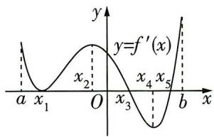

图2

解析 对于 A 选项: 当 $x \in (x_{2}, x_{3})$ 时, $f'(x) > 0$ , 函数 $f(x)$ 单调递增, 故 A 错误.

对于 B 选项:由题图知,在区间 $\left[x_{4}, x_{5}\right]$ 上, $f'(x)$ 的图象是下凸的,在该图象上任取两点 $A(m, f'(m))$ , $B(n, f'(n))$ , 连接 AB, 则 AB 的中点为 $M\left(\frac{m+n}{2}, \frac{f'(m) + f'(n)}{2}\right)$ , 易知 $\frac{f'(m) + f'(n)}{2} > f'\left(\frac{m+n}{2}\right)$ , 故 B 正确.

对于 C 选项: 在区间 $(a, x_{3})$ 和 $(x_{5}, b)$ 上, $f'(x) \geqslant 0$ , 则函数 $f(x)$ 在 $(a, x_{3})$ 和 $(x_{5}, b)$ 上单调递增. 在区间 $(x_{3}, x_{5})$ 上, $f'(x) < 0$ , 则函数 $f(x)$ 在 $(x_{3}, x_{5})$ 上单调递减, 故 $x = x_{3}$ 是极大值点, $x = x_{5}$ 是极小值点, 函数 $f(x)$ 在区间 $[a, b]$ 上有 2 个极值点, 故 C 错误.

【速解】由题图知 $f'(x)=0$ 有两个变号零点，因而有两个极值点。导函数的零点不一定是原函数的极值点，只有变号零点才是极值点

对于 D 选项: 当 $x \in (x_{2}, x_{3})$ 时, $f(x)$ 单调递增, 若 $x_{2} < p < q < x_{3}$ , 则 $f(p) < f(q)$ , 根据图象知 $f'(p) > f'(q)$ , 故 $[f(p) - f(q)] \cdot [f'(p) - f'(q)] < 0$ , D 正确. 故选 BD.

# 变式演练

##### 1. (变条件 |2024 安徽合肥一中 11 月质量检测) 函数 $f(x) = x^3 + \sin 3x$ 的图象大致为 ( )

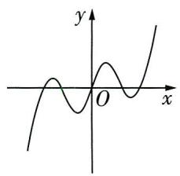

A

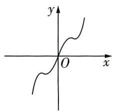

B

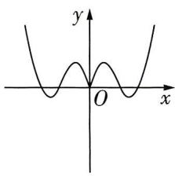

C

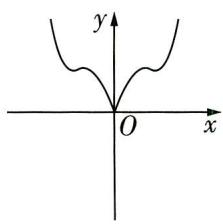

D

心理效应

##### 2.（变条件 | 2024 江苏南通 10 月质量监测）已知函数 $f(x)$ 的部分图象如图 3 所示，则 $f(x)$ 的解析式可能为（）

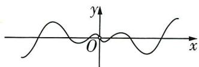

图3

$\quad$A. $f(x) = \frac{\ln|x|}{2 + \cos x}$

$\quad$B. $f(x) = \frac{\ln|x|}{2 + \sin x}$

$\quad$C. $f(x) = \cos x \cdot \ln |x|$

$\quad$D. $f(x) = \sin x\cdot \ln |x|$

##### 3.（变考法，给出函数及导函数图象，构造新函数12024湖北武汉华中师大一附中11月期中1多选）已知函数 $f(x)$ 及其导函数 $f'(x)$ 的部分图象如图4所示，设函数 $g(x)=\frac{f(x)}{\mathrm{e}^{x}}$ ，则 $g(x)$ （）

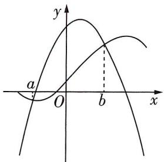

图 4

突破难点:本题需要先判断两个图象哪一个是函数 $f(x)$ 的图象,哪一个是导函数 $f'(x)$ 的,突破点是图象的形状,一个是二次函数图象,另一个是三次函数图象,由于三次函数的导函数是二次函数,从而判断出对应的图象,进行后续求解.

$\quad$A. 在区间 $(a, b)$ 上单调递减

$\quad$B. 在区间 $(a, b)$ 上是单调递增

$\quad$C. 在 $x = a$ 时取极小值

$\quad$D. 在 $x = b$ 时取极小值

##### 4.（试题调研原创|变条件）函数 $f(x)=\cos x+\frac{1}{2}\cos 2x+\frac{1}{3}\cos 3x+\frac{1}{4}\cos 4x$ 在区间 $[-2\pi,2\pi]$ 上的图象大致为()

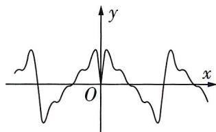

A

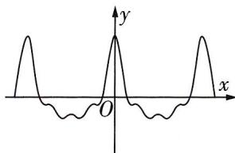

B

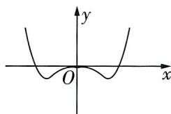

C

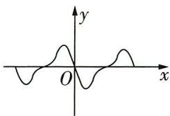

D

# 参考答案与解析

##### 1. B $f(x)=x^{3}+\sin3x$ 的定义域为 R，且 $f(-x)=(-x)^{3}+\sin(-3x)=-x^{3}-\sin3x=-f(x)$ ，故 $f(x)=x^{3}+\sin3x$ 为奇函数，排除 CD.

当 $0 < x < \frac{\pi}{3}$ 时， $x^3 > 0$ ，且 $\sin 3x > 0$ ，则 $f(x) > 0$ ；当 $x \geqslant \frac{\pi}{3}$ 时， $x^3 \geqslant (\frac{\pi}{3})^3 > 1$ ，且 $\sin 3x \geqslant -1$ ，

【消除卡壳】为什么取 $x=\frac{\pi}{3}$ 作为临界点分类讨论呢？因为 $\sin 3x=0$ 时的最小正数解为 $x=\frac{\pi}{3}$ ，以此分类讨论，确定函数值在 x>0 时恒为正，从而排除 A 选项

# 心理效应

如: 来来童年时父母对他的学习采取奖励与兴趣引导措施, 同时对生活中较严重的过错采取惩罚措施, 长大后, 来来成了一个人格完整, 為学上进的人.
更多资源, 我vx: GZSJJ2000

则 $f(x)>0$ ,故当x>0时, $f(x)>0$ ,排除A.应选B.

【解后反思】函数图象识别题往往需要从函数的奇偶性、单调性、特殊值等入手综合分析，单一判断一般只能排除1\~2个选项，有的函数不具有奇偶性，有的无法用特殊值，需要根据题目灵活调整

##### 2. D 由题图可知, $f(x)$ 为奇函数,且定义域为 $\{x \mid x \neq 0\}$ .

对于 A, $f(-x)=\frac{\ln|-x|}{2+\cos(-x)}=\frac{\ln|x|}{2+\cos x}=f(x)$ ，故 $f(x)$ 为偶函数，A 错误.

对于 B, $f(-x)=\frac{\ln|-x|}{2+\sin(-x)}=\frac{\ln|x|}{2-\sin x}\neq-f(x)$ ，故 $f(x)$ 不是奇函数，B 错误.

对于 C, $f(-x) = \cos(-x) \cdot \ln|-x| = \cos x \cdot \ln|x| = f(x)$ ，故 $f(x)$ 为偶函数，C 错误。应选 D.

【记结论】由奇函数乘以偶函数等于奇函数，偶函数乘以偶函数等于偶函数，可知 D 选项中 $y = \sin x$ 为奇函数， $y = \ln |x|$ 为偶函数，故 $f(x) = \sin x \cdot \ln |x|$ 为奇函数

##### 3. BC $g(x)=\frac{f(x)}{\mathrm{e}^{x}}$ ，则 $g'(x)=\frac{f'(x)-f(x)}{\mathrm{e}^{x}}$ ，由题图可知，在区间 $(a,b)$ 上， $f'(x)-f(x)>0$ ，即 $g'(x)>0$ ，故 $g(x)$ 单调递增。当 x<a 时， $g'(x)<0$ ，当 a<x<b 时， $g'(x)>0$ ，当 x>b 时， $g'(x)<0$ ，从而当 x=a 时， $g(x)$ 取得极小值，当 x=b 时， $g(x)$ 取得极大值。综上，选 BC。

##### 4. B 由于 $f(x) = \cos x + \frac{1}{2}\cos 2x + \frac{1}{3}\cos 3x + \frac{1}{4}\cos 4x, x \in [-2\pi, 2\pi]$ ,

故 $f(-x)=\cos(-x)+\frac{1}{2}\cos(-2x)+\frac{1}{3}\cos(-3x)+\frac{1}{4}\cos(-4x)=f(x)$ ,

即 $f(x)$ 为偶函数, 图象关于 y 轴对称, 故 D 错误.

令 $0 \leqslant 4x \leqslant \pi$ ，则 $0 \leqslant x \leqslant \frac{\pi}{4}$ ，由于 $y = \cos x$ 在 $[0, \frac{\pi}{4}]$ 上单调递减， $y = \frac{1}{4} \cos 4x$ 在 $[0, \frac{\pi}{4}]$ 上单调递减， $y = \frac{1}{2} \cos 2x, y = \frac{1}{3} \cos 3x$ 在 $[0, \frac{\pi}{4}]$ 上均单调递减，

故 $f(x)=\cos x+\frac{1}{2}\cos 2x+\frac{1}{3}\cos 3x+\frac{1}{4}\cos 4x$ 在 $\left[0,\frac{\pi}{4}\right]$ 上单调递减，A错误.

由于 $y = \cos x, y = \frac{1}{2}\cos 2x, y = \frac{1}{3}\cos 3x, y = \frac{1}{4}\cos 4x$ 的最小正周期依次为 $2\pi, \pi, \frac{2\pi}{3}, \frac{\pi}{2}$ ,

故 $f(x) = \cos x + \frac{1}{2}\cos 2x + \frac{1}{3}\cos 3x + \frac{1}{4}\cos 4x$ 的最小正周期为 $2\pi$ ,

【记结论】周期函数相加所得函数的周期是各个部分函数周期的最小公倍数

故 $f(x)$ 在 $[-2\pi,0]$ 上的图象和在 $[0,2\pi]$ 上的图象平移后应该会重合，故C错误.

只有 B 中图象符合函数 $f(x)$ 满足的上述性质, B 正确, 故选 B.

心理效应

# 热点图象 2 函数图象的变换

【热点解读与预测】函数图象变换,重在考查图象变换前后的函数解析式,常以三角函数为载体,在近几年高考中有一定的考查频率,如:2023 全国甲卷理科第 10 题,函数图象平移后求图象与直线交点的个数;2022 天津卷第 9 题,研究三角函数的周期性、单调性,函数值的取值范围及图象的伸缩变换;2021 全国乙卷理科第 7 题,已知经过伸缩平移变换后的图象对应的三角函数解析式求原函数……这类题单独考查时难度不大,牢记图象变换法则,熟练掌握函数的有关性质即可.但 2023 年高考题有与别的知识点综合考查的趋势,故本节选择了一些难度较大,综合性较强的题目,为未来高考题在本考点上加大命题难度做准备.

调研 1 (2024 辽宁省名校联盟联考 | 多选) 已知函数 $f(x) = A \sin (\omega x + \varphi) - 1$ ( $A > 0, \omega > 0, |\varphi| < \frac{\pi}{2}$ ), 若函数 $y = |f(x)|$ 的部分图象如图 1 所示, 则下列结论正确的是 ( )

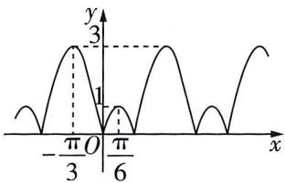

图 1

$\quad$A. $f(x)$ 的最大值为 3  
$\quad$B. $f(x)$ 的图象关于点 $(- \frac{\pi}{12}, -1)$ 对称  
$\quad$C. 直线 $2 \sqrt{3} x + y - \sqrt{3} \pi + 2 = 0$ 是曲线 $f(x)$ 的一条切线

$\quad$D. 若关于 $x$ 的方程 $f(x) = 0$ 在区间 $[m, n] (m < n)$ 上有 2023 个根, 则 $n - m$ 的最小值为 $1011\pi$

卡壳诊断:本题涉及两种图象变换,一是将函数 $y = A \sin(\omega x + \varphi)$ 的图象向下平移一个单位,二是由 $y = f(x)$ 到 $y = |f(x)|$ 的图象变换,这种变换规则是“作出函数 $y = f(x)$ 的图象,然后将 x 轴下方的图象翻折到 x 轴上方,与原上方的图象组合成新图象”,是翻折变换类型中的一种.

解析 由题意可知 $f(x)$ 的最大值为1,最小值为-3,

【易错警示】注意所给图象不是 $y = f(x)$ 的，要明确与 $y = f(x)$ 图象的关系

所以有 $\left\{\begin{aligned}-A-1&=-3,\\ A-1&=1,\end{aligned}\right.$ 解得A=2.因为 $f(0)=2\sin\varphi-1=0,|\varphi|<\frac{\pi}{2}$ ，所以 $\varphi=\frac{\pi}{6}$ ，又函数 $f(x)$ 的半周期 $\frac{T}{2}=\frac{\pi}{6}+\frac{\pi}{3}=\frac{\pi}{2}$ ，所以 $T=\pi,\omega=2$ ，

# 心理效应

如:咪咪觉得从下地铁到上高铁只需要10分钟,结果地铁安检排队花了20分钟,去候车大厅的上行电梯竟然也坏了(颇有屋漏偏逢连夜雨的感觉),结果可想而知。

所以函数的解析式为 $f(x) = 2\sin \left(2x + \frac{\pi}{6}\right) - 1$ .

对于 A, $f(x)$ 的最大值为 1, 故 A 错误.

对于 B, 令 $2x + \frac{\pi}{6} = k\pi (k \in \mathbf{Z})$ , 则 $x = -\frac{\pi}{12} + \frac{k\pi}{2} (k \in \mathbf{Z})$ ,

当 $k = 0$ 时， $x = -\frac{\pi}{12}, f(x)$ 的图象关于点 $(- \frac{\pi}{12}, -1)$ 对称，故B正确.

【敲黑板】注意 $f(x)$ 的图象是由正弦型函数图象经过向下平移变换得到的，求出 $x=-\frac{\pi}{12}$ 后，不要误认为图象关于点 $(- \frac{\pi}{12},0)$ 对称

对于C,设切点为 $(x_0,2\sin (2x_0 + \frac{\pi}{6}) - 1)$ ，由 $f(x) = 2\sin (2x + \frac{\pi}{6}) - 1$ ，可得 $f'(x) = 4\cos (2x + \frac{\pi}{6})$ 则切线方程为 $y - \left[2\sin \left(2x_0 + \frac{\pi}{6}\right) - 1\right] = 4\cos \left(2x_0 + \frac{\pi}{6}\right)(x - x_0)$ ，

可得 $\left\{\begin{aligned}4\cos\left(2x_{0}+\frac{\pi}{6}\right)&=-2\sqrt{3},\\ -x_{0}\cdot4\cos\left(2x_{0}+\frac{\pi}{6}\right)+2\sin\left(2x_{0}+\frac{\pi}{6}\right)-1=\sqrt{3}\pi-2,\end{aligned}\right.$ 所以 $x_{0}=\frac{\pi}{2}$ ，满足题意，

此时切点为 $(\frac{\pi}{2}, -2)$ ，切线方程为 $2\sqrt{3} x + y - \sqrt{3}\pi + 2 = 0$ ，故 C 正确.

对于 D, 令 $f(x)=0$ , 得 $\sin(2x+\frac{\pi}{6})=\frac{1}{2}$ , 此时 $x=k\pi(k\in\mathbf{Z})$ 或 $x=k\pi+\frac{\pi}{3}(k\in\mathbf{Z})$ .

因为函数 $f(x)$ 的周期为 $T=\pi$ ，且一个周期内有两个零点，

所以可得 $n - m \geqslant \frac{2023 - 1}{2} \times \pi = 1011\pi$ ，故D项正确.故选BCD.

调研 2: (2024 山西大同二中 10 月月考 | 多选) 已知函数 $f(x) = \cos (\omega x + \varphi)$ ( $\omega > 0, |\varphi| < \frac{\pi}{2}$ ) 的导函数 $f'(x)$ 的部分图象如图 2 所示, 其中点 $A, B$ 分别为 $f'(x)$ 的图象上的一个最低点和一个最高点, 则 ( )

$\quad$A. $f'(x) = -\sin(2x + \frac{\pi}{6})$

$\quad$B. $f(x)$ 图象的对称轴为直线 $x = -\frac{\pi}{12} + \frac{k\pi}{2} (k \in \mathbf{Z})$

$\quad$C. 函数 $f(x)$ 在 $\left[-\frac{4\pi}{3}, -\frac{7\pi}{6}\right]$ 上单调递增

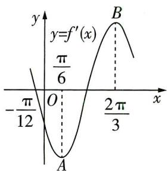

图2

# 心理效应

$\quad$D. 将 $f(x)$ 的图象向右平移 $\frac{3\pi}{4}$ 个单位长度, 再将纵坐标伸长为原来的 2 倍, 即可得到 $f'(x)$ 的图象

解析 $f'(x) = -\omega \sin(\omega x + \varphi)$ ,

【消除卡壳】已知条件是导函数的图象，注意三角函数求导后三角函数名的改变

由题图知导函数 $f'(x)$ 的周期 $T=2\times\left(\frac{2\pi}{3}-\frac{\pi}{6}\right)=\pi$ ，则 $\omega=\frac{2\pi}{T}=2$ ，故 $f'(x)=-2\sin(2x+\varphi)$ .

由题图可得 $2 \times \left(-\frac{\pi}{12}\right) + \varphi = k\pi, k \in \mathbf{Z}$ , 所以 $\varphi = \frac{\pi}{6} + k\pi, k \in \mathbf{Z}$ ,

因为 $|\varphi| < \frac{\pi}{2}$ , 所以 $\varphi = \frac{\pi}{6}$ , 故 $f(x) = \cos (2x + \frac{\pi}{6}), f'(x) = -2\sin (2x + \frac{\pi}{6})$ , 故 A 错误.

由 $2x + \frac{\pi}{6} = k\pi, k \in \mathbf{Z}$ 得 $x = -\frac{\pi}{12} + \frac{1}{2} k\pi, k \in \mathbf{Z}$ , 即 $f(x)$ 图象的对称轴为直线 $x = -\frac{\pi}{12} + \frac{1}{2} k\pi, k \in \mathbf{Z}$ , 故 B 正确.

$f(x) = \cos (2x + \frac{\pi}{6})$ ，令 $t = 2x + \frac{\pi}{6}$ ，当 $x\in [-\frac{4\pi}{3}, - \frac{7\pi}{6} ]$ 时， $t\in [-\frac{5\pi}{2}, - \frac{13\pi}{6} ]$ ，此时 $y = \cos t$ 单调递增，故C正确.

将 $f(x)$ 的图象向右平移 $\frac{3\pi}{4}$ 个单位长度,得到 $y = \cos \left[2\left(x - \frac{3\pi}{4}\right) + \frac{\pi}{6}\right] = \cos \left(2x + \frac{\pi}{6} - \frac{3\pi}{2}\right) = -\sin \left(2x + \frac{\pi}{6}\right)$ 的图象,再将所有点的纵坐标伸长为原来的2倍,得到 $y = -2\sin \left(2x + \frac{\pi}{6}\right)$ 的图象,

【关键提醒】注意平移与伸缩图象变换中三角函数名需要是同名，通过三角恒等变换先将“cos”转换为“sin”，再进行后续变换

此时可以得到 $f'(x)$ 的图象,故D正确.故选BCD.

# 变式演练

##### 1. (变考法, 通过图形体现伸缩与平移变换 |2024 湖北武汉华中师大一附中 11 月期中) 已知函数 $f(x)=\sin \pi x$ 的部分图象如图 3, 则图 4 中的函数图象对应的函数是 ( )

$\quad$A. $y = f(2x - \frac{1}{2})$

$\quad$B. $y = f\left(\frac{x}{2} - \frac{1}{2}\right)$

$\quad$C. $y = f(\frac{x}{2} - 1)$

$\quad$D. $y = f(2x - 1)$

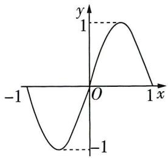

图3

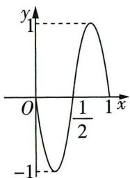

图4

# 心理效应

从众效应(跟风现象) 也称羊群效应,指人在社会群体中容易不加分析地接受大多数人认同的观点或行为的心理倾向. 更多资源,找vx:GZSJJ2000

##### 2. (变情境, 折叠变形, 交汇空间向量 |2024 重庆渝北中学 11 月月考 |多选) 已知函数 $f(x)=\lambda \sin(\frac{\pi}{2}x+\varphi)(\lambda>0,0<\varphi<\pi)$ 的部分图象如图 5 所示, $A,B$ 分别为图象的最高点和最低点, 过 $A$ 作 $x$ 轴的垂线, 交 $x$ 轴于 $A'$ , 点 $C$ 为该部分图象与 $x$ 轴的交点. 将绘有该图象的纸片沿 $x$ 轴折成直二面角, 如图 6 所示, 此时 $|AB|=\sqrt{10}$ , 则下列四个结论正确的有 ( )

$\quad$A. $\lambda = \sqrt{3}$

$\quad$B. $\varphi = \frac{\pi}{3}$

$\quad$C. 图6中, $\overrightarrow{AB} \cdot \overrightarrow{AC} = 5$

$\quad$D. 图6中, $S$ 是 $\triangle A'BC$ 及其内部的点构成的集合. 设集

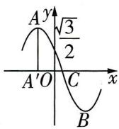

图5

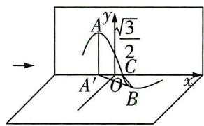

图6

合 $T = \{Q\in S||AQ|\leqslant 2\}$ ，则 $T$ 表示的区域的面积大于 $\frac{\pi}{4}$

##### 3.（试题调研原创|变条件，新定义“T变换”）已知函数 $f_{1}(x)=-x^{2}+1,x\in[-1,1)$ ，记一次完整的图形变换为“T变换”，“T变换”的规则为：将函数图象向右平移2个单位长度，纵坐标缩短为原来的 $\frac{1}{2}$ ，再向上平移1个单位长度. $f_{1}(x)$ 的图象经历一次“T变换”得到 $f_{2}(x)$ 的图象，以此类推，经历n-1次“T变换”后，得到 $f_{n}(x)$ 的图象，则下列说法错误的是()

$\quad$A. $f_{2}(x) = -\frac{1}{2} x^{2} + 2x - \frac{1}{2}, x \in [1,3)$

$\quad$B. 若 $f_{i}(x) \leqslant k(x+2), i=1,2,\cdots,n$ ，则 $k \geqslant \frac{1}{2}$

$\quad$C. 当 $n \geqslant 2$ 时，函数 $f_{1}(x)$ , $f_{2}(x)$ , $\cdots$ , $f_{n}(x)$ 的极大值之和小于 2n - 1

$\quad$D. $f_{n}(x) < 2$

# 参考答案与解析

##### 1. D 比较两个题图, 知图象既进行了伸缩变换, 又进行了平移变换. 一种途径是 $f(x)$ 的图象先向右平移 1 个单位长度, 得到 $y = f(x - 1)$ 的图象, 再将图象上每个点的横坐标缩短为原来的 $\frac{1}{2}$ , 得到 $y = f(2x - 1)$ 的图象, 故选 D (另一种途径是先将 $f(x)$ 图象上每个点的横坐标缩短为原来的 $\frac{1}{2}$ , 得到 $y = f(2x)$ 的图象, 再向右平移 $\frac{1}{2}$ 个单位长度, 得到 $y = f(2(x - \frac{1}{2}))$ , 即 $y = f(2x - 1)$ 的图象, 从而选 D).

##### 2. AC 函数 $f(x)$ 的最小正周期为 $T = \frac{2\pi}{\frac{\pi}{2}} = 4$ .

以点 O 为坐标原点, $\overrightarrow{OC}, \overrightarrow{A'A}$ 的方向分别为 $y'$ 轴, $z'$ 轴的正方向建立如图 7 所示的空间直角坐标系 $O - x'y'z'$ ,

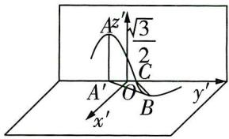

图 7

# 心理效应

如: 发发看到公司很多人都剪了短发, 不顾自己的脸型适合长发的事实, 也跟着剪了短发, 随后又后悔不已.
更多资源，找vx:GZSJJ2000

设 $A'(0,t,0)$ ，则 $A(0,t,\lambda),B(\lambda ,t + 2,0),|AB| = \sqrt{(0 - \lambda)^2 + (t + 2 - t)^2 + (\lambda - 0)^2} =$ $\sqrt{2\lambda^2 + 4} = \sqrt{10}$ ，因为 $\lambda >0$ ，所以 $\lambda = \sqrt{3}$ ，故A正确.

$f(x)=\sqrt{3}\sin(\frac{\pi x}{2}+\varphi)$ ，则 $f(0)=\sqrt{3}\sin\varphi=\frac{\sqrt{3}}{2}$ ，可得 $\sin\varphi=\frac{1}{2}$ ，因为函数 $f(x)$ 在x=0附近单调递减，且 $0<\varphi<\pi$ ，所以 $\varphi=\frac{5\pi}{6}$ ，故B错误.

由上述分析知 $f(x)=\sqrt{3}\sin(\frac{\pi}{2}x+\frac{5\pi}{6})$ ，则由 $f(t)=\sqrt{3}\sin(\frac{\pi t}{2}+\frac{5\pi}{6})=\sqrt{3}$ ，可得 $\sin(\frac{\pi t}{2}+\frac{5\pi}{6})=1$ ，又点A是函数 $f(x)$ 的图象在y轴左侧距离y轴最近的最高点，则 $\frac{\pi t}{2}+\frac{5\pi}{6}=\frac{\pi}{2}$ ，可得 $t=-\frac{2}{3}$ 。因为点C是函数 $f(x)$ 的图象在y轴右侧的第一个对称中心，所以 $\frac{\pi x_{c}}{2}+\frac{5\pi}{6}=\pi$ ，可得 $x_{c}=\frac{1}{3}$ ，翻折后，则有 $A(0,-\frac{2}{3},\sqrt{3}),B(\sqrt{3},\frac{4}{3},0),C(0,\frac{1}{3},0),A'(0,-\frac{2}{3},0)$ ，

所以 $\overrightarrow{AB}=(\sqrt{3},2,-\sqrt{3}),\overrightarrow{AC}=(0,1,-\sqrt{3})$ ，因而在题图6中， $\overrightarrow{AB}\cdot\overrightarrow{AC}=0+2\times1+(-\sqrt{3})^{2}=5$ ，故C正确.

在图6中，设点 $Q(x,y,0),|AQ| = \sqrt{x^2 + (y + \frac{2}{3})^2 + (0 - \sqrt{3})^2}\leqslant 2$ ，可得 $x^{2} + (y + \frac{2}{3})^{2}\leqslant 1$

$\overrightarrow {A ^ {'} C} = (0, 1, 0), \overrightarrow {A ^ {'} B} = (\sqrt {3}, 2, 0), \cos \angle B A ^ {'} C = \frac {\overrightarrow {A ^ {'} C} \cdot \overrightarrow {A ^ {'} B}}{| \overrightarrow {A ^ {'} C} | | \overrightarrow {A ^ {'} B} |} = \frac {2}{1 \times \sqrt {7}} = \frac {2 \sqrt {7}}{7} > \frac {\sqrt {2}}{2},$

易知 $\angle BA'C$ 为锐角,则 $0<\angle BA'C<\frac{\pi}{4}$ ,所以区域 $T$ 是坐标平面 $x'Oy'$ 内以点 $A'$ 为圆心, $|A'C|=1$ 为半径,且圆心角为 $\angle BA'C$ 的扇形及其内部,故区域 $T$ 的面积 $S_{T}<\frac{1}{2}\times\frac{\pi}{4}\times1^{2}=\frac{\pi}{8}$ ,故D错

【易遗漏】注意结合 $\angle BA'C$ 的范围, 得到区域 $T$ 的形状不是一整个圆, 而是一个扇形误. 故选AC.

##### 3. B $f_{2}(x)=\frac{1}{2}f_{1}(x-2)+1=\frac{1}{2}\left[-(x-2)^{2}+1\right]+1=-\frac{1}{2}x^{2}+2x-\frac{1}{2}$ ，其中 $x-2\in[-1,1)$ ，

【指点迷津】一次 “T 变换” 是三次伸缩平移普通变换，注意定义域的变化即 $x \in [1,3)$ ，故 A 正确.

如图8,作出 $f_{n}(x)$ 的大致图象,可得 $f_{1}(x)\in[0,1]$ , $f_{2}(x)\in[1,1+\frac{1}{2}]$ .

$f_{i}(x) \leqslant k(x+2), i=1,2,\cdots,n,$ 只需 $-x^{2}+1 \leqslant k(x+2), x \in [-1,1)$ 即可，

故 $k \geqslant \frac{-x^2 + 1}{x + 2} = -\left[(x + 2) + \frac{3}{x + 2}\right] + 4, k \geqslant \left\{-\left[(x + 2) + \frac{3}{x + 2}\right] + \right.$

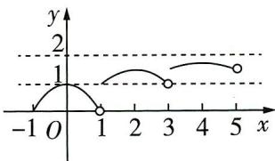

图8

# 心理效应

$4\}_{max}=4-2\sqrt{3}$ ，故 B 错误.

记 $f_{n}(x)$ 的极大值为 $a_{n}$ （也是最大值），则 $a_{n+1}=\frac{1}{2}a_{n}+1$ ，且 $a_{1}=1$ ，则 $a_{n+1}-2=\frac{1}{2}(a_{n}-2)$ ，

【关键提醒】极大值经历了同样的三次伸缩平移变换，从而得递推关系式

$a_{1} - 2 = -1$ ，即 $a_{n} - 2 = -1\cdot (\frac{1}{2})^{n - 1}$ 故 $a_{n} = 2 - \frac{1}{2^{n - 1}} < 2$ ，即 $f_{n}(x) <   2$ ，故D正确.

当 $n \geqslant 2$ 时，函数 $f_{1}(x), f_{2}(x), \cdots, f_{n}(x)$ 的极大值之和 $a_{1} + a_{2} + \cdots + a_{n} = 2n - (\frac{1}{2^{0}} + \frac{1}{2^{1}} + \cdots + \frac{1}{2^{n-1}}) = 2n - \frac{1 - \frac{1}{2^{n}}}{1 - \frac{1}{2}} = 2n - 2 + \frac{1}{2^{n-1}} < 2n - 2 + 1 = 2n - 1$ ，故 C 正确。故选 B.

# 热点图象 3 两条曲线的公切线问题

【热点解读与预测】高考图象问题中,对曲线切线的考查频繁且富有新意. 在这些多样化的考查中,公切线问题作为一类涉及两条曲线的相切关系的问题,通常以二次函数、指数函数、对数函数等的图象以及圆锥曲线为载体,随机选取两条曲线进行设问,主要考查考生的数形结合能力和数学抽象素养,还辅以一定的数学运算,综合性较强.

调研 1 (2024 湖北荆州中学 11 月月考) 若曲线 $y = \ln x$ 与曲线 $y = x^{2} + 2x + a$ ( $x < 0$ ) 有公切线, 则实数 $a$ 的取值范围是 ( )

$\quad$A. $(- \ln 2 - 1, +\infty)$

$\quad$B. $[- \ln 2 - 1, +\infty)$

$\quad$C. $(- \ln 2 + 1, +\infty)$

$\quad$D. $\left[-\ln 2 + 1, + \infty\right)$

解析 方法一 设公切线与函数 $f(x) = \ln x$ 的图象切于点 $A(x_{1},\ln x_{1})(x_{1} > 0)$ ，

由 $f(x)=\ln x$ ，得 $f'(x)=\frac{1}{x}$ ，所以公切线的斜率为 $\frac{1}{x_{1}}$

所以公切线方程为 $y-\ln x_{1}=\frac{1}{x_{1}}(x-x_{1})$ ，即 $y=\frac{1}{x_{1}}\cdot x+(\ln x_{1}-1)$ .

【敲黑板】利用“点斜式”写出公切线方程，点是切点，斜是斜率，也就是切点横坐标对应的导数值

设公切线与函数 $g(x) = x^{2} + 2x + a(x < 0)$ 的图象切于点 $B(x_{2},x_{2}^{2} + 2x_{2} + a)(x_{2} < 0)$ ，

由 $g(x) = x^{2} + 2x + a(x < 0)$ ，得 $g'(x) = 2x + 2$ ，则公切线的斜率为 $2x_{2} + 2$

心理效应

所以公切线方程为 $y - (x_2^2 + 2x_2 + a) = (2x_2 + 2)(x - x_2)$ ，即 $y = 2(x_2 + 1)x - x_2^2 + a$ .

由题意知 $\left\{\begin{aligned}\frac{1}{x_{1}}&=2(x_{2}+1),\\ \ln x_{1}-1=a-x_{2}^{2},\end{aligned}\right.$ 消去 $x_{1}$ 得 $a=x_{2}^{2}-\ln(2x_{2}+2)-1$ ，由 $x_{1}>0$ ，得 $-1<x_{2}<0$ ，

【消除卡壳】公切线问题拆开来看, 无非是求两次曲线的切线罢了, 也就是说, 方程 $y = \frac{1}{{x}_{1}}$ . $x + \left( {\ln {x}_{1} - 1}\right)$ 和 $y = 2\left( {{x}_{2} + 1}\right) x - {x}_{2}^{2} + a$ 是同一个方程,根据对应项相等解出 $a$ 的表达式即可

令 $F(x) = x^{2} - \ln (2x + 2) - 1(-1 < x < 0)$ ，则 $F'(x) = 2x - \frac{1}{x + 1} < 0$ ，所以 $F(x)$ 在 $(-1,0)$ 上单调递减，

所以 $F(x) > -\ln 2 - 1$ ，即实数 a 的取值范围是 $(- \ln 2 - 1, +\infty)$ ，故选 A.

方法二 曲线 $y = \ln x$ 在点 $A(x_{1}, \ln x_{1})(x_{1} > 0)$ 处的切线方程为 $y = \frac{1}{x_{1}} \cdot x + (\ln x_{1} - 1)$ （具体步骤可见方法一）。由 $\left\{\begin{aligned}y &= \frac{1}{x_{1}} \cdot x + (\ln x_{1} - 1), \\ y &= x^{2} + 2x + a,\end{aligned}\right.$ 消去 y 并整理得关于 x 的方程 $x^{2} + (2 - \frac{1}{x_{1}})x + a + 1 - \ln x_{1} = 0$ ，此方程有且仅有一个负数解，所以 $\Delta = (2 - \frac{1}{x_{1}})^{2} - 4 (a + 1 - \ln x_{1}) = 0$

【易错提醒】注意到题设中的二次函数定义域为 $\{x \mid x < 0\}$ ，所以不仅判别式为 0，还要求是负数解

且 $\left\{\begin{aligned}&2-\frac{1}{x_{1}}>0,\\ &a+1-\ln x_{1}>0,\end{aligned}\right.$

那么 $a = \frac{1}{4x_1^2} -\frac{1}{x_1} -\ln \frac{1}{x_1}$ ，其中 $\left\{ \begin{array}{l}x_{1} > \frac{1}{2},\\ a > \ln x_{1} - 1, \end{array} \right.$

令 $t = \frac{1}{x_1}$ 则 $0 < t < 2$ ，设 $h(t) = \frac{1}{4} t^2 - t - \ln t (0 < t < 2)$ ，则 $h'(t) = \frac{1}{2} t - 1 - \frac{1}{t} = \frac{(t - 1)^2 - 3}{2t} < 0$

所以 $h(t)$ 在 $(0,2)$ 上单调递减，因而 $a > -\ln 2 - 1$ ，当 $t \to 0$ 时， $h(t) \to +\infty$ ，同时 $a > \ln x_{1} - 1$ 也成立，所以实数 a 的取值范围是 $(- \ln 2 - 1, +\infty)$ ，故选 A.

调研 2 (试题调研原创|多选)已知曲线 $C_{1}: y = \mathrm{e}^{x}$ 和 $C_{2}: y^{2} = 4x$ , 且 $P(x_{P}, y_{P})$ 为曲线 $C_{1}$ 上一动点, $Q(x_{Q}, y_{Q})$ 为抛物线 $C_{2}$ 上一动点, 则以下说法正确的有 ( )

$\quad$A. 直线 $l: y = x + 1$ 是曲线 $C_{1}$ 和 $C_{2}$ 的公切线

$\quad$B. 曲线 $C_{1}$ 和 $C_{2}$ 的公切线有且仅有一条

# 心理效应

鸟笼效应(为多余物品添搭档) 指人们会在偶然获得一件原本不需要的物品的基础上,继续添加更多与之相关而自己不需要的东西的行动。更多资源，找vx:GZSJJ2000

$\quad$C. $|PQ| + x_{Q}$ 的最小值为 $\sqrt{2} - 1$   
$\quad$D. 当 $PQ \parallel x$ 轴时， $|PQ|$ 的最小值为 $\frac{1 - \ln 2}{2}$

解析 对于 A, 对 $y = e^{x}$ 求导得 $y' = e^{x}$ , 令 $e^{x} = 1$ , 得 x = 0, 则与曲线 $C_{1}$ 相切且斜率为 1 的直线切曲线 $C_{1}$ 于点 $(0,1)$ , 切线方程为 $y = x + 1$ .

【二级结论】根据切线不等式 $e^{x} \geqslant x + 1$ ，可直接得到直线 $y = x + 1$ 是曲线 $y = e^{x}$ 在点 $(0,1)$ 处的切线

由 $\left\{\begin{aligned}y&=x+1,\\ y^{2}&=4x,\end{aligned}\right.$ 消去x得 $(y-2)^{2}=0$ ，即直线 $y=x+1$ 与曲线 $C_{2}$ 相切，

【另解】除了“直曲”联立，也可由 $y^{2} = 4x$ 求导，令 $y' \mid_{y=y_{0}} = \frac{2}{y_{0}} = 1$ ，得 $y_{0} = 2$ ，即切点为(1,2)，从而切线方程为 $y = x + 1$

所以直线 $l: y = x + 1$ 是曲线 $C_{1}$ 和 $C_{2}$ 的公切线, A 正确.

对于 B, 设曲线 $C_{1}$ 和 $C_{2}$ 的公切线与曲线 $C_{1}$ 相切于点 $(x_{0}, e^{x_{0}})$ ，由 A 知，该切线斜率为 $e^{x_{0}}$ ，切线方程为 $y - e^{x_{0}} = e^{x_{0}} (x - x_{0})$ 。由 $\left\{\begin{aligned}y - e^{x_{0}} &= e^{x_{0}} (x - x_{0}), \\ y^{2} &= 4x,\end{aligned}\right.$ 消去 x 得关于 y 的方程 $\frac{e^{x_{0}}}{4}y^{2} - y - (x_{0} - 1)e^{x_{0}} = 0$ ，因此 $\Delta = 1 + (x_{0} - 1)e^{2x_{0}} = 0$ ，即 $2 + (2x_{0} - 2)e^{2x_{0}} = 0$ 。

【消除卡壳】这是一个超越方程，想要判断解的个数，一般有两个方法：函数与导数法，利用导数求函数的零点个数；数形结合法，转化为两条曲线的交点问题

令 $f(t)=2+(t-2)e^{t}$ ，则 $f'(t)=(t-1)e^{t}$ ，当t<1时， $f'(t)<0$ ，当t>1时， $f'(t)>0$ ，

所以函数 $f(t)$ 在 $(-∞,1)$ 上单调递减，在 $(1,+∞)$ 上单调递增，所以 $f(t)_{\min}=f(1)=2-e<0$

又 $f(0)=0,f(2)=2>0$ ，所以存在 $t_{0}\in(1,2)$ ，使得 $f(t_{0})=0$ ，

因此函数 $f(t)$ 有0和 $t_{0}$ 两个零点,显然当 $x_{0}=\frac{1}{2}t_{0}\in(\frac{1}{2},1)$ 时, $\Delta=0$ ,因此 $\Delta=0$ 的解有0和 $\frac{1}{2}t_{0}$ 两个,即曲线 $C_{1}$ 和 $C_{2}$ 的公切线有两条,B错误.

【数形结合法】显然 $x_{0}=1$ 不是 $\Delta=0$ 的解，如图 1，曲线 $y=e^{2x}$ 与曲线 $y=\frac{1}{1-x}$ 有两个交点，因而有两条公切线

对于 C, 抛物线 $C_{2}$ 的焦点为 $F(1,0)$ , 准线方程为 x = -1, 连接 QF, PF, 则 $|QF| = x_{Q} + 1$ ,

图 1

# 心理效应

因此 $|PQ| + x_{Q} = |PQ| + |QF| - 1 \geqslant |PF| - 1$ ，当且仅当 P, Q, F 三点共线且 Q 在 P, F 之间时取等号.

$|PF|=\sqrt{(x_{P}-1)^{2}+y_{P}^{2}}=\sqrt{(x_{P}-1)^{2}+e^{2x_{P}}}$ ，下面求 $|PF|$ 的最小值.

令 $g(x) = (x - 1)^2 + \mathrm{e}^{2x}$ , 则 $g'(x) = 2(x - 1) + 2\mathrm{e}^{2x}$ , 显然 $y = 2(x - 1), y = 2\mathrm{e}^{2x}$ 在 $\mathbf{R}$ 上都单调递增, 因此函数 $g'(x)$ 在 $\mathbf{R}$ 上单调递增. 易知 $g'（0） = 0$ , 所以当 $x < 0$ 时, $g'(x) < 0$ , 当 $x > 0$ 时, $g'(x) > 0$ , 函数 $g(x)$ 在 $(- \infty, 0)$ 上单调递减, 在 $(0, +\infty)$ 上单调递增, 所以 $g(x)_{\min} = g(0) = 2$ , 因此 $|PF|_{\min} = \sqrt{2}$ .

所以当 $P(0,1)$ , 点 $Q$ 为线段 $FP$ 与抛物线 $C_2$ 的交点时, $|PQ| + x_Q$ 取最小值 $\sqrt{2} - 1$ , C 正确.

对于D，当 $PQ / / x$ 轴时， $y_{Q} = y_{P} = \mathrm{e}^{x_{P}}$ ，则 $x_{Q} = \frac{y_{Q}^{2}}{4} = \frac{\mathrm{e}^{2x_{P}}}{4},|PQ| = |\frac{\mathrm{e}^{2x_P}}{4} -x_P|$

令 $h(x) = \frac{1}{4}\mathrm{e}^{2x} - x$ ，则 $h'(x) = \frac{1}{2}\mathrm{e}^{2x} - 1$ ，当 $x < \frac{1}{2}\ln 2$ 时， $h'(x) < 0$ ，当 $x > \frac{1}{2}\ln 2$ 时， $h'(x) > 0$ ，因此函数 $h(x)$ 在 $(- \infty, \frac{1}{2}\ln 2)$ 上单调递减，在 $(\frac{1}{2}\ln 2, +\infty)$ 上单调递增，所以 $h(x)_{\min} = h(\frac{1}{2}\ln 2) = \frac{1}{2} - \frac{\ln 2}{2} > 0$ ，所以 $|PQ|$ 的最小值为 $\frac{1 - \ln 2}{2}$ ，D 正确。故选 ACD.

# 变式演练

##### 1. (变设问, 交汇三角恒等变换 |2024 安徽安庆一中模拟 |多选) 已知 $l_{1}, l_{2} (l_{1}$ 与 $l_{2}$ 不重合) 是曲线 $y = a \mathrm{e}^{x}$ 与 $y = \ln x - \ln a$ 的两条公切线, 记 $l_{1}$ 的倾斜角为 $\alpha, l_{2}$ 的倾斜角为 $\beta, l_{1}, l_{2}$ 的夹角为 $\theta$ ( $0 \leqslant \theta \leqslant \frac{\pi}{2}$ ), 则下列说法正确的有 ( )

$\quad$A. $\sin \alpha = \cos \beta$

$\quad$B. $\tan \alpha + \tan \beta > 2$

$\quad$C. 若 $\tan \theta = \frac{3}{4}$ , 则 $a^3 = \frac{2}{\mathrm{e}^3}$

$\quad$D. $l_{1}$ 与 $l_{2}$ 的交点可能在第三象限

##### 2. (变情境, 曲线的自公切线 |2024 陕西西安第八十三中学等校联考 | 多选) 已知函数 $f(x)$ 的定义域为 $\mathbf{R}, f(x+1)$ 为奇函数, 且当 $x > 1$ 时, $f(x) = \frac{1}{3} x^3 - 4x + 4$ , 则下列说法正确的有 ( )

$\quad$A. $f(x)$ 的图象关于点 $(1,0)$ 对称

$\quad$B. 当 x < 1 时, $f(x) = \frac{1}{3}(x - 2)^{3} - 4x + 4$

$\quad$C. $f(x)$ 有4个零点

$\quad$D. 若曲线 $y=f(x)$ 上不同两点的切线重合, 则称这条切线为曲线 $f(x)$ 的自公切线. 曲线 $f(x)$ 过点 $(1,0)$ 的切线为 $f(x)$ 的自公切线

# 心理效应

心理摆效应 指在特定背景的心理活动过程中,感情的等级越高,呈现的“心理坡度”就越大,因此也就很容易向相反的情绪状态进行参考资源,找vx:GZSJJ2000

# 参考答案与解析

# 1. ABC

<table><tr><td>选项</td><td>分析过程</td><td>正误</td></tr><tr><td>A</td><td>因为函数 $y = ae^{x}$ 与 $y = \ln x - \ln a$ 互为反函数,故二者图象关于直线 $y = x$ 对称,【补盲点】注意互为反函数的两个函数图象的对称性的应用,反函数的概念出现在《必修第一册》的指数函数与对数函数章节,有不熟悉的同学可以回顾复习一下则 $l_{1}, l_{2}$ 关于直线 $y = x$ 对称,故 $\alpha + \beta = \frac{\pi}{2}, \sin \alpha = \sin(\frac{\pi}{2} - \beta) = \cos \beta$ </td><td>√</td></tr><tr><td>B</td><td>由题意知, $\alpha, \beta$ 均为锐角, $\tan \alpha > 0, \tan \beta > 0$ ,所以 $\tan \alpha + \tan \beta = \tan \alpha + \tan(\frac{\pi}{2} - \alpha) = \tan \alpha + \frac{1}{\tan \alpha} \geqslant 2$ ,当且仅当 $\tan \alpha = 1$ ,即 $\alpha = \beta = \frac{\pi}{4}$ ,即 $l_{1}$ 与 $l_{2}$ 重合时取等号,故 $\tan \alpha + \tan \beta > 2$ </td><td>√</td></tr><tr><td>C</td><td>如图2,设 $l_{1}$ 与两条曲线分别切于M,N两点,与直线 $y = x$ 交于Q,则 $\angle OQN = \frac{\theta}{2}$ .因为 $\tan \theta = \frac{3}{4}$ ,所以 $\frac{2\tan \frac{\theta}{2}}{1 - \tan^{2} \frac{\theta}{2}} = \frac{3}{4}$ ,得 $\tan \frac{\theta}{2} = \frac{1}{3}$ 或-3(舍去),故 $k_{MN} = \tan(\frac{\theta}{2} + \frac{\pi}{4}) = 2$ .对于 $y = ae^{x}, y' = ae^{x}$ ,令 $y' = ae^{x} = 2$ ,得 $x = \ln 2 - \ln a$ ,所以曲线 $y = ae^{x}$ 的斜率为2的切线对应的切点为 $(\ln 2 - \ln a, 2)$ ,故切线方程为 $y = 2x - 2\ln 2 + 2\ln a + 2$ ,同理可得曲线 $y = \ln x - \ln a$ 的斜率为2的切线方程为 $y = 2x - \ln 2 - 1 - \ln a$ ,所以 $-\ln 2 - 1 - \ln a = 2\ln a - 2\ln 2 + 2$ ,则 $\ln a^{3} = \ln 2 - 3$ ,则 $a^{3} = \frac{2}{e^{3}}$ 【敲黑板】利用两曲线公切线方程的对应系数相等列方程,从而求参数值</td><td>[XYZW7]图2</td></tr><tr><td>D</td><td>由图2可知点Q必在第一象限【消除卡壳】曲线 $y = \ln x - \ln a$ 的切线斜率是大于0的,两公切线交点在对称轴直线 $y = x$ 上,观察图象可知交点必在第一象限</td><td>[IMAGE]</td></tr></table>

# 心理效应

如:几乎每个人都会遇到这种情况,同朋友聚会时热闹得快快乐乐,自己单独一人时又孤寂得冷冷清清;出去玩一场觉得很开心,可回来后变为日常生活的单调枯燥而心烦.

##### 2. ABD

<table><tr><td>选项</td><td>分析过程</td><td>正误</td></tr><tr><td>A</td><td>因为 $f(x+1)$ 为奇函数,所以 $f(x+1)$ 的图象关于原点对称,所以 $f(x)$ 的图象关于点(1,0)对称</td><td>√</td></tr><tr><td>B</td><td>令 $x<0$ ,则 $1+x<1,1-x>1,f(1+x)=-f(1-x)=\frac{1}{3}(x-1)^{3}-4x=\frac{1}{3}\left[(x+1)-2\right]^{3}-4(x+1)+4$ ,所以当 $x<1$ 时, $f(x)=\frac{1}{3}(x-2)^{3}-4x+4$ </td><td>√</td></tr><tr><td>C</td><td>当 $x>1$ 时, $f'(x)=x^{2}-4$ ,令 $f'(x)>0$ 得 $x>2$ ,令 $f'(x)<0$ 得 $1<x<2$ ,则 $f(x)$ 在(1,2)上单调递减,在 $(2,+\infty)$ 上单调递增,又 $f(\frac{10}{9})=\frac{1}{3}\times\frac{1000}{729}-\frac{4}{9}=\frac{28}{3\times729}>0,f(2)=-\frac{4}{3}<0,f(3)=1>0$ ,所以 $f(x)$ 在 $(1,+\infty)$ 上有2个零点.又 $f(x)$ 的图象关于点(1,0)对称,根据对称性可知 $f(x)$ 在 $(-∞,1)$ 上有2个零点,且 $f(1)=0$ ,所以 $f(x)$ 有5个零点【易错提醒】利用对称性得到4个零点后,要验证对称中心处是否有零点,不要功亏一篑</td><td>×</td></tr><tr><td>D</td><td>当 $x>1$ 时,设切点为 $A(x_{0},y_{0})(x_{0}>1)$ ,则曲线 $f(x)$ 在点A处的切线方程为 $y-$ 【敲黑板】曲线 $f(x)$ 过点(1,0)的切线并不意味着(1,0)是切点,要注意区分 $y_{0}=(x_{0}^{2}-4)(x-x_{0})$ .将 $y_{0}=\frac{1}{3}x_{0}^{3}-4x_{0}+4$ 及(1,0)代入,解得 $x_{0}=\frac{3}{2}$ ,所以当 $x>1$ 时,切点为 $(\frac{3}{2},-\frac{7}{8})$ ,切线斜率 $k=\frac{9}{4}-4=-\frac{7}{4}$ .曲线 $f(x)$ 关于点(1,0)对称,所以当 $x<1$ 时,过点(1,0)的切线对应的切点为 $(\frac{1}{2},\frac{7}{8})$ .当 $x<1$ 时, $f(x)=\frac{1}{3}(x-2)^{3}-4x+4$ , $f'(x)=(x-2)^{2}-4$ ,所以 $f'(\frac{1}{2})=(\frac{1}{2}-2)^{2}-4=-\frac{7}{4}=k$ ,两切线斜率相等,所以曲线 $f(x)$ 过点(1,0)的切线为 $f(x)$ 的自公切线</td><td>√</td></tr></table>

# 热点图象 4 几何体的截面

【热点解读与预测】几何体的截面问题主要是判断截面形状、计算截面面积或与截面有关的最值问题或探究性问题等,在高考中常有涉及,如2022全国乙卷理科第18题以锥体的截面为背景,考查截面面积最小时线面角的正弦值.考查截面问题的

# 二级结论

本质是考查空间线面位置关系,求解的一般思路是根据点、线、面位置关系找截面与几何体的交线,作出完整的截面,然后结合图形求解.

# 命题角度1 柱体的截面问题

调研 1: (2024 河南省实验中学 11 月模拟) 如图 1, 在正四棱柱 $ABCD-A_{1}B_{1}C_{1}D_{1}$ 中, $AA_{1}=2AB=4$ , 点 $E,F,G$ 分别是 $AA_{1},A_{1}B_{1},B_{1}C_{1}$ 的中点, 则过点 $E,F,G$ 的平面被正四棱柱 $ABCD-A_{1}B_{1}C_{1}D_{1}$ 所截得的截面多边形的周长为 ( )

$\quad$A. $2 \sqrt{2} + 3 \sqrt{3}$

$\quad$B. $2\sqrt{2}+3\sqrt{5}$

$\quad$C. $2 \sqrt{2} + 4 \sqrt{3}$

$\quad$D. $2 \sqrt{2} + 4 \sqrt{5}$

解析 如图2,延长 $GF$ 交 $D_{1}A_{1}$ 的延长线于点 $M$ ,交 $D_{1}C_{1}$ 的延长线于点 $N$ ,连接 $ME$ 并延长,交 $D_{1}D$ 的延长线于点 $T$ ,连接 $TN$ ,

【防卡妙拓】先扩大研究范围，通过延长平面上的线找出大平面，即平面TMN，研究其和四棱柱的关系，然后通过面面相交找交线

设 MT 交 AD 于点 K, TN 分别交 CD, $CC_{1}$ 于点 I, H, 连接 KI, GH,

则六边形 EFGHIK 所在平面即平面 EFG, 六边形 EFGHIK 即过点 E, F, G 的平面被正四棱柱 $ABCD - A_{1}B_{1}C_{1}D_{1}$ 所截得的截面多边形,

易得 K, I, H 分别为 AD, CD, $CC_{1}$ 的中点，因为 $AA_{1}=2AB=4$ ，

所以 $EF = GH = EK = HI = \sqrt{5}, FG = KI = \sqrt{2}$

所以六边形 EFGHIK 的周长为 $2\sqrt{2} + 4\sqrt{5}$ . 故选 D.

图1

图 2

# 命题角度2 锥体的截面问题

调研 2: (试题调研原创) 四面体 $ABCD$ 中, $AB=BC=CD=DA=4$ , $AC=BD=2\sqrt{2}$ , 点 $E,F,G$ 分别为棱 $CD,BC,AD$ 的中点, 过点 $E,F,G$ 作四面体 $ABCD$ 的截面, 则该截面的面积为 \_\_\_\_.

解析 如图3,设平面EFG与平面ABD相交于直线GH,其中H在直线AB上,连接FH,

【破障碍】图形简单的情况下，可以不用扩大范围研究整个平面，直接找交线即可

所以四边形 EFHG 即所求截面.

因为 $EF \parallel BD, BD \subset$ 平面 $ABD, EF \not\subset$ 平面 $ABD$ , 所以 $EF \parallel$ 平面 $ABD$ ,

又 $EF \subset$ 平面 $EFHG$ , 平面 $EFHG \cap$ 平面 $ABD = GH$ , 所以 $GH \parallel EF$ .

又 $EF \parallel BD$ , 所以 $GH \parallel BD$ , 那么 $H$ 为 $AB$ 的中点,

则 $EG \parallel AC \parallel FH, EF \parallel BD \parallel GH$ , 所以四边形 $EFHG$ 为平行四边形.

二级结论

取 AC 的中点 O, 连接 OD, OB, 因为 AB = BC = CD = DA = 4,

所以 $DO \perp AC, BO \perp AC, DO \cap BO = O, DO, BO \subset$ 平面 BOD,

所以 $AC \perp$ 平面 $BOD, BD \subset$ 平面 $BOD$ , 所以 $AC \perp BD$ , 所以 $EG \perp EF$ , 所以四边形 $EFHG$ 为矩形, $EF = \frac{1}{2} BD = \sqrt{2}$ , $EG = \frac{1}{2} AC = \sqrt{2}$ , 所以截面的面积 $S = \sqrt{2} \times \sqrt{2} = 2$ .

图3

# 命题角度3 球的截面问题

调研 3 (2024 贵州六盘水第一次诊断) 在正方体 $ABCD - A_{1}B_{1}C_{1}D_{1}$ 中, 以点 $A$ 为球心, 棱 $AB$ 为半径的球将正方体截为 $P$ (含球心的部分) 和 $Q$ 两部分, 则四边形 $A_{1}BCD_{1}$ 被球 $A$ 截得的区域面积与 $P$ 的表面积的比值为 \_\_\_\_.

解析 设正方体的棱长为 1, 由题可知 P 为球的 $\frac{1}{8}$ ,

如图4,连接 $A_{1}D,BD$ ,则P在平面 $AA_{1}B$ ,平面 $AA_{1}D$ ,平面ABD上的形状都为 $\frac{1}{4}$ 圆,故P的表面积为 $4\pi\times1^{2}\times\frac{1}{8}+\pi\times1^{2}\times\frac{1}{4}\times3=\frac{5}{4}\pi.$

接下来确定四边形 $A_{1}BCD_{1}$ 被球 $A$ 截得的区域的形状，

先把四边形 $A_{1}BCD_{1}$ 看作平面 $A_{1}BCD_{1}$ ，则平面 $A_{1}BCD_{1}$ 被球 A 截得的形状为圆.

图 4

【厘思路】先扩大研究范围，研究整个平面被球截得的图形，然后再找到交线，根据交线缩小范围

连接 $AB_{1}$ ，设 $AB_{1}$ 交 $A_{1}B$ 于点 $E$ ，则 $AE = BE = \frac{\sqrt{2}}{2}, AE \perp A_{1}B,$

又 $A_{1}D_{1}\perp$ 平面 $ABB_{1}A_{1},AE\subset$ 平面 $ABB_{1}A_{1}$ ，故 $A_{1}D_{1}\perp AE$

因为 $A_{1}B, A_{1}D_{1} \subset$ 平面 $A_{1}BCD_{1}, A_{1}B \cap A_{1}D_{1} = A_{1}$ ，所以 $AE \perp$ 平面 $A_{1}BCD_{1}$ ，

又A为球心,所以截得的圆周上的点到A的距离都相等,从而到E的距离都相等,所以E为截面圆的圆心,

所以球 $A$ 被平面 $A_{1}BCD_{1}$ 截得的形状为以 $E$ 为圆心、 $BE$ 为半径的圆.

【厘思路】得出截面形状是圆，则根据线面位置关系找圆心、半径

所以球 $A$ 被四边形 $A_{1}BCD_{1}$ 所截得的交线为四边形内的一段圆弧和线段 $A_{1}B$ ,

又线段 $A_{1} B$ 过圆弧的圆心 $E$ , 所以球 $A$ 被四边形 $A_{1} B C D_{1}$ 所截得的形状为以 $E$ 为圆心、 $\frac{\sqrt{2}}{2}$ 为半径的半圆,

【厘思路】找交线，其中一条交线为圆的直径，那么可以判断最终的形状是半圆

# 二级结论

故四边形 $A_{1}BCD_{1}$ 被球 $A$ 截得的区域面积与 $P$ 的表面积的比值为 $\frac{1}{2} \times \pi \times (\frac{\sqrt{2}}{2})^2 \div \frac{5\pi}{4} = \frac{\pi}{4} \div \frac{5}{4}\pi = \frac{1}{5}$ .

# 变式演练

(变载体, 四面体的截面问题 |2024 江西省铜鼓中学 11 月阶段检测 | 多选) 如图 5, 有一个正四面体形状的木块, 其棱长为 $a$ . 现准备将该木块锯开, 则下列关于截面的说法中正确的是 ( )

图5

$\quad$A. 过棱 $AC$ 的截面中, 截面面积的最小值为 $\frac{\sqrt{2}a^2}{4}$

$\quad$B. 若过棱 AC 的截面与棱 BD (不含端点) 交于点 P, 则 $\frac{1}{3} < \cos \angle APC \leqslant \frac{1}{2}$

$\quad$C. 若该木块的截面为平行四边形, 则该截面面积的最大值为 $\frac{a^{2}}{4}$

$\quad$D. 与该木块各个顶点的距离都相等的截面有 7 个

# 参考答案与解析

ACD 对于 A, 如图 6, 过棱 AC 的截面为 $\triangle ACP$ ,

【消除卡壳】截面形状为三角形，求其面积最值，底AC确定，那么求对应高的最值即可

易知当 P 为棱 BD 的中点时, $CP \perp BD, AP \perp BD$ , 且 $AP = CP = \frac{\sqrt{3}}{2}a, PC, AP \subset$ 平面 APC, 故 $BD \perp$ 平面 APC, 取 AC 的中点 E, 连接 PE, 则 $PE \perp AC$ ,

又 $PE \subset$ 平面 $APC$ , 则 $PE \perp BD$ , 即 $PE$ 是异面直线 $AC, BD$ 的公垂线, $PE = \frac{\sqrt{2}}{2} a$ , 故此时 $\triangle ACP$ 的面积取得最小值, 最小值为 $S = \frac{1}{2} \times AC \times PE = \frac{\sqrt{2} a^2}{4}$ , A 正确.

图6

对于 B, 易知 $\triangle ABP \cong \triangle CBP$ , 故结合 A 项, 可设 AP = CP = t, $t \in \left[\frac{\sqrt{3}a}{2}, a\right)$ ,

在 $\triangle ACP$ 中，由余弦定理得 $\cos \angle APC = \frac{AP^2 + CP^2 - AC^2}{2\times AP\times CP} = \frac{2t^2 - a^2}{2t^2} = 1 - \frac{a^2}{2t^2},$

由 $\frac{a}{t} \in (1, \frac{2\sqrt{3}}{3}]$ 得， $\frac{a^2}{t^2} \in (1, \frac{4}{3}]$ ，所以 $\frac{1}{3} \leqslant \cos \angle APC < \frac{1}{2}$ ，B 错误.

【灵活解题】也可以用极限思想，当 $P$ 为 $BD$ 的中点时 $\angle APC$ 最大，因而余弦值最小，而当 $P$ 无限接近 $B$ 或 $D$ 时， $\angle APC$ 逐渐减小，余弦值趋于最大，所以有最小值无最大值，那么不必计算就可以判断 B 错

对于 C, 如图 7, 点 E, F, N, M 分别为 AC, CD, DB, BA 上的点, 连接 EF, FN, NM, ME, 当截面 EFNM

二级结论

为平行四边形时, $EF\parallel NM\parallel AD$ , $EM\parallel FN\parallel BC$ ,由正四面体的性质可知 $AD\perp BC$ ,故 $EM\perp MN$ ,从而平行四边形EFNM为矩形.

设 $EM = x$ ，则 $MN = a - x$ ，所以矩形EFNM的面积 $S_{1} = x(a - x)\leqslant \frac{a^{2}}{4},$

当且仅当 $EM = x = \frac{a}{2}$ 时，等号成立，C正确.

对于 D,与该木块各个顶点的距离都相等的截面分为两类.

第一类:平行于正四面体的一个面,且到顶点和到底面距离相等,这样的截面有4个.

第二类:平行于正四面体的两条对棱,且到两条棱距离相等,这样的截面有3个.故与该木块各个顶点的距离都相等的截面共有7个,D正确.故选ACD.

图7

# 热点图象 5 立体几何中的翻折问题

【热点解读与预测】翻折问题是立体几何中的重难点问题,核心考点是点、线、面位置关系的判断及空间角的求解,难度中等偏上,抓住翻折前后的变与不变的量是解题的关键.

调研 1: (2024 福建莆田一中 11 月月考 | 多选) 如图 1, 在平面四边形 $ABCD$ 中, $\triangle ACD$ 和 $\triangle ACB$ 是全等三角形, $\angle ABC = 90^\circ$ , $\angle BAC = \angle DAC = 60^\circ$ , $AB = 2$ . 下面有两种折叠方法将四边形 $ABCD$ 折成三棱锥. 折法①, 将 $\triangle ACD$ 沿着 $AC$ 折起, 形成三棱锥 $D_1 - ABC$ ; 折法②, 将 $\triangle ABD$ 沿着 $BD$ 折起, 形成三棱锥 $A_1 - BCD$ . 下列说法正确的是 ( )

折法①

折法②   
图1

$\quad$A. 按照折法①,三棱锥 $D_{1} - ABC$ 的外接球表面积为 $16 \pi$   
$\quad$B. 按照折法①, 存在 $D_{1}$ , 满足 $AB \perp CD_{1}$   
$\quad$C. 按照折法②, 三棱锥 $A_{1} - BCD$ 体积的最大值为 $\sqrt{3}$   
$\quad$D. 按照折法②, 当 $A_{1} C \perp$ 平面 $A_{1} B D$ 时, $B C$ 与平面 $A_{1} B D$ 所成线面角的正弦值为 $\frac {\sqrt {3}}{3}$

# 二级结论

# 解析

<table><tr><td>选项</td><td>分析过程</td><td>正误</td></tr><tr><td>A</td><td>由题意知,△ACD和△ABC为共斜边的直角三角形→斜边中点到两直角三角形各顶点的距离相等→三棱锥 $D_1$ -ABC的外接球球心为AC的中点O,AC为外接【讲关键】求解外接球问题的关键是找球心,利用直角三角形的性质即可球直径→由∠ABC=90°,∠BAC=60°,AB=2得AC=4→所求表面积为4π× $(\frac{4}{2})^2=16\pi$ </td><td>√</td></tr><tr><td>B</td><td>假设存在 $D_1$ ,使得 $AB\perp CD_1\rightarrow AB\perp BC,BC\cap CD_1=C,BC,CD_1\subset$ 平面 $BCD_1\rightarrow$ 【点睛】利用假设存在法,先假设存在,根据是否推出矛盾判断假设是否成立AB⊥平面 $CBD_1\rightarrow BD_1\subset$ 平面 $CBD_1\rightarrow AB\perp BD_1\rightarrow$ 而△ADC≌△ABC,必有AB=AD1→AB⊥BD1不可能成立→不存在满足条件的 $D_1$ </td><td>×</td></tr><tr><td>C</td><td>当平面 $A_1BD\perp$ 平面BCD时,三棱锥 $A_1$ -BCD体积最大→【消除卡壳】棱锥底面不变,则侧面与底面垂直时,高最大体积最大 $\angle BAC=\angle DAC=60°\rightarrow\angle DAB=120°,AB=AD=2\rightarrow BD=$ 图22ABsin 60°=2 $\sqrt{3}$  $\rightarrow$ BC=CD=2 $\sqrt{3}$  $\rightarrow$ △BCD为等边三角形→如图2,过 $A_1$ 作 $A_1E\perp BD$ 交BD于 $E\rightarrow A_1E=A_1B\cos60°=1\rightarrow A_1$ 到平面BCD的距离为 $A_1E=1\rightarrow V_{A_1-BCD}=\frac{1}{3}\times\frac{1}{2}\times(2\sqrt{3})^2\times\frac{\sqrt{3}}{2}\times1=\sqrt{3}$ </td><td>√</td></tr><tr><td>D</td><td> $CA_1\perp$ 平面 $A_1BD,A_1B\subset$ 平面 $A_1BD\rightarrow CA_1\perp A_1B\rightarrow\angle A_1BC$ 是BC与平面 $A_1BD$ 所成的角→ $BC=2\sqrt{3},A_1B=2\rightarrow A_1C=2\sqrt{2}\rightarrow$ 在Rt△ $A_1BC$ 中, $\sin\angle A_1BC=\frac{A_1C}{BC}=\frac{2\sqrt{2}}{2\sqrt{3}}=\frac{\sqrt{6}}{3}$ </td><td>×</td></tr></table>

调研 2 (试题调研原创) 已知矩形 $ABCD$ 中, $AB = 1$ , $BC = 2$ , 将 $\triangle ABD$ 沿矩形的对角线 $BD$ 所在的直线进行翻折, 在翻折过程中, 给出下列结论:

①存在某个位置,使得直线 AC 与直线 BD 垂直;②存在某个位置,使得直线 AB 与直线 CD 垂直;③若翻折后 $AC=\sqrt{3}$ , 则二面角 A-BD-C 的余弦值为 $\frac{1}{4}$ ;④在翻折

二级结论

的过程中,若点 A 在平面 BCD 上的射影落在 $\triangle BCD$ 的内部(不含边界),则四面体 ABCD 的体积的取值范围为 $\left(\frac{\sqrt{3}}{6},\frac{2\sqrt{5}}{15}\right)$ .

其中正确结论的序号是\_\_\_\_。

解析 如图3, 翻折前, 在矩形ABCD中, 作 $AM \perp BD$ 交对角线BD于点O, 交BC于点M, 连接OC, 显然OC与BD不垂直.

因为 $AM \perp BD$ ，则 $\angle BAM + \angle AMB = \angle CBD + \angle AMB = 90^\circ$ ，所以 $\angle BAM = \angle CBD$ ，则 $\tan \angle BAM = \tan \angle CBD = \frac{CD}{BC} = \frac{1}{2}$ ，所以 $BM = \frac{1}{2} AB = \frac{1}{2}$ ，故 $AM = \sqrt{AB^2 + BM^2} = \sqrt{1^2 + (\frac{1}{2})^2} = \frac{\sqrt{5}}{2}, BO = \frac{AB \times BM}{AM} = \frac{1 \times \frac{1}{2}}{\frac{\sqrt{5}}{2}} = \frac{\sqrt{5}}{5}$ ，

则 $AO = \sqrt{AB^2 - BO^2} = \sqrt{1 - (\frac{\sqrt{5}}{5})^2} = \frac{2\sqrt{5}}{5}, OM = AM - AO = \frac{\sqrt{5}}{2} - \frac{2\sqrt{5}}{5} = \frac{\sqrt{5}}{10}$ .

图3

图 4

翻折后图形,如图4所示.

<table><tr><td>结论</td><td>分析过程</td><td>正误</td></tr><tr><td>1</td><td>假设存在某个位置,使直线AC与直线BD垂直→AO⊥BD,AO∩AC=A→BD⊥平面AOC→OC⊂平面AOC→BD⊥OC,显然这是不可能的</td><td>×</td></tr><tr><td>2</td><td>假设存在某个位置,使直线AB与直线CD垂直→CD⊥BC,AB∩BC=B→CD⊥平面ABC→CD⊂平面BCD→平面ABC⊥平面BCD→过点A作平面BCD的垂线AE,E在BC上→综上,当A在平面BCD上的射影在BC上时,AB⊥CD</td><td>√</td></tr><tr><td>3</td><td>翻折后,BD⊥AO,BD⊥OM→∠AOM为二面角A-BD-C的平面角→翻折后AC=【方法点拨】灵活利用线线垂直,找到二面角的平面角,从而结合平面几何知识求解即可 $\sqrt{3}$ ,AB=1,BC=2→AB2+AC2=BC2,且AB= $\frac{1}{2}$ BC→∠BAC=90°,∠ACB=30°,∠ABC=60°→在△ABM中,由余弦定理可得AM=  $\sqrt{AB^{2}+BM^{2}-2AB\cdot BM\cos60^{\circ}}=\frac{\sqrt{3}}{2}$ →在△AOM中,AO=  $\frac{2\sqrt{5}}{5}$ ,AM=  $\frac{\sqrt{3}}{2}$ ,OM=  $\frac{\sqrt{5}}{10}$ → $\cos\angle AOM=\frac{AO^{2}+OM^{2}-AM^{2}}{2AO\cdot OM}=\frac{1}{4}$ </td><td>√</td></tr></table>

# 二级结论

续表

<table><tr><td>结论</td><td>分析过程</td><td>正误</td></tr><tr><td>4</td><td>翻折后, $BD \perp AO$ , $BD \perp OM \rightarrow BD \perp$ 平面 $AOM \rightarrow BD \subset$ 平面 $BCD \rightarrow$ 平面 $AOM \perp$ 平面 $BCD \rightarrow$ 过点A在平面AOM内作 $AF \perp OM$ ,垂足为点 $F \rightarrow$ 平面 $AOM \cap$ 平面 $BCD = OM$ , $AF \subset$ 平面 $AOM \rightarrow AF \perp$ 平面 $BCD \rightarrow$ 点A在平面BCD上的射影落在 $\triangle BCD$ 的内部即点F在线段OM上(不包括端点) $\rightarrow 0 < OF < OM = \frac{\sqrt{5}}{10} \rightarrow AF \perp$ 平面BCD, $OF \subset$ 平面 $BCD \rightarrow AF \perp OF \rightarrow AF = \sqrt{AO^2 - OF^2} = \sqrt{\frac{4}{5} - OF^2} \in (\frac{\sqrt{3}}{2}, \frac{2\sqrt{5}}{5}) \rightarrow S_{\triangle BCD} = \frac{1}{2}BC \times CD = \frac{1}{2} \times 2 \times 1 = 1 \rightarrow$ 四面体ABCD的体积 $V = \frac{1}{3}S_{\triangle BCD} \cdot AF = \frac{1}{3}AF \in (\frac{\sqrt{3}}{6}, \frac{2\sqrt{5}}{15})$ </td><td>√</td></tr></table>

故填②③④.

调研 3 (2024 辽宁大连二十四中 12 月检测) 如图 5, 在 $\triangle ABC$ 中, $D, E$ 分别为 $AB, AC$ 的中点, $O$ 为 $DE$ 的中点, $AB = AC = 2\sqrt{5}, BC = 4$ , 将 $\triangle ADE$ 沿 $DE$ 折起到 $\triangle A_{1}DE$ 的位置, 使得平面 $A_{1}DE \perp$ 平面 $BCED$ , 如图 6, 点 $F$ 是线段 $A_{1}B$ 上的一点 (不包含端点

图 5

图6

（1） 证明: $A_{1} O \perp B D$ .   
（2） 若直线 $EC$ 和平面 $DEF$ 所成角的正弦值为 $\frac{4}{5}$ , 求三棱锥 $A_{1}-DEF$ 的体积.

解析 （1） 由题意可知, $DE \parallel BC$ , $AD = AE$ , 所以 $A_{1}D = A_{1}E$ ,

又 O 为 DE 的中点, 所以 $A_{1}O \perp DE$ .

因为平面 $A_{1}DE \perp$ 平面 BCED，平面 $A_{1}DE \cap$ 平面 BCED = DE, $A_{1}O \subset$ 平面 $A_{1}DE$ ,

【敲黑板】利用面面垂直的性质定理时，切勿忘记找交线

所以 $A_{1}O \perp$ 平面 BCED, 又 $BD \subset$ 平面 BCED, 所以 $A_{1}O \perp BD$ .

（2）取 $BC$ 的中点 $G$ , 连接 $OG$ , 所以 $OE \perp OG$ , 以 $O$ 为坐标原点, $OG, OE, OA_1$ 所在的直线分别为 $x$ 轴, $y$ 轴, $z$ 轴建立空间直角坐标系, 如图7所示, 则 $A_1(0,0,2), D(0,-1,0), E(0,1,0), B(2,-2,0), C(2,2,0)$ , 所以 $\overrightarrow{BA_1} = (-2,2,2)$ .

设 $\overrightarrow{BF} = \lambda \overrightarrow{BA_1} = \lambda (-2,2,2) = (-2\lambda ,2\lambda ,2\lambda)(0 <   \lambda <  1)$

所以 $\overrightarrow{DF} = \overrightarrow{DB} +\overrightarrow{BF} = (2, - 1,0) + (-2\lambda ,2\lambda ,2\lambda) = (2 - 2\lambda ,2\lambda -1,2\lambda),$

图7

# 二级结论

圆 $(x-a)^{2}+(y-b)^{2}=r^{2}(r>0)$ 上任意一点 $P(x_{0},y_{0})$ 处的切线方程为 $(x_{0}-a)(x-a)+(y_{0}-b)(y-b)=r^{2}$ . 更多资源，找vx:GZSJJ2000

$\overrightarrow{DE}=(0,2,0)$ ，设平面 DEF 的法向量为 $\boldsymbol{n}=(x,y,z)$ ，

所以 $\left\{\begin{aligned}\boldsymbol{n}\cdot\overrightarrow{DE}&=2y=0,\\\boldsymbol{n}\cdot\overrightarrow{DF}&=(2-2\lambda)x+(2\lambda-1)y+2\lambda z=0,\end{aligned}\right.$ 令 $x=\lambda$ ，解得 $y=0,z=\lambda-1$ ，

所以平面 DEF 的一个法向量为 $\boldsymbol{n}=(\lambda,0,\lambda-1)$ .

$\overrightarrow{EC} = (2,1,0)$ ，设直线 $EC$ 和平面DEF所成角的大小为 $\theta$

则 $\sin \theta = |\cos \langle n, \overrightarrow{EC} \rangle| = \frac{|\pmb{n} \cdot \overrightarrow{EC}|}{|\pmb{n}| \times |\overrightarrow{EC}|} = \frac{|2\lambda|}{\sqrt{2^2 + 1^2} \times \sqrt{\lambda^2 + (\lambda - 1)^2}} = \frac{2\lambda}{\sqrt{5} \times \sqrt{2\lambda^2 - 2\lambda + 1}} = \frac{4}{5}$ ,

解得 $\lambda=\frac{2}{3}$ 或 $\lambda=2$ （舍），所以 $\overrightarrow{BF}=\frac{2}{3}\overrightarrow{BA_{1}}$ .

连接 $BE$ ，所以 $V_{A_1 - DEF} = V_{F - A_1DE} = \frac{1}{3} V_{B - A_1DE} = \frac{1}{3} V_{A_1 - BDE} = \frac{1}{3}\times \frac{1}{3}\times \frac{1}{2}\times 2\times 2\times 2 = \frac{4}{9},$

【小技巧】“换底”，转化为高及底面积易求的三棱锥，运用等体积法求解即三棱锥 $A_{1}-DEF$ 的体积为 $\frac{4}{9}$ .

# 变式演练

(变考向, 翻折过程中的动态探索 | 2024 上海 11 月月考) 如图 8, 矩形 $ABCD$ 中, $AD = 2AB = 2$ , $M$ 为 $BC$ 的中点, 将 $\triangle ABM$ 沿直线 $AM$ 翻折得到四棱锥 $B_{1} - AMCD$ , $N$ 为 $B_{1}D$ 的中点. 在翻折过程中, 给出下列结论:

①对于任意一个位置,总有 $CN \parallel$ 平面 $AB_{1}M$ ; ②存在某个位置,使得 $CN \perp AB_{1}$ ; ③存在某个位置,使得 $AD \perp MB_{1}$ .

上面结论中所有错误结论的序号是\_\_\_\_。

图8

# 参考答案与解析

②③

<table><tr><td>结论</td><td>分析过程</td><td>正误</td></tr><tr><td>1</td><td>如图9,设 $E$ 是 $AB_1$ 的中点,连接 $EN,EM\rightarrow N$ 是 $B_1D$ 的中点 $\rightarrow EN//AD$ , $EN=\frac{1}{2}AD\rightarrow CM//AD$ , $CM=\frac{1}{2}AD\rightarrow$  $EN//CM$ , $EN=CM\rightarrow$ 四边形CMEN是平行四边形 $\rightarrow CN//ME\rightarrow CN\not\subset$ 平面 $AB_1M$ , $ME\subset$ 平面 $AB_1M\rightarrow \underline{CN//平}$ 面 $AB_1M$ 【换个思路】取 $AD$ 中点 $F$ ,连接 $NF$ , $CF$ ,易证平面 $NCF//$ 平面 $AMB_1$ ,从而由面面平行可得线面平行.同学们可自行完成证明过程</td><td>√图9</td></tr></table>

# 二级结论

续表

<table><tr><td>结论</td><td>分析过程</td><td>正误</td></tr><tr><td>2</td><td>在Rt△AB1M中,∠AB1M=π/2→∠MEB1≠π/2→CN//ME→CN与AB1不垂直</td><td>×</td></tr><tr><td>3</td><td>取AD的中点F,连接MF,B1F→四边形ABCD是矩形→MF//CD→MF⊥AD→假设存在某个位置,使得AD⊥MB1→MF∩MB1=M,MF,MB1⊂平面MFB1→AD⊥平面MFB1→B1F⊂平面MFB1→AD⊥B1F→但AF=1/2AD=AB1=1,这与△AB1F是直角三角形矛盾</td><td>×</td></tr></table>

# 热点图象 6 几组切线不等式的解读与应用问题

【热点解读与预测】切线不等式描述了曲线上某点处的切线与曲线的相对位置关系,利用切线不等式放缩证明不等式恒成立或求参数的取值范围是高中数学的一种常见方法,涉及题目难度一般较大,解题关键是牢记常见切线不等式,如 $\ln x \leqslant x - 1, e^{x} \geqslant x + 1$ ,并能灵活运用指对互换进行变形.

调研 1 (试题调研原创) 若 a, b, c 是不相等的正数, 且满足 $a = \ln b + 1$ , c = $e^{b} - 1$ , 则 a, b, c 的大小关系为 ()

$\quad$A. $a < b < c$

$\quad$B. $a < c < b$

$\quad$C. $b < c < a$

$\quad$D. $c < a < b$

解析 由题意得 $a - b = \ln b + 1 - b$ ，令 $f(x) = \ln x + 1 - x$ ，则 $f'(x) = \frac{1}{x} - 1$ ，那么当 $x \in (0,1)$ 时， $f'(x) > 0, f(x)$ 单调递增，当 $x \in (1, +\infty)$ 时， $f'(x) < 0, f(x)$ 单调递减，因而 $f(x)$ 的最大值为 $f(1) = 0$ ，所以 $a < b$ .

由题意得 $c-b=e^{b}-1-b$ ，令 $g(x)=e^{x}-1-x$ ，则 $g'(x)=e^{x}-1$ ，那么当 $x\in(0,+\infty)$ 时，
【小技巧】a, c 的表达式都与 b 相关，则结合作差法先比较 a 与 b, b 与 c $g'(x)>0$ , $g(x)$ 单调递增，因而 $g(x)>g(0)=0$ ，则 b<c. 故选 A.

# 速解

利用切线不等式, $\ln x\leqslant x-1,e^{x}\geqslant x+1$ 可得 $a=\ln b+1\leqslant b,c=e^{b}-1\geqslant b$ ,又a,b,c互不相等,从而a<b<c.故选A.

调研 2 (试题调研原创) 已知函数 $f(x) = 2k\mathrm{e}^{x} - x^{2}$ .

（1） 若函数 $f(x)$ 有两个极值点, 求实数 k 的取值范围.  
（2） 证明: 当 $n \in \mathbf{N}^*$ 时, $\frac{1}{2^2} + \frac{2}{3^2\mathrm{e}} + \frac{3}{4^2\mathrm{e}^2} + \cdots + \frac{n}{(n+1)^2\mathrm{e}^{n-1}} < 1$ .

二级结论

解析 （1） 由 $f(x) = 2k\mathrm{e}^{x} - x^{2}$ ，得 $f'(x) = 2k\mathrm{e}^{x} - 2x$ ，

由题意知, $f'(x)$ 有两个不同的变号零点,即方程 $2k\mathrm{e}^{x}-2x=0$ 有两个不同的根,即直线y=k与曲线 $y=\frac{x}{\mathrm{e}^{x}}$ 有两个交点.

设 $g(x) = \frac{x}{\mathrm{e}^x}$ , 则 $g'(x) = \frac{1 - x}{\mathrm{e}^x}$ , 当 $x \in (-\infty, 1)$ 时, $g'(x) > 0$ , $g(x)$ 单调递增, 当 $x \in (1, +\infty)$ 时, $g'(x) < 0$ , $g(x)$ 单调递减, 因而 $g(x)$ 有最大值 $g(1) = \frac{1}{\mathrm{e}}$ .

易知当 $x < 0$ 时, $g(x) < 0$ , 当 $x > 0$ 时, $g(x) > 0$ , 且 $x \to +\infty$ 时, $g(x) \to 0$ , 作出 $g(x)$ 的大致图象, 如图1所示.

图1

由图可知, $0<k<\frac{1}{e}$ ,即实数k的取值范围为 $(0,\frac{1}{e})$ .

（2） 令 $y = \mathrm{e}^{x} - \mathrm{e}x$ ，则 $y' = \mathrm{e}^{x} - \mathrm{e}$ ，当 $x < 1$ 时， $y' < 0$ ，当 $x > 1$ 时， $y' > 0$ ，则 $y = \mathrm{e}^{x} - \mathrm{e}x$ 在 $(- \infty, 1)$ 上单调递减，在 $(1, +\infty)$ 上单调递增，从而 $\mathrm{e}^{x} - \mathrm{e}x \geqslant \mathrm{e}^{1} - \mathrm{e} = 0$ ，即 $\mathrm{e}^{x} \geqslant \mathrm{e}x$ ，所以 $\frac{x}{\mathrm{e}^{x-1}} \leqslant 1$ .

【消除卡壳】关于不等式 $e^{x} \geqslant ex$ ，可以这样考虑：曲线 $y = e^{x}$ 过原点的切线为直线 y = ex。具体思考过程为：设曲线 $y = e^{x}$ 在点 $(x_{0}, e^{x_{0}})$ 处的切线过原点，则由 $y' \mid_{x = x_{0}} = e^{x_{0}}$ ，得曲线在点 $(x_{0}, e^{x_{0}})$ 处的切线方程为 $y - e^{x_{0}} = e^{x_{0}} (x - x_{0})$ ，则 $0 - e^{x_{0}} = e^{x_{0}} (0 - x_{0})$ ，得 $x_{0} = 1$ ，所以切点为 $(1, e)$ ，切线方程为 y = ex，作出图象，如图2，可得 $e^{x} \geqslant ex$ 。在解答题中，虽然不能直接使用切线不等式，但它为解决问题（放缩）提供了思路

图2

$\frac {n}{(n + 1) ^ {2} \mathrm{e} ^ {n - 1}} \leqslant \frac {1}{(n + 1) ^ {2}} <   \frac {1}{n (n + 1)} = \frac {1}{n} - \frac {1}{n + 1},$

从而 $\frac{1}{2^2} +\frac{2}{3^2\mathrm{e}} +\frac{3}{4^2\mathrm{e}^2} +\dots +\frac{n}{(n + 1)^2\mathrm{e}^{n - 1}} <   1 - \frac{1}{2} +\frac{1}{2} -\frac{1}{3} +\dots +\frac{1}{n} -\frac{1}{n + 1} = 1 - \frac{1}{n + 1} <  1,$

所以 $\frac{1}{2^2} +\frac{2}{3^2\mathrm{e}} +\frac{3}{4^2\mathrm{e}^2} +\dots +\frac{n}{(n + 1)^2\mathrm{e}^{n - 1}} < 1.$

调研 3 (2024 重庆渝中区 11 月期中) 已知函数 $f(x) = x \ln x - ax^2 + x, a \in \mathbb{R}$ .

（1） 若函数 $f(x)$ 是减函数, 求 a 的取值范围.  
（2） 若 $f(x)$ 有两个零点 $x_{1}, x_{2}$ ，且 $x_{2} > 2x_{1}$ ，证明： $x_{1}x_{2} > \frac{8}{\mathrm{e}^{2}}$ .

解析 （1） 由题意知 $f(x)$ 的定义域为 $(0, +\infty), f'(x) = \ln x + 1 - 2ax + 1 = \ln x - 2ax + 2$ .

方法一:分离参数法 由函数 $f(x)$ 是减函数,得 $f'(x) \leqslant 0$ 在 $(0, +\infty)$ 上恒成立,即 $2a \geqslant$

# 二级结论

椭圆 $\frac{x^2}{2} +\frac{y^2}{x^2} = 1(a > b > 0)$ 更多资源，找 $C = Q(AB = 0)$ 桐内的条件是 $A^2 a^2 +B^2 b^2 = C^2$

$\frac{\ln x+2}{x}$ 在 $(0,+\infty)$ 上恒成立.

令 $u(x) = \frac{\ln x + 2}{x}, x \in (0, +\infty)$ , 则 $u'(x) = \frac{1 - \ln x - 2}{x^2} = \frac{-\ln x - 1}{x^2}$ ,

当 $x \in (0, \frac{1}{\mathrm{e}})$ 时， $u'(x) > 0, u(x)$ 单调递增，

当 $x \in \left(\frac{1}{\mathrm{e}}, +\infty\right)$ 时， $u'(x) < 0, u(x)$ 单调递减，

故 $u(x) = \frac{\ln x + 2}{x}$ 在 $x = \frac{1}{\mathrm{e}}$ 处取得极大值，也是最大值， $u(\frac{1}{\mathrm{e}}) = \mathrm{e}$ ，故 $2a \geqslant \mathrm{e}$ ，解得 $a \geqslant \frac{\mathrm{e}}{2}$ ，

故 a 的取值范围是 $\left[\frac{e}{2}, +\infty\right)$ .

方法二: 切线不等式法 由题意知 $f'(x) = \ln x - 2ax + 2 \leqslant 0$ 恒成立，则 $\ln x \leqslant 2ax - 2$ .

下面求曲线 $y=\ln x$ 过点 $(0,-2)$ 的切线：设切点为 $(x_{0},\ln x_{0})$ ，则切线【消除卡壳】由直线 y=2ax-2 过定点 $(0,-2)$ 寻找曲线 $y=\ln x$ 过点 $(0,-2)$ 的切线

方程为 $y - \ln x_{0} = \frac{1}{x_{0}} (x - x_{0})$ ，从而 $-2 - \ln x_{0} = \frac{1}{x_{0}} \times (-x_{0})$ ，解得 $x_{0} = \frac{1}{e}$ ，
∴ 曲线 $y = \ln x$ 过点 $(0, -2)$ 的切线方程为 y = ex - 2.

图3

作出直线 $y = \mathrm{e}x - 2$ 与曲线 $y = \ln x$ ，如图3，由图象可知 $\ln x \leqslant \mathrm{e}x - 2$ ，从而 $2a \geqslant \mathrm{e}$ ，即 $a \geqslant \frac{\mathrm{e}}{2}$ .

（2） 若函数 $f(x)$ 有两个零点 $x_{1}, x_{2}$ ，则 $x_{1} \ln x_{1} - ax_{1}^{2} + x_{1} = 0, x_{2} \ln x_{2} - ax_{2}^{2} + x_{2} = 0$ ，

得 $a = \frac{\ln x_1}{x_1} +\frac{1}{x_1} = \frac{\ln x_2}{x_2} +\frac{1}{x_2}.$

$\because x_{2} > 2x_{1} > 0$ ，令 $x_{2} = tx_{1}(t > 2)$ ，则 $\frac{\ln x_1}{x_1} +\frac{1}{x_1} = \frac{\ln(tx_1)}{tx_1} +\frac{1}{tx_1},$

故 $\ln x_{1} = \frac{\ln t}{t - 1} -1$ ，则 $\ln x_2 = \ln (tx_1) = \ln t + \ln x_1 = \frac{t\ln t}{t - 1} -1,$

【析疑难】对于此类双变量不等式问题，通常将 $x_{1}, x_{2}$ 均用所设参数 $t$ 代换，进而构造关于 $t$ 的函数求解

$\therefore \ln (x _ {1} x _ {2}) = \ln x _ {1} + \ln x _ {2} = \frac {\ln t}{t - 1} - 1 + \frac {t \ln t}{t - 1} - 1 = \frac {(t + 1) \ln t}{t - 1} - 2.$

令 $h(t) = \frac{(t + 1)\ln t}{t - 1} -2(t > 2)$ ，则 $h'(t) = \frac{-2\ln t + t - \frac{1}{t}}{(t - 1)^{2}},$

二级结论

双曲线 $\frac{x^2}{-2} -\frac{y^2}{t^2} = 1(a > 0,b > 0)$ 与直线 $C + B_{1} + C = 0(AB + 0)$ 相切的条件是 $A^2 a^2 -B^2 b^2 = C^2$ 更多资源，找VX.GZS.JJ2000

令 $\varphi(t) = -2\ln t + t - \frac{1}{t}(t > 2)$ , 则 $\varphi'(t) = -\frac{2}{t} + 1 + \frac{1}{t^2} = \frac{(t - 1)^2}{t^2} > 0$ ,

∴ $\varphi(t)$ 在 $(2, +\infty)$ 上单调递增，

$\therefore \varphi (t) > \frac {3}{2} - 2 \ln 2 = \frac {3 - 4 \ln 2}{2} = \frac {\ln e ^ {3} - \ln 1 6}{2} > 0,$

∴ $h'(t) = \frac{\varphi(t)}{(t-1)^{2}} > 0$ ，则 $h(t)$ 在 $(2, +\infty)$ 上单调递增，

$\therefore h(t) > 3 \ln 2 - 2 = \ln \frac{8}{\mathrm{e}^2}$ , 即 $\ln (x_1 x_2) > \ln \frac{8}{\mathrm{e}^2}$ , 故 $x_1 x_2 > \frac{8}{\mathrm{e}^2}$ .

# 变式演练

##### 1. (变题型, 不等式 $e^{x} \geqslant e^{x}$ 的应用 |2024 江苏镇江期中) 已知函数 $f(x) = x^{3} + x - \sin x + 1$ , 若不等式 $f(ax) + f(\ln x) \leqslant 2$ 恒成立, 则实数 $a$ 的最大值为 \_\_\_\_.

##### 2. (变考点, 不等式 $\frac{\ln x}{x} \leqslant x - 1$ 的应用 |2024 广东广州 11 月月考) 已知函数 $f(x) = \ln x - x^2$ .

（1） 若 $f(x) \leqslant kx$ ，求实数 k 的取值范围.  
（2） 求证: $\ln \frac{(n+1)^{n}}{n!} < \frac{2}{1} + \frac{3}{2} + \cdots + \frac{n+1}{n} (n \in \mathbf{N}^{*})$ .

【消除卡壳】 $\ln\frac{(n+1)^{n}}{n!}=\ln\left[\frac{2}{1}\cdot\left(\frac{3}{2}\right)^{2}\cdot\left(\frac{4}{3}\right)^{3}\cdot\cdots\cdot\left(\frac{n}{n-1}\right)^{n-1}\cdot\left(\frac{n+1}{n}\right)^{n}\right]=\ln\frac{2}{1}+2\ln\frac{3}{2}+3\ln\frac{4}{3}+\cdots+(n-1)\ln\frac{n}{n-1}+n\ln\frac{n+1}{n}$ ，从而考虑 $n\ln\left(\frac{1}{n}+1\right)$ 的放缩问题，进而联想 $\frac{1}{x}\ln(x+1)$ 的特点

# 参考答案与解析

##### 1. $-\frac{1}{e}$ 设 $g(x)=f(x)-1=x^{3}+x-\sin x$ ，可知 $g(x)$ 的定义域为 R，

则 $g(-x)=(-x)^{3}+(-x)-\sin(-x)=-(x^{3}+x-\sin x)=-g(x)$ ，所以 $g(x)$ 为奇函数.

【小技巧】也可直接利用函数 $y = x^{3}$ , y = x, $y = \sin x$ 均为定义在 R 上的奇函数判断结果由 $g'(x) = 3x^{2} + 1 - \cos x \geqslant 1 - \cos x \geqslant 0$ ，可知 $g(x)$ 在 R 上单调递增.

不等式 $f(ax)+f(\ln x)\leqslant2$ 可转化为 $[f(ax)-1]+[f(\ln x)-1]\leqslant0$ ，即 $g(ax)+g(\ln x)\leqslant0$ ，则 $g(ax)\leqslant-g(\ln x)=g(-\ln x)$ ，可得 $ax\leqslant-\ln x$ ，

【会转化】利用单调性将函数值的大小关系转化为自变量的大小关系

注意到 $x > 0$ ，则 $a \leqslant -\frac{\ln x}{x}$ 对任意的 $x > 0$ 恒成立.

【切线不等式】利用不等式 $\ln x \leqslant \frac{1}{e}x$ 实现秒解： $\ln x \leqslant -ax$ 恒成立，则 $-a \geqslant \frac{1}{e}$ ，从而 $a \leqslant$

# 二级结论

$- \frac{1}{e}$ . 解析中给出了该不等式的详细证明过程. 实际上此不等式为 $e^x \geqslant e^x$ 的变形: 由 $e^{\ln x} \geqslant \ln x$ 得 $\frac{x}{e} \geqslant \ln x$

令 $h(x) = -\frac{\ln x}{x}, x > 0$ ，则 $h'(x) = \frac{\ln x - 1}{x^2}, x > 0$ ，令 $h'(x) > 0$ ，解得 $x > \mathrm{e}$ ，令 $h'(x) < 0$ ，解得 $0 < x < \mathrm{e}$ ，则 $h(x)$ 在 $(0, \mathrm{e})$ 上单调递减，在 $(\mathrm{e}, +\infty)$ 上单调递增，所以当 $x = \mathrm{e}$ 时， $h(x)$ 取到最小值 $h(\mathrm{e}) = -\frac{1}{\mathrm{e}}$ ，可得 $a \leqslant -\frac{1}{\mathrm{e}}$ ，所以实数 $a$ 的最大值为 $-\frac{1}{\mathrm{e}}$ 。故填 $-\frac{1}{\mathrm{e}}$ 。

##### 2. （1） 若 $f(x) \leqslant kx, x > 0$ , 则 $k \geqslant \frac{f(x)}{x}$ , 令 $g(x) = \frac{f(x)}{x} = \frac{\ln x - x^2}{x} = \frac{\ln x}{x} - x$ , 则原问题等价于 $k \geqslant g(x)_{\max}$ . $g'(x) = \frac{1 - \ln x}{x^2} - 1 = \frac{1 - x^2 - \ln x}{x^2}$ , 令 $h(x) = 1 - x^2 - \ln x, x > 0$ , 则 $h'(x) = -2x - \frac{1}{x} < 0$ ,

∴ $h(x)$ 在 $(0, +\infty)$ 上单调递减，又 $h(1) = 0, \therefore$ 当 $x \in (0, 1)$ 时， $h(x) > 0$ ，即 $g'(x) > 0$ ，当 $x \in (1, +\infty)$ 时， $h(x) < 0$ ，即 $g'(x) < 0$ ，

∴ 函数 $g(x)$ 在 $(0,1)$ 上单调递增，在 $(1,+\infty)$ 上单调递减，

$\therefore g(x)_{\max} = g(1) = -1, \therefore k \geqslant -1. \therefore$ 实数 $k$ 的取值范围是 $[-1, +\infty)$ .

（2）由（1）知 $g(x)\leqslant-1$ ，即 $\frac{\ln x}{x}-x\leqslant-1$ ，即 $\ln x\leqslant x(x-1)$ .

【切线不等式】 $\frac{\ln x}{x}\leqslant x-1$ 由曲线 $y=\frac{\ln x}{x}$ 与其在 $(1,0)$ 处的切线 y=x-1 的关系可得，如图4，不等式 $\frac{\ln x}{x}\leqslant x-1$ 恒成立，当且仅当 x=1 时取等号。由此也可以得到 $\frac{\ln(x+1)}{x}\leqslant x+1$ ，或 x>1 时 $\frac{\ln x}{x-1}\leqslant x$

令 $x = \frac{1}{n} + 1, n \in \mathbb{N}^*$ ，则 $n\ln \left(\frac{1}{n} + 1\right) \leqslant \frac{1}{n} + 1, \therefore n\ln \frac{n + 1}{n} \leqslant \frac{n + 1}{n}$ ，

$\therefore \ln \frac {2}{1} <   \frac {2}{1}, 2 \ln \frac {3}{2} <   \frac {3}{2}, 3 \ln \frac {4}{3} <   \frac {4}{3}, \dots , n \ln \frac {n + 1}{n} <   \frac {n + 1}{n},$

图 4

上面式子累加可得, $\ln\frac{2}{1}+2\ln\frac{3}{2}+3\ln\frac{4}{3}+\cdots+n\ln\frac{n+1}{n}<\frac{2}{1}+\frac{3}{2}+\frac{4}{3}+\cdots+\frac{n+1}{n}$

不等式左边 $= \ln \frac{2}{1} + 2\ln \frac{3}{2} + 3\ln \frac{4}{3} + \cdots + n\ln \frac{n + 1}{n} = \ln \frac{2}{1} + \ln \left(\frac{3}{2}\right)^2 + \ln \left(\frac{4}{3}\right)^3 + \cdots +$

$\ln \left(\frac {n + 1}{n}\right) ^ {n} = \ln \left[ \frac {2}{1} \times \left(\frac {3}{2}\right) ^ {2} \times \left(\frac {4}{3}\right) ^ {3} \times \dots \times \left(\frac {n + 1}{n}\right) ^ {n} \right] = \ln \frac {(n + 1) ^ {n}}{1 \times 2 \times 3 \times \cdots \times n} = \ln \frac {(n + 1) ^ {n}}{n !},$

【点关键】这里利用对数运算，将累加后不等式左边整理成已知条件中的形式

所以 $\ln\frac{(n+1)^{n}}{n!}<\frac{2}{1}+\frac{3}{2}+\frac{4}{3}+\cdots+\frac{n+1}{n}(n\in\mathbf{N}^{*})$ .

二级结论

# 热点图象 7 5 类必考统计图表的分析问题

【热点解读与预测】统计图表几乎每年高考都会出现,用图象或表格的形式呈现数据或数据特征,常考查样本的数字特征、两个分类变量的相关性等,如:2023 新课标Ⅱ卷第 19 题,给出某项医学指标的频率分布直方图,考查与概率相关的函数的解析式与最小值;2023 天津卷第 7 题,给出某种群花瓣长度和花萼长度的散点图,判断两者的相关性与相关系数;2023 上海卷第 14 题,给出某校 50 名学生的身高与体重的散点图,判断两者的相关性……此类问题一般难度不大,认真读图、提取数据并选用相关公式运算即可.

调研 1: (饼图与条形图|2024 四川南充高级中学零诊) 已知某地区中小学生人数和近视情况分别如图 1 和图 2 所示, 为了了解该地区中小学生的近视形成原因,用分层抽样的方法抽取 $2 \%$ 的学生进行调查, 则样本容量和抽取的高中生近视人数分别为

图1

$\quad$A. 100,10

$\quad$B. $100, 20$

图2

$\quad$C. $200, 10$

$\quad$D. 200,20

卡壳诊断 由抽取 $2 \%$ 的学生求出样本容量, 再计算出抽取的高中生人数, 结合近视率计算出抽取的高中生近视人数.

解析 依题意可得样本容量为 $(3500 + 2000 + 4500) \times 2\% = 200$ ，

其中高中生抽取 $2000 \times 2\% = 40$ （人），

因为样本中高中生的近视率为 50%，

所以抽取的高中生近视人数为 $40 \times 50\% = 20$ ，故选 D.

调研 2: (试题调研原创|饼图与雷达图|多选)某机构对我国若干大型科技公司调查统计后,得到了芯片、软件两个行业从业者的年龄分布的饼图(图3)和“90后”从事这两个行业岗位的分布雷达图(图4),则下列说法中一定正确的是()

# 二级结论

椭圆的第二定义:平面上,到定点F的距离与到定直线的距离的比值为常数e(即椭圆的离心率)的点的轨迹(定点F不在定直线上)为椭圆
更多资源,找vx:GZSJJ2000

图3

图4

$\quad$A. 芯片、软件行业从事技术岗位的人中,“90后”比“80后”多  
$\quad$B. 芯片、软件行业中从事技术、设计岗位的“90后”人数超过从事这两个行业总人数的 $25 \%$   
$\quad$C. 芯片、软件行业从业者中，“90后”占比超过 $50\%$   
$\quad$D. 芯片、软件行业中，“90后”从事市场岗位的人数比“80前”从事这两个行业的总人数少

# 解析

<table><tr><td>选项</td><td>分析过程</td><td>正误</td></tr><tr><td>A</td><td>芯片、软件行业从事技术岗位的人中,“90后”人数占比为 $55\% \times 37\% = 20.35\%$ ,芯片、软件行业从业者中“80后”占总人数的40%,但不知道从事技术岗位人数的比例,故无法确定两者人数的多少【易错提醒】注意审题,已知中的雷达图是“90后”的岗位分布图,题设没提供“80后”的岗位分布;另外,“80后”不包含“90后”,这一点要明确</td><td>×</td></tr><tr><td>B</td><td>芯片、软件行业中从事技术、设计岗位的“90后”人数占比为 $55\% \times (37\% + 13\%) = 27.5\%$ ,超过从事这两个行业总人数的25%</td><td>√</td></tr><tr><td>C</td><td>从饼图可看出芯片、软件行业从业者中,“90后”占比为55%,超过50%</td><td>√</td></tr><tr><td>D</td><td>芯片、软件行业中,“90后”从事市场岗位的人数占比为 $55\% \times 14\% = 7.7\%$ ,“80前”占比5%</td><td>×</td></tr></table>

调研 3 (条形图与折线图|2024 河北保定部分高中 11 月联考|多选)某公司统计了 2023 年 1 月至 6 月的月销售额(单位:万元),并与 2022 年比较,得到同比增

# 二级结论

长率数据,绘制了如图5所示的统计图,则下列说法正确的是(注:同比增长率=(今年月销售额-去年同期月销售额)÷去年同期月销售额×100%)()

$\quad$A. 2023 年 1 月至 6 月的月销售额的极差为 8 万元

$\quad$B. 2023 年 1 月至 6 月的月销售额的第 60 百分位数为 8 万元

$\quad$C. 2023 年 1 月至 6 月的月销售额的中位数为 9.5 万元

$\quad$D. 2022 年 5 月的月销售额为 10 万元

月销售额/万元

同比增长率

图5

解析

<table><tr><td>选项</td><td>分析过程</td><td>正误</td></tr><tr><td>A</td><td>2023年1月至6月的月销售额的最大值是14万元,最小值是6万元,极差为8万元</td><td>√</td></tr><tr><td>B</td><td>2023年月销售额的六个数从小到大排列为6,7,8,11,12,14,因为 $6 \times 60\% =$ 【防错警示】求百分位数时需要将数据由小到大排序,不能错以为是3,4月份的平均值,也不能错误地由大到小排序3.6,所以2023年1月至6月的月销售额的第60百分位数为第四个数,即11万元</td><td>×</td></tr><tr><td>C</td><td>2023年1月至6月的月销售额的中位数为 $\frac{8+11}{2}$ =9.5(万元)</td><td>√</td></tr><tr><td>D</td><td>设2022年5月的月销售额为x万元,则 $\frac{11-x}{x} \times 100\% = 10\%$ ,解得x=10</td><td>√</td></tr></table>

调研 4 (折线图|2024 北京昌平区第一中学 11 月期中) 交通拥堵指数(TPI)是综合反映道路网畅通或拥堵的概念性指数值, TPI 越大代表拥堵程度越高. 某平台计算 TPI 的公式为: $\text{TPI} = \frac{\text{实际行程时间}}{\text{畅通行程时间}}$ , 并按 TPI 的大小将城市道路拥堵程度划分为如下表所示的 5 个等级:

<table><tr><td>TPI</td><td>0~2</td><td>2~4</td><td>4~6</td><td>6~8</td><td>8~10</td></tr><tr><td>拥堵等级</td><td>畅通</td><td>基本畅通</td><td>轻度拥堵</td><td>中度拥堵</td><td>严重拥堵</td></tr></table>

某市 2023 年元旦及前后共 7 天与 2022 年同期的交通高峰期城市道路 TPI 的统计数据如图 6 所示.

# 二级结论

过双曲线 $\frac{x^{2}}{a^{2}}-\frac{y^{2}}{b^{2}}=1(a>0,b>0)$ 上任意一点作两条渐近线的平行线，与渐近线围成的四边形面更多资源，找vx:GZSJJ2000

图6

（1）从2022年元旦及前后共7天中任取1天,求这一天交通高峰期城市道路拥堵程度为“基本畅通”的概率.  
（2）从 2023 年元旦及前后共 7 天中任取 3 天, 将这 3 天中交通高峰期城市道路 TPI 比 2022 年同日 TPI 高的天数记为 X, 求 X 的分布列及数学期望 $E(X)$ .  
（3） 把 12 月 29 日作为第 1 天, 将 2023 年元旦前后共 7 天的交通高峰期城市道路 TPI 依次记为 $a_1, a_2, \cdots, a_7$ , 将 2022 年同期 TPI 依次记为 $b_1, b_2, \cdots, b_7$ , 记 $c_i = a_i - b_i$ ( $i = 1, 2, \cdots, 7$ ), $\bar{c} = \frac{c_1 + c_2 + c_3 + c_4 + c_5 + c_6 + c_7}{7}$ . 求 $|c_i - \bar{c}|$ 取得最大值时 $i$ 的值.

卡壳诊断（1）根据统计数据,求得7天中“基本畅通”的天数,根据古典概型概率计算公式即可求得结果;（2）根据统计数据,求得X的所有可能取值,再求对应的概率、分布列以及数学期望即可;（3）求得 $c_{1},c_{2},\cdots,c_{7},\overline{c}$ ,再求 $|c_{i}-\overline{c}|$ 取得最大值时i的值即可.

解析（1）根据统计数据可得:2022年元旦及前后共7天中,有2天交通高峰期城市道路拥堵程度为“基本畅通”.

7 天中任取 1 天, 设这一天交通高峰期城市道路拥堵程度为“基本畅通”的概率为 P, 则 $P = \frac{2}{7}$ .

（2）根据统计数据可得:2023年元旦及前后共7天中,交通高峰期城市道路TPI比2022年同日TPI高的共有2天,故X=0,1,2.

$P (X = 0) = \frac {\mathrm{C} _ {5} ^ {3}}{\mathrm{C} _ {7} ^ {3}} = \frac {1 0}{3 5} = \frac {2}{7}, P (X = 1) = \frac {\mathrm{C} _ {5} ^ {2} \cdot \mathrm{C} _ {2} ^ {1}}{\mathrm{C} _ {7} ^ {3}} = \frac {2 0}{3 5} = \frac {4}{7}, P (X = 2) = \frac {\mathrm{C} _ {5} ^ {1} \cdot \mathrm{C} _ {2} ^ {2}}{\mathrm{C} _ {7} ^ {3}} = \frac {5}{3 5} = \frac {1}{7}.$

【检验防错】求出随机变量取每个值对应的概率后,将概率相加,看和是否为 1 ,以此来初步检验概率是否求错

故 $X$ 的分布列为：

<table><tr><td>X</td><td>0</td><td>1</td><td>2</td></tr><tr><td>P</td><td> $\frac{2}{7}$ </td><td> $\frac{4}{7}$ </td><td> $\frac{1}{7}$ </td></tr></table>

所以 $E(X)=0\times\frac{2}{7}+1\times\frac{4}{7}+2\times\frac{1}{7}=\frac{6}{7}.$

【另解】显然 $X$ 服从超几何分布 $H(7,2,3)$ ，所以 $E(X) = \frac{3 \times 2}{7} = \frac{6}{7}$

（3） 由统计数据可知: $a_{1} = 1.908, a_{2} = 2.081, a_{3} = 1.331, a_{4} = 1.202, a_{5} = 1.271, a_{6} = 2.256, a_{7} = 2.012, b_{1} = 2.055, b_{2} = 2.393, b_{3} = 1.529, b_{4} = 1.302, b_{5} = 1.642, b_{6} = 1.837, b_{7} = 1.755$ .

因为 $c_{i}=a_{i}-b_{i}$ ,

所以 $c_{1} = -0.147, c_{2} = -0.312, c_{3} = -0.198, c_{4} = -0.100, c_{5} = -0.371, c_{6} = 0.419, c_{7} = 0.257$ ，所以 $\overline{c} = \frac{c_{1} + c_{2} + \cdots + c_{7}}{7} = \frac{-0.452}{7} \approx -0.065$ ，

故 $|c_{i}-\bar{c}|$ 取得最大值时,i=6.

# 变式演练

(变图象, 散点图 12024 江西高安二中、丰城九中等五校)

11月第三次联考)红蜘蛛是柚子的主要害虫之一,能对柚子树造成严重伤害,每只红蜘蛛的平均产卵数y(单位:个)和平均温度x(单位:℃)有关,现收集了以往某地的7组数据,将得到的数据整理成散点图,如图7所示.

（1）根据散点图判断, $\hat{y}=\hat{b}x+\hat{a}$ 与 $\hat{y}=\hat{c}e^{\hat{d}x}$ （其中 $e=2.718\cdots$ 为自然对数的底数）哪一个更适合作为平均产卵数y关于平均温度x的经验回归方程类型？给出判断即可，不少

图7

（2）由（1）的判断结果及参考数据,求出y关于x的经验回归方程(计算结果精确到0.1).  
（3）根据以往每年平均气温以及对果园年产值的统计,得到以下数据:平均气温在22℃以下的年数占60%,对柚子产量影响不大,不需要采取防虫措施;平均气温在22℃至28℃的年数占30%,柚子产量会下降20%;平均气温在28℃以上的年数占10%,柚子产量会下降50%.为了更好地防治红蜘蛛虫害,农科所研发出各种防害措施供果农选择.

在每年收购价格不变,无虫害的情况下,某果园年产值为200万元,根据以上数据,以得到最高收益(收益=产值-防害费用)为目标,请为果农从以下几个方案中推荐最佳防害方案,并说明理由.

方案1:选择措施A,可以防治各种气温的红蜘蛛虫害,费用是18万.

方案2:选择措施B,可以防治22℃至28℃的红蜘蛛虫害,但无法防治28℃以上的红蜘蛛虫害,费用是10万.

方案3:不采取防害措施.

# 二级结论

附：经验回归方程 $\hat{y} = \hat{b} x + \hat{a}$ 中， $\hat{b} = \frac{\sum_{i=1}^{n}(x_i - \overline{x})(y_i - \overline{y})}{\sum_{i=1}^{n}(x_i - \overline{x})^2} = \frac{\sum_{i=1}^{n}x_iy_i - n\overline{x}\overline{y}}{\sum_{i=1}^{n}x_i^2 - n\overline{x}^2}, \hat{a} = \overline{y} - \hat{b}\overline{x}, z = \ln y.$

参考数据：

<table><tr><td> $\mathop{\sum }\limits_{{i = 1}}^{7}{x}_{i}^{2}$ </td><td> $\mathop{\sum }\limits_{{i = 1}}^{7}{x}_{i}{y}_{i}$ </td><td> $\mathop{\sum }\limits_{{i = 1}}^{7}{x}_{i}{z}_{i}$ </td><td> $\overline{x}$ </td><td> $\overline{y}$ </td><td> $\overline{z}$ </td></tr><tr><td>5 215</td><td>17 713</td><td>714</td><td>27</td><td>81.3</td><td>3.6</td></tr></table>

# 参考答案与解析

（1）由题中散点图可以判断, $\hat{y}=\hat{c}e^{dx}$ 更适合作为平均产卵数y关于平均温度x的经验回归方程类型.

【会观图】观察题图中散点的分布，越往右增长得越快，因此选择指数型函数模型

（2） 将 $\hat{y} = \hat{c}\mathrm{e}^{\hat{d}x}$ 两边同时取自然对数, 可得 $\ln \hat{y} = \ln \hat{c} + \hat{d}x$ ,

由题中的数据可得， $\sum_{i = 1}^{7}x_{i}z_{i} - 7\overline{x}\overline{z} = 33.6,\sum_{i = 1}^{7}x_{i}^{2} - 7\overline{x}^{2} = 112,$

所以 $\hat{d} = \frac{\sum_{i=1}^{7} x_i z_i - 7\bar{x}\bar{z}}{\sum_{i=1}^{7} x_i^2 - 7\bar{x}^2} = \frac{33.6}{112} = 0.3$ ，则 $\ln \hat{c} = \bar{z} - \hat{d}\bar{x} = 3.6 - 0.3 \times 27 = -4.5$ ，所以 $z$ 关于 $x$ 的回归方程为 $\hat{z} = 0.3x - 4.5$ ，故 $y$ 关于 $x$ 的经验回归方程为 $\hat{y} = e^{0.3x - 4.5}$ .

（3）用 $X_{1}, X_{2}$ 和 $X_{3}$ (单位:万元)分别表示选择三种方案对应的收益.

若采用第1种方案,无论气温如何,产值不受影响,收益为200-18=182(万元),即 $X_{1}=182$ 万元.

若采用第2种方案,不发生28℃以上的红蜘蛛虫害,收益为200-10=190(万元),如果发生,收益为 100 - 10 = 90（万元），即 $X_{2}=\left\{\begin{aligned}&190\text{万元},\text{不发生 }28^{\circ}\mathrm{C}\text{以上的红蜘蛛虫害},\\ &90\text{万元},\text{发生 }28^{\circ}\mathrm{C}\text{以上的红蜘蛛虫害}.\end{aligned}\right.$

若采用第3种方案，同理可得 $X_{3} = \left\{ \begin{array}{ll}200$ 万元，不发生虫害，\\160万元，只发生 $22^{\circ}\mathrm{C}\sim 28^{\circ}\mathrm{C}$ 虫害，\\100万元，发生 $28^{\circ}\mathrm{C}$ 以上虫害.

所以 $E(X_{1})=182$ 万元，

$E \left(X _ {2}\right) = 1 9 0 \times P \left(X _ {2} = 1 9 0\right) + 9 0 \times P \left(X _ {2} = 9 0\right) = 1 9 0 \times 0. 9 + 9 0 \times 0. 1 = 1 7 1 + 9 = 1 8 0 (\text {万元}),$

$E \left(X _ {3}\right) = 2 0 0 \times P \left(X _ {3} = 2 0 0\right) + 1 6 0 \times P \left(X _ {3} = 1 6 0\right) + 1 0 0 \times P \left(X _ {3} = 1 0 0\right) = 2 0 0 \times 0. 6 + 1 6 0 \times 0. 3 +$

$1 0 0 \times 0. 1 = 1 7 8 (\text {万元}).$

显然 $E(X_{1})$ 最大, 所以选择方案 1 最佳.

# 串讲 15 个必考性质,应用解题不卡壳

# 一手考情 热点串讲

# 二级结论

# 热点性质 1 函数必考的 4 个热点性质及关键应用

【热点解读与预测】高考对函数的性质的单独考查往往出现在选择、填空题中,且与抽象函数结合,如2023新课标Ⅰ卷第4题,考查函数的单调性;2023全国甲卷理科第13题,考查函数的奇偶性;2022新高考Ⅰ卷第12题,结合导数考查函数的奇偶性、周期性、图象的对称性……函数的性质作为重要的基础概念,考查方法灵活,着重考查数学抽象、逻辑推理能力,解题时从概念下手,关注定义的本质,平时注意积累由定义拓展的性质,问题便可迎刃而解.

# 命题角度1 函数的单调性

调研 1 (2024 山西大同一中等校 11 月联考) 已知 $f(x)$ 是定义在 $\mathbf{R}$ 上的单调函数, $\forall x \in \mathbf{R}, f(f(x) - x^3 - 2x + 1) = 13$ , 则 $f(5) =$

$\quad$A. 114

$\quad$B. 116

$\quad$C. 134

$\quad$D. 136

解析 $f(x)$ 是单调函数, 那么若存在 $x \in \mathbb{R}$ 使得 $f(x) = 13$ , 则存在唯一的实数 $x$ , 使得 $f(x) = 13$ .

【破障碍】借助单调性和等式可知 $f(x)-x^{3}-2x+1$ 是一个常数，引入新参数求解

设 $f(x)-x^{3}-2x+1=t$ ，则 $f(x)=x^{3}+2x+t-1$ ，

又 $f(f(x)-x^{3}-2x+1)=13$ ，所以 $f(t)=t^{3}+3t-1=13$ .

易知 $y=t^{3}+3t-1$ 在R上单调递增,且 $2^{3}+3\times2-1=13$ ,所以t=2,

【解题提升】直接利用“增+增=增”得出结论，之后试根得出方程 $t^{3}+3t-1=13$ 有唯一解t=2

所以 $f(x) = x^{3} + 2x + t - 1 = x^{3} + 2x + 1$ ，则 $f(5) = 5^{3} + 2 \times 5 + 1 = 136$ . 故选 D.

【解后反思】本题应用两次单调性分别说明了方程 $f(x)=13$ ， $t^{3}+3t-1=13$ 的解的唯一性，应用比较直接，在稍难的题目中，单调性还常与函数零点存在定理结合，说明解的唯一性

# 命题角度2 函数的奇偶性

调研 2 (2024 山东潍坊校级联考) 若函数 $f(x)$ 在其定义域 $(-a, a^2 - a - 3)$ 上是奇函数, 则 $a$ 的值为 ( )

$\quad$A. -1

$\quad$B. 3

$\quad$C. -1 或 3

$\quad$D. 不能确定

解析 函数 $f(x)$ 是奇函数,则其定义域 $(-a,a^{2}-a-3)$ 关于原点对称,

【抓关键】奇函数、偶函数的定义域都关于原点对称

所以 $-a + a^{2} - a - 3 = 0$ ，即 $(a - 3)(a + 1) = 0$ ，解得 a = 3 或 a = -1。

【避陷阱】不要误选C，需回头望，检验所给的区间是否有意义

当 $a = -1$ 时， $-a > a^2 - a - 3$ ，不合题意；当 $a = 3$ 时， $-a < a^2 - a - 3$ ，符合题意。故选B.

# 命题角度3 函数的周期性

调研 3 (2024 东北师大附中 11 月模拟) 已知函数 $f(x), g(x)$ 的定义域均为 $\mathbf{R}$ , $f(x) + f(10 - x) = 4, g(1) = 2$ 且 $g(x) + g(x + 2) = 2$ , 则 $\sum_{i=1}^{9} [f(i) + g(i)] =$ ()

$\quad$A. 24

$\quad$B. 26

$\quad$C. 28

$\quad$D. 30

解析 因为 $f(x) + f(10 - x) = 4$ ，所以 $\sum_{i=1}^{9} f(i) = [f(1) + f(9)] + [f(2) + f(8)] + [f(3) + f(7)] + [f(4) + f(6)] + \frac{1}{2} [f(5) + f(5)] = 4 \times 4 + 2 = 18.$

【易错点拨】类比数列中的并项求和法求解，注意把 $f(5)$ 拆分为 $\frac{1}{2}[f(5)+f(5)]$

因为 $g(x)+g(x+2)=2$ ，所以 $g(x+2)+g(x+4)=2$ ，

【消除卡壳】 $g(x)$ , $g(x+2)$ 的 x 的系数相同，且括号内含常数，首先考虑与函数的周期性有关

两式相减得 $g(x+4)=g(x)$ ，所以 $g(x)$ 是周期为 4 的周期函数.

所以 $g(5)+g(6)+g(7)+g(8)=g(1)+g(2)+g(3)+g(4),g(9)=g(1)$ .

由 $g(x) + g(x + 2) = 2$ ，可得 $g(1) + g(3) = 2, g(2) + g(4) = 2$ ，

则 $\sum_{i=1}^{9} g(i) = 2[g(1) + g(2) + g(3) + g(4)] + g(1) = 2 \times 4 + 2 = 10$ .

则 $\sum_{i=1}^{9}\left[f(i)+g(i)\right]=18+10=28$ . 故选 C.

# 提分干货 规律总结

# 有关函数周期性的高考必备结论

##### 1. 若 $f(x + a) = -f(x)$ ，则 $T = 2a$ 是 $f(x)$ 的周期， $a \neq 0$ .  
##### 2. 若 $f(x + a) = \pm \frac{c}{f(x)}$ ( $c$ 为常数), 则 $T = 2a$ 是 $f(x)$ 的周期, $a, c \neq 0$ .  
##### 3. 若 $f(x + a) = \frac{1 - f(x)}{1 + f(x)}$ ，则 $T = 2a$ 是 $f(x)$ 的周期， $a \neq 0$ ;  
若 $f(x+a)=\frac{1+f(x)}{1-f(x)}$ ，则T=4a是 $f(x)$ 的周期, $a\neq0$ .

##### 4. 若 $f(x+a)=f(x-b)$ ，则 $T=a+b$ 是 $f(x)$ 的周期， $a,b\neq0$ .  
##### 5. 若 $f(x+2a)=f(x+a)-f(x)$ ，则 T=6a 是 $f(x)$ 的周期， $a\neq0$ .

# 二级结论

# 命题角度4 函数图象的对称性

调研 4 (2024 安徽省 A10 联盟 11 月段考 | 多选) 若函数 $f(x)$ 的图象关于点 (2,3) 中心对称, 则 $f(x)$ 的解析式可以是 ( )

$\quad$A. $f(x) = x^{3} - 6x^{2} + 19$

$\quad$B. $f(x) = \lg (\sqrt{1 + x^2} -x) + 3$

$\quad$C. $f(x) = \sin \pi x + 3$

$\quad$D. $f(x) = \frac{3x - 7}{x - 2}$

解析

<table><tr><td>选项</td><td>分析过程</td><td>正误</td></tr><tr><td>A</td><td>因为 $f(x)+f(4-x)=x^{3}-6x^{2}+19+(4-x)^{3}-6(4-x)^{2}+19=x^{3}-6x^{2}+19+$ 【记结论】函数 $f(x)$ 的图象关于点 $(a,b)$ 对称 $\Leftrightarrow f(a+x)+f(a-x)=2b$ ,即 $f(x)+f(2a-x)=2b$ ;函数 $f(x)$ 的图象关于直线 $x=a$ 对称 $\Leftrightarrow f(a+x)=f(a-x)$ ,即 $f(x)=f(2a-x)$  $64-3\times4^{2}x+3\times4x^{2}-x^{3}-6(16-8x+x^{2})+19=6$ ,所以 $f(x)=x^{3}-6x^{2}+19$ 的图象关于点 $(2,3)$ 中心对称</td><td>√</td></tr><tr><td>B</td><td> $f(0)=3,f(4)=\lg(\sqrt{17}-4)+3,f(0)+f(4)\neq6$ ,不符合题意</td><td>×</td></tr><tr><td>C</td><td>曲线 $y=\sin\pi x$ 关于 $(2,0)$ 中心对称,故 $f(x)=\sin\pi x+3$ 的图象关于点 $(2,3)$ 中心对称</td><td>√</td></tr><tr><td>D</td><td> $f(x)=\frac{3x-7}{x-2}=3-\frac{1}{x-2}$ ,则 $f(x)$ 的图象是由 $y=-\frac{1}{x}$ 的图象向右平移2个单位【解题提升】函数图象平移变换时,其对称中心、对称轴也进行完全相同的平移变换,CD中的函数分别由三角函数、反比例函数平移得到,则不需要验证 $f(x)+f(4-x)=6$ ,根据平移法则判断即可长度再向上平移3个单位长度得到的,又曲线 $y=-\frac{1}{x}$ 的对称中心为 $(0,0)$ ,故 $f(x)=\frac{3x-7}{x-2}$ 的图象关于点 $(2,3)$ 中心对称</td><td>√</td></tr></table>

# 命题角度5 函数性质的综合应用

调研 5 (2024 浙江衢州、丽水、湖州 11 月质量检测) 函数 $y = f(x)$ 的定义域为 $\mathbf{R}, f(x + 1)$ 为偶函数, $f(x - 1)$ 为奇函数, 当 $x \in [-1, 1]$ 时, $f(x) = 1 - x^2$ , 则 $\sum_{k=1}^{2024} f(k) =$ \_\_\_\_.

二级结论

解析 因为函数 $y = f(x)$ 的定义域为 $\mathbf{R}$ , 且 $f(x + 1)$ 为偶函数, $f(x - 1)$ 为奇函数,

则 $f(1-x)=f(1+x)$ ， $f(-x-1)=-f(x-1)$ .

【易混淆】对定义域为 $\mathbf{R}$ 的函数， $f(x + 1)$ 为偶函数 $\Leftrightarrow f(-x + 1) = f(x + 1), f(x)$ 为偶函数 $\Leftrightarrow f(-x + 1) = f(x - 1); f(x - 1)$ 为奇函数 $\Leftrightarrow f(-x - 1) = -f(x - 1), f(x)$ 为奇函数 $\Leftrightarrow f(-x - 1) = -f(x + 1)$ ，注意区分

由 $f(1-x)=f(1+x)$ 得函数 $f(x)$ 的图象关于直线x=1对称，

由 $f(-x-1)=-f(x-1)$ 得 $f(-1+x)+f(-1-x)=0$ ，所以函数 $f(x)$ 的图象关于点 $(-1,0)$ 对称，

【破障碍】由奇偶性得函数图象的对称性，这是常见的转化思路

所以函数 $f(x)$ 的图象关于直线x=1对称,也关于点 $(-1,0)$ 对称.

由 $f(1-x)=f(1+x)$ 得 $f(-x)=f(x+2)$ ，由 $f(-x-1)=-f(x-1)$ 得 $f(-x)=-f(x-2)$ ，

所以 $f(x + 2) = -f(x - 2)$ ，即 $f(x + 4) = -f(x)$ ，则 $f(x + 8) = -f(x + 4) = f(x)$

所以8是函数 $f(x)$ 的一个周期.

【破障碍】当同时有两个对称性时，可以推出周期性，即“对称性+对称性→周期性”

当 $x \in [-1, 1]$ 时， $f(x) = 1 - x^2$

由周期性和对称性得 $f(7)=f(-1)=0,f(8)=f(0)=1,f(1)=0,f(2)=f(0)=1,f(3)=f(-1)=0,f(4)=-f(0)=-1,f(5)=f(-3)=-f(1)=0,f(6)=f(-2)=-f(2)=-1,$

所以 $\sum_{k=1}^{8} f(k) = 0 + 1 + 0 - 1 + 0 - 1 + 0 + 1 = 0$ ,

又 $2024 = 8 \times 253$ ，所以 $\sum_{k=1}^{2024} f(k) = 253 \sum_{k=1}^{8} f(k) = 0$ .

# 提分干货 规律总结

# “对称性 + 对称性 $\rightarrow$ 周期性”的高考必用结论

##### 1. 若函数 $f(x)$ 的图象关于直线 $x = a$ 和 $x = b$ 对称, 则 $T = 2|a - b|$ 是函数 $f(x)$ 的一个周期.  
##### 2. 若函数 $f(x)$ 的图象关于点 $(a,0)$ 和点 $(b,0)$ 对称，则 $T=2|a-b|$ 是函数 $f(x)$ 的一个周期.  
##### 3. 若函数 $f(x)$ 的图象关于直线 $x = a$ 和点 $(b, 0)$ 对称，则 $T = 4|a - b|$ 是函数 $f(x)$ 的一个周期.

调研 6: (试题调研原创|多选)定义在 $\mathbf{R}$ 上的函数 $f(x)$ 满足 $f(2 - x) = f(x)$ , $f(1) = 2, f(3x + 2)$ 为奇函数, 则下列说法正确的是 ( )

# 二级结论

$\quad$A. 直线 $x = 1$ 为曲线 $y = f(x)$ 的对称轴  
$\quad$B. 点(2,0)为曲线 $y=f(x)$ 的对称中心  
$\quad$C. $f(0) = 0$   
$\quad$D. $f(2024) = 2$

解析 $f(2-x)=f(x)$ 即 $f(1-x)=f(1+x)$ ，则函数 $f(x)$ 的图象关于直线 x=1 对称，A 正确.

$f(3x + 2)$ 是奇函数，即 $f(-3x + 2) = -f(3x + 2)$ ，

令 t=3x，得 $f(-t+2)=-f(t+2)$ ，则 $f(x)$ 的图象关于点 $(2,0)$ 对称，B 正确.

【突破瓶颈】利用换元思想，由奇偶性得函数 $f(x)$ 图象的对称性

令 $t = 0$ ，则 $f(2) = -f(2)$ ，所以 $f(2) = 0$ ，在 $f(2 - x) = f(x)$ 中，令 $x = 0$ ，则 $f(2) = f(0) = 0,\mathrm{C}$ 正确.

因为 $f(t+2)=-f(2-t)=-f(t)$ ，从而 $f(t+4)=-f(t+2)=f(t)$ ，

所以 $f(x)$ 是周期函数,4 是它的一个周期, $f(2024)=f(0)=0$ ,D 错误.故选 ABC.

【破障碍】函数 $f(x)$ 的图象既关于直线 $x=1$ 对称，又关于点(2,0)对称， $4 \times (2-1)=4$ ，所以4是函数 $f(x)$ 的周期

调研 7: (试题调研原创) 已知定义在 $\mathbf{R}$ 上的两个函数 $f(x), g(x)$ 满足 $f(x)+g(2-x)=6, g(x)-f(x-4)=4, f(0)=3, g(x)$ 的图象关于直线 $x=2$ 对称, 则 $\sum_{k=1}^{2024}f(k)=$ \_\_\_\_.

解析 因为 $g(x)$ 的图象关于直线 x=2 对称, 所以 $g(x)=g(4-x)$ , $g(2+x)=g(2-x)$ .

【小技巧】逆向转化，把图象对称性转化为符号语言

因为 $f(x) + g(2 - x) = 6$ ，所以 $f(-x) + g(2 + x) = 6$ ，

又 $g(2 + x) = g(2 - x)$ , 所以 $f(x) = f(-x)$ .

因为 $g(x)-f(x-4)=4$ ，所以 $g(4-x)-f(-x)=4$ ，

又 $g(x) = g(4 - x)$ ，所以 $f(x - 4) = f(-x) = f(x)$ ，所以4是 $f(x)$ 的一个周期.

因为 $2024 = 4 \times 506$ ，所以 $\sum_{k=1}^{2024} f(k) = 506[f(1) + f(2) + f(3) + f(4)]$ .

由周期性得 $f(4)=f(0)=3$ .

令x=0,得 $f(0)+g(2)=6$ ,因为 $f(0)=3$ ,所以 $g(2)=3$ ,

【关键提醒】求抽象函数的函数值，常用赋值法求解

令x=2,得 $g(2)-f(2)=4$ ,所以 $f(2)=-1$ .

令 $x = 1$ ，得 $f(1) + g(1) = 6, g(1) - f(-3) = g(1) - f(1) = 4$ ，所以 $f(1) = 1, f(3) = f(-1) = f(1) = 1.$

所以 $\sum_{k=1}^{2024} f(k) = 506 [f(1) + f(2) + f(3) + f(4)] = 506 \times (1 - 1 + 1 + 3) = 2024$ .

疗愈箴言

调研 8 (试题调研原创) 定义在 $\mathbf{R}$ 上的函数 $f(x)$ 的导函数是 $f'(x), f'(x-2)$ 的图象关于点(2,0)对称, $f(x)$ 的图象关于直线 $x=1$ 对称, 且 $f(x)$ 在 $[-2025,-2024]$ 上单调递增, 设 $a=f(\ln\sqrt[3]{e}), b=f(e^{0.2}-1), c=f(\frac{2}{9})$ , 则 $a, b, c$ 的大小关系是 ( )

$\quad$A. $c < b < a$

$\quad$B. $c < a < b$

$\quad$C. $a < b < c$

$\quad$D. $a < c < b$

解析 因为 $f'(x-2)$ 的图象关于点(2,0)对称,所以 $f'(x)$ 的图象关于点(0,0)对称,

$f'(x)$ 是奇函数, $f(x)$ 是偶函数,

【消除卡壳】对于可导函数，偶函数的导数是奇函数，奇函数的导数是偶函数。反过来，导数是奇函数，则原函数是偶函数；导数是偶函数，原函数却不一定是奇函数

又 $f(x)$ 的图象关于直线x=1对称,所以2是 $f(x)$ 的周期.

因为 $f(x)$ 在 $[-2025,-2024]$ 上单调递增,所以 $f(x)$ 在 $[0,1]$ 上单调递减,

因为 $\mathrm{e}^{0.2} - 1\in (0,1),\frac{2}{9}\in (0,1),\ln \sqrt[3]{\mathrm{e}} = \frac{1}{3}$ ，三个自变量值在同一单调区间，

所以只需判断自变量的大小即可.

$e^{0.2}-1-\frac{2}{9}=e^{0.2}-\frac{11}{9}=e^{\frac{1}{5}}-\frac{2+\frac{1}{5}}{2-\frac{1}{5}}$ ，设函数 $g(x)=x-\ln\frac{2+x}{2-x},x\in(0,1)$

【解题提升】要比较 $e^{x}$ 与 $\frac{2+x}{2-x}$ 的大小，直接构造函数 $y=e^{x}-\frac{2+x}{2-x}, x\in(0,1)$ ，求导后不易判断导数值符号，通过取对数转化，比较 x 与 $\ln\frac{2+x}{2-x}$ 的大小要简便些

则 $g'(x) = 1 - \frac{2 - x}{2 + x}\cdot \frac{2 - x + 2 + x}{(2 - x)^{2}} = -\frac{x^{2}}{4 - x^{2}} < 0$ ，所以 $g(x)$ 在 $(0,1)$ 上单调递减，

所以 $g(\frac{1}{5}) < 0 - \ln \frac{2 + 0}{2 - 0} = 0$ ，即 $\mathrm{e}^{0.2} - 1 < \frac{2}{9}$ ，所以 $0 < \mathrm{e}^{0.2} - 1 < \frac{2}{9} < \frac{1}{3} < 1.$

又 $f(x)$ 在 $[0,1]$ 上单调递减,所以a<c<b,故选D.

调研 9 (2024 湖北汉阳一中、赤壁一中等校 11 月联考 | 多选) 已知函数 $f(x)$ 的定义域为 R, 且 $f(2x - 1)$ 的图象关于点 (1,0) 对称, 曲线 $y = f(x + 1)$ 关于直线 $x = 1$ 对称, 则下列说法正确的是 ( )

$\quad$A. $f(2+x)=f(2-x)$

$\quad$B. $f(x+4)=f(x)$

$\quad$C. $f(x)$ 为奇函数

$\quad$D. $f(x) + f(1 - x) = 0$

解析 曲线 $y=f(x+1)$ 关于直线 x=1 对称, 把曲线 $y=f(x+1)$ 向右平移 1 个单位长度, 可得曲线 $y=f(x)$ , 所以函数 $f(x)$ 的图象关于直线 x=2 对称, 所以 $f(2+x)=f(2-x)$ , A 正确.

【另解】曲线 $y=f(x+1)$ 关于直线 x=1 对称，则 $f((1+x)+1)=f((1-x)+1)$ ，即 $f(x+2)=f(2-x)$ ，则函数 $f(x)$ 的图象关于直线 x=2 对称

由曲线 $y=f(2x-1)$ 关于点 $(1,0)$ 对称，把曲线 $y=f(2x-1)$ 向左平移 $\frac{1}{2}$ 个单位长度，可得曲线 $y=f(2x)$ 关于点 $(\frac{1}{2},0)$ 对称，曲线 $y=f(2x)$ 上的所有点的纵坐标不变，横坐标伸长到原来的 2 倍，可得曲线 $y=f(x)$ ，曲线 $y=f(x)$ 关于点 $(1,0)$ 对称，所以 $f(1+x)+f(1-x)=0$ ，即 $-f(x)=f(2-x)$ ，

【另解】曲线 $y=f(2x-1)$ 关于点 $(1,0)$ 对称，可得 $f(2(1+x)-1)+f(2(1-x)-1)=0$ ，即 $f(1+2x)+f(1-2x)=0$ ，所以 $f(1+x)+f(1-x)=0$

又 $f(2+x)=f(2-x)$ ，所以 $f(x+2)=-f(x)$ ，所以 $f(x+4)=-f(x+2)=f(x)$ ，B正确.

设 $f(x)=\sin(\frac{\pi}{2}x+\frac{\pi}{2})$ ，则 $f(x)$ 的图象关于直线x=2对称，且关于点(1,0)对称，符合题意，
此时 $f(0)\neq0,f(x)$ 不是奇函数，C错误， $f(\frac{1}{2})+f(1-\frac{1}{2})=2f(\frac{1}{2})\neq0$ ，所以D错误。故选AB。

# 变式演练

##### 1.（变考法，函数性质新信息问题 |2024 北京通州 11 月期中）“函数 $y = f(x)$ 的图象关于坐标原点中心对称”的充要条件是“函数 $y = f(x)$ 为奇函数”，有同学发现可以将其推广为“函数 $y = f(x)$ 的图象关于点 $H(a, b)$ 中心对称”的充要条件是“函数 $y = f(x + a) - b$ 为奇函数”。则函数 $f(x) = x + \frac{1}{x + 1}$ 图象的对称中心是 ( )

$\quad$A. $(-1, - 1)$

$\quad$B. $(1,1)$

$\quad$C. $(0,0)$

$\quad$D. $(-1,1)$

##### 2. (变考向, 函数的周期性和图象的对称性 |2024 湖南师大附中 11 月月考 |多选) 定义在 $\mathbf{R}$ 上的函数 $f(x)$ 满足 $f(3 - x) - f(3 + x) = 4x$ , 函数 $f(2x + 1)$ 的图象关于点 $(0,2)$ 对称, 则 ( )

$\quad$A. 8 是 $f(x)$ 的一个周期

$\quad$B. $f(2)=4$

$\quad$C. $f(x)$ 的图象关于 $(1,2)$ 对称

$\quad$D. $f(2025) = -4046$

##### 3. (变设问, 结合函数性质比大小问题 |2024 广西南宁 11 月月考) 已知 $f(x)$ 是定义在 $\mathbf{R}$ 上的偶函数, 对任意实数 $x$ 满足 $f(x)=f(2-x)$ , 且 $f(x)$ 在 $[-2023,-2022]$ 上单调递增, 设 $a=f(-\log_{3}2), b=f(\ln(2e^{2})), c=f(2025)$ , 则 $a,b,c$ 的大小关系是 ( )

$\quad$A. $c < b < a$

$\quad$B. $b < c < a$

$\quad$C. $c < a < b$

$\quad$D. $b < a < c$

疗愈箴言

##### 4. (变考向, 函数的奇偶性 + 周期性 + 图象的对称性 | 2024 江苏南通如东高级中学 11 月期中 | 多选) 定义在 $\mathbf{R}$ 上的函数 $f(x)$ 的导函数为 $f'(x)$ , 若 $f(x - 1)$ 与 $f(x - 2)$ 均为偶函数, 则下列说法正确的是 ( )

$\quad$A. $f(x)$ 的图象关于直线 $x = -1$ 对称

$\quad$B. 2 为 $f(x)$ 的一个周期

$\quad$C. $f'(x)$ 的图象关于点(2,0)对称

$\quad$D. $f'(x)$ 为偶函数

# 参考答案与解析

##### 1. A $f(x) = x + \frac{1}{x + 1}$ ，设 $g(x) = f(x + a) - b = x + a + \frac{1}{x + a + 1} - b$ 为奇函数，

则 $g(x)$ 的定义域 $\{x \mid x \neq -a - 1\}$ 关于原点对称, 所以 -a - 1 = 0, 所以 a = -1.

【养成习惯】看到奇函数、偶函数首先关注定义域

方法一 所以 $g(x) = x - 1 + \frac{1}{x} - b = \frac{x^2 - (b + 1)x + 1}{x}$ ,

$g (x) = - g (- x), \text {即} \frac {x ^ {2} - (b + 1) x + 1}{x} = - \frac {(- x) ^ {2} + (b + 1) x + 1}{- x} = \frac {x ^ {2} + (b + 1) x + 1}{x},$

故 $-(b+1)=b+1$ ，故b=-1，所以函数 $f(x)=x+\frac{1}{x+1}$ 图象的对称中心为 $(-1,-1)$ 。故选A.
方法二 所以 $g(1)=-g(-1)$ ，即 $1-1+1-b=-(-1-1-1-b)$ ，解得b=-1，

【指点迷津】取特殊的函数值，即可得关于 $b$ 的方程，快速求解

经检验, 当 b = -1 时, $g(x) = x - 1 + \frac{1}{x} - b = \frac{x^{2} + 1}{x}$ 为奇函数, 符合题意,

所以函数 $f(x)=x+\frac{1}{x+1}$ 图象的对称中心为 $(-1,-1)$ .故选A.

##### 2. CD 对 A, 由题设条件得 $f(3 + x) + 2(3 + x) = f(3 - x) + 2(3 - x)$ ,

【破障碍】观察所给式子的特征，把4x拆成 $2(3+x)$ ， $2(3-x)$ 之差。构造新函数判断对称性令 $g(x)=f(x)+2x$ ，则有 $g(3+x)=g(3-x)$ ，则 $g(x)$ 的图象关于直线x=3对称。

因为 $f(1-2x)+f(1+2x)=4$ ，所以 $f(1-2x)+2(1-2x)+f(1+2x)+2(1+2x)=8$ ，

即 $g(1-2x)+g(1+2x)=8$ ，则 $g(x)$ 的图象关于 $(1,4)$ 对称.

因为 $g(3+x)=g(3-x)$ ，所以 $g(4+x)=g(2-x)$ ，

又 $g(x) + g(2 - x) = 8$ ，所以 $g(x) + g(4 + x) = 8$

所以 $g(4+x)+g(8+x)=8$ ，所以 $g(x+8)=g(x)$ ，

所以 8 为 $g(x)$ 的一个周期, 即 $f(x+8)+2(x+8)=f(x)+2x$ .

则 $f(x+8)=f(x)-16$ , A 不正确.

对 B, $g(x)$ 的图象关于 $(1,4)$ 对称，且关于直线 x=3 对称，

令 $g(x)=\sin(\frac{\pi}{4}x-\frac{\pi}{4})+4$ ，符合题意，而 $f(2)=g(2)-4\neq4$ ，所以B不正确.

【正难则反】难以直接判断选项对错时，换个方向思考，看看能不能举出反例说明选项错误

# 疗愈箴言

对 C, 因为 $f(2x+1)$ 的图象关于点 $(0,2)$ 对称, 则有 $f(-2x+1)+f(2x+1)=4$ ,

即 $f(1-x)+f(1+x)=4$ ，则 $f(x)$ 的图象关于(1,2)对称，C正确.

对 D, 因为 $g(x)$ 的图象关于 $(1,4)$ 对称, 且定义域为 R, 所以 $g(1)=4$ ,

所以 $g(2\ 025)=g(8\times253+1)=g(1)=4$ ，又 $g(2\ 025)=f(2\ 025)+2\times2\ 025$ ，则 $f(2\ 025)=-4\ 046$ 。D 正确。故选 CD.

##### 3. A 根据题意可知 $f(x) = f(2 - x) = f(x - 2)$ ，即 $f(x) = f(x + 2)$ ，所以2是函数 $f(x)$ 的周期，

又 $f(x)$ 在 $[-2023, -2022]$ 上单调递增，所以 $f(x)$ 在 $[-1, 0]$ 上单调递增，

所以 $f(x)$ 在 $[0,1]$ 上单调递减，

【等价转化】偶函数在关于原点对称的区间上单调性相反

$b = f (\ln (2 \mathrm{e} ^ {2})) = f (\ln 2 + \ln \mathrm{e} ^ {2}) = f (\ln 2 + 2) = f (\ln 2),$

$a = f (- \log_ {3} 2) = f (\log_ {3} 2) = f (\frac {\ln 2}{\ln 3}), c = f (2 0 2 5) = f （1）,$

【厘思路】解题目标是 $\log_32$ 与 $\ln 2$ 比较大小，故需用换底公式进行转化

显然 $\ln 3 > 1$ ，所以 $0 < \frac{\ln 2}{\ln 3} < \ln 2 < 1$ ，所以 $f(\frac{\ln 2}{\ln 3}) > f(\ln 2) > f(1)$

即 $c < b < a$ . 故选 A.

##### 4. ABC 因为 $f(x-1)$ 为偶函数, 则 $f(-1+x)=f(-1-x)$ , 则 $f(x)$ 的图象关于直线 x=-1 对称, 故 A 正确.

因为 $f(x-2)$ 为偶函数,所以 $f(-2+x)=f(-2-x)$ ,则 $f(x)$ 的图象关于直线x=-2对称,

由 $f(-1+x)=f(-1-x)$ 得 $f(x)=f(-2-x)$ ，结合 $f(-2+x)=f(-2-x)$ 得 $f(x)=f(x-2)$ ，

所以 2 为 $f(x)$ 的一个周期, 故 B 正确.

因为2为 $f(x)$ 的一个周期,所以 $f(x)=f(x+2)=f(x+4)=f(x+6)$ ,

又 $f(x)=f(-2-x)$ ，所以 $f(x+6)=f(-2-x)$ ，

所以 $f'(x+6)=-f'(-2-x)$ ，即 $f'(x+6)+f'(-2-x)=0$ ，所以 $f'(2+x)+f'(2-x)=0$ ，

所以 $f'(x)$ 的图象关于 $(2,0)$ 对称, 故 C 正确.

【用结论】函数 $f(x)$ 的图象关于点 $(a,b)$ 对称 $\Leftrightarrow f(a+x)+f(a-x)=2b$

由 $f(x)=f(-2-x)$ ，得 $f(-x)=f(-2+x)=f(x)$ ，

所以 $f(x)$ 为偶函数, 则 $f'(x)$ 为奇函数, 故 D 错误. 故选 ABC.

# 热点性质 2 三角函数的4个热点性质及关键应用

【热点解读与预测】三角函数的性质是高考考查的热点之一,如:2023 新课标Ⅱ卷第 16 题,考查图象与性质的综合应用;2023 全国乙卷理科第 6 题,考查图象的对

疗愈箴言

称性……此类题目通常以选填题的形式出现,难度中等,求解此类问题的关键是灵活利用正弦、余弦、正切函数的图象与性质.

# 命题角度1 三角函数的周期性

调研 1 (2024 安徽安庆 11 月第二次质量检测) 已知函数 $f(x) = 2\cos (\omega x + \varphi) (\omega > 0, -\frac{\pi}{2} < \varphi < \frac{\pi}{2})$ ，设 $T$ 为函数 $f(x)$ 的最小正周期， $f(\frac{T}{4}) = -1$ ，若 $f(x)$ 在区间 [0,1] 上有且只有三个零点，则 $\omega$ 的取值范围是 ( )

$\quad$A. $(\frac{17\pi}{6}, \frac{23\pi}{6}]$

$\quad$B. $\left[\frac{17\pi}{6}, \frac{23}{6}\pi\right)$

$\quad$C. $(\frac{7\pi}{3}, \frac{10\pi}{3}]$

$\quad$D. $\left[\frac{7\pi}{3}, \frac{10\pi}{3}\right)$

解析 由题意知 $T = \frac{2\pi}{\omega}$ , 则由 $f(\frac{T}{4}) = -1$ 得 $2\cos (\frac{\pi}{2} + \varphi) = -1$ , 即 $\cos (\frac{\pi}{2} + \varphi) = -\frac{1}{2}$ ,

由 $-\frac{\pi}{2} < \varphi < \frac{\pi}{2}$ 得， $0 < \varphi + \frac{\pi}{2} < \pi$ ，所以 $\varphi + \frac{\pi}{2} = \frac{2}{3}\pi$ ，故 $\varphi = \frac{\pi}{6}$ ，则 $f(x) = 2\cos (\omega x + \frac{\pi}{6})$ 。

当 $x \in [0,1]$ 时, $\omega x + \frac{\pi}{6} \in [\frac{\pi}{6}, \omega + \frac{\pi}{6}]$ , 由于在 $(0, +\infty)$ 上使得 $y = \cos x = 0$ 的 $x$ 的值依次为 $\frac{\pi}{2}, \frac{3\pi}{2}, \frac{5\pi}{2}, \frac{7\pi}{2}, \cdots, f(x)$ 在区间 $[0,1]$ 上有且只有三个零点, 则 $\frac{5\pi}{2} \leqslant \omega + \frac{\pi}{6} < \frac{7\pi}{2}$ , 解得 $\frac{7\pi}{3} \leqslant \omega < \frac{10\pi}{3}$ , 即 $\omega \in [\frac{7\pi}{3}, \frac{10\pi}{3})$ . 故选 D.

# 命题角度2 三角函数的单调性

调研 2 (2024 成都 11 月第三次联考) 已知函数 $f(x) = |\sin \omega x| + |\cos \omega x|$ ( $\omega > 0$ ) 在区间 $(\frac{\pi}{6}, \frac{\pi}{3})$ 上单调递增, 则 $\omega$ 的取值范围是 ( )

$\quad$A. $(0, \frac{3}{4})$

$\quad$B. $(0, \frac{3}{4}]$

$\quad$C. $(0,\frac{1}{4})$

$\quad$D. $(0, \frac{1}{4}]$

解析 由题意知 $f(x) = |\sin \omega x| + |\cos \omega x| = \sqrt{1 + 2|\sin \omega x||\cos \omega x|} = \sqrt{1 + |\sin 2\omega x|} = \sqrt{1 + \sqrt{\frac{1 - \cos 4\omega x}{2}}}$ ，令 $2k\pi \leqslant 4\omega x \leqslant (2k + 1)\pi, k \in \mathbf{Z}$ ，得 $\frac{k\pi}{2\omega} \leqslant x \leqslant \frac{(2k + 1)\pi}{4\omega}, k \in \mathbf{Z}$ ，

所以 $f(x)$ 的单调递增区间为 $\left[\frac{k\pi}{2\omega}, \frac{(2k + 1)\pi}{4\omega}\right], k \in \mathbf{Z}$ .

又函数 $f(x)$ 在区间 $(\frac{\pi}{6}, \frac{\pi}{3})$ 上单调递增，所以 $\left\{ \begin{array}{l} \frac{k\pi}{2\omega} \leqslant \frac{\pi}{6}, \\ \frac{(2k + 1)\pi}{4\omega} \geqslant \frac{\pi}{3}, \end{array} \right.$ $k \in \mathbf{Z}$ ，得 $3k \leqslant \omega \leqslant \frac{6k + 3}{4}, k \in \mathbf{Z}$ ，

# 疗愈箴言

没关系的,大家都会做错选择,会莫名其妙掉眼泪,走在路上会突然崩溃,但这不影响我们去看看晚霞,再次爱这个世界. 更多资源,找vx:GZSJJ2000

要使 $\omega$ 有解, 则 $3k \leqslant \frac{6k + 3}{4}$ , 所以 $k = 0$ , 所以 $0 < \omega \leqslant \frac{3}{4}$ , 即 $\omega$ 的取值范围是 $(0, \frac{3}{4}]$ , 故选 B.

【敲黑板】注意题设条件 $\omega > 0$ ，不要埋头运算，有时要抬头看看题设条件，想想隐蔽条件

# 命题角度3 三角函数的奇偶性

调研 3: (试题调研原创 | 多选) 将函数 $y = \sin \left( {3x - \frac{\pi }{3}}\right)$ 的图象向右平移 $\varphi$ $\left( {\varphi  > 0}\right)$ 个单位长度,得到了一个奇函数的图象,则 $\varphi$ 的值可能为 (   )

$\quad$A. $\frac{\pi}{9}$

$\quad$B. $\frac{2 \pi}{9}$

$\quad$C. $\frac{5\pi}{9}$

$\quad$D. $\frac{2\pi}{3}$

解析 将函数 $y = \sin (3x - \frac{\pi}{3})$ 的图象向右平移 $\varphi (\varphi > 0)$ 个单位长度, 得到 $y = \sin (3x - 3\varphi - \frac{\pi}{3})$ 的图象, 因为函数 $y = \sin (3x - 3\varphi - \frac{\pi}{3})$ 为奇函数, 所以 $-3\varphi - \frac{\pi}{3} = k\pi, k \in \mathbf{Z}$ , 即 $\varphi = -\frac{\pi}{9} - \frac{k\pi}{3}$ ,

【用结论】若 $y = \sin(x + \varphi)$ 为奇函数，则 $\varphi = k\pi (k \in \mathbf{Z})$ ；若 $y = \sin(x + \varphi)$ 为偶函数，则 $\varphi = \frac{\pi}{2} + k\pi (k \in \mathbf{Z})$ ；若 $y = \cos(x + \varphi)$ 为奇函数，则 $\varphi = \frac{\pi}{2} + k\pi (k \in \mathbf{Z})$ ；若 $y = \cos(x + \varphi)$ 为偶函数，则 $\varphi = k\pi (k \in \mathbf{Z})$

$k \in Z$ , 则排除 AD, 选 BC.

# 命题角度4 三角函数图象的对称性

调研 4 (2024 辽宁大连 11 月阶段检测) 若定义在 $\mathbf{R}$ 上的函数 $f(x)=\sin \omega x+\cos \omega x (\omega>0)$ 的图象在区间 $[0, \pi]$ 上恰有 5 条对称轴, 则 $\omega$ 的取值范围为 ( )

$\quad$A. $\left[\frac{17}{4},\frac{21}{4}\right)$

$\quad$B. $(\frac{17}{4}, \frac{25}{4}]$

$\quad$C. $\left[\frac{17}{4}, \frac{25}{4}\right)$

$\quad$D. $\left[\frac{33}{4},\frac{41}{4}\right)$

解析 由题意知, $f(x)=\sqrt{2}\sin(\omega x+\frac{\pi}{4})$ ,令 $\omega x+\frac{\pi}{4}=k\pi+\frac{\pi}{2},k\in\mathbf{Z}$ ,得 $x=\frac{(4k+1)\pi}{4\omega},k\in\mathbf{Z}$ ,

依题意知,恰有5个整数k满足 $0\leqslant\frac{(4k+1)\pi}{4\omega}\leqslant\pi$ ,即 $0\leqslant4k+1\leqslant4\omega$ ,所以k=0,1,2,3,4,则 $4\times4+1\leqslant4\omega<4\times5+1$ ,故 $\frac{17}{4}\leqslant\omega<\frac{21}{4}$ .故选A.

# 命题角度5 三角函数性质的综合应用

调研 5 (2024 江苏南京六校联合体 11 月期中 | 多选) 函数 $f(x) = \sin \omega x (\omega > 0)$ 在区间 $[- \frac{\pi}{2}, \frac{\pi}{2}]$ 上单调, $f(x)$ 的图象关于直线 $x = \frac{2\pi}{3}$ 对称, 则 ( )

疗愈箴言

$\quad$A. $\omega = \frac{3}{4}$

$\quad$B. 将函数 $f(x)$ 的图象向右平移 $\frac{2\pi}{3}$ 个单位长度, 所得图象关于 y 轴对称

$\quad$C. 若函数 $f(x)$ 在区间 $(a, \frac{14\pi}{9})$ 上没有最小值，则 a 的取值范围是 $(- \frac{2\pi}{9}, \frac{14\pi}{9})$

$\quad$D. 若函数 $f(x)$ 在区间 $(a, \frac{14\pi}{9})$ 上有且仅有 2 个零点，则 $a$ 的取值范围是 $[-\frac{4\pi}{3}, 0)$

# 解析

<table><tr><td>选项</td><td>分析过程</td><td>正误</td></tr><tr><td>A</td><td>函数 $f(x)=\sin \omega x(\omega>0)$ 在区间 $[-\frac{\pi}{2},\frac{\pi}{2}]$ 上单调 $\rightarrow-\frac{\pi}{2}\leqslant-\frac{\pi}{2}\omega\rightarrow0<\omega\leqslant1\rightarrow$ 【指点迷津】结合 $\omega>0$ 及函数 $y=\sin x$ 在 $x=0$ 左右附近的变化趋势可以判断函数 $f(x)$ 在 $[-\frac{\pi}{2},\frac{\pi}{2}]$ 上单调递增,据此列不等式 $f(x)$ 的图象关于直线 $x=\frac{2\pi}{3}$ 对称 $\rightarrow\frac{2\pi}{3}\omega=\frac{\pi}{2}+k\pi,k\in\mathbf{Z}\rightarrow\omega=\frac{3}{4}+\frac{3k}{2},k\in\mathbf{Z}\rightarrow$ 结合 $0<\omega\leqslant1$ 可得 $k=0$ 时, $\omega=\frac{3}{4}$ </td><td>√</td></tr><tr><td>B</td><td>由A可知 $f(x)=\sin \frac{3}{4}x\rightarrow$ 其图象向右平移 $\frac{2\pi}{3}$ 个单位长度后得到 $g(x)=\sin(\frac{3}{4}x-\frac{\pi}{2})=-\cos \frac{3}{4}x$ 的图象 $\rightarrow g(x)$ 的图象关于y轴对称</td><td>√</td></tr><tr><td>C</td><td rowspan="2">令 $t=\frac{3}{4}x\rightarrow x\in(a,\frac{14\pi}{9})\rightarrow t\in(\frac{3}{4}a,\frac{7\pi}{6})\rightarrow$ 由正弦函数的图象知,若 $y=\sin t$ 在区间 $(\frac{3}{4}a,\frac{7\pi}{6})$ 上不存在最小值,则 $-\frac{\pi}{2}\leqslant\frac{3}{4}a<\frac{7\pi}{6}\rightarrow-\frac{2\pi}{3}\leqslant a<\frac{14\pi}.$ 【整体代换】利用整体代换的思想,将原函数在区间 $(a,\frac{14\pi}{9})$ 上没有最小值转化为正弦函数 $y=\sin t$ 在区间 $(\frac{3}{4}a,\frac{7\pi}{6})$ 上不存在最小值若 $y=\sin t$ 在区间 $(\frac{3}{4}a,\frac{7\pi}{6})$ 上有且仅有2个零点,则 $-\pi\leqslant\frac{3}{4}a<0\rightarrow-\frac{4\pi}{3}\leqslant a<0$ </td><td>×</td></tr><tr><td>D</td><td>√</td></tr></table>

调研 6 (2024 福建宁德 11 月期中 | 多选) 信号处理是对各种类型的电信号, 按各种预期的目的及要求进行加工过程的统称, 信号处理以各种方式被广泛应用于医学、声学、密码学、计算机科学、量子力学等各个领域, 而信号处理背后的“功臣”就

# 疗愈箴言

是三角函数, $f(x)=\cos x+\frac{\cos 2x}{2}+\frac{\cos 4x}{4}$ 的图象就可以近似地模拟某种信号的波形,下列结论正确的是()

$\quad$A. $f(x)$ 为偶函数  
$\quad$B. $f(x)$ 的图象关于直线 $x = \pi$ 对称  
$\quad$C. $f(x)$ 为周期函数,且最小正周期为 $\pi$   
$\quad$D. 设 $f(x)$ 的导函数为 $f'(x)$ ，则 $f'(x) < 3$

解析

<table><tr><td>选项</td><td>分析过程</td><td>正误</td></tr><tr><td>A</td><td> $f(-x) = \cos(-x) + \frac{\cos(-2x)}{2} + \frac{\cos(-4x)}{4} = \cos x + \frac{\cos 2x}{2} + \frac{\cos 4x}{4} = f(x),$  $f(x)$ 的定义域为 $\mathbf{R} \rightarrow f(x)$ 为偶函数</td><td>√</td></tr><tr><td>B</td><td> $f(2\pi - x) = \cos(2\pi - x) + \frac{\cos(4\pi - 2x)}{2} + \frac{\cos(8\pi - 4x)}{4} = \cos x + \frac{\cos 2x}{2} + \frac{\cos 4x}{4} =$ 【等价转化】要判断 $f(x)$ 的图象是否关于直线 $x = \pi$ 对称,则判断 $f(2\pi - x) = f(x)$ 是否成立即可 $f(x) \rightarrow f(x)$ 的图象关于直线 $x = \pi$ 对称</td><td>√</td></tr><tr><td>C</td><td> $f(x + \pi) = \cos(x + \pi) + \frac{\cos(2x + 2\pi)}{2} + \frac{\cos(4x + 4\pi)}{4} = -\cos x + \frac{\cos 2x}{2} + \frac{\cos 4x}{4} \neq$  $f(x) \rightarrow f(x)$ 的最小正周期不是 $\pi$ </td><td>×</td></tr><tr><td>D</td><td> $f'(x) = -\sin x - \sin 2x - \sin 4x \leqslant 3$ ,当且仅当 $\sin x = \sin 2x = \sin 4x = -1$ 时,等号成立→取等号的条件不成立→ $f'(x) < 3$ </td><td>√</td></tr></table>

# 变式演练

##### 1. (变载体, 三角函数的单调性 |2024 江西稳派联考 11 月调研 | 多选) 已知函数 $f(x) = \tan (3x + \varphi)(0 < \varphi < \frac{\pi}{2})$ , 则下列结论正确的是 ( )

$\quad$A. 若 $\varphi = 1$ ，则 $f(1) < f(2)$   
$\quad$B. 把 $f(x)$ 图象上所有点的横坐标扩大到原来的 3 倍(纵坐标不变), 得到 $y = \tan (x + \varphi)$ 的图象  
$\quad$C. 若 $f(x_{1})=f(x_{2})$ ，则 $x_{1}-x_{2}$ 是 $\frac{\pi}{3}$ 的整数倍  
$\quad$D. 若 $f(x)$ 在 $(0, \frac{\pi}{8})$ 上单调递增，则 $\varphi \in (0, \frac{\pi}{8}]$

##### 2.（变题型，考查三角函数的单调性及图象对称性 |2024 广东清远 11 月阶段检测 |多选）已知函数 $f(x) = A \cos (2x + \varphi) + 1 (A > 0, |\varphi| < \frac{\pi}{2})$ ，若函数 $y = |f(x)|$ 的部分图象如图 1 所示，则关于

疗愈箴言

函数 $g(x) = A\sin (2x + \varphi)$ ，下列结论正确的是

$\quad$A. 函数 $g(x)$ 的图象关于直线 $x=\frac{\pi}{12}$ 对称

$\quad$B. 函数 $g(x)$ 的图象关于点 $\left(\frac{\pi}{6},0\right)$ 对称

$\quad$C. 函数 $g(x)$ 在区间 $[0, \frac{\pi}{12}]$ 上单调递增

$\quad$D. 函数 $g(x)$ 的图象可由函数 $y=f(x)-1$ 的图象向左平移 $\frac{\pi}{3}$ 个单位长度得到

  
图 1

##### 3. (试题调研原创 | 变考点, 考查三角函数的周期性、奇偶性与图象对称性 | 多选) 函数 $f(x)=$

$\frac{2\sin(x-\frac{\pi}{8})\cos(\frac{\pi}{8}-x)}{1-2\sin^{2}(x-\frac{\pi}{8})}$ ，则（）

$\quad$A. $f(x)$ 是奇函数

$\quad$B. $f(x)$ 是增函数

$\quad$C. $f(x)$ 的图象关于点 $\left(\frac{3\pi}{8},0\right)$ 对称

$\quad$D. $\frac{\pi}{2}$ 是 $f(x)$ 的一个周期

##### 4. (变考点, 考查三角函数的奇偶性 |2024 湖北武汉 11 月联考) 将函数 $f(x)=\sin(2x+\varphi)$ 的图象向左平移 $\frac{\pi}{3}$ 个单位长度, 得到偶函数 $g(x)$ 的图象, 则 $\tan \varphi=$ \_\_\_\_.

##### 5. (试题调研原创 | 变角度, 考查三角函数图象的对称中心) 已知函数 $f(x)=\sin(\omega x-\frac{2 \pi}{3})(\omega \in \mathbf{N})$ 在 $(0, \frac{5 \pi}{6})$ 上恰有 5 个极值点, 则 $f(x)$ 图象的对称中心的横坐标为 \_\_\_\_.

# 参考答案与解析

##### 1. BCD

<table><tr><td>选项</td><td>分析过程</td><td>正误</td></tr><tr><td>A</td><td>当 $\varphi=1$ 时, $f(1)=\tan 4=\tan(\pi+4)$ , $f(2)=\tan 7 \rightarrow 2\pi < 7 < 4 + \pi < \frac{5\pi}{2}$ , $y=\tan x$ 在 $(2\pi,\frac{5\pi}{2})$ 上单调递增 $\rightarrow \tan 7 < \tan(4+\pi)=\tan 4 \rightarrow f(2) < f(1)$ </td><td>×</td></tr><tr><td>B</td><td> $f(x)$ 图象上所有点的横坐标扩大到原来的3倍(纵坐标不变) $\rightarrow y=\tan(x+\varphi)$ 的图象【指点迷津】区分伸、缩变换,变换后的图象对应解析式为 $y=\tan(\frac{1}{3} \times 3x+\varphi)=\tan(x+\varphi)$ ,不要误以为是 $y=\tan(3 \times 3x+\varphi)$ </td><td>√</td></tr></table>

# 疗愈箴言

虽然错过了落日余晖,但可以期待满天繁星,步履不停,继续努力热爱生活,明天不一定更好,但更好的明天一定会来. 更多资源,找vx:GZSJJ2000

续表

<table><tr><td>选项</td><td>分析过程</td><td>正误</td></tr><tr><td>C</td><td> $f(x_1) = f(x_2) \rightarrow x_1 - x_2$ 是 $f(x)$ 最小正周期的整数倍 $\rightarrow f(x) = \tan(3x + \varphi)$ 的最小正周期 $T = \frac{\pi}{3}$ </td><td>√</td></tr><tr><td>D</td><td>当 $0 < x < \frac{\pi}{8}$ 时, $\varphi < 3x + \varphi < \frac{3\pi}{8} + \varphi \rightarrow$ 当 $\frac{3\pi}{8} + \varphi \leqslant \frac{\pi}{2}$ ,即 $0 < \varphi \leqslant \frac{\pi}{8}$ 时, $f(x)$ 在(0,【突破障碍】解决形如 $y = \tan(\omega x + \varphi)$ 的函数的单调性问题,一般是将 $\omega x + \varphi$ 看成一个整体,再结合图象利用 $y = \tan x$ 的单调性求解 $\frac{\pi}{8}$ )上单调递增</td><td>√</td></tr></table>

##### 2. BC 由题意得 $\left\{ \begin{array}{l} A + 1 = 3, \\ A - 1 = 1, \end{array} \right.$ 解得 $A = 2$ ，则 $f(x) = 2\cos (2x + \varphi) + 1$

由 $f(0)=2\cos\varphi+1=2$ ，得 $\cos\varphi=\frac{1}{2}$ ，

【关键提醒】观察图象，利用图象经过的特殊点，求出 $\varphi$ 的值

又 $|\varphi|<\frac{\pi}{2},f(x)=2\cos(2x+\varphi)+1$ 在y轴左右两侧单调递增，

所以 $\varphi = -\frac{\pi}{3}$ , 所以 $f(x) = 2\cos (2x - \frac{\pi}{3}) + 1, g(x) = 2\sin (2x - \frac{\pi}{3})$ .

<table><tr><td>选项</td><td>分析过程</td><td>正误</td></tr><tr><td>A</td><td> $g(\frac{\pi}{12}) = 2\sin(\frac{\pi}{6} - \frac{\pi}{3}) = -1 \ne \pm 2 \rightarrow$ 函数  $g(x)$  的图象不关于直线  $x = \frac{\pi}{12}$  对称【小妙括】把  $x = \frac{\pi}{12}$  代入函数  $g(x)$  的解析式中,只需判断  $g(\frac{\pi}{12})$  是否是函数  $g(x)$  的最大(小)值,若是,就是对称轴;否则,就不是对称轴</td><td>×</td></tr><tr><td>B</td><td> $g(\frac{\pi}{6}) = 2\sin(\frac{\pi}{3} - \frac{\pi}{3}) = 0 \rightarrow$ 点  $(\frac{\pi}{6}, 0)$  是函数  $g(x)$  的图象的对称中心</td><td>√</td></tr><tr><td>C</td><td> $x \in [0, \frac{\pi}{12}] \rightarrow 2x - \frac{\pi}{3} \in [-\frac{\pi}{3}, -\frac{\pi}{6}] \rightarrow$ 函数  $g(x)$  在区间  $[0, \frac{\pi}{12}]$  上单调递增</td><td>√</td></tr><tr><td>D</td><td>将函数  $y = f(x) - 1 = 2\cos(2x - \frac{\pi}{3})$  的图象向左平移  $\frac{\pi}{3}$  个单位长度→ $y = 2\cos(2x + \frac{\pi}{3})$  的图象→ $y = 2\cos(2x + \frac{\pi}{3}) \ne 2\sin(2x - \frac{\pi}{3})$ </td><td>×</td></tr></table>

疗愈箴言

##### 3. CD $f(x) = \frac{2\sin\left(x - \frac{\pi}{8}\right)\cos\left(x - \frac{\pi}{8}\right)}{1 - 2\sin^2\left(x - \frac{\pi}{8}\right)} = \frac{\sin\left(2x - \frac{\pi}{4}\right)}{\cos\left(2x - \frac{\pi}{4}\right)} = \tan \left(2x - \frac{\pi}{4}\right).$

【会变形】利用诱导公式与倍角公式化简函数解析式

<table><tr><td>选项</td><td>分析过程</td><td>正误</td></tr><tr><td>A</td><td> $2x - \frac{\pi}{4} \neq k\pi + \frac{\pi}{2}, k \in \mathbf{Z} \rightarrow x \neq \frac{k\pi}{2} + \frac{3\pi}{8}, k \in \mathbf{Z} \rightarrow$ 函数  $f(x)$  的定义域为  $\{x \mid x \neq \frac{k\pi}{2} + \frac{3\pi}{8}, k \in \mathbf{Z}\}$ ,不关于原点对称  $\rightarrow f(x)$  不是奇函数【小技巧】由于是选择题,也可以这样判断: $f(-\frac{\pi}{4}) = \tan[2 \times (-\frac{\pi}{4}) - \frac{\pi}{4}] = \tan(-\frac{3\pi}{4}) = 1, f(\frac{\pi}{4}) = \tan(2 \times \frac{\pi}{4} - \frac{\pi}{4}) = \tan \frac{\pi}{4} = 1$ ,所以  $f(-\frac{\pi}{4}) \neq -f(\frac{\pi}{4})$ </td><td>×</td></tr><tr><td>B</td><td> $k\pi - \frac{\pi}{2} < 2x - \frac{\pi}{4} < k\pi + \frac{\pi}{2}, k \in \mathbf{Z} \rightarrow f(x)$  的递增区间为  $(\frac{k\pi}{2} - \frac{\pi}{8}, \frac{k\pi}{2} + \frac{3\pi}{8}), k \in \mathbf{Z}$ </td><td>×</td></tr><tr><td>C</td><td>令  $2x - \frac{\pi}{4} = \frac{\pi}{2} + \frac{k\pi}{2}, k \in \mathbf{Z} \rightarrow f(x)$  图象的对称中心为  $(\frac{3\pi}{8} + \frac{k\pi}{4}, 0), k \in \mathbf{Z} \rightarrow f(x)$  的图象关于点  $(\frac{3\pi}{8}, 0)$  对称</td><td>√</td></tr><tr><td>D</td><td> $f(x) = \tan(2x - \frac{\pi}{4})$  的最小正周期为  $\frac{\pi}{2}$ 【辨易混】函数  $y = A\tan(\omega x + \varphi)$  的最小正周期为  $\frac{\pi}{|\omega|}$ ,而不是  $\frac{2\pi}{|\omega|}$ ,切勿与正(余)弦型函数记混</td><td>√</td></tr></table>

##### 4. $-\frac{\sqrt{3}}{3}$ 由题意知 $g(x)=f(x+\frac{\pi}{3})=\sin(2x+\frac{2\pi}{3}+\varphi)$ ,

由于 $g(x)$ 是偶函数, 所以 $\frac{2\pi}{3} + \varphi = \frac{\pi}{2} + k\pi, k \in Z$ , 故 $\varphi = -\frac{\pi}{6} + k\pi, k \in Z$ , 所以 $\tan \varphi = \tan \left( -\frac{\pi}{6} \right) =$ 【指点迷津】考虑把正弦型函数变为 $y = \pm \cos x$ ，即可得偶函数。通过诱导公式“半 $\pi$ 名改变”，即可得关于 $\varphi$ 的方程

$- \frac {\sqrt {3}}{3}.$

##### 5. $\frac{k\pi}{6} + \frac{\pi}{9} (k \in \mathbf{Z})$ 令 $\omega x - \frac{2\pi}{3} = \frac{\pi}{2} + k\pi (k \in \mathbf{Z})$ ，得 $x = \frac{7\pi}{6\omega} + \frac{k\pi}{\omega} (k \in \mathbf{Z})$

当 $k = -2$ 时， $\frac{7\pi}{6\omega} +\frac{k\pi}{\omega} < 0$ ，当 $k = -1$ 时， $\frac{7\pi}{6\omega} +\frac{k\pi}{\omega} >0$ ，由于 $f(x) = \sin (\omega x - \frac{2\pi}{3})(\omega >0)$ 在(0，

$\frac{5\pi}{6}$ )上恰有5个极值点,因此k=-1,0,1,2,3,

故 $\left\{\begin{aligned}\frac{7\pi}{6\omega}+\frac{3\pi}{\omega}<\frac{5\pi}{6},\\ \frac{7\pi}{6\omega}+\frac{4\pi}{\omega}\geqslant\frac{5\pi}{6},\end{aligned}\right.$ 解得 $5<\omega\leqslant\frac{31}{5}$ ，又 $\omega\in N$ ，故 $\omega=6$ ，所以 $f(x)=\sin(6x-\frac{2\pi}{3})$ ，

【破障碍】当 k 取 -1, 0, 1, 2, 3 时， $x = \frac{7\pi}{6\omega} + \frac{k\pi}{\omega} \in (0, \frac{5\pi}{6})$ ，据此列出不等式组求解。也可利用整体代换的思想，转化为函数 $y = \sin t$ 在 $(- \frac{2\pi}{3}, \frac{5\pi}{6}\omega - \frac{2\pi}{3})$ 上恰有 5 个极值点求解；还可转化为 $f'(x) = \omega \cos(\omega x - \frac{2\pi}{3})$ 在 $(0, \frac{5\pi}{6})$ 上恰有 5 个变号零点，进而求解

令 $6x - \frac{2\pi}{3} = k\pi (k \in \mathbf{Z})$ ，则 $x = \frac{k\pi}{6} + \frac{\pi}{9} (k \in \mathbf{Z})$ 。

# 热点性质 3 数列必考的 4 个热点性质及关键应用

【热点解读与预测】高考对数列的性质考查常常出现在选择题、填空题中,如2023新课标Ⅱ卷第8题结合分类讨论考查等比数列的前n项和的性质;2023全国甲卷文科第5题考查等差数列通项的性质;2023北京卷第10题结合存在性与恒成立问题考查数列的增减性……此类题目往往考法多变、解法灵活,但难度不大,解题的区分度主要在于各类方法的快慢.辨析数列的各项概念,提取题目中的关键信息,并熟练运用数列的常用性质,可以加快解题速度,提高准确率.

# 命题角度1 等差数列、等比数列通项的性质

调研 1 (2024 西安长安一中 11 月期中) 等差数列 $\{a_{n}\}$ 中的 $a_{1}, a_{2023}$ 是函数 $f(x) = x^{3} - 6x^{2} + 4x - 1$ 的极值点, 则 $\log_{8} a_{2012} =$ \_\_\_\_.

解析 由 $f(x) = x^3 - 6x^2 + 4x - 1$ ，得 $f'(x) = 3x^2 - 12x + 4$ ，

$a_1, a_{2023}$ 是函数 $f(x)$ 的极值点，即 $a_1, a_{2023}$ 是方程 $3x^2 - 12x + 4 = 0$ 的两个根，

所以 $a_{1}+a_{2023}=4$ ，

【会思考】可以求出一元二次方程的根，然后再求出 $a_1 + a_{2023}$ 的值，但此思路慢，利用根与系数的关系，可直接得 $a_1 + a_{2023}$ 的值

又数列 $\{a_{n}\}$ 是等差数列，所以 $a_{2012} = \frac{a_1 + a_{2023}}{2} = 2$ ，所以 $\log_8a_{2012} = \log_82 = \frac{1}{3}$

【性质解读】对于等差数列 $\{a_{n}\}$ ，若 $m + n = p + q$ ，则 $a_{m} + a_{n} = a_{p} + a_{q}$ ，特别地， $a_{m} + a_{n} = 2a_{\frac{m + n}{2}}$

疗愈箴言

不可否认,生活磨掉了我们一部分的勇气和温柔,但我相信,我们还年轻,所有失去的还会重新获得,而新获得的部分必会闪闪发亮
更多资源, 找vx:GZSJJ2000

调研 2 (2024 河北邢台一中 11 月月考) 若 $\{a_{n}\}$ 为等差数列, $S_{n}$ 是其前 $n$ 项的和, 且 $S_{11} = \frac{22}{3}\pi$ , $\{b_{n}\}$ 为等比数列, $b_{5} \cdot b_{7} = \frac{\pi^{2}}{4}$ , 则 $\tan (a_{6} + b_{6})$ 的值为 \_\_\_\_.

解析\$\because\{a\_{n}\}\$为等差数列,\$S\_{n}\$是其前\$n\$项的和,\$\therefore a\_{1}+a\_{11}=2a\_{6},S\_{11}=\frac{11(a\_{1}+a\_{11})}{2}=11a\_{6}=\frac{22}{3}\pi\$,解得\$a\_{6}=\frac{2}{3}\pi\$.

$\because \{b_{n}\}$ 为等比数列， $\therefore b_5\cdot b_7 = b_6^2 = \frac{\pi^2}{4}$ 解得 $b_{6} = \pm \frac{\pi}{2}$

【性质解读】对于等比数列 $\{b_{n}\}$ ，若 $m + n = p + q$ ，则 $b_{m} \cdot b_{n} = b_{p} \cdot b_{q} (m, n, p, q \in \mathbf{N}^{*})$ ，特别地， $b_{m} \cdot b_{n} = b_{\frac{m+n}{2}}^{2} (\frac{m+n}{2} \in \mathbf{N}^{*})$

当 $b_{6} = -\frac{\pi}{2}$ 时， $\tan (a_6 + b_6) = \tan (\frac{2\pi}{3} -\frac{\pi}{2}) = \tan \frac{\pi}{6} = \frac{\sqrt{3}}{3};$

当 $b_{6} = \frac{\pi}{2}$ 时， $\tan (a_{6} + b_{6}) = \tan (\frac{2\pi}{3} + \frac{\pi}{2}) = \tan \frac{7\pi}{6} = \tan \frac{\pi}{6} = \frac{\sqrt{3}}{3}$ .

综上, $\tan(a_{6}+b_{6})=\frac{\sqrt{3}}{3}.$

# 命题角度2 等差数列、等比数列的前 $n$ 项和的性质

调研 3: (试题调研原创) 设等差数列 $\{a_{n}\}$ 的前 $n$ 项和为 $S_{n} (a_{1} \neq 0)$ , 若点 $(S_{7}, S_{14})$ 在一次函数 $f(x) = 7x$ 的图象上, 则 $\frac{S_{21}}{S_{14}}$ 的值为 ( )

$\quad$A. $\frac{7}{18}$

$\quad$B. $\frac{18}{7}$

$\quad$C. $\frac{11}{7}$

$\quad$D. 7

解析 因为点 $(S_{7}, S_{14})$ 在一次函数 $f(x)=7x$ 的图象上, 所以 $S_{14}=7S_{7}$ ,

设数列 $\{a_{n}\}$ 的公差为 $d$ ，则 $14a_{1} + 91d = 7\times (7a_{1} + 21d)$

所以 $a_1 = -\frac{8}{5} d$ ，所以 $\frac{S_{21}}{S_{14}} = \frac{S_{21}}{7S_7} = \frac{21a_1 + 210d}{7 \times (7a_1 + 21d)} = \frac{3a_1 + 30d}{7a_1 + 21d} = \frac{\frac{126d}{5}}{\frac{49d}{5}} = \frac{18}{7}$ . 故选 B.

# 秒解

因为点 $(S_{7},S_{14})$ 在一次函数 $f(x)=7x$ 的图象上,所以 $S_{14}=7S_{7}$ ,

在等差数列 $\{a_{n}\}$ 中， $S_{7}, S_{14} - S_{7}, S_{21} - S_{14}$ 成等差数列，

即 $2(S_{14} - S_7) = S_7 + (S_{21} - S_{14})$ ，设 $S_{7} = m(m\neq 0)$ ，则 $S_{14} = 7m$ ，即 $12m = m + (S_{21} - 7m)$

得 $S_{21}=18m$ ，所以 $\frac{S_{21}}{S_{14}}=\frac{18}{7}$ 。故选 B.

# 疗愈箴言

调研 4 (2024 河北石家庄 11 月教学质量检测) 已知数列 $\{a_{n}\}$ 是等比数列, $S_{n}$ 为其前 $n$ 项和, 若 $a_{1} + a_{2} + a_{3} = 3, a_{4} + a_{5} + a_{6} = 9$ , 则 $S_{12} =$ ()

$\quad$A. 27

$\quad$B. 39

$\quad$C. 81

$\quad$D. 120

解析 方法一 设等比数列 $\{a_{n}\}$ 的公比为 q，则 $a_{4} + a_{5} + a_{6} = a_{1}q^{3} + a_{2}q^{3} + a_{3}q^{3} = q^{3}(a_{1} + a_{2} + a_{3})$ ，

因为 $a_1 + a_2 + a_3 = 3, a_4 + a_5 + a_6 = 9$ ，所以 $9 = 3q^3$ ，解得 $q^3 = 3$ ，且 $S_6 = 3 + 9 = 12$

$S_{12}=S_{6}+q^{6}S_{6}=(1+q^{6})S_{6}=12\times(1+3^{2})=120.$ 故选 D.

【指点迷津】公比为 $q$ 的等比数列的前 $n$ 项和 $S_{n}$ 满足 $S_{m + n} = S_{n} + q^{n}S_{m} = S_{m} + q^{m}S_{n}, m, n \in \mathbb{N}^{*}$

方法二 由题知, $S_{3}=3,S_{6}-S_{3}=9$ ,因为数列 $S_{3},S_{6}-S_{3},S_{9}-S_{6},S_{12}-S_{9}$ 成等比数列,

所以 $S_{9} - S_{6} = 27, S_{12} - S_{9} = 81$ ，所以 $S_{12} = S_{9} + 81 = S_{6} + 27 + 81 = S_{3} + 9 + 27 + 81 = 120$ . 故选 D.

# 命题角度3 数列的增减性

调研 5 (2024 福建莆田 11 月期中) 已知数列 $\{a_{n}\}$ 满足 $\frac{a_{1}}{2} + \frac{a_{2}}{2^{2}} + \cdots + \frac{a_{n}}{2^{n}} = n (n \in \mathbf{N}^{*})$ , $b_{n} = \lambda (a_{n} - 1) - n^{2} + 4n$ , 若数列 $\{b_{n}\}$ 为递增数列, 则 $\lambda$ 的取值范围为 \_\_\_\_.

解析 由题意可知, $n = 1$ 时, $a_{1} = 2$ ,

当 $n \geqslant 2$ 时，由 $\frac{a_1}{2} + \frac{a_2}{2^2} + \cdots + \frac{a_n}{2^n} = n$ ，得 $\frac{a_1}{2} + \frac{a_2}{2^2} + \cdots + \frac{a_{n-1}}{2^{n-1}} = n - 1,$

【消除卡壳】观察式子的特征，可以发现左边就是数列 $\left\{\frac{a_{n}}{2^{n}}\right\}$ 的前 n 项的和，只需写出 $\left\{\frac{a_{n}}{2^{n}}\right\}$ 的前 $(n-1)$ 项的和，作差，即可得 $\left\{a_{n}\right\}$ 的通项公式

两式相减得 $\frac{a_n}{2^n} = n - (n - 1) = 1$ ，所以 $a_{n} = 2^{n}(n\geqslant 2)$ ，当 $n = 1$ 时，也满足此式，故 $a_{n} = 2^{n},n\in \mathbf{N}^{*}$

则 $b_{n} = \lambda (a_{n} - 1) - n^{2} + 4n = \lambda (2^{n} - 1) - n^{2} + 4n$ ，由 $b_{n + 1} > b_n$ 恒成立，

【厘思路】“数列 $\{b_{n}\}$ 为递增数列”，利用定义，转化为符号语言

得 $\lambda (2^{n + 1} - 1) - (n + 1)^2 +4(n + 1) > \lambda (2^n -1) - n^2 +4n$ ，即 $\lambda >\frac{2n - 3}{2^n}$ 对 $n\in \mathbf{N}^*$ 恒成立，

设 $c_{n} = \frac{2n - 3}{2^{n}}, n \in \mathbf{N}^{*}$ , 则 $c_{n + 1} - c_{n} = \frac{2n - 1}{2^{n + 1}} - \frac{2n - 3}{2^{n}} = \frac{5 - 2n}{2^{n + 1}}$ ,

当 n=1,2 时，可得 $c_{n+1}-c_{n}>0$ ，所以 $c_{3}>c_{2}>c_{1}$ ;

当 $n \geqslant 3$ 时, 可得 $c_{n+1} - c_{n} < 0$ , 所以 $c_{3} > c_{4} > c_{5} > \cdots$ .

所以数列 $\{c_n\}$ 的最大项为 $c_{3} = \frac{3}{8}$ ，则 $\lambda >\frac{3}{8}$ ，即 $\lambda$ 的取值范围为 $(\frac{3}{8}, + \infty)$ .

# 命题角度4 数列的周期性

调研 6 (2024 山东潍坊中学 11 月联考)任取一个正整数,若是奇数,就将该数乘3再加上1;若是偶数,就将该数除以2.反复进行上述两种运算,经过有限次步骤后,必进入循环圈 $1 \rightarrow 4 \rightarrow 2 \rightarrow 1$ . 这就是数学史上著名的“冰雹猜想”(又称“角谷猜想”). 如取正整数 $m = 6$ ,根据上述运算法则得出 $6 \rightarrow 3 \rightarrow 10 \rightarrow 5 \rightarrow 16 \rightarrow 8 \rightarrow 4 \rightarrow 2 \rightarrow 1$ ,共需经过8个步骤变成1(简称为8步“雹程”). 现给出冰雹猜想的递推关系如下:已知数列 $\{a_{n}\}$ 满足: $a_{1} = m$ ( $m$ 为正整数), $a_{n+1} = \begin{cases} \frac{a_{n}}{2}, & a_{n} \text{为偶数,} \\ 3a_{n} + 1, & a_{n} \text{为奇数.} \end{cases}$ 当 $m = 3$ 时, $a_{1} + a_{2} + a_{3} + \cdots + a_{100} =$ \_\_\_\_.

解析 根据变化规则,得3→10→5→16→8→4→2→1→4→2→1…,

【突破瓶颈】观察其特征,从第6项开始,到第9项又重复第6项的数值,由此得周期性所以数列 $\{a_{n}\}$ 从第6项开始,后面各项构成以3为周期的周期数列.

$a _ {1} + a _ {2} + a _ {3} + a _ {4} + a _ {5} = 3 + 1 0 + 5 + 1 6 + 8 = 4 2,$

前 100 项减去前 5 项, 余下 95 项, 且 $95 = 31 \times 3 + 2$ .

【厘思路】看 95 除以 3 得几余几，得几，就是循环了几次，余几，则求和时要额外加循环的项中前几项的值

所以 $a_{6} + a_{7} + \cdots + a_{100} = 31 \times (4 + 2 + 1) + 4 + 2 = 223.$

所以 $a_{1} + a_{2} + \cdots + a_{100} = 42 + 223 = 265.$

# 变式演练

##### 1. (试题调研原创|变考点, 综合考查等差数列、等比数列的性质) 已知等差数列 $\{a_{n}\}$ 中, $a_{n} > 0$ , $\frac{1}{9}, a_{1} + 1, \frac{9(a_{2} + a_{8})}{2}$ 成等比数列, 则 $\frac{a_{2} + a_{4}}{a_{1}}$ 的取值范围为 \_\_\_\_.

##### 2. (试题调研原创|变角度, 考查等差数列的前 $n$ 项和的性质) 已知等差数列 $\{a_{n}\}$ 的前 $n$ 项和为 $S_{n}$ , 且 $S_{8} = 12$ , $S_{12} = 15$ , 则 $S_{16} =$ \_\_\_\_.

##### 3.（试题调研原创 | 变角度，考查等比数列的前 $n$ 项和的性质）设 $S_{n}$ 为等比数列 $\{a_{n}\}$ 的前 $n$ 项和. 若 $S_{2} = 8 \cos \frac{5 \pi}{3}, S_{4} = 6 \tan \frac{5 \pi}{4}$ , 则 $S_{8} =$ \_\_\_\_.

##### 4.（变考法，考查数列的增减性 |2024 重庆市巴蜀中学 11 月月考）数列 $\{a_{n}\}$ 满足 $a_{1}=2, a_{n+1}=3a_{n}+2$ ，若对任意正整数 $n, k(a_{n}+1) \geqslant 2n-3$ 恒成立，则 k 的取值范围是 \_\_\_\_.

# 疗愈箴言

# 参考答案与解析

##### 1. $[5, +\infty)$ 由 $\frac{1}{9}, a_1 + 1, \frac{9(a_2 + a_8)}{2}$ 成等比数列，得 $\frac{1}{9} \times \frac{9(a_2 + a_8)}{2} = (a_1 + 1)^2,$

$\{a_{n}\}$ 为等差数列，则由等差数列的通项的性质得 $a_2 + a_8 = 2a_5$ ，所以 $a_5 = a_1^2 + 2a_1 + 1.$

又 $a_1 > 0$ ，所以 $\frac{a_2 + a_4}{a_1} = \frac{a_1 + a_5}{a_1} = \frac{a_1 + a_1^2 + 2a_1 + 1}{a_1} = a_1 + \frac{1}{a_1} +3\geqslant 2\sqrt{a_1\cdot\frac{1}{a_1}} +3 = 5,$

【消除卡壳】利用等差数列的通项的性质得 $a_{2} + a_{4} = a_{1} + a_{5}$ ，从而得 $a_{2} + a_{4} = a_{1}^{2} + 3a_{1} + 1$ ，再利用基本不等式变换求解

当且仅当 $a_1 = 1$ 时取等号，所以 $\frac{a_2 + a_4}{a_1}$ 的取值范围为 $[5, +\infty)$ .

##### 2.16 因为等差数列 $\{a_{n}\}$ 的前 $n$ 项和为 $S_{n}$ , 且 $S_{8} = 12, S_{12} = 15$ ,

所以 $2(S_{8}-S_{4})=S_{4}+S_{12}-S_{8}$ ，即 $2(12-S_{4})=S_{4}+3$ ，得 $S_{4}=7$ ，

【会思考】要求 $S_{16}$ ，观察下标，相差 4，故找 $S_{4}, S_{8}, S_{12}, S_{16}$ 的关系，由等差数列前 n 项和的性质得 $S_{4}, S_{8} - S_{4}, S_{12} - S_{8}, S_{16} - S_{12}$ 成等差数列

所以 $S_{8} - S_{4} = 12 - 7 = 5$ ，又 $S_{12} - S_8 = 3$ ，所以 $S_{16} - S_{12} + 5 = 2\times 3$ ，得 $S_{16} = 16.$

##### 3. $\frac{15}{2}$ 依题意, 得 $S_{2} = 8\cos \frac{5\pi}{3} = 4, S_{4} = 6\tan \frac{5\pi}{4} = 6$

【会思考】要求 $S_{8}$ ，观察 $S_{2}$ ， $S_{4}$ 下标，相差 2，并且 $S_{4}-S_{2}=6-4=2\neq0$ ，故由等比数列的前 n 项和性质得 $S_{2}, S_{4}-S_{2}, S_{6}-S_{4}, S_{8}-S_{6}$ 成等比数列，据此求解

所以 $(S_4 - S_2)^2 = S_2(S_6 - S_4)$ ，又 $S_{2} = 4,S_{4} = 6$ ，所以 $S_{6} = 7$

所以 $(S_{6} - S_{4})^{2} = (S_{8} - S_{6})(S_{4} - S_{2})$ ，即 $1 = 2(S_{8} - 7)$ ，所以 $S_{8} = \frac{15}{2}$

##### 4. $\left[\frac{1}{9}, +\infty\right)$ 由 $a_{n+1} = 3a_n + 2$ 可得 $a_{n+1} + 1 = 3(a_n + 1)$ , 又 $a_1 = 2$ , 所以 $a_1 + 1 = 3$ ,

所以数列 $\{a_{n} + 1\}$ 是以3为首项、3为公比的等比数列，所以 $a_{n} + 1 = 3\times 3^{n - 1} = 3^{n}$

所以 $k(a_{n} + 1)\geqslant 2n - 3$ 即 $k\cdot 3^n\geqslant 2n - 3$ ，即 $k\geqslant \frac{2n - 3}{3^n},$

设 $b_{n} = \frac{2n - 3}{3^{n}}$ ，则 $b_{n + 1} - b_n = \frac{2(n + 1) - 3}{3^{n + 1}} -\frac{2n - 3}{3^n} = \frac{8 - 4n}{3^{n + 1}},$

【关键提醒】利用作差法判断数列 $\{b_{n}\}$ 的增减性，从而求其最大项

当 $n \leqslant 2$ 时, $b_{n+1} - b_n \geqslant 0$ , 数列递增, 当 $n > 2$ 时, $b_{n+1} - b_n < 0$ , 数列递减,

所以 $b_{1}<b_{2}=b_{3}>b_{4}>b_{5}>b_{6}>\cdots>b_{n}(n>4)$ ，所以 $(b_{n})_{\max}=b_{2}=b_{3}=\frac{1}{9}$

所以 $k \geqslant \frac{1}{9}$ ，即 k 的取值范围为 $\left[\frac{1}{9}, +\infty\right)$ .

# 热点性质 4 圆锥曲线必考的 3 个热点性质及关键应用

【热点解读与预测】圆锥曲线问题涉及知识点较多,一直以来都是高考的重难点内容,通常以“两小一大”的形式出现. 圆锥曲线的性质问题是重中之重,主要包含简单几何性质(范围、顶点、离心率、图形的对称性等)、中点弦的性质、焦点三角形的性质等.

# 命题角度1 圆锥曲线的几何性质

调研 1 (2024 浙江宁波 11 月期中) 已知点 $F_{1}, F_{2}$ 是椭圆 $E: \frac{x^{2}}{a^{2}} + \frac{y^{2}}{b^{2}} = 1 (a > b > 0)$ 的左、右焦点, 点 $M$ 为 $E$ 上一点, 点 $F_{1}$ 关于 $\angle F_{1}MF_{2}$ 平分线的对称点 $N$ 在 $E$ 上, 若 $\cos \angle F_{1}MF_{2} = \frac{7}{8}$ , 则 $E$ 的离心率为 ( )

$\quad$A. $\frac{\sqrt{3}}{3}$

$\quad$B. $\frac{\sqrt{3}}{9}$

$\quad$C. $\frac{\sqrt{10}}{5}$

$\quad$D. $\frac{\sqrt{10}}{25}$

解析 由题意可作示意图, 如图 1, 连接 $NF_{1}, NF_{2}$ , 设 $NF_{1}$ 交 $\angle F_{1}MF_{2}$ 的平分线于 $P$ , 则由椭圆的定义可知 $|MF_{1}| + |MF_{2}| = |NF_{1}| + |NF_{2}| = 2a$ . 因为 $MP$ 平分 $\angle F_{1}MF_{2}$ , 所以 $\angle F_{1}MP = \frac{1}{2} \angle F_{1}MF_{2}$ , 所以 $\sin \angle F_{1}MP = \sqrt{\frac{1 - \cos \angle F_{1}MF_{2}}{2}} = \frac{1}{4}$ . 易知点 $N, F_{2}, M$ 三点共线, $|F_{1}P| =$

图1

【关键提醒】N 是 $F_{1}$ 关于 $\angle F_{1}MF_{2}$ 的平分线 MP 的对称点， $F_{1}$ 在边 $MF_{1}$ 上，则 N 在边 $MF_{2}$ 上 $\frac{1}{2}|NF_{1}|, MP \perp F_{1}N$ ，所以 $|MF_{1}| = |MN|$ ，所以 $|MF_{1}| + |MN| + |NF_{1}| = 4a$ .

在 Rt△MF₁P 中，|F₁P| = |MF₁| · sin∠F₁MP = 1/4 |MF₁|，则 |MF₁| + |MF₁| + 2 |F₁P| = 2 |MF₁| + 1/2 |MF₁| = 4a，得 |MF₁| = 8/5 a，|MF₂| = 2/5 a。在△F₁MF₂中，由余弦定理可得 |F₁F₂|² = |MF₁|² + |MF₂|² - 2 |MF₁| |MF₂| cos∠F₁MF₂，即4c² = 64/25 a² + 4/25 a² - 2 × 8/5 a × 2/5 a × 7/8，化简可得

【指点迷津】构造 $a, c$ 的齐次式. 可以不求出 $a, c$ 的具体值, 而是得出 $a$ 与 $c$ 的关系, 从而求得 $e$

$5c^{2}=2a^{2}$ ，所以其离心率 $e=\frac{c}{a}=\frac{\sqrt{10}}{5}$ 。故选C.

调研 2: (2024 武汉一中、武钢三中等校 11 月联考) 已知圆 $C_{1}: x^{2} + y^{2} = b^{2}$

# 疗愈箴言

其实没什么好焦虑的,题一道一道做,饭一口一口吃,累了就好好睡一觉,不开心了就吹吹晚风听听歌.不要压抑自己.完成你该完成的资源,找vX管交给时间000

$(b > 0)$ 与双曲线 $C_2: \frac{x^2}{a^2} - \frac{y^2}{b^2} = 1 (a > 0, b > 0)$ , 若在 $C_2$ 上存在一点 $P$ , 过点 $P$ 作圆 $C_1$ 的两条切线, 切点为 $A, B$ , 且 $\angle APB = \frac{\pi}{3}$ , 则 $C_2$ 的离心率的取值范围是 ( )

$\quad$A. $(1, \frac{\sqrt{5}}{2}]$

$\quad$B. $\left[\frac{\sqrt{5}}{2}, +\infty\right)$

$\quad$C. $(1, \sqrt{3}]$

$\quad$D. $\left[\sqrt{3}, +\infty\right)$

解析 如图 2, 连接 OA, OB, OP, 则 $OA \perp AP, OB \perp BP$ , 易知 $\triangle AOP \cong \triangle BOP$ , 则 $\angle APO = \angle BPO = \frac{1}{2} \angle APB = \frac{\pi}{6}$ , 则 $|OP| = 2 |OA| = 2b$ . 设点 $P(x, y)$ , 则 $y^{2} = \frac{b^{2}x^{2}}{a^{2}} - b^{2} (|x| \geqslant a)$ ,

图2

【消除卡壳】注意双曲线上的点的横坐标的取值范围是 $x \geqslant a$ 或 $x \leqslant -a$ ，由此可列出不等关系

所以 $|OP| = 2b = \sqrt{x^2 + y^2} = \sqrt{x^2 + \frac{b^2x^2}{a^2} - b^2} = \sqrt{\frac{c^2x^2}{a^2} - b^2} \geqslant \sqrt{\frac{c^2}{a^2} \cdot a^2 - b^2} = a$ ，所以 $\frac{b}{a} \geqslant \frac{1}{2}$ ，故 $e = \sqrt{1 + (\frac{b}{a})^2} \geqslant \sqrt{1 + \frac{1}{4}} = \frac{\sqrt{5}}{2}$ ，又 $e > 1$ ，故 $e \geqslant \frac{\sqrt{5}}{2}$ . 故选B.

【用结论】由 a 与 b 的关系求离心率，利用变形公式 $e=\frac{c}{a}=\sqrt{\frac{c^{2}}{a^{2}}}=\sqrt{1+\left(\frac{b}{a}\right)^{2}}$ 即可

调研 3: (试题调研原创) 在平面直角坐标系 $xOy$ 中, 点 $A, B$ 分别在双曲线 $\Gamma$ : $\frac{x^2}{a^2} - \frac{y^2}{b^2} = 1 (a > 0, b > 0)$ 的两支上, 若点 $C$ 满足 $\overrightarrow{OC} = \overrightarrow{OA} + \overrightarrow{OB}$ , 且直线 $OC, AB$ 的斜率之积为 3 , 则 $\Gamma$ 的渐近线的斜率为 \_\_\_\_.

解析 设 $A(x_{1},y_{1}), B(x_{2},y_{2})$ , 因为 $\overrightarrow{OC} = \overrightarrow{OA} + \overrightarrow{OB}$ , 所以 $\overrightarrow{OC} = (x_{1} + x_{2}, y_{1} + y_{2})$ , 则 $C$ 点坐标为 $(x_{1} + x_{2}, y_{1} + y_{2})$ , 因为直线 $OC, AB$ 的斜率之积为 3, 所以 $\frac{y_{1} + y_{2}}{x_{1} + x_{2}} \cdot \frac{y_{1} - y_{2}}{x_{1} - x_{2}} = 3$ , 即 $\frac{y_{1}^{2} - y_{2}^{2}}{x_{1}^{2} - x_{2}^{2}} = 3$ ,

【记结论】设直线与双曲线 $\Gamma:\frac{x^{2}}{a^{2}}-\frac{y^{2}}{b^{2}}=1(a>0,b>0)$ 的两交点坐标分别为 $A(x_{1},y_{1})$ ， $B(x_{2},y_{2})$ ，将这两点坐标分别代入 $\Gamma$ 的方程，并对所得两式作差，得到一个与弦 AB 的中点 M 和直线 AB 斜率有关的式子 (AB,OM 都不与坐标轴垂直，O 为坐标原点)： $k_{AB}k_{OM}=\frac{b^{2}}{a^{2}}$

# 疗愈箴言

因为点 $A, B$ 均在 $\Gamma$ 上，所以 $\frac{x_1^2}{a^2} - \frac{y_1^2}{b^2} = 1, \frac{x_2^2}{a^2} - \frac{y_2^2}{b^2} = 1$ ，两式相减得 $\frac{y_1^2 - y_2^2}{x_1^2 - x_2^2} = \frac{b^2}{a^2} = 3$ ，所以 $\frac{b}{a} = \sqrt{3}$ ，所以 $\Gamma$ 的两条渐近线的斜率为 $\pm \sqrt{3}$ .

【易错点拨】双曲线 $\Gamma:\frac{x^{2}}{a^{2}}-\frac{y^{2}}{b^{2}}=1(a>0,b>0)$ 的两条渐近线方程为 $y=\pm\frac{b}{a}x$ ，而 $\Gamma:\frac{y^{2}}{a^{2}}-\frac{x^{2}}{b^{2}}=1(a>0,b>0)$ 的两条渐近线方程为 $y=\pm\frac{a}{b}x$ ，注意区别，不要搞混

调研 4: (2024 江西上饶 11 月检测 | 新定义“尚美曲线”) 定义: 既是中心对称图形, 也是轴对称图形的曲线称为“尚美曲线”. 下列方程所表示的曲线中不是“尚美曲线”的是 ( )

$\quad$A. $x^{2} + y^{2} = 4$

$\quad$B. $\frac{x^{2}}{2} + y^{2} = 1$

$\quad$C. $x^{2} - y^{2} = 4$

$\quad$D. $x^{2} - y = 0$

# 解析

<table><tr><td>选项</td><td>分析过程</td><td>正误</td></tr><tr><td>A</td><td> $x^{2} + y^{2} = 4$  表示圆心在原点,半径为2的圆,圆既是中心对称图形,也是轴对称图形,所以圆  $x^{2} + y^{2} = 4$  是“尚美曲线”【等价转化】读懂题眼“尚美曲线”,就是判断所给方程表示的曲线是否既为中心对称图形,也为轴对称图形</td><td>√</td></tr><tr><td>B</td><td>由椭圆的性质知, $\frac{x^{2}}{2} + y^{2} = 1$  的对称中心为(0,0),对称轴为坐标轴,所以椭圆  $\frac{x^{2}}{2} + y^{2} = 1$  是“尚美曲线”</td><td>√</td></tr><tr><td>C</td><td>由双曲线的性质知, $x^{2} - y^{2} = 4$  的对称中心为(0,0),对称轴为坐标轴,所以双曲线  $x^{2} - y^{2} = 4$  是“尚美曲线”</td><td>√</td></tr><tr><td>D</td><td>由  $x^{2} - y = 0$ ,得到  $x^{2} = y$ ,由抛物线的性质知,曲线  $x^{2} = y$  关于y轴对称,无对称中心,所以抛物线  $x^{2} - y = 0$  不是“尚美曲线”</td><td>×</td></tr></table>

# 命题角度2 圆锥曲线的中点弦

调研 5 (2024 湖北黄冈 11 月期中) 若抛物线 $y^{2} = x$ 上两点 $A(x_{1}, y_{1}), B(x_{2}, y_{2})$ 关于直线 $y = x + b$ 对称, 且 $y_{1}y_{2} = -1$ , 则线段 $AB$ 的中点坐标为 ( )

$\quad$A. $(- \frac{3}{2}, - \frac{1}{2})$

$\quad$B. $(\frac{3}{2}, -\frac{1}{2})$

$\quad$C. $(\frac{3}{2}, \frac{1}{2})$

$\quad$D. $(- \frac{3}{2}, \frac{1}{2})$

# 疗愈箴言

不要为了生活中从未发生的事而焦虑,停止焦虑,享受生活,无论乌云何时来临,音乐不停,舞蹈不停.要相信,所有不美好都是为迎接着好源所有题难都会努力20道.

解析 因为抛物线 $y^{2}=x$ 上两点 $A(x_{1},y_{1})$ , $B(x_{2},y_{2})$ 关于直线 $y=x+b$ 对称, 故 AB 和直线 $y=x+b$ 垂直, 所以 $\frac{y_{1}-y_{2}}{x_{1}-x_{2}}=-1=\frac{y_{1}-y_{2}}{y_{1}^{2}-y_{2}^{2}}=\frac{1}{y_{1}+y_{2}}$ , 故 $y_{1}+y_{2}=-1$ , 又 $y_{1}y_{2}=-1$ , 所以 $x_{1}+x_{2}=y_{1}^{2}+y_{2}^{2}=(y_{1}+y_{2})^{2}-2y_{1}y_{2}=3$ , 故 AB 中点坐标是 $\left(\frac{x_{1}+x_{2}}{2},\frac{y_{1}+y_{2}}{2}\right)$ , 即 $\left(\frac{3}{2},-\frac{1}{2}\right)$ . 故选 B.

调研 6 (试题调研原创) 过双曲线 $\frac{x^{2}}{a^{2}} - \frac{y^{2}}{b^{2}} = 1 (a > 0, b > 0)$ 的左焦点 $F_{1}$ 的直线 $l$ (斜率为正) 交双曲线于 $A, B$ 两点, 满足 $\overrightarrow{F_{1}B} = 3\overrightarrow{F_{1}A}$ . 设 $M$ 为 $AB$ 的中点, 则直线 $OM(O$ 为坐标原点) 斜率的最小值是 ( )

$\quad$A. $2\sqrt{6}$

$\quad$B. $3\sqrt{5}$

$\quad$C. $4\sqrt{3}$

$\quad$D. $5\sqrt{2}$

解析 方法一：“双余弦”法 由题可知 A 在双曲线左支上, B 在右支上, 设双曲线的右焦点为 $F_{2}, |AF_{1}| = x$ , 连接 $AF_{2}, BF_{2}$ , 则 $|BF_{1}| = 3x, |AF_{2}| = x + 2a, |BF_{2}| = 3x - 2a$ . 设直线 l 的倾斜角为 $\theta$ , 则 $\angle AF_{1}O = \theta$ . 在 $\triangle AF_{1}F_{2}$ 中, 由余弦定理得 $\cos \theta = \frac{x^{2} + 4c^{2} - (x + 2a)^{2}}{4cx}$ , 在 $\triangle BF_{1}F_{2}$ 中, 由余弦定理得 $\cos \theta = \frac{9x^{2} + 4c^{2} - (3x - 2a)^{2}}{12cx}$ , 则 $c^{2} - a^{2} - ax = \frac{c^{2} - a^{2} + 3ax}{3}$ , 由 $c^{2} = a^{2} + b^{2}$ , 可得 $x = \frac{b^{2}}{3a}$ , 从而 $\cos \theta = \frac{2a}{c}$ , 所以 $\tan \theta = \frac{\sqrt{c^{2} - 4a^{2}}}{2a} = \sqrt{\frac{e^{2}}{4} - 1}$ (e 为双曲线的离心率). 由 $k_{AB}k_{OM} = \frac{b^{2}}{a^{2}}$ , 得 $k_{AB}k_{OM} =$

【记结论】此结论在小题中可直接使用, 可用点差法证明 (参见本节调研 3). 在椭圆中对应的该结论为 $k_{AB} k_{OM} = - \frac{b^{2}}{a^{2}}$

$k_{OM}\tan\theta=k_{OM}\cdot\sqrt{\frac{e^{2}}{4}-1}=\frac{b^{2}}{a^{2}}=e^{2}-1$ ，所以 $k_{OM}=\frac{2(e^{2}-1)}{\sqrt{e^{2}-4}}=2(\sqrt{e^{2}-4}+\frac{3}{\sqrt{e^{2}-4}})\geqslant4\sqrt{3}$ ，当且仅当

【消除卡壳】分离常数，利用基本不等式求最值，注意检验等号成立的条件 $\sqrt{e^{2}-4}=\frac{3}{\sqrt{e^{2}-4}}$ ，即 $e=\sqrt{7}$ 时，等号成立，故选 C.

方法二:第二定义法 由题可知 A 在双曲线左支上, B 在右支上, 如图 3, 设 $\angle AF_{1}O = \theta$ , 过 A, B 分别作左准线的垂线交左准线于 $A_{1}, B_{1}$ , 则由双曲线的第二定义知 $\left|AA_{1}\right| = \frac{\left|AF_{1}\right|}{e}, \left|BB_{1}\right| = \frac{\left|BF_{1}\right|}{e}$ (e 为双曲线的离心率).

【第二定义】平面内到定点 $F$ (焦点)的距离与到定直线 $l$ (准线)的距离( $F$ 不在 $l$ 上)的比值 $e$ 是常数的点的轨迹叫作圆锥曲线, 这是

图3

# 疗愈箴言

圆锥曲线的第二定义. 对于焦点在 $x$ 轴上的椭圆、双曲线, 其准线方程为 $x = \pm \frac{a^2}{c}$

因为 $\overrightarrow{F_1B} = 3\overrightarrow{F_1A}$ ，所以 $|BF_{1}| = 3|AF_{1}|$ ，则 $\cos \theta = \frac{|BB_1| + |AA_1|}{|AB|} = \frac{|BF_1| + |AF_1|}{e(|BF_1| - |AF_1|)} =$ $\frac{4|AF_1|}{2e|AF_1|} = \frac{2}{e}$ 所以 $\tan \theta = \frac{\sqrt{e^2 - 4}}{2}$ .后同方法一.

# 命题角度3 圆锥曲线的焦点三角形

调研 7 (2024 西安高新一中 11 月阶段练习 | 多选) 已知椭圆 $M: \frac{x^{2}}{a^{2}} + \frac{y^{2}}{b^{2}} = 1$ $(a > b > 0)$ 的左、右焦点分别为 $F_{1}(-\sqrt{3}, 0), F_{2}(\sqrt{3}, 0)$ , 过点 $F_{2}$ 且垂直于 $x$ 轴的直线与该椭圆相交于 $A, B$ 两点, 且 $|AB| = 1$ , 点 $P$ 在椭圆上, 则下列说法正确的是 ( )

$\quad$A. 存在点 P, 使得 $\angle F_{1}PF_{2}=150^{\circ}$   
$\quad$B. 若 $\angle F_{1}PF_{2} = 60^{\circ}$ , 则 $S_{\triangle F_{1}PF_{2}} = \frac{\sqrt{3}}{3}$   
$\quad$C. 满足 $\triangle F_{1}PF_{2}$ 为直角三角形的点 $P$ 有 8 个  
$\quad$D. $|PF_{1}| - |PF_{2}|$ 的取值范围为 $[-2\sqrt{3}, 2\sqrt{3}]$

解析 由题可知 $c = \sqrt{3}, \frac{2b^2}{a} = 1, a^2 = b^2 + c^2$ ，解得 $a = 2, b = 1$ .

<table><tr><td>选项</td><td>分析过程</td><td>正误</td></tr><tr><td>A</td><td>由椭圆几何性质可知,当点P在短轴端点时, $\angle F_{1}PF_{2}$ 取得最大值,此时 $|PF_{1}|= |PF_{2}|=a=2,|F_{1}F_{2}|=2\sqrt{3}$ ,所以 $\cos\angle F_{1}PF_{2}=\frac{2^{2}+2^{2}-(2\sqrt{3})^{2}}{2\times2\times2}=-\frac{1}{2}$ ,又 $0^{\circ}\leqslant\angle F_{1}PF_{2}<180^{\circ}$ ,所以 $\angle F_{1}PF_{2}=120^{\circ}$ ,所以 $0^{\circ}\leqslant\angle F_{1}PF_{2}\leqslant120^{\circ}$ </td><td>×</td></tr><tr><td>B</td><td>当 $\angle F_{1}PF_{2}=60^{\circ}$ 时,由余弦定理得 $|PF_{1}|^{2}+|PF_{2}|^{2}-2|PF_{1}|\cdot|PF_{2}|\cdot\cos60^{\circ}= |F_{1}F_{2}|^{2}$ ,整理得 $(|PF_{1}|+|PF_{2}|)^{2}-3|PF_{1}|\cdot|PF_{2}|=12$ ,又 $|PF_{1}|+|PF_{2}|=2a=4$ ,所以 $|PF_{1}|\cdot|PF_{2}|=\frac{4}{3}$ ,所以 $S_{\triangle F_{1}PF_{2}}=\frac{1}{2}\times\frac{4}{3}\times\frac{\sqrt{3}}{2}=\frac{\sqrt{3}}{3}$ 【二级结论】利用椭圆焦点三角形的面积公式直接得 $S=b^{2}\tan\frac{\angle F_{1}PF_{2}}{2}= \tan30^{\circ}=\frac{\sqrt{3}}{3}$ </td><td>√</td></tr></table>

# 疗愈箴言

续表

<table><tr><td>选项</td><td>分析过程</td><td>正误</td></tr><tr><td>C</td><td>结合A选项及椭圆的对称性可知,存在4个点P使得 $\angle F_1PF_2=90^\circ$ ,又当点P位于通径端点时, $\triangle F_1PF_2$ 为直角三角形,所以满足 $\triangle F_1PF_2$ 为直角三角形的点P有8个</td><td>√</td></tr><tr><td>D</td><td>易知 $||PF_1|-|PF_2||\leqslant|F_1F_2|=2\sqrt{3}$ ,当且仅当P,F1,F2共线时等号成立,即 $-2\sqrt{3}\leqslant|PF_1|-|PF_2|\leqslant2\sqrt{3}$ ,当点P位于左顶点时, $|PF_1|-|PF_2|$ 取得最小值 $-2\sqrt{3}$ ,当点P位于右顶点时, $|PF_1|-|PF_2|$ 取得最大值 $2\sqrt{3}$ </td><td>√</td></tr></table>

调研 8 (2024 山东青岛二中 11 月期中 | 多选) 已知双曲线 $x^{2} - \frac{y^{2}}{2} = 1$ 的左、右顶点分别为 $A_{1}, A_{2}$ , 左、右焦点分别为 $F_{1}, F_{2}$ , 直线 $l$ 与双曲线的左、右两支分别交于 $P, Q$ 两点, 则 ( )

$\quad$A. 若 $\angle F_{1}PF_{2}=60^{\circ}$ , 则 $\triangle PF_{1}F_{2}$ 的面积为 $2\sqrt{3}$   
$\quad$B. 直线 l 与双曲线的两条渐近线分别交于 M, N 两点, 则 $\left|PM\right| = \left|NO\right|$   
$\quad$C. 若 $PA_{1}$ 的斜率的范围为 $[-8, -4]$ , 则 $PA_{2}$ 的斜率的范围为 $\left[-\frac{1}{2}, -\frac{1}{4}\right]$   
$\quad$D. 存在直线 l 的方程为 2x - y - 1 = 0, 使得弦 PQ 的中点坐标为 $(1,1)$

解析 在双曲线 $x^{2} - \frac{y^{2}}{2} = 1$ 中, $a = 1, b = \sqrt{2}, c = \sqrt{3}, A_{1}(-1,0), A_{2}(1,0), F_{1}(-\sqrt{3},0), F_{2}(\sqrt{3},0)$ .

<table><tr><td>选项</td><td>分析过程</td><td>正误</td></tr><tr><td>A</td><td>在双曲线的焦点三角形 $\triangle PF_1F_2$ 中, $\begin{cases} |PF_2| - |PF_1| = 2, \\ \frac{|PF_2|^2 + |PF_1|^2 - (2\sqrt{3})^2}{2|PF_2||PF_1|} = \frac{1}{2}, \end{cases}$ 可得 $|PF_2||PF_1| = 8$ ,所以 $S_{\triangle PF_1F_2} = \frac{1}{2}|PF_2||PF_1|\sin 60^\circ = 2\sqrt{3}$ 【二级结论】双曲线焦点三角形的面积公式 $S = \frac{b^2}{\tan \frac{\angle F_1PF_2}{2}} = \frac{2}{\tan 30^\circ} = 2\sqrt{3}$ </td><td>√</td></tr></table>

# 疗愈箴言

每个人都会有一段异常艰难的时光,生活的压力、学业的压力,挺过来的,人生就会豁然开朗,挺不过来的,时间也会教你怎么与它们握手言和,所以不必害怕,75118000

续表

<table><tr><td>选项</td><td>分析过程</td><td>正误</td></tr><tr><td>B</td><td>不妨设 $x^{2}-\frac{y^{2}}{2}=\lambda$ ,当 $\lambda=1$ 时表示双曲线,当 $\lambda=0$ 时表示该双曲线的两条渐近线.设直线 $l:y=kx+m$ ,其与 $x^{2}-\frac{y^{2}}{2}=\lambda$ 的图象的交点为 $(x_{1},y_{1}),(x_{2},y_{2})$ ,由 $\begin{cases}x^{2}-\frac{y^{2}}{2}=\lambda,\\y=kx+m,\end{cases}$ 可得关于x的方程 $(k^{2}-2)x^{2}+2kmx+m^{2}+2\lambda=0$ ,其应满足 $k^{2}-2\neq0$ 且 $\Delta>0$ .由根与系数的关系可知 $x_{1}+x_{2}=\frac{2km}{2-k^{2}},y_{1}+y_{2}=k(x_{1}+x_{2})+2m=\frac{4m}{2-k^{2}}$ ,都与 $\lambda$ 无关,所以线段PQ的中点与线段MN的中点重合,不妨设为T.由 $|PT|=|QT|$ , $|NT|=|MT|$ 可知 $|PM|=|QN|$ </td><td>√</td></tr><tr><td>C</td><td>设 $P(x_{0},y_{0})$ ,则 $x_{0}^{2}-\frac{y_{0}^{2}}{2}=1,k_{PA_{1}}\cdot k_{PA_{2}}=\frac{y_{0}}{x_{0}+1}\cdot\frac{y_{0}}{x_{0}-1}=\frac{y_{0}^{2}}{x_{0}^{2}-1}=\frac{y_{0}^{2}}{\frac{y_{0}^{2}}{2}}=2$ ,【消除卡壳】由圆锥曲线第三定义联想到“双曲线上的点与两顶点连线的斜率之积为定值 $e^{2}-1$ ”,由此建立两个斜率的关系所以若 $PA_{1}$ 的斜率的范围为 $[-8,-4]$ ,则 $PA_{2}$ 的斜率的范围为 $[-\frac{1}{2},-\frac{1}{4}]$ </td><td>√</td></tr><tr><td>D</td><td>由 $\begin{cases}2x-y-1=0,\\x^{2}-\frac{y^{2}}{2}=1,\end{cases}$ 得 $2x^{2}-4x+3=0,\Delta<0$ ,故直线与双曲线无交点,则不存在中点</td><td>×</td></tr></table>

# 变式演练

##### 1. (试题调研原创|变角度, 由椭圆离心率的关系求参数) 设椭圆 $C_{1}: \frac{x^{2}}{a^{2}} + \frac{y^{2}}{b^{2}} = 1 (a > b > 0), C_{2}: \frac{x^{2}}{m} + y^{2} = 1 (m > 1)$ 的离心率分别为 $e_{1}, e_{2}$ . 若 $C_{1}$ 的短轴长与 $C_{2}$ 的长半轴长相等, 都为 2 , 且 $\frac{e_{1}}{e_{2}} = \frac{\sqrt{3}}{3}$ , 则 $a$ 的值为 \_\_\_\_.

##### 2. (变题型, 与椭圆有关的中点弦问题 |2024 重庆 11 月月考) 已知椭圆 $C: \frac{x^{2}}{4} + \frac{y^{2}}{b^{2}} = 1 (0 < b < 2)$ 的右焦点为 $F, C$ 外的一点 $A$ 满足 $\overrightarrow{FA} = 2\overrightarrow{OF}$ ( $O$ 为坐标原点), 过点 $A$ 的直线与 $C$ 交于 $P, Q$ 两点, 且 $\overrightarrow{AP} = \overrightarrow{PQ}$ , 若直线 $PQ, PF$ 的斜率之积为 $-\frac{3}{4}$ , 则 $b =$ \_\_\_\_.

# 疗愈箴言

##### 3.（试题调研原创|变载体，抛物线的焦点三角形问题）在平面直角坐标系 $xOy$ 中，点 $M(4,4)$ 在抛物线 $y^{2}=2px(p>0)$ 上，抛物线的焦点为 $F$ ，延长 $MF$ 与抛物线相交于点 $N$ ，则 $\triangle OMN$ 的面积为 \_\_\_\_.

# 参考答案与解析

##### 1. $\frac{2\sqrt{3}}{3}$ 依题意得 $\left\{ \begin{array}{l} 2b = 2, \\ \sqrt{m} = 2, \end{array} \right.$ 解得 $\left\{ \begin{array}{l} b = 1, \\ m = 4. \end{array} \right.$ 对椭圆 $C_1, c^2 = a^2 - b^2 = a^2 - 1$ ，所以 $e_1^2 = \frac{c^2}{a^2} = \frac{a^2 - 1}{a^2}$ ;

【易错点拨】注意以下区分：长半轴长是 $a$ ，长轴长是 $2a$ ；短轴长是 $2b$ ，短半轴长是 $b$

对椭圆 $C_2, c_1^2 = m - 1 = 3$ ，所以 $e_2 = \frac{c_1}{\sqrt{m}} = \frac{\sqrt{3}}{2}$ . 又 $\frac{e_1}{e_2} = \frac{\sqrt{3}}{3}$ ，所以 $e_1^2 = \frac{1}{4}$ ，即 $\frac{a^2 - 1}{a^2} = \frac{1}{4}$ ，解得 $a = \frac{2\sqrt{3}}{3}$ .

##### 2. $\sqrt{3}$ 如图4, 取线段 $PQ$ 的中点为 $M$ , 连接 $OM$ , 则由题意可得 $|\overrightarrow{PA}| = 2|\overrightarrow{MP}|$ , 又 $|\overrightarrow{FA}| = 2|\overrightarrow{OF}|$ , 所以 $PF \parallel MO$ . 因为直线 $PQ, PF$ 的斜率之积为【关键提醒】利用边长比值关系可得 $PF \parallel MO$

图 4

$-\frac{3}{4}$ , 所以 $k_{PQ} \cdot k_{OM} = -\frac{3}{4}$ . 设 $P(x_1, y_1), Q(x_2, y_2)$ , 则 $\left\{ \begin{array}{l} \frac{x_1^2}{4} + \frac{y_1^2}{b^2} = 1, \\ \frac{x_2^2}{4} + \frac{y_2^2}{b^2} = 1, \end{array} \right.$ 两

式相减可得 $\frac{(x_1 + x_2)(x_1 - x_2)}{4} +\frac{(y_1 + y_2)(y_1 - y_2)}{b^2} = 0$ ，整理得 $\frac{(y_1 + y_2)(y_1 - y_2)}{(x_1 + x_2)(x_1 - x_2)} = -\frac{b^2}{4}$ 即 $k_{PQ}\cdot k_{OM} = -\frac{b^2}{4} = -\frac{3}{4},$ 所以 $b^{2} = 3$ ，所以 $b = \sqrt{3}$

【记结论】在选填题中直接应用二级结论 $k_{AB}k_{OM} = -\frac{b^{2}}{a^{2}}$ (A, B 均在椭圆上，M 为 AB 中点，O 为坐标原点)，可实现秒解。若椭圆焦点在 y 轴上，则 $k_{AB}k_{OM} = -\frac{a^{2}}{b^{2}}$

##### 3. $\frac{5}{2}$ 因为点 $M(4,4)$ 在抛物线 $y^{2} = 2px (p > 0)$ 上, 所以 $8p = 16$ , 解得 $p = 2$ , 则抛物线方程为 $y^{2} = 4x$ . 易知 $k_{MF} = \frac{4 - 0}{4 - 1} = \frac{4}{3}$ , 则直线 $MF$ 的方程为 $y = \frac{4}{3}(x - 1)$ , 即 $x = \frac{3}{4}y + 1$ , 则由 $\left\{ \begin{array}{l} x = \frac{3}{4}y + 1, \\ y^{2} = 4x, \end{array} \right.$ 得 $\left\{ \begin{array}{l} x = 4, \\ y = 4, \end{array} \right.$ 或 $\left\{ \begin{array}{l} x = \frac{1}{4}, \\ y = -1, \end{array} \right.$ 即 $N(\frac{1}{4}, -1)$ , 则 $\triangle OMN$ 的面积为 $\frac{1}{2} \times 1 \times (4 + 1) = \frac{5}{2}$ .

【用结论】设直线倾斜角为 $\alpha$ ，则 $\sin\alpha=\frac{4}{5}$ ，从而 $S_{\triangle OMN}=\frac{p^{2}}{2\sin\alpha}=\frac{4}{2\times\frac{4}{5}}=\frac{5}{2}$

# 2024《试题调研》

# 全程提分方略

<table><tr><td>系列</td><td colspan="2">主题</td><td>提分关键词</td><td>上市时间</td><td>定价</td></tr><tr><td rowspan="17">月刊教辅系列</td><td colspan="2">调研1辑·函数与导数</td><td rowspan="4">2024高考超重点 疑难点薄弱点 突破复习障碍</td><td>2023.6</td><td rowspan="17">18.9元/册</td></tr><tr><td colspan="2">调研2辑·三角函数&amp;平面向量</td><td>2023.7</td></tr><tr><td colspan="2">调研3辑·数列&amp;立体几何</td><td>2023.8</td></tr><tr><td colspan="2">调研4辑·解析几何&amp;概率与统计</td><td>2023.9</td></tr><tr><td colspan="2">调研5辑·模型解题法</td><td>试题归类 解题思路 方法与技巧</td><td>2023.11</td></tr><tr><td colspan="2">调研6辑·高频易错点快攻</td><td>易错易混点 设题陷阱 解题误区 快速攻克</td><td>2023.12</td></tr><tr><td colspan="2">调研7辑·高考热点大串讲</td><td>网络构建 前沿热点 创新热点</td><td>2024.1</td></tr><tr><td colspan="2">调研8辑·情境题解读与预测</td><td>创新情境 深度解读 解题模型</td><td>2024.2</td></tr><tr><td colspan="2">调研9辑·考前50天50题</td><td>名校名师 原创押题 前瞻预测</td><td>2024.3</td></tr><tr><td colspan="2">调研10辑·考前抢分必备</td><td>必考点 易错点 命题热点 核心解法 考前密题</td><td>2024.4</td></tr><tr><td rowspan="2">数学专项</td><td>选择题、填空题满分技法</td><td>小题巧做 速算秒解 超级结论</td><td>2024.1</td></tr><tr><td>解答题高分技法</td><td>规范答题 高分技法 超级技巧</td><td>2024.1</td></tr><tr><td rowspan="3">作文素材</td><td>作文素材(上)·名校模考满分作文</td><td>高分佳作 超热主题 高分模板</td><td>2023.6</td></tr><tr><td>作文素材(中)·年度精选素材</td><td>2023年1-11月鲜活素材 多维解读</td><td>2023.11</td></tr><tr><td>作文素材(下)·考前热点素材</td><td>2023年11月-2024年3月时新素材 速背速用</td><td>2024.3</td></tr><tr><td rowspan="2">时政热点</td><td>时政热点(上)</td><td>2023年4-12月重大时事 剖析解读</td><td>2023.12</td></tr><tr><td>时政热点(下)</td><td>全年度重大时事热点 分析预测</td><td>2024.4</td></tr><tr><td rowspan="11">热点题型专练系列</td><td colspan="2">高考情境题(数学、物理、化学、生物、地理、历史)</td><td>情境全览 深度解读 模型解法 练精练透</td><td>2023.9</td><td rowspan="11">26.9-53.9元/册</td></tr><tr><td colspan="2">选择题(语文、物理、化学、生物、政治、历史、地理、文综、理综)</td><td rowspan="2">抓准热点 精选新题 多维巧解练准度 练速度 练题感</td><td rowspan="10">2023.8</td></tr><tr><td colspan="2">选择题&amp;填空题(数学)</td></tr><tr><td colspan="2">应用文&amp;读后续写&amp;概要写作(英语)</td><td>巧学技法 速背素材 精练写作</td></tr><tr><td colspan="2">文言文阅读(语文)</td><td>洞悉考向 攻克薄弱 套路解题 反思积累</td></tr><tr><td colspan="2">数学解答题</td><td>模型构建 模型应用 分组强化 深度解析</td></tr><tr><td colspan="2">阅读&amp;语言运用(英语)</td><td>主题语境 题型组合主题分类 巧思妙解 词语积累 综合提升</td></tr><tr><td colspan="2">物理计算题</td><td>模型解法 思维建模 提分技法 规范答题</td></tr><tr><td colspan="2">实验题(物理、化学)</td><td>热点实验 创新装置 高频考点 讲深讲透</td></tr><tr><td colspan="2">工艺流程题(化学)</td><td>深度剖析流程 精准解读热点</td></tr><tr><td colspan="2">生物遗传题</td><td>套路审题 传授技法 攻克疑难 专项提升</td></tr></table>

1辑数学2元/本

一轮复盘▶查漏补缺，夯实基础

二轮提升▶解题能力大突破

考前冲刺▶做新题，快提分

爆款小专项▶ 破瓶颈，抓大分

# 每月一手考情 讲透关键题型

21年品牌积淀相见恨晚的提分利器，知乎、小红书高中生推崇的好教辅

# 每期严选10套卷 每套值得刷两遍

24年品牌积淀 B站、知乎大神力荐，与名校名师深度对话的好试卷

# 为什么好题在天星？

25年

积累好题数据库

10000+

一线名师编委

1=100

分层设问,懂一题会百题

6审6校

品控超越国标

# 每月一手考情 讲透关键题型

# 全年按月更新 掌握一手考情

·月刊教辅开创品牌，21年超千万师生信赖！  
·全国一线名师网络，确保一手考向，一手素材，一手试题！

# 严选关键题型 只讲提分干货

·针对关键题型，层层严选一手高质量题例！  
·批注式讲透每一题的解题思路，满满的都是提分干货！

# 每月掌握一手考情 每月稳步提升成绩

定价：18.90;

