# 创于2003

# 试题调研

# 每月一手考情

# 讲透关键题型

第1辑

第2辑

第3辑

第4辑

第5辑

第6辑

第7辑

第8辑

第9辑

第10辑

2023年6月上市

7月上市

8月上市

9月上市

11月上市

12月上市

2024年1月上市

2月上市

3月上市

4月上市

# · 情境题解读与预测 ·

# 高考必考情境题，高分必破情境题

研3类情境化命题规律，巧建解题模型

· 分离型情境去伪存真，构建关键解题模型  
·结合型情境巧妙转化，多想少算快速解题

析16类必考创新情境题，预测命题方向

- 精析必考热点数学应用情境，高分在手  
- 预测必考前沿创新设问情境，满分无忧

每月一手考情

2024年“九省联考”考情变化之创新解读 ▶河南郑州十九中高级教师 余晓瑜 主讲

# 重磅预告 《试题调研》考前冲刺强强组合，融媒升级，闪耀上市

# 考前冲刺，50天强势提分

名师视频

知名专家主讲，70+节视频课专注创新试题的巧思妙解，易学秒懂

最后押题

考前倒计时7天，重磅推送全9科考前押题，名师主讲，一锤定音

☑ 押全新题型

√ 押时事热点题

√ 押必考热点题

☑ 押考场卡壳题

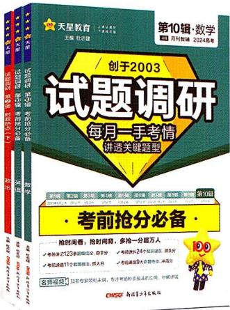

考前结论速记

考前技法速通

考前误区速纠

考前热点速览

# 考前50天 第9辑《考前50天50题》

# 临考预测，名师押题，100%原创

双师视频课·专注创新试题的快速破题、高妙解题的讲解

<table><tr><td>1</td><td>以猫眼曲线为例破解全新信息题</td><td>2</td><td>新定义型解答题的破解策略</td></tr><tr><td>3</td><td>妙解抛物线与向量交汇的跨模块试题</td><td>4</td><td>以对数函数模型为载体的学科融合试题求解策略</td></tr><tr><td>5</td><td>航天器变轨情境下的数学新视角命题</td><td>6</td><td>同一角度速解结论不唯一与结构不良试题</td></tr><tr><td>7</td><td>巧套立体几何模型,速解特殊几何体问题</td><td>8</td><td>一招速破指数、对数函数模型的应用试题</td></tr><tr><td>9</td><td>利用引参换元法妙破嵌套函数的零点问题</td><td>10</td><td>巧解创新应用情境下的条件概率问题</td></tr></table>

# 考前30天 第10辑《考前抢分必备》

# 抢时间看，抢时间背，多抢一分超万人

双师视频课·专注考场快速抢分、0思路秒破技法的讲解

<table><tr><td>1</td><td>赋值法秒杀抽象函数试题</td><td>2</td><td>巧取特殊值,速排选择题错误项</td></tr><tr><td>3</td><td>数形结合法扫除代数运算障碍</td><td>4</td><td>投影法速解向量的数量积问题</td></tr><tr><td>5</td><td>构造法另辟蹊径,速解不等式问题</td><td>6</td><td>二级结论法秒破焦点三角形问题</td></tr><tr><td>7</td><td>泰勒公式法速解比大小问题</td><td>8</td><td>“析、寻、验”三步法快解放放性问题</td></tr><tr><td>9</td><td>万能空间向量法秒破探索性问题</td><td>10</td><td>5步法必破随机变量的分布列与期望问题</td></tr></table>

※以上仅展示数学课程，购买任一科，即可免费观看当辑数、物、化三科课程。

# 考前7天 临门一脚，最后押题

凡购买调研9、10辑均可免费获得全9科名师考前押题视频课

# 创于2003 试题调研

# 每月一手考情

# 讲透关键题型

第1辑

第2辑

第3辑

第4辑

第5辑

第6辑

第7辑

第8辑

第9辑

第10辑

2023年6月上市

7月上市

8月上市

9月上市

11月上市

12月上市

2024年1月上市

2月上市

3月上市

4月上市

# · 情境题解读与预测 ·

# 特约名师 赵成海

正高级教师，河北省秦皇岛第一中学特级教师，省级骨干教师，获秦皇岛市政府三等功、市“教学改革标兵”等称号。  
中国数学奥林匹克一级教练员，中国数学会会员，在国家级及省级等各类专业报刊上发表教育教学论文近二百篇。

本册编委 赵成海 张健 王铱 叶晓斌 王应祥 王常青 王博渊

# 图书在版编目(CIP)数据

试题调研. 第8辑 情境题解读与预测 数学 / 杜志建 主编. -- 乌鲁木齐：新疆青少年出版社，2024.2

ISBN 978-7-5371-7037-6

$\quad$I. ①试… II. ①杜… III. ①中学数学课 - 高中 - 升学参考资料 IV. ①G634

中国国家版本馆 CIP 数据核字（2024）第 026327 号

出版人:徐江

策划:王启全

责任编辑:多艳萍

# 试题调研第8辑 情境题解读与预测数学

# SHITI DIAOYAN DI 8 JI QINGJINGTI JIEDU YU YUCE SHUXUE

杜志建 主编

出版:新疆青少年出版社有限公司

社址:乌鲁木齐市北京北路29号 邮政编码:830012

电话:0991-6239223(编辑部) 0371-68698015(读者服务部)

官网:http://www.qingshao.net 天猫旗舰店:http://xjqss.tmall.com

发行:新疆青少年出版社有限公司

经销:各地新华书店 法律顾问:王冠华 18699089007

印刷:河南文华印务有限公司

开 本:787mm×1092mm 1/16 版 次:2024年2月第1版

印 张:7 印 次:2024年2月第1次印刷

字 数:130 千字

书号:ISBN 978-7-5371-7037-6

定 价:18.90元

CHISO 寄少社

版权所有，侵权必究。印装问题可随时同印厂退换。

# 声明

基于对知识和创作的尊重,本书向所选文章、图片的作者支付补贴。因条件所限未能及时联系的作者,我们在此深表歉意,当您看到本书时,请与我们联系,以便我们向您支付补贴和赠送样书。联系方式:0371-68698015。

# 本辑特色

# 高考必考情境题，高分必破情境题

# 1 聚焦一手考情 创新解读“九省联考”命题新变化

测试卷的结构有重大变化，尤其是题目数量与分值，但此次变化的发生并不是空穴来。风，在《深化新时代教育评价改革总体方案》中，就对高考的命题改革有时变相对固化的试题形式，增强试题开放性，减少死记硬背和“机械刷题”现量的减少和分数的调整就是一个实实在在落实这个方案的科学举措，与新高是一致的。

测试卷与近三年新高考卷题数与分值对比

<table><tr><td>题型</td><td>近三年新高考卷</td><td>测试卷</td><td></td></tr><tr><td>单选题</td><td>8道,每道5分,共40分</td><td>8道,每道5分,共40分</td><td>没</td></tr></table>

挖掘命题逻辑，指明备考方向（P007）

分析结构变化，解读命题趋势（P001）

# 创新解读

将本题与2023年四省联考中第22题“区块链”压轴题特点结合在一起思考，不难发现，命题趋势有着明显的导向作用。这也不是空穴来风，我们再重温《普通高中数学课程标准》，高中数学课程内容分三部分：必修课程、选择性必修课程、选修课程。在学业质量水平与考试评价的关系中，数学学业质量水平三便是基于必修、选择性必修、选修课程的某些内容对数学核心素养的达成而提出要求的，可以作为大学自主招生或强基计划的参考，所以命题时对于考生后续学习能力的考查会有所侧重，也可以想到现在高考的命题趋向已经从一开始的中规中矩逐渐走向创新、且向大学知识靠拢。比如C类课程的“逻辑推理初步”特别强调了“数学定义”，通过实例，了解数学定义、数学命题和数学推理之间的关系，所以这种命题方式在《普通高中数学课程标准》要求范围之内。另外，旧教材《选修4-6：初等数论初步》中，第二讲内容就是测试题第19题的命题载体——赛马小定理。

# 2 深研情境题命题规律 构建去情境快速解题模型

情境解读 本题为情境分离型的选择题，不难发现题目中背景情境虽然占了很大篇幅，

但只是传统的应用题类型，只是为了引出“芯片制造”的必要性，而学科知识据指数函数模型列不等式，如果撇开背景叙述，仅呈现“若该公司……”之后可以是一道完整的题目.

去情境构建解题模型（P048）

去情境分析问题本质（P016）

去情境化审题

<table><tr><td>情境类型</td><td>情境结合型</td></tr><tr><td>去情境梳理问题</td><td>题目用折线图给出两组数据(11000,13500,11800,12600,12200,15400,18200与11800,12600,13000,13800,14000,12400,12200),四个选项分别对应:求两组数据的中位数;求两组数据的平均数并比较大小;求两组数据的方差并比较大小;求第2组数据的第80百分位数</td></tr></table>

# 3 精析创新情境题类型 锁定2024高考命题方向

# 情境6 人文艺术类

【情境解读与预测】以传统工艺、雕塑、古代建筑、书法、绘画等为情境的命题在近几年高考中时有出现，如：2023北京卷第9题以“中国传统建筑造型坡屋顶”为情境命制立体几何问题；2022新高考Ⅱ卷第3题以“中国古代建筑中的举架结构”为情境命制等差数列

与直线斜率相结合的问题；2021 新高考Ⅰ卷第 16 题以“民间剪纸艺术”为情减法求和问题……此类题多与立体几何、三角函数、数列和平面向量等考点情境中提取关键信息、有效去情境化、正确翻译文本语言为数学语言是解题的

调研 1: (古建筑中的空间几何体面积12024 河北石家庄二中等校12月联考) 道韵楼(如图1)以“古、大、奇、美”著称,内部有

数形结合，双管齐下突破难点（P093）

精准解读，抽丝剥茧逐类讲透（P074）

解析 情境嵌入型  
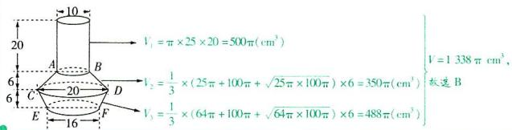

# 本书6类98道创新情境题速览

<table><tr><td>具体考法</td><td>新定义题</td><td>原创好题</td><td>热点情境</td><td>教考衔接</td><td>学科融合</td><td>创新设问</td></tr><tr><td>本书题量</td><td>10</td><td>31</td><td>17</td><td>22</td><td>8</td><td>9</td></tr></table>

# 目录

# CONTENTS

# 考情速递

·扫码免费观看语文、数学、英语三科“九省联考”解读视频   
·听名师讲评试卷、解读考情变化，锁定2024高考命题新动向

# 每月一手考情

1 从小处着手，从大处着眼，助力双减落地与创新人才选拔

——2024年1月“九省联考”创新解读 001

2 情境化命题背景下的数学命题深度研究

011

# 情境题解读与预测

# 高考必破5大创新设问情境问题

情境1 新定义 026

新定义 曼哈顿距离 P026

新定义 离散曲率 P028

情境 2 答案不唯一，开放设问 030

新解法 用 “数形结合” 探讨符合要求的圆的方程 P032

新趋势 以圆柱与球组合的图形为载体，考查动点轨迹探索问题 P032

情境3 结构不良设问 034

新题型 二选一条件探索题 P034

新题型 四选一条件探索题 P035

情境4 多模块知识融合 039

新角度 数列交汇平面向量 P039

新角度 数列、三角函数、函数极值点相融合 P040

情境 5 存在性探索 043

新考法 探索定值存在问题 P043

新趋势 以函数与导数为载体命制存在性探索问题 P044

# 高考必考7 大热点情境问题

# 情境1 社会热点类 047

新动向 结合杭州亚运会情境命制统计问题 P047

新趋势 以神舟十七号为情境，交汇物理学科P050

# 情境 2 个人生活类 053

新情境 以“乒乓球比赛”为情境命制概率求解问题 P054

新解法 用“正难则反”思想求解概率 P057

# 情境3 社会生活类 058

新考法 销售中的线性回归模型 P058

新角度 用三角函数解决修路费用问题 P059

# 情境 4 科学研究类 063

新趋势 以半衰期为情境，交汇物理学科 P063

新模型 与种群增长率有关的逻辑斯谛模型 P065

# 情境5 数学文化类 069

新情境 《九章算术》中的阳马与鳖臑 P 069

新思路 通过斜率相等得直线过圆心 P071

# 情境6 人文艺术类 074

新情境 五线谱中的三角函数问题 P075

新趋势 以剪纸艺术为情境命制向量数量积问题，弘扬传统文化 P077

# 情境7 生态文明类 080

新情境 碳达峰，碳中和 P080

新解法 用“反证法”推断假设不成立 P081

# 高考必知 4 大教材迁移情境问题

# 情境1 命题取材于教材“数学探究”等栏目 087

新趋势 用向量法研究三角形的“四心”，衔接教材 P087

新模型 某种热饮在室温下放置，水温与时间的函数模型 P089

# 目录

# CONTENTS

# 情境 2 命题取材于教材例、习题

091

新应用 求紫砂壶的侧面积 P091

新趋势 求鞠的表面积，弘扬传统文化 P092

# 情境 3 命题取材于教材 “思考” “探究” 栏目

096

新情境 以光的传播为情境 P096

新趋势 以折纸为情境命制圆锥曲线问题，体现应用性 P097

# 情境 4 命题取材于教材 “阅读与思考”

101

新题型 双空题 P 102

新定义 二阶等差数列 P 105

# 下辑精彩预告 2024年3月全新上市

# 《试题调研》第9辑将重磅推出：考前50天50题

临考预测，名师押题，100%原创！

本辑特邀名校名师和学科专家,精准地圈画出2024年高考最有可能考查的命题方向、热门考点、热点素材,预测高考新变化、新情境、新考法,100%原创试题,教你识破高考命题套路,快速解题,让你在考场上临危不惧!

紧贴“九省联考”考情,押全新题型 打破考点固化的填空题、开放设问简答形式的解答题、呈现全新信息的解答题等,掌握新题型,高分必得!

解密高考前沿趋势,押创新考向 名师深研,力押创新模块交汇题、创新数学应用题、创新结构问题等,押准更要讲透,超详细解析助你卡壳点全消除!

紧跟最新情境动向,押时事热点 聚焦最新社会热点,原创杭州亚运会、航天科技发展等热点情境题,抽丝剥茧去情境,挖掘数学本质,思路畅通无阻!

精准把脉高考趋势,押压轴卡壳 深度剖析指对数压轴比大小问题、抽象函数的性质探索问题、截面探索问题等压轴题,让你难点疑点全部“消消乐”!

名师视频免费看！凡购买本辑任一科，即可免费观看数学、物理、化学三科共40+节视频课，专注于创新试题快速破题、高妙解题的讲解。名师创作，知名专家主讲，双师课堂为你考前冲刺助力！考前倒计时7天，更有全9科终极押题，敬请关注！

# 每月一手考情

# 从小处着手,从大处着眼,助力双减落地与创新人才选拔

——2024年1月“九省联考”创新解读

正高级教师、特级教师 赵成海

2024 年 1 月由教育部组织统一命题的九省联考数学测试卷(下称测试卷)遵循《中国高考评价体系》规定的考查内容和要求, 充分发挥高考的核心功能, 深化必备知识和关键能力的考查. 与近几年全国卷相比, 测试卷减少了试题数量, 适度降低了计算量, 强调 “多想少算”, 试题设计追求创新, 打破固化形式, 有利于充分发挥服务选才的功能.

### 一、从试卷结构变化解读信息

测试卷的结构有重大变化，尤其是题目数量与分值，但此次变化的发生并不是空穴来风，在《深化新时代教育评价改革总体方案》中，就对高考的命题改革有明确的要求：改变相对固化的试题形式，增强试题开放性，减少死记硬背和“机械刷题”现象。这次题目数量的减少和分数的调整就是一个实实在在落实这个方案的科学举措，与新高考改革的方向是一致的。

测试卷与近三年新高考卷题数与分值对比

<table><tr><td>题型</td><td>近三年新高考卷</td><td>测试卷</td><td>对比</td></tr><tr><td>单选题</td><td>8道,每道5分,共40分</td><td>8道,每道5分,共40分</td><td>没有变化</td></tr><tr><td>多选题</td><td>4道,每道5分,共20分</td><td>3道,每道6分,共18分</td><td>减少1道,每道多1分</td></tr><tr><td>填空题</td><td>4道,每道5分,共20分</td><td>3道,每道5分,共15分</td><td>减少1道</td></tr><tr><td>解答题</td><td>6道,1道10分,其余12分,共70分</td><td>5道,分值分别为13分、15分、15分、17分、17分,共77分</td><td>减少1道,每道分值都改变</td></tr></table>

由上表可见：

①题量上,单选题依然是8道题没变,而多选题减少1道,每道题的分值由5分提高到6分,总体分数占比略有减少,但变化不大.多项选择题是近年来高考改革的一个成果,其特点是选对一个选项的难度较低,选对全部选项的难度整体高于单项选择题,且完成题目的工作量和做错的风险有所增加,这有利于将水平较高的考生选拔出来,但分值与单项选择题的分值相同,在一定程度上有不合理之处.测试卷中多项选择题的评分要求是“全部选对的得6分,部分选对的得部分分,有选错的得0分”,没有明确部分选对的给分规则,在阅卷时为“有2个正确选项的,每选对1个得3分;有3个正确选项的,选对1个得2分,选对2个得4分”，这样的情况下，测试卷多项选择题的赋分方式是更加科学、合理的。

②填空题减少1道,每道分值不变,总体分数占比减少.填空题的一个特点是:一些与知识和能力相关较少的偶然性失误可能会对正确答题产生影响,导致得分率降低.减少填空题分数占比,对降低试卷难度有正面作用.  
（3）解答题减少 1 道,由原来的 6 道变为 5 道. 虽然题目数量减少了,但每题的分值和总的分数占比都增加了,实际上对数学思维过程的考查得到了加强. 减少题量,留给学生更多的思考时间和更大的思考空间,缓解学生在有限时间内做不完试卷的担心,从心理角度有助于学生尤其是中档程度学生的有效发挥. 当然,题目难度与特色上的变化,依然有助于尖子生的脱颖而出. 题量减少了,学生的作答时间变得更加充分,对数学思维过程的考查更加到位,进一步体现了多想少算,从小处着手,从大处着眼,助力双减落地,助力创新人才选拔,积极引导中学教学. 同时,解答题的前 3 题重点考查学生会不会做,不设计计算陷阱,比如第 17 题考查立体几何,数据设计很合理,计算量小,只要会做,做错的概率非常小.

### 二、打破备考惯性思维，尽量规避机械刷题

《普通高中数学课程标准》指出，数学学科的核心素养是具有数学基本特征的思维品质、关键能力。在高考命题中，要合理设置题量，给学生充足的思考时间。逐步减少选择题、填空题的题量，适度增加试题的思维量。在命题中，应特别关注数学学习过程中思维品质的形成。因此，在考试时间不变的情况下，减少试题数量是加强思维考查的必然手段。

测试卷试题低起点，渐深入，大落差，基本上是按照由易到难的顺序排列，这样的布局特点，给不同层次考生各自的发挥空间，既可实现选拔功能，又同时体现人文关怀。试题命题角度新颖，更体现了对主干知识考查的深刻性，测试卷还从知识内在逻辑联系出发，设计立意精巧、自然交汇的题目，渗透了数学思想方法、关键能力的深度考查，对理性思维的考查贯穿其中，对探索精神的考查也有呈现。

这样的变化是在明明白白地“昭告天下”：高考要选拔的是会动脑的考生，一味地靠“刷题”备考，没有真正理解内在规律的考生将越来越难以得到高分。当然，数学的学习过程中不做题也是不行的，在做题过程中需要思考并努力掌握知识、提升应用能力。有一定的“刷题”量是很必要的，因为对于基础试题，达到一定的熟练程度，才能为后续需要高思维量的题留出时间，只有这样才能得高分。现在的高考不只考查考生记住了哪些知识点，还考查考生解决问题的能力。这个趋势越来越明显，“死记硬背”的方式已经无法适应现在高考的新要求。

测试卷的题目难度并不重要,也不需要深究,但里面传递的改革信息千万不能忽视.

### 三、强调数学学科的灵活性，区分度很高的基础题与难题并存

测试卷中接近 $80 \%$ 的题目都是基础题，但知识覆盖面广，有效减少了考查的偶然性和

片面性, 对中学数学教学起到积极的导向作用.

①降低计算,多想少算,突出思考.数学高考一直强调“多想一点,少算一点”的理念,从重考查知识回忆向重考查思维过程转变.在测试卷中,这一理念在解析几何的考查中体现得极其充分.

调研 1 (测试卷第 18 题, 17 分) 已知抛物线 $C: y^{2} = 4x$ 的焦点为 $F$ , 过 $F$ 的直线 $l$ 交 $C$ 于 $A, B$ 两点, 过 $F$ 与 $l$ 垂直的直线交 $C$ 于 $D, E$ 两点, 其中 $B, D$ 在 $x$ 轴上方, $M, N$ 分别为 $AB, DE$ 的中点.

（1） 证明: 直线 MN 过定点.  
（2） 设 G 为直线 AE 与直线 BD 的交点, 求 $\triangle GMN$ 面积的最小值.

# 创新解读

本题第（1）问是常规的直线过定点问题,主要考查抛物线的基础知识和数学运算素养,通过引入直线 l 的斜率作为参数,借助熟知的方程的根与系数关系,得到 M,N 两点的坐标和直线 MN 的方程,即可证明 MN 过定点(3,0).但对于第（2）问,由于思维能力的不同产生解法上的差异,其运算量有很大差异.具体参见下面两种不同的求解方法.

解析 （1） 设 $A(a^2, 2a), B(b^2, 2b), D(d^2, 2d), E(e^2, 2e)$ , 易知直线 $AB$ 的斜率存在且不为 0, 设直线 $AB$ 的方程为 $x = ty + 1$ , 其中 $t \neq 0$ , 则直线 $DE$ 的方程为 $x = -\frac{1}{t}y + 1$ .

由 $\left\{\begin{aligned}y^{2}&=4x,\\ x&=ty+1,\end{aligned}\right.$ 消去x得关于y的方程 $y^{2}-4ty-4=0,\Delta_{1}>0$ ，则 $2a+2b=4t,2a\cdot2b=-4$

由 $\left\{\begin{aligned}y^{2}&=4x,\\ x&=-\frac{1}{t}y+1,\end{aligned}\right.$ 消去x得关于y的方程 $y^{2}+\frac{4}{t}y-4=0,\Delta_{2}>0$ ，则 $2d+2e=-\frac{4}{t},2d\cdot2e=-4.$

则 $a^2 + b^2 = 2ta + 1 + 2tb + 1 = 4t^2 + 2, d^2 + e^2 = -\frac{2}{t} d + 1 - \frac{2}{t} e + 1 = \frac{4}{t^2} + 2,$

故 $M(2t^2 + 1, 2t), N\left(\frac{2}{t^2} + 1, -\frac{2}{t}\right)$ , 当 $t \neq \pm 1$ 时, 直线 $MN$ 的方程为 $y - 2t = \frac{-\frac{2}{t} - 2t}{\frac{2}{t^2} + 1 - (2t^2 + 1)} (x - 2t^2 - 1)$ ,

整理得 $y - 2t = \frac{t}{t^2 - 1} (x - 2t^2 - 1)$ ，即 $(t^2 - 1)y - tx + 3t = 0$ ，过定点(3,0).

当 $t = \pm 1$ 时, 直线 MN 的方程为 x = 3, 直线 MN 过点 $(3, 0)$ .

综上, 直线 MN 恒过定点 $(3,0)$ .

（2） 方法一: 坐标法 由 （1） 知 $k_{AB} = \frac{2a - 2b}{a^2 - b^2} = \frac{2}{a + b}$ , 所以直线 $AB$ 的方程为 $y - 2a = \frac{2}{a + b} (x -$

# 高分有方

$a^2)$ , 整理得 $2x - (a + b)y + 2ab = 0$ , 同理有直线 $DE$ 的方程为 $2x - (d + e)y + 2de = 0$ , 直线 $AE$ 的方程为 $2x - (a + e)y + 2ae = 0$ , 直线 $BD$ 的方程为 $2x - (b + d)y + 2bd = 0$ .

由直线 $AB, DE$ 过点 $F(1,0)$ 且 $AB \perp DE$ 得 $\left\{ \begin{array}{l} ab = -1, \\ de = -1, \\ (a + b)(d + e) = -4. \end{array} \right.$

联立直线 $AE, BD$ 的方程得 $x_{G} = \frac{ae(b + d) - bd(a + e)}{(a + e) - (b + d)} = \frac{-e - a + d + b}{(a + e) - (b + d)} = -1.$

令 $x = -1$ ，得 $y_{G} = \frac{2ae - 2}{a + e} = \frac{2bd - 2}{b + d} = \frac{2(ae + bd) - 4}{(a + b) + (d + e)}.$

由（1）知 $t = \frac{1}{k_{AB}} = \frac{a + b}{2}$ , 当 $t \neq \pm 1$ 时, $k_{MN} = \frac{t}{t^2 - 1} = \frac{2(a + b)}{(a + b)^2 - 4} = \frac{2}{(a + b) + (d + e)}$ , 当 $t = \pm 1$ 时, 直线 $MN: x = 3$ ,

故直线 $MN: x = \frac{(a + b) + (d + e)}{2} y + 3$ .

过 G 作 $GH \perp y$ 轴交 MN 于 H, 如图 1 所示,

则 $x_{H} = \frac{(a + b) + (d + e)}{2}\cdot \frac{2(ae + bd) - 4}{(a + b) + (d + e)} +3 = ae + bd + 1,$

则 $S_{\triangle GMN}=\frac{1}{2}|y_{M}-y_{N}|\cdot(x_{H}-x_{G})$ .

$|y_{M}-y_{N}|=|2t+\frac{2}{t}|=|a+b+\frac{4}{a+b}|\geqslant4$ , 当且仅当 $a+b=\pm2$ 时等号成立, $x_{H}-x_{G}=ae+bd+2=ae+\frac{1}{ae}+2\geqslant4$ , 当且仅当 ae=1 时等号成立, 故当 $a+d=0=b+e$ 时两式同时取等号, 所以 $S_{\triangle GMN}$ 的最小值为 8.

【名师有话说】该方法直接求点 $G$ 的坐标, 是多数考生 (无论成绩高低) 比较容易想到的、较直接的方法, 但运算量较大, 且字母运算是考生感到头痛的地方, 但如果没有其他思路, 沿着这个方向解题，也是一种不错的选择

方法二: 面积转化法 连接 DM, AN, AD, 取 AD 的中点 K, 连接 KM, KN, GK, 如图 2 所示,

则 $S_{\triangle GMN} = S_{\text{五边形}GDMNA} - S_{\triangle GAN} - S_{\triangle GDM} = S_{\text{五边形}GDMNA} - S_{\triangle GAK} - S_{\triangle GDK} = S_{\text{五边形}GDMNA} - \frac{1}{2} S_{\triangle GDA} - \frac{1}{2} S_{\triangle GDA} = S_{\text{四边形}DMNA}$ .

【指点迷津】由中位线可知 $KN \parallel AE$ ，故 $S_{\triangle GAN} = S_{\triangle GAK}$ ，易知 $S_{\triangle GAK} = \frac{1}{2} S_{\triangle GDA}$ ，故 $S_{\triangle GAN} = \frac{1}{2} S_{\triangle GDA}$ ，同理可得 $S_{\triangle GDM} = \frac{1}{2} S_{\triangle GDA}$

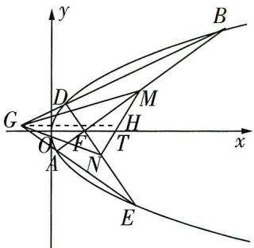

图 1

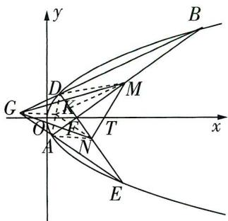

图2

设 $|BF|=r_{1},|AF|=r_{2}$ ，直线BF的倾斜角为 $\theta$ ，不妨设 $b^{2}\geqslant a^{2}$ ，则 $\theta\in(0,\frac{\pi}{2})$ ，则 $B(r_{1}\cos\theta+$

$1, r_{1} \sin \theta)$ , 代入抛物线方程 $y^{2} = 4x$ 得 $r_{1} = \frac{2}{1 - \cos \theta}$ , 同理得 $A(1 - r_{2} \cos \theta, -r_{2} \sin \theta), r_{2} = \frac{2}{1 + \cos \theta}$ , 故 $|AB| = \frac{4}{\sin^{2} \theta}$ , 同理得 $|DE| = \frac{4}{\cos^{2} \theta}$ .

$S _ {\triangle G M N} = S _ {\text {四边形} D M N A} = \frac {1}{2} | A M | \cdot | D N | = \frac {1}{8} | A B | \cdot | D E | = \frac {2}{(\sin \theta \cos \theta) ^ {2}} \geqslant \frac {2}{(\frac {\sin^ {2} \theta + \cos^ {2} \theta}{2}) ^ {2}} = 8,$

当且仅当 $\theta=\frac{\pi}{4}$ 时等号成立, 所以 $S_{\triangle GMN}$ 的最小值为 8.

针对本题第（2）问的方法二, 这里想强调一点: 测试卷中的第 14 题、第 18 题的第（2）问、第 19 题, 明显对于参加过强基培训或竞赛学习的考生非常有利, 对学科核心素养中的直观想象有很高的要求, 能综合运用不同的几何方法解决问题也是学科核心素养水平的重要体现. 这种解法的核心是转化, 将 $\triangle GMN$ 的面积转化为四边形 $DMNA$ 的面积, 这是难点, 也是简化求解的突破点, 如果有平面几何基础, 这种面积转化法则稍显简单.

综上可见，第 18 题设计十分巧妙，很有技术含量，“想得到”与“想不到”的计算量相差悬殊。这样的命题方式提醒考生“多想少算”，有效地避免了以前在解析几何的考查中计算量“居高不下”的现象，并且在考查考生数学运算素养的同时也考查了逻辑推理素养，比较自然地体现了各核心素养的交融性。

②由原来的套路解题变为定义理解 + 知识点组合求解. 测试卷中给出平时教学没出现过的新概念, 通过考场上的阅读理解让考生寻求解决方法, 这也是新高考的特色, 本次考试这种特色更加突出, 这是一个很明显的导向, 应该越来越受到重视.

调研 2 (测试卷第14题, 5分)以 $\max M$ 表示数集 $M$ 中最大的数. 设 $0 < a < b < c < 1$ , 已知 $b \geqslant 2a$ 或 $a + b \leqslant 1$ , 则 $\max \{b - a, c - b, 1 - c\}$ 的最小值为 \_\_\_\_.

# 创新解读

本题的背景考生应该是很熟悉的,人教 A 版教材《必修第一册》P68 的例 6,P69 的练习第 3 题就是这样的,若考生只是停留在“刷题”层次,刷题再多,由于没有注重思维本质,见到本题也无从下手.

解析 设 $\left\{ \begin{array}{l} x = b - a, \\ y = c - b, \\ z = 1 - c, \end{array} \right.$ 那么 $\left\{ \begin{array}{l} a = 1 - x - y - z, \\ b = 1 - y - z, \\ c = 1 - z. \end{array} \right.$

①若 $b \geqslant 2a$ ，那么 $1 - y - z \geqslant 2(1 - x - y - z)$ ，从而 $2x + y + z \geqslant 1$

记 $m = \max \{b - a, c - b, 1 - c\}$ , 从而 $\left\{ \begin{array}{l} m \geqslant x, \\ m \geqslant y, \\ m \geqslant z, \end{array} \right.$ 所以 $4m \geqslant 2x + y + z \geqslant 1$ , 解得 $m \geqslant \frac{1}{4}$ .

# 高分有方

②若 $a + b \leqslant 1$ ，那么 $1 - x - y - z + 1 - y - z \leqslant 1$ ，从而 $x + 2y + 2z \geqslant 1$

记 $m = \max \{b - a, c - b, 1 - c\}$ , 从而 $\left\{ \begin{array}{l} m \geqslant x, \\ m \geqslant y, \\ m \geqslant z, \end{array} \right.$ 所以 $5m \geqslant x + 2y + 2z \geqslant 1$ , 解得 $m \geqslant \frac{1}{5}$ .

综上, $m\geqslant\frac{1}{5}$ ，即 $\max\left\{b-a,c-b,1-c\right\}$ 的最小值为 $\frac{1}{5}$ .

事实上，2024年1月中学生标准学术能力诊断性测试中，就有本题思维方法的渗透，只不过条件隐藏，比本题更深.题目如下：

调研 3: (多选) 直线 $l_{1}: ax + by + c = 0$ 和直线 $l_{2}: bx + cy + a = 0$ 将圆 $C: (x - 1)^{2} + (y - 1)^{2} = 1$ 分成长度相等的四段弧, 则 $(a - 1)^{2} + (b - 1)^{2} + (c - 1)^{2}$ 的取值可以是

$\quad$A. $\frac{4}{3}$

$\quad$B. 2

$\quad$C. $\frac{8}{3}$

$\quad$D. 3

解析 本题隐含两种情况,需要考生分析,如图5所示.

一是两直线过圆心且互相垂直,则 $\left\{\begin{aligned}a+b+c=0,\\ ab+bc=0,\end{aligned}\right.$ 所以 $a+c=b=0$ ,
此时 $(a-1)^{2}+(b-1)^{2}+(c-1)^{2}=2a^{2}+3\geqslant3.$

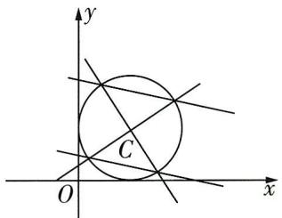

图 5

二是两直线平行且圆心到两直线的距离均为 $\frac{\sqrt{2}}{2}$ ，则

$\left\{ \begin{array}{l l} {a c = b ^ {2}, b c \neq a ^ {2}, a b \neq c ^ {2},} \\ {\frac {| a + b + c |}{\sqrt {a ^ {2} + b ^ {2}}} = \frac {\sqrt {2}}{2},} \\ {\frac {| a + b + c |}{\sqrt {b ^ {2} + c ^ {2}}} = \frac {\sqrt {2}}{2},} \end{array} \right. \quad \text {可得} \left\{ \begin{array}{l l} {a = c,} \\ {a = - b,} \end{array} \right.$

此时 $(a - 1)^2 + (b - 1)^2 + (c - 1)^2 = 3a^2 - 2a + 3 = 3(a - \frac{1}{3})^2 + \frac{8}{3} \geqslant \frac{8}{3}$ . 综上, 选 CD.

如果说测试卷第14题的定义理解还贴近常规考情，那么第19题，则完全超出预料.

调研 4 (测试卷第19题, 17分) 离散对数在密码学中有重要的应用. 设 $p$ 是素数, 集合 $X = \{1,2,\cdots,p - 1\}$ , 若 $u, v \in X, m \in \mathbb{N}$ , 记 $u \otimes v$ 为 $uv$ 除以 $p$ 的余数, $u^{m,\otimes}$ 为 $u^{m}$ 除以 $p$ 的余数; 设 $a \in X, 1, a, a^{2,\otimes}, \cdots, a^{p-2,\otimes}$ 两两不同, 若 $a^{n,\otimes} = b (n \in \{0, 1, \cdots, p-2\})$ , 则称 $n$ 是以 $a$ 为底 $b$ 的离散对数, 记为 $n = \log (p)_{a} b$ .

（1） 若 p=11, a=2, 求 $a^{p-1,\otimes}$ .

（2） 对 $m_{1}, m_{2} \in \{0, 1, \cdots, p - 2\}$ ，记 $m_{1} \oplus m_{2}$ 为 $m_{1} + m_{2}$ 除以 p - 1 的余数（当 $m_{1} + m_{2}$

# 高分有方

能被 $p - 1$ 整除时， $m_1 \oplus m_2 = 0$ . 证明： $\log (p)_a(b \otimes c) = \log (p)_a b \oplus \log (p)_a c$ ，其中 $b, c \in X$ .

（3） 已知 $n = \log(p)_{a} b$ . 对 $x \in X, k \in \{1, 2, \cdots, p - 2\}$ ，令 $y_{1} = a^{k, \otimes}, y_{2} = x \otimes b^{k, \otimes}$ . 证明: $x = y_{2} \otimes y_{1}^{n(p - 2), \otimes}$ .

# 创新解读

将本题与2023年四省联考中第22题“区块链”压轴题特点结合在一起思考,不难发现,命题趋势有着明显的导向作用.这也不是空穴来风,我们再重温《普通高中数学课程标准》,高中数学课程内容分三部分:必修课程、选择性必修课程、选修课程.在学业质量水平与考试评价的关系中,数学学业质量水平三便是基于必修、选择性必修、选修课程的某些内容对数学核心素养的达成而提出要求的,可以作为大学自主招生或强基计划的参考,所以命题时对于考生后续学习能力的考查会有所侧重,也可以想到现在高考的命题趋向已经从一开始的中规中矩逐渐走向创新、且向大学知识靠拢.比如C类课程的“逻辑推理初步”特别强调了“数学定义”,通过实例,了解数学定义、数学命题和数学推理之间的关系,所以这种命题方式在《普通高中数学课程标准》要求范围之内.另外,旧教材《选修4-6:初等数论初步》中,第二讲内容就是测试题第19题的命题载体——费马小定理.

解析 （1） 若 $p = 11, a = 2$ , 则 $a^{p - 1, \otimes}$ 便是求 $2^{10}$ 除以 11 的余数.

又 $2^{10} = 1024 = 93 \times 11 + 1$ ，所以 $a^{p-1, \otimes} = 1$ .

（2） 当 $p = 2$ 时, $X = \{1\}$ , 此时 $b = c = 1, b \otimes c = 1$ .

故 $\log (p)_a(b\otimes c) = 0,\log (p)_ab = 0,\log (p)_ac = 0,$

此时 $\log (p)_a(b\otimes c) = \log (p)_a b\oplus \log (p)_a c.$

当 p > 2 时，因为 $1, a, a^{2, \otimes}, \cdots, a^{p-2, \otimes}$ 两两不同，所以 $a \geqslant 2$ ，而 $a \in X$ ，故 a, p 互质.

设 $m = \log (p)_{a}(b\otimes c),n_{1} = \log (p)_{a}b,n_{2} = \log (p)_{a}c,$

则 $\exists k_{1}, k_{2} \in \mathbf{N}$ , 使得 $a^{n_{1}} = pk_{1} + b, a^{n_{2}} = pk_{2} + c$ ,

故 $a^{n_1 + n_2} = (pk_1 + b)(pk_2 + c)$ ，故 $a^{n_1 + n_2} \equiv bc (\bmod p)$ （该式表示的含义是 $a^{n_1 + n_2}$ 和 $bc$ 除以 $p$ 所得的余数相等）.

$a^m \equiv b \otimes c (\bmod p) = bc (\bmod p)$ , 其中 $0 \leqslant m \leqslant p - 2$ ,

所以 $a^{m} \equiv a^{n_{1} + n_{2}} \equiv bc (\mod p)$ .

因为 $1,2,3,\cdots,p-1$ 除以 p 的余数两两不同，且 $a,2a,3a,\cdots,(p-1)a$ 除以 p 的余数两两不同，

所以 $(p-1)! \equiv [a \times 2a \times 3a \times \cdots \times (p-1)a] \pmod{p}$ ，故 $a^{p-1} \equiv 1 \pmod{p}$ （根据同余的性质“若 $ab \equiv ac \pmod{n}$ ，且a,n互质，则 $b \equiv c \pmod{n}$ ”可得此式。而上述过程也就是费马小定理的证明过程），

所以 $a^m \cdot 1 = a^{n_1 + n_2} \cdot a^{p - 1} (\bmod p)$ （根据同余的性质“若 $a \equiv b (\bmod n)$ ，且 $c \equiv d (\bmod n)$ ，则 $ac \equiv bd (\bmod n)$ ”可知），即 $m = n_1 + n_2 + k_3(p - 1)$ ，即 $m \equiv n_1 + n_2 (\bmod p - 1)$ ，满足 $n_1 \oplus n_2$ 是 $n_1 + n_2$ 除以 $p - 1$ 的余数的定义，所以 $m = n_1 \oplus n_2$ ，即 $\log (p)_a(b \otimes c) = \log (p)_ab \oplus \log (p)_ac$ .

综上所述， $\log (p)_a(b\otimes c) = \log (p)_ab\oplus \log (p)_ac.$

（3） 当 $b \geqslant 2$ 时, 由 （2） 可得 $b^{p-1} \equiv 1 (\bmod p)$ , 若 $b = 1$ , 则 $b^{p-1} \equiv 1 (\bmod p)$ 也成立.

因为 $n = \log (p)_a b$ ，所以 $a^n \equiv b (\mod p)$ .

另一方面， $y_{2}\otimes y_{1}^{n(p - 2),\otimes}\equiv y_{2}y_{1}^{n(p - 2),\otimes}\equiv (x\otimes b^{k,\otimes})(a^{k,\otimes})^{n(p - 2)}\equiv (xb^{k})a^{kn(p - 2)}\equiv (xb^{k})b^{k(p - 2)}\equiv$ $xb^{k(p - 1)}\equiv x(b^{p - 1})^k\equiv x\cdot 1^k\equiv x(\mathrm{mod}p).$

由于 $x \in X$ ，所以 $x = y_2 \otimes y_1^{n(p-2), \otimes}$ .

所以，突破套路命题正是数学学科灵活性的体现，因而注重基础的同时也要兼顾能力。当然，对于不同层次的考生，高考复习备考过程中是可以有所选择的，也不必刻意去大量补习这些内容，一定要“因地制宜”。

### 四、打破备考的惯性思维，尽量规避刷题

通过本次测试卷，可以得出以下5大改革趋势，值得各位教师与考生关注.

①所有题目考查的考点都不再固定.

测试卷的第1题是一道基础的统计题，复数、集合悄然转换到多选题(大大降低了多选题的难度)和填空题的位置.以往多选题常使考生花费许多时间，极大影响后面解答题的发挥，因此有些考生的策略是只选一个选项，得部分分数就停止答题，这与命题的初衷相悖，而现在考查难度的变化与赋分规则的变化，有助于更好地实现这些题真正的检测目的.

②解答题每个题目的难度不再固定,考哪些模块也不再固定.

测试卷的导数大题出现在解答题的第1道，暗示高考中对导数的考查有可能比较简单，压轴题有可能不再是导数题。数列与解三角形两类传统的解答题这次考试都没有出现，当然高考中并非不考，主要是突出变和革新。基于此，考后许多考生反映考试时有些失措，感觉很多努力付诸东流了，但这就是变化，复习中不要“押宝”，不要凭熟练某类型题而是凭能分析好不同类型题去得分。

③多项选择题根据选对的个数得分,选对一个正确选项和选对两个正确选项得分不同.

以往多选题选对但选不全的得分没差距，这次测试题优化了这一点，同时更加突出对基本概念的考查。测试题的第11题为能力题，有教材原型（旧教材人教A版《必修一》P75B组第5题），也是传统经典内容之一。

调研 5 (测试卷第11题|多选)已知函数 $f(x)$ 的定义域为R,且 $f(\frac{1}{2})\neq0$ ,若 $f(x+y)+f(x)f(y)=4xy$ ,则()

$\quad$A. $f(-\frac{1}{2}) = 0$

$\quad$B. $f(\frac{1}{2}) = -2$

$\quad$C. 函数 $f\left( {x - \frac{1}{2}}\right)$ 是偶函数

$\quad$D. 函数 $f\left( {x + \frac{1}{2}}\right)$ 是减函数

# 创新解读

对抽象函数的考查,从2021年,2022年,2023年三年的新高考试题看,层次是逐年递进的.2021新高考Ⅱ卷第14题(写出一个同时具有性质“① $f(x_{1}x_{2})=f(x_{1})f(x_{2})$ ;②当 $x\in(0,+\infty)$ 时, $f'(x)>0$ ;③ $f'(x)$ 是奇函数”的函数),考查抽象函数的导数等;2022新高考Ⅱ卷第8题(已知 $f(x+y)+f(x-y)=f(x)f(y)$ , $f(1)=1$ ,求 $\sum_{k=1}^{22}f(k)$ ),考查抽象函数的周期性、求特殊函数值、数列求和等;2023新课标Ⅰ卷第11题(已知函数 $f(x)$ 满足 $f(xy)=y^{2}f(x)+x^{2}f(y)$ ,判断4个选项正误),作为多选题,求抽象函数的特殊函数值、判断奇偶性、求极小值点.

解析 特值引路 取 $x = 0, y = \frac{1}{2}$ , 则 $f(0 + \frac{1}{2}) + f(0)f(\frac{1}{2}) = 0$ ,

所以 $f\left(\frac{1}{2}\right)[f(0) + 1] = 0$ ，由于 $f\left(\frac{1}{2}\right)\neq 0$ ，从而 $f(0) = -1.$

取 $x = \frac{1}{2}, y = -\frac{1}{2}$ , 则 $f(0) + f(\frac{1}{2})f(-\frac{1}{2}) = 4 \times \frac{1}{2} \times (-\frac{1}{2})$ , 即 $-1 + f(\frac{1}{2})f(-\frac{1}{2}) = -1$ , 从而 $f(-\frac{1}{2}) = 0, A$ 正确.

取 $y = -\frac{1}{2}$ ，则 $f(x - \frac{1}{2}) + f(x)f(-\frac{1}{2}) = -2x$ ，即 $f(x - \frac{1}{2}) = -2x$ ，从而 $f(\frac{1}{2}) = -2$ 且 $f(x - \frac{1}{2})$ 为奇函数，则B正确，C错误.

$f(x+\frac{1}{2})=-2x-2$ , 为减函数, D 正确. 从而选 ABD.

而抽象函数问题的源头, 则可以追溯到 2001 年全国卷理科第 22 题: 设 $f(x)$ 是定义在 $\mathbf{R}$ 上的偶函数, 其图象关于直线 $x = 1$ 对称, 对任意 $x_{1}, x_{2} \in [0, \frac{1}{2}]$ , 都有 $f(x_{1} + x_{2}) = f(x_{1}) \cdot f(x_{2})$ , 且 $f(1) = a > 0$ . （1） 求 $f(\frac{1}{2})$ 及 $f(\frac{1}{4})$ ; （2） 证明 $f(x)$ 是周期函数; （3） 记 $a_{n} = f(2n + \frac{1}{2n})$ , 求 $\lim_{n \to \infty} (\ln a_{n})$ . 这些题目对抽象函数的考查体现得淋漓尽致.

④进一步打击“机械刷题”和利用题型模板解题的套路复习,所有题目的解题要回归“理解知识点才能解题”的本质.

# 高分有方

因为实际考试时,没有那么多的时间一直盯着一道题反复斟酌,所以平时做题的时候,尽量“一气呵成”,一遍就做对.
更多资源, 找vx:GZSJJ2000

调研 6 (测试卷第8题) 设双曲线 $C: \frac{x^2}{a^2} - \frac{y^2}{b^2} = 1 (a > 0, b > 0)$ 的左、右焦点分别为 $F_1, F_2$ , 过坐标原点的直线与 $C$ 交于 $A, B$ 两点, $|F_1B| = 2 |F_1A|$ , $\overrightarrow{F_2A} \cdot \overrightarrow{F_2B} = 4a^2$ , 则 $C$ 的离心率为 ( )

$\quad$A. $\sqrt{2}$

$\quad$B. 2

$\quad$C. $\sqrt{5}$

$\quad$D. $\sqrt{7}$

# 创新解读

本题的特色是回归双曲线定义、双曲线的对称性、向量数量积的定义、余弦定理(或向量的平方运算)等基础知识,如果只是停滞在“刷题”上,就会感到这道题是难题,本题作为单选题的压轴题,是从知识点的交汇层面提升区分度的.

解析 由双曲线的对称性得 $\left|F_{2}A\right|=\left|F_{1}B\right|$ ，由双曲线的定义得 $\left|F_{2}A\right|-\left|F_{1}A\right|=2a$ ，则 $\left|F_{1}A\right|=2a,\left|F_{2}A\right|=\left|F_{1}B\right|=4a,\left|F_{2}B\right|=2a,$

$\overrightarrow{F_2A} \cdot \overrightarrow{F_2B} = 4a \cdot 2a\cos \angle AF_2B = 4a^2$ ，所以 $\cos \angle AF_2B = \frac{1}{2}$ ，所以 $\cos \angle F_1AF_2 = -\frac{1}{2}$ .

在 $\triangle AF_{1}F_{2}$ 中， $|\overrightarrow{F_1F_2}|^2 = |\overrightarrow{F_2A}|^2 + |\overrightarrow{F_1A}|^2 - 2|\overrightarrow{F_2A}| \cdot |\overrightarrow{F_1A}| \cos \angle F_{1}AF_{2} = 16a^{2} + 4a^{2} + 8a^{2} = 28a^{2} = 4c^{2}$ ，

从而 $e=\frac{c}{a}=\sqrt{7}$ ，选 D.

⑤题目的灵活与不稳定对教师的上课提出更高的要求,不能再施行以刷题为主的教学,而是教会学生如何理解知识,分析问题.
### 知识点 不理解，题刷得再多都禁不起“变”，这意味着创新思维的重要性，如果单靠刷题，可能只拿到一般的分数，如果想冲刺更高的分数、有更高的追求，就需要更多地从题中自己总结出一些东西，能举一反三，培养自己的思维。所以要尽量规避刷题，不以刷题为“宝”，使思维真正动起来。

总体来说，测试卷减少了试题数量，增加了解答题的分数占比，对数学思维过程的考查有所加强。由于试题数量减少，考查知识内容的覆盖面似乎受到一定影响，但测试卷对数学学科核心素养做了着重考查，这是比较明显的，充分体现了基础性，这些基础题目有利于众多考生多得些分。同时，综合性、应用性、创新性的考查要求也呈现得很妙，压轴拉分题更是不受限于对某些具体知识内容的考查。测试卷很好地控制了试题难度，赋分更加合理，减轻了考生负担。测试卷灵活改变试题顺序，防止猜题押题，鼓励考生注重素质教育。

可以说，测试卷对可能的数学高考改革做了一次有益的探索，值得关注. 总结测试卷的经验和实践效果，对我们寻找今后新高考的改革与探索方向是大有帮助的.

# 高分有方

# 情境化命题背景下的数学命题深度研究

正高级教师、特级教师 赵成海

# 为什么考情境题

《中国高考评价体系》中提出了基础性、综合性、应用性和创新性的“四翼”考查要求。情境化试题是应用性考查要求的主要载体，并且综合体现了其他方面的要求。

在创新性方面，情境化试题可以通过引入新情境或开放式设问，引导学生在学习过程中摆脱思维定式的束缚，提高自身推测、猜想并进行周密论证的能力，鼓励学生培养发散思维、逆向思维、批判思维等思维品质.

在综合性方面，情境化试题的解答往往需要合理组织、调动不同模块的相关知识与能力，题目能够体现不同学科的相关内容与数学的结合。通过情境的复杂性，题目体现综合考查的要求，引导学生对不同知识、能力、素养融会贯通，从而能够高质量地应对学习、生活中的复杂问题。

情境化试题还能够深化基础知识与考查要求的内涵，其设计背景和考查内容都基于学科基础知识，通过灵活的呈现方式强调基础性并不是对单一、简单知识点的机械回忆、重复和再现，而是对基础知识和基本思想方法的深入理解和综合运用，以实现对其深度的全面考查，引导学生重视对基本属性和内在联系的深刻理解和充分掌握。

情境化试题以取材于现实生活的材料为基础，具有材料呈现方式多样、开放性较强等特点。情境化试题与生活实际相联系，彰显了学习的意义。情境化试题通过对背景材料的组织，构建起知识与现实生活的联系，从而向学生表明在学校中所学的知识有什么用处，赋予学习实际意义。

# 情境题考什么

《中国高考评价体系》中规定了高考的考查载体——情境，以此来承载考查内容，实现考查目的与要求。对于情境题的考查，分析近几年高考真题，

# 1. 从情境来源看,主要有:

个人生活：在学生生活或教育环境中已经接触过的与个人、家庭及朋友相关的情境.

社会生活：世界范围内人类群体的情境，可以是公共政策、人口统计等方面的建设成果，或是真实社会中的各种工作。

科学研究：可以是学生在科学课程中已经熟练掌握的科学知识，如运动与力、酸碱性测试、细胞分裂等，也可以是学生暂未接触过的尖端科学知识，如火箭运行、信号传输等.

高分有方

数学史：历史上数学发生、发展相关的情境，包括数学名著、数学名家及数学家的智慧结晶等.

人文艺术：具有对美的欣赏及情感陶冶的情境，如传统工艺、雕塑、古建筑、书法、绘画等.

##### 2. 从高考数学的情境来源和载体作用角度出发, 可以将试题情境分为三类: 课程学习情境, 探索创新情境和生活实践情境.

2020—2023年新高考Ⅰ，Ⅱ卷三类题出现情况表(部分)

<table><tr><td></td><td colspan="2">2023</td><td colspan="2">2022</td><td colspan="2">2021</td><td colspan="2">2020</td></tr><tr><td>课程学习情境</td><td>I 2,3,6</td><td>II4,7,13</td><td>I 3,6,18</td><td>II4,6,9</td><td>I 1,2,10</td><td>II1,7,15</td><td>I 8,10,14</td><td>II1,7</td></tr><tr><td>探索创新情境</td><td>I 12,21</td><td>II12,15</td><td>I 8,12,15</td><td>II14,21</td><td>I 11,12</td><td>II14,18</td><td>I 3,9,12</td><td>II10,21,22</td></tr><tr><td>生活实践情境</td><td>I 10,13</td><td>II3,19</td><td>I 4,20</td><td>II3,5,19</td><td>I 16,18</td><td>II4,21</td><td>I 4,6,15</td><td>II4,16</td></tr></table>

课程学习情境关注考生掌握的学科知识基础，包括数学概念、数学原理、数学运算、数学推理等问题情境，主要突出理性思维和数学文化的学科素养，着重体现基础性和综合性的考查要求.

探索创新情境关注对于学科知识的深入探索以及解题方法与思路的创新，包括数学实验、数学探究、数学创新等问题情境，主要突出数学探究的学科素养，着重体现创新性的考查要求.

生活实践情境关注数学与其他学科和社会生活的关联，包括现实生活、生产实际、科学研究等问题情境，需要考生将问题情境与数学知识、数学方法建立联系，应用数学工具解决问题，主要突出数学应用的学科素养，着重体现应用性的考查要求.

##### 3. 从情境的复杂程度出发, 普通高中数学课程标准将情境分为熟悉、关联、综合三个层次, 分别对应不同的考查水平, 使得学业质量水平的检测有据可循. 因此, 借鉴课程标准的分类方式, 可将情境化试题考查的等级由低到高分为熟悉的情境、关联的情境、综合的情境三个层次. 下面例析这三类不同等级的情境题.

（1） 熟悉的情境：相关知识与问题特征能直接从情境中识别、抽象出来，蕴含简单数学关系且运算推理容易的情境.

调研 1: (不同玻璃材料的吸光度 |2024 河南部分重点高中 1 月阶段性测试 | 多选) 在实际应用中, 通常用吸光度 A 和透光率 T 来衡量物体的透光性能, 它们之间的换算公式为 $A = \lg \frac{1}{T}$ , 下表为不同玻璃材料的透光率:

<table><tr><td>玻璃材料</td><td>材料1</td><td>材料2</td><td>材料3</td></tr><tr><td>T</td><td>0.7</td><td>0.8</td><td>0.9</td></tr></table>

设材料 1、材料 2、材料 3 的吸光度分别为 $A_{1}, A_{2}, A_{3}$ , 则下列结论正确的是 ( )

$\quad$A. ${A}_{1} > {A}_{2}$

$\quad$B. ${A}_{2} > 3{A}_{3}$

$\quad$C. $A_{1} + A_{3} > 2A_{2}$

$\quad$D. $A_{1} A_{3} > A_{2}^{2}$

解析 由题意知 $A_{1} = \lg \frac{1}{0.7} = 1 - \lg 7, A_{2} = \lg \frac{1}{0.8} = 1 - \lg 8, A_{3} = \lg \frac{1}{0.9} = 1 - \lg 9.$

<table><tr><td>选项</td><td>分析过程</td><td>正误</td></tr><tr><td>A</td><td> $A_{1}-A_{2}=1-\lg 7-(1-\lg 8)=\lg \frac{8}{7}>0\rightarrow A_{1}>A_{2}$ </td><td>√</td></tr><tr><td>B</td><td> $A_{2}-3A_{3}=1-\lg 8-3\times(1-\lg 9)=\lg \frac{729}{800}<0\rightarrow A_{2}<3A_{3}$ </td><td>×</td></tr><tr><td>C</td><td> $A_{1}+A_{3}-2A_{2}=2-\lg 7-\lg 9-2\times(1-\lg 8)=\lg \frac{64}{63}>0\rightarrow A_{1}+A_{3}>2A_{2}$ </td><td>√</td></tr><tr><td>D</td><td colspan="2">\( A_{1}=\lg \frac{1}{0.7}=-\lg 0.7,A_{2}=\lg \frac{1}{0.8}=-\lg 0.8,A_{3}=\lg \frac{1}{0.9}=-\lg 0.9\rightarrow A_{1}A_{3}=(-\lg 0.7)\times(-\lg 0.9)&lt;(\frac{-\lg 0.7-\lg 0.9}{2})^{2}=(\frac{-\lg 0.63}{2})^{2}=(\frac{\lg 0.63}{2})^{2}&lt;(\frac{\lg 0.64}{2})^{2}=(\lg 0.8)^{2}=A_{2}^{2}\rightarrow A_{1}A_{3}</td></tr></table>

故选 AC.

情境解读 三 对学生而言，本题情境简单，同时也是熟悉的情境类型，因为教材中有关对数运算的类似例题及习题是很多的。从材料中只需提取换算公式 “ $A=\lg\frac{1}{T}$ ” 即可，利用公式，根据表格中的数据得出 $A_{1}, A_{2}, A_{3}$ ，然后作差比较大小，即可对 A, B, C 三个选项进行判断。对于选项 D，可利用对数的运算、重要不等式、对数函数的单调性进行判断。本题虽然是情境题，但本质上还是考查数学运算核心素养的基础题。

（2）关联的情境：与已有的知识、方法相关联，能够通过熟悉的情境进行转化.

调研 2: (产品的销售额计划|2024 山西临汾同盛实验中学 12 月第 4 次模拟)某公司预计在 10 年内每年某产品的销售额(单位:万元)等于上一年的 1.2 倍再减

高分有方

去2. 已知第一年(2023 年)该公司该产品的销售额为 100 万元, 则按照预计该公司从【信息提取与转化】设公司在 2023, 2024, …, 2032 年的销售额(单位: 万元)分别为 $a_{1}, a_{2}, \cdots, a_{10}$ , 则可得 $a_{n} = 1.2a_{n-1} - 2 (2 \leqslant n \leqslant 10)$ , 观察该式子的结构特征, 可以使用待定系数法得到等比数列 $\{a_{n} - 10\}$

2023年到2032年该产品的销售总额约为(参考数据: $1.2^{10}\approx6.19$ )()

$\quad$A. 2 135.5 万元

$\quad$B. 2 235.5 万元

$\quad$C. 2 335.5 万元

$\quad$D. 2 435.5 万元

解析 设该公司在 2023, 2024, …, 2032 年该产品的销售额 (单位: 万元) 分别为 $a_{1}$ , $a_{2}, \cdots, a_{10}$ ,

由题意可知 $a_{n}=1.2a_{n-1}-2(n=2,3,\cdots,10)$ ,

所以 $a_{n}-10=1.2(a_{n-1}-10)(n=2,3,\cdots,10)$ .

又 $a_1 - 10 = 90$ ，所以数列 $\{a_n - 10\}$ 是首项为90，公比为1.2的等比数列，

所以 $a_{n} - 10 = 90 \times 1.2^{n - 1}$ , 即 $a_{n} = 90 \times 1.2^{n - 1} + 10$ .

所以 $a_{1} + a_{2} + a_{3} + \cdots + a_{10} = 10 \times 10 + \frac{90 \times (1 - 1.2^{10})}{1 - 1.2} \approx 100 + 450 \times (6.19 - 1) = 2435.5$ ,

所以该公司从 2023 年到 2032 年该产品的销售总额约为 2435.5 万元. 故选 D.

情境解读 本题是一道关联的情境题，材料提供的实际问题中的已知量是通过数列递推关系呈现的，解题时需要读懂题意并从中提取关键信息，先构造数列，再进行数学运算，从而使实际问题得到解决.

（3） 综合的情境: 综合关联的情境, 也就是蕴含深入且复杂的数学关系的情境.

调研 3: (创新信息“余弦的 n 倍角公式”|2024 辽宁朝阳建平实验中学等校 12 月联考) 数学家切比雪夫曾用一组多项式阐述余弦的 n 倍角公式, 即 $\cos nx = T_{n}(\cos x)$ , $T_{0}(x) = 1$ , $T_{1}(x) = x$ , $T_{2}(x) = 2x^{2} - 1$ , $T_{3}(x) = 4x^{3} - 3x$ , $T_{4}(x) = 8x^{4} - 8x^{2} + 1$ , $T_{5}(x) = 16x^{5} - 20x^{3} + 5x$ , $\cdots$ , 则 $\cos^{2}18^{\circ} =$

$\quad$A. $\frac{5 + \sqrt{5}}{8}$

$\quad$B. $\frac{5-\sqrt{5}}{8}$

$\quad$C. $\frac{\sqrt{5} - 2}{8}$

$\quad$D. $\frac{\sqrt{5} - 2}{4}$

解析 由 $\cos nx = T_{n}(\cos x)$ 得 $\cos 90^{\circ} = \cos (5 \times 18^{\circ}) = T_{5}(\cos 18^{\circ}) = 16\cos^{5}18^{\circ} - 20\cos^{3}18^{\circ} +$ 【转化关键】利用已知式的结构特征与 $90^{\circ} = 5 \times 18^{\circ}$ 进行转化是求解本题的关键 $5\cos 18^{\circ}$ , 即 $16\cos^{5}18^{\circ} - 20\cos^{3}18^{\circ} + 5\cos 18^{\circ} = 0$ , 整理得 $16\cos^{4}18^{\circ} - 20\cos^{2}18^{\circ} + 5 = 0$ .

令 $t = \cos^2 18^\circ$ ，则 $16t^{2} - 20t + 5 = 0$ ，解得 $t = \frac{5\pm\sqrt{5}}{8}$

【解题有拓】换元法是解简单的高次方程的常用方法

因为 $18^{\circ} < 30^{\circ}$ , 所以 $\cos 18^{\circ} > \cos 30^{\circ} = \frac{\sqrt{3}}{2}, t = \cos^{2} 18^{\circ} > \frac{3}{4}$ , 所以 $t = \frac{5 + \sqrt{5}}{8}$ . 故选 A.

情境解读 三 对考生而言,本题以数学文化为情境,同时也是给出新定义的探索情境,需要读懂材料中“ $\cos nx = T_n(\cos x)$ ”蕴含的意义及 $T_{n}(x)$ 的展开式的特点,能够得出 $90^{\circ} = 5 \times 18^{\circ}$ 的关系,进而转化为 $\cos 90^{\circ} = 16\cos^{5}18^{\circ} - 20\cos^{3}18^{\circ} + 5\cos 18^{\circ} = 0$ ,再结合换元法才可求出结果,所以本题考查了考生的综合能力.类比思考:若求 $\cos 15^{\circ}$ ,大家肯定是通过熟知的 $\cos 30^{\circ}$ 建立联系;如果求 $\cos 12^{\circ}$ ,那么由本题材料及本题的解题分析,借助 $60^{\circ} = 5 \times 12^{\circ}$ ,是不是就有思路与方法了?

# 情境题怎么考

情境题的分类可以有不同的方式，前面的分析叙述是一方面，从情境与学科知识的融合程度与命题角度出发，还可以分为“情境分离型”“情境嵌入型”“情境结合型”三类，且每一类都可出现在各类题型中，其背景材料“熟悉、关联、综合”也都有所体现，具体分析如下.

# 类型1 情境分离型

情境分离型是指去掉提供的情境素材，仍能完成情境后的学科任务，两者并非一定有很直接的关系，只是为引出题设所涉及的实际内容而设计背景情境。对于这种类型的题目，如果没读或简读情境材料部分，似乎对解题没有影响，因而其解题策略会灵活一些，当然阅读应该是必要的，通过阅读理解来对题型进行判断，才能最快找到行之有效的解题方法。下面按三种不同题型给出具体实例分析。

调研 4: (芯片制造|2024 重庆外国语学校 12 月月考) 近年来,为突破西方的技术封锁和打压,我国的一些科技企业积极实施了独立自主、自力更生的策略,在一些领域取得了骄人的成绩.某科技公司为突破“芯片卡脖子”问题,实现芯片制造的国产化,加大了对相关产业的研发投入.若该公司 2020 年全年投入芯片制造方面的研发资金为 120 亿元,在此基础上,计划以后每年全年投入的研发资金比上一年增长 9%,则该公司全年投入芯片制造方面的研发资金开始超过 200 亿元的年份是(参考

# 高分有方

数据: $\lg 1.09\approx0.0374,\lg 2\approx0.3010,\lg 3\approx0.4771)$ ( )

$\quad$A. 2023 年

$\quad$B. 2024 年

$\quad$C. 2025 年

$\quad$D. 2026 年

解析 设 2020 年后第 $n$ 年该公司全年投入芯片制造方面的研发资金开始超过 200 亿元，则 $120 \times (1 + 9\%)^n > 200$ ，得 $1.09^n > \frac{5}{3}$ ，

两边同时取常用对数, 得 $n > \frac{\lg 5 - \lg 3}{\lg 1.09} = \frac{1 - \lg 2 - \lg 3}{\lg 1.09} \approx 5.93$ ,

所以 $n \geqslant 6$ ，所以从 2026 年开始，该公司全年投入芯片制造方面的研发资金开始超过 200 亿元。故选 D.

情境解读 本题为情境分离型的选择题，不难发现题目中背景情境虽然占了很大篇幅，但只是传统的应用题类型，只是为了引出“芯片制造”的必要性，而学科知识求解关键是根据指数函数模型列不等式，如果撇开背景叙述，仅呈现“若该公司……”之后的内容，仍然可以是一道完整的题目.

调研 5: (杭州亚运会吉祥物 | 2024 河北保定 12 月月考) 杭州第 19 届亚运会的吉祥物是一组名为“江南忆”的机器人: “琮琮”“莲莲”“宸宸”. “琮琮”代表世界遗产良渚古城遗址, “莲莲”代表世界遗产西湖, “宸宸”代表世界遗产京杭大运河. 现有 6 个形态各异的吉祥物, 其中“琮琮”“莲莲”“宸宸”各 2 个, 将这 6 个吉祥物排成前后两排, 每排 3 个, 且每排相邻两个吉祥物名称不同, 则排法共有\_\_\_\_种. (用数字作答)

解析 由题意可分两种情形：

①前排含有两种不同名称的吉祥物,则前排从“琮琮”“莲莲”“宸宸”中取两种,其中一种取2个,另一种取1个,有 $C_{3}^{2}C_{2}^{1}C_{2}^{1}C_{2}^{2}A_{2}^{2}=24$ (种)排法;后排有 $A_{2}^{2}=2$ (种)排法.

故共有 $24 \times 2 = 48$ (种) 不同的排法.

②前排含有三种不同名称的吉祥物，有 $C_{2}^{1}C_{2}^{1}C_{2}^{1}A_{3}^{3}=48$ （种）排法；后排有 $A_{3}^{3}=6$ （种）排法.

此时共有 $48 \times 6 = 288$ (种) 不同的排法.

因此共有 $48 + 288 = 336$ (种) 不同的排法.

情境解读 三 本题以亚运会吉祥物名称为背景设置情境，事实上，如果去掉情境，就可以转化成一道纯数学题：将 $a_1, a_2, b_1, b_2, c_1, c_2$ 排成前、后两排，每排3个且每排相邻的2个字母不相同，则不同排法多少种？解答本题的关键是分类考虑，即考虑前排是有两种不同字母，还是有三种不同的字母。

# 高分有方

久而久之,对于简单题和中档题,看完题干之后,做题的思路、步骤便浮现在脑海中,到了这种程度.我们的复习就可谓效果显著更多资源,找vx:GZSJJ2000

调研 6: (多巴胺穿搭|2024 广东 12 月二调) 多巴胺是一种神经传导物质, 能够传递兴奋及开心的信息. 近期很火的多巴胺穿搭是指通过服装搭配来营造愉悦感的着装风格, 通过色彩艳丽的时装调动正面的情绪, 是一种“积极化的联想”. 小李同学紧跟潮流, 她选择搭配的颜色规则如下: 从红色和蓝色两种颜色中选择, 用“抽小球”的方式决定衣物颜色. 现有一个不透明箱子, 里面装有质地、大小一样的 4 个红球和 2 个白球, 从中任取 4 个小球, 若取出的红球比白球多, 则当天穿红色, 否则穿蓝色. 每种颜色的衣物包括连衣裙和套装, 若小李同学选择了红色, 再选连衣裙的可能性为 0.6 , 而选择了蓝色后, 再选连衣裙的可能性为 0.5 .

（1） 写出小李同学抽到红球个数的分布列及期望;

（2）求小李同学当天穿连衣裙的概率.

解析 （1） 设抽到红球的个数为 $X$ , 则 $X$ 的所有可能取值为 4, 3, 2,

$P (X = 4) = \frac {\mathrm{C} _ {4} ^ {4}}{\mathrm{C} _ {6} ^ {4}} = \frac {1}{1 5}, P (X = 3) = \frac {\mathrm{C} _ {4} ^ {3} \mathrm{C} _ {2} ^ {1}}{\mathrm{C} _ {6} ^ {4}} = \frac {8}{1 5}, P (X = 2) = \frac {\mathrm{C} _ {4} ^ {2} \mathrm{C} _ {2} ^ {2}}{\mathrm{C} _ {6} ^ {4}} = \frac {2}{5},$

【检验技巧】求出随机变量的所有取值对应的概率后, 将概率相加, 看和是否为 1 , 以此来检验概率是否求错

所以 $X$ 的分布列为

<table><tr><td>X</td><td>4</td><td>3</td><td>2</td></tr><tr><td>P</td><td> $\frac{1}{15}$ </td><td> $\frac{8}{15}$ </td><td> $\frac{2}{5}$ </td></tr></table>

故 $E(X) = 4 \times \frac{1}{15} + 3 \times \frac{8}{15} + 2 \times \frac{2}{5} = \frac{8}{3}$ .

（2） 设 A 表示穿红色衣物, B 表示穿连衣裙, 则 $\overline{A}$ 表示穿蓝色衣物, $\overline{B}$ 表示穿套装.

因为穿红色衣物的概率为 $P(A)=P(X=4)+P(X=3)=\frac{1}{15}+\frac{8}{15}=\frac{3}{5}$ ,

所以穿蓝色衣物的概率为 $P(\overline{A}) = P(X = 2) = \frac{2}{5}$ ,

由题意知 $P(B|A) = 0.6 = \frac{3}{5}, P(B|\overline{A}) = 0.5 = \frac{1}{2}$ ,

则小李同学当天穿连衣裙的概率为 $P(B) = P(B|A)P(A) + P(B|\overline{A})P(\overline{A}) = \frac{3}{5}\times \frac{3}{5} +\frac{1}{2}\times$ $\frac{2}{5} = \frac{14}{25}.$

情境解读 本题是以“多巴胺穿搭”为背景的探索创新情境、生活实践情境相结合的问题, 其实质是 “从装有质地、大小一样的4个红球和2个白球的箱子中, 任取4个小球, 抽到红球、白球的个数问题与条件概率的求解问题”. 扒去情境外衣, 将问题展示出来后, 问题的求解思路就是: （1） 根据超几何分布的概率计算公式求出 $P(X=4), P(X=3), P(X=2)$ , 列出分布列, 求出数学期望; （2） 设事件A表示穿红色衣物, B表示穿连衣裙, 求出 $P(A), P(\overline{A}), P(B|A), P(B|\overline{A})$ , 结合条件概率和 $P(B)=P(B|A)P(A)+P(B|\overline{A})P(\overline{A})$ 计算即可.

综上分析, 求解 “情境分离型” 问题时, 不论情境材料背景是什么, 内容文字有多少, 解题方向与求解目标往往都是比较直观明确的, 情境对问题的解决没有太大的影响.

# 类型2 情境嵌入型

此类题情境素材和学习任务相互融合，情境增加了试题的可读性和实用性，解决问题时需要借助情境中的信息，但不必进行分析提取就可以直接从情境中获取。与情境分离型明显的区别是如果取消情境内容，题目是无法解决的，也可以说情境中的信息是解题时不可缺少的依据之一，有了这些情境信息，再结合数学知识才能够解决问题。不过，解题时对材料的依赖程度是比较小的，如果对材料内容事先有所了解，就可以很快“过渡”到解题中。

调研 7: (试题调研原创 | “车流量函数” | 多选) 车流量被定义为在一段时间内通过某条公路点的车辆数. 上班高峰期某十字路口的车流量 $F(t)$ 由 $F(t)=50+4 \sin \frac{t}{2} (0 \leqslant t \leqslant 20)$ 给出, $t$ 表示时长, 则下列时间段中车流量是增加的是 ( )

$\quad$A. $[0,3]$

$\quad$B. $[5,10]$

$\quad$C. $[10, 15]$

$\quad$D. $[15,20]$

# 解析

<table><tr><td>选项</td><td>分析过程</td><td>正误</td></tr><tr><td>A</td><td> $t \in [0,3] \rightarrow \frac{t}{2} \in [0,\frac{3}{2}] \subseteq [0,\frac{\pi}{2}] \rightarrow$ 由复合函数的单调性可知此时函数  $F(t)=50+4\sin\frac{t}{2}$  单调递增【解题有括】求导得  $F'(t)=2\cos\frac{t}{2}$ ,由给定区间和函数定义域的关系可判断  $F'(t)$  的符号,进而确定函数的单调性,以下同理</td><td>√</td></tr></table>

# 高分有方

续表

<table><tr><td>选项</td><td>分析过程</td><td>正误</td></tr><tr><td>B</td><td> $t \in [5,10] \to \frac{t}{2} \in [\frac{5}{2},5] \to$ 当  $\frac{t}{2} \in [\pi,\frac{3\pi}{2}] \subseteq [\frac{5}{2},5]$  时,由复合函数的单调性可知函数  $F(t)=50+4\sin\frac{t}{2}$  单调递减</td><td>×</td></tr><tr><td>C</td><td> $t \in [10,15] \to \frac{t}{2} \in [5,\frac{15}{2}] \subseteq [\frac{3\pi}{2},\frac{5\pi}{2}] \to$ 由复合函数的单调性可知函数  $F(t)=50+4\sin\frac{t}{2}$  单调递增</td><td>√</td></tr><tr><td>D</td><td> $t \in [15,20] \to \frac{t}{2} \in [\frac{15}{2},10] \to$ 当  $\frac{t}{2} \in [\frac{5\pi}{2},3\pi] \subseteq [\frac{15}{2},10]$  时,由复合函数的单调性可知函数  $F(t)=50+4\sin\frac{t}{2}$  单调递减</td><td>×</td></tr></table>

故选 AC.

情境解读 本题为生活实践情境题，需要从材料中获取函数 “ $F(t)=50+4\sin\frac{t}{2}$ ”，研究该函数在选项所给出的区间内的单调性，逐项代入检验求解，解答过程显然依赖材料中所给的函数信息.

调研 8:（试题调研原创|“三斜求积”公式|多选）南宋数学家秦九韶在《数书九章》中提出“三斜求积”公式,求法是:“以小斜幂并大斜幂减中斜幂,余半之,自乘于上.以小斜幂乘大斜幂减上,余四约之,为实.一为从隅,开平方得积.”以上文字可用公式 $S=\sqrt{\frac{1}{4}\left[c^{2}a^{2}-\left(\frac{c^{2}+a^{2}-b^{2}}{2}\right)^{2}\right]}$ （其中a,b,c,S分别为三角形的三边和面积）表示.在△ABC中,a,b,c分别为内角A,B,C所对的边,若b=3,且 $\frac{1-\sqrt{3}\cos B}{\sqrt{3}\sin B}=\frac{\cos C}{\sin C}$ ,则下列结论正确的是()

$\quad$A. $\triangle ABC$ 面积的最大值是 $\frac{9\sqrt{3}}{4}$

$\quad$B. $c = \sqrt{3}a$

$\quad$C. $b = \sqrt{3} c$

$\quad$D. $\triangle ABC$ 面积的最大值是 $\sqrt{3}$

解析 由 $\frac{1 - \sqrt{3}\cos B}{\sqrt{3}\sin B} = \frac{\cos C}{\sin C}$ 得， $\sin C - \sqrt{3}\cos B\sin C = \sqrt{3}\sin B\cos C,$

高分有方

正确看待考试 平时的考试成绩不用太在意,成绩有所起伏是很平常的事情,一两次考试并不能影响未来的高考. 更多资源,找vx:GZSJJ2000

即 $\sin C = \sqrt{3} (\sin B\cos C + \cos B\sin C) = \sqrt{3}\sin (B + C)$ ，即 $\sin C = \sqrt{3}\sin A$

结合正弦定理得 $c=\sqrt{3}a$ , B 正确.

由 $S = \sqrt{\frac{1}{4}\left[c^2a^2 - (\frac{c^2 + a^2 - b^2}{2})^2\right]}$ 得 $S = \frac{1}{2}\sqrt{3a^4 - (\frac{3a^2 + a^2 - 9}{2})^2} = \frac{1}{2}\sqrt{3a^4 - (\frac{4a^2 - 9}{2})^2} = \frac{1}{4}\sqrt{-4a^4 + 72a^2 - 81} = \frac{1}{2}\sqrt{-(a^2 - 9)^2 + \frac{243}{4}}$

当 $a^2 = 9$ ，即 $a = 3$ 时， $\triangle ABC$ 面积取最大值，为 $\frac{1}{2}\sqrt{\frac{243}{4}} = \frac{9\sqrt{3}}{4},\mathrm{A}$ 正确，D错误.

对于 C, 假设 $b = \sqrt{3}c$ , 由于 b = 3, $c = \sqrt{3}a$ , 故 $c = \sqrt{3}$ , a = 1, 则 $c^{2}a^{2} - \left(\frac{c^{2} + a^{2} - b^{2}}{2}\right)^{2} = 3 \times 1 - \left(\frac{3 + 1 - 9}{2}\right)^{2} = -\frac{13}{4} < 0$ , 这与三角形面积 $S = \sqrt{\frac{1}{4}\left[c^{2}a^{2} - \left(\frac{c^{2} + a^{2} - b^{2}}{2}\right)^{2}\right]}$ 有意义不相符, C 错误.

【小题巧做】C 选项的判断是本题的难点，上述解析是利用材料中面积公式进行判断，若能跳出这一前提，从三角形的三边考虑会更便捷：得到 $c=\sqrt{3}$ ，a=1 后， $c+a=1+\sqrt{3}<3=b$ ，与“三角形两边之和大于第三边”矛盾， $b=\sqrt{3}c$ 不成立，因而 C 错误

故选 AB.

情境解读 三 本题是以数学文化为背景的情境嵌入型问题，三角形面积公式是材料中对解题最有用的信息，对于 ACD 选项的判断需要用到，而其他信息则无关紧要.

# 类型3 情境结合型

此类问题的考查内容及知识点需要从情境中提取，通过自学迁移完成任务。这种类型的问题在求解时对材料的依赖程度会高于情境嵌入型，或者说如果对材料的理解不够深入，没有提取到其中蕴含的信息，没有完成新信息向旧知识的转化，问题就无从求解。

调研 9 (黎曼函数12024北京一六一中学12月阶段测试) 黎曼函数是一个特殊函数, 由德国著名数学家黎曼发现并提出. 黎曼函数定义在 $[0,1]$ 上, 其基本定义是: 当 $x = \frac{p}{q}$ 为既约真分数且 $p, q \in \mathbf{N}^*$ 时, $R(x) = \frac{1}{q}$ ; 当 $x = 0, 1$ 或 $x$ 为 $[0,1]$ 内的无理数时, $R(x) = 0$ . 若函数 $f(x)$ 是定义在 $\mathbf{R}$ 上的偶函数, 且 $\forall x \in \mathbf{R}, f(x) + f(x + 2) = 0$ , 当 $x \in [0,1]$ 时, $f(x) = R(x)$ , 则 $f(\pi) - f(\frac{2023}{5}) =$ ()

$\quad$A. $-\frac{2}{5}$

$\quad$B. $-\frac{1}{5}$

$\quad$C. $\frac{1}{5}$

$\quad$D. $\frac{2}{5}$

解析 由题意得 $f(x + 2) = -f(x) \Rightarrow f(x + 4) = -f(x + 2)$ ，则 $f(x + 4) = f(x)$ ，

【用结论】若对于函数 $f(x)$ 定义域内任意的x，都有 $f(x+a)=-f(x)$ ，则 $f(x)$ 的周期为T=2a。这是关于函数的周期性的一个很重要的结论，应进行记忆，做小题时直接用

所以偶函数 $f(x)$ 的周期为4.

所以 $f(\pi)=f(\pi-4)=f(4-\pi)=R(4-\pi)=0$ ,

$f(\frac{2023}{5}) = f(404 + \frac{3}{5}) = f(\frac{3}{5}) = R(\frac{3}{5}) = \frac{1}{5}$ , 所以 $f(\pi) - f(\frac{2023}{5}) = -\frac{1}{5}$ . 故选 B.

情境解读 本题是以数学文化为背景的课程学习情境题，解题时材料的内容对顺利解题起着决定性的作用，因而需要深度挖掘与理解材料信息，比如当 $\frac{p}{q}$ 为既约真分数且 $p, q \in \mathbf{N}^*$ 时， $R(x) = \frac{1}{q}$ . 而 “ $f(x) + f(x + 2) = 0$ ” 与函数性质的探索有关，挖掘出函数周期性，才能求出 $f(\pi)$ 与 $f(\frac{2023}{5})$ 的值.

调研 10: (新定义“外观数列”|2024 山西朔州 12 月月考|多选)“外观数列”是一类有趣的数列,该数列由正整数构成,后一项是前一项的“外观描述”.如:取第一项为 1 ,将其外观描述为“1 个 1 ”,则第二项为 11 ;将 11 描述为“2 个 1 ”,则第三项为 21 ;将 21 描述为“1 个 2 ,1 个 1 ”,则第四项为 1 211 ;将 1 211 描述为“1 个 1 ,1 个 2 ,2 个 1 ”,则第五项为 111 221……这样每次从左到右将连续的相同数字合并起来描述,给定首项,即可依次推出后面的项.对于“外观数列” $\{a_{n}\}$ ,下列说法正确的是()

$\quad$A. 若 $a_1 = 22$ ，则 $a_{2023} = 22$

$\quad$B. 若 $a_{1} = 13$ ，则 $a_{4} = 2321$

$\quad$C. 若 $a_{1} = 6$ , 则 $a_{2023}$ 的个位数为 6

$\quad$D. 若 $a_{1} = 123$ ，则从 $a_{100}$ 开始出现数字4

# 解析

<table><tr><td>选项</td><td>分析过程</td><td>正误</td></tr><tr><td>A</td><td> $a_{1}=22 \rightarrow “2 \text{个} 2” \rightarrow a_{2}=22 \rightarrow “2 \text{个} 2” \rightarrow \text{该数列的各项均为} 22 \rightarrow a_{2023}=22$ </td><td>√</td></tr><tr><td>B</td><td> $a_{1}=13 \rightarrow “1 \text{个} 1,1 \text{个} 3” \rightarrow a_{2}=1113 \rightarrow “3 \text{个} 1,1 \text{个} 3” \rightarrow a_{3}=3113 \rightarrow “1 \text{个} 3,2 \text{个} 1,1 \text{个} 3” \rightarrow a_{4}=132113$ </td><td>×</td></tr><tr><td>C</td><td> $a_{1}=6 \rightarrow “1 \text{个} 6” \rightarrow a_{2}=16 \rightarrow “1 \text{个} 1,1 \text{个} 6” \rightarrow a_{3}=1116 \rightarrow “3 \text{个} 1,1 \text{个} 6” \rightarrow a_{4}=3116 \rightarrow “1 \text{个} 3,2 \text{个} 1,1 \text{个} 6” \rightarrow \cdots \rightarrow a_{n}(n \in \mathbb{N}^{*}) \text{的个位数均为} 6$ </td><td>√</td></tr></table>

# 科学记忆

小编说:在学习数学时,结合知识特点,巧妙运用科学有效的记忆法,可以激发学习数学的兴趣,从而提高数学学习的效率. 更多资源,找vx:GZSJJ2000

续表

<table><tr><td>选项</td><td>分析过程</td><td>正误</td></tr><tr><td>D</td><td> $a_{1}=123 \rightarrow a_{2}=111\ 213 \rightarrow a_{3}=31\ 121\ 113 \rightarrow a_{4}=1\ 321\ 123\ 113.$ 若数列 $\{a_{n}\}$ 中 $a_{k}(k \geqslant 5, k \in \mathbf{N}^{*})$ 第一次出现数字 $4 \rightarrow a_{k-1}$ 中必出现了4个连续的相同数字,如 $a_{k-1} = \cdots 1\ 111 \cdots \rightarrow$ 在 $a_{k-2}$ 的描述中必包含“1个1,1个1”字眼 $\rightarrow a_{k-2} = \cdots 11 \cdots \rightarrow$ 显然 $a_{k-1}$ 的描述应该是“2个1” $\rightarrow$ 矛盾.若 $a_{k-1} = \cdots 2\ 222 \cdots$ 或 $a_{k-1} = \cdots 3\ 333 \cdots \rightarrow$ 均不符合题意 $\rightarrow a_{n}(n \in \mathbf{N}^{*})$ 不包含数字4</td><td>×</td></tr></table>

故选 AC.

情境解读 本题是与新定义有关的探索创新型情境题，问题得以解决的依据就是数列的新定义，通过阅读理解，得到每个选项的求解或判断方法，离开材料就无从下手，因而也是典型的情境结合型问题.

调研 11 (试题调研原创 | 斐波那契数列 | 多选) 意大利数学家斐波那契在研究兔子繁殖问题时, 发现了这样一个数列: $1, 1, 2, 3, 5, 8, \cdots$ , 这个数列的前两项均是 1 ,从第三项开始, 每一项都等于前两项之和, 人们把这样的一列数组成的数列 $\{F_{n}\}$ 称为斐波那契数列. 现将数列 $\{F_{n}\}$ 中的各项除以 3 所得余数按原顺序构成的数列记为 $\{G_{n}\}$ , 则下列说法正确的是 ( )

$\quad$A. $\sum_{i=1}^{2024} F_i = F_{2026} - 1$

$\quad$B. $\sum_{i=1}^{2024} F_i^2 = F_{2023} F_{2024}$

$\quad$C. $G_{2024} = 0$

$\quad$D. $\sum_{i=1}^{2024} G_i = 2277$

解析

<table><tr><td>选项</td><td>分析过程</td><td>正误</td></tr><tr><td>A</td><td> $F_{1}=F_{2}=1,F_{n}=F_{n-1}+F_{n-2}(n\geqslant3,n\in\mathbf{N}^{*})\rightarrow F_{n-1}=F_{n}-F_{n-2}(n\geqslant3,n\in\mathbf{N}^{*})\rightarrow$  $F_{1}=F_{1},F_{2}=F_{3}-F_{1},F_{3}=F_{4}-F_{2},\cdots,F_{2023}=F_{2024}-F_{2022},F_{2024}=F_{2025}-F_{2023}\rightarrow$ 累加得 $\sum_{i=1}^{2024}F_{i}=F_{2024}+F_{2025}-F_{2}=F_{2026}-1$ </td><td>√</td></tr><tr><td>B</td><td> $F_{n-1}=F_{n}-F_{n-2}(n\geqslant3,n\in\mathbf{N}^{*})\rightarrow$ 等式两边同乘 $F_{n-1}\rightarrow F_{n-1}^{2}=F_{n-1}F_{n}-F_{n-2}F_{n-1}$  $(n\geqslant3,n\in\mathbf{N}^{*})\rightarrow$ 累加得 $\sum_{i=1}^{2024}F_{i}^{2}=F_{1}^{2}+(F_{2}F_{3}-F_{1}F_{2})+(F_{3}F_{4}-F_{2}F_{3})+\cdots+(F_{2024}F_{2025}-F_{2023}F_{2024})=F_{1}^{2}+F_{2024}F_{2025}-F_{1}F_{2}=F_{2024}F_{2025}$ </td><td>×</td></tr></table>

# 科学记忆

简化记忆法 根据记忆目标的特点或规律,使用恰当的方法将记忆目标简化,可以减轻记忆负担、提高记忆效率. 常见的简化记忆更多资源, 找vx:GZSJJ2000

续表

<table><tr><td>选项</td><td>分析过程</td><td>正误</td></tr><tr><td>C</td><td> $G_{1}=1,G_{2}=1,G_{3}=2,G_{4}=0,G_{5}=2,G_{6}=2,G_{7}=1,G_{8}=0,G_{9}=1,G_{10}=1,G_{11}=2,G_{12}=0,G_{13}=2,G_{14}=2,G_{15}=1,G_{16}=0,\cdots \rightarrow$ 数列 $\{G_{n}\}$ 是最小正周期为8的数列 $\rightarrow G_{2024}=G_{8}=0$ </td><td>√</td></tr><tr><td>D</td><td> $\sum_{i=1}^{2024}G_{i}=253\times(1+1+2+0+2+2+1+0)=2277$ </td><td>√</td></tr></table>

故选 ACD.

调研 12: (试题调研原创 | 阿基米德折弦定理) 古希腊科学家阿基米德对几何很有研究, 下面是他发现的阿基米德折弦定理: 设 $\triangle ABC$ 的外接圆的弧 $ACB$ 的中点为 $D$ (异于点 $C$ ), 自点 $D$ 向 $AC, CB$ 中较长的边作垂线, 垂足为 $E$ , 则 $|AE| = |CE| + |CB|$ . 如图 1, 点 $A, B, C$ 都在圆 $O: x^{2} + y^{2} = 5$ 上, $AB \perp y$ 轴, 且 $|AB| = 4$ ,

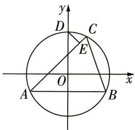

图 1

点 C 在第一象限, 点 D 为圆 O 与 y 轴正半轴的交点, $DE \perp AC$ 于 E, 且 $\frac{|AE|}{|AC|} = \frac{1}{2} + \frac{\sqrt{5}}{6}$ , 则 $|BC| =$ \_\_\_\_ .

解析 由题意知 $|AE| = |CE| + |CB|$ ，

所以 $\frac{|AE|}{|AC|} = \frac{|AC| + |BC|}{2|AC|} = \frac{1}{2} +\frac{|BC|}{2|AC|} = \frac{1}{2} +\frac{\sqrt{5}}{6}$ 所以 $\frac{|BC|}{|AC|} = \frac{\sqrt{5}}{3}.$

设 $B(m,n)$ ，其中 m>0, n<0 。由圆的对称性可得 $A(-m,n)$ ，则 $2m=|AB|=4$ ，解得 m=2。

【防错谨记】设出点的坐标后，要根据点的位置确定参数 $m, n$ 的取值范围

又 $m^2 + n^2 = 5$ ，所以 $n = -1$ . 所以 $A(-2, -1), B(2, -1)$ .

设 $C(s,t)(s > 0,t > 0)$ ，则 $s^2 +t^2 = 5$ ①，且 $\frac{(s - 2)^2 + (t + 1)^2}{(s + 2)^2 + (t + 1)^2} = \frac{5}{9}$ ②.

联立①②, 解得 $\left\{\begin{aligned}s=1,\\ t=2\end{aligned}\right.$ (另一组解不合题意, 舍去), 则 $C(1,2)$ , 所以 $|BC|=\sqrt{(1-2)^{2}+(2+1)^{2}}=\sqrt{10}.$

调研 13: (雪花曲线|2024 江苏无锡四校 12 月学情调研) 如图 2 所示的“雪花曲线”也叫“科赫雪花”, 它是由等边三角形生成的. 将等边三角形每条边三等分,

# 科学记忆

以每条边三等分的中间部分为边向外作正三角形,再将每条边的中间部分去掉,这称为“一次分形”;再用同样的方法将所得图形中的每条线段重复上述操作,这称为“二次分形”……依次进行“n次分形”( $n \in \mathbf{N}^{*}$ ).规定:一个分形图中所有线段的长度之和为该分形图的长度.若将边长为1的正三角形“n次分形”后所得分形图的长度不小于120,则n的最小值是\_\_\_\_.(参考数据: $\lg 2 \approx 0.301$ , $\lg 3 \approx 0.477$ )

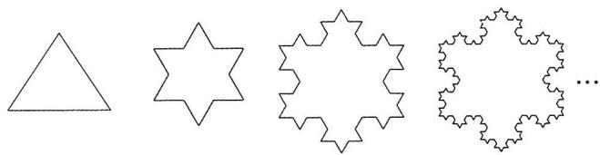

图2

解析 依题意可得“ $n$ 次分形”图的长度是“( $n - 1$ )次分形”图的长度的 $\frac{4}{3} (n\geqslant 2)$

易知“一次分形”图的长度为 $\frac{1}{3}\times4\times3=4$ ，

所以“n 次分形”图的长度为 $4 \times \left( \frac{4}{3} \right)^{n-1}$ .

令 $4 \times \left(\frac{4}{3}\right)^{n-1} \geqslant 120$ ，即 $\left(\frac{4}{3}\right)^{n-1} \geqslant 30$ ，两边同时取对数得 $(n-1)(2\lg 2 - \lg 3) \geqslant 1 + \lg 3$ ，

所以 $n - 1 \geqslant \frac{1 + \lg 3}{2\lg 2 - \lg 3} \approx \frac{1 + 0.477}{2 \times 0.301 - 0.477} \approx 11.8$ ，又 $n \in \mathbb{N}^*$ ，则 $n \geqslant 13$

故 n 的最小值是13.

调研 14: (体重与身高模型 |2024 山东潍坊 12 月素养测试) 某地区未成年男性的身高 x (单位: cm) 与体重平均值 y (单位: kg) 的关系如表 1:

表 1 未成年男性的身高与体重平均值

<table><tr><td>x/cm</td><td>60</td><td>70</td><td>80</td><td>90</td><td>100</td><td>110</td><td>120</td><td>130</td><td>140</td><td>150</td><td>160</td><td>170</td></tr><tr><td>y/kg</td><td>6.13</td><td>7.9</td><td>9.99</td><td>12.15</td><td>15.02</td><td>17.5</td><td>20.92</td><td>26.86</td><td>31.11</td><td>38.85</td><td>47.25</td><td>55.05</td></tr></table>

直观分析数据的变化规律,可选择指数函数模型、二次函数模型、幂函数模型近似地描述未成年男性的身高与体重平均值之间的关系.为使函数拟合度更好,引入拟合函数和实际数据之间的残差平方和、拟合优度判断系数 $R^{2}$ (如表2).残差平方和越小、拟合优度判断系数 $R^{2}$ 越接近1,拟合度越高.

# 科学记忆

目标简化:筛选出记忆目标中具有代表性的部分,用其取代记忆目标的整体,是简化记忆的又一常用方法
更多资源, 找vx:GZSJJ2000

表 2 拟合函数对比

<table><tr><td>函数模型</td><td>函数解析式</td><td>残差平方和</td><td>R2</td></tr><tr><td>指数函数</td><td>y=2.004e0.0197x</td><td>6.6764</td><td>0.9976</td></tr><tr><td>二次函数</td><td>y=0.0037x2-0.431x+19.6973</td><td>8.2605</td><td>0.9971</td></tr><tr><td>幂函数</td><td>y=0.001x2.1029</td><td>74.6846</td><td>0.9736</td></tr></table>

（1）哪种模型是最优模型？说明理由.

（2）根据生物学知识,人体细胞是人体结构和生理功能的基本单位,是生长、发育的基础.假设身高与骨细胞数量成正比,比例系数为 $k_{1}$ ;体重与肌肉细胞数量成正比,比例系数为 $k_{2}$ .记时刻t的未成年时期骨细胞数量 $G(t)=G_{0}\mathrm{e}^{r_{1}t}$ ,其中 $G_{0}$ 和 $r_{1}$ 分别表示人体出生时骨细胞数量和增长率,记时刻t的未成年时期肌肉细胞数量 $J(t)=J_{0}\mathrm{e}^{r_{2}t}$ ,其中 $J_{0}$ 和 $r_{2}$ 分别表示人体出生时肌肉细胞数量和增长率.求体重y关于身高x的函数.

（3）在（2）的条件下,若 $k_{2}J_{0}\left(\frac{1}{k_{1}G_{0}}\right)^{\frac{r_{2}}{r_{1}}} = 0.001$ , $\frac{r_{2}}{r_{1}} = 2.1029$ , 当刚出生的婴儿身高为50 cm时,（1）（2）中的哪个模型跟实际情况更符合?说明理由.

注： $e^{0.985}\approx2.677\ 81,50^{2.1029}\approx3\ 739.07$ ; 婴儿体重 $y\in[2.5,4)$ 符合实际，婴儿体重 $y\in[4,5)$ 较符合实际，婴儿体重 $y\in[5,6)$ 不符合实际.

解析 （1） 因为 6.6764 < 8.2605 < 74.6846, 所以指数函数模型残差平方和最小.

因为 0.9736 < 0.9971 < 0.9976，所以指数函数模型 $R^{2}$ 最接近 1.

所以指数函数模型是最优模型.

【明关键】这里只需正确理解并准确提取材料信息，不必计算

（2） 因为 $x = k_{1}G(t) = k_{1}G_{0}\mathrm{e}^{r_{1}t}$ , 所以 $\mathrm{e}^{r_1t} = \frac{x}{k_1G_0}$ .

因为 $y = k_{2}J(t) = k_{2}J_{0}\mathrm{e}^{r_{2}t}$ ，所以 $\mathrm{e}^{r_2t} = \frac{y}{k_2J_0}$ ，所以 $\left(\frac{x}{k_1G_0}\right)^{r_2} = \mathrm{e}^{r_1r_2t} = \left(\frac{y}{k_2J_0}\right)^{r_1}$ .

所以体重 y 关于身高 x 的函数为 $y = k_{2} J_{0} \left( \frac{x}{k_{1} G_{0}} \right)^{\frac{r_{2}}{r_{1}}}$ .

（3） 把 $x = 50$ 代入 $y = 2.004 \mathrm{e}^{0.0197x}$ , 得 $y \approx 2.004 \times 2.67781 \approx 5.3663 \in [5,6)$ , 不符合实际.

把 $k_{2}J_{0}\left(\frac{1}{k_{1}G_{0}}\right)^{\frac{r_{2}}{r_{1}}} = 0.001, \frac{r_{2}}{r_{1}} = 2.1029$ 代入 $y = k_{2}J_{0}\left(\frac{x}{k_{1}G_{0}}\right)^{\frac{r_{2}}{r_{1}}}$ 得 $y = 0.001x^{2.1029}$ ,

把 $x = 50$ 代入 $y = 0.001x^{2.1029}$ ，得 $y\approx 0.001\times 3739.07\approx 3.7391\in [2.5,4)$ ，符合实际，

所以（2）中幂函数模型更符合实际情况.

# 情境题解读与预测

# 高考必破5大创新设问情境问题

# 情境 1 新定义

【情境解读与预测】近年来高考中越来越多地出现新定义问题，如:2023 新课标 I 卷第 10 题，考查新定义 “声压级”；2023 北京卷第 21 题，考查新定义运算 “ $r_k = \max\{i \mid B_i \leq A_k, i \in \{0,1,2,\cdots,m\}\}$ ”；2023 上海卷第 16 题，考查新定义 “自相关曲线”；2023 上海春季卷第 19 题，考查新定义 “体形系数”……新定义问题着重考查学习能力、知识水平、创新意识和综合素养，解题关键在于从新定义中抽象出定义的本质，类比已学知识的思想和方法，并完成解答.

调研 1: (新定义曼哈顿距离 |2024 江苏苏州中学、常州高级中学等四校 12 月联考)“曼哈顿距离”是十九世纪的数学家赫尔曼·闵可夫斯基所创, 定义如下: 直角坐标平面上任意两点 $A(x_{1}, y_{1}), B(x_{2}, y_{2})$ 的曼哈顿距离为 $d(A, B) = |x_{1} - x_{2}| + |y_{1} - y_{2}|$ . 已知动点 $N$ 在圆 $x^{2} + y^{2} = 9$ 上, 定点 $M(3, 4)$ , 则 $M, N$ 两点的曼哈顿距离的最大值为 \_\_\_\_.

去情境化审题

<table><tr><td>情境类型</td><td>情境嵌入型</td></tr><tr><td>去情境梳理问题</td><td>点 $A(x_1,y_1),B(x_2,y_2)$ 的曼哈顿距离为 $d(A,B)=|x_1-x_2|+|y_1-y_2|$ ,设出N点坐标,即可表示出M,N两点的曼哈顿距离,结合基本不等式或三角函数的性质可求最值。思路一 设出点N的坐标,利用基本不等式求最值。思路二 利用圆的参数方程设出点N的坐标,结合三角函数的性质求最值</td></tr></table>

解析 方法一 设 $N(x,y)$ ，则 $x^{2}+y^{2}=9$ ，从而 $-3\leqslant x\leqslant3,-3\leqslant y\leqslant3$ .

因为 $9 = x^{2} + y^{2}\geqslant \frac{(x + y)^{2}}{2}$ 所以 $(x + y)^{2}\leqslant 18$ ，则 $-3\sqrt{2}\leqslant x + y\leqslant 3\sqrt{2}.$

所以 $d(M, N) = |3 - x| + |4 - y| = 3 - x + 4 - y = 7 - (x + y) \leqslant 7 + 3\sqrt{2}$ , 当且仅当 $x = y = -\frac{3\sqrt{2}}{2}$ 时, 等号成立, 即所求最大值为 $7 + 3\sqrt{2}$ .

# 科学记忆

方法二 设 $N(3\cos \theta, 3\sin \theta)$ ，则 M, N 两点的曼哈顿距离 $d(M, N) = |3 - 3\cos \theta| + |4 -$

【小技巧】N 为圆心为 $(0,0)$ 的圆上的点，则可利用圆的参数方程 $\left\{\begin{aligned} x &= a + r\cos\theta, \\ y &= b + r\sin\theta \end{aligned}\right.$ （圆心坐标为 $(a,b)$ ， $\theta$ 为参数，r 为半径）设点的坐标，从而结合三角函数的性质求最值，简化运算 $3\sin\theta| = 3 - 3\cos\theta + 4 - 3\sin\theta = 7 - 3\sqrt{2}\sin\left(\theta + \frac{\pi}{4}\right) \leqslant 7 + 3\sqrt{2}$ ，所以 M, N 两点的曼哈顿距离的最大值为 $7 + 3\sqrt{2}$ .

调研 2: (新定义欧拉函数 |2024 山东青岛二中 12 月月考 |多选) 欧拉函数 $\varphi(n)(n \in \mathbf{N}^{*})$ 的函数值等于所有不超过正整数 $n$ 、且与 $n$ 互质的正整数的个数 (公约数只有 1 的两个正整数称为互质正整数), 例如, $\varphi(3)=2, \varphi(4)=2$ , 则 ( )

$\quad$A. $\varphi(4)\varphi(6)=\varphi(10)$

$\quad$B. 当 $n$ 为奇数时, $\varphi(n) = n - 1$

$\quad$C. 数列 $\{\varphi (2^n)\}$ 为等比数列

$\quad$D. 数列 $\{\frac{\varphi(2^n)}{\varphi(3^n)}\}$ 的前 $n$ 项和小于 $\frac{3}{2}$

# 去情境化审题

<table><tr><td>情境类型</td><td>情境嵌入型</td></tr><tr><td>去情境梳理问题</td><td> $\varphi(n)(n\in\mathbf{N}^{*})$ 等于所有不超过正整数n、且与n互质的正整数的个数</td></tr></table>

# 解析

<table><tr><td>选项</td><td>分析过程</td><td>正误</td></tr><tr><td>A</td><td> $\varphi(4)=2,\varphi(6)=2,\varphi(10)=4\rightarrow\varphi(4)\varphi(6)=\varphi(10)$ </td><td>√</td></tr><tr><td>B</td><td> $\varphi(9)=6\neq8$ ,不满足 $\varphi(n)=n-1$ 【举反例】直接证明较困难,可举反例说明选项错误</td><td>×</td></tr><tr><td>C</td><td>小于 $2^{n}$ 的所有正奇数均与 $2^{n}$ 互质→小于 $2^{n}$ 的所有正奇数有 $2^{n-1}$ 个→ $\varphi(2^{n})=$ 【会思考】 $2^{n}$ 的所有因数都为2的幂数,而奇数不能被2整除,故 $2^{n}$ 与奇数互质,小于 $2^{n}$ 的正奇数有 $2^{n}\times\frac{1}{2}=2^{n-1}$ (个) $2^{n-1}\rightarrow$ 数列 $\{\varphi(2^{n})\}$ 为等比数列</td><td>√</td></tr><tr><td>D</td><td>小于 $3^{n}$ 大于0的所有3的倍数均与 $3^{n}$ 不互质,共有 $3^{n-1}$ 个→小于 $3^{n}$ 的所有与 $3^{n}$ 互质的正整数共有 $2\times3^{n-1}$ 个→ $\varphi(3^{n})=2\times3^{n-1}\rightarrow\frac{\varphi(2^{n})}{\varphi(3^{n})}=\frac{2^{n-1}}{2\times3^{n-1}}=\frac{1}{2}\times\left(\frac{2}{3}\right)^{n-1}\rightarrow$ 令 $a_{n}=\frac{1}{2}\times\left(\frac{2}{3}\right)^{n-1}\rightarrow a_{1}+a_{2}+\cdots+a_{n}=\frac{1}{2}\times\frac{1-\left(\frac{2}{3}\right)^{n}}{1-\frac{2}{3}}<\frac{3}{2}\rightarrow D$ 正确</td><td>√</td></tr></table>

故选 ACD.

科学记忆

调研 3: (新定义离散曲率 | 2024 广州执信中学 1 月模拟) 设 $P$ 为多面体 $M$ 的一个顶点, 定义多面体 $M$ 在 $P$ 处的离散曲率为 $1 - \frac{1}{2\pi} (\angle Q_{1}PQ_{2} + \angle Q_{2}PQ_{3} + \cdots + \angle Q_{k-1}PQ_{k} + \angle Q_{k}PQ_{1})$ , 其中 $Q_{i} (i = 1,2,\cdots,k,k \geqslant 3)$ 为多面体 $M$ 的所有与点 $P$ 相邻的顶点, 且平面 $Q_{1}PQ_{2}, Q_{2}PQ_{3}, \cdots, Q_{k-1}PQ_{k}, Q_{k}PQ_{1}$ 是多面体 $M$ 的所有以 $P$ 为公共点的面. 图 1 是正四面体、正八面体、正十二面体和正二十面体 (每个面都是全等的正多边形), 若它们在各顶点处的离散曲率分别是 $a, b, c, d$ , 则 $a, b, c, d$ 的大小关系是 ( )

$\quad$A. $a > b > c > d$

$\quad$B. $a > b > d > c$

$\quad$C. $b > a > d > c$

$\quad$D. $c > d > b > a$

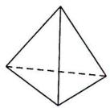  
正四面体

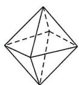  
正八面体

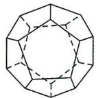  
正十二面体

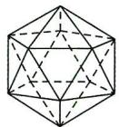  
正二十面体  
图1

# 去情境化审题

<table><tr><td>情境类型</td><td>情境结合型</td></tr><tr><td>去情境梳理问题</td><td>多面体M在P处的离散曲率为 $1 - \frac{1}{2\pi} (\angle Q_1PQ_2 + \angle Q_2PQ_3 + \cdots + \angle Q_{k-1}PQ_k + \angle Q_kPQ_1)$ ,如对于三棱锥P-ABC,其在点P处的离散曲率为 $1 - \frac{1}{2\pi} (\angle APB + \angle BPC + \angle CPA)$ .根据定义,分别计算出a,b,c,d的值即可判断</td></tr></table>

解析 正四面体中每个面均为正三角形,则每个角均为 $\frac{\pi}{3}$ ,从而 $a=1-\frac{1}{2\pi}(\frac{\pi}{3}\times3)=\frac{1}{2}$ ;

正八面体中每个面均为正三角形,则每个角均为 $\frac{\pi}{3}$ ,从而 $b=1-\frac{1}{2\pi}(\frac{\pi}{3}\times4)=\frac{1}{3}$ ;

正十二面体中每个面均为正五边形,则每个角均为 $\frac{3\pi}{5}$ ,从而 $c=1-\frac{1}{2\pi}\left(\frac{3}{5}\pi\times3\right)=\frac{1}{10}$ ;

正二十面体中每个面均为正三角形,则每个角均为 $\frac{\pi}{3}$ ,从而 $d=1-\frac{1}{2\pi}(\frac{\pi}{3}\times5)=\frac{1}{6}$ .

【点关键】理解定义、找准各正多面体的顶点所对应的“角”的个数与弧度数是关键因为 $\frac{1}{2}>\frac{1}{3}>\frac{1}{6}>\frac{1}{10}$ ，所以a>b>d>c，故选B.

调研 4 (试题调研原创|新定义比等差数列|多选) 在数列 $\{a_{n}\}$ 中, 若对任意的 $n \in \mathbf{N}^{*}$ , 都有 $\frac{a_{n+2}}{a_{n+1}} - \frac{a_{n+1}}{a_{n}} = t$ ( $t$ 为常数), 则称数列 $\{a_{n}\}$ 为比等差数列, $t$ 称为比公

# 科学记忆

间隔记忆法 每次背诵、记忆公式时,不需要死记硬背,每次记住后,隔半天、一天再背一次来强化记忆,这样记得更快、更牢. 更多资源,找vx:GZSJJ2000

差. 以下命题为真命题的是

( )

$\quad$A. 等比数列一定是比等差数列, 等差数列不一定是比等差数列   
$\quad$B. 若数列 $\{a_{n}\}$ 满足 $a_{n} = \frac{2^{n - 1}}{n^{2}}$ ，则数列 $\{a_{n}\}$ 是比等差数列，且比公差 $t = \frac{1}{2}$   
$\quad$C. 若数列 $\{a_{n}\}$ 满足 $a_1 = 1, a_2 = 1, a_n = a_{n-1} + a_{n-2} (n \geqslant 3)$ , 则该数列不是比等差数列  
$\quad$D. 若 $\{a_{n}\}$ 是比等差数列, 且 $a_{1} = a_{2} = 1, a_{3} = 2$ , 则数列 $\{\frac{n - 1}{a_{n + 1}}\}$ 的前 $n$ 项和为 $1 - \frac{1}{n!}$

# 去情境化审题

<table><tr><td>情境类型</td><td>情境嵌入型</td></tr><tr><td rowspan="5">去情境梳理问题</td><td> $\{a_n\}$ 为比等差数列 $\Leftrightarrow \frac{a_{n+2}}{a_{n+1}} - \frac{a_{n+1}}{a_n} = t(t \text{为常数}), t \text{为比公差}$ </td></tr><tr><td>A选项→分别设出等比数列的公比,等差数列的公差,根据定义依次判断即可</td></tr><tr><td>B选项→根据比等差数列的定义,判断当 $a_n = \frac{2^{n-1}}{n^2}$ 时, $\frac{a_{n+2}}{a_{n+1}} - \frac{a_{n+1}}{a_n}$ 是否为常数即可</td></tr><tr><td>C选项→计算出数列的前几项,验证 $\frac{a_3}{a_2} - \frac{a_2}{a_1}$ 与 $\frac{a_4}{a_3} - \frac{a_3}{a_2}$ 是否相等即可</td></tr><tr><td>D选项→根据比等差数列的定义求出数列 $\{\frac{a_{n+1}}{a_n}\}$ 的通项公式 $\frac{a_{n+1}}{a_n} = n \rightarrow$ 两边同取对数,结合累加法得到 $a_{n+1} = n! \rightarrow$ 利用裂项相消法即可求出 $\{\frac{n-1}{a_{n+1}}\}$ 的前 $n$ 项和</td></tr></table>

# 解析

<table><tr><td>选项</td><td>分析过程</td><td>正误</td></tr><tr><td>A</td><td>若数列{an}为等比数列,且公比为q→ $\frac{a_{n+2}}{a_{n+1}} - \frac{a_{n+1}}{a_n}$ =q-q=0,为常数→等比数列一定是比等差数列;若数列{an}为等差数列,且公差为d→当d=0时, $\frac{a_{n+2}}{a_{n+1}} - \frac{a_{n+1}}{a_n}$ =1-1=0,为常数→{an}是比等差数列→当d≠0时, $\frac{a_{n+2}}{a_{n+1}} - \frac{a_{n+1}}{a_n}$ 不为常数→{an}不是比等差数列→【分类讨论】等比数列中公比不为0,但在等差数列中公差可为0,注意分类讨论.此处也可举特例说明,如取d=1等差数列不一定是比等差数列</td><td>√</td></tr><tr><td>B</td><td>an= $\frac{2^{n-1}}{n^2}$ → $\frac{a_{n+2}}{a_{n+1}}$ − $\frac{a_{n+1}}{a_n}$ = $\frac{2(n+1)^2}{(n+2)^2}$ − $\frac{2n^2}{(n+1)^2}$ ,不为常数→{an}不是比等差数列</td><td>×</td></tr></table>

# 科学记忆

续表

<table><tr><td>选项</td><td>分析过程</td><td>正误</td></tr><tr><td>C</td><td> $a_{1}=1,a_{2}=1,a_{n}=a_{n-1}+a_{n-2}(n\geqslant3)\rightarrow a_{3}=1+1=2,a_{4}=1+2=3\rightarrow\frac{a_{3}}{a_{2}}-\frac{a_{2}}{a_{1}}=$  $2-1=1,\frac{a_{4}}{a_{3}}-\frac{a_{3}}{a_{2}}=\frac{3}{2}-2=-\frac{1}{2}\rightarrow\frac{a_{3}}{a_{2}}-\frac{a_{2}}{a_{1}}\neq\frac{a_{4}}{a_{3}}-\frac{a_{3}}{a_{2}}\rightarrow$ 数列 $\{a_{n}\}$ 不是比等差数列</td><td>√</td></tr><tr><td>D</td><td> $\{a_{n}\}$ 为比等差数列, $\frac{a_{2}}{a_{1}}=1,\frac{a_{3}}{a_{2}}=2\rightarrow\frac{a_{3}}{a_{2}}-\frac{a_{2}}{a_{1}}=1\rightarrow\{\frac{a_{n+1}}{a_{n}}\}$ 是以1为首项、1为公差的等差数列 $\rightarrow\frac{a_{n+1}}{a_{n}}=n\rightarrow a_{n+1}=na_{n}\rightarrow\lg a_{n+1}=\lg n+\lg a_{n}\rightarrow(\lg a_{n+1}-\lg a_{n})+( \lg a_{n}-\lg a_{n-1})+\cdots+(\lg a_{2}-\lg a_{1})=\lg n+\lg(n-1)+\cdots+\lg 1\rightarrow\lg a_{n+1}-$  $\lg a_{1}=\lg[n\cdot(n-1)\cdot\cdots\cdot1]=\lg n!\rightarrow\lg a_{n+1}=\lg n!\rightarrow a_{n+1}=n!\rightarrow\frac{n-1}{n!}=\frac{1}{(n-1)!}-\frac{1}{n!}\rightarrow$ 数列 $\{\frac{n-1}{a_{n+1}}\}$ 的前n项和 $S_{n}=(\frac{1}{0!}-\frac{1}{1!})+(\frac{1}{1!}-\frac{1}{2!})+\cdots+[ \frac{1}{(n-1)!}-\frac{1}{n!}]=1-\frac{1}{n!}$ </td><td>√</td></tr></table>

故选 ACD.

# 情境 2 答案不唯一，开放设问

【情境解读与预测】开放性试题由于条件、方法与结果的不确定性，呈现出条件开放、过程开放、结论开放等特点，没有唯一固定答案，因此在评价研究与实践中发挥了越来越重要的作用，也是近几年高考的热点题型之一。如：2023 北京卷第 13 题，考查三角函数的性质；2023 新课标Ⅱ卷第 15 题，考查直线与圆的位置关系；2021 新高考Ⅱ卷第 14 题，考查函数的性质；2021 全国乙卷第 16 题，考查空间几何体的三视图……开放性试题以核心素养和关键能力为考查目标，考查学生思维的灵活性、创造性，往往需要从多个角度进行思考和探索，才可完成解答。

调研 1: (试题调研原创) 设公比为 $q$ 的等比数列 $\{a_{n}\}$ 的前 $n$ 项和为 $S_{n}, a_{n} < a_{n+1}$ , 且 $\forall n \in \mathbf{N}^{*}, \frac{a_{n}}{S_{n}}>1 - \frac{1}{q}$ . 写出一个满足条件的数列 $\{a_{n}\}$ 的通项公式: $a_{n}=$ \_\_\_\_.

【审题+破题】由 $a_{n} < a_{n+1}$ 知等比数列 $\{a_{n}\}$ 是递增数列，为方便计算，不妨取 $a_{1} > 0, q > 1$ ，结合 $\forall n \in \mathbb{N}^{*}, \frac{a_{n}}{S_{n}} > 1 - \frac{1}{q}$ 进一步缩小参数范围，从而得到结果

# 科学记忆

联合记忆法 把相关联的两个或两个以上的记忆目标,联合在一起记忆,往往比孤立地记忆其中一个容易得多. 常见的联合方式有近似联系,反亚联合逆进联合更多资源,找VX:GZSJ2000

解析 由题意知 $a_{n} = a_{1}q^{n - 1}$ ，则 $a_{n} - a_{n + 1} = a_{1}q^{n - 1}(1 - q) < 0$ ，不妨取 $a_1 > 0, q > 1.$

由 $\frac{a_n}{S_n} > 1 - \frac{1}{q}$ 得 $\frac{a_1 q^{n-1}}{\frac{a_1 (1 - q^n)}{1 - q}} > \frac{q - 1}{q}$ , 即 $q^n > q^n - 1$ , 当 $a_1 > 0, q > 1, n \in \mathbb{N}^*$ 时, 此式恒成立,

故可填 ${3}^{n}$ (答案不唯一).

【解后反思】实际上, 判断出 $\{a_{n}\}$ 是递增数列后, 可直接取特例验证, 解题更方便. 对于此类题型, 均可先从简单条件入手找特例, 再进行验证求解

调研 2 (试题调研原创) 定义在 $\mathbf{R}$ 上的非常数函数 $f(x)$ 满足 ① $f(x+y)=f(x)f(1-y)+f(1-x)f(y)$ ; ② $f(x)$ 为奇函数. 请写出符合上述条件的一个函数解析式: $f(x)=$ \_\_\_\_.

【审题+破题】由此式联想两角和的正弦公式 $\sin(x+y)=\sin x\cos y+\cos x\sin y$ ，初步构造函数 $y=\sin x$ ，再联想到利用诱导公式转换三角函数名称，“余弦”变“正弦”，从而引入 $\frac{\pi}{2}$ ，进而构造出函数 $f(x)=\sin\frac{\pi x}{2}$ ，最后验证此函数满足题意即可。若不满足题意，则继续修正

解析 根据题意,不妨取 $f(x)=\sin\frac{\pi x}{2}$ ,易知其定义域为R.

$f(x+y)=\sin\frac{\pi(x+y)}{2}=\sin\left(\frac{\pi x}{2}+\frac{\pi y}{2}\right)=\sin\frac{\pi x}{2}\cos\frac{\pi y}{2}+\cos\frac{\pi x}{2}\sin\frac{\pi y}{2}=\sin\frac{\pi x}{2}\sin\left(\frac{\pi}{2}-\frac{\pi y}{2}\right)+$ $\sin\left(\frac{\pi}{2}-\frac{\pi x}{2}\right)\sin\frac{\pi y}{2}=f(x)f(1-y)+f(1-x)f(y)$ ，满足①.

$f(-x) = \sin (-\frac{\pi}{2} x) = -\sin \frac{\pi x}{2} = -f(x)$ , 所以 $f(x)$ 为奇函数, 满足②.

故可填 $\sin\frac{\pi x}{2}$ (答案不唯一).

【小技巧】开放性填空题，找出一个满足题意的答案即可.实际上， $f(x)=-\sin\frac{3\pi x}{2}$ ， $f(x)=\sin\frac{5\pi x}{2}$ ，…均满足题意

调研 3 (2024 广东实验中学 12 月一模) 设 $S_{n}$ 是数列 $\{a_{n}\}$ 的前 $n$ 项和, 写出同时满足下列条件的数列 $\{a_{n}\}$ 的一个通项公式: \_\_\_\_.

①数列 $\{\frac{S_n}{n}\}$ 是等差数列；② $\forall n\geqslant 2,S_{n + 1} + S_{n - 1} > 2S_n$ ；③ $\exists n\in \mathbf{N}^*$ ， $S_{n} < 0$

【审题+破题】从条件①入手，设出等差数列 $\left\{\frac{S_{n}}{n}\right\}$ 的公差，求出数列 $\left\{a_{n}\right\}$ 的表达式，再结合条件②③即可得出结果。实际上，数列 $\left\{\frac{S_{n}}{n}\right\}$ 是等差数列 $\Leftrightarrow$ 数列 $\left\{a_{n}\right\}$ 为等差数列

解析 设 $\{\frac{S_n}{n}\}$ 的公差为 $d$ ，则 $\frac{S_n}{n} = S_1 + (n - 1)d \Rightarrow S_n = a_1n + d(n^2 - n)$ ，所以 $S_{n+1} = a_1(n + 1) + d(n^2 + n)$ ，两式相减可得 $a_{n+1} = a_1 + 2nd \Rightarrow a_n = a_1 + 2(n - 1)d$ ，故 $a_{n+1} - a_n = 2d$ ，即 $\{a_n\}$ 是以 $2d$ 为公差的等差数列.

$S_{n + 1} + S_{n - 1} > 2S_n\Rightarrow a_{n + 1} > a_n$ ，则 $2d > 0.$ 由 $\exists n\in \mathbf{N}^*$ ， $S_{n} <   0$ 可知 $a_1 <   0$

【破障碍】根据已知的条件推出数列 $\{a_{n}\}$ 的首项与公差所满足的条件是解题的关键

由上述分析,不妨令 $a_{n}=2n-3$ ,满足题意.故可填 $a_{n}=2n-3$ (答案不唯一).

调研 4 (2024 江苏苏州 1 月模拟) 若圆 $C$ 与圆 $M: x^{2} - 2x + y^{2} = 0$ 相切于点 $A(2,0)$ , 且与直线 $3x - 4y - 12 = 0$ 相切, 写出一个符合要求的圆 $C$ 的标准方程: \_\_\_\_.

【审题+破题】两圆相切，则两圆心连线所在直线过切点，且圆心距为半径差或半径和；直线与圆相切，则圆心到直线的距离为半径。据此列式求出圆 C 的圆心与半径

解析 设圆 C 的半径为 r，圆心 C 到直线 3x - 4y - 12 = 0 的距离为 d。由题意知圆 M 的圆心为 $(1,0)$ ，半径为 1，连接 CM，则直线 CM 过点 A(2,0)，故圆 C 的圆心 C 在 x 轴上。

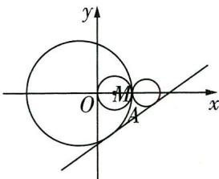

图1

若两圆内切,则 $C(2-r,0)$ , $\frac{|3(2-r)-4\times0-12|}{5}=r$ , 解得 r=3,

【数形结合】如图1，圆M与直线3x-4y-12=0相离，则当两圆内切时，结合图形即可得到C的横坐标为2-r；当两圆外切时，可得C的横坐标为 $2+r$

所以圆 C 的标准方程为 $(x+1)^{2} + y^{2} = 9$ .

若两圆外切, 则 $C(2 + r, 0)$ , 由题意可得 $\frac{|3(2 + r) - 4 \times 0 - 12|}{5} = r$ , 解得 $r = \frac{3}{4}$ ,

【敲黑板】在常规题目中，注意圆与圆的相切分两种情况，即内切和外切，两种情况缺一不可。但本题为开放性试题，只算其一即可

所以圆 C 的标准方程为 $\left(x-\frac{11}{4}\right)^{2}+y^{2}=\frac{9}{16}$ .

故可填 $(x + 1)^2 + y^2 = 9$ （或 $(x - \frac{11}{4})^2 + y^2 = \frac{9}{16}$ ，答案不唯一）.

调研 5: (双空题12024 山东潍坊 12 月阶段练习) 如图 2, 平面 $\alpha$ 与圆柱相交, 而且平面 $\alpha$ 与圆柱的轴不垂直, 点 $P$ 为平面 $\alpha$ 与圆柱表面交线上的任意一点, 则点 $P$ 的轨迹 $\Gamma$ 为 \_\_\_\_ (从“圆”“椭圆”“双曲线”“抛物线”中选择一个填写). 在圆柱内部放置两个半径与圆柱底面半径相同的球, 平面 $\alpha$ 分别与两球切于 $E, F$ 两点, 过

# 科学记忆

反正联合:把具有某种相反意义的两个记忆目标联合在一起.如把充分条件的定义与必要条件的定义联合在一起.把三垂线定理更难资源联合找√x.等SZJJ2000

点 $P$ 作圆柱的母线, 分别与两球切于 $B, C$ 两点, 记线段 $EF$ 的长度为 $m$ , 线段 $BC$ 的长度为 $n$ , 且 $n > m$ . 在平面 $\alpha$ 内 $\Gamma$ 的任意两条互相垂直的切线的交点为 $A$ , 建立适当的坐标系, 则动点 $A$ 的轨迹方程为 \_\_\_\_ (用含 $m, n$ 的式子表示).

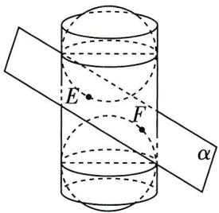

图2

思路导引 根据圆柱的结构特征可直接判断 $\Gamma$ 的形状. 结合球体切线长性质得到 $|PE| + |PF| = |BC| = n$ , 为方便计算, 取椭圆焦点在 $x$ 轴上, 确定一个椭圆方程, 再利用椭圆切线垂直的关系求动点 $A$ 的轨迹方程.

解析 第一空 平面 $\alpha$ 与圆柱相交, 且平面 $\alpha$ 与圆柱的轴不垂直, 则截面为椭圆, 所以点 $P$ 的轨迹 $\Gamma$ 为椭圆.

第二空 如图3, $G_{1}$ 为椭圆轨迹 $\Gamma$ 与BC的交点,而E,B,F,C分别是两个球体上的切点,连接 $G_{1}E,G_{1}F$ ,由空间上一点作同一个球体上的切线,切线长都相等,得 $|G_{1}E|=|G_{1}B|,|G_{1}F|=|G_{1}C|$ ,

所以 $|G_{1}E|+|G_{1}F|=|G_{1}B|+|G_{1}C|=|BC|=n,$

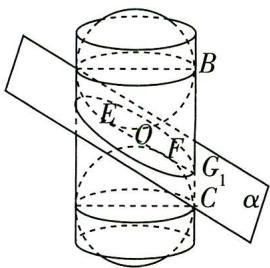

图3

【破障碍】判断出 $\Gamma$ 的形状后, 即可结合椭圆的定义寻求焦点和参数, 从而确定椭圆的方程

同理可得,椭圆 $\Gamma$ 上所有点到 E, F 两点的距离之和为 n,

所以椭圆 $\Gamma$ 的焦点为 E, F, 所以焦距 $2c = |EF| = m$ , 不妨取椭圆焦点在 x 轴上, 椭圆中心为原点, 则椭圆 $\Gamma$ 的标准方程为 $\frac{x^{2}}{\frac{n^{2}}{4}} + \frac{y^{2}}{\frac{n^{2} - m^{2}}{4}} = 1$ .

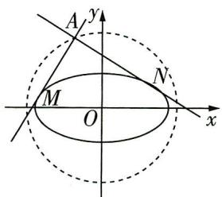

图4

如图4, 设 $A(x_0, y_0)$ . 当切线斜率都存在时, 设切线方程为 $y - y_0 = k(x - x_0)$ , 与椭圆 $\Gamma$ 的方程联立可得关于 $x$ 的方程 $(n^2 - m^2 + k^2 n^2)x^2 + 2kn^2(y_0 - x_0k)x + n^2(kx_0 - y_0)^2 - \frac{n^2(n^2 - m^2)}{4} = 0$ , 则 $\Delta = [2kn^2(y_0 - x_0k)]^2 - 4(n^2 -$ $m^2 + k^2 n^2) [n^2 (kx_0 - y_0)^2 - \frac{n^2 (n^2 - m^2)}{4}] = 0$ ，化简得关于 $k$ 的方程 $(4x_0^2 - n^2) k^2 - 8x_0y_0k + 4y_0^2 - n^2 + m^2 = 0$ ，故 $k_{AM}, k_{AN}$ 是方程的两个根，所以 $k_{AM}k_{AN} = \frac{4y_0^2 - n^2 + m^2}{4x_0^2 - n^2} = -1$ ，则 $x_0^2 + y_0^2 = \frac{2n^2 - m^2}{4}$ .

当一条切线斜率不存在, 一条切线斜率为0时, 点A的坐标为(±n/2, ±√n²-m²)/2, 满足x₀²+【易遗漏】注意对特殊情况的检验, 避免丢分 $y_{0}^{2}=\frac{2n^{2}-m^{2}}{4}$ . 所以动点A的轨迹方程为 $x^{2}+y^{2}=\frac{2n^{2}-m^{2}}{4}$ .

故填 $x^{2}+y^{2}=\frac{2n^{2}-m^{2}}{4}$ （答案不唯一）.

# 情境 3 结构不良设问

【情境解读与预测】近年来高考中结构不良设问的考查力度逐渐增大，如:2023 北京卷第 17 题，要求从三个条件中选择一个作为已知，求参数的值；2022 北京卷第 17 题，要求从两个条件中选择一个作为已知，求直线与平面所成角的正弦值；2022 新高考Ⅱ卷第 21 题，要求从三个条件中选取两个作为条件，证明另外一个成立，考查直线与双曲线的位置关系……结构不良设问是灵活性、开放性、创新性的集中体现,是实现“从能力立意到素养立意导向的转变”的载体之一，解题关键在于熟练掌握相关知识，恰当地选择熟悉的、最有把握的条件进行求解，虽然 2023 新课标全国卷没有涉及此类题，但此类题仍是高考命题的一大趋势，需要关注.

调研 1: (试题调研原创 | 二选一条件探索题) 记 $S_{n}$ 为各项均为正数的数列 $\{a_{n}\}$ 的前 $n$ 项和, 满足 $a_{n+1}^{2}=2S_{n}+n+1, a_{1}+a_{2}=3$ .

（1） 求数列 $\{a_{n}\}$ 的通项公式；  
（2） 数列 $\{b_{n}\}$ 满足 \_\_\_\_ ，求 $b_{n}$ 关于 n 的表达式，并求 $\{b_{n}\}$ 的前 n 项和 $T_{n}$ .

从“① $b_{n}=\sqrt{1+\frac{1}{a_{n}^{2}}+\frac{1}{a_{n+1}^{2}}}$ ；② $b_{1}=-2,b_{n+1}-b_{n}=a_{n}\cdot2^{a_{n}}$ ”两个条件中选择一个作为已知，完成解答.

注:如果选择多个条件分别解答,按第一个解答计分.

解析 （1） 当 $n = 1$ 时, $a_{2}^{2} = 2S_{1} + 1 + 1$ , 即 $a_{2}^{2} = 2a_{1} + 2$ ,

又 $a_1 + a_2 = 3$ ，所以 $a_1 = 1, a_2 = 2$

当 $n \geqslant 2$ 时， $a_{n+1}^2 - a_n^2 = 2S_n - 2S_{n-1} + 1$ ，所以 $a_{n+1}^2 = a_n^2 + 2a_n + 1 = (a_n + 1)^2$

由数列各项均为正数,可得 $a_{n+1}=a_{n}+1(n\geqslant2)$ ,

由于 $a_2 - a_1 = 1$ 适合上式，所以数列 $\{a_n\}$ 是首项为1，公差为1的等差数列，

【易遗漏】注意前面运算前提是 $n \geqslant 2$ ，不能直接下结论，许多同学缺少对 $a_{2} - a_{1} = 1$ 的检验从而 $a_{n} = 1 + (n - 1) \times 1 = n$ .

（2） 若选①, 则 $b_{1} = \sqrt{1 + \frac{1}{a_{1}^{2}} + \frac{1}{a_{2}^{2}}} = \sqrt{1 + \frac{1}{1} + \frac{1}{4}} = \frac{3}{2}$ ,

$b _ {n} = \sqrt {1 + \frac {1}{a _ {n} ^ {2}} + \frac {1}{a _ {n + 1} ^ {2}}} = \sqrt {1 + \frac {1}{n ^ {2}} + \frac {1}{(n + 1) ^ {2}}} = 1 + \frac {1}{n (n + 1)} = 1 + \frac {1}{n} - \frac {1}{n + 1},$

【巧变形】关键式变形方法如下： $1+\frac{1}{a_{n}^{2}}+\frac{1}{a_{n+1}^{2}}=1+\frac{1}{n^{2}}+\frac{1}{(n+1)^{2}}=1+\frac{(n+1)^{2}+n^{2}}{n^{2}(n+1)^{2}}=1+\frac{2n^{2}+2n+1}{n^{2}(n+1)^{2}}=1+\frac{2}{n(n+1)}+\frac{1}{n^{2}(n+1)^{2}}=\left[1+\frac{1}{n(n+1)}\right]^{2}$ ，核心是得到完全平方式

# 科学记忆

差别记忆法 有些数学知识之间存在许多共性,记忆时,只需记住一个基本的数学知识和这些数学知识间的差异.就可以记住所更有的这种方找称为:201912000

从而 $T_{n}=b_{1}+b_{2}+b_{3}+\cdots+b_{n}=(1+1-\frac{1}{2})+(1+\frac{1}{2}-\frac{1}{3})+\cdots+(1+\frac{1}{n}-\frac{1}{n+1})=n+1-\frac{1}{n+1}=\frac{n^{2}+2n}{n+1}.$

若选②,先求 $b_{n}$ 关于n的表达式.

方法一:待定系数法 $b_{n+1}-b_{n}=n\cdot2^{n}$ ，设 $\left[A(n+1)+B\right]\cdot2^{n+1}-(An+B)\cdot2^{n}=n\cdot2^{n}$

即 $(An+2A+B)\cdot2^{n}=n\cdot2^{n}$ ，则 $\left\{\begin{aligned}A&=1,\\ 2A+B&=0,\end{aligned}\right.$ 所以A=1,B=-2,

从而 $b_{n} = (n - 2)\cdot 2^{n}$ ，且 $b_{1} = -2$ 适合上式.

方法二: 累加法 + 错位相减法 $b_{n}=b_{1}+(b_{2}-b_{1})+(b_{3}-b_{2})+\cdots+(b_{n}-b_{n-1})=-2+1\times2^{1}+2\times2^{2}+3\times2^{3}+\cdots+(n-1)\times2^{n-1}$ ,

$2 b _ {n} = - 4 + 1 \times 2 ^ {2} + 2 \times 2 ^ {3} + 3 \times 2 ^ {4} + \dots + (n - 1) \times 2 ^ {n},$

两式作差可得 $-b_{n}=2+2+2^{2}+2^{3}+\cdots+2^{n-1}-(n-1)\times2^{n}=1+\frac{2^{n}-1}{2-1}-(n-1)\times2^{n}=(2-n)\times2^{n}$

从而 $b_{n} = (n - 2)\times 2^{n}$

接下来求 $T_{n}$

$T _ {n} = b _ {1} + b _ {2} + b _ {3} + \dots + b _ {n} = - 2 + 0 \times 2 ^ {2} + 1 \times 2 ^ {3} + \dots + (n - 2) \times 2 ^ {n},$

$2 T _ {n} = - 2 ^ {2} + 0 \times 2 ^ {3} + 1 \times 2 ^ {4} + \dots + (n - 1) \times 2 ^ {n} + (n - 2) \times 2 ^ {n + 1},$

两式作差可得 $-T_{n} = -2 + 2^{2} + 2^{3} + 2^{4} + \cdots + 2^{n} - (n - 2) \times 2^{n+1}$

$= - 2 + \frac {2 ^ {2} (2 ^ {n - 1} - 1)}{2 - 1} - (n - 2) \times 2 ^ {n + 1}$

【避陷阱】易因没注意到利用等比数列求和公式求和时项数为 $(n-1)$ 而出错，解题时要注意分析是否含第一项

$\begin{array}{l} = - 2 + 2 ^ {n + 1} - 4 - (n - 2) \times 2 ^ {n + 1} \\ = - 6 - (n - 3) \times 2 ^ {n + 1}. \\ \end{array}$

从而 $T_{n} = 6 + (n - 3)\times 2^{n + 1}$

调研 2: (四选一探索型 | 2024 北京大学附属中学 12 月阶段练习) 在 $\triangle ABC$ 中, $2a\sin A = (2b - c)\sin B + (2c - b)\sin C$ .

（1） 求 $A$ .

（2）从条件①,条件②,条件③,条件④这四个条件中选择一个作为已知,使 $\triangle ABC$ 存在且唯一确定,若 $D$ 是 $BC$ 边上的中点,求 $\triangle ADB$ 的面积.

条件①: $\cos B = -\frac{\sqrt{3}}{3}, c = 2$ ; 条件②: $b + a = 4 + 2\sqrt{3}, c = 2$ ;

条件③: $\sin C = \frac{\sqrt{2}}{2}, c = 4$ ; 条件④: $a = \frac{\sqrt{10}}{2}, b = \sqrt{3}$ .

注:如果选择的条件不符合要求,第（2）问得0分;如果选择多个符合要求的条件分别解答,按第一个解答计分.

解析 （1） $2a \sin \angle BAC = (2b - c) \sin B + (2c - b) \sin C,$

由正弦定理得 $2a^{2} = b(2b - c) + c(2c - b)$ ，整理得 $b^{2} + c^{2} - a^{2} = bc$

由余弦定理得 $\cos \angle BAC = \frac{b^2 + c^2 - a^2}{2bc} = \frac{bc}{2bc} = \frac{1}{2}$

因为 $\angle BAC$ 为 $\triangle ABC$ 的内角，即 $0 < \angle BAC < \pi$ ，所以 $\angle BAC = \frac{\pi}{3}$

（2） 若选择条件①: $\cos B = -\frac{\sqrt{3}}{3}, c = 2,$

【破瓶颈】条件①和④均不满足题意，条件②和③满足题意，故可从条件②③中任选其一求解，此处先给出条件①④不满足题意的原因

注意到 $\cos B = -\frac{\sqrt{3}}{3} = -\frac{1}{\sqrt{3}} < -\frac{1}{2} = \cos \frac{2\pi}{3}$ , 所以 $B > \frac{2\pi}{3}$ ,

【扫清障碍】函数 $y = \cos x$ 在 $(0, \pi)$ 上单调递减，由此比较大小

但此时 $\angle BAC+B+C>\angle BAC+B>\frac{\pi}{3}+\frac{2\pi}{3}=\pi$ ,这与三角形内角和定理矛盾,故条件①不满足题意.

若选择条件④: $a=\frac{\sqrt{10}}{2},b=\sqrt{3}$ ，由（1）知 $\angle BAC=\frac{\pi}{3}$

则由正弦定理得 $\frac{\sin B}{b} = \frac{\sin\angle BAC}{a}$ 即 $\frac{\sin B}{\sqrt{3}} = \frac{\frac{\sqrt{3}}{2}}{\frac{\sqrt{10}}{2}}$ 解得 $\sin B = \frac{3\sqrt{10}}{10}$

注意到 $\sin B = \sin (\pi - B) = \frac{3\sqrt{10}}{10} > \frac{\sqrt{3}}{2} = \sin \frac{\pi}{3} = \sin \angle BAC,$

所以此时 B 有两种取值, 即此时 $\triangle ABC$ 存在但不唯一确定, 故条件④不满足题意.

若选择条件③: $\sin C = \frac{\sqrt{2}}{2}, c = 4.$ 因为 $0 < C < \pi,$ 所以 $C = \frac{\pi}{4}$ 或 $C = \frac{3\pi}{4},$

【抓题眼】题目中是选取使△ABC存在且唯一确定的条件，所以此时需要确认能否舍根

# 科学记忆

系统记忆法 “总结+消化=记忆”, 即根据数学知识的系统性, 把知识进行恰当比较、分类、条理化. 这样记住的就不是零星的知识资源系列知识: GZSJJ2000

但是当 $C = \frac{3\pi}{4}$ 时，有 $\angle BAC + B + C > \angle BAC + C > \frac{\pi}{3} + \frac{3\pi}{4} > \frac{\pi}{4} + \frac{3\pi}{4} = \pi$ ，这与三角形内角和定理矛盾，所以 $C = \frac{\pi}{4}$ .

由正弦定理 $\frac{a}{\sin\angle BAC} = \frac{c}{\sin C}$ 即 $\frac{a}{\frac{\sqrt{3}}{2}} = \frac{4}{\frac{\sqrt{2}}{2}}$ 解得 $a = 2\sqrt{6}$ .

$\sin B = \sin (\angle BAC + C) = \sin (\frac{\pi}{3} +\frac{\pi}{4}) = \frac{\sqrt{3}}{2}\times \frac{\sqrt{2}}{2} +\frac{1}{2}\times \frac{\sqrt{2}}{2} = \frac{\sqrt{6} + \sqrt{2}}{4},$ 此时 $\triangle ABC$ 存在且唯一确定.

若 $D$ 是 $BC$ 边上的中点, 则 $\triangle ADB$ 的面积为 $\frac{1}{2} S_{\triangle ACB} = \frac{1}{2} \times \frac{1}{2} ac\sin B = \frac{1}{4} \times 2\sqrt{6} \times 4 \times \frac{\sqrt{6} + \sqrt{2}}{4} = 3 + \sqrt{3}$ .

若选择条件②: $b+a=4+2\sqrt{3},c=2.$

在 $\triangle ABC$ 中，由余弦定理得 $a^2 = b^2 + c^2 - 2bc\cos \angle BAC$ ，即 $a^2 = b^2 + 2^2 - 2b \times 2 \times \frac{1}{2}$ ，整理得 $a^2 = (b - 1)^2 + 3$ ，又 $b + a = 4 + 2\sqrt{3}$ ，所以 $a = 2\sqrt{3}, b = 4$

注意到此时 $a^2 + c^2 = (2\sqrt{3})^2 + 2^2 = 16 = 4^2 = b^2$ ，所以 $B = \frac{\pi}{2}$ ， $\triangle ABC$ 为直角三角形，

此时 $\triangle ABC$ 存在且唯一确定.

若 $D$ 是 $BC$ 边上的中点，则 $\triangle ADB$ 的面积为 $\frac{1}{2} S_{\triangle ACB} = \frac{1}{2} \times \frac{1}{2} ac = \frac{1}{4} \times 2\sqrt{3} \times 2 = \sqrt{3}$ .

调研 3 (立体几何结构不良设问 | 2024 山东菏泽一中 12 月月考) 在如图 1 所示的五面体 ABCDFE 中, A, B, E, F 四点共面, $\triangle ADF$ 是正三角形, 四边形 ABCD 为菱形, $\angle ABC = \frac{2\pi}{3}$ , EF // 平面 ABCD, AB = 2EF = 2, 点 M 为 BC 的中点.

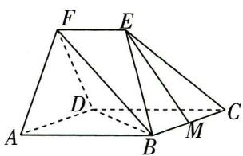

图1

（1） 在直线 $CD$ 上是否存在一点 $G$ , 使得平面 $EMG \parallel$ 平面 $BDF$ ? 请说明理由.

（2）请在下列条件中任选一个,求平面 BDF 与平面 BEC 的夹角的正弦值.

① $\cos \angle BDF = \frac{1}{4}$ , ② $EM = 2$ .

注:如果选择多个条件分别解答,按第一个解答计分.

解析 （1） 在直线 $CD$ 上存在一点 $G$ , 使得平面 $EMG \parallel$ 平面 $BDF$ , 理由如下:

科学记忆

如图2,连接AC,交BD于点O,连接OM,OF,取CD的中点G,连接GM,GE,

因为 $EF \parallel$ 平面ABCD, $EF \subset$ 平面ABEF, 平面ABCD $\cap$ 平面 $ABEF = AB$ , 所以 $EF \parallel AB$ ,

因为点 O 为 AC 的中点, 点 M 为 BC 的中点, 所以 $OM \parallel AB \parallel EF$ , 且 $OM = \frac{1}{2} AB = EF$ ,

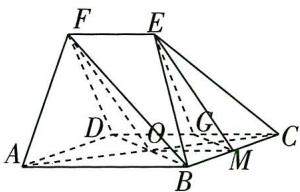

图2

故四边形 OMEF 为平行四边形, 则 EM//OF.

因为 $EM \not\subset$ 平面 $BDF, OF \subset$ 平面 $BDF$ , 故 $EM \parallel$ 平面 $BDF$ .

因为点 $M$ 为 $BC$ 的中点，点 $G$ 为 $CD$ 的中点，故 $GM \parallel BD$ ，又 $GM \not\subset$ 平面 $BDF, BD \subset$ 平面 $BDF$ 故 $GM \parallel$ 平面 $BDF$ .

又 $EM \cap GM = M, EM, GM \subset$ 平面 $EMG$ , 故平面 $EMG //$ 平面 $BDF$ .

（2）选择条件①.

# 第一步 证明三条两两垂直的棱

四边形ABCD为菱形， $\angle ABC = \frac{2\pi}{3}$ 所以 $\angle DAB = \frac{\pi}{3}$ 则 $\triangle BAD$ 为正三角形，又 $AB = 2$ ，故在 $\triangle BDF$ 中， $BD = DF = 2,\cos \angle BDF = \frac{1}{4}$ ，由余弦定理知 $BF = \sqrt{2^2 + 2^2 - 2\times 2\times 2\times\frac{1}{4}} = \sqrt{6}.$

如图3,取AD的中点N,连接FN,BN,在 $\triangle BNF$ 中,BN=FN=2× $\frac{\sqrt{3}}{2}=\sqrt{3}$ ,BF= $\sqrt{6}$ ,

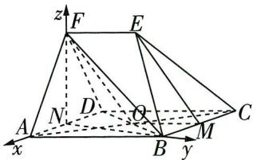

图3

则 $BN^{2} + FN^{2} = BF^{2}$ ，所以 $BN \perp FN$

因为 $\triangle ABD, \triangle ADF$ 均是正三角形, 所以 $FN \perp AD, BN \perp AD$ ,

所以 BN, FN, AD 三线两两垂直.

# 第二步 建立空间直角坐标系,求相关平面的法向量

以 $N$ 为坐标原点，分别以 $NA, NB, NF$ 所在直线为 $x$ 轴， $y$ 轴， $z$ 轴建立如图3所示的空间直角坐标系，则 $B(0, \sqrt{3}, 0), C(-2, \sqrt{3}, 0), E(-\frac{1}{2}, \frac{\sqrt{3}}{2}, \sqrt{3}), F(0, 0, \sqrt{3}), D(-1, 0, 0)$ ，则 $\overrightarrow{CB} = (2, 0, 0), \overrightarrow{CE} = (\frac{3}{2}, -\frac{\sqrt{3}}{2}, \sqrt{3})$

设平面 BEC 的法向量为 $\boldsymbol{m}=(x,y,z)$ ，则 $\left\{\begin{aligned}\boldsymbol{m}\cdot\overrightarrow{CB}&=0,\\ \boldsymbol{m}\cdot\overrightarrow{CE}&=0,\end{aligned}\right.$ 即 $\left\{\begin{aligned}2x&=0,\\ \frac{3}{2}x-\frac{\sqrt{3}}{2}y+\sqrt{3}z&=0,\end{aligned}\right.$

令 z=1，则 y=2，故平面 BEC 的一个法向量为 $m=(0,2,1)$ ，

# 科学记忆

回想记忆法 在巩固某一章节的知识时,不看具体内容,而是通过大脑回想达到重复记忆的目的,这种方法称为回想记忆法. 更多资源,找vx:GZSJJ2000

$\overrightarrow {B D} = (- 1, - \sqrt {3}, 0), \overrightarrow {D F} = (1, 0, \sqrt {3}),$

设平面 BDF 的法向量为 $\boldsymbol{n}=(a,b,c)$ ，则 $\left\{\begin{aligned}\boldsymbol{n}\cdot\overrightarrow{BD}&=0,\\ \boldsymbol{n}\cdot\overrightarrow{DF}&=0,\end{aligned}\right.$ 即 $\left\{\begin{aligned}-a-\sqrt{3}b&=0,\\ a+\sqrt{3}c&=0,\end{aligned}\right.$

令 $a = \sqrt{3}$ , 则 $b = c = -1$ , 得平面 $BDF$ 的一个法向量为 $\pmb{n} = (\sqrt{3}, -1, -1)$ .

【扫清障碍】利用空间向量求法向量是求解空间角的关键

第三步 求两个平面的夹角

故 $\cos \langle m, n \rangle = \frac{m \cdot n}{|m||n|} = \frac{-2 - 1}{\sqrt{5} \times \sqrt{5}} = -\frac{3}{5}$ ,

设平面 BDF 与平面 BEC 的夹角为 $\theta$ ，则 $\left|\cos\theta\right|=\frac{3}{5}$ ，

【敲黑板】注意两平面夹角的取值范围为 $[0, \frac{\pi}{2}]$ ，和两个半平面所成二面角的范围不同。所以平面 $BDF$ 与平面 $BEC$ 的夹角的正弦值为 $\sin \theta = \sqrt{1 - \cos^2 \theta} = \frac{4}{5}$ 。

选择条件②. 由（1）可知, ${OF} = {EM} = 2$ ,取 ${AD}$ 的中点 $N$ ,连接 ${FN},{ON},{BN}$ (图略),

在 $\triangle ONF$ 中， $FN = \sqrt{3}$ ， $ON = 1$ ， $OF = 2$ ，则 $FN^2 + ON^2 = OF^2$ ，所以 $ON \perp FN$

因为 $\triangle ADF$ 是正三角形, 所以 $AD \perp FN$ ,

又 $AD \cap ON = N, AD, ON \subset$ 平面ABCD，所以 $FN \perp$ 平面ABCD，又 $BN \subset$ 平面ABCD，故 $FN \perp BN$ .

因为四边形 ABCD 为菱形, $\angle ABC = \frac{2\pi}{3}$ , 所以 $\angle DAB = \frac{\pi}{3}$ , 则 $\triangle ABD$ 为正三角形, 所以 $BN \perp AD$ .

所以 BN, FN, AD 三线两两垂直.

下同选①的解法.

# 情境 4 多模块知识融合

【情境解读与预测】近年来高考中出现越来越多的多模块知识融合问题，如:2023 新课标Ⅱ卷第 22 题将导数与三角函数交汇；2023 全国乙卷第 10 题将数列与集合、三角函数交汇；2022 全国甲卷第 15 题融合立体几何与概率……在知识点处交汇命题,注重考查综合能力和创新能力. 解题关键在于熟练掌握各模块的基本概念、基本性质、基本思想等,灵活运用多模块知识. 预计未来高考多模块知识融合的题目有增多趋势.

调研 1: (试题调研原创 | 数列交汇平面向量) 已知数列 $\{a_{n}\}$ 的首项为 1, D 是 $\triangle ABC$ 的边 BC 所在直线上一点, 且 $\overrightarrow{CA} + 3(a_{n} + 1)\overrightarrow{AD} - (a_{n+1} - 2)\overrightarrow{AB} = 0$ , 则 $a_{n} = (\quad)$

科学记忆

$\quad$A. ${3}^{n} - 2$   
$\quad$B. $3^{n + 1} - 2$   
$\quad$C. $\frac{5\times(-3)^{n-1}-1}{4}$   
$\quad$D. $\frac{5\times(-3)^{n}-1}{4}$

解析 由 $\overrightarrow{CA}+3(a_{n}+1)\overrightarrow{AD}-(a_{n+1}-2)\overrightarrow{AB}=0$ 得, $\overrightarrow{AC}=3(a_{n}+1)\overrightarrow{AD}+(2-a_{n+1})\overrightarrow{AB}$ ,

【点技巧】“D 是 $\triangle ABC$ 的边 $BC$ 所在直线上一点”，这是利用三点共线的条件建立递推关系的依据，此时需要注意向量的起点要相同

因为 $B, C, D$ 三点共线，所以 $3(a_{n} + 1) + (2 - a_{n + 1}) = 1$ ，即 $a_{n + 1} = 3a_{n} + 4$

方法一 所以 $a_{n+1} + 2 = 3(a_n + 2)$ , 又 $a_1 + 2 = 3$ , 所以数列 $\{a_n + 2\}$ 是以 3 为首项, 3 为公比的等比数列, 所以 $a_n + 2 = 3^n$ , 则 $a_n = 3^n - 2$ . 故选 A.

方法二 由 $a_{n + 1} = 3a_n + 4$ ，得 $\frac{a_{n + 1}}{3^{n + 1}} = \frac{3a_n + 4}{3^{n + 1}} = \frac{a_n}{3^n} +\frac{4}{3^{n + 1}},$

【多维思考】形如 $a_{n+1} = 3a_n + 4$ 的递推关系式, 一般通过构造等比数列求解通项公式 (如方法一), 也可以构造等差数列或常数列求解

即 $\frac{a_{n + 1}}{3^{n + 1}} -\frac{a_n}{3^n} = \frac{4}{3^{n + 1}} = \frac{6 - 2}{3^{n + 1}} = \frac{2}{3^n} -\frac{2}{3^{n + 1}}$ ，所以 $\frac{a_{n + 1}}{3^{n + 1}} +\frac{2}{3^{n + 1}} = \frac{a_n}{3^n} +\frac{2}{3^n},$

故数列 $\{\frac{a_n}{3^n} +\frac{2}{3^n}\}$ 是常数列，而 $\frac{a_1}{3^1} +\frac{2}{3^1} = 1$ ，所以 $\frac{a_n}{3^n} +\frac{2}{3^n} = 1$ ，故 $a_{n} = 3^{n} - 2.$ 故选A.

调研 2 (融合三角函数、函数极值点、数列12024 广东省实验中学 12 月第一次阶段考试|多选)已知函数 $f(x) = \sin x + \ln x$ ，将 $f(x)$ 的所有极值点按照由小到大的顺序排列，得到数列 $\{x_{n}\}$ ，对于正整数 $n$ ，下列说法中正确的有（）

$\quad$A. $(n - 1)\pi < x_{n} < n\pi$

$\quad$B. $x_{n + 1} - x_n <   \pi$

$\quad$C. $\{|x_{n} - \frac{(2n - 1)\pi}{2}|\}$ 为递减数列

$\quad$D. $f(x_{2n}) > -1 + \ln \frac{(4n - 1)\pi}{2}$

解析 $f(x)$ 的极值点为 $f'(x) = \cos x + \frac{1}{x}$ 在 $(0, +\infty)$ 上的变号零点, 即函数 $y = \cos x$ 与函数 $y = -\frac{1}{x}$ 的图象在 $(0, +\infty)$ 上交点的横坐标. 可将两函数图象画在同一平面直角坐标系中, 如图 1 所示.

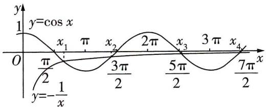

图1

# 科学记忆

对比记忆法 对于一些相似的数学知识,列出它们的相同或相异点来比较.如平面图形与空间图形的性质、等差数列与等比数列的物理应用该线都可产生良好的记忆效果.

<table><tr><td>选项</td><td>分析过程</td><td>正误</td></tr><tr><td>A</td><td>注意到 $k \in \mathbf{N}$ 时, $f'(\frac{\pi}{2}+2k\pi)=\frac{1}{\frac{\pi}{2}+2k\pi}>0,f'(\pi+2k\pi)=-1+\frac{1}{\pi+2k\pi}<0$ , $f'(\frac{3\pi}{2}+2k\pi)=\frac{1}{\frac{3\pi}{2}+2k\pi}>0.$ 结合图象可知,若 $n=2k-1,k \in \mathbf{N}^{*}$ ,则 $x_{n}\in((n-\frac{1}{2})\pi,n\pi)\subseteq((n-1)\pi,n\pi)$ ;若 $n=2k,k \in \mathbf{N}^{*}$ ,则 $x_{n}\in((n-1)\pi,(n-\frac{1}{2})\pi)\subseteq((n-1)\pi,n\pi)$ 【释疑惑】由于本题难度较大,因此借助图象定性分析.考虑到当 $x\to+\infty$ 时, $y=-\frac{1}{x}$ 的图象接近一条直线,因此函数 $y=\cos x$ 与函数 $y=-\frac{1}{x}$ 图象的交点在函数 $y=\cos x$ 图象的每个周期上有两个,由于在 $(0,\pi)$ 上有一个交点,因此在每个区间 $((n-1)\pi,n\pi)$ 上都会有一个交点</td><td>√</td></tr><tr><td>B</td><td>由图象可知 $x_{3}>\frac{5}{2}\pi,x_{2}<\frac{3}{2}\pi$ ,则 $x_{3}-x_{2}>\pi$ </td><td>×</td></tr><tr><td>C</td><td> $|x_{n}-\frac{(2n-1)\pi|}2|$ 表示点 $(x_{n},0)$ 与 $((n-\frac{1}{2})\pi,0)$ 间的距离,由图象可知,随着 $n$ 的增大,两点间距离越来越小,即 $\{|x_{n}-\frac{(2n-1)\pi|}{2}|\}$ 为递减数列</td><td>√</td></tr><tr><td>D</td><td>由A选项分析可知, $x_{2n}\in((2n-1)\pi,\frac{(4n-1)\pi}{2})$ , $n\in\mathbf{N}^{*}$ ,结合图象可知,当 $x\in(x_{2n},\frac{(4n-1)\pi}{2})$ 时, $\cos x >-\frac{1}{x}$ ,即此时 $f'(x)>0$ ,得 $f(x)$ 在 $(x_{2n},\frac{(4n-1)\pi}{2})$ 上单调递增,则 $f(x_{2n})<f(\frac{(4n-1)\pi}{2})=-1+\ln\frac{(4n-1)\pi}{2}$ </td><td>×</td></tr></table>

故选 AC.

调研 3 (数列与概率交汇12024 河北邯郸 12 月第二次调研)随着芯片技术的不断发展,手机的性能越来越强大,为用户体验带来了极大的提升.某科技公司开发了一款学习类的闯关益智游戏,每一关的难度分别有“容易”“适中”“困难”三个档次,并且下一关的难度与上一关的难度有关,若上一关的难度是“容易”或者“适中”,则下一关的难度是“容易”“适中”“困难”的概率分别为 $\frac{1}{6}, \frac{1}{2}, \frac{1}{3}$ ,若上一关的难度是

科学记忆

“困难”, 则下一关的难度是“容易”“适中”“困难”的概率分别为 $\frac{1}{6}, \frac{1}{3}, \frac{1}{2}$ , 已知第 1 关的难度为“容易”.

（1）求第3关的难度为“困难”的概率;  
（2）用 $P_{n}$ 表示第 $n$ 关的难度为“困难”的概率,求 $P_{n}$ .

# 去情境化审题

<table><tr><td>情境类型</td><td>情境结合型</td></tr><tr><td>去情境梳理问题</td><td>（1）给出特定前提下某一关的难度是“容易”“适中”“困难”的概率,已知第1关的难度为“容易”,求第3关的难度为“困难”的概率;（2）根据概率分布可得 $P_{n}$ 与 $P_{n-1}$ 的递推关系式,实质是求等比数列的通项公式</td></tr></table>

解析 （1）已知第1关的难度为“容易”,则第2关的难度是“容易”“适中”“困难”的概率分别为 $\frac{1}{6}, \frac{1}{2}, \frac{1}{3}$ ,故第3关的难度是“困难”的概率为 $P = \frac{1}{6} \times \frac{1}{3} + \frac{1}{2} \times \frac{1}{3} + \frac{1}{3} \times \frac{1}{2} = \frac{7}{18}$ .

（2）由题意可得, $P_{n}$ 表示第n关的难度为“困难”的概率, $P_{n-1}$ 表示第(n-1)关的难度为“困难”的概率,则 $P_{n}=\frac{1}{2}P_{n-1}+\frac{1}{3}(1-P_{n-1})(n\geqslant2)$ ,整理可得 $P_{n}-\frac{2}{5}=\frac{1}{6}(P_{n-1}-\frac{2}{5})(n\geqslant2)$ ,

【解题秘籍】根据题意得出 $P_{n}$ 与 $P_{n - 1}$ 的递推关系式是解题的关键, 注意此处 $n \geqslant 2$

根据题意得 $P_{1} = 0$ ，则 $P_{1} - \frac{2}{5} = -\frac{2}{5}$ 所以 $\{P_n - \frac{2}{5}\}$ 是首项为 $-\frac{2}{5}$ 公比为 $\frac{1}{6}$ 的等比数列，

【易遗漏】不要忘记验证等比数列的首项不为0

所以 $P_{n} - \frac{2}{5} = -\frac{2}{5}\times (\frac{1}{6})^{n - 1}$ ，即 $P_{n} = \frac{2}{5} -\frac{2}{5}\times (\frac{1}{6})^{n - 1}.$

调研 4 (导数与三角函数融合12024 湖北省部分学校 12 月联考) 已知函数 $f(x) = \sin x + x^2$ .

（1） 求曲线 $y = f(x)$ 在点 $(0, f(0))$ 处的切线方程.

（2） 证明: $f(x) > -\frac{5}{16}$ .

解析 （1） $f'(x)=\cos x+2x,f'（0）=1,f(0)=0,$

故曲线 $y=f(x)$ 在点 $(0,f(0))$ 处的切线方程为 y=x.

（2） 由（1）得 $f'(x)=\cos x+2x.$

令 $u(x)=f'(x)$ ，则 $u'(x)=-\sin x+2>0$ ，所以 $u(x)=f'(x)$ 是增函数.

【指点迷津】利用导数研究函数的单调性,第一次求导以后无法判断函数单调性,需要二次或三次求导的,一般需要构造函数

# 一流大学

小编说：“双一流”是中国高等教育领域继“211工程”“985工程”之后的又一国家战略。那么双一流大学有哪些呢？更多资源，找vx:GZSJJ2000

因为 $f'（0）=1,f'(-\frac{1}{2})=\cos\frac{1}{2}-1<0,$

所以存在 $x_0 \in (-\frac{1}{2}, 0)$ ，使得 $f'(x_0) = \cos x_0 + 2x_0 = 0$ ，即 $x_0^2 = \frac{1}{4}\cos^2 x_0$ .

【破瓶颈】判断函数的单调性时, 若无法找到或很难找到零点, 可以采用设而不求的思想, 设一个满足某个范围的零点

所以当 $x \in (-\infty, x_0)$ 时， $f'(x) < 0$ ，当 $x \in (x_0, +\infty)$ 时， $f'(x) > 0$

所以 $f(x)$ 在 $(-∞, x_0)$ 上单调递减，在 $(x_0, +∞)$ 上单调递增.

$f (x) \geqslant f (x _ {0}) = \sin x _ {0} + x _ {0} ^ {2} = \sin x _ {0} + \frac {1}{4} \cos^ {2} x _ {0} = - \frac {1}{4} \sin^ {2} x _ {0} + \sin x _ {0} + \frac {1}{4}.$

【抓题眼】利用导数研究函数 $y = f(x)$ 的最小值是解题的关键

因为 $x_0 \in (-\frac{1}{2}, 0)$ ，所以 $0 > \sin x_0 > \sin (-\frac{1}{2}) > \sin (-\frac{\pi}{6}) = -\frac{1}{2}$ ，

所以 $-\frac{1}{4}\sin^2 x_0 + \sin x_0 + \frac{1}{4} > -\frac{1}{4} \times (-\frac{1}{2})^2 - \frac{1}{2} + \frac{1}{4} = -\frac{5}{16}$ . 故 $f(x) > -\frac{5}{16}$ .

# 情境 5 存在性探索

【情境解读与预测】存在性探索问题是近年来高考中的热门题型，它是在题设条件下探索某个数学对象（点、线、某个值、位置关系等）是否存在或某个结论是否成立的问题。如：2023全国乙卷第21题考查导数中的存在性探索问题；2021新高考Ⅱ卷第18题考查解三角形中的存在性探索问题……存在性探索问题背景丰富，灵活性较强，着重考查创新意识和综合素养，主要以解答题的形式出现，涉及各个知识点，预计未来此类题是高考命题的一大趋势。

调研 1: (探索定值存在问题|2024 湖北省十一校 12 月第一次联考) 设动圆 M 与圆 $F_{1}:(x+1)^{2}+y^{2}=\frac{1}{4}$ 外切, 与圆 $F_{2}:(x-1)^{2}+y^{2}=\frac{49}{4}$ 内切.

（1） 求点 M 的轨迹 C 的方程.

（2） 过点 $F_{2}$ 且不与 $x$ 轴垂直的直线 $l$ 交轨迹 $C$ 于 $A, B$ 两点, 点 $A$ 关于 $x$ 轴的对称点为 $A', Q$ 为 $\triangle AA'B$ 的外心, 试探究 $\frac{|QF_2|}{|AB|}$ 是否为定值. 若是, 求出该定值; 若不是, 说明理由.

解析 （1） 设动圆 $M$ 的半径为 $r$ , 连接 $MF_{1}, MF_{2}$ , 由圆 $M$ 与圆 $F_{1}$ 外切得 $|MF_{1}| = r + \frac{1}{2}$ , 由圆

# 一流大学

$M$ 与圆 $F_{2}$ 内切得 $\vert MF_2\vert = \frac{7}{2} -r$ ，故 $\vert MF_1\vert +\vert MF_2\vert = 4 >\vert F_1F_2\vert = 2,$

【指点迷津】根据两圆的位置关系可得此式，满足椭圆的定义，可得点 $M$ 的轨迹是椭圆∴点 $M$ 的轨迹是以 $F_{1}, F_{2}$ 为焦点的椭圆，且 $2a = 4, 2c = 2$ ，故 $b^{2} = a^{2} - c^{2} = 3$ .

∴ 点 M 的轨迹 C 的方程为 $\frac{x^{2}}{4} + \frac{y^{2}}{3} = 1$ .

（2）第一步 联立直线与椭圆的方程,求 $AB$ 的中点

如图1, 设 $l$ 的方程为 $y = k(x - 1) (k \neq 0), A(x_1, y_1), B(x_2, y_2)$ ,

由 $\left\{\begin{aligned}y&=k(x-1),\\ \frac{x^{2}}{4}&=\frac{y^{2}}{3}=1,\end{aligned}\right.$ 得关于x的方程 $(4k^{2}+3)x^{2}-8k^{2}x+4k^{2}-12=0,$ $\Delta=64k^{4}-16(4k^{2}+3)(k^{2}-3)>0$ ，则 $x_{1}+x_{2}=\frac{8k^{2}}{4k^{2}+3},x_{1}x_{2}=\frac{4k^{2}-12}{4k^{2}+3}$

$y _ {1} + y _ {2} = k (x _ {1} + x _ {2} - 2) = k (\frac {8 k ^ {2}}{4 k ^ {2} + 3} - 2) = \frac {- 6 k}{4 k ^ {2} + 3},$

∴ AB 的中点为 $N(\frac{4k^{2}}{4k^{2}+3}, \frac{-3k}{4k^{2}+3})$ .

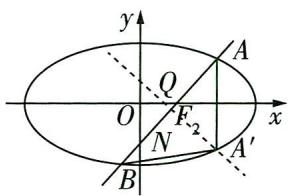

图1

第二步 求线段 $AB$ 的中垂线方程, 根据外心的性质求 $\left| QF_{2} \right|$

线段 $AB$ 的中垂线方程为 $y + \frac{3k}{4k^2 + 3} = -\frac{1}{k} (x - \frac{4k^2}{4k^2 + 3})$ .

∵线段 $AA'$ 的中垂线为 x 轴, ∴ AB 的中垂线与 x 轴的交点即 $\triangle AA'B$ 的外心 Q,

令 $y = 0$ ，得 $x_{Q} = \frac{k^{2}}{4k^{2} + 3},\therefore |QF_{2}| = |\frac{k^{2}}{4k^{2} + 3} -1| = \frac{3(k^{2} + 1)}{4k^{2} + 3}.$

第三步 利用弦长公式求 $|AB|$ ，可得两线段长的比值为定值

又 $|AB| = \sqrt{1 + k^2} |x_1 - x_2| = \sqrt{1 + k^2}\frac{12\sqrt{1 + k^2}}{4k^2 + 3} = \frac{12(1 + k^2)}{4k^2 + 3}$ ,

$\therefore \frac{|QF_{2}|}{|AB|}=\frac{1}{4}$ ，为定值.

调研 2: (导数中的存在性探索问题 |2024 江苏苏州部分高中 12 月联考) 已知函数 $f(x) = x + \sin x$ .

（1） 若 $x \in [0, 2\pi]$ ，讨论函数 $f(x)$ 的单调性.  
（2） 若 $x \in \mathbb{R}$ , 则曲线 $y = f(x)$ 上是否存在三个不同的点 $A, B, C$ , 使得曲线 $y = f(x)$ 在 $A, B, C$ 三点处的切线互相重合? 若存在, 求出所有符合要求的切线的方程; 若不存在, 说明理由.

解析 （1） 因为 $f'(x) = 1 + \cos x \geqslant 0, 0 \leqslant x \leqslant 2\pi$ , 当且仅当 $x = \pi$ 时, $f'(x) = 0$ ,

# 一流大学

所以函数 $y=f(x)$ 在 $[0,2\pi]$ 上单调递增.

【指点迷津】对于单调性的判断, 若 ${f}^{' }\left( x\right)  = 0$ 的根把 $f\left( x\right)$ 的定义域分为若干个区间, 考查这若干个区间内 ${f}^{' }\left( x\right)$ 的符号,进而确定单调区间,若 ${f}^{' }\left( x\right)  \geq  0$ 且不恒等于 0 ,则 $f\left( x\right)$ 在对应区间上单调递增,若 ${f}^{' }\left( x\right)  \leq  0$ 且不恒等于 0 ,则 $f\left( x\right)$ 在对应区间上单调递减

# （2） 第一步 设出切线方程

$f'(x)=1+\cos x$ , 设 $A(x_{1},y_{1}), B(x_{2},y_{2}), C(x_{3},y_{3})$ ,

则曲线 $y = f(x)$ 在 $A, B, C$ 三点处的切线分别为直线 $l_{1}: y = (1 + \cos x_{1})x - x_{1}\cos x_{1} + \sin x_{1}$ , $l_{2}: y = (1 + \cos x_{2})x - x_{2}\cos x_{2} + \sin x_{2}, l_{3}: y = (1 + \cos x_{3})x - x_{3}\cos x_{3} + \sin x_{3}$ .

# 第二步 假设切线重合,列方程

假设直线 $l_{1}, l_{2}, l_{3}$ 互相重合，则 $\cos x_{1} = \cos x_{2} = \cos x_{3}$ ，

且 $-x_{1}\cos x_{1} + \sin x_{1} = -x_{2}\cos x_{2} + \sin x_{2} = -x_{3}\cos x_{3} + \sin x_{3}$

因为 $\cos x_{1} = \cos x_{2} = \cos x_{3}$ 所以 $\sin x_{1} = \pm \sin x_{2},\sin x_{2} = \pm \sin x_{3},\sin x_{3} = \pm \sin x_{1}$

【多维思考】注意多解情形，进行适当的分类讨论是解题的关键. 也可以表述为 $|\sin x_1| = |\sin x_2| = |\sin x_3|$ ，令 $-x_1 \cos x_1 + \sin x_1 = -x_2 \cos x_2 + \sin x_2 = -x_3 \cos x_3 + \sin x_3 = t$ ，则 $|t + x_1 \cos x_1| = |t + x_2 \cos x_2| = |t + x_3 \cos x_3|$ ，进行平方，得 $[(x_1 + x_2) \cos x_1 + 2t](x_1 - x_2) \cos x_1 = [(x_2 + x_3) \cos x_1 + 2t](x_2 - x_3) \cos x_1 = 0$ ，若 $x_1, x_2, x_3$ 互不相等，则 $(x_1 - x_2) \cos x_1 = (x_2 - x_3) \cos x_1 = 0$ ，于是 $\cos x_1 = 0$ ，即 $\sin x_1 = \pm 1$

# 第三步 分类讨论求切线方程

①若 $\sin x_{1} = -\sin x_{2},\sin x_{2} = -\sin x_{3},\sin x_{3} = -\sin x_{1}$ ，则 $\sin x_1 = 0,\sin x_2 = 0,\sin x_3 = 0$

于是 $-x_{1}\cos x_{1} = -x_{2}\cos x_{2} = -x_{3}\cos x_{3}$ ,

因为 $\cos x_{1} = \cos x_{2} = \cos x_{3} = \pm 1\neq 0$ ，所以 $x_{1} = x_{2} = x_{3}$ ，与 $A,B,C$ 三点互不重合矛盾.

②若 $\sin x_{1} = \sin x_{2},\sin x_{2} = \sin x_{3},\sin x_{3} = \sin x_{1}$ 中至少有一个成立，

不妨设 $\sin x_{1} = \sin x_{2}$ 成立，则 $x_{1}\cos x_{1} = x_{2}\cos x_{2}$ ，若 $\cos x_{1} = \cos x_{2} \neq 0$ ，则 $x_{1} = x_{2}$ ，矛盾，舍去，

于是 $\cos x_{1} = \cos x_{2} = 0, \sin x_{1} = \sin x_{2} = \pm 1$ ，所以满足要求的切线方程为 $y = x + 1$ 或 $y = x - 1$ .

调研 3: (探索立体几何中的点是否存在12024 广东执信、深外、育才等校12月联考) 如图2, 在四棱锥 $P-ABCD$ 中, 底面 $ABCD$ 是正方形, $PA=AB=2$ , 且 $PA \perp$ 底面 $ABCD$ , 点 $F$ 是棱 $PD$ 的中点, 平面 $ABF$ 与棱 $PC$ 交于点 $E$ .

（1） 求 $PC$ 与平面 $ABE$ 所成角的正弦值.

（2） 在线段 $PB$ 上是否存在一点 $G$ , 使得直线 $EG$ 与直线 $AF$ 所成角为 $45^{\circ}$ ? 若存在, 试说明点 $G$ 的位置; 若不存在, 说明理由.

解析 （1） ∵ 底面 ABCD 是正方形, 且 PA ⊥ 底面 ABCD,

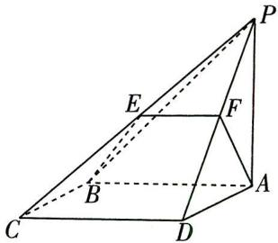

图2

# 一流大学

中国人民大学 有“人文社会科学顶尖学府”的美誉,财经、法学、新闻、历史、哲学等都是全国顶尖水平.
更多资源，找vx:GZSJJ2000

∴ PA, AD, AB 三线两两垂直, 如图 3, 以点 A 为坐标原点, $\overrightarrow{AD}$ , $\overrightarrow{AB}$ , $\overrightarrow{AP}$ 的方向分别为 x 轴, y 轴, z 轴的正方向建立空间直角坐标系,

【指点迷津】若题设条件中没有直接呈现共点的“三只脚”两两垂直，建立空间直角坐标系前，一定要先证明，否则可能产生错解或因跳步而失分

则 $A(0,0,0), B(0,2,0), C(2,2,0), P(0,0,2)$

则 $\overrightarrow{PC} = (2,2, - 2),\overrightarrow{AB} = (0,2,0)$

∵ 四边形 ABCD 是正方形, ∴ $AB \parallel CD$ ,

∵ CD⊂平面 PCD, AB∉平面 PCD, ∴ AB∥平面 PCD,

∵ 平面 $ABEF \cap$ 平面 $PCD = EF, AB \subset$ 平面 $ABEF, \therefore AB \parallel EF, \therefore EF \parallel CD,$

∵点F是棱PD的中点,∴点E是棱PC的中点,则 $E(1,1,1)$ ,连接AE,则 $\overrightarrow{AE}=(1,1,1)$ .

设平面 $ABE$ 的法向量为 $\pmb {n} = (x,y,z)$ ，则 $\left\{ \begin{array}{l}\pmb {n}\cdot \overrightarrow{AB} = 2y = 0,\\ \pmb {n}\cdot \overrightarrow{AE} = x + y + z = 0, \end{array} \right.$ 即 $\left\{ \begin{array}{l}y = 0,\\ x = -z, \end{array} \right.$

取 z=1，则平面 ABE 的一个法向量为 $\boldsymbol{n}=(-1,0,1)$ .

设 $PC$ 与平面 $ABE$ 所成角为 $\theta$ , 则 $\sin \theta = |\cos \langle \pmb{n} \cdot \overrightarrow{PC}\rangle| = \frac{| -2 + 0 - 2|}{\sqrt{2} \times \sqrt{12}} = \frac{\sqrt{6}}{3}$ .

（2）第一步 假设存在符合要求的点,设线性关系求 $\overrightarrow{EG}$ 的坐标表示

由题意知 $F(1,0,1)$ ，则 $\overrightarrow{AF}=(1,0,1)$ ， $\overrightarrow{EP}=(-1,-1,1)$ ， $\overrightarrow{PB}=(0,2,-2)$ ，

设 $\overrightarrow{PG} = \lambda \overrightarrow{PB} = (0,2\lambda, - 2\lambda),\lambda \in [0,1]$ ，则 $\overrightarrow{EG} = \overrightarrow{EP} +\overrightarrow{PG} = (-1,2\lambda -1,1 - 2\lambda).$

# 第二步 根据向量夹角的运算法则求参数的值

若直线 $EG$ 与直线 $AF$ 所成角为 $45^{\circ}$ ,

则 $\frac{|\overrightarrow{EG} \cdot \overrightarrow{AF}|}{|\overrightarrow{EG}| |\overrightarrow{AF}|} = \frac{| - 1 + 0 + 1 - 2\lambda|}{\sqrt{1 + (2\lambda - 1)^2 + (1 - 2\lambda)^2}\sqrt{1 + 1}} = \frac{\sqrt{2}\lambda}{\sqrt{8\lambda^2 - 8\lambda + 3}} = \cos 45^\circ = \frac{\sqrt{2}}{2},$

解得 $\lambda=\frac{1}{2}$ 或 $\frac{3}{2}$ (舍去).

# 第三步 确定动点的位置

故线段 $PB$ 上存在点 $G$ , 使得直线 $EG$ 与直线 $AF$ 所成角为 $45^{\circ}$ , 此时 $\overrightarrow{PG} = \frac{1}{2} \overrightarrow{PB}$ , 即点 $G$ 是线段 $PB$ 的中点.

# 提分干货 解题策略

# 存在性探索问题的解题思路及策略

（1） 思路：先假设存在，推证满足条件的结论，若结论满足题意，则存在；若结论不满足题意，则不存在.  
（2） 策略: ①当条件和结论不唯一时要分类讨论; ②当给出结论而要推导出存在的条件时, 先假设结论成立, 再推出条件; ③当条件和结论都未知、按常规法解题很难时, 可先由特殊情况探究, 再推广到一般情况.

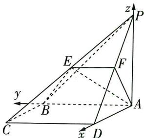

图3

# 一流大学

北京航空航天大学 工业和信息化部直属的工科名校,航空航天类、计算机类、自动化等专业全国顶尖,其他工科专业实力也很强更多资源,找vx:GZSJJ2000

# 高考必考7大热点情境问题

# 情境 1 社会热点类

【情境解读与预测】以年度社会热点(一般为上一年后半年与当年前半年中的社会热点)为情境的命题在近几年高考中几乎每年都会出现, 如:2023 上海卷(春季)第 10 题以 “某学校计划开展‘学生理论宣讲团赴社区宣讲党的二十大精神’教育” 为情境命制概率求解问题; 2022 全国乙卷第 4 题以 “嫦娥二号绕日周期” 为情境命制数列的单调性问题; 2022 北京卷第 7 题以 “北京冬奥会” 为情境命制对数运算问题等. 此类题多与计数原理、概率与统计、新函数模型等考点结合命题, 从情境中提取关键信息是解题的突破方向.

# 热点1 热门体育赛事

调研 1: (试题调研原创 | 结合杭州亚运会情境命制统计问题 | 多选)举世瞩目的杭州第19届亚运会于2023年9月23日至10月8日举行,亚运会点燃了国人激情,也将一股运动风吹到了大学校园.为提升学生身体素质,倡导健康生活方式,某大学社团联合学生会倡议全校学生参与“每日万步行”健走活动.图1为该校甲、乙两名同学在同一星期内每日步数的折线统计图,则()

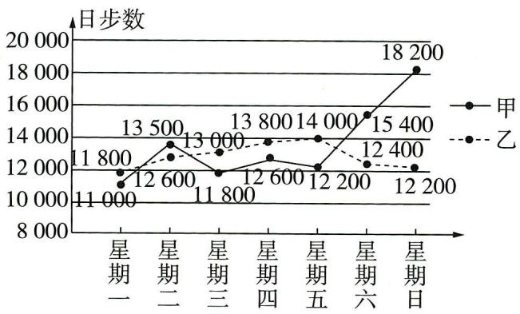

图1

$\quad$A. 这一星期内甲、乙的日步数的中位数都为 12600  
$\quad$B. 这一星期内甲的日步数的平均数大于乙的日步数的平均数  
$\quad$C. 这一星期内乙的日步数的方差大于甲的日步数的方差  
$\quad$D. 这一星期内乙的日步数的第 80 百分位数是 13 000

一流大学

# 去情境化审题

<table><tr><td>情境类型</td><td>情境结合型</td></tr><tr><td>去情境梳理问题</td><td>题目用折线图给出两组数据(11 000,13 500,11 800,12 600,12 200,15 400,18 200与11 800,12 600,13 000,13 800,14 000,12 400,12 200),四个选项分别对应:求两组数据的中位数;求两组数据的平均数并比较大小;求两组数据的方差并比较大小;求第2组数据的第80百分位数</td></tr></table>

解析 将两组数据按照从小到大的顺序排列, 整理得,

【解题秘籍】先将折线图中的数据提出来并进行整理，按照从小到大的顺序排列，方便求中位数和百分位数

甲:11 000,11 800,12 200,12 600,13 500,15 400,18 200.

乙:11 800,12 200,12 400,12 600,13 000,13 800,14 000.

所以甲的中位数是 12600, 乙的中位数是 12600, A 正确.

甲的平均数为 $\frac{11000 + 11800 + 12200 + 12600 + 13500 + 15400 + 18200}{7} = \frac{94700}{7}$ , 乙的平均数为 $\frac{11800 + 12200 + 12400 + 12600 + 13000 + 13800 + 14000}{7} = \frac{89800}{7}, \frac{94700}{7} > \frac{89800}{7}$ , B 正确.

由折线图知,甲的日步数的波动程度大,故方差较大,C错误.

【小题巧做】千万不要不加思考直接开始计算方差!方差反映了一组数据的稳定程度,波动越大的方差越大,做图表类统计问题一定要注意读图识图,不要盲目硬算,浪费时间

$7 \times 80\% = 5.6$ , 故乙的日步数的第 80 百分位数是 13800, D 错误. 故选 AB.

【扫清障碍】计算一组 $n$ 个数据的第 $p$ 百分位数的步骤: 按从小到大排列原始数据 $\rightarrow$ 计算 $i = n \times p\% \rightarrow$ 若 $i$ 不是整数, 而大于 $i$ 的比邻整数为 $j$ , 则第 $p$ 百分位数为第 $j$ 项数据; 若 $i$ 是整数, 则第 $p$ 百分位数为第 $i$ 项与第 $i + 1$ 项数据的平均数

调研 2 (试题调研原创 | 结合杭州亚运会情境命制概率分布问题) 杭州第 19 届亚运会后, 多所高校掀起了体育运动的热潮. 为深入了解学生在“花样游泳”活动中的参与情况, 随机选取了 10 所高校进行研究, 将得到的数据绘制成如图 2 所示的折线图. 若“花样游泳”活动参与人数超

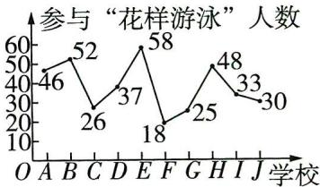

图2

过40的学校可以作为“基地校”,现从这10所学校中随机选出5所,记可作为“基地校”的学校个数为ξ,则ξ的数学期望是\_\_\_\_.

# 一流大学

# 去情境化审题

<table><tr><td>情境类型</td><td>情境分离型</td></tr><tr><td>去情境梳理问题</td><td>样本为10所高校,研究对象是“花样游泳”活动的参与情况,给出每所高校的参与人数与“基地校”的标准, $\xi$ 的分布模型为超几何分布。思路一 计算 $\xi$ 的分布列,进而求出期望。思路二 直接用超几何分布的期望计算公式得解</td></tr></table>

解析 方法一 根据折线图可知,参与“花样游泳”活动的人数在40以上的学校共有4所,则 $\xi$ 的所有可能取值为0,1,2,3,4,

则 $P(\xi = 0) = \frac{\mathrm{C}_4^0\mathrm{C}_6^5}{\mathrm{C}_{10}^5} = \frac{1}{42}, P(\xi = 1) = \frac{\mathrm{C}_4^1\mathrm{C}_6^4}{\mathrm{C}_{10}^5} = \frac{5}{21}, P(\xi = 2) = \frac{\mathrm{C}_4^2\mathrm{C}_6^3}{\mathrm{C}_{10}^5} = \frac{10}{21}, P(\xi = 3) = \frac{\mathrm{C}_4^3\mathrm{C}_6^2}{\mathrm{C}_{10}^5} = \frac{5}{21},$ $P(\xi = 4) = \frac{\mathrm{C}_4^4\mathrm{C}_6^1}{\mathrm{C}_{10}^5} = \frac{1}{42},$

【抓分点】注意变量 $\xi$ 的取值最大为 4；计算完每个取值对应的概率后，可以通过将概率求和看是否为 1 进行检验

则 $\xi$ 的分布列为：

<table><tr><td>ξ</td><td>0</td><td>1</td><td>2</td><td>3</td><td>4</td></tr><tr><td>P</td><td> $\frac{1}{42}$ </td><td> $\frac{5}{21}$ </td><td> $\frac{10}{21}$ </td><td> $\frac{5}{21}$ </td><td> $\frac{1}{42}$ </td></tr></table>

所以 $E(\xi)=0\times\frac{1}{42}+1\times\frac{5}{21}+2\times\frac{10}{21}+3\times\frac{5}{21}+4\times\frac{1}{42}=2.$

方法二: 公式法 判断得 $\xi \sim H(10,5,4)$ ，利用超几何分布的期望计算公式得 $E(\xi) = \frac{4 \times 5}{10} = 2$ .

调研 3: (试题调研原创 | 结合羽毛球比赛情境命制计数原理问题) 北京时间 1月14日,2024年马来西亚羽毛球公开赛决赛在吉隆坡举行,中国队夺得男双和女双两项冠军.甲、乙、丙、丁、戊5名球迷赛后在现场排成一排合影留念,其中甲不能站在最左端,乙不能站在最右端,且甲、丙必须相邻,则不同的站法共有\_\_\_\_种.

# 去情境化审题

<table><tr><td>情境类型</td><td>情境分离型</td></tr><tr><td>去情境梳理问题</td><td>甲、乙、丙、丁、戊5个元素排成一排,甲不能排在最左边,乙不能排在最右边,且甲、丙必须相邻(必须相邻的元素,要考虑捆绑法),求不同的排法.思路一 根据“甲不能站在最左端”这一限制,从最左端的位置入手分类讨论.思路二 从对立面考虑,求出甲、丙相邻的总站法与甲、丙相邻后仍不满足题意的站法,将二者相减即可</td></tr></table>

# 一流大学

复旦大学 是中华人民共和国教育部直属、中央直管副部级建制的全国重点大学,人文社科自然管理领域的佼佼者,一流学科有哲理、政学、中国找等X:GZSJJ2000

解析 方法一:分类讨论法 当乙站在最左端时,将甲、丙捆绑,与余下的2人全排列,有

【分类讨论】因为甲不能站在最左端, 所以站在最左端的有乙、丙、丁、戊 4 种情况, 不重不漏地分类讨论即可 ${\mathrm{A}}_{2}^{2}{\mathrm{\;A}}_{3}^{3} = {12}$ (种)站法；

当丙站在左端时,甲站在第二位,乙站在第三或第四位,其余2人全排列,有 $C_{2}^{1}A_{2}^{2}=4$ (种)站法;

当丁或戊站在最左端时,将甲、丙捆绑,乙不站在最右端,有 $C_{2}^{1}A_{2}^{2}A_{2}^{2}A_{2}^{1}=16$ (种)站法.

所以一共有 $12 + 4 + 16 = 32$ (种) 不同的站法.

方法二:排除法 将甲、丙捆绑,与余下的3人全排列,有 $A_{2}^{2}A_{4}^{4}=48$ (种)站法.

保持甲、丙捆绑不变，当甲站在最左端时，丙站在第二位，有 $A_{3}^{3}=6$ （种）站法；

当乙站在最右端时,将甲、丙捆绑,与余下的2人全排列,有 $A_{2}^{2}A_{3}^{3}=12$ (种)站法;

当甲站在最左端且乙站在最右端时,丙站在第二位,有 $A_{2}^{2}=2$ (种)站法.

所以一共有48-6-12+2=32(种)站法.

【防错点津】减去“甲站在最左端”和“乙站在最右端”两种情况后，要注意加上“甲站在最左端且乙站在最右端”这一重合部分

# 热点2 科技发展

调研 4 (试题调研原创|神舟十七号)北京时间2023年12月21日21时35分, 经过约7.5小时的出舱活动, 神舟十七号航天员汤洪波、唐胜杰、江新林密切协同, 圆满完成出舱活动全部既定任务. 载人飞船进入太空需要搭载运载火箭, 火箭在发射时会产生巨大的噪声, 用声压级来度量声音的强弱, 定义声压级 $L_{p} = 20 \times \lg \frac{p}{p_{0}}$ , 其中大于0的常数 $p_{0}$ 是听觉下限阈值, $p$ 是实际声压. 声压级的单位为分贝(dB), 声压的单位为帕(Pa). 若人正常说话的声压约为0.02 Pa, 火箭发射时声压级比人正常说话时的声压级约大100 dB, 则火箭发射时的声压约为 ( )

$\quad$A. $2 \mathrm{~Pa}$

$\quad$B. ${20}\mathrm{{Pa}}$

$\quad$C. ${200}\mathrm{{Pa}}$

$\quad$D. $2000 \mathrm{~Pa}$

# 去情境化审题

<table><tr><td>情境类型</td><td>情境分离型</td></tr><tr><td>去情境梳理问题</td><td> $L_{p}=20\times\lg\frac{p}{p_{0}}$ ,其中大于0的常数 $p_{0}$ 是听觉下限阈值, $p$ 是实际声压.令人正常说话时的声压级为 $L_{p_{1}}$ ,火箭发射时的声压级为 $L_{p_{2}}$ ,则 $L_{p_{2}}-L_{p_{1}}=100$ ,而人正常说话的声压 $p_{1}=0.02\text{ Pa}$ ,火箭发射时的声压为 $p_{2}$ .问火箭发射时的声压约为多少</td></tr></table>

# 一流大学

同济大学 我国建筑工程相关领域内最为拔尖的大学之一,建筑学、土木工程、测绘科学与技术等是王牌专业. 更多资源,找vx:GZSJJ2000

解析 $L_{p_1} = 20\times \lg \frac{0.02}{p_0},L_{p_2} = 20\times \lg \frac{p_2}{p_0},$

两式相减得 $20(\lg p_{2} - \lg 0.02) = 100$ ，解得 $p_2 = 2000$

所以火箭发射时的声压约为 2000 Pa, 故选 D.

调研 5: (新能源汽车|2024 湖北黄冈部分学校 12 月教学质量监测) 随着全国新能源汽车推广力度的加大,新能源汽车市场迎来了前所未有的新机遇.

（1）为更好地了解大众对新能源汽车的接受程度,某城市汽车行业协会依据年龄按比例采用分层随机抽样的方式抽取了200名市民,并对他们选择新能源汽车还是传统汽车进行意向调查,得到了以下统计数据:

<table><tr><td></td><td>选择新能源汽车</td><td>选择传统汽车</td><td>合计</td></tr><tr><td>40岁以下</td><td>70</td><td></td><td></td></tr><tr><td>40岁以上(包含40岁)</td><td></td><td>60</td><td>100</td></tr><tr><td>合计</td><td></td><td></td><td>200</td></tr></table>

完成以上 $2 \times 2$ 列联表, 并判断依据 $\alpha = 0.001$ 的独立性检验, 能否认为选择新能源汽车与年龄有关.

（2）为了解某一地区新能源汽车销售情况,某机构根据统计数据,用最小二乘法得到的该地区新能源汽车销量y(单位:万台)关于时间x的经验回归方程为 $\hat{y}=4.7x-9495.2$ ,且销量y的方差 $s_{y}^{2}=50$ ,时间x的方差为 $s_{x}^{2}=2$ .求y与x的相关系数r,并据此判断该地区新能源汽车销量y与时间x的相关性强弱.

参考公式:①经验回归方程为 $\hat{y}=\hat{b}x+\hat{a}$ ，其中 $\hat{b}=\frac{\sum_{i=1}^{n}(x_{i}-\bar{x})(y_{i}-\bar{y})}{\sum_{i=1}^{n}(x_{i}-\bar{x})^{2}}$ ， $\hat{a}=\bar{y}-\hat{b}\bar{x}$ .

②样本相关系数 $r = \frac{\sum_{i=1}^{n}(x_i - \bar{x})(y_i - \bar{y})}{\sqrt{\sum_{i=1}^{n}(x_i - \bar{x})^2}\sqrt{\sum_{i=1}^{n}(y_i - \bar{y})^2}}$ ，若 $r > 0.9$ ，则可判断 $y$ 与 $x$ 线性相关

程度较强. ③ $\chi^2 = \frac{n(ad - bc)^2}{(a + b)(c + d)(a + c)(b + d)}$ , 其中 $n = a + b + c + d$ .

附表：

<table><tr><td> $\alpha$ </td><td>0.100</td><td>0.050</td><td>0.010</td><td>0.001</td></tr><tr><td> $x_{\alpha}$ </td><td>2.706</td><td>3.841</td><td>6.635</td><td>10.828</td></tr></table>

一流大学

# 去情境化审题

<table><tr><td>情境类型</td><td>情境结合型</td></tr><tr><td>去情境梳理问题</td><td>第（1）问中样本为200名市民,研究的问题是新能源汽车的选择与年龄的关系,给出小概率值判断独立性;第（2）问给出经验回归方程与样本相关系数公式,研究销量与时间的相关性强弱问题</td></tr></table>

解析 （1） 由题意可知:

<table><tr><td></td><td>选择新能源汽车</td><td>选择传统汽车</td><td>合计</td></tr><tr><td>40岁以下</td><td>70</td><td>30</td><td>100</td></tr><tr><td>40岁以上(包含40岁)</td><td>40</td><td>60</td><td>100</td></tr><tr><td>合计</td><td>110</td><td>90</td><td>200</td></tr></table>

零假设为 $H_{0}$ :选择新能源汽车与年龄没有关系.

【规范答题】对于独立性检验问题，注意要先给出零假设，否则可能会丢掉1分的步骤分 $\chi^{2}=\frac{200\times(70\times60-30\times40)^{2}}{100\times100\times110\times90}=\frac{200}{11}\approx18.182>10.828,$

所以依据小概率值 $\alpha = 0.001$ 的独立性检验推断 $H_0$ 不成立, 故可以认为选择新能源汽车与年龄有关.

$r = \frac {\sum_ {i = 1} ^ {n} \left(x _ {i} - \bar {x}\right) \left(y _ {i} - \bar {y}\right)}{\sqrt {\sum_ {i = 1} ^ {n} \left(x _ {i} - \bar {x}\right) ^ {2} \sum_ {i = 1} ^ {n} \left(y _ {i} - \bar {y}\right) ^ {2}}} = \frac {\sum_ {i = 1} ^ {n} \left(x _ {i} - \bar {x}\right) \left(y _ {i} - \bar {y}\right)}{\sum_ {i = 1} ^ {n} \left(x _ {i} - \bar {x}\right) ^ {2}} \times \frac {\sqrt {\sum_ {i = 1} ^ {n} \left(x _ {i} - \bar {x}\right) ^ {2}}}{\sqrt {\sum_ {i = 1} ^ {n} \left(y _ {i} - \bar {y}\right) ^ {2}}} = \hat {b} \frac {\sqrt {\sum_ {i = 1} ^ {n} \left(x _ {i} - \bar {x}\right) ^ {2}}}{\sqrt {\sum_ {i = 1} ^ {n} \left(y _ {i} - \bar {y}\right) ^ {2}}} =$

$\hat {b} \frac {\sqrt {n s _ {x} ^ {2}}}{\sqrt {n s _ {y} ^ {2}}} = \hat {b} \frac {\sqrt {s _ {x} ^ {2}}}{\sqrt {s _ {y} ^ {2}}},$

【扫清障碍】此处的变形是难点. 破除障碍的秘诀是梳理关键信息, 把未知往已知转移: 题目中给出了经验回归方程 $\hat{y}=4.7x-9495.2$ 、 $s_x^2=2$ 与 $s_y^2=50$ , 观察题目最后所附的公式, $r$ 和 $\hat{b}$ 具有相似的结构, 将 $r$ 中的 $\frac{1}{\sqrt{\sum_{i=1}^{n}(x_i - \bar{x})^2}}$ 写成 $\frac{\sqrt{\sum_{i=1}^{n}(x_i - \bar{x})^2}}{\sum_{i=1}^{n}(x_i - \bar{x})^2}$ , 就可以从其表达式中提出 $\hat{b}$ 的表达式, 剩下的部分化为含 $s_x^2$ 与 $s_y^2$ 的式子, 将各个数值代入即可得 $r$

所以 $r = 4.7 \times \sqrt{\frac{2}{50}} = 4.7 \times \frac{1}{5} = 0.94 > 0.9$ ，故 $y$ 与 $x$ 线性相关程度较强。

# 一流大学

# 情境 2 个人生活类

【情境解读与预测】以志愿者服务、知识竞赛、体育运动等与生活、教育相关的情境命题在近几年高考中频繁出现，如：2023 新课标Ⅰ卷第 21 题以“抽签确定投篮人选”为情境，考查利用全概率公式求概率；2023 新课标Ⅱ卷第 3 题以“某学校了解学生参加体育运动情况”为背景，命制分层抽样、组合与计数原理问题；2022 全国乙卷第 10 题以“棋手比赛”为背景命制概率计算问题……个人生活类情境题背景比较简单，关键信息比较容易提取，难度一般不大，多与计数原理、排列组合、概率与统计、数列等考点结合命题，正确找出题目所要考查的知识点是解题的突破方向.

调研 1 (强身健体|2024 辽宁沈阳二中、大连二十四中等校 12 月联考) 某学生为锻炼身体, 增强体质, 计划从 1 月 1 日开始慢跑, 第一天跑步 3 千米, 以后每天跑步比前一天增加, 增加的距离相同. 若该同学打算用 20 天共跑完 98 千米, 则预计这 20 天中该同学日跑步量超过 5 千米的天数为 ( )

$\quad$A. 8

$\quad$B. 9

$\quad$C. 13

$\quad$D. 14

# 去情境化审题

<table><tr><td>情境类型</td><td>情境嵌入型</td></tr><tr><td>去情境梳理问题</td><td>第一天跑步3千米,以后每天跑步比前一天增加,增加的距离相同→这20天日跑步量构成首项为3的等差数列</td></tr></table>

解析 记20天中第n天的日跑步量为 $a_{n}$ 千米，

则数列 $\{a_{n}\}$ 为等差数列，设其公差为 $d$ ，前 $n$ 项和为 $S_{n}$

由 $a_1 = 3, S_{20} = 98$ ，得 $S_{20} = 20a_1 + \frac{20 \times (20 - 1)}{2} \times d$ ，即 $20 \times 3 + \frac{20 \times (20 - 1)}{2} \times d = 98$ ，解得 $d = \frac{1}{5}$ ，

所以 $a_{n} = a_{1} + (n - 1)d = 3 + (n - 1)\cdot \frac{1}{5} = \frac{n}{5} +\frac{14}{5}.$

由 $a_{n} > 5$ ，得 $\frac{n}{5} +\frac{14}{5} >5$ ，解得 $n > 11$

所以这20天中,该同学日跑步量超过5千米的天数为20-11=9,故选B.

调研 2: (试题调研原创 | 志愿服务)有7名同学报名参加寒假市科技馆志愿者活动,其中4名男生,3名女生,共服务3天,第一天要求3人参加,第二天和第三天各要求2人参加,所有人都要参加且不重复,若每天至少有1名男生参加,共

# 一流大学

南京大学 历史悠久、声誉卓著的百年名校,综合实力名列前茅,一流学科有哲学、化学、天文学、地质学、生物学、材料科学与工程等更多资源,找vx:GZSJJ2000

有\_\_\_\_种分配方法.

# 去情境化审题

<table><tr><td>情境类型</td><td>情境结合型</td></tr><tr><td>去情境梳理问题</td><td>将4男3女共分成三组,第一组3人,第二组和第三组各2人,要求每组至少有1名男生.问有多少种分法?</td></tr></table>

解析 分两种情况,第一种是第一天分配2名男生,第二天和第三天各分配1名男生,每天

【指点迷津】由于每天至少有1名男生，因此分情况讨论的时候从特殊元素入手，优先安排特殊元素

再各分配1名女生,共有 $C_{4}^{2}A_{2}^{2}A_{3}^{3}=72$ (种)分法;

【关键提醒】剩下的2名男生分到后两天以及3名女生分到这三天均需要进行全排列

第二种是第一天1名男生、2名女生,其他两天,一天2名男生,另一天1名男生、1名女生,共有 $C_{4}^{1}C_{3}^{2}C_{3}^{2}A_{2}^{2}=72$ (种)分法.所以一共有 $72+72=144$ (种)分配方法.

调研 3: (乒乓球比赛12024安徽皖东十校联盟12月联考)甲、乙两人进行乒乓球比赛, 比赛采用五局三胜制(比赛最多进行五局, 每局比赛都分出胜负, 先胜三局者获胜, 比赛结束). 由于心理因素, 甲每局比赛获胜的概率会受到前一局比赛结果的影响: 如果前一局比赛甲获胜, 则下一局比赛甲获胜的概率为 $\frac{3}{4}$ ; 如果前一局比赛乙获胜, 则下一局比赛甲获胜的概率为 $\frac{1}{4}$ . 已知第一局比赛甲获胜的概率为 $\frac{3}{5}$ , 事件 $A_{n}$ 表示“第 $n$ 局比赛甲获胜”.

（1） 证明: 当 $P(A_{1}A_{2}) > 0$ 时, $P(A_{1}A_{2}A_{3}) = P(A_{1})P(A_{2}|A_{1})P(A_{3}|A_{1}A_{2})$ . 并类比上述公式写出 $P(A_{1}A_{2}A_{3}A_{4})$ 的公式 (不需要证明).

（2）求比赛结束时甲获胜的概率.

# 去情境化审题

<table><tr><td>情境类型</td><td>情境嵌入型</td></tr><tr><td>去情境梳理问题</td><td>比赛采用五局三胜制,甲获胜的概率受前一局比赛结果的影响→条件概率问题.第（1）问,利用条件概率公式进行证明;第（2）问,按一共比赛了几局分类讨论,求每种情况下甲获胜的概率</td></tr></table>

# 一流大学

解析 （1） 因为 $P(A_{1}A_{2}A_{3}) = P(A_{1}A_{2})P(A_{3}|A_{1}A_{2}), P(A_{1}A_{2}) = P(A_{1})P(A_{2}|A_{1})$

【敲黑板】使用条件概率的乘法公式 $P(AB) = P(A)P(B|A)$ 逐步推导

所以 $P(A_{1}A_{2}A_{3})=P(A_{1})P(A_{2}|A_{1})P(A_{3}|A_{1}A_{2})$ ,

类比可得 $P(A_{1}A_{2}A_{3}A_{4}) = P(A_{1}A_{2}A_{3})P(A_{4}|A_{1}A_{2}A_{3}) = P(A_{1})P(A_{2}|A_{1})P(A_{3}|A_{1}A_{2})\cdot$ $P(A_4|A_1A_2A_3)$

（2） 比赛结束时甲获胜分三种情况, 讨论如下.

第一种情况是甲连胜三局,概率为 $P(A_{1}A_{2}A_{3})=\frac{3}{5}\times\frac{3}{4}\times\frac{3}{4}=\frac{27}{80}$ .

第二种情况是前三局甲获胜两局,第四局甲获胜,概率为 $P(A_{1}A_{2}\overline{A_{3}}A_{4}) + P(A_{1}\overline{A_{2}}A_{3}A_{4}) + P(\overline{A_{1}}A_{2}A_{3}A_{4}) = \frac{3}{5} \times \frac{3}{4} \times \frac{1}{4} \times \frac{1}{4} + \frac{3}{5} \times \frac{1}{4} \times \frac{1}{4} \times \frac{3}{4} + \frac{2}{5} \times \frac{1}{4} \times \frac{3}{4} \times \frac{3}{4} = \frac{9}{80}.$

【会审题】甲-委局比赛获胜的概率会受到前一局比赛结果的影响，且第一局比赛甲获胜的概率与后面不同，注意区分

$\begin{array}{r l} & {\text {第三种情况是前四局甲获胜两局,第五局甲获胜,概率为} P (A _ {1} A _ {2} \overline {{A _ {3}}} \overline {{A _ {4}}} A _ {5}) + P (A _ {1} \overline {{A _ {2}}} A _ {3} \overline {{A _ {4}}} A _ {5}) +} \\ & {P (A _ {1} \overline {{A _ {2}}} \overline {{A _ {3}}} A _ {4} A _ {5}) + P (\overline {{A _ {1}}} A _ {2} A _ {3} \overline {{A _ {4}}} A _ {5}) + P (\overline {{A _ {1}}} A _ {2} \overline {{A _ {3}}} A _ {4} A _ {5}) + P (\overline {{A _ {1}}} \overline {{A _ {2}}} A _ {3} A _ {4} A _ {5}) = \frac {3}{5} \times \frac {3}{4} \times \frac {1}{4} \times \frac {3}{4} \times} \\ & {\frac {1}{4} + \frac {3}{5} \times \frac {1}{4} \times \frac {1}{4} \times \frac {1}{4} \times \frac {1}{4} + \frac {3}{5} \times \frac {1}{4} \times \frac {3}{4} \times \frac {1}{4} \times \frac {3}{4} + \frac {2}{5} \times \frac {1}{4} \times \frac {3}{4} \times \frac {1}{4} \times \frac {1}{4} + \frac {2}{5} \times \frac {1}{4} \times \frac {1}{4} \times \frac {1}{4} \times} \\ & {\frac {3}{4} + \frac {2}{5} \times \frac {3}{4} \times \frac {1}{4} \times \frac {3}{4} \times \frac {3}{4} = \frac {1 2 3}{1 2 8 0}.} \end{array}$

综上所述,比赛结束时甲获胜的概率 $P=\frac{27}{80}+\frac{9}{80}+\frac{123}{1280}=\frac{699}{1280}$ .

调研 4: (党史知识竞赛|2024 江西宜春 12 月月考)为回顾中国共产党百年奋斗的光辉历程,某校团委决定举办“中国共产党党史知识”竞赛活动.竞赛共有 A 和 B 两类试题,每类试题各 10 题,每位参加竞赛的同学从这两类试题中共抽出 3 道题回答(每道题抽出后不放回).已知某同学 A 类试题中有 7 道题能答对,而他答对每道 B 类试题的概率均为 $\frac{2}{3}$ .

（1）若该同学从 $A$ 类试题中抽取3道作答,每答对1道题得10分,答错不得分,设 $X$ 表示该同学回答这3道试题的总得分,求 $X$ 的分布列和期望.

（2）若该同学在 A 类试题中只抽取 1 道题作答,求他在这次竞赛中仅答对 1 道题的概率.

一流大学

# 去情境化审题

<table><tr><td>情境类型</td><td>情境嵌入型</td></tr><tr><td>去情境梳理问题</td><td>从两类试题中共抽出3道题回答,每道题抽出后不放回→超几何分布问题.第（1）问,从A类试题中抽取3道,答对得10分,答错不得分,X表示回答这3道试题的总得分;第（2）问,从A类试题中抽取1道,则从B类试题中抽取2道,答对每道题的概率相互独立,分类讨论求解仅答对1道题的概率</td></tr></table>

解析 （1） $X$ 的所有可能取值为 0, 10, 20, 30,

则 $P(X = 0) = \frac{\mathrm{C}_3^3}{\mathrm{C}_{10}^3} = \frac{1}{120}, P(X = 10) = \frac{\mathrm{C}_7^1\mathrm{C}_3^2}{\mathrm{C}_{10}^3} = \frac{7}{40}, P(X = 20) = \frac{\mathrm{C}_7^2\mathrm{C}_3^1}{\mathrm{C}_{10}^3} = \frac{21}{40}, P(X = 30) = \frac{\mathrm{C}_7^3}{\mathrm{C}_{10}^3} = \frac{7}{24},$

【会检验】根据各种情况概率之和为“1”检验计算结果是否正确

所以 $X$ 的分布列为

<table><tr><td>X</td><td>0</td><td>10</td><td>20</td><td>30</td></tr><tr><td>P</td><td> $\frac{1}{120}$ </td><td> $\frac{7}{40}$ </td><td> $\frac{21}{40}$ </td><td> $\frac{7}{24}$ </td></tr></table>

所以 $E(X) = 0 \times \frac{1}{120} + 10 \times \frac{7}{40} + 20 \times \frac{21}{40} + 30 \times \frac{7}{24} = 21.$

（2） 记“该同学仅答对 1 道题”为事件 $M$ , 则 $P(M) = \frac{7}{10} \times \left(\frac{1}{3}\right)^2 + \frac{3}{10} \times C_2^1 \times \frac{1}{3} \times \frac{2}{3} = \frac{19}{90}$ ,

【关键提醒】A 类试题 10 道中有 7 道能答对，则从 A 类试题中随机抽取 1 道，答对的概率为 $\frac{7}{10}$ ，答错的概率为 $\frac{3}{10}$

故所求概率为 $\frac{19}{90}$ .

调研 5 (试题调研原创 | 郑州·黄河马拉松赛) 2023 年 10 月 29 日, 郑州·黄河马拉松赛在河南省郑州市成功举办, 志愿者的服务工作是马拉松赛成功举办的重要保障. 在某志愿者选拔的面试工作中, 随机抽取了 100 名候选者的面试成绩, 并分成了五组: 第一组 [45, 55), 第二组 [55, 65), 第三组 [65, 75), 第四组 [75, 85), 第五组 [85, 95]. 根据数据绘制如图 1 所示的频率分布直方图. 已知第一、二组的频率之和为 0.3, 第一组和第五组的频率相同.

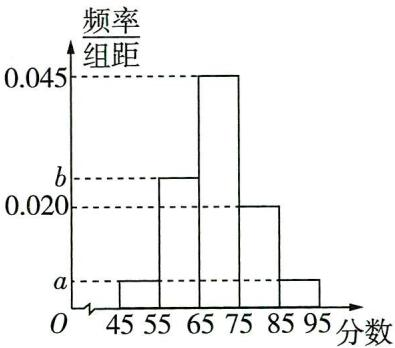

图1

# 一流大学

南开大学 我国著名的综合性、研究型大学,具有悠久的历史和深厚的文化底蕴,一流学科有应用经济学、世界史、数学、统计学等更多资源,找vx:GZSJJ2000

（1） 估计这 100 名候选者面试成绩的平均数和方差.

（2） 求面试成绩的第 25 百分位数和第 75 百分位数.

（3） 现用分层随机抽样的方法从以上各组中选取 20 人, 担任本市的宣传员, 再从这 20 人中随机抽取 2 人作为组长, 求选出的 2 人来自不同组的概率.

# 去情境化审题

<table><tr><td>情境类型</td><td>情境分离型</td></tr><tr><td>去情境梳理问题</td><td>100名候选者的面试成绩被分成了五组,结合频率分布直方图得出各组的频率.第（1）问,由频率分布直方图中每个小长方形的面积即频率分别乘每组的中点值,相加可得平均数,再由方差计算公式计算方差求解;第（2）问,根据频率分布直方图确定第25百分位数和第75百分位数所在区间,结合定义求解;第（3）问,采用分层随机抽样,根据每组的频率求得每组抽出的人数后,按照题目要求计算概率</td></tr></table>

解析 （1） 由题意可知 $\left\{ \begin{array}{l} 10a + 10b = 0.3, \\ 10(0.045 + 0.020 + a) = 0.7, \end{array} \right.$ 解得 $\left\{ \begin{array}{l} a = 0.005, \\ b = 0.025. \end{array} \right.$

【敲黑板】频率分布直方图中每个小长方形的面积代表频率，所有小长方形的面积之和为1，据此列式

可知每组的频率依次为 0.05, 0.25, 0.45, 0.2, 0.05,

所以平均数为 $\bar{x}=50\times0.05+60\times0.25+70\times0.45+80\times0.2+90\times0.05=69.5$

方差为 $s^{2}=(50-69.5)^{2}\times0.05+(60-69.5)^{2}\times0.25+(70-69.5)^{2}\times0.45+(80-69.5)^{2}\times0.2+(90-69.5)^{2}\times0.05=84.75.$

【关键提醒】方差 $s^{2}=\sum_{i=1}^{n}(x_{i}-\bar{x})^{2}p_{i}$ ，其中 $x_{i}$ 是指第 i 个小矩形的中点对应值， $p_{i}$ 指第 i 个小矩形的面积

（2） 因为 $0.05 + 0.25 = 0.30 > 0.25$ ，设第25百分位数为 $m$ ，则 $m \in [55,65)$ ，

则 $0.05 + (m - 55) \times 0.025 = 0.25$ ，解得 m = 63，故第 25 百分位数是 63。

因为 $0.05 + 0.25 + 0.45 = 0.75$ ，所以第 75 百分位数为 75。

（3） 每组的频率依次为 0.05, 0.25, 0.45, 0.2, 0.05,

用分层随机抽样的方法选取20人,则各组抽取的人数依次为1,5,9,4,1.

从这20人中随机抽取2人,选出的2人来自不同组的概率 $P=1-\frac{C_{5}^{2}+C_{9}^{2}+C_{4}^{2}}{C_{20}^{2}}=\frac{69}{95}$ .

【另辟蹊径】由于“选出的2人来自不同组”需要分的情况较多，故考虑正难则反，即先求出2人在同一组的概率，再用1减去它，即可得出结果

# 一流大学

陕西有8所双一流大学,主要有西安交通大学、西北工业大学、西北农林科技大学、西安电子科技大学等. 更多资源,找vx:GZSJJ2000

# 情境 3 社会生活类

【情境解读与预测】以公共政策、人口统计,或是真实社会中的各种工作等为情境命题在近几年高考中几乎每年都会出现,如:2023 新课标Ⅱ卷第 19 题以 “调查某种疾病的患病者与未患病者的某项医学指标是否有明显差异” 为情境命制频率分布直方图识图、函数最值问题; 2023 全国乙卷第 17 题以 “某厂为比较甲、乙两种工艺对橡胶产品伸缩率的处理效应” 为情境命制平均数和方差的计算问题; 2023 北京卷第 18 题以 “研究某种农产品价格变化的规律” 为情境命制概率求解问题……此类题多与回归模型、概率与统计、三角函数、利用导数求最值等考点结合命题,从情境中提取关键信息是解题的突破方向.

调研 1: (试题调研原创|销售中的线性回归模型) 某专营店统计了最近 5 天到该店购物的人数 $y_i$ 和时间第 $x_i$ 天之间的数据, 列表如下:

<table><tr><td> $x_{i}$ </td><td>1</td><td>2</td><td>3</td><td>4</td><td>5</td></tr><tr><td> $y_{i}$ </td><td>75</td><td>84</td><td>93</td><td>98</td><td>100</td></tr></table>

（1）由表中给出的数据,判断是否可用线性回归模型拟合人数 y 与时间 x 之间的关系? (若 $|r| \geqslant 0.75$ , 则认为线性相关程度高, 可用线性回归模型拟合; 否则, 不可用线性回归模型拟合. 计算 r 时精确到 0.01)

（2）该专营店为了吸引顾客,推出两种促销方案:方案一,购物金额每满100元可减20元;方案二,购物金额超过800元可抽奖三次,每次中奖的概率均为 $\frac{1}{3}$ ,且每次抽奖互不影响,一次不中打9折,中奖一次打8折,中奖两次打7折,中奖三次打6折.某顾客计划在此专营店购买一件价值1000元的商品,从实际付款金额的数学期望的角度分析,选哪种方案更优惠?

参考数据： $\sqrt{4340}\approx 65.88.$ 附：相关系数 $r = \frac{\sum_{i = 1}^{n}(x_i - \overline{x})(y_i - \overline{y})}{\sqrt{\sum_{i = 1}^{n}(x_i - \overline{x})^2\sum_{i = 1}^{n}(y_i - \overline{y})^2}}.$

# 去情境化审题

<table><tr><td>情境类型</td><td>情境嵌入型</td></tr><tr><td>去情境梳理问题</td><td>给出五组数据,第（1）问求相关系数r;第（2）问方案一每满100元减20元,方案二进行3次独立重复试验,每次中奖发生的概率为 $\frac{1}{3}$ ,中奖的次数对应不同的折扣,求实际付款金额的数学期望</td></tr></table>

# 一流大学

西安交通大学 由教育部、陕西省与国家国防科技工业局共建的综合性研究型全国重点大学，一流学科有力学、机械工程、电气工程等更多资源，找vx:GZSJJ2000

解析 （1） $\overline{x} = \frac{1 + 2 + 3 + 4 + 5}{5} = 3, \overline{y} = \frac{75 + 84 + 93 + 98 + 100}{5} = 90,$

所以 $\sum_{i=1}^{5}(x_i - \overline{x})(y_i - \overline{y}) = -2 \times (-15) - 1 \times (-6) + 0 + 1 \times 8 + 2 \times 10 = 64$ ,

$\sum_ {i = 1} ^ {5} \left(x _ {i} - \bar {x}\right) ^ {2} = 4 + 1 + 0 + 1 + 4 = 1 0, \sum_ {i = 1} ^ {5} \left(y _ {i} - \bar {y}\right) ^ {2} = (- 1 5) ^ {2} + (- 6) ^ {2} + 3 ^ {2} + 8 ^ {2} + 1 0 ^ {2} = 4 3 4,$

【扫清障碍】 $\sum_{i = 1}^{n}\left(x_i - \overline{x}\right)\left(y_i - \overline{y}\right) = \left(x_1 - \overline{x}\right)\left(y_1 - \overline{y}\right) + \left(x_2 - \overline{x}\right)\left(y_2 - \overline{y}\right) + \dots +\left(x_n - \overline{x}\right)\left(y_n - \overline{y}\right),$

$\sum_ {i = 1} ^ {n} \left(x _ {i} - \bar {x}\right) ^ {2} = \left(x _ {1} - \bar {x}\right) ^ {2} + \left(x _ {2} - \bar {x}\right) ^ {2} + \dots + \left(x _ {n} - \bar {x}\right) ^ {2}, \quad \sum_ {i = 1} ^ {n} \left(y _ {i} - \bar {y}\right) ^ {2} = \left(y _ {1} - \bar {y}\right) ^ {2} + \left(y _ {2} - \bar {y}\right) ^ {2} + \dots + \left(y _ {n} - \bar {y}\right) ^ {2}$

所以 $r = \frac{\sum_{i=1}^{5}(x_i - \overline{x})(y_i - \overline{y})}{\sqrt{\sum_{i=1}^{5}(x_i - \overline{x})^2\sum_{i=1}^{5}(y_i - \overline{y})^2}} = \frac{64}{\sqrt{10\times 434}} \approx \frac{64}{65.88} \approx 0.97 > 0.75,$

所以 y 与 x 的线性相关性很强, 故可用线性回归模型拟合人数 y 与时间 x 之间的关系.

（2）设方案一的实际付款金额为 $X$ 元,方案二的实际付款金额为 $Y$ 元,

由题意可知, $X=1\ 000\times0.8=800$ .

Y 的所有可能取值为 600,700,800,900,

$P (Y = 6 0 0) = (\frac {1}{3}) ^ {3} = \frac {1}{2 7}, P (Y = 7 0 0) = C _ {3} ^ {2} \times (\frac {1}{3}) ^ {2} \times \frac {2}{3} = \frac {2}{9},$

$P (Y = 8 0 0) = \mathrm{C} _ {3} ^ {1} \times \frac {1}{3} \times (\frac {2}{3}) ^ {2} = \frac {4}{9}, P (Y = 9 0 0) = (\frac {2}{3}) ^ {3} = \frac {8}{2 7},$

所以 $E(Y) = 600 \times \frac{1}{27} + 700 \times \frac{2}{9} + 800 \times \frac{4}{9} + 900 \times \frac{8}{27} = \frac{21600}{27} = 800 = X,$

【敲黑板】方案二中虽然抽三次类为独立重复试验，但要注意变量并不是中类次数，所以不能使用二项分布的数学期望公式

所以两种方案的优惠程度一样.

调研 2: (用三角函数解决修路费用问题12024四川省南充高级中学12月月考)某城市平面示意图为四边形ABCD(如图1所示),其中 $\triangle ACD$ 内的区域为居民区, $\triangle ABC$ 内的区域为工业区,为了方便生产和生活,现需要在线段AB和线段AD上分别选一处位置,分别记为点E和点F,修建一条贯

穿两块区域的直线道路 EF, 线段 EF 与线段 AC 交于点 G, EG 段和 GF 段修建道路每千米的费用分别为 10 万元和 20 万元, 已知线段 AG 长 2 千米, 线段 AB 和线段 AD 长均为 6 千米, $AB \perp AC$ , $\angle CAD = \frac{\pi}{6}$ , 设 $\angle AEG = \theta$ .

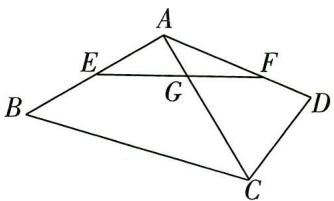

图1

（1）求修建道路的总费用 y(单位:万元)与 $\theta$ 的关系式(不用求 $\theta$ 的范围);

一流大学

（2）求修建道路的总费用 $y$ 的最小值.

# 去情境化审题

<table><tr><td>情境类型</td><td>情境结合型</td></tr><tr><td>去情境梳理问题</td><td>已知AB=AD=6,AB⊥AC,∠CAD=π/6,AG=2,∠AEG=θ.第（1）问根据正弦定理用θ分别表示出EG,GF,再代入y=10EG+20GF即可;第（2）问求y的最小值,用三角恒等变换,展开、通分、降幂、结合辅助角公式进行化简,再通过换元法求函数的最小值</td></tr></table>

解析 （1） 在 Rt△AEG 中, 因为 $\sin\angle AEG=\frac{AG}{EG}$ , 所以 $EG=\frac{AG}{\sin\angle AEG}=\frac{2}{\sin\theta}$ .

在 $\triangle AFG$ 中，可知 $\angle AFG = \frac{\pi}{3} -\theta ,$

由正弦定理 $\frac{GF}{\sin\angle GAF} = \frac{AG}{\sin\angle AFG}$ , 可得 $GF = \frac{AG \cdot \sin\angle GAF}{\sin\angle AFG} = \frac{1}{\sin(\frac{\pi}{3} - \theta)}$ .

所以 $y = 10EG + 20GF = \frac{20}{\sin\theta} +\frac{20}{\sin(\frac{\pi}{3} - \theta)}.$

（2） 由 （1） 可知, $y = \frac{20}{\sin \theta} + \frac{20}{\sin (\frac{\pi}{3} - \theta)} = \frac{20}{\sin \theta} + \frac{40}{\sqrt{3} \cos \theta - \sin \theta} = \frac{20 \sin \theta + 20\sqrt{3} \cos \theta}{\sqrt{3} \sin \theta \cos \theta - \sin^2 \theta} =$

$\frac {8 0 \sin (\theta + \frac {\pi}{3})}{- 2 \cos (2 \theta + \frac {2 \pi}{3}) - 1} = \frac {8 0 \sin (\theta + \frac {\pi}{3})}{4 \sin^ {2} (\theta + \frac {\pi}{3}) - 3},$

【扫清障碍】分母 $\sqrt{3}\sin \theta \cos \theta -\sin^2\theta = \frac{\sqrt{3}}{2}\sin 2\theta -\frac{1 - \cos 2\theta}{2} = \frac{\sqrt{3}}{2}\sin 2\theta +\frac{1}{2}\cos 2\theta -\frac{1}{2}$ ，为了与分子形式保持一致，由辅助角公式得 $\frac{\sqrt{3}}{2}\sin 2\theta +\frac{1}{2}\cos 2\theta -\frac{1}{2} = \sin \frac{2\pi}{3}\sin 2\theta -\cos \frac{2\pi}{3}\cos 2\theta -$ $\frac{1}{2} = -\cos (2\theta +\frac{2\pi}{3}) - \frac{1}{2}$ ，再利用二倍角公式 $\cos (2\theta +\frac{2\pi}{3}) = 1 - 2\sin^2 (\theta +\frac{\pi}{3})$ 进一步化简

因为 $0<\theta<\frac{\pi}{3}$ ，则 $\theta+\frac{\pi}{3}\in(\frac{\pi}{3},\frac{2\pi}{3})$ ，

【敲黑板】由 $\angle AEG = \theta$ 为 Rt $\triangle AEG$ 的一个锐角， $\angle AFG = \frac{\pi}{3} - \theta > 0$ ，可得 $0 < \theta < \frac{\pi}{3}$ 。事实上，当 E 在点 B 处时， $\theta$ 最小，当 F 在点 D 处时， $\theta$ 最大，但此处求得 $\theta$ 的准确取值范围没有必要。

令 $t = \sin \left(\theta +\frac{\pi}{3}\right)$ ，则 $t\in \left(\frac{\sqrt{3}}{2},1\right],y = \frac{80t}{4t^2 - 3} = \frac{80}{4t - \frac{3}{t}},$

# 一流大学

电子科技大学 是一所完整覆盖整个电子信息类学科,以电子信息科学技术为核心的多科性研究型全国重点大学.与西安电子科技大学北京邮电学院,学者称“两电ZS师”2000我国信息技术领域著名的三所高校.

易知函数 $y = 4t, y = -\frac{3}{t}$ 在 $\left(\frac{\sqrt{3}}{2}, 1\right]$ 上都单调递增，故 $y = 4t - \frac{3}{t}$ 在 $\left(\frac{\sqrt{3}}{2}, 1\right]$ 上单调递增，

所以 $y = \frac{80}{4t - \frac{3}{t}}$ 在 $(\frac{\sqrt{3}}{2}, 1]$ 上单调递减，

当 t=1，即 $\theta=\frac{\pi}{6}$ 时，修建道路的总费用 y 取到最小值 80 万元.

【会检验】因为 AB = AD = 6，所以当 $\theta = \frac{\pi}{6}$ 时， $AE = AF = 2\sqrt{3}$ ，此时点 E 和点 F 分别在线段 AB 和线段 AD 上，符合题意

调研 3: (试题调研原创 | 社会人口学中的概率问题) 根据社会人口学研究发现, 一个家庭有 X 个孩子的概率模型为:

<table><tr><td>X</td><td>1</td><td>2</td><td>3</td><td>0</td></tr><tr><td>概率</td><td> $\frac{\alpha }{p}$ </td><td>α</td><td> $\alpha (1-p)$ </td><td> ${\alpha (1 - p)}^{2}$ </td></tr></table>

注意 $X$ 对应的所有概率之和为1，概率值的范围是(0,1)

其中 $\alpha > 0, 0 < p < 1$ .

（1） 若 $p = \frac{1}{2}$ . ①求 $\alpha$ . ②每个孩子是男孩还是女孩的概率均为 $\frac{1}{2}$ , 且相互独立, 求一个家庭男孩比女孩多的概率 (例如: 一个家庭恰有一个男孩, 则该家庭男孩多).

（2）为了调控未来人口结构,参数 p 受到各种因素的影响(例如生育保险的增加,教育、医疗福利的增加等),是否存在 p 使得 $E(X)=2$ ? 说明理由.

# 去情境化审题

<table><tr><td>情境类型</td><td>情境结合型</td></tr><tr><td>去情境梳理问题</td><td>（1）1由一个家庭有X个孩子的概率模型,可得X的所有的可能取值对应的概率之和为1,从而求参数α的值.2每个孩子是男孩还是女孩的概率均为 $\frac{1}{2}$ ,且相互独立,用事件 $A_i$ 表示一个家庭有i个孩子(i=0,1,2,3),事件B表示一个家庭的男孩比女孩多.求 $P(B)=\sum_{i=1}^{3}P(B|A_i)P(A_i).$ （2）判断是否存在p的值使得 $E(X)=2$ ,实质是研究三次函数的单调性和零点存在问题</td></tr></table>

# 一流大学

湖北有7所双一流大学,分别是武汉大学、华中科技大学、中国地质大学、武汉理工大学、华中农业大学、华中师范大学、中南财经政法更多资源,找VX:GZSJJ2000

解析 （1） ① 若 $p = \frac{1}{2}$ ，则 $\frac{\alpha}{p} + \alpha + \alpha (1 - p) + \alpha (1 - p)^2 = 2\alpha + \alpha + \frac{1}{2}\alpha + \frac{1}{4}\alpha = 1$ ，

解得 $\alpha=\frac{4}{15}$ .

②用事件 $A_{i}$ 表示一个家庭有 $i$ 个孩子 $(i = 0,1,2,3)$ , 事件 $B$ 表示一个家庭的男孩比女孩多.

$P (B \mid A _ {1}) = \mathrm{C} _ {1} ^ {1} \times \frac {1}{2} = \frac {1}{2}, P (B \mid A _ {2}) = \mathrm{C} _ {2} ^ {2} (\frac {1}{2}) ^ {2} = \frac {1}{4}, P (B \mid A _ {3}) = \mathrm{C} _ {3} ^ {2} (\frac {1}{2}) ^ {2} \times \frac {1}{2} + \mathrm{C} _ {3} ^ {3} (\frac {1}{2}) ^ {3} = \frac {1}{2},$

$P (B) = \sum_ {i = 1} ^ {3} P (B | A _ {i}) P (A _ {i}) = \frac {1}{2} \times \frac {\alpha}{p} + \frac {1}{4} \alpha + \frac {1}{2} \alpha (1 - p) = \frac {1}{2} \times \frac {8}{1 5} + \frac {1}{4} \times \frac {4}{1 5} + \frac {1}{2} \times \frac {2}{1 5} = \frac {2}{5}.$

【巧用公式】全概率公式：一般地，设 $A_{1}, A_{2}, \cdots, A_{n}$ 是一组两两互斥的事件， $A_{1} \cup A_{2} \cup \cdots \cup A_{n} = \Omega$ ，且 $P(A_{i}) > 0, i = 1, 2, \cdots, n$ ，则对任意的事件 $B \subseteq \Omega$ ，有 $P(B) = \sum_{i=1}^{n} P(B | A_{i}) P(A_{i})$

（2） 不存在 p 使得 $E(X)=2$ , 理由如下.

若存在 $p$ 使得 $E(X) = 2$ ，则由题意得， $\frac{\alpha}{p} +\alpha +\alpha (1 - p) + \alpha (1 - p)^2 = 1$ （\*），

且 $\frac{\alpha}{p} + 2\alpha + 3\alpha(1 - p) + 0 \times \alpha(1 - p)^2 = 2$ (\* \*),

$\frac{(* *)}{(*)}$ 得 $\frac{\frac{1}{p} + 2 + 3(1 - p)}{\frac{1}{p} + 1 + (1 - p) + (1 - p)^2} = 2$ ，整理得到 $2p^{3} - 3p^{2} + p + 1 = 0.$

令 $f(x)=2x^{3}-3x^{2}+x+1,0\leqslant x\leqslant1$ ，则 $f'(x)=6x^{2}-6x+1$ ，

令 $f'(x)=0$ ，得 $x=\frac{3\pm\sqrt{3}}{6}$ ，当 $0<x<\frac{3-\sqrt{3}}{6}$ ， $\frac{3+\sqrt{3}}{6}<x<1$ 时， $f'(x)>0,f(x)$ 单调递增，当 $\frac{3-\sqrt{3}}{6}<x<\frac{3+\sqrt{3}}{6}$ 时， $f'(x)<0,f(x)$ 单调递减.

又 $f(0) = 1, f(1) = 2 - 3 + 1 + 1 = 1, f(\frac{3 + \sqrt{3}}{6}) = 2 \times (\frac{3 + \sqrt{3}}{6})^3 - 3 \times (\frac{3 + \sqrt{3}}{6})^2 + \frac{3 + \sqrt{3}}{6} + 1 = 1 - \frac{\sqrt{3}}{18} > 0,$

所以当 0 < x < 1 时, $f(x) > 0$ .

【扫清障碍】将方程的根转化为对应函数的零点，通过求导，分析单调性，结合图象判断函数是否有零点

故 $2p^{3} - 3p^{2} + p + 1 = 0$ 在 $(0,1)$ 上无解，所以不存在 $p$ 使得 $E(X) = 2$ .

# 一流大学

# 情境 4 科学研究类

【情境解读与预测】科学研究类情境既可以与物理、化学、生物等其他学科基础知识结合，如运动与力、细胞结构等，也可以围绕尖端科学知识展开，如火箭运行、信号传输、天体运行等，在近几年高考中时有出现，如：2023 新课标Ⅱ卷第 12 题围绕“信号传输”，命制有关互斥事件、相互独立事件的概率问题；2022 全国乙卷第 4 题以“探月任务”为背景，考查数列的应用与不等关系；2021 新高考Ⅱ卷第 21 题根据“微生物繁殖”打造实际情境，综合考查随机变量的分布列、期望、函数与导数……此类命题多与指对运算、概率、数列、向量、三角函数等考点结合，旨在考查从情境中提取关键信息、构建数学模型的能力，预测在未来的命题中也会围绕最新科技发展成就、生活实际设置，平时注意积累各自然学科的基础知识，建立正确认知，对解题很有帮助。

调研 1 (半衰期|2024 广东珠海一中 12 月月考) 放射性物质的半衰期 $T$ 的定义为: 每经过时间 $T$ , 该物质的质量会变成原来的一半. 由此可知, $m = M(\frac{1}{2})^{\frac{t}{T}}$ , 其中 $M$ 为初始时物质的质量, $t$ 为经过的时间, $T$ 为半衰期, $m$ 为经过时间 $t$ 后物质的质量. 有 $A, B$ 两种放射性物质, 半衰期 (单位: 天) 分别为 $T_A, T_B$ , 开始时这两种物质的质量相等, 100 天后测量发现物质 $B$ 的质量为物质 $A$ 的四分之一, 则 $\frac{1}{T_B} - \frac{1}{T_A} =$ ( )

$\quad$A. $\frac{1}{50}$

$\quad$B. $\frac{1}{25}$

$\quad$C. 50

$\quad$D. 25

去情境化审题

<table><tr><td>情境类型</td><td>情境结合型</td></tr><tr><td rowspan="4">去情境梳理问题</td><td>假设物质A的初始质量、100天后质量分别为 $M_A$ , $m_A$ ,物质B的初始质量、100天后质量分别为 $M_B$ , $m_B$ ,根据题中的情境翻译问题</td></tr><tr><td>半衰期的定义 $\longrightarrow m_A = M_A \left( \frac{1}{2} \right)^{\frac{t}{T_A}}$ , $m_B = M_B \left( \frac{1}{2} \right)^{\frac{t}{T_B}}$ </td></tr><tr><td>100天后 $\longrightarrow t=100$ </td></tr><tr><td>100天后物质B的质量为物质A的四分之一 $\longrightarrow \frac{1}{4}m_A = m_B$ </td></tr></table>

解析 设开始时 A, B 两种物质的质量均为 1, t 天后 A, B 两种物质的质量分别为 $m_{A}, m_{B}$ ，则【小技巧】题中没有特殊要求的未知数可以直接设为常数，一般设为 1, 20, 60 等整数，便于计算

# 一流大学

$m_A = \left(\frac{1}{2}\right)^{\frac{t}{T_A}}, m_B = \left(\frac{1}{2}\right)^{\frac{t}{T_B}}$ ，于是100天后有 $m_A = \left(\frac{1}{2}\right)^{\frac{100}{T_A}}, m_B = \left(\frac{1}{2}\right)^{\frac{100}{T_B}}$ ，由 $m_B = \frac{1}{4} m_A$ ，得 $(\frac{1}{2})^{\frac{100}{T_B}} = \frac{1}{4} \cdot (\frac{1}{2})^{\frac{100}{T_A}}$ 即 $(\frac{1}{2})^{\frac{100}{T_B}} = (\frac{1}{2})^{\frac{100}{T_A} + 2}$ 所以 $\frac{100}{T_B} = \frac{100}{T_A} + 2$ 即 $\frac{1}{T_B} - \frac{1}{T_A} = \frac{1}{50}$ . 故选A.

调研 2: (力、功|2024 杭州余杭中学、萧山八中等校12月联考) 物理学中, 如果一个物体受到力的作用, 并在力的方向上发生了一段位移, 我们就说这个力对物体做了功, 功的计算公式为 $W = |F||S|\cos \theta$ (其中 $W$ 是功, $F$ 是力, $S$ 是位移, $\theta$ 是 $F$ 和 $S$ 的夹角). 一物体在力 $F_{1} = (1, -\sqrt{3})$ 和 $F_{2} = (2, 2)$ 的作用下, 由点 $A(1, -2)$ 移动到点 $B(2, \sqrt{3})$ , 在这个过程中这两个力的合力对物体所作的功为 \_\_\_\_.

# 去情境化审题

<table><tr><td>情境类型</td><td>情境嵌入型</td></tr><tr><td>去情境梳理问题</td><td> $W = |F||S|\cos \theta$ ,结合平面向量的数量积运算可得  $W = F \cdot S$ ,原问题即求  $(F_1 + F_2) \cdot \overrightarrow{AB}$ </td></tr></table>

# 解析 第一步 计算合力

$F_{1} = (1, - \sqrt{3}), F_{2} = (2, 2)$ ，所以其合力 $F_{\text{合}} = F_{1} + F_{2} = (3, 2 - \sqrt{3})$

# 第二步 计算位移

又 $A(1, -2), B(2, \sqrt{3})$ ，所以位移 $S = \overrightarrow{AB} = (1, \sqrt{3} + 2)$ ，

# 第三步 结合数量积的坐标运算计算功

因为 $F \cdot S = |F||S|\cos\langle F, S\rangle$ ,

所以所求功 $W = F_{\text{合}} \cdot \overrightarrow{AB} = 3 \times 1 + (2 - \sqrt{3}) \times (\sqrt{3} + 2) = 4.$

【抓题眼】先把功的计算公式转化为平面向量的数量积形式，再通过坐标运算求数量积

调研 3: (试题调研原创|天体运行|多选)彗星是太阳系中具有明亮尾巴的天体, 它们的运行轨道可以近似看作以太阳中心为一个焦点的椭圆. 现测得某彗星运行轨道的近日点(距离太阳最近的点)距太阳中心约4个天文单位, 远日点(距离太阳最远的点)距太阳中心约6个天文单位, 且近日点、远日点及太阳中心在同一条直线上. 以该彗星的椭圆轨道中心为原点建立平面直角坐标系, 椭圆的焦点在坐标轴上, 则轨道方程可以表示为(以“天文单位”为单位)

$\quad$A. $\frac{x^{2}}{25} +\frac{y^{2}}{24} = 1$

$\quad$B. $\frac{x^{2}}{9} +\frac{y^{2}}{4} = 1$

$\quad$C. $\frac{x^{2}}{24} +\frac{y^{2}}{25} = 1$

$\quad$D. $\frac{x^2}{4} +\frac{y^2}{9} = 1$

# 一流大学

吉林、山东、安徽、浙江各有3所,分别是吉林大学、东北师范大学、延边大学、山东大学、中国海洋大学、中国石油大学、中国科学技术大学、合肥工业大学、安徽大学、浙江大学、宁波大学、中国美术学院.

# 去情境化审题

<table><tr><td>情境类型</td><td>情境结合型</td></tr><tr><td>去情境梳理问题</td><td>彗星的运行轨道是椭圆,太阳中心是其一个焦点→已知椭圆上的点与其中一个焦点的最大距离是6,最短距离是4,求椭圆方程</td></tr></table>

解析 设椭圆的长半轴长为 a, 短半轴长为 b, 且 a > b > 0, 半焦距为 c,

则椭圆方程为 $\frac{x^2}{a^2} +\frac{y^2}{b^2} = 1$ 或 $\frac{x^2}{b^2} +\frac{y^2}{a^2} = 1.$

【易遗漏】不确定焦点是在 $x$ 轴上还是在 $y$ 轴上, 因此要考虑两种情况

由已知可得 $a - c = 4, a + c = 6$

【关键点】椭圆上一点到焦点的最小距离和最大距离分别在长轴两个端点处取到

则 $a = 5, c = 1, b = \sqrt{a^2 - c^2} = 2\sqrt{6}$ .

当椭圆焦点在 x 轴上时, 椭圆方程为 $\frac{x^{2}}{25} + \frac{y^{2}}{24} = 1$ ;

当椭圆焦点在 y 轴上时, 椭圆方程为 $\frac{x^{2}}{24} + \frac{y^{2}}{25} = 1$ . 故选 AC.

调研 4: (逻辑斯谛模型|2024 福建泉州一中 12 月月考|多选) 生态学研究发现: 当种群数量较小时, 种群数量近似呈指数增长; 而当种群数量达到某个值后, 增长率就会随种群数量的增加而逐渐减小. 逻辑斯谛模型 $N(t) = \frac{KN_{0}}{N_{0} + (K - N_{0}) \mathrm{e}^{-rt}} (N_{0}, r, K$ 均为正数) 可以用来刻画这种现象, 其中 $N_{0}$ 是初始时刻种群数量, $r$ 是种群的内禀增长率, $K$ 是环境容纳量, $N(t)$ 表示时刻 $t$ 的种群数量. 下列说法正确的有 ( )

$\quad$A. 若 $N_{0} = \frac{K}{6}$ , 则存在 $t > 0, N(t) = 4N_{0}$

$\quad$B. 若 $0 < N_{0} < K$ , 则存在 $t \geqslant 0, N(t) \geqslant K$

$\quad$C. 若 $0 < N_{0} < K$ , 则对任意 $t > 0, N(t)$ 的导函数 $N'(t)$ 恒大于 0

$\quad$D. 若 $0 < N_{0} < \frac{K}{2}$ , 则 $N(t)$ 的导函数 $N'(t)$ 在 $(0, +\infty)$ 上有最大值

# 一流大学

# 去情境化审题

<table><tr><td>情境类型</td><td>情境嵌入型</td></tr><tr><td>去情境梳理问题</td><td> $N(t) = \frac{KN_0}{N_0 + (K - N_0)e^{-nt}}$ 是关于t的函数,其中 $N_0$ ,r,K均为正参数.对A,代入数据解方程即可;对BC,分别计算 $N(t) - K,N'(t)$ ,判断正负即可得解;对D,构造 $f(t) = N'(t)$ ,求导后研究函数的单调性即可得最值</td></tr></table>

解析 对 A, 令 $N(t)=4N_{0}$ , 可得 $\frac{\frac{K^{2}}{6}}{\frac{K}{6}+\frac{5K}{6}e^{-rt}}=\frac{2K}{3}$ , 得 $t=\frac{\ln10}{r}$ , 因为 r>0, 所以 t>0, 故 A 正确.

对 $\mathrm{B}, N(t) - K = \frac{-K(K - N_0)\mathrm{e}^{-rt}}{N_0 + (K - N_0)\mathrm{e}^{-rt}}$ ，因为 $0 < N_0 < K$ ，所以 $-K(K - N_0)\mathrm{e}^{-rt} < 0, N_0 + (K - N_0)\mathrm{e}^{-rt}$

【寻方法】作差并化简，将结果与0比较大小，得结论 $N_{0})e^{-nt}>0$ ，故 $N(t)-K<0$ ，即 $N(t)<K$ ，B错误.

对 C, $N'(t) = \frac{rKN_{0}(K - N_{0})e^{-rt}}{\left[N_{0} + (K - N_{0})e^{-rt}\right]^{2}}$ ，因为 $0 < N_{0} < K$ ，所以 $rKN_{0}(K - N_{0})e^{-rt} > 0$ ，即对任意 t > 0， $N(t)$ 的导函数 $N'(t)$ 恒大于 0，C 正确.

对 D, 令 $f(t) = N'(t) = \frac{rKN_0(K - N_0)\mathrm{e}^{-rt}}{[N_0 + (K - N_0)\mathrm{e}^{-rt}]^2}$ ，则 $f'(t) = \frac{r^2KN_0(K - N_0)\mathrm{e}^{-rt}[(K - N_0)\mathrm{e}^{-rt} - N_0]}{[N_0 + (K - N_0)\mathrm{e}^{-rt}]^3}$ ，因为 $0 < N_0 < \frac{K}{2}$ ，所以 $N_0 + (K - N_0)\mathrm{e}^{-rt} > 0, r^2KN_0(K - N_0)\mathrm{e}^{-rt} > 0$ ，

令 $f'(t)>0$ , 得 $(K-N_{0})\mathrm{e}^{-rt}-N_{0}>0$ , 解得 $0<t<\frac{1}{r}\ln\frac{K-N_{0}}{N_{0}}$ ,

令 $f'(t)<0$ ，得 $(K-N_{0})\mathrm{e}^{-rt}-N_{0}<0$ ，解得 $t>\frac{1}{r}\ln\frac{K-N_{0}}{N_{0}}$

所以 $f(t)$ 在 $(0, \frac{1}{r} \ln \frac{K - N_0}{N_0})$ 上单调递增，在 $(\frac{1}{r} \ln \frac{K - N_0}{N_0}, +\infty)$ 上单调递减，

那么 $N(t)$ 的导函数 $N'(t)$ 在 $(0, +\infty)$ 上存在极大值, 也是最大值, D 正确. 故选 ACD.

调研 5 (细胞分裂|2024 湖南长沙长郡中学 1 月月考) 现有一种不断分裂的 X 细胞, 每个时间周期 T 内分裂一次, 1 个 X 细胞每次分裂能形成 2 个新的 X 细胞, 原 X 细胞消失, 分裂形成的 2 个 X 细胞都存活的概率为 $1 - p (0 < p < 1)$ , 只有 1 个 X 细胞存活的概率为 p. 新的 X 细胞在下一个周期 T 内可以继续分裂, 每个细胞间相互

# 一流大学

独立. 现有一个初始的 $X$ 细胞, 在第一个周期 $T$ 内开始分裂.

（1） 设 2T 结束后, X 细胞的数量为 $\xi$ , 求 $\xi$ 的分布列和数学期望.  
（2） 设 $nT (n \in \mathbf{N}^{*})$ 结束后, $X$ 细胞数量为 $m$ 的概率为 $P_{m}(n)$ .  
(i) 求 $P_{2}(n)$ .   
(ii) 证明: $P_{3}(n) < \frac{8}{27p^{2}}$ .

# 去情境化审题

<table><tr><td>情境类型</td><td>情境嵌入型</td></tr><tr><td rowspan="3">去情境梳理问题</td><td>本题研究细胞数量,则简化问题得,1个细胞每次分裂后仍然是1个细胞的概率为p,得到2个细胞的概率为 $1 - p(0 < p < 1)$ </td></tr><tr><td>（1）2T结束,即进行了2轮分裂,求2轮分裂后得到的X细胞数量 $\xi$ 的分布列与数学期望</td></tr><tr><td>（2）(i)求n轮分裂后得到2个细胞的概率;(ii)求n轮分裂后得到3个细胞的概率 $P_{3}(n)$ ,并证明 $P_{3}(n) < \frac{8}{27p^{2}}$ </td></tr></table>

解析 （1） $2 T$ 结束后, $\xi$ 的所有可能取值为 1, 2, 3, 4.

若 $\xi=1$ ，则第一轮分裂得到1个细胞，第二轮分裂也得到1个细胞，即 $P(\xi=1)=p^{2}$ ;

若 $\xi=2$ ，则第一轮分裂得到1个细胞，第二轮分裂得到2个细胞，或第一轮分裂得到2个细胞，这2个新细胞第二轮分裂分别得到1个细胞，即 $P(\xi=2)=p(1-p)+(1-p)p^{2}=p-p^{3}$ ;

【避误区】 $\xi=2$ 包括两种情况，计算的公式不同，注意区分

若 $\xi = 3$ ，则第一轮分裂得到2个细胞，第二轮分裂时，其中1个细胞分裂得到1个细胞，另一个分裂得到2个细胞，即 $P(\xi = 3) = (1 - p)\times \mathrm{C}_2^1\times p\times (1 - p) = 2p(1 - p)^2;$

若 $\xi = 4$ ，则第一轮分裂得到2个细胞，第二轮2个新细胞分别分裂得到2个细胞，即 $P(\xi = 4) = (1 - p)^3.$

所以 $\xi$ 的分布列为

<table><tr><td>ξ</td><td>1</td><td>2</td><td>3</td><td>4</td></tr><tr><td>P</td><td> $p^{2}$ </td><td> $p - p^{3}$ </td><td> $2p(1 - p)^{2}$ </td><td> $(1 - p)^{3}$ </td></tr></table>

# 数学百用

小编说:质数与密码、傅里叶级数与信号处理……很多看起来毫不相干的东西,其实联系紧密,各行各业中,数学的用处千奇百怪、甚至出乎意料.那么大学里有关数学的课程有哪些,有什么“用处”?

$E (\xi) = 1 \times p ^ {2} + 2 \times (p - p ^ {3}) + 3 \times [ 2 p (1 - p) ^ {2} ] + 4 \times (1 - p) ^ {3} = p ^ {2} - 4 p + 4.$

（2）(i)nT 结束后,一共经历了 n 轮分裂, $P_{2}(n)$ 表示 n 轮分裂结束后共有 2 个细胞的概率,

要使 n 轮分裂后有 2 个细胞, 则必在某一轮分裂得到 2 个细胞.

不妨设在第 $k (k \leqslant n, k \in \mathbf{N}^{*})$ 轮分裂时得到 2 个细胞, 则此时最终得到 2 个细胞的概率为 $p^{k-1} \times (1-p) \times (p^{2})^{n-k} = (1-p) \times p^{2n-1-k}$ ,

【明步骤】前 $(k-1)$ 轮分裂每次得到1个细胞，概率为 $p^{k-1}$ ，第k轮分裂得到2个细胞，概率为1-p，后 $(n-k)$ 轮分裂，每次2个细胞分裂各得到1个细胞，据此计算

所以 $P_{2}(n)=\sum_{k=1}^{n}(1-p)p^{2n-1-k}=(1-p)p^{2n}(p^{-2}+p^{-3}+\cdots+p^{-n-1})=\frac{(1-p)p^{2n}p^{-2}(1-p^{-n})}{1-p^{-1}}=$ $p^{n-1}(1-p^{n}).$

故 $P_{2}(n) = p^{n - 1}(1 - p^{n})$

(ii)要使 n 轮分裂后有 3 个细胞,则必在某一轮分裂得到 2 个细胞,之后的分裂中,其中一个细胞分裂得到 2 个细胞,之后这 3 个细胞一直保持每次分裂只得到 1 个细胞.

不妨设在第 $m(m \leqslant n-1, m \in \mathbb{N}^{*})$ 轮分裂时得到 2 个细胞, 则此时最终得到 3 个细胞的概率 【避误区】m 不能取到 n, 这是因为在 m 轮分裂后至少还有 1 轮分裂, 否则不可能有 3 个细胞, 注意与第（2）(i)问的区别

为 $p^{m - 1}\cdot (1 - p)\cdot \mathrm{C}_2^1 P_2(n - m)\cdot p^{n - m} = p^{m - 1}\cdot (1 - p)\cdot 2\cdot p^{n - m - 1}\cdot (1 - p^{n - m})\cdot p^{n - m} = 2(1 -$

【明步骤】前 $(m-1)$ 轮分裂每次得到1个细胞，概率为 $p^{m-1}$ ，第m轮分裂得到2个细胞，概率为1-p，这2个细胞在剩下的 $(n-m)$ 轮分裂中，其中一个分裂得到2个细胞，概率为 $P_{2}(n-m)$ ，另一个每次分裂得到1个细胞，概率为 $p^{n-m}$

$p) p ^ {2 n - 2 - m} - 2 (1 - p) p ^ {3 n - 2 - 2 m},$

所以 $P_{3}(n) = 2p^{2n - 2}\cdot (1 - p)\cdot \sum_{m = 1}^{n - 1}p^{-m} - 2p^{3n - 2}\cdot (1 - p)\cdot \sum_{m = 1}^{n - 1}p^{-2m} =$ $\frac{2p^{n - 1}\cdot(1 - p^{n - 1})\cdot(1 - p^n)}{1 + p} = \frac{2p^n\cdot(p - p^n)\cdot(1 - p^n)}{(1 + p)p^2}.$

因为 0 < p < 1, 所以 $0 < p^{n} < 1$ .

令 $x = p^n$ ，则 $\frac{2p^n\cdot(p - p^n)\cdot(1 - p^n)}{(1 + p)p^2} = \frac{2x\cdot(p - x)\cdot(1 - x)}{(1 + p)p^2} <   \frac{2x\cdot(1 - x)\cdot(1 - x)}{(1 + p)p^2},$

记 $f(x)=x(1-x)^{2}(0<x<1)$ ，则 $f'(x)=(1-x)(1-3x)$ ，令 $f'(x)=0$ ，得 $x=\frac{1}{3}$ .

当 $x \in (0, \frac{1}{3})$ 时， $f'(x) > 0, f(x)$ 单调递增；当 $x \in (\frac{1}{3}, 1)$ 时， $f'(x) < 0, f(x)$ 单调递减.

故 $f(x)_{\max}=f(\frac{1}{3})=\frac{4}{27}$ ，即 $P_{3}(n)<\frac{8}{27(1+p)p^{2}}<\frac{8}{27p^{2}}$ ，问题得证.

# 情境 5 数学文化类

【情境解读与预测】以数学名著、数学名家或其智慧结晶、数学名题、古代建筑等为情境命题在近几年高考中时有出现，如：2023 北京卷第 9 题以我国传统建筑造型“坡屋顶”为背景命制五面体的棱长之和的求解问题；2022 全国甲卷第 8 题以沈括的《梦溪笔谈》中的“会圆术”为情境命制弧长求解问题；2022 浙江卷第 11 题以秦九韶的“三斜求积”为背景命制三角形的面积问题等。此类题多与平面几何、立体几何与数列等考点结合命题，多以选填题的形式出现，难度中等，去情境，提取关键信息，将其转化为所熟悉的知识点是解题的关键。

调研 1: (试题调研原创 | 《九章算术》中的阳马与鳖臑 | 多选)《九章算术》中, 将底面为长方形且有一条侧棱与底面垂直的四棱锥称为阳马, 将四个面都为直角三角形的四面体称为鳖臑. 如图 1, 在阳马 $P-ABCD$ 中, 侧棱 $PD \perp$ 底面 $ABCD$ , $PD = 3$ , $AD = DC = 4$ , 则下列结论正确的有

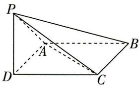

图1

$\quad$A. 四面体 PACD 是鳖臑  
$\quad$B. 阳马 $P - ABCD$ 的表面积为 48  
$\quad$C. 阳马 $P - ABCD$ 的外接球表面积为 $41 \pi$   
$\quad$D. 直线 $PB$ 与平面 $PAC$ 所成角的正弦值为 $\frac{\sqrt{34}}{41}$

# 去情境化审题

<table><tr><td>情境类型</td><td>情境嵌入型</td></tr><tr><td>去情境梳理问题</td><td>在四棱锥P-ABCD中,底面是边长为4的正方形,侧棱PD⊥底面ABCD,且PD=3.A选项→利用勾股定理求出四面体PACD各棱长→判断侧面形状B选项→利用线面垂直的判定与性质定理,证明垂直关系→四棱锥各面面积→四棱锥P-ABCD的表面积C选项→通过补形,将四棱锥P-ABCD的外接球转化为长方体的外接球→长方体外接球的表面积D选项→利用等体积法求出点B到平面PAC的距离h→直线PB与平面PAC所成角的正弦值为 $\frac{h}{PB}$ </td></tr></table>

# 数学百用

现代技术中,高等数学扮演着基础性的角色,广泛应用于各个领域,如产品设计、机械制造、电子信息、经济管理、医学、会计等. 更多资源,找vx:GZSJJ2000

# 解析

<table><tr><td>选项</td><td>分析过程</td><td>正误</td></tr><tr><td>A</td><td>由 $AC=\sqrt{2}AD=4\sqrt{2},PA=PC=\sqrt{3^2+4^2}=5$ ,可得△PAC不是直角三角形,四面体PACD不是鳖臑</td><td>×</td></tr><tr><td>B</td><td>因为 $BC⊥DC,BC⊥PD,DC∩PD=D$ ,所以 $BC⊥平面PDC$ ,又 $PC⊂平面PDC$ ,所以 $BC⊥PC$ ,所以△PCB为直角三角形.同理可证△PAB为直角三角形, $PA⊥AB$ ,所以 $S_{P-ABCD}=S_{正方形ABCD}+S_{△PAD}+S_{△PCD}+S_{△PAB}+S_{△PCB}=4\times4+\frac{1}{2}\times3\times4+\frac{1}{2}\times3\times4+\frac{1}{2}\times4+\frac{1}{2}\times4\times5=48$ </td><td>√</td></tr><tr><td>C</td><td>如图2,将阳马P-ABCD补形为长为4,宽为4,高为3的长方体,可知其外接球直径为 $PB=\sqrt{4^2+4^2+3^2}=$ 【会补形】阳马P-ABCD符合“墙角模型”,可将其补形为长方体,转化为求解长方体的外接球问题 $\sqrt{41}$ ,故阳马P-ABCD的外接球半径 $r=\frac{\sqrt{41}}{2}$ ,表面积 $S=4\pi r^2=41\pi$ 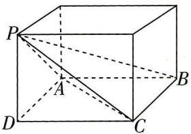图2</td><td>√</td></tr><tr><td>D</td><td>设B到平面PAC的距离为h,由 $AC=4\sqrt{2},PA=PC=5$ ,可得△PAC的面积为 $\frac{1}{2}\times4\sqrt{2}\times\sqrt{5^2-(2\sqrt{2})^2}=2\sqrt{34}$ ,由 $V_{P-ACB}=V_{B-PAC}$ ,可得 $\frac{1}{3}\times\frac{1}{2}\times4\times4\times3=\frac{1}{3}\times2\sqrt{34}\times h$ ,解得 $h=\frac{12}{\sqrt{34}}$ ,所以直线PB与平面PAC所成角的正弦值为 $\frac{h}{PB}=\frac{12}{\sqrt{34\times41}}\neq\frac{\sqrt{34}}{41}$ 【另辟蹊径】也可建立空间直角坐标系,求出平面PAC的法向量n,则直线PB与平面PAC所成角θ的正弦值为 $\sin\theta=|\cos\langle\overrightarrow{PB},n\rangle|=\frac{|\overrightarrow{PB}\cdot n|}{|\overrightarrow{PB}||n|}$ </td><td>×</td></tr></table>

故选BC.

调研 2 (阿波罗尼斯圆|2024 广东惠州 12 月月考|多选) 古希腊著名数学家阿波罗尼斯与欧几里得、阿基米德齐名, 他发现: 平面内到相异的两个定点 $A, B$ 的距离的比值为定值 $\lambda (\lambda \neq 1)$ 的点的轨迹是圆. 后来人们将这个圆以他的名字命名, 称

# 数学百用

为阿波罗尼斯圆,简称阿氏圆.在平面直角坐标系xOy中,A(-1,0),B(2,1),点P满足 $\frac{|PA|}{|PB|}=\sqrt{2}$ ,点P的轨迹为曲线C,下列结论正确的是()

$\quad$A. 曲线 $C$ 的方程为 $(x - 5)^2 + (y - 2)^2 = 20$   
$\quad$B. 曲线 $C$ 被 $x$ 轴所截得的弦长为 4  
$\quad$C. $\triangle ABP$ 面积的最大值为 $5 \sqrt{2}$   
$\quad$D. 点 $P$ 的轨迹关于直线 $mx + ny - 2 = 0 (m, n > 0)$ 对称, 则 $\frac{2}{m} + \frac{5}{n}$ 的最小值是 10

# 去情境化审题

<table><tr><td>情境类型</td><td>情境分离型</td></tr><tr><td rowspan="3">去情境梳理问题</td><td>在平面直角坐标系 $xOy$ 中, $A(-1,0)$ , $B(2,1)$ ,点 $P$ 满足 $\frac{|PA|}{|PB|}=\sqrt{2}$ ,故点 $P$ 的轨迹曲线 $C$ 为阿波罗尼斯圆</td></tr><tr><td>C选项→ $A,B$ 为定点, $\triangle ABP$ 的面积最大→圆上一动点 $P$ 到定直线 $AB$ 的距离最大</td></tr><tr><td>D选项→圆的对称轴即圆的直径所在的直线→直线 $mx+ny-2=0(m,n>0)$ 过圆心</td></tr></table>

# 解析

<table><tr><td>选项</td><td>分析过程</td><td>正误</td></tr><tr><td>A</td><td>设 $P(x,y)\rightarrow\frac{|PA|}{|PB|}=\sqrt{2}\rightarrow\frac{(x+1)^{2}+y^{2}}{(x-2)^{2}+(y-1)^{2}}=2\rightarrow(x-5)^{2}+(y-2)^{2}=20$ </td><td>√</td></tr><tr><td>B</td><td>曲线C的方程为 $(x-5)^{2}+(y-2)^{2}=20\rightarrow$ 圆心为M(5,2),半径为 $r=2\sqrt{5}\rightarrow$ 圆心M到x轴的距离 $d=2\rightarrow$ 曲线C被x轴所截得的弦长为 $l=2\sqrt{r^{2}-d^{2}}=2\times\sqrt{20-4}=8$ </td><td>×</td></tr><tr><td>C</td><td>连接 $AM\rightarrow k_{AB}=k_{AM}=\frac{1}{3}\rightarrow$ 直线AB经过圆心M→圆上一点P到直线AB的最大【新思路】求圆上一点P到直线AB的最大距离,常规思路为求圆心到直线的距离,再加半径即可.这里则通过斜率相等判断出直线AB经过圆心M,从而得到圆上一点P到直线AB的最大距离为半径r距离为半径 $r\rightarrow|AB|=\sqrt{10}\rightarrow\triangle ABP$ 面积的最大值 $(S_{\triangle ABP})_{\max }=\frac{1}{2}\times|AB|\times r=\frac{1}{2}\times\sqrt{10}\times2\sqrt{5}=5\sqrt{2}$ </td><td>√</td></tr></table>

# 数学百用

续表

<table><tr><td>选项</td><td>分析过程</td><td>正误</td></tr><tr><td>D</td><td>点P的轨迹关于直线mx+ny-2=0(m&gt;0,n&gt;0)对称→圆心(5,2)在此直线上→5m+2n=2→2/m+5/n=1/2(5m+2n)(2/m+5/n)=1/2(20+4n/m+25m/n)≥10+1/2×【关键点】基本不等式求最值的重要方法——“1”的巧用,注意乘1/2,确保配凑等价2√4n/m×25m/n=20,当且仅当4n/m=25m/n,即m=1/5,n=1/2时,等号成立→2/m+5/n的最小值是20</td><td>×</td></tr></table>

故选 AC.

调研 3: (试题调研原创 | 祖暅原理) 我国南北朝时期的数学家祖暅提出了祖暅原理: 幂势既同, 则积不容异. 祖暅原理用现代语言可描述为: 夹在两个平行平面之间的两个几何体, 被平行于这两个平面的任意平面所截, 如果截得的两个截面的面积

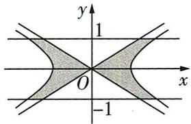

图3

总相等,那么这两个几何体的体积相等.如图3,阴影部分是由双曲线 $\frac{x^{2}}{3}-y^{2}=1$ 与它的渐近线以及直线 $y=\pm1$ 所围成的图形,将此图形绕y轴旋转一周,得到一个旋转体,则这个旋转体的体积为()

$\quad$A. $3 \pi$

$\quad$B. $6 \pi$

$\quad$C. $8 \pi$

$\quad$D. $2 \pi$

# 去情境化审题

<table><tr><td>情境类型</td><td>情境结合型</td></tr><tr><td>去情境梳理问题</td><td>利用祖暅原理求题图中阴影部分图形(由双曲线 $\frac{x^2}{3} - y^2 = 1$ 与它的渐近线以及直线y=±1所围成的图形)绕y轴旋转一周得到的旋转体的体积,则需求出旋转体垂直于y轴的截面(圆环)面积,进而将所求体积转化为等底等高的圆柱的体积进行求解</td></tr></table>

解析 双曲线 $\frac{x^{2}}{3}-y^{2}=1$ 的渐近线为直线 $y=\pm\frac{\sqrt{3}}{3}x$ ，设直线 y=t $(-1\leqslant t\leqslant1,t\neq0)$ 与双曲线及其渐近线分别相交于 C, D 及 A, B，如图4，由 $\left\{\begin{aligned}y &= t,\\ y &= \pm\frac{\sqrt{3}}{3}x,\end{aligned}\right.$ 得 $A(\sqrt{3}t,t),B(-\sqrt{3}t,t)$ ，由 $\left\{\begin{aligned}y &= t,\\ \frac{x^{2}}{3}-y^{2} &=1,\end{aligned}\right.$ 得

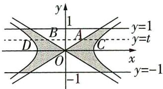

图 4

# 数学百用

概率论解决随机问题的本质,就是把局部的随机性转变为整体上的确定性.概率论是工程建筑、经济学等有关专业的基础课程 更多资源,找vx:GZSJJ2000

$C \left(\sqrt {3 + 3 t ^ {2}}, t\right), D \left(- \sqrt {3 + 3 t ^ {2}}, t\right).$

【突破障碍】根据给定条件，可得旋转体垂直于 y 轴的截面是圆环，通过联立方程求出交点，得到圆的半径，从而求出圆环面积，再利用粗细原理求出旋转体体积

如图 5, 线段 AC, BD 绕 y 轴旋转一周得到一个圆环, 其内径 $AB = 2\sqrt{3} |t|$ , 外径 $CD = 2\sqrt{3 + 3t^{2}}$ , 则此圆环面积为 $\left(\sqrt{3 + 3t^{2}}\right)^{2}\pi - \left(\sqrt{3} |t|\right)^{2}\pi = 3\pi$ .

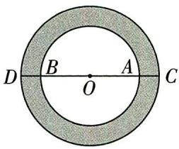

当t=0时,易知截面面积为 $3\pi$ .

因此此旋转体垂直于 y 轴的任意一截面面积都为 $3\pi$ .

图 5

由祖暅原理知,此旋转体的体积等于底面圆半径为 $\sqrt{3}$ ,高为2的圆柱的体积,则体积为 $6\pi$ .故选B.

调研 4: (斐波那契数列12024 山西大学附属中学 12 月月考) 意大利著名数学家斐波那契在研究兔子繁殖问题时, 发现有这样一列数: 1, 1, 2, 3, 5, 8, 13, …, 人们把这样的一列数组成的数列 $\{a_{n}\}$ 称为“斐波那契数列”. 那么 $\frac{a_{1}^{2} + a_{2}^{2} + a_{3}^{2} + \cdots + a_{2023}^{2}}{a_{2023}}$ 是斐波那契数列中的第 \_\_\_\_ 项.

# 去情境化审题

<table><tr><td>情境类型</td><td>情境嵌入型</td></tr><tr><td>去情境梳理问题</td><td>数列 $\{a_n\}$ 中, $a_1=1,a_2=1$ ,从第三项起,每一个数都等于它前面两个数的和,要求 $\frac{a_1^2+a_2^2+a_3^2+\cdots+a_{2023}^2}{a_{2023}}=a_m$ 中的m,则可根据 $a_{n-1}+a_n=a_{n+1},n\geqslant2$ ,结合迭代法尝试求解</td></tr></table>

解析 由已知得 $a_{n} + a_{n + 1} = a_{n + 2}$ ，从而 $a_1^2 +a_2^2 +a_3^2 +\dots +a_{2023}^2 = a_1a_2 + a_2^2 +a_3^2 +\dots +a_{2023}^2 =$

【易忽视】注意 $a_1 = a_2$ ，所以 $a_1^2 = a_1a_2$

$\begin{array}{r l} & {a _ {2} \left(a _ {1} + a _ {2}\right) + a _ {3} ^ {2} + \dots + a _ {2 0 2 3} ^ {2} = a _ {2} a _ {3} + a _ {3} ^ {2} + \dots + a _ {2 0 2 3} ^ {2} = a _ {3} \left(a _ {2} + a _ {3}\right) + a _ {4} ^ {2} + \dots + a _ {2 0 2 3} ^ {2} = a _ {3} a _ {4} + a _ {4} ^ {2} + \dots +} \\ & {a _ {2 0 2 3} ^ {2} = \dots = a _ {2 0 2 3} a _ {2 0 2 4}, \text {所以} \frac {a _ {1} ^ {2} + a _ {2} ^ {2} + a _ {3} ^ {2} + \cdots + a _ {2 0 2 3} ^ {2}}{a _ {2 0 2 3}} = a _ {2 0 2 4}.} \end{array}$

即 $\frac{a_{1}^{2}+a_{2}^{2}+a_{3}^{2}+\cdots+a_{2023}^{2}}{a_{2023}}$ 是斐波那契数列中的第2024项.故填2024.

【记结论】实际上，在斐波那契数列 $\{a_{n}\}$ 中， $a_{1} + a_{2} + a_{3} + \cdots + a_{n} = a_{n+2} - 1$ ， $a_{1}^{2} + a_{2}^{2} + a_{3}^{2} + \cdots + a_{n}^{2} = a_{n} a_{n+1}$ ，利用结论可实现秒解

# 数学百用

# 情境6 人文艺术类

【情境解读与预测】以传统工艺、雕塑、古代建筑、书法、绘画等为情境的命题在近几年高考中时有出现，如：2023北京卷第9题以“中国传统建筑造型坡屋顶”为情境命制立体几何问题；2022新高考Ⅱ卷第3题以“中国古代建筑中的举架结构”为情境命制等差数列与直线斜率相结合的问题；2021新高考Ⅰ卷第16题以“民间剪纸艺术”为情境命制错位相减法求和问题……此类题多与立体几何、三角函数、数列和平面向量等考点结合命题，从情境中提取关键信息、有效去情境化、正确翻译文本语言为数学语言是解题的突破方向.

调研 1: (古建筑中的空间几何体面积 | 2024 河北石家庄二中等校 12 月联考) 道韵楼(如图 1)以“古、大、奇、美”著称, 内部有雕梁画栋、倒吊莲花、壁画、雕塑等, 是集历史、文化、民俗于一体的观光胜地. 道韵楼可近似地看成一个正八棱柱, 其底面面积约为 $3200(\sqrt{2} + 1)$ 平方米, 高约为 11.5 米, 则该正八棱柱的侧面积约为

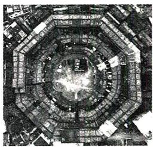

图1

$\quad$A. 460 平方米

$\quad$B. 1 840 平方米

$\quad$C. 2 760 平方米

$\quad$D. 3 680 平方米

# 去情境化审题

<table><tr><td>情境类型</td><td>情境嵌入型</td></tr><tr><td>去情境梳理问题</td><td>已知正八棱柱的底面面积为3200(√2+1)平方米,高为11.5米,求它的侧面积</td></tr></table>

解析 由题意作图,在图2所示的正八棱柱中,底面 ABCDEFGH(如图3)是正八边形,面积约为 $3200(\sqrt{2} + 1)$ .

取底面中心 $O$ ，连接 $OA,OB$ ，可得 $\angle AOB = \frac{2\pi}{8} = \frac{\pi}{4},S_{\triangle AOB} = \frac{1}{8}\times 3200(\sqrt{2} +1) = 400(\sqrt{2} +1).$

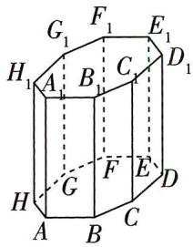

图2

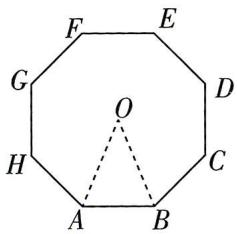

图3

# 数学百用

实变函数(实分析) 数学分析的加强版之一. 以实数作为自变量的函数叫作实变函数, 以实变函数作为研究对象的数学公式就更等资源论找vx:GZSJ2000

因为 $S_{\triangle AOB} = \frac{1}{2}OA^{2}\sin\angle AOB$ ，所以 $\frac{1}{2}OA^{2} \times \frac{\sqrt{2}}{2} = 400(\sqrt{2} + 1)$ ，即 $OA^{2} = 800(2 + \sqrt{2})$ ，

【小题巧做】在本题解答过程中，数据较复杂，我们不需要计算出 $OA$ ，而是直接利用 $OA^{2}$ ，这样可以省去开方和平方运算，节约不少时间

在 $\triangle AOB$ 中，根据余弦定理可得 $AB^{2} = OA^{2} + OB^{2} - 2OA\cdot OB\cos \angle AOB = (2 - \sqrt{2})OA^{2}$

即 $AB^{2}=(2-\sqrt{2})\times800(2+\sqrt{2})=1600$ , 得 AB=40.

故所求正八棱柱的侧面积为 $8 \times 40 \times 11.5 = 3680 \, (\text{米}^{2})$ . 故选 D.

调研 2 (试题调研原创|五线谱中的三角函数问题|多选)《欢乐颂》是著名音乐家贝多芬谱曲的重要作品之一,如图4,上下跳跃的音符具有非常和谐的韵律之美,若以时间为横轴、音高为纵轴建立平面直角坐标系,那么写在五线谱中的音符就变成了坐标系中的点.如果这些点在函数 $f(x)=4\sin(\omega x+\varphi)(\omega>0,|\varphi|<\frac{\pi}{2})$ 的图象上,其图象过点 $(\frac{\pi}{24},2)$ ,与直线y=4相交的两点的横坐标之差最小为 $\pi$ ,则下列说法正确的有()

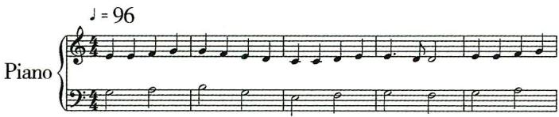

图 4

$\quad$A. $\omega = 2$

$\quad$B. $\varphi = \frac{\pi}{6}$

$\quad$C. $(\frac{11\pi}{24},0)$ 是 $f(x)$ 图象的对称中心 
$\quad$D. $f(x)$ 在 $[0,\pi ]$ 上的单调递增区间是 $[0,\frac{5\pi}{24}]$

# 去情境化审题

<table><tr><td>情境类型</td><td>情境分离型</td></tr><tr><td>去情境梳理问题</td><td> $f(x) = 4\sin(\omega x + \varphi)(\omega >0,|\varphi| < \frac{\pi}{2})$ ,其图象过点 $(\frac{\pi}{24},2)$ ,与直线 $y=4$ 相交的两点的横坐标之差最小为 $\pi$ ,判断4个选项的正误</td></tr></table>

# 数学百用

实变函数在经济学、生态学、金融学等注重数据分析的领域应用广泛,相关专业的同学都要学习此课程.
更多资源，找vx:GZSJJ2000

# 解析

<table><tr><td>选项</td><td>分析过程</td><td>正误</td></tr><tr><td>A</td><td>因为函数 $f(x)$ 的图象与直线 $y=4$ 相交的两点的横坐标之差最小为 $\pi$ ,【观察细节】为什么偏偏是直线 $y=4$ ?联系前文,振幅为4,那么图象与直线的交点便是最高点,则可得相邻两个最高点之间的距离为4,即周期为4所以函数 $f(x)$ 的最小正周期为 $\pi$ ,所以 $\omega=\frac{2\pi}{\pi}=2$ </td><td>√</td></tr><tr><td>B</td><td>因为函数图象过点 $(\frac{\pi}{24},2)$ ,所以 $4\sin(2\times\frac{\pi}{24}+\varphi)=2$ ,可得 $\sin(\frac{\pi}{12}+\varphi)=\frac{1}{2}$ ,则有 $\frac{\pi}{12}+\varphi=\frac{\pi}{6}+2k\pi,k\in\mathbf{Z}$ 或 $\frac{\pi}{12}+\varphi=\frac{5\pi}{6}+2k\pi,k\in\mathbf{Z}$ ,【易错提醒】在一个周期内,正弦值为 $\frac{1}{2}$ 的角有两个,不到最后不要轻易舍根即 $\varphi=\frac{\pi}{12}+2k\pi,k\in\mathbf{Z}$ 或 $\varphi=\frac{3\pi}{4}+2k\pi,k\in\mathbf{Z}$ ,又 $|\varphi|<\frac{\pi}{2}$ ,所以 $\varphi=\frac{\pi}{12}$ ,所以 $f(x)=4\sin(2x+\frac{\pi}{12})$ </td><td>×</td></tr><tr><td>C</td><td> $f(\frac{11\pi}{24})=4\sin(2\times\frac{11\pi}{24}+\frac{\pi}{12})=0$ ,所以 $(\frac{11\pi}{24},0)$ 是 $f(x)$ 图象的对称中心【另解】也可以正向思考,令 $2x+\frac{\pi}{12}=k\pi,k\in\mathbf{Z}$ ,得 $x=-\frac{\pi}{24}+\frac{k\pi}{2}$ , $k\in\mathbf{Z}$ ,当 $k=1$ 时, $x=\frac{11\pi}{24}$ ,所以 $(\frac{11\pi}{24},0)$ 是 $f(x)$ 图象的对称中心</td><td>√</td></tr><tr><td>D</td><td>令 $z=2x+\frac{\pi}{12},x\in[0,\pi]$ ,则 $z\in[\frac{\pi}{12},\frac{25\pi}{12}]$ , $y=4\sin z(z\in[\frac{\pi}{12},\frac{25\pi}{12}])$ 的单调递增区间是 $[\frac{\pi}{12},\frac{\pi}{2}],[\frac{3\pi}{2},\frac{25\pi}{12}]$ ,令 $\frac{\pi}{12}\leqslant2x+\frac{\pi}{12}\leqslant\frac{\pi}{2}$ 或 $\frac{3\pi}{2}\leqslant2x+\frac{\pi}{12}\leqslant\frac{25\pi}{12}$ ,得 $0\leqslant x\leqslant\frac{5\pi}{24}$ 或 $\frac{17\pi}{24}\leqslant x\leqslant\pi$ ,即函数 $f(x)=4\sin(2x+\frac{\pi}{12})$ 在 $[0,\pi]$ 上的单调递增区间是 $[0,\frac{5\pi}{24}]$ , $[\frac{17\pi}{24},\pi]$ 【另解】由 $-\frac{\pi}{2}+2k\pi\leqslant2x+\frac{\pi}{12}\leqslant\frac{\pi}{2}+2k\pi,k\in\mathbf{Z}$ ,得 $-\frac{7\pi}{24}+k\pi\leqslant x\leqslant\frac{5\pi}{24}+k\pi,k\in\mathbf{Z}$ .设 $A=[0,\pi]$ , $B=\{x\mid-\frac{7\pi}{24}+k\pi\leqslant x\leqslant\frac{5\pi}{24}+k\pi,k\in\mathbf{Z}\}$ ,则 $A\cap B=\{x\mid0\leqslant x\leqslant\frac{5\pi}{24}$ 或 $\frac{17\pi}{24}\leqslant x\leqslant\pi,k\in\mathbf{Z}\}$ </td><td>×</td></tr></table>

故选 AC.

# 数学百用

调研 3: (试题调研原创|剪纸艺术中的向量数量积问题) 窗花是贴在窗户上的剪纸, 是中国古老的传统民间艺术之一. 图5是一个正八边形窗花, 图6是从窗花图中抽象出的几何图形的示意图. 在正八边形 $A B C D E F G H$ 中, 若 $\overrightarrow { A E } = \lambda \overrightarrow { A C } + \mu \overrightarrow { A F }$ ( $\lambda, \mu \in \mathbb{R}$ ), 则 $\lambda + \mu$ 的值为\_\_\_\_; 若正八边形 $A B C D E F G H$ 的边长为2, $P$ 是正八边形 $A B C D E F G H$ 八条边上的动点, 则 $\overrightarrow { A P } \cdot \overrightarrow { D E }$ 的取值范围是\_\_\_\_.

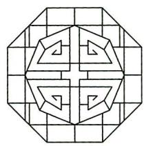

图5

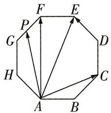

图6

# 去情境化审题

<table><tr><td>情境类型</td><td>情境嵌入型</td></tr><tr><td>去情境梳理问题</td><td>第一空:在正八边形 ABCDEFGH 中,若 $\overrightarrow{AE} = \lambda \overrightarrow{AC} + \mu \overrightarrow{AF} (\lambda, \mu \in \mathbb{R})$ ,则  $\lambda + \mu$  的值为____.以点 A 为坐标原点,分别以 AB,AF 所在直线为 x 轴,y 轴,建立平面直角坐标系,由  $\overrightarrow{AE} = \lambda \overrightarrow{AC} + \mu \overrightarrow{AF} (\lambda, \mu \in \mathbb{R})$ ,列出方程组,求得  $\lambda + \mu$ .第二空:已知正八边形 ABCDEFGH 的边长为 2,P 是正八边形 ABCDEFGH 八条边上的动点,则  $\overrightarrow{AP} \cdot \overrightarrow{DE}$  的取值范围是____.由正八边形的性质可知, $\overrightarrow{AP} \cdot \overrightarrow{DE} = \overrightarrow{AP} \cdot \overrightarrow{AH} = |\overrightarrow{AH}| \cdot |\overrightarrow{AP}| \cos \angle HAP$ ,由平面向量的投影相关知识可得  $(|\overrightarrow{AP}| \cos \angle HAP)_{\max} = 2 + \sqrt{2}$ ,此时点 P 在线段 GF 上; $(|\overrightarrow{AP}| \cos \angle HAP)_{\min} = -\sqrt{2}$ ,此时点 P 在线段 BC 上</td></tr></table>

解析 第一空 由正八边形的性质可知 $AF \perp AB$ , 以点 $A$ 为坐标原点,分别以 $AB, AF$ 所在直线为 $x$ 轴, $y$ 轴建立如图7所示的平面直角坐标系.

【破题有方】向量问题的两大解决思路为基底法和坐标法，正八边形有其特有的对称性，十分便于建立平面直角坐标系，因此采用坐标法解决问题更简便

正八边形内角和为 $(8 - 2)\times 180^{\circ} = 1080^{\circ}$ ，则 $\angle HAB = \frac{1}{8}\times 1080^{\circ} = 135^{\circ},$

所以 $A(0,0), C(2 + \sqrt{2},\sqrt{2}), E(2,2 + 2\sqrt{2}), F(0,2 + 2\sqrt{2})$

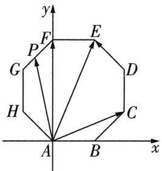

图7

# 数学百用

$\overrightarrow {A C} = (2 + \sqrt {2}, \sqrt {2}), \overrightarrow {A E} = (2, 2 + 2 \sqrt {2}), \overrightarrow {A F} = (0, 2 + 2 \sqrt {2}),$

因为 $\overrightarrow{AE} = \lambda \overrightarrow{AC} +\mu \overrightarrow{AF}$ ，所以 $\left\{ \begin{array}{ll}2 = (2 + \sqrt{2})\lambda ,\\ 2 + 2\sqrt{2} = \sqrt{2}\lambda +(2 + 2\sqrt{2})\mu , \end{array} \right.$ 解得 $\left\{ \begin{array}{ll}\lambda = 2 - \sqrt{2},\\ \mu = 2\sqrt{2} -2, \end{array} \right.$ 所以 $\lambda +\mu = \sqrt{2}.$ 第二空 方法一: 投影法 由正八边形的性质可知, $\overrightarrow{AP} \cdot \overrightarrow{DE} = \overrightarrow{AP} \cdot \overrightarrow{AH} = |\overrightarrow{AH}| \cdot |\overrightarrow{AP}| \cos \angle HAP$ .

【小题快解】向量的数量积公式为 $a \cdot b = |a||b|\cos\theta, \theta = \langle a, b \rangle$ ，若将公式中的 $|b|\cos\theta$ 看作一个整体，则向量的数量积可以表示为 $a \cdot b = |a| \times$ 向量 b 在向量 a 上的投影向量的模（或模的相反数），这就是投影法.

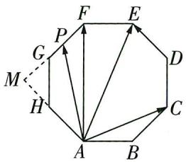

图8

投影法可以快速解决一些平面向量的数量和问题，对具有对称性的图形结构更是百试不爽

如图8, 当点 $P$ 在线段 $GF$ 上时, $|\overrightarrow{AP}| \cos \angle HAP$ 最大, 过点 $G$ 作 $GM \perp AH$ 交 $AH$ 的延长线于点 $M$ , 则 $GM = MH$ , 因为 $GH = 2$ , 所以 $GM = MH = \sqrt{2}$ , 所以 $AM = 2 + \sqrt{2}$ , 即 $|\overrightarrow{AP}| \cos \angle HAP$ 的最大值为 $2 + \sqrt{2}$ ; 同理, 当点 $P$ 在线段 $BC$ 上时, $|\overrightarrow{AP}| \cos \angle HAP$ 最小, 为 $-\sqrt{2}$ . 所以 $\overrightarrow{AP} \cdot \overrightarrow{DE}$ 的取值范围为 $[-2\sqrt{2}, 4 + 2\sqrt{2}]$ .

方法二:线性规划法(选择性学习) 在图7所示的平面直角坐标系中, $D(2+\sqrt{2},2+\sqrt{2})$ ,设 $P(x,y)$ ，则 $\overrightarrow{AP}=(x,y),\overrightarrow{DE}=(-\sqrt{2},\sqrt{2})$ ，则 $\overrightarrow{AP}\cdot\overrightarrow{DE}=\sqrt{2}(-x+y)$ ，令 $z=-x+y$ ，则 $y=x+z$ ，移

【技法核心】 $y=x+z$ 表示斜率为1、纵截距为z的一组平行线，因此通过在图上移动直线 $y=x+z$ ，就能找到截距z的最小值和最大值，这就是线性规划法

动直线 $y = x + z$ ，当直线运动到过线段 $BC$ 时， $z$ 取最小值，将 $B$ 点或 $C$ 点坐标代入，得 $z_{\min} = -2$ ；当直线运动到过线段 $GF$ 时， $z$ 取最大值，将 $D$ 点或 $F$ 点坐标代入，得 $z_{\max} = 2 + 2\sqrt{2}$ . 所以 $\overrightarrow{AP} \cdot \overrightarrow{DE}$ 的取值范围为 $[-2\sqrt{2}, 4 + 2\sqrt{2}]$ .

调研 4: (试题调研原创|十字贯穿体中的最短路径问题) 素描是使用相对单一的色彩表现明暗变化的一种绘画方法, 素描水平反映了绘画者的空间造型能力. “十字贯穿体”是学习素描时常用的几何体实物模型, 图9便是某同学绘制的“十字贯穿体”的素描作品. “十字贯穿体”是由两个完全相同的正四棱柱“垂直贯穿”构成的多面体, 其中一个四棱柱的每一条侧棱分别垂直于另一个四棱柱的每一条侧棱, 两个四棱柱分别有两条相对的侧棱交于两点, 另外两条相对的侧棱交于一点 (该点为所在棱的中点). 若该同学绘制的“十字贯穿体”由两个底面边长为4、高为 $6 \sqrt{2}$ 的正四棱柱构成 (图10), 则该十字贯穿体的体积是\_\_\_\_; 若一只蚂蚁从该“十字贯穿体”上的点 $C$ 出发, 沿表面到达点 $D$ , 则蚂蚁的最短路线长为\_\_\_\_.

# 数学百用

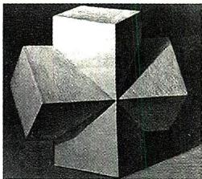

图9

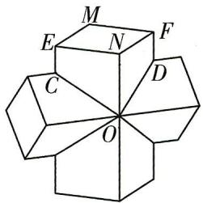

图10

# 去情境化审题

<table><tr><td>情境类型</td><td>情境结合型</td></tr><tr><td>去情境梳理问题</td><td>一个“十字贯穿体”由两个底面边长为4、高为 $6\sqrt{2}$ 的正四棱柱构成,第一空求其体积,直观上看,“十字贯穿体”的体积可以由两个正四棱柱的体积之和减去重叠部分得到.关键就在重叠部分,我们将重叠部分分割为8个全等的三棱锥,求其中一个体积便可得解.第二空求其表面上两点的最短路径,从点C出发到点D的路径不少,哪一条才是最短的?就看从哪个侧面爬过去了,依次展开侧面并计算、比较便可</td></tr></table>

解析 第一空 如图 11, 两个正四棱柱的重合部分为多面体 CDPOST, 取 CS 的中点 I, 连接 PI, OI, 则多面体 CDPOST 可以分成 8 个全等的三棱锥, 体积均为

【割补思想】对于稍复杂组合体的体积计算, 可以将其分割成几个简单的空间几何体或补全为一个大的简单几何体再求解, 本题充分利用重叠部分的对称性,将其分割成了 8 个相同的三棱锥

$V_{C - POI} = \frac{1}{3}\times \frac{1}{2}\times 4\times 4\times 2\sqrt{2} = \frac{16\sqrt{2}}{3}$ 所以该十字贯穿体的体积 $V = 4\times 4\times 6\sqrt{2}\times$ $2 - 8V_{C - POI} = \frac{448\sqrt{2}}{3}.$

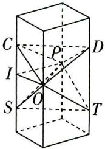

图11

第二空 考虑蚂蚁行进的较短的三条路径,并沿所经过的棱将路径图展开成平面图.

路径①:穿过棱 ON,如图 12,此时最短路线长为 $EN + NF = 4 + 4 = 8$ .

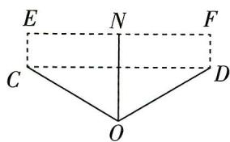

图 12

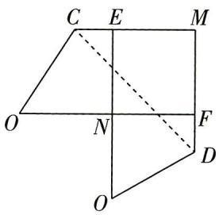

图13

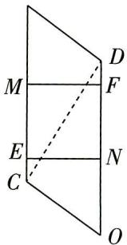

图14

数学百用

路径②:穿过棱 EN 和棱 NF,如图 13,由已知得 $EC = FD = \sqrt{2}$ , 最短路线长为 $\sqrt{2}(ME + CE) = \sqrt{2}(4 + \sqrt{2}) = 4\sqrt{2} + 2$ .

路径③: 穿过棱 EN 和棱 MF, 如图 14, 此时最短路线长为 $\sqrt{(CE + EM + FD)^{2} + EN^{2}} = \sqrt{(\sqrt{2} + 4 + \sqrt{2})^{2} + 4^{2}} = \sqrt{40 + 16\sqrt{2}}$ .

因为 $8^{2} = 64 = 40 + 24 > (\sqrt{40 + 16\sqrt{2}})^{2} = 40 + 16\sqrt{2} > (4\sqrt{2} + 2)^{2} = 36 + 16\sqrt{2}$ ，所以最短路线长为 $4\sqrt{2} + 2$ 。

# 情境7 生态文明类

【情境解读与预测】节能减排、清洁能源、环境友好是当今社会发展阶段的热词，以此为情境的命题在近几年高考中几乎每年都会出现，如：2023 新课标 I 卷第 10 题结合噪声污染问题，考查对数的运算；2023 全国甲卷第 19 题以研究臭氧效应为背景，考查分布列与独立性检验；2022 全国乙卷第 19 题以荒山改造为情境，考查相关系数……此类题多与计数原理、概率与统计、函数模型等考点结合命题，在接下来的命题中，还是会结合以上考点命题，有意识地带着疑问审读情境、提取关键信息，是解题的突破方向。

调研 1: (碳达峰, 碳中和 |2024 安徽芜湖一中、太湖中学等校 12 月联考) “碳达峰”是指二氧化碳的排放不再增长, 达到峰值之后开始下降, 而“碳中和”是指企业、团体或个人通过植树造林、节能减排等形式, 抵消自身产生的二氧化碳排放量, 实现二氧化碳“零排放”. 某地区二氧化碳的排放量达到峰值 $a$ 亿吨后开始下降, 其二氧化碳的排放量 $S$ (亿吨)与时间 $t$ (年)满足函数关系式 $S = ab^{t} (a > 0, b > 0)$ , 经过 4 年, 该地区二氧化碳的排放量为 $\frac{3a}{4}$ 亿吨. 已知该地区通过植树造林、节能减排等形式抵消自身产生的二氧化碳排放量为 $\frac{a}{3}$ 亿吨, 则该地区要实现“碳中和”, 至少需要经过 (参考数据: $\lg 2 \approx 0.30, \lg 3 \approx 0.48$ )

$\quad$A. 13 年

$\quad$B. 14 年

$\quad$C. 15 年

$\quad$D. 16 年

# 去情境化审题

<table><tr><td>情境类型</td><td>情境结合型</td></tr><tr><td rowspan="3">去情境梳理问题</td><td>经过4年,该地区二氧化碳的排放量为 $\frac{3a}{4}$ 亿吨→ $S = ab^{t}$ , $ab^{4} = \frac{3a}{4}$ </td></tr><tr><td>“碳中和”→二氧化碳排放量等于植树造林、节能减排等抵消的排放量→ $S = \frac{a}{3}$ </td></tr><tr><td>求实现“碳中和”至少需要经过多少年→求 $S = ab^{t} = \frac{a}{3}$ 对应的 $t$ </td></tr></table>

# 数学百用

高等几何 包括空间解析几何、射影几何、球面几何等,主要应用在建筑设计、工程制图方面.相关专业的学生都要掌握此课程的知识更多资源,找vx:GZSJJ2000

解析 由题意知, $S=ab^{4}=\frac{3a}{4}$ ,即 $b^{4}=\frac{3}{4}$ ,所以 $b=\sqrt[4]{\frac{3}{4}}$ ,

令 $ab^{t} = \frac{a}{3}$ ，则 $b^{t} = \frac{1}{3}$ 即 $\left(\sqrt[4]{\frac{3}{4}}\right)^{t} = \frac{1}{3}$ 即 $t\lg \sqrt[4]{\frac{3}{4}} = \lg \frac{1}{3},$

【找思路】等式两边同时取对数，根据参考数据化简为对应形式，估算求解

可得 $\frac{1}{4} t(\lg 3 - 2\lg 2) = -\lg 3$ ，即 $t = \frac{4\lg 3}{2\lg 2 - \lg 3} \approx 16.$ 故选D.

调研 2: (空气质量指数 | 2024 浙江余姚中学、萧山中学等校 12 月联考 | 多选) 某环保局对辖区内甲、乙、丙、丁四个地区的环境治理情况进行检查督导, 若连续 10 天, 每天空气质量指数 (大于 0) 不超过 100 , 则认为该地区环境治理达标, 否则认为该地区环境治理不达标. 根据连续 10 天检查所得数据的数字特征推断, 环境治理一定达标的地区是 ( )

$\quad$A. 甲: 平均数为 80, 众数为 70

$\quad$B. 乙: 平均数为 80, 方差为 40

$\quad$C. 丙: 中位数为 80, 平均数为 70

$\quad$D. 丁:极差为 $10,80\%$ 分位数为 90

# 去情境化审题

<table><tr><td>情境类型</td><td>情境嵌入型</td></tr><tr><td rowspan="2">去情境梳理问题</td><td>环境治理达标→连续10天,每天空气质量指数不超过100</td></tr><tr><td>判断四个地区环境治理是否达标→根据10个数据的样本数字特征判断,样本中10个数据是否都不超过100.寻找反例说明AC错误;用反证法说明BD正确</td></tr></table>

解析 对 A, 假设 10 天数据依次为 70, 70, 70, 70, 70, 70, 70, 70, 170,

则平均数为80,众数为70,满足题意,但有数据超过100,排除A.

对 B, 若 $x_{i}$ 表示第 i 天的数据, 则 $\frac{1}{10}\sum_{i=1}^{10}(x_{i}-80)^{2}=40$ , 假设其中一天的数据超过 100, 则 $\frac{1}{10}\sum_{i=1}^{10}(x_{i}-80)^{2}>\frac{1}{10}\times(100-80)^{2}=40$ , 故假设不成立, B 符合题意.

【反证法】先假设“其中一天的数据超过100”，推出其与条件“方差为40”矛盾，故假设错误，从而说明“其中一天的数据超过100”是不可能的，所以“每一天的数据都不超过100”

对 C, 假设 10 天数据依次为 40, 50, 50, 50, 80, 80, 80, 80, 80, 110,

则中位数为 80, 平均数为 70, 满足题意, 但有数据超过 100, 排除 C.

# 数学百用

对 D, 假设其中一天的数据超过 100, 由于极差为 10, 则最小数据超过 90, 那么 $80\%$ 分位数一定比最小数据大, 即大于 90, 这与 $80\%$ 分位数为 90 矛盾, 故假设不成立, 所以连续 10 天没有超过 100 的数据, D 符合题意. 故选 BD.

调研 3: (新能源汽车|2024 四川雅安中学 12 月诊断)“绿色出行,低碳环保”已成为新的时尚. 近几年,国家相继出台了一系列的环保政策,在汽车行业提出了重点扶持新能源汽车的政策,为新能源汽车行业的发展开辟了广阔的前景. 某公司对 A 充电桩进行生产投资,所获得的利润如下表,计算得 $\sum_{i=1}^{6}(x_{i}-\bar{x})(y_{i}-\bar{y})=30$ .

<table><tr><td>投资金额x/百万元</td><td>3</td><td>4</td><td>6</td><td>7</td><td>9</td><td>10</td></tr><tr><td>所获利润y/百万元</td><td>1.5</td><td>2</td><td>3</td><td>4.5</td><td>6</td><td>7</td></tr></table>

（1）已知可用一元线性回归模型拟合 y 与 x 的关系,求其经验回归方程.

（2）若规定所获利润 $y$ 与投资金额 $x$ 的比值不低于 $\frac{2}{3}$ , 则称对应的投资金额为 “优秀投资额”, 记 2 分; 所获利润 $y$ 与投资金额 $x$ 的比值低于 $\frac{2}{3}$ 且大于 $\frac{1}{2}$ , 则称对应的投资金额为 “良好投资额”, 记 1 分; 所获利润 $y$ 与投资金额 $x$ 的比值不超过 $\frac{1}{2}$ , 则称对应的投资金额为 “不合格投资额”, 记 0 分. 现从表中 6 个投资金额中任意选 2 个, 用 $X$ 表示记分之和, 求 $X$ 的分布列及数学期望.

附:对于一组数据 $(x_{1},y_{1}),(x_{2},y_{2}),\cdots,(x_{n},y_{n})$ ，其经验回归直线 $\hat{y}=\hat{b}x+\hat{a}$ 的斜率和截距的最小二乘估计分别为 $\hat{b}=\frac{\sum\limits_{i=1}^{n}(x_{i}-\bar{x})(y_{i}-\bar{y})}{\sum\limits_{i=1}^{n}(x_{i}-\bar{x})^{2}}=\frac{\sum\limits_{i=1}^{n}x_{i}y_{i}-n\bar{x}\bar{y}}{\sum\limits_{i=1}^{n}x_{i}^{2}-n\bar{x}^{2}},\hat{a}=\bar{y}-\hat{b}\bar{x}.$

# 去情境化审题

<table><tr><td>情境类型</td><td>情境分离型</td></tr><tr><td>去情境梳理问题</td><td>（1）根据表格中的6组数据及经验回归方程的参数计算公式求解即可.（2）根据y与x的比值所在范围把6组数据分为3类,任取2个,分析可能的情况:先确定“优秀投资额”“良好投资额”“不合格投资额”的数量,然后确定X的所有可能取值,利用概率计算公式求解分布列,进而求出期望</td></tr></table>

# 数学百用

解析 （1） 计算得 $\overline{x} = 6.5, \overline{y} = 4, \sum_{i=1}^{6} (x_i - \overline{x})^2 = 37.5$ ,

所以 $\hat{b} = \frac{\sum_{i=1}^{6}(x_i - \overline{x})(y_i - \overline{y})}{\sum_{i=1}^{6}(x_i - \overline{x})^2} = \frac{30}{37.5} = 0.8, \hat{a} = \overline{y} - \hat{b}\overline{x} = 4 - 0.8 \times 6.5 = -1.2,$

所以 $y$ 关于 $x$ 的经验回归方程为 $\hat{y} = 0.8x - 1.2$ .

（2）由题意知,“优秀投资额”有2个,“良好投资额”有1个,“不合格投资额”有3个,

所以 $X$ 的所有可能取值为 $4, 3, 2, 1, 0$ ,

【读懂题意】“优秀投资额”记2分，“良好投资额”记1分，“不合格投资额”记0分，则X的取值组合有 $2+2,2+1,2+0,1+0,0+0$

$P (X = 4) = \frac {\mathrm{C} _ {2} ^ {2}}{\mathrm{C} _ {6} ^ {2}} = \frac {1}{1 5}, P (X = 3) = \frac {\mathrm{C} _ {2} ^ {1} \mathrm{C} _ {1} ^ {1}}{\mathrm{C} _ {6} ^ {2}} = \frac {2}{1 5}, P (X = 2) = \frac {\mathrm{C} _ {2} ^ {1} \mathrm{C} _ {3} ^ {1}}{\mathrm{C} _ {6} ^ {2}} = \frac {2}{5},$

$P (X = 1) = \frac {\mathrm{C} _ {1} ^ {1} \mathrm{C} _ {3} ^ {1}}{\mathrm{C} _ {6} ^ {2}} = \frac {1}{5}, P (X = 0) = \frac {\mathrm{C} _ {3} ^ {2}}{\mathrm{C} _ {6} ^ {2}} = \frac {1}{5},$

所以 $X$ 的分布列为

<table><tr><td>X</td><td>0</td><td>1</td><td>2</td><td>3</td><td>4</td></tr><tr><td>P</td><td> $\frac{1}{5}$ </td><td> $\frac{1}{5}$ </td><td> $\frac{2}{5}$ </td><td> $\frac{2}{15}$ </td><td> $\frac{1}{15}$ </td></tr></table>

$E (X) = 0 \times \frac {1}{5} + 1 \times \frac {1}{5} + 2 \times \frac {2}{5} + 3 \times \frac {2}{1 5} + 4 \times \frac {1}{1 5} = \frac {5}{3}.$

调研 4: (试题调研原创 | 动物保护)由于人类的破坏与栖息地的丧失等,地球上濒临灭绝生物的比例正在以惊人的速度增长,所以保护动物刻不容缓.全世界都在号召保护动物,动物保护的核心内容是禁止虐待、残害任何动物,禁止猎杀和捕食野生动物.某动物保护机构为了调查研究人们“保护动物意识的强弱与性别是否有关”,从某市市民中随机抽取400名进行调查,得到统计数据如下表:

<table><tr><td></td><td>保护动物意识强</td><td>保护动物意识弱</td><td>合计</td></tr><tr><td>男性</td><td>140</td><td>60</td><td>200</td></tr><tr><td>女性</td><td>80</td><td>120</td><td>200</td></tr><tr><td>合计</td><td>220</td><td>180</td><td>400</td></tr></table>

（1）根据以上数据,依据小概率值 $\alpha = 0.001$ 的独立性检验,能否认为人们保护动物意识的强弱与性别有关?

（2）用分层抽样的方式从保护动物意识弱的180人中抽取9人,再从这9人中随机抽取5人,用随机变量X表示这5人中男性和女性人数之差的绝对值,求X的分布列和数学期望.

附： $\chi^2 = \frac{n(ad - bc)^2}{(a + b)(c + d)(a + c)(b + d)}$ ，其中 $n = a + b + c + d.$

<table><tr><td> $\alpha$ </td><td>0.1</td><td>0.05</td><td>0.01</td><td>0.005</td><td>0.001</td></tr><tr><td> $x_{\alpha}$ </td><td>2.706</td><td>3.841</td><td>6.635</td><td>7.879</td><td>10.828</td></tr></table>

# 去情境化审题

<table><tr><td>情境类型</td><td>情境嵌入型</td></tr><tr><td>去情境梳理问题</td><td>（1）给出列联表,两个分类变量分别为性别、保护动物意识的强弱,要求依据小概率值α=0.001的独立性检验,判断两个分类变量是否有关联.（2）用分层抽样的方式从180人中抽取9人,其中男女人数比为1:2,则有3名男性,6名女性,从这9人中随机抽取5人,X表示这5人中男性和女性人数之差的绝对值,求X的分布列和数学期望</td></tr></table>

解析 （1） 零假设为 $H_{0}$ : 保护动物意识的强弱与性别无关.

【规范答题】独立性检验问题注意步骤完整，不要漏掉零假设

由题意得 $\chi^2 = \frac{400\times(140\times 120 - 60\times 80)^2}{200\times 200\times 220\times 180} = \frac{400}{11}\approx 36.364 > 10.828 = x_{0.001},$

根据小概率值 $\alpha = 0.001$ 的独立性检验，推断 $H_0$ 不成立，

即认为保护动物意识的强弱与性别有关.

（2）用分层抽样的方式从保护动物意识弱的180人中抽取9人,则抽得男性3人,女性6人.

从这9人中随机抽取5人,所有可能结果为女性5人,男性0人;女性4人,男性1人;女性3人,男性2人;女性2人,男性3人.

X 的所有可能取值为 1,3,5,

$\mathrm{则} P (X = 1) = \frac {\mathrm{C} _ {3} ^ {2} \mathrm{C} _ {6} ^ {3} + \mathrm{C} _ {3} ^ {3} \mathrm{C} _ {6} ^ {2}}{\mathrm{C} _ {9} ^ {5}} = \frac {2 5}{4 2}, P (X = 3) = \frac {\mathrm{C} _ {3} ^ {1} \mathrm{C} _ {6} ^ {4}}{\mathrm{C} _ {9} ^ {5}} = \frac {5}{1 4}, P (X = 5) = \frac {\mathrm{C} _ {3} ^ {0} \mathrm{C} _ {6} ^ {5}}{\mathrm{C} _ {9} ^ {5}} = \frac {1}{2 1},$

【厘清思路】X=3, X=5 都只对应一种情况，而 X=1 对应两种情况，注意区分求解

# 数学百用

数论告诉我们,两个很大的素数易于乘积,得到的结果却不易分解,在密码学中可以应用这一性质实现加密. 更多资源,找vx:GZSJJ2000

所以 $X$ 的分布列为

<table><tr><td>X</td><td>1</td><td>3</td><td>5</td></tr><tr><td>P</td><td>25/42</td><td>5/14</td><td>1/21</td></tr></table>

所以 $E(X) = 1 \times \frac{25}{42} + 3 \times \frac{5}{14} + 5 \times \frac{1}{21} = \frac{40}{21}$ .

调研 5: (垃圾分类宣传|2024 湖南师大附中、株洲二中等校 12 月联考)从2023 年起,我国于每年 5 月第四周开展“全国城市生活垃圾分类宣传周”活动.某社区举行了一次生活垃圾分类知识比赛,要求每个家庭派出一名代表参赛,每位参赛者需测试 A,B,C 三个项目,三个测试项目相互不受影响.

（1）若某居民甲在测试过程中,第一项测试是等可能地从 $A, B, C$ 三个项目中选一项,且他测试 $A, B, C$ 三个项目通过的概率分别为 $\frac{3}{5}, \frac{1}{2}, \frac{1}{2}$ . 已知他第一项测试通过,求他第一项测试选择的项目是 $A$ 的概率.

（2） 现规定: 三个项目全部通过获得一等奖, 只通过两项获得二等奖, 只通过一项获得三等奖, 三项都没有通过不获奖. 已知居民乙选择 A, B, C 的顺序参加测试, 且他前两项通过的概率均为 a, 第三项通过的概率为 b. 若他获得一等奖的概率为 $\frac{1}{8}$ , 求他获得二等奖的概率 P 的最小值.

# 去情境化审题

<table><tr><td>情境类型</td><td>情境嵌入型</td></tr><tr><td>去情境梳理问题</td><td>（1）第一项选A,B,C的概率都为 $\frac{1}{3}$ ,求在第一项测试通过的条件下,第一项测试是A的概率.（2）测试的顺序和每项通过的概率固定,已知获得一等奖的概率,求获得二等奖的概率的最小值</td></tr></table>

# 数学百用

解析 （1）记事件 $M_{1}$ 为“第一项测试选择了项目 $A$ ”, $M_{2}$ 为“第一项测试选择了项目 $B$ ”, $M_{3}$ 为“第一项测试选择了项目 $C$ ”, 记事件 $N$ 为“第一项测试合格”,

由题意知, $N=M_{1}N+M_{2}N+M_{3}N,P(M_{1})=P(M_{2})=P(M_{3})=\frac{1}{3}$ ,

$P (N | M _ {1}) = \frac {3}{5}, P (N | M _ {2}) = \frac {1}{2}, P (N | M _ {3}) = \frac {1}{2}.$

事件 $M_{1}N, M_{2}N, M_{3}N$ 两两互斥，则 $P(N) = P(M_{1}N) + P(M_{2}N) + P(M_{3}N)$ ，

即 $P(N) = P(M_1)P(N|M_1) + P(M_2)P(N|M_2) + P(M_3)P(N|M_3) = \frac{1}{3}\times \frac{3}{5} +\frac{1}{3}\times \frac{1}{2} +\frac{1}{3}\times$ $\frac{1}{2} = \frac{8}{15},$

所以 $P(M_{1}|N) = \frac{P(M_{1}N)}{P(N)} = \frac{P(M_{1})\times P(N|M_{1})}{P(N)} = \frac{\frac{1}{3}\times\frac{3}{5}}{\frac{8}{15}} = \frac{3}{8},$

【代入公式】贝叶斯公式： $P(M_{1} \mid N) = \frac{P(M_{1}N)}{P(N)} = \frac{P(M_{1}) \cdot P(N \mid M_{1})}{\sum_{k=1}^{n} P(M_{k}) \cdot P(N \mid M_{k})}$ ，其中事件 $M_{1}$ ， $M_{2},\cdots,M_{k}$ 两两互斥，且 $M_{1}\cup M_{2}\cup\cdots\cup M_{k}=\Omega$

即已知居民甲第一项测试通过,他第一项测试选择的项目是A的概率是 $\frac{3}{8}$ .

（2）由居民乙获得一等奖的概率为 $\frac{1}{8}$ ，可知 $a^{2}b=\frac{1}{8}$ ，

则 $P = a^{2}(1 - b) + \mathrm{C}_{2}^{1}a(1 - a)b = a^{2} + 2ab - \frac{3}{8} = a^{2} + \frac{1}{4a} -\frac{3}{8}.$

【抓题眼】根据代数式构造函数，通过求导分析单调性，从而求出最值

令 $f(a)=a^{2}+\frac{1}{4a}-\frac{3}{8},0<a\leqslant1$ ，则 $f'(a)=2a-\frac{1}{4a^{2}}=\frac{8a^{3}-1}{4a^{2}}.$

当 $0 < a < \frac{1}{2}$ 时， $f'(a) < 0$ ；当 $\frac{1}{2} < a \leqslant 1$ 时， $f'(a) > 0$ .

所以 $f(a)$ 在 $(0,\frac{1}{2})$ 上单调递减，在 $(\frac{1}{2},1]$ 上单调递增.

所以 $f(a)_{\min}=f(\frac{1}{2})=\frac{1}{4}+\frac{1}{2}-\frac{3}{8}=\frac{3}{8}$ ，即P的最小值为 $\frac{3}{8}$ .

# 高考必知4大教材迁移情境问题

# 情境 1 命题取材于教材“数学探究”等栏目

【情境解读与预测】高考命题源于教材又高于教材，在教材改版后，对新教材中新增的栏目要适当关注，这些栏目的内容很有可能成为未来高考题的命题背景来源、命题角度来源或解题方法来源.

教材情境1 三人教A版教材《必修第二册》P63“数学探究”的主题为“用向量法研究三角形的性质”，在探究活动中用向量法证明了平面几何中的勾股定理，还用向量法证明了“三角形的三条中线交于一点”及“三角形的重心分每条中线为 $1:2$ 的两条线段”，并引导学生把眼光聚焦在三角形的边、外心、中线、重心、角平分线、内心、高、垂心等.由此对该情境进行迁移，高考有可能对三角形四心的向量表示进行考查.

调研 1 (2024 湖北武汉二中 1 月月考) 如图 1 所示, 已知点 G 是 $\triangle ABC$ 的重心, 过点 G 作直线分别与 AB, AC 两边交于 M, N 两点 (点 N 与点 C 不重合), 设 $\overrightarrow{AM} = x \overrightarrow{AB}, \overrightarrow{AN} = y \overrightarrow{AC}$ , 则 $\frac{1}{x} + \frac{1}{y}$ 的值为 ( )

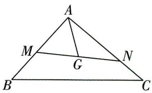

图1

$\quad$A. 3

$\quad$B. 4

$\quad$C. 5

$\quad$D. 6

解析 设 $\overrightarrow{MG} = \lambda \overrightarrow{MN}$ ，则 $\overrightarrow{AG} = \overrightarrow{AM} + \overrightarrow{MG} = \overrightarrow{AM} + \lambda \overrightarrow{MN} = \overrightarrow{AM} + \lambda (\overrightarrow{AN} - \overrightarrow{AM}) = (1 - \lambda) \overrightarrow{AM} + \lambda \overrightarrow{AN} = (1 - \lambda) x \overrightarrow{AB} + \lambda y \overrightarrow{AC}$ ,

因为 $G$ 是 $\triangle ABC$ 的重心, 故 $\overrightarrow{AG} = \frac{1}{3}\overrightarrow{AB} + \frac{1}{3}\overrightarrow{AC}$ ,

【记结论】设 O 是 $\triangle ABC$ 的重心，P 为平面内任意一点，则有以下结论：① $\overrightarrow{OA} + \overrightarrow{OB} + \overrightarrow{OC} = 0$ ；② $\overrightarrow{PO} = \frac{1}{3} (\overrightarrow{PA} + \overrightarrow{PB} + \overrightarrow{PC})$ ；③ 若动点 P 满足 $\overrightarrow{AP} = \lambda (\overrightarrow{AB} + \overrightarrow{AC}), \lambda \in [0, +\infty)$ ，则动点 P 的轨迹经过三角形的重心

则有 $\left\{\begin{aligned}(1-\lambda)x&=\frac{1}{3},\\ \lambda y&=\frac{1}{3},\end{aligned}\right.$ 故 $\frac{1}{x}+\frac{1}{y}=3(1-\lambda)+3\lambda=3.$ 故选A.

调研 2 (2024 辽宁沈阳二中 12 月模拟) 在 $\triangle ABC$ 中, 设 $\overrightarrow{AC^2} - \overrightarrow{AB^2} = 2\overrightarrow{AM}$ .

数学百用

$(\overrightarrow{AC} - \overrightarrow{AB})$ ，那么动点 $M$ 的轨迹必通过 $\triangle ABC$ 的 （）

$\quad$A. 垂心

$\quad$B. 内心

$\quad$C. 重心

$\quad$D. 外心

解析 设线段 $BC$ 的中点为 $D$ , 则 $\overrightarrow{DB} = -\overrightarrow{DC}$ ,

连接 $AD$ ，所以 $\overrightarrow{AB} +\overrightarrow{AC} = (\overrightarrow{AD} +\overrightarrow{DB}) + (\overrightarrow{AD} +\overrightarrow{DC}) = 2\overrightarrow{AD} +(\overrightarrow{DB} +\overrightarrow{DC}) = 2\overrightarrow{AD},$

因为 $\overrightarrow{AC}^2 -\overrightarrow{AB}^2 = 2\overrightarrow{AM}\cdot (\overrightarrow{AC} -\overrightarrow{AB})$ ，即 $(\overrightarrow{AC} +\overrightarrow{AB})\cdot (\overrightarrow{AC} -\overrightarrow{AB}) = 2\overrightarrow{AM}\cdot \overrightarrow{BC},$

所以 $2\overrightarrow{AD}\cdot\overrightarrow{BC}=2\overrightarrow{AM}\cdot\overrightarrow{BC}$ ，即 $\overrightarrow{BC}\cdot(\overrightarrow{AM}-\overrightarrow{AD})=\overrightarrow{BC}\cdot\overrightarrow{DM}=0$ ，即 $DM\perp BC$ ，

所以 DM 垂直且平分线段 BC，

因此动点 M 的轨迹是线段 BC 的垂直平分线, 必通过 $\triangle ABC$ 的外心. 故选 D.

【必记结论】设 O 是 $\triangle ABC$ 的外心，则有以下结论：① $|\overrightarrow{OA}| = |\overrightarrow{OB}| = |\overrightarrow{OC}| \Leftrightarrow \overrightarrow{OA}^{2} = \overrightarrow{OB}^{2} = \overrightarrow{OC}^{2}$ ; ② $(\overrightarrow{OA} + \overrightarrow{OB}) \cdot \overrightarrow{AB} = (\overrightarrow{OB} + \overrightarrow{OC}) \cdot \overrightarrow{BC} = (\overrightarrow{OA} + \overrightarrow{OC}) \cdot \overrightarrow{AC} = 0$

调研 3: (2024 广东肇庆中学 1 月模考 | 多选) 已知 P 为 $\triangle ABC$ 所在平面内一点, 则下列说法正确的是 ( )

$\quad$A. 若 $\overrightarrow{PA} + 3\overrightarrow{PB} + 2\overrightarrow{PC} = 0$ ，则点 P 在 $\triangle ABC$ 的中位线上  
$\quad$B. 若 $\overrightarrow{PA} + \overrightarrow{PB} + \overrightarrow{PC} = 0$ ，则 P 为 $\triangle ABC$ 的重心  
$\quad$C. 若 $\overrightarrow{AB} \cdot \overrightarrow{AC} > 0$ , 则 $\triangle ABC$ 为锐角三角形  
$\quad$D. 若 $\overrightarrow{AP} = \frac{1}{3}\overrightarrow{AB} + \frac{2}{3}\overrightarrow{AC}$ ，则 $\triangle ABC$ 与 $\triangle ABP$ 的面积比为 3:2

解析

<table><tr><td>选项</td><td>分析过程</td><td>正误</td></tr><tr><td>A</td><td>设AB的中点为D,BC的中点为E,连接DE,PD,PE.∵ $\overrightarrow{PA}+3\overrightarrow{PB}+2\overrightarrow{PC}=0$ ,∴ $\overrightarrow{PA}+\overrightarrow{PB}=-2(\overrightarrow{PB}+\overrightarrow{PC})$ ,∴ $2\overrightarrow{PD}=-4\overrightarrow{PE}$ ,即 $\overrightarrow{PD}=2\overrightarrow{EP}$ ,∴P,D,E三点共线且P在线段DE上,又DE为△ABC的中位线,∴点P在△ABC的中位线上</td><td>√</td></tr><tr><td>B</td><td>设AB的中点为D,连接PD,CD.由 $\overrightarrow{PA}+\overrightarrow{PB}+\overrightarrow{PC}=0$ 得 $\overrightarrow{PA}+\overrightarrow{PB}=-\overrightarrow{PC}=\overrightarrow{CP}$ ,又 $\overrightarrow{PA}+\overrightarrow{PB}=2\overrightarrow{PD}$ ,∴ $\overrightarrow{CP}=2\overrightarrow{PD}$ ,∴P在中线CD上,且 $\frac{CP}{PD}=2$ ,∴P为△ABC的重心</td><td>√</td></tr><tr><td>C</td><td>∵ $\overrightarrow{AB}\cdot\overrightarrow{AC}>0$ ,∴A为锐角,但无法判断B,C是否都为锐角</td><td>×</td></tr><tr><td>D</td><td>∵ $\overrightarrow{AP}=\frac{1}{3}\overrightarrow{AB}+\frac{2}{3}\overrightarrow{AC}$ ,∴P为线段BC上靠近点C的三等分点,即 $\overrightarrow{BP}=\frac{2}{3}\overrightarrow{BC}$ ,∴ $S_{\triangle ABC}:S_{\triangle ABP}=BC:BP=3:2$ </td><td>√</td></tr></table>

故选 ABD.

# 数学百用

离散数学 离散数学是有关集合、逻辑与算法的课程,在计算机科学与技术领域有着广泛的应用,是计算机相关专业不可或缺的学科资源,序式读式G操作图0.0工智能等都离不开离散数学.

教材情境2 三人教A版教材《必修第一册》P162“数学建模”的主题为“建立函数模型解决实际问题”，建立了茶水温度随时间变化的函数模型，从而确定茶水达到最佳饮用口感所需放置的大致时间。在数学建模的过程中，进一步体会函数模型在现实生活中的应用，感受数学的应用价值，利用函数模型解决实际问题是高考的热点。

调研 4: (热饮最佳口感时刻|2024 北京东北师大附中朝阳学校12月质检)某种热饮需用开水冲泡,其基本操作流程如下:①先将水加热到100℃,水温 $y(℃)$ 与时间 $t(\min)$ 近似满足一次函数关系;②用开水将热饮冲泡后在室温下放置,水温 $y(℃)$ 与时间 $t(\min)$ 近似满足的函数关系式为 $y=80\left(\frac{1}{2}\right)^{\frac{t-a}{10}}+b(a,b$ 为常数),通常这种热饮在40℃时,口感最佳.某天室温

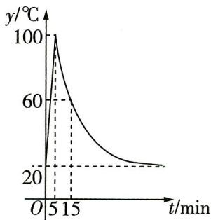

图2

为 $20^{\circ} \mathrm{C}$ 时, 冲泡热饮的部分数据如图 2 所示, 那么按上述流程冲泡一杯热饮, 并在口感最佳时饮用, 最少需要的时间为 ( )

$\quad$A. $35 \mathrm{~min}$

$\quad$B. $30 \mathrm{~min}$

$\quad$C. $25 \mathrm{~min}$

$\quad$D. ${20}\mathrm{\;{min}}$

# 去情境化审题

<table><tr><td>情境类型</td><td>情境结合型</td></tr><tr><td>去情境梳理问题</td><td>0~5min为将水从20°C加热到100°C的过程,5min以后,函数解析式为y=80(1/2)t-a/10+b,函数图象过点(5,100)和点(15,60),求当y=40时,t的值</td></tr></table>

解析 由题意,当 $0 \leqslant t < 5$ 时,函数图象是一条线段,

【易错提醒】结合情境正确理解分段函数每一段的含义，在 $0 \leqslant t < 5$ 时，是把水加热至 $100^{\circ} \mathrm{C}$ 的过程，此段不是我们的求解目标

当 $t \geqslant 5$ 时，函数的解析式为 $y = 80\left(\frac{1}{2}\right)^{\frac{t - a}{10}} + b$ ，将点(5,100)和点(15,60)的坐标代入解析式，有 $\left\{ \begin{array}{l} 100 = 80\left(\frac{1}{2}\right)^{\frac{5 - a}{10}} + b, \\ 60 = 80\left(\frac{1}{2}\right)^{\frac{15 - a}{10}} + b, \end{array} \right.$ 解得 $\left\{ \begin{array}{l} a = 5, \\ b = 20, \end{array} \right.$

故函数的解析式为 $y=80\left(\frac{1}{2}\right)^{\frac{t-5}{10}}+20,t\geqslant5.$

令 y=40，解得 t=25，故最少需要的时间为 25 min。故选 C.

# 专业新观

小编说:近年来,科技发展、社会进步越来越快,各学科领域不断添加新的内容,相关专业已经成为热门. 更多资源,找vx:GZSJJ2000

调研 5 (试题调研原创)2023年12月26日11时26分,我国在西昌卫星发射中心用长征三号乙运载火箭与远征一号上面级,成功发射第五十七颗、五十八颗北斗导航卫星.这是长征系列运载火箭的第504次飞行,火箭在发射时会产生巨大的噪声,已知声音的声强级 $d(x)$ (单位:dB)与声强x(单位:W/m²)满足关系式: $d(x)=10\lg\frac{x}{10^{-12}}$ .若某人交谈时的声强级约为60 dB,且火箭发射时的声强与此人交谈时的声强的比值约为 $10^{7.8}$ ,则火箭发射时的声强级约为()

$\quad$A. $125 \mathrm{~dB}$

$\quad$B. $132 \mathrm{~dB}$

$\quad$C. $138 \mathrm{~dB}$

$\quad$D. $156 \mathrm{~dB}$

解析 情境结合型 设人交谈时的声强为 $x_{1} \mathrm{~W} / \mathrm{m}^{2}$ ,

则火箭发射时的声强为 $10^{7.8}x_{1}$ W/m $^{2}$ ，且 $60=10\lg\frac{x_{1}}{10^{-12}}$ ，可得 $x_{1}=10^{-6}$ ，

则火箭发射时的声强约为 $10^{7.8}\times10^{-6}=10^{1.8}(W/m^{2})$ ,

代入 $d(x) = 10\lg \frac{x}{10^{-12}}$ 中，得 $d(10^{1.8}) = 10\lg \frac{10^{1.8}}{10^{-12}} = 138,$

故火箭发射时的声强级约为 138 dB, 故选 C.

# 提分干货 解题策略

对数函数应用题的基本类型和求解策略：（1）基本类型：有关对数函数的应用题一般都会给出函数的解析式，然后要求根据实际问题求解。（2）求解策略：首先根据实际情况求出函数解析式中的参数，或根据给出的具体情境，从中提炼出数据，代入解析式求值，然后根据数值回答其实际意义。

调研 6 (乡村振兴12024 湖南省五市十校教研教改共同体 12 月联考) 全面推动小流域综合治理提质增效, 大力推进生态清洁小流域建设是助力乡村振兴和美丽中国建设的重要途径之一. 某乡村落实该举措后因地制宜, 发展旅游业, 预计 2024 年平均每户将增加 4000 元收入, 以后每年度平均每户较上一年增长的收入是在前一年每户增长收入的基础上以 $10\%$ 的增速增长的, 则该乡村每年度平均每户较上一年增加的收入开始超过 12000 元的年份大约是 (参考数据: $\ln 3 \approx 1.10$ , $\ln 10 \approx 2.30$ , $\ln 11 \approx 2.40$ ) ()

$\quad$A. 2033 年

$\quad$B. 2034 年

$\quad$C. 2035 年

$\quad$D. 2036 年

# 去情境化审题

<table><tr><td>情境类型</td><td>情境嵌入型</td></tr><tr><td>去情境梳理问题</td><td>预计2024年平均每户将增加4000元收入,以后每年度平均每户较上一年增长的收入是在前一年每户增长收入的基础上以10%的增速增长的→增加的收入构成等比数列</td></tr></table>

解析 设从 2024 年年底开始, 经过 n 年之后, 每年度平均每户收入增加 y 元,

由题得 $y = 4000 \cdot (1 + 10\%)^n$ ，令 $y > 12000$ ，则 $1.1^n > 3$ ，

则 $n\ln 1.1 > \ln 3, n > \frac{\ln 3}{\ln 1.1} = \frac{\ln 3}{\ln 11 - \ln 10} \approx 11$

【敲黑板】两边同时取对数，充分利用题目中给出的参考数据解题

又 $n \in \mathbf{N}^*$ , 则 $n$ 的最小值为 12. 所以所求年份大约是 2036 年. 故选 D.

# 情境 2 命题取材于教材例、习题

【情境解读与预测】数学教材是高考数学试题的“策源地”，从这几年的高考数学试卷中，总能够找到许多与教材中的例、习题相似的试题，如2023新课标I卷第10题对“声压级”的考查，便源自人教A版教材《必修第一册》P141习题4.4第10题的“声强级”。这些试题考查的都是教材中最基本、最重要的数学知识和技能，因此我们说高考数学是“岁岁年年均相似，年年岁岁题不同”，每一年的试题都给人似曾相识的感觉。在平时复习时，一定不能脱离教材，要回归教材，用好教材，重视基础知识、基本方法，再复杂的试题也不过是教材的浅浅变式而已。

教材情境1 人教 A 版教材《必修第二册》P120 习题 8.3 第 7 题，已知质量和密度求体积，进而利用总体积求六角螺母的个数。题目以生产、生活实际为背景，考查数学应用及数学探索，要求学生具备敏锐的观察力、优秀的分析问题能力，体现了逻辑推理、数据分析等核心素养。

调研 1: (紫砂壶|2024 安徽师大附中等校 1 月联考) 紫砂壶是中国特有的手工制造陶土工艺品, 经典的壶型有西施壶、石瓢壶、潘壶等, 其中石瓢壶的壶体可以近似看成一个圆台 (其他因素忽略不计). 图 1 给出了一个石瓢壶的相关数据 (单位: cm), 那么该壶的侧面积约为

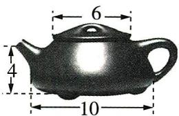

图 1

( )

$\quad$A. $16 \sqrt{6} \pi \mathrm{~cm}^{2}$

$\quad$B. ${12}\sqrt{5}\pi {\mathrm{{cm}}}^{2}$

$\quad$C. ${16}\sqrt{5}\pi {\mathrm{{cm}}}^{2}$

$\quad$D. $24 \sqrt{5} \pi \mathrm{~cm}^{2}$

专业新观

# 解析 情境嵌入型

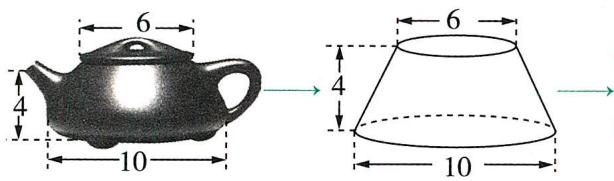

圆台的侧面积公式为 $S_{\text{圆台侧}} = \pi(r_1 + r_2)l$ ，此处上底面半径 $r_1 = 3 \, cm$ ，下底面半径 $r_2 = 5 \, cm$ ，高 h = 4 cm，则圆台的母线长 $l = \sqrt{4^2 + (5 - 3)^2} = 2\sqrt{5} \, (\text{cm})$ ，因此圆台侧面积 $S = \pi(r_1 + r_2)l = 16\sqrt{5}\pi(\text{cm}^2)$ ，故选 C

调研 2 (蹴鞠|2024 长沙长郡中学 12 月模拟) 蹱鞠, 又名蹴球、蹴圆、筑球、踢圆等, 鞠最早系外包皮革、内实米糠的球(图 2), 因而蹴鞠就是指古人以脚蹴、蹋、踢皮球的活动, 类似于今日的足球. 2006 年 5 月 20 日, 蹱鞠已作为非物质文化遗产经国务院批准列入第一批国家级非物质文化遗产名录. 已知某鞠的表面上有四个点 A,$B, C, P, AC = BC = 4, PA = 2, AC \perp BC, PA \perp$ 平面 $ABC$ , 则该鞠的表面积约为 ( )

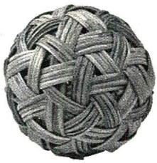

图2

$\quad$A. ${49\pi }$

$\quad$B. ${64\pi }$

$\quad$C. $36 \pi$

$\quad$D. ${16\pi }$

# 去情境化审题

<table><tr><td>情境类型</td><td>情境嵌入型</td></tr><tr><td>去情境梳理问题</td><td>在三棱锥P-ABC中,AC=BC=4,PA=2,AC⊥BC,PA⊥平面ABC,求三棱锥P-ABC的外接球表面积</td></tr></table>

解析 方法一: 直接法 根据题意作出如图 3 所示的三棱锥 P-ABC, 取 BP 的中点 O, 连接 OA, OC. 因为 $PA \perp$ 平面 ABC, AB, BC ⊂ 平面 ABC, 所以 $PA \perp AB, PA \perp BC$ , 所以 OP = OA = OB. 又 $CA \perp BC, CA \cap PA = A, CA, PA \subset$ 平面 PAC, 所以 $BC \perp$ 平面 PAC, 而 $PC \subset$ 平面 PAC, 故 $BC \perp PC$ , 故 OP = OC = OB, 所

图3

以 O 为三棱锥 P-ABC 外接球的球心, $PB = \sqrt{PA^{2} + CA^{2} + CB^{2}} = 6$ , 故所求鞠的直径为 6, 表面积为 $4\pi \times 3^{2} = 36\pi$ , 故选 C.

# 专业新观

人工智能 人工智能已经走进我们的生活,是未来不可忽视的重要发展领域.工学的电子信息类和机械类近年产生了很多有关人工智能的新专线,为智能测控工程智能交互设计、智能测控工程等.

方法二:补形法 根据题意可得三棱锥 P-ABC 有三条两两垂直的棱 PA, AC, BC, 符合“墙角模型”（有关几何体外接球的 8 大模型详见《试题调研选择题、填空题满分技法》一书 P67\~69）。根据“墙角模型”的结论可知，外接球的直径 $PB = \sqrt{PA^{2} + CA^{2} + CB^{2}} = 6$ ，故所求鞠的表面积为 $4\pi \times 3^{2} =$

【释疑惑】简单来说，“墙角模型”就是将几何体补形为如图4所示的长方体PEFH-ACBD，则长方体的体对角线长即外接球的直径 $36\pi$ ，故选C.

图4

调研 3 (瓷器12024 河北保定一中 1 月模拟)中国是瓷器的故乡,“瓷器”一词最早见之于许慎的《说文解字》中.某瓷器如图5所示,它的上半部分可以近似看作圆柱,下半部分看作两个等高(高均为 $6 \mathrm{~cm}$ ) 的圆台,直观图如图6所示,其中圆柱的高为 $20 \mathrm{~cm}$ ,底面直径 $AB = 10 \mathrm{~cm}$ ,圆台

图5

图6

的两底面直径分别为 $CD = 20 \mathrm{~cm}, EF = 16 \mathrm{~cm}$ , 若忽略该瓷器的厚度, 则该瓷器的容积为 ( )

$\quad$A. $669 \pi \mathrm{cm}^{3}$

$\quad$B. $1338 \pi \mathrm{cm}^{3}$

$\quad$C. ${650\pi }{\mathrm{{cm}}}^{3}$

$\quad$D. $1300 \pi \mathrm{cm}^{3}$

解析 情境嵌入型

教材情境2 三人教 A 版教材《必修第一册》P245 例 1，题目将温度变化曲线抽象为曲线 $y = A \sin (\omega x + \varphi) + b$ ，构造了三角函数模型，将最大温差与“A”结合，利用三角函数的性质解决了实际生活问题，体现了逻辑推理、数据分析等核心素养.

调研 4:（试题调研原创|“赵爽弦图”）我国古代数学家赵爽在注解《周髀算经》一书时介绍了“赵爽弦图”，如图7所示，它是由四个全等的直角三角形与一个小正方形拼成的大正方形，记直角三角形中较大的锐

  
图7

专业新观

角为 $\alpha$ ，且满足 $\frac{\cos\left(\frac{3\pi}{2} - \alpha\right) - \cos(3\pi - \alpha)}{\sin(\pi + \alpha) + \sin(2024\pi - \alpha)} = \frac{1}{8}$ ，则 $\tan \alpha$ 的值为 （）

$\quad$A. $\frac{4}{3}$

$\quad$B. $\frac{3}{4}$

$\quad$C. $\frac{5}{3}$

$\quad$D. $\frac{3}{5}$

解析 情境嵌入型 $\frac{\cos\left(\frac{3\pi}{2}-\alpha\right)-\cos(3\pi-\alpha)}{\sin(\pi+\alpha)+\sin(2024\pi-\alpha)}=\frac{-\sin\alpha+\cos\alpha}{-\sin\alpha-\sin\alpha}=\frac{-\tan\alpha+1}{-2\tan\alpha}=\frac{1}{8}$ ,

所以 $-8\tan\alpha+8=-2\tan\alpha$ , 得 $\tan\alpha=\frac{4}{3}$ . 故选 A.

调研 5 (阻尼器|2024 安徽临泉一中 12 月检测) 阻尼器是一种以提供运动的阻力, 耗减运动能力的装置, 深圳某高楼的阻尼器减震装置被称为“镇楼神器”. 由物理学知识可知, 某阻尼器模型的运动过程可近似为单摆运动, 其离开平衡位置的位移 $s$ (单位: $\mathrm{cm}$ ) 和时间 $t$ (单位: $\mathrm{s}$ ) 的函数关系式为 $s = A \sin \left( \frac{1}{3} \omega t + \varphi \right) (A > 0, \omega > 0, |\varphi| < \frac{\pi}{2})$ , 若振幅是 2 , 图象上相邻最高点和最低点的距离为 5 , 且过点 (1, 2), 则 $\omega$ 和 $\varphi$ 的值分别为

$\quad$A. $\pi, \frac{\pi}{6}$

$\quad$B. $2\pi, \frac{\pi}{3}$

$\quad$C. $\pi, -\frac{\pi}{6}$

$\quad$D. $2 \pi, - \frac{\pi}{3}$

# 去情境化审题

<table><tr><td>情境类型</td><td>情境嵌入型</td></tr><tr><td>去情境梳理问题</td><td>已知函数 $s = A \sin(\frac{1}{3} \omega t + \varphi)$ ( $A > 0, \omega > 0, |\varphi| < \frac{\pi}{2}$ ),其中 $A = 2$ (题眼“振幅是2”),图象上相邻最高点和最低点的距离为5,且过点(1,2),求 $\omega$ 和 $\varphi$ </td></tr></table>

解析 根据题意,由振幅是2可知A=2,故 $s=2\sin(\frac{1}{3}\omega t+\varphi)$ ,则点(1,2)是 $s=2\sin(\frac{1}{3}\omega t+\varphi)$ 图象上的最高点,不妨记 $B(1,2)$ ,与B相邻的最低点为C,如图8,连接BC,过C作 $CD\perp y$ 轴,过B作 $BD\perp CD$ ,交点为D,

【易错提醒】“图象上相邻最高点和最低点的距离为5”不是半个周期为5，而是这两点的直线距离为5，要放在直角三角形中去解

则 $CD = \frac{T}{2} (T$ 为周期）， $BD = 2 - (-2) = 4, BC = 5$ ，故 $4^2 + \left(\frac{T}{2}\right)^2 = 5^2$ ，得 $T = 6$ .

图8

# 专业新观

新能源汽车 随着国家大力扶持,新能源汽车迅速崛起,与新能源汽车有关的新能源汽车工程、高分子材料、新能源材料与器件、电动载运工程等事业,就业前景一片光明.

又 $T = \frac{2\pi}{\frac{1}{3}\omega},\omega >0$ ，故 $\omega = \pi$ ，所以 $s = 2\sin \left(\frac{\pi}{3} t + \varphi\right)$ ，将(1,2)代入，可得 $2\sin \left(\frac{\pi}{3} +\varphi\right) = 2$ ，得 $\frac{\pi}{3} +\varphi = \frac{\pi}{2} +2k\pi (k\in \mathbf{Z})$ ，即 $\varphi = \frac{\pi}{6} +2k\pi (k\in \mathbf{Z})$ ，因为 $|\varphi | <   \frac{\pi}{2}$ 所以 $\varphi = \frac{\pi}{6}$ 故 $\omega = \pi ,\varphi = \frac{\pi}{6}$ 故选A.

调研 6: (圜丘坛|2024 湖北襄阳四中 12 月模拟|多选) 北京天坛的圜丘坛为古代祭天的场所, 可近似看成一个圆形, 现将其一分为二成两个扇形, 设其中一个扇形的面积为 $S_{1}$ , 圆心角为 $\alpha_{1}$ , 另一个扇形的面积为 $S_{2}$ , 圆心角为 $\alpha_{2} (\alpha_{1} < \alpha_{2})$ . 若 $S_{1}$ 与 $S_{2}$ 的比值为 $\frac{\sqrt{5} - 1}{2} \approx 0.618$ 时, 裁剪出来的扇形看上去最美观, 那么此时 ( )

$\quad$A. $\alpha_{1} \approx 137.5^{\circ}$

$\quad$B. $\alpha_{1} \approx 127.5^{\circ}$

$\quad$C. $\alpha_{2} = (\sqrt{5} - 1)\pi$

$\quad$D. $\frac{\alpha_{1}}{\alpha_{2}} = \frac{\sqrt{5} - 1}{2}$

# 去情境化审题

<table><tr><td>情境类型</td><td>情境嵌入型</td></tr><tr><td>去情境梳理问题</td><td>一分为二成两个扇形 $\longrightarrow$  $\longrightarrow$ 已知 $\frac{S_1}{S_2} = \frac{\sqrt{5} - 1}{2} \approx 0.618$ ,求 $\alpha_1$ 的度数, $\alpha_2$ 的弧度数, $\frac{\alpha_1}{\alpha_2}$ </td></tr></table>

解析 设圆的半径为 R，则 $\frac{S_{1}}{S_{2}}=\frac{\frac{1}{2}\alpha_{1}R^{2}}{\frac{1}{2}\alpha_{2}R^{2}}=\frac{\alpha_{1}}{\alpha_{2}}=\frac{\sqrt{5}-1}{2}$ ，故 D 正确.

由 $\alpha_{1} + \alpha_{2} = 2\pi$ ，得 $\frac{\sqrt{5} - 1}{2}\alpha_{2} + \alpha_{2} = 2\pi$ ，解得 $\alpha_{2} = (\sqrt{5} - 1)\pi$ ，故C正确.

$\frac{\sqrt{5} - 1}{2} \approx 0.618$ ，则 $\sqrt{5} - 1 \approx 1.236$ ，所以 $\alpha_{2} = (\sqrt{5} - 1)\pi \approx 1.236 \times 180^{\circ} \approx 222.5^{\circ}$ ，

所以 $\alpha_{1}\approx360^{\circ}-222.5^{\circ}=137.5^{\circ}$ ，故 A 正确，B 错误。故选 ACD。

# 情境 3 命题取材于教材“思考”“探究”栏目

【情境解读与预测】教材中的“思考”“探究”栏目为学生创设了一个适于探究的情境，能尽可能发挥学生的主体作用，激发学生主动探究的动力。在近几年的高考数学试卷中，也有不少依托可动手操作的实际情境命制的思考、探究类问题，如2023新课标Ⅰ卷第12题，要求自主探究选择能被整体放入正方体容器的几何体，这类问题有助于学生形成关于科学本质的更为深入的认识，考查了探究能力和创新能力，一举多得。回归教材中的“思考”与“探究”，将创新的思维与牢固的学科知识进行搭配，是解此类题的制胜法宝。

教材情境三 人教 A 版教材《选择性必修第一册》P105 “探究”的主要内容为利用细绳、图板和铅笔探究笔尖(动点)的运动轨迹,用运动的思想诠释椭圆的定义,理解椭圆的几何特征,之后通过一系列的“思考”,引导学生建立适当的坐标系,推导出了椭圆的标准方程,还引申出了椭圆与圆的关系……一气呵成.这种由情境出发的探索问题是高考每年都会考查的热点内容.

调研 1 (试题调研原创)用绘图工具作这样一个动圆,它与圆 $C_{1}:(x+3)^{2}+$ $y^{2}=1$ 和 $C_{2}:(x-3)^{2}+y^{2}=9$ 同时外切,观察这个动圆圆心 $M$ 的运动轨迹,发现其轨迹是一条圆锥曲线.则动圆圆心 $M$ 的轨迹方程为 ( )

$\quad$A. $x^{2} - \frac{y^{2}}{8} = 1$

$\quad$B. $\frac{x^2}{8} - y^2 = 1$

$\quad$C. $x^{2} - \frac{y^{2}}{8} = 1 (x \geqslant 1)$

$\quad$D. $x^{2} - \frac{y^{2}}{8} = 1 (x \leqslant -1)$

解析 情境结合型 设动圆圆心 M 的坐标为 $(x, y)$ ，半径为 r，由题知 $C_{1}(-3, 0)$ ， $C_{2}(3, 0)$ .

由动圆 M 与圆 $C_{1}$ 和圆 $C_{2}$ 均外切可得 $\left|MC_{1}\right|=r+1,\left|MC_{2}\right|=r+3$

相减可得 $\left|MC_{2}\right|-\left|MC_{1}\right|=2<\left|C_{1}C_{2}\right|=6$ ，故点M的轨迹是以 $C_{1},C_{2}$ 为左、右焦点的双曲线的左支.

设双曲线的方程为 $\frac{x^2}{a^2} -\frac{y^2}{b^2} = 1(a,b > 0)$ ，由题意可得 $2a = 2,c = 3$ ，所以 $b = \sqrt{c^2 - a^2} = 2\sqrt{2}$

故动圆圆心 M 的轨迹方程为 $x^{2}-\frac{y^{2}}{8}=1(x\leqslant-1)$ ，故选 D.

调研 2 (2024 福建福州一中 12 月检测) 光从一点直接传播到另一点会选择最短路径, 即选择这两点间的线段. 若光不是从一点直接传播到另一点, 而是经由一面镜子 (即便镜面是曲面) 反射到另一点, 仍然会选择最短路径. 已知曲线 $C: \frac{x^{2}}{4} + \frac{y^{2}}{3} = 1$

# 专业新观

芯片 芯片是经济增长的重要引擎之一,在电子信息产业中扮演着举足轻重的角色,与之相关的专业有集成电路与设计、电子信息科学技术等更资源,找vx:GZSJJ2000

$(y>0)$ ，且将 C 假设为能起完全反射作用的曲面镜，若光从点 $A(1,1)$ 射出，经由 C 上一点 P 反射到点 $F(-1,0)$ ，则 $|AP| + |PF| =$ （）

$\quad$A. $\sqrt{6}$

$\quad$B. 3

$\quad$C. $2\sqrt{3}$

$\quad$D. 7

# 去情境化审题

<table><tr><td>情境类型</td><td>情境嵌入型</td></tr><tr><td>去情境梳理问题</td><td>题眼“仍然会选择最短路径”,问题转化为:设点P为曲线 $C:\frac{x^2}{4}+\frac{y^2}{3}=1(y>0)$ 上任意一点,求 $|AP|+|PF|$ 的最小值</td></tr></table>

解析 如图1,记曲线 $\frac{x^{2}}{4}+\frac{y^{2}}{3}=1(y>0)$ 的右焦点为 $F_{1}$ ，即 $F_{1}(1,0)$ ，连接 $PF_{1}$ ，根据椭圆的定义可得， $|PF_{1}|+|PF|=2a=4$ ，所以 $|AP|+|PF|=|AP|+4-|PF_{1}|=4-(|PF_{1}|-|AP|)$ .

图1

【妙转化】将问题转化为动点 P 与另一焦点 $F_{1}$ 到定点 A 的距离之差的最值问题来求解

因为 $|PF_{1}|-|AP|\leqslant|AF_{1}|$ ，当且仅当P,A, $F_{1}$ 三点共线时， $|PF_{1}|-|AP|=|AF_{1}|$ ，即 $(|PF_{1}|-|AP|)_{\max}=|AF_{1}|=1$ ，所以 $4-(|PF_{1}|-|AP|)$ 的最小值为 $4-(|PF_{1}|-|AP|)_{\max}=3$ ，

因此 $|AP|+|PF|=3$ 。故选B。

调研 3 (2024 浙江省春晖中学 12 月模拟) 折纸起源于中国, 后来数学家们将几何学原理运用到折纸中, 并且利用折纸来研究几何学, 很好地把折纸艺术与数学结合在一起. 将一张纸片折叠一次, 纸片上会留下一条折痕, 如果在纸片上按照一定的规律折出很多折痕后, 纸上能显现出一条漂亮曲线的轮廓. 如图 2,

图2

一张圆形纸片的圆心为 D, A 是圆 D 外的一个定点, P 是圆 D 上任意一点, 把纸片折叠使得点 A 与点 P 重合, 然后展平纸片, 折痕与直线 DP 相交于点 Q, 当点 P 在圆上运动时, 得到点 Q 的轨迹.

（1）证明点 $Q$ 的轨迹是双曲线. （2）设定点 $A$ 的坐标为 $(2,0)$ , 纸片圆的边界方程为 $(x + 2)^{2} + y^{2} = r^{2}$ . 若点 $M(2,3)$ 位于 （1） 中所描述的双曲线上, 过点 $M$ 的直线 $l$ 交该双曲线的渐近线于 $E, F$ 两点,且点 $E, F$ 位于 $y$ 轴右侧, $O$ 为坐标原点, 求 $\triangle EOF$ 面积的最小值.

# 专业新观

# 去情境化审题

<table><tr><td>情境类型</td><td>情境嵌入型</td></tr><tr><td>去情境梳理问题</td><td>（1）由双曲线的定义可得证,牢记“绝对值”“相减”“小于定值”三个关键词.（2）当直线l斜率不存在时,求出其方程,得到△EOF的面积→当直线l斜率存在时,设出直线方程,与双曲线方程联立→将直线方程与渐近线方程联立→求出|OE|,|OF|→将△EOF的面积用k表示→构造函数,求导,利用单调性求面积最值→与斜率不存在的情况比较得出最小值</td></tr></table>

解析 （1） 设圆 $D$ 的半径为 $r$ , 连接 $QA, DA$ , 由题意知 $|QA| = |QP|$ , 所以 $||QA| - |QD|| = ||QP| - |QD|| = |DP| = r$ ,

因此动点 $Q$ 到定点 $A$ 和 $D$ 的距离之差的绝对值为定值 $r$ , 且 $r < |DA|$ ,

由双曲线定义知,点 Q 的轨迹是以 A, D 为焦点的双曲线.

（2）由（1）知双曲线中 $2a = r, 2c = |DA| = 4$ ，则双曲线方程为 $\frac{x^2}{\frac{r^2}{4}} - \frac{y^2}{4 - \frac{r^2}{4}} = 1$ ，

由 $M(2,3)$ 在双曲线上，可得 $\frac{4}{\frac{r^2}{4}} - \frac{9}{4 - \frac{r^2}{4}} = 1$ ，解得 $r = 2$ ，因此双曲线方程为 $x^{2} - \frac{y^{2}}{3} = 1.$

其渐近线方程为 $y = \pm \sqrt{3} x, \angle EOA = \angle AOF = \frac{1}{2}\angle EOF = \frac{\pi}{3}$ ，如图3.

当直线 l 斜率不存在时, $\triangle EOF$ 是顶角为 $\frac{2\pi}{3}$ 的等腰三角形, 点 A 在直线

【易错提醒】设直线方程时要考虑直线的斜率是否存在, 优先书写特殊情况, 计算量小, 得分容易

$l$ 上，且 $\vert OE\vert = 2\vert OA\vert = 4$ ，所以 $S_{\triangle EOF} = \frac{1}{2}\times 4^2\times \frac{\sqrt{3}}{2} = 4\sqrt{3}.$

图3

当直线 $l$ 斜率存在时，设直线 $l$ 的方程为 $y = k(x - 2) + 3$ ，与 $x^{2} - \frac{y^{2}}{3} = 1$

联立, 消去 $y$ 得关于 $x$ 的方程 $(3 - k^2)x^2 + (4k^2 - 6k)x - 4k^2 + 12k - 12 = 0$ , 设直线 $l$ 与双曲线右支交于两点 $(x_1, y_1), (x_2, y_2)$ , 则 $\Delta = (4k^2 - 6k)^2 - 4(3 - k^2)(-4k^2 + 12k - 12) \geqslant 0$ ,

【规范答题】直线方程与双曲线方程联立消元得到一元二次方程后,利用根与系数的关系前,切勿忽视判断根的判别式的情况

且 $x_{1} + x_{2} = \frac{6k - 4k^{2}}{3 - k^{2}} >0,x_{1}x_{2} = \frac{-4k^{2} + 12k - 12}{3 - k^{2}} >0$ ，解得 $k <   - \sqrt{3}$ 或 $k > \sqrt{3}$

设 $E(x_{3},y_{3}),F(x_{4},y_{4})$ ，联立直线 $l$ 的方程和渐近线方程 $y = \pm \sqrt{3} x$ 得 $x_{3} = \frac{3 - 2k}{\sqrt{3} - k},x_{4} =$

# 专业新观

虚拟现实技术 虚拟现实技术又称 VR, 目前取得了巨大进步, 发展成了一个新的科学技术领域, 与之有关的专业有计算机科学与服务资源信息材料与器件光电信息科学与工程等.

$\frac{3 - 2k}{-\sqrt{3} - k}$ 所以 $|OE| = \frac{|x_3|}{\cos\angle EOA} = 2|x_3|$ , $|OF| = \frac{|x_4|}{\cos\angle FOA} = 2|x_4|$ ,

$S _ {\triangle E O F} = \frac {1}{2} \cdot | O E | \cdot | O F | \sin \angle E O F = \frac {1}{2} \cdot 2 | x _ {3} | \cdot 2 | x _ {4} | \sin \frac {2 \pi}{3} = \sqrt {3} | x _ {3} x _ {4} | = \frac {\sqrt {3} (3 - 2 k) ^ {2}}{k ^ {2} - 3}.$

令 $f(k) = \frac{(3 - 2k)^2}{k^2 - 3} (k < -\sqrt{3}$ 或 $k > \sqrt{3})$ ，则 $f'(k) = \frac{6(2k - 3)(k - 2)}{(k^2 - 3)^2}$

当 $k < -\sqrt{3}$ 时， $f'(k) > 0, f(k)$ 单调递增，且 $f(k) > 0$ ，此时 $S_{\triangle EOF} > 4\sqrt{3}$ .

当 $\sqrt{3} < k < 2$ 时, $f'(k) < 0$ , $f(k)$ 单调递减, 当 $k > 2$ 时, $f'(k) > 0$ , $f(k)$ 单调递增. 所以 $f(k)$ 的极小值为 $f(2) = 1$ , 此时 $S_{\triangle EOF} = \sqrt{3}$ .

综上所述， $\triangle EOF$ 面积的最小值为 $\sqrt{3}$ ，此时 $k = 2$ 且 $\Delta = 0$ ，即直线 $l$ 与双曲线相切。

调研 4 (试题调研原创) 在我们学习椭圆一节时, 曾经借助细绳、图板和铅笔, 利用定义画出了椭圆, 那么抛物线能不能用类似的方法作出来呢? 如图 4, 我们先把一根直尺固定在画板上面, 把一块三角板的一条直角边紧靠在直尺边沿, 再取一根细绳, 它的长度与另一直角边相等, 让细绳的一端固定在三角板的顶点 $A$ 处, 另一端固定在画板上点 $F$ 处, 用铅笔尖扣紧绳子 (使两段细绳绷直), 靠住三角板, 然后将三角板沿着直尺上下滑动, 这时笔尖在平面上画出了抛物线 $C$ 的一部分图象. 已知细绳长度为 3 , 经测量, 当笔尖运动到点 $P$ 处时, 如图 5 , 有 $\angle FAP = 30^{\circ}, \angle AFP = 90^{\circ}$ . 设直尺边沿所在直线为 $a$ , 以过 $F$ 且垂直于直尺的直线为 $x$ 轴, $x$ 轴与直线 $a$ 交于点 $E$ , 以线段 $EF$ 的中垂线为 $y$ 轴, 建立平面直角坐标系.

（1） 求抛物线 C 的方程.

（2）如图6,斜率为k的直线l过点D(0,-3),且与抛物线C交于不同的两点M,N,已知k的取值范围为(0,2),若 $\overrightarrow{DM}=\lambda\overrightarrow{DN}$ ,求 $\lambda$ 的取值范围.

图4

图5

图6

# 去情境化审题

<table><tr><td>情境类型</td><td>情境结合型</td></tr><tr><td>去情境梳理问题</td><td>（1）根据已知数据和抛物线的定义可得抛物线C的方程.（2）假设存在λ,设出M,N的坐标→直线l的方程→与抛物线方程联立,利用根与系数的关系得x1+x2,x1x2→根据k的取值范围为(0,2)得到λ+1/λ的取值范围→根据λ是否有解得出结论</td></tr></table>

解析 （1）依题意,笔尖到点 $F$ 的距离与它到直线 $a$ 的距离相等,因此笔尖留下的轨迹为以 $F$ 为焦点,直线 $a$ 为准线的抛物线的一部分.

【敲黑板】本题以情境介绍曲线的生成过程，解题时，要正确理解题意，找到“生成”的抛物线的焦点和准线，且由题设的建系方式，可知抛物线开口向右，那么就可用待定系数法求解方程

设抛物线方程为 $y^{2} = 2px(p > 0)$ ，则 $F(\frac{p}{2}, 0)$ ，

由 $\angle FAP = 30^{\circ},\angle AFP = 90^{\circ},|PF| + |PA| = 3$ ，得 $|PA| = 2|PF|,|PF| = 1$ ，由 $\angle FPA = 60^{\circ}$ ，得点 $P$ 的横坐标为 $\frac{p}{2} -\frac{1}{2}$ ，而抛物线的准线方程为 $x = -\frac{p}{2}$ 则 $\frac{p}{2} -\frac{1}{2} +\frac{p}{2} = 1$ ，解得 $p = \frac{3}{2}$

所以抛物线 C 的方程为 $y^{2}=3x$ .

（2） 设 $M(x_{1}, y_{1}), N(x_{2}, y_{2})$ , 直线 $l$ 的方程为 $y = kx - 3$ . 由 $\left\{ \begin{array}{l} y = kx - 3, \\ y^{2} = 3x, \end{array} \right.$ 消去 $y$ 并整理得关于 $x$ 的方程 $k^{2}x^{2} - (6k + 3)x + 9 = 0$ ,

因为 $k \in (0,2)$ ，所以 $\Delta = (6k + 3)^2 - 36k^2 = 36k + 9 > 0, x_1 + x_2 = \frac{6k + 3}{k^2}, x_1x_2 = \frac{9}{k^2}$ .

由 $\overrightarrow{DM} = \lambda \overrightarrow{DN}$ ，得 $x_{1} = \lambda x_{2}$ ，即 $\lambda = \frac{x_1}{x_2}$ ，于是 $\lambda +\frac{1}{\lambda} = \frac{x_1}{x_2} +\frac{x_2}{x_1} = \frac{(x_1 + x_2)^2}{x_1x_2} -2 = \frac{\left(\frac{6k + 3}{k^2}\right)^2}{\frac{9}{k^2}} -2 =$ $\frac{1}{k^2} +\frac{4}{k} +2$ ，令 $t = \frac{1}{k},t\in (\frac{1}{2}, + \infty)$ ，则 $\frac{1}{k^2} +\frac{4}{k} +2 = t^2 +4t + 2 = (t + 2)^2 -2\in (\frac{17}{4}, + \infty),$

因此 $\lambda + \frac{1}{\lambda} > \frac{17}{4}$ , 又 $\lambda > 0$ , 即 $\lambda^2 - \frac{17}{4}\lambda + 1 > 0$ , 解得 $0 < \lambda < \frac{1}{4}$ 或 $\lambda > 4$ ,

所以 $\lambda \in (0, \frac{1}{4}) \cup (4, +\infty)$ .

# 专业新观

自动化 自动化技术广泛用于工业、农业、军事、科学研究、交通运输、商业、医疗、服务和家庭等方面,极大地提高了效率,与此有关的新兴资源,找X.GES于J2000、智能工程与创意设计等.

# 情境4 命题取材于教材“阅读与思考”

【情境解读与预测】《普通高中数学课程标准(2023版)》提到:数学是人类文化的重要组成部分.数学课程应适当反映数学的历史、应用和发展趋势,数学对推动社会发展的作用,数学的社会需求,社会发展对数学发展的推动作用……近几年高考数学的命题方向把一部分重点放到了数学文化上,以选择题、填空题为主,一段有趣的数学家的故事、一段选自数学名著的描述、一个有趣的数学现象等,都可以成为命题的背景.而教材中的“阅读与思考”栏目就是侧重于讲数学史、数学文化、数学应用的栏目,以“阅读与思考”为起点,逐渐扩大知识面,是破解这一类题目的制胜法宝.

教材情境1 三人教 A 版教材《必修第二册》P55 “海伦和秦九韶”介绍了海伦公式、秦九韶“三斜求积”公式及应用，以解三角形为载体，与数学文化相结合命题，旨在突出数学文化、数学探索，培养逻辑推理、数学运算等核心素养.

调研 1 (试题调研原创) 海伦公式是利用三角形的三条边的边长 a, b, c 直接求三角形面积 S 的公式, 表达式为 $S = \sqrt{p(p - a)(p - b)(p - c)}$ (其中 $p = \frac{a + b + c}{2}$ ). 我国南宋著名数学家秦九韶独立推出了“三斜求积”公式, 它与海伦公式完全等价. 现在有周长为 $14 + 2\sqrt{7}$ 的 $\triangle ABC$ 满足 $\sin A: \sin B: \sin C = 3: 4: \sqrt{7}$ , 则用以上给出的公式求得 $\triangle ABC$ 的面积为 ( )

$\quad$A. $8\sqrt{7}$

$\quad$B. $4\sqrt{7}$

$\quad$C. $6\sqrt{7}$

$\quad$D. 12

解析 情境嵌入型 设 $\triangle ABC$ 的内角 $A, B, C$ 对应的边分别为 $a, b, c$ ,

$\because \sin A: \sin B: \sin C = 3:4:\sqrt{7}, \therefore a:b:c = 3:4:\sqrt{7}$ .

∵ $\triangle ABC$ 周长为 $14 + 2\sqrt{7}$ ，即 $a + b + c = 14 + 2\sqrt{7}$ 。

$\therefore a = 6, b = 8, c = 2 \sqrt {7}, \therefore p = \frac {6 + 8 + 2 \sqrt {7}}{2} = 7 + \sqrt {7},$

【破障碍】结合三角形三边长度之比与周长可得三边长度，再结合海伦公式即可求解

$\therefore S_{\triangle ABC} = \sqrt{(7 + \sqrt{7}) \times (1 + \sqrt{7}) \times (\sqrt{7} - 1) \times (7 - \sqrt{7})} = 6\sqrt{7}$ . 故选 C.

调研 2 (试题调研原创) 我国南宋著名数学家秦九韶在其著作《数书九章》

专业新观

中, 提出了已知三角形三边长求三角形面积的公式, 与海伦公式完全等价, 其求法是: “以小斜幂并大斜幂减中斜幂, 余半之, 自乘于上. 以小斜幂乘大斜幂减上, 余四约之, 为实. 一为从隅, 开平方得积.” 把以上这段文字写成公式, 即 $S_{\triangle ABC} = \sqrt{\frac{1}{4}[a^2c^2 - (\frac{a^2 + c^2 - b^2}{2})^2]}$ , 其中 $a, b, c$ 分别为 $\triangle ABC$ 内角 $A, B, C$ 的对边, 由此可以充分说明我国古代学者已具有很高的数学水平. 在 $\triangle ABC$ 中, $a, b, c$ 分别为 $\triangle ABC$ 内角 $A, B, C$ 的对边, $b = 2$ , $\tan C = \frac{\sqrt{3}\sin B}{1 - \sqrt{3}\cos B}$ , 则 $\triangle ABC$ 面积的最大值为 \_\_\_\_.

解析 情境嵌入型 $\because \tan C = \frac{\sqrt{3}\sin B}{1 - \sqrt{3}\cos B} = \frac{\sin C}{\cos C},$

$\therefore \sin C = \sqrt {3} (\sin B \cos C + \cos B \sin C) = \sqrt {3} \sin (B + C) = \sqrt {3} \sin A,$

【敲黑板】利用 $A + B + C = \pi$ 化简

由正弦定理得 $c=\sqrt{3}a,\because b=2,$

$\therefore S _ {\triangle A B C} = \sqrt {\frac {1}{4} [ a ^ {2} c ^ {2} - (\frac {a ^ {2} + c ^ {2} - b ^ {2}}{2}) ^ {2} ]} = \sqrt {\frac {1}{4} [ 3 a ^ {4} - (2 a ^ {2} - 2) ^ {2} ]} = \sqrt {\frac {1}{4} (- a ^ {4} + 8 a ^ {2} - 4)} =$

$\sqrt{\frac{1}{4}\left[-\left(a^{2}-4\right)^{2}+12\right]}$ , ∴ 当 $a^{2}=4$ , 即 a=2 时, $S_{\triangle ABC}$ 取得最大值, 为 $\sqrt{3}$ .

【技巧】把式子转化为关于 $a^2$ 的二次形式, 利用二次函数求最值. 本题与解法和本书 P019 调研 8 选项 D 一致, 备考时不仅要注意 “一题多解”, 也要注意 “多题一解” 的汇总整合

教材情境2 人教 A 版教材《选择性必修第一册》P140 “圆锥曲线的光学性质及其应用”介绍了圆锥曲线的光学性质及其在生活、设计中的应用，体现了数学的应用价值，旨在突出理性思维、数学应用，培养数学抽象、数学建模等核心素养。

调研 3 (试题调研原创 | 双曲线新闻灯) 双曲线的光学性质为: 如图1,从双曲线的右焦点 $F_{2}$ 发出的光线经双曲线镜面反射后, 反射光线的反向延长线经过左焦点 $F_{1}$ . 我国首先研制成功的“双曲线新闻灯”, 就是利用了双曲线的这个光学性质. 某“双曲线灯”的轴截面是双曲线一部分, 如图2, 其方程为 $\frac{x^{2}}{a^{2}} - \frac{y^{2}}{b^{2}} = 1 (a > 0, b > 0), F_{1}, F_{2}$ 分别为双曲线的左、右焦点, 若从右焦点 $F_{2}$ 发出的光线经双曲线上的点 $A$ 和点 $B$ 反射后, 满足 $DA \perp AB$ , $\tan \angle ABC = -\frac{1}{2}$ , 则 $\frac{|AF_{2}|}{|BF_{2}|} =$ \_\_\_\_, 该双曲线的离心率为 \_\_\_\_.

# 专业新观

图1

图2

解析 情境嵌入型 第一空 由题可知 $F_{1}, A, D$ 三点共线, $F_{1}, B, C$ 三点共线, 如图3, 连接【会审题】根据题干中的信息正确迁移得出结论

$F_{1}A, F_{1}B$ ，设 $|AF_{1}| = m$ ，则 $|AF_{2}| = m - 2a$ ，因为 $\tan \angle ABC = -\frac{1}{2}$ ，所以 $\tan \angle ABF_{1} = \frac{1}{2}$ ，

又 $AF_{1} \perp AB$ ，所以 $|AB| = 2|AF_{1}| = 2m, |BF_{1}| = \sqrt{5}m$ ，所以 $|BF_{2}| = m + 2a, |BF_{1}| = m + 4a$ ，所以 $m + 4a = \sqrt{5}m$ ，得 $m = (\sqrt{5} + 1)a = |AF_{1}|$ ，则 $\frac{|AF_{2}|}{|BF_{2}|} = \frac{m - 2a}{m + 2a} = \frac{(\sqrt{5} + 1)a - 2a}{(\sqrt{5} + 1)a + 2a} = \sqrt{5} - 2.$

图3

【技巧点拨】双变量的基本策略为消元，根据等量关系进行转换

第二空 又 $|F_{1}F_{2}|=2c$ ，且 $AF_{1}\perp AF_{2}$ ，所以 $4c^{2}=(\sqrt{5}+1)^{2}a^{2}+(\sqrt{5}-1)^{2}a^{2}$ ，化简得 $c^{2}=3a^{2}$ ，所以双曲线的离心率 $e=\frac{c}{a}=\sqrt{3}$ .

教材情境3三 人教 A 版教材《选择性必修第二册》P10 “斐波那契数列”介绍了由兔子繁殖问题衍生出的著名数列——斐波那契数列，并介绍了其应用及在自然界中的广泛体现，旨在突出数学探索，培养数学抽象、逻辑推理、数学建模等核心素养。

调研 4 (2024 山西运城 12 月诊断) 意大利数学家斐波那契以兔子繁殖为例, 引入“兔子数列”: 1, 1, 2, 3, 5, 8, 13, 21, 34, 55, …, 即 $F_{1} = F_{2} = 1$ , $F_{n} = F_{n-1} + F_{n-2}$ ( $n \geqslant 3$ , $n \in \mathbf{N}^{*}$ ), 此数列在现代物理“准晶体结构”、化学等领域都有着广泛的应用. 若此数列的各项除以 2 的余数构成一个新数列 $\{a_{n}\}$ , 则数列 $\{a_{n}\}$ 的前 2024 项的和为 ( )

$\quad$A. 2022

$\quad$B. 1 348

$\quad$C. 1 350

$\quad$D. 674

解析 情境分离型 把数列 1,1,2,3,5,8,…各项除以 2,可得 $\{a_{n}\}$ 各项为 1,1,0,1,1,0,…,

专业新观

清华大学、上海交通大学、哈尔滨工业大学、西北工业大学、复旦大学等都开设了此类专业.

∴ $\{a_{n}\}$ 是周期为 3 的周期数列, 一个周期中三项和为 $1+1+0=2$ ,

∵ 2024 = 674 × 3 + 2, ∴ 数列 $\{a_{n}\}$ 的前 2024 项的和为 $674 \times 2 + 2 = 1350$ , 故选 C.

【明关键】用2024除以3，可得循环了674次，余下2个“1”，据此求和

调研 5 (2024 河南周口 1 月阶段测试) 斐波那契数列, 又称黄金分割数列, 指的是这样一个数列: 1, 1, 2, 3, 5, 8, … 这个数列从第 3 项开始, 每一项都等于前两项之和, 小李以前 6 项数字的某种排列作为他的银行卡密码, 如果数字 1 与 2 不相邻, 则小李可以设置的不同的密码个数为 ( )

$\quad$A. 144

$\quad$B. 120

$\quad$C. 108

$\quad$D. 96

解析 情境嵌入型 先排数字 2,3,5,8,有 $A_{4}^{4}$ 种排法,4 个数字形成 5 个空当,与“2”相邻的有 2 个空当,要使“1”与“2”不相邻,则在剩下的 3 个空当中排“1”.

①若两个“1”相邻,有 $C_{3}^{1}$ 种排法;  
②若两个“1”不相邻,有 $C_{3}^{2}$ 种排法.

【避陷阱】两个“1”可以放在同一空当中，也可以在不同空当中，注意分类讨论

所以所求密码个数为 $A_{4}^{4} \times (C_{3}^{1} + C_{3}^{2}) = 144$ . 故选 A.

教材情境4 人教 A 版教材《选择性必修第二册》P42 “中国古代数学家求数列和的方法”介绍了中国古代数学家从实际生产生活中提取出数学问题并解决的故事，展现了古人的智慧和严谨的数学思想精神。以数列为载体，与数学文化有机结合，旨在突出数学探索、数学应用，培养数学抽象、直观想象等核心素养。

调研 6: (《九章算术》12024 上海复旦大学附属中学 12 月诊断) 我国古代数学典籍《九章算术》第七章“盈不足”中有一道两鼠穿墙问题: “今有垣厚五尺, 两鼠对穿, 大鼠日一尺, 小鼠亦日一尺, 大鼠日自倍, 小鼠日自半, 问几何日相逢?” 描述的问题是: 有一个五尺厚的墙, 两只老鼠从墙的两边相对分别打洞穿墙, 大、小鼠第一天都打洞一尺, 以后每天, 大鼠加倍, 小鼠减半, 则第( )天两鼠相遇.

$\quad$A. 2

$\quad$B. 3

$\quad$C. 4

$\quad$D. 5

解析 情境结合型 易知第 n 天, 大鼠打洞 $2^{n-1}$ 尺, 小鼠打洞 $\frac{1}{2^{n-1}}$ 尺,

设 $n$ 天后能打穿，则 $\frac{2^n - 1}{2 - 1} +\frac{1 - (\frac{1}{2})^n}{1 - \frac{1}{2}}\geqslant 5$ ，化简得 $2^{n} - \frac{2}{2^{n}} -4\geqslant 0$

# 专业新观

医学技术类 医学技术类是指那些用于诊断和治疗疾病的技术性学科,有医学检验技术、医学影像学、眼视光学、康复治疗学等更多资源,找vx:GZSJJ2000

令 $f(n) = 2^{n} - \frac{2}{2^{n}} -4$ ，则 $f(2) = -\frac{1}{2} < 0,f(3) = 8 - \frac{2}{8} -4 > 0,$

易知 $f(n)$ 在 $(0, +\infty)$ 上单调递增，由函数的单调性可知 $f(n)$ 在 $(2,3)$ 内有唯一零点，

所以第 3 天两鼠相遇. 故选 B.

调研 7: (《孙子算经》|2024 四川达州 12 月联考)《孙子算经》是我国古代著名的数学著作,其中有“物不知数”问题:“今有物不知其数,三三数之剩二,五五数之剩三,七七数之剩二.问物几何?”意思是:有一些物品,不知道有多少个,只知道将它们三个三个地数,会剩下两个,五个五个地数,会剩下三个,七个七个地数,也会剩下两个,这些物品的数量是多少个?若将满足除以三余二,除以五余三的正整数由小到大排列,则前 10 个数的和为 ( )

$\quad$A. 754

$\quad$B. 755

$\quad$C. 756

$\quad$D. 757

解析 情境嵌入型 设除以三余二的正整数从小到大排列对应的数列为 $\{a_{n}\}$ ，则 $a_{n}=3n-1$ $(n\in\mathbf{N}^{*})$ ，

设除以五余三的正整数从小到大排列对应的数列为 $\{b_n\}$ ，则 $b_{n} = 5n - 2(n\in \mathbf{N}^{*})$

设除以三余二且除以五余三的正整数从小到大排列对应的数列为 $\{c_{n}\}$ ，

则数列 $\{c_{n}\}$ 是由数列 $\{a_{n}\}$ 和 $\{b_{n}\}$ 的公共项构成的一个数列，而3和5的最小公倍数为15，

故数列 $\{c_{n}\}$ 是以8为首项，15为公差的等差数列，则 $c_{n} = 15n - 7$

【找规律】没有思路时，可以先写出数列2, 5, 8, 11, 14, 17, 20, 23, …，再写出数列3, 8, 13, 18, 23, …. 观察两个数列的公共项，找规律求解

所以前10个数的和为 $\frac{10 \times (8 + 143)}{2} = 755$ . 故选B.

调研 8: (二阶等差数列|2024 广东执信中学 1 月月考) 我国古代数学家沈括、杨辉等都研究过二阶等差数列的相关问题. 如果 $a_{n+1} - a_n = b_n (n \in \mathbf{N}^*)$ , 且数列 $\{b_n\}$ 为等差数列, 那么数列 $\{a_n\}$ 为二阶等差数列. 现有二阶等差数列 $\{a_n\}$ 的前 4 项依次为 1,3,6,10, 则该数列的第 10 项为 \_\_\_\_.

解析 情境结合型 由题意得 $a_{2} - a_{1} = b_{1} = 2, a_{3} - a_{2} = b_{2} = 3, a_{4} - a_{3} = b_{3} = 4,$

$\{b_{n}\}$ 为等差数列，其公差为 $b_{2}-b_{1}=1$ ，首项为2，所以 $b_{n}=n+1$ ，故 $a_{n+1}-a_{n}=b_{n}=n+1$ ，

【会分析】根据二阶等差数列的定义得 $a_{n+1} - a_n = n + 1$ ，进而利用累加法求 $a_{10}$

因此 $a_{2}-a_{1}=b_{1}=2, a_{3}-a_{2}=b_{2}=3, \cdots, a_{10}-a_{9}=b_{9}=10$ ,

将以上9个式子累加可得 $a_{10}-a_{1}=2+3+4+5+6+7+8+9+10=54$ ，所以 $a_{10}=1+54=55$ .

# 考前100天， 专项突破快捷分

# 《试题调研》爆款小专项：突破瓶颈，抓大分

语文作文素材专项   

专注 考前时新素材、热考模板的速记速用

最后100天，每天背诵10分钟，作文速破50+

数学满分解题技法专项   

专注 考前极速快解、秒杀技法的应用

最后100天，每天掌握1个方法，高考逆袭130+

《试题调研·热点题型专练》：专练热点，提分快

火热销售中

  
电子书试读

抓热点 专项突破稳拿分

练速度 小题速解快得分

提准度 大题巧解拿高分

一个题型一本书，针对性解决一个问题

<table><tr><td>语文学科</td><td>数学学科</td><td>英语学科</td><td>物理学科</td><td>化学学科</td></tr><tr><td>选择题文言文阅读</td><td>选择题&amp;填空题解答题高考情境题</td><td>应用文&amp;读后续写&amp;概要写作阅读&amp;语言运用</td><td>选择题计算题实验题高考情境题</td><td>选择题工艺流程题实验综合题高考情境题</td></tr><tr><td>生物学科</td><td>历史学科</td><td>地理学科</td><td>政治学科</td><td>文综/理综</td></tr><tr><td>选择题遗传题高考情境题</td><td>选择题高考情境题</td><td>选择题高考情境题</td><td>选择题</td><td>选择题</td></tr></table>

1辑数学2元/本

一轮复盘▶查漏补缺，夯实基础

二轮提升▶解题能力大突破

考前冲刺▶做新题，快提分

爆款小专项▶ 破瓶颈，抓大分

# 每月一手考情 讲透关键题型

21年品牌积淀，相见恨晚的提分利器，知乎、小红书高中生推崇的好教辅

每期严选10套卷 每套值得刷两遍

24年品牌积淀，B站、知乎大神力荐，与名校名师深度对话的好试卷

# 为什么好题在天星？

25年

积累好题数据库

10000+

一线名师编委

1=100

分层设问,懂一题会百题

6审6校

品控超越国标

# 每月一手考情 讲透关键题型

# 全年按月更新 掌握一手考情

·月刊教辅开创品牌，21年超千万师生信赖！  
·全国一线名师网络，确保一手考向，一手素材，一手试题！

# 严选关键题型 只讲提分干货

·针对关键题型，层层严选一手高质量题例！  
·批注式讲透每一题的解题思路，满满的都是提分干货！

# 每月掌握一手考情 每月稳步提升成绩

定价：18.90

