# 创于2003

# 试题调研

# 每月一手考情

# 讲透关键题型

第1辑

第2辑

第3辑

第4辑

第5辑

第6辑

第7辑

第8辑

第9辑

第10辑

2023年6月上市

7月上市

8月上市

9月上市

11月上市

12月上市

2024年1月上市

2月上市

3月上市

4月上市

# · 考前50天50题 ·

# 临考预测，名师押题，100%原创

☑ 押3大全新题型，预测高考新变化

☑ 押8大创新考向，预测命题新视角

☑ 押30道必考热点题，圈重点不漏分

☑ 押9大疑难压轴题，攻难点抓大分

名师视频

知名专家领衔主讲，专注创新试题的巧思妙解，易学秒懂数学、物理、化学40+节名师视频课全学科免费观看

<table><tr><td>第1辑</td><td>第2辑</td><td>第3辑</td><td>第4辑</td><td>第5辑</td><td>第6辑</td><td>第7辑</td><td>第8辑</td><td>第9辑</td><td>第10辑</td></tr><tr><td>2023年6月上市</td><td>7月上市</td><td>8月上市</td><td>9月上市</td><td>11月上市</td><td>12月上市</td><td>2024年1月上市</td><td>2月上市</td><td>3月上市</td><td>4月上市</td></tr></table>

# · 考前50天50题 ·

专家顾问 曹凤山 孙 泰 李红庆

曹凤山 浙师大硕士生实践导师，杭师大讲席教授，正高级教师、特级教师。  
孙泰 首都师范大学硕士生实践导师，正高级教师，特级教师。  
李红庆 海南师范大学硕士生导师，首批正高级教师、特级教师，苏步青数学教育奖获得者。

本册编委 曹凤山 孙 泰 李红庆 张 健 孙士放 赵成海 郗玲玲 汤小梅 王 铱

周鸿高 管目军 杨飞 熊焕军 王博渊 郑元博

本册审定 孙士放 张健 赵成海

# 1押

# 全新题型

考前50天》第1题 新定义第19题(创新定义) 001

考前49天》第2题 新定义第19题(创新考法) 003

考前48天》第3题 新定义第19题(创新交汇) 005

# 2押

# 创新考向

考前47天》第4题 创新模块交汇题 008

考前46天》第5题 创新学科相融题 011

考前45天》第6题 创新结论开放题 014

考前44天》第7题 创新结构不良题 015

考前43天》第8题 创新存在探索题 019

考前42天》第9题 创新情境嵌入题 022

考前41天》第10题 创新立体几何模型题 024

考前40天》第11题 二级结论在解题中的创新应用 025

# 3押

# 必考热点题

# 时事热点创新题

考前39天》第12题 人工智能应用原理中的概率问题 028

考前38天》第13题 与航天发展相关的航天器变轨问题 029

考前37天》第14题 以生态环保为情境的概率问题 031

考前36天》第15题 以生产生活为情境的离心率与概率问题 033

考前35天》第16题 以体育活动为情境的概率问题 035

考前34天》第17题 以“高交会”为情境的新定义问题 036

# 核心考点创新题

考前33天》第18题 应用情境中的排列组合问题 038

考前32天》第19题 指数、对数函数模型应用问题 040

考前31天》第20题 函数性质的综合应用问题 041

考前30天》第21题 三角函数图象与性质的综合应用问题 043

考前29天》第22题 三角基本公式与基本概念的深度考查问题 046

考前 28 天》第 23 题. 平面向量基本定理与数量积运算问题 048

考前27天》第24题 求台体、锥体的表面积与体积 049

考前26天》第25题 求圆锥曲线的离心率 051

考前25天》第26题 圆锥曲线的几何性质的应用 053

<table><tr><td>考前24天》第27题</td><td>直线与圆锥曲线的位置关系问题</td><td>054</td></tr><tr><td>考前23天》第28题</td><td>求样本数据的数字特征</td><td>056</td></tr><tr><td>考前22天》第29题</td><td>探求长(正)方体中点、线、面的位置关系</td><td>057</td></tr><tr><td>考前21天》第30题</td><td>二项式定理的应用</td><td>059</td></tr><tr><td>考前20天》第31题</td><td>正、余弦定理在解三角形中的应用</td><td>060</td></tr><tr><td>考前19天》第32题</td><td>求空间几何体中二面角的大小或正、余弦值</td><td>062</td></tr><tr><td>考前18天》第33题</td><td>求空间几何体中线面角的大小或正、余弦值</td><td>065</td></tr><tr><td>考前17天》第34题</td><td>等差数列与等比数列综合问题</td><td>068</td></tr><tr><td>考前16天》第35题</td><td>求分组数列的前n项和或积</td><td>070</td></tr><tr><td>考前15天》第36题</td><td>数列中不等式的证明问题</td><td>072</td></tr><tr><td>考前14天》第37题</td><td>离散型随机变量的分布列与期望</td><td>075</td></tr><tr><td>考前13天》第38题</td><td>独立性检验</td><td>078</td></tr><tr><td>考前12天》第39题</td><td>含三角式函数的单调性或零点问题</td><td>080</td></tr><tr><td>考前11天》第40题</td><td>圆锥曲线中的定值、定点问题</td><td>083</td></tr><tr><td>考前10天》第41题</td><td>不等式恒成立与能成立问题</td><td>086</td></tr></table>

# 4押

# 疑难压轴题

<table><tr><td>考前9天»第42题</td><td>指、对数式比大小问题</td><td>089</td></tr><tr><td>考前8天»第43题</td><td>抽象函数的性质探索问题</td><td>090</td></tr><tr><td>考前7天»第44题</td><td>嵌套函数的零点问题</td><td>092</td></tr><tr><td>考前6天»第45题</td><td>动点或截面问题</td><td>093</td></tr><tr><td>考前5天»第46题</td><td>创新形式下的数列通项与数列和的求解问题</td><td>096</td></tr><tr><td>考前4天»第47题</td><td>创新应用情境下的条件概率问题</td><td>099</td></tr><tr><td>考前3天»第48题</td><td>圆锥曲线中的点的轨迹或轨迹方程探索问题</td><td>101</td></tr><tr><td>考前2天»第49题</td><td>双变量不等式证明问题</td><td>102</td></tr><tr><td>考前1天»第50题</td><td>极值点偏移问题</td><td>104</td></tr></table>

# 下辑精彩预告

# 2024年4月中旬上市

# 第10辑将隆重推出考前收官之作：考前抢分必备

# 抢时间看，抢时间背，多抢一分超万人！

本辑为考前1分钟都可以看的抢分宝典,帮你考前速背结论、速纠误区、速通技法、速览热点,实现考前快速抢分.精彩无限,不容错过!(《时政热点(下)》同时上市)

重磅升级,超值上市! 凡购买 10 辑即可免费获取价值 1999 元的名师视频课. 名师创作, 知名专家主讲, 双师课堂为你考前冲刺助力!

# 考前50天▶第1题 新定义第19题（创新定义）

# 押题依据

2024 年 1 月 “九省联考” 数学试卷的第 19 题是一道关于新定义 “离散对数” 的解答题，与 2023 年 “四省联考” 中第 22 题（新定义 “区块链”）放在一起研究，不难发现，这样的命题趋势具有明显的导向作用。《普通高中数学课程标准》中 C 类课程的 “逻辑推理初步” 部分，也特别强调了 “数学定义”，要求通过实例了解数学定义、数学命题和数学推理之间的关系。因此，新定义解答题在 2024 年高考中出现的概率较高，程度较好的学生应加以关注。

原创押题 新定义 “单位数列” 若有穷数列 $\{a_{m}\}$ ( $m=1,2,3,4,\cdots,n;n=2,3,4,\cdots$ ) 满足条件① $\sum_{i=1}^{n}a_{i}=0$ , ② $\sum_{i=1}^{n}|a_{i}|=1$ , 则称数列 $\{a_{m}\}$ 为 n 阶“单位数列”.

（1）写出两个递增的3阶“单位数列”.   
（2） 若等差数列 $\{a_{n}\}$ 是一个 $2k + 1 (k \in \mathbf{N}^{*})$ 阶“单位数列”，且是递增数列，求该数列的通项公式（用含 $k$ 的代数式表示）.  
（3） 记 n 阶“单位数列” $\{a_{m}\}$ 的前 k 项和为 $S_{k}(k=1,2,3,\cdots,n)$ ，试比较 $|S_{k}|$ 与 $\frac{1}{2}$ 的大小.

解析 （1） 数列 $1: -\frac{1}{3}, -\frac{1}{6}, \frac{1}{2}$ .

数列 2: $-\frac{1}{2}, 0, \frac{1}{2}$ .

以上两个数列均为递增的3阶“单位数列”(答案不唯一,合理即可).

【答题秘诀】要求写出两个，要尽可能缩短思维过程、提升解题速度，从给出的条件入手，要写的数列是递增数列，有三项，且三项和为0

（2） 设等差数列 $\{a_{n}\}$ 的公差为 $d$ ,

因为该数列为递增数列,所以 d > 0.

由已知得 $a_{1} + a_{2} + a_{3} + \cdots + a_{2k+1} = 0$ ,

  
新定义型解答题的破解策略

所以 $(2k + 1)a_{1} + \frac{2k(2k + 1)d}{2} = 0$

所以 $a_1 + kd = 0$ ，即 $a_{k + 1} = 0$ ，所以 $a_{k + 2} = d$

由递增“单位数列”的定义可得 $a_{k+2} + a_{k+3} + \cdots + a_{2k+1} = \frac{1}{2}$

【转化运算】由数列 $\{a_{n}\}$ 是 $2k+1(k\in\mathbb{N}^{*})$ 阶 “单位数列” 可得 $\sum_{i=1}^{2k+1}a_{i}=0,\quad\sum_{i=1}^{2k+1}|a_{i}|=1$ ，又该数列递增且 $a_{k+1}=0$ ，所以当 $n>k+1$ 时， $a_{n}>0$ ，所以 $\sum_{i=1}^{k}|a_{i}|+0+\underbrace{a_{k+2}+a_{k+3}+\cdots+a_{2k+1}}_{k项}=$ 1, 所以 $a_{k+2} + a_{k+3} + \cdots + a_{2k+1} = \frac{1}{2}$

所以 $kd + \frac{k(k - 1)}{2} d = \frac{1}{2}$ , 即 $d = \frac{1}{k(k + 1)}$ .

由 $a_{k + 1} = 0$ 得 $a_1 + k\cdot \frac{1}{k(k + 1)} = 0$ ，即 $a_1 = -\frac{1}{k + 1},$

所以 $a_{n} = -\frac{1}{k + 1} +(n - 1)\frac{1}{k(k + 1)} = \frac{n}{k(k + 1)} -\frac{1}{k} (n\in \mathbf{N}^{*},n\leqslant 2k + 1).$

（3） $|S_{k}|\leqslant\frac{1}{2}$ ，理由如下.

①当 $k = n$ 时，由定义可知 $|S_{n}| = 0, |S_{k}| \leqslant \frac{1}{2}$ 成立.

②当 k < n 时，由 $\sum_{i=1}^{n} a_{i} = 0$ ，得 $S_{k} = a_{1} + a_{2} + \cdots + a_{k} = -(a_{k+1} + a_{k+2} + \cdots + a_{n})$ ，

即 $|S_k| = |a_1 + a_2 + \cdots + a_k| = |a_{k+1} + a_{k+2} + \cdots + a_n|$ ,

由 $\sum_{i=1}^{n}|a_{i}|=1$ ，得 $|a_{1}|+|a_{2}|+\cdots+|a_{n}|=1$ ，

所以 $2|S_{k}| = |a_{1} + a_{2} + \cdots + a_{k}| + |a_{k+1} + a_{k+2} + \cdots + a_{n}| \leqslant |a_{1}| + |a_{2}| + \cdots + |a_{k}| + |a_{k+1}| + |a_{k+2}| + \cdots + |a_{n}| = 1$ ，即 $|S_{k}| \leqslant \frac{1}{2}$ .

综上， $|S_{k}|\leqslant\frac{1}{2}(k=1,2,3,\cdots,n)$ .

考情速报》更多新定义解答题,尽在《试题调研·高考新定义第19题》一书,专注于新定义解答题的命题逻辑揭秘与解题方法高妙突破,17分题分分必争!

# 考前提醒

小编说:高考数学很多题目都有固定的套路,在考试时需要时刻注意,并提醒自己,避免失分,大家一起来复习一下吧.

# 考前49天▶第2题 新定义第19题（创新考法）

# 押题依据

依据《中国高考评价体系》知, 创新性、应用性是两项重要的考试要求, 开放设问形式的解答题能够很好地体现这两个要求. 同时, 高考是基于 “三新” 背景下的选拔性考试, 要关注新教材的编写特点与新增加的内容 (如全概率公式等). 此类题在 2024 年高考中出现的概率极高.

原创押题 新角度·概率证明 某市教育部门为了比较甲、乙两所学校学生的综合素养,采用简单随机抽样的方法各抽取100名学生,安排在一天内进行两场测试,其中上午进行人文科学测试,下午进行自然科学测试,测试成绩分为优秀和不优秀两种类型.记变量 $X = \left\{ \begin{array}{l} 1, \text{测试优秀}, \\ 0, \text{测试不优秀}, \end{array} Y = \left\{ \begin{array}{l} 1, \text{甲校}, \\ 0, \text{乙校}, \end{array} \right.\right.$ 实数对 $(v, u)$ ,其中 $v$ 代表上午人文科学测试成绩的类型, $u$ 代表下午自然科学测试成绩的类型,如(1,1)表示上午人文科学测试成绩为优秀,下午自然科学测试成绩也为优秀,成绩互不影响.

经测试得到如下统计数据(表格中的数字为每个类别对应的人数):

<table><tr><td colspan="2">(v,u)</td><td>(1,1)</td><td>(1,0)</td><td>(0,1)</td><td>(0,0)</td><td>合计</td></tr><tr><td rowspan="2">学校</td><td>甲校(Y=1)</td><td>20</td><td>25</td><td>15</td><td>40</td><td>100</td></tr><tr><td>乙校(Y=0)</td><td>30</td><td>20</td><td>40</td><td>10</td><td>100</td></tr><tr><td colspan="2">合计</td><td>50</td><td>45</td><td>55</td><td>50</td><td>200</td></tr></table>

（1） 用频率估计概率, 计算事件 $A = \{(1,1) | Y = 1\} \cap \{(0,0) | Y = 0\}$ 发生的概率.  
（2） 若两场测试中至少一场测试成绩类型是优秀记为合格, 否则记为不合格, 试根据小概率值 $\alpha = 0.001$ 的独立性检验, 分析两校学生的综合素养是否有差异.  
（3）设事件 $B =$ “甲校测试前一天做了针对性辅导”, $P(B) > 0$ , 事件 $C =$ “甲校上午测试中有半数以上学生成绩是优秀的”, 俗话说“临阵磨枪不快也光”, 甲校测试前经过针对性辅导后, 上午测试中有半数以上学生成绩是优秀的概率增大. 证明: $P(B \mid C) > P(B \mid \overline{C})$ .

附：

<table><tr><td> $\alpha$ </td><td>0.1</td><td>0.05</td><td>0.01</td><td>0.005</td><td>0.001</td></tr><tr><td> $x_{\alpha}$ </td><td>2.706</td><td>3.841</td><td>6.635</td><td>7.879</td><td>10.828</td></tr></table>

解析 （1） 因为 $P((1, 1) \mid Y = 1) = \frac{20}{100} = \frac{1}{5}, P((0, 0) \mid Y = 0) = \frac{10}{100} = \frac{1}{10}$ ,

且事件 $\{(1,1) | Y = 1\}$ 与 $\{(0,0) | Y = 0\}$ 独立，所以 $P(A) = P((1,1) \mid Y = 1) \times P((0,0) \mid Y = 0) = \frac{1}{5} \times \frac{1}{10} = \frac{1}{50} = 0.02.$

（2） 记 $Z = \begin{cases} 1, & \text{测试合格}, \\ 0, & \text{测试不合格}, \end{cases}$

零假设为 $H_{0}$ : 分类变量 Y 与 Z 相互独立.

【易错谨记】解决独立性检验问题时，要先写出零假设，这个步骤在高考赋分时占1分，切勿产生“题会做但因缺步骤得不到全分”的失误

$2 \times 2$ 列联表为：

<table><tr><td rowspan="2"></td><td colspan="2">Z</td><td rowspan="2">合计</td></tr><tr><td>Z=1</td><td>Z=0</td></tr><tr><td>甲校(Y=1)</td><td>60</td><td>40</td><td>100</td></tr><tr><td>乙校(Y=0)</td><td>90</td><td>10</td><td>100</td></tr><tr><td>合计</td><td>150</td><td>50</td><td>200</td></tr></table>

计算得 $\chi^2 = \frac{200\times(60\times 10 - 90\times 40)^2}{150\times 50\times 100\times 100} = 24 > 10.828 = x_{0.001}$

根据小概率值 $\alpha=0.001$ 的独立性检验, 推断 $H_{0}$ 不成立,

即认为测试合格与否与学校有关联,此推断犯错误的概率不大于0.001.

【首尾兼顾】除了要写出零假设外，最后下结论也很关键，也占1分的步骤分，注意要全写对

（3） 因为 $P(CB) + P(C\overline{B}) = P(C)$ , 所以 $P(C\overline{B}) = P(C) - P(CB)$ .

又 $P(\overline{B}) = 1 - P(B),\underbrace{P(C|B) > P(C|\overline{B})}_{\text{ }}$

【翻译信息】根据题眼“甲校测试前经过针对性辅导后，上午测试中有半数以上学生成绩是优秀的概率增大”与事件 $B, C$ 的含义即可得此大小关系

由条件概率公式得 $\frac{P(CB)}{P(B)} >\frac{P(C\overline{B})}{P(\overline{B})} = \frac{P(C) - P(CB)}{1 - P(B)}$ ，去分母整理得 $P(BC) > P(B)P(C)$

【会转化】由条件概率公式得 $P(C|B) = \frac{P(CB)}{P(B)}, P(C|\overline{B}) = \frac{P(C\overline{B})}{P(\overline{B})}$ , 结合 $P(C|B) > P(C|\overline{B})$ 即可得此关系

两边同时加上 $-P(C)P(CB)$ ，得 $P(BC) - P(C)P(CB) > P(B)P(C) - P(C)P(CB)$ ，

两边提取公因式, 得 $P(BC)[1-P(C)] > P(C)[P(B)-P(CB)]$ ,

即 $P(BC)P(\overline{C}) > P(C)P(B\overline{C})$

所以 $\frac{P(BC)}{P(C)}>\frac{P(B\overline{C})}{P(\overline{C})}$ ，由条件概率公式得 $P(B|C)>P(B|\overline{C})$ ，原式得证.

# 考前提醒

# 考前48天▶第3题 新定义第19题（创新交汇）

# 押题依据

知识交汇类新定义题情境新颖，综合性强，能够很好地体现数学的应用性，问题具有一定难度，但中等及以上的学生只要完成转化，就可以顺利得解。下面的“猫眼曲线”问题以新定义为载体，将圆锥曲线与数列交汇命题，创新性强。

原创押题 新考法·圆锥曲线与数列交汇 椭圆 $C_{1}: \frac{x^{2}}{a^{2}} + \frac{y^{2}}{b^{2}} = 1 (a > b > 0)$ 和椭圆 $C_{2}: \frac{y^{2}}{b^{2}} + \frac{x^{2}}{t^{2}} = 1 (b > t > 0)$ 组合成的曲线 $\Gamma$ 如图1所示, 根据图形特点, 称曲线 $\Gamma$ 为“猫眼曲线”. 特别地, 若两个椭圆离心率相等, 则称其为“优美猫眼曲线”.

（1）已知“猫眼曲线” $\Gamma$ 满足 $a, b, t$ 成等比数列, 公比为 $\frac{\sqrt{2}}{2}$ , 判断此时曲线 $\Gamma$ 是否为“优美猫眼曲线”. 若曲线 $\Gamma$ 经过点 $G(0, -\sqrt{2})$ , 求出组成这个曲线 $\Gamma$ 的两个椭圆的标准方程.  
（2）对于（1）中所求的“猫眼曲线” $\Gamma$ ，作直线l(斜率为k，且 $k\neq0$ ).  
(i) 若直线 $l$ 不经过原点 $O$ , 且与组成 $\Gamma$ 的两个椭圆都相交, 交椭圆 $C_{1}$ 所得弦的中点为 $M$ , 交椭圆 $C_{2}$ 所得弦的中点为 $N$ , 如图 1 所示, $\frac{k_{OM}}{k_{ON}}$ 是否为与 $k$ 无关的定值? 若是, 求出该定值; 若不是, 请说明理由.  
(ii) 若直线 $l$ 的斜率 $k = \sqrt{2}, l$ 与椭圆 $C_2$ 相切, 交椭圆 $C_1$ 于 $A, B$ 两点, $Q$ 为椭圆 $C_1$ 上与 $A, B$ 不重合的任意一点, 如图2所示, 求 $\triangle ABQ$ 面积的最大值.

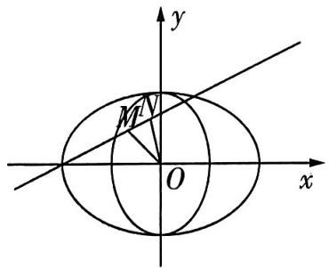

图1

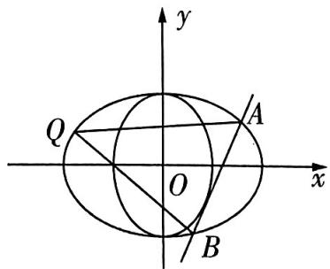

图2

  
以猫眼曲线为例
破解新定义题

解析 （1） 由题意知, $\frac{b}{a} = \frac{t}{b} = \frac{\sqrt{2}}{2}$ .

椭圆 $C_1$ 的离心率 $e_1 = \sqrt{1 - (\frac{b}{a})^2} = \frac{\sqrt{2}}{2}$ , 椭圆 $C_2$ 的离心率 $e_2 = \sqrt{1 - (\frac{t}{b})^2} = \frac{\sqrt{2}}{2}$ ,

所以 $e_{1}=e_{2}$ ，所以此时曲线Γ是“优美猫眼曲线”。

【信息转化】读图，由题图获得信息：两个嵌套在一起的椭圆组成“猫眼曲线”，其中小椭圆的长半轴与大椭圆的短半轴相等。此时，若进一步满足两个椭圆的离心率相等，则“猫眼曲钱”为“优美猫眼曲线”，因此，问题的关键便转化为判断离心率的大小关系

由曲线 $\Gamma$ 过点 $G(0, -\sqrt{2})$ ，得 $b = \sqrt{2}$ ，所以 $a = 2, t = 1$

所以两椭圆方程分别为 $C_1: \frac{x^2}{4} + \frac{y^2}{2} = 1, C_2: \frac{y^2}{2} + x^2 = 1.$

（2）(i)设斜率为 $k$ 的直线 $l$ 交椭圆 $C_1$ 于点 $C(x_{1},y_{1}),D(x_{2},y_{2})$ ，线段 $CD$ 的中点为 $M(x_0,y_0)$

则 $x_0 = \frac{x_1 + x_2}{2}, y_0 = \frac{y_1 + y_2}{2}, k = \frac{y_1 - y_2}{x_1 - x_2}, k_{OM} = \frac{y_0}{x_0}$ .

由 $\left\{ \begin{array}{l} \frac{x_1^2}{4} + \frac{y_1^2}{2} = 1, \\ \frac{x_2^2}{4} + \frac{y_2^2}{2} = 1 \end{array} \right.$ 得 $\frac{x_1^2 - x_2^2}{4} + \frac{y_1^2 - y_2^2}{2} = 0$ ，因为 $k$ 存在且 $k \neq 0$ ，所以 $x_1 \neq x_2$ ，且 $x_0 \neq 0$ ，

所以 $\frac{y_1 - y_2}{x_1 - x_2} \cdot \frac{y_0}{x_0} = -\frac{1}{2}$ , 即 $k \cdot k_{OM} = -\frac{1}{2}$ .

同理得 $k \cdot k_{ON} = -2$ ，故 $\frac{k_{OM}}{k_{ON}} = \frac{1}{4}$ .

(ii) 设直线 $l$ 的方程为 $y = \sqrt{2} x + m$ ,

由 $\left\{\begin{aligned}\frac{y^{2}}{2}+x^{2}=1,\\ y=\sqrt{2}x+m,\end{aligned}\right.$ 化简得关于x的方程 $4x^{2}+2\sqrt{2}mx+m^{2}-2=0.$

由 $\Delta_1 = (2\sqrt{2} m)^2 - 16(m^2 - 2) = 0$ ，得 $m = \pm 2$

由图象的对称性, m = -2 与 m = 2 时结果一样. 不妨取 m = 2, 则 $l: y = \sqrt{2}x + 2$ .

由 $\left\{\begin{aligned}\frac{x^{2}}{4}+\frac{y^{2}}{2}&=1,\\ y&=\sqrt{2}x+2,\end{aligned}\right.$ 化简得 $5x^{2}+8\sqrt{2}x+4=0,\Delta_{2}>0.$

设 $A(x_{3},y_{3}),B(x_{4},y_{4})$ ，则 $x_{3} + x_{4} = -\frac{8\sqrt{2}}{5},x_{3}x_{4} = \frac{4}{5},$

$|AB| = \sqrt{3} |x_3 - x_4| = \sqrt{3} \times \sqrt{(x_3 + x_4)^2 - 4x_3x_4} = \frac{12}{5}$ , 是定值.

下面通过求椭圆 $C_{1}$ 上的点 Q 到直线 $y=\sqrt{2}x+2$ 距离的最大值可得 $\triangle ABQ$ 面积的最大值.

【数形结合】因为三角形的一条边长是定值, 若三角形的面积最大, 只需要这条边上的高最大, 需要求与直线平行的椭圆的切线, 再求出两平行线间的距离, 这个距离就是三角形高的最大值, 进而得其面积最大值

方法一 设 $Q(2\cos \theta, \sqrt{2}\sin \theta)$ , 由点到直线的距离公式得点 $Q$ 到直线 $l$ 的距离 $d = \frac{|2\sqrt{2}\cos \theta - \sqrt{2}\sin \theta + 2|}{\sqrt{3}} = \frac{|\sqrt{10}\sin(\theta + \varphi) + 2|}{\sqrt{3}}$ , 其中 $\tan \varphi = -2$ ,

所以 $d_{\mathrm{max}} = \frac{\sqrt{10} + 2}{\sqrt{3}}$

$\triangle ABQ$ 面积的最大值为 $\frac{1}{2} |AB| \times d_{\max} = \frac{1}{2} \times \frac{12}{5} \times \frac{\sqrt{10} + 2}{\sqrt{3}} = \frac{2\sqrt{30} + 4\sqrt{3}}{5}$ .

方法二 设 $Q(x_0', y_0')$ ，则 $\frac{x_0'^2}{4} + \frac{y_0'^2}{2} = 1$

由点到直线的距离公式得点 $Q$ 到直线 $l$ 的距离 $d = \frac{|\sqrt{2}x_0' - y_0' + 2|}{\sqrt{3}} \leqslant \frac{|\sqrt{2}x_0'| + |y_0'| + 2}{\sqrt{3}}$ ,

由柯西不等式得 $(\sqrt{2}|x_0'| + |y_0'|)^2 = (2\sqrt{2}\times \frac{|x_0'|}{2} +\sqrt{2}\times \frac{|y_0'|}{\sqrt{2}})^2\leqslant 10(\frac{x_0'^2}{4} +\frac{y_0'^2}{2}) = 10,$

从而 $d_{\mathrm{max}} = \frac{\sqrt{10} + 2}{\sqrt{3}}$

$\triangle ABQ$ 面积的最大值为 $\frac{1}{2}|AB| \times d_{\max} = \frac{1}{2} \times \frac{12}{5} \times \frac{\sqrt{10} + 2}{\sqrt{3}} = \frac{2\sqrt{30} + 4\sqrt{3}}{5}$ .

方法三 先求与 $l$ 平行且与椭圆 $C_1$ 相切的距离最远的直线，

设与 l 平行的直线 $y=\sqrt{2}x+n$ 与椭圆 $C_{1}$ 相切，由 $\left\{\begin{aligned}\frac{x^{2}}{4}+\frac{y^{2}}{2}&=1,\\ y&=\sqrt{2}x+n,\end{aligned}\right.$

整理得关于 $x$ 的方程 $5x^{2} + 4\sqrt{2} nx + 2n^{2} - 4 = 0$ ，由 $\Delta_3 = (4\sqrt{2} n)^2 - 20(2n^2 - 4) = 0$ ，得 $n = \pm \sqrt{10}$ .

若距离最大,则在与 $l: y = \sqrt{2}x + 2$ 平行的直线的方程中取 $y = \sqrt{2}x - \sqrt{10}$ ,

两平行线间的距离为 $d_{1} = \frac{\sqrt{10} + 2}{\sqrt{3}}$

从而 $\triangle ABQ$ 面积的最大值为 $\frac{1}{2}|AB| \times d_1 = \frac{1}{2} \times \frac{12}{5} \times \frac{\sqrt{10} + 2}{\sqrt{3}} = \frac{2\sqrt{30} + 4\sqrt{3}}{5}$ .

【另解】根据图象的对称性，若取 $l: y = \sqrt{2}x - 2$ ，则相应的平行线为 $y = \sqrt{2}x + \sqrt{10}$ ，同样可求得结果

# 考前47天·第4题 创新模块交汇题

# 押题依据

在高考改革背景下，考查创新模块交汇题已成为趋势，如 2023 新课标 I 卷第 21 题，将数列与概率交汇考查；2023 新课标 II 卷第 19 题，将概率统计与函数交汇考查；2022 新高考 II 卷第 17 题，将数列与集合交汇考查等。此类问题重点考查考生的数学应用、创新能力，在 2024 年高考中出现的可能性极大，应予以高度重视。

# 原创押题1

新考法·抛物线与平面向量交汇（多选）已知 $F$ 为抛物线 $C$ :$y^{2}=2px(0<p<10)$ 的焦点，E为第一象限内C上的一点， $G(5,0)$ ，且 $(\overrightarrow{EF}+\overrightarrow{EG})\cdot\overrightarrow{FG}=0,\left|\overrightarrow{EF}+\overrightarrow{EG}\right|=\sqrt{3}\left|\overrightarrow{FG}\right|$ ，直线 $l:x=ky+m(m\neq0)$ 与C交于不同的两点A,B，且 $\overrightarrow{OA},\overrightarrow{OB}$ 的夹角为 $\theta,O$ 为坐标原点，则下列说法正确的有()

$\quad$A. $\triangle EFG$ 为等边三角形

$\quad$B. $C$ 的准线方程为 $x = -2$

$\quad$C. 若 $\theta = \frac{\pi}{2}$ , 则 $m = 4$

$\quad$D. 若 $\theta = \frac{2\pi}{3}$ , 则 $0 < m \leqslant \frac{4}{3}$

# 解析

  
妙解抛物线与向量  
交汇的跨模块试题

<table><tr><td>选项</td><td>分析过程</td><td>正误</td></tr><tr><td>A</td><td>因为 $\left( \overrightarrow{EF} + \overrightarrow{EG} \right) \cdot \overrightarrow{FG} = 0$ ,所以 $\triangle EFG$ 为等腰三角形,又 $|\overrightarrow{EF} + \overrightarrow{EG}| = \sqrt{3} |\overrightarrow{FG}|$ ,所以 $\angle EFG = \frac{\pi}{3}$ ,所以 $\triangle EFG$ 为等边三角形【名师叨叨】在刚刚过去的“九省联考”中,多选题的题量更改为了3道,分值却从5分/道变成了6分/道.更大的改变是,原来的“选对但不全”得2分,现在变成了“部分选对的得部分分”,因此要求准确把握每一个选项</td><td>√</td></tr><tr><td>B</td><td> $x_{E} = \frac{1}{2} \left( \frac{p}{2} + 5 \right) = \frac{p}{4} + \frac{5}{2}, |FG| = 5 - \frac{p}{2}$ ,由抛物线定义可得 $|EF| = x_{E} + \frac{p}{2}$ ,因为 $\triangle EFG$ 为等边三角形,所以 $|EF| = |FG|$ ,即 $\frac{3p}{4} + \frac{5}{2} = 5 - \frac{p}{2}$ ,解得 $p = 2$ .所以抛物线C的方程为 $y^{2} = 4x$ ,准线方程为 $x = -1$ </td><td>×</td></tr></table>

# 考前提醒

续表

<table><tr><td>选项</td><td>分析过程</td><td>正误</td></tr><tr><td rowspan="42">C</td><td rowspan="42" colspan="2">设 $A(x_1,y_1),B(x_2,y_2)$ ,由 $\begin{cases} y^2=4x, \\ x=ky+m, \end{cases}$ 得关于 $y$ 的方程 $y^2-4ky-4m=0$ ,则 $\Delta = 16k^2+16m>0$ ,所以 $y_1+y_2=4k,y_1y_2=-4m$ ,则 $x_1+x_2=k(y_1+y_2)+2m=4k^2+2m,x_1x_2=\frac{y_1^2}{4}\cdot\frac{y_2^2}{4}=m^2$ .所以 $\cos\angle AOB=\cos\theta=\frac{\overrightarrow{OA}\cdot\overrightarrow{OB}}{|\overrightarrow{OA}|\cdot|\overrightarrow{OB}|}=\frac{x_1x_2+y_1y_2}{\sqrt{x_1^2+4x_1}\cdot\sqrt{x_2^2+4x_2}}=\frac{m^2-4m}{|m|\sqrt{m^2+16k^2+8m+16}}$ .【释疑惑】CD选项本质上都是已知 $\theta$ 求参数 $m$ ,因此要建立 $\theta$ 与 $m$ 的关系式,考虑到是抛物线问题,转化为坐标表示是常用的方法,由此根据向量的夹角公式列方程求解若 $\theta=\frac{\pi}{2}$ ,则 $\cos\theta=0=m^2-4m$ ,因为 $m\neq0$ ,所以 $m=4$ .若 $\theta=\frac{2\pi}{3}$ ,则 $\cos\theta=-\frac{1}{2}=\frac{m^2-4m}{|m|\sqrt{m^2+16k^2+8m+16}}$ ,则 $m^2-4m<0$ ,且 $4(m-4)^2=m^2+16k^2+8m+16$ ,所以\( \begin{cases}0</td></tr><tr></tr><tr></tr><tr></tr><tr></tr><tr></tr><tr></tr><tr></tr><tr></tr><tr></tr><tr></tr><tr></tr><tr></tr><tr></tr><tr></tr><tr></tr><tr></tr><tr></tr><tr></tr><tr></tr><tr></tr><tr></tr><tr></tr><tr></tr><tr></tr><tr></tr><tr></tr><tr></tr><tr></tr><tr></tr><tr></tr><tr></tr><tr></tr><tr></tr><tr></tr><tr></tr><tr></tr><tr></tr><tr></tr><tr></tr><tr></tr><tr><td></td></tr></table>

故选 ACD.

原创押题2 新考法·数列与函数交汇,新题型·双空题已知 $S_{n}$ 为数列 $\{a_{n}\}$ 的前 $n$ 项和, $S_{1}=5, S_{n+1}-2 n-5=3 S_{n}, n \in \mathbf{N}^{*}$ , 则 $a_{n}=$ \_\_\_\_. 记函数 $f(x)=a_{1} x+a_{2} x^{2}+\cdots+a_{n} x^{n}$ , 则曲线 $y=f(x)$ 在 $(1, f(1))$ 处的切线的斜率为 \_\_\_\_.

解析 第一空: 因为 $S_{n+1}-2n-5=3S_{n}$ ,

所以 $S_{n} - 2(n - 1) - 5 = 3S_{n - 1}(n\geqslant 2)$ ，两式相减，得 $a_{n + 1} = 3a_n + 2(n\geqslant 2)$

【解题套路】已知 $S_{n}$ 与 $S_{n + 1}$ 的关系式求通项时，往往要再写出一个 $S_{n - 1}$ 与 $S_{n}$ 的关系式，两式作差求解，注意 $n \geqslant 2$ 的条件不能少

当 $n = 1$ 时， $S_{2} = a_{1} + a_{2} = 3a_{1} + 7$ ，由 $a_{1} = S_{1} = 5$ ，知 $a_{2} = 17$ ，满足 $a_{2} = 3a_{1} + 2$

所以 $a_{n + 1} = 3a_n + 2(n\in \mathbf{N}^*)$ .所以 $a_{n + 1} + 1 = 3(a_n + 1)$ ，又 $a_1 + 1 = 6\neq 0$ ，所以 $\frac{a_{n + 1} + 1}{a_n + 1} = 3,$

故 $\{a_{n} + 1\}$ 是以6为首项，3为公比的等比数列，所以 $a_{n} + 1 = 6\times 3^{n - 1} = 2\times 3^{n}$ ，即 $a_{n} = 2\times 3^{n} - 1.$

第二空： $f'(x)=a_{1}+2a_{2}x+\cdots+na_{n}x^{n-1}$ ，则 $f'（1）=a_{1}+2a_{2}+3a_{3}+\cdots+na_{n}$

考前提醒

因为 $a_{n}=2\times3^{n}-1$ ，所以 $f'（1）=2\times(1\times3+2\times3^{2}+3\times3^{3}+\cdots+n\times3^{n})-(1+2+3+\cdots+n)$ ，

令 $T_{n}=1\times3+2\times3^{2}+3\times3^{3}+\cdots+n\times3^{n}$ ，则 $3T_{n}=1\times3^{2}+2\times3^{3}+3\times3^{4}+\cdots+n\times3^{n+1}$

所以 $-2T_{n}=3+3^{2}+3^{3}+\cdots+3^{n}-n\times3^{n+1}=\frac{3(1-3^{n})}{1-3}-n\times3^{n+1}=\frac{(1-2n)3^{n+1}-3}{2}$

所以曲线 $y = f(x)$ 在 $(1, f(1))$ 处的切线的斜率为 $f'（1） = 2T_n - \frac{n(n+1)}{2} = \frac{(2n-1)3^{n+1} - n^2 - n + 3}{2}$ .

原创押题3 新考法·集合与数列交汇 已知 $S_{n}$ 为数列 $\{a_{n}\}$ 的前 $n$ 项和, $a_{2} = \frac{4}{3}, a_{9} = 6, 2a_{n+1} = a_{n} + a_{n+2}, n \in \mathbf{N}^{*}$ , 等比数列 $\{b_{n}\}$ 的公比为 $q$ , 且 $b_{n} > 0, q \in \mathbf{N}^{*}$ , 记集合 $A = \{S_{m} | m = 1, 2, 3, 4, 5\}$ .

（1）用列举法表示集合A.

（2） 若 $T_{n}$ 为等比数列 $\{b_{n}\}$ 的前 $n$ 项和, 是否存在 $k \in \mathbf{N}^{*}, k \geqslant 2$ , 使得 $T_{k} \in A$ 且 $T_{2k} \in A$ ? 若存在, 写出符合条件的数列 $\{b_{n}\}$ 的通项公式; 若不存在, 请说明理由.

解析 （1） 因为 $2a_{n+1} = a_n + a_{n+2}, n \in \mathbf{N}^*$ , 所以数列 $\{a_n\}$ 为等差数列, 设其公差为 $d$ .

【梳理思路】根据题目条件，判断数列 $\{a_{n}\}$ 为等差数列，进而求得其通项及前 $n$ 项和

因为 $a_2 = \frac{4}{3}, a_9 = 6$ ，所以 $7d = a_9 - a_2 = \frac{14}{3}$ ，解得 $d = \frac{2}{3}$ ，所以 $a_n = \frac{4}{3} + (n - 2) \times \frac{2}{3} = \frac{2n}{3}, S_n = \frac{n(\frac{2}{3} + \frac{2n}{3})}{2} = \frac{n(n + 1)}{3}$ . 分别将 $n = 1, 2, 3, 4, 5$ 代入，可得集合 $A = \{\frac{2}{3}, 2, 4, \frac{20}{3}, 10\}$ .

（2） 当 q=1 时, $T_{k}=kb_{1}$ , $T_{2k}=2kb_{1}$ , 所以 $T_{2k}=2T_{k}$ ,

又 $T_{k}, T_{2k}$ 同是集合 $A$ 中的元素, 所以 $T_{k} = 2, T_{2k} = 4$ , 则 $kb_{1} = 2$ , 所以 $b_{1} = \frac{2}{k}$ , 所以 $b_{n} = \frac{2}{k}$ , 所以存在 $k, k \in \mathbf{N}^{*}$ 且 $k \geqslant 2$ .

当 $q \neq 1$ 时, $T_{k} = \frac{b_{1}(1 - q^{k})}{1 - q}, T_{2k} = \frac{b_{1}(1 - q^{2k})}{1 - q}$ , 所以 $\frac{T_{2k}}{T_k} = 1 + q^k$ .

①当 $T_{k}=\frac{2}{3}$ 时， $T_{2k}=\frac{20}{3}$ 符合题意，得 $q^{k}=9$ ，此时q=3,k=2，

【释疑惑】由上可知 $T_{2k}$ 与 $T_{k}$ 的比值是正整数, 且集合 $A$ 一共有 5 个元素, 数量不多, 可以采用依次列举讨论的方法研究

所以 $T_{k} = T_{2} = b_{1}(1 + q) = b_{1}\times 4 = \frac{2}{3}$ ，得 $b_{1} = \frac{1}{6}$ ，故 $b_{n} = \frac{1}{6}\times 3^{n - 1} = \frac{3^{n - 2}}{2}.$

②当 $T_{k} = 2$ 时， $T_{2k} = 10$ 符合题意，得 $q^{k} = 4$ ，此时 $q = 2, k = 2$

所以 $T_{k} = T_{2} = b_{1}(1 + q) = b_{1}\times 3 = 2$ ，得 $b_{1} = \frac{2}{3}$ 故 $b_{n} = \frac{2}{3}\times 2^{n - 1} = \frac{2^{n}}{3}.$

③当 $T_{k} = 4$ 或 $T_{k} = \frac{20}{3}$ 或 $T_{k} = 10$ 时，符合题意的 $\{b_n\}$ 不存在，舍去.

综上, 存在符合条件的 $\{b_{n}\}$ , $\{b_{n}\}$ 的通项公式为 $b_{n}=\frac{2}{k}$ 或 $b_{n}=\frac{3^{n-2}}{2}$ 或 $b_{n}=\frac{2^{n}}{3}$ .

# 考前提醒

# 考前46天▶第5题 创新学科相融题

# 押题依据

自然科学中的各个方面联系紧密, 高考数学每年都涉及其他学科的概念、知识点, 且不仅限于高中的九大学科. 如 2023 新课标 I 卷第 10 题以物理中的声压级为背景考查指、对数运算; 2023 全国甲卷第 19 题以生物试验为背景考查概率与统计……学科相融题常常与函数、数列、概率与统计等相结合, 考查运用数学知识和方法分析、解决问题的能力, 是高考命题热点, 必须予以关注.

# 原创押题1

# 新趋势·与物理学相融 声音通过空

气振动所产生的压强叫作声压强,简称声压,声压的单位为帕斯卡(Pa),把声压的有效值取对数来表示声音的强弱,这种表示声音强弱的数值叫声压级,声压级以符号 SPL 表示,单位为分贝(dB).在空气中,声压级的计算公式为 $SPL = 20 \lg \frac{p}{p_{0}}$ ,其中 p 为待测声压的有效值, $p_{0}$ 为参考声压,可取 $p_{0} = 2 \times 10^{-5}$ Pa.据此估计,声压 0.5 Pa 对应的声压级约为(参考数据: $\lg 2 \approx 0.301$ , $\lg 5 \approx 0.699$ )()

  
以对数函数模型为载体的学科融合试题求解策略

$\quad$A. $82 \mathrm{~dB}$

$\quad$B. $88 \mathrm{~dB}$

$\quad$C. 92 dB

$\quad$D. 98 dB

解析 依题意可得所求声压级为 $20 \lg \frac{0.5}{2 \times 10^{-5}} = 20 (\lg 10^{5} - 2 \lg 2) \approx 20 \times (5 - 0.602) =$ 87.96, 所以声压 $0.5 \mathrm{~Pa}$ 对应的声压级约为 $88 \mathrm{~dB}$ . 故选 B.

【破题有方】根据定义，将相应数据代入公式计算即可

# 原创押题2

# 新趋势·与经济学相融

本福特定律,也称为本福特法则,指的是在 b 进位制中, 以数 n 起头的多位数出现的概率为 $\log_{b}\frac{n+1}{n}$ . 本福特定律可以用于检查各种数据是否存在造假, 例如在会计审计中, 可以利用本福特定律来检测财务报表数据的真实性. 在从实际生活得出的一组十进制数据中, 以 1 为首位数字的多位数出现的概率约为 \_\_\_\_; 首位数字为 2 的多位数出现的概率与首位数字为 5 的多位数出现的概率的比值约为 \_\_\_\_ (结果均保留两位有效数字, 参考数据: $\lg 3 \approx 0.477$ , $\lg 5 \approx 0.699$ ).

解析 第一空:依本福特定律知,在一组十进制数据中,一个多位数的首位数字是1的概率为 $\log_{10}\frac{1+1}{1}=\lg2=1-\lg5\approx0.30.$

第二空:十进制中,一个多位数的首位数字是2的概率为 $\lg \frac{3}{2} = \lg 3 - \lg 2 = \lg 3 - (1 - \lg 5) \approx 0.176$ ,

考前提醒

一个多位数的首位数字是5的概率为 $\lg \frac{6}{5} = \lg 3 + \lg 2 - \lg 5 \approx 0.079$ ，则 $\frac{0.176}{0.079} \approx 2.2$ .

【易错提醒】注意保留两位小数和保留两位有效数字的区别，前者是小数点后保留两位，后者是从第一个非零数字算起数两位

原创押题3 新趋势·与体育选拔相融 某学校为了推选一名羽毛球选手参加市级联赛,对成绩都非常优秀的甲、乙两名选手进行了五轮综合测试,测试成绩如下(分数越高,代表打球水平越好).

<table><tr><td></td><td>第一轮</td><td>第二轮</td><td>第三轮</td><td>第四轮</td><td>第五轮</td></tr><tr><td>甲的分数</td><td>7.2</td><td>7.3</td><td>7.6</td><td>8</td><td>7.9</td></tr><tr><td>乙的分数</td><td>6</td><td>6.3</td><td>9.5</td><td>9.2</td><td>7</td></tr></table>

（1）根据以上信息,结合概率统计知识,你倾向于选派哪一名选手参加比赛?说明理由.

（2）若甲、乙两人进行对抗赛,由于两人实力相当(即甲、乙在每一局比赛中获胜的概率均为 $\frac{1}{2}$ ),特制订如下规则:比赛局数 $n \leqslant 20 (n \in \mathbf{N}^{*})$ ,当其中一人比另一人多胜两局或比赛局数达到20局时,比赛结束.假设每局比赛互不影响,求比赛结束时比赛局数的数学期望.

解析 （1） 第一步: 由平均数和方差的计算公式求出 $\overline{x}_{\text{甲}}, \overline{x}_{\text{乙}}, s_{\text{甲}}^{2}, s_{\text{乙}}^{2}$ .

设甲、乙的平均成绩分别为 $\overline{x}_{\text{甲}}, \overline{x}_{\text{乙}}$ ，成绩的方差分别为 $s_{\text{甲}}^2, s_{\text{乙}}^2$

$\overline {{{x}}} _ {\text {甲}} = \frac {7 . 2 + 7 . 3 + 7 . 6 + 8 + 7 . 9}{5} = 7. 6, \overline {{{x}}} _ {\text {乙}} = \frac {6 + 6 . 3 + 9 . 5 + 9 . 2 + 7}{5} = 7. 6.$

$s _ {\text {甲}} ^ {2} = \frac {1}{5} \times \left[ (7. 2 - 7. 6) ^ {2} + (7. 3 - 7. 6) ^ {2} + 0 ^ {2} + (8 - 7. 6) ^ {2} + (7. 9 - 7. 6) ^ {2} \right] = 0. 1,$

$s _ {z} ^ {2} = \frac {1}{5} \times \left[ (6 - 7. 6) ^ {2} + (6. 3 - 7. 6) ^ {2} + (9. 5 - 7. 6) ^ {2} + (9. 2 - 7. 6) ^ {2} + (7 - 7. 6) ^ {2} \right] = 2. 1 5 6.$

第二步: 比较平均数和方差的大小, 下结论并说明理由.

$\overline {{{x}}} _ {\mathrm{甲}} = \overline {{{x}}} _ {\mathrm{乙}}, s _ {\mathrm{甲}} ^ {2} <   s _ {\mathrm{乙}} ^ {2}.$

第一种结论:因为综合成绩的平均成绩相同,但甲的水平更为稳定,所以我倾向于选派甲选手参加比赛.

第二种结论: 乙的水平虽然不太稳定, 但平均成绩相同, 且在赛场上冲击高分的可能性更大, 所以我倾向于选派乙选手参加比赛.

(注:以上两种选派方式均可,只要叙述清楚选派理由即可.)

（2）第一步:设比赛局数为随机变量 X, 求出 X 的所有可能取值及其对应的概率.

设比赛局数为随机变量 X，由题意知 X 的取值必须为偶数，即 2,4,6,…,20.

【抓题眼】注意比赛结束的条件“当其中一人比另一人多胜两局或比赛局数达到20局时，比赛结束”，那么比赛局数 $X$ 的取值只能为偶数

# 考前提醒

常规的导数题目一般不难,但要注意解题的层次与步骤,如果要构造函数证明不等式,可从已知或前一问中寻找突破口.

当 $X = 2$ 时， $P(X = 2) = 2 \times \frac{1}{2} \times \frac{1}{2} = \frac{1}{2}$ .

当 X=4 时,说明前两局二人各胜一局,然后第三局和第四局均为甲胜或均为乙胜.前两局二人各胜一局的概率为 $2 \times \frac{1}{2} \times \frac{1}{2} = \frac{1}{2}$ , 故 $P(X=4) = \frac{1}{2} \times 2 \times \frac{1}{2} \times \frac{1}{2} = \frac{1}{4}$ .

观察发现,当 $4 \leqslant X \leqslant 18$ 时,双方前两局,前四局, $\cdots$ ,到前X-2局的胜负局数均相同,且第X-1局,第X局均为甲胜或乙胜,

【类比思想】由特殊到一般，归纳分析，得出“通项”

设 $X = 2k (k \in \mathbf{N}^*, 2 \leqslant k \leqslant 9)$ ，则 $P(X = 2k) = (2 \times \frac{1}{2} \times \frac{1}{2})^{k-1} \times 2 \times \frac{1}{2} \times \frac{1}{2} = (\frac{1}{2})^k$

显然 $k = 1$ 也满足上式.

当 $X = 20$ 时，说明双方前两局，前四局，一直到前十八局的胜负局数均相同，

所以 $P(X = 20) = (2 \times \frac{1}{2} \times \frac{1}{2})^9 = (\frac{1}{2})^9$ .

第二步: 写出 X 的分布列并表示出期望 $E(X)$ .

故 $X$ 的分布列为

<table><tr><td>X</td><td>2</td><td>4</td><td>6</td><td>8</td><td>...</td><td>18</td><td>20</td></tr><tr><td>P</td><td> $\frac{1}{2}$ </td><td> $(\frac{1}{2})^2$ </td><td> $(\frac{1}{2})^3$ </td><td> $(\frac{1}{2})^4$ </td><td>...</td><td> $(\frac{1}{2})^9$ </td><td> $(\frac{1}{2})^9$ </td></tr></table>

$E (X) = 2 \times \frac {1}{2} + 4 \times \frac {1}{2 ^ {2}} + 6 \times \frac {1}{2 ^ {3}} + 8 \times \frac {1}{2 ^ {4}} + \dots + 1 8 \times \frac {1}{2 ^ {9}} + 2 0 \times \frac {1}{2 ^ {9}}.$

第三步:利用错位相减法求解 $E(X)$ .

设 $Y=2\times\frac{1}{2}+4\times\frac{1}{2^{2}}+6\times\frac{1}{2^{3}}+8\times\frac{1}{2^{4}}+\cdots+18\times\frac{1}{2^{9}}$ ①,

则 $\frac{1}{2}Y=2\times\frac{1}{2^{2}}+4\times\frac{1}{2^{3}}+6\times\frac{1}{2^{4}}+8\times\frac{1}{2^{5}}+\cdots+18\times\frac{1}{2^{10}}$ ②,

$\begin{array}{l} ① - ② \text {得} \frac {1}{2} Y = 2 \times \frac {1}{2} + 2 \times \frac {1}{2 ^ {2}} + 2 \times \frac {1}{2 ^ {3}} + 2 \times \frac {1}{2 ^ {4}} + 2 \times \frac {1}{2 ^ {5}} + \dots + 2 \times \frac {1}{2 ^ {9}} - 1 8 \times \frac {1}{2 ^ {1 0}} = 2 \times (\frac {1}{2} + \frac {1}{2 ^ {2}} + \\ \left. \frac {1}{2 ^ {3}} + \frac {1}{2 ^ {4}} + \frac {1}{2 ^ {5}} + \dots + \frac {1}{2 ^ {9}}\right) - 1 8 \times \frac {1}{2 ^ {1 0}} = 2 \times \frac {\frac {1}{2} \times \left(1 - \frac {1}{2 ^ {9}}\right)}{1 - \frac {1}{2}} - 1 8 \times \frac {1}{2 ^ {1 0}} = 2 - \frac {1 1}{2 ^ {9}}, \\ \end{array}$

所以 $E(X) = Y + 20 \times \frac{1}{2^9} = 4 - \frac{11}{2^8} + 20 \times \frac{1}{2^9} = 4 - \frac{1}{2^8} = \frac{1023}{256}$ .

【易错提醒】前面我们计算的 $Y$ 是不包括 “ $20 \times \frac{1}{2^9}$ ” 这一项的，在最后需要加上

所以需要进行的比赛局数的数学期望为 $\frac{1023}{256}$ .

# 考前45天▶第6题 创新结论开放题

# 押题依据

在近几年高考中, 结论开放题是稳定的创新题型, 如 2023 新课标 II 卷第 15 题和 2022 新高考 I 卷第 14 题, 都是以直线与圆为载体的开放题; 2021 新高考 II 卷第 14 题, 是求满足某些性质的函数解析式的开放题等. 此问题在 2024 年高考中出现的可能性很高, 要引起关注.

原创押题1 已知直线 $l: x - y + 2 = 0$ 与 $\odot C: (x - \cos \theta)^{2} + (y - \sin \theta)^{2} = 4$ 交于 $A, B$ 两点, 则 $\triangle ABC$ 面积最大时 $\theta$ 的一个值为 \_\_\_\_.

  
创新结论开放题与结构不良题

解析 由题知 C 的圆心坐标为 $(\cos \theta, \sin \theta)$ ，半径为 r = 2。易知 $\triangle ABC$ 是等腰三角形,所以其面积 $S = \frac{1}{2} \times 2^2 \times \sin \angle ACB = 2\sin \angle ACB$ , 则当且仅当 $\angle ACB = 90^\circ$ 时, $\triangle ABC$ 面积最大,此时圆心 $C$ 到直线 $l$ 的距离为 $\sqrt{2}$ , 即 $\frac{|\cos \theta - \sin \theta + 2|}{\sqrt{1^2 + (-1)^2}} = \frac{|\cos \theta - \sin \theta + 2|}{\sqrt{2}} = \sqrt{2}$ , 即

【强调关键】紧抓两个关键：第一，定直线和动圆（圆心动，半径恒为2）的相交问题；第二， $\triangle ABC$ 是腰长为半径的等腰三角形，顶角为 $90^{\circ}$ 时面积最大$\cos \theta - \sin \theta = 0$ ，得 $\theta = \frac{\pi}{4} + k\pi (k \in \mathbf{Z})$ ，任选一个值填写即可，如 $\theta = \frac{\pi}{4}$ 。

【多方思考】除了利用圆心到直线的距离公式，本题可不可以通过单位圆思想进行分析呢？显然圆心 C 在单位圆 $x^{2} + y^{2} = 1$ 上。当 $\triangle ABC$ 面积最大时，圆心 C 到直线 $l: x - y + 2 = 0$ 的距离等于 $\sqrt{2}$ ，不妨设到直线 l 的距离为 $\sqrt{2}$ 的直线的方程为 $x - y + m = 0$ ，则圆心 C 为该直线与单位圆的交点。由平行直线之间的距离公式得 $\frac{|m - 2|}{\sqrt{2}} = \sqrt{2}$ ，解得 m = 0 或 m = 4（舍去），所以有 $\cos \theta = \sin \theta$ ，即 $\theta = \frac{\pi}{4}$ 符合题意

原创押题2 已知等差数列 $\{a_{n}\}$ 和等比数列 $\{b_{n}\}$ , 且 $a_{n} = 2n$ , 写出使得无穷数列 $\{a_{n} b_{n}\}$ 既有最大项又有最小项的 $\{b_{n}\}$ 的一组首项和公比, 依次为 \_\_\_\_.

解析 不妨设等比数列的首项为 1, 公比为 $q$ . 若 $|q| \geqslant 1$ , 则当 $n \to +\infty$ 时, $|a_{n}b_{n}| \to +\infty$ , 不

【梳理思路】因为数列 $\{a_{n}\}$ 递增，且当 $n \to +\infty$ 时， $a_{n} \to +\infty$ ，所以接等比数列 $\{b_{n}\}$ 的公比分类研究，观察数列 $\{a_{n} b_{n}\}$ 的增减情况，方得结论

符合题意; 若 $0 < q < 1$ , 则当 $n \to +\infty$ 时, $a_{n}b_{n} \to 0$ 且 $a_{n} > 0$ , 所以 $\{a_{n}b_{n}\}$ 没有最小值, 不符合题意; 若 $-1 < q < 0$ , 则 $\{a_{n}b_{n}\}$ 的奇数项为正, 偶数项为负, 当 $n$ 为奇数时, $a_{n}b_{n}$ 随 $n$ 的增大变小或先变大再变小, 有最大值, 当 $n$ 为偶数时, $a_{n}b_{n}$ 随 $n$ 的增大变大或先变小再变大, 有最小值, 符合题意. 故首项可取 1 , 公比取区间 $(-1,0)$ 内的任意一值即可, 如填 $1, -\frac{1}{2}$ .

# 考前提醒

# 考前44天▶第7题 创新结构不良题

# 押题依据

在新高考中, 结构不良题是题型设计上的新尝试. 2023 北京卷第 17 题是以三角函数为载体的三选一结构不良题; 2022 新高考 II 卷第 21 题是以直线与双曲线位置关系为载体的三选二作条件, 另一作结论的结构不良题; 2022 北京卷第 17 题是以立体几何为载体的二选一结构不良题; 2021 新高考 II 卷第 22 题是以导数为载体的二选一结构不良题……结构不良题在 2024 年高考中出现的可能性很高, 特别是需要先通过推理选择条件的, 即某一个条件不适用, 无法完成解题的结构不良题, 要格外引起重视.

# 原创押题1

在 $\triangle ABC$ 中, 内角 $A, B, C$ 所对的边分别为 $a, b, c$ ,

$2 c \cos A = 2 b - a.$

  
创新结论开放题与结构不良题

（1） 求角 $C$ .

（2） 若 $c = 2\sqrt{3}$ , 再从条件①, 条件②, 条件③这三个条件中选择一个作为已知, 使 $\triangle ABC$ 存在, 并求 $AC$ 边上的高.

条件①: $\triangle ABC$ 的面积为 $4\sqrt{3}$ ; 条件②: $2\sin B - \sin A = \frac{\sqrt{6}}{2}$ ; 条件③: $\frac{b}{a} = \frac{1 + \sqrt{3}}{2}$ .

注:如果选择的条件不符合要求,得0分;如果选择多个符合要求的条件分别解答,按第一个解答计分.

解析 （1） 方法一: 直奔主题, 化边为角 由正弦定理及 $2c \cos A = 2b - a$ 得 $2 \sin C \cos A = 2 \sin B - \sin A$ ,

因为 $A + B + C = \pi$ ，所以 $\sin B = \sin (A + C) = \sin A\cos C + \cos A\sin C,$ 所以 $2\sin A\cos C - \sin A = 0.$

因为 $A \in (0, \pi)$ , 所以 $\sin A \neq 0$ , 所以 $\cos C = \frac{1}{2}$ , 又 $C \in (0, \pi)$ , 所以 $C = \frac{\pi}{3}$ .

方法二:殊途同归,化角为边 由余弦定理及 $2c\cos A=2b-a$ 得 $a^{2}+b^{2}-c^{2}=ab$ ,

所以 $\cos C = \frac{a^2 + b^2 - c^2}{2ab} = \frac{1}{2}$ , 又 $C \in (0, \pi)$ , 所以 $C = \frac{\pi}{3}$ .

（2） 若选条件①, 解答过程如下.

$\triangle ABC$ 的面积为 $4\sqrt{3}$ , 即 $\frac{1}{2} ab \sin C = 4\sqrt{3}$ , 即 $\frac{\sqrt{3}}{4} ab = 4\sqrt{3}$ , 得 $ab = 16$ .

由余弦定理得 $c^2 = a^2 + b^2 - 2ab\cos C$ ，即 $a^2 + b^2 - ab = 12$ ，得 $a^2 + b^2 = 28$

考前提醒

由基本不等式得 $a^2 + b^2 \geqslant 2ab$ ，即 $28 \geqslant 32$ ，显然不成立，故此时三角形不存在，不能选①.

【点明易错】解题时, 需要时刻关注三角形是否存在, 不要一味求解, 甚至陷入求不得解还不能自拔的地步. 第（2）问由条件①运算得到 $ab = 16$ , 再由余弦定理得到 $a^2 + b^2 - ab = 12$ , 此时就要思考方程组是否有实数解了

若选条件②,解答过程如下.

方法一 由（1）知 $B = \pi - \frac{\pi}{3} - A = \frac{2\pi}{3} - A$

所以 $2\sin B - \sin A = 2\sin \left(\frac{2\pi}{3} - A\right) - \sin A = \sqrt{3}\cos A + \sin A - \sin A = \sqrt{3}\cos A = \frac{\sqrt{6}}{2}$ , 所以 $\cos A = \frac{\sqrt{2}}{2}$ .因为 $A \in (0, \frac{2\pi}{3})$ ，所以 $A = \frac{\pi}{4}$ .

因为 $c = 2\sqrt{3}$ ，所以 $AC$ 边上的高 $h = c\sin A = 2\sqrt{3} \times \frac{\sqrt{2}}{2} = \sqrt{6}$ .

方法二 由正弦定理得 $\sin B = \frac{b\sin C}{c} = \frac{b}{4}, \sin A = \frac{a\sin C}{c} = \frac{a}{4}$ ,

则由 $2\sin B - \sin A = \frac{\sqrt{6}}{2}$ , 可得 $2b - a = 2\sqrt{6}$ , 由余弦定理得 $a^2 + b^2 - ab = 12$ , 所以 $a = 2\sqrt{2}$ ,所以 $AC$ 边上的高 $h = a\sin C = 2\sqrt{2} \times \frac{\sqrt{3}}{2} = \sqrt{6}$ .

若选条件③,解答过程如下.

由余弦定理得 $a^2 + b^2 - ab = 12$ ，与 $\frac{b}{a} = \frac{1 + \sqrt{3}}{2}$ 联立，可得 $a = 2\sqrt{2}$ ，

所以 $AC$ 边上的高 $h = a\sin C = 2\sqrt{2} \times \frac{\sqrt{3}}{2} = \sqrt{6}$ .

原创押题2 如图1,在四棱锥 $P - ABCD$ 中, $AB \parallel DC$ , $\angle ABC = \frac{\pi}{2}$ , $AB = 3DC$ , $BC = 2DC$ , $E$ 是 $BC$ 的中点, $F$ 是棱 $PA$ 上的点,且 $AF = 3FP$ .

（1） 证明: $BF \parallel$ 平面 $PDE$ .

（2）已知 $BC = 2, PB = PC = \sqrt{3}$ . 从条件①, 条件②, 条件③这三个条件中选择一个作为已知, 使四棱锥 $P - ABCD$ 唯一确定, 并求二面角 $B - DF - P$ 的正弦值.

条件①: $AP = 2\sqrt{3}$ ; 条件②: $BF \perp PE$ ; 条件③: $V_{P-ABCD} = \frac{4\sqrt{2}}{3}$ .

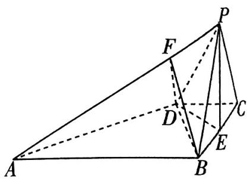

图1

# 考前提醒

注:如果选择的条件不符合要求,得0分;如果选择多个符合要求的条件分别解答,按第一个解答计分.

解析 （1） 方法一: 几何法 如图 2, 延长 DE 交直线 AB 于 G, 连接 PG.

因为 $AB \parallel DC, E$ 是 $BC$ 的中点, 所以 $CD = BG$ , 又 $AB = 3DC$ , 所以 $AB = 3BG$ , 又 $AF = 3FP$ , 所以 $\frac{AF}{FP} = \frac{AB}{BG}$ , 所以 $BF \parallel PG$ .

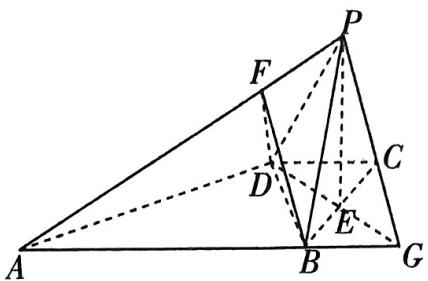

图2

【破题有方】证明线面平行的关键是找到平面内一条直线与已知直线平行,常用的找平行的方法有证明平行四边形、三角形的中位线、平行线的性质等,本题中已知多组边的关系,故利用比例线段的知识证得平行

又 $BF \not\subset$ 平面 $PDE, PG \subset$ 平面 $PDE$ , 所以 $BF \parallel$ 平面 $PDE$ .

方法二: 向量法 取 $\langle\overrightarrow{PC},\overrightarrow{PD},\overrightarrow{PE}\rangle$ 为一个基底, 则 $\overrightarrow{PA}=\overrightarrow{PC}+\overrightarrow{CB}+\overrightarrow{BA}=\overrightarrow{PC}+2\overrightarrow{CE}+3\overrightarrow{CD}=\overrightarrow{PC}+$

【另辟蹊径】利用空间向量的方法证明线面平行是比较少见的，但对于本题这种平行线隐藏颇深的图形作用非凡，注意强调直线不在平面内

$2 (\overrightarrow {P E} - \overrightarrow {P C}) + 3 (\overrightarrow {P D} - \overrightarrow {P C}) = - 4 \overrightarrow {P C} + 3 \overrightarrow {P D} + 2 \overrightarrow {P E},$

$\overrightarrow {B F} = \overrightarrow {B C} + \overrightarrow {C P} + \overrightarrow {P F} = - 2 \overrightarrow {C E} - \overrightarrow {P C} + \frac {1}{4} \overrightarrow {P A} = - 2 (\overrightarrow {P E} - \overrightarrow {P C}) - \overrightarrow {P C} + \frac {1}{4} (- 4 \overrightarrow {P C} + 3 \overrightarrow {P D} + 2 \overrightarrow {P E}) =$

$\frac{3}{4}\overrightarrow{PD}-\frac{3}{2}\overrightarrow{PE}$ ，则向量 $\overrightarrow{BF},\overrightarrow{PD},\overrightarrow{PE}$ 共面，

又 $BF \not\subset$ 平面 $PDE$ , 所以 $BF \parallel$ 平面 $PDE$ .

（2）若选条件①,解答过程如下.

因为 $PB = PC = \sqrt{3}, E$ 是 $BC$ 的中点， $BC = 2$ ，所以 $PE \perp BC$ ，且 $PE = \sqrt{PC^2 - CE^2} = \sqrt{2}$ .

连接 $AE$ ，因为 $\angle ABC = \frac{\pi}{2}$ 所以 $AE = \sqrt{AB^2 + BE^2} = \sqrt{10}$

又 $AP = 2\sqrt{3}$ ，所以 $AP^2 = AE^2 +PE^2$ ，所以 $AE\bot PE.$

又 $BC \perp PE, AE \cap BC = E, AE, BC \subset$ 平面ABCD，所以 $PE \perp$ 平面ABCD，此时四棱锥 $P - ABCD$ 唯一确定.

【强调关键】本题是一个创新结构不良的立体几何问题, 不是简单选择一个条件, 而是需要通过推理运算, 确定四棱锥的唯一性. 由已知条件可知, 四棱锥的底面确定, 因此四棱锥唯一确定的核心是顶点 $P$ 的位置是否唯一确定. 本问通过证得 $PE \perp$ 底面 $ABCD$ 得到点 $P$ 的唯一性. 条件③亦是如此

取 $AD$ 的中点 $H$ , 连接 $EH$ , 则 $EH \parallel AB$ , 所以 $EH \perp BC$ , 所以 $EH, EB, EP$ 三线两两垂直.

如图3, 以 $E$ 为坐标原点, 直线 $EH, EB, EP$ 分别为 $x$ 轴, $y$ 轴, $z$ 轴建立空间直角坐标系 $E - xyz$ , 则 $A(3,1,0), D(1,-1,0), B(0,1,0), P(0,0,\sqrt{2})$ , 所以 $\overrightarrow{DA} = (2,2,0), \overrightarrow{DB} = (-1,2,0)$ , $\overrightarrow{DP} = (-1,1,\sqrt{2})$ .

由 $\overrightarrow{AF} = 3\overrightarrow{FP}$ ，得 $F\left(\frac{3}{4},\frac{1}{4},\frac{3\sqrt{2}}{4}\right)$ 所以 $\overrightarrow{BF} = (\frac{3}{4}, - \frac{3}{4},\frac{3\sqrt{2}}{4})$

设平面 PDF 的法向量是 $\boldsymbol{n}_{1}=(x_{1},y_{1},z_{1})$ ，则 $\left\{\begin{aligned}\boldsymbol{n}_{1}\cdot\overrightarrow{DP}&=0,\\ \boldsymbol{n}_{1}\cdot\overrightarrow{DA}&=0,\end{aligned}\right.$ 即 $\left\{\begin{aligned}-x_{1}+y_{1}+\sqrt{2}z_{1}&=0,\\ 2x_{1}+2y_{1}&=0,\end{aligned}\right.$ 令 $x_{1}=1$ ，则 $y_{1}=-1,z_{1}=\sqrt{2}$ ，于是 $\boldsymbol{n}_{1}=(1,-1,\sqrt{2})$ 为平面 PDF 的一个法向量.

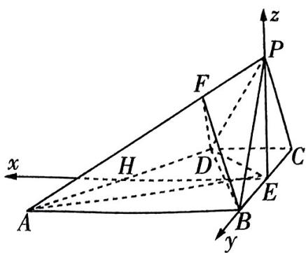

图3

设平面 $BDF$ 的法向量是 $\pmb{n}_{2} = (x_{2},y_{2},z_{2})$ ，则 $\left\{ \begin{array}{l}\pmb {n}_2\cdot \overrightarrow{DB} = 0,\\ \pmb {n}_2\cdot \overrightarrow{BF} = 0, \end{array} \right.$ 即 $\left\{ \begin{array}{l} - x_2 + 2y_2 = 0,\\ \frac{3}{4} x_2 - \frac{3}{4} y_2 + \frac{3\sqrt{2}}{4} z_2 = 0, \end{array} \right.$

令 $x_{2} = 2\sqrt{2}$ ，则 $y_{2} = \sqrt{2},z_{2} = -1$ ，于是 $\pmb {n}_2 = (2\sqrt{2},\sqrt{2}, - 1)$ 为平面BDF的一个法向量.

$\cos \langle \pmb{n}_1, \pmb{n}_2 \rangle = \frac{\pmb{n}_1 \cdot \pmb{n}_2}{|\pmb{n}_1| |\pmb{n}_2|} = 0$ ，所以 $\sin \langle \pmb{n}_1, \pmb{n}_2 \rangle = \sqrt{1 - \cos^2 \langle \pmb{n}_1, \pmb{n}_2 \rangle} = 1.$

【百密一疏】注意是求正弦值！正弦值正弦值正弦值，重要的事情说三遍！

若选条件②,解答过程如下.

由（1）方法一可知, $PG\parallel BF$ ,所以 $PE\perp PG,\angle EPG=\frac{\pi}{2}$ .

因为 $PB = PC = \sqrt{3}, E$ 是 $BC$ 的中点， $BC = 2$ ，所以 $PE \perp BC$ ，且 $PE = \sqrt{PC^2 - CE^2} = \sqrt{2}$ .

$EG = DE = \sqrt{CD^2 + CE^2} = \sqrt{2}$ , 所以 $PE = EG$ , 所以 $\angle PGE = \angle EPG = \frac{\pi}{2}$ , 这与三角形内角和为 $\pi$ 矛盾.

故当 $BF \perp PE$ 时, 不存在满足条件的四棱锥 $P - ABCD$ , 不选条件②.

若选条件③,解答过程如下.

设四棱锥 $P - ABCD$ 的高为 $h$ , 则 $V_{P - ABCD} = \frac{1}{3} S_{\text{梯形}ABCD} h = \frac{1}{3} \times \frac{(1 + 3) \times 2}{2} h = \frac{4\sqrt{2}}{3}$ , 所以 $h = \sqrt{2}$ , 易知 $PE = \sqrt{2}$ , 所以 $PE \perp$ 平面 $ABCD$ , 此时四棱锥 $P - ABCD$ 唯一确定.

后面解法同选择条件①.

# 考前43天▶第8题 创新存在探索题

# 押题依据

存在探索题在高考中常考常新, 是打破常规考法, 考查考生创新能力和水平的重要题型. 如 2023 全国乙卷第 21 题, 第 （2） 问探索是否存在 $a, b$ , 使得曲线关于直线对称, 第 （3） 问已知 $f(x)$ 在 $(0, +\infty)$ 上存在极值, 求参数的取值范围; 2023 上海卷第 18 题, 问是否存在 $c$ , 使得 $f(x)$ 为奇函数; 2022 新高考 I 卷第 22 题, 证明存在直线与两条曲线共有三个不同的交点, 且从左到右的三个交点的横坐标成等差数列. 存在探索题既有对图形、轨迹等几何问题的探索, 也有对函数性质等的探究, 在 2024 年高考中仍是稳定的高考热点, 应重点关注.

原创押题1 新定义·蒙日圆 法国数学家加斯帕尔·蒙日发现过圆 $E: x^{2} + y^{2} = a^{2} - b^{2} (a > b > 0)$ 上任意一点作双曲线 $C: \frac{x^{2}}{a^{2}} - \frac{y^{2}}{b^{2}} = 1 (a > b > 0)$ 的两条切线, 这两条切线互相垂直. 我们通常把这个圆 $E$ 称作双曲线 $C$ 的蒙日圆. 如图1, 过双曲线 $C: \frac{x^{2}}{a^{2}} - y^{2} =$

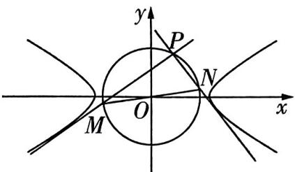

图1

$1(a > 1)$ 的蒙日圆上一点 $P$ 作 $C$ 的两条切线,与该蒙日圆分别交于异于点 $P$ 的 $M, N$ 两点, $\tan \angle PMN = \frac{1}{2}$ ,且 $\triangle PMN$ 的周长为 $\frac{6\sqrt{15}}{5} + 2\sqrt{3}$ .

（1）求双曲线 C 的标准方程.

（2） 过双曲线 $C$ 的右焦点 $F_{2}$ 的直线与 $C$ 交于 $A, B$ 两点 (异于顶点), 线段 $AB$ 的中垂线与 $x$ 轴交于一点 $T$ , 是否存在常数 $\lambda$ , 使得 $|AB| = \lambda |F_{2}T|$ 恒成立? 若存在, 求出 $\lambda$ 的值; 若不存在, 说明理由.

解析 （1） 由题可知, 双曲线 $C$ 的蒙日圆方程为 $x^{2} + y^{2} = a^{2} - 1$ , 且 $PM \perp PN$ , 所以 $MN$ 为蒙日圆的直径, $|MN| = 2\sqrt{a^2 - 1}$ .

又 $\tan \angle PMN = \frac{1}{2}$ , 所以 $\sin \angle PMN = \frac{\sqrt{5}}{5}, \cos \angle PMN = \frac{2\sqrt{5}}{5}$ ,

$\vert P N \vert = \vert M N \vert \sin \angle P M N = \frac {2 \sqrt {5}}{5} \sqrt {a ^ {2} - 1}, \vert P M \vert = \vert M N \vert \cos \angle P M N = \frac {4 \sqrt {5}}{5} \sqrt {a ^ {2} - 1}.$

所以 $\triangle PMN$ 的周长为 $(\frac{6\sqrt{5}}{5} + 2)\sqrt{a^2 - 1} = \frac{6\sqrt{15}}{5} + 2\sqrt{3}$ , 所以 $a = 2$ .

故双曲线 C 的标准方程为 $\frac{x^{2}}{4}-y^{2}=1$ .

（2）由（1）得 $F_{2}(\sqrt{5},0)$ ，由已知可得，直线AB的斜率k存在且不为0，设直线AB的方程为 $y=k(x-\sqrt{5})$ ， $A(x_{1},y_{1})$ ， $B(x_{2},y_{2})$ ，

考前提醒

将直线 $AB$ 的方程与双曲线方程联立得 $\left\{ \begin{array}{l} y = k(x - \sqrt{5}), \\ \frac{x^2}{4} - y^2 = 1, \end{array} \right.$ 整理得关于 $x$ 的方程 $(1 - 4k^2)x^2 + 8\sqrt{5}k^2x - 20k^2 - 4 = 0,$

当 $1 - 4k^{2} = 0$ ，即 $k = \pm \frac{1}{2}$ 时，直线 $AB$ 与双曲线的渐近线平行，与双曲线只有一个交点，

【失分点】不要忽略二次项系数为0时的情况

不符合题意,故 $k \neq \pm \frac{1}{2}$ , 且 $k \neq 0$ .

所以 $\Delta = (8\sqrt{5} k^2)^2 - 4(1 - 4k^2)(-20k^2 - 4) > 0, x_1 + x_2 = \frac{8\sqrt{5} k^2}{4k^2 - 1}, x_1x_2 = \frac{20k^2 + 4}{4k^2 - 1}$ .

设线段 $AB$ 的中点为 $R(x_0, y_0)$ ，则 $x_0 = \frac{x_1 + x_2}{2} = \frac{4\sqrt{5}k^2}{4k^2 - 1}, y_0 = k(x_0 - \sqrt{5}) = k(\frac{4\sqrt{5}k^2}{4k^2 - 1} - \sqrt{5}) = \frac{\sqrt{5}k}{4k^2 - 1}$ ，所以 $R(\frac{4\sqrt{5}k^2}{4k^2 - 1}, \frac{\sqrt{5}k}{4k^2 - 1})$ 。

因为 $RT$ 是线段 $AB$ 的中垂线, 所以直线 $RT$ 的斜率为 $-\frac{1}{k}$ , 所以其方程为 $y - \frac{\sqrt{5}k}{4k^2 - 1} = -\frac{1}{k} (x - \frac{4\sqrt{5}k^2}{4k^2 - 1})$ ,

令 $y = 0$ ，得 $x = \frac{5\sqrt{5}k^2}{4k^2 - 1}$ 故 $T(\frac{5\sqrt{5}k^2}{4k^2 - 1},0)$

所以 $|F_{2}T| = |\frac{5\sqrt{5}k^{2}}{4k^{2}-1} - \sqrt{5}| = \frac{\sqrt{5}(k^{2} + 1)}{|4k^{2} - 1|}$ .

$| A B | = \sqrt {\left(1 + k ^ {2}\right) \left[ \left(x _ {1} + x _ {2}\right) ^ {2} - 4 x _ {1} x _ {2} \right]} = \sqrt {\left(1 + k ^ {2}\right) \left[ \frac {\left(8 \sqrt {5} k ^ {2}\right) ^ {2}}{\left(4 k ^ {2} - 1\right) ^ {2}} - \frac {4 (2 0 k ^ {2} + 4)}{4 k ^ {2} - 1} \right]} = \frac {4 (1 + k ^ {2})}{| 4 k ^ {2} - 1 |},$

【记结论】弦长公式 $|AB| = \sqrt{(x_1 - x_2)^2 + (y_1 - y_2)^2} = |x_1 - x_2| \sqrt{k^2 + 1} = |y_1 - y_2| \sqrt{1 + \frac{1}{k^2}} = \sqrt{(1 + k^2)[(x_1 + x_2)^2 - 4x_1x_2]}$

所以 $\frac{|AB|}{|F_2T|} = \frac{\frac{4(k^2 + 1)}{|4k^2 - 1|}}{\frac{\sqrt{5}(k^2 + 1)}{|4k^2 - 1|}} = \frac{4\sqrt{5}}{5}$ , 所以存在 $\lambda$ 使得 $|AB| = \lambda |F_2T|$ , 且 $\lambda = \frac{4\sqrt{5}}{5}$ .

# 原创押题2 新定义·“优切线”已知函数 $f(x) = ax^{2} - x\sin x + b (a > 0)$ .

（1） 若函数 $f(x)$ 有唯一极小值点, 求 $a$ 的取值范围.  
（2） 若曲线 $C_{1}$ 与曲线 $C_{2}$ 在某公共点处的切线重合, 则称该切线为 $C_{1}$ 和 $C_{2}$ 的“优切线”. 曲

线 $y = f(x)$ 与曲线 $y = -\cos x$ 是否存在两条互相垂直的“优切线”？若存在，求 $a, b$ 的值；若不存在，说明理由.

解析 （1） 因为 $f(x)$ 的定义域为 $\mathbf{R}, f(-x) = f(x)$ ，所以 $f(x)$ 是偶函数.

若函数 $f(x)$ 有唯一极小值点,则 $x=0$ 必是 $f(x)$ 的唯一极小值点.

【关键提醒】第（1）问的关键就是通过分析原函数的性质特征, 判断出 $f(x)$ 是偶函数, 从而推断出 $x = 0$ 是 $f(x)$ 唯一的极小值点

$f ^ {'} (x) = 2 a x - \sin x - x \cos x, \text {且} f ^ {'} （0） = 0.$

当 $a \geqslant 1$ 且 $x > 0$ 时, $f'(x) = x(a - \cos x) + ax - \sin x \geqslant x(1 - \cos x) + x - \sin x$ ,

【指点迷津】研究含有三角函数的导函数的值的变化规律时，不可陷入盲目的求导运算，这里通过放缩得到 $f'(x) \geqslant x(1 - \cos x) + x - \sin x$ ，进而可利用不等式 $x > \sin x (x > 0)$ 及 $\cos x \leqslant 1$ 快速判断

因为 $1 - \cos x \geqslant 0, x - \sin x > 0 (x > 0)$ , 所以 $f'(x) > 0$ , 则 $f(x)$ 在 $(0, +\infty)$ 上单调递增.

因为 $f(x)$ 为偶函数, 所以 $f(x)$ 在 $(- \infty, 0)$ 上单调递减, 所以 0 是 $f(x)$ 的唯一极小值点.

当 $0 < a < 1$ 时，设 $g(x) = f'(x) = 2ax - \sin x - x\cos x$ ，则 $g'(x) = 2a - 2\cos x + x\sin x,$

设 $h(x) = 2a - 2\cos x + x\sin x$ ，则 $h'(x) = 3\sin x + x\cos x,$

当 $0 < x < \frac{\pi}{2}$ 时， $h'(x) > 0$ ，所以 $h(x)$ 在 $(0, \frac{\pi}{2})$ 上单调递增，

又 $h(0) = 2a - 2 < 0, h(\frac{\pi}{2}) = 2a + \frac{\pi}{2} > 0$ ，所以存在 $x_0 \in (0, \frac{\pi}{2})$ ，使得 $h(x_0) = 0$

则 $g(x)$ 在区间 $(0, x_0)$ 上单调递减，有 $g(x) < g(0) = 0$ 在区间 $(0, x_0)$ 上恒成立，

即 $f'(x) < 0$ 在区间 $(0, x_0)$ 上恒成立，所以 $f(x)$ 在区间 $(0, x_0)$ 上单调递减，

所以0不是 $f(x)$ 的极小值点.

综上, $a$ 的取值范围是 $[1, +\infty)$ .

（2） 假设曲线 $y = f(x)$ 与曲线 $y = -\cos x$ 存在两条互相垂直的“优切线”，设切点的横坐标分别为 $x_{1}, x_{2}$ ，易知切线斜率不可能不存在，故可设斜率分别为 $k_{1}, k_{2}$ ，则 $k_{1}k_{2} = -1$ .

因为 $(- \cos x)' = \sin x$ , 所以 $\sin x_1 \cdot \sin x_2 = k_1 k_2 = -1$ . 不妨设 $\sin x_1 = 1$ , 则 $x_1 = 2k\pi + \frac{\pi}{2}, k \in \mathbf{Z}$ .

【得分点】由曲线 $y = -\cos x$ 的切线互相垂直，可得 $\sin x_{1} \cdot \sin x_{2} = -1$ ，利用正弦函数的有界性，不妨设 $\sin x_{1} = 1, \sin x_{2} = -1$ ，由“优切线”的定义可知两曲线切点处的函数值相等，导函数值也相等，据此列式求解

因为 $k_{1} = f'(x_{1}) = 2ax_{1} - \sin x_{1} - x_{1}\cos x_{1}$ , 由“优切线”的定义可知 $2ax_{1} - \sin x_{1} - x_{1}\cos x_{1} = \sin x_{1}$ , 所以 $a = \frac{1}{x_1}$ , 又 $a > 0$ , 所以 $a = \frac{2}{4k\pi + \pi}, k \in \mathbb{N}$ .

故 $\frac{1}{x_{1}}\cdot x_{1}^{2}-x_{1}\sin x_{1}+b=-\cos x_{1}$ ，解得b=0.

所以存在 $a = \frac{2}{4k\pi + \pi}, k \in \mathbf{N}, b = 0$ 满足题意.

# 考前42天▶第9题 创新情境嵌入题

# 押题依据

近几年高考命题强调在情境中设计问题，情境的来源主要有数学文化情境、其他学科情境、实际生活应用情境等，按照结合程度可以分为分离型情境、嵌入型情境和结合型情境。真实的情境是考查数学核心素养的重要依托。2023 新课标Ⅰ卷第 10 题，以噪声污染为情境考查指、对运算；2023 新课标Ⅱ卷第 12 题，以信号传输为情境考查概率；2023 北京卷第 9 题和第 14 题，分别以中国古代建筑和度量衡为情境设计立体几何和数列问题。高考情境题不断创新，应引起关注，把握趋势规律。

# 原创押题1 新情境·数学文化 明代学者朱载堉破解了十进

制化为九进制的方法,用现代数学语言举例表述,记 0.943 874 = (0. $a_{1}a_{2}a_{3}a_{4}a_{5}a_{6}$ ),等号左边是十进制数,右边是九进制数,其中 $a_{i}\in\{0,1,2,3,$

  
破解情境嵌入型选择题

4,5,6,7,8},i=1,2,…,6.因为(0. $a_{1}a_{2}a_{3}a_{4}a_{5}a_{6}$ ) $_{9}=\frac{a_{1}}{9}+\frac{a_{2}}{9^{2}}+\frac{a_{3}}{9^{3}}+\frac{a_{4}}{9^{4}}+\frac{a_{5}}{9^{5}}+\frac{a_{6}}{9^{6}}$ ,所以8.494866=a $_{1}$ +(0. $a_{2}a_{3}a_{4}a_{5}a_{6}$ ) $_{9}$ ,因此 $a_{1}=8,0.494866=(0.a_{2}a_{3}a_{4}a_{5}a_{6})_{9}$ ,以此类推,得 $a_{2}=4$ .同理可得 $a_{4}$ 等于()

$\quad$A.0

$\quad$B. 2

$\quad$C. 4

$\quad$D. 6

解析 由“0.943 874 = (0. $a_{1}a_{2}a_{3}a_{4}a_{5}a_{6}$ ) $_{9}$ → $a_{1}$ = 8”的过程,可以知道关键的运算是“乘9”,

【突破瓶颈】本题关键是理解十进制数如何转化为九进制数，因为 0.943874 = (0. $a_{1}a_{2}a_{3}a_{4}a_{5}a_{6}$ ) $_{9}$ = $\frac{a_{1}}{9}$ + $\frac{a_{2}}{9^{2}}$ + $\frac{a_{3}}{9^{3}}$ + $\frac{a_{4}}{9^{4}}$ + $\frac{a_{5}}{9^{5}}$ + $\frac{a_{6}}{9^{6}}$ ，所以 8.494866 = $a_{1}$ + (0. $a_{2}a_{3}a_{4}a_{5}a_{6}$ ) $_{9}$ ，可以发现后式是前式两边同时乘 9 得到的，问题就迎刃而解了，但要注意计算不要出错

因此，由0.494866 $= (0.a_{2}a_{3}a_{4}a_{5}a_{6})_{9}$ 得4.453794 $= a_{2} + (0.a_{3}a_{4}a_{5}a_{6})_{9}$

所以 $a_2 = 4,0.453794 = (0.a_3a_4a_5a_6)_9$

所以 4.084 146 = $a_{3} + (0.a_{4}a_{5}a_{6})_{9}$ ,

所以 $a_3 = 4,0.084146 = (0.a_4a_5a_6)_9$

所以 0.757314 = $a_4 + (0.a_5a_6)_9$ ，所以 $a_4 = 0$ ，故选 A.

# 考前提醒

# 原创押题2

# 新情境·火箭速度（多选）航天之父齐奥尔科夫斯基提出了多级

火箭的设想,他于1903年提出了齐奥尔科夫斯基公式: $v' = w \ln \left( \frac{m_{10}}{m_{1k}} \cdot \frac{m_{20}}{m_{2k}} \cdot \cdots \cdot \frac{m_{n0}}{m_{nk}} \right)$ ,其中 $v'$ 为理想速度, $m_{i0}$ 和 $m_{ik} (i=1,2,\cdots,n)$ 分别为第 $i$ 级子火箭点火和熄火时的质量, $\frac{m_{i0}}{m_{ik}}$ 为第 $i$ 级子火箭的质量比, $\omega$ 为喷流相对火箭的速度.因为各种因素实际速度 $v$ 会损失 $1700 \sim 2100 \text{ m/s}$ ,则下列说法正确的是(参考数据: $\ln 2 \approx 0.69, \ln 5 \approx 1.61$ ,第一宇宙速度 $v_1 = 7910 \text{ m/s}$ ,第二宇宙速度 $v_2 = 11200 \text{ m/s}$ )()

$\quad$A. 当 $n = 1$ (单级火箭)时, 若 $\omega = 3000 \mathrm{~m} / \mathrm{s}, \frac{m_{10}}{m_{1k}} = 10$ , 则实际速度 $v > v_{1}$   
$\quad$B. 当 $n = 1$ (单级火箭) 时, 若 $\omega = 4750 \mathrm{~m} / \mathrm{s}, \frac{m_{10}}{m_{1k}} = 10$ , 则实际速度 $v > v_{2}$   
$\quad$C. 当 $n = 2$ (两级火箭)时, 若 $\omega = 3000 \mathrm{~m} / \mathrm{s}, \frac{m_{i0}}{m_{ik}} = 5 (i = 1, 2)$ , 则实际速度 $v < v_{2}$   
$\quad$D. 当 $n = 3$ (三级火箭)时, 若 $\omega = 3000 \mathrm{~m} / \mathrm{s}, \frac{m_{i0}}{m_{ik}} = 4 (i = 1, 2, 3)$ , 则实际速度 $v > v_{1}$

解析 当 $n = 1$ 时, 若 $\omega = 3000 \mathrm{~m} / \mathrm{s}, \frac{m_{10}}{m_{1k}} = 10$ , 则实际速度 $v < 3000 \ln 10 - 1700 = 3000 (\ln 2 + \ln 5) - 1700 \approx 3000 \times (0.69 + 1.61) - 1700 = 5200 (\mathrm{~m} / \mathrm{s}) < v_1$ , 故 A 错误;

【指点迷津】本题关键是正确理解理想速度与实际速度，计算理想速度应结合公式精确运算，而实际速度会有一定的速度损失，需要进行估算比较，计算出的理想速度约为 $6900 \mathrm{~m} / \mathrm{s}$ ，低于第一宇宙速度，则实际速度一定低于第一宇宙速度

当 $n = 1$ 时, 若 $\omega = 4750\mathrm{m / s},\frac{m_{10}}{m_{1k}} = 10$ ，则实际速度 $v <   4750\ln 10 - 1700 = 4750(\ln 2+$ $\ln 5) - 1700\approx 4750\times (0.69 + 1.61) - 1700 = 9225(\mathrm{m / s}) <   v_2$ ，故B错误；

当 $n = 2$ 时，若 $\omega = 3000\mathrm{m / s},\frac{m_{i0}}{m_{ik}} = 5(i = 1,2)$ ，则实际速度 $v <   3000\ln (5\times 5) - 1700 = 3000\times$ $2\ln 5 - 1700\approx 7960(\mathrm{m / s}) <   v_2$ ，故C正确；

当 $n = 3$ 时，若 $\omega = 3000\mathrm{m / s},\frac{m_{i0}}{m_{ik}} = 4(i = 1,2,3)$ ，则实际速度 $v > 3000\ln (4\times 4\times 4) - 2100 =$ $3000\times 6\ln 2 - 2100\approx 10320(\mathrm{m / s}) > v_{1}$ ，故D正确.

故选CD.

# 考前41天，第10题 创新立体几何模型题

# 押题依据

高考对立体几何的考查，逐渐由静态到动态，由简单推理计算到多个知识点交汇，其中简单几何体与球体的外接或内切问题，是集基础性、综合性和创新性于一体的问题，能考查考生直观想象、逻辑推理、数学运算等核心素养，备受命题者青睐。2022 新高考Ⅰ卷第8题，考查正四棱锥的外接球，2022 新高考Ⅱ卷第7题，考查正三棱台的外接球。几何体的外接球、内切球问题难度较大，创新性强，2024 年高考应格外重视。

原创押题1 图1所示五面体中,底面ABCD是矩形,AB=8,BC=6,平面ABFE∩平面CDEF=EF,且EF=6.此五面体的所有顶点都在同一个球面上,若平面ABCD经过该球的球心,则该五面体的体积的最大值为()

$\quad$A. 64

$\quad$B. 72

$\quad$C. 88

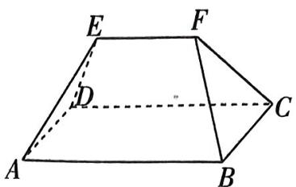

图1

  
巧套立体几何模型解特殊几何体问题

解析 因为四边形 ABCD 是矩形, 所以 $AB \parallel CD$ , 又 $AB \not\subset$ 平面 CDEF, 所以 $AB \parallel$ 平面 CDEF,

因为 $AB \subset$ 平面 $ABFE$ , 平面 $ABFE \cap$ 平面 $CDEF = EF$ , 所以 $AB // EF$ .

因为平面 ABCD 经过外接球球心, 设球心为 O, 如图 2, 连接 AC, BD, 则 $AC \cap BD = O$ .

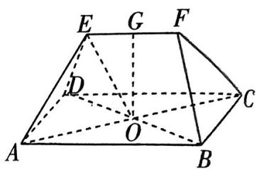

图2

取 $EF$ 的中点 $G$ , 连接 $OE, OG$ , 由题知 $OE = OA = 5, OG \perp EF$ .

在 Rt△OEG 中， $OG = \sqrt{OE^{2} - EG^{2}} = 4$ 。则当且仅当 $OG \perp$ 平面 ABCD 时，五面体的体积最大。

当 $OG \perp$ 平面 $ABCD$ 时, 如图3, 在棱 $AB, CD$ 上分别取 $AI = DJ, IL = JK = EF$ , 连接 $EI, IJ, EJ, FL, LK, FK$ , 则此时五面体的体积 $V = V_{\text{四棱锥}E - AIJD} + V_{\text{三棱柱}EIJ - FLK} + V_{\text{四棱锥}F - BLKC} = \frac{1}{3} \times (8 - 6) \times 6 \times 4 + \frac{1}{2} \times 6 \times 6 \times 4 = 88$ . 故选C.

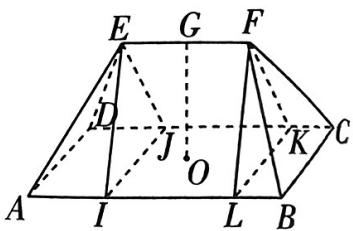

图3

原创押题2 新考法·圆台的内切球 已知一个圆台

的上、下底面半径分别为2,4,若球O与该圆台的上、下底面及侧面均相切,则该圆台与球O的表面积之和为\_\_\_\_.

解析 作出圆台的轴截面,如图4所示,其中E为切点,DF为圆台的高.圆台的母线 $AD=DE+AE=2+4=6$ ,AF=4-2=2,所以圆台的高 $DF=\sqrt{AD^{2}-AF^{2}}=\sqrt{6^{2}-2^{2}}=4\sqrt{2}$ ,球O的半径 $r=\frac{1}{2}DF=2\sqrt{2}$ ,所以 $S_{圆台}=4\pi+16\pi+\pi\times(2+4)\times6=56\pi,S_{球}=4\pi\times(2\sqrt{2})^{2}=32\pi$ ,故圆台【敲黑板】圆台的侧面积公式 $S_{\text{侧}} = \frac{1}{2} (2\pi r + 2\pi R)l = \pi (r + R)l$

与球 O 的表面积之和 $S = S_{圆台} + S_{球} = 56\pi + 32\pi = 88\pi$ .

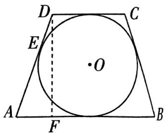

图4

# 考前提醒

对于与函数图象平移有关的问题,注意口诀“左加右减、上加下减”,其中“左加右减”针对自变量, “上加下减”针对因变量.

# 考前40天·第11题 二级结论在解题中的创新应用

# 押题依据

通性通法在高考解题中非常重要，但若能合理利用二级结论，可以大大提高解题效率。如2023全国甲卷第16题，利用角平分线定理可以减少计算量；2022新高考Ⅰ卷第7题，可以利用泰勒公式比较指、对数大小；2022新高考Ⅱ卷第10题，利用抛物线的弦长公式可快速求解。这样的解题方法应引起关注。

原创押题1 在 $\triangle ABC$ 中, $\angle BAC$ 的平分线交 $BC$ 于点 $D$ , 已知 $AD=3\sqrt{2}, BC=7, \frac{AC}{AB}=$ -, 则 $AC=$ ( )

$\quad$A. 6

$\quad$B. $2 \sqrt{10}$

$\quad$C. 7

$\quad$D. $6 \sqrt{2}$

解析 由三角形的角平分线定理知 $\frac{AB}{AC} = \frac{BD}{DC} = \frac{3}{4}$ , 又 $BC = 7$ , 所以 $BD = 3, DC = 4$ .

【记结论】若 $AD$ 为 $\triangle ABC$ 的内角 $BAC$ 的平分线, 则 $\frac{AB}{AC} = \frac{BD}{DC}$

设 $AB = 3m, AC = 4m (m > 0)$ ，因为 $\angle ADB + \angle ADC = \pi$ ，所以 $\cos \angle ADB = -\cos \angle ADC$

则 $\frac{AD^2 + BD^2 - AB^2}{2AD\cdot BD} = -\frac{AD^2 + CD^2 - AC^2}{2AD\cdot CD}$ 所以 $\frac{27 - 9m^2}{18\sqrt{2}} = -\frac{34 - 16m^2}{24\sqrt{2}}$

整理得 $2m^{2} = 5$ ，解得 $m = \frac{\sqrt{10}}{2}$ 所以 $AC = 2\sqrt{10}$ 故选B.

原创押题2 新定义·泰勒公式（多选）泰勒公式通俗地讲就是用一个多项式函数去逼近一个给定的函数，从而达到求给定函数值的目的，泰勒公式也叫泰勒展开式。下面给出三个泰勒开式： $e^{x}=1+x+\frac{x^{2}}{2!}+\frac{x^{3}}{3!}+\frac{x^{4}}{4!}+\cdots+\frac{x^{n}}{n!}+\cdots,\sin x=x-\frac{x^{3}}{3!}+\frac{x^{5}}{5!}-\frac{x^{7}}{7!}+\cdots+(-1)^{n-1}\frac{x^{2n-1}}{(2n-1)!}+\cdots,$ as $x=1-\frac{x^{2}}{2!}+\frac{x^{4}}{4!}-\frac{x^{6}}{6!}+\cdots+(-1)^{n-1}\frac{x^{2n-2}}{(2n-2)!}+\cdots$ ，则下列说法正确的是（）

$\quad$A. $1 - \frac{1}{2!} +\frac{1}{4!} -\frac{1}{6!} +\dots +( - 1)^{n - 1}\frac{1}{(2n - 2)!} +\dots$ 的近似值为 $\sin 33^{\circ}$

$\quad$B. $\sin 1$ 精确到0.01的近似值为0.84

$\quad$C. $2\cos \left(\frac{\pi}{2} +\frac{1}{2}\right)\sin \frac{1}{2}$ 的近似值为-0.46  
$\quad$D. $3 < 2[\ln 2 + (\ln 2)^{2}]$

解析 对于 A 选项, 当 x=1 时, 有 $\cos 1=1-\frac{1}{2!}+\frac{1}{4!}-\frac{1}{6!}+\cdots+(-1)^{n-1}\frac{1}{(2n-2)!}+\cdots$ ,

则 $1 - \frac{1}{2!} +\frac{1}{4!} -\frac{1}{6!} +\dots +( - 1)^{n - 1}\frac{1}{(2n - 2)!} +\dots = \cos 1 = \sin (\frac{\pi}{2} -1) = \sin (\frac{\pi - 2}{2}\times \frac{180}{\pi})^{\circ} =$

【敲黑板】注意弧度制与角度值的换算：1弧度= $\left(\frac{180}{\pi}\right)$ 。

$\sin [90^{\circ} - (\frac{180}{\pi})^{\circ}] \approx \sin 32.7^{\circ} \approx \sin 33^{\circ}$ , 故 A 正确.

对于B选项， $\sin x = x - \frac{x^3}{3!} +\frac{x^5}{5!} -\frac{x^7}{7!} +\dots +( - 1)^{n - 1}\frac{x^{2n - 1}}{(2n - 1)!} +\dots \approx x - \frac{1}{6} x^3 +\frac{1}{120} x^5,$

【关键提醒】利用泰勒展开式求近似值时，一般利用前三项求出的近似值即可满足解题要求，故可简化记忆

令 $x = 1$ ，代入上式可得 $\sin 1\approx 1 - \frac{1}{6} +\frac{1}{120} = \frac{101}{120}\approx 0.84$ ，故B正确.

对于 C 选项, $2\cos\left(\frac{\pi}{2}+\frac{1}{2}\right)\sin\frac{1}{2}=-2\sin^{2}\frac{1}{2}=\cos1-1$ ,

由 $\cos x = 1 - \frac{x^{2}}{2!} + \frac{x^{4}}{4!} - \frac{x^{6}}{6!} + \cdots$ ，可得 $\cos 1 = 1 - \frac{1^{2}}{2!} + \frac{1^{4}}{4!} - \frac{1^{6}}{6!} + \cdots = 1 - \frac{1}{2} + \frac{1}{24} - \frac{1}{720} + \cdots \approx 1 - 0.5 + 0.042 - 0.001 = 0.541$ ，所以 $\cos 1 - 1 \approx -0.46$ ，故 C 正确。

对于 D 选项, 因为 $e^{x}=1+x+\frac{x^{2}}{2!}+\frac{x^{3}}{3!}+\frac{x^{4}}{4!}+\cdots+\frac{x^{n}}{n!}+\cdots$ , 所以当 x>0 时, $e^{x}>1+x+\frac{x^{2}}{2!}$ , 因为 $2^{x}=e^{x\ln2}$ , 所以当 x=2 时, $2^{2}>1+2\ln2+\frac{(2\ln2)^{2}}{2}$ , 即 $3>2\ln2+2(\ln2)^{2}$ , 所以 D 不正确.

故选 ABC.

原创押题3 已知动点 $P$ 到点 $F(1,0)$ 的距离比到 $y$ 轴的距离大 1 , 记 $P$ 点的轨迹为 $\Gamma$ . 直线 $l: x = my + t$ 与 $x$ 轴的交点为 $T(t,0)(t > 0)$ , 且直线 $l$ 与曲线 $\Gamma$ 交于不同的两点 $A, B$ .

（1） 当 $m = 2, t = 1$ 时, 求 $|AB|$ .

（2） 若 $|FA| = |FT|$ , 直线 $l_1 // l$ , 且 $l_1$ 与 $\Gamma$ 有且只有一个公共点 $E$ , 求 $\triangle OAE$ 面积的最小值 (0 为坐标原点).

# 抢分秘籍

小编说:高考越来越近,这些重要的公式和结论你都记住了吗?掌握这些公式和结论可以提高解题速度,甚至可以实现秒杀,考前再抢20分!

解析 （1）依题意,动点P到点(1,0)的距离比到y轴的距离大1,即动点P到点(1,0)的距离与到直线x=-1的距离相等,即动点P的轨迹为以(1,0)为焦点,直线x=-1为准线的抛物线,所以P点的轨迹方程为 $\Gamma:y^{2}=4x$ .

当 $m = 2, t = 1$ 时，直线 $l$ 经过抛物线 $y^{2} = 4x$ 的焦点，设 $A(x_{1}, y_{1}), B(x_{2}, y_{2})$ ，由 $\left\{ \begin{array}{l} y^{2} = 4x, \\ x = 2y + 1, \end{array} \right.$ 消去 $x$ 整理得关于 $y$ 的一元二次方程 $y^{2} - 8y - 4 = 0, \Delta > 0$ ，所以 $y_{1} + y_{2} = 8$

所以 $x_{1} + x_{2} = 2(y_{1} + y_{2}) + 2 = 18, |AB| = x_{1} + x_{2} + 2 = 20.$

【记结论】抛物线 $y^{2} = 2px (p > 0)$ 的焦点弦 $AB$ 的弦长为 $|AB| = x_{1} + x_{2} + p$

（2） 设 $A(x_{1}, y_{1})$ , 由 $|FA| = |FT|$ , 得 $|t - 1| = x_{1} + 1$ , 又 $t > 0, x_{1} > 0$ , 所以 $t - 1 = x_{1} + 1$ , 即 $t = x_{1} + 2$ , 故 $T(x_{1} + 2, 0)$ , 所以直线 $AB$ 的斜率 $k_{AB} = -\frac{y_{1}}{2}$ ,

由题可设 $l_{1}$ 的方程为 $y = -\frac{y_1}{2} x + b$ ，由 $\left\{ \begin{array}{l} y^2 = 4x, \\ y = -\frac{y_1}{2} x + b, \end{array} \right.$ 消去 $x$ 得关于 $y$ 的一元二次方程 $y^2 + \frac{8}{y_1} y - \frac{8b}{y_1} = 0$ ，由题意知， $\Delta' = \frac{64}{y_1^2} + \frac{32b}{y_1} = 0$ ，得 $b = -\frac{2}{y_1}$ ，代入 $y^2 + \frac{8}{y_1} y - \frac{8b}{y_1} = 0$ 中，得 $y^2 + \frac{8}{y_1} y + \frac{16}{y_1^2} = 0$ ，解得 $y = -\frac{4}{y_1}$ ，

设 $E(x_0, y_0)$ ，则 $y_0 = -\frac{4}{y_1}, x_0 = \frac{y_0^2}{4} = \frac{4}{y_1^2} = \frac{1}{x_1}$ ，即 $E(\frac{1}{x_1}, -\frac{4}{y_1})$ ，

所以 $\overrightarrow{OA} = (x_1, y_1), \overrightarrow{OE} = (\frac{1}{x_1}, -\frac{4}{y_1})$

故 $\triangle OAE$ 的面积 $S = \frac{1}{2} |x_1\times (-\frac{4}{y_1}) - \frac{1}{x_1}\times y_1| = \frac{1}{2} (|\frac{4x_1}{y_1}| + |\frac{y_1}{x_1}|)\geqslant \frac{1}{2}\times 2\sqrt{|\frac{4x_1}{y_1}| \times |\frac{y_1}{x_1}|} = 2,$

【指点迷津】利用向量的坐标表示求三角形面积：在 $\triangle ABC$ 中，设 $\overrightarrow{CA} = a = (x_1, y_1)$ ， $\overrightarrow{CB} = b = (x_2, y_2)$ ，则 $\triangle ABC$ 的面积 $S = \frac{1}{2}\sqrt{|a|^2 |b|^2 - (a \cdot b)^2} = \frac{1}{2} |x_1y_2 - x_2y_1|$

当且仅当 $|y_1| = 2x_1$ 时取等号，

由 $\left\{\begin{aligned}|y_{1}|&=2x_{1},\\ y_{1}^{2}&=4x_{1},\end{aligned}\right.$ 得 $x_{1}=1,y_{1}=\pm2$ ，所以 $\triangle OAE$ 面积的最小值为2.

# 考前39天▶第12题 人工智能应用原理中的概率问题

# 押题依据

人工智能、AI、ChatGPT 是近两年备受关注的话题，其研发原理往往蕴含大量的数学知识，从这些知识入手命题，可以很好地体现数学学科的应用性，符合新高考的考查趋势与课标要求.

# 原创押题

人工智能是近些年来广受关注的一个话题,作为机器学习和人工智能的基石,马尔科夫链在强化学习、自然语言处理、金融领域、天气预测、语音识别方面都有着极其广泛的应用. 马尔科夫链是概率论和数理统计中的一种随机过程,具体为状态空间中经过从一个状态到另一个状态的转换的随机过程. 该过程要求具备“无记忆”的性质: 下一状态的概率分布只能由当前状态决定, 在时间序列中它前面的事件均与之无关. 现有甲、乙两个箱子, 各装有 1 个黑球和 2 个白球, 现从甲、乙两箱中各任取一个球交换放入另一个箱子, 重复进行 $n (n \in \mathbf{N}^{*})$ 次这样的操作, 记甲箱中黑球的个数为 $X_{n}$ , 恰有 1 个黑球的概率为 $p_{n}$ .

  
概率与时事热点
巧妙交汇命题

（1） 求 $p_1, p_2$ 的值;  
（2） 求 $p_n$ 的值 (用 $n$ 表示), 并证明 $X_n$ 的数学期望 $E(X_n)$ 为定值.

解析 （1） 设甲箱中恰有 2 个黑球的概率为 $q_{n}$ , 则恰有 0 个黑球的概率为 $1 - p_{n} - q_{n}$ . 由题意知 $p_{1} = \frac{\mathrm{C}_{2}^{1} \mathrm{C}_{2}^{1} + \mathrm{C}_{1}^{1} \mathrm{C}_{1}^{1}}{\mathrm{C}_{3}^{1} \mathrm{C}_{3}^{1}} = \frac{5}{9}, q_{1} = \frac{\mathrm{C}_{2}^{1} \mathrm{C}_{1}^{1}}{\mathrm{C}_{3}^{1} \mathrm{C}_{3}^{1}} = \frac{2}{9}$ , 所以 $p_{2} = \frac{\mathrm{C}_{2}^{1} \mathrm{C}_{2}^{1} + \mathrm{C}_{1}^{1} \mathrm{C}_{1}^{1}}{\mathrm{C}_{3}^{1} \mathrm{C}_{3}^{1}} p_{1} + \frac{\mathrm{C}_{2}^{1} \mathrm{C}_{3}^{1}}{\mathrm{C}_{3}^{1} \mathrm{C}_{3}^{1}} q_{1} + \frac{\mathrm{C}_{3}^{1} \mathrm{C}_{2}^{1}}{\mathrm{C}_{3}^{1} \mathrm{C}_{3}^{1}} (1 - p_{1} - q_{1}) = \frac{49}{81}$ .

（2） 当 $n \geqslant 2$ 时, 因为 $p_n = \frac{\mathrm{C}_2^1\mathrm{C}_2^1 + \mathrm{C}_1^1\mathrm{C}_1^1}{\mathrm{C}_3^1\mathrm{C}_3^1} p_{n-1} + \frac{\mathrm{C}_2^1\mathrm{C}_3^1}{\mathrm{C}_3^1\mathrm{C}_3^1} q_{n-1} + \frac{\mathrm{C}_3^1\mathrm{C}_2^1}{\mathrm{C}_3^1\mathrm{C}_3^1}(1 - p_{n-1} - q_{n-1}) = -\frac{1}{9} p_{n-1} + \frac{2}{3}$ ,

所以 $p_n - \frac{3}{5} = -\frac{1}{9} (p_{n-1} - \frac{3}{5})$ 。又 $p_1 - \frac{3}{5} = -\frac{2}{45} \neq 0$ ，所以 $\{p_n - \frac{3}{5}\}$ 是以 $-\frac{2}{45}$ 为首项， $-\frac{1}{9}$ 为公比的等比数列。所以 $p_n = -\frac{2}{45} \times (-\frac{1}{9})^{n-1} + \frac{3}{5}$ 。 $q_n = \frac{\mathrm{C}_2^1\mathrm{C}_1^1}{\mathrm{C}_3^1\mathrm{C}_3^1} p_{n-1} + \frac{\mathrm{C}_1^1\mathrm{C}_3^1}{\mathrm{C}_3^1\mathrm{C}_3^1} q_{n-1} = \frac{2}{9} p_{n-1} + \frac{1}{3} q_{n-1}$ ①，

$1 - q _ {n} - p _ {n} = \frac {\mathrm{C} _ {1} ^ {1} \mathrm{C} _ {2} ^ {1}}{\mathrm{C} _ {3} ^ {1} \mathrm{C} _ {3} ^ {1}} p _ {n - 1} + \frac {\mathrm{C} _ {3} ^ {1} \mathrm{C} _ {1} ^ {1}}{\mathrm{C} _ {3} ^ {1} \mathrm{C} _ {3} ^ {1}} (1 - q _ {n - 1} - p _ {n - 1}) = \frac {2}{9} p _ {n - 1} + \frac {1}{3} (1 - q _ {n - 1} - p _ {n - 1}) \tag {②.}$

①-②得 $2q_{n} + p_{n} - 1 = \frac{1}{3} (2q_{n - 1} + p_{n - 1} - 1)$ ，又 $2q_{1} + p_{1} - 1 = 0$ ，所以 $2q_{n} + p_{n} - 1 = 0$ ，所以 $q_{n} = \frac{1 - p_{n}}{2}$ ，所以 $1 - p_n - q_n = \frac{1 - p_n}{2}$ ，所以 $X_{n}$ 的分布列为：

<table><tr><td> $X_n$ </td><td>0</td><td>1</td><td>2</td></tr><tr><td>P</td><td> $\frac{1 - p_n}{2}$ </td><td> $p_n$ </td><td> $\frac{1 - p_n}{2}$ </td></tr></table>

所以 $E(X_{n}) = 0\times \frac{1 - p_{n}}{2} +1\times p_{n} + 2\times \frac{1 - p_{n}}{2} = 1$ ，即 $X_{n}$ 的数学期望 $E(X_{n})$ 为定值1.

# 考前38天·第13题 与航天发展相关的航天器变轨问题

# 押题依据

逐梦天宫，探索不止，以火箭发射、轨道对接等航天相关的情境入手命题，如2022全国乙卷第4题以嫦娥二号绕日周期为情境命制数列的单调性问题，体现了与时俱进的原则，时代感强，是高考的热点。这类试题在考查学生数学知识的同时，展现了我国科技事业取得的巨大成就和我国科技工作者勇于创新、开拓进取的强国精神，将爱国敬业、立德树人的理念有效贯穿于试卷之中，充分展现了社会主义核心价值观，结合学科内容发挥了思想教育的功能。

# 原创押题 新情境·航天器变轨实验 2024年,嫦娥六号

将出征月球,它要飞往月球采样并返回地球,在此之前,嫦娥五号已经做了一个非常成功的示例. 整个嫦娥五号的任务操作大致分为两次发射(地面发射与月面发射)、两次着陆(月面着陆与地球着陆)、两次封装(月面封装与月轨封装)、一次交会对接(月轨对接). 火箭发射后,微波雷达随嫦娥五号探测器飞行约7天到达月球轨道,随后雷达主机及天线随轨返组合体环月飞行,应答机主机及应答机天线随着上组合体落月完成月壤采样,之后上升器从月面起飞进入环月轨道,开始月球轨道交会对接,对接成功后,将上升器中的月壤样品转移到返回器中,返回地球着陆. 整个过程要进行多次变轨飞行,先是由地球升空飞行一定时间后变轨进入环月轨道呈环月状态、然后落月前需要从环月轨道变轨而完成落月、从月面起飞后变轨进入环月轨道、最后从环月轨道变轨进入返回轨道后返回地球着陆. 这是非常重要的四次需要改变轨迹形状的变轨环节. 针对以上变轨环节,某学校的科技小组在计算机上模拟航天器变轨返回实验,设计方案如图1.当航天器从月面起飞变轨进入环月轨道时,其轨迹方程为 $C:\frac{x^{2}}{a^{2}}+\frac{y^{2}}{16}=1(a>4)$ ,C的左、右焦点分别为 $F_{1},F_{2}$ ,随后航天器接收指令在A处变轨,变轨后的轨迹为抛物线 $E:x^{2}=-2p(y-20)(p>0)$ ,抛物线经过右焦点 $F_{2}$ ,且航天器沿抛物线降落后,在地面的着陆点为 $B(a,-4)$ .

  
航天器变轨情境下的数学新视角命题

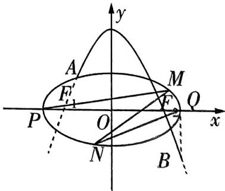

图1

（1） 求椭圆 C 的标准方程及抛物线 E 的方程, 并求出点 A 的坐标.

（2） 记椭圆 $C$ 的左、右顶点分别为 $P, Q$ , 直线 $l$ 与椭圆交于 $M, N$ 两点, 若 $k_{PM}: k_{QN} = 1:3$ , 证明: 直线 $l$ 过 $x$ 轴上的定点.

解析 （1） 由已知得, $F_{1}(-\sqrt{a^{2}-16},0),F_{2}(\sqrt{a^{2}-16},0)$ .

因为抛物线经过椭圆的右焦点 $F_{2}$ , 所以将点 $F_{2}$ 的坐标代入抛物线方程, 可得 $a^{2} - 16 = -2p(0 - 20)$ , 即 $a^{2} = 16 + 40p$ ①.

因为着陆点 $B(a, -4)$ 在抛物线上，所以 $a^2 = -2p(-4 - 20)$ ，即 $a^2 = 48p$ ②.

# 抢分秘籍

任意三角形的射影定理(第一余弦定理) 在 $\triangle ABC$ 中, $a = b\cos C + c\cos B$ , $b = c\cos A + a\cos C$ , $c = b\cos A + a\cos B$ .

由①②可得 $p = 2$ ，则 $a^2 = 96$ ，从而椭圆 $C$ 的方程为 $\frac{x^2}{96} +\frac{y^2}{16} = 1$ ，抛物线 $E$ 的方程为 $x^{2} = -4y + 80.$

由 $\left\{ \begin{array}{l} \frac{x^2}{96} + \frac{y^2}{16} = 1, \\ x^2 = -4y + 80 \end{array} \right.$ 得 $\frac{-4y + 80}{96} + \frac{y^2}{16} = 1$ ，即 $3y^2 - 2y - 8 = 0$ ，

解得 y=2 或 $y=-\frac{4}{3}$ (舍去)，从而 $x^{2}=72$ ，即 $x=-6\sqrt{2}$ 或 $x=6\sqrt{2}$ (舍去)，

【易遗漏】观察题图发现点 $A$ 在第二象限，所以其坐标只有一种情况，不要有增解。所以所求航天器变轨点 $A$ 的坐标为 $(-6\sqrt{2}, 2)$ 。

（2）由（1）可知, $P(-4\sqrt{6},0)$ , $Q(4\sqrt{6},0)$ .

设直线 $PM$ 的方程为 $x = my - 4\sqrt{6}$ , 其中 $m = \frac{1}{k_{PM}}$ ,

【敲黑板】注意方程的设法和斜率之间的关系, 如果是 “ $x = m y + n$ ” 的形式, 那么斜率 $k$ 就是 $\frac{1}{m}$ , 即 $m = \frac{1}{k}$

由 $\left\{ \begin{array}{l} x = my - 4\sqrt{6}, \\ \frac{x^2}{96} + \frac{y^2}{16} = 1 \end{array} \right.$ 得 $(m^2 + 6)y^2 - 8\sqrt{6}my = 0$ ，得 $M\left(\frac{4\sqrt{6}(m^2 - 6)}{m^2 + 6}, \frac{8\sqrt{6}m}{m^2 + 6}\right)$ .

设直线 $QN$ 的方程为 $x = ny + 4\sqrt{6}$ , 其中 $n = \frac{1}{k_{QN}}$ ,

由 $\left\{\begin{aligned}x&=ny+4\sqrt{6},\\ \frac{x^{2}}{96}+\frac{y^{2}}{16}&=1\end{aligned}\right.$ 得 $(n^{2}+6)y^{2}+8\sqrt{6}ny=0$ ，得 $N(-\frac{4\sqrt{6}(n^{2}-6)}{n^{2}+6},-\frac{8\sqrt{6}n}{n^{2}+6})$ .

因为 $\frac{k_{PM}}{k_{QN}} = \frac{n}{m} = \frac{1}{3}$ 即 $m = 3n$ ，所以 $M\left(\frac{4\sqrt{6}(3n^2 - 2)}{3n^2 + 2}, \frac{8\sqrt{6}n}{3n^2 + 2}\right)$ .

设直线 l 过 x 轴上的定点 $G(x_{0},0)$ ，则 $\overrightarrow{GM}, \overrightarrow{GN}$ 共线，

【解题关键】“代数问题向量化，向量问题坐标化”是处理解析几何问题的关键口诀，翻译到本题，就是将直线过定点问题转化为向量共线问题，再由向量共线转化为坐标关系，进而求解即可

$\overrightarrow {G M} = \left(\frac {4 \sqrt {6} (3 n ^ {2} - 2)}{3 n ^ {2} + 2} - x _ {0}, \frac {8 \sqrt {6} n}{3 n ^ {2} + 2}\right), \overrightarrow {G N} = \left(- \frac {4 \sqrt {6} (n ^ {2} - 6)}{n ^ {2} + 6} - x _ {0}, - \frac {8 \sqrt {6} n}{n ^ {2} + 6}\right),$

则 $\left[\frac{4\sqrt{6}(3n^2 - 2)}{3n^2 + 2} - x_0\right] \times \left(-\frac{8\sqrt{6}n}{n^2 + 6}\right) = \left[-\frac{4\sqrt{6}(n^2 - 6)}{n^2 + 6} - x_0\right] \times \frac{8\sqrt{6}n}{3n^2 + 2},$

整理得 $4\sqrt{6}(3n^2 - 2) - (3n^2 + 2)x_0 = 4\sqrt{6}(n^2 - 6) + (n^2 + 6)x_0$

所以 $x_0 = \frac{2\sqrt{6}(n^2 + 2)}{n^2 + 2} = 2\sqrt{6}$ , 故直线 $l$ 过 $x$ 轴上的定点 $G(2\sqrt{6}, 0)$ .

# 考前37天，第14题 以生态环保为情境的概率问题

# 押题依据

生态环保是近几年经久不衰的热点话题，以生态环保为情境的题目在高考数学中多次出现，如2023全国甲卷第19题，以研究臭氧效应的试验为情境，命制独立性检验问题；2023上海卷(春季)第19题，以为了节能环保、节约材料引出的建筑物的“体形系数”为情境，命制函数的应用问题；2022全国乙卷第19题，以环境治理、荒山改造为情境，命制统计问题；等等.预计此类命题在2024年高考中依然以“情境分离型”的形式出现，材料信息对解题的影响不大，因此题目难度也不大.

原创押题 从2023年起,我国将于每年五月第四周开展“全国城市生活垃圾分类宣传周”活动,首届全国城市生活垃圾分类宣传周的时间为2023年5月22日至28日,宣传主题为“让垃圾分类成为新时尚”.在第二届全国城市生活垃圾分类宣传周即将到来之际,某社区举行了一次生活垃圾分类知识比赛,要求每个家庭派出一名代表参赛,每位参赛者需测试A,B,C三个项目,三个测试项目相互不受影响.

（1）若居民甲在测试过程中,第一项测试是等可能地从 $A,B,C$ 三个项目中选一项,且他测试 $A,B,C$ 三个项目通过的概率分别为 $\frac{3}{5},\frac{1}{2},\frac{1}{2}$ . 已知他第一项测试通过,求他第一项测试选择的项目是 $A$ 的概率.

（2） 现规定: 若三个项目全部通过, 则获得一等奖; 若只通过两项, 则获得二等奖; 若只通过一项, 则获得三等奖; 若三项都没有通过, 则不获奖. 已知居民乙选择 $A \to B \to C$ 的顺序参加测试, 且他前两项通过的概率均为 $a$ , 第三项通过的概率为 $b$ . 若他获得一等奖的概率为 $\frac{1}{27}$ , 求他获得二等奖的概率 $P$ 的最小值.

解析 （1） 记事件 $M_{1} =$ “第一项测试选择了项目 $A$ ”，事件 $M_{2} =$ “第一项测试选择了项目 $B$ ”，事件 $M_{3} =$ “第一项测试选择了项目 $C$ ”，事件 $N =$ “第一项测试通过”，

由题意知, $N=M_{1}N+M_{2}N+M_{3}N.$

【厘清思路】根据第一项测试是等可能地从三个项目中选一项，将事件“第一项测试通过”拆分为三个事件的和，再根据全概率公式求解

由“等可能地从 $A, B, C$ 三个项目中选一项”得 $P(M_{1}) = P(M_{2}) = P(M_{3}) = \frac{1}{3}$ ,

抢分秘籍

任意三角形外接圆半径 $R=\frac{abc}{4S}=\frac{a}{2\sin A}=\frac{b}{2\sin B}=\frac{c}{2\sin C}$ (R 为三角形外接圆的半径, S 为三角形面积).

又 $P(N|M_1) = \frac{3}{5}, P(N|M_2) = \frac{1}{2}, P(N|M_3) = \frac{1}{2}$ , 事件 $M_1N, M_2N, M_3N$ 两两互斥，

所以 $P(N) = P(M_1N) + P(M_2N) + P(M_3N) = P(M_1) \times P(N|M_1) + P(M_2) \times P(N|M_2) + P(M_3) \times P(N|M_3) = \frac{1}{3} \times \frac{3}{5} + \frac{1}{3} \times \frac{1}{2} + \frac{1}{3} \times \frac{1}{2} = \frac{8}{15}$ ,

所以在居民甲第一项测试通过的条件下,他第一个项目选择了A的概率为 $P(M_{1}\mid N)=\frac{P(M_{1}N)}{P(N)}=$

【抓题眼】根据“在……的条件下”判断概率模型为条件概率

$\frac {P (M _ {1}) \times P (N | M _ {1})}{P (N)} = \frac {\frac {1}{3} \times \frac {3}{5}}{\frac {8}{1 5}} = \frac {3}{8},$

即已知居民甲第一项测试通过,他第一项测试选择的项目是A的概率是 $\frac{3}{8}$ .

（2）由居民乙获一等奖的概率为 $\frac{1}{27}$ , 可知 $a^2 b = \frac{1}{27}$ .

则 $P = a^{2}(1 - b) + \mathrm{C}_{2}^{1}a(1 - a)b = a^{2} + 2ab - \frac{1}{9} = a^{2} + \frac{2}{27a} -\frac{1}{9}.$

【扫除障碍】获得二等奖的情况是只通过两项测试, 即 $A, B$ 通过 $C$ 不通过或 $A, B$ 中一个通过一个不通过且 $C$ 通过. 据此不重不漏地写出概率 $P$ 的表达式, 通过前面得到的 $a^2 b = \frac{1}{27}$ , 将表达式进行消参处理

令 $f(a)=a^{2}+\frac{2}{27a}-\frac{1}{9},0<a\leqslant1,$

【易遗漏】注意概率取值范围为 $[0,1]$ ，结合 $a^2 b = \frac{1}{27}$ 可知 $a \neq 0$ ，得函数的自变量的取值范围为 $(0,1]$

则 $f'(a) = 2a - \frac{2}{27a^{2}} = \frac{2(27a^{3} - 1)}{27a^{2}}.$

当 $0 < a < \frac{1}{3}$ 时， $f'(a) < 0$ ；当 $\frac{1}{3} < a \leqslant 1$ 时， $f'(a) > 0$ .

所以函数 $f(a)$ 在区间 $(0, \frac{1}{3})$ 上单调递减，在区间 $(\frac{1}{3}, 1]$ 上单调递增，

所以 $f(a)_{\min} = f(\frac{1}{3}) = \frac{1}{9} +\frac{2}{9} -\frac{1}{9} = \frac{2}{9}.$

故他获得二等奖的概率 P 的最小值为 $\frac{2}{9}$ .

# 考前36天

# 第 15 题 以生产生活为情境的离心率与概率问题

# 押题依据

背景源于社会生产与生活实际,从而基于真实情境构建数学模型的题目,在近几年高考中出现得越来越多.这类命题一般同时具有创新性与应用性,部分题目也兼备开放性,或者将多个知识模块综合起来,能够考查学生的综合能力与灵活解题能力,在2024年高考中出现的概率很高.

原创押题1 新情境·倾斜容器研究水面外轮廓 用圆柱形水杯喝水时发现,将水杯倾斜,水面外轮廓呈椭圆形状. 现有一个圆柱形容器,底面直径与高相等,内盛一半的水,将容器适当倾斜,但保持水不能洒出,在倾斜过程中(不含起始状态与最终状态),水面外轮廓形成的椭圆的离心率的取值范围为

解析 根据题意画出倾斜容器时三个不同状态的水面示意图,分别如图1,图2,图3所示.

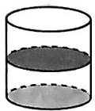  
图1

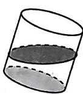  
图2

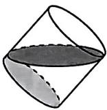  
图3

显然,所求为由图1到图2,再到图3整个变换过程中水面外轮廓形成的椭圆的离心率的取值范围,图1和图3对应两个临界情况(根据题意知临界值不取).

图 3 对应椭圆长轴最长,且整个过程中椭圆的短轴不变,因而此时椭圆的离心率最大.

设圆柱的底面直径与高均为 $2R$ ，则图3对应的椭圆长轴长为 $2\sqrt{2} R$ ，短轴长为 $2R$

所以离心率最大值 $e_{\mathrm{max}} = \frac{\sqrt{2}}{2}$

故水面外轮廓形成的椭圆的离心率的取值范围为 $(0, \frac{\sqrt{2}}{2})$ .

原创押题2 新题型·开放性简答题, 新考法·概率与数列交汇 秋冬季节是流感的高发季节, 为有效抑制某流感的传播, 某医药研究院研发了甲、乙两种新药, 为了解哪种新药更有效, 现进行动物试验. 试验方案如下:

每一轮选取两只白鼠对药效进行对比. 对于两只白鼠, 随机选一只施以甲药, 另一只施以乙药, 一轮的治疗结果得出后, 再安排下一轮试验, 当其中一种药治愈的白鼠比另一种药治愈的白鼠多4只时, 就停止试验, 并认为治愈只数多的药更有效.

为了方便描述问题,约定:对于每轮试验,若施以甲药的白鼠治愈且施以乙药的白鼠未治愈,

# 抢分秘籍

和差化积公式 $\sin \alpha + \sin \beta = 2\sin[(\alpha + \beta)/2]\cos[(\alpha - \beta)/2], \sin \alpha - \sin \beta = 2\cos[(\alpha + \beta)/2]\sin[(\alpha - \beta)/2], \cos \alpha + \cos \beta = 2\cos[(\alpha + \beta)/2]\cos[(\alpha - \beta)/2], \cos \alpha - \cos \beta = -2\sin[(\alpha + \beta)/2]\sin[(\alpha - \beta)/2].$

则甲药得 1 分, 乙药得 -1 分; 若施以乙药的白鼠治愈且施以甲药的白鼠未治愈, 则乙药得 1 分, 甲药得 -1 分; 若都治愈或都未治愈, 则两种药均得 0 分. 甲、乙两种药的治愈率分别记为 $\alpha$ 和 $\beta$ , 一轮试验中甲药的得分记为 $X$ .

（1） 求 $X$ 的分布列.

（2）若甲、乙两种药在试验开始时都赋予4分, $p_{i}(i=0,1,2,\cdots,8)$ 表示“甲药的累计得分为i时,最终认为甲药比乙药更有效”的概率,则 $p_{0}=0,p_{8}=1,p_{i}=ap_{i-1}+bp_{i}+cp_{i+1}(i=1,2,\cdots,7)$ ,其中 $a=P(X=-1),b=P(X=0),c=P(X=1)$ ,假设 $\alpha=0.5,\beta=0.8$ .

(i) 证明: $\{p_{i+1} - p_i\} (i = 0, 1, 2, \cdots, 7)$ 为等比数列.

(ii) 求 $p_4$ , 并根据 $p_4$ 的值解释这种试验方案的合理性.

解析 （1） 由题意可知 $X$ 的所有可能取值为 $-1,0,1$ .

$P (X = - 1) = (1 - \alpha) \beta , P (X = 0) = \alpha \beta + (1 - \alpha) (1 - \beta), P (X = 1) = \alpha (1 - \beta).$

【易遗漏】得分为0有“都治愈”“都未治愈”两种情况，注意不要漏算则 $X$ 的分布列为

<table><tr><td>X</td><td>-1</td><td>0</td><td>1</td></tr><tr><td>P</td><td>(1-α)β</td><td>αβ+(1-α)(1-β)</td><td>α(1-β)</td></tr></table>

（2） 因为 $\alpha = 0.5, \beta = 0.8$ ，所以 $a = 0.5 \times 0.8 = 0.4, b = 0.5 \times 0.8 + 0.5 \times 0.2 = 0.5, c = 0.5 \times 0.2 = 0.1$ .

(i) $p_{i}=ap_{i-1}+bp_{i}+cp_{i+1}=0.4p_{i-1}+0.5p_{i}+0.1p_{i+1}$ ，整理得 $5p_{i}=4p_{i-1}+p_{i+1}(i=1,2,\cdots,7)$ .

【敲黑板】挖掘数列的递推关系，利用构造思想与待定系数法求解

所以 $p_{i+1}-p_{i}=4(p_{i}-p_{i-1})(i=1,2,\cdots,7)$ .

又 $p_{1}-p_{0}\neq0$ , 所以 $\left\{p_{i+1}-p_{i}\right\}(i=0,1,2,\cdots,7)$ 是以 $p_{1}-p_{0}$ 为首项, 4 为公比的等比数列.

(ii) 由(i)知 $p_{i+1} - p_i = (p_1 - p_0) \cdot 4^i = p_1 \cdot 4^i$ ,

所以 $p_{8}-p_{7}=p_{1}\cdot4^{7},p_{7}-p_{6}=p_{1}\cdot4^{6},\cdots,p_{1}-p_{0}=p_{1}\cdot4^{0}$

累加得 $p_8 - p_0 = p_1 \cdot (4^0 + 4^1 + \cdots + 4^7) = \frac{1 - 4^8}{1 - 4} p_1 = \frac{4^8 - 1}{3} p_1 = 1$ ，所以 $p_1 = \frac{3}{4^8 - 1}$ ，

所以 $p_4 = p_4 - p_0 = p_1 \cdot (4^0 + 4^1 + 4^2 + 4^3) = \frac{1 - 4^4}{1 - 4} p_1 = \frac{4^4 - 1}{3} \times \frac{3}{4^8 - 1} = \frac{1}{4^4 + 1} = \frac{1}{257}$ .

$p_{4}$ 表示最终认为甲药更有效的概率,由计算结果可以看出,在甲药治愈率为0.5,乙药治愈率为0.8时,认为甲药更有效的概率为 $p_{4}=\frac{1}{257}\approx0.0039$ ,此时得出错误结论的概率非常小,说明这种试验方案合理.

# 抢分秘籍

积化和差公式 $\sin \alpha \sin \beta = -[\cos (\alpha +\beta) - \cos (\alpha -\beta)] / 2,\cos \alpha \cos \beta = [\cos (\alpha +\beta) + \cos (\alpha -$ $\beta)] / 2,\sin \alpha \cos \beta = [\sin (\alpha +\beta) + \sin (\alpha -\beta)] / 2,\cos \alpha \sin \beta = [\sin (\alpha +\beta) - \sin (\alpha -\beta)] / 2.$

# 考前35天▶第16题 以体育活动为情境的概率问题

# 押题依据

以体育赛事、体育活动为情境命制的概率问题在近几年高考中时有出现, 如 2023 新课标 I 卷第 21 题, 以甲、乙两人投篮为情境命制全概率问题; 2023 全国甲卷第 6 题, 以某地中学生对滑冰和滑雪的爱好情况为情境命制概率求解问题; 等等. 这类问题可以很好地体现数学的应用性, 也能落实 “五育并举” 中的 “体育”, 因此颇受命题者的青睐.

原创押题 2024 年 2 月 24 日,釜山世乒赛女团决赛上演中日对决,经过近 4 个小时的鏖战,由孙颖莎、陈梦、王艺迪组成的中国队 3:2 战胜由张本美和、早田希娜、平野美宇组成的日本队,实现世乒赛女团六连冠,这也是队史第 23 次捧起考比伦杯.为了庆祝这场胜利,阳光小区特举办乒乓球比赛,比赛采用 $2n - 1$ 局 $n$ 胜制 ( $n \in \mathbf{N}^{*}$ ) 的比赛规则,即先赢下 $n$ 局比赛者最终获胜.已知每局比赛甲获胜的概率为 $p$ ,乙获胜的概率为 $1 - p$ ,比赛结束时,甲最终获胜的概率为 $P_{n}$ .

（1） 若 $p = \frac{1}{2}, n = 2$ , 结束比赛时, 比赛的局数为 $X$ , 求 $X$ 的分布列与数学期望;  
（2） 若采用 5 局 3 胜制比采用 3 局 2 胜制对甲更有利, 即 $P_{3} > P_{2}$ , 求 $p$ 的取值范围.

解析 （1） $p = \frac{1}{2}, n = 2$ , 即采用 3 局 2 胜制, $X$ 的所有可能取值为 2, 3.

$P (X = 2) = (\frac {1}{2}) ^ {2} + (\frac {1}{2}) ^ {2} = \frac {1}{2}, P (X = 3) = \mathrm{C} _ {2} ^ {1} (\frac {1}{2}) ^ {2} (\frac {1}{2}) + \mathrm{C} _ {2} ^ {1} (\frac {1}{2}) (\frac {1}{2}) ^ {2} = \frac {1}{2},$

【速解】X 的所有可能取值只有 2 个，此处也可以直接用 $P(X=3)=1-P(X=2)$ 得解所以 X 的分布列为

<table><tr><td>X</td><td>2</td><td>3</td></tr><tr><td>P</td><td> $\frac{1}{2}$ </td><td> $\frac{1}{2}$ </td></tr></table>

所以 $E(X) = 2 \times \frac{1}{2} + 3 \times \frac{1}{2} = \frac{5}{2}$ .

（2） 若采用 3 局 2 胜制, 则甲最终获胜的概率为 $P_{2} = p^{2} + \mathrm{C}_{2}^{1}p(1 - p)p = p^{2}(3 - 2p)$ .

若采用5局3胜制,则甲最终获胜的概率为 $P_{3} = p^{3} + \mathrm{C}_{3}^{2}p^{2}(1 - p)p + \mathrm{C}_{4}^{2}p^{2}(1 - p)^{2}p = p^{3}(6p^{2} - 15p + 10)$ .

令 $P_{3} - P_{2} > 0$ ，则 $p^3 (6p^2 -15p + 10) - p^2 (3 - 2p) = 3p^2 (2p^3 -5p^2 +4p - 1) = 3p^2 (p - 1)(2p^2 -3p+$ $1) = 3p^{2}(p - 1)^{2}(2p - 1) > 0$ ，得 $\frac{1}{2} < p <   1.$

# 抢分秘籍

指数型放缩 $\mathrm{e}^{x} \geqslant x + 1$ (当且仅当 $x = 0$ 时取等号), $\mathrm{e}^{x - 1} \geqslant x$ (当且仅当 $x = 1$ 时取等号), $\mathrm{e}^{x} \leqslant \frac{1}{1 - x}$ ( $x < 1$ , 当且仅当 $x = 0$ 时取等号).

# 考前34天，第17题 以“高交会”为情境的新定义问题

# 押题依据

2021T8 联考数学试卷的第 20 题是以北京大兴国际机场为情境、以新定义 “曲率” 为载体命制的考题，与近几年的真题结合起来分析，可以看出，不管是断臂维纳斯还是金字塔，都是将生活中的实例与数学知识结合命题，这类题目本身并不难，学生的解题障碍在于读不懂题目，无法提取关键信息。现以时事热点 “高交会” 为情境，以 “曲率” 为载体命制函数问题，考查学生理解新定义能力的同时，也考查了学生以导数这一数学知识为工具解决实际问题的能力，体现了数学学科的应用性。

原创押题 2023年11月19日,以“激发创新活力,提升发展质量”为主题的第二十五届中国国际高新技术成果交易会(简称“高交会”)在深圳闭幕.作为“中国科技第一展”的“高交会”今年已有25年历史,“高交会”是展现高新技术发展新趋势、洞察市场新需求的重要“风向

图1

标”,一批新技术、新产品集中亮相,彰显中国科创硬核实力.会展展出了国产全球首架电动垂直起降载人飞碟(如图1).观察它的外观造型,我们会被其优美的曲线折服.现代产品外观特别讲究线条感,曲线更是让人称奇,衡量曲线弯曲程度的重要指标是曲率,而曲线的曲率定义如下:

若 $f'(x)$ 是 $f(x)$ 的导数, $f''(x)$ 是 $f'(x)$ 的导数, 则曲线 $y = f(x)$ 在点 $(x, f(x))$ 处的曲率 $K = \frac{|f''(x)|}{\{1 + [f'(x)]^2\}^{\frac{3}{2}}}$ .

（1） 若碟身是由曲线 $f(x) = \ln x + x$ 与 $g(x) = \sqrt{x}$ 旋转一周形成的, 试比较二者在点 (1,1) 处的曲率 $K_{1}, K_{2}$ 的大小.

（2） 求正弦曲线 $h(x) = \sin x (x \in \mathbf{R})$ 曲率的最大值.

解析 （1） $f'(x)=\frac{1}{x}+1,f''(x)=-\frac{1}{x^{2}}$

所以 $K_{1} = \frac{|f''（1）|}{\{1 + [f'（1）]^{2}\}^{\frac{3}{2}}} = \frac{1}{(1 + 2^{2})^{\frac{3}{2}}} = \frac{1}{5^{\frac{3}{2}}},$

$g ^ {'} (x) = \frac {1}{2 \sqrt {x}}, g ^ {' '} (x) = - \frac {1}{4} x ^ {- \frac {3}{2}},$

所以 $K_{2} = \frac{|g^{''}（1）|}{\{1 + [g'（1）]^{2}\}^{\frac{3}{2}}} = \frac{\frac{1}{4}}{[1 + (\frac{1}{2})^{2}]^{\frac{3}{2}}} = \frac{2}{5^{\frac{3}{2}}},$

所以 $K_{1}<K_{2}$ .

对数型放缩 $\ln (x + 1)\leqslant x(x > - 1$ ，当且仅当 $x = 0$ 时取等号）， $1 - \frac{1}{x}\leqslant \ln x\leqslant x - 1(x > 0,$ 当且仅当 $x = 1$ 时取等号).

（2） $h'(x) = \cos x, h''(x) = -\sin x,$

所以 $K = \frac{|\sin x|}{(1 + \cos^2 x)^{\frac{3}{2}}}, K^2 = \frac{\sin^2 x}{(1 + \cos^2 x)^3} = \frac{\sin^2 x}{(2 - \sin^2 x)^3}$ ,

令 $t = 2 - \sin^2 x$ ，则 $t\in [1,2],K^2 = \frac{2 - t}{t^3}.$

【失分点】根据正弦函数的有界性确定新元的取值范围是容易忽视的关键步骤

设 $p(t) = \frac{2 - t}{t^3}$ ，则 $p'(t) = \frac{-t^3 - 3t^2(2 - t)}{t^6} = \frac{2t - 6}{t^4}$ ，

显然当 $t \in [1,2]$ 时， $p'(t) < 0, p(t)$ 单调递减，

所以 $p(t)_{\max} = p(1) = 1, K^2$ 的最大值为1，

所以正弦曲线 $h(x) = \sin x (x \in \mathbb{R})$ 曲率的最大值为 1.

【解后总结】先准确求出 $h'(x)$ 和 $h''(x)$ ，这是前提，再准确变形得 $K^2 = \frac{\sin^2 x}{(2 - \sin^2 x)^3}$ ，换元后利用导数求其最大值

# 提分干货 拓展阅读

# 了解曲率

本题中的曲率出现在同济大学数学系编的《高等数学》第七版上册一书中，位于第三章“微分中值定理与导数的应用”的第七节.

在工程技术中, 有时需要研究曲线的弯曲程度. 例如, 船体结构中的钢梁、机床的转轴等, 它们在荷载作用下要产生弯曲变形, 在设计时对它们的弯曲必须有一定的限制, 这就要定量研究它们的弯曲程度. 平面曲线的曲率就是针对曲线上某个点的切线方向角对弧长的转动率, 通过微分来定义, 表明曲线偏离直线的程度. 在数学上, 曲率表示曲线在某一点的弯曲程度的数值, 曲率越大, 表示曲线的弯曲程度越大. 本题中关于曲率的定义, 就是高等数学中曲率定义的简单形式.

小编说：学好数学并不是为了以后生活中可以快速准确算出买菜的金额，而是为你之后学习、研究的专业打好基础，不管是电子计算机、航天技术、密码学，还是软件制作、动画设计、人工智能，几乎所有的领域都与数学知识高度相关。高等数学是大多数专业必学的课程之一，对于这类取材于高等数学知识的问题，学有余力或感兴趣的同学可以了解其相关知识，但不宜占用过多时间；而基础不够扎实的同学，仅了解皮毛，能够用高中知识求解本题即可，不要在过难的知识上浪费时间。

# 抢分秘籍

三角型放缩 $\sin x \leqslant x \leqslant \tan x (0 \leqslant x < \frac{\pi}{2})$ （当且仅当 $x = 0$ 时取等号）， $\sin x \geqslant x \geqslant \tan x (-\frac{\pi}{2} < x \leqslant 0$ 当且仅当 $x = 0$ 时取等号）.

# 核心考点创新题

# 考前33天▶第18题 应用情境中的排列组合问题

# 押题依据

排列组合问题是高考中的重要考查内容之一. 如 2023 新课标 I 卷第 13 题, 要求每类选修课至少选修 1 门的不同选课方案的种数; 2020 新高考 II 卷第 6 题, 要求每个村至少安排一名大学生的分配方案种数等. 排列组合问题主要考查学生的逻辑思维能力以及推理、分析问题的能力. 排列组合问题在 2024 年高考中大概率会继续考查, 应当予以重视.

原创押题1 新情境·2023年十大流行语 多个平台公布了“2023年十大流行语”,其中有相同的也有不同的,现从中共选取12个流行语,包括“i人/e人”“显眼包”“特种兵式旅游”“遥遥领先”“多巴胺××”“情绪价值”“双向奔赴”“村BA”“主打一个××”“搭子”“命运的齿轮开始转动”“质疑××,理解××,成为××”,其中“显眼包”“特种兵式旅游”“多巴胺××”“遥遥领先”在多个平台公布的“2023年十大流行语”中出现,被称为“最热流行语”.从这12个流行语中选择4个不同的流行语,则至多包含2个“最热流行语”的选法共有 ( )

$\quad$A. 482 种

$\quad$B. 462 种

$\quad$C. 392 种

$\quad$D. 270 种

解析 方法一 由题意可知,可以分三类:

【指点迷津】根据题目要求,可分为不包含 “最热流行语”、包含一个 “最热流行语”、包含两个 “最热流行语” 三种,按照不同分类逐类求解,再相加即可.也可从反面考虑,方法二中先求从 12 个流行语中任选 4 个的不同选法,再减去不符合题意的,即包含 3 个和包含 4 个 “最热流行语” 的选法,注意不重、不漏

第一类,不包含“最热流行语”,有 $C_{8}^{4}=70$ (种) 不同的选法;

第二类,包含一个“最热流行语”,有 $C_{4}^{1}C_{8}^{3}=224$ (种) 不同的选法;

第三类,包含两个“最热流行语”,有 $C_{4}^{2}C_{8}^{2}=168$ (种)不同的选法.

综上, 至多包含 2 个“最热流行语”共有 $70 + 224 + 168 = 462$ (种) 不同的选法. 故选 B.

方法二 从12个流行语中选择4个不同的流行语共有 $C_{12}^{4} = 495$ （种）不同的选法，

包含3个“最热流行语”有 $C_{4}^{3}C_{8}^{1}=32$ （种）不同的选法，

包含4个“最热流行语”有 $C_{4}^{4}=1$ （种）不同的选法.

所以至多包含2个“最热流行语”共有 $495 - 32 - 1 = 462$ （种）不同的选法，故选B.

# 抢分秘籍

构造法求数列通项公式 递推式形如 $a_{n+1} = pa_n + q(p, q$ 为非零常数，且 $p \neq 1$ ），构造等比数列， $a_{n+1} + \lambda = p(a_n + \lambda)$ .

原创押题2 某大学安排6名大学生去某地 $A, B, C$ 三所中学实习, 每名大学生只能加一所中学的实习工作, 每所中学至少安排1名大学生, 其中乙同学不能参加 $A$ 中学的实习工, 则不同的分配方案共有\_\_\_\_种.

解析 方法一 由于乙同学不能参加 A 中学的实习工作,则可分为乙同学单独去一所学校习,乙同学与其他同学一起去一所学校实习这两种情况.

【指点迷津】特殊元素优先分析，据此分为乙同学单独去一所学校实习和乙同学与其他同一起去一所学校实习这两种情况，按照不同分类逐类求解，再相加即可

第一类,乙同学单独去一所学校,先安排乙同学,由于乙同学不能参加 A 中学的实习工作,所共有 $C_{2}^{1}=2$ (种) 不同的安排方法;

再将其余5名大学生分成两组，共有 $\mathrm{C}_5^1\mathrm{C}_4^4 +\mathrm{C}_5^2\mathrm{C}_3^3 = 5 + 10 = 15$ （种）不同的安排方法；

然后分配到另外的两所中学, 共有 $A_{2}^{2}=2$ (种) 不同的安排方法.

根据分步乘法计数原理可得共有 $2 \times 15 \times 2 = 60$ （种）不同的分配方案.

第二类,乙同学与其他同学一起去一所学校,先安排乙同学,共有 $C_2^1 = 2$ (种)不同的安排方法;

再将其余5名大学生分成三组，共有 $\frac{\mathrm{C}_5^1\mathrm{C}_4^1\mathrm{C}_3^3}{\mathrm{A}_2^2} +\frac{\mathrm{C}_5^1\mathrm{C}_4^2\mathrm{C}_2^2}{\mathrm{A}_2^2} = 25$ （种）不同的安排方法；

【避易错】注意“平均分组”“局部平均分组”时要“消序”处理

然后将三组分配到三所中学,共有 $A_{3}^{3}=6$ (种) 不同的安排方法.

根据分步乘法计数原理可得共有 $2 \times 25 \times 6 = 300$ (种) 不同的分配方案.

综上,不同的分配方案共有 $60 + 300 = 360$ (种).

方法二 6名大学生去A,B,C三所中学实习,每名大学生只能参加一所中学的实习工作,每中学至少安排1名大学生,共有 $\left(\frac{C_{6}^{1}C_{5}^{1}C_{4}^{4}}{A_{2}^{2}}+\frac{C_{6}^{2}C_{4}^{2}C_{2}^{2}}{A_{3}^{3}}+C_{6}^{1}C_{5}^{2}C_{3}^{3}\right)A_{3}^{3}=540$ (种)不同的分配方案.

【敲黑板】先不考虑 “乙同学不能参加 A 中学的实习工作” 的限制条件, 得出所有的分配案后, 再减去乙同学参加 A 中学实习工作的情形. 先分组后排序, 根据每组人数不同可以分为 1,4; 1,2,3; 2,2,2 三种情况

若乙同学单独在 $A$ 中学，有 $\mathrm{C}_5^1\mathrm{C}_4^4\mathrm{A}_2^2 +\mathrm{C}_5^2\mathrm{C}_3^3\mathrm{A}_2^2 = 30$ （种）不同的分配方案；

若乙同学与另外一名同学在 $A$ 中学，有 $\mathrm{C}_5^1 (\mathrm{C}_4^1\mathrm{C}_3^3 +\frac{\mathrm{C}_4^2\mathrm{C}_2^2}{\mathrm{A}_2^2})\mathrm{A}_2^2 = 70$ （种）不同的分配方案；

若乙同学与另外两名同学在 $A$ 中学，有 $\mathrm{C}_5^2\mathrm{C}_3^1\mathrm{C}_2^2\mathrm{A}_2^2 = 60$ （种）不同的分配方案；

若乙同学与另外三名同学在 A 中学, 有 $C_{5}^{3}C_{2}^{1}C_{1}^{1}=20$ (种) 不同的分配方案.

综上,所求不同的分配方案共有540-30-70-60-20=360(种).

抢分秘籍

# 考前32天▶第19题 指数、对数函数模型应用问题

# 押题依据

指数、对数函数模型应用问题经常在各大情境类试题中出现，包括科学研究情境、生态文明情境、社会生活情境等。如 2023 新课标 I 卷第 10 题，以噪声污染为情境，考查了对数的运算性质和利用对数函数的单调性解不等式。此类问题难度一般不大，关键是从冗杂的背景中提取关键信息，2024 年高考中出现的概率较高，应引起关注。

原创押题1 2024年1月5日,我国在酒泉卫星发射中心使用快舟一号甲运载火箭成功将天目一号气象星座15\~18星发射升空,发射任务获得圆满成功.我国在航天领域取得的巨大成就,得益于我国先进的运载火箭技术.根据公式 $v=v_{0}\ln\frac{M}{m}$ ,可以计算理想状态下火箭的最大速度 $v(\mathrm{m/s})$ ,其中 $v_{0}(\mathrm{m/s})$ 是喷流相对速度, $m(\mathrm{kg})$ 是火箭(除推进剂外)的质量, $M(\mathrm{kg})$ 是推进剂与火箭质量的总和, $\frac{M}{m}$ 称为总质比.已知经过材料更新和技术改进后,某火箭的喷流相对速度提高到原来的 $\frac{5}{4}$ 倍,总质比变为原来的 $\frac{1}{2}$ ,若要使该火箭在理想状态下的最大速度至少提高 $\frac{1}{4}v_{0}$ ,则在材料更新和技术改进前总质比的最小值约为(参考数据:2.718<e<2.719)()

$\quad$A. 85

$\quad$B. 86

$\quad$C. 87

$\quad$D. 88

解析 由题意, 令 $\frac{5}{4} v_0 \ln \frac{M}{2m} \geqslant v_0 \ln \frac{M}{m} + \frac{1}{4} v_0$ , 化简得 $5(\ln \frac{M}{m} - \ln 2) \geqslant 4 \ln \frac{M}{m} + 1$ , 即 $\ln \frac{M}{m} \geqslant 5 \ln 2 + 1$ , 可得 $\frac{M}{m} \geqslant e^{5 \ln 2 + 1} = 32e \approx 87$ . 故选 C.

【会运算】 $e^{5\ln 2 + 1} = e^{5\ln 2} \cdot e = (e^{\ln 2})^5 e = 2^5 e = 32e$ ，也可由 $5\ln \frac{M}{2m} \geqslant 4\ln \frac{M}{m} + 1$ 得到 $\ln (\frac{M}{2m})^5 - \ln (\frac{M}{m})^4 \geqslant 1$ ，则 $\ln \frac{M}{32m} \geqslant \ln e$ ，所以 $\frac{M}{m} \geqslant 32e \approx 87$

原创押题2 为加强环境保护,治理空气污染,某环保部门对某工厂产生的废气进行了监测,发现该厂产生的废气经过过滤后排放,过滤过程中废气的污染物含量 $p$ 与时间 $t(\mathrm{h})$ 满足 $p = p_{0} \mathrm{e}^{-kt}$ ( $p_{0}$ 为初始污染物含量, $k$ 为参数). 若污染物含量达到初始含量的 $12.5\%$ 就达到排放标准,且在过滤的前15个小时消除了 $50\%$ 的污染物,则达到排放标准至少需要花费

  
指数、对数函数模型的应用试题（）

$\quad$A. 44 小时

$\quad$B. 45 小时

$\quad$C. 46 小时

$\quad$D. 47 小时

解析 由题意知当 t=0 时, 废气的污染物含量 $p=p_{0}, (1-0.5)p_{0}=p_{0}e^{-15k}$ , 则 $k=\frac{\ln2}{15}$ , 所以 $p=p_{0}e^{-\frac{\ln2}{15}t}$ . 设达到排放标准至少所需的时间为 $t'$ , 则 $0.125p_{0}=p_{0}e^{-\frac{\ln2}{15}t'}$ , 化简得 $\ln8=\frac{t'}{15}\ln2$ , 即 $3\ln2=\frac{t'}{15}\ln2$ , 所以 $\frac{t'}{15}=3$ , 解得 $t'=45$ . 故选 B.

【另辟蹊径】由 $(1-0.5)p_{0}=p_{0}e^{-15k}$ ，得 $0.5=e^{-15k}$ ，由 $0.125p_{0}=p_{0}e^{-kt'}$ 。得 $(0.5)^{3}=e^{-kt'}$ ，所以 $(e^{-15k})^{3}=e^{-kt'}$ ，得 $t'=45$

# 抢分秘籍

# 考前31天·第20题 函数性质的综合应用问题

# 押题依据

在高考中, 函数性质的综合应用问题是必考类型, 主要考查函数的单调性、奇偶性、周期性和图象对称性. 如 2023 新课标 I 卷第 4 题, 考查复合函数的单调性; 2023 全国甲卷第 13 题, 考查函数的奇偶性; 等等. 此类题目的综合性较强, 难度中等, 利用特值与二级结论求解是快速破题的有效手段. 函数性质的综合应用问题将在 2024 年高考中继续出现, 请务必掌握.

原创押题1 函数 $y = f(x)$ 的定义域为 $\mathbf{R}, y = f(x - 1) - 1$ 是奇函数, $y = f(x + 1) + 1$ 是偶函数,且 $f(-2) = -1$ ,则 $f(2023) + f(2024) =$ ( )

$\quad$A. -1

$\quad$B. 0

$\quad$C.2

$\quad$D. 4

解析 由 $y = f(x - 1) - 1$ 是奇函数, 得 $f(-x - 1) - 1 = -[f(x - 1) - 1]$ , 即 $f(-x - 1) + f(x - 1) = 2$ , 所以 $f(x)$ 的图象关于点 $(-1, 1)$ 对称.

由 $y = f(x + 1) + 1$ 是偶函数, 得 $f(-x + 1) + 1 = f(x + 1) + 1$ , 即 $f(-x + 1) = f(x + 1)$ , 所以 $f(x)$ 的图象关于直线 $x = 1$ 对称.

【妙用图象】妙用图象的平移变换求解，由于 $f(x)$ 的图象可由 $y = f(x - 1) - 1$ 的图象向左平移1个单位长度，再向上平移1个单位长度得到，则由 $y = f(x - 1) - 1$ 的图象关于点(0,0)对称，可得 $f(x)$ 的图象关于点(-1,1)对称，同理可得 $f(x)$ 的图象关于直线 $x = 1$ 对称

所以 $f(-x) + f(-2 + x) = 2, f(-x) = f(2 + x)$ ，可得 $f(2 + x) + f(-2 + x) = 2$

即 $f(4 + x) + f(x) = 2$ ，所以 $f(8 + x) + f(4 + x) = 2$

可得 $f(x)=f(8+x)$ ，所以8为 $f(x)$ 的周期.

【记结论】“和定对称，差定周期”，即当括号内和为常数时，体现对称性，如：若 $f(2a + x) = f(-x)$ ，则 $f(x)$ 的图象关于直线 $x = a$ 对称；若 $f(a + x) + f(b - x) = c$ ，则 $f(x)$ 的图象关于点 $(\frac{a + b}{2}, \frac{c}{2})$ 对称。当括号内差为常数时，体现周期性，如：若 $f(a + x) = -f(x)$ ，则 $f(x)$ 的周期为 $2a$ 。关于此类等式，务必抓住括号内式子的关系进行判断

在 $f(-x - 1) + f(x - 1) = 2$ 中，令 $x = 0$ ，得 $f(-1) = 1$

抢分秘籍

取倒数法求数列通项公式 递推式形如 $a_{n} = \frac{a_{n - 1}}{pa_{n - 1} + q} (n\geqslant 2,p,q$ 为非零常数），则两边同时取倒数求通项公式

令 $x = 1$ ，得 $f(0) = -f(-2) + 2 = 3$

则 $f(2\ 023) + f(2\ 024) = f(-1) + f(0) = 1 + 3 = 4.$ 故选 D.

【技巧点拨】“双对称，见周期”，即函数图象若包含两个对称关系，则此函数为周期函数，相关结论可联想三角函数的图象进行记忆，如本题中函数 $f(x)$ 的图象既关于点对称，又关于直线对称，从而可得 $f(x)$ 的周期为 $4 \times |-1 - 1| = 8$

原创押题2 已知函数 $f(x) = \frac{1}{\mathrm{e}^x + 1} - a$ 是奇函数, 则关于 $x$ 的不等式 $\frac{f(x)}{x - \frac{1}{a}} \leqslant 0$ 的解集为 \_\_\_\_.

解析 由题意知 $f(-x) = \frac{1}{\mathrm{e}^{-x} + 1} - a = \frac{\mathrm{e}^x}{\mathrm{e}^x + 1} - a$ ，

因为 $f(x) = \frac{1}{\mathrm{e}^x + 1} - a$ 是奇函数，所以 $f(-x) + f(x) = \frac{\mathrm{e}^x}{\mathrm{e}^x + 1} - a + \frac{1}{\mathrm{e}^x + 1} - a = 1 - 2a = 0,$

所以 $a = \frac{1}{2}$ ，则 $f(x) = \frac{1}{\mathrm{e}^x + 1} -\frac{1}{2}.$

【取特值】先根据函数 $f(x) = \frac{1}{\mathrm{e}^x + 1} - a$ 是奇函数，且定义域是 $\mathbb{R}$ ，可得 $f(0) = \frac{1}{\mathrm{e}^0 + 1} - a = 0$ ，则 $a = \frac{1}{2}$ ，再验证 $f(-x) + f(x) = \frac{\mathrm{e}^x}{\mathrm{e}^x + 1} - \frac{1}{2} + \frac{1}{\mathrm{e}^x + 1} - \frac{1}{2} = 0$ ，符合题意，所以 $a = \frac{1}{2}$

易知函数 $y = e^{x} + 1$ 在 R 上单调递增, $e^{x} + 1 > 0$ ,

所以 $f(x)$ 在 $\mathbf{R}$ 上单调递减，

又 $f(0)=\frac{1}{2}-\frac{1}{2}=0$ ，所以当 $x\leqslant0$ 时， $f(x)\geqslant0$ ，当 $x\geqslant0$ 时， $f(x)\leqslant0$ .

【关键点】利用关键点 $f(0) = 0$ ，结合函数的单调性得出 $f(x)$ 的正负，再分情况求出1集，注意分母不能为0

由 $\frac{f(x)}{x - 2} \leqslant 0$ ，得 $\left\{ \begin{array}{l} x - 2 > 0, \\ f(x) \leqslant 0 \end{array} \right.$ 或 $\left\{ \begin{array}{l} x - 2 < 0, \\ f(x) \geqslant 0, \end{array} \right.$

所以 $x \leqslant 0$ 或 $x > 2$ ,

所以关于 $x$ 的不等式 $\frac{f(x)}{x - 2} \leqslant 0$ 的解集为 $(- \infty, 0] \cup (2, +\infty)$ .

# 考前30天

# 第21题 三角函数图象与性质的综合应用问题

# 押题依据

在高考中, 三角函数图象与性质的综合应用问题是常考类型. 如 2023 新课标 I 卷第 15 题, 利用余弦函数的图象分析零点问题; 2023 全国乙卷第 6 题, 根据正弦型函数的单调性、图象的对称性求函数值; 2021 浙江卷第 18 题, 考察三角函数的周期和最值; 等等. 此类问题综合性较强, 牢牢掌握正弦、余弦、正切函数的性质与图象是关键. 三角函数图象与性质的综合应用问题在 2024 年高考中很有可能出现, 应引起关注.

原创押题1 (多选)已知函数 $f(x) = \sin (\omega x + \varphi) (\omega > 0, -\frac{\pi}{2} < \varphi < \frac{\pi}{2})$ , 其图象相邻两个对称中心之间的距离为 $\pi$ , 且 $f(\frac{3\pi}{4}) = 0$ . 把函数 $f(x)$ 图象上的点的横坐标缩短为原来的 $\frac{1}{2}$ , 纵坐标不变, 再向左平移 $\frac{\pi}{8}$ 个单位长度, 得到函数 $g(x)$ 的图象, 则下列结论正确的有 ( )

$\quad$A. $f(x) = \sin (x + \frac{\pi}{4})$

$\quad$B. 直线 $x = \frac{\pi}{8}$ 为 $f(x)$ 图象的一条对称轴

$\quad$C. $g(x) = \sin 2x$

$\quad$D. 点 $(\frac{\pi}{4}, 0)$ 为 $g(x)$ 图象的一个对称中心

# 解析

<table><tr><td>选项</td><td>分析过程</td><td>正误</td></tr><tr><td>A</td><td> $f(x)$ 图象相邻两个对称中心之间的距离为 $\pi$ →设函数 $f(x)$ 的最小正周期为 $T$ ,则 $\frac{T}{2} = \pi \rightarrow T = 2\pi \rightarrow \frac{2\pi}{\omega} = 2\pi \rightarrow \omega = 1 \rightarrow f(\frac{3\pi}{4}) = 0 \rightarrow \sin(\frac{3\pi}{4} + \varphi) = 0 \rightarrow \frac{3\pi}{4} + \varphi = k\pi$ ,【敲黑板】三角函数图象相邻两个对称中心(对称轴)的距离为最小正周期的一半 $k \in \mathbf{Z} \rightarrow \varphi = k\pi - \frac{3\pi}{4}, k \in \mathbf{Z} \rightarrow -\frac{\pi}{2} < \varphi < \frac{\pi}{2}$ 令 $k = 1 \rightarrow \varphi = \frac{\pi}{4} \rightarrow f(x) = \sin(x + \frac{\pi}{4})$ </td><td>√</td></tr><tr><td>B</td><td> $f(\frac{\pi}{8}) = \sin(\frac{\pi}{8} + \frac{\pi}{4}) \neq \pm 1 \rightarrow \text{直线 } x = \frac{\pi}{8} \text{不是 } f(x) \text{ 图象的对称轴}$ 【速解点拨】三角函数的最高(低)点过其图象的对称轴,故将对称轴对应的值代入解析式中验证,看函数值是否为最大值或最小值即可</td><td>×</td></tr></table>

# 抢分秘籍

椭圆的切线方程 若 $P_{0}(x_{0},y_{0})$ 在椭圆 $\frac{x^2}{a^2} +\frac{y^2}{b^2} = 1(a > b > 0)$ 上，则过 $P_{0}$ 的椭圆的切线方程为 $\frac{x_0x}{a^2} +\frac{y_0y}{b^2} = 1.$

续表

<table><tr><td>选项</td><td>分析过程</td><td>正误</td></tr><tr><td>C</td><td>把函数 $f(x) = \sin(x + \frac{\pi}{4})$ 图象上的点的横坐标缩短为原来的 $\frac{1}{2}$ ,纵坐标不变→得到 $y = \sin(2x + \frac{\pi}{4})$ 的图象→把 $y = \sin(2x + \frac{\pi}{4})$ 的图象向左平移 $\frac{\pi}{8}$ 个单位长度→得到 $y = \sin[2(x + \frac{\pi}{8}) + \frac{\pi}{4}] = \sin(2x + \frac{\pi}{2}) = \cos 2x$ 的图象→ $g(x) = \cos 2x$ </td><td>×</td></tr><tr><td>D</td><td> $g(\frac{\pi}{4}) = 0 \rightarrow$ 点( $\frac{\pi}{4}, 0$ )为 $g(x)$ 图象的一个对称中心</td><td>√</td></tr></table>

故选AD.

原创押题2 已知函数 $f(x) = \sin (\omega x - \frac{\pi}{6})(\omega > 0)$ 在 $[0, \frac{\pi}{2}]$ 上恰好有4个零点和1个最小值点, 则 $\omega$ 的取值范围为 \_\_\_\_.

解析 由 $x \in [0, \frac{\pi}{2}]$ 及 $\omega > 0$ 可得 $\omega x - \frac{\pi}{6} \in [-\frac{\pi}{6}, \frac{\pi}{2}\omega - \frac{\pi}{6}]$ ,

令 $t=\omega x-\frac{\pi}{6}$ ，则 $t\in\left[-\frac{\pi}{6},\frac{\pi}{2}\omega-\frac{\pi}{6}\right]$ ，

【关键点】通过换元，将原函数转化为更简单的正弦函数，结合图象求参数范围时，要注意细节，即不等式是否取等号

若 $y = \sin t$ 在 $t \in [-\frac{\pi}{6}, \frac{\pi}{2}\omega - \frac{\pi}{6}]$ 上恰好有 4 个零点和 1 个最小值点, 则由正弦函数的图象可得 $3\pi \leqslant \frac{\pi}{2}\omega - \frac{\pi}{6} < \frac{7\pi}{2}$ , 解得 $\frac{19}{3} \leqslant \omega < \frac{22}{3}$ .

故 $\omega$ 的取值范围为 $[\frac{19}{3}, \frac{22}{3})$ .

原创押题3 已知函数 $f(x) = (2\sin x - \sqrt{3}\cos x)\cos x + \sqrt{3}\sin^2 x$ .

（1） 求函数 $f(x)$ 的单调递增区间；  
（2） 设 $x \in (0, \pi)$ , 求不等式 $f(x) \leqslant 1$ 的解集;  
（3） 若当 $x \in \left[\frac{\pi}{3}, \frac{\pi}{2}\right]$ 时, 不等式 $m \geqslant f(x)$ 恒成立, 求实数 $m$ 的取值范围.

# 抢分秘籍

椭圆(双曲线)的焦点三角形面积 P 为椭圆(双曲线)上一点, $F_{1},F_{2}$ 为椭圆(双曲线)的焦点,椭圆的焦点三角形面积 $S_{\triangle PF_1F_2}=b^2\tan(\angle F_1PF_2/2)$ , 双曲线的焦点三角形面积 $S_{\triangle PF_2}=b^2/\tan(\angle EPF_2/2)$ .

解析 （1） $f(x) = (2\sin x - \sqrt{3}\cos x)\cos x + \sqrt{3}\sin^2 x = 2\sin x\cos x - \sqrt{3}\cos^2 x + \sqrt{3}\sin^2 x = \sin 2x -$

$\sqrt {3} \cos 2 x = 2 \sin \left(2 x - \frac {\pi}{3}\right),$

【重要公式】二倍角公式 $\sin 2x = 2\sin x\cos x, \cos 2x = \cos^2 x - \sin^2 x$ ；辅助角公式 $a\sin x + b\cos x = \sqrt{a^2 + b^2}\left(\frac{a}{\sqrt{a^2 + b^2}}\sin x + \frac{b}{\sqrt{a^2 + b^2}}\cos x\right) = \sqrt{a^2 + b^2}\sin (x + \varphi)$ ，其中 $\cos \varphi = \frac{a}{\sqrt{a^2 + b^2}}$ ， $\sin \varphi = \frac{b}{\sqrt{a^2 + b^2}}$

由 $-\frac{\pi}{2} + 2k\pi \leqslant 2x - \frac{\pi}{3} \leqslant \frac{\pi}{2} + 2k\pi, k \in \mathbf{Z}$ , 得 $-\frac{\pi}{12} + k\pi \leqslant x \leqslant \frac{5\pi}{12} + k\pi, k \in \mathbf{Z}$ ,

【方法技巧】利用整体法求解函数单调区间，其实质是复合函数的单调性判断法则“同增异减”

所以函数 $f(x)$ 的单调递增区间为 $\left[-\frac{\pi}{12} + k\pi, \frac{5\pi}{12} + k\pi\right] (k \in \mathbf{Z})$ .

（2） 因为 $f(x) \leqslant 1$ ，所以 $\sin (2x - \frac{\pi}{3}) \leqslant \frac{1}{2}$ ，

所以 $\frac{5\pi}{6} + 2k\pi \leqslant 2x - \frac{\pi}{3} \leqslant \frac{13\pi}{6} + 2k\pi, k \in \mathbf{Z}$ , 则 $\frac{7\pi}{12} + k\pi \leqslant x \leqslant \frac{5\pi}{4} + k\pi, k \in \mathbf{Z}$ .

【关键点】利用三角函数的图象解不等式时，应选择一个完整的周期，且最好让解集成一>整体

又 $x \in (0, \pi)$ , 所以 $f(x) \leqslant 1$ 的解集为 $\{x \mid 0 < x \leqslant \frac{\pi}{4} \text{或} \frac{7\pi}{12} \leqslant x < \pi\}$ .

【破障碍】结合题干所给的 $x$ 的取值范围, 对 $k$ 赋值, 当 $k = - 1$ 时, $x \in [ - \frac { 5 \pi } { 1 2 }, \frac { \pi } { 4 } ]$ , 当 $= 0$ 时, $x \in [ \frac { 7 \pi } { 1 2 }, \frac { 5 \pi } { 4 } ]$ , 取它们与 $(0, \pi)$ 的交集即可

（3） 不等式 $m \geqslant f(x)$ 恒成立, 等价于 $m \geqslant f(x)_{\max}$ .

因为 $x \in \left[\frac{\pi}{3}, \frac{\pi}{2}\right]$ , 所以 $\frac{\pi}{3} \leqslant 2x - \frac{\pi}{3} \leqslant \frac{2\pi}{3}$ .

故当 $2x-\frac{\pi}{3}=\frac{\pi}{2}$ ，即 $x=\frac{5\pi}{12}$ 时， $f(x)$ 取得最大值，最大值为 $f(\frac{5\pi}{12})=2$ .

【易错点】求三角(型)函数的取值范围或最值时, 结合函数图象求解, 不易出错所以 $m \geqslant 2$ , 即实数 $m$ 的取值范围为 $[2, +\infty)$ .

数学之最

小编说:中国数学文化历史悠久,是中国五千年文明的重要组成部分,下面小编来给大家分享一些中国的数学之最.

# 考前29天

# 第22题 三角基本公式与基本概念的深度考查问题

# 押题依据

在高考中, 三角基本公式与基本概念问题 (含倍角、恒等变形等) 是常考类型, 如 2023 新课标 I 卷第 8 题, 考查了两角和与两角差的正弦公式, 二倍角的余弦公式; 2022 新高考 I 卷第 18 题, 考查了三角函数的诱导公式、两角差的余弦公式、二倍角公式; 等等. 此类问题很有可能在 2024 年高考中出现, 应引起关注.

原创押题1 已知 $\sin \alpha + \cos \beta = -\frac{1}{5}, \cos \alpha + \sin \beta = \frac{7}{5}$ , 则 $\cos (2\alpha + 2\beta) = (\quad)$

$\quad$A. -1

$\quad$B. 0

$\quad$C. 1

$\quad$D. 2

解析 由 $(\sin \alpha + \cos \beta)^2 = (-\frac{1}{5})^2, (\cos \alpha + \sin \beta)^2 = (\frac{7}{5})^2,$

【点技巧】先平方，再相加，巧妙化简

得 $\sin^2\alpha +\cos^2\beta +2\sin \alpha \cos \beta = \frac{1}{25},\cos^2\alpha +\sin^2\beta +2\cos \alpha \sin \beta = \frac{49}{25},$

两式相加, 得 $1 + 1 + 2 \sin \alpha \cos \beta + 2 \cos \alpha \sin \beta = 2$ ,

因此 $\sin (\alpha +\beta) = \sin \alpha \cos \beta +\cos \alpha \sin \beta = 0,$

所以 $\cos (2\alpha + 2\beta) = \cos 2(\alpha + \beta) = 1 - 2\sin^2 (\alpha + \beta) = 1.$ 故选C.

原创押题2 已知 $\tan (\alpha - \beta) = \frac{1}{2}, \tan \beta = -\frac{1}{7}$ , 则 $\sin 2\alpha =$ \_\_\_\_.

解析 因为 $\tan (\alpha -\beta) = \frac{1}{2},\tan \beta = -\frac{1}{7},$

所以 $\tan \alpha = \tan [(\alpha -\beta) + \beta ] = \frac{\tan (\alpha - \beta) + \tan \beta}{1 - \tan (\alpha - \beta)\tan \beta} = \frac{\frac{1}{2} - \frac{1}{7}}{1 - \frac{1}{2}\times (-\frac{1}{7})} = \frac{1}{3},$

【导思路】利用整体思想，根据 $\tan \alpha = \tan [(\alpha -\beta) + \beta ]$ ，求出 $\tan \alpha$

所以 $\sin 2\alpha = \frac{2\sin\alpha\cos\alpha}{\sin^2\alpha + \cos^2\alpha} = \frac{2\tan\alpha}{\tan^2\alpha + 1} = \frac{2\times\frac{1}{3}}{\left(\frac{1}{3}\right)^2 + 1} = \frac{3}{5}$ .

【指点选律】先构造成齐次式(将分母1替换为 $\sin^{2}\alpha+\cos^{2}\alpha$ )，再利用转化思想(弦化切，分子分母同时除以 $\cos^{2}\alpha$ )，即可求解

# 数学之最

# 原创押题3

记 $\triangle ABC$ 的内角 $A, B, C$ 的对边分别为 $a, b, c$ , 且 $A \neq C$ , 已知

$\tan A = \frac {\sin A - \sin C}{\cos C - \cos A}.$

（1） 求证: B = 2A.   
（2） 求 $\frac{b + c}{a}$ 的取值范围.

解析 （1） $\tan A = \frac{\sin A - \sin C}{\cos C - \cos A}$ , 即 $\frac{\sin A}{\cos A} = \frac{\sin A - \sin C}{\cos C - \cos A}$ ,

从而 $\sin A\cos C - \sin A\cos A = \cos A\sin A - \cos A\sin C,$

即 $\sin A\cos C + \cos A\sin C = 2\sin A\cos A$ ，所以 $\sin (A + C) = \sin 2A$

因为 $A + B + C = \pi$ ，所以 $\sin (A + C) = \sin B = \sin 2A$

从而 $B = 2A$ ，或 $B + 2A = \pi .$

【纠细节】此处正弦值相等，存在两角相等或互补两种情况，需进行取舍

当 $B + 2A = \pi$ 时， $A = C$ ，与题意不符，故舍去。所以 $B = 2A$ 。

（2） 由（1）知, B = 2A, 则 $C = \pi - B - A = \pi - 3A$ ,

根据 $\left\{ \begin{array}{ll}0 < A < \pi ,\\ 0 < 2A < \pi ,\\ 0 < \pi -3A < \pi ,\\ A\neq \pi -3A, \end{array} \right.$ 得 $0 < A < \frac{\pi}{3}$ 且 $A\neq \frac{\pi}{4}$

【回头望】在求 $A$ 的取值范围时, 要考虑三个角的范围, 还要注意 $A \neq C$

所以 $\frac{b + c}{a} = \frac{\sin B + \sin C}{\sin A} = \frac{\sin 2A + \sin 3A}{\sin A} = \frac{2\sin A\cos A + \sin A\cos 2A + \cos A\sin 2A}{\sin A} = 2\cos A +$ $\cos 2A + 2\cos^2 A = 4\cos^2 A + 2\cos A - 1.$

【指点迷津】利用正弦定理将边转化为角，利用三角基本公式进行化简，将其转化为二次函数模型，从而求出取值范围

因为 $\cos A \in (\frac{1}{2}, \frac{\sqrt{2}}{2}) \cup (\frac{\sqrt{2}}{2}, 1)$ 且 $y = 4x^{2} + 2x - 1$ 在 $(\frac{1}{2}, 1)$ 上单调递增，

所以 $4\cos^2 A + 2\cos A - 1 \in (1, \sqrt{2} + 1) \cup (\sqrt{2} + 1, 5)$ ,

即 $\frac{b + c}{a} \in (1, \sqrt{2} + 1) \cup (\sqrt{2} + 1, 5)$ .

# 考前28天

# 第23题 平面向量基本定理与数量积运算问题

# 押题依据

平面向量基本定理与数量积运算问题是高考常考类型, 近几年高考考查频次较高, 如 2022 新高考 I 卷第 3 题, 考查用基底表示向量 (平面向量基本定理); 2022 新高考 II 卷第 4 题, 考查了平面向量夹角余弦值的坐标表示 (平面向量的数量积运算). 此类问题很有可能在 2024 年高考中出现.

原创押题1 如图1,在平行四边形ABCD中,AC与BD交于点O,E是线段OD的中点,AE的延长线与CD交于点F.若 $AB=\sqrt{2}$ ,AD=1, $\angle BAD=45^{\circ}$ ,则 $\overrightarrow{AF}\cdot\overrightarrow{DE}$ 等于()

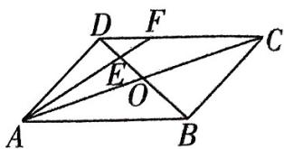

图1

$\quad$A. $\frac{1}{6}$

$\quad$B. $-\frac{1}{6}$

$\quad$C. $\frac{1}{12}$

$\quad$D. $-\frac{1}{12}$

解析 在平行四边形 ABCD 中, $AB = \sqrt{2}$ , AD = 1, $\angle BAD = 45^{\circ}$ , $DF \parallel AB$ ,

可得 $\triangle DEF \sim \triangle BEA$ . 由 $E$ 是线段 $OD$ 的中点, 可得 $DF: BA = DE: BE = EF: AE = 1:3$ ,

$\overrightarrow {A F} = \overrightarrow {A D} + \overrightarrow {D F} = \overrightarrow {A D} + \frac {1}{3} \overrightarrow {A B}, \overrightarrow {D E} = \frac {1}{4} \overrightarrow {D B} = \frac {1}{4} (\overrightarrow {A B} - \overrightarrow {A D}),$

则 $\overrightarrow{AF} \cdot \overrightarrow{DE} = \frac{1}{4} (\frac{1}{3}\overrightarrow{AB} + \overrightarrow{AD}) \cdot (\overrightarrow{AB} - \overrightarrow{AD}) = \frac{1}{4} (\frac{1}{3}\overrightarrow{AB}^2 - \overrightarrow{AD}^2 + \frac{2}{3}\overrightarrow{AB} \cdot \overrightarrow{AD}) = \frac{1}{4} \times (\frac{1}{3} \times 2 - 1 + \frac{2}{3} \times \sqrt{2} \times 1 \times \frac{\sqrt{2}}{2}) = \frac{1}{12}$ . 故选 C.

原创押题2 已知向量 $a = (-2, -1), b = (\lambda, 1)$ , 若 $b$ 在 $a$ 上的投影向量的模为 $\frac{\sqrt{5}}{5}$ , 且 $a$ 与 $b$ 的夹角为钝角, 则 $\lambda$ 的值为 \_\_\_\_.

解析 b 在 a 上的投影为 $\frac{a \cdot b}{|a|} = \frac{(-2, -1) \cdot (\lambda, 1)}{\sqrt{(-2)^{2} + (-1)^{2}}} = \frac{-2\lambda - 1}{\sqrt{5}}$ ,

【巧用公式】b 在 a 上的投影为 $\left|b\right|\cos\left\langle a,b\right\rangle$ ，根据向量的数量积得 $\left|b\right|\cos\left\langle a,b\right\rangle=\frac{a\cdot b}{\left|a\right|}$

根据题意, 得 $\left(\frac{-2\lambda - 1}{\sqrt{5}}\right)^2 = \frac{1}{5}$ , 解得 $\lambda = 0$ 或 $\lambda = -1$ . 当 $\lambda = 0$ 时, $a \cdot b = (-2, -1) \cdot (0, 1) = -1 < 0$ , 且 $a$ 与 $b$ 不共线, 此时 $a$ 与 $b$ 的夹角为钝角, 符合题意; 当 $\lambda = -1$ 时, $a \cdot b = (-2, -1) \cdot (-1, 1) = 1 > 0$ , 且 $a$ 与 $b$ 不共线, 此时 $a$ 与 $b$ 的夹角为锐角, 故舍去. 故 $\lambda = 0$ .

【指点迷津】a 与 b 的夹角为锐角 $\Leftrightarrow a \cdot b > 0$ 且 a 与 b 不同向共线；a 与 b 的夹角为钝角 $\Leftrightarrow a \cdot b < 0$ 且 a 与 b 不反向共线；a 与 b 的夹角为直角 $\Leftrightarrow a \cdot b = 0$

# 数学之最

最早从理论上求得圆周率的人——张衡 张衡是第一个从理论上求得圆周率的中国科学家,他用圆的外切正方形周长来计算圆的周长,计算出圆周率的值约为0.25.

# 考前27天·第24题 求台体、锥体的表面积与体积

# 押题依据

台体和锥体的表面积、体积计算问题是近几年高考中的常客，既有求正棱锥、圆锥、正棱台的表面积、体积的基础问题，又有与球体结合或在运动变化中探求体积、表面积相关最值、范围的综合问题，较好地考查了空间想象、推理论证和运算求解能力。如2023新课标Ⅰ卷第14题和2023新课标Ⅱ卷第14题，回归基础，紧扣棱锥、棱台的概念，求正四棱台的体积；2022新高考Ⅱ卷第11题，探究组合体中各棱锥体积的关系。台体、锥体问题在2024年大概率将继续考查，呈现常规中有变化、重视基础、注重能力的特征，需要认真备考。

原创押题1 已知圆台上、下底面的半径分别为 1,4, 母线长为 5, 则该圆台的体积为 ( )

$\quad$A. $21 \pi$

$\quad$B. $28 \pi$

$\quad$C. $35 \pi$

$\quad$D. $\frac{100\pi}{3}$

解析 如图 1, $OO_{1}$ 是圆台的轴, $O_{1}A_{1}\parallel OA$ , 过 $A_{1}$ 作 $A_{1}B\perp OA$ 交 $OA$ 于 $B$ , 则 $A_{1}B\parallel OO_{1}$ ,

【解题关键】圆台是旋转体, 关键是根据题意作出轴截面, 将上、下底面半径, 高, 母线放在一个直角梯形中求长度

在 Rt△A₁BA 中，AB = OA - OB = OA - O₁A₁ = 3, AA₁ = 5,

所以 $A_{1}B = \sqrt{A_{1}A^{2} - AB^{2}} = 4$ ，即圆台的高为4.

所以圆台的体积 $V = \frac{4\pi}{3} (1^2 + 1 \times 4 + 4^2) = 28\pi$ . 故选 B.

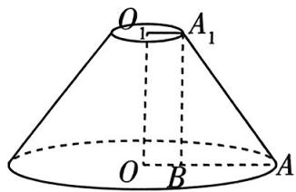

图1

原创押题2 已知某圆锥在表面积为 $9 \pi$ 的球内, 则该圆锥的最大体积为 ( )

$\quad$A. $\frac{4\pi}{3}$

$\quad$B. $2 \pi$

$\quad$C. $3 \pi$

$\quad$D. $4 \pi$

解析 设球的半径为 R, 由题知 $4\pi R^{2}=9\pi$ , 解得 $R=\frac{3}{2}$ .

若圆锥体积最大,圆锥的顶点必在球面上,圆锥的底面恰是球的某个截面圆.

【厘清思路】球内圆锥最大体积问题, 首先确定圆锥与球体的关系, 若要体积最大, 则圆锥的顶点在球面上, 底面为球的某个截面圆, 同时圆锥的顶点与底面在球心两侧. 然后建立函数模型, 以球心到圆锥底面中心的距离为变量, 表示出圆锥的体积, 利用导数求得最大体积

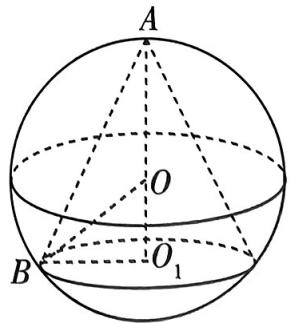

图2

如图2,球的球心为 $O$ , 圆锥的顶点为 $A$ , 底面圆圆心为 $O_{1}, O_{1}B$ 为底面半径. 设 $OO_{1}=x$ , 则圆锥的高 $h=O_{1}A=x+\frac{3}{2}$ , 底面半径 $r=\sqrt{\left(\frac{3}{2}\right)^{2}-x^{2}}=\sqrt{\frac{9}{4}-x^{2}}$ ,

所以圆锥的体积 $V(x) = \frac{\pi}{3}\left(\frac{9}{4} - x^2\right)\left(\frac{3}{2} + x\right)\left(0 < x < \frac{3}{2}\right)$ ，则 $V'(x) = \frac{\pi}{3}\left(\frac{3}{2} - 3x\right)\left(\frac{3}{2} + x\right)$ ，

令 $V'(x)=0$ , 得 $x=\frac{1}{2}$ , 当 $0<x<\frac{1}{2}$ 时, $V(x)$ 单调递增, 当 $\frac{1}{2}<x<\frac{3}{2}$ 时, $V(x)$ 单调递减.

# 数学之最

所以 $V(x)_{\max} = V(\frac{1}{2}) = \frac{4\pi}{3}$ , 故选 A.

原创押题3 已知正四棱台 $ABCD - A_{1}B_{1}C_{1}D_{1}$ 中, $AB = 4, A_{1}B_{1} = 2$ , 且球 $O$ 与此棱台的四个侧面和两个底面都相切, 则该棱台的表面积为 $\_ \_ \_ \_ \_ \_ \_ \_ \_ \_ \_ \_ \_ \_ \_ \_ \_ \_ \_ \_ \_ \_ \_ \_ \_ \_ \_ \_ \_ \_ \_ \_ \_ \_ \_ \_ \_ \_ \_ \_ \_ \_ \_ \_ \_ \_ \_ \_ \_ \_ \_$

解析 如图3,在正四棱台 $ABCD - A_{1}B_{1}C_{1}D_{1}$ 中,内切球的球心 $O$ 是上、下底面中心所连线段 $O_{1}O'$ 的中点,分别取 $AD,A_{1}D_{1}$ 的中点 $E,E_{1}$ ,连

【厘清思路】解决几何体内切球问题的关键是确定球心、切点的位置, 本题由正四棱台的特征, 可以直观得到球心是上、下底面中心连线的中点, 利用垂直关系, 将空间问题转化为平面问题

接 $O'E, O_{1}E_{1}, EE_{1}$ , 过 $O$ 作 $OF \perp EE_{1}$ 于 $F$ , 则 $F$ 为球 $O$ 与棱台侧面的切点,

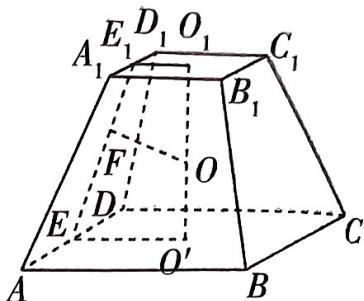

图3

所以 $OO' = OF = OO_1$ ，又 $OF \perp EE_1, O_1O' \perp O_1E_1, O_1O' \perp O'E$ ，所以 $O'E = EF, O_1E_1 = E_1F$ ，则 $EE_1 = EF + E_1F = O'E + O_1E_1 = \frac{AB}{2} + \frac{A_1B_1}{2} = 3$ .

易得 $EE_{1}$ 是梯形 $ADD_{1}A_{1}$ 的高, 正四棱台上底面面积 $S_{上}=4^{2}$ , 下底面面积 $S_{下}=2^{2}$ , 所以正四棱台 ABCD- $A_{1}B_{1}C_{1}D_{1}$ 的表面积 $S=4S_{梯形ADD_{1}A_{1}}+S_{上}+S_{下}=4\times\frac{(4+2)\times3}{2}+4^{2}+2^{2}=56$ ,

又 $O'O_{1} = \sqrt{EE_{1}^{2} - (O'E - O_{1}E_{1})^{2}} = 2\sqrt{2}$

所以正四棱台 $ABCD - A_{1}B_{1}C_{1}D_{1}$ 的体积 $V = \frac{h(S_{\text{上}} + \sqrt{S_{\text{上}}S_{\text{下}}} + S_{\text{下}})}{3} = \frac{2\sqrt{2}(4^2 + 4\times 2 + 2^2)}{3} = \frac{56\sqrt{2}}{3}$ .

# 提分干货 万能公式

# 万能体积公式与柱、锥、台、球体积公式的双向记忆

万能体积公式 $V=\frac{1}{6}(S+4S_{0}+S')h$ ，其中 S 为上底面面积， $S'$ 为下底面面积， $S_{0}$ 为中截面面积，h 为几何体的高。几何体的中截面是指与底面平行，且与两底面等距离的平面截几何体所得的截面，对于锥体、柱体、台体等空间几何体， $S_{0}=(\frac{\sqrt{S}+\sqrt{S'})^{2}$ 。

①对于棱柱而言, 它相当于几何体的上、下底面是对应边平行的全等多边形, 此时 $S = S_{0} = S'$ , 由 $V = \frac{1}{6}(S + 4S_{0} + S')h$ 可得 $V_{\text{柱}} = Sh$ . ②对于棱锥而言, 它相当于几何体的上底面缩成一个点, 此时 $S = 0, S_{0} = \frac{1}{4}S'$ , 由 $V = \frac{1}{6}(S + 4S_{0} + S')h$ 可得 $V_{\text{锥}} = \frac{1}{3}S'h$ . ③对于棱台而言, 它相当于几何体的上、下底面是对应边平行的相似多边形, 此时 $2\sqrt{S_{0}} = \sqrt{S} + \sqrt{S'}$ , 由 $V = \frac{1}{6}(S + 4S_{0} + S')h$ 可得 $V_{\text{台}} = \frac{1}{3}(S + \sqrt{SS'} + S')h$ . ④对于球而言, 它相当于几何体的上、下底面都缩成了一个点, 此时 $S = S' = 0, S_{0} = \pi r^{2}$ (r为球的半径), $h = 2r$ , 由 $V = \frac{1}{6}(S + 4S_{0} + S')h$ 可得 $V_{\text{球}} = \frac{4}{3}\pi r^{3}$ .

# 数学之最

祖冲之推算的圆周率值被命名为“祖冲之圆周率”，简称“祖率”。“祖率”对数学的研究有重大贡献，直到15世纪初，阿拉伯数学家卡西才打破了这一纪录。

# 考前26天▶第25题 求圆锥曲线的离心率

# 押题依据

在高考中，对圆锥曲线的离心率的考查，主要是针对双曲线和椭圆的离心率. 求离心率一般是通过建立参数 $a, b, c$ 之间的关系，解方程从而得解. 在选择题和填空题中，要注意方法的优化. 这类问题在历届高考中属于必考的知识点，在2024年高考中出现的概率非常高.

原创押题1 已知抛物线 $y^{2} = 2px (p > 0)$ 的焦点 $F$ 为双曲线 $\frac{x^2}{a^2} - \frac{y^2}{b^2} = 1 (a > 0, b > 0)$ 的一个焦点，经过两曲线交点的直线恰过点 $F$ ，则该双曲线的离心率 $e =$ （）

$\quad$A. $2 - \sqrt{2}$

$\quad$B. $1 + \sqrt{2}$

$\quad$C. $\sqrt{3}$

$\quad$D. $1 + \sqrt{3}$

解析 方法一 由题意知 $\frac{p}{2} = c$ ，两曲线交点的连线过点 $F$ ，由对称性得连线垂直于 $x$ 轴，则其中一个交点坐标为 $(\frac{p}{2}, p)$ ，即 $(c, 2c)$ ，代入双曲线方程中，得 $\frac{c^2}{a^2} - \frac{4c^2}{b^2} = 1$ ，则 $\frac{4c^2}{b^2} = \frac{c^2}{a^2} - 1 = \frac{b^2}{a^2}$ ，即 $b^2 = 2ac$ ，所以 $c^2 - a^2 - 2ac = 0$ ，即 $e^2 - 2e - 1 = 0 (e > 1)$ ，解得 $e = 1 + \sqrt{2}$ 。故选 B.

方法二:妙用二级结论 由对称性及已知经过两曲线交点的直线恰好过焦点,知该直线为抛物线、双曲线的通径,所以 $\frac{2b^{2}}{a}=2p$ ,因为两圆锥曲线共焦点,所以 $\frac{p}{2}=c$ ,所以 $b^{2}=2ac$ ,所以 $c^{2}-$ 【用结论】椭圆、双曲线的通径长为 $\frac{2b^{2}}{a}$ ,抛物线的通径长为2p $t^{2}=2ac$ ,即 $e^{2}-2e-1=0(e>1)$ ,

解得 $e=1+\sqrt{2}$ ，故选 B.

原创押题2 已知椭圆 $C: \frac{x^2}{a^2} + \frac{y^2}{b^2} = 1 (a > b > 0)$ , 曲线 $D$ 是以 $C$ 的焦点为顶点, 以 $C$ 的长轴端点为焦点的双曲线. 若曲线 $D$ 的一条渐近线方程为 $\sqrt{3} x - y = 0$ , 则椭圆 $C$ 的离心率 $e =$ ( )

$\quad$A.2

$\quad$B. $\frac{1}{2}$

$\quad$C. $\frac{\sqrt{3}}{2}$

$\quad$D. $\frac{\sqrt{3}}{3}$

解析 方法一 设双曲线 D 的方程为 $\frac{x^{2}}{a_{1}^{2}} - \frac{y^{2}}{b_{1}^{2}} = 1 (a_{1} > 0, b_{1} > 0)$ , $c_{1} = \sqrt{a_{1}^{2} + b_{1}^{2}}$ ，对于椭圆 C，有 $c = \sqrt{a^{2} - b^{2}}$ ，结合题意可得 $a_{1} = c, c_{1} = a$ .

因为曲线 $D$ 的一条渐近线方程为 $\sqrt{3} x - y = 0$ ，所以 $\frac{b_1}{a_1} = \sqrt{3}$ ，

数学之最

则 $\frac{b_1^2}{a_1^2} = \frac{c_1^2 - a_1^2}{a_1^2} = \frac{a^2 - c^2}{c^2} = 3$ ，所以 $a^2 = 4c^2$ ，即 $e^2 = \frac{1}{4}$ ，所以 $e = \frac{1}{2}$ ，故选B.

【点明易错】注意在椭圆与双曲线中参数 $a, b, c$ 的关系的不同

方法二 因为双曲线 D 的一条渐近线方程为 $\sqrt{3}x - y = 0$ ，所以设双曲线方程为 $3x^{2} - y^{2} = \lambda (\lambda > 0)$ ，可整理为 $\frac{x^{2}}{\frac{\lambda}{3}} - \frac{y^{2}}{\lambda} = 1$ ，设 $c = \sqrt{a^{2} - b^{2}}$ ，所以 $\frac{\lambda}{3} = c^{2}$ ， $\frac{\lambda}{3} + \lambda = a^{2}$ ，所以 $e^{2} = \frac{c^{2}}{a^{2}} = \frac{1}{4}$ ，即 $e = \frac{1}{2}$ 。故选 B.

【点技巧】若已知双曲线的渐近线方程 $mx - ny = 0$ 求双曲线方程（焦点在 $x$ 轴上），可以令 $m^2 x^2 - n^2 y^2 = \lambda (\lambda > 0)$ ，整理得双曲线方程为 $\frac{x^2}{\frac{\lambda}{m^2}} - \frac{y^2}{\frac{\lambda}{n^2}} = 1 (\lambda > 0)$

原创押题3 已知点 $F_{1}, F_{2}$ 分别为椭圆 $C: \frac{x^{2}}{a^{2}} + \frac{y^{2}}{b^{2}} = 1 (a > b > 0)$ 的左、右焦点，点 $M$ 为椭圆 $C$ 上一点，且 $\overrightarrow{F_{1}M} \cdot \overrightarrow{F_{2}M} = 2 (a^{2} - b^{2}), |\overrightarrow{F_{1}M}| = 2 |\overrightarrow{F_{2}M}|$ ，则椭圆 $C$ 的离心率为 \_\_\_\_.

解析 方法一 因为 $a^2 - b^2 = c^2$ ，所以 $\overrightarrow{F_1M} \cdot \overrightarrow{F_2M} = |\overrightarrow{F_1M}| |\overrightarrow{F_2M}| \cos \angle F_1MF_2 = 2c^2$

设 $|\overrightarrow{F_1M}| = 2r$ ，则 $|\overrightarrow{F_2M}| = r$ ，所以 $2r^2\cos \angle F_1MF_2 = 2c^2$ ，即 $\cos \angle F_1MF_2 = \frac{c^2}{r^2}$

在 $\triangle F_{1}MF_{2}$ 中， $|F_{1}F_{2}| = 2c$ ，所以 $\cos \angle F_{1}MF_{2} = \frac{4r^{2} + r^{2} - 4c^{2}}{4r^{2}} = \frac{c^{2}}{r^{2}}$ ，即 $5r^{2} = 8c^{2}$ .

又 $|F_{1}M|+|F_{2}M|=2a$ ，所以 $2r+r=2a$ ，则 $5a^{2}=18c^{2}$ ，所以离心率 $e=\frac{c}{a}=\frac{\sqrt{10}}{6}$ .

方法二 设 $M(x, y), F_1(-c, 0), F_2(c, 0)$ , 则 $\overrightarrow{F_1M} \cdot \overrightarrow{F_2M} = x^2 - c^2 + y^2 = x^2 + y^2 - c^2 = 2c^2$ , 连接 $OM, O$ 为坐标原点, 则 $|OM|^2 = x^2 + y^2$ , 所以 $|OM|^2 = 3c^2$ , 延长 $MO$ 交椭圆于另一点 $M'$ , 根据椭圆的对称性, 可知线段 $MM'$ 与线段 $F_1F_2$ 互相平分, 连接 $M'F_1, M'F_2$ , 则四边形 $MF_1M'F_2$ 是平行四边形.

根据余弦定理,可得 $2(|F_{1}M|^{2}+|F_{2}M|^{2})=|MM'|^{2}+|F_{1}F_{2}|^{2}$ .

【指点迷津】在共边的两个三角形中利用余弦定理，在 $\triangle MF_{1}F_{2}$ 中， $|F_{1}M|^{2} + |F_{2}M|^{2} - 2|F_{1}M||F_{2}M|\cos \angle F_{1}MF_{2} = |F_{1}F_{2}|^{2}$ ，在 $\triangle MM'F_{2}$ 中， $|F_{2}M'|^{2} + |F_{2}M|^{2} - 2|F_{2}M'||F_{2}M|\cos \angle MF_{2}M' = |MM'|^{2}$ ，因为 $\cos \angle F_{1}MF_{2} + \cos \angle MF_{2}M' = 0, |MF_{1}| = |M'F_{2}|$ ，所以 $2(|F_{1}M|^{2} + |F_{2}M|^{2}) = |MM'|^{2} + |F_{1}F_{2}|^{2}$

设 $|\overrightarrow{F_1M}| = 2r$ ，则 $|\overrightarrow{F_2M}| = r$ ，所以 $2(4r^2 + r^2) = 4 \times 3c^2 + 4c^2$ ，即 $10r^2 = 16c^2$ .

又 $2r + r = 2a$ ，所以 $r = \frac{2}{3} a$ ，所以 $e^2 = \frac{5}{18}$ 即 $e = \frac{\sqrt{10}}{6}$

# 数学之最

它最早出现在何时,已经不可查考,但最迟是在春秋战国时期.根据史书记载和考古材料的发现,古代的算筹实际上是一根根同样长短和粗细的小棍子,大约二百七十几枚为一束,放在布袋里可随身携带.

# 考前25天·第26题 圆锥曲线的几何性质的应用

# 押题依据

圆锥曲线的几何性质的应用大多立足于圆锥曲线的定义，常常涉及平面向量、解三角形知识，如2023全国甲卷第12题以椭圆为载体，结合解三角形知识求线段长；2022新高考Ⅰ卷第16题根据椭圆的几何性质求三角形周长，解法灵活多样；2022新高考Ⅱ卷第10题结合抛物线的性质求解线段长、角度值相关问题。预测在2024年高考中，对圆锥曲线几何性质的考查仍然以小题为主、考法灵活多样。

原创押题1 已知椭圆 $C: x^{2} + 4y^{2} = 4$ 的左、右焦点分别为 $F_{1}, F_{2}$ , 若 $M, N$ 为 $C$ 上关于原点对称的两点, 则 $\frac{1}{|MF_{1}|} + \frac{1}{|NF_{1}|}$ 的最小值为 ( )

$\quad$A. 1

$\quad$B. 6

$\quad$C. $\frac{9}{4}$

$\quad$D. $\frac{5}{2}$

解析 由题意,椭圆的标准方程为 $\frac{x^{2}}{4}+y^{2}=1$ ,连接 $MF_{2}$ ,由M,N关于原点对称,得 $|NF_{1}|=|MF_{2}|$ ,

【解题提升】先将椭圆方程化为标准形式，便于数形结合求解

由椭圆的定义得 $|MF_1| + |MF_2| = 2a = 4$ ，故 $|MF_1| + |NF_1| = 4$ ，则 $\frac{1}{|MF_1|} + \frac{1}{|NF_1|} = \frac{1}{4}\left(\frac{1}{|MF_1|} + \frac{1}{|NF_1|}\right)\left(|MF_1| + |NF_1|\right) = \frac{1}{4}\left(2 + \frac{|NF_1|}{|MF_1|} + \frac{|MF_1|}{|NF_1|}\right) \geqslant \frac{1}{4} \times (2 + 2) = 1$ ，当且仅当 $|NF_1| = |MF_1| = 2$ 时等号成立，则 $\frac{1}{|MF_1|} + \frac{1}{|NF_1|}$ 的最小值为 1. 故选 A.

原创押题2 如图1, $F_{1},F_{2}$ 分别为双曲线 $\frac{x^{2}}{a^{2}}-\frac{y^{2}}{b^{2}}=1(a>0,b>0)$ 的左、右焦点，A在左支上，B在右支上，且 $AF_{1}\parallel BF_{2},|AF_{1}|:|AF_{2}|:|BF_{2}|=1:2:3$ ，则该双曲线的离心率为\_\_\_\_。

解析 连接 $BF_{1}$ , 由 $|AF_{2}| = 2|AF_{1}|$ , 及双曲线的定义可得 $|AF_{2}| - |AF_{1}| = |AF_{1}| = 2a$ ,

则 $|AF_{2}| = 4a, |BF_{2}| = 6a, |BF_{1}| = |BF_{2}| + 2a = 8a.$

在 $\triangle AF_{1}F_{2}$ 中， $\cos \angle AF_{1}F_{2} = \frac{|AF_{1}|^{2} + |F_{1}F_{2}|^{2} - |AF_{2}|^{2}}{2|AF_{1}||F_{1}F_{2}|} = \frac{4c^{2} - 12a^{2}}{8ac} = \frac{c^{2} - 3a^{2}}{2ac}$ .

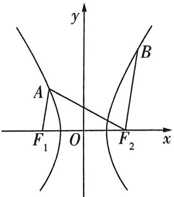

图1

在 $\triangle BF_{1}F_{2}$ 中， $\cos \angle BF_{2}F_{1} = \frac{|BF_{2}|^{2} + |F_{1}F_{2}|^{2} - |BF_{1}|^{2}}{2|BF_{2}||F_{1}F_{2}|} = \frac{4c^{2} - 28a^{2}}{24ac} = \frac{c^{2} - 7a^{2}}{6ac}$ .

因为 $AF_{1} / / BF_{2}$ ，所以 $\angle AF_1F_2 + \angle BF_2F_1 = 180^\circ$ ，所以 $\cos \angle AF_1F_2 = -\cos \angle BF_2F_1$

即 $\frac{c^2 - 3a^2}{2ac} = -\frac{c^2 - 7a^2}{6ac}$ , 所以 $c^2 = 4a^2$ , 所以双曲线的离心率 $e = 2$ .

# 数学之最

最早发现勾股定理的人——商高 商高为西周初数学家,约在公元前1000年发现勾股定理,此发现于毕达哥拉斯五百到六百年.勾股定理是中国数学家的独立发现,在中国早有记载.

# 考前24天·第27题 直线与圆锥曲线的位置关系问题

# 押题依据

对直线与圆锥曲线的位置关系的考查，涉及切线、公共点、弦长、公共弦等，常常要结合不等式、函数求解，技巧性强。近几年来多有考查，如2023新课标Ⅱ卷第15题，结合直线与圆相交考查开放探究问题；2023全国乙卷第11题，结合双曲线的弦考查中点坐标；2022新高考Ⅰ卷第14题，考查圆的公切线……预测在2024年高考中，对直线与圆锥曲线位置关系的考查仍然会延续之前的思路。

原创押题1 已知抛物线 $C: y^{2} = 4x$ 的焦点为 $F$ , 过点 $A(0,2)$ 且与抛物线 $C$ 有唯一公共点的直线有 ( )

$\quad$A. 1 条

$\quad$B.2 条

$\quad$C. 3 条

$\quad$D. 4 条

解析 由抛物线的方程为 $y^{2} = 4x$ 知 $F(1,0)$ .

当过点 A 的直线斜率不存在, 即直线与 y 轴重合时, 满足直线与抛物线 C 有唯一公共点.

当过点 A 的直线斜率为 0 时, 直线方程为 y=2, 满足直线与抛物线 C 有唯一公共点.

当过点 A 的直线斜率存在且不为 0 时, 设直线方程为 $y = kx + 2$ , 由 $\left\{\begin{aligned}y &= kx + 2, \\ y^{2} &= 4x,\end{aligned}\right.$ 得关于 x 的方 【会讨论】分类讨论要全面、不重不漏

程 $k^2 x^2 + (4k - 4)x + 4 = 0$ ，令 $\Delta = (4k - 4)^2 - 4 \times 4 \times k^2 = 0$ ，得 $k = \frac{1}{2}$ ，此时满足条件的直线有1条。

综上, 过点 $A$ 与抛物线 $C$ 有唯一公共点的直线有 3 条, 故选 C.

原创押题2 如图1,已知A,B是椭圆 $\frac{x^{2}}{4}+\frac{y^{2}}{3}=1$ 与双曲线 $\frac{x^{2}}{4}-\frac{y^{2}}{3}=1$ 的公共左、右顶点,P是双曲线在第一象限上的一点,直线PA,PB分别交椭圆于M,N(异于顶点A,B)两点.若直线MN过椭圆的右焦点F,则△MAN的面积为\_\_\_\_.

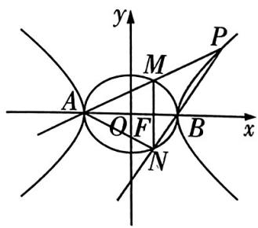

图1

解析 由题意可知 $A(-2,0), B(2,0)$ , 设 $P(x_0, y_0)$ , 则 $x_0 > 2, y_0 > 0$ , 由题意知直线 $PA, PB$ 的斜率均存在且不为 0 , 则直线 $PA, PB$ 的斜率分别为 $k_{PA} = \frac{y_0}{x_0 + 2}, k_{PB} = \frac{y_0}{x_0 - 2}$ .

因为点 $P$ 在双曲线上，所以 $\frac{x_0^2}{4} -\frac{y_0^2}{3} = 1$ ，因此 $k_{PA}\cdot k_{PB} = \frac{y_0}{x_0 + 2}\cdot \frac{y_0}{x_0 - 2} = \frac{3}{4}.$

设 $M(x_{1},y_{1})$ ，连接 $MB$ ，易知 $MB$ 斜率存在且不为0，则直线 $MA, MB$ 的斜率分别为 $k_{MA} = \frac{y_1}{x_1 + 2}, k_{MB} = \frac{y_1}{x_1 - 2}$

# 数学之最

因为点 $M$ 在椭圆上, 所以 $\frac{x_1^2}{4} + \frac{y_1^2}{3} = 1$ , 整理得 $k_{MA} \cdot k_{MB} = \frac{y_1}{x_1 + 2} \cdot \frac{y_1}{x_1 - 2} = -\frac{3}{4}$ .

【记结论】椭圆或双曲线上的任意一点与左、右顶点的连线所在直线的斜率之积为定值。所以 $k_{PA} \cdot k_{MB} = -\frac{3}{4}$ , 可得 $k_{MB} = -k_{PB} = -k_{BN}$ ,

所以直线 $MB$ 与 $NB$ 关于 $\pmb{x}$ 轴对称.

又直线 $MN$ 过椭圆右焦点 $F$ , 则 $MN \perp x$ 轴, 则 $|MF| = \frac{3}{2}$ , 所以 $S_{\triangle MAN} = |MF||AF| = \frac{3}{2} \times 3 = \frac{9}{2}$ .

原创押题3 如图2,已知中心在坐标原点 O 的椭圆 E 过点 $\downarrow,0)$ ,且其右焦点坐标为 $(\sqrt{7},0)$ .从原点 O 出发作两条互相垂直的射线分交椭圆 E 于 A,B 两点,则弦长 $\left|AB\right|$ 的取值范围为 \_\_\_\_.

解析 由题意可设椭圆 $E$ 的标准方程为 $\frac{x^2}{a^2} +\frac{y^2}{b^2} = 1(a > b > 0)$ ，则 $c =$ $\overline{a^{2}-b^{2}}=\sqrt{7},a=4$ ,所以 $b=\sqrt{16-7}=3$ ,所以椭圆E的标准方程为 $\frac{x^{2}}{16}+\frac{y^{2}}{9}=1$ .

当射线 $OA, OB$ 分别与两坐标轴重合时， $|AB| = \sqrt{a^2 + b^2} = \sqrt{16 + 9} = 5.$

【小技巧】先分析特殊情况，既有利于找到思路，也能做到解题全面

当直线 $OA, OB$ 的斜率都存在且均不为 0 时, 设直线 $OA$ 的方程为 $y = kx (k \neq 0)$ ,

由 $\left\{ \begin{array}{l} y = kx, \\ 9x^2 + 16y^2 = 144, \end{array} \right.$ 可得 $x^2 = \frac{144}{16k^2 + 9}$ , 所以 $|OA|^2 = x^2 + y^2 = (1 + k^2)x^2 = \frac{144(1 + k^2)}{16k^2 + 9}$ .

同理可得 $|OB|^{2}=\frac{144\left(\frac{1}{k^{2}}+1\right)}{\frac{16}{k^{2}}+9}=\frac{144\left(1+k^{2}\right)}{9k^{2}+16}.$

【小技巧】将 $|OA|^{2}=\frac{144(1+k^{2})}{16k^{2}+9}$ 中的k替换成 $-\frac{1}{k}$ 即可，简化运算

$\begin{array}{r l} & {\text {所以} \mid A B \mid^ {2} = \mid O A \mid^ {2} + \mid O B \mid^ {2} = \frac {1 4 4 (1 + k ^ {2})}{1 6 k ^ {2} + 9} + \frac {1 4 4 (1 + k ^ {2})}{1 6 + 9 k ^ {2}} = \frac {3 6 0 0 (1 + k ^ {2}) ^ {2}}{(1 6 k ^ {2} + 9) (1 6 + 9 k ^ {2})} =} \\ & {\frac {3 6 0 0 (1 + k ^ {2}) ^ {2}}{(k ^ {2} + 1) - 7 ] [ 9 (k ^ {2} + 1) + 7 ]} = \frac {3 6 0 0}{(1 6 - \frac {7}{1 + k ^ {2}}) (9 + \frac {7}{1 + k ^ {2}})}.} \end{array}$

因为 $k \neq 0$ ，所以 $k^2 + 1 > 1$ ，令 $t = \frac{7}{k^2 + 1}$ ，则 $t \in (0, 7)$ ，令 $f(t) = (16 - t)(9 + t) = -t^2 + 7t +$ $= -(t - \frac{7}{2})^2 + \frac{625}{4} (0 < t < 7)$ ，则 $f(t)$ 在 $(0, \frac{7}{2})$ 上单调递增，在 $(\frac{7}{2}, 7)$ 上单调递减，

又 $f\left(\frac{7}{2}\right) = \frac{625}{4}, - \left(0 - \frac{7}{2}\right)^2 +\frac{625}{4} = -(7 - \frac{7}{2})^2 +\frac{625}{4} = 144$ ，则 $144 <   f(t)\leqslant \frac{625}{4}$ 此时 $|^{2} = \frac{3600}{f(t)}\in \left[\frac{576}{25},25\right)$ ，则 $|AB|\in \left[\frac{24}{5},5\right).$

综上, $|AB|$ 的取值范围是 $\left[\frac{24}{5},5\right]$ .

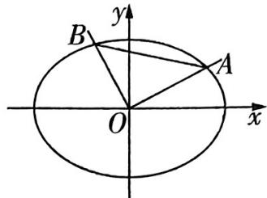

图2

# 数学之最

# 考前23天▶第28题 求样本数据的数字特征

# 押题依据

样本数字特征是概率统计模块的基础知识点，也是考查的热点，如 2023 新课标 I 卷第 9 题考查样本数字特征的关系；2023 全国乙卷第 17 题以橡胶产品伸缩率为背景考查平均数与方差；2022 全国乙卷第 4 题结合茎叶图考查样本的数字特征……近几年高考，对于样本数字特征的考查形式灵活、情境新颖、应用性强，预测未来会继续沿用这一趋势，强调数学的实际应用。

# 原创押题

(多选)某公司研发了一种帮助家长解决孩子早教问题的萌宠机器人. 萌宠机器人的语音功能让它像孩子的小伙伴一样和孩子交流, 记忆功能可以记住宝宝的使用习惯, 很快找到宝宝想听的内容. 同时它还提供快乐儿歌、国学经典、启蒙英语等早教内容, 且云端内容

可以持续更新. 萌宠机器人一投放到市场就受到了很多家长的欢迎. 为了更好地服务广大家长, 该公司研究部门从流水线上随机抽取 100 件萌宠机器人, 统计其性能指数并绘制频率分布直方图 (如图 1), 根据统计图中的数据, 对于这 100 件萌宠机器人, 下列结论正确的是 ( )

$\quad$A. 萌宠机器人性能指数的平均数为 85.3  
$\quad$B. 萌宠机器人性能指数的中位数为 86  
$\quad$C. 萌宠机器人性能指数的第 70 百分位数为 98

$\quad$D. 萌宠机器人性能指数在[100,110]之间的约有 17 件

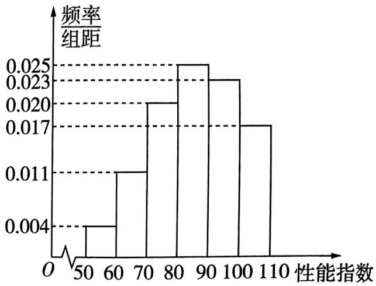

图1

解析

<table><tr><td>选项</td><td>分析过程</td><td>正误</td></tr><tr><td>A</td><td>由频率分布直方图可知,所求平均数为 $55 \times 0.04 + 65 \times 0.11 + 75 \times 0.2 + 85 \times 0.25 + 95 \times 0.23 + 105 \times 0.17 = 85.3$ </td><td>√</td></tr><tr><td>B</td><td>设中位数为 $x$ ,则 $10 \times (0.004 + 0.011 + 0.020) + (x - 80) \times 0.025 = 0.5$ ,得 $x = 86$ 【会分析】在频率分布直方图中,中位数左边和右边的直方图的面积相等,结合频率分布直方图中各小长方形的面积和为1,可知二者都为0.5</td><td>√</td></tr><tr><td>C</td><td> $(0.004 + 0.011 + 0.020 + 0.025) \times 10 = 0.6$ ,设第70百分位数为 $m$ ,则 $0.6 + (100 - m) \times 0.023 = 0.7$ , $m \approx 100 - 4.3 = 95.7$ </td><td>×</td></tr><tr><td>D</td><td> $0.017 \times 10 \times 100 = 17$ (件)</td><td>√</td></tr></table>

故选ABD.

# 数学之最

最早的印刷本数学书——《九章算术》 唐、宋两代，《九章算术》都由国家明令规定为教科书，这是世界上最早的印刷本数学书。《九章算术》的出现标志着中国古代数学体系的正式形成。

# 考前22天

# 第29题 探求长(正)方体中点、线、面的位置关系

# 押题依据

长(正)方体是高考中重要的立体几何模型, 探求长(正)方体中点、线、面的位置关系及求角、距离、面积和体积的大小, 是考查空间想象能力和逻辑推理能力的重要题型, 新高考试卷中多以多选题形式呈现, 如 2023 新课标 I 卷第 12 题, 以正方体为载体考查多个简单几何体的镶嵌组合问题; 2022 新高考 I 卷第 9 题, 在正方体中探求线线角与线面角; 等等. 应多关注此类问题.

原创押题1 (多选)已知正方体 $ABCD - A_{1}B_{1}C_{1}D_{1}$ 的棱长为 $1, O$ 是底面 $ABCD$ 的中心, 则下列说法正确的是 ( )

$\quad$A. $A_{1}O$ // 平面 $B_{1}CD_{1}$

$\quad$B. $C_{1}O \perp$ 平面 $B_{1}CD_{1}$

$\quad$C. 直线 $A_{1} B$ 与平面 $A_{1} B_{1} C D$ 所成角为 $30^{\circ}$

$\quad$D. 点 $O$ 到平面 $B_{1}CD_{1}$ 的距离为 $\frac{\sqrt{3}}{2}$

# 解析

<table><tr><td>选项</td><td>分析过程</td><td>正误</td></tr><tr><td>A</td><td>如图1,连接 $A_1C_1$ ,交 $B_1D_1$ 于点E,连接AC,CE→ $A_1E \parallel OC$ 且 $A_1E=OC$ →四边形 $A_1OCE$ 是平行四边形→ $A_1O \parallel CE$ → $A_1O \parallel$ 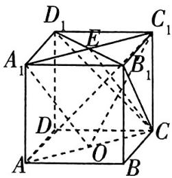平面 $B_1CD_1$ 图1</td><td>√</td></tr><tr><td>B</td><td>如图1,连接 $AC_1$ ,在正方体 $ABCD-A_1B_1C_1D_1$ 中,易证 $AC_1 \perp$ 平面 $B_1CD_1$ → $AC_1 \cap C_1O=C_1$ → $C_1O \perp$ 平面 $B_1CD_1$ 不成立</td><td>×</td></tr><tr><td>C</td><td>如图2,连接 $BC_1$ ,交 $B_1C$ 于点M,连接 $A_1M$ ,易证 $BC_1 \perp$ 平面 $A_1B_1CD$ → $\angle BA_1M$ 是直线 $A_1B$ 与平面 $A_1B_1CD$ 所成的角→在Rt $\triangle BA_1M$ 中, $\sin\angle BA_1M=\frac{BM}{A_1B}=\frac{1}{2}$ →直线 $A_1B$ 与平面 $A_1B_1CD$ 所成角为30°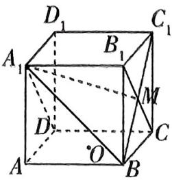图2</td><td>√</td></tr></table>

# 数学之最

《九章算术》的内容十分丰富,全书采用问题集的形式,收有246个与生产、生活实践有联系的应用问题,其中每道题有问、答、术,有的是一题一术,有的是多题一术或一题多术.

续表

<table><tr><td>选项</td><td>分析过程</td><td>正误</td></tr><tr><td>D</td><td>如图3,连接 $A_1C_1$ ,与 $B_1D_1$ 交于点E,连接OE,CE,AC,易证 $B_1D_1 \perp$ 平面 $AA_1C_1C \rightarrow$ 平面 $B_1CD_1 \perp$ 平面 $AA_1C_1C \rightarrow$ 平面 $AA_1C_1C \cap$ 平面 $B_1CD_1 = CE \rightarrow$ 作 $OG \perp CE$ 于 $G \rightarrow OG$ 是点O到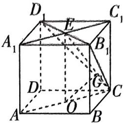平面 $B_1CD_1$ 的距离 $\rightarrow OG = \frac{OC \times OE}{CE} = \frac{\frac{\sqrt{2}}{2} \times 1}{\sqrt{(\frac{\sqrt{2}}{2})^2 + 1^2}} = \frac{\sqrt{3}}{3}$ 图3</td><td>×</td></tr></table>

故选AC.

原创押题2 （多选）如图4，在长方体 $ABCD - A_{1}B_{1}C_{1}D_{1}$ 中， $AB = AA_{1} = \sqrt{2} BC = 2\sqrt{2}$ ，点 $P$ 满足 $\overrightarrow{AP} = \lambda \overrightarrow{AB_1}$ ，其中 $\lambda \in [0,1)$ ，则下列说法正确的有 （）

$\quad$A. 三棱锥 $P - BC_{1}D$ 的体积为 $\frac{8}{3}$   
$\quad$B. 当 $\lambda = \frac{1}{2}$ 时, 平面 $PCC_{1} \perp$ 平面 $BC_{1}D$   
$\quad$C. 四棱锥 $A - CC_{1}D_{1}D$ 的外接球的表面积为 $10\pi$   
$\quad$D. 直线 $D_{1} P$ 与直线 $B C$ 所成角的最小值为 $45^{\circ}$

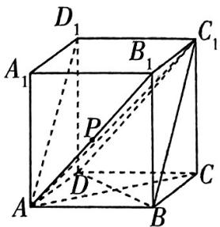

图4

# 解析

<table><tr><td>选项</td><td>分析过程</td><td>正误</td></tr><tr><td>A</td><td>AB1//C1D→AB1//平面BC1D→VP-BC1D=VA-BC1D=VC1-ABD=1/3S△ABD×CC1=1/3×1/2×2×2√2×2√2=8/3</td><td>√</td></tr><tr><td>B</td><td>当λ=1/2时,P是AB1的中点→过P作PE//BB1交AB于E,连接EC→PE//CC1→C1,C,E,P四点共面→在Rt△BCD与Rt△BCE中,CD/BC=BC/BE=√2→Rt△BCD∼Rt△EBC→∠BCE=∠BDC→∠BDC+∠CBD=90°→∠BCE+∠CBD=90°→BD⊥CE→CC1⊥BD→CC1∩CE=C,BD⊥平面C1CP→平面BC1D⊥平面C1CP</td><td>√</td></tr><tr><td>C</td><td>四棱锥A-CC1D1D的外接球即长方体ABCD-A1B1C1D1的外接球→外接球的直径等于长方体的体对角线长→外接球的表面积S=π(AB2+BC2+CC2)=20π</td><td>×</td></tr><tr><td>D</td><td>连接A1P→A1D1//BC→∠A1D1P为直线D1P与直线BC所成角→在Rt△A1D1P中,tan∠A1D1P=A1P/A1D1→当A1P⊥AB1时,A1P最短,为2→此时∠A1D1P最小,tan∠A1D1P=1→∠A1D1P=45°</td><td>√</td></tr></table>

故选 ABD.

# 数学之最

最早的汉译数学名著——《几何原本》《几何原本》是古希腊数学家欧几里得创作的一部数学著作,成书于公元前300年左右,最早的中文译本《几何原本》出版于公元1607年,由利玛窦和徐光启翻译.

# 考前21天▶第30题 二项式定理的应用

# 押题依据

高考对二项式定理的考查以小题为主，如 2023 北京卷第 5 题考查求特定项的系数；2022 新高考 I 卷第 13 题考查求复杂的展开式的特定项系数；等等. 预测 2024 年高考中，基本的考查方向不变，即考查用通项公式求特定项系数，或用赋值法求解二项展开式中各项系数和.

原创押题1 在 $(\sqrt[3]{x} - \frac{m}{x})^{12}$ 的展开式中, 常数项为 220 , 则 $m =$ ( )

$\quad$A. 1

$\quad$B. - 1

$\quad$C.2

$\quad$D. -2

解析 由题意得 $T_{r+1}=\mathrm{C}_{12}^{r}\left(\sqrt[3]{x}\right)^{12-r}\left(-\frac{m}{x}\right)^{r}=\mathrm{C}_{12}^{r}\left(-m\right)^{r}x^{\frac{12-4r}{3}}$

【明思路】写出二项展开式的通项，令 $x$ 的指数为0，寻找常数项

令 $\frac{12 - 4r}{3} = 0$ ，得 $r = 3$ ，所以 $\mathrm{C}_{12}^3 (-m)^3 = 220$ ，得 $m = -1$ ，故选B.

原创押题2 $(x+3)^{8}=a_{0}+a_{1}(x+2)+a_{2}(x+2)^{2}+\cdots+a_{8}(x+2)^{8}$ ，则 $a_{2}+a_{4}+a_{6}+a_{8}=$ （）

$\quad$A. 254

$\quad$B. 256

$\quad$C. 127

$\quad$D. 128

解析 令 $x = -1$ ，可得 $a_0 + a_1 + a_2 + \cdots + a_8 = 2^8 = 256$ ；令 $x = -3$ ，可得 $a_0 - a_1 + a_2 - a_3 + \cdots + a_8 = 0$ 。故 $a_0 + a_2 + a_4 + a_6 + a_8 = 128$ 。令 $x = -2$ ，可得 $a_0 = 1$ ，所以 $a_2 + a_4 + a_6 + a_8 = 127$ 。故选 C.

【找方法】对于二项式系数和的相关问题，常采用赋值法求解

原创押题3 (多选)若 $(1 - 2x)^{5} = a_{0} + a_{1}x + a_{2}x^{2} + a_{3}x^{3} + a_{4}x^{4} + a_{5}x^{5}$ , 则下列结论正确的是 ( )

$\quad$A. $a_0 = 1$

$\quad$B. $a_{5} = 32$

$\quad$C. $|a_0| + |a_1| + |a_2| + |a_3| + |a_4| + |a_5| = 3^5$

$\quad$D. $a_0 + a_1 + 2a_2 + 3a_3 + 4a_4 + 5a_5 = -9$

# 解析

<table><tr><td>选项</td><td>分析过程</td><td>正误</td></tr><tr><td>A</td><td>令 $x=0$ ,得 $a_0=(1-0)^5=1$ </td><td>√</td></tr><tr><td>B</td><td>含 $x^5$ 的项为 $C_5^5(-2x)^5=-32x^5$ ,得 $a_5=-32$ </td><td>×</td></tr><tr><td>C</td><td>结合展开式的通项知 $a_0,a_2,a_4>0,a_1,a_3,a_5<0$ ,所以 $|a_0|+|a_1|+|a_2|+|a_3|+|a_4|+|a_5|=a_0-a_1+a_2-a_3+a_4-a_5=(1+2)^5=3^5$ </td><td>√</td></tr><tr><td>D</td><td> $[(1-2x)^5]'=-10(1-2x)^4=a_1+2a_2x+3a_3x^2+4a_4x^3+5a_5x^4$ ,令 $x=1$ ,则 $a_1+$ 【用技巧】对等式两边求导,右边的式子与D选项的一部分形式相似 $2a_2+3a_3+4a_4+5a_5=-10$ ,又 $a_0=1$ ,所以 $a_0+a_1+2a_2+3a_3+4a_4+5a_5=-9$ </td><td>√</td></tr></table>

故选 ACD.

# 数学之最

《几何原本》的翻译,极大地影响了中国原有的数学学习和研究的习惯,改变了中国数学发展的方向,是中国数学史上的一件大事.

# 考前20天

# 第31题 正、余弦定理在解三角形中的应用

# 押题依据

正、余弦定理是解三角形的核心内容，在小题、大题中都会涉及，常常会结合诱导公式、三角恒等变换等考查，如2023新课标Ⅰ卷第17题综合考查正、余弦定理与三角恒等变换，2023新课标Ⅱ卷第17题结合正、余弦定理和三角形面积公式，利用方程求解边长，2022新高考Ⅰ卷第18题以正、余弦定理为基础，综合考查不等式.作为每年必考的内容，高考对正、余弦定理的考查旨在落实函数与方程思想，考查逻辑推理能力、运算求解能力和直观想象能力.重视对基础知识的复习巩固、摸清各公式的内在联系，是破题的关键所在.

原创押题1 在 $\triangle ABC$ 中,内角 $A,B,C$ 所对的边分别为 $a,b,c$ .已知 $(a+b)(b-a)=ab$ ,且 $\cos(A-B)-\cos(A+B)=2\sin^{2}C$ .

（1） 证明: $\triangle ABC$ 是直角三角形.  
（2） 求 $\frac{a + b + c}{b}$ 的取值范围.

解析 （1） $(a + b)(b - a) = ab$ ，即 $b^{2} - a^{2} = ab$ ①，

因为 $\cos (A - B) - \cos (A + B) = 2\sin^2 C$ ，所以 $\sin A\sin B = \sin^2 C$

由正弦定理得, $\frac{a}{2R} \times \frac{b}{2R} = (\frac{c}{2R})^2$ , 其中 $R$ 为 $\triangle ABC$ 外接圆的半径, 所以 $ab = c^2$ ②,

由①②得, $b^{2}-a^{2}=c^{2}$ ，即 $a^{2}+c^{2}=b^{2}$ ，所以 $\triangle ABC$ 是直角三角形.

（2） 由 （1） 知 $B = \frac{\pi}{2}$ , 所以 $\sin C = \sin\left(\frac{\pi}{2} - A\right) = \cos A$ .

根据正弦定理, 得 $\frac{a+c}{b}=\frac{\sin A+\sin C}{\sin B}=\sin A+\cos A=\sqrt{2}\sin\left(A+\frac{\pi}{4}\right)$ .

因为 $c < b$ ，所以 $ac < ab = c^2$ ，所以 $a < c$

【得分关键】根据题目条件，可以得出两条直角边的长度大小是一定的，如果不注意挖掘隐含条件，则最后结果的区间端点值取舍会出错

所以 $0 < A < \frac{\pi}{4}$ , 所以 $\frac{\pi}{4} < A + \frac{\pi}{4} < \frac{\pi}{2}$ , 所以 $\frac{\sqrt{2}}{2} < \sin(A + \frac{\pi}{4}) < 1$ ,

所以 $1 < \sqrt{2}\sin (A + \frac{\pi}{4}) < \sqrt{2}$ , 即 $\frac{a + b + c}{b} = \frac{a + c}{b} + 1 \in (2, 1 + \sqrt{2})$ .

所以 $\frac{a+b+c}{b}$ 的取值范围是 $(2,1+\sqrt{2})$ .

# 数学之最

中国第一部世界数学史专著——《世界数学史简编》《世界数学史简编》是中国科学技术史学会副理事长梁宗巨编著的工具书,书约38万字,分为四编.

原创押题2 如图1,在 $\triangle ABC$ 中,内角 $A,B,C$ 所对的边分别为 $a,b,c$ ,且 $c=\sqrt{3}ccos B-bsin C$ .

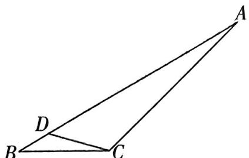

图1

（1） 求 $\cos(B + \frac{\pi}{4})$ .   
（2）已知 $D$ 为边 $AB$ 上的一点, 若 $BC = 2\sqrt{3} BD = 2\sqrt{3}$ , $\angle ACD = \frac{2\pi}{3}$ , 求 $\triangle ACD$ 的面积.

解析 （1） 因为 $c = \sqrt{3} c \cos B - b \sin C$ , 所以由正弦定理得 $\sin C = \sqrt{3} \sin C \cos B - \sin B \sin C$ , 又 $C \in (0, \pi)$ , 可得 $\sin C > 0$ , 所以 $1 = \sqrt{3} \cos B - \sin B$ ,

【易失分】等式两边同时消去某一项，注意说明此项不为0，避免丢分

即 $2 \times (\frac{\sqrt{3}}{2} \cos B - \frac{1}{2} \sin B) = 1$ ，所以 $\cos(B + \frac{\pi}{6}) = \frac{1}{2}$ ，

所以 $B + \frac{\pi}{6} = -\frac{\pi}{3} + 2k\pi$ 或 $B + \frac{\pi}{6} = \frac{\pi}{3} + 2k\pi, k \in \mathbf{Z}$ .

又 $0 < B < \pi$ ，所以 $\frac{\pi}{6} < B + \frac{\pi}{6} < \frac{7\pi}{6}$ 所以 $B + \frac{\pi}{6} = \frac{\pi}{3}$ 即 $B = \frac{\pi}{6}$

所以 $\cos (B + \frac{\pi}{4}) = \cos (\frac{\pi}{6} +\frac{\pi}{4}) = \cos \frac{\pi}{6}\cos \frac{\pi}{4} -\sin \frac{\pi}{6}\sin \frac{\pi}{4} = \frac{\sqrt{6} - \sqrt{2}}{4}.$

（2） 在 $\triangle DBC$ 中，由余弦定理得 $CD^2 = BC^2 + BD^2 - 2BC \times BD\cos \angle DBC = 12 + 1 - 2 \times 2\sqrt{3} \times 1 \times \frac{\sqrt{3}}{2} = 7$ ，所以 $CD = \sqrt{7}$ .

【找思路】CD 和 $\angle ACD$ 已知，那么只要求出 AC，就可以得出 $\triangle ACD$ 的面积，考虑用正弦定理求 AC，那么就还需要求出 $\sin A, \sin \angle ADC$

因为 $BC = 2\sqrt{3}$ 且 $BD = 1$ ，所以 $\cos \angle BDC = \frac{1 + 7 - 12}{2\times 1\times\sqrt{7}} = -\frac{2\sqrt{7}}{7},$

所以 $\sin \angle ADC = \sin \angle BDC = \frac{\sqrt{21}}{7}$

在 $\triangle BDC$ 中，由正弦定理得 $\frac{CD}{\sin B} = \frac{BD}{\sin \angle BCD}$ ，即 $\frac{\sqrt{7}}{\frac{1}{2}} = \frac{1}{\sin \angle BCD}$ ，得 $\sin \angle BCD = \frac{\sqrt{7}}{14}$

所以 $\cos \angle BCD = \frac{3\sqrt{21}}{14}$

所以 $\sin A = \sin (\angle BCD + \frac{2\pi}{3} +\frac{\pi}{6}) = \sin (\angle BCD + \frac{5\pi}{6}) = -\frac{\sqrt{3}}{2}\sin \angle BCD + \frac{1}{2}\cos \angle BCD = \frac{\sqrt{21}}{14}.$

在 $\triangle ADC$ 中，由正弦定理得 $\frac{CD}{\sin A} = \frac{AC}{\sin \angle ADC}$ ，即 $\frac{\sqrt{7}}{\frac{\sqrt{21}}{14}} = \frac{AC}{\frac{\sqrt{21}}{7}}$ ，解得 $AC = 2\sqrt{7}$ .

所以 $S_{\triangle ACD} = \frac{1}{2} CD\times CA\sin \angle ACD = \frac{1}{2}\times \sqrt{7}\times 2\sqrt{7}\times \frac{\sqrt{3}}{2} = \frac{7\sqrt{3}}{2}.$

# 考前19天

# 第 32 题 求空间几何体中二面角的大小或正、余弦值

# 押题依据

高考对于立体几何模块的考查，空间角几乎是每年必考，二面角尤为重要，通常以解答题的形式呈现，一般采用空间向量法解决，也可利用图形中隐藏的垂直关系等信息，作出二面角的平面角，用几何法解决。该题型主要考查空间想象能力、逻辑推理能力和运算求解能力。如2023新课标Ⅰ卷第18题，以正四棱柱为载体，根据二面角求长度；2023新课标Ⅱ卷第20题，以不规则图形为载体，求二面角的正弦值；等等。近几年，空间几何体不断推新，空间图形构图巧妙，结构优美，难度有所提高，在2024年高考中出现可能性非常高。

原创押题1 如图1,已知平行六面体 $ABCD - A_{1}B_{1}C_{1}D_{1}$ 所有棱长都为2, $\angle BCD =$

$6 0 ^ {\circ}, B C _ {1} = D C _ {1} = \sqrt {2}.$

（1） 证明: $AC \perp$ 平面 $BC_{1}D$ .  
（2）求二面角 $B_{1} - DD_{1} - C_{1}$ 的正弦值.

解析 （1）如图2,设AC,BD交于点O,连接 $C_{1}O$ .

由题意得四边形 ABCD 是边长为 2 的菱形, $\angle BCD = 60^{\circ}$ ,

所以 $AC \perp BD, OC = \sqrt{3}, OB = 1,$

又 $BC_{1} = DC_{1} = \sqrt{2}, O$ 是 $BD$ 的中点，所以 $C_{1}O \perp BD, C_{1}O = \sqrt{BC_{1}^{2} - BO^{2}} = 1$

所以 $CC_{1}^{2} = C_{1}O^{2} + OC^{2}$ ，所以 $C_1O\perp AC$

又 $BD, C_1O \subset$ 平面 $BC_1D$ , 且 $BD \cap C_1O = O$ ,

所以 $AC \perp$ 平面 $BC_{1}D$ .

（2） 由（1）知 $C_{1}O \perp AC, C_{1}O \perp BD$ 且 $AC \perp BD$ ,

以 O 为坐标原点, $\overrightarrow{OB}, \overrightarrow{OC}, \overrightarrow{OC_{1}}$ 的方向分别为 x 轴, y 轴, z 轴的正方向建立如图 2 所示的空间直角坐标系 O - xyz.

由题知二面角 $B_{1} - DD_{1} - C_{1}$ ，即二面角 $B - DD_{1} - C.$

【化繁为简】平面 $B_{1}DD_{1}$ 即平面 $BDD_{1}$ ，平面 $C_{1}DD_{1}$ 即平面 $CDD_{1}$ ，据此将所求二面角等价转化，便于求坐标

由题设知 $B(1,0,0),C(0,\sqrt{3},0),C_1(0,0,1),D(-1,0,0)$

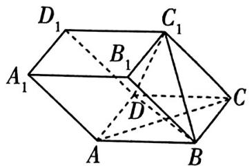

图1

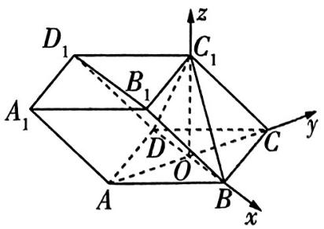

图2

# 数学灯谜

则 $\overrightarrow{DB} = (2,0,0),\overrightarrow{D_1D} = \overrightarrow{C_1C} = (0,\sqrt{3}, - 1),\overrightarrow{DC} = (1,\sqrt{3},0).$

【会转化】此处直接利用点的坐标求 $\overrightarrow{D_1D}$ 的坐标表示比较麻烦, 故考虑转化为共线向量求解即可, 这也是求空间向量坐标表示的常用方法

设 $\boldsymbol{m}=(x,y,z)$ 是平面 $BDD_{1}$ 的法向量，则 $\left\{\begin{aligned}\boldsymbol{m}\cdot\overrightarrow{DB}&=0,\\ \boldsymbol{m}\cdot\overrightarrow{D_{1}D}&=0,\end{aligned}\right.$ 即 $\left\{\begin{aligned}2x&=0,\\ \sqrt{3}y-z&=0,\end{aligned}\right.$ 可取 $\boldsymbol{m}=(0,1,\sqrt{3})$ .

设 $\boldsymbol{n}=(p,q,r)$ 是平面 $CDD_{1}$ 的法向量，则 $\left\{\begin{aligned}\boldsymbol{n}\cdot\overrightarrow{D_{1}D}=0,\\ \boldsymbol{n}\cdot\overrightarrow{DC}=0,\end{aligned}\right.$ 即 $\left\{\begin{aligned}\sqrt{3}q-r=0,\\ p+\sqrt{3}q=0,\end{aligned}\right.$ 可取 $\boldsymbol{n)=(\sqrt{3},-1,-\sqrt{3})$ .

所以 $\cos \langle m, n \rangle = \frac{m \cdot n}{|m||n|} = -\frac{2}{\sqrt{7}}$

因此二面角 $B_{1} - DD_{1} - C_{1}$ 的正弦值为 $\frac{\sqrt{21}}{7}$ .

【易失分】此处要求的是二面角的正弦值，注意转化，切勿因此失分

原创押题2 如图3,已知四棱锥 $P - ABCD$ 中, $AB \parallel CD$ , $\angle ADC = 90^{\circ}$ , $AB = AD = 2$ , $CD = 3$ , $PA = PB = PD = \sqrt{3}$ .

（1） 设平面 $PAD \cap$ 平面 $PBC = l$ , 证明: 直线 $l$ 与平面 $ABCD$ 相交.  
（2） 点 $Q$ 在棱 $CD$ 上, 当二面角 $A - PB - Q$ 为 $120^{\circ}$ 时, 求 $CQ$ .

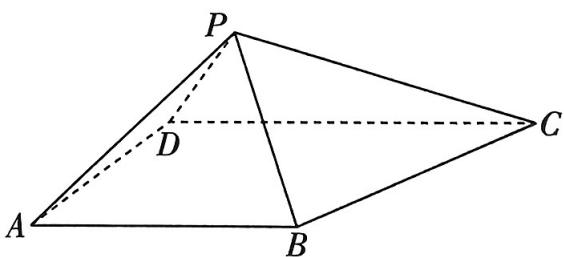

图3

解析 （1）假设直线 $l$ 与平面 $ABCD$ 不相交, 则 $l \parallel$ 平

【梳理思路】直接证明直线与平面相交较困难，正难则反，故考虑用反证法面ABCD.

因为 $l \subset$ 平面 $PAD$ , 且平面 $PAD \cap$ 平面 $ABCD = AD$ , 所以 $l \parallel AD$ .

同理 $l \parallel BC$ , 所以 $AD \parallel BC$ , 与已知矛盾.

所以直线 l 与平面 ABCD 相交.

（2） 方法一: 向量法 连接 BD, 取 BD 的中点 O, 连接 PO, AO, 则 $PO \perp BD$ .

因为 $AB \parallel CD, \angle ADC = 90^{\circ}$ , 所以 $\angle DAB = 90^{\circ}$ ,

又 $AB = AD = 2$ ，所以 $\triangle ABD$ 是等腰直角三角形，所以 $OA = OB = OD = \sqrt{2}.$

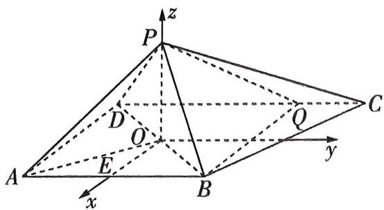

图4

又 $PA = PB = PD$ ，所以 $\triangle POA \cong \triangle POB \cong \triangle POD$ ，所以 $\angle POA = \angle POB = \angle POD = 90^{\circ}$ ，则 $PO \perp AO, PO = \sqrt{PB^{2} - OB^{2}} = 1.$

又 $OA \cap BD = O$ , 所以 $PO \perp$ 平面 $ABCD$ .

取 $AB$ 的中点 $E$ , 连接 $OE$ , 则可建立如图 4 所示的空间直角坐标系 $O - xyz$ .

由题知 $A(1, -1, 0), B(1, 1, 0), P(0, 0, 1)$ ，设 $Q(-1, t, 0), -1 \leqslant t \leqslant 2$ ，则 $\overrightarrow{AB} = (0, 2, 0)$ ， $\overrightarrow{PB} = (1, 1, -1), \overrightarrow{PQ} = (-1, t, -1)$ .

设 $\boldsymbol{m}=(x,y,z)$ 是平面 PAB 的法向量，则 $\left\{\begin{aligned}\boldsymbol{m}\cdot\overrightarrow{AB}&=0,\\ \boldsymbol{m}\cdot\overrightarrow{PB}&=0,\end{aligned}\right.$ 即 $\left\{\begin{aligned}2y&=0,\\ x+y-z&=0,\end{aligned}\right.$ 可取 $\boldsymbol{m}=(1,0,1)$ .

设 $\boldsymbol{n}=(p,q,r)$ 是平面 PBQ 的法向量，则 $\left\{\begin{aligned}\boldsymbol{n}\cdot\overrightarrow{PB}&=0,\\ \boldsymbol{n}\cdot\overrightarrow{PQ}&=0,\end{aligned}\right.$ 即 $\left\{\begin{aligned}p+q-r&=0,\\ -p+tq-r&=0,\end{aligned}\right.$ 可取 $\boldsymbol{n}=(t-1,2,t+1)$ .

所以 $|\cos \langle m, n\rangle| = \frac{|m \cdot n|}{|m||n|} = \frac{2|t|}{\sqrt{2}\sqrt{2t^2 + 6}} = \frac{1}{2}$ , 化简得 $t^2 - 1 = 0$ , 所以 $t = \pm 1$ .

【点明易错】立体几何中的存在性问题，运算求得结果后，结合图形判断各种情况是否符合题设要求，不可想当然，不检验，不严谨，从而造成错误

经检验, t=1 符合题意, 所以 CQ=1.

方法二: 几何法 由方法一知 $AO \perp BD, AO \perp PO, PO \cap BD = O$ , 所以 $AO \perp$ 平面 PBD, 所以 $AO \perp PB$ .

如图5,作 $OF \perp PB$ 于 $F$ , 连接 $AF$ , 则由 $AO \cap OF = O$ , $AO, OF \subset$ 平面 $AOF$ , 得 $PB \perp$ 平面 $AOF$ , 所以 $PB \perp AF$ , 所以 $\angle AFO$ 是二面角 $A - PB - D$ 的平面角.

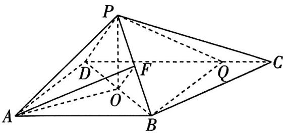

图5

在 Rt△POB 中， $OF=\frac{PO\times OB}{PB}=\frac{1\times\sqrt{2}}{\sqrt{3}}=\frac{\sqrt{2}}{\sqrt{3}}$

在 Rt△AOF 中， $\tan\angle AFO=\frac{AO}{OF}=\sqrt{3}$ ，

所以 $\angle AFO = 60^{\circ}$ ，所以二面角 $D - PB - Q$ 为 $60^{\circ}$

又 $\angle ADB = \angle BDC = 45^{\circ}$ ，所以当且仅当 $DQ = DA$ 时，满足条件，因此 $CQ = 1$

【强调关键】直接作出二面角的平面角是困难的，故将二面角分割为两部分，其中一部分是二面角 A-PB-D，求得此二面角为 $60^{\circ}$ ，观察图形的对称特征，得出二面角 D-PB-Q 等于二面角 A-PB-D，确定点 Q 位置即可

# 考前18天

# 第 33 题 求空间几何体中线面角的大小或正、余弦值

# 押题依据

立体几何模块在高考中对线面角的考查相对较多，小题或大题均有可能出现。对于此类试题，新高考更注重知识的交汇和融合，线面角与其他空间角、体积等几何特征量结合的综合问题是高考的新方向。如2023全国乙卷第9题，已知二面角的大小求线面角；2023全国甲卷第18题，以三棱柱为载体求解线面角；2023上海卷(春季)第17题，以三棱锥为载体，考查线面角；等等。线面角作为近几年高考的热点，多以综合方式考查，在2024年高考备考中，应引起关注。

原创押题1 如图1, 在四棱台 $ABCD - A_{1}B_{1}C_{1}D_{1}$ 中, 底面为矩形, 平面 $AA_{1}D_{1}D \perp$ 平面 $CC_{1}D_{1}D$ , 且 $CC_{1} = CD = DD_{1} = \frac{1}{2} C_{1}D_{1} = 1$ .

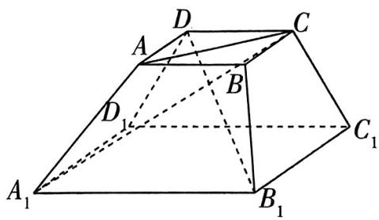

图1

（1） 证明: $AD \perp$ 平面 $CC_{1}D_{1}D$ .  
（2） 若二面角 $C - AA_{1} - D$ 的余弦值为 $\frac{\sqrt{3}}{4}$ , 求 $B_{1}D$ 与平面 $AA_{1}D_{1}D$ 所成角的大小.

解析 （1） 在梯形 $CC_{1}D_{1}D$ 中, $CC_{1} = CD = DD_{1} = \frac{1}{2} C_{1}D_{1} = 1$ ,

【强调关键】本问的关键是发现已知条件中的隐藏条件，一是棱台的侧面是梯形，二是梯形 $DD_{1}C_{1}C$ 中隐含的垂直关系

如图2,作 $DH\perp D_{1}C_{1}$ 于H,则 $D_{1}H=\frac{1}{2}$ ,所以 $\cos\angle DD_{1}H=$ $\frac{1}{2}$ ,所以 $\angle DD_{1}C_{1}=\frac{\pi}{3}$ ,

连接 $DC_{1}$ ，在 $\triangle DD_{1}C_{1}$ 中，由余弦定理可得 $DC_{1} = \sqrt{3}$ ，则 $DC_{1}^{2} + DD_{1}^{2} = D_{1}C_{1}^{2}$ ，故 $DC_{1}\bot DD_{1}$

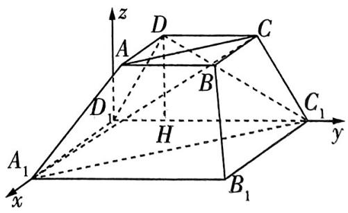

图2

因为平面 $AA_{1}D_{1}D \perp$ 平面 $CC_{1}D_{1}D$ , 且两平面的交线为 $DD_{1}$ , 所以 $DC_{1} \perp$ 平面 $AA_{1}D_{1}D$ , 又 $AD \subset$ 平面 $AA_{1}D_{1}D$ , 所以 $AD \perp DC_{1}$ .

由题意知 $AD \perp DC, DC \cap DC_{1} = D, DC, DC_{1} \subset$ 平面 $CC_{1}D_{1}D$ ，所以 $AD \perp$ 平面 $CC_{1}D_{1}D$ .

（2） 连接 $A_{1}C_{1}$ , 则 $A_{1}C_{1} \parallel AC$ , 平面 $CAA_{1}$ 即平面 $AA_{1}C_{1}C$ .

由（1）可知, $A_{1}D_{1}\perp$ 平面 $CC_{1}D_{1}D$ ，则 $A_{1}D_{1}\perp DH$ ，所以 $D_{1}C_{1},A_{1}D_{1},DH$ 两两垂直.

以 $D_{1}$ 为坐标原点，以 $\overrightarrow{D_1A_1},\overrightarrow{D_1C_1},\overrightarrow{HD}$ 的方向分别为 $x$ 轴， $y$ 轴， $z$ 轴的正方向，建立空间直角坐标系，

则 $D_{1}(0,0,0), D(0, \frac{1}{2}, \frac{\sqrt{3}}{2}), C(0, \frac{3}{2}, \frac{\sqrt{3}}{2}), C_{1}(0,2,0)$

设 $AD = t(t > 0)$ ，则 $A_{1}D_{1} = 2t,A_{1}(2t,0,0),B_{1}(2t,2,0)$

所以 $\overrightarrow{A_1C_1} = (-2t,2,0),\overrightarrow{CC_1} = (0,\frac{1}{2}, - \frac{\sqrt{3}}{2}),\overrightarrow{DC_1} = (0,\frac{3}{2}, - \frac{\sqrt{3}}{2}).$

设平面 $AA_{1}C_{1}C$ 的法向量为 $\boldsymbol{n}=(x,y,z)$ ,

则有 $\left\{ \begin{array}{l} n \cdot \overrightarrow{A_1C_1} = 0, \\ n \cdot \overrightarrow{CC_1} = 0, \end{array} \right.$ 即 $\left\{ \begin{array}{l} -2tx + 2y = 0, \\ \frac{1}{2} y - \frac{\sqrt{3}}{2} z = 0, \end{array} \right.$ 可取 $n = (\sqrt{3}, \sqrt{3}t, t)$ .

由（1）知 $DC_{1} \perp$ 平面 $AA_{1}D_{1}D$ , 所以 $|\cos \langle \overrightarrow{DC_1}, n\rangle| = \frac{|\overrightarrow{DC_1} \cdot n|}{|\overrightarrow{DC_1}| |n|} = \frac{\sqrt{3} |t|}{\sqrt{3}\sqrt{4t^2 + 3}} = \frac{\sqrt{3}}{4}$ , 解得 $t = \frac{3}{2}$ , 由图形可知, 此时二面角 $C - AA_{1} - D$ 是锐二面角, 符合题意.

故 $\overrightarrow{B_1D} = (-3, -\frac{3}{2}, \frac{\sqrt{3}}{2})$

设直线 $B_{1}D$ 与平面 $AA_{1}D_{1}D$ 所成角为 $\theta$ ，则 $\sin \theta = |\cos \langle \overrightarrow{B_1D}, \overrightarrow{DC_1}\rangle| = \frac{|\overrightarrow{B_1D} \cdot \overrightarrow{DC_1}|}{|\overrightarrow{B_1D}| |\overrightarrow{DC_1}|} = \frac{1}{2}$ .

因为 $\theta \in [0, \frac{\pi}{2}]$ , 所以 $B_{1}D$ 与平面 $AA_{1}D_{1}D$ 所成角为 $\frac{\pi}{6}$ .

原创押题2 如图3,已知四棱锥 $P - ABCD$ 中, $AB = AD = AP = \sqrt{3}$ , $CB = CD = CP = 1$ .

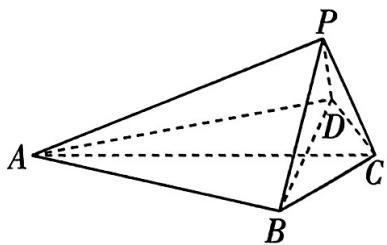

图3

（1） 证明: 平面 $PAC \perp$ 平面 $PBD$ .

（2） 若 $AC = 2$ , 且二面角 $P - AC - B$ 为 $\frac{2\pi}{3}$ , 求直线 $PB$ 与平面 $PAD$ 所成角的正弦值.

解析 （1） 如图 4, 设 AC, BD 交于点 O, 连接 PO.

【梳理思路】由已知条件可得 $\triangle ABC \cong \triangle ADC \cong \triangle APC \rightarrow AC \perp BD \rightarrow AC \cap BD = O \rightarrow \triangle ABO \cong \triangle ADO \cong \triangle APO \rightarrow PO \perp AC \rightarrow AC \perp$ 平面 $PBD \rightarrow$ 平面 $PAC \perp$ 平面 $PBD$ . 此问的关键是根据全等找到隐含的线线垂直

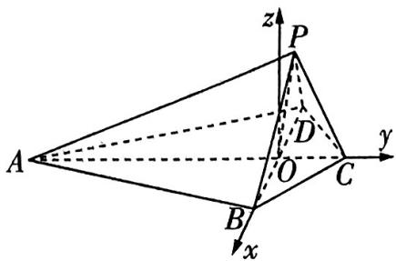

图4

因为 AB = AD = AP, CB = CD = CP, AC = AC = AC,

所以 $\triangle ABC \cong \triangle ADC \cong \triangle APC$

所以 $AC \perp BD$ ，且 $\triangle ABO \cong \triangle ADO \cong \triangle APO$

所以 $PO \perp AC$ ，又 $PO \cap BD = O, PO, BD \subset$ 平面 $PBD$ ,

所以 $AC \perp$ 平面 PBD,

又 $AC \subset$ 平面 PAC, 所以平面 $PAC \perp$ 平面 PBD.

（2）由（1）可知,二面角P-AC-B的平面角为 $\angle POB$ ,则 $\angle POB=\frac{2\pi}{3}$ .

【强调关键】二面角的大小已知, 优先考虑从定义出发观察二面角的平面角是否容易找到, 若容易找到, 则结合相关几何知识转化条件, 此处是借助第（1）问的相关结论发现二面角的平面角; 若不容易找到, 则需先挖掘题目中的垂直关系建立空间直角坐标系, 通过法向量建立关于二面角三角函数值的等量关系, 进而求解. 建系时注意要使尽量多的点在坐标轴上或两坐标轴所确定的平面上, 使得点坐标尽量简单, 方便运算

因为 $AC = 2, AB = \sqrt{3}, CB = 1$ ，所以 $AC^2 = AB^2 + BC^2$ ，故 $\angle ABC = \frac{\pi}{2}$ ，所以 $BO = \frac{AB \cdot BC}{AC} = \frac{\sqrt{3}}{2}$ ，同理 $PO = DO = \frac{\sqrt{3}}{2}$ ，在 Rt $\triangle ABO$ 中， $AO = AB \cdot \frac{AB}{AC} = \frac{3}{2}$ .

结合（1）,以点 O 为坐标原点,OB,OC,过点 O 与 BD 垂直的直线分别为 x 轴,y 轴,z 轴,建立空间直角坐标系,如图4所示,

则 $P(-\frac{\sqrt{3}}{4},0,\frac{3}{4}),A(0, - \frac{3}{2},0),B(\frac{\sqrt{3}}{2},0,0),D(-\frac{\sqrt{3}}{2},0,0)$

所以 $\overrightarrow{PB} = (\frac{3\sqrt{3}}{4}, 0, -\frac{3}{4}), \overrightarrow{AD} = (-\frac{\sqrt{3}}{2}, \frac{3}{2}, 0), \overrightarrow{DP} = (\frac{\sqrt{3}}{4}, 0, \frac{3}{4})$ .

设平面 PAD 的法向量为 $\boldsymbol{n}=(x,y,z)$ ,

则有 $\left\{\begin{aligned}\overrightarrow{AD}\cdot n&=0,\\ \overrightarrow{DP}\cdot n&=0,\end{aligned}\right.$ 即 $\left\{\begin{aligned}-\sqrt{3}x+3y&=0,\\ \sqrt{3}x+3z&=0,\end{aligned}\right.$ 可取 $\boldsymbol{n}=(\sqrt{3},1,-1)$ .

设直线 $PB$ 与平面 $PAD$ 所成角为 $\theta$ , 则 $\sin \theta = |\cos \langle \overrightarrow{PB}, n \rangle| = \frac{|\overrightarrow{PB} \cdot n|}{|\overrightarrow{PB}| |n|} = \frac{2\sqrt{5}}{5}$ .

故直线 $PB$ 与平面 $PAD$ 所成角的正弦值为 $\frac{2\sqrt{5}}{5}$ .

# 考前17天·第34题 等差数列与等比数列综合问题

# 押题依据

在高考中，等差数列与等比数列的综合问题稳中有变，不变的是基础和思维的考查，变化的是创新的形式。如2023新课标Ⅰ卷第20题，是以等差数列为载体，考查灵活运用等差数列性质的综合问题；2022新高考Ⅱ卷第17题，是以等差数列和等比数列为载体，用集合语言刻画两数列的综合问题；等等。数列的综合问题有很大的可能性出现在2024年高考中，应引起关注。

原创押题1 已知 $\{a_{n}\}$ 是公比为2的等比数列， $\{b_{n}\}$ 是等差数列， $a_{1} - b_{1} = a_{3} - b_{3} = 0$

（1） 证明: $a_{5} = b_{11}$ .   
（2） 若 $a_1 = 2$ , 数列 $\{a_n\}, \{b_n\}$ 的公共项从小到大排列得到数列 $\{c_n\}$ , 求 $\{c_n\}$ 的前 $n$ 项和 $S_n$ .

解析 （1） 基本量法 设 $\{b_n\}$ 的公差为 $d$ , 则由 $a_1 - b_1 = a_3 - b_3 = 0$ 得 $4a_1 - a_1 - 2d = 0, a_1 = b_1$ , 所以 $d = \frac{3a_1}{2}$ ,

所以 $b_{11} = b_1 + 10d = 16a_1 = 2^4 a_1 = a_5$ ，所以 $a_5 = b_{11}$

（2） 由 $a_1 = 2$ 和 （1） 得 $d = 3$ , 则 $a_n = a_1 \cdot 2^{n-1} = 2^n, b_n = b_1 + (n-1)d = 3n-1$ .

令 $a_{m}=b_{p}(m,p\in\mathbf{N}^{*})$ ，得 $p=\frac{2^{m}+1}{3}$

【强调关键】求解两个数列的公共项是解决问题的关键，首先，正确理解公共项的含义是 $a_{m}=b_{p}$ ；其次，通过关系式 $p=\frac{2^{m}+1}{3}$ 求解是难点，注意到p是正整数，推断出 $2^{m}+1$ 是3的倍数，这里的关键是将 $2^{m}+1$ 变形为 $(3-1)^{m}+1$ ，再利用二项式定理展开，将问题转化为 $(-1)^{m}+1$ 是0即可

又 $\frac{2^{m}+1}{3}=\frac{(3-1)^{m}+1}{3}=\frac{3^{m}-C_{m}^{1}3^{m-1}+\cdots+(-1)^{m-1}C_{m}^{m-1}3+(-1)^{m}+1}{3}$ ，所以当且仅当m是正奇数时符合题意.

所以 $c_{n} = a_{2n - 1} = 2^{2n - 1}$ ，所以数列 $\{c_n\}$ 是首项为2、公比为4的等比数列.

所以 $S_{n} = \frac{2(1 - 4^{n})}{1 - 4} = \frac{2^{2n + 1} - 2}{3}$ .

原创押题2 已知 $\{a_{n}\}$ 是等比数列， $\{b_{n}\}$ 是公差为2的等差数列， $S_{n}, T_{n}$ 分别为数列 $\{a_{n}\}, \{b_{n}\}$ 的前 $n$ 项和，且 $a_{1} = b_{2} + b_{3}, a_{2} = b_{1} + b_{2}, S_{3} = T_{4} - 2.$

（1） 求 $\{a_{n}\}$ , $\{b_{n}\}$ 的通项公式.

# 数学灯谜

（2） 证明: 当 $n \geqslant 4$ 时, $S_{n} < T_{n}$ .

解析 （1） 基本量法 设 $\{a_{n}\}$ 的公比为 $q$ （易知 $q \neq 1$ ），则由题意得 $a_{1} = 2b_{1} + 6$ ①， $a_{1}q = 2b_{1} + 2$ ②， $a_{1}(1 + q + q^{2}) = 4b_{1} + 10$ ③，

将①②代入③得 $\frac{1}{q^2} = b_1 + 3$ ，①-②得 $\frac{2}{1 - q} = b_1 + 3$ ，所以 $2q^{2} + q - 1 = 0$ ，解得 $q = \frac{1}{2}$ 或 $q = -1$

【梳理思路】将题设中的三个等式，用等差数列的首项、公差及等比数列的首项、公比表示，转化得到三个方程，通过消元，得到关于 $q$ 的方程，进而求出通项公式

当 $q = \frac{1}{2}$ 时， $b_{1} = 1, a_{1} = 8$ ，则 $a_{n} = 8 \times \left(\frac{1}{2}\right)^{n - 1} = 2^{4 - n}, b_{n} = 1 + 2(n - 1) = 2n - 1.$

当 $q = -1$ 时， $b_{1} = -2, a_{1} = 2$ ，则 $a_{n} = 2 \times (-1)^{n-1}, b_{n} = -2 + 2(n-1) = 2n-4$ .

（2） 当 $a_{n} = 2^{4 - n}, b_{n} = 2n - 1$ 时，由 $a_{n} > 0, b_{n} > 0$ ，得 $S_{n}, T_{n}$ 随 $n$ 的增大而增大.

$S_{n} = \frac{8\times(1 - \frac{1}{2^{n}})}{1 - \frac{1}{2}} = 16 - 2^{4 - n} <   16$ ，当 $n\geqslant 4$ 时， $T_{n}\geqslant T_{4} = 16$ ，所以当 $n\geqslant 4$ 时， $T_{n} > S_{n}$

当 $a_{n} = 2\times (-1)^{n - 1},b_{n} = 2n - 4$ 时， $S_{n} = 2$ 或0，当 $n\geqslant 4$ 时， $b_{n} > 0,T_{n}\geqslant T_{4} = 4,$

所以当 $n \geqslant 4$ 时, $T_{n} > S_{n}$ .

综上, 当 $n \geqslant 4$ 时, $S_{n} < T_{n}$ .

# 提分干货

# 解题策略

# 利用基本量法解决等差、等比数列综合问题的关键

在解决等差、等比数列综合问题时, 基本量法是通用的方法, 根据已知条件建立关于基本量的方程(组), 运用消元法求解. 消元法通常有代入消元和加减消元两种. 观察方程特征, 若能整体消元, 首选可直接得到的简单关系, 积累整体运算的经验, 提高运算能力.

# 解决数列和比大小问题的套路技法

比较两个不同数列和的大小时, 要先观察和式的特征, 看是否有最值或趋近于某个值, 如【原创押题2】中, 当 $a_{n} = 2^{4 - n}$ 时, $S_{n}$ 有界, $T_{n}$ 递增且 $T_{n}$ 无最大值, 则可将问题转化为证明 $T_{4}$ 大于 $S_{n}$ 的上界. 若两个和式均有最值或极限 (或均无最值或极限), 则可以作差构造新数列. 还可以计算前若干项, 比较两个数列递增或递减的速度, 猜测变化规律,从局部比较, 再进行运算和推理证明.

# 考前16天▶第35题 求分组数列的前n项和或积

# 押题依据

在高考中，分组数列融合了不同类型的数列的性质，同时也具备许多新的性质，是创新型命题。如2023新课标Ⅱ卷第18题，以等差数列及新定义的分段递推关系为载体，通过特殊项求解等差数列的基本量，分奇、偶讨论得到两个数列的前 $n$ 项和。以等差数列、等比数列为基本模型，定义新数列是高考中的新热点，应打实基础，遇新不乱。

原创押题1 已知数列 $\{a_{n}\}$ 中, $a_{1} = 1, a_{n+1} = 2a_{n} - 3\cos n\pi (n \in \mathbf{N}^{*})$ .

（1） 证明: $\{a_{n} - \cos n\pi\}$ 是等比数列.   
（2） 记 $b_{n} = na_{n}$ , 求 $\{b_{n}\}$ 的前 $n$ 项和 $S_{n}$ .

解析 （1） $\cos n\pi = -\cos (n + 1)\pi$ ，则 $a_{n + 1} = 2a_n + 3\cos (n + 1)\pi$

所以 $a_{n + 1} - \cos (n + 1)\pi = 2a_n + 2\cos (n + 1)\pi = 2(a_n - \cos n\pi).$

又 $a_{1}-\cos\pi=2\neq0$ ，所以 $\left\{a_{n}-\cos n\pi\right\}$ 是首项为2、公比为2的等比数列.

【点明易错】证明等比数列时，常常忽视对首项非零的判定，造成证明不严谨，甚至错误（2）由（1）得 $a_{n} - \cos n\pi = 2^{n}$ ，于是 $a_{n} = 2^{n} + \cos n\pi$ ，所以 $b_{n} = na_{n} = n \cdot 2^{n} + n\cos n\pi$ ，

所以 $S_{n}=b_{1}+b_{2}+\cdots+b_{n}=(1\times2+2\times2^{2}+\cdots+n\times2^{n})+[-1+2-3+4-\cdots+(-1)^{n}\times n]$ .

当 n 为奇数时， $-1 + 2 - 3 + 4 - \cdots + (n - 1) - n = \frac{n - 1}{2} - n = \frac{-(n + 1)}{2}$ ;

当 n 为偶数时， $-1+2-3+4-\cdots-(n-1)+n=\frac{n}{2}$ .

令 $S=1 \times 2 + 2 \times 2^{2} + \cdots + n \times 2^{n}$ ①, 则 $2S = 1 \times 2^{2} + 2 \times 2^{3} + \cdots + n \times 2^{n+1}$ ②,

由②-①得 $S = -(2 + 2^{2} + 2^{3} + \cdots + 2^{n}) + n \cdot 2^{n+1} = (n - 1) \cdot 2^{n+1} + 2.$

所以 \(S\_{n} = \left\{ \begin{array}{l}(n - 1)\cdot 2^{n + 1} + \frac{3 - n}{2} (n\) 是奇数），\\ (n - 1)\cdot 2^{n + 1} + \frac{n + 4}{2} (n\) 是偶数）.

原创押题2 已知数列 $\{a_{n}\}$ 的前 $n$ 项积为 $b_{n}, \frac{2}{a_{n}} + \frac{2^{n}}{b_{n}} = 1$ .

（1） 证明: $\left\{\frac{b_n}{2^n}\right\}$ 是等差数列.   
（2） 记 $c_{n} = \log_{2} a_{n}$ , 求数列 $\{c_{n}\}$ 的前 $n$ 项和 $S_{n}$ .

# 数学灯谜

解析 （1） 当 $n = 1$ 时, $\frac{2}{a_1} + \frac{2}{b_1} = \frac{4}{a_1} = 1$ , 则 $a_1 = b_1 = 4$ .

当 $n \geqslant 2$ 时, $\frac{2}{a_n} + \frac{2^n}{b_n} = \frac{2b_{n-1}}{b_n} + \frac{2^n}{b_n} = 1$ , 所以 $b_n = 2b_{n-1} + 2^n$ , 所以 $\frac{b_n}{2^n} - \frac{b_{n-1}}{2^{n-1}} = 1$ ,

又 $\frac{b_1}{2^1} = 2$ ，所以 $\{\frac{b_n}{2^n}\}$ 是首项为2、公差为1的等差数列.

【梳理思路】本题的关键是根据 $a_{1}a_{2}\cdots a_{n}=b_{n}$ ，联想 $a_{1}+a_{2}+\cdots+a_{n}=S_{n}$ 的结构，得到 $a_{1}=b_{1}$ ， $a_{n}=\frac{b_{n}}{b_{n-1}}(n\geqslant2)$ ，将已知转化为关于 $b_{n}$ 的递推关系，用等差数列的定义证明

（2） 方法一 由 （1） 得 $\frac{b_n}{2^n} = 2 + (n - 1) = n + 1$ ，所以 $b_n = 2^n (n + 1)$ .

当 $n \geqslant 2$ 时, $a_{n} = \frac{b_{n}}{b_{n - 1}} = \frac{2(n + 1)}{n}$ , 当 $n = 1$ 时, $a_{1} = 4$ 符合上式, 所以 $a_{n} = \frac{2(n + 1)}{n}$ .

于是 $c_{n} = \log_{2}a_{n} = 1 + \log_{2}\frac{n + 1}{n},$

所以 $S_{n}=c_{1}+c_{2}+\cdots+c_{n}=(1+1+\cdots+1)+(\log_{2}\frac{2}{1}+\log_{2}\frac{3}{2}+\cdots+\log_{2}\frac{n+1}{n})=n+\log_{2}(\frac{2}{1}\times\frac{3}{2}\times\cdots\times\frac{n+1}{n})=n+\log_{2}(n+1)$ .

方法二 由（1）得 $\frac{b_{n}}{2^{n}}=2+(n-1)=n+1$ ，所以 $b_{n}=2^{n}(n+1)$ ，

$S_{n} = c_{1} + c_{2} + \dots +c_{n} = \log_{2}a_{1} + \log_{2}a_{2} + \dots +\log_{2}a_{n} = \log_{2}(a_{1}a_{2}\dots a_{n}) = \log_{2}b_{n} = \log_{2}[2^{n}(n + 1)] = n + \log_{2}(n + 1).$

【解后反思】本题第二问，求数列 $\{c_{n}\}$ 的前 $n$ 项和，一种思路是先求出 $\{c_{n}\}$ 的通项公式，再求和计算，方法一就是如此；另一种思路是对数列 $\{c_{n}\}$ 的前 $n$ 项和进行代数转化，根据（1）求出 $\{b_{n}\}$ 的通项公式并代入，即方法二. 方法二明显比方法一计算量少许多，体现了“多想少算”

# 提分干货 解题策略

在解决数列求和问题时, 若数列的通项能拆分为可单独求和的 “基本数列”, 则可采用分组求和法. 如【原创押题1】中, 将数列 $\{b_{n}\}$ 拆分为可用错位相减法求和的 “基本数列” 和用奇、偶项分类求和的 “基本数列”, 这里的解题关键是熟悉常见的求和模型, 通过通项公式的变形拆分为已知求和模型.

# 考前15天▶第36题 数列中不等式的证明问题

# 押题依据

在高考中，关于数列不等式的证明，既有常规、基础的问题，也有交汇、创新的问题，主要出现在试题设计中的第二问或第三问，是考查考生思维水平的问题。如2023新课标Ⅱ卷第18题，2022新高考Ⅰ卷第17题，2022新高考Ⅱ卷第22题等均有对此类问题的考查。数列不等式的证明问题值得关注。

原创押题1 已知等差数列 $\{a_{n}\}$ 的前 $n$ 项和为 $S_{n}$ , 数列 $\{b_{n}\}$ 的前 $n$ 项和为 $T_{n}, a_{1} = 2$ , 且 $T_{n}$ 是 $S_{n}$ 和 $S_{n+1}$ 的等差中项, $S_{n+1}$ 是 $T_{n}$ 和 $T_{n+1}$ 的等比中项.

（1） 求 $\{a_{n}\}$ 的通项公式；  
（2） 证明: $\frac{1}{S_1 + T_1} + \frac{1}{S_2 + T_2} + \cdots + \frac{1}{S_n + T_n} < \frac{2}{5}$ .

解析 （1） 方法一 设等差数列 $\{a_{n}\}$ 的公差为 $d$ , 由题意得 $\left\{ \begin{array}{l} S_{n} + S_{n+1} = 2T_{n}, \\ T_{n}T_{n+1} = S_{n+1}^{2}, \end{array} \right.$ 则 $(S_{n} + S_{n+1})(S_{n+1} + S_{n+2}) = 4S_{n+1}^{2}$ .

当 $n = 1$ 时，得 $(S_{1} + S_{2})(S_{2} + S_{3}) = 4S_{2}^{2}$ ，即 $(6 + d)(10 + 4d) = 4(4 + d)^{2}$ ，解得 $d = 2$

所以 $a_{n} = a_{1} + (n - 1)d = 2 + (n - 1)\times 2 = 2n$ ，即 $\{a_n\}$ 的通项公式为 $a_{n} = 2n$

方法二 设等差数列 $\{a_{n}\}$ 的公差为 $d$ ，则 $S_{n} = 2n + \frac{n(n - 1)d}{2}$ .

由题意得 $\left\{ \begin{array}{l} S_{n} + S_{n + 1} = 2T_{n}, \\ T_{n}T_{n + 1} = S_{n + 1}^{2}, \end{array} \right.$ 所以 $\left(\frac{S_n + S_{n + 1}}{2}\right)\left(\frac{S_{n + 1} + S_{n + 2}}{2}\right) = S_{n + 1}^2,$

$\text {即} \left[ \frac {2 n + \frac {n (n - 1) d}{2} + 2 (n + 1) + \frac {n (n + 1) d}{2}}{2} \right] \left[ \frac {2 (n + 1) + \frac {n (n + 1) d}{2} + 2 (n + 2) + \frac {(n + 2) (n + 1) d}{2}}{2} \right] =$

$[2(n + 1) + \frac{n(n + 1)d}{2}]^2$ ，解得 $d = 2$

所以 $a_{n} = a_{1} + (n - 1)d = 2 + 2(n - 1) = 2n$ ，即 $\{a_n\}$ 的通项公式为 $a_{n} = 2n.$

【方法辨析】本题的题眼是“ $T_{n}$ 是 $S_{n}$ 和 $S_{n+1}$ 的等差中项， $S_{n+1}$ 是 $T_{n}$ 和 $T_{n+1}$ 的等比中项”，这是一般项的关系，通用的思路有两个，一个是特殊化求得结果，再验证一般情况，即方法一，另一个就是在一般化情况下进行运算、推理，求得结果，即方法二。两种方法体现了特殊与一般的思想方法

（2） 由 （1） 知 $S_{n} = \frac{n(a_{1} + a_{n})}{2} = n(n + 1)$ , 所以 $T_{n} = \frac{S_{n} + S_{n + 1}}{2} = (n + 1)^{2}$ .

当 $n = 1$ 时， $\frac{1}{S_1 + T_1} = \frac{1}{2 + 4} = \frac{1}{6} < \frac{2}{5}$ ；当 $n = 2$ 时， $\frac{1}{S_1 + T_1} + \frac{1}{S_2 + T_2} = \frac{1}{6} + \frac{1}{15} = \frac{7}{30} < \frac{2}{5}$ .

当 $n \geqslant 3$ 时，由于 $\frac{1}{S_n + T_n} = \frac{1}{n(n + 1) + (n + 1)^2} = \frac{1}{(n + 1)(2n + 1)} < \frac{1}{2n(n + 1)} = \frac{1}{2}\left(\frac{1}{n} - \frac{1}{n + 1}\right)$ ，

所以 $\frac{1}{S_1 + T_1} +\frac{1}{S_2 + T_2} +\dots +\frac{1}{S_n + T_n} <  \frac{1}{6} +\frac{1}{15} +\frac{1}{2}\times (\frac{1}{3} -\frac{1}{4}) + \frac{1}{2}\times (\frac{1}{4} -\frac{1}{5}) + \dots +\frac{1}{2}\times$ $(\frac{1}{n} -\frac{1}{n + 1}) = \frac{2}{5} -\frac{1}{2(n + 1)} <   \frac{2}{5}.$

综上， $\frac{1}{S_{1}+T_{1}}+\frac{1}{S_{2}+T_{2}}+\cdots+\frac{1}{S_{n}+T_{n}}<\frac{2}{5}.$

【强调关键】本题中 $\frac{1}{S_n + T_n} = \frac{1}{(n + 1)(2n + 1)}$ ，无法直接求和，放缩成为关键，关键一是需要先放缩为可求和的形式，即 $\frac{1}{(n + 1)(2n + 1)} < \frac{1}{2n(n + 1)}$ ，其中 $\frac{1}{2n(n + 1)}$ 是裂项求和结构；关键二是从哪项开始放缩，若从第一项开始放缩，求和得 $\frac{1}{2} - \frac{1}{2(n + 1)}$ ，无法得出恒小于 $\frac{2}{5}$ 的结论，依次往后尝试，发现从第三项开始放缩即可

原创押题2 新考法·数列不等式与函数交汇 已知函数 $f(x) = \left(\frac{1}{x} + a\right)\ln (x + 2a)$ .

（1） 当 a=0 时, 讨论 $f(x)$ 的单调性.  
（2） 若 $a \geqslant \frac{1}{2}$ , 证明: $f(x) > 1$ 在 $(0, +\infty)$ 上恒成立.  
（3） 设 $n \in N^{*}$ ，证明： $\frac{1}{3} + \frac{1}{5} + \frac{1}{7} + \cdots + \frac{1}{2n+1} < \ln \sqrt{n+1}$ .

解析 （1） 当 $a = 0$ 时, $f(x) = \frac{\ln x}{x} (x > 0)$ , 则 $f'(x) = \frac{1 - \ln x}{x^2}$ ,

令 $f'(x)>0$ , 得 0<x<e; 令 $f'(x)<0$ , 得 x>e.

所以 $f(x)$ 在 $(0, e)$ 上单调递增，在 $(e, +\infty)$ 上单调递减.

（2） 当 $a \geqslant \frac{1}{2}$ 时, $(\frac{1}{x} + a) \ln (x + 2a) \geqslant (\frac{1}{x} + \frac{1}{2}) \ln (x + 1)$ .

【破疑难】此问的难点是不等式含有参数，不易证明，而放缩可转化为不含参数的不等式，再变形构造新函数即可求解

若 $(\frac{1}{x} + \frac{1}{2})\ln (x + 1) > 1$ 在 $(0, +\infty)$ 上恒成立，则 $f(x) > 1$ 在 $(0, +\infty)$ 上恒成立.

而 $(\frac{1}{x} + \frac{1}{2})\ln (x + 1) > 1$ 在 $(0, +\infty)$ 上恒成立等价于 $\ln (x + 1) > \frac{2x}{x + 2}(x > 0)$ 恒成立，

故设 $g(x) = \ln (x + 1) - \frac{2x}{x + 2}, x > 0,$

则 $g'(x) = \frac{1}{x + 1} -\frac{4}{(x + 2)^{2}} = \frac{x^{2}}{(x + 1)(x + 2)^{2}} >0,$

所以 $g(x)$ 在 $(0, +\infty)$ 上单调递增，所以 $g(x) > \ln(0 + 1) - 0 = 0$ .

所以 $f(x) > 1$ 在 $(0, +\infty)$ 上恒成立，得证.

（3） 由（2）知, 当 $a = \frac{1}{2}$ 时, $\ln (x + 1) > \frac{2x}{x + 2} (x > 0)$ 恒成立.

【指点迷津】直接求 $\frac{1}{3}+\frac{1}{5}+\frac{1}{7}+\cdots+\frac{1}{2n+1}$ ，显然比较困难。观察 $\frac{1}{2n+1}$ 的结构，利用（2）得到的结论，由 $\ln(x+1)>\frac{2x}{x+2}=\frac{2}{\frac{2}{x}+1}(x>0)$ ，令 $x=\frac{1}{n}$ ，得到 $\frac{2}{2n+1}<\ln\frac{n+1}{n}$ 即可

令 $x = \frac{1}{n}$ , 得 $\frac{2}{2n + 1} < \ln \frac{n + 1}{n} (n \in \mathbf{N}^*)$ ,

所以 $\frac{2}{2 \times 1 + 1} + \frac{2}{2 \times 2 + 1} + \cdots + \frac{2}{2n + 1} < \ln \frac{1 + 1}{1} + \ln \frac{2 + 1}{2} + \cdots + \ln \frac{n + 1}{n}$ , 则 $\frac{2}{3} + \frac{2}{5} + \frac{2}{7} + \cdots + \frac{2}{2n + 1} < \ln (n + 1)$ ,

即 $\frac{1}{3}+\frac{1}{5}+\frac{1}{7}+\cdots+\frac{1}{2n+1}<\ln\sqrt{n+1}$ ，得证.

# 提分干货

# 解题策略

# 与数列前 $n$ 项和有关的不等式证明问题的求解策略

与数列前 $n$ 项和有关的不等式的证明, 若可直接求和, 则先求和, 再作差比较; 若不可以直接求和, 往往是对一般项放缩, 转化为可以求和的数列, 再求和比较.

函数背景下的数列不等式证明问题是高考中的难点，实际上这是高等数学的重要部分之一，级数问题。对于此类问题，利用函数不等式赋值是通用的方法（常见的函数不等式有 $1 - \frac{1}{x} \leqslant \ln x \leqslant x - 1 (x > 0), \ln x \leqslant \frac{x}{e}, \ln (1 + x) \geqslant \frac{x}{x + 1} (x > -1), \ln (1 + x) \leqslant x + \sin x (x \geqslant 0), \frac{2(x - 1)}{x + 1} \leqslant \ln x \leqslant \frac{1}{2} (x - \frac{1}{x}) (x \geqslant 1), e^x \geqslant x + 1, \tan x \geqslant x \geqslant \sin x (0 \leqslant x < \frac{\pi}{2}), x \geqslant \sin x \geqslant x - \frac{x^3}{6} (x \geqslant 0), \cos x \geqslant 1 - \frac{x^2}{2}, 2\sin x + \tan x \geqslant 3x (0 \leqslant x < \frac{\pi}{2})$ 等），根据数列的结构，对相关的函数不等式中的变量赋值，从而局部放缩，求和得证。

# 考前14天▶第37题 离散型随机变量的分布列与期望

# 押题依据

离散型随机变量的分布列与期望是高考的考查重点，如 2023 新课标 I 卷第 21 题，是考查离散型随机变量的期望与数列等知识点的综合问题；2021 新高考 I 卷第 18 题，是考查离散型随机变量的分布列与期望的决策性问题；2021 新高考 II 卷第 21 题，是考查离散型随机变量的分布列与期望，以及其与方程、函数相交汇的问题。需注意，以二项分布、超几何分布为载体的离散型随机变量的分布列与期望的考题在近三年新高考中还没涉及，很有可能在 2024 年高考中出现，要重点关注。

原创押题1 习近平总书记在党史学习教育动员大会上强调：“回望过往的奋斗路，眺望前方的奋进路,我们必须把党的历史学习好、总结好,把党的成功经验传承好、发扬好。”为进一步学习总书记在党史学习教育动员大会上的讲话精神,某校积极开展“青春心向党,建功新时代”主题歌唱比赛,在10首主题歌曲中,小明同学有6首歌曲会唱,4首歌曲不会唱,主持人从10首歌曲中随机抽取3首歌曲让小明唱.

（1） 求抽到小明同学会唱的歌曲的数量 X 的分布列, 并求 X 的数学期望.  
（2）若小张同学也只会唱10首主题歌曲中的6首,比赛规则是至少要唱出主持人随机抽取3首歌曲中的2首才能晋级,求小明同学和小张同学恰有一人晋级的概率.

解析 （1）由题意知 $X$ 的所有可能取值是0,1,2,3,且 $X$ 服从超几何分布,即 $X \sim H(10,3,6)$ ,

【用技巧】若 $X \sim H(N, n, M)$ ，则可直接利用概率公式求出 $X$ 取各个值时的概率

$P (X = 0) = \frac {\mathrm{C} _ {4} ^ {3} \cdot \mathrm{C} _ {6} ^ {0}}{\mathrm{C} _ {1 0} ^ {3}} = \frac {1}{3 0}, P (X = 1) = \frac {\mathrm{C} _ {4} ^ {2} \cdot \mathrm{C} _ {6} ^ {1}}{\mathrm{C} _ {1 0} ^ {3}} = \frac {3}{1 0},$

$P (X = 2) = \frac {\mathrm{C} _ {4} ^ {1} \cdot \mathrm{C} _ {6} ^ {2}}{\mathrm{C} _ {1 0} ^ {3}} = \frac {1}{2}, P (X = 3) = \frac {\mathrm{C} _ {4} ^ {0} \cdot \mathrm{C} _ {6} ^ {3}}{\mathrm{C} _ {1 0} ^ {3}} = \frac {1}{6}.$

所以 $X$ 的分布列为

<table><tr><td>X</td><td>0</td><td>1</td><td>2</td><td>3</td></tr><tr><td>P</td><td> $\frac{1}{30}$ </td><td> $\frac{3}{10}$ </td><td> $\frac{1}{2}$ </td><td> $\frac{1}{6}$ </td></tr></table>

$E (X) = 0 \times \frac {1}{3 0} + 1 \times \frac {3}{1 0} + 2 \times \frac {1}{2} + 3 \times \frac {1}{6} = \frac {9}{5}.$

【另解】也可以直接利用超几何分布的期望公式，由于 $X \sim H(10,3,6)$ ，所以其数学期望 $E(X) = \frac{6 \times 3}{10} = \frac{9}{5}$

数学灯谜

（2） 设“小明晋级”为事件 $A$ , 由 （1） 知 $P(A) = P(X = 2) + P(X = 3) = \frac{1}{2} + \frac{1}{6} = \frac{2}{3}$ , 同理, 设 “小张晋级”为事件 $B$ , 则 $P(B) = \frac{2}{3}$ , 所以小明同学和小张同学恰有一人晋级的概率为 $P = P(\overline{AB}) + P(A\overline{B}) = 2 \times \frac{2}{3} \times \frac{1}{3} = \frac{4}{9}$ .

【抓题眼】注意“恰有”与“至少”，恰有一人表示不能多也不能少，不要在最后一步功亏一筹

原创押题2 某房地产公司为了答谢业主,举行了盛大的迎接业主入住仪式. 在仪式上,主持人宣布答谢业主规则:①每位业主最多参加5轮比赛;②每轮比赛中,每位业主从10道题中随机抽取4道回答,每答对一道题积2分,答错或放弃均积0分;③每轮比赛中,积分在6分及以上的业主将获得“最佳业主”称号及购物卡一张;④结束所有的比赛后,每位业主都可以凭总积分获得相对应的礼品. 据该公司透露:这10道题中有7道题是大家都会做的,有3道题是大家都不会做的.

（1） 求某位业主在一轮比赛中获得的积分 $X$ 的分布列与期望.

（2）若每位业主每轮获得购物卡的概率稳定且每轮是否获得购物卡相互独立.问:某位业主在5轮参赛中,获得多少张购物卡的概率最大?

解析 （1）由题可知 $X$ 的所有可能取值为 2,4,6,8,

【梳理思路】10 道题中随机抽取 4 道, 有四种情形: 做对 1 题做错 (或弃权) 3 题; 做对 2 题做错 (或弃权) 2 题; 做对 3 题做错 (或弃权) 1 题; 做对 4 题. 相应的积分为 2, 4, 6, 8

则 $P(X = 2) = \frac{\mathrm{C}_7^1\mathrm{C}_3^3}{\mathrm{C}_{10}^4} = \frac{1}{30}, P(X = 4) = \frac{\mathrm{C}_7^2\mathrm{C}_3^2}{\mathrm{C}_{10}^4} = \frac{3}{10}, P(X = 6) = \frac{\mathrm{C}_7^3\mathrm{C}_3^1}{\mathrm{C}_{10}^4} = \frac{1}{2}, P(X = 8) = \frac{\mathrm{C}_7^4\mathrm{C}_3^0}{\mathrm{C}_{10}^4} = \frac{1}{6},$

故 $X$ 的分布列为

<table><tr><td>X</td><td>2</td><td>4</td><td>6</td><td>8</td></tr><tr><td>P</td><td> $\frac{1}{30}$ </td><td> $\frac{3}{10}$ </td><td> $\frac{1}{2}$ </td><td> $\frac{1}{6}$ </td></tr></table>

则 $E(X) = 2 \times \frac{1}{30} + 4 \times \frac{3}{10} + 6 \times \frac{1}{2} + 8 \times \frac{1}{6} = \frac{28}{5}$ .

【点明易错】本问很像超几何分布，但并不是超几何分布，虽然求 $X$ 的各个值对应的概率时所列式子与超几何分布的概率公式类似，但是超几何分布的随机变量是连续的自然数。这里自然也不能利用超几何分布的期望公式计算期望

（2）由（1）知每位业主在一轮比赛中获得购物卡的概率 $P = \frac{1}{2} +\frac{1}{6} = \frac{2}{3}$

记某位业主在5轮参赛中获得购物卡的张数为 $Y$ ，则有 $Y \sim B(5, \frac{2}{3})$

【记结论】若 $X \sim B(n, p)$ ，则其对应的概率、期望与方差可直接利用公式 $P(X = k) = C_{n}^{k} p^{k}(1 - p)^{n - k} (k = 0, 1, 2, \cdots, n)$ ， $E(X) = np, D(X) = np(1 - p)$ 求得

故 $P(Y=k)=C_{5}^{k}\cdot\left(\frac{2}{3}\right)^{k}\cdot\left(\frac{1}{3}\right)^{5-k}(k=0,1,\cdots,5)$ .

方法一 假设当 $Y = m$ 时，概率最大，则 $\left\{ \begin{array}{l} \mathrm{C}_5^m \cdot (\frac{2}{3})^m \cdot (\frac{1}{3})^{5 - m} \geqslant \mathrm{C}_5^{m + 1} \cdot (\frac{2}{3})^{m + 1} \cdot (\frac{1}{3})^{4 - m}, \\ \mathrm{C}_5^m \cdot (\frac{2}{3})^m \cdot (\frac{1}{3})^{5 - m} \geqslant \mathrm{C}_5^{m - 1} \cdot (\frac{2}{3})^{m - 1} \cdot (\frac{1}{3})^{6 - m}, \end{array} \right.$ 解得 $3 \leqslant m \leqslant 4$

而 $P(Y=3)=P(Y=4)=\frac{80}{243}$ ，故某位业主在5轮参赛中，获得3张或4张购物卡的概率最大.

方法二 $Y$ 的分布列为

<table><tr><td>Y</td><td>0</td><td>1</td><td>2</td><td>3</td><td>4</td><td>5</td></tr><tr><td>P</td><td> $\frac{1}{243}$ </td><td> $\frac{10}{243}$ </td><td> $\frac{40}{243}$ </td><td> $\frac{80}{243}$ </td><td> $\frac{80}{243}$ </td><td> $\frac{32}{243}$ </td></tr></table>

【指点迷津】本题中 $Y$ 的所有取值数量不多, 可以选择用列举法得到分布列, 答案一目了然 $Y$ 取 3 或 4 的概率最大, 为 $P(Y = 3) = P(Y = 4) = \frac{80}{243}$ ,

所以某位业主在5轮参赛中,获得3张或4张购物卡的概率最大.

# 提分干货 技法全览

# 求离散型随机变量的期望与方差的基本方法

（1）已知离散型随机变量 $X$ 的分布列如下,

<table><tr><td>X</td><td> $x_{1}$ </td><td> $x_{2}$ </td><td>...</td><td> $x_{i}$ </td><td>...</td><td> $x_{n}$ </td></tr><tr><td>P</td><td> $p_{1}$ </td><td> $p_{2}$ </td><td>...</td><td> $p_{i}$ </td><td>...</td><td> $p_{n}$ </td></tr></table>

则 $E(X)=x_{1}p_{1}+x_{2}p_{2}+\cdots+x_{i}p_{i}+\cdots+x_{n}p_{n},\quad D(X)=\sum_{i=1}^{n}\left[x_{i}-E(X)\right]^{2}p_{i};$

（2） 若 $X \sim B(n, p)$ , 则 $E(X) = np$ , $D(X) = np(1 - p)$ ;

（3） 若 $X \sim H(N, n, M)$ , 则 $E(X) = \frac{Mn}{N}$ ;

（4） $E(aX+b)=aE(X)+b,\ D(aX+b)=a^{2}D(X);$

（5） 若 $\xi_{1}, \xi_{2}, \cdots, \xi_{n}$ 均为随机变量，则 $\xi = \xi_{1} + \xi_{2} + \cdots + \xi_{n}$ 也为随机变量，且 $E(\xi) = E(\xi_{1}) + E(\xi_{2}) + \cdots + E(\xi_{n})$ .

# 考前13天▶第38题 独立性检验

# 押题依据

有关独立性检验的试题在近几年高考中经常出现，通常与离散型随机变量的期望以及样本数据的统计分析结合或轮换考查，亦是高考命题的热点。此类题目情境新颖，符合高考命题趋势，如2022新高考Ⅰ卷第20题，将独立性检验与条件概率相交汇，综合考查多个知识点，对考生能力要求略高。2024年高考此类题仍有可能得到命题者的青睐，需持续关注。

原创押题 4×100 米接力赛跑是接力赛跑项目之一,以队为单位,每队 4 人,每人各跑 100 米.该项目比赛刺激惊险,观赏性好,深受观众喜爱.某省现有一支接力队,其中甲运动员是其主力队员,该支接力队在某一年的所有比赛中,甲运动员是否上场对该接力队夺冠的影响如下表所示.

<table><tr><td></td><td>冠军次数</td><td>非冠军次数</td></tr><tr><td>甲运动员上场</td><td>40</td><td>5</td></tr><tr><td>甲运动员未上场</td><td>2</td><td>3</td></tr></table>

（1）依据小概率值 $\alpha = 0.01$ 的独立性检验,能否认为该接力队夺冠与甲运动员是否上场有关. （2）由于比赛对象的不同,甲运动员接力棒的跑位会进行调整,根据以往的数据统计,甲运动员上场时,跑第一棒、第二棒、第三棒、第四棒的概率分别为 $0.3, 0.1, 0.2, 0.4$ ,相应比赛夺冠的概率分别为 $0.7, 0.5, 0.6, 0.8$ .

(i) 当甲运动员上场参加比赛时, 求该接力队夺冠的概率.

(ii) 当甲运动员上场参加比赛时, 在接力队夺冠的条件下, 求甲运动员跑第四棒的概率. (精确到 0.01)

附： $\chi^2 = \frac{n(ad - bc)^2}{(a + b)(c + d)(a + c)(b + d)}, n = a + b + c + d.$

<table><tr><td> $\alpha$ </td><td>0.1</td><td>0.05</td><td>0.025</td><td>0.01</td><td>0.001</td></tr><tr><td> $x_{\alpha}$ </td><td>2.706</td><td>3.841</td><td>5.024</td><td>6.635</td><td>10.828</td></tr></table>

解析 （1） 零假设为 $H_{0}$ : 该接力队夺冠与甲运动员是否上场无关.

【满分关键】假设两个分类变量 $X$ 与 $Y$ 无关不可省，零假设是检验的第一步，省略后可能会失分

根据题意得 $\chi^2 = \frac{50\times(40\times 3 - 5\times 2)^2}{42\times 8\times 45\times 5}\approx 8.003 > 6.635 = x_{0.01}$

【指点迷津】将 $\chi^2$ 与临界值进行对比，做出统计推断.注意结论不要下错

故依据小概率值 $\alpha=0.01$ 的独立性检验, 可以推断该接力队夺冠与甲运动员是否上场有关.

（2）(i)设事件 $A =$ “甲运动员跑第一棒”, 事件 $B =$ “甲运动员跑第二棒”, 事件 $C =$ “甲运动员跑第三棒”, 事件 $D =$ “甲运动员跑第四棒”, 事件 $E =$ “当甲运动员上场参加比赛时, 该接力队夺冠”,

则 $P(A) = 0.3, P(B) = 0.1, P(C) = 0.2, P(D) = 0.4, P(E|A) = 0.7, P(E|B) = 0.5, P(E|C) = 0.6, P(E|D) = 0.8.$

所以当甲运动员上场参加比赛时,接力队夺冠的概率 $P(E)=P(A)P(E|A)+P(B)P(E|B)+P(C)P(E|C)+P(D)P(E|D)=0.3\times0.7+0.1\times0.5+0.2\times0.6+0.4\times0.8=0.7$ .

(ii) 当甲运动员上场参加比赛时, 在接力队夺冠的条件下,

甲运动员跑第四棒的概率为 $P(D|E) = \frac{P(ED)}{P(E)} = \frac{P(D)P(E|D)}{P(E)} = \frac{0.4\times 0.8}{0.7}\approx 0.46.$

【高考溯源】高考十分重视考查条件概率公式的直接应用与辨析，如2022新高考Ⅰ卷第20题，让我们研究条件概率公式的变形（证明 $R=\frac{P(A|B)}{P(A|B)}\cdot\frac{P(\overline{A}|\overline{B})}{P(A|\overline{B})}$ ），本题也是如此，需注意 $P(E|D)$ 与 $P(D|E)$ 的区别

# 提分干货 满分模板

# 独立性检验问题“5步”满分模板

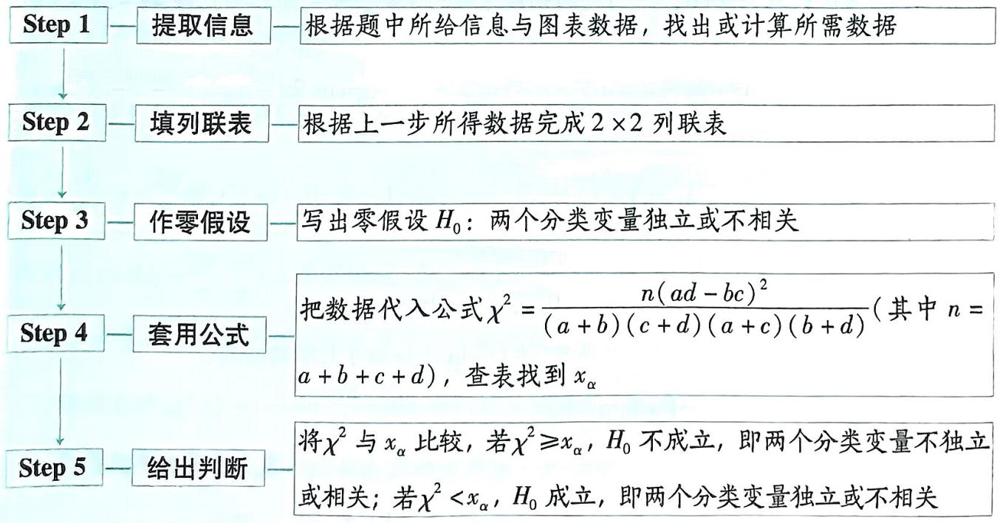

# 考前12天，第39题 含三角式函数的单调性或零点问题

# 押题依据

含三角式函数的单调性、极值问题在近几年的高考中有升温趋势，如2023新课标Ⅱ卷第22题，考查含三角式的不等式证明问题，已知极值点求参数的取值范围，且在解答题压轴题的位置呈现，试题难度较大.含三角式函数的零点问题在近几年的高考解答题中还没有涉及，预计可能成为2024年高考命题热点，应给予重视.

原创押题1 已知函数 $f(x) = ae^{x} - x - \cos^{2}x + \frac{1}{2} (a \in \mathbb{R})$ .

（1） 求曲线 $y = f(x)$ 在点 $P(0, -\frac{3}{2})$ 处的切线方程.  
（2） 若 $0 < a < 1$ , 证明: 函数 $g(x) = f(x) + \frac{1}{2} \cos 2x - a$ 有两个零点.

解析 （1） 由题意可得 $f(0) = a - 0 - 1 + \frac{1}{2} = a - \frac{1}{2} = -\frac{3}{2}$ ，解得 $a = -1$ ，

【辨易混】注意曲线 “过某点的切线” “在某点的切线”的区别, 前者点不一定在曲线上, 后者点在曲线上, 此处把点 $P$ 的坐标代入曲线方程, 即可求得 $a$ 的值

此时 $f(x) = -\mathrm{e}^{x} - x - \cos^{2}x + \frac{1}{2},$

所以 $f'(x) = -\mathrm{e}^x - 1 - 2\cos x(-\sin x) = \sin 2x - \mathrm{e}^x - 1$ ，所以切线的斜率为 $f'（0） = -2$ .

所以曲线 $y=f(x)$ 在点 $P(0,-\frac{3}{2})$ 处的切线方程为 $y+\frac{3}{2}=-2(x-0)$ ，即 $4x+2y+3=0$ .

（2） $g(x) = f(x) + \frac{1}{2}\cos 2x - a = ae^{x} - x - \cos^{2}x + \frac{1}{2} + \frac{1}{2}\cos 2x - a = ae^{x} - x - \cos^{2}x + \frac{1}{2} + \frac{1}{2}(2\cos^{2}x - 1) - a = ae^{x} - x - a,$

所以 $g'(x) = ae^{x} - 1$ ，令 $g'(x) = 0$ ，则 $x = -\ln a$ .

令 $g'(x) > 0$ ，得 $x > -\ln a$ ；令 $g'(x) < 0$ ，得 $x < -\ln a.$

所以 $g(x)$ 在 $(- \infty, -\ln a)$ 上单调递减，在 $(- \ln a, +\infty)$ 上单调递增，

所以 $g(x)_{\min} = g(-\ln a) = 1 + \ln a - a.$

【扫清障碍】要判断 $1 + \ln a - a$ 的符号，因此需构造函数，注意自变量的取值范围

令 $h(a) = 1 + \ln a - a(0 < a < 1)$ ，则 $h'(a) = \frac{1}{a} - 1 = \frac{1 - a}{a} > 0$

所以函数 $h(a)$ 在 $(0,1)$ 上单调递增， $h(a) < 1 + \ln 1 - 1 = 0$ .

【破瓶颈】 $g(x)_{\min} < 0$ ，还不能说明函数 $g(x)$ 有两个零点，还需证明在直线 $x = -\ln a$ 的左、右两侧有大于 0 的函数值或找到零点

易知 $-\ln a > 0$ ，因为 $g(0) = 0$ ，所以 $g(x)$ 在 $(-∞, -\ln a)$ 上有一个零点.

$g (- 2 \ln a) = \frac {1}{a} + 2 \ln a - a,$

令 $\varphi(a) = \frac{1}{a} + 2\ln a - a(0 < a < 1)$ , 则 $\varphi'(a) = -\frac{(a - 1)^2}{a^2} < 0$ ,

所以 $\varphi(a)$ 在 $(0,1)$ 上单调递减， $\varphi(a) > \frac{1}{1} + 2\ln 1 - 1 = 0$

所以 $g(-2\ln a)>0$ , 故 $g(x)$ 在 $(- \ln a, -2 \ln a)$ 上有一个零点.

综上所述, 当 0 < a < 1 时, $g(x)$ 有两个零点.

原创押题2 已知函数 $f(x) = x - 2\sin \frac{\pi x}{4}\cos \frac{\pi x}{4}$ .

（1） 若 $\cos \theta = \frac{2}{\pi} (0 < \theta < \frac{\pi}{2})$ ，讨论 $f(x)$ 在区间 $(-1, 1)$ 上的单调性.  
（2） 若函数 $g(x) = f(x) - \frac{a}{2} \ln x^2$ 有且仅有 2 个零点, 求正数 $a$ 的值.

解析 （1） $f(x)=x-2\sin\frac{\pi x}{4}\cos\frac{\pi x}{4}=x-\sin\frac{\pi x}{2},f'(x)=1-\frac{\pi}{2}\cos\frac{\pi x}{2}.$

【扫清障碍】求含三角式的函数的导数要先化简, 再准确地把函数拆分成基本初等函数的和、差、积、商, 最后利用运算法则求导. 对于复合函数, 应由外到内逐层求导

由 $f'(x)=0$ ，得 $\cos\frac{\pi x}{2}=\frac{2}{\pi}$

当 $x \in (-1, 1)$ 时， $\frac{\pi x}{2} \in \left(-\frac{\pi}{2}, \frac{\pi}{2}\right)$ ，所以 $\frac{\pi x}{2} = \pm \theta$ ，解得 $x = \pm \frac{2\theta}{\pi}$ .

当 $-\frac{2\theta}{\pi} < x < \frac{2\theta}{\pi}$ 时， $f'(x) < 0$ ；当 $-1 < x < -\frac{2\theta}{\pi}$ 或 $\frac{2\theta}{\pi} < x < 1$ 时， $f'(x) > 0$ .

所以 $f(x)$ 在 $(-\frac{2\theta}{\pi}, \frac{2\theta}{\pi})$ 上单调递减，在 $(-1, -\frac{2\theta}{\pi})$ 和 $(\frac{2\theta}{\pi}, 1)$ 上单调递增.

【失分点】若函数的单调区间有多个，区间之间要用逗号或“和”隔开，不能用“∪”连接

（2）依题意得, $g(x)=x-\sin\frac{\pi x}{2}-a\ln|x|$ ,定义域是 $(-∞,0)∪(0,+∞)$ .

(i) 在 $(- \infty, 0)$ 上, 有 $g(-1) = 0$ .

当 $x < -1$ 时， $-\sin \frac{\pi}{2} x \leqslant 1, -a \ln |x| < 0$ ，所以 $g(x) < 0$ ；

当 -1 < x < 0 时, 由（1）知 $f(x)$ 在 $(-1, -\frac{2\theta}{\pi})$ 上单调递增, 在 $(- \frac{2\theta}{\pi}, 0)$ 上单调递减.

因为 $f(-1) = f(0) = 0$ ，所以 $f(x) = x - \sin \frac{\pi x}{2} >0$

又 $-a\ln |x| > 0$ ，所以 $g(x) > 0$

所以 $g(x)$ 在 $(-∞,0)$ 上总有唯一的零点 x = -1.

(ii) 在 $(0, +\infty)$ 上，有 $g(1) = 0, g'(x) = 1 - \frac{\pi}{2} \cos \frac{\pi x}{2} - \frac{a}{x}, g'（1） = 1 - a.$

令 $u(x) = x - \ln x, x \in (0, +\infty)$ ,

则 $u'(x) = 1 - \frac{1}{x} = \frac{x - 1}{x}$ 当 $x > 1$ 时， $u'(x) > 0, u(x)$ 单调递增，

当 0 < x < 1 时, $u'(x) < 0$ , $u(x)$ 单调递减,

故 $u(x) \geqslant u(1) = 1$ ，即 $x - \ln x \geqslant 1$ .

若 $a = 1$ ，有 $g(x) = x - \ln x - \sin \frac{\pi x}{2} \geqslant 1 - \sin \frac{\pi x}{2} \geqslant 0 (x > 0)$ ，

当且仅当 $x = 1$ 时两个不等式中的等号同时成立，

此时 $g(x)$ 在 $(0, +\infty)$ 上有且仅有 1 个零点，符合题意.

若 $a > 1$ ，易得 $g'(x)$ 在 $(1,2)$ 上单调递增， $g'（2） = 1 + \frac{\pi}{2} -\frac{a}{2}.$

①若 $g'（2） \leqslant 0$ ，则当 $x \in (1,2)$ 时，有 $g'(x) < 0$ ;  
②若 $g'（2）>0$ ，因为 $g'（1）<0$ ，所以存在唯一的 $x_{1}\in(1,2)$ ，使得 $g'(x_{1})=0$ .

【破瓶颈】适时利用函数零点存在定理解决隐零点问题，注意设而不求

由①②可知 $g(x)$ 在 $(1, x_1)$ 上单调递减，所以 $g(x_1) < g(1) = 0$

当 $x$ 趋近于正无穷时， $g(x)$ 趋近于正无穷，

所以 $g(x)$ 在 $(1, +\infty)$ 上至少有1个零点，结合 $g(1) = 0$

所以 $g(x)$ 在 $(0, +\infty)$ 上至少有 2 个零点, 不符合题意.

若 $0 < a < 1$ ，易得 $g'(x)$ 在 $(0,1)$ 上单调递增，又 $g'（1） > 0, g'(\frac{1}{2}) = 1 - \frac{\sqrt{2}\pi}{4} - 2a < 0$

所以存在唯一的 $x_{2} \in (0,1)$ ，使得 $g'(x_{2}) = 0$ ，且 $g(x)$ 在 $(x_{2},1)$ 上单调递增，

所以 $g(x_{2}) < g(1) = 0$

当 $x$ 趋近于0时， $g(x)$ 趋近于正无穷，所以 $g(x)$ 在 $(0, x_2)$ 上至少有1个零点，

又 $g(1) = 0$ ，可知 $g(x)$ 在 $(0, +\infty)$ 上至少有2个零点，不符合题意

综上可知, $a = 1$ .

# 考前11天▶第40题 圆锥曲线中的定值、定点问题

# 押题依据

定值、定点问题在高考中的地位向来重要，圆锥曲线中的定值、定点问题常与平面向量、导数等知识综合考查，形式多样，需要从整体上把握，要善于在“变”中寻找“不变”。如2024“九省联考”第18题，考查直线与抛物线位置关系中的定点问题。圆锥曲线中的定值、定点问题在2024年高考很有可能成为命题重点。

原创押题1 在平面直角坐标系 $xOy$ 中, 点 $A, B$ 的坐标分别为 $(-2,0), (2,0)$ , 直线 $MA, MB$ 相交于点 $M$ , 且它们的斜率之积为 $-\frac{3}{4}$ , 记动点 $M$ 的轨迹为 $\Gamma$ .

（1） 求 $\Gamma$ 的方程.  
（2） 设 $C, D$ 是 $\Gamma$ 上的两个动点, 且以 $CD$ 为直径的圆经过点 $O$ , 证明: $\frac{|CD|}{|OC| \cdot |OD|}$ 为定值.

解析 （1） 设动点 $M$ 的坐标为 $(x, y)$ ,

依题意得 $\frac{y}{x + 2} \cdot \frac{y}{x - 2} = -\frac{3}{4} (x \neq \pm 2)$ , 化简整理, 得 $3x^{2} + 4y^{2} = 12(x \neq \pm 2)$ ,

【点技巧】求此类动点轨迹只需利用直译法，即直接将条件翻译成等式，整理化简后即得动点的轨迹方程。需注意：利用过两点的斜率公式时需注意两点的横坐标不能相等

所以 $\Gamma$ 的方程为 $\frac{x^2}{4} +\frac{y^2}{3} = 1(x\neq \pm 2).$

【易失分】求动点 $M$ 的轨迹方程时，若缺少限制条件 $x \neq \pm 2$ ，则此处不给分

（2） 因为以 $CD$ 为直径的圆经过点 $O$ , 所以 $OC \perp OD$ , 所以 $|CD|^2 = |OC|^2 + |OD|^2$ ,

所以 $\left(\frac{|CD|}{|OC|\cdot|OD|}\right)^2 = \frac{|OC|^2 + |OD|^2}{|OC|^2\cdot|OD|^2} = \frac{1}{|OC|^2} +\frac{1}{|OD|^2}.$

【指点迷津】要用两点间的距离公式求线段长，最好使用平方法，能简化运算

由（1）知, $\Gamma$ 的方程为 $\frac{x^{2}}{4}+\frac{y^{2}}{3}=1(x\neq\pm2)$ ,

所以 C, D 不可能为 $\Gamma$ 的顶点, 所以直线 OC 的斜率存在且不等于零,

故可设直线 $OC$ 的方程为 $y = kx (k \neq 0)$ , 则直线 $OD$ 的方程为 $y = -\frac{1}{k} x$ ,

由 $\left\{\begin{aligned}\frac{x^{2}}{4}+\frac{y^{2}}{3}=1,\\ y=kx,\end{aligned}\right.$ 得 $\left\{\begin{aligned}x^{2}=\frac{12}{3+4k^{2}},\\ y^{2}=\frac{12k^{2}}{3+4k^{2}},\end{aligned}\right.$

所以 $|OC|^{2}=\frac{12}{3+4k^{2}}+\frac{12k^{2}}{3+4k^{2}}=\frac{12(k^{2}+1)}{3+4k^{2}}$ .

同理可得， $|OD|^{2}=\frac{12}{3+4\left(-\frac{1}{k}\right)^{2}}+\frac{12\left(-\frac{1}{k}\right)^{2}}{3+4\left(-\frac{1}{k}\right)^{2}}=\frac{12\left(k^{2}+1\right)}{3k^{2}+4}$

【点技巧】对于解题过程一样的答题步骤，可适当利用“同理可得”，把相应的参数进行更换

所以 $\left(\frac{|CD|}{|OC|\cdot|OD|}\right)^2 = \frac{1}{|OC|^2} +\frac{1}{|OD|^2} = \frac{3 + 4k^2 + 3k^2 + 4}{12(k^2 + 1)} = \frac{7 + 7k^2}{12(k^2 + 1)} = \frac{7}{12}.$

所以 $\frac{|CD|}{|OC|\cdot|OD|} = \frac{\sqrt{21}}{6}$ ，为定值.

原创押题2 新考法·定点问题交汇导数 已知双曲线 $\Gamma$ 的中心为坐标原点，左焦点为 $(-2,0)$ ，离心率为2，直线 $l: kx - y - 2k = 0$ 与 $\Gamma$ 相交于 $A, B$ 两点， $l$ 与 $x$ 轴的交点为 $P$ .

（1） 求 $\Gamma$ 的方程.  
（2） 若 B 点关于 x 轴的对称点为 E, 证明: 直线 AE 恒过定点.  
（3） 若 $k \geqslant 4$ , 求 $\triangle AEP$ 面积的最大值.

解析 （1） 设 $\Gamma$ 的方程为 $\frac{x^2}{a^2} - \frac{y^2}{b^2} = 1 (a > 0, b > 0)$ ,

【敲黑板】抓题眼“左焦点”，故可判断双曲线焦点在 $x$ 轴上，利用待定系数法求 $\Gamma$ 的方程

依题意知 $\left\{ \begin{array}{l} c = 2, \\ \frac{c}{a} = 2, \\ a^2 + b^2 = c^2, \end{array} \right.$ 可得 $a^2 = 1, b^2 = 3$

所以 $\Gamma$ 的方程为 $x^{2}-\frac{y^{2}}{3}=1$ .

（2） 设 $A(x_{1}, y_{1}), B(x_{2}, y_{2})$ ，其中 $x_{1} \neq x_{2}$ ，则 $E(x_{2}, -y_{2})$ .

由 $\left\{\begin{aligned}x^{2}-\frac{y^{2}}{3}&=1,\\ kx-y-2k&=0,\end{aligned}\right.$ 消去 y 得关于 x 的方程 $(k^{2}-3)x^{2}-4k^{2}x+4k^{2}+3=0.$

所以 $\left\{ \begin{array}{l} k^2 - 3 \neq 0, \\ \Delta = (-4k^2)^2 - 4(k^2 - 3)(4k^2 + 3) = 36(k^2 + 1) > 0, \end{array} \right.$ 且 $x_1 + x_2 = \frac{4k^2}{k^2 - 3}, x_1x_2 = \frac{4k^2 + 3}{k^2 - 3}$ ,

【易失分】直线与双曲线有两个交点，相应判别式大于0的条件不能省，缺条件会失分

因为 $k_{AE} = \frac{y_1 + y_2}{x_1 - x_2} = \frac{k[(x_1 + x_2) - 4]}{x_1 - x_2},$

所以直线 $AE$ 的方程为 $y + y_{2} = \frac{k[(x_{1} + x_{2}) - 4]}{x_{1} - x_{2}} (x - x_{2})$

$\mathrm{即} y = \frac {k \left[ \left(x _ {1} + x _ {2}\right) - 4 \right]}{x _ {1} - x _ {2}} \cdot \left[ x - x _ {2} - \frac {y _ {2} \left(x _ {1} - x _ {2}\right)}{k \left(x _ {1} + x _ {2}\right) - 4 k} \right]$

【导思路】观察上述式子特征，需把 $y_{2}$ 消去，可利用 $y_{2}=k(x_{2}-2)$ 转化

$\begin{array}{l} = \frac {k [ (x _ {1} + x _ {2}) - 4 ]}{x _ {1} - x _ {2}} \cdot \{x - \frac {k x _ {2} (x _ {1} + x _ {2}) - 4 k x _ {2} + k (x _ {2} - 2) (x _ {1} - x _ {2})}{k [ (x _ {1} + x _ {2}) - 4 ]} \} \\ = \frac {k [ (x _ {1} + x _ {2}) - 4 ]}{x _ {1} - x _ {2}} \cdot [ x - \frac {2 x _ {1} x _ {2} - 2 (x _ {1} + x _ {2})}{(x _ {1} + x _ {2}) - 4} ] \\ = \frac {k [ (x _ {1} + x _ {2}) - 4 ]}{x _ {1} - x _ {2}} \cdot (x - \frac {2 \cdot \frac {4 k ^ {2} + 3}{k ^ {2} - 3} - 2 \cdot \frac {4 k ^ {2}}{k ^ {2} - 3}}{\frac {4 k ^ {2}}{k ^ {2} - 3} - 4}) \\ = \frac {k [ (x _ {1} + x _ {2}) - 4 ]}{x _ {1} - x _ {2}} \cdot (x - \frac {1}{2}), \\ \end{array}$

所以直线 AE 恒过定点 $M(\frac{1}{2},0)$ .

（3） 直线 l 与 x 轴的交点为 $P(2,0)$ ，该点也是双曲线 $\Gamma$ 的右焦点.

$\begin{array}{r l} & {\text {当} k \geqslant 4 \text {时}, S _ {\triangle A E P} = | S _ {\triangle A M P} - S _ {\triangle E M P} | = \frac {1}{2} | M P | \cdot | y _ {1} + y _ {2} | = \frac {1}{2} \times \frac {3 k}{2} \times | x _ {1} + x _ {2} - 4 | = \frac {3 k}{4} \times} \\ & {\quad \quad \quad \quad \quad \quad \quad \quad \quad \quad \quad \quad \quad \quad \quad \quad \quad \quad \quad \quad \quad \quad \quad \quad \quad \quad \quad \quad \quad \quad \quad \quad \quad \quad \quad \quad \quad \quad \quad \quad \quad \quad \quad \quad \quad \quad \quad \quad \quad \quad \quad} \\ & {\left| \frac {4 k ^ {2}}{k ^ {2} - 3} - 4 \right| = \frac {3}{4} \times \frac {1 2 k}{k ^ {2} - 3} = \frac {9 k}{k ^ {2} - 3},} \end{array}$

【指点迷津】由于 $\Gamma$ 的渐近线方程为 $y = \pm \sqrt{3} x$ ，故当 $k \geqslant 4$ 时，直线 $l$ 与双曲线 $\Gamma$ 的右支相交于两点。由（2）知，直线 $AE$ 恒过定点 $M\left(\frac{1}{2}, 0\right)$ ， $A(x_1, y_1)$ ， $E(x_2, -y_2)$ ，且 $x_1 + x_2 = \frac{4k^2}{k^2 - 3}$ 令 $f(x) = \frac{9x}{x^2 - 3} (x \geqslant 4)$ ，则 $f'(x) = \frac{9(x^2 - 3) - 9x \cdot 2x}{(x^2 - 3)^2} = \frac{-9(x^2 + 3)}{(x^2 - 3)^2} < 0$

【破瓶颈】欲求 $\frac{9k}{k^{2}-3}(k\geqslant4)$ 的最大值，可构造函数，再利用导数判断单调性即可
所以 $f(x)=\frac{9x}{x^{2}-3}$ 在 $[4,+\infty)$ 上单调递减，所以 $f(x)=\frac{9x}{x^{2}-3}\leqslant\frac{9\times4}{4^{2}-3}=\frac{36}{13}$ ,

所以 $S_{\triangle AEP}$ 的最大值为 $\frac{36}{13}$ ，此时 k=4。

# 考前10天·第41题 不等式恒成立与能成立问题

# 押题依据

在高考中，不等式恒成立问题或能成立问题屡见不鲜，此类题注重知识的综合性，以考查能力为主.如2022新高考Ⅱ卷第22题，综合考查不等式恒成立、函数的单调性等问题，体现了较高的思维能力.不等式的恒成立问题或能成立问题很有可能成为2024年高考的考查热点.

原创押题1 已知函数 $f(x) = \frac{\ln x}{x} + \mathrm{e}^{x - \mathrm{e}} - a$ .

（1） 当 a=0 时, 求曲线 $y=f(x)$ 在点 $(e,f(e))$ 处的切线方程.  
（2） 若 $f(x) \leqslant \mathrm{e}^{x - \mathrm{e}}$ 恒成立, 求实数 $a$ 的取值范围.  
（3） 证明: $\sum_{i=2}^{n+1} \ln i < \frac{n^2 + 3n}{2e} (n \geqslant 2$ 且 $n \in \mathbf{N}^*$ .

解析 （1） 函数 $f(x) = \frac{\ln x}{x} + \mathrm{e}^{x - \mathrm{e}} - a$ 的定义域为 $(0, +\infty)$ .

当 $a = 0$ 时， $f(x) = \frac{\ln x}{x} + \mathrm{e}^{x - \mathrm{e}}$ ，则 $f'(x) = \frac{1 - \ln x}{x^2} + \mathrm{e}^{x - \mathrm{e}}$ ，且 $f(\mathrm{e}) = \frac{1}{\mathrm{e}} + 1$

曲线 $y=f(x)$ 在点 $(e,f(e))$ 处的切线的斜率 $k=f'(e)=1$ ,

所以曲线 $y = f(x)$ 在点 $(\mathrm{e}, f(\mathrm{e}))$ 处的切线方程为 $y - \left(\frac{1}{\mathrm{e}} + 1\right) = x - \mathrm{e}$ ,

即 $x - y - \mathrm{e} + \frac{1}{\mathrm{e}} + 1 = 0.$

（2） 若 $f(x) \leqslant \mathrm{e}^{x - \mathrm{e}}$ 恒成立，则 $a \geqslant \frac{\ln x}{x}, x \in (0, +\infty)$ 恒成立.

【等价转化】分离参数，把含参数的放不等式一边，不含参数的放不等式另一边，从而把不等式的恒成立问题转化为最值问题

设 $g(x) = \frac{\ln x}{x}, x \in (0, +\infty)$ ，则 $g'(x) = \frac{1 - \ln x}{x^2}$ ，

由 $g'(x) > 0$ ，得 $0 < x < \mathrm{e}$ ；由 $g'(x) < 0$ ，得 $x > \mathrm{e}$

所以函数 $g(x)$ 在 $(0, e)$ 上单调递增，在 $(e, +\infty)$ 上单调递减.

所以 $g(x)_{\max} = g(\mathrm{e}) = \frac{1}{\mathrm{e}},$

所以 $a \geqslant \frac{1}{\mathrm{e}}$ .

（3） 由（2）知, $\frac{\ln x}{x} \leqslant \frac{1}{\mathrm{e}}$ , 所以 $\ln x \leqslant \frac{x}{\mathrm{e}}$ (当且仅当 $x = \mathrm{e}$ 时取等号),

【破瓶频】欲证明 $\sum_{i=2}^{n+1}\ln i<\frac{n^{2}+3n}{2e}$ ，由于 $\frac{n^{2}+3n}{2e}=\frac{1}{e}\times\frac{n(2+n+1)}{2}=\frac{1}{e}[2+3+\cdots+(n+1)]$ ，则只需证明 $\ln i<\frac{i}{e}(i=2,3,\cdots,n+1)$ ，利用第（2）问的结论，得到不等式 $\ln x\leqslant\frac{1}{e}\cdot x$ 即可求解

则 $\ln 2 < \frac{2}{e}, \ln 3 < \frac{3}{e}, \cdots, \ln n < \frac{n}{e}, \ln (n+1) < \frac{n+1}{e}$ ,

所以 $\ln 2 + \ln 3 + \cdots + \ln n + \ln(n+1) < \frac{1}{\mathrm{e}}[2 + 3 + \cdots + n + (n+1)]$ ,

所以 $\sum_{i=2}^{n+1}\ln i < \frac{1}{\mathrm{e}} \times \frac{n(2+n+1)}{2} = \frac{n^2 + 3n}{2\mathrm{e}} (n \geqslant 2$ 且 $n \in \mathbf{N}^*$ .

# 提分干货

# 解题通法

# 恒成立问题与能成立问题的解题技法

假设 $f(x)$ ， $g(x)$ 在区间D上存在最大值、最小值

<table><tr><td>恒成立问题</td><td>能成立问题</td></tr><tr><td> $a < f(x)$ 在区间  $D$  上恒成立 $\Leftrightarrow a < f(x)_{\min}$ </td><td> $a < f(x)$ 在区间  $D$  上能成立 $\Leftrightarrow a < f(x)_{\max}$ </td></tr><tr><td> $a >f(x)$ 在区间  $D$  上恒成立 $\Leftrightarrow a >f(x)_{\max}$ </td><td> $a >f(x)$ 在区间  $D$  上能成立 $\Leftrightarrow a >f(x)_{\min}$ </td></tr><tr><td> $f(x) >g(x)$ 在区间  $D$  上恒成立 $\Leftrightarrow [f(x) - g(x)]_{\min} >0$ </td><td> $f(x) >g(x)$ 在区间  $D$  上能成立 $\Leftrightarrow [f(x) - g(x)]_{\max} >0$ </td></tr></table>

# 原创押题2 已知函数 $f(x) = a(\mathrm{e}^{2x} + 2\mathrm{e}^x) - 4\mathrm{e}^x - x^2 (a \in \mathbf{R})$ .

（1） 若 $a = 3$ , 讨论函数 $f'(x)$ 的单调性;  
（2） 若存在实数 $x \in (0,1]$ , 使得 $f(x) > 3a - 4$ 成立, 求 $a$ 的取值范围.

解析 （1） 函数 $f(x)$ 的定义域为 $\mathbf{R}$ ,

若 $a = 3$ ，则 $f(x) = 3(\mathrm{e}^{2x} + 2\mathrm{e}^x) - 4\mathrm{e}^x - x^2$ ，所以 $f'(x) = 2(3\mathrm{e}^{2x} + \mathrm{e}^x - x)$ .

设 $g(x) = f'(x) = 2(3\mathrm{e}^{2x} + \mathrm{e}^x - x)$ ，则 $g'(x) = 2(6\mathrm{e}^{2x} + \mathrm{e}^x - 1) = 2(2\mathrm{e}^x + 1)(3\mathrm{e}^x - 1)$ ，

令 $g'(x) > 0$ ，得 $x > -\ln 3$ ；令 $g'(x) < 0$ ，得 $x < -\ln 3$

所以 $f'(x)$ 在 $(-∞, -ln3)$ 上单调递减，在 $(-ln3, +∞)$ 上单调递增.

（2） 由题意得 $f'(x) = 2\left[ a e^{2x} + (a - 2)e^x - x \right]$ ,

# 助学政策

小编说:国家在高等教育阶段建立了国家奖学金、国家助学金、国家助学贷款、勤工助学等多种资助政策体系,确保每一个学生顺利入学完成学业,下面来和小编一起看看吧。(上页谜底:虚根)

设 $h(x) = f'(x)$ ，则 $h'(x) = 2[2ae^{2x} + (a - 2)e^x - 1] = 2(2e^x + 1)(ae^x - 1)$ .

①当 $a \leqslant 0$ 时, $h'(x) < 0$ 恒成立, 所以 $h(x)$ 在 $(0,1]$ 上单调递减,

【点技巧】对于参变分离法不易求解的问题，就要考虑利用分类讨论法和放缩法，注意恒成立与能成立问题的区别

所以当 $0 < x \leqslant 1$ 时, $f'(x) = h(x) < h(0) = 4a - 4 < 0$ ,

所以 $f(x)$ 在 $(0,1]$ 上单调递减，

所以当 $0 < x \leqslant 1$ 时, $f(x) < f(0) = 3a - 4$ , 不符合题意.

②当 $a > 0$ 时，令 $h'(x) > 0$ 得 $x > -\ln a$ ；令 $h'(x) < 0$ 得 $x < -\ln a$ .

所以 $h(x)$ 在 $(-∞, -ln a)$ 上单调递减，在 $(-ln a, +∞)$ 上单调递增.

【破瓶颈】由于 $-\ln a$ 的符号不确定，且只需研究在区间 $(0,1]$ 上的情况，故先依据 $-\ln a$ 与 $0$ 的大小关系进行分类讨论

a. 当 $a \geqslant 1$ 时， $-\ln a \leqslant 0$

所以 $h(x)$ 在 $(0,1]$ 上单调递增，则当 $0 < x \leqslant 1$ 时， $h(x) = f'(x) > h(0) = 4a - 4 \geqslant 0$

所以 $f(x)$ 在 $(0,1]$ 上单调递增，所以当 $0 < x \leqslant 1$ 时， $f(x) > f(0) = 3a - 4$ ，符合题意。

b. 当 0 < a < 1 时， $-\ln a > 0$ ，

所以 $f'(x)$ 在 $(0, -\ln a)$ 上单调递减，在 $(- \ln a, +\infty)$ 上单调递增，且 $f'（0） = 4a - 4 < 0$ ，

所以 $f'(x)_{\min} = f'(-\ln a) = 2(1 - \frac{1}{a} +\ln a) <   0.$

若 $f'（1）=2\left[ae^{2}+(a-2)e-1\right]<0$ ，即 $a<\frac{2e+1}{e^{2}+e}$

则 $f(x)$ 在 $(0,1]$ 上单调递减，

所以当 $0 < x \leqslant 1$ 时, $f(x) < f(0) = 3a - 4$ , 不符合题意.

若 $f'（1） = 2\left[ae^{2} + (a - 2)\mathrm{e} - 1\right] > 0$ ，即 $a > \frac{2\mathrm{e} + 1}{\mathrm{e}^2 + \mathrm{e}} = \frac{2\mathrm{e} + 1}{\mathrm{e}(\mathrm{e} + 1)} >\frac{1}{\mathrm{e}}$ ，则 $-\ln a <   1$

所以存在 $x_{1} \in (-\ln a, 1)$ , 使 $f'(x_{1}) = 0$ ,

【破障碍】由于 $f'(-\ln a) < 0, f'（1） > 0$ ，所以利用函数零点存在定理，即可得存在 $x_1 \in (-\ln a, 1)$ ，使 $f'(x_1) = 0$ 。此处利用函数零点存在定理时，选其他合适的取值也给分

所以 $f(x)$ 在 $(0, x_1)$ 上单调递减，在 $(x_1, 1)$ 上单调递增，

若存在 $x \in (0,1]$ ，使得 $f(x) > 3a - 4$ 成立，则 $f(1) = a(\mathrm{e}^2 + 2\mathrm{e}) - 4\mathrm{e} - 1 > 3a - 4$

得 $a > \frac{4\mathrm{e} - 3}{\mathrm{e}^2 + 2\mathrm{e} - 3}$ , 所以 $\frac{4\mathrm{e} - 3}{\mathrm{e}^2 + 2\mathrm{e} - 3} < a < 1$ .

综上, $a$ 的取值范围为 $\left(\frac{4e - 3}{e^2 + 2e - 3}, +\infty\right)$ .

# 助学政策

# 考前9天▶第42题 指、对数式比大小问题

# 押题依据

指、对数式比大小问题以指、对数这一基础知识为载体，简单的设题形式，却能将函数、导数、不等式有机结合在一起，综合性强. 如 2023 天津卷第 3 题结合函数的单调性、不等式放缩比大小；2022 新高考Ⅰ卷第 7 题综合考查函数、导数、不等式等知识点. 此类问题不同题目的难度差异很大，预测在 2024 年高考中很有可能以较难的形式考查，在平时的练习中，有意识地训练放缩、构造函数等技能，并记忆常见的切线不等式，应对此类问题便可有备无患.

# 原创押题1

$a = \mathrm{e}^{\frac{1}{8}}, b = \frac{8}{7}, c = \ln 3.03$ ，则

( )

$\quad$A. $b > c > a$

$\quad$B. $b > a > c$

$\quad$C. $a > c > b$

$\quad$D. $a > b > c$

解析 对于 a, b, 取自然对数, 转化为比较 $\frac{1}{8}$ 与 $\ln \frac{8}{7}$ 的大小, 设 $f(x) = \ln x + \frac{1}{x} - 1$ , 则 $f'(x) = \frac{x - 1}{x^{2}}$ ,

当 $0 < x < 1$ 时， $f'(x) < 0, f(x)$ 单调递减，当 $x > 1$ 时， $f'(x) > 0, f(x)$ 单调递增，

所以 $f(x) \geqslant f(1) = 0$ ，所以 $f\left(\frac{8}{7}\right) > 0$ ，即 $\ln \frac{8}{7} + \frac{7}{8} - 1 > 0$ ，即 $\ln \frac{8}{7} > \frac{1}{8}$ ，所以 $\frac{8}{7} > e^{\frac{1}{8}}$ .

由切线不等式可得 $e^{x}>x+1(x>0)$ ， $\ln x<\frac{x}{e}(x>e)$ ，所以 $e^{\frac{1}{8}}>\frac{1}{8}+1=\frac{9}{8},\frac{3.03}{e}>\ln3.03$ ，
【小技巧】对于常用的二级结论，小题可以直接应用，大题中则要简单证明后，才能应用又 $9e > 8 \times 3.03$ ，所以 $e^{\frac{1}{8}} > \ln 3.03$ 。综上，b > a > c，故选 B。

原创押题2 已知 $f(x)$ 为定义在 R 上的奇函数,且满足 $f(x-3)=f(1-x)$ ,当 $x\in(-2,-1)$ 时, $f(x)=2^{x}+2^{-x}$ ,若 $a=f(\log_{3}2)$ , $b=f(\log_{5}4)$ , $c=f(\frac{2}{3})$ ,则()

$\quad$A. $b < a < c$

$\quad$B. $a < b < c$

$\quad$C. $c < a < b$

$\quad$D. $a < c < b$

解析 当 $x \in (-2, -1)$ 时, $f(x) = 2^x + 2^{-x}$ , $f'(x) = (2^x - 2^{-x}) \cdot \ln 2 < 0$ , 所以 $f(x)$ 在 $(-2, -1)$ 上单调递减. 因为 $f(x - 3) = f(1 - x)$ , 所以 $f(x)$ 的图象关于直线 $x = -1$ 对称, 则 $f(x)$ 在 $(-1, 0)$ 上单调递增. 因为 $f(x)$ 为定义在 $\mathbb{R}$ 上的奇函数, 所以 $f(x)$ 在 $(0, 1)$ 上单调递增.

因为 $\log_3 2 - \frac{2}{3} = \frac{\ln 2}{\ln 3} - \frac{2}{3} = \frac{3 \ln 2 - 2 \ln 3}{3 \ln 3} = \frac{\ln 8 - \ln 9}{3 \ln 3} < 0$ ，所以 $\log_3 2 < \frac{2}{3}$ ，因为 $\log_5 4 - \frac{2}{3} = \frac{\ln 4}{\ln 5} - \frac{2}{3} = \frac{3 \ln 4 - 2 \ln 5}{3 \ln 5} = \frac{\ln 64 - \ln 25}{3 \ln 5} > 0$ ，所以 $\log_5 4 > \frac{2}{3}$ ，所以 $0 < \log_3 2 < \frac{2}{3} < \log_5 4 < 1$ ，所以 $f(\log_3 2) < f(\frac{2}{3}) < f(\log_5 4)$ ，即 $a < c < b$ ，故选 D.

# 助学政策

国家奖学金每学年评审一次,本、专科国家奖学金的奖励标准为每人每年8000元,硕士生每年2万元,博士生每年3万元.

# 考前8天▶第43题 抽象函数的性质探索问题

# 押题依据

以抽象函数为载体考查函数性质是近几年的高频考点，如 2023 新课标 I 卷第 11 题，综合考查赋值法、函数的奇偶性和极值点；2022 新高考 I 卷第 12 题，考查函数的奇偶性、周期性和图象的对称性；2022 全国乙卷第 12 题，综合考查函数的周期性、图象的对称性。预测在 2024 年高考中，抽象函数问题仍然会出现在小题中，并以难题的形式出现。

原创押题1 若函数 $f(x)$ 的定义域为 $(0, +\infty)$ , 且 $f(\frac{x}{y}) = \frac{f(xy)}{f(y)}$ , 则 $\sum_{k=1}^{24} f(k) = (\quad)$

$\quad$A. 0

$\quad$B. 2

$\quad$C. 24

$\quad$D. 300

解析 $f\left(\frac{x}{y}\right) = \frac{f(xy)}{f(y)}$ ，令 $x = y = 1$ ，得 $f(1) = \frac{f(1)}{f(1)} = 1.$

令 $x = 1, y = \sqrt{n}, n \in \mathbb{N}^*$ ，得 $f\left(\frac{1}{\sqrt{n}}\right) = \frac{f(\sqrt{n})}{f(\sqrt{n})} = 1.$

【指点迷津】通过赋值探寻函数值所满足的等式，赋值时要注意函数的定义域

令 $x = \sqrt{n}, y = \frac{1}{\sqrt{n}}, n \in \mathbb{N}^*$ ，则 $f(n) = f(\frac{\sqrt{n}}{\sqrt{n}}) = \frac{f(\sqrt{n} \cdot \frac{1}{\sqrt{n}})}{f(\frac{1}{\sqrt{n}})} = \frac{f(1)}{f(\frac{1}{\sqrt{n}})} = 1.$

故 $\sum_{k=1}^{24} f(k) = 1 \times 24 = 24$ ，故选 C.

原创押题2 定义域为 $\mathbf{R}$ 的函数 $f(x)$ 满足 $f'(x) < f(x)$ , 则下列说法错误的是 ( )

$\quad$A. $\mathrm{e}f(1) < f(2)$

$\quad$B. $\sqrt{\mathrm{e}} f(1) > f(\frac{3}{2})$

$\quad$C. $\mathrm{e}^2 f(-1) > f(1)$

$\quad$D. $\mathrm{e}f(0) > f(1)$

解析 令 $g(x)=\frac{f(x)}{\mathrm{e}^{x}}$ ，则 $g'(x)=\frac{f'(x)-f(x)}{\mathrm{e}^{x}}<0$ ，所以 $g(x)$ 在R上单调递减，

【用结论】观察题眼 $f'(x) < f(x)$ ，转化为 $f'(x) - f(x) < 0$ ，据此构造函数

所以 $\frac{f(-1)}{\mathrm{e}^{-1}} >\frac{f(0)}{\mathrm{e}^0} >\frac{f(1)}{\mathrm{e}^1} >\frac{f(\frac{3}{2})}{\mathrm{e}^{\frac{3}{2}}} >\frac{f(2)}{\mathrm{e}^2}$ 即 $\operatorname {ef}（1） > f(2),\sqrt{\operatorname{e}} f(1) > f(\frac{3}{2}),\operatorname {e}^2 f(-1) > f(1),$ $\operatorname {ef}（0） > f(1)$ ，故选A.

# 助学政策

原创押题3 （多选）函数 $f(x)$ 及其导函数 $f'(x)$ 的定义域均为 $\mathbf{R}, g(x) = f'(x)$ ，且 $g'(x) = -f(x), g(0) \neq 0, f(x) + f(y) = 2f\left(\frac{x + y}{2}\right) g\left(\frac{x - y}{2}\right)$ ，则 （）

$\quad$A. $f(0) = 0$

$\quad$B. $g(x)$ 是偶函数

$C f (x) f (y) = \frac {1}{2} [ g (x + y) - g (x - y) ]$

$D g (x) + g (y) = 2 g (\frac {x + y}{2}) g (\frac {x - y}{2})$

解析 $f(x) + f(y) = 2f\left(\frac{x + y}{2}\right)g\left(\frac{x - y}{2}\right)$ , 令 $y = 0$ , 得 $f(x) + f(0) = 2f\left(\frac{x}{2}\right)g\left(\frac{x}{2}\right)$ , 令 $x = 0$ , 得 $f(0) + f(y) = 2f\left(\frac{y}{2}\right)g\left(-\frac{y}{2}\right)$ , 即 $f(0) + f(x) = 2f\left(\frac{x}{2}\right)g\left(-\frac{x}{2}\right)$ ,

则 $2f\left(\frac{x}{2}\right)g\left(\frac{x}{2}\right) = 2f\left(\frac{x}{2}\right)g\left(-\frac{x}{2}\right)$

由题设知 $f(x)$ 不恒为零，所以 $g\left(\frac{x}{2}\right) = g\left(-\frac{x}{2}\right)$ ，即 $g(x) = g(-x)$ ，

所以 $g(x)$ 是偶函数, B 正确.

对式子 $g(x) = g(-x)$ 两边同时求导得 $g'(x) = -g'(-x)$ , 又 $g'(x) = -f(x)$ , 所以 $-f(x) = f(-x)$ , 则 $f(x)$ 是奇函数, 从而 $f(0) = 0$ , A 正确.

【用结论】偶函数的导数是奇函数，奇函数如果在 $x = 0$ 处有定义，则在 $x = 0$ 处的函数值为0，据此快速判断

将 $f(x)+f(y)=2f(\frac{x+y}{2})g(\frac{x-y}{2})$ 两边同时对x求导,得 $g(x)=g(\frac{x+y}{2})g(\frac{x-y}{2})-f(\frac{x+y}{2})f(\frac{x-y}{2})$ ,

【避误区】 $f(y)$ 对 $x$ 求导，相当于一个常数对 $x$ 求导，因此所得的导数值为 0，同样， $f(x)$ 对 $y$ 求导的导数值也为 0

将 $f(x)+f(y)=2f(\frac{x+y}{2})g(\frac{x-y}{2})$ 两边同时对y求导，得 $g(y)=g(\frac{x+y}{2})g(\frac{x-y}{2})+f(\frac{x+y}{2})f(\frac{x-y}{2})$

上述两式相加得 $g(x) + g(y) = 2g\left(\frac{x + y}{2}\right)g\left(\frac{x - y}{2}\right)$ , D 正确.

上述两式相减得 $g(x) - g(y) = -2f\left(\frac{x + y}{2}\right)f\left(\frac{x - y}{2}\right)$ ，

令 $\frac{x + y}{2} = \lambda, \frac{x - y}{2} = \mu$ ，则 $x = \lambda + \mu, y = \lambda - \mu$ ，得 $g(\lambda + \mu) - g(\lambda - \mu) = -2f(\lambda)f(\mu)$ ，

即 $f(\lambda)f(\mu) = -\frac{1}{2} [g(\lambda + \mu) - g(\lambda - \mu)]$ ，从而 $f(x)f(y) = -\frac{1}{2} [g(x + y) - g(x - y)]$ ，C 错误。综上，故选 ABD.

# 考前7天▶第44题 嵌套函数的零点问题

# 押题依据

嵌套函数在近三年的高考试卷中很少出现，但嵌套函数的零点问题可以很好地考查数形结合思想，因此很有可能在2024年高考中出现.

原创押题1 已知函数 $f(x) = \begin{cases} x + 2a, & x < 0, \\ x^2 - ax, & x \geqslant 0, \end{cases}$ 若函数 $y = f(f(x))$ 有8个不同的零点，则 $a$ 的取值范围为 （）

$\quad$A. $(0,8)$

$\quad$B. $(0, +\infty)$

$\quad$C. $[8, +\infty)$

$\quad$D. $(8, +\infty)$

解析 当 $a \leqslant 0$ 时, $f(x)$ 是 $\mathbf{R}$ 上的增函数, $f(x) = 0$ 有唯一解 $x = 0$ , 此时 $f(f(x)) = 0$ 不可能有 8 个解.

当 $a > 0$ 时，令 $f(x) = t$ ，则由 $f(f(x)) = f(t) = 0$ ，得 $t_1 = -2a, t_2 = 0, t_3 = a.$

【明思路】换元，把零点个数转化为函数图象的交点个数，进而求解

因为函数 $y = f(f(x))$ 有8个不同的零点,所以直线 $y = -2a, y = 0$ , $y = a$ 与函数 $f(x)$ 的图象共有8个交点,作出 $f(x)$ 的图象,如图1所示.

因为 $a > 0$ , 所以 $2a > a$ , 所以直线 $y = a$ 与函数 $f(x)$ 的图象有 2 个交点, 直线 $y = 0$ 与函数 $f(x)$ 的图象有 3 个交点,

所以直线 $y = -2a$ 与函数 $f(x)$ 的图象有 $8 - 2 - 3 = 3$ （个）交点，

【破障碍】先确定容易确定的“直曲交点”个数，再根据总交点个数确定剩余的“直曲交点”个数，据此列关系式求参数的取值范围

所以 $-2a > -\frac{a^2}{4}$ , 得 $a > 8$ . 故选 D.

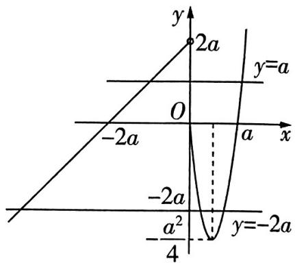

图1

原创押题2 已知函数 $f(x) = \begin{cases} e^x, & x \leqslant 0, \\ \ln x, & x > 0, \end{cases}$ $g(x) = x - 3$ ，方程 $f(g(x)) = -3 - g(x)$ 有2个不同的根，分别是 $x_1, x_2$ ，则 $x_1 + x_2 =$ （）

$\quad$A. 0

$\quad$B. 3

$\quad$C. 6

$\quad$D. 9

解析 令 $g(x) = x - 3 = t$ ，则 $f(g(x)) = -3 - g(x)$ 即 $f(t) = -3 - t$ ，由题意知直线 $y = -3 - t$ 与曲线 $y = f(t)$ 有2个交点，设交点横坐标分别为 $t_1, t_2 (t_1 < 0 < t_2)$ ，则 $t_1, t_2$ 满足 $\mathrm{e}^{t_1} = -3 - t_1$ ， $\ln t_2 = -3 - t_2$ ，则 $\ln \mathrm{e}^{t_1} = t_1 = -3 - \mathrm{e}^{t_1}$ ，易知关于 $m$ 的方程 $\ln m = -3 - m$ 只有1个根，所以 $t_2 = \mathrm{e}^{t_1}$ ，从而 $t_1 + t_2 = -3$ 。

不妨设 $x_{1} - 3 = t_{1}, x_{2} - 3 = t_{2}$ , 则 $x_{1} - 3 + x_{2} - 3 = -3$ , 所以 $x_{1} + x_{2} = 3$ , 故选 B.

# 助学政策

国家助学金 是由中央与地方政府共同出资设立的,用于资助家庭经济困难的全日制普通本专科(含高职、第二学士学位)在校学生.

# 考前6天▶第45题 动点或截面问题

# 押题依据

高考立体几何模块中，探求几何体上满足某些条件的动点的变化过程中，动点的轨迹、相关位置关系和角度、距离、面积、体积的不变和变化的规律的问题，是难度较大的热点问题，承载考查较高水平直观想象、数学推理、数学运算核心素养的功能。如2021新高考Ⅰ卷第12题，涉及正三棱柱侧面上用向量的语言描述的动点变化过程中，体积不变性及垂直关系存在性问题。类似试题在全国其他试卷中也有呈现，有一定的难度，2024年高考务必重视。

# 原创 押题 1 新角度·探索动点的位置，新考法·交汇双曲线（多选）在

棱长为 1 的正方体 $ABCD - A_{1}B_{1}C_{1}D_{1}$ 中, 底面 $ABCD$ 上 (包括边界) 的点 $P$ 满足直线 $A_{1}P$ 与直线 $B_{1}D_{1}$ 所成角为 $60^{\circ}$ , 如图 1. 则 ( )

$\quad$A. 存在某点 $P$ , 使得 $A_{1} P \parallel$ 平面 $B_{1} C D_{1}$   
$\quad$B. 存在某点 $P$ , 使得平面 $A_{1}D_{1}P \perp$ 平面 $B_{1}CD_{1}$   
$\quad$C. 点 $P$ 的轨迹是离心率为 2 的双曲线的一部分  
$\quad$D. 三棱锥 $C - B_{1}D_{1}P$ 体积的最小值是 $\frac{1}{3}$

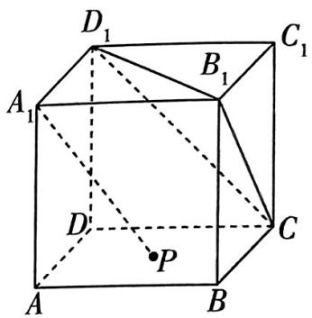

图1

解析 对于选项 A, 当点 P 在点 B 位置时, 满足 $A_{1}P$ 与 $B_{1}D_{1}$ 所成角为 $60^{\circ}$ , 此时 $A_{1}P \parallel CD_{1}$ , $A_{1}P \not\subset$ 平面 $B_{1}CD_{1}$ , 所以 $A_{1}P \parallel$ 平面 $B_{1}CD_{1}$ , 故 A 正确.

【指点迷津】看到直线 $A_{1}P$ 与平面 $B_{1}CD_{1}$ 的平行关系，联想到正方体中平面 $A_{1}BD //$ 平面 $B_{1}CD_{1}$ ，问题迎刃而解

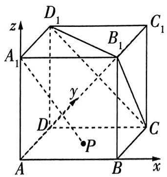

图2

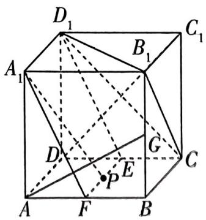

图3

对于选项 B, 方法一: 向量法 如图 2, 以 A 为坐标原点, 直线 AB, AD, $AA_{1}$ 分别为 x 轴, y 轴, z 轴建立空间直角坐标系,

则 $A(0,0,0), A_1(0,0,1), C_1(1,1,1), D_1(0,1,1)$ ，设 $P(s,t,0)$ ，则 $0 \leqslant s \leqslant 1, 0 \leqslant t \leqslant 1, \overrightarrow{A_1D_1} = (0,1,0), \overrightarrow{A_1P} = (s,t,-1)$ ，

# 助学政策

设平面 $PA_{1}D_{1}$ 的法向量是 $\pmb {n} = (p,q,r)$

则 $\left\{ \begin{array}{l} \pmb{n} \cdot \overrightarrow{A_1D_1} = 0, \\ \pmb{n} \cdot \overrightarrow{A_1P} = 0, \end{array} \right.$ 即 $\left\{ \begin{array}{l} q = 0, \\ sp + tq - r = 0, \end{array} \right.$ 可取 $\pmb{n} = (1,0,s)$ .

连接 $AC_{1}$ , 易证 $AC_{1} \perp$ 平面 $B_{1}CD_{1}$ , 则 $\overrightarrow{AC_{1}} = (1, 1, 1)$ 是平面 $B_{1}CD_{1}$ 的一个法向量,

因为 $n \cdot \overrightarrow{AC_{1}} = 1 + s \neq 0$ ，所以平面 $A_{1}D_{1}P \perp$ 平面 $B_{1}CD_{1}$ 不成立，故 B 错误.

方法二: 几何法 连接 $AC_{1}$ ，易证 $AC_{1} \perp$ 平面 $B_{1}CD_{1}$ .

如图3, 过点 $P$ 作 $EF \parallel AD$ , 分别交 $CD, AB$ 于点 $E, F$ , 则 $A_{1}, D_{1}, E, P, F$ 共面, 连接 $A_{1}F, D_{1}E$ , 在平面 $ABB_{1}A_{1}$ 中, 过点 $A$ 作 $AG \perp A_{1}F$ 交 $BB_{1}$ 于点 $G$ , 可得 $AG \perp$ 平面 $A_{1}D_{1}EF$ .

因为 $AC_{1}$ 不垂直于 AG，所以平面 $A_{1}D_{1}P \perp$ 平面 $B_{1}CD_{1}$ 不成立，故 B 错误.

对于选项 C, 连接 AC, BD, 如图 4, 以 A 为坐标原点, 直线 $AC, AA_{1}$ 分别为 y 轴, z 轴建立空间直角坐标系,

【指点迷津】建立合适的空间直角坐标系, 有利于运算, 对于选项 D, 注意到当点 $P$ 在点 $B, D$ 位置时, 直线 $A_{1} P$ 与直线 $B_{1} D_{1}$ 所成角为 $60^{\circ}$ , 结合正方体的对称性, 点 $P$ 的轨迹关于直线 $A C$ 对称, 所以选择建立如图 4 所示的空间直角坐标系

则 $A_{1}(0,0,1), P(x,y,0), -\frac{\sqrt{2}}{2} \leqslant x \leqslant \frac{\sqrt{2}}{2}, 0 \leqslant y \leqslant \sqrt{2}, \overrightarrow{A_{1}P} = (x,y,-1)$ ,

取直线 $B_{1}D_{1}$ 的一个方向向量 $\pmb {m} = (1,0,0)$ .

由题设知 $|\cos \langle \overrightarrow{A_1P},\overrightarrow{B_1D_1}\rangle | = \frac{|\overrightarrow{A_1P}\cdot\overrightarrow{B_1D_1}|}{|\overrightarrow{A_1P}||\overrightarrow{B_1D_1}|} = \frac{|x|}{\sqrt{x^2 + y^2 + 1}} = \cos 60^\circ = \frac{1}{2},$

即 $3x^{2} - y^{2} = 1$ ，所以点 $P$ 的轨迹为双曲线的一部分，且双曲线的离心率 $e = \sqrt{\frac{\frac{1}{3} + 1}{\frac{1}{3}}} = 2$ ，故C正确.

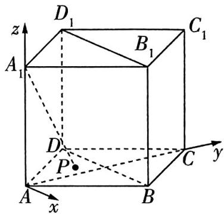

图4

对于选项D,连接 $AC,AD_{1},AC_{1},V_{C - B_{1}D_{1}P} = V_{P - B_{1}CD_{1}}\leqslant V_{A - B_{1}CD_{1}} = \frac{1}{3} S_{\triangle B_1CD_1}\times \frac{2}{3} AC_1 = \frac{1}{3}\times \frac{\sqrt{3}}{4}\times$ $(\sqrt{2})^2\times \frac{2\sqrt{3}}{3} = \frac{1}{3}$ 故D错误.

故选 AC.

原创押题2 (多选)在棱长为1的正四面体ABCD中,E,F分别是AB,CD的中点,则 ( )

$\quad$A. ${AB} \bot  {CD}$   
$\quad$B. 正四面体 $ABCD$ 中, 两相邻表面的夹角都等于 $60^{\circ}$

# 助学政策

国家助学贷款 是党中央、国务院在社会主义市场经济条件下,利用金融手段完善中国普通高校资助政策体系,加大对普通高校贫困家庭学生资助力度所采取的一项重大措施.

$\quad$C. 以 $EF$ 为直径的球被正四面体 $ABCD$ 的各表面所在平面截得所有截面的面积之和为 $\frac{4\pi}{3}$

$\quad$D. 将正四面体 $ABCD$ 以 $EF$ 为轴旋转 $90^{\circ}$ 得到新正四面体 $A'B'C'D'$ , 两正四面体公共部分几何体的体积等于 $\frac{1}{6}$

解析 将正四面体 ABCD 置于正方体 $AA_{1}BB_{1}-D_{1}CC_{1}D$ 中, 如图 5.

对于选项 A, 在正方体中, 直观得到 $AB \perp CD$ , 故 A 正确.

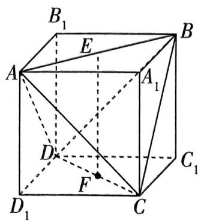

图5

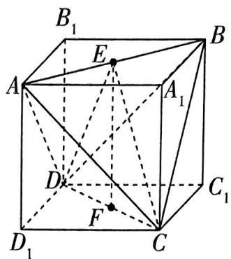

图6

对于选项 B, 如图 6, 连接 CE, DE, 易证 $CE \perp AB, DE \perp AB$ , 所以 $\angle CED$ 是平面 ABC 与平面 ABD 的夹角, 在 $\triangle CED$ 中, $CE = DE \neq CD$ , 所以 $\angle CED \neq 60^{\circ}$ , 故 B 错误.

【扫清障碍】正四面体中, 任意相邻表面的夹角相等, 研究一种情况, 找到平面夹角 $\angle CED$ , 结合选项, 定性判断此三角形不是等边三角形即可

对于选项 C, 如图 7, 分别取 EF, AD, BC, AC, BD 的中点 O, $E_{1}$ , $F_{1}$ , $E_{2}$ , $F_{2}$ , 连接 $OE_{1}$ , $OE_{2}$ , $OF_{1}$ , $OF_{2}$ , 则 $OE = OE_{2} = OF_{1}$ , 且两两互相垂直, 过点 O 作 $OO_{1} \perp$ 平面 ABC 于 $O_{1}$ (图略), 则 $O_{1}$ 是 $\triangle ABC$ 的中心, 连接 $O_{1}E$ (图略).

于是平面 $ABC$ 截以 $EF$ 为直径的球的截面为以 $O_{1}$ 为圆心， $O_{1}E = \frac{1}{3} \times \sqrt{2} \times \frac{\sqrt{3}}{2} = \frac{\sqrt{6}}{6}$ 为半径的圆，此圆的面积为 $\pi\left(\frac{\sqrt{6}}{6}\right)^2 = \frac{\pi}{6}$ ，

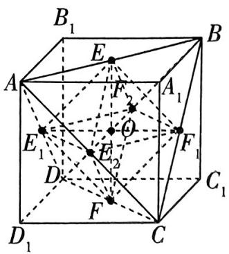

图7

根据图形的对称性,正四面体四个表面截球所得截面面积之和为 $\frac{\pi}{6}\times4=\frac{2\pi}{3}$ ,故C错误.

对于选项 D, 作出两个正四面体相交面的交线, 得其公共部分是正八面体 $EE_{1}E_{2}F_{1}F_{2}F$ , 如图 7,

该正八面体可分割为两个全等的正四棱锥, 正四棱锥底面是边长为 $\frac{\sqrt{2}}{2}$ 的正方形, 高为 $\frac{1}{2}$ , 所以所求公共部分的体积 $V = 2 \times \frac{1}{3} \times (\frac{\sqrt{2}}{2})^2 \times \frac{1}{2} = \frac{1}{6}$ , 故 D 正确.

故选 AD.

# 助学政策

借款学生通过学校向银行申请贷款,用于弥补在校学习期间学费、住宿费和生活费的不足,毕业后分摊偿还。2024年国家助学贷款免息,本金可延期1年偿还.

# 考前5天

# 第46题 创新形式下的数列通项与数列和的求解问题

# 押题依据

在近几年的高考中，数列问题不断创新，常以等差数列、等比数列为基本模型，定义新数列，让考生证明新数列的性质、求解通项公式及求解与数列前 $n$ 项和有关的问题等。如2023北京卷第21题，以集合为背景，定义新数列，考查与数列和相关的问题；2023上海卷第21题，以函数图象的切线为背景，定义新数列，考查与数列相关的证明问题和存在性探索问题；等等。此类创新问题是2024年高考的命题趋势之一，应引起重视。

原创押题1 已知正项数列 $\{a_{n}\}$ , 记 $\{\frac{1}{a_{n} + a_{n+1}}\}$ 的前 $n$ 项和为 $S_{n}$ , 且 $S_{n} + a_{1} = a_{n+1}$ .

（1） 证明: 数列 $\{a_{n}^{2}\}$ 是等差数列.

（2） 记 $c_{n} = [a_{n}]$ , 其中 $[x]$ 表示不超过 $x$ 的最大整数, 记 $\{c_{n}\}$ 的前 $n$ 项和为 $T_{n}$ , 若 $a_{1} = 1$ , 求 $T_{20}$ .

解析 （1） 当 $n \geqslant 2$ 时, $S_{n-1} + a_1 = a_n$ ①, $S_n + a_1 = a_{n+1}$ ②,

【失分警示】由已知 $S_{n}+a_{1}=a_{n+1}$ ，消去 $S_{n}$ 得到 $\{a_{n}\}$ 的项的递推关系，注意此处 $n\geqslant2$ ，求得结果后，切勿忘记检验n=1时的情况

②-①得 $\frac{1}{a_n + a_{n+1}} = a_{n+1} - a_n$ ，所以 $a_{n+1}^2 - a_n^2 = 1$ .

当 $n = 1$ 时， $S_{1} + a_{1} = a_{2}$ ，即 $\frac{1}{a_1 + a_2} = a_2 - a_1$ ，所以 $a_{2}^{2} - a_{1}^{2} = 1$ ，满足 $a_{n+1}^{2} - a_{n}^{2} = 1$ .

综上,数列 $\{a_{n}^{2}\}$ 是等差数列.

（2） 由（1）及 $a_1 = 1$ 得 $\{a_n^2\}$ 是首项为1、公差为1的等差数列，

所以 $a_{n}^{2} = a_{1}^{2} + (n - 1)\times 1 = n$ ，又 $a_{n} > 0$ ，所以 $a_{n} = \sqrt{n}$

当 $1 \leqslant n \leqslant 3$ 时, $c_{n} = 1$ ; 当 $4 \leqslant n \leqslant 8$ 时, $c_{n} = 2$ ; 当 $9 \leqslant n \leqslant 15$ 时, $c_{n} = 3$ ; 当 $16 \leqslant n \leqslant 20$ 时, $c_{n} = 4$ .

则 $T_{20} = 1 \times 3 + 2 \times 5 + 3 \times 7 + 4 \times 5 = 54.$

【解后反思】解决第（2）问要借助第（1）问的结论, 从而得到 $\{a_{n}\}$ 的通项公式, 解答题中后一问常常可直接用前一问的结论, 或者后一问的解答会受到前一问特殊情况结论的启发. 对于新定义问题, 要理解新定义的含义, 再进行运算, 本题第（2）问中的 $[x]$ 实际上与高斯函数有关, 理解其含义, 自然就能得出结果了

# 助学政策

原创押题2 已知数列 $\{a_{n}\}$ 满足 $a_1 = a, a_{n+1} = \begin{cases} a_n - 1, n \text{ 是奇数,} \\ a_n + 2, n \text{ 是偶数.} \end{cases}$

（1） 记 $b_{n} = a_{2n - 1} + a_{2n}$ , 求 $\{b_{n}\}$ 的通项公式.  
（2） 记数列 $\{a_{n}\}$ 的前 $n$ 项和为 $S_{n}$ , 若 $S_{n} \geqslant S_{10}(n \in \mathbf{N}^{*})$ , 求 $a$ 的取值范围.

解析 （1） 方法一 $b_{n+1} - b_n = (a_{2n+1} + a_{2n+2}) - (a_{2n-1} + a_{2n}) = (a_{2n} + 2 + a_{2n+1} - 1) - (a_{2n-1} +$

$a _ {2 n}) = (a _ {2 n - 1} + a _ {2 n} + 2) - (a _ {2 n - 1} + a _ {2 n}) = 2, b _ {1} = a _ {1} + a _ {2} = a + a - 1 = 2 a - 1,$

所以数列 $\{b_{n}\}$ 是首项为 $2a - 1$ 、公差为2的等差数列，

所以 $b_{n} = 2a - 1 + (n - 1)\times 2 = 2n + 2a - 3.$

方法二 由题意知 $a_{2n + 2} = a_{2n + 1} - 1 = a_{2n} + 1, a_{2n + 1} = a_{2n} + 2 = a_{2n - 1} + 1$ ，即 $a_{2n + 2} - a_{2n} = 1, a_{2n + 1} - a_{2n - 1} = 1$ .

$a_{1} = a, a_{2} = a - 1$ ，所以数列 $\{a_{2n}\}$ 是首项为 $a - 1$ 、公差为 1 的等差数列，数列 $\{a_{2n-1}\}$ 是首项为 $a$ 、公差为 1 的等差数列，

所以 $b_{n}=a_{2n-1}+a_{2n}=a+(n-1)+a-1+(n-1)=2n+2a-3.$

【指点迷津】对于分段数列中需要分奇、偶项讨论的问题,一种解决方法是奇、偶项合并研究递推关系,方法一就是如此;另一种方法是分别研究偶数项数列、奇数项数列中前、后项的递推关系,得到偶数项数列、奇数项数列的通项公式,即方法二

（2） 方法一 由题意得 $b_{n} = a_{2n - 1} + a_{2n} = 2a_{2n - 1} - 1 = 2n + 2a - 3$ ，

所以 $a_{2n - 1} = n + a - 1, a_{2n} = a_{2n - 1} - 1 = n + a - 2,$

所以数列 $\{a_{2n - 1}\} ,\{a_{2n}\}$ 均为递增数列，且 $a_{2n - 1} > a_{2n}$

因为 $S_{n} \geqslant S_{10}(n \in \mathbf{N}^{*})$ ，所以 $\left\{\begin{aligned}a_{9}+a_{10} &\leqslant 0,\\ a_{11} &\geqslant 0,\\ a_{11}+a_{12} &\geqslant 0,\end{aligned}\right.$ 得 $-\frac{9}{2} \leqslant a \leqslant -\frac{7}{2}$ .

【易遗漏】此处注意 $a_{9} + a_{10} \leqslant 0, a_{11} + a_{12} \geqslant 0$ 这两个不等关系. 要满足 $S_{n} \geqslant S_{10}$ 恒成立，除了要考虑 $S_{10} \leqslant S_{9}$ 及 $S_{10} \leqslant S_{11}$ ，还应考虑 $S_{10} \leqslant S_{8}$ 及 $S_{10} \leqslant S_{12}$

所以 a 的取值范围是 $\left[-\frac{9}{2}, -\frac{7}{2}\right]$ .

方法二 由（1）得 $b_{n}=a_{2n-1}+a_{2n}=2a_{2n}+1=2n+2a-3$ ，则 $a_{2n}=n+(a-2)$ ，

所以 $S_{2n}=b_{1}+b_{2}+\cdots+b_{n-1}+b_{n}=\frac{n(n+1)}{2}\times2+n(2a-3)=n^{2}+2(a-1)n,$

于是 $S_{10} = 15 + 10a, S_{2n - 1} = S_{2n} - a_{2n} = n^2 + (2a - 3)n - a + 2.$

助学政策

学费补偿、国家助学贷款代偿以及学费减免的标准,本专科生每生每年最高不超过12 000元,研究生每生每年最高不超过16 000元.超出标准部分不予补偿、代偿或减免.

因为 $S_{n} \geqslant S_{10}$ ( $n \in \mathbf{N}^{*}$ ), 所以 $\left\{ \begin{array}{l} S_{2n} \geqslant S_{10}, \\ S_{2n-1} \geqslant S_{10}, \end{array} \right.$ 即 $\left\{ \begin{array}{l} n^{2} + 2(a - 1)n \geqslant 15 + 10a, \\ n^{2} + (2a - 3)n - a + 2 \geqslant 15 + 10a, \end{array} \right.$ 化简得 $\left\{ \begin{array}{l} 2(5 - n)a \leqslant n^{2} - 2n - 15, \\ (11 - 2n)a \leqslant n^{2} - 3n - 13. \end{array} \right.$

所以当 $n \geqslant 6$ 时， $\left\{ \begin{array}{l} a \geqslant -\frac{n^2 - 2n - 15}{2(n - 5)}, \\ a \geqslant -\frac{n^2 - 3n - 13}{2n - 11}; \end{array} \right.$ 当 $1 \leqslant n \leqslant 4$ 时， $\left\{ \begin{array}{l} a \leqslant -\frac{n^2 - 2n - 15}{2(n - 5)}, \\ a \leqslant -\frac{n^2 - 3n - 13}{2n - 11}; \end{array} \right.$ 当 $n = 5$ 时， $a \leqslant$

$- \frac {n ^ {2} - 3 n - 1 3}{2 n - 1 1} = - 3.$

令 $t = 2(n - 5), s = 2n - 11$ ，易知 $t$ 是偶数， $s$ 是奇数，且 $t \geqslant -8, s \geqslant -9$ .

当 $n \geqslant 6$ ，即 $t \geqslant 2, s \geqslant 1$ 时， $\left\{ \begin{array}{l} a \geqslant -\frac{\left(\frac{t}{2} + 5\right)^2 - 2\left(\frac{t}{2} + 5\right) - 15}{t} = -\frac{1}{4}(t + 16), \\ a \geqslant -\frac{\left(\frac{s + 11}{2}\right)^2 - 3 \cdot \frac{s + 11}{2} - 13}{s} = -\frac{1}{4}(s + \frac{3}{s} + 16), \end{array} \right.$ 解得 $a \geqslant$

$-\frac{9}{2}$ . 当 $1 \leqslant n \leqslant 4$ , 即 $-8 \leqslant t \leqslant -2, -9 \leqslant s \leqslant -3$ 时, $\left\{ \begin{array}{l} a \leqslant -\frac{1}{4}(t + 16), \\ a \leqslant -\frac{1}{4}(s + \frac{3}{s} + 16), \end{array} \right.$ 解得 $a \leqslant -\frac{7}{2}$ .

综上, $a$ 的取值范围是 $\left[-\frac{9}{2}, -\frac{7}{2}\right]$ .

# 提分干货

# 解题策略

# “奇偶分组”数列前 $n$ 项和 $S_{n}$ 的恒成立问题的求解策略

①从数列的单调性入手分析,【原创押题2】第（2）问的方法一就是如此,由第（1）问得到奇数项数列和偶数项数列的通项公式,知道数列的单调性及正负值变化规律,从而得出 $S_{n}\geqslant S_{10}$ 的等价条件.  
②从 $S_{n}$ 入手分析, 分偶数项、奇数项研究 $S_{2n}$ 和 $S_{2n-1}$ , 根据题目中要证明的不等关系得不等式组, 再采用分离参数的方法求解, 【原创押题 2】第（2）问的方法二就是如此. 数列问题中分离参数时, 既要注意变量的整数特征, 又要注意不等式变形时, 有时需要分类讨论.

# 助学政策

基层就业学费补偿助学贷款代偿 指高校毕业生到中西部地区和艰苦边远地区基层单位就业、服务期在3年以上(含3年)的,其学费或在校学习期间获得国家助学贷款由国家实行代偿.

# 考前4天▶第47题 创新应用情境下的条件概率问题

# 押题依据

条件概率随着新高考改革逐渐成为概率模块的重点考查内容，近几年来多有体现，如2023 新课标Ⅰ卷第 21 题，结合数列考查全概率公式；2023 天津卷第 13 题，考查相互独立事件和全概率公式；等等. 条件概率问题是概率中重要的一类问题，同时全概率公式、贝叶斯公式是更高阶段学习过程中概率模块的基础公式，在 2024 年高考中很可能会重点考查，应加以关注.

# 原创押题

某公司举行年会,年会上有一个抽奖环节. 规则如下,有 $k (k \in \mathbf{N}^{*}, k \geqslant 3)$ 个外观相同的空箱子, 将一件奖品放入其中一个箱子, 主持人知道奖品在哪个箱子, 然后把所有箱子关闭, 员工选择一个箱子进行抽奖, 若奖品在此箱子里, 则获得奖品.

  
创新应用情境下的条件概率问题

（1） 当 $k = 3$ 时, 某员工选择一个箱子, 在打开此箱子之前, 主持人先打开了另外 2 个箱子中的 1 个空箱子, 让该员工重新选择, 若该员工改选剩下的那个箱子, 则中奖概率是多少?  
（2） 现某员工按照以下规则抽奖: ①该员工每选择一次后, 主持人都从剩下的箱子中打开 1 个空箱子让该员工重新选择; ②打开的空箱子此后都保持打开状态, 待员工选择剩下的未打开的箱子继续抽奖; ③抽奖进行到只剩下 2 个未打开的箱子时, 待员工选择其中一个箱子后, 主持人直接公布结果. 若该员工每次都改选剩下的箱子, 证明: $k = 5$ 时的获奖概率比 $k = 4$ 时的获奖概率大.

解析 （1） 记箱子 1、箱子 2、箱子 3 有奖品分别为事件 $M_{1}, M_{2}, M_{3}$ ; 主持人打开箱子 1、箱子 2、箱子 3 分别为事件 $N_{1}, N_{2}, N_{3}$ .

不妨设该员工刚开始选择的是第1个箱子,主持人打开的空箱子为第2个箱子,则该员工改选第3个箱子,中奖概率为 $P(M_{3}|N_{2})$ .

由题意知 $P(M_{1}) = P(M_{2}) = P(M_{3}) = \frac{1}{3}, P(N_{2}|M_{1}) = \frac{1}{2}, P(N_{2}|M_{2}) = 0, P(N_{2}|M_{3}) = 1.$

则 $P(N_{2}) = P(M_{1})P(N_{2}|M_{1}) + P(M_{2})P(N_{2}|M_{2}) + P(M_{3})P(N_{2}|M_{3}) = \frac{1}{3}\times (\frac{1}{2} +0 + 1) = \frac{1}{2}.$

【用公式】全概率公式：设 $A_{1}, A_{2}, \cdots, A_{n}$ 是一组两两互斥的事件， $A_{1} \cup A_{2} \cup \cdots \cup A_{n} = \Omega$ ，且 $P(A_{i}) > 0, i = 1, 2, \cdots, n$ ，则对任意的事件 $B \subseteq \Omega$ ，有 $P(B) = \sum_{i=1}^{n} P(A_{i}) P(B|A_{i})$

所以 $P(M_3|N_2) = \frac{P(M_3N_2)}{P(N_2)} = \frac{P(M_3)P(N_2|M_3)}{P(N_2)} = \frac{2}{3}$ ，即所求中奖概率是 $\frac{2}{3}$ .

助学政策

（2） 当 $k = 4$ 时, 若一开始选择的是有奖品的箱子, 则概率为 $\frac{1}{4}$ , 根据规则, 接下来反复改选后必然中奖, 即中奖概率为 1;

若一开始选择的是没有奖品的箱子,则概率为 $\frac{3}{4}$ ,此时,若想中奖,则第一次改选的是没有奖品的箱子,概率为 $\frac{1}{2}$ .

所以 $k = 4$ 时，中奖概率为 $\frac{1}{4} \times 1 + \frac{3}{4} \times \frac{1}{2} = \frac{5}{8}$ .

当 $k = 5$ 时, 若一开始选择的是有奖品的箱子, 则概率为 $\frac{1}{5}$ , 根据规则, 第一次改选后不会选中有奖品的箱子, 要想中奖, 第二次应改选没有奖品的箱子, 此时中奖概率为 $\frac{1}{2}$ ;

若一开始选择的是没有奖品的箱子,则概率为 $\frac{4}{5}$ ,此时,若第一次改选的是有奖品的箱子,则之后必然中奖,中奖的概率为 $\frac{1}{3}$ ,若第一次改选的是没有奖品的箱子,则第二次必须依旧改选没有中奖的箱子最终才能中奖,中奖的概率为 $\frac{2}{3} \times \frac{1}{2} = \frac{1}{3}$ .

所以 $k = 5$ 时，中奖概率为 $\frac{1}{5} \times \frac{1}{2} + \frac{4}{5} \times \left(\frac{1}{3} + \frac{1}{3}\right) = \frac{19}{30}$ .

因为 $\frac{19}{30} >\frac{5}{8}$

所以 k=5 时的获奖概率比 k=4 时的获奖概率大.

# 提分干货 解题策略

# 求条件概率 $P(B \mid A)$ 的 2 大核心技法

方法一:借助条件概率定义中的公式计算 在原样本空间中, 先计算 $P(AB)$ , $P(A)$ , 再利用公式 $P(B|A) = \frac{P(AB)}{P(A)}$ 计算.

方法二:缩小样本空间法 此方法主要针对的是古典概型,首先明确是求 “在谁发生的前提下谁发生的概率”,其次转换样本空间,即把给定事件 $A$ 定义为新的样本空间,并找出事件 $A$ 和事件 $AB$ 所含的样本点个数,最后利用 $P(B \mid A) = \frac{n(AB)}{n(A)}$ 计算.

# 助学政策

新生入学资助项目 是一项针对中西部地区家庭经济特别困难的新生提供的资助方案. 该项目旨在解决学生家庭至录取学校间的路费和入校后的短期生活费.

# 考前3天

# 第48题 圆锥曲线中的点的轨迹或轨迹方程探索问题

# 押题依据

轨迹是动点按照一定的规律运动而形成的，求轨迹方程的实质是将“形”转化为“数”，将“曲线”转化为“方程”，培养了数形结合思想。圆锥曲线中的点的轨迹或轨迹方程的探索问题，在近几年高考中有所涉及，如2023新课标Ⅰ卷第22题涉及已知动点满足的条件求轨迹方程，以及直线与圆锥曲线的位置关系。轨迹问题在2024年高考中考查的可能性很大。

原创押题 一动圆与圆 $F_{1}: x^{2} + y^{2} + 4x - 14 = 0$ 和圆 $F: x^{2} + y^{2} - 4x + 2 = 0$ 都外切.

（1） 求动圆圆心的轨迹方程, 并说明它是什么曲线;

（2） 直线 l 过 $(2,0)$ 且与 （1） 中的轨迹交于 A, B 两点，点 S 为线段 AB 的中“千年老二”，圆点，点 T 在 x 轴上， $ST \perp AB$ 。若 $\overrightarrow{TS} \cdot \overrightarrow{TB} = \frac{80}{9}$ ，求直线 l 的方程。锥曲线压轴题

解析 （1） 设动圆圆心为 $M(x, y)$ , 半径为 $R$ , 由题可知圆 $F_{1}: (x + 2)^{2} + y^{2} = 18$ , 圆 $F: (x - 2)^{2} + y^{2} = 2$ , 则 $F_{1}(-2,0), F(2,0)$ ,

连接 $MF_{1}, MF$ ，则 $|MF_{1}| = R + 3\sqrt{2}, |MF| = R + \sqrt{2}$ . 因为 $|MF_{1}| - |MF| = 2\sqrt{2} < |F_{1}F| = 4$ ，所以 $M(x, y)$ 到点 $F_{1}$ 和 $F$ 的距离差是常数 $2\sqrt{2}$ ，

所以动圆圆心的轨迹方程为 $C: \frac{x^2}{2} - \frac{y^2}{2} = 1 (x > 0)$ , 是焦点为 $F_1(-2,0)$ 和 $F(2,0)$ , 实轴长为 $2\sqrt{2}$ 的双曲线的右支.

（2） 由题知, 直线 $AB$ 的斜率不为 0 , 设直线 $AB$ 的方程为 $x = ty + 2$ , 代入双曲线 $C: \frac{x^2}{2} - \frac{y^2}{2} = 1$ 中, 消去 $x$ 化简可得关于 $y$ 的方程 $(t^2 - 1)y^2 + 4ty + 2 = 0 (t^2 \neq 1)$ , $\Delta = (4t)^2 - 8(t^2 - 1) = 8t^2 + 8 > 0$ ,

设 $A(x_{1},y_{1}),B(x_{2},y_{2})$ ，则 $y_{1} + y_{2} = \frac{-4t}{t^{2} - 1},y_{1}y_{2} = \frac{2}{t^{2} - 1}.$

则 $x_{1} + x_{2} = t(y_{1} + y_{2}) + 4 = \frac{-4t^{2}}{t^{2} - 1} +4 = \frac{-4}{t^{2} - 1}$ 所以线段 $AB$ 的中点 $S$ 的坐标为 $\left(\frac{-2}{t^2 - 1},\frac{-2t}{t^2 - 1}\right)$ 因为 $ST\bot AB$ ，所以直线 $ST$ 的斜率为 $-t$ ，故直线 $ST$ 的方程为 $y + \frac{2t}{t^2 - 1} = -t(x + \frac{2}{t^2 - 1})$

①当 t=0 时, 点 S 恰好为焦点 F, 此时存在点 $T(2+\frac{4\sqrt{5}}{3},0)$ 或 $T(2-\frac{4\sqrt{5}}{3},0)$ , 使得 $\overrightarrow{TS} \cdot \overrightarrow{TB} = \overrightarrow{TS}^{2} = \frac{80}{9}$ . 此时直线 l 的方程为 x=2.

②当 $t \neq 0$ 时，点 $T$ 的坐标为 $(\frac{-4}{t^2 - 1}, 0), \overrightarrow{TS} = (\frac{2}{t^2 - 1}, \frac{-2t}{t^2 - 1})$ ，因为 $\overrightarrow{TS} \perp \overrightarrow{AB}$ ，所以 $\overrightarrow{TS} \cdot \overrightarrow{TB} = \overrightarrow{TS}^2 = \frac{80}{9}$ ，所以 $(\frac{2}{t^2 - 1})^2 + (\frac{-2t}{t^2 - 1})^2 = \frac{80}{9}$ ，化简可得 $20t^4 - 49t^2 + 11 = 0$ ，解得 $t = \pm \frac{1}{2}, t = \pm \frac{\sqrt{55}}{5}$ ，

因为直线 $l$ 要交双曲线右支于两点，所以 $x_{1} + x_{2} = \frac{-4}{t^{2} - 1} >0$ ，即 $t^2 < 1$ ，故舍去 $t = \pm \frac{\sqrt{55}}{5}$

故直线 l 的方程为 $x = \pm \frac{1}{2}y + 2$ . 综上, 直线 l 的方程为 y = 2x - 4 或 $y = -2x + 4$ 或 x = 2.

# 助学政策

# 考前2天▶第49题 双变量不等式证明问题

# 押题依据

双变量不等式证明问题是高考考查函数与导数模块时的热点问题，也是难点，具有很好的区分度，其命题形式新颖，解题方法灵活多样，考查了学生的逻辑推理能力和数学运算能力。解决双变量不等式证明问题的常规方法有二，一是将双变量向单变量转化，构造函数，利用导数研究函数的单调性或最值，从而证明不等式，二是将双变量转化到同一个单调区间内证明不等式。2022全国甲卷第21题，2022北京卷第20题均考查了本知识点。双变量不等式问题常涉及分类讨论、化归与转化思想，在新高考强调“能力立意，适度创新”的背景下，显得尤为重要。

原创押题 已知函数 $f(x) = \left(x + \frac{1}{2}\right)\left(\mathrm{e}^{2x} - 1\right)$ .

（1） 函数 $f(x)$ 的图象与 $x$ 轴负半轴的交点为 $P$ , 且在点 $P$ 处的切线方程为 $y = h(x)$ , 函数 $F(x) = f(x) - h(x), x \in \mathbb{R}$ , 求 $F(x)$ 的最小值.  
（2）关于 $x$ 的方程 $f(x) = m$ 有两个实数根 $x_{1}, x_{2}$ , 且 $x_{1} < x_{2}$ , 证明: $x_{2} - x_{1} \leqslant \frac{1 + 2m}{2} - \frac{me}{1 - e}$ .

解析 （1） 令 $f(x) = 0$ ，得 $x = -\frac{1}{2}$ 或 $x = 0$ ，则 $P(-\frac{1}{2}, 0)$ .

由 $f'(x)=\mathrm{e}^{2x}-1+(x+\frac{1}{2})\cdot2\mathrm{e}^{2x}$ ，得 $f'(-\frac{1}{2})=\frac{1}{\mathrm{e}}-1$

所以曲线 $y = f(x)$ 在点 $P$ 处的切线方程为 $y = \left(\frac{1}{\mathrm{e}} - 1\right)\left(x + \frac{1}{2}\right)$ ,

故 $h(x) = \left(\frac{1}{\mathrm{e}} - 1\right)(x + \frac{1}{2})$

所以 $F(x) = f(x) - h(x) = (x + \frac{1}{2})(\mathrm{e}^{2x} - \frac{1}{\mathrm{e}})$

则 $F'(x) = \mathrm{e}^{2x} - \frac{1}{\mathrm{e}} + (x + \frac{1}{2}) \cdot 2\mathrm{e}^{2x} = 2\mathrm{e}^{2x}(x + 1) - \frac{1}{\mathrm{e}},$

设 $H(x) = F'(x)$ ，则 $H(-\frac{1}{2}) = F'(-\frac{1}{2}) = 0.$

$H'(x)=2\mathrm{e}^{2x}(2x+3)$ ，可得 $H'(-\frac{3}{2})=0$ .

当 $x \in (-\infty, -\frac{3}{2})$ 时， $H'(x) < 0, H(x)$ 单调递减；

当 $x \in (-\frac{3}{2}, +\infty)$ 时, $H'(x) > 0$ , $H(x)$ 单调递增.

# 助学政策

当 $x \to -\infty$ 时, $H(x) < 0$ , 当 $x \to +\infty$ 时, $H(x) > 0$ .

【易遗漏】我们只知道 $H(x)$ , 即 $F'(x)$ 先减后增以及 $H(-\frac{1}{2}) = F'(-\frac{1}{2}) = 0$ , 要判断 $F'(x)$ 的正负, 还需要得出 $x \to -\infty$ 与 $x \to +\infty$ 时 $H(x)$ 的正负, 此处是得分点, 不要忘记说明

则当 $x \in (-\infty, -\frac{1}{2})$ 时， $F'(x) < 0, F(x)$ 单调递减；

当 $x \in (-\frac{1}{2}, +\infty)$ 时， $F'(x) > 0, F(x)$ 单调递增.

所以 $F(x)$ 在 $x = -\frac{1}{2}$ 时取得最小值，且 $F(x)_{\min} = F(-\frac{1}{2}) = 0.$

（2） 由（1）知 $h(x) = \left(\frac{1}{\mathrm{e}} - 1\right)(x + \frac{1}{2})$ .

设 $h(x) = m$ 的根为 $x_1'$ ，则 $x_1' = -\frac{1}{2} + \frac{me}{1 - e}$ .

由（1）知 $f(x)\geqslant h(x)$ 恒成立，

又 $m = h(x_1') = f(x_1) \geqslant h(x_1), y = h(x)$ 是减函数，所以 $x_1' \leqslant x_1$ .

【解题关键】第（1）问为第（2）问的转化做了铺垫, 借助函数 $h(x)$ , 将实数根 $x_{1}$ 转化到函数 $h(x)$ 中, 由函数 $h(x)$ 是减函数得到 $x_{1}' \leqslant x_{1}$ , 从而为下面利用函数 $f(x)$ 的图象与 $x$ 轴另一交点处的切线将实数根 $x_{2}$ 转化得到 $x_{2}' \geqslant x_{2}$ 提供了解题方向

设曲线 $y=f(x)$ 在点 $(0,0)$ 处的切线方程为 $y=t(x)$ ，则 $f(0)=0, f'（0）=1, t(x)=x.$

设 $T(x) = f(x) - t(x) = (x + \frac{1}{2})(\mathrm{e}^{2x} - 1) - x,$

则 $T'(x) = 2(x + 1)\mathrm{e}^{2x} - 2,T^{' '}(x) = 2(2x + 3)\mathrm{e}^{2x}.$

当 $x \in (-\infty, -\frac{3}{2})$ 时， $T''(x) < 0, T'(x)$ 单调递减；

当 $x \in (-\frac{3}{2}, +\infty)$ 时， $T''(x) > 0, T'(x)$ 单调递增.

又 $T'（0） = 0$ ，当 $x\to -\infty$ 时， $T'(x) <   0$ ，当 $x\to +\infty$ 时， $T'(x) > 0$

所以当 $x \in (-\infty, 0)$ 时， $T'(x) < 0, T(x)$ 单调递减，

当 $x \in (0, +\infty)$ 时， $T'(x) > 0, T(x)$ 单调递增.

所以 $T(x) \geqslant T(0) = 0$ ，即 $f(x) \geqslant t(x)$ .

设 $t(x) = m$ 的根为 $x_2'$ ，则 $x_2' = m$ ，所以 $m = t(x_2') = f(x_2) \geqslant t(x_2)$ ，

又 $y = t(x)$ 是增函数，故 $x_2' \geqslant x_2$ .

因此 $x_{2} - x_{1}\leqslant x_{2}' - x_{1}' = m - (-\frac{1}{2} +\frac{me}{1 - e}) = \frac{1 + 2m}{2} -\frac{me}{1 - e},$ 问题得证.

# 考前1天▶第50题 极值点偏移问题

# 押题依据

所谓极值点偏移问题，就是函数 $f(x)$ 在其极值点 $x_0$ 附近的左右两侧函数值变化快慢不同，极值点 $x_0$ 不等于以方程 $f(x) = c$ 的两实数解 $x_1, x_2$ 为端点的区间的中点值，即 $x_0 \neq \frac{x_1 + x_2}{2}$ . 基于这个特性，我们经常会从 $f(x_1) = f(x_2)$ 入手研究关于 $x_1, x_2$ 的不等式，如 2022 浙江卷第 22 题，根据 $x_1, x_2, x_3$ 是方程的三个解研究不等式. 这类试题的难度一般较大，但考查内核一致，均考查利用消参换元的思想来转化证明，在 2024 年高考中有一定的出现概率，值得关注.

原创押题1 已知函数 $f(x) = \frac{\mathrm{e}^x}{x} - a$ 有两个相异零点 $x_1, x_2$ .

（1） 求实数 $a$ 的取值范围.  
（2） 证明: $x_{1} + x_{2} > 2x_{1}x_{2}$ .

解析 （1） 令 $f(x) = 0$ ，得 $a = \frac{\mathrm{e}^x}{x}$ ，

则函数 $f(x) = \frac{\mathrm{e}^x}{x} - a$ 有两个相异零点可以转化为直线 $y = a$ 与曲线 $y = \frac{\mathrm{e}^x}{x}$ 有两个不同交点.

【妙转化】函数的零点、方程的根、图象的交点可以相互转化，一般来说，会把零点问题先转化为方程的根的问题，再转化为函数图象的交点问题

设 $g(x) = \frac{\mathrm{e}^x}{x} (x\neq 0)$ ，则 $g'(x) = \frac{\mathrm{e}^{x}(x - 1)}{x^{2}} (x\neq 0)$ ，令 $g'(x) = 0$ ，得 $x = 1$

当 $x \in (-\infty, 0)$ 时, $g'(x) < 0$ , $g(x)$ 单调递减; 当 $x \in (0,1)$ 时, $g'(x) < 0$ , $g(x)$ 单调递减; 当 $x \in (1, +\infty)$ 时, $g'(x) > 0$ , $g(x)$ 单调递增. 当 $x \to -\infty$ 时, $g(x) \to 0$ 且 $g(x) < 0$ ; 当 $x \to 0^{-}$ 时, $g(x) \to -\infty$ ; 当 $x \to 0^{+}$ 时, $g(x) \to +\infty$ ; 当 $x \to +\infty$ 时, $g(x) \to +\infty$ .

作出函数 $g(x)$ 的大致图象, 如图1所示. 因为 $g(1) = e$ , 所以数形结合得当 $a > e$ 时, 直线 $y = a$ 与曲线 $y = g(x)$ 有两个交点, 即函数 $f(x)$ 有两个相异零点.

故实数 a 的取值范围是 $(e, +\infty)$ .

（2） 结合（1）中的图象, 不妨设 $x_{1} > 1 > x_{2} > 0$ .

由 $f(x_{1}) = f(x_{2}) = 0$ ，得 $\frac{\mathrm{e}^{x_1}}{x_1} = a, \frac{\mathrm{e}^{x_2}}{x_2} = a$ ，则有 $\frac{1}{x_1} = \frac{a}{\mathrm{e}^{x_1}}, \frac{1}{x_2} = \frac{a}{\mathrm{e}^{x_2}}$ ，所以 $a = \frac{\mathrm{e}^{x_1} - \mathrm{e}^{x_2}}{x_1 - x_2}$ .

要证 $x_{1} + x_{2} > 2x_{1}x_{2}$ ，即证 $\frac{1}{x_1} +\frac{1}{x_2} = \frac{\mathrm{e}^{x_1} - \mathrm{e}^{x_2}}{x_1 - x_2} (\frac{1}{\mathrm{e}^{x_1}} +\frac{1}{\mathrm{e}^{x_2}}) > 2$ ，即证 $\mathrm{e}^{x_1 - x_2} - \mathrm{e}^{x_2 - x_1} > 2(x_1 - x_2).$

令 $t = x_{1} - x_{2} > 0$ ，即证 $\mathrm{e}^t -\mathrm{e}^{-t} > 2t(t > 0).$

令 $h(t) = \mathrm{e}^t -\mathrm{e}^{-t} - 2t(t > 0)$ ，则 $h'(t) = \mathrm{e}^{t} + \mathrm{e}^{-t} - 2 > 2\sqrt{\mathrm{e}^{t}\cdot\mathrm{e}^{-t}} -2 = 0,h(t)$ 单调递增，从而 $h(t) > \mathrm{e}^0 -\mathrm{e}^0 -2\times 0 = 0$ ，即 $\mathrm{e}^t -\mathrm{e}^{-t} > 2t(t > 0)$ ，得证.

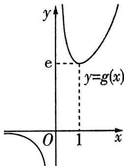

图1

# 助学政策

原创押题2 已知函数 $f(x) = \mathrm{e}^{x - 1} - \frac{1}{2} ax^2 + ax + 1$ .

（1） 讨论 $f(x)$ 的极值点个数.  
（2） 若 $f(x)$ 有两个不同的极值点 $x_{1}, x_{2}$ ，证明： $x_{1} + x_{2} > 4$ .

解析 （1） $f'(x)=\mathrm{e}^{x-1}-ax+a$ . 因为 $f'（1）=1\neq0$ , 所以 1 不是 $f(x)$ 的极值点.

$f'(x) = \mathrm{e}^{x - 1} - a(x - 1) = 0$ 可变形为 $\frac{\mathrm{e}^{x - 1}}{x - 1} = a.$

令 $g(x) = \frac{\mathrm{e}^{x - 1}}{x - 1}$ , 则 $g'(x) = \frac{\mathrm{e}^{x - 1}(x - 2)}{(x - 1)^2}$ , 令 $g'(x) = 0$ , 得 $x = 2$ , 又 $x \neq 1$ , 所以 $g(x)$ 在 $(- \infty, 1)$ , (1,2) 上单调递减, 在 $(2, +\infty)$ 上单调递增.

因为 $g(2)=\mathrm{e}$ ，且当 x<1 时， $g(x)<0$ ，所以当 $a\in[0,e]$ 时， $f(x)$ 没有极值点；当 $a\in(-\infty,$ 【明误区】可导函数的极值点就是导函数的变号零点. 当a=e时，直线y=a与函数 $g(x)$ 的图象虽然有1个交点，但当 $x\in(1,+\infty)$ 时，函数 $g(x)$ 的图象恒在该直线的上方，因此函数 $f(x)$ 没有极值点

0) 时, $f(x)$ 有一个极值点; 当 $a \in (e, +\infty)$ 时, $f(x)$ 有两个极值点.

（2） 由（1）知, 当 $a \in (e, +\infty)$ 时, $f(x)$ 有两个不同的极值点.

设 $x_{1} < x_{2}$ , 则 $x_{1} \in (1, 2), x_{2} \in (2, +\infty)$ , 由 $\left\{ \begin{array}{l} \mathrm{e}^{x_1 - 1} - a(x_1 - 1) = 0, \\ \mathrm{e}^{x_2 - 1} - a(x_2 - 1) = 0, \end{array} \right.$ 得 $\mathrm{e}^{x_1 - x_2} = \frac{x_1 - 1}{x_2 - 1}$ ,

【扫清障碍】两式作商，消去参数 $a$

所以 $x_{1} - x_{2} = \ln (x_{1} - 1) - \ln (x_{2} - 1)$ ，即 $x_{1} - \ln (x_{1} - 1) = x_{2} - \ln (x_{2} - 1)$

令 $h(x) = x - \ln (x - 1), x \in (1, +\infty)$ ，则 $h'(x) = 1 - \frac{1}{x - 1} = \frac{x - 2}{x - 1}$ ，

易得 $h(x)$ 在 $(1,2)$ 上单调递减，在 $(2,+\infty)$ 上单调递增.

要证 $x_{1} + x_{2} > 4$ ，即证 $x_{2} > 4 - x_{1}$

因为 $x_{2} > 2,4 - x_{1} > 2$ ，且 $h(x)$ 在 $(2, + \infty)$ 上单调递增，所以只需证 $h(x_{2}) > h(4 - x_{1})$

因为 $h(x_{1}) = h(x_{2})$ ，所以只需证 $h(x_{1}) > h(4 - x_{1})$

【扫清障碍】利用极值点所在区间和函数单调性转化所证不等式，从而利用对称构造求解令 $F(x) = h(x) - h(4 - x) = 2x - 4 - \ln (x - 1) + \ln (3 - x), x \in (1,2)$ ，

则 $F'(x) = 2 - \frac{1}{x - 1} +\frac{1}{x - 3} = \frac{2(x - 2)^{2}}{(x - 1)(x - 3)} < 0$ ，所以 $F(x)$ 在(1,2)上单调递减，

则 $F(x) > 2 \times 2 - 4 - \ln 1 + \ln 1 = 0$ ，所以 $h(x_1) > h(4 - x_1)$ ，即 $h(x_2) > h(4 - x_1)$ ，故 $x_1 + x_2 > 4$ .

【思维拓展】本题第（2）问也可以用比值构造法求解，请你自己尝试一下吧！

