# 创于2003 试题调研

# 每月一手考情

# 讲透关键题型

畅销22年

第1辑

第2辑

第3辑

第4辑

第5辑

第6辑

第7辑

第8辑

第9辑

第10辑

2024年6月上市

7月上市

8月上市

9月上市

11月上市

12月上市

2025年1月上市

2月上市

3月上市

4月上市

# 高考超重点1 函数与导数

# 专家顾问 孙 泰 赵成海 郗玲玲

孙 泰 首都师范大学硕士生实践导师，北京市丰台二中正高级教师、特级教师。  
赵成海 河北省特级教师，省级骨干教师，中国数学奥林匹克一级教练员，中国数学会会员。  
郗玲玲 北京市高级教师，北京市海淀区学科带头人，北京理工大学附属中学备课组长。

本册编委 孙 泰 赵成海 郗玲玲 丁海丽 张 健 叶晓斌 王应祥 王 铱 熊焕军

管目军 王博渊

本册主讲 张健 北京市特级教师 张敬生 郑州外国语学校高级教师 孙士放 郑州一中正高级教师

# 图书在版编目(CIP)数据

试题调研. 第1辑 高考超重点1新高考数学/杜志建主编. -- 乌鲁木齐：新疆青少年出版社，2022.6(2024.6重印)

ISBN 978-7-5590-8607-5

I. ①试… II. ①杜… III. ①中学数学课 - 高中 - 升学参考资料 IV. ①G634

中国版本图书馆 CIP 数据核字(2022)第 089793 号

出版人:徐江

策划: 王启全

责任编辑：多艳萍

text_image

QR code image containing encoded data, no visible text or symbols beyond the matrix pattern

使用微信扫一扫

电子教辅 名校试卷
高中网课 一手资源
知识总结 备课资料
扫码关注 获取更多

# 试题调研第1辑 高考超重点1新高考数学

# SHITI DIAOYAN DI 1 JI GAOKAO CHAOZHONGDIAN 1 XINGAOKAO SHUXUE

# 杜志建 主编

出版:新疆青少年出版社有限公司

社址:乌鲁木齐市北京北路29号

邮政编码:830012

电话:0991-6239223(编辑部)

0371-68698015(读者服务部)

官网:http://www.qingshao.net

天猫旗舰店:http://xjqss.tmall.com

发行:新疆青少年出版社有限公司

经销:各地新华书店

法律顾问: 王冠华 18699089007

印刷:河南文华印务有限公司

开 本:787mm×1092mm 1/16

版 次:2022年6月第1版

印 张:7

印 次:2024年6月第3次印刷

字 数:130 千字

书号:ISBN 978-7-5590-8607-5

定 价:18.90元

CHISO 荷少社
SINCE 1956

版权所有,侵权必究。印装问题可随时同印厂退换。

# 声明

基于对知识和创作的尊重,本书向所选文章、图片的作者支付补贴。因条件所限未能及时联系的作者,我们在此深表歉意,当您看到本书时,请与我们联系,以便我们向您支付补贴和赠送样书。联系方式:0371-68698015。

<table><tr><td>2024年高考真题</td><td>2024版《试题调研》原题</td></tr><tr><td>语文·新课标I卷·T23阅读下面的材料,根据要求写作。随着互联网的普及、人工智能的应用,越来越多的问题能很快得到答案。那么,我们的问题是否会越来越少?以上材料引发了你怎样的联想和思考篇文章。</td><td>作文素材(下)考前热点素材·P104—105题目:“假设时间来到10年后......你拥有所需要的所有资源,那你最想探索的科学问题是什么?......有什么科学问题或者技术难题,你能解答或者突...”没有让人眼前一亮的回答。意义:当我们追问星空为何浩瀚......在问与答的过程中,我们会发现未知的世界;在想与做的过程中,我们会找到自身存在的意义。</td></tr><tr><td>语文·北京卷·T21(1)(1)微信朋友圈有“点赞”功能。有人关注“点赞”数量,有人热衷于给人“点赞”......对“点赞”现象,你有什么看法?请说明你的观点和要求:观点明确,言之有理。</td><td>第5辑·写作高分技法&amp;模板·P002话题2 点赞vs差评速写模板:点赞,是成人之美,是温煦的春风,是玫瑰。对于他人生活中的小确幸,实现的小口称,我们以举手之劳,随手点赞,仿佛温煦的春风,使人暖意融融;仿佛芬芳的玫瑰,赠人也使自己暗香盈袖......</td></tr><tr><td>语文·新课标II卷·T23阅读下面的材料,根据要求写作。本试卷......“嫦娥四号”探月任务揭开了月背的神秘面纱;随着“天问一号”飞离地球一般它的目光又投向遥远的深空......正如人类的太空之旅,我们每个人也都在不断抵达未知之境。</td><td>作文素材(下)考前热点素材·P006高分论点:只有不断探索,才能有永无止境的进步。加分素材:从无人飞行到载人飞行,从一人一天到从舱内实验到出舱活动,从单船飞行到网站巡天......每一次对太空的叩问,都是下一次探索的开始。</td></tr><tr><td>数学·新课标I卷·T13若曲线 $y=e^{x}+x$ 在点(0,1)处的切线也是曲线 $y=\ln(x+1)+a$ 的切线,则 $a=$ ____.</td><td>第5辑·模型解题法·P069命题角度一致数 $f(x)=e^{x}+x$ , $g(x)=ax^{2}+2x+1$ , $a<0$ ,则 $y=f(x)$ 与 $y=g(x)$ 的公切线方程为____.</td></tr><tr><td>英语·天津卷·T61假设你是晨光中学的学生李津,学校即将举办“低碳校园,从我做起”英语主题演讲活动......对话:括:(1)指出校园中不符合低碳环保理念的现象;(2)建议从身边的小事做起,如......</td><td>第6辑·高频易错点快攻·P048[试题调研原创|变文体·演讲]假如你是李华,你校题目为&quot;Less Plastic&quot;的英文演讲比赛,请一篇演讲稿参赛,内容包括:1.塑料的危害;2.减塑做法。押题只凭实力,重点还要讲会!</td></tr></table>

# 《高考新定义题第19题》

专注新定义创新压轴试题的快速突破

text_image

天星教育
毛锦 李志敏
专项1·数学
2006月刊教辅 2025高考
创于2003
试题调研
每月一手考情
讲透关键题型
畅销22卷
全新1、高考考年大赛
创新命题重点，轻松突破
·高考新定义题第19题·
攻克新定义压轴题，冲刺高考最后17分
15 创动命题型，轻松突破
·高考定义题是新定义题，化简为原问题
·高考研究制定新定义题，即新题一鸣速
·高考定义：如图第2024年制定定理的题合命题成绩，再其命题方式
看图题：已与考核教师增强，即对现有教学技能提升正则，作具体题
创新命题角度，冲刺满分
·高考研究制定新定义题，即新题一鸣速
·高考定义：如图第2024年制定定理的题合命题成绩，再其命题方式
看图题：已与考核教师增强，即对现有教学技能提升正则，作具体题
CNISOF 南昌青少年出版社

5类 创新新定义题化繁为简快突破

6类 交汇新定义题高妙解题一点通

4类 高数新定义题迁移应用巧攻克

200+分钟“双师主讲”精讲课，讲透新定义命题攻略

# 主讲老师 张健

\- 北京市特级教师、人民教育出版社教材培训专家

# 主讲老师 张敬生

\- 河南省骨干教师
- 郑州外国语学校高级教师

# 《作文素材(上)·名校模考满分作文》

模仿名校满分作文，写55+考场一类文

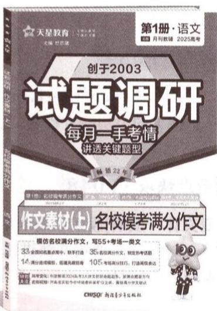

text_image

天星教育
创于2003
试题调研
每月一手考情
讲透关键题型
第1册·语文
第1册·语文
月刊教辅 2025高考
作文素材(上) 名校模考满分作文
模仿名校满分作文，写55+考场一类文
33名国际知名重点高中，联手打造 35名校核分作文，锁定高考选题
14.满分成绩指标，福建高级教育 105.考场满分技巧，打造视频表达
数学强化（如新课或2025年大学生考试命题考生、案例式题意等）
看视频图：高考英语教学中的高考课程专业论文，解读充分阅读方法
CHWSD 新编少年出版社

33所 全国知名重点高中，联手打造
35篇 名校满分作文，锁定热考话题
105条 考场高分技巧，打造高级表达

200+分钟名师精讲课，解锁满分作文秘诀

# 主讲老师 崔矿山

\- 河南省实验中学特级教师
- 河南省省级语文学科带头人、省骨干教师

# 紧抓一手考情 创新解读2024高考4大最新变化

<table><tr><td>变化类型</td><td>变化内容</td><td>变化说明</td></tr><tr><td rowspan="3">试卷结构、题量、题序、分值全部明显变化</td><td>结构创新变化</td><td>多选题与填空题均由4道变为3道,解答题由6道变为5道,后2道解答题均为3小问;I、II卷考查内容对应的题序略有差异</td></tr><tr><td>试题内容和顺序创新突破</td><td>不拘泥于传统模式,灵活确定内容考查顺序,比如对于圆锥曲线的考查,I卷是第16题,II卷则是第19题</td></tr><tr><td>分值与赋分规则明显变化</td><td>多选题由每题5分变成每题6分,解答题的分值分别是13,15,15,17,17分,解答题总分增多.多选题的赋分规则发生变化</td></tr></table>

# 原创预测

答案▶ 016页

1.(多选)在平面直角坐标系 $xOy$ 中, 到定点 $F_{1}(-a,0), F_{2}(a,0)$ 距离之积等于 $a^{2}(a > 0)$ 的点的轨迹是双纽线 $C$ . 若双纽线 $C$ 对应的 $a = 2$ , 点 $P(x_0, y_0)$ 为双纽线 $C$ 上任意一点, 则下列结论正确的是 ( )

A. $C$ 不关于 $x$ 轴对称

创新解读2024高考4大变化锁定2025高考备考方向

研透2024高考图象情境题  
抢先演练高考仿真原创好题

# 聚焦超重点 一次讲透35个关键题型

批注式解题过程一次讲透关键题型

原创变式新题多角度训练学科思维

解析 (1) 函数 $f(x, y) = x^2 y^2 + 2xy + xy^2$ 对变量 $y$ 求导得 $f_y(x, y) = 2x^2 y + 2x + 2xy$ .

【扫障碍】本题中的新定义、规则、符号记法都是课堂上没有学过、见过的，仔细阅读题干，尤其是“补充说明”部分。这部分通过示例给出了前面文字信息的具体化解释。参照“补充说明”，将 $f(x,y)=x^{2}y^{2}+2xy+xy^{2}$ 中的变量x视为常数，对自变量y进行求导即可

$$
\text { 当 } x = 1 \text {   时   }, f _ {y} (1, y) = 4 y + 2.
$$

时只停留在“刷题”的层面，不注重思维的本质，见到本题可能会无从下手.请看如下变式：

# 原创变式

[新定义·数集中最大的数]以 $\max M$ 表示数集 $M$ 中最大的数.设 $0 < a < b < c < 1$ ，已知 $a,b$ 满足 $b\geqslant 2a$ 或 $a + b\leqslant 1$ ，则 $\max \{b - a,c - b,1 - c\}$ 的最小值为

答案》第033页

# 名师视频课 深度探究12个创新命题考法

北京特级教师: 孙 泰 河北特级教师: 赵成海

2024 年高考数学新课标卷在难度上相比往年有所提高,整体上更加注重考查考生的逻辑思维、创新思维和综合应用能力.试卷结构进行了创新设计,减少了题量,增加了解答题的总分值,优化了多选题的赋分方式,强化了考查思维

新高考试卷分析 & 备考指导

(2) 当 b=2a 时, 若函数 $f(x)$ 有两个极值点 $x_{1}, x_{2}$ , 现有如下三个结论: ① $7x_{1} + bx_{2} > 28$ ; ② $2\sqrt{a}(x_{1} + x_{2}) > 3x_{1}x_{2}$ ; ③ $\sqrt{x_{1}-1} + \sqrt{x_{2}-1} > 2$ . 请从①②③中任选一个进行证明.

注：如果选择多个结论分别解答，按第一个解答计分.

解析 (1) 当 $a = 0$ 时, $f(x) = \mathrm{e}^{x} + bx - 1$ , $f'(x) = \mathrm{e}^{x} + b$ .

若 $b\geqslant0$ ，因为 $f(-1)=\left(\frac{1}{e}-1\right)-b<0$ ，所以不合题意.

模型匹配法”巧破结构不良题

深入浅出评考情

化难为易破难点，听得懂

传授高妙技法

破解思维瓶颈，学得快

# 本书5类60道原创好题速览

<table><tr><td>具体考法</td><td>原创变式</td><td>新题型</td><td>新定义题</td><td>创新考法</td><td>新情境</td></tr><tr><td>本书题量</td><td>20</td><td>8</td><td>4</td><td>10</td><td>6</td></tr></table>

# 目录

# 扫码获取

1. 全9科名师解读2024高考新变化，研真题，评新题，明晰备考方向。  
2.调研1辑全9科100+节超级名师视频课，传授高妙技法，易学秒懂。  
3. 数学技法专项、作文素材、时政专项名师视频课，按书解锁，免费观看。

价值2999元

# 每月一手考情

1 2024 新高考数学创新命题变化一览表 001  
2 灵活、拔高、综合，试题结构设计与命题全方位大创新 视频1

——2024 高考数学创新命题解读与原创预测 002

# 突破 12 大超重点

# 创新考法抢先知

超重点1 函数开放、探究问题的2个创新题型 视频2 017

类型1 函数的开放性举例问题 017

类型 2 函数的存在性探究问题 018

超重点2 热点函数结构不良题 视频3 021

题型 1 条件多选一或组合型 021

题型2 结论多选一型 023

超重点3 函数新定义题的3个热考方向 视频4 027

方向1 单独考查函数知识 027

方向 2 与其他知识交汇 028

方向 3 引用高数知识为背景 029

# 核心主干抓重点

超重点4 求函数值域的3个关键类型 034

类型1 求复杂函数的值域 034

类型2 求含三角式函数的值域 035

类型3 求分式函数的值域 036

# 超重点5 函数的4个重要性质及应用 视频5 040

性质 1 函数单调性的判断与应用 040

性质 2 函数奇偶性的判断与应用 042

性质3 函数周期性的判断与应用 043

性质4 函数图象对称性的判断与应用 044

# 超重点6 函数图象的变换法则与应用 048

法则 1 函数图象的平移、伸缩变换与应用 048

法则 2 函数图象的对称变换与应用 050

法则 3 函数图象的翻折变换与应用 051

# 超重点7 代数式比较大小的3个秒破快招 视频6 054

快招 1 用估值法快速比大小 054

快招 2 用构造函数法准确比大小 055

快招 3 用放缩法巧妙比大小 056

# 超重点8 函数零点问题的3个核心考法 视频7 060

考法 1 判断函数的零点个数 060

考法2 已知函数的零点求参数或取值范围 062

考法 3 用设而不求策略破解导函数的隐零点问题 063

# 超重点9 使用同构思想必用的3大重要策略 视频8 视频9 070

策略 1 地位同等同构 070

策略2 指对跨阶同构 072

策略 3 其他凑形式同构 073

# 高效破题有方法

# 超重点 10 函数的不等式恒成立与有解问题的破解策略 视频 10 077

策略1 直接讨论 077

# 目录

策略2 分离参数 078

策略3 分类讨论 079

超重点 11 证明不等式的 3 个必会高妙技法 视频 11 085

技法 1 作差（商）证明不等式 085

技法 2 指对同构证明不等式 087

技法 3 分割放缩证明不等式 089

超重点 12 攻克极值点偏移问题的 3 个满分大招 视频 12 094

大招 1 对称构造 094

大招 2 比值换元 096

大招 3 差值换元 098

# 下辑精彩预告

2024年7月全新上市

# 《试题调研》第2辑将推出

——高考超重点2·三角函数&平面向量

# 每月一手考情!

本辑特邀学科专家、名校名师特别解读“三角函数 & 平面向量”的高考命题最新趋势、创新命题的最新考法, 明晰备考方向.

# 聚焦超重点，讲透关键题型！

1 深度剖析创新命题考法 深剖三角函数的数学文化题的3大创新命题考法、总结向量的新定义题等创新命题方向,巧破命题套路,解透创新题型!  
② 彻底讲透必考超重点 深研3类应用三角函数性质求值问题、3类应用三角函数图象求值问题、“爪子模型”在向量运算中的辨别与妙用等,讲透超重点,快速攻克核心考点.  
3 传授高妙解题技法 挖掘新教材中隐藏的4个高妙结论定理、解平面向量问题必备的3个二级结论等高妙解题技法,破解思维瓶颈,实现快速解题!

重磅升级，超值上市！凡购买本辑任一科，即可免费观看价值2999元的全9科100+节超级名师视频课！

# 每月一手考情

# 2024 新高考数学创新命题变化一览表

北京特级教师:孙 泰 河北特级教师:赵成海

<table><tr><td>变化类型</td><td>变化内容</td><td>变化说明</td></tr><tr><td rowspan="3">试卷结构、题量、题序、分值全部明显变化</td><td>结构创新变化</td><td>多选题与填空题均由4道变为3道,解答题由6道变为5道,后2道解答题均为3小问;I、II卷考查内容对应的题序略有差异</td></tr><tr><td>试题内容和顺序创新突破</td><td>不拘泥于传统模式,灵活确定内容考查顺序,比如对于圆锥曲线的考查,I卷是第16题,II卷则是第19题</td></tr><tr><td>分值与赋分规则明显变化</td><td>多选题由每题5分变成每题6分,解答题的分值分别是13,15,15,17,17分,解答题总分增多.多选题的赋分规则发生变化</td></tr><tr><td rowspan="2">加强素养考查,发挥选拔功能</td><td>加强关键能力考查,增强试题的选拔性</td><td>如I卷第19题以等差数列为知识背景构造新定义,设问方式高度创新,并将数列与概率交汇(此题难度非常大,具有很强的选拔功能)</td></tr><tr><td>突出思维的灵活性</td><td>创新性突出,“想到”与“想不到”对应的解法花费的时间差异明显,如I卷第18题的第(2)问,I、II卷的最后一题,“想到”则运算量大大降低,“想不到”则运算量很大,体现“多想少算”</td></tr><tr><td rowspan="2">题型稳中有变,传统题目虽占主导,但创新度明显加大</td><td>传统题占主导</td><td>I、II卷中第6,15,16题等多数题都是考生熟悉的传统题.II卷第14题是双空题,虽然开放性试题没有出现,但压轴题多样化的求解方法很好地体现了开放探究</td></tr><tr><td>取材于基本内容,但设问形式改变</td><td>虽取材于常规知识,但设问形式明显创新,如I卷第13题本质是考查导数的几何意义,但设计成公切线问题,熟悉中有创新</td></tr><tr><td rowspan="2">情境化命题既有传承,又有变化</td><td>优秀传统文化复现</td><td>优秀传统文化复现,但比较含蓄,没有以往明显,如I卷第8题的求解涉及斐波那契数列</td></tr><tr><td>五育并举,但略显淡化</td><td>I卷第9题渗透“劳育”;II卷第18题渗透“体育”.渗透五育的题目较以往变少</td></tr><tr><td rowspan="3">紧扣课标,立足基础知识与基本技能</td><td>取材于教材的力度加大,体现教材的导向性</td><td>如I卷第4题源于人教A版《必修第一册》P255第15题(1);I卷第7题源于人教A版《必修第一册》P237例1;等等</td></tr><tr><td>重视基础的同时兼顾知识的融合</td><td>I卷第5题将圆柱与圆锥结合,综合考查侧面积、体积的计算,第18题在函数与导数试题中考查曲线的对称性,第19题在数列新定义题中渗透概率;II卷第6题综合考查幂函数和三角函数的性质,第19题则是解析几何与数列的结合</td></tr><tr><td>突出考查逻辑推理素养</td><td>如I卷第8题,归纳推理分析,找到规律与特点,使问题得解,第14题凸显推理论证;II卷第8题给出的函数模型,不需求导,而是利用两个简单函数的单调性推理分析即可</td></tr></table>

# 灵活、拔高、综合，试题结构设计与命题全方位大创新

——2024 高考数学创新命题解读与原创预测

北京特级教师: 孙 泰 河北特级教师: 赵成海

2024 年高考数学新课标卷在难度上相比往年有所提高,整体上更加注重考查考生的逻辑思维、创新思维和综合应用能力.试卷结构进行了创新设计,减少了题量,增加了解答题的总分值,优化了多选题的赋分方式,强化了考查思维过程和思维能力的功能. 灵活调整题目顺序,有助于打破学生机械应试的套路,打破教学中僵化、固定的训练模式,防止猜题押题,同时测试考生的应变能力和解决各种难题的能力,引导教学培养学生全面掌握主干知识、提升基本能力,灵活应用知识解决问题. 下面针对新课标卷中的创新试题进行详细解读.

  
新高考试卷分析 & 备考指导

# 创新点 1 加强素养考查，发挥选拔功能

# 1 题目创新突出，增强思维的灵活性

调研 1 [2024 新课标 I 卷第 19 题 | (i, j) - 可分数列] 设 m 为正整数, 数列 $a_{1}, a_{2}, \cdots, a_{4m+2}$ 是公差不为 0 的等差数列, 若从中删去两项 $a_{i}$ 和 $a_{j} (i < j)$ 后剩余的 4m 项可被平均分为 m 组, 且每组的 4 个数都能构成等差数列, 则称数列 $a_{1}, a_{2}, \cdots, a_{4m+2}$ 是 $(i, j)$ - 可分数列.

(1) 写出所有的 $(i,j)$ , $1 \leqslant i < j \leqslant 6$ , 使得数列 $a_{1}, a_{2}, \cdots, a_{6}$ 是 $(i,j)$ - 可分数列.

(2) 当 $m \geqslant 3$ 时, 证明: 数列 $a_{1}, a_{2}, \cdots, a_{4m+2}$ 是 (2,13)-可分数列.

(3)从 $1,2,\cdots,4m+2$ 中一次任取两个数i和 $j(i<j)$ ，记数列 $a_{1},a_{2},\cdots,a_{4m+2}$ 是 $(i,j)$ -可分数列的概率为 $P_{m}$ ，证明： $P_{m}>\frac{1}{8}$ .

解析 (1) $a_1, a_2, \cdots, a_6$ 共 6 个数, 若删去前 2 项或后 2 项, 剩余的 4 项必构成等差数列; 若删去第 1 项与最后 1 项, 剩余的 4 项必构成等差数列. 其余的方法都不可能使剩余的 4 项构成等差数列.

故所有的 $(i,j)$ 为 $(1,2),(5,6),(1,6)$ .

【会思考】对于此问的解法，有许多师生想到了列举法，但需要列出15种可能，耗时多，这就是想得少、算得多了

(2) 数列 $a_{1}, a_{2}, \cdots, a_{4m+2} (m \geqslant 3)$ 的前 14 项中， $a_{1}, a_{4}, a_{7}, a_{10}$ 能构成等差数列， $a_{3}, a_{6}, a_{9}, a_{12}$ 能构成等差数列， $a_{5}, a_{8}, a_{11}, a_{14}$ 能构成等差数列，

则在去掉 $a_{2}, a_{13}$ 后，数列的前 14 项剩余的项构成 3 个等差数列，后 $4m + 2 - 14 = 4m - 12$ （项）每连续 4 项可构成等差数列，如： $a_{15}, a_{16}, a_{17}, a_{18}$ 能构成等差数列， $\cdots, a_{4m-1}, a_{4m}, a_{4m+1}$ $a_{4m+2}$ 能构成等差数列. 综上, 原数列删去 $a_{2}, a_{13}$ 后, 剩余的 4m 项可平均分成 m 个等差数列, 得证.

(3) 方法一 将原数列删去 $a_{i}, a_{j}$ 两项, 分析可得下面两类情况符合题意.

一类是 $(i,j) = (4k + 1,4t + 2)$ 型，其中 $0\leqslant k\leqslant t\leqslant m,k,t\in \mathbf{Z}$

此时, 若 k=0, 则 $t=0,1,2,\cdots,m$ , 共 $(m+1)$ 种情况; 若 k=1, 则 $t=1,2,\cdots,m$ , 共 m 种情况; $\cdots$ ; 以此类推, 若 k=m, 则 t=m, 共 1 种情况.

这时，共有 $1 + 2 + 3 + \dots +m + (m + 1) = \frac{(m + 1)(m + 2)}{2}$ （种）情况.

一类是 $(i,j) = (4k + 2,4t + 1)$ 型，其中 $k\geqslant 0,k + 2\leqslant t\leqslant m,k,t\in \mathbf{Z},$

【扫障碍】比如 k=0, t=2 时，删去的 2 项中间间隔 6 项，取前 10 项，删去的是第 2, 9 项，那么剩下的 8 项分成 $a_{1}$ ， $a_{3}$ ， $a_{5}$ ， $a_{7}$ 与 $a_{4}$ ， $a_{6}$ ， $a_{8}$ ， $a_{10}$ 两组即可，而从 $a_{11}$ 开始往后每连续 4 项能构成等差数列，结合 (1)，再类比 (2) 探寻规律

此时, 若 $k=0$ , 则 $t=2,\cdots,m$ , 共 $(m-1)$ 种情况; 若 $k=1$ , 则 $t=3,\cdots,m$ , 共 $(m-2)$ 种情况; $\cdots$ ; 以此类推, 若 k=m-2, 则 t=m, 共 1 种情况.

这时，共有 $1 + 2 + 3 + \dots +(m - 2) + (m - 1) = \frac{(m - 1)m}{2}$ （种）情况.

以上两类共有 $\frac{(m + 1)(m + 2)}{2} +\frac{(m - 1)m}{2} = m^2 +m + 1$ （种）情况，数列删去2项的总方法数为 $\mathrm{C}_{4m + 2}^{2} = \frac{(4m + 2)(4m + 1)}{2} = 8m^{2} + 6m + 1$ ，由古典概型的概率计算公式可知 $P_{m}\geqslant$ $\frac{m^2 + m + 1}{8m^2 + 6m + 1} >\frac{m^2 + m + 1}{8m^2 + 8m + 8} = \frac{1}{8}$ ，得证.

方法二:列表法 类比(1)得,从数列 $a_{1}, a_{2}, \cdots, a_{4m+2}$ 中删去 $a_{i}, a_{j}$ , 若剩下的 $a_{i}$ 之前的项数、 $a_{i}$ 和 $a_{j}$ 之间的项数、 $a_{j}$ 之后的项数都为 4 的倍数(0 也视为 4 的倍数)时, 满足题意, 此种情况的 $(i, j)$ 为:

<table><tr><td></td><td>i=1</td><td>i=5</td><td>i=9</td><td>...</td><td>i=4m+1</td></tr><tr><td>j=2</td><td>(1,2)</td><td></td><td></td><td></td><td></td></tr><tr><td>j=6</td><td>(1,6)</td><td>(5,6)</td><td></td><td></td><td></td></tr><tr><td>j=10</td><td>(1,10)</td><td>(5,10)</td><td>(9,10)</td><td></td><td></td></tr><tr><td>...</td><td>...</td><td>...</td><td>...</td><td>...</td><td></td></tr><tr><td>j=4m+2</td><td>(1,4m+2)</td><td>(5,4m+2)</td><td>(9,4m+2)</td><td>...</td><td>(4m+1,4m+2)</td></tr></table>

此类符合题意的情况共有 $S_{1}=(m+1)+m+(m-1)+\cdots+1=\frac{(m+1)(m+2)}{2}$ (种).

类比(2)得,从数列 $a_{1}, a_{2}, \cdots, a_{4m+2}$ 中删去 $a_{4k+2}, a_{4t+1} (k \geqslant 0, k + 2 \leqslant t \leqslant m, k, t \in \mathbb{Z})$ ,

则 $a_{4k+1}, a_{4k+3}, \cdots, a_{4t}, a_{4t+2}$ 可以构成若干个等差数列（每个4项），原数列中 $a_{4k+1}$ 之前和 $a_{4t+2}$ 之后的项可以每连续4项构成等差数列，满足题意，此种情况的 $(i,j)$ 为：

<table><tr><td></td><td>i=2</td><td>i=6</td><td>i=10</td><td>...</td><td>i=4m-6</td></tr><tr><td>j=9</td><td>(2,9)</td><td></td><td></td><td></td><td></td></tr><tr><td>j=13</td><td>(2,13)</td><td>(6,13)</td><td></td><td></td><td></td></tr><tr><td>j=17</td><td>(2,17)</td><td>(6,17)</td><td>(10,17)</td><td></td><td></td></tr><tr><td>...</td><td>...</td><td>...</td><td>...</td><td>...</td><td></td></tr><tr><td>j=4m+1</td><td>(2,4m+1)</td><td>(6,4m+1)</td><td>(10,4m+1)</td><td>...</td><td>(4m-6,4m+1)</td></tr></table>

此类符合题意的情况共有 $S_{2}=(m-1)+(m-2)+\cdots+1=\frac{m(m-1)}{2}$ (种).

以上两种情况共有 $S_{1} + S_{2} = m^{2} + m + 1$ (种).

则 $P_{m} \geqslant \frac{m^{2} + m + 1}{\mathrm{C}_{4m + 2}^{2}} = \frac{m^{2} + m + 1}{8m^{2} + 6m + 1} = \frac{1}{8} \times \frac{8m^{2} + 8m + 8}{8m^{2} + 6m + 1} > \frac{1}{8}$ , 得证.

# 创新解读与预测

本题以等差数列为知识背景,设问方式创新,构造新定义数列,并结合概率命题. 新定义里有很多字母理解起来比较困难, 还涉及知识的交汇, 难度进一步提升. 这是高考加强思维考查, 强化素养导向, 给高水平考生提供充分展现才华的空间, 服务拔尖创新人才的选拔, 助推素质教育发展, 助力教育强国建设的体现.

# 2 加强关键能力考查，增强试题的选拔性

调研 2 [2024 新课标Ⅱ卷第 19 题] 已知双曲线 $C: x^{2} - y^{2} = m (m > 0)$ ，点 $P_{1}(5,4)$ 在 C 上，k 为常数，0 < k < 1。按照如下方式依次构造点 $P_{n} (n = 2, 3, \cdots)$ ：过 $P_{n-1}$ 作斜率为 k 的直线与 C 的左支交于点 $Q_{n-1}$ ，令 $P_{n}$ 为 $Q_{n-1}$ 关于 y 轴的对称点。记 $P_{n}$ 的坐标为 $(x_{n}, y_{n})$ 。

(1) 若 $k=\frac{1}{2}$ ，求 $x_{2}, y_{2}$ .

(2) 证明: 数列 $\{x_{n}-y_{n}\}$ 是公比为 $\frac{1+k}{1-k}$ 的等比数列.  
(3) 设 $S_{n}$ 为 $\triangle P_{n}P_{n+1}P_{n+2}$ 的面积. 证明: 对任意正整数 n, $S_{n}=S_{n+1}$ .

解析（1）因为点 $P_{1}(5,4)$ 在双曲线 $C$ 上，所以 $m = 5^{2} - 4^{2} = 9$ ，故 $C:x^{2} - y^{2} = 9.$

过 $P_{1}(5,4)$ 且斜率为 $\frac{1}{2}$ 的直线方程为 $x - 2y + 3 = 0$

由 $\left\{\begin{aligned}x-2y+3&=0,\\ x^{2}-y^{2}&=9,\end{aligned}\right.$ 得 $Q_{1}(-3,0)$ ，则 $P_{2}(3,0)$ ，所以 $x_{2}=3,y_{2}=0$ .

(2) 方法一 $P_{n}(x_{n},y_{n}), P_{n-1}(x_{n-1},y_{n-1}), Q_{n-1}(-x_{n},y_{n}), \frac{y_{n}-y_{n-1}}{-x_{n}-x_{n-1}}=k, n=2,3,\cdots,$

【明趋势】第(2)问给出的不同解法都能够做出本题，但运算量差异显然很大，这就是“想得多才能算得少”

由平行关系得 $\frac{y_{n + 1} - y_n}{-x_{n + 1} - x_n} = k$ ，从而 $\frac{1 + k}{1 - k} = \frac{1 + \frac{y_{n + 1} - y_n}{-x_{n + 1} - x_n}}{1 - \frac{y_{n + 1} - y_n}{-x_{n + 1} - x_n}} = \frac{-x_{n + 1} - x_n + y_{n + 1} - y_n}{-x_{n + 1} - x_n - y_{n + 1} + y_n} =$

$$
\frac {(x _ {n + 1} - y _ {n + 1}) + (x _ {n} + y _ {n})}{(x _ {n + 1} + y _ {n + 1}) + (x _ {n} - y _ {n})} = \frac {(x _ {n + 1} - y _ {n + 1}) + \frac {9}{x _ {n} - y _ {n}}}{\frac {9}{x _ {n + 1} - y _ {n + 1}} + (x _ {n} - y _ {n})} = \frac {\frac {1}{x _ {n} - y _ {n}} [ (x _ {n + 1} - y _ {n + 1}) (x _ {n} - y _ {n}) + 9 ]}{\frac {1}{x _ {n + 1} - y _ {n + 1}} [ (x _ {n + 1} - y _ {n + 1}) (x _ {n} - y _ {n}) + 9 ]} =
$$

$$
\frac {x _ {n + 1} - y _ {n + 1}}{x _ {n} - y _ {n}}, \text {又} x _ {1} - y _ {1} = 1 \neq 0,
$$

所以数列 $\{x_{n} - y_{n}\}$ 是公比为 $\frac{1 + k}{1 - k}$ 的等比数列.

方法二:点差法 $\left\{\begin{aligned}x_{n}^{2}-y_{n}^{2}&=9,\\ x_{n-1}^{2}-y_{n-1}^{2}&=9,\end{aligned}\right.$ $n=2,3,\cdots$ ,两式相减得 $(x_{n}-x_{n-1})(x_{n}+x_{n-1})=(y_{n}-y_{n-1})(y_{n}+y_{n-1})$ ,

所以 $\frac{x_n - x_{n - 1}}{y_n + y_{n - 1}} = \frac{y_n - y_{n - 1}}{x_n + x_{n - 1}}$ 而 $\frac{y_n - y_{n - 1}}{-x_n - x_{n - 1}} = k,$

所以 $\frac{x_n - x_{n - 1}}{y_n + y_{n - 1}} = -k$ ，即 $x_{n} - x_{n - 1} = -k(y_{n} + y_{n - 1})$ ，同时 $y_{n} - y_{n - 1} = -k(x_{n} + x_{n - 1})$

两式作差得 $x_{n} - x_{n - 1} - y_{n} + y_{n - 1} = -k(y_{n} + y_{n - 1}) + k(x_{n} + x_{n - 1})$ ，由题意知 $x_{n}\neq y_{n},n\in \mathbf{N}^{*}$

所以 $\frac{x_n - y_n}{x_{n - 1} - y_{n - 1}} = \frac{1 + k}{1 - k}$ 所以数列 $\{x_{n} - y_{n}\}$ 是公比为 $\frac{1 + k}{1 - k}$ 的等比数列.

方法三: 硬解法 由于过 $P_{n}(x_{n}, y_{n})$ 且斜率为 k 的直线方程为 $y = k(x - x_{n}) + y_{n}$ ，与 $x^{2} - y^{2} = 9$ 联立，得 $x^{2} - [k(x - x_{n}) + y_{n}]^{2} = 9$ ，

展开即得关于 $x$ 的方程 $(1 - k^2)x^2 - 2k(y_n - kx_n)x - (y_n - kx_n)^2 - 9 = 0, \Delta > 0$ ，由于 $P_n(x_n, y_n)$ 是直线 $y = k(x - x_n) + y_n$ 和曲线 $x^2 - y^2 = 9$ 的交点，

故上述方程必有一根 $x = x_{n}$ .

由根与系数的关系得,方程的另一根 $x=\frac{2k(y_{n}-kx_{n})}{1-k^{2}}-x_{n}=\frac{2ky_{n}-x_{n}-k^{2}x_{n}}{1-k^{2}}$ , 此时 $y=k(x-x_{n})+y_{n}=\frac{y_{n}+k^{2}y_{n}-2kx_{n}}{1-k^{2}}$ .

所以 $Q_{n}\left(\frac{2ky_{n}-x_{n}-k^{2}x_{n}}{1-k^{2}},\frac{y_{n}+k^{2}y_{n}-2kx_{n}}{1-k^{2}}\right)$ ,

所以 $P_{n + 1}\left(\frac{x_n + k^2x_n - 2ky_n}{1 - k^2},\frac{y_n + k^2y_n - 2kx_n}{1 - k^2}\right),$

即 $x_{n + 1} = \frac{x_n + k^2x_n - 2ky_n}{1 - k^2},y_{n + 1} = \frac{y_n + k^2y_n - 2kx_n}{1 - k^2}.$

所以 $x_{n + 1} - y_{n + 1} = \frac{x_n + k^2x_n - 2ky_n}{1 - k^2} -\frac{y_n + k^2y_n - 2kx_n}{1 - k^2} = \frac{1 + k^2 + 2k}{1 - k^2} (x_n - y_n) = \frac{1 + k}{1 - k} (x_n - y_n).$

又 $x_{n}^{2}-y_{n}^{2}\neq0,n=1,2,\cdots$ , 所以数列 $\{x_{n}-y_{n}\}$ 是公比为 $\frac{1+k}{1-k}$ 的等比数列.

(3)由(2)的方法三得 $x_{n + 1} = \frac{x_n + k^2x_n - 2ky_n}{1 - k^2},y_{n + 1} = \frac{y_n + k^2y_n - 2kx_n}{1 - k^2},$

故 $x_{n + 1} + y_{n + 1} = \frac{x_n + k^2x_n - 2ky_n}{1 - k^2} +\frac{y_n + k^2y_n - 2kx_n}{1 - k^2} = \frac{1 + k^2 - 2k}{1 - k^2} (x_n + y_n) = \frac{1 - k}{1 + k} (x_n + y_n),$

又 $x_{n}^{2}-y_{n}^{2}\neq0,n=1,2,\cdots$ , 所以数列 $\{x_{n}+y_{n}\}$ 是公比为 $\frac{1-k}{1+k}$ 的等比数列.

所以对任意的正整数 $t$ ，有 $x_{n}y_{n + t} - y_{n}x_{n + t} = \frac{1}{2}\left[(x_{n}x_{n + t} - y_{n}y_{n + t}) + (x_{n}y_{n + t} - y_{n}x_{n + t})\right] -$

$$
\frac {1}{2} \left[ \left(x _ {n} x _ {n + t} - y _ {n} y _ {n + t}\right) - \left(x _ {n} y _ {n + t} - y _ {n} x _ {n + t}\right) \right] = \frac {1}{2} \left(x _ {n} - y _ {n}\right) \left(x _ {n + t} + y _ {n + t}\right) - \frac {1}{2} \left(x _ {n} + y _ {n}\right) \left(x _ {n + t} - y _ {n + t}\right) =
$$

$$
\frac {1}{2} \left(\frac {1 - k}{1 + k}\right) ^ {t} \left(x _ {n} - y _ {n}\right) \left(x _ {n} + y _ {n}\right) - \frac {1}{2} \left(\frac {1 + k}{1 - k}\right) ^ {t} \left(x _ {n} + y _ {n}\right) \left(x _ {n} - y _ {n}\right) = \frac {1}{2} \left[ \left(\frac {1 - k}{1 + k}\right) ^ {t} - \left(\frac {1 + k}{1 - k}\right) ^ {t} \right] \left(x _ {n} ^ {2} - \right.
$$

$$
y _ {n} ^ {2}) = \frac {9}{2} \left[ \left(\frac {1 - k}{1 + k}\right) ^ {t} - \left(\frac {1 + k}{1 - k}\right) ^ {t} \right].
$$

所以 $x_{n + 2}y_{n + 3} - y_{n + 2}x_{n + 3} = \frac{9}{2} (\frac{1 - k}{1 + k} -\frac{1 + k}{1 - k}) = x_ny_{n + 1} - y_nx_{n + 1},$

$$
x _ {n + 1} y _ {n + 3} - y _ {n + 1} x _ {n + 3} = \frac {9}{2} \left[ \left(\frac {1 - k}{1 + k}\right) ^ {2} - \left(\frac {1 + k}{1 - k}\right) ^ {2} \right] = x _ {n} y _ {n + 2} - y _ {n} x _ {n + 2},
$$

所以 $(x_{n + 2}y_{n + 3} - y_{n + 2}x_{n + 3}) - (x_{n + 1}y_{n + 3} - y_{n + 1}x_{n + 3}) = (x_ny_{n + 1} - y_nx_{n + 1}) - (x_ny_{n + 2} - y_nx_{n + 2}),$

移项得 $x_{n + 2}y_{n + 3} - y_n x_{n + 2} - x_{n + 1}y_{n + 3} + y_n x_{n + 1} = y_{n + 2}x_{n + 3} - x_n y_{n + 2} - y_{n + 1}x_{n + 3} + x_n y_{n + 1}$

故 $(y_{n + 3} - y_n)(x_{n + 2} - x_{n + 1}) = (y_{n + 2} - y_{n + 1})(x_{n + 3} - x_n)$ .

而 $\overrightarrow{P_nP_{n + 3}} = (x_{n + 3} - x_n,y_{n + 3} - y_n),\overrightarrow{P_{n + 1}P_{n + 2}} = (x_{n + 2} - x_{n + 1},y_{n + 2} - y_{n + 1})$

所以 $\overrightarrow{P_nP_{n + 3}}$ 和 $\overrightarrow{P_{n + 1}P_{n + 2}}$ 平行，所以 $S_{\triangle P_nP_{n + 1}P_{n + 2}} = S_{\triangle P_{n + 1}P_{n + 2}P_{n + 3}}$ ，即 $S_{n} = S_{n + 1}$

☑ 创新解读与预测 本题第(1)问属于“送分题”,照顾到了所有程度的考生. 第(2)问对能力的要求有所提升,运算中字母比较多,变形方法的选取会影响计算的速度,基本功扎实的考生得分还是容易的. 第(3)问则具有很强的选拔功能,但如果注意到前两问对第三问的作用,考生可以写出第(3)问的部分过程,也就是利用数列关系求出点的坐标,然后想办法说明两个三角形同底等高,在思维方面的难度较第(2)问大得多,99%的考生都难以在很有限的时间内办到. 由此,可以想到2024年强基计划选拔要求:注重对学生的“好奇心、探究欲、问题意识、质疑精神、意志品质”等因素的考查,着力选拔对基础研究有志向、有兴趣、有天赋的优秀学生. 所以高考题出现有难度的题目是必然趋势,但也不必一味追求难度而忽视基本,毕竟难题不是给99%的考生准备的,而且难题也要求更高层次的基础知识运用能力. 此类与面积有关的解析几何问题常常解法多样,且最能体现“多想少算”,因此预测这种命题模式会备受青睐,应加以关注.

# 创新点②

# 题型稳中有变，创新度明显加大

# 1 传统题占主导

调研 3 [2024 新课标 I 卷第 6 题] 已知函数 $f(x)=\left\{\begin{aligned}-x^{2}-2ax-a,x&<0,\\ \mathrm{e}^{x}+\ln(x+1),&x\geqslant0\end{aligned}\right.$ 在 R 上单调递增，则 a 的取值范围是 ( )

A. $(-∞,0]$

B. $\left[-1,0\right]$

C. $\left[-1,1\right]$

D. $[0, +\infty)$

解析 已知函数 $f(x)$ 是增函数, 那么两段必然都单调递增, 可以判断第二段函数 $y = e^{x} + \ln(x + 1)$ 在 $x \geqslant 0$ 时单调递增, 若第一段函数在 x < 0 时也单调递增, 则 $-a \geqslant 0$ , 即 $a \leqslant 0$ . 同时在 x = 0 处有 $e^{0} + \ln(0 + 1) \geqslant -a$ , 得 $a \geqslant -1$ . 所以 $-1 \leqslant a \leqslant 0$ , 选 B.

【防易错】易忽视分界点处函数值大小的比较

# 创新解读与预测

本题是考生熟悉的常规题,源于人教 A 版《必修第一册》P160 第 4 题,涉及二次函数与指对函数的结合,结构形式上变化不大,但考查内容做了改编,将考查零点改成了考查单调性,共同点在于都是求参数的范围问题,因而解决方法也类似.

# ② 取材于基本内容，但设问形式改变

调研 4 [2024 新课标 I 卷第 13 题] 若曲线 $y = e^{x} + x$ 在点 $(0,1)$ 处的切线也是曲线 $y = \ln(x + 1) + a$ 的切线，则 a = \_\_\_\_.

解析 $y = \mathrm{e}^{x} + x, y' \mid_{x=0} = (\mathrm{e}^{x} + 1) \mid_{x=0} = 2$ ，所以曲线 $y = \mathrm{e}^{x} + x$ 在点(0,1)处的切线方程为 $y - 1 = 2x$ .

设曲线 $y = \ln (x + 1) + a$ 在点 $(x_0, y_0)$ 处与直线 $y = 2x + 1$ 相切，则切线的斜率为 $y' \big|_{x = x_0} = \frac{1}{x_0 + 1} = 2$ ，

所以 $x_0 = -\frac{1}{2}, y_0 = \ln \frac{1}{2} + a$ ，将 $(x_0, y_0)$ 代入方程 $y - 1 = 2x$ ，得 $\ln \frac{1}{2} + a - 1 = -1$ ，所以 $a = \ln 2$ .

# 创新解读与预测

利用导数求函数图象的切线斜率是基本内容,以往考查更多的是求曲线在某点处的切线和过某点的切线,本题设计成两曲线公切线问题,展现其创新性.

# 创新点 ③ 情境化命题既有传承，又有变化

# 1 优秀传统文化复现

调研 5 [2024 新课标 I 卷第 8 题 | 斐波那契数列] 已知函数 $f(x)$ 的定义域为 $\mathbf{R}, f(x) > f(x - 1) + f(x - 2)$ ，且当 $x < 3$ 时， $f(x) = x$ ，则下列结论中一定正确的是（）

A. $f(10)>100$

B. $f(20)>1\ 000$

C. $f(10) < 1\ 000$

D. $f(20) < 10000$

解析 $f(x) > f(x - 1) + f(x - 2)$ ，当 $x < 3$ 时， $f(x) = x$ ，所以 $f(1) = 1, f(2) = 2$

则当 $x \in [3,4)$ 时， $f(x) > x - 1 + x - 2 = 2x - 3$ ，所以 $f(3) > 3$ ;

当 $x \in [4,5)$ 时， $f(x) > 2(x-1) - 3 + x - 2 = 3x - 7$ ，所以 $f(4) > 5$ ;

当 $x \in [5,6)$ 时， $f(x) > 3(x-1) - 7 + 2(x-2) - 3 = 5x - 17$ ，所以 $f(5) > 8$ ;

......

发现:上面阴影部分的数字构成斐波那契数列(去掉第1项)1,2,3,5,8,13,21,34,55,89,144,233,377,610,987,1597……

所以 $f(10) > 89$ , A 错误; $f(20) > f(16) > 1597 > 1000$ , B 正确; $f(x)$ 没有上界, 所以 CD 【扫障碍】由不等关系的传递性可确定 $f(x)$ 无上界, 这是解题的关键点, 也体现了对逻辑推理的考查错误. 故选 B.

创新解读与预测 2023 新课标卷中没有出现传统文化题,今年再次出现,但隐藏得较深.本题可以追溯到人教 A 版《选择性必修第二册》P10“阅读与思考”中的斐波那契数列,高考题的改编力度很大,需要通过归纳推理分析,才能挖掘出来斐波那契数列的形式.对于只记住了斐波那契数列的性质却不会转化的考生,依然对本题无从下手,此题便成了难题.以往传统文化题给人的感觉是直白,一眼即可望穿,但随着题目灵活性的提高,将传统文化内化到解题中将成为以后的命题方向.

调研 6 [2024 新课标Ⅰ卷第11题|卡西尼卵形线]（多选）设计一条美丽的丝带，其造型可以看作图1中的曲线C的一部分。已知C过坐标原点O，且C上的点满足：横坐标大于-2，到点 $F(2,0)$ 的距离与到定直线 $x=a(a<0)$ 的距离之积为4，则()

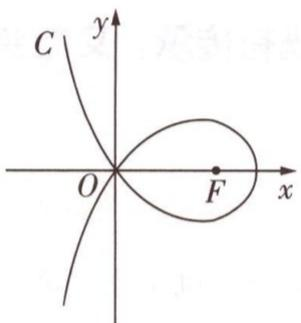

text_image

C
y
O
F
x

图1

A. a = -2

B. 点 $(2\sqrt{2},0)$ 在C上

C. C 在第一象限的点的纵坐标的最大值为 1

D. 当点 $(x_{0},y_{0})$ 在C上时, $y_{0}\leqslant\frac{4}{x_{0}+2}$

解析 对于 A, 因为 O 在曲线上, 且 O 到直线 x = a 的距离为 -a, $\left|OF\right| = 2$ , 所以 $-a \cdot 2 = 4$ , 所以 a = -2, A 对, 曲线的方程为 $(x + 2)\sqrt{(x - 2)^{2} + y^{2}} = 4 (x > -2)$ .

对于 B, 将 $(2\sqrt{2}, 0)$ 代入上述方程, 成立, 所以 B 对.

对于 C, 令 $y^{2} = \left(\frac{4}{x + 2}\right)^{2} - (x - 2)^{2} = f(x)$ , 对 $f(x)$ 求导得 $f'(x) = -\frac{32}{(x + 2)^{3}} - 2(x - 2)$ , 则 $f(2) = 1, f'(2) = -\frac{1}{2} < 0$ , 由 $f(x)$ 的连续性知在 $x = 2$ 的左侧必存在一个小区间 ( $2 - \varepsilon$ , 2), 在该区间上有 $f(x) > 1$ , 因此 $f(x)$ 的最大值一定大于 1, C 错.

【放大招】本题容易卡在 C 选项上，作为多选题，还没有出现 4 个选项全部正确的情况，因而在考场上，判断出 ABD 正确后，C 自然是错的，没必要花过多时间纠结。事实上，由于函数图象是连续的光滑曲线，最值应在极值点处， $f(2)=1$ ，但 $f'(2)\neq0$ ，那么 x=2 不是极值点，则不是最值点，C 错

对于 $\mathrm{D}, (x_0 + 2) \sqrt{(x_0 - 2)^2 + y_0^2} = 4 \geqslant y_0(x_0 + 2)$ ，即 $y_0 \leqslant \frac{4}{x_0 + 2}$ ， $\mathrm{D}$ 对. 故选ABD.

创新解读与预测 将本题与圆锥曲线的第二定义类比,发现是将“到定点与到定直线距离比为定值”改成了“距离积为定值”,事实上,这种类比对于考生而言并不是新内容,因为有些考生熟悉的“阿波罗尼斯圆”就是到两定点距离的“比”,“卡西尼卵形线”是到两定点距离的“积”,而本题中的图形对“卡西尼卵形线”进行了改变,并不是无章可寻的.通过本题可以深入理解数学知识的本质,这与引导学生规避凭“刷题”去得高分的命题意图是相辅相成的.

# 2 “五育”并举，略显淡化

调研 7 [2024 新课标 I 卷第 9 题] (多选) 随着“一带一路”国际合作的深入, 某茶叶种植区多措并举推动茶叶出口. 为了解推动出口后的亩收入 (单位: 万元) 情况, 从该种植区抽取样本, 得到推动出口后亩收入的样本均值 $\bar{x} = 2.1$ , 样本方差 $s^2 = 0.01$ . 已知该种植区以往的亩收入 $X$ 服从正态分布 $N(1.8, 0.1^2)$ , 假设推动出口后的亩收入 $Y$ 服从正态分布 $N(\bar{x}, s^2)$ , 则 (若随机变量 $Z$ 服从正态分布 $N(\mu, \sigma^2)$ , 则 $P(Z < \mu + \sigma) \approx 0.8413$ ) ()

A. $P(X>2)>0.2$

B. $P(X>2)<0.5$

C. $P(Y>2)>0.5$

D. $P(Y>2)<0.8$

解析 $X \sim N(1.8, 0.1^2), Y \sim N(2.1, 0.1^2)$ .

对于 A, $P(X>2)=P(X>1.8+2\times0.1)<P(X>1.8+0.1)\approx1-0.8413=0.1587$ , A 错.

对于 B, $P(X>2)<P(X>1.8)=0.5$ , B 对.

对于 C,2=2.1-0.1, $P(Y>2)>P(Y>2.1)=0.5$ ,C 对.

对于 D, $P(Y>2)=P(Y>2.1-0.1)=P(Y<2.1+0.1)\approx0.8413>0.8$ , D 错.

综上,选 BC.

☑ 创新解读与预测 本题的原型是人教 A 版《选择性必修第三册》P86 例题,试题背景从两种不同的交通方式,改成推动出口前后的亩收入,都是借助正态分布对比两种情况下随机变量的概率取值情况,背景渗透“劳育”,题目文字简洁,直奔主题,对比教材例题更为开门见山,作为第一道多选题出现,难度并不大.本题对概率统计知识的考查注重应用性,考查对基本概念的理解,新课标Ⅱ卷第4题也是类似的考查方式.

# 创新点 4 紧扣课标，突出基础知识与基本技能

# 1 取材于教材的力度加大，体现课标、教材导向性

调研 8 [2024 新课标 I 卷第 7 题] 当 $x \in [0, 2\pi]$ 时，曲线 $y = \sin x$ 与 $y = 2\sin\left(3x - \frac{\pi}{6}\right)$ 的交点个数为

A. 3

B. 4

C. 6

D. 8

解析 作出两条曲线,如图2所示,由图可知选C.

【传技巧】在考场上运用数形结合法解题时，受时间限制，作图不需要特别严谨、准确，只要利用草图，分析出交点个数即可

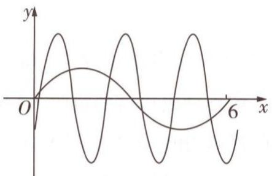

text_image

y
O
6 x

图2

创新解读与预测 本题源于人教 A 版《必修第一册》P237 例 1, 直接利用教材例题答案中的图形(如图 3)就能得到本题的答案, 说本题是对教材例题的直接引用也不为过. 通过此题得到的启示为: 对于教材中题目的挖掘、关注与应用, 不能一味加难、加深、加宽, 而要在变化中体验和感知数学知识的内在本质. 所以, 注重教材是亘古不变的话题.

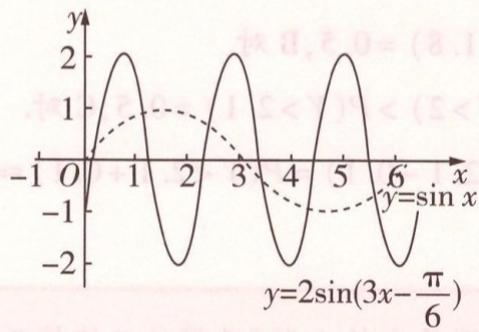

line

| x    | y (solid) | y (dashed) |
| ---- | --------- | ---------- |
| -1   | 0         | 0          |
| 0    | 2         | 0.5        |
| 1    | 0         | 1          |
| 2    | -2        | 0.5        |
| 3    | 2         | 0          |
| 4    | 0         | -1         |
| 5    | -2        | -0.5       |
| 6    | 2         | -1         |

图3

# 2 突出基础，同时兼顾知识融合、考查基本能力

调研 9 [2024 新课标 I 卷第 18 题] 已知函数 $f(x)=\ln\frac{x}{2-x}+ax+b(x-1)^{3}$ .

(1) 若 b=0，且 $f'(x)\geqslant0$ ，求 a 的最小值.  
(2) 证明: 曲线 $y = f(x)$ 是中心对称图形.  
(3) 若 $f(x) > -2$ 当且仅当 1 < x < 2，求 b 的取值范围.

解析 (1) 函数 $f(x)$ 的定义域为 $(0,2)$ .

当 $b = 0$ 时， $f'(x) = \frac{2}{x(2 - x)} + a \geqslant 0$ ，即 $a \geqslant \left[\frac{2}{x(x - 2)}\right]_{\max}, x \in (0,2)$ ，

又 $\left[\frac{2}{x(x - 2)}\right]_{\max} = \frac{2}{1\times(-1)} = -2$ ，所以 $a\geqslant -2.$

故 a 的最小值为 -2.

(2) $f(x)+f(2-x)=\ln\frac{x}{2-x}+ax+b(x-1)^{3}+\ln\frac{2-x}{x}+a(2-x)+b(1-x)^{3}=2a=2f(1)$

且 $f(x)$ 的定义域为(0,2)，因此曲线 $y=f(x)$ 是关于点(1,a)对称的中心对称图形.

点拨 如果给出对称中心,或已经判断出对称中心,大部分考生是会做的,因为复习时一定会背诵抽象函数的性质,其一便是:若函数 $f(x)$ 满足 $f(a+x)=k-f(b-x)$ ,则 $f(x)$ 的图象关于点 $\left(\frac{a+b}{2},\frac{k}{2}\right)$ 中心对称.本题难在考生不知道对称中心在哪儿,不知道怎么判断,因此无从下手.高中数学涉及中心对称的内容很多,而函数部分最熟悉的就是奇函数图象关于原点对称,那么可以通过图象变换得到关于其他点对称的函数图象,掌握了这个本质,找到对称中心就不难了:

将已知函数化为 $f(x) = \ln \frac{x - 1 + 1}{1 - (x - 1)} + a(x - 1) + b(x - 1)^3 + a$ ，对于函数 $g(x) = \ln \frac{x + 1}{1 - x} + ax + bx^3$ ，满足 $g(-x) = \ln \frac{-x + 1}{1 + x} - ax - bx^3 = -(\ln \frac{x + 1}{1 - x} + ax + bx^3) = -g(x)$ ，所以 $g(x)$ 为奇函数，而 $f(x)$ 的图象是由 $g(x)$ 的图象向右平移1个单位长度、向上平移 $a$ 个单位长度得到的，所以 $g(x)$ 图象的对称中心(0,0)也随之平移到(1,a)处，所以 $f(x)$ 的图象关于(1,a)对称.

(3) 先证明 a = -2. 由题意得, $f(1) = a \leqslant -2$ ,

$f'(1)=2+a\geqslant0$ , 即 $a\geqslant-2$ , 故 a=-2, 此时 $f'(x)=\frac{(x-1)^{2}}{x(2-x)}[3bx(2-x)+2]$ .

对于 $3bx(2-x)+2$ ，当 x=1 时，上式即 $3b+2$ .

当 $b \geqslant -\frac{2}{3}$ 时, $f'(x) \geqslant \frac{(x - 1)^2}{x(2 - x)} (2 - 4x + 2x^2) \geqslant 0$ 且不恒为0, 故 $f(x)$ 在 $(0,2)$ 上单调递增, 则 $f(x) > -2 = f(1)$ , 当且仅当 $1 < x < 2$ , 此时结论成立.

当 $b < -\frac{2}{3}$ 时，设 $\varepsilon$ 为一个比1大且无限接近1的数，则 $3b\varepsilon (2 - \varepsilon) < -2$ ，则 $f^{\prime}(\varepsilon) < 0$ 则在 $(1,\varepsilon)$ 上 $f(x)$ 单调递减，从而 $f(\varepsilon) < f(1) = -2$ ，与题意矛盾.

综上, b 的取值范围是 $\left[-\frac{2}{3}, +\infty\right)$ .

创新解读与预测 对于(2)有许多考生思路受阻,原因是对基础知识间的链接能力不够,如果凭“刷题”,当遇到明显的考查图象对称性的题可能做得好,但对于本题便无从下手了.这是出题专家打破常规、出其不意的地方.所以本题第(2)问同样达到了选拔目的,有一批考生“栽”在此问.第(3)问则又上升了一个档次,意在进一步选拔.解答题总题量的减少,使得每一题分值增加,设三问的题目是以后的趋势,同时三问不会都是容易得分的,考查难度循序渐进也是必然趋势.本题源于人教A版《必修第一册》P87第13题.

# 3 突出考查逻辑推理素养

调研 10 [2024 新课标Ⅱ卷第 8 题] 设函数 $f(x) = (x + a) \ln(x + b)$ . 若 $f(x) \geqslant 0$ , 则 $a^{2} + b^{2}$ 的最小值为 ( )

A. $\frac{1}{8}$

B. $\frac{1}{4}$

C. $\frac{1}{2}$

D. 1

解析 方法一: 分类讨论法 函数 $f(x)$ 的定义域为 $(-b, +\infty)$ ，有以下两种情况：

【指方向】由于 $f(x) = x + a$ 与 $f(x) = \ln (x + b)$ 同是增函数，且 $x + a$ 与 $\ln (x + b)$ 乘积不小于0，所以采用分类讨论的策略解题

当 $x \in (-b, 1 - b]$ 时， $\ln (x + b) \leqslant 0$ ，则 $x + a \leqslant 0$ ，故 $1 - b + a \leqslant 0$ ；当 $x \in [1 - b, +\infty)$ 时， $\ln (x + b) \geqslant 0$ ，则 $x + a \geqslant 0$ ，故 $1 - b + a \geqslant 0$ 。

从而 -a = 1 - b，则 $a^{2} + b^{2} = 2b^{2} - 2b + 1 = 2\left(b - \frac{1}{2}\right)^{2} + \frac{1}{2} \geqslant \frac{1}{2}$ ，故选 C.

方法二:数形结合法 分别作出 $y=x+a$ 与 $y=\ln(x+b)$ 的图象,如图4,图5所示.

若要 $(x + a)\ln (x + b)\geqslant 0$ ，只有 $-a = 1 - b$ 时符合，则 $a^2 +b^2 = 2b^2 -2b + 1 = 2(b - \frac{1}{2})^2+$ $\frac{1}{2}\geqslant \frac{1}{2}.$ 故选C.

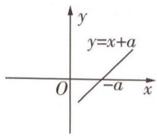

text_image

y
y=x+a
O
-a
x

图 4

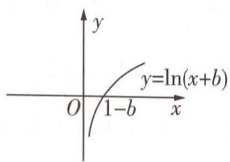

text_image

y
y=ln(x+b)
O 1-b x

图 5

☑ 创新解读与预测 通过本题就能看出，“想到”与“想不到”计算量相差悬殊，这就是新课标卷想达到的效果。今年高考中数学学科的计算量很大，有一些无法回避的常规但较复杂的计算，比如通分、因式分解等，与以往相比最明显的区别是计算并不是单纯地算，如果在做题时能多观察，比如能够结合相关的几何性质，或运用逻辑推理等思想，完全可以得到减少运算量的方法。高考试题会越来越体现“多想少算”这一特点，从而起到区分与选拔的作用。

# 原创预测

答案▶ 016页

1.(多选)在平面直角坐标系 $xOy$ 中,到定点 $F_{1}(-a,0), F_{2}(a,0)$ 距离之积等于 $a^{2}(a > 0)$ 的点的轨迹是双纽线 $C$ . 若双纽线 $C$ 对应的 $a = 2$ , 点 $P(x_{0}, y_{0})$ 为双纽线 $C$ 上任意一点, 则下列结论正确的是 ( )

A. C 不关于 x 轴对称  
B. $C$ 关于 $y$ 轴对称  
C. 直线 $y = x$ 与 $C$ 只有一个交点  
D. C 上存在点 P, 使得 $\left|PF_{1}\right| = \left|PF_{2}\right|$

2.(多选)已知正项数列 $\{a_{n}\}$ 满足 $a_{1}=1,a_{n}^{2}-(n-2)a_{n}a_{n-1}-(n-1)a_{n-1}^{2}=0(n\geqslant2)$ ，则下列说法正确的是()

A. $a_{n} = (n - 1)!$   
B. $a_{n}\leqslant \left(\frac{n}{2}\right)^{n - 1}$   
C. $\frac{1}{2a_{1}}+\frac{1}{3a_{2}}+\cdots+\frac{1}{100a_{99}}=1-\frac{1}{a_{100}}$   
D. $\frac{1}{a_{1}a_{100}}+\frac{1}{a_{2}a_{99}}+\cdots+\frac{1}{a_{50}a_{51}}=\frac{2^{98}}{a_{100}}$

3.[新定义连乘积运算]定义连乘积运算 $\prod_{k=1}^{n}a_{k}=a_{1}a_{2}\cdots a_{n}$ ，则方程 $\prod_{k=1}^{4}(x^{3}-3x-k)=0$ 的实根的个数为\_\_\_\_.

# 参考答案与解析

1. BCD 设 $M(x, y)$ 到定点 $F_{1}(-2,0)$ , $F_{2}(2,0)$ 的距离之积为 4，则 $\sqrt{(x+2)^{2}+y^{2}}\cdot\sqrt{(x-2)^{2}+y^{2}}=4$ ，整理得 $(x^{2}+y^{2})^{2}=8(x^{2}-y^{2})$ ，故曲线 C 的方程为 $(x^{2}+y^{2})^{2}=8(x^{2}-y^{2})$ [关键：根据定义求出动点的轨迹方程，用 -x, -y 代换，观察方程是否变化，即可确定曲线的对

称性]. 把 $x$ 代换成 $-x$ , 方程不变, 所以曲线 $C$ 关于 $y$ 轴对称; 把 $y$ 代换成 $-y$ , 方程不变, 所以曲线 $C$ 关于 $x$ 轴对称; 把 $x$ 代换成 $-x$ , 同时把 $y$ 代换成 $-y$ , 方程不变, 所以曲线 $C$ 关于原点对称 [拓展: 本题中的双纽线示意图如图6所示]. 所以 A 错误, B 正确.

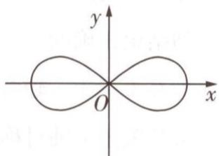

text_image

y
O
x

图6

由 $\left\{\begin{aligned}(x^{2}+y^{2})^{2}&=8(x^{2}-y^{2}),\\ y=x\end{aligned}\right.$ 得 $x^{4}=0$ ，所以x=0，所以y=0，所以直线y=x 与曲线 C 只有一个交点 $O(0,0)$ ，C 正确。原点 $O(0,0)$ 在曲线 C 上，则 $\left|OF_{1}\right|=\left|OF_{2}\right|$ ，所以曲线 C 上存在点 P 满足 $\left|PF_{1}\right|=\left|PF_{2}\right|$ ，所以 D 正确。故选 BCD。

2.ABD 当 $n \geqslant 2$ 时，由 $a_{n}^{2} - (n - 2)a_{n}a_{n - 1} - (n - 1)a_{n - 1}^{2} = 0$ 得 $(a_{n} + a_{n - 1})[a_{n} - (n - 1)a_{n - 1}] = 0.$ 因为数列 $\{a_{n}\}$ 是正项数列，所以 $a_{n} = (n - 1)a_{n - 1}$ ，即 $\frac{a_n}{a_{n - 1}} = n - 1.$

所以 $a_{n}=\frac{a_{n}}{a_{n-1}}\cdot\frac{a_{n-1}}{a_{n-2}}\cdot\cdots\cdot\frac{a_{2}}{a_{1}}\cdot a_{1}=(n-1)!(n\geqslant2)$ ，又 $a_{1}=1=(1-1)!$ ，所以 $a_{n}=(n-1)!(n\in\mathbf{N}^{*})$ ，故 A 正确.

对于 B 选项, 当 n=1 时显然成立, 当 $n \geqslant 2$ 时, $\forall k \in N, 1 \leqslant k \leqslant n-1$ , 根据基本不等式得 $k(n-k) \leqslant \left(\frac{n}{2}\right)^{2}$ , 所以 $a_{n}^{2} = [(n-1)!]^{2} = [1 \cdot (n-1)] \cdot [2 \cdot (n-2)] \cdot \cdots \cdot [(n-1) \cdot 1] \leqslant \left(\frac{n}{2}\right)^{2(n-1)}$ , 所以 $a_{n} \leqslant \left(\frac{n}{2}\right)^{n-1}$ , 故 B 正确.

因为 $\frac{1}{(n+1)a_{n}}=\frac{1}{(n+1)\cdot(n-1)!}=\frac{n}{(n+1)!}=\frac{n+1-1}{(n+1)!}=\frac{1}{n!}-\frac{1}{(n+1)!}$ ，所以 $\frac{1}{2a_{1}}+\frac{1}{3a_{2}}+\cdots+\frac{1}{100a_{99}}=\frac{1}{1!}-\frac{1}{100!}\neq1-\frac{1}{a_{100}}$ ，故C错误.

$\forall k \in \mathbb{N}, 1 \leqslant k \leqslant 100, \frac{1}{a_k a_{101-k}} = \frac{1}{(k-1)! (100-k)!} = \frac{1}{99!} C_{99}^{k-1}$ , 所以 $\frac{1}{a_1 a_{100}} + \frac{1}{a_2 a_{99}} + \cdots + \frac{1}{a_{50} a_{51}} = \frac{1}{99!} (C_{99}^0 + C_{99}^1 + \cdots + C_{99}^{49}) = \frac{1}{99!} \times \frac{1}{2} (C_{99}^0 + C_{99}^1 + \cdots + C_{99}^{99}) = \frac{2^{98}}{99!} = \frac{2^{98}}{a_{100}}$ , 故 D 正确. 故选 ABD.

3.7 令 $f(x) = x^3 - 3x$ ，则 $f'(x) = 3x^2 - 3$ ，令 $f'(x) = 0$ ，得 $x = \pm 1$ .

当 $x \in (-\infty, -1)$ 时， $f'(x) > 0, f(x)$ 单调递增；当 $x \in (-1, 1)$ 时， $f'(x) < 0, f(x)$ 单调递减；当 $x \in (1, +\infty)$ 时， $f'(x) > 0, f(x)$ 单调递增。从而函数的极大值与极小值分别为 $f(-1) = 2, f(1) = -2, f(x) = x^3 - 3x$ 的图象如图7所示，其与直线 $y = 1, y = 2, y = 3, y = 4$ 的交点共有 $3 + 2 + 1 + 1 = 7$ （个），因而方程有7个实数根。

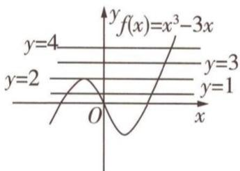

line

| x | f(x) |
|---|---|
| 0 | y=1 |
| 1 | y=2 |
| 2 | y=3 |
| 3 | y=4 |
| 4 | y=5 |

图7

# 突破12大超重点

# 创新考法 ▶ 抢先知

# 超重点1 函数开放、探究问题的2个创新题型

考情速递 开放性举例问题与存在性探索问题是近几年高考卷中的2个创新题型，其中开放性举例问题在地方卷，尤其是北京卷中考频较高，以函数为考点的这2个题型在近三年高考中的考情与2025高考命题预测为：

<table><tr><td>三年考情与创新命题特点</td><td>2025命题预测</td></tr><tr><td>2023 全国乙卷 T21,考查幂函数与对数型函数的复合函数,判断是否存在两个参数,使曲线关于直线对称</td><td rowspan="3">1命题形式:以开放性举例填空题的形式呈现,要求写出一个满足已知条件的函数解析式或参数的值;以解答题的形式呈现,要求判断是否存在参数、点、线,使函数满足给定的性质、数量关系或位置关系.2必考热点:由基本初等函数复合而成的较复杂函数、分段函数等的性质与图象.3创新考法:突出与其他模块知识的交汇,如平面向量、数列等.</td></tr><tr><td>2023 上海卷 T18,考查较复杂的分式结构的函数,判断是否存在参数,使函数为奇函数</td></tr><tr><td>2022 北京卷 T14,已知分段函数存在最小值,写出一个参数取值(开放性举例填空题)</td></tr></table>

# 类型 1 函数的开放性举例问题

调研 1 [2024 北京丰台区 5 月模拟 | 双空题] 已知函数 $f(x)$ 具有下列性质: ① 对任意 $x_{1}, x_{2} \geqslant 0$ , 都有 $f(x_{1} + x_{2}) = f(x_{1}) + f(x_{2}) + 1$ ; ② 在 $(0, +\infty)$ 上, $f(x)$ 单调递增; ③ $f(x)$ 是偶函数. 则 $f(0) =$ \_\_\_\_; 函数 $f(x)$ 可能的一个解析式为 $f(x) =$ \_\_\_\_.

解析 令 $x_{1}=x_{2}=0$ ，可得 $f(0)=f(0)+f(0)+1$ ，所以 $f(0)=-1$ .

不妨令 $f(x)=|x|-1,x\in\mathbf{R}$ ，则 $f(x)$ 在 $(0,+\infty)$ 上单调递增，满足②；

又 $f(-x)=|-x|-1=|x|-1=f(x)$ ，所以 $f(x)$ 为偶函数，满足③；当 $x_{1},x_{2}\in[0,+\infty)$ 时， $f(x_{1}+x_{2})=|x_{1}+x_{2}|-1=x_{1}+x_{2}-1,f(x_{1})=x_{1}-1,f(x_{2})=x_{2}-1$ ，所以 $f(x_{1}+x_{2})=f(x_{1})+f(x_{2})+1$ ，满足①。所以函数 $f(x)$ 可能的一个解析式为 $f(x)=|x|-1$ 。

思考 若把【调研1】中的三个条件改成下面两个: ① $\forall m, n \in \mathbb{R}, f(m)f(n) = f(m + n)$ ; ② $\forall m, n \in \mathbb{R}$ , 当 $m > n$ 时, $f(m) < f(n)$ . 则 $f(x)$ 可能的解析式是什么? 解: 根据 ① 可联想幂函数, ② 实质上表示减函数, 故不妨取 $f(x) = (\frac{1}{2})^x$ . 验证: $f(x)$ 满足当 $m > n$ 时, $f(m) < f(n)$ , 且 $f(m)f(n) = (\frac{1}{2})^m (\frac{1}{2})^n = (\frac{1}{2})^{m+n} = f(m+n)$ , 所以 $f(x) = (\frac{1}{2})^x$ 满足题意.

# 类型 2 函数的存在性探究问题

调研 2 [2024 广东 4 月二模] 已知 $f(x)=\frac{1}{2}ax^{2}+(1-2a)x-2\ln x$ , a>0.

  
“假设存在法”妙  
解存在性探究问题

(1) 求 $f(x)$ 的单调区间.  
(2) 函数 $f(x)$ 的图象上是否存在两点 $A(x_{1}, y_{1})$ , $B(x_{2}, y_{2}) (x_{1} \neq x_{2})$ ,

使得直线 AB 与函数 $f(x)$ 的图象在 $(x_{0}, f(x_{0}))$ （其中 $x_{0} = \frac{x_{1} + x_{2}}{2}$ ）处的切线平行？若存在，求出直线 AB 的方程；若不存在，说明理由.

解析（1）求导得 $f'(x) = ax + 1 - 2a - \frac{2}{x} = \frac{ax^2 + (1 - 2a)x - 2}{x} = \frac{(ax + 1)(x - 2)}{x}$ .

因为 a>0, x>0，所以 $ax+1>0$ ，所以当 $x\in(0,2)$ 时， $f'(x)<0$ ，即 $f(x)$ 在 $(0,2)$ 上单调递减，当 $x\in(2,+\infty)$ 时， $f'(x)>0$ ，即 $f(x)$ 在 $(2,+\infty)$ 上单调递增。

综上, $f(x)$ 的单调递减区间为(0,2),单调递增区间为 $(2,+\infty)$ .

【避失分】解答题中最后一步综述一定记得回头再看一眼题目，不要答非所问，本题求函数的单调区间，不要误答成函数的单调性哦

(2) 假设满足题意的 $A(x_{1}, y_{1})$ , $B(x_{2}, y_{2})$ 存在.

【用策略】存在性探索问题的答题策略一般为先假设存在，根据题目要求的关系列式计算，若最后推出矛盾、方程（或不等式、方程组等）无解，则假设不成立，即不存在

直线 $AB$ 的斜率 $k = \frac{y_2 - y_1}{x_2 - x_1} = \frac{\left[\frac{1}{2}ax_2^2 + (1 - 2a)x_2 - 2\ln x_2\right] - \left[\frac{1}{2}ax_1^2 + (1 - 2a)x_1 - 2\ln x_1\right]}{x_2 - x_1} =$

$$
\frac {\frac {1}{2} a \left(x _ {2} ^ {2} - x _ {1} ^ {2}\right) + (1 - 2 a) \left(x _ {2} - x _ {1}\right) - 2 \ln \frac {x _ {2}}{x _ {1}}}{x _ {2} - x _ {1}} = \frac {a}{2} \left(x _ {1} + x _ {2}\right) + 1 - 2 a - \frac {2 \ln \frac {x _ {2}}{x _ {1}}}{x _ {2} - x _ {1}}, f ^ {\prime} \left(x _ {0}\right) =
$$

$$
f ^ {\prime} \left(\frac {x _ {1} + x _ {2}}{2}\right) = \frac {a \left(x _ {1} + x _ {2}\right)}{2} + 1 - 2 a - \frac {4}{x _ {1} + x _ {2}}.
$$

由 $k = f'\left(\frac{x_1 + x_2}{2}\right)$ 得 $\frac{\ln\frac{x_2}{x_1}}{x_2 - x_1} = \frac{2}{x_1 + x_2}$ , 即 $\ln \frac{x_2}{x_1} = \frac{2(x_2 - x_1)}{x_1 + x_2}$ , 即 $\ln \frac{x_2}{x_1} - \frac{2(\frac{x_2}{x_1} - 1)}{\frac{x_2}{x_1} + 1} = 0.$

不妨设 $x_{2} > x_{1}$ ，令 $t = \frac{x_2}{x_1}$ 则 $t > 1$ ，记 $g(t) = \ln t - \frac{2(t - 1)}{t + 1} = \ln t + \frac{4}{t + 1} -2(t > 1)$

则 $g'(t)=\frac{1}{t}-\frac{4}{(t+1)^{2}}=\frac{(t-1)^{2}}{t(t+1)^{2}}>0$ , 所以 $g(t)$ 在 $(1,+\infty)$ 上单调递增, 所以 $g(t)>$ $\ln 1 - \frac{2 \times (1 - 1)}{1 + 1} = 0$ , 所以方程 $g(t) = 0$ 无解, 则满足条件的 A, B 不存在.

# 创新预测

答案▶020页

1. 试题调研原创 已知函数 $f(x)$ 的导函数为 $f'(x)$ ，能说明“若 $f'(x) < 0$ 对任意的 $x \in (0, +\infty)$ 都成立，且 $f(0) > 0$ ，则 $f(x)$ 在 $(0, +\infty)$ 上必有零点”为假命题的一个函数解析式是 $f(x) =$ \_\_\_\_.

2. 试题调研原创 已知函数 $f(x) = ax^{2} + (x^{2} - 2x + 2)e^{x}$ .

(1) 求曲线 $y = f(x)$ 在点 $(0, f(0))$ 处的切线方程.

(2) 若 x=0 为函数 $f(x)$ 的极小值点, 求 a 的取值范围.

(3) 曲线 $y = f(x)$ 上是否存在两个不同的点关于 y 轴对称？若存在，求出此时 a 的值；若不存在，说明理由.

# 规范答题

# 参考答案与解析

1. $\frac{1}{2^x}$ (答案不唯一) 若 $f'(x) < 0$ 对任意的 $x \in (0, +\infty)$ 都成立, 且 $f(0) > 0$ , 则 $f(x)$ 在 $(0, +\infty)$ 上单调递减且 $f(0) > 0$ . 要使题干中的命题为假命题, 则曲线 $y = f(x)$ 在 $(0 + \infty)$ 上与 $x$ 轴无交点. 函数可以是 $y = a^x (0 < a < 1)$ , 故可填 $\frac{1}{2^x}$ (答案不唯一).

2. (1) $f'(x) = 2ax + (x^2 - 2x + 2 + 2x - 2)e^x = 2ax + x^2e^x, f'(0) = 0, f(0) = 2$ ,

所以曲线 $y=f(x)$ 在点 $(0,f(0))$ 处的切线方程为 y=2.

(2) $f'(x)=2ax+x^{2}e^{x}=x(2a+xe^{x})$ .

①若 a=0，则 $f'(x)=x^{2}\mathrm{e}^{x}\geqslant0,f(x)$ 单调递增，无极值，不符合题意.  
②若 a<0，则当 x<0 时， $2a+xe^{x}<0$ ， $f'(x)=x(2a+xe^{x})>0$ ，所以 x=0 不可能为极小值点，不符合题意.  
③若 a > 0，令 $g(x) = x \mathrm{e}^{x}$ ，则 $g'(x) = (x + 1) \mathrm{e}^{x}$ ，当 x > -1 时， $g'(x) > 0$ ，即 $g(x)$ 在 $(-1, +\infty)$ 上单调递增，当 x < -1 时， $g'(x) < 0$ ，即 $g(x)$ 在 $(-∞, -1)$ 上单调递减，则 $g(x)_{\min} = g(-1) = -\frac{1}{\mathrm{e}}$ ，计算得 $g(0) = 0$ ，当 x < 0 时， $-\frac{1}{\mathrm{e}} \leqslant g(x) < 0$ .

若 $a > \frac{1}{2e}$ ，则 $2a + xe^{x} > 0$ ，当 x < 0 时， $f'(x) = x(2a + xe^{x}) < 0$ ，当 x > 0 时， $f'(x) > 0$ ，所以 x = 0 为函数 $f(x)$ 的极小值点 [点拨：可导函数 $f(x)$ 在点 $x_{0}$ 处取得极值的充要条件是 $f'(x_{0}) = 0$ ，且在 $x_{0}$ 左侧与右侧 $f'(x)$ 的符号不同]，符合题意.

若 $0 < a \leqslant \frac{1}{2\mathrm{e}}$ ，因为 $g(x)$ 在 $[-1, 0]$ 上单调递增， $g(x)$ 的值从 $-\frac{1}{\mathrm{e}}$ 增到 0，所以直线 $y = -2a$ 与曲线 $y = g(x)$ 在 $[-1, 0)$ 上的图象有公共点，即存在 $x_0 \in [-1, 0)$ 使得 $2a + x_0\mathrm{e}^{x_0} = 0$ ，当 $x_0 < x < 0$ 时， $x\mathrm{e}^x > x_0\mathrm{e}^{x_0} = -2a$ ，即 $2a + x\mathrm{e}^x > 0$ ，所以存在 $x_0 \in [-1, 0)$ ，使得当 $x_0 < x < 0$ 时， $f'(x) < 0$ ，当 $x > 0$ 时， $f'(x) > 0$ ，此时 $x = 0$ 为函数 $f(x)$ 的极小值点，符合题意。

综上, $a\in(0,+\infty)$ .

(3) 不存在, 理由如下.

假定曲线 $y = f(x)$ 上存在两个不同的点关于 $y$ 轴对称，设其坐标分别为 $(t, y), (-t, y), t \neq 0$ ，则有 $f(t) = f(-t)$ ，即 $at^2 + (t^2 - 2t + 2)e^t = a(-t)^2 + [(-t)^2 - 2(-t) + 2]e^{-t}$ ，化简得 $(t^2 - 2t + 2)e^t = [(-t)^2 - 2(-t) + 2]e^{-t}$ . 令 $h(x) = (x^2 - 2x + 2)e^x$ ，则 $h(t) = h(-t)$ ，

由(2)知函数 $h(x)$ 在 R 上单调递增, 所以由 $h(t)=h(-t)$ 得 t=-t, 即 t=0, 这与 $t\neq0$ 矛盾, 所以曲线 $y=f(x)$ 上不存在两个不同的点关于 y 轴对称.

# 超重点2 热点函数结构不良题

考情速递 结构不良题在北京卷中是常考题型，而在全国卷中，是新高考改革后出现的新题型，虽然在近两年新高考卷中并未出现，但因其题型灵活、区分度高，后期再出现也是有可能的。函数的结构不良题在近三年高考中的考情与2025高考命题预测为：

<table><tr><td>三年考情与创新命题特点</td><td>2025命题预测</td></tr><tr><td>2023 北京卷 T17,从 3 个条件中选择 1 个,使满足限制条件的函数存在</td><td rowspan="2">1命题形式:条件多选一,求解目标问题;从多个条件中选择 2 个进行组合,求参数的值、判断函数的性质等;根据已知条件从多个结论中选择一个证明;给出多个条件,选择几个作为已知、一个作为求证的结论进行解题.2预测热点:通过选择参数、函数值等方式求出解析式,判断该解析式对应的函数性质或求值;给出几个关于零点、极值点的关系式,选择一个进行证明;等等.</td></tr><tr><td>2021 新高考II卷 T22,从 2 个条件中选择 1 个,证明函数只有一个零点</td></tr></table>

# 题型 1 条件多选一或组合型

调研 1 试题调研原创 已知函数 $f(x) = \mathrm{e}^{x - 1} - mx^2 (m \in \mathbb{R})$ .

(1) 从① $m=\frac{1}{2}$ ，②m=1 两个条件中选择一个，判断 $f(x)$ 在区间 $(0,+\infty)$ 上是否存在极小值点，并说明理由；
(2) 已知 m > 0，设函数 $g(x) = f(x) + mx \ln(mx)$ . 若 $g(x)$ 在区间 $(0, +\infty)$ 上存在零点，求实数 m 的取值范围.

注:如果选择多个条件分别解答,按第一个解答计分.

解析（1）若选择①，解答过程如下：

$f(x) = \mathrm{e}^{x - 1} - \frac{1}{2} x^2$ ，则 $f^{\prime}(x) = \mathrm{e}^{x - 1} - x,f^{\prime \prime}(x) = \mathrm{e}^{x - 1} - 1.$

易知 $f''(x)$ 在R上单调递增，且 $f''(1)=0$ ，

则 $f'(x)$ 在 $(0,1)$ 上单调递减，在 $(1,+\infty)$ 上单调递增，所以 $f'(x)\geqslant f'(1)=0$

所以 $f(x)$ 在 $(0, +\infty)$ 上单调递增, 不存在极小值点.

若选择②,解答过程如下:

$f(x) = \mathrm{e}^{x - 1} - x^2$ ，则 $f^{\prime}(x) = \mathrm{e}^{x - 1} - 2x,f^{\prime \prime}(x) = \mathrm{e}^{x - 1} - 2.$

易知 $f''(x)$ 在 R 上单调递增，且 $f''(1 + \ln 2) = 0$ ，

则 $f'(x)$ 在 $(0,1+\ln 2)$ 上单调递减，在 $(1+\ln 2,+\infty)$ 上单调递增，

又 $f'(1+\ln 2)=-2\ln 2<0,f'(4)=\mathrm{e}^{3}-8>0,$

所以 $f(x)$ 在 $(0, +\infty)$ 上存在极小值点.

(2) 令 $g(x) = 0$ ，即 $\mathrm{e}^{x - 1} - mx^2 + mx\ln (mx) = 0$

【破障碍】观察结构，对数的真数的位置有参数 m，分离参数有困难，同时，式子中多处出现 mx，根据 mx > 0 可尝试将整体除以 mx，再进一步挖掘特征，选择解题路径

又 $mx > 0$ ，所以 $\frac{\mathrm{e}^{x - 1}}{mx} - x + \ln (mx) = \frac{\mathrm{e}^{x - 1}}{\mathrm{e}^{\ln(mx)}} - x + \ln (mx) = \mathrm{e}^{x - \ln (mx) - 1} - [x - \ln (mx)] = 0.$

令 $t = x - \ln(mx)$ ，问题转化为关于 t 的方程 $e^{t-1} - t = 0$ 有解.

设 $h(t) = \mathrm{e}^{t - 1} - t$ ，由 $h^{\prime}(t) = \mathrm{e}^{t - 1} - 1$ 可得， $h(t)$ 在 $(-\infty ,1)$ 上单调递减，在 $(1, + \infty)$ 上单调递增， $h(t)\geqslant h(1) = 0$

所以 $h(t)=\mathrm{e}^{t-1}-t$ 有唯一零点 t=1.

若 $g(x)$ 在区间 $(0, +\infty)$ 上存在零点，即关于 $x$ 的方程 $1 = x - \ln (mx)$ ，即 $1 + \ln m = x - \ln x$ 在 $(0, +\infty)$ 上有解.

设 $l(x) = x - \ln x$ ，由 $l^{\prime}(x) = 1 - \frac{1}{x}$ 知， $l(x)$ 在 $(0,1)$ 上单调递减，在 $(1, +\infty)$ 上单调递增，则 $l(x) \geqslant l(1) = 1$

所以 $1 + \ln m \geqslant 1$ ，故有 $m \geqslant 1$ .

所以实数 m 的取值范围为 $[1, +\infty)$ .

# 解题攻略

# 巧构思路快解结构不良题

①先看条件 对于试题中提供的选择条件,逐一分析条件对应考查的知识内容,结合自身的知识体系,选择比较有把握的知识内容,纳入自己熟悉的知识体系中.条件的初始分析判断是良好的开端,也是成功的一半.  
②再辨题设 对于条件组合型问题,初始状态不确定,关键的解题步骤是对条件组合后进行验证,应从多个角度考虑多种可能性的组合,验证过程需要尽可能细致.  
③注意活学巧用 数学必备知识是学科理论的基本内容,是考查学生能力与素养的有效途径和载体,更是今后生活和学习的基础.“活”的知识是能力,“活”的能力是素养,在学习和备考中要重视对教材内容的理解与掌握,夯实必备知识,并在此基础上活学活用,提高思维的灵活性,才能更好地应对高考数学中考查的开放性、探究性问题.

# 题型 2 结论多选一型

调研 2 试题调研原创 已知函数 $f(x)=\mathrm{e}^{x}-ax^{2}+bx-1$ ，其中 a,b 为常数，e 为自然对数的底数， $e=2.71828\cdots$ .

(1) 当 a=0 时, 若函数 $f(x)\geqslant0$ 恒成立, 求实数 b 的取值范围.

(2) 当 b=2a 时, 若函数 $f(x)$ 有两个极值点 $x_{1}, x_{2}$ , 现有如下三个结论: ① $7x_{1} + bx_{2} > 28$ ; ② $2\sqrt{a}(x_{1} + x_{2}) > 3x_{1}x_{2}$ ; ③ $\sqrt{x_{1}-1} + \sqrt{x_{2}-1} > 2$ . 请从①②③中任选一个进行证明.

注:如果选择多个结论分别解答,按第一个解答计分.

解析 (1) 当 $a = 0$ 时, $f(x) = \mathrm{e}^{x} + bx - 1$ , $f'(x) = \mathrm{e}^{x} + b$ .

若 $b\geqslant0$ ，因为 $f(-1)=\left(\frac{1}{e}-1\right)-b<0$ ，所以不合题意.

  
“模型匹配法”巧破结构不良题

【讲关键】分类讨论的技巧，见下一页的“大招解读”

若 b<0，当 $x\in(-\infty,\ln(-b))$ 时， $f'(x)<0,f(x)$ 单调递减，当 $x\in(\ln(-b),+\infty)$ 时， $f'(x)>0,f(x)$ 单调递增，所以 $f(x)_{\min}=f(\ln(-b))=-b+b\ln(-b)-1$ ，要使 $f(x)\geqslant0$ 恒成立，只需 $f(x)_{\min}=-b+b\ln(-b)-1\geqslant0$ .

令 $g(x)=x-x\ln x-1$ ，则 $g'(x)=-\ln x$ ，当 $x\in(0,1)$ 时， $g'(x)>0$ ， $g(x)$ 单调递增；当 $x\in(1,+\infty)$ 时， $g'(x)<0$ ， $g(x)$ 单调递减，所以 $g(x)\leqslant g(1)=0$ ，

又 $g(-b) = -b + b\ln (-b) - 1 \geqslant 0$ ，故 $-b = 1$ ，所以 $b = -1$

【传技巧】由 $m \geqslant n$ 与 $m \leqslant n$ 可得 m = n，这是利用不等式“两边夹”求值的一种方法

故实数 b 的取值范围为 $\{-1\}$ .

(2) 当 b=2a 时, $f(x)=\mathrm{e}^{x}-ax^{2}+2ax-1$ , $f'(x)=\mathrm{e}^{x}-2ax+2a$ .

令 $\varphi(x)=f'(x)=\mathrm{e}^{x}-2ax+2a$ ，则 $\varphi'(x)=\mathrm{e}^{x}-2a$ ，因为函数 $f(x)$ 有两个极值点 $x_{1}, x_{2}$

所以 $\varphi(x)=f'(x)=\mathrm{e}^{x}-2ax+2a$ 有两个变号零点，若 $a\leqslant0$ ，则 $\varphi'(x)>0,\varphi(x)$ 单调递

【破障碍】原函数有两个极值点，则导函数一定有两个变号零点增，不可能有两个零点，所以 a > 0.

令 $\varphi'(x)=\mathrm{e}^{x}-2a=0$ , 得 $x=\ln2a$ , 当 $x\in(-\infty,\ln2a)$ 时, $\varphi'(x)<0$ , $\varphi(x)$ 单调递减, 当 $x\in(\ln2a,+\infty)$ 时, $\varphi'(x)>0$ , $\varphi(x)$ 单调递增, 所以 $\varphi(x)_{\min}=\varphi(\ln2a)=4a-2a\ln2a$ .

因为 $\varphi(x)$ 有两个变号零点, 所以 $4a - 2a \ln 2a < 0$ , 则 $a > \frac{1}{2} e^{2}$ ,

设 $x_{1} < x_{2}$ ，因为 $\varphi (1) = \mathrm{e} > 0, \varphi (2) = \mathrm{e}^{2} - 2a < 0$ ，则 $1 < x_{1} < 2 < x_{2}$

因为 $\varphi(x_{1})=\varphi(x_{2})=0$ , 所以 $e^{x_{1}}=2ax_{1}-2a,e^{x_{2}}=2ax_{2}-2a$

则 $\frac{\mathrm{e}^{x_2}}{\mathrm{e}^{x_1}} = \frac{x_2 - 1}{x_1 - 1}$ ，两边取对数得 $x_{2} - x_{1} = \ln (x_{2} - 1) - \ln (x_{1} - 1)$

令 $x_{1} - 1 = t_{1}, x_{2} - 1 = t_{2}$ ，则 $t_{2} - t_{1} = \ln t_{2} - \ln t_{1}$ ，即 $t_{2} - \ln t_{2} = t_{1} - \ln t_{1}(0 < t_{1} < 1 < t_{2})$ 。

若选①,证明如下.令 $u(t)=t-\ln t$ ,则 $u(t_{1})=u(t_{2})$ .

因为 $u^{\prime}(t) = 1 - \frac{1}{t}$ 所以 $u(t)$ 在 $(0,1)$ 上单调递减，在 $(1, + \infty)$ 上单调递增，

令 $v(t) = u(t) - u(2 - t) = 2t - \ln t + \ln (2 - t) - 2(0 < t < 2)$ ，则 $v'(t) = \frac{2(t - 1)^2}{t(t - 2)} \leqslant 0$ ， $v(t)$ 在 $(0, +\infty)$ 上单调递减，

因为 $0 < t_{1} < 1$ ，所以 $v(t_{1}) > v(1) = 0$ ，即 $u(t_{1}) - u(2 - t_{1}) > 0$ ，即 $u(t_{2}) = u(t_{1}) > u(2 - t_{1})$

因为 $t_{2}>1,2-t_{1}>1,u(t)=t-\ln t$ 在 $(1,+\infty)$ 上单调递增，所以 $t_{2}>2-t_{1}$

则 $x_{2} - 1 > 2 - (x_{1} - 1)$ ，整理得 $x_{1} + x_{2} > 4$ ，所以 $7x_{1} + 2ax_{2} > 7x_{1} + 7x_{2} > 28$ ，故①成立.

若选②,证明如下.令 $u(t)=t-\ln t$ ,则 $u(t_{1})=u(t_{2})$ ,

因为 $u'(t)=t-\frac{1}{t}$ ，所以 $u(t)$ 在 $(0,1)$ 上单调递减，在 $(1,+\infty)$ 上单调递增，

令 $v(t) = u(t) - u\left(\frac{1}{t}\right) = t - \frac{1}{t} - 2\ln t$ ，则 $v'(t) = \frac{(t - 1)^2}{t^2} \geqslant 0, v(t)$ 在 $(0, +\infty)$ 上单调递增，又 $v(1) = 0$ ，所以当 $t \in (0,1)$ 时， $v(t) < v(1) = 0$ ，又 $0 < t_1 < 1$ ，所以 $u(t_2) = u(t_1) < u\left(\frac{1}{t_1}\right)$ ，

因为 $t_{2}>1,\frac{1}{t_{1}}>1,u(t)=t-\ln t$ 在 $(1,+\infty)$ 上单调递增，所以 $t_{2}<\frac{1}{t_{1}}$

所以 $x_{2} - 1 < \frac{1}{x_{1} - 1}$ , 即 $x_{1}x_{2} < x_{1} + x_{2} < \frac{2}{3}\sqrt{\frac{1}{2}\mathrm{e}^{2}} (x_{1} + x_{2}) < \frac{2}{3}\sqrt{a} (x_{1} + x_{2})$ ,

即 $3x_{1}x_{2}<2\sqrt{a}(x_{1}+x_{2})$ ，故②成立.

若选③, 证明如下. $t_{2} - t_{1} = \ln t_{2} - \ln t_{1} = 2\ln \sqrt{\frac{t_{2}}{t_{1}}}$ , 令 $F(t) = \ln t - \frac{2(t - 1)}{t + 1}(t > 1)$ , 则 $F'(t) = \frac{(t - 1)^2}{t(t + 1)^2} > 0$ , 所以 $F(t)$ 单调递增, 则 $F(t) > \ln 1 - \frac{2 \times (1 - 1)}{1 + 1} = 0$ , 所以 $\ln t > \frac{2(t - 1)}{t + 1}$ , 则 $t_{2} - t_{1} = 2\ln \sqrt{\frac{t_{2}}{t_{1}}} > 2 \cdot \frac{2(\sqrt{\frac{t_{2}}{t_{1}}} - 1)}{\sqrt{\frac{t_{2}}{t_{1}}} + 1} = 4 \cdot \frac{\sqrt{t_{2}} - \sqrt{t_{1}}}{\sqrt{t_{2}} + \sqrt{t_{1}}}$ , 两边约去 $\sqrt{t_2} - \sqrt{t_1}$ 后化简整理得 $\sqrt{t_1} + \sqrt{t_2} > 2$ , 即 $\sqrt{x_1 - 1} + \sqrt{x_2 - 1} > 2$ , 故③成立.

# 大招解读

# 利用分类讨论大招解题必须掌握的 3 个要点

①为什么要分类讨论:比如本题第(1)问中,要确定导数值 $e^{x}+b$ 的符号,而参数b的范围不确定,所以要对b分类讨论.  
②怎样分类讨论:明确参数的全部范围,再确定分类讨论的标准,做到不重不漏,比如本题第(1)问中b可以取任意实数,而 $e^{x}>0$ ,所以对b分为 $b\geqslant0$ 和b<0两种情形讨论.  
③分类讨论后的结果如何处理:根据题意确定对求得的参数的范围的处理,如求交集、求并集,或用“当……时,……”的形式综述(如本题第(1)问中舍去 $b\geqslant0$ ,保留b<0).

# 创新预测

答案▶026页

# 试题调研原创 给出下列两个条件：

① $f(x)$ 在定义域内单调递减；  
②当 $x \in (0, +\infty)$ 时， $g(x) \geqslant 0$ 恒成立.

在这两个条件中任选一个,补充在下面的横线上,并解答.

已知函数 $f(x) = x \ln x - ax^2 - x, g(x) = e^{x-1} - 2ax.$

(1) 若 \_\_\_\_ , 求实数 a 的取值范围;  
(2) 函数 $F(x)=f'(x)-g(x)$ ，其中 $f'(x)$ 为 $f(x)$ 的导函数，求 $F(x)$ 的最值.

注:如果选择多个条件分别解答,按第一个解答计分.

# 规范答题

# 参考答案与解析

(1) 若选①, $f(x)$ 的定义域为 $(0, +\infty)$ ,

因为 $f(x)$ 在 $(0, +\infty)$ 上单调递减，所以 $f'(x) \leqslant 0$ 在 $(0, +\infty)$ 上恒成立.

由 $f'(x)=\ln x-2ax$ 得 $\ln x-2ax\leqslant0$ ，即 $a\geqslant\frac{\ln x}{2x}$ 在 $(0,+\infty)$ 上恒成立.

令 $h(x)=\frac{\ln x}{2x}$ ，则 $h'(x)=\frac{1-\ln x}{2x^{2}}$ ，

令 $h'(x)=0$ , 得 x=e.

当 $x \in (0, e)$ 时, $h'(x) > 0$ ; 当 $x \in (e, +\infty)$ 时, $h'(x) < 0$ .

所以 $h(x)$ 在 $(0, e)$ 上单调递增，在 $(e, +\infty)$ 上单调递减，所以 $h(x)_{\max} = h(e) = \frac{1}{2e}$ ,

所以 $a \geqslant \frac{1}{2e}$ ，即 a 的取值范围为 $\left[\frac{1}{2e}, +\infty\right)$ .

若选②, 因为当 $x \in (0, +\infty)$ 时, $g(x) \geqslant 0$ 恒成立,

所以 $e^{x-1}-2ax\geqslant0$ , 即 $a\leqslant\frac{e^{x-1}}{2x}$ 在 $(0,+\infty)$ 上恒成立 [点津: 对于恒成立问题, 往往通过参变分离求最值的方法确定参数范围, 若不能分离的, 端点值为 0 的, 可通过端点效应的方法或者隐零点设而不求的方法求最值, 从而确定参数范围].

令 $\varphi(x)=\frac{\mathrm{e}^{x-1}}{2x}$ ，则 $\varphi'(x)=\frac{(x-1)\mathrm{e}^{x-1}}{2x^{2}}$ ，令 $\varphi'(x)=0$ ，得 x=1。

当 $x \in (0,1)$ 时， $\varphi'(x) < 0$ ，当 $x \in (1, +\infty)$ 时， $\varphi'(x) > 0$

所以 $\varphi(x)$ 在 $(0,1)$ 上单调递减，在 $(1,+\infty)$ 上单调递增，

所以 $\varphi(x)_{\min}=\varphi(1)=\frac{1}{2}$ ，所以 $a\leqslant\frac{1}{2}$ ，

所以 a 的取值范围为 $(-∞, \frac{1}{2}]$ .

(2) $f'(x)=\ln x-2ax$ ，由 $F(x)=f'(x)-g(x)=\ln x-e^{x-1}$ ，得 $F'(x)=\frac{1}{x}-e^{x-1}$ .

令 $p(x) = \frac{1}{x} -\mathrm{e}^{x - 1}$ ，则 $p^{\prime}(x) = -\frac{1}{x^{2}} -\mathrm{e}^{x - 1} <   0,$

所以 $F'(x)$ 在 $(0, +\infty)$ 上单调递减，且 $F'(1) = 0$ ，

所以当 $x \in (0,1)$ 时， $F'(x) > 0$ ; 当 $x \in (1, +\infty)$ 时， $F'(x) < 0$ .

所以 $F(x)$ 在 $(0,1)$ 上单调递增，在 $(1,+\infty)$ 上单调递减，

故 $F(x)_{\max}=F(1)=-1$ ,无最小值.

# 超重点3 函数新定义题的3个热考方向

考情速递 函数新定义题以往在自主命题卷中出现较多，可以出现在各个题型中，其题型灵活，可以单独考查函数知识，也可以与其他知识交汇命题，还可以引用高等数学中的相关知识作为试题背景命题，试题新颖，对考生的文字阅读、信息提取、转化与化归的能力要求较高。函数新定义题在近三年高考中的考情与2025高考命题预测为：

<table><tr><td>三年考情与创新命题特点</td><td>2025命题预测</td></tr><tr><td>2024 上海卷 T21,根据函数最值与点坐标的关系,给出新定义“函数最近点”</td><td rowspan="2">1命题形式:选择题、填空题、解答题均有可能呈现.2创新考法:单独考查函数知识,对函数的相关概念、性质重新“包装”,如对极值点的定义变形或引申,包装成新定义“特异点”;将函数与其他知识交汇给出新定义,如数列、平面向量等;引用高等数学中的知识作为背景,考查高度进一步上升,如拉格朗日定理、罗尔定理等.</td></tr><tr><td>2023 上海春季卷 T21,根据不同函数的函数值大小关系,给出新定义“控制函数”</td></tr></table>

# 方向 ① 单独考查函数知识

调研 1 [2024 中国人民大学附属中学 4 月检测 | 新定义·函数的特异点] 已知定义域为 R 的函数 $f(x)$ ，对任意的 $x_0 \in \mathbb{R}$ ，若存在 $\delta > 0$ ，满足对任意的 $x \in (x_0 - \delta, x_0) \cup (x_0, x_0 + \delta)$ ，有 $\frac{f(x) - f(x_0)}{x - x_0} < f'(x_0)$ 恒成立，则称 $x_0$ 为函数 $f(x)$ 的“特异点”。函数 $f(x) = \begin{cases} -x\mathrm{e}^{x+1}, & x \leqslant 0, \\ x^2 - 2x, & x > 0 \end{cases}$ 在其定义域上的“特异点”有 \_\_\_\_ 个。

解析 由题意知“特异点”为 $f'(x)$ 的极大值点. 因为 $f(x)=\left\{\begin{aligned}-x\mathrm{e}^{x+1},&x\leqslant0,\\ x^{2}-2x,&x>0,\end{aligned}\right.$ 所以 $f(0)=0.$

【破障碍】“对任意的 $x \in (x_0 - \delta, x_0) \cup (x_0, x_0 + \delta)$ ”即 $x_0$ 的左、右两侧，联想极值点定义

当 $x < 0$ 时， $f'(x) = -\mathrm{e}^{x + 1} + (-x)\mathrm{e}^{x + 1} = -(x + 1)\mathrm{e}^{x + 1}$ ，当 $x > 0$ 时， $f'(x) = 2x - 2$

又 $\lim_{x\to 0^{-}}\frac{f(x) - f(0)}{x - 0} = \lim_{x\to 0^{-}}\frac{-xe^{x + 1}}{x} = \lim_{x\to 0^{-}}(-e^{x + 1}) = -e,\lim_{x\to 0^{+}}\frac{f(x) - f(0)}{x - 0} = \lim_{x\to 0^{+}}\frac{x^{2} - 2x}{x} = \lim_{x\to 0^{+}}(x - 2) = -2$ ，故 $f^{\prime}(0)$ 不存在.

又 $f'(x)=\left\{\begin{aligned}-(x+1)\mathrm{e}^{x+1},&x<0,\\2x-2,x&>0,\end{aligned}\right.$ 当x>0时， $f'(x)$ 单调递增，故不可能有“特异点”.

当 $x < 0$ 时，设 $g(x) = f'(x)$ ，则 $g'(x) = -\mathrm{e}^{x + 1} + [-(x + 1)\mathrm{e}^{x + 1}] = -(x + 2)\mathrm{e}^{x + 1}$ .

由 $g'(x)>0$ , 得 x<-2 ，由 $g'(x)<0$ , 得 -2<x<0 ，所以 $f'(x)$ 在 $(-∞,-2)$ 上单调递增，在 $(-2,0)$ 上单调递减，故 x=-2 为 $f'(x)$ 的极大值点，即 $f(x)$ 的“特异点”。

综上, $f(x)$ 在其定义域内仅有一个“特异点”.故答案为1.

# 方向 ② 与其他知识交汇

调研 2 [2024 湖北黄冈 4 月八模 | 新视角 · 函数与充要条件交汇] 定义函数 $f(x) = \max \{ \lambda x, -\lambda x \}$ , $x \in \mathbb{R}$ , 其中 $\lambda > 0$ , 符号 $\max \{ a, b \}$ 表示数 $a, b$ 中的较大者, 给出以下命题: ① $f(x)$ 是奇函数; ② 若不等式 $f(x-1) + f(x-2) \geqslant 1$ 对一切实数 $x$ 恒成立, 则 $\lambda \geqslant 1$ ; ③ 当 $\lambda = 1$ 时, $F(x) = f(x) + f(x-1) + f(x-2) + \cdots + f(x-100)$ 的最小值是 2450; ④ “ $xy > 0$ ” 是 “ $f(x) + f(y) \geqslant f(x+y)$ ” 成立的充要条件. 以上所有真命题的序号是 \_\_\_\_.

解析 由题意得当 $x \geqslant 0$ 时, $f(x) = \lambda x$ , 当 $x < 0$ 时, $f(x) = -\lambda x$ , 即 $f(x) = \begin{cases} \lambda x, & x \geqslant 0, \\ -\lambda x, & x < 0, \end{cases}$ 所以 $f(-x) = \begin{cases} \lambda x, & x \geqslant 0, \\ -\lambda x, & x < 0 \end{cases} = f(x)$ , 所以函数 $f(x)$ 是偶函数, 故命题①是假命题.

【光速解】根据题意可知 $f(x)=\lambda|x|$ ，根据函数 $y=|x|$ 是偶函数可知 $f(x)$ 是偶函数；或用特值法分别取x=1与 $x=-1\rightarrow f(-1)=\max\{\lambda,-\lambda\}=\lambda=f(1)\rightarrow f(x)$ 不是奇函数

$f(x-1)+f(x-2)\geqslant1$ 等价于 $\lambda(|x-1|+|x-2|)\geqslant1$ ，则原问题可以转化为 $\lambda\geqslant\left(\frac{1}{|x-1|+|x-2|}\right)_{\max}$ 。由于 $|x-1|+|x-2|\geqslant|(x-1)-(x-2)|=1$ ，故 $\left(\frac{1}{|x-1|+|x-2|}\right)_{\max}=1$ ，所以 $\lambda\geqslant1$ ，故命题②是真命题。

当 $\lambda=1$ 时， $F(x)=|x|+|x-1|+\cdots+|x-100|$ ， $F(x)=|x-100|+|x-99|+\cdots+|x|$ ，两式相加得 $2F(x)=(|x|+|x-100|)+(|x-1|+|x-99|)+\cdots+(|x-100|+|x|)$ ，而 $|x|+|x-100|\geqslant|x-(x-100)|=100$ ， $|x-1|+|x-99|\geqslant|x-1-(x-99)|=98\cdots\cdots$ 以此类推，可得 $2F(x)\geqslant2\times(100+98+\cdots+2)$ ， $F(x)\geqslant100+98+\cdots+2=2550$ 。故命题③是假命题。

$f(x)+f(y)=\lambda(|x|+|y|),f(x+y)=\lambda|x+y|,f(x)+f(x)\geqslant f(x+y)$ ，即 $|x|+|y|\geqslant|x+y|$ ，这对任意的 $x,y\in R$ 都成立，故xy>0不是它的充要条件。故命题④是假命题。

故填②.

本题中的新定义函数对大多数学生来说应该不算陌生，人教A版《必修第一册》第68页的例6(2)（ $\forall x \in \mathbb{R}$ ，用 $M(x)$ 表示 $f(x), g(x)$ 中的最大者，记为 $M(x) = \max \{f(x), g(x)\}$ ）、第69页【练习】的第3题(2)（ $\forall x \in \mathbb{R}$ ，用 $m(x)$ 表示 $f(x), g(x)$ 中的最小者，记为 $m(x) = \min \{f(x), g(x)\}$ ）就有所涉及，只是本题将取值函数的含义上升到更深的层次，若平时只停留在“刷题”的层面，不注重思维的本质，见到本题可能会无从下手。请看如下变式：

# 原创变式

[新定义·数集中最大的数]以 $\max M$ 表示数集 $M$ 中最大的数. 设 $0 < a < b < c < 1$ , 已知 $a, b$ 满足 $b \geqslant 2a$ 或 $a + b \leqslant 1$ , 则 $\max \{b - a, c - b, 1 - c\}$ 的最小值为 \_\_\_\_.

答案》第033页

# 方向

# 3

# 引用高数知识为背景

调研 3 [2024 吉林长春第八中学 5 月模拟 | 新情境 · 拉格朗日中值点] 拉格朗日中值定理是微分学的基本定理之一, 定理内容如下: 如果函数 $f(x)$ 在闭区间 $[a, b]$ 上的图象连续不间断, 在开区间 $(a, b)$ 内的导数为 $f'(x)$ , 那么在区间 $(a, b)$ 内至少存在一点 $c$ , 使得 $f(b) - f(a) = f'(c)(b - a)$ 成立, 其中 $c$ 叫作 $f(x)$ 在 $[a, b]$ 上的“拉格朗日中值点”. 根据这个定理, 可得函数 $f(x) = (x - 1) \ln x$ 在 $[1, 2]$ 上的“拉格朗日中值点”的个数为 ( )

A.0

B. 1

C. 2

D. 3

审题 本题的情境中虽然出现了陌生的“拉格朗日中值定理”，但问题的内核依然是高中知识，求解难度并不大。对 $f(x)=(x-1)\ln x$ 求导，设出“拉格朗日中值点”，代入题中所给的等量关系即可。

解析 $f^{\prime}(x) = 1 + \ln x - \frac{1}{x}$ , 设 $x_0$ 为函数 $f(x)$ 在 $[1,2]$ 上的“拉格朗日中值点”，

则 $1 + \ln x_0 - \frac{1}{x_0} = \frac{f(2) - f(1)}{2 - 1} = \ln 2.$

令 $g(x) = 1 + \ln x - \frac{1}{x} -\ln 2$ ，则 $g^{\prime}(x) = \frac{1}{x} +\frac{1}{x^{2}} >0$ 在[1,2]上恒成立，

故 $g(x) = 1 + \ln x - \frac{1}{x} -\ln 2$ 在[1,2]上单调递增，

又 $g(1) = -\ln 2 < 0, g(2) = 1 - \frac{1}{2} = \frac{1}{2} > 0,$

由函数零点存在定理可知,存在唯一的 $x_{0} \in [1,2]$ , 使得 $g(x_{0}) = 0$ .

故选 B.

本题只是对拉格朗日中值定理的简单理解与应用，新定义题以选择题、填空题的形式呈现时，由于题目已经具备一定的创新性，因此一般来说解题的难度并不会太大，只要做好信息的转化和理解即可。但若以解答题新定义题（分值为17分）的形式呈现，不管是思维难度还是运算难度都大大提升，请看下题：

# 调研

# 4 [2024 江苏盐城 5 月模拟 | 新情境 · 求二元函数在约束条件下的可能极值点]

根据多元微分求条件极值理论,要求二元函数 $z=f(x,y)$ 在约束条件 $g(x,y)=0$ 下的可能极值点,先构造出一个拉格朗日辅助函数 $L(x,y,\lambda)=f(x,y)+\lambda g(x,y)$ ,其中 $\lambda$ 为拉格朗日系数.分别对

$L(x,y,\lambda)$ 中的 $x,y,\lambda$ 部分求导，并使之为0，得到方程组 $\left\{ \begin{array}{l} L_{x}(x,y,\lambda) = f_{x}(x,y) + \lambda g_{x}(x,y) = 0,\\ L_{y}(x,y,\lambda) = f_{y}(x,y) + \lambda g_{y}(x,y) = 0,\\ L_{\lambda}(x,y,\lambda) = g(x,y) = 0, \end{array} \right.$

此方程组,得出解 $(x,y)$ ,该解就是二元函数 $z=f(x,y)$ 在约束条件 $g(x,y)=0$ 下的可能极值点,将x,y的值代入 $f(x,y)$ 中,所得即为极值.

补充说明：【例】求函数 $f(x,y)=x^{2}+xy+y^{2}$ 关于变量x的导数，则将变量y当作常数，即 $f_{x}(x,y)=2x+y$ ，下标为x，代表对自变量x进行求导，即上述方程组之中的 $L_{x},L_{y},L_{\lambda}$ 表示分别对 $x,y,\lambda$ 进行求导.

(1) 求函数 $f(x, y) = x^{2}y^{2} + 2xy + xy^{2}$ 关于变量 y 的导数并求在 x = 1 处的导数值.  
(2) 设实数 $x, y$ 满足 $g(x, y) = 4x^2 + y^2 + xy - 1 = 0$ ，求 $f(x, y) = 2x + y$ 的最大值.  
(3)①若 x, y, z 为实数，且 $x + y + z = 1$ ，证明： $x^{2} + y^{2} + z^{2} \geqslant \frac{1}{3}$ .  
②设 a > b > c > 0，求 $2a^{2} + \frac{1}{ab} + \frac{1}{a(a - b)} - 10ac + 25c^{2}$ 的最小值.

解析（1）函数 $f(x,y) = x^{2}y^{2} + 2xy + xy^{2}$ 对变量 $y$ 求导得 $f_{y}(x,y) = 2x^{2}y + 2x + 2xy$ .

【扫障碍】本题中的新定义、规则、符号记法都是课堂上没有学过、见过的，仔细阅读题干，尤其是“补充说明”部分，这部分通过示例给出了前面文字信息的具体化解释。参照“补充说明”，将 $f(x,y)=x^{2}y^{2}+2xy+xy^{2}$ 中的变量x视为常数，对自变量y进行求导即可

当 x=1 时， $f_{y}(1,y)=4y+2$ .

(2) 令 $L(x, y, \lambda) = 2x + y + \lambda (4x^2 + y^2 + xy - 1)$ ，则 $\left\{ \begin{array}{l} L_x(x, y, \lambda) = 2 + 8\lambda x + \lambda y = 0, \\ L_y(x, y, \lambda) = 1 + 2\lambda y + \lambda x = 0, \\ L_\lambda(x, y, \lambda) = 4x^2 + y^2 + xy - 1 = 0, \end{array} \right.$

解得 $\left\{\begin{aligned}x&=-\frac{\sqrt{10}}{10},\\ y&=-\frac{\sqrt{10}}{5},\end{aligned}\right.$ 或 $\left\{\begin{aligned}x&=\frac{\sqrt{10}}{10},\\ y&=\frac{\sqrt{10}}{5},\\ \lambda&=\frac{\sqrt{10}}{5}\end{aligned}\right.$

于是函数 $f(x,y)$ 在约束条件 $g(x,y)=0$ 下的可能极值点是 $\left(-\frac{\sqrt{10}}{10},-\frac{\sqrt{10}}{5}\right),\left(\frac{\sqrt{10}}{10},\frac{\sqrt{10}}{5}\right)$ .

当 $x = -\frac{\sqrt{10}}{10}, y = -\frac{\sqrt{10}}{5}$ 时，函数 $f(x, y)$ 的一个极值为 $f(-\frac{\sqrt{10}}{10}, -\frac{\sqrt{10}}{5}) = -\frac{2\sqrt{10}}{5}$ ，

当 $x = \frac{\sqrt{10}}{10}, y = \frac{\sqrt{10}}{5}$ 时，函数 $f(x, y)$ 的一个极值为 $f\left(\frac{\sqrt{10}}{10}, \frac{\sqrt{10}}{5}\right) = \frac{2\sqrt{10}}{5}$ .

将方程 $4x^{2} + y^{2} + xy - 1 = 0$ 视为关于 $x$ 的方程 $4x^{2} + yx + y^{2} - 1 = 0$

则 $\Delta_{1}=y^{2}-16(y^{2}-1)\geqslant0$ , 解得 $|y|\leqslant\frac{4}{\sqrt{15}}$ .

将方程 $4x^{2} + y^{2} + xy - 1 = 0$ 视为关于 y 的方程 $y^{2} + xy + 4x^{2} - 1 = 0$ ,

则 $\Delta_{2}=x^{2}-4(4x^{2}-1)\geqslant0$ , 解得 $|x|\leqslant\frac{2}{\sqrt{15}}$ .

因此函数 $z = f(x,y)$ 对应的图形是封闭的，而 $\frac{2\sqrt{10}}{5} > -\frac{2\sqrt{10}}{5},$

所以 $f(x,y)$ 的最大值为 $\frac{2\sqrt{10}}{5}$ .

(3) ①由 $x + y + z = 1, x, y, z \in \mathbb{R}$ , 可设 $x = \frac{1}{3} + \lambda_1, y = \frac{1}{3} + \lambda_2, z = \frac{1}{3} - (\lambda_1 + \lambda_2), \lambda_1, \lambda_2 \in \mathbb{R}$ ,

则 $x^{2} + y^{2} + z^{2} = \left(\frac{1}{3} +\lambda_{1}\right)^{2} + \left(\frac{1}{3} +\lambda_{2}\right)^{2} + \left[\frac{1}{3} -\left(\lambda_{1} + \lambda_{2}\right)\right]^{2} = \frac{1}{3} +\lambda_{1}^{2} + \lambda_{2}^{2} + \left(\lambda_{1} + \lambda_{2}\right)^{2}\geqslant \frac{1}{3},$ 当且仅当 $\lambda_1 = \lambda_2 = 0$ 时取等号，所以 $x^{2} + y^{2} + z^{2}\geqslant \frac{1}{3}.$

②当 $a > b > c > 0$ 时， $2a^2 + \frac{1}{ab} + \frac{1}{a(a - b)} - 10ac + 25c^2 = a^2 + \frac{(a - b) + b}{ab(a - b)} + (a - 5c)^2 \geqslant a^2 + \frac{1}{b(a - b)} \geqslant a^2 + \frac{1}{\left(\frac{b + a - b}{2}\right)^2} = a^2 + \frac{4}{a^2} \geqslant 2\sqrt{a^2 \cdot \frac{4}{a^2}} = 4$ ，当且仅当 $\begin{cases} a = 5c, \\ b = a - b, \\ a = \sqrt{2}, \end{cases}$ 即 $5c = 2b = a = \sqrt{2}$ 时取等号.

所以 $2a^{2}+\frac{1}{ab}+\frac{1}{a(a-b)}-10ac+25c^{2}$ 的最小值为 4.

# 高分技巧

# 三步法妙用“1”的代换求最值

利用基本不等式求最值时,要从整体上把握运用基本不等式,有时可乘一个数或加上一个数,以及“1”的代换等应用技巧.例如:

已知正数 $x, y$ 满足 $ax + by = 1$ , 求 $\frac{c}{x} + \frac{d}{y}$ 的最小值, 其中 $a, b, c, d$ 都为正参数.

第一步: 将 1 用 $ax + by$ 代替.

第二步:使用基本不等式, $ad \cdot \frac{x}{y} + bc \cdot \frac{y}{x} \geqslant 2\sqrt{abcd}$ ，当且仅当 $ad \cdot \frac{x}{y} = bc \cdot \frac{y}{x}$ 时取等号.

第三步: 求出 $\frac{c}{x} + \frac{d}{y}$ 的最小值, $\frac{c}{x} + \frac{d}{y} \geqslant ac + bd + 2\sqrt{abcd}$ , 不难发现一般情况下等号都可以取到.

# 创新预测

答案▶033页

1. 试题调研原创 [新定义·太极函数] (多选) 图 1 所示的太极图是由黑、白两个鱼纹组成的图案. 定义: 能够将圆 O 的周长和面积同时等分成两部分的函数称为圆 O 的一个“太极函数”, 则下列说法中正确的是 ( )

natural_image

Yin-Yang symbol illustration (no text or symbols present)

图1

A. 对于任意一个圆 O, 其“太极函数”有无数个   
B. 函数 $f(x)=x^{3}-3x$ 可以是某个圆的“太极函数”  
C. 正弦函数 $y = \sin x$ 可以同时是无数个圆的“太极函数”  
D. $y = f(x)$ 是“太极函数”的充要条件为“ $y = f(x)$ 的图象是中心对称图形”

2.[2024 上海黄浦 5 月模拟 | 新定义 · 分割函数] 三个互不相同的函数 $y = f(x)$ , $y = g(x)$ 与 $y = h(x)$ 在区间 $D$ 上恒有 $f(x) \geqslant h(x) \geqslant g(x)$ 或恒有 $f(x) \leqslant h(x) \leqslant g(x)$ ，则称 $y = h(x)$ 为 $y = f(x)$ 与 $y = g(x)$ 在区间 $D$ 上的“分割函数”.

(1) 设 $h_{1}(x)=4x, h_{2}(x)=x+1$ ，试分别判断 $y=h_{1}(x), y=h_{2}(x)$ 是否为 $y=2x^{2}+2$ 与 $y=-x^{2}+4x$ 在 R 上的“分割函数”，并说明理由.  
(2)求所有的二次函数,使得该函数是 $y=2x^{2}+2$ 与 y=4x 在 R 上的“分割函数”.

# 规范答题

  
巧构模型速破“分割函数”新定义

# 参考答案与解析

# 原创变式

$\frac{1}{5}$ 设 $x = b - a, y = c - b, z = 1 - c$ ，那么 $a = 1 - x - y - z, b = 1 - y - z, c = 1 - z.$ ①若 $b \geqslant 2a$ ，那么 $1 - y - z \geqslant 2(1 - x - y - z)$ ，从而 $2x + y + z \geqslant 1.$ 记 $m = \max \{b - a, c - b, 1 - c\}$ ，从而 $m \geqslant x, m \geqslant y, m \geqslant z, 4m \geqslant 2x + y + z \geqslant 1, m \geqslant \frac{1}{4}$ . ②若 $a + b \leqslant 1$ ，则 $x + 2y + 2z \geqslant 1.$ 记 $m = \max \{b - a, c - b, 1 - c\}$ ，从而 $m \geqslant x, m \geqslant y, m \geqslant z, 5m \geqslant x + 2y + 2z \geqslant 1, m \geqslant \frac{1}{5}$ . 综上， $m \geqslant \frac{1}{5}$ ，当 $x = y = z$ ，即 $a = \frac{2}{5}, b = \frac{3}{5}, c = \frac{4}{5}$ 时等号成立.

# 创新预测

1.ABC

<table><tr><td>选项</td><td>分析过程</td><td>正误</td></tr><tr><td>A</td><td>任意一个圆 O 都是关于圆心的中心对称图形→其“太极函数”有无数个</td><td>√</td></tr><tr><td>B</td><td>函数  $f(x) = x^{3} - 3x$  是奇函数→其图象过原点且关于原点对称,将圆的圆心放在坐标原点上→函数  $f(x) = x^{3} - 3x$  可以是某个圆的“太极函数”</td><td>√</td></tr><tr><td>C</td><td>将圆的圆心放在正弦函数  $y = \sin x$  图象的对称中心上→ $y = \sin x$  是该圆的“太极函数”→ $y = \sin x$  可以是无数个圆的“太极函数”</td><td>√</td></tr><tr><td>D</td><td>函数  $y = f(x)$  的图象是中心对称图形时, $y = f(x)$  不一定是“太极函数”[举例:比如  $f(x) = \frac{1}{x}$  就不是太极函数]. 函数  $y = f(x)$  是“太极函数”时,图象也不一定是中心对称图形(如图2)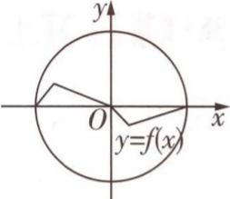图2</td><td>×</td></tr></table>

2.(1)因为 $2x^{2}+2-4x=2(x-1)^{2}\geqslant0$ 恒成立,且 $4x-(-x^{2}+4x)=x^{2}\geqslant0$ 恒成立,所以当 $x\in R$ 时, $2x^{2}+2\geqslant4x\geqslant-x^{2}+4x$ 恒成立,故 $y=h_{1}(x)$ 是 $y=2x^{2}+2$ 与 $y=-x^{2}+4x$ 在R上的“分割函数”.因为 $x+1-(-x^{2}+4x)=x^{2}-3x+1$ ,且当x分别为0,1时,此代数式的值分别为1,-1,所以 $h_{2}(x)\geqslant-x^{2}+4x$ 与 $h_{2}(x)\leqslant-x^{2}+4x$ 在R上都不恒成立,故 $y=h_{2}(x)$ 不是 $y=2x^{2}+2$ 与 $y=-x^{2}+4x$ 在R上的“分割函数”.

(2) 设 $y = ax^{2} + cx + d$ (a, c, d 为参数, $a \neq 0$ ) 是 $y = 2x^{2} + 2$ 与 y = 4x 在 R 上的“分割函数”，则 $2x^{2} + 2 \geqslant ax^{2} + cx + d \geqslant 4x$ 对一切实数 x 恒成立。令 $(2x^{2} + 2)' = 4$ ，得 x = 1，可知 $y = 2x^{2} + 2$ 的图

象在点(1,4)处的切线为直线 y=4x，它也是 $y=ax^{2}+cx+d$ 的图象在点 $(1,a+c+d)$ 处的切线 [点拨： $y=2x^{2}+2$ 的图象在点 $(1,4)$ 处的切线与直线 y=4x 重合，则 $y=ax^{2}+cx+d$ 的图象在点 $(1,a+c+d)$ 处的切线只能为 y=4x，如图3所示]，所以 $\left\{\begin{aligned}&2a+c=4,\\ &a+c+d=4,\end{aligned}\right.$ 可得 $\left\{\begin{aligned}&c=4-2a,\\ &d=a,\end{aligned}\right.$ 要使

$2x^{2}+2\geqslant ax^{2}+(4-2a)x+a\geqslant4x$ 对一切实数 x 恒成立，即 $(2-a)(x-$

$1)^{2} \geqslant 0$ 且 $a(x - 1)^{2} \geqslant 0$ 对一切实数 $x$ 恒成立，则 $2 - a \geqslant 0$ 且 $a > 0$ ，即 $0 < a \leqslant 2$ ，又当 $a = 2$ 时 $y = ax^{2} + (4 - 2a)x + a$ 与 $y = 2x^{2} + 2$ 为相同函数，不合题意。故所求的函数为 $y = ax^{2} + (4 - 2a)x + a(0 < a < 2)$ 。

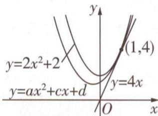

text_image

y
y=2x²+2
y=ax²+cx+d
O
x
y=4x
(1,4)

图 3

# 核心主干

# 抓重点

# 超重点4 求函数值域的3个关键类型

考情速递 通过对近三年全国各省的高考数学试题进行分析和研究，我们会发现与函数值域有关的试题是每年高考数学的必考内容之一。它在近三年高考中的考情与2025高考命题预测为：

<table><tr><td>三年考情与创新命题特点</td><td>2025命题预测</td></tr><tr><td>2023 新课标I卷 T22,通过换元、求导等方法求复杂函数的最值,从而研究矩形周长的最值</td><td rowspan="3">1命题形式:不单独命题,以“求最值”“求范围”等形式作为某道题的一个步骤出现.2考查热点:在立体几何、圆锥曲线、数列、平面向量、函数与导数的应用等问题中,涉及求最值或取值范围的问题,要利用函数思想,通过分析单调性求出函数的值域来解决.3创新考法:在解析几何解答题中,出现结构复杂的代数式(如分式形式、带根号、含三角式等)的取值范围的求解问题,要通过配凑、换元等方法进行转化,再求出值域.</td></tr><tr><td>2023 新课标II卷 T19,以实际问题为情境,通过函数单调性与数形结合思想判断分段函数的最值</td></tr><tr><td>2023 全国乙卷 T12,利用基本不等式求分式的最值,从而求解向量数量积的最值</td></tr></table>

# 类型 1 求复杂函数的值域

调研 1 试题调研原创 已知函数 $f(x)=\frac{1}{2}(x+1)\ln x-x+1,x>1$ . 求 $f(x)$ 的值域.

解析 $f(x)=\frac{1}{2}(x+1)\ln x-x+1$ ，则 $f'(x)=\frac{1}{2}\ln x+\frac{x+1}{2x}-1=\frac{1}{2}\ln x+\frac{1}{2x}-\frac{1}{2},x>1.$

【破瓶颈】对函数 $f(x)$ 求导后，发现无法判断 $f'(x)$ 的正负，故对 $f'(x)$ 再进行求导（二阶求导），通过二阶导数的正负判断 $f'(x)$ 的单调性，即可判断出 $f'(x)$ 的正负

令 $g(x)=\frac{1}{2}\ln x+\frac{1}{2x}-\frac{1}{2}$ ，则 $g'(x)=\frac{1}{2x}-\frac{1}{2x^{2}}=\frac{x-1}{2x^{2}}$ ，当 x>1 时， $g'(x)>0$ ， $g(x)$ 单调递增.

故 $f'(x) > g(1) = 0$ , $f(x)$ 在 $(1, +\infty)$ 上单调递增, 所以 $f(x) > \frac{1}{2} \times (1+1) \times \ln 1 - 1 + 1 = 0$ , 故函数 $f(x) = \frac{1}{2}(x+1) \ln x - x + 1$ , $x > 1$ 的值域是 $(0, +\infty)$ .

本题中函数解析式的结构简单，可以直接对函数进行求导，利用单调性求出值域，考试时，往往遇到所给代数式结构复杂不易直接求导，或者所给代数式中含有不止一个变量的情形，这时就要先分析代数式的结构，对代数式进行转化，其中，含有不止一个变量的代数式，往往要用到换元法，将双变量转化为单变量，再根据“构造函数→求导→判断单调性→求值”的套路求出值域，请看如下变式：

# 原创变式

1 已知 $x_{1} > x_{2} > 0$ ，则 $\ln x_{1} - \ln x_{2} - \frac{2(x_{1} - x_{2})}{x_{1} + x_{2}}$ 的取值范围是 \_\_\_\_.

答案》第038页

# 类型 2 求含三角式函数的值域

调研 2 试题调研原创 设 $x \in [0, \frac{\pi}{2}]$ ，求函数 $y = \frac{\sin x - \cos x}{\sqrt{\sin x} - \sqrt{\cos x}}$ 的值域.

解析 因为 $\sqrt{\sin x} - \sqrt{\cos x} \neq 0$ ，所以 $x \in [0, \frac{\pi}{4}) \cup (\frac{\pi}{4}, \frac{\pi}{2}]$ .

【防失分】注意分母不为0对x的取值限制不要漏掉

$$
y = \frac {\sin x - \cos x}{\sqrt {\sin x} - \sqrt {\cos x}} = \frac {(\sqrt {\sin x} + \sqrt {\cos x}) (\sqrt {\sin x} - \sqrt {\cos x})}{\sqrt {\sin x} - \sqrt {\cos x}} = \sqrt {\sin x} + \sqrt {\cos x}.
$$

【避误区】目标式的分母中含有根号，要想到平方差公式，但不要直接将分子、分母同时乘 $\sqrt{\sin x} + \sqrt{\cos x}$ ，要注意到分子本身也是可以利用平方差公式进行“逆向”转化的

对于 $y = \sqrt{\sin x} + \sqrt{\cos x}$ ，两边平方得 $y^2 = \sin x + \cos x + 2\sqrt{\sin x\cos x}$ .

令 $t = \sin x + \cos x$ ，则 $\sin x \cos x = \frac{t^{2} - 1}{2}$ .

由 $x \in [0, \frac{\pi}{4}) \cup (\frac{\pi}{4}, \frac{\pi}{2}]$ 得 $x + \frac{\pi}{4} \in [\frac{\pi}{4}, \frac{\pi}{2}) \cup (\frac{\pi}{2}, \frac{3\pi}{4}]$ ，则 $t = \sin x + \cos x = \sqrt{2}\sin (x + \frac{\pi}{4}), 1 \leqslant t < \sqrt{2}$ ，所以 $y^2 = t + 2\sqrt{\frac{t^2 - 1}{2}}, t \in [1, \sqrt{2})$ 。

因为函数 $f(t) = t + 2\sqrt{\frac{t^2 - 1}{2}}$ 在区间 $[1, \sqrt{2})$ 上单调递增，所以 $y^2 \in [1, 2\sqrt{2})$ .

因为 $\sqrt{\sin x} + \sqrt{\cos x} > 0$ ，所以 $y \in [1, 2^{\frac{3}{4}})$ .

故函数 $y=\frac{\sin x-\cos x}{\sqrt{\sin x}-\sqrt{\cos x}}$ 的值域为 $\left[1,2^{\frac{3}{4}}\right)$ .

求含三角式函数的值域时，直接利用求导判断单调性的方法常常会“失灵”，原因是三角函数求导后依然是三角函数，解决此类问题一般需要掌握三角函数运算常用的公式对目标式进行化简整理，再结合平方法、配方法、换元法、数形结合法、不等式法等思想方法进行求解。请看如下变式：

# 原创变式

2 设 $\theta \in [0, \frac{\pi}{2}]$ , 求函数 $y = \cos^3\theta - \sin^3\theta$ 的值域.

答案》第038页

# 类型 3 求分式函数的值域

调研 3 试题调研原创 设 b > a > 0, 求 $\frac{b^{2} + a^{2}}{ab - b^{2}}$ 的取值范围.

解析 方法一:换元 + 观察法 因为 b > a > 0, 所以 $\frac{b^{2} + a^{2}}{ab - b^{2}} = \frac{1 + \left(\frac{a}{b}\right)^{2}}{\frac{a}{b} - 1}$ ,

令 $t = \frac{a}{b}$ , 则 $0 < t < 1$ , 记 $f(t) = \frac{1 + t^2}{t - 1}, 0 < t < 1$ .

【学方法】对 $\frac{b^{2}+a^{2}}{ab-b^{2}}$ 进行变形(分子分母同时除以 $b^{2}$ )、换元(令 $t=\frac{a}{b}$ ),构造以t为自变量的函数,再通过求函数值域解决问题

令 s=t-1，可得 $t=s+1$ ，记 $g(s)=\frac{1+(s+1)^{2}}{s}=s+\frac{2}{s}+2,-1<s<0.$

【记重点】函数 $y = x + \frac{k}{x} (k > 0)$ 是对勾函数，在区间 $(-∞, -\sqrt{k})$ 和 $(\sqrt{k}, +∞)$ 上单调递增，在区间 $(-√k, 0)$ 和 $(0, \sqrt{k})$ 上单调递减，这是对勾函数的重要性质，在利用观察法直接判断复杂函数的单调性时常会用到

因为函数 $g(s)$ 在 $(-1,0)$ 上单调递减，且当 $x \to 0^{-}$ 时， $g(s) \to -\infty$

所以 $g(s) < -1 + \frac{2}{-1} + 2 = -1$ ，即 $\frac{b^{2} + a^{2}}{ab - b^{2}}$ 的取值范围是 $(-∞, -1)$ .

方法二:换元 + 配凑法 因为 b > a > 0, 所以 $\frac{b^{2} + a^{2}}{ab - b^{2}} = \frac{1 + \left(\frac{a}{b}\right)^{2}}{\frac{a}{b} - 1}$ ,

令 $t = \frac{a}{b}$ , 则 $0 < t < 1$ , 记 $f(t) = \frac{1 + t^2}{t - 1}, 0 < t < 1$ .

$$
f (t) = \frac {1 + t ^ {2}}{t - 1} = \frac {(t - 1) ^ {2} + 2 t}{t - 1} = \frac {(t - 1) ^ {2} + 2 (t - 1) + 2}{t - 1} = (t - 1) + \frac {2}{t - 1} + 2.
$$

【防易错】注意此处不可使用基本不等式解题，因为 -1 < t - 1 < 0，不符合“一正”“二定”“三相等”中的“一正”

令 s = t - 1, 后续解法同方法一.

# 原创变式

3 已知 $0 < x < 2\sqrt{3}$ ，求函数 $f(x) = \frac{x(2\sqrt{3} - x)}{\sqrt{x^{2} - 2\sqrt{3}x + 4}}$ 的值域.

答案》第038页

# 创新预测

答案 ▶ 039 页

1. 试题调研原创 已知函数 $f(x) = x\mathrm{e}^{x} - \ln x - x - 1, x \in [t,1]$ ，且 $\mathrm{e}^t = \frac{1}{t}$ ，求函数 $f(x)$ 的值域.

# 规范答题

2. 试题调研原创 已知 $0 < \theta < \frac{\pi}{2}$ , 求函数 $f(\theta) = \frac{\sin 3 \theta - \sin 2 \theta}{\sin \theta}$ 的值域.

# 规范答题

3.[2024 湖南岳阳 5 月三模]已知函数 $f(x) = \frac{\frac{3}{2}|x|}{\sqrt{13x^2 - 16x + 16}}, x \in \mathbb{R}$ ，求函数 $f(x)$ 的值域.

# 规范答题

# 参考答案与解析

# 原创变式

1. $(0,+\infty)$ $\ln x_{1}-\ln x_{2}-\frac{2(x_{1}-x_{2})}{x_{1}+x_{2}}=\ln\frac{x_{1}}{x_{2}}-\frac{2(\frac{x_{1}}{x_{2}}-1)}{\frac{x_{1}}{x_{2}}+1}$ ，设 $t=\frac{x_{1}}{x_{2}}$ ，因为 $x_{1}>x_{2}>0$ ，所以 $t=\frac{x_{1}}{x_{2}}>1$ 令 $f(t)=\ln t-\frac{2(t-1)}{t+1},t>1$ , 则 $f'(t)=\frac{1}{t}-\frac{2(t+1)-2(t-1)}{(t+1)^{2}}=\frac{1}{t}-\frac{4}{(t+1)^{2}}=\frac{(t-1)^{2}}{t(t+1)^{2}}$

由 $t > 1$ 得 $f^{\prime}(t) > 0$ ，则函数 $f(t)$ 在 $(1, + \infty)$ 上单调递增，所以 $f(t) > \ln 1 - \frac{2\times(1-1)}{1+1} = 0$ [点拨：仔细观察会发现， $f(t) > 0$ 即 $\ln t - \frac{2(t - 1)}{t + 1} >0$ ，变形得 $\frac{1}{2} (t + 1)\ln t - (t - 1) > 0(t > 1)$ ，该不等式左侧与【调研1】中的函数解析式 $f(x) = \frac{1}{2} (x + 1)\ln x - x + 1(x > 1)$ 形式相同.平时做较复杂的函数题时，应注意这些内在联系]，

故 $\ln x_{1} - \ln x_{2} - \frac{2(x_{1} - x_{2})}{x_{1} + x_{2}}$ 的取值范围是 $(0, +\infty)$ .

2. $y = \cos^{3}\theta - \sin^{3}\theta = (\cos\theta - \sin\theta)(\cos^{2}\theta + \sin\theta\cos\theta + \sin^{2}\theta) = (\cos\theta - \sin\theta)(1 + \sin\theta\cos\theta)$ [结论: $a^{3} - b^{3} = (a - b)(a^{2} + ab + b^{2})$ , $a^{3} + b^{3} = (a + b)(a^{2} - ab + b^{2})$ 是一组重要公式, 要牢记].

令 $t = \cos \theta -\sin \theta$ ，则 $\sin \theta \cos \theta = \frac{1 - t^2}{2},$

由 $\theta \in [0, \frac{\pi}{2}]$ 得 $\theta + \frac{\pi}{4} \in [\frac{\pi}{4}, \frac{3\pi}{4}]$ ，则 $t = \cos \theta - \sin \theta = \sqrt{2} \cos (\theta + \frac{\pi}{4}) \in [-1, 1]$ .

令 $g(t)=t\left(\frac{1-t^{2}}{2}+1\right)=\frac{3t-t^{3}}{2}$ ，则 $g'(t)=\frac{3-3t^{2}}{2}=\frac{3}{2}(1-t^{2})$

令 $g'(t)>0$ , 解得 -1<t<1,

所以函数 $g(t)$ 在区间 $(-1,1)$ 上单调递增，又 $g(-1) = -1, g(1) = 1$ ,

故函数 $y = \cos^{3}\theta - \sin^{3}\theta$ 的值域为 $[-1, 1]$ .

3. 令 $\sqrt{x^2 - 2\sqrt{3}x + 4} = t$ ，则 $x(2\sqrt{3} - x) = 4 - t^2$ ，记 $g(t) = \frac{4 - t^2}{t} = \frac{4}{t} - t$

因为 $0 < x < 2\sqrt{3}$ , 所以 $t = \sqrt{(x - \sqrt{3})^2 + 1} \in [1, 2)$ ,

而 $g(t)=\frac{4}{t}-t$ 在 $[1,2)$ 上单调递减，

所以 $\frac{4}{2} - 2 < g(t) \leqslant \frac{4}{1} - 1$ ，即 $0 < g(t) \leqslant 3$

故函数 $f(x)=\frac{x(2\sqrt{3}-x)}{\sqrt{x^{2}-2\sqrt{3}x+4}}$ 的值域是 $(0,3]$ .

# 创新预测

1. $f^{\prime}(x) = (x + 1)\mathrm{e}^{x} - \frac{1}{x} -1 = (x + 1)(\mathrm{e}^{x} - \frac{1}{x})$ ，由 $x > 0$ 可知 $x + 1 > 0$

令 $h(x)=\mathrm{e}^{x}-\frac{1}{x}, x>0$ [点拨: 对导函数的正负进行充分分析, 只需对不能确定正负的部分再次构造函数即可. 对于函数 $h(x)=\mathrm{e}^{x}-\frac{1}{x}, x>0$ , 不要盲目进行二次求导, 要清楚我们要求的是函数 $h(x)$ 的单调性, 故当能够直接分析出单调性时, 则无须求导],

因为 $y = \mathrm{e}^{x}, y = -\frac{1}{x}$ 在 $(0, +\infty)$ 内均单调递增，则 $h(x)$ 在 $(0, +\infty)$ 内单调递增，

且 $h\left(\frac{1}{2}\right) = \sqrt{\mathrm{e}} - 2 < 0, h(1) = \mathrm{e} - 1 > 0$ ，可知 $h(x)$ 在 $(0, +\infty)$ 内存在唯一零点 $x_0 \in \left(\frac{1}{2}, 1\right)$ ，且 $h(x_0) = \mathrm{e}^{x_0} - \frac{1}{x_0} = 0$ ，又 $\mathrm{e}^t = \frac{1}{t}$ ，所以 $t = x_0$

当 $t \leqslant x \leqslant 1$ 时， $h(x) \geqslant 0$ ，即 $f'(x) \geqslant 0$ ，则 $f(x)$ 在区间 $[t, 1]$ 上单调递增.

由 $\mathrm{e}^t = \frac{1}{t}$ ，可得 $f(t) = t\times \frac{1}{t} -\ln \mathrm{e}^{-t} - t - 1 = 0,f(1) = \mathrm{e} - \ln 1 - 1 - 1 = \mathrm{e} - 2,$

所以函数 $f(x)$ 的值域为 $[0, e-2]$ .

2. $f(\theta) = \frac{\sin 3\theta - \sin 2\theta}{\sin \theta} = \frac{\sin \theta \cos 2\theta + \cos \theta \sin 2\theta - \sin 2\theta}{\sin \theta} = \frac{\sin \theta \cos 2\theta + 2\sin \theta \cos^2 \theta - 2\sin \theta \cos \theta}{\sin \theta} =$

$$
\cos 2 \theta + 2 \cos^ {2} \theta - 2 \cos \theta = 2 \cos^ {2} \theta - 1 + 2 \cos^ {2} \theta - 2 \cos \theta = 4 \cos^ {2} \theta - 2 \cos \theta - 1.
$$

令 $t = \cos \theta$ ，因为 $0 < \theta < \frac{\pi}{2}$ 所以 $0 < \cos \theta < 1$ ，记 $g(t) = 4t^2 - 2t - 1, t \in (0,1)$ .

因为二次函数 $g(t)$ 在区间 $(0, \frac{1}{4})$ 上单调递减，在区间 $(\frac{1}{4}, 1)$ 上单调递增，

所以 $g(t)_{\min} = g(\frac{1}{4}) = -\frac{5}{4}, g(t) < 4 \times 1^2 - 2 \times 1 - 1 = 1$ ，即 $-\frac{5}{4} \leqslant g(t) < 1$ .

故函数 $f(\theta)=\frac{\sin 3\theta-\sin 2\theta}{\sin \theta}$ 的值域为 $\left[-\frac{5}{4},1\right)$ .

3. 当 x=0 时, $f(x)=f(0)=0$ [易错: 解析式中分子、分母同时除以 $|x|(x\neq0)$ 得 $f(x)=\frac{3}{2\sqrt{13-\frac{16}{x}+\frac{16}{x^{2}}}}$ , 使分子不含 x, 再对分母进行配方求出范围. 在执行这一操作前, 应注意 x=0

这一特殊情况].

当 $x \neq 0$ 时, $f(x) = \frac{\frac{3}{2}|x|}{\sqrt{13x^2 - 16x + 16}} = \frac{3}{2\sqrt{13 - \frac{16}{x} + \frac{16}{x^2}}} = \frac{3}{2\sqrt{16 \times (\frac{1}{x} - \frac{1}{2})^2 + 9}}$ ,

因为 $16 \times \left(\frac{1}{x} - \frac{1}{2}\right)^2 + 9 \geqslant 9$ ，所以 $0 < \frac{3}{2\sqrt{16 \times \left(\frac{1}{x} - \frac{1}{2}\right)^2 + 9}} \leqslant \frac{1}{2}$ . 故函数 $f(x)$ 的值域为 $[0, \frac{1}{2}]$ .

# 超重点5 函数的4个重要性质及应用

考情速递 对函数基本性质的考查是高考数学的必考内容，涉及函数与方程思想、整体思想、分类讨论思想等.与函数性质有关的问题在近几年高考中的考情与2025高考命题预测为：

<table><tr><td>三年考情与创新命题特点</td><td>2025命题预测</td></tr><tr><td>2024 新课标I卷T6,给出分段函数的单调性,求参数的取值范围</td><td rowspan="4">1命题形式:选择题、填空题、解答题中均有可能呈现.2必考热点:利用函数的性质比大小、作图、识别图象;命制多选题,综合考查抽象函数的性质;命制数列、圆锥曲线、立体几何中与最值有关的问题,考查函数思想与函数性质的应用.3创新考法:命制新定义题,研究陌生函数的性质;定义新性质,要求理解新定义的内涵,并进行转化.</td></tr><tr><td>2023 新课标I卷T11,研究抽象函数的奇偶性(多选题,综合考查函数性质)</td></tr><tr><td>2023 新课标II卷T6,已知函数的单调性,求参数的最值</td></tr><tr><td>2023 全国乙卷T4,已知函数的奇偶性,求参数的值</td></tr></table>

# 性质 ① 函数单调性的判断与应用

调研 1 试题调研原创 已知 $f(x)$ 是 R 上的减函数, 若 $a = f(\ln \frac{41}{16})$ , $b = f(\frac{5}{4})$ , c = $f(4(\ln 3 - \ln 2))$ , 则 ( )

A. $a < b < c$

B. $a < c < b$

C. c < b < a

D. $c < a < b$

解析 设 $g(x)=x-\ln(x^{2}+1)$ ，则 $g(\frac{5}{4})=\frac{5}{4}-\ln\frac{41}{16}$ . $g'(x)=1-\frac{2x}{x^{2}+1}=\frac{(x-1)^{2}}{x^{2}+1}\geqslant0$ ，所

【释疑难】结合分式形式构造函数，先不看对数符号，寻找 $\frac{5}{4}$ 和 $\frac{41}{16}$ 之间的关联， $\frac{41}{16}$ 可表示为 $(\frac{5}{4})^{2}+1$ 以 $g(x)$ 在R上单调递增，又 $g(0)=0$ ，所以当x>0时， $g(x)>0$ ，则 $g(\frac{5}{4})>0$ ，所以 $\frac{5}{4}>\ln\frac{41}{16}$ .

设 $h(x) = x - 2\ln (x + 1)$ ，则 $h(\frac{5}{4}) = \frac{5}{4} - 2\ln \frac{9}{4} = \frac{5}{4} - 4(\ln 3 - \ln 2)$ .

$h'(x)=1-\frac{2}{x+1}=\frac{x-1}{x+1}$ ，计算并列表如下.

<table><tr><td>x的范围或取值</td><td>(0,1)</td><td>1</td><td>(1,+∞)</td></tr><tr><td>h&#x27;(x)</td><td>-</td><td>0</td><td>+</td></tr><tr><td>h(x)</td><td>↓</td><td>1-2ln2</td><td>↑</td></tr></table>

又 $h(2) = 2 - 2\ln 3 < 2 - 2\ln \mathrm{e} = 0$ ，所以 $h(\frac{5}{4}) < h(2) < 0$ ，所以 $\frac{5}{4} < 4(\ln 3 - \ln 2)$ .

由上可知 $\ln \frac{41}{16} < \frac{5}{4} < 4(\ln 3 - \ln 2)$ ，又 $f(x)$ 单调递减，

所以 $f(4(\ln 3 - \ln 2)) < f(\frac{5}{4}) < f(\ln \frac{41}{16})$ ，即 $c < b < a$ ，故选C.

高分攻略 若题目中给出抽象函数在某个区间内的单调性, 要比较几个代数式的大小, 往往要考虑将代数式转化到同一个单调区间内, 再进行比较. 如果题目中没有出现函数, 只有几个代数式时, 往往要根据代数式的形式, 构造函数, 结合函数的单调性比较大小. 此外, 一些问题中会给出与函数单调性有关的“等价条件”, 这些条件一经变形后即得函数的单调性, 如【原创变式1】.

巧妙挖掘单调性,快速构造函数

<table><tr><td>题目条件</td><td>应对策略</td></tr><tr><td> $x_{1} \neq x_{2}, (x_{1} - x_{2}) [f(x_{1}) - f(x_{2})] > 0 / \frac{f(x_{1}) - f(x_{2})}{x_{1} - x_{2}} > 0$ </td><td>根据定义直接得单调递增</td></tr><tr><td> $xf'(x) + af(x)$ </td><td>构造函数  $g(x) = x^{a}f(x)$ </td></tr><tr><td> $f'(x) + af(x) > 0$ </td><td>构造函数  $g(x) = e^{ax}f(x)$ ,其单调递增</td></tr><tr><td> $f'(x)\sin x + f(x)\cos x/f'(x)\sin x - f(x)\cos x$ </td><td>构造函数  $g(x) = f(x)\sin x/g(x) = \frac{f(x)}{\sin x}$ </td></tr><tr><td> $f'(x)\cos x - f(x)\sin x/f'(x)\cos x + f(x)\sin x$ </td><td>构造函数  $g(x) = f(x)\cos x/g(x) = \frac{f(x)}{\cos x}$ </td></tr></table>

# 原创变式

1 定义在 $\mathbf{R}$ 上的函数 $f(x)$ 满足 $f(x)\sin x + f'(x)\cos x > 0$ ，则 （）

A. $f(\frac{\pi}{3}) < \sqrt{3} f(\frac{\pi}{6})$

B. $f(\frac{\pi}{6})<\sqrt{3}f(\frac{\pi}{3})$

C. $f(\frac{\pi}{3}) > \sqrt{3}f(\frac{\pi}{6})$

D. $f(\frac{\pi}{6}) > \sqrt{3} f(\frac{\pi}{3})$

答案》第046页

# 性质 ② 函数奇偶性的判断与应用

调研 2 [2024 山东聊城 5 月三模] 定义域为 R 的函数 $f(x)$ 满足 $f(-x)=f(x)+2x$ ，且当 $x\geqslant0$ 时， $f'(x)>2x-1$ ，则不等式 $f(2x-1)-f(x)<3x^{2}-5x+2$ 的解集为（）

A. $(-\infty, 1)$

B. $\left(\frac{1}{3},1\right)$

C. $\left(-\frac{1}{3},+\infty\right)$

D. $(-∞,-\frac{1}{3})∪(1,+∞)$

解析 设 $g(x)=f(x)-x^{2}+x$ ，结合 $f(-x)=f(x)+2x$ 可得 $g(-x)=f(-x)-x^{2}-x=f(x)+2x-x^{2}-x=g(x)$ ，即 $g(x)$ 为 R 上的偶函数.

【释疑难】由 $f(-x)=f(x)+2x$ 得 $f(-x)-x=f(x)+x$ ，即 $y=f(x)+x$ 为偶函数，但该函数和待解不等式不配套，结合偶函数的定义可知 $y=f(x)\pm x^{2}+x$ 依然为偶函数，据此结合 $f'(x)>2x-1$ 继续求解

当 $x \geqslant 0$ 时, $f'(x) > 2x - 1$ , 则 $g'(x) = f'(x) - 2x + 1 > 0$ , 所以 $g(x)$ 在 $(0, +\infty)$ 上单调递增, 在 $(- \infty, 0)$ 上单调递减. 由 $f(2x - 1) - f(x) < 3x^2 - 5x + 2$ 得 $f(2x - 1) - (2x - 1)^2 + (2x - 1) < f(x) - x^2 + x$ , 即 $g(2x - 1) < g(x)$ , 所以 $|2x - 1| < |x|$ , 即 $(2x - 1)^2 < x^2$ , 得 $\frac{1}{3} < x < 1$ . 故选 B.

# 高分攻略

高分必用的奇、偶函数性质结论

<table><tr><td></td><td>奇函数</td><td>偶函数</td></tr><tr><td>定义</td><td> $y=f(x)(x\in A)$ 为奇函数 $\Leftrightarrow$ 定义域A关于原点对称且 $f(-x)=-f(x)$ </td><td> $y=f(x)(x\in A)$ 为偶函数 $\Leftrightarrow$ 定义域A关于原点对称且 $f(-x)=f(x)$ </td></tr><tr><td>相同性质</td><td colspan="2">定义域都关于原点对称,奇、偶函数各自加、减,不改变奇偶性,即奇函数±奇函数=奇函数,偶函数±偶函数=偶函数</td></tr><tr><td rowspan="3">不同性质</td><td>函数图象关于原点中心对称</td><td>函数图象关于y轴轴对称</td></tr><tr><td>若奇函数在区间 $[a,b](0\leqslant a若偶函数在区间\( [a,b](0\leqslant a上具有单调性,则其在\( [-b,-a]$ 上具有相同的单调性</td><td>若偶函数在区间 $[a,b](0\leqslant a上具有单调性,则其在\( [-b,-a]$ 上具有相反的单调性</td></tr><tr><td>在运算结果有意义且函数定义域关于原点对称的前提下,奇函数与奇函数的乘、除组合会变为偶函数</td><td>在运算结果有意义且函数定义域关于原点对称的前提下,偶函数与偶函数的乘、除组合依然为偶函数</td></tr></table>

# 原创变式

2 若 $f(x) = \frac{1 - ae^x}{1 + e^x}\sin x$ 为偶函数, 则 $a =$

A.1

B.0

C.-1

D. 2

答案》第046页

# 性质 3 函数周期性的判断与应用

调研 3 [2024 安徽合肥一六八中学、池州一中等十校 4 月第三次联考] 函数 $f(x)$ 满足 $f(x + \frac{\pi}{3}) = -\frac{1}{1 + f(x)}$ ，且 $f(\frac{\pi}{3}) = 1$ ，则 $\sum_{i=1}^{2024} f(\frac{\pi i}{3}) =$

A. -1 010

B. -1 010.5

C. 0

D. 2024

解析 $\because f(x + \frac{\pi}{3}) = -\frac{1}{1 + f(x)}, \therefore f(x + \frac{2\pi}{3}) = -\frac{1}{1 + f(x + \frac{\pi}{3})} = -\frac{1}{1 - \frac{1}{1 + f(x)}} = -1 -$

$\frac{1}{f(x)}, \therefore f(x + \pi) = -\frac{1}{1 + f(x + \frac{2\pi}{3})} = f(x), \therefore \pi$ 是 $f(x)$ 的一个周期.

$$
\because f (\frac {\pi}{3}) = 1, \therefore f (\frac {2 \pi}{3}) = - \frac {1}{1 + f (\frac {\pi}{3})} = - \frac {1}{2}, f (\pi) = - \frac {1}{1 + f (\frac {2 \pi}{3})} = - 2,
$$

  
巧用“二级结论法”
速解求和问题

$$
\therefore f \left(\frac {\pi}{3}\right) + f \left(\frac {2 \pi}{3}\right) + f (\pi) = - \frac {3}{2}, \therefore \sum_ {i = 1} ^ {2 0 2 4} f \left(\frac {\pi i}{3}\right) = 6 7 4 \left[ f \left(\frac {\pi}{3}\right) + f \left(\frac {2 \pi}{3}\right) + f (\pi) \right] + f \left(\frac {\pi}{3}\right) +
$$

$f(\frac{2\pi}{3}) = 674 \times (-\frac{3}{2}) + 1 - \frac{1}{2} = -1010.5.$ 故选B.

# 抢分秘籍

高分必知的函数周期性的速推二级结论

<table><tr><td>描述</td><td>正周期值</td></tr><tr><td> $f(x+a)=f(x+b),a\neq0,b\neq0,a\neq b$ </td><td> $T=|b-a|$ </td></tr><tr><td> $f(x+a)=-f(x),a\neq0$ </td><td> $T=2|a|$ </td></tr><tr><td> $f(x+a)=\pm\frac{c}{f(x)},a\neq0,c\neq0$ </td><td> $T=2|a|$ </td></tr><tr><td> $f(x+a)=\frac{1-f(x)}{1+f(x)},a\neq0$ </td><td> $T=2|a|$ </td></tr><tr><td> $f(x+a)=-\frac{1}{1+f(x)},a\neq0$ </td><td> $T=3|a|$ </td></tr></table>

# 原创变式

3 [含年份数字 2024 的抽象函数问题] 已知函数 $f(x)$ 的定义域为 $\mathbf{R}, \forall x, y \in \mathbf{R}, f(x + 1)f(y + 1) = f(x + y) - f(x - y)$ ，若 $f(0) \neq 0$ ，则 $f(2024) =$ （）

A.-2

B. -4

C. 2

D. 4

答案》第046页

# 性质 4 函数图象对称性的判断与应用

调研 4 试题调研原创 已知 $f(x)$ 为 R 上的奇函数, $f'(x)$ 为 $f(x)$ 的导函数, 若 $f(x) = f(2 - x) + 4x - 4$ , 则 $f'(2025) =$ ()

A.1

B. -2 025

C.2

D. 2025

解析 $f(x)=f(2-x)+4x-4$ ，求导得 $f'(x)=-f'(2-x)+4$ ，即 $f'(x)+f'(2-x)=4$ ①.

【释疑难】对函数图象对称性的考查有时是“隐形”的，如此式可化为 $f'(x+1)-2=2-f'(1-x)$ ，说明 $y=f'(x)$ 的图象关于点(1,2)对称

因为 $f(x)$ 为 R 上的奇函数，则 $f(-x) = -f(x)$ ，求导得 $f'(x) = f'(-x)$ ，所以 $f'(x)$ 是

【巧转化】 $y=f'(x)$ 的图象既关于点(1,2)对称，又关于y轴对称，那么据此可推断出周期性，简记为“对称性+对称性→周期性”

R上的偶函数,所以 $f'(2-x)=f'(x-2)$ ,结合①式可得, $f'(x)+f'(x-2)=4$ ,

所以 $f'(x-2)+f'(x-4)=4$ ，两式相减得 $f'(x)=f'(x-4)$ ，所以 $f'(x)$ 是周期为4的周期函数，所以 $f'(2025)=f'(1)$ 。由①式，令x=1，得 $f'(1)=2$ ，所以 $f'(2025)=f'(1)=2$ 。故选C。

# 抢分秘籍

高分必知的函数图象对称性速推二级结论

<table><tr><td>描述</td><td>结论</td></tr><tr><td> $f(a-x)=f(a+x)$ 或 $f(2a-x)=f(x)$ </td><td> $y=f(x)$ 的图象关于直线 $x=a$ 对称</td></tr><tr><td> $f(a-x)=f(b+x)$ 或 $f(a+b-x)=f(x)$ </td><td> $y=f(x)$ 的图象关于直线 $x=\frac{a+b}{2}$ 对称</td></tr><tr><td> $f(a-x)+f(a+x)=2b$ 或 $f(2a-x)+f(x)=2b$ </td><td> $y=f(x)$ 的图象关于点 $(a,b)$ 对称</td></tr><tr><td> $f(a-x)+f(c+x)=2b$ 或 $f(a+c-x)+f(x)=2b$ </td><td> $y=f(x)$ 的图象关于点 $(\frac{a+c}{2},b)$ 对称</td></tr><tr><td> $y=f(x)$ 的图象同时关于直线 $x=a,x=b$ 对称</td><td> $f(x)$ 是周期函数,周期 $T=2|b-a|$ </td></tr><tr><td> $y=f(x)$ 的图象同时关于点 $(a,m),(b,n)$ 对称</td><td> $f(x)$ 是周期函数,周期 $T=2|b-a|$ </td></tr><tr><td> $y=f(x)$ 的图象关于直线 $x=a$ 对称,且关于点 $(b,c)$ 对称</td><td> $f(x)$ 是周期函数,周期 $T=4|b-a|$ </td></tr></table>

# 原创变式

4 定义域为 R 的函数 $f(x)$ 满足 $f(x) + f(3 - x) = 4, f(x)$ 的导函数 $g(x)$ 为连续函数，函数 $y = g(x - 1)$ 的图象关于点 $(2, 1)$ 中心对称，则 $f\left(\frac{3}{2}\right) + g(2025) =$ （）

A. 3

B. -3

C. 1

D. -1

答案》第046页

# 创新预测

答案▶046页

1. 试题调研原创 已知定义在 $\mathbf{R}$ 上的函数 $f(x)$ 满足 $f(-x) = -f(x)$ , 且对任意的 $x_{1}, x_{2} \in [0, +\infty), x_{1} \neq x_{2}$ , 都有 $\frac{f(x_{2}) - f(x_{1})}{x_{2} - x_{1}} > 2, f(1) = 2026$ , 则满足不等式 $f(x - 2025) > 2(x - 1013)$ 的 $x$ 的取值范围是 ( )

A. $(2026,+\infty)$

B. $(2025,+\infty)$

C. $(1\ 013, +\infty)$

D. $(1012,+\infty)$

2.[2024 武汉外国语学校、武昌实验中学等校 4 月联考](多选)已知函数 $f(x)$ 和 $f(x+1)$ 都是偶函数,当 $x\in[0,1]$ 时, $f(x)=-(x-1)^{2}+2$ ,则下列结论正确的是()

A. 当 $x \in [-2,0]$ 时, $f(x) = -(x+1)^{2} + 2$   
B. 若函数 $g(x)=f(x)-2^{-x}-1$ 在区间 $(0,2)$ 上有两个零点 $x_{1}, x_{2}$ ，则有 $x_{1}+x_{2}<2$   
C. 函数 $h(x)=\frac{f(x)}{2^{x}}$ 在 [4,6] 上的最小值为 $\frac{1}{64}$   
D. $f(\log_{3}4) < f(\log_{4}\frac{5}{16})$

3.[2024 上海杨浦区 4 月二模 | 新定义 · 无奇函数] 设函数 $y = f(x)$ 的定义域 $D \subseteq \mathbb{R}$ , 若对任意的 $x \in D$ , 均有 $f(-x) \neq -f(x)$ , 则称 $y = f(x)$ 为无奇函数.

(1) 判断函数 $f(x)=x^{2}$ 和 $g(x)=\lg\frac{2-x}{1+x}$ 是否为无奇函数, 并说明理由.  
(2) 若函数 $h(x)=3x^{3}-2x^{2}+x+a$ 是定义在 $[-1,2]$ 上的无奇函数，求实数 a 的取值范围.  
(3) 若函数 $r(x)=\frac{1}{2^{x+1}+1}+m$ 是无奇函数, 求实数 m 的取值范围.

# 规范答题

# 参考答案与解析

# 原创变式

1.B 令 $F(x) = \frac{f(x)}{\cos x}, x \neq \frac{\pi}{2} + k\pi, k \in \mathbb{Z}$ ，则 $F'(x) = \frac{f'(x)\cos x + f(x)\sin x}{\cos^2 x} > 0$ 恒成立，故 $F(x)$ 在 $(-\frac{\pi}{2} + k\pi, \frac{\pi}{2} + k\pi) (k \in \mathbb{Z})$ 上单调递增 [关键：根据题干中的不等式构造函数，使得函数具有单调性]，故 $F(\frac{\pi}{6}) < F(\frac{\pi}{3})$ ，即 $\frac{2}{\sqrt{3}} f(\frac{\pi}{6}) < 2f(\frac{\pi}{3}) \Rightarrow f(\frac{\pi}{6}) < \sqrt{3} f(\frac{\pi}{3})$ . 故选 B.

2.A 因为 $f(x)$ 为偶函数,所以 $f(-x)=f(x)$ ,所以 $f(-1)=f(1)$ [技巧:已知函数的奇偶性求参数,不需要研究所有自变量的情况,只需要从特值入手求出参数,将参数代回检验即可],即 $\frac{1-a\mathrm{e}^{-1}}{1+\mathrm{e}^{-1}}\sin(-1)=\frac{1-a\mathrm{e}}{1+\mathrm{e}}\sin1$ ,即 $-(\mathrm{e}-\mathrm{a})=1-\mathrm{ae}$ ,所以a=1.经检验,当a=1时, $f(-x)=\frac{1-\mathrm{e}^{-x}}{1+\mathrm{e}^{-x}}\sin(-x)=-\frac{\mathrm{e}^{x}-1}{\mathrm{e}^{x}+1}\sin x=f(x)$ ,符合题意.故选A.

3.A 令 $x = y = 0$ , 得 $f(1) \cdot f(1) = f(0) - f(0) = 0$ , 即 $f(1) = 0$ . 令 $x = 0$ , 得 $f(1) \cdot f(y + 1) = f(y) - f(-y) = 0$ , 得 $f(-y) = f(y)$ , $\therefore$ 函数 $f(x)$ 为偶函数. 令 $x = y = 1$ , 得 $[f(2)]^2 = f(2) - f(0)$ . 令 $x = y = -1$ , 得 $[f(0)]^2 = f(-2) - f(0) = f(2) - f(0)$ . $\therefore [f(2)]^2 = [f(0)]^2, \therefore f(2) = f(0)$ 或 $f(2) = -f(0)$ . 若 $f(2) = f(0)$ , 则 $f(0) = 0$ , 与已知 $f(0) \neq 0$ 矛盾, $\therefore f(2) = -f(0)$ , 即 $[f(2)]^2 = 2f(2)$ , 得 $f(2) = 2, f(0) = -2$ . 令 $y = 1$ , 得 $f(x + 1) \cdot f(2) = f(x + 1) - f(x - 1)$ , $\therefore 2f(x + 1) = f(x + 1) - f(x - 1), \therefore f(x + 1) = -f(x - 1), \therefore f(x + 2) = -f(x), \therefore f(x + 4) = f(x)$ [释疑: 题目给出的函数是抽象函数, 采用赋值法求出特定函数值, 再对 $y$ 赋值得到只含 $x$ 的关系式, 即 $f(x)$ 与 $f(x + 4)$ 之间的关系式, 进而得周期性], $\therefore f(x)$ 的周期为 $4, f(2024) = f(0) = -2$ . 故选 A.

4.A $f(x)+f(3-x)=4$ , 则函数 $f(x)$ 的图象关于点 $(\frac{3}{2},2)$ 中心对称, 且 $f(\frac{3}{2})=2$ . 由 $f'(x)-f'(3-x)=0$ , $f'(x)=g(x)$ , 得 $g(x)=g(3-x)$ , 所以函数 $g(x)$ 的图象关于直线 $x=\frac{3}{2}$ 对称. 根据图象变换规律, 由 $y=g(x-1)$ 的图象关于点 $(2,1)$ 中心对称, 得 $g(x)$ 的图象关于点 $(1,1)$ 中心对称, 又函数 $g(x)$ 为连续函数, 所以 $g(1)=1$ . 由于 $g(x)$ 的图象既关于直线 $x=\frac{3}{2}$ 对称, 又关于点 $(1,1)$ 对称, 则 $g(x)$ 是周期函数, 周期为 $T=4\times(\frac{3}{2}-1)=2$ [难点: 根据本节【调研4】“抢分秘籍”中最后1条结论可得], 所以 $g(2025)=g(1)=1$ , 故 $f(\frac{3}{2})+g(2025)=2+1=3$ .

# 创新预测

1.A $\frac{f(x_{2})-f(x_{1})}{x_{2}-x_{1}}>2\rightarrow\frac{\left[f(x_{2})-2x_{2}\right]-\left[f(x_{1})-2x_{1}\right]}{x_{2}-x_{1}}>0\rightarrow$ 函数 $y=f(x)-2x$ 在 $[0,+\infty)$ 上单调递增 [另解:也可通过“令 $0\leqslant x_{1}<x_{2}$ ，则 $f(x_{2})-f(x_{1})>2x_{2}-2x_{1}$ ，即 $f(x_{2})-2x_{2}>f(x_{1})-2x_{1}$ ”得到函数 $y=f(x)-2x$ 在 $[0,+\infty)$ 上单调递增]，又 $f(-x)=-f(x)$ ，所以 $f(x)$ 为奇函数，所以 $y=f(x)-2x$ 为奇函数，所以 $y=f(x)-2x$ 在 R 上单调递增. $f(x-2025)>2(x-$

1013), $f(1)=2026\rightarrow f(x-2025)-2(x-2025)>f(1)-2\rightarrow x-2025>1\rightarrow x>2026\rightarrow$ 选A.

2.ACD $f(x)$ 和 $f(x+1)$ 都是偶函数 $\rightarrow f(-x)=f(x)$ , $f(1-x)=f(1+x)\rightarrow f(x+1)=f(1-x)=f(x-1)\rightarrow f(x+2)=f(x)\rightarrow f(x)$ 的周期为 2.

<table><tr><td>选项</td><td>分析过程</td><td>正误</td></tr><tr><td>A</td><td>当 $x \in [0,1]$ 时, $f(x) = -(x-1)^{2} + 2$ ,且函数 $f(x)$ 的图象关于直线 $x=1$ 对称→当 $x \in [0,2]$ 时, $f(x) = -(x-1)^{2} + 2$ →设 $x \in [-2,0] \rightarrow -x \in [0,2] \rightarrow f(-x) = -(x+1)^{2} + 2$ →当 $x \in [-2,0]$ 时, $f(x) = -(x+1)^{2} + 2$ </td><td>√</td></tr><tr><td>B</td><td>当 $x \in [0,2]$ 时, $f(x) = -(x-1)^{2} + 2$ →不妨设 $0 < x_{1} < x_{2} < 2$ ,易知函数 $y = 2^{-x} + 1$ 在 $(0,2)$ 上单调递减 $\rightarrow 2^{-x_{1}} + 1 > 2^{-x_{2}} + 1$ , $g(x_{1}) = g(x_{2}) = 0 \rightarrow -(x_{1}-1)^{2} + 2 > -(x_{2}-1)^{2} + 2 \rightarrow (x_{2}-x_{1})(x_{2}+x_{1}-2) > 0 \rightarrow x_{1} + x_{2}-2 > 0 \rightarrow x_{1}+x_{2} > 2$ </td><td>×</td></tr><tr><td>C</td><td> $f(x)$ 在 $[0,2]$ 上的最小值为1,最大值为2, $f(x)$ 的周期为 $2 \rightarrow f(x)$ 在 $[4,6]$ 上的最小值为 $f(6) = 1 \rightarrow y = 2^{x}$ 在 $[4,6]$ 上 $\nearrow \rightarrow h(x) = \frac{f(x)}{2^{x}}$ 在 $[4,6]$ 上的最小值为 $\frac{f(6)}{2^{6}} = \frac{1}{64}$ </td><td>√</td></tr><tr><td>D</td><td> $f(\log_{4}\frac{5}{16}) = f(\log_{4}5 - 2) = f(\log_{4}5)$ , $\log_{3}4 - \log_{4}5 = \frac{\lg 4}{\lg 3} - \frac{\lg 5}{\lg 4} = \frac{(\lg 4)^{2} - \lg 3 \cdot \lg 5}{\lg 3 \cdot \lg 4} > \frac{(\lg 4)^{2} - (\frac{\lg 3 + \lg 5}{2})^{2}}{\lg 3 \cdot \lg 4} = \frac{(\lg 4)^{2} - (\lg \sqrt{15})^{2}}{\lg 3 \cdot \lg 4} > 0 \rightarrow 2 > \log_{3}4 > \log_{4}5 > 1$ ,又 $f(x)$ 在 $[1,2]$ 上 $\searrow \rightarrow f(\log_{4}5) > f(\log_{3}4) \rightarrow f(\log_{3}4) < f(\log_{4}\frac{5}{16})$ </td><td>√</td></tr></table>

3.(1) $f(0)=0$ , 满足 $f(-x)=-f(x)$ , 所以 $f(x)=x^{2}$ 不是无奇函数.

$g(x)+g(-x)=\lg\frac{2-x}{1+x}+\lg\frac{2+x}{1-x}=\lg\frac{4-x^{2}}{1-x^{2}}\neq0$ 恒成立,所以 $g(x)=\lg\frac{2-x}{1+x}$ 是无奇函数.

(2) 由题意得 $h(x) + h(-x) = 0$ 在 $[-1, 2]$ 上无解，即关于 $x$ 的方程 $a = 2x^2$ 在 $[-1, 2]$ 上无解，所以 $a \in (-\infty, 0) \cup (8, +\infty)$ .  
(3) 若 $r(x)=m+\frac{1}{2^{x+1}+1}$ 不是无奇函数，则 $r(x)+r(-x)=\frac{1}{1+2^{x+1}}+\frac{1}{2^{-x+1}+1}+2m=0$ 有解，即 $-2m=\frac{2^{x+1}+2^{-x+1}+2}{(2^{x+1}+1)(2^{-x+1}+1)}=\frac{2(2^{x}+2^{-x}+1)}{4+2(2^{x}+2^{-x})+1}$ 有解，即 $-m=\frac{2^{x}+2^{-x}+1}{2(2^{x}+2^{-x})+5}$ 有解.

令 $t = 2^{x} + 2^{-x}$ , 则 $t \geqslant 2$ [易错: 换元, 简化形式, 注意新元的取值范围], 则 $\frac{2^{x} + 2^{-x} + 1}{2(2^{x} + 2^{-x}) + 5} = \frac{t + 1}{2t + 5} = \frac{\frac{1}{2}(2t + 5) - \frac{3}{2}}{2t + 5} = \frac{1}{2} - \frac{3}{4t + 10} \in [\frac{1}{3}, \frac{1}{2})$ , 所以 $\frac{1}{2} > -m \geqslant \frac{1}{3}$ , 即 $-\frac{1}{2} < m \leqslant -\frac{1}{3}$ . 所以 $r(x)$ 是无奇函数时, 实数 $m$ 的取值范围是 $(- \infty, -\frac{1}{2}] \cup (-\frac{1}{3}, +\infty)$ .

# 超重点6 函数图象的变换法则与应用

考情速递 高考对函数性质的考查有时会通过研究函数的图象及其变换进行，函数图象是近几年全国各省的高考数学试题考查的重点和难点，函数图象在近几年高考中的考情与2025高考命题预测为：

<table><tr><td>三年考情与创新命题特点</td><td>2025命题预测</td></tr><tr><td>2023 全国甲卷 T10,由函数图象的平移变换求所得图象与直线的交点个数</td><td rowspan="2">1命题形式:多为选择题、填空题.2必考热点:在选择题、填空题中,常以函数图象为载体,考查函数图象的识别,涉及函数的单调性、最值、极值、零点、图象的对称性等.</td></tr><tr><td>2022 全国甲卷 T5,结合函数图象的对称性与特殊点识别函数图象</td></tr></table>

# 法则 1 函数图象的平移、伸缩变换与应用

调研 1 [2024 北京市丰台区 4 月二模]为了得到函数 $y = \log_{2}(2x - 2)$ 的图象, 只需把函数 $y = \log_{2}x$ 的图象上的所有点 ( )

A. 向左平移 2 个单位长度, 再向上平移 2 个单位长度  
B. 向右平移 2 个单位长度, 再向下平移 2 个单位长度  
C. 向左平移 1 个单位长度, 再向上平移 1 个单位长度  
D. 向右平移 1 个单位长度, 再向上平移 1 个单位长度

解析

<table><tr><td>选项</td><td>分析过程</td><td>正误</td></tr><tr><td>A</td><td>曲线 $y=\log_{2}x$ 向左平移2个单位长度,再向上平移2个单位长度,可得曲线 $y=\log_{2}(x+2)+2=\log_{2}4(x+2)=\log_{2}(4x+8)$ 【敲黑板】对数的运算法则及平移变换的规律的应用,注意“左加右减,上加下减”</td><td>×</td></tr><tr><td>B</td><td>曲线 $y=\log_{2}x$ 向右平移2个单位长度,再向下平移2个单位长度,可得曲线 $y=\log_{2}(x-2)-2=\log_{2}\frac{x-2}{4}$ </td><td>×</td></tr><tr><td>C</td><td>曲线 $y=\log_{2}x$ 向左平移1个单位长度,再向上平移1个单位长度,可得曲线 $y=\log_{2}(x+1)+1=\log_{2}2(x+1)=\log_{2}(2x+2)$ </td><td>×</td></tr><tr><td>D</td><td>曲线 $y=\log_{2}x$ 向右平移1个单位长度,再向上平移1个单位长度,可得曲线 $y=\log_{2}(x-1)+1=\log_{2}2(x-1)=\log_{2}(2x-2).$ </td><td>√</td></tr></table>

故选 D.

# 结论速记

函数图象平移变换的2个必记规律

<table><tr><td>左右平移</td><td> $y=f(x)$ 的图象向左(向右)平移 $a(a>0)$ 个单位长度得到函数 $y=f(x+a)(y=f(x-a))$ 的图象</td><td rowspan="2">口诀:左加右减,上加下减</td></tr><tr><td>上下平移</td><td> $y=f(x)$ 的图象向上(向下)平移 $k(k>0)$ 个单位长度得到函数 $y=f(x)+k(y=f(x)-k)$ 的图象</td></tr></table>

调研 2 试题调研原创 将函数 $f(x)=2+\log_{3}x$ 图象上所有点的横坐标变化为原来的 $m(m>0)$ 倍,纵坐标保持不变,得到 $g(x)=\log_{3}x$ 的图象,则m= \_\_\_\_.

【传技巧】图象上所有点的横坐标的变化既可以看作某点的横坐标的变化，也可以看作图象的伸缩变换

解析 方法一 将函数 $f(x) = 2 + \log_3 x$ 图象上一点 $(x, y)$ 的横坐标变化为原来的 $m (m > 0)$ 倍得到点 $(mx, y)$ ，

又点 $(mx,y)$ 在 $g(x)=\log_{3}x$ 的图象上,故 $y=\log_{3}mx$ .

又 $y=2+\log_{3}x$ ，即 $2+\log_{3}x=\log_{3}mx$ ，即 $\log_{3}9x=\log_{3}mx$ ，故 m=9。故填9。

方法二:利用伸缩变换 将函数 $f(x)$ 图象上所有点的横坐标变化为原来的 m (m > 0) 倍, 纵坐标保持不变, 可得函数 $f(\frac{1}{m}x)$ 的图象,

因为 $f(x)=2+\log_{3}x$ ，所以 $f(\frac{1}{m}x)=2+\log_{3}\frac{1}{m}x.$

又 $f(\frac{1}{m}x)$ 的图象即 $g(x)$ 的图象,所以 $2+\log_{3}\frac{1}{m}x=\log_{3}x$ ,即 $\log_{3}\frac{9}{m}x=\log_{3}x$ ,故m=9.故填9.

# 结论速记

# 函数图象伸缩变换的 2 个必记规律

伸缩
变换

$y=f(x)$ 的图象 $\xrightarrow[\text{变为原来的}]{\text{各点纵坐标不变,横坐标}}y=f(ax)$ 的图象

$y=f(x)$ 的图象 $\xrightarrow[变为原来的A(A>0)倍]{各点横坐标不变,纵坐标}y=Af(x)$ 的图象

# 法则 ② 函数图象的对称变换与应用

调研 3 试题调研原创 已知函数 $f(x) = \begin{cases} x^{-2}, & x < 0, \\ x^{\frac{1}{2}}, & x \geqslant 0, \end{cases}$ 则 $y = -f(x)$ 的图象大致为 （）

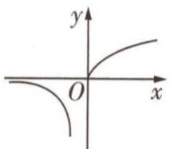

text_image

y
O
x

A

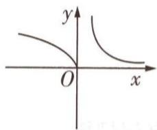

text_image

y
O
x

B

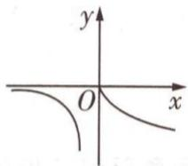

text_image

y
O
x

C

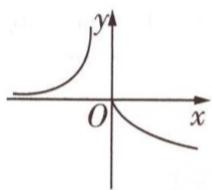

text_image

y
O
x

D

解析 结合题意可得: 当 x<0 时, $f(x)=x^{-2}=\frac{1}{x^{2}}$ 为幂函数, 其在 $(-∞,0)$ 上单调递增; 当 $x≥0$ 时, $f(x)=x^{\frac{1}{2}}=\sqrt{x}$ 也为幂函数, 其在 $[0,+∞)$ 上单调递增.

【消卡壳】涉及分段函数问题，往往需要分类讨论哦！

故函数 $f(x)=\left\{\begin{aligned}x^{-2},&x<0,\\ x^{\frac{1}{2}},&x\geqslant0\end{aligned}\right.$ 的大致图象如图1所示.

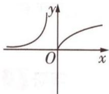

text_image

y
O
x

图1

要得到 $y = -f(x)$ 的图象, 只需将 $y = f(x)$ 的图象沿 x 轴对称即可. 故选 C.

【敲黑板】注意 $y = f(x)$ 与 $y = -f(x)$ 的图象的特征，它们是关于 $x$ 轴对称的

# 结论速记

# 函数图象 4 种对称变换的必记结论

<table><tr><td rowspan="4">对称变换</td><td> $y=f(x)$ 的图象 $\xrightarrow{关于x轴对称}y=-f(x)$ 的图象</td></tr><tr><td> $y=f(x)$ 的图象 $\xrightarrow{关于y轴对称}y=f(-x)$ 的图象</td></tr><tr><td> $y=f(x)$ 的图象 $\xrightarrow{关于原点对称}y=-f(-x)$ 的图象</td></tr><tr><td> $y=a^{x}(a>0 \text{ 且 } a\neq1)$ 的图象 $\xrightarrow{关于直线 y=x 对称}y=\log_{a}x(a>0 \text{ 且 } a\neq1)$ 的图象</td></tr></table>

# 原创变式

已知图2对应的函数为 $y = f(x)$ ，则图3对应的函数是 （）

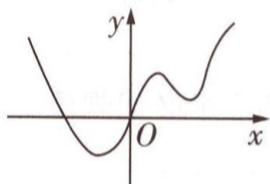

text_image

y
O
x

图2

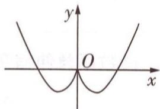

text_image

y
O
x

图 3

A. $y = f(-|x|)$

B. $y = f(-x)$

C. $y = f(|x|)$

D. $y = -f(-x)$

答案》第052页

# 法则 ③ 函数图象的翻折变换与应用

调研 4 [2024 河北省石家庄市 5 月检测] 给定函数 $f(x) = |x^{2} + x|$ , $g(x) = x + \frac{1}{x}$ , 用 $M(x)$ 表示 $f(x)$ , $g(x)$ 中的较大者, 记为 $M(x) = \max\{f(x), g(x)\}$ . 若函数 $y = M(x)$ 的图象与直线 y = a 有 3 个不同的交点, 则实数 a 的取值范围是 \_\_\_\_.

解析 在同一平面直角坐标系下画出 $f(x)=|x^{2}+x|$ , $g(x)=x+\frac{1}{x}$ 的图象, 如图 4 所示.

【消卡壳】在同一平面直角坐标系下画出 $f(x)$ , $g(x)$ 的图象是解题的关键哦！注意 $f(x)$ 的图象在x轴下方没有图象，要把曲线 $y=x^{2}+x$ 在x轴下方的图象翻折到x轴上方，x轴上方原图象保持不变

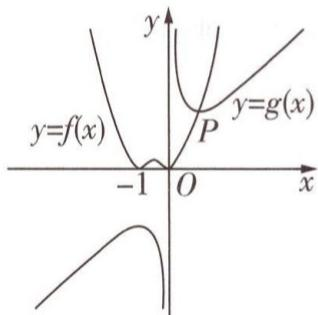

text_image

y
y=f(x)
-1 O x
P
y=g(x)

图 4

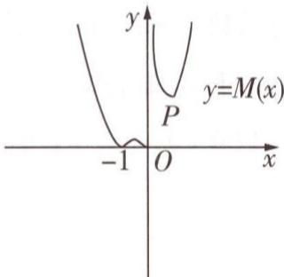

text_image

y
y=M(x)
P
-1 O x

图 5

作出 $M(x)=\max\{f(x),g(x)\}$ 的图象,如图 5,

其中 $(|x^{2}+x|)_{\max}=\frac{1}{4}(-1\leqslant x\leqslant0)$ ，当且仅当 $x=-\frac{1}{2}$ 时取得.

设函数 $f(x), g(x)$ 的图象在第一象限的交点为 $P(x, y)$ ，则由 $\begin{cases} y = |x^2 + x|, \\ y = x + \frac{1}{x}, \\ x > 0, y > 0, \end{cases}$ 得 $P(1, 2)$ .

若直线 y=a 与函数 $y=M(x)$ 的图象有 3 个不同的交点，

则数形结合可得 $0 < a < \frac{1}{4}$ 或 a > 2. 故填 $(0, \frac{1}{4}) \cup (2, +\infty)$ .

# 结论速记

# 函数图象翻折变换的2个必记规律

<table><tr><td rowspan="2">翻折变换</td><td> $y = f(x)$ 的图象 $\xrightarrow[x\text{轴及上方部分不变}]{x\text{轴下方部分翻折到}x\text{轴上方}}y = |f(x)|$ 的图象</td></tr><tr><td> $y = f(x)$ 的图象 $\xrightarrow[\text{原}y\text{轴左侧部分去掉,右侧不变}]y\text{轴右侧部分翻折到}y\text{轴左侧}]{y\text{轴右侧部分翻折到}y\text{轴左侧}}y = f(|x|)$ 的图象</td></tr></table>

# 创新预测

答案▶052页

1. 试题调研原创 已知对数函数 $f(x) = \log_a x$ ，将函数 $f(x)$ 的图象上所有点的纵坐标不变，横坐标扩大为原来的3倍，得到函数 $g(x)$ 的图象，再将 $g(x)$ 的图象向上平移2个单位长度，所得图象恰好与函数 $f(x)$ 的图象重合，则 $a$ 的值是（）

A. $\frac{3}{2}$

B. $\frac{2}{3}$

C. $\frac{\sqrt{3}}{3}$

D. $\sqrt{3}$

2. 试题调研原创（多选）设函数 $f(x) = \ln x$ ，则下列说法正确的有（）

A. 函数 $f(x)$ 的图象与函数 $y = \ln(-x)$ 的图象关于 x 轴对称

B. 函数 $f(|x|)$ 的图象关于 y 轴对称

C. 函数 $\left|f(x+1)\right|$ 的图象在 $(0,+\infty)$ 上单调递减

D. $\left|f\left(\frac{1}{3}\right)\right|<\left|f(4)\right|$

# 参考答案与解析

# 原创变式

A 根据函数图象知, 当 $x \leqslant 0$ 时, 所求函数图象与已知函数图象相同, 当 $x > 0$ 时, 所求函数图象与 $x < 0$ 时的函数图象关于 $y$ 轴对称, 即所求函数为偶函数, 故 BD 不符合要求. 当 $x \leqslant 0$ 时, $y = f(-|x|) = f(x), y = f(|x|) = f(-x)$ [关键: 注意函数 $f(x), f(|x|), f(-|x|)$ 之间的关系], 故 A 正确, C 错误. 故选 A.

# 创新预测

1.D 将函数 $f(x)$ 的图象上所有点的纵坐标不变, 横坐标扩大为原来的 3 倍, 可得到函数 $g(x)$ 的图象, 所以 $g(x) = \log_a \frac{x}{3}$ [关键: $g(x) = f(\frac{x}{3})$ , 横坐标扩大为原来的 3 倍, 对应 $x$ 的系数变为 $\frac{1}{3}$ ], 即 $g(x) = \log_a x - \log_a 3$ .

将 $g(x)$ 的图象向上平移 2 个单位长度, 所得图象的函数解析式为 $y = \log_{a} x - \log_{a} 3 + 2$ , 该函数图象恰好与函数 $f(x)$ 的图象重合, 所以 $-\log_{a} 3 + 2 = 0$ , 所以 $a^{2} = 3$ .

又 a > 0 且 $a \neq 1$ ，则 $a = \sqrt{3}$ ，故选 D.

# 2.BD

<table><tr><td>选项</td><td>分析过程</td><td>正误</td></tr><tr><td>A</td><td>由函数图象对称变换的规律可知, $y = \ln(-x)$ 的图象如图6,其与 $y = \ln x$ 的图象关于y轴对称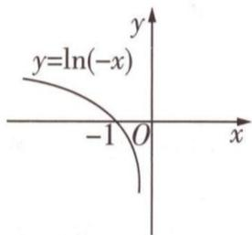图6</td><td>×</td></tr><tr><td>B</td><td>由函数图象翻折变换的规律可知, $y = f(|x|)$ 的图象如图7,其本身关于y轴对称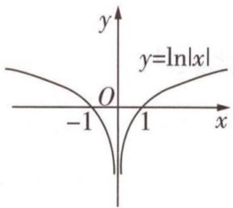图7</td><td>√</td></tr><tr><td>C</td><td>由函数图象变换可知, $|f(x+1)|$ 的图象如图8[点拨:变换细节为 $y = f(x)$ 的图象向左平移1个单位长度 $y = f(x+1)$ 的图象 $\frac{x\text{轴下方部分翻折到}x\text{轴上方}}{x\text{轴及上方部分不变}}$  $y = |f(x+1)|$ 的图象],函数 $y = |f(x+1)|$ 在 $(0, +\infty)$ 上单调递增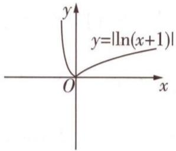图8</td><td>×</td></tr><tr><td>D</td><td> $|f(\frac{1}{3})| = |\ln \frac{1}{3}| = \ln 3, |f(4)| = |\ln 4| = \ln 4,$ 因为函数 $y = \ln x$ 在定义域上单调递增,所以 $\ln 3 < \ln 4$ ,即 $|f(\frac{1}{3})| < |f(4)|$ </td><td>√</td></tr></table>

# 超重点7 代数式比较大小的3个秒破快招

考情速递 代数式比较大小是高考数学常考的综合性题目，试题灵活，突出考查构造、放缩等方法. 代数式比较大小在近几年高考中的考情与2025高考命题预测为：

三年考情与创新命题特点  
2025命题预测 

<table><tr><td>2024天津卷T5,指数、对数式比大小</td></tr><tr><td>2023全国甲卷T11,利用复合函数单调性比大小</td></tr><tr><td>2023天津卷T3,指数函数式比大小</td></tr><tr><td>2022新高考I卷T7,指数函数式、对数函数式、分数综合比大小</td></tr></table>

①命题形式：大概率以单选题的形式出现，但不排除命制为填空题或多选题的可能性，更好地发挥选拔作用.  
②必考热点：指、对数式变形找同构形式，作差法构造函数，导数法研究函数的单调性.  
③创新考法：结合实际背景或新定义考查，或者交汇二项式定理，与常规的对数式、三角函数式等综合比大小.

# 快招 ① 用估值法快速比大小

调研 1 试题调研原创 已知 $a = e^{0.5}$ , $b = \frac{8}{5}$ , $c = \frac{\pi}{1.8}$ , 则 ( )

A. b < a < c

B. $c < a < b$

C. c < b < a

D. b < c < a

解析 因为 2.71 < e < 2.72，所以 $\sqrt{2.71} < a = e^{0.5} < \sqrt{2.72}$ ，而 $b = \frac{8}{5} = 1.6 = \sqrt{2.56}$ ， $c = \frac{\pi}{1.8} > \frac{3.14}{1.8} > 1.7 = \sqrt{2.89}$ ，所以 c > a > b。故选 A。

【变思路】开根号不容易计算，逆向思维，直接比较根号内的数值，就很容易了

# 提分快招

# 5 个估值法比大小必用的泰勒展开式

1. $e^{x}=1+x+\frac{x^{2}}{2!}+\frac{x^{3}}{3!}+\cdots$ （如【调研1】可估值得 $a\approx1.625$ ）；

2. $\ln(x+1)=x-\frac{x^{2}}{2}+\frac{x^{3}}{3}-\frac{x^{4}}{4}+\cdots;$

3. $\sqrt{1+x}=1+\frac{x}{2}-\frac{x^{2}}{8}+\frac{x^{3}}{16}-\cdots;$

4. $\sin x = x - \frac{x^{3}}{3!} + \frac{x^{5}}{5!} - \frac{x^{7}}{7!} + \cdots;$

5. $\cos x = 1 - \frac{x^{2}}{2!} + \frac{x^{4}}{4!} - \frac{x^{6}}{6!} + \cdots.$

若题目中给出来常见估值式和超越数,可以进行近似计算,得出每个值的近似值或大致区间,再比较大小即可.事实上,还可以利用泰勒展开式估值比较大小,如【原创变式1】.

# 原创变式

1（多选）设 $a = \mathrm{e}^{0.02} - 1, b = \ln 1.02, c = \frac{1}{51}, d = \sqrt{1.02} - 1$ ，则下列结论正确的是 （）

A. $b < a$

B. b < c

C. d < b

D. $d < c$

答案》第057页

# 快招 ② 用构造函数法准确比大小

调研 2 [2024 湖北武汉 5 月质量检测] 设 $a = 2 \left( e^{\frac{1}{2024}} - 1 \right)$ , $b = e^{\frac{1}{1012}} - 1$ , $c = \sin \frac{1}{2024} + \tan \frac{1}{2024}$ , 则 ( )

A. b > a > c

B. c > b > a

C. a > b > c

D. b > c > a

解析 令 $h(x) = \mathrm{e}^{2x} - 1 - 2(\mathrm{e}^x - 1)$ , 则 $h(0) = 0$ , 当 $x > 0$ 时, $h'(x) = 2\mathrm{e}^{2x} - 2\mathrm{e}^x > 0$ , 所以 $h(x)$ 在 $(0, +\infty)$ 上单调递增, 所以 $h(\frac{1}{2024}) > h(0) = 0$ , 即 $\mathrm{e}^{\frac{1}{1012}} - 1 - 2(\mathrm{e}^{\frac{1}{2024}} - 1) > 0$ , 所以 $b > a$ .

令 $f(x)=2\left(\mathrm{e}^{x}-1\right)-\sin x-\tan x,x\in(0,\frac{\pi}{6})$ ，则 $f'(x)=2\mathrm{e}^{x}-\cos x-\frac{1}{\cos^{2}x},x\in(0,\frac{\pi}{6})$

【释疑难】观察代数式的形式，找到共同点2024(1012可以看作 $2024\div2$ )，作差构造函数比大小

令 $g(x)=f'(x)$ , $x\in(0,\frac{\pi}{6})$ ，则 $g'(x)=2\mathrm{e}^{x}+\sin x-\frac{2\sin x}{\cos^{3}x}$ ，因为 $x\in(0,\frac{\pi}{6})$ ，所以 $2\mathrm{e}^{x}>2,0<\sin x<\frac{1}{2},\frac{\sqrt{3}}{2}<\cos x<1$ ，所以 $\frac{2\sin x}{\cos^{3}x}<\frac{2\times\frac{1}{2}}{(\frac{\sqrt{3}}{2})^{3}}=\frac{8}{3\sqrt{3}}<2$ ，即 $g'(x)>2+0-2=0$ ，所以 $g(x)$ 在 $(0,\frac{\pi}{6})$ 上单调递增，则 $g(x)>2\mathrm{e}^{0}-\cos0-\frac{1}{\cos^{2}0}=0$ ，所以 $f'(x)>0$ 在 $(0,\frac{\pi}{6})$ 上恒成立，即 $f(x)$ 在 $(0,\frac{\pi}{6})$ 上单调递增，所以 $f(\frac{1}{2024})>0$ ，即 $2(\mathrm{e}^{\frac{1}{2024}}-1)>\sin\frac{1}{2024}+\tan\frac{1}{2024}$ ，所以 a>c.

综上所述，b > a > c. 故选 A.

速解大招 构造函数速破比大小问题的2个大招 

<table><tr><td></td><td>具体操作</td></tr><tr><td>大招1:同构比较</td><td>构造函数f(x),把代数式a,b分别看作f(m),f(n),由m,n的大小关系和f(x)的单调性可得a,b的大小关系</td></tr><tr><td>大招2:作差比较</td><td>要比较a,b,构造函数f(x),使得f(m)=a-b,由f(x)的单调性得f(m)=a-b&gt;0(&lt;0),则a&gt;b(a</td></tr></table>

# 原创变式

2 设 $a = \left(\frac{1012}{1011}\right)^{2023}, b = \left(\frac{1013}{1012}\right)^{2025}$ , 则下列关系正确的是 ( )

A. $e^{2}<a<b$

B. $e^{2}<b<a$

C. $a < b < e^{2}$

D. $b < a < e^{2}$

答案》第058页

# 快招 ③ 用放缩法巧妙比大小

调研 3 [2024 重庆 5 月模拟] $a = \frac{1}{10}, b = \ln 1.21, c = 10\sin \frac{1}{100}$ , 则 ( )

A. a > b > c

B. b > a > c

C. c > a > b

D. c > b > a

解析 由 $1 - \frac{1}{x} \leqslant \ln x \leqslant x - 1 (x > 0$ , 当 $x = 1$ 时取等号) 可得 $\frac{x}{1 + x} \leqslant \ln (x + 1) \leqslant x (x > -1$ , 当 $x = 0$ 时取等号), 所以 $\frac{0.21}{1 + 0.21} < b = \ln 1.21 = \ln (1 + 0.21) < 0.21$ , 即 $\frac{21}{121} < b < 0.21$ , 而 $\frac{21}{121} > \frac{1}{10}$ , 所以 $b > \frac{21}{121} > a$ . 由不等式 $\sin x \leqslant x (x \geqslant 0$ , 当 $x = 0$ 时取等号) 可得 $\sin \frac{1}{100} < \frac{1}{100}$ , 所以 $10 \sin \frac{1}{100} < \frac{1}{10}$ , 即 $c < a$ . 综上, $c < a < b$ . 故选 B.

【释疑难】以 $\frac{1}{10}$ 作为放缩的中间值比较大小

# 疑难突破

放缩法的核心在于利用不等式,对数式进行放大或缩小,从而“去对数”、“去指数”或“去三角函数”. 运用不等式放缩时通常有: (1) 直接放缩(利用下表中的常用不等式或者函数单调性放缩), (2) 去项放缩(舍弃一些项来实现放缩简化), (3) 系数放缩(因式分解, 将乘式的系数放缩).

对号入座应用放缩不等式,秒杀比大小问题

<table><tr><td>类型</td><td>放缩不等式</td></tr><tr><td>指数式</td><td>1 $e^x \geqslant x+1$ (当x=0时取等);2 $e^x \geqslant ex$ (当x=1时取等);3 $e^x \leqslant \frac{1}{1-x}$ (x&lt;1,当x=0时取等);4 $e^x >1+x+\frac{x^2}{2}$ (x&gt;0)</td></tr><tr><td>对数式</td><td>1 $1-\frac{1}{x} \leqslant \ln x \leqslant x-1$ (x&gt;0,当x=1时取等);2 $\frac{x}{x+1} \leqslant \ln(x+1) \leqslant x$ (x&gt;-1,当x=0时取等);3 $\frac{1}{x+1} < \ln(1+\frac{1}{x}) < \frac{1}{x}$ (x&gt;0);4 $\ln x \leqslant \frac{1}{e}x$ (x&gt;0,当x=e时取等)</td></tr><tr><td>三角函数式</td><td>1 $\sin x \leqslant x \leqslant \tan x$ (0≤x&lt; $\frac{\pi}{2}$ ,当x=0时取等);2 $\sin x >x - \frac{1}{6}x^3$ (x&gt;0);3 $\cos x >1 - \frac{1}{2}x^2$ (x&gt;0)</td></tr><tr><td>其他不等式</td><td>1 $\sqrt{1+x} \leqslant 1+\frac{x}{2}$ (x≥-1,当x=0时取等);2伯努利不等式:(1+x) $^n \geqslant 1 + nx$ (x&gt;0,n∈N*,当n=1时取等)</td></tr></table>

# 原创变式

3（多选）已知 $a = \ln 1.5, b = \mathrm{e}^{-0.5}, c = \sin 0.5, d = 0.3$ ，则

A. $c > a > d$

B. a > c > d

C. b > c > a

D. b > a > d

答案》第059页

# 创新预测

答案▶059页

1.[2024东北师大附中5月模拟] $a=e^{0.1}-1,b=\frac{2}{21},c=\ln1.1$ ，则()

A. b < a < c

B. $c < a < b$

C. c < b < a

D. b < c < a

2. 试题调研原创 $a = \sin \frac{\pi}{5}, b = \ln \frac{3}{2}, c = \frac{1}{2}$ , 则 ( )

A. a > b > c

B. $c > a > b$

C. c > b > a

D. $a > c > b$

3. 试题调研原创 $a = 1.01 + \sin 0.01, b = 1 + \ln 1.01, c = \mathrm{e}^{0.01}$ , 则 ( )

A. b > c > a

B. a > c > b

C. c > b > a

D. c > a > b

# 参考答案与解析

# 原创变式

1.ACD 方法一:利用泰勒展开式 由 $e^{x} \approx 1 + x + \frac{x^{2}}{2} + \frac{x^{3}}{6}$ ，令 x = 0.02，得 a =

$e^{0.02}-1\approx1+0.02+\frac{0.02^{2}}{2}+\frac{0.02^{3}}{6}-1\approx0.0202.$ 由 $\ln(x+1)\approx x-\frac{1}{2}x^{2}+$

$\frac{1}{3} x^3$ ，令 $x = 0.02$ ，得 $b = \ln 1.02 = \ln (1 + 0.02)\approx 0.02 - \frac{1}{2}\times 0.02^2 +\frac{1}{3}\times 0.02^3\approx 0.0198,c = \frac{1}{51}\approx$ $0.0196,d = \sqrt{1.02} -1 = \sqrt{1 + 0.02} -1.$

设 $f(x)=\sqrt{1+x}-1$ ，则 $f'(x)=\frac{1}{2}(1+x)^{-\frac{1}{2}}$ ， $f''(x)=-\frac{1}{4}(1+x)^{-\frac{3}{2}}$ ， $f^{(3)}(x)=\frac{3}{8}(1+x)^{-\frac{5}{2}}$ ，因为 $f(0)=0$ ， $f'(0)=\frac{1}{2}$ ， $f''(0)=-\frac{1}{4}$ ， $f^{(3)}(0)=\frac{3}{8}$ ，所以 $f(x)=f(0)+f'(0)x+\frac{f''(0)}{2}x^{2}+\frac{f^{(3)}(0)}{6}x^{3}+\cdots$ [难点：此处用到了 $f(x)$ 在 $x_{0}$ 处的n阶泰勒展开式 $f(x)=f(x_{0})+f'(x_{0})(x-x_{0})+\frac{f''(x_{0})}{2!}(x-x_{0})^{2}+\cdots+\frac{f^{(n)}(x_{0})}{n!}(x-x_{0})^{n}+\cdots]\approx f(0)+f'(0)x+\frac{f''(0)}{2}x^{2}+\frac{f^{(3)}(0)}{6}x^{3}=\frac{1}{2}x-\frac{1}{8}x^{2}+\frac{1}{16}x^{3}$ 。令x=0.02，得 $d=f(0.02)\approx\frac{1}{2}\times0.02-\frac{1}{8}\times0.02^{2}+\frac{1}{16}\times0.02^{3}\approx0.0100$ [突破：展开的阶数越高，计算的精度越高，但计算复杂度也随之升高，我们可以通过选择恰当的展开阶数，来达到我们需要的计算精度]，所以d<c<b<a。故选ACD。

方法二:构造函数法 $a = e^{0.02} - 1, b = \ln 1.02 = \ln (1 + 0.02), c = \frac{1}{51} = \frac{1}{50 + 1}, d = \sqrt{1.02} - 1 = \sqrt{1 + 0.02} - 1.$

  
“泰勒公式法”速解函数比大小问题

<table><tr><td>选项</td><td>分析过程</td><td>正误</td></tr><tr><td>A</td><td>设 $f(x) = e^{x} - \ln(x + 1) - 1, x \in (0, +\infty)$ ,则 $f'(x) = e^{x} - \frac{1}{x + 1}$ ,令 $g(x) = f'(x) = e^{x} - \frac{1}{x + 1}$ ,则 $g'(x) = e^{x} + \frac{1}{(x + 1)^{2}} >0$ 恒成立,所以 $f'(x)$ 在 $(0, +\infty)$ 上单调递增,则 $f'(x) >e^{0} - \frac{1}{0 + 1} = 0$ 恒成立,所以 $f(x)$ 在 $(0, +\infty)$ 上单调递增,则 $f(0.02) = e^{0.02} - \ln 1.02 - 1 >e^{0} - \ln(0 + 1) - 1 = 0$ ,即 $\ln 1.02 < e^{0.02} - 1$ ,所以 $b < a$ </td><td>√</td></tr><tr><td>B</td><td>设 $h(x) = x \ln x - x, x \in (1, +\infty)$ [构造: $b = \ln 1.02, c = \frac{1}{51} = \frac{1}{50 + 1} = \frac{2}{102}$ ,发现均与1.02有关,由此构造函数],则 $h'(x) = \ln x >0$ ,故 $h(x)$ 在 $(1, +\infty)$ 上单调递增,则 $h(1.02) = 1.02 \ln 1.02 - 1.02 >1 \times \ln 1 - 1 = -1$ ,则 $\ln 1.02 >\frac{2}{102} = \frac{1}{51}$ ,所以 $b >c$ </td><td>×</td></tr><tr><td>D</td><td>设 $m(x) = (2x + 1)^{2} - (1 + x)^{3}, x \in (0, 1)$ ,则 $m'(x) = 4(2x + 1) - 3(1 + x)^{2} = -3x^{2} + 2x + 1 = -(3x + 1)(x - 1)$ ,当 $x \in (0, 1)$ 时, $m'(x) >0$ ,所以 $m(x)$ 在 $(0, 1)$ 上单调递增,所以有 $m(0.02) = (1 + 0.04)^{2} - (1 + 0.02)^{3} >0$ ,即 $(\frac{1 + 0.04}{1 + 0.02})^{2} > 1 + 0.02$ ,所以 $\frac{1}{51} >\sqrt{1.02} - 1$ ,则 $d < c$ </td><td>√</td></tr><tr><td>C</td><td>由前面分析可知 $d < c, c < b$ ,所以 $d < b$ </td><td>√</td></tr></table>

2.B $\ln a = 2023\ln \frac{1012}{1011} = (2\times 1011 + 1)\ln (1 + \frac{1}{1011}),\ln b = 2025\ln \frac{1013}{1012} = (2\times 1012 +$

1) $\ln (1 + \frac{1}{1012})$ [释疑: 利用指对互化将所给式子化为同构形式]. 设 $f(x) = (2x + 1)\ln (1 + \frac{1}{x}) = (2x + 1)[\ln (x + 1) - \ln x](x > 1)$ , 则 $f'(x) = 2\ln (x + 1) - 2\ln x + (2x + 1)(\frac{1}{x + 1} - \frac{1}{x}) = 2\ln (1 + \frac{1}{x}) - \frac{1}{1 + \frac{1}{x}} (\frac{2}{x} + \frac{1}{x^2})$ , 设 $g(x) = 2\ln (1 + x) - \frac{x^2 + 2x}{1 + x} (0 < x < 1)$ , 则 $g'(x) = -\frac{x^2}{(1 + x)^2} < 0$ , 所以 $g(x)$ 在 $(0, 1)$ 上单调递减, 则 $g(x) < 2\ln (1 + 0) - \frac{0^2 + 2 \times 0}{1 + 0} = 0$ , 即 $f'(x) < 0$ , 所以 $f(x)$ 在 $(1, +\infty)$ 上单调递减, 则 $f(1011) > f(1012)$ , 即 $\ln a > \ln b$ , 所以 $a > b$ . 设 $h(x) = \ln (x + 1) - \frac{2x}{x + 2}(x > 0)$ , 则 $h'(x) = \frac{1}{x + 1} - \frac{4}{(x + 2)^2} = \frac{x^2}{(x + 1)(x + 2)^2} > 0$ , 所以 $h(x)$ 在 $(0, +\infty)$ 上单调递增, 则 $h(\frac{1}{x}) > \ln (0 + 1) - \frac{2 \times 0}{0 + 2} = 0$ , 即 $\ln (1 + \frac{1}{x}) - \frac{\frac{2}{x}}{\frac{1}{x} + 2} = \ln (1 + \frac{1}{x}) -$

$\frac{2}{2x + 1} = \frac{(2x + 1)\ln(1 + \frac{1}{x}) - 2}{2x + 1} = \frac{f(x) - 2}{2x + 1} >0$ ，得 $f(x) > 2$ ，所以 $f(1012) > 2$ ，即 $\ln b > 2$ ，得 $b > \mathrm{e}^2$ .综上， $\mathrm{e}^2 < b < a.$ 故选B.

3.ACD 由 $1 - \frac{1}{x} \leqslant \ln x \leqslant x - 1 (x > 0$ , 当 $x = 1$ 时取等) 可得 $\frac{1}{3} < a = \ln 1.5 < 0.5$ , 由 $\mathrm{e}^x \geqslant x + 1$ (当 $x = 0$ 时取等) 可得 $b = \mathrm{e}^{-0.5} > 0.5$ , 由 $\sin x \leqslant x \leqslant \tan x (0 \leqslant x < \frac{\pi}{2}$ , 当 $x = 0$ 时取等) 可得 $c = \sin 0.5 < 0.5$ , 所以 $b > a, b > c, a > d$ . 由 $\ln (x + 1) = x - \frac{x^2}{2} + \frac{x^3}{3} - \frac{x^4}{4} + \cdots, \sin x = x - \frac{x^3}{3!} + \frac{x^5}{5!} - \frac{x^7}{7!} + \cdots$ 得 $\ln 1.5 \approx 0.5 - \frac{0.5^2}{2} + \frac{0.5^3}{3} = \frac{5}{12}, \sin 0.5 \approx 0.5 - \frac{0.5^3}{6} = \frac{23}{48}$ [难点: 应用泰勒公式估算], $\frac{5}{12} < \frac{23}{48}$ , 所以 $\ln 1.5 < \sin 0.5$ , 即 $a < c$ . 综上, $d < a < c < b$ . 故选 ACD.

# 创新预测

1.D 因为 $e^{0.1} \approx 1 + 0.1 + \frac{0.1^{2}}{2} = 1.105$ ，所以 $a \approx 0.105, c = \ln 1.1 = \ln(1 + 0.1) \approx 0.1 - \frac{0.1^{2}}{2} + \frac{0.1^{3}}{3} - \frac{0.1^{4}}{4} \approx 0.0953, b = \frac{2}{21} \approx 0.0952$ ，所以 b < c < a。故选 D.

2.D $a = \sin \frac{\pi}{5} >\sin \frac{\pi}{6} = \frac{1}{2} = c$ ，由 $\frac{x}{x + 1}\leqslant \ln (x + 1)\leqslant x(x > - 1$ ，当 $x = 0$ 时取等)可得 $b = \ln (1+$ $\frac{1}{2}) <   \frac{1}{2} = c$ ，故 $a > c > b$ ，故选D.

3.B 由 $\frac{x}{x + 1} \leqslant \ln (x + 1) \leqslant x (x > -1$ ，当 $x = 0$ 时取等）可得 $1 + \frac{0.01}{1.01} < b = 1 + \ln 1.01 < 1 + 0.01$ ，即 $\frac{1.02}{1.01} < b < 1.01$ ，由 $\mathrm{e}^x \geqslant x + 1$ （当 $x = 0$ 时取等）可得 $c = \mathrm{e}^{0.01} > 1.01$ ，所以 $c > 1.01 > b$ .

构造函数法 令 $f(x) = 1 + x + \sin x - \mathrm{e}^x$ ，则 $f'(x) = 1 + \cos x - \mathrm{e}^x$ ，令 $h(x) = 1 + \cos x - \mathrm{e}^x$ ，则 $h'(x) = -\sin x - \mathrm{e}^x < 0$ 在区间 $(0, \frac{1}{2})$ 上恒成立，所以 $f'(x)$ 在区间 $(0, \frac{1}{2})$ 上单调递减，又 $f'(\frac{1}{2}) = 1 + \cos \frac{1}{2} - \mathrm{e}^{\frac{1}{2}} > 1 + \cos \frac{\pi}{6} - \mathrm{e}^{\frac{1}{2}} = 1 + \frac{\sqrt{3}}{2} - \mathrm{e}^{\frac{1}{2}}$ [关键：利用三角函数的单调性放缩]， $(1 + \frac{\sqrt{3}}{2})^2 = 1 + \frac{3}{4} + \sqrt{3} > \mathrm{e}$ ，所以 $f'(\frac{1}{2}) > 0$ ，即 $f(x)$ 在区间 $(0, \frac{1}{2})$ 上单调递增，所以 $f(0.01) = 1.01 + \sin 0.01 - \mathrm{e}^{0.01} > f(0) = 0$ ，即 $c < a$ . 综上， $b < c < a$ ，故选 B.

放缩估算法 由 $\sin x > x - \frac{1}{6} x^3 (x > 0)$ 可得 $a = 1.01 + \sin 0.01 > 1.01 + 0.01 - \frac{0.01^3}{6} > \frac{611}{600}$ , 由 $\mathrm{e}^x \leqslant \frac{1}{1 - x} (x < 1$ , 当 $x = 0$ 时取等) 可得 $c = \mathrm{e}^{0.01} < \frac{1}{0.99} = \frac{100}{99}$ , 所以 $c < \frac{100}{99} < \frac{611}{600} < a$ . 综上, $b < c < a$ , 故选 B.

# 超重点8 函数零点问题的3个核心考法

考情速递 函数零点问题是高考常考的热点问题，综合考查函数、方程、不等式等多方面的知识，在近三年高考中的考情与2025高考命题预测为：

<table><tr><td>三年考情与创新命题特点</td><td>2025命题预测</td></tr><tr><td>2024天津卷T15,已知函数 $f(x)=2\sqrt{x^{2}-ax} - |ax-2|+1$ 有零点,求参数的取值范围</td><td rowspan="4">1命题形式:选择题、填空题、解答题中均有可能呈现.2必考热点:判断零点的个数;根据零点的个数求参数的取值范围;函数的隐零点问题.3创新考法:研究周期函数的零点的和或积;双变量不等式问题.</td></tr><tr><td>2023新课标I卷T15,已知函数 $f(x)=\cos\omega x-1(\omega>0)$ 在区间 $[0,2\pi]$ 上有且仅有3个零点,求参数的取值范围</td></tr><tr><td>2023全国乙卷T8,已知函数 $f(x)=x^{3}+ax+2$ 存在3个零点,求参数的取值范围</td></tr><tr><td>2023天津卷T15,已知函数 $f(x)=ax^{2}-2x-|x^{2}-ax+1|$ 有且仅有两个零点,求参数的取值范围</td></tr></table>

# 考法 1 判断函数的零点个数

调研 1 试题调研原创 已知函数 $\varphi(x)=\frac{1}{2}ax^{2}-(a-1)x-\ln x$ ，若 a>2，则函数 $\varphi(x)$ 零点的个数是 （）

A.0

B. 1

C.2

D. 3

解析 $\varphi'(x)=ax-(a-1)-\frac{1}{x}=\frac{ax^{2}-(a-1)x-1}{x}=\frac{(ax+1)(x-1)}{x}.$

因为 a > 2, x > 0, 所以 $\frac{ax + 1}{x} > 0$ ,

所以当 $x \in (0,1)$ 时， $\varphi'(x) < 0, \varphi(x)$ 单调递减；

当 $x \in (1, +\infty)$ 时， $\varphi'(x) > 0, \varphi(x)$ 单调递增.

所以 $\varphi(x)_{\min} = \varphi(1) = -\frac{1}{2}a + 1.$

因为 a > 2，所以 $\varphi(1) < 0$ ，又 $\varphi(2) = 2a - 2(a - 1) - \ln 2 = 2 - \ln 2 > 0$ ，

所以 $\varphi(x)$ 在 $(1, +\infty)$ 上有唯一零点.

【用技巧】若函数 $f(x)$ 在区间 $(a,b)$ 上单调，且 $f(a)f(b)<0$ ，则函数 $f(x)$ 在区间 $(a,b)$ 上有唯一零点

因为 $\varphi(x) = \frac{1}{2} a(x^2 - 2x) + x - \ln x$ ，当 $x \in (0,1)$ 时， $-1 < x^2 - 2x < 0$

所以 $\varphi(x) > -\frac{1}{2}a + x - \ln x,$

所以 $\varphi (\mathrm{e}^{-\frac{1}{2} a}) > -\frac{1}{2} a + \mathrm{e}^{-\frac{1}{2} a} - \ln \mathrm{e}^{-\frac{1}{2} a} = \mathrm{e}^{-\frac{1}{2} a} > 0$ ，即 $\varphi (\mathrm{e}^{-\frac{1}{2} a})\varphi (1) <   0$ ，又 $\varphi (x)$ 在(0,1)上单调递减，

所以 $\varphi(x)$ 在区间 $(0,1)$ 上有唯一零点.

综上, 函数 $\varphi(x)$ 有两个零点. 故选 C.

# 解题攻略

# 判断函数零点个数常用的3种方法

(1) 直接法: 令 $f(x)=0$ , 方程不同根的个数即函数零点的个数.  
(2) 图象法: ①画出函数 $f(x)$ 的图象, 函数 $f(x)$ 的图象与 $x$ 轴的交点个数即函数 $f(x)$ 的零点个数; ②将函数 $f(x)$ 拆成两个函数 $h(x)$ 和 $g(x)$ 的差, 从而 $f(x) = 0 \Leftrightarrow h(x) - g(x) = 0 \Leftrightarrow h(x) = g(x)$ , 则函数 $f(x)$ 的零点个数即函数 $y = h(x)$ 与函数 $y = g(x)$ 的图象的交点个数.  
(3) 性质法: 若能确定函数的单调性, 则不难得到其零点个数; 若所考查的函数是周期函数, 则只需求出一个周期内的零点个数即可.

确定函数零点的个数，往往也可借助函数图象的交点情况求解，请看下面变式第1题。除了求零点的个数外，有时会遇到求函数在给定区间上零点的和或积的情况，此时要考虑函数是否具有周期性，若有，可先在一个周期内研究零点情况，再考虑给定区间上零点的情况，请看下面变式第2题。

# 原创变式

1 函数 $f(x) = \sqrt{11}\cos \pi x - 2x + 1$ 零点的个数为 （）

A. 3

B. 4

C. 5

D. 6

2 [求零点之和] 定义在 R 上的奇函数 $f(x)$ 满足 $f(2-x)=f(x)$ ，且在 $[0,1]$ 上单调递减，若方程 $f(x)=1$ 在 $(-1,0]$ 上有实数根，则方程 $f(x)=-1$ 在区间 $[3,11]$ 上所有实根之和是（）

A. 28

B. 16

C. 20

D. 12

答案》第066页

# 考法 ② 已知函数的零点求参数或取值范围

调研 2 [2024 浙江杭州学军中学 4 月模拟] 若函数 $f(x) = x \ln x - x + |x - a|$ 有且仅有两个零点, 则 a 的取值范围是 ( )

A. $\left(-\frac{1}{e},0\right)\cup(0,e)$

B. $\left(-\frac{2}{e},0\right)\cup(0,e)$

C. $\left(-\frac{2}{e},0\right)\cup(0,3)$

D. $\left(-\frac{1}{e},0\right)\cup(0,3)$

审题 问题转化为函数 $y = |x - a|$ 与函数 $y = x - x\ln x$ 的图象有两个交点 $\rightarrow$ 求导并画出函数 $y = x - x\ln x$ 的图象，求得切线方程 $\rightarrow$ 数形结合求解.

解析 由 $f(x)=0$ 可得 $|x-a|=x-x\ln x$ ，则函数 $y=|x-a|$ 与函数 $y=x-x\ln x$ 的图象有两个交点.

设 $g(x) = x - x\ln x$ ，则 $g^{\prime}(x) = -\ln x.$

令 $g'(x) = -\ln x > 0$ ，解得 0 < x < 1；

令 $g'(x) = -\ln x < 0$ , 解得 x > 1.

所以 $g(x)$ 在 $(0,1)$ 上单调递增，在 $(1,+\infty)$ 上单调递减.

令 $g^{\prime}(x) = 1$ ，解得 $x = \frac{1}{\mathrm{e}}$ ，可求得 $g(x)$ 的图象在 $x = \frac{1}{\mathrm{e}}$ 处的切线方程为 $y = x + \frac{1}{\mathrm{e}}.$

令 $g^{\prime}(x) = -1$ ，解得 $x = \mathrm{e}$ ，可求得 $g(x)$ 的图象在 $x = \mathrm{e}$ 处的切线方程为 $y = -x + \mathrm{e}$

据此作出函数 $y = |x - a|$ 与函数 $y = x - x\ln x$ 的图象, 如图1所示.

切线 $y = x + \frac{1}{\mathrm{e}}$ 与 $y = -x + \mathrm{e}$ 在 $x$ 轴上的截距分别为 $-\frac{1}{\mathrm{e}}, \mathrm{e}$ ，又当 $a = 0$ 时，函数 $y = |x - a|$ 与函数 $y = x - x\ln x$ 的图象只有一个交点(1,1)，不符合题意，因此 $a \neq 0$ ，

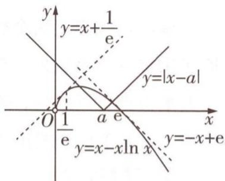

text_image

y
y=x+\frac{1}{e}
y=|x-a|
O \frac{1}{e} a e x
y=x-x\ln x y=-x+e

图1

故数形结合可得实数 $a$ 的取值范围为 $(- \frac{1}{\mathrm{e}}, 0) \cup (0, \mathrm{e})$ ，故选A.

根据函数零点的个数求参数的取值范围不仅可以用数形结合的方法，也可以用分离参数的方法，如下题：

# 原创变式

3 已知函数 $f(x) = (x + 2)\mathrm{e}^x - m$ 有两个零点，则实数 $m$ 的取值范围为 （）

A. $\left(-\frac{1}{e^{3}},0\right)$

B. $\left(-\frac{1}{e^{3}},+\infty\right)$

C. $(0, +\infty)$

D. $(-∞,0)$

答案》第067页

# 考法 ③ 用设而不求策略破解导函数的隐零点问题

调研 3 [2024 山东聊城 5 月检测] 已知函数 $f(x) = x \mathrm{e}^{x} - 1, g(x) = \ln x - mx, \varphi(x) = \mathrm{e}^{x} - \frac{\ln x}{x} - \frac{1}{x}$ .

(1) 求 $f(x)$ 的单调递增区间；  
(2) 求 $\varphi(x)$ 的最小值；  
(3) 设 $h(x)=f(x)-g(x)$ ，讨论函数 $h(x)$ 的零点个数.

解析 (1) $f'(x)=(x+1)e^{x}$ ，令 $f'(x)\geqslant0$ ，可得 $x\geqslant-1$ ，

故 $f(x)$ 的单调递增区间为 $[-1, +\infty)$ .

(2) 第一步: 分析题干, 转化问题, 找零点.

$$
\varphi^ {\prime} (x) = \mathrm{e} ^ {x} - \frac {1 - \ln x}{x ^ {2}} + \frac {1}{x ^ {2}} = \frac {x ^ {2} \mathrm{e} ^ {x} + \ln x}{x ^ {2}},
$$

令 $\mu(x)=x^{2}\mathrm{e}^{x}+\ln x(x>0)$ ，则 $\mu'(x)=(x^{2}+2x)\mathrm{e}^{x}+\frac{1}{x}>0$ 恒成立，

故 $\mu(x)$ 在 $(0, +\infty)$ 上单调递增.

$$
\mu \left(\frac {1}{\mathrm{e}}\right) = \frac {1}{\mathrm{e} ^ {2}} \mathrm{e} ^ {\frac {1}{\mathrm{e}}} + \ln \frac {1}{\mathrm{e}} = \frac {1}{\mathrm{e} ^ {2}} \mathrm{e} ^ {\frac {1}{\mathrm{e}}} - 1 = \frac {\mathrm{e} ^ {\frac {1}{\mathrm{e}}} - \mathrm{e} ^ {2}}{\mathrm{e} ^ {2}} <   0, \mu (1) = \mathrm{e} + \ln 1 = \mathrm{e} > 0,
$$

# 第二步:设零点,得出零点满足的关系式.

故存在 $x_0 \in (\frac{1}{\mathrm{e}}, 1)$ ，使 $\mu(x_0) = 0$ ，即 $x_0^2 \mathrm{e}^{x_0} + \ln x_0 = 0$

即 $\varphi(x)$ 在 $(0, x_{0})$ 上单调递减，在 $(x_{0}, +\infty)$ 上单调递增，

故 $\varphi(x) \geqslant \varphi(x_0)$ , 即 $\varphi(x)_{\min} = \varphi(x_0)$ .

# 第三步:根据零点所满足的等量关系“设而不求”.

由 $x_0^2\mathrm{e}^{x_0} + \ln x_0 = 0$ ，得 $x_0\mathrm{e}^{x_0} = -\frac{\ln x_0}{x_0} = \ln \frac{1}{x_0}\cdot \mathrm{e}^{\ln \frac{1}{x_0}}$

令 $\omega(x) = x\mathrm{e}^{x}(x > 0)$ , 则有 $\omega(x_0) = \omega(\ln \frac{1}{x_0})$ , 求导得 $\omega'(x) = (x + 1)\mathrm{e}^x$ ,

当 x > 0 时， $\omega'(x) > 0$ 恒成立，故 $\omega(x)$ 在 $(0, +\infty)$ 上单调递增，

故 $x_0 = \ln \frac{1}{x_0}$ 即 $\ln x_0 = -x_0$ ，则 $\varphi (x_0) = \mathrm{e}^{x_0} - \frac{\ln x_0}{x_0} -\frac{1}{x_0} = \mathrm{e}^{\ln \frac{1}{x_0}} - \frac{-x_0}{x_0} -\frac{1}{x_0} = \frac{1}{x_0} +1 - \frac{1}{x_0} = 1,$

即 $\varphi(x)$ 的最小值为 1.

  
“设而不求”在隐零点问题中的妙用

(3) 令 $h(x) = f(x) - g(x) = x\mathrm{e}^{x} - 1 - \ln x + mx = 0 (x > 0)$ , 即 $-m = \mathrm{e}^{x} - \frac{\ln x}{x} - \frac{1}{x} = \varphi(x)$ ,

即函数 $h(x)$ 的零点个数为关于 x 的方程 $\varphi(x) = -m$ 的实数根的个数，

【学技巧】含参数的函数零点个数问题可转化为方程根的个数问题，若能分离参数，可将参数分离出来后，构造函数，作出函数的图象，根据图象特征求解

由(2)知 $\varphi(x)$ 在 $(0, x_{0})$ 上单调递减，在 $(x_{0}, +\infty)$ 上单调递增，且 $\varphi(x_{0}) = 1$ ，

又当 $x \to 0$ 时, $\varphi(x) \to +\infty$ , 当 $x \to +\infty$ 时, $\varphi(x) \to +\infty$ ,

故当 -m=1，即 m=-1 时，关于 x 的方程 $\varphi(x)=-m$ 有唯一实数根，

当 $-m > 1$ ，即 $m < -1$ 时，关于 $x$ 的方程 $\varphi(x) = -m$ 有两个实数根，

当 -m<1，即 m>-1 时，关于 x 的方程 $\varphi(x)=-m$ 无实数根，

故当 $m = -1$ 时，函数 $h(x)$ 有一个零点，当 $m < -1$ 时，函数 $h(x)$ 有两个零点，当 $m > -1$ 时，函数 $h(x)$ 无零点.

# 答题模板

# 用设而不求策略求解导函数隐零点问题的万能模版

第一步:找零点

分析题干,把问题转化为关于函数零点的问题,根据函数的单调性、函数零点存在定理等确定零点所在区间

第二步:设零点

将零点设为 $x_{0}$ ，由导数等于0得出零点 $x_{0}$ 满足的关系式，无须求出具体的零点数值

第三步:巧代换

根据零点满足的关系式,整体代入求解

# 原创变式

4 已知函数 $f(x) = \mathrm{e}^{x}, g(x) = x^{2} + 1, h(x) = a\sin x + 1 (a > 0)$ .

(1) 证明: 当 $x \in (0, +\infty)$ 时, $f(x) > g(x)$ .  
(2) 讨论函数 $F(x)=f(x)-h(x)$ 在 $(0,\pi)$ 上的零点个数.

# 创新预测

答案▶067页

1. 试题调研原创 定义域为 $\mathbf{R}$ 的函数 $f(x)$ 满足 $f(x + 2) = f(x - 2)$ , 当 $x \in [-2, 2]$ 时, 函数 $f(x) = 4 - x^2$ , 设函数 $g(x) = \mathrm{e}^{-|x - 2|} (-2 < x < 6)$ , 则方程 $f(x) - g(x) = 0$ 的所有实数根之和为 ( )

A. 5

B. 6

C. 7

D. 8

2.[2024陕西汉中4月二模]已知函数 $f(x)=\left\{\begin{aligned}-x^{3}-3x^{2}-2x,x&\leqslant0,\\ \ln x,x&>0,\end{aligned}\right.$ $g(x)=f(x)-mx$ 有4个零点，则m的取值范围为()

A. $\left(\frac{1}{4},\frac{1}{e}\right)$

B. $(-2,0]\cup\left\{\frac{1}{e}\right\}$

C. $(-2,0]\cup\left\{\frac{1}{4}\right\}$

D. $(-∞,0]∪(\frac{1}{4},\frac{1}{e})$

3. 试题调研原创 已知函数 $f(x) = \begin{cases} kx - k, & x \leqslant 1, \\ \log_3 x, & x > 1, \end{cases}$ 下列关于函数 $h(x) = f(|f(x)|) - 2$ 的零点个数的判断中不正确的是 ( )

A. 当 k > 0 时, 有 2 个零点

B. 当 k<0 时, 至少有 2 个零点

C. 当 k > 0 时, 有 1 个零点

D. 当 k<0 时, 可能有 4 个零点

4.[2024 山东济南 4 月二模]已知函数 $f(x)=ax^{2}-\ln x-1$ , $g(x)=xe^{x}-ax^{2}(a\in\mathbf{R})$ .

(1) 讨论 $f(x)$ 的单调性.

(2) 证明: $f(x) + g(x) \geqslant x.$

# 规范答题

# 参考答案与解析

# 原创变式

1.C 令 $f(x) = \sqrt{11}\cos \pi x - 2x + 1 = 0$ ，可得 $\sqrt{11}\cos \pi x = 2x - 1$ ，则函数 $f(x) = \sqrt{11}\cos \pi x - 2x + 1$ 零点的个数为曲线 $y = \sqrt{11}\cos \pi x$ 与直线 $y = 2x - 1$ 的交点个数.

显然曲线 $y = \sqrt{11} \cos \pi x$ 与直线 y = 2x - 1 均关于点 $(\frac{1}{2}, 0)$ 对称，又 $\sqrt{11} \cos 2\pi > 2 \times 2 - 1, \sqrt{11} \cos 4\pi < 2 \times 4 - 1$ [点拨: $(2, \sqrt{11} \cos 2\pi)$ 为曲线 $y = \sqrt{11} \cos \pi x$ 在第一象限的从左往右数第一个最高点， $(4, \sqrt{11} \cos 4\pi)$ 为曲线 $y = \sqrt{11} \cos \pi x$ 在第一象限的从左往右数第二个最高点]，结合图象（如图2），可得曲线 $y = \sqrt{11} \cos \pi x$ 与直线 y = 2x - 1 有5个交点，故函数 $f(x) = \sqrt{11} \cos \pi x - 2x + 1$ 零点的个数为5，故选

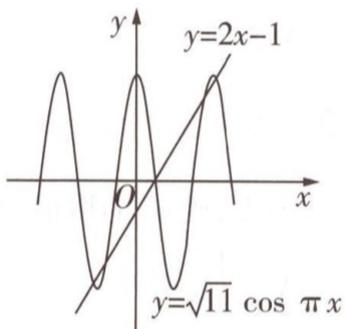

text_image

y
y=2x-1
O
x
y=√11 cos π x

图2

2.A 由 $f(2-x)=f(x)$ 知函数 $f(x)$ 的图象关于直线x=1[点拨:此处利用结论“若 $f(x+a)=f(-x+b)$ ，则函数 $f(x)$ 的图象关于直线 $x=\frac{a+b}{2}$ 对称”]对称.

因为 $f(2-x)=f(x)$ ， $f(x)$ 是R上的奇函数，所以 $f(-x)=f(x+2)=-f(x)$ ，

所以 $f(x+4)=f(x)$ ， $f(x)$ 的周期为 4 [另解：此处也可以利用结论速解，若函数 $f(x)$ 为奇函数，且图象关于直线 x=a 对称，则 $f(x)$ 的周期为 4a].

只考虑 $f(x)$ 的一个周期,例如在 $[-1,3]$ 上,由 $f(x)$ 在 $[0,1]$ 上单调递减知 $f(x)$ 在 $(1,2)$ 上单调递增,在 $(-1,0)$ 上单调递减,在 $(2,3)$ 上单调递增.

对于奇函数 $f(x)$ ，有 $f(0)=0$ ，所以 $f(2)=f(2-2)=f(0)=0$ ，

故当 $x \in (0,1)$ 时， $f(x) < f(0) = 0$ ，当 $x \in (1,2)$ 时， $f(x) < f(2) = 0$ ，当 $x \in (-1,0)$ 时， $f(x) > f(0) = 0$ ，当 $x \in (2,3)$ 时， $f(x) > f(2) = 0$ .

因为方程 $f(x)=1$ 在 $(-1,0]$ 上有实数根，函数 $f(x)$ 在 $(-1,0]$ 上单调，所以实数根是唯一的，所以方程 $f(x)=-1$ 在 $(0,1]$ 上有唯一的实数根，

结合 $f(x)$ 的图象关于直线x=1对称可得方程 $f(x)=-1$ 在(1,2)上也有唯一的实数根.

因为在 $(-1,0)$ 和 $(2,3)$ 上有 $f(x)>0$ ,

所以方程 $f(x) = -1$ 在 $(-1,0)$ 和 $(2,3)$ 上没有实数根，从而方程 $f(x) = -1$ 在 $[-1,3]$ 上有且仅有两个实数根.

当 $x \in [-1, 3]$ 时，方程 $f(x) = -1$ 的两实数根之和为 $2 \times 1 = 2$

所以当 $x \in [3, 11]$ 时，方程 $f(x) = -1$ 的所有实数根之和为 $2 \times (5 + 9) = 28$ . 故选A.

3.A 函数 $f(x)=(x+2)e^{x}-m$ 有两个零点等价于直线 y=m 与函数 $g(x)=(x+2)e^{x}$ 的图象有两个交点. 对 $g(x)$ 求导得 $g'(x)=(x+3)\cdot e^{x}$ ，令 $g'(x)=0$ ，解得 x=-3，则当 x<-3 时， $g'(x)<0$ ， $g(x)$ 单调递减，当 x>-3 时， $g'(x)>0$ ， $g(x)$ 单调递增，则 $g(x)_{\min}=g(-3)=-\frac{1}{e^{3}}$ ，作出函数 $g(x)$ 的大致图象和直线 y=m，如图 3 所示 [点拨：当

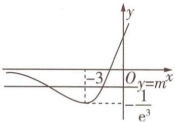

text_image

y
Oy=m^x
-3
-\frac{1}{e^3}

图3

$x \to -\infty$ 时, $\mathrm{e}^{x} > 0, x + 2 < 0, (x + 2)\mathrm{e}^{x} < 0$ , 图象左端无限接近 $x$ 轴, 但不相交]. 故 $m$ 的取值范围为 $(- \frac{1}{\mathrm{e}^3}, 0)$ . 故选 A.

4.(1)令 $G(x)=f(x)-g(x)=\mathrm{e}^{x}-x^{2}-1$ ,则 $G'(x)=\mathrm{e}^{x}-2x$

记 $p(x)=\mathrm{e}^{x}-2x$ ，则 $p'(x)=\mathrm{e}^{x}-2$ ，

当 $x \in (0, \ln 2)$ 时， $p'(x) < 0$ ，当 $x \in (\ln 2, +\infty)$ 时， $p'(x) > 0$

所以 $p(x)$ 在 $(0, \ln 2)$ 上单调递减，在 $(\ln 2, +\infty)$ 上单调递增.

从而在 $(0, +\infty)$ 上， $G'(x) = p(x) \geqslant p(\ln 2) = 2 - 2\ln 2 > 0$ ，所以 $G(x)$ 在 $(0, +\infty)$ 上单调递增，因此在 $(0, +\infty)$ 上， $G(x) > e^0 - 0^2 - 1 = 0$ ，即 $f(x) > g(x)$ .

(2) $F(x) = f(x) - h(x) = \mathrm{e}^{x} - a\sin x - 1, F'(x) = \mathrm{e}^{x} - a\cos x.$

若 $0 < a \leqslant 1$ ，则在 $(0, \pi)$ 上 $F'(x) = e^{x} - a \cos x > 1 - a \geqslant 0$ ，

所以在 $(0,\pi)$ 上 $F(x)$ 单调递增, $F(x)>F(0)=0$ ,

此时函数 $F(x)$ 在 $(0, \pi)$ 上无零点.

若 $a > 1$ ，记 $q(x) = F'(x) = \mathrm{e}^x - a\cos x$ ，则 $q'(x) = \mathrm{e}^x + a\sin x \geqslant 0, q(x)$ 在 $(0, \pi)$ 上单调递增，而 $q(0) = 1 - a < 0, q(\frac{\pi}{2}) = \mathrm{e}^{\frac{\pi}{2}} > 0,$

故存在 $x_0 \in (0, \frac{\pi}{2})$ ，使得 $q(x_0) = 0$

所以当 $0 < x < x_{0}$ 时， $F(x)$ 单调递减，当 $x_{0} < x < \pi$ 时， $F(x)$ 单调递增，

所以当 $0 < x < \pi$ 时， $F(x)_{\min} = F(x_0)$ ，而 $F(x_0) < F(0) = 0, F(\pi) = e^{\pi} - 1 > 0.$

所以 $F(x)$ 在 $(0, x_{0})$ 上无零点，在 $(x_{0}, \pi)$ 上有唯一零点.

综上: 当 $0 < a \leqslant 1$ 时, $F(x)$ 在 $(0, \pi)$ 上无零点; 当 a > 1 时, $F(x)$ 在 $(0, \pi)$ 上有且仅有 1 个零点.

# 创新预测

1.D 因为定义域为 R 的函数 $f(x)$ 满足 $f(x+2)=f(x-2)$ ，即 $f(x+4)=f(x)$ ，所以 $f(x)$ 是以 4 为周期的周期函数 [结论：若函数 $f(x+a)=f(x+b)$ ，则 $f(x)$ 是以 $|a-b|$ 为周期的周期函数]，又 $g(x)=\mathrm{e}^{-|x-2|}(-2<x<6)$ ，则 $g(4-x)=\mathrm{e}^{-|(4-x)-2|}=\mathrm{e}^{-|x-2|}=g(x)$ ，所以 $g(x)$ 的图象关于直线 x=2 对称 [结论：

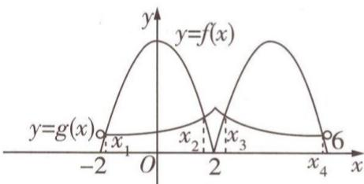

text_image

y
y=f(x)
y=g(x)
x₁
x₂
x₃
x₄
6

图4

若 $f(x+a)=f(-x+b)$ ，则 $f(x)$ 的图象关于直线 $x=\frac{a+b}{2}$ 对称]，又 $g(-2)=g(6)=\mathrm{e}^{-1-2-21}=\frac{1}{\mathrm{e}^{4}}>0, g(x)=\mathrm{e}^{-|x-2|}=\left\{\begin{aligned}\mathrm{e}^{-x+2},&2\leqslant x<6,\\ \mathrm{e}^{x-2},&-2<x<2,\end{aligned}\right.$ 当 $x\in[-2,2]$ 时，函数 $f(x)=4-x^{2}$ ，所以 $f(-2)=f(2)=0$ ，则 $f(6)=f(2)=0$ 。令 $f(x)-g(x)=0$ ，即 $f(x)=g(x)$ ，在同一平面直角坐标系中画出 $y=g(x)(x\in(-2,6))$ 的图象与 $y=f(x)(x\in[-2,6])$ 的图象，如图4所示，由图可得曲线 $y=g(x)(x\in(-2,6))$ 与曲线 $y=f(x)(x\in[-2,6])$ 有4个交点，设交点横坐标分别为 $x_{1},x_{2},x_{3},x_{4}$ ，且 $x_{1}$ 与 $x_{4}$ 关于直线x=2对称， $x_{2}$ 与 $x_{3}$ 关于直线x=2对称，所以 $x_{1}+x_{4}=4,x_{3}+x_{2}=4$ ，所以方程 $f(x)-g(x)=0$ 的所有实数根之和为 $x_{1}+x_{2}+x_{3}+x_{4}=8$ 。故选D。

2.C 由 $g(x)=0$ 得 $mx=f(x)$ .

当 $x = 0$ 时， $f(x) = 0$ ，即0是 $g(x)$ 的一个零点，当 $x \neq 0$ 时， $m = \frac{f(x)}{x} = \begin{cases} -x^2 - 3x - 2, & x < 0, \\ \frac{\ln x}{x}, & x > 0. \end{cases}$ 令 $h(x) = \begin{cases} -x^2 - 3x - 2, & x < 0, \\ \frac{\ln x}{x}, & x > 0, \end{cases}$ 依题意，直线 $y = m$ 与函数 $y = h(x)$ 的图象有3个交点.

当 $x < 0$ 时， $h(x) = -x^2 - 3x - 2 = -(x + \frac{3}{2})^2 + \frac{1}{4} \leqslant \frac{1}{4}$ ，当且仅当 $x = -\frac{3}{2}$ 时取等号.

当 $x > 0$ 时， $h(x) = \frac{\ln x}{x}$ ，求导得 $h'(x) = \frac{1 - \ln x}{x^2}$ . 当 $0 < x < e$ 时， $h'(x) > 0$ ，当 $x > e$ 时， $h'(x) < 0$ ，因此函数 $h(x)$ 在 $(0, e)$ 上单调递增，在 $(e, +\infty)$ 上单调递减， $h(e) = \frac{1}{e} > \frac{1}{4}$ . 当 $0 < x \leqslant 1$ 时， $h(x) \leqslant h(1) = 0$ . 当 $x > 1$ 时， $h(x) > 0$ 恒成立.

在同一平面直角坐标系内作出直线 $y = m$ 与函数 $y = h(x)$ 的图象，如图5所示.观察图象知，当 $-2 < m \leqslant 0$ 或 $m = \frac{1}{4}$ 时，直线 $y = m$ 与函数 $y = h(x)$ 的图象有3个交点，则当 $-2 < m \leqslant 0$ 或 $m = \frac{1}{4}$ 时，方程 $m =$

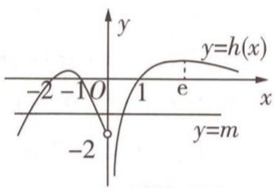

text_image

y
-2 -1 O 1 e x
-2 y=m

图 5

$\frac{f(x)}{x}$ 有3个解，即函数 $g(x) = f(x) - mx$ 有4个零点，所以 $m$ 的取值范围为 $(-2,0] \cup \{\frac{1}{4}\}$ . 故选C.

3.C 设 $|f(x)| = t$ ，则 $f(|f(x)|) - 2 = 0$ 即 $f(t) = 2$ ，若 $k > 0$ ，则当 $x \leqslant 1$ 时， $|f(x)| = -f(x)$ ，作出 $f(x), |f(x)|$ 的大致图象，如图6所示，此时，直线 $y = 2$ 与曲线 $y = f(x)$ 只有一个交点，即$f(t)=2$ 只有一个解t=9，直线y=9与曲线 $y=|f(x)|$ 有2个交点，即当k>0时， $h(x)$ 有两个零点，故A正确，C错误。若k<0，则 $f(t)=2\Rightarrow t=1+\frac{2}{k}$ 或t=9，当 $1+\frac{2}{k}<0$ ，即 $k\in(-2,0)$ 时， $h(x)$ 只有两个零点，当 $1+\frac{2}{k}=0$ ，即k=-2时， $h(x)$ 有三个零点，当 $1+\frac{2}{k}>0$ ，即 $k\in(-\infty,-2)$ 时， $h(x)$ 有四个零点，故BD正确。故选C。

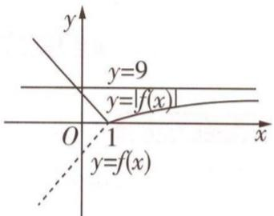

text_image

y
y=9
y=|f(x)|
O 1 x
y=f(x)

图6

4.(1) $f(x)$ 的定义域为 $(0,+\infty)$ , $f'(x)=2ax-\frac{1}{x}=\frac{2ax^{2}-1}{x}$ ,

当 $a \leqslant 0$ 时, $2ax^{2} - 1 < 0$ , $f(x)$ 在 $(0, +\infty)$ 上单调递减.

当 $a > 0$ 时，令 $f^{\prime}(x) > 0$ ，得 $x > \sqrt{\frac{1}{2a}}$ ，令 $f^{\prime}(x) < 0$ ，得 $0 < x < \sqrt{\frac{1}{2a}}$

所以 $f(x)$ 在 $(0, \sqrt{\frac{1}{2a}})$ 上单调递减，在 $(\sqrt{\frac{1}{2a}}, +\infty)$ 上单调递增.

综上所述: 当 $a \leqslant 0$ 时, $f(x)$ 在 $(0, +\infty)$ 上单调递减; 当 a > 0 时, $f(x)$ 在 $(0, \sqrt{\frac{1}{2a}})$ 上单调递减, 在 $(\sqrt{\frac{1}{2a}}, +\infty)$ 上单调递增.

(2) 设 $F(x)=f(x)+g(x)-x=xe^{x}-\ln x-x-1, x>0$ ，则 $F'(x)=(x+1)e^{x}-\frac{1}{x}-1=(x+1)\left(e^{x}-\frac{1}{x}\right)$ ，由 x>0 可知 $x+1>0$ ，设 $h(x)=e^{x}-\frac{1}{x}, x>0$ [关键：一次求导后仍无法确定单调性，构造新函数进行二次求导].

因为 $y = \mathrm{e}^{x}, y = -\frac{1}{x}$ 在 $(0, +\infty)$ 上单调递增，

所以 $h(x)$ 在 $(0, +\infty)$ 上单调递增，又 $h(\frac{1}{2}) = \sqrt{\mathrm{e}} - 2 < 0, h(1) = \mathrm{e} - 1 > 0$ ，所以 $h(x)$ 在 $(0, +\infty)$ 上存在唯一零点 $x_{0} \in (\frac{1}{2}, 1)$ .

当 $0 < x < x_{0}$ 时, $h(x) < 0$ , 即 $F'(x) < 0$ ,

当 $x > x_{0}$ 时, $h(x) > 0$ , 即 $F'(x) > 0$ .

所以 $F(x)$ 在 $(0, x_{0})$ 上单调递减，在 $(x_{0}, +\infty)$ 上单调递增，

则 $F(x) \geqslant F(x_0) = x_0\mathrm{e}^{x_0} - \ln x_0 - x_0 - 1$ ，因为 $\mathrm{e}^{x_0} - \frac{1}{x_0} = 0$ ，所以 $\mathrm{e}^{x_0} = \frac{1}{x_0}, x_0 = \mathrm{e}^{-x_0}$ ，

可得 $F(x_0) = x_0 \times \frac{1}{x_0} - \ln \mathrm{e}^{-x_0} - x_0 - 1 = 0$ ，即 $F(x) \geqslant 0$ ，所以 $f(x) + g(x) \geqslant x$ .

# 超重点9 使用同构思想必用的3大重要策略

考情速递 利用同构解题在近几年高考中频繁出现，同构解题即通过把等式或不等式进行变形，构造函数，利用函数的单调性解题。同构思想在近几年高考中的考情与2025高考命题预测为：

# 三年考情与创新命题特点

# 2025命题预测

<table><tr><td>2022新高考I卷T22,指对跨阶同构,将 $g(x)=x-\ln x$ 变形为 $f(\ln x)=\mathrm{e}^{\ln x}-\ln x$ ,根据函数 $f(x)=\mathrm{e}^{x}-x$ 在 $(-∞,0)$ 上单调递减求解</td></tr><tr><td>2020全国I卷T12,根据等式 $2^{a}+\log_{2}a=4^{b}+2\log_{4}b$ 构造函数 $f(x)=2^{x}+\log_{2}x(x>0)$ ,根据该函数单调递增求解</td></tr></table>

①命题形式：选择题、填空题、解答题中均有可能呈现.  
②必考热点：在选择题、填空题中，考查根据不等式恒（能）成立求参数的取值范围、比较大小；在解答题中，根据不等式恒（能）成立求出参数的取值范围、证明不等式.  
③创新考法：函数与其他知识交汇命题，如数列、圆锥曲线等.

# 策略 1 地位同等同构

调研 1 [2024 江苏南通 4 月模拟] 已知函数 $f(x) = 2\ln x - x^2 + ax (a \in \mathbb{R})$ .

(1) 当 a=2 时, 求 $f(x)$ 的图象在点 $(1, f(1))$ 处的切线方程.  
(2) 若函数 $g(x)=f(x)-ax+m$ 在 $\left[\frac{1}{e},e\right]$ 上有两个零点, 求实数 m 的取值范围.  
(3) 若对区间 $(1,2)$ 内任意两个不相等的实数 $x_{1}, x_{2}$ ，不等式 $\frac{f(x_{1}) - f(x_{2})}{x_{1} - x_{2}} < 2$ 恒成立，求实数 a 的取值范围.

解析 (1) 当 $a = 2$ 时, $f(x) = 2\ln x - x^2 + 2x$ ,

$f'(x)=\frac{2}{x}-2x+2$ ,所以所求切线的斜率 $k=f'(1)=2$ .

又 $f(1)=1$ ，则切线方程为 $y-1=2(x-1)$ ，即y=2x-1.

(2) 由 $g(x) = 2\ln x - x^2 + m$ 得 $g'(x) = \frac{2}{x} - 2x = \frac{-2(x + 1)(x - 1)}{x}$ .

当 $x \in \left[\frac{1}{\mathrm{e}}, \mathrm{e}\right]$ 时，令 $g'(x) = 0$ ，得 $x = 1$

当 $\frac{1}{e}<x<1$ 时, $g'(x)>0$ , $g(x)$ 单调递增;当1<x<e时, $g'(x)<0$ , $g(x)$ 单调递减.

故 $g(x)$ 在 $x = 1$ 处取得极大值 $g(1) = m - 1$ .

$g\left(\frac{1}{\mathrm{e}}\right)=m-2-\frac{1}{\mathrm{e}^{2}},g(\mathrm{e})=m+2-\mathrm{e}^{2},g(\mathrm{e})-g\left(\frac{1}{\mathrm{e}}\right)=4-\mathrm{e}^{2}+\frac{1}{\mathrm{e}^{2}}<0,$ 则 $g(\mathrm{e})<g\left(\frac{1}{\mathrm{e}}\right),$

  
“同构法”速解双变量不等式问题

所以 $g(x)$ 在 $\left[\frac{1}{e}, e\right]$ 上的最小值是 $g(e)$ .

则 $g(x)$ 在 $[\frac{1}{\mathrm{e}},\mathrm{e}]$ 上有两个零点的条件是 $\left\{ \begin{array}{l} g(1) = m - 1 > 0,\\ g(\frac{1}{\mathrm{e}}) = m - 2 - \frac{1}{\mathrm{e}^2}\leqslant 0, \end{array} \right.$ 解得 $1 <   m\leqslant 2 + \frac{1}{\mathrm{e}^2}.$

故实数 m 的取值范围是 $(1,2+\frac{1}{\mathrm{e}^{2}}]$ .

(3)不妨设 $1 < x_{1} < x_{2} < 2$ ，则 $\frac{f(x_1) - f(x_2)}{x_1 - x_2} < 2$ 恒成立等价于 $f(x_2) - f(x_1) < 2(x_2 - x_1)$ 恒成立，即 $f(x_1) - 2x_1 > f(x_2) - 2x_2$ 恒成立，令 $u(x) = f(x) - 2x$ .

【消卡壳】根据 $f(x_{2})-f(x_{1})<kx_{2}-kx_{1}$ 构造 $y=f(x)-kx$ ，且该函数在(1,2)上单调递减

由 $x_{1}, x_{2}$ 的任意性知 $u(x)$ 在 $(1, 2)$ 上单调递减，则 $u'(x) = f'(x) - 2 \leqslant 0$ ，即 $f'(x) \leqslant 2$ 在 $(1, 2)$ 上恒成立，即 $\frac{2}{x} - 2x + a \leqslant 2 (1 < x < 2)$ 恒成立，即 $a \leqslant 2x - \frac{2}{x} + 2 (1 < x < 2)$ 恒成立.

令 $h(x)=2x-\frac{2}{x}+2$ ，则 $h'(x)=2+\frac{2}{x^{2}}>0$ ，所以 $h(x)$ 在 $(1,2)$ 上单调递增，所以当 1<x<2 时， $h(x)>h(1)=2$ ，故实数 a 的取值范围是 $(-∞,2]$ .

# 解题攻略

# 地位同等同构策略

对于含有地位同等的两个变量 $x_{1}, x_{2}$ （或 $x, y$ ，或 $a, b$ ）的等式或不等式，如果进行整理（即同构）后，等式或不等式两边具有结构的一致性，往往暗示应构造函数，应用函数的单调性解决。常见的同构类型有：

<table><tr><td>原式</td><td>转化</td><td>构造函数</td></tr><tr><td> $\frac{f(x_1) - f(x_2)}{x_1 - x_2} > k(x_2 > x_1)$ </td><td> $f(x_1) - f(x_2) < kx_1 - kx_2$ </td><td>构造  $y = f(x) - kx$ ,为增函数</td></tr><tr><td> $\frac{f(x_1) - f(x_2)}{x_1 - x_2} < \frac{k}{x_1x_2}(x_2 > x_1)$ </td><td> $f(x_1) - f(x_2) > \frac{k(x_1 - x_2)}{x_1x_2}$ </td><td>构造  $y = f(x) + \frac{k}{x}$ ,为减函数</td></tr></table>

# 原创变式

1 已知函数 $f(x)=x+2+a\ln(ax)$ .

(1) 求 $f(x)$ 的单调区间；

(2) 设 $a > 0, t \in [3,4]$ , 若对任意的 $x_{1}, x_{2} \in (0,1]$ , 且 $x_{1} \neq x_{2}$ , 都有 $|f(x_{1}) - f(x_{2})| < t \left| \frac{1}{x_{1}} - \frac{1}{x_{2}} \right|$ , 求实数 $a$ 的取值范围.

答案》第075页

# 策略 ② 指对跨阶同构

调研 2 [2024 福建厦门 5 月二模] 已知偶函数 $f(x)$ 在 $(-∞,0)$ 上单调递增, a = $f(\frac{1}{e})$ , $b = f(-\frac{\ln 2}{2})$ , $c = f(\frac{\ln 3}{3})$ , 则 ( )

A. $a < b < c$

B. $b < a < c$

C. $a < c < b$

D. $c < b < a$

解析 $\frac{1}{\mathrm{e}} = \frac{\ln \mathrm{e}}{\mathrm{e}}, \frac{\ln 2}{2} = \frac{2\ln 2}{4} = \frac{\ln 4}{4}$ . 设 $g(x) = \frac{\ln x}{x} (x > 0)$ , 则 $g'(x) = \frac{1 - \ln x}{x^2}$ .

【释疑难】这里之所以将 $\frac{\ln2}{2}$ 转化为 $\frac{\ln4}{4}$ ，是因为构造函数后，发现自变量不在同一单调区间，需转化到同一单调区间内

当 0 < x < e 时, $g'(x) > 0$ , $g(x)$ 单调递增; 当 x > e 时, $g'(x) < 0$ , $g(x)$ 单调递减.

因为 $e < 3 < 4$ ，所以 $g(e) > g(3) > g(4)$ ，即 $\frac{\ln e}{e} >\frac{\ln 3}{3} >\frac{\ln 4}{4}$ 故 $\frac{\ln e}{e} >\frac{\ln 3}{3} >\frac{\ln 2}{2}$

因为偶函数 $f(x)$ 在 $(-∞,0)$ 上单调递增，所以 $f(x)$ 在 $(0,+∞)$ 上单调递减，又 $\frac{\ln e}{e}>\frac{\ln 3}{3}>\frac{\ln 2}{2}>0$ ，则 $f(\frac{\ln e}{e})<f(\frac{\ln 3}{3})<f(\frac{\ln 2}{2})=f(-\frac{\ln 2}{2})$ ，即a<c<b.故选C.

# 解题攻略

# 指对跨阶同构策略

主要针对单变量,同左同右取对数:

<table><tr><td>原式</td><td>转化</td><td>构造函数</td></tr><tr><td rowspan="3">积型:ae $^a$ ≤bln b</td><td>同左:ae $^a$ ≤(ln b)e $^{ln b}$ </td><td>构造f(x)=xe $^x$ </td></tr><tr><td>同右:e $^a$ ln e $^a$ ≤bln b</td><td>构造f(x)=xln x</td></tr><tr><td>取对数:a+ln a≤ln b+ln(ln b)</td><td>构造f(x)=x+ln x</td></tr><tr><td rowspan="3">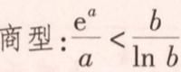</td><td>同左: $\frac{e^a}{a}<\frac{e^{ln b}}{ln b}$ </td><td>构造f(x)= $\frac{e^x}{x}$ </td></tr><tr><td>同右: $\frac{e^a}{ln e^a}<\frac{b}{ln b}$ </td><td>构造f(x)= $\frac{x}{ln x}$ </td></tr><tr><td>取对数:a-ln a构造f(x)=x-ln x</td><td>构造f(x)=x-ln x</td></tr><tr><td rowspan="2">和差:e $^a$ ±a&gt;b±ln b</td><td>同左:e $^a$ ±a&gt;e $^{ln b}$ ±ln b</td><td>构造f(x)=e $^x$ ±x</td></tr><tr><td>同右:e $^a$ ±ln e $^a$ &gt;b±ln b</td><td>构造f(x)=x±ln x</td></tr></table>

# 原创变式

2 若 $2^{a} + \log_{2}a < 2^{2b} + \log_{2}b + 1$ ，则

( )

A. $\ln (2b - a + 1) <   0$

B. $\ln (2b - a + 1) > 0$

C. $\ln |a - 2b| > 0$

D. $\ln |a - 2b| < 0$

答案

》第075页

# 策略 ③ 其他凑形式同构

调研 3 [2024 湖南长沙 5 月模拟] 设实数 m > 0, 若对任意的 $x \in (1, +\infty)$ , 不等式 $2e^{2mx} - \frac{\ln x}{m} \geqslant 0$ 恒成立, 则实数 m 的取值范围是 ( )

A. $\left[\frac{1}{e},+\infty\right)$

B. $\left[\frac{1}{2e},+\infty\right)$

C. $[e, +\infty)$

D. $[2e, +\infty)$

解析 不等式 $2\mathrm{e}^{2mx} - \frac{\ln x}{m} \geqslant 0$ 恒成立, 即 $2\mathrm{e}^{2mx} \geqslant \frac{\ln x}{m}$ 恒成立, 即 $2m\mathrm{e}^{2mx} \geqslant \ln x$ 恒成立, 即 $2mx\mathrm{e}^{2mx} \geqslant x\ln x = \mathrm{e}^{\ln x} \cdot \ln x (m > 0, x > 1)$ 恒成立.

【消卡壳】由 $x \in (1, +\infty)$ “无中生有”一个 $x$ ，巧用 $x \ln x = e^{\ln x} \ln x$ 同构

构造函数 $g(x)=xe^{x}(x>0)$ ，则 $g'(x)=\mathrm{e}^{x}+xe^{x}=(x+1)\mathrm{e}^{x}$ .

当 x>0 时, $g'(x)>0$ , $g(x)$ 单调递增,则不等式 $2e^{2mx}-\frac{\ln x}{m}\geqslant0$ 恒成立等价于 $g(2mx)\geqslant g(\ln x)$ 恒成立,即 $2mx\geqslant\ln x$ 恒成立,进而转化为 $2m\geqslant\frac{\ln x}{x}$ 恒成

设 $h(x) = \frac{\ln x}{x}$ , 可得 $h'(x) = \frac{1 - \ln x}{x^2}$ , 当 $0 < x < e$ 时, $h'(x) > 0$ , $h(x)$ 单调递增;

当 $x > \mathrm{e}$ 时， $h'(x) < 0, h(x)$ 单调递减.

所以当 $x = \mathrm{e}$ 时，函数 $h(x)$ 取得最大值，为 $h(\mathrm{e}) = \frac{1}{\mathrm{e}}$

所以 $2m \geqslant \frac{1}{e}$ ，即实数 m 的取值范围是 $\left[\frac{1}{2e}, +\infty\right)$ 。故选 B.

  
“凑形式法”巧求参数的范围

# 解题攻略

# 凑形式同构策略

主要针对上文中未涉及的类型,关键是凑好形式:

<table><tr><td>原式</td><td>凑形式转化</td></tr><tr><td> $ae^{ax} > \ln x$ </td><td> $axe^{ax} > x \ln x$ ,后面转化同“积型”</td></tr><tr><td> $e^x > a \ln(ax - a) - a (a > 0)$ </td><td> $\frac{1}{a} e^x > \ln a(x - 1) - 1 \Leftrightarrow e^{x - \ln a} - \ln a > \ln(x - 1) - 1 \Leftrightarrow e^{x - \ln a} + x - \ln a > \ln(x - 1) + x - 1 = e^{\ln(x - 1)} + \ln(x - 1) \Leftrightarrow x - \ln a > \ln(x - 1)$ </td></tr><tr><td> $a^x > \log_a x (a > 1)$ </td><td> $e^{x \ln a} > \frac{\ln x}{\ln a} \Leftrightarrow (x \ln a) e^{x \ln a} > x \ln x$ ,后面转化同“积型”</td></tr></table>

# 原创变式

3 已知函数 $f(x)=xe^{x}-a(x+\ln x)$ 有两个零点，则实数 a 的取值范围是 \_\_\_\_.

4 已知 $x_{0}$ 是函数 $f(x)=x^{2}\mathrm{e}^{x-2}+\ln x-2$ 的零点，则 $e^{2-x_{0}}+\ln x_{0}=$ \_\_\_\_.

答案》第075页

# 创新预测

答案▶076页

1.[2024 江苏宿迁 4 月模拟]已知 $a=\ln\frac{6}{7}$ , $b=\frac{7}{13}$ , $c=e^{-\frac{6}{7}}$ , 则 ( )

A. $a < b < c$

B. $b < a < c$

C. b < c < a

D. $a < c < b$

2.[2024 山东潍坊 5 月检测]关于 x 的不等式 $xe^{3x}-3\geqslant\frac{2\ln x+(a+1)x+1}{x}$ 对任意 x>0 恒成立,则 a 的取值范围是 ( )

A. $(-∞,-1]$

B. $(-∞,1)∪\{e\}$

C. $[-e, -1]$

D. $(-∞,0]$

3.[2024 辽宁沈阳 4 月二模]已知 $f(x)=x\ln x+\frac{a}{2}x^{2}+1$ .

(1) 若函数 $g(x)=f(x)+x\cos x-\sin x-x\ln x-1$ 在 $(0,\frac{\pi}{2}]$ 上有 1 个零点, 求实数 a 的取值范围.  
(2) 若关于 $x$ 的方程 $x \mathrm{e}^{x - a} = f(x) - \frac{a}{2} x^2 + ax - 1$ 有两个不同的实数解, 求 $a$ 的取值范围.

# 规范答题

# 参考答案与解析

# 原创变式

1. (1) $f'(x) = 1 + \frac{a^2}{ax} = \frac{x + a}{x}$ .

当 a > 0 时，函数定义域为 $(0, +\infty)$ ， $f'(x) > 0$ 恒成立，函数单调递增；

当 a<0 时, 函数定义域为 $(-∞,0)$ , $f'(x)>0$ 恒成立, 函数单调递增.

综上: 当 a > 0 时, 函数 $f(x)$ 的单调递增区间为 $(0, +\infty)$ ; 当 a < 0 时, 函数 $f(x)$ 的单调递增区间为 $(-∞, 0)$ .

(2) 当 $a > 0$ 时, $f(x)$ 在 $(0,1]$ 上单调递增, $y = \frac{1}{x}$ 在 $(0,1]$ 上单调递减, 不妨设 $0 < x_{1} < x_{2} \leqslant 1$ , 则 $|f(x_{1}) - f(x_{2})| = f(x_{2}) - f(x_{1}), |\frac{1}{x_{1}} - \frac{1}{x_{2}}| = \frac{1}{x_{1}} - \frac{1}{x_{2}}$ , 所以 $|f(x_{1}) - f(x_{2})| < t|\frac{1}{x_{1}} - \frac{1}{x_{2}}|$ 等价于 $f(x_{2}) - f(x_{1}) < t(\frac{1}{x_{1}} - \frac{1}{x_{2}})$ , 即 $f(x_{2}) + \frac{t}{x_{2}} < f(x_{1}) + \frac{t}{x_{1}}$ .

令 $g(x)=f(x)+\frac{t}{x}=x+2+a\ln(ax)+\frac{t}{x}$ [技巧:由 $f(x_{1})-f(x_{2})>\frac{k(x_{1}-x_{2})}{x_{1}x_{2}}$ 构造 $y=f(x)+\frac{k}{x}]$ ， $|f(x_{1})-f(x_{2})|<t|\frac{1}{x_{1}}-\frac{1}{x_{2}}|$ 等价于函数 $g(x)$ 在(0,1]上单调递减，所以 $g'(x)=\frac{x+a}{x}-\frac{t}{x^{2}}=\frac{x^{2}+ax-t}{x^{2}}\leqslant0$ ，即 $x^{2}+ax-t\leqslant0$ 在 $x\in(0,1]$ 上恒成立，分离参数得 $a\leqslant\frac{t}{x}-x$ .

令 $h(x) = \frac{t}{x} - x (0 < x \leqslant 1)$ , 则 $h'(x) = -\frac{t}{x^2} - 1 < 0$ , 所以 $h(x) = \frac{t}{x} - x$ 在 $(0,1]$ 上单调递减, 所以 $h(x) \geqslant h(1) = t - 1$ , 所以 $a \leqslant t - 1$ . 又 $t \in [3,4]$ , 所以 $a \leqslant 2$ . 又 $a > 0$ , 故实数 $a$ 的取值范围为 $(0,2]$ .

2.B 对已知不等式变形可得 $2^{a}+\log_{2}a<2^{2b}+\log_{2}2b$ [点拨:要想将左、右两边化为相同的形式,需要将右边变形,根据对数的运算性质得 $2^{2b}+\log_{2}b+1=2^{2b}+\log_{2}b+\log_{2}2=2^{2b}+\log_{2}2b$ ].

令 $f(x)=2^{x}+\log_{2}x,x>0$ ，因为函数 $y=2^{x}$ 与 $y=\log_{2}x$ 在 $(0,+\infty)$ 上均为增函数，所以函数 $f(x)=2^{x}+\log_{2}x$ 在 $(0,+\infty)$ 上为增函数， $2^{a}+\log_{2}a<2^{2b}+\log_{2}2b$ 即 $f(a)<f(2b)$ ，所以2b>a>0，所以2b-a>0，所以 $2b-a+1>1$ ，则 $\ln(2b-a+1)>\ln1=0$ ，A错误，B正确.

无法确定 $|a-2b|$ 与1的大小,故无法确定 $\ln|a-2b|$ 与0的大小,CD都错.故选B.

3. $(e, +\infty) \quad f(x) = x e^{x} - a (x + \ln x) = e^{x + \ln x} - a (x + \ln x)$ [技巧: 巧用 $x e^{x} = e^{\ln x} e^{x} = e^{x + \ln x} (x > 0)$ 同构]. 令 $t = x + \ln x$ , 则 $t \in \mathbb{R}$ , 因为 $x \in (0, +\infty)$ , 所以 $t' = 1 + \frac{1}{x} > 0$ , 函数 $t = x + \ln x$ 单调递增, 则关于 $t$ 的方程 $e^{t} - at = 0$ 有两个根, 即 $a = \frac{e^{t}}{t}$ 有两个根. 令 $g(t) = \frac{e^{t}}{t}$ , 易知 $g(t)$ 在 $(-\infty, 0), (0,1)$ 上单调递减, 在 $(1, +\infty)$ 上单调递增, 当 $t > 0$ 时, $g(t)_{\min} = g(1) = e$ , 数形结合可得 $a > e$ .

4.2 令 $f(x) = x^{2}\mathrm{e}^{x - 2} + \ln x - 2 = 0$ ，得 $x^{2}\mathrm{e}^{x - 2} = 2 - \ln x$ ，即 $x\mathrm{e}^{x} = \frac{\mathrm{e}^{2}}{x}\ln \frac{\mathrm{e}^{2}}{x}$ ，所以 $\ln x + x = \ln (\ln \frac{\mathrm{e}^2}{x}) + \ln \frac{\mathrm{e}^2}{x}$ [释疑：两边同时取以e为底的对数]，结合函数 $y = \ln x + x$ 单调可得 $\ln \frac{\mathrm{e}^2}{x_0} = x_0$ ，即 $2 - \ln x_0 = x_0$ ，或 $\mathrm{e}^{2 - x_0} = x_0$ ，则 $\mathrm{e}^{2 - x_0} + \ln x_0 = x_0 + \ln x_0 = 2$ .

# 创新预测

1.D $\ln\frac{6}{7}<0,\frac{7}{13}>0,e^{-\frac{6}{7}}>0$ ,所以a<b,a<c.

$$
- \ln b = - \ln \frac {7}{1 3} = \ln \frac {1 3}{7} = \ln (1 + \frac {6}{7}), - \ln c = - \ln e ^ {- \frac {6}{7}} = \frac {6}{7}.
$$

令 $f(x)=\ln(x+1)-x$ ，其中x>-1，则 $f'(x)=\frac{1}{x+1}-1=\frac{-x}{x+1}$ 。当-1<x<0时， $f'(x)>0$ ， $f(x)$ 单调递增；当x>0时， $f'(x)<0$ ， $f(x)$ 单调递减。又 $\frac{6}{7}>0$ ，所以 $f(\frac{6}{7})<f(0)=0$ ，所以 $\ln\frac{13}{7}<\frac{6}{7}$ ，即 $-\ln b<-\ln c,\ln b>\ln c$ 。又 $y=\ln x$ 在 $(0,+\infty)$ 上单调递增，所以b>c。故a<c<b。

2.A $xe^{3x}-3\geqslant\frac{2\ln x+(a+1)x+1}{x}$ 即 $xe^{3x}-3\geqslant\frac{2\ln x+1}{x}+a+1$ ，即 $a+4\leqslant\frac{x^{2}\mathrm{e}^{3x}-\ln x^{2}-1}{x}$ 对任意 x>0 恒成立， $\frac{x^{2}\mathrm{e}^{3x}-\ln x^{2}-1}{x}=\frac{\mathrm{e}^{\ln x^{2}}\cdot\mathrm{e}^{3x}-\ln x^{2}-1}{x}=\frac{\mathrm{e}^{3x+\ln x^{2}}-\ln x^{2}-1}{x}\geqslant\frac{3x+\ln x^{2}+1-\ln x^{2}-1}{x}=3$ [释疑：根据 $e^{t}\geqslant t+1$ ，当且仅当 t=0 时等号成立可得]，当 $3x+\ln x^{2}=0$ 时取等号，而函数 $f(x)=3x+\ln x^{2}$ 在 $(0,+\infty)$ 上单调递增， $f(\frac{1}{\mathrm{e}})=\frac{3}{\mathrm{e}}-2<0,f(1)=3>0$ ，所以方程 $3x+\ln x^{2}=0$ 在 $(\frac{1}{\mathrm{e}},3)$ 上有解，等号能够成立，故 $a+4\leqslant3$ ，即 $a\leqslant-1$ ，故选 A.

3.(1) $g(x)=\frac{a}{2}x^{2}+x\cos x-\sin x$ , $g'(x)=x(a-\sin x)$ .

当 $a \geqslant 1, 0 < x \leqslant \frac{\pi}{2}$ 时, $a - \sin x \geqslant 0$ , $g(x)$ 在 $(0, \frac{\pi}{2}]$ 上单调递增, 又当 $x \to 0$ 时, $g(x) \to 0$ 且 $g(x) > 0$ , 所以 $g(x)$ 在 $(0, \frac{\pi}{2}]$ 上无零点. 当 $0 < a < 1, 0 < x \leqslant \frac{\pi}{2}$ 时, $\exists x_0 \in (0, \frac{\pi}{2})$ 使得 $\sin x_0 = a$ , 所以 $g(x)$ 在 $(x_0, \frac{\pi}{2}]$ 上单调递减, 在 $(0, x_0)$ 上单调递增, 又当 $x \to 0$ 时, $g(x) \to 0$ 且 $g(x) > 0$ , $g(\frac{\pi}{2}) = \frac{a\pi^2}{8} - 1$ , 所以若 $\frac{a\pi^2}{8} - 1 > 0$ , 即 $1 > a > \frac{8}{\pi^2}$ , 则 $g(x)$ 在 $(0, \frac{\pi}{2}]$ 上无零点, 若 $\frac{a\pi^2}{8} - 1 \leqslant 0$ , 即 $0 < a \leqslant \frac{8}{\pi^2}$ , 则 $g(x)$ 在 $(0, \frac{\pi}{2}]$ 上有 1 个零点. 当 $a \leqslant 0, 0 < x \leqslant \frac{\pi}{2}$ 时, $g'(x) = x(a - \sin x) < 0$ , $g(x)$ 在 $(0, \frac{\pi}{2}]$ 上单调递减, 当 $x \to 0$ 时, $g(x) \to 0$ 且 $g(x) < 0$ , $g(x)$ 在 $(0, \frac{\pi}{2}]$ 上无零点. 综上, 当 $0 < a \leqslant \frac{8}{\pi^2}$ 时, $g(x)$ 在 $(0, \frac{\pi}{2}]$ 上有 1 个零点.

(2) $x\mathrm{e}^{x-a}=f(x)-\frac{a}{2}x^{2}+ax-1(x>0)$ ，即 $x\mathrm{e}^{x-a}=x\ln x+ax$ ，即 $e^{x-a}=\ln x+a$

则 $\mathrm{e}^{x - a} + (x - a) = x + \ln x.$

令 $h(x)=x+\ln x, x>0$ ，则 $h(\mathrm{e}^{x-a})=\mathrm{e}^{x-a}+(x-a), h'(x)=1+\frac{1}{x}>0$ ，所以函数 $h(x)$ 在 $(0,+\infty)$ 上单调递增，所以原方程即 $e^{x-a}=x$ ，则 $x-a=\ln x$ ，即 $a=x-\ln x, x>0$ 。

由题意知关于 $x$ 的方程 $a = x - \ln x, x > 0$ 有两个不同的实数解. 令 $\varphi(x) = x - \ln x$ , 则 $\varphi'(x) = 1 - \frac{1}{x} = \frac{x - 1}{x}$ , 当 $0 < x < 1$ 时, $\varphi'(x) < 0$ , $\varphi(x)$ 单调递减, 当 $x > 1$ 时, $\varphi'(x) > 0$ , $\varphi(x)$ 单调递增, 所以 $\varphi(x)_{\min} = \varphi(1) = 1$ . 当 $x \to 0$ 时, $\varphi(x) \to +\infty$ , 当 $x \to +\infty$ 时, $\varphi(x) \to +\infty$ , 所以 $a > 1$ .

# 高效破题 有方法

# 超重点10 函数的不等式恒成立与有解问题的破解策略

考情速递 函数的不等式恒成立与有解问题是高考数学的必考内容之一，在近几年高考中的考情与2025高考命题预测为：

<table><tr><td>三年考情与创新命题特点</td><td>2025命题预测</td></tr><tr><td>2023 新课标I卷T19,证明不等式恒成立</td><td rowspan="3">1命题形式:选择题、填空题、解答题中均有可能呈现.2必考热点:证明不等式恒成立;没有直接给出不等式恒(能)成立问题,需要转化,如给出函数单调递增,可转化为关于导函数的不等式恒成立问题;利用导数研究含参函数的单调性时常常也要转化成不等式恒成立问题.</td></tr><tr><td>2023 新课标II卷T6,将函数在区间上单调递增转化为关于导函数的不等式恒成立问题,进而求出参数的值</td></tr><tr><td>2023 新课标II卷T22,证明不等式恒成立</td></tr></table>

# 策略 1 直接讨论

调研 1 [2024 湖南永州 5 月三模] 已知函数 $f(x) = |3x - 1| - 3b - 3\ln x, b \in \mathbf{R}$ .

(1) 当 b=1 时, 求 $f(x)$ 在 $(\frac{1}{3}, +\infty)$ 上的单调区间及极值.
(2) 若 $f(x) \geqslant 0$ 恒成立, 求 b 的取值范围.
解析 (1) 当 $b = 1, x > \frac{1}{3}$ 时, $f(x) = 3x - 1 - 3 - 3\ln x = 3x - 3\ln x - 4$ , 则 $f'(x) = 3 - \frac{3}{x} = \frac{3(x-1)}{x}$ , 令 $f'(x) > 0$ , 解得 x > 1, 令 $f'(x) < 0$ , 解得 $\frac{1}{3} < x < 1$ , 所以 $f(x)$ 的单调递减区间为 $(\frac{1}{3}, 1)$ , 单调递增区间为 $(1, +\infty)$ , 所以 $f(x)$ 在 x = 1 处取得极小值, 为 $f(1) = -1$ , 无极大值.

(2)依题意可得 $f(x)=|3x-1|-3b-3\ln x,\forall x\in(0,+\infty),f(x)\geqslant0$ 恒成立，即 $3b\leqslant|3x-1|-3\ln x$ 恒成立，即 $3b\leqslant(|3x-1|-3\ln x)_{\min}$ ，令 $g(x)=|3x-1|-3\ln x.$

【消卡壳】若恒成立(能成立)问题中对应的函数结构并不是很复杂, 且含有绝对值, 可以直接去绝对值讨论, 利用导数研究函数的单调性, 从而求得极值

当 $x \in (0, \frac{1}{3}]$ 时， $g(x) = 1 - 3x - 3\ln x$ ，显然 $g(x)$ 单调递减.

当 $x \in \left(\frac{1}{3}, +\infty\right)$ 时， $g(x) = 3x - 1 - 3\ln x$ ，则 $g'(x) = 3 - \frac{3}{x} = \frac{3x - 3}{x}$ .

令 $g'(x)>0$ , 解得 x>1 , 令 $g'(x)<0$ , 解得 $\frac{1}{3}<x<1$ .

综上所述， $g(x)$ 在 $(0,1)$ 上单调递减，在 $(1,+\infty)$ 上单调递增，则 $g(x)_{\min}=g(1)=2$ ，所以 $3b\leqslant2$ ，即 $b\leqslant\frac{2}{3}$ ，所以 b 的取值范围为 $(-∞,\frac{2}{3}]$ .

# 策略 ② 分离参数

调研 2 [2024 西安高新一中、安康中学等校 5 月联考] $\forall x \in [1,2], \ln x + \frac{a}{x^2} - 1 \geqslant 0$ 恒成立, 则实数 $a$ 的取值范围为 ( )

A. $[e, +\infty)$

B. $\left[1,+\infty\right)$

C. $\left[\frac{e}{2},+\infty\right)$

D. $\left[2e,+\infty\right)$

解析 第一步: 参变分离可得 $a \geqslant -x^{2} \ln x + x^{2}$ 在 $x \in [1, 2]$ 上恒成立, 构造函数 $\mu(x) = -x^{2} \ln x + x^{2}, x \in [1, 2]$ , 并求导.

因为 $\forall x\in [1,2],\ln x + \frac{a}{x^2} -1\geqslant 0$ 恒成立，所以 $a\geqslant -x^{2}\ln x + x^{2}$ 在 $x\in [1,2]$ 上恒成立，所以 $a\geqslant (-x^{2}\ln x + x^{2})_{\max}(x\in [1,2])$

【传技巧】用分离参数法解含参不等式恒成立(能成立)问题, 是指在能够判断出参数的系数正负的情况下, 可以根据不等式的性质将参数分离出来, 得到一端是参数、另一端是变量表达式的不等式, 只要研究变量表达式的最值就可以解决问题

令 $\mu(x) = -x^{2}\ln x + x^{2}, x \in [1,2]$ ,

则 $\mu'(x) = -2x\ln x - x + 2x = -2x\ln x + x = x(-2\ln x + 1)$ .

第二步: 利用导数判断函数的单调性, 求出函数的最大值, 进而求出参数的取值范围.

令 $\mu'(x) = 0$ ，得 $x = \sqrt{\mathrm{e}}$ ，当 $x \in (1, \sqrt{\mathrm{e}})$ 时， $\mu'(x) > 0$ ，故 $\mu(x)$ 在 $(1, \sqrt{\mathrm{e}})$ 上单调递增，

当 $x \in (\sqrt{\mathrm{e}}, 2)$ 时, $\mu'(x) < 0$ , 故 $\mu(x)$ 在 $(\sqrt{\mathrm{e}}, 2)$ 上单调递减, 故 $\mu(x)$ 的最大值为 $\mu(\sqrt{\mathrm{e}}) = \frac{\mathrm{e}}{2}$ .

所以 $a \geqslant \frac{\mathrm{e}}{2}$ , 即实数 $a$ 的取值范围为 $\left[\frac{\mathrm{e}}{2}, +\infty\right)$ . 故选 C.

# 解题策略

不等式恒(能)成立与最值问题的转化策略

<table><tr><td>恒成立</td><td> $\forall x \in D, m \leqslant f(x) \Leftrightarrow m \leqslant f(x)_{\min}$ </td><td> $\forall x \in D, m \geqslant f(x) \Leftrightarrow m \geqslant f(x)_{\max}$ </td></tr><tr><td>能成立</td><td> $\exists x \in D, m \leqslant f(x) \Leftrightarrow m \leqslant f(x)_{\max}$ </td><td> $\exists x \in D, m \geqslant f(x) \Leftrightarrow m \geqslant f(x)_{\min}$ </td></tr></table>

下面看一道存在性问题：

# 原创变式

1 已知不等式 $axe^{x} + x > 1 - \ln x$ 有解, 则实数 $a$ 的取值范围为 ( )

A. $\left(-\frac{1}{e^{2}},+\infty\right)$

B. $\left(-\frac{1}{e},+\infty\right)$

C. $(-∞, \frac{1}{e^{2}})$

D. $(-∞, \frac{1}{e})$

答案》第082页

# 策略

# 分类讨论

调研 3 [2024 上海市虹口区 4 月二模] 已知关于 x 的不等式 $(\ln x - kx)[x^{2} - (k + 3)x + 4] \leqslant 0$ 对任意 $x \in (0, +\infty)$ 均成立，则实数 k 的取值范围为 \_\_\_\_.

解析 关于 $x$ 的不等式 $(\ln x - kx)[x^2 - (k + 3)x + 4] \leqslant 0$ 对任意 $x \in (0, +\infty)$ 均成立，

【会审题】观察不等式，发现参变分离不易求解，就要考虑用分类讨论法，根据题意，分 $\ln x - kx \leqslant 0$ 且 $x^{2} - (k + 3)x + 4 \geqslant 0$ 和 $\ln x - kx \geqslant 0$ 且 $x^{2} - (k + 3)x + 4 \leqslant 0$ 两种情况讨论，构造函数，利用导数和基本不等式，求得函数的最值，即可求解

①当 $\ln x - kx \leqslant 0$ 对任意 $x \in (0, +\infty)$ 均成立时，可得 $k \geqslant \frac{\ln x}{x}$ 对任意 $x \in (0, +\infty)$ 均成立，令 $f(x) = \frac{\ln x}{x}, x > 0$ ，可得 $f'(x) = \frac{1 - \ln x}{x^2}$ ，当 $x \in (0, e)$ 时， $f'(x) > 0, f(x)$ 单调递增；当 $x \in (e, +\infty)$ 时， $f'(x) < 0, f(x)$ 单调递减，所以 $f(x)_{\max} = f(e) = \frac{1}{e}$ ，所以 $k \geqslant \frac{1}{e}$ .

又 $x^{2} - (k + 3)x + 4\geqslant 0$ 对任意 $x\in (0, + \infty)$ 均成立，得 $k\leqslant x + \frac{4}{x} -3$ 对任意 $x\in (0,$ $+\infty)$ 均成立，因为 $x + \frac{4}{x} -3\geqslant 2\sqrt{x\cdot\frac{4}{x}} -3 = 1$ ，当且仅当 $x = \frac{4}{x}$ 时，即 $x = 2$ 时等号成立，所以 $k\leqslant 1$ ，所以 $\frac{1}{\mathrm{e}}\leqslant k\leqslant 1.$

②当 $\ln x - kx \geqslant 0$ 且 $x^{2} - (k + 3)x + 4 \leqslant 0$ 对于任意 $x \in (0, +\infty)$ 均成立时，结合①可知 $\ln x - kx \geqslant 0$ 不可能恒成立，此时 $k$ 无解.

综上可得,实数 k 的取值范围为 $\left[\frac{1}{e},1\right]$ .

# 解题策略

# 由导数研究不等式的恒成立与有解问题求解策略

合理转化

根据题意转化为两个函数最值之间的比较,列出不等关系式求解

构造新函数

利用导数研究函数的单调性,求出最值,从而求出参数的取值范围

可分离变量

参变分离,构造新函数,直接把问题转化为函数的最值问题

分类讨论或

若参变分离不易求解,就要考虑利用分类讨论法或放缩法

放缩法

# 原创变式

2 若存在正数 $x$ ，使得不等式 $\frac{\mathrm{e}^x}{a} < \ln(ax)$ 成立，则实数 $a$ 的取值范围是 \_\_\_\_.

答案》第082页

除了以上三个重要策略外，还有同构法、放缩法等方法，参见本书“超重点9”.

# 创新预测

答案▶083页

1.[2024 四川成都石室中学 4 月二诊] 当 $0 < x \leqslant \frac{\pi}{2}$ 时, 关于 x 的不等式 $(2a\sin x + \cos 2x - 3) \cdot (\sin x - x) \leqslant 0$ 有解, 则 a 的最小值是 ( )

A.2

B. 3

C. 4

D. $4\sqrt{2}$

2.[2024 陕西咸阳 5 月三模]已知函数 $f(x)=\frac{a\ln x}{x}+x-1$ .

(1) 当 a=1 时, 求函数 $g(x)=f(x)-x$ 的极值;  
(2) 若对任意 $x \in [1, +\infty)$ , $f(x) \geqslant a + 1$ 恒成立, 求实数 $a$ 的取值范围.

规范答题

3.[2024 湖南省邵阳市5月第二次联考]设函数 $f(x)=m(x+1)e^{x},m>0.$

(1) 求 $f(x)$ 的极值；  
(2) 若对任意 $x \in (-1, +\infty)$ ，有 $\ln f(x) \leqslant 2e^{x}$ 恒成立，求 m 的最大值.

# 规范答题

4.[2024 河北唐山一中 5 月模拟]已知函数 $f(x)=(x-2\mathrm{e}^{2})\ln x-ax-2\mathrm{e}^{2}(a\in\mathbf{R})$ .

(1) 若 a=1 ，讨论 $f(x)$ 的单调性；  
(2)已知存在 $x_0 \in (1, \mathrm{e}^2)$ , 使得 $f(x) \geqslant f(x_0)$ 在 $(0, +\infty)$ 上恒成立, 若方程 $f(x_0) = -\mathrm{e}^{kx_0} - 2\mathrm{e}^2 kx_0$ 有解, 求实数 $k$ 的取值范围.

# 规范答题

# 参考答案与解析

# 原创变式

1.A 不等式 $ax\mathrm{e}^{x} + x > 1 - \ln x$ 有解, 即 $a > \frac{1 - x - \ln x}{x\mathrm{e}^{x}}$ 有解, 只需要 $a > (\frac{1 - x - \ln x}{x\mathrm{e}^{x}})_{\min}$ [转化: 分离参数, 转化为 $a > \frac{1 - x - \ln x}{x\mathrm{e}^{x}}$ 有解, 构造函数 $f(x) = \frac{1 - x - \ln x}{x\mathrm{e}^{x}}$ , 利用导数法求出 $f(x)_{\min}$ , 则 $a > f(x)_{\min}$ ].

令 $f(x)=\frac{1-x-\ln x}{x\mathrm{e}^{x}}$ ，则 $f'(x)=\frac{(x+1)(x-2+\ln x)}{x^{2}\mathrm{e}^{x}},x>0.$

令 $g(x) = x - 2 + \ln x, x > 0$ ，则 $g'(x) = 1 + \frac{1}{x} > 0, \therefore$ 函数 $g(x)$ 在 $(0, +\infty)$ 上单调递增，

又 $g(1) = -1 < 0, g(2) = \ln 2 > 0, \therefore$ 存在 $x_0 \in (1, 2)$ , 使得 $g(x_0) = 0$ , 即 $x_0 - 2 + \ln x_0 = 0$ , 故当 $x \in (0, x_0)$ 时, $g(x) < 0$ , 即 $f'(x) < 0$ ; 当 $x \in (x_0, +\infty)$ 时, $g(x) > 0$ , 即 $f'(x) > 0$ .

$\therefore f(x)$ 在 $(0, x_0)$ 上单调递减，在 $(x_0, +\infty)$ 上单调递增， $\therefore f(x)_{\min} = f(x_0) = \frac{1 - x_0 - \ln x_0}{x_0 e^{x_0}}.$

由 $x_0 - 2 + \ln x_0 = 0$ ，可得 $\underbrace{x_0\mathrm{e}^{x_0} = \mathrm{e}^2}_{\text{释疑}}[\text{释疑}:x_0 - 2 = -\ln x_0\rightarrow \mathrm{e}^{x_0 - 2} = \mathrm{e}^{-\ln x_0}\rightarrow \frac{\mathrm{e}^{x_0}}{\mathrm{e}^2} = \frac{1}{x_0}\rightarrow x_0\mathrm{e}^{x_0} = \mathrm{e}^2 ]$

$\therefore f(x_0) = \frac{1 - x_0 - \ln x_0}{x_0 e^{x_0}} = \frac{1 - x_0 + x_0 - 2}{e^2} = -\frac{1}{e^2}.\therefore a > -\frac{1}{e^2}.$ 故选A.

2. $(e, +\infty)$ 因为 x > 0, ax > 0, 所以 a > 0, 不等式 $\frac{e^{x}}{a} < \ln(ax)$ 可以化为 $xe^{x} < ax\ln(ax)$ [关键: 由 $\frac{e^{x}}{a} < \ln(ax)$ 转化为 $xe^{x} < ax\ln(ax)$ , 符合超重点9中涉及的同构思想积型 $ae^{a} \leqslant b\ln b$ 构造函数, 从而令 $f(x) = xe^{x}$ , 再利用导数研究函数的单调性].

令 $f(x) = x\mathrm{e}^{x}$ ，则 $ax\ln(ax) = \mathrm{e}^{\ln(ax)}\ln(ax) = f(\ln(ax))$ ，所以 $f(x) < f(\ln(ax))$ 有解.

当 x > 0 时, $f'(x) = (x + 1)e^{x} > 0$ , 故函数 $f(x) = xe^{x}$ 在 $(0, +\infty)$ 上单调递增.

当 $\ln(ax) \leqslant 0$ 时, $0 < x \leqslant \frac{1}{a}$ , 此时 $f(\ln(ax)) \leqslant 0$ , $f(x) > 0$ , 不合题意, 舍去.

  
巧用指对同构破解恒成立与有解问题

当 $\ln(ax)>0$ 时, $x>\frac{1}{a}$ , 因为 $f(x)$ 在 $(0,+\infty)$ 上单调递增, $f(x)<f(\ln(ax))$ , 所以 $x<\ln(ax)$ , 即 $x-\ln x<\ln a$ 有解.

令 $g(x)=x-\ln x$ ，则 $g'(x)=1-\frac{1}{x}=\frac{x-1}{x}$ ，当 0<x<1 时， $g'(x)<0$ ，当 x>1 时， $g'(x)>0$ ，所以 $g(x)$ 在 $(0,1)$ 上单调递减，在 $(1,+\infty)$ 上单调递增.

当 $0 < a \leqslant 1$ 时, $\frac{1}{a} \geqslant 1$ , 所以 $g(x)$ 在 $(\frac{1}{a}, +\infty)$ 上单调递增, 故 $\ln a > g(\frac{1}{a})$ . 所以 $\ln a > \frac{1}{a} - \ln \frac{1}{a}$ , 即 $0 > \frac{1}{a}$ , 矛盾, 故舍去.

当 $a > 1$ 时， $0 < \frac{1}{a} < 1$ ，所以当 $x > \frac{1}{a}$ 时， $g(x)_{\min} = g(1) = 1$ ，所以 $\ln a > 1$ ，即 $a > e$ .

综上可得,实数 a 的取值范围是 $(e, +\infty)$ .

# 创新预测

1.A 当 $0 < x \leqslant \frac{\pi}{2}$ 时, 记 $y = \sin x - x$ , 则 $y' = \cos x - 1 < 0$ , 故函数 $y = \sin x - x$ 在 $0 < x \leqslant \frac{\pi}{2}$ 上单调递减, 故 $\sin x - x < \sin 0 - 0 = 0$ , 故 $\sin x < x$ , 所以 $2a\sin x + \cos 2x - 3 \geqslant 0$ 在 $0 < x \leqslant \frac{\pi}{2}$ 上有解 [关键: 根据 $\sin x < x$ , 将问题转化为 $2a\sin x + \cos 2x - 3 \geqslant 0$ 在 $0 < x \leqslant \frac{\pi}{2}$ 上有解, 利用二倍角公式以及基本不等式即可求解]. 由于 $0 < x \leqslant \frac{\pi}{2}$ , 所以 $\sin x > 0$ , 所以 $2a\sin x \geqslant 3 - \cos 2x = 2 + 2\sin^2 x$ 在 $0 < x \leqslant \frac{\pi}{2}$ 时有解, 所以 $a \geqslant (\frac{1}{\sin x} + \sin x)_{\min}(0 < x \leqslant \frac{\pi}{2})$ . 又 $\frac{1}{\sin x} + \sin x \geqslant 2$ , 当且仅当 $\sin x = 1$ , 即 $x = \frac{\pi}{2}$ 时取等号, 所以 $a$ 的最小值是 2. 选 A.

2.(1)函数 $f(x)=\frac{a\ln x}{x}+x-1$ 的定义域为 $(0,+\infty)$ ，当a=1时， $g(x)=f(x)-x=\frac{\ln x}{x}-1$ ，则 $g'(x)=\frac{1-\ln x}{x^{2}}$ ，由 $g'(x)>0$ ，得0<x<e，由 $g'(x)<0$ ，得x>e，因此 $g(x)$ 在 $(0,e)$ 上单调递增，在 $(e,+\infty)$ 上单调递减，所以 $g(x)$ 在x=e处取得极大值 $g(e)=\frac{1}{e}-1$ ，无极小值.

(2) 函数 $f(x)=\frac{a\ln x}{x}+x-1$ ，由 $f(x)\geqslant a+1$ 可得， $a(\ln x-x)\geqslant2x-x^{2},x\in[1,+\infty)$ [释疑：变形给定不等式，发现 a 的系数 $\ln x-x$ 的符号不确定，不能轻易利用分离参数法，可以通过构造函数证明 $\ln x<x$ 并分离参数].

设 $m(x)=\ln x-x, x\in[1,+\infty)$ ，则 $m'(x)=\frac{1-x}{x}\leqslant0$ ，故函数 $m(x)$ 在 $[1,+\infty)$ 上单调递减，
则 $m(x) \leqslant m(1) = -1 < 0$ ，即 $\ln x < x$ ，因此 $a \leqslant \frac{x^{2} - 2x}{x - \ln x} (x \in [1, +\infty))$ .

令 $\varphi(x)=\frac{x^{2}-2x}{x-\ln x},x\in[1,+\infty)$ ，则 $\varphi'(x)=\frac{(x-1)(x+2-2\ln x)}{(x-\ln x)^{2}}$ .

令 $h(x)=x+2-2\ln x, x\in[1,+\infty)$ ，则 $h'(x)=1-\frac{2}{x}$ ，当 $1\leqslant x<2$ 时， $h'(x)<0$ ，当 x>2 时， $h'(x)>0$ ，即 $h(x)$ 在 $(1,2)$ 上单调递减，在 $(2,+\infty)$ 上单调递增，

则 $h(x)_{\min}=h(2)=4-2\ln2>0$ , 即 $\varphi'(x)>0$ , 因此函数 $\varphi(x)$ 在 $[1,+\infty)$ 上是增函数， $\varphi(x)_{\min}=\varphi(1)=-1$ , 所以 $a\leqslant-1$ , 即实数 a 的取值范围为 $(-∞,-1]$ .

3. (1) $f'(x) = m(x + 2)e^x, m > 0.$

令 $f'(x)>0$ ,得x>-2,令 $f'(x)<0$ ,得x<-2.

故 $f(x)$ 在 $(-∞,-2)$ 上单调递减，在 $(-2,+∞)$ 上单调递增.

∴ $f(x)$ 在 x = -2 处取得极小值 $f(-2) = -\frac{m}{e^{2}}$ ，无极大值.

(2) $\ln f(x) \leqslant 2\mathrm{e}^{x}$ 对任意 $x \in (-1, +\infty)$ 恒成立，即 $\ln m \leqslant 2\mathrm{e}^{x} - \ln (x + 1) - x$ 对任意 $x \in (-1, +\infty)$ 恒成立.

令 $g(x)=2\mathrm{e}^{x}-\ln(x+1)-x,x\in(-1,+\infty)$ ，则只需 $\ln m\leqslant g(x)_{\min}$ 即可 [点拨: 变形题目中的不等式, 分离参数, 把 $\ln m$ 放在不等式一边, 注意不是单独的 m, 然后转化为最值问题求解].

$g'(x)=2\mathrm{e}^{x}-\frac{1}{x+1}-1,x\in(-1,+\infty)$ . 易知 $y=2\mathrm{e}^{x},y=-\frac{1}{x+1}-1$ 均在 $(-1,+\infty)$ 上单调递增，故 $g'(x)$ 在 $(-1,+\infty)$ 上单调递增，且 $g'(0)=0$ .

∴ 当 $x \in (-1,0)$ 时， $g'(x) < 0, g(x)$ 单调递减；当 $x \in (0, +\infty)$ 时， $g'(x) > 0, g(x)$ 单调递增. $\therefore g(x)_{\min}=g(0)=2.$ 故 $\ln m\leqslant2=\ln e^{2},\therefore0<m\leqslant e^{2}$ ，故 m 的最大值为 $e^{2}$ .

4.(1)函数 $f(x)$ 的定义域为 $(0,+\infty)$ ,

当 $a = 1$ 时， $f(x) = (x - 2\mathrm{e}^2)\ln x - x - 2\mathrm{e}^2$ ，所以 $f'(x) = -\frac{2\mathrm{e}^2}{x} + \ln x$

设 $g(x) = f'(x) = -\frac{2e^2}{x} + \ln x$ ，因为 $y = -\frac{2e^2}{x}, y = \ln x$ 都在 $(0, +\infty)$ 上单调递增，

所以 $g(x)$ 在 $(0, +\infty)$ 上单调递增，且 $g(\mathrm{e}^{2}) = 0$ ，所以当 $x \in (0, \mathrm{e}^{2})$ 时， $g(x) = f'(x) < 0, f(x)$ 单调递减；当 $x \in (\mathrm{e}^{2}, +\infty)$ 时， $g(x) = f'(x) > 0, f(x)$ 单调递增.

所以 $f(x)$ 在 $(0, e^{2})$ 上单调递减，在 $(e^{2}, +\infty)$ 上单调递增.

(2) 由 $f(x) = (x - 2\mathrm{e}^2)\ln x - ax - 2\mathrm{e}^2, x \in (0, +\infty)$ ，得 $f'(x) = -\frac{2\mathrm{e}^2}{x} + \ln x + 1 - a$ ，

因为 $y = -\frac{2e^{2}}{x}$ , $y = \ln x$ 都在 $(0, +\infty)$ 上单调递增，所以 $f'(x)$ 在 $(0, +\infty)$ 上单调递增.

已知存在 $x_0 \in (1, \mathrm{e}^2)$ ，使得 $f(x) \geqslant f(x_0)$ 在 $(0, +\infty)$ 上恒成立，所以 $f(x_0)$ 是 $f(x)$ 的最小值，所以 $f'(x_0) = 0$ ，即 $f'(x_0) = -\frac{2\mathrm{e}^2}{x_0} + \ln x_0 + 1 - a = 0$ ，所以 $a = \ln x_0 + 1 - \frac{2\mathrm{e}^2}{x_0}$ ，

所以 $f(x_{0})=(x_{0}-2\mathrm{e}^{2})\ln x_{0}-ax_{0}-2\mathrm{e}^{2}=(x_{0}-2\mathrm{e}^{2})\ln x_{0}-(\ln x_{0}+1-\frac{2\mathrm{e}^{2}}{x_{0}})x_{0}-2\mathrm{e}^{2}=-2\mathrm{e}^{2}\ln x_{0}-x_{0}.$

设 $h(x) = -2e^{2}\ln x - x$ ，由方程 $f(x_{0}) = -e^{kx_{0}} - 2e^{2}kx_{0}$ 有解，得 $-2e^{2}\ln x_{0} - x_{0} = -2e^{2}kx_{0} - e^{kx_{0}}$ 有解，即 $h(x_{0}) = h(e^{kx_{0}})$ 有解，因为 $h'(x) = -\frac{2e^{2}}{x} - 1 < 0$ 在 $(0, +\infty)$ 上恒成立，所以 $h(x)$ 在 $(0, +\infty)$ 上单调递减，所以 $x_{0} = e^{kx_{0}}$ ，则 $k = \frac{\ln x_{0}}{x_{0}}$ .

设 $m(x)=\frac{\ln x}{x}(1\leqslant x\leqslant e^{2})$ ，则 $m'(x)=\frac{1-\ln x}{x^{2}}$

所以当 $x \in (1, e)$ 时， $m'(x) > 0, m(x)$ 单调递增，当 $x \in (\mathrm{e}, \mathrm{e}^{2})$ 时， $m'(x) < 0, m(x)$ 单调递减.

又 $m(1)=0, m(\mathrm{e})=\frac{1}{\mathrm{e}}, m(\mathrm{e}^{2})=\frac{2}{\mathrm{e}^{2}}$ ，所以 $0<k\leqslant\frac{1}{e}$ ，即 k 的取值范围是 $(0,\frac{1}{\mathrm{e}}]$ .

# 超重点 11 证明不等式的 3 个必会高妙技法

考情速递 不等式的证明是函数与导数的综合应用中的一类典型问题，常与函数的性质、函数零点与极值、数列等问题结合命题，综合性较强，难度较大. 证明不等式在近几年高考中的考情与2025高考命题预测为：

<table><tr><td>三年考情与创新命题特点</td><td>2025命题预测</td></tr><tr><td>2024 天津卷 T20,证明在所给自变量的取值范围内,函数不等式成立</td><td rowspan="2">1命题形式:在解答题中呈现.2必考热点:对于含参函数,在参数的某个取值范围内证明不等式成立,或在自变量的某个取值范围内证明不等式成立;与数列的前 n 项和或积相关的不等式问题中,利用函数思想证明.</td></tr><tr><td>2023 新课标 I 卷 T19,证明在所给的参数的取值范围下,函数不等式成立</td></tr></table>

# 技法 ① 作差(商)证明不等式

调研 1 试题调研原创 已知函数 $f(x) = x \ln x + ax + 1 (a \in \mathbb{R})$ .

(1) 若 $f(x) \geqslant 0$ 恒成立, 求 a 的取值范围.  
(2) 当 x > 1 时, 证明: $\ln x > \frac{x - 1}{e^{x - 1}}$ .

解析（1）由已知得， $-a \leqslant \ln x + \frac{1}{x}$ 在 $(0, +\infty)$ 上恒成立.

设 $g(x)=\ln x+\frac{1}{x}$ ，则 $g'(x)=\frac{1}{x}-\frac{1}{x^{2}}=\frac{x-1}{x^{2}}$ .

令 $g'(x) > 0$ ，得 x > 1；令 $g'(x) < 0$ ，得 0 < x < 1。

∴ $g(x)$ 在 $(0,1)$ 上单调递减，在 $(1,+\infty)$ 上单调递增，

$$
\therefore g (x) \geqslant g (1) = 1, \text {即} - a \leqslant 1, \therefore a \geqslant - 1.
$$

(2) 方法一: 作差法 设 $G(x) = \ln x - \frac{x - 1}{\mathrm{e}^{x - 1}}, x > 1$ , 则 $G'(x) = \frac{1}{x} - \frac{\mathrm{e}^{x - 1} - (x - 1)\mathrm{e}^{x - 1}}{(\mathrm{e}^{x - 1})^2} =$

【传技巧】当函数比较容易求导时，通常用作差(商)法构造函数求导，研究函数的单调性，将最值与0(1)比较大小，此法简单直接，但对运算能力有一定要求

$$
\frac {\mathrm{e} ^ {x - 1} + x ^ {2} - 2 x}{x \mathrm{e} ^ {x - 1}}.
$$

设 $m(x)=\mathrm{e}^{x-1}+x^{2}-2x$ , 则 $m'(x)=\mathrm{e}^{x-1}+2x-2=\mathrm{e}^{x-1}+2(x-1)$ .

当 x > 1 时, $m'(x) > 0$ , $m(x)$ 在 $(1, +\infty)$ 上单调递增.

∴ 在 $(1, +\infty)$ 上有 $m(x) > \mathrm{e}^{1-1} + 1^{2} - 2 = 0, \therefore G'(x) > 0, \therefore G(x)$ 在 $(1, +\infty)$ 上单调递增， $G(x) > \ln 1 - \frac{1 - 1}{\mathrm{e}^{1-1}} = 0.$

故当 $x > 1$ 时， $\ln x > \frac{x - 1}{\mathrm{e}^{x - 1}}$ 成立.

方法二: 放缩法 由(1)知, 当 $a \geqslant -1$ 时, $f(x) \geqslant 0$ 恒成立,

取 $a = -1$ ，得 $\ln x\geqslant \frac{x - 1}{x}$ 恒成立，当且仅当 $x = 1$ 时取等号，

【破障碍】用放缩法证明不等式的核心和难点是放缩有度，当我不到放缩方向时，可以结合前问寻找突破口

∴ 当 x > 1 时， $\mathrm{e}^{x}\ln x > \frac{\mathrm{e}^{x}(x - 1)}{x}$ ，要证 $\mathrm{e}^{x}\ln x > \mathrm{e}(x - 1)$ ，只需证明 $\frac{\mathrm{e}^{x}(x - 1)}{x} \geqslant \mathrm{e}(x - 1)$ ，即 $e^{x} \geqslant ex$ .

设 $h(x) = \mathrm{e}^{x} - \mathrm{e}x$ ，则 $h^{\prime}(x) = \mathrm{e}^{x} - \mathrm{e},$

当 x > 1 时, $h'(x) > 0$ , $h(x)$ 在 $(1, +\infty)$ 上单调递增,

∴ 在 $(1, +\infty)$ 上有 $h(x) > e - e = 0, \therefore e^{x} > ex (x > 1)$ .

∴ 当 x > 1 时， $\frac{e^{x}}{x} > e$ ，即 $\frac{e^{x}(x-1)}{x} > e(x-1)$ .

故当 $x > 1$ 时， $\mathrm{e}^x\ln x > \frac{\mathrm{e}^x(x - 1)}{x} >\mathrm{e}(x - 1)$ ，即 $\ln x > \frac{x - 1}{\mathrm{e}^{x - 1}}$ ，不等式得证

# 高分攻略

# 作差(商)法证明不等式的万能解题模型

待证不等式的两边含有相同的变量时,一般地,可以直接通过作差(商)法,转化为与0(作差)或与1(作商)比较大小的问题,进而构造差(商)函数,通过研究其单调性等性质,转化为函数最值问题,从而证明不等式.

<table><tr><td>方法</td><td>思路</td><td>步骤</td></tr><tr><td>差商转化</td><td>将证明 $f(x) > g(x)$ 转化为证明 $f(x) - g(x) > 0$ 或 $\frac{f(x)}{g(x)} > 1$ (此时 $f(x), g(x)$ 函数值同号)</td><td>1作差(商)变形;2构造新的函数 $F(x)$ ;3利用导数研究 $F(x)$ 的单调性与最值;4根据单调性及最值,得到所证不等式</td></tr></table>

# 原创变式

1 已知函数 $f(x)=\mathrm{e}^{x}-ax, a\in\mathbf{R}.$

(1) 若曲线 $y = f(x)$ 在点 $(1, f(1))$ 处的切线的斜率为 2，求 a 的值.

(2) 当 a=0 时, 证明: $\forall x\in(0,1)$ , $f(2x)<\frac{1+x}{1-x}$ .

答案》第092页

# 技法 ② 指对同构证明不等式

调研 2 试题调研原创 已知函数 $f(x)=ax\mathrm{e}^{x}-\frac{1}{2}x^{2}-x,a\geqslant\frac{1}{\mathrm{e}^{2}}$

(1) 讨论函数 $f(x)$ 的单调性.  
(2) 当 x > 0 时, 求证: $f(x) \geqslant \ln x - \frac{1}{2}x^{2} - 1$ .

解析（1）函数 $f(x)$ 的定义域为 $\mathbf{R}, f'(x) = (x + 1)(ae^x - 1)$ .

因为 $a \geqslant \frac{1}{\mathrm{e}^2}$ , 所以 $0 < \frac{1}{a} \leqslant \mathrm{e}^2$ , 由 $f'(x) = 0$ 得 $x = -1$ 或 $x = \ln \frac{1}{a}$ , 且 $\ln \frac{1}{a} \leqslant 2$ .

①当 $\frac{1}{e^{2}}\leqslant a<e$ 时， $-1<\ln\frac{1}{a}\leqslant2$ ，令 $f'(x)>0$ ，得x<-1或 $x>\ln\frac{1}{a}$ ，令 $f'(x)<0$ ，
【破障碍】根据参数的取值范围分类讨论判断函数的单调性，a=e这种特殊情况不要忘记单独讨论得 $-1<x<\ln\frac{1}{a}$ ，

则 $f(x)$ 在 $(-∞, -1)$ 上单调递增，在 $(-1, \ln \frac{1}{a})$ 上单调递减，在 $(\ln \frac{1}{a}, +∞)$ 上单调递增.

②当 $a = \mathrm{e}$ 时， $f'(x) = (x + 1)(\mathrm{e}^{x + 1} - 1) \geqslant 0$ ，则 $f(x)$ 在 $\mathbf{R}$ 上单调递增.  
③当 $a > \mathrm{e}$ 时， $\ln \frac{1}{a} < -1$ ，令 $f^{\prime}(x) > 0$ ，得 $x < \ln \frac{1}{a}$ 或 $x > -1$ ，令 $f^{\prime}(x) < 0$ ，得 $\ln \frac{1}{a} < x < -1$

则 $f(x)$ 在 $(- \infty, \ln \frac{1}{a})$ 上单调递增，在 $(\ln \frac{1}{a}, -1)$ 上单调递减，在 $(-1, +\infty)$ 上单调递增.

综上, 当 $\frac{1}{e^{2}} \leqslant a < e$ 时, $f(x)$ 在 $(-∞, -1)$ 上单调递增, 在 $(-1, \ln \frac{1}{a})$ 上单调递减, 在 $(\ln \frac{1}{a}, +∞)$ 上单调递增; 当 a = e 时, $f(x)$ 在 R 上单调递增; 当 a > e 时, $f(x)$ 在 $(-∞, \ln \frac{1}{a})$ 上单调递增, 在 $(\ln \frac{1}{a}, -1)$ 上单调递减, 在 $(-1, +∞)$ 上单调递增.

(2) 方法一: 放缩作差 $f(x) \geqslant \ln x - \frac{1}{2}x^{2} - 1$ 等价于 $axe^{x} - \ln x - x + 1 \geqslant 0 (x > 0)$ .

当 x>0 时， $xe^{x}>0$ ，又 $a\geqslant\frac{1}{e^{2}}$ ，所以 $axe^{x}\geqslant xe^{x-2}(x>0)$ ，所以只需证明 $axe^{x}-\ln x-x+1\geqslant$

【消卡壳】利用题干中参数的取值范围进行放缩，转化待证不等式

$$
x \mathrm{e} ^ {x - 2} - \ln x - x + 1 \geqslant 0 (x > 0).
$$

令 $g(x) = x\mathrm{e}^{x - 2} - \ln x - x + 1(x > 0)$ ，则 $g'(x) = (x + 1)(\mathrm{e}^{x - 2} - \frac{1}{x}), x > 0.$

令 $h(x) = \mathrm{e}^{x - 2} - \frac{1}{x}$ , 因为函数 $y = \mathrm{e}^{x - 2}, y = -\frac{1}{x}$ 在区间 $(0, +\infty)$ 上都是增函数, 所以函数 $h(x)$ 在区间 $(0, +\infty)$ 上单调递增.

因为 $h(1) = \frac{1}{\mathrm{e}} - 1 < 0, h(2) = \frac{1}{2} > 0$ ，所以存在 $x_0 \in (1,2)$ ，使得 $h(x_0) = 0$ ，即 $\mathrm{e}^{x_0 - 2} = \frac{1}{x_0}$ ，即 $x_0 - 2 = -\ln x_0$ .

当 $x \in (0, x_0)$ 时， $g'(x) < 0, g(x)$ 单调递减，当 $x \in (x_0, +\infty)$ 时， $g'(x) > 0, g(x)$ 单调递增，

所以 $g(x)_{\min}=g(x_{0})=x_{0}e^{x_{0}-2}-\ln x_{0}-x_{0}+1=x_{0}e^{x_{0}-2}-1=x_{0}e^{-\ln x_{0}}-1=0$

所以 $g(x) \geqslant 0$ ，即 $ax\mathrm{e}^x - \ln x - x + 1 \geqslant x\mathrm{e}^{x - 2} - \ln x - x + 1 \geqslant 0 (x > 0)$ ，所以 $f(x) \geqslant \ln x - \frac{1}{2} x^2 - 1$ .

方法二:指对互化 同方法一,要证原不等式,只需证 $axe^{x}-\ln x-x+1\geqslant xe^{x-2}-\ln x-x+1\geqslant0(x>0)$ , 即 $xe^{x-2}-\ln x-(x-1)\geqslant0(x>0)$ , 即 $xe^{x-2}-\ln x-\ln e^{x-1}\geqslant0(x>0)$ , 即 $xe^{x-2}\geqslant\ln(xe^{x-1})(x>0)$ , 即 $\frac{xe^{x-1}}{e}\geqslant\ln(xe^{x-1})(x>0)$ .

【破障碍】利用指数与对数的运算，把不等式转化为含相同结构式子的不等式

记 $t = x\mathrm{e}^{x - 1}(x > 0)$ ，则不等式可化为 $\frac{t}{\mathrm{e}}\geqslant \ln t.$

因为 $t'=(x+1)\mathrm{e}^{x-1}, x>0$ ，所以 $t'>0$ ，即函数 $t=xe^{x-1}$ 在 $(0,+\infty)$ 上单调递增，故 $t>0\times e^{-1}=0$ 。

记 $h(t) = \frac{t}{\mathrm{e}} - \ln t (t > 0)$ ，则 $h'(t) = \frac{1}{\mathrm{e}} - \frac{1}{t} = \frac{t - \mathrm{e}}{\mathrm{e}t}$ ，当 $t \in (0, \mathrm{e})$ 时， $h'(t) < 0, h(t)$ 单调递减；当 $t \in (\mathrm{e}, +\infty)$ 时， $h'(t) > 0, h(t)$ 单调递增.

所以 $h(t)\geqslant h(\mathrm{e}) = 0$ ，即 $\frac{t}{\mathrm{e}}\geqslant \ln t,$

所以 $\frac{x\mathrm{e}^{x - 1}}{\mathrm{e}}\geqslant \ln (x\mathrm{e}^{x - 1})(x > 0)$ ，原不等式得证

# 速解攻略

# 妙用指对同构证明不等式的速解攻略

指对同构的实质就是利用指数、对数的运算法则，将所证不等式转化为含相同结构式子的不等式，然后利用换元法等研究函数的单调性与值域。当遇到不等式两边出现 $\mathbf{e}^x$ 和 $\ln x$ 的时候，往往需要指对同构对不等式进行化简处理。

指对同构常用的式子(其中 x>0): $xe^{x}=e^{x+\ln x}, x+\ln x=\ln(xe^{x}), \frac{e^{x}}{x}=e^{x-\ln x}, x-\ln x=\ln\frac{e^{x}}{x}, x^{2}e^{x}=e^{x+2\ln x}, x+2\ln x=\ln(x^{2}e^{x}), \frac{e^{x}}{x^{2}}=e^{x-2\ln x}.$

# 技法 ③ 分割放缩证明不等式

调研 3 试题调研原创 已知函数 $f(x)=x\ln x-x^{2}-1$ .

(1) 讨论 $f(x)$ 的单调性.  
(2) 证明: $f(x) < \mathrm{e}^{-x} + \frac{1}{x^{2}} - \frac{2}{x} - 1.$

(3) 若 p > 0, q > 0 且 pq > 1, 证明: $f(p) + f(q) < -4$ .

解析(1) $f(x)$ 的定义域为 $(0,+\infty)$ , $f'(x)=\ln x-2x+1$ ,

记 $t(x) = f'(x)$ ，则 $t'(x) = \frac{1}{x} - 2 = \frac{1 - 2x}{x}$ .

当 $x \in (0, \frac{1}{2})$ 时， $t'(x) > 0, t(x)$ 单调递增，当 $x \in (\frac{1}{2}, +\infty)$ 时， $t'(x) < 0, t(x)$ 单调递减，所以 $t(x)_{\max} = t(\frac{1}{2}) = -\ln 2 < 0$ ，即 $f'(x) < 0$ ，所以 $f(x)$ 在 $(0, +\infty)$ 上单调递减.

(2) 放缩法 先证 $f(x) \leqslant -x - 1$ .

【释疑难】欲证原不等式成立，利用放缩法，先证 $f(x)\leqslant-x-1$ ，再证 $e^{-x}+\frac{1}{x^{2}}-\frac{2}{x}-1>-x-1(x>0)$

记 $g(x)=f(x)+x+1=x\ln x-x^{2}+x=x(\ln x-x+1)$ ,

再令 $m(x)=\ln x-x+1$ ，则 $m'(x)=\frac{1}{x}-1$ ，

【小技巧】为了证明 $g(x) \leqslant 0$ ，不需要直接求 $g'(x)$ ，注意到 x > 0，故构造函数 $m(x) = \ln x - x + 1$ ，求 $m'(x)$ 可简化求解过程

当 $x \in (0,1)$ 时， $m'(x) > 0, m(x)$ 单调递增，当 $x \in (1, +\infty)$ 时， $m'(x) < 0, m(x)$ 单调递减，所以 $m(x)_{\max} = m(1) = 0$ ，所以 $m(x) \leqslant 0$ 。

又 x > 0，所以 $g(x) \leqslant 0$ ，故 $f(x) \leqslant -x - 1$ 。

再证 $\mathrm{e}^{-x} + \frac{1}{x^2} -\frac{2}{x} -1 > - x - 1(x > 0)$ ，即证 $\mathrm{e}^{-x} + \frac{1}{x^2} -\frac{2}{x} +x > 0(x > 0).$

记 $h(x) = \mathrm{e}^{-x} + \frac{1}{x^2} -\frac{2}{x} +x(x > 0)$ ，则 $h(x) = \mathrm{e}^{-x} + x - 1 + (\frac{1}{x} -1)^2\geqslant \mathrm{e}^{-x} + x - 1,$

记 $p(x) = \mathrm{e}^{-x} + x - 1(x > 0)$ ，则 $p'(x) = 1 - \mathrm{e}^{-x} > 0$ ，所以 $p(x)$ 在 $(0, +\infty)$ 上单调递增，

所以 $p(x) > \mathrm{e}^{-0} + 0 - 1 = 0$ ，所以 $h(x) > 0$ ，即 $\mathrm{e}^{-x} + \frac{1}{x^{2}} - \frac{2}{x} - 1 > -x - 1 (x > 0)$ .

综上, $f(x)<\mathrm{e}^{-x}+\frac{1}{x^{2}}-\frac{2}{x}-1.$

(3) 方法一: 对称构造法 由(2)知函数 $y = \ln x - x + 1$ 的最大值为 0.

由于 p > 0, q > 0 且 pq > 1，则 p, q 之中至少有一个大于 1，

【破瓶颈】“p, q 之中至少有一个大于 1”易误以为 “p, q 之中至少有一个不小于 1”，这种逻辑推断需放慢速度，多读几遍，细细品味，才能得出正确的推断

  
“分割放缩法”速破不等式证明问题

不妨设 $p > 1$ ，则 $q > \frac{1}{p} > 0$ ，由(1)可知 $f(x)$ 在 $(0, +\infty)$ 上单调递减，所以 $f(q) < f(\frac{1}{p})$

所以 $f(p) + f(q) < f(p) + f(\frac{1}{p}), f(p) + f(\frac{1}{p}) = p \ln p - p^2 - 1 + \frac{1}{p} \ln \frac{1}{p} - (\frac{1}{p})^2 - 1 =$

$$
(p - \frac {1}{p}) \ln p - (p - \frac {1}{p}) ^ {2} - 4 = (p - \frac {1}{p}) \cdot (\ln p - p + \frac {1}{p}) - 4.
$$

记 $s(p) = \ln p - p + \frac{1}{p} (p > 1)$ ，则 $s(p) = \ln p - p + 1 + \frac{1}{p} - 1 < \frac{1}{p} - 1 < 0$

因为 $p > 1$ ，所以 $p > \frac{1}{p}$ 即 $p - \frac{1}{p} >0$ ，所以 $f(p) + f(\frac{1}{p}) < -4,$

所以 $f(p) + f(q) < -4$ ，问题得证.

方法二: 基本不等式法 由(2)知 $f(x) \leqslant -x - 1$ , 所以 $f(p) \leqslant -p - 1, f(q) \leqslant -q - 1$ ,

因为 p > 0, q > 0 且 pq > 1, 所以 $f(p) + f(q) < -p - q - 2$ ,

又 $p+q\geqslant2\sqrt{pq}>2\times1=2$ ，所以-p-q<-2，则 $f(p)+f(q)<-2-2=-4$ ，问题得证.

【破障碍】注意到题眼“pq>1”，故只需利用基本不等式，即可秒证第(3)问

# 解题大招

# 解导数不等式问题 3 个必用放缩大招

分割放缩的实质就是将待证不等式通过适度放缩,转化为多个不等式的证明问题.某些不等式直接构造函数不易求其最值,可以利用熟知的函数不等式进行放缩,有利于简化后续导数的求解或函数值正负的判断;也可以利用局部函数的有界性进行放缩,再构造函数进行证明.在考试时以下3种放缩类型最为常见:

<table><tr><td>指数型放缩</td><td> $e^{x} \geqslant x + 1$ (当且仅当x=0时取等号), $e^{x-1} \geqslant x$ (当且仅当x=1时取等号), $e^{x} \leqslant \frac{1}{1-x} (x < 1)$ (当且仅当x=0时取等号)</td></tr><tr><td>对数型放缩</td><td> $\ln(x+1) \leqslant x (x > -1)$ (当且仅当x=0时取等号), $1 - \frac{1}{x} \leqslant \ln x \leqslant x - 1 (x > 0)$ (当且仅当x=1时取等号)</td></tr><tr><td>三角型放缩</td><td> $\sin x \leqslant x \leqslant \tan x (0 \leqslant x < \frac{\pi}{2})$ (当且仅当x=0时取等号), $\sin x \geqslant x \geqslant \tan x (-\frac{\pi}{2} < x \leqslant 0)$ (当且仅当x=0时取等号)</td></tr></table>

# 原创变式

2 函数 $f(x) = \ln (x + t) + \frac{a}{x}$ ，其中 $t, a$ 为实数.

(1) 当 t=0 时, 讨论函数 $f(x)$ 的单调性.  
(2) 若 $g(x)=\mathrm{e}^{x}+\frac{a}{x}$ ，当 $t\leqslant2$ 时，证明： $g(x)>f(x)$ .

答案》第092页

# 创新预测

答案▶093页

1.[2024 辽宁抚顺六校协作体 5 月三模]设函数 $f(x)=\frac{x^{2}+3x+2}{e^{x+1}},g(x)=x-\ln(x+1)$ .

(1) 讨论 $f(x)$ 的单调性.  
(2) 证明: $g(x) \geqslant 0$ .   
(3) 当 x > e - 1 时, 证明: $f(x) < \ln(x + 2)$ .

# 规范答题

2. 试题调研原创 设函数 $f(x) = \mathrm{e}^{x} - a\ln x, a \in \mathbb{R}$ .

(1) 当 a = e 时, 证明: $f(x) > 0$ .   
(2) 当 a > 0 时, 证明: $f(x) \geqslant a(2 - \ln a)$ .

# 规范答题

# 参考答案与解析

# 原创变式

1. (1) $f(x) = \mathrm{e}^{x} - ax$ , 则 $f'(x) = \mathrm{e}^{x} - a$ .

因为曲线 $y=f(x)$ 在点 $(1,f(1))$ 处的切线斜率为 2，所以 $f'(1)=\mathrm{e}-a=2$ ，即 a=e-2。

(2) 当 a=0 时, $f(2x)=\mathrm{e}^{2x}$ , 要证 $f(2x)<\frac{1+x}{1-x}$ , 即证 $e^{2x}<\frac{1+x}{1-x}$ , 两边同时取对数得 $\ln e^{2x}<\ln\frac{1+x}{1-x}$ , 即证 $2x<\ln(1+x)-\ln(1-x)$ [指导: 直接作差求导难度较大, 通过简单化简变形后, 构造函数求导更简单, 要学会灵活变通].

令 $g(x)=\ln(1-x)-\ln(1+x)+2x(0<x<1)$ ，则 $g'(x)=\frac{-1}{1-x}-\frac{1}{1+x}+2=\frac{-2x^{2}}{(1-x)(1+x)}<0.$

所以 $g(x)$ 在 $(0,1)$ 上单调递减，所以 $g(x) < \ln 1 - \ln 1 + 0 = 0$ ，所以 $\forall x \in (0,1)$ ， $f(2x) < \frac{1 + x}{1 - x}$ .

2.(1) 当 t=0 时, 函数 $f(x)$ 的定义域为 $(0,+\infty)$ , $f'(x)=-\frac{a}{x^{2}}+\frac{1}{x}=\frac{x-a}{x^{2}}$ .

当 $a \leqslant 0$ 时， $\because x > 0, \therefore x - a > 0, \therefore f'(x) > 0, \therefore f(x)$ 在 $(0, +\infty)$ 上单调递增.

当 a > 0 时, 若 x > a, 则 $f'(x) > 0$ , $f(x)$ 单调递增; 若 0 < x < a, 则 $f'(x) < 0$ , $f(x)$ 单调递减.

综上, 当 $a \leqslant 0$ 时, $f(x)$ 在 $(0, +\infty)$ 上单调递增; 当 a > 0 时, $f(x)$ 在 $(a, +\infty)$ 上单调递增, 在 $(0, a)$ 上单调递减.

(2) 要证 $g(x) > f(x)$ ，即证 $g(x) - f(x) > 0$ ，即证 $e^{x} - \ln(x + t) > 0$ ，即证 $e^{x} - \ln(x + t) \geqslant e^{x} - \ln(x + 2) > 0$ [释疑：当 t = 2 时， $\ln(x + t)$ 最大，进行放缩后构造函数，求导，证明不等式].

令 $F(x)=\mathrm{e}^{x}-\ln(x+2)$ , $F'(x)=\mathrm{e}^{x}-\frac{1}{x+2}$ 在 $(-2,+\infty)$ 上单调递增 [判断: 函数 $y=e^{x}$ 在 $(-2,+\infty)$ 上单调递增, $y=-\frac{1}{x+2}$ 在 $(-2,+\infty)$ 上单调递增, 故可得出 $F'(x)$ 在 $(-2,+\infty)$ 上单调递增].

$\because\left\{\begin{aligned}F^{\prime}(-1)<0,\\ F^{\prime}(0)>0,\end{aligned}\right.$ $\therefore F^{\prime}(x)=0$ 在 $(-2,+\infty)$ 上有唯一实根，设为 $x_{0}$ ，则 $x_{0}\in(-1,0)$ .

当 $x \in (-2, x_0)$ 时， $F'(x) < 0$ ， $F(x)$ 单调递减，当 $x \in (x_0, +\infty)$ 时， $F'(x) > 0$ ， $F(x)$ 单调递增。故当 $x = x_0$ 时， $F(x)$ 取得最小值，由 $F'(x) = 0$ 得 $\mathrm{e}^{x_0} = \frac{1}{x_0 + 2}$ ，即 $x_0 = -\ln (x_0 + 2)$ [技巧：将等式两边同时取以 $\mathbf{e}$ 为底的对数，得到一边只有 $x_0$ 的式子]， $F(x) \geqslant \mathrm{e}^{x_0} - \ln (x_0 + 2) = \frac{1}{x_0 + 2} + x_0 = \frac{(x_0 + 1)^2}{x_0 + 2} > 0.$

故当 $t \leqslant 2$ 时, $g(x) > f(x)$ .

# 创新预测

1. (1) $f(x) = \frac{x^2 + 3x + 2}{\mathrm{e}^{x + 1}}$ ，则 $f'(x) = -\frac{x^2 + x - 1}{\mathrm{e}^{x + 1}}$ ，令 $f'(x) = 0$ ，解得 $x = \frac{-1 \pm \sqrt{5}}{2}$ .

当 $x \in (-\infty, \frac{-1 - \sqrt{5}}{2})$ 时， $f'(x) < 0, f(x)$ 单调递减；当 $x \in (\frac{-1 - \sqrt{5}}{2}, \frac{-1 + \sqrt{5}}{2})$ 时， $f'(x) > 0$ ， $f(x)$ 单调递增；当 $x \in (\frac{-1 + \sqrt{5}}{2}, +\infty)$ 时， $f'(x) < 0, f(x)$ 单调递减.

故 $f(x)$ 在 $(-∞, \frac{-1 - \sqrt{5}}{2})$ , $(\frac{-1 + \sqrt{5}}{2}, +∞)$ 上单调递减，在 $(\frac{-1 - \sqrt{5}}{2}, \frac{-1 + \sqrt{5}}{2})$ 上单调递增.

(2) $g(x)=x-\ln(x+1)$ 的定义域为 $(-1,+\infty)$ , $g'(x)=\frac{x}{x+1}(x>-1)$ .

当 $x \in (-1,0)$ 时， $g'(x) < 0, g(x)$ 单调递减；当 $x \in (0, +\infty)$ 时， $g'(x) > 0, g(x)$ 单调递增。所以 $g(x)$ 的最小值为 $g(0) = 0$ ，故 $g(x) \geqslant g(0) = 0$ 。

(3) 当 $x > \mathrm{e} - 1$ 时, $\ln (x + 2) > 1$ , 要证 $\frac{(x + 1)(x + 2)}{\mathrm{e}^{x + 1}} < \ln (x + 2)$ , 即证 $\frac{\mathrm{e}^{x + 1}}{x + 1} > \frac{\mathrm{e}^{\ln(x + 2)}}{\ln(x + 2)}$ [点拨: 观察不等式特征, 将不等式两边变成相同结构, 从而构造函数].

设 $h(x) = \frac{\mathrm{e}^x}{x} (x > 1)$ ，则 $h'(x) = \frac{(x - 1)\mathrm{e}^x}{x^2} >0$ ，则 $h(x)$ 在 $(1, +\infty)$ 上单调递增，

当 $x > \mathrm{e} - 1$ 时， $x + 1 > 1, \ln (x + 2) > 1$ ，所以 $h(x + 1) = \frac{\mathrm{e}^{x + 1}}{x + 1}, h(\ln (x + 2)) = \frac{\mathrm{e}^{\ln(x + 2)}}{\ln(x + 2)}$ ，故只需证明 $x + 1 > \ln (x + 2)$ . 由(2)知， $x \geqslant \ln (x + 1)$ 在 $(-1, +\infty)$ 上恒成立[秘籍：做解答题时一定要注意上下问间的联系]，

故当 $x > \mathrm{e} - 1$ 时， $x + 1 > \ln (x + 2)$ ，即 $f(x) < \ln (x + 2)$ 成立.

2.(1) 当 a = e 时, $f(x) = \mathrm{e}^{x} - \mathrm{e}\ln x$ , 定义域为 $(0, +\infty)$ .

$f'(x)=\mathrm{e}^{x}-\frac{\mathrm{e}}{x}$ ，显然 $f'(x)$ 在 $(0,+\infty)$ 上单调递增，又 $f'(1)=\mathrm{e}^{1}-\frac{\mathrm{e}}{1}=0$ ，所以当 $x\in(0,1)$ 时， $f'(x)<0,f(x)$ 单调递减；当 $x\in(1,+\infty)$ 时， $f'(x)>0,f(x)$ 单调递增.

所以 $f(x) \geqslant f(1) = e^{1} - \ln 1 = e > 0$ ，故 $f(x) > 0$ .

(2) $f'(x)=\mathrm{e}^{x}-\frac{a}{x}$ ，当a>0时，易知 $f'(x)$ 在 $(0,+\infty)$ 上单调递增， $f'(a)=\mathrm{e}^{a}-1>0$ ， $f'(\frac{a}{\mathrm{e}^{a}})=\mathrm{e}^{\frac{a}{\mathrm{e}^{a}}}-\mathrm{e}^{a}=\mathrm{e}^{a}\left[\mathrm{e}^{\frac{a(1-\mathrm{e}^{a})}{\mathrm{e}^{a}}} - 1\right]<0$ [难点：在证明导函数在定义域内单调后，由于导函数的零点不易求出，故需要找出两个值分别代入，证明导函数的值有正有负，方可设而不求，此处计算较难].

所以存在 $x_0 \in (0, +\infty)$ ，使得 $f'(x_0) = \mathrm{e}^{x_0} - \frac{a}{x_0} = 0$ ，即 $x_0 = \ln a - \ln x_0$ .

当 $x \in (0, x_0)$ 时， $f'(x) < 0, f(x)$ 单调递减；当 $x \in (x_0, +\infty)$ 时， $f'(x) > 0, f(x)$ 单调递增.

所以 $f(x) \geqslant f(x_0) = \mathrm{e}^{x_0} - a\ln x_0 = \frac{a}{x_0} + ax_0 - a\ln a \geqslant a(2 - \ln a)$ ，当且仅当 $x_0 = 1$ 时取等，此时 $a = \mathrm{e}$ ，满足 $a > 0$ . 故原不等式得证.

# 超重点12 攻克极值点偏移问题的3个满分大招

考情速递 什么叫极值点偏移？如图1，已知函数 $f(x)$ 图象的顶点的横坐标就是极值点 $x_{0}$ ，若以关于x的方程 $f(x)=c$ 的两实数解 $x_{1},x_{2}$ 为端点的区间的中点为 $\frac{x_{1}+x_{2}}{2},\quad\frac{x_{1}+x_{2}}{2}=x_{0}$ ，即极值点为以两实数解为端点的区间的中点，则极值点没有偏移，此时函数 $f(x)$ 在极值点 $x_{0}$ 的两侧函数值变化快慢相同。若 $\frac{x_{1}+x_{2}}{2}\neq x_{0}$ ，则极值点偏移，此时函数 $f(x)$ 在极值点 $x_{0}$ 两侧函数值变化快慢不同，如图2(1)(2)(3)(4).

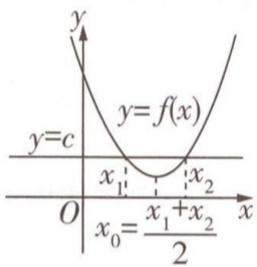

text_image

y
y=c
y=f(x)
x₁
x₂
O
x₀=\frac{x₁+x₂}{2}

图1

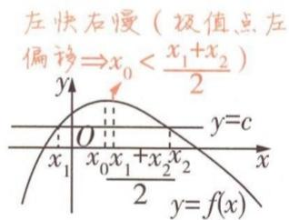

text_image

左快右慢（极值点左偏移⇒x₀＜x₁+x₂/2）
y=c
x₁	x₀	x₁+x₂/x₂
2
y=f(x)

(1)

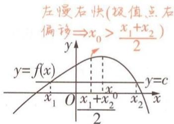

text_image

左慢右快(极值点右
偏移⇒x₀＞x₁+x₂)/2
y=f(x)
x₁ O x₁+x₂⁰/2 x₂ y=c

(2)

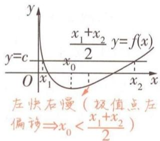

text_image

y
x₁+x₂ y=f(x)
y=c x₀
O x₁ x₂ x
左快右慢（极值点左偏移⇒x₀<x₁+x₂)/2

(3)

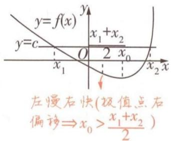

text_image

y=f(x)
y=c
x₁+x₂
O 2 x₀
x₂ x
左慢右快(极值点右
偏移⇒x₀>x₁+x₂)

(4)   
图2

利用同构解极值点相关问题在近几年高考中频繁出现，主要解题思路是把等式或不等式进行变形，构造函数，利用函数的单调性解题。在使用同构时主要考验“眼力”，即面对复杂的结构，仔细观察，灵活变形，使式子两侧的结构一致，再构造函数求参数或者证明不等式。极值点偏移问题在近几年高考中的考情与2025高考命题预测为：

# 三年考情与创新命题特点

# 2025命题预测

2022 全国甲卷 T21, $x_{1}, x_{2}$ 为函数 $f(x)$ 的两个零点，证明 $x_{1}x_{2}<1$

2021 新高考 I 卷 T22, a, b 为两个不相等的正数，且 $b \ln a - a \ln b = a - b$ ，证明 $2 < \frac{1}{a} + \frac{1}{b} < e$

①命题形式：常与函数的单调性、极值与最值等结合，出现在解答题的压轴题中.  
②必考热点：有关极值点或极值的不等式证明；有关零点的和、积的不等式证明.

# 大招 ① 对称构造

调研 1 [2024 云南 4 月二测] 已知常数 a > 0，函数 $f(x) = \frac{1}{2}x^{2} - ax - 2a^{2}\ln x$ .

(1) 若 $\forall x > 0, f(x) > -4a^{2}$ ，求 a 的取值范围；  
(2) 若 $x_{1}, x_{2}$ 是 $f(x)$ 的零点，且 $x_{1} \neq x_{2}$ ，证明： $x_{1} + x_{2} > 4a$ .

解析 (1) $f(x)$ 的定义域为 $\{x \mid x > 0\}$ ，且 $f'(x) = x - a - \frac{2a^2}{x} = \frac{x^2 - ax - 2a^2}{x} = \frac{(x - 2a)(x + a)}{x}$ .

因为 a > 0，所以当 $x \in (0, 2a)$ 时， $f'(x) < 0$ ，即 $f(x)$ 在 $(0, 2a)$ 上单调递减；

当 $x \in (2a, +\infty)$ 时， $f'(x) > 0$ ，即 $f(x)$ 在 $(2a, +\infty)$ 上单调递增.

所以 $f(x)$ 在 x=2a 处取得极小值,也是最小值, $f(x)_{\min}=f(2a)=-2a^{2}\ln(2a)$ .

$\forall x > 0, f(x) > -4a^2$ ，即 $f(x)_{\min} = -2a^2 \ln(2a) > -4a^2$ ，所以 $\ln(2a) < \ln e^2$ ，则 $0 < a < \frac{e^2}{2}$ ，故 $a$ 的取值范围为 $(0, \frac{e^2}{2})$ 。

(2) 由(1)知, $f(x)$ 的定义域为 $\{x \mid x > 0\}$ , $f(x)$ 在 $(0, 2a)$ 上单调递减, 在 $(2a, +\infty)$ 上单调递增, 且 $x = 2a$ 是 $f(x)$ 的极小值点.

因为 $x_{1}, x_{2}$ 是 $f(x)$ 的零点，且 $x_{1} \neq x_{2}$ ，所以 $x_{1}, x_{2}$ 分别在 $(0, 2a), (2a, +\infty)$ 上，不妨设 $0 < x_{1} < 2a < x_{2}$ ，设 $F(x) = f(x) - f(4a - x)$ ， $F'(x) = \frac{(x - 2a)(x + a)}{x} + \frac{(2a - x)(5a - x)}{4a - x} = \frac{2a(x - 2a)^{2}}{x(x - 4a)}$

【破瓶颈】根据所证的不等式的“对称性”构造相应的函数
当 $x \in (0,2a)$ 时， $F'(x) < 0, F'(2a) = 0$ ，即 $F(x)$ 在 $(0,2a]$ 上单调递减.

因为 $0 < x_{1} < 2a$ ，所以 $F(x_{1}) > F(2a) = 0$ ，即 $f(x_{1}) > f(4a - x_{1})$ ，

因为 $f(x_{1})=f(x_{2})=0$ ，所以 $f(x_{2})>f(4a-x_{1})$ ，因为 $x_{1}<2a$ ，所以 $4a-x_{1}>2a$ 。

又 $x_{2}>2a, f(x)$ 在 $(2a, +\infty)$ 上单调递增，所以 $x_{2}>4a-x_{1}$ ，即 $x_{1}+x_{2}>4a$ .

# 解题攻略

# 利用对称变换大招解决极值点偏移问题的步骤

对称变换主要用来解决与两个极值点的和、积相关的不等式证明问题,其基本步骤如下:

<table><tr><td>定极值点</td><td>利用导函数值的符号判断函数的单调性,进而确定函数的极值点 $x_0$ </td></tr><tr><td>构造函数</td><td>根据极值点构造对称函数 $F(x)=f(x_0+x)-f(x_0-x)$ (说明:此处构造的函数需要根据题意,有时也要构造成 $F(x)=f(x)-f(2x_0-x)$ 的形式)</td></tr><tr><td>判断单调性</td><td>利用导数讨论 $F(x)$ 的单调性</td></tr><tr><td>比较大小</td><td>判断 $F(x)$ 在某区间上的正负,得 $f(x_0+x)$ 与 $f(x_0-x)$ 的大小关系</td></tr><tr><td>转化</td><td>利用函数 $f(x)$ 的单调性,将 $f(x_0+x)$ 与 $f(x_0-x)$ 的大小关系转化为两个极值点之间的关系,进而得到所证或所求</td></tr></table>

说明:若要证明 $f'\left(\frac{x_{1}+x_{2}}{2}\right)$ 的符号问题,还需进一步讨论 $\frac{x_{1}+x_{2}}{2}$ 与 $x_{0}$ 的大小,得出 $\frac{x_{1}+x_{2}}{2}$ 所在的单调区间,从而得出该处导数值的正负,从而结论得证.以上内容的记忆口诀为:极值偏离对称轴,构造函数觅行踪;五个步骤环相扣,两次单调紧跟随.

# 大招

# 比值换元

调研 2 试题调研原创 已知函数 $f(x)=x\ln x-\frac{a}{2}x^{2}-x+a(a\in\mathbb{R})$ 在其定义域内有两个不同的极值点.

(1) 求 a 的取值范围.  
(2) 记两个极值点为 $x_{1}, x_{2}$ ，且 $x_{1} < x_{2}$ 。若 $t \geqslant 1$ ，证明： $t \ln \frac{e}{x_{2}} < \ln \frac{x_{1}}{e}$ .

解析 (1) 由题意知, 函数 $f(x)$ 的定义域为 $(0, +\infty), f'(x) = \ln x - ax$ , 函数 $f(x)$ 在其定义域内有两个不同的极值点, 即方程 $f'(x) = 0$ 在 $(0, +\infty)$ 上有两个不同的根, 即方程 $\ln x - ax = 0$ ( $a$ 为参数) 在 $(0, +\infty)$ 上有两个不同的根, 即方程 $a = \frac{\ln x}{x}$ ( $a$ 为参数) 在 $(0, +\infty)$ 上有两个不同的根.

【扫障碍】函数有两个极值点→导函数有两个变号零点→构造方程→分离参数→构造函数→求导研究单调性→根据最值确定参数的取值范围

令 $g(x) = \frac{\ln x}{x}, x \in (0, +\infty)$ ，则 $g'(x) = \frac{1 - \ln x}{x^2}$ ，当 $0 < x < e$ 时， $g'(x) > 0$ ，当 $x > e$ 时， $g'(x) < 0$ ，则函数 $g(x)$ 在 $(0, e)$ 上单调递增，在 $(e, +\infty)$ 上单调递减.

所以 $g(x)_{\max} = g(\mathrm{e}) = \frac{1}{\mathrm{e}}$ ，又 $g(1) = 0$ ，当 $x > 1$ 时， $g(x) > 0$ ，当 $0 < x < 1$ 时， $g(x) < 0$

所以 a 的取值范围为 $(0, \frac{1}{\mathrm{e}})$ .

(2) 要证 $t \ln \frac{e}{x_{2}} < \ln \frac{x_{1}}{e}$ ，即证 $t - t \ln x_{2} < \ln x_{1} - 1$ ，由(1)知 $x_{1}, x_{2}$ 是方程 $\ln x - ax = 0$ 的两个根，即 $\ln x_{1} = ax_{1}, \ln x_{2} = ax_{2}$ ，所以原式等价于 $1 + t < t \ln x_{2} + \ln x_{1} = tax_{2} + ax_{1} = a(tx_{2} + x_{1})$ .

因为 $t \geqslant 1, 0 < x_{1} < x_{2}$ , 所以即证 $a > \frac{1 + t}{tx_{2} + x_{1}}$ .

由 $\ln x_{1} = ax_{1},\ln x_{2} = ax_{2}$ 作差得 $\ln \frac{x_1}{x_2} = a(x_1 - x_2)$ ，即 $a = \frac{\ln\frac{x_1}{x_2}}{x_1 - x_2}$ 所以只需证 $\frac{\ln\frac{x_1}{x_2}}{x_1 - x_2} >$ $\frac{1 + t}{tx_2 + x_1}$ .令 $\lambda = \frac{x_1}{x_2},\lambda \in (0,1)$ ，则只需证 $\ln \lambda < \frac{(t + 1)(\lambda - 1)}{t + \lambda} (\lambda \in (0,1))$

【破瓶颈】引入比值消参，注意新元的取值范围不要遗漏，转化目标不等式

记 $g(\lambda) = \ln \lambda - \frac{(t + 1)(\lambda - 1)}{\lambda + t} (\lambda \in (0, 1))$ ，则 $g'(\lambda) = \frac{1}{\lambda} - \frac{(t + 1)^2}{(\lambda + t)^2} = \frac{(\lambda - 1)(\lambda - t^2)}{\lambda (\lambda + t)^2}$ ，

因为 $t \geqslant 1, \lambda \in (0,1)$ ，所以 $g'(\lambda) > 0$ ，函数 $g(\lambda)$ 在 $(0,1)$ 上单调递增.

所以 $g(\lambda) < \ln 1 - \frac{(t+1)(1-1)}{1+t} = 0$ ，所以 $\ln \lambda < \frac{(t+1)(\lambda-1)}{t+\lambda} (\lambda \in (0,1))$ .

从而原不等式成立, 即 $t \ln \frac{e}{x_{2}} < \ln \frac{x_{1}}{e}$ .

# 解题攻略

# 利用比值换元大招解决极值点偏移问题的步骤

利用比值换元解决极值点偏移问题,主要针对与对数型函数有关的问题,依据对数的基本运算 $\ln\frac{x_{2}}{x_{1}}=\ln x_{2}-\ln x_{1}$ ，进而引入商 $t=\frac{x_{2}}{x_{1}}$ 。解题的关键是：

①找到两极值点的相应关系；  
②通过方程组的变形达到消参减元的目的,利用 t 分别表示变量 $x_{1}, x_{2}$ , 将所证不等式转化为关于 t 的不等式;  
③构造函数,转化为函数的最值问题,即可进一步得解.

# 原创变式

1 已知函数 $f(x) = x \ln x - x$ .

(1) 求函数 $f(x)$ 的最值；  
(2) 若函数 $g(x)=f(x)-ax^{2}+a$ 有两个不同的极值点，记作 $x_{1}, x_{2}$ ，且 $x_{1}<x_{2}$ ，求证： $\ln x_{1}+2\ln x_{2}>3$ .

# 大招 ③ 差值换元

调研 3 [2024 河北名校 5 月联合模拟] 已知函数 $f(x) = x + \frac{m}{\mathrm{e}^{x}}$ .

(1) 讨论 $f(x)$ 的单调性；  
(2) 若 $x_{1} \neq x_{2}$ ，且 $f(x_{1}) = f(x_{2}) = 2$ ，证明：0 < m < e，且 $x_{1} + x_{2} < 2$ .

解析 (1) $f(x)$ 的定义域为 $\mathbf{R}, f'(x) = 1 - \frac{m}{\mathrm{e}^x} = \frac{\mathrm{e}^x - m}{\mathrm{e}^x}$ .

若 $m \leqslant 0$ ，则 $f'(x) > 0$ 恒成立， $f(x)$ 单调递增.

若 m > 0，则当 $x \in (-\infty, \ln m)$ 时， $f'(x) < 0, f(x)$ 单调递减；当 $x \in (\ln m, +\infty)$ 时， $f'(x) > 0, f(x)$ 单调递增.

综上, 当 $m \leqslant 0$ 时, $f(x)$ 在 R 上单调递增; 当 m > 0 时, $f(x)$ 在区间 $(-∞, \ln m)$ 上单调递减, 在区间 $(\ln m, +∞)$ 上单调递增.

(2)①先证明 0 < m < e.

由题意得 $x_{1}, x_{2}$ 是方程 $x + \frac{m}{\mathrm{e}^{x}} = 2$ ，即 $m = \mathrm{e}^{x}(2 - x)$ （ $m$ 为参数）的两个实数根.

【破瓶颈】根据 $f(x_{1})=f(x_{2})=2$ 构造方程，分离参数，构造新函数

令 $g(x)=\mathrm{e}^{x}(2-x)$ ，则 $g'(x)=\mathrm{e}^{x}(1-x)$ ，当 $x\in(-\infty,1)$ 时， $g'(x)>0,g(x)$ 单调递增；当 $x\in(1,+\infty)$ 时， $g'(x)<0,g(x)$ 单调递减.

所以 $g(x)_{\max} = g(1) = \mathrm{e}$ ，又当 $x \to -\infty$ 时， $g(x) \to 0$ 且 $g(x) > 0$ ，当 $x \to +\infty$ 时， $g(x) \to -\infty$ ，所以 $0 < m < \mathrm{e}$ .

②再证明 $x_{1} + x_{2} < 2$ .

方法一:对称构造 不妨设 $x_{1}<x_{2}$ ，因为 $x_{1},x_{2}$ 是方程 $m=\mathrm{e}^{x}(2-x)$ (m 为参数) 的两个实数根，且 $g(x)_{\max}=g(1)=\mathrm{e},g(2)=0$ ，所以 $x_{1}<1<x_{2}<2$ .

要证 $x_{1} + x_{2} < 2$ ，只需证 $x_{1} < 2 - x_{2}$ ，因为 $x_{1} < 1,2 - x_{2} < 1,g(x)$ 在 $(-\infty ,1)$ 上单调递增，所以只需证 $g(x_{1}) < g(2 - x_{2})$ ，因为 $g(x_{1}) = g(x_{2})$ ，所以只需证 $g(x_{2}) < g(2 - x_{2})$

令 $h(x) = g(x) - g(2 - x), 1 < x < 2$ ，则 $h'(x) = g'(x) + g'(2 - x) = \mathrm{e}^x (1 - x) + \mathrm{e}^{2 - x}(x - 1) = (1 - x)(\mathrm{e}^x - \mathrm{e}^{2 - x}) = (1 - x) \cdot \frac{\mathrm{e}^{2x} - \mathrm{e}^2}{\mathrm{e}^x} < 0$ 在 $(1,2)$ 上恒成立，

所以 $h(x)$ 在区间 $(1,2)$ 上单调递减，所以 $h(x) < g(1) - g(2 - 1) = 0$ ，即当 $1 < x < 2$ 时， $g(x) < g(2 - x)$ ，所以 $g(x_{2}) < g(2 - x_{2})$ ，即 $x_{1} + x_{2} < 2$ 成立.

方法二:差值构造 由 $f(x_{1})=f(x_{2})=2$ 得 $x_{1},x_{2}$ 是方程 $x+\frac{m}{\mathrm{e}^{x}}=2$ 的两个实数根,由m>0可得 $x_{1}\neq2,x_{2}\neq2$ ,

所以 $x_{1}, x_{2}$ 是方程 $\mathrm{e}^{x} = \frac{m}{2 - x}$ ( $m$ 为参数) 的两个实数根, $\left\{ \begin{array}{l} \mathrm{e}^{x_{1}} = \frac{m}{2 - x_{1}}, \\ \mathrm{e}^{x_{2}} = \frac{m}{2 - x_{2}}, \end{array} \right.$ 不妨设 $t = x_{2} - x_{1} > 0$ , 则 $x_{2} = x_{1} + t$ .

所以 $\frac{\mathrm{e}^{x_1}}{\mathrm{e}^{x_2}} = \frac{2 - x_2}{2 - x_1}$ 即 $\frac{1}{\mathrm{e}^{x_2 - x_1}} = \frac{2 - x_1 + (x_1 - x_2)}{2 - x_1} = 1 - \frac{x_2 - x_1}{2 - x_1}$ 所以 $\frac{1}{\mathrm{e}^t} = 1 - \frac{t}{2 - x_1}$ 得 $x_{1} = 2 - \frac{te^{t}}{\mathrm{e}^{t} - 1}$ 所以 $x_{1} + x_{2} = 2x_{1} + t = 4 - \frac{2te^{t}}{\mathrm{e}^{t} - 1} +t$ ，要证 $x_{1} + x_{2} <   2$ ，即证 $4 - \frac{2te^{t}}{\mathrm{e}^{t} - 1} +t <   2$ ，也就是 $t + 2 <   \frac{2te^{t}}{\mathrm{e}^{t} - 1},$

因为 t > 0，所以 $e^{t} - 1 > 0$ ，故上式可化为 $(t + 2)(e^{t} - 1) < 2te^{t}$ ，即 $(t - 2)e^{t} + t + 2 > 0$ 。

记 $p(t) = (t - 2)\mathrm{e}^t + t + 2(t > 0)$ ，则 $p'(t) = (t - 1)\mathrm{e}^t + 1$

记 $q(t) = p'(t) = (t - 1)\mathrm{e}^t +1(t > 0)$ ，则 $q^{\prime}(t) = te^{t},q^{\prime}(t) > 0,q(t)$ 在 $(0, + \infty)$ 上单调递增，

所以 $q(t) > (0 - 1)e^{0} + 1 = 0$ ，即 $p'(t) > 0$ ，所以 $p(t)$ 在 $(0, +\infty)$ 上单调递增，

故 $p(t)>(0-2)\mathrm{e}^{0}+0+2=0$ ，即 $(t-2)\mathrm{e}^{t}+t+2>0$ .

故原不等式得证,也就是 $x_{1}+x_{2}<2$ .

# 原创变式

2 若 $x_{1}, x_{2}$ 是函数 $f(x) = \mathrm{e}^{x} - ax (x > 0)$ 的两个零点，且 $x_{1} < x_{2}$ ，求证： $x_{1} + x_{2} > 2$ 且 $x_{1}x_{2} < 1$ .

  
“比差换元法”妙解极值点偏移问题

# 创新预测

答案▶ 102页

1. 试题调研原创 已知函数 $f(x) = (x - 1)\ln x - x^2 + ax (a \in \mathbb{R})$ .

(1) 若函数 $y = f'(x)$ 有两个零点, 求 a 的取值范围;  
(2) 设 $x_{1}, x_{2}$ 是函数 $f(x)$ 的两个极值点, 证明: $2^{x_{1}} \cdot 2^{x_{2}} > 4$ .

# 规范答题

2. 试题调研原创 已知函数 $h(x) = \ln x$ 和 $g(x) = ax$ , 若存在两个实数 $x_1, x_2$ , 且 $x_1 \neq x_2$ , 使得 $h(x_1) = g(x_1), h(x_2) = g(x_2)$ , 证明: $x_1 x_2 > e^2$ .

# 规范答题

# 参考答案与解析

# 原创变式

1.(1)函数 $f(x)$ 的定义域为 $(0,+\infty)$ , $f'(x)=\ln x$ .

令 $f'(x)<0$ , 解得 0<x<1; 令 $f'(x)>0$ , 解得 x>1.

所以 $f(x)$ 在 $(0,1)$ 上单调递减，在 $(1,+\infty)$ 上单调递增，所以 $f(x)_{\min}=f(1)=1\times\ln1-1=-1$ .

所以 $f(x)$ 无最大值, 最小值为 -1.

(2) $g(x)=f(x)-ax^{2}+a=x\ln x-ax^{2}-x+a$ , $g'(x)=\ln x-2ax.$

因为 $g(x)$ 有两个不同的极值点 $x_{1}, x_{2}$ ，所以 $\ln x_{1} = 2ax_{1}, \ln x_{2} = 2ax_{2}$ .

欲证 $\ln x_{1} + 2\ln x_{2} > 3$ ，即证 $2ax_{1} + 4ax_{2} > 3$ ，又 $0 < x_{1} < x_{2}$ ，所以原式等价于 $a > \frac{3}{2x_{1} + 4x_{2}}$ ①.

由 $\ln x_{1}=2ax_{1},\ln x_{2}=2ax_{2}$ ，得 $\ln\frac{x_{2}}{x_{1}}=2a(x_{2}-x_{1})$ ，则 $a=\frac{\ln\frac{x_{2}}{x_{1}}}{2(x_{2}-x_{1})}$ ②[关键：作商，构造比值的形式，为后面使用比值换元法做好准备条件].

由①②知原问题等价于求证 $\frac{\ln\frac{x_2}{x_1}}{x_2 - x_1} >\frac{3}{x_1 + 2x_2}$ 即证 $\ln \frac{x_2}{x_1} >\frac{3(x_2 - x_1)}{x_1 + 2x_2} = \frac{3(\frac{x_2}{x_1} - 1)}{1 + \frac{2x_2}{x_1}}.$

令 $t=\frac{x_{2}}{x_{1}}$ ，则 t>1，上式等价于求证 $\ln t>\frac{3(t-1)}{1+2t}$ .

令 $h(t)=\ln t-\frac{3(t-1)}{1+2t}(t>1)$ ，则 $h'(t)=\frac{1}{t}-\frac{3(1+2t)-6(t-1)}{(1+2t)^{2}}=\frac{(t-1)(4t-1)}{t(1+2t)^{2}}$

因为 t > 1，所以 $h'(t) > 0$ 恒成立，所以 $h(t)$ 单调递增， $h(t) > \ln 1 - \frac{3 \times (1 - 1)}{1 + 2 \times 1} = 0$ ，即 $\ln t > \frac{3(t - 1)}{1 + 2t}$ ，

所以原不等式成立, 即 $\ln x_{1} + 2\ln x_{2} > 3$ .

2. 方法一: 比值代换 由题意知 a > 0, 由 $\mathrm{e}^{x} = ax (x > 0)$ 得 $x = \ln a + \ln x$ ,

所以 $x_{1}-\ln x_{1}=x_{2}-\ln x_{2}=\ln a.$

令 $t=\frac{x_{2}}{x_{1}}$ ，则 t>1, $x_{2}=tx_{1}$ ，代入上式得 $x_{1}=\frac{\ln t}{t-1}$ [点拨：将等式 $x_{1}-\ln x_{1}=x_{2}-\ln x_{2}$ 中每一项都除以 $x_{1}$ ，再进行化简即得]， $x_{2}=\frac{t\ln t}{t-1}$ .

对于 $x_{1} + x_{2} > 2$ ，其等价于 $\frac{\ln t}{t-1} + \frac{t\ln t}{t-1} > 2$ ，即 $\ln t - \frac{2(t-1)}{t+1} > 0$ .

构造函数 $g(t)=\ln t-\frac{2(t-1)}{t+1}(t>1)$ ，则 $g'(t)=\frac{1}{t}-\frac{2(t+1)-2(t-1)}{(t+1)^{2}}=\frac{(t-1)^{2}}{t(t+1)^{2}}>0$ ，

所以函数 $g(t)$ 在 $(1, +\infty)$ 上单调递增，所以 $g(t) > \ln 1 - \frac{2 \times (1 - 1)}{1 + 1} = 0$ ，即 $x_{1} + x_{2} > 2$ 得证.

对于 $x_{1}x_{2} < 1$ ，其等价于 $\frac{t(\ln t)^2}{(t - 1)^2} < 1$ ，即 $\frac{\sqrt{t}\ln t}{t - 1} < 1$ ，即 $\ln t - \sqrt{t} +\frac{1}{\sqrt{t}} < 0.$

令 $\sqrt{t}=b$ ，则b>1，构造函数 $h(b)=\ln b^{2}-b+\frac{1}{b}(b>1)$ ，则 $h'(b)<0,h(b)$ 在 $(1,+\infty)$ 上单调递减，所以 $h(b)<\ln 1^{2}-1+\frac{1}{1}=0$ ，即 $x_{1}x_{2}<1$ 得证.

方法二:差值代换 由 $\mathrm{e}^{x}=ax(x>0)$ 可得 $a=\frac{\mathrm{e}^{x}}{x}$ . 函数 $y=\frac{\mathrm{e}^{x}}{x}$ 在 $(0,1)$ 上单调递减，在 $(1,+\infty)$ 上单调递增，所以 $0<x_{1}<1<x_{2}$ ，则有 $e^{x_{1}}=ax_{1},e^{x_{2}}=ax_{2}$ ，则 $a=\frac{e^{x_{2}}-e^{x_{1}}}{x_{2}-x_{1}}$ ，且 $x_{1}=\frac{e^{x_{1}}}{a},x_{2}=\frac{e^{x_{2}}}{a}$ .

对于 $x_{1} + x_{2} > 2$ ，即 $\frac{\mathrm{e}^{x_1} + \mathrm{e}^{x_2}}{a} >2$ ，即 $\frac{\mathrm{e}^{x_1} + \mathrm{e}^{x_2}}{\mathrm{e}^{x_2} - \mathrm{e}^{x_1}} >\frac{2}{x_2 - x_1}$ 即 $\frac{\mathrm{e}^{x_2 - x_1} + 1}{\mathrm{e}^{x_2 - x_1} - 1} >\frac{2}{x_2 - x_1},$

令 $x_{2} - x_{1} = t$ ，则 $t > 0$ ，则只需证 $t(\mathrm{e}^t +1) - 2(\mathrm{e}^t -1) > 0.$

令 $g(t)=t\left(\mathrm{e}^{t}+1\right)-2\left(\mathrm{e}^{t}-1\right)(t>0)$ ，则 $g'(t)=(t-1)\mathrm{e}^{t}+1$ , $g''(t)=te^{t}>0$ ,

则 $g'(t)$ 在 $(0, +\infty)$ 上单调递增，则 $g'(t) > (0 - 1)e^{0} + 1 = 0$ ，

则 $g(t)$ 在 $(0, +\infty)$ 上单调递增，则 $g(t) > 0 \times (\mathrm{e}^{0} + 1) - 2 \times (\mathrm{e}^{0} - 1) = 0$ ，即 $x_{1} + x_{2} > 2$ 成立.

对于 $x_{1}x_{2} < 1$ ，其等价于 $\frac{\mathrm{e}^{x_1}\mathrm{e}^{x_2}}{a^2} < 1$ ，即 $\mathrm{e}^{x_1}\mathrm{e}^{x_2} < (\frac{\mathrm{e}^{x_2} - \mathrm{e}^{x_1}}{x_2 - x_1})^2$ ，即 $\frac{\mathrm{e}^{x_1}\mathrm{e}^{x_2}}{(\mathrm{e}^{x_2} - \mathrm{e}^{x_1})^2} < (\frac{1}{x_2 - x_1})^2.$

左边分子、分母同时除以 $\mathrm{e}^{2x_1}$ ，得 $\frac{\mathrm{e}^{x_2 - x_1}}{(\mathrm{e}^{x_2 - x_1} - 1)^2} < (\frac{1}{x_2 - x_1})^2$ ，令 $x_{2} - x_{1} = t$ ，则 $t > 0$ ，则只需证 $\frac{\mathrm{e}^t}{(\mathrm{e}^t - 1)^2} < (\frac{1}{t})^2$ ，即 $t\mathrm{e}^{\frac{t}{2}} - \mathrm{e}^t +1 <   0.$

令 $h(t)=te^{\frac{t}{2}}-e^{t}+1(t>0)$ ，则 $h'(t)=\mathrm{e}^{\frac{t}{2}}(-\mathrm{e}^{\frac{t}{2}}+\frac{t}{2}+1)$ ，

令 $m(t) = -\mathrm{e}^{\frac{t}{2}} + \frac{t}{2} + 1$ ，则 $m'(t) = \frac{1}{2}(1 - \mathrm{e}^{\frac{t}{2}}) < 0$ ，

所以 $m(t)$ 在 $(0, +\infty)$ 上单调递减，故 $m(t) = -\mathrm{e}^{\frac{t}{2}} + \frac{t}{2} + 1 < -\mathrm{e}^{\frac{0}{2}} + \frac{0}{2} + 1 = 0$ ，所以 $h'(t) < 0$ ，
所以 $h(t)$ 在 $(0, +\infty)$ 上单调递减，所以 $h(t) < 0 \times e^{\frac{0}{2}} - e^{0} + 1 = 0$ ，即 $x_{1}x_{2} < 1$ 成立.

# 创新预测

1. (1) $f(x) = (x - 1)\ln x - x^2 + ax$ ，则 $f'(x) = 1 - \frac{1}{x} + \ln x - 2x + a$ ，

令 $f'(x)=0$ ，得 $a=2x+\frac{1}{x}-\ln x-1$ ，

若函数 $y=f'(x)$ 有两个零点，则直线 y=a 与函数 $g(x)=2x+\frac{1}{x}-\ln x-1$ 的图象有两个不同的交点.

设 $g(x) = 2x + \frac{1}{x} -\ln x - 1$ ，则 $g^{\prime}(x) = 2 - \frac{1}{x^{2}} -\frac{1}{x} = \frac{2x^{2} - x - 1}{x^{2}} = \frac{(2x + 1)(x - 1)}{x^{2}}.$

当 $x \in (0,1)$ 时， $g'(x) < 0, g(x)$ 单调递减，当 $x \in (1, +\infty)$ 时， $g'(x) > 0, g(x)$ 单调递增，因此 $g(x)_{\min} = g(1) = 2$ 。当 $x \to 0$ 时， $g(x) \to +\infty$ ，当 $x \to +\infty$ 时， $g(x) \to +\infty$ ，作出函数 $g(x)$ 的大致图象与直线 $y = a$ ，如图3所示，要使二者有两个不同交点，则 $a > 2$ ，故 $a$ 的取值范围为 $(2, +\infty)$ 。

(2) 因为 $x_{1}, x_{2}$ 是函数 $f(x)$ 的两个极值点，所以 $f'(x_{1}) = f'(x_{2}) = 0$ .
由(1)知 $g(x_{1})=g(x_{2})=a$ ，不妨设 $0<x_{1}<1<x_{2}$ ，要证 $2^{x_{1}}\cdot2^{x_{2}}>4$ ，即证 $x_{1}+x_{2}>2$ ，只需证 $x_{2}>2-x_{1}$ ，显然 $2-x_{1}>1$ 。

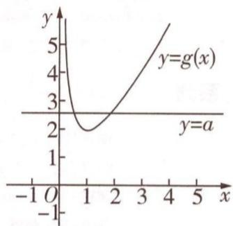

line

| x   | y=g(x) |
| --- | ------ |
| -1  | 5      |
| 0   | 3      |
| 1   | 2      |
| 2   | 3      |
| 3   | 4      |
| 4   | 5      |
| 5   | 6      |

图3

由(1)知当 $x\in(1,+\infty)$ 时， $g(x)$ 单调递增，所以只需证 $g(x_{2})>g(2-x_{1})$ ，而 $g(x_{1})=g(x_{2})=a$ ，所以即证 $g(x_{1})>g(2-x_{1})$ .

设 $h(x) = g(x) - g(2 - x) = 4x + \frac{1}{x} -\ln x - \frac{1}{2 - x} +\ln (2 - x) - 4,$ 则 $h^{\prime}(x) =$ $\frac{4(x - 1)^2[(x - 1)^2 - 2]}{x^2(2 - x)^2},$

当 $x \in (0,1)$ 时， $h'(x) < 0, h(x)$ 单调递减，所以当 $0 < x < 1$ 时， $h(x) > h(1) = 0$

所以当 $0 < x_{1} < 1$ 时， $g(x_{1}) > g(2 - x_{1})$ ，原不等式得证.

2. 方法一: 利用参数 a 作为媒介, 换元后构造新函数 不妨设 $x_{1} > x_{2}$ ,

因为 $\ln x_{1} - ax_{1} = 0, \ln x_{2} - ax_{2} = 0$ ，所以 $\ln x_{1} + \ln x_{2} = a(x_{1} + x_{2}), \ln x_{1} - \ln x_{2} = a(x_{1} - x_{2})$

所以 $\frac{\ln x_{1}-\ln x_{2}}{x_{1}-x_{2}}=a$ ，欲证 $x_{1}x_{2}>e^{2}$ ，即证 $\ln x_{1}+\ln x_{2}>2$ [变形:对等式两边同时取以e为底的对数].

因为 $\ln x_{1} + \ln x_{2} = a(x_{1} + x_{2})$ ，所以即证 $a > \frac{2}{x_1 + x_2}$

所以即证 $\frac{\ln x_1 - \ln x_2}{x_1 - x_2} >\frac{2}{x_1 + x_2}$ 即证 $\ln \frac{x_1}{x_2} >\frac{2(x_1 - x_2)}{x_1 + x_2}.$

令 $t = \frac{x_1}{x_2}$ 则 $t > 1, x_1 x_2 > \mathrm{e}^2$ 等价于 $\ln t - \frac{2(t - 1)}{t + 1} > 0$ ，构造函数 $g(t) = \ln t - \frac{2(t - 1)}{t + 1}, t > 1$

则 $g'(t)=\frac{(t-1)^{2}}{t(t+1)^{2}}>0$ , $g(t)$ 单调递增, $g(t)>\ln 1-\frac{2\times(1-1)}{1+1}=0$ , 即 $\ln t-\frac{2(t-1)}{t+1}>0$ , 所以 $x_{1}x_{2}>\mathrm{e}^{2}$ .

方法二: 直接换元构造新函数 $a=\frac{\ln x_{1}}{x_{1}}=\frac{\ln x_{2}}{x_{2}}$ ，即 $\frac{\ln x_{2}}{\ln x_{1}}=\frac{x_{2}}{x_{1}}$ ，设 $x_{1}<x_{2}, t=\frac{x_{2}}{x_{1}}$ ，则 t>1，

则 $x_{2} = tx_{1},\frac{\ln tx_{1}}{\ln x_{1}} = t$ ，可得 $\ln x_1 = \frac{\ln t}{t - 1},\ln x_2 = \ln tx_1 = \ln t + \ln x_1 = \ln t + \frac{\ln t}{t - 1} = \frac{t\ln t}{t - 1},$

故 $x_{1}x_{2} > \mathrm{e}^{2}$ 即 $\ln x_{1} + \ln x_{2} > 2$ ，即 $\frac{t + 1}{t - 1}\ln t > 2.$

以下解题思路与方法一一致,构造函数研究最值即可,请同学们自行尝试.

<table><tr><td>系列</td><td colspan="2">主题</td><td>提分方案</td><td>上市时间</td><td>定价</td></tr><tr><td rowspan="21">月刊教辅系列</td><td colspan="2">调研1辑·函数与导数</td><td rowspan="4">解透关键题型,专注超重点、疑难点、创新考法的专题突破,快速攻克核心考点</td><td>2024.6</td><td rowspan="10">18.9元/册</td></tr><tr><td colspan="2">调研2辑·三角函数&amp;平面向量</td><td>2024.7</td></tr><tr><td colspan="2">调研3辑·数列&amp;立体几何&amp;概率与统计</td><td>2024.8</td></tr><tr><td colspan="2">调研4辑·解析几何满分攻略</td><td>2024.9</td></tr><tr><td colspan="2">调研5辑·模型解题法</td><td>跳出题海,巧用“模型解题法”提高解题能力</td><td>2024.11</td></tr><tr><td colspan="2">调研6辑·高频易错点快攻</td><td>纠正高频错误,杜绝盲目刷题,做到精准查漏补缺</td><td>2024.12</td></tr><tr><td colspan="2">调研7辑·高考解题大招</td><td>学大招、练大招、放大招,大招解题,只讲提分干货</td><td>2025.1</td></tr><tr><td colspan="2">调研8辑·情境题解读与预测</td><td>参透陌生情境,理解问题本质,突破命题最热点</td><td>2025.2</td></tr><tr><td colspan="2">调研9辑·考前50天50题</td><td>练习原创好题,提升应变能力,提前演练高考</td><td>2025.3</td></tr><tr><td colspan="2">调研10辑·考前抢分必备</td><td>速记结论、速通大招、圈画热点,考前1分钟都能提分</td><td>2025.4</td></tr><tr><td rowspan="4">数学专项</td><td>高考新定义题第19题</td><td>攻克新定义压轴题,冲刺高考数学最后17分</td><td>2024.6</td><td rowspan="11">18.9元/册</td></tr><tr><td>选择题、填空题满分技法</td><td>小题要巧做,妙招速攻克,节约时间,速解得满分</td><td rowspan="3">2024.11</td></tr><tr><td>解答题高分技法</td><td>大题要速解,模型巧突破,规范答题,踩点得高分</td></tr><tr><td>二级结论高妙应用</td><td>妙用二级结论,找准突破口,快速解题,快得分</td></tr><tr><td>物理专项</td><td>高考物理的数学方法</td><td>活用数学方法,精准运算,快速攻克物理解题难关</td><td>2024.11</td></tr><tr><td rowspan="4">作文素材</td><td>作文素材(上)·名校模考满分作文</td><td>模仿名校满分作文,写55+考场一类文</td><td>2024.6</td></tr><tr><td>作文素材(特辑)·思辨性写作</td><td>速用万能公式,速背思辨素材,速破思辨命题,拯救作文平庸</td><td>2024.7</td></tr><tr><td>作文素材(中)·年度精选素材</td><td>万能鲜活素材,多维解读,考场速用,作文稳破50+</td><td>2024.11</td></tr><tr><td>作文素材(下)·考前热点素材</td><td>考前锁定热点话题,速背抢分素材,作文轻松+10分</td><td>2025.3</td></tr><tr><td rowspan="2">时政热点</td><td>时政热点(上)</td><td>2024年4月—12月重大时事,全方位解读</td><td>2024.12</td></tr><tr><td>时政热点(下)</td><td>全年度重大时事热点,一网打尽,分析预测,把脉高考</td><td>2025.4</td></tr></table>

<table><tr><td rowspan="16">热点题型专练系列</td><td colspan="2">选择题(语文、物理、化学、生物、政治、地理、历史)</td><td rowspan="2">速刷小题小卷,专注小题速破巧解,练速度、刷题感、快提分</td><td rowspan="2">2024.7</td><td rowspan="2">37.9—45.9元/册</td></tr><tr><td colspan="2">选择题&amp;填空题(数学)</td></tr><tr><td rowspan="2">数学</td><td>数学解答题前3道题</td><td>构建解题模板,专练基础解答题,拿一本保底43分</td><td rowspan="13">2024.8</td><td rowspan="13">26.9—39.9元/册</td></tr><tr><td>数学解答题第18、19题</td><td>突破思维瓶颈,专攻压轴解答题,进名校必争最后34分</td></tr><tr><td rowspan="2">语文</td><td>文言文阅读</td><td>夯实文言基础,提升解题能力,攻克高考语文“硬伤”</td></tr><tr><td>高考理解性默写</td><td>一句不落,一字不差,名句默写一分不丢</td></tr><tr><td rowspan="2">英语</td><td>阅读&amp;语言运用</td><td>聚焦热考话题,练透必考题型,争满分</td></tr><tr><td>应用文&amp;读后续写&amp;概要写作</td><td>巧学技法,速背素材,精练新题,拿高分</td></tr><tr><td rowspan="2">物理</td><td>计算题</td><td>构建解题模板,搭配母题变式,专练大题快提分</td></tr><tr><td>实验题</td><td>注重原理剖析,突破探究难点,专练创新实验,得满分</td></tr><tr><td rowspan="4">化学</td><td>实验综合题</td><td rowspan="4">聚焦实验热点,攻克原理难点速推工艺流程,建构有机模型练透4大题型,完胜大题冲满分</td></tr><tr><td>反应原理综合题</td></tr><tr><td>工艺流程题</td></tr><tr><td>有机合成题</td></tr><tr><td>生物</td><td>遗传题</td><td>掌握高分技法,专攻遗传大题,练透难点得高分</td></tr><tr><td colspan="2">高考情境题&amp;创新题(数学、物理、化学、生物、地理、历史)</td><td>聚焦创新情境,练透创新考法,拉开差距得满分</td><td>2024.8</td><td>26.9—27.9元/册</td></tr></table>

