# 创于2003

# 试题调研

# 每月一手考情

# 讲透关键题型

畅销22年

第1辑 第2辑 第3辑 第4辑 第5辑 第6辑 第7辑 第8辑 第9辑 第10辑

2024年6月上市 7月上市 8月上市 9月上市 11月上市 12月上市 2025年1月上市 2月上市 3月上市 4月上市

# 高考超重点2 三角函数&平面向量

# 聚焦超重点，讲透关键题型

深度研透13大 高考创新考法  
√ 轻松学透54个高妙解题技法

一次讲透37大必考超重点  
多维解透91道原创好题

专家讲高考：深度解读2024高考三角&向量4大创新命题角度

名师视频课：全9科100+节名师精讲视频课秒学易懂，免费观看

# 调研2辑: 特邀87名一线名师，联手突破高考超重点

# 大学专家顾问团

# 对话高考命题专家，创新解读最新考情，引领科学备考

王 福 华中师大特聘研究员

党为民 北师大硕士生导师

张肖侠 陕西师大特聘专家

吴常光 西南大学硕士生导师

王衡保 西南大学硕士生导师

刘秋祥 湖南师大硕士生导师

张红霞 华中师大硕士生导师

谢广喜 江南大学理学院讲师

李乐峰 淮北师大硕士生导师

# 一线名师编写团

# 名校名师执笔创作，讲透关键题型，助力轻松提分

李传海 北京首都师大附中高级教师

鲁建全 河南郑州外国语学校高级教师

熊姿 江西南昌第二中学高级教师

田奇林 广东省生物正高级教师

赵成海 河北省数学特级教师

陈怀忠 河南郑州一中高级教师

于坤 山东青岛二中高级教师

陈 俊 四川成都七中高级教师

杨清海 福建省物理特级教师

余秀生 青海省政治正高级教师

赵吉星 北京第十八中学高级教师

刘颢 广东中山纪念中学高级教师

杨卫东 安徽安庆一中高级教师

汤伟 安徽省化学特级教师

敖晓玲 四川省地理正高级教师

# 学科专家评审团

# 学科专家终审把关，字斟句酌，确保内容高品质

陈金华 北京市正高级、特级教师

昝亚娟 北京市正高级、特级教师

公衍录 北京市正高级教师

宋景田 北京市特级教师

杨从立 北京朝阳区教研室教研员

李传海 北京海淀区兼职教研员

(以上排名不分先后, 因篇幅有限, 未能列出所有合作编委, 在此一并致谢)

# 调研2辑: 名校名师领衔主讲, 2999元视频课免费观看

14位知名学科专家

深度解读2024高考创新命题

100+节精讲课

一次讲透高考超重点，易学秒懂

256个高妙解题技法

一站式解决破题痛点，快速提分

# 视频课程主讲团

张敬生 郑州外国语学校高级教师，河南省骨干教师

孔垂学 郑州外国语学校备课组长，河南省骨干教师

公衍录 全国优秀教师，北京市正高级教师

彭伟桥 华中师大兼职导师，武汉市学科带头人

孙士放 郑州一中正高级教师、高考质检评价组成员

于永建 河南省正高级教师，教育部“国培计划”专家库成员

曹新庆 北京市正高级教师，首都师大教育实践指导教师

崔矿山 河南省实验中学特级教师，河南省学科带头人

（凡购买任一科，即可免费观看全学科视频课。以上排名不分先后，因篇幅有限，未能列出所有讲课老师，在此一并致谢）

彭伟桥

崔矿山

公衍录

孔垂学

张敬生

曹新庆

孙士放

于永建

# 创于2003

# 试题调研

# 每月一手考情

# 讲透关键题型

畅销22年

  
电子教辅名校试卷  
高中网课一手资源  
知识总结 备课资料  
扫码关注获取更多  
使用微信扫一扫

第1辑 第2辑 第3辑 第4辑 第5辑 第6辑 第7辑 第8辑 第9辑 第10辑

2024年6月上市 7月上市 8月上市 9月上市 11月上市 12月上市 2025年1月上市 2月上市 3月上市 4月上市

# 高考超重点2 三角函数&平面向量

# 专家顾问 许少华 赵成海 谢广喜

许少华 广东省高级教师，参与编写《普通高中新课程数学教学指导》，中山市第一中学数学学科组长。  
赵成海 河北省特级教师，省级骨干教师，中国数学奥林匹克一级教练员，中国数学会会员。  
谢广喜 江南大学理学院讲师，多次参与“数学强基计划”系列讲座。

本册编委 许少华 赵成海 谢广喜 王铱 汤小梅 韦莉 杨飞 熊焕军

本册主讲 孙士放 郑州一中正高级教师 张敬生 郑州外国语学校高级教师

# 图书在版编目(CIP)数据

试题调研. 第2辑 高考超重点2 新高考 数学 / 杜志
建主编. -- 乌鲁木齐：新疆青少年出版社，2022.8(2024.7 重印)

ISBN 978-7-5590-8785-0

电子教辅名校试卷

高中网课一手资源

知识总结 备课资料

扫码关注获取更多

使用微信扫一扫

$\quad$I. ①试… II. ①杜… III. ①中学数学课 - 高中 - 升学参考资料 IV. ①G634

中国版本图书馆 CIP 数据核字（2022）第 134264 号

出版人:徐江

策划: 王启全

责任编辑:多艳萍

# 试题调研 第2辑 高考超重点2新高考数学

# SHITI DIAOYAN DI 2 JI GAOKAO CHAOZHONGDIAN 2 XINGAOKAO SHUXUE

杜志建 主编

出版:新疆青少年出版社有限公司

社址:乌鲁木齐市北京北路29号

邮政编码:830012

电话:0991-6239223(编辑部)

0371-68698015(读者服务部)

官网:http://www.qingshao.net

天猫旗舰店:http://xjqss.tmall.com

发行:新疆青少年出版社有限公司

经销:各地新华书店

法律顾问: 王冠华 18699089007

印刷:郑州市欣隆印刷有限公司

开 本:787mm×1092mm 1/16

版 次:2022年8月第1版

印 张:7

印 次:2024年7月第3次印刷

字 数:130 千字

书号:ISBN 978-7-5590-8785-0

定 价:18.90元

CHISO 青少社
SINCE 1956

版权所有，侵权必究。印装问题可随时同印厂退换。

# 声明

基于对知识和创作的尊重,本书向所选文章、图片的作者支付补贴。因条件所限未能及时联系的作者,我们在此深表歉意,当您看到本书时,请与我们联系,以便我们向您支付补贴和赠送样书。联系方式:0371-68698015。

# 连续21年押中高考题

<table><tr><td>2024年高考真题</td><td>2024版《试题调研》原题</td></tr><tr><td>语文・新课标I卷・T23阅读下面的材料,根据要求写作。随着互联网的普及、人工智能的应用,越来越多的问题能很快得到答案。那么,我们的问题是否会越来越少?以上材料引发了你怎样的联想和思考篇文章。</td><td>作文素材(下)考前热点素材・P104—105题目:“假设时间来到10年后......你拥有所需要的所有资源,那你最想探索的科学问题是什么?......有什么科学问题或者技术难题,你能解答或者突...”没有让人眼前一亮的回答。意义:当我们追问星空为何浩瀚......在问与答的过程中,我们会发现未知的世界;在想与做的过程中,我们会找到自身存在的意义。</td></tr><tr><td>语文・北京卷・T21(1)（1）微信朋友圈有“点赞”功能。有人关注“点赞”数量,有人热衷于给人“点赞”......对“点赞”现象,你有什么看法?请说明你的观点和“点赞”要求:观点明确,言之有理。</td><td>第5辑・写作高分技法&amp;模板・P002话题2 点赞vs差评速写模板:点赞,是成人之美,是温煦的春风,是玫瑰。对于他人生活中的小确幸,实现的小动物,我们以举手之劳,随手点赞,仿佛温煦的春风,使人暖意融融;仿佛芬芳的玫瑰,赠人也使自己暗香盈袖......</td></tr><tr><td>语文・新课标II卷・T23阅读下面的材料,根据要求写作。本试卷......“嫦娥四号”探月任务揭开了月背的神秘面纱;随着“天问一号”飞离地球——舱下的目光又投向遥远的深空......正如人类的太空之旅,我们每个人也都在不断抵达未知之境。</td><td>作文素材(下)考前热点素材・P006高分论点:只有不断探索,才能有永无止境的进步。加分素材:从无人飞行到载人飞行,从一人一天到从舱内实验到出舱活动,从单船飞行到上一段站巡天......每一次对太空的叩问,都是下一次探索的开始。</td></tr><tr><td>数学・新课标I卷・T13若曲线 $y=e^{x}+x$ 在点(0,1)处的切线也是曲线 $y=\ln(x+1)+a$ 的切线,则 $a=$ ____.</td><td>第5辑・模型解题法・P069命题角度一致数 $f(x)=e^{x}+x$ , $g(x)=ax^{2}+2x+1$ , $a<0$ ,则当线 $y=f(x)$ 与 $y=g(x)$ 的公切线方程为____.</td></tr><tr><td>英语・天津卷・T61假设你是晨光中学的学生李津,学校即将举办“低碳校园,从我做起”英语主题演讲活动......包括:（1）指出校园中不符合低碳环保理念的现象;（2）建议从身边的小事做起,如......</td><td>第6辑・高频易错点快攻・P048[试题调研原创|变文体・演讲]假如你是李华,你校题目为&quot;Less Plastic&quot;的英文演讲比赛,请二一篇演讲稿参赛,内容包括:1.塑料的危害;2.减塑做法。押题只凭实力,理由还要讲会!</td></tr></table>

押题只凭实力，
押中还要讲会！

# 新书推荐 2025《试题调研》题型专练系列

# 专练热点题型 突破提分瓶颈

  
视频课免费试看电子书免费试读

# 重磅升级

1名师视频课 500+节名师主讲视频课免费观看，轻松突破疑难题、易错题！  
2 教材溯源题 1000+道教材溯源题，深度挖掘教材命题素材，加强教考衔接!   
3 解析可视化 90%解析图示化、表格化、批注式，直观易懂，速破提分瓶颈！

全套27本，一本书练透一个必考题型，哪本薄弱选哪本（6—8月陆续上市）

<table><tr><td>语文</td><td>1选择题 2文言文阅读3高考理解性默写</td><td>英语</td><td>1阅读&amp;语言运用2应用文&amp;读后续写</td><td>生物</td><td>1选择题 2遗传题3高考情境题&amp;创新题</td></tr><tr><td rowspan="2">数学</td><td rowspan="2">1选择题&amp;填空题 2解答题前3道题3解答题第18、19题 4高考情境题&amp;创新题</td><td rowspan="2">物理</td><td rowspan="2">1选择题 2实验题3计算题 4高考情境题&amp;创新题</td><td rowspan="2">政治历史&amp;地理</td><td>选择题</td></tr><tr><td>1选择题 2高考情境题&amp;创新题</td></tr><tr><td>化学</td><td colspan="5">1选择题 2实验综合题 3工艺流程题 4有机合成题 5反应原理综合题 6高考情境题&amp;创新题</td></tr></table>

# 新书推荐 2025《试题调研》快速提分专项系列

满分作文素材专项   
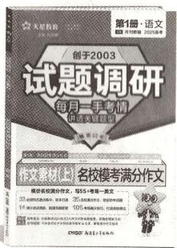

模仿名校满分作文

速写55+考场一类文

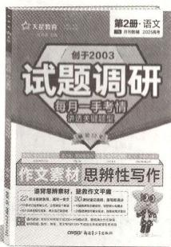

速破思辨命题，速背思辨素材

拯救作文平庸

数学高妙技法专项   

攻克新定义压轴题

冲刺高考最后17分

  
视频课免费试看电子书免费试读

名师视频课

每本书赠送200+分钟名师精讲课，解锁满分作文秘诀，讲透新定义解题攻略

# 紧抓一手考情 创新解读2024高考4大新趋势

# 趋势 ② 更贴近教材、深挖教材

调研 2 [2024 新课标Ⅱ卷] (多选) 对于函数 $f(x) = \sin 2x$ 和 $g(x) = \sin \left(2x - \frac{\pi}{4}\right)$ ，下列

说法中正确的有

$\quad$A. $f(x)$ 与 $g(x)$ 有相同的零点

$\quad$B. $f(x)$ 与 $g(x)$ 有相同的最大值

$\quad$C. $f(x)$ 与 $g(x)$ 有相同的最小正周期

$\quad$D. $f(x)$ 与 $g(x)$ 的图象有相同的对称轴

外,有时试题还会用新定义进行“包装”,但万变不离其宗,无论题目如何创新,考查的还是学过的知识、公式与定理,因此,理解题意与转化条件永远是关键,如下面的变式.

# 原创预测

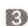

[新定义·角 $\theta$ 的正矢与余矢](多选)在数学发展史上,曾经定义过下列两种函数: $1 - \cos \theta$ 称为角 $\theta$ 的正矢,记作 versin $\theta$ ; $1 - \sin \theta$ 称为角 $\theta$ 的余矢,记作 coversin $\theta$ . 则下列说法正确的是 ( )

深研高考，解透真题

传递2024高考核心考情

名师解读，原创预测

瞄准2025高考备考方向

# 聚焦必考超重点 一次练透91道原创好题

批注式解题

理思路、破难点、避易错

原创变式训练一题多解，多途径拓宽解题思路

-6 由 $f(x)$ 的图象经过点 $P(-1,0)$ 和 $f(x)$ 的图象上距离 $y$ 轴最近的最高点为 $M(-3,\sqrt{3})$ ，可得 $-1-(-3)=\frac{1}{4}T$ [避易错：有学生此处会得到 $-1-(-3)=\frac{3}{4}T$ 的错误结论，只要在草稿纸上勾勒出草图，就会发现 $-1-(-3)=\frac{3}{4}T$ 是不可能的，否则 $f(x)$ 图象上距离 $y$ 轴最近的最高点不是 $M(-3,\sqrt{(-3)})$ ，而会落在点P右边]，

# 原创变式

##### 3. C $\cos\left(\frac{5\pi}{6}+2\alpha\right)=\cos2\left(\frac{5\pi}{12}+\alpha\right)=2\cos^{2}\left(\frac{5\pi}{12}+\alpha\right)-1=2\sin^{2}\left(\frac{\pi}{12}-\alpha\right)-1$ [点关键：由诱导公式可得 $\cos\left(\frac{5\pi}{12}+\alpha\right)=\cos\left(-\frac{5\pi}{12}-\alpha\right)=\sin\left[\frac{\pi}{2}+\left(-\frac{5\pi}{12}-\alpha\right)=\sin\left(\frac{\pi}{12}-\alpha\right)\right]=2\times\frac{1}{16}-1=-\frac{7}{8}$ ，故选 C.

另解 $\cos \left(\frac{\pi}{6} - 2\alpha\right) = 1 - 2\sin^2\left(\frac{\pi}{12} - \alpha\right) = 1 - 2 \times \frac{1}{16} = \frac{7}{8}$ , 所以 $\cos \left(\frac{5\pi}{6} + 2\alpha\right) = -\cos \left(\frac{\pi}{6} - \alpha\right)$ .

# 名师视频课 深度探究12个创新命题考法

##### 3.[2024 福建福州 5 月三模 | 新题型 · 双空题] 函数 $f(x) = \sin(\omega x + \varphi)$ 在区

间 $\left(\frac{\pi}{6},\frac{2\pi}{3}\right)$ 上单调，其中 $\omega$ 为正整数， $|\varphi|<\frac{\pi}{2}$ ，且 $f(\frac{\pi}{3})=-f(\frac{\pi}{2})$ 。写出曲线 $y=f(x)$ 的一个对称中心的坐标：\_\_\_\_。若 $f(x-\frac{\pi}{12})$ 为奇函数，则

$\varphi = \_$

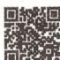

“图象转化法”速

解递进型双空题

调研 2 试题调研原创 在 $\triangle ABC$ 中, $\angle BAC = 60^{\circ}, AB = 3, BC = \sqrt{13}$ , $\angle BAC$ 的平分线交 $BC$ 于 $D$ , 则 $AD =$ \_\_\_\_.

解析 方法一: 面积法 在 $\triangle ABC$ 中, 由余弦定理可得, $3^{2} + AC^{2} - 2 \times 3 \times AC \times \cos 60^{\circ} = 13$ ,

又 $AC > 0$ ，解得 $AC = 4$

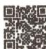

“一相等二定理”三

法速求角平分线长

由 $S_{\triangle ABC} = S_{\triangle ABD} + S_{\triangle ACD}$ 且 $AD$ 平分 $\angle BAC$ 可得， $\frac{1}{2}\times 3\times 4\times \sin 60^{\circ} = \frac{1}{2}\times 3\times AD\times \sin 30^{\circ}+$

讲解创新题型

化难为易攻克难点题型，听得懂

传授高妙技法

深入浅出破解思维瓶颈，学得会

# 本辑其他学科精彩推荐

<table><tr><td>语文</td><td>文言文阅读</td><td>物理</td><td>能量与动量</td><td>政治</td><td>政治与法治&amp;法律与生活</td></tr><tr><td>语文</td><td>作文素材·思辨性写作</td><td>化学</td><td>化学基本理论</td><td>历史</td><td>中国近现代史</td></tr><tr><td>英语</td><td>语法填空</td><td>生物</td><td>遗传与基因工程</td><td>地理</td><td>区域发展与资源安全</td></tr></table>

# 目录

# 扫码获取

##### 1. 全9科名师解读2024高考创新命题，研真题，评新题，明晰备考方向。  
##### 2. 调研2辑全9科100+节超级名师视频课，传授高妙技法，易学秒懂。  
##### 3. 数学技法专项、作文素材、时政专项名师视频课，按书解锁，免费观看。

# 每月一手考情

2024 高考三角 & 向量 4 大创新命题趋势解读与预测 视频 1 001

趋势 1 更注重在知识的交汇处命题 001

趋势 2 更贴近教材、深挖教材 002

趋势 3 更强调灵活，体现对素养的考查 003

趋势4 更适配创新题型的拓展命题 004

# 突破 12 大超重点

# 创新考法抢先知

超重点1 平面向量在创新命题中的工具化作用 视频2 011

创新命题 1 平面向量在三角函数问题中的体现 011

创新命题 2 由向量内积拓展向量外积 012

创新命题 3 向量与解析几何交汇 013

超重点2 三角函数应用题的3大创新命题方向 视频3 017

方向 1 以古代典籍、古代成就等为情境命题 017

方向 2 研究古代数学问题 018

方向 3 三角函数在生活、物理、工程等领域的应用 019

超重点3 平面向量新定义题的3个创新类型 视频4 023

创新类型 1 定义平面向量的运算规则 023

创新类型 2 定义平面斜坐标系 025

创新类型 3 由二维向量推广到多维向量 026

# 核心主干抓重点

# 超重点 4 3 类应用三角函数性质求值问题 视频 5 030

类型1 利用周期性求参数值 030

类型2 利用有界性求最值 031

类型3 利用奇偶性求值 032

# 超重点5 3类应用三角函数图象求值问题 视频6 037

类型1 给出部分图象，识图求函数 037

类型2 三角函数图象的平移与伸缩变换 039

类型3 巧用三角函数图象求值 041

# 超重点6 化简三角代数式必用的3个大招 046

大招 1 同角弦切互化 046

大招 2 多角巧用公式 047

大招 3 万能的辅助角公式 050

# 超重点7 巧用正、余弦定理解决计算与应用问题 视频7 055

类型1 利用正、余弦定理解决计算问题 055

类型2 利用正、余弦定理解决应用问题 057

# 超重点8 “爪子模型”在向量运算中的辨别与妙用 视频8 063

应用1 用“爪子模型”解决求值（含最值）问题 063

应用2 用“爪子模型”解决数量积问题 064

应用3 用“爪子模型”解决模的问题 064

# 超重点9 快解三角形必会的3个定理 视频9 070

定理1 利用角平分线定理构造边角关系 070

定理 2 利用张角定理构建三角方程 072

定理 3 巧用平行四边形法则解决中线长相关问题 073

# 超重点 10 三角形 “四心” 的向量表示与应用 视频 10 080

类型1 三角形重心的向量表示与应用 080

类型2 三角形内心的向量表示与应用 081

# 目录

类型 3 三角形外心的向量表示与应用 082

类型 4 三角形垂心的向量表示与应用 082

# 高效破题有方法

# 超重点 11 新教材中隐藏的 4 个高妙结论定理 视频 11 088

定理 1 向量三角不等式[新教材人 A 必修二 P9] 088

定理 2 定比分点定理[新教材人 A 必修二 P33] 089

定理 3 柯西不等式[新教材人 A 必修二 P37] 090

定理 4 中线长定理[新教材人 A 必修二 P39、P53] 092

# 超重点 12 平面向量问题的 3 个必备二级结论 视频 12 097

结论 1 极化恒等式 097

结论 2 奔驰定理 099

结论 3 等和线定理 100

# 下辑精彩预告

2024年8月全新上市

# 《试题调研》第3辑将推出

——高考超重点 3 · 数列 & 立体几何 & 概率与统计

# 每月一手考情!

本辑聚焦“数列 & 立体几何 & 概率与统计”2024 高考命题新变化,创新解读“融入轻量竞赛元素,更加强调知识融合”的命题套路,原创预测“交汇命题”的多维角度.

# 聚焦高考超重点，讲透关键题型！

1 深度剖析创新命题考法 深度剖析马尔科夫链的创新应用题、以数学文化为背景的立体几何计算题、概率与统计中的文字陈述题等创新命题,巧破命题套路,解透创新题型!  
② 彻底讲透必考超重点 彻底讲透利用数列递推关系求通项与求和、数列不等式中的放缩技巧、动点轨迹的探索、重点分布的应用等命题方向,讲透超重点,快速攻克核心考点!  
3 传授高妙解题技法 名师传授用定性和定量分析秒解立体几何最值问题、用空间向量妙求角、用全概率公式 & 贝叶斯公式速求概率等高妙技法,突破思维瓶颈,实现快速解题!

重磅升级，超值上市！凡购买本辑任1本，即可免费观看本辑全9科100+节超级名师精讲课！

# 每月一手考情

# 2024 高考三角 & 向量 4 大创新命题趋势解读与预测

中山一中高级教师 许少华

2024 高考新课标卷中关于“三角 & 向量”的命题整体上以基础题为主,无论从思维角度还是从运算角度看,难度都不算大,试题的基础性、灵活性及考查的全面性是其鲜明的特点.下面通过具体题目进行解读.

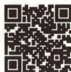

2024 高考三角 & 向量创新命题解读与预测

# 趋势 1 更注重在知识的交汇处命题

调研 1 试题调研原创 [新考法·向量运算与充要条件交汇] 已知向量 $\boldsymbol{a} = (x + 1, x)$ , $\boldsymbol{b} = (x, 2)$ , 则 ( )

$\quad$A. “x = -3” 是“ $a \perp b$ ” 的必要条件

$\quad$B. “x = -3”是“a // b”的必要条件

$\quad$C. “x=0”是“ $a \perp b$ ”的充分条件

$\quad$D. “ $x = -1 + \sqrt{3}$ ”是“ $a // b$ ”的充分条件

解析

<table><tr><td>选项</td><td>分析过程</td><td>正误</td></tr><tr><td>A</td><td> $a \perp b \rightarrow a \cdot b = 0 \rightarrow x \cdot (x + 1) + 2x = 0 \rightarrow x = 0$  或  $-3 \rightarrow$  必要性不成立【析选项】本题的AC都与向量垂直有关,BD都与向量平行有关,做选择题时要先阅读所有的选项,把具有相似考点、相似内容的选项放在一起计算,节省时间</td><td>×</td></tr><tr><td>C</td><td> $x = 0 \rightarrow a = (1,0),b = (0,2) \rightarrow a \cdot b = 0 \rightarrow a \perp b \rightarrow$  充分性成立</td><td>√</td></tr><tr><td>B</td><td> $a // b \rightarrow 2(x+1) = x^{2} \rightarrow x = 1 \pm \sqrt{3} \rightarrow$  必要性不成立</td><td>×</td></tr><tr><td>D</td><td> $x = -1 + \sqrt{3} \rightarrow$  不满足 $2(x+1) = x^{2} \rightarrow a // b$ 不成立→充分性不成立</td><td>×</td></tr></table>

故选 C.

热点解读与预测 平面向量的坐标运算是平面向量的基础内容与重要内容,涉及平面向量的模、夹角、数量积、投影向量等的求解,及借助平面向量的运算求解其他问题.对平面向量运算的考查方式多种多样,2025年高考若在此知识点处设计试题,难度可能会适当加大,如下面的变式.

##### 1. 图书反馈赢新书,反馈图书错误或意见将有机会获得赠书奖励(同类错误限前五名).

##### 2. 新书试读“码”上看,还有定期发布的高考热点资讯、备考攻略、学习干货等你发现.

# 原创预测

1 [新考法·向量运算与解析几何交汇]（多选）已知平面向量 a, b, c, $|a| = 2\sqrt{3}$ , $|b| = 6$ , $a \cdot b = 18$ , 且 $\langle a - c, b - c \rangle = \frac{\pi}{3}$ , 则下列说法正确的是 ( )

$\quad$A. a 与 b 的夹角为 $\frac{\pi}{6}$

$\quad$B. $(\pmb {a} - \pmb {c})\cdot (\pmb {b} - \pmb {c})$ 的最大值为5

$\quad$C. $|c|$ 的最小值为 2

$\quad$D. 若 $c = x a + y b (x, y \in R)$ ，则 $\frac{1}{3} \leqslant \frac{1}{2} x + y \leqslant \frac{7}{6}$

答案》第007页

# 趋势 ② 更贴近教材、深挖教材

调研 2 [2024 新课标Ⅱ卷] (多选) 对于函数 $f(x) = \sin 2x$ 和 $g(x) = \sin \left(2x - \frac{\pi}{4}\right)$ ，下列说法中正确的有

$\quad$A. $f(x)$ 与 $g(x)$ 有相同的零点

$\quad$B. $f(x)$ 与 $g(x)$ 有相同的最大值

$\quad$C. $f(x)$ 与 $g(x)$ 有相同的最小正周期

$\quad$D. $f(x)$ 与 $g(x)$ 的图象有相同的对称轴

# 解析

<table><tr><td>选项</td><td>分析过程</td><td>正误</td></tr><tr><td>A</td><td>令 $f(x) = \sin 2x = 0 \rightarrow x = \frac{k_1\pi}{2}, k_1 \in \mathbf{Z} \rightarrow$ 令 $g(x) = \sin(2x - \frac{\pi}{4}) = 0 \rightarrow x = \frac{k_2\pi}{2} + \frac{\pi}{8}, k_2 \in \mathbf{Z} \rightarrow$ 显然 $f(x), g(x)$ 的零点不同</td><td>×</td></tr><tr><td>B</td><td>三角函数的有界性 $\rightarrow f(x)_{\max} = g(x)_{\max} = 1$ </td><td>√</td></tr><tr><td>C</td><td> $f(x), g(x)$ 的最小正周期均为 $\frac{2\pi}{2} = \pi$ </td><td>√</td></tr><tr><td>D</td><td>令 $2x = k_3\pi + \frac{\pi}{2}, k_3 \in \mathbf{Z} \rightarrow x = \frac{k_3\pi}{2} + \frac{\pi}{4}, k_3 \in \mathbf{Z} \rightarrow$ 令 $2x - \frac{\pi}{4} = k_4\pi + \frac{\pi}{2}, k_4 \in \mathbf{Z} \rightarrow x = \frac{k_4\pi}{2} + \frac{3\pi}{8}, k_4 \in \mathbf{Z} \rightarrow$ 显然 $f(x), g(x)$ 图象的对称轴不同</td><td>×</td></tr></table>

故选 BC.

# 热点解读与预测

人教 A 版教材《必修第一册》第 237 页的例1要求画出函数 $y = 2\sin \left(3x - \frac{\pi}{6}\right)$ 的简图（如图1所示），因此高考中出现对三角函数图象的考查是必要的，而除了要会作此类函数的图象之外，也要熟练掌握此类函数的性质（如周期性、单调性、图象的对称性）。每一年的高考题中都有不少题目是教材中例题、练习题改编而成的相近题，这是一个重要的导向。此外，根据教材习题中隐含的重

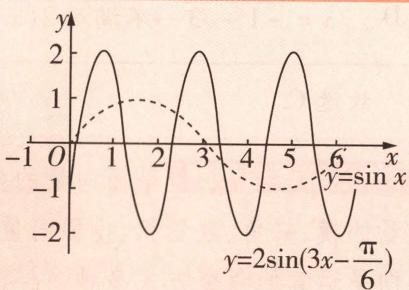

图1

要结论或定理命制证明题、用教材中出现的解题思想与方法做题,这种理念也需要被重视.

# 奇妙三角

小编说:在“三角形宇宙”中,除了我们最熟悉的等边三角形、等腰三角形、直角三角形之外,还有许多特殊三角形,和小编一起来看看吧!

# 原创预测

2 函数 $f(x)=2\sin(2x+\varphi)(|\varphi|<\frac{\pi}{2})$ 的图象向左平移 $\frac{\pi}{6}$ 个单位长度后,所得图象对应的函数是奇函数,函数 $g(x)=(1+\sqrt{3})\cos2x$ .若关于x的方程 $f(x)+g(x)=-\frac{1}{2}$ 在 $[0,\pi)$ 内有两个不同的解 $\alpha,\beta$ ,则 $\cos(\alpha-\beta)$ 的值为()

$\quad$A. $-\frac{\sqrt{2}}{4}$

$\quad$B. $\frac{\sqrt{2}}{4}$

$\quad$C. $\frac{1}{2}$

$\quad$D. $\frac{\sqrt{2}}{2}$

答案》第008页

# 趋势 ③ 更强调灵活，体现对素养的考查

调研 3 试题调研原创 已知 $\triangle ABC$ 的三个内角为 A, B, C，且 $2024\cos 2C - \cos 2A = 2023 - 2\sin^{2}B$ ，则 $\frac{\tan C \cdot (\tan A + \tan B)}{\tan A \cdot \tan B} =$ （）

$\quad$A. $\frac{1}{2023}$

$\quad$B. $\frac{1}{1012}$

$\quad$C. $\frac{2023}{2}$

$\quad$D. $\frac{2}{2023}$

解析 由 $2024\cos 2C - \cos 2A = 2023 - 2\sin^2 B$

得2 $024(1-2\sin^{2}C)-(1-2\sin^{2}A)=2023-2\sin^{2}B$ ,

【破障碍】根据所求目标式的特点，利用倍角公式将2C,2A向单倍角上转化

化简得 $\sin^{2}B+\sin^{2}A=2\ 024\ \sin^{2}C$ ，由正弦定理得 $a^{2}+b^{2}=2\ 024c^{2},a,b,c$ 分别为内角A，B,C的对边.

根据余弦定理可得 $\cos C=\frac{a^{2}+b^{2}-c^{2}}{2ab}=\frac{2023c^{2}}{2ab}$ .

所以 $\frac{\tan C \cdot (\tan A + \tan B)}{\tan A \cdot \tan B} = \tan C \cdot \left(\frac{1}{\tan A} + \frac{1}{\tan B}\right) = \frac{\sin C}{\cos C} \cdot \left(\frac{\cos A}{\sin A} + \frac{\cos B}{\sin B}\right) = \frac{\sin C}{\cos C} \cdot \frac{\sin (A + B)}{\sin A \sin B} = \frac{\sin^2 C}{\cos C \sin A \sin B} = \frac{2ab}{2023c^2} \cdot \frac{c^2}{ab} = \frac{2}{2023}$ . 故选 D.

热点解读与预测 三角模块的公式多,变换的灵活性大,因此与三角变换有关的题目能够很好地考查考生分析问题与解决问题的能力,结合正余弦定理、倍角公式与三角和差公式的特点设计中档难度题在高考中很常见,这也是近几年命题的一个“小热点”,要引起足够重视.解题的关键是熟记基本公式、基本定理,并且能够根据题干中的关系准确、快速调用公式进行转化计算.除了像【调研3】这样题干以纯粹的数学计算问题呈现之外,有时试题还会用新定义进行“包装”,但万变不离其宗,无论题目如何创新,考查的还是学过的知识、公式与定理,因此,理解题意与转化条件永远是关键,如下面的变式.

黄金三角形 黄金三角形是一个等腰三角形,其底与腰的长度比为黄金比(约为1:0.618或0.618:1).这种三角形具有高度的美学价值,经常出现在艺术和建筑设计中.

# 原创预测

3 [新定义·角 $\theta$ 的正矢与余矢] (多选) 在数学发展史上, 曾经定义过下列两种函数: $1 - \cos \theta$ 称为角 $\theta$ 的正矢, 记作 versin $\theta$ ; $1 - \sin \theta$ 称为角 $\theta$ 的余矢, 记作 coversin $\theta$ . 则下列说法正确的是 ( )

$\quad$A. versin $\frac{2025\pi}{6}=\frac{3}{2}$

$\quad$B. 函数 $f(\theta) = \text{versin} \theta \cdot \text{coversin} \theta$ 的最大值为 $\frac{3 + 2\sqrt{2}}{2}$

$\quad$C. 存在一个 $\theta$ ，使函数 $f(\theta) = \text{versin } \theta - \text{coversin } \theta$ 的值为 $\frac{3}{2}$

$\quad$D. 将函数 $f(\theta) = \text{coversin} \theta$ 的图象向左平移 $\frac{\pi}{2}$ 个单位长度后, 可得函数 $g(\theta) = \text{versin} \theta$ 的图象

答案》第009页

# 趋势 4 更适配创新题型的拓展命题

调研 4 [2024 广东珠海 5 月第五次模拟 | 新题型 · 结构不良试题] 在锐角 △ABC 中, 设角 A, B, C 所对的边分别为 a, b, c, 且 $b \sin A = \frac{\sqrt{3}}{2} a$ .

（1） 求 B.

（2） 若 AB = 2, BC = $\frac{3}{2}$ , 点 D 在边 AC 上, \_\_\_\_, 求 BD 的长.

请在①AD = DC, ②∠DBC = ∠DBA, ③BD⊥AC 这三个条件中选择一个, 补充在上面的横线上, 并完成解答.

注:如果选择多个条件分别解答,按第一个解答计分.

解析 （1） 在 $\triangle ABC$ 中, 由正弦定理及 $b \sin A = \frac{\sqrt{3}}{2} a$ 得 $\sin B \sin A = \frac{\sqrt{3}}{2} \sin A$ .

因为 $\triangle ABC$ 为锐角三角形, 所以 $A \in (0, \frac{\pi}{2})$ , 所以 $\sin A > 0$ , 所以 $\sin B = \frac{\sqrt{3}}{2}$ .

又 $B \in (0, \frac{\pi}{2})$ ，所以 $B = \frac{\pi}{3}$ .

（2） 若选①, 解题过程如下.

方法一 在 $\triangle ABC$ 中,因为 $AD=DC$ ,所以 $\overrightarrow{BD}=\frac{1}{2}(\overrightarrow{BA}+\overrightarrow{BC})$ .

所以 $\overrightarrow{BD}^2 = \frac{1}{4} (\overrightarrow{BA}^2 +\overrightarrow{BC}^2 +2\overrightarrow{BA}\cdot \overrightarrow{BC}) = \frac{2^2 + (\frac{3}{2})^2 + 2\times 2\times\frac{3}{2}\times\cos\frac{\pi}{3}}{4} = \frac{37}{16},$ 所以 $BD = \frac{\sqrt{37}}{4}.$

方法二 在 $\triangle ABC$ 中, 由余弦定理得 $AC^2 = AB^2 + BC^2 - 2AB \times BC \times \cos \angle ABC = 2^2 + (\frac{3}{2})^2 - 2 \times 2 \times \frac{3}{2} \times \cos \frac{\pi}{3} = \frac{13}{4}$ , 所以 $AC = \frac{\sqrt{13}}{2}$ , 所以 $AD = DC = \frac{\sqrt{13}}{4}$ .

在 $\triangle ABD$ 中, 由余弦定理得 $AB^{2} = BD^{2} + DA^{2} - 2BD \cdot DA \cdot \cos \angle ADB$ , 即 $4 = BD^{2} + \frac{13}{16} - \frac{\sqrt{13}}{2} BD \cos \angle ADB$ .

在 $\triangle BDC$ 中, 由余弦定理得 $BC^{2} = BD^{2} + DC^{2} - 2BD \cdot DC \cdot \cos \angle CDB$ , 即 $\frac{9}{4} = BD^{2} + \frac{13}{16} - \frac{\sqrt{13}}{2} BD \cos \angle CDB$ .

又 $\angle ADB + \angle CDB = \pi$ ，所以 $\cos \angle ADB + \cos \angle CDB = 0.$

所以 $4 + \frac{9}{4} = 2BD^{2} + \frac{13}{8}$ ，所以 $BD = \frac{\sqrt{37}}{4}$ .

若选②,解题过程如下.

在 $\triangle ABC$ 中， $S_{\triangle ABC} = S_{\triangle ABD} + S_{\triangle CBD}$ ，即 $\frac{1}{2} BA \cdot BC \cdot \sin \frac{\pi}{3} = \frac{1}{2} BA \cdot BD \cdot \sin \frac{\pi}{6} + \frac{1}{2} BD \cdot BC \cdot \sin \frac{\pi}{6}$ ，

即 $\frac{1}{2}\times2\times\frac{3}{2}\times\frac{\sqrt{3}}{2}=\frac{1}{2}\times2\times BD\times\frac{1}{2}+\frac{1}{2}\times BD\times\frac{3}{2}\times\frac{1}{2}$ ，解得 $BD=\frac{6\sqrt{3}}{7}$ .

若选③,解题过程如下.

在 $\triangle ABC$ 中, 由余弦定理得 $AC^2 = AB^2 + BC^2 - 2AB \times BC \times \cos \angle ABC = 2^2 + (\frac{3}{2})^2 - 2 \times 2 \times \frac{3}{2} \times \cos \frac{\pi}{3} = \frac{13}{4}$ , 所以 $AC = \frac{\sqrt{13}}{2}$ .

因为 $S_{\triangle ABC} = \frac{1}{2} BA\cdot BC\cdot \sin \angle ABC = \frac{3\sqrt{3}}{4},S_{\triangle ABC} = \frac{1}{2} BD\cdot AC = \frac{\sqrt{13}}{4} BD,$

所以 $\frac{\sqrt{13}}{4}BD=\frac{3\sqrt{3}}{4}$ ，解得 $BD=\frac{3\sqrt{39}}{13}$ .

热点解读与预测 在北京卷中,解三角形常常作为结构不良试题的知识背景出现,而北京卷的命题往往对全国卷的命制有导向作用(这一点可通过曾经在新高考卷中出现的结构不良试题与2024年新课标卷中出现的新定义解答题印证).因此在备考时,解三角形的结构不良试题仍然要引起关注,要熟悉该题型的命题特点、掌握解此类题的通性通法、熟记解题必用的三角变换公式及相关定理.

# 创新预测

答案▶009页

##### 1. 试题调研原创 已知函数 $f(x) = \sin (\omega x + \varphi)(\omega > 0, |\varphi| < \frac{\pi}{2})$ , $x = -\frac{\pi}{4}$ 为 $f(x)$ 的零点, 直线 $x = \frac{\pi}{4}$ 为 $f(x)$ 图象的对称轴, 且 $f(x)$ 在 $(0, \frac{\pi}{6})$ 上有且仅有 1 个零点, 则 $\omega$ 的最大值为 ( )

$\quad$A. 11

$\quad$B. 9

$\quad$C. 7

$\quad$D. 5

##### 2.[2024广东佛山5月第四次联考](多选)在边长为2的正方形ABCD中,点M,N满足 $\overrightarrow{AM}=\lambda\overrightarrow{AB}(0<\lambda<1),\overrightarrow{AN}=\mu\overrightarrow{AD}(0<\mu<1)$ .若 $\overrightarrow{CM}\cdot\overrightarrow{CN}=4$ ,则下列结论正确的是()

$\quad$A. $\overrightarrow{CM} \cdot \overrightarrow{CB} = 4$

$\quad$B. 当 $\lambda = \frac{1}{2}$ 时, $\overrightarrow{AC} \cdot \overrightarrow{MN} = 0$

$\quad$C. 当 $\lambda = \frac{1}{3}$ 时, $\cos \langle \overrightarrow{CM}, \overrightarrow{CN} \rangle = \frac{9\sqrt{130}}{130}$

$\quad$D. $|\overrightarrow{MN}|$ 的最小值为2

##### 3. 试题调研原创 在 $\triangle ABC$ 中,角 $A,B,C$ 所对的边分别为 $a,b,c$ ,向量 $\boldsymbol{m}=(c+b,\sqrt{2}a-b)$ ,向量 $\boldsymbol{n}=(c-b,\sqrt{2}a+b)$ ,且 $\boldsymbol{m}\perp\boldsymbol{n}$ .

（1） 求证: $\tan B = 3\tan A.$

（2） 延长 BC 至点 D, 使得 DA = DB. 当 $\angle CAD$ 最大时, 求 $\tan D$ 的值.

# 规范答题

# 参考答案与解析

# 原创预测

##### 1.ACD 对于 A, 因为 $\left|a\right|=2\sqrt{3},\left|b\right|=6,a\cdot b=18$ , 所以 $2\sqrt{3}\times6\times\cos\left\langle a,b\right\rangle=18$ , 所以 $\cos\left\langle a,\right.$ $b\rangle=\frac{\sqrt{3}}{2}$ . 因为向量夹角范围为 $[0,\pi]$ ，所以 a 与 b 的夹角为 $\frac{\pi}{6}$ ，故 A 正确。对于 B，建立平面直角坐标系，如图 2 所示，设 $\overrightarrow{OA}=a, \overrightarrow{OB}=b, \overrightarrow{OC}=c$ ，则 $\overrightarrow{CA}=a-c, \overrightarrow{CB}=b-c, A(2\sqrt{3},0), \angle AOB=\frac{\pi}{6}$ ，由于 $|a-b|=$

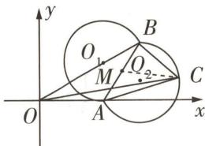

图 2

$\sqrt{(a-b)^{2}}=\sqrt{12-2\times18+36}=2\sqrt{3}$ ，即 $|\overrightarrow{BA}|=2\sqrt{3}=|\overrightarrow{OA}|$ ，故 $\triangle OAB$ 为等腰三角形，则 $\angle BAx=\frac{\pi}{3}$ 由 $|b|=6,\angle AOB=\frac{\pi}{6}$ ，得 $B(3\sqrt{3},3)$ . $\langle a-c,b-c\rangle=\frac{\pi}{3}$ ，即 $\langle\overrightarrow{CA},\overrightarrow{CB}\rangle=\frac{\pi}{3}$ ，则点C在以AB为弦，且使得 $\angle ACB=\frac{\pi}{3}$ 的两个优弧上，这两个优弧所在圆的直径均为 $2r=\frac{2\sqrt{3}}{\sin\frac{\pi}{3}}=4$ ，半径为r=

2, 设所在圆的方程为 $(x - a)^2 + (y - b)^2 = 4$ ，将 $A, B$ 坐标代入方程得 $\left\{ \begin{array}{l} (2\sqrt{3} - a)^2 + b^2 = 4, \\ (3\sqrt{3} - a)^2 + (3 - b)^2 = 4, \end{array} \right.$ 解得 $\left\{ \begin{array}{l} a = 2\sqrt{3}, \\ b = 2 \end{array} \right.$ 或 $\left\{ \begin{array}{l} a = 3\sqrt{3}, \\ b = 1, \end{array} \right.$ 则两优弧所在圆的圆心分别为 $O_1(2\sqrt{3},$

2), $O_{2}(3\sqrt{3},1)$ , 且两个圆心关于直线 $AB$ 对称. 设线段 $AB$ 的中点为 $M$ , 连接 $CM$ , 则 $(a - c) \cdot (b - c) = \overrightarrow{CA} \cdot \overrightarrow{CB} = \frac{(\overrightarrow{CA} + \overrightarrow{CB})^{2} - (\overrightarrow{CA} - \overrightarrow{CB})^{2}}{4} = \frac{(2\overrightarrow{CM})^{2} - \overrightarrow{BA}^{2}}{4} = |\overrightarrow{CM}|^{2} - 3$ , 而 $O_{2}$ 到弦 $AB$ 的距离为 $d = \sqrt{r^{2} - (\frac{AB}{2})^{2}} = \sqrt{4 - 3} = 1$ , 故 $|\overrightarrow{CM}|$ 的最大值为 $r + 1 = 3$ , 则 $|\overrightarrow{CM}|^{2} - 3$ 的最大值为 6, 即 $(a - c) \cdot (b - c)$ 的最大值为 6, 故 B 错误.

对于 C, $|c|$ 即 $|\overrightarrow{OC}|$ ，结合 C 点轨迹可知当 C 在圆 $O_{1}$ 的那个优弧上运动时， $|\overrightarrow{OC}|$ 会取到最小值，连接 $O_{1}O$ ，则 $O_{1}O = \sqrt{(2\sqrt{3})^{2} + 2^{2}} = 4$ ，故 $|c|$ 的最小值为 4 - r = 4 - 2 = 2，故 C 正确.

对于 D, 结合以上分析可知 $\boldsymbol{a} = (2\sqrt{3}, 0)$ , $\boldsymbol{b} = (3\sqrt{3}, 3)$ ，当 C 在圆 $O_{1}$ 的那个优弧上时，圆的方程为 $(x - 2\sqrt{3})^{2} + (y - 2)^{2} = 4$ ，设 $C(2\sqrt{3} + 2\cos \theta, 2 + 2\sin \theta)$ ，其中 $\theta \in [\frac{\pi}{6}, \frac{3\pi}{2}]$ ，则由 $c = x a + y b$

$(x, y \in \mathbf{R})$ 得 $(2\sqrt{3} + 2\cos \theta, 2 + 2\sin \theta) = x(2\sqrt{3}, 0) + y(3\sqrt{3}, 3)$ ，得 $\left\{ \begin{array}{l} x = \frac{\sqrt{3}}{3}\cos \theta - \sin \theta, \\ y = \frac{2}{3}\sin \theta + \frac{2}{3}, \end{array} \right.$ 则 $\frac{1}{2} x +$

$y=\frac{1}{3}\sin\left(\theta+\frac{\pi}{3}\right)+\frac{2}{3}$ ，所以 $\frac{1}{3}\leqslant\frac{1}{2}x+y\leqslant1$ 。当C在圆 $O_{2}$ 的那个优弧上时，圆的方程为 $(x-$

$3\sqrt{3})^{2} + (y - 1)^{2} = 4$ ，设 $C(3\sqrt{3} + 2\cos \varphi, 1 + 2\sin \varphi)$ ，其中 $\varphi \in [-\frac{5\pi}{6}, \frac{\pi}{2}]$ ，则由 $c = xa + yb(x,$

$y \in \mathbb{R})$ 得 $(3\sqrt{3} + 2\cos \varphi, 1 + 2\sin \varphi) = x(2\sqrt{3}, 0) + y(3\sqrt{3}, 3)$ ，得 $\left\{\begin{aligned}x &= \frac{\sqrt{3}}{3}\cos \varphi - \sin \varphi + 1, \\ y &= \frac{2}{3}\sin \varphi + \frac{1}{3},\end{aligned}\right.$ 所以

$\frac{1}{2} x + y = \frac{1}{3}\sin (\varphi +\frac{\pi}{3}) + \frac{5}{6}$ 所以 $\frac{1}{2}\leqslant \frac{1}{2} x + y\leqslant \frac{7}{6}$ 综上所述， $\frac{1}{2} x + y$ 的取值范围为 $[\frac{1}{3},\frac{7}{6} ]$ 故D正确.故选ACD.

##### 2.B 函数 $f(x) = 2\sin (2x + \varphi)(|\varphi| < \frac{\pi}{2})$ 的图象向左平移 $\frac{\pi}{6}$ 个单位长度后,可得到函数 $y =$ $2\sin(2x+\frac{\pi}{3}+\varphi)$ 的图象[避易错:注意此处平移变换针对的是x,结合“左加右减”,即得y=

$2 \sin [ 2 (x + \frac {\pi}{6}) + \varphi ] = 2 \sin (2 x + \frac {\pi}{3} + \varphi) ].$

因为平移后所得图象对应的函数是奇函数,所以 $\frac{\pi}{3}+\varphi=k\pi,k\in Z$ ,即 $\varphi=k\pi-\frac{\pi}{3},k\in Z$ ,

又 $|\varphi|<\frac{\pi}{2}$ ，所以 $\varphi=-\frac{\pi}{3}$ ，即 $f(x)=2\sin(2x-\frac{\pi}{3})$ .

函数 $g(x) = (1 + \sqrt{3})\cos 2x$ ，关于 $x$ 的方程 $f(x) + g(x) = -\frac{1}{2}$ 在 $[0,\pi)$ 内有两个不同的解 $\alpha ,\beta$

即 $2\sin \left(2x - \frac{\pi}{3}\right) + (1 + \sqrt{3})\cos 2x = -\frac{1}{2}$ 在 $[0, \pi)$ 内有两个不同的解 $\alpha, \beta$ ，即 $\sin 2x + \cos 2x = -\frac{1}{2}$ 在 $[0, \pi)$ 内有两个不同的解 $\alpha, \beta$ ，即 $\sqrt{2}\sin \left(2x + \frac{\pi}{4}\right) = -\frac{1}{2}$ [明要点：此处利用了辅助角公式]在 $[0, \pi)$ 内有两个不同的解 $\alpha, \beta$ ，即方程 $\sin(2x + \frac{\pi}{4}) = -\frac{\sqrt{2}}{4}$ 在 $[0, \pi)$ 内有两个不同的解 $\alpha, \beta$ .

所以 $\sin (2\alpha +\frac{\pi}{4}) = -\frac{\sqrt{2}}{4},\sin (2\beta +\frac{\pi}{4}) = -\frac{\sqrt{2}}{4},$

因为 $\alpha, \beta \in [0, \pi)$ ，所以 $\frac{\pi}{4} \leqslant 2\alpha + \frac{\pi}{4} < \frac{9\pi}{4}, \frac{\pi}{4} \leqslant 2\beta + \frac{\pi}{4} < \frac{9\pi}{4}$

所以 $2\alpha + \frac{\pi}{4} + 2\beta + \frac{\pi}{4} = 3\pi,$

则 $\alpha +\beta = \frac{5\pi}{4},\cos (\alpha -\beta) = \cos (\frac{5\pi}{4} -2\beta) = -\sin (\frac{\pi}{4} +2\beta) = \frac{\sqrt{2}}{4}$ 故选B.

##### 3. BD

<table><tr><td>选项</td><td>分析过程</td><td>正误</td></tr><tr><td>A</td><td> $\text{versin} \frac{2025\pi}{6}=1-\cos \frac{2025\pi}{6}=1-\cos(\frac{6\times337\pi}{6}+\frac{\pi}{2})=1+\sin 337\pi=1\neq\frac{3}{2}$ [明关键:本题中正矢与余矢的定义其实完全可以忽略,只要根据  $\text{versin } \theta=1-\cos \theta,\text{coversin } \theta=1-\sin \theta$  正确运算即可]</td><td>×</td></tr><tr><td>B</td><td> $\text{versin } \theta \cdot \text{ coversin } \theta=(1-\cos \theta)(1-\sin \theta)=1-\sin \theta-\cos \theta+\sin \theta\cos \theta \rightarrow \text{令 } t=\sin \theta+\cos \theta=\sqrt{2}\sin(\theta+\frac{\pi}{4})(t\in[-\sqrt{2},\sqrt{2}])\rightarrow\sin \theta\cos \theta=\frac{t^{2}-1}{2}\rightarrow1-\sin \theta-\cos \theta+\sin \theta\cos \theta=1-t+\frac{t^{2}-1}{2}=\frac{1}{2}(t^{2}-2t+1)\rightarrow\text{令 } y=\frac{1}{2}(t^{2}-2t+1),t\in[-\sqrt{2},\sqrt{2}]\rightarrow y=\frac{1}{2}(x^{2}-2x+1)(x\in\mathbf{R})$  的图象开口向上,对称轴为直线  $x=1,1\in[-\sqrt{2},\sqrt{2}]\rightarrow$  当  $t=-\sqrt{2}$  时,函数  $y=\frac{1}{2}(t^{2}-2t+1)$  取得最大值  $\frac{3+2\sqrt{2}}{2}\rightarrow f(\theta)=\text{versin } \theta \cdot \text{ coversin } \theta$  的最大值为  $\frac{3+2\sqrt{2}}{2}$ </td><td>√</td></tr><tr><td>C</td><td> $f(\theta)=\text{versin } \theta-\text{coversin } \theta=(1-\cos \theta)-(1-\sin \theta)=\sin \theta-\cos \theta=\sqrt{2}\sin(\theta-\frac{\pi}{4})\in[-\sqrt{2},\sqrt{2}]\rightarrow\frac{3}{2}>\sqrt{2}\rightarrow$  不存在  $\theta$  使函数  $f(\theta)=\text{versin } \theta-\text{coversin } \theta$  的值为  $\frac{3}{2}$ </td><td>×</td></tr><tr><td>D</td><td> $f(\theta)=\text{coversin } \theta=1-\sin \theta\rightarrow$  其图象向左平移  $\frac{\pi}{2}$  个单位长度后得曲线  $y=1-\sin(\theta+\frac{\pi}{2})=1-\cos \theta=\text{versin } \theta\rightarrow g(\theta)=\text{versin } \theta$ </td><td>√</td></tr></table>

# 创新预测

##### 1.B 因为 $x = -\frac{\pi}{4}$ 为函数 $f(x)$ 的零点，直线 $x = \frac{\pi}{4}$ 为 $f(x)$ 图象的对称轴，所以 $\frac{\pi}{4} - \left(-\frac{\pi}{4}\right) = \frac{2k + 1}{4} T = \frac{2k + 1}{4} \times \frac{2\pi}{\omega}, k \in \mathbf{Z}, T$ 为函数 $f(x)$ 的最小正周期，所以 $\omega = 2k + 1, k \in Z.$

因为 $\omega > 0$ ，所以 $\omega = 2k + 1, k \in \mathbf{N}$ ，又 $\frac{\pi}{6} - 0 < T = \frac{2\pi}{\omega}$ ，所以 $0 < \omega < 12$ .

当 $\omega=11$ 时 [破瓶颈: 要求 $\omega$ 的最大值, 根据选项特征, 不妨从最大的数开始依次往小数验证, 直到符合题意为止], $f(x)=\sin(11x+\varphi)$ , $\frac{11}{4}\pi+\varphi=\frac{\pi}{2}+k_{1}\pi$ , $k_{1}\in Z$ , 所以 $\varphi=-\frac{9}{4}\pi+k_{1}\pi$ , $k_{1}\in Z$ .

因为 $|\varphi|<\frac{\pi}{2}$ ，所以 $\varphi=-\frac{\pi}{4},f(x)=\sin(11x-\frac{\pi}{4})$ ，当 $x\in(0,\frac{\pi}{6})$ 时， $11x-\frac{\pi}{4}\in(-\frac{\pi}{4},\frac{19}{12}\pi)$ ，故 $f(x)$ 有2个零点，不符合题意.

当 $\omega = 9$ 时， $f(x) = \sin (9x + \varphi)$ ， $\frac{9}{4}\pi + \varphi = \frac{\pi}{2} + k_2\pi, k_2 \in \mathbf{Z}$ ，所以 $\varphi = -\frac{7}{4}\pi + k_2\pi, k_2 \in \mathbf{Z}$ .

因为 $|\varphi|<\frac{\pi}{2}$ ，所以 $\varphi=\frac{\pi}{4},f(x)=\sin(9x+\frac{\pi}{4})$ ，当 $x\in(0,\frac{\pi}{6})$ 时， $9x+\frac{\pi}{4}\in(\frac{\pi}{4},\frac{7}{4}\pi)$ ，此时 $f(x)$

有且仅有1个零点,符合题意,故选B.

##### 2. ABC 以 A 为坐标原点, 建立如图 3 所示的平面直角坐标系 [明关键: 建系是平面向量问题的重要解题方法, 本题涉及正方形, 具有天然的建系条件, 通过建系将向量运算转化为坐标运算即可], 由正方形 ABCD 的边长为 2 可得 A(0,0), B(2,0), C(2,2), D(0,2).

因为 $\overrightarrow{AM}=\lambda\overrightarrow{AB},\overrightarrow{AN}=\mu\overrightarrow{AD}$ ，所以 $M(2\lambda,0),N(0,2\mu),\overrightarrow{CM}=(2\lambda-2,-2),\overrightarrow{CN}=(-2,2\mu-2)$ ，故 $\overrightarrow{CM}\cdot\overrightarrow{CN}=4-4\lambda+4-4\mu=4$ ，所以 $\lambda+\mu=1$ .

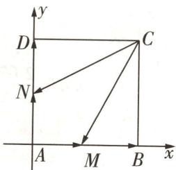

图3

<table><tr><td>选项</td><td>分析过程</td><td>正误</td></tr><tr><td>A</td><td> $\overrightarrow{CM} \cdot \overrightarrow{CB} = (2\lambda - 2, -2) \cdot (0, -2) = 4$ </td><td>√</td></tr><tr><td>B</td><td> $\lambda = \frac{1}{2} \rightarrow \mu = \frac{1}{2} \rightarrow \overrightarrow{AC} \cdot \overrightarrow{MN} = (2, 2) \cdot (-1, 1) = 0$ </td><td>√</td></tr><tr><td>C</td><td> $\lambda = \frac{1}{3} \rightarrow \mu = \frac{2}{3} \rightarrow \overrightarrow{CM} = (2\lambda - 2, -2) = (-\frac{4}{3}, -2), \overrightarrow{CN} = (-2, 2\mu - 2) = (-2, -\frac{2}{3}) \rightarrow \cos \langle \overrightarrow{CM}, \overrightarrow{CN} \rangle = \frac{\overrightarrow{CM} \cdot \overrightarrow{CN}}{|\overrightarrow{CM}| |\overrightarrow{CN}|} = \frac{4}{\frac{2\sqrt{13}}{3} \times \frac{2\sqrt{10}}{3}} = \frac{9\sqrt{130}}{130}$ </td><td>√</td></tr><tr><td>D</td><td> $\overrightarrow{MN} = (-2\lambda, 2\mu) \rightarrow |\overrightarrow{MN}|^{2} = (-2\lambda)^{2} + (2\mu)^{2} = 4(\lambda^{2} + \mu^{2}) \geqslant 4 \times \frac{(\lambda + \mu)^{2}}{2} = 2$ ,当且仅当  $\lambda = \mu = \frac{1}{2}$ 时取等号→ $|\overrightarrow{MN}| \geqslant \sqrt{2}$ </td><td>×</td></tr></table>

##### 3.（1）因为 $m \perp n$ ，所以 $m \cdot n = 0$ ，即 $(c + b)(c - b) + (\sqrt{2}a - b)(\sqrt{2}a + b) = 0$ ，即 $c^{2} = 2b^{2} - 2a^{2}$ .
根据余弦定理得 $b^{2}=a^{2}+c^{2}-2ac\cos B$ ，所以 $c^{2}+2a^{2}=2b^{2}=2a^{2}+2c^{2}-4ac\cos B$ ，整理可得 $c=4a\cos B$ ，由正弦定理得 $\sin C=4\sin A\cos B$ 。

因为 $\sin C = \sin (A + B) = \sin A\cos B + \cos A\sin B,$

所以 $\sin A\cos B + \cos A\sin B = 4\sin A\cos B$ ，即 $\cos A\sin B = 3\sin A\cos B$ .

显然 $\cos A\cos B\neq0$ ,两边同时除以 $\cos A\cos B$ 得 $\frac{\sin B}{\cos B}=3\frac{\sin A}{\cos A}$ ,即 $\tan B=3\tan A$

（2） 根据题意作出图形, 如图 4 所示.

设 $\angle BAC = \alpha (0 < \alpha < \frac{\pi}{2})$ ，则 $\tan B = 3\tan \alpha (\tan \alpha >0)$ .

因为 AD = BD，所以 $B = \angle BAD = \alpha + \angle CAD$ ，则 $\angle CAD = B - \alpha$ ，

故 $\tan \angle CAD = \tan (B - \alpha) = \frac{\tan B - \tan \alpha}{1 + \tan B\tan\alpha} = \frac{2\tan\alpha}{1 + 3\tan^2\alpha} = \frac{2}{\frac{1}{\tan\alpha} + 3\tan\alpha}.$

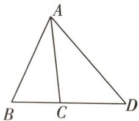

图 4

因为 $\frac{1}{\tan\alpha} + 3\tan \alpha \geqslant 2\sqrt{\frac{1}{\tan\alpha}\times 3\tan\alpha} = 2\sqrt{3}$ , 当且仅当 $\frac{1}{\tan\alpha} = 3\tan \alpha$ , 即 $\tan \alpha = \frac{\sqrt{3}}{3}, \alpha = \frac{\pi}{6}$ 时取等号, 所以 $\tan \angle CAD \leqslant \frac{2}{2\sqrt{3}} = \frac{\sqrt{3}}{3}$ , 要使 $\angle CAD$ 最大, 则 $B = \frac{\pi}{3}$ , 故 $\triangle ABD$ 为等边三角形, 所以 $\tan D = \sqrt{3}$ .

# 突破12大超重点

# 创新考法

# 抢先知

# 超重点1 平面向量在创新命题中的工具化作用

<table><tr><td>三年考情与创新命题特点</td><td>2025命题预测</td></tr><tr><td>2024 天津卷 T14,以正方形为载体,引入动点,命制双空题,求向量数量积的最值</td><td rowspan="3">1命题形式:选择题、填空题、解答题均有可能呈现.或在题干中“显性”出现,或作为工具出现在解题过程中.2必考热点:平面向量的基本定理,平面向量平行与垂直的坐标表示,平面向量的数量积、夹角、模、投影向量等的求解.3创新考法:将函数与导数和三角函数、解析几何、数列等知识交汇命题,平面向量作为解题的工具出现.</td></tr><tr><td>2024 天津卷 T18,以向量的数量积为背景,考查直线与椭圆的位置关系</td></tr><tr><td>2024 全国甲卷 T9,将向量的平行、垂直与充分、必要条件交汇命题</td></tr></table>

# 创新命题

# 平面向量在三角函数问题中的体现

调研 1 试题调研原创 已知函数 $f(x)=\cos(\omega x+\varphi)$ 的图象经过点 A, B, 如图 1 所示. 点 T 在 x 轴上, 若 $\overrightarrow{TB}=2\overrightarrow{AB}$ , 则点 B 的纵坐标是 \_\_\_\_.

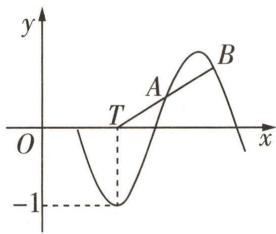

图1

解析 根据题意设 $T(t,0)$

由题图可知， $\omega t + \varphi = \pi +2k\pi ,k\in \mathbf{Z}$ ，所以 $t = \frac{\pi + 2k\pi - \varphi}{\omega},k\in \mathbf{Z}.$

设 $A(x_0, y_0)$ ，则 $y_0 = \cos(\omega x_0 + \varphi)$ ，因为 $\overrightarrow{TB} = 2\overrightarrow{AB}$ ，所以 $B(2x_0 - \frac{\pi + 2k\pi - \varphi}{\omega}, 2y_0), k \in \mathbf{Z}$ .

又点 B 在函数 $f(x)$ 的图象上, 所以 $2y_{0} = \cos(2\omega x_{0} - \pi - 2k\pi + \varphi + \varphi) = -\cos 2(\omega x_{0} + \varphi)$ ,

【破瓶颈】要求点 B 的纵坐标 $2y_{0}$ ，就要找关于 $y_{0}$ 的方程，又 $y_{0} = \cos(\omega x_{0} + \varphi)$ ，故只需用二倍角公式对 $\cos 2(\omega x_{0} + \varphi)$ 进行转化

因为 $-\cos 2(\omega x_0 + \varphi) = -[2\cos^2 (\omega x_0 + \varphi) - 1]$

勒洛三角形具有定宽性,即其宽度(勒洛三角形上的点到水平线的最大距离)是恒定的,等于其边长.这种性质使得勒洛三角形在机械工程中有特殊的应用.

所以 $2y_{0} = -2y_{0}^{2} + 1$ ，即 $2y_{0}^{2} + 2y_{0} - 1 = 0$ ，所以 $y_{0} = \frac{\sqrt{3} - 1}{2}$ 或 $y_{0} = \frac{-\sqrt{3} - 1}{2}$ （舍去），则点 B 的纵坐标是 $\sqrt{3} - 1$ .

# 原创变式

已知函数 $f(x) = \sqrt{3}\sin (\omega x + \varphi)(\omega > 0)$ 的图象经过点 $P(-1,0), f(x)$ 图象上距离 $y$ 轴最近的最高点为 $M(-3, f(-3))$ ，距离 $y$ 轴最近的最低点为 $N, O$ 为坐标原点，则 $\overrightarrow{OM} \cdot \overrightarrow{ON} =$ \_\_\_\_.

答案》第015页

# 创新命题 ② 由向量内积拓展向量外积

调研 2 [2024 四川大学附属中学 4 月检测|新定义·向量积](多选)已知向量 a, b 的数量积(又称向量的点积或内积): $a \cdot b = |a| \cdot |b| \cos \langle a, b \rangle$ , 其中 $\langle a, b \rangle$ 表示向量 a, b 的夹角. 向量 a, b 的向量积(又称向量的叉积或外积)满足 $|a \times b| = |a| \cdot |b| \sin \langle a, b \rangle$ , 其中 $\langle a, b \rangle$ 表示向量 a, b 的夹角. 则下列说法正确的是 ( )

$\quad$A. 若 a, b 为非零向量，且 $\left|a \times b\right| = \left|a \cdot b\right|$ ，则 $\left\langle a, b\right\rangle = \frac{\pi}{4}$   
$\quad$B. 若四边形 ABCD 为平行四边形, 则它的面积等于 $\left|\overrightarrow{AB} \times \overrightarrow{AC}\right|$   
$\quad$C. 已知点 $A(2,0), B(-1, \sqrt{3}), O$ 为坐标原点，则 $\vert \overrightarrow{OA} \times \overrightarrow{OB} \vert = 2\sqrt{3}$   
$\quad$D. 若 $\left|a \times b\right| = \frac{\sqrt{3}}{3} a \cdot b = \sqrt{3}$ ，则 $\left|a + 2b\right|$ 的最小值为 $12 + 8\sqrt{3}$

解析

<table><tr><td>选项</td><td>分析过程</td><td>正误</td></tr><tr><td>A</td><td> $a,b$ 是非零向量, $|a\times b| = |a\cdot b|\rightarrow |a||b|\sin\langle a,b\rangle = |a||b||\cos\langle a,b\rangle | \rightarrow$  $\sin\langle a,b\rangle = |\cos\langle a,b\rangle | \rightarrow \tan\langle a,b\rangle = \pm 1 \rightarrow \text{又}\langle a,b\rangle \in [0,\pi] \rightarrow \langle a,b\rangle = \frac{\pi}{4} \text{或} \frac{3\pi}{4}$ </td><td>×</td></tr><tr><td>B</td><td> $S_{\square ABCD} = 2 \times \frac{1}{2} |\overrightarrow{AB}| |\overrightarrow{AC}| \sin\langle \overrightarrow{AB},\overrightarrow{AC}\rangle = |\overrightarrow{AB} \times \overrightarrow{AC}|$ </td><td>√</td></tr><tr><td>C</td><td> $\overrightarrow{OA} = (2,0),\overrightarrow{OB} = (-1,\sqrt{3}) \rightarrow \overrightarrow{OA} \cdot \overrightarrow{OB} = -2,|\overrightarrow{OA}| = |\overrightarrow{OB}| = 2 \rightarrow \cos\langle \overrightarrow{OA},\overrightarrow{OB}\rangle =$  $\frac{\overrightarrow{OA} \cdot \overrightarrow{OB}}{|\overrightarrow{OA}| \cdot |\overrightarrow{OB}|} = -\frac{1}{2} \rightarrow \langle \overrightarrow{OA},\overrightarrow{OB}\rangle \in [0,\pi] \rightarrow \langle \overrightarrow{OA},\overrightarrow{OB}\rangle = \frac{2\pi}{3} \rightarrow |\overrightarrow{OA} \times \overrightarrow{OB}| = |\overrightarrow{OA}| \cdot$  $|\overrightarrow{OB}| \sin\langle \overrightarrow{OA},\overrightarrow{OB}\rangle = 2\sqrt{3}$ </td><td>√</td></tr></table>

续表

<table><tr><td>选项</td><td>分析过程</td><td>正误</td></tr><tr><td>D</td><td> $|a \times b| = \frac{\sqrt{3}}{3} a \cdot b = \sqrt{3} \rightarrow |a||b|\sin\langle a, b\rangle = \frac{\sqrt{3}}{3}|a||b|\cos\langle a, b\rangle = \sqrt{3} \rightarrow \tan\langle a, b\rangle = \frac{\sqrt{3}}{3} \rightarrow$ 又 $\langle a, b\rangle \in [0, \pi] \rightarrow \langle a, b\rangle = \frac{\pi}{6} \rightarrow |a||b| = 2\sqrt{3} \rightarrow |a + 2b|^2 = |a|^2 + 4a \cdot b + 4|b|^2 = 12 + |a|^2 + 4|b|^2 \geqslant 12 + 4|a||b| = 12 + 8\sqrt{3} \rightarrow |a + 2b| \geqslant \sqrt{12 + 8\sqrt{3}} = 2\sqrt{3 + 2\sqrt{3}}$ (当且仅当 $|a| = 2|b|$ 时取等)</td><td>×</td></tr></table>

故选 BC.

# 创新命题 3 向量与解析几何交汇

调研 3 试题调研原创 在平面直角坐标系 xOy 中, 点 O 为坐标原点, 已知点 A(-1, 2), B(-1, -2), 点 M 满足 $\left|\overrightarrow{MA} + \overrightarrow{MB}\right| = \overrightarrow{OM} \cdot (\overrightarrow{OA} + \overrightarrow{OB}) + 2$ , 记点 M 的轨迹为 G.

（1） 求曲线 G 的方程.

（2） 若 $P, C, D$ 为曲线 $G$ 上的三个动点, $\angle CPD$ 的平分线交 $x$ 轴于点 $Q(a,0) (a < -1)$ , 点 $Q$ 到直线 $PC$ 的距离为 1.

(i) 若点 Q 为 $\triangle PCD$ 的重心, 求点 P 的坐标;

(ii) 若 $PQ \perp CD$ ，求 a 的取值范围.

解析 （1） 设 $M(x, y)$ , 因为 $A(-1, 2), B(-1, -2)$ ,

所以 $\overrightarrow{MA} = (-1 - x, 2 - y), \overrightarrow{MB} = (-1 - x, -2 - y), \overrightarrow{OM} = (x, y), \overrightarrow{OA} = (-1, 2), \overrightarrow{OB} = (-1, -2)$ ，所以 $\overrightarrow{MA} + \overrightarrow{MB} = (-2 - 2x, -2y), \overrightarrow{OA} + \overrightarrow{OB} = (-2, 0)$ ，

所以 $|\overrightarrow{MA} + \overrightarrow{MB}| = \sqrt{(-2 - 2x)^2 + (-2y)^2} = \sqrt{4x^2 + 4y^2 + 8x + 4}, \overrightarrow{OM} \cdot (\overrightarrow{OA} + \overrightarrow{OB}) + 2 = (x, y) \cdot (-2, 0) + 2 = -2x + 2.$

因为 $|\overrightarrow{MA} + \overrightarrow{MB}| = \overrightarrow{OM} \cdot (\overrightarrow{OA} + \overrightarrow{OB}) + 2$ ，所以 $\sqrt{4x^2 + 4y^2 + 8x + 4} = -2x + 2$

化简得曲线 G 的方程为 $y^{2} = -4x$ .

（2）(i) 设 $C(x_{1}, y_{1}), D(x_{2}, y_{2}), P(x_{0}, y_{0})$ ，作出图象，如图2所示.

因为 PQ 为 $\angle CPD$ 的平分线, Q 为 $\triangle PCD$ 的重心, 所以 PQ 在 $\triangle PCD$ 的中线上, 由三线合一可得 $PQ \perp CD$ , 所以直线 CD, PQ 的斜率均存在, 分别记为 $k_{CD}, k_{PQ}$ , 则 $k_{CD} = \frac{y_{2} - y_{1}}{x_{2} - x_{1}} = \frac{-4}{y_{1} + y_{2}}, k_{PQ} = \frac{y_{0}}{-\frac{y_{0}^{2}}{4} - a}$ , 且

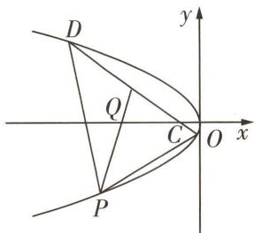

图2

海伦三角形 如果一个三角形的三边长是连续的三个正整数,而且它的面积也是整数,就把这样的三角形称为海伦三角形.

$k _ {P Q} \cdot k _ {C D} = - 1.$

因为 Q 为 $\triangle PCD$ 的重心, 所以 $y_{0} + y_{1} + y_{2} = 0$ , 即 $-y_{0} = y_{1} + y_{2}$ .

【记结论】三角形的重心的横(纵)坐标等于三角形三个顶点的横(纵)坐标的算术平均数

由 $\frac{-4}{y_{1}+y_{2}}\cdot\frac{y_{0}}{-\frac{y_{0}^{2}}{4}-a}=-1$ 及 $-y_{0}=y_{1}+y_{2}$ 得 $P(a-4,\pm2\sqrt{4-a})$ ①.

设直线 $PC$ 的方程为 $x - x_0 = m(y - y_0)$ ，直线 $PD$ 的方程为 $x - x_0 = n(y - y_0)$ ，

点 $Q$ 到直线 $PC, PD$ 的距离都为 1 , 所以 $\frac{|a - x_0 + my_0|}{\sqrt{1 + m^2}} = 1$ , 则 $(1 - y_0^2)m^2 + 2(x_0 - a)y_0m - (x_0 - a)^2 + 1 = 0.$

同理得 $(1 - y_0^2)n^2 + 2(x_0 - a)y_0n - (x_0 - a)^2 + 1 = 0$ ，即 $m, n$ 是关于 $t$ 的方程 $(1 - y_0^2)t^2 + 2(x_0 - a)y_0t - (x_0 - a)^2 + 1 = 0$ 的两根，所以 $m + n = \frac{2(x_0 - a)y_0}{y_0^2 - 1}$ .

由 $\left\{\begin{aligned}x-x_{0}&=m(y-y_{0}),\\ y^{2}&=-4x\end{aligned}\right.$ 消去x得关于y的方程 $y^{2}+4my+4x_{0}-4my_{0}=0$ ,

所以 $y_{0} + y_{1} = -4m, y_{1} = -4m - y_{0}$ ，同理得 $y_{2} = -4n - y_{0}$ ，所以 $y_{1} + y_{2} = -4(m + n) - 2y_{0}$ ，

则 $y_{1} + y_{2} = -y_{0}$ 即 $-4(m + n) - y_{0} = -4 \times \frac{2(x_{0} - a)y_{0}}{y_{0}^{2} - 1} - y_{0} = 0$ ,

又 $y_0^2 = -4x_0$ ，所以 $\left\{ \begin{array}{l} x_0 = \frac{8a + 1}{4}, \\ y_0 = \pm \sqrt{-8a - 1}, \end{array} \right.$ 故点 $P\left(\frac{8a + 1}{4}, \pm \sqrt{-8a - 1}\right)$ ②.

由①②可得 $a = -\frac{17}{4}$ ，所以 $P(-\frac{33}{4}, \pm \sqrt{33})$ .

（ii）由（i）知 $m + n = \frac{2(x_0 - a)y_0}{y_0^2 - 1}, k_{CD} = \frac{y_2 - y_1}{x_2 - x_1} = \frac{-4}{y_1 + y_2} = \frac{-4}{-4(m + n) - 2y_0} =$ $\frac{-2}{-2\times\frac{2(x_0 - a)y_0}{y_0^2 - 1} - y_0} = \frac{2(y_0^2 - 1)}{(-4a - 1)y_0},$

因为 $k_{PQ}=\frac{y_{0}}{-\frac{y_{0}^{2}}{4}-a}, k_{PQ}\cdot k_{CD}=-1$ ，所以 $y_{0}^{2}=\frac{16a^{2}+4a-8}{-4a-9}$ ，所以 $\frac{16a^{2}+4a-8}{-4a-9}>0$ .

$a < -1$ ，易知 $16a^{2} + 4a - 8 > 16 - 4 - 8 = 4 > 0$ ，所以 $-4a - 9 > 0$ ，所以 $a < -\frac{9}{4}$

# 创新预测

答案▶ 015 页

##### 1. 试题调研原创（多选）已知直线 y = kx 与圆 $C: (x - 2)^{2} + (y - 1)^{2} = 1$ 相交于 A, B 两点，C 为圆心，则下列说法中正确的是（）

$\quad$A. $\overrightarrow{OA} \cdot \overrightarrow{OB}$ 是定值

$\quad$B. $\overrightarrow{CA} \cdot \overrightarrow{CB}$ 是定值

$\quad$C. $\overrightarrow{AC}$ 在 $\overrightarrow{AB}$ 上的投影向量的模的最大值为 1

$\quad$D. 当且仅当 $k=\frac{1}{2}$ 时， $|AB|=2$

##### 2.[2024 福建福州 5 月检测|新题型·答案不唯一举例题,新考法·向量与数列交汇]设 a,b 均为单位向量,且 $\left|a\right|,\left|a-b\right|,\left|a+b\right|$ 可按一定顺序成等比数列,写出一个符合条件的 $a\cdot b$ 的值: \_\_\_\_.

# 参考答案与解析

# 原创变式

-6 由 $f(x)$ 的图象经过点 $P(-1,0)$ 和 $f(x)$ 的图象上距离 $y$ 轴最近的最高点为 $M(-3,\sqrt{3})$ ，可得 $-1-(-3)=\frac{1}{4}T$ [避易错:有学生此处会得到 $-1-(-3)=\frac{3}{4}T$ 的错误结论,只要在草稿纸上勾勒出草图,就会发现 $-1-(-3)=\frac{3}{4}T$ 是不可能的,否则 $f(x)$ 图象上距离 $y$ 轴最近的最高点不是 $M(-3,f(-3))$ ,而会落在点 $P$ 右边],

所以 T=8.

因为 $x_{N} = x_{M} + \frac{1}{2} T = -3 + \frac{1}{2}\times 8 = 1,y_{N} = -\sqrt{3}$ ，所以 $N(1, - \sqrt{3})$

所以 $\overrightarrow{OM} = (-3, \sqrt{3}), \overrightarrow{ON} = (1, -\sqrt{3})$ ，所以 $\overrightarrow{OM} \cdot \overrightarrow{ON} = -3 \times 1 + \sqrt{3} \times (-\sqrt{3}) = -6.$

# 创新预测

##### 1.ACD 因为圆 $C:(x-2)^{2}+(y-1)^{2}=1$ ，所以圆心坐标为 $C(2,1)$ ，半径为 r=1，

设 $A(x_{1},y_{1}),B(x_{2},y_{2})$ ，则 $\left\{ \begin{array}{ll}y = kx,\\ x^2 -4x + y^2 -2y + 4 = 0, \end{array} \right.$ 所以 $(1 + k^{2})x^{2} - (4 + 2k)x + 4 = 0,$

$\Delta=(4+2k)^{2}-16(1+k^{2})=-4k(3k-4)>0$ [避易错: 直线与圆有两个交点, 需注意隐蔽条件 $\Delta>0$ ],

若 K 为 $\triangle ABC$ 的陪位重心, 连接 AK, BK, CK, 与 $\triangle ABC$ 的布罗卡尔圆分别交于 $A''$ , $B''$ , $C''$ , 则 $\triangle A''B''C''$ 称为第二布罗卡尔三角形.

所以 $0 < k < \frac{4}{3}, x_{1} + x_{2} = \frac{4 + 2k}{1 + k^{2}}, x_{1}x_{2} = \frac{4}{1 + k^{2}}$ ，所以 $\overrightarrow{OA} \cdot \overrightarrow{OB} = x_{1}x_{2} + y_{1}y_{2} = (1 + k^{2}) \times \frac{4}{1 + k^{2}} = 4, A$ 正确.

$\overrightarrow{CA} = (x_{1} - 2, y_{1} - 1), \overrightarrow{CB} = (x_{2} - 2, y_{2} - 1)$ ，所以 $\overrightarrow{CA} \cdot \overrightarrow{CB} = (x_{1} - 2)(x_{2} - 2) + (y_{1} - 1)(y_{2} - 1) = (1 + k^{2})x_{1}x_{2} - (k + 2)(x_{1} + x_{2}) + 5 = 4 - \frac{(k + 2)(4 + 2k)}{1 + k^{2}} + 5$ ，所以 $\overrightarrow{CA} \cdot \overrightarrow{CB}$ 不是定值，B不正确.

根据向量投影的几何意义, $\overrightarrow{AC}$ 在 $\overrightarrow{AB}$ 上的投影向量的模最大时,直线AB恰好经过圆心C,所以 $\overrightarrow{AC}$ 在 $\overrightarrow{AB}$ 上的投影向量的模的最大值为1,C正确.

若 $|AB|=2$ ，则C到AB的距离为 $d=\sqrt{r^{2}-(\frac{AB}{2})^{2}}=\sqrt{1-1}=0$ [明关键:求弦心距问题,一般在弦心距、半径、弦长的一半所构成的直角三角形中,利用勾股定理破解],

故点 C 到直线 y = kx 的距离 $d = \frac{|2k - 1|}{\sqrt{k^{2} + 1}} = 0$ ，解得 $k = \frac{1}{2}$ ，故 D 正确。故选 ACD。

##### 2. $\frac{5 - \sqrt{17}}{4}$ (答案不唯一) 由 $a, b$ 均为单位向量, 设 $a, b$ 的夹角为 $\theta$ , 则 $a \cdot b = \cos \theta$ , $|a| = |b| = 1$ , $|a - b| = \sqrt{(a - b)^2} = \sqrt{2 - 2\cos \theta} = \sqrt{2 - 2(1 - 2\sin^2 \frac{\theta}{2})} = \sqrt{4\sin^2 \frac{\theta}{2}} = 2\sin \frac{\theta}{2}$ [避易错: 从根式内走出来, 一定要关注其符号, 注意到两向量夹角的取值范围为 $[0, \pi]$ , 则 $\frac{\theta}{2} \in [0, \frac{\pi}{2}]$ ],

$\vert \boldsymbol {a} + \boldsymbol {b} \vert = \sqrt {(\boldsymbol {a} + \boldsymbol {b}) ^ {2}} = \sqrt {2 + 2 \cos \theta} = \sqrt {2 + 2 (2 \cos^ {2} \frac {\theta}{2} - 1)} = \sqrt {4 \cos^ {2} \frac {\theta}{2}} = 2 \cos \frac {\theta}{2},$

当 $|a|$ , $|a-b|$ , $|a+b|$ 成等比数列时, 有 $4\sin^{2}\frac{\theta}{2}=2\cos\frac{\theta}{2}$ , 则 $2\cos^{2}\frac{\theta}{2}+\cos\frac{\theta}{2}-2=0$ ,

解得 $\cos\frac{\theta}{2}=\frac{\sqrt{17}-1}{4}$ 或 $\cos\frac{\theta}{2}=\frac{-\sqrt{17}-1}{4}$ (舍)，由二倍角公式得 $\cos\theta=2\cos^{2}\frac{\theta}{2}-1=\frac{5-\sqrt{17}}{4}$ [换思路：当 $|a-b|,|a+b|,|a|$ 成等比数列时，解得 $\cos\theta=-\frac{5-\sqrt{17}}{4}$ ，当 $|a+b|,|a|,|a-b|$ 成等比数列时，有 $1=4\sin\frac{\theta}{2}\cos\frac{\theta}{2}$ ，所以 $\frac{1}{2}=\sin\theta$ ，此时 $\cos\theta=\pm\frac{\sqrt{3}}{2}$ ].

故 $a \cdot b$ 的值可以为 $\frac{5 - \sqrt{17}}{4}$ .

# 超重点2 三角函数应用题的3大创新命题方向

<table><tr><td>三年考情与创新命题特点</td><td>2025命题预测</td></tr><tr><td>2023上海卷T11,以公园修建斜坡这一生活情境为背景,考查利用三角函数求角</td><td rowspan="3">1命题形式:主要为选择题、填空题.2必考热点:三角恒等变换(包含和差角公式、倍角公式、诱导公式等的应用)、三角函数的图象与变换、三角函数的性质等.3创新考法:主要体现在题目背景的创新上,以古代文化或现代工程等为背景,研究三角函数的性质;或与其他学科融合,体现应用性.</td></tr><tr><td>2023四省联考T11,引入角速度这一物理概念,考查三角恒等变换</td></tr><tr><td>2021全国甲卷T8,以三角高程测量法这一测量方法为背景,考查利用正弦定理解三角形和利用三角恒等变换求值</td></tr></table>

# 方向 ① 以古代典籍、古代成就等为情境命题

调研 1 试题调研原创 [探教材·人教 A 版《必修第一册》P231 问题] (多选) 筒车是我国古代发明的一种水利灌溉工具, 既经济又环保. 明朝科学家徐光启在《农政全书》中用图画描绘了筒车的工作原理(图 1). 假定在水流量稳定的情况下, 筒车上的每一个盛水筒都做匀速圆周运动. 如图 2, 将筒车抽象为一个半径为 R 的圆, 设筒车按逆时针方向每旋转一周用时 60 秒, 当 t = 0 时, 盛水筒 M 位于 $P_{0}(3, -3\sqrt{3})$ 处, 经过 t 秒后运动到点 $P(x, y)$ , 点 P 的纵坐标满足 $y = R \sin(\omega t + \varphi) (t \geqslant 0, \omega > 0, |\varphi| < \frac{\pi}{2})$ , 则下列叙述正确的是 ( )

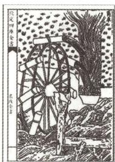

图1

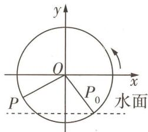

图2

$\quad$A. 筒车转动的角速度 $\omega = \frac{\pi}{60}$ rad/s  
$\quad$B. 当筒车旋转 50 秒时, 盛水筒 M 对应的点 P 的纵坐标为 $-2\sqrt{3}$   
$\quad$C. 当筒车旋转 50 秒时, 盛水筒 M 对应的点 P 和初始点 $P_{0}$ 的水平距离为 6  
$\quad$D. 筒车在 $t \in (0,60]$ 的旋转过程中, 盛水筒 M 对应的最高点到 x 轴的距离为 6

“1”的代换 在三角函数的求值运算中, 常用“1”的代换: $1 = \sin^{2}\alpha + \cos^{2}\alpha = \tan45^{\circ} = \sin90^{\circ} = \cos0^{\circ} = \cdots$ .

# 解析

<table><tr><td>选项</td><td>分析过程</td><td>正误</td></tr><tr><td>A</td><td>筒车按逆时针方向每旋转一周用时60秒→筒车转动的角速度 $\omega = \frac{2\pi}{60} = \frac{\pi}{30}$ (rad/s)</td><td>×</td></tr><tr><td>B</td><td> $R = |OP_0| = \sqrt{3^2 + (-3\sqrt{3})^2} = 6 \rightarrow$ 记纵坐标 $y = f(t)$ ,则 $f(0) = 6\sin \varphi = -3\sqrt{3} \rightarrow \sin \varphi = -\frac{\sqrt{3}}{2} \rightarrow$ 结合 $|\varphi| < \frac{\pi}{2}$ 得 $\varphi = -\frac{\pi}{3} \rightarrow f(t) = 6\sin(\frac{\pi}{30}t - \frac{\pi}{3}) \rightarrow f(50) = 6\sin(\frac{5\pi}{3} - \frac{\pi}{3}) = -3\sqrt{3}$ </td><td>×</td></tr><tr><td>C</td><td> $f(50) = -3\sqrt{3} \rightarrow$ 此时盛水筒M对应的点P与 $P_0$ 关于y轴对称→盛水筒M对应的点P和初始点 $P_0$ 的水平距离为 $2x_{P_0} = 6$ </td><td>√</td></tr><tr><td>D</td><td> $f(t) = 6\sin(\frac{\pi}{30}t - \frac{\pi}{3}) \leqslant 6$ ,当 $\frac{\pi}{30}t - \frac{\pi}{3} = \frac{\pi}{2} + 2k\pi (k \in \mathbb{N})$ ,即 $t = 25 + 60k (k \in \mathbb{N})$ 时等号成立→筒车在 $t \in (0,60]$ 的旋转过程中,当 $t = 25$ 时, $f(t) = 6$ ,即盛水筒M对应的最高点到x轴的距离为6</td><td>√</td></tr></table>

故选 CD.

# 方向 ② 研究古代数学问题

调研 2 [2024 湖南湘楚名校 5 月联考 | 新情境·九服晷影算法] 我国古代天文学家一行应用“九服晷影算法”在《大衍历》中建立了晷影长 l 与太阳天顶距 $\theta(0^{\circ} \leqslant \theta \leqslant 80^{\circ})$ 的对应数表, 这是世界数学史上较早的正切函数表. 根据三角学知识可知, 暑影长 l 等于表高 h 与太阳天顶距 $\theta$ 正切值的乘积, 即 $l = h \tan \theta$ . 对同一表高测量两次, 第一次和第二次太阳天顶距分别为 $\alpha, \beta$ , 第二次的晷影长是表高的 2 倍, 且 $\cos 2\alpha + \sin 2\alpha = -\frac{1}{5}$ , 则 $\tan(\alpha - \beta) = (\quad)$

$\quad$A. $\frac{1}{7}$

$\quad$B. $-\frac{1}{7}$

$\quad$C. $\frac{1}{3}$

$\quad$D. $-\frac{1}{3}$

解析 由题意可知 $\tan \beta = 2$ .

$\cos 2 \alpha = \frac {\cos^ {2} \alpha - \sin^ {2} \alpha}{\cos^ {2} \alpha + \sin^ {2} \alpha} = \frac {1 - \tan^ {2} \alpha}{1 + \tan^ {2} \alpha}, \sin 2 \alpha = \frac {2 \sin \alpha \cos \alpha}{\cos^ {2} \alpha + \sin^ {2} \alpha} = \frac {2 \tan \alpha}{1 + \tan^ {2} \alpha},$

【明关键】已知角 $\beta$ 的正切值，要求 $\tan(\alpha-\beta)$ ，需把 $\cos2\alpha,\sin2\alpha$ 往 $\tan\alpha$ 转化，也可直接利用万能公式： $\sin2\alpha=\frac{2\tan\alpha}{1+\tan^{2}\alpha},\cos2\alpha=\frac{1-\tan^{2}\alpha}{1+\tan^{2}\alpha},\tan2\alpha=\frac{2\tan\alpha}{1-\tan^{2}\alpha}$

所以 $\cos 2\alpha + \sin 2\alpha = \frac{1 + 2\tan\alpha - \tan^2\alpha}{1 + \tan^2\alpha} = -\frac{1}{5}$ , 解得 $\tan \alpha = 3$ 或 $\tan \alpha = -\frac{1}{2}$ (舍去),

所以 $\tan(\alpha-\beta)=\frac{\tan\alpha-\tan\beta}{1+\tan\alpha\tan\beta}=\frac{1}{7}$ . 故选 A.

# 方向 ③ 三角函数在生活、物理、工程等领域的应用

调研 3 [2024 浙江宁波 5 月模拟 | 新情境·乒乓球的运动轨迹] 在某次乒乓球练习中, 乒乓球发球后先后击中己方桌面 O 和对方桌面 A, 示意图如图 3 所示, 其中 OA 长 60, 球在 OA 中点 B 的上方到达最高点, 高度为 $4\sqrt{3}$ , 乒乓球网位于 OA 上靠近 A 的三等分点 C 处, 网高为 6, 球恰好擦着网的上边界越过, 则最适合拟合乒乓球轨迹的函数模型为

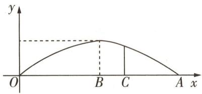

图 3

$\quad$A. $f(x) = 4\sqrt{3}\sin \frac{\pi x}{60}$

$\quad$B. $f(x) = 4\sqrt{3} \sin \frac{\pi x}{30}$

$\quad$C. $f(x) = -\frac{\sqrt{3}}{225} x^2 + \frac{4\sqrt{3}}{15} x$

$\quad$D. $f(x) = -\frac{3}{200} x^2 + \frac{9}{10} x$

解析 方法一 因为 OA 长 60, 球在 OA 中点 B 的上方到达最高点, 高度为 $4\sqrt{3}$ ,

所以当 x=30 时, $f(x)$ 取得最大值, $f(x)_{\max}=4\sqrt{3}$ .

【破障碍】根据题目中对乒乓球运动轨迹的描述得到函数的最值信息，逐项对选项中函数的最值情况进行验证，若不符合，直接排除

对选项 B, 当 x=30 时, $f(x)$ 不会取到最大值, 故排除 B.

选项 D 中函数的图象的对称轴为直线 x=30，且图象的开口向下，但 $f(x)_{\max}=f(30)=-\frac{3}{200}\times900+\frac{9}{10}\times30=13.5\neq4\sqrt{3}$ ，故排除 D.

乒乓球网位于 OA 上靠近 A 的三等分点 C 处, 网高为 6, 球恰好擦着网的上边界越过, 即 $f(40) = 6$ , 但选项 C 中, $f(40) = -\frac{\sqrt{3}}{225} \times 1600 + \frac{4\sqrt{3}}{15} \times 40 = \frac{32\sqrt{3}}{9}$ , 故排除 C. 选 A.

方法二 根据已知条件可得图象过点 $(30,4\sqrt{3})$ ， $(40,6)$ ， $(60,0)$ .

对于 B, $f(30)=4\sqrt{3}\times\sin\pi=0$ , 不满足题意, 故 B 不正确.

对于 C, $f(30) = -\frac{\sqrt{3}}{225} \times 900 + \frac{4\sqrt{3}}{15} \times 30 = 4\sqrt{3}$ , $f(40) = -\frac{\sqrt{3}}{225} \times 1600 + \frac{4\sqrt{3}}{15} \times 40 = \frac{32\sqrt{3}}{9}$ ,
不满足题意,故C不正确.

对于 D, $f(30) = -\frac{3}{200} \times 900 + \frac{9}{10} \times 30 = 13.5$ , 不满足题意, 故 D 不正确. 选 A.

# 原创变式

某导航信号可以用函数 $f(x)=\left|\frac{\sqrt{3}}{2}\sin4x+\frac{3}{2}\cos4x\right|$ 近似模拟,若函数 $f(x)$ 在 $[0,m]$ 上有4个零点,则实数m的取值范围为\_\_\_\_.

答案》第021页

矩形中的性质 已知 $O$ 是矩形ABCD所在平面内任意一点，则 $\overrightarrow{OA} \cdot \overrightarrow{OC} = \overrightarrow{OB} \cdot \overrightarrow{OD}$ ，且 $|\overrightarrow{OA}|^2 + |\overrightarrow{OC}|^2 = |\overrightarrow{OB}|^2 + |\overrightarrow{OD}|^2$ .

巧解妙招

# 创新预测

答案▶ 021页

##### 1. 试题调研原创 [新定义·锐角的正割与余割]1551年奥地利数学家、天文学家雷蒂库斯在《三角准则》中首次用直角三角形的边长之比定义正割和余割, 在某直角三角形中, 一个锐角 $x$ 的斜边与其邻边的比, 叫作该锐角的正割, 用 $\sec x$ 表示; 锐角 $x$ 的斜边与其对边的比, 叫作该锐角的余割, 用 $\csc x$ 表示. 现已知 $f(x) = \frac{1}{\csc x} + \frac{2}{\sec x} (0 < x < \frac{\pi}{2})$ , 则该函数的值域为

$\quad$A. $\left(\frac{\sqrt{5}}{5},1\right)$

$\quad$B. $\left(\frac{\sqrt{5}}{5},1\right]$

$\quad$C. $(1,\sqrt{5}]$

$\quad$D. $(1,\sqrt{5})$

##### 2. 试题调研原创 [探教材·人教 A 版《必修第一册》P238 例 2](多选) 摩

天轮是一种大型转轮状的机械建筑设施,游客坐在摩天轮的座舱里慢慢地往上转,可以从高处俯瞰四周景色.如图4,某摩天轮最高点距离地面的高度为110米,转盘直径为100米,摩天轮的圆周上均匀地安装了36个座舱,游客甲从距离地面最近的位置进舱,开启后摩天轮按逆时针方向匀速旋转,开始转动 t 分钟后距离地面的高度为 H 米,当 t=15 时,游客甲随舱第一次转至距离地面最远处. H 关于 t 的函数为 $H(t)=A\sin(\omega t+\varphi)+b(A>0,\omega>0,|\varphi|<\pi)$ ,则下列说法中错误的是()

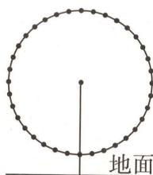

图 4

$\quad$A. $H(t)$ 是偶函数

$\quad$B. 若在 $t_{1}, t_{2} (t_{1} \neq t_{2})$ 时刻, 游客甲距离地面的高度相等, 则 $t_{1} + t_{2}$ 的最小值为 30

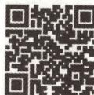  
“三角模型法”快解 摩天轮情境问题

$\quad$C. 摩天轮旋转一周的过程中,游客甲距离地面的高度不低于85米的时长为10分钟

$\quad$D. 若甲、乙两游客分别坐在 P, Q 两个座舱里, 且两人相隔 5 个座舱 (将座舱视为圆周上的点), 则劣弧 PQ 的长 $l = \frac{40\pi}{3}$ 米

##### 3.[2024 浙江萧山中学6月模拟|新函数·取整函数](多选)高斯是德国著名的数学家,近代数学奠基者之一,享有“数学王子”的美誉,用其名字命名的“高斯函数”为:设 $x \in R$ ,用[x]表示不超过x的最大整数,则y=[x]称为高斯函数,也叫取整函数.下列叙述正确的是()

$\quad$A. $\left[\cos \frac{\pi}{4}\right] = 0$   
$\quad$B. 函数 $y = \cos x - [\cos x]$ 有 3 个零点  
$\quad$C. $y = [\cos x]$ 的最小正周期为 $2\pi$   
$\quad$D. $y = [\cos x]$ 的值域为 $\{-1, 0, 1\}$

巧解妙招

中线定理 三角形一条中线两侧所对的边的平方和等于底边平方的一半与该中线平方的2倍的和.

# 参考答案与解析

# 原创变式

$\left[\frac{11}{12}\pi,\frac{7}{6}\pi\right)$ 因为 $f(x)=\left|\frac{\sqrt{3}}{2}\sin4x+\frac{3}{2}\cos4x\right|$ ，所以 $f(x)=\sqrt{3}\left|\sin\left(4x+\frac{\pi}{3}\right)\right|$ .

令 $4x + \frac{\pi}{3} = k\pi, k \in \mathbf{Z}$ , 得 $x = -\frac{\pi}{12} + \frac{k\pi}{4}, k \in \mathbf{Z}$ ,

所以函数 $f(x)$ 的零点为 $x = -\frac{\pi}{12} + \frac{k\pi}{4}, k \in Z$ ,

可知 $f(x)$ 在 $[0, +\infty)$ 上的零点依次为 $\frac{\pi}{6}, \frac{5\pi}{12}, \frac{2\pi}{3}, \frac{11\pi}{12}, \frac{7\pi}{6}, \cdots,$

若 $f(x)$ 在 $[0,m]$ 上有4个零点，则 $m\in [\frac{11}{12}\pi ,\frac{7}{6}\pi )$

# 创新预测

##### 1.C 依题意得 $\sec x = \frac{1}{\cos x}, \csc x = \frac{1}{\sin x}$ .

所以 $f(x) = \frac{1}{\csc x} +\frac{2}{\sec x} = \sin x + 2\cos x = \sqrt{5}\left(\frac{\sqrt{5}}{5}\sin x + \frac{2\sqrt{5}}{5}\cos x\right) = \sqrt{5}\sin (x + \varphi)(0 <   x <   \frac{\pi}{2},$

$\tan\varphi=2)$ [释疑惑:利用辅助角公式,其中 $\cos\varphi=\frac{\sqrt{5}}{5},\sin\varphi=\frac{2\sqrt{5}}{5}$ ].

不妨取 $\varphi \in (0, \frac{\pi}{2})$ ，当 $0 < x < \frac{\pi}{2}$ 时， $0 < \varphi < x + \varphi < \frac{\pi}{2} + \varphi < \pi$ ，而 $\sin \varphi = \frac{2\sqrt{5}}{5}, \sin (\varphi + \frac{\pi}{2}) = \cos \varphi = \frac{\sqrt{5}}{5}, \sin \frac{\pi}{2} = 1$ ，

所以 $f(x)$ 的值域为 $(1, \sqrt{5}]$ . 故选 C.

# 2.AD

<table><tr><td>选项</td><td>分析过程</td><td>正误</td></tr><tr><td>A</td><td>由题可知 $A = 50$ , $b = 110 - 50 = 60$ ,最小正周期 $T = 30$ , $\omega = \frac{2\pi}{30} = \frac{\pi}{15} \rightarrow H(t) = 50\sin(\frac{\pi}{15}t + \varphi) + 60 \rightarrow$ 令 $t = 0$ ,则 $\sin \varphi = -1 \rightarrow$ 结合 $|\varphi| < \pi$ 得 $\varphi = -\frac{\pi}{2} \rightarrow H(t) = 50\sin(\frac{\pi}{15}t - \frac{\pi}{2}) + 60 (t \geqslant 0) \rightarrow H(t)$ 是非奇非偶函数[秒杀解:根据 $H(t)$ 的定义域为 $[0, +\infty)$ 直接得解]</td><td>×</td></tr></table>

内角平分线定理 角平分线上的点到这个角两边的距离相等. 三角形一个内角的平分线截其对边所成的两条线段与这个角的两边对应成比例.

续表

<table><tr><td>选项</td><td>分析过程</td><td>正误</td></tr><tr><td>B</td><td> $H(t_1) = H(t_2) \to 50\sin(\frac{\pi}{15}t_1 - \frac{\pi}{2}) + 60 = 50\sin(\frac{\pi}{15}t_2 - \frac{\pi}{2}) + 60 \to \cos\frac{\pi}{15}t_1 = \cos\frac{\pi}{15}t_2 \to \frac{\pi}{15}t_1 = 2k\pi + \frac{\pi}{15}t_2 \text{或}\frac{\pi}{15}t_1 = 2k\pi - \frac{\pi}{15}t_2 (k \in \mathbb{N}^*, t_1 \neq t_2, t_1 \geqslant 0, t_2 \geqslant 0) \to t_1 - t_2 = 30k \text{或} t_1 + t_2 = 30k (k \in \mathbb{N}^*, t_1 \neq t_2, t_1 \geqslant 0, t_2 \geqslant 0) \to (t_1 + t_2)_{\min} = 30$ </td><td>√</td></tr><tr><td>C</td><td> $50\sin(\frac{\pi}{15}t - \frac{\pi}{2}) + 60 \geqslant 85 \to \sin(\frac{\pi}{15}t - \frac{\pi}{2}) \geqslant \frac{1}{2} \to \cos\frac{\pi}{15}t \leqslant -\frac{1}{2} \to 2k\pi + \frac{2\pi}{3} \leqslant \frac{\pi}{15}t \leqslant 2k\pi + \frac{4\pi}{3} (k \in \mathbb{N}) \to 30k + 10 \leqslant t \leqslant 30k + 20 (k \in \mathbb{N}) \to \text{摩天轮旋转一周的过程中,游客甲距离地面的高度不低于85米的时长为10分钟}$ </td><td>√</td></tr><tr><td>D</td><td>摩天轮的圆周上均匀地安装着36个座舱→每相邻两个座舱与中心连线所成角为 $\frac{2\pi}{36} = \frac{\pi}{18} \to P; Q \text{座舱相隔5个座舱→劣弧} PQ \text{对应的圆心角是}\frac{\pi}{18} \times 6 = \frac{\pi}{3} \to l = \frac{\pi}{3} \times 50 = \frac{50\pi}{3} (\text{米})$ </td><td>×</td></tr></table>

##### 3.ACD

<table><tr><td>选项</td><td>分析过程</td><td>正误</td></tr><tr><td>A</td><td> $[\cos \frac{\pi}{4}] = [\frac{\sqrt{2}}{2}] = 0$  [破瓶颈:读懂“高斯函数”的含义, $[\frac{\sqrt{2}}{2}]$ 为不超过 $\frac{\sqrt{2}}{2}$ 的最大整数]</td><td>√</td></tr><tr><td>B</td><td> $x = \frac{\pi}{2} + k\pi, k \in \mathbb{Z} \rightarrow \cos x = 0 \rightarrow y = \cos x - [\cos x] = 0 \rightarrow y = \cos x - [\cos x]$ 的零点有无数个</td><td>×</td></tr><tr><td>C</td><td rowspan="2">在区间 $[0,2\pi]$ 上, $y = [\cos x] = 1 (x = 0,2\pi), y = [\cos x] = 0 (0 < x \leqslant \frac{\pi}{2}), y = [\cos x] = -1 (\frac{\pi}{2} < x < \frac{3\pi}{2}), y = [\cos x] = 0 (\frac{3\pi}{2} \leqslant x < 2\pi)$ ,结合 $y = \cos x$ 的最小正周期为 $2\pi$ ,可得 $y = [\cos x]$ 的最小正周期为 $2\pi, y = [\cos x]$ 的值域为 $\{-1,0,1\}$ </td><td>√</td></tr><tr><td>D</td><td>√</td></tr></table>

# 超重点3 平面向量新定义题的3个创新类型

2024 年新课标I卷中的第 19 题是新定义解答题，是近几年全国卷中首次出现的创新题型。而对新定义的考查，早已出现在自主命题试卷的各种题型中，选择题、填空题、解答题均有涉及，如：2024 年北京卷第 7 题，定义了生物丰富度指数；2024 年上海卷第 15 题，定义了由空间内的点组成的集合；2024 年上海春季卷第 16 题，定义了延展函数；2023 年上海卷第 16 题，定义了自相关曲线；等等。这对 2025 高考的命题具有导向意义，因此关于平面向量的新定义题在备考时也要足够重视。

# 创新类型 1 定义平面向量的运算规则

调研 1 试题调研原创 [新定义·向量运算×] (多选) 设 a, b 为平面内的任意两个向量, 定义一种向量运算“×”: $a \otimes b = \begin{cases} a \cdot b, & a \text{ 与 } b \text{ 不共线,} \\ |a - b|, & a \text{ 与 } b \text{ 共线.} \end{cases}$ 对于同一平面内的向量 a, b, c, 下列结论中正确的是 ( )

$\quad$A. $a \otimes b = b \otimes a$   
$\quad$B. $\lambda(a\otimes b)=(\lambda a)\otimes b(\lambda\in\mathbf{R})$   
$\quad$C. $(a+b)\otimes c=a\otimes c+b\otimes c$   
$\quad$D. 若 e 是单位向量, 则 $\left|a\otimes e\right|\leqslant\left|a\right|+1$

转化新定义 挖掘本题中新定义的内涵,本质就是根据 a 与 b 是否共线,选择计算向量的数量积,或者计算向量差的模.据此,结合向量数量积的性质、向量模的性质可判断 A. 根据新定义验证 a 与 b 共线的情形,可判断 B. 根据新定义验证 a,b,c 共线的情形,可判断 C. 根据新定义与单位向量的定义可判断 D.

解析

<table><tr><td>选项</td><td>分析过程</td><td>正误</td></tr><tr><td>A</td><td>当 $a$ 与 $b$ 不共线时, $a \otimes b = a \cdot b = b \cdot a = b \otimes a$ ;当 $a$ 与 $b$ 共线时, $a \otimes b = |a - b| = |b - a| = b \otimes a$ </td><td>√</td></tr><tr><td>B</td><td>当 $a$ 与 $b$ 共线时, $\lambda(a \otimes b) = \lambda |a - b|, (\lambda a) \otimes b = |\lambda a - b| \rightarrow \lambda |a - b|$ 与 $|\lambda a - b|$ 不一定相等 $\rightarrow \lambda(a \otimes b)$ 与 $(\lambda a) \otimes b$ 不一定相等</td><td>×</td></tr></table>

面积射影定理 平面图形射影面积等于被射影图形的面积乘以该图形所在平面与射影面的夹角的余弦值.

巧解妙招

续表

<table><tr><td>选项</td><td>分析过程</td><td>正误</td></tr><tr><td>C</td><td>当 $a,b,c$ 共线时, $(a+b)\otimes c=|a+b-c|,a\otimes c+b\otimes c=|a-c|+|b-c|\rightarrow(a+b)\otimes c$ 与 $a\otimes c+b\otimes c$ 不一定相等</td><td>×</td></tr><tr><td>D</td><td>当 $a$ 与 $e$ 不共线时,记 $\langle a,e\rangle=\theta\rightarrow|a\otimes e|=|a\cdot e|=|a\cos\theta|<|a|$ ;当 $a$ 与 $e$ 共线时, $|a\otimes e|=|a-e|\leqslant|a|+|e|=|a|+1$ 【敲黑板】要验证结论错误,只需验证一种与结论矛盾的情况,但若要验证结论正确,需要考虑所有的情况并准确计算</td><td>√</td></tr></table>

故选 AD.

调研 2 试题调研原创 [新定义·向量关系 $a \gg b$ 与 $a \ll b$ ] (多选) 设向量 $a = (x_1, y_1)$ , $b = (x_2, y_2)$ , 当 $x_1 \geqslant x_2$ , 且 $y_1 > y_2$ 时, 称 $a \gg b$ ; 当 $x_1 < x_2$ , 且 $y_1 \leqslant y_2$ 时, 称 $a \ll b$ . 下列结论正确的有

$\quad$A. 若 $a \gg b$ 且 $\mu a \gg \lambda b$ ，则 $\mu \geqslant \lambda$   
$\quad$B. 若 $a=(2022,2024)$ , $b=(2023,2025)$ , 则 $a\ll b$   
$\quad$C. 若 $a \gg b$ ，则对于任意向量 c，都有 $(a + c) \gg (b + c)$   
$\quad$D. 若 $a \ll b$ ，则对于任意向量 c，都有 $a \cdot c \leqslant b \cdot c$

转化新定义 挖掘本题中新定义的内涵,本质就是判断两个向量的横坐标与纵坐标的大小关系.据此,结合特例法、不等式的性质、向量数量积的运算等逐项判断即可.

解析

<table><tr><td>选项</td><td>分析过程</td><td>正误</td></tr><tr><td>A</td><td>取 $a=(1,1),b=(-1,-1)$ ,满足 $a\gg b$ ;取 $\mu=-1,\lambda=2$ ,则 $-a=(-1,-1),2b=(-2,-2)$ ,满足 $\mu a\gg\lambda b$ .但 $\mu<\lambda$ </td><td>×</td></tr><tr><td>B</td><td>2022&lt;2023,2024&lt;2025→根据新定义知 $a\ll b$ </td><td>√</td></tr><tr><td>C</td><td>设向量 $a=(x_1,y_1),b=(x_2,y_2),c=(x_0,y_0)\rightarrow$ 由 $a\gg b$ 得 $x_1\geqslant x_2$ 且 $y_1>y_2\rightarrow x_1+x_0\geqslant x_2+x_0$ 且 $y_1+y_0>y_2+y_0\rightarrow(a+c)\gg(b+c)$ </td><td>√</td></tr><tr><td>D</td><td> $a\ll b\rightarrow$ 取向量 $a=(-2,-2),b=(-1,-1),c=(-1,-1)\rightarrow a\cdot c=4,b\cdot c=2,a\cdot c>b\cdot c$ </td><td>×</td></tr></table>

故选 BC.

# 创新类型

# 定义平面斜坐标系

调研 3·试题调研原创 [新定义·平面斜坐标系 xOy] 定义平面斜坐标系 xOy，记 $\angle xOy = \theta (\theta \neq \frac{\pi}{2})$ , $e_{1}, e_{2}$ 分别为 x 轴，y 轴正方向上的单位向量，若平面上任意一点 P 满足 $\overrightarrow{OP} = xe_{1} + ye_{2}$ ，则记 P 点的斜坐标为 $(x, y)$ ，且向量 $\overrightarrow{OP}$ 的斜坐标为 $(x, y)$ 。则下列说法中正确的是（）

$\quad$A. 若 $\overrightarrow{OP} = (x_{1}, y_{1})$ , $\overrightarrow{OQ} = (x_{2}, y_{2})$ , 则 $\overrightarrow{OP} + \overrightarrow{OQ} = (x_{1} + x_{2}, y_{1} + y_{2})$   
$\quad$B. 若 $\overrightarrow{OP} = (x_{1}, y_{1}), \overrightarrow{OQ} = (x_{2}, y_{2})$ ，则 $\overrightarrow{OP} \cdot \overrightarrow{OQ} = x_{1}x_{2} + y_{1}y_{2}$   
$\quad$C. 若 $P(x_{1},y_{1}),Q(x_{2},y_{2})$ ，则 $\vert PQ\vert = \sqrt{(x_2 - x_1)^2 + (y_2 - y_1)^2}$   
$\quad$D. 若 $\theta = 60^{\circ}$ , 则以 $O$ 为圆心、1 为半径的圆的斜坐标方程为 $x^{2} + y^{2} - xy - 1 = 0$

转化新定义 挖掘本题中新定义的内涵,实际上是定义了一个 x 轴,y 轴不垂直的斜坐标系,虽然形式上和以往熟悉的直角坐标系不同,但运算上没有大的区别,只要根据题眼“ $\overrightarrow{OP}=xe_{1}+ye_{2}$ ”逐项计算判断即可.

解析

<table><tr><td>选项</td><td>分析过程</td><td>正误</td></tr><tr><td>A</td><td> $\overrightarrow{OP} = (x_1, y_1), \overrightarrow{OQ} = (x_2, y_2) \rightarrow \overrightarrow{OP} + \overrightarrow{OQ} = (x_1 e_1 + y_1 e_2) + (x_2 e_1 + y_2 e_2) = (x_1 + x_2)e_1 + (y_1 + y_2)e_2 \rightarrow \overrightarrow{OP} + \overrightarrow{OQ} = (x_1 + x_2, y_1 + y_2)$ </td><td>√</td></tr><tr><td>B</td><td> $\overrightarrow{OP} = (x_1, y_1), \overrightarrow{OQ} = (x_2, y_2) \rightarrow \overrightarrow{OP} \cdot \overrightarrow{OQ} = (x_1 e_1 + y_1 e_2) \cdot (x_2 e_1 + y_2 e_2) = x_1 x_2 + y_1 y_2 + (x_1 y_2 + x_2 y_1)e_1 \cdot e_2$ </td><td>×</td></tr><tr><td>C</td><td>连接  $OP, OQ$ ,则  $\overrightarrow{OP} = (x_1, y_1), \overrightarrow{OQ} = (x_2, y_2) \rightarrow \overrightarrow{OQ} - \overrightarrow{OP} = (x_2 - x_1, y_2 - y_1) \rightarrow$ 【巧妙解】此结论可以由 A 同理得,把 A 中的加号换为减号即可 $\overrightarrow{PQ} = (x_2 - x_1, y_2 - y_1),$  $\overrightarrow{PQ} = (x_2 - x_1)e_1 + (y_2 - y_1)e_2 \rightarrow |PQ| = \sqrt{(x_2 - x_1)^2 + (y_2 - y_1)^2 + 2(x_2 - x_1)(y_2 - y_1)\cos\theta}$ </td><td>×</td></tr><tr><td>D</td><td>设以 O 为圆心、1 为半径的圆上任意一点为  $P(x, y) \rightarrow$  连接  $OP$ ,由  $|OP| = 1$  得  $(xe_1 + ye_2)^2 = 1 \rightarrow x^2 + y^2 + 2xye_1 \cdot e_2 - 1 = 0 \rightarrow$  由  $\theta = 60^\circ$  得  $e_1 \cdot e_2 = \frac{1}{2} \rightarrow x^2 + y^2 + xy - 1 = 0$ </td><td>×</td></tr></table>

故选A.

# 原创变式

[新定义·平面斜坐标系 $xOy$ ]（多选）如图1,在平面斜坐标系 $xOy$ 中， $\angle xOy = \theta (\theta \neq \frac{\pi}{2})$ ，平面上任意一点 $P$ 关于斜坐标系的斜坐标这样定义：若 $\overrightarrow{OP} = xe_1 + ye_2$ （其中 $\pmb{e}_1,\pmb{e}_2$ 分别是 $x$ 轴， $y$ 轴正方向的单位向量），则 $P$ 点的斜坐标为 $(x,y)$ ，且向量 $\overrightarrow{OP}$ 的斜坐标为 $(x,y)$ .则以下结论中正确的有

$\quad$A. 若 $\theta=60^{\circ}, P(2,-1)$ ，则 $\left|\overrightarrow{OP}\right|=\sqrt{3}$   
$\quad$B. 若 $P(x_{1},y_{1}),Q(x_{2},y_{2})$ ，则 $\overrightarrow{OP} +\overrightarrow{OQ} = (x_1 + x_2,y_1 + y_2)$   
$\quad$C. 若 $P(x,y)$ , $\lambda \in R$ , 则 $\lambda \overrightarrow{OP} = (\lambda x, \lambda y)$   
$\quad$D. 若 $\overrightarrow{OP} = (x_{1}, y_{1})$ , $\overrightarrow{OQ} = (x_{2}, y_{2})$ , 则 $\overrightarrow{OP} \cdot \overrightarrow{OQ} = x_{1}x_{2} + y_{1}y_{2}$

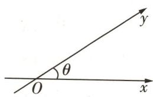

图1

答案》第028页

# 创新类型 ③ 由二维向量推广到多维向量

调研 4·试题调研原创 [新定义·n 维向量的内积, 向量正交] 设有 n 维向量 a = $\begin{pmatrix}a_{1}\\a_{2}\\...\\\alpha_{n}\end{pmatrix},\boldsymbol{b}=\begin{pmatrix}b_{1}\\b_{2}\\...\\\b_{n}\end{pmatrix}$ ，称 $[a,b]=a_{1}b_{1}+a_{2}b_{2}+\cdots+a_{n}b_{n}$ 为向量 a 和 b 的内积. 当 $[a,b]=0$ 时，称向

量 a 和 b 正交. 设 $S_{n}$ 为全体由 -1 和 1 构成的 n 元有序数组对应的向量的集合.

（1） 若 $a = \begin{pmatrix} 1 \\ 2 \\ 3 \\ 4 \end{pmatrix}$ ，写出一个向量 b，使得 $[a, b] = 0$ .

（2） 令 $B = \{[x, y] | x, y \in S_n\}$ , 若 $m \in B$ , 证明: $m + n$ 为偶数.  
（3） 若 $n = 4, f(4)$ 是从 $S_{4}$ 中选出向量的个数的最大值, 且选出的向量均满足 $[a, b] = 0$ , 猜测 $f(4)$ 的值, 并给出一个实例.

转化新定义 挖掘本题中新定义的内涵,实际上是多维向量的数量积运算,把以往的 $a \cdot b = x_{1}x_{2} + y_{1}y_{2}$ (其中 $a = (x_{1}, y_{1}), b = (x_{2}, y_{2})$ ) 推广到 $a \cdot b = x_{1}x_{2} + y_{1}y_{2} + z_{1}z_{2} + \cdots$ (其中 $a = (x_{1}, y_{1}, z_{1}, \cdots), b = (x_{2}, y_{2}, z_{2}, \cdots)$ ), 而正交则是多维向量数量积为 0 时的特殊关系,据此进行运算即可.

解析 （1） $b=\begin{pmatrix}1\\1\\-1\\0\end{pmatrix}$ (答案不唯一).
【破瓶颈】结合新定义，只需满足 $b_{1}+2b_{2}+3b_{3}+4b_{4}=0$ 即可

（2） 对于 $m \in B, i = 1, 2, \cdots, n$ ，存在 $x = \begin{pmatrix} x_{1} \\ x_{2} \\ \cdots \\ x_{n} \end{pmatrix}, x_{i} \in \{-1, 1\}$ ， $y = \begin{pmatrix} y_{1} \\ y_{2} \\ \cdots \\ y_{n} \end{pmatrix}, y_{i} \in \{-1, 1\}$ ，使得

$[x, y] = m$ ，当 $x_i = y_i$ 时， $x_i y_i = 1$ ；当 $x_i \neq y_i$ 时， $x_i y_i = -1$ .

令 $\lambda_{i}=\left\{\begin{aligned}1,x_{i}&=y_{i}\\ 0,x_{i}&\neq y_{i}\end{aligned}\right.$ , $k=\sum_{i=1}^{n}\lambda_{i}$ ，所以 $[x,y]=\sum_{i=1}^{n}x_{i}y_{i}=k-(n-k)=2k-n.$

所以 $m + n = 2k - n + n = 2k$ ，为偶数。

（3） 当 n=4 时, 猜测互相正交的 4 维向量最多有 4 个, 即 $f(4)=4$ .

实例如下. 取 $a_{1}=\begin{pmatrix}1\\ 1\\ 1\\ 1\end{pmatrix},a_{2}=\begin{pmatrix}-1\\ 1\\ -1\\ 1\end{pmatrix},a_{3}=\begin{pmatrix}-1\\ -1\\ 1\\ 1\end{pmatrix},a_{4}=\begin{pmatrix}1\\ -1\\ -1\\ 1\end{pmatrix}$ ，则有 $[a_{1},a_{2}]=0,[a_{1},a_{3}]=0$ ，

$\left[ \boldsymbol {a} _ {1}, \boldsymbol {a} _ {4} \right] = 0, \left[ \boldsymbol {a} _ {2}, \boldsymbol {a} _ {3} \right] = 0, \left[ \boldsymbol {a} _ {2}, \boldsymbol {a} _ {4} \right] = 0, \left[ \boldsymbol {a} _ {3}, \boldsymbol {a} _ {4} \right] = 0,$

若存在 $a_{5}$ ，使 $[a_{1}, a_{5}] = 0$ ，则 $a_{5} = \begin{pmatrix} -1 \\ 1 \\ 1 \\ -1 \end{pmatrix}$ 或 $\begin{pmatrix} 1 \\ -1 \\ 1 \\ -1 \end{pmatrix}$ 或 $\begin{pmatrix} 1 \\ 1 \\ -1 \\ -1 \end{pmatrix}$ .

当 $a_{5}=\begin{pmatrix}-1\\1\\1\\-1\end{pmatrix}$ 时， $[a_{4},a_{5}]=-4$ ; 当 $a_{5}=\begin{pmatrix}1\\-1\\1\\-1\end{pmatrix}$ 时， $[a_{2},a_{5}]=-4$ ; 当 $a_{5}=\begin{pmatrix}1\\1\\-1\\-1\end{pmatrix}$ 时， $[a_{3},$

$\left. \boldsymbol {a} _ {5} \right] = - 4.$

故找不到第5个向量与已知的4个向量互相正交.

梅涅劳斯定理 当一条直线分别交 $\triangle ABC$ 三边 $BC, AC, AB$ 所在直线于点 $D, E, F$ 时，有 $(AF / FB) \times (BD / DC) \times (CE / EA) = 1$ .

# 创新预测

答案▶029页

[2024 广西钦州 5 月三模 | 新定义 · 向量的 F 变换] 对于平面向量 $\boldsymbol{a}_{k} = (x_{k}, y_{k}) (x_{k}, y_{k} \in \mathbb{N}, k = 0, 1, 2, \cdots)$ ，定义 “F 变换”： $\boldsymbol{a}_{k+1} = F(\boldsymbol{a}_{k})$ ，其中 $x_{k+1} = |x_{k} - y_{k}|, y_{k+1} = |\max\{x_{k}, y_{k}\} - 2\min\{x_{k}, y_{k}\}|$ ， $\max\{x_{k}, y_{k}\}$ 表示 $x_{k}, y_{k}$ 中较大的一个数， $\min\{x_{k}, y_{k}\}$ 表示 $x_{k}, y_{k}$ 中较小的一个数。若 $x_{k} = y_{k}$ ，则 $\max\{x_{k}, y_{k}\} = \min\{x_{k}, y_{k}\} = x_{k} = y_{k}$ 。记 $\langle a_{k} \rangle = x_{k}y_{k}, ||a_{k}|| = x_{k} + y_{k}$ 。

（1） 若 $\boldsymbol{a}_{0}=(1,9)$ ，求 $\langle\boldsymbol{a}_{2}\rangle$ 及 $\left|\left|\boldsymbol{a}_{2}\right|\right|$ .  
（2） 已知 $\langle a_{1} \rangle = 2024, ||a_{1}|| = 2025$ ，将 $a_{1}$ 经过 m 次 F 变换后， $||a_{m+1}||$ 最小，求 m 的最小值.  
（3） 证明: 对任意 $a_{0}$ ，经过若干次 F 变换后，必存在 $k \in N^{*}$ ，使得 $\langle a_{k} \rangle = 0$ .

# 规范答题

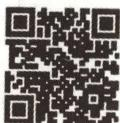  
“递推归纳法”巧解
F 变换新定义问题

# 参考答案与解析

# 原创变式

ABC 

<table><tr><td>选项</td><td>分析过程</td><td>正误</td></tr><tr><td>A</td><td> $P(2,-1)\rightarrow\overrightarrow{OP}=2e_{1}-e_{2}\rightarrow|\overrightarrow{OP}|=\sqrt{(2e_{1}-e_{2})^{2}}=\sqrt{4e_{1}^{2}-4e_{1}\cdot e_{2}+e_{2}^{2}}=\sqrt{4+1-4\times1\times1\times\cos60^{\circ}}$ [讲关键: $\theta$ 是两坐标轴的夹角,因为 $e_{1},e_{2}$ 分别是x轴,y轴正方向的单位向量,所以在计算 $e_{1}\cdot e_{2}$ 时需要用到 $\theta=60^{\circ}$ ]= $\sqrt{3}$ </td><td>√</td></tr><tr><td>B</td><td> $P(x_{1},y_{1}),Q(x_{2},y_{2})\rightarrow\overrightarrow{OP}=x_{1}e_{1}+y_{1}e_{2},\overrightarrow{OQ}=x_{2}e_{1}+y_{2}e_{2}\rightarrow\overrightarrow{OP}+\overrightarrow{OQ}=x_{1}e_{1}+y_{1}e_{2}+x_{2}e_{1}+y_{2}e_{2}=(x_{1}+x_{2})e_{1}+(y_{1}+y_{2})e_{2}\rightarrow\overrightarrow{OP}+\overrightarrow{OQ}=(x_{1}+x_{2},y_{1}+y_{2})$ </td><td>√</td></tr></table>

巧解妙招

斐波那契数列常用结论 斐波那契数列 $\{F_{n}\}$ 的前 n 项和 $F_{1} + F_{2} + \cdots + F_{n} = F_{n+2} - 1$ ，且奇数项和 $F_{1} + F_{3} + \cdots + F_{2n-1} = F_{2n}$ ，偶数项和 $F_{2} + F_{4} + \cdots + F_{2n} = F_{2n+1} - 1$ .

续表

<table><tr><td>选项</td><td>分析过程</td><td>正误</td></tr><tr><td>C</td><td> $P(x,y),\lambda \in \mathbb{R},\overrightarrow{OP} = x\boldsymbol{e}_{1} + y\boldsymbol{e}_{2} \rightarrow \lambda \overrightarrow{OP} = \lambda (x\boldsymbol{e}_{1} + y\boldsymbol{e}_{2}) = \lambda x\boldsymbol{e}_{1} + \lambda y\boldsymbol{e}_{2} \rightarrow \lambda \overrightarrow{OP} = (\lambda x,\lambda y)$ </td><td>√</td></tr><tr><td>D</td><td> $\overrightarrow{OP} \cdot \overrightarrow{OQ} = (x_{1}\boldsymbol{e}_{1} + y_{1}\boldsymbol{e}_{2}) \cdot (x_{2}\boldsymbol{e}_{1} + y_{2}\boldsymbol{e}_{2}) = x_{1}x_{2}\boldsymbol{e}_{1}^{2} + y_{1}y_{2}\boldsymbol{e}_{2}^{2} + (x_{1}y_{2} + y_{1}x_{2})(\boldsymbol{e}_{1} \cdot \boldsymbol{e}_{2}) = x_{1}x_{2} + y_{1}y_{2} + (x_{1}y_{2} + y_{1}x_{2})\cos\theta$ </td><td>×</td></tr></table>

# 创新预测

（1） 因为 $\boldsymbol{a}_{0} = (1, 9)$ ，所以 $\boldsymbol{a}_{1} = (8, 7)$ ，所以 $\boldsymbol{a}_{2} = (1, 6)$ [破障碍：先根据已知的新定义求出 $a_{2}$ ，从而可求出 $\langle a_{2} \rangle$ 及 $\left|\left|a_{2}\right|\right|$ ]，所以 $\langle a_{2} \rangle = 1 \times 6 = 6, \left|\left|a_{2}\right|\right| = 1 + 6 = 7$ .

（2） 因为 $\langle a_{1} \rangle = x_{1}y_{1} = 2024, ||a_{1}|| = x_{1} + y_{1} = 2025$ ，所以 $\left\{\begin{aligned}x_{1}&=2024,\\ y_{1}&=1\end{aligned}\right.$ 或 $\left\{\begin{aligned}x_{1}&=1,\\ y_{1}&=2024\end{aligned}\right.$ [理思路：根据 $\langle a_{1} \rangle, ||a_{1}||$ 求出 $x_{1}, y_{1}$ ，从而可求出 $a_{2}, a_{3}, a_{4}, a_{5}, a_{6}, a_{7}, a_{8}$ ，进而可得 $a_{2n+1} = (1, 2024 - 3n) (n \in N^{*}$ 且 $2024 - 3n > 0)$ ，则可求出 m 的最小值]，

所以 $x_{2} = |x_{1} - y_{1}| = 2023, y_{2} = |\max \{x_{1}, y_{1}\} - 2\min \{x_{1}, y_{1}\}| = 2022$ ，即 $\pmb{a}_{2} = (2023, 2022)$ .

由题意可得 $a_{3}=(1,2\ 021)$ , $a_{4}=(2\ 020,2\ 019)$ , $a_{5}=(1,2\ 018)$ , $a_{6}=(2\ 017,2\ 016)$ , $a_{7}=(1,2\ 015)$ , $a_{8}=(2\ 014,2\ 013)$ , 根据规律可得 $a_{2n+1}=(1,2\ 024-3n)(n\in\mathbb{N}^{*}$ 且2024-3n>0).

由 $n \in N^{*}$ 且 2024 - 3n > 0 可得 n 的最大值为 674，所以 $\boldsymbol{a}_{1349} = (1, 2)$ ，所以 $\boldsymbol{a}_{1350} = (1, 0)$ ， $\boldsymbol{a}_{1351} = (1, 1)$ ， $\boldsymbol{a}_{1352} = (0, 1)$ ， $\boldsymbol{a}_{1353} = (1, 1)$ ，…，此后进入循环.

所以当 m<1349 时， $\left|\left|\boldsymbol{a}_{m+1}\right|\right|>1$ ; 当 m=1349 时， $\left|\left|\boldsymbol{a}_{1350}\right|\right|=1$ ; 当 m>1349 时， $\left|\left|\boldsymbol{a}_{m+1}\right|\right|\geqslant1$ . 所以 $\left|\left|\boldsymbol{a}_{m+1}\right|\right|$ 最小时，m 的最小值为 1349.

（3） 当 $x_{0}=0, y_{0}=0$ [破瓶颈: 分 $x_{0}=0, y_{0}=0$ 和 $x_{0}=0, y_{0}\neq0$ 和 $x_{0}\neq0, y_{0}=0$ 和 $x_{0}\neq0, y_{0}\neq0$ 四种情况讨论] 时, 显然存在 $k\in N^{*}$ , 使得 $\langle a_{k}\rangle=0$ .

当 $x_0 = 0, y_0 \neq 0$ 时， $\pmb{a}_1 = (y_0, y_0), \pmb{a}_2 = (0, y_0)$ ，即 $\langle \pmb{a}_2 \rangle = 0$ ，存在 $k \in \mathbf{N}^*$ ，使得 $\langle \pmb{a}_k \rangle = 0$ .

同理, 当 $x_{0} \neq 0, y_{0} = 0$ 时, 存在 $k \in N^{*}$ , 使得 $\langle a_{k} \rangle = 0$ .

当 $x_0 \neq 0, y_0 \neq 0$ 时，若 $x_t = y_t$ ，则 $x_{t+1} = |x_t - y_t| = 0, \langle a_{t+1} \rangle = 0$ ，存在 $k \in \mathbf{N}^*$ ，使得 $\langle a_k \rangle = 0$ .

若 $x_{t} \neq y_{t}$ ，设 $M_{t} = \max\left\{x_{t}, y_{t}\right\}(t = 0, 1, 2, \cdots)$ .

假设对任意 $t \in N, \langle a_{t} \rangle \neq 0$ ，则 $x_{t}, y_{t}$ 均不为 0，因为 $x_{t}, y_{t} \in N^{*}$ ，所以 $x_{t+1} = |x_{t} - y_{t}| < \max\{x_{t}, y_{t}\}$ 。若 $x_{t} > y_{t}$ ，则 $y_{t+1} = |\max\{x_{t}, y_{t}\} - 2\min\{x_{t}, y_{t}\}| = |x_{t} - 2y_{t}| < x_{t}$ ，若 $x_{t} < y_{t}$ ，则 $y_{t+1} = |y_{t} - 2x_{t}| < y_{t}$ ，所以 $y_{t+1} < \max\{x_{t}, y_{t}\}$ ，所以 $M_{t+1} < M_{t}$ ，即 $M_{1} > M_{2} > M_{3} > \cdots$ 。

因为 $M_{t} \in \mathbf{N}^{*} (t = 1, 2, \cdots)$ ，所以 $M_{1} \geqslant M_{2} + 1 \geqslant M_{3} + 2 \geqslant \cdots \geqslant M_{2 + M_{1}} + 1 + M_{1}$ ，所以 $M_{2 + M_{1}} \leqslant -1$ ，与 $M_{2 + M_{1}} > 0$ 矛盾，故假设不正确，即存在 $k \in N^{*}$ ，使得 $\langle a_{k} \rangle = 0$ 。

综上,对于任意 $a_{0}$ ,经过若干次F变换后,必存在 $k\in N^{*}$ ,使得 $\langle a_{k}\rangle=0$ .

# 核心主干

# 抓重点

# 超重点4 3类应用三角函数性质求值问题

<table><tr><td>三年考情与创新命题特点</td><td>2025命题预测</td></tr><tr><td>2024 全国甲卷 T13,结合辅助角公式与三角函数的有界性求最值</td><td rowspan="4">1命题形式:常以选择题、填空题的形式呈现.2必考热点:利用三角型函数的周期性、奇偶性和图象的对称性求参数值或函数值.3创新考法:与向量、解三角形等知识相结合,涉及整体思想、数形结合思想等,着重考查考生的逻辑思维.</td></tr><tr><td>2024 北京卷 T6,结合三角函数的周期性求值</td></tr><tr><td>2024 天津卷 T7,由三角函数的图象和性质求最值</td></tr><tr><td>2023 全国乙卷 T6,结合三角函数的单调性与图象的对称性求函数值</td></tr></table>

# 类型 1 利用周期性求参数值

调研 1 [2024 福建莆田 5 月三模] (多选) 函数 $f(x)=3\cos(\omega x+\varphi)(\omega>0,0<\varphi<\pi)$ 的图象既关于点 $(- \frac{\pi}{2},0)$ 对称，又关于直线 $x=\frac{3\pi}{4}$ 对称，且 $f(x)$ 在 $\left[\frac{\pi}{6},\frac{2\pi}{3}\right]$ 上单调，则 $\omega$ 的值可能是

$\quad$A. $\frac{2}{5}$

$\quad$B. $\frac{6}{5}$

$\quad$C. 2

$\quad$D. $\frac{14}{5}$

$\int -\frac{\pi\omega}{2} + \varphi = k_1\pi + \frac{\pi}{2}, k_1 \in \mathbf{Z}$ ,

解析 由题意可得 $\left\{\frac{3\pi\omega}{4} + \varphi = k_2\pi, k_2 \in \mathbf{Z}\right.$ ，则 $\omega = \frac{4}{5} \left[ (k_2 - k_1) - \frac{1}{2} \right] (k_1, k_2 \in \mathbf{Z})$ ，即 $\omega = \frac{4}{5} (k - \frac{1}{2}) (k \in \mathbf{Z})$ 。

【换思路】三角函数图象的相邻对称轴与对称中心间的距离为 $\frac{T}{4}$ ，T为函数的最小正周期，所以 $\frac{3\pi}{4}-(-\frac{\pi}{2})=\frac{T}{4}+\frac{mT}{2}(m\in\mathbf{Z})$ ，即 $T=\frac{2\pi}{\omega}=\frac{5\pi}{2m+1}(m\in\mathbf{Z})$ ，可得 $\omega=\frac{4}{5}(m+\frac{1}{2})(m\in\mathbf{Z})$

设 $f(x)$ 的最小正周期为 $T$ ，因为 $f(x)$ 在 $\left[\frac{\pi}{6}, \frac{2\pi}{3}\right]$ 上单调，所以 $\frac{T}{2} \geqslant \frac{2\pi}{3} - \frac{\pi}{6} = \frac{\pi}{2}$ ，所以 $T \geqslant \pi$ ，即 $\frac{2\pi}{\omega} \geqslant \pi$ ，所以 $0 < \omega \leqslant 2$ ，即 $0 < \frac{4}{5}(k - \frac{1}{2}) \leqslant 2$ ，得 $\frac{1}{2} < k \leqslant 3$ ，因为 $k \in \mathbb{Z}$ ，所以 $k = 1$ 或 $k = 2$ 或 $k = 3$ 。

若 $k = 1$ ，则 $\omega = \frac{2}{5}$ ，由 $f(-\frac{\pi}{2}) = 0$ 及 $0 < \varphi < \pi$ 得 $\varphi = \frac{7\pi}{10}$ 当 $x \in [\frac{\pi}{6}, \frac{2\pi}{3}]$ 时， $\frac{2}{5} x + \frac{7\pi}{10} \in$

$\left[\frac{23\pi}{30}, \frac{29\pi}{30}\right], f(x)$ 在该区间上单调递减.

同理, 若 k=2, 则 $\omega=\frac{6}{5}, \varphi=\frac{\pi}{10}$ , 当 $x\in\left[\frac{\pi}{6},\frac{2\pi}{3}\right]$ 时, $\frac{6}{5}x+\frac{\pi}{10}\in\left[\frac{3\pi}{10},\frac{9\pi}{10}\right]$ , $f(x)$ 在该区间上单调递减.

若 $k = 3$ ，则 $\omega = 2, \varphi = \frac{\pi}{2}$ 当 $x \in \left[\frac{\pi}{6}, \frac{2\pi}{3}\right]$ 时， $2x + \frac{\pi}{2} \in \left[\frac{5\pi}{6}, \frac{11\pi}{6}\right]$ ， $f(x)$ 在该区间上不单调.

故 k=1, k=2 符合题意, k=3 不符合题意. 故选 AB.

# 原创变式

1 $f(x) = A\sin (\omega x - \frac{\pi}{3}) + B(A > 0, \omega > 0), f(x)_{\max} = f(x_1) = 3, f(x)_{\min} = f(x_2) = -1$ ，且 $|x_1 -$

$x_{2}|$ 的最小值为 $\frac{\pi}{2}$ , 则函数 $f(x)$ 的解析式为 ( )

$\quad$A. $f(x) = 2\sin \left(x - \frac{\pi}{3}\right) - 1$

$\quad$B. $f(x) = 2\sin \left(x - \frac{\pi}{3}\right) + 1$

$\quad$C. $f(x) = 2\sin \left(2x - \frac{\pi}{3}\right) - 1$

$\quad$D. $f(x) = 2\sin\left(2x - \frac{\pi}{3}\right) + 1$

答案》第034页

# 类型 2 利用有界性求最值

调研2 试题调研原创 当 $0 \leqslant x < \frac{\pi}{2}$ 时, $\frac{\sin 2x + 3\cos 2x + 3}{\cos x}$ 的最大值是 ( )

$\quad$A. 2

$\quad$B. $\sqrt{10}$

$\quad$C. 0

$\quad$D. $2 \sqrt{10}$

解析 原式 $= \frac{2\sin x\cos x + 3\times 2\cos^2x}{\cos x} = 2\sin x + 6\cos x = 2\sqrt{10}\left(\frac{1}{\sqrt{10}}\sin x + \frac{3}{\sqrt{10}}\cos x\right) =$ $2\sqrt{10}\sin (x + \varphi)$ ，其中 $\cos \varphi = \frac{1}{\sqrt{10}},\sin \varphi = \frac{3}{\sqrt{10}},0 <   \varphi <  \frac{\pi}{2}.$

由 $0 \leqslant x < \frac{\pi}{2}$ ，得 $0 < \varphi \leqslant x + \varphi < \frac{\pi}{2} + \varphi < \pi$ ，所以 $\left[2\sqrt{10}\sin(x+\varphi)\right]_{\max} = 2\sqrt{10}$ 。故选 D.

【会思考】“有界性”是一个高等数学中的概念，表述为：如果存在正数 $M$ ，使得 $|f(x)| \leqslant M$ 对任意 $x \in X$ 成立，那么函数 $f(x)$ 在 $X$ 上有界。显然，函数 $f(x) = \sin x, f(x) = \cos x$ 都在 $\mathbf{R}$ 上有界，利用这个性质可以求得三角型函数 $f(x) = A \sin (\omega x + \varphi) + b (\omega \neq 0, A \neq 0)$ 的最值为 $\pm |A| + b$ ，在实际应用时要注意自变量的取值范围

等差数列的性质 公差为 $d$ 的等差数列 $\{a_{n}\}$ 的前 $n$ 项和为 $S_{n}, p, q \in \mathbf{N}^{*}$ . ①若 $a_{p} = q$ , $a_{q} = p (p \neq q)$ , 则 $d = -1$ . ②若 $S_{p} = q, S_{q} = p (p \neq q)$ , 则 $S_{p + q} = -(p + q)$ .

巧解妙招

# 原创变式

函数 $f(x)=1+\tan(\omega x+\frac{\pi}{3})(\omega\in\mathbf{Z}$ 且 $\omega\neq0)$ 在区间 $(\pi,\frac{3\pi}{2})$ 上单调递减,则函数 $g(x)=2\cos^{2}\omega x+2\sqrt{3}\sin\omega x\cos\omega x-1$ 在 $[0,\frac{\pi}{2}]$ 上的最大值与最小值的和为 \_\_\_\_.

答案》第034页

# 类型 ③ 利用奇偶性求值

调研 3 试题调研原创 函数 $f(x)=\cos\left(x-\frac{\pi}{3}+\varphi\right)$ 为偶函数,则 $\varphi$ 的值可以是 ( )

$\quad$A. $\frac{5\pi}{6}$

$\quad$B. $\frac{4\pi}{3}$

$\quad$C. $\pi$

$\quad$D. $\frac{\pi}{2}$

解析 由题意知直线 $x = 0$ 为曲线 $y = f(x)$ 的对称轴，

所以 $f(0)=\cos(-\frac{\pi}{3}+\varphi)=\pm1$ ,

【讲关键】余弦型函数图象的对称轴过其图象最高点或最低点，据此求解

所以 $-\frac{\pi}{3} + \varphi = k\pi, k \in \mathbf{Z}$ , 得 $\varphi = k\pi + \frac{\pi}{3}, k \in \mathbf{Z}$ .

<table><tr><td>选项</td><td>分析过程</td><td>正误</td></tr><tr><td>A</td><td>令 $\varphi = k\pi + \frac{\pi}{3} = \frac{5\pi}{6}$ ,解得 $k = \frac{1}{2} \notin \mathbf{Z}$ ,不符合题意</td><td>×</td></tr><tr><td>B</td><td>令 $\varphi = k\pi + \frac{\pi}{3} = \frac{4\pi}{3}$ ,解得 $k = 1 \in \mathbf{Z}$ ,符合题意</td><td>√</td></tr><tr><td>C</td><td>令 $\varphi = k\pi + \frac{\pi}{3} = \pi$ ,解得 $k = \frac{2}{3} \notin \mathbf{Z}$ ,不符合题意</td><td>×</td></tr><tr><td>D</td><td>令 $\varphi = k\pi + \frac{\pi}{3} = \frac{\pi}{2}$ ,解得 $k = \frac{1}{6} \notin \mathbf{Z}$ ,不符合题意</td><td>×</td></tr></table>

故选 B.

# 原创变式

3（多选）函数 $f(x)=(x-2)^{3}\sin\omega x$ ，若存在 $a\in R$ ，使得 $f(x+a)$ 为奇函数，则实数 $\omega$ 的值可以是()

$\quad$A. $-\frac{\pi}{4}$

$\quad$B. $\frac{\pi}{2}$

$\quad$C. $\frac{3\pi}{4}$

$\quad$D. $\pi$

答案》第034页

# 创新预测

答案▶035页

##### 1.[2024 山东济宁 5 月三模]已知函数 $f(x) = (\sqrt{3} \sin x + \cos x) \cos x - \frac{1}{2}$ ，若 $f(x)$ 在区间 $[- \frac{\pi}{4}, m]$ 上的值域为 $[- \frac{\sqrt{3}}{2}, 1]$ ，则实数 $m$ 的取值范围是 ( )

$\quad$A. $\left[\frac{\pi}{6},\frac{\pi}{2}\right)$

$\quad$B. $\left[\frac{\pi}{6}, \frac{\pi}{2}\right]$

$\quad$C. $\left[\frac{\pi}{6},\frac{7\pi}{12}\right)$

$\quad$D. $\left[\frac{\pi}{6},\frac{7\pi}{12}\right]$

##### 2. 试题调研原创 (多选)已知函数 $f(x) = m\cos \omega x + 2\sqrt{3}\sin \omega x$ , 若 $f(\frac{\pi}{2}) = 2$ , 且 $f(x) \geqslant f(\frac{\pi}{4})$ , 则函数 $f(x)$ 的最小正周期可能是 ( )

$\quad$A. $\frac{3\pi}{16}$

$\quad$B. $\frac{3\pi}{8}$

$\quad$C. $\frac{3\pi}{20}$

$\quad$D. $\frac{3\pi}{40}$

##### 3.[2024 福建福州 5 月三模 | 新题型 · 双空题] 函数 $f(x) = \sin (\omega x + \varphi)$ 在区间 $(\frac{\pi}{6}, \frac{2\pi}{3})$ 上单调, 其中 $\omega$ 为正整数, $|\varphi| < \frac{\pi}{2}$ , 且 $f(\frac{\pi}{3}) = -f(\frac{\pi}{2})$ . 写出曲线 $y = f(x)$ 的一个对称中心的坐标: \_\_\_\_. 若 $f(x - \frac{\pi}{12})$ 为奇函数, 则 $\varphi =$ \_\_\_\_.

##### 4. 试题调研原创 [新趋势·平面向量与解三角形交汇命题] 向量 $m = (\cos(\omega x + \frac{\pi}{3}), \cos \omega x), n = (\sin(\omega x - \frac{\pi}{2}), \cos \omega x), \omega > 0, f(x) = m \cdot n - \frac{1}{4}, y = f(x)$ 图象上相邻的最高点与最低点之间的距离为 $\sqrt{2}$ .

（1） 求 $\omega$ 的值及 $f(x)$ 在 $[0, \frac{\pi}{3}]$ 上的单调递增区间；  
（2） 设 $\triangle ABC$ 的内角 $A, B, C$ 的对边分别为 $a, b, c$ , 且 $b + c = 2, A = \frac{\pi}{3}$ , 求 $f(a)$ 的值域.

# 规范答题

海伦公式 平面内边长分别为 a, b, c 的三角形的面积 S 可由公式 $S = \sqrt{p(p - a)(p - b)(p - c)}$ 求得，其中 p 是周长的一半.

巧解妙招

# 参考答案与解析

# 原创变式

##### 1.D $f(x)_{\max}=A+B, f(x)_{\min}=-A+B$ , 即 $\left\{\begin{aligned} A+B=3, \\ -A+B=-1, \end{aligned}\right.$ 解得 $\left\{\begin{aligned} A=2, \\ B=1, \end{aligned}\right.$

设 $f(x)$ 的最小正周期为 T，由 $|x_{1}-x_{2}|$ 的最小值为 $\frac{\pi}{2}$ ，可得 $\frac{1}{2}T=\frac{\pi}{2}$ ，因为 $\omega>0$ ，所以 $\omega=\frac{2\pi}{T}=2$ ，故 $f(x)=2\sin(2x-\frac{\pi}{3})+1$ .

##### 2.-1 设 $f(x)$ 的最小正周期为 $T$ ，则 $T = \frac{\pi}{|\omega|} \geqslant \frac{3\pi}{2} - \pi = \frac{\pi}{2}$ ，则 $|\omega| \leqslant 2$ .

因为 $f(x) = 1 + \tan (\omega x + \frac{\pi}{3})(\omega \in \mathbf{Z}$ 且 $\omega \neq 0)$ 在 $(\pi, \frac{3\pi}{2})$ 上单调递减，而函数 $y = \tan x$ 在 $(\frac{2k\pi - \pi}{2}, \frac{2k\pi + \pi}{2})(k \in \mathbf{Z})$ 上单调递增，所以 $\omega < 0$ ，又 $\omega \in \mathbf{Z}$ ，所以 $\omega = -1$ 或 $\omega = -2$

①当 $\omega = -1$ 时, $f(x) = 1 + \tan\left(-x + \frac{\pi}{3}\right)$ , $\pi < x < \frac{3\pi}{2} \Rightarrow -\frac{7\pi}{6} < -x + \frac{\pi}{3} < -\frac{2\pi}{3}$ , 即 $-x + \frac{\pi}{3} \in (-\frac{7\pi}{6}, -\frac{2\pi}{3}) \subseteq (-\frac{3\pi}{2}, -\frac{\pi}{2})$ , 符合题意;

②当 $\omega = -2$ 时， $f(x) = 1 + \tan\left(-2x + \frac{\pi}{3}\right)$ ， $\pi < x < \frac{3\pi}{2} \Rightarrow -\frac{8\pi}{3} < -2x + \frac{\pi}{3} < -\frac{5\pi}{3}$ ， $-\frac{5\pi}{2} \in \left(-\frac{8\pi}{3}, -\frac{5\pi}{3}\right)$ ，结合正切函数图象可知 $-2x + \frac{\pi}{3} \neq -\frac{5\pi}{2}$ ，则函数 $f(x)$ 在 $(\pi, \frac{3\pi}{2})$ 上不单调，不符合题意.

故 $\omega \neq -2$ ，所以 $\omega = -1$ ，则 $g(x) = 2\cos^2 x - 2\sqrt{3}\sin x\cos x - 1 = \cos 2x - \sqrt{3}\sin 2x = 2(\frac{1}{2}\cos 2x - \frac{\sqrt{3}}{2}\sin 2x) = 2\cos (2x + \frac{\pi}{3})$ ，当 $x \in [0, \frac{\pi}{2}]$ 时， $\frac{\pi}{3} \leqslant 2x + \frac{\pi}{3} \leqslant \frac{4\pi}{3}$ ，所以 $g(x)_{\max} = 2\cos \frac{\pi}{3} = 1$ ， $g(x)_{\min} = 2\cos \pi = -2$ [明易错： $y = 2\cos (2x + \frac{\pi}{3})$ 的最大值为 2，最小值为 -2，但结合余弦函数的图象可知在 $[0, \frac{\pi}{2}]$ 上， $g(x) = -2$ 可以取到， $g(x) = 2$ 取不到，不要想当然地以为都能取到]，所以 $g(x)_{\max} + g(x)_{\min} = -1$ 。

##### 3. AC 由题意知 $f(x+a)=(x+a-2)^{3}\sin\omega(x+a)$ 为奇函数, 则 $f(a)=(a-2)^{3}\sin\omega a=0$ , 得 $a=2$ 或 $a=0$ , 经验证, $a=0$ 不符合题意, 则 $a=2, f(x+2)=x^{3}\sin\omega(x+2)$ , 要使 $f(x+2)$ 为奇函数 [破瓶颈: $a=2$ 时, $f(x+a)$ 的解析式为“奇×偶”的结构], 则 $y=\sin\omega(x+2)$ 为偶函数, 所以 $y=\sin\omega(0+2)=\pm1$ , 可得 $2\omega=\frac{\pi}{2}+k\pi, k\in\mathbf{Z}$ , 所以 $\omega=\frac{\pi}{4}+\frac{k\pi}{2}, k\in\mathbf{Z}$ , 当 $k=-1$ 时, $\omega=-\frac{\pi}{4}$ , 当 $k=1$ 时, $\omega=\frac{3\pi}{4}$ , 所以 AC 满足题意, 验证得 BD 不满足题意. 故选 AC.

巧解妙招

指数型放缩 $\mathrm{e}^x\geqslant x + 1$ （当且仅当 $x = 0$ 时取等号）， $\mathrm{e}^{x - 1}\geqslant x$ （当且仅当 $x = 1$ 时取等号）， $\mathrm{e}^x\leqslant \frac{1}{1 - x} (x < 1)$ （当且仅当 $x = 0$ 时取等号）.

# 创新预测

##### 1.D 依题意, $f(x)=\sqrt{3}\sin x\cos x+\cos^{2}x-\frac{1}{2}=\frac{\sqrt{3}}{2}\sin 2x+\frac{1}{2}\cos 2x=\sin(2x+\frac{\pi}{6})$ [破障碍:利用二倍角公式、辅助角公式化简 $f(x)$ 的解析式],

当 $x \in [-\frac{\pi}{4}, m]$ 时， $2x + \frac{\pi}{6} \in [-\frac{\pi}{3}, 2m + \frac{\pi}{6}]$ ，显然 $\sin\left(-\frac{\pi}{3}\right) = \sin\frac{4\pi}{3} = -\frac{\sqrt{3}}{2}, \sin\frac{\pi}{2} = 1$ ，且正弦函数 $y = \sin x$ 在 $[\frac{\pi}{2}, \frac{4\pi}{3}]$ 上单调递减，则由 $f(x)$ 在区间 $[- \frac{\pi}{4}, m]$ 上的值域为 $[- \frac{\sqrt{3}}{2}, 1]$ ，得 $\frac{\pi}{2} \leqslant 2m + \frac{\pi}{6} \leqslant \frac{4\pi}{3}$ ，解得 $\frac{\pi}{6} \leqslant m \leqslant \frac{7\pi}{12}$ ，所以实数 $m$ 的取值范围是 $[\frac{\pi}{6}, \frac{7\pi}{12}]$ . 故选 D.

##### 2.BC $f(x)$ 的解析式经过辅助角公式变换可转化为正弦型, 因为 $f(x) \geqslant f(\frac{\pi}{4})$ , 所以当 $x = \frac{\pi}{4}$ 时函数取得最小值, 即直线 $x = \frac{\pi}{4}$ 是函数 $f(x)$ 图象的一条对称轴, 又 $f(\frac{\pi}{2}) = 2$ , 所以 $f(0) = 2$ [明关键: 根据图象的对称性得到 $f(0) = f(\frac{\pi}{2}) = 2$ ], 即 $f(0) = m \cos 0 + 2\sqrt{3} \sin 0 = 2$ , 所以 m = 2, 所以 $f(x) = 2 \cos \omega x + 2\sqrt{3} \sin \omega x = 4 (\frac{1}{2} \cos \omega x + \frac{\sqrt{3}}{2} \sin \omega x) = 4 \sin (\omega x + \frac{\pi}{6})$ .

所以 $\frac{\pi}{4}\omega +\frac{\pi}{6} = \frac{3\pi}{2} +2k\pi ,k\in \mathbf{Z},$ 解得 $\omega = \frac{16}{3} +8k,k\in \mathbf{Z},$ 则 $f(x)$ 的最小正周期 $T = \frac{2\pi}{|\omega|} =$ $\frac{2\pi}{|\frac{16}{3} + 8k|} = \frac{3\pi}{|8 + 12k|},$ 当 $k = 0$ 时， $T = \frac{3\pi}{8};$ 当 $k = 1$ 时， $T = \frac{3\pi}{20}.$ 验证得AD不符合题意，故选BC.

##### 3. $\left(\frac{5\pi}{12},0\right)$ （答案不唯一） $\frac{\pi}{6}$ $\frac{\pi}{2},\frac{\pi}{3}\in\left(\frac{\pi}{6},\frac{2\pi}{3}\right)$ ，所以 $x=\frac{\pi}{3},x=\frac{\pi}{2}$ 在函数 $f(x)$ 的同一个单调区间上，

又 $f(\frac{\pi}{3})=-f(\frac{\pi}{2})$ ，所以 $f(\frac{1}{2}(\frac{\pi}{3}+\frac{\pi}{2}))=f(\frac{5\pi}{12})=0$ ，所以曲线 $y=f(x)$ 的一个对称中心是点 $(\frac{5\pi}{12},0)$ [破障碍：由单调区间联想曲线的上升段或下降段，上升段和下降段都会经过一个平衡点，即对称中心].

方法一 因为 $f(x)$ 在区间 $\left(\frac{\pi}{6}, \frac{2\pi}{3}\right)$ 上单调，

所以 $f(x)$ 的最小正周期 $T \geqslant 2 \times \left( \frac{2\pi}{3} - \frac{\pi}{6} \right) = \pi$ ，即 $\frac{2\pi}{\omega} \geqslant \pi$ ，所以 $0 < \omega \leqslant 2$ ，又 $\omega$ 为正整数，所以 $\omega = 1, 2$ 。当 $\omega = 1$ 时， $f(x) = \sin(x + \varphi)$ ，因为点 $\left( \frac{5\pi}{12}, 0 \right)$ 为曲线 $y = f(x)$ 的一个对称中心，

所以 $\frac{5\pi}{12} +\varphi = k_1\pi ,\varphi = -\frac{5\pi}{12} +k_1\pi ,k_1\in \mathbf{Z},$ 又 $|\varphi | <   \frac{\pi}{2}$ ，所以 $\varphi = -\frac{5\pi}{12}.$

若 $f(x - \frac{\pi}{12}) = \sin (x - \frac{\pi}{12} +\varphi)$ 为奇函数，则 $-\frac{\pi}{12} +\varphi = k_2\pi ,\varphi = \frac{\pi}{12} +k_2\pi ,k_2\in \mathbf{Z},$

由 $-\frac{5\pi}{12} = \frac{\pi}{12} + k_2\pi, k_2 \in \mathbf{Z}$ , 得 $k_2 = -\frac{1}{2}$ , 不符合题意, 舍去.

对数型放缩 $\ln (x + 1)\leqslant x(x > - 1)$ （当且仅当 $x = 0$ 时取等号）， $1 - \frac{1}{x}\leqslant \ln x\leqslant x - 1$ $(x > 0)$ （当且仅当 $x = 1$ 时取等号）.

当 $\omega = 2$ 时， $f(x) = \sin (2x + \varphi)$ ，因为点 $(\frac{5\pi}{12}, 0)$ 为曲线 $y = f(x)$ 的一个对称中心，

所以 $2 \times \frac{5\pi}{12} + \varphi = k_3\pi, \varphi = -\frac{5\pi}{6} + k_3\pi, k_3 \in \mathbf{Z}$ , 又 $|\varphi| < \frac{\pi}{2}$ , 所以 $\varphi = \frac{\pi}{6}$ .

若 $f(x - \frac{\pi}{12}) = \sin [2(x - \frac{\pi}{12}) + \varphi ]$ 为奇函数，则 $-\frac{\pi}{6} +\varphi = k_4\pi ,\varphi = \frac{\pi}{6} +k_4\pi ,k_4\in \mathbf{Z},$

当 $k_{4} = 0$ 时， $\varphi = \frac{\pi}{6}$ ，符合题意.所以若 $f(x - \frac{\pi}{12})$ 为奇函数，则 $\varphi = \frac{\pi}{6}$

方法二 由 $f(x-\frac{\pi}{12})$ 为奇函数, 可知函数 $f(x)$ 图象的一个对称中心是点 $(- \frac{\pi}{12},0)$ , 结合图象知, 两个对称中心之间的距离 $\frac{5\pi}{12}-(-\frac{\pi}{12})=\frac{kT}{2}, k\in\mathbf{Z}, T$ 为 $f(x)$ 的最小正周期, 所以 $T=\frac{\pi}{k}, k\in\mathbf{Z}$ [破障碍: 由两个对称性推导出周期性], 即 $\frac{2\pi}{\omega}=\frac{\pi}{k}, \omega=2k, k\in\mathbf{Z}$ , 由 $T=\frac{\pi}{k}\geqslant2\times(\frac{2\pi}{3}-\frac{\pi}{6})=\pi$ 得 $0<k\leqslant1$ , 所以 $k=1$ , 所以 $\omega=2$ , 后同上述解法.

##### 4.（1）依题意可得 $f(x)=\cos(\omega x+\frac{\pi}{3})\cdot\sin(\omega x-\frac{\pi}{2})+\cos^{2}\omega x-\frac{1}{4}=-(\cos\omega x\cos\frac{\pi}{3}-\sin\omega x\sin\frac{\pi}{3})\cdot\cos\omega x+\cos^{2}\omega x-\frac{1}{4}=-(\frac{1}{2}\cos\omega x-\frac{\sqrt{3}}{2}\sin\omega x)\cdot\cos\omega x+\cos^{2}\omega x-\frac{1}{4}=$ $-\frac{1}{2}\cos^{2}\omega x+\frac{\sqrt{3}}{2}\sin\omega x\cos\omega x+\cos^{2}\omega x-\frac{1}{4}=\frac{\sqrt{3}}{4}\sin2\omega x+\frac{1}{4}\cos2\omega x=\frac{1}{2}\sin(2\omega x+\frac{\pi}{6}).$

设函数 $f(x)$ 的最小正周期为 T，则 $\sqrt{2} = \sqrt{\left(\frac{T}{2}\right)^2 + 1}$ [明关键：相邻最高点与最低点的距离为 $\sqrt{2}$ ，结合勾股定理列式]，解得 T = 2（负值舍去），则 $T = 2 = \frac{2\pi}{2\omega}$ ，解得 $\omega = \frac{\pi}{2}$ ，所以 $f(x) = \frac{1}{2}\sin (\pi x + \frac{\pi}{6})$ .

令 $2k\pi - \frac{\pi}{2} \leqslant \pi x + \frac{\pi}{6} \leqslant 2k\pi + \frac{\pi}{2}(k \in \mathbf{Z})$ ，得 $2k - \frac{2}{3} \leqslant x \leqslant 2k + \frac{1}{3}(k \in \mathbf{Z})$ ，

所以 $f(x)$ 的单调递增区间为 $\left[2k-\frac{2}{3},2k+\frac{1}{3}\right](k\in\mathbf{Z})$ ,

故 $f(x)$ 在 $[0,\frac{\pi}{3}]$ 上的单调递增区间为 $[0,\frac{1}{3}]$ .

（2） 在 $\triangle ABC$ 中, 由余弦定理得 $a^2 = b^2 + c^2 - 2bc\cos A = (b + c)^2 - 3bc = 4 - 3bc$ ,

又 $2 = b + c \geqslant 2\sqrt{bc}$ 且 $bc > 0$ ，所以 $0 < bc \leqslant 1$ ，当且仅当 $b = c = 1$ 时取等号，

所以 $1 \leqslant a^{2} < 4$ ，又 $2 = b + c > a$ ，所以 $1 \leqslant a < 2$

所以 $\frac{7\pi}{6} \leqslant \pi a + \frac{\pi}{6} < \frac{13\pi}{6}$ , 则 $-1 \leqslant \sin (\pi a + \frac{\pi}{6}) < \frac{1}{2}$ , 则 $-\frac{1}{2} \leqslant f(a) < \frac{1}{4}$ , 所以 $f(a)$ 的值域为 $[- \frac{1}{2}, \frac{1}{4})$ .

# 超重点5 3类应用三角函数图象求值问题

<table><tr><td>三年考情与创新命题特点</td><td>2025命题预测</td></tr><tr><td>2024 新课标I卷T7,给出两个三角函数解析式,根据函数性质作出函数图象,结合图象找出两函数图象交点的个数</td><td rowspan="3">1命题形式:一般在选择题、填空题中呈现.2必考热点:给出部分函数图象,根据图象特征求出解析式中的参数,进而求值;由三角函数图象伸缩平移变换求新函数的解析式;给出三角函数解析式,借助图象数形结合求最值、交点个数等.</td></tr><tr><td>2023 新课标II卷T16,给出三角函数图象,根据图象求出函数解析式中的参数后求值</td></tr><tr><td>2023 全国甲卷T10,给出图象平移变换之前的三角函数解析式,求解变换后所得三角函数图象与直线交点的个数</td></tr></table>

# 类型 1 给出部分图象，识图求函数

调研 1 试题调研原创 已知函数 $f(x) = A \tan (\omega x + \varphi) (\omega > 0, |\varphi| < \frac{\pi}{2})$ 的部分图象如图 1 所示, 则下列说法错误的是 ( )

$\quad$A. 函数 $f(x)$ 的最小正周期为 $\frac{\pi}{2}$

$\quad$B. $\sin \varphi = \frac{\sqrt{2}}{2}$

$\quad$C. $f(x) = \tan (2x + \frac{\pi}{4})$

$\quad$D. 函数 $f(x)$ 图象的对称中心是点 $\left(\frac{5\pi}{8}+\frac{k\pi}{2},0\right)(k\in\mathbf{Z})$

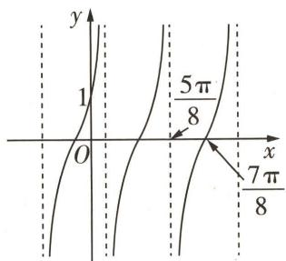

图1

解析

<table><tr><td>选项</td><td>分析过程</td><td>正误</td></tr><tr><td>A</td><td>由题图可知,函数 $f(x)$ 的最小正周期为 $T=2\times(\frac{7\pi}{8}-\frac{5\pi}{8})=\frac{\pi}{2}$ </td><td>√</td></tr><tr><td>B</td><td> $\omega=\frac{\pi}{T}=\frac{\pi}{\frac{\pi}{2}}=2\rightarrow f(x)=Atan(2x+\varphi)\rightarrow f(\frac{7\pi}{8})=Atan(\frac{7\pi}{4}+\varphi)=0\rightarrow\frac{7\pi}{4}+\varphi=$  $k\pi(k\in\mathbf{Z})\rightarrow\varphi=k\pi-\frac{7\pi}{4}(k\in\mathbf{Z})\xrightarrow{|\varphi|<\frac{\pi}{2}}\varphi=\frac{\pi}{4}\rightarrow\sin\varphi=\frac{\sqrt{2}}{2}$ </td><td>√</td></tr><tr><td>C</td><td>由题图得点(0,1)在 $f(x)$ 图象上→将(0,1)代入 $f(x)=Atan(2x+\frac{\pi}{4})\rightarrow f(0)=$  $Atan\frac{\pi}{4}=A=1\rightarrow f(x)=\tan(2x+\frac{\pi}{4})$ </td><td>√</td></tr></table>

构造法求数列通项公式 形如 $a_{n+1}=pa_{n}+q(p,q$ 为非零常数）的递推式，构造等比数列 $a_{n+1}+\lambda=p(a_{n}+\lambda)$ .

续表

<table><tr><td>选项</td><td>分析过程</td><td>正误</td></tr><tr><td>D</td><td> $f(x) = \tan(2x + \frac{\pi}{4}) \rightarrow$ 令  $2x + \frac{\pi}{4} = \frac{k\pi}{2}, k \in \mathbb{Z} \rightarrow x = -\frac{\pi}{8} + \frac{k\pi}{4}, k \in \mathbb{Z} \rightarrow$ 函数  $f(x)$  图象的对称中心是点  $(\frac{5\pi}{8} + \frac{k\pi}{4}, 0) (k \in \mathbb{Z})$ 【秒杀解】直接由题图得对称中心是  $(\frac{7\pi}{8} + \frac{T}{2}k, 0) (k \in \mathbb{Z})$ ,可转化为  $(\frac{5\pi}{8} + \frac{k\pi}{4}, 0) (k \in \mathbb{Z})$ </td><td>×</td></tr></table>

故选D.

调研 2 试题调研原创（多选）已知函数 $f(x)=A\sin(\omega x+\varphi)(A>0,\omega>0,|\varphi|<\frac{\pi}{2})$ 的部分图象如图 2 所示，且图中阴影部分的面积为 $4\pi$ ，则下列选项中正确的有（）

$\quad$A. $f(x) = 2\sin \left(x + \frac{\pi}{6}\right)$

$\quad$B. $f(x) = 2\sin \left(2x + \frac{\pi}{6}\right)$

$\quad$C. 直线 $x = \frac{7\pi}{6}$ 是曲线 $y = f(x)$ 的一条对称轴

$\quad$D. 函数 $f(x - \frac{\pi}{6})$ 是奇函数

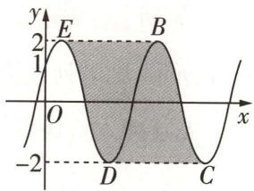

图2

解析 设函数 $f(x) = A\sin (\omega x + \varphi)$ 的最小正周期为 $T$ , 由题图可知 $A = 2, 4T = 4\pi$ ,

【破瓶颈】图中阴影部分可以通过割补变为一个矩形，矩形的纵向长度为4，横向宽度恰好是函数图象相邻两个最高点间的距离，也就是函数的最小正周期，根据“长×宽=面积”列式计算

则 $T = \pi$ ，由 $T = \frac{2\pi}{\omega} = \pi$ ，得 $\omega = 2.$ 由题图得 $f(0) = 1$ ，所以 $2\sin \varphi = 1$ ，即 $\sin \varphi = \frac{1}{2}$ 又 $-\frac{\pi}{2} < \varphi < \frac{\pi}{2}$ 所以 $\varphi = \frac{\pi}{6}$ 所以 $f(x) = 2\sin (2x + \frac{\pi}{6})$ 故A错误，B正确.

因为 $f(\frac{7\pi}{6})=2\sin(\frac{14\pi}{6}+\frac{\pi}{6})=2\sin\frac{5\pi}{2}=2$ ，为 $f(x)$ 的最大值，所以直线 $x=\frac{7\pi}{6}$ 是曲线 $y=f(x)$ 的一条对称轴，C正确.

$f(x - \frac{\pi}{6}) = 2\sin [2(x - \frac{\pi}{6}) + \frac{\pi}{6}] = 2\sin (2x - \frac{\pi}{6})$ ，该函数图象不关于原点对称，D错误.

故选BC.

巧解妙招

累加法求数列通项公式 形如 $a_{n} = a_{n - 1} + f(n)(n\geqslant 2)$ ，且 $f(n)$ 可以求和的递推式，用累加法求通项公式.

# 原创变式

1（多选）已知函数 $f(x) = \sin 2\omega x\cos \varphi + \cos 2\omega x\sin \varphi (\omega > 0, 0 < \varphi < \frac{\pi}{2})$ 的部分图象如图3所示，则下列选项中正确的有 （）

$\quad$A. $\varphi = \frac{\pi}{6}$   
$\quad$B. $\omega = 2$   
$\quad$C. $f(x + \frac{\pi}{6})$ 为偶函数  
$\quad$D. $f(x)$ 在区间 $\left[0, \frac{\pi}{2}\right]$ 上的最小值为 $-\frac{1}{2}$

2（多选）已知函数 $f(x) = A \sin (\omega x + \varphi) (A > 0, \omega > 0, 0 < \varphi < \pi)$ 的部分图象如图4中实线所示，图中圆 $C$ 与 $f(x)$ 的图象交于 $M, N$ 两点，且 $M$ 在 $y$ 轴上，则下列选项中正确的有（）

$\quad$A. 函数 $f(x)$ 的最小正周期是 $\pi$   
$\quad$B. 函数 $f(x)$ 在 $(- \frac{7\pi}{12}, -\frac{\pi}{3})$ 上单调递减  
$\quad$C. 曲线 $y = f(x)$ 向左平移 $\frac{\pi}{12}$ 个单位长度后关于直线 $x = \frac{\pi}{2}$ 对称  
$\quad$D. 若圆 C 的半径为 $\frac{5\pi}{12}$ ，则 $f(x)=\frac{\sqrt{3}\pi}{6}\sin(2x+\frac{\pi}{3})$

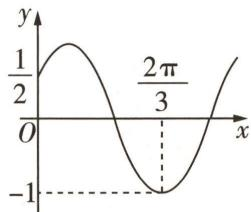

图3

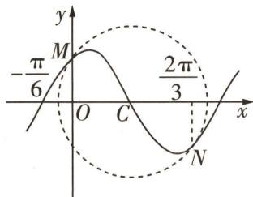

图 4

答案》第042页

# 类型②

# 三角函数图象的平移与伸缩变换

调研 3 试题调研原创 为了得到函数 $y = \sin\left(2x + \frac{\pi}{3}\right)$ 的图象, 只要把函数 $y = \cos 2x$ 图象上所有的点 ( )

$\quad$A. 向左平移 $\frac{\pi}{6}$ 个单位长度

$\quad$B. 向左平移 $\frac{\pi}{12}$ 个单位长度

$\quad$C. 向右平移 $\frac{\pi}{6}$ 个单位长度

$\quad$D. 向右平移 $\frac{\pi}{12}$ 个单位长度

解析 $y = \sin (2x + \frac{\pi}{3}) = \cos (2x - \frac{\pi}{6}) = \cos [2(x - \frac{\pi}{12})]$

则把函数 $y = \cos 2x$ 图象上所有的点向右平移 $\frac{\pi}{12}$ 个单位长度即可. 故选 D.

调研 4 试题调研原创（多选）将函数 $y=4\sin3x$ 的图象上所有点的横坐标伸长到原来的 3 倍，纵坐标缩短为原来的 $\frac{1}{2}$ ，得到函数 $f(x)$ 的图象，则下列选项中正确的有（）

$\quad$A. $f(x)$ 的一个周期为 $2\pi$

$\quad$B. $f(x)$ 的一个周期为 $\frac{2\pi}{9}$

$\quad$C. $f(x)$ 的最大值为8

$\quad$D. $f(x)$ 的最大值为 2

累乘法求数列通项公式 形如 $a_{n+1}/a_{n}=f(n)$ ，且 $f(n)$ 可以求积的递推式，用累乘法求通项公式.

巧解妙招

解析 将函数 $y=4\sin3x$ 的图象上所有点的横坐标伸长到原来的 3 倍, 纵坐标缩短为原来的 $\frac{1}{2}$ , 可得到函数 $f(x)=2\sin x$ 的图象,

【记结论】函数 $y = \sin x$ 的图象上所有点的横坐标伸长(缩短)到原来的 $\frac{1}{\omega}$ 倍，纵坐标伸长(缩短)到原来的 A 倍，可得到函数 $y = A \sin \omega x$ 的图象

则 $f(x)$ 的最小正周期 $T=2\pi, f(x)$ 的最大值为 2. 故选 AD.

# 解题大招

# 解三角函数图象题必用的平移、伸缩变换大招

由函数 $y=\sin x$ 的图象变换得到 $y=A\sin(\omega x+\varphi)(A>0,\omega>0)$ 的图象的两种方法如下.

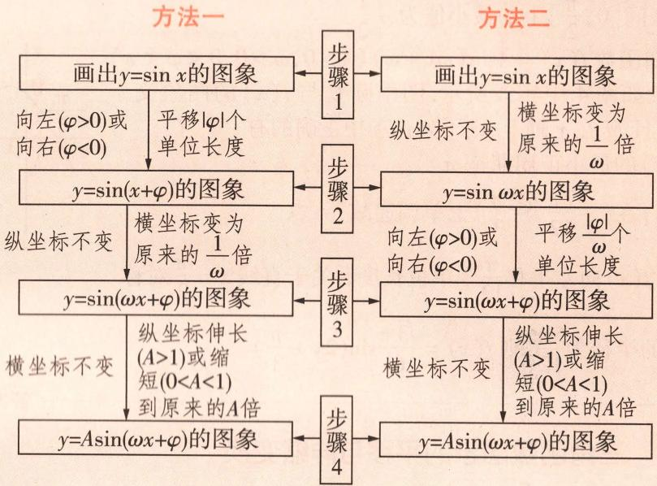

# 原创变式

3 将函数 $f(x)=\sin(\omega x+\frac{\pi}{3})(\omega>0)$ 的图象向左平移 $\frac{\pi}{3}$ 个单位长度后, 所得图象关于 y 轴对称, 则实数 $\omega$ 的最小值为 ( )

$\quad$A. $\frac{3}{2}$

$\quad$B. 2

$\quad$C. $\frac{1}{2}$

$\quad$D. 1

4 [新题型·双空题]已知函数 $f(x)=\cos x$ ，将 $f(x)$ 的图象上各点的横坐标变为原来的 $\frac{1}{2}$ （纵坐标不变），再向右平移 $\frac{\pi}{6}$ 个单位长度后，得到函数 $g(x)$ 的图象，则 $g(x)=$ \_\_\_\_。将 $g(x)$ 的图象上各点的横坐标变为原来的 $\frac{2}{\omega}(\omega>0)$ 倍（纵坐标不变），得到函数 $h(x)$ 的图象，若 $h(x)$ 在区间 $(0,\frac{\pi}{2})$ 上有3个零点，则 $\omega$ 的取值范围为\_\_\_\_。

答案》第043页

巧解妙招

取倒数法求数列通项公式 形如 $a_{n} = a_{n - 1} / (pa_{n - 1} + q)(n\geqslant 2)(p,q$ 为非零常数， $a_{n}\neq 0)$ 的递推式，两边同时取倒数求通项公式.

# 类型 ③ 巧用三角函数图象求值

调研 5 试题调研原创 （多选）已知函数 $f(x) = a \sin \pi x + b \cos \pi x (b > 0)$ 的图象关于点 $\left(\frac{1}{6}, 0\right)$ 对称，若 $\left|f(x_{1}) - f(x_{2})\right| = \left|f(x_{3}) - f(x_{4})\right| = \left|f(x_{5}) - f(x_{6})\right| = 4b (0 < x_{1} < x_{2} < x_{3} < x_{4} < x_{5} < x_{6})$ ，则下列说法中正确的有（）

$\quad$A. $a = -\sqrt{3} b$

$\quad$B. 函数 $f(x)$ 的最大值为 4b

$\quad$C. $|x_{1} - x_{2}|$ 的最小值为1

$\quad$D. $\sum_{i=1}^{6} x_i$ 的最小值为 10

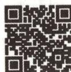  
“作图观察法”巧解
正弦曲线多交点问题

# 解析

<table><tr><td>选项</td><td>分析过程</td><td>正误</td></tr><tr><td>A</td><td> $f(x)$ 的图象关于点 $(\frac{1}{6},0)$ 对称 $\rightarrow f(\frac{1}{6})=0\rightarrow\frac{1}{2}a+\frac{\sqrt{3}}{2}b=0\rightarrow a=-\sqrt{3}b$ </td><td>√</td></tr><tr><td>B</td><td> $f(x)=-\sqrt{3}bsin\pi x+bcos\pi x=2bcos(\pi x+\frac{\pi}{3})\xrightarrow{b>0}f(x)$ 的最大值为 $2b$ ,最小值为 $-2b$ </td><td>×</td></tr><tr><td>C</td><td> $|f(x_1)-f(x_2)|=4b\rightarrow f(x_1)$ 与 $f(x_2)$ 一个是最大值,另一个是最小值 $\rightarrow|x_1-x_2|$ 的最小值为 $\frac{T}{2}=\frac{2\pi}{2\pi}=1(T$ 为 $f(x)$ 的最小正周期)</td><td>√</td></tr><tr><td>D</td><td>作出 $f(x)$ 的大致图象,如图5所示 $\rightarrow$ 令 $\pi x+\frac{\pi}{3}=k\pi,k\in\mathbf{Z}\rightarrow f(x)$ 图象的对称轴方程为 $x=k-\frac{1}{3},k\in\mathbf{Z}\rightarrow$ 结合C中分析与 $|f(x_1)-f(x_2)|=|f(x_3)-f(x_4)|=|f(x_5)-f(x_6)|=4b$ 得当 $\sum_{i=1}^{6}x_i$ 最小时,图5 $f(x_1)=f(x_3)=f(x_5)=-2b,f(x_2)=f(x_4)=f(x_6)=2b\rightarrow$ 对应的 $x_1,x_2,\cdots x_6$ 如图所示 $\rightarrow\sum_{i=1}^{6}x_i$ 的最小值为 $(1-\frac{1}{3})+(2-\frac{1}{3})+\cdots+(6-\frac{1}{3})=19$ </td><td>×</td></tr></table>

故选 AC.

# 原创变式

5 若函数 $f(x) = \sin (\omega x - \frac{\pi}{6}) - \cos \omega x (\omega > 0)$ 在 $(0, \pi)$ 内恰好存在 8 个 $x$ ，使得 $|f(x)| = \frac{\sqrt{3}}{2}$ ，则 $\omega$ 的取值范围为 ( )

$\quad$A. $\left[\frac{19}{6},\frac{7}{2}\right)$

$\quad$B. $\left(\frac{19}{6},\frac{7}{2}\right]$

$\quad$C. $\left[\frac{7}{2},\frac{25}{6}\right)$

$\quad$D. $\left(\frac{7}{2},\frac{25}{6}\right]$

答案》第044页

基本不等式 ① $\sqrt{ab} \leqslant (a + b) / 2(a, b \in \mathbf{N}^*)$ ; ② $ab \leqslant [(a + b) / 2]^2(a, b \in \mathbf{N}^*)$ ; ③ $ab \leqslant (a^2 + b^2) / 2(a, b \in \mathbf{N}^*)$ .

巧解妙招

# 创新预测

答案▶044页

##### 1. 试题调研原创 将函数 $f(x)$ 的图象上所有点的横坐标变为原来的2倍(纵坐标不变), 然后向右平移 $\frac{\pi}{6}$ 个单位长度, 得到函数 $g(x)=\sqrt{2}\sin(\omega x+\varphi)(\omega>0,|\varphi|<\frac{\pi}{2})$ 的图象, 函数 $g(x)$ 的部分图象如图6所示, 则函数 $f(x)$ 的解析式为()

$\quad$A. $f(x) = \sqrt{2}\sin (x + \frac{\pi}{12})$

$\quad$B. $f(x)=\sqrt{2}\sin(4x+\frac{\pi}{12})$

$\quad$C. $f(x) = \sqrt{2}\sin (x - \frac{\pi}{12})$

$\quad$D. $f(x) = \sqrt{2}\sin (4x - \frac{\pi}{12})$

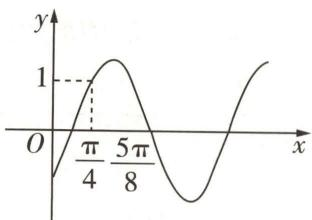

图6

##### 2.[2024 湖南长沙 5 月三模]已知函数 $f(x)=2\sin x+2\sqrt{3}|\cos x|$ ，若 $f(x)=\lambda$ 在 $[0,2\pi]$ 上有且仅有4个不相等的实数根，则 $\lambda$ 的取值范围为()

$\quad$A. $(2\sqrt{3},4)$

$\quad$B. $(2,2\sqrt{3})$

$\quad$C. $(2,4)$

$\quad$D. $(2,2\sqrt{3})\cup(2\sqrt{3},4)$

##### 3. 试题调研原创 已知 $f(x) = \sin^2 (\omega x + \frac{\pi}{3}) - \cos^2 (\omega x + \frac{\pi}{3})(\omega > 0), f(x_1) = f(x_2) = 0$ ，且 $|x_1 - x_2|_{\min} = \frac{\pi}{2}$ ，将 $f(x)$ 的图象向左平移 $\frac{\pi}{3}$ 个单位长度后得到 $g(x)$ 的图象，若 $g(x)$ 在[0, mπ]上恰有4个零点和2个最大值点，则m的取值范围为\_\_\_\_。

# 参考答案与解析

# 原创变式

##### 1. ACD $f(x) = \sin 2\omega x \cos \varphi + \cos 2\omega x \sin \varphi = \sin (2\omega x + \varphi)$ ，由题图可得 $f(0) = \frac{1}{2}$ ，则 $\sin \varphi = \frac{1}{2}$ ，又 $0 < \varphi < \frac{\pi}{2}$ ，所以 $\varphi = \frac{\pi}{6}$ ，则 $2\omega \times \frac{2\pi}{3} + \frac{\pi}{6} = \frac{3\pi}{2} + 2k\pi (k \in \mathbf{Z})$ ，可得 $\omega = 1 + \frac{3}{2} k (k \in \mathbf{Z})$ ，由题图知 $f(x)$ 的最小正周期 $T > \frac{2}{3}\pi$ ，则 $\frac{2\pi}{T} = 2\omega < 3$ ，所以 $\omega < \frac{3}{2}$ ，所以 $\omega = 1$ ，所以 $f(x) = \sin (2x + \frac{\pi}{6})$ . 故 A 正确，B 错误. $f(x + \frac{\pi}{6}) = \sin [2(x + \frac{\pi}{6}) + \frac{\pi}{6}] = \cos 2x$ ，则 $f(x + \frac{\pi}{6})$ 为偶函数，C 正确. 当 $x \in [0, \frac{\pi}{2}]$ 时， $2x + \frac{\pi}{6} \in [\frac{\pi}{6}, \frac{7\pi}{6}]$ ， $\sin (2x + \frac{\pi}{6}) \in [-\frac{1}{2}, 1]$ ，所以 $f(x)$ 的最小值为 $-\frac{1}{2}$ ，故 D 正确. 故选 ACD.

# 2.ACD

<table><tr><td>选项</td><td>分析过程</td><td>正误</td></tr><tr><td>A</td><td>由题图可知C点的横坐标为 $\frac{0 + \frac{2\pi}{3}}{2} = \frac{\pi}{3}$ [破瓶颈:由题意知点M,N关于点C对称] $\rightarrow$ 记 $f(x)$ 的最小正周期为T,则 $\frac{1}{2}T = \frac{\pi}{3} - (-\frac{\pi}{6}) = \frac{\pi}{2} \rightarrow T = \pi$ </td><td>√</td></tr><tr><td>B</td><td> $\omega > 0 \rightarrow \omega = \frac{2\pi}{T} = 2 \rightarrow f(x) = A\sin(2x + \varphi) \rightarrow$ 将 $(-\frac{\pi}{6}, 0)$ 代入解析式 $\rightarrow A\sin(-\frac{\pi}{3} + \varphi) = 0 \rightarrow -\frac{\pi}{3} + \varphi = 2k\pi(k \in \mathbb{Z})$ [明易错:注意点 $(-\frac{\pi}{6}, 0)$ 是函数 $f(x)$ 的“上升零点”,因此 $-\frac{\pi}{3} + \varphi = 2k\pi(k \in \mathbb{Z})$ ,而不是 $-\frac{\pi}{3} + \varphi = k\pi(k \in \mathbb{Z})$ ] $\rightarrow \varphi = \frac{\pi}{3} + 2k\pi(k \in \mathbb{Z}) \xrightarrow{0 < \varphi < \pi} \varphi = \frac{\pi}{3} \rightarrow f(x) = A\sin(2x + \frac{\pi}{3}) \rightarrow$ 当 $-\frac{7\pi}{12} < x < -\frac{\pi}{3}$ 时, $-\frac{5\pi}{6} < 2x + \frac{\pi}{3} < -\frac{\pi}{3} \xrightarrow{A > 0} y = A\sin z$ 在 $z \in (-\frac{5\pi}{6}, -\frac{\pi}{3})$ 时不单调 $\rightarrow$ 函数 $f(x)$ 在 $(-\frac{7\pi}{12}, -\frac{\pi}{3})$ 上不单调递减</td><td>×</td></tr><tr><td>C</td><td>记函数 $f(x)$ 的图象向左平移 $\frac{\pi}{12}$ 个单位长度后所得图象对应的函数为 $g(x)$  $\rightarrow g(x) = A\sin[2(x + \frac{\pi}{12}) + \frac{\pi}{3}] = A\sin(2x + \frac{\pi}{2}) = A\cos 2x \rightarrow g(\frac{\pi}{2}) = A\cos \pi = -A$ ,为 $g(x)$ 的最小值 $\rightarrow g(x)$ 的图象关于直线 $x = \frac{\pi}{2}$ 对称</td><td>√</td></tr><tr><td>D</td><td>圆C的半径为 $\frac{5\pi}{12} \xrightarrow{连接CM} |CM| = \frac{5\pi}{12} \rightarrow |OC| = \frac{\pi}{3} \rightarrow (\frac{\pi}{3})^2 + |OM|^2 = (\frac{5\pi}{12})^2 \rightarrow |OM| = \frac{\pi}{4} \rightarrow$ 将 $(0, \frac{\pi}{4})$ 代入 $f(x) = A\sin(2x + \frac{\pi}{3})$ 中 $\rightarrow A\sin \frac{\pi}{3} = \frac{\pi}{4} \rightarrow A = \frac{\sqrt{3}\pi}{6} \rightarrow f(x) = \frac{\sqrt{3}\pi}{6}\sin(2x + \frac{\pi}{3})$ </td><td>√</td></tr></table>

##### 3.C 将函数 $f(x) = \sin (\omega x + \frac{\pi}{3})(\omega > 0)$ 的图象向左平移 $\frac{\pi}{3}$ 个单位长度后, 得到函数 $g(x) = \sin [\omega (x + \frac{\pi}{3}) + \frac{\pi}{3}] = \sin (\omega x + \frac{\omega \pi}{3} + \frac{\pi}{3})$ [敲黑板: 左右平移是针对 $x$ 的, 不要错写成 $g(x) = \sin (\omega x + \frac{\pi}{3} + \frac{\pi}{3}) = \sin (\omega x + \frac{2\pi}{3})$ ] 的图象.

因为 $g(x)$ 的图象关于 y 轴对称, 所以 $\frac{\omega\pi}{3} + \frac{\pi}{3} = \frac{\pi}{2} + k\pi, k \in Z$ , 解得 $\omega = \frac{1}{2} + 3k, k \in Z$ .
因为 $\omega > 0$ ，所以当 k = 0 时， $\omega$ 取得最小值，为 $\frac{1}{2}$ . 故选 C.

##### 4. $\cos(2x-\frac{\pi}{3})\quad(\frac{17}{3},\frac{23}{3}]$ 函数 $f(x)=\cos x$ 图象上各点的横坐标变为原来的 $\frac{1}{2}$ (纵坐标不变)，可得 $y=\cos 2x$ 的图象，再向右平移 $\frac{\pi}{6}$ 个单位长度，可得 $g(x)=\cos\left[2\left(x-\frac{\pi}{6}\right)\right]=\cos\left(2x-\frac{\pi}{3}\right)$ 的图象.

将 $g(x)$ 的图象上各点的横坐标变为原来的 $\frac{2}{\omega} (\omega > 0)$ 倍（纵坐标不变），得到函数 $h(x) = \cos(\omega x - \frac{\pi}{3})$ [破瓶颈： $h(x) = \cos(2 \times \frac{\omega}{2}x - \frac{\pi}{3}) = \cos(\omega x - \frac{\pi}{3})$ ，注意只针对 $x$ 乘 $\frac{\omega}{2}$ ]的图象，当 $x \in (0, \frac{\pi}{2})$ 时， $\omega x - \frac{\pi}{3} \in (-\frac{\pi}{3}, \frac{\omega\pi}{2} - \frac{\pi}{3})$ ，因为 $h(x)$ 在区间 $(0, \frac{\pi}{2})$ 上有3个零点，故 $\frac{5\pi}{2} < \frac{\omega\pi}{2} - \frac{\pi}{3} \leqslant \frac{7\pi}{2}$ [明易错：注意根据区间的开闭确定等号是否可以取到]，

解得 $\frac{17}{3}<\omega\leqslant\frac{23}{3}$ ，则 $\omega$ 的取值范围为 $(\frac{17}{3},\frac{23}{3}]$ .

##### 5.D 由题意可得 $f(x) = \sin (\omega x - \frac{\pi}{6}) - \cos \omega x = \frac{\sqrt{3}}{2}\sin \omega x - \frac{1}{2}\cos \omega x - \cos \omega x = \frac{\sqrt{3}}{2}\sin \omega x - \frac{3}{2}\cos \omega x = \sqrt{3}\sin (\omega x - \frac{\pi}{3})$ ，由 $|f(x)| = \frac{\sqrt{3}}{2}$ 可得 $\sin (\omega x - \frac{\pi}{3}) = \pm \frac{1}{2}$ .

因为 $x \in (0, \pi), \omega > 0$ ，所以 $\omega x - \frac{\pi}{3} \in (-\frac{\pi}{3}, \omega \pi - \frac{\pi}{3})$ ，作出 $y = \sin x$ 与 $y = \pm \frac{1}{2}$ 的图象[破瓶颈：方程 $\sin (\omega x_0 - \frac{\pi}{3}) = \pm \frac{1}{2}$ 在 $(0, \pi)$ 内有8个根，等价于正

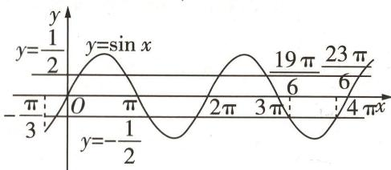

图 7

弦函数 $y = \sin x, x \in (-\frac{\pi}{3}, \omega\pi - \frac{\pi}{3})$ 的图象与直线 $y = \pm \frac{1}{2}$ 共有 8 个交点，如图 7 所示。由图可得 $\frac{19\pi}{6} < \omega\pi - \frac{\pi}{3} \leqslant \frac{23\pi}{6}$ ，解得 $\frac{7}{2} < \omega \leqslant \frac{25}{6}$ ，所以 $\omega$ 的取值范围为 $(\frac{7}{2}, \frac{25}{6}]$ 。故选 D.

# 创新预测

##### 1.B 由题图得 $g(\frac{\pi}{4}) = 1$ ，即 $\sin (\frac{\pi}{4}\omega + \varphi) = \frac{\sqrt{2}}{2}$ ，又点 $(\frac{\pi}{4}, 1)$ 出现在函数图象的上升阶段，则 $\frac{\pi}{4}\omega + \varphi = \frac{\pi}{4} + 2k\pi, k \in \mathbf{Z}$ ①.

由题图得 $g(\frac{5\pi}{8})=0$ ，且点 $(\frac{5\pi}{8},0)$ 出现在函数图象的下降阶段，则 $\frac{5\pi}{8}\omega+\varphi=\pi+2k\pi, k\in Z$ ②.

联立①②, 解得 $\omega = 2, \varphi = -\frac{\pi}{4} + 2k\pi, k \in Z$ , 又 $|\varphi| < \frac{\pi}{2}$ , 故 $\varphi = -\frac{\pi}{4}$ , 则 $g(x) = \sqrt{2}\sin(2x - \frac{\pi}{4})$ .

函数 $g(x)$ 的图象向左平移 $\frac{\pi}{6}$ 个单位长度, 得到函数 $y = \sqrt{2} \sin \left[2 \left(x + \frac{\pi}{6}\right) - \frac{\pi}{4}\right] = \sqrt{2} \sin (2x + \frac{\pi}{12})$ 的图象, 然后将图象上所有点的横坐标变为原来的 $\frac{1}{2}$ (纵坐标不变), 得到函数 $f(x)$ 的图象, 则 $f(x)$ 的解析式为 $f(x) = \sqrt{2} \sin \left(4x + \frac{\pi}{12}\right)$ [理思路: 根据题意, 将函数 $f(x)$ 的图象上所有点的横坐标变为原来的 2 倍 (纵坐标不变), 然后向右平移 $\frac{\pi}{6}$ 个单位长度, 得到函数 $g(x)$ 的图象, 反向考虑, 将函数 $g(x)$ 的图象向左平移 $\frac{\pi}{6}$ 个单位长度, 然后将所得图象上所有点的横坐标变为原来的 $\frac{1}{2}$ (纵坐标不变), 即可得到函数 $f(x)$ 的图象]. 故选 B.

##### 2.D 由题意知,当 $x \in [0,2\pi]$ 时, $f(x) = 2\sin x + 2\sqrt{3} |\cos x| = \begin{cases} 4\sin \left(x + \frac{\pi}{3}\right), & x \in \left[0, \frac{\pi}{2}\right) \cup \left(\frac{3\pi}{2}, 2\pi\right], \\ 4\sin \left(x - \frac{\pi}{3}\right), & x \in \left[\frac{\pi}{2}, \frac{3\pi}{2}\right], \end{cases}$

作出 $f(x)$ 在 $[0,2\pi]$ 上的图象,如图8所示[会转化:根据函数解析式作出函数图象,将方程的根的问题转化为 $f(x)$ 的图象与直线 $y=\lambda$ 的交点个数的问题,由于本题中函数 $f(x)$ 是分段函数,故使用“五点作图法”作图时要找准关键点,作出准确图象,否则无法根据图象得解],

结合图形可知, 若 $f(x)=\lambda$ 在 $[0,2\pi]$ 上有且仅有 4 个不相等的实数根, 则 $2<\lambda<4$ 且 $\lambda\neq2\sqrt{3}$ , 即 $\lambda$ 的取值范围为 $(2,2\sqrt{3})\cup(2\sqrt{3},4)$ .

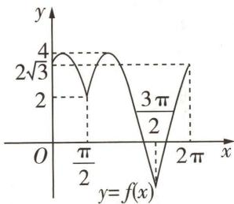

图8

##### 3. $\left[\frac{11}{6},\frac{25}{12}\right) f(x) = -\left[\cos^2 (\omega x + \frac{\pi}{3}) - \sin^2 (\omega x + \frac{\pi}{3})\right] = -\cos (2\omega x + \frac{2\pi}{3}),\omega >0.$

记 $T$ 为 $f(x)$ 的最小正周期，由 $\left|x_{1} - x_{2}\right|_{\min} = \frac{\pi}{2}$ ，可得 $\frac{T}{2} = \frac{\pi}{2}$ ，则 $T = \pi = \frac{2\pi}{2\omega}$ ，所以 $\omega = 1$ ，故 $f(x) = -\cos (2x + \frac{2\pi}{3})$ ，将 $f(x)$ 的图象向左平移 $\frac{\pi}{3}$ 个单位长度后可得 $y = -\cos [2(x + \frac{\pi}{3}) + \frac{2\pi}{3}] = \cos (2x + \frac{\pi}{3})$ 的图象，即 $g(x) = \cos (2x + \frac{\pi}{3})$ 。由题意得 $x \in [0, m\pi]$ ，则 $2x + \frac{\pi}{3} \in [\frac{\pi}{3}, 2m\pi + \frac{\pi}{3}]$ 。

因为 $g(x)$ 在 $[0, m\pi]$ 上恰有 4 个零点和 2 个最大值点，所以结合余弦函数的图象（图略）可得 $4\pi \leqslant 2m\pi + \frac{\pi}{3} < \frac{9\pi}{2}$ [明关键： $g(x)$ 在 $[0, m\pi]$ 上恰有 4 个零点和 2 个最大值点，等价于 $y = \cos x$ 在 $[\frac{\pi}{3}, 2m\pi + \frac{\pi}{3}]$ 上恰有 4 个零点和 2 个最大值点]，

解得 $\frac{11}{6}\leqslant m<\frac{25}{12}$ ，故m的取值范围是 $\left[\frac{11}{6},\frac{25}{12}\right)$ .

# 超重点6 化简三角代数式必用的3个大招

<table><tr><td>三年考情与创新命题特点</td><td>2025命题预测</td></tr><tr><td>2024 新课标I卷 T4、2023 新课标I卷 T8,均考查利用两角和与差的正、余弦公式求值</td><td rowspan="3">1命题形式:以单选题、填空题为主,难度不大.2必考热点:利用三角恒等变换求值;利用辅助角公式化简三角函数式.3创新考法:将三角函数式化简与三角函数的性质、解三角形等结合,考查整体思想、分类讨论思想、化归与转化思想等.</td></tr><tr><td>2024 新课标II卷 T13,回归知识本源,考查利用两角和的正切公式和同角三角函数的基本关系求值</td></tr><tr><td>2024 全国甲卷 T13,将三角函数式化简与最值问题结合,求三角函数在给定区间上的最大值</td></tr></table>

# 大招 ① 同角弦切互化

调研 1 试题调研原创 已知 $\tan(\alpha+\frac{\pi}{4})=-3$ ，则 $\sin^{2}\alpha+\sin2\alpha+\cos2\alpha=$ \_\_\_\_.

解析 因为 $\tan (\alpha +\frac{\pi}{4}) = \frac{\tan\alpha + \tan\frac{\pi}{4}}{1 - \tan\alpha\cdot\tan\frac{\pi}{4}} = \frac{\tan\alpha + 1}{1 - \tan\alpha} = -3$ ，所以 $\tan \alpha = 2$

$\begin{array}{r l} & {\text {则} \sin^ {2} \alpha + \sin 2 \alpha + \cos 2 \alpha = \sin^ {2} \alpha + 2 \sin \alpha \cos \alpha + \cos^ {2} \alpha - \sin^ {2} \alpha = \frac {2 \sin \alpha \cos \alpha + \cos^ {2} \alpha}{\sin^ {2} \alpha + \cos^ {2} \alpha} =} \\ & {\frac {2 \tan \alpha + 1}{\tan^ {2} \alpha + 1} = \frac {2 \times 2 + 1}{2 ^ {2} + 1} = 1,} \end{array}$

【关键点】利用“1” $\left(\sin^{2}\alpha+\cos^{2}\alpha=1\right)$ 巧构造，给式子“拼”一个分母，再将分子分母同时除以 $\cos^{2}\alpha$ ，巧妙实现弦化切

故 $\sin^2\alpha +\sin 2\alpha +\cos 2\alpha = 1.$

调研 2 [2024 湖北荆州 5 月三模 | 新题型 · 双空题] 设 $0 < \alpha < \beta < \frac{\pi}{2}, \tan \alpha = m \tan \beta$ , $\cos (\alpha - \beta) = \frac{3}{5}$ , 则 $\sin (\alpha + \beta) =$ \_\_\_\_ (用含 $m$ 的代数式表示); 若 $m = \frac{1}{9}$ , 则 $\tan \alpha \tan \beta =$ \_\_\_\_.

审题 由 $\tan \alpha = m \tan \beta$ 切化弦得 $\sin \alpha \cos \beta = m \cos \alpha \sin \beta \rightarrow$ 由 $\cos (\alpha - \beta) = \frac{3}{5}$ 得 $\sin (\alpha - \beta) = -\frac{4}{5} \rightarrow$ 综合可得 $\cos \alpha \sin \beta, \sin \alpha \cos \beta \rightarrow$ 利用两角和的正弦公式得 $\sin (\alpha + \beta) \rightarrow$ 当 $m = \frac{1}{9}$

数学起源

小编说:数学内容包罗万象,数学历史源远流长,来和小编一起探索数学的起源吧!

时,利用两角差的正切公式求出 $\tan \alpha$ , 进而可得 $\tan \alpha \tan \beta$ .

解析 由 $\tan \alpha = m\tan \beta$ 得 $\frac{\sin \alpha}{\cos \alpha} = \frac{m\sin \beta}{\cos \beta}$ , 即 $\sin \alpha \cos \beta = m \cos \alpha \sin \beta$ .

因为 $0 < \alpha < \beta < \frac{\pi}{2}$ ，所以 $-\frac{\pi}{2} < \alpha - \beta < 0$ ，所以 $\sin(\alpha - \beta) < 0$ ，

【明易错】 $\sin(\alpha-\beta)$ 的符号要根据角的范围进行判断

又 $\cos (\alpha -\beta) = \frac{3}{5}$ 所以 $\sin (\alpha -\beta) = -\frac{4}{5}$

又 $\sin(\alpha-\beta)=\sin\alpha\cos\beta-\cos\alpha\sin\beta=(m-1)\cos\alpha\sin\beta,$

所以 $(m-1)\cos\alpha\sin\beta=-\frac{4}{5}$ ,

所以 $\cos \alpha \sin \beta = -\frac{4}{5(m - 1)}$ ，所以 $\sin \alpha \cos \beta = m \cos \alpha \sin \beta = -\frac{4m}{5(m - 1)}$

所以 $\sin(\alpha+\beta)=\sin\alpha\cos\beta+\cos\alpha\sin\beta=\frac{-4(m+1)}{5(m-1)}$ .

当 $m = \frac{1}{9}$ 时， $\tan \alpha = \frac{1}{9} \tan \beta$ ，则 $\tan (\alpha - \beta) = \frac{\sin (\alpha - \beta)}{\cos (\alpha - \beta)} = -\frac{4}{3} = \frac{\tan \alpha - \tan \beta}{1 + \tan \alpha \tan \beta} = \frac{\tan \alpha - 9 \tan \alpha}{1 + 9 \tan^2 \alpha}$ ，

得 $\tan\alpha=\frac{1}{3}$ ，所以 $\tan\alpha\tan\beta=9\tan^{2}\alpha=1$ .

# 原创变式

1 已知 $\tan \alpha = 3$ ，则 $\sin^2\alpha + \sin 2\alpha =$ （）

$\quad$A. $-\frac{3}{2}$

$\quad$B. $\frac{3}{2}$

$\quad$C. $\frac{1}{4}$

$\quad$D. $-\frac{1}{4}$

2 已知 $0 < \beta < \alpha < \frac{\pi}{2}, \sin (\alpha - \beta) = \frac{12}{13}, \tan \alpha - \tan \beta = 4$ ，则 $\sin \alpha \sin \beta =$ \_\_\_\_.

答案》第052页

# 大招 ② 多角巧用公式

调研 3 [2024 湖南湘潭 4 月二模] 已知 $\cos\left(\alpha+\frac{\pi}{4}\right)=\frac{3}{5}$ ，且 $\alpha\in(0,\frac{\pi}{4})$ ，则 $\cos\left(\frac{\pi}{2}-\alpha\right)=$ \_\_\_\_.

分数的起源 分数的历史,得从三千多年前的埃及说起.三千多年前,古埃及为了在不能分得整数的情况下表示数,用特殊符号表示分子为1的分数.

数学起源

审题 由同角三角函数的基本关系可得 $\sin (\alpha + \frac{\pi}{4}) \to \cos (\frac{\pi}{2} - \alpha) = \sin \alpha = \sin [(\alpha + \frac{\pi}{4}) - \frac{\pi}{4}] \to$ 由两角差的正弦公式代入计算即可.

解析 因为 $\alpha \in (0, \frac{\pi}{4})$ ，所以 $\alpha + \frac{\pi}{4} \in (\frac{\pi}{4}, \frac{\pi}{2})$

又 $\cos (\alpha +\frac{\pi}{4}) = \frac{3}{5}$ 所以 $\sin (\alpha +\frac{\pi}{4}) = \sqrt{1 - \cos^2(\alpha + \frac{\pi}{4})} = \frac{4}{5},$

所以 $\cos \left(\frac{\pi}{2} -\alpha\right) = \sin \alpha = \sin \left[\left(\alpha +\frac{\pi}{4}\right) - \frac{\pi}{4}\right] = \sin \left(\alpha +\frac{\pi}{4}\right)\cos \frac{\pi}{4} -\cos \left(\alpha +\frac{\pi}{4}\right)\sin \frac{\pi}{4} =$

【妙转化】先根据诱导公式化简 $\cos\left(\frac{\pi}{2}-\alpha\right)$ ，再巧妙拆角计算，拆角思路是 $\alpha+\frac{\pi}{4}$ ， $\frac{\pi}{4}$ 的正弦值与余弦值都是已知的，所以利用 $\alpha=\left(\alpha+\frac{\pi}{4}\right)-\frac{\pi}{4}$ 转换

$\frac{4}{5}\times\frac{\sqrt{2}}{2}-\frac{3}{5}\times\frac{\sqrt{2}}{2}=\frac{\sqrt{2}}{10}.$ 故填 $\frac{\sqrt{2}}{10}.$

调研 4 试题调研原创 已知角 $\alpha, \beta$ 满足 $\tan \alpha = \frac{1}{3}, \sin (2\alpha + \beta) + \sin \beta = 3\cos (\alpha + \beta)\sin \alpha$ , 则 $\tan \beta =$

$\quad$A. $\frac{1}{3}$

$\quad$B. $\frac{1}{6}$

$\quad$C. $\frac{1}{7}$

$\quad$D. 2

审题 $2\alpha + \beta = (\alpha + \beta) + \alpha, \beta = (\alpha + \beta) - \alpha \rightarrow$ 利用两角和与差的正弦公式对已知条件化简 $\rightarrow \tan(\alpha + \beta)$ 的值 $\rightarrow$ 由 $\tan \beta = \tan[(\alpha + \beta) - \alpha]$ 得解.

解析 由 $2\alpha + \beta = (\alpha + \beta) + \alpha, \beta = (\alpha + \beta) - \alpha,$

可得 $\sin (2\alpha +\beta) + \sin \beta = \sin [\left(\alpha +\beta\right) + \alpha ] + \sin [\left(\alpha +\beta\right) - \alpha ] = 2\sin (\alpha +\beta)\cos \alpha ,$

【秒杀解】可以直接利用和差化积公式“ $\sin\theta+\sin\varphi=2\sin\frac{\theta+\varphi}{2}\cdot\cos\frac{\theta-\varphi}{2}$ ”秒得 $\sin(2\alpha+\beta)+\sin\beta=2\sin(\alpha+\beta)\cos\alpha$

所以 $2\sin (\alpha +\beta)\cos \alpha = 3\cos (\alpha +\beta)\sin \alpha$ ，所以 $\tan (\alpha +\beta) = \frac{3}{2}\tan \alpha = \frac{1}{2},$

所以 $\tan \beta = \tan [(\alpha +\beta) - \alpha ] = \frac{\tan(\alpha + \beta) - \tan\alpha}{1 + \tan(\alpha + \beta)\tan\alpha} = \frac{1}{7}$ . 故选 C.

数学起源

两千多年前,中国有了分数,但是,秦汉时期的分数的表现形式不一样.后来,阿拉伯人发明了分数线,今天分数的表示法就由此而来.

# 高分攻略

# 高分必记3组三角恒等变换攻略

# 1. 用思维导图速记三角函数诱导公式

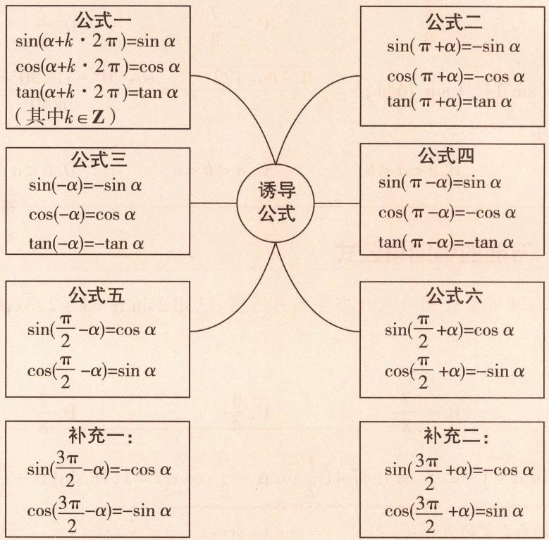

# 2. 对比巧记二倍角公式和半角公式

<table><tr><td>二倍角公式</td><td> $\sin 2\alpha = 2\sin \alpha \cos \alpha, \cos 2\alpha =$  $\cos^{2}\alpha - \sin^{2}\alpha = 2\cos^{2}\alpha - 1 =$  $1 - 2\sin^{2}\alpha, \tan 2\alpha = \frac{2\tan \alpha}{1 - \tan^{2}\alpha}$ </td><td> $\xrightarrow{\text{变形转化}}$ </td><td> $\cos^{2} \frac{\alpha}{2} = \frac{1 + \cos \alpha}{2}, \sin^{2} \frac{\alpha}{2} =$  $\frac{1 - \cos \alpha}{2}, \tan^{2} \frac{\alpha}{2} = \frac{1 - \cos \alpha}{1 + \cos \alpha}$ </td><td>半角公式</td></tr></table>

# 3. 高分必记积化和差、和差化积公式

<table><tr><td>积化和差公式</td><td>和差化积公式</td></tr><tr><td> $\cos \alpha \cos \beta = \frac{1}{2} [\cos(\alpha + \beta) + \cos(\alpha - \beta)]$ </td><td> $\cos \theta + \cos \varphi = 2\cos \frac{\theta + \varphi}{2}\cos \frac{\theta - \varphi}{2}$ </td></tr><tr><td> $\sin \alpha \cos \beta = \frac{1}{2} [\sin(\alpha + \beta) + \sin(\alpha - \beta)]$ </td><td> $\sin \theta + \sin \varphi = 2\sin \frac{\theta + \varphi}{2}\cos \frac{\theta - \varphi}{2}$ </td></tr><tr><td> $\sin \alpha \sin \beta = -\frac{1}{2} [\cos(\alpha + \beta) - \cos(\alpha - \beta)]$ </td><td> $\cos \theta - \cos \varphi = -2\sin \frac{\theta + \varphi}{2}\sin \frac{\theta - \varphi}{2}$ </td></tr><tr><td> $\cos \alpha \sin \beta = \frac{1}{2} [\sin(\alpha + \beta) - \sin(\alpha - \beta)]$ </td><td> $\sin \theta - \sin \varphi = 2\cos \frac{\theta + \varphi}{2}\sin \frac{\theta - \varphi}{2}$ </td></tr></table>

负数的起源 据史料记载,早在两千多年前,中国就有了正、负数的概念以及正、负数的运算法则.

# 原创变式

3 已知 $\sin \left(\frac{\pi}{12} - \alpha\right) = \frac{1}{4}$ , 则 $\cos \left(\frac{5\pi}{6} + 2\alpha\right)$ 的值为 ( )

$\quad$A. $-\frac{5}{8}$

$\quad$B. $\frac{5}{8}$

$\quad$C. $-\frac{7}{8}$

$\quad$D. $\frac{7}{8}$

4 已知 $a=\frac{\sqrt{2}}{2}(\sin14^{\circ}+\sin76^{\circ})$ , $b=\sqrt{\frac{1-\cos122^{\circ}}{2}}$ , $c=\frac{\cos20^{\circ}-\sin30^{\circ}\cos40^{\circ}}{\sin40^{\circ}}$ , 则 a, b, c 的大小关系为

$\quad$A. $a < c < b$

$\quad$B. c < a < b

$\quad$C. a < b < c

$\quad$D. $b < a < c$

答案》第052页

# 大招 ③ 万能的辅助角公式

调研 5 [2024 安徽合肥一六八中学 5 月三模] 已知 $2\sin \alpha = 1 + 2\sqrt{3} \cos \alpha$ ，则 $\sin(2\alpha - \frac{\pi}{6}) =$ （）

$\quad$A. $-\frac{1}{8}$

$\quad$B. $-\frac{7}{8}$

$\quad$C. $\frac{3}{4}$

$\quad$D. $\frac{7}{8}$

解析 由 $2\sin \alpha = 1 + 2\sqrt{3}\cos \alpha$ 得 $4\left(\frac{1}{2}\sin \alpha -\frac{\sqrt{3}}{2}\cos \alpha\right) = 1$ ，即 $\sin (\alpha -\frac{\pi}{3}) = \frac{1}{4},$

【记公式】辅助角公式的两种必会形式： $y = a \sin x + b \cos x = \sqrt{a^2 + b^2} \sin(x + \varphi)$ ，其中 $\tan \varphi = \frac{b}{a}$ ； $y = a \sin x + b \cos x = \sqrt{a^2 + b^2} \cos(x - \varphi)$ ，其中 $\tan \varphi = \frac{a}{b}$

所以 $\sin(2\alpha-\frac{\pi}{6})=\sin\left[\frac{\pi}{2}+2\left(\alpha-\frac{\pi}{3}\right)\right]=\cos2\left(\alpha-\frac{\pi}{3}\right)=1-2\sin^{2}\left(\alpha-\frac{\pi}{3}\right)=\frac{7}{8}$ ，故选 D.

调研 6 试题调研原创 函数 $f(x)=\sin x-\sqrt{3}\cos x$ 在 $[0,\pi]$ 上的最大值是 \_\_\_\_.

解析 $f(x) = \sin x - \sqrt{3}\cos x = 2\sin (x - \frac{\pi}{3})$ ，当 $x\in [0,\pi ]$ 时， $x - \frac{\pi}{3}\in [-\frac{\pi}{3},\frac{2\pi}{3} ]$

由正弦函数 $y = \sin x$ 在 $[- \frac{\pi}{3}, \frac{\pi}{2}]$ 上单调递增，在 $[\frac{\pi}{2}, \frac{2\pi}{3}]$ 上单调递减可知，

当 $x - \frac{\pi}{3} = \frac{\pi}{2}$ 即 $x = \frac{5\pi}{6}$ 时， $f(x)$ 在 $[0, \pi]$ 上取得最大值，且最大值为2.

# 原创变式

5 已知函数 $f(x) = 2\sin x \cos x - 2\sqrt{3} \cos^2 x + \sqrt{3}$ ，则当 $x \in [0, \frac{\pi}{2}]$ 时，函数 $f(x)$ 的值域为 \_\_\_\_.

6 [新题型·双空题] 函数 $y = 3x + 4\sqrt{1 - x^{2}}$ 的最大值是 \_\_\_\_，此时 x = \_\_\_\_.

答案》第052页

数学起源

我国魏晋时期的学者刘徽首先给出了正、负数的定义：“今两算得失相反，要令正负以名之。”意思是说，在计算过程中遇到具有相反意义的量，要用正数和负数来区分它们。

# 创新预测

答案▶053页

##### 1.[2024 湖南岳阳一中 4 月模拟]已知 $\tan\frac{\alpha}{2}=2$ ，则 $\sin^{2}\frac{\alpha}{2}+\sin\alpha$ 的值是（）

$\quad$A. $\frac{2}{5}$

$\quad$B. $\frac{4}{5}$

$\quad$C. $\frac{6}{5}$

$\quad$D. $\frac{8}{5}$

##### 2.[2024广东广雅中学5月教学检测]已知 $\alpha, \beta \in (0, \frac{\pi}{2}), 2\tan \alpha = \frac{\sin 2\beta}{\sin \beta + \sin^2\beta}$ , 则 $\tan (2\alpha + \beta + \frac{\pi}{3}) =$

$\quad$A. $-\sqrt{3}$

$\quad$B. $-\frac{\sqrt{3}}{3}$

$\quad$C. $\frac{\sqrt{3}}{3}$

$\quad$D. $\sqrt{3}$

##### 3. 试题调研原创 若 $\sin (\alpha - \beta) + \cos (\alpha - \beta) = 2\sqrt{2}\sin (\alpha - \frac{\pi}{4})\sin \beta$ ，则 （）

$\quad$A. $\tan (\alpha -\beta) = -1$

$\quad$B. $\tan (\alpha -\beta) = 1$

$\quad$C. $\tan(\alpha+\beta) = -1$

$\quad$D. $\tan (\alpha +\beta) = 1$

##### 4.[2024重庆一中5月模拟]已知 $\sin (\alpha +\frac{\pi}{4}) = \frac{1}{3},\alpha \in (0,\pi)$ ，则 $\sin (2\alpha +\frac{\pi}{3}) =$ （

$\quad$A. $\frac{-7+4\sqrt{6}}{18}$

$\quad$B. $\frac{-7-4\sqrt{6}}{18}$

$\quad$C. $\frac{-7\sqrt{3}-4\sqrt{2}}{18}$

$\quad$D. $\frac{-7\sqrt{3}+4\sqrt{2}}{18}$

##### 5. 试题调研原创 已知 $\frac{1 - \cos \alpha}{\sin \alpha} = 2$ ，则 $\frac{\cos \alpha}{\cos \alpha + \sin \alpha} =$ \_\_\_\_.

##### 6.[2024 哈尔滨二十四中 5 月三模]已知 $\sin\left(\theta+\frac{\pi}{4}\right)=\frac{1}{4},\theta\in\left(\frac{\pi}{2},\pi\right)$ ,则 $\cos\theta=$ \_\_\_\_.

##### 7. 试题调研原创 在 $\triangle ABC$ 中, 内角A,B,C所对的边分别为a,b,c.

（1） 若 $\frac{1}{\tan A}, \frac{1}{\cos B}, \frac{1}{\tan C}$ 是等差数列, a, b, c 是等比数列, 求 $\tan B$ .  
（2） 若 $B = \frac{\pi}{3}, b = 2\sqrt{3}, \sin A - \sin C = \frac{\sqrt{3}}{12} b$ ，求 $a$ .

# 规范答题

印度数学家婆罗摩笈多于公元628年才认识到负数可以是二次方程的根，而在欧洲，直到17世纪荷兰人日拉尔才首先认识和使用负数解决几何问题.

# 参考答案与解析

# 原创变式

##### 1.B 因为 $\tan\alpha=3$ ，所以 $\sin^{2}\alpha+\sin2\alpha=\sin^{2}\alpha+2\sin\alpha\cos\alpha=\frac{\sin^{2}\alpha+2\sin\alpha\cos\alpha}{\cos^{2}\alpha+\sin^{2}\alpha}$ [找“锚点”：看到已知正切值求含平方的三角函数式的值，立刻想到利用 $\sin^{2}\alpha+\cos^{2}\alpha=1$ 实现弦化切] = $\frac{\tan^{2}\alpha+2\tan\alpha}{1+\tan^{2}\alpha}=\frac{3^{2}+2\times3}{1+3^{2}}=\frac{3}{2}$ . 故选 B.

##### 2. $\frac{2}{13}$ 因为 $0 < \beta < \alpha < \frac{\pi}{2}$ ，所以 $0 < \alpha - \beta < \frac{\pi}{2}$ .

因为 $\sin (\alpha -\beta) = \frac{12}{13}$ 所以 $\cos (\alpha -\beta) = \sqrt{1 - \sin^2(\alpha - \beta)} = \frac{5}{13},$

又 $4 = \tan \alpha -\tan \beta = \frac{\sin\alpha}{\cos\alpha} -\frac{\sin\beta}{\cos\beta} = \frac{\sin\alpha\cos\beta - \sin\beta\cos\alpha}{\cos\alpha\cos\beta} = \frac{\sin(\alpha - \beta)}{\cos\alpha\cos\beta},$ 所以 $\cos \alpha \cos \beta = \frac{3}{13}$ 所以 $\cos (\alpha -\beta) = \cos \alpha \cos \beta +\sin \alpha \sin \beta = \frac{3}{13} +\sin \alpha \sin \beta = \frac{5}{13},$ 可得 $\sin \alpha \sin \beta = \frac{2}{13}.$

##### 3.C $\cos(\frac{5\pi}{6}+2\alpha)=\cos2(\frac{5\pi}{12}+\alpha)=2\cos^{2}(\frac{5\pi}{12}+\alpha)-1=2\sin^{2}(\frac{\pi}{12}-\alpha)-1$ [点关键:由诱导公式可得 $\cos(\frac{5\pi}{12}+\alpha)=\cos(-\frac{5\pi}{12}-\alpha)=\sin[\frac{\pi}{2}+(-\frac{5\pi}{12}-\alpha)]=\sin(\frac{\pi}{12}-\alpha)]=2\times\frac{1}{16}-1=-\frac{7}{8}$ ，故选 C.

另解 $\cos (\frac{\pi}{6} - 2\alpha) = 1 - 2\sin^2 (\frac{\pi}{12} - \alpha) = 1 - 2 \times \frac{1}{16} = \frac{7}{8}$ , 所以 $\cos (\frac{5\pi}{6} + 2\alpha) = -\cos (\frac{\pi}{6} - 2\alpha) = -\frac{7}{8}$ .

##### 4. A $a = \frac{\sqrt{2}}{2} (\sin 14^{\circ} + \cos 14^{\circ}) = \sin (14^{\circ} + 45^{\circ}) = \sin 59^{\circ}$ [学技巧: 逆用两角和的正弦公式],

$b = \sqrt {\frac {1 - \cos 1 2 2 ^ {\circ}}{2}} = \sqrt {\sin^ {2} 6 1 ^ {\circ}} = \sin 6 1 ^ {\circ},$

$c = \frac {\cos 2 0 ^ {\circ} - \sin 3 0 ^ {\circ} \cos 4 0 ^ {\circ}}{\sin 4 0 ^ {\circ}} = \frac {\cos (6 0 ^ {\circ} - 4 0 ^ {\circ}) - \cos 6 0 ^ {\circ} \cos 4 0 ^ {\circ}}{\sin 4 0 ^ {\circ}} = \frac {\sin 6 0 ^ {\circ} \sin 4 0 ^ {\circ}}{\sin 4 0 ^ {\circ}} = \sin 6 0 ^ {\circ},$

由正弦函数 $y = \sin x$ 在 $(0, \frac{\pi}{2})$ 上单调递增知 a < c < b，故选 A.

##### 5. $\left[-\sqrt{3},2\right]f(x)=2\sin x\cos x-2\sqrt{3}\cos^{2}x+\sqrt{3}=\sin 2x-\sqrt{3}(1+\cos 2x)+\sqrt{3}=\sin 2x-\sqrt{3}\cos 2x=2\sin(2x-\frac{\pi}{3})$

$\because x \in [ 0, \frac {\pi}{2} ], \therefore 2 x - \frac {\pi}{3} \in [ - \frac {\pi}{3}, \frac {2 \pi}{3} ], \sin (2 x - \frac {\pi}{3}) \in [ - \frac {\sqrt {3}}{2}, 1 ], \therefore f (x) \in [ - \sqrt {3}, 2 ],$

∴ $f(x)$ 的值域为 $[-\sqrt{3},2]$ .

##### 6.5 $\frac{3}{5}$ 令 $x=\sin\theta,\theta\in\left[-\frac{\pi}{2},\frac{\pi}{2}\right]$ ，则 $y=3\sin\theta+4\cos\theta=5\left(\frac{3}{5}\sin\theta+\frac{4}{5}\cos\theta\right)=5\sin(\theta+\varphi)$ (其中 $\varphi$ 是锐角, $\sin\varphi=\frac{4}{5}$ , $\cos\varphi=\frac{3}{5}$ ) [点细节: 三角换元, 因为 $1-x^{2}\geqslant0$ , 所以 $x\in[-1,1]$ ,
所以令 $x = \sin \theta, \theta \in \left[-\frac{\pi}{2}, \frac{\pi}{2}\right]$ ，则 $\sqrt{1 - x^{2}} = \cos \theta$ ，

因为 $\theta \in [-\frac{\pi}{2}, \frac{\pi}{2}]$ ，所以 $-\frac{\pi}{2} < -\frac{\pi}{2} + \varphi \leqslant \theta + \varphi \leqslant \frac{\pi}{2} + \varphi < \pi$ ，所以当 $\theta + \varphi = \frac{\pi}{2}$ 时， $y$ 取最大值， $y_{\max} = 5$ ，

此时 $x = \sin \theta = \sin \left(\frac{\pi}{2} -\varphi\right) = \cos \varphi = \frac{3}{5}.$

# 创新预测

##### 1.D $\tan\frac{\alpha}{2}=2$ , 则 $\sin^{2}\frac{\alpha}{2}+\sin\alpha=\frac{\sin^{2}\frac{\alpha}{2}+2\sin\frac{\alpha}{2}\cos\frac{\alpha}{2}}{\sin^{2}\frac{\alpha}{2}+\cos^{2}\frac{\alpha}{2}}=\frac{\tan^{2}\frac{\alpha}{2}+2\tan\frac{\alpha}{2}}{\tan^{2}\frac{\alpha}{2}+1}=\frac{8}{5}$ , 故选 D.

##### 2.B $2\tan\alpha=\frac{\sin2\beta}{\sin\beta+\sin^{2}\beta}\Rightarrow2\frac{\sin\alpha}{\cos\alpha}=\frac{2\sin\beta\cos\beta}{\sin\beta+\sin^{2}\beta}=\frac{2\cos\beta}{1+\sin\beta}\Rightarrow\sin\alpha+\sin\alpha\sin\beta=\cos\alpha\cos\beta\Rightarrow$ $\sin\alpha=\cos\alpha\cos\beta-\sin\alpha\sin\beta=\cos(\alpha+\beta)$

因为 $\alpha, \beta \in (0, \frac{\pi}{2})$ ，所以 $\alpha + \alpha + \beta = \frac{\pi}{2}$ ，所以 $\tan(2\alpha + \beta + \frac{\pi}{3}) = \tan \frac{5\pi}{6} = -\frac{\sqrt{3}}{3}$ ，故选 B.

##### 3.C 因为 $\sin(\alpha-\beta)+\cos(\alpha-\beta)=2\sqrt{2}\sin(\alpha-\frac{\pi}{4})\sin\beta,$

所以 $\sin \alpha \cos \beta - \cos \alpha \sin \beta + \cos \alpha \cos \beta + \sin \alpha \sin \beta = 2\sqrt{2} (\sin \alpha \cos \frac{\pi}{4} - \cos \alpha \sin \frac{\pi}{4}) \sin \beta,$

即 $\sin\alpha\cos\beta-\cos\alpha\sin\beta+\cos\alpha\cos\beta+\sin\alpha\sin\beta=2\sin\alpha\sin\beta-2\cos\alpha\sin\beta,$

即 $\sin\alpha\cos\beta+\cos\alpha\cos\beta=\sin\alpha\sin\beta-\cos\alpha\sin\beta$ [明易错: 注意这里移项后得到的是 $\sin(\alpha+\beta)=-\cos(\alpha+\beta)$ ，而不是 $\sin(\alpha-\beta)=-\cos(\alpha-\beta)$ ，不要误选 A]，

两边同时除以 $\cos \alpha \cos \beta$ 可得 $\tan \alpha + 1 = \tan \alpha \tan \beta - \tan \beta$ ,

所以 $\tan(\alpha+\beta)=\frac{\tan\alpha+\tan\beta}{1-\tan\alpha\tan\beta}=-1.$ 故选 C.

##### 4.B 因为 $\alpha\in(0,\pi)$ ，所以 $\alpha+\frac{\pi}{4}\in(\frac{\pi}{4},\frac{5\pi}{4})$ ，又 $0<\frac{1}{3}<\frac{\sqrt{2}}{2}$ ，所以 $\alpha+\frac{\pi}{4}\in(\frac{\pi}{2},\pi)$ ，

所以 $\cos (\alpha +\frac{\pi}{4}) = -\sqrt{1 - \sin^2(\alpha + \frac{\pi}{4})} = -\frac{2\sqrt{2}}{3}.$

所以 $\sin 2(\alpha + \frac{\pi}{4}) = 2\sin (\alpha + \frac{\pi}{4})\cos (\alpha + \frac{\pi}{4}) = -\frac{4\sqrt{2}}{9}$ , 所以 $\cos 2\alpha = \sin (\frac{\pi}{2} + 2\alpha) = -\frac{4\sqrt{2}}{9}$ ,

又 $\cos 2(\alpha + \frac{\pi}{4}) = 1 - 2\sin^2 (\alpha + \frac{\pi}{4}) = \frac{7}{9}$ [明易错: $\alpha \in (0, \pi)$ , 那么 $2\alpha \in (0, 2\pi)$ , 我们无法确定 $\sin 2\alpha$ 的符号, 所以不能直接根据 $\cos 2\alpha$ 求 $\sin 2\alpha$ ],

所以 $\sin 2\alpha = -\cos (\frac{\pi}{2} + 2\alpha) = -\frac{7}{9}$ , 所以 $\sin (2\alpha + \frac{\pi}{3}) = \sin 2\alpha \cos \frac{\pi}{3} + \cos 2\alpha \sin \frac{\pi}{3} = -\frac{7}{9} \times \frac{1}{2} - \frac{4\sqrt{2}}{9} \times \frac{\sqrt{3}}{2} = -\frac{7}{18} - \frac{4\sqrt{6}}{18} = \frac{-7 - 4\sqrt{6}}{18}$ . 故选 B.

##### 5.-3 因为 $\frac{1 - \cos\alpha}{\sin\alpha} = \frac{2\sin^2\frac{\alpha}{2}}{2\sin\frac{\alpha}{2}\cos\frac{\alpha}{2}} = \tan \frac{\alpha}{2} = 2$ ，所以 $\tan \alpha = \frac{2\tan\frac{\alpha}{2}}{1 - \tan^2\frac{\alpha}{2}} = -\frac{4}{3}$ ，

所以 $\frac{\cos\alpha}{\cos\alpha + \sin\alpha} = \frac{1}{1 + \tan\alpha} = -3.$

另解 因为 $\frac{1 - \cos\alpha}{\sin\alpha} = 2$ ，所以 $\sin \alpha = \frac{1 - \cos\alpha}{2}$ ，代入 $\sin^2\alpha + \cos^2\alpha = 1$ ，得 $\cos \alpha = 1, \sin \alpha = 0$ （舍去）或 $\cos \alpha = -\frac{3}{5}, \sin \alpha = \frac{4}{5}$ ，所以 $\frac{\cos\alpha}{\cos\alpha + \sin\alpha} = -3.$

##### 6. $\frac{\sqrt{2} - \sqrt{30}}{8}$ 因为 $\theta \in (\frac{\pi}{2}, \pi)$ , 所以 $\theta + \frac{\pi}{4} \in (\frac{3\pi}{4}, \frac{5\pi}{4})$ ,

又 $\sin\left(\theta+\frac{\pi}{4}\right)=\frac{1}{4}$ ，所以 $\cos\left(\theta+\frac{\pi}{4}\right)=-\frac{\sqrt{15}}{4}$ [点关键: 利用 $\sin^{2}\alpha+\cos^{2}\alpha=1$ 求值时, 无论是由正弦求余弦, 还是由余弦求正弦, 都需要先找到角的范围, 判断符号],

所以 $\cos \theta = \cos \left[\left(\theta +\frac{\pi}{4}\right) - \frac{\pi}{4}\right] = -\frac{\sqrt{15}}{4}\times \frac{\sqrt{2}}{2} +\frac{1}{4}\times \frac{\sqrt{2}}{2} = \frac{\sqrt{2} - \sqrt{30}}{8}.$

##### 7.（1） 因为 a, b, c 是等比数列, 所以 $b^{2} = ac$ , 所以 $\sin^{2}B = \sin A\sin C$ ,

因为 $\frac{1}{\tan A},\frac{1}{\cos B},\frac{1}{\tan C}$ 是等差数列,所以 $\frac{2}{\cos B}=\frac{1}{\tan A}+\frac{1}{\tan C}=\frac{\cos A}{\sin A}+\frac{\cos C}{\sin C}=\frac{\sin B}{\sin A\sin C}$ [讲关键:在△ABC中, $A+B+C=\pi$ ,所以可根据 $\sin(A+C)=\sin B,\cos(A+C)=-\cos B$ 化简].

故 $\frac{2}{\cos B}=\frac{\sin B}{\sin A\sin C}=\frac{\sin B}{\sin^{2}B}=\frac{1}{\sin B}$ ，所以 $\tan B=\frac{1}{2}$ .

（2） 因为 $b = 2\sqrt{3}$ , $\sin A - \sin C = \frac{\sqrt{3}}{12} b$ , 所以 $\sin A - \sin C = \frac{1}{2}$ ,

由 $B = \frac{\pi}{3}$ ，得 $C = \frac{2\pi}{3} - A$ ，所以 $\sin A - \sin (\frac{2\pi}{3} - A) = \frac{1}{2},$

所以 $\sin A - \frac{\sqrt{3}}{2}\cos A - \frac{1}{2}\sin A = \frac{1}{2}$ , 所以 $\frac{1}{2}\sin A - \frac{\sqrt{3}}{2}\cos A = \frac{1}{2}$ , 所以 $\sin (A - \frac{\pi}{3}) = \frac{1}{2}$ ,

又 $0 < A < \frac{2\pi}{3}$ ，所以 $-\frac{\pi}{3} < A - \frac{\pi}{3} < \frac{\pi}{3}$ ，所以 $A - \frac{\pi}{3} = \frac{\pi}{6}$ ，所以 $A = \frac{\pi}{2}$ ，所以 $a = \frac{b\sin A}{\sin B} = 4$ .

# 超重点7 巧用正、余弦定理解决计算与应用问题

# 三年考情与创新命题特点

2024 新课标 I 卷 T15，利用正、余弦定理计算三角形的边与角，试题设问创新，采用“逆向思维”，给出三角形的面积，求三角形的边

2024 上海卷 T11，综合考查正弦定理及三角恒等变换，试题情境创新，以“灯塔”与“货船”的位置关系为载体求角的大小

# 2025命题预测

①命题形式：选择题、填空题、解答题中均有可能出现.   
②必考热点：利用正、余弦定理以及三角恒等变换求边、角、周长、面积等；对三角形形状的判断问题也应引起重视.  
③创新考法：结合实际情境，解决实际问题中的高度、角度、距离等问题，要求理解题意，合理转化并建立解三角形模型解决问题.

# 类型 1 利用正、余弦定理解决计算问题

调研 1 [2024 新课标 I 卷] 记 $\triangle ABC$ 的内角 $A, B, C$ 的对边分别为 $a, b, c$ , 已知 $\sin C = \sqrt{2} \cos B, a^2 + b^2 - c^2 = \sqrt{2} ab$ .

（1） 求 B;   
（2） 若 $\triangle ABC$ 的面积为 $3 + \sqrt{3}$ ，求 c.

解析 （1） $a^2 + b^2 - c^2 = \sqrt{2}ab$ ，由余弦定理可得 $\cos C = \frac{a^2 + b^2 - c^2}{2ab} = \frac{\sqrt{2}ab}{2ab} = \frac{\sqrt{2}}{2}$ ，

【传技巧】观察式子的结构特征，利用余弦定理化简求值

因为 $C\in(0,\pi)$ ，所以 $C=\frac{\pi}{4}$ ，从而 $\sin C=\frac{\sqrt{2}}{2}$ .

【避易错】已知三角函数值求角时,要时刻关注角的范围,一是严谨,二是规范

又 $\sin C = \sqrt{2} \cos B$ ，所以 $\cos B = \frac{1}{2}$ ，因为 $B \in (0, \pi)$ ，所以 $B = \frac{\pi}{3}$ .

（2） 由（1）可得 $B = \frac{\pi}{3}, C = \frac{\pi}{4}$ , 则 $A = \pi - \frac{\pi}{3} - \frac{\pi}{4} = \frac{5\pi}{12}$ ,

所以 $\sin A = \sin \frac{5\pi}{12} = \sin (\frac{\pi}{4} +\frac{\pi}{6}) = \frac{\sqrt{2}}{2}\times \frac{\sqrt{3}}{2} +\frac{\sqrt{2}}{2}\times \frac{1}{2} = \frac{\sqrt{6} + \sqrt{2}}{4},$

由正弦定理得 $\frac{a}{\sin \frac{5\pi}{12}} = \frac{b}{\sin \frac{\pi}{3}} = \frac{c}{\sin \frac{\pi}{4}}$ ，则 $a = \frac{\sqrt{6} + \sqrt{2}}{4} \cdot \sqrt{2}c = \frac{\sqrt{3} + 1}{2}c, b = \frac{\sqrt{3}}{2} \cdot \sqrt{2}c = \frac{\sqrt{6}}{2}c,$

由三角形面积公式得 $S_{\triangle ABC}=\frac{1}{2}ab\sin C=\frac{1}{2}\cdot\frac{\sqrt{3}+1}{2}c\cdot\frac{\sqrt{6}}{2}c\cdot\frac{\sqrt{2}}{2}=\frac{3+\sqrt{3}}{8}c^{2}$

【明思路】首先求出 A, B, C，然后由正弦定理可将 a, b 均用含有 c 的式子表示，结合三角形面积公式即可列方程求解

则 $\frac{3+\sqrt{3}}{8}c^{2}=3+\sqrt{3}$ ，所以 $c=2\sqrt{2}$ .

调研 2 [2024 长沙长郡中学 4 月检测] 在 $\triangle ABC$ 中, 内角 A, B, C 所对的边分别为 a, b, c, 其中 $a = 4, 4\sqrt{3} \cos C = \sqrt{3}b - c \sin A$ .

（1） 求 A;   
（2） 已知 AM 为 $\angle BAC$ 的平分线, 且与 BC 交于点 M, 若 $AM = \frac{2\sqrt{2}}{3}$ , 求 $\triangle ABC$ 的周长.

解析 （1） 根据题意可得 $\sqrt{3} a \cos C + c \sin A = \sqrt{3} b$ ,

【巧突破】利用正弦定理对“边角混合式”进行边角变换，注意将 $4\sqrt{3}\cos C=\sqrt{3}b-c\sin A$ 中的“4”变为“a”由正弦定理得 $\sqrt{3}\sin A\cos C+\sin A\sin C=\sqrt{3}\sin B$ ，

又 $\sqrt{3}\sin B = \sqrt{3}\sin (A + C) = \sqrt{3}\sin A\cos C + \sqrt{3}\cos A\sin C$ ，故 $\sin A\sin C = \sqrt{3}\cos A\sin C,$ 又 $\sin C\neq 0$ ，所以 $\sin A = \sqrt{3}\cos A$ ，则 $\tan A = \sqrt{3}$

因为 $A \in (0, \pi)$ ，所以 $A = \frac{\pi}{3}$ .

（2） 因为 $S_{\triangle ABC} = S_{\triangle ABM} + S_{\triangle ACM}$ ,

所以 $\frac{1}{2} bc\sin \angle BAC = \frac{1}{2} AM\cdot c\cdot \sin \angle BAM + \frac{1}{2} AM\cdot b\cdot \sin \angle CAM,$

又 $AM$ 平分 $\angle BAC$ ，所以 $\angle BAM = \angle CAM = \frac{1}{2}\angle BAC = \frac{\pi}{6},$

所以 $\frac{1}{2} bc \times \frac{\sqrt{3}}{2} = \frac{1}{2} \times \frac{2\sqrt{2}}{3} c \times \frac{1}{2} + \frac{1}{2} \times \frac{2\sqrt{2}}{3} b \times \frac{1}{2}$ , 则 $\sqrt{3} bc = \frac{2\sqrt{2}}{3}(b + c)$ , 即 $bc = \frac{2\sqrt{2}}{3\sqrt{3}} (b + c)$ ,

由余弦定理得 $a^2 = b^2 + c^2 - 2bc\cos \angle BAC$ ，即 $16 = b^2 + c^2 - bc$ ，所以 $16 = (b + c)^2 - 3bc = (b + c)^2 - \frac{2\sqrt{2}}{\sqrt{3}}(b + c)$ ，得 $b + c = 2\sqrt{6}$ （负值舍去），故 $\triangle ABC$ 的周长为 $2\sqrt{6} + 4$ 。

# 抢分秘籍

# 解三角形问题的 2 大高分必用结论

在 $\triangle ABC$ 中,内角A,B,C所对的边分别为a,b,c.

<table><tr><td>面积结论</td><td>（1） $S=\frac{1}{2}ah_a$ ( $h_a$ 表示边a上的高).（2） $S=\frac{1}{2}ab\sin C=\frac{1}{2}ac\sin B=\frac{1}{2}bc\sin A$ .（3） $S=\frac{1}{2}r(a+b+c)$ (r为三角形内切圆半径).（4） $S=\sqrt{p(p-a)(p-b)(p-c)}$ ,即海伦公式,其中 $p=\frac{1}{2}(a+b+c)$ ,为△ABC的周长的一半.</td></tr><tr><td>关系结论</td><td>（1）等价关系: $A>B\Leftrightarrow a>b\Leftrightarrow\sin A>\sin B\Leftrightarrow\cos A<\cos B$ .（2）三角函数关系: $\sin(A+B)=\sin C$ ;  $\cos(A+B)=-\cos C$ ;  $\tan(A+B)=-\tan C$ ;  $\sin\frac{A+B}{2}=$   $\cos\frac{C}{2}$ ;  $\cos\frac{A+B}{2}=\sin\frac{C}{2}$ .（3）等差关系:若A,B,C成等差数列,则 $B=\frac{\pi}{3}$ ,A+C= $\frac{2\pi}{3}$ ;若a,b,c成等差数列,则 $2b=a+c\Leftrightarrow2\sin B=\sin A+\sin C$ .</td></tr></table>

# 原创变式

① 在 $\triangle ABC$ 中, 内角 $A, B, C$ 所对的边分别为 $a, b, c$ , 已知 $a \sin B = -\sqrt{3} b \cos A$ , 角 $A$ 的平分线 $AD$ 交边 $BC$ 于点 $D$ , 且 $AD = 1$ .

（1） 求 $\angle BAC$ ;   
（2） 若 $BC = 2\sqrt{5}$ ，求 $\triangle ABC$ 的面积.

答案》第060页

# 类型 2 利用正、余弦定理解决应用问题

调研 3 试题调研原创 [新角度·与物理学科交汇] 如图 1, 两根无弹性的绳子把物体 M 吊在水平杆子 AB 上, $\angle AOB = \theta$ . 已知物体 M 的重力大小为 20, 且 $\angle AOM = 150^{\circ}$ , 则当 $\theta =$ \_\_\_\_ 时, 绳 OB 承受的拉力最小.

解析 作出示意图如图2所示,设与物体M的重力平衡的力对应的向量为 $\overrightarrow{ON}$ ,则 $|\overrightarrow{ON}|=20$ ,以ON为对角线作平行四边形OPNQ,其中P,Q分别在OA,OB上,则 $\overrightarrow{ON}=\overrightarrow{OP}+\overrightarrow{OQ},|\overrightarrow{OQ}|$ 是绳OB承受的拉力大小.由 $\angle AOM=150^{\circ}$ ,得 $\angle AON=30^{\circ}$ ,所以 $\angle ONQ=\angle AON=30^{\circ}$ .在 $\triangle ONQ$ 中,由正弦定理得 $\frac{ON}{\sin\angle OQN}=\frac{OQ}{\sin\angle ONQ}$ ,即 $\frac{20}{\sin(180^{\circ}-\theta)}=\frac{OQ}{\sin30^{\circ}}$ ,

可得 $|\overrightarrow{OQ}| = \frac{20\sin 30^\circ}{\sin(180^\circ - \theta)} = \frac{10}{\sin \theta}$ , 又 $0^\circ < \theta < 180^\circ$ , 所以当 $\theta = 90^\circ$

【破障碍】由题意作出图形，在 $\triangle ONQ$ 中利用正弦定理列式，得到 $|OQ|$ 的表达式，利用三角函数的有界性即可求解
时,所求拉力最小.

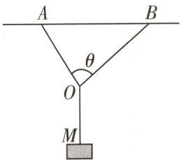

图 1

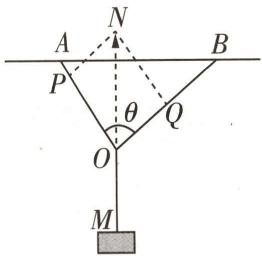

图 2  
  
“平行四边形模型”速破物理力学问题

16 世纪意大利米兰学者卡尔达诺在 1545 年发表的《重要的艺术》一书中, 公布了一元三次方程的一般解法, 被后人称为“卡当公式”, 他是第一个把负数的平方根写到公式中的数学家.

数学起源

# 原创变式

2 [新情境·行星运行轨道]早期天文学家常采用“三角法”测量行星的轨道半径. 假设一种理想状态: 地球 E 和某小行星 M 绕太阳 S 在同一平面上的运动轨道均为圆, 三个星体的位置如图 3 所示. 地球在 $E_{0}$ 位置时, 测出 $\angle SE_{0}M = \frac{2\pi}{3}$ ; 行星 M 绕太阳运动一周回到原来位置, 地球运动到了 $E_{1}$ 位置, 测出 $\angle SE_{1}M = \frac{3\pi}{4}$ , $\angle E_{1}SE_{0} = \frac{\pi}{3}$ . 若地球的轨道半径为 $R$ ，则下列选项中与行星 $M$ 的轨道半径最接近的是(参考数据： $\sqrt{3}\approx 1.7$ ） （

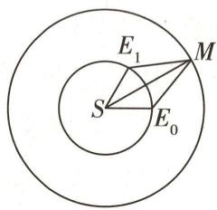

图3

$\quad$A. 2.1R

$\quad$B. $2.2R$

$\quad$C. 2. ${3R}$

$\quad$D. $2.4 R$

答案》第060页

调研 4 [2024 广东湛江 4 月二模 | 新情境·测量高度问题] 如图 4, 为测量某大厦的高度, 小明选取了大厦的一个最高点 A, 点 A 在大厦底部的射影为点 O, 两个测量基点 B, C 与 O 在同一水平面上, 他测得 BC = 102√7 米, ∠BOC = 120°, 在点 B 处测得点 A 的仰角为 θ (tan θ = 2), 在点 C 处测得点 A 的仰角为 45°, 则该大厦的高度 OA = \_\_\_\_ 米.

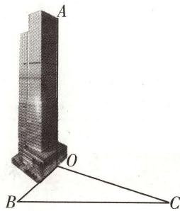

图 4

解析 设 OA = h 米, 因为在点 B 处测得点 A 的仰角为 $\theta$ , 所以 $\frac{OA}{OB} =$ 【明思路】设所求的高度为 h，根据仰角找出 $\triangle OBC$ 各边长与 h 的关系，再根据余弦定理列出 $\triangle OBC$ 的边长关系，解方程即可求解

2, 所以 $OB = \frac{h}{2}$ 米. 因为在点 $C$ 处测得点 $A$ 的仰角为 $45^{\circ}$ , 所以 $OC = h$ 米. 在 $\triangle OBC$ 中, 由余弦定理可得 $BC^{2} = OB^{2} + OC^{2} - 2OB \cdot OC \cdot \cos \angle BOC$ , 即 $102^{2} \times 7 = \frac{1}{4} h^{2} + h^{2} + \frac{1}{2} h^{2} = \frac{7}{4} h^{2}$ , 解得 $h = 204$ .

# 原创变式

[新情境·测量角度问题]如图5所示,某旅游景区的B,C景点相距2km且在同一水平面上,测得观光塔AD的塔底D在景点B的北偏东45°方向,在景点C的北偏西60°方向上,在景点B处测得塔顶A的仰角为45°.现有游客甲从景点B沿直线去往景点C,景点C在景点B的正东方向上,则沿途中观察塔顶A的最大仰角的正切值为\_\_\_\_.身高忽略不计)

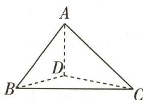

图5

(塔顶大小和游客

答案》第060页

数学起源

给出“虚数”这一名称的是法国数学家笛卡尔，他在《几何学》中使“虚的数”与“实的数”相对应，从此，虚数才流传开来。

# 创新预测

答案▶ 061页

##### 1.[2024 重庆八中4月适应性测试|新情境·货船航行](多选)如图6,在海面上有两个观测点B,D,B在D的正北方向,距离为2 km.在某天10:00观察到某货船在C处,此时测得 $\angle CBD=45^{\circ}$ ,5分钟后该船行驶至A处,此时测得 $\angle ABC=30^{\circ}$ , $\angle ADB=60^{\circ}$ , $\angle ADC=30^{\circ}$ ,则()

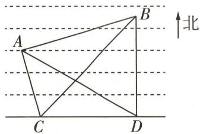

图6

$\quad$A. 观测点 B 位于 A 的北偏东75°方向  
$\quad$B. 当天 10:00 时, 该船到观测点 B 的距离为 $\sqrt{6}$ km  
$\quad$C. 当船行驶至 A 处时, 该船到观测点 B 的距离为 $\sqrt{6}$ km  
$\quad$D. 该船在由 C 行驶至 A 的这 5min 内行驶了 $\sqrt{2}$ km

##### 2. 试题调研原创 已知 $\triangle ABC$ 的内角 $A, B, C$ 的对边分别为 $a, b, c$ , 且 $\sqrt{3} a \sin B = b (2 + \cos A)$ , 若 $\triangle ABC$ 的面积等于 $\sqrt{3}$ , 则 $\triangle ABC$ 的周长的最小值为 \_\_\_\_.

##### 3.[2024 山东省实验中学 5 月模拟]如图 7, 已知平面四边形 ABCD 中, $AB = BC = 2\sqrt{2}$ , CD = 2, AD = 4.

（1） 若 A, B, C, D 四点共圆, 求 AC;  
（2）求四边形ABCD面积的最大值.

# 规范答题

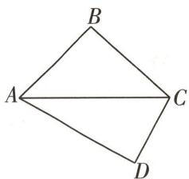

图7

法国数学家达朗贝尔在1747年指出,如果按照多项式的四则运算规则对虚数进行运算,那么它的结果总是 $a+bi$ 的形式(a,b都是实数).

# 参考答案与解析

# 原创变式

##### 1.（1） $a\sin B=-\sqrt{3}b\cos\angle BAC$ ，由正弦定理可得 $\sin\angle BAC\sin B=-\sqrt{3}\sin B\cos\angle BAC$

易知 $\sin B \neq 0$ ，所以 $\sin \angle BAC = -\sqrt{3} \cos \angle BAC$ ，故 $\tan \angle BAC = -\sqrt{3}$ ，又 $\angle BAC \in (0, \pi)$ ，故 $\angle BAC = \frac{2\pi}{3}$ .

（2）由题意可知 $S_{\triangle ABD} + S_{\triangle ACD} = S_{\triangle ABC}$ ，即 $\frac{1}{2}c\sin\frac{\pi}{3} + \frac{1}{2}b\sin\frac{\pi}{3} = \frac{1}{2}bc\sin\frac{2\pi}{3}$ ，化简可得 $b + c = bc$ 。在 $\triangle ABC$ 中，由余弦定理得 $\cos\angle BAC = \frac{b^{2} + c^{2} - a^{2}}{2bc} = \frac{(b + c)^{2} - 2bc - a^{2}}{2bc} = -\frac{1}{2}$ ，

从而 $\frac{(bc)^{2}-2bc-20}{2bc}=-\frac{1}{2}$ ，得 $bc=5$ [讲关键:利用整体思想,结合余弦定理求出bc的乘积,再运用三角形的面积公式即可求解]或bc=-4(舍),

所以 $S_{\triangle ABC}=\frac{1}{2}bc\sin\angle BAC=\frac{1}{2}\times5\times\sin\frac{2\pi}{3}=\frac{5\sqrt{3}}{4}.$

##### 2.A 如图8,连接 $E_{0}E_{1}$ [传技巧:通过作辅助线,将平面多边形问题转化为三角形问题],

在 $\triangle SE_0E_1$ 中， $SE_0 = SE_1 = R,\angle E_1SE_0 = \frac{\pi}{3}$ ，则 $\triangle SE_0E_1$ 是正三角形， $E_0E_1 = R.$ 由 $\angle SE_0M = \frac{2\pi}{3},\angle SE_1M = \frac{3\pi}{4}$ 得 $\angle E_1E_0M = \frac{\pi}{3},\angle E_0E_1M = \frac{5\pi}{12},$

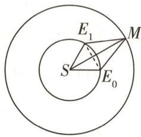

图8

在 $\triangle ME_0E_1$ 中， $\angle E_0ME_1 = \frac{\pi}{4}$ ，由正弦定理得 $\frac{E_1M}{\sin\frac{\pi}{3}} = \frac{E_0E_1}{\sin\frac{\pi}{4}}$ ，则 $E_1M = \frac{\frac{\sqrt{3}}{2}R}{\frac{\sqrt{2}}{2}} =$

$\frac{\sqrt{3}}{\sqrt{2}} R$ ，在 $\triangle SME_{1}$ 中，由余弦定理得 $SM = \sqrt{R^2 + (\frac{\sqrt{3}}{\sqrt{2}} R)^2 - 2R \cdot \frac{\sqrt{3}}{\sqrt{2}} R \cdot (-\frac{\sqrt{2}}{2})} = \sqrt{\frac{5}{2} R^2 + \sqrt{3} R^2} \approx$ $\sqrt{4.2} R$ ，与 $2.1R$ 最接近.故选A.

##### 3. $\sqrt{2}$ 由题意可知 $\angle DBC = 45^{\circ}, \angle DCB = 30^{\circ}$ ，在 $\triangle BDC$ 中， $BC = 2 \, km, \sin \angle BDC = \sin (45^{\circ} + 30^{\circ}) = \frac{\sqrt{6} + \sqrt{2}}{4}$ ，由正弦定理得 $\frac{BD}{\sin 30^{\circ}} = \frac{2}{\sin \angle BDC}$ ，则 $BD = \frac{4}{\sqrt{6} + \sqrt{2}} \, km$ 。在 Rt $\triangle ABD$ 中，可得 $AD = BD \tan 45^{\circ} = \frac{4}{\sqrt{6} + \sqrt{2}} \, km$ 。

记游客甲在直线 $BC$ 上的位置为点 $E$ , 连接 $DE, AE$ , 则仰角为 $\angle AED$ [巧思考: 将所求仰角放在直角三角形中, 可将问题转化为求边长的最值, 进而求解],

由于 $AD \perp$ 平面 $DBC, DE \subset$ 平面 $DBC$ , 可得 $AD \perp DE$ , 即 $\tan \angle AED = \frac{AD}{DE} = \frac{4}{(\sqrt{6} + \sqrt{2})DE}$ , 当 $DE$ 取最小值时, $(DE)_{\min} = BD \sin 45^{\circ} = \frac{4}{\sqrt{6} + \sqrt{2}} \times \frac{\sqrt{2}}{2} = \frac{2}{\sqrt{3} + 1} \mathrm{~km}$ , 此时 $\tan \angle AED$ 最大, 所以最大仰角的正切值为 $\frac{4}{(\sqrt{6} + \sqrt{2}) \times \frac{2}{\sqrt{3} + 1}} = \sqrt{2}$ .

# 创新预测

# 1.ACD

<table><tr><td>选项</td><td>分析过程</td><td>正误</td></tr><tr><td>A</td><td>因为B在D的正北方向, $\angle ABD = \angle ABC + \angle CBD = 75^{\circ}$ ,所以B位于A的北偏东75°方向</td><td>√</td></tr><tr><td>B</td><td>在 $\triangle BCD$ 中, $\angle BDC = \angle ADB + \angle ADC = 90^{\circ}$ , $\angle DBC = 45^{\circ}$ ,则 $\angle BCD = 45^{\circ}$ ,又 $BD = 2\text{ km}$ ,所以 $BC = 2\sqrt{2}\text{ km}$ </td><td>×</td></tr><tr><td>C</td><td>在 $\triangle ABD$ 中, $\angle ABD = 75^{\circ}$ , $\angle ADB = 60^{\circ}$ ,则 $\angle BAD = 45^{\circ}$ ,由正弦定理得 $AB = \frac{BD \sin \angle ADB}{\sin \angle BAD} = \frac{2 \times \frac{\sqrt{3}}{2}}{\frac{\sqrt{2}}{2}} = \sqrt{6}(\text{km})$ [传技巧:已知两边及夹角用余弦定理;已知两角一边用正弦定理;已知两边及其中一边的对角,则用正、余弦定理均可]</td><td>√</td></tr><tr><td>D</td><td>在 $\triangle ABC$ 中,由余弦定理得 $AC^{2} = AB^{2} + BC^{2} - 2AB \times BC \cos \angle ABC = 6 + 8 - 2 \times \sqrt{6} \times 2\sqrt{2} \times \frac{\sqrt{3}}{2} = 2$ ,则 $AC = \sqrt{2}\text{ km}$ </td><td>√</td></tr></table>

##### 2. $2\sqrt{3}+4$ $\sqrt{3}a\sin B=b(2+\cos A)$ ，由正弦定理得 $\sqrt{3}\sin A\sin B=\sin B(2+\cos A)$ ，因为 $\sin B\neq0$ ，所以 $\sqrt{3}\sin A-\cos A=2\sin(A-\frac{\pi}{6})=2$ ，即 $\sin(A-\frac{\pi}{6})=1$ ，因为 $-\frac{\pi}{6}<A-\frac{\pi}{6}<\frac{5\pi}{6}$ ，所以 $A-\frac{\pi}{6}=\frac{\pi}{2}$ ，解得 $A=\frac{2\pi}{3}$ [换思路：由 $\sqrt{3}\sin A-\cos A=2$ 得 $\cos A=\sqrt{3}\sin A-2<0$ ，则A为钝角，又 $\sin^{2}A+\cos^{2}A=1$ ，所以 $\sin^{2}A+(\sqrt{3}\sin A-2)^{2}=1$ ，即 $(2\sin A-\sqrt{3})^{2}=0$ ，得 $\sin A=\frac{\sqrt{3}}{2}$ ，故 $A=\frac{2\pi}{3}$ ].

若 $\triangle ABC$ 的面积等于 $\sqrt{3}$ ,则 $S_{\triangle ABC}=\frac{1}{2}bc\sin A=\frac{\sqrt{3}}{4}bc=\sqrt{3}$ ,得 $bc=4$ ,在 $\triangle ABC$ 中,由余弦定理得 $a^{2}=b^{2}+c^{2}-2bc\cos A=b^{2}+c^{2}+4$ , $\triangle ABC$ 的周长为 $a+b+c=\sqrt{b^{2}+c^{2}+4}+b+c\geqslant\sqrt{2bc+4}+2\sqrt{bc}=2\sqrt{3}+4$ ,当且仅当 $b=c=2$ 时等号成立[破障碍:由面积求出 $bc$ 后,联想余弦定理,用仅含 $b,c$ 的式子表示出 $a$ ,再结合基本不等式即可求出周长的最值,注意验证等号成立的条件].

函数的起源 中文数学书上使用的“函数”一词是转译词,是我国清代数学家李善兰在翻译《代数学》一书时,把“function”译成“函数”的.

数学起源

综上所述,当且仅当 $\triangle ABC$ 是以 $A=\frac{2\pi}{3}$ 为顶角的等腰三角形时, $\triangle ABC$ 的周长取到最小值,且最小值为 $2\sqrt{3}+4$ .

##### 3.（1）因为A,B,C,D四点共圆,所以 $\angle ABC+\angle ADC=\pi$ ,因此 $\cos\angle ADC=-\cos\angle ABC$ [用性质: A,B,C,D四点共圆,则AC为圆的一条弦,同一条弦所对的圆周角相等或互补,结合题图可得 $\angle ABC$ 与 $\angle ADC$ 互补,从而可得两角的余弦值互为相反数].

在 $\triangle ABC$ 中，由余弦定理得 $AC^2 = AB^2 + BC^2 - 2AB \times BC\cos \angle ABC = 8 + 8 - 2 \times 8 \times \cos \angle ABC = 16 - 16\cos \angle ABC,$

在 $\triangle ACD$ 中，由余弦定理得 $AC^2 = AD^2 + CD^2 - 2AD \times CD\cos \angle ADC = 16 + 4 - 2 \times 8 \times \cos \angle ADC = 20 - 16\cos \angle ADC,$

上述两式相加得 $2AC^{2}=36$ ，所以 $AC=3\sqrt{2}$ .

（2） 四边形 ABCD 的面积 $S = \frac{1}{2} AB \times BC \sin \angle ABC + \frac{1}{2} AD \times CD \sin \angle ADC = \frac{1}{2} \times 2\sqrt{2} \times 2\sqrt{2} \sin \angle ABC + \frac{1}{2} \times 4 \times 2 \sin \angle ADC = 4 (\sin \angle ADC + \sin \angle ABC)$ [破障碍: 将所求面积表示出来后, 即可将问题转化为求 $\sin \angle ADC + \sin \angle ABC$ 的最大值, 由此联想利用第 （1） 问的结论转化求解. 此处需注意第 （1） 问中的结论 $\angle ABC + \angle ADC = \pi$ 不能用],

即 $\sin \angle ADC + \sin \angle ABC = \frac{S}{4}$ , 则 $\sin^2 \angle ADC + 2\sin \angle ADC\sin \angle ABC + \sin^2 \angle ABC = \frac{S^2}{16}$ ①.

由（1）得 $16 - 16 \cos \angle ABC = 20 - 16 \cos \angle ADC$ ，化简得 $\cos \angle ADC - \cos \angle ABC = \frac{1}{4}$ ,

则 $\cos^{2}\angle ADC-2\cos\angle ADC\cos\angle ABC+\cos^{2}\angle ABC=\frac{1}{16}$ ②.

①②相加得 $2 - 2(\cos \angle ADC \cos \angle ABC - \sin \angle ADC \sin \angle ABC) = \frac{1 + S^{2}}{16}$ ,

即 $2 - 2\cos(\angle ADC + \angle ABC) = \frac{1 + S^{2}}{16}$ ,

由于 $0 < \angle ADC < \pi, 0 < \angle ABC < \pi,$

所以当且仅当 $\angle ADC + \angle ABC = \pi$ 时, $\cos(\angle ADC + \angle ABC)$ 取得最小值 -1,

此时四边形 ABCD 的面积最大, 记为 $S_{max}$ , 则 $\frac{1 + S_{max}^{2}}{16} = 4$ , 解得 $S_{max} = 3\sqrt{7}$ ,

故四边形 ABCD 面积的最大值为 $3\sqrt{7}$ .

# 超重点8 “爪子模型”在向量运算中的辨别与妙用

由平面向量基本定理知,若 $\overrightarrow{AB},\overrightarrow{AC}$ 为不共线的两个平面向量,则对于同一平面内的向量 $\overrightarrow{AD}$ ,必存在 $x,y\in R$ ,使得 $\overrightarrow{AD}=x\overrightarrow{AB}+y\overrightarrow{AC}$ .

“爪子定理”是平面向量基本定理的拓展,我们将含有形如 $\overrightarrow{AD}=x\overrightarrow{AB}+y\overrightarrow{AC}$ 条件的模型称为“爪子模型”,因其状如“爪子”而得名.

<table><tr><td rowspan="2">“爪子模型”的性质</td><td> $B,C,D$ 三点共线 $\Leftrightarrow x+y=1$ .若 $0则D与A位于直线BC同侧,且D位于A与BC之间.若\( x+y>1$ ,则D与A位于直线BC两侧.若 $x+y=1$ ,1 $x>0,y>0$ ,则D在线段BC上;2 $xy<0$ ,则D在线段BC的延长线上</td></tr><tr><td>已知D在BC上,且 $\overrightarrow{BD}=\lambda\overrightarrow{DC}$ ,则 $\overrightarrow{AD}=\frac{1}{1+\lambda}\overrightarrow{AB}+\frac{\lambda}{1+\lambda}\overrightarrow{AC}$ </td></tr><tr><td rowspan="3"> $\overrightarrow{AD}=x\overrightarrow{AB}+y\overrightarrow{AC}$ 中 $x,y$ 的确定方法</td><td>在几何图形中见到三点共线,可考虑使用“爪子模型”完成向量的表示,进而确定 $x,y$ </td></tr><tr><td>若题目中某些向量的数量积已知,则对于向量方程 $\overrightarrow{AD}=x\overrightarrow{AB}+y\overrightarrow{AC}$ ,可考虑两边对同一向量作数量积运算,从而得到关于 $x,y$ 的方程,再进行求解</td></tr><tr><td>若所给图形比较特殊(矩形,特殊梯形等),则可通过建系将向量坐标化,从而得到关于 $x,y$ 的方程,再进行求解</td></tr></table>

# 应用 1 用“爪子模型”解决求值(含最值)问题

调研 1 试题调研原创 在△ABC 中, 点 F 为线段 AC 上任一点 (不含端点), 若 $\overrightarrow{BF} = 3x \overrightarrow{BA} + y \overrightarrow{BC}$ , 则 $\frac{3}{x} + \frac{1}{y}$ 的最小值为 ( )

$\quad$A. 1

$\quad$B. 4

$\quad$C. 9

$\quad$D. 16

解析 由题意知 A, C, F 三点共线，则 $3x + y = 1$ ，且 x > 0, y > 0.

【巧突破】由 $\overrightarrow{BF}=3x\overrightarrow{BA}+y\overrightarrow{BC}$ 联想“爪子模型”，根据F在线段AC上，直接得 $3x+y=1$ 。也可设 $\overrightarrow{AF}=\lambda\overrightarrow{AC}$ ，得 $\overrightarrow{BF}=\overrightarrow{BA}+\overrightarrow{AF}=\overrightarrow{BA}+\lambda(\overrightarrow{BC}-\overrightarrow{BA})=(1-\lambda)\overrightarrow{BA}+\lambda\overrightarrow{BC}$ ，从而得 $3x+y=1-\lambda+\lambda=1$

故 $\frac{3}{x} +\frac{1}{y} = (\frac{3}{x} +\frac{1}{y})(3x + y) = 9 + 1 + \frac{3y}{x} +\frac{3x}{y}\geqslant 10 + 2\sqrt{\frac{3y}{x}\cdot\frac{3x}{y}} = 16$ ，当且仅当 $\frac{3y}{x} = \frac{3x}{y},$

对数的起源 公元 16、17 世纪之交, 随着天文、航海的发展, 改进数字计算方法成了当务之急. 约翰·纳皮尔正是在研究天文学的过程中, 为了简化其中的计算而发明了对数.

即 $x = y = \frac{1}{4}$ 时，等号成立，故 $\frac{3}{x} +\frac{1}{y}$ 的最小值为16.故选D.

【易遗漏】有意识地养成习惯，遇到基本不等式就要验证等号能否取到

# 原创变式

1 在 $\triangle ABC$ 中, $E$ 在边 $BC$ 上, 且 $EC = 3BE$ , $D$ 是边 $AB$ 上任意一点, $AE$ 与 $CD$ 交于点 $P$ , 若 $\overrightarrow{CP} = x\overrightarrow{CA} + y\overrightarrow{CB}$ , 则 $3x + 4y =$ ( )

$\quad$A. $\frac{3}{4}$

$\quad$B. $-\frac{3}{4}$

$\quad$C. 3

$\quad$D. -3

答案》第067页

# 应用 ② 用“爪子模型”解决数量积问题

调研 2 [2024 浙江宁波镇海中学 5 月适应性测试] 已知 $\triangle ABC$ 是边长为 1 的正三角形, $\overrightarrow{AN} = \frac{1}{3} \overrightarrow{NC}$ , P 是 BN 上一点, 且 $\overrightarrow{AP} = m \overrightarrow{AB} + \frac{2}{9} \overrightarrow{AC}$ , 则 $\overrightarrow{AP} \cdot \overrightarrow{AB} =$ ( )

$\quad$A. $\frac{2}{9}$

$\quad$B. $\frac{1}{9}$

$\quad$C. $\frac{2}{3}$

$\quad$D. 1

解析 $\because \overrightarrow{AN} = \frac{1}{3}\overrightarrow{NC},\therefore \overrightarrow{AN} = \frac{1}{4}\overrightarrow{AC},\overrightarrow{AP} = m\overrightarrow{AB} +\frac{2}{9}\overrightarrow{AC} = m\overrightarrow{AB} +\frac{8}{9}\overrightarrow{AN}.$

∵ P, B, N 三点共线, ∴ $m + \frac{8}{9} = 1$ , 即 $m = \frac{1}{9}$ , ∴ $\overrightarrow{AP} = \frac{1}{9}\overrightarrow{AB} + \frac{2}{9}\overrightarrow{AC}$ ,

【用性质】利用“爪子模型”的性质列式求出 $m$ ，结合向量的数量积运算求解即可

$\therefore \overrightarrow{AP} \cdot \overrightarrow{AB} = (\frac{1}{9}\overrightarrow{AB} + \frac{2}{9}\overrightarrow{AC}) \cdot \overrightarrow{AB} = \frac{1}{9} + \frac{2}{9} \times \cos 60^{\circ} = \frac{2}{9}.$ 故选 A.

【讲方法】直接利用定义法求数量积不可行时，可选取一组合适的基底，利用平面向量基本定理将待求数量积的两个向量分别表示出来，进而根据数量积的定义和公式求解。

# 原创变式

2 在 $\triangle ABC$ 中, $AB = 3$ , $AC = 2$ , $\angle BAC = 120^{\circ}$ , 且 $\overrightarrow{BD} = 2\overrightarrow{DC}$ , 则 $\overrightarrow{AB} \cdot \overrightarrow{AD} =$ ( )

$\quad$A. $\frac{1}{3}$

$\quad$B. $\frac{2}{3}$

$\quad$C. 1

$\quad$D. 2

答案》第067页

# 应用 ③ 用“爪子模型”解决模的问题

调研 3 [2024 河北部分高中 4 月二模] 已知 $A(x_{1}, y_{1})$ , $B(x_{2}, y_{2})$ 是圆 $x^{2} + y^{2} = 9$ 上的两个动点，且 $x_{1}x_{2} + y_{1}y_{2} = -\frac{9}{2}$ ，若点 M 满足 $\overrightarrow{AM} = 2\overrightarrow{MB}$ ，点 P 在直线 $x + \sqrt{3}y - 4\sqrt{3} = 0$ 上，则

数学起源

纳皮尔在讨论对数概念时,并没有使用指数与对数的互逆关系,造成这种状况的主要原因是当时还没有明确的指数概念.

$|\overrightarrow{MP}|$ 的最小值为

( )

$\quad$A. $4\sqrt{3}$

$\quad$B. $3\sqrt{3}$

$\quad$C. $2\sqrt{3}$

$\quad$D. $\sqrt{3}$

解析 如图1, 设 O 为坐标原点, 连接 OM, OA, OB,

由 $A(x_{1},y_{1}),B(x_{2},y_{2})$ 是圆 $x^{2} + y^{2} = 9$ 上的两个动点，且 $x_{1}x_{2} + y_{1}y_{2} = -\frac{9}{2}$ 得 $\overrightarrow{OA}\cdot \overrightarrow{OB} = x_1x_2 + y_1y_2 = -\frac{9}{2}.$

【明思路】根据 $x_{1}x_{2}+y_{1}y_{2}=-\frac{9}{2}$ 联想向量的数量积运算，构造向量，挖掘模的几何意义，找出点 M 的轨迹方程，将 $\left|\overrightarrow{MP}\right|$ 的最小值转化为原点 O 到直线 $x+\sqrt{3}y-4\sqrt{3}=0$ 的距离

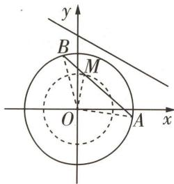

图 1

又 $\overrightarrow{AM} = 2\overrightarrow{MB}$ ，则 $\overrightarrow{OM} = \frac{1}{3}\overrightarrow{OA} +\frac{2}{3}\overrightarrow{OB},$

所以 $|\overrightarrow{OM}| = \sqrt{\left(\frac{1}{3}\overrightarrow{OA} + \frac{2}{3}\overrightarrow{OB}\right)^2} = \sqrt{\frac{1}{9}\overrightarrow{OA}^2 + \frac{4}{9}\overrightarrow{OA} \cdot \overrightarrow{OB} + \frac{4}{9}\overrightarrow{OB}^2} = \sqrt{1 - 2 + 4} = \sqrt{3}$

【传技巧】求向量的模一般有两种方法：当问题中没有出现坐标时，利用 $|a|=\sqrt{a^{2}}$ 求解；当问题中出现坐标 $(a=(x,y))$ 时，利用 $|a|=\sqrt{x^{2}+y^{2}}$ 求解

则动点 M 的轨迹方程为 $x^{2} + y^{2} = 3$ ，

圆心 $O$ 到直线 $x + \sqrt{3} y - 4\sqrt{3} = 0$ 的距离为 $d = \frac{| - 4\sqrt{3}|}{\sqrt{1 + 3}} = 2\sqrt{3}$

所以 $|\overrightarrow{MP}|$ 的最小值为 $2\sqrt{3}-\sqrt{3}=\sqrt{3}$ . 故选D.

# 原创变式

3 [新题型·双空题]已知平行四边形 ABCD 的面积为 $6\sqrt{3}$ ， $\angle BAD = \frac{2\pi}{3}$ ，E 是 BC 上一点且 $\overrightarrow{BE} = 2 \overrightarrow{EC}$ 。若 F 为线段 DE 上的动点，且 $\overrightarrow{AF} = \lambda \overrightarrow{AB} + \frac{5}{6} \overrightarrow{AD}$ ，则实数 $\lambda$ 的值为 \_\_\_\_； $|\overrightarrow{AF}|$ 的最小值为 \_\_\_\_。

4 已知正三角形 ABC 的边长为 2，点 D 满足 $\overrightarrow{CD}=m\overrightarrow{CA}+n\overrightarrow{CB}$ ，且 m>0, n>0, $2m+n=1$ ，则 $|\overrightarrow{CD}|$ 的取值范围是 \_\_\_\_.

答案》第067页

直到 18 世纪,瑞士数学家欧拉发现了指数与对数的互逆关系.对数的发明先于指数,成了数学史上的珍闻.

数学起源

# 创新预测

答案▶068页

##### 1.[2024北京顺义区4月二模]已知点P为圆 $O:x^{2}+y^{2}=1$ 外一点, $|PO|=2$ ,过点P作圆O的两条切线,切点分别为A,B.若圆O上存在异于A,B的点M,使得 $\overrightarrow{PM}=2\lambda\overrightarrow{PA}+(1-\lambda)\overrightarrow{PB}$ ,则 $\lambda$ 的值是()

$\quad$A. $\frac{2}{3}$

$\quad$B. $\frac{1}{2}$

$\quad$C. $\frac{1}{4}$

$\quad$D. $-\frac{1}{2}$

##### 2. 试题调研原创（多选）已知等边三角形 ABC 的边长为 4，点 D, E 满足 $\overrightarrow{BD} = 2 \overrightarrow{DA}, \overrightarrow{BE} = \overrightarrow{EC}$ ，AE 与 CD 交于点 O，则下列选项中正确的有（）

$\quad$A. $\overrightarrow{CD} = \frac{2}{3}\overrightarrow{CA} +\frac{1}{3}\overrightarrow{CB}$   
$\quad$B. $\overrightarrow{CO} \cdot \overrightarrow{CB} = 4$   
$\quad$C. $\overrightarrow{CO}=2\overrightarrow{OD}$   
$\quad$D. $|\overrightarrow{OA} +\overrightarrow{OB} +\overrightarrow{OC}| = \sqrt{3}$

##### 3. 试题调研原创 [新题型·双空题, 新情境·太极图] 太极图被称为“中华第一图”, 其形状如阴阳两鱼互抱在一起, 因而也被称为“阴阳鱼太极图”. 图2所示的图形中的曲线由半径为2的大圆O和两个对称的半圆组成, 线段MN过点O且两端点M, N分别在两个半圆上, 点P是大圆上一动点, 令 $\overrightarrow{PM} = a, \overrightarrow{PN} = b$ , 若 $\overrightarrow{PO} = \lambda_{1}a + \lambda_{2}b$ , 则 $\lambda_{1} =$ \_\_\_\_; $a \cdot b$ 的最小值为\_\_\_\_.

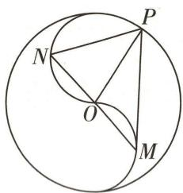

图2

##### 4. 试题调研原创 [新交汇·平面向量与集合交汇] 已知 $\triangle ABC$ 满足 $BC = 8, AC = 3AB, P$ 为 $\triangle ABC$ 所在平面内一点. 定义点集 $D = \{P \mid \overrightarrow{AP} = 3\lambda \overrightarrow{AB} + \frac{1 - \lambda}{3}\overrightarrow{AC}, \lambda \in \mathbb{R}\}$ . 若存在点 $P_0 \in D$ , 使得对任意 $P \in D$ , 满足 $|\overrightarrow{AP}| \geqslant |\overrightarrow{AP_0}|$ 恒成立, 则 $|\overrightarrow{AP_0}|$ 的最大值为 \_\_\_\_.

  
“爪子模型”速解
平面距离最值问题

数学起源

三角学的起源 三角学最初并不是独立发展的,它是在早期人们的天文、航海应用中逐渐形成的,最早研究三角学的是古希腊人.

# 参考答案与解析

# 原创变式

##### 1.C 由题意知 A, P, E 三点共线，则 $\overrightarrow{CP} = x \overrightarrow{CA} + (1 - x) \overrightarrow{CE} = x \overrightarrow{CA} + \frac{3(1 - x)}{4} \overrightarrow{CB}$ [会思考：由三点共线直接得到 $\overrightarrow{CP} = x \overrightarrow{CA} + (1 - x) \overrightarrow{CE}$ ，利用 $\overrightarrow{CE} = 3 \overrightarrow{EB}$ 转化，根据系数一一对应相等即可求解。也可设 $\overrightarrow{EP} = t \overrightarrow{EA}$ ，根据平面向量基本定理将 $\overrightarrow{CP}$ 用 $\overrightarrow{CA}, \overrightarrow{CB}$ 表示，再根据向量相等建立方程]，所以 $y = \frac{3(1 - x)}{4}$ ，所以 $3x + 4y = 3$ 。故选 C.

##### 2.C 易知 $\overrightarrow{AD}=\frac{1}{3}\overrightarrow{AB}+\frac{2}{3}\overrightarrow{AC}$ [会表示:已知向量 $\overrightarrow{AB}$ 与 $\overrightarrow{AC}$ 的模及两者的夹角,则结合“爪子模型”的性质,用向量 $\overrightarrow{AB}$ 与 $\overrightarrow{AC}$ 表示出向量 $\overrightarrow{AD}$ ,进而求出 $\overrightarrow{AB}\cdot\overrightarrow{AD}$ ].

在 $\triangle ABC$ 中, $AB=3,AC=2,\angle BAC=120^{\circ}$ ,则 $\overrightarrow{AB}\cdot\overrightarrow{AC}=|\overrightarrow{AB}|\times|\overrightarrow{AC}|\times\cos120^{\circ}=3\times2\times(-\frac{1}{2})=-3$ ,所以 $\overrightarrow{AB}\cdot\overrightarrow{AD}=\frac{1}{3}\overrightarrow{AB}\cdot(\overrightarrow{AB}+2\overrightarrow{AC})=\frac{1}{3}(\overrightarrow{AB}^{2}+2\overrightarrow{AB}\cdot\overrightarrow{AC})=\frac{1}{3}\times(9-2\times3)=1$ .故选C.

##### 3. $\frac{1}{2}\sqrt{5}$ 如图3,连接AE,由 $\overrightarrow{AF}=\lambda\overrightarrow{AB}+\frac{5}{6}\overrightarrow{AD},\overrightarrow{BE}=2\overrightarrow{EC}$ ,得 $\overrightarrow{AF}=\lambda(\overrightarrow{AE}+\overrightarrow{EB})+\frac{5}{6}\overrightarrow{AD}=\lambda\overrightarrow{AE}+(\frac{5}{6}-\frac{2}{3}\lambda)\overrightarrow{AD}$ ,由D,F,E三点共线,得 $\lambda+\frac{5}{6}-\frac{2}{3}\lambda=1$ ,解得 $\lambda=\frac{1}{2}$ .

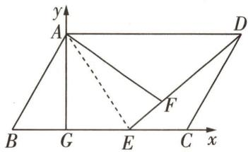

图3

作 $AG \perp BC$ 交 $BC$ 于 $G$ , 以 $G$ 为坐标原点建立平面直角坐标系, 设 $B(-a,0)(a>0)$ , 则 $A(0,\sqrt{3}a)$ , 而 $\square ABCD$ 的面积为 $6\sqrt{3}$ , 则 $|\overrightarrow{BC}|=\frac{6}{a}$ , 故 $C(\frac{6}{a}-a,0), D(\frac{6}{a},\sqrt{3}a), E(\frac{4}{a}-a,0)$ , 则 $\overrightarrow{AB}=(-a, -\sqrt{3}a), \overrightarrow{AD}=(\frac{6}{a},0)$ , 可得 $\overrightarrow{AF}=\frac{5}{6}\overrightarrow{AD}+\frac{1}{2}\overrightarrow{AB}=(\frac{5}{a}-\frac{a}{2},-\frac{\sqrt{3}}{2}a)$ [会转化: 通过建立坐标系, 利用已知条件, 将 $|\overrightarrow{AF}|$ 的最小值转化为关于 $a$ 的代数式的最值问题, 利用基本不等式求解],

则 $|\overrightarrow{AF}|^2 = \left(\frac{5}{a} -\frac{a}{2}\right)^2 +\frac{3}{4} a^2 = \frac{25}{a^2} +a^2 -5\geqslant 2\sqrt{\frac{25}{a^2}\cdot a^2} -5 = 5$ ，当且仅当 $\frac{25}{a^2} = a^2$ ，即 $a = \sqrt{5}$ 时等号成立，所以 $|\overrightarrow{AF} |$ 的最小值为 $\sqrt{5}$

##### 4.(1,2) 如图4,取AC的中点E[巧突破:根据 $\overrightarrow{CD}=m\overrightarrow{CA}+n\overrightarrow{CB}$ 及 $2m+n=1$ , 联想到 $\overrightarrow{CD}=2m\cdot\frac{1}{2}\overrightarrow{CA}+n\overrightarrow{CB}$ ,从而取AC的中点E],

连接 BE, 则 $\overrightarrow{CA}=2\overrightarrow{CE}, \overrightarrow{CD}=m\overrightarrow{CA}+n\overrightarrow{CB}=2m\overrightarrow{CE}+n\overrightarrow{CB}$ ，又 $2m+n=1$ ，故 B, D, E 三点共线，因为 m>0, n>0，所以点 D 在中线 BE 上运动（不含端点）。在正三角形 ABC 中， $BE \perp AC$ ，则 $|\overrightarrow{CE}|<|\overrightarrow{CD}|<|\overrightarrow{CB}|$ ，故 $|\overrightarrow{CD}| \in (1,2)$ 。

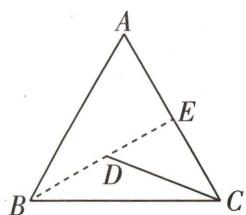

图4

三角学输入中国,开始于1631年,这年徐光启等合编了《大测》,这是我国第一部编译的三角学图书.

# 创新预测

##### 1. A 因为 $|PO|=2$ ，所以点 P 在以 O 为圆心，2 为半径的圆上，如图5，设 PA 与点 P 的轨迹交于点 C，连接 CO, AO, BO，因为 PA, PB 分别与圆 O 相切于 A, B，所以 $PA \perp OA, PB \perp OB$ 。在 Rt $\triangle APO$ 中，OA = 1, OP = 2，所以 $\angle AOP = 60^{\circ}$ ，同理可得 $\angle BOP = 60^{\circ}$ ，又 $PA \perp OA, PO = CO$ ，所以 $\angle AOC = 60^{\circ}$ ，则 $\angle AOC + \angle AOP + \angle POB = 180^{\circ}$ [堵漏洞：只有当各角的顶点相同时，才能利用角度之和为 $180^{\circ}$ 判断三点共线]，

所以 C, O, B 三点共线. 易知 $\overrightarrow{PA} = \overrightarrow{AC}$ , 所以 $\overrightarrow{PM} = 2\lambda \overrightarrow{PA} + (1 - \lambda) \overrightarrow{PB} = \lambda \overrightarrow{PC} +$

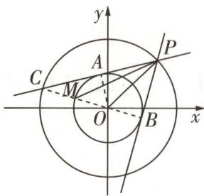

图 5

$(1 - \lambda)\overrightarrow{PB}$ , 所以 $C, M, B$ 三点共线, 则点 $M$ 为 $CO$ 与圆 $O$ 的交点, 所以 $|CM| = |CO| - |OM| = 1$ , $|BM| = 2$ , 所以 $\overrightarrow{PM} = \frac{2}{3}\overrightarrow{PC} + \frac{1}{3}\overrightarrow{PB}$ , 即 $\lambda = \frac{2}{3}$ .

# 2.AD

<table><tr><td>选项</td><td>分析过程</td><td>正误</td></tr><tr><td>A</td><td> $\overrightarrow{CD} = \overrightarrow{CA} + \overrightarrow{AD} = \overrightarrow{CA} + \frac{1}{3} (\overrightarrow{CB} - \overrightarrow{CA}) = \frac{2}{3}\overrightarrow{CA} + \frac{1}{3}\overrightarrow{CB}$ [用性质:也可以利用“爪子模型”的性质直接得出]</td><td>√</td></tr><tr><td>B</td><td> $\overrightarrow{BE} = \overrightarrow{EC} \rightarrow E$ 为  $BC$  的中点 $\rightarrow AE \perp BC \rightarrow AO \perp BC \rightarrow \overrightarrow{AO} \cdot \overrightarrow{BC} = 0 \rightarrow \overrightarrow{CO} \cdot \overrightarrow{CB} = (\overrightarrow{CA} + \overrightarrow{AO}) \cdot \overrightarrow{CB} = \overrightarrow{CA} \cdot \overrightarrow{CB} + \overrightarrow{AO} \cdot \overrightarrow{CB} = |\overrightarrow{CA}| |\overrightarrow{CB}| \cos 60^\circ = 8$ </td><td>×</td></tr><tr><td>C</td><td>设 $\overrightarrow{CO} = \lambda \overrightarrow{CD} \rightarrow \overrightarrow{CO} = \frac{2\lambda}{3}\overrightarrow{CA} + \frac{2\lambda}{3}\overrightarrow{CE} \xrightarrow{O,A,E三点共线} \frac{2\lambda}{3} + \frac{2\lambda}{3} = 1 \rightarrow \lambda = \frac{3}{4} \rightarrow \overrightarrow{CO} = \frac{3}{4}\overrightarrow{CD} \rightarrow \overrightarrow{CO} = 3\overrightarrow{OD}$ </td><td>×</td></tr><tr><td>D</td><td> $\overrightarrow{AE} = \frac{1}{2}\overrightarrow{AC} + \frac{1}{2}\overrightarrow{AB} = \frac{1}{2}\overrightarrow{AC} + \frac{3}{2}\overrightarrow{AD} \xrightarrow{设\overrightarrow{AE} = t\overrightarrow{AO}(t>1)} t\overrightarrow{AO} = \frac{1}{2}\overrightarrow{AC} + \frac{3}{2}\overrightarrow{AD} \rightarrow \overrightarrow{AO} = \frac{1}{2t}\overrightarrow{AC} + \frac{3}{2t}\overrightarrow{AD} \xrightarrow{O,C,D三点共线} \frac{1}{2t} + \frac{3}{2t} = 1 \rightarrow t = 2 \rightarrow O$ 为  $AE$  的中点 $\rightarrow |\overrightarrow{OA} + \overrightarrow{OB} + \overrightarrow{OC}| = |\overrightarrow{OA} + 2\overrightarrow{OE}| = |\overrightarrow{OE}| = \frac{1}{2} |\overrightarrow{AE}| = \sqrt{3}$ </td><td>√</td></tr></table>

##### 3. $\frac{1}{2}$ 0 由圆的对称性可得 O 为 MN 的中点, 所以 $\overrightarrow{PO} = \frac{1}{2} \overrightarrow{PM} + \frac{1}{2} \overrightarrow{PN} = \frac{1}{2} a + \frac{1}{2} b = \lambda_{1} a + \lambda_{2} b$ ,
所以 $\lambda_{1}=\lambda_{2}=\frac{1}{2}.$

因为 $\overrightarrow{OM} = -\overrightarrow{ON}$ ，所以 $\boldsymbol{a} \cdot \boldsymbol{b} = (\overrightarrow{PO} + \overrightarrow{OM}) \cdot (\overrightarrow{PO} - \overrightarrow{OM}) = \overrightarrow{PO^{2}} - \overrightarrow{OM^{2}} = 4 - \overrightarrow{OM^{2}}$ [传技巧：涉及从一个点出发的两个向量的数量积问题，可以考虑利用极化恒等式求解。若 P 为线段 AB 的中点，O 为直线 AB 外一点，则 $\overrightarrow{OA} \cdot \overrightarrow{OB} = \overrightarrow{OP^{2}} - \frac{1}{4}\overrightarrow{AB^{2}}$ ，此为极化恒等式的一般形式]，

所以当 $|\overrightarrow{OM}|$ 取得最大值2时, $a\cdot b$ 取得最小值,为0.

第二空秒杀解 分析 N, P, M 的运动情况, 可知 $\overrightarrow{PM}$ 与 $\overrightarrow{PN}$ 夹角始终不超过 $90^{\circ}$ , 考虑极端情况, 当 NM 与圆 O 直径重合时, 有 $PN \perp PM$ , 则 $\overrightarrow{PM} \cdot \overrightarrow{PN} = 0$ , 其余情况都有 $\overrightarrow{PM} \cdot \overrightarrow{PN} > 0$ , 故 $a \cdot b$ 的最小值为 0.

##### 4.3 如图6,延长AB到M,使 $\overrightarrow{AM}=3\overrightarrow{AB}$ ,取AC的靠近A的三等分点N,连接MN,则 $\overrightarrow{AP}=3\lambda\overrightarrow{AB}+\frac{1-\lambda}{3}\overrightarrow{AC}=\lambda\cdot3\overrightarrow{AB}+(1-\lambda)\frac{\overrightarrow{AC}}{3}=\lambda\overrightarrow{AM}+(1-\lambda)\overrightarrow{AN}$ [明思路:根据 $\overrightarrow{AP}=3\lambda\overrightarrow{AB}+\frac{1-\lambda}{3}\overrightarrow{AC}$ ,联想“爪子模型”的性质,考虑在AB,AC上找点M,N,得到P,M,N三点共线],

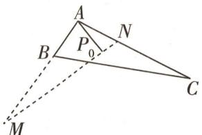

图6

所以 P, M, N 三点共线.

因为 $|\overrightarrow{AP}|\geqslant|\overrightarrow{AP_{0}}|$ 恒成立，则 $|\overrightarrow{AP_{0}}|$ 等于点A到直线MN的距离，即 $\triangle AMN$ 的边MN上的高的长.因为AC=AM,AB=AN,所以 $\triangle ABC\cong\triangle ANM$ ,所以MN=BC=8.在 $\triangle AMN$ 中,设 $\angle ANM=\theta$ ,由正弦定理得 $\frac{AM}{\sin\theta}=\frac{AN}{\sin M}=\frac{MN}{\sin\angle MAN}$ ,所以 $\sin\theta=3\sin M,AM=\frac{8\sin\theta}{\sin\angle MAN},AN=\frac{8\sin M}{\sin\angle MAN}$ ,

所以 $S_{\triangle AMN} = \frac{1}{2} AM \cdot AN\sin \angle MAN = \frac{32\sin \theta\sin M}{\sin \angle MAN} = \frac{96\sin^2 M}{\sin (M + \theta)} = \frac{96\sin^2 M}{\sin M\cos \theta + \cos M\sin \theta} = \frac{96\sin^2 M}{\sin M\cos \theta + 3\cos M\sin M} = \frac{96\sin M}{\cos \theta + 3\cos M}$ .

若 $\theta$ 不是钝角[明易错:在用平方关系转化时,容易忽视对 $\angle ANM$ 为钝角时的讨论],

则 $S_{\triangle AMN} = \frac{96\sin M}{\sqrt{1 - \sin^2\theta} + 3\sqrt{1 - \sin^2M}}$

又 $\sin \theta = 3\sin M\leqslant 1$ ，所以 $0 <   \sin M\leqslant \frac{1}{3}$ 所以 $S_{\triangle AMN} = \frac{96}{\sqrt{\frac{1}{\sin^2M} - 9} + 3\sqrt{\frac{1}{\sin^2M} - 1}}$ 设 $t = \frac{1}{\sin^2M},$ 则 $t \geqslant 9, S_{\triangle AMN} = \frac{96}{\sqrt{t - 9} + 3\sqrt{t - 1}}$ ，易知当 $t = 9$ 时， $S_{\triangle AMN}$ 取得最大值，且 $(S_{\triangle AMN})_{\max} = 8\sqrt{2}$ .

若 $\theta$ 是钝角, 则 $S_{\triangle AMN} = \frac{96\sin M}{3\sqrt{1 - \sin^2M} - \sqrt{1 - \sin^2\theta}} = \frac{96}{3\sqrt{\frac{1}{\sin^2M} - 1} - \sqrt{\frac{1}{\sin^2M} - 9}}$ , 设 $t = \frac{1}{\sin^2M}$ , 则

$t \geqslant 9, S _ {\triangle A M N} = \frac {9 6}{3 \sqrt {t - 1} - \sqrt {t - 9}}.$

令 $f(t)=3\sqrt{t-1}-\sqrt{t-9},t>9$ ，则 $f'(t)=\frac{3}{2\sqrt{t-1}}-\frac{1}{2\sqrt{t-9}}=\frac{3\sqrt{t-9}-\sqrt{t-1}}{2\sqrt{(t-1)(t-9)}}$ ，令 $f'(t)=0$ ，得t=10.

当 9 < t < 10 时, $f'(t) < 0$ , $f(t)$ 单调递减, 当 t > 10 时, $f'(t) > 0$ , $f(t)$ 单调递增, 所以当 t = 10 时, $f(t)$ 取最小值, 且 $f(t)_{\min} = 8$ , 所以 $(S_{\triangle AMN})_{\max} = 12$ .

综上， $(S_{\triangle ABC})_{\max} = 12$ ，所以 $|\overrightarrow{AP_0}|_{\max} = \frac{2 \times 12}{8} = 3.$

# 超重点9 快解三角形必会的3个定理

解三角形常用三角形内角平分线定理、张角定理和平行四边形法则.

定理 1: 三角形内角平分线定理 三角形内角平分线分对边所得的两条线段与这个角的两边对应成比例. 即: 如图 1, 在 $\triangle ABC$ 中, AM 平分 $\angle BAC$ , M 在 BC 上, 则有 $\frac{AB}{AC} = \frac{BM}{CM}$ .

证明 如图1,过点C作CN//AB交AM的延长线于点N,则 $\triangle ABM\sim\triangle NCM$ ,故 $\frac{AB}{NC}=\frac{BM}{CM}$ ,又 $\angle BAM=\angle CAM=\angle CNM$ ,故CA=CN,所以 $\frac{AB}{AC}=\frac{BM}{CM}$ ,得证(也可利用 $\frac{S_{\triangle ABM}}{S_{\triangle ACM}}=\frac{BM}{CM}=\frac{\frac{1}{2}AB\times AM\times\sin\angle BAM}{\frac{1}{2}AC\times AM\times\sin\angle CAM}=\frac{AB}{AC}$ 证明).

定理2: 张角定理 如图2, 在 $\triangle ABC$ 中, $D$ 为边 $BC$ 上一点, 则有 $\frac{\sin \angle BAC}{AD} = \frac{\sin \angle BAD}{AC} + \frac{\sin \angle DAC}{AB}$ . 逆定理: 如果 $\frac{\sin \angle BAC}{AD} = \frac{\sin \angle BAD}{AC} + \frac{\sin \angle DAC}{AB}$ , 那么 $B, D, C$ 三点共线.

证明 $S_{\triangle ABC} = S_{\triangle ABD} + S_{\triangle ADC}$ 则 $\frac{1}{2} AB\cdot AC\cdot \sin \angle BAC = \frac{1}{2} AB\cdot AD\cdot \sin \angle BAD + \frac{1}{2} AC\cdot$ $AD\cdot \sin \angle DAC$ ，两边同时除以 $\frac{1}{2} AB\cdot AC\cdot AD$ 得 $\frac{\sin\angle BAC}{AD} = \frac{\sin\angle BAD}{AC} +\frac{\sin\angle DAC}{AB}$ 得证.

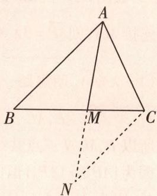

图1

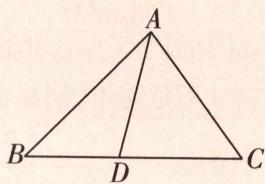

图2

# 定理

# 利用角平分线定理构造边角关系

调研 1 试题调研原创 在 $\triangle ABC$ 中,内角 $A,B,C$ 的对边分别为 $a,b,c$ ,若 $b=a(\cos C+\frac{\sqrt{3}}{3}\sin C)$ ,AD是 $\angle BAC$ 的平分线,点D在BC上, $AD=\sqrt{3}$ , $b=3c$ ,则 $a=$ \_\_\_\_.

审题 由正弦定理可得 $\sin B = \sin \angle BAC\cos C + \frac{\sqrt{3}}{3}\sin \angle BAC\sin C \rightarrow$ 结合三角形内角和为 $\pi$ 得 $\angle BAC = \frac{\pi}{3} \rightarrow$ 由角平分线的性质可得 $\angle BAD = \angle CAD = \frac{\pi}{6} \rightarrow$ 由余弦定理、角平分线定理可得 $CD = 3BD \rightarrow c = \frac{4}{3}, b = 4 \rightarrow$ 利用余弦定理可得 $a$ 的值.

解析 因为 $b = a(\cos C + \frac{\sqrt{3}}{3}\sin C)$

所以由正弦定理可得 $\sin B = \sin \angle BAC (\cos C + \frac{\sqrt{3}}{3} \sin C)$ ,

即 $\sin B = \sin \angle BAC\cos C + \frac{\sqrt{3}}{3}\sin \angle BAC\sin C.$

在 $\triangle ABC$ 中, $B=\pi-(\angle BAC+C)$ ,

所以 $\sin (\angle BAC + C) = \sin \angle BAC\cos C + \frac{\sqrt{3}}{3}\sin \angle BAC\sin C,$

所以 $\sin \angle BAC\cos C + \cos \angle BAC\sin C = \sin \angle BAC\cos C + \frac{\sqrt{3}}{3}\sin \angle BAC\sin C,$

即 $\cos\angle BAC\sin C=\frac{\sqrt{3}}{3}\sin\angle BAC\sin C.$

因为 $C \in (0, \pi)$ , $\sin C \neq 0$ , 所以 $\tan \angle BAC = \sqrt{3}$ ,

因为 $\angle BAC\in (0,\pi)$ ，所以 $\angle BAC = \frac{\pi}{3}$

因为 AD 是 $\angle BAC$ 的平分线, 所以 $\angle BAD = \angle CAD = \frac{\pi}{6}$ .

在 $\triangle ABD$ 中， $BD^{2} = AB^{2} + AD^{2} - 2\times AB\times AD\cos \frac{\pi}{6} = c^{2} + 3 - 3c$ ①，

在 $\triangle ACD$ 中， $CD^2 = AC^2 +AD^2 -2\times AC\times AD\cos{\frac{\pi}{6}} = b^2 +3 - 3b$ ②.

根据角平分线定理可得 $\frac{c}{b}=\frac{BD}{CD}$ ,

因为 b=3c，所以 CD=3BD。

结合①②可得, $9(c^{2}+3-3c)=b^{2}+3-3b=9c^{2}+3-9c$ ,得 $c=\frac{4}{3},b=4.$

在 $\triangle ABC$ 中，由余弦定理得 $a^2 = b^2 + c^2 - 2bc\cos \angle BAC = 16 + \frac{16}{9} - 2 \times 4 \times \frac{4}{3} \times \cos \frac{\pi}{3}$ ，解得 $a = \frac{4\sqrt{7}}{3}$ .

# 原创变式

1 在 $\triangle ABC$ 中, $\angle BAC=\frac{2\pi}{3}$ , $\angle BAC$ 的平分线交 $BC$ 于点 $D,AD=1$ 且 $CD=2BD$ ,则 $\triangle ABC$ 的面积为\_\_\_\_.

答案》第076页

《周髀算经》原名《周髀》，是古老的天文学和数学著作，主要阐明当时的盖天说和四分历法.

三角应用

# 定理 ② 利用张角定理构建三角方程

调研 2 试题调研原创 在 $\triangle ABC$ 中, $\angle BAC=60^{\circ}$ , $AB=3$ , $BC=\sqrt{13}$ , $\angle BAC$ 的平分线交 $BC$ 于 $D$ ,则 $AD=$ \_\_\_\_.

解析 方法一:面积法 在 $\triangle ABC$ 中,由余弦定理可得, $3^{2}+AC^{2}-2\times3\times AC\times\cos60^{\circ}=13$ ,

又 AC > 0, 解得 AC = 4.

  
“一相等二定理”三法速求角平分线长

由 $S_{\triangle ABC} = S_{\triangle ABD} + S_{\triangle ACD}$ 且 $AD$ 平分 $\angle BAC$ 可得， $\frac{1}{2} \times 3 \times 4 \times \sin 60^{\circ} = \frac{1}{2} \times 3 \times AD \times \sin 30^{\circ} + \frac{1}{2} \times AD \times 4 \times \sin 30^{\circ}$ ，

解得 $AD = \frac{12\sqrt{3}}{7}$ .

方法二:角平分线定理法 在 $\triangle ABC$ 中,由余弦定理可得, $3^{2}+AC^{2}-2\times3\times AC\times\cos60^{\circ}=13$ ,又AC>0,解得AC=4.

因为 AD 为 $\angle BAC$ 的平分线, 所以 $\frac{AB}{AC} = \frac{BD}{CD} = \frac{3}{4}$ ,

又 $BC = \sqrt{13}$ ，所以 $BD = \frac{3\sqrt{13}}{7}, CD = \frac{4\sqrt{13}}{7}$

则 $AD^{2}=AB\times AC-BD\times CD=3\times4-\frac{3\sqrt{13}}{7}\times\frac{4\sqrt{13}}{7}=\frac{432}{49}$

【用结论】在 $\triangle ABC$ 中，AD平分 $\angle BAC$ 交AC于点D，则 $AD^{2}=AB\times AC-BD\times CD$ ，这是角平分线长公式所以 $AD = \frac{12\sqrt{3}}{7}$ .

方法三: 张角定理法 在 $\triangle ABC$ 中, 由余弦定理可得, $3^{2} + AC^{2} - 2 \times 3 \times AC \times \cos 60^{\circ} = 13$ , 又 AC > 0, 解得 AC = 4.

由张角定理知 $\frac{\sin\angle BAC}{AD} = \frac{\sin\angle BAD}{AC} +\frac{\sin\angle DAC}{AB},$

又 $AD$ 平分 $\angle BAC$ ，可得 $\frac{\sin 60^{\circ}}{AD} = \frac{\sin 30^{\circ}}{4} +\frac{\sin 30^{\circ}}{3},$

解得 $AD = \frac{12\sqrt{3}}{7}$ .

# 原创变式

2 在 $\triangle ABC$ 中， $D$ 为边 $BC$ 上一点，且满足 $AD \perp AC, \cos \angle BAC = -\frac{1}{3}, AB = 3\sqrt{2}, AD = 3$ ，则 $CD =$ \_\_\_\_.

答案》第076页

三角应用

《周髀算经》中明确记载了勾股定理,即勾的平方加上股的平方等于弦的平方,这是三角形中的基本定理之一.

# 定理 ③ 巧用平行四边形法则解决中线长相关问题

调研 3 [2024 河北省 5 月联合测评] 在 $\triangle ABC$ 中, 内角 A, B, C 的对边分别为 a, b, c. 若 c = 3, b = 2, AD 平分 $\angle BAC$ , D 在 BC 上, 且 AD 的长为 $\frac{4\sqrt{6}}{5}$ , 则 BC 边上的中线 AH 的长为 ( )

$\quad$A. $\frac{\sqrt{17}}{2}$

$\quad$B. $\frac{4\sqrt{2}}{3}$

$\quad$C. $\frac{\sqrt{17}}{4}$

$\quad$D. $\frac{4\sqrt{3}}{3}$

解析 设 $\angle BAD = \angle CAD = \alpha$ ，则 $\angle BAC = 2\alpha$ .

因为 $S_{\triangle ABC} = S_{\triangle ABD} + S_{\triangle ACD}$ ，所以 $\frac{1}{2}\times 3\times 2\sin 2\alpha = \frac{1}{2}\times 3\times \frac{4\sqrt{6}}{5}\sin \alpha +\frac{1}{2}\times 2\times \frac{4\sqrt{6}}{5}\sin \alpha ,$

整理得 $3\sin 2\alpha = 2\sqrt{6}\sin \alpha$ ，即 $\sin \alpha (3\cos \alpha -\sqrt{6}) = 0$ ，因为 $\sin \alpha \neq 0$ ，所以 $\cos \alpha = \frac{\sqrt{6}}{3}$ 所以 $\cos 2\alpha = 2\cos^2\alpha -1 = \frac{1}{3}.$

因为 AH 是 BC 边上的中线, 所以 $\overrightarrow{AH} = \frac{1}{2} (\overrightarrow{AB} + \overrightarrow{AC})$ ,

【破瓶颈】看到三角形和中线要联想到应用平行四边形法则

则 $\overrightarrow{AH^2} = \frac{1}{4} (\overrightarrow{AB} +\overrightarrow{AC})^2 = \frac{1}{4} (\overrightarrow{AB^2} +\overrightarrow{AC^2} +2\overrightarrow{AB}\cdot \overrightarrow{AC}) = \frac{1}{4} (b^2 +c^2 +2bc\cos 2\alpha) = \frac{1}{4}\times$

$(2^{2}+3^{2}+2\times2\times3\times\frac{1}{3})=\frac{17}{4}$ ，所以 $AH=\frac{\sqrt{17}}{2}$ 。故选A.

# 原创变式

③ 在 $\triangle ABC$ 中,内角 $A,B,C$ 的对边分别为 $a,b,c$ ,且 $b\sin B\tan A=\sqrt{3}a\sin B\cos C+\sqrt{3}b\sin C\cos A$ .

（1） 求 A;

（2） 若 D 在边 BC 上, 且 BD = 2DC, b = 3, $AD = 2\sqrt{3}$ , 求 $\triangle ABC$ 的周长.

答案》第076页

《周髀算经》不仅是中国古代数学的重要文献,也是世界上最早介绍勾股定理的著作之一,对后世的数学研究和应用产生了深远的影响.

三角应用

# 创新预测

答案▶077页

##### 1.[2024 安徽合肥一六八中学 5 月适应性测试|新情境·海伦公式]古希腊的数学家海伦在他的著作《测地术》中记录了“海伦公式”: $S = \sqrt{p(p - a)(p - b)(p - c)}$ , 其中 $p = \frac{a + b + c}{2}$ , $a, b, c$ 分别为 $\triangle ABC$ 的三个内角 $A, B, C$ 所对的边, $S$ 为 $\triangle ABC$ 的面积. 该公式具有轮换对称的特点. 已知在 $\triangle ABC$ 中, 内角 $A, B, C$ 所对的边分别为 $a, b, c, \sin A: \sin B: \sin C = 8: 7: 3$ , 且 $\triangle ABC$ 的面积为 $12\sqrt{3}$ , 则 $BC$ 边上的中线的长度为 ( )

$\quad$A. $3\sqrt{2}$

$\quad$B. 4

$\quad$C. $\sqrt{74}$

$\quad$D. $\sqrt{26}$

##### 2.[2024 江西省新八校 5 月联考](多选)已知△ABC 中,AB=1,AC=4,∠BAC= $\frac{\pi}{3}$ ,AE为 $\angle BAC$ 的平分线,AE交BC于点E,D为AC的中点,则下列结论中正确的有()

$\quad$A. $BE = \frac{\sqrt{13}}{5}$

$\quad$B. $AE = \frac{4\sqrt{2}}{5}$

$\quad$C. $\triangle ABE$ 的面积为 $\frac{\sqrt{3}}{5}$

$\quad$D. P 在 $\triangle ABD$ 的外接圆上, 则 $PB + \frac{1}{2}PD$ 的最大值为 $\sqrt{7}$

##### 3. 试题调研原创 在 $\triangle ABC$ 中, $\angle BAC$ 的平分线为 $AD, AD$ 与 $BC$ 交于点 $D$ , $\cos\angle BAC=\frac{3}{4}$ , $AB=5, AC=2$ , 则 $AD=$ \_\_\_\_.

##### 4. 试题调研原创 在 $\triangle ABC$ 中,内角 $A,B,C$ 的对边分别为 $a,b,c$ ,且满足 $2a+c=2b\cos C$ .

（1） 求 B;   
（2） $\angle BAC$ 的平分线 $AD$ 交 $BC$ 边于点 $D$ , 当 $c = 2, AD = \sqrt{7}$ 时, 求 $CD$ 的长.

# 规范答题

##### 5.[2024 广东梅州 5 月二模] 如图 3, 在 $\triangle ABC$ 中, 内角 $A, B, C$ 所对的边分别为 $a, b, c$ , 且 $\sqrt{3} a \cos B - b \sin A = \sqrt{3} c, c = 2$ .

（1） 求 A.   
（2） 点 D 在 BC 上,  
(i) 当 $AD \perp AB$ ，且 AD = 1 时，求 AC 的长.  
(ii) 当 BD = 2DC，且 AD = 1 时，求 $\triangle ABC$ 的面积 S.

# 规范答题

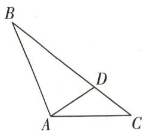

图3

《九章算术》中的《勾股》章节详细记录了利用勾股定理解决与当时社会生活密切相关的各种问题与对应的计算公式,为解决实际问题提供了重要的参考.

# 参考答案与解析

# 原创变式

##### 1. $\frac{9\sqrt{3}}{8}$ 在 $\triangle ABD$ 中, 由正弦定理得 $\frac{AB}{\sin\angle ADB} = \frac{BD}{\sin\angle BAD}$ , 在 $\triangle ACD$ 中, 由正弦定理得 $\frac{AC}{\sin\angle ADC} = \frac{CD}{\sin\angle CAD}$ .

因为 $\angle ADB+\angle ADC=\pi$ ,所以 $\sin\angle ADB=\sin\angle ADC$ ,又 $\angle BAD=\angle CAD$ ,所以 $\frac{AB}{AC}=\frac{BD}{CD}=\frac{1}{2}$ [讲关键:根据角平分线定理可以直接得到 $\frac{AB}{AC}=\frac{BD}{CD}$ .这里给出了角平分线定理的另一种证明方式,即用正弦定理进行证明],所以 $AC=2AB$ .

因为 $S_{\triangle ABD} + S_{\triangle ACD} = S_{\triangle ABC}$ ，且 $\angle BAC = \frac{2\pi}{3}$ 所以 $\frac{1}{2}\times AB\times AD\times \sin \frac{\pi}{3} +\frac{1}{2}\times AC\times AD\times \sin \frac{\pi}{3} =$ $\frac{1}{2}\times AB\times AC\times \sin \frac{2\pi}{3},$

因为 AD = 1, AC = 2AB，所以 $\frac{1}{2} \times AB \times 1 \times \frac{\sqrt{3}}{2} + \frac{1}{2} \times 2AB \times 1 \times \frac{\sqrt{3}}{2} = \frac{1}{2} \times AB \times 2AB \times \frac{\sqrt{3}}{2}$ ，解得 $AB = \frac{3}{2}$ .

所以 $S_{\triangle ABC} = \frac{1}{2}\times AB\times AC\times \sin \angle BAC = \frac{1}{2}\times \frac{3}{2}\times 3\times \frac{\sqrt{3}}{2} = \frac{9\sqrt{3}}{8}.$

##### 2.3√3 因为 $\cos\angle BAC = -\frac{1}{3}$ ，所以 $\sin\angle BAC = \sqrt{1 - \cos^{2}\angle BAC} = \frac{2\sqrt{2}}{3}$ [讲关键: 把张角定理模型抽象为“爪子”，使用张角定理的关键就是找到“爪子”中三个角的正弦值和三条边的长度]，

由张角定理 $\frac{\sin\angle BAC}{AD} = \frac{\sin\angle BAD}{AC} +\frac{\sin\angle DAC}{AB}$ 可得 $\frac{\frac{2\sqrt{2}}{3}}{3} = \frac{\sin(\angle BAC - \frac{\pi}{2})}{AC} +\frac{1}{3\sqrt{2}},$

整理得 $\frac{\frac{2\sqrt{2}}{3}}{3} = \frac{-\cos\angle BAC}{AC} +\frac{1}{3\sqrt{2}}$ ，解得 $AC = 3\sqrt{2}$

在 Rt△ADC 中, $CD=\sqrt{AD^{2}+AC^{2}}=3\sqrt{3}$ .

##### 3.（1） 因为 $b \sin B \tan \angle BAC = \sqrt{3} a \sin B \cos C + \sqrt{3} b \sin C \cos \angle BAC$ ，所以 $\sin^{2} B \tan \angle BAC = \sqrt{3} \sin \angle BAC \sin B \cos C + \sqrt{3} \sin B \sin C \cos \angle BAC$ .

因为 $B \in (0, \pi)$ , 所以 $\sin B \neq 0$ , 所以 $\sin B \tan \angle BAC = \sqrt{3} \sin \angle BAC \cos C + \sqrt{3} \sin C \cos \angle BAC = \sqrt{3} \sin (\angle BAC + C)$ .

# 三角应用

《数书九章》该书是中国南宋数学家秦九韶所著,成书于1247年.这本书给出了已知三角形三边求三角形面积的一般公式,即秦九韶公式.

因为 $\sin(\angle BAC + C) = \sin B$ ，所以 $\tan\angle BAC = \sqrt{3}$ ，又 $\angle BAC \in (0, \pi)$ ，所以 $\angle BAC = \frac{\pi}{3}$ .

（2） 因为 BD = 2DC，所以 $\overrightarrow{AD} = \overrightarrow{AB} + \frac{2}{3}\overrightarrow{BC} = \overrightarrow{AB} + \frac{2}{3} (\overrightarrow{AC} - \overrightarrow{AB}) = \frac{1}{3}\overrightarrow{AB} + \frac{2}{3}\overrightarrow{AC}$ [巧拓展：此处是向量的平行四边形法则在解三角形中的应用，在 $\triangle ABC$ 中，D 为 BC 边上一点，且 $\frac{BD}{DC} = \frac{\lambda}{\mu}, \lambda > 0, \mu > 0$ ，则 $\overrightarrow{AD} = \frac{\mu}{\lambda + \mu}\overrightarrow{AB} + \frac{\lambda}{\lambda + \mu}\overrightarrow{AC}$ ]

所以 $\overrightarrow{AD^2} = \frac{1}{9}\overrightarrow{AB^2} +\frac{4}{9}\overrightarrow{AB}\cdot \overrightarrow{AC} +\frac{4}{9}\overrightarrow{AC^2}$ ，即 $12 = \frac{1}{9} c^2 +\frac{4}{9}\times 3\times c\times \frac{1}{2} +\frac{4}{9}\times 9$ ，即 $c^2 +6c - 72 = 0$ 又 $c > 0$ ，解得 $c = 6$

由余弦定理得, $a^{2}=36+9-2\times6\times3\times\frac{1}{2}=27$ ,故 $a=3\sqrt{3}$ ,

所以 $\triangle ABC$ 的周长为 $3\sqrt{3}+3+6=3\sqrt{3}+9.$

# 创新预测

# 1.D 设 $D$ 是 $BC$ 的中点, 连接 $AD$ .

在 $\triangle ABC$ 中,由正弦定理得 $\sin\angle BAC:\sin B:\sin C=a:b:c=8:7:3.$

设 $a = 8k, b = 7k, c = 3k, k > 0$ ，由余弦定理得 $\cos \angle BAC = \frac{49k^2 + 9k^2 - 64k^2}{2 \times 7k \times 3k} = -\frac{1}{7}$ ，

所以 $\angle BAC$ 为钝角, 则 $\sin \angle BAC = \sqrt{1 - \cos^2 \angle BAC} = \frac{4\sqrt{3}}{7}$ .

故 $S_{\triangle ABC} = \frac{1}{2}\times 3k\times 7k\times \frac{4\sqrt{3}}{7} = 12\sqrt{3}$ ，得 $k^2 = 2$ [换思路：也可以借助题中的海伦公式得 $p = \frac{a + b + c}{2} = 9k$ ，则 $S_{\triangle ABC} = \sqrt{9k(9k - 8k)(9k - 7k)(9k - 3k)} = \sqrt{108k^4} = 12\sqrt{3}$ ，得 $k^2 = 2]$

$\overrightarrow{AD}=\frac{1}{2}(\overrightarrow{AB}+\overrightarrow{AC})$ ，两边同时平方得 $\overrightarrow{AD^{2}}=\frac{1}{4}(\overrightarrow{AB^{2}}+\overrightarrow{AC^{2}}+2\overrightarrow{AB}\cdot\overrightarrow{AC})=\frac{1}{4}\times(9+49-2\times3\times7\times\frac{1}{7})k^{2}=13k^{2}=26$ ，所以 $AD=\sqrt{26}$ 。故选D.

# 2.ACD

<table><tr><td>选项</td><td>分析过程</td><td>正误</td></tr><tr><td>A</td><td>在 $\triangle ABC$ 中,由余弦定理得 $BC^{2}=1+4^{2}-2\times1\times4\times\cos\frac{\pi}{3}=13\rightarrow BC=\sqrt{13}\rightarrow$ 由角平分线定理得 $BE:EC=BA:AC=1:4\rightarrow BE:BC=1:5\rightarrow BE=\frac{\sqrt{13}}{5}$ </td><td>√</td></tr></table>

杨辉三角 也称贾宪三角,北宋数学家贾宪创制了“开方作法本源图”,后被南宋数学家杨辉在其著作《详解九章算法》中引用并推广,成为广为人知的“杨辉三角”.

续表

<table><tr><td>选项</td><td>分析过程</td><td>正误</td></tr><tr><td>B</td><td> $S_{\triangle ABE} + S_{\triangle ACE} = S_{\triangle ABC} \rightarrow \frac{1}{2} \times AE \times 1 \times \sin \frac{\pi}{6} + \frac{1}{2} \times AE \times 4 \times \sin \frac{\pi}{6} = \frac{1}{2} \times 1 \times 4 \times \sin \frac{\pi}{3} \rightarrow AE = \frac{4\sqrt{3}}{5}$ </td><td>×</td></tr><tr><td>C</td><td> $S_{\triangle ABE} = \frac{1}{2} \times AE \times 1 \times \sin \frac{\pi}{6} = \frac{\sqrt{3}}{5}$ </td><td>√</td></tr><tr><td>D</td><td>在△ABD中, $BD = \sqrt{1 + 2^2 - 2 \times 1 \times 2 \times \cos \frac{\pi}{3}} = \sqrt{3}$ ,∠ $BPD = \frac{\pi}{3}$ 或 $\frac{2\pi}{3}$ [破障碍:点A,P都在△ABD的外接圆上,故∠ $BPD = \angle BAD = \frac{\pi}{3}$ 或∠ $BPD = \pi - \angle BAD = \frac{2\pi}{3}$ ],设∠PBD=θ.当∠BPD=  $\frac{\pi}{3}$ 时,∠PDB=  $\frac{2\pi}{3}$  - θ,由正弦定理得 $\frac{PD}{\sin \theta} = \frac{BP}{\sin(\frac{2\pi}{3} - \theta)} = \frac{BD}{\sin \frac{\pi}{3}} = \frac{\sqrt{3}}{\frac{\sqrt{3}}{2}} = 2$ ,所以 $PB + \frac{1}{2}PD = 2\sin(\frac{2\pi}{3} - \theta) + \sin \theta = \sqrt{3}\cos \theta + 2\sin \theta = \sqrt{7}\sin(\theta + \varphi) \leqslant \sqrt{7}$ ,其中 $\tan \varphi = \frac{\sqrt{3}}{2}$ .同理得当∠BPD=  $\frac{2\pi}{3}$ 时, $PB + \frac{1}{2}PD \leqslant \sqrt{3}$ .故 $PB + \frac{1}{2}PD$ 的最大值为 $\sqrt{7}$ </td><td>√</td></tr></table>

##### 3. $\frac{5\sqrt{14}}{7}$ 设 $\angle BAD = \angle CAD = \theta$ ，由张角定理可得， $\frac{\sin 2\theta}{AD} = \frac{\sin \theta}{AB} + \frac{\sin \theta}{AC}$ ，

故 $\frac{2\sin\theta\cos\theta}{AD}=\frac{\sin\theta}{AB}+\frac{\sin\theta}{AC}$ ，因为 $\sin\theta\neq0$ ，所以 $\frac{2\cos\theta}{AD}=\frac{1}{AB}+\frac{1}{AC}$ ，所以 $\frac{2\cos\theta}{AD}=\frac{1}{5}+\frac{1}{2}=\frac{7}{10}$ ，则 $AD=\frac{20}{7}\cos\theta.$

因为 $\cos 2\theta = 2\cos^{2}\theta - 1 = \frac{3}{4}, 2\theta \in (0, \pi)$ ，所以 $\cos \theta = \frac{\sqrt{14}}{4}$ ，所以 $AD = \frac{20}{7}\cos \theta = \frac{20}{7} \times \frac{\sqrt{14}}{4} = \frac{5\sqrt{14}}{7}$ [换思路:本题也可利用角平分线定理和角平分线长公式求解.由余弦定理得 BC = $\sqrt{14} \rightarrow$ 由角平分线定理得 $\frac{AB}{AC} = \frac{BD}{DC} = \frac{5}{2} \rightarrow BD = \frac{5}{7}BC = \frac{5\sqrt{14}}{7}, CD = \frac{2}{7}BC = \frac{2\sqrt{14}}{7} \rightarrow AD^{2} = AB \times AC - BD \times CD = 5 \times 2 - \frac{5\sqrt{14}}{7} \times \frac{2\sqrt{14}}{7} = \frac{50}{7} \rightarrow AD = \frac{5\sqrt{14}}{7}]$ .

##### 4.（1）由 $2a + c = 2b\cos C$ 及正弦定理得, $2\sin A + \sin C = 2\sin B\cos C$ ,

即 $2\sin(B+C)+\sin C=2\sin B\cos C$ ，即 $2\cos B\sin C+\sin C=0$ .

因为 $\sin C > 0$ ，所以 $\cos B = -\frac{1}{2}$ 又 $B\in (0,\pi)$ ，所以 $B = \frac{2\pi}{3}$

（2） 在 $\triangle ABD$ 中, 由余弦定理得 $AD^{2} = AB^{2} + BD^{2} - 2AB \cdot BD \cos B$ ,

化简得 $BD^{2} + 2BD - 3 = 0$ ，又 BD > 0，解得 BD = 1。

因为 AD 是 $\angle BAC$ 的平分线, 所以由角平分线定理得 $\frac{AC}{DC} = \frac{AB}{DB} = 2$ .

设 $CD = m, m > 0$ ，则 $AC = 2m$ ，在 $\triangle ABC$ 中，由余弦定理可得 $AC^2 = AB^2 + BC^2 - 2 \times AB \times BC \times \cos B$ ，即 $4m^2 = 4 + (1 + m)^2 - 2 \times 2 \times (1 + m) \times (-\frac{1}{2})$ ，整理得 $3m^2 - 4m - 7 = 0$ ，又 $m > 0$ ，解得 $m = \frac{7}{3}$ ，所以 $CD = \frac{7}{3}$ .

##### 5.（1）由 $\sqrt{3}a\cos B-b\sin A=\sqrt{3}c$ 及正弦定理可得 $\sqrt{3}\sin A\cos B-\sin B\sin A=\sqrt{3}\sin C,$

又 $\sin C = \sin (A + B) = \sin A\cos B + \cos A\sin B$ ，所以 $-\sin B\sin A = \sqrt{3}\cos A\sin B.$

因为 $B \in (0, \pi)$ , 所以 $\sin B > 0$ , 所以 $-\sin A = \sqrt{3} \cos A$ , 可得 $\tan A = -\sqrt{3}$ .

因为 $A \in (0, \pi)$ ，所以 $A = \frac{2\pi}{3}$ .

（2）(i) 因为 AB = 2, AD = 1, $AD \perp AB$ , 所以 $DB = \sqrt{AB^{2} + AD^{2}} = \sqrt{5}$ .

所以 $\cos B = \frac{AB}{BD} = \frac{2}{\sqrt{5}}, \sin B = \frac{AD}{BD} = \frac{1}{\sqrt{5}}, \sin C = \sin (B + \frac{2\pi}{3}) = \frac{1}{\sqrt{5}} \times (-\frac{1}{2}) + \frac{2}{\sqrt{5}} \times \frac{\sqrt{3}}{2} = -\frac{\sqrt{5}}{10} + \frac{\sqrt{15}}{5}$ .

在 $\triangle ABC$ 中,由正弦定理得 $\frac{AC}{\sin B}=\frac{AB}{\sin C}$ ,即 $AC=\frac{AB\sin B}{\sin C}=\frac{2\times\frac{1}{\sqrt{5}}}{-\frac{\sqrt{5}}{10}+\frac{\sqrt{15}}{5}}=\frac{8\sqrt{3}+4}{11}$ [换思路:因为 $\angle BAC=\frac{2\pi}{3},\angle DAB=\frac{\pi}{2}$ ,所以 $\angle DAC=\frac{\pi}{6}$ ,由张角定理可得 $\frac{\sin\angle BAC}{AD}=\frac{\sin\angle BAD}{AC}+\frac{\sin\angle DAC}{AB}$ ,即 $\frac{\sqrt{3}}{2}=\frac{1}{AC}+\frac{1}{4}$ ,解得 $AC=\frac{8\sqrt{3}+4}{11}$ ].

(ii) 设 $\angle CAD = \alpha$ ，则 $\angle BAD = \frac{2\pi}{3} - \alpha$ ，由 $S_{\triangle ABC} = S_{\triangle BAD} + S_{\triangle CAD}$ ，可得 $\frac{1}{2} AB \cdot AC \cdot \sin \frac{2\pi}{3} = \frac{1}{2} AB \cdot AD \cdot \sin (\frac{2\pi}{3} - \alpha) + \frac{1}{2} AC \cdot AD \cdot \sin \alpha$ ，即 $\sqrt{3}b = 2\sin (\frac{2\pi}{3} - \alpha) + b\sin \alpha$ ，化简可得 $\sqrt{3}b - b\sin \alpha = 2\sin (\frac{2\pi}{3} - \alpha)$ .

在 $\triangle ACD$ 中,由正弦定理得 $\frac{b}{\sin\angle ADC}=\frac{CD}{\sin\alpha}$ ;在 $\triangle ABD$ 中,由正弦定理得 $\frac{2}{\sin\angle ADB}=\frac{BD}{\sin(\frac{2\pi}{3}-\alpha)}$ .

因为 $BD = 2DC, \sin \angle ADC = \sin \angle ADB$ ，所以 $b = \frac{\sin\left(\frac{2\pi}{3} - \alpha\right)}{\sin\alpha} = \frac{1}{2} \times \frac{\sqrt{3}b - b\sin\alpha}{\sin\alpha}$ ，

得 $\sin\alpha=\frac{\sqrt{3}}{3},b=\frac{\sqrt{6}+1}{2}$ ，故 $S=\frac{1}{2}bc\sin\angle BAC=\frac{3\sqrt{2}+\sqrt{3}}{4}$ .

# 超重点10 三角形“四心”的向量表示与应用

三角形“四心”即重心、内心、外心、垂心，它们常常是联系三角形与平面向量的纽带。已知 O 是 $\triangle ABC$ 所在平面内的任意一点，a, b, c 分别为内角 A, B, C 所对的边，则 O 对应“四心”时，有各自的等价条件（即充分必要条件），如下。

<table><tr><td>表述</td><td>等价表述</td></tr><tr><td>O为重心</td><td> $\overrightarrow{OA} + \overrightarrow{OB} + \overrightarrow{OC} = 0$ </td></tr><tr><td>O为内心</td><td> $a\overrightarrow{OA} + b\overrightarrow{OB} + c\overrightarrow{OC} = 0$ </td></tr><tr><td>O为外心</td><td> $(\overrightarrow{OA} + \overrightarrow{OB}) \cdot \overrightarrow{AB} = (\overrightarrow{OA} + \overrightarrow{OC}) \cdot \overrightarrow{AC} = (\overrightarrow{OB} + \overrightarrow{OC}) \cdot \overrightarrow{BC} = 0$ </td></tr><tr><td>O为垂心</td><td> $\overrightarrow{OA} \cdot \overrightarrow{OB} = \overrightarrow{OA} \cdot \overrightarrow{OC} = \overrightarrow{OB} \cdot \overrightarrow{OC}$ </td></tr></table>

# 类型 ① 三角形重心的向量表示与应用

调研 1 [2024 山东潍坊 5 月三模] (多选) 已知点 O 为 $\triangle ABC$ 内的一点, D, E 分别是 BC, AC 的中点, 则 ( )

$\quad$A. 若 O 为 AD 中点, 则 $\overrightarrow{AO} = \frac{1}{2} (\overrightarrow{OB} + \overrightarrow{OC})$   
$\quad$B. 若 O 为 AD 中点, 则 $\overrightarrow{OB} = \frac{3}{4}\overrightarrow{AB} - \frac{1}{2}\overrightarrow{AE}$   
$\quad$C. 若 O 为 $\triangle ABC$ 的重心, 则 $\overrightarrow{OB} + \overrightarrow{OE} = 0$   
$\quad$D. 若 O 为 $\triangle ABC$ 的外心, 且 BC = 4, 则 $\overrightarrow{OB} \cdot \overrightarrow{BC} = -8$

解析 对于 A, 如图 1, 因为 O 为 AD 中点, 所以 $\overrightarrow{AO} = \overrightarrow{OD} = \frac{1}{2} (\overrightarrow{OB} + \overrightarrow{OC})$ , A 正确.

对于 B, O 为 AD 中点, 则 $\overrightarrow{OB} = \overrightarrow{OA} + \overrightarrow{AB} = -\frac{1}{2}\overrightarrow{AD} + \overrightarrow{AB} = -\frac{1}{2} \times \frac{1}{2} (\overrightarrow{AB} + \overrightarrow{AC}) + \overrightarrow{AB} = \frac{3}{4}\overrightarrow{AB} - \frac{1}{4}\overrightarrow{AC} = \frac{3}{4}\overrightarrow{AB} - \frac{1}{2}\overrightarrow{AE}$ , B 正确.

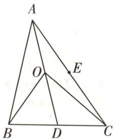

图1

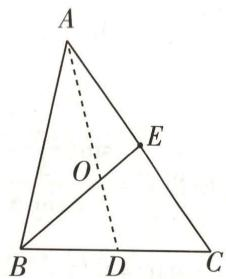

图 2

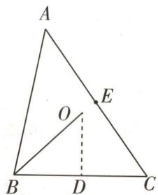

图 3

三角应用

浑象的构造是一个大圆球, 球上刻有星宿、赤道等标记; 浑仪是观测仪器, 内有窥管. 在浑天仪中, 三角形在确定天体的位置和角度时发挥着重要作用.

对于C,如图2,连接AD,若O为△ABC的重心,则 $\overrightarrow{OB}=2\overrightarrow{EO}$ ,所以 $\overrightarrow{OB}+\overrightarrow{OE}=-\overrightarrow{OE}$ ,C不正确.
【记结论】三角形的重心将中线分为长度比1:2的两份，据此得解

对于D,如图3,连接OD,若点O为△ABC的外心,BC=4,则根据三角形外心的性质得 $\overrightarrow{OD}\perp\overrightarrow{BC}$ ,故 $\overrightarrow{OB}\cdot\overrightarrow{BC}=(\overrightarrow{OD}+\overrightarrow{DB})\cdot\overrightarrow{BC}=-\frac{1}{2}\overrightarrow{BC}^{2}=-8$ ,D正确.故选ABD.

# 原创变式

1（多选）在 $\triangle ABC$ 中， $O$ 为 $\triangle ABC$ 的重心， $\cos \angle BAC = \frac{1}{5},AO = 2$ ，则 （

$\quad$A. $\overrightarrow{AO} = \frac{1}{3}\overrightarrow{AB} +\frac{1}{3}\overrightarrow{AC}$

$\quad$B. $\overrightarrow{AB} \cdot \overrightarrow{AC} \leqslant 3$

$\quad$C. $\triangle ABC$ 的面积的最大值为 $3 \sqrt{6}$

$\quad$D. $BC$ 的最小值为 $2 \sqrt{5}$

答案》第084页

# 类型 ② 三角形内心的向量表示与应用

调研 2 [2024 四川南充 5 月三模] 已知点 P 在 $\triangle ABC$ 所在平面内, 若 $\overrightarrow{PA} \cdot (\frac{\overrightarrow{AC}}{|\overrightarrow{AC}|} - \frac{\overrightarrow{AB}}{|\overrightarrow{AB}|}) = \overrightarrow{PB} \cdot (\frac{\overrightarrow{BC}}{|\overrightarrow{BC}|} - \frac{\overrightarrow{BA}}{|\overrightarrow{BA}|}) = 0$ , 则点 P 是 $\triangle ABC$ 的 ( )

$\quad$A. 外心

$\quad$B. 垂心

$\quad$C. 重心

$\quad$D. 内心

解析 在 $\triangle ABC$ 中, 由 $\overrightarrow{PA} \cdot (\frac{\overrightarrow{AC}}{|\overrightarrow{AC}|} - \frac{\overrightarrow{AB}}{|\overrightarrow{AB}|}) = 0$ , 得 $\overrightarrow{PA} \cdot \frac{\overrightarrow{AC}}{|\overrightarrow{AC}|} = \overrightarrow{PA} \cdot \frac{\overrightarrow{AB}}{|\overrightarrow{AB}|}$ ,

即 $\overrightarrow{AP}\cdot\frac{\overrightarrow{AC}}{|\overrightarrow{AC}|}=\overrightarrow{AP}\cdot\frac{\overrightarrow{AB}}{|\overrightarrow{AB}|}$ ，由 $\overrightarrow{PB}\cdot(\frac{\overrightarrow{BC}}{|\overrightarrow{BC}|}-\frac{\overrightarrow{BA}}{|\overrightarrow{BA}|})=0$ ，同理得 $\overrightarrow{BP}\cdot\frac{\overrightarrow{BC}}{|\overrightarrow{BC}|}=\overrightarrow{BP}\cdot\frac{\overrightarrow{BA}}{|\overrightarrow{BA}|}$ .

显然 $\overrightarrow{AP}\neq0$ ，即P与A不重合，

则 $|\overrightarrow{AP}|\cos \angle PAC = |\overrightarrow{AP}|\cos \angle PAB$ ，即 $\cos \angle PAC = \cos \angle PAB, \angle PAC = \angle PAB,$

于是 AP 平分 $\angle BAC$ ，同理 BP 平分 $\angle ABC$ ，所以点 P 是 $\triangle ABC$ 的内心，故选 D.

【记结论】由本题可以得出结论；若 I 为 $\triangle ABC$ 所在平面内一点，则 $\overrightarrow{IA} \cdot \left( \frac{\overrightarrow{AB}}{|\overrightarrow{AB}|} - \frac{\overrightarrow{AC}}{|\overrightarrow{AC}|} \right) = \overrightarrow{IB} \cdot \left( \frac{\overrightarrow{BA}}{|\overrightarrow{BA}|} - \frac{\overrightarrow{BC}}{|\overrightarrow{BC}|} \right) = \overrightarrow{IC} \cdot \left( \frac{\overrightarrow{CA}}{|\overrightarrow{CA}|} - \frac{\overrightarrow{CB}}{|\overrightarrow{CB}|} \right) = 0 \Leftrightarrow I$ 为 $\triangle ABC$ 的内心

# 原创变式

2 在 $\triangle ABC$ 中, $AB=4, AC=6$ , 点 $D, E$ 分别在线段 $AB, AC$ 上, 且 $D$ 为 $AB$ 中点, $\overrightarrow{AE}=\frac{1}{2}\overrightarrow{EC}$ , 若 $\overrightarrow{AP}=\overrightarrow{AD}+\overrightarrow{AE}$ , 则直线 $AP$ 经过 $\triangle ABC$ 的 ( )

$\quad$A. 内心

$\quad$B. 外心

$\quad$C. 重心

$\quad$D. 垂心

答案》第085页

推算节气 古代天文学家通过观察太阳在黄道上的位置变化来推算节气. 三角形作为计算角度和距离的重要工具之一, 在这个过程中发挥了关键作用.

三角应用

# 类型

# 三角形外心的向量表示与应用

调研 3 [2024 河北张家口 4 月统考] 已知点 O, P 均在 $\triangle ABC$ 所在平面内, 若 $|\overrightarrow{OA}| = |\overrightarrow{OB}| = |\overrightarrow{OC}| = |\overrightarrow{OP}|, |\overrightarrow{AB}| = |\overrightarrow{AC}| = 2, \angle BAC = 120^{\circ}$ , 则 $\overrightarrow{AP} \cdot \overrightarrow{AB}$ 的取值范围为 \_\_\_\_.

解析 因为 $\left|\overrightarrow{OA}\right|=\left|\overrightarrow{OB}\right|=\left|\overrightarrow{OC}\right|=\left|\overrightarrow{OP}\right|$ ，所以 O 为 $\triangle ABC$ 的外心，且 P 为 $\triangle ABC$ 外接圆

【易混淆】三角形的外心到三角形三个顶点的距离相等，是三角形三边垂直平分线的交点，注意与三角形内心区分

上一动点，

又 $|\overrightarrow{AB}| = |\overrightarrow{AC}| = 2, \angle BAC = 120^\circ$ ，所以 $BC = 2\sqrt{3}$ ，则 $\triangle ABC$ 外接圆的半径 $r = \frac{BC}{\sin 120^\circ} \times \frac{1}{2} = 2$ .

如图4, 过点 P 作 $PD \perp AB$ , 垂足为 D, 则 $\overrightarrow{AP}$ 在 $\overrightarrow{AB}$ 方向上的投影向量是 $\overrightarrow{AD}$ ,

  
“投影法”速解外心的数量积问题

【易错警示】当点 P 在圆 O 上运动时，作 $PD \perp AB$ ，垂足 D 可能不在线段 AB 上，而是在直线 AB 上

所以 $\overrightarrow{AP} \cdot \overrightarrow{AB} = |\overrightarrow{AP}| \cdot |\overrightarrow{AB}| \cos \angle PAB = \pm |\overrightarrow{AB}| \cdot |\overrightarrow{AD}|$ ,

所以当 $PD$ 与圆相切时， $\overrightarrow{AP} \cdot \overrightarrow{AB}$ 取最值，即 $P$ 在 $P_{1}$ （直线 $CO$ 与圆的另一个交点）处时， $\overrightarrow{AP} \cdot \overrightarrow{AB}$ 取最大值，为6， $P$ 与 $C$ 重合时， $\overrightarrow{AP} \cdot \overrightarrow{AB}$ 取最小值，为-2.所以 $\overrightarrow{AP} \cdot \overrightarrow{AB}$ 的取值范围为[-2,6].

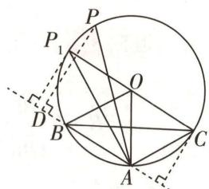

图 4

# 原创变式

3 已知 O 是 $\triangle ABC$ 所在平面内的一定点, 平面内动点 P 满足 $\overrightarrow{OP} = \frac{\overrightarrow{OB} + \overrightarrow{OC}}{2} + \lambda \left( \frac{\overrightarrow{AB}}{|\overrightarrow{AB}| \cos \angle ABC} + \frac{\overrightarrow{AC}}{|\overrightarrow{AC}| \cos \angle ACB} \right)$ , $\lambda \in R$ , 则动点 P 的轨迹一定通过 $\triangle ABC$ 的 ( )

$\quad$A. 重心

$\quad$B. 外心

$\quad$C. 内心

$\quad$D. 垂心

4 在锐角三角形 ABC 中, $\angle BAC = 60^{\circ}, AB > AC, H$ 为 $\triangle ABC$ 的垂心, $\overrightarrow{AH} \cdot \overrightarrow{AC} = 20, O$ 为 $\triangle ABC$ 的外心, 且 $\overrightarrow{AH} \cdot \overrightarrow{AO} = \frac{71}{98} |\overrightarrow{AH}| \cdot |\overrightarrow{AO}|$ , 则 BC = ()

$\quad$A. 9

$\quad$B. 8

$\quad$C. 7

$\quad$D. 6

答案》第085页

# 类型

# 三角形垂心的向量表示与应用

调研 4 [2024 湖南长沙 5 月联考 | 新情境·奔驰定理]“奔驰定理”是平面向量中一个非常优美的结论,表述如下:已知点 O 是△ABC 内的一点,将△BOC,△AOC,△AOB 的面积分

三角应用

制定历法 古代中国采用农历作为主要的历法体系. 在制定农历的过程中, 天文学家需要综合考虑太阳、月亮的运动规律等, 这些复杂的计算过程离不开三角形等几何图形的辅助.

别记为 $S_{1}, S_{2}, S_{3}$ , 则 $S_{1} \cdot \overrightarrow{OA} + S_{2} \cdot \overrightarrow{OB} + S_{3} \cdot \overrightarrow{OC} = 0$ . 如图5, 已知 $O$ 是 $\triangle ABC$ 的垂心, 且 $\overrightarrow{OA} + 2\overrightarrow{OB} + 3\overrightarrow{OC} = 0$ , 则 $\cos \angle ACB =$ （）

$\quad$A. $\frac{3\sqrt{10}}{10}$

$\quad$B. $\frac{\sqrt{10}}{10}$

$\quad$C. $\frac{2\sqrt{5}}{5}$

$\quad$D. $\frac{\sqrt{5}}{5}$

图 5

解析 如图6,延长CO交AB于点P,∵O是△ABC的垂心,∴OP⊥AB,

分别记 $\triangle BOC, \triangle AOC, \triangle AOB$ 的面积为 $S_{1}, S_{2}, S_{3}$ , 则 $S_{1}: S_{2} = (\frac{1}{2} \cdot$ $OC\cdot BP):(\frac{1}{2}\cdot OC\cdot AP) = BP:AP = \frac{BP}{PC}:\frac{AP}{PC} = \tan \angle BAC:\tan \angle ABC.$

同理可得 $S_{1}: S_{3} = \tan \angle BAC: \tan \angle ACB, \therefore S_{1}: S_{2}: S_{3} = \tan \angle BAC: \tan \angle ABC: \tan \angle ACB.$

又 $S_{1} \cdot \overrightarrow{OA} + S_{2} \cdot \overrightarrow{OB} + S_{3} \cdot \overrightarrow{OC} = 0, \therefore \tan \angle BAC \cdot \overrightarrow{OA} + \tan \angle ABC \cdot \overrightarrow{OB} + \tan \angle ACB \cdot \overrightarrow{OC} = 0.$

又 $\overrightarrow{OA} + 2\overrightarrow{OB} + 3\overrightarrow{OC} = 0, \therefore \tan \angle BAC: \tan \angle ABC: \tan \angle ACB = 1:2:3.$

不妨设 $\tan\angle BAC=k,\tan\angle ABC=2k,\tan\angle ACB=3k$ , 其中 $k\neq0$

$\because \tan \angle BAC = -\tan (\angle ABC + \angle ACB) = -\frac{\tan \angle ABC + \tan \angle ACB}{1 - \tan \angle ABC \tan \angle ACB}, \therefore k = -\frac{2k + 3k}{1 - 2k \cdot 3k}$ , 解得 $k = \pm 1$ .

当k=-1时, $\tan\angle BAC<0,\tan\angle ABC<0,\tan\angle ACB<0$ ,则 $\angle BAC,\angle ABC,\angle ACB$ 都是钝【明易错】注意检验解是否符合题意，排除不合理的解角,不合题意,舍掉.

故 $k = 1$ ，则 $\tan \angle ACB = 3 > 0$ ，故 $\angle ACB$ 为锐角，∴ $\left\{ \begin{array}{l} \frac{\sin\angle ACB}{\cos\angle ACB} = 3, \\ \sin^2\angle ACB + \cos^2\angle ACB = 1, \end{array} \right.$ 得 $\cos \angle ACB =$ $\frac{\sqrt{10}}{10}$ , 故选 B.

# 原创变式

5 若 $H$ 是 $\triangle ABC$ 的垂心, $2\overrightarrow{HA} + 2\overrightarrow{HB} + 3\overrightarrow{HC} = 0$ , 则 $\tan \angle ACB =$ （）

$\quad$A. $\sqrt{5}$

$\quad$B. $\frac{\sqrt{21}}{2}$

$\quad$C. $2\sqrt{2}$

$\quad$D. $\frac{\sqrt{10}}{2}$

答案》第086页

小编说:一直以来,数学都是设计和建造中的宝贵工具,它是建筑设计思想的来源,也是实现建筑的基础,因此,诸多建筑中总会含有一股“数学味”.

建筑数学

# 创新预测

答案▶086页

##### 1.[2024 哈尔滨一中 5 月三模]已知点 M 在 $\triangle ABC$ 所在平面内, 在 $\triangle ABC$ 中, $\overrightarrow{AC^{2}} - \overrightarrow{AB^{2}} = 2 \overrightarrow{AM} \cdot (\overrightarrow{AC} - \overrightarrow{AB})$ , 那么动点 M 的轨迹必通过 $\triangle ABC$ 的 ( )

$\quad$A. 垂心

$\quad$B. 内心

$\quad$C. 重心

$\quad$D. 外心

##### 2. 试题调研原创 在直角三角形 ABC 中, $A = 90^{\circ}$ , $\triangle ABC$ 的重心、外心、垂心、内心分别为 $G_{1}$ , $G_{2}$ , $G_{3}$ , $G_{4}$ , 若 $\overrightarrow{AG_{i}} = \lambda_{i} \overrightarrow{AB} + \mu_{i} \overrightarrow{AC}$ (其中 i = 1, 2, 3, 4), 当 $\lambda_{i} + \mu_{i}$ 取最大值时, i = ()

$\quad$A. 1

$\quad$B. 2

$\quad$C. 3

$\quad$D. 4

##### 3. 试题调研原创 已知点 O, P 均在 $\triangle ABC$ 所在平面内, 以下所有正确说法的序号是 \_\_\_\_.

①若动点 P 满足 $\overrightarrow{OP} = \overrightarrow{OA} + \overrightarrow{PB} + \overrightarrow{PC}$ ，则动点 P 的轨迹一定经过 $\triangle ABC$ 的重心；
②若动点 P 满足 $\overrightarrow{OP} = \overrightarrow{OA} + \lambda \left( \frac{\overrightarrow{AB}}{|\overrightarrow{AB}|} + \frac{\overrightarrow{AC}}{|\overrightarrow{AC}|} \right) (\lambda \in \mathbb{R})$ ，则动点 P 的轨迹一定经过 $\triangle ABC$ 的内心；

③若动点 P 满足 $\overrightarrow{OP} = \overrightarrow{OA} + \lambda \left( \frac{\overrightarrow{AB}}{|\overrightarrow{AB}| \sin B} + \frac{\overrightarrow{AC}}{|\overrightarrow{AC}| \sin C} \right) (\lambda \in \mathbb{R})$ ，则动点 P 的轨迹一定经过 $\triangle ABC$ 的重心；

④若动点 P 满足 $\overrightarrow{OP} = \overrightarrow{OA} + \lambda \left( \frac{\overrightarrow{AB}}{|\overrightarrow{AB}| \cos B} + \frac{\overrightarrow{AC}}{|\overrightarrow{AC}| \cos C} \right) (\lambda \in \mathbb{R})$ ，则动点 P 的轨迹一定经过 $\triangle ABC$ 的垂心.

# 参考答案与解析

# 原创变式

##### 1. ABC 如图7,延长AO交BC于点D,因为O是△ABC的重心,所以点D是BC的中点,则 $\overrightarrow{AD}=\frac{1}{2}(\overrightarrow{AB}+\overrightarrow{AC}),\overrightarrow{AO}=\frac{2}{3}\overrightarrow{AD}$ [记结论:三角形的重心是中线的一个三等分点,据此得解].

图 7

对于 A, $\overrightarrow{AO} = \frac{2}{3}\overrightarrow{AD} = \frac{2}{3} \times \frac{1}{2} (\overrightarrow{AB} + \overrightarrow{AC}) = \frac{1}{3}\overrightarrow{AB} + \frac{1}{3}\overrightarrow{AC}$ , A 正确.

对于 B, 由 $\overrightarrow{AO} = \frac{1}{3}\overrightarrow{AB} + \frac{1}{3}\overrightarrow{AC}$ 得 $\overrightarrow{AB} + \overrightarrow{AC} = 3\overrightarrow{AO}$ , 所以 $9\overrightarrow{AO}^2 = (\overrightarrow{AB} + \overrightarrow{AC})^2 = \overrightarrow{AB}^2 + \overrightarrow{AC}^2 + 2\overrightarrow{AB} \cdot \overrightarrow{AC} \geqslant 2|\overrightarrow{AB}| |\overrightarrow{AC}| + 2\overrightarrow{AB} \cdot \overrightarrow{AC}$ , 当且仅当 $|\overrightarrow{AB}| = |\overrightarrow{AC}|$ 时等号成立.

又 $\overrightarrow{AB} \cdot \overrightarrow{AC} = |\overrightarrow{AB}| |\overrightarrow{AC}| \cos \angle BAC = \frac{1}{5} |\overrightarrow{AB}| |\overrightarrow{AC}|$ ，所以 $|\overrightarrow{AB}| |\overrightarrow{AC}| = 5\overrightarrow{AB} \cdot \overrightarrow{AC}$ ，又 $AO = 2$

建筑数学

黄金分割 上海东方明珠广播电视塔的塔高468米,上球体顶部到塔底的距离约为295米,两个数字的比值非常接近黄金分割比值0.618,因此显得格外挺拔.

所以 $2 \times 5 \overrightarrow{AB} \cdot \overrightarrow{AC} + 2 \overrightarrow{AB} \cdot \overrightarrow{AC} \leqslant 9 \times 2^{2}$ ，即 $\overrightarrow{AB} \cdot \overrightarrow{AC} \leqslant 3$ ，当且仅当 $|\overrightarrow{AB}| = |\overrightarrow{AC}|$ 时等号成立，故 B 正确.

对于 C, $\left|\overrightarrow{AB}\right| \cdot \left|\overrightarrow{AC}\right| = \frac{\overrightarrow{AB} \cdot \overrightarrow{AC}}{\cos \angle BAC} = 5 \overrightarrow{AB} \cdot \overrightarrow{AC} \leqslant 15$ , 当且仅当 $\left|\overrightarrow{AB}\right| = \left|\overrightarrow{AC}\right|$ 时等号成立, $\sin \angle BAC = \sqrt{1 - \cos^{2} \angle BAC} = \frac{2\sqrt{6}}{5}$ , 所以 $S_{\triangle ABC} = \frac{1}{2} \left|\overrightarrow{AB}\right| \left|\overrightarrow{AC}\right| \sin \angle BAC \leqslant \frac{1}{2} \times 15 \times \frac{2\sqrt{6}}{5} = 3\sqrt{6}$ , 故 C 正确.

对于 D, 由 $9 \overrightarrow{AO}^{2} = (\overrightarrow{AB} + \overrightarrow{AC})^{2} = \overrightarrow{AB}^{2} + \overrightarrow{AC}^{2} + 2 \overrightarrow{AB} \cdot \overrightarrow{AC}, AO = 2$ ,

得 $|\overrightarrow{AB}|^2 + |\overrightarrow{AC}|^2 = 9\overrightarrow{AO}^2 - 2\overrightarrow{AB} \cdot \overrightarrow{AC} = 36 - 2\overrightarrow{AB} \cdot \overrightarrow{AC} = 36 - \frac{2}{5} |\overrightarrow{AB}| |\overrightarrow{AC}|$ ，由C知 $|\overrightarrow{AB}| |\overrightarrow{AC}| \leqslant 15$

所以由余弦定理可得 $BC^{2}=|\overrightarrow{AB}|^{2}+|\overrightarrow{AC}|^{2}-2|\overrightarrow{AB}|\cdot|\overrightarrow{AC}|\cos\angle BAC=36-\frac{4}{5}|\overrightarrow{AB}||\overrightarrow{AC}|\geqslant36-\frac{4}{5}\times15=24$ ，即 $BC\geqslant2\sqrt{6}$ ，当且仅当 $|\overrightarrow{AB}|=|\overrightarrow{AC}|$ 时等号成立，所以 BC 的最小值是 $2\sqrt{6}$ ，故 D 错误。故选 ABC。

##### 2.A 因为 AB=4, AC=6, 且 D 为 AB 中点, $\overrightarrow{AE}=\frac{1}{2}\overrightarrow{EC}$ , 则 $\left|\overrightarrow{AD}\right|=\left|\overrightarrow{AE}\right|=$ 2, 连接 DP, EP, 如图 8, 因为 $\overrightarrow{AP}=\overrightarrow{AD}+\overrightarrow{AE}$ , 所以四边形 ADPE 为菱形, AP 为菱形 ADPE 的对角线,

所以 AP 平分 $\angle BAC$ ，即直线 AP 经过 $\triangle ABC$ 的内心，故选 A.

图8

##### 3.B 设 BC 的中点为 D, 连接 OD. 因为 $\overrightarrow{OP} = \frac{\overrightarrow{OB} + \overrightarrow{OC}}{2} + \lambda \left( \frac{\overrightarrow{AB}}{|\overrightarrow{AB}| \cos \angle ABC} + \frac{\overrightarrow{AC}}{|\overrightarrow{AC}| \cos \angle ACB} \right)$ ,

所以 $\overrightarrow{OP} = \overrightarrow{OD} + \lambda \left( \frac{\overrightarrow{AB}}{|\overrightarrow{AB}| \cos \angle ABC} + \frac{\overrightarrow{AC}}{|\overrightarrow{AC}| \cos \angle ACB} \right)$ ，即 $\overrightarrow{DP} = \lambda \left( \frac{\overrightarrow{AB}}{|\overrightarrow{AB}| \cos \angle ABC} + \frac{\overrightarrow{AC}}{|\overrightarrow{AC}| \cos \angle ACB} \right)$ ,

两边同时点乘 $\overrightarrow{BC}$ [破障碍:结合 $\frac{\overrightarrow{AB}}{|\overrightarrow{AB}|\cos\angle ABC}+\frac{\overrightarrow{AC}}{|\overrightarrow{AC}|\cos\angle ACB}$ 与向量数量积的计算方法变形求解],得 $\overrightarrow{DP}\cdot\overrightarrow{BC}=\lambda\left(\frac{\overrightarrow{AB}\cdot\overrightarrow{BC}}{|\overrightarrow{AB}|\cos\angle ABC}+\frac{\overrightarrow{AC}\cdot\overrightarrow{BC}}{|\overrightarrow{AC}|\cos\angle ACB}\right)=\lambda\left(\frac{|\overrightarrow{AB}||\overrightarrow{BC}|\cos(\pi-\angle ABC)}{|\overrightarrow{AB}|\cos\angle ABC}+\frac{|\overrightarrow{AC}||\overrightarrow{BC}|\cos\angle ACB}{|\overrightarrow{AC}|\cos\angle ACB}\right)=\lambda(-| \overrightarrow{BC}|+| \overrightarrow{BC}|)=0$ ,所以 $DP\perp BC$ ,所以点P在BC的垂直平分线上,即动点P的轨迹一定经过△ABC的外心,故选B.

##### 4.C 设△ABC 的内角 A, B, C 所对的边分别为 a, b, c, 如图 9, 连接 BH 并延长, 交 AC 于 D, 延长 AH 交 BC 于 E, 则 BD ⊥ AC,

所以 $\overrightarrow{AH}\cdot\overrightarrow{AC}=|\overrightarrow{AD}|\cdot|\overrightarrow{AC}|=|\overrightarrow{AB}|\cos60^{\circ}\cdot|\overrightarrow{AC}|=20$ ，则bc=40.

连接 OB, 因为 O 为 $\triangle ABC$ 的外心, 所以 $\angle AOB = 2C$ [破障碍: O 为 $\triangle ABC$ 外接圆的圆心, C 在外接圆上, 则圆 O 的弦 AB 对应的圆心角 $\angle AOB$ 是圆周角 $\angle ACB$ 的 2 倍], 则 $\angle BAO = 90^{\circ} - C$ , 又在 $\triangle ABE$ 中, $\angle BAE = 90^{\circ} - \angle ABC$ , 故 $\angle OAH = 90^{\circ} - \angle ABC - (90^{\circ} - C) = C - \angle ABC$ ,

所以 $\cos(C - \angle ABC) = \cos \angle OAH = \frac{\overrightarrow{AH} \cdot \overrightarrow{AO}}{|\overrightarrow{AH}| |\overrightarrow{AO}|} = \frac{71}{98}$ ，结合 $\cos(C + \angle ABC) = -\frac{1}{2}$ 得 $\sin C \sin \angle ABC = \frac{30}{49}$ ，所以由正弦定理得 $\frac{bc}{\sin C \sin \angle ABC} = (\frac{BC}{\sin \angle BAC})^2 = \frac{196}{3}$ ，即 $BC^2 \cdot \frac{4}{3} = \frac{196}{3}$ ，解得 BC = 7。故选 C.

图9

##### 5.B 在 $\triangle ABC$ 中, 取 $AB$ 的中点 $D$ , 连接 $HD$ , 如图 10, 则 $\overrightarrow{HA} + \overrightarrow{HB} = 2\overrightarrow{HD}$ ,

由 $2\overrightarrow{HA}+2\overrightarrow{HB}+3\overrightarrow{HC}=0$ , 得 $\overrightarrow{CH}=\frac{2}{3}(\overrightarrow{HA}+\overrightarrow{HB})=\frac{4}{3}\overrightarrow{HD}$ ，于是 $\overrightarrow{CD}=\frac{7}{3}\overrightarrow{HD}, C,H,D$ 三点共线.

$\overrightarrow {C A} = \overrightarrow {C D} + \overrightarrow {D A} = \frac {7}{3} \overrightarrow {H D} + \overrightarrow {D A}, \overrightarrow {H B} = \overrightarrow {H D} + \overrightarrow {D B} = \overrightarrow {H D} - \overrightarrow {D A},$

由 H 是 $\triangle ABC$ 的垂心, 得 $\overrightarrow{HD} \perp \overrightarrow{DA}, \overrightarrow{HB} \perp \overrightarrow{CA}$ [明关键: 根据垂心找到垂直关系, 并用向量的数量积表示], 则 $\overrightarrow{HD} \cdot \overrightarrow{DA} = 0, \overrightarrow{HB} \cdot \overrightarrow{CA} = 0$ ,

因此 $\overrightarrow{CA} \cdot \overrightarrow{HB} = (\frac{7}{3}\overrightarrow{HD} + \overrightarrow{DA}) \cdot (\overrightarrow{HD} - \overrightarrow{DA}) = \frac{7}{3}\overrightarrow{HD}^2 - \overrightarrow{DA}^2 = 0$ ，则 $|\overrightarrow{DA}| = \frac{\sqrt{21}}{3} |\overrightarrow{HD}|$ ，显然 $\tan \angle AHD = \frac{|\overrightarrow{AD}|}{|\overrightarrow{HD}|} = \frac{\sqrt{21}}{3}, \angle BHD = \angle AHD.$ 延长 $BH$

图10

交 $AC$ 于 $F$ , 延长 $AH$ 交 $BC$ 于 $E$ , 在 Rt $\triangle ACE$ , Rt $\triangle AHF$ 中, $\angle ACB + \angle CAE = \frac{\pi}{2} = \angle AHF + \angle CAE$ , 即 $\angle ACB = \angle AHF$ ,

则 $\tan \angle ACB = \tan \angle AHF = \tan (\pi - 2\angle AHD) = -\tan 2\angle AHD = -\frac{2\tan\angle AHD}{1 - \tan^2\angle AHD} =$ $-\frac{2\times\frac{\sqrt{21}}{3}}{1 - (\frac{\sqrt{21}}{3})^2} = \frac{\sqrt{21}}{2}$ , 故选 B.

# 创新预测

##### 1.D 设线段 BC 的中点为 D, 连接 AD, 则 $\overrightarrow{AB} + \overrightarrow{AC} = 2\overrightarrow{AD}$ ,

因为 $\overrightarrow{AC^{2}}-\overrightarrow{AB^{2}}=2\overrightarrow{AM}\cdot(\overrightarrow{AC}-\overrightarrow{AB})$ ，即 $(\overrightarrow{AC}+\overrightarrow{AB})\cdot(\overrightarrow{AC}-\overrightarrow{AB})=2\overrightarrow{AM}\cdot\overrightarrow{BC}$ ，即 $2\overrightarrow{AD}\cdot\overrightarrow{BC}=2\overrightarrow{AM}\cdot\overrightarrow{BC}$ ，变形得 $\overrightarrow{BC}\cdot(\overrightarrow{AM}-\overrightarrow{AD})=\overrightarrow{BC}\cdot\overrightarrow{DM}=0$ ，则 $DM\perp BC$ ，所以DM垂直且平分线段BC，因此动点M的轨迹是BC的垂直平分线，必通过 $\triangle ABC$ 的外心。故选D。

##### 2.B $\triangle ABC$ 的重心为 $G_{1}$ ，如图 11 所示，连接 $AG_{1}$ 并延长，交 BC 于点 D，则 $\overrightarrow{AG_{1}} = \frac{2}{3} \overrightarrow{AD} = \frac{2}{3} \times$

$\frac{1}{2} (\overrightarrow{AB} + \overrightarrow{AC}) = \frac{1}{3}\overrightarrow{AB} + \frac{1}{3}\overrightarrow{AC}$ , 则 $\lambda_{1} = \mu_{1} = \frac{1}{3}, \lambda_{1} + \mu_{1} = \frac{2}{3}$ .

$\triangle ABC$ 的外心为 $G_{2}$ , 则 $G_{2}$ 为 $BC$ 的中点 [记结论: 直角三角形的外心为斜边的中点],

如图12所示，连接 $AG_{2}$ ，则 $\overrightarrow{AG_2} = \frac{1}{2} (\overrightarrow{AB} +\overrightarrow{AC})$ ，则 $\lambda_2 = \mu_2 = \frac{1}{2},\lambda_2 + \mu_2 = 1.$

$\triangle ABC$ 的垂心为 $G_{3}$ , 则 $G_{3}$ 与点 $A$ 重合, $\overrightarrow{AG_3} = 0$ , 则 $\lambda_{3} = \mu_{3} = 0, \lambda_{3} + \mu_{3} = 0$ .

图 11

图12

$\triangle ABC$ 的内心为 $G_{4}$ , 则点 $G_{4}$ 是三条内角平分线的交点, 设直角三角形 $ABC$ 中, 角 $A, B, C$ 的对边分别为 $a, b, c$ , 内切圆半径为 $r$ , 则 $S_{\triangle ABC} = \frac{1}{2} bc = \frac{1}{2}(a + b + c)r$ , 得 $r = \frac{bc}{a + b + c}$ ,

$\overrightarrow{AG_4} = \frac{bc}{a + b + c}\cdot \frac{\overrightarrow{AB}}{|\overrightarrow{AB}|} +\frac{bc}{a + b + c}\cdot \frac{\overrightarrow{AC}}{|\overrightarrow{AC}|} = \frac{bc}{a + b + c}\cdot \frac{\overrightarrow{AB}}{c} +\frac{bc}{a + b + c}\cdot \frac{\overrightarrow{AC}}{b} = \frac{b}{a + b + c}\overrightarrow{AB} +\frac{c}{a + b + c}\overrightarrow{AC},$ 则

$\lambda_ {4} = \frac {b}{a + b + c}, \mu_ {4} = \frac {c}{a + b + c}, \lambda_ {4} + \mu_ {4} = \frac {b}{a + b + c} + \frac {c}{a + b + c} = \frac {b + c}{a + b + c} <   1.$

综上, $\lambda_{2}+\mu_{2}=1$ 最大,所以当 $\lambda_{i}+\mu_{i}$ 取最大值时,i=2,故选B.

##### 3.①②③④ 对于①,因为动点P满足 $\overrightarrow{OP}=\overrightarrow{OA}+\overrightarrow{PB}+\overrightarrow{PC}$ ,所以 $\overrightarrow{AP}=\overrightarrow{PB}+\overrightarrow{PC}$ ,则点P是△ABC的重心,①正确.

对于②, $\overrightarrow{OP}=\overrightarrow{OA}+\lambda\left(\frac{\overrightarrow{AB}}{|\overrightarrow{AB}|}+\frac{\overrightarrow{AC}}{|\overrightarrow{AC}|}\right)(\lambda\in\mathbb{R})$ ，所以 $\overrightarrow{AP}=\lambda\left(\frac{\overrightarrow{AB}}{|\overrightarrow{AB}|}+\frac{\overrightarrow{AC}}{|\overrightarrow{AC}|}\right)(\lambda\in\mathbb{R})$

所以点 P 在 $\angle BAC$ 的平分线所在直线上, 所以动点 P 的轨迹一定经过 $\triangle ABC$ 的内心, ② 正确.

对于③, $\overrightarrow{OP}=\overrightarrow{OA}+\lambda\left(\frac{\overrightarrow{AB}}{|\overrightarrow{AB}|\sin B}+\frac{\overrightarrow{AC}}{|\overrightarrow{AC}|\sin C}\right)(\lambda\in\mathbf{R})$ ，所以 $\overrightarrow{AP}=\lambda\left(\frac{\overrightarrow{AB}}{|\overrightarrow{AB}|\sin B}+\frac{\overrightarrow{AC}}{|\overrightarrow{AC}|\sin C}\right)$ $(\lambda \in \mathbf{R})$ ，过点A作 $AD \perp BC$ ，垂足为D，则 $|\overrightarrow{AB}| \sin B = |\overrightarrow{AC}| \sin C = AD$ ，所以 $\overrightarrow{AP} = \frac{\lambda}{AD} (\overrightarrow{AB} + \overrightarrow{AC})$ ，则点P在BC边上的中线所在直线上，因此动点P的轨迹一定经过△ABC的重心，③正确.

对于④, $\overrightarrow{OP}=\overrightarrow{OA}+\lambda\left(\frac{\overrightarrow{AB}}{|\overrightarrow{AB}|\cos B}+\frac{\overrightarrow{AC}}{|\overrightarrow{AC}|\cos C}\right)(\lambda\in\mathbf{R})$ ，所以 $\overrightarrow{AP}=\lambda\left(\frac{\overrightarrow{AB}}{|\overrightarrow{AB}|\cos B}+\frac{\overrightarrow{AC}}{|\overrightarrow{AC}|\cos C}\right)$

$(\lambda \in \mathbf{R})$ ，所以 $\overrightarrow{AP} \cdot \overrightarrow{BC} = \lambda \left( \frac{\overrightarrow{AB}}{|\overrightarrow{AB}| \cos B} + \frac{\overrightarrow{AC}}{|\overrightarrow{AC}| \cos C} \right) \cdot \overrightarrow{BC} = \lambda (-|\overrightarrow{BC}| + |\overrightarrow{BC}|) = 0$ ，所以 $\overrightarrow{AP} \perp \overrightarrow{BC}$ ，所以动点P的轨迹一定经过 $\triangle ABC$ 的垂心，④正确.

故所有正确说法的序号是①②③④.

# 高效破题

# 有方法

# 超重点 11 新教材中隐藏的 4 个高妙结论定理

# 定理 ① 向量三角不等式

# 教材回顾 人教 A 版新教材《必修第二册》第 9 页“探究”：

（1） 如果向量 a, b 共线, 它们的加法与数的加法有什么关系? 你能作出向量 $a + b$ 吗?  
（2） 结合例 1 (已知向量 a, b, 求作向量 $a + b$ ), 探索 $|a + b|$ , $|a|$ , $|b|$ 之间的关系.

解答 当向量 a, b 方向相同时, $\left|a + b\right| = \left|a\right| + \left|b\right|$ ;

当向量 a, b 方向相反时， $|a + b| = ||a| - |b||$ .

当向量 a, b 不共线时, 如图 1 所示, 设 $a = \overrightarrow{OA}, b = \overrightarrow{OB}$ , 且向量 a, b 不共线, 以 OA, OB 为邻边作一个平行四边形 OACB, 则 $\overrightarrow{OC} = a + b$ , $\overrightarrow{BA} = a - b$ . 在 $\triangle AOC$ 中, 因为 $|AO - AC| < OC$ , 所以 $||a| - |b|| < |a + b|$ , 因为 $OC < AO + AC$ , 所以 $|a + b| < |a| + |b|$ [关键证明], 所以 $||a| - |b|| < |a + b| < |a| + |b|$ .

综上所述， $||\pmb {a}|-|\pmb {b}||\leqslant |\pmb {a} + \pmb {b}|\leqslant |\pmb {a}| + |\pmb {b}|$

图1.

定理提取 向量三角不等式 $||a| - |b|| \leqslant |a \pm b| \leqslant |a| + |b|$ .

拓展: 绝对值三角不等式

（1） 如果 a, b 是实数, 那么 $\left|\left|a\right|-\left|b\right|\right|\leqslant\left|a\pm b\right|\leqslant\left|a\right|+\left|b\right|$ ;  
（2） 如果 a, b, c 是实数, 那么 $\left|a - c\right| \leqslant \left|a - b\right| + \left|b - c\right|$ , 当且仅当 $(a - b)(b - c) \geqslant 0$ 时, 等号成立.

调研 1 试题调研原创 已知向量 $\overrightarrow{PA}, \overrightarrow{PB}$ 满足 $|\overrightarrow{PA}|^{2} + |\overrightarrow{PB}|^{2} = 4, |\overrightarrow{AB}|^{2} = 2$ ，设 $\overrightarrow{PC} = 2\overrightarrow{PA} + \overrightarrow{PB}$ ，则 $|\overrightarrow{PC}|$ 的取值范围为 \_\_\_\_.

解析 由 $|\overrightarrow{PA}|^2 + |\overrightarrow{PB}|^2 = 4, |\overrightarrow{AB}|^2 = 2$ 可得 $\overrightarrow{PA} \cdot \overrightarrow{PB} = 1$ ,

【破障碍】在 $\triangle PAB$ 中，根据余弦定理有 $PA^{2}+PB^{2}-2PA\cdot PB\cos\angle APB=AB^{2}$ ，其中 $PA\cdot PB\cos\angle APB$ 等于 $\overrightarrow{PA}\cdot\overrightarrow{PB}$

则 $|\overrightarrow{PA} + \overrightarrow{PB}|^2 = |\overrightarrow{PA}|^2 + |\overrightarrow{PB}|^2 + 2\overrightarrow{PA} \cdot \overrightarrow{PB} = 6$ ，即 $|\overrightarrow{PA} + \overrightarrow{PB}| = \sqrt{6}$ ， $|\overrightarrow{PA} - \overrightarrow{PB}| = |\overrightarrow{BA}| = \sqrt{2}$

因为 $\overrightarrow{PC} = 2\overrightarrow{PA} +\overrightarrow{PB} = \frac{3}{2} (\overrightarrow{PA} +\overrightarrow{PB}) + \frac{1}{2} (\overrightarrow{PA} -\overrightarrow{PB})$

所以 $\left|\frac{3}{2}\right|\overrightarrow{PA}+\overrightarrow{PB}\left|-\frac{1}{2}\right|\overrightarrow{PA}-\overrightarrow{PB}\left|\right|\leqslant\left|\overrightarrow{PC}\right|\leqslant\frac{3}{2}\left|\overrightarrow{PA}+\overrightarrow{PB}\right|+\frac{1}{2}\left|\overrightarrow{PA}-\overrightarrow{PB}\right|$ ，即 $\frac{3\sqrt{6}-\sqrt{2}}{2}\leqslant$

【用定理】应用向量三角不等式 $\left|\left|a\right|-\left|b\right|\right|\leqslant\left|a+b\right|\leqslant\left|a\right|+\left|b\right|$

$|\overrightarrow{PC}| \leqslant \frac{3\sqrt{6} + \sqrt{2}}{2}$ . 所以 $|\overrightarrow{PC}|$ 的取值范围为 $\left[\frac{3\sqrt{6} - \sqrt{2}}{2}, \frac{3\sqrt{6} + \sqrt{2}}{2}\right]$ .

建筑数学

拱形结构 我国著名的赵州桥为拱形桥,拱形具有坚固的特点,它可以使受力分散,增强桥体的承重能力.

# 原创变式

已知 A, B 两点在圆 $x^{2} + y^{2} = 12$ 上，且 $|AB| = 4$ ，点 P 在直线 $x + y = 4$ 上，若 $|\overrightarrow{PA} + 3\overrightarrow{PB}| \leqslant 28$ 恒成立，则点 P 横坐标的取值范围是 \_\_\_\_.

答案》第095页

# 定理 ② 定比分点定理

# 教材回顾 人教 A 版新教材《必修第二册》第 33 页“探究”：

如图2,线段 $P_{1}P_{2}$ 的端点 $P_{1},P_{2}$ 的坐标分别是 $(x_{1},y_{1}),(x_{2},y_{2})$ ，点P是直线 $P_{1}P_{2}$ 上的一点.当 $\overrightarrow{P_{1}P}=\lambda\overrightarrow{PP_{2}}$ 时，点P的坐标是什么？

解答 设 $P(x, y), \because \overrightarrow{P_1P} = (x - x_1, y - y_1), \overrightarrow{PP_2} = (x_2 - x, y_2 - y), \overrightarrow{P_1P} = \lambda \overrightarrow{PP_2}$ , 易知 $\lambda \neq -1, \therefore (x - x_1, y - y_1) = \lambda (x_2 - x, y_2 - y)$ ,

$\therefore \left\{ \begin{array}{l} x - x_{1} = \lambda (x_{2} - x), \\ y - y_{1} = \lambda (y_{2} - y), \end{array} \right.$ 解得 $\left\{ \begin{array}{l} x = \frac{x_1 + \lambda x_2}{1 + \lambda}, \\ y = \frac{y_1 + \lambda y_2}{1 + \lambda}, \end{array} \right.$ 即 $P\left(\frac{x_1 + \lambda x_2}{1 + \lambda}, \frac{y_1 + \lambda y_2}{1 + \lambda}\right)$ .

图 2

定理提取 定比分点定理 设 $A(x_{1},y_{1})$ , $B(x_{2},y_{2})$ , 若 $\overrightarrow{AM} = \lambda \overrightarrow{MB}$ , 则 $M(\frac{x_{1} + \lambda x_{2}}{1 + \lambda}, \frac{y_{1} + \lambda y_{2}}{1 + \lambda})$ .

调研 2 试题调研原创 若过两点 $M(3,6)$ , $N(-2,5)$ 的直线与 y 轴相交于点 P, $\overrightarrow{MP} = \lambda \overrightarrow{PN}$ , 则 $\lambda =$ ( )

$\quad$A. $\frac{2}{3}$

$\quad$B. $\frac{3}{2}$

$\quad$C. $-\frac{2}{3}$

$\quad$D. $-\frac{3}{2}$

解析 设 $P(x_{P},y_{P})$ ，则 $x_{P} = \frac{3 - 2\lambda}{1 + \lambda} = 0$ ，得 $\lambda = \frac{3}{2}$ 故选B.

【用定理】由定比分点定理可知，记 $M(x_{1},y_{1}),N(x_{2},y_{2})$ ，则 $x_{P}=\frac{x_{1}+\lambda x_{2}}{1+\lambda}$

# 原创变式

2 在 $\triangle ABC$ 中,若 $\overrightarrow{BA} \cdot \overrightarrow{BC} = \overrightarrow{CA} \cdot \overrightarrow{CB} = 3 \overrightarrow{AC} \cdot \overrightarrow{AB}$ ,则 $\frac{|\overrightarrow{AB}|}{|\overrightarrow{BC}|} =$ \_\_\_\_.

答案》第095页

# 定理

# 柯西不等式

# 教材回顾 人教 A 版新教材《必修第二册》第 37 页习题 6.3 第 16 题：

用向量方法证明:对于任意的 $a, b, c, d \in R$ ，恒有不等式 $(ac + bd)^{2} \leqslant (a^{2} + b^{2})(c^{2} + d^{2})$ .

解答 设 $\boldsymbol{m}=(a,b)$ , $\boldsymbol{n}=(c,d)$ ，因为 $m \cdot n = |m||n|\cos\langle m, n\rangle$ ,

所以 $(\pmb{m} \cdot \pmb{n})^2 = |\pmb{m}|^2 |\pmb{n}|^2 \cos^2 \langle \pmb{m}, \pmb{n} \rangle \leqslant |\pmb{m}|^2 |\pmb{n}|^2$ ，即 $(ac + bd)^2 \leqslant (a^2 + b^2)(c^2 + d^2)$ ，

当且仅当 m 与 n 共线, 即 ad = bc 时等号成立.

定理提取 柯西不等式 对于任意的 $a, b, c, d \in \mathbb{R}$ , 恒有不等式 $(a^2 + b^2)(c^2 + d^2) \geqslant (ac + bd)^2$ , 当且仅当 $ad = bc$ 时等号成立.

调研 3 [2024 重庆万州区 5 月模拟] 点 $A(x_0, y_0) (x_0 > 1, y_0 < 0)$ , $B, C$ 均在抛物线 $y^2 = 4x$ 上, 若直线 $AB, AC$ 分别经过两定点 $(-1, 0), M(1, 4), BC$ 经过定点 $N$ , 直线 $BC, MN$ 分别交 $x$ 轴于 $D, E, O$ 为原点, 记 $|OD| = a, |DE| = b$ , 则 $\frac{a^2}{a + 1} + \frac{b^2}{b + 3}$ 的最小值为 ( )

$\quad$A. 1

$\quad$B. $\frac{1}{2}$

$\quad$C. $\frac{1}{4}$

$\quad$D. $\frac{1}{5}$

  
“柯西不等式”妙破抛物线中的最值问题

审题 写出直线 AB, AC 的方程, 分别与抛物线方程联立并化简, 利用根与系数的关系用 $y_{0}$ 表示出 B, C 两点坐标→求出直线 BC 的方程→求出定点 $N \rightarrow$ 根据条件得到 $a + b = 1 \rightarrow$ 利用柯西不等式求最值.

解析 根据题意作图,如图3,由题易知直线AB,AC的斜率均存在且不为0,

直线 $AB$ 的方程为 $y = \frac{y_0}{x_0 + 1} (x + 1)$

由 $\left\{\begin{aligned}y&=\frac{y_{0}}{x_{0}+1}(x+1),\\ y^{2}&=4x,\end{aligned}\right.$ 消去x并整理得 $\frac{y_{0}}{4}y^{2}-(x_{0}+1)y+y_{0}=0,\Delta>0,$

图3

【点技巧】解决直线与圆锥曲线的交点问题时,常通过 “直曲联立”,结合根与系数的关系代换求解,注意判别式的限制

设 $B(x_{1},y_{1})$ ，则 $y_{1}y_{0} = 4$ ，所以 $y_{1} = \frac{4}{y_{0}}$ ，代入 $y^{2} = 4x$ 可得 $x_{1} = \frac{4}{y_{0}^{2}}$ ，所以 $B(\frac{4}{y_0^2},\frac{4}{y_0})$

直线 $AC$ 的方程为 $y - 4 = \frac{y_0 - 4}{x_0 - 1} (x - 1)$ ，设 $C(x_2, y_2)$ ，同理可得 $C\left(\frac{4(y_0 - 1)^2}{(y_0 - 4)^2}, \frac{4(y_0 - 1)}{y_0 - 4}\right)$ .

所以直线 $BC$ 的斜率 $k = \frac{\frac{4(y_0 - 1)}{y_0 - 4} - \frac{4}{y_0}}{\frac{4(y_0 - 1)^2}{(y_0 - 4)^2} - \frac{4}{y_0^2}} = \frac{\frac{y_0 - 1}{y_0 - 4} - \frac{1}{y_0}}{(\frac{y_0 - 1}{y_0 - 4})^2 - \frac{1}{y_0^2}} = \frac{1}{\frac{y_0 - 1}{y_0 - 4} + \frac{1}{y_0}} = \frac{y_0(y_0 - 4)}{y_0^2 - 4},$

所以直线 BC 的方程为 $y - \frac{4}{y_{0}} = \frac{y_{0}(y_{0} - 4)}{y_{0}^{2} - 4}(x - \frac{4}{y_{0}^{2}})$ ，变形得 $y = \frac{y_{0}^{2} - 4y_{0}}{y_{0}^{2} - 4}(x - 1) + 1$ ，
所以 $y-1=\frac{y_{0}^{2}-4y_{0}}{y_{0}^{2}-4}(x-1)$ ，故直线 BC 过定点 $N(1,1)$ .

【点技巧】将直线方程整理为点斜式，得到直线所过定点的坐标

在方程 $y=\frac{y_{0}^{2}-4y_{0}}{y_{0}^{2}-4}(x-1)+1$ 中，令 y=0，可得 $x=\frac{4(1-y_{0})}{y_{0}^{2}-4y_{0}}$ ，所以 $D(\frac{4(1-y_{0})}{y_{0}^{2}-4y_{0}},0)$ ，因为 $M(1,4),N(1,1)$ ，所以 $E(1,0)$ .

所以 $|OD| = \left|\frac{4(1 - y_0)}{y_0^2 - 4y_0}\right|$ , $|DE| = \left|\frac{4(1 - y_0)}{y_0^2 - 4y_0} - 1\right| = \left|\frac{4 - y_0^2}{y_0^2 - 4y_0}\right|$ .

又 $x_0 > 1, y_0 < 0$ ，所以 $y_0^2 = 4x_0 > 4$ ，所以 $|OD| = \frac{4(1 - y_0)}{y_0^2 - 4y_0}, |DE| = \frac{y_0^2 - 4}{y_0^2 - 4y_0}$ .

因为 $|OD|=a,|DE|=b$ ，所以 $a+b=\frac{4(1-y_{0})}{y_{0}^{2}-4y_{0}}+\frac{y_{0}^{2}-4}{y_{0}^{2}-4y_{0}}=1.$

由柯西不等式知 $\left(\frac{a^2}{a + 1} +\frac{b^2}{b + 3}\right)\left[(a + 1) + (b + 3)\right] = \left[\left(\frac{a}{\sqrt{a + 1}}\right)^2 +\left(\frac{b}{\sqrt{b + 3}}\right)^2\right]\cdot$ $\left[(\sqrt{a + 1})^2 + (\sqrt{b + 3})^2\right] \geqslant (a + b)^2 = 1$ ，当且仅当 $\frac{a}{a + 1} = \frac{b}{b + 3}$ ，即 $a = \frac{1}{4}, b = \frac{3}{4}$ 时取等号，

所以 $\left(\frac{a^2}{a + 1} +\frac{b^2}{b + 3}\right)\times 5\geqslant 1$ ，即 $\frac{a^2}{a + 1} +\frac{b^2}{b + 3}\geqslant \frac{1}{5}.$ 故选D.

【明易错】注意我们之前给 $\frac{a^{2}}{a+1}+\frac{b^{2}}{b+3}$ 配凑了个 $(a+1)+(b+3)$ ， $a+b+1+3=5$ ，代数式扩大了5倍，最后的计算结果要相应地“缩”回去

# 抢分秘籍

# 利用柯西不等式的两种必会配凑方法

（1） 若已知 $a + b$ 为常数，求 $\frac{m}{a} + \frac{n}{b}$ 的取值范围，可配凑得 $(a + b)\left(\frac{m}{a} + \frac{n}{b}\right) \geqslant (\sqrt{m} + \sqrt{n})^{2}$ ，其中 $a, b, m, n \in (0, +\infty)$ ;

（2） $\frac{a}{x}+\frac{b}{1-x}=\left[x+(1-x)\right]\left(\frac{a}{x}+\frac{b}{1-x}\right)\geqslant\left(\sqrt{a}+\sqrt{b}\right)^{2}$ ，其中0<x<1， $a,b\in(0,+\infty)$ .

# 原创变式

3 已知 $f(x)=|x-a|+|x-3|(a\in\mathbf{R})$ .

（1） 若 a = -1 ，解不等式 $f(x) \geqslant 2x$ .  
（2） 当 $a > 0$ 时, $f(x)$ 的最小值为 3 , 正实数 $m, n$ 满足 $m + n = a$ , 证明: $2\sqrt{m} + \sqrt{2n} \leqslant 6$ .

答案》第095页

# 定理 4 中线长定理

教材回顾1 人教A版新教材《必修第二册》第39页例2：

如图 4, 已知平行四边形 ABCD, 你能发现对角线 AC 和 BD 的长度与两条邻边 AB 和 AD 的长度之间的关系吗?

图 4

解答 设 $\overrightarrow{AB} = a, \overrightarrow{AD} = b$ ，则 $\overrightarrow{AC} = a + b, \overrightarrow{DB} = a - b$ ，所以 $\overrightarrow{AC^2} = (a +$

$\boldsymbol{b})^{2}=\boldsymbol{a}^{2}+2\boldsymbol{a}\cdot\boldsymbol{b}+\boldsymbol{b}^{2},\overrightarrow{DB}^{2}=(\boldsymbol{a}-\boldsymbol{b})^{2}=\boldsymbol{a}^{2}-2\boldsymbol{a}\cdot\boldsymbol{b}+\boldsymbol{b}^{2}$ ，上面两式相加得 $\overrightarrow{AC}^{2}+\overrightarrow{DB}^{2}=2(\boldsymbol{a}^{2}+\boldsymbol{b}^{2})$ ，即 $AC^{2}+BD^{2}=2(AB^{2}+AD^{2})$ .

教材回顾2 人教 A 版新教材《必修第二册》第 53 页习题 6.4 第 15 题：

$\triangle ABC$ 的三边分别为 $a, b, c$ , 边 $BC, CA, AB$ 上的中线分别记为 $m_a, m_b, m_c$ , 利用余弦定理证明 $m_a = \frac{1}{2}\sqrt{2(b^2 + c^2) - a^2}, m_b = \frac{1}{2}\sqrt{2(a^2 + c^2) - b^2}, m_c = \frac{1}{2}\sqrt{2(a^2 + b^2) - c^2}$ .

解答 根据余弦定理得 $\cos\angle ABC=\frac{a^{2}+c^{2}-b^{2}}{2ac}$ ，所以 $m_{a}^{2}=\left(\frac{a}{2}\right)^{2}+c^{2}-2\cdot\frac{a}{2}\cdot c\cdot\cos\angle ABC=\frac{a^{2}}{4}+c^{2}-ac\cdot\frac{a^{2}+c^{2}-b^{2}}{2ac}=\frac{1}{4}\left[2\left(b^{2}+c^{2}\right)-a^{2}\right]$ ,

所以 $m_{a} = \frac{1}{2}\sqrt{2(b^{2} + c^{2}) - a^{2}}$ ，同理可得 $m_{b} = \frac{1}{2}\sqrt{2(a^{2} + c^{2}) - b^{2}}, m_{c} = \frac{1}{2}\sqrt{2(a^{2} + b^{2}) - c^{2}}.$

定理提取 三角形的中线长定理 如图5, 在 $\triangle ABC$ 中, $AD$ 是边 $BC$ 上的中线, 则有 $AB^2 + AC^2 = 2(AD^2 + BD^2)$ . 若记 $\triangle ABC$ 的三边分别为 $a$ , $b, c$ , 边 $BC, CA, AB$ 上的中线分别为 $m_a, m_b, m_c$ , 则有 $m_a = \frac{1}{2}\sqrt{2(b^2 + c^2) - a^2}, m_b = \frac{1}{2}\sqrt{2(a^2 + c^2) - b^2}, m_c = \frac{1}{2}\sqrt{2(a^2 + b^2) - c^2}$ .

图 5

调研 4 试题调研原创 [新题型·双空题] 锐角 $\triangle ABC$ 中, 角 A, B, C 所对的边分别为 a, b, c, 且 $\frac{a}{c\cos B} = \tan B + \tan C$ , 则 C = \_\_\_\_ ; 若 c = 2, 边 AB 的中点为 D, 则中线 CD 长度的取值范围为 \_\_\_\_.

解析 因为 $\frac{a}{c\cos B} = \tan B + \tan C$ ，所以 $\frac{\sin A}{\sin C\cos B} = \frac{\sin B}{\cos B} + \frac{\sin C}{\cos C}$ ，

即 $\frac{\sin A}{\sin C\cos B} = \frac{\sin B\cos C + \sin C\cos B}{\cos B\cos C} = \frac{\sin(B + C)}{\cos B\cos C} = \frac{\sin A}{\cos B\cos C},$

又 $A, B \in (0, \frac{\pi}{2})$ ，所以 $\sin A \neq 0, \cos B \neq 0$ ，所以 $\tan C = 1$ ，又 $C \in (0, \frac{\pi}{2})$ ，所以 $C = \frac{\pi}{4}$ .

由余弦定理得 $c^2 = a^2 + b^2 - 2ab\cos \angle ACB = a^2 + b^2 - \sqrt{2}ab = 4$

由正弦定理得 $\frac{a}{\sin A}=\frac{b}{\sin B}=\frac{c}{\sin\angle ACB}=2\sqrt{2}$ ，

所以 $a=2\sqrt{2}\sin A, b=2\sqrt{2}\sin B=2\sqrt{2}\sin\left(\frac{3\pi}{4}-A\right)=2\cos A+2\sin A.$

由中线长定理得 $\overrightarrow{CD^2} = \frac{1}{2} (a^2 + b^2) - 1 = \frac{\sqrt{2}}{2} ab + 1.$

$a b = 4 \sqrt {2} \sin^ {2} A + 4 \sqrt {2} \sin A \cos A = 4 \sqrt {2} \cdot \frac {1 - \cos 2 A}{2} + 2 \sqrt {2} \sin 2 A = 4 \sin (2 A - \frac {\pi}{4}) + 2 \sqrt {2},$

由题意得 $\left\{\begin{aligned}0&A<\frac{\pi}{2},\\ 0&<\frac{3\pi}{4}-A<\frac{\pi}{2},\end{aligned}\right.$ 所以 $\frac{\pi}{4}<A<\frac{\pi}{2}$ ，则 $2A-\frac{\pi}{4}\in(\frac{\pi}{4},\frac{3\pi}{4})$

所以 $\sin(2A-\frac{\pi}{4})\in(\frac{\sqrt{2}}{2},1]$ ,

所以 $ab \in (4\sqrt{2}, 4 + 2\sqrt{2}]$ , 所以 $\overrightarrow{CD^2} \in (5, 3 + 2\sqrt{2}]$ , 中线 $CD$ 长度的取值范围为 $(\sqrt{5}, 1 + \sqrt{2}]$ .

# 原创变式

4 已知 $\triangle ABC$ 的内角 $A, B, C$ 所对的边分别为 $a, b, c$ , 若 $(c - a) \sin A = c \sin C - b \sin B, b = 3$ , 则 $AC$ 边上中线长度的最大值为 ( )

$\quad$A. $\frac{3\sqrt{2}}{2}$

$\quad$B. $\frac{4\sqrt{3}}{3}$

$\quad$C. $\frac{3\sqrt{3}}{2}$

$\quad$D. $\frac{4\sqrt{2}}{3}$

答案》第096页

抛物线 建筑家在房屋结构中融入抛物线,如巴特罗之家的抛物线拱,因为抛物线在光学方面的独特优势使得建筑内部能够保持明亮.

建筑数学

# 创新预测

答案▶096页

##### 1. 试题调研原创 已知单位向量 a, b 满足 $a \cdot b = 0, |c| = 3$ ，则 $|c - a - b|$ 的最大值为（）

$\quad$A. 6

$\quad$B. 3

$\quad$C. $3 + \sqrt{2}$

$\quad$D. $3 - \sqrt{2}$

##### 2.[2024 山西名校 4 月联考]柯西不等式是数学家柯西在研究数学分析中的“流数”问题时得到的一个重要不等式,柯西不等式的二维形式可以利用向量工具得到:已知向量 $a = (x_{1}, y_{1}), b = (x_{2}, y_{2})$ , 由 $|a \cdot b| \leqslant |a||b|$ 得到 $(x_{1}x_{2} + y_{1}y_{2})^{2} \leqslant (x_{1}^{2} + y_{1}^{2})(x_{2}^{2} + y_{2}^{2})$ , 当且仅当 $x_{1}y_{2} = x_{2}y_{1}$ 时取等号. 已知 $a \geqslant 0, b \geqslant 0, a + b = 9$ , 则 $\sqrt{2a + 4} + \sqrt{b + 1}$ 的最大值为 \_\_\_\_.

##### 3.[2024陕西西安5月三模]已知函数 $f(x)=|x-m|$ , $g(x)=|x+n|$ .

（1） 当 m=3, n=1 时, 解不等式 $f(x)+g(2x)<5$ .

（2） 若 $m > -2, n > -3, p > -4$ , 函数 $y = f(x) + g(x) + p$ 的最小值为 5, 证明: $\sqrt{m + 2} + \sqrt{2(n + 3)} \leqslant 2\sqrt{21} - \sqrt{3(p + 4)}$ .

规范答题

# 参考答案与解析

# 原创变式

##### 1.[0,4] 设圆 $x^{2} + y^{2} = 12$ 的圆心为 $O$ , 连接 $OA, OB, OP$ , 则 $\overrightarrow{PA} + 3\overrightarrow{PB} = \overrightarrow{OA} - \overrightarrow{OP} + 3(\overrightarrow{OB} - \overrightarrow{OP}) = \overrightarrow{OA} + 3\overrightarrow{OB} + 4\overrightarrow{PO}$ .

由 $|AB|=4$ 可得 $\cos\angle AOB=\frac{1}{3}$ [点关键:这里求 $\cos\angle AOB$ 有两种方法,一是放到 $\triangle AOB$ 中,利用余弦定理直接求解;二是作出 $\triangle AOB$ 的边AB上的中线OM,在Rt $\triangle OMA$ 中先求出 $\cos\angle AOM$ ,再利用倍角公式求 $\cos\angle AOB$ .两种方法都很简单快捷],

所以 $|\overrightarrow{OA} + 3\overrightarrow{OB}| = \sqrt{12 + 9\times 12 + 6\times 12\times\frac{1}{3}} = 12,$

所以 $|\overrightarrow{PA}+3\overrightarrow{PB}|=|\overrightarrow{OA}+3\overrightarrow{OB}+4\overrightarrow{PO}|\leqslant|\overrightarrow{OA}+3\overrightarrow{OB}|+4|\overrightarrow{PO}|=12+4|\overrightarrow{PO}|\leqslant28$ ，即 $|\overrightarrow{PO}|\leqslant4$ ，设 $P(m,4-m)$ ，则 $m^{2}+(4-m)^{2}\leqslant16$ ，解得 $0\leqslant m\leqslant4$ ，所以点P横坐标的取值范围是 $[0,4]$ .

##### 2. $\frac{\sqrt{6}}{3}$ 因为 $\overrightarrow{BA}\cdot\overrightarrow{BC}=\overrightarrow{CA}\cdot\overrightarrow{CB}$ ，所以 $\overrightarrow{BC}\cdot(\overrightarrow{BA}+\overrightarrow{CA})=0$ ，

即 $\left(\overrightarrow{BA}+\overrightarrow{AC}\right)\cdot\left(\overrightarrow{BA}-\overrightarrow{AC}\right)=0$ ，可得 $\overrightarrow{BA^{2}}-\overrightarrow{AC^{2}}=0$ ，所以 $|\overrightarrow{BA}|=|\overrightarrow{CA}|$ .

因为 $\overrightarrow{BA}\cdot\overrightarrow{BC}=3\overrightarrow{AC}\cdot\overrightarrow{AB}$ ，所以 $\overrightarrow{BA}\cdot(\overrightarrow{BC}+3\overrightarrow{AC})=0$ ，即 $\overrightarrow{BA}\cdot(\frac{1}{4}\overrightarrow{CB}+\frac{3}{4}\overrightarrow{CA})=0$ [释疑惑：等式两边同时乘 $\frac{1}{4}$ ，配凑出了 $\frac{1}{4}\overrightarrow{CB}+\frac{3}{4}\overrightarrow{CA}$ ，根据定比分点定理，可以在线段AB上找到一点D，满足 $\overrightarrow{BD}=\lambda\overrightarrow{DA},\overrightarrow{CD}=\frac{1}{1+\lambda}\overrightarrow{CB}+\frac{\lambda}{1+\lambda}\overrightarrow{CA}$ ，则 $\lambda=3$ ]，

设 D 为线段 AB 上靠近点 A 的四等分点, 则 $\overrightarrow{BA} \cdot \overrightarrow{CD} = 0$ , 所以 $CD \perp AB$ .

设 AD = t，则 BD = 3t，AB = AC = 4t，所以 $CD = \sqrt{AC^{2} - AD^{2}} = \sqrt{15}t$ ，

所以 $BC = \sqrt{BD^{2} + CD^{2}} = 2\sqrt{6}t$ ，所以 $\frac{|\overrightarrow{AB}|}{|\overrightarrow{BC}|} = \frac{4t}{2\sqrt{6}t} = \frac{\sqrt{6}}{3}$ .

##### 3.（1） 若 a = -1，不等式为 $\left|x + 1\right| + \left|x - 3\right| \geqslant 2x.$

当 $x \leqslant -1$ 时 [点技巧: 去绝对值的最佳方法就是分类讨论, 注意分类要不重不漏],

原不等式即 $-x-1+3-x\geqslant2x$ ，解得 $x\leqslant\frac{1}{2}$ ，因此 $x\leqslant-1$ ；

当 -1 < x < 3 时, 原不等式即 $1 + x + 3 - x \geqslant 2x$ , 解得 $x \leqslant 2$ , 因此 $-1 < x \leqslant 2$ ;

当 $x \geqslant 3$ 时, 原不等式即 $x + 1 + x - 3 \geqslant 2x$ , 即 $-2 \geqslant 0$ , 显然不成立, 因此不等式无解.

综上,不等式 $f(x)\geqslant2x$ 的解集为 $(-∞,2]$ .

（2） 当 a > 0 时, $f(x) = |x - a| + |x - 3| \geqslant |(x - a) - (x - 3)| = |3 - a|$ [用定理: 根据绝对值三角不等式求解],

当 $(x-a)(x-3)\leqslant0$ 时等号成立.由 $|3-a|=3$ 得a=6,所以 $m+n=6$ .

由柯西不等式得 $36 = (m + n)[2^2 + (\sqrt{2})^2] \geqslant (2\sqrt{m} + \sqrt{2n})^2$ ，即 $2\sqrt{m} + \sqrt{2n} \leqslant 6$ ，当且仅当 $\frac{2}{\sqrt{m}} = \frac{\sqrt{2}}{\sqrt{n}}$ ，即 $m = 4, n = 2$ 时取等号，得证.

##### 4.C $(c-a)\sin A=c\sin C-b\sin B$ ，由正弦定理可得 $(c-a)a=c^{2}-b^{2}$ ，即 $a^{2}+c^{2}-b^{2}=ac$ ，

又 $b = 3$ ，所以 $a^2 + c^2 - 9 = ac$ ，因为 $ac \leqslant \frac{a^2 + c^2}{2}$ ，当且仅当 $a = c = 3$ 时等号成立，

所以 $a^2 + c^2 - 9 \leqslant \frac{a^2 + c^2}{2}$ , 则 $a^2 + c^2 \leqslant 18$ .

设 AC 边上中线的长度为 h，则 $h = \frac{1}{2}\sqrt{2(a^{2} + c^{2}) - 9} \leqslant \frac{1}{2} \times \sqrt{27} = \frac{3\sqrt{3}}{2}$ [用公式：利用中线长公式 $m_{b} = \frac{1}{2}\sqrt{2(a^{2} + c^{2}) - b^{2}}$ 计算]，

所以 AC 边上中线长度的最大值为 $\frac{3\sqrt{3}}{2}$ . 故选 C.

# 创新预测

##### 1.C 因为向量 a, b 均为单位向量，且 $a \cdot b = 0$ ，所以可以以向量 a 的方向为 x 轴正方向，向量 b 的方向为 y 轴正方向建立平面直角坐标系，则 $a = (1, 0)$ ， $b = (0, 1)$ ，设 $c = (x, y)$ ，由 $|c| = \sqrt{x^{2} + y^{2}} = 3$ ，得 $x^{2} + y^{2} = 9$ ，可知点 $(x, y)$ 在以原点为圆心、3 为半径的圆上， $|c - a - b| = |c - (a + b)| = \sqrt{(x - 1)^{2} + (y - 1)^{2}}$ ，表示以原点为圆心，3 为半径的圆上的点 $(x, y)$ 到点 $(1, 1)$ 的距离，数形结合可知 $|c - a - b|$ 的最大值是 $3 + \sqrt{2}$ ，故选 C.

速解 由向量三角不等式可知 $|c - a - b| \leqslant |c| + |-a - b|$ ，又 $a, b$ 是单位向量， $a \cdot b = 0$ 所以 $|-a - b| = |a + b| = \sqrt{2}$ ，所以 $|c - a - b| \leqslant 3 + \sqrt{2}$ ，故选C.

##### 2.6 因为 $a \geqslant 0, b \geqslant 0, a + b = 9$ ，所以 $(\sqrt{2a + 4} + \sqrt{b + 1})^2 \leqslant (2 + 1)(a + 2 + b + 1) = 3 \times 12 = 36$ ，所以 $\sqrt{2a + 4} + \sqrt{b + 1} \leqslant 6$ ，当且仅当 $\sqrt{2} \cdot \sqrt{b + 1} = \sqrt{a + 2}$ ，即 $a = 6, b = 3$ 时取等号，

所以 $\sqrt{2a+4} + \sqrt{b+1}$ 的最大值为 6.

##### 3.（1） 当 m=3, n=1 时, $f(x)+g(2x)=|x-3|+|2x+1|$ ,

当 $x \geqslant 3$ 时，有 3x - 2 < 5，无解；当 $-\frac{1}{2} < x < 3$ 时，有 $x + 4 < 5$ ，得 $-\frac{1}{2} < x < 1$ ；当 $x \leqslant -\frac{1}{2}$ 时，有 2 - 3x < 5，得 $-1 < x \leqslant -\frac{1}{2}$ .

综上,所求不等式的解集为 $\{x\mid-1<x<1\}$ .

（2） 因为 $y = f(x) + g(x) + p = |x - m| + |x + n| + p \geqslant |m + n| + p$ ，当 $(x - m)(x + n) \leqslant 0$ 时取等号，所以 $|m + n| + p = 5$ [点关键：根据绝对值三角不等式得 $|m + n| + p = 5$ ，即可利用柯西不等式进行后续证明]，

因为 $m > -2, n > -3, p > -4$ ，所以由柯西不等式可知 $\sqrt{m + 2} + \sqrt{2(n + 3)} + \sqrt{3(p + 4)} \leqslant \sqrt{1 + 2 + 3}\sqrt{m + n + p + 9}$ [释疑惑：这里用到了三维形式的柯西不等式 $(x_1^2 + x_2^2 + x_3^2)(y_1^2 + y_2^2 + y_3^2) \geqslant (x_1y_1 + x_2y_2 + x_3y_3)^2$ ，当且仅当 $x_1 = x_2 = x_3 = 0$ 或存在一个数 $k$ ，使得 $y_i = kx_i (i = 1, 2, 3)$ 时等号成立] $\leqslant \sqrt{6}\sqrt{|m + n| + p + 9} = 2\sqrt{21}$ ，当且仅当 $m = \frac{1}{3}, n = \frac{5}{3}, p = 3$ 时等号成立，

所以 $\sqrt{m + 2} +\sqrt{2(n + 3)}\leqslant 2\sqrt{21} -\sqrt{3(p + 4)}.$

# 超重点 12 平面向量问题的 3 个必备二级结论

高考重点考查平面向量的基本概念及运算，尤其是向量的数量积及其几何表示，此外，平面向量的坐标运算也是考查的重点，通过坐标运算可将几何问题转化成代数问题求解。利用向量的极化恒等式可以快速对数量积进行转化，体现了向量的几何属性，特别适合于以三角形为载体、涉及线段中点的向量问题。等和线定理可以解决一些向量共线、点共线的问题，也可由共线求参数。奔驰定理对利用平面向量解决平面几何问题，尤其是解决与三角形的面积和“四心”相关的问题时有重要作用。解题时，运用这些内容可能起到意想不到的效果，技巧性较强。

# 结论 ① 极化恒等式

二级结论 极化恒等式:如图 $1, a \cdot b = \frac{1}{4} \left[ (a + b)^{2} - (a - b)^{2} \right]$ .

推导: $(a+b)^{2}=a^{2}+2a\cdot b+b^{2},(a-b)^{2}=a^{2}-2a\cdot b+b^{2}\Rightarrow a\cdot b=\frac{1}{4}\left[(a+b)^{2}-(a-b)^{2}\right]$ .

几何意义: 向量的数量积可以表示为以这组向量为邻边的平行四边形的“和对角线长”与“差对角线长”平方差的 $\frac{1}{4}$ .

平行四边形模式:在如图2所示的平行四边形ABCD中,O是对角线交点,则 $\overrightarrow{AB}\cdot\overrightarrow{AD}=\frac{1}{4}(|\overrightarrow{AC}|^{2}-|\overrightarrow{BD}|^{2})=|\overrightarrow{AO}|^{2}-|\overrightarrow{BO}|^{2}$ .

三角形模式:在如图3所示的 $\triangle ABC$ 中,D为BC的中点,则 $\overrightarrow{AB}\cdot\overrightarrow{AC}=|\overrightarrow{AD}|^{2}-|\overrightarrow{BD}|^{2}$ .

图1  
  
图 2

图 3

调研 1 试题调研原创 在 Rt△ABC 中, ∠A = 90°, AB = 2, AC = 6, D 为 BC 的中点, 点 P 在 AD 上, 则 $\overrightarrow{PB} \cdot \overrightarrow{PC}$ 的取值范围为 ( )

$\quad$A. $[-10,0]$

$\quad$B. $\left[-6,0\right]$

$\quad$C. $[0,6]$

$\quad$D. $[0,10]$

解析 作出图形,如图4所示.

由题意得 $AD = DB = DC = \frac{1}{2} BC = \frac{\sqrt{2^2 + 6^2}}{2} = \sqrt{10}$

故 $\overrightarrow{PB} \cdot \overrightarrow{PC} = |\overrightarrow{PD}|^2 - |\overrightarrow{DB}|^2 = |\overrightarrow{PD}|^2 - 10 \in [-10, 0]$ , 故选 A.

图 4

【我临界】因为点 P 在 AD 上，所以 $\left|\overrightarrow{PD}\right| \in [0, \left|\overrightarrow{AD}\right|]$ ，则 $\left|\overrightarrow{PD}\right| \in [0, \sqrt{10}]$

调研 2 试题调研原创 已知向量 a, b 满足 $\left|2a + 3b\right| = 1$ ，则 $a \cdot b$ 的最大值为（）

$\quad$A. $\frac{1}{12}$

$\quad$B. $\frac{1}{24}$

$\quad$C. $\frac{1}{20}$

$\quad$D. $\frac{1}{18}$

解析 根据题意作出图形, 设 $2a = \overrightarrow{OA}, 3b = \overrightarrow{OB}$ , 连接 AB, 取 AB 的中点 M, 连接 OM, 如图 5 所示. $|\overrightarrow{OM}| = \frac{1}{2} |2a + 3b| = \frac{1}{2}$ .

【破瓶颈】本题设置简洁，但要真正转化运算却要费一番功夫。考虑到向量的几何背景，画出图形，构造三角形和一边的中点，利用极化恒等式，问题即可迎刃而解

图 5

在 $\triangle OAB$ 中，利用极化恒等式得 $2\pmb{a} \cdot 3\pmb{b} = \overrightarrow{OA} \cdot \overrightarrow{OB} = |\overrightarrow{OM}|^2 - |\overrightarrow{MB}|^2 = \frac{1}{4} - |\overrightarrow{MB}|^2.$

考虑极端情况, 当 A, B 重合时, $\left|\overrightarrow{MB}\right|=0$ , 所以 $2a\cdot3b=\frac{1}{4}-\left|\overrightarrow{MB}\right|^{2}\leqslant\frac{1}{4}-0=\frac{1}{4}$ ,

所以 $a \cdot b$ 的最大值为 $\frac{1}{24}$ ，故选 B.

【会反思】若想不到利用极化恒等式法求解，本题的思维难点在于如何结合 $|2a+3b|=1$ 将 $a\cdot b$ 表达出来，应考虑构造对称平方， $a\cdot b=\frac{(2a+3b)^{2}}{24}-\frac{(2a-3b)^{2}}{24}$ ，再结合 $(2a-3b)^{2}\geqslant0$ 求出最大值，该构造存在一定程度的思维量，不及利用极化恒等式简单

# 高分大招

# 利用极化恒等式快速求解平面向量问题的高分大招

适用范围:①共起点或共终点的两向量的数量积问题可直接转化;②不共起点和不共终点的两向量的数量积问题可通过向量的平移,等价转化为共起点或共终点的两向量的数量积问题.在确定求数量积的两个向量共起点的情况下,可使用如下大招:

取中点

连接两向量的终点,找到第三边,取中点,作中线

巧转化

利用极化恒等式公式,将数量积转化为中线长与第三边长的一半的平方差

得结果

求中线长度(有时也会用基本不等式求中线长的取值范围)及第三边的长度,进而得解

建筑数学

数列 宁夏的一百零八塔是按照等差数列的原理排列而成的,从上向下数,从第五层开始,每层塔的个数依次为5,7,9,11,13,15,17,19,塔群总体类似等腰三角形.

# 结论 ② 奔驰定理

二级结论 奔驰定理: 如图 6, 已知 O 是 $\triangle ABC$ 内的一点, 记 $\triangle BOC, \triangle COA, \triangle AOB$ 的面积分别为 $S_{A}, S_{B}, S_{C}$ , 则 $S_{A} \overrightarrow{OA} + S_{B} \overrightarrow{OB} + S_{C} \overrightarrow{OC} = 0$ .

图6

推导:如图6,延长AO与BC交于点D,则 $\frac{BD}{DC}=\frac{S_{\triangle ABD}}{S_{\triangle ACD}}=\frac{S_{\triangle BOD}}{S_{\triangle COD}}=$ 图6 $\frac{S_{\triangle ABD}-S_{\triangle BOD}}{S_{\triangle ACD}-S_{\triangle COD}}=\frac{S_{C}}{S_{B}}$ ,所以 $\overrightarrow{OD}=\frac{DC}{BC}\overrightarrow{OB}+\frac{BD}{BC}\overrightarrow{OC}=\frac{S_{B}}{S_{B}+S_{C}}\overrightarrow{OB}+\frac{S_{C}}{S_{B}+S_{C}}\overrightarrow{OC}$ ,又 $\frac{OD}{OA}=\frac{S_{\triangle BOD}}{S_{\triangle BOA}}=\frac{S_{\triangle COD}}{S_{\triangle COA}}=$ $\frac{S_{\triangle BOD}+S_{\triangle COD}}{S_{\triangle BOA}+S_{\triangle COA}}=\frac{S_{A}}{S_{B}+S_{C}}$ ,所以 $\overrightarrow{OD}=-\frac{S_{A}}{S_{B}+S_{C}}\overrightarrow{OA}$ ,所以 $-\frac{S_{A}}{S_{B}+S_{C}}\overrightarrow{OA}=\frac{S_{B}}{S_{B}+S_{C}}\overrightarrow{OB}+\frac{S_{C}}{S_{B}+S_{C}}\overrightarrow{OC}$ ,

所以 $S_{A}\overrightarrow{OA}+S_{B}\overrightarrow{OB}+S_{C}\overrightarrow{OC}=0$ .

推论: O 是 $\triangle ABC$ 内的一点, 且 $x \overrightarrow{OA} + y \overrightarrow{OB} + z \overrightarrow{OC} = 0$ , 则 $S_{\triangle BOC}: S_{\triangle COA}: S_{\triangle AOB} = x: y: z$ , $\frac{S_{\triangle BOC}}{S_{\triangle ABC}} = \frac{x}{x + y + z}, \frac{S_{\triangle AOC}}{S_{\triangle ABC}} = \frac{y}{x + y + z}, \frac{S_{\triangle AOB}}{S_{\triangle ABC}} = \frac{z}{x + y + z}.$

调研 3 试题调研原创 “奔驰定理” 是平面向量中一个非常优美的结论, 它的具体内容是: 如图 7, P 是 $\triangle ABC$ 内一点, $\triangle BPC$ , $\triangle APC$ , $\triangle APB$ 的面积分别为 $S_A, S_B, S_C$ , 则有 $S_A \overrightarrow{PA} + S_B \overrightarrow{PB} + S_C \overrightarrow{PC} = 0$ . 已知 O 为 $\triangle ABC$ 的内心, 且 $\cos \angle BAC = \frac{1}{3}$ , 若 $\overrightarrow{AO} = m \overrightarrow{AB} + n \overrightarrow{AC} (m \in \mathbf{R}, n \in \mathbf{R})$ , 则 $m + n$ 的最大值为 \_\_\_\_.

图 7

解析 连接 OB, OC, 记 $\triangle ABC$ 中 $\angle BAC, \angle ABC, \angle ACB$ 的对边分别为 a, b, c, $\triangle BOC$ , $\triangle AOC$ , $\triangle AOB$ 的面积分别为 $S_{A}, S_{B}, S_{C}$ . 因为 $\triangle ABC$ 的内心 O 到三边的距离相等, 所以 $S_{A}: S_{B}: S_{C} = a: b: c$ ,

【巧转化】内心是三角形内切圆的圆心,据此结合三角形的面积公式将三个小三角形的面积比转化为大三角形的边长比

由奔驰定理可得 $S_{A} \overrightarrow{OA} + S_{B} \overrightarrow{OB} + S_{C} \overrightarrow{OC} = 0$ ，所以 $a \overrightarrow{OA} + b \overrightarrow{OB} + c \overrightarrow{OC} = 0$ .

所以 $\overrightarrow{AO} = \frac{b}{a}\overrightarrow{OB} +\frac{c}{a}\overrightarrow{OC}$ 又 $\overrightarrow{AO} = m\overrightarrow{AB} +n\overrightarrow{AC} = m(\overrightarrow{OB} -\overrightarrow{OA}) + n(\overrightarrow{OC} -\overrightarrow{OA})$ ，易知 $m + n\neq 1$

则 $\overrightarrow{AO} = \frac{m}{1 - (m + n)}\overrightarrow{OB} +\frac{n}{1 - (m + n)}\overrightarrow{OC}$ 所以 $\left\{ \begin{array}{l}\frac{m}{1 - (m + n)} = \frac{b}{a},\\ \frac{n}{1 - (m + n)} = \frac{c}{a}. \end{array} \right.$

两式相加可得 $\frac{m + n}{1 - (m + n)} = \frac{b + c}{a}$ , 化简可得 $m + n = \frac{b + c}{a + b + c}$ , 又 $\cos \angle BAC = \frac{1}{3}$ ,

由余弦定理可得 $a^2 = b^2 + c^2 - 2bc\cos \angle BAC = b^2 + c^2 - \frac{2}{3} bc = (b + c)^2 - \frac{8}{3} bc.$

悬链线 位于美国旧金山的金门大桥, 是世界著名的桥梁之一. 金门大桥是一种悬索桥, 用到了数学上悬链线的原理.

由基本不等式可得 $a^2 = (b + c)^2 - \frac{8}{3} bc \geqslant (b + c)^2 - \frac{8}{3} \times \frac{(b + c)^2}{4} = \frac{(b + c)^2}{3}$ ,

所以 $a \geqslant \frac{\sqrt{3}}{3} (b + c)$ ，当且仅当 $b = c$ 时等号成立，

所以 $m+n=\frac{b+c}{a+b+c}=\frac{1}{1+\frac{a}{b+c}}\leqslant\frac{1}{1+\frac{\sqrt{3}}{3}}=\frac{3}{3+\sqrt{3}}=\frac{3-\sqrt{3}}{2}$ . 故答案为 $\frac{3-\sqrt{3}}{2}$ .

# 原创变式

[新题型·双空题]在 $\triangle ABC$ 中,角 $A,B,C$ 的对边分别为 $a,b,c$ ,若 $a\cos B-b\cos A=c-b$ ,则 $A=$ \_\_\_\_.若 $I$ 为 $\triangle ABC$ 的内心,且 $\overrightarrow{AI}=\frac{\sqrt{3}}{3}\overrightarrow{IB}+\lambda\overrightarrow{IC}(\lambda\in\mathbf{R})$ ,则 $\lambda=$ \_\_\_\_.

答案》第102页

# 结论 ③ 等和线定理

二级结论 如图8所示, $\overrightarrow{OA},\overrightarrow{OB}$ 是平面内任意两个不共线向量,平面内的向量 $\overrightarrow{OP}=x\overrightarrow{OA}+y\overrightarrow{OB}$ ,其中实数x,y满足 $x+y=t(t$ 为定值),则动点P的轨迹为与直线AB平行(或重合)的直线l,其中 $|t|$ 为相似比.反之亦成立,直线l即为等和线(也叫等高线).等和线具有如下性质:

①当等和线恰为直线 AB 时, t = 1;  
②当等和线在点 O 和直线 AB 之间时, $t \in (0,1)$ ;  
③当直线 AB 在点 O 和等和线之间时, $t \in (1, +\infty)$ ;  
④当等和线过点 O 时, t = 0;  
⑤当点 O 在直线 AB 和等和线之间时, $t \in (-\infty, 0)$ ;  
⑥ $|t|$ 与点 O 到等和线的距离成正比.

图8

研究 $OP = x \overrightarrow{OA} + y \overrightarrow{OB}$ 的表达式中 $x + y$ 的最值或范围问题,可以用等和线的相关结论来解决.

调研 4 [2024 山东滨州 5 月三模] 在 $\triangle ABC$ 中, M 为边 BC 上任意一点, N 为线段 AM 上任意一点, 若 $\overrightarrow{AN} = \lambda \overrightarrow{AB} + \mu \overrightarrow{AC} (\lambda, \mu \in \mathbb{R})$ , 则 $\lambda + \mu$ 的取值范围是 ( )

$\quad$A. $\left[0,\frac{1}{3}\right]$

$\quad$B. $\left[\frac{1}{3},\frac{1}{2}\right]$

$\quad$C. $[0,1]$

$\quad$D. $[1,2]$

解析 根据题意作出图形,如图9所示.

过点 N 作平行于 BC 的直线 l，动点 N 对应的动直线 l 即等和线，

【巧思考】此处是对等和线定理的逆向应用，识别出该题是等和线模型，即可秒杀，省去过多运算

建筑数学

拓扑几何 卡塔尔国际会议中心,设计者将长达250 m的入口支撑结构,运用拓扑优化的逻辑,设计成类似“树干状”的有机形态.

N 为线段 AM 上任意一点, 考虑临界情况: 当点 N 与点 A 重合时, 由等和线的性质④得 $\lambda + \mu = 0$ ; 当点 N 与点 M 重合时, 由等和线的性质①得 $\lambda + \mu = 1$ .

图9

根据等和线的性质⑥, 可得 $\lambda + \mu$ 的取值范围是 [0,1]. 故选 C.

此外,根据表达式 $\overrightarrow{OP}=x\overrightarrow{OA}+y\overrightarrow{OB}$ ,研究两系数的线性表达式 $\lambda x+\mu y$ 的最值或范围时,也就是解决“ $\lambda x+\mu y$ ”类题时,也可以用等和线的相关结论来解决.见下面的问题.

调研 5 试题调研原创 在扇形 OAB 中, $\angle AOB = \frac{\pi}{3}$ , $|\overrightarrow{OA}| = 1$ , C 为弧 AB 上的一个动点, 且 $\overrightarrow{OC} = x \overrightarrow{OA} + y \overrightarrow{OB} (x, y \in \mathbb{R})$ , 则 $x + 4y$ 的取值范围为 ( )

$\quad$A. $[1,4)$

$\quad$B. $[1,4]$

$\quad$C. $[2,3)$

$\quad$D. $[2,3]$

解析 方法一:建系法 以 O 为原点, OB 所在直线为 x 轴建立平面直角坐标系, 如图 10 所示. 设 $\angle COB = \theta$ , 则 $\theta \in [0, \frac{\pi}{3}]$ .

因为 $|\overrightarrow{OA}|=1$ ，所以 $B(1,0)$ ， $A(\frac{1}{2},\frac{\sqrt{3}}{2})$ ， $C(\cos\theta,\sin\theta)$ ，

又 $\overrightarrow{OC} = x\overrightarrow{OA} +y\overrightarrow{OB}$ ，所以 $\left\{ \begin{array}{l}\cos \theta = \frac{x}{2} +y,\\ \sin \theta = \frac{\sqrt{3}}{2} x, \end{array} \right.$ 所以 $\left\{ \begin{array}{l}y = \cos \theta -\frac{1}{\sqrt{3}}\sin \theta ,\\ x = \frac{2}{\sqrt{3}}\sin \theta , \end{array} \right.$

所以 $x + 4y = -\frac{2\sqrt{3}}{3}\sin\theta + 4\cos\theta,$

又 $\theta \in [0, \frac{\pi}{3}]$ , 易知函数 $f(\theta) = -\frac{2\sqrt{3}}{3}\sin \theta + 4\cos \theta$ 在 $[0, \frac{\pi}{3}]$ 上单调递减, $f(0) = 4, f(\frac{\pi}{3}) = 1$ , 所以 $x + 4y$ 的取值范围为 $[1, 4]$ . 故选 B.

方法二:等和线法 $\overrightarrow{OC}=x\overrightarrow{OA}+y\overrightarrow{OB}=x\overrightarrow{OA}+4y\cdot\frac{1}{4}\overrightarrow{OB}$ ，取 OB 的靠近点 O 的四等分点 $B_{1}$ ，如图 11 所示，则 $\overrightarrow{OC}=x\overrightarrow{OA}+4y\overrightarrow{OB_{1}}$ .

连接 $AB_{1}$ ，则直线 $AB_{1}$ 即等和线，当点 C 与点 A 重合时， $x+4y$ 取得最小值，此时 x=1, y=0，即 $x+4y$ 的最小值为 1.

图10

  
“等和线定理”秒解 $\lambda x + \mu y$ 型向量问题

图 11

向右不断作 $AB_{1}$ 的平行线, 得到一组等和线, 由等和线的性质⑥知 $x + 4y$ 的值与点 $O$ 到等和线的距离成正比, 所以当点 $C$ 与点 $B$ 重合时, $x + 4y$ 取得最大值, 此时 $x = 0, y = 1$ , 即 $x + 4y$ 的最大值为 4. 所以 $x + 4y$ 的取值范围为 $[1, 4]$ . 故选 B.

# 创新预测

答案▶ 103页

##### 1. 试题调研原创 如图 12 所示, 已知正方形 ABCD 的边长为 4, 若动点 P 在以 AB 为直径的半圆上 (正方形 ABCD 内部, 不含边界), 则 $\overrightarrow{PC} \cdot \overrightarrow{PD}$ 的取值范围为 ( )

图 12

$\quad$A. $[0,16)$

$\quad$B. $[0,16]$

$\quad$C. $[0,4)$

$\quad$D. $[0,4]$

##### 2. 试题调研原创 如图 13 所示, O 是锐角 $\triangle ABC$ 内的一点, 且点 O 满足 $\overrightarrow{OA} \cdot \overrightarrow{OB} = \overrightarrow{OB} \cdot \overrightarrow{OC} = \overrightarrow{OC} \cdot \overrightarrow{OA}$ , 则下列选项一定正确的是 ( ) A

$\quad$A. $\sin\angle BAC\cdot\overrightarrow{OA}+\sin\angle ABC\cdot\overrightarrow{OB}+\sin\angle BCA\cdot\overrightarrow{OC}=0$

$\quad$B. $\cos\angle BAC\cdot\overrightarrow{OA}+\cos\angle ABC\cdot\overrightarrow{OB}+\cos\angle BCA\cdot\overrightarrow{OC}=0$

$\quad$C. $\tan \angle BAC \cdot \overrightarrow{OA} + \tan \angle ABC \cdot \overrightarrow{OB} + \tan \angle BCA \cdot \overrightarrow{OC} = 0$

$\quad$D. $\sin 2\angle BAC\cdot \overrightarrow{OA} +\sin 2\angle ABC\cdot \overrightarrow{OB} +\sin 2\angle BCA\cdot \overrightarrow{OC} = 0$

图13

# 参考答案与解析

# 原创变式

$\frac{\pi}{3}$ $\frac{2\sqrt{3}}{3}$

由 $a\cos B - b\cos A = c - b$ 和正弦定理得 $\sin A\cos B - \sin B\cos A = \sin C - \sin B,$

又 $\sin C = \sin (A + B) = \sin A\cos B + \cos A\sin B$ ，所以 $\sin B = 2\sin B\cos A$

因为 $\sin B \neq 0$ ，所以 $\cos A = \frac{1}{2}$ ，因为 $A \in (0, \pi)$ ，所以 $A = \frac{\pi}{3}$ .

如图14所示, 设 $S_{\triangle BIC} = S_1, S_{\triangle AIC} = S_2, S_{\triangle AIB} = S_3$ , 则由奔驰定理得 $S_1 \cdot \overrightarrow{IA} + S_2 \cdot \overrightarrow{IB} + S_3 \cdot \overrightarrow{IC} = 0$ [破瓶颈: 已知条件是 $\overrightarrow{AI} = \frac{\sqrt{3}}{3}\overrightarrow{IB} + \lambda \overrightarrow{IC}$ , 也就是 $\overrightarrow{IA} + \frac{\sqrt{3}}{3}\overrightarrow{IB} + \lambda \overrightarrow{IC} = 0$ , 求 $\lambda$ , 与奔驰定理的书写格式高度相似, 想到用奔驰定理表示 $\overrightarrow{IA}, \overrightarrow{IB}, \overrightarrow{IC}$ 的关系, 再结合 $I$ 是内心求解].

图 14

设 $\triangle ABC$ 的内切圆的半径为 $r$ , 因为 $I$ 为 $\triangle ABC$ 的内心, 所以 $\frac{a}{2} \cdot r \cdot \overrightarrow{IA} + \frac{b}{2} \cdot r \cdot \overrightarrow{IB} + \frac{c}{2} \cdot r \cdot \overrightarrow{IC} = 0$ , 即 $a \cdot \overrightarrow{IA} + b \cdot \overrightarrow{IB} + c \cdot \overrightarrow{IC} = 0$ .

又 $\overrightarrow{AI} = \frac{\sqrt{3}}{3}\overrightarrow{IB} +\lambda \overrightarrow{IC}$ 即 $\overrightarrow{IA} +\frac{\sqrt{3}}{3}\overrightarrow{IB} +\lambda \overrightarrow{IC} = 0$ ，所以 $a:b:c = 1:\frac{\sqrt{3}}{3}:\lambda ,$

由正弦定理得 $\sin A: \sin B: \sin C = 1: \frac{\sqrt{3}}{3}: \lambda.$

又 $A = \frac{\pi}{3}$ , 可得 $\sin B = \frac{1}{2}$ , 因为 $B \in (0, \pi)$ 且 $A > B$ , 所以 $B = \frac{\pi}{6}$ , 可得 $C = \frac{\pi}{2}$ .

所以 $\frac{\sin A}{\sin C} = \frac{1}{\lambda}$ , 可得 $\lambda = \frac{\sin C}{\sin A} = \frac{\sin \frac{\pi}{2}}{\sin \frac{\pi}{3}} = \frac{2\sqrt{3}}{3}$ .

# 创新预测

##### 1.A 取 CD 的中点 E, 连接 PE, 如图 15 所示,

则 $\overrightarrow{PC}+\overrightarrow{PD}=2\overrightarrow{PE},\overrightarrow{PC}-\overrightarrow{PD}=\overrightarrow{DC}=2\overrightarrow{DE}$ ，两式分别平方再相减，化简得 $\overrightarrow{PC}\cdot\overrightarrow{PD}=\overrightarrow{PE}^{2}-\overrightarrow{DE}^{2}=|\overrightarrow{PE}|^{2}-4$ [秒杀解：由极化恒等式直接得 $\overrightarrow{PC}\cdot\overrightarrow{PD}=|\overrightarrow{PE}|^{2}-|\overrightarrow{ED}|^{2}$ ]

设 AB 中点为 O, 连接 OE, 交圆弧于点 H, 则当 P 与 H 重合时, PE 最小, 最小值为 2; 当 P 与 A 或 B 重合时, PE 最大, 最大值为 $\sqrt{4^{2} + 2^{2}} = 2\sqrt{5}$ .

由题意知最大值取不到[易错:注意题中关键信息“不含边界”],

因此 $\overrightarrow{PC} \cdot \overrightarrow{PD} \in [2^2 - 4, (2\sqrt{5})^2 - 4)$ ，即 $\overrightarrow{PC} \cdot \overrightarrow{PD} \in [0, 16)$ . 故选 A.

##### 2.C 分别延长 AO, BO, CO, 交 BC, AC, AB 于点 D, E, F, 如图 16 所示.

因为 $\overrightarrow{OA}\cdot\overrightarrow{OB}=\overrightarrow{OB}\cdot\overrightarrow{OC}=\overrightarrow{OC}\cdot\overrightarrow{OA}$ ，所以 $\overrightarrow{OB}\cdot(\overrightarrow{OA}-\overrightarrow{OC})=0,\overrightarrow{OB}\cdot\overrightarrow{CA}=0.$

同理得 $\overrightarrow{OA}\cdot\overrightarrow{BC}=0,\overrightarrow{OC}\cdot\overrightarrow{AB}=0$ ，所以O为△ABC的垂心[巧思考:熟悉三角形四心向量表示的同学可以直接看出 $\overrightarrow{OA}\cdot\overrightarrow{OB}=\overrightarrow{OB}\cdot\overrightarrow{OC}=\overrightarrow{OC}\cdot\overrightarrow{OA}$ 是垂心的向量表示,做小题时就可以把证明的过程省去了].

结合四边形 DOEC 的对角互补, 可得 $\angle AOB = \pi - \angle BCA$ ,

所以 $\overrightarrow{OA} \cdot \overrightarrow{OB} = |\overrightarrow{OA}| |\overrightarrow{OB}| \cos (\pi - \angle BCA) = -|\overrightarrow{OA}| |\overrightarrow{OB}| \cos \angle BCA.$

同理得 $\overrightarrow{OB} \cdot \overrightarrow{OC} = -|\overrightarrow{OB}| |\overrightarrow{OC}| \cos \angle BAC, \overrightarrow{OC} \cdot \overrightarrow{OA} = -|\overrightarrow{OC}| |\overrightarrow{OA}| \cos \angle ABC,$

所以 $|\overrightarrow{OA}||\overrightarrow{OB}|\cos\angle BCA=|\overrightarrow{OB}||\overrightarrow{OC}|\cos\angle BAC=|\overrightarrow{OC}||\overrightarrow{OA}|\cos\angle ABC.$

所以 $\frac{|\overrightarrow{OA}||\overrightarrow{OB}|\cos\angle BCA}{|\overrightarrow{OA}||\overrightarrow{OB}||\overrightarrow{OC}|} = \frac{|\overrightarrow{OB}||\overrightarrow{OC}|\cos\angle BAC}{|\overrightarrow{OA}||\overrightarrow{OB}||\overrightarrow{OC}|} = \frac{|\overrightarrow{OC}||\overrightarrow{OA}|\cos\angle ABC}{|\overrightarrow{OA}||\overrightarrow{OB}||\overrightarrow{OC}|},$

所以 $\left|\overrightarrow{OA}\right|:\left|\overrightarrow{OB}\right|:\left|\overrightarrow{OC}\right|=\cos\angle BAC:\cos\angle ABC:\cos\angle BCA.$

记 $\triangle BOC, \triangle AOC, \triangle AOB$ 的面积分别为 $S_A, S_B, S_C$ , 则 $S_A = \frac{1}{2} |\overrightarrow{OB}| |\overrightarrow{OC}| \sin (\pi - \angle BAC) = \frac{1}{2} |\overrightarrow{OB}| |\overrightarrow{OC}| \sin \angle BAC, S_B = \frac{1}{2} |\overrightarrow{OA}| |\overrightarrow{OC}| \sin (\pi - \angle ABC) = \frac{1}{2} |\overrightarrow{OA}| |\overrightarrow{OC}| \sin \angle ABC, S_C = \frac{1}{2} |\overrightarrow{OB}| |\overrightarrow{OA}| \sin (\pi - \angle BCA) = \frac{1}{2} |\overrightarrow{OB}| |\overrightarrow{OA}| \sin \angle BCA,$

所以 $S_{A}: S_{B}: S_{C} = \frac{\sin \angle BAC}{|\overrightarrow{OA}|} : \frac{\sin \angle ABC}{|\overrightarrow{OB}|} : \frac{\sin \angle BCA}{|\overrightarrow{OC}|} = \frac{\sin \angle BAC}{\cos \angle BAC} : \frac{\sin \angle ABC}{\cos \angle ABC} : \frac{\sin \angle BCA}{\cos \angle BCA} = \tan \angle BAC:$ $\tan\angle ABC:\tan\angle BCA.$

由奔驰定理得 $S_{A} \cdot \overrightarrow{OA} + S_{B} \cdot \overrightarrow{OB} + S_{C} \cdot \overrightarrow{OC} = 0$ ，所以 $\tan \angle BAC \cdot \overrightarrow{OA} + \tan \angle ABC \cdot \overrightarrow{OB} + \tan \angle BCA \cdot \overrightarrow{OC} = 0$ 。故选 C.

图 15

图16

实际上看它内部的钢架结构,里面有两族彼此垂直的曲线结构,形态十分优美,而它在几何中对应一个非常深刻的数学概念,叫作“叶状结构”.

<table><tr><td>系列</td><td colspan="2">主题</td><td>提分方案</td><td>上市时间</td><td>定价</td></tr><tr><td rowspan="21">月刊教辅系列</td><td colspan="2">调研1辑·函数与导数</td><td rowspan="4">解透关键题型,专注超重点、疑难点、创新考法的专题突破,快速攻克核心考点</td><td>2024.6</td><td rowspan="10">18.9元/册</td></tr><tr><td colspan="2">调研2辑·三角函数&amp;平面向量</td><td>2024.7</td></tr><tr><td colspan="2">调研3辑·数列&amp;立体几何&amp;概率与统计</td><td>2024.8</td></tr><tr><td colspan="2">调研4辑·解析几何满分攻略</td><td>2024.9</td></tr><tr><td colspan="2">调研5辑·模型解题法</td><td>跳出题海,巧用“模型解题法”提高解题能力</td><td>2024.11</td></tr><tr><td colspan="2">调研6辑·高频易错点快攻</td><td>纠正高频错误,杜绝盲目刷题,做到精准查漏补缺</td><td>2024.12</td></tr><tr><td colspan="2">调研7辑·高考解题大招</td><td>学大招、练大招、放大招,大招解题,只讲提分干货</td><td>2025.1</td></tr><tr><td colspan="2">调研8辑·情境题解读与预测</td><td>参透陌生情境,理解问题本质,突破命题最热点</td><td>2025.2</td></tr><tr><td colspan="2">调研9辑·考前50天50题</td><td>练习原创好题,提升应变能力,提前演练高考</td><td>2025.3</td></tr><tr><td colspan="2">调研10辑·考前抢分必备</td><td>速记结论、速通大招、圈画热点,考前1分钟都能提分</td><td>2025.4</td></tr><tr><td rowspan="4">数学专项</td><td>高考新定义题第19题</td><td>攻克新定义压轴题,冲刺高考数学最后17分</td><td>2024.6</td><td rowspan="11">18.9元/册</td></tr><tr><td>选择题、填空题满分技法</td><td>小题要巧做,妙招速攻克,节约时间,速解得满分</td><td rowspan="3">2024.11</td></tr><tr><td>解答题高分技法</td><td>大题要速解,模型巧突破,规范答题,踩点得高分</td></tr><tr><td>二级结论高妙应用</td><td>妙用二级结论,找准突破口,快速解题,快得分</td></tr><tr><td>物理专项</td><td>高考物理的数学方法</td><td>活用数学方法,精准运算,快速攻克物理解题难关</td><td>2024.11</td></tr><tr><td rowspan="4">作文素材</td><td>作文素材(上)·名校模考满分作文</td><td>模仿名校满分作文,写55+考场一类文</td><td>2024.6</td></tr><tr><td>作文素材(特辑)·思辨性写作</td><td>速用万能公式,速背思辨素材,速破思辨命题,拯救作文平庸</td><td>2024.7</td></tr><tr><td>作文素材(中)·年度精选素材</td><td>万能鲜活素材,多维解读,考场速用,作文稳破50+</td><td>2024.11</td></tr><tr><td>作文素材(下)·考前热点素材</td><td>考前锁定热点话题,速背抢分素材,作文轻松+10分</td><td>2025.3</td></tr><tr><td rowspan="2">时政热点</td><td>时政热点(上)</td><td>2024年4月—12月重大时事,全方位解读</td><td>2024.12</td></tr><tr><td>时政热点(下)</td><td>全年度重大时事热点,一网打尽,分析预测,把脉高考</td><td>2025.4</td></tr><tr><td rowspan="16">热点题型专练系列</td><td colspan="2">选择题(语文、物理、化学、生物、政治、地理、历史)</td><td rowspan="2">速刷小题小卷,专注小题速破巧解,练速度、刷题感、快提分</td><td rowspan="2">2024.7</td><td rowspan="2">37.9—45.9元/册</td></tr><tr><td colspan="2">选择题&amp;填空题(数学)</td></tr><tr><td rowspan="2">数学</td><td>数学解答题前3道题</td><td>构建解题模板,专练基础解答题,拿一本保底43分</td><td rowspan="13">2024.8</td><td rowspan="13">26.9—39.9元/册</td></tr><tr><td>数学解答题第18、19题</td><td>突破思维瓶颈,专攻压轴解答题,进名校必争最后34分</td></tr><tr><td rowspan="2">语文</td><td>文言文阅读</td><td>夯实文言基础,提升解题能力,攻克高考语文“硬伤”</td></tr><tr><td>高考理解性默写</td><td>一句不落,一字不差,名句默写一分不丢</td></tr><tr><td rowspan="2">英语</td><td>阅读&amp;语言运用</td><td>聚焦热考话题,练透必考题型,争满分</td></tr><tr><td>应用文&amp;读后续写&amp;概要写作</td><td>巧学技法,速背素材,精练新题,拿高分</td></tr><tr><td rowspan="2">物理</td><td>计算题</td><td>构建解题模板,搭配母题变式,专练大题快提分</td></tr><tr><td>实验题</td><td>注重原理剖析,突破探究难点,专练创新实验,得满分</td></tr><tr><td rowspan="4">化学</td><td>实验综合题</td><td rowspan="4">聚焦实验热点,攻克原理难点速推工艺流程,建构有机模型练透4大题型,完胜大题冲满分</td></tr><tr><td>反应原理综合题</td></tr><tr><td>工艺流程题</td></tr><tr><td>有机合成题</td></tr><tr><td>生物</td><td>遗传题</td><td>掌握高分技法,专攻遗传大题,练透难点得高分</td></tr><tr><td colspan="2">高考情境题&amp;创新题(数学、物理、化学、生物、地理、历史)</td><td>聚焦创新情境,练透创新考法,拉开差距得满分</td><td>2024.8</td><td>26.9—27.9元/册</td></tr></table>

月刊教辅系列  
热点题型专练系列

1—4辑▶一轮夯基，核心考点轻松攻克

5—7辑▶二轮提升，解题能力大突破

8—10辑▶考前冲刺，做新题，快抢分

快速提分专项▶抓热点，破瓶颈，冲高分

# 每月一手考情 讲透关键题型

22年品牌积淀，相见恨晚的提分利器，知乎、小红书高中生推崇的好教辅名师视频 每辑赠送价值2999元的全9科100+节名师精讲视频课，免费观看

高考真题

一轮夯基

二轮提升  

考前冲刺

# 每期严选10套卷※ 每套值得刷两遍

25年品牌积淀，B站、知乎大神力荐，与名校名师深度对话的好试卷

超多增值 重难试题视频讲解、答题卡……免费赠送

※第1期为高考真题，不止10套卷。

# 为什么好题在天星？

26年

积累好题数据库

10000+

一线名师编委

1=100

分层设问,懂一题会百题

6审6校

品控超越国标

# 每月一手考情

# 讲透关键题型

22年专注高考大品牌质量好

月刊教辅开创品牌，22年超千万师生信赖！

千位名师领衔编写，百所学校深度参与试用试做！

全年按月出版
掌握一手考情

一月一辑，与复习进度同频，抢先掌握高考新变化！

紧抓一手考向、一手素材、一手试题，讲透最新考情！

解透关键题型
只讲提分干货

针对关键题型，名师原创好题，精选名校新题！

批注式解透每一题的解题思路，满满的都是提分干货！

# 每月掌握一手考情

# 每月稳步提升成绩

上市

时间

##### 2024.6—2024.9

##### 2024.11

##### 2024.12

##### 2025.1

##### 2025.2

##### 2025.3

##### 2025.4

  
1—4辑

高考超重点①②③④

  
5辑

模型解题法

  
6辑

高频易错点快攻

  
7辑

高考解题大招

  
8辑

情境题解读与预测

  
9辑

考前50天50题

  
10辑

考前抢分必备

定价：18.90元

