# 创于2003

# 试题调研

# 每月一手考情

# 讲透关键题型

畅销22年

第1辑 第2辑 第3辑 第4辑 第5辑 第6辑 第7辑 第8辑 第9辑 第10辑

2024年6月上市 7月上市 8月上市 9月上市 11月上市 12月上市 2025年1月上市 2月上市 3月上市 4月上市

# 高考超重点3 数列&立体几何&概率与统计

# 专家顾问 张健 党宇飞

张健 北京市特级教师，人民教育出版社高中数学A版教材培训专家，首师大硕士生教学实践指导老师。

▶ 党宇飞 华中师大硕士研究生兼职导师，湖北省特级教师，湖北省第一批优秀数学教师，华中师大龙岗附中副校长。

本册编委 张 健 党宇飞 郗玲玲 赵成海 王应祥 周欣雨 管目军 王 铱 杨成武

高晏和 王震宇

# 图书在版编目(CIP)数据

试题调研. 第3辑 高考超重点3新高考数学/杜志建主编. -- 乌鲁木齐：新疆青少年出版社，2022.8(2024.8重印)

ISBN 978-7-5590-8843-7

I. ①试… II. ①杜… III. ①中学数学课 - 高中 - 升学参考资料 IV. ①G634

中国版本图书馆 CIP 数据核字(2022)第 135960 号

出版人:徐江

策划: 王启全

责任编辑:多艳萍

  
使用微信扫一扫

电子教辅名校试卷

高中网课一手资源

知识总结 备课资料

扫码关注获取更多

# 试题调研 第3辑 高考超重点3新高考数学

# SHITI DIAOYAN DI 3 JI GAOKAO CHAOZHONGDIAN 3 XINGAOKAO SHUXUE

杜志建 主编

出版:新疆青少年出版社有限公司

社 址:乌鲁木齐市北京北路29号 邮政编码:830012

电话:0991-6239223(编辑部) 0371-68698015(读者服务部)

官网:http://www.qingshao.net 天猫旗舰店:http://xjqss.tmall.com

发行:新疆青少年出版社有限公司

经销:各地新华书店 法律顾问:王冠华 18699089007

印刷:河南文华印务有限公司

开 本:787mm×1092mm 1/16 版 次:2022年8月第1版

印 张:7 印 次:2024年8月第3次印刷

字 数:130 千字

书号:ISBN 978-7-5590-8843-7

定 价:18.90元

CHISO 清少社® 版权所有,侵权必究。印装问题可随时同印厂退换。

# 声明

基于对知识和创作的尊重,本书向所选文章、图片的作者支付补贴。因条件所限未能及时联系的作者,我们在此深表歉意,当您看到本书时,请与我们联系,以便我们向您支付补贴和赠送样书。联系方式:0371-68698015。

# 本辑特色 聚焦超重点 解透关键题型

# 紧抓一手考情 创新解读2024高考5大新趋势

# 创新设计 ① 将概率与数列进行融合设计，求最大项或求和

调研 1 [2024 山东枣庄 5 月模拟]有甲、乙两个不透明的罐子,甲罐内有除颜色外完全相同的3个红球,2个黑球.某人做摸球答题游戏,规则如下:每次答题前先从甲罐内随机摸出一球,然后答题.若答题正确,则将该球放入乙罐;若答题错误,则将该球放回甲罐.此人答对每一道题目的概率均为 $\frac{1}{2}$ .当甲罐内无球时,游戏结束.假设开始时乙罐无球.

1 [新题型·结构不良填空题]已知数列 $\{a_{n}\}$ 满足: $a_{n+1} = \frac{1}{1 + a_n} - 1 (n \in \mathbb{N}^*)$ , $a_1 = 1$ .

数列 $\{a_{n}\}$ 的通项 $a_{n}$ 可表示为 $A\sin (\omega n + \varphi) + B(\omega >0,|\varphi | <   \frac{\pi}{2})$ 的形式.

给出下面 4 个条件,选择哪个条件填到横线上,可以使上述结论成立?

$$
① A = \frac {\sqrt {3}}{2}
$$

$$
② \omega = 2 \pi
$$

$$
③ \varphi = \frac {\pi}{3}
$$

$$
④ B = - \frac {1}{4}
$$

深研高考，解透新题
传递2024高考核心考情

名师原创，练透新题
预测2025高考创新题型

# 聚焦必考超重点 一次练透62道原创好题

批注式解题理思路、避易错，多维讲透解题思路

原创变式训练举一反三，多维思考抓牢核心考点

当 $n \geqslant 2$ 时， $a_{n} = a_{1} + (a_{2} - a_{1}) + (a_{3} - a_{2}) + \dots + (a_{n} - a_{n-1}) > 1 + 5(n - 1) = 5n - 4$ [理思路：要证 $(1 + \frac{1}{5a_2^2})(1 + \frac{1}{5a_3^2})(1 + \frac{1}{5a_4^2})\cdots(1 + \frac{1}{5a_n^2}) < \sqrt[3]{e}$ ，只需证 $\ln(1 + \frac{1}{5a_2^2}) + \ln(1 + \frac{1}{5a_3^2}) + \ln(1 + \frac{1}{5a_n^2}) + \cdots + \ln(1 + \frac{1}{5a_n^2}) < \frac{1}{3}$ ，由此联想重要不等式 $\ln(x + 1) \leqslant x$ （对 $e^x \geqslant x + 1$ 两边取对数，得 $\ln e^x \geqslant \ln(x + 1)$ ，得 $\ln(x + 1) \leqslant x$ ，注意等号成立的条件），只需证 $\frac{1}{5a_2^2} + \frac{1}{5a_3^2} + \frac{1}{5a_4^2} + \cdots + \frac{1}{5a_n^2} <$

# 原创变式

改变曲线类型,以抛物线上的点为圆心,形成一组外切圆,建立坐标间的关系,转化成数列问题

2 [新题型·双空题] 平面上一系列点 $A_{1}(x_{1},y_{1}), A_{2}(x_{2},y_{2}), \cdots, A_{n}(x_{n},y_{n}), n \in \mathbb{N}^{*}$ , 其中 $A_{1}(1,2), y_{n} > y_{n+1} > 0$ , 已知 $A_{n}$ 在曲线 $y^{2} = 4x$ 上, 圆 $A_{n}: (x - x_{n})^{2} + (y - y_{n})^{2} = r_{n}^{2}$ 与 $y$ 轴相切, 且圆 $A_{n}$ 与圆 $A_{n+1}$ 外切, 则 $A_{3}$ 的坐标为 \_\_\_\_; 记 $b_{n} = y_{n}y_{n+1}$ , 则数列 $\{b_{n}\}$ 的前 6

# 名师视频课 深度探究12个创新命题考法

3. 试题调研原创 坡屋顶又叫斜屋顶, 在建筑中应用较广, 主要有单坡式、双坡式、四坡式和折腰式等. 如图 14 所示的五面体是某一坡屋顶抽象出来的模型, 其中四边形 ABCD 是矩形, AB =

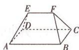  
图14

  
“分割法”巧破新情境古代建筑中的几何体体积问题

8, BC = 6, 平面 $ABFE \cap$ 平面 CDEF = EF, 且 EF = 6. 其顶点都在同一个球面上. 若平面 ABCD

# 攻略 3 用不动点法解决分式结构递推问题

调研3 试题调研原创 已知数列 $\{a_{n}\}$ 中, $a_{1} = 1$ , $a_{n+1} = \frac{5a_{n} - 2}{2a_{n}}$ ,

则数列 $\{a_{n}\}$ 的通项公式为 $a_{n}=$ \_\_\_\_.

解析 由题意得 $a_{n+1} = \frac{5}{2} - \frac{1}{a_n}$ , 则 $a_{n+1} - 2 = \frac{5}{2} - \frac{1}{a_n} - 2 = \frac{1}{2} - \frac{1}{a_n} =$

  
“不动点法”快解分式结构递推求通项问题

讲解创新题型解读情境提取关键信息，听得懂

传授高妙技法
深入浅出破解思维瓶颈，学得会

# 本辑全9科精彩推荐

<table><tr><td>语文</td><td>古诗歌答题模板30问</td><td>物理</td><td>电场&amp;磁场&amp;电磁感应</td><td>政治</td><td>哲学与文化&amp;逻辑与思维</td></tr><tr><td>数学</td><td>数列&amp;立体几何&amp;概率与统计</td><td>化学</td><td>物质结构&amp;有机化学</td><td>历史</td><td>世界史满分攻略</td></tr><tr><td>英语</td><td>阅读C、D篇满分攻略</td><td>生物</td><td>稳态与调节&amp;生物与环境</td><td>地理</td><td>读图专项</td></tr></table>

# 目录

扫码获取

1. 全9科名师解读2024高考创新命题，研真题，评新题，明晰备考方向。  
2. 调研3辑全9科100+节超级名师视频课，传授高妙技法，易学秒懂。  
3. 数学技法专项、作文素材、时政专项名师视频课，按书解锁，免费观看。

# 每月一手考情

# 数列与轻量竞赛元素融合的5大创新命题设计

名师视频·考情解读

001

# 突破 13 大超重点

# 创新考法抢先知

# 超重点1 新视角·以马尔科夫链为情境的创新题解读

名师视频·创新考法

016

创新点 1 马尔科夫链中的等差、等比数列证明问题

016

创新点 2 马尔科夫链中的条件概率求解问题

020

# 超重点2 新情境·以数学文化为背景的几何体体积、面积计算问题

名师视频·创新考法

022

角度 1 台体的体积与面积计算问题

022

角度 2 柱体的体积与面积计算问题

023

角度 3 与球切、接的几何体的体积与面积计算问题

024

# 超重点3 新题型·利用样本的数字特征求解放性决策问题

名师视频·创新考法

028

角度 1 利用平均数与方差选派选手参赛

028

角度 2 利用期望根据已知决策求参数

030

# 核心主干抓重点

# 数列技法速通

# 超重点 4 数列求和必用的 4 大核心技法

名师视频·高妙技法

034

核心技法 1 倒序相加法

034

核心技法 2 分组求和法

035

核心技法3 错位相减法 036

核心技法 4 裂项相消法 037

# 超重点5 由递推关系求通项的3类重要题型与解题攻略 名师视频·高妙技法 040

攻略 1 用待定系数法解决 “一阶线性” 递推问题 040

攻略 2 用构造法解决 “二阶线性” 递推问题 041

攻略3 用不动点法解决分式结构递推问题 041

# 超重点6 数列不等式中的3大高妙放缩技巧 名师视频·高妙技法 045

技巧 1 利用重要不等式放缩 045

技巧 2 添、减项放缩 046

技巧 3 换元放缩 048

# 立体几何难点速破

# 超重点7 探索动点轨迹的2个必会高分技法 名师视频·高妙技法 052

高分技法1 定义法 052

高分技法 2 建系法 055

# 超重点8 翻折问题的2个解题策略的关键应用 059

角度1 展开图角度的求解问题 059

角度2 翻折中位置关系的探究问题 060

角度 3 翻折中的体积问题 060

角度 4 翻折中的距离、角度问题 061

# 超重点9 立体几何中最值问题的2个核心解题策略 名师视频·高妙技法 066

策略1 定性分析 066

策略2 定量分析 068

# 超重点10 空间向量在求角问题中的妙用 名师视频·满分模板 074

题型1 用空间向量求异面直线所成角 074

题型2 用空间向量求线面角 075

题型3 用空间向量求二面角 076

# 概率与统计满分模板

# 超重点11 3个必考分布问题的辨析与解题策略 名师视频·满分模板 081

策略1 二项分布的解题策略 081

# 目录

策略2 超几何分布的解题策略 083

策略3 正态分布的解题策略 085

超重点 12 回归分析与独立性检验问题的满分答题模板 名师视频·满分模板 089

模板 1 回归分析问题的满分答题模板 089

模板 2 独立性检验问题的满分答题模板 091

超重点 13 全概率公式 & 贝叶斯公式在概率问题中的应用 096

命题角度 1 不含实际背景的单纯数学知识的直接考查 096

命题角度 2 含有实际背景且知识考向很明确的问题 096

命题角度 3 含有实际背景的决策型综合问题 098

命题角度 4 含有实际背景的创新交汇问题 099

# 下辑精彩预告

2024年9月全新上市

# 《试题调研》第4辑将推出

——高考超重点4·解析几何满分攻略

# 每月一手考情!

本辑聚焦新高考数学4大创新题型的开发与预测:逻辑题、数据分析题、判断题、举例题.探索全新命题形式,把脉高考趋势变化.

# 聚焦高考超重点，讲透关键题型！

1 深度剖析创新命题考法 深度剖析以双纽线为情境载体的新定义题答题策略、解析几何与其他知识交汇命题的转化技巧、曲线与曲线的交点问题的解题思路,等等.巧破套路,玩转创新题!

② 彻底讲透必考超重点 彻底讲透圆锥曲线几何性质的3大必考命题角度、焦点三角形的3大核心命题、定点与定值探索问题的答题策略,等等.讲透超重点,解透核心题!

3 传授满分解题攻略 名师传授快解动点轨迹的3个技法、巧用根与系数突破大计算题的“运算关”、巧用“同理可得”“设而不求”“不妨设”实现多想少算,等等.突破思维瓶颈,满分解题信手拈来!

重磅升级，超值上市！凡购买本辑任1本，即可免费观看本辑全9科100+节超级名师精讲课！

# 每月一手考情

# 数列与轻量竞赛元素融合的 5 大创新命题设计

河北正高级教师:赵成海 北京丰台二中:郗玲玲

2024 新课标Ⅰ卷的第 19 题是一道以数列交汇概率为知识背景、融入轻量竞赛解题方法的创新题目,与以往数列题相比难度增大不少,综合性强. 2024 新课标Ⅱ卷的第 19 题是一道以双曲线交汇数列为知识背景,考查面广泛的创新题目.这种类型的题在竞赛中经常出现,思维能力决定解题方法的选取,展现了对创新人才的选拔功能,也体现了新课标理念下的命题特色.

实际上,数列的性质与研究数列常用的方法在综合问题中经常出现,通过以下几个方面进行具体说明.

  
数列与轻量竞赛元素融合的5大创新命题设计

# 创新设计 ① 将概率与数列进行融合设计，求最大项或求和

调研 1 [2024 山东枣庄 5 月模拟]有甲、乙两个不透明的罐子,甲罐内有除颜色外完全相同的3个红球,2个黑球.某人做摸球答题游戏,规则如下:每次答题前先从甲罐内随机摸出一球,然后答题.若答题正确,则将该球放入乙罐;若答题错误,则将该球放回甲罐.此人答对每一道题目的概率均为 $\frac{1}{2}$ .当甲罐内无球时,游戏结束.假设开始时乙罐无球.

(1) 求此人三次答题后, 乙罐内恰有红球、黑球各 1 个的概率.   
(2) 设第 $n(n \in \mathbb{N}^{*}, n \geqslant 5)$ 次答题后游戏结束的概率为 $a_{n}$ .

①求 $a_{n}$ .

② $a_{n}$ 是否存在最大值？若存在，求出最大值；若不存在，请说明理由.

解析(1)方法一:根据全概率公式求解 记 M=“此人三次答题后,乙罐内恰有红球、黑球各1个”; $A_{i}=$ “第i次摸出红球,并且答题正确”, i=1,2,3; $B_{j}=$ “第j次摸出黑球,并且答题正确”, j=1,2,3; $C_{k}=$ “第k次摸出红球或黑球,并且答题错误”, k=1,2,3.

易知 $M = A_{1}B_{2}C_{3} + B_{1}A_{2}C_{3} + A_{1}C_{2}B_{3} + B_{1}C_{2}A_{3} + C_{1}A_{2}B_{3} + C_{1}B_{2}A_{3}.$

$$
P (A _ {1}) = \frac {3}{5} \times \frac {1}{2} = \frac {3}{1 0}, P (B _ {2} | A _ {1}) = \frac {2}{4} \times \frac {1}{2} = \frac {1}{4}, P (C _ {3} | A _ {1} B _ {2}) = 1 \times \frac {1}{2} = \frac {1}{2},
$$

所以 $P(A_{1}B_{2}C_{3}) = P(A_{1}B_{2})P(C_{3}|A_{1}B_{2}) = P(A_{1})P(B_{2}|A_{1})P(C_{3}|A_{1}B_{2}) = \frac{3}{10} \times \frac{1}{4} \times \frac{1}{2} = \frac{3}{80}.$

同理得 $P(B_{1}A_{2}C_{3}) = P(A_{1}C_{2}B_{3}) = P(B_{1}C_{2}A_{3}) = P(C_{1}A_{2}B_{3}) = P(C_{1}B_{2}A_{3}) = \frac{3}{80}$ .

1. 图书反馈赢新书,反馈图书错误或意见将有机会获得赠书奖励(同类错误限前五名).  
2. 新书试读“码”上看,还有定期发布的高考热点资讯、备考攻略、学习干货等你发现.

所以 $P(M) = P(A_{1}B_{2}C_{3})\times 6 = \frac{3}{80}\times 6 = \frac{9}{40}.$

方法二:列表法 有两次抽到红球(回答一对一错),一次抽到黑球(回答正确)情况的概率如下表.

【点关键】解题时既有抽到红球或黑球的不同可能性，又有回答正确与错误的区分，每次取球结果与回答正误都影响到下一次可能性的大小，因而进行正确判断是关键

<table><tr><td>1</td><td>2</td><td>3</td><td>概率</td></tr><tr><td>红对</td><td>红错</td><td>黑对</td><td> $\frac{3}{5} \times \frac{2}{4} \times \frac{2}{4} \times (\frac{1}{2})^3 = \frac{3}{160}$ </td></tr><tr><td>红错</td><td>红对</td><td>黑对</td><td> $\frac{3}{5} \times \frac{3}{5} \times \frac{2}{4} \times (\frac{1}{2})^3 = \frac{9}{400}$ </td></tr><tr><td>红对</td><td>黑对</td><td>红错</td><td> $\frac{3}{5} \times \frac{2}{4} \times \frac{2}{3} \times (\frac{1}{2})^3 = \frac{1}{40}$ </td></tr><tr><td>红错</td><td>黑对</td><td>红对</td><td> $\frac{3}{5} \times \frac{2}{5} \times \frac{3}{4} \times (\frac{1}{2})^3 = \frac{9}{400}$ </td></tr><tr><td>黑对</td><td>红对</td><td>红错</td><td> $\frac{2}{5} \times \frac{3}{4} \times \frac{2}{3} \times (\frac{1}{2})^3 = \frac{1}{40}$ </td></tr><tr><td>黑对</td><td>红错</td><td>红对</td><td> $\frac{2}{5} \times \frac{3}{4} \times \frac{3}{4} \times (\frac{1}{2})^3 = \frac{9}{320}$ </td></tr></table>

有两次抽到黑球(回答一对一错),一次抽到红球(回答正确)情况的概率如下表.

<table><tr><td>1</td><td>2</td><td>3</td><td>概率</td></tr><tr><td>黑对</td><td>黑错</td><td>红对</td><td> $\frac{2}{5} \times \frac{1}{4} \times \frac{3}{4} \times (\frac{1}{2})^{3} = \frac{3}{320}$ </td></tr><tr><td>黑错</td><td>黑对</td><td>红对</td><td> $\frac{2}{5} \times \frac{2}{5} \times \frac{3}{4} \times (\frac{1}{2})^{3} = \frac{3}{200}$ </td></tr><tr><td>黑对</td><td>红对</td><td>黑错</td><td> $\frac{2}{5} \times \frac{3}{4} \times \frac{1}{3} \times (\frac{1}{2})^{3} = \frac{1}{80}$ </td></tr><tr><td>黑错</td><td>红对</td><td>黑对</td><td> $\frac{2}{5} \times \frac{3}{5} \times \frac{2}{4} \times (\frac{1}{2})^{3} = \frac{3}{200}$ </td></tr><tr><td>红对</td><td>黑对</td><td>黑错</td><td> $\frac{3}{5} \times \frac{2}{4} \times \frac{1}{3} \times (\frac{1}{2})^{3} = \frac{1}{80}$ </td></tr><tr><td>红对</td><td>黑错</td><td>黑对</td><td> $\frac{3}{5} \times \frac{2}{4} \times \frac{2}{4} \times (\frac{1}{2})^{3} = \frac{3}{160}$ </td></tr></table>

相加得此人三次答题后,乙罐内恰有红球、黑球各1个的概率为 $\frac{9}{40}$ .

(2)①第 $n$ 次答题后游戏结束的情况是: 前 $n - 1$ 次答题正确的有4次, 答题错误的有 $n - 5$ 次, 且第 $n$ 次摸出最后一球时答题正确. 所以 $a_{n} = \mathrm{C}_{n-1}^{4}\left(\frac{1}{2}\right)^{4}\left(\frac{1}{2}\right)^{n-5} \times \frac{1}{2} = \mathrm{C}_{n-1}^{4}\left(\frac{1}{2}\right)^{n}$ .

【避易错】甲罐内无球并不是 n 次中有 5 次回答正确即可，而是必须最后一次回答正确，要注意对题意的理解与转化

②由(2)①知 $a_{n} = \mathrm{C}_{n - 1}^{4}\left(\frac{1}{2}\right)^{n}$ , 所以 $\frac{a_{n + 1}}{a_n} = \frac{\mathrm{C}_n^4\left(\frac{1}{2}\right)^{n + 1}}{\mathrm{C}_{n - 1}^4\left(\frac{1}{2}\right)^n} = \frac{\frac{n!}{4!(n - 4)!}\times\frac{1}{2}}{\frac{(n - 1)!}{4!(n - 5)!}} = \frac{n}{2(n - 4)}.$

令 $\frac{n}{2(n-4)}\geqslant1$ ,得 $5\leqslant n\leqslant8;\frac{n}{2(n-4)}<1$ ,得n>8,即 $n\geqslant9$ .

所以 $a_{5}<a_{6}<a_{7}<a_{8}=a_{9}$ ，且 $a_{8}=a_{9}>a_{10}>a_{11}>\cdots$ ，所以 $a_{n}$ 的最大值是 $a_{8}=a_{9}=\frac{35}{256}$ .

调研 2 [2024 山东济南名校 5 月联考 | 新情境·随机游走] 随机游走在空气中的烟雾扩散、股票市场的价格波动等动态随机现象中有重要应用. 在平面直角坐标系中, 粒子从坐标原点出发, 每秒向左、向右、向上或向下移动一个单位, 且向四个方向移动的概率均为 $\frac{1}{4}$ . 例如在第 1 秒末, 粒子会等可能地移动到 (1,0), (-1,0), (0,1), (0,-1) 四点处.

(1) 设粒子在第 2 秒末移动到点 $(x, y)$ ，记 $x + y$ 的取值为随机变量 X，求 X 的分布列和数学期望 $E(X)$ .

(2) 记第 n 秒末粒子回到原点的概率为 $p_{n}$ .

(i) 已知 $\sum_{i=0}^{n}\left(\mathrm{C}_{n}^{i}\right)^{2}=\mathrm{C}_{2n}^{n}$ ，求 $p_{3}, p_{4}$ 以及 $p_{2n}$ .

(ii) 令 $b_{n} = p_{2n}$ ，记 $S_{n}$ 为数列 $\{b_{n}\}$ 的前 $n$ 项和，若对任意实数 $M > 0$ ，存在 $n \in \mathbb{N}^{*}$ ，使得 $S_{n} > M$ ，则称粒子是常返的。已知 $\sqrt{2\pi n}(\frac{n}{\mathrm{e}})^{n} < n! < (\frac{6}{\pi})^{\frac{1}{4}} \cdot \sqrt{2\pi n}(\frac{n}{\mathrm{e}})^{n}$ ，证明：该粒子是常返的。

解析(1)粒子在第2秒末可能移动到点(1,1)，(2,0)，(0,2)，(0,0)，(1,-1)，(-1,1)，(-1,-1)，(-2,0)，(0,-2)的位置，所以X的所有可能取值为-2,0,2，且 $P(X=-2)=\frac{4}{16}=\frac{1}{4},P(X=0)=\frac{8}{16}=\frac{1}{2},P(X=2)=\frac{4}{16}=\frac{1}{4}.$

所以 $X$ 的分布列为：

<table><tr><td>X</td><td>-2</td><td>0</td><td>2</td></tr><tr><td>P</td><td>1/4</td><td>1/2</td><td>1/4</td></tr></table>

$$
E (X) = - 2 \times \frac {1}{4} + 0 \times \frac {1}{2} + 2 \times \frac {1}{4} = 0.
$$

(2)(i)粒子在奇数秒末不可能回到原点,故 $p_{3}=0$ .

粒子在第 4 秒末回到原点, 分两种情况考虑:

第 1 种情况是四个不同方向各移动一次,例如“上下左右”,共有 $A_{4}^{4}$ 种情形;

第2种情况是相反方向各移动两次,例如“左左右右”“上上下下”,共有 $2C_{4}^{2}$ 种情形.

于是 $p_4 = \frac{\mathrm{A}_4^4 + 2\mathrm{C}_4^2}{4^4} = \frac{9}{64}.$

第2n秒末粒子要回到原点,则必定向左移动 $k(0 \leqslant k \leqslant n)$ 次,向右移动k次,向上移动n-k次,向下移动n-k次,

【助理解】要回到原点,则上下、左右移动次数应分别相等

故 $p_{2n} = \sum_{k=0}^{n}\frac{C_{2n}^k C_{2n-k}^k C_{2n-2k}^{n-k}}{4^{2n}} = \frac{1}{4^{2n}}\sum_{k=0}^{n}\frac{(2n)!}{(k!)^2[(n-k)!]^2} = \frac{1}{4^{2n}}\cdot \frac{(2n)!}{(n!)^2}\sum_{k=0}^{n}\frac{(n!)^2}{(k!)^2[(n-k)!]^2} = \frac{1}{4^{2n}}\cdot C_{2n}^n\sum_{k=0}^{n}(C_n^k)^2 = \frac{1}{4^{2n}}\cdot (C_{2n}^n)^2.$

故 $p_{2n} = \frac{1}{4^{2n}}\cdot (\mathrm{C}_{2n}^n)^2 = \frac{1}{16^n} (\mathrm{C}_{2n}^n)^2 = \frac{[(2n)!]^2}{16^n(n!)^4}.$

（ii）由 $\sqrt{2\pi n}\left(\frac{n}{e}\right)^{n}<n!<\left(\frac{6}{\pi}\right)^{\frac{1}{4}}\cdot\sqrt{2\pi n}\left(\frac{n}{e}\right)^{n}$ 可知 $C_{2n}^{n}=\frac{(2n)!}{(n!)^{2}}>$ $\frac{\sqrt{4\pi n}\left(\frac{2n}{e}\right)^{2n}}{\left[\left(\frac{6}{\pi}\right)^{\frac{1}{4}}\cdot\sqrt{2\pi n}\left(\frac{n}{e}\right)^{n}\right]^{2}}=\frac{4^{n}}{\sqrt{6n}},$

【攻难点】利用已知的不等关系,将 ${\mathrm{C}}_{2n}^{n}$ 放缩,转化为不含组合数的形式

则 $p_{2n} = \frac{1}{4^{2n}}\cdot (\mathrm{C}_{2n}^n)^2 >\frac{1}{6n}$ ，则 $S_{n} = \sum_{m = 1}^{n}p_{2m} > \sum_{m = 1}^{n}\frac{1}{6m} >\frac{1}{6}\sum_{m = 1}^{n}\ln (1 + \frac{1}{m}) = \frac{1}{6}\ln (n + 1),$

【传技巧】确定 $\sum_{m=1}^{n}\frac{1}{m}$ 有上界，关键是利用不等式 $\ln(1+\frac{1}{x})<\frac{1}{x}$ ，从而 $\sum_{m=1}^{n}\frac{1}{m}>\ln(2\times\frac{3}{2}\times\cdots\times\frac{n+1}{n})=\ln(n+1)$

记 $[x]$ 为不超过 $x$ 的最大整数，则对任意实数 $M > 0$ ，当 $n \geqslant [\mathrm{e}^{6M}]$ 时， $n > \mathrm{e}^{6M} - 1$ ，于是 $S_{n} > \frac{1}{6}\ln (n + 1) > M.$

综上所述, 当 $n \geqslant \left[ e^{6M} \right]$ 时, $S_{n} > M$ 成立, 因此该粒子是常返的.

名师点评 本题是“情境分离型”创新题,这类题的特色是去掉题目的情境素材,仍能完成情境后的问题,做这种类型的题目时,对情境材料简读即可,比如本题第1句话无关紧要,只需理解后续内容,寻求解答方法.第(2)(ii)问是与数列结合的新定义问题,解题时用到了函数知识,综合性强,本题是具有选拔功能的压轴题.

# 创新设计 ② 从图象的动态变化中设计数列，求值或证明

调研 3 试题调研原创 在平面直角坐标系内, 将函数 $f(x)=2-\frac{2}{x+1}$ 及 $g(x)=\frac{1}{3x}$ 在第一象限内的图象分别记作 $C_{1}, C_{2}$ , 点 $P_{n}(a_{n}, f(a_{n})) (n \in \mathbf{N}^{*})$ 在 $C_{1}$ 上. 过点 $P_{n}$ 作平行于 x 轴的直线,与 $C_{2}$ 交于点 $Q_{n}$ , 过点 $Q_{n}$ 作平行于 y 轴的直线, 与 $C_{1}$ 交于点 $P_{n+1}$ , 如图 1 所示.

(1) 若 $a_{1}=\frac{1}{3}$ ，请写出 $a_{2}, a_{3}$ 的值.

(2) 若 $0 < a_{1} < \frac{1}{2}$ , 证明: $\left\{\frac{a_{n}-\frac{1}{2}}{a_{n}+\frac{1}{3}}\right\}$ 是等比数列.

(3) 若 $a_{1}=\frac{1}{3}$ ，证明： $\left|a_{2}-a_{1}\right|+\left|a_{3}-a_{2}\right|+\cdots+\left|a_{n+1}-a_{n}\right|<\frac{4}{3}$ .

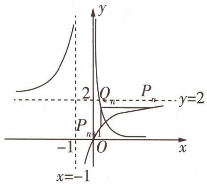

text_image

y
2 Qₙ Pₙ y=2
Pₙ₁
-1 O x
x=-1

图1

解析(1)当 $a_{1}=\frac{1}{3}$ 时, $f(a_{1})=\frac{1}{2}$ ,得 $P_{1}\left(\frac{1}{3},\frac{1}{2}\right)$ ,所以 $Q_{1}\left(\frac{2}{3},\frac{1}{2}\right)$ ,所以 $P_{2}\left(\frac{2}{3},\frac{4}{5}\right)$ ,所以 $Q_{2}\left(\frac{5}{12},\frac{4}{5}\right)$ .所以 $a_{2}=\frac{2}{3},a_{3}=\frac{5}{12}$ .

(2)依题意,由 $P_{n}(a_{n},f(a_{n}))$ 可得 $Q_{n}(a_{n+1},f(a_{n}))$ ，因为点 $Q_{n}$ 在 $C_{2}$ 上，所以 $f(a_{n})=\frac{1}{3a_{n+1}}$

又 $f(a_{n}) = 2 - \frac{2}{a_{n} + 1}$ 所以 $2 - \frac{2}{a_n + 1} = \frac{1}{3a_{n + 1}}$ 整理可得 $a_{n + 1} = \frac{1}{6} +\frac{1}{6a_n},$

所以 $a_{n + 1} - \frac{1}{2} = \frac{-2(a_n - \frac{1}{2})}{6a_n}$ ①，且 $a_{n + 1} + \frac{1}{3} = \frac{3(a_n + \frac{1}{3})}{6a_n}$ ②，

易知 $a_{n} \neq -\frac{1}{3}$ , 则① $\div$ ②得 $\frac{a_{n+1} - \frac{1}{2}}{a_{n+1} + \frac{1}{3}} = -\frac{2}{3} \cdot \frac{a_{n} - \frac{1}{2}}{a_{n} + \frac{1}{3}}$ ,

【知识拓展】这里体现了竞赛元素， $x=\frac{1}{6}+\frac{1}{6x}$ 为数列的特征方程，即 $6x^{2}-x-1=0$ ，特征根为 $x_{1}=\frac{1}{2},x_{2}=-\frac{1}{3}$ ，即可得 $\frac{a_{n+1}-\frac{1}{2}}{a_{n+1}+\frac{1}{3}}=-\frac{2}{3}\cdot\frac{a_{n}-\frac{1}{2}}{a_{n}+\frac{1}{3}}$ ，进而得等比数列。一般地，对于 $a_{n+1}=\frac{Aa_{n}+B}{Ca_{n}+D}(C\neq0,AD-BC\neq0)$ ，且 $a_{1}\neq\frac{Aa_{1}+B}{Ca_{1}+D}$ ，其特征方程为 $x=\frac{Ax+B}{Cx+D}$ ，得到两个不同的特征根 $x_{1},x_{2}$ 后，即可得数列 $\left\{\frac{a_{n}-x_{1}}{a_{n}-x_{2}}\right\}$ 是等比数列，且首项为 $\frac{a_{1}-x_{1}}{a_{1}-x_{2}}$ ，公比为 $\frac{A-Cx_{1}}{A-Cx_{2}}$

又 $0 < a_{1} < \frac{1}{2}$ , 所以 $\frac{a_{1} - \frac{1}{2}}{a_{1} + \frac{1}{3}} < 0$ , 所以数列 $\left\{\frac{a_{n} - \frac{1}{2}}{a_{n} + \frac{1}{3}}\right\}$ 是以 $\frac{a_{1} - \frac{1}{2}}{a_{1} + \frac{1}{3}}$ 为首项、 $-\frac{2}{3}$ 为公比的等比数列.

(3) 若 $a_1 = \frac{1}{3}$ , 由 (2) 得 $\frac{a_n - \frac{1}{2}}{a_n + \frac{1}{3}} = \frac{a_1 - \frac{1}{2}}{a_1 + \frac{1}{3}} \cdot (-\frac{2}{3})^{n-1} = -\frac{1}{4} \cdot (-\frac{2}{3})^{n-1}$ , 因为 $\frac{a_{2n-1} - \frac{1}{2}}{a_{2n-1} + \frac{1}{3}} = -\frac{1}{4} \cdot (-\frac{2}{3})^{2n-2} < 0$ , 所以 $0 < a_{2n-1} < \frac{1}{2}$ , 因为 $\frac{a_{2n} - \frac{1}{2}}{a_{2n} + \frac{1}{3}} = -\frac{1}{4} \cdot (-\frac{2}{3})^{2n-1} > 0$ , 所以 $a_{2n} > \frac{1}{2} > a_{2n-1} > 0$ .

又 $a_{2n+1} = \frac{1}{6} + \frac{1}{6a_{2n}} = \frac{1}{6} + \frac{1}{6 \times \left( \frac{1}{6} + \frac{1}{6a_{2n-1}} \right)} = \frac{7a_{2n-1} + 1}{6(a_{2n-1} + 1)}$ ，所以 $a_{2n+1} - a_{2n-1} = \frac{7a_{2n-1} + 1}{6(a_{2n-1} + 1)} - a_{2n-1} = \frac{-2(a_{2n-1} - \frac{1}{2})(3a_{2n-1} + 1)}{6(a_{2n-1} + 1)} > 0$ ，所以 $a_{2n} > \frac{1}{2} > a_{2n-1} > a_{2n-3} > \cdots > a_{1}$ ，从而 $a_{n} \geqslant a_{1} = \frac{1}{3}$ .

所以 $|a_{n+2}-a_{n+1}|=|\left(\frac{1}{6}+\frac{1}{6a_{n+1}}\right)-\left(\frac{1}{6}+\frac{1}{6a_n}\right)|=\frac{|a_{n+1}-a_n|}{6a_na_{n+1}}=\frac{|a_{n+1}-a_n|}{6a_n\left(\frac{1}{6}+\frac{1}{6a_n}\right)}=$ $\frac{|a_{n+1}-a_n|}{a_n+1}\leqslant\frac{|a_{n+1}-a_n|}{a_1+1}=\frac{3}{4}|a_{n+1}-a_n|,$

【破瓶颈】这里得到不等关系的递推形式，有助于后续的迭代放缩

从而 $\left|a_{n+1}-a_{n}\right|\leqslant\frac{3}{4}\left|a_{n}-a_{n-1}\right|\leqslant\left(\frac{3}{4}\right)^{2}\left|a_{n-1}-a_{n-2}\right|\leqslant\cdots\leqslant\left(\frac{3}{4}\right)^{n-1}\left|a_{2}-a_{1}\right|=\frac{1}{3}\cdot\left(\frac{3}{4}\right)^{n-1}$

所以 $\left|a_{2}-a_{1}\right|+\left|a_{3}-a_{2}\right|+\left|a_{4}-a_{3}\right|+\cdots+\left|a_{n+1}-a_{n}\right|\leqslant\frac{1}{3}\times\left[1+\frac{3}{4}+\left(\frac{3}{4}\right)^{2}+\cdots+\left(\frac{3}{4}\right)^{n-1}\right]=\frac{1}{3}\times\frac{1-\left(\frac{3}{4}\right)^{n}}{1-\frac{3}{4}}=\frac{4}{3}\times\left[1-\left(\frac{3}{4}\right)^{n}\right]<\frac{4}{3}.$

# 创新设计 ③ 在数列中渗透三角元素，迁移周期性

调研 4 [2024 福建福州第一中学 5 月模拟] 已知数列 $\{a_{n}\}$ 中, $a_{1} = \frac{1}{2}$ , $a_{n+1} = 2a_{n} - \sqrt{3}\cos\left(\frac{n\pi}{3} - \frac{\pi}{6}\right)$ .

(1) 证明: 数列 $\left\{a_{n}-\cos\frac{n\pi}{3}\right\}$ 为常数列.  
(2)求数列 $\{na_{n}\}$ 的前2024项和.

解析 (1) $\cos \frac{(n + 1)\pi}{3} - 2\cos \frac{n\pi}{3} = \frac{1}{2}\cos \frac{n\pi}{3} - \frac{\sqrt{3}}{2}\sin \frac{n\pi}{3} - 2\cos \frac{n\pi}{3} = -\frac{3}{2}\cos \frac{n\pi}{3} -$

$\frac{\sqrt{3}}{2}\sin \frac{n\pi}{3} = -\sqrt{3}\cos \left(\frac{n\pi}{3} -\frac{\pi}{6}\right)$ 则 $a_{n + 1} = 2a_{n} - \sqrt{3}\cos \left(\frac{n\pi}{3} -\frac{\pi}{6}\right)$ 可化为 $a_{n + 1} - \cos \frac{(n + 1)\pi}{3} =$ $2(a_{n} - \cos \frac{n\pi}{3}).$

【构模型】利用三角公式转化，构造“等比数列”模型

而 $a_1 = \frac{1}{2}$ , 则 $a_1 - \cos \frac{\pi}{3} = 0$ , 因此 $a_n - \cos \frac{n\pi}{3} = 0$ , 所以数列 $\{a_n - \cos \frac{n\pi}{3}\}$ 为常数列.

(2) 由(1)知, $a_{n}=\cos\frac{n\pi}{3}$ , 由 $\frac{2\pi}{\frac{\pi}{3}}=6$ 得 $\left\{a_{n}\right\}$ 是以6为周期的周期数列.

【明关键】利用三角函数性质确定数列的周期性，有时利用数列的周期性也可以构造三角函数模型，参见【原创变式1】

$$
\begin{array}{r l} & {\text {令} b _ {n} = n a _ {n} = n \cos \frac {n \pi}{3}, \text {则} b _ {6 n - 5} + b _ {6 n - 4} + b _ {6 n - 3} + b _ {6 n - 2} + b _ {6 n - 1} + b _ {6 n} = (6 n - 5) \cos (- \frac {5 \pi}{3}) +} \\ & {(6 n - 4) \cos (- \frac {4 \pi}{3}) + (6 n - 3) \cos (- \pi) + (6 n - 2) \cos (- \frac {2 \pi}{3}) + (6 n - 1) \cos (- \frac {\pi}{3}) + 6 n \cos 0 =} \\ & {\frac {1}{2} (6 n - 5) - \frac {1}{2} (6 n - 4) - (6 n - 3) - \frac {1}{2} (6 n - 2) + \frac {1}{2} (6 n - 1) + 6 n = 3,} \end{array}
$$

所以数列 $\{na_{n}\}$ 的前 2024 项和为 $b_{1} + b_{2} + \cdots + b_{2024} = 337 \times 3 + b_{2023} + b_{2024} = 1011 + 2023\cos\frac{2023\pi}{3} + 2024\cos\frac{2024\pi}{3} = 1011 + \frac{1}{2} \times 2023 - \frac{1}{2} \times 2024 = \frac{2021}{2}.$

# 原创变式

1 [新题型·结构不良填空题] 已知数列 $\{a_{n}\}$ 满足: $a_{n+1} = \frac{1}{1 + a_{n}} - 1 (n \in \mathbb{N}^{*})$ , $a_{1} = 1$ .

数列 $\{a_{n}\}$ 的通项 $a_{n}$ 可表示为 $A\sin (\omega n + \varphi) + B(\omega >0,|\varphi | <   \frac{\pi}{2})$ 的形式.

给出下面 4 个条件,选择哪个条件填到横线上,可以使上述结论成立?

① $A=\frac{\sqrt{3}}{2}$

② $\omega=2\pi$

③ $\varphi=\frac{\pi}{3}$

④ $B = -\frac{1}{4}$

写出你的选择：\_\_\_\_（填序号），并写出此时 $a_{n}=$ \_\_\_\_。（写出一组答案即可）

答案》第013页

比起三角形数和正方形数,三角平方数非常稀有,第一个为1,第二个为36,第三个为1225,第四个就突然增大到41616.

# 创新设计 4 由解析几何中的线段长或点的坐标设计数列，求前 n 项和

调研 5 [2024 河北石家庄 5 月二模] 已知椭圆 $E: \frac{x^{2}}{a^{2}} + \frac{y^{2}}{b^{2}} = 1 (a > b > 0)$ 的离心率 $e = \frac{\sqrt{2}}{2}$ .

(1) 若椭圆 E 过点 $(2, \sqrt{2})$ ，求椭圆 E 的标准方程.

(2) 若直线 $l_{1}, l_{2}$ 均过点 $P(p_{n}, 0) (0 < p_{n} < a, n \in \mathbb{N}^{*})$ 且互相垂直，直线 $l_{1}$ 交椭圆 E 于 A, B 两点，直线 $l_{2}$ 交椭圆 E 于 C, D 两点，M, N 分别为弦 AB 和 CD 的中点，直线 MN 与 x 轴交于点 $Q(t_{n}, 0)$ ，设 $p_{n} = \frac{1}{3^{n}}$ .

(i) 求 $t_{n}$ ;   
(ii) 记 $a_{n} = |PQ|$ , 求数列 $\left\{\frac{1}{a_n}\right\}$ 的前 $n$ 项和 $S_{n}$ .

解析（1）因为 $e = \frac{c}{a} = \frac{\sqrt{2}}{2}, a^2 = b^2 + c^2$ ，所以 $a^2 = 2b^2$ ，所以椭圆 $E$ 的方程为 $\frac{x^2}{2b^2} + \frac{y^2}{b^2} = 1$

因为椭圆 E 过点 $(2, \sqrt{2})$ ，所以 $\frac{4}{2b^{2}} + \frac{2}{b^{2}} = 1$ ，解得 $b^{2} = 4$ ，

所以椭圆 E 的方程为 $\frac{x^{2}}{8} + \frac{y^{2}}{4} = 1$ .

(2)(i) 当直线 $l_{1}, l_{2}$ 中一条直线的斜率不存在, 另一条直线的斜率为 0 时, 直线 MN 与 x 轴重合, 不符合题意, 故直线 $l_{1}, l_{2}$ 的斜率均存在且不为 0.

【避易错】设直线方程前要充分考虑到直线斜率是否存在、存在时是否为0，一般从直线与坐标轴平行、垂直的特殊情况入手

根据题意作出图形,如图2所示.设直线 $l_{1}$ 的方程为 $y=k(x-p_{n})(k\neq0),A(x_{1},y_{1}),B(x_{2},y_{2}),M(x_{M},y_{M}),N(x_{N},y_{N})$ ,

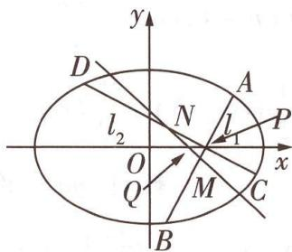

text_image

y
D
l₂
N
l₁
A
P
O
Q
M
C
B
x

图 2

由 $\left\{\begin{aligned}\frac{x^{2}}{2b^{2}}+\frac{y^{2}}{b^{2}}=1,\\ y=k(x-p_{n}),\end{aligned}\right.$ 消去y并整理得关于x的方程 $(1+2k^{2})x^{2}-4k^{2}p_{n}x+2k^{2}p_{n}^{2}-2b^{2}=0,$

因为直线 $l_{1}$ 与椭圆相交于两个不同的交点, 所以 $\Delta > 0$ .

$x_{1} + x_{2} = \frac{4p_{n}k^{2}}{1 + 2k^{2}}, x_{1}x_{2} = \frac{2k^{2}p_{n}^{2} - 2b^{2}}{1 + 2k^{2}}$ ，则 $\left\{ \begin{array}{l} x_{M} = \frac{2p_{n}k^{2}}{1 + 2k^{2}}, \\ y_{M} = \frac{-p_{n}k}{1 + 2k^{2}}, \end{array} \right.$ 同理可得 $\left\{ \begin{array}{l} x_{N} = \frac{2p_{n}}{k^{2} + 2}, \\ y_{N} = \frac{p_{n}k}{k^{2} + 2}, \end{array} \right.$

奇妙数字

完全数 如果一个自然数恰好等于除它自身外所有因数之和,则称该数为完全数,又称完备数.

因为 M, N, Q 三点共线, 所以 $y_{N}(x_{N}-x_{M})=(y_{N}-y_{M})(x_{N}-t_{n})$ ,

易知 $y_{N} - y_{M}\neq 0$ ，则 $t_n = \frac{x_My_N - x_Ny_M}{y_N - y_M} = \frac{\frac{2p_nk^2}{1 + 2k^2}\cdot\frac{p_nk}{k^2 + 2} - \frac{2p_n}{k^2 + 2}\cdot\frac{-p_nk}{1 + 2k^2}}{\frac{p_nk}{k^2 + 2} - \frac{-p_nk}{1 + 2k^2}} = \frac{2p_n}{3}.$

因为 $p_n = \frac{1}{3^n}$ , 所以 $t_n = \frac{2}{3^{n+1}}$ .

(ii) 结合(i) 可知 $a_{n} = |PQ| = |p_{n} - t_{n}| = \left|\frac{1}{3^{n}} - \frac{2}{3^{n+1}}\right| = \frac{1}{3^{n+1}}$ ，所以 $\frac{1}{a_n} = 3^{n+1}$ ，

所以数列 $\{\frac{1}{a_n}\}$ 是首项为9, 公比为3的等比数列, 其前 $n$ 项和 $S_n = \frac{9(1 - 3^n)}{1 - 3} = \frac{9}{2}(3^n - 1)$ .

名师点评 本题利用点 $P(p_{n},0)$ 的坐标, 将数列融合到解析几何问题中, 形成知识模块间的相互渗透, 是数列与解析几何交汇命题的常见手段, 与 2024 新课标 II 卷第 19 题的命题方式有异曲同工之妙.

# 原创变式

改变曲线类型,以抛物线上的点为圆心,形成一组外切圆,建立坐标间的关系,转化成数列问题

2 [新题型·双空题]平面上一系列点 $A_{1}(x_{1},y_{1}), A_{2}(x_{2},y_{2}), \cdots, A_{n}(x_{n},y_{n}), n \in \mathbb{N}^{*}$ , 其中 $A_{1}(1,2), y_{n} > y_{n+1} > 0$ , 已知 $A_{n}$ 在曲线 $y^{2} = 4x$ 上, 圆 $A_{n}: (x - x_{n})^{2} + (y - y_{n})^{2} = r_{n}^{2}$ 与 $y$ 轴相切, 且圆 $A_{n}$ 与圆 $A_{n+1}$ 外切, 则 $A_{3}$ 的坐标为\_\_\_\_; 记 $b_{n} = y_{n}y_{n+1}$ , 则数列 $\{b_{n}\}$ 的前6项和为\_\_\_\_.

答案》第013页

# 创新设计 5 用新定义包装，设计数列问题

调研 6 [2024 山东泰安 5 月三模 | 新定义 · 十全十美数] 对于 $m, t \in \mathbb{N}^{*}, s \in \mathbb{N}$ , 若 $t$ 不是 10 的整数倍, 且 $m = t \cdot 10^{s}$ , 则称 $m$ 为 $s$ 级十全十美数. 已知数列 $\{a_{n}\}$ 满足: $a_{1} = 8, a_{2} = 40$ , $a_{n+2} = 5a_{n+1} - 6a_{n}$ .

(1) 若 $\{a_{n+1}-ka_{n}\}$ 为等比数列, 求 k;

(2) 求在 $a_{1}, a_{2}, a_{3}, \cdots, a_{2024}$ 中, 3 级十全十美数的个数.

第一个完全数是6,第二个完全数是28,第三个完全数是496……所有完全数都是三角形数,且目前已知的所有完全数都是偶数,数学界有一个疑问:奇完全数是否存在?

奇妙数字

解析(1)设数列 $\left\{a_{n+1}-ka_{n}\right\}$ 的公比为q，则 $a_{n+2}-ka_{n+1}=q(a_{n+1}-ka_{n})$ ，即 $a_{n+2}=(q+k)a_{n+1}-qka_{n}$ ，由 $a_{n+2}=5a_{n+1}-6a_{n}$ 可得 $\left\{\begin{aligned}q+k&=5,\\ -qk&=-6,\end{aligned}\right.$ 解得 $\left\{\begin{aligned}k&=2,\\ q&=3\end{aligned}\right.$ 或 $\left\{\begin{aligned}k&=3,\\ q&=2,\end{aligned}\right.$

所以k=2 或 k=3.

【拓展应用】 $\left\{a_{n+1}-ka_{n}\right\}$ 为等比数列为本题提供了变形方向，若没有这个提示，则对于满足二阶递推关系的数列，一般可采用特征方程，即 $x^{2}-5x+6=0$ ，得特征根 $x_{1}=2, x_{2}=3$ ，从而得数列 $\left\{a_{n+1}-2a_{n}\right\}$ 、 $\left\{a_{n+1}-3a_{n}\right\}$ 成等比数列，k=2，k=3 即本题所求结果

(2) 由(1)知, 当 $\left\{\begin{aligned} k &= 2, \\ q &= 3 \end{aligned}\right.$ 时, $a_{n+1} - 2a_{n} = (a_{2} - 2a_{1})3^{n-1} = 8 \cdot 3^{n}$ ,

当 $\left\{\begin{aligned}k&=3,\\ q&=2\end{aligned}\right.$ 时， $a_{n+1}-3a_{n}=(a_{2}-3a_{1})2^{n-1}=8\cdot2^{n}$ ，两式相减得 $a_{n}=8(3^{n}-2^{n})$ .

当 n 为奇数时, $3^{n}-2^{n}$ 的个位数字为 1 或 9, $a_{n}=8(3^{n}-2^{n})$ 的个位数字不可能为 0.

【破瓶颈】通过题目中的定义知，需要判断 $a_{n}$ 的个位数字为0的情况，从而分类讨论

当 n 为偶数时, 设 $n = 2k (k \in \mathbb{N}^{*})$ , 则 $a_{n} = 8(3^{2k} - 2^{2k}) = 8(9^{k} - 4^{k})$ , $9^{k} - 4^{k}$ 的个位数字为 5, $a_{n}$ 一定是 1 级十全十美数, 但题设要求 3 级十全十美数, 则 $a_{n}$ 末尾 3 个数字均为 0, 需满足 $9^{k} - 4^{k}$ 能被 125 整除. 易知 k = 1, 2, 3 时, $9^{k} - 4^{k}$ 均不符合题意.

$$
\begin{array}{r l} & {\text {当} k > 3 \text {时}, 9 ^ {k} - 4 ^ {k} = (- 1 + 1 0) ^ {k} - (- 1 + 5) ^ {k} = [ C _ {k} ^ {0} (- 1) ^ {k} + C _ {k} ^ {1} (- 1) ^ {k - 1} \cdot 1 0 +} \\ & {C _ {k} ^ {2} (- 1) ^ {k - 2} \cdot 1 0 ^ {2} + \dots + C _ {k} ^ {k} \cdot 1 0 ^ {k} ] - [ C _ {k} ^ {0} (- 1) ^ {k} + C _ {k} ^ {1} (- 1) ^ {k - 1} \cdot 5 + C _ {k} ^ {2} (- 1) ^ {k - 2} \cdot 5 ^ {2} + \dots + C _ {k} ^ {k} \cdot 5 ^ {k} ],} \end{array}
$$

【难点突破】 $(-1+10)^{k}$ 展开式中含 $10^{3}$ 的项及之后的项、 $(-1+5)^{k}$ 展开式中含 $5^{3}$ 的项及之后的项均可被125整除，同时前述的 $9^{k}-4^{k}$ 个位数字为5也是解题的关键点，保证了 $8(9^{k}-4^{k})$ 不会出现末尾四个数字全为0的情况，即不会是4级十全十美数，否则不合题意

只需考虑两个展开式前3项差,即 $\left[(-1)^{k}+(-1)^{k-1}\cdot k\cdot10+(-1)^{k-2}\cdot\frac{k(k-1)}{2}\cdot10^{2}\right]-\left[(-1)^{k}+(-1)^{k-1}\cdot k\cdot5+(-1)^{k-2}\cdot\frac{k(k-1)}{2}\cdot5^{2}\right]=(-1)^{k-1}\cdot5k+(-1)^{k-2}\cdot75\cdot\frac{k(k-1)}{2}=\frac{1}{2}\cdot(-1)^{k-2}\cdot5k\cdot[-2+15(k-1)]$ 能否被125整除,其中 $-2+15(k-1)$ 不是5的倍数,

故若 $9^{k}-4^{k}$ 能被 125 整除, 需 k 为偶数且能被 25 整除, 即 k 是 50 的倍数, 又 $n=2k (k \in \mathbb{N}^{*})$ , $n=1,2,3,\cdots,2\ 024$ , 所以 $k=1,2,3,\cdots,1\ 012$ , 在 $1,2,3,\cdots,1\ 012$ 中, 50 的倍数有 20 个: 50, 100, 150, $\cdots$ , 1 000.

故在 $a_{1}, a_{2}, \cdots, a_{2024}$ 中，3 级十全十美数的个数为 20.

# 创新预测

答案▶ 014页

1.[2024 河南部分重点高中 5 月大联考]递增数列 $\{a_{n}\}$ 满足: $a_{n} \in \mathbf{N}^{*}, a_{1} = 1$ . 在 $a_{5} = 8$ 的条件下, $a_{2} + a_{4} = 2a_{3}$ 的概率为 ( )

A. $\frac{1}{5}$

B. $\frac{3}{10}$

C. $\frac{2}{5}$

D. $\frac{1}{2}$

2. 试题调研原创 [新情境·闯关游戏, 新题型·双空题] 龙年参加了一个闯关游戏, 该游戏共需挑战通过 $m$ 个关卡, 分别为: $G_{1}, G_{2}, \cdots, G_{m}$ , 记关卡 $G_{k} (k = 1, 2, \cdots, m)$ 挑战失败的概率为 $a_{k}$ , 其中 $a_{k} \in (0,1), a_{1} = \frac{1}{3}$ . 游戏规则如下: 从第一个关卡 $G_{1}$ 开始闯关, 成功挑战通过当前关卡之后, 就自动进入到下一关卡, 直到某个关卡挑战失败或全部通过时游戏结束, 各关卡间的挑战相互独立. 若 $m = 2$ , 设龙年在闯关结束时进行到了第 $X$ 关, 则 $X$ 的数学期望 $E(X) =$ \_\_\_\_. 在龙年未能全部通关的前提下, 若游戏结束时他闯到第 $k + 1$ 关的概率总等于闯到第 $k$ 关 ( $k = 1, 2, \cdots, m - 1$ ) 的概率的一半, 则数列 $\{a_{n}\}$ 的通项公式 $a_{n} =$ \_\_\_\_, $n = 1, 2, \cdots, m$ .

3. 试题调研原创 [新定义·源数列] 若对于任意 $n \in \mathbb{N}^*$ , 都存在唯一的实数 $c_n$ , 使得 $f(c_n) = n$ , 则称函数 $f(x)$ 存在“源数列” $\{c_n\}$ . 已知 $f(x) = \sqrt{x} - \ln x, x \in (0,1]$ .

(1) 证明: $f(x)$ 存在源数列.

(2)(i) 若 $f(x)-\frac{\lambda}{\sqrt{x}}\leqslant0$ 恒成立, 求 $\lambda$ 的取值范围.

(ii) 记 $f(x)$ 的源数列为 $\{c_n\}$ , $\{c_n\}$ 的前 $n$ 项和为 $S_n$ , 证明: $S_n < \frac{5}{3}$ .

# 规范答题

用 $D_{n}$ 表示 n 个元素的错排数, 那么 $D_{1}=0, D_{2}=1, D_{3}=2, D_{4}=9, D_{5}=44$ . 错排数 $D_{n}$ 满足关系式 $D_{n}=(n-1)(D_{n-1}+D_{n-2})(n\geqslant3)$ .

4.[2024 湖北武汉 5 月三模 | 新情境·混沌现象]混沌现象普遍存在于自然界中,比如天气预测、种群数量变化和天体运动等,其中一维线段上的抛物线映射是混沌动力学中最基础、应用最广泛的模型之一. 假设在一个混沌系统中,用 $x_{n}$ 表示系统在第 $n (n \in \mathbb{N}^{*})$ 个时刻的状态,且该系统下一时刻的状态 $x_{n+1}$ 满足 $x_{n+1} = f(x_{n}), 0 < x_{1} < 1$ , 其中 $f(x) = -ax^{2} + ax$ .

(1) 当 a=3 时, 若满足对任意 $n \in N^{*}$ , 有 $x_{n}=f(x_{n+1})$ , 求 $\{x_{n}\}$ 的通项公式.  
(2) 证明: 当 a=1 时, $\{x_{n}\}$ 中不存在连续的三项构成等比数列.  
(3) 若 $x_{1}=\frac{1}{2}, a=1$ ，记 $S_{n}=x_{n}^{2}x_{n+1}^{2}$ ，证明： $S_{1}+S_{2}+\cdots+S_{n}<\frac{1}{8}$ .

# 规范答题

# 参考答案与解析

# 原创变式

1.① $\frac{\sqrt{3}}{2}\sin (n\pi -\frac{\pi}{3}) + \frac{1}{4} (\text{或} ③ - \frac{\sqrt{3}}{2}\sin (n\pi +\frac{\pi}{3}) + \frac{1}{4})$ 由题意得 $a_{n + 1} = \frac{1}{1 + a_n} -1$ ，则$a_{n+1}+1=\frac{1}{1+a_{n}}$ . 由 $a_{1}=1$ 得 $a_{2}+1=\frac{1}{1+a_{1}}=\frac{1}{2}$ , $a_{3}+1=\frac{1}{1+a_{2}}=2$ , $a_{4}+1=\frac{1}{1+a_{3}}=\frac{1}{2}$ , $\cdots$ , 所以 $a_{2}=-\frac{1}{2},a_{3}=1,a_{4}=-\frac{1}{2},\cdots,$ 数列 $\{a_{n}\}$ 是周期为 2 的周期数列.

若 $a_{n}$ 能表示为 $A\sin(\omega n + \varphi) + B(\omega > 0, |\varphi| < \frac{\pi}{2})$ 的形式，则 $\{a_{n}\}$ 的最小正周期 $T = \frac{2\pi}{\omega} = 2$ ， $\omega = \pi$ ，不能选择②[题型解读：以往结构不良题以解答题形式呈现，本题打破了常规，是对未来高考数学命题的创新题型的探讨].

所以 $a_{n} = A\sin (\pi n + \varphi) + B$ ，当 $n = 1$ 时， $a_{1} = A\sin (\pi + \varphi) + B = -A\sin \varphi + B = 1$

当 $n = 2$ 时， $a_{2} = A\sin (2\pi + \varphi) + B = A\sin \varphi + B = -\frac{1}{2}$ ，从而 $B = \frac{1}{4}$ ，不能选择④.

若选择①, $a_{n}=\frac{\sqrt{3}}{2}\sin(n\pi+\varphi)+\frac{1}{4}$ ，由 $a_{1}=-\frac{\sqrt{3}}{2}\sin\varphi+\frac{1}{4}=1$ 得 $\varphi=-\frac{\pi}{3},n=2$ 时也成立，故 $a_{n}=\frac{\sqrt{3}}{2}\sin(n\pi-\frac{\pi}{3})+\frac{1}{4}.$

若选择③, $a_{n}=A\sin(n\pi+\frac{\pi}{3})+\frac{1}{4}$ ，由 $a_{1}=-A\sin\frac{\pi}{3}+\frac{1}{4}=1$ 得 $A=-\frac{\sqrt{3}}{2},n=2$ 时也成立，故 $a_{n}=-\frac{\sqrt{3}}{2}\sin(n\pi+\frac{\pi}{3})+\frac{1}{4}.$

2. $\left(\frac{1}{9},\frac{2}{3}\right)\quad\frac{24}{7}$ 因为圆 $A_{n}$ 与 y 轴相切,所以圆 $A_{n}$ 的半径为 $x_{n}$ ,又圆 $A_{n}$ 与圆 $A_{n+1}$ 外切,所以 $\sqrt{(x_{n}-x_{n+1})^{2}+(y_{n}-y_{n+1})^{2}}=x_{n}+x_{n+1}$ [点关键:利用两圆位置关系得“坐标”的递推关系].

两边平方并整理得 $(y_{n} - y_{n + 1})^{2} = 4x_{n}x_{n + 1}$ ，又点 $A_{n}(x_{n},y_{n}),A_{n + 1}(x_{n + 1},y_{n + 1})$ 均在抛物线 $y^{2} = 4x$ 上，所以 $y_{n}^{2} = 4x_{n},y_{n + 1}^{2} = 4x_{n + 1}$ ，从而 $4x_{n}x_{n + 1} = 4\times \frac{y_n^2\times y_{n + 1}^2}{4\times 4}.$

由 $y_{n} > y_{n + 1} > 0$ 得 $y_{n}y_{n + 1} = 2(y_{n} - y_{n + 1}),y_{n + 1} = \frac{2y_n}{2 + y_n}$ ，从而 $y_{2} = \frac{2y_{1}}{2 + y_{1}} = 1,y_{3} = \frac{2}{3}$ 所以 $x_{3} = \frac{1}{9}$ 故 $A_{3}(\frac{1}{9},\frac{2}{3})$ .以此类推得 $y_{7} = \frac{2}{7}$

则数列 $\{b_{n}\}$ 的前 6 项和为 $2\left[(y_{1}-y_{2})+(y_{2}-y_{3})+\cdots+(y_{6}-y_{7})\right]=2(y_{1}-y_{7})=\frac{24}{7}$ .

例如从 7 开始变换, 得到的数列为 7,22,11,34,17,52,26,13,40,20,10,5,16,8,4,2,1,4……

另解 由 $y_n y_{n+1} = 2(y_n - y_{n+1})$ 变形得 $\frac{1}{y_{n+1}} - \frac{1}{y_n} = \frac{1}{2}$ ，所以数列 $\left\{\frac{1}{y_n}\right\}$ 是首项为 $\frac{1}{2}$ ，公差为 $\frac{1}{2}$ 的等差数列，所以 $\frac{1}{y_n} = \frac{1}{2} + (n-1) \times \frac{1}{2} = \frac{n}{2}$ ，则 $y_n = \frac{2}{n}$ ，所以 $y_3 = \frac{2}{3}$ ，由 $y_3^2 = 4x_3$ 得 $x_3 = \frac{1}{9}$ ，故 $A_3\left(\frac{1}{9}, \frac{2}{3}\right), b_n = y_n y_{n+1} = \frac{4}{n(n+1)} = 4\left(\frac{1}{n} - \frac{1}{n+1}\right)$ ，数列 $\{b_n\}$ 的前6项和 $S_6 = 4 \times \left(\frac{1}{1} - \frac{1}{2} + \frac{1}{2} - \frac{1}{3} + \cdots + \frac{1}{6} - \frac{1}{7}\right) = \frac{24}{7}$ .

# 创新预测

1.B 当 $a_{5}=8$ 时,从 2,3,4,5,6,7 这 6 个数字中任取 3 个,并按照从小到大的顺序对应 $a_{2},a_{3}$ , $a_{4}$ , 共有 $C_{6}^{3}=20$ (种) 不同的结果 [明关键: 确定样本空间,由于数列递增且 $a_{5}=8$ , 所以 $a_{2},a_{3},a_{4}$ 取自 2,3,4,5,6,7].

因为 $a_{2} + a_{4} = 2a_{3}$ ，所以 $a_{2}, a_{3}, a_{4}$ 构成等差数列，满足条件的有 $(2, 3, 4)$ ， $(3, 4, 5)$ ， $(4, 5, 6)$ ， $(5, 6, 7)$ ， $(2, 4, 6)$ ， $(3, 5, 7)$ ，共6种，所以所求概率为 $\frac{3}{10}$ ，故选B.

思考 若题目改为“从1,2,…,100中取三个不同的数,由小到大排列组成的数列是等差数列的概率为\_\_\_\_”,那么列举法就不可行了,应该这样思考:若三个整数成等差数列,那么第一个数、第三个数必同奇或同偶(这样中间的数才能是整数),确定了第一个数、第三个数,则中间的数可唯一确定,从而概率为 $\frac{C_{50}^{2}+C_{50}^{2}}{C_{100}^{3}}=\frac{1}{66}$ .若范围继续扩大,从1,2,…,n中取,则要对n进行讨论,当n为奇数时,概率为 $\frac{C_{n+1}^{2}/2+C_{n-1}^{2}}{C_{n}^{3}}$ ,当n为偶数时,概率为 $\frac{C_{n}^{2}/2+C_{n}^{2}}{C_{n}^{3}}$ .

2. $\frac{5}{3}\quad\frac{1}{2^{n-1}+2}$ 若 m=2，则 X 的所有可能取值为 1,2，又 $P(X=1)=\frac{1}{3},P(X=2)=1-\frac{1}{3}=\frac{2}{3}$ [避易错: X=2 是挑战到第 2 关, 不是第 2 关失败], 所以 $E(X)=1\times\frac{1}{3}+2\times\frac{2}{3}=\frac{5}{3}$ .

设未能通关的前提下, 游戏结束时进行到第 $k$ 关的概率为 $P_{k}$ , 则 $P_{k} = \frac{(1 - a_{1})(1 - a_{2})\cdots(1 - a_{k-1})a_{k}}{1 - (1 - a_{1})(1 - a_{2})\cdots(1 - a_{m})}$ [难点突破: 注意是条件概率, 前提是未能全部通关, 因而 $P_{k} \neq (1 - a_{1})(1 - a_{2})\cdots(1 - a_{k-1})a_{k}$ , 注意区分], 由 $\frac{1}{2} P_{k} = P_{k+1}$ 可得 $\frac{1}{2} a_{k} = (1 - a_{k})a_{k+1}$ , 即 $2a_{k+1} = \frac{a_{k}}{1 - a_{k}}$ , 两边同时取倒数, 可得 $\frac{1}{a_{k+1}} = \frac{2}{a_{k}} - 2$ , 即 $\frac{1}{a_{k+1}} - 2 = 2(\frac{1}{a_{k}} - 2)$ .

由于 $\frac{1}{a_{1}}-2=3-2=1$ ，故数列 $\left\{\frac{1}{a_{n}}-2\right\}$ 是首项为1、公比为2的等比数列，从而 $\frac{1}{a_{n}}-2=2^{n-1}$ ， $a_{n}=\frac{1}{2^{n-1}+2},n=1,2,\cdots,m.$

3.(1)由 $f(x)=\sqrt{x}-\ln x,x\in(0,1]$ 得 $f'(x)=\frac{1}{2\sqrt{x}}-\frac{1}{x}=\frac{\sqrt{x}-2}{2x}<0$ ，所以 $f(x)$ 在 $(0,1]$ 上单调递

减, 又 $f(1)=1$ , 当 x>0 且 x 无限趋近于 0 时, $f(x)$ 趋近于正无穷大, 故 $f(x)$ 的值域为 $[1, +\infty)$ , 且 $f(x)$ 在 $(0,1]$ 上单调递减.

$f(x)$ 可以取到任意正整数,且在 $x \in (0,1]$ 上都有唯一自变量与之对应,故对于任意 $n \in N^{*}$ ,令 $f(x) = n$ ,其在 $(0,1]$ 上的解必存在且唯一,不妨设解为 $c_{n}$ ,

即对于任意 $n \in \mathbf{N}^*$ , 都存在唯一的实数 $c_n \in (0,1]$ , 使得 $f(c_n) = n$ , 即 $f(x)$ 存在源数列.

(2)(i) $f(x)-\frac{\lambda}{\sqrt{x}}\leqslant0$ 恒成立,即 $\lambda\geqslant x-\sqrt{x}\ln x$ 恒成立,令 $t=\sqrt{x}$ ,则 $t\in(0,1]$ ,即 $\lambda\geqslant t^{2}-2t\ln t$ 恒成立,令 $\varphi(t)=t^{2}-2t\ln t,t\in(0,1]$ ,则 $\varphi'(t)=2t-2\ln t-2$ .

令 $g(t) = \varphi'(t) = 2t - 2\ln t - 2, t \in (0,1]$ ，则 $g'(t) = 2 - \frac{2}{t} \leqslant 0$ ，故 $g(t)$ 在 $(0,1]$ 上单调递减，故 $g(t) \geqslant g(1) = 0$ ，即 $\varphi(t)$ 在 $(0,1]$ 上单调递增，故 $\varphi(t)_{\max} = \varphi(1) = 1$ ，故 $\lambda \geqslant 1$ ，即 $\lambda$ 的取值范围为 $[1, +\infty)$ .

(ii) 由(i)得 $f(x) \leqslant \frac{1}{\sqrt{x}}$ ，故 $f(c_n) \leqslant \frac{1}{\sqrt{c_n}}$ ，即 $n \leqslant \frac{1}{\sqrt{c_n}}$ ，故 $c_n \leqslant \frac{1}{n^2} < \frac{1}{n^2 - \frac{1}{4}} = \frac{2}{2n - 1} - \frac{2}{2n + 1}$ .

当 n=1 时， $S_{1}\leqslant\frac{1}{1^{2}}=1<\frac{5}{3}$ ; 当 $n\geqslant2$ 时， $S_{n}<1+\frac{2}{3}-\frac{2}{5}+\frac{2}{5}-\frac{2}{7}+\cdots+\frac{2}{2n-1}-\frac{2}{2n+1}=\frac{5}{3}-\frac{2}{2n+1}<\frac{5}{3}$ . 故 $\{c_{n}\}$ 的前 n 项和 $S_{n}<\frac{5}{3}$ .

4.(1)当a=3时, $f(x)=-3x^{2}+3x$ ,依题意得 $x_{1}=-3x_{2}^{2}+3x_{2}$ ①, $x_{2}=-3x_{1}^{2}+3x_{1}$ ②,

作差得 $(x_{2} - x_{1})[4 - 3(x_{1} + x_{2})] = 0$ ，则 $x_{1} = x_{2}$ 或 $x_{1} + x_{2} = \frac{4}{3}$

若 $x_{1} = x_{2}$ ，代入①式，解得 $x_{1} = 0$ 或 $x_{1} = \frac{2}{3}$ 而 $0 < x_{1} < 1$ ，于是 $x_{1} = \frac{2}{3}$

若 $x_{1} + x_{2} = \frac{4}{3}$ 将 $x_{2} = \frac{4}{3} - x_{1}$ 代入②式，解得 $x_{1} = \frac{2}{3}$ . 因此必有 $x_{1} = \frac{2}{3}$ .

注意到 $f(\frac{2}{3})=\frac{2}{3},x_{n+1}=f(x_{n})$ ，从而由 $x_{1}=\frac{2}{3}$ 归纳即知 $\{x_{n}\}$ 是常数列.

所以 $\{x_{n}\}$ 的通项公式为 $x_{n} = \frac{2}{3}$ .

(2) 假设 $x_{n}, x_{n+1}, x_{n+2}$ 构成等比数列 [清障碍: 探索性问题往往先假设可以成立, 再去推演成立的条件或得到矛盾结论], 则 $x_{n} \neq 0$ .

由 $\frac{x_{n + 1}}{x_n} = \frac{-x_n^2 + x_n}{x_n} = -x_n + 1, \frac{x_{n + 2}}{x_{n + 1}} = \frac{-x_{n + 1}^2 + x_{n + 1}}{x_{n + 1}} = -x_{n + 1} + 1$ ，结合 $x_{n} \cdot x_{n + 2} = x_{n + 1}^{2}$ 可知 $x_{n + 1} = x_{n}$ .

又 $x_{n + 1} = -x_n^2 +x_n$ ，则 $-x_{n}^{2} + x_{n} = x_{n}$ ，解得 $x_{n} = 0$ ，与 $x_{n}\neq 0$ 矛盾.

所以 $\{x_{n}\}$ 中不存在连续的三项构成等比数列.

(3) 当 0 < x < 1 时, $f(x) = -x^{2} + x = x(1 - x) > 0$ , $f(x) = -x^{2} + x < x < 1$ , 即 $0 < f(x) < 1$ . 而 $0 < x_{1} < 1$ , $x_{n+1} = f(x_{n})$ , 故对任意正整数 n, 都有 $0 < x_{n} < 1$ .

由 $x_{n}>0, x_{n+1}=f(x_{n})$ ，可知 $x_{n+1}=-x_{n}^{2}+x_{n}<x_{n}$ ，故数列 $\{x_{n}\}$ 单调递减，即 $x_{n+1}<x_{n}<\cdots<x_{1}$ 。又 $x_{i}^{2}=x_{i}-(-x_{i}^{2}+x_{i})=x_{i}-x_{i+1}$ [点关键：这里进行了裂项处理，也可直接由 $x_{i+1}=-x_{i}^{2}+x_{i}$ 得 $x_{i}-x_{i+1}=x_{i}^{2}$ ]，故 $\sum_{i=1}^{n}S_{i}=\sum_{i=1}^{n}x_{i}^{2}x_{i+1}^{2}<\sum_{i=1}^{n}x_{i}^{2}x_{1}^{2}=x_{1}^{2}\sum_{i=1}^{n}x_{i}^{2}=x_{1}^{2}\sum_{i=1}^{n}(x_{i}-x_{i+1})=x_{1}^{2}(x_{1}-x_{n+1})<x_{1}^{3}=\frac{1}{8}.$

# 突破13大超重点

# 创新考法 ▶ 抢先知

# 超重点1 新视角·以马尔科夫链为情境的创新题解读

拓展提升 马尔科夫链是命制概率与数列交汇的新定义题的绝佳载体. 马尔科夫链是概率论和数理统计中具有马尔科夫性质且存在于离散的指数集和状态空间内的随机过程, 是机器学习和人工智能的基石, 在强化学习、自然语言处理、金融领域、天气预测等方面都有着极其广泛的应用. 通俗理解其数学定义, 为: 假设序列状态是 $\cdots, X_{t-2}, X_{t-1}, X_t, X_{t+1}, \cdots$ , 那么 $X_{t+1}$ 状态下的条件概率仅依赖前一状态 $X_t$ , 即 $P(X_{t+1} | \cdots, X_{t-2}, X_{t-1}, X_t) = P(X_{t+1} | X_t)$ . 以马尔科夫链为载体可以命制求条件概率、求随机变量的期望、考查全概率公式的应用、证明数列是等差或等比数列等创新命题, 应适当关注.

# 创新点 1 马尔科夫链中的等差、等比数列证明问题

调研 1 试题调研原创 [新情境·赌徒模型] 现实生活中存在许多马尔科夫链,例如著名的赌徒模型.假如一名赌徒进入赌场参与一个赌博游戏,每局赌徒赌赢的概率为 $50\%$ ,且每局赌赢可以赢得1元,每局赌徒赌输的概率为 $50\%$ ,且每局赌输就要输掉1元.赌徒会一直玩下去,直到遇到如下两种情况才会结束赌博游戏:一种是赌金达到预期的 $B$ 元,赌徒停止赌博;另一种是赌徒输光本金后,可以向赌场借钱,最多借 $A$ 元,再次输光后赌场不再借钱给赌徒,赌徒停止赌博.记赌徒的本金为 $A(A \in \mathbb{N}^{*}, A < B)$ ,赌博过程如图1所示.

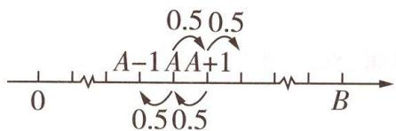

text_image

0
A-1 AA+1
0.5 0.5
0.5 0.5
B

图1

  
马尔科夫链在“赌徒模型”中的创新应用问题

当赌徒手中有 n 元 $(-A \leqslant n \leqslant B, n \in \mathbb{Z})$ 时, 最终欠债 A 元 (可以记为该赌徒手中有 -A 元) 的概率为 $P(n)$ , 请回答下列问题:

(1)请直接写出 $P(-A)$ 与 $P(B)$ 的值.  
(2) 证明 $\{P(n)\}$ 是一个等差数列, 并写出公差 d.  
(3) 当 A = 100 时, 分别计算 B = 300, B = 1500 时 $P(A)$ 的值, 并说明当 B 持续增大时, $P(A)$ 的统计含义.

审题（1）根据游戏规则理解 $P(n)$ 的意义, 即可得 $P(-A)$ 与 $P(B)$ ; (2) 由全概率公式

奇妙数字

斐波那契数列 数学家斐波那契以兔子繁殖为例子引入数列 1,1,2,3,5,8,13,21,34……这个数列从第 3 项开始,每一项都等于前两项之和.

得数列 $\{P(n)\}$ 的递推公式, 根据等差数列的定义得 $\{P(n)\}$ 为等差数列, 用累加法求公差; (3) 根据 (2) 得 $P(n)-P(-A)$ 和 d, 代入 n=A, 整理得 $P(A)$ , 代入 A=100 和 B 的值, 即可求出 $P(A)$ 的值, 分析得结论.

解析(1)当 n = -A 时, 赌徒已经欠债 -A 元, 因此 $P(-A) = 1$ .

当 n=B 时,赌徒到了终止赌博的条件,不再赌了,因此 $P(B)=0$ .

【敲黑板】本问中要求解概率的两个事件分别是必然事件和不可能事件

(2) 记 M: 赌徒手里有 n 元时最终欠债 A 元, N: 赌徒手里有 n 元时上一局赢.

根据全概率公式得 $P(M) = P(N)P(M|N) + P(\overline{N})P(M|\overline{N})$

即 $P(n)=\frac{1}{2}P(n-1)+\frac{1}{2}P(n+1)$ ,

【点关键】求解本题的关键在于对 $P(n)$ 的理解，并用全概率公式正确表达 $P(n)$

所以 $P(n) - P(n - 1) = P(n + 1) - P(n)$ ，所以 $\{P(n)\}$ 是等差数列.

由 $P(n)-P(n-1)=d$ , 得 $P(n-1)-P(n-2)=d,\cdots,P(-A+1)-P(-A)=d,$

累加得 $P(n) - P(-A) = (n + A)d$ ，故 $P(B) - P(-A) = (A + B)d$ ，得 $d = -\frac{1}{A + B}$

(3) 由(2)得 $P(n) - P(-A) = (n + A)d = -\frac{n + A}{A + B}$ ,

把 $n = A$ 代入可得 $P(A) - P(-A) = -\frac{2A}{A + B}$ , 即 $P(A) = 1 - \frac{2A}{A + B}$ .

当 $A = 100, B = 300$ 时， $P(A) = 1 - \frac{2 \times 100}{100 + 300} = \frac{1}{2}$ ；当 $A = 100, B = 1500$ 时， $P(A) = 1 - \frac{2 \times 100}{100 + 1500} = \frac{7}{8}$ .

当 B 持续增大时, $P(A)$ 也会持续增大, 即输光并欠债的可能性越大,

因此可知久赌无赢家,即便是这样一个看似公平的游戏,只要赌徒一直玩下去,就会有几乎100%的概率输光并欠债.

调研 2 [2024 湖南益阳 5 月模拟] 已知甲盒中装有 2 个黑球和 1 个白球, 乙盒中装有 2 个白球 (所有球除颜色外均相同), 现从甲、乙两盒中各任取一个球交换放入另一个盒中, 重复 $n (n \in \mathbf{N}^{*})$ 次这样的操作. 记甲盒中黑球个数为 $X_{n}$ , 恰有 2 个黑球的概率为 $a_{n}$ , 恰有 1 个黑球的概率为 $b_{n}$ .

(1) 求 $a_{1}, b_{1}$ 和 $a_{2}, b_{2}$ .

(2) 证明: $\{2a_{n} + b_{n} - \frac{6}{5}\}$ 为等比数列.

(3) 求 $X_{n}$ 的期望(用 n 表示).

审题（1）列举出所有取球和交换后的情况，根据 $a_{n}$ 和 $b_{n}$ 的含义分别求 $a_1, b_1$ 和 $a_2, b_2$ ；(2)由相互独立事件的概率乘法公式分类讨论，即可求得 $a_{n+1} = \frac{1}{3} b_n + \frac{1}{3} a_n, b_{n+1} = 1 - \frac{1}{2} b_n - \frac{1}{3} a_n$ ，结合等比数列的定义求证；(3)利用等比数列的通项公式得 $2a_{n} + b_{n} = \frac{6}{5} + \frac{2}{15} (\frac{1}{6})^{n-1}$ ，进而根据期望的计算公式求 $E(X_{n})$ 。

解析(1)若甲盒取黑,乙盒取白,此时互换,则甲盒变为1黑2白,乙盒为1黑1白,概率为 $\frac{2}{3}$ ;若甲盒取白,乙盒取白,此时互换,则甲盒仍为2黑1白,乙盒仍为2白,概率为 $\frac{1}{3}$ .

所以 $a_{1}=\frac{1}{3}, b_{1}=\frac{2}{3}.$

①当甲盒为1黑2白，乙盒为1黑1白时，对应概率为 $b_{1}=\frac{2}{3}$ ，此时：

若甲盒取黑,乙盒取白,互换,则甲盒变为3白,概率为 $\frac{1}{3}b_{1}\times\frac{1}{2}=\frac{1}{6}b_{1}$ ;

若甲盒取黑,乙盒取黑,互换,则甲盒仍为1黑2白,概率为 $\frac{1}{3}b_{1}\times\frac{1}{2}=\frac{1}{6}b_{1}$ ;

若甲盒取白,乙盒取白,互换,则甲盒仍为1黑2白,概率为 $\frac{2}{3}b_{1}\times\frac{1}{2}=\frac{1}{3}b_{1}$ ;

若甲盒取白,乙盒取黑,互换,则甲盒变为2黑1白,概率为 $\frac{2}{3}b_{1}\times\frac{1}{2}=\frac{1}{3}b_{1}$ .

②当甲盒为2黑1白,乙盒为2白时,对应概率为 $a_{1}=\frac{1}{3}$ ,此时:

若甲盒取黑,乙盒取白,互换,则甲盒变为1黑2白,概率为 $\frac{2}{3}a_{1}$ ;

若甲盒取白,乙盒取白,互换,则甲盒仍为2黑1白,概率为 $\frac{1}{3}a_{1}$ .

综上可知, $a_{2}=\frac{1}{3}b_{1}+\frac{1}{3}a_{1}=\frac{1}{3}\times\frac{2}{3}+\frac{1}{3}\times\frac{1}{3}=\frac{1}{3},b_{2}=\frac{1}{6}b_{1}+\frac{1}{3}b_{1}+\frac{2}{3}a_{1}=\frac{1}{2}b_{1}+\frac{2}{3}a_{1}=$ $\frac{1}{2}\times\frac{2}{3}+\frac{2}{3}\times\frac{1}{3}=\frac{5}{9}.$

(2)经过 $n$ 次这样的操作, 甲盒为 2 黑 1 白的概率为 $a_{n}$ , 为 1 黑 2 白的概率为 $b_{n}$ , 则甲盒为 3 白的概率为 $1 - a_{n} - b_{n}$ , 研究第 $n + 1$ 次交换球, 根据第 $n$ 次交换球的结果分类讨论如下.

【敲黑板】当前状态只受上一状态的影响是马尔科夫链最显著的特征，据此可建立前、后两项的递推关系，这也是马尔科夫链常常作为概率与数列交汇题的载体的原因

①当甲盒为1黑2白,乙盒为1黑1白时,对应的概率为 $b_{n}$ ,此时:

若甲盒取黑,乙盒取白,互换,则甲盒变为3白,概率为 $\frac{1}{3}b_{n}\times\frac{1}{2}=\frac{1}{6}b_{n}$ ;

若甲盒取黑,乙盒取黑,互换,则甲盒仍为1黑2白,概率为 $\frac{1}{3}b_{n}\times\frac{1}{2}=\frac{1}{6}b_{n}$ ;

若甲盒取白,乙盒取白,互换,则甲盒仍为1黑2白,概率为 $\frac{2}{3}b_{n}\times\frac{1}{2}=\frac{1}{3}b_{n}$ ;

若甲盒取白,乙盒取黑,互换,则甲盒变为2黑1白,概率为 $\frac{2}{3}b_{n}\times\frac{1}{2}=\frac{1}{3}b_{n}$

②当甲盒为2黑1白,乙盒为2白时,对应的概率为 $a_{n}$ ,此时:

若甲盒取黑,乙盒取白,互换,则甲盒变为1黑2白,概率为 $\frac{2}{3}a_{n}$ ;

若甲盒取白,乙盒取白,互换,则甲盒仍为2黑1白,概率为 $\frac{1}{3}a_{n}$ .

③当甲盒为3白,乙盒为2黑时,对应的概率为 $1-a_{n}-b_{n}$ ,此时甲盒只能取白,乙盒只能取黑,互换,则甲盒变为1黑2白,概率为 $1-a_{n}-b_{n}$ .

故 $a_{n + 1} = \frac{1}{3} b_n + \frac{1}{3} a_n, b_{n + 1} = \frac{1}{6} b_n + \frac{1}{3} b_n + \frac{2}{3} a_n + 1 - a_n - b_n = 1 - \frac{1}{2} b_n - \frac{1}{3} a_n,$

易知 $2a_{n} + b_{n} - \frac{6}{5} \neq 0$ ，则 $\frac{2a_{n+1} + b_{n+1} - \frac{6}{5}}{2a_{n} + b_{n} - \frac{6}{5}} = \frac{2\left(\frac{1}{3}b_{n} + \frac{1}{3}a_{n}\right) + 1 - \frac{1}{2}b_{n} - \frac{1}{3}a_{n} - \frac{6}{5}}{2a_{n} + b_{n} - \frac{6}{5}} =$

$$
\frac {\frac {1}{3} a _ {n} + \frac {1}{6} b _ {n} - \frac {1}{5}}{2 a _ {n} + b _ {n} - \frac {6}{5}} = \frac {1}{6},
$$

又 $2a_{1} + b_{1} - \frac{6}{5} = \frac{2}{15}$ 所以 $\{2a_{n} + b_{n} - \frac{6}{5}\}$ 为等比数列，且首项为 $\frac{2}{15}$ ，公比为 $\frac{1}{6}$ .

(3)由(2)知 $\left\{2a_{n}+b_{n}-\frac{6}{5}\right\}$ 为等比数列,且首项为 $\frac{2}{15}$ ,公比为 $\frac{1}{6}$ ,

故 $2a_{n} + b_{n} - \frac{6}{5} = \frac{2}{15}\left(\frac{1}{6}\right)^{n - 1}$ 所以 $2a_{n} + b_{n} = \frac{6}{5} +\frac{2}{15}\left(\frac{1}{6}\right)^{n - 1},$

故 $E(X_{n}) = 0\times (1 - a_{n} - b_{n}) + 1\times b_{n} + 2a_{n} = 2a_{n} + b_{n} = \frac{6}{5} +\frac{2}{15}\left(\frac{1}{6}\right)^{n - 1}.$

若甲、乙两盒中装球一样,还可以怎样设题呢?请看下列变式:

# 原创变式

甲、乙两盒中各装有1个黑球和2个白球(所有球除颜色外完全相同), 现从甲、乙两盒中各任取一个球, 交换后放入另一个盒中, 重复进行 $n (n \in \mathbb{N}^{*})$ 次这样的操作, 记甲盒中黑球的个数为 $X_{n}$ , 恰有1个黑球的概率为 $p_{n}$ , 恰有2个黑球的概率为 $q_{n}$ .

(1) 求 $p_{1}, p_{2}$ 的值.  
(2)根据马尔科夫链的知识知 $p_{n}=a\cdot p_{n-1}+b\cdot q_{n-1}+c\cdot r_{n-1}$ ，其中 $a,b,c\in[0,1]$ 且为常数，同时 $p_{n}+q_{n}+r_{n}=1$ ，求 $p_{n}$ .  
(3) 证明: $X_{n}$ 的数学期望 $E(X_{n})$ 为定值.

答案》第021页

神奇的是,一位自幂数(独身数),三位自幂数(水仙花数),四位自幂数(四叶玫瑰数)……都是存在的,唯独二位自幂数不存在.

奇妙数字

# 创新点②

# 马尔科夫链中的条件概率求解问题

调研 3 试题调研原创 W 公司是某国的一家电动汽车销售公司.

(1)已知该国电动汽车市场中有 $10\%$ 的车电池性能很好. $W$ 公司的电动汽车在该国电动汽车市场中占比 $3\%$ ,其中有 $25\%$ 的汽车电池性能很好.现有一名顾客在该国购买一辆电动汽车,已知他购买的汽车不是 $W$ 公司的,求该汽车电池性能很好的概率(结果精确到0.001).  
(2)为迅速抢占市场,W公司计划进行电动汽车推广活动.活动规则如下:有11个排成一行的格子,编号从左至右为0,1,…,10,有一个小球在格子中运动,每次小球有 $\frac{3}{4}$ 的概率向左移动一格;有 $\frac{1}{4}$ 的概率向右移动一格,规定小球移动到编号为0或者10的格子时,小球不再移动,一轮游戏结束.若小球最终停在10号格子,则赢得600元的购车代金券;若小球最终停留在0号格子,则客户获得一个纪念品.记 $P_{i}$ 为以下事件发生的概率:小球开始时位于第i个格子,且最终停留在第10个格子(若小球开始时在第0个或第10个格子,也视为游戏结束).一名顾客在一次游戏中,小球开始时位于第5个格子,求他获得代金券的概率.

解析(1)记事件A为“一辆该国市场的电动汽车电池性能很好”，事件B为“一辆该国市场的电动汽车来自W公司”，由全概率公式知 $P(A)=P(A|B)P(B)+P(A|\overline{B})P(\overline{B})$ ，

故 $P(A|\overline{B}) = \frac{P(A) - P(A|B)P(B)}{P(\overline{B})} = \frac{10\% - 25\% \times 3\%}{97\%}\approx 0.095.$

(2) 当 $i \geqslant 1$ 时, 小球开始时位于第 $i$ 格且最终停留在第 10 个格子的概率为 $P_{i}$ , 下一步小球向左或向右移动,

当小球向右移动一格时,可理解为小球开始时位于第 $i+1$ 格且最终停留在第 10 个格子,概率为 $P_{i+1}$ , 当小球向左移动一格时,可理解为小球开始时位于第 i-1 格且最终停留在第 10 个格子,概率为 $P_{i-1}$ , 故 $P_{i}=\frac{1}{4}P_{i+1}+\frac{3}{4}P_{i-1}$ , 故 $P_{i+1}-P_{i}=3(P_{i}-P_{i-1})(i\geqslant1)$ .

由题意知 $P_{0}=0, P_{10}=1$ ，易知 $P_{1}-P_{0}\neq0$ ，

所以 $\left\{P_{i}-P_{i-1}\right\}(i=1,2,\cdots,10)$ 是以 $P_{1}-P_{0}$ 为首项、3 为公比的等比数列，即 $P_{i}-P_{i-1}=3^{i-1}(P_{1}-P_{0})(i=1,2,\cdots,10)$ ,

故 $P_{10}-P_{9}=3^{9}(P_{1}-P_{0}),P_{9}-P_{8}=3^{8}(P_{1}-P_{0}),\cdots,P_{1}-P_{0}=3^{0}(P_{1}-P_{0})$

【敲黑板】写出后项减前项的表达式，利用累加法求出 $P_{10}$ 和 $P_{5}$

故 $P_{10} = (3^9 + 3^8 + \dots + 3^0)(P_1 - P_0) = \frac{3^{10} - 1}{2} P_1, P_5 = (3^4 + 3^3 + \dots + 3^0)(P_1 - P_0) = \frac{3^5 - 1}{2} P_1,$

则 $P_{5}=\frac{P_{5}}{P_{10}}=\frac{3^{5}-1}{3^{10}-1}=\frac{1}{3^{5}+1}=\frac{1}{244}$ ，故这名顾客获得代金券的概率为 $\frac{1}{244}$ .

# 参考答案与解析

(1)由题意得恰有0个黑球的概率为 $1-p_{n}-q_{n},p_{1}=\frac{C_{2}^{1}C_{2}^{1}+C_{1}^{1}C_{1}^{1}}{C_{3}^{1}C_{3}^{1}}=\frac{5}{9}$ [破瓶颈: $p_{1}$ 表示经过1次操作后甲盒中恰有1个黑球,所以第1次操作两个盒子都要取黑球,或都要取白球,据此列出式子],

$$
q _ {1} = \frac {\mathrm{C} _ {2} ^ {1} \mathrm{C} _ {1} ^ {1}}{\mathrm{C} _ {3} ^ {1} \mathrm{C} _ {3} ^ {1}} = \frac {2}{9}, \text {则} p _ {2} = \frac {\mathrm{C} _ {2} ^ {1} \mathrm{C} _ {2} ^ {1} + \mathrm{C} _ {1} ^ {1} \mathrm{C} _ {1} ^ {1}}{\mathrm{C} _ {3} ^ {1} \mathrm{C} _ {3} ^ {1}} p _ {1} + \frac {\mathrm{C} _ {2} ^ {1} \mathrm{C} _ {3} ^ {1}}{\mathrm{C} _ {3} ^ {1} \mathrm{C} _ {3} ^ {1}} q _ {1} + \frac {\mathrm{C} _ {3} ^ {1} \mathrm{C} _ {2} ^ {1}}{\mathrm{C} _ {3} ^ {1} \mathrm{C} _ {3} ^ {1}} (1 - p _ {1} - q _ {1}) = \frac {4 9}{8 1}.
$$

(2) 结合(1)与题意得 $r_n$ 表示经过 $n$ 次操作后甲盒中恰有 0 个黑球的概率, $p_n = \frac{C_2^1 C_2^1 + C_1^1 C_1^1}{C_3^1 C_3^1} p_{n-1} + \frac{C_2^1 C_3^1}{C_3^1 C_3^1} q_{n-1} + \frac{C_3^1 C_2^1}{C_3^1 C_3^1} (1 - p_{n-1} - q_{n-1}) = -\frac{1}{9} p_{n-1} + \frac{2}{3}$ ,

所以 $p_n - \frac{3}{5} = -\frac{1}{9} (p_{n-1} - \frac{3}{5})$ [传技法：利用待定系数法得递推关系]，

又 $p_1 - \frac{3}{5} = -\frac{2}{45} \neq 0$

所以 $\{p_n - \frac{3}{5}\}$ 是以 $-\frac{2}{45}$ 为首项、 $-\frac{1}{9}$ 为公比的等比数列.

所以 $p_n - \frac{3}{5} = -\frac{2}{45} \times (-\frac{1}{9})^{n-1}$ , 即 $p_n = -\frac{2}{45} \times (-\frac{1}{9})^{n-1} + \frac{3}{5}$ .

(3) $q_{n}=\frac{C_{2}^{1}C_{1}^{1}}{C_{3}^{1}C_{3}^{1}}p_{n-1}+\frac{C_{1}^{1}C_{3}^{1}}{C_{3}^{1}C_{3}^{1}}q_{n-1}=\frac{2}{9}p_{n-1}+\frac{1}{3}q_{n-1}\quad①,$

$$
1 - q _ {n} - p _ {n} = 1 - (\frac {2}{9} p _ {n - 1} + \frac {1}{3} q _ {n - 1}) - (- \frac {1}{9} p _ {n - 1} + \frac {2}{3}) = \frac {1}{3} - \frac {1}{9} p _ {n - 1} - \frac {1}{3} q _ {n - 1} \quad ②,
$$

① - ② 得 $2q_{n} + p_{n} - 1 = \frac{1}{3}(2q_{n-1} + p_{n-1} - 1)$ ,

又 $2q_{1} + p_{1} - 1 = 0$ ，所以 $2q_{n} + p_{n} - 1 = 0.$

所以 $q_{n} = \frac{1 - p_{n}}{2}$ ，所以 $X_{n}$ 的分布列为：

<table><tr><td> $X_{n}$ </td><td>0</td><td>1</td><td>2</td></tr><tr><td>P</td><td> $\frac{1-p_{n}}{2}$ </td><td> $p_{n}$ </td><td> $\frac{1-p_{n}}{2}$ </td></tr></table>

所以 $E(X_{n})=0\times\frac{1-p_{n}}{2}+1\times p_{n}+2\times\frac{1-p_{n}}{2}=1$ ,为定值1.

线面平行的判定定理 如果平面外一条直线与此平面内的一条直线平行,那么该直线与此平面平行.

# 超重点2 新情境·以数学文化为背景的几何体体积、面积计算问题

# 三年考情与创新命题特点

# 2025命题预测

2023 北京卷 T9，以“坡屋顶”为载体考查五面体的所有棱长之和

2022 新高考 I 卷 T4，以 “南水北调” 工程为背景考查棱台的体积

2022 年天津卷 T8，以 “十字歇山顶” 为背景考查空间几何体的体积

①命题形式：以选择题或填空题的形式呈现，考查基本空间图形及其简单组合体的概念和基本特征，求解几何体的表面积和体积.

②必考热点：求解与球切、接的几何体的体积和表面积.

③创新考法：以数学文化为背景，或问题的背景与社会实践贴近.

# 角度 ① 台体的体积与面积计算问题

调研 1 [2024 陕西安康 5 月第三次质量联考 | 新情境·折扇] 折扇(如图 1)是我国古老文化的延续,“扇”与“善”谐音,折扇也寓意“善良”“善行”. 它常以字画的形式体现我国的传统文化. 图 2 是一个圆台的侧面展开图(扇形的一部分),若两个圆弧 DE, AC 所在圆的半径分别是 6 和 12,且 $\angle ABC = 120^{\circ}$ ,则该圆台的体积为 ( )

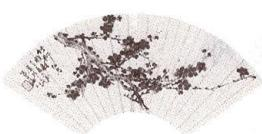  
图1

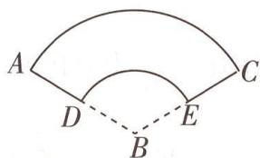

text_image

A
D
B
E
C

图2

A. $112 \sqrt{2} \pi$

B. $\frac{7\sqrt{2}\pi}{3}$

C. $\frac{28\sqrt{2}\pi}{3}$

D. $\frac{112\sqrt{2}\pi}{3}$

解析 设圆台上、下底面的半径分别为 $r_{1}, r_{2}$ ，由题意可知 $\frac{1}{3} \times 2\pi \times 6 = 2\pi r_{1}, \frac{1}{3} \times 2\pi \times 12 = 2\pi r_{2}$ ，解得 $r_{1} = 2, r_{2} = 4$ .

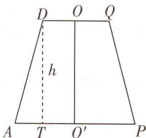

text_image

D O Q
h
A T O' P

图 3

作出圆台轴截面的示意图,如图3所示.

【传技法】利用圆台的轴截面将立体问题转化为平面问题，是解决圆台有关问题的关键

图中 $OD = r_{1} = 2, O'A = r_{2} = 4, AD = 12 - 6 = 6$ ，过点 D 向 AP 作垂线，垂足为 T，则 $AT = r_{2} - r_{1} = 2$ ，所以圆台的高 $h = DT = \sqrt{AD^{2} - AT^{2}} = \sqrt{6^{2} - 2^{2}} = 4\sqrt{2}$ ，

圆台上、下底面面积分别为 $S_{1} = \pi \times 2^{2} = 4\pi, S_{2} = \pi \times 4^{2} = 16\pi.$

由圆台体积计算公式可得圆台的体积 $V=\frac{1}{3}(S_{1}+\sqrt{S_{1}\times S_{2}}+S_{2})\times h=\frac{1}{3}\times28\pi\times4\sqrt{2}=\frac{112\sqrt{2}\pi}{3}$ . 故选 D.

# 实用结论

面面平行的判定定理 如果一个平面内的两条相交直线与另一个平面平行,那么这两个平面平行.

# 原创变式

# “折扇”变“会徽”，已知扇环面积求圆台体积

图4是杭州第19届亚运会的会徽“潮涌”，可将其视为一个如图5所示的扇环ABCD.已知 $\widehat{AB}=2\pi,AD=$ 3.且该扇环ABCD的面积为 $9\pi$ ,若将该扇环作为侧面围成一圆台,则该圆台的体积为\_\_\_\_.

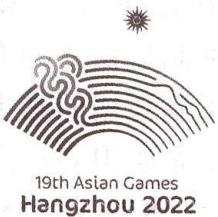

text_image

19th Asian Games
Hangzhou 2022

图 4

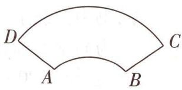

text_image

D
A
B
C

图 5

答案》第026页

# 角度 ② 柱体的体积与面积计算问题

调研 2 [2024 山东潍坊二模] 如图 6 所示的六角花灯是中国彩灯中富有特色的传统手工艺品之一. 现制作一个三层六角花灯模型, 三层均为正六棱柱 (内部全空), 其中模型上、下两层的底面周长均为 $36 \sqrt{3} \mathrm{~cm}$ , 高为 $4 \mathrm{~cm}$ . 现在其内部放入一个体积为 $36 \pi \mathrm{~cm}^{3}$ 的球形灯, 且球形灯球心与花灯各面的距离不少于 $8 \mathrm{~cm}$ . 则该模型的侧面积至少为 ( )

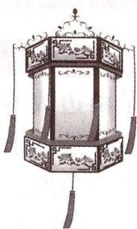

natural_image

Illustration of a traditional Chinese lantern with decorative panels and tassels (no text or symbols)

图6

A. $800 \sqrt{3} \mathrm{~cm}^{2}$

B. $544 \sqrt{3} \mathrm{~cm}^{2}$

C. $(288\sqrt{3} + 384)\mathrm{cm}^2$

D. $(288\sqrt{3} + 768)\mathrm{cm}^2$

解析 由题意得,模型上、下两层是底面周长为 $36\sqrt{3}$ cm, 高为 4 cm 的正六棱柱,

所以这两层的侧面积为 $S_{1}=2\times36\sqrt{3}\times4=288\sqrt{3}$ (cm $^{2}$ ).

【易错提醒】求多面体的表面积和侧面积不同，要分清二者区别

考虑临界情况,当球形灯球心到花灯上、下底面的距离等于8 cm时,中层正六棱柱的高为 $h=2\times8-2\times4=8$ (cm),

由球心到花灯侧面距离为 $8 \, cm$ ，可知中层正六棱柱的底面边长为 $8 \div \sin \frac{\pi}{3} = \frac{16\sqrt{3}}{3} (\text{cm})$ ，

所以中层正六棱柱的侧面积 $S_{2}=6\times\frac{16\sqrt{3}}{3}\times8=256\sqrt{3}$ ( $cm^{2}$ ).

故该模型的侧面积至少为 $S = S_{1} + S_{2} = 544\sqrt{3} \, (\text{cm}^{2})$ ，故选 B.

【解后反思】求组合体的侧面积或表面积，首先应弄清它的组成，看包括哪些底面和侧面，各个面应该怎样求，然后根据公式求出各面的面积，最后相加减

线面平行的性质定理 一条直线与一个平面平行,如果过该直线的平面与此平面相交,那么该直线与交线平行.

实用结论

# 原创变式

2《天工开物》是我国明代科学家宋应星所著的一部综合性科学技术著作,书中记载了一种制造瓦片的方法.某校高一年级计划实践这种方法,为同学们准备了制瓦用的黏土和圆柱形的木质圆桶,圆桶底面外圆的直径为20 cm,高为20 cm.首先,在圆桶的外侧面均匀包上一层厚度为2 cm的黏土,然后,沿圆桶母线方向将粘土层分割成四等份(如图7),等黏土干后,即可得到大小相同的四片瓦.每位同学制作四片瓦,全年级共500人,需要准备的黏土量(不计损耗)与下列哪个数字最接近(参考数据: $\pi\approx3.14$ )?

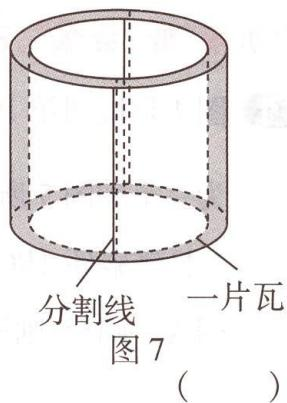

text_image

分割线
一片瓦
图 7
（ ）

A. $0.8 \mathrm{~m}^{3}$

B. ${1.4}{\mathrm{\;m}}^{3}$

C. $1.8 \mathrm{~m}^{3}$

D. $2.2 \mathrm{~m}^{3}$

答案》第026页

# 角度 ③ 与球切、接的几何体的体积与面积计算问题

调研 3 [2024 四川德阳三模]“阿基米德多面体”也称半正多面体, 是由边数不全相同的正多边形围成的多面体, 它体现了数学的对称美. 如图 8 是以正方体的各条棱的中点为顶点的多面体, 这是一个有八个面为正三角形, 六个面为正方形的“阿基米德多面体”, 若该多面体的棱长为 $\sqrt{2}$ , 则该多面体外接球的表面积为 ( )

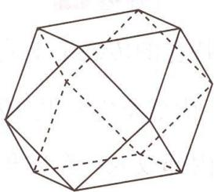

natural_image

Geometric polyhedron diagram with solid and dashed lines indicating visible and hidden edges (no text or labels)

图8

A. $8 \pi$

B. $4 \pi$

C. $2\pi$

D. $\frac{4}{3}\pi$

解析 将“阿基米德多面体”补全为正方体,如图9所示.

则图中“阿基米德多面体”的两个顶点 E, F 分别为正方体两棱 $AB, BB_{1}$ 的中点 E, F，由题知 $EF = \sqrt{2}$ ，

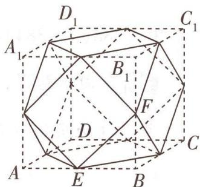

text_image

D₁
A₁
B₁
F
C₁
D
E
B
C

图9

易知 $BE \perp BF, BE = BF$ ，可得 BE = BF = 1，

所以正方体的棱长为2,该多面体的外接球即正方体ABCD- $A_{1}B_{1}C_{1}D_{1}$ 的棱切球，

棱切球的直径为该正方体的面对角线长,为 $2\sqrt{2}$ ,

因此该多面体的外接球的半径为 $\sqrt{2}$ ，所以其表面积为 $S=4\pi\times(\sqrt{2})^{2}=8\pi$ 。故选A。

# 原创变式

3 [新情境·圆柱容球,新题型·双空题] 相传在古希腊数学家阿基米德的墓碑上刻着一个圆柱,圆柱内有一个内切球,这个球的直径恰好与圆柱的高相等. 图10所示的几何体为一个圆柱 $O_{1}O_{2}$ 与球O的组合体,其中球O与圆柱 $O_{1}O_{2}$ 的侧面和上、下底面均相切,EF为底面圆 $O_{1}$ 的一条直径,EF⊥AB,若球O的半径r=1,则球O的体积与圆柱 $O_{1}O_{2}$ 的体积的比值为\_\_\_\_;球心O到平面DEF的距离为\_\_\_\_.

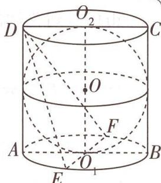

text_image

D
O₂
C
O
F
A
O₁
B
E

图 10

答案》第026页

实用结论

面面平行的性质定理 两个平面平行,如果另一个平面与这两个平面相交,那么两条交线平行.

# 创新预测

答案▶027页

1. 试题调研原创 [新情境·方亭] 如图 11 所示的烽火台是古代重要的军事防御设施, 其主体部分为方亭 (一种正四棱台建筑物), 可抽象成正四棱台 $ABCD - A_{1}B_{1}C_{1}D_{1}$ (如图 12 所示), 其上底面与下底面的面积之比为 1:16, 方亭的高为棱台上底面边长的 3 倍. 已知方亭的体积为 $567 \mathrm{~m}^{3}$ , 则该方亭的上底面边长为 ( )

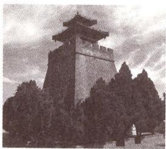

natural_image

Black-and-white photo of a traditional Chinese pagoda-style tower surrounded by trees under a cloudy sky (no visible text or symbols)

图11

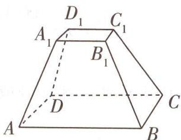

text_image

D₁
A₁
C₁
B₁
D
A
B
C

图 12

A. $3 \mathrm{~m}$

B. $4 \mathrm{~m}$

C. $6 \mathrm{~m}$

D. ${12}\mathrm{\;m}$

2. 试题调研原创 [新情境·建盏] 建盏产自福建省南平市建阳区, 多口大底小, 底部多为圈足且圈足较浅 (如图 13 所示), 因此可将建盏看作是圆台与圆柱拼接而成的几何体. 现将某建盏的上半部分抽象成圆台 $O_{1}O_{2}$ , 已知该圆台的上、下底面面积分别为 $16 \pi$ 和 $9 \pi$ , 高超过 1 , 该圆台上、下

natural_image

Close-up of a dark, textured ceramic bowl with no visible text or markings

图 13

底面圆周上的各个点均在球 O 的表面上,且球 O 的表面积为 $100\pi$ , 则该圆台的体积为（）

A. ${80\pi }$

B. $\frac{259\pi}{3}$

C. $\frac{260\pi}{3}$

D. ${87\pi }$

3. 试题调研原创 [新情境·坡屋顶] 坡屋顶又叫斜屋顶, 在建筑中应用较广, 主要有单坡式、双坡式、四坡式和折腰式等. 如图 14 所示的五面体是某一坡屋顶抽象出来的模型, 其中四边

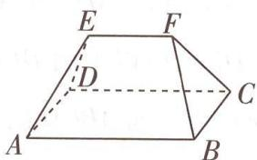

text_image

E
F
D
C
A
B

图 14

  
“分割法”巧破新情境古代建筑中的几何体体积问题

形 ABCD 是矩形, AB = 8, BC = 6, 平面 $ABFE \cap$ 平面 CDEF = EF, 且 EF = 6. 其顶点都在同一个球面上. 若平面 ABCD 经过该球的球心, 则该五面体的体积的最大值为 ( )

A. 64

B. 72

C. 88

D. 96

线面垂直的判定定理 如果一条直线与一个平面内的两条相交直线垂直,那么该直线与此平面垂直.

实用结论

# 参考答案与解析

# 原创变式

1. $\frac{14\sqrt{2}\pi}{3}$ 如图15, 分别延长 $DA, CB$ , 相交于点 $O$ , 设 $\angle AOB = \theta, OA = r$ , $\widehat{CD} = l$ ,

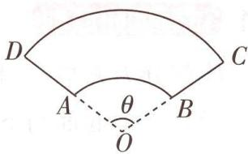

text_image

D
A
θ
B
C
O

图 15

由题意可知 $\left\{ \begin{array}{l} \theta r = 2\pi, \\ \frac{1}{2}\theta (3 + r)^2 - \frac{1}{2}\theta r^2 = 9\pi, \end{array} \right.$ 解得 $\left\{ \begin{array}{l} r = 3, \\ \theta = \frac{2\pi}{3}. \end{array} \right.$

则 $\widehat{CD}=\frac{2\pi}{3}\times6=4\pi$ ，将该扇环作为侧面围成一圆台，则圆台上、下底面的半径分别为1和2，所以其高为 $\sqrt{3^{2}-(2-1)^{2}}=2\sqrt{2}$ ，故该圆台的体积为 $V=\frac{1}{3}(\pi+4\pi+\sqrt{\pi\times4\pi})\times2\sqrt{2}=\frac{14\sqrt{2}\pi}{3}$ [传技法:求圆锥、圆台体积的关键是求其底面面积和高,其中高一般利用几何体的轴截面求得,一般是由母线、高、半径(一部分)组成的直角三角形列方程并求解].

2.B 由条件可得四片瓦的体积和 $V = \pi \times 12^{2} \times 20 - \pi \times 10^{2} \times 20 = 880\pi (\mathrm{cm}^{3})$ [明关键: 将所求体积转化为两个几何体的体积的差],

所以500名学生每人制作四片瓦共需黏土的体积为 $500 \times 880\pi = 440\ 000\pi \, (\text{cm}^3)$ ，又 $\pi \approx 3.14$ ，所以共需黏土的体积约为 $440\ 000 \times 3.14 \div 10^6 = 1.381\ 6(\text{m}^3)$ ，故选B.

3. $\frac{2}{3}\quad\frac{\sqrt{5}}{5}$ 圆柱 $O_{1}O_{2}$ 的体积为 $V_{2}=\pi r^{2}\times2r=2\pi$ [敲黑板:球与圆柱的底面和侧面均相切,则球的直径等于圆柱的高,也等于圆柱底面圆的直径],球 O 的体积为 $V_{1}=\frac{4}{3}\pi\times r^{3}=\frac{4\pi}{3}$ ,

所以球 O 的体积与圆柱 $O_{1}O_{2}$ 的体积的比值为 $\frac{V_{1}}{V_{2}}=\frac{\frac{4}{3}\pi}{2\pi}=\frac{2}{3}$ .

由题意知 $EF \perp AB, DA \perp EF, AB \cap AD = A, AB, AD \subset$ 平面 ABCD，所以 $EF \perp$ 平面 ABCD，又 $EF \subset$ 平面 DEF，所以平面 $DEF \perp$ 平面 ABCD.

连接 $O_{1}D$ ，易知平面 DEF 与平面 ABCD 的交线为 $O_{1}D$ ，

作出轴截面的示意图[传技巧:选准最佳角度作出截面(要使这个截面尽可能多包含球、几何体的各种元素,且能体现这些元素间的关系),达到空间问题平面化的目的],如图16,过点O作 $OG\perp DO_{1}$ ,垂足为点G,则 $OG\perp$ 平面DEF.

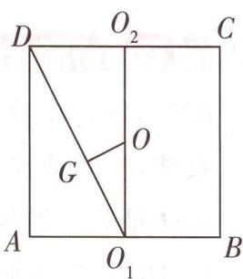

text_image

D
O₂
C
G
O
A
O₁
B

图 16

易知 $O_{1}O_{2}\perp CD,O_{1}O_{2} = 2,O_{2}D = 1$ ，在 $\mathrm{Rt}\triangle O_1O_2D$ 中，由勾股定理可得 $O_{1}D = \sqrt{O_{1}O_{2}^{2} + O_{2}D^{2}} = \sqrt{5},$

由 Rt△O₁GO ∼ Rt△O₁O₂D，可知 $\frac{GO}{OO_{1}} = \frac{DO_{2}}{DO_{1}}$ ，即 $\frac{GO}{1} = \frac{1}{\sqrt{5}}$ ，解得 $GO = \frac{\sqrt{5}}{5}$ ，所以球心 O 到平面 DEF

的距离为 $\frac{\sqrt{5}}{5}$ .

# 创新预测

1.A 因为正四棱台上底面与下底面的面积之比为 1:16, 设 $A_{1}B_{1}=x\ m$ , 则 $AB=4x\ m$ ,

故方亭的高为 $3x \, m$ ，故方亭的体积为 $\frac{1}{3}(x^{2} + 16x^{2} + \sqrt{x^{2} \cdot 16x^{2}}) \cdot 3x = 567$ ，解得 x = 3，

故 $A_{1}B_{1}=3\ m$ ，即该方亭的上底面边长为 3 m。故选 A.

2.B 设球 O 的半径为 R，上、下底面分别为圆 $O_{1}, O_{2}$ （这里上底面是指大的那个底面），

依题意得 $4\pi R^{2}=100\pi$ ，解得 R=5，易知下底面半径为 3，上底面半径为 4，则 $OO_{2}=4, OO_{1}=3$ ，因为圆台的高超过 1，所以该圆台的高为 7，该圆台的体积为 $\frac{1}{3} \times (9\pi + 16\pi + \sqrt{9\pi \times 16\pi}) \times 7 = \frac{259\pi}{3}$ 。故选 B [反思提升：求解与几何体外接球有关的问题常用的两个思路：一是根据球的截面的性质，利用球的半径 R、截面圆的半径 r 及球心到截面圆的距离 d 三者的关系 $R^{2} = r^{2} + d^{2}$ 求解，其中，确定球心的位置是关键；二是将几何体补成长方体，一般可利用该几何体与长方体共有外接球的特征，由外接球的直径等于长方体的体对角线长求解]。

3.C 因为四边形 ABCD 是矩形, 所以 $AB \parallel CD$ , 又 $AB \not\subset$ 平面 CDEF, 所以 $AB \parallel$ 平面 CDEF.

因为 $AB \subset$ 平面 $ABFE$ , 平面 $ABFE \cap$ 平面 $CDFE = EF$ , 所以 $AB // EF$ .

如图 17, 连接 AC, BD, 两线相交于一点. 因为平面 ABCD 经过外接球球心, 设球心为 O, 则 $AC \cap BD = O$ .

取 EF 的中点 G, 连接 OE, OG, 由题知 OE = OA = 5, OG ⊥ EF.

在 Rt△OEG 中， $OG = \sqrt{OE^{2} - EG^{2}} = \sqrt{5^{2} - 3^{2}} = 4.$

则当且仅当 $OG \perp$ 平面 ABCD 时, 五面体的体积最大,

当 $OG \perp$ 平面 ABCD 时, 在棱 AB, CD 上分别取 I, L, J, K, 使 AI = DJ, IL = JK = EF, 连接 EI, IJ, EJ, FL, LK, FK, 则此时五面体的体积 $V = V_{E-AIJD} + V_{EIJ-FLK} + V_{F-BLKC} = \frac{1}{3} \times (8 - 6) \times 6 \times 4 + \frac{1}{2} \times (6 \times 6) \times 4 = 88$ . 故选 C.

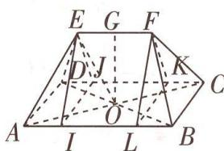

text_image

E G F
D J K
O C
A I L B

图 17

# 超重点3 新题型·利用样本的数字特征求解开放性决策问题

# 角度 1 利用平均数与方差选派选手参赛

调研 1 试题调研原创 某学校为了推选一名羽毛球选手参加市级联赛,对成绩都非常优秀的甲、乙两名选手进行了五轮综合测试,测试成绩如下(分数越高,代表打球水平越好).

<table><tr><td></td><td>第一轮</td><td>第二轮</td><td>第三轮</td><td>第四轮</td><td>第五轮</td></tr><tr><td>甲的分数</td><td>7.2</td><td>7.3</td><td>7.6</td><td>8</td><td>7.9</td></tr><tr><td>乙的分数</td><td>6</td><td>6.3</td><td>9.5</td><td>9.2</td><td>7</td></tr></table>

(1)根据以上信息,结合概率统计知识,你倾向于选派哪一名选手参加比赛?说明理由.
(2)若甲、乙两名选手进行对抗赛,由于两人实力相当(即甲、乙在每一局比赛中获胜的概率均为 $\frac{1}{2}$ ),特制订如下规则:当其中一人比另一人多胜两局或比赛局数达到20局时,比赛结束.假设每局比赛互不影响,求比赛结束时比赛局数的数学期望.

解析 (1) 第一步: 由平均数和方差的公式求出 $\overline{x}_{\text {甲}}, \overline{x}_{\text {乙}}, s_{\text {甲}}^{2}, s_{\text {乙}}^{2}$ .

设甲、乙两名选手的平均成绩分别为 $\bar{x}_{甲},\bar{x}_{乙}$ ，方差分别为 $s_{甲}^{2},s_{乙}^{2}$

$$
\overline {{{x}}} _ {\text {甲}} = \frac {7 . 2 + 7 . 3 + 7 . 6 + 8 + 7 . 9}{5} = 7. 6, \overline {{{x}}} _ {\text {乙}} = \frac {6 + 6 . 3 + 9 . 5 + 9 . 2 + 7}{5} = 7. 6.
$$

$$
s _ {\text {甲}} ^ {2} = \frac {1}{5} \times \left[ (7. 2 - 7. 6) ^ {2} + (7. 3 - 7. 6) ^ {2} + 0 ^ {2} + (8 - 7. 6) ^ {2} + (7. 9 - 7. 6) ^ {2} \right] = 0. 1,
$$

$$
s _ {\text {乙}} ^ {2} = \frac {1}{5} \times [ (6 - 7. 6) ^ {2} + (6. 3 - 7. 6) ^ {2} + (9. 5 - 7. 6) ^ {2} + (9. 2 - 7. 6) ^ {2} + (7 - 7. 6) ^ {2} ] = 2. 1 5 6.
$$

第二步: 比较平均数和方差的大小, 下结论并说明理由.

$$
\overline {{{x}}} _ {\text {甲}} = \overline {{{x}}} _ {\text {乙}}, s _ {\text {甲}} ^ {2} <   s _ {\text {乙}} ^ {2}.
$$

【高分秘籍】利用平均数和方差选派选手参赛时，首先要明确平均数与选手的成绩的关系（一般所求平均数为分数的平均数，平均数越高，成绩越好，但对于跑步、游泳等项目，若所求平均数为比赛用时的平均数，则平均数越高，成绩越差，明确这一点至关重要），若选手们的平均数相同，再进行方差的计算，方差与数据的稳定性有关，方差越大，则成绩越不稳定。若平均数和方差都不相同，选择一个得出结论即可，注意说明清楚原因

第一种结论:甲、乙的平均成绩相同,但甲的水平更为稳定,所以我倾向于选派甲选手参加比赛.

第二种结论:乙的水平虽然不太稳定,但平均成绩与甲相同,且在赛场上冲击高分的可能性更大,所以我倾向于选派乙选手参加比赛.

(注:以上两种选派方式均可以,叙述清楚选派的理由即可)

# 实用结论

面面垂直的性质定理 两个平面垂直,如果一个平面内有一直线垂直于这两个平面的交线,那么这条直线与另一个平面垂直.

(2) 第一步: 设比赛局数为随机变量 X, 求出 X 的所有可能取值及对应的概率.

设比赛结束时比赛局数为随机变量X,由题意知X一定为偶数,即2,4,6,…,20.

【抓题眼】注意比赛结束的条件 “当其中一人比另一人多胜两局或比赛局数达到20局时，比赛结束”，那么比赛局数X的取值只能为偶数

$$
P (X = 2) = 2 \times \frac {1}{2} \times \frac {1}{2} = \frac {1}{2}.
$$

当 X=4 时,说明前两局二人各胜一局,然后第三局和第四局均为甲胜或均为乙胜.前两局二人各胜一局的概率为 $2 \times \frac{1}{2} \times \frac{1}{2} = \frac{1}{2}$ , 故 $P(X=4) = \frac{1}{2} \times (2 \times \frac{1}{2} \times \frac{1}{2}) = \frac{1}{4}$ .

观察发现,当 $4 \leqslant X \leqslant 18$ 时,双方前两局,前四局, $\cdots$ ,前X-2局的胜负局数均相同,且第X-1局,第X局均为甲胜或乙胜,

【类比思想】由特殊到一般，归纳分析，得出“通项”

设 $X = 2n(n \in \mathbb{N}^*, 2 \leqslant n \leqslant 9)$ ，则 $P(X = 2n) = (2 \times \frac{1}{2} \times \frac{1}{2})^{n-1} \times (2 \times \frac{1}{2} \times \frac{1}{2}) = (\frac{1}{2})^n$

显然 n=1 也满足上式.

当 n=20 时,说明双方前两局,前四局,一直到前十八局的胜负局数均相同,所以 $P(X=20)=(2\times\frac{1}{2}\times\frac{1}{2})^{9}=(\frac{1}{2})^{9}$ .

第二步: 写出 X 的分布列并表示出期望 $E(X)$ .

故 $X$ 的分布列为

<table><tr><td>X</td><td>2</td><td>4</td><td>6</td><td>8</td><td>...</td><td>18</td><td>20</td></tr><tr><td>P</td><td> $\frac{1}{2}$ </td><td> $(\frac{1}{2})^2$ </td><td> $(\frac{1}{2})^3$ </td><td> $(\frac{1}{2})^4$ </td><td>...</td><td> $(\frac{1}{2})^9$ </td><td> $(\frac{1}{2})^9$ </td></tr></table>

$$
E (X) = 2 \times \frac {1}{2} + 4 \times \frac {1}{2 ^ {2}} + 6 \times \frac {1}{2 ^ {3}} + 8 \times \frac {1}{2 ^ {4}} + \dots + 1 8 \times \frac {1}{2 ^ {9}} + 2 0 \times \frac {1}{2 ^ {9}}.
$$

第三步:利用错位相减法求解 $E(X)$ .

设 $Y=2 \times \frac{1}{2} + 4 \times \frac{1}{2^{2}} + 6 \times \frac{1}{2^{3}} + 8 \times \frac{1}{2^{4}} + \cdots + 18 \times \frac{1}{2^{9}}$ ①,

则 $\frac{1}{2}Y=2\times\frac{1}{2^{2}}+4\times\frac{1}{2^{3}}+6\times\frac{1}{2^{4}}+8\times\frac{1}{2^{5}}+\cdots+18\times\frac{1}{2^{10}}$ ②,

① - ②得 $\frac{1}{2} Y = 2 \times \frac{1}{2} + 2 \times \frac{1}{2^2} + 2 \times \frac{1}{2^3} + 2 \times \frac{1}{2^4} + 2 \times \frac{1}{2^5} + \cdots + 2 \times \frac{1}{2^9} - 18 \times \frac{1}{2^{10}} = 2 \times (\frac{1}{2} + \frac{1}{2^2} + \frac{1}{2^3} + \frac{1}{2^4} + \frac{1}{2^5} + \cdots + \frac{1}{2^9}) - 18 \times \frac{1}{2^{10}} = 2 \times \frac{\frac{1}{2} \times (1 - \frac{1}{2^9})}{1 - \frac{1}{2}} - 18 \times \frac{1}{2^{10}} = 2 - \frac{11}{2^9}$ , 所以 $Y = 4 - \frac{11}{2^8}$ ,

所以 $E(X) = Y + 20 \times \frac{1}{2^9} = 4 - \frac{11}{2^8} + 20 \times \frac{1}{2^9} = 4 - \frac{1}{2^8} = \frac{1023}{256}$ .

【易错提醒】前面计算的 Y 是不包括 “ $20 \times \frac{1}{2^{9}}$ ” 这一项的，在最后需要加上

所以比赛结束时比赛局数的数学期望为 $\frac{1023}{256}$ .

# 角度 ② 利用期望根据已知决策求参数

调研 2 试题调研原创 基础学科招生改革试点也称“强基计划”, 主要是为了选拔培养有志于服务国家重大战略需求且综合素质优秀或基础学科拔尖的学生. 报考强基计划的考生需参加由试点高校自主命题的考试.

(1)为了更好地服务于高三学生,某研究机构对随机抽取的5名高三学生的记忆力指标x和判断力指标y进行统计分析,得到下表数据:

<table><tr><td>x</td><td>6</td><td>8</td><td>9</td><td>10</td><td>12</td></tr><tr><td>y</td><td>2</td><td>3</td><td>4</td><td>5</td><td>6</td></tr></table>

  
“期望比较法”速求新题型决策性问题中概率的取值范围

请用样本相关系数说明该组数据中 y 与 x 之间的关系可用线性回归模型进行拟合, 并求 y 关于 x 的经验回归方程 $\hat{y} = \hat{b}x + \hat{a}$ (精确到 0.01).

(2) 现有甲、乙两所试点高校的强基计划笔试环节都设有三门考试科目且每门科目是否通过相互独立, 若某考生报考甲高校, 每门笔试科目通过的概率均为 $\frac{2}{5}$ , 该考生报考乙高校, 每门笔试科目通过的概率依次为 $m, \frac{1}{4}, \frac{2}{3}$ , 其中 $0 < m < 1$ . 根据规定每名考生只能报考强基计划的一所试点高校, 以笔试过程中通过科目数的期望为依据, 当 $m$ 的取值范围为多少时, 该考生更应报考乙高校?

附: x 和 y 的样本相关系数 $r = \frac{\sum_{i=1}^{n}(x_i - \bar{x})(y_i - \bar{y})}{\sqrt{\sum_{i=1}^{n}(x_i - \bar{x})^2}\sqrt{\sum_{i=1}^{n}(y_i - \bar{y})^2}} = \frac{\sum_{i=1}^{n}x_i y_i - n\bar{x}\bar{y}}{\sqrt{\sum_{i=1}^{n}x_i^2 - n\bar{x}^2}\sqrt{\sum_{i=1}^{n}y_i^2 - n\bar{y}^2}}$ ，若 $|r| > 0.95$ ，则可认为 y 与 x 线性相关较强。经验回归方程 $\hat{y} = \hat{b}x + \hat{a}$ 中 $\hat{b}$ 和 $\hat{a}$ 的最小二乘估计分别为 $\hat{b} = \frac{\sum_{i=1}^{n}(x_i - \bar{x})(y_i - \bar{y})}{\sum_{i=1}^{n}(x_i - \bar{x})^2} = \frac{\sum_{i=1}^{n}x_i y_i - n\bar{x}\bar{y}}{\sum_{i=1}^{n}x_i^2 - n\bar{x}^2}, \hat{a} = \bar{y} - \hat{b}\bar{x}. \sqrt{2} \approx 1.414.$

解析 (1) 根据表格中的数据, 可得 $\overline{x} = \frac{6 + 8 + 9 + 10 + 12}{5} = 9, \overline{y} = \frac{2 + 3 + 4 + 5 + 6}{5} = 4$ ,

$$
\sum_ {i = 1} ^ {5} x _ {i} y _ {i} = 1 2 + 2 4 + 3 6 + 5 0 + 7 2 = 1 9 4,
$$

$$
\sum_ {i = 1} ^ {5} x _ {i} ^ {2} = 3 6 + 6 4 + 8 1 + 1 0 0 + 1 4 4 = 4 2 5, \sum_ {i = 1} ^ {5} y _ {i} ^ {2} = 4 + 9 + 1 6 + 2 5 + 3 6 = 9 0,
$$

所以样本相关系数 $r=\frac{194-5\times9\times4}{\sqrt{(425-5\times81)\times(90-5\times16)}}=\frac{14}{10\sqrt{2}}\approx0.99>0.95$

【敲黑板】样本相关系数 r 的取值范围是 $[-1,1]$ ，r 的绝对值大小可以反映成对样本数据之间线性相关的程度，当 $|r|$ 越接近 1 时，成对样本数据的线性相关程度越强；当 $|r|$ 越接近 0 时，成对样本数据的线性相关程度越弱

故 y 与 x 之间的关系可用线性回归模型进行拟合.

$$
\hat {b} = \frac {\sum_ {i = 1} ^ {5} x _ {i} y _ {i} - 5   \overline {{x}}   \overline {{y}}}{\sum_ {i = 1} ^ {5} x _ {i} ^ {2} - 5   \overline {{x}} ^ {2}} = \frac {1 9 4 - 5 \times 9 \times 4}{4 2 5 - 5 \times 8 1} = 0. 7, \text {所以}   \hat {a} = 4 - 9 \times 0. 7 = - 2. 3.
$$

故所求经验回归方程为 $\hat{y}=0.7x-2.3$ .

(2)该考生通过甲高校的考试科目数为 X, 则 $X \sim B(3, \frac{2}{5})$ , $E(X) = 3 \times \frac{2}{5} = \frac{6}{5}$ .

设该考生通过乙高校的考试科目数为 Y, 则 Y 的所有可能取值为 0, 1, 2, 3,

$$
P (Y = 0) = (1 - m) \left(1 - \frac {1}{4}\right) \times \left(1 - \frac {2}{3}\right) = \frac {1}{4} (1 - m),
$$

$$
\begin{array}{r l} & P (Y = 1) = m \left(1 - \frac {1}{4}\right) \times \left(1 - \frac {2}{3}\right) + (1 - m) \times \frac {1}{4} \times \left(1 - \frac {2}{3}\right) + (1 - m) \left(1 - \frac {1}{4}\right) \times \frac {2}{3} = \\ & \frac {7}{1 2} - \frac {1}{3} m, \end{array}
$$

$$
P (Y = 2) = m \times \frac {1}{4} \times \left(1 - \frac {2}{3}\right) + m \times \left(1 - \frac {1}{4}\right) \times \frac {2}{3} + (1 - m) \times \frac {1}{4} \times \frac {2}{3} = \frac {1}{6} + \frac {5}{1 2} m,
$$

$$
P (Y = 3) = m \times \frac {1}{4} \times \frac {2}{3} = \frac {1}{6} m,
$$

所以 $E(Y)=\frac{7}{12}-\frac{1}{3}m+2\left(\frac{1}{6}+\frac{5}{12}m\right)+3\times\frac{1}{6}m=\frac{11}{12}+m.$

当 $E(Y)>E(X)$ 时,该考生更应报考乙高校,所以 $\frac{11}{12}+m>\frac{6}{5}$ ,

【抓题眼】将期望用待求参数表示，并用期望关系将题干中的决策依据“翻译”出来，即可得到关于参数的不等关系，解不等式即可

又 0 < m < 1 , 得 $\frac{17}{60} < m < 1$ ,

故所求 m 的取值范围为 $\left(\frac{17}{60},1\right)$ .

# 创新预测

答案▶033页

# 试题调研原创

[新角度·利用期望选择游戏]某学校的数学节活动中有一项“抽幸运数

字”擂台游戏,甲、乙双方参与游戏,游戏开始时,甲方有2张互不相同的牌,乙方有3张互不相同的牌且其中的2张牌与甲方的牌相同,剩下一张为“幸运数字牌”.比赛规则为:

①双方交替从对方抽取一张牌,甲方先从乙方中抽取;   
②若抽到对方的牌与自己的某张牌一致,则将这两张牌都丢弃;  
③最后两人手中一共只剩一张牌(幸运数字牌)时,持有幸运数字牌的那方获胜.

假设每一次从对方抽到任一张牌的概率都相同. 奖励规则为: 若甲方胜, 则其获得 200 积分; 若乙方胜, 则其获得 100 积分.

(1) 某一轮游戏中, 记 X 为决出获胜方时甲、乙两方抽牌次数之和.  
(i) 求 $P(X=2)$ ;   
(ii) 求 $P(X=2k)$ , $k \in N^{*}$ .   
(2)为使获得积分的期望最大,你会选择作为哪一方进行游戏?说明理由.

# 规范答题

# 参考答案与解析

(1)(i)甲、乙两方抽牌次数之和为2[明关键:求解的关键是搞清楚变量的含义,本题中X为决出获胜方时甲、乙两方抽牌次数之和,因此X=2表示甲抽了1次牌、乙抽了1次牌后,两人手里一共只剩一张牌且该张牌是幸运数字牌,所以5张牌中要丢弃4张,则甲方先抽到的乙方的牌一定是与自己相同的牌],则甲方抽到的乙方的牌为与自己相同的牌,从而乙方会剩下“幸运数字牌”,即乙获胜, $P(X=2)=\frac{2}{3}$ .

(ii) 分析可知, $X = 2k$ 时, 前 $2k - 2$ 次抽牌抽牌方都只抽到对方手中的幸运数字牌, 概率均为 $\frac{1}{3}$ , 甲方在第 $2k - 1$ 次抽到的不是对方手中的幸运数字牌, 从而乙方最后获胜,

所以 $P(X = 2k) = \left(\frac{1}{3}\right)^{2k - 2}\times \frac{2}{3} = \frac{2}{3}\times \left(\frac{1}{9}\right)^{k - 1}.$

(2) 方法一 记乙方获胜为事件 A, 乙方获胜的概率为 $P(A)$ .

事件 A 可分为甲第一次抽中的牌不是幸运数字牌和是幸运数字牌两种情况.

若甲第一次抽中的牌不是幸运数字牌,则乙会获胜,概率为 $\frac{2}{3}$ ;

若甲第一次抽中的牌是幸运数字牌,此时甲、乙手中的牌相当于进行了互换,则此时甲获胜的概率与乙获胜的概率相同,则甲不获胜的概率为 $1-P(A)$ .

所以 $P(A) = \frac{2}{3} +\frac{1}{3}\big[1 - P(A)\big]$ ，解得 $P(A) = \frac{3}{4}.$

乙方获得积分的期望为 $E_{1}=100P(A)=75$ .

甲方获胜的概率为 $P(\overline{A}) = 1 - P(A) = \frac{1}{4}$ ，甲方获得积分的期望为 $E_{2} = 200P(\overline{A}) = 50$ .

因为 $E_{1}>E_{2}$ ，所以我会选择作为乙方进行游戏。

方法二:运用极限思想与等比数列求和公式 记乙方获胜为事件 A,

则 $P(A) = \sum_{k=1}^{\infty}(X=2k) = \frac{\lim_{k\to+\infty}\frac{2}{3}\times\left[1-\left(\frac{1}{9}\right)^{k}\right]}{1-\frac{1}{9}} = \frac{3}{4}-\frac{3}{4}\times\lim_{k\to+\infty}\left(\frac{1}{9}\right)^{k}=\frac{3}{4}.$

乙方获得积分的期望为 $E_{1}=100P(A)=75$ .

甲方获胜的概率为 $P(\overline{A}) = 1 - P(A) = \frac{1}{4}$ ,

甲方获得积分的期望为 $E_{2}=200P(\overline{A})=50$ .

因为 $E_{1}>E_{2}$ ，所以我会选择作为乙方进行游戏。

# 核心主干

# 抓重点

# 超重点4 数列求和必用的4大核心技法

<table><tr><td>三年考情与创新命题特点</td><td>2025命题预测</td></tr><tr><td>2024全国甲卷T18,第(2)问在第(1)问基础上得到“等差×等比”型数列通项公式,用错位相减法或裂项相消法求和</td><td rowspan="3">1命题形式:单独考查数列时,一般出现在前三道解答题中,第(1)问求数列的通项公式,第(2)问则考查用4大核心技法求前n项和,难度适中.2必考热点:分组(并项)求和法、错位相减法、裂项相消法、倒序相加法等.3创新考法:和函数与导数结合,研究数列性质并求和;与不等式的证明相结合,考查放缩技巧.</td></tr><tr><td>2024天津卷T19,第(2)(ii)问根据前问结论,将数列切割为一个一个片段,得到每个片段上和的关系,利用错位相减法求和</td></tr><tr><td>2023新课标II卷T18,第(2)问分奇偶项采用分组求和法求数列前n项和,并用作差法证明不等式</td></tr></table>

# 核心技法 ① 倒序相加法

调研 1 试题调研原创 已知 $f(x)=\frac{1}{2}x^{2}+\frac{1}{2}x$ ，数列 $\{a_{n}\}$ 的前 n 项和为 $S_{n}$ ，点 $(n,S_{n})(n\in\mathbb{N}^{*})$ 均在函数 $y=f(x)$ 的图象上.

(1) 求数列 $\{a_{n}\}$ 的通项公式；

(2) 若 $g(x) = \frac{4}{2^x + 2} + \sin \pi x$ , 令 $b_n = g\left(\frac{a_n}{2025}\right) (n \in \mathbf{N}^*)$ , 求数列 $\{b_n\}$ 的前 4049 项和 $T_{4049}$ .

解析（1）因为点 $(n, S_n)(n \in \mathbb{N}^*)$ 均在函数 $f(x) = \frac{1}{2} x^2 + \frac{1}{2} x$ 的图象上，所以 $S_n = \frac{1}{2} n^2 + \frac{1}{2} n$ ，当 $n = 1$ 时， $S_1 = \frac{1}{2} + \frac{1}{2} = 1$ ，即 $a_1 = 1$ ，

当 $n \geqslant 2$ 时, $a_{n} = S_{n} - S_{n-1} = \frac{1}{2} n^{2} + \frac{1}{2} n - \left[\frac{1}{2}(n-1)^{2} + \frac{1}{2}(n-1)\right] = n$ ,

因为 $a_{1}=1$ 也满足上式, 所以 $a_{n}=n$ .

【敲黑板】在 $n \geqslant 2$ 的条件下求出通项公式后，需要将 $a_{1}$ 代入验证，若不满足，通项公式需要写成分段形式

(2) 因为 $g(x)=\frac{4}{2^{x}+2}+\sin\pi x$ ，所以 $g(x)+g(2-x)=\frac{4}{2^{x}+2}+\sin\pi x+\frac{4}{2^{2-x}+2}+\sin[\pi(2-$

实用结论

台体体积公式 台体的上、下底面积分别为 $S_{上}, S_{下}$ ，高为 h，则 $V_{\text{台体}} = (S_{\text{上}} + \sqrt{S_{\text{上}} S_{\text{下}}} + S_{\text{下}}) h/3$ .

$$
x) ] = \frac {4}{2 ^ {x} + 2} + \frac {4 \cdot 2 ^ {x}}{4 + 2 \cdot 2 ^ {x}} = \frac {4}{2 ^ {x} + 2} + \frac {2 \cdot 2 ^ {x}}{2 + 2 ^ {x}} = 2.
$$

因为 $a_{n} = n$ ，所以 $b_{n} = g\left(\frac{a_{n}}{2025}\right) = g\left(\frac{n}{2025}\right)(n\in \mathbf{N}^{*})$

所以 $T_{4049}=b_{1}+b_{2}+b_{3}+\cdots+b_{4048}+b_{4049}=g\left(\frac{1}{2025}\right)+g\left(\frac{2}{2025}\right)+g\left(\frac{3}{2025}\right)+\cdots+$ $g(\frac{4048}{2025}) + g(\frac{4049}{2025})$ ①,

又 $T_{4049}=b_{4049}+b_{4048}+b_{4047}+\cdots+b_{2}+b_{1}=g\left(\frac{4049}{2025}\right)+g\left(\frac{4048}{2025}\right)+g\left(\frac{4047}{2025}\right)+\cdots+$ $g\left(\frac{2}{2025}\right)+g\left(\frac{1}{2025}\right)$ ②,

所以① + ②得 $2T_{4049} = g\left(\frac{1}{2025}\right) + g\left(\frac{4049}{2024}\right) + \left[g\left(\frac{2}{2025}\right) + g\left(\frac{4048}{2025}\right)\right] + \cdots + \left[g\left(\frac{4049}{2025}\right) + g\left(\frac{1}{2025}\right)\right] = 4049 \times 2$ ，所以 $T_{4049} = 4049$ .

【方法总结】如果一个数列 $\{a_{n}\}$ , 与首、末项等距的两项之和等于首、末两项之和, 可把正着写与倒着写的两个和式相加, 这一方法称为倒序相加法

# 原创变式

1 已知 $f(x) = x^3 - 3x^2$ ，正项等比数列 $\{a_n\}$ 满足 $a_{1013} = 10$ ，则 $\sum_{k=1}^{2025} f(\lg a_k) =$ \_\_\_\_.

答案》第039页

# 核心技法②

# 分组求和法

调研 2 试题调研原创 已知数列 $\{a_{n}\}$ 的前 n 项和为 $S_{n}$ ，且 $a_{1}=2,S_{n}=\frac{n}{n+2}a_{n+1}$ ，设 $b_{n}=\frac{S_{n}}{n}$ .

(1) 证明: 数列 $\{b_{n}\}$ 为等比数列.  
(2) 若数列 $\{c_{n}\}$ 满足 $c_{n}=b_{n}+(-1)^{n}(3n-1)$ ，求数列 $\{c_{n}\}$ 的前 2n 项和 $T_{2n}$ .

解析 (1) $S_{n} = \frac{n}{n + 2} a_{n + 1} = \frac{n}{n + 2}(S_{n + 1} - S_n)$ ，即 $(n + 2)S_{n} = n(S_{n + 1} - S_{n})$ ，即 $nS_{n + 1} = (2n +$

2) $S_{n}$ , 则 $\frac{nS_{n+1}}{n(n+1)} = \frac{(2n+2)S_n}{n(n+1)}$ , 即 $\frac{S_{n+1}}{n+1} = \frac{2S_n}{n}$ , 故 $b_{n+1} = 2b_n$ ,

又 $b_{1} = \frac{S_{1}}{1} = a_{1} = 2$ ，故数列 $\{b_n\}$ 是以2为首项、2为公比的等比数列，所以 $b_{n} = 2^{n}$

(2) 由(1)知, $c_{n}=2^{n}+(-1)^{n}(3n-1)$ ,

正方体的内切球 正方体的内切球球心为正方体的中心,棱长为 a 的正方体的内切球半径 r = a/2.

所以 $T_{2n}=(2+2^{2}+\cdots+2^{2n})+[(-2+5)+(-8+11)+\cdots+(-6n+4+6n-1)]=\frac{2(1-2^{2n})}{1-2}+3n=2^{2n+1}+3n-2.$

# 高分攻略

# 分组转化法求和常见的 3 种类型

1. 若 $a_{n}=b_{n}\pm c_{n}$ ，且 $\{b_{n}\},\{c_{n}\}$ 为等差、等比数列或其他常见数列，可采用分组转化法求 $\{a_{n}\}$ 的前 n 项和.

2. 通项公式为 $a_{n} = \left\{ \begin{array}{l} b_{n}, n \text{为奇数,} \\ c_{n}, n \text{为偶数} \end{array} \right.$ 的数列, 其中数列 $\{b_{n}\}, \{c_{n}\}$ 是等差、等比数列或其他常见数列, 可采用分组转化法求和.

3. 正负相间求和: 通项公式形如 $a_{n} = (-1)^{n} f(n) (f(n)$ 为关于 $n$ 的一次函数) 的数列, 可采用两项合并求解.

# 原创变式

2 已知数列 $\{a_{n}\}$ 满足 $a_{n}=\left\{\begin{aligned}&2^{n},n=2k,k\in\mathbf{N}^{*},\\ &a_{n+1}+1,n=2k-1,k\in\mathbf{N}^{*},\end{aligned}\right.$ 前 n 项和为 $S_{n}$ ，则 $S_{n}=$ \_\_\_\_.

答案》第039页

# 核心技法

# 错位相减法

调研 3 试题调研原创 已知 $\{a_{n}\}$ 是等差数列, 其前 n 项和为 $S_{n}, \{b_{n}\}$ 是正项等比数列, 已知 $a_{1}=2, S_{3}=15, b_{1}=a_{1}, b_{3}$ 是 $b_{1}$ 和 $a_{5}$ 的等差中项.

(1) 求 $\{a_{n}\}$ 和 $\{b_{n}\}$ 的通项公式；

(2)求数列 $\{\frac{a_{n + 1}}{b_n}\}$ 的前 $n$ 项和 $P_{n}$

解析（1）设 $\{a_{n}\}$ 的公差为 $d, \{b_{n}\}$ 的公比为 $q(q > 0)$ ，由题意 $a_{1} = 2, S_{3} = 3a_{1} + \frac{3 \times 2}{2} d = 3a_{1} + 3d = 15$ ，解得 $d = 3$ ，所以 $a_{n} = 2 + 3(n - 1) = 3n - 1$ ，则 $a_{5} = 3 \times 5 - 1 = 14$ .

又 $b_{1} = a_{1} = 2, b_{3}$ 是 $b_{1}$ 和 $a_{5}$ 的等差中项，故 $2b_{3} = b_{1} + a_{5} = 2 + 14 = 16$ ，所以 $b_{3} = b_{1}q^{2} = 2q^{2} = 8$ ，解得 $q = 2$ ，所以 $b_{n} = 2 \cdot 2^{n - 1} = 2^{n}$ .

所以 $a_{n} = 3n - 1, b_{n} = 2^{n}$ .

(2)由(1)得 $\frac{a_{n+1}}{b_{n}}=\frac{3(n+1)-1}{2^{n}}=\frac{3n+2}{2^{n}}$ ,

$$
P _ {n} = \frac {5}{2} + \frac {8}{2 ^ {2}} + \dots + \frac {3 n - 1}{2 ^ {n - 1}} + \frac {3 n + 2}{2 ^ {n}}, \frac {1}{2} P _ {n} = \frac {5}{2 ^ {2}} + \frac {8}{2 ^ {3}} + \dots + \frac {3 n - 1}{2 ^ {n}} + \frac {3 n + 2}{2 ^ {n + 1}},
$$

【小技巧】对于“等差数列与等比数列之比”形式的数列，将前 $n$ 项和的表达式两边同时乘以公比的倒数，计算更简便

# 实用结论

正方体的棱切球 正方体的棱切球球心为正方体的中心,棱长为 a 的正方体的棱切球半径 $r=\sqrt{2}a/2$ .

两式相减得 $\frac{1}{2}P_{n}=\frac{5}{2}+\frac{3}{2^{2}}+\frac{3}{2^{3}}+\cdots+\frac{3}{2^{n}}-\frac{3n+2}{2^{n+1}}$

故 $P_{n} = 5 + \frac{3}{2} +\frac{3}{2^{2}} +\dots +\frac{3}{2^{n - 1}} -\frac{3n + 2}{2^{n}} = 5 + \frac{\frac{3}{2}(1 - \frac{1}{2^{n - 1}})}{1 - \frac{1}{2}} -\frac{3n + 2}{2^{n}} = 8 - \frac{3n + 8}{2^{n}}.$

# 解题大招

# 用错位相减法求和的解题大招

如果一个数列的各项是由一个等差数列 $\{a_{n}\}$ (公差为 d) 和一个等比数列 $\{b_{n}\}$ (公比为 $q, q \neq 1$ ) 的对应项之积构成的, 那么这个数列的前 n 项和 $S_{n}$ 可用错位相减法来求. 步骤如下:

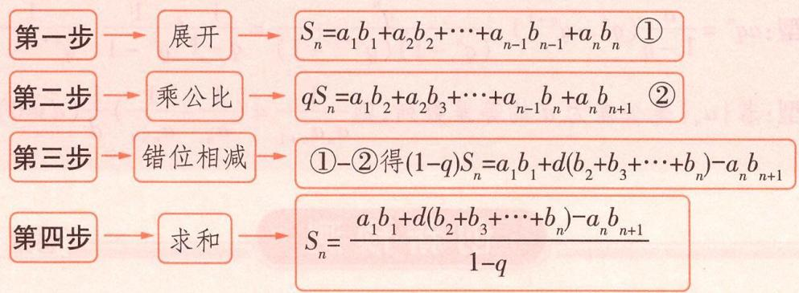

flowchart

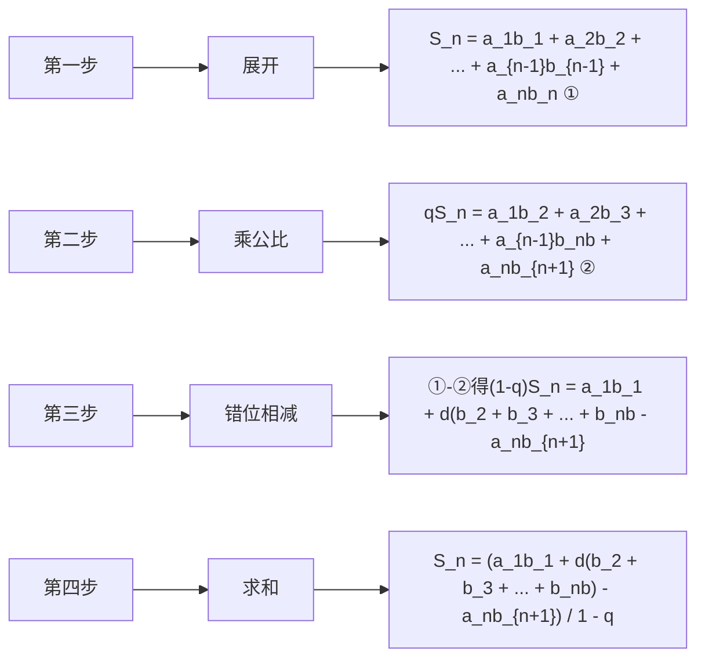

# 核心技法 4 裂项相消法

调研 4 [2024 河南 5 月三模] 已知等差数列 $\{a_{n}\}$ 的公差大于 0 且 $a_{1} + a_{6} = 4a_{2}$ ，若 $\sum_{k=1}^{24}\frac{1}{\sqrt{a_{k+1}} + \sqrt{a_{k}}} = 6$ ，则 $a_{5} =$ （）

A. $\frac{13}{4}$

B. $\frac{9}{4}$

C. $\frac{7}{4}$

D. $\frac{5}{4}$

解析 设等差数列 $\{a_{n}\}$ 的公差为 $d(d>0)$ , $\because a_{1}+a_{6}=4a_{2},\therefore a_{1}+a_{1}+5d=4(a_{1}+d)$ ,

$$
\therefore d = 2 a _ {1}, \therefore a _ {n} = a _ {1} + (n - 1) 2 a _ {1} = a _ {1} (2 n - 1),
$$

$$
\therefore \frac {1}{\sqrt {a _ {n}} + \sqrt {a _ {n + 1}}} = \frac {\sqrt {a _ {n + 1}} - \sqrt {a _ {n}}}{a _ {n + 1} - a _ {n}} = \frac {1}{2 a _ {1}} (\sqrt {a _ {n + 1}} - \sqrt {a _ {n}}),
$$

$$
\therefore \sum_ {k = 1} ^ {2 4} \frac {1}{\sqrt {a _ {k + 1}} + \sqrt {a _ {k}}} = \frac {1}{2 a _ {1}} (\sqrt {a _ {2}} - \sqrt {a _ {1}}) + \frac {1}{2 a _ {1}} (\sqrt {a _ {3}} - \sqrt {a _ {2}}) + \dots + \frac {1}{2 a _ {1}} (\sqrt {a _ {2 5}} - \sqrt {a _ {2 4}}) =
$$

$$
\frac {1}{2 a _ {1}} \left(- \sqrt {a _ {1}} + \sqrt {a _ {2 5}}\right) = \frac {1}{2 a _ {1}} \left(- \sqrt {a _ {1}} + \sqrt {4 9 a _ {1}}\right) = \frac {3 \sqrt {a _ {1}}}{a _ {1}} = \frac {3}{\sqrt {a _ {1}}} = 6,
$$

解得 $a_{1}=\frac{1}{4},\therefore a_{5}=9a_{1}=\frac{9}{4}.$ 故选 B.

正方体的外接球 正方体的外接球球心为正方体的中心,棱长为 a 的正方体的外接球半径 $r=\sqrt{3}a/2$ .

# 抢分秘籍

# 5 种类型的裂项秘籍

1. 分式型: $\frac{1}{n(n+p)} = \frac{1}{p} \left( \frac{1}{n} - \frac{1}{n+p} \right) (p \neq 0), \frac{1}{n(n+1)(n+2)} = \frac{1}{2} \left[ \frac{1}{n(n+1)} - \frac{1}{(n+1)(n+2)} \right], \frac{1}{n(n^2-1)} = \frac{1}{n(n-1)(n+1)} = \frac{1}{2} \left[ \frac{1}{(n-1)n} - \frac{1}{n(n+1)} \right].$

2. 根式型: $\frac{1}{\sqrt{n} + \sqrt{n + p}} = \frac{1}{p} (\sqrt{n + p} - \sqrt{n}) (p \neq 0)$ .

3. 对数型: $\lg \frac{n+p}{n} = \lg (n+p) - \lg n (p > 0)$ .

4. 指数型: $aq^n = \frac{a}{1 - q} (q^n - q^{n+1}), \frac{q^n}{(q^n - 1)(q^{n+1} - 1)} = \frac{1}{q - 1} (\frac{1}{q^n - 1} - \frac{1}{q^{n+1} - 1}), q \neq 1.$

5. 等差型: 若 $\{a_{n}\}$ 是公差为 d 的等差数列, 则 $\frac{1}{a_{n}a_{n+1}} = \left( \frac{1}{a_{n}} - \frac{1}{a_{n+1}} \right) \frac{1}{d} (d \neq 0)$ .

# 创新预测

答案▶039页

试题调研原创 已知等比数列 $\{a_{n}\}$ 和等差数列 $\{b_{n}\}$ ，满足 $a_{n+1} > a_{n}, a_{1} = b_{1} = 1, a_{2} = b_{2}, 3a_{3} = 4b_{3}.$

(1)求数列 $\{a_{n}\}$ ， $\{b_{n}\}$ 的通项公式.

(2) 记数列 $\left\{\frac{2(b_{n}-1)a_{n}+1}{b_{n}\cdot b_{n+1}}\right\}$ 的前 n 项和为 $P_{n}$ . 证明: $P_{n}<\frac{2^{n+1}}{n+1}-1$ .

# 规范答题

  
“裂项相消求和”速解数列不等式证明问题

# 参考答案与解析

# 原创变式

1. -4050 因为正项等比数列 $\{a_{n}\}$ 满足 $a_{1013} = 10$ ，所以 $a_{1} \cdot a_{2025} = a_{2} \cdot a_{2024} = \cdots = a_{1013}^{2} = 100$ ，

所以 $\lg a_{1}+\lg a_{2025}=\lg a_{2}+\lg a_{2024}=\cdots=2\lg a_{1013}=2$ [指点迷津:根据 $\lg a_{1}+\lg a_{2025}=\lg a_{2}+\lg a_{2024}=\cdots=2\lg a_{1013}=2$ ，从而想到验证 $f(x)+f(2-x)$ 为常数]，

$f(1 - x) + f(1 + x) = (1 - x)^{3} - 3(1 - x)^{2} + (1 + x)^{3} - 3(1 + x)^{2} = -4$ ，即 $f(x) + f(2 - x) = -4,$

所以 $f(\lg a_{1}) + f(\lg a_{2025}) = f(\lg a_{2}) + f(\lg a_{2024}) = \cdots = f(\lg a_{1013}) + f(\lg a_{1013}) = -4$

所以 $\sum_{k=1}^{2025} f(\lg a_k) = f(\lg a_1) + f(\lg a_2) + f(\lg a_3) + \cdots + f(\lg a_{2025})$ ①,

$$
\sum_ {k = 1} ^ {2. 0 2 5} f (\lg a _ {k}) = f (\lg a _ {2. 0 2 5}) + f (\lg a _ {2. 0 2 4}) + f (\lg a _ {2. 0 2 3}) + \dots + f (\lg a _ {1}) \quad ②,
$$

① + ②得 $2 \sum_{k=1}^{2025} f(\lg a_k) = f(\lg a_1) + f(\lg a_{2025}) + [f(\lg a_2) + f(\lg a_{2024})] + \cdots + [f(\lg a_{2025}) + f(\lg a_1)]$ ，即 $2 \sum_{k=1}^{2025} f(\lg a_k) = 2025 \times (-4)$ ，所以 $\sum_{k=1}^{2025} f(\lg a_k) = -4050$ .

2. $\left\{\begin{aligned}\frac{2^{n+4}+3n-16}{6},&n=2k,k\in\mathbf{N}^{*},\\ \frac{5\times2^{n+2}+3n-13}{6},&n=2k-1,k\in\mathbf{N}^{*}\end{aligned}\right.$ $a_{n}=\left\{\begin{aligned}2^{n},&n=2k,k\in\mathbf{N}^{*},\\ a_{n+1}+1,n=2k-1,k\in\mathbf{N}^{*},\end{aligned}\right.$ 当 n 为偶数时， $S_{n}=$

$(2^{2}+2^{4}+\cdots+2^{n})+(2^{2}+1+2^{4}+1+\cdots+2^{n}+1)=2(2^{2}+2^{4}+\cdots+2^{n})+\frac{n}{2}=2\times\frac{4(1-4^{\frac{n}{2}})}{1-4}+\frac{n}{2}=\frac{2^{n+4}+3n-16}{6}$ . 当 n 为奇数且 n>1 时， $S_{n}=S_{n-1}+a_{n}=S_{n-1}+a_{n+1}+1=\frac{2^{(n-1)+4}+3(n-1)-16}{6}+2^{n+1}+1=\frac{2^{n+3}+3n-19}{6}+2^{n+1}+1=\frac{5\times2^{n+2}+3n-13}{6}$ [破瓶颈：如果需要分奇、偶数讨论求和，一般情况下，可先求 n 为偶数时数列的和，当 n 为奇数时，前面的 $(n-1)$ 项和直接代入为偶数时的和的公式，再加上最后的奇数项即可]，当 n=1 时， $S_{1}=a_{1}=2^{2}+1=5$ ，符合上式.

# 创新预测

(1) 等比数列 $\{a_{n}\}$ 满足 $a_{n+1} > a_{n}, a_{1} = 1$ ，所以 $\{a_{n}\}$ 递增，设 $\{a_{n}\}$ 的公比为 $q(q > 1)$ ，等差数列 $\{b_{n}\}$ 的公差为 d，依题意可得 $\left\{\begin{aligned}1 + d &= q, \\ 3q^{2} &= 4(1 + 2d),\end{aligned}\right.$ 解得 $\left\{\begin{aligned}q &= 2, \\ d &= 1\end{aligned}\right.$ 或 $\left\{\begin{aligned}q &= \frac{2}{3}, \\ d &= -\frac{1}{3}\end{aligned}\right.$ （舍去），所以 $a_{n} = 2^{n-1}, b_{n} = n.$

(2)由(1)可得 $\frac{2(b_n - 1)a_n + 1}{b_n\cdot b_{n + 1}} = \frac{(n - 1)2^n + 1}{n(n + 1)} = \frac{(n - 1)2^n}{n(n + 1)} +\frac{1}{n(n + 1)}.$

因为 $\frac{(n - 1)2^n}{n(n + 1)} = \frac{2^{n + 1}}{n + 1} -\frac{2^n}{n},\frac{1}{n(n + 1)} = \frac{1}{n} -\frac{1}{n + 1}$ 即 $\frac{2(b_n - 1)a_n + 1}{b_n\cdot b_{n + 1}} = \frac{2^{n + 1}}{n + 1} -\frac{2^n}{n} +\frac{1}{n} -\frac{1}{n + 1},$

所以 $P_{n}=\left(\frac{2^{2}}{2}-\frac{2^{1}}{1}+\frac{1}{1}-\frac{1}{2}\right)+\left(\frac{2^{3}}{3}-\frac{2^{2}}{2}+\frac{1}{2}-\frac{1}{3}\right)+\cdots+\left(\frac{2^{n+1}}{n+1}-\frac{2^{n}}{n}+\frac{1}{n}-\frac{1}{n+1}\right)=\left(\frac{2^{2}}{2}-\frac{2^{1}}{1}+\right.$

$$
\frac {2 ^ {3}}{3} - \frac {2 ^ {2}}{2} + \dots + \frac {2 ^ {n + 1}}{n + 1} - \frac {2 ^ {n}}{n}) + (\frac {1}{1} - \frac {1}{2} + \frac {1}{2} - \frac {1}{3} + \dots + \frac {1}{n} - \frac {1}{n + 1}) = \frac {2 ^ {n + 1}}{n + 1} - 2 + 1 - \frac {1}{n + 1} = \frac {2 ^ {n + 1}}{n + 1} -
$$

$$
1 - \frac {1}{n + 1} <   \frac {2 ^ {n + 1}}{n + 1} - 1.
$$

正四面体的外接球 正四面体的外接球球心为正四面体的中心,棱长为 a 的正四面体的外接球半径 $r=\sqrt{6}a/4$ .

# 超重点5 由递推关系求通项的3类重要题型与解题攻略

<table><tr><td>三年考情与创新命题特点</td><td>2025命题预测</td></tr><tr><td>2024 新课标II卷 T19,与等比数列的证明相结合,考查数列的递推关系</td><td rowspan="2">1命题形式:常出现在选择题、填空题或解答题第(1)问中.2必考热点:通过变形构造出等差或等比数列,考查待定系数法、取倒数法等.3创新考法:与解析几何中的动点问题相结合,体现数形结合思想,或与不等式结合,体现放缩思想.</td></tr><tr><td>2023 北京卷 T10,由递推关系研究数列的相关性质,涉及归纳法、利用函数研究数列的性质等</td></tr></table>

# 攻略 ① 用待定系数法解决“一阶线性”递推问题

调研 1 试题调研原创 在数列 $\{a_{n}\}$ 中, $a_{1}=\frac{4}{3}$ , $3a_{n+1}=a_{n}+f(n)$ , 若 $f(n)=2n+3$ , 则数列 $\{a_{n}\}$ 的通项公式为 $a_{n}=$ \_\_\_\_.

解析 由题意知 $3a_{n+1} = a_n + 2n + 3$ ，所以 $a_{n+1} = \frac{1}{3} a_n + \frac{2}{3} n + 1$

【讲攻略】所谓 “一阶线性”，即递推式只与数列的两项有关，一般为相邻两项，有时也为间隔项，且两项都为一次形式，是最常见的数列递推问题设问形式，往往使用待定系数法设未知数求解

设 $a_{n + 1} + x(n + 1) + y = \frac{1}{3} (a_n + xn + y)$ ，则 $a_{n + 1} = \frac{1}{3} a_n - \frac{2x}{3} n - x - \frac{2y}{3},$

可得 $-\frac{2x}{3} = \frac{2}{3}, -x - \frac{2y}{3} = 1$ ，所以 $x = -1, y = 0$ ，所以 $a_{n+1} - (n+1) = \frac{1}{3}(a_n - n)$ ，设 $b_n = a_n - n$ ，则 $b_{n+1} = \frac{1}{3} b_n$ 。又 $b_1 = a_1 - 1 = \frac{1}{3}$ ，所以数列 $\{b_n\}$ 是以 $\frac{1}{3}$ 为首项、 $\frac{1}{3}$ 为公比的等比数列。

所以 $b_{n} = a_{n} - n = \frac{1}{3}\left(\frac{1}{3}\right)^{n - 1} = \frac{1}{3^{n}}$ ，所以 $a_{n} = n + \frac{1}{3^{n}}.$

思考 将【调研1】中的 $f(n)=2n+3$ 改为 $f(n)=(\frac{1}{2})^{n+1}$ ，其他条件不变，求数列 $\{a_{n}\}$ 的通项公式.

解析:由题意知 $3a_{n+1}=a_{n}+(\frac{1}{2})^{n+1}$ ，所以 $a_{n+1}=\frac{1}{3}a_{n}+\frac{1}{3}\times(\frac{1}{2})^{n+1}$ ，所以 $2^{n+1}a_{n+1}=\frac{2}{3}\times2^{n}a_{n}+\frac{1}{3}$ ，设 $2^{n+1}a_{n+1}-k=\frac{2}{3}(2^{n}a_{n}-k)$ ，则 $2^{n+1}a_{n+1}=\frac{2}{3}\times2^{n}a_{n}+\frac{1}{3}k$ ，所以 $\frac{1}{3}k=\frac{1}{3}$ ，k=1，所以 $2^{n+1}a_{n+1}-1=\frac{2}{3}(2^{n}a_{n}-1)$ 。又 $2a_{1}-1=\frac{5}{3}$ ，所以数列 $\{2^{n}a_{n}-1\}$ 是以 $\frac{5}{3}$ 为首项、 $\frac{2}{3}$ 为公比的等比数列，所以 $2^{n}a_{n}-1=\frac{5}{3}\times(\frac{2}{3})^{n-1}$ ，故 $a_{n}=\frac{5}{2\cdot3^{n}}+\frac{1}{2^{n}}$ 。

# 解题模板

两类“一阶线性”递推问题速破模板

<table><tr><td>设问形式</td><td> $a_{n+1} = pa_n + kn + b$  $(p, k, b \text{是常数,且 } p \neq 0, 1)$ </td><td> $a_{n+1} = pa_n + q^n$  $(p, q \text{是常数, } p \neq 0, 1)$ </td></tr><tr><td>1设未知数</td><td>设  $a_{n+1} + x(n+1) + y = p(a_n + xn + y)$ </td><td>设  $a_{n+1} + \lambda q^{n+1} = p(a_n + \lambda q^n)$ </td></tr><tr><td>2列方程</td><td> $\begin{cases}(p-1)x=k, \\(p-1)y-x=b\end{cases}$ </td><td> $(p-q)\lambda = 1$ </td></tr><tr><td>3得到等比数列</td><td> $\{a_n + xn + y\} \text{为等比数列}$ </td><td> $\{a_n + \lambda q^n\} \text{为等比数列}$ </td></tr></table>

# 攻略 ② 用构造法解决“二阶线性”递推问题

调研 2 试题调研原创 数列 $\{a_{n}\}$ 满足 $a_{n+2}=2a_{n+1}+3a_{n}, a_{1}=a_{2}=1$ ，则数列 $\{a_{n}\}$ 的通项公式为 $a_{n}=$ \_\_\_\_.

解析 设 $a_{n+2} + xa_{n+1} = y(a_{n+1} + xa_n)$ ，则 $a_{n+2} = (y - x)a_{n+1} + xya_n$ ，

【讲攻略】递推式同时与数列中的三项有关，且三项都为一次形式（例如斐波那契数列从第二项开始的递推公式 $F_{n+2}=F_{n+1}+F_n(n\geqslant2)$ ）的数列问题，我们称为“二阶线性”递推问题，求解时一般要先化“二阶”为“一阶”，然后求解

所以 $\left\{\begin{aligned}y-x&=2,\\ xy&=3,\end{aligned}\right.$ 解得 $\left\{\begin{aligned}x&=1,\\ y&=3\end{aligned}\right.$ 或 $\left\{\begin{aligned}x&=-3,\\ y&=-1,\end{aligned}\right.$

当 $x = 1, y = 3$ 时， $a_{n+2} + a_{n+1} = 3(a_{n+1} + a_n)$ ，又 $a_2 + a_1 = 2$ ，所以 $\{a_{n+1} + a_n\}$ 是首项为2、公比为3的等比数列，所以 $a_{n+1} + a_n = 2 \times 3^{n-1}$ ①.

当 $x = -3, y = -1$ 时， $a_{n+2} - 3a_{n+1} = -(a_{n+1} - 3a_n)$ ，又 $a_2 - 3a_1 = -2$ ，所以 $\{a_{n+1} - 3a_n\}$ 是首项为-2、公比为-1的等比数列，所以 $a_{n+1} - 3a_n = -2 \times (-1)^{n-1}$ ②.

① - ②并化简得 $a_{n} = \frac{3^{n - 1} + (-1)^{n - 1}}{2}$ .

# 原创变式

1 已知数列 $\{a_{n}\}$ 满足 $a_{n+2}=3a_{n+1}-2a_{n},a_{1}=1,a_{2}=3$ ，则数列 $\{a_{n}\}$ 的通项公式为 $a_{n}=$ \_\_\_\_.

答案》第043页

# 攻略 3

# 用不动点法解决分式结构递推问题

调研 3 试题调研原创 已知数列 $\{a_{n}\}$ 中, $a_{1}=1$ , $a_{n+1}=\frac{5a_{n}-2}{2a_{n}}$ ,
则数列 $\{a_{n}\}$ 的通项公式为 $a_{n}=$ \_\_\_\_.

解析 由题意得 $a_{n+1} = \frac{5}{2} - \frac{1}{a_n}$ , 则 $a_{n+1} - 2 = \frac{5}{2} - \frac{1}{a_n} - 2 = \frac{1}{2} - \frac{1}{a_n} =$

“不动点法”快解分式结构递推求通项问题

数字是多少？A、B两人玩游戏，在脑门上贴着相差1的正整数，他们只能看见对方的，看不见自己的，两人通过对话来猜自己头上贴的数字.

趣味推理

$$
\frac {1}{2} \times \frac {a _ {n} - 2}{a _ {n}},
$$

由 $a_{n + 1} = \frac{5}{2} -\frac{1}{a_n}$ ，有 $a_{n + 1} - \frac{1}{2} = \frac{5}{2} -\frac{1}{a_n} -\frac{1}{2} = 2 - \frac{1}{a_n} = 2\times \frac{a_n - \frac{1}{2}}{a_n},$

由题意知 $a_{n + 1} \neq \frac{1}{2}$ , 则 $\frac{a_{n + 1} - 2}{a_{n + 1} - \frac{1}{2}} = \frac{1}{4} \cdot \frac{a_n - 2}{a_n - \frac{1}{2}}$ , 又 $\frac{a_1 - 2}{a_1 - \frac{1}{2}} = -2$ ,

【用结论】应用不动点法，根据 $a_{n+1}=\frac{5a_{n}-2}{2a_{n}}$ ，令 $x=\frac{5x-2}{2x}$ ，得 $x_{1}=2,\quad x_{2}=\frac{1}{2}$ ，从而可直接构造出等比数列求解

所以 $\left\{\frac{a_n - 2}{a_n - \frac{1}{2}}\right\}$ 是以-2为首项、 $\frac{1}{4}$ 为公比的等比数列，所以 $\frac{a_n - 2}{a_n - \frac{1}{2}} = -2\times (\frac{1}{4})^{n - 1}$ ，则 $a_{n} =$ $2 - \frac{3}{2 + 4^{n - 1}}.$

# 解题模板

# 两类分式结构递推问题速破模板

1. 递推式形如 $a_{n+1} = \frac{ma_n}{A a_n + B} (A, B, m$ 为参数, $ABm \neq 0$ ), 则两边同时取倒数, 看作一阶线性递推问题求解即可.

2. 递推式形如 $a_{n+1} = \frac{ma_n + D}{A a_n + B} (A, B, m, D$ 为参数, $A \neq 0, m B - A D \neq 0$ ), 可以使用不动点法求通项公式. 定义: 方程 $f(x) = x$ 的根称为函数 $f(x)$ 的不动点. 利用函数 $f(x)$ 的不动点, 可将满足某些递推关系 $(a_{n+1} = f(a_n))$ 的数列化为等差数列或等比数列或较易求通项的数列, 这种求数列通项的方法称为不动点法. 应用如下:

设 $f(x)=\frac{ax+b}{cx+d}(c\neq0,ad-bc\neq0)$ ， $\{a_{n}\}$ 满足递推关系 $a_{n+1}=f(a_{n}),a_{1}\neq f(a_{1})$ .

令 $x=\frac{ax+b}{cx+d}$ ，即 $cx^{2}+(d-a)x-b=0$ ，令此关于 x 的二次方程的两个根分别为 $x_{1}, x_{2}$ .

①若 $x_{1} = x_{2}$ , 则有 $\frac{1}{a_{n+1} - x_{1}} = \frac{1}{a_{n} - x_{1}} + p$ ( $p$ 为参数); ②若 $x_{1} \neq x_{2}$ , 则有 $\frac{a_{n+1} - x_{1}}{a_{n+1} - x_{2}} = q\frac{a_{n} - x_{1}}{a_{n} - x_{2}}$ ( $q$ 为参数). 根据此结论, 可以进一步构造等差数列或等比数列求解.

# 原创变式

2 已知数列 $\{a_{n}\}$ 中, $a_{1}=1$ , $a_{n+1}=\frac{a_{n}-4}{a_{n}-3}$ , 则数列 $\{a_{n}\}$ 的通项公式为 $a_{n}=$ \_\_\_\_.

答案》第043页

趣味推理

以下是两人的对话. A: “我不知道.” B: “我也不知道.” A: “我知道了.” B: “我也知道了.” 问 A、B 头上贴的数字分别是多少？(3,2)

# 创新预测

答案▶044页

1. 试题调研原创 数列 $\{a_{n}\}$ 的前 $n$ 项和为 $S_{n}$ , 满足 $2S_{n} = a_{n} + 2n^{2} + 1$ , 则数列 $\{a_{n}\}$ 的通项公式为 ( )

A. $a_{n} = 2n - (-1)^{n - 1}$

B. $a_{n} = 2n + (-1)^{n - 1}$

C. $a_{n} = n + (-2)^{n}$

D. $a_{n} = n - (-2)^{n}$

2.[2024 河北张家口 5 月三模]数列 $\{a_{n}\}$ 的前 n 项和为 $S_{n}, a_{1}=1, a_{n+1}=\begin{cases}a_{n}+1, &n\text{ 为奇数,}\\2a_{n}, &n\text{ 为偶数,}\end{cases}$ 则 $S_{100}=$

A. $3 \times 2^{51} - 156$

B. $3 \times 2^{51} - 103$

C. $3 \times 2^{50} - 156$

D. $3 \times 2^{50} - 103$

3. 试题调研原创（多选）已知数列 $\{a_{n}\}$ 满足 $2a_{n}a_{n + 1} - 3a_{n + 1} + 1 = 0, a_{1} = \frac{1}{3}$ , 其前 $n$ 项和为 $S_{n}$ , 则 ( )

A. $a_{n} < \frac{1}{2}$

B. $S_{n} > \frac{n - 1}{6}$

C. $\{\frac{a_n - 1}{a_n + 1}\}$ 是等比数列

D. $S_{n} <   \frac{n}{2}$

# 参考答案与解析

# 原创变式

1. $2^{n}-1$ 因为 $a_{n+2}=3a_{n+1}-2a_{n}$ ，所以 $a_{n+2}-a_{n+1}=2(a_{n+1}-a_{n})$ ，又 $a_{2}-a_{1}=2$ ，所以数列 $\{a_{n+1}-a_{n}\}$ 是以2为首项、2为公比的等比数列，所以 $a_{n+1}-a_{n}=2\cdot2^{n-1}=2^{n}$ [知方法：数列 $\{a_{n}\}$ 若满足 $a_{n+1}-a_{n}=f(n)$ ，通常使用累加法求通项公式；若满足 $\frac{a_{n+1}}{a_{n}}=f(n)$ ，通常使用累乘法求通项公式]，当 $n\geqslant2$ 时， $a_{n}=a_{1}+(a_{2}-a_{1})+(a_{3}-a_{2})+\cdots+(a_{n}-a_{n-1})=1+2+2^{2}+\cdots+2^{n-1}=\frac{1\times(1-2^{n})}{1-2}=2^{n}-1$ . 经检验 $a_{1}=1$ 也符合上式. 所以 $a_{n}=2^{n}-1$ .

2. $-\frac{1}{n} + 2$ 将已知递推公式变形得 $a_{n+1} - 2 = \frac{a_n - 4}{a_n - 3} - 2 = \frac{2 - a_n}{a_n - 3}$ ,

整理得 $\frac{1}{a_{n+1}-2}=\frac{1}{a_{n}-2}-1$ [秒杀解:应用不动点法,令 $x=\frac{x-4}{x-3}$ ,得 $x_{1}=x_{2}=2$ ,∴存在p使得 $\frac{1}{a_{n+1}-2}=\frac{1}{a_{n}-2}+p$ ,结合 $a_{1}=1$ 及题中所给递推式可得 $a_{2}=\frac{3}{2}$ ,代入可得p=-1].

令 $b_{n} = \frac{1}{a_{n} - 2},\therefore b_{n + 1} = b_{n} - 1$ ，又 $b_{1} = \frac{1}{a_{1} - 2} = -1,\therefore$ 数列 $\{b_n\}$ 是以-1为首项、-1为公差的等差数列，∴ $\{b_n\}$ 的通项公式为 $b_{n} = -1 - 1\times (n - 1) = -n.$

将 $b_{n} = \frac{1}{a_{n} - 2}$ 代入，得 $\frac{1}{a_n - 2} = -n,\therefore a_n = -\frac{1}{n} +2.$

谁做对了？甲、乙、丙三个人在一起做作业，有一道数学题比较难，当他们三个人都把自己的解法说出来以后，甲说：“我做错了。”乙说：“甲做对了。”丙说：“我做错了。”

# 创新预测

1.B 对于 $2S_{n}=a_{n}+2n^{2}+1$ ，令 n=1，得 $2S_{1}=a_{1}+2+1$ ，所以 $a_{1}=3$ .

由 $2S_{n} = a_{n} + 2n^{2} + 1$ ①, 得 $2S_{n+1} = a_{n+1} + 2(n+1)^{2} + 1$ ②,

② - ① 得 $2a_{n+1} = a_{n+1} - a_n + 4n + 2$ ，即 $a_{n+1} = -a_n + 4n + 2$ .

方法一 设 $a_{n + 1} + x(n + 1) + y = -(a_n + xn + y)$ ，则 $a_{n + 1} = -a_n - 2xn - x - 2y$

可得 $-2x = 4, -x - 2y = 2$ ，所以 $x = -2, y = 0$ ，故 $a_{n+1} - 2(n+1) = -(a_n - 2n)$ .

因为 $a_1 - 2 \times 1 = 1$ ，所以 $\{a_n - 2n\}$ 是以 1 为首项、-1 为公比的等比数列，则 $a_n - 2n = (-1)^{n-1}$ ，所以 $a_n = 2n + (-1)^{n-1}$ ，故选 B.

方法二 数列 $\{a_{n}\}$ 中, $n \in N^{*}$ , $a_{n+1} + a_{n} = 4n + 2$ , 当 $n \geqslant 2$ 时, $a_{n} + a_{n-1} = 4n - 2$ , 则 $a_{n+1} - a_{n-1} = 4$ [明方法: 将递推式进一步变形, 得到间隔项之间的关系, 分类讨论, 分别求出奇偶项的通项公式], 由 $a_{1} = 3$ , 得 $a_{2} = 3$ .

由数列 $\{a_{2n - 1}\}$ 是首项为3、公差为4的等差数列，可得 $a_{2n - 1} = 3 + 4(n - 1) = 2(2n - 1) + 1$ ，即 $a_{n} = 2n + 1(n$ 为奇数).

由数列 $\{a_{2n}\}$ 是首项为3、公差为4的等差数列，可得 $a_{2n} = 3 + 4(n - 1) = 2\cdot 2n - 1$ ，即 $a_{n} = 2n-$ $1(n$ 为偶数).

综上, $a_{n}=2n+(-1)^{n-1}$ ,故选B.

2.A 因为 $a_1 = 1, a_{n+1} = \begin{cases} a_n + 1, & n \text{为奇数,} \\ 2a_n, & n \text{为偶数,} \end{cases}$ 所以 $a_{2k+2} = a_{2k+1} + 1 = 2a_{2k} + 1, a_{2k+1} = 2a_{2k} = 2a_{2k-1} + 2, k \in \mathbf{N}^*$ , 且 $a_2 = 2$ , 所以 $a_{2k+2} + a_{2k+1} = 2(a_{2k} + a_{2k-1}) + 3$ .

记 $b_{n}=a_{2n}+a_{2n-1},n\geqslant1$ ，则 $b_{n+1}=2b_{n}+3$ ，所以 $b_{n+1}+3=2(b_{n}+3)$ ，又 $b_{1}+3=a_{2}+a_{1}+3=6$ ，所以 $\{b_{n}+3\}$ 是以6为首项、2为公比的等比数列，

所以 $b_{n}+3=6\times2^{n-1},b_{n}=6\times2^{n-1}-3.$

记 $\{b_{n}\}$ 的前n项和为 $T_{n}$ ，则 $S_{100}=T_{50}=(6\times2^{0}+6\times2^{1}+6\times2^{2}+\cdots+6\times2^{49})-3\times50=3\times2^{51}-156$ [理思路:先分奇数项和偶数项求数列 $\{a_{n}\}$ 的递推关系,然后记 $b_{n}=a_{2n}+a_{2n-1},n\geqslant1$ ,利用构造法求得 $b_{n}=6\times2^{n-1}-3$ ,最后求和].

3.ABD 由题可知 $a_{n+1} = \frac{-1}{2a_n - 3}$ , 应用不动点法, 令 $x = \frac{-1}{2x - 3}$ , 得 $x_1 = 1, x_2 = \frac{1}{2}$ , 所以存在 $q$ 使得 $\frac{a_{n+1} - 1}{a_{n+1} - \frac{1}{2}} = q \cdot \frac{a_n - 1}{a_n - \frac{1}{2}}$ , 因为 $a_1 = \frac{1}{3}$ , 结合 $2a_n a_{n+1} - 3a_{n+1} + 1 = 0$ 可得 $a_2 = \frac{3}{7}$ , 所以 $q = 2$ , 所以 $\frac{a_{n+1} - 1}{a_{n+1} - \frac{1}{2}} = 2 \cdot \frac{a_n - 1}{a_n - \frac{1}{2}}$ , 则 $a_n = \frac{2^n - 1}{2^{n+1} - 1} = \frac{1}{2} - \frac{1}{2} \cdot \frac{1}{2^{n+1} - 1}$ , 故 $a_n < \frac{1}{2}$ , A 正确.

易知 $\{a_{n}\}$ 为递增数列且 $a_{n}<\frac{1}{2}, a_{1}=\frac{1}{3}$ [破障碍:根据数列 $\{a_{n}\}$ 的增减性放缩判断 D 选项], 所以 $\frac{n}{3}<S_{n}<\frac{n}{2}$ , D 正确. 又 $\frac{n-1}{6}<\frac{2n}{6}=\frac{n}{3}<S_{n}$ , 所以 B 正确.

对于数列 $\{\frac{a_n - 1}{a_n + 1}\}, \frac{a_1 - 1}{a_1 + 1} = -\frac{1}{2}, \frac{a_2 - 1}{a_2 + 1} = -\frac{2}{5}, \frac{a_3 - 1}{a_3 + 1} = -\frac{4}{11}$ , 所以 $\{\frac{a_n - 1}{a_n + 1}\}$ 不是等比数列, C 错误.

# 超重点6 数列不等式中的3大高妙放缩技巧

<table><tr><td>三年考情与创新命题特点</td><td>2025命题预测</td></tr><tr><td>2024 天津卷 T19,构造函数,利用导数证明不等式恒成立</td><td rowspan="3">1命题形式:选择题、填空题或解答题,难度中等偏上.2必考热点:数列不等式的证明问题,与数列相关的取值范围、比大小问题等.3创新考法:常与数列的递推关系、求和等交汇命题,往往利用重要不等式、函数的单调性、添项减项等进行放缩求解.</td></tr><tr><td>2023 新课标II卷 T18,结合分组求和法与作差法证明不等式恒成立</td></tr><tr><td>2022 浙江卷 T10,根据数列的递推关系式,利用累加法放缩解决与数列有关的范围问题</td></tr></table>

# 技巧 1 利用重要不等式放缩

调研 1 试题调研原创 已知数列 $\{a_{n}\}$ 满足 $a_{1}>0, a_{n+1}a_{n}-a_{n}^{2}=1(n\in\mathbb{N}^{*})$ ，若 $\frac{1}{a_{1}}+\frac{1}{a_{2}}+\cdots+\frac{1}{a_{2024}}=2024$ ，则

A. $2024 < a_{2025} < 2024 \frac{2}{2025}$

B. $2024 < a_{2025} < 2024 \frac{1}{2025}$

C. 2023 $< a_{2025} < 2023 \frac{1}{2024}$

D. 2023 $< a_{2025} < 2024 \frac{2}{2023}$

解析 因为 $a_{1}>0, a_{n+1}a_{n}-a_{n}^{2}=a_{n}(a_{n+1}-a_{n})=1$ ，所以 $a_{n+1}-a_{n}>0$ ，数列 $\{a_{n}\}$ 为正项递增数列。因为 $a_{n+1}a_{n}-a_{n}^{2}=1(n\in\mathbf{N}^{*})$ ，所以 $a_{n+1}-a_{n}=\frac{1}{a_{n}}(n\in\mathbf{N}^{*})$ ，所以 $\frac{1}{a_{1}}+\frac{1}{a_{2}}+\cdots+\frac{1}{a_{2024}}=(a_{2}-a_{1})+(a_{3}-a_{2})\cdots+(a_{2025}-a_{2024})=2024$ ，即 $a_{2025}=a_{1}+2024$ 。

【关键点】利用累加法巧妙地将 $a_{2025}$ 转化为 $a_{1}+2024$

由 $a_{n+1}-a_{n}=\frac{1}{a_{n}}(n\in\mathbb{N}^{*})$ ，得 $a_{n+1}=a_{n}+\frac{1}{a_{n}}\geqslant2\sqrt{a_{n}\cdot\frac{1}{a_{n}}}=2$ ，故必有 $2\leqslant a_{2}<a_{3}<\cdots<a_{2024}$ ，所以 $\frac{1}{2}\geqslant\frac{1}{a_{2}}>\frac{1}{a_{3}}>\cdots>\frac{1}{a_{2024}}$ ，所以 $\frac{1}{a_{2}}+\frac{1}{a_{3}}+\cdots+\frac{1}{a_{2024}}<2023\times\frac{1}{2}$ ，所以 $\frac{1}{a_{1}}=2024-(\frac{1}{a_{2}}+\frac{1}{a_{3}}+\cdots+\frac{1}{a_{2024}})>2024-2023\times\frac{1}{2}=\frac{2025}{2}$ ，所以 $0<a_{1}<\frac{2}{2025}$ .

【巧放缩】利用基本不等式和数列的增减性进行放缩，进而求出 $a_{1}$ 的范围

因为 $a_{2025} = a_1 + 2024$ ，所以 $2024 < a_{2025} < 2024\frac{2}{2025}$ 故选A.

谁吃了水果？赵女士买了一些水果准备去看望一个朋友，但这些水果被她的某个儿子偷吃了，但她不知道是哪个儿子，就盘问4个儿子谁偷吃了水果。

# 技巧 ② 添、减项放缩

调研 2 试题调研原创 已知数列 $\{a_{n}\}$ 满足 $a_{1}=1$ ，其前 n 项和为 $S_{n}$ .

(1) 若 $a_{n+1} = \frac{a_n}{1 + 2a_n} (n \in \mathbf{N}^*)$ , 求数列 $\{a_n\}$ 的通项公式.  
(2) 若 $a_{n+1} = \frac{a_n}{1 + 2\sqrt{a_n}} (n \in \mathbf{N}^*)$ ，证明： $S_n < 2$ .

解析（1）由 $a_{n + 1} = \frac{a_n}{1 + 2a_n}, a_1 = 1$ 知 $a_{n} \neq 0$ ，则 $\frac{1}{a_{n + 1}} = \frac{1 + 2a_n}{a_n} = \frac{1}{a_n} + 2,$

【取倒数】观察已知递推式的结构特征，取倒数，构造等差数列求解

又 $\frac{1}{a_1} = 1, \therefore$ 数列 $\{\frac{1}{a_n}\}$ 是首项为1、公差为2的等差数列，

$\therefore \frac{1}{a_n} = 1 + 2(n - 1) = 2n - 1, \therefore$ 数列 $\{a_n\}$ 的通项公式为 $a_n = \frac{1}{2n - 1}$ .

(2) 由 $a_{n+1} = \frac{a_n}{1 + 2\sqrt{a_n}}$ , $a_1 = 1$ 知 $a_n > 0$ , 则 $\frac{1}{a_{n+1}} = \frac{1}{a_n} + \frac{2}{\sqrt{a_n}} = (\frac{1}{\sqrt{a_n}} + 1)^2 - 1$ ,

$$
\therefore \frac {1}{a _ {n + 1}} <   (\frac {1}{\sqrt {a _ {n}}} + 1) ^ {2}, \therefore \frac {1}{\sqrt {a _ {n + 1}}} <   \frac {1}{\sqrt {a _ {n}}} + 1, \text {即} \frac {1}{\sqrt {a _ {n + 1}}} - \frac {1}{\sqrt {a _ {n}}} <   1,
$$

【巧放缩】根据 $\left(\frac{1}{\sqrt{a_{n}}}+1\right)^{2}-1<\left(\frac{1}{\sqrt{a_{n}}}+1\right)^{2}$ ，通过减项实现放缩

$$
\therefore \frac {1}{\sqrt {a _ {2}}} - \frac {1}{\sqrt {a _ {1}}} <   1, \frac {1}{\sqrt {a _ {3}}} - \frac {1}{\sqrt {a _ {2}}} <   1, \dots , \frac {1}{\sqrt {a _ {n}}} - \frac {1}{\sqrt {a _ {n - 1}}} <   1, n \geqslant 2,
$$

累加可得 $\frac{1}{\sqrt{a_n}} -\frac{1}{\sqrt{a_1}} < n - 1(n\geqslant 2)$ ，当 $n = 1$ 时， $\frac{1}{\sqrt{a_n}} -\frac{1}{\sqrt{a_1}} = n - 1,\therefore \frac{1}{\sqrt{a_n}}\leqslant n$ ，当且仅当 $n =$ 1时取等号，

$$
\therefore \sqrt {a _ {n}} \geqslant \frac {1}{n}, \therefore a _ {n + 1} = \frac {a _ {n}}{1 + 2 \sqrt {a _ {n}}} \leqslant \frac {a _ {n}}{1 + \frac {2}{n}} = \frac {n}{n + 2} a _ {n}.
$$

$\therefore \frac{a_{n+1}}{a_n} \leqslant \frac{n}{n+2}$ , 当且仅当 $n=1$ 时取等号, 即 $\frac{a_2}{a_1} \leqslant \frac{1}{3}, \frac{a_3}{a_2} < \frac{2}{4}, \cdots, \frac{a_{n-1}}{a_{n-2}} < \frac{n-2}{n}, \frac{a_n}{a_{n-1}} < \frac{n-1}{n+1}$ ,

累乘可得 $\frac{a_n}{a_1} \leqslant \frac{2}{n(n + 1)}$ ，当且仅当 $n = 1$ 时取等号，可得 $a_n \leqslant \frac{2}{n(n + 1)} = 2\left(\frac{1}{n} - \frac{1}{n + 1}\right)$ ，当且仅当 $n = 1$ 时取等号。

$\therefore S_{n}\leqslant2\left(\frac{1}{1}-\frac{1}{2}+\frac{1}{2}-\frac{1}{3}+\frac{1}{3}-\frac{1}{4}+\cdots+\frac{1}{n}-\frac{1}{n+1}\right)=2\left(1-\frac{1}{n+1}\right)<2,$ 即 $S_{n}<2.$

调研 3 试题调研原创 已知数列 $\{a_{n}\}$ 的前 n 项和为 $S_{n}$ ，且 $a_{n}=\frac{1}{2}(S_{n}+2)$ .

(1) 求数列 $\{a_{n}\}$ 的通项公式.

(2) 记 $b_n = \frac{a_n - 1}{a_{n+1} - 1}$ ，证明： $\frac{n}{2} - \frac{1}{2} + \frac{1}{2^{n+1}} < \sum_{i=1}^{n} b_i < \frac{n}{2} - \frac{1}{4} + \frac{1}{2^{n+2}}$ .

解析（1）由 $a_{n} = \frac{1}{2} (S_{n} + 2)$ ，可得 $S_{n} = 2a_{n} - 2.$

当 n=1 时, $a_{1}=S_{1}=2a_{1}-2$ , 解得 $a_{1}=2$ ,

当 $n \geqslant 2$ 时， $a_{n} = S_{n} - S_{n-1} = 2a_{n} - 2 - (2a_{n-1} - 2) = 2a_{n} - 2a_{n-1}$ ，整理得 $a_{n} = 2a_{n-1} (n \geqslant 2)$ ，

∴ 数列 $\{a_{n}\}$ 是以 2 为首项、2 为公比的等比数列，∴ $a_{n}=2\cdot2^{n-1}=2^{n}$ .

(2) $\because b_{n}=\frac{a_{n}-1}{a_{n+1}-1}=\frac{2^{n}-1}{2^{n+1}-1}>\frac{2^{n}-1}{2^{n+1}}=\frac{1}{2}-\frac{1}{2^{n+1}}$

【巧放缩】这里将分母 $2^{n + 1} - 1$ 变为 $2^{n + 1}$ ，则整个分数变小，实现放缩，进而将 $\frac{2^n - 1}{2^{n + 1}}$ 变形为 $\frac{1}{2} - \frac{1}{2^{n + 1}}$ ，为后续的求和化简做好准备

$$
\begin{array}{l} \therefore \sum_ {i = 1} ^ {n} b _ {i} > \left(\frac {1}{2} - \frac {1}{2 ^ {2}}\right) + \left(\frac {1}{2} - \frac {1}{2 ^ {3}}\right) + \dots + \left(\frac {1}{2} - \frac {1}{2 ^ {n + 1}}\right) = \frac {n}{2} - \frac {\frac {1}{4} \left[ 1 - \left(\frac {1}{2}\right) ^ {n} \right]}{1 - \frac {1}{2}} = \frac {n}{2} - \frac {1}{2} + \frac {1}{2 ^ {n + 1}}. \\ \because b _ {n} = \frac {2 ^ {n} - 1}{2 ^ {n + 1} - 1} = \frac {\frac {1}{2} (2 ^ {n + 1} - 1) - \frac {1}{2}}{2 ^ {n + 1} - 1} = \frac {1}{2} - \frac {1}{2 ^ {n + 2} - 2} <   \frac {1}{2} - \frac {1}{2 ^ {n + 2}}, \\ \end{array}
$$

【破障碍】先配凑，分离常数后，再进行放缩

$$
\therefore \sum_ {i = 1} ^ {n} b _ {i} <   \left(\frac {1}{2} - \frac {1}{2 ^ {3}}\right) + \left(\frac {1}{2} - \frac {1}{2 ^ {4}}\right) + \dots + \left(\frac {1}{2} - \frac {1}{2 ^ {n + 2}}\right) = \frac {n}{2} - \frac {\frac {1}{8} \left[ 1 - \left(\frac {1}{2}\right) ^ {n} \right]}{1 - \frac {1}{2}} = \frac {n}{2} - \frac {1}{4} + \frac {1}{2 ^ {n + 2}}.
$$

结论得证.

思考 若将上述题目的第(2)问改为“记 $c_{n} = \frac{2}{3a_{n} + 2}$ , 证明: $\sum_{i=1}^{n} c_{i} < \frac{4}{7}$ ”, 该如何求解呢?

解析:由题意知 $c_{n}=\frac{2}{3\cdot2^{n}+2}=\frac{1}{3\cdot2^{n-1}+1}<\frac{1}{3\cdot2^{n-1}}$ , $\therefore\sum_{i=1}^{n}c_{i}=\frac{1}{3+1}+\frac{1}{3\times2+1}+\frac{1}{3\times2^{2}+1}+\cdots+$ $\frac{1}{3\times2^{n-1}+1}=\frac{1}{4}+\frac{1}{7}+\frac{1}{3\times2^{2}+1}+\cdots+\frac{1}{3\times2^{n-1}+1}<\frac{11}{28}+\frac{1}{3\times2^{2}}+\cdots+\frac{1}{3\times2^{n-1}}$ [讲关键: 全部放缩,有时容易将范围放得过大或过小,此时可以选择部分放缩,例如此处前两项并未放缩] $= \frac{11}{28} +\frac{1}{3}\left(\frac{1}{2^2} +\dots +\frac{1}{2^{n - 1}}\right) = \frac{11}{28} +\frac{1}{3}\times \frac{\frac{1}{4}(1 - \frac{1}{2^{n - 2}})}{1 - \frac{1}{2}} <  \frac{11}{28} +\frac{1}{3}\times \frac{\frac{1}{4}}{1 - \frac{1}{2}} = \frac{47}{84} <  \frac{48}{84} = \frac{4}{7},$ 得证.

# 技巧 ③ 换元放缩

调研 4 [2024 山东济宁 6 月阶段检测 | 新角度 · 函数与数列交汇] 已知 $f(x) = (2 - x)e^{x} - x$ .

(1) 判断 $f(x)$ 在 $(0, +\infty)$ 上的单调性.  
(2) 已知正项数列 $\{a_{n}\}$ 满足 $a_{1}=1, a_{n} \cdot e^{a_{n+1}} = e^{a_{n}} - 1 (n \in \mathbf{N}^{*})$ .   
(i) 证明: $a_{n+1} < a_n < 2a_{n+1} (n \in \mathbf{N}^*)$ .   
(ii) 若 $\{a_{n}\}$ 的前 $n$ 项和为 $S_{n}$ , 证明: $S_{n} \geqslant 2 - \frac{1}{2^{n-1}} (n \in \mathbf{N}^{*})$ .

  
“换元放缩法”妙解函数与数列交汇问题

解析(1)由题意知函数 $f(x)$ 的定义域为 $\mathbf{R},f'(x)=(1-x)\mathrm{e}^{x}-1$ ,

令 $g(x)=(1-x)\mathrm{e}^{x}-1$ ，则 $g'(x)=-xe^{x}$ ，当 $x\in(0,+\infty)$ 时， $g'(x)<0$ ，函数 $g(x)$ 在 $(0,+\infty)$ 上单调递减，则当 $x\in(0,+\infty)$ 时， $g(x)<g(0)=0$ ，即 $f'(x)<0$ ，

所以 $f(x)$ 在 $(0, +\infty)$ 上单调递减.

(2)(i) 要证 $a_{n+1} < a_n$ ，即证 $\mathrm{e}^{a_{n+1}} < \mathrm{e}^{a_n}$ ，即证 $\frac{\mathrm{e}^{a_n}-1}{a_n} < \mathrm{e}^{a_n}$ ，即证 $(1 - a_n)\mathrm{e}^{a_n}-1 < 0$

由 $a_{n} > 0$ 及(1)知， $g(a_{n}) = (1 - a_{n})\mathrm{e}^{a_{n}} - 1 < 0$ ，所以 $a_{n + 1} < a_{n}$ .

【破障碍】利用分析法,将待证式变形,观察变形后的式子的结构特征,联系第(1)问的结论,利用函数的单调性直接证明

要证 $a_{n} < 2a_{n + 1}$ ，即证 $\frac{1}{2} a_n < a_{n + 1}$ 只需证 $a_{n}\mathrm{e}^{\frac{1}{2} a_{n}} < a_{n}\mathrm{e}^{a_{n + 1}}$ 而 $a_{n}\cdot \mathrm{e}^{a_{n + 1}} = \mathrm{e}^{a_n} - 1(n\in \mathbf{N}^*)$ ，则只需证 $a_{n}\cdot \mathrm{e}^{\frac{1}{2} a_{n}} < \mathrm{e}^{a_n} - 1.$

令 $t = \mathrm{e}^{\frac{-1}{2} a_n}$ , 则 $a_{n} = 2\ln t$ , 由 $a_{1} = 1, a_{n+1} < a_{n}$ , 知 $0 < a_{n} \leqslant 1$ , 则 $t \in (1, \sqrt{\mathrm{e}}]$ , 只需证 $2\ln t \cdot t < t^{2} - 1$ , 即证 $2\ln t < t - \frac{1}{t}, t \in (1, \sqrt{\mathrm{e}}]$ .

【巧换元】利用换元法，将要证明的关于数列的不等式转化为关于函数的不等式，进而结合函数的单调性求解

令 $h(t) = 2\ln t - (t - \frac{1}{t}), t \in (1, \sqrt{\mathrm{e}}]$ ，则 $h'(t) = \frac{2}{t} - 1 - \frac{1}{t^2} = -\frac{(t - 1)^2}{t^2} < 0$

故函数 $h(t)$ 在 $(1, \sqrt{\mathrm{e}}]$ 上单调递减, $h(t) < 2\ln 1 - (1 - 1) = 0$ , 即 $2\ln t < t - \frac{1}{t}$ , 因此 $a_{n} < 2a_{n+1}$ .

综上, $a_{n+1}<a_{n}<2a_{n+1}$ .

(ii) 由(i) 可知 $a_1 = 1, a_2 > \frac{1}{2} a_1 = \frac{1}{2}, a_3 > \frac{1}{2} a_2 > \frac{1}{2^2}, a_4 > \frac{1}{2} a_3 > \frac{1}{2^3}, a_5 > \frac{1}{2} a_4 > \frac{1}{2^4}, \cdots, a_n > \frac{1}{2} a_{n-1} > \frac{1}{2^{n-1}}$ , 则当 $n \geqslant 2$ 且 $n \in \mathbb{N}^*$ 时, $S_n = a_1 + a_2 + a_3 + \cdots + a_n > 1 + \frac{1}{2} + \frac{1}{2^2} + \cdots + \frac{1}{2^{n-1}} = 2 - \frac{1}{2^{n-1}}$ . 当 $n = 1$ 时, $S_1 = 1 = 2 - \frac{1}{2^0}$ .

综上, $S_{n}\geqslant2-\frac{1}{2^{n-1}}(n\in\mathbf{N}^{*})$ .

# 趣味推理

这时,他面前站着甲与乙两人,但他不知道谁是甲、谁是乙.他如果只能询问一个问题去判断哪条路通向目的地,那么应该怎样问?(如果我说A是通往目的地的路,你旁边的人会点头吗?)

# 创新预测

答案▶050页

1.[2024 山东烟台 5 月模拟]在数列 $\{a_{n}\}$ 中, 已知 $2a_{n}=a_{n+1}+a_{n}a_{n+1}, a_{1}=\frac{4}{3}$ .

(1) 求数列 $\{a_{n}\}$ 的通项公式.  
(2) 若 $b_{n} = a_{n}^{2} - a_{n}, S_{n}$ 为数列 $\{b_{n}\}$ 的前 $n$ 项和, 证明: $\frac{4}{9} \leqslant S_{n} < 1$ .

# 规范答题

2.[2024 湖南衡阳 5 月三模]已知正项数列 $\{a_{n}\}$ 的前 $n$ 项和为 $S_{n}$ , 首项 $a_{1} = 1$ .

(1) 若 $a_{n}^{2}=4S_{n}-2a_{n}-1$ ，求数列 $\{a_{n}\}$ 的通项公式.  
(2) 若函数 $f(x)=2\mathrm{e}^{x}+x$ ，数列 $\{a_{n}\}$ 满足 $a_{n+1}=f(a_{n})(n\in\mathbf{N}^{*})$ .  
(i) 证明: $S_{n} \geqslant 3^{n} - n - 1$ .   
(ii) 证明: $(1 + \frac{1}{5a_2^2})(1 + \frac{1}{5a_3^2})(1 + \frac{1}{5a_4^2})\cdots(1 + \frac{1}{5a_n^2}) < \sqrt[3]{\mathrm{e}} (n \geqslant 2, n \in \mathbf{N}^*)$ .

# 规范答题

职业是什么？小王、小张、小赵三个人是好朋友，他们其中一个人是商人，一个人是大学生，一个人是士兵。

# 参考答案与解析

1. (1) 由 $2a_{n} = a_{n + 1} + a_{n}a_{n + 1}, a_{1} = \frac{4}{3}$ 可得 $a_{n} \neq 0$ ,

则 $\frac{1}{a_{n+1}} = \frac{1}{2} \times \frac{1}{a_n} + \frac{1}{2}$ , 即 $\frac{1}{a_{n+1}} - 1 = \frac{1}{2} (\frac{1}{a_n} - 1)$ [小技巧: 对于递推公式形如 $a_{n+1} = pa_n + q (p, q \neq 0, p \neq 1)$ 的数列, 可通过构造等比数列求通项],

又 $\frac{1}{a_{1}}-1=-\frac{1}{4}\neq0,$

故 $\left\{\frac{1}{a_{n}}-1\right\}$ 是以 $-\frac{1}{4}$ 为首项、 $\frac{1}{2}$ 为公比的等比数列.

故 $\frac{1}{a_n} - 1 = -\frac{1}{4} \times \frac{1}{2^{n-1}} = -\frac{1}{2^{n+1}}$ , 则 $\frac{1}{a_n} = 1 - \frac{1}{2^{n+1}}, a_n = \frac{2^{n+1}}{2^{n+1} - 1}$ .

(2)由(1)得 $b_{n}=a_{n}^{2}-a_{n}=a_{n}(a_{n}-1)=\frac{2^{n+1}}{(2^{n+1}-1)^{2}}$ ，则 $b_{n}>0$ ，故 $S_{n}\geqslant S_{1}=b_{1}=\frac{4}{9}$ .

又 $b_{n}=\frac{2^{n+1}}{(2^{n+1}-1)^{2}}<\frac{2^{n+1}}{(2^{n+1}-1)(2^{n+1}-2)}=\frac{2^{n}}{(2^{n}-1)(2^{n+1}-1)}=\frac{1}{2^{n}-1}-\frac{1}{2^{n+1}-1}$ [巧突破:对于此类分式结构,可联想“裂项”进行放缩],

故 $S_{n}=b_{1}+b_{2}+\cdots+b_{n}<\frac{1}{2^{1}-1}-\frac{1}{2^{2}-1}+\frac{1}{2^{2}-1}-\frac{1}{2^{3}-1}+\cdots+\frac{1}{2^{n}-1}-\frac{1}{2^{n+1}-1}=1-\frac{1}{2^{n+1}-1}<1.$

综上, $\frac{4}{9}\leqslant S_{n}<1$ ,得证.

2.(1)由 $a_{n}^{2}=4S_{n}-2a_{n}-1$ 知,当 $n\geqslant2$ 时, $a_{n-1}^{2}=4S_{n-1}-2a_{n-1}-1$ ,

两式相减得 $a_{n}^{2} - a_{n - 1}^{2} = 4(S_{n} - S_{n - 1}) - 2a_{n} + 2a_{n - 1}$

即 $(a_{n} + a_{n - 1})(a_{n} - a_{n - 1}) = 2(a_{n} + a_{n - 1})$

由题意得 $a_{n}>0$ ，则 $a_{n}-a_{n-1}=2$ ，

因此数列 $\{a_{n}\}$ 是首项为1、公差为2的等差数列，

所以数列 $\{a_{n}\}$ 的通项公式为 $a_{n} = 1 + 2(n - 1) = 2n - 1$

(2)(i)令 $h(x)=\mathrm{e}^{x}-x-1$ ，则 $h'(x)=\mathrm{e}^{x}-1$

易知当 x<0 时, $h'(x)<0$ , 当 x>0 时, $h'(x)>0$ ,

所以函数 $h(x)$ 在 $(-∞,0)$ 上单调递减，在 $(0,+∞)$ 上单调递增，

所以 $h(x) \geqslant h(0) = 0$ ，即 $e^{x} \geqslant x + 1$ ，当且仅当 x = 0 时取等号.

又 $a_{n}>0$ , 所以 $a_{n+1}=f(a_{n})=2\mathrm{e}^{a_{n}}+a_{n}>2(a_{n}+1)+a_{n}=3a_{n}+2$ [巧突破: 构造函数, 利用导数证明重要不等式 $e^{x}\geqslant x+1$ , 则 $e^{a_{n}}>a_{n}+1(a_{n}>0)$ , 由此可将数列的项进行放缩],

即 $a_{n + 1} + 1 > 3(a_n + 1)$ ，即 $\frac{a_{n + 1} + 1}{a_n + 1} >3.$

当 $n \geqslant 2$ 时, $a_{n} + 1 = (a_{1} + 1) \cdot \frac{a_{2} + 1}{a_{1} + 1} \cdot \frac{a_{3} + 1}{a_{2} + 1} \cdot \frac{a_{4} + 1}{a_{3} + 1} \cdot \dots \cdot \frac{a_{n} + 1}{a_{n-1} + 1} > (a_{1} + 1) \cdot 3^{n-1} = 2 \cdot 3^{n-1}$ ,

当 $n = 1$ 时， $a_1 + 1 = 2 = 2 \times 3^0$ ，因此 $a_n \geqslant 2 \times 3^{n-1} - 1$

所以 $S_{n}=a_{1}+a_{2}+a_{3}+\cdots+a_{n}\geqslant(2\times3^{0}-1)+(2\times3^{1}-1)+(2\times3^{2}-1)+\cdots+(2\times3^{n-1}-1)=2(3^{0}+3^{1}+3^{2}+\cdots+3^{n-1})-n=2\times\frac{1-3^{n}}{1-3}-n=3^{n}-n-1$ , 得证.

(ii) 由已知得 $a_{n+1} = f(a_n) = 2\mathrm{e}^{a_n} + a_n$

所以 $a_{n + 1} - a_n = 2\mathrm{e}^{a_n} > 0$ ，得 $a_{n + 1} > a_n$

当 $n \geqslant 1$ 时, $a_{n+1} - a_n = 2\mathrm{e}^{a_n} \geqslant 2\mathrm{e}^{a_1} = 2\mathrm{e} > 5$ ,

当 $n \geqslant 2$ 时， $a_{n} = a_{1} + (a_{2} - a_{1}) + (a_{3} - a_{2}) + \cdots + (a_{n} - a_{n-1}) > 1 + 5(n - 1) = 5n - 4$ [理思路：

要证 $\left(1+\frac{1}{5a_{2}^{2}}\right)\left(1+\frac{1}{5a_{3}^{2}}\right)\left(1+\frac{1}{5a_{4}^{2}}\right)\cdots\left(1+\frac{1}{5a_{n}^{2}}\right)<\sqrt[3]{e}$ ，只需证 $\ln\left(1+\frac{1}{5a_{2}^{2}}\right)+\ln\left(1+\frac{1}{5a_{3}^{2}}\right)+\ln\left(1+\frac{1}{5a_{4}^{2}}\right)+\cdots+\ln\left(1+\frac{1}{5a_{n}^{2}}\right)<\frac{1}{3}$ ，由此联想重要不等式 $\ln(x+1)\leqslant x$ （对 $e^{x}\geqslant x+1$ 两边取对数，得 $\ln e^{x}\geqslant\ln(x+1)$ ，得 $\ln(x+1)\leqslant x$ ，注意等号成立的条件），只需证 $\frac{1}{5a_{2}^{2}}+\frac{1}{5a_{3}^{2}}+\frac{1}{5a_{4}^{2}}+\cdots+\frac{1}{5a_{n}^{2}}<\frac{1}{3}$ ，故需先确定 $a_{n}(n\geqslant2)$ 的范围].

易知 $(5n-4)^{2}>(5n-7)(5n-2)$ ,

由 $e^{x} \geqslant x + 1$ 得当 x > -1 时, $\ln(x + 1) \leqslant x$ , 当且仅当 x = 0 时等号成立,

则当 $n \geqslant 2$ 时， $\ln \left(1 + \frac{1}{5a_n^2}\right) < \frac{1}{5a_n^2} < \frac{1}{5(5n - 4)^2} < \frac{1}{5(5n - 7)(5n - 2)} = \frac{1}{5n - 7} - \frac{1}{5n - 2}$ ，

从而 $\ln\left(1+\frac{1}{5a_{2}^{2}}\right)+\ln\left(1+\frac{1}{5a_{3}^{2}}\right)+\ln\left(1+\frac{1}{5a_{4}^{2}}\right)+\cdots+\ln\left(1+\frac{1}{5a_{n}^{2}}\right)<\left(\frac{1}{3}-\frac{1}{8}\right)+\left(\frac{1}{8}-\frac{1}{13}\right)+$ $\left(\frac{1}{13}-\frac{1}{18}\right)+\cdots+\left(\frac{1}{5n-7}-\frac{1}{5n-2}\right)=\frac{1}{3}-\frac{1}{5n-2}<\frac{1}{3},$

于是 $\ln\left[(1+\frac{1}{5a_{2}^{2}})(1+\frac{1}{5a_{3}^{2}})(1+\frac{1}{5a_{4}^{2}})\cdots(1+\frac{1}{5a_{n}^{2}})\right]<\frac{1}{3}$ ,

所以 $\left(1+\frac{1}{5a_{2}^{2}}\right)\left(1+\frac{1}{5a_{3}^{2}}\right)\left(1+\frac{1}{5a_{4}^{2}}\right)\cdots\left(1+\frac{1}{5a_{n}^{2}}\right)<\sqrt[3]{e}.$

# 超重点7 探索动点轨迹的2个必会高分技法

# 三年考情与创新命题特点

# 2025命题预测

2023 新课标 I 卷 T18，以正四棱柱为载体，由二面角确定棱上动点的位置

2023 新课标Ⅱ卷 T9，已知圆锥底面圆周上的动点满足的条件，求几何体的相关度量

①命题形式：选填题中主要考查几何体表面上的动点轨迹及其度量；解答题中以动点位置的确定为主，融合体积和空间角问题.

②创新考法：与其他模块知识（如解析几何中的圆、椭圆、双曲线、抛物线等）相结合确定轨迹形状，进而求解轨迹长度或利用曲线的性质求解相关问题.

# 高分技法

# 定义法

调研 1 试题调研原创（多选）已知动点 P 在棱长为 2 的正方体 $ABCD - A_{1}B_{1}C_{1}D_{1}$ 的表面上，下列说法正确的有（）

A. 若 $PB \perp A_{1}D$ , 则动点 $P$ 的轨迹为正方形, 周长为 8  
B. 若 $AP = \frac{4\sqrt{3}}{3}$ , 则动点 $P$ 的轨迹长度为 $\frac{5\sqrt{3}}{3}\pi$   
C. 若点 P 在侧面 $BCC_{1}B_{1}$ (包含边界) 上运动, 且点 P 到平面 ABCD 的距离与到直线 $C_{1}D_{1}$ 的距离相等, 则点 P 的轨迹为抛物线的一  
D. 若点 P 在侧面 $BCC_{1}B_{1}$ (包含边界) 上运动, 且三棱锥 $P - ACD_{1}$ 的体积等于 $\frac{4}{3}$ , 则点 P 的轨迹为一条线段

解析 对于 A, 如图 1, 若 $PB \perp A_{1}D$ , 则点 P 在过点 B 且与直线 $A_{1}D$ 垂直的平面内.

在正方体 $ABCD - A_{1}B_{1}C_{1}D_{1}$ 中，连接 $AD_{1},BC_{1}$ ，则 $A_{1}D\bot AD_{1},A_{1}D\bot AB$ 因为 $AB\cap AD_1 = A,AB,AD_1\subset$ 平面 $ABC_1D_1$ ，所以 $A_{1}D\bot$ 平面 $ABC_{1}D_{1}$

【敲黑板】根据正方体的几何性质，找出该垂面是确定动点轨迹的关键

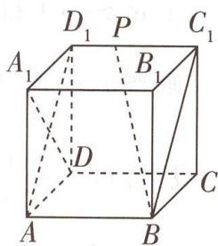

text_image

D₁ P C₁
A₁ B₁
D
A B C

图1

因为过一点与已知直线垂直的平面有且只有一个,所以点 P 在平面 $ABC_{1}D_{1}$ 内,又点 P 在正方体的表面上,所以点 P 的轨迹是平面 $ABC_{1}D_{1}$ 与正方体表面的交线,即矩形 $ABC_{1}D_{1}$ ,而 $AD_{1}=2\sqrt{2},AB=2$ ,故动点 P 的轨迹长度为 $2(2\sqrt{2}+2)=4(\sqrt{2}+1)$ ,A 不正确.

# 趣味推理

小红说：“不会是红色的。”小彩说：“不是黄色的就是黑色的。”小玲说：“一定是黑色的。”这三个人的看法至少有一个对，至少有一个错。小丽的鞋子到底是什么颜色的？（黄色）

  
“定义法”化立体为平面，巧解动点轨迹探索问题

对于 B, 因为 $AP = \frac{4\sqrt{3}}{3}$ ，所以动点 P 在以点 A 为球心， $\frac{4\sqrt{3}}{3}$ 为半径的球面上，故动点 P 的轨迹就是该球面与正方体表面的交线，如图 2 所示，设动点 P 的轨迹与正方体的棱 CD, BC, $BB_{1}, A_{1}B_{1}, A_{1}D_{1}, DD_{1}$ 的交点分别为 E, F, G, H, M, N.

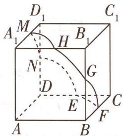

text_image

D₁
C₁
M
A₁
H
B₁
N
G
D
E
C
A
B
F

图 2

【释疑难】先定性——确定动点轨迹形状，再定量——分割到各个侧面中求解。此处难点在于球的半径比正方体的棱长大，那么动点 $P$ 的轨迹就会与正方体六个面都相交，要注意逐一思考、分类讨论

若点 P 在底面 ABCD 内, 如图 3, 因为 $2 < AP = \frac{4\sqrt{3}}{3} < 2\sqrt{2}$ , 所以动点 P 的轨迹为以 A 为圆心, $\frac{4\sqrt{3}}{3}$ 为半径的圆在底面 ABCD 内的部分, 即 $\widehat{EF}$ .

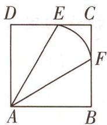

text_image

D E C
A B
F

图 3

【抓技巧】将三维空间轨迹问题转化为平面图形中的轨迹问题, 降低了思维难度, 只需要考虑圆心角 $\angle EAF$ 的求解即可求轨迹长度

在 Rt△ADE 中， $\cos\angle DAE=\frac{AD}{AE}=\frac{2}{\frac{4\sqrt{3}}{3}}=\frac{\sqrt{3}}{2}$ ，故 $\angle DAE=\frac{\pi}{6}$ ，同理， $\angle BAF=\frac{\pi}{6}$ ，所以 $\angle EAF=$ $\angle BAD - \angle BAF - \angle DAE = \frac{\pi}{6}$ , 所以 $\widehat{EF}$ 的长度为 $l_{1} = \frac{4\sqrt{3}}{3} \times \frac{\pi}{6} = \frac{2\sqrt{3}\pi}{9}$ .

若点 $P$ 在平面 $BCC_{1}B_{1}$ 内，连接 $BP$ ，因为 $AB \perp$ 平面 $BCC_{1}B_{1}$ ，所以 $AB \perp BP$ ，所以 $BP = \sqrt{AP^{2} - BA^{2}} = \sqrt{\left(\frac{4\sqrt{3}}{3}\right)^{2} - 2^{2}} = \frac{2\sqrt{3}}{3}$ ，因为 $BP = \frac{2\sqrt{3}}{3} < 2$ ，所以动点 $P$ 的轨迹是以点 $B$ 为圆心， $\frac{2\sqrt{3}}{3}$ 为半径的圆在侧面 $BCC_{1}B_{1}$ 内的部分，即 $\widehat{FG}$ ，其圆心角为 $\frac{\pi}{2}$ ，长度为 $l_{2} = \frac{2\sqrt{3}}{3} \times \frac{\pi}{2} = \frac{\sqrt{3}\pi}{3}$ .

根据正方体的对称性可知,当点P分别在平面 $A{B{B}_{1}{A}_{1}}$ ,平面 $A{D{D}_{1}{A}_{1}}$ 内时,动点P的轨迹

【提速度】根据正方体的对称性求解其他表面上的轨迹长度，避免重复运算

分别为 $\widehat{GH},\widehat{MN}$ ，均是圆心角等于 $\frac{\pi}{6}$ ，半径为 $\frac{4\sqrt{3}}{3}$ 的圆弧，弧长均为 $l_{1} = \frac{2\sqrt{3}\pi}{9}$ ；当点 $P$ 分别在平面 $A_{1}B_{1}C_{1}D_{1}$ ，平面 $DCC_{1}D_{1}$ 内时，动点 $P$ 的轨迹分别为 $\widehat{HM},\widehat{NE}$ ，均是圆心角等于 $\frac{\pi}{2}$ ，半径为 $\frac{2\sqrt{3}}{3}$ 的圆弧，弧长均为 $l_{2} = \frac{\sqrt{3}\pi}{3}$

综上,动点P的轨迹为六段圆弧,其长度和为 $l=3\times\frac{2\sqrt{3}\pi}{9}+3\times\frac{\sqrt{3}\pi}{3}=\frac{5\sqrt{3}}{3}\pi$ ,B正确.

对于 C, 如图 4, 连接 $PC_{1}$ , 过点 P 作 $PK \perp BC$ , 垂足为 K, 因为平面 $ABCD \perp$ 平面 $BCC_{1}B_{1}$ , 所以 $PK \perp$ 平面 ABCD, 即点 P 到平面 ABCD 的距离也就是点 P 到直线 BC 的距离. 因为 $D_{1}C_{1} \perp$ 平面 $BCC_{1}B_{1}$ , 所以 $D_{1}C_{1} \perp PC_{1}$ , 所以点 P 到直线 $C_{1}D_{1}$ 的距离等于 $PC_{1}$ .

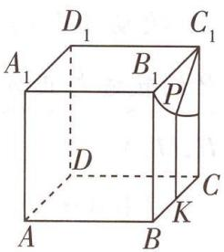

text_image

D₁
A₁
B₁
C₁
P
D
A
B
K
C

图 4

由题意可得,点P到点 $C_{1}$ 的距离与点P到直线BC的距离相等,根据抛物线的定义,可得动点 P 的轨迹为以点 $C_{1}$ 为焦点,直线 BC 为准线的抛物线的一部分,C

【用定义】立体几何问题平面化,根据几何体的结构特征,将两个距离转化为平面图形中的距离问题,进而通过抛物线的定义得到动点轨迹形状

正确.

对于 D, 易知 $\triangle ACD_{1}$ 是边长为 $2\sqrt{2}$ 的正三角形, 故其面积 $S = \frac{\sqrt{3}}{4} \times (2\sqrt{2})^{2} = 2\sqrt{3}$ . 由三棱锥 $P - ACD_{1}$ 的体积 V 等于 $\frac{4}{3}$ , 可得点 P 到平面 $ACD_{1}$ 的距离 $h = \frac{3V}{S} = \frac{4}{2\sqrt{3}} = \frac{2\sqrt{3}}{3}$ , 所以点 P 在与平面 $ACD_{1}$ 平行且距离为 $\frac{2\sqrt{3}}{3}$ 的平面内. 连接 $A_{1}B, BC_{1}, A_{1}C_{1}$ , 由正方体的性质可得平面 $A_{1}C_{1}B \parallel$ 平面 $ACD_{1}$ , 且两平行平面之间的距离等于 $\frac{2\sqrt{3}}{3}$ , 所以点 $P \in$ 平面 $A_{1}C_{1}B$ ,

又点 $P \in$ 平面 $BCC_{1}B_{1}$ , 平面 $BCC_{1}B_{1} \cap$ 平面 $A_{1}C_{1}B = BC_{1}$ , 所以点 $P$ 的轨迹是线段 $BC_{1}, D$ 正确. 综上, 选 BCD.

思考 若 $A_{1}P \parallel$ 平面 $ACD_{1}$ ，则动点 P 的轨迹长度为多少？

解析: 因为 $A_{1}P \parallel$ 平面 $ACD_{1}$ ，则动点 P 在过点 $A_{1}$ 且与平面 $ACD_{1}$ 平行的平面内，连接 $A_{1}B, BC_{1}, A_{1}C_{1}$ ，如图 5，由正方体的性质可得，平面 $A_{1}BC_{1} \parallel$ 平面 $ACD_{1}$ ，显然点 $A_{1} \in$ 平面 $A_{1}BC_{1}$ ，结合过平面外一点有且只有一个平面与已知平面平行，可得动点 P 在平面 $A_{1}BC_{1}$ 内，又点 P 在正方体的表面上，所以点 P 的轨迹是平面 $A_{1}BC_{1}$ 与正方体表面的交线，即 $\triangle A_{1}BC_{1}$ ，显然该三角形是边长为 $2\sqrt{2}$ 的正三角形，故动点 P 的轨迹长度为 $3 \times 2\sqrt{2} = 6\sqrt{2}$

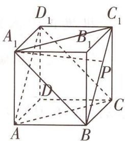

text_image

D₁
A₁
B₁
C₁
P
D
A
B
C

图5

趣味推理

1号屋的人说：“行李不在此屋里。”2号屋的人说：“行李在1号屋内。”3号屋的人说：“行李不在此屋里。”这三个人只有一个说了真话。行李在哪个屋子里？（3号屋）

# 高分技法 ② 建系法

调研 2 试题调研原创 (多选) 如图 6, 在棱长为 1 的正方体 $ABCD - A_{1}B_{1}C_{1}D_{1}$ 中, $M$ , $N$ 分别是 $AB, AD$ 的中点, 点 $P$ 在正方形 $A_{1}B_{1}C_{1}D_{1}$ 内部 (含边界) 运动, 则下列结论正确的是 ( )

A. 若 $PB_{1} \parallel MN$ ，则动点 P 的轨迹是一条直线  
B. 若 $PN \perp MN$ ，则动点 P 的轨迹长度为 $\frac{\sqrt{2}}{2}$   
C. 若 $\overrightarrow{MP} \cdot \overrightarrow{NP} = \frac{15}{16}$ , 则动点 $P$ 的轨迹长度为 $\frac{\pi}{2}$   
D. 若 $\triangle AC_{1}P$ 的面积为 $\frac{\sqrt{3}}{2}$ ，则动点 P 的轨迹为椭圆的一部分

解析 如图7,以D为坐标原点,射线DA,DC, $DD_{1}$ 分别为x轴,y轴,z轴的正半轴建立空间直角坐标系,

【敲黑板】正方体是最适合建系设点的立体图形，通过建系可以把空间线面位置关系转化为点的坐标的关系，将几何关系代数化，如此一来解题会更轻松

则 $A(1,0,0)$ , $C_{1}(0,1,1)$ , $N(\frac{1}{2},0,0)$ , $M(1,\frac{1}{2},0)$ , $B_{1}(1,1,1)$ .

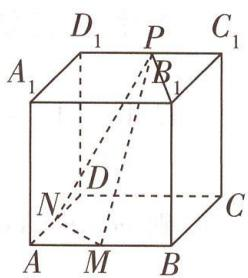

text_image

D₁ P C₁
A₁ R₁
D
N C
A M B

图6

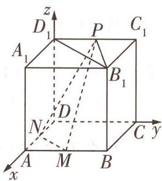

text_image

z
D₁ P C₁
A₁ B₁
D
N
A M B C y
x

图7

因为 P 位于正方形 $A_{1}B_{1}C_{1}D_{1}$ 内（含边界），故可设 $P(x,y,1)$ （其中 $0 \leqslant x \leqslant 1, 0 \leqslant y \leqslant 1$ ）.

对于 A, $\overrightarrow{NM} = (\frac{1}{2}, \frac{1}{2}, 0)$ , $\overrightarrow{PB_{1}} = (1 - x, 1 - y, 0)$ ，由已知 $PB_{1} \parallel MN$ ，可得 $\overrightarrow{PB_{1}} \parallel \overrightarrow{NM}$ ，所以 $\frac{1 - x}{\frac{1}{2}} = \frac{1 - y}{\frac{1}{2}}$ ，整理得 x - y = 0。连接 $B_{1}D_{1}$ ，因为点 P 在正方形 $A_{1}B_{1}C_{1}D_{1}$ 内部（含边界）运动，所以点 P 的轨迹是一条线段，A 不正确。

对于 B, $\overrightarrow{NP} = (x - \frac{1}{2}, y, 1)$ ，若 $PN \perp MN$ ，则 $\overrightarrow{NP} \cdot \overrightarrow{NM} = 0$ ，所以 $(x - \frac{1}{2}, y, 1) \cdot (\frac{1}{2}, \frac{1}{2}, 0) = \frac{1}{2}(x - \frac{1}{2}) + \frac{1}{2}y = 0$ ，即 $x - \frac{1}{2} + y = 0$ ，又 $0 \leqslant x \leqslant 1, 0 \leqslant y \leqslant 1$ ，所以点 P 的轨迹长度为 $\frac{\sqrt{2}}{2}$ ，B 正确。

对于 C, $\overrightarrow{MP} = (x - 1, y - \frac{1}{2}, 1)$ , $\overrightarrow{NP} = (x - \frac{1}{2}, y, 1)$ , $\overrightarrow{MP} \cdot \overrightarrow{NP} = (x - 1)(x - \frac{1}{2}) + (y - \frac{1}{2})y + 1 = \frac{15}{16}$ , 整理得 $(x - \frac{3}{4})^2 + (y - \frac{1}{4})^2 = \frac{1}{16}$ , 故点 P 的轨迹是以 $(\frac{3}{4}, \frac{1}{4}, 1)$ 为圆心, $\frac{1}{4}$ 为半径的圆, 其轨迹长度为 $l = 2\pi \times \frac{1}{4} = \frac{\pi}{2}$ , C 正确.

对于 D, 方法一: 轨迹方程法 设 P 到 $AC_{1}$ 的距离为 h, 则 $\frac{1}{2}AC_{1} \times h = \frac{\sqrt{3}}{2}$ , 解得 h = 1, $\overrightarrow{C_{1}A}=(1,-1,-1),\overrightarrow{C_{1}P}=(x,y-1,0)$ , 设 $\angle AC_{1}P=\theta$ ,

则 $\cos \theta = \cos \langle \overrightarrow{C_1A},\overrightarrow{C_1P}\rangle = \frac{\overrightarrow{C_1A} \cdot \overrightarrow{C_1P}}{|\overrightarrow{C_1A}| \times |\overrightarrow{C_1P}|} = \frac{x - (y - 1)}{\sqrt{3} \times \sqrt{x^2 + (y - 1)^2}},$

所以 $\sin \theta = \sqrt{1 - \cos^2\theta} = \sqrt{1 - \left[\frac{x - (y - 1)}{\sqrt{3}\times\sqrt{x^2 + (y - 1)^2}}\right]^2} = \frac{\sqrt{2x^2 + 2(y - 1)^2 + 2x(y - 1)}}{\sqrt{3}\times\sqrt{x^2 + (y - 1)^2}},$

所以点 $P$ 到直线 $AC_{1}$ 的距离 $d = |\overrightarrow{C_1P}|\sin \theta = \sqrt{x^2 + (y - 1)^2}\times$ $\frac{\sqrt{2}\times\sqrt{x^2+(y-1)^2+x(y-1)}}{\sqrt{3}\times\sqrt{x^2+(y-1)^2}} = 1$ ，整理得 $x^{2} + (y - 1)^{2} + x(y - 1) = \frac{3}{2}.$

先不考虑 $0 \leqslant x \leqslant 1, 0 \leqslant y \leqslant 1$ 的限制，令 $u = x + (y - 1), v = x - (y - 1)$ ，

则 $\frac{u^2 + v^2}{2} = x^2 + (y - 1)^2, \frac{u^2 - v^2}{4} = x(y - 1)$ ,

所以 $\frac{u^{2}+v^{2}}{2}+\frac{u^{2}-v^{2}}{4}=\frac{3}{2}$ ，整理得 $\frac{v^{2}}{6}+\frac{u^{2}}{2}=1$ ，显然此方程表示椭圆.

所以点 P 的轨迹为椭圆的一部分, D 正确.

方法二: 定义法 易知 $AC_{1}=\sqrt{3}$ ，设 P 到 $AC_{1}$ 的距离为 h，则 $\frac{1}{2}\times AC_{1}\times h=\frac{\sqrt{3}}{2}$ ，解得 h=1，

所以点 P 位于以 $AC_{1}$ 为旋转轴, 1 为半径的圆柱侧面上, 如图8所示. 因为 P 位于平面 $A_{1}B_{1}C_{1}D_{1}$ 内, 则 P 位于正方形 $A_{1}B_{1}C_{1}D_{1}$ 与圆柱侧面的交线上, 根据圆柱侧面与平面的位置关系, 可得 P 的轨迹为椭圆的一部分, 故 D 正

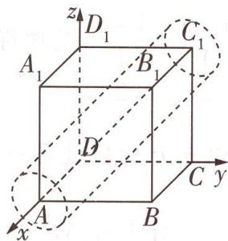

text_image

z
D₁
C₁
A₁
B₁
D
C y
A
B
x

图8

【释疑惑】此处必须熟悉圆柱的截面性质：若截面与轴线垂直，则截面是圆；若截面与轴线平行，则截面是矩形或线段；若截面与轴线不垂直也不平行，则截面是椭圆或椭圆的一部分

# 创新预测

答案▶ 057页

1.[2024 江西新八校5月第二次联考]如图9,已知正三棱台 $ABC-A_{1}B_{1}C_{1}$ 的上、下底面边长分别为4和6,侧棱长为2,点P在侧面 $BCC_{1}B_{1}$ 内运动(包含边界),且AP与平面 $BCC_{1}B_{1}$ 所成角的正切值为 $\sqrt{6}$ ,则动点P的轨迹长度为()

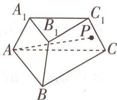

text_image

A₁
B₁
C₁
P
A
B
C

图9

A. $\frac{4\pi}{3}$

B. $\frac{\sqrt{5}\pi}{3}$

C. $\frac{\sqrt{7}\pi}{3}$

D. $\frac{2\pi}{3}$

2.[2024 广东揭阳 5 月模拟](多选)如图 10,棱长为 2 的正方体 ABCD - A₁B₁C₁D₁ 中,M 为 DD₁ 的中点,动点 N 在正方形 ABCD 内(包含边界)的轨迹为曲线 Γ.下列结论正确的有()

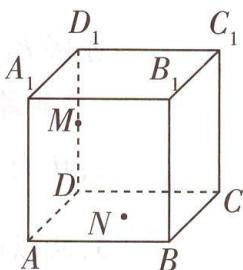

text_image

D₁
A₁ B₁ C₁
M
D
N
A B C

图10

A. 当 $MN \perp B_{1}N$ 时, $\Gamma$ 是一个点

B. 当动点 N 到直线 $DD_{1}, BB_{1}$ 的距离之和为 $2\sqrt{2}$ 时, $\Gamma$ 是椭圆的一部分

C. 当直线 MN 与平面 ABCD 所成的角为 $60^{\circ}$ 时, $\Gamma$ 是椭圆的一部分

D. 当直线 $MN$ 与平面 $ADD_{1}A_{1}$ 所成的角为 $60^{\circ}$ 时, $\Gamma$ 是双曲线的一部分

# 参考答案与解析

1.A 如图 11, 延长正三棱台三条侧棱使其相交于点 O, 取 $B_{1}C_{1}$ 的中点 D, BC 的中点 E, 连接 AD, DE, AE, 易知 OA = OB = OC, 所以延长 ED, 则 ED 的延长线必过点 O 且 $DE \perp B_{1}C_{1}, DE \perp BC$ . 过点 D 作 $DF \parallel C_{1}C, DG \parallel B_{1}B$ 分别交 BC 于 F, G, 则四边形 $DFCC_{1}$ 是边长为 2 的菱形, 在 $\triangle OBC$ 中, $\frac{B_{1}C_{1}}{BC} = \frac{OC_{1}}{OC} = \frac{OC_{1}}{OC_{1} + C_{1}C}$ , 即 $\frac{2}{3} = \frac{OC_{1}}{OC_{1} + 2}$ , 解得 $OC_{1} = 4$ , 所以 $OC = OC_{1} + C_{1}C = 4 + 2 = 6$ , 所以

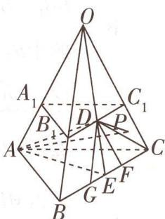

text_image

Geometric diagram of a pyramid with labeled vertices and internal points, used in spatial geometry problems.

图 11

△OBC 是边长为 6 的等边三角形, 所以 $\angle DFE = \angle FDC_{1} = \angle OCB = \frac{\pi}{3}, OE = 3\sqrt{3}$ , 所以 $DE = DF \times \sin \frac{\pi}{3} = 2 \times \frac{\sqrt{3}}{2} = \sqrt{3}$ . 因为 $\triangle ABC$ 是边长为 6 的等边三角形且 $E$ 为 $BC$ 的中点, 所以 $AE = 3\sqrt{3}, BC \perp AE$ . 在 $\triangle OAE$ 中, 由余弦定理得 $\cos \angle OEA = \frac{OE^{2} + AE^{2} - OA^{2}}{2 \times OE \times AE} = \frac{(3\sqrt{3})^{2} + (3\sqrt{3})^{2} - 6^{2}}{2 \times 3\sqrt{3} \times 3\sqrt{3}} = \frac{1}{3}$ , 在 $\triangle ADE$ 中, 由余弦定理得 $\cos \angle DEA = \frac{DE^{2} + AE^{2} - AD^{2}}{2 \times DE \times AE} = \frac{(\sqrt{3})^{2} + (3\sqrt{3})^{2} - AD^{2}}{2 \times \sqrt{3} \times 3\sqrt{3}} = \frac{1}{3}$ , 解得 $AD = 2\sqrt{6}$ , 所以 $AE^{2} = DE^{2} + AD^{2}$ , 所以 $AD \perp DE$ . 由 $BC \perp AE, BC \perp OE, AE \cap OE = E, AE, OE \subset$ 平面 $AOE$ , 可得 $BC \perp$ 平面 $AOE$ , 又 $AD \subset$ 平面 $AOE$ , 所以 $BC \perp AD$ . 由 $BC \perp AD, AD \perp DE, BC \cap DE = E, BC, DE \subset$ 平面 $BCC_{1}B_{1}$ , 可得 $AD \perp$ 平面 $BCC_{1}B_{1}$ [点关键: 要找 $AP$ 与平面 $BCC_{1}B_{1}$ 所成角, 已知条件又一反常态没有给出角的正、余弦值, 而是给出了正切值, 这是一个不同寻常的信号, 暗示我们要在直角三角形中研究线面角, 所以我们想到了过点 $A$ 向平面 $BCC_{1}B_{1}$ 作垂线段 $AD$ , 上述所有过程都是为了说明 $AD \perp$ 平面 $BCC_{1}B_{1}$ ].

她们买了什么？小丽、小玲、小娟三个人一起去商场买东西。她们都买了各自需要的一种东西，有帽子，发夹，裙子，手套等，而且每个人买的东西不同。

趣味推理

连接 DP, 因为 AP 与平面 $BCC_{1}B_{1}$ 所成角的正切值为 $\sqrt{6}$ , 所以 $\frac{AD}{DP} = \sqrt{6}$ , 解得 DP = 2, $AP = \sqrt{AD^{2} + DP^{2}} = \sqrt{24 + 4} = 2\sqrt{7}$ , 所以点 P 在平面 $BCC_{1}B_{1}$ 内的轨迹为以 D 为圆心, 2 为半径的圆被四边形 $BCC_{1}B_{1}$ 所截得的圆弧 $\widehat{C_{1}F}, \widehat{B_{1}G}$ . 设 $\widehat{C_{1}F}$ 的长度为 l, 则 $l = \angle FDC_{1} \times DP = \frac{\pi}{3} \times 2 = \frac{2\pi}{3}$ , 所以动点 P 的轨迹长度为 $\frac{4\pi}{3}$ , 故选 A.

# 2.AD

<table><tr><td>选项</td><td>分析过程</td><td>正误</td></tr><tr><td>A</td><td>连接 $B_1M, B_1D_1$ ,当 $MN \perp B_1N$ 时, $\Gamma$ 为以 $B_1M$ 为直径的球与平面ABCD的交线[点思路:可以联系圆中直径所对的圆周角是直角来联想球],由正方体的棱长为2,M为 $DD_1$ 的中点,可得 $B_1D_1 = \sqrt{2^2 + 2^2} = 2\sqrt{2}$ , $B_1M = \sqrt{B_1D_1^2 + D_1M^2} = \sqrt{8 + 1} = 3$ ,所以球的半径是 $\frac{3}{2}$ ,而 $B_1M$ 的中点到平面ABCD的距离为 $\frac{DM + BB_1}{2} = \frac{1 + 2}{2} = \frac{3}{2}$ ,故 $\Gamma$ 是一个点</td><td>√</td></tr><tr><td>B</td><td>连接DN,BN,BD,易知 $BB_1 \perp$ 平面ABCD, $DD_1 \perp$ 平面ABCD,又DN,BN⊂平面ABCD,故 $BB_1 \perp BN,DD_1 \perp DN$ ,故动点N到直线 $DD_1$ , $BB_1$ 的距离之和即动点N到点D与点B的距离之和,又 $BD = 2\sqrt{2}$ ,故当动点N到直线 $DD_1$ , $BB_1$ 的距离之和为 $2\sqrt{2}$ 时, $\Gamma$ 是线段,不是椭圆的一部分[明易错:注意椭圆定义中的限制条件“ $2a > 2c$ ”]</td><td>×</td></tr><tr><td>C</td><td>连接DN,易知 $DM \perp$ 平面ABCD,则MN与平面ABCD所成的角为 $\angle MND$ .在Rt $\triangle MDN$ 中, $MD = 1$ , $\angle MDN = 90°$ , $\angle MND = 60°$ ,所以 $DN = \frac{\sqrt{3}}{3}$ ,为定值,所以动点N的轨迹是以D为圆心, $\frac{\sqrt{3}}{3}$ 为半径的一段圆弧</td><td>×</td></tr><tr><td>D</td><td>如图12,以D为坐标原点,DA所在直线为x轴,DC所在直线为y轴, $DD_1$ 所在直线为z轴建立空间直角坐标系,则 $D_1(0,0,2)$ , $A(2,0,0)$ , $B(2,2,0)$ , $M(0,0,1)$ ,设 $N(x,y,0)(x,y \in [0,1])$ ,则 $\overrightarrow{MN} = (x,y,-1)$ .取平面 $ADD_1A_1$ 的一个法向量为 $n = (0,1,0)$ ,若MN与平面 $ADD_1A_1$ 所成的角为 $60°$ ,则 $\sin 60° = |\cos\langle\overrightarrow{MN},n\rangle| = \frac{|\overrightarrow{MN} \cdot n|}{|\overrightarrow{MN}| \cdot |n|} = \frac{|(x,y,-1) \cdot (0,1,0)|}{\sqrt{x^2+y^2+1}} = \frac{|y|}{\sqrt{x^2+y^2+1}} = \frac{\sqrt{3}}{2}$ ,化简得 $\frac{y^2}{3} - x^2 = 1$ ,所以动点N的轨迹为双曲线的一部分</td><td>√</td></tr></table>

# 超重点8 翻折问题的2个解题策略的关键应用

翻折问题是高考的一个重要命题点,题目比较灵活,主要考查逻辑推理与直观想象等核心素养,如2024新课标Ⅱ卷T17,以几何体的翻折为背景考查线线垂直及二面角.解决翻折问题要重视转化思想,关键在于掌握以下两个解题策略.

<table><tr><td>确定翻折前后的“变与不变”量</td><td>画好翻折前后的平面图形与立体图形,分清翻折前后图形的位置和数量关系的“变与不变”量.一般地,位于“折痕”同侧的点、线、面之间的位置和数量关系不变,而位于“折痕”两侧的点、线、面之间的位置关系会发生变化.对于不变的关系应在平面图形中处理,而对于变化的关系则要在立体图形中解决</td></tr><tr><td>确定翻折前后关键点的位置</td><td>所谓的关键点,是指翻折过程中运动变化的点.因为这些点的位置移动,会带动与其相关的点、线、面的关系变化.只有分析清楚关键点的准确位置,才能以此为参照点,确定其他点、线、面的位置,进而进行有关的计算与证明</td></tr></table>

# 角度 1 展开图角度的求解问题

调研 1 [2024 北京怀柔区 5 月模拟 | 新情境 · 攒尖] 攒尖是我国古代建筑中屋顶的一种结构样式, 多见于亭阁式建筑、园林建筑等, 如图 1 所示带有攒尖的建筑屋顶可近似看作一个圆锥, 其底面积为 $16\pi$ , 体积为 $\frac{32\sqrt{5}}{3}\pi$ , 则其侧面展开图的圆心角为 ( )

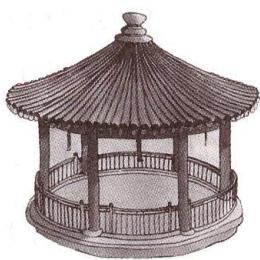

natural_image

Illustration of a traditional Chinese pavilion with a curved roof and circular base (no text or symbols)

图1

A. $\frac{2\pi}{3}$

B. $\frac{5\pi}{6}$

C. $\frac{4\pi}{3}$

D. $\frac{7\pi}{6}$

解析 由题意知圆锥底面圆的面积为 $16\pi$ ，则半径 $r = 4$ ，

所以底面圆周长为 $8\pi$ ，所以圆锥侧面展开图扇形的弧长 $l = 8\pi$ 。

【敲黑板】圆锥侧面展开图扇形的弧长为圆锥底面圆的周长，展开图扇形的半径是圆锥的母线长

记圆锥的高为 h，由屋顶的体积为 $\frac{32\sqrt{5}}{3}\pi$ 知， $\frac{1}{3} \times 16\pi h = \frac{32\sqrt{5}}{3}\pi$ ，得 $h = 2\sqrt{5}$ ，所以圆锥母线长，即侧面展开图扇形半径 $R = \sqrt{h^{2} + r^{2}} = \sqrt{20 + 16} = 6$ ，则侧面展开图扇形的圆心角为 $\frac{l}{R} = \frac{8\pi}{6} = \frac{4\pi}{3}$ ，故选 C.

【避易错】利用扇形的弧长公式解题时，要注意角必须是弧度制

她们三个人,每个人说的话都是有一半是真的,有一半是假的.那么,她们分别买了什么东西?(小丽、小玲、小娟分别买了帽子、手套、裙子)

趣味推理

# 角度 ② 翻折中位置关系的探究问题

调研 2 [2024 山东烟台 6 月阶段检测] (多选) 如图 2, 矩形 ABCD 中, E 为 BC 的中点, F 为 AD 的中点, CF 交 DE 于点 H, 将 $\triangle BAE$ 沿 AE 翻折到 $\triangle PAE$ , 连接 PD, G 为 PD 的中点, 则在翻折过程中, 下列说法正确的有 ( )

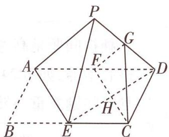

text_image

Geometric diagram of a polyhedron with labeled vertices and internal points, used for spatial geometry problems.

图2

A. 翻折过程中, 始终有平面 PAE // 平面 GFC  
B. 翻折过程中, CG 的长是定值  
C. 若 AB = BE，则 $AE \perp ED$   
D. 存在某个位置, 使得 $CG \perp AP$

# 解析

<table><tr><td>选项</td><td>分析过程</td><td>正误</td></tr><tr><td></td><td>F为AD的中点,G为PD的中点→FG//AP→FG∉平面PAE,AP⊂平面PAE→FG//平面PAE.【传技巧】利用直线和平面平行的判定定理证明线面平行的关键是在平面内找一条直线与已知直线平行,常利用平行四边形、三角形中位线等连接EF→四边形CEFD是平行四边形→H是ED的中点→连接GH→GH//PE→GH∉平面PAE,PE⊂平面PAE→GH//平面PAE→GH∩FG=G→平面PAE//平面GFC【易遗漏】利用面面平行的判定定理时注意不要遗漏“线线相交”这个条件</td><td>√</td></tr><tr><td></td><td>∠GFH=∠PAE(定值),FG=1/2AP(定值),FC=AE(定值)→在△GFC中,由余弦定理可知CG的长是定值</td><td>√</td></tr><tr><td></td><td>AB=BE→FA=FE=FD→∠AED=90°→AE⊥ED</td><td>√</td></tr><tr><td></td><td>∠APE=90°→∠FGH=90°→GH⊥GF→GF,GH,GC在同一平面内→GC不可能垂直于GF→GF//AP→GC不可能垂直于AP</td><td>×</td></tr></table>

故选 ABC.

# 角度 ③ 翻折中的体积问题

调研 3 试题调研原创 如图 3 所示, $\triangle ABC$ 中, $AC \perp BC$ , $AC = 2$ , $BC = 4$ , $E$ , $F$ 分别是 $AB$ , $BC$ 边上的点, $EF \parallel AC$ , 将 $\triangle BEF$ 沿 $EF$ 折起, 点 $B$ 折起后的位置记为点 $P$ , 得到四棱锥 $P-ACFE$ , 则四棱锥 $P-ACFE$ 体积的最大值为 \_\_\_\_.

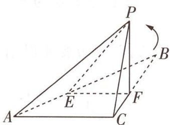

text_image

Geometric diagram of a triangular pyramid with labeled vertices and an arrow indicating rotation or transformation.

图3

# 提分细节

小编说:立体几何、数列、概率模块的题目综合性很强,细节很多,稍不注意就可能前功尽弃,我们应该注意哪些细节、避开哪些陷阱呢?

审题 四棱锥 P-ACFE 的体积最大时, $PF \perp$ 平面 ABC → 设 $BF = x \rightarrow V_{P-ACFE} = -\frac{1}{12}x^{3} + \frac{4}{3}x \rightarrow$ 令 $V(x) = -\frac{1}{12}x^{3} + \frac{4}{3}x, x \in (0,4) \rightarrow$ 求导分析函数单调性 → 确定函数最大值即可得解.

解析 因为 $EF \parallel AC$ 且 $AC \perp BC$ , 所以 $EF \perp BC$ , 即 $EF \perp PF$ .

当四棱锥 P-ACFE 的体积最大时, 点 P 到平面 ACFE 的距离最大, 则必有平面 $ACFE \perp$ 平面 PEF, 又 $PF \perp EF, PF \subset$ 平面 PEF, 平面 $ACFE \cap$ 平面 PEF = EF, 所以必有 $PF \perp$ 平面 ACFE.

【敲黑板】利用面面垂直的性质定理证明线面垂直时, 要注意以下三点: (1)两个平面垂直, (2)直线必须在其中一个平面内, (3)直线必须垂直于两个平面的交线

设 BF = x, 0 < x < 4，则 PF = x, FC = 4 - x, $EF = \frac{1}{2}x$ ,

【破障碍】要使所求四棱锥体积最大，需使底面积乘高最大，故可设出参数，构造关于所设参数的函数，利用导数求最值即可。设参数时注意根据参数的实际意义写出其取值范围

可得 $V_{P-ACFE}=\frac{1}{3}\times\frac{1}{2}\times\left(\frac{1}{2}x+2\right)(4-x)x=-\frac{1}{12}x^{3}+\frac{4}{3}x.$

令 $V(x) = -\frac{1}{12}x^{3} + \frac{4}{3}x, x \in (0,4)$ ，则 $V'(x) = -\frac{1}{4}x^{2} + \frac{4}{3}$ ,

令 $V'(x)=0$ , 解得 $x=\frac{4\sqrt{3}}{3}$ 或 $x=-\frac{4\sqrt{3}}{3}$ (舍),

当 $x \in (0, \frac{4\sqrt{3}}{3})$ 时， $V'(x) > 0$ ，函数 $V(x)$ 单调递增；

当 $x \in (\frac{4\sqrt{3}}{3}, 4)$ 时， $V'(x) < 0$ ，函数 $V(x)$ 单调递减.

所以当 $x=\frac{4\sqrt{3}}{3}$ 时, 函数 $V(x)$ 取得最大值,

即四棱锥 P-ACFE 体积的最大值为 $-\frac{1}{12}\times\left(\frac{4\sqrt{3}}{3}\right)^{3}+\frac{4}{3}\times\frac{4\sqrt{3}}{3}=\frac{32\sqrt{3}}{27}$ .

# 角度

# 翻折中的距离、角度问题

调研 4 [2024 湖北武汉 5 月模拟] 如图 4, 在矩形 ABCD 中, $AB = 2$ , $BC = 2\sqrt{3}$ , 将 $\triangle ABD$ 沿矩形的对角线 BD 进行翻折, 得到如图 5 所示的三棱锥 A - BCD, 且 $AB \perp CD$ .

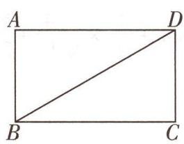

text_image

A
B
C
D

图 4

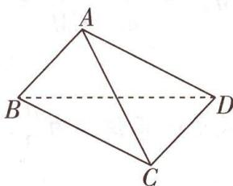

text_image

A
B
C
D

图 5

法向量法求线面角 直线的方向向量与平面的法向量所成的角,并不是直线与平面所成的角,而是与其互余(或补角与其互余).

(1) 求翻折后线段 AC 的长;  
(2) 点 M 满足 $2 \overrightarrow{AM} = \overrightarrow{MD}$ ，求翻折后 CM 与平面 ABD 所成角的正弦值.

解析（1）由 $AB \perp CD, BC \perp CD, AB \cap BC = B, AB, BC \subset$ 平面 ABC，可得 $CD \perp$ 平面 ABC，又 $AC \subset$ 平面 ABC，所以 $AC \perp CD$ .

在 Rt△ACD 中,根据勾股定理得 $AC = \sqrt{AD^{2} - CD^{2}} = \sqrt{(2\sqrt{3})^{2} - 2^{2}} = 2\sqrt{2}$ .

(2)由(1)可知,平面 BCD⊥平面 ABC.

如图6, 过点 A 作 $AE \perp BC$ 于点 E, 则由平面 $BCD \cap$ 平面 ABC = BC, $AE \subset$ 平面 ABC, 可知 $AE \perp$ 平面 BCD.

【突破口】结合第（1）问的结论转化垂直关系，得到“AE⊥平面BCD”这是建系的突破口

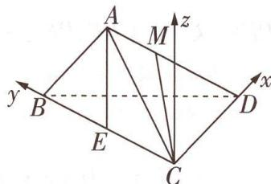

text_image

A
M
z
y
B
E
C
D
x

图6

因为 $AC = 2\sqrt{2}$ , AB = 2, $BC = 2\sqrt{3}$ , $AC^{2} + AB^{2} = BC^{2}$ , 所以 $\angle BAC = \frac{\pi}{2}$ , 所以 $\triangle ABC$ 为直角三角形, 所以 $AE = \frac{AB \times AC}{BC} = \frac{2\sqrt{2}}{\sqrt{3}}$ , 则 $CE = \sqrt{AC^{2} - AE^{2}} = \frac{4}{\sqrt{3}}$ .

以 C 为坐标原点, CD 所在直线为 x 轴, CB 所在直线为 y 轴, 过 C 且与 AE 平行的直线为 z 轴建立如图 6 所示的空间直角坐标系,

则 $C(0,0,0)$ , $A(0,\frac{4}{\sqrt{3}},\frac{2\sqrt{2}}{\sqrt{3}})$ , $B(0,2\sqrt{3},0)$ , $D(2,0,0)$ ,

所以 $\overrightarrow{CA} = (0, \frac{4}{\sqrt{3}}, \frac{2\sqrt{2}}{\sqrt{3}}), \overrightarrow{AD} = (2, -\frac{4}{\sqrt{3}}, -\frac{2\sqrt{2}}{\sqrt{3}}), \overrightarrow{BD} = (2, -2\sqrt{3}, 0)$ ,

所以 $\overrightarrow{CM} = \overrightarrow{CA} +\overrightarrow{AM} = \overrightarrow{CA} +\frac{1}{3}\overrightarrow{AD} = (\frac{2}{3},\frac{8}{3\sqrt{3}},\frac{4\sqrt{2}}{3\sqrt{3}}).$

设平面 ABD 的法向量为 $\boldsymbol{m} = (x, y, z)$ ，则 $\left\{\begin{aligned}\boldsymbol{m} \cdot \overrightarrow{AD} &= 2x - \frac{4}{\sqrt{3}}y - \frac{2\sqrt{2}}{\sqrt{3}}z = 0, \\ \boldsymbol{m} \cdot \overrightarrow{BD} &= 2x - 2\sqrt{3}y = 0,\end{aligned}\right.$

令 $x=\sqrt{3}$ ，得平面 ABD 的一个法向量为 $\boldsymbol{m}=(\sqrt{3},1,\frac{1}{\sqrt{2}})$ .

设 CM 与平面 ABD 所成角为 $\theta$ ,

于是 $\sin \theta = |\cos \langle m, \overrightarrow{CM}\rangle| = \frac{|\boldsymbol{m} \cdot \overrightarrow{CM}|}{|\boldsymbol{m}| |\overrightarrow{CM}|} = \frac{\sqrt{3} \times \frac{2}{3} + \frac{8}{3\sqrt{3}} + \frac{1}{\sqrt{2}} \times \frac{4\sqrt{2}}{3\sqrt{3}}}{\sqrt{3 + 1 + \frac{1}{2}} \times \sqrt{\frac{4}{9} + \frac{64}{27} + \frac{32}{27}}} = \frac{\sqrt{6}}{3},$

故 CM 与平面 ABD 所成角的正弦值为 $\frac{\sqrt{6}}{3}$ .

【避易错】利用空间向量求线面角时,要注意相关直线的方向向量与平面法向量夹角的余弦值的绝对值即线面角的正弦值,切勿与面面角混淆

提分细节

二面角的余弦值 利用两平面的法向量求二面角的余弦值时,要结合具体的图形判断所求二面角是锐角还是钝角.

# 创新预测

答案▶ 064页

1. 试题调研原创 已知圆锥的底面圆周在球 O 的球面上,顶点为球心 O,圆锥的高为 3 ,且圆锥的侧面展开图是一个半圆,则球 O 的体积为 \_\_\_\_.

2. 试题调研原创 (多选)如图7, 半圆 $O$ 的直径为4, 点 $B, C$ 三等分半圆, $P, Q$ 分别为 $OB$ , $OC$ 的中点, 将此半圆以 $OA$ 为母线卷成如图8所示的圆锥, $D$ 为 $BC$ 的中点, 则下列结论正确的是 ( )

A. ${PQ} = \frac{\sqrt{3}}{2}$

B. $AD \perp$ 平面 $OBC$

C. $P Q / /$ 平面 $A B C$

D. 三棱锥 $P - ABC$ 与 $Q - ABC$ 公共部分的体积为 $\frac{1}{4}$

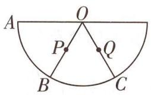

text_image

A
O
P
Q
B
C

图7

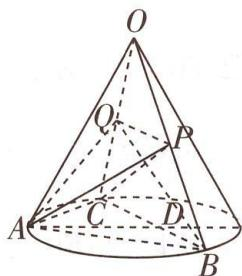

text_image

Geometric diagram of a cone with labeled points and dashed lines indicating hidden edges

图8

3.[2024 山东济宁5月三模]图9是由正方形ABCD和两个正三角形△ADE,△CDF组成的一个平面图形,其中AB=2,现将△ADE沿AD折起使得平面ADE⊥平面ABCD,将△CDF沿CD折起使得平面CDF⊥平面ABCD,连接EF,BE,BF,如图10.

(1) 证明: $EF \parallel$ 平面 $ABCD$ .  
(2)求平面 ADE 与平面 BCF 夹角的大小.

# 规范答题

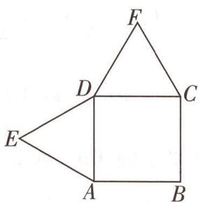

text_image

Geometric diagram with labeled points A, B, C, D, E, F forming triangles and a quadrilateral

图9

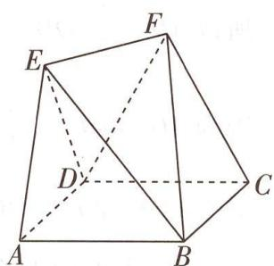

text_image

Geometric diagram of a polyhedron with labeled vertices A, B, C, D, E, F and solid/dashed edges indicating 3D perspective.

图 10

角的取值范围 异面直线所成角范围为 $(0,\frac{\pi}{2}]$ ，线面角的范围为 $[0,\frac{\pi}{2}]$ ，二面角的范围为 $[0,\pi]$ .

提分细节

# 参考答案与解析

1. $32\sqrt{3}\pi$ 由题意知圆锥高 $h = 3$ ，设圆锥的底面半径为 $r$ ，母线为 $l$ ，球 $O$ 的半径为 $R$

则由圆锥的侧面展开图是一个半圆, 得 $\left\{\begin{aligned}2\pi r &= \pi l, \\ l^{2} &= r^{2} + h^{2} = r^{2} + 9,\end{aligned}\right.$ 得 $l = 2r = 2\sqrt{3}$ ,

可知 $R = l = 2\sqrt{3}$ ，所以球 O 的体积 $V = \frac{4\pi}{3}R^{3} = 32\sqrt{3}\pi$ [易混淆：注意球的表面积与体积公式的区别，不要弄混].

2.ACD 对于 A, 设卷成的圆锥的底面圆半径为 r, 则 $2\pi r = \frac{1}{2} \times 4\pi$ , 解得 r = 1,

由题意知点 B, C 为卷成的圆锥的底面圆周的三等分点，

所以 $\triangle ABC$ 为等边三角形,则 $\frac{BC}{\sin60^{\circ}}=2r=2$ [巧思考:要求 $PQ$ ,只需求出 $BC$ ,在三角形中已知三角形内角及其外接圆半径,利用正弦定理即可求出边长],

所以 $BC=\sqrt{3}$ ，又点 P, Q 分别是 OB, OC 的中点，所以 $PQ=\frac{1}{2}BC=\frac{\sqrt{3}}{2}$ ，故 A 正确.

对于 B, 连接 OD, 因为三角形 ABC 是边长为 $\sqrt{3}$ 的等边三角形, 三角形 OBC 是腰长为 2 的等腰三角形, 点 D 是 BC 的中点,

所以 $AD = \frac{3}{2}, OD = \sqrt{OB^2 - BD^2} = \sqrt{2^2 - (\frac{\sqrt{3}}{2})^2} = \frac{\sqrt{13}}{2}$ ,

因为 $AD^{2} + OD^{2} = \frac{9}{4} + \frac{13}{4} \neq 4 = AO^{2}$ ，所以 AD 与 OD 不垂直，AD 不垂直于平面 OBC，故 B 错误.

对于 C, 易知 $PQ \parallel BC, PQ \not\subset$ 平面 ABC, BC ⊂ 平面 ABC, 所以 $PQ \parallel$ 平面 ABC, 故 C 正确.

对于 D, 设 BQ, CP 交于点 E, 连接 OE 并延长 OE, 则由对称性可知 OE 必定交 BC 于点 D, 连接 EA, 则三棱锥 P-ABC 与三棱锥 Q-ABC 公共部分即三棱锥 E-ABC [析疑难: 找到三棱锥 P-ABC 与三棱锥 Q-ABC 的所有公共点, 依次相连即可得到公共部分组成的几何体, 利用三角形重心的性质求出体积即可],

因为点 P, Q 分别是 OB, OC 的中点,

所以 E 为 $\triangle OBC$ 的重心, 所以 $DE = \frac{1}{3}OD = \frac{\sqrt{13}}{6}$ ,

由上述分析知,圆锥的轴截面是边长为2的正三角形,

所以圆锥的高为 $\sqrt{3}$ ，所以 $V_{E - ABC} = \frac{1}{3} V_{O - ABC} = \frac{1}{3}\times \frac{1}{3}\times (\frac{1}{2}\times \sqrt{3}\times \sqrt{3}\times \frac{\sqrt{3}}{2})\times \sqrt{3} = \frac{1}{4},$

所以三棱锥 P-ABC 与三棱锥 Q-ABC 公共部分的体积为 $\frac{1}{4}$ ，故 D 正确。故选 ACD。

3.(1)如图11,分别取棱CD,AD的中点O,P,连接OF,PE,OP.

由 $\triangle CDF$ 是边长为2的正三角形,得 $OF\perp CD,OF=\sqrt{3}$ ,

又平面 $CDF \perp$ 平面 $ABCD$ , 平面 $CDF \cap$ 平面 $ABCD = DC, OF \subset$ 平面 $CDF$ , 所以 $OF \perp$ 平面 $ABCD$ , 同理, $PE \perp$ 平面 $ABCD, PE = \sqrt{3}$ .

所以 $OF \parallel PE, OF = PE$ [用定理: 注意线面垂直的性质定理的灵活运用, 垂直于同一个平面的直线互相平行],

则四边形 OPEF 为平行四边形, 所以 OP // EF.

因为 $OP \subset$ 平面 ABCD, $EF \not\subset$ 平面 ABCD, 所以 $EF \parallel$ 平面 ABCD.

(2) 取棱 AB 的中点 Q，连接 OQ，由四边形 ABCD 为正方形，得 $OQ \perp CD$ ，以 O 为坐标原点， $\overrightarrow{OQ}, \overrightarrow{OC}, \overrightarrow{OF}$ 的方向分别为 x 轴，y 轴，z 轴的正方向，建立如图 11 所示的空间直角坐标系，

则 $B(2,1,0), C(0,1,0), F(0,0,\sqrt{3}), D(0,-1,0), \overrightarrow{CB} = (2,0,0)$ , $\overrightarrow{CF} = (0,-1,\sqrt{3}), \overrightarrow{DC} = (0,2,0)$ .

设平面 BCF 的法向量为 $\boldsymbol{n} = (x, y, z)$ ，则 $\left\{\begin{aligned}\boldsymbol{n} \cdot \overrightarrow{CB} &= 2x = 0, \\ \boldsymbol{n} \cdot \overrightarrow{CF} &= -y + \sqrt{3}z = 0,\end{aligned}\right.$

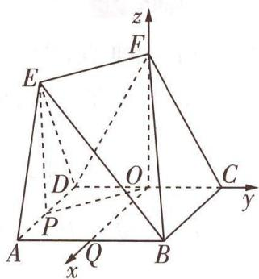

text_image

z
F
E
D
O
C
y
A
P
Q
B
x

图11

令 z=1 ，得平面 BCF 的一个法向量为 $\boldsymbol{n}=(0,\sqrt{3},1)$ .

由 $CD \perp AD$ ，平面 $ADE \perp$ 平面 ABCD，平面 $ADE \cap$ 平面 ABCD = AD， $CD \subset$ 平面 ABCD，

得 $CD \perp$ 平面 ADE, 则 $\overrightarrow{DC} = (0, 2, 0)$ 为平面 ADE 的一个法向量 [巧思考: 当与平面垂直的直线不能很容易由线面垂直得出时, 往往利用空间向量的数量积运算求解法向量; 但若题干中与平面相关的垂直关系较多, 则可直接根据线面垂直找平面的法向量].

设平面 ADE 与平面 BCF 的夹角为 $\theta$ ,

则 $\cos \theta = |\cos \langle \overrightarrow{DC},\pmb {n}\rangle | = \frac{|\overrightarrow{DC}\cdot\pmb{n}|}{|\overrightarrow{DC}||\pmb{n}|} = \frac{2\sqrt{3}}{2\times 2} = \frac{\sqrt{3}}{2}$ , 而 $\theta \in (0,\frac{\pi}{2}]$ , 则 $\theta = \frac{\pi}{6}$ ,

所以平面 ADE 与平面 BCF 的夹角为 $\frac{\pi}{6}$ [避易错: 平面与平面夹角的取值范围是 $(0, \frac{\pi}{2}]$ ，故其余弦值为两个平面法向量夹角余弦值的绝对值。二面角的取值范围是 $[0, \pi]$ ，用法向量求二面角的大小时应注意，平面的法向量取的方向不同求出来的值也不同，所以求出两个平面法向量夹角的余弦值后，还应该根据所求二面角的实际形状确定大小]。

# 超重点9 立体几何中最值问题的2个核心解题策略

# 三年考情与创新命题特点

# 2025命题预测

<table><tr><td>2023 全国甲卷 T16,由正方体的棱与球面有公共点求球半径的取值范围</td></tr><tr><td>2022 新高考I卷 T8,已知正四棱锥的外接球体积和侧棱长的取值范围,求正四棱锥的体积的取值范围</td></tr><tr><td>2022 全国乙卷 T18,求四面体的一个截面三角形面积最小时线面角的正弦值</td></tr></table>

①命题形式：选择题、填空题、解答题中均有可能出现.   
②必考热点：常见几何体的体积最值问题，空间距离、空间角的最值问题.   
③创新考法：以平面图形的翻折为载体，或与圆锥曲线、函数与导数、不等式等其他模块知识交汇命题.

# 策略 1 定性分析

调研 1 [2024 湖南长沙 5 月模拟] (多选) 如图 1, 四棱锥 P-ABCD 的底面为正方形, PA 与底面垂直, PA=2, AB=1, 动点 M 在线段 PC 上 (包含端点), 则 ( )

A. 不存在点 M, 使得 $AC \perp BM$   
B. $MB + MD$ 的最小值为 $\frac{\sqrt{30}}{3}$   
C. 四棱锥 $P - ABCD$ 的外接球表面积为 $5 \pi$   
D. 点 M 到直线 AB 的距离的最小值为 $\frac{2\sqrt{5}}{5}$

解析 对于 A, 如图 2, 连接 BD, 使得 $AC \cap BD = O$ , 当 M 在 PC 中点处时, 连接 OM, DM. 因为点 O 为 AC 的中点, 所以 $OM \parallel PA$ , 因为 $PA \perp$ 平面 ABCD, 所以 $OM \perp$ 平面 ABCD,

又 $AC \subset$ 平面ABCD, 所以 $OM \perp AC$ . 因为四边形ABCD为正方形, 所以 $AC \perp BD$ , 又 $BD \cap OM = O$ , 且 $BD, OM \subset$ 平面BDM, 所以 $AC \perp$ 平面BDM, 因为 $BM \subset$ 平面BDM, 所以 $AC \perp BM$ , 因此存在点 $M(M$ 为PC中点), 使得 $AC \perp BM$ , A错误.

对于 B, 将 $\triangle PBC$ 和 $\triangle PCD$ 沿着 PC 翻折到同一个平面上, 如图 3, 连接 BD, 易知 $PB = PD = \sqrt{5}$ , BC = CD = 1, $BD \perp PC$ , 则 $MB + MD$ 的最小值为 BD.

【会转化】把 MB, MD 放在同一个平面内，转化为平面中的最值问题求解

因为 $PC^2 = PA^2 + AB^2 + BC^2 = 6$ ，所以 $PC^2 = PB^2 + BC^2 = PD^2 + CD^2$ ，所以 $PB \perp BC, PD \perp DC$ ，则 $\triangle PBC$ 斜边 $PC$ 上的高为 $\frac{1 \times \sqrt{5}}{\sqrt{6}}$ ，即 $\frac{\sqrt{30}}{6}$ ， $\triangle PCD$ 斜

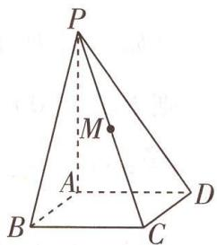

text_image

P
M
A
B
C
D

图 1

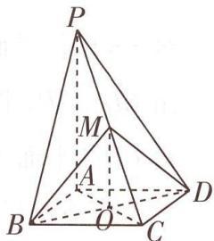

text_image

Geometric diagram of a pyramid with labeled vertices and internal points, used in spatial geometry problems.

图 2

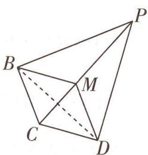

natural_image

Geometric diagram of a tetrahedron with labeled vertices P, B, C, D and internal point M (no text or symbols beyond labels)

图 3

# 提分细节

线面垂直的判定 利用线面垂直的判定定理证明时,注意直线要与平面内的两条相交直线都垂直,“相交”这一条件不可缺少.

边 $PC$ 上的高也为 $\frac{\sqrt{30}}{6}$ , 所以 $MB + MD$ 的最小值为 $\frac{\sqrt{30}}{3}$ , B 正确.

对于 C, 易知四棱锥 P-ABCD 的外接球直径为 PC, 则半径 $R=\frac{1}{2}PC=\frac{\sqrt{6}}{2}$ , 所以表面积 $S=4\pi R^{2}=6\pi$ , C 错误.

对于 D, 点 M 到直线 AB 的距离的最小值即异面直线 PC 与 AB 间的距离, 也就是 AB 到

【破瓶颈】把点到直线距离的最值转化为两异面直线间的距离, 后者是一个确定值, 结合图形求解即可平面 PCD 的距离.

因为 $AB \parallel CD$ ，且 $AB \not\subset$ 平面 $PCD, CD \subset$ 平面 $PCD$ ，所以 $AB \parallel$ 平面 $PCD$ ，所以直线 $AB$ 到平面 $PCD$ 的距离等于点 $A$ 到平面 $PCD$ 的距离.

如图4, 过点 $A$ 作 $AF \perp PD$ 交 $PD$ 于 $F$ , 因为 $PA \perp$ 平面 $ABCD, CD \subset$ 平面 $ABCD$ , 所以 $PA \perp CD$ , 又 $AD \perp CD$ , 且 $PA \cap AD = A, PA, AD \subset$ 平面 $PAD$ , 所以 $CD \perp$ 平面 $PAD$ , 因为 $AF \subset$ 平面 $PAD$ , 所以 $AF \perp CD$ ,

因为 $PD \cap CD = D$ ，且 $PD, CD \subset$ 平面 PCD，所以 $AF \perp$ 平面 PCD.

所以点 A 到平面 PCD 的距离, 即 AF 的长,

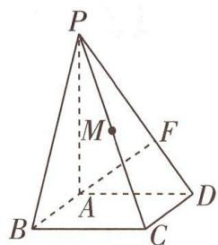

text_image

P
M
F
A
B
C
D

图 4

所以由等面积法可得 $AF = \frac{PA \times AD}{PD} = \frac{2\sqrt{5}}{5}$ ，即直线 AB 到平面 PCD 的距离等于 $\frac{2\sqrt{5}}{5}$ ，D 正确。故选 BD。

# 原创变式

如图 5 所示的几何体是由等高的直三棱柱和半圆柱组合而成的, $B_{1}C_{1}$ 为半圆柱上底面的直径, $\angle ACB=90^{\circ},AC=BC=2$ ,点E,F分别为AC,AB的中点,点D为弧 $B_{1}C_{1}$ 的中点.

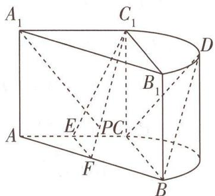

text_image

A₁
C₁
B₁
D
E
PC
F
A
B

图5

(1) 证明: 平面 BCD // 平面 $C_{1}EF$ .  
(2) 若 P 是线段 $C_{1}F$ 上的一个动点（包含端点），当 $CC_{1}=2$ 时，求直线 $A_{1}P$ 与平面 BCD 所成角的正弦值的最大值.

答案》第071页

# 策略 ② 定量分析

调研 2 试题调研原创 如图6,P为圆锥的顶点,O为圆锥底面圆的圆心,AC为底面圆直径, $\triangle ABD$ 为底面圆O的内接正三角形,且 $\triangle ABD$ 的边长为 $\sqrt{3}$ ,点E在母线PC上,且 $AE=\sqrt{3},CE=1$ .

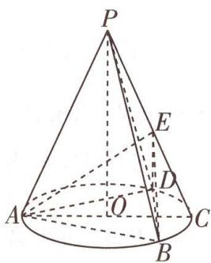

text_image

P
E
A
O
D
C
B

图6

(1) 证明 $BD \perp AE$ , 并求三棱锥 $P - BDE$ 的体积;

(2) 若点 M 为线段 PO 上的动点(包含端点), 当直线 DM 与平面 ABE 所成角的正弦值最大时, 求点 M 到平面 ABE 的距离.

解析 (1) 设 $AC \cap BD = F$ , 连接 $EF$ , $\because \triangle ABD$ 为底面圆 $O$ 的内接正三角形,

$\therefore AC = \frac{\sqrt{3}}{\sin\frac{\pi}{3}} = 2,F$ 为 $BD$ 的中点， $AF = \sqrt{AB^2 - BF^2} = \frac{3}{2}.$

$$
\because A E = \sqrt {3}, C E = 1, \therefore A E ^ {2} + C E ^ {2} = A C ^ {2}, \therefore A E \perp E C.
$$

$$
\because \frac {A F}{A E} = \frac {A E}{A C}, \therefore \triangle A E F \sim \triangle A C E, \therefore \angle A F E = \angle A E C, \therefore E F \perp A C.
$$

∵ PO ⊥ 平面 ABD, PO ⊂ 平面 PAC, ∴ 平面 PAC ⊥ 平面 ABD.

∵ 平面 PAC∩平面 ABD = AC, EF⊂平面 PAC, EF⊥AC, ∴ EF⊥平面 ABD.

又 $BD \subset$ 平面 $ABD, \therefore EF \perp BD, \because BD \perp AC, EF \cap AC = F, EF, AC \subset$ 平面 $AEC, \therefore BD \perp$ 平面 $AEC$ , 又 $AE \subset$ 平面 $AEC, \therefore BD \perp AE$ .

∵ PO ⊥ 平面 ABD, EF ⊥ 平面 ABD, ∴ EF // PO,

∵ PO ∉ 平面 BDE, EF ⊂ 平面 BDE, ∴ PO ∥ 平面 BDE.

∵ F 为 BD 的中点, ∴ $AF \perp BD$ , 即 $OF \perp BD$ ,

又 $OF \perp EF, EF \cap BD = F, EF, BD \subset$ 平面 $BDE, \therefore OF \perp$ 平面 $BDE$ ,

$$
\because E F = \sqrt {A E ^ {2} - A F ^ {2}} = \sqrt {3 - \frac {9}{4}} = \frac {\sqrt {3}}{2}, E F \perp B D, \therefore S _ {\triangle B D E} = \frac {1}{2} \times B D \times E F = \frac {1}{2} \times \sqrt {3} \times \frac {\sqrt {3}}{2} = \frac {3}{4},
$$

又 $OF = \frac{1}{3} AF = \frac{1}{2}, PO //$ 平面 $BDE, \therefore$ 点 $P$ 到平面 $BDE$ 的距离 $h = OF = \frac{1}{2}, \therefore V_{P - BDE} = \frac{1}{3} \times S_{\triangle BDE} \times OF = \frac{1}{3} \times \frac{3}{4} \times \frac{1}{2} = \frac{1}{8}$ .

(2) 易知 F 为 OC 的中点, 又 $PO \parallel EF$ , ∴ E 为 PC 的中点, $PO = 2EF$ , ∴ $PO = \sqrt{3}$ , PC = 2.

  
“定量分析法”快攻线面角的最值问题

由(1)知 $FB, FC, FE$ 三线两两垂直. 以 $F$ 为坐标原点, $\overrightarrow{FB}, \overrightarrow{FC}, \overrightarrow{FE}$ 的方向分别为 $x$ 轴, $y$ 轴, $z$ 轴的正方向建立空间直角坐标系, 则 $A(0, -\frac{3}{2}, 0), B(\frac{\sqrt{3}}{2}, 0, 0), E(0, 0, \frac{\sqrt{3}}{2}), D(-\frac{\sqrt{3}}{2}, 0, 0), O(0, -\frac{1}{2}, 0), P(0, -\frac{1}{2}, \sqrt{3})$ ,

$$
\begin{array}{l} \therefore \overrightarrow {A B} = (\frac {\sqrt {3}}{2}, \frac {3}{2}, 0), \overrightarrow {A E} = (0, \frac {3}{2}, \frac {\sqrt {3}}{2}), \overrightarrow {O P} = (0, 0, \sqrt {3}), \overrightarrow {D O} = (\frac {\sqrt {3}}{2}, - \frac {1}{2}, 0), \overrightarrow {D A} = (\frac {\sqrt {3}}{2}, \\ - \frac {3}{2}, 0), \\ \end{array}
$$

设 $\overrightarrow{OM} = \lambda \overrightarrow{OP} = (0,0,\sqrt{3}\lambda)(0\leqslant \lambda \leqslant 1)$ ，则 $\overrightarrow{DM} = \overrightarrow{DO} +\overrightarrow{OM} = (\frac{\sqrt{3}}{2}, - \frac{1}{2},\sqrt{3}\lambda).$

设平面 $ABE$ 的法向量为 $\pmb {n} = (x,y,z)$ ，则 $\left\{ \begin{array}{l} \overrightarrow{AB} \cdot \pmb {n} = \frac{\sqrt{3}}{2} x + \frac{3}{2} y = 0, \\ \overrightarrow{AE} \cdot \pmb {n} = \frac{3}{2} y + \frac{\sqrt{3}}{2} z = 0, \end{array} \right.$ 令 $y = -1$ ，可得 $x = \sqrt{3}$

$z = \sqrt{3},\therefore$ 平面 $ABE$ 的一个法向量为 $\pmb {n} = (\sqrt{3}, - 1,\sqrt{3})$

设直线 DM 与平面 ABE 所成角为 $\theta$ ,

则 $\sin \theta = \frac{|\overrightarrow{DM} \cdot \boldsymbol{n}|}{|\overrightarrow{DM}| |\boldsymbol{n}|} = \frac{|2 + 3\lambda|}{\sqrt{3\lambda^2 + 1} \times \sqrt{7}} = \frac{1}{\sqrt{7} \times \sqrt{\frac{3\lambda^2 + 1}{(3\lambda + 2)^2}}}$ .

【敲黑板】把所求值用代数式表示，则所求最值即代数式的最值，结合不等式、函数与导数求解

方法一: 直接求导法 设 $f(\lambda)=\frac{(3\lambda+2)^{2}}{3\lambda^{2}+1}$ ( $\lambda\in[0,1]$ ),

则 $f^{\prime}(\lambda) = \frac{2(3\lambda + 2)\times 3\times(3\lambda^{2} + 1) - 6\lambda\times(3\lambda + 2)^{2}}{(3\lambda^{2} + 1)^{2}} = \frac{6(3\lambda + 2)(1 - 2\lambda)}{(3\lambda^{2} + 1)^{2}}.$

当 $\lambda\in[0,\frac{1}{2}]$ 时, $f'(\lambda)>0,f(\lambda)$ 单调递增;当 $\lambda\in[\frac{1}{2},1]$ 时, $f'(\lambda)<0,f(\lambda)$ 单调递减.

∴ 当 $\lambda=\frac{1}{2}$ 时, $f(\lambda)$ 取最大值, 即 $\lambda=\frac{1}{2}$ 时直线 DM 与平面 ABE 所成角的正弦值最大.

此时 M 为 OP 的中点, $\overrightarrow{DM} = \left( \frac{\sqrt{3}}{2}, -\frac{1}{2}, \frac{\sqrt{3}}{2} \right)$ , $\overrightarrow{MA} = \overrightarrow{DA} - \overrightarrow{DM} = (0, -1, -\frac{\sqrt{3}}{2})$ , 此时点 M

到平面 $ABE$ 的距离 $d = \frac{|\overrightarrow{MA} \cdot \boldsymbol{n}|}{|\boldsymbol{n}|} = \frac{\frac{1}{2}}{\sqrt{7}} = \frac{\sqrt{7}}{14}$ .

方法二:换元法 令 $t=3\lambda+2$ ，则 $t\in[2,5]$ ，∴ $\lambda=\frac{t-2}{3}$ ，∴ $\frac{3\lambda^{2}+1}{(3\lambda+2)^{2}}=\frac{\frac{(t-2)^{2}}{3}+1}{t^{2}}=\frac{t^{2}-4t+7}{3t^{2}}=\frac{1}{3}\left(\frac{7}{t^{2}}-\frac{4}{t}+1\right)$ ，

$\because \frac{1}{t} \in \left[\frac{1}{5}, \frac{1}{2}\right], \therefore$ 当 $\frac{1}{t} = \frac{2}{7}$ , 即 $\lambda = \frac{1}{2}$ 时, $\frac{3\lambda^2 + 1}{(3\lambda + 2)^2}$ 取最小值, $\sin \theta$ 取最大值. 后续过程同方法一.

方法三:基本不等式法 $\sin\theta=\frac{\sqrt{7}}{7}\sqrt{\frac{(3\lambda+2)^{2}}{3\lambda^{2}+1}}=\frac{\sqrt{7}}{7}\sqrt{\frac{9\lambda^{2}+12\lambda+4}{3\lambda^{2}+1}}=$

$\frac{\sqrt{7}}{7}\sqrt{\frac{3(3\lambda^2 + 1) + (12\lambda + 1)}{3\lambda^2 + 1}} = \frac{\sqrt{7}}{7}\sqrt{3 + \frac{12\lambda + 1}{3\lambda^2 + 1}}$ 记 $12\lambda + 1 = m, \because \lambda \in [0, 1], \therefore m \in [1, 13]$ ,

故 $\lambda = \frac{m - 1}{12},\sin \theta = \frac{\sqrt{7}}{7}\sqrt{3 + \frac{m}{3(\frac{m - 1}{12})^2 + 1}} = \frac{\sqrt{7}}{7}\sqrt{3 + \frac{144m}{3m^2 - 6m + 147}} = \frac{\sqrt{7}}{7}\sqrt{3 + \frac{144}{3m + \frac{147}{m} - 6}}$ ，由

基本不等式可得 $3m + \frac{147}{m} - 6 \geqslant 2\sqrt{3m \times \frac{147}{m}} - 6 = 2 \times 21 - 6 = 36$ (当且仅当 $3m = \frac{147}{m}$ ，即 m = 7，即 $\lambda = \frac{1}{2}$ 时等号成立)，∴ 当直线 DM 与平面 ABE 所成角的正弦值最大时， $\lambda = \frac{1}{2}$ . 后续过程同方法一.

# 原创变式

2 如图 7, 在圆台 $O_{1} O_{2}$ 中, 圆 $O_{1}$ 的半径是 2 , 母线 $P C = 2$ , 圆 $O_{2}$ 是 $\triangle A B C$ 的外接圆, $\angle A C B = 60^{\circ}, A B = \sqrt{3}$ , 则三棱锥 $P - A B C$ 体积的最大值为 \_\_\_\_.

text_image

O₁
A
Q
B²
C
P

图7

答案》第072页

提分细节

等比数列求和分类 运用等比数列的前 n 项和公式时, 分公比 $q=1, q \neq 1$ 两种情况进行讨论.

# 创新预测

答案▶ 072页

1.[2024 山东青岛 5 月三模]在长方体 $ABCD-A_{1}B_{1}C_{1}D_{1}$ 中, AB=2, BC=3, $AA_{1}=4$ , 点 P 为矩形 $A_{1}B_{1}C_{1}D_{1}$ 内一动点（包含边界）, 记二面角 P-AD-B 的平面角为 $\alpha$ , 直线 PC 与平面 ABCD 所成的角为 $\beta$ , 若 $\alpha=\beta$ , 则三棱锥 $P-BB_{1}D_{1}$ 体积的最小值为 \_\_\_\_.

2. 试题调研原创 如图8,在直角梯形ABCD中, $AB \parallel CD,AB \perp AD,AB = 6\sqrt{3},CD = 8\sqrt{3},AD = 6$ ,点E,F分别为边AB,CD上的点,且 $EF \parallel AD,AE = 4\sqrt{3}$ .将四边形AEFD沿EF折起,使得平面AEFD⊥平面EBCF,点M是四边形AEFD内(包含边界)的动点,且直线MB与平面AEFD所成的角和直线MC与

text_image

A
D
E
F
B
C
→
A
D
M
E
B
F
C

图8

平面 AEFD 所成的角相等, 则当三棱锥 M-BEF 的体积最大时, 三棱锥 M-BEF 的外接球的表面积为 \_\_\_\_.

# 参考答案与解析

# 原创变式

1.(1)如图9,连接 $C_{1}D$ ,由点D为弧 $B_{1}C_{1}$ 的中点, $B_{1}C_{1}$ 为半圆柱上底面的直径知 $\angle DC_{1}B_{1}=45^{\circ}$ ，由 $\angle ACB=90^{\circ},AC=BC=2$ ,知 $\angle C_{1}B_{1}A_{1}=45^{\circ},C_{1}D=\sqrt{2}$ ，则 $\angle DC_{1}B_{1}=\angle C_{1}B_{1}A_{1}$ ，又 $A_{1},B_{1},D$ ， $C_{1}$ 四点共面，所以 $A_{1}B_{1}\parallel C_{1}D$ .

由直三棱柱的性质知 $A_{1}B_{1} \parallel AB$ ，即 $A_{1}B_{1} \parallel FB$ ，则 $C_{1}D \parallel FB$ ，

由 F 为 AB 的中点, AC = BC = 2 得 $FB = \sqrt{2} = C_{1}D$ ,

所以四边形 $FBDC_{1}$ 为平行四边形, 则 $BD \parallel FC_{1}$ , 又 $BD \subset$ 平面 BCD, $FC_{1} \not\subset$ 平面 BCD, 则 $FC_{1} \parallel$ 平面 BCD.

因为 E, F 分别为 AC, AB 的中点, 所以 $EF \parallel BC$ , 又 $EF \not\subset$ 平面 BCD, $BC \subset$ 平面 BCD, 所以 $EF \parallel$ 平面 BCD.

又 $EF \cap FC_{1} = F, EF, FC_{1} \subset$ 平面 $EFC_{1}$ , 所以平面 $BCD \parallel$ 平面 $C_{1}EF$ .

(2) 在直三棱柱 $ABC - A_{1}B_{1}C_{1}$ 中, $CC_{1} \perp$ 底面 ABC,

因为 $EF \subset$ 底面 $ABC$ , 所以 $CC_{1} \perp EF$ , 由 (1) 知 $EF \parallel BC, BC \perp AC$ , 所以 $EF \perp AC$ , 又 $AC \cap CC_{1} = C, AC, CC_{1} \subset$ 平面 $AA_{1}C_{1}C$ , 所以 $EF \perp$ 平面 $AA_{1}C_{1}C$ , 因为 $EF \subset$ 平面 $EFC_{1}$ , 所以平面 $EFC_{1} \perp$ 平面 $AA_{1}C_{1}C$ .

过 $A_{1}$ 作 $A_{1}H \perp EC_{1}$ 交 $EC_{1}$ 于 H, 连接 PH, 如图 9,

因为平面 $EFC_{1} \cap$ 平面 $AA_{1}C_{1}C = C_{1}E$ ，所以 $A_{1}H \perp$ 平面 $C_{1}EF$ ，

又平面 $BCD \parallel$ 平面 $C_{1}EF$ , 则直线 $A_{1}P$ 与平面 $BCD$ 所成角即直线 $A_{1}P$ 与平面 $C_{1}EF$ 所成角, 即

text_image

A₁
C₁
D
H
P
B₁
E
C
F
A
B

图9

$\angle A_{1}PH$ [明关键:找到线面角].

在正方形 $ACC_{1}A_{1}$ 中, 易知 $Rt\triangle C_{1}EC\sim Rt\triangle A_{1}C_{1}H$ , 且 $A_{1}C_{1}=CC_{1}=2, C_{1}E=\sqrt{5}$ , 所以 $\frac{A_{1}H}{2}=\frac{2}{\sqrt{5}}$ , 则 $A_{1}H=\frac{4}{\sqrt{5}}$ , 又 $\sin\angle A_{1}PH=\frac{A_{1}H}{A_{1}P}=\frac{\frac{4}{\sqrt{5}}}{A_{1}P}$ , 所以要使 $\sin\angle A_{1}PH$ 的值最大, 则 $A_{1}P$ 最小 [巧转化: 通过一系列转化, 将最值转化为点线距], 连接 $A_{1}F$ , 在 $\triangle A_{1}FC_{1}$ 中, $A_{1}F=FC_{1}=\sqrt{6}, A_{1}C_{1}=2$ , 由等面积法可求出 $(A_{1}P)_{\min}=\frac{\sqrt{30}}{3}$ , 此时 $(\sin\angle A_{1}PH)_{\max}=\frac{2\sqrt{6}}{5}$ . 所以直线 $A_{1}P$ 与平面 BCD 所成角的正弦值的最大值为 $\frac{2\sqrt{6}}{5}$ .

2. $\frac{3}{4}$ 设圆 $O_{1}, O_{2}$ 的半径分别为 $r_{1}, r_{2}$ , 则 $r_{1} = 2$ , 由正弦定理得 $\frac{\sqrt{3}}{\sin 60^{\circ}} = 2r_{2}$ , 所以 $r_{2} = 1$ , 设圆台的高为 $h$ , 则 $h = O_{1}O_{2} = \sqrt{PC^{2} - (r_{1} - r_{2})^{2}} = \sqrt{3}$ , 在 $\triangle ABC$ 中, 设 $AC = b, BC = a$ , 由余弦定理得 $a^{2} + b^{2} - 2ab\cos 60^{\circ} = 3$ , 即 $a^{2} + b^{2} = ab + 3 \geqslant 2ab$ , 可得 $ab \leqslant 3$ , 当且仅当 $a = b = \sqrt{3}$ 时取等号, 故三棱锥 $P - ABC$ 的体积 $V = \frac{1}{3}S_{\triangle ABC} \times h = \frac{1}{3} \times \frac{1}{2}ab\sin 60^{\circ} \times \sqrt{3} = \frac{1}{4}ab \leqslant \frac{3}{4}$ [明关键: 将三棱锥的体积转化为关于 $a, b$ 的代数式, 结合 $ab$ 的取值范围求最值], 即三棱锥 $P - ABC$ 的体积的最大值为 $\frac{3}{4}$ .

# 创新预测

1. $\frac{10}{9}$ 如图10,作PM⊥平面ABCD交平面ABCD于M,再作MN⊥AD交AD于N,

连接 $PN, CM$ ，则 $\alpha = \angle PNM, \beta = \angle PCM$ ，由 $\alpha = \beta$ 得 $\angle PNM = \angle PCM$

所以 Rt△PMN≌Rt△PMC, 则 MN = MC,

由抛物线定义可知, M 的轨迹为以 C 为焦点, 以 AD 所在直线为准线的抛物线的一部分, 所以 P 的轨迹为以 $C_{1}$ 为焦点, 以 $A_{1}D_{1}$ 所在直线为准线的抛物线的一部分,

当点 P 到线段 $B_{1}D_{1}$ 的距离最短时, 三角形 $PB_{1}D_{1}$ 的面积最小, 即三棱锥 $P - BB_{1}D_{1}$ 的体积最小 [明关键: 将面积最值转化为点线距最值].

text_image

Geometric diagram of a cube with labeled vertices and internal points, used for spatial geometry problems.

图 10

text_image

A₁
y
B₁
P
D₁ O₁ C₁ x

图 11

如图11,在平面 $A_{1}B_{1}C_{1}D_{1}$ 中,取 $C_{1}D_{1}$ 的中点 $O_{1}$ ,以其为原点建立平面直角坐标系[释疑难:建立平面直角坐标系,数形结合求最短距离],

则 $C_{1}(1,0)$ , $D_{1}(-1,0)$ , $B_{1}(1,3)$ ，则直线 $B_{1}D_{1}$ 的方程为 $y=\frac{3}{1+1}(x+1)$ ，即 $3x-2y+3=0$ ，点 P 所在抛物线的方程为 $y^{2}=4x$ ，当 y>0 时， $y=2\sqrt{x}$ ，则 $y'=\frac{1}{\sqrt{x}}$ ，

令 $\frac{1}{\sqrt{x}} = \frac{3}{2}$ , 得 $x = \frac{4}{9}$ , 代入 $y = 2\sqrt{x}$ , 得 $y = \frac{4}{3}$ , 所以当点 $P$ 到线段 $B_{1}D_{1}$ 的距离最短时, 点 $P$ 的坐标为 $(\frac{4}{9}, \frac{4}{3})$ , 最短距离 $d = \frac{|\frac{4}{9} \times 3 - \frac{4}{3} \times 2 + 3|}{\sqrt{3^2 + 2^2}} = \frac{5\sqrt{13}}{39}$ .

因为 $B_{1}D_{1} = \sqrt{2^{2} + 3^{2}} = \sqrt{13}$ ，所以 $V_{P - BB_1D_1} = V_{B - PB_1D_1} = \frac{1}{3}\times \frac{1}{2}\times \sqrt{13}\times \frac{5\sqrt{13}}{39}\times 4 = \frac{10}{9}$ ，所以三棱锥 $P - BB_{1}D_{1}$ 体积的最小值为 $\frac{10}{9}$

2.60π 易知翻折前 $BE \perp EF$ ，因为平面 $AEFD \perp$ 平面 EBCF，平面 $AEFD \cap$ 平面 $EBCF = EF, BE \subset$ 平面 EBCF，所以 $BE \perp$ 平面 AEFD，所以 $\angle BME$ 即直线 MB 与平面 AEFD 所成的角。同理可得， $\angle CMF$ 即直线 MC 与平面 AEFD 所成的角。

直线 $MB$ 与平面 $AEFD$ 所成的角和直线 $MC$ 与平面 $AEFD$ 所成的角相等，即 $\angle BME = \angle CMF$ ，而 $\tan \angle BME = \frac{BE}{EM} = \frac{2\sqrt{3}}{EM},\tan \angle CMF = \frac{CF}{MF} = \frac{4\sqrt{3}}{MF}$ 所以 $\frac{2\sqrt{3}}{EM} = \frac{4\sqrt{3}}{MF}$ 即 $MF = 2EM.$

text_image

Geometric diagram of a triangular prism with labeled vertices and internal points, used for spatial geometry problems.

图 12

设 EM = x，则 MF = 2x，如图 12，过点 M 作 $MN \perp EF$ 交 EF 于点 N，因为平面 $AEFD \perp$

平面 EBCF, 平面 $AEFD \cap$ 平面 $EBCF = EF, MN \subset$ 平面 AEFD, 所以 $MN \perp$ 平面 EBCF, 即点 M 到平面 EBCF 的距离为 MN, 因为三棱锥 M - BEF 的体积 $V = \frac{1}{3} S_{\triangle BEF} \cdot MN$ , 且 $S_{\triangle BEF}$ 为定值, 所以要使三棱锥 M - BEF 的体积取得最大值, 需使 MN 取得最大值.

设 MN = h, EN = y，则 FN = EF - EN = 6 - y，由勾股定理知， $EM^{2} = EN^{2} + MN^{2}, MF^{2} = MN^{2} + FN^{2}$ ，所以 $x^{2} = y^{2} + h^{2}, 4x^{2} = h^{2} + (6 - y)^{2}$ ，消去 x 并整理得 $h^{2} = -y^{2} - 4y + 12 = -(y + 2)^{2} + 16$ [明关键：设未知数，结合二次函数的性质求最值]， $y \in [0, 6]$ ，当 y = 0 时， $h^{2}$ 取得最大值 12，即 h 取得最大值 $2\sqrt{3}$ ，此时点 M 在线段 AE 上，且 $EM = h = 2\sqrt{3}$ ，所以 EB, EF, EM 两两垂直，所以三棱锥 M - BEF 的外接球就是以 EB, EF, EM 为长、宽、高的长方体的外接球，设外接球的半径为 R，则 $2R = \sqrt{EB^{2} + EF^{2} + EM^{2}} = \sqrt{(2\sqrt{3})^{2} + 6^{2} + (2\sqrt{3})^{2}} = 2\sqrt{15}$ ，所以 $R = \sqrt{15}$ ，所以当三棱锥 M - BEF 的体积最大时，三棱锥 M - BEF 的外接球的表面积为 $4\pi R^{2} = 4\pi \cdot (\sqrt{15})^{2} = 60\pi$ .

# 超重点10 空间向量在求角问题中的妙用

# 三年考情与创新命题特点

# 2025命题预测

<table><tr><td>2024 新高考II卷 T17,平面图形翻折为立体图形,以锥体为载体考查线线垂直以及二面角的正弦值</td></tr><tr><td>2024 全国甲卷 T19,以五面体为载体,证明线面平行,求二面角的正弦值</td></tr><tr><td>2024 上海卷 T17,以正四棱锥为载体考查旋转体的体积以及线面角的大小</td></tr></table>

①命题形式：可能以选择题的形式出现，也可能与空间线面位置关系的证明相结合，以解答题的形式进行考查，难度适中.  
②必考热点：空间角的求解，注重利用向量方法解决空间角问题，也可利用几何法来求解.  
③创新考法：在空间角的基础上进一步考查空间距离(特别是点到面的距离)及动态变换中的存在性探索问题.

# 题型 1 用空间向量求异面直线所成角

调研 1 [2024 辽宁丹东 5 月质检] 在直三棱柱 $ABC - A_{1}B_{1}C_{1}$ 中, $\angle BAC = 120^{\circ}, AB = AC = AA_{1}$ , 则异面直线 $BA_{1}$ 与 $AC_{1}$ 所成角的余弦值为 ( )

A. $\frac{3}{4}$

B. $-\frac{3}{4}$

C. $\frac{\sqrt{2}}{2}$

D. $\frac{\sqrt{7}}{4}$

解析 如图 1, 在平面 ABC 内过 A 作 AC 的垂线交 BC 于 D,

以 $A$ 为坐标原点，以 $AD$ 所在直线为 $x$ 轴， $AC$ 所在直线为 $y$ 轴， $AA_{1}$ 所在直线为 $z$ 轴，建立空间直角坐标系，在直三棱柱 $ABC - A_{1}B_{1}C_{1}$ 中， $\angle BAC = 120^{\circ}$ ，设 $AB = AC = AA_{1} = 1$ ，则 $B(\frac{\sqrt{3}}{2}, -\frac{1}{2}, 0), A_{1}(0,0,1), A(0,0,0), C_{1}(0,1,1), \overrightarrow{BA_{1}} = (-\frac{\sqrt{3}}{2}, \frac{1}{2}, 1), \overrightarrow{AC_{1}} = (0,1,1)$ ，

text_image

z
A₁
B₁
C₁
A
B
D
C
y
x

图 1

设异面直线 $BA_{1}$ 与 $AC_{1}$ 所成角为 $\theta$ ，则 $\cos \theta = \frac{|\overrightarrow{BA_1} \cdot \overrightarrow{AC_1}|}{|\overrightarrow{BA_1}| \times |\overrightarrow{AC_1}|} = \frac{\frac{3}{2}}{\sqrt{2} \times \sqrt{2}} = \frac{3}{4}$

所以异面直线 $BA_{1}$ 与 $AC_{1}$ 所成角的余弦值为 $\frac{3}{4}$ ，故选 A.

# 抢分秘籍

# 用空间向量求异面直线所成角必会公式

设异面直线 $l_{1}, l_{2}$ 的方向向量分别为 $m_{1}, m_{2}, m_{1} = (x_{1}, y_{1}, z_{1}), m_{2} = (x_{2}, y_{2}, z_{2})$ ， $\theta$ 是 $l_{1}$ 与 $l_{2}$ 所成的角，根据向量数量积的定义和坐标表示可得 $\cos \theta = |\cos \langle m_{1}, m_{2} \rangle| = \frac{|m_{1} \cdot m_{2}|}{|m_{1}| |m_{2}|} = \frac{|x_{1} x_{2} + y_{1} y_{2} + z_{1} z_{2}|}{\sqrt{x_{1}^{2} + y_{1}^{2} + z_{1}^{2}} \sqrt{x_{2}^{2} + y_{2}^{2} + z_{2}^{2}}}, \theta \in (0, \frac{\pi}{2}]$ .

# 题型

# 用空间向量求线面角

调研 2 [2024 辽宁省十一校重点高中联合体 5 月联考] 如图 2, 在三棱柱 $ABC - A_{1}B_{1}C_{1}$ 中, $AA_{1} = 13$ , AB = 8, BC = 6, $AB \perp BC$ , $AB_{1} = B_{1}C$ , D 为 AC 的中点, 平面 $AB_{1}C \perp$ 平面 ABC.

text_image

A₁
B₁
C₁
D
A
B
C

图 2

(1) 证明: $B_{1} D \perp$ 平面 $A B C$ .  
(2) 求直线 $C_{1}D$ 与平面 $AB_{1}C$ 所成角的正弦值.

解析 (1) 因为 $AB_{1} = B_{1}C, D$ 为 $AC$ 的中点, 所以 $B_{1}D \perp AC$ ,

又平面 $AB_{1}C \perp$ 平面 ABC, 平面 $AB_{1}C \cap$ 平面 ABC = AC, $B_{1}D \subset$ 平面 $AB_{1}C$ ,

所以 $B_{1}D \perp$ 平面 ABC.

(2) 方法一: 向量法 在平面 ABC 内过点 D 分别作 AB, BC 的平行线, 交 BC, AB 于点 F, E, 由题知 $AB \perp BC$ , 则 $DE \perp DF$ .

由(1)知 $B_{1}D \perp$ 平面 ABC, 则 DE, DF, $DB_{1}$ 三线两两垂直.

以 D 为坐标原点, 以 $\overrightarrow{DE}, \overrightarrow{DF}, \overrightarrow{DB_{1}}$ 的方向分别为 x 轴, y 轴, z 轴正方向建立如图 3 所示的空间直角坐标系 D - xyz, 连接 BD.

因为 AB = 8, BC = 6, 所以 AC = 10, BD = 5.

又 $AA_{1}=BB_{1}=13$ ，所以 $B_{1}D=12$ ，

text_image

A₁
B₁
C₁
D
E
F
x
y
z
A
B

图3

所以 $D(0,0,0)$ , $A(3,-4,0)$ , $B(3,4,0)$ , $C(-3,4,0)$ , $B_{1}(0,0,12)$ ，则 $\overrightarrow{BC}=(-6,0,0)$ ， $\overrightarrow{AC}=(-6,8,0),\overrightarrow{B_{1}C}=(-3,4,-12)$ ,

设 $C_{1}(x,y,z)$ ，由 $\overrightarrow{BC} = \overrightarrow{B_{1}C_{1}}$ ，得 $(-6,0,0) = (x,y,z-12)$ ，即 $C_{1}(-6,0,12)$ ，则 $\overrightarrow{C_{1}D} = (6,0,-12)$ .

设平面 $AB_{1}C$ 的法向量为 $\pmb {n} = (a,b,c)$ ，则 $\left\{ \begin{array}{l}\pmb {n}\cdot \overrightarrow{AC} = -6a + 8b = 0,\\ \pmb {n}\cdot \overrightarrow{B_1C} = -3a + 4b - 12c = 0, \end{array} \right.$

  
“建、写、套”三步法速解
空间角、空间距离问题

令 a=4 ，得平面 $AB_{1}C$ 的一个法向量为 $\boldsymbol{n}=(4,3,0)$ .

设直线 $C_{1}D$ 与平面 $AB_{1}C$ 所成角为 $\theta$ ,

则 $\sin \theta = |\cos \langle n, \overrightarrow{C_1D}\rangle| = \frac{|\boldsymbol{n} \cdot \overrightarrow{C_1D}|}{|\boldsymbol{n}| |\overrightarrow{C_1D}|} = \frac{|6 \times 4 + 0 \times 3 + (-12) \times 0|}{5 \times \sqrt{6^2 + 0^2 + (-12)^2}} = \frac{4\sqrt{5}}{25}$ .

【敲黑板】求出斜线的方向向量与平面的法向量夹角的余弦值，其绝对值就是斜线和平面所成角的正弦值

方法二: 几何法 如图 4, 连接 $BC_{1}$ 交 $B_{1}C$ 于点 M, 易知 $BM = MC_{1}$ ,

所以点 $C_{1}$ 到平面 $AB_{1}C$ 的距离 d 和点 B 到平面 $AB_{1}C$ 的距离相等.

过点 B 作 $BH \perp AC$ ，垂足为 H.

二项分布与超几何分布的区别 二项分布需要很大的样本量(无限或可以看作无限), 超几何分布的总体是有限的.

提分细节

因为平面 $AB_{1}C \perp$ 平面 $ABC$ , 平面 $AB_{1}C \cap$ 平面 $ABC = AC, BH \subset$ 平面 $ABC$ , 所以 $BH \perp$ 平面 $AB_{1}C$ , 则 $BH$ 为点 $B$ 到平面 $AB_{1}C$ 的距离.

在 Rt△ABC 中, 因为 AB = 8, BC = 6,

所以 AC = 10，则 $BH = \frac{6 \times 8}{10} = \frac{24}{5}$ ，所以 $d = BH = \frac{24}{5}$ .

由(1)知 $B_{1}D\perp$ 平面ABC,又 $BC\subset$ 平面ABC,所以 $B_{1}D\perp BC$ .

又 $B_{1}C_{1} // BC$ ，所以 $B_{1}D \perp B_{1}C_{1}$ ，则 $\triangle DB_{1}C_{1}$ 为直角三角形.

连接 BD, 则 $B_{1}D \perp BD$ .

因为 D 为 AC 的中点, 所以 $BD = \frac{1}{2} AC = 5$ ,

因为 $AA_{1}=BB_{1}=13$ ，所以 $B_{1}D=12$ 。因为 $B_{1}C_{1}=BC=6$ ，所以 $C_{1}D=\sqrt{6^{2}+12^{2}}=6\sqrt{5}$ 。

设直线 $C_1D$ 与平面 $AB_{1}C$ 所成的角为 $\theta$ ，则 $\sin \theta = \frac{d}{C_1D} = \frac{\frac{24}{5}}{6\sqrt{5}} = \frac{4\sqrt{5}}{25}$

所以直线 $C_{1}D$ 与平面 $AB_{1}C$ 所成角的正弦值为 $\frac{4\sqrt{5}}{25}$ .

text_image

A₁
B₁
C₁
M
D
H
A
B
C

图 4

# 抢分秘籍

# 用空间向量求线面角的必会公式

设直线 AB 的方向向量和平面 $\alpha$ 的法向量分别为 m, n, $m = (x_{1}, y_{1}, z_{1})$ , $n = (x_{2}, y_{2}, z_{2})$ ，如图 5，直线 AB 与平面 $\alpha$ 相交于点 B，设直线 AB 与平面 $\alpha$ 所成的角为 $\theta$ ，则 $\sin \theta = |\cos \langle m, n \rangle| = \frac{|m \cdot n|}{|m||n|} =$

$$
\frac {\left| x _ {1} x _ {2} + y _ {1} y _ {2} + z _ {1} z _ {2} \right|}{\sqrt {x _ {1} ^ {2} + y _ {1} ^ {2} + z _ {1} ^ {2}} \sqrt {x _ {2} ^ {2} + y _ {2} ^ {2} + z _ {2} ^ {2}}}, \theta \in [ 0, \frac {\pi}{2} ].
$$

text_image

A
m
θ
B
α
n

图5

# 题型

# 用空间向量求二面角

调研 3 [2024 福建福州 5 月模拟] 如图 6, 在三棱锥 D-ABC 中, $DA \perp$ 底面 ABC, AC = BC = DA = 1, $AB = \sqrt{2}$ , E 是 CD 的中点, 点 F 在 DB 上, 且 $EF \perp DB$ .

(1) 证明: $DB \perp$ 平面 $AEF$ .  
(2) 求二面角 A - DB - C 的大小.

解析 方法一: 向量法 (1) 因为 $DA \perp$ 平面 ABC, 且 BC, AC ⊂ 平面 ABC, 所以 $DA \perp BC, DA \perp AC$ .

text_image

Geometric diagram of triangle ABC with internal points D, E, F and auxiliary lines, labeled with vertices and intersection points.

图6

# 提分细节

概率的加法公式 使用概率的加法公式 $P(A \cup B) = P(A) + P(B)$ 前, 一定要验证该公式的使用条件, 即事件 A 与事件 B 互斥.

因为 AC = BC = 1, $AB = \sqrt{2}$ , 所以 $AC^{2} + BC^{2} = AB^{2}$ , 所以 $AC \perp BC$ .

因为 $DA \cap AC = A, DA, AC \subset$ 平面 DAC, 所以 $BC \perp$ 平面 DAC.

如图7, 过点 A 作 $AG \parallel BC$ , 则 $AG \perp$ 平面 DAC.

以 A 为坐标原点, 分别以向量 $\overrightarrow{AC}, \overrightarrow{AG}, \overrightarrow{AD}$ 的方向为 x 轴, y 轴, z 轴的正方向, 建立空间直角坐标系 A - xyz,

则 $A(0,0,0)$ , $B(1,1,0)$ , $D(0,0,1)$ , $E(\frac{1}{2},0,\frac{1}{2})$ ,

所以 $\overrightarrow{DB} = (1, 1, -1), \overrightarrow{AE} = (\frac{1}{2}, 0, \frac{1}{2})$ .

因为 $\overrightarrow{DB}\cdot\overrightarrow{AE}=1\times\frac{1}{2}+1\times0+(-1)\times\frac{1}{2}=0$ ，所以 $\overrightarrow{DB}\perp\overrightarrow{AE}$ ，所以 $DB\perp AE$ .

又 $DB \perp EF$ ，且 $AE \cap EF = E, AE, EF \subset$ 平面 AEF，所以 $DB \perp$ 平面 AEF.

(2) 由(1)知 $\overrightarrow{AD} = (0,0,1), \overrightarrow{BD} = (-1, -1, 1), \overrightarrow{CD} = (-1,0,1)$ .

设平面 ADB 的法向量为 $\boldsymbol{m} = (x_{1}, y_{1}, z_{1})$ ，则 $\left\{\begin{aligned}\boldsymbol{m} \cdot \overrightarrow{AD} &= 0, \\ \boldsymbol{m} \cdot \overrightarrow{BD} &= 0,\end{aligned}\right.$ 即 $\left\{\begin{aligned}z_{1} &= 0, \\ -x_{1} - y_{1} + z_{1} &= 0,\end{aligned}\right.$ 令 $y_{1} = 1$ ，得平面 ADB 的一个法向量为 $\boldsymbol{m} = (-1, 1, 0)$ .

设平面 DBC 的法向量为 $\boldsymbol{n}=(x_{2},y_{2},z_{2})$ ，则 $\left\{\begin{aligned}\boldsymbol{n}\cdot\overrightarrow{CD}&=0,\\ \boldsymbol{n}\cdot\overrightarrow{BD}&=0,\end{aligned}\right.$ 即 $\left\{\begin{aligned}-x_{2}+z_{2}&=0,\\ -x_{2}-y_{2}+z_{2}&=0,\end{aligned}\right.$ 令 $x_{2}=1$ ，得平面 DBC 的一个法向量为 $\boldsymbol{n}=(1,0,1)$ .

设平面 ADB 与平面 DBC 的夹角为 $\theta$ ，则 $\cos\theta = |\cos\langle m, n\rangle| = \frac{|-1|}{\sqrt{2} \times \sqrt{2}} = \frac{1}{2}$ ，所以 $\theta = \frac{\pi}{3}$ ，

【易错提醒】注意二面角与两个平面夹角的区别，二面角的范围为 $[0, \pi]$ ，两个平面的夹角的范围为 $(0, \frac{\pi}{2}]$

即平面 ADB 与平面 DBC 夹角的大小为 $\frac{\pi}{3}$ ，由图可知二面角 A-DB-C 为锐角，所以二面角 A-DB-C 的大小为 $\frac{\pi}{3}$ .

方法二: 几何法 (1) 因为 $DA \perp$ 底面 ABC, $BC \subset$ 底面 ABC, 所以 $DA \perp BC$ ,

因为 AC = BC = 1, $AB = \sqrt{2}$ , 所以 $AC^{2} + BC^{2} = AB^{2}$ , 所以 $AC \perp BC$ ,

又 $DA \cap AC = A, DA, AC \subset$ 平面 DAC, 所以 $BC \perp$ 平面 DAC.

因为 $AE \subset$ 平面 DAC, 所以 $BC \perp AE$ ,

因为 DA = AC, E 是 DC 的中点, 所以 $AE \perp DC$ ,

text_image

D
z
E
F
A
C
G
y
B
x

图7

频率分布直方图的纵轴 频率分布直方图的纵轴常常被误认为是“频率”，其实是“频率/组距”.

又 $BC \cap DC = C, BC, DC \subset$ 平面 DBC, 所以 $AE \perp$ 平面 DBC,

因为 $DB \subset$ 平面 DBC, 所以 $AE \perp DB$ ,

又 $EF \perp DB, AE \cap EF = E, AE, EF \subset$ 平面 $AEF$ , 所以 $DB \perp$ 平面 $AEF$ .

(2)由(1)可知 $DB \perp AF$ , 且 $EF \perp DB$ , 故 $\angle EFA$ 为二面角 $A - DB - C$ 的平面角,

因为 AC = BC = DA = 1，所以 DC = AB = $\sqrt{2}$ ，所以 $AE = \frac{1}{2}DC = \frac{\sqrt{2}}{2}$ ，

又 $DA \perp AB$ ，所以 $DB = \sqrt{3}$ ， $AF = \frac{1 \times \sqrt{2}}{\sqrt{3}} = \frac{\sqrt{6}}{3}$ ，

又 $DC^{2} + BC^{2} = BD^{2}$ ，所以 $DC \perp BC$ ，

所以 $\triangle DFE\sim \triangle DCB$ ，则 $\frac{EF}{BC} = \frac{DE}{DB}$ 所以 $EF = \frac{\frac{\sqrt{2}}{2}\times 1}{\sqrt{3}} = \frac{\sqrt{6}}{6},$

由余弦定理得 $\cos \angle EFA = \frac{(\frac{\sqrt{6}}{3})^2 + (\frac{\sqrt{6}}{6})^2 - (\frac{\sqrt{2}}{2})^2}{2 \times \frac{\sqrt{6}}{3} \times \frac{\sqrt{6}}{6}} = \frac{1}{2}$ ,

所以 $\angle EFA = \frac{\pi}{3}$ 即二面角 $A - DB - C$ 的大小为 $\frac{\pi}{3}$ .

# 抢分秘籍

# 用空间向量求二面角的 2 个必会方法

1. 直接法: 如图 8①, AB, CD 是二面角 $\alpha - l - \beta$ 的两个面内与棱 l 垂直的直线, 则二面角 $\alpha - l - \beta$ 的大小 $\theta = \langle \overrightarrow{AB}, \overrightarrow{CD} \rangle$ .

  
图 8

2. 法向量法: 如图 8②③, $n_{1}, n_{2}$ 分别是二面角 $\alpha - l - \beta$ 的两个半平面 $\alpha, \beta$ 的法向量, 则二面角 $\alpha - l - \beta$ 的大小 $\theta$ 满足 $|\cos \theta| = |\cos \langle n_{1}, n_{2} \rangle|$ , 二面角的平面角大小是向量 $n_{1}$ 与 $n_{2}$ 的夹角 (或其补角). 结合立体图形中二面角的实际情况, 判断二面角的平面角是钝角还是锐角.

提示:如果题干要求平面 $\alpha$ 与平面 $\beta$ 的夹角,注意平面 $\alpha$ 与平面 $\beta$ 的夹角的定义“平面 $\alpha$ 与平面 $\beta$ 相交,形成四个二面角,我们把这四个二面角中不大于 $90^{\circ}$ 的二面角称为平面 $\alpha$ 与平面 $\beta$ 的夹角”,也就是说平面与平面的夹角的取值范围是 $(0, \frac{\pi}{2}]$ .

# 提分细节

检验分布列的对错 将分布列所有取值对应的概率相加,和为 1,可以据此检验所求出的分布列是否正确.

# 创新预测

答案▶ 080页

1. 试题调研原创 如图9, 圆锥 $CO$ 的底面直径 $AB = 2$ , 其侧面展开图为半圆, 底面圆的弦 $AD = \sqrt{3}$ , 则异面直线 $AD$ 与 $BC$ 所成角的余弦值为 ( )

text_image

C
A
O
B
D

图9

A. 0

B. $\frac{\sqrt{3}}{3}$

C. $\frac{\sqrt{3}}{4}$

D. $\frac{\sqrt{2}}{2}$

2. 试题调研原创 如图 10, 斜三棱柱 $ABC - A_{1}B_{1}C_{1}$ 的底面 $\triangle ABC$ 是直角三角形, $\angle BAC = 90^{\circ}, AB = AC = 2, \angle A_{1}AB = \angle A_{1}AC = 60^{\circ}$ , 点 $O$ 是 $BC$ 的中点.

(1) 证明: 平面 $BCC_{1}B_{1} \perp$ 平面 $A_{1}AO$ .  
(2) 若 $A_{1}$ 在底面 ABC 上的射影恰好是点 O, D 是棱 $BB_{1}$ 的中点, 求平面 $AC_{1}D$ 与平面 ABC 所成角的余弦值.

# 规范答题

text_image

Geometric diagram of a polyhedron with labeled vertices and internal points, used for spatial geometry problems.

图 10

# 参考答案与解析

1.C 在劣弧 $\overset{\frown}{AD}$ 上取 $\overset{\frown}{AB}$ 的中点M,连接OM,以O为原点,OM,OB,OC所在直线分别为x轴,y轴,z轴建立如图11所示的空间直角坐标系,

因为圆锥的底面直径 AB = 2，其侧面展开图为半圆，底面圆的弦 $AD = \sqrt{3}$ ，所以 $\pi \cdot BC = 2\pi$ ，所以 BC = 2，则 $CO = \sqrt{3}$ ，所以 $A(0, -1, 0)$ ， $B(0, 1, 0)$ ， $C(0, 0, \sqrt{3})$ ， $D(\frac{\sqrt{3}}{2}, \frac{1}{2}, 0)$ ，所以 $\overrightarrow{AD} = (\frac{\sqrt{3}}{2}, \frac{3}{2}, 0)$ ， $\overrightarrow{BC} = (0, -1, \sqrt{3})$ ，则 $\cos\langle\overrightarrow{AD}, \overrightarrow{BC}\rangle =$ $\frac{\overrightarrow{AD}\cdot\overrightarrow{BC}}{|\overrightarrow{AD}|\times|\overrightarrow{BC}|}=\frac{\frac{\sqrt{3}}{2}\times0+\frac{3}{2}\times(-1)+0\times\sqrt{3}}{\sqrt{(\frac{\sqrt{3}}{2})^{2}+(\frac{3}{2})^{2}+0^{2}}\times\sqrt{0^{2}+(-1)^{2}+(\sqrt{3})^{2}}}=\frac{-\frac{3}{2}}{2\sqrt{3}}=-\frac{\sqrt{3}}{4}$ ，故异面直线AD与BC

text_image

z
C
A
O
M
D
B
y
x

图 11

所成角的余弦值为 $\frac{\sqrt{3}}{4}$ [易错提醒:注意两异面直线所成角的范围是 $(0,\frac{\pi}{2}]$ ]. 故选 C.

2.(1) 因为 AB = AC，所以 $BC \perp AO$ 。连接 $A_{1}C, A_{1}B$ ，如图 12，在 $\triangle A_{1}AC$ 与 $\triangle A_{1}AB$ 中，因为 AC = AB， $\angle A_{1}AC = \angle A_{1}AB, A_{1}A = A_{1}A$ ，所以 $\triangle A_{1}AC \cong \triangle A_{1}AB$ ，则 $A_{1}C = A_{1}B$ 。

因为点 O 是 BC 的中点, 所以 $BC \perp A_{1}O$ , 又 $AO \cap A_{1}O = O$ , AO, $A_{1}O \subset$ 平面 $A_{1}AO$ , 所以 $BC \perp$ 平面 $A_{1}AO$ . 又 $BC \subset$ 平面 $BCC_{1}B_{1}$ , 所以平面 $BCC_{1}B_{1} \perp$ 平面 $A_{1}AO$ .

(2) 因为 $A_{1}$ 在底面 ABC 上的射影恰好是点 O，所以 $A_{1}O \perp$ 平面 ABC。因为 $AO \subset$ 平面 ABC，所以 $A_{1}O \perp AO$ 。

text_image

A
z
C₁
A₁
B₁
C
D
O
x
A
E
B
y

图 12

以 O 为坐标原点, OA, OB, $OA_{1}$ 所在直线分别为 x 轴, y 轴, z 轴建立如图 12 所示的空间直角坐标系. 由已知得, $\angle BAC = 90^{\circ}$ , 可得 $\angle OAB = 45^{\circ}$ , 在平面 ABC 上过点 O 作 $OE \perp AB$ 于 E, 连接 $A_{1}E$ , 易知 $A_{1}O \perp AB, A_{1}O \cap OE = O, A_{1}O, OE \subset$ 平面 $A_{1}EO$ , 所以 $AB \perp$ 平面 $A_{1}EO$ , 则 $\cos \angle A_{1}AE = \frac{AE}{AA_{1}} = \frac{AE}{AO} \cdot \frac{AO}{AA_{1}} = \cos \angle OAB \cdot \cos \angle A_{1}AO$ , 即 $\cos 60^{\circ} = \cos 45^{\circ} \cdot \cos \angle A_{1}AO$ , 所以 $\cos \angle A_{1}AO = \frac{\sqrt{2}}{2}, A_{1}O = AO = \sqrt{2}$ , 则 $A(\sqrt{2}, 0, 0), A_{1}(0, 0, \sqrt{2}), B(0, \sqrt{2}, 0), C(0, -\sqrt{2}, 0)$ , 所以 $\overrightarrow{AC_{1}} = \overrightarrow{AA_{1}} + \overrightarrow{AC} = (-\sqrt{2}, 0, \sqrt{2}) + (-\sqrt{2}, -\sqrt{2}, 0) = (-2\sqrt{2}, -\sqrt{2}, \sqrt{2}), \overrightarrow{AD} = \overrightarrow{AB} + \frac{1}{2}\overrightarrow{BB_{1}} = \overrightarrow{AB} + \frac{1}{2}\overrightarrow{AA_{1}} = (-\sqrt{2}, \sqrt{2}, 0) + \frac{1}{2}(-\sqrt{2}, 0, \sqrt{2}) = (-\frac{3\sqrt{2}}{2}, \sqrt{2}, \frac{\sqrt{2}}{2})$ .

设平面 $AC_{1}D$ 的法向量为 $\boldsymbol{m}=(x,y,z)$ ，则 $\left\{\begin{aligned}\boldsymbol{m}\cdot\overrightarrow{AC_{1}}&=0,\\ \boldsymbol{m}\cdot\overrightarrow{AD}&=0,\end{aligned}\right.$ 即 $\left\{\begin{aligned}-2\sqrt{2}x-\sqrt{2}y+\sqrt{2}z&=0,\\ -\frac{3\sqrt{2}}{2}x+\sqrt{2}y+\frac{\sqrt{2}}{2}z&=0,\end{aligned}\right.$ 令 x=3，则 y=1,z=7，所以 $\boldsymbol{m}=(3,1,7)$ 为平面 $AC_{1}D$ 的一个法向量。易知平面 ABC 的一个法向量为 $\boldsymbol{n}=(0,0,1)$ ，设两平面所成角为 $\theta$ ，则 $\cos\theta=|\cos\langle\boldsymbol{m},\boldsymbol{n}\rangle|=\frac{|\boldsymbol{m}\cdot\boldsymbol{n}|}{|\boldsymbol{m}||\boldsymbol{n}|}=\frac{7}{\sqrt{59}}=\frac{7\sqrt{59}}{59}.$

即平面 $AC_{1}D$ 与平面 ABC 所成角的余弦值为 $\frac{7\sqrt{59}}{59}$ .

# 数学妙语

小编说:数学歇后语是一种特殊的语言形式,通过数字和数学概念来创造幽默或富有哲理的语句,这些歇后语不仅展示了汉语的丰富性和趣味性,还蕴含了深厚的文化意义,我们一起来看看吧!

# 超重点 11 3 个必考分布问题的辨析与解题策略

# 三年考情与创新命题特点

2024 新课标 I 卷 T9，以 “一带一路” 为情境，以多选题的形式考查正态曲线的对称性

2023 新课标Ⅱ卷 T12，以信号传输为情境，考查相互独立事件、二项分布及其应用，以及对新概念、新知识的理解和探究能力

# 2025命题预测

①命题形式：以多选题、填空题的形式考查时，以基础知识为主；以解答题的形式考查时，一般结合其他知识命题.

②创新考法：结合新情境，突出与其他知识的交汇，如与数列、导数等交汇.

# 策略 1 二项分布的解题策略

调研 1 [2024 山东枣庄 5 月模拟] (多选) 已知离散型随机变量 X 服从二项分布 B (n, p), 其中 $n \in N^{*}$ , 0 < p < 1, 记 X 为奇数的概率为 a, X 为偶数的概率为 b, 则下列说法中正确的有 ( )

A. $a + b = 1$

B. 当 $p = \frac{1}{2}$ 时, $a = b$

C. 当 $0 < p < \frac{1}{2}$ 时, a 随着 n 的增大而增大

D. 当 $\frac{1}{2} < p < 1$ 时, $a$ 随着 $n$ 的增大而减小

解析 对于 A 选项,由概率的基本性质可知, $a+b=1$ ,故 A 正确.

对于 B 选项, 当 $p = \frac{1}{2}$ 时, 离散型随机变量 X 服从二项分布 $B(n, \frac{1}{2})$ , 则 $P(X = k) = C_{n}^{k}(\frac{1}{2})^{k}(1 - \frac{1}{2})^{n-k}(k = 0, 1, 2, \cdots, n)$ ,

事件A发生的概率 事件 $\bar{A}$ 发生的概率 $P(X=k)=C_{n}^{k}\cdot p^{k}\cdot(1-p)^{n-k}$ （其中 $k=0,1,2,\cdots,n$ ）
事件A发生的次数 试验总次数

所以当 n 为偶数时, $a = \left(\frac{1}{2}\right)^n \left(C_n^1 + C_n^3 + C_n^5 + \cdots + C_n^n\right) = \left(\frac{1}{2}\right)^n \times 2^{n-1} = \frac{1}{2}, b = \left(\frac{1}{2}\right)^n \left(C_n^0 + C_n^2 + C_n^4 + \cdots + C_n^{n-1}\right) = \left(\frac{1}{2}\right)^n \times 2^{n-1} = \frac{1}{2}$ , 当 n 为奇数时, 同理得 $a = \frac{1}{2}, b = \frac{1}{2}$ , 所以 a = b, 故 B 正确.

对于 CD 选项, 结合二项式定理可得 $a = \frac{[(1 - p) + p]^n - [(1 - p) - p]^n}{2} = \frac{1 - (1 - 2p)^n}{2}$ .

当 $0 < p < \frac{1}{2}$ 时， $\left\{\frac{1 - (1 - 2p)^n}{2}\right\}$ 为正项且递增的数列，故 $a$ 随着 $n$ 的增大而增大，故 C 正确.

当 $\frac{1}{2} < p < 1$ 时， $\{(1 - 2p)^n\}$ 为正负项交替的摆动数列，故D不正确.故选ABC.

【避易错】 $1 - 2p < 0$ ，当 $n$ 为偶数时， $(1 - 2p)^{n} > 0$ ；当 $n$ 为奇数时， $(1 - 2p)^{n} < 0$

调研 2 试题调研原创 [新定义·最大似然估计] 在概率统计中, 常常用频率估计概率. 已知袋中有足够多的红球和白球, 有放回地随机摸球 n 次, 红球出现 m 次. 根据频率估计概率的思想, 则每次摸出红球的概率 p 的估计值为 $\hat{p} = \frac{m}{n}$ .

(1) 若袋中这两种颜色球的个数之比为 1:3, 且不知道哪种颜色的球多. 有放回地随机摸取 3 个球, 设摸出的球为红球的次数为 Y, 则 $Y \sim B(3, p)$ .

(i) 完成下表, 并写出计算过程 (注: $P_{p}(Y = k)$ 表示当每次摸出红球的概率为 $p$ 时, 摸出红球的总次数为 $k$ 的概率).

<table><tr><td>k</td><td>0</td><td>1</td><td>2</td><td>3</td></tr><tr><td> $P_{\frac{1}{4}}(Y=k)$ </td><td> $\frac{27}{64}$ </td><td></td><td></td><td> $\frac{1}{64}$ </td></tr><tr><td> $P_{\frac{3}{4}}(Y=k)$ </td><td></td><td> $\frac{9}{64}$ </td><td></td><td> $\frac{27}{64}$ </td></tr></table>

(ii) 在统计中, 把使得 $P_{p}(Y = k)$ 取到最大值时的 $p$ 作为 $p$ 的估计值, 记为 $\hat{p}$ , 请写出 $\hat{p}$ 的值.

(2) 把(1)中“使得 $P_{p}(Y=k)$ 取到最大值时的 p 作为 p 的估计值 $\hat{p}$ ”的思想称为最大似然原理. 基于最大似然原理的最大似然参数估计方法称为最大似然估计. 具体步骤为: 先对参数 $\theta$ 构建对数似然函数 $l(\theta)$ ，再对其求导, 得到似然方程 $l'(\theta)=0$ , 方程的根即 $\theta$ 的估计值. 已知 $Y \sim B(n,p)$ 的参数 p 的对数似然函数为 $l(p)=\sum_{i=1}^{n} X_{i} \ln p + \sum_{i=1}^{n} (1 - X_{i}) \ln(1-p)$ , 其中 $X_{i}=0$ , 第 i 次摸出白球, 求参数 p 的估计值, 并说明用频率估计概率的合理性.

解析（1）因为袋中这两种颜色球的个数之比为 $1:3$ ，且 $Y \sim B(3, p)$ ，则 $p$ 的值为 $\frac{1}{4}$ 或 $\frac{3}{4}$ .

(i) 当 $p = \frac{1}{4}$ 时, $P_{\frac{1}{4}}(Y = 1) = \mathrm{C}_3^1 p^1 (1 - p)^2 = \frac{27}{64}, P_{\frac{1}{4}}(Y = 2) = \mathrm{C}_3^2 p^2 (1 - p) = \frac{9}{64}$ ,

当 $p = \frac{3}{4}$ 时， $P_{\frac{3}{4}}(Y = 0) = \mathrm{C}_3^0 p^0 (1 - p)^3 = \frac{1}{64}, P_{\frac{3}{4}}(Y = 2) = \mathrm{C}_3^2 p^2 (1 - p) = \frac{27}{64}.$

补充完整的表格如下：

<table><tr><td>k</td><td>0</td><td>1</td><td>2</td><td>3</td></tr><tr><td> $P_{\frac{1}{4}}(Y=k)$ </td><td> $\frac{27}{64}$ </td><td> $\frac{27}{64}$ </td><td> $\frac{9}{64}$ </td><td> $\frac{1}{64}$ </td></tr><tr><td> $P_{\frac{3}{4}}(Y=k)$ </td><td> $\frac{1}{64}$ </td><td> $\frac{9}{64}$ </td><td> $\frac{27}{64}$ </td><td> $\frac{27}{64}$ </td></tr></table>

(ii) $P_{p}(Y = k) = \mathrm{C}_{3}^{k}p^{k}(1 - p)^{3 - k}$ , 由上表可知当 $Y = 0$ 或 1 时, 参数 $p = \frac{1}{4}$ 对应的概率最大, 当 $Y = 2$ 或 3 时, 参数 $p = \frac{3}{4}$ 对应的概率最大.

所以 $\hat{p}=\left\{\begin{aligned}&\frac{1}{4},Y=0,1,\\&\frac{3}{4},Y=2,3.\end{aligned}\right.$

(2) 由 $l(p) = \sum_{i=1}^{n} X_i \ln p + \sum_{i=1}^{n} (1 - X_i) \ln (1 - p)$ , 则 $l'(p) = \frac{1}{p} \sum_{i=1}^{n} X_i - \frac{1}{1 - p} \sum_{i=1}^{n} (1 - X_i)$ ,

令 $\frac{1}{p}\sum_{i = 1}^{n}X_{i} - \frac{1}{1 - p}\sum_{i = 1}^{n}(1 - X_{i}) = 0$ ，即 $\frac{1 - p}{p} = \frac{\sum_{i = 1}^{n}(1 - X_i)}{\sum_{i = 1}^{n}X_i} = \frac{n - \sum_{i = 1}^{n}X_i}{\sum_{i = 1}^{n}X_i} = \frac{n}{\sum_{i = 1}^{n}X_i} -1,$

【消卡壳】由参数 $p$ 的对数似然函数, 利用导数研究单调性, 求出最大似然估计值, 与用频率估计的概率比较后即可下结论

故 $p = \frac{1}{n}\sum_{i = 1}^{n}X_{i}$ ，即当 $p\in (0,\frac{1}{n}\sum_{i = 1}^{n}X_{i})$ 时， $l^{\prime}(p) > 0$ ，当 $p\in (\frac{1}{n}\sum_{i = 1}^{n}X_{i},1)$ 时， $l^{\prime}(p) <   0$

故 $l(p)$ 在 $(0, \frac{1}{n} \sum_{i=1}^{n} X_i)$ 上单调递增，在 $(\frac{1}{n} \sum_{i=1}^{n} X_i, 1)$ 上单调递减，即当 $p = \frac{1}{n} \sum_{i=1}^{n} X_i$ 时， $l(p)$ 取得最大值，故 $\hat{p} = \frac{1}{n} \sum_{i=1}^{n} X_i = \frac{m}{n}$ .

因此,用最大似然估计得到的 $\hat{p}$ 与用频率估计概率的 $\hat{p}$ 是一致的,故用频率估计概率是合理的.

# 策略

# 超几何分布的解题策略

调研 3 试题调研原创 [新情境·世界读书日] 每年 4 月 23 日是“世界读书日”, 又称 “世界图书与版权日”. 为了解某地区高三学生阅读课外书时间的分配情况, 从该地区随机抽取了 1000 名高三学生进行在线调查, 得到了这 1000 名学生的周平均阅读时间 (单位: 时), 并将样本数据分成 $[0,2],(2,4],(4,6],(6,8],(8,10],(10,12],(12,14],(14,16],(16,18]$ 九组, 绘制成如图 1 所示的频率分布直方图.

(1) 求 a 的值.

(2)为进一步了解这1 000名学生数字媒体阅读时间和纸质图书阅读时间的分配情况,从周平均阅读时间在(8,10],(10,12]

“写、定、求、列、套”五步法速解随机变量的分布列与期望问题

两组内的学生中,采用分层抽样的方法抽取了10人,现从这10人中随机抽取3人,记周平均阅读时间在(10,12]内的学生人数为X,求X的分布列和数学期望.

histogram

| 周平均阅读时间/时 | 频率/组距 |
| ---------------- | --------- |
| 0-2              | 0.02      |
| 2-4              | 0.03      |
| 4-6              | 0.05      |
| 6-8              | 0.15      |
| 8-10             | 0.10      |
| 10-12            | 0.05      |
| 12-14            | 0.04      |
| 14-16            | 0.02      |
| 16-18            | 0.01      |

图 1

解析（1）由频率分布直方图得 $2 \times (0.02 + 0.03 + 0.05 + 0.05 + 0.15 + a + 0.05 + 0.04 + 0.01) = 1$ ，解得 $a = 0.1$ .

(2)由频率分布直方图得,这1 000名学生中周平均阅读时间在(8,10],(10,12]两组内的学生人数之比为0.15:0.1=3:2.

采用分层抽样的方法抽取10人,则从周平均阅读时间在(8,10]内的学生中抽取 $\frac{3}{5}\times$ 10=6(人),从周平均阅读时间在(10,12]内的学生中抽取4人.

现从这 10 人中随机抽取 3 人, 则 X 服从超几何分布, 其所有可能取值为 0, 1, 2, 3,

$$
P (X = 0) = \frac {\mathrm{C} _ {6} ^ {3}}{\mathrm{C} _ {1 0} ^ {3}} = \frac {2 0}{1 2 0} = \frac {1}{6}, P (X = 1) = \frac {\mathrm{C} _ {4} ^ {1} \mathrm{C} _ {6} ^ {2}}{\mathrm{C} _ {1 0} ^ {3}} = \frac {6 0}{1 2 0} = \frac {1}{2},
$$

$$
P (X = 2) = \frac {\mathrm{C} _ {4} ^ {2} \mathrm{C} _ {6} ^ {1}}{\mathrm{C} _ {1 0} ^ {3}} = \frac {3 6}{1 2 0} = \frac {3}{1 0}, P (X = 3) = \frac {\mathrm{C} _ {4} ^ {3}}{\mathrm{C} _ {1 0} ^ {3}} = \frac {4}{1 2 0} = \frac {1}{3 0},
$$

【会应用】根据分层抽样知识可得在相应组中抽取的人数，判断出 X 服从超几何分布，根据 $P(X=k)=\frac{C_{4}^{k}C_{6}^{3-k}}{C_{10}^{3}}$ ，k=0,1,2,3 进行计算

故 $X$ 的分布列为

<table><tr><td>X</td><td>0</td><td>1</td><td>2</td><td>3</td></tr><tr><td>P</td><td> $\frac{1}{6}$ </td><td> $\frac{1}{2}$ </td><td> $\frac{3}{10}$ </td><td> $\frac{1}{30}$ </td></tr></table>

$$
E (X) = 0 \times \frac {1}{6} + 1 \times \frac {1}{2} + 2 \times \frac {3}{1 0} + 3 \times \frac {1}{3 0} = \frac {6}{5}.
$$

【多维思考】由题意知 $X \sim H(10, 3, 4)$ ，所以 $E(X) = \frac{4 \times 3}{10} = \frac{6}{5}$ ，这是利用了超几何分布的期望公式——若随机变量 $X$ 服从超几何分布 $H(N, n, M)$ ，则 $E(X) = \frac{nM}{N}$

# 结论速记

二项分布、超几何分布的均值、方差公式

<table><tr><td>分布类型</td><td>均值公式</td><td>方差公式</td></tr><tr><td>X服从参数n,p的二项分布</td><td> $E(X) = np$ </td><td> $D(X) = np(1 - p)$ </td></tr><tr><td>X服从参数N,n,M的超几何分布</td><td> $E(X) = \frac{nM}{N}$ </td><td> $D(X) = \frac{nM(N - M)(N - n)}{N^2(N - 1)} = \frac{nM}{N}(1 - \frac{M}{N})\frac{N - n}{N - 1}$ </td></tr></table>

# 策略 3 正态分布的解题策略

调研 4 试题调研原创 [新交汇·正态分布、概率与数列创新交汇] 某市举行了一次大型宣传活动, 结束后组办方分别从 7 个不同的地方的问卷调查中各随机抽取了相同数量的数据 (人均得分) 构成一个样本, 依据相关标准, 该样本中各地抽取的数据构成数列 $\{a_{n}\}$ ( $n$ 为各地区的编号), 且 $a_{n} = \begin{cases} 10n^{2} + 20n (n = 1,2,3,4), \\ -30n + 300 (n = 5,6,7), \end{cases}$ 由各地的数据可以认为各地人均得分服从正态分布 $N(\mu,10^{2})$ , $\mu$ 近似为抽取的样本中 7 个地方人均得分的平均值 (得分的平均值四舍五入并取整数).

(1) 利用正态分布的知识求 $P(113 \leqslant a_{n} \leqslant 143)$ .  
(2) 组办方为此次参加问卷调查的市民制订如下两种奖励方案.

方案一:(i)得分不低于 $\mu$ 的可以获赠2次随机话费,得分低于 $\mu$ 的可以获赠1次随机话费.

(ii) 每次获赠的随机话费和对应的概率为

<table><tr><td>获赠的随机话费/元</td><td>50</td><td>100</td></tr><tr><td>概率</td><td>3/4</td><td>1/4</td></tr></table>

方案二:参加此次问卷调查的市民可获得价值100元的大型晚会入场券.

参加此次问卷调查的市民可选择其中一种奖励方案.

①市民小李参加了此次问卷调查,他选择了方案一,记X(单位:元)为他获赠的话费,求X的分布列及数学期望.  
②仅从奖励的价值考虑,如果你参加了问卷调查,你选择参加获赠随机话费活动,还是获得价值100元的大型晚会入场券?用统计中相关知识做出决策.

（附：若 $Z \sim N(\mu, \sigma^2)$ ，则 $P(\mu - \sigma \leqslant Z \leqslant \mu + \sigma) \approx 0.6827, P(\mu - 2\sigma \leqslant Z \leqslant \mu + 2\sigma) \approx 0.9545, P(\mu - 3\sigma \leqslant Z \leqslant \mu + 3\sigma) \approx 0.9973$ ）

解析（1）样本中各地的人均得分分别为 $a_1 = 30, a_2 = 80, a_3 = 150, a_4 = 240, a_5 = 150, a_6 = 120, a_7 = 90$

所以 7 个地方人均得分的平均值为 $\frac{30 + 80 + 150 + 240 + 150 + 120 + 90}{7} \approx 123$ ，即 $\mu$ 可取 123，所以 $N(123, 10^{2})$ .

$$
\begin{array}{l} P (1 1 3 \leqslant a _ {n} \leqslant 1 3 3) = P (1 2 3 - 1 0 \leqslant a _ {n} \leqslant 1 2 3 + 1 0) \approx 0. 6 8 2 7, \\ P (1 0 3 \leqslant a _ {n} \leqslant 1 4 3) \approx 0. 9 5 4 5, \\ \end{array}
$$

所以 $P(113 \leqslant a_n \leqslant 143) \approx \frac{1}{2} \times (0.9545 - 0.6827) + 0.6827 = 0.8186.$

【消卡壳】利用 $3\sigma$ 原则和正态曲线的对称性即可求解

(2)①由题意可得 X 所有可能的取值为 50,100,150,200,

得 50 元的情况为得分低于 $\mu$ ，概率为 $P(X=50)=\frac{1}{2}\times\frac{3}{4}=\frac{3}{8}$ .

得 100 元的情况为有 1 次机会且获得 100 元或有 2 次机会且 2 次均获得 50 元, 概率为 $P(X=100)=\frac{1}{2}\times\frac{1}{4}+\frac{1}{2}\times\frac{3}{4}\times\frac{3}{4}=\frac{13}{32}$ .

得 150 元的情况为有 2 次机会且 2 次机会中有 1 次获得 100 元、1 次获得 50 元, 概率为 $P(X=150)=\frac{1}{2}\times2\times\frac{3}{4}\times\frac{1}{4}=\frac{3}{16}$ .

得200元的情况为有2次机会且2次均获得100元,概率为 $P(X=200)=\frac{1}{2}\times\frac{1}{4}\times\frac{1}{4}=\frac{1}{32}$ .

所以 $X$ 的分布列为

<table><tr><td>X</td><td>50</td><td>100</td><td>150</td><td>200</td></tr><tr><td>P</td><td>3/8</td><td>13/32</td><td>3/16</td><td>1/32</td></tr></table>

故 $E(X) = 50 \times \frac{3}{8} + 100 \times \frac{13}{32} + 150 \times \frac{3}{16} + 200 \times \frac{1}{32} = \frac{375}{4}$ .

②由①知 $E(X)=\frac{375}{4}<100$ ，所以应选择获得价值 100 元的大型晚会入场券.

# 创新预测

答案▶ 088页

试题调研原创 [新情境·乒乓球比赛]11 分制乒乓球比赛规则如下: 在一局比赛中, 每两球交换发球权, 每赢一球得 1 分, 先得 11 分且至少领先 2 分者胜, 该局比赛结束; 当某局比分为 10:10 后, 每球交换发球权, 领先 2 分者胜, 该局比赛结束. 现有甲、乙两人进行一场五局三胜、每局 11 分制的乒乓球比赛, 比赛开始前通过抛掷一枚质地均匀的硬币来确定谁先发球. 各球的比赛结果相互独立, 且各局的比赛结果也相互独立.

(1) 若每局比赛甲获胜的概率 $p = \frac{2}{3}$ ，求该场比赛甲获胜的概率.  
(2)已知第一局目前比分为10:10,下一球甲、乙发球的概率相等,假设甲发球时甲得分的概率为 $\frac{2}{3}$ ,乙发球时甲得分的概率为 $\frac{1}{2}$ .  
(i) 求再打两个球甲新增的得分 X 的分布列和期望;  
(ii) 求第一局比赛甲获胜的概率 $p_{0}$ .

# 规范答题

# 参考答案与解析

(1)因为甲每局获胜的概率均为 $\frac{2}{3}$ ，根据五局三胜制的规则，设甲获胜时的比赛总局数为Y，则Y的所有可能取值为3,4,5[避易错：注意Y的取值不是从0开始的]，可得 $P(Y=3)=\left(\frac{2}{3}\right)^{3}=\frac{8}{27}$ ，

$$
P (Y = 4) = \mathrm{C} _ {3} ^ {1} \times (\frac {2}{3}) ^ {3} \times \frac {1}{3} = \frac {8}{2 7}, P (Y = 5) = \mathrm{C} _ {4} ^ {2} \times (\frac {2}{3}) ^ {3} \times (\frac {1}{3}) ^ {2} = \frac {1 6}{8 1}.
$$

故该场比赛甲获胜的概率 $P = P(Y = 3) + P(Y = 4) + P(Y = 5) = \frac{64}{81}$ .

(2)(i)依题意得,X的所有可能取值为0,1,2.

设比分为 10:10 后甲先发球为事件 A，则乙先发球为事件 $\overline{A}$ ，且 $P(A)=P(\overline{A})=\frac{1}{2}$ ，

记 X=0 为事件 M,X=1 为事件 N,X=2 为事件 Q,

所以 $P(M) = P(A) \cdot P(M|A) + P(\overline{A}) \cdot P(M|\overline{A}) = \frac{1}{2} \times \frac{1}{3} \times \frac{1}{2} + \frac{1}{2} \times \frac{1}{2} \times \frac{1}{3} = \frac{1}{6}$ ,

$$
P (N) = P (A) \cdot P (N | A) + P (\bar {A}) \cdot P (N | \bar {A}) = \frac {1}{2} \times \left(\frac {1}{3} \times \frac {1}{2} + \frac {2}{3} \times \frac {1}{2}\right) + \frac {1}{2} \times \left(\frac {1}{2} \times \frac {1}{3} + \frac {1}{2} \times \right.
$$

$$
\left. \frac {2}{3}\right) = \frac {1}{2},
$$

$$
P (Q) = P (A) \cdot P (Q | A) + P (\overline {{{A}}}) \cdot P (Q | \overline {{{A}}}) = \frac {1}{2} \times \frac {2}{3} \times \frac {1}{2} + \frac {1}{2} \times \frac {1}{2} \times \frac {2}{3} = \frac {1}{3}.
$$

所以 $X$ 的分布列为

<table><tr><td>X</td><td>0</td><td>1</td><td>2</td></tr><tr><td>P</td><td> $\frac{1}{6}$ </td><td> $\frac{1}{2}$ </td><td> $\frac{1}{3}$ </td></tr></table>

故 $E(X) = 0 \times \frac{1}{6} + 1 \times \frac{1}{2} + 2 \times \frac{1}{3} = \frac{7}{6}$ .

(ii) 设第一局比赛甲获胜为事件 B，则 $P(B|M)=0, P(B|N)=P(B), P(B|Q)=1.$

由(i)知, $P(M)=\frac{1}{6},P(N)=\frac{1}{2},P(Q)=\frac{1}{3}$ ,

由全概率公式得 $P(B)=P(M)P(B|M)+P(N)P(B|N)+P(Q)P(B|Q)=\frac{1}{6}\times0+\frac{1}{2}P(B)+$ $\frac{1}{3}$ , 解得 $P(B)=\frac{2}{3}$ ，即第一局比赛甲获胜的概率 $p_{0}=\frac{2}{3}$ .

# 超重点12 回归分析与独立性检验问题的满分答题模板

# 模板 1

# 回归分析问题的满分答题模板

调研 1 [2024 安徽合肥八中 5 月模拟]5G 作为一种新型移动通信网络,不仅可以解决人与人的通信问题,而且可以为用户提供增强现实、虚拟现实、超高清视频等更加身临其境的业务体验,更重要的是还可以解决人与物、物与物的通信问题,从而满足移动医疗、车联网、智能家居、工业控制、环境监测等物联网应用需求.为更好地满足消费者对 5G 网络的需求,某通信公司在某地区推出了六款不同价位的流量套餐,每款套餐的月资费 x(单位:元)与购买人数 y(单位:万人)的数据如下表:

<table><tr><td>套餐</td><td>A</td><td>B</td><td>C</td><td>D</td><td>E</td><td>F</td></tr><tr><td>月资费x/元</td><td>38</td><td>48</td><td>58</td><td>68</td><td>78</td><td>88</td></tr><tr><td>购买人数y/万人</td><td>16.8</td><td>18.8</td><td>20.7</td><td>22.4</td><td>24.0</td><td>25.5</td></tr></table>

对数据进行初步的处理,相关统计量的值如下表:

<table><tr><td> $\sum_{i=1}^{6}(v_i - \overline{v})(\omega_i - \overline{\omega})$ </td><td> $\sum_{i=1}^{6}(v_i - \overline{v})^2$ </td><td> $\sum_{i=1}^{6}\omega_i$ </td><td> $\sum_{i=1}^{6}v_i$ </td></tr><tr><td>0.244</td><td>0.490</td><td>18.3</td><td>24.6</td></tr></table>

其中 $v_{i} = \ln x_{i},\omega_{i} = \ln y_{i}$ .经绘图发现，散点 $(v_{i},\omega_{i})(1\leqslant i\leqslant 6,i\in \mathbf{N}^{*})$ 集中在直线 $\omega = \hat{b} v+$ $\hat{a}$ 附近.

(1)根据所给数据,求 y 关于 x 的经验回归方程( $\hat{b},\hat{a}$ 均保留一位有效数字).

(2)已知流量套餐受关注度通过指标 $T(x)=\frac{x+36}{y}$ 来测定, 当 $T(x)\in(\frac{85}{7\mathrm{e}},\frac{68}{5\mathrm{e}})$ 时相应的流量套餐受大众的欢迎程度较高, 会被指定为“主打套餐”. 现有一家四口从这六款套餐中购买不同的四款各自使用, 记四人中使用“主打套餐”的人数为 X, 求随机变量 X 的分布列和期望.

附:对于一组数据 $(v_{1},\omega_{1}),(v_{2},\omega_{2}),\cdots,(v_{n},\omega_{n})$ ，其经验回归直线 $\hat{\omega}=\hat{b}v+\hat{a}$ 的斜率和截距的最小二乘估计分别为 $\hat{b}=\frac{\sum_{i=1}^{n}v_{i}\omega_{i}-n\overline{v}\overline{\omega}}{\sum_{i=1}^{n}v_{i}^{2}-n\overline{v}^{2}},\hat{a}=\overline{\omega}-\hat{b}\overline{v}.$

答题模板（1）本问属于非线性回归方程的求解，可按如下步骤解题：换元，换为线性回归模型（题干已经给出换元方式“ $v_{i}=\ln x_{i},\omega_{i}=\ln y_{i}$ ”）→寻找换元后的 $\overline{v},\overline{\omega}\rightarrow$ 利用 $\hat{b}=$ $\frac{\sum_{i=1}^{n}v_i\omega_i - n\overline{v}\overline{\omega}}{\sum_{i=1}^{n}v_i^2 - n\overline{v}^2} = \frac{\sum_{i=1}^{n}(v_i - \overline{v})\cdot(\omega_i - \overline{\omega})}{\sum_{i=1}^{n}(v_i - \overline{v})^2}$ 求 $\hat{b}\rightarrow$ 利用 $\hat{a} = \overline{\omega} -\hat{b}\overline{v}$ 求 $\hat{a}\rightarrow$ 写出 $\omega$ 关于 $v$ 的经验回归方程 $\rightarrow$ 转化回 $y$ 关于 $x$ 的经验回归方程.

(2) 写出 X 的所有可能取值 $\rightarrow X$ 服从超几何分布 $\rightarrow$ 利用超几何分布概率计算公式求概率、写出分布列 $\rightarrow$ 利用分布列或超几何分布的期望公式求期望.

解析（1）由题意得 $\hat{\omega} = \hat{b} v + \hat{a}$ ，由参考数据可知 $\overline{v} = \frac{1}{6}\sum_{i = 1}^{6}v_{i} = 4.1,\overline{\omega} = \frac{1}{6}\sum_{i = 1}^{6}\omega_{i} = 3.05,$

则 $\hat{b} = \frac{\sum_{i=1}^{6} v_i \omega_i - 6\overline{v} \overline{\omega}}{\sum_{i=1}^{6} v_i^2 - 6\overline{v}^2} = \frac{\sum_{i=1}^{6} (v_i - \overline{v})(\omega_i - \overline{\omega})}{\sum_{i=1}^{6} (v_i - \overline{v})^2} = \frac{0.244}{0.490} \approx 0.5,$

【会转化】一元线性回归模型中的斜率参数的两个公式都要牢记在心，很多时候参考数据和参考公式不是完全对应的，可以通过以下思路进行转化（以相关变量 $x, y$ 为例）： $\sum_{i=1}^{10}(x_i - \bar{x})(y_i - \bar{y}) = \sum_{i=1}^{10}(x_i y_i - x_i \bar{y} - y_i \bar{x} + \bar{x} \cdot \bar{y}) = \sum_{i=1}^{10} x_i y_i - \bar{y} \sum_{i=1}^{10} x_i - \bar{x} \sum_{i=1}^{10} y_i + 10 \bar{x} \cdot \bar{y} = \sum_{i=1}^{10} x_i y_i - 10 \bar{x} \cdot \bar{y} - 10 \bar{x} \cdot \bar{y} + 10 \bar{x} \cdot \bar{y} = \sum_{i=1}^{10} x_i y_i - 10 \bar{x} \cdot \bar{y}$ ，同理有 $\sum_{i=1}^{10}(x_i - \bar{x})^2 = \sum_{i=1}^{10} x_i^2 - 10 \bar{x}^2$

$$
\hat {a} \approx 3. 0 5 - 0. 5 \times 4. 1 = 1,
$$

故 $\omega$ 关于 $v$ 的经验回归方程为 $\hat{\omega} = \frac{1}{2} v + 1$ .

又 $v_{i} = \ln x_{i},\omega_{i} = \ln y_{i}$ ，故 $\hat{y} = \mathrm{ex}^{\frac{1}{2}}$ ，即 $y$ 关于 $x$ 的经验回归方程为 $\hat{y} = \mathrm{ex}^{\frac{1}{2}}$

(2) 由 $T(x) = \frac{x + 36}{y} = \frac{x + 36}{\mathrm{e}x^{\frac{1}{2}}} = \frac{1}{\mathrm{e}} (x^{\frac{1}{2}} + \frac{36}{x^{\frac{1}{2}}}) \in (\frac{85}{7\mathrm{e}}, \frac{68}{5\mathrm{e}})$ , 得 $\frac{85}{7} < x^{\frac{1}{2}} + \frac{36}{x^{\frac{1}{2}}} < \frac{68}{5}$ ,

而 $\frac{85}{7} = 7 + \frac{36}{7}, \frac{68}{5} = 10 + \frac{36}{10}$ , 结合对勾函数的单调性可知 $7 < x^{\frac{1}{2}} < 10$ ,

所以 x=58,68,78,88，即 C,D,E,F 为“主打套餐”.

因为一共有6种套餐,一家四口选择不同的套餐,所以四人中使用“主打套餐”的人数X服从超几何分布,X的所有可能取值为2,3,4,

$$
P (X = 2) = \frac {\mathrm{C} _ {2} ^ {2} \cdot \mathrm{C} _ {4} ^ {2}}{\mathrm{C} _ {6} ^ {4}} = \frac {2}{5}, P (X = 3) = \frac {\mathrm{C} _ {2} ^ {1} \cdot \mathrm{C} _ {4} ^ {3}}{\mathrm{C} _ {6} ^ {4}} = \frac {8}{1 5}, P (X = 4) = \frac {\mathrm{C} _ {2} ^ {0} \cdot \mathrm{C} _ {4} ^ {4}}{\mathrm{C} _ {6} ^ {4}} = \frac {1}{1 5},
$$

$X$ 的分布列为

<table><tr><td>X</td><td>2</td><td>3</td><td>4</td></tr><tr><td>P</td><td> $\frac{2}{5}$ </td><td> $\frac{8}{15}$ </td><td> $\frac{1}{15}$ </td></tr></table>

方法一 $E(X)=2\times\frac{2}{5}+3\times\frac{8}{15}+4\times\frac{1}{15}=\frac{8}{3}.$

方法二 $E(X) = \frac{4\times 4}{6} = \frac{8}{3}.$

【敲黑板】若随机变量 $X$ 服从超几何分布 $H(N,n,M)(n,N,M\in \mathbf{N}^{*},M < N,n\leqslant N)$ ，则 $E(X) = \frac{nM}{N}$

# 高分技巧

当经验回归方程不是形如 $y = bx + a (a, b \in \mathbb{R})$ 时, 称之为非线性经验回归方程, 转化技巧如下.

<table><tr><td>非线性经验回归方程</td><td>变换公式</td><td>变换后的线性经验回归方程</td></tr><tr><td> $y = ax^{b} (a > 0, b \neq 0)$ </td><td> $c = \ln a, v = \ln x, u = \ln y$ </td><td> $u = c + bv$ </td></tr><tr><td> $y = ae^{bx} (a > 0, b \neq 0)$ </td><td> $c = \ln a, u = \ln y$ </td><td> $u = c + bx$ </td></tr><tr><td> $y = ae^{\frac{b}{x}} (a > 0, b \neq 0)$ </td><td> $c = \ln a, v = \frac{1}{x}, u = \ln y$ </td><td> $u = c + bv$ </td></tr><tr><td> $y = a + b \ln x (b \neq 0)$ </td><td> $u = \ln x$ </td><td> $y = a + bu$ </td></tr><tr><td> $y = ax^{2} + b (a \neq 0)$ </td><td> $u = x^{2}$ </td><td> $y = au + b$ </td></tr><tr><td> $y = b \log_{a} x (b \neq 0, a > 0 \text{ 且 } a \neq 1)$ </td><td> $u = \log_{a} x$ </td><td> $y = bu$ </td></tr></table>

# 模板 2

# 独立性检验问题的满分答题模板

调研 2 [2024 江苏华罗庚中学 6 月模拟]某校采用“翻转课堂”的教学模式,即学生先自学,然后老师再讲学生不会的内容. 此地教育部门为调查在此模式下学生的物理考试成绩是否及格(60 分及格)与每周学习物理的时间是否足够 12 小时的相关关系,随机抽取该校 49 名学生进行了解,其中每周学习物理的时间不少于 12 小时的有 21 位学生. 余下的人中,物理考试成绩不足 60 分的学生占余下人数的 $\frac{5}{7}$ ,每周学习物理的时间不少于 12 小时但物理考试成绩不足 60 分的有 8 位学生.

(1)请完成下面的 $2 \times 2$ 列联表,并判断能否依据小概率值 $\alpha = 0.025$ 的 $\chi^2$ 独立性检验认为“物理考试成绩是否及格与每周学习物理的时间是否足够12小时有关”.

<table><tr><td></td><td>大于等于60分</td><td>不足60分</td><td>合计</td></tr><tr><td>学时不少于12小时</td><td></td><td>8</td><td>21</td></tr><tr><td>学时不足12小时</td><td></td><td></td><td></td></tr><tr><td>合计</td><td></td><td></td><td>49</td></tr></table>

  
“补、提、套、比、说”五步法速解独立性检验问题

(2) 若将频率视为概率, 从全校物理考试成绩大于等于 60 分的学生中随机抽取 20 人, 求这些人中每周学习物理的时间不少于 12 小时的人数的期望和方差.

附： $\chi^2 = \frac{n(ad - bc)^2}{(a + b)(c + d)(a + c)(b + d)}$ ，其中 $n = a + b + c + d.$

<table><tr><td> $\alpha$ </td><td>0.050</td><td>0.025</td><td>0.005</td><td>0.001</td></tr><tr><td> $x_{\alpha}$ </td><td>3.841</td><td>5.024</td><td>7.879</td><td>10.828</td></tr></table>

答题模板（1）本问属于独立性检验问题，可按如下步骤求解：补全列联表（根据条件计算数据，补全 $2\times2$ 列联表）→提出零假设 $H_{0}$ （两个分类变量无关）→套用公式求 $\chi^{2}$ （根据所附的计算公式求 $\chi^{2}$ ）→比较大小（查表，将 $\chi^{2}$ 与临界值 $x_{\alpha}$ 比较大小）→下结论（当 $\chi^{2}\geqslant x_{\alpha}$ 时，推断 $H_{0}$ 不成立，即认为两个分类变量有关，该推断犯错误的概率不超过 $\alpha$ ；当 $\chi^{2}<x_{\alpha}$ 时，没有充分证据推断 $H_{0}$ 不成立，可以认为两个分类变量无关）。

(2)全校学生数量很大,可以近似认为是二项分布模型.设从全校物理考试成绩大于等于60分的学生中随机抽取20人,这些人中每周学习物理的时间不少于12小时的人数为随机变量Y,则 $Y\sim B(20,\frac{13}{21})$ ,根据二项分布的期望与方差公式计算即可.

解析 (1)依题意,每周学习物理的时间不足12小时的有49-21=28(人),

则每周学习物理的时间不足12小时且物理成绩不足60分的有 $28 \times \frac{5}{7} = 20$ （人），

所以每周学习物理的时间不足12小时且物理成绩大于等于60分的有 $28 - 20 = 8$ （人），所以补全的 $2 \times 2$ 列联表如下.

<table><tr><td></td><td>大于等于60分</td><td>不足60分</td><td>合计</td></tr><tr><td>学时不少于12小时</td><td>13</td><td>8</td><td>21</td></tr><tr><td>学时不足12小时</td><td>8</td><td>20</td><td>28</td></tr><tr><td>合计</td><td>21</td><td>28</td><td>49</td></tr></table>

零假设为 $H_{0}$ : 物理成绩是否及格与每周学习物理的时间是否足够 12 小时无关.

$$
\chi^ {2} = \frac {4 9 \times (1 3 \times 2 0 - 8 \times 8) ^ {2}}{2 1 \times 2 8 \times 2 1 \times 2 8} = \frac {4 9}{9} \approx 5. 4 4 4 > 5. 0 2 4,
$$

依据小概率值 $\alpha=0.025$ 的 $\chi^{2}$ 独立性检验,有充分证据推断 $H_{0}$ 不成立,即可以认为“物理考试成绩是否及格与每周学习物理的时间是否足够 12 小时有关”.

【拿满分】注意回答的规范性以及前后照应关系，零假设不成立→有关，不要记混了

(2)由(1)知物理考试成绩大于等于60分的学生中每周学习物理的时间不少于12小时的频率是 $\frac{13}{21}$ ，用频率估计概率，则全校物理考试成绩大于等于60分的学生中每周学习物理的时间不少于12小时的概率是 $\frac{13}{21}$ 。设从全校物理考试成绩大于等于60分的学生中随机抽取20人，这些人中每周学习物理的时间不少于12小时的人数为随机变量Y，则 $Y\sim B(20,\frac{13}{21})$ ，

所以 $E(Y) = 20 \times \frac{13}{21} = \frac{260}{21}, D(Y) = 20 \times \frac{13}{21} \times (1 - \frac{13}{21}) = \frac{2080}{441}$ .

# 创新预测

答案▶ 095页

1.[2024 海南海口 7 月模拟]在乒乓球练习中有一项打定点练习,就是把乒乓球打到对方球台的指定位置(称为“准点球”).每个周末,某乒乓球训练室教练会记录每个学员在练习时打的所有球中“准点球”所占的百分比,A 学员已经练习了 1 年,下表记录了 A 学员最近七周“准点球”所占的百分比.

<table><tr><td>第x周</td><td>1</td><td>2</td><td>3</td><td>4</td><td>5</td><td>6</td><td>7</td></tr><tr><td>“准点球”所占的百分比y(%)</td><td>52</td><td>52.8</td><td>53.5</td><td>54</td><td>54.5</td><td>54.9</td><td>55.3</td></tr></table>

令 $z = \sqrt{x}$

(1)根据上表数据,计算 y 与 z 的样本相关系数 r,并说明 y 与 z 的线性相关性的强弱(若 $0.75 \leqslant |r| \leqslant 1$ , 则认为 y 与 z 线性相关性很强; 若 $0.3 \leqslant |r| < 0.75$ , 则认为 y 与 z 线性相关性一般; 若 $|r| < 0.3$ , 则认为 y 与 z 线性相关性较弱).  
(2) 求 $y$ 关于 $x$ 的经验回归方程, 并预测 $A$ 学员第 9 周“准点球”所占的百分比 (精确到 0.01).

参考公式和数据:变量 u 和变量 v 的样本相关系数 $r=\frac{\sum_{i=1}^{n}u_{i}v_{i}-n\bar{u}\bar{v}}{\sqrt{\sum_{i=1}^{n}\left(u_{i}-\bar{u}\right)^{2}\sum_{i=1}^{n}\left(v_{i}-\bar{v}\right)^{2}}}$ ，经验回归

直线 $\hat{v} = \hat{b} u + \hat{a}$ 的斜率和截距的最小二乘估计公式分别为 $\hat{b} = \frac{\sum_{i=1}^{n} u_i v_i - n\overline{u} \overline{v}}{\sum_{i=1}^{n} u_i^2 - n\overline{u}^2}, \hat{a} = \overline{v} - \hat{b}\overline{u}$ .

$$
\sum_ {i = 1} ^ {7} z _ {i} ^ {2} - 7 \bar {z} ^ {2} \approx 2. 0 5, \sum_ {i = 1} ^ {7} z _ {i} y _ {i} \approx 7 2 9. 9 9, \bar {z} \approx 1. 9 2 5, \bar {y} \approx 5 3. 8 6, \bar {z} \bar {y} \approx 1 0 3. 7, \sqrt {\sum_ {i = 1} ^ {7} (z _ {i} - \bar {z}) ^ {2} \sum_ {i = 1} ^ {7} (y _ {i} - \bar {y}) ^ {2}} \approx 4. 1 2.
$$

规范答题

2.[2024 成都石室中学 6 月检测]某机构为了解 2023 年当地居民网购消费情况,随机抽取了 100 人,对其 2023 年全年网购消费金额(单位:千元)进行了统计,所统计的金额均在区间[0,30]内,并按[0,5), [5,10), …,[25,30]分成 6 组,制成如图 1 所示的频率分布直方图.

(1) 求图中 a 的值, 并估计居民网购消费金额的中位数.  
(2)若将全年网购消费金额在20千元及以上者称为网购迷,结合图表数据,补全下面的 $2 \times 2$ 列联表,并判断能否依

histogram

| 频率/组距 (千) | 频率/组距 (元) |
| :--- | :--- |
| 0.01 | 5 |
| 0.02 | 10 |
| 0.03 | 15 |
| 0.06 | 20 |
| 0.03 | 25 |
| 0.03 | 30 |

图 1

据小概率值 $\alpha=0.01$ 的 $\chi^{2}$ 独立性检验认为样本数据中网购迷与性别有关.

<table><tr><td></td><td>男</td><td>女</td><td>合计</td></tr><tr><td>网购迷</td><td></td><td>20</td><td></td></tr><tr><td>非网购迷</td><td>47</td><td></td><td></td></tr><tr><td>合计</td><td></td><td></td><td></td></tr></table>

附： $\chi^2 = \frac{n(ad - bc)^2}{(a + b)(c + d)(a + c)(b + d)}$ ，其中 $n = a + b + c + d.$

<table><tr><td> $\alpha$ </td><td>0.10</td><td>0.05</td><td>0.010</td><td>0.005</td><td>0.001</td></tr><tr><td> $x_{\alpha}$ </td><td>2.706</td><td>3.841</td><td>6.635</td><td>7.879</td><td>10.828</td></tr></table>

# 规范答题

# 参考答案与解析

1.(1)依题意得 $r=\frac{\sum_{i=1}^{7}z_{i}y_{i}-7\bar{z}\bar{y}}{\sqrt{\sum_{i=1}^{7}(z_{i}-\bar{z})^{2}\sum_{i=1}^{7}(y_{i}-\bar{y})^{2}}}\approx\frac{729.99-7\times103.7}{4.12}\approx0.99,$

因为 0.99 > 0.75, 所以可以认为 y 与 z 线性相关性很强.

(2)依题意得 $\hat{b} = \frac{\sum_{i=1}^{7}z_iy_i - 7\overline{z}\overline{y}}{\sum_{i=1}^{7}z_i^2 - 7\overline{z}^2}\approx \frac{729.99 - 7\times 103.7}{2.05}\approx 2.00,$

所以 $\hat{a}=\bar{y}-\hat{b}\bar{z}\approx53.86-2\times1.925=50.01$ , 所以 $\hat{y}=2z+50.01$

又 $z=\sqrt{x}$ ，所以 $\hat{y}=2\sqrt{x}+50.01$ [避易错: 注意转化回非线性经验回归方程, 包括后面的预测也需注意不要代错数据].

当 x=9 时, $\hat{y}=2\times\sqrt{9}+50.01=56.01$ ,所以预测第9周“准点球”所占的百分比为56.01%.

2.(1)根据频率分布直方图得 $5 \times (0.01 + 0.02 + 0.03 + 2a + 0.06) = 1$ ，解得 a = 0.04，

直方图中从左到右6组的频率分别为0.05,0.1,0.2,0.3,0.2,0.15,可得网购金额的中位数位于[15,20)区间内,设中位数为x,则 $0.05+0.1+0.2+(x-15)\times0.06=0.5$ ,解得x=17.5,故居民网购消费金额的中位数为17500元.

(2)根据频率分布直方图得样本中网购迷的人数为 $100 \times (0.2 + 0.15) = 35$ ,

列联表如下：

<table><tr><td></td><td>男</td><td>女</td><td>合计</td></tr><tr><td>网购迷</td><td>15</td><td>20</td><td>35</td></tr><tr><td>非网购迷</td><td>47</td><td>18</td><td>65</td></tr><tr><td>合计</td><td>62</td><td>38</td><td>100</td></tr></table>

零假设为 $H_{0}$ : 网购迷与性别无关 [拿满分: 不要忘记先写出零假设, 这是数学严谨性的体现].

$$
\chi^ {2} = \frac {1 0 0 \times (1 5 \times 1 8 - 2 0 \times 4 7) ^ {2}}{6 2 \times 3 8 \times 3 5 \times 6 5} \approx 8. 3 7 5 > 6. 6 3 5,
$$

依据小概率值 $\alpha=0.01$ 的 $\chi^{2}$ 独立性检验,有充分证据推断 $H_{0}$ 不成立,即可以认为网购迷与性别有关.

# 超重点 13 全概率公式 & 贝叶斯公式在概率问题中的应用

# 三年考情与创新命题特点

# 2025命题预测

2024 上海卷 T8 及 2024 重庆市 5 月高中数学联赛初赛试题 T8（见【调研 2】），直接考查全概率公式的应用

2023 新课标 I 卷 T21，考查利用全概率公式求解随机事件的概率，并涉及等比数列

①命题形式：以选择题、填空题为主（在双空题中，往往会考查全概率公式与贝叶斯公式两个层面），在解答题中，则更多与统计或其他数学知识结合考查.  
②必考热点：全概率公式或贝叶斯公式在解决实际问题中的应用.  
③创新考法：与数列交汇，加强知识模块间的交汇考查，或命制决策性问题，考查数学应用.

# 命题角度 1 不含实际背景的单纯数学知识的直接考查

调研 1 [2024 安徽合肥一六八中学 5 月临考诊断] 已知事件 A, B 满足 $P(B) = \frac{2}{3}$ , $P(\overline{B}|A)=\frac{4}{5},P(\overline{B}|\overline{A})=\frac{1}{5}$ ，则 $P(A)=$

A. $\frac{3}{4}$

B. $\frac{2}{9}$

C. $\frac{1}{3}$

D. $\frac{2}{3}$

解析 因为 $P(B) = \frac{2}{3}$ , 所以 $P(\overline{B}) = 1 - P(B) = 1 - \frac{2}{3} = \frac{1}{3}$ .

设 $P(A)=x$ ，则 $P(\overline{A})=1-P(A)=1-x.$

【破障碍】先求 $P(\overline{B})$ ，再根据 $P(\overline{A}) = 1 - P(A)$ 及全概率公式列方程求解

$$
P (\overline {{B}}) = P (A \overline {{B}}) + P (\overline {{A}} \overline {{B}}) = P (\overline {{B}} | A) P (A) + P (\overline {{B}} | \overline {{A}}) P (\overline {{A}}) = \frac {4}{5} x + \frac {1}{5} (1 - x) = \frac {3}{5} x + \frac {1}{5} =
$$

$\frac{1}{3}$ , 解得 $x = \frac{2}{9}$ . 故选 B.

# 原创变式

1 已知 $P(A)=\frac{2}{3}$ , $P(\overline{B}|A)=\frac{1}{2}$ , $P(B)=\frac{5}{12}$ , 则 $P(B|\overline{A})=$ \_\_\_\_.

答案》第101页

# 命题角度 ② 含有实际背景且知识考向很明确的问题

调研 2 [2024 重庆 5 月高中数学联赛初赛] 若对于每个地球上已存在的某种珍稀生物, 每天有如下事件发生: 有 $p(0 \leqslant p \leqslant 1)$ 的概率消失, 有 $\frac{1 - p}{3}$ 的概率保持不变, 有 $\frac{1 - p}{3}$ 的概率

分裂成 2 个,有 $\frac{1-p}{3}$ 的概率分裂成 3 个. 假设开始地球上该种珍稀生物只有一个,若希望这种生物最终灭绝的概率不超过 $\frac{1}{2}$ ,则 $p$ 至多为 \_\_\_\_.

解析 设开始有一个珍稀生物、最终灭绝的概率为 $f(1)=q,0\leqslant q\leqslant\frac{1}{2}$ ，那么若开始有 n 个该种珍稀生物，其最终灭绝的概率为 $f(n)=q^{n}$ 。由题知 $f(1)=p+\frac{1-p}{3}f(1)+\frac{1-p}{3}f(2)+\frac{1-p}{3}f(3)$ ，

【理思路】初始只有一个珍稀生物，则灭绝分成以下4个事件：消失、先不变后消失、分裂成2个后都消失、分裂成3个后都消失

即 $q = p + \frac{1 - p}{3} q + \frac{1 - p}{3} q^2 +\frac{1 - p}{3} q^3$ ，化简得 $(q - 1)\left[\frac{1 - p}{3} (q^2 +2q + 3) - 1\right] = 0,$

由于 $0 \leqslant q \leqslant \frac{1}{2}$ , 则 $q - 1 \neq 0, q^2 + 2q + 3 \leqslant \frac{17}{4}$ , 故 $0 = \frac{1 - p}{3} (q^2 + 2q + 3) - 1 \leqslant \frac{1 - p}{3} \cdot \frac{17}{4} - 1$ ,

所以 $p \leqslant \frac{5}{17}$ ，故 p 至多为 $\frac{5}{17}$ .

这类题,往往题目背景简单,问题指向明确,一般在选择题或填空题中的求解运算简单(如【原创变式2】),在解答题中也较直观明确(如【原创变式3】).

# 原创变式

2 [新情境·混合取球模型] (多选) 甲袋中有 3 个红球和 2 个白球, 乙袋中有 2 个白球和 2 个红球 (这些球除颜色外完全相同). 现从甲袋中任取 2 个球放入乙袋, 混匀后再从乙袋中任取 2 个球, 下列说法正确的是 ( )

A. 从甲袋中任取的 2 个球是 1 个红球 1 个白球的概率为 $\frac{3}{5}$   
B. 从甲、乙两袋中取出的球均为红球的概率为 $\frac{1}{20}$   
C. 从乙袋中取出的 2 个球是红球的概率为 $\frac{37}{150}$   
D. 已知从乙袋中取出的是 2 个红球, 则从甲袋中取出的也是 2 个红球的概率为 $\frac{18}{37}$

3 [新情境·信号传输模型] 在数字通信中, 信号是由数字 0 和 1 组成的序列, 由于随机因素的干扰, 发送的信号 0 或 1 有可能被错误地接收为 1 或 0. 已知发送信号 0 时, 接收为信号 0 和 1 的概率分别为 0.9 和 0.1; 发送信号 1 时, 接收为信号 1 和 0 的概率分别为 0.95 和 0.05. 假设发送信号 0 和 1 是等可能的.

(1) 分别求接收的信号为 0 和 1 的概率;  
(2)已知接收的信号为0,求发送的信号是1的概率.

答案》第101页

# 命题角度 ③ 含有实际背景的决策型综合问题

调研 3 [2024 安徽淮南、亳州 5 月联考] 现需要抽取甲、乙两个箱子中的商品, 检验其是否合格. 其中甲箱中有 9 个正品和 1 个次品; 乙箱中有 8 个正品和 2 个次品. 从这两个箱子中随机选择一个箱子, 再从该箱中等可能抽出一个商品, 称为首次检验. 将首次检验的商品放回原来的箱子, 再进行二次检验, 若两次检验都为正品, 则通过检验. 首次检验选到甲箱与乙箱的概率相等.

(1) 求首次检验抽到合格产品的概率.   
(2) 在首次检验抽到合格产品的条件下, 求首次检验选到的箱子为甲箱的概率.  
(3) 将首次检验抽出的合格产品放回原来的箱子, 继续进行二次检验时有如下两种方案: 方案一, 从首次检验选到的箱子中抽取; 方案二, 从另外一个箱子中抽取. 采用上述两个方案中的哪一个通过检验的概率大?

解析（1）将首次检验选到甲箱记为事件 $A_{1}$ ，选到乙箱记为事件 $A_{2}$ ，首次检验抽到合格品记为事件 $B$ ，则 $P(B) = P(A_{1})P(B|A_{1}) + P(A_{2})P(B|A_{2}) = \frac{1}{2} \times \frac{9}{10} + \frac{1}{2} \times \frac{8}{10} = \frac{17}{20}$ .

(2)在首次检验抽到合格品的条件下,首次检验抽到甲箱的概率为 $P(A_{1}|B)=\frac{P(A_{1}B)}{P(B)}=\frac{P(A_{1})P(B|A_{1})}{P(B)}=\frac{\frac{1}{2}\times\frac{9}{10}}{\frac{17}{20}}=\frac{9}{17}.$

(3) 将二次检验抽到合格品记为事件 C.

由(2)可知,在首次检验抽到合格品的条件下,首次检验抽到甲箱的概率为 $P(A_{1}|B)=\frac{9}{17}$ ,

则在首次检验抽到合格品的条件下,首次检验抽到乙箱的概率为 $P(A_{2}|B)=1-\frac{9}{17}=\frac{8}{17}$ .

【点技巧】结合对立事件求概率，减少思维量

$$
\begin{array}{r l} & P (C \mid B) = P (C A _ {1} \mid B) + P (C A _ {2} \mid B) = \frac {P (C A _ {1} B)}{P (B)} + \frac {P (C A _ {2} B)}{P (B)} = \frac {P (A _ {1} B)}{P (B)} \cdot \frac {P (C A _ {1} B)}{P (A _ {1} B)} + \\ & \frac {P (A _ {2} B)}{P (B)} \cdot \frac {P (C A _ {2} B)}{P (A _ {2} B)} = P (A _ {1} \mid B) P (C \mid A _ {1} B) + P (A _ {2} \mid B) P (C \mid A _ {2} B). \end{array}
$$

在首次检验抽到合格品,即事件 B 发生的条件下:

①若选择方案一,则 $P(C|A_{1}B)=P(B|A_{1})=\frac{9}{10},P(C|A_{2}B)=P(B|A_{2})=\frac{8}{10}.$

则在事件 B 发生的条件下,二次检验抽到合格品的概率为 $P(C|B)=\frac{9}{17}\times\frac{9}{10}+\frac{8}{17}\times\frac{8}{10}=\frac{145}{170}$ .

所以若选方案一,则检验通过的概率为 $P(BC)=P(C|B)P(B)=\frac{145}{170}\times\frac{17}{20}$ .

②若选择方案二,则 $P(C|A_{1}B)=P(B|A_{2})=\frac{8}{10},P(C|A_{2}B)=P(B|A_{1})=\frac{9}{10}.$

则在事件 B 发生的条件下,二次检验抽到合格品的概率为 $P(C|B)=\frac{9}{17}\times\frac{8}{10}+\frac{8}{17}\times\frac{9}{10}=\frac{144}{170}$ .

所以若选方案二,则检验通过的概率为 $P(BC)=P(C|B)P(B)=\frac{144}{170}\times\frac{17}{20}$ .

而 $\frac{145}{170}\times\frac{17}{20}>\frac{144}{170}\times\frac{17}{20}$ ，故选择方案一检验通过的概率更大.

# 原创变式

4 某学校安排甲、乙、丙三个班级同时到学校礼堂参加联欢晚会,已知甲班艺术生占比8%,乙班艺术生占比6%,丙班艺术生占比5%.学生自由选择座位,先到者先选.甲、乙、丙三个班人数分别占总人数的 $\frac{1}{4},\frac{1}{3},\frac{5}{12}$ .主持人从场下学生中任选一人参与互动.

(1) 求选到的学生是艺术生的概率;  
(2) 如果选到的学生是艺术生, 判断其来自哪个班的可能性最大.

答案》第102页

# 命题角度 4 含有实际背景的创新交汇问题

调研 4 试题调研原创 掷一枚质地均匀的正方体骰子(6个面上分别标有数字1,2,3,4,5,6),得分规则如下:若出现的数字为1,则得1分;若出现的数字为2或3,则得2分;若出现的数字为4或5或6,则得3分.

(1) 记 X 为连续掷这枚骰子 2 次的总得分, 求 X 的数学期望.  
(2) 现在将得分规则变更如下: 若出现的数字为 1 或 2, 则得 2 分, 其他情况都得 1 分. 反复掷这枚骰子, 设总得分为 $n (n \in \mathbf{N}^{*})$ 的概率为 $P_{n}$ , 证明: 数列 $\{P_{n+1} - P_{n}\}$ 为等比数列.

解析 (1) 由题知掷一次骰子, 得 1 分的概率为 $\frac{1}{6}$ , 得 2 分的概率为 $\frac{1}{3}$ , 得 3 分的概率为 $\frac{1}{2}$ . $X$ 的所有可能取值为 2, 3, 4, 5, 6,

$$
P (X = 2) = \frac {1}{6} \times \frac {1}{6} = \frac {1}{3 6}, P (X = 3) = 2 \times \frac {1}{3} \times \frac {1}{6} = \frac {1}{9}, P (X = 4) = \frac {1}{3} \times \frac {1}{3} + 2 \times \frac {1}{6} \times \frac {1}{2} = \frac {5}{1 8},
$$

$$
P (X = 5) = 2 \times \frac {1}{3} \times \frac {1}{2} = \frac {1}{3}, P (X = 6) = \frac {1}{2} \times \frac {1}{2} = \frac {1}{4}.
$$

故 $E(X) = 2 \times \frac{1}{36} + 3 \times \frac{1}{9} + 4 \times \frac{5}{18} + 5 \times \frac{1}{3} + 6 \times \frac{1}{4} = \frac{14}{3}$ .

(2) 改变规则后, 掷一次骰子, 得 1 分的概率为 $\frac{2}{3}$ , 得 2 分的概率为 $\frac{1}{3}$ .

由题意知 $P_{1} = \frac{2}{3}, P_{2} = \frac{2}{3} \times \frac{2}{3} + \frac{1}{3} = \frac{7}{9}$ .

总得分为 $n+1(n \geqslant 2)$ 有两种情况: 一种情况是当得分为 n 时, 下一次再得 1 分; 另一种情况是当得分为 n-1 时, 下一次再得 2 分.

【会分析】分类讨论，得出关于 $P_{n}$ 的递推关系式，进而结合等比数列的定义证明

所以 $P_{n + 1} = \frac{2}{3} P_n + \frac{1}{3} P_{n - 1}(n\geqslant 2)$

故 $P_{n + 1} - P_n = \frac{2}{3} P_n + \frac{1}{3} P_{n - 1} - P_n = -\frac{1}{3} (P_n - P_{n - 1})(n\geqslant 2)$

又 $P_{2} - P_{1} = \frac{7}{9} -\frac{2}{3} = \frac{1}{9}$ 所以 $\{P_{n + 1} - P_n\}$ 是首项为 $\frac{1}{9}$ 、公比为 $-\frac{1}{3}$ 的等比数列.

# 原创变式

5 [新情境·交替投篮模型]甲、乙两人玩游戏,游戏规则如下:放置一张纸片在地面指定位置,其中一人在固定位置投篮,若篮球被篮板反弹后击中纸片,则本次游戏成功,此人继续投篮,否则游戏结束,换成对方投篮.已知第一次投篮的人是甲、乙的概率分别为 $\frac{2}{3}$ 和 $\frac{1}{3}$ ,甲、乙两人每次游戏成功的概率分别为 $\frac{7}{10}$ 和 $\frac{4}{5}$ .

(1) 求第 2 次投篮的人是甲的概率.  
(2) 记第 n 次投篮的人是甲的概率为 $P_{n}$ ，①用 $P_{n}$ 表示 $P_{n+1}$ ; ②求 $P_{n}$ .

答案》第103页

# 创新预测

答案▶ 103页

1.[2024 河北邢台 5 月模拟]为践行“保护环境,绿色出行”的环保理念,李先生每天从骑自行车、坐公交车两种方式中随机选择一种去上班.已知他选择骑自行车的概率为 0.6 ,且骑自行车准时到达单位的概率为 0.95 .若李先生准时到达单位的概率为 0.93 ,则他坐公交车准时到达单位的概率为 ( )

A. 0.6

B. 0.7

C. 0.8

D. 0.9

2.[2024 湖南邵阳 5 月三模]甲、乙两个工厂代加工同一种零件,甲加工的次品率为 $5\%$ ,乙加工的次品率为 $8\%$ ,加工出来的零件混放在一起.已知甲、乙两工厂加工的零件数分别占总数的 $40\%,60\%$ ,任取一个零件,如果取到的零件是次品,则它是乙工厂加工的概率为 ( )

A. $\frac{3}{20}$

B. $\frac{1}{3}$

C. $\frac{3}{8}$

D. $\frac{12}{17}$

# 参考答案与解析

# 原创变式

1. $\frac{1}{4}$ $P(B)=P(A)P(B|A)+P(\overline{A})P(B|\overline{A})$ [巧突破: 直接列出全概率公式, 然后将题中已知条件代入, 列方程求解], $P(B|A)=1-P(\overline{B}|A)=\frac{1}{2}, P(\overline{A})=1-P(A)=\frac{1}{3}$ ,

即 $\frac{2}{3} \times \frac{1}{2} + \frac{1}{3} \times P(B|\overline{A}) = \frac{5}{12}$ , 则 $P(B|\overline{A}) = \frac{1}{4}$ .

2.ACD 设从甲袋中取出的 2 个球中含有 i 个红球为事件 $A_{i}, i=0,1,2$ ，从乙袋中取出的 2 个球都为红球为事件 $B, P(A_{0}) = \frac{C_{2}^{2}}{C_{5}^{2}} = \frac{1}{10}, P(A_{1}) = \frac{C_{3}^{1} C_{2}^{1}}{C_{5}^{2}} = \frac{3}{5}, P(A_{2}) = \frac{C_{3}^{2}}{C_{5}^{2}} = \frac{3}{10}$ ,

$$
P (B \mid A _ {0}) = \frac {\mathrm{C} _ {2} ^ {2}}{\mathrm{C} _ {6} ^ {2}} = \frac {1}{1 5}, P (B \mid A _ {1}) = \frac {\mathrm{C} _ {3} ^ {2}}{\mathrm{C} _ {6} ^ {2}} = \frac {1}{5}, P (B \mid A _ {2}) = \frac {\mathrm{C} _ {4} ^ {2}}{\mathrm{C} _ {6} ^ {2}} = \frac {2}{5}.
$$

<table><tr><td>选项</td><td>分析过程</td><td>正误</td></tr><tr><td>A</td><td>从甲袋中任取的2个球是1个红球1个白球的概率为 $P(A_1) = \frac{3}{5}$ </td><td>√</td></tr><tr><td>B</td><td>从甲、乙两袋中取出的球均为红球的概率为 $P(A_2)P(B|A_2) = \frac{3}{10} \times \frac{2}{5} = \frac{3}{25}$ </td><td>×</td></tr><tr><td>C</td><td>从乙袋中取出的2个球是红球的概率为 $P(B) = \sum_{i=0}^{2} P(A_i) P(B|A_i) = \frac{1}{10} \times \frac{1}{15} + \frac{3}{5} \times \frac{1}{5} + \frac{3}{10} \times \frac{2}{5} = \frac{37}{150}$ </td><td>√</td></tr><tr><td>D</td><td>从乙袋中取出的是2个红球,则从甲袋中取出的也是2个红球的概率为 $P(A_2|B) = \frac{P(A_2B)}{P(B)} = \frac{P(B|A_2)P(A_2)}{P(B)} = \frac{\frac{2}{5} \times \frac{3}{10}}{\frac{37}{150}} = \frac{18}{37}$ </td><td>√</td></tr></table>

3.(1)设A=“发送的信号为0”,B=“接收的信号为0”,则 $\overline{A}$ =“发送的信号为1”, $\overline{B}$ =“接收的信号为1”,从而 $P(A)=P(\overline{A})=0.5,P(B|A)=0.9,P(\overline{B}|A)=0.1,P(B|\overline{A})=0.05,P(\overline{B}|\overline{A})=0.95$ [巧突破:设出各事件,将题中所给的条件概率表示出来].

由全概率公式得 $P(B)=P(A)P(B|A)+P(\overline{A})P(B|\overline{A})=0.5\times0.9+0.5\times0.05=0.475$

$P(\overline{B})=P(A)P(\overline{B}|A)+P(\overline{A})P(\overline{B}|\overline{A})=0.5\times0.1+0.5\times0.95=0.525$ [秒杀解:利用对立事件快速求解,得 $P(\overline{B})=1-P(B)=0.525$ ].

(2)由贝叶斯公式得 $P(\overline{A} |B) = \frac{P(\overline{A})P(B|\overline{A})}{P(B)} = \frac{0.5\times 0.05}{0.475} = \frac{1}{19}.$

4.(1)设 B=“主持人任选一名学生恰好是艺术生”, $A_{1}=$ “所选学生来自甲班”, $A_{2}=$ “所选学生来自乙班”, $A_{3}=$ “所选学生来自丙班”.

由题可知 $P(A_{1}) = \frac{1}{4}, P(A_{2}) = \frac{1}{3}, P(A_{3}) = \frac{5}{12}, P(B|A_{1}) = \frac{2}{25}, P(B|A_{2}) = \frac{3}{50}, P(B|A_{3}) = \frac{1}{20}$ ,

则 $P(B) = P(A_{1})P(B|A_{1}) + P(A_{2})P(B|A_{2}) + P(A_{3})P(B|A_{3}) = \frac{1}{4}\times \frac{2}{25} +\frac{1}{3}\times \frac{3}{50} +\frac{5}{12}\times \frac{1}{20} = \frac{73}{1200}.$

(2) $\dot{P}(A_{1}|B)=\frac{P(A_{1}B)}{P(B)}=\frac{P(A_{1})P(B|A_{1})}{P(B)}=\frac{\frac{1}{4}\times\frac{2}{25}}{\frac{73}{1200}}=\frac{24}{73},$

$$
P (A _ {2} \mid B) = \frac {P (A _ {2} B)}{P (B)} = \frac {P (A _ {2}) P (B \mid A _ {2})}{P (B)} = \frac {\frac {1}{3} \times \frac {3}{5 0}}{\frac {7 3}{1 2 0 0}} = \frac {2 4}{7 3},
$$

$$
P (A _ {3} \mid B) = \frac {P (A _ {3} B)}{P (B)} = \frac {P (A _ {3}) P (B \mid A _ {3})}{P (B)} = \frac {\frac {5}{1 2} \times \frac {1}{2 0}}{\frac {7 3}{1 2 0 0}} = \frac {2 5}{7 3},
$$

所以选到的艺术生来自丙班的可能性最大[巧突破:比较三个条件概率的值的大小,据此得出结论].

5.(1)第2次投篮的人是甲包括两种情况:第1次投篮的人是甲且游戏成功,其概率为 $\frac{2}{3}\times\frac{7}{10}=\frac{7}{15}$ ;第1次投篮的人是乙且游戏失败,其概率为 $\frac{1}{3}\times(1-\frac{4}{5})=\frac{1}{15}$ .

从而由全概率公式得第2次投篮的人是甲的概率为 $P=\frac{7}{15}+\frac{1}{15}=\frac{8}{15}$ .

(2)①第 $n+1$ 次投篮的人是甲包括两种情况: 第 n 次投篮的人是甲且游戏成功, 其概率为 $P_{n} \times \frac{7}{10}$ ; 第 n 次投篮的人是乙且游戏失败, 其概率为 $(1 - P_{n}) \times (1 - \frac{4}{5})$ . 从而由全概率公式得第 $n+1$ 次投篮的人是甲的概率为 $P_{n+1} = P_{n} \times \frac{7}{10} + (1 - P_{n}) \times (1 - \frac{4}{5}) = \frac{1}{2} P_{n} + \frac{1}{5}$ .

②由(2)①得 $P_{n+1} = \frac{1}{2} P_n + \frac{1}{5}$ , 变形得 $P_{n+1} - \frac{2}{5} = \frac{1}{2}(P_n - \frac{2}{5})$ [破障碍: 将递推式变形, 构造等比数列, 注意验证首项不为 0],

又 $P_{1} - \frac{2}{5} = \frac{2}{3} -\frac{2}{5} = \frac{4}{15}$ 所以数列 $\{P_n - \frac{2}{5}\}$ 是首项为 $\frac{4}{15}$ 、公比为 $\frac{1}{2}$ 的等比数列，

所以 $P_{n} - \frac{2}{5} = \frac{4}{15}\times \left(\frac{1}{2}\right)^{n - 1}$ ，所以 $P_{n} = \frac{2}{5} +\frac{1}{15}\times \left(\frac{1}{2}\right)^{n - 3}.$

# 创新预测

1.D 设 $A_{1}$ = “李先生骑自行车上班”， $A_{2}$ = “李先生坐公交车上班”，B = “李先生准时到达单位”，根据题意得， $P(A_{1}) = 0.6, P(A_{2}) = 1 - 0.6 = 0.4, P(B|A_{1}) = 0.95$ ，设 $P(B|A_{2}) = m$ ，则 $P(B) = P(A_{1})P(B|A_{1}) + P(A_{2})P(B|A_{2}) = 0.6 \times 0.95 + 0.4m = 0.93$ ，解得 m = 0.9。

2.D 设事件 M = “任取一个零件, 取到的零件是次品”, $N_{1}$ = “任取一个零件, 其来自甲工厂”, $N_{2}$ = “任取一个零件, 其来自乙工厂”, 由题意得 $P(N_{1}) = 0.4, P(N_{2}) = 0.6, P(M|N_{1}) = 0.05, P(M|N_{2}) = 0.08$ .

因为 $P(M)=P(N_{1})P(M|N_{1})+P(N_{2})P(M|N_{2})=0.4\times0.05+0.6\times0.08=0.068$ ，所以 $P(N_{2}|M)=\frac{P(MN_{2})}{P(M)}=\frac{P(N_{2})P(M|N_{2})}{P(M)}=\frac{0.6\times0.08}{0.068}=\frac{12}{17}$ . 故选 D.

# 好书推荐》》

# 2025《试题调研》爆款小专项

text_image

天星教育
主编 杜志雄
第1册·语文
第1月刊教辅 2025高考
天星教育
主编 杜志雄
第5辑·英语
第5月刊教辅 2025高考
创于2003
试题调研
每月一手考情
讲透关键题型
畅销22年
创于2003
试题调研
每月一手考情
讲透关键题型
畅销22年
创于2003
试题调研
每月一手考情
讲透关键题型
畅销22年
创于2003
试题调研
每月一手考情
讲透关键题型
畅销22年
创于2003
试题调研
每月一手考情
讲透关键题型

【试题调研】
【试题调研】
【试题调研】
【试题调研】

【试题调研】
【试题调研】
【试题调研】

【试题调研】
【试题调研】
【试题调研】

【试题调研】
【试题调研】
【试题调研】

【试题调研】
【试题调研】
【试题调研】

【试题调研】
【试题调研】
【试题调研】

【试题调研】
【试题调研】
【试题调研】

【试题调研】
【试题调研】

# 突破提分瓶颈，快速提升成绩

语文·作文素材专项 速背满分范文、活用鲜活素材、速用写作模板、准押最后一题

数学·高妙技法专项 速解小题得满分、快解大题得高分、妙用结论快得分、冲刺压轴拿大分

英语·万能作文模板 活用万能模板，速搭写作框架，成就满分作文

物理·高妙技法专项 巧用数学方法，精准运算，快速攻克物理解题难关

政治·时政热点专项 全方位解读时政热点，速背90+答题模板

专家讲高考 深度解读2024高考创新命题角度，突破提分瓶颈，锁定2025备考重点

名师视频课 全12册100+节名师精讲课，讲透解题攻略，解锁满分秘诀，免费观看

  
视频课免费试看
电子书免费试读

全12本，一本讲透一个核心问题，哪本薄弱学哪本！

<table><tr><td rowspan="4">语文</td><td>第1册·名校模考满分作文</td><td rowspan="4">数学</td><td>专项1·高考新定义题第19题</td><td>英语</td><td>万能作文模板</td></tr><tr><td>第2册·思辨性写作</td><td>专项2·选择题、填空题满分技法</td><td>物理</td><td>高考物理的数学方法</td></tr><tr><td>第3册·年度精选素材</td><td>专项3·解答题高分技法</td><td rowspan="2">政治</td><td>时政热点(上)</td></tr><tr><td>第4册·考前热点素材</td><td>专项4·二级结论高妙应用</td><td>时政热点(下)</td></tr></table>

