# 创于2003

# 试题调研

# 每月一手考情

# 讲透关键题型

畅销22年

<table><tr><td>第1辑</td><td>第2辑</td><td>第3辑</td><td>第4辑</td><td>第5辑</td><td>第6辑</td><td>第7辑</td><td>第8辑</td><td>第9辑</td><td>第10辑</td></tr><tr><td>2024年6月上市</td><td>7月上市</td><td>8月上市</td><td>9月上市</td><td>11月上市</td><td>12月上市</td><td>2025年1月上市</td><td>2月上市</td><td>3月上市</td><td>4月上市</td></tr></table>

# 高考超重点4 解析几何满分攻略

# 聚焦超重点，讲透关键题型

深度研透解析几何3大创新考法

√ 轻松学透37个高妙解题攻略

一次讲透34个必考超重点

多维练透52道名师原创好题

特别关注

专家讲高考：数学专家赵成海、郗玲玲预测高考4大创新题型

名师视频课：全9科100+节名师精讲课秒学易懂，免费观看

# 新书推荐 2025版《试题调研·题型专练》

# 专练热点题型 突破提分瓶颈

热销中

视频课免费试看电子书免费试读

专练热点题型 27本书，一本练透一个热点题型，哪本薄弱练哪本  
严选新题好题 1000+道教材溯源题，1500+道原创新题，深挖命题素材  
突破提分瓶颈 500+节名师视频课，450+高妙技法，90%解析可视化，直观易懂

# 新书预告

# 2025《试题调研》爆款小专项

11月初与调研5辑同期上市

视频课免费试看电子书免费试读

语文·作文素材专项 速背满分范文、活用鲜活素材、速用写作模板、预测最后一题

数学·高妙技法专项 速解小题得满分、快解大题得高分、妙用结论快得分、冲刺压轴拿大分

英语·万能作文模板 活用万能模板，速搭写作框架，成就满分作文

物理·高妙技法专项 巧用数学方法，精准运算，快速攻克物理解题难关

政治·时政热点专项 多方位解读时政热点，速背90+答题模板

一本书解决一个核心问题，哪本薄弱学哪本！

# 创于2003 试题调研

# 每月一手考情

# 讲透关键题型

畅销22年

<table><tr><td>第1辑</td><td>第2辑</td><td>第3辑</td><td>第4辑</td><td>第5辑</td><td>第6辑</td><td>第7辑</td><td>第8辑</td><td>第9辑</td><td>第10辑</td></tr><tr><td>2024年6月上市</td><td>7月上市</td><td>8月上市</td><td>9月上市</td><td>11月上市</td><td>12月上市</td><td>2025年1月上市</td><td>2月上市</td><td>3月上市</td><td>4月上市</td></tr></table>

# 高考超重点4 解析几何满分攻略

专家顾问 李红庆 孙 泰

李红庆 海南师范大学硕士生导师，首批正高级教师、特级教师，苏步青数学教育奖获得者。  
孙 泰 首都师范大学硕士生实践导师，北京市丰台二中数学教师，正高级教师、北京市特级教师。

本册编委 李红庆 孙 泰 赵成海 郗玲玲 陈青华 管目军 王博渊 叶晓斌 杨 飞

周鸿高 王铱 熊焕军 付天宇 王常青

# 图书在版编目(CIP)数据

试题调研. 第4辑 高考超重点4数学/杜志建主编

. -- 乌鲁木齐：新疆青少年出版社，2023.9(2024.9重印)

ISBN 978-7-5590-0220-4

$\quad$I. ①试… II. ①杜… III. ①中学数学课 - 高中 - 升学参考资料 IV. ①G634

电子教辅名校试卷  
高中网课一手资源  
知识总结备课资料  
扫码关注获取更多

使用微信扫一扫

中国国家版本馆 CIP 数据核字（2023）第 165530 号

出版人:徐江

策划: 王启全

责任编辑:多艳萍

# 试题调研第4辑高考超重点4数学

# SHITI DIAOYAN DI 4 JI GAOKAO CHAOZHONGDIAN 4 SHUXUE

# 杜志建 主编

出版:新疆青少年出版社有限公司

社址:乌鲁木齐市北京北路29号

邮政编码:830012

电话:0991-6239223(编辑部)

0371-68698015(读者服务部)

官网:http://www.qingshao.net

天猫旗舰店:http://xjqss.tmall.com

发行:新疆青少年出版社有限公司

经销:各地新华书店

法律顾问: 王冠华 18699089007

印刷:郑州市欣隆印刷有限公司

开 本:787mm×1092mm 1/16

版 次:2023年9月第1版

印 张:7

印 次:2024年9月第2次印刷

字 数:130 千字

书号:ISBN 978-7-5590-0220-4

定 价:18.90元

CHISO 青少社
SINCE 1956

版权所有，侵权必究。印装问题可随时同印厂退换。

# 声明

基于对知识和创作的尊重,本书向所选文章、图片的作者支付补贴。因条件所限未能及时联系的作者,我们在此深表歉意,当您看到本书时,请与我们联系,以便我们向您支付补贴和赠送样书。联系方式:0371-68698015。

# 聚焦超重点，讲透关键题型

# 1 紧抓一手考情 预测2025新高考数学4大创新题型

2025年高考，对于创新题型的预测，有必要重点关注以下4类创新题型.

# 创新题型 1 逻辑题

### 题型解读 逻辑题，即在生产和生活中选取情境，以日常生活语言叙述题目条件和问题，要求学生在合理逻辑推理后进行判断。该题型对应《中国高考评价体系》中的创新性命题要求，主要考查对各种信息的理解、分析、判断和综合，更现实、更真切地考查推理、

# 思考

由本题还可以做出哪些创新题型设计？

设计1:(开放型)已知以上5种解法中有正确解法,也有错误解法,试从中指出一种错误解法,并说明理由.

设计2:(单选题)以上5种解法中正确的有()

$\quad$A.0种 
$\quad$B.1种 
$\quad$C.2种 
$\quad$D.3种

设计3:(填空题)以上5种解法中,不正确解法的序号为\_\_\_\_.

传递最新考情信息

预测2025新高考数学创新题型

高观点研透题型

一题多变，以不变应万变

# 2 聚焦必考超重点 一次练透52道原创好题

批注式解题破难点、圈重点，扫清思维障碍

原创变式训练
变情境、变考点，练透关键题型

对于②, Y 的所有可能取值为 0, 4, 6, $P(Y=0)=\frac{1}{2}\times\frac{2}{3}+\frac{1}{2}\times\frac{1}{3}=\frac{1}{2}$ , $P(Y=4)=\frac{1}{2}\times\frac{2}{3}=\frac{1}{3}$ , $P(Y=6)=\frac{1}{2}\times\frac{1}{3}=\frac{1}{6}$ .

【难点突破】得分为0有两种情况：一是正确答案有2个选项，随机选另一选项时，从两个错误选项中选了一个；二是正确答案有3个选项，随机选另一选项时，选了错误的那个选项。得4分的情况：正确答案一定有3个选项，且再选一个选项是从两个正确选项中选了一个。得6分的情况：正确答案一定有2个

卵形线类似椭圆,但一头大一头小,有一条对称轴且光滑封闭,上面提到的卡西尼卵形线是典型的卵形线之一.此外,当[调研2]题干中的参数a=c时,卡西尼卵形线是双纽线,双纽线也常作为新定义题的背景出现,请看下面的变式:

# 原创变式

(多选)双纽线是卡西尼卵形线的一类分支,在数学曲线领域占有至关重要的地位,同时也具有艺术美.它既是形成其他一些常见的漂亮图案的基石,也是许多艺术作品中的主要几何元素.双纽线的图形轮廓像阿

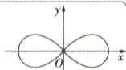

# 3名师视频课 深度探究12个创新命题考法

# 技法 ③ 用交轨法或参数法求轨迹方程

调研 4 [2025 湖北宜荆荆检测] 已知抛物线 $E: x^{2} = 2py (p > 0)$ 的焦点为 $F, H$ 为 $E$ 上任意一点，且 $|HF|$ 的最小值为 1.

（1） 求抛物线 E 的方程.  
（2）已知 $P$ 为平面上一动点，过 $P$ 能向 $E$ 作两条切线，切点分别为

M,N,记直线 PM,PN,PF 的斜率分别为 $k_{1}, k_{2}, k_{3}$ ，且满足 $\frac{1}{k} + \frac{1}{k} = \frac{2}{k}$ .

“交轨法”速解抛物线两条切线交点的轨迹方程问题

# 技法 ③ 利用割补法或图形转化法求面积

调研 3 试题调研原创 已知椭圆 $C: \frac{x^{2}}{a^{2}} + \frac{y^{2}}{b^{2}} = 1 (a > b > 0)$ 的左、

右焦点分别为 $F_{1}, F_{2}$ ，以线段 $F_{1}F_{2}$ 为直径的圆过 C 的上、下顶点，点 (1, e) 在 C 上，其中 e 为 C 的离心率.

“图形转化法”巧解类蝴蝶三角形的面积问题

传授高妙技法

数形结合逐层精讲，听得懂

突破重点难点

讲一题解法理一类策略，学得会

# 本辑全9科精彩内容推荐

<table><tr><td>语文</td><td>名篇名句开放性默写</td><td>数学</td><td>解析几何满分攻略</td><td>物理、化学、生物</td><td>实验热点</td></tr><tr><td>英语</td><td>高考同源时文阅读</td><td>历史</td><td>通史全通关</td><td>政治、地理</td><td>非选择题满分答题模板</td></tr></table>

# 目录

# 扫码获取

##### 1. 调研4辑全9科100+节超级名师视频课，传授高妙技法，易学秒懂。  
##### 2. 数学技法、作文素材、时政热点等快速提分小专项视频课，按书解锁，免费观看。

# 每月一手考情

# 2025 新高考数学 4 大创新题型的开发与预测

名师视频·考情解读

001

# 突破 11 大超重点

# 创新考法抢先知

# 超重点1 解析几何中的创新定义题

名师视频·创新考法

011

创新角度 1 由常规圆锥曲线旋转而成的新图形 011  
创新角度 2 教材中没有出现过的新曲线 012  
创新角度 3 圆锥曲线与其他模块知识 “碰撞” 出新定义 014

# 超重点2 解析几何与数列、向量交汇问题的转化技巧

名师视频·创新考法

018

技巧 1 将向量关系转化为点的坐标关系 018  
技巧 2 将向量关系转化为图形关系 019  
技巧 3 利用数列性质得等量关系 020

# 超重点 3 探讨曲线与曲线的交点问题的解题技法

名师视频·创新考法

026

类型1 圆与椭圆的交点问题探讨 026  
类型 2 圆与双曲线的交点问题探讨 026  
类型3 圆与抛物线的交点问题探讨 027

# 核心主干抓重点

# 超重点4 圆锥曲线几何性质的4大必考命题角度

033

角度 1 利用几何性质求离心率 033

角度2 利用几何性质求与渐近线相关的问题 034

角度 3 利用几何性质求解 “过焦点” 相关问题 035

角度 4 利用几何性质求解范围（最值）相关问题 037

# 超重点5 快速求解轨迹方程的3个必用技法 名师视频·高妙技法 041

技法 1 用定义法或直接法求轨迹方程 041

技法 2 用相关点转化法求轨迹方程 043

技法3 用交轨法或参数法求轨迹方程 044

# 超重点6 椭圆与双曲线焦点三角形的3大核心命题 名师视频·高妙技法 049

命题 1 求焦点三角形的周长（或已知周长求其他） 050

命题2 求焦点三角形的面积（或已知面积求其他） 050

命题3 角平分线、中位线等在焦点三角形中的应用 051

# 超重点7 求解析几何最值问题必会的3大答题策略 名师视频·高妙技法 057

策略1 利用圆锥曲线的定义求最值 057

策略2 利用切线法或参数法求点到直线距离的最值 060

策略3 利用函数或基本不等式求最值 060

# 超重点8 巧用方程的根与系数关系突破解析几何中的“运算关”

名师视频·重难突破 067

类型1 巧用方程根与系数的关系求弦长 067

类型2 用方程根与系数的关系求斜率之和或斜率之积 069

类型3 用方程根与系数的关系求定直线 070

# 超重点9 求圆锥曲线面积问题的3大必会高分技法 名师视频·重难突破 076

技法1 利用直接法求面积 076

技法2 利用平面向量法求面积 077

技法3 利用割补法或图形转化法求面积 079

# 超重点 10 解析几何中定点与定值的探索性问题解题策略 名师视频·重难突破 086

策略1 定点问题的解题策略 086

策略2 定值问题的解题策略 088

策略3 定直线问题的解题策略 089

# 目录

超重点11 解析几何“多想少算”的3个必用妙招

名师视频·高妙技法 096

妙招 1 点坐标的 “求与不求”

096

妙招 2 “同理可得”

097

妙招 3 “不妨设”

101

# 下辑精彩预告

2024年11月全新上市

# 预告 1 《试题调研》第 5 辑将推出:

# 模型解题法·16 个超级模型

# 每月一手考情！

本辑特邀上海大学知名专家高松燕,主讲“数学文化情境题的最新命题趋势解读”,从数学古籍、古诗词等方面研析数学文化情境题的内在价值,预测2025高考命题新角度!

# 快解 16 个超级模型

1 必用 4 大性质超级模型,速解核心必考题型、隐圆模型等,活用性质,突破解题障碍!

如具体函数性质模型、周期与对称模

② 妙用 9 大技法超级模型, 快解拉分热点题模型、分段数列模型等, 巧用技法, 提升解题能力!

如零点求参模型、分类讨论模型、同构

3 必用 3 大万能超级模型, 巧解专项疑难题
识图定参模型等, 套用模型, 做一道题通一类题!

如不等式恒(能)成立模型、三角函数

# 预告 2 本辑将同时推出：高妙技法专项 3 本

1《选择题、填空题满分技法》5个万能破题策略、17个高妙速解技法、5个超级结论等,精选162道创新好题一次练透,30天小题全冲关!

②《解答题高分技法》10天速通10大万能技法,20天搞定17大高分技法,60道必练好题速通秒解大招巧突破!

③《二级结论高妙应用》6大必考知识模块23大超级二级结论,妙用二级结论速解98道名师好题,快得分!

重磅升级，超值上市！凡购买本辑任1本，即可免费观看价值2999元的全9科100节超级名师视频课，精讲重难题，传授高妙技法.

# 每月一手考情

# 2025 新高考数学 4 大创新题型的开发与预测

北京市海淀区骨干教师:郗玲玲

河北正高级教师:赵成海

新高考改革已走过十年,十年中,数学高考在考查目标、考查内容、考查要求、试题形式、试卷结构、难度调控等方面持续深化改革,进一步增强学科育人功能,提升人才选拔质量.接下来,拔尖创新人才选拔培养依然是高考命题的要求,会进一步创新题型设计,加强新题型的研究、开发和测试,研究有助于实现新高考考试目标的题型,充分发挥考试评价的积极导向作用.2025年高考,对于创新题型的预测,有必要重点关注以下4类创新题型.

  
2025 新高考数学 4 大创新题型的开发与预测

# 创新题型 1 逻辑题

### 题型解读 逻辑题，即在生产和生活中选取情境，以日常生活语言叙述题目条件和问题，要求学生在合理逻辑推理后进行判断。该题型对应《中国高考评价体系》中的创新性命题要求，主要考查对各种信息的理解、分析、判断和综合，更现实、更真切地考查推理、论证、比较、评价等逻辑思维能力。

调研 1 试题调研原创 新高考数学试卷增加了多项选择题,每小题有 A,B,C,D 四个选项,有多个选项符合题目要求,由于正确选项有 4 个的概率极低,可视作 0 ,因此我们可以认为多项选择题至少有 2 个正确选项,至多有 3 个正确选项. 多项选择题题目要求:“在每小题给出的选项中,有多项符合题目要求. 全部选对的得 6 分,部分选对的得部分分,有选错的得 0 分.”其中“部分选对的得部分分”是指:若正确答案有 2 个选项,则只选 1 个选项且正确得 3 分;若正确答案有 3 个选项,则只选 1 个选项且正确得 2 分,只选 2 个选项且都正确得 4 分.

（1） 已知某道多选题的正确答案是 AB, 一考生在解答该题时, 完全没有思路, 随机选择至少 1 个选项, 至多 3 个选项, 且每种选择是等可能的. 请根据已知材料, 分析该生可能的得分情况与所得分值的相应概率, 并求该生得分的期望.

（2） 已知某道多选题的正确答案是 2 个选项或是 3 个选项的概率相等, 一考生只能判断出 A 选项是正确的, 其他选项均不能判断正误, 试列举出该生所有可能的符合实际的答题方案, 并以各方案得分的期望作为判断依据, 帮该考生选出恰当方案.

解析（1）由题意得,该考生的所有选择结果构成的样本空间为{A,B,C,D,AB,AC,AD,BC,BD,CD,ABC,ABD,ACD,BCD},共14个样本点.

该生所有可能的得分情况为0分,3分,6分.

设事件 A=“该考生得0分”，含11个样本点；事件 B=“该考生得3分”，含2个样本点；事件 C=“该考生得6分”，含1个样本点.

则 $P(A)=\frac{11}{14}, P(B)=\frac{2}{14}=\frac{1}{7}, P(C)=\frac{1}{14}$ ，从而得分期望为 $0 \times \frac{11}{14} + 3 \times \frac{1}{7} + 6 \times \frac{1}{14} = \frac{6}{7}$ .

（2）通过已知信息,从合理性角度看,该生必选A,根据其他选项的选取情况分析,可有以下三种答题方案:

①选择 A 选项,且不再选其他选项;②选择 A 选项的同时随机选择一个其他选项;③选择 A 选项的同时随机选择两个其他选项.设三个不同方案的得分分别为 X,Y,Z.

对于①, X 的所有可能取值为 2, 3, $P(X=2)=\frac{1}{2}$ , $P(X=3)=\frac{1}{2}$ .

$X$ 的分布列为

<table><tr><td>X</td><td>2</td><td>3</td></tr><tr><td>P</td><td>1/2</td><td>1/2</td></tr></table>

期望为 $E(X)=2\times\frac{1}{2}+3\times\frac{1}{2}=\frac{5}{2}.$

对于②, Y 的所有可能取值为 0, 4, 6, $P(Y=0)=\frac{1}{2}\times\frac{2}{3}+\frac{1}{2}\times\frac{1}{3}=\frac{1}{2}$ , $P(Y=4)=\frac{1}{2}\times\frac{2}{3}=\frac{1}{3}$ , $P(Y=6)=\frac{1}{2}\times\frac{1}{3}=\frac{1}{6}$ .

【难点突破】得分为0有两种情况：一是正确答案有2个选项，随机选另一选项时，从两个错误选项中选了一个；二是正确答案有3个选项，随机选另一选项时，选了错误的那个选项。得4分的情况：正确答案一定有3个选项，且再选一个选项是从两个正确选项中选了一个。得6分的情况：正确答案一定有2个选项，且再选一个选项是正确选项

Y 的分布列为

<table><tr><td>Y</td><td>0</td><td>4</td><td>6</td></tr><tr><td>P</td><td> $\frac{1}{2}$ </td><td> $\frac{1}{3}$ </td><td> $\frac{1}{6}$ </td></tr></table>

期望为 $E(Y)=0\times\frac{1}{2}+4\times\frac{1}{3}+6\times\frac{1}{6}=\frac{7}{3}.$

对于③, $Z$ 的所有可能取值为 $0,6,P(Z = 0) = \frac{1}{2}\times \frac{2}{3} +\frac{1}{2}\times 1 = \frac{5}{6},P(Z = 6) = \frac{1}{2}\times \frac{1}{3} = \frac{1}{6}.$

【难点突破】得分为0有两种情况：一是正确答案有3个选项，随机任选其他两个选项时，选了一个错误选项、一个正确选项；二是正确答案有2个选项，再任选两个选项必定不得分。得6分的情况：正确答案一定有3个选项，且再选择了两个正确选项

$Z$ 的分布列为

<table><tr><td>Z</td><td>0</td><td>6</td></tr><tr><td>P</td><td>5/6</td><td>1/6</td></tr></table>

期望为 $E(Z) = 0 \times \frac{5}{6} + 6 \times \frac{1}{6} = 1$ .

$E(X)>E(Y)>E(Z)$ ，所以该生应选方案①，只选择A选项.

【答题启示】解完这道题，我们发现，在考场时间有限的情况下，做多选题时不要冒险，如果对某个选项有绝对把握，其他选项没有任何头绪，就只选择这个选项，能拿到的分一定要拿到

# 名师点评

本题以新高考改革后数学新题型——多选题的赋分为情境,第（1）问考查古典概型的概率的求解,第（2）问考查离散型随机变量的分布列与期望的求解.要想正确求解本题,必须处处进行合理的逻辑推理,根据问题情境与信息列出所有满足题意的情况,本题用现实情境完美考查了逻辑思维能力.

# 创新题型

# 数据分析题

### 题型解读 数据分析题，即给出一些材料和背景以及相关数据，要求学生读懂材料和数据，提取信息，根据试题给出的情境和数据等，应用统计学原理，自主分析数据，得出相应结论并解决问题。数据分析题不同于普通的逻辑推理题，学生需要根据具体数据进行判断，同样的数据可能得出不同的结论。结论不是唯一的，也不是完全确定的，只要是满足要求的一种结论即可。该题型考查学生对信息的获取和加工、数据处理能力和问题分析解决能力。

调研 2 试题调研原创 有三家公司都为毕业生小李提供了求职面试的机会,这三家公司分别记为 A,B,C,每家公司都可以提供很好、好和一般三种职位,每家公司将根据面试情况决定给予求职者何种职位或拒绝提供职位.规定供需双方在面试以后要立即决定提供或拒绝提供,接受或拒绝某种职位,且不容许毁约.咨询专家对小李的学业成绩和综合素质进行评估后认为他获得很好、好、一般职位的可能性分别为 0.2,0.3,0.4.三家公司的见习期工资数据如下表所示(单位:元):

<table><tr><td rowspan="2">公司</td><td colspan="3">职位</td></tr><tr><td>很好</td><td>好</td><td>一般</td></tr><tr><td>A</td><td>3500</td><td>3000</td><td>2800</td></tr><tr><td>B</td><td>3900</td><td>2900</td><td>2500</td></tr><tr><td>C</td><td>4000</td><td>3000</td><td>2500</td></tr></table>

面试顺序有两种方案,方案一是小李自己决定面试顺序;方案二是按规定的 A, B, C 顺序去面试.请你为小李选择一个合适的方案(若选择方案一,请写出面试顺序;若选择方案二,请写出具体的面试策略).

解析 答案不唯一,言之有理即可. 参考如下:

选择方案一.

A, B, C 三个公司的见习期工资的期望分别为: $0.2 \times 3500 + 0.3 \times 3000 + 0.4 \times 2800 = 2720$ (元), $0.2 \times 3900 + 0.3 \times 2900 + 0.4 \times 2500 = 2650$ (元), $0.2 \times 4000 + 0.3 \times 3000 + 0.4 \times 2500 = 2700$ (元).

因为 2720 > 2700 > 2650, 所以小李应按照 A, C, B 的面试顺序去应聘.

选择方案二.

先考虑 C 公司, 见习期工资的期望为 $0.2 \times 4000 + 0.3 \times 3000 + 0.4 \times 2500 = 2700$ (元).

【扫清障碍】由于面试有时间先后顺序，所以小李在 A, B 公司面试后进行选择时，还要考虑后面 C 公司的情况，所以先从 C 公司开始讨论

下面考虑 B 公司, 因为 B 公司的一般职位的见习期工资只有 2500 元, 低于 C 公司的工资期望, 所以可以接受 B 公司很好或好的职位, 否则就到 C 公司应聘. 这样的决策下, 他的见习期工资的期望为 $0.2 \times 3900 + 0.3 \times 2900 + 0.5 \times 2700 = 3000$ (元).

【释疑解惑】这里的0.5是指还有 $50\%$ 的可能性与 $C$ 公司签约

最后考虑 $A$ 公司, 由于 $A$ 公司只有很好职位的工资超过3000元, 所以他可以接受 $A$ 公司的很好职位, 否则就到 $B$ 公司应聘. 这样的决策下, 他的见习期工资的期望为 $0.2 \times 3500 + 0.8 \times 3000 = 3100$ (元). 另一种情况: $A$ 公司只有好职位的工资恰为3000元, 所以他也可以接受 $A$ 公司的很好职位与好职位, 否则就到 $B$ 公司应聘. 这样的决策下, 他的见习期工资的期望为 $0.2 \times 3500 + 0.3 \times 3000 + 0.5 \times 3000 = 3100$ (元).

所以小李的应聘策略是:先去A公司应聘,若A公司提供很好或好的职位,就接受,否则去B公司应聘,若B公司提供很好或好的职位,就接受,否则去C公司应聘,接受C公司提供的任何职位.

名师点评 本题以毕业生小李求职面试为情境考查了决策问题,答题前需要考生读懂问题背景,理解表格中数据的含义,明白两种方案的区别.本题具有很高的开放性,选择不同的方案解题、从不同的视角分析数据,会得到不一样的答案,只要言之有理,都可以得分,预计此类题有极大可能在今后的高考中出现.

# 创新题型 ③ 判断题

### 题型解读 判断题，即给出关于一个问题的几种结论或者几种解题方法，要求学生判断哪种结论或解法正确，哪种解法错误，并说明理由.

调研 3 试题调研原创 [问题] 已知复数 z 为纯虚数, 求 $\left|z-1\right|+\left|z-2-2i\right|$ 的最小值.

[解法①] $|z - 1| + |z - 2 - 2\mathrm{i}| \geqslant |(z - 1) + (z - 2 - 2\mathrm{i})| = |2z - 3 - 2\mathrm{i}|$ ,

设 $z = y\mathrm{i}(y\in \mathbf{R},y\neq 0)$ ，则 $\vert 2z - 3 - 2\mathrm{i}\vert = \sqrt{(-3)^2 + (2y - 2)^2} = \sqrt{4(y - 1)^2 + 9}\geqslant 3.$

当 y=1 时取等号, 故所求最小值为 3.

[解法②]设 $z = b\mathrm{i}(b\in \mathbf{R},b\neq 0)$ ， $|z - 1| + |z - 2 - 2\mathrm{i}| = |b\mathrm{i} - 1| + |b\mathrm{i}-$ $2 - 2\mathrm{i}| = \sqrt{(b - 0)^2 + (0 - 1)^2} +\sqrt{(b - 2)^2 + (0 + 2)^2}$ ，则原问题可转化为求 $x$ 轴上的动点 $P(b,0)$ 到两定点 $A(0,1),B(2, - 2)$ 距离和的最小值.连接 $AB$ ，如图1所示， $|AB| = \sqrt{13}$ ，则所求最小值为 $\sqrt{13}$

[解法③] $|z - 1| + |z - 2 - 2\mathrm{i}| \geqslant |(z - 1) - (z - 2 - 2\mathrm{i})| = |1 + 2\mathrm{i}| = \sqrt{5}$ , 则所求最小值为 $\sqrt{5}$ .

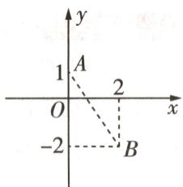

图1

[解法④]z为纯虚数， $|z - 1| = |-z - 1|, |z - 1| + |z - 2 - 2\mathrm{i}| = |-z - 1| + |z - 2 - 2\mathrm{i}| \geqslant |(-z - 1) + (z - 2 - 2\mathrm{i})| = |-3 - 2\mathrm{i}| = \sqrt{13}$ ，则所求的最小值为 $\sqrt{13}$ .

[解法⑤]由 z 为纯虚数, 得 z 在复平面内对应的点 P 在虚轴上, 设 $A(1,0)$ , $B(2,2)$ , 则点 A 关于虚轴的对称点为 $A'(-1,0)$ , 连接 PA, PB, 则 $|z-1|+|z-2-2i|$ 的几何意义为 $|PA|+|PB|$ , 如图 2, 连接 $PA', A'B$ , 由对称性得 $|PA|+|PB|=|PA'|+|PB|\geqslant|A'B|=\sqrt{13}$ , 故所求最小值为 $\sqrt{13}$ .

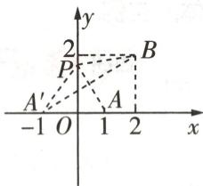

图2

分析上述5种解法,先指出每种解法的正误,再对错误的说明理由.

解析 以上5种解法中,②④⑤正确,①③错误.

对于解法①, 按解法给出的等号成立的条件代入检验, 当 $z = \mathrm{i}$ 时, $|z - 1| + |z - 2 - 2\mathrm{i}| = |i - 1| + |i - 2 - 2i| = \sqrt{2} + \sqrt{5} \neq 3$ , 因而错误.

【另解】用 $\left|\left|z_{1}\right|-\left|z_{2}\right|\right|\leqslant\left|z_{1}\pm z_{2}\right|\leqslant\left|z_{1}\right|+\left|z_{2}\right|$ 得 $\left|z-1\right|+\left|z-2-2i\right|\geqslant\left|(z-1)+(z-2-2i)\right|$ 时，等号成立的条件是复数z-1与z-2-2i对应向量的方向相同，而当复数z=i时， $z-1=-1+i$ 与 $z-2-2i=-2-i$ 对应向量的方向不同，等号不能成立，因而错误

对于解法③, 要考虑等号成立的条件, 可以从几何的角度理解: 设 z 在复平面内对应点 P, 点 $A(1,0)$ , $B(2,2)$ , 连接 PA, PB, AB, 则 $|z-1| + |z-2-2i|$ 的几何意义即 $|PA| + |PB|$ , 当 $|PA| + |PB|$ 取最小值时, 为 $|AB| = \sqrt{5}$ , 此时 P 在线段 AB 上, 由于复数 z 为纯虚数, 点 P 在虚轴上, 所以 P 不可能在线段 AB 上, 因而错误.

③直线与圆相离,则圆上点到直线的最短距离为圆心到直线的距离减半径,最长距离为圆心到直线的距离加半径.

# 思考

# 由本题还可以做出哪些创新题型设计？

设计1:(开放型)已知以上5种解法中有正确解法,也有错误解法,试从中指出一种错误解法,并说明理由.

设计2:(单选题)以上5种解法中正确的有()

$\quad$A.0种

$\quad$B.1 种

$\quad$C.2 种

$\quad$D. 3 种

设计3:(填空题)以上5种解法中,不正确解法的序号为\_\_\_\_.

但是,无论题型如何改变,解题思路与方法相差无几,因此备考时一定要重视基础知识,掌握基本方法,以不变应万变.

名师点评 本题的题型在高中阶段对于考生来说比较陌生,但实际上在初中数学中,判断题常出现在各种考试里.本题的题型创新性强,但考查的知识点载体并不难,只要稍加练习适应了这种题型,按照常规的解题方法一步一步计算,就能找到给出的结论或解题方法中的漏洞.

# 创新题型 4 举例题

### 题型解读 举例题，即首先给出题干，其中包括题设的结论、性质和要求等条件，要求学生从题干中获取信息、整理信息，进而结合对抽象条件的理解，构造符合题干要求的结论或具体的实例.

调研 4 试题调研原创 三角函数诱导公式有很多组, 其中一组是关于终边相同角三角函数值相等的, 这组公式是: $\sin(2k\pi + \alpha) = \sin \alpha, \cos(2k\pi + \alpha) = \cos \alpha, \tan(2k\pi + \alpha) = \tan \alpha, k \in \mathbf{Z}$ . 据此, 老师给出下面的填空题: 若 $\sin(\alpha + 30^\circ) = \sin 30^\circ$ , 则 $\alpha =$ \_\_\_\_. 有同学给出的结果是 $\alpha = k \cdot 360^\circ, k \in \mathbf{Z}$ , 但试卷发下来后发现没得分, 请你帮这名同学分析失分原因, 给出正确答案, 并按你自己的分析方法尝试给出更一般情况的研究.

解析 失分原因是答案不全面, 正确结果是 $\alpha = k \cdot 360^{\circ}, k \in Z$ 或 $\alpha = k \cdot 360^{\circ} + 120^{\circ}, k \in Z$ .

分析方法1 由 $\sin (\alpha + 30^{\circ}) = \sin 30^{\circ}$ 得 $\alpha + 30^{\circ} = k \cdot 360^{\circ} + 30^{\circ}, k \in \mathbf{Z}$ 或 $\alpha + 30^{\circ} = k \cdot 360^{\circ} + 180^{\circ} - 30^{\circ}, k \in \mathbf{Z}$ ,

从而 $\alpha = k\cdot 360^{\circ},k\in \mathbf{Z}$ 或 $\alpha = k\cdot 360^{\circ} + 120^{\circ},k\in \mathbf{Z}.$

分析方法2 由 $\sin (\alpha + 30^{\circ}) = \sin 30^{\circ}$ , 得 $\sin \alpha \cos 30^{\circ} + \cos \alpha \sin 30^{\circ} = \sin 30^{\circ}$ , 当 $\sin \alpha = 0, \cos \alpha = 1$ 时显然成立, 此时 $\alpha = k \cdot 360^{\circ}, k \in \mathbf{Z}$ ;

当 $\sin \alpha \neq 0$ 时，前式可化为 $\frac{1 - \cos \alpha}{\sin \alpha} = \frac{\cos 30^\circ}{\sin 30^\circ}$ ，即 $\tan \frac{\alpha}{2} = \sqrt{3}$ ，故 $\frac{\alpha}{2} = k \cdot 180^\circ + 60^\circ, k \in \mathbf{Z}$ ，即 $\alpha = k \cdot 360^\circ + 120^\circ, k \in \mathbf{Z}$ .

综上, $\alpha=k\cdot360^{\circ},k\in Z$ 或 $\alpha=k\cdot360^{\circ}+120^{\circ},k\in Z.$ (以上2种分析方法任选其一即可,

# 精妙结论

焦点三角形 ① $P(x_{0},y_{0})$ 为椭圆上一点，不与焦点 $F_{1},F_{2}$ 共线， $\angle F_{1}PF_{2}=\theta$ 。椭圆焦点三角形 $PF_{1}F_{2}$ 的周长为 $2a+2c. |PF_{1}| \cdot |PF_{2}| = 2b^{2}/(1+\cos\theta) \in (b^{2},a^{2}]$ 。

# 给出其他正确的分析方法也可得分）

【解后反思】事实上，只给出 $\alpha = k \cdot 360^{\circ}, k \in Z$ 的同学显然是受到了材料的干扰或思维定式的影响，本题本质上是一道简单的三角方程题，按解简单三角方程题的方法思考即可（即分析方法1），或利用和角公式展开，再通过半角公式转化成正切求解（即分析方法2）

更一般情况的研究：

对于任意角 $\alpha$ ，若 $\sin(\beta+\alpha)=\sin\alpha$ 成立，那么 $\beta$ 可以怎么表示？（可以与 $\alpha$ 相关）

按分析方法1, 若 $\sin(\beta + \alpha) = \sin \alpha$ , 则 $\beta + \alpha = k \cdot 360^{\circ} + \alpha, k \in Z$ 或 $\beta + \alpha = k \cdot 360^{\circ} + 180^{\circ} - \alpha, k \in Z$ ,

从而 $\beta = k \cdot 360^{\circ}, k \in Z$ 或 $\beta = k \cdot 360^{\circ} + 180^{\circ} - 2\alpha, k \in Z.$

按分析方法2,则 $\sin\alpha\cos\beta+\cos\alpha\sin\beta=\sin\alpha,\sin\alpha(1-\cos\beta)=\cos\alpha\sin\beta.$

当 $\cos\beta=1$ 时, 上式显然成立, 此时 $\beta=k\cdot360^{\circ}, k\in Z$ .

当 $\cos\beta\neq1$ 时, 易知 $\cos\alpha\neq0$ , 则 $\tan\alpha=\frac{\sin\beta}{1-\cos\beta}=\frac{2\sin\frac{\beta}{2}\cos\frac{\beta}{2}}{1-(1-2\sin^{2}\frac{\beta}{2})}=\frac{1}{\tan\frac{\beta}{2}}=\tan(90^{\circ}-\frac{\beta}{2})$ , 则 $\alpha=k\cdot180^{\circ}+90^{\circ}-\frac{\beta}{2}, k\in Z, \beta=k\cdot360^{\circ}+180^{\circ}-2\alpha, k\in Z.$

从而 $\beta = k \cdot 360^{\circ}, k \in Z$ 或 $\beta = k \cdot 360^{\circ} + 180^{\circ} - 2\alpha, k \in Z.$

可见,随 $\alpha$ 的变化,使得 $\sin(\beta+\alpha)=\sin\alpha$ 成立的 $\beta$ 有无数个,而这些 $\beta$ 并非一定满足角 $\beta+\alpha$ 的终边与角 $\alpha$ 的终边相同.(更一般的研究结论不唯一,合理即可)

# 原创变式

[新题型·举例题] 众所周知, 在对数运算法则中, 两个正数乘积的对数等于这两个正数对数的和, 即对于任意正实数 $M, N, \log_a(MN) = \log_a M + \log_a N$ , 其中 $a > 0, a \neq 1$ , 但有同学却误记成了下面的式子: $\log_a(M + N) = \log_a M + \log_a N$ . 试分析这个等式能否成立, 如果不能成立, 请说明理由; 如果能成立, 请举出一个具体实例, 并分析成立的结果有多少组.

答案》第010页

②椭圆焦点三角形的面积： $S_{\triangle PF_{1}F_{2}}=(|PF_{1}|\cdot|PF_{2}|\sin\theta)/2=b^{2}\tan(\theta/2)=c\cdot|y_{0}|=(a+c)r$ （r为 $\triangle PF_{1}F_{2}$ 内切圆半径），当P为短轴端点时， $\triangle PF_{1}F_{2}$ 面积最大，为bc.

精妙结论

# 创新预测

答案▶ 010页

##### 1. 试题调研原创 [新题型·判断题] [问题] 在 $\triangle ABC$ 中, 内角 $A, B, C$ 的对边分别为 $a, b, c$ , 其中 $a = 3, b = 2\sqrt{6}, B = 2A$ . 求 $c$ 的值.

[解法①]因为 $a = 3, b = 2\sqrt{6}, B = 2A$ ，所以在 $\triangle ABC$ 中，由正弦定理得 $\frac{3}{\sin A} = \frac{2\sqrt{6}}{\sin 2A}$ ，所以 $\frac{2\sin A\cos A}{\sin A} = \frac{2\sqrt{6}}{3}$ ，故 $\cos A = \frac{\sqrt{6}}{3}$ .

由余弦定理得 $a^{2}=b^{2}+c^{2}-2bc\cos A$ ，将 $a=3, b=2\sqrt{6}, \cos A=\frac{\sqrt{6}}{3}$ 代入，解得 c=3 或 c=5.

[解法②]因为 $a=3, b=2\sqrt{6}, B=2A$ ，所以在 $\triangle ABC$ 中，由正弦定理得 $\frac{3}{\sin A}=\frac{2\sqrt{6}}{\sin 2A}$ .

所以 $\frac{2\sin A\cos A}{\sin A} = \frac{2\sqrt{6}}{3}$ 故 $\cos A = \frac{\sqrt{6}}{3}$ , 所以 $A \in (0, \frac{\pi}{2})$ , $\sin A = \sqrt{1 - \cos^2 A} = \frac{\sqrt{3}}{3}$ .

因为 B=2A，所以 $\cos B=2\cos^{2}A-1=\frac{1}{3}$ ，所以 $\sin B=\sqrt{1-\cos^{2}B}=\frac{2\sqrt{2}}{3}$ .

在 $\triangle ABC$ 中, $\sin C=\sin(A+B)=\sin A\cos B+\cos A\sin B=\frac{5\sqrt{3}}{9}$ ,故由正弦定理得 $c=\frac{a\sin C}{\sin A}=5$ .请分别判断以上2种解法是否正确,如果不正确,请说明理由,并改正.

# 规范答题

##### 2. 试题调研原创 [新题型·判断题] 已知函数 $f(x) = \sqrt{3} \sin \omega_1 x + \cos \omega_2 x, x \in [0, \frac{\pi}{2}]$ . 甲同学给出了 $\omega_1 = \omega_2 = 1$ 时函数 $f(x)$ 值域的求解过程, 乙同学给出了 $\omega_1 = 1, \omega_2 = 2$ 时函数 $f(x)$ 值域的求解过程, 如下:

甲同学: 当 $\omega_{1}=\omega_{2}=1$ 时, $f(x)=\sqrt{3}\sin x+\cos x$ .

$\sqrt{3}\sin x+\cos x=2\sin(x+\frac{\pi}{3})$ ，即 $f(x)=2\sin(x+\frac{\pi}{3})$ .

因为 $x \in [0, \frac{\pi}{2}]$ , 所以 $x + \frac{\pi}{3} \in [\frac{\pi}{3}, \frac{5\pi}{6}]$ . ②

当 $x + \frac{\pi}{3} = \frac{\pi}{3}$ 即 $x = 0$ 时， $f(x)$ 取得最大值，为 $\sqrt{3}$ ；

当 $x + \frac{\pi}{3} = \frac{5\pi}{6}$ ，即 $x = \frac{\pi}{2}$ 时， $f(x)$ 取得最小值，为 1.

所以 $f(x)$ 的值域为 $[1, \sqrt{3}]$ . ⑤

乙同学: 当 $\omega_{1}=1,\omega_{2}=2$ 时, $f(x)=\sqrt{3}\sin x+\cos 2x$ .

$\sqrt{3}\sin x + \cos 2x = \sqrt{3}\sin x + 1 - 2\sin^2 x$ 即 $f(x) = -2\sin^2 x + \sqrt{3}\sin x + 1.$

因为 $x \in [0, \frac{\pi}{2}]$ , 所以当 $x = 0$ 时, $f(x)$ 取得最大值, 为 1;

当 $x = \frac{\pi}{2}$ 时， $f(x)$ 取得最小值，为 $\sqrt{3} - 1$ .

则 $f(x)$ 的值域为 $[\sqrt{3} - 1, 1]$ . ⑨

判断以上两位同学的求解过程是否正确,如果不正确,请指出错误步骤的序号,并改正.

# 规范答题

④双曲线焦点三角形的面积： $S_{\triangle PF_{1}F_{2}}=\frac{1}{2}|PF_{1}|\cdot|PF_{2}|\sin\theta=b^{2}/\tan\frac{\theta}{2}=c\cdot|y_{0}|$

# 参考答案与解析

# 原创变式

能成立,如: $\log_{a}(2+2)=\log_{a}2+\log_{a}2$ ,其中 $a>0,a\neq1$ .(答案不唯一)

事实上，若 $\log_a(M + N) = \log_aM + \log_aN$ ，则 $\log_a(M + N) = \log_a(M\cdot N)$

则 $M + N = M \cdot N$ ，显然 M = 1 或 N = 1 时不成立，因而可表示成 $N = \frac{M}{M - 1}$ ，

即只要 $M > 1$ ，则一定有 $N = \frac{M}{M - 1}$ ，使得 $\log_a(M + N) = \log_aM + \log_aN$ 成立，

所以使得等式成立的正实数有无数组.

# 创新预测

##### 1. 解法①不正确, 解法②正确.

解法①的错因:由 B=2A 可以推出 $\sin B=\sin 2A$ , 但由 $\sin B=\sin 2A$ 不能推出 B=2A, 由 $\sin B=\sin 2A$ 得出的 $\cos A=\frac{\sqrt{6}}{3}$ 是 B=2A 的必要不充分条件, 导致最后出现了增解. 因此需要检验两解是否符合题意, 即验证充分性, 只需增加检验的环节即可.

改正：

检验: 当 c=3 时, $\cos B=\frac{9+9-24}{2\times3\times3}=-\frac{1}{3}$ , 而 $\cos B=\cos 2A=2\cos^{2}A-1=\frac{1}{3}$ , 矛盾, 舍去. 当 c=5 时, $\cos B=\frac{9+25-24}{2\times3\times5}=\frac{1}{3}$ , 满足 $\cos B=2\cos^{2}A-1=\cos 2A$ , 即 B=2A, 所以 c=5.

##### 2.甲同学的求解过程不正确.步骤①②③④⑤均有错误,正确的解法为:

$\sqrt {3} \sin x + \cos x = 2 \sin (x + \frac {\pi}{6}), \text {即} f (x) = 2 \sin (x + \frac {\pi}{6}). \tag {1}$

因为 $x \in [0, \frac{\pi}{2}]$ , 所以 $x + \frac{\pi}{6} \in [\frac{\pi}{6}, \frac{2\pi}{3}]$ . ②

当 $x + \frac{\pi}{6} = \frac{\pi}{6}$ 即 $x = 0$ 时， $f(x)$ 取得最小值，为1；

当 $x + \frac{\pi}{6} = \frac{\pi}{2}$ 即 $x = \frac{\pi}{3}$ 时， $f(x)$ 取得最大值，为2.

所以 $f(x)$ 的值域为[1,2]. ⑤

乙同学的求解过程不正确. 步骤⑦⑧⑨均有错误, 正确的解法为:

由 $x \in [0, \frac{\pi}{2}]$ 得 $\sin x \in [0, 1]$ , $f(x) = -2\left(\sin x - \frac{\sqrt{3}}{4}\right)^2 + \frac{11}{8}$ , 当 $\sin x = \frac{\sqrt{3}}{4}$ 时, $f(x)$ 取得最大值, 为 $\frac{11}{8}$ ;

当 $\sin x = 1$ 时, $f(x)$ 取得最小值, 为 $\sqrt{3} - 1$ .

则 $f(x)$ 的值域为 $[\sqrt{3} - 1, \frac{11}{8}]$ . ⑨

# 突破11大超重点

# 创新考法

# 抢先知

# 超重点1 解析几何中的创新定义题

考情速递 在新高考背景下,新定义题越来越多地出现在大型模拟联考甚至高考试卷中,该题型是在问题中定义了高中数学没学过的一些概念、运算、符号或者图形,要求学生读懂题意,并结合已有知识进行理解,而后根据新定义进行运算、推理.在2025高考中,该题型依然是拿高分必做的创新题型,解题时需要将“新定义”的知识与已学知识联系起来,利用已有的知识经验来解决问题.

# 创新角度 1 由常规圆锥曲线旋转而成的新图形

调研 1 [2025 四川达州 8 月模拟] 如图 1, 灯笼的主体可看作是将一个椭圆绕其短轴旋转得到的, 这样的旋转体称为椭圆体. 已知椭圆 $\frac{x^2}{a^2} + \frac{y^2}{b^2} = 1 (a > b > 0)$ 绕其短轴旋转得到的椭圆体的体积和表面积可以用公式 $V = \frac{4}{3}\pi a^2 b$ 和 $S = \frac{4}{3}\pi (a^2 + 2ab)$ 计算. 若灯笼主体的体积为 $\frac{32}{3}\pi$ , 其对应的椭圆的长半轴长 $a \leqslant 4$ , 则该灯笼主体表面积的取值范围为

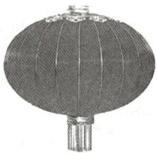

图1

$\quad$A. $(8\pi, \frac{80\pi}{3}]$

$\quad$B. $(16\pi,\frac{64\pi}{3}]$

$\quad$C. $(16\pi,\frac{80\pi}{3}]$

$\quad$D. $(8\pi,\frac{64\pi}{3}]$

审题 根据灯笼主体体积为 $\frac{32}{3}\pi$ 及椭圆体的体积公式 $V=\frac{4}{3}\pi a^{2}b$ 可以得到a,b的关系式,进而根据椭圆体的表面积公式 $S=\frac{4}{3}\pi(a^{2}+2ab)$ 求出表面积,再利用导数求其取值范围即可.

解析 由题意, 令 $\frac{4\pi}{3} a^2 b = \frac{32\pi}{3}$ , 则 $b = \frac{8}{a^2} < a$ , 可得 $a > 2$ , 故 $2 < a \leqslant 4$ .

表面积 $S=\frac{4\pi}{3}(a^{2}+2ab)=\frac{4\pi}{3}(a^{2}+\frac{16}{a})(2<a\leqslant4)$ ，则 $S'=\frac{4\pi}{3}(2a-\frac{16}{a^{2}})=\frac{8\pi}{3a^{2}}(a^{3}-8)(2<a\leqslant4)$ .

易知 $S' > 0$ ,

所以 $S=\frac{4\pi}{3}(a^{2}+\frac{16}{a})$ 在 $a\in(2,4]$ 上单调递增.

而当 $a \to 2$ 时, $S \to \frac{4\pi}{3} \times (2^2 + \frac{16}{2}) = 16\pi$ , 当 $a = 4$ 时, $S = \frac{4\pi}{3} \times (4^2 + \frac{16}{4}) = \frac{80\pi}{3}$ , 所以 $S \in (16\pi, \frac{80\pi}{3}]$ .

故选 C.

# 创新角度 ② 教材中没有出现过的新曲线

调研 2 [2025 广东中山纪念中学、深圳实验学校等校 8 月开学考试] (多选) 到两个定点的距离之积为大于零的常数的点的轨迹称为卡西尼卵形线. 设 $F_{1}(-c,0)$ 和 $F_{2}(c,0)$ 且 $c > 0$ , 动点 $M$ 满足 $|MF_{1}| \cdot |MF_{2}| = a^{2} (a > 0)$ , 则动点 $M$ 的轨迹显然是卡西尼卵形线. 记该卡西尼卵形线为曲线 $C$ , 则下列描述正确的是 ( )

$\quad$A. 曲线 C 的方程是 $(x^{2} + y^{2})^{2} - 2c^{2}(x^{2} - y^{2}) = a^{4} - c^{4}$   
$\quad$B. 曲线 C 关于坐标轴对称  
$\quad$C. 曲线 C 与 x 轴没有交点  
$\quad$D. $\triangle MF_{1}F_{2}$ 的面积不大于 $\frac{1}{2}a^{2}$

解析 设 $M(x,y)$ ，由 $\left|MF_{1}\right| \cdot \left|MF_{2}\right| = a^{2} (a > 0)$ 得 $\sqrt{(x+c)^{2} + y^{2}} \cdot \sqrt{(x-c)^{2} + y^{2}} = a^{2}$ ，化简得 $(x^{2} + y^{2})^{2} - 2c^{2}(x^{2} - y^{2}) = a^{4} - c^{4}$ ，故 A 正确.

上述方程中,把 x 改为 -x,或把 y 改为 -y,方程均不变,故 B 正确.

【快解题】要判断曲线是否关于 x 轴对称，就把其对应方程中的 y 改为 -y；要判断曲线是否关于 y 轴对称，就把其对应方程中的 x 改为 -x；要判断曲线是否关于原点对称，就同时把其对应方程中的 y 改为 -y，x 改为 -x。若按以上修改之后，方程不变，则满足相应的对称性

在方程 $(x^{2} + y^{2})^{2} - 2c^{2}(x^{2} - y^{2}) = a^{4} - c^{4}$ 中，令 $y = 0$ ，得 $x^{2} = c^{2}\pm a^{2}$ .当 $c = a$ 时， $x = 0$ 或 $x = \pm \sqrt{2} c;$ 当 $c <   a$ 时， $x = \pm \sqrt{c^2 + a^2};$ 当 $c > a$ 时， $x = \pm \sqrt{c^2\pm a^2}$ 故C不正确.

$S_{\triangle MF_1F_2} = \frac{1}{2}|MF_1||MF_2|\sin \angle F_1MF_2\leqslant \frac{1}{2} |MF_1||MF_2| = \frac{1}{2} a^2$ ，故D正确.故选ABD.

卵形线类似椭圆,但一头大一头小,有一条对称轴且光滑封闭,上面提到的卡西尼卵形线是典型的卵形线之一.此外,当【调研2】题干中的参数a=c时,卡西尼卵形线是双纽线,双纽线也常作为新定义题的背景出现,请看下面的变式:

# 原创变式

(多选)双纽线是卡西尼卵形线的一类分支,在数学曲线领域占有至关重要的地位,同时也具有艺术美.它既是形成其他一些常见的漂亮图案的基石,也是许多艺术作品中的主要几何元素.双纽线的图形轮廓像阿拉伯数字中的“8”,如图2,曲线 $C:(x^{2}+y^{2})^{2}=9(x^{2}-y^{2})$ 是双纽线,下列说法正确的是()

$\quad$A. 曲线 C 关于原点对称  
$\quad$B. 曲线 C 经过 7 个整点 (横、纵坐标均为整数的点)  
$\quad$C. 曲线 C 上任意一点到坐标原点 O 的距离都不超过 3  
$\quad$D. 若直线 y = kx 与曲线 C 只有一个交点，则实数 k 的取值范围为 $(-∞,$

$- 1 ] \cup [ 1, + \infty)$

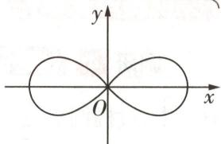

图 2

  
“直曲联立求根法”巧解新定义双纽线问题

答案》第016页

调研 3 试题调研原创 [新定义·阿基米德螺线] 阿基米德螺线广泛存在于自然界中, 具有重要作用. 如图 3, 在平面直角坐标系 $xOy$ 中, 螺线与坐标轴 (除原点 $O$ 外) 依次交于点 $A_{1}(-1,0), A_{2}(0,-2), A_{3}(3,0), A_{4}(0,4), A_{5}(-5,0), A_{6}(0,-6), A_{7}(7,0), A_{8}(0,8), \cdots$ , 按这样的规律继续下去.

（1） 求 $A_{3}A_{4}, A_{n}A_{n+4}$ .   
（2） 证明: 存在正整数 n, 使得三角形 $A_{n}A_{n+1}A_{n+2}$ 的面积为 2025, 并求出 n 的值.  
（3） 证明: 对于任意正整数 n, 三角形 $A_{n}A_{n+1}A_{n+2}$ 为锐角三角形.

解析（1）由两点间距离公式得 $A_{3}A_{4} = \sqrt{3^{2} + 4^{2}} = 5$

由题意得 $OA_{n}=n, OA_{n+4}=n+4$ ，且 $O, A_{n}, A_{n+4}$ 三点共线，点 $A_{n}, A_{n+4}$ 在坐标轴的同一侧，所以 $A_{n}A_{n+4}=n+4-n=4$ .

（2） $S_{\triangle A_nA_{n+1}A_{n+2}} = S_{\triangle OA_nA_{n+1}} + S_{\triangle OA_{n+1}A_{n+2}} = \frac{1}{2} OA_n \cdot OA_{n+1} + \frac{1}{2} OA_{n+1} \cdot OA_{n+2} = \frac{1}{2} n(n+1) + \frac{1}{2}(n+$

1) $(n + 2) = (n + 1)^2$ ，令 $(n + 1)^2 = 2025$ ，结合 $n$ 是正整数得 $n = 44$ .

故存在正整数 n，使得三角形 $A_{n}A_{n+1}A_{n+2}$ 的面积为 2025，此时 n=44.

（3） $A_{n}A_{n+1}=\sqrt{n^{2}+(n+1)^{2}}=\sqrt{2n^{2}+2n+1}$

$\begin{array}{r l} A _ {n + 1} A _ {n + 2} & = \sqrt {(n + 1) ^ {2} + (n + 2) ^ {2}} = \sqrt {2 n ^ {2} + 6 n + 5}, A _ {n} A _ {n + 2} = n + n + 2 = 2 n + 2 = \\ \sqrt {4 n ^ {2} + 8 n + 4}, \end{array}$

易知 $A_{n}A_{n + 1} < A_{n + 1}A_{n + 2} < A_{n}A_{n + 2}$ ，所以在三角形 $A_{n + 2}A_{n + 1}A_n$ 中， $\angle A_{n + 2}A_{n + 1}A_n$ 为最大角，

【扫清障碍】利用边长关系确定最大角，利用余弦定理判定其为锐角，即可确定三角形是锐角三角形

在 $\triangle A_{n}A_{n + 1}A_{n + 2}$ 中，由余弦定理得 $\cos \angle A_{n + 2}A_{n + 1}A_n = \frac{2n^2 + 2n + 1 + 2n^2 + 6n + 5 - (4n^2 + 8n + 4)}{2\sqrt{2n^2 + 2n + 1}\cdot\sqrt{2n^2 + 6n + 5}} =$ $\frac{2}{2\sqrt{2n^2 + 2n + 1}\cdot\sqrt{2n^2 + 6n + 5}} >0$ ，则 $\angle A_{n + 2}A_{n + 1}A_n$ 为锐角，

故三角形 $A_{n}A_{n+1}A_{n+2}$ 为锐角三角形.

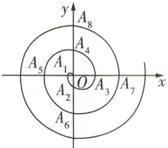

图 3

②设直线 l 与椭圆 $x^{2}/a^{2} + y^{2}/b^{2} = 1 (a > b > 0)$ 相交于 A, B 两点, O 为原点, M 为 AB 中点, 若 AB, OM 的斜率都存在, 则 $k_{AB} \cdot k_{OM} = -b^{2}/a^{2}$ .

# 创新角度 ③ 圆锥曲线与其他模块知识“碰撞”出新定义

调研 4 试题调研原创 [新角度·圆锥曲线与集合、不等式交汇] 在平面直角坐标系 xOy 中, 过椭圆 $E: \frac{x^{2}}{2} + y^{2} = 1$ 外一动点 P 作 E 的两条切线 $l_{1}, l_{2}$ , 且 $l_{1} \perp l_{2}$ .

（1） 求动点 P 的轨迹 C 的方程.

（2）对于给定非空点集 $M, N$ , 若 $M$ 中的每个点在 $N$ 中都存在距离最小的点, 且所有最小距离的最大值存在, 则记此最大值为 $d(M, N)$ . 已知直线 $l$ 与曲线 $C$ 相交于 $A, B$ 两点, 若 $M, N$ 分别是线段 $AB$ 和曲线 $C$ 上所有点构成的集合, $Q$ 为曲线 $C$ 上一点, 当 $\triangle QAB$ 的面积最大时, 求 $d(M, N)$ .

解析 （1） 当 $l_{1}, l_{2}$ 中有一条直线的斜率不存在或者为 0 时, 由题意知 $P(\sqrt{2}, \pm 1)$ 或 $P(-\sqrt{2},$

【满分必知】求解与直线有关的圆锥曲线问题时, 一定要先考虑斜率, 考虑斜率是否存在, 若存在, 考虑是否为0.将特殊情况下得到的结果与一般情况下得到的结果结合在一起看, 得出最终结论 ±1).

当 $l_{1}, l_{2}$ 的斜率均存在且不为 0 时，设过 $P(x_{1}, y_{1}) (x_{1} \neq \pm\sqrt{2})$ 的椭圆的切线的斜率为 $k (k \neq 0)$ ，则切线的方程为 $y - y_{1} = k(x - x_{1})$ ，

将其与椭圆方程联立并化简得关于 x 的方程 $(2k^{2}+1)x^{2}-4k(kx_{1}-y_{1})x+2k^{2}x_{1}^{2}-4kx_{1}y_{1}+2y_{1}^{2}-2=0$ ，

由题意得 $\Delta = -8\left[(x_{1}^{2}-2)k^{2}-2x_{1}y_{1}k+y_{1}^{2}-1\right]=0.$

设 $l_{1}, l_{2}$ 的斜率分别为 $k_{1}, k_{2}$ , 则 $k_{1}, k_{2}$ 是上述关于 $k$ 的方程的两个根, 且 $k_{1} \neq k_{2}$ ,

则 $k_{1}k_{2} = \frac{y_{1}^{2} - 1}{x_{1}^{2} - 2}$ 又 $k_{1}k_{2} = -1$ ，所以 $\frac{y_1^2 - 1}{x_1^2 - 2} = -1$ ，即 $x_{1}^{2} + y_{1}^{2} = 3(x_{1}\neq \pm \sqrt{2})$

$(\pm\sqrt{2},\pm1)$ 也满足上述方程,故动点P的轨迹C的方程为 $x^{2}+y^{2}=3$ .

（2）如图4所示,曲线C即圆O,过圆心O作直线AB的垂线,垂足为H,设 $|OH|=d,d\in[0,\sqrt{3})$ .

则 $|AB|=2\sqrt{3-d^{2}}$ ，由题意得 $S_{\triangle QAB}\leqslant\frac{1}{2}(d+\sqrt{3})\cdot|AB|=\frac{1}{2}(d+\sqrt{3})\cdot2\sqrt{3-d^{2}}=\sqrt{(d+\sqrt{3})^{3}(\sqrt{3}-d)}$

$(d + \sqrt {3}) ^ {3} (\sqrt {3} - d) = \frac {1}{3} (d + \sqrt {3}) (d + \sqrt {3}) (d + \sqrt {3}) (3 \sqrt {3} - 3 d) \leqslant \frac {1}{3} \times$

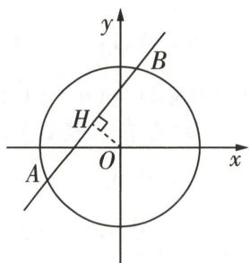

图 4

$(\frac{6\sqrt{3}}{4})^4 = \frac{243}{16}$ , 当且仅当 $d + \sqrt{3} = 3\sqrt{3} - 3d$ , 即 $d = \frac{\sqrt{3}}{2}$ 时, 等号成立, 此时 $(S_{\triangle QAB})_{\max} = \frac{9\sqrt{3}}{4}$ ,

由题意得 $d(M,N)=\sqrt{3}-d=\frac{\sqrt{3}}{2}$ .

【读懂定义】结合新定义的内容可知，对于线段AB上的每个点，连接该点与圆C上的任意点，得到的距离中总有最小值，且这些最小值的最大值为 $d(M,N)$ ，结合图形可知， $d(M,N)$ 即“半径-d”，注意不要错误理解成“半径+d”

# 创新预测

答案▶ 017 页

试题调研原创 [新定义·椭圆的“特征三角形”] 定义: 由椭圆的两个焦点和短轴的一个端点组成的三角形称为该椭圆的“特征三角形”. 如果两个椭圆的“特征三角形”相似, 则称这两个椭圆是“相似椭圆”, 并将三角形的相似比称为椭圆的相似比. 已知椭圆 $C_{1}: \frac{x^{2}}{4} + y^{2} = 1$ .

（1） 椭圆 $C_{2}:\frac{x^{2}}{16}+\frac{y^{2}}{4}=1$ ，判断 $C_{2}$ 与 $C_{1}$ 是否相似。如果相似，求出 $C_{2}$ 与 $C_{1}$ 的相似比；如果不相似，请说明理由。  
（2） 写出与椭圆 $C_{1}$ 相似且短半轴长为 $b$ , 焦点在 $x$ 轴上的椭圆 $C_{b}$ 的标准方程 (用含 $b$ 的式子表示). 若在椭圆 $C_{b}$ 上存在两点 $M, N$ 关于直线 $y = x + 1$ 对称, 求实数 $b$ 的取值范围.

# 规范答题

若 $k_{1}k_{2} = t\neq \frac{b^{2}}{a^{2}}\Leftrightarrow$ 直线 $AB$ 过定点 $(0,\frac{b^2 + a^2t}{b^2 - a^2t} b)$

精妙结论

# 参考答案与解析

# 原创变式

ACD 设曲线 C 上任意一点 $P(x,y)$ ，则点 P 的坐标满足曲线方程，即 $(x^{2}+y^{2})^{2}=9(x^{2}-y^{2})$ ，可得 $\left[(-x)^{2}+(-y)^{2}\right]^{2}=9\left[(-x)^{2}-(-y)^{2}\right]$ 成立，即点 P 关于原点的对称点 $P_{0}(-x,-y)$ 也满足曲线方程 [传技巧：由曲线上任一点 $(x,y)$ 关于原点的对称点 $(-x,-y)$ 满足曲线方程，即可得曲线关于原点对称]，

所以曲线 C 关于原点对称, 故 A 正确.

方程 $(x^{2} + y^{2})^{2} = 9(x^{2} - y^{2})$ 可化为 $x^4 +(2y^2 -9)x^2 +y^2 (y^2 +9) = 0,$

令 $t = x^{2}$ ，可得关于 t 的二次方程 $t^{2} + (2y^{2} - 9)t + y^{2}(y^{2} + 9) = 0$ ，

由 $\Delta = (2y^{2} - 9)^{2} - 4y^{2}(y^{2} + 9) = -9(8y^{2} - 9)\geqslant 0$ 可得 $y^{2}\leqslant \frac{9}{8}$ ，若 $y$ 是整数，则 $y = -1,0,1.$

在 $(x^{2} + y^{2})^{2} = 9(x^{2} - y^{2})$ 中，令 $y = 0$ ，得 $x^4 - 9x^2 = 0$ ，解得 $x = 0$ 或3或-3，有3个整点(0,0)，(3,0)，(-3,0).

令 $y^{2}=1$ ，得 $x^{4}-7x^{2}+10=0$ ，得 $x^{2}=2$ 或 5，此时无整点。所以曲线 C 共经过 3 个整点，故 B 错误。设曲线 C 上任意一点 $P(x,y)$ ，当 P 为原点时，到原点的距离为 0，满足题意；当 P 不为原点时， $x^{2}+y^{2}\neq0$ ，则由 $(x^{2}+y^{2})^{2}=9(x^{2}-y^{2})$ 可得 $0<x^{2}+y^{2}=\frac{9(x^{2}-y^{2})}{x^{2}+y^{2}}\leqslant9$ ，所以点 $P(x,y)$ 到原点的距离 $d=\sqrt{x^{2}+y^{2}}\leqslant3$ ，且 d>0。所以曲线 C 上任意一点 $P(x,y)$ 到原点的距离都不超过 3，故 C 正确。

直线 y = kx 恒过原点 $(0,0)$ ，且曲线 C 经过 $(0,0)$ ，则直线与曲线至少有一个公共点，又直线 y = kx

与曲线 C 只有一个公共点，故除原点外无其他公共点。由 $\left\{\begin{aligned}(x^{2} + y^{2})^{2} &= 9(x^{2} - y^{2}), \\ y &= kx\end{aligned}\right.$ 得关于 x 的方程 $x^{4}(1+k^{2})^{2}-9x^{2}(1-k^{2})=0$ [讲方法: 已知直线与曲线交点个数求参数值(取值范围)问题, 通常将直线方程与曲线方程联立, 转化为一元方程根的情况研究, 再结合方程类型变形建立不等式, 通过解不等式确定参数范围, 但也要注意变形过程中的等价处理, 如: 通过整体换元转化为简单方程来研究时, 不能忽视求解新元的范围; 分式方程化为整式方程研究时, 注意原分式中分母不为0的限制等].

当 $1 - k^2 = 0$ 时，方程仅有一解 $x = 0$ ，满足题意；当 $1 - k^2 \neq 0$ 时，若 $x = 0$ ，方程恒成立，即方程恒有一解 $x = 0$ ，若 $x \neq 0$ ，化简方程得 $x^2 = \frac{9(1 - k^2)}{(1 + k^2)^2}$ ，须 $1 - k^2 < 0$ ，该式无解，才满足题意。综上， $1 - k^2 \leqslant 0$ ，解得 $k \geqslant 1$ 或 $k \leqslant -1$ ，故D正确。故选ACD。

# 精妙结论

④设 $P(x_{0},y_{0})$ 为椭圆 $x^{2}/a^{2}+y^{2}/b^{2}=1(a>b>0)$ 上的定点，AB 是椭圆上一条动弦，直线 AB, PA, PB 的斜率分别为 $k, k_{1}, k_{2}$ .

# 创新预测

（1） 如图 5, 在同一平面直角坐标系中作出椭圆 $C_{1}, C_{2}$ .

椭圆 $C_{2}:\frac{x^{2}}{16}+\frac{y^{2}}{4}=1$ 的“特征三角形”是腰长为 4，底边长为 $4\sqrt{3}$ 的等腰三角形，

而椭圆 $C_{1}:\frac{x^{2}}{4}+y^{2}=1$ 的“特征三角形”是腰长为 2，底边长为 $2\sqrt{3}$ 的等腰三角形，

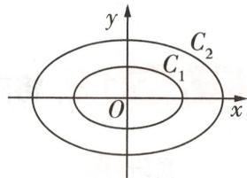

图 5

因此椭圆 $C_{2}$ 与椭圆 $C_{1}$ 的“特征三角形”的三边对应成比例, 即两个“特征三角形”相似, 且相似比为 2:1.

所以椭圆 $C_{2}$ 和 $C_{1}$ 相似,且相似比为 2:1.

（2）由题意可得椭圆 $C_{b}$ 的标准方程为 $\frac{x^{2}}{4b^{2}} + \frac{y^{2}}{b^{2}} = 1 (b > 0)$ .

连接 MN, 设直线 MN 的方程为 $y = -x + t$ [会转化: 在椭圆 $C_{b}$ 上存在两点 M, N 关于直线 $y = x + 1$ 对称 → 直线 MN 与直线 $y = x + 1$ 垂直 → 直线 MN 的斜率为 -1],

$M(x_{1},y_{1}),N(x_{2},y_{2})$ ，线段MN的中点为 $(x_{0},y_{0})$ .

由 $\left\{\begin{aligned}y&=-x+t,\\ x^{2}&+4y^{2}=4b^{2}\end{aligned}\right.$ 消去 y 并整理得关于 x 的方程 $5x^{2}-8tx+4(t^{2}-b^{2})=0$ ,

则 $\Delta = 64t^{2} - 80(t^{2} - b^{2}) > 0$ ，即 $b^{2} > \frac{1}{5}t^{2}$ ，

$x_0 = \frac{x_1 + x_2}{2} = \frac{4}{5} t$ ，则 $y_{0} = -x_{0} + t = \frac{t}{5}$

由线段 MN 的中点在直线 $y = x + 1$ 上, 得 $\frac{t}{5} = \frac{4}{5} t + 1$ , 解得 $t = -\frac{5}{3}$ .

因此 $b^{2} > \frac{5}{9}$ ，又 b > 0，所以 $b > \frac{\sqrt{5}}{3}$ ，

所以实数 b 的取值范围是 $\left(\frac{\sqrt{5}}{3}, +\infty\right)$ .

若 $k_{1}k_{2} = -\frac{1 + m}{1 - m}\cdot \frac{b^{2}}{a^{2}}$ ，则直线 $AB$ 过定点 $(mx_0, - my_0)(m\in \mathbf{R},m\neq 1)$

# 超重点2 解析几何与数列、向量交汇问题的转化技巧

# 技巧 ① 将向量关系转化为点的坐标关系

调研 1 [2025 安徽芜湖一中、池州一中等校 9 月联考] 已知双曲线 $C: \frac{x^2}{a^2} - \frac{y^2}{b^2} = 1 (a > 0, b > 0)$ 经过点 (2,3)，且其离心率为 2.

（1） 求 C 的方程;  
（2） 若直线 l 与 C 交于 A, B 两点, 且 $\overrightarrow{OA} \cdot \overrightarrow{OB} = 0$ (O 为坐标原点), 求 $|AB|$ 的取值范围.

解析 （1） 由题意可得 $\left\{ \begin{array}{l} \frac{4}{a^2} - \frac{9}{b^2} = 1, \\ \sqrt{\frac{a^2 + b^2}{a^2}} = 2, \end{array} \right.$ 则 $a^2 = 1, b^2 = 3$

故双曲线 C 的方程为 $x^{2}-\frac{y^{2}}{3}=1$ .

（2） 当直线 l 斜率不存在时, 可设 $A(x_{A}, y_{A})$ , 则 $B(x_{A}, -y_{A}), x_{A}^{2} - \frac{y_{A}^{2}}{3} = 1$ ,

【明易错】解决“直曲”相交问题时，注意不要忽略特殊情况

则 $\overrightarrow{OA} = (x_A, y_A), \overrightarrow{OB} = (x_A, -y_A)$

又 $\overrightarrow{OA} \cdot \overrightarrow{OB} = x_A^2 - y_A^2 = 0$ ，解得 $y_A = \pm \frac{\sqrt{6}}{2}$ ，此时 $|AB| = 2|y_A| = \sqrt{6}$ .

当直线 l 斜率存在时, 设其方程为 $y = kx + m$ , $A(x_{1}, y_{1})$ , $B(x_{2}, y_{2})$ ,

由 $\left\{\begin{aligned}y&=kx+m,\\ x^{2}&-\frac{y^{2}}{3}=1,\end{aligned}\right.$ 得关于x的方程 $(3-k^{2})x^{2}-2kmx-m^{2}-3=0,$

故 $3 - k^{2} \neq 0, \Delta = 4k^{2}m^{2} + 4(m^{2} + 3)(3 - k^{2}) = 12(m^{2} - k^{2} + 3) > 0,$

$x _ {1} + x _ {2} = \frac {2 k m}{3 - k ^ {2}}, x _ {1} x _ {2} = \frac {- m ^ {2} - 3}{3 - k ^ {2}}.$

则 $\overrightarrow{OA} \cdot \overrightarrow{OB} = x_{1}x_{2} + y_{1}y_{2} = x_{1}x_{2} + (kx_{1} + m)(kx_{2} + m) = (1 + k^{2})x_{1}x_{2} + km(x_{1} + x_{2}) + m^{2} =$

【破障碍】通过向量的坐标运算, 将向量关系转化为点的坐标关系, 再结合根与系数的关系找到参数之间的关系, 进而求解

$(1 + k ^ {2}) \frac {- m ^ {2} - 3}{3 - k ^ {2}} + k m \frac {2 k m}{3 - k ^ {2}} + m ^ {2} = 0,$

化简得 $3k^{2}+3=2m^{2}$ ，此时 $\Delta=6(k^{2}+9)>0$ ，满足题意。

所以 $|AB|=\sqrt{1+k^{2}}\left|x_{1}-x_{2}\right|=\sqrt{1+k^{2}}\sqrt{\left(x_{1}+x_{2}\right)^{2}-4x_{1}x_{2}}=\sqrt{1+k^{2}}\sqrt{\left(\frac{2km}{3-k^{2}}\right)^{2}-4\times\frac{-m^{2}-3}{3-k^{2}}}$

$\sqrt {1 + k ^ {2}} \sqrt {\frac {1 2 (m ^ {2} - k ^ {2} + 3)}{(3 - k ^ {2}) ^ {2}}} = \sqrt {6} \sqrt {\frac {k ^ {4} + 1 0 k ^ {2} + 9}{k ^ {4} - 6 k ^ {2} + 9}} = \sqrt {6} \sqrt {1 + \frac {1 6 k ^ {2}}{k ^ {4} - 6 k ^ {2} + 9}}.$

当 k=0 时， $|AB|=\sqrt{6}$ .

当 $k \neq 0$ 时， $|AB| = \sqrt{6} \cdot \sqrt{1 + \frac{16}{k^2 + \frac{9}{k^2} - 6}}$

因为 $3 - k^2 \neq 0$ ，所以 $k^2 + \frac{9}{k^2} > 2\sqrt{k^2 \cdot \frac{9}{k^2}} = 6$ ，故 $\frac{16}{k^2 + \frac{9}{k^2} - 6} > 0$

因此 $|AB|=\sqrt{6}\cdot\sqrt{1+\frac{16}{k^{2}+\frac{9}{k^{2}}-6}}>\sqrt{6}.$

综上可得 $|AB|$ 的取值范围为 $[\sqrt{6}, +\infty)$ .

# 满分攻略

# 牢记一点,巧妙缩小弦长公式的计算量

应用弦长公式,需要结合根与系数的关系计算,计算量很大,很容易出错,有没有什么办法来简化这个步骤呢?我们从解题模板来展开看.

第一步:考虑一般情况,设交点 $M(x_{1},y_{1})$ , $N(x_{2},y_{2})$ , 直线 $l:y=kx+b$ .

第二步:联立“线锥”方程,得到一个关于x的一元二次方程 $Ax^{2}+Bx+C=0(A\neq0)$ .

第三步:检验 $\Delta = B^{2} - 4AC > 0$ ，然后由根与系数的关系得 $x_{1} + x_{2} = -\frac{B}{A}, x_{1}x_{2} = \frac{C}{A}$ .

第四步:代入弦长公式得 $|MN|=\sqrt{1+k^{2}}\cdot\sqrt{(x_{1}+x_{2})^{2}-4x_{1}x_{2}}=\sqrt{1+k^{2}}\cdot\sqrt{(-\frac{B}{A})^{2}-\frac{4C}{A}}$

观察上式, 可得 $\left(-\frac{B}{A}\right)^{2}-\frac{4C}{A}=\frac{B^{2}-4AC}{A^{2}}=\frac{\Delta}{A^{2}}$ , 由此, 弦长公式就和 $\Delta$ 建立了关系, 可以得到简化的弦长公式 $|MN|=\sqrt{1+k^{2}}\cdot\sqrt{\frac{\Delta}{A^{2}}}$ (此处的 $\Delta$ 和 A 都是对应 x 来说的), 而若得到的是关于 y 的一元二次方程 $A'y^{2}+B'y+C'=0$ , 同理可得 $|MN|=\sqrt{1+\frac{1}{k^{2}}}\cdot\sqrt{\frac{\Delta'}{A^{'2}}}$ (此处的 $\Delta'$ 和 $A'$ 则是对应 y 来说的, $k\neq0$ ).

牢记“算 $\Delta$ ”这一点,既可以避免丢失步骤分,又可以简化计算.

# 技巧 ② 将向量关系转化为图形关系

调研 2 试题调研原创 椭圆 $C: \frac{x^{2}}{a^{2}} + \frac{y^{2}}{b^{2}} = 1 (a > b > 0)$ 的左、右焦点分别为 $F_{1}, F_{2}$ ，过 $F_{1}$

②以双曲线 $x^{2} / a^{2} - y^{2} / b^{2} = 1 (a > 0, b > 0)$ 内一点 $P(x_{0}, y_{0})$ 为中点的弦所在直线的方程为 $x_{0}x / a^{2} - y_{0}y / b^{2} = x_{0}^{2} / a^{2} - y_{0}^{2} / b^{2}$ .

精妙结论

且斜率为 $-3\sqrt{7}$ 的直线与椭圆交于 A, B 两点 (A 在 B 左侧)，若 $(\overrightarrow{F_{1}A} + \overrightarrow{F_{1}F_{2}}) \cdot \overrightarrow{AF_{2}} = 0$ ，则 C 的离心率为 \_\_\_\_.

解析 根据题意作图,如图1,设椭圆C的半焦距为c,取 $AF_{2}$ 的中点D,连接 $F_{1}D$ ,则 $\overrightarrow{F_{1}A}+\overrightarrow{F_{1}F_{2}}=2\overrightarrow{F_{1}D}$ ,

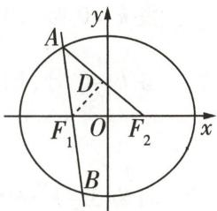

图1

由 $(\overrightarrow{F_1A} +\overrightarrow{F_1F_2})\cdot \overrightarrow{AF_2} = 0$ ，得 $2\overrightarrow{F_1D}\cdot \overrightarrow{AF_2} = 0$ ，于是 $F_{1}D\bot AF_{2}$

则 $|AF_{1}| = |F_{1}F_{2}| = 2c, |AF_{2}| = 2a - 2c.$

【破障碍】利用向量的线性运算及数量积运算找到垂直关系，进而找到等腰三角形

由直线 $AB$ 的斜率为 $-3\sqrt{7}$ ，得 $\tan \angle AF_1F_2 = -3\sqrt{7}$ ，即 $\sin \angle AF_1F_2 = -3\sqrt{7}\cos \angle AF_1F_2$ 而 $\sin^2\angle AF_1F_2 + \cos^2\angle AF_1F_2 = 1$ ，所以 $\cos \angle AF_1F_2 = -\frac{1}{8}$

即 $\cos 2\angle DF_1F_2 = 1 - 2\sin^2\angle DF_1F_2 = -\frac{1}{8},$

于是 $\sin \angle DF_{1}F_{2} = \frac{a - c}{2c} = \frac{3}{4}$ 得 $\frac{c}{a} = \frac{2}{5}$ .

所以 C 的离心率为 $\frac{2}{5}$ .

# 技巧 ③ 利用数列性质得等量关系

调研 3 试题调研原创 设抛物线 $C: x^{2} = 2py (p > 0)$ ，直线 l: y = kx + 2 交 C 于 A, B 两点。过原点 O 作 l 的垂线，交直线 y = -2 于点 M。对任意 $k \in R$ ，直线 AM, AB, BM 的斜率成等差数列。

（1） 求抛物线 C 的方程.  
（2） 若直线 $l' \parallel l$ ，且 $l'$ 与 C 相切于点 N，证明： $\triangle AMN$ 的面积不小于 $2\sqrt{2}$ .

解析 （1） 设 $A(x_{1}, y_{1}), B(x_{2}, y_{2})$ ，由题可知，当 $k = 0$ 时，显然有 $k_{AM} + k_{BM} = 0$ .

当 $k \neq 0$ 时, 直线 OM 的方程为 $y = -\frac{1}{k}x$ , 点 $M(2k, -2)$ .

联立直线 $AB$ 与抛物线 $C$ 的方程得关于 $x$ 的方程 $x^{2} - 2pkx - 4p = 0, \Delta = 4p^{2}k^{2} + 16p > 0,$ 所以 $x_{1} + x_{2} = 2pk, x_{1}x_{2} = -4p$ ,

因为直线 AM, AB, BM 的斜率成等差数列，

所以 $\frac{y_1 + 2}{x_1 - 2k} +\frac{y_2 + 2}{x_2 - 2k} = 2k$ ，即 $\frac{kx_1 + 4}{x_1 - 2k} +\frac{kx_2 + 4}{x_2 - 2k} = 2k,$

【破障碍】直线 AM, AB, BM 的斜率成等差数列，结合等差中项的定义将其转化为关于 $x_{1}, x_{2}, k$ 之间的关系式

# 精妙结论

③以抛物线 $y^{2}=2px(p>0)$ 内一点 $P(x_{0},y_{0})$ 为中点的弦所在直线的方程为 $y_{0}y-p(x_{0}+x)=y_{0}^{2}-2px_{0}$ .

即 $\frac{(kx_1 + 4)(x_2 - 2k) + (kx_2 + 4)(x_1 - 2k)}{(x_1 - 2k)(x_2 - 2k)} = 2k$ ，化简得 $2(k^2 + 2)(x_1 + x_2 - 4k) = 0$ .

将 $x_{1} + x_{2} = 2pk$ 代入上式得 $2(k^{2} + 2)(2pk - 4k) = 0$ ，则 $p = 2$

所以抛物线 C 的方程为 $x^{2}=4y$ .

（2） 方法一 设直线 $l': y = kx + n$ ，由 $\left\{\begin{aligned} y &= kx + n, \\ x^{2} &= 4y, \end{aligned}\right.$ 得关于 x 的方程 $x^{2} - 4kx - 4n = 0$ .

由 $\Delta_{1}=16k^{2}+16n=0$ , 得 $n=-k^{2}$ , 点 $N(2k,k^{2})$ , 设 AB 的中点为 E, 连接 ME, BM,

因为 $\frac{x_1 + x_2}{2} = 2k, \frac{y_1 + y_2}{2} = \frac{k(x_1 + x_2) + 4}{2} = 2k^2 + 2$ ，则点 $E(2k, 2k^2 + 2)$ .

由（1）知 $M(2k,-2)$ ，因为 $\frac{2k^{2}+2-2}{2}=k^{2}$ ，所以点 M, N, E 三点共线，且点 N 为 ME 的中点，

所以 $\triangle AMN$ 的面积为 $\triangle ABM$ 的面积的 $\frac{1}{4}$ .

记 $\triangle AMN$ 的面积为 $S$ , 点 $M(2k, -2)$ 到直线 $l: kx - y + 2 = 0$ 的距离 $d = \frac{2k^2 + 4}{\sqrt{k^2 + 1}}$ ,

所以 $S = \frac{1}{8} |AB| \times d = \frac{1}{8}\sqrt{1 + k^2} \times \sqrt{(x_1 + x_2)^2 - 4x_1x_2} \times \frac{2k^2 + 4}{\sqrt{k^2 + 1}} = (k^2 + 2)^{\frac{3}{2}} \geqslant 2\sqrt{2}$

当 k=0 时, 等号成立. 得证.

方法二 设直线 $l': y = kx + n, \left\{\begin{aligned} y &= kx + n, \\ x^{2} &= 4y, \end{aligned}\right.$ 得关于 x 的方程 $x^{2} - 4kx - 4n = 0$ .

由 $\Delta_{1}=0$ , 得 $n=-k^{2}$ , 点 $N(2k,k^{2})$ . 由 （1） 知 $M(2k,-2)$ , 所以直线 MN 与 x 轴垂直.

【明关键】根据点与点坐标之间的关系判断直线 $MN$ 与 $x$ 轴垂直, 进而简化解题步骤

因为 $\frac{x_{1}+x_{2}}{2}=2k,$

记 $\triangle AMN$ 的面积为 $S$ , 所以 $S = \frac{1}{2} \times |MN| \times |\frac{x_1 - x_2}{2}|$

$= \frac {1}{4} \times | M N | \times \sqrt {\left(x _ {1} + x _ {2}\right) ^ {2} - 4 x _ {1} x _ {2}}$

$= \frac {1}{4} \times | k ^ {2} + 2 | \times \sqrt {(4 k) ^ {2} - 4 \times (- 8)}$

$= (k ^ {2} + 2) ^ {\frac {3}{2}}$

$\geqslant 2 \sqrt {2},$

当 k=0 时, 等号成立. 得证.

# 创新预测

答案▶023页

##### 1. [2025 广东 8 月模拟]已知点 A, B, C 都在双曲线 $\Gamma: \frac{x^{2}}{a^{2}} - \frac{y^{2}}{b^{2}} = 1 (a > 0, b > 0)$ 上，且点 A, B 关于原点对称， $\angle CAB = 90^{\circ}$ . 过 A 作垂直于 x 轴的直线分别交 $\Gamma$ , BC 于点 M, N. 若 $\overrightarrow{AN} = 3\overrightarrow{AM}$ ，则双曲线 $\Gamma$ 的离心率是 ()

$\quad$A. $\sqrt{2}$

$\quad$B. $\sqrt{3}$

$\quad$C. 2

$\quad$D. $2\sqrt{3}$

##### 2. 试题调研原创（多选）已知 F 为抛物线 $C: y^{2} = 2px (0 < p < 10)$ 的焦点，E 为第一象限内 C 上的一点， $G(5,0)$ ，且 $(\overrightarrow{EF} + \overrightarrow{EG}) \cdot \overrightarrow{FG} = 0, |\overrightarrow{EF} + \overrightarrow{EG}| = \sqrt{3} |\overrightarrow{FG}|$ ，直线 $l: x = ky + m (m \neq 0)$ 与 C 交于不同的两点 A, B，且 $\overrightarrow{OA}, \overrightarrow{OB}$ 的夹角为 $\theta, O$ 为坐标原点，则下列说法正确的有

( )

$\quad$A. $\triangle EFG$ 为等边三角形

$\quad$B. $C$ 的准线方程为 $x = -2$

$\quad$C. 若 $\theta = \frac{\pi}{2}$ , 则 $m = 4$

$\quad$D. 若 $\theta = \frac{2\pi}{3}$ , 则 $0 < m \leqslant \frac{4}{3}$

  
“数形结合法”速破抛物线与向量的创新交汇问题

##### 3. [2025 四川内江模拟]已知椭圆 $C: \frac{x^2}{a^2} + \frac{y^2}{b^2} = 1 (a > b > 0)$ , 点 $P$ 是

椭圆上的动点, $F_{1},F_{2}$ 是左、右焦点,G是 $\triangle PF_{1}F_{2}$ 的重心,且G到点 $M(-\frac{1}{3},0)$ 与点 $N(\frac{1}{3},0)$ 的距离之和为 $\frac{4}{3}$ .

（1） 求椭圆 C 的方程;  
（2） 若直线 l 过点 $M(4,0)$ ，与椭圆交于 A, B 两点，且 $|AM|$ , $|AB|$ , $|BM|$ 成等比数列，求 $\cos\angle AF_{2}B$ 的值.

# 规范答题

精妙结论

②由圆 $x^{2} + y^{2} = R^{2}(R > 0)$ 外一点 $P(x_0,y_0)$ 所引两条切线的切点弦所在直线方程为 $x_0x + y_0y = R^2$

# 参考答案与解析

##### 1.B 不妨设 $A(x_0, y_0), B(-x_0, -y_0), N(x_N, y_N)$ ，因为 $AM \perp x$ 轴，所以 $M(x_0, -y_0)$ ，

由 $\overrightarrow{AN}=3\overrightarrow{AM}$ 可得 $(x_{N}-x_{0},y_{N}-y_{0})=3(0,-2y_{0})=(0,-6y_{0})$ [点关键:将平面向量关系转化为点的坐标之间的关系],从而 $x_{N}=x_{0},y_{N}=-5y_{0}$ ,即 $N(x_{0},-5y_{0})$ .

设 $C(x_0', y_0')$ ，则 $k_{CB} \cdot k_{CA} = \frac{y_0' + y_0}{x_0' + x_0} \cdot \frac{y_0' - y_0}{x_0' - x_0} = \frac{y_0'^2 - y_0^2}{x_0'^2 - x_0^2} = \frac{\frac{b^2}{a^2}(x_0'^2 - a^2) - \frac{b^2}{a^2}(x_0^2 - a^2)}{x_0'^2 - x_0^2} = \frac{b^2}{a^2}$ ，

即 $k_{BN} \cdot (-\frac{1}{k_{AB}}) = \frac{b^2}{a^2}$ , 其中 $k_{BN} = \frac{-y_0 - (-5y_0)}{-x_0 - x_0} = -\frac{2y_0}{x_0}, k_{AB} = \frac{y_0}{x_0}$ ,

从而 $\frac{b^{2}}{a^{2}}=2$ ，双曲线 $\Gamma$ 的离心率 $e=\sqrt{1+\frac{b^{2}}{a^{2}}}=\sqrt{3}$ . 故选 B.

# 2.ACD

<table><tr><td>选项</td><td>分析过程</td><td>正误</td></tr><tr><td>A</td><td>因为 $\left( \overrightarrow{EF} + \overrightarrow{EG} \right) \cdot \overrightarrow{FG} = 0$ ,所以 $\triangle EFG$ 为等腰三角形,又 $|\overrightarrow{EF} + \overrightarrow{EG}| = \sqrt{3} |\overrightarrow{FG}|$ ,所以 $\angle EFG = \frac{\pi}{3}$ ,所以 $\triangle EFG$ 为等边三角形</td><td>√</td></tr><tr><td>B</td><td> $x_{E} = \frac{1}{2} \left( \frac{p}{2} + 5 \right) = \frac{p}{4} + \frac{5}{2}, |FG| = 5 - \frac{p}{2}$ ,由抛物线的定义可得 $|EF| = x_{E} + \frac{p}{2}$ ,因为 $\triangle EFG$ 为等边三角形,所以 $|EF| = |FG|$ ,即 $\frac{3p}{4} + \frac{5}{2} = 5 - \frac{p}{2}$ ,解得 $p = 2$ .所以抛物线C的方程为 $y^{2} = 4x$ ,准线方程为 $x = -1$ </td><td>×</td></tr><tr><td>C</td><td>设 $A(x_{1},y_{1})$ , $B(x_{2},y_{2})$ ,由 $\begin{cases} y^{2} = 4x, \\ x = ky + m (m \neq 0) \end{cases}$ 得关于y的方程 $y^{2} - 4ky - 4m = 0$ ,则 $\Delta = 16k^{2} + 16m > 0$ ,所以 $y_{1} + y_{2} = 4k$ , $y_{1}y_{2} = -4m$ ,则 $x_{1} + x_{2} = k(y_{1} + y_{2}) + 2m = 4k^{2} + 2m$ , $x_{1}x_{2} = \frac{y_{1}^{2}}{4} \cdot \frac{y_{2}^{2}}{4} = m^{2}$ .所以 $\cos\theta = \frac{\overrightarrow{OA} \cdot \overrightarrow{OB}}{|\overrightarrow{OA}| \cdot |\overrightarrow{OB}|} = \frac{x_{1}x_{2} + y_{1}y_{2}}{\sqrt{x_{1}^{2} + 4x_{1}} \cdot \sqrt{x_{2}^{2} + 4x_{2}}} = \frac{m^{2} - 4m}{|m| \sqrt{m^{2} + 16k^{2} + 8m + 16}}.$ </td><td>√</td></tr><tr><td>D</td><td>若 $\theta = \frac{\pi}{2}$ ,则 $\cos\theta = 0 = m^{2} - 4m$ ,因为 $m \neq 0$ ,所以 $m = 4$ .若 $\theta = \frac{2\pi}{3}$ ,则 $\cos\theta = -\frac{1}{2} = \frac{m^{2} - 4m}{|m| \sqrt{m^{2} + 16k^{2} + 8m + 16}}$ ,则 $m^{2} - 4m < 0$ ,且 $4(m - 4)^{2} = m^{2} + 16k^{2} + 8m + 16$ ,所以 $\begin{cases} 0 < m < 4, \\ 3m^{2} - 40m + 48 = 16k^{2} \geqslant 0, \end{cases}$ 得 $0 < m \leqslant \frac{4}{3}$ ,所以实数 $m$ 的取值范围为 $(0, \frac{4}{3}]$ </td><td>√</td></tr></table>

③椭圆 $\frac{x^{2}}{a^{2}}+\frac{y^{2}}{b^{2}}=1(a>b>0)$ 上一点 $P(x_{0},y_{0})$ 处的切线方程为 $\frac{x_{0}x}{a^{2}}+\frac{y_{0}y}{b^{2}}=1.$

##### 3. （1） 由题意可设 $F_{1}(-c,0), F_{2}(c,0), G(x_{0},y_{0}), P(x,y)$ ,

因为 G 到点 $M(-\frac{1}{3},0)$ 与点 $N(\frac{1}{3},0)$ 的距离之和为 $\frac{4}{3}$ ,

所以 $|GM|+|GN|=\frac{4}{3},|MN|=\frac{2}{3},|OM|=|ON|=\frac{1}{3}.$

所以点 G 的轨迹是长轴长为 $\frac{4}{3}$ ，焦距为 $\frac{2}{3}$ 的椭圆，即轨迹方程为 $\frac{x_{0}^{2}}{\frac{4}{9}} + \frac{y_{0}^{2}}{\frac{1}{3}} = 1$ .

连接 OP, 因为 G 是 $\triangle PF_{1}F_{2}$ 的重心, 所以点 G 在线段 OP 上, 且 $\left|OG\right|=\frac{1}{3}\left|OP\right|$ [依据: 三角形的重心在中线的一个三等分点处], 即 $x_{0}=\frac{1}{3}x, y_{0}=\frac{1}{3}y$ ,

代入点 G 的轨迹方程可得 $\frac{x^{2}}{4} + \frac{y^{2}}{3} = 1$ ,

所以椭圆 C 的方程为 $\frac{x^{2}}{4} + \frac{y^{2}}{3} = 1$ .

（2）根据题意可知直线 l 的斜率一定存在，

设直线 l 的方程为 $y = k(x - 4)$ , $A(x_{1}, y_{1})$ , $B(x_{2}, y_{2})$ ,

由 $\left\{\begin{aligned}y&=k(x-4),\\ \frac{x^{2}}{4}&+\frac{y^{2}}{3}=1,\end{aligned}\right.$ 消元可得关于x的方程 $(3+4k^{2})x^{2}-32k^{2}x+64k^{2}-12=0,$

则 $3 + 4k^{2} \neq 0, \Delta = (-32k^{2})^{2} - 4(3 + 4k^{2})(64k^{2} - 12) = 144 \times (1 - 4k^{2}) > 0,$

所以 $-\frac{1}{2}<k<\frac{1}{2},x_{1}+x_{2}=\frac{32k^{2}}{3+4k^{2}},x_{1}x_{2}=\frac{64k^{2}-12}{3+4k^{2}}$

$\vert A B \vert = \sqrt {1 + k ^ {2}} \sqrt {\left(x _ {1} + x _ {2}\right) ^ {2} - 4 x _ {1} x _ {2}} = \sqrt {1 + k ^ {2}} \sqrt {\left(\frac {3 2 k ^ {2}}{3 + 4 k ^ {2}}\right) ^ {2} - 4 \times \frac {6 4 k ^ {2} - 1 2}{3 + 4 k ^ {2}}} = \frac {1 2 \sqrt {1 + k ^ {2}} \sqrt {1 - 4 k ^ {2}}}{3 + 4 k ^ {2}},$

$\vert A M \vert = \sqrt {\left(4 - x _ {1}\right) ^ {2} + y _ {1} ^ {2}} = \sqrt {\left(4 - x _ {1}\right) ^ {2} + k ^ {2} \left(x _ {1} - 4\right) ^ {2}} = \sqrt {1 + k ^ {2}} \sqrt {\left(x _ {1} - 4\right) ^ {2}},$

$\vert B M \vert = \sqrt {\left(4 - x _ {2}\right) ^ {2} + y _ {2} ^ {2}} = \sqrt {\left(4 - x _ {2}\right) ^ {2} + k ^ {2} \left(x _ {2} - 4\right) ^ {2}} = \sqrt {1 + k ^ {2}} \sqrt {\left(x _ {2} - 4\right) ^ {2}}.$

因为 $|AM|$ , $|AB|$ , $|BM|$ 成等比数列,

所以 $|AB|^{2}=|AM|\cdot|BM|$ [点拨:利用等比中项的性质进行转化,进而得关于 $x_{1},x_{2},k$ 的关系式],

则 $(\frac{12\sqrt{1 + k^2}\sqrt{1 - 4k^2}}{3 + 4k^2})^2 = \sqrt{1 + k^2}\sqrt{(x_1 - 4)^2}\sqrt{1 + k^2}\sqrt{(x_2 - 4)^2},$

结合根与系数的关系化简得 $k^{2}=\frac{1}{20}$ ,

所以 $|AB|=\frac{12\sqrt{1+\frac{1}{20}}\sqrt{1-4\times\frac{1}{20}}}{3+4\times\frac{1}{20}}=\frac{3\sqrt{21}}{4}.$

根据题意可知 $F_{2}(1,0),|AF_{2}| = \sqrt{(1 - x_{1})^{2} + y_{1}^{2}} = \sqrt{(1 - x_{1})^{2} + 3 - \frac{3}{4}x_{1}^{2}} = \sqrt{\left(\frac{1}{2}x_{1} - 2\right)^{2}},$

$\left| B F _ {2} \right| = \sqrt {\left(1 - x _ {2}\right) ^ {2} + y _ {2} ^ {2}} = \sqrt {\left(1 - x _ {2}\right) ^ {2} + 3 - \frac {3}{4} x _ {2} ^ {2}} = \sqrt {\left(\frac {1}{2} x _ {2} - 2\right) ^ {2}}.$

由 $k^2 = \frac{1}{20}$ 得 $x_{1} + x_{2} = \frac{1}{2}, x_{1}x_{2} = -\frac{11}{4},$

在 $\triangle AF_2B$ 中，由余弦定理可得 $\cos \angle AF_2B = \frac{|AF_2|^2 + |BF_2|^2 - |AB|^2}{2\times|AF_2|\times|BF_2|} =$

$\frac {\left(\frac {1}{2} x _ {1} - 2\right) ^ {2} + \left(\frac {1}{2} x _ {2} - 2\right) ^ {2} - \left(\frac {3 \sqrt {2 1}}{4}\right) ^ {2}}{2 \sqrt {\left(\frac {1}{2} x _ {1} - 2\right) ^ {2}} \sqrt {\left(\frac {1}{2} x _ {2} - 2\right) ^ {2}}} = \frac {\frac {1}{4} (x _ {1} - 4) ^ {2} + \frac {1}{4} (x _ {2} - 4) ^ {2} - \left(\frac {3 \sqrt {2 1}}{4}\right) ^ {2}}{2 \sqrt {\frac {1}{4} (x _ {1} - 4) ^ {2}} \sqrt {\frac {1}{4} (x _ {2} - 4) ^ {2}}} =$

$\frac {(x _ {1} - 4) ^ {2} + (x _ {2} - 4) ^ {2} - (\frac {3 \sqrt {2 1}}{2}) ^ {2}}{2 \sqrt {(x _ {1} - 4) ^ {2}} \sqrt {(x _ {2} - 4) ^ {2}}} = \frac {(x _ {1} + x _ {2}) ^ {2} - 2 x _ {1} x _ {2} - 8 (x _ {1} + x _ {2}) + 3 2 - (\frac {3 \sqrt {2 1}}{2}) ^ {2}}{2 (\frac {1 2 \sqrt {1 - 4 k ^ {2}}}{3 + 4 k ^ {2}}) ^ {2}} =$

$\frac {(\frac {1}{2}) ^ {2} - 2 \times (- \frac {1 1}{4}) - 8 \times \frac {1}{2} + 3 2 - \frac {1 8 9}{4}}{2 \times (\frac {1 2 \times \sqrt {1 - 4 \times \frac {1}{2 0}}}{3 + 4 \times \frac {1}{2 0}}) ^ {2}} = - \frac {3}{5},$

所以 $\cos\angle AF_{2}B$ 的值为 $-\frac{3}{5}$ .

⑤椭圆 $x^{2} / a^{2} + y^{2} / b^{2} = 1 (a > b > 0)$ 的两条互相垂直的切线的交点 $P$ 的轨迹是蒙日圆： $x^{2} + y^{2} = a^{2} + b^{2}$ .

# 超重点3 探讨曲线与曲线的交点问题的解题技法

<table><tr><td>三年考情与创新命题特点</td><td>2025命题预测</td></tr><tr><td>2024 新课标II卷 T10,过抛物线上的动点作圆的切线以及抛物线准线的垂线,探求动点相关问题</td><td rowspan="3">1命题形式:选择题、填空题、解答题均有可能呈现.当以选填题形式呈现时,难度适中,以容易题或中档题为主;当以解答题形式呈现时,难度较大.2命题热点:圆与椭圆、双曲线或抛物线相交,求参数、离心率、弦长等.3创新考法:以阿波罗尼斯圆、蒙日圆等为载体,命制新定义解答题.</td></tr><tr><td>2024 天津卷 T12,圆的圆心与抛物线的焦点重合,求原点到直线的距离</td></tr><tr><td>2023 全国甲卷 T8,双曲线的一条渐近线与圆交于 A,B 两点,求弦长|AB|</td></tr></table>

# 类型 1 圆与椭圆的交点问题探讨

调研 1 [2025 福建省厦门市湖滨中学 8 月适应性练习] 如图 1, $F_{1}, F_{2}$ 分别是椭圆 $\frac{x^{2}}{a^{2}} + \frac{y^{2}}{b^{2}} = 1 (a > b > 0)$ 的左、右焦点，点 $P$ 是以 $F_{1}F_{2}$ 为直径的圆与椭圆在第一象限内的交点，直线 $PF_{2}$ 与椭圆交于另一点 $Q$ ，若 $|PF_{1}| = 4|QF_{2}|$ ，则直线 $PF_{2}$ 的斜率为 （）

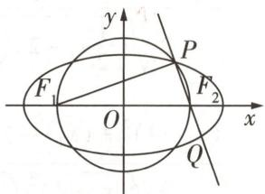

图1

$\quad$A. $-\frac{1}{2}$

$\quad$B.-1

$\quad$C.-2

$\quad$D.-3

解析 连接 $QF_{1} \rightarrow P$ 在以 $F_{1}F_{2}$ 为直径的圆上 $\rightarrow PF_{1} \perp PF_{2} \rightarrow P, Q$ 在椭圆上 $\rightarrow |PF_{1}| + |PF_{2}| = 2a, |QF_{1}| + |QF_{2}| = 2a \rightarrow$ 设 $|QF_{2}| = m \rightarrow |PF_{1}| = 4|QF_{2}| = 4m \rightarrow |PQ| = 2a - 4m +$ 【敲黑板】点 P 为圆与椭圆的交点，利用点 P 的双重性质，得到 $PF_{1} \perp PF_{2}, |PF_{1}| + |PF_{2}| = 2a$ $m = 2a - 3m, |F_{1}Q| = 2a - m \rightarrow$ 在 Rt $\triangle F_{1}PQ$ 中， $(4m)^{2} + (2a - 3m)^{2} = (2a - m)^{2} \rightarrow a = 3m \rightarrow$ $|PF_{2}| = 2a - 4m = 2m \rightarrow \tan \angle PF_{2}F_{1} = \frac{|PF_{1}|}{|PF_{2}|} = 2 \rightarrow k_{PF_{2}} = \tan (\pi - \angle PF_{2}F_{1}) = -\tan \angle PF_{2}F_{1} = -2 \rightarrow$ 选 C.

# 原创变式

已知椭圆 $C: \frac{x^{2}}{4} + y^{2} = 1$ ，若以 $P(0, m) (m > 0)$ 为圆心，任意长为半径的圆与椭圆 C 至多有两个交点，则实数 m 的取值范围是 \_\_\_\_.

答案》第030页

# 类型 2 圆与双曲线的交点问题探讨

调研 2 [2025 浙江省 8 月联考] 如图 2, 已知双曲线 $C: x^{2} - y^{2} = 8$ , 圆 $A: (x - 2)^{2} + (y - 2)^{2} = r^{2}$ , 其中 r > 0. 圆 A 与双曲线 C 有且仅有两个交点 D, E, 线段 DE 的中点为 G.

（1） 记直线 AG 的斜率为 $k_{1}$ ，直线 OG 的斜率为 $k_{2}$ ，求 $\frac{k_{1}}{k_{2}}$ .  
（2） 当直线 DE 的斜率为 3 时, 求 G 点坐标.

解析（1）设 $D(x_{1},y_{1}),E(x_{2},y_{2})$ ，因为 $x_{1}^{2} - y_{1}^{2} = x_{2}^{2} - y_{2}^{2} = 8$ ，所以 $(x_{1} - x_{2})(x_{1} + x_{2}) = (y_{1} - y_{2})(y_{1} + y_{2}).$

因为圆心 $A(2,2)$ 不在坐标轴上, 所以 $x_{1} \neq x_{2}, x_{1} + x_{2} \neq 0$ ,

所以 $\frac{y_{1}-y_{2}}{x_{1}-x_{2}}\cdot\frac{y_{1}+y_{2}}{x_{1}+x_{2}}=1$ ，所以 $k_{DE}\cdot k_{OG}=1$ ，

【巧思考】涉及中点弦，我们可以采用点差法得到 $k_{DE} \cdot k_{OG} = 1$ ，再由 $AG \perp DE$ 可得 $k_{AG} \cdot k_{DE} = -1$ ，两式相比即可得解

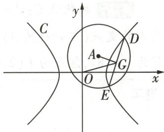

图2

易知 $AG \perp DE$ ，所以 $k_{AG} \cdot k_{DE} = -1$ ，所以 $\frac{k_1}{k_2} = \frac{k_{AG}}{k_{OG}} = \frac{k_{AG} \cdot k_{DE}}{k_{OG} \cdot k_{DE}} = \frac{-1}{1} = -1$ .

  
“点差法”快解圆与双曲线相交的斜率问题

（2） 设直线 DE: $y = 3x + m$ ，与 $x^{2} - y^{2} = 8$ 联立，化简并整理得关于 x 的二次方程 $8x^{2} + 6mx + m^{2} + 8 = 0, \Delta = 36m^{2} - 32(m^{2} + 8) = 4(m^{2} - 64) > 0$ ，即 $|m| > 8$ .

设 $D(x_{3},y_{3})$ , $E(x_{4},y_{4})$ ，则 $x_{3}+x_{4}=-\frac{3m}{4}$ , $y_{3}+y_{4}=3(x_{3}+x_{4})+2m=-\frac{m}{4}$ ，即 G 点坐标为 $(- \frac{3m}{8}, -\frac{m}{8})$ .

因为 $k_{AG} \cdot k_{DE} = -1, k_{DE} = 3$ ，所以 $k_{AG} = -\frac{1}{3}$ ，而 $A(2,2)$ ，即 $\frac{\frac{m}{8} + 2}{\frac{3m}{8} + 2} = -\frac{1}{3}$ ，解得 $m = -\frac{32}{3}$ ，检验可知满足题意。所以 $G(4, \frac{4}{3})$ 。

# 原创变式

2 如图3,已知 $F_{1}, F_{2}$ 是双曲线 $C: \frac{x^{2}}{a^{2}} - \frac{y^{2}}{b^{2}} = 1$ 的左、右焦点, 以 $F_{2}$ 为圆心的圆与双曲线 $C$ 的左、右两支交于 $P, Q$ 两点 ( $P, Q$ 在 $x$ 轴上方), 且 $\overrightarrow{F_{2}Q} = 3\overrightarrow{F_{1}P}$ , 则双曲线 $C$ 的离心率为 \_\_\_\_.

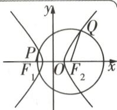

图3

答案》第030页

# 类型 ③ 圆与抛物线的交点问题探讨

调研 3 试题调研原创（多选）已知抛物线 $C: y^{2} = 2px (p > 0)$ 与圆 $O: x^{2} + y^{2} = 20$ 交于 A, B 两点，且 $|AB| = 8$ 。过焦点 F 的直线 l 与抛物线 C 交于 M, N 两点，点 P 是抛物线 C 上异于顶点的任意一点，点 Q 是抛物线 C 的准线与坐标轴的交点，则（）

$\quad$A. 若 $\overrightarrow{MF}=3\overrightarrow{FN}$ ，则直线 l 的斜率为 $\pm\frac{\sqrt{3}}{3}$

$\quad$B. $|MF| + 4|NF|$ 的最小值为18

$\quad$C. $\angle MON$ 为钝角

$\quad$D. 点 $P$ 与点 $F$ 的横坐标相同时, $\frac{|PF|}{|PQ|}$ 最小

解析 抛物线 $C: y^{2} = 2px (p > 0)$ 与圆 $O: x^{2} + y^{2} = 20$ 交于 A, B 两点，且 $|AB| = 8 \rightarrow$ 第一象限内的交点（不妨设为 A）的纵坐标为 4 → 代入圆方程可得 $A(2, 4) \rightarrow 4^{2} = 4p, p = 4 \rightarrow$ 抛物线方程为 $y^{2} = 8x$ ，焦点为 $F(2, 0)$ 。设 $M(x_{1}, y_{1}), N(x_{2}, y_{2})$ 。

<table><tr><td>选项</td><td>分析过程</td><td>正误</td></tr><tr><td>A</td><td> $\overrightarrow{MF}=3\overrightarrow{FN}\rightarrow(2-x_1,-y_1)=3(x_2-2,y_2)\rightarrow\begin{cases}x_1+3x_2=8,\\y_1=-3y_2\end{cases}\rightarrow y_1^2=8x_1,y_2^2=8x_2\rightarrow$   $\begin{cases}x_2=\frac{2}{3},\\\displaystyle y_2=\pm\frac{4\sqrt{3}}{3}\end{cases}\rightarrow 直线 l 的斜率为 \frac{\frac{4\sqrt{3}}{3}-0}{\frac{2}{3}-2}=-\sqrt{3} 或 \frac{-\frac{4\sqrt{3}}{3}-0}{\frac{2}{3}-2}=\sqrt{3}$ </td><td>×</td></tr><tr><td>B</td><td>由抛物线相关二级结论得 $\frac{1}{|MF|}+\frac{1}{|NF|}=\frac{2}{p}=\frac{1}{2}\rightarrow|MF|+4|NF|=2(|MF|+4|NF|)(\frac{1}{|MF|}+\frac{1}{|NF|})=10+2(\frac{|MF|}{|NF|}+\frac{4|NF|}{|MF|})\geqslant 10+8=18\rightarrow 当且仅当【指点迷津】根据焦点弦的性质得到\(\frac{1}{|MF|}+\frac{1}{|NF|}=\frac{1}{2}$ 后,利用凑“1”法,结合基本不等式求最值 $\frac{|MF|}{|NF|}=\frac{4|NF|}{|MF|}$ ,即 $|MF|=2|NF|$ 时等号成立→ $|MF|+4|NF|$ 的最小值为18</td><td>√</td></tr><tr><td>C</td><td>如图4,不妨设M在第一象限,设直线l:x=my+2,与抛物线方程联立,消去x得 $y^2-8my-16=0$ ,又 $\Delta=(-8m)^2+4\times16>$ 0,所以 $y_1y_2=-16,x_1x_2=\frac{y_1^2}{8}\cdot\frac{y_2^2}{8}=\frac{(-16)^2}{64}=4$ ,所以 $x_1x_2+y_1y_2=4-16=-12<0$ ,所以 $\cos\langle\overrightarrow{OM},\overrightarrow{ON}\rangle<0$ ,所以∠MON为钝角[图4]</td><td>√</td></tr><tr><td>D</td><td> $Q(-2,0),F(2,0)$ ,设 $P(x_0,y_0)\rightarrow y_0^2=8x_0,x_0\geqslant0\rightarrow$ 由抛物线的定义可得 $|PF|=x_0+2\rightarrow|PQ|=\sqrt{(x_0+2)^2+(y_0-0)^2}=\sqrt{x_0^2+4x_0+4+8x_0}=\sqrt{x_0^2+12x_0+4}\rightarrow\frac{|PF|}{|PQ|}=\frac{x_0+2}{\sqrt{x_0^2+12x_0+4}}=\sqrt{\frac{x_0^2+4x_0+4}{x_0^2+12x_0+4}}=\sqrt{1-\frac{8x_0}{x_0^2+12x_0+4}}=\sqrt{1-\frac{8}{x_0+\frac{4}{x_0}+12}}\geqslant\sqrt{1-\frac{8}{2\sqrt{x_0\cdot\frac{4}{x_0}+12}}}=\frac{\sqrt{2}}{2}\rightarrow 当且仅当x_0=2时取等号\rightarrow\frac{|PF|}{|PQ|}的最小值为\(\frac{\sqrt{2}}{2}$ </td><td>√</td></tr></table>

故选 BCD.

精妙结论

③双曲线 $\frac{x^{2}}{a^{2}}-\frac{y^{2}}{b^{2}}=1(a>0,b>0)$ 上的点P到两渐近线的距离之积为定值 $\frac{a^{2}b^{2}}{a^{2}+b^{2}}$ .

# 满分攻略

# 使用基本不等式求最值的6个必会技法与示例

##### 1. 配凑法 例: 已知 x > -2, 求 $y = 3x + \frac{3}{2 + x}$ 的最小值.

$y=3x+\frac{3}{2+x}=3(x+2)+\frac{3}{2+x}-6\geqslant2\sqrt{3(x+2)\frac{3}{2+x}}-6=0$ , 当且仅当 x=-1 时等号成立.

##### 2. 凑系数法 例: 已知 0 < x < 4, 求 $y = x(8 - 2x)$ 的最大值.

$y=\frac{1}{2}[2x(8-2x)]\leqslant\frac{1}{2}(\frac{2x+8-2x}{2})^{2}=8$ ，当且仅当x=2时等号成立.

##### 3. 分离法 例: 已知 $a + b > 0$ , 求 $\frac{2a^{2} + 2b^{2} + 4ab + 8}{a + b}$ 的最小值.

$\frac{2a^{2}+2b^{2}+4ab+8}{a+b}=\frac{2(a+b)^{2}+8}{a+b}=2(a+b)+\frac{8}{a+b}\geqslant8$ , 当且仅当 $a+b=2$ 时等号成立.

##### 4.“1”的代换 例: 已知 x > 0, y > 0, $x + y = 1$ , 求 $\left(1 + \frac{1}{x}\right)\left(1 + \frac{1}{y}\right)$ 的最小值.

$(1+\frac{1}{x})(1+\frac{1}{y})=(1+\frac{x+y}{x})(1+\frac{x+y}{y})=(2+\frac{y}{x})(2+\frac{x}{y})=4+\frac{2x}{y}+\frac{2y}{x}+1\geqslant5+2\sqrt{\frac{2x}{y}\cdot\frac{2y}{x}}=9$ ，当且仅当 $x=y=\frac{1}{2}$ 时等号成立.

##### 5. 换元法 例: 已知 a > 0, b > 0, $\frac{1}{2a + b} + \frac{1}{b + 1} = 1$ , 求 $a + 2b$ 的最小值.

令 $2a + b = m, b + 1 = n$ ，则 $a = \frac{m - n + 1}{2}, b = n - 1, \frac{1}{m} + \frac{1}{n} = 1$ ，则 $a + 2b = \frac{m - n + 1}{2} + 2n - 2 = \frac{m}{2} + \frac{3n}{2} - \frac{3}{2} = (\frac{1}{m} + \frac{1}{n})(\frac{m}{2} + \frac{3n}{2}) - \frac{3}{2} = \frac{1}{2} + \frac{m}{2n} + \frac{3n}{2m} \geqslant \frac{1}{2} + 2\sqrt{\frac{m}{2n} \cdot \frac{3n}{2m}} = \frac{1}{2} + \sqrt{3}$ ，当且仅当 $m = \sqrt{3} n$ 时等号成立.

##### 6. 消元法 例: 已知 $5x^{2}y^{2} + y^{4} = 1$ , 求 $x^{2} + y^{2}$ 的最小值.

$5x^{2}y^{2}+y^{4}=1\Rightarrow y^{2}(5x^{2}+y^{2})=1\Rightarrow5x^{2}=\frac{1}{y^{2}}-y^{2}\Rightarrow x^{2}=\frac{1}{5y^{2}}-\frac{y^{2}}{5}$ ，则 $x^{2}+y^{2}=\frac{1}{5y^{2}}-\frac{y^{2}}{5}+y^{2}=\frac{1}{5y^{2}}+\frac{4y^{2}}{5}\geqslant\frac{4}{5}$ ，当且仅当 $x^{2}=\frac{3}{10},y^{2}=\frac{1}{2}$ 时等号成立.

# 原创变式

已知过圆锥曲线的焦点且与焦点所在的对称轴垂直的弦被称为该圆锥曲线的通径. 若圆 $(x-2)^{2}+(y+1)^{2}=4$ 的一条直径与抛物线 $x^{2}=2py(p>0)$ 的通径恰好构成一个正方形的一组邻边, 则 p=

$\quad$A. $\frac{1}{2}$

$\quad$B. 1

$\quad$C.2

$\quad$D. 4

答案》第031页

抛物线的焦点弦 ① 直线过抛物线 $y^{2} = 2px (p > 0)$ 焦点且与抛物线交于点 $A, B$ ，焦点弦长 $|AB| = x_{A} + x_{B} + p$ .

# 创新预测

答案▶ 031页

##### 1. 试题调研原创 在平面直角坐标系 $xOy$ 中, 已知曲线 $C_1: 4x^2 + y^2 = 1$ , $C_2: 2x^2 - y^2 = 1$ , 与圆 $x^2 + y^2 = 1$ 相切的直线 $l$ 交 $C_2$ 于 $P, Q$ 两点, 点 $M, N$ 分别是曲线 $C_1$ 与 $C_2$ 上的动点, 且 $OM \perp ON$ , 则下列说法错误的是 ( )

$\quad$A. $\overrightarrow{OP} \cdot \overrightarrow{OQ} = 0$

$\quad$B. $|OP||OQ|$ 的最小值为2

$\quad$C. $|OM|^2 + |ON|^2$ 的最小值为 $\frac{8}{3}$

$\quad$D. 点 O 到直线 MN 的距离为定值 $\frac{\sqrt{3}}{3}$

##### 2. 试题调研原创 [新定义·“合作曲线”] 在平面直角坐标系中, 已知 $A(-1,0), B(1,0)$ 两点. 若曲线 $C$ 上存在一点 $P$ , 使得 $\overrightarrow{PA} \cdot \overrightarrow{PB} < 0$ , 则称曲线 $C$ 为“合作曲线”. 给出下列曲线: ① $2y^{2} - x^{2} = 1$ ; ② $2x^{2} + y^{2} = 1$ ; ③ $2x + y = 4$ . 其中所有“合作曲线”的序号为 \_\_\_\_.

# 参考答案与解析

# 原创变式

##### 1.[3, +∞) 设圆的半径为 r，由 $\left\{\begin{aligned}x^{2}+(y-m)^{2}&=r^{2},\\ x^{2}&=4(1-y^{2}),\end{aligned}\right.$ 消去 x 整理得关于 y 的方程 $3y^{2}+2my-m^{2}+r^{2}-4=0$ ，此方程在 $(-1,1)$ 上至多有一个实数根 [破障碍：将“交点”问题转化为根的分布问题，注意根据对称性可知，在 $(-1,1)$ 上，一个 y 的值对应两个交点]，

当 $-\frac{m}{3} \leqslant -1$ ，即 $m \geqslant 3$ 时，显然满足条件；

当 $-1 < -\frac{m}{3} < 0$ ，即 $0 < m < 3$ 时，要使方程在 $(-1, 1)$ 上至多有一个实根，则 $\Delta = 16m^2 + 48 - 12r^2 \leqslant 0$ 对任意 $r \in \mathbb{R}$ 恒成立，显然不可能.

综上所述, $m\geqslant3$ .

##### 2. $\frac{\sqrt{10}}{2}$ 设直线 $QF_{2}$ 与双曲线交于另一点 $P'$ , 由题可知 $F_{1}P \parallel F_{2}P'$ , 且根据双曲线的对称性可知 $|F_{1}P| = |F_{2}P'|$ .

连接 $F_{2}P, QF_{1}, F_{1}P'$ ，设 $\left|F_{2}P'\right| = \left|F_{1}P\right| = t$ ，则 $\left|F_{2}P\right| = \left|F_{2}Q\right| = 3t$ ，可得 $\left|F_{2}P\right| - \left|F_{1}P\right| = 2t = 2a$ ，即 $t = a$ [巧突破：根据 P, Q 两点为双曲线与圆的交点，结合圆与双曲线的性质寻找等量关系求解].

所以 $|P'Q|=4t=4a$ ，则 $|QF_{1}|=|QF_{2}|+2a=5a,|F_{1}P'|=|F_{2}P|=3a.$

所以 $|P'Q|^{2}+|F_{1}P'|^{2}=|QF_{1}|^{2}$ ，可得 $\angle F_{1}P'Q=90^{\circ}$ .

# 精妙结论

②倾斜角为 $\theta$ 的直线 $l$ 经过抛物线 $y^{2} = 2px (p > 0)$ 的焦点 $F$ , 且与抛物线交于 $A, B$ 两点 ( $A$ 在第一象限), 则 $|AF| = p / (1 - \cos \theta), |BF| = p / (1 + \cos \theta), 1 / |AF| + 1 / |BF| = 2/p$ .

在 $\triangle P'F_{1}F_{2}$ 中，由勾股定理得 $|F_2P'|^2 + |F_1P'|^2 = |F_1F_2|^2$ ，即 $a^2 + (3a)^2 = 4c^2$ ，可得 $e = \frac{c}{a} = \frac{\sqrt{10}}{2}$ .

##### 3.C 因为圆 $(x-2)^{2}+(y+1)^{2}=4$ 的一条直径与抛物线 $x^{2}=2py(p>0)$ 的通径恰好构成一个正方形的一组邻边,而抛物线 $x^{2}=2py(p>0)$ 的通径与y轴垂直,所以圆 $(x-2)^{2}+(y+1)^{2}=4$ 的这条直径与x轴垂直,且圆的直径的上端点就是抛物线通径的右端点.因为圆 $(x-2)^{2}+(y+1)^{2}=4$ 的圆心为(2,-1),半径为2,所以该圆与x轴垂直的直径的上端点为(2,1),即抛物线 $x^{2}=2py(p>0)$ 经过点(2,1),则4=2p,即p=2[换思路:易知抛物线的通径长为2p,圆的直径为4,则4=2p,即p=2].故选C.

# 创新预测

##### 1.C

<table><tr><td>选项</td><td>分析过程</td><td>正误</td></tr><tr><td>A</td><td>若l的斜率存在,设其方程为 $y=kx+m$ , $P(x_1,kx_1+m)$ , $Q(x_2,kx_2+m)$ ,由 $\begin{cases}y=kx+m,\\2x^2-y^2=1\end{cases}$ 得关于x的方程( $k^2-2$ ) $x^2+2kmx+m^2+1=0$ ,则 $k^2-2\neq0$ , $\Delta=4(2m^2+2-k^2)>0$ ,则 $x_1+x_2=-\frac{2km}{k^2-2}$ , $x_1x_2=\frac{m^2+1}{k^2-2}$ .由于直线l与圆 $x^2+y^2=1$ 相切,故 $\frac{|m|}{\sqrt{k^2+1}}=1$ ,即 $m^2=k^2+1$ . $\overrightarrow{OP}\cdot\overrightarrow{OQ}=x_1x_2+y_1y_2=x_1x_2+(kx_1+m)(kx_2+m)=(k^2+1)x_1x_2+km(x_1+x_2)+m^2=\frac{(m^2+1)(k^2+1)}{k^2-2}-\frac{2k^2m^2}{k^2-2}+m^2=\frac{k^2+1-m^2}{k^2-2}=\frac{k^2+1-(k^2+1)}{k^2-2}=0$ .当l的斜率不存在时,直线l与圆 $x^2+y^2=1$ 相切,不妨取直线l:x=1,此时不妨取P(1,1),Q(1,-1),则 $\overrightarrow{OP}\cdot\overrightarrow{OQ}=1-1=0$ 也成立.综上, $\overrightarrow{OP}\cdot\overrightarrow{OQ}=0$ </td><td>√</td></tr><tr><td>B</td><td>由题意知O到l的距离为1,由A知 $OP\perp OQ$ ,则 $|PQ|^2=|OP|^2+|OQ|^2$ ,故 $S_{\triangle POQ}=\frac{1}{2}|OP||OQ|=\frac{1}{2}|PQ|\times 1$ , $|OP||OQ|=|PQ|=\sqrt{|OP|^2+|OQ|^2}\geqslant\sqrt{2|OP||OQ|}$ ,当且仅当 $|OP|=|OQ|$ 时取等号,即 $\sqrt{|OP||OQ|}\geqslant\sqrt{2}$ ,故 $|OP||OQ|\geqslant2$ ,当 $|OP|=|OQ|=\sqrt{2}$ 时等号成立,故 $|OP||OQ|$ 的最小值为2</td><td>√</td></tr></table>

$| A B | = \frac {2 p}{\sin^ {2} \theta} = 2 p (1 + \frac {1}{k ^ {2}}) (k \text {为直线} l \text {的斜率}), S _ {\triangle A O B} = \frac {p ^ {2}}{2 \sin \theta}.$

续表

<table><tr><td>选项</td><td>分析过程</td><td>正误</td></tr><tr><td>C</td><td>由题意知直线ON的斜率一定存在,设其斜率为t,则ON的方程为y=tx,设 $N(x_{N},y_{N})$ ,由于 $C_{2}$ 的渐近线方程为 $y=\pm\sqrt{2}x$ ,则 $|t|<\sqrt{2}$ .由 $\begin{cases}y_{N}=tx_{N},\\2x_{N}^{2}-y_{N}^{2}=1\end{cases}$ 得 $\begin{cases}x_{N}^{2}=\frac{1}{2-t^{2}},\\y_{N}^{2}=\frac{t^{2}}{2-t^{2}},\end{cases}$ 则 $|ON|^{2}=\frac{1+t^{2}}{2-t^{2}}$ .因为OM⊥ON,故OM的方程为x=-ty,设 $M(x_{M},y_{M})$ ,由 $\begin{cases}x_{M}=-ty_{M},\\4x_{M}^{2}+y_{M}^{2}=1\end{cases}$ 得 $\begin{cases}x_{M}^{2}=\frac{t^{2}}{4t^{2}+1},\\y_{M}^{2}=\frac{1}{4t^{2}+1}\end{cases}$ 则 $|OM|^{2}=\frac{1+t^{2}}{4t^{2}+1}$ , $|OM|^{2}+|ON|^{2}=(1+y_{M})$  $t^{2})(\frac{1}{2-t^{2}}+\frac{1}{4t^{2}+1})=\frac{1}{3}(2-t^{2}+4t^{2}+1)(\frac{1}{2-t^{2}}+\frac{1}{4t^{2}+1})=\frac{1}{3}(2+\frac{4t^{2}+1}{2-t^{2}}+\frac{2-t^{2}}{4t^{2}+1})\geqslant\frac{1}{3}(2+2\sqrt{\frac{4t^{2}+1}{2-t^{2}}\cdot\frac{2-t^{2}}{4t^{2}+1}})=\frac{4}{3}$ [点关键:此处将 $1+t^{2}$ 配凑为 $\frac{1}{3}(2-t^{2}+4t^{2}+1)$ ,从而利用基本不等式求最值],当且仅当 $\frac{4t^{2}+1}{2-t^{2}}=\frac{2-t^{2}}{4t^{2}+1}$ ,即 $t^{2}=\frac{1}{5}$ 时等号成立,故 $|OM|^{2}+|ON|^{2}$ 的最小值为 $\frac{4}{3}$ </td><td>×</td></tr><tr><td>D</td><td>由于 $OM\perp ON$ ,则O到MN的距离 $d=\frac{|OM|\cdot|ON|}{|MN|}=\frac{|OM|\cdot|ON|}{\sqrt{|OM|^{2}+|ON|^{2}}}=\frac{1}{\sqrt{\frac{1}{|OM|^{2}+|ON|^{2}}}}=\frac{1}{\sqrt{\frac{1}{|OM|^{2}}+\frac{1}{|ON|^{2}}}}=\frac{1}{\sqrt{\frac{4t^{2}+1}{1+t^{2}}+\frac{2-t^{2}}{1+t^{2}}}}=\frac{1}{\sqrt{3}}=\frac{\sqrt{3}}{3}$ ,为定值</td><td>√</td></tr></table>

##### 2. ①② 设 $P(x, y)$ , 则 $\overrightarrow{PA} = (-1 - x, -y), \overrightarrow{PB} = (1 - x, -y)$ , 由 $\overrightarrow{PA} \cdot \overrightarrow{PB} < 0$ 可得 $-1 + x^2 + y^2 < 0$ , 即 $x^2 + y^2 < 1$ [明关键: 由“合作曲线”的定义可知, 曲线 $C$ 上存在点 $P(x, y)$ , 使得 $x^2 + y^2 < 1$ , 对各曲线逐一判断, 得出结果], 即若曲线 $C$ 上存在点 $P(x, y)$ , 使得 $x^2 + y^2 < 1$ , 则曲线 $C$ 为“合作曲线”.

对于①,双曲线 $2y^{2}-x^{2}=1$ 上存在点 $P(0,\frac{\sqrt{2}}{2})$ 满足 $x^{2}+y^{2}<1$ ,故①为“合作曲线”;对于②,椭圆 $2x^{2}+y^{2}=1$ 上存在点 $P(\frac{\sqrt{2}}{2},0)$ 满足 $x^{2}+y^{2}<1$ ,故②为“合作曲线”;对于③,对于圆 $x^{2}+y^{2}=1$ ,圆心(0,0)到直线 $2x+y=4$ 的距离 $d=\frac{4}{\sqrt{5}}>1$ ,故直线 $2x+y=4$ 上不存在一点P满足 $x^{2}+y^{2}<1$ ,故③不为“合作曲线”.故填①②.

# 核心主干 ▶ 抓重点

# 超重点4 圆锥曲线几何性质的4大必考命题角度

<table><tr><td>三年考情与创新命题特点</td><td>2025命题预测</td></tr><tr><td>2024 新课标I卷T12,考查双曲线的定义、离心率、焦点三角形等</td><td rowspan="3">1命题形式:以圆锥曲线为载体,多以小题的形式深入考查相关几何性质,如离心率、渐近线、过焦点的弦长等.2必考热点:圆锥曲线的几何性质的应用.3创新考法:突出对几何性质的深入挖掘;突出与其他知识模块的交汇,如平面向量、解三角形等.</td></tr><tr><td>2023 新课标I卷T16,涉及双曲线的定义、几何性质以及向量的几何特征等,综合性强</td></tr><tr><td>2023 新课标II卷T10,以多选题的形式考查直线与抛物线相交的综合问题</td></tr></table>

# 角度 1 利用几何性质求离心率

调研 1 [2025 江苏南通 8 月测试] 已知椭圆 $C: \frac{x^2}{a^2} + \frac{y^2}{b^2} = 1 (a > b > 0)$ 的左、右焦点分别为 $F_1, F_2$ ，下顶点为 $A$ ，直线 $AF_1$ 交 $C$ 于另一点 $B, \triangle ABF_2$ 的内切圆分别与 $BF_2, AF_1, AF_2$ 相切于点 $P, M, N$ . 若 $|BP| = |F_1F_2|$ ，则 $C$ 的离心率为 （）

$\quad$A. $\frac{1}{3}$

$\quad$B. $\frac{1}{2}$

$\quad$C. $\frac{2}{3}$

$\quad$D. $\frac{3}{4}$

解析 根据题意作图,如图1所示,可得 $|BP|=|F_{1}F_{2}|=2c,|AF_{2}|=a.$

因为 $\triangle ABF_{2}$ 的内切圆分别与 $BF_{2}, AF_{1}, AF_{2}$ 相切于点 $P, M, N$ , 则 $|AM| = |AN|$ , $|PF_{2}| = |NF_{2}|$ , $|BP| = |BM| = 2c$ ,

所以 $\left|AF_{2}\right|=\left|AN\right|+\left|NF_{2}\right|=\left|AM\right|+\left|PF_{2}\right|=a,$

所以 $\triangle ABF_{2}$ 的周长为 $|AB| + |AF_{2}| + |BF_{2}| = (|BM| + |AM|) + (|AN| + |NF_{2}|) + (|BP| + |PF_{2}|) = 4c + 2a.$

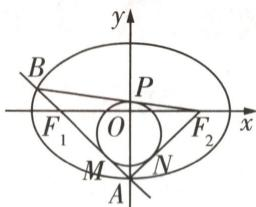

图1

【明关键】作图，利用三角形内切圆的性质，得到 $\triangle ABF_{2}$ 的周长为 $4c + 2a$

由椭圆定义可得 $|AB|+|AF_{2}|+|BF_{2}|=4a$ ，所以 $4c+2a=4a$ ，则离心率 $e=\frac{c}{a}=\frac{1}{2}$ 。故选B.

调研 2 试题调研原创 已知 $F_{1}, F_{2}$ 是双曲线 $C: \frac{x^{2}}{a^{2}} - \frac{y^{2}}{b^{2}} = 1 (a > 0, b > 0)$ 的左、右焦点，过点 $F_{1}$ 且倾斜角为 $30^{\circ}$ 的直线与双曲线的左、右两支分别交于点 A, B. 若 $|AF_{2}| = |BF_{2}|$ ，则双曲线 C 的离心率为（）

$\quad$A. $\sqrt{2}$

$\quad$B. $\sqrt{3}$

$\quad$C. 2

$\quad$D. $\sqrt{5}$

解析 根据题意作图,如图2所示.

设 $\left|AF_{1}\right|=t$ ，则 $\left|AF_{2}\right|=t+2a=\left|BF_{2}\right|$ ，从而 $\left|BF_{1}\right|=t+4a$ ，进而 $\left|BA\right|=4a$ 。

【点关键】设 $|AF_{1}|=t$ ，根据双曲线的定义用t表示 $|AF_{2}|,|BF_{2}|,|BF_{1}|$

小编说:圆锥曲线在生活中有着广泛的应用.这些应用不仅体现在科学技术领域,还渗透在我们的日常生活中,以下是一些具体的例子.

过 $F_{2}$ 作 $F_{2}H$ 垂直 $AB$ 交 $AB$ 于点 $H$ , 则 $|AH| = 2a$ .

在 Rt△ $F_{1}F_{2}H$ 中， $|F_{2}H| = 2c\sin 30^{\circ} = c$ ， $|F_{1}H| = 2c\cos 30^{\circ} = \sqrt{3}c$ ，又 $|F_{1}H| = |AF_{1}| + |AH| = t + 2a = |AF_{2}|$ ，所以 $|AF_{2}| = \sqrt{3}c$ 。

在 Rt△AF₂H 中， $(\sqrt{3}c)^{2}-c^{2}=(2a)^{2}$ ，即 $2c^{2}=4a^{2}$ ，所以离心率 $e=\frac{c}{a}=\sqrt{2}$ 。故选 A.

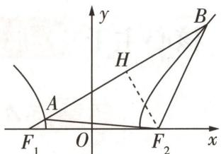

图2

# 满分攻略

# 2 大高效破解椭圆或双曲线离心率问题的方法

##### 1. 直接法: （1） 直接利用 $e = \frac{c}{a} = \sqrt{\frac{a^{2} - b^{2}}{a^{2}}} = \sqrt{1 - \left(\frac{b}{a}\right)^{2}}$ (椭圆) 或 $e = \frac{c}{a} = \sqrt{1 + \left(\frac{b}{a}\right)^{2}}$ (双曲线) 求解;

（2） 设 $F_{1}, F_{2}$ 为椭圆或双曲线的两个焦点, P 为椭圆或双曲线上一点, 则 $e = \frac{c}{a} = \frac{2c}{2a} = \frac{|F_{1}F_{2}|}{|PF_{1}| + |PF_{2}|}$ (椭圆) 或 $e = \frac{|F_{1}F_{2}|}{||PF_{1}| - |PF_{2}||}$ (双曲线).

##### 2. 构造齐次式法: 先根据条件得到关于 a, b, c 的齐次等式(不等式), 结合 $b^{2} = a^{2} - c^{2}$ (椭圆) 或 $b^{2} = c^{2} - a^{2}$ (双曲线) 转化为关于 a, c 的齐次等式(不等式), 然后将该齐次等式(不等式) 两边同时除以 a 或 $a^{2}$ 等转化为关于 e 或 $e^{2}$ 等的方程(不等式), 再解方程(不等式) 即可得 $e(e$ 的取值范围).

注意:椭圆的离心率 $e \in (0,1)$ ，双曲线的离心率 $e \in (1, +\infty)$ .

# 角度 ②

# 利用几何性质求与渐近线相关的问题

调研 3 试题调研原创 过双曲线 $C: \frac{x^{2}}{a^{2}} - \frac{y^{2}}{b^{2}} = 1 (a > 0, b > 0)$ 的右焦点 F 作渐近线 $y = \frac{b}{a}x$ 的垂线 l，垂足为 A, l 交另一条渐近线于点 B，且点 F 在点 A, B 之间，若 $|BF| = 2|AF|$ ，则双曲线 C 的渐近线方程为（）

$\quad$A. $y = \pm \frac{1}{3}x$

$\quad$B. $y = \pm \frac{\sqrt{3}}{3}x$

$\quad$C. $y = \pm \frac{1}{2}x$

$\quad$D. $y = \pm \frac{\sqrt{6}}{3}x$

解析 根据题意作图,如图3所示.

点 $F$ 到渐近线 $y = \frac{b}{a} x$ 的距离为 $|AF| = \frac{bc}{\sqrt{a^2 + b^2}} = b$ ，所以 $|BF| =$

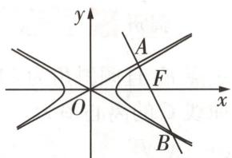

图3

【用结论】双曲线焦点到其渐近线的距离为 b

$2|AF|=2b$ , 所以 $|AB|=3b$ ,

又 $|OF|=c$ ，所以 $|OA|=a$ ，设渐近线 $y=\frac{b}{a}x$ 的倾斜角为 $\theta$ ，则 $\tan\theta=\frac{b}{a}$

所以 $\tan \angle AOB = \tan 2\theta = \frac{3b}{a} = 3\tan \theta ,$

【理思路】利用双曲线两条渐近线的几何关系, 得到 $\angle AOB = 2\theta$ ，利用 Rt $\triangle ABO$ 求解 tan $\angle AOB$

即 $\frac{2\tan\theta}{1-\tan^{2}\theta}=3\tan\theta$ , 得 $\tan\theta=\frac{\sqrt{3}}{3}$ , 所以双曲线 C 的渐近线方程为 $y=\pm\frac{\sqrt{3}}{3}x$ , 故选 B.

调研 4 [2025 四川省射洪中学模拟] 已知 $F_{1}, F_{2}$ 分别是双曲线 $\frac{x^{2}}{a^{2}} - \frac{y^{2}}{b^{2}} = 1 (a > 0, b > 0)$ 的左、右焦点，点 O 为坐标原点，过 $F_{1}$ 的直线分别交双曲线左、右两支于 A, B 两点，点 C 在 x 轴上， $\overrightarrow{CB} = 3 \overrightarrow{F_{2}A}, BF_{2}$ 平分 $\angle F_{1}BC$ ，线段 AB 与双曲线的一条渐近线交于点 P，则 $\sin \angle POF_{2} =$

$\quad$A. $\frac{\sqrt{41}}{7}$

$\quad$B. $\frac{\sqrt{42}}{7}$

$\quad$C. $\frac{\sqrt{43}}{7}$

$\quad$D. $\frac{2\sqrt{11}}{7}$

解析 因为 $\overrightarrow{CB}=3\overrightarrow{F_{2}A}$ ，所以 $\triangle F_{1}AF_{2}\sim\triangle F_{1}BC$ ，又 $\left|F_{1}F_{2}\right|=2c$ ，所以 $\left|CF_{2}\right|=6c-2c=4c$ ，
【明关键】由 $\overrightarrow{CB}=3\overrightarrow{F_{2}A}$ ，可得 $CB\parallel F_{2}A$ ，从而 $\triangle F_{1}AF_{2}\sim\triangle F_{1}BC$

设 $\left|AF_{1}\right|=t$ ，则 $\left|BF_{1}\right|=3t$ ，故 $\left|AB\right|=2t$ ，

因为 $BF_{2}$ 平分 $\angle F_{1}BC$ ，所以 $\frac{|BC|}{|BF_{1}|} = \frac{|F_{2}C|}{|F_{1}F_{2}|} = 2$ ，

【用结论】三角形内角平分线定理的应用：若 $BF_{2}$ 平分 $\angle F_{1}BC$ ，则 $\frac{|BC|}{|BF_{1}|} = \frac{|F_{2}C|}{|F_{1}F_{2}|}$

所以 $|BC|=2|BF_{1}|=6t,|AF_{2}|=\frac{1}{3}|BC|=2t$ ，由双曲线定义可知 $|AF_{2}|-|AF_{1}|=t=2a,$ $|BF_{1}|-|BF_{2}|=2a$ ，所以 $|BF_{2}|=|AF_{2}|=|AB|=4a$ ，即 $\angle ABF_{2}=60^{\circ}$ .

在 $\triangle F_{1}BF_{2}$ 中，由余弦定理知 $\cos \angle F_{1}BF_{2} = \frac{|F_{1}B|^{2} + |F_{2}B|^{2} - |F_{1}F_{2}|^{2}}{2|F_{1}B|\cdot|F_{2}B|} =$ $\frac{(6a)^2 + (4a)^2 - (2c)^2}{2\cdot 6a\cdot 4a} = \frac{1}{2},$

化简得 $c=\sqrt{7}a$ ，由 $a^{2}+b^{2}=c^{2}$ ，得 $\frac{b}{c}=\frac{\sqrt{42}}{7}$ .

不妨设交点 P 在第一象限, 则 $\tan\angle POF_{2}=\frac{b}{a}$ , 所以 $\sin\angle POF_{2}=\frac{b}{c}=\frac{\sqrt{42}}{7}$ . 故选 B.

# 角度 3 利用几何性质求解“过焦点”相关问题

调研 5 [2025 广东湛江一中 8 月检测] 如图 4, 已知抛物线 C: $y^{2} = 8x$ 的焦点为 F, 过点 M(-1,0) 且斜率为正的直线 l 与抛物线 C 相交于 A, B 两点, 且 $|FA| + |FB| = 10, E(5,0)$ . 若过点 E, F 的圆与直线 l 相切于第一象限的点 N, 则 $\angle ENF =$ \_\_\_\_ .

解析 因为过点 $M(-1,0)$ 且斜率为正的直线 l 与抛物线相交于 A, B 两点，

故可设 $l: x = my - 1 (m > 0)$ , $A(x_{1}, y_{1})$ , $B(x_{2}, y_{2})$ ,

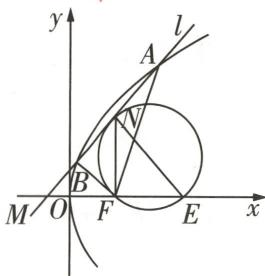

图4

抛物线相关建筑设计 抛物线相关的设计也常用于建筑领域,如某些大型体育场的顶棚设计,可以确保雨水或积雪能够迅速滑落,减少积水对建筑的损害.

由 $\left\{\begin{aligned}y^{2}&=8x,\\ x&=my-1,\end{aligned}\right.$ 可得 $y^{2}=8my-8$ ，即 $y^{2}-8my+8=0$ ，

此时 $\Delta = 64m^2 - 32 > 0$ ，即 $m > \frac{\sqrt{2}}{2}$ ，则 $y_1 + y_2 = 8m, y_1y_2 = 8, x_1 + x_2 = m(y_1 + y_2) - 2 = 8m^2 - 2.$

由 $|FA|+|FB|=10$ ，可得 $x_{1}+2+x_{2}+2=10$ ，所以 $8m^{2}=8,m=1$ ，满足 $m>\frac{\sqrt{2}}{2}$ ，所以l的方程为 $x-y+1=0$ 。

由 $F(2,0)$ , $E(5,0)$ 在圆上, 可知此圆圆心的横坐标为 $\frac{7}{2}$ , 设圆心为 $(\frac{7}{2}, b) (b > 0)$ , 则半径 $r = \sqrt{b^{2} + \frac{9}{4}}$ ,

所以圆的方程为 $(x - \frac{7}{2})^2 +(y - b)^2 = \frac{9}{4} +b^2$

因为该圆与 $l$ 相切，所以 $\left(\frac{\left|\frac{7}{2} - b + 1\right|}{\sqrt{2}}\right)^2 = b^2 +\frac{9}{4},$

解得 $b = \frac{3}{2}$ 或 $b = -\frac{21}{2}$ （舍去），所以圆的方程为 $(x - \frac{7}{2})^2 + (y - \frac{3}{2})^2 = \frac{9}{2}$ ，

由 $\left\{\begin{aligned}x-y+1&=0,\\ (x-\frac{7}{2})^{2}+(y-\frac{3}{2})^{2}&=\frac{9}{2},\end{aligned}\right.$ 可得 $N(2,3)$ ，故 $|NF|=|EF|=3,NF\perp EF,$

故 $\triangle EFN$ 是等腰直角三角形,故 $\angle ENF=\frac{\pi}{4}$ .故填 $\frac{\pi}{4}$ .

# 原创变式

1（多选）如图5，已知椭圆 $\frac{x^{2}}{9}+\frac{y^{2}}{5}=1$ 的左、右焦点分别为 $F_{1},F_{2}$ ，过点 $F_{1}$ 的直线l与椭圆交于A,B两点，则下列说法正确的是()

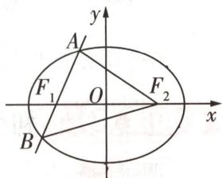

图5

$\quad$A. $\triangle ABF_{2}$ 的周长为 12  
$\quad$B. 椭圆的离心率为 $\frac{\sqrt{5}}{3}$   
$\quad$C. $\triangle AF_{1}F_{2}$ 面积的最大值为 $2\sqrt{5}$   
$\quad$D. $|AF_{2}|+|BF_{2}|$ 的最大值为 $\frac{26}{3}$

答案》第038页

# 角度 4 利用几何性质求解范围(最值)相关问题

调研 6 [2025 河南信阳高中模拟] 已知抛物线 $C: y^{2} = 8x$ 的焦点为 $F, M$ 为 $C$ 上的动点, $N$ 为圆 $A: x^{2} + y^{2} + 2x + 8y + 16 = 0$ 上的动点, 设点 $M$ 到 $y$ 轴的距离为 $d$ , 则 $|MN| + d$ 的最小值为 ( )

$\quad$A. 1

$\quad$B. $\frac{\sqrt{2}}{2}$

$\quad$C. $\frac{3\sqrt{3}}{2}$

$\quad$D. 2

解析 由已知得 $F(2,0)$ , 圆 $A: (x + 1)^{2} + (y + 4)^{2} = 1$ , 所以 $A(-1, -4)$ , 圆 $A$ 的半径为 1,

抛物线 $C$ 的准线为直线 $l: x = -2$ , 过点 $M$ 作 $ME \perp l$ , 垂足为点 $E$ , 则 $|ME| = d + 2$ , 连接 $MF, MA, AF$ , 由抛物线的定义可得 $d + 2 = |ME| = |MF|$ ,

所以 $|MN| + d = |MN| + |MF| - 2 \geqslant |AM| + |MF| - 1 - 2 \geqslant |AF| - 1 - 2 = \sqrt{(2 + 1)^2 + (0 + 4)^2} - 1 - 2 = 2$ ,

当且仅当 N, M 分别为线段 AF 与圆 A、抛物线 C 的交点时, 两个等号成立,

因此 $|MN|+d$ 的最小值为2. 故选D.

# 原创变式

② 已知抛物线 $C_{1}: y^{2} = 8x$ ，圆 $C_{2}: x^{2} + y^{2} - 4x + 3 = 0$ ，点 $M(3,1)$ ，若 A, B 分别是 $C_{1}, C_{2}$ 上的动点，则 $|AM| + |AB|$ 的最小值为 \_\_\_\_.

答案》第039页

调研 7 试题调研原创 已知双曲线 $C: \frac{x^{2}}{a^{2}} - \frac{y^{2}}{4} = 1 (a > 0)$ 的左、右焦点分别为 $F_{1}, F_{2}$ ，直线 $2x + 3y + m = 0 (m \in \mathbb{R})$ 与 C 的一条渐近线平行，若点 D 在 C 的右支上，点 $B(\sqrt{13}, 1)$ ，则 $|DB| + |DF_{2}|$ 的最小值为（）

$\quad$A. $\sqrt{53} - 3$

$\quad$B.6

$\quad$C. $\sqrt{53}-6$

$\quad$D. 8

解析 由题可知双曲线 C 的渐近线方程为 $y = \pm \frac{2}{a} x$ ,

因为直线 $2x + 3y + m = 0 (m \in \mathbb{R})$ 与 $C$ 的一条渐近线平行, 所以 $-\frac{2}{a} = -\frac{2}{3}$ , 得 $a = 3$ ,

【敲黑板】双曲线的渐近线有两条，其斜率有正有负，此处直线 $2x + 3y + m = 0$ 的斜率为负

所以 $c^{2}=a^{2}+b^{2}=9+4=13$ , 所以 $F_{1}(-\sqrt{13},0)$ , $F_{2}(\sqrt{13},0)$ .

连接 $BF_{1}$ ，因为 $B(\sqrt{13},1)$ ，所以 $|BF_{1}|=\sqrt{(2\sqrt{13})^{2}+1^{2}}=\sqrt{53}$

连接 $D{F}_{1}$ ,因为点 $D$ 在 $C$ 的右支上,所以 $\left| {DB}\right|  + \left| {D{F}_{2}}\right|  = \left| {DB}\right|  + \left| {D{F}_{1}}\right|  - {2a} \geq  \left| {B{F}_{1}}\right|  -$

【点关键】注意点 D 是在双曲线的右支上，所以 $\left|DF_{1}\right| - \left|DF_{2}\right| = 2a$

$2 a = \sqrt {5 3} - 6,$

所以 $|DB|+|DF_{2}|$ 的最小值为 $\sqrt{53}-6$ . 故选C.

##### 例如,我国著名的赵州桥就是应用了抛物线相关的拱形的力学原理进行建造的,其设计使得桥梁结构更加稳定且能够承受较大的压力.

# 创新预测

答案▶039页

##### 1. 试题调研原创 设 O 为原点, $F_{1}, F_{2}$ 为双曲线 $C: \frac{x^{2}}{a^{2}} - \frac{y^{2}}{b^{2}} = 1 (a > 0, b > 0)$ 的两个焦点, 点 P 在 C 上且满足 $|OP| = \frac{3}{2} a, \cos \angle F_{1}PF_{2} = \frac{3}{7}$ , 则双曲线 C 的渐近线方程为 ( )

$A \sqrt {2} x \pm y = 0$

$B x \pm \sqrt {2} y = 0$

$\sqrt {3} x \pm y = 0$

$D. x \pm \sqrt {3} y = 0$

##### 2. 试题调研原创 已知圆 $M: (x + m)^{2} + y^{2} = m^{2} (m > 0)$ 在椭圆 $C: \frac{x^{2}}{a^{2}} + \frac{y^{2}}{b^{2}} = 1 (a > b > 0)$ 的内部, 点 $A$ 为 $C$ 上一动点. 过 $A$ 作圆 $M$ 的一条切线, 交 $C$ 于另一点 $B$ , 切点为 $D$ , 当 $D$ 为 $AB$ 的中点时, 直线 $MD$ 的斜率为 $-2\sqrt{2}$ , 则 $C$ 的离心率为 ( )

$A \frac {1}{2}$

$B \frac {\sqrt {2}}{2}$

$C \frac {\sqrt {3}}{2}$

$D \frac {\sqrt {6}}{4}$

##### 3. 试题调研原创 设双曲线 $\Gamma: \frac{x^2}{a^2} - \frac{y^2}{b^2} = 1 (a > 0, b > 0)$ 的左、右焦点分别为 $F_1$ 和 $F_2$ , 以 $\Gamma$ 的实轴为直径的圆记为 $C$ , 过点 $F_1$ 作 $C$ 的切线 $l, l$ 与 $\Gamma$ 的左、右两支分别交于 $A, B$ 两点, 且 $\cos \angle F_1BF_2 = \frac{3}{5}$ , 则 $\Gamma$ 的离心率为 \_\_\_\_.

# 参考答案与解析

# 原创变式

##### 1.ACD

<table><tr><td>选项</td><td>分析过程</td><td>正误</td></tr><tr><td>A</td><td> $\triangle ABF_{2}$ 的周长为 $|AB| + |AF_{2}| + |BF_{2}| = |AF_{1}| + |AF_{2}| + |BF_{1}| + |BF_{2}| = 4a = 12$ </td><td>√</td></tr><tr><td>B</td><td> $a = 3, c = \sqrt{a^{2} - b^{2}} = 2$ ,故椭圆的离心率为 $\frac{c}{a} = \frac{2}{3}$ </td><td>×</td></tr><tr><td>C</td><td> $\triangle AF_{1}F_{2}$ 的面积最大时,A是短轴端点[破瓶颈: $\triangle AF_{1}F_{2}$ 的底边 $F_{1}F_{2}$ 一定,则高最大时面积最大],则 $(S_{\triangle AF_{1}F_{2}})_{\max} = \frac{1}{2} \times 2c \times b = bc = 2\sqrt{5}$ </td><td>√</td></tr><tr><td>D</td><td>要使 $|AF_{2}| + |BF_{2}| = 12 - |AB|$ 最大,只需 $|AB|$ 最小,根据椭圆性质知,当 $AB \perp x$ 轴时, $|AB|_{\min} = \frac{2b^{2}}{a} = \frac{10}{3}$ [明关键:椭圆通径(过焦点且垂直于长轴的弦)为最短的焦点弦],故 $(|AF_{2}| + |BF_{2}|)_{\max} = \frac{26}{3}$ </td><td>√</td></tr></table>

几何之韵

隧道和水坝 在隧道和水坝的设计中,圆锥曲线的几何特性可以帮助工程师优化结构,确保在承受巨大水压和地质应力的同时,保持结构的稳定性和安全性.

##### 2.4 由题可知抛物线 $C_1$ 的焦点为 $F(2,0)$ , 准线方程为 $x = -2$ ,

由圆 $C_{2}: x^{2} + y^{2} - 4x + 3 = 0$ ，得 $(x - 2)^{2} + y^{2} = 1$ ，所以圆 $C_{2}$ 是以 $F(2,0)$ 为圆心，r = 1 为半径的圆，

所以 $|AM|+|AB|\geqslant|AM|+|AF|-1$ ，所以当 $|AM|+|AF|$ 取得最小值时， $|AM|+|AB|$ 取得最小值.

根据抛物线的定义得 $|AF|$ 等于点A到准线x=-2的距离,所以过点M作准线x=-2的垂线,垂足为N,MN与抛物线 $C_{1}:y^{2}=8x$ 有一交点,当点A为此交点时, $|AM|+|AF|$ 取得最小值[破障碍:求距离和最值问题,注意进行转化,过M作准线的垂线,当相关点M,A,N在一条直线上时所求距离和取最小值],

最小值为 $|3-(-2)|=5$ ，

所以 $|AM| + |AB| \geqslant |AM| + |AF| - 1 \geqslant 5 - 1 = 4$ ，所以 $|AM| + |AB|$ 的最小值为4.

# 创新预测

##### 1.B 不妨设点 P 在第一象限, 如图 6 所示.

设 $\left|PF_{1}\right|=m,\left|PF_{2}\right|=n$ ，由双曲线的定义知m-n=2a ①，

在 $\triangle F_{1}PF_{2}$ 中，由余弦定理得 $4c^{2} = m^{2} + n^{2} - 2mn\cos \angle F_{1}PF_{2}$ ，所以 $4c^{2} = m^{2} + n^{2} - \frac{6}{7} mn$ ②，延长 $PO$ 至 $Q$ ，使 $|OQ| = |OP|$ ，连接 $F_{1}Q$ ， $F_{2}Q$ ，则四边形 $PF_{1}QF_{2}$ 为平行四边形，由 $|OP| = \frac{3}{2} a, O$ 为 $F_{1}F_{2}$ 的中点，可得 $|PQ| = 2 \times \frac{3}{2} a = 3a$ .

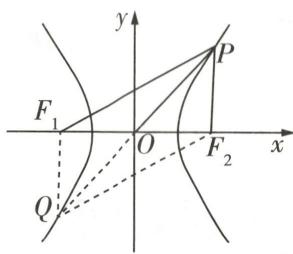

图6

在 $\triangle PF_{1}F_{2}$ 中，由余弦定理知 $4c^{2} = m^{2} + n^{2} - 2mn\cos \angle F_{1}PF_{2}$

在 $\triangle PF_{1}Q$ 中，由余弦定理知 $9a^{2} = m^{2} + n^{2} - 2mn\cos \angle PF_{1}Q,$

因为 $\angle F_{1}PF_{2}+\angle PF_{1}Q=\pi$ , 所以 $\cos\angle F_{1}PF_{2}+\cos\angle PF_{1}Q=0$ , 可知 $2(m^{2}+n^{2})=(3a)^{2}+(2c)^{2}$ [秒杀技:根据四点共圆的四边形四条边的平方和等于两条对角线的平方和可快速得此结论], 所以 $m^{2}+n^{2}=\frac{9a^{2}+4c^{2}}{2}$ ③.

由①③得 $mn = \frac{1}{4}a^{2} + c^{2}$ ④，把③④代入②得 $4c^{2} = \frac{9a^{2} + 4c^{2}}{2} - \frac{6}{7} \left( \frac{1}{4}a^{2} + c^{2} \right)$ ，化简得 $2c^{2} = 3a^{2}$ ，所以 $2a^{2} + 2b^{2} = 3a^{2}$ ，所以 $a = \sqrt{2}b$ ，所以双曲线 C 的渐近线方程为 $x \pm \sqrt{2}y = 0$ 。故选 B.

##### 2.C 设 $A(x_{1},y_{1})$ , $B(x_{2},y_{2})$ , $D(x_{0},y_{0})$ , 则 $2x_{0}=x_{1}+x_{2}$ , $2y_{0}=y_{1}+y_{2}$ ,

由 $\left\{\begin{aligned}\frac{x_{1}^{2}}{a^{2}}+\frac{y_{1}^{2}}{b^{2}}&=1,\\ \frac{x_{2}^{2}}{a^{2}}+\frac{y_{2}^{2}}{b^{2}}&=1,\end{aligned}\right.$ 两式相减得 $\frac{1}{a^{2}}(x_{1}^{2}-x_{2}^{2})=-\frac{1}{b^{2}}(y_{1}^{2}-y_{2}^{2})$ ,

所以 $\frac{(y_{1}-y_{2})(y_{1}+y_{2})}{(x_{1}-x_{2})(x_{1}+x_{2})}=-\frac{b^{2}}{a^{2}}$ ，即 $\frac{(y_{1}-y_{2})y_{0}}{(x_{1}-x_{2})x_{0}}=-\frac{b^{2}}{a^{2}}$ [拓思维:此处可以联想圆锥曲线相交弦所在直线斜率与弦中点的关系式,对于圆锥曲线上两点 $A(x_{1},y_{1}),B(x_{2},y_{2})$ ，弦AB的中点为 $D(x_{0},y_{0})$ ，当直线AB的斜率存在时，对于椭圆 $\frac{x^{2}}{a^{2}}+\frac{y^{2}}{b^{2}}=1(a>b>0)$ ，弦AB所在直线的斜率 $k_{AB}=\frac{y_{1}-y_{2}}{x_{1}-x_{2}}=-\frac{b^{2}}{a^{2}}\cdot\frac{x_{0}}{y_{0}}$ ；若改为双曲线 $\frac{x^{2}}{a^{2}}-\frac{y^{2}}{b^{2}}=1(a>0,b>0)$ ，则 $k_{AB}=\frac{y_{1}-y_{2}}{x_{1}-x_{2}}=\frac{b^{2}}{a^{2}}\cdot\frac{x_{0}}{y_{0}}$ ；若改为抛物线 $y^{2}=2px(p>0)$ ，则 $k_{AB}=\frac{y_{1}-y_{2}}{x_{1}-x_{2}}=\frac{p}{y_{0}}$ ].

当 $D$ 为 $AB$ 的中点时， $k_{MD} = -2\sqrt{2}$ ，则 $k_{AB} = -\frac{1}{k_{MD}} = \frac{\sqrt{2}}{4}$ ，故 $\frac{y_1 - y_2}{x_1 - x_2} = \frac{\sqrt{2}}{4}$ .

如图 7, 设 E 为 C 的左顶点, 连接 OD, 则 $\angle DME = 2 \angle DOM$ ,

所以 $\tan \angle DME = \tan 2\angle DOM = \frac{2\tan\angle DOM}{1 - \tan^2\angle DOM} = 2\sqrt{2}$

整理得 $\sqrt{2} \tan^2 \angle DOM + \tan \angle DOM - \sqrt{2} = 0$ ，得 $\tan \angle DOM = \frac{\sqrt{2}}{2}$ 或 $\tan \angle DOM = -\sqrt{2}$ （舍去），则 $k_{OD} = -\tan \angle DOM = -\frac{\sqrt{2}}{2} = \frac{y_0}{x_0}$ ，

所以 $\frac{\sqrt{2}}{4} \times (-\frac{\sqrt{2}}{2}) = -\frac{b^2}{a^2}$ , 所以 $\frac{b^2}{a^2} = \frac{1}{4}$ , 故 $C$ 的离心率 $e = \sqrt{1 - \frac{1}{4}} = \frac{\sqrt{3}}{2}$ . 故选 C.

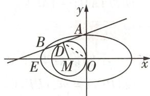

图 7

##### 3. $\frac{\sqrt{13}}{2}$ 设直线 $l$ 与圆 $C$ 的切点为 $P$ , 连接 $OP(O$ 为坐标原点), 则 $|OP|=a, OP \perp PF_{1}$ , 由 $|OF_{1}|=c$ ,

得 $\left|PF_{1}\right|=\sqrt{\left|OF_{1}\right|^{2}-\left|OP\right|^{2}}=\sqrt{c^{2}-a^{2}}=b.$ 如图8,过点 $F_{2}$ 作 $F_{2}Q\perp AB$ 于点Q,则 $OP\parallel F_{2}Q$ ,由O为 $F_{1}F_{2}$ 的中点,得 $\left|F_{1}Q\right|=2\left|PF_{1}\right|=2b$ , $\left|QF_{2}\right|=2\left|OP\right|=2a.$

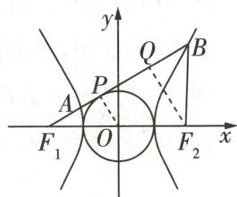

图8

因为 $\cos \angle F_{1}BF_{2} = \frac{3}{5}$ , 所以 $\angle F_{1}BF_{2}$ 为锐角, 所以 $\sin \angle F_{1}BF_{2} = \sqrt{1 - \cos^{2} \angle F_{1}BF_{2}} = \frac{4}{5}$ , 所以 $|BF_{2}| = \frac{|QF_{2}|}{\sin \angle F_{1}BF_{2}} = \frac{2a}{\frac{4}{5}} = \frac{5a}{2}$ , 所以

$|BQ|=|BF_{2}|\cos\angle F_{1}BF_{2}=\frac{5a}{2}\times\frac{3}{5}=\frac{3a}{2}$ ，所以 $|F_{1}B|=|F_{1}Q|+|BQ|=2b+\frac{3a}{2}$ 。由双曲线的定义知， $|BF_{1}|-|BF_{2}|=2a$ ，即 $2b+\frac{3a}{2}-\frac{5a}{2}=2a$ ，可得 $b=\frac{3a}{2}$ ，又 $c^{2}=a^{2}+b^{2}$ ，所以 $c=\frac{\sqrt{13}a}{2}$ ，所以双曲线 $\Gamma$ 的离心率为 $e=\frac{c}{a}=\frac{\sqrt{13}}{2}$ 。

# 超重点5 快速求解轨迹方程的3个必用技法

<table><tr><td>三年考情与创新命题特点</td><td>2025命题预测</td></tr><tr><td>2024 新课标I卷 T11,以新定义曲线为背景,考查利用定义法求轨迹方程</td><td rowspan="3">1命题形式:会出现在选择题、填空题中.若在解答题中出现,则是第一小问且难度不大.2必考热点:利用定义法、直接法、相关点法、参数法等求轨迹方程,研究曲线的相关性质.3创新考法:以新定义曲线的形式或与其他知识交汇,考查未知曲线的相关性质.</td></tr><tr><td>2024 新课标II卷 T5,以圆为载体,考查利用相关点法求线段中点的轨迹方程</td></tr><tr><td>2023 新课标I卷 T22,第（1）问考查利用直接法求动点的轨迹方程,第（2）问与函数、导数交汇命题,考查利用导数求解最值问题</td></tr></table>

# 技法 1

# 用定义法或直接法求轨迹方程

调研 1 [2025 广州华南师范大学附属中学 8 月综合测试] (多选) 已知定圆 $M: (x - 1)^{2} + y^{2} = 16$ , 点 $A$ 是圆 $M$ 所在平面内一定点, 点 $P$ 是圆 $M$ 上的动点, 若线段 $PA$ 的中垂线交直线 $PM$ 于点 $Q$ , 则点 $Q$ 可能在 ( )

$\quad$A.椭圆上

$\quad$B. 双曲线上

$\quad$C. 抛物线上

$\quad$D. 圆上

解析 连接 ${MA},{QA}$ ,因为 $Q$ 是线段 ${PA}$ 的中垂线上的点,所以 $\left| {QA}\right|  = \left| {PQ}\right|$ .

【明思路】Q 是线段 PA 的中垂线上的点，可得 $\left|QA\right| = \left|PQ\right|$ 。对点 A 的位置分类讨论，利用线段中垂线的定义与性质、圆锥曲线的定义即可判断各选项的正误

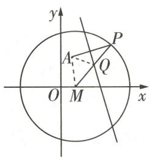

图1

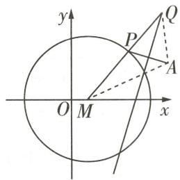

图2

若A在圆M内部,且不为圆心,如图1,则 $|MA|<4$ , $|QM|+|QA|=|QM|+|QP|=4>$ |MA|,所以点Q的轨迹是以M,A为焦点的椭圆或其一部分,故A正确.

若 $A$ 在圆 $M$ 外部, 如图2, 则 $|MA| > 4$ , $||QA| - |QM|| = ||PQ| - |QM|| = |PM| = 4 <$

【易遗漏】切勿遗漏椭圆(双曲线)定义中的限制条件2a>2c(2a<2c)

$|MA|$ , 所以点 Q 的轨迹是以 M, A 为焦点的双曲线的一部分, 故 B 正确.

若 $A$ 在圆 $M$ 上, 则线段 $PA$ 的中垂线恒过圆心 $M$ , 即点 $Q$ 就是点 $M$ ; 若 $A$ 为圆 $M$ 的圆心, 即 $A$ 与 $M$ 重合时, $Q$ 为半径 $PM$ 的中点, 所以点 $Q$ 的轨迹是以 $M$ 为圆心、2 为半径的圆, 故 D 正确. 不存在点 $Q$ 的轨迹为抛物线的可能, 故 C 错误. 故选 ABD.

调研 2 [2025 重庆南开中学 8 月开学考试] 已知动点 P 与定点 A(m,0) 的距离和 P 到定直线 $x=\frac{n^{2}}{m}$ 的距离的比值为常数 $\frac{m}{n}$ ，其中 m>0, n>0，且 $m\neq n$ ，记点 P 的轨迹为曲线 C.

（1） 求 C 的方程, 并说明曲线 C 的形状.

（2） 设点 $B(-m,0)$ , 曲线 $C$ 上两动点 $M, N$ 均在 $x$ 轴上方, $AM \parallel BN$ , 且 $AN$ 与 $BM$ 相交于点 $Q$ . 当 $m = 2\sqrt{2}, n = 4$ 时,

(i) 证明 $\frac{1}{|AM|} + \frac{1}{|BN|}$ 为定值；

(ii) 求动点 Q 的轨迹方程.

解析 （1） 设点 $P(x, y)$ , 由题意可知 $\frac{\sqrt{(x - m)^2 + y^2}}{|x - \frac{n^2}{m}|} = \frac{m}{n}$ ,

【找题眼】题眼为“动点 P 与定点 A(m,0) 的距离和 P 到定直线 $x=\frac{n^{2}}{m}$ 的距离的比值为常数 $\frac{m}{n}$ ”，利用直接法列式化简求轨迹方程

即 $(x - m)^2 + y^2 = \left(\frac{m}{n} x - n\right)^2$ ，化简得 $C$ 的方程为 $\frac{x^2}{n^2} + \frac{y^2}{n^2 - m^2} = 1$ .

当 $m < n$ 时, 曲线 $C$ 是焦点在 $x$ 轴上的椭圆; 当 $m > n$ 时, 曲线 $C$ 是焦点在 $x$ 轴上的双曲线.

（2） 当 $m = 2\sqrt{2}$ , n = 4 时, 由 （1） 可知 C 的方程为 $\frac{x^{2}}{16} + \frac{y^{2}}{8} = 1$ , $A(2\sqrt{2}, 0)$ , $B(-2\sqrt{2}, 0)$ .

作出示意图,如图3,设点 $M(x_{1},y_{1}),N(x_{2},y_{2}),M'(x_{3},y_{3})$ ,其中 $y_{1}>0,y_{2}>0$ ,且 $x_{3}=-x_{2},y_{3}=-y_{2}$ .

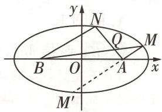

图 3

(i) 因为 $AM \parallel BN$ , 所以 $\frac{y_1}{x_1 - 2\sqrt{2}} = \frac{y_2}{x_2 + 2\sqrt{2}} = \frac{-y_2}{-x_2 - 2\sqrt{2}} = \frac{y_3}{x_3 - 2\sqrt{2}}$ , 因此 $M, A, M'$ 三点共线, 连接 $AM'$ , 则 $|BN| = \sqrt{(x_2 + 2\sqrt{2})^2 + y_2^2} = \sqrt{(-x_2 - 2\sqrt{2})^2 + (-y_2)^2} = |AM'|$ .

易知直线 $MM'$ 不与 $y$ 轴垂直，设直线 $MM'$ 的方程为 $x = ty + 2\sqrt{2}$ ，与 $C$ 的方程联立，化简得关于 $y$ 的二次方程 $(t^2 + 2)y^2 + 4\sqrt{2}ty - 8 = 0, \Delta > 0$ ，则 $y_1 + y_3 = -\frac{4\sqrt{2}t}{t^2 + 2}, y_1y_3 = -\frac{8}{t^2 + 2}$ .

由题意可知 $|AM|=\frac{2\sqrt{2}}{4}|x_{1}-\frac{16}{2\sqrt{2}}|=4-\frac{\sqrt{2}}{2}x_{1}$ ，同理得 $|AM'|=|BN|=4-\frac{\sqrt{2}}{2}x_{3}$

【扫清障碍】这里再次利用了题眼，点 M 与定点 $A(2\sqrt{2},0)$ 的距离 $|AM|$ 和 M 到定直线 $x=\frac{16}{2\sqrt{2}}$ 的距离 $\left|x_{1}-\frac{16}{2\sqrt{2}}\right|$ 的比值为常数 $\frac{2\sqrt{2}}{4}$

所以 $\frac{1}{|AM|} +\frac{1}{|BN|} = \frac{|AM| + |BN|}{|AM|\cdot|BN|} = \frac{(4 - \frac{\sqrt{2}}{2}x_1) + (4 - \frac{\sqrt{2}}{2}x_3)}{(4 - \frac{\sqrt{2}}{2}x_1)(4 - \frac{\sqrt{2}}{2}x_3)} = \frac{(2 - \frac{\sqrt{2}}{2}ty_1) + (2 - \frac{\sqrt{2}}{2}ty_3)}{(2 - \frac{\sqrt{2}}{2}ty_1)(2 - \frac{\sqrt{2}}{2}ty_3)} =$

$\frac {4 - \frac {\sqrt {2}}{2} t (y _ {1} + y _ {3})}{4 - \sqrt {2} t (y _ {1} + y _ {3}) + \frac {1}{2} t ^ {2} y _ {1} y _ {3}} = \frac {4 - \frac {\sqrt {2}}{2} t \cdot (- \frac {4 \sqrt {2} t}{t ^ {2} + 2})}{4 - \sqrt {2} t \cdot (- \frac {4 \sqrt {2} t}{t ^ {2} + 2}) + \frac {1}{2} t ^ {2} \cdot (- \frac {8}{t ^ {2} + 2})} = 1 (\text {定值}).$

【讲方法】求定值问题常见的方法有两种：①从特殊情况入手，求出定值，再证明这个值与变量无关；②直接推理、计算，并在计算推理的过程中消去变量，从而得到定值

(ii) 由椭圆定义得 $|BQ| + |QM| + |MA| = 8$ ，则 $|QM| = 8 - |BQ| - |AM|$ .

因为 $AM \parallel BN$ , 所以 $\frac{|AM|}{|BN|} = \frac{|QM|}{|BQ|} = \frac{8 - |BQ| - |AM|}{|BQ|}$ , 则 $|BQ| = \frac{(8 - |AM|) \cdot |BN|}{|AM| + |BN|}$ ,

同理可得 $|AQ| = \frac{(8 - |BN|) \cdot |AM|}{|AM| + |BN|}$ , 所以 $|AQ| + |BQ| = \frac{(8 - |BN|) \cdot |AM|}{|AM| + |BN|} + \frac{(8 - |AM|) \cdot |BN|}{|AM| + |BN|} = \frac{8(|AM| + |BN|) - 2|AM| \cdot |BN|}{|AM| + |BN|} = 8 - \frac{2}{\frac{1}{|AM|} + \frac{1}{|BN|}} = 8 - 2 = 6 > 4\sqrt{2} = |AB|$ .

所以点 Q 在焦点 A, B、长轴长为 6 的椭圆上，

又点 M, N 均在 x 轴上方, 所以动点 Q 的轨迹方程为 $\frac{x^{2}}{9} + y^{2} = 1 (y > 0)$ .

# 原创变式

已知 $A(-2,0), B(2,0)$ ，设点 $P$ 是圆 $x^{2} + y^{2} = 1$ 上的点，若动点 $Q$ 满足 $\overrightarrow{QP} \cdot \overrightarrow{PB} = 0, \overrightarrow{QP} = \lambda \left(\frac{\overrightarrow{QA}}{|\overrightarrow{QA}|} + \frac{\overrightarrow{QB}}{|\overrightarrow{QB}|}\right) (\lambda \in \mathbb{R}$ 且 $\lambda \neq 0)$ ，则点 $Q$ 所在曲线的方程为 （）

$\quad$A. $x^{2} - \frac{y^{2}}{3} = 1$

$\quad$B. $\frac{x^2}{3} - y^2 = 1$

$\quad$C. $\frac{x^{2}}{5}+y^{2}=1$

$\quad$D. $\frac{x^2}{6} +\frac{y^2}{2} = 1$

答案》第047页

# 技法 ②

# 用相关点转化法求轨迹方程

调研 3 试题调研原创 已知椭圆 $C_{1}:\frac{x^{2}}{a^{2}}+\frac{y^{2}}{b^{2}}=1(a>b>0)$ 的左、右顶点分别为 A,B，长轴长为 4，点 D 为椭圆上与 A,B 不重合的点，且 $k_{DA}\cdot k_{DB}=-\frac{1}{4}$ .

（1） 求椭圆 $C_{1}$ 的方程.

（2）一条垂直于 $x$ 轴的动直线 $l$ 交椭圆 $C_1$ 于 $P, Q$ 两点, 当直线 $l$ 与曲线 $C_1$ 相切于点 $A$ 或点 $B$ 时, 看作 $P, Q$ 两点重合于点 $A$ 或点 $B$ , 求直线 $AP$ 与直线 $BQ$ 交点 $E$ 的轨迹 $C_2$ 的方程.

解析 （1） 由题意知 $a = 2$ , 所以 $A(-2,0), B(2,0)$ , 设 $D(x,y), x \neq \pm 2$ .

由 $k_{DA} \cdot k_{DB} = -\frac{1}{4}$ 得 $\frac{y}{x + 2} \cdot \frac{y}{x - 2} = -\frac{1}{4}$ , 化简得 $\frac{x^2}{4} + y^2 = 1$ .

所以椭圆 $C_{1}:\frac{x^{2}}{4}+y^{2}=1$ .

【小提示】利用直接法求出椭圆方程，实际上此为椭圆的第三定义

卫星绕地球运行的轨道可以看作一个椭圆(更准确地说是椭圆的一部分),而双曲线则用于描述某些特定情况下的轨道,如逃逸轨道.

（2）如图4,设 $P(x_{0},y_{0})$ ，则 $Q(x_{0},-y_{0}),x_{0}\in[-2,2]$ ，且 $\frac{x_{0}^{2}}{4}+y_{0}^{2}=1$ ，当 $x_{0}\neq\pm2$ 时，直线 $AP:\frac{y}{y_{0}}=\frac{x+2}{x_{0}+2}$ ，即 $(x_{0}+2)y-y_{0}x-2y_{0}=0$ ，直线 $BQ:\frac{y}{-y_{0}}=\frac{x-2}{x_{0}-2}$ ，即 $(x_{0}-2)y+y_{0}x-2y_{0}=0$ .

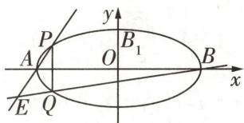

图4

由 \( \left\{\begin{aligned}(x\_{0}+2)y-y\_{0}x-2y\_{0}&=0,\\(x\_{0}-2)y+y\_{0}x-2y\_{0}&=0\end{aligned}\right. \) 得 \( \left\{\begin{aligned}x\_{0}&=\frac{4}{x},\\ y\_{0}&=\frac{2y}{x},\end{aligned}\right. \) 由 \( \frac{x\_{0}^{2}}{4}+y\_{0}^{2}&=1 \) 得 \( \frac{4}{x^{2}}+\frac{4y^{2}}{x^{2}}=1 \) ，

即 $\frac{x^{2}}{4}-y^{2}=1$ ，又A,B两点也适合上述方程，故点E的轨迹 $C_{2}$ 的方程为 $\frac{x^{2}}{4}-y^{2}=1$ .

# 技法 ③ 用交轨法或参数法求轨迹方程

调研 4 [2025 湖北宜荆荆检测] 已知抛物线 $E: x^{2} = 2py (p > 0)$ 的焦点为 F, H 为 E 上任意一点, 且 $|HF|$ 的最小值为 1.

（1） 求抛物线 E 的方程.

（2）已知 P 为平面上一动点, 过 P 能向 E 作两条切线, 切点分别为 M, N, 记直线 PM, PN, PF 的斜率分别为 $k_{1}, k_{2}, k_{3}$ , 且满足 $\frac{1}{k_{1}} + \frac{1}{k_{2}} = \frac{2}{k_{3}}$ .

  
“交轨法”速解抛物线两条切线交点的轨迹方程问题

①求点 P 的轨迹方程.

②探究:是否存在一个圆心为 $Q(0,\lambda)(\lambda>0)$ ，半径为1的圆，使得过P可以作圆Q的两条切线 $l_{1},l_{2}$ ，切线 $l_{1},l_{2}$ 分别交抛物线 E 于不同的点 $A(s_{1},t_{1}),B(s_{2},t_{2})$ 和点 $C(s_{3},t_{3}),D(s_{4},t_{4})$ ，且 $s_{1}s_{2}s_{3}s_{4}$ 为定值？若存在，求圆Q的方程；若不存在，说明理由.

解析 （1） 如图 5, 设抛物线 $E$ 的准线 $l: y = -\frac{p}{2}$ , 过 $H$ 作 $HH_{1} \perp l$ 于点 $H_{1}$ .

由抛物线的定义得 $|HF| = |HH_{1}|$ ，所以当 $H$ 与原点 $O$ 重合时， $|HH_{1}|$ 最小，且 $|HH_{1}|_{\min} = |HF|_{\min} = \frac{p}{2} = 1$ ，所以 $p = 2$ ，所以抛物线 $E$ 的方程为 $x^{2} = 4y$ .

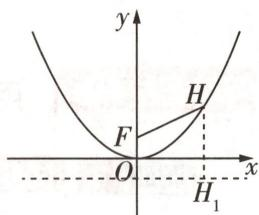

图 5

（2）①如图6,设 $P(m,n)$ (易知 $m\neq0$ ),过点P且斜率存在的直线 $l:y=k(x-m)+n$ .

由 $\left\{\begin{aligned}x^{2}&=4y,\\ y&=k(x-m)+n\end{aligned}\right.$ 消去y得关于x的二次方程 $x^{2}-4kx+4km-4n=0$ ,

令 $\Delta_{1}=16k^{2}-4(4km-4n)=0$ , 得关于 k 的二次方程 $k^{2}-mk+n=0$ , 由题意知 $\Delta_{2}=m^{2}-4n>0$ $k_{1}, k_{2}$ 是该方程的两个不等实根, 则 $\left\{\begin{aligned}k_{1}+k_{2}&=m,\\ k_{1}k_{2}&=n.\end{aligned}\right.$

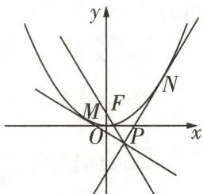

图6

由 $F(0,1)$ 得 $k_{3} = \frac{n - 1}{m}$ , 由 $\frac{1}{k_1} + \frac{1}{k_2} = \frac{2}{k_3}$ 得 $\frac{k_1 + k_2}{k_1k_2} = \frac{2}{k_3}$ , 所以 $\frac{m}{n} = \frac{2m}{n - 1}$ ,

因为 $m \neq 0$ ，所以 $n - 1 = 2n$ ，所以 $n = -1$ ，满足 $m^2 - 4n > 0$ ，所以点 $P$ 的轨迹方程为 $y = -1 (x \neq 0)$ .

②假设存在满足题意的圆 Q.

由①知 $P(m, -1)$ , 如图7, 易知 $l_{1}, l_{2}$ 的斜率均存在, 设 $l_{1}: y = k_{4}(x - m) - 1, l_{2}: y = k_{5}(x - m) - 1$ , 易知 $m \neq \pm 1$ 且 $m \neq 0$ , 联立直线 $l_{1}$ 与抛物线 $E$ 的方程可得关于 $x$ 的二次方程 $x^{2} - 4k_{4}x + 4k_{4}m + 4 = 0, \Delta_{3} > 0$ , 则 $s_{1}s_{2} = 4k_{4}m + 4$ , 同理得 $s_{3}s_{4} = 4k_{5}m + 4$ , 所以 $s_{1}s_{2}s_{3}s_{4} = (4k_{4}m + 4)(4k_{5}m + 4) = 16k_{4}k_{5}m^{2} + 16m(k_{4} + k_{5}) + 16$ .

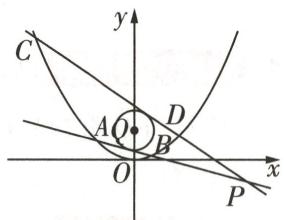

图 7

又 $l_{1}$ 和圆 $Q$ 相切，所以 $\frac{|k_4(0 - m) - 1 - \lambda|}{\sqrt{1 + k_4^2}} = 1,$

即 $(m^2 - 1)k_4^2 + 2m(\lambda + 1)k_4 + \lambda^2 + 2\lambda = 0$ ，同理得 $(m^2 - 1)k_5^2 + 2m(\lambda + 1)k_5 + \lambda^2 + 2\lambda = 0$

所以 $k_{4}, k_{5}$ 是关于 $k$ 的方程 $(m^{2} - 1)k^{2} + 2m(\lambda + 1)k + \lambda^{2} + 2\lambda = 0$ 的两个不同的根, $\Delta_{4} >$ 0, 则 $\left\{\begin{aligned}k_{4}+k_{5}&=-\frac{2m(\lambda+1)}{m^{2}-1},\\ k_{4}k_{5}&=\frac{\lambda^{2}+2\lambda}{m^{2}-1},\end{aligned}\right.$ 则 $s_{1}s_{2}s_{3}s_{4}=16k_{4}k_{5}m^{2}+16m(k_{4}+k_{5})+16=\frac{16m^{2}}{m^{2}-1}(\lambda^{2}+2\lambda-$ $2\lambda-2)+16=\frac{16m^{2}}{m^{2}-1}(\lambda^{2}-2)+16$ ，因为 $s_{1}s_{2}s_{3}s_{4}$ 为定值，所以 $\lambda^{2}-2=0$ .

【回顾】根据点 P 在直线 y = -1 上设出直线 $l_{1}$ ， $l_{2}$ 的方程，“直曲联立”，建立 $s_{1}s_{2}s_{3}s_{4}$ 与所设参数 m， $k_{4}$ ， $k_{5}$ 之间的关系，根据直线与圆相切得到参数 $k_{4}$ ， $k_{5}$ 与 m， $\lambda$ 的关系，进而用 m， $\lambda$ 表示出 $s_{1}s_{2}s_{3}s_{4}$ ，由 $s_{1}s_{2}s_{3}s_{4}$ 为定值解出 $\lambda$ ，即可求得圆的方程

又 $\lambda > 0$ ，所以 $\lambda = \sqrt{2}$ ，所以圆 Q 的方程是 $x^{2} + (y - \sqrt{2})^{2} = 1$ .

# 满分攻略

# 5 大轨迹方程速解技法的应用与辨析

##### 1. 定义法 从题设条件能直接判断出点的轨迹为所学的曲线(椭圆、双曲线、抛物线等), 则先判断动点的轨迹形状, 再确定相关曲线的基本元素, 从而得到轨迹方程.  
##### 2. 直接法 当所求动点要满足的条件简单明确时, 可直接按“建系设点、列出条件、代入坐标、整理化简、限制说明”五个基本步骤求轨迹方程.  
##### 3. 相关点转化法 当题目中的条件同时具有以下特征时,一般可以用相关点转化法求轨迹方程:（1）某个动点 P 在已知方程的曲线上移动;（2）另一个动点 M 随 P 的变化而变化;（3）在变化过程中 P 和 M 满足一定的规律.  
##### 4. 参数法 当题设条件中很难或者无法直接找到坐标变量 x, y 的关系时, 可通过设辅助参数 k, 分别找到 x, y 与 k 的关系, 即 $\left\{\begin{aligned} x &= f(k), \\ y &= g(k), \end{aligned}\right.$ 消去参数 k 后即可求得轨迹方程.  
##### 5. 交轨法 求两曲线的交点轨迹方程时,往往先利用方程组求出交点坐标(含参数),再消参即可.

# 创新预测

答案▶047页

##### 1. 试题调研原创 已知 O 为平面直角坐标系的原点, 点 W 为 $\odot O: x^{2} + y^{2} = 4$ 和 $\odot M$ 的公共点 (M 不与 O 重合), $\overrightarrow{OM} \cdot \overrightarrow{OW} = 0$ , $\odot M$ 与直线 $x + 2 = 0$ 相切. 记动点 M 的轨迹为 C, 则 C 的方程为 \_\_\_\_.  
##### 2. 试题调研原创 如图8,A,B是抛物线 $C: y^{2} = 4x$ 上两点,满足 $OA \perp OB$ (O 是坐标原点),过点O作直线AB的垂线,垂足为D.记D的轨迹为M,则M的方程为\_\_\_\_.  
##### 3.[2025 合肥一六八中学检测]已知曲线 C 的方程为 $y^{2}=4x$ ，过 $M(2,0)$ 作直线与曲线 C 分别交于 A, B 两点。分别过 A, B 作曲线 C 的切线，设两切线的交点为 $N(x_{0},y_{0})$ ，则 $x_{0}^{2}+y_{0}^{2}+8x_{0}-4y_{0}+21$ 的最小值为 \_\_\_\_。  
##### 4. 试题调研原创 已知平面直角坐标系 $xOy$ 中, 椭圆 $E: \frac{x^2}{a^2} + \frac{y^2}{b^2} = 1 (a > b >$

0) 与双曲线 $C: \frac{x^2}{b^2} - \frac{y^2}{a^2} = 1$ .

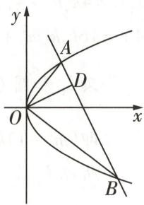

图8

（1） 若 E 的长轴长为 8，短轴长为 4，直线 $l_{1}: y = kx + m (k \neq \pm 2)$ 与 C 有唯一的公共点 M，过 M 且与 $l_{1}$ 垂直的直线分别交 x 轴，y 轴于点 A(x,0)，B(0,y)，当 M 运动时，求点 D(x,y) 的轨迹方程.  
（2） 若 C 过点 $(\sqrt{3},0)$ ，C 的离心率为 $\frac{\sqrt{21}}{3}$ ，过点 $(1,0)$ 的直线 $l_{2}$ 与椭圆 E 交于 P, Q 两点，求 $\triangle OPQ$ 面积的最大值.

# 规范答题

# 参考答案与解析

# 原创变式

A 由 $\overrightarrow{QP} \cdot \overrightarrow{PB} = 0$ , 可得 $QP \perp PB$ , 由 $\overrightarrow{QP} = \lambda \left( \frac{\overrightarrow{QA}}{|\overrightarrow{QA}|} + \frac{\overrightarrow{QB}}{|\overrightarrow{QB}|} \right)$ , 可得点 $P$ 在 $\angle BQA$ 的平分线所在直线上 (不与点 $Q$ 重合). 如图9, 延长 $BP$ 交 $AQ$ 于点 $C$ , 连接 $OP$ , 因为 $\angle PQB = \angle PQC$ , 且 $PQ \perp BC$ , 所以 $|QB| = |QC|$ , 且 $P$ 为线段 $BC$ 的中点, 又 $|AO| = |BO|$ , 则 $OP \parallel AC$ , $|OP| = \frac{1}{2} |AC|$ , 因此 $|QA| -$

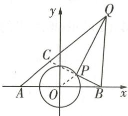

图9

$|QB|=|QA|-|QC|=|AC|=2|OP|=2<4=|AB|$ ，所以点Q在焦点为A,B、长轴长为2的双曲线的一支上。设双曲线方程为 $\frac{x^{2}}{a^{2}}-\frac{y^{2}}{b^{2}}=1(a>0,b>0)$ ，可知 $a=1,c=2,b=\sqrt{3}$ ，所以双曲线方程为 $x^{2}-\frac{y^{2}}{3}=1$ 。故选A[关键点：本题的解题关键是将题中的 $\overrightarrow{QP}=\lambda(\frac{\overrightarrow{QA}}{|QA|}+\frac{\overrightarrow{QB}}{|QB|})$ 转化为P在 $\angle BQA$ 的平分线所在直线上，进而证明 $|QB|=|QC|$ ，将 $|QA|-|QB|$ 转化为 $|QA|-|QC|=|AC|$ ，即可得出动点Q在双曲线上]。

# 创新预测

##### 1. $y^{2}=4x(x\neq0)$ 设 $M(x,y)(x\neq0)$ , $\odot M$ 与直线 $x+2=0$ 的切点为 N, 连接 MN, MW, 由 $\overrightarrow{OM}\cdot\overrightarrow{OW}=0$ 知 $OM\perp OW$ , 则 $|MN|^{2}=|MW|^{2}=|OM|^{2}+|OW|^{2}$ , 所以 $|x+2|^{2}=x^{2}+y^{2}+4$ , 化简得 $y^{2}=4x$ , 所以 C 的方程为 $y^{2}=4x(x\neq0)$ .

##### 2. $(x-2)^{2}+y^{2}=4(x\neq0)$ 易知直线AB的斜率不为0,可设直线AB的方程为 $x=my+b(b\neq0)$ , $A(x_{A},y_{A})$ , $B(x_{B},y_{B})$ ,联立直线AB与抛物线C的方程得关于y的方程 $y^{2}-4my-4b=0$ , $\Delta=16m^{2}+16b>0$ ,则 $y_{A}+y_{B}=4m$ , $y_{A}y_{B}=-4b$ .由 $OA\perp OB$ 得 $\overrightarrow{OA}\cdot\overrightarrow{OB}=x_{A}x_{B}+y_{A}y_{B}=\frac{y_{A}^{2}}{4}\cdot\frac{y_{B}^{2}}{4}+y_{A}y_{B}=b^{2}-4b=0$ ,所以b=4,故直线AB的方程为 $x=my+4$ ,直线AB过定点 $E(4,0)$ .连接OE,因为 $OD\perp DE$ ,所以D的轨迹是以OE为直径的圆(除去原点),所以M的方程为 $(x-2)^{2}+y^{2}=4(x\neq0)$ .

##### 3.5 分别设 $A, B$ 两点的坐标为 $(x_{1}, y_{1}), (x_{2}, y_{2})$ , 则过 $A$ 点的切线方程为 $y_{1}y = 2x + 2x_{1}$ [用结论: 过抛物线 $y^{2} = 2px (p > 0)$ 上一点 $P(x_{0}, y_{0})$ 作抛物线的切线, 其方程为 $y_{0}y = p(x + x_{0})$ , 证明如下. 设过点 $P(x_{0}, y_{0})$ 的切线方程为 $x = my + t$ , 与抛物线方程 $y^{2} = 2px$ 联立得关于 $y$ 的方程 $y^{2} - 2pmy - 2pt = 0$ , 则 $\Delta = 4p^{2}m^{2} + 8pt = 0$ , 即 $pm^{2} + 2t = 0$ . 又 $x_{0} = my_{0} + t$ , 且 $y_{0}^{2} = 2px_{0}$ , 所以 $pm^{2} + \frac{y_{0}^{2}}{p} - 2my_{0} = 0$ , 即 $(pm - y_{0})^{2} = 0$ , 所以 $m = \frac{y_{0}}{p}, t = x_{0} - \frac{y_{0}}{p} \cdot y_{0} = -x_{0}$ , 从而切线方程为 $x = \frac{y_{0}}{p}y - x_{0}$ , 即 $y_{0}y = p(x + x_{0})]$ , 又切线过点 $N(x_{0}, y_{0})$ , 则 $y_{1}y_{0} = 2x_{0} + 2x_{1}$ . 同理得 $y_{2}y_{0} = 2x_{0} + 2x_{2}$ . 由

这一发现不仅揭示了天体运动的规律,也为后来的万有引力定律提供了重要的实验基础.

$y_{1}y_{0}=2x_{0}+2x_{1}$ 及 $y_{2}y_{0}=2x_{0}+2x_{2}$ 可得直线AB的方程为 $yy_{0}=2x_{0}+2x$ . 根据题意可得, 直线AB过点 $M(2,0)$ , 则 $2x_{0}+4=0$ , 即 $x_{0}=-2$ , 故动点N的轨迹方程为 $x=-2$ . 则 $x_{0}^{2}+y_{0}^{2}+8x_{0}-4y_{0}+21=y_{0}^{2}-4y_{0}+9=(y_{0}-2)^{2}+5\geqslant5$ , 当且仅当 $y_{0}=2$ 时取等号.

##### 4.（1）如图10,由E的长轴长为8,短轴长为4,得a=4,b=2,则 $C:\frac{x^{2}}{4}-\frac{y^{2}}{16}=1$ .

由 $\left\{\begin{aligned}y&=kx+m,\\ \frac{x^{2}}{4}-\frac{y^{2}}{16}&=1\end{aligned}\right.$ 消去y得关于x的二次方程 $(4-k^{2})x^{2}-2kmx-m^{2}-$

$1 6 = 0 (k \neq \pm 2),$

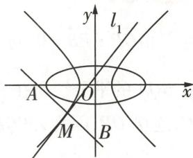

图10

由 $l_{1}$ 与 C 有唯一的公共点 M，得 $\Delta=(-2km)^{2}-4(4-k^{2})(-m^{2}-16)=0$ ，即 $m^{2}=4k^{2}-16$ ，所以 k>2 或 $k<-2, m\neq0$ .

则 M 的横坐标为 $-\frac{-2km}{2(4-k^{2})}=\frac{km}{4-k^{2}}=-\frac{4k}{m}$ [明思路: 利用根与系数的关系, 用参数 k, m 表示出点 M 的横坐标, 进而表示出点 M 的纵坐标, 再结合直线的垂直关系即可用 k, m 表示出点 D 的坐标 x, y, 结合 $m^{2}=4k^{2}-16$ 消参即可].

把 $x = -\frac{4k}{m}$ 代入 $y = kx + m$ 中，得 $y = \frac{-4k^2 + m^2}{m} = -\frac{16}{m}$ ，所以 $M(-\frac{4k}{m}, -\frac{16}{m})$

过 M 且与 $l_{1}$ 垂直的直线方程为 $y + \frac{16}{m} = -\frac{1}{k}(x + \frac{4k}{m})$ ，则点 A 的横坐标 $x = \frac{-20k}{m}$ ，点 B 的纵坐标 $y = -\frac{20}{m}$ ，所以 $m = -\frac{20}{y}$ ， $k = \frac{x}{y}$ ，又 $m^{2} = 4k^{2} - 16$ ，所以 $\frac{400}{y^{2}} = \frac{4x^{2}}{y^{2}} - 16$ ，即 $\frac{x^{2}}{100} - \frac{y^{2}}{25} = 1 (x \neq 0, y \neq 0)$ ，所以 D 的轨迹方程为 $\frac{x^{2}}{100} - \frac{y^{2}}{25} = 1 (x \neq 0, y \neq 0)$ .

（2）由题意知 $b=\sqrt{3}$ ， $\sqrt{\frac{b^{2}+a^{2}}{b^{2}}}=\frac{\sqrt{21}}{3}$ ，则a=2，所以椭圆E的方程为 $\frac{x^{2}}{4}+\frac{y^{2}}{3}=1$ .

易知直线 $l_{2}$ 不与 y 轴垂直, 设其方程为 $x = ny + 1$ , $P(x_{1}, y_{1})$ , $Q(x_{2}, y_{2})$ .

由 $\left\{\begin{aligned}\frac{x^{2}}{4}+\frac{y^{2}}{3}&=1,\\ x&=ny+1\end{aligned}\right.$ 消去x得关于y的方程 $(3n^{2}+4)y^{2}+6ny-9=0$ ，则 $3n^{2}+4\neq0,\Delta=36n^{2}+36(3n^{2}+4)>0,y_{1}+y_{2}=\frac{-6n}{3n^{2}+4},y_{1}y_{2}=\frac{-9}{3n^{2}+4}$ ，所以 $|PQ|=\sqrt{1+n^{2}}|y_{1}-y_{2}|=\sqrt{1+n^{2}}\cdot\sqrt{(y_{1}+y_{2})^{2}-4y_{1}y_{2}}=\frac{12(1+n^{2})}{3n^{2}+4}.$

点 O 到直线 $l_{2}$ 的距离为 $d=\frac{1}{\sqrt{1+n^{2}}}$ ，则 $S_{\triangle OPQ}=\frac{1}{2}|PQ|d=\frac{6\sqrt{1+n^{2}}}{3n^{2}+4}$ .

令 $\sqrt{1 + n^2} = t$ ，则 $t\geqslant 1,S_{\triangle OPQ} = \frac{6t}{3t^2 + 1} = \frac{6}{3t + \frac{1}{t}}\leqslant \frac{6}{3 + 1} = \frac{3}{2}$ [避易错：此处需注意 $t$ 的取值范围，

切勿直接利用基本不等式,需根据对勾函数的单调性求最值],所以 $\triangle OPQ$ 面积的最大值为 $\frac{3}{2}$ .

# 超重点6 椭圆与双曲线焦点三角形的3大核心命题

<table><tr><td>三年考情与创新命题特点</td><td>2025命题预测</td></tr><tr><td>2024 天津卷 T8,已知双曲线焦点三角形面积,求双曲线的方程</td><td rowspan="3">1命题形式:以选择题或填空题的形式呈现,难度适中,以容易题或中档题为主.2命题热点:以椭圆或双曲线的焦点三角形为背景,结合平面向量或三角形的几何特征命题.3创新考法:以过焦点的直线与椭圆(双曲线)相交为背景,构成“焦点三角形”,再结合平面向量、平面几何等知识综合命题.</td></tr><tr><td>2023 全国甲卷 T12,已知焦半径的夹角的余弦值,利用焦点三角形面积公式和椭圆定义求线段长</td></tr><tr><td>2022 新高考I卷 T16,利用焦点三角形为正三角形得中垂线,进而解决三角形的周长问题</td></tr></table>

# 高分必看

# 高分必看的圆锥曲线焦点三角形解读

<table><tr><td></td><td>椭圆的焦点三角形</td><td>双曲线的焦点三角形</td></tr><tr><td>定义</td><td>如图1所示,椭圆 $\frac{x^{2}}{a^{2}}+\frac{y^{2}}{b^{2}}=1(a>b>0)$ 上异于长轴两端点的点 $P(x_{0},y_{0})$ ( $y_{0}\neq0$ )与两焦点 $F_{1}$ , $F_{2}$ 构成的 $\triangle PF_{1}F_{2}$ 叫作椭圆的焦点三角形, $\angle F_{1}PF_{2}$ 为椭圆上的点对椭圆焦点的张角,记为 $\theta$ </td><td>如图2所示,双曲线 $\frac{x^{2}}{a^{2}}-\frac{y^{2}}{b^{2}}=1(a>0,b>0)$ 上异于实轴两端点的点 $P(x_{0},y_{0})(y_{0}\neq0)$ 与两焦点 $F_{1}$ , $F_{2}$ 构成的 $\triangle PF_{1}F_{2}$ 叫作双曲线的焦点三角形, $\angle F_{1}PF_{2}$ 为双曲线上的点对双曲线焦点的张角,记为 $\theta$  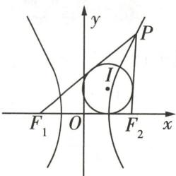图2</td></tr><tr><td>结论</td><td>1由余弦定理可得 $|PF_{1}|·|PF_{2}|=\frac{2b^{2}}{1+\cos\theta}\in(b^{2},a^{2}],\overrightarrow{PF_{1}}\cdot\overrightarrow{PF_{2}}\in[b^{2}-c^{2},b^{2});$ 2当P为短轴端点时,张角 $\theta$ 最大;3 $\triangle PF_{1}F_{2}$ 周长为 $2a+2c$ ,面积 $S_{\triangle PF_{1}F_{2}}=\frac{1}{2}|PF_{1}|·|PF_{2}|\sin\theta=b^{2}\tan\frac{\theta}{2}=c·|y_{0}|=(a+c)r(r$ 为 $\triangle PF_{1}F_{2}$ 内切圆半径),当P为短轴端点时, $S_{\triangle PF_{1}F_{2}}$ 最大,为bc;4若 $\angle PF_{1}F_{2}=\alpha$ , $\angle PF_{2}F_{1}=\beta$ ,则椭圆离心率 $e=\frac{\sin(\alpha+\beta)}{\sin\alpha+\sin\beta};$ 5记I为 $\triangle PF_{1}F_{2}$ 的内心,PI延长线交 $F_{1}F_{2}$ 于D,则离心率 $e=\frac{|ID|}{|PI|}$ </td><td>1由余弦定理可得 $|PF_{1}|·|PF_{2}|=\frac{2b^{2}}{1-\cos\theta}\in(b^{2},+\infty),\overrightarrow{PF_{1}}\cdot\overrightarrow{PF_{2}}\in(-b^{2},+\infty);$ 2当P为实轴端点时,张角 $\theta$ 最大,为 $\pi$ ,但不构成三角形;3 $S_{\triangle PF_{1}F_{2}}=\frac{1}{2}|PF_{1}|·|PF_{2}|\sin\theta=\frac{b^{2}}{\tan\frac{\theta}{2}}=c·|y_{0}|;$ 4若 $\angle PF_{1}F_{2}=\alpha$ , $\angle PF_{2}F_{1}=\beta$ ,则双曲线离心率 $e=\frac{\sin(\alpha+\beta)}{|\sin\alpha-\sin\beta|};$ 5 $\triangle PF_{1}F_{2}$ 的内切圆与实轴的切点为双曲线的顶点,即内心I的横坐标 $x_{I}=a(P$ 在右支上)或 $x_{I}=-a(P$ 在左支上)</td></tr></table>

粒子在加速器中的运动轨迹可以被视为一种特殊的圆锥曲线,通过精确控制这些轨迹,科学家可以研究粒子的基本性质和相互作用.

# 命题

# 求焦点三角形的周长(或已知周长求其他)

调研 1 试题调研原创 已知椭圆 $C: \frac{x^{2}}{a^{2}} + \frac{y^{2}}{b^{2}} = 1 (a > b > 0)$ 的左、右焦点分别为 $F_{1}, F_{2}$ ，P 为椭圆 C 上一点， $|PF_{1}|$ 的最小值为 2，且 $\triangle PF_{1}F_{2}$ 的周长为 32，则椭圆 C 的标准方程为 \_\_\_\_.

解析 设椭圆 C 的半焦距为 c, $\left|PF_{1}\right|$ 的最小值为 $2 \rightarrow a - c = 2$ .

$\triangle PF_{1}F_{2}$ 的周长为 $32 \rightarrow 2a + 2c = 32 \rightarrow c = 7, a = 9 \rightarrow a^{2} - b^{2} = c^{2} \rightarrow b = 4\sqrt{2} \rightarrow$ 椭圆 C 的标准

【破障碍】椭圆焦点三角形的周长为 $2a + 2c$ ，即长轴长与焦距的和

方程为 $\frac{x^{2}}{81}+\frac{y^{2}}{32}=1.$

# 原创变式

已知 $F_{1}, F_{2}$ 分别是双曲线 $C: x^{2} - y^{2} = a^{2} (a > 0)$ 的左、右焦点，过 $F_{2}$ 作一直线交 C 于 M, N 两点，若 $\angle MF_{2}F_{1} = 120^{\circ}$ ，且 $\triangle MNF_{1}$ 的周长为 1。则 C 的焦距为 \_\_\_\_.

答案》第052页

# 命题

# 求焦点三角形的面积(或已知面积求其他)

调研 2 试题调研原创 [新题型·圆锥曲线的共焦点问题] 若椭圆 $\frac{x^{2}}{25} + \frac{y^{2}}{16} = 1$ 和双曲线 $\frac{x^{2}}{8} - \frac{y^{2}}{1} = 1$ 的共同焦点为 $F_{1}, F_{2}, P$ 是两曲线的一个交点，则 $\triangle PF_{1}F_{2}$ 的面积为 \_\_\_\_.

解析 由题意不妨设 $F_{1}$ 为左焦点, $F_{2}$ 为右焦点, $P$ 为两曲线在第一象限的交点 $\rightarrow$ $\left\{ \begin{array}{l} |PF_{1}| + |PF_{2}| = 10, \\ |PF_{1}| - |PF_{2}| = 4\sqrt{2}, \rightarrow |PF_{1}|^{2} + |PF_{2}|^{2} = \frac{(|PF_{1}| + |PF_{2}|)^{2} + (|PF_{1}| - |PF_{2}|)^{2}}{2} = \\ |F_{1}F_{2}| = 6 \end{array} \right.$

【破障碍】抓住点 $P$ 的双重特性, 分别利用椭圆和双曲线的定义得出数量关系

$\frac {1 0 0 + 3 2}{2} = 6 6, | P F _ {1} | | P F _ {2} | = \frac {\left(| P F _ {1} | + | P F _ {2} |\right) ^ {2} - \left(| P F _ {1} | - | P F _ {2} |\right) ^ {2}}{4} = \frac {1 0 0 - 3 2}{4} = 1 7 \rightarrow$

$\cos \angle F _ {1} P F _ {2} = \frac {\left| P F _ {1} \right| ^ {2} + \left| P F _ {2} \right| ^ {2} - \left| F _ {1} F _ {2} \right| ^ {2}}{2 \left| P F _ {1} \right|\left| P F _ {2} \right|} = \frac {6 6 - 3 6}{2 \times 1 7} = \frac {1 5}{1 7} \rightarrow \sin \angle F _ {1} P F _ {2} = \sqrt {1 - \cos^ {2} \angle F _ {1} P F _ {2}} =$

几何之韵

城市规划 在城市规划中,圆锥曲线的应用可以体现在景观设计和道路布局上.通过巧妙运用这些曲线形状,可以创造出既实用又美观的城市空间,提升城市的整体品质.

$\sqrt {1 - \left(\frac {1 5}{1 7}\right) ^ {2}} = \frac {8}{1 7} \rightarrow S _ {\triangle P F _ {1} F _ {2}} = \frac {1}{2} | P F _ {1} | | P F _ {2} | \sin \angle F _ {1} P F _ {2} = \frac {1}{2} \times 1 7 \times \frac {8}{1 7} = 4.$

# 原创变式

2 已知 $F_{1}, F_{2}$ 是椭圆 $C: \frac{x^{2}}{a^{2}} + \frac{y^{2}}{b^{2}} = 1 (a > b > 0)$ 的左、右焦点，O 是坐标原点，过 $F_{1}$ 作直线与 C 交于 A, B 两点，若 $\left|AF_{2}\right| = \left|AB\right|$ ，且 $\triangle OAF_{2}$ 的面积为 $\frac{\sqrt{3}}{6}b^{2}$ ，则椭圆 C 的离心率为 \_\_\_\_.

答案》第053页

# 命题 3 角平分线、中位线等在焦点三角形中的应用

调研 3 试题调研原创 已知椭圆 E 的两个焦点分别是 $F_{1}(-4,0)$ , $F_{2}(4,0)$ ，点 $P(4,6)$ 在椭圆上，则 $\angle F_{1}PF_{2}$ 的平分线所在直线的方程为 \_\_\_\_.

解析 由题意,设椭圆 E 的方程为 $\frac{x^{2}}{a^{2}} + \frac{y^{2}}{b^{2}} = 1 (a > b > 0) \rightarrow c = 4, 2a = |PF_{1}| + |PF_{2}| = \sqrt{(4 + 4)^{2} + (6 - 0)^{2}} + \sqrt{(4 - 4)^{2} + (6 - 0)^{2}} = 16 \rightarrow a = 8, b^{2} = a^{2} - c^{2} = 48 \rightarrow \text{椭圆 } E \text{ 的标准方程为 } \frac{x^{2}}{64} + \frac{y^{2}}{48} = 1 \rightarrow \text{设 } \angle F_{1}PF_{2} \text{ 的平分线所在直线 } l \text{ 与 } x \text{ 轴相交于点 } Q(m,0) \rightarrow |PF_{1}| = 10, |PF_{2}| = 6, PQ \text{ 是 } \angle F_{1}PF_{2} \text{ 的平分线 } \rightarrow \frac{|PF_{1}|}{|PF_{2}|} = \frac{|QF_{1}|}{|QF_{2}|} \rightarrow \frac{10}{6} = \frac{m + 4}{4 - m} \rightarrow m = 1, Q(1,0) \rightarrow \text{角平分线}$

【破障碍】三角形内角平分线定理：三角形一个角的平分线与其对边所成的两条线段与这个角的两边对应成比例

$PQ$ 所在直线 $l$ 的斜率为 $k_{PQ} = \frac{6 - 0}{4 - 1} = 2\rightarrow \angle F_1PF_2$ 的平分线所在直线 $l$ 的方程为 $y - 0 = 2(x-$ 1)，即 $2x - y - 2 = 0.$

# 原创变式

3 已知双曲线 $C: \frac{x^{2}}{4} - \frac{y^{2}}{5} = 1, F_{1}, F_{2}$ 分别为左、右焦点，P 为曲线 C 上的动点，O 为坐标原点，若 $\angle F_{1}PF_{2}$ 的平分线与 x 轴交于点 $M(1,0)$ ，则 $|OP|$ 为 \_\_\_\_.

答案》第053页

# 创新预测

答案▶054页

##### 1. 试题调研原创（多选）设 $F_{1}, F_{2}$ 为椭圆 $C: \frac{x^{2}}{25} + \frac{y^{2}}{9} = 1$ 的两个焦点， $P$ 为 $C$ 上一点且 $\cos \angle F_{1}PF_{2} = \frac{3}{5}, I$ 为 $\triangle PF_{1}F_{2}$ 的内心，则 （）

$\quad$A. $\triangle PF_{1}F_{2}$ 内切圆半径为 1  
$\quad$B. $\left|IP\right|=\frac{\sqrt{5}}{2}$   
$\quad$C. 若 $P(x_{1}, y_{1})$ , $I(x_{2}, y_{2})$ , 则 $5x_{2} = 4x_{1}$   
$\quad$D. 存在直线 l，使得 l 与椭圆 C 交于 M, N 两点， $G(1,3)$ 为线段 MN 的中点，且直线 l 的方程为 $3x + 25y - 78 = 0$

##### 2.[2025 辽宁省名校联盟联考|变载体·抛物线中的焦点三角形](多选)已知抛物线 $C: y^{2} = 6x$ 的焦点为 F, O 为坐标原点, 倾斜角为 $\theta$ 的直线 l 过点 F 且与 C 交于 M, N 两点, 若 $\triangle OMN$ 的面积为 $3\sqrt{3}$ , 则 ( )

$\quad$A. $\sin \theta = \frac{\sqrt{3}}{2}$

$\quad$B. $|MN| = 24$

$\quad$C. 以 $MF$ 为直径的圆与 $y$ 轴仅有 1 个交点

$\quad$D. $\frac{|MF|}{|NF|} = \frac{\sqrt{3}}{3}$ 或 $\frac{|MF|}{|NF|} = \sqrt{3}$

  
“二级结论法”秒杀焦点三角形选择题

# 参考答案与解析

# 原创变式

##### 1. $\frac{\sqrt{2}}{6}$ 设双曲线的焦距为 $2c, M(x_1, y_1), N(x_2, y_2)$ . 由双曲线方程知 $c = \sqrt{2} a$ . 直线 $MN$ 的倾斜角为 $60^\circ \to$ 直线 $MN$ 的方程为 $y = \sqrt{3}(x - c) \to$ 由 $\left\{ \begin{array}{l} y = \sqrt{3}(x - c), \\ x^2 - y^2 = a^2 \end{array} \right.$ 消去 $y$ 并整理得关于 $x$ 的方程 $2x^2 - 6\sqrt{2} ax + 7a^2 = 0 \to \Delta = 72a^2 - 56a^2 = 16a^2 > 0 \to x_1 + x_2 = 3\sqrt{2} a, x_1x_2 = \frac{7}{2} a^2 \to |MN| = \sqrt{1 + (\sqrt{3})^2} \cdot \sqrt{(x_1 + x_2)^2 - 4x_1x_2} = 4a \to \triangle MNF_1$ 的周长 $|MF_1| + |NF_1| + |MN| = 4a + 2|MN| = 12a = 1$ [方法总结:与双曲线焦点三角形有关的计算或证明常利用 $||PF_1| - |PF_2|| = 2a$ 并结

几何之韵

同时,塔上部直径小于塔底、大于塔中,可以确保顶部上升热流的流动速度有效降低,减少抽力,进而提高蒸汽回收率.

合解三角形知识求解] $\rightarrow a = \frac{1}{12}$ 双曲线 $C$ 的焦距 $2c = 2\sqrt{2} a = \frac{\sqrt{2}}{6}$ .

##### 2. $\frac{\sqrt{3}}{3}$ 设 $\angle F_{1}AF_{2} = \theta (0 < \theta < \pi), |AF_{1}| = m$ ，则 $|AF_{2}| = 2a - m$ ，在 $\triangle F_{1}AF_{2}$ 中，由余弦定理得 $4c^{2} = m^{2} + (2a - m)^{2} - 2m(2a - m)\cos \theta$ ，即 $4c^{2} = [m + (2a - m)]^{2} - 2m(2a - m)(1 + \cos \theta)$ ，所以 $m(2a - m) = \frac{4a^{2} - 4c^{2}}{2(1 + \cos \theta)} = \frac{2b^{2}}{1 + \cos \theta}$ ，所以 $S_{\triangle AF_1F_2} = \frac{1}{2} m(2a - m)\sin \theta = \frac{1}{2} \cdot \frac{2b^2}{1 + \cos \theta} \cdot \sin \theta = b^2 \frac{2\sin \frac{\theta}{2}\cos \frac{\theta}{2}}{2\cos^2 \frac{\theta}{2}} = b^2\tan \frac{\theta}{2}$ [记结论：椭圆中焦点三角形 $F_{1}AF_{2}$ 的面积 $S_{\triangle AF_{1}F_{2}} = b^{2}\tan \frac{\theta}{2}$ ， $\angle F_{1}AF_{2} = \theta (0 < \theta < \pi)$ ；双曲线中焦点三角形 $F_{1}AF_{2}$ 的面积 $S_{\triangle AF_{1}F_{2}} = \frac{b^{2}}{\tan \frac{\theta}{2}}$ ， $\angle F_{1}AF_{2} = \theta (0 < \theta < \pi)$ . 记住该结论，在解小题时可直接应用].

故 $S_{\triangle AF_1F_2} = b^2\tan \frac{\theta}{2} = 2S_{\triangle OAF_2} = 2\times \frac{\sqrt{3}}{6} b^2 = \frac{\sqrt{3}}{3} b^2$ ，解得 $\tan \frac{\theta}{2} = \frac{\sqrt{3}}{3}$ 因为 $0 <   \frac{\theta}{2} <  \frac{\pi}{2}$ 所以 $\frac{\theta}{2} = \frac{\pi}{6},$ $\theta = \frac{\pi}{3}$ ，连接 $BF_{2}$ ，由 $|AF_2| = |AB|$ ， $\angle BAF_{2} = \frac{\pi}{3}$ 得 $\triangle ABF_{2}$ 为等边三角形，故 $4a = |BF_2|+$ $|AF_2| + |AB| = 3|AF_2|$ ，所以 $|AF_2| = \frac{4a}{3},|AF_1| = 2a - \frac{4a}{3} = \frac{2a}{3}$ 所以 $|BF_1| = \frac{4a}{3} -\frac{2a}{3} = \frac{2a}{3} = |AF_1|$ 所以 $F_{1}$ 是 $AB$ 的中点，所以 $AB\bot F_1F_2$ ，所以 $(\frac{4a}{3})^2 = (2c)^2 +(\frac{2a}{3})^2$ 即 $a^2 = 3c^2$ ，所以 $e = \frac{c}{a} = \frac{\sqrt{3}}{3}.$

##### 3. $\sqrt{31}$ 由题意可知 $a = 2, c = 3, F_{1}(-3,0), F_{2}(3,0), |F_{1}M| = 1 - (-3) = 4, |F_{2}M| = 3 - 1 = 2$ , 根据角平分线的性质可得 $\frac{|PF_1|}{|PF_2|} = \frac{|MF_1|}{|MF_2|} = \frac{2}{1}$ , 又 $|PF_1| - |PF_2| = 2a = 4$ , 所以 $|PF_1| = 8$ , $|PF_2| = 4$ . 在 $\triangle PF_{1}F_{2}$ 中, 由余弦定理得 $\cos \angle PF_{1}F_{2} = \frac{64 + 36 - 16}{2 \times 8 \times 6} = \frac{7}{8}$ , 则 $|OP| = \sqrt{|PF_1|^2 + |F_1O|^2 - 2|PF_1| \times |F_1O|\cos \angle PF_1M} = \sqrt{64 + 9 - 2 \times 8 \times 3 \times \frac{7}{8}} = \sqrt{31}$ [二级结论: 双曲线上任意一点 (异于顶点) 处的切线, 平分该点处两条焦半径的夹角. 则可知角平分线 $PM$ 为双曲线的切线, 切点为 $P$ , 设 $P(x_0, y_0)$ , 故直线 $MP$ 的方程为 $\frac{xx_0}{4} - \frac{yy_0}{5} = 1$ , 又直线 $MP$ 过 $M(1,0)$ , 则 $\frac{x_0}{4} = 1$ , 得 $x_0 = 4, y_0^2 = 15$ , 则 $|OP| = \sqrt{31}$ ].

日常生活 抛物线相关的设计还常见于一些日常用品中,如手电筒的聚光镜、太阳能热水器的反射镜等.

# 创新预测

##### 1.BC 由椭圆 $C: \frac{x^2}{25} + \frac{y^2}{9} = 1$ ，可知 $a = 5, c = 4$ ，所以 $|F_1F_2| = 8, |PF_1| + |PF_2| = 10$

因为 $\cos\angle F_{1}PF_{2}=\frac{3}{5}$ ，所以 $\sin\angle F_{1}PF_{2}=\frac{4}{5}$ .

对于 A, 在 $\triangle F_{1}PF_{2}$ 中, 由余弦定理可得 $\left|F_{1}F_{2}\right|^{2}=\left|PF_{1}\right|^{2}+\left|PF_{2}\right|^{2}-2\left|PF_{1}\right|\left|PF_{2}\right|\cos\angle F_{1}PF_{2}$ , 即 $\left|F_{1}F_{2}\right|^{2}=\left(\left|PF_{1}\right|+\left|PF_{2}\right|\right)^{2}-2\left|PF_{1}\right|\left|PF_{2}\right|\left(1+\cos\angle F_{1}PF_{2}\right)$ , 因为 $\cos\angle F_{1}PF_{2}=\frac{3}{5},\left|F_{1}F_{2}\right|=8,\left|PF_{1}\right|+\left|PF_{2}\right|=10$ , 所以 $100-\frac{16}{5}\left|PF_{1}\right|\left|PF_{2}\right|=64$ , 所以 $\left|PF_{1}\right|\left|PF_{2}\right|=\frac{45}{4}$ , 所以 $S_{\triangle F_{1}PF_{2}}=\frac{1}{2}\left|PF_{1}\right|\left|PF_{2}\right|\sin\angle F_{1}PF_{2}=\frac{9}{2}$ .

如图3,连接 $IF_{1},IF_{2}$ ，设 $\triangle F_{1}PF_{2}$ 内切圆半径为r，由 $S_{\triangle F_{1}PF_{2}}=S_{\triangle IF_{1}F_{2}}+S_{\triangle IPF_{2}}+S_{\triangle IPF_{1}}$ ，得 $\frac{1}{2}(|PF_{1}|+|PF_{2}|+|F_{1}F_{2}|)r=\frac{9}{2}$ [关键点拨：椭圆焦点三角形的内切圆问题，常常利用焦点三角形的面积作为解题突破口，即焦点三角形的面积为“周长与内切圆半径乘积的一半”，从而建立等量关系].

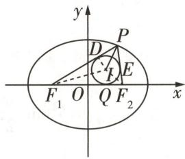

图 3

因为 $\left|PF_{1}\right|+\left|PF_{2}\right|+\left|F_{1}F_{2}\right|=10+8=18$ ，所以 $r=\frac{1}{2}$ ，故A错误.

对于 B, 如图 3, 设内切圆与 $\triangle F_{1}PF_{2}$ 三边的切点分别为 $D, E, Q$ , 连接 $ID$ , 则有 $|PD| = |PE|$ , $|QF_{1}| = |DF_{1}|, |QF_{2}| = |EF_{2}|$ , 因为 $|PF_{1}| = |PD| + |DF_{1}|, |PF_{2}| = |PE| + |EF_{2}|, |F_{1}F_{2}| = |F_{1}Q| + |QF_{2}|$ , 所以 $|PF_{1}| + |PF_{2}| = |PD| + |DF_{1}| + |PE| + |EF_{2}|$ , 所以 $|PF_{1}| + |PF_{2}| - |F_{1}F_{2}| = 2|PD|$ , 因为 $|PF_{1}| + |PF_{2}| = 10, |F_{1}F_{2}| = 8$ , 所以 $|PD| = 1$ , 在 Rt $\triangle PID$ 中, $|IP|^2 = |PD|^2 + |ID|^2, |ID| = r = \frac{1}{2}$ , 所以 $|IP|^2 = 1 + \frac{1}{4} = \frac{5}{4}$ , 即 $|IP| = \frac{\sqrt{5}}{2}$ , 故 B 正确.

对于 C, 由选项 A 可知 $S_{\triangle F_1PF_2} = \frac{9}{2}, |PF_1| |PF_2| = \frac{45}{4}$ , 易知 $S_{\triangle F_1PF_2} = \frac{1}{2} |F_1F_2| \cdot |y_1| = \frac{9}{2}$ , 因为 $|F_1F_2| = 8$ , 所以 $|y_1| = \frac{9}{8}$ , 代入 $\frac{x^2}{25} + \frac{y^2}{9} = 1$ 可得 $|x_1| = \frac{5\sqrt{55}}{8}$ , 由于 $|PF_1| |PF_2| = \frac{45}{4}, |PF_1| + |PF_2| = 10$ , 则当 $|PF_1| > |PF_2|$ 时, $|PF_1| = 5 + \frac{\sqrt{55}}{2}, x_1 = \frac{5\sqrt{55}}{8}$ , 由选项 B 可知, $|PD| = 1$ , $|QF_1| = |DF_1|$ , 所以 $|DF_1| = 4 + \frac{\sqrt{55}}{2}$ , 故 $|QF_1| = |DF_1| = 4 + \frac{\sqrt{55}}{2}$ , 由 $|QF_1| = x_2 + 4$ , 可得 $x_2 =$

$\frac{\sqrt{55}}{2}$ ，故 $5x_{2}=4x_{1}$ ;

当 $|PF_{1}|<|PF_{2}|$ 时， $|PF_{1}|=5-\frac{\sqrt{55}}{2},x_{1}=-\frac{5\sqrt{55}}{8},|DF_{1}|=4-\frac{\sqrt{55}}{2},|QF_{1}|=|DF_{1}|=4-\frac{\sqrt{55}}{2}$ ，又 $|QF_{1}|=x_{2}+4$ ，所以 $x_{2}=-\frac{\sqrt{55}}{2}$ ，故 $5x_{2}=4x_{1}$ .

综上, $5x_{2}=4x_{1}$ ,故C正确.

对于 D, 易知 $G(1,3)$ 在椭圆外, 所以不存在以 $G(1,3)$ 为线段 MN 的中点的直线, 故 D 错误.

# 2. AC

<table><tr><td>选项</td><td>分析过程</td><td>正误</td></tr><tr><td>A</td><td>依题意, $F(\frac{3}{2},0)$ ,易知直线 $l$ 不与 $y$ 轴垂直,设直线 $l: x = my + \frac{3}{2}$ ,由 $\begin{cases}x=my+\frac{3}{2},\\y^{2}=6x,\end{cases}$ 整理得关于 $y$ 的方程 $y^{2}-6my-9=0,\Delta=36(m^{2}+1)>0$ ,设 $M(x_{1},y_{2})$  $y_{1}),N(x_{2},y_{2})$ ,则 $y_{1}+y_{2}=6m,y_{2}y_{2}=-9$ [二级结论:过抛物线 $y^{2}=2px(p>0)$ 的焦点的直线 $l$ ,与抛物线交于 $M(x_{1}y_{1}),N(x_{2},y_{2})(y_{1}\neq y_{2})$ 两点,则 $x_{1}x_{2}=\frac{p^{2}}{4},y_{1}y_{2}=-p^{2}$ ],故 $S_{\triangle OMN}=\frac{1}{2}\times|y_{1}-y_{2}|\times\frac{3}{2}=\frac{3}{4}\times6\sqrt{m^{2}+1}=3\sqrt{3}$ ,解得 $3m^{2}=1$ ,所以 $m^{2}=\frac{\cos^{2}\theta}{\sin^{2}\theta}=\frac{1}{3}$ ,又 $\sin^{2}\theta+\cos^{2}\theta=1$ ,所以 $\sin^{2}\theta=\frac{3}{4}$ ,则 $\sin\theta=\frac{\sqrt{3}}{2}$ </td><td>√</td></tr><tr><td>B</td><td> $|MN|=\sqrt{1+m^{2}}\times|y_{1}-y_{2}|=\frac{4}{3}\times6=8$ </td><td>×</td></tr><tr><td>C</td><td>易知 $|MF|=x_{1}+\frac{3}{2}$ ,因为线段 $MF$ 的中点到 $y$ 轴的距离为 $\frac{x_{1}+\frac{3}{2}}{2}$ ,所以以 $MF$ 为直径的圆与 $y$ 轴相切,即与 $y$ 轴仅有1个交点</td><td>√</td></tr><tr><td>D</td><td> $\frac{|MF|}{|NF|}=\frac{|y_{1}|}{|y_{2}|}$ ,若 $m=\frac{\sqrt{3}}{3}$ ,则 $y^{2}-2\sqrt{3}y-9=0$ ,解得 $y=-\sqrt{3}$ 或 $y=3\sqrt{3}$ ,若 $m=-\frac{\sqrt{3}}{3}$ ,则 $y^{2}+2\sqrt{3}y-9=0$ ,解得 $y=-3\sqrt{3}$ 或 $y=\sqrt{3}$ ,故 $\frac{|MF|}{|NF|}=\frac{1}{3}$ 或 $\frac{|MF|}{|NF|}=3$ </td><td>×</td></tr></table>

小编说:圆锥曲线记忆口诀是学习圆锥曲线章节时的有效方法,能够帮助我们快速掌握和记忆圆锥曲线的基本概念、性质及相关公式.下面就和小编一起学习一下.

秒杀解 本题还可以利用二级结论求解.

<table><tr><td>选项</td><td>分析过程</td><td>正误</td></tr><tr><td>A</td><td>由题意知,抛物线C中,p=3,则△OMN的面积为 $S_{\triangle OMN}=\frac{p^{2}}{2\sin\theta}=\frac{9}{2\sin\theta}=3\sqrt{3}$  [二级结论:过抛物线 $y^{2}=2px(p>0)$ 的焦点 $F(\frac{p}{2},0)$ 的直线 $l:y=kx-\frac{kp}{2}$ (其中k为直线l的斜率)交抛物线于M,N两点,倾斜角为θ,则焦点三角形OMN的面积为 $S_{\triangle OMN}=\frac{p^{2}}{2\sin\theta}=\frac{p^{2}}{2}\sqrt{1+\frac{1}{k^{2}}}$ (若抛物线方程为 $x^{2}=2py(p>0)$ ,直线 $l:y=kx+\frac{p}{2}$ ,则 $S_{\triangle OMN}=\frac{p^{2}}{2|\cos\theta|}=\frac{p^{2}}{2}\sqrt{1+k^{2}}$ ],解得 $\sin\theta=\frac{\sqrt{3}}{2}$ </td><td>√</td></tr><tr><td>B</td><td> $|MN|=\frac{2p}{\sin^{2}\theta}=\frac{2\times3}{(\frac{\sqrt{3}}{2})^{2}}=8$ [二级结论:倾斜角为α的直线l过抛物线焦点,交抛物线于M,N两点,则抛物线的焦点弦长 $|MN|=x_{1}+x_{2}+p=\frac{2p}{\sin^{2}\alpha}$ ,且 $\frac{1}{|MF|}+\frac{1}{|NF|}=\frac{2}{p}$ ]</td><td>×</td></tr><tr><td>C</td><td> $\sin\theta=\frac{\sqrt{3}}{2}$ ,则 $\cos\theta=\pm\frac{1}{2}$ , $|MF|=\frac{p}{1-\cos\theta}=\frac{3}{1-\frac{1}{2}}=6$ [二级结论:倾斜角为α的直线l交抛物线于M,N两点,则抛物线的焦半径 $|MF|=x_{1}+\frac{p}{2}=\frac{p}{1-\cos\alpha}$ , $|NF|=x_{2}+\frac{p}{2}=\frac{p}{1+\cos\alpha}$ ],以MF为直径的圆的半径为3,而圆心到y轴的距离为 $\frac{(6-\frac{3}{2})+\frac{3}{2}}{2}=3$ ,故以MF为直径的圆与y轴相切,即与y轴仅有1个交点</td><td>√</td></tr><tr><td>D</td><td>当 $\cos\theta=\frac{1}{2}$ 时, $|MF|=6$ , $|NF|=\frac{p}{1+\cos\theta}=\frac{3}{1+\frac{1}{2}}=2$ ,此时 $\frac{|MF|}{|NF|}=3$ ;当 $\cos\theta=-\frac{1}{2}$ 时, $|MF|=\frac{p}{1-\cos\theta}=\frac{3}{1+\frac{1}{2}}=2$ , $|NF|=\frac{p}{1+\cos\theta}=\frac{3}{1-\frac{1}{2}}=6$ ,此时 $\frac{|MF|}{|NF|}=\frac{1}{3}$ </td><td>×</td></tr></table>

# 超重点7 求解析几何最值问题必会的3大答题策略

<table><tr><td>三年考情与创新命题特点</td><td>2025命题预测</td></tr><tr><td>2023 新课标I卷 T22,考查利用函数与导数证明与四边形周长相关的不等式</td><td rowspan="3">1命题形式:命制为选择题或填空题,或出现在解答题第（2）问或第（3）问中.2必考热点:圆锥曲线的定义、几何性质,点到直线的距离公式,弦长公式.3创新考点:结合实际背景考查,或与立体几何交汇设置动点问题.</td></tr><tr><td>2023 全国乙卷 T11,考查数形结合求代数式的最值</td></tr><tr><td>2023 全国甲卷 T20,考查利用二次函数求面积的最值</td></tr></table>

# 策略

# 利用圆锥曲线的定义求最值

调研 1 [2025 河北唐山一中 8 月开学测试] (多选) 已知椭圆 $C: \frac{x^2}{4} + \frac{y^2}{b^2} = 1 (b > 0)$ 的左、右焦点分别为 $F_1, F_2$ , 点 $P(\sqrt{2}, 1)$ 在椭圆内部, 点 $Q$ 在椭圆上, 椭圆 $C$ 的离心率为 $e$ , 则以下说法正确的是 ( )

$\quad$A. 离心率 e 的取值范围为 $(0, \frac{\sqrt{2}}{2})$

$\quad$B. 当 $e = \frac{\sqrt{2}}{4}$ 时， $|QF_1| + |QP|$ 的最大值为 $4 + \frac{\sqrt{6}}{2}$

$\quad$C. 存在点 $Q$ , 使得 $\overrightarrow{QF_1} \cdot \overrightarrow{QF_2} = 0$

$\quad$D. $\frac{1}{|QF_1|} +\frac{1}{|QF_2|}$ 的最小值为1

# 解析

<table><tr><td>选项</td><td>分析过程</td><td>正误</td></tr><tr><td>A</td><td>因为点 $P(\sqrt{2},1)$ 在椭圆内部,所以 $\frac{2}{4}+\frac{1}{b^{2}}<1$ ,所以 $2减小$   $e=\frac{c}{a}=\sqrt{\frac{c^{2}}{a^{2}}}$ =【点细节】椭圆的焦点在 $x$ 轴上,因此 $b^{2}<4$  $\sqrt{1-\frac{b^{2}}{a^{2}}}=\sqrt{1-\frac{b^{2}}{4}}\in(0,\frac{\sqrt{2}}{2})$ </td><td>√</td></tr><tr><td>B</td><td> $|QF_{1}|+|QP|=4-|QF_{2}|+|QP|$ ,当 $Q$ 在 $x$ 轴下方,且 $P,Q,F_{2}$ 三点共线时, $|QF_{1}|+|QP|$ 有最大值 $4+|PF_{2}|$ ,【破障碍】结合椭圆的定义以及“三角形两边之差小于第三边”分析求解由 $e=\frac{\sqrt{2}}{4}=\frac{c}{2}$ ,得 $c=\frac{\sqrt{2}}{2}$ ,故 $F_{2}(\frac{\sqrt{2}}{2},0)$ ,所以 $|PF_{2}|=\sqrt{(\sqrt{2}-\frac{\sqrt{2}}{2})^{2}+1}=\frac{\sqrt{6}}{2}$ ,所以 $|QF_{1}|+|QP|$ 的最大值为 $4+\frac{\sqrt{6}}{2}$ </td><td>√</td></tr></table>

“比”: 平面内, 到定点(焦点)和到定直线(准线)的距离之比为定值 e(离心率)的点的轨迹叫作椭圆.

续表

<table><tr><td>选项</td><td>分析过程</td><td>正误</td></tr><tr><td>C</td><td>设 $Q(x,y),F_1(-c,0),F_2(c,0)$ ,若 $\overrightarrow{QF_1} \cdot \overrightarrow{QF_2} = 0$ ,则 $(-c-x,-y) \cdot (c-x,-y) = 0$ ,得 $x^2 + y^2 = c^2$ ,即点 $Q$ 在以原点为圆心, $c$ 为半径的圆上,由A项知 $e = \frac{c}{a} \in (0, \frac{\sqrt{2}}{2})$ ,则 $c = ea \in (0, \sqrt{2})$ ,因为 $2 < b^2 < 4$ ,则 $b \in (\sqrt{2},2)$ ,所以 $c < b$ ,该圆与椭圆无交点,满足题意的点 $Q$ 不存在</td><td>×</td></tr><tr><td>D</td><td> $|QF_1| + |QF_2| = 2a = 4, \frac{1}{|QF_1|} + \frac{1}{|QF_2|} = \frac{1}{4} \left( \frac{1}{|QF_1|} + \frac{1}{|QF_2|} \right) (|QF_1| + |QF_2|) = \frac{1}{4} (2 + \frac{|QF_2|}{|QF_1|} + \frac{|QF_1|}{|QF_2|}) \geqslant \frac{1}{4} (2 + 2\sqrt{\frac{|QF_2|}{|QF_1|} \times \frac{|QF_1|}{|QF_2|}}) = 1$ ,当且仅当 $|QF_1| = |QF_2| = 2$ 时取等号</td><td>√</td></tr></table>

故选 ABD.

调研 2 [2025 黑龙江哈师大附中、大庆实验中学等六校联考] (多选) 已知 A(2,0), B(4,1), 点 M(x,y) 为曲线 C 上的动点, 则下列结论正确的是 ()

$\quad$A. 若 C 为抛物线 $y^{2}=8x$ ，则 $(|MA|+|MB|)_{\min}=2+\sqrt{17}$   
$\quad$B. 若 C 为抛物线 $y^{2}=8x$ ，则 $(|MA|+|MB|)_{\min}=6$   
$\quad$C. 若 C 为椭圆 $\frac{x^{2}}{25} + \frac{y^{2}}{21} = 1$ ，则 $(|MA| + |MB|)_{\min} = 10 - \sqrt{37}$   
$\quad$D. 若 $C$ 为椭圆 $\frac{x^2}{25} + \frac{y^2}{21} = 1$ ，则 $(|MA| + |MB|)_{\min} = 10 + \sqrt{37}$

解析 对于 AB 选项,作出图形如图 1,抛物线 $y^{2}=8x$ 的焦点为 A(2,0), 准线方程为 x=-2, 设点 M 在直线 x=-2 上的射影为 E, 连接 ME, 由抛物线的定义可得 $|ME|=|MA|$ , 所以 $|MA|+|MB|=|ME|+|MB|$ ,

【明关键】利用抛物线的定义，将抛物线上一点到焦点的距离转化为到准线的距离，再根据“三角形两边之和大于第三边”找最小值

由图可知, 当 E, M, B 三点共线时, $\left|ME\right| + \left|MB\right|$ 取最小值, 且其最小值为点 B 到直线 x = -2 的距离 $BE_{1}$ , 即 $\left(\left|MA\right| + \left|MB\right|\right)_{\min} = 6$ , A 错, B 对.

  
“万能定义法”快解椭、双、抛中线段和的最值问题

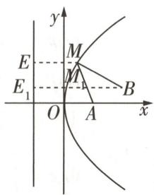

图1

对于 CD 选项,作出图形如图 2,对于椭圆 $\frac{x^{2}}{25}+\frac{y^{2}}{21}=1$ , a=5, b= $\sqrt{21}$ , 则 $c=\sqrt{a^{2}-b^{2}}=\sqrt{25-21}=2$ , 则点 A 为椭圆 $\frac{x^{2}}{25}+\frac{y^{2}}{21}=1$ 的右焦点, 取 D(-2,0) 为该椭圆的左焦点, 连接 MD, 连接 DB 并延长交椭圆于点 $M_{2}$ , 由椭圆的定义可得 $|MA|=2a-|MD|=10-|MD|$ ,

所以 $|MA| + |MB| = 10 + |MB| - |MD| \geqslant 10 - |BD| = 10 -$

$\sqrt {(4 + 2) ^ {2} + 1} = 1 0 - \sqrt {3 7},$

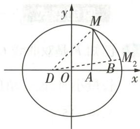

图2

【明关键】利用椭圆定义，将椭圆上一点到其中一个焦点的距离转化为 $2a$ 减去这个点到另一个焦点的距离，再根据三角形两边之差小于第三边，可知 $\vert\vert MB\vert-\vert MD\vert\vert<\vert BD\vert$ ，即 $-\vert BD\vert<\vert MB\vert-\vert MD\vert<\vert BD\vert$ ，当 $M, B, D$ 三点共线时， $|MB|-\vert MD|=\pm|\text{BD}|$

当且仅当 M 为射线 DB 与椭圆的交点, 即位于点 $M_{2}$ 处时, $|MA| + |MB|$ 取最小值 $10 - \sqrt{37}$ , C 对, D 错.

故选BC.

思考 若【调研2】中的C为双曲线 $x^{2}-\frac{y^{2}}{3}=1$ ，其他条件不变，则 $|MA|+|MB|$ 的最小值为\_\_\_\_。

解析:对于双曲线 $x^{2}-\frac{y^{2}}{3}=1, a=1, b=\sqrt{3}$ ，则 $c=\sqrt{a^{2}+b^{2}}=\sqrt{1+3}=2$ ，所以点 $A(2,0)$ 为双曲线 $x^{2}-\frac{y^{2}}{3}=1$ 的右焦点，取 $D(-2,0)$ 为双曲线 $x^{2}-\frac{y^{2}}{3}=1$ 的左焦点，连接 MD, BD，如图 3 所示.

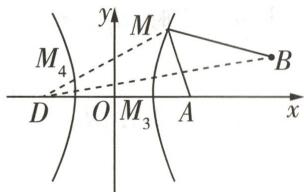

图3

当点 M 在双曲线的右支上 [明易错: 利用双曲线的定义解题时, 常常需要分动点在左、右两支讨论] 时, 由双曲线的定义可得 $\left|MD\right| - \left|MA\right| = 2a = 2$ , 则 $\left|MA\right| = \left|MD\right| - 2$ ,

所以 $|MA| + |MB| = |MD| + |MB| - 2 \geqslant |BD| - 2 = \sqrt{37} - 2$ ,

当且仅当 M 为线段 BD 与双曲线右支的交点 $M_{3}$ 时, 等号成立;

当点 M 在双曲线的左支上时, 由双曲线的定义可得 $\left|MA\right| - \left|MD\right| = 2a = 2$ ,

则 $|MA| = |MD| + 2$ ，所以 $|MA| + |MB| = |MD| + |MB| + 2 \geqslant |BD| + 2 = \sqrt{37} + 2$ ，

当且仅当 M 为线段 BD 与双曲线左支的交点 $M_{4}$ 时, 等号成立.

综上所述， $|MA| + |MB|$ 的最小值为 $\sqrt{37} - 2$ .

长轴短轴与焦距,形似勾股弦定理 椭圆的长半轴长 a、短半轴长 b、半焦距 c 满足 $a^{2}=b^{2}+c^{2}$ , 双曲线的实半轴长 a、虚半轴长 b、半焦距 c 满足 $a^{2}+b^{2}=c^{2}$ .

# 原创变式

已知 F 是双曲线 $C: \frac{x^{2}}{4} - \frac{y^{2}}{12} = 1$ 的右焦点, P 是 C 左支上一点, $A(0, 4\sqrt{15})$ , 则 $\triangle APF$ 周长最小时, 该三角形的面积为 ( )

$\quad$A. $4\sqrt{15}$

$\quad$B. $12 \sqrt{15}$

$\quad$C. $16 \sqrt{15}$

$\quad$D. $20 \sqrt{6}$

答案》第064页

# 策略 2 利用切线法或参数法求点到直线距离的最值

调研 3 试题调研原创 椭圆 $\frac{x^{2}}{3}+y^{2}=1$ 上的点到直线 $x-y+6=0$ 的距离的最小值为\_\_\_\_，最大值为\_\_\_\_。

解析 方法一:切线法 设与直线 $y = x + 6$ 平行,且与椭圆相切的直线为 $y = x + m$ ,椭圆

【破障碍】将点到直线的距离的最值转化为平行线之间的距离 $\frac{x^{2}}{3} + y = 1$ 上的点到直线 $x - y + 6 = 0$ 的距离为 d,

将 $y = x + m$ 代入 $\frac{x^2}{3} + y^2 = 1$ ，得关于 $x$ 的方程 $4x^{2} + 6mx + 3m^{2} - 3 = 0$

所以 $\Delta = (6m)^2 - 4 \times 4 \times (3m^2 - 3) = 0$ ，解得 $m = \pm 2$

当 $m = 2$ 时， $d_{\min} = \frac{|2 - 6|}{\sqrt{1^2 + 1^2}} = 2\sqrt{2}$ ，

当 $m = -2$ 时， $d_{\max} = \frac{|-2 - 6|}{\sqrt{1^2 + 1^2}} = 4\sqrt{2}$ .

方法二: 参数法 设椭圆 $\frac{x^{2}}{3} + y^{2} = 1$ 上任意一点为 $P(\sqrt{3}\cos\theta, \sin\theta), \theta \in [0, 2\pi)$ ,

【明关键】利用圆锥曲线的参数方程设点，然后用点到直线的距离公式表示出所求距离，结合三角函数的值域求解

则点 $P$ 到直线 $x - y + 6 = 0$ 的距离 $d = \frac{|\sqrt{3}\cos\theta - \sin\theta + 6|}{\sqrt{1^2 + 1^2}} = |\sqrt{2}\sin (\theta - \frac{\pi}{3}) - 3\sqrt{2}|$ ,

当 $\sin (\theta -\frac{\pi}{3}) = 1$ ，即 $\theta = \frac{5\pi}{6}$ 时， $d_{\mathrm{min}} = 2\sqrt{2}$

当 $\sin\left(\theta-\frac{\pi}{3}\right)=-1$ , 即 $\theta=\frac{11\pi}{6}$ 时, $d_{\max}=4\sqrt{2}$ .

# 策略 ③ 利用函数或基本不等式求最值

调研 4 [2025 山东菏泽 8 月模拟] 如图 4, 已知 F 为抛物线 $y^{2} = 4x$ 的焦点, 过 F 的弦

记忆口诀

准线方程焦准距, $a^{2},b^{2}$ 除以c 椭圆 $x^{2}/a^{2}+y^{2}/b^{2}=1(a>b>0)$ （后文椭圆方程均为此方程）的准线方程为 $x_{c}=\pm a^{2}/c$ ，焦准距（焦点到准线的距离） $p=b^{2}/c$ .

AB 交曲线 $y^{2}=2(x-1)$ 于点 M(M 与 F 不重合).

（1） 证明: 点 M 为弦 AB 的中点.

（2） 连接 OM 并延长交抛物线 $y^{2}=4x$ 于点 C, 求 $\triangle BCM$ 面积的最小值.

解析（1）由题可设直线 $AB: x = my + 1 (m \neq 0)$ ，弦 $AB$ 的中点为 $M'$ ， $A(x_1, y_1), B(x_2, y_2)$ .

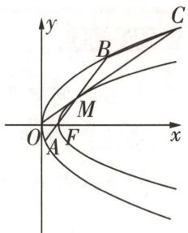

图4

由 $\left\{\begin{aligned}x&=my+1,\\ y^{2}&=4x,\end{aligned}\right.$ 得关于y的方程 $y^{2}-4my-4=0$ ，则 $\Delta=(-4m)^{2}+16>0$ ，且 $y_{1}+y_{2}=4m$ ， $y_{1}y_{2}=-4$ , 可得 $x_{1}+x_{2}=m(y_{1}+y_{2})+2=4m^{2}+2$ , 所以 $M'(2m^{2}+1,2m)$ .

由 $\left\{\begin{aligned}x&=my+1,\\ y^{2}&=2(x-1),\end{aligned}\right.$ 得 $x=2m^{2}+1,y=2m$ 或x=1,y=0，则 $M(2m^{2}+1,2m)$ .

所以点 M 与 $M'$ 重合, 即 M 为弦 AB 的中点.

（2） 由 （1） 知直线 $OM: y = \frac{2m}{2m^2 + 1} x$ ，由 $\left\{ \begin{array}{l} y = \frac{2m}{2m^2 + 1} x, \\ y^2 = 4x, \end{array} \right.$ 得 $C\left(\frac{(2m^2 + 1)^2}{m^2}, \frac{2(2m^2 + 1)}{m}\right)$ ，

连接 $OA, OB$ ，易知 $\frac{S_{\triangle OBM}}{S_{\triangle OBC}} = \frac{|OM|}{|OC|} = \frac{m^2}{2m^2 + 1}$ ，所以 $S_{\triangle OBC} = \frac{2m^2 + 1}{m^2} S_{\triangle OBM}$ ，

所以 $S_{\triangle BCM}=S_{\triangle OBC}-S_{\triangle OBM}=\frac{2m^{2}+1}{m^{2}}S_{\triangle OBM}-S_{\triangle OBM}=\frac{m^{2}+1}{m^{2}}S_{\triangle OBM}=\frac{m^{2}+1}{2m^{2}}S_{\triangle OAB}$

$S _ {\triangle O A B} = \frac {1}{2} | O F | | y _ {1} - y _ {2} | = \frac {1}{2} \times 1 \times \sqrt {1 6 m ^ {2} + 1 6} = 2 \sqrt {m ^ {2} + 1},$

所以 $S_{\triangle BCM}=\frac{m^{2}+1}{2m^{2}}S_{\triangle OAB}=\frac{m^{2}+1}{2m^{2}}\cdot2\sqrt{m^{2}+1}=\frac{(m^{2}+1)\sqrt{m^{2}+1}}{m^{2}}$

【找思路】观察代数式的形式，换元，设函数，结合单调性求最值

令 $t = \sqrt{m^{2} + 1}$ ，则 t > 1，设 $f(t) = \frac{t^{3}}{t^{2} - 1} (t > 1)$ ，则 $f'(t) = \frac{t^{2}(t + \sqrt{3})(t - \sqrt{3})}{(t^{2} - 1)^{2}}$ ，

列表如下，

<table><tr><td></td><td> $t \in (1, \sqrt{3})$ </td><td> $t = \sqrt{3}$ </td><td> $t \in (\sqrt{3}, +\infty)$ </td></tr><tr><td> $f'(t)$ </td><td>-</td><td>0</td><td>+</td></tr><tr><td> $f(t)$ </td><td>↘</td><td>取极小值</td><td>↗</td></tr></table>

所以当 $t=\sqrt{3}$ ，即 $m=\pm\sqrt{2}$ 时， $\triangle BCM$ 面积取得极小值，也是最小值，最小值为 $\frac{3\sqrt{3}}{2}$ .

# 满分攻略

# 最值问题的万能答题模板

最值问题是解析几何综合应用的常见问题,解决此类问题的一般模型是:先得到问题的表达式,如求三角形面积的最大值,先列出三角形面积的表达式;求斜率的最小值,先求得斜率的表达式……这样,就把问题转化为函数的最值问题.求解此类问题的主要思路如下:

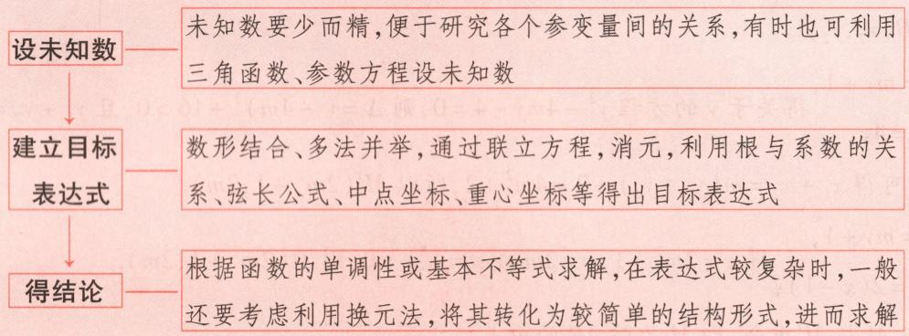

# 原创变式

2 已知椭圆 $C_{1}: \frac{x^{2}}{a^{2}} + \frac{y^{2}}{b^{2}} = 1 (a > b > 0)$ 的左、右焦点分别为 $F_{1}, F_{2}$ , 离心率为 $\frac{1}{2}$ , 过抛物线 $C_{2}: y^{2} = 2ax$ 焦点的直线交抛物线 $C_{2}$ 于 $M, N$ 两点, $|MN|$ 的最小值为 4. 连接 $MO, NO$ ( $O$ 为坐标原点) 并延长, 分别交 $C_{1}$ 于 $A, B$ 两点, 且点 $A$ 与点 $M$ , 点 $B$ 与点 $N$ 均不在同一象限.

（1） 求 $C_{1}$ 和 $C_{2}$ 的方程.  
（2） 记 $\lambda = \frac{S_{\triangle OMN}}{S_{\triangle OAB}}$ ，求 $\lambda$ 的最小值.

答案》第064页

# 创新预测

答案▶065页

##### 1.[2025 广东肇庆中学8月入学测试]已知 O 是坐标原点, $F_{1},F_{2}$ 分别是椭圆 $C:\frac{x^{2}}{4}+\frac{y^{2}}{2}=1$ 的左、右焦点,P 是椭圆 C 上在第一象限的点,且 $\cos\angle F_{1}PF_{2}=\frac{1}{3}$ ,M 是 $\angle F_{1}PF_{2}$ 的平分线上的动点,则 $\left|MF_{1}\right|+\left|MO\right|$ 的最小值为()

$\quad$A. $\sqrt{6}$

$\quad$B. $\sqrt{7}$

$\quad$C. $2\sqrt{2}$

$\quad$D. 3

##### 2.[2025 上海延安中学模拟|新考法·有关最值的实际问题]如图 5, B 地在 A 地的正东方向, 相距 4 km, B 地在 C 地的南偏西 $30^{\circ}$ 方向, 相距 2 km, 河流沿岸 PQ (足够长的曲线) 上任意一点到 A 的距离比它到 B 的距离远 2 km. 现要在曲线 PQ 上选一处 M 建一座码头, 向 A, B, C 三地转运货物. 经测算, 从 M 到 A, B 两地修建公路的费用都是

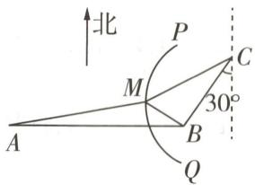

图 5

10 万元/km, 从 M 到 C 地修建公路的费用为 20 万元/km. 选择合适的点 M, 可使修建三条公路的总费用最低, 则总费用最低是 \_\_\_\_ 万元. (精确到 $0.01, \sqrt{7} \approx 2.646$ )

##### 3. 试题调研原创 阿基米德不仅是著名的哲学家、物理学家,也是著名的数学家,他利用“逼近法”得到椭圆面积除以圆周率 $\pi$ 等于椭圆的长半轴长与短半轴长的乘积.在平面直角坐标系中,已知 $O$ 为坐标原点,椭圆 $C: \frac{x^{2}}{a^{2}} + \frac{y^{2}}{b^{2}} = 1 (a > b > 0)$ 的面积为 $2\sqrt{3}\pi$ ,且椭圆 $C$ 的焦距为 2.

（1） 求椭圆 C 的标准方程.

（2） 若直线 l 与椭圆 C 交于 A, B 两点, 且 $\overrightarrow{OA} \cdot \overrightarrow{OB} = 0$ , 求 $|AB|$ 的最小值.

# 规范答题

焦三角形算面积, 半角正切连乘 b 椭圆的焦点三角形 $PF_{1}F_{2}$ 面积 $S_{\triangle PF_{1}F_{2}} = b^{2}\tan(\theta/2)$ , 其中 $\angle F_{1}PF_{2} = \theta$ .

# 参考答案与解析

# 原创变式

##### 1.B 设双曲线 C 的左焦点为 $F_{1}$ ，如图6，连接 $PF_{1}$ ，由双曲线的定义可知 $\left|PF\right|=2a+\left|PF_{1}\right|$ ，

$\therefore \triangle APF$ 的周长为 $|PA| + |PF| + |AF| = |PA| + 2a + |PF_1| + |AF| = |PA| + |PF_1| + |AF| + 2a,$

由于 $2a + |AF|$ 是定值, $\therefore$ 要使 $\triangle APF$ 的周长最小, 则 $|PA| + |PF_1|$ 最小, 即 $P, A, F_1$ 三点共线 [明关键: 利用双曲线的定义, 确定 $\triangle APF$ 周长最小时 $P$ 的位置, 进而可求出 $P$ 的坐标],

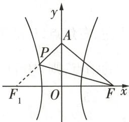

图6

$\because A(0,4\sqrt{15}), F_1(-4,0), \therefore$ 直线 $AF_1$ 的方程为 $\frac{x}{-4} + \frac{y}{4\sqrt{15}} = 1,$

即 $x = \frac{y}{\sqrt{15}} - 4$ ，将其代入 $\frac{x^2}{4} - \frac{y^2}{12} = 1$ ，整理得 $y^2 + 2\sqrt{15} y - 45 = 0$

解得 $y = \sqrt{15}$ 或 $y = -3\sqrt{15}$ (舍去)，∴ P 点的纵坐标为 $\sqrt{15}$ ，

$\therefore S_{\triangle APF} = S_{\triangle AFF_1} - S_{\triangle PFF_1} = \frac{1}{2}\times 8\times 4\sqrt{15} -\frac{1}{2}\times 8\times \sqrt{15} = 12\sqrt{15}.$ 故选B.

##### 2.（1）设直线 MN 的方程为 $x=ty+\frac{a}{2}, M(x_{1},y_{1}), N(x_{2},y_{2})$ ,

由 $\left\{\begin{aligned}x&=ty+\frac{a}{2},\\ y^{2}&=2ax,\end{aligned}\right.$ 得关于y的方程 $y^{2}-2aty-a^{2}=0,\Delta>0$ ，所以 $y_{1}+y_{2}=2at$ ，所以 $|MN|=x_{1}+x_{2}+y_{1}|=y_{2}+y_{3}|=y_{4}+y_{5}|=y_{6}+y_{7}|=y_{8}+y_{9}|=y_{10}+y_{11}+y_{12}+y_{13}+y_{14}+y_{15}+y_{16}+y_{17}+y_{18}+y_{19}+y_{20}+y_{21}+y_{22}+y_{23}+y_{24}+y_{25}+y_{26}+y_{27}+y_{28}+y_{29}+y_{30}+y_{31}+y_{32}+y_{33}+y_{34}+y_{35}+y_{36}+y_{37}+y_{38}+y_{39}+y_{40}+y_{41}+y_{42}+y_{43}+y_{44}+y_{45}+y_{46}+y_{47}+y_{48}+y_{49}+y_{50}+y_{51}+y_{52}+y_{53}+y_{54}+y_{55}+y_{56}+y_{57}+y_{58}+y_{59}+y_{60}+y_{61}+y_{62}+y_{63}+y_{64}+y_{65}+y_{66}+y_{67}+y_{68}+y_{69}+y_{70}+y_{71}+y_{72}+y_{73}+y_{74}+y_{75}+y_{76}+y_{77}+y_{78}+y_{79}+y_{80}+y_{81}+y_{82}+y_{83}+y_{84}+y_{85}+y_{86}+y_{87}+y_{88}+y_{89}+y_{90}+y_{91}+y_{92}+y_{93}+y_{94}+y_{95}+y_{96}+y_{97}+y_{98}+y_{99}+y_{100}(x,y,z),$

$a=t(y_{1}+y_{2})+2a=2at^{2}+2a$ [巧计算: 此处利用了抛物线的焦点弦公式 $\left|CD\right|=x_{1}+x_{2}+p$ $(C(x_{1},y_{1}),D(x_{2},y_{2})$ 是抛物线 $y^{2}=2px(p>0)$ 的焦点弦的两端点)]，

所以当 t=0 时， $|MN|$ 有最小值 2a，所以 2a=4，解得 a=2。

又 $C_1$ 的离心率 $e = \frac{c}{a} = \frac{1}{2}$ 所以 $c = 1$ ，则 $b = \sqrt{a^2 - c^2} = \sqrt{4 - 1} = \sqrt{3}$

所以椭圆 $C_{1}$ 的方程为 $\frac{x^{2}}{4} + \frac{y^{2}}{3} = 1$ ，抛物线 $C_{2}$ 的方程为 $y^{2} = 4x$ .

（2）根据题意作图,如图7所示,由（1）可得 $y_{1}y_{2}=-a^{2}=-4,x_{1}x_{2}=\frac{a^{2}}{4}=1$ ,所以 $k_{OM}\cdot k_{ON}=\frac{y_{1}}{x_{1}}\cdot\frac{y_{2}}{x_{2}}=-4.$

设直线 OM 的方程为 y = mx [明关键: 利用抛物线焦点弦的两个端点与原点连线所在直线的斜率之积为定值, 仅需引入一个变量, 就可以表示出 A, B 的坐标],

由 $\left\{\begin{aligned}\frac{x^{2}}{4}+\frac{y^{2}}{3}&=1,\\ y&=mx,\end{aligned}\right.$ 整理得关于x的方程 $(3+4m^{2})x^{2}=12$ ，可得 $x_{A}^{2}=\frac{12}{3+4m^{2}}$

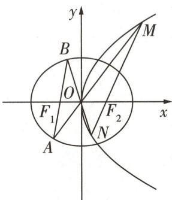

图7

同理可设直线 ON 的方程为 $y=\frac{-4}{m}x$ ，可得 $x_{B}^{2}=\frac{12m^{2}}{3m^{2}+64}$ .

$\lambda^ {2} = \left(\frac {S _ {\triangle O M N}}{S _ {\triangle O A B}}\right) ^ {2} = \left(\frac {\frac {1}{2} | O M | | O N | \sin \angle M O N}{\frac {1}{2} | O A | | O B | \sin \angle A O B}\right) ^ {2} = \left(\frac {\sqrt {1 + m ^ {2}} \left| x _ {1} \right| \sqrt {1 + \left(- \frac {4}{m}\right) ^ {2}} \left| x _ {2} \right|}{\sqrt {1 + m ^ {2}} \left| x _ {A} \right| \sqrt {1 + \left(- \frac {4}{m}\right) ^ {2}} \left| x _ {B} \right|}\right) ^ {2} = \frac {1}{x _ {A} ^ {2} x _ {B} ^ {2}} =$

$\frac{12m^{4}+265m^{2}+192}{144m^{2}}=\frac{m^{2}}{12}+\frac{4}{3m^{2}}+\frac{265}{144}\geqslant2\sqrt{\frac{m^{2}}{12}\times\frac{4}{3m^{2}}}+\frac{265}{144}=\frac{361}{144}$ [点关键:利用基本不等式求最值,注意验证取等的条件],

当且仅当 $\frac{m^{2}}{12}=\frac{4}{3m^{2}}$ ，即 $m=\pm2$ 时取等号，所以 $\lambda$ 的最小值为 $\frac{19}{12}$ .

# 创新预测

##### 1.A 由椭圆定义得 $\left|PF_{1}\right|+\left|PF_{2}\right|=4,F_{1}(-\sqrt{2},0),F_{2}(\sqrt{2},0)$ .

在 $\triangle PF_{1}F_{2}$ 中，由余弦定理可得 $\cos \angle F_{1}PF_{2} = \frac{|PF_{1}|^{2} + |PF_{2}|^{2} - |F_{1}F_{2}|^{2}}{2|PF_{1}||PF_{2}|} = \frac{1}{3}$ ，可得 $|PF_{1}| = 3$ ， $|PF_{2}| = 1$ ，所以 $|PF_{2}|^{2} + |F_{1}F_{2}|^{2} = |PF_{1}|^{2}$ ，所以 $PF_{2} \perp x$ 轴，即 $P(\sqrt{2}, 1)$ .

设 $\angle F_{1}PF_{2}$ 的平分线与x轴相交于 $N(x_{N},0)$ ，由三角形角平分线定理得 $\frac{x_{N}+\sqrt{2}}{\sqrt{2}-x_{N}}=\frac{3}{1}$ [明关键：三角形任意两边之比等于它们夹角的平分线分对边之比]，

所以 $N(\frac{\sqrt{2}}{2},0)$ ，从而 $\angle F_{1}PF_{2}$ 的平分线所在直线方程为 $\sqrt{2}x - y - 1 = 0$ .

设 $F_{1}$ 关于 $\angle F_{1}PF_{2}$ 的平分线的对称点为 $Q(x_0,y_0)$ ，连接 $F_{2}Q$ ，则 $|PF_{1}| = |PQ| = 3,|PF_{2}| = 1$

所以 $\overrightarrow{PQ} = 3\overrightarrow{PF_2}$ ，即 $(x_0 - \sqrt{2},y_0 - 1) = (0, - 3)$ ，得 $x_0 = \sqrt{2},y_0 = -2$ ，即 $Q(\sqrt{2}, - 2)$

连接 MQ, OQ, 则 $\left|MF_{1}\right| + \left|MO\right| = \left|MO\right| + \left|MQ\right| \geqslant \left|OQ\right| = \sqrt{\left(\sqrt{2}\right)^{2} + \left(-2\right)^{2}} = \sqrt{6}$ , 当 M, O, Q 三点共线时取等号. 故选 A.

##### 2.85.84 以 AB 所在直线为 x 轴, 线段 AB 的垂直平分线为 y 轴建立平面直角坐标系, 如图 8 所示, 记 $\left|AB\right|=4$ .

连接 AC, 由题可知 $\left|MA\right| - \left|MB\right| = 2$ , 根据双曲线定义知, 曲线 PQ 可视为双曲线 $\frac{x^{2}}{a^{2}}-\frac{y^{2}}{b^{2}}=1(a>0,b>0)$ 的右支.

故 2c=4, c=2, 2a=2, a=1, 则 $b=\sqrt{3}$ ,

故点 M 的轨迹方程为 $x^{2}-\frac{y^{2}}{3}=1(x>0)$ .

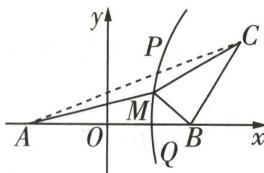

图8

由题意知修建三条公路的总费用 $y=10|MA|+10|MB|+20|MC|=10(|MA|+|MA|-2a+2|MC|)=20(|MA|+|MC|-1)$ [点技巧:用|MA|表示|MB|,把三条线段和化为两条线段和],由图形可知, 当 A, M, C 三点共线时, y 有最小值 $20(|AC|-1)$ ,

易知 $C(3, \sqrt{3})$ ，所以 $|AC| = \sqrt{(3 + 2)^2 + (\sqrt{3})^2} = 2\sqrt{7}$ ，所以 $y_{\min} = 20 \times (2\sqrt{7} - 1) \approx 85.84$ .

##### 3.（1）由题意知,椭圆 C 的面积为 $ab\pi = 2\sqrt{3}\pi$ , 得 $ab = 2\sqrt{3}$ ,

又 2c=2，所以 $\left\{\begin{aligned}ab&=2\sqrt{3},\\ c&=1,\\ a^{2}&=b^{2}+c^{2},\end{aligned}\right.$ 解得 $\left\{\begin{aligned}a&=2,\\ b&=\sqrt{3},\\ c&=1,\end{aligned}\right.$ 所以椭圆 C 的标准方程为 $\frac{x^{2}}{4}+\frac{y^{2}}{3}=1.$

（2）①若直线 $AB$ 的斜率不存在 [避易错: 注意不要忘了考虑特殊情况],

设 $A(x_0, y_0)$ ，则 $B(x_0, -y_0)$ ，且 $\frac{x_0^2}{4} + \frac{y_0^2}{3} = 1$ ，因为 $\overrightarrow{OA} \cdot \overrightarrow{OB} = 0$ ，所以 $|x_0| = |y_0|$ ，

所以 $|y_{0}|=\frac{2\sqrt{21}}{7}$ ，所以 $|AB|=2|y_{0}|=\frac{4\sqrt{21}}{7}$ .

②若直线 AB 的斜率存在, 设 AB 的方程为 $y = kx + m$ , $A(x_{1}, y_{1})$ , $B(x_{2}, y_{2})$ .

由 $\left\{\begin{aligned}\frac{x^{2}}{4}+\frac{y^{2}}{3}=1,\\ y=kx+m,\end{aligned}\right.$ 消去 y 整理得关于 x 的方程 $(3+4k^{2})x^{2}+8kmx+4m^{2}-12=0$

则 $\Delta = 64k^{2}m^{2} - 4(3 + 4k^{2})(4m^{2} - 12) = 48(4k^{2} - m^{2} + 3) > 0,$

所以 $\left\{\begin{aligned}x_{1}+x_{2}&=-\frac{8km}{3+4k^{2}},\\ x_{1}x_{2}&=\frac{4m^{2}-12}{3+4k^{2}},\end{aligned}\right.$ 所以 $\overrightarrow{OA}\cdot\overrightarrow{OB}=x_{1}x_{2}+y_{1}y_{2}=(k^{2}+1)x_{1}x_{2}+km(x_{1}+x_{2})+m^{2}=(k^{2}+1)x_{1}x_{2}+\cdots+x_{1}y_{2}+km(x_{1}+x_{2})+m^{2}=(k^{2}+1)x_{1}x_{2}+\cdots+x_{1}y_{2}+km(x_{1}+x_{2})+m^{2}=(k^{2}+1)x_{1}x_{2}+\cdots+x_{1}y_{2}+km(x_{1}+x_{2})+m^{2}=(k^{2}+1)x_{1}x_{2}+\cdots+x_{1}y_{2}+km(x_{1}+x_{2})+m^{2}=(k^{2}+1)x_{1}x_{2}+\cdots+x_{1}y_{2}+km(x_{1}+x_{2})+m^{2}=(k^{2}+1)x_ {1}x_ {2}+\cdots+x _ {1}y _ {2}+km (x _{1} + x _{2}) + m ^{2}(k^{2} + x _{1}) \\ &= \frac{4m^{2}-12}{3+4k^{2}},\end{aligned}\right.$

1) $\frac{4m^2 - 12}{3 + 4k^2} - km\frac{8km}{3 + 4k^2} + m^2 = 0$ ，即 $7m^2 = 12k^2 + 12$ ，满足 $\Delta > 0$ .

故 $|AB| = \sqrt{k^2 + 1} |x_1 - x_2| = \sqrt{k^2 + 1}\sqrt{(x_1 + x_2)^2 - 4x_1x_2} = \sqrt{k^2 + 1}\frac{\sqrt{48(4k^2 - m^2 + 3)}}{3 + 4k^2} = \frac{4\sqrt{21}}{7}\sqrt{\frac{(k^2 + 1)(16k^2 + 9)}{(3 + 4k^2)^2}}.$

令 $3+4k^{2}=t(t\geqslant3)$ [明关键:换元,构造函数求最值],则 $k^{2}+1=\frac{t+1}{4},16k^{2}+9=4t-3.$

所以 $|AB|=\frac{4\sqrt{21}}{7}\sqrt{\frac{(t+1)(4t-3)}{4t^{2}}}=\frac{2\sqrt{21}}{7}\sqrt{4+\frac{1}{t}-\frac{3}{t^{2}}}=\frac{2\sqrt{21}}{7}\sqrt{-3(\frac{1}{t}-\frac{1}{6})^{2}+\frac{49}{12}}.$

因为 $\frac{1}{t}\in(0,\frac{1}{3}]$ ，所以当 $\frac{1}{t}=\frac{1}{3}$ ，即k=0时， $|AB|_{\min}=\frac{4\sqrt{21}}{7}$ .

综上, $|AB|$ 的最小值为 $\frac{4\sqrt{21}}{7}$ .

# 超重点8 巧用方程的根与系数关系突破解析几何中的“运算关”

# 类型 1 巧用方程根与系数的关系求弦长

调研 1 试题调研原创 已知椭圆 $C: \frac{x^{2}}{a^{2}} + y^{2} = 1 (a > 1)$ 的离心率为 $\frac{2\sqrt{5}}{5}$ ，椭圆 C 的动弦 AB 过椭圆 C 的右焦点 F，当 AB 垂直于 x 轴时，椭圆 C 在 A, B 处的切线的交点为 M.

（1） 求点 M 的坐标.

（2） 若直线 $AB$ 的斜率为 $\frac{1}{m}$ , 过点 $M$ 作 $x$ 轴的垂线 $l$ , 点 $N$ 为 $l$ 上一点, 且点 $N$ 的纵坐标为 $-\frac{m}{2}$ , 直线 $NF$ 与椭圆 $C$ 交于 $P, Q$ 两点, 证明: $\frac{1}{|AB|} + \frac{1}{|PQ|}$ 为定值.

解析 （1） 由题可知离心率 $e = \frac{c}{a} = \frac{2\sqrt{5}}{5}, b = 1$ ，可得 $a^2 = 5$

所以椭圆 C 的标准方程为 $\frac{x^{2}}{5} + y^{2} = 1$ ，右焦点为 $F(2,0)$ .

当 AB 垂直于 x 轴时, 不妨取 $A(2, \frac{\sqrt{5}}{5})$ , 则根据对称性可知点 M 在 x 轴上, 且直线 MA 的斜率存在, 设直线 MA 的方程为 $y = k(x - 2) + \frac{\sqrt{5}}{5}$ ,

由 $\left\{\begin{aligned}y&=k(x-2)+\frac{\sqrt{5}}{5},\\ \frac{x^{2}}{5}&+y^{2}=1\end{aligned}\right.$ 消去 y 得关于 x 的二次方程 $(1+5k^{2})x^{2}+10(\frac{\sqrt{5}}{5}-2k)kx+5(\frac{\sqrt{5}}{5}-2k)^{2}-5=0,$

则 $\Delta = [10(\frac{\sqrt{5}}{5} - 2k)k]^2 - 4 \times 5[(\frac{\sqrt{5}}{5} - 2k)^2 - 1](1 + 5k^2) = 0$ ，化简得 $k^2 + \frac{4\sqrt{5}}{5} k + \frac{4}{5} = 0$ ，解得 $k = -\frac{2\sqrt{5}}{5}$ ，所以直线 $MA$ 的方程为 $y = -\frac{2\sqrt{5}}{5} x + \sqrt{5}$ .

【结论速解】椭圆 $\frac{x^{2}}{a^{2}}+\frac{y^{2}}{b^{2}}=1(a>b>0)$ 上一点 $(x_{0},y_{0})$ 处的切线方程为 $\frac{x_{0}x}{a^{2}}+\frac{y_{0}y}{b^{2}}=1$ ，据此可以直接得到直线MA的方程为 $\frac{2x}{5}+\frac{\sqrt{5}y}{5}=1$ ，即 $2x+\sqrt{5}y=5$

令 y=0，可得 $x=\frac{5}{2}$ ，故点 M 的坐标为 $(\frac{5}{2},0)$ .

（2）根据题意作图,如图1,由题可知直线AB的方程为 $y=\frac{1}{m}(x-2)$ ,即 $x=my+2$ .

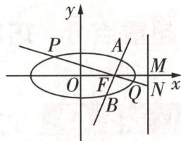

图1

设 $A(x_{1},y_{1}),B(x_{2},y_{2})$ ，由题可知 $N(\frac{5}{2}, - \frac{m}{2})$ ，所以 $k_{NF} = \frac{\frac{m}{2}}{2 - \frac{5}{2}} =$ -m, 即直线 NF 与 AB 垂直.

【点关键】求出直线 NF 的斜率，判断出直线 NF 与 AB 垂直，得到我们熟悉的“两条互相垂直的弦”模型是解题的关键

由 $\left\{\begin{aligned}x^{2}+5y^{2}&=5,\\ x&=my+2\end{aligned}\right.$ 消去x得关于y的二次方程 $(m^{2}+5)y^{2}+4my-1=0,\Delta_{1}>0$ ，则 $y_{1}+y_{2}=$ $-\frac{4m}{m^{2}+5},y_{1}y_{2}=-\frac{1}{m^{2}+5},$

所以 $|AB| = \sqrt{1 + m^2} \cdot \sqrt{(y_1 + y_2)^2 - 4y_1y_2} = \sqrt{1 + m^2} \cdot \frac{\sqrt{16m^2 + 4(m^2 + 5)}}{m^2 + 5} = \frac{2\sqrt{5}(m^2 + 1)}{m^2 + 5}$ , 同理, $|PQ| = \frac{2\sqrt{5}\left(\frac{1}{m^2} + 1\right)}{\frac{1}{m^2} + 5} = \frac{2\sqrt{5}(1 + m^2)}{1 + 5m^2}$ ,

【速算技巧】直线 NF 与 AB 垂直且均过点 $(2,0)$ ，只需要将 $|AB|$ 的表达式中的 m 用 $-\frac{1}{m}$ 替换即可得到弦长 $|PQ|$ 的表达式

所以 $\frac{1}{|AB|} +\frac{1}{|PQ|} = \frac{m^2 + 5}{2\sqrt{5}(m^2 + 1)} +\frac{1 + 5m^2}{2\sqrt{5}(1 + m^2)} = \frac{6(1 + m^2)}{2\sqrt{5}(1 + m^2)} = \frac{3\sqrt{5}}{5},$

即 $\frac{1}{|AB|}+\frac{1}{|PQ|}$ 为定值.

# 满分攻略

# 求直线与圆锥曲线相交问题的 4 个必用弦长结论

直线 l 与圆锥曲线 $F(x,y)=0$ 相交于 A, B 两点（不重合），当直线 l 的斜率存在且不为 0 时，弦长 $|AB|$ 的公式如下：

<table><tr><td>1</td><td>点的坐标的形式</td><td> $|AB| = \sqrt{(x_1 - x_2)^2 + (y_1 - y_2)^2}$ </td><td rowspan="4">弦端点  $A(x_1, y_1), B(x_2, y_2), l: y = kx + m$ ,由 $\begin{cases} y = kx + m, \\ F(x, y) = 0 \end{cases}$  消去  $y$  得到  $ax^2 + bx + c = 0$ ( $a, b, c$  为参数), $\Delta > 0, \alpha$  为直线  $AB$  的倾斜角</td></tr><tr><td>2</td><td>含斜率和横坐标的形式</td><td> $|AB| = \sqrt{(1 + k^2)(x_1 - x_2)^2}$ </td></tr><tr><td>3</td><td>含横坐标和倾斜角的形式</td><td> $|AB| = |x_1 - x_2| \sqrt{1 + \tan^2 \alpha}$ </td></tr><tr><td>4</td><td>含纵坐标和倾斜角的形式</td><td> $|AB| = |y_1 - y_2| \sqrt{1 + \frac{1}{\tan^2 \alpha}}$ </td></tr></table>

# 原创变式

已知双曲线 $C: \frac{x^{2}}{a^{2}} - \frac{y^{2}}{b^{2}} = 1 (a > 0, b > 0)$ 的左、右焦点分别为 $F_{1}, F_{2}$ ，焦距为 4，C 上一点 P 满足 $\cos \angle F_{1}F_{2}P = -\frac{\sqrt{3}}{3}$ ，且 $\triangle PF_{1}F_{2}$ 的面积为 $2\sqrt{2}$ .

（1） 求 C 的标准方程.  
（2） 过 C 的渐近线上一点 T 作直线 l 与 C 相交于点 M, N, 求 $\left|TM\right| \cdot \left|TN\right|$ 的最小值.

答案》第073页

# 类型 2 用方程根与系数的关系求斜率之和或斜率之积

调研 2 试题调研原创 已知椭圆 $C: \frac{x^{2}}{a^{2}} + \frac{y^{2}}{b^{2}} = 1 (a > b > 0)$ 的离心

率为 $\frac{1}{2}$ ，点 $A(1,\frac{3}{2})$ 在C上.

  
巧借方程的“根与系数关系”速求斜率之和

（1） 求椭圆 C 的标准方程.

（2） 过点 $T(4,0)$ 的直线 $l$ 交椭圆 $C$ 于 $P, Q$ 两点（异于点 $A$ ），设直线 $AP, AQ$ 的斜率分别为 $k_{1}, k_{2}$ . 求 $k_{1} + k_{2}$ 的值.

解析 （1） 由题可知 $\left\{ \begin{array}{l} \frac{c}{a} = \frac{1}{2}, \\ a^2 = b^2 + c^2, \\ \frac{1}{a^2} + \frac{\left(\frac{3}{2}\right)^2}{b^2} = 1, \end{array} \right.$ 解得 $\left\{ \begin{array}{l} a = 2, \\ b = \sqrt{3}, \\ c = 1, \end{array} \right.$ 所以椭圆 $C$ 的标准方程为 $\frac{x^2}{4} + \frac{y^2}{3} = 1$ .

（2） 显然直线 l 的斜率存在.

当直线 l 的斜率为 0 时, 不妨设 $P(2,0)$ , $Q(-2,0)$ , 此时 $k_{1} + k_{2} = \frac{\frac{3}{2}}{1 - 2} + \frac{\frac{3}{2}}{1 + 2} = -1$ .

【巧破题】可以从直线 l 的斜率为 0 的特殊情况入手，先求出此种情况下 $k_{1} + k_{2}$ 的值，为后续常规情况的求解指引方向

当直线 l 的斜率不为 0 时, 如图 2, 设直线 $l: x = my + 4 (m \neq 0)$ , $P(x_{1}, y_{1}), Q(x_{2}, y_{2})$ , 由 $\left\{\begin{aligned} x &= my + 4, \\ \frac{x^{2}}{4} + \frac{y^{2}}{3} &= 1 \end{aligned}\right.$ 消去 x 整理得关于 y 的二次方程

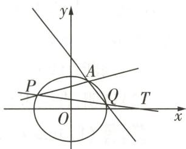

图2

双曲线有四定义,差比斜率与距离 “差”:平面内,到两个定点 $F_{1}, F_{2}$ (焦点) 距离之差的绝对值为定值 $2a(2a < |F_{1}F_{2}|)$ 的点的轨迹为双曲线.

记忆口诀

$(3 m ^ {2} + 4) y ^ {2} + 2 4 m y + 3 6 = 0,$

则 $\Delta = 144(m^{2} - 4) > 0$ ，所以 $m^{2} > 4$ .

$y_{1}+y_{2}=\frac{-24m}{3m^{2}+4},y_{1}y_{2}=\frac{36}{3m^{2}+4}$ ，所以 $my_{1}y_{2}=-\frac{3}{2}(y_{1}+y_{2})$

【敲黑板】本题的解题关键是联立直线 l 与椭圆 C 的方程，化简后利用根与系数的关系得出 $y_{1} + y_{2}$ 与 $y_{1}y_{2}$ 之间的关系式，这样就可以将直线 AP, AQ 的斜率之和 $k_{1} + k_{2}$ 用 $y_{1} + y_{2}, y_{1}y_{2}, m$ 表示出来，化简即可得到定值

所以 $k_{1} + k_{2} = \frac{y_{1} - \frac{3}{2}}{x_{1} - 1} +\frac{y_{2} - \frac{3}{2}}{x_{2} - 1} = \frac{2my_{1}y_{2} + (3 - \frac{3}{2}m)(y_{1} + y_{2}) - 9}{m^{2}y_{1}y_{2} + 3m(y_{1} + y_{2}) + 9} = \frac{-\frac{3}{2}m(y_{1} + y_{2}) - 9}{\frac{3}{2}m(y_{1} + y_{2}) + 9} = -1.$

综上, $k_{1}+k_{2}=-1$ .

# 满分攻略

# “直曲相交”下斜率为定值的3个高分必记结论

<table><tr><td>1</td><td>设 $P(m,n)$ 是椭圆 $C:\frac{x^{2}}{a^{2}}+\frac{y^{2}}{b^{2}}=1(a>b>0)$ 上一定点, $A,B$ 是椭圆 $C$ 上不同于点 $P$ 的两点,若 $k_{PA}+k_{PB}=0$ ,则直线 $AB$ 的斜率为定值 $\frac{b^{2}m}{a^{2}n}(n\neq0)$ .</td></tr><tr><td>2</td><td>设 $P(m,n)$ 是双曲线 $C:\frac{x^{2}}{a^{2}}-\frac{y^{2}}{b^{2}}=1(a>0,b>0)$ 上一定点, $A,B$ 是双曲线 $C$ 上不同于点 $P$ 的两点,若 $k_{PA}+k_{PB}=0$ ,则直线 $AB$ 的斜率为定值 $-\frac{b^{2}m}{a^{2}n}(n\neq0)$ .</td></tr><tr><td>3</td><td>设 $P(m,n)$ 是抛物线 $C:y^{2}=2px(p>0)$ 上一定点, $A,B$ 是抛物线 $C$ 上不同于点 $P$ 的两点,若 $k_{PA}+k_{PB}=0$ ,则直线 $AB$ 的斜率为定值 $-\frac{p}{n}(n\neq0)$ .</td></tr></table>

# 类型 ③ 用方程根与系数的关系求定直线

调研 3 [2025 江苏南京 8 月期初调研] 已知双曲线 $C: x^{2} - \frac{y^{2}}{3} = 1$ 的左、右顶点分别是 $A_{1}, A_{2}$ ，直线 l 与 C 交于 M, N 两点（不与 $A_{2}$ 重合），直线 $A_{2}M, A_{2}N, l$ 的斜率分别为 $k_{1}, k_{2}, k$ ，且 $(k_{1} + k_{2})k = -6$ .

（1） 判断直线 l 是否过 x 轴上的定点. 若是, 求出该定点; 若不是, 说明理由.  
（2） 证明: 直线 $MA_{1}$ 与 $NA_{2}$ 的交点 P 在定直线上.

解析 （1） 直线 $l$ 恒过 $x$ 轴上的定点 $(2,0)$ , 理由如下.

由题意可知 $A_{1}(-1,0), A_{2}(1,0), k \neq 0$ ，设直线 $l$ 的方程为 $y = kx + m, k \neq -m, M(x_{1},$

$\left. y _ {1}\right), N \left(x _ {2}, y _ {2}\right),$

由 $\left\{\begin{aligned}x^{2}-\frac{y^{2}}{3}&=1,\\ y=kx+m\end{aligned}\right.$ 消去y可得关于x的二次方程 $(3-k^{2})x^{2}-2kmx-m^{2}-3=0,$

则 $k^2 \neq 3, \Delta = 12(m^2 + 3 - k^2) > 0$ ，即 $k^2 < m^2 + 3$ ，所以 $x_1 + x_2 = \frac{2km}{3 - k^2}, x_1x_2 = -\frac{m^2 + 3}{3 - k^2}$ .

所以 $(k_{1} + k_{2})k = k\left(\frac{kx_{1} + m}{x_{1} - 1} +\frac{kx_{2} + m}{x_{2} - 1}\right) = k\cdot \frac{2kx_{1}x_{2} + (m - k)(x_{1} + x_{2}) - 2m}{x_{1}x_{2} - (x_{1} + x_{2}) + 1} = k$

$\frac {2 k (- \frac {m ^ {2} + 3}{3 - k ^ {2}}) + (m - k) \frac {2 k m}{3 - k ^ {2}} - 2 m}{- \frac {m ^ {2} + 3}{3 - k ^ {2}} - \frac {2 k m}{3 - k ^ {2}} + 1} = \frac {6 k}{m + k} = - 6, \text {可得} m = - 2 k,$

故直线 l 的方程为 $y = k(x - 2)$ ，直线 l 恒过定点 $(2, 0)$ .

（2）由题可知直线 $MA_{1}$ 的方程为 $y=\frac{y_{1}}{x_{1}+1}(x+1)$ ，直线 $NA_{2}$ 的方程为 $y=\frac{y_{2}}{x_{2}-1}(x-1)$ ，

由 $\frac{x+1}{x-1}=\frac{y_{2}(x_{1}+1)}{y_{1}(x_{2}-1)}=\frac{(x_{2}-2)(x_{1}+1)}{(x_{1}-2)(x_{2}-1)}=\frac{x_{1}x_{2}-2x_{1}+x_{2}-2}{x_{1}x_{2}-2x_{2}-x_{1}+2}=\frac{x_{1}x_{2}+(x_{1}+x_{2})-3x_{1}-2}{x_{1}x_{2}-2(x_{1}+x_{2})+x_{1}+2}=$

【破障碍】式子 $\frac{x+1}{x-1}=\frac{x_{1}x_{2}-2x_{1}+x_{2}-2}{x_{1}x_{2}-2x_{2}-x_{1}+2}$ 并不能完全整理为 $x_{1}+x_{2}$ ， $x_{1}x_{2}$ 的形式，所以需要适当转化凑项 $\frac{-6k^{2}-9}{3-k^{2}}-3x_{1}$ $\frac{2k^{2}+3}{3-k^{2}}+x_{1}=-3$ ,可得 $x=\frac{1}{2}$ ,故点P在定直线 $x=\frac{1}{2}$ 上.

# 原创变式

2 已知椭圆 $E: \frac{x^2}{a^2} + \frac{y^2}{b^2} = 1 (a > b > 0)$ 的短轴长为 $2\sqrt{3}$ , 左、右顶点分别为 $C, D$ , 过右焦点 $F(1,0)$ 的直线 $l$ 交椭圆 $E$ 于 $A, B$ 两点 (不与 $C, D$ 重合), 直线 $AC$ 与直线 $BD$ 交于点 $T$ .

（1） 求椭圆 E 的标准方程.  
（2） 证明: 点 T 在定直线上.

答案》第074页

“斜率”: 设 $A(-a,0)$ , $B(a,0)$ , a > 0, 直线 AM 与 BM 交于点 M, 且它们的斜率之积是定值 $b^{2}/a^{2}$ , 则动点 M 的轨迹是双曲线 $x^{2}/a^{2} - y^{2}/b^{2} = 1$ (缺失两个端点).

记忆口诀

# 创新预测

答案▶074页

##### 1. 试题调研原创 已知点 $P(1,1)$ 在双曲线 $\Gamma: \frac{x^2}{a^2} - \frac{y^2}{b^2} = 1 (a, b > 0)$ 的一条渐近线上, $F_1, F_2$ 分别为双曲线的左、右焦点, 且 $\overrightarrow{F_1P} \cdot \overrightarrow{F_2P} = 0$ .

（1） 求双曲线 $\Gamma$ 的标准方程.  
（2） 过点 P 的直线 l 与双曲线左、右两支分别交于点 A, B, 证明: $\left|AB\right|_{\min}<2.7$ .

# 规范答题

##### 2. 试题调研原创 已知椭圆 E 的焦点为 $(\sqrt{11},0)$ 和 $(- \sqrt{11},0)$ ，短轴长为 2.

（1） 求椭圆 E 的标准方程.  
（2）设椭圆上、下顶点分别为 $P_{1}, P_{2}$ , 过点 $Q(0, \frac{1}{2})$ 的直线 $l_{1}$ 与椭圆 $E$ 交于 $A, B$ 两点 (不与 $P_{1}, P_{2}$ 两点重合). 证明: 直线 $AP_{1}$ 与 $BP_{2}$ 的交点在定直线上.

# 规范答题

# 参考答案与解析

# 原创变式

##### 1.（1）在 $\triangle PF_{1}F_{2}$ 中,因为 $\cos\angle F_{1}F_{2}P=-\frac{\sqrt{3}}{3}$ ,所以 $\sin\angle F_{1}F_{2}P=\sqrt{1-\cos^{2}\angle F_{1}F_{2}P}=\frac{\sqrt{6}}{3}$ [避易错:注意计算面积时,不要错用了双曲线的焦点三角形面积公式 $S_{\triangle PF_{1}F_{2}}=\frac{b^{2}}{\tan\frac{\theta}{2}}$ ,此公式中的 $\theta$ 是 $\angle F_{1}PF_{2}$ ,而本题给出的是 $\angle F_{1}F_{2}P]$ ,

所以 $\triangle PF_{1}F_{2}$ 的面积为 $\frac{1}{2}\times |F_1F_2||PF_2|\sin \angle F_1F_2P = \frac{1}{2}\times 4\times |PF_2|\times \frac{\sqrt{6}}{3} = 2\sqrt{2},$

所以 $|PF_{2}|=\sqrt{3}$ .

在 $\triangle PF_{1}F_{2}$ 中，由余弦定理得 $|PF_{1}|^{2} = |PF_{2}|^{2} + |F_{1}F_{2}|^{2} - 2|PF_{2}||F_{1}F_{2}|\cos \angle F_{1}F_{2}P = 19 + 2\times$ $\sqrt{3}\times 4\times \frac{\sqrt{3}}{3} = 27$ ，所以 $|PF_1| = 3\sqrt{3}$

因为 P 在双曲线上, 所以 $2a = |PF_{1}| - |PF_{2}| = 2\sqrt{3}$ , 可得 $a^{2} = 3, b^{2} = c^{2} - a^{2} = 1$ .

所以 C 的标准方程为 $\frac{x^{2}}{3}-y^{2}=1$ .

（2） 设 $T(x_{0}, y_{0})$ , $M(x_{1}, y_{1})$ , $N(x_{2}, y_{2})$ . 当直线 $l \perp y$ 轴时 [避易错: 不要忽视直线 l 的斜率为 0 的特殊情况], 直线 $l: y = y_{0}$ 与 C 交于点 $M(x_{1}, y_{0})$ , $N(-x_{1}, y_{0})$ ,

所以 $\frac{x_1^2}{3} - y_0^2 = 1$ ，即 $x_1^2 - 3y_0^2 = 3$ ，所以 $|TM| \cdot |TN| = |x_1 - x_0||x_1 + x_0| = |x_1^2 - x_0^2| = |x_1^2 - 3y_0^2| = 3$ .

当直线 l 与 y 轴不垂直时, 设直线 l 的方程为 $x = my + n (m \neq \pm\sqrt{3})$ ,

利用对称性,不妨设 $T(x_{0},y_{0})$ 在直线 $x-\sqrt{3}y=0$ 上,如图3,由 $\left\{\begin{aligned}x-\sqrt{3}y=0,\\ x=my+n\end{aligned}\right.$ 得 $y_{0}=\frac{n}{\sqrt{3}-m}$ . 由 $\left\{\begin{aligned}x^{2}-3y^{2}=3,\\ x=my+n\end{aligned}\right.$ 消去 x 得关于 y 的二次方程 $(m^{2}-3)y^{2}+2mny+n^{2}-3=0,m^{2}-3\neq0,\Delta=(2mn)^{2}-4(m^{2}-3)(n^{2}-3)=12(m^{2}+n^{2})-36>0$ ,所以 $y_{1}+y_{2}=\frac{-2mn}{m^{2}-3},y_{1}y_{2}=\frac{n^{2}-3}{m^{2}-3}.$

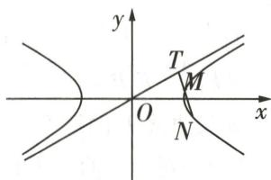

图3

则 $|TM| = \sqrt{(x_0 - x_1)^2 + (y_0 - y_1)^2} = \sqrt{1 + m^2} |y_0 - y_1|$ ，同理得 $|TN| = \sqrt{1 + m^2} |y_0 - y_2|$ [速算技巧:点 $N$ 与点 $M$ 相比,除了坐标不同之外,上述的所有过程都可以套用,所以可以直接“同理得”写出 $|TN|$ ].

所以 $|TM||TN|=(1+m^{2})|y_{0}-y_{1}||y_{0}-y_{2}|=(1+m^{2})|y_{0}^{2}-y_{0}(y_{1}+y_{2})+y_{1}y_{2}|=(1+m^{2})\times|\frac{n^{2}}{(\sqrt{3}-m)^{2}}-\frac{n}{\sqrt{3}-m}\times\frac{-2mn}{m^{2}-3}+\frac{n^{2}-3}{m^{2}-3}|=|\frac{3(m^{2}+1)}{m^{2}-3}|=|3+\frac{12}{m^{2}-3}|\geqslant1$ （当且仅当m=0时取等号，且此时只需 $n^{2}>3$ 即可满足 $\Delta>0$ ）.综上， $|TM||TN|$ 的最小值为1.

焦三角形算面积, 半角余切连乘 b 双曲线焦点三角形 $PF_{1}F_{2}$ 的面积 $S_{\triangle PF_{1}F_{2}} = b^{2} / \tan \frac{\theta}{2}$ , 其中 $\angle F_{1}PF_{2} = \theta$ .

##### 2.（1）依题意得 $b=\sqrt{3}$ , c=1, 则 $a=\sqrt{b^{2}+c^{2}}=2$ ,

所以椭圆 E 的标准方程为 $\frac{x^{2}}{4} + \frac{y^{2}}{3} = 1$ .

（2） 显然直线 AB 不垂直于 y 轴, 根据题意作图, 如图 4, 设 $AB: x = ty + 1$ , 由 $\left\{\begin{aligned} x &= ty + 1, \\ 3x^{2} + 4y^{2} &= 12 \end{aligned}\right.$ 消去 x 并整理得关于 y 的二次方程 $(3t^{2} + 4)y^{2} + 6ty - 9 = 0, \Delta = 144(t^{2} + 1) > 0$ ,

设 $A(x_{1},y_{1}),B(x_{2},y_{2})$ ，则 $y_{1} + y_{2} = \frac{-6t}{3t^{2} + 4},y_{1}y_{2} = \frac{-9}{3t^{2} + 4}$ 且有 $ty_{1}y_{2} =$

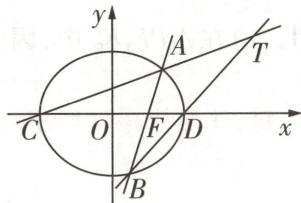

图4

$\frac{3}{2}(y_{1}+y_{2})$ [点关键:根据根与系数的关系表达出 $y_{1}y_{2}$ 与 $y_{1}+y_{2}$ 后,进一步发现 $y_{1}y_{2}$ 与 $y_{1}+y_{2}$ 之间的关系是求解本题的关键].

直线 $AC: y = \frac{y_{1}}{x_{1} + 2}(x + 2)$ ，直线 BD: $y = \frac{y_{2}}{x_{2} - 2}(x - 2)$ ，

令 $\frac{y_1}{x_1 + 2} (x + 2) = \frac{y_2}{x_2 - 2} (x - 2)$ ，可得 $(\frac{y_2}{x_2 - 2} -\frac{y_1}{x_1 + 2})x = \frac{2y_1}{x_1 + 2} +\frac{2y_2}{x_2 - 2},$

整理得 $[y_2(x_1 + 2) - y_1(x_2 - 2)]x = 2y_1(x_2 - 2) + 2y_2(x_1 + 2)$ ，

即 $[y_{2}(ty_{1} + 3) - y_{1}(ty_{2} - 1)]x = 2y_{1}(ty_{2} - 1) + 2y_{2}(ty_{1} + 3)$ ，于是 $(3y_{2} + y_{1})x = 4ty_{1}y_{2} - 2y_{1}+$ $6y_{2}$ ，而 $ty_{1}y_{2}=\frac{3}{2}(y_{1}+y_{2})$ ，则 $(3y_{2}+y_{1})x=6(y_{1}+y_{2})-2y_{1}+6y_{2}$

因此 $x=\frac{6(y_{1}+y_{2})-2y_{1}+6y_{2}}{3y_{2}+y_{1}}=\frac{12y_{2}+4y_{1}}{3y_{2}+y_{1}}=4$ ，所以点 T 在定直线 x=4 上.

# 创新预测

##### 1.（1）由题可知双曲线 $\Gamma:\frac{x^{2}}{a^{2}}-\frac{y^{2}}{b^{2}}=1$ 的渐近线方程为 $y=\pm\frac{b}{a}x$ ，设 $F_{1}(-c,0)$ ， $F_{2}(c,0)$ ，

因为点 $P(1,1)$ 在双曲线的一条渐近线上，所以 $a = b, \overrightarrow{F_1P} = (1 + c, 1), \overrightarrow{F_2P} = (1 - c, 1)$ ，

又 $\overrightarrow{F_1P} \cdot \overrightarrow{F_2P} = (1 + c, 1) \cdot (1 - c, 1) = 0$ ，故 $1 - c^2 + 1 = 0$ ，解得 $c = \sqrt{2}$ ，所以 $a = b = 1$

故双曲线 $\Gamma$ 的标准方程为 $x^{2}-y^{2}=1$ .

（2）由题可知直线 l 的斜率存在,设直线 l 的方程为 $y-1=k(x-1)$ , $A(x_{1},y_{1})$ , $B(x_{2},y_{2})$ ,

由 $\left\{\begin{aligned}x^{2}-y^{2}&=1,\\ y&=kx-k+1\end{aligned}\right.$ 消去 y 整理得关于 x 的二次方程 $(1-k^{2})x^{2}+2k(k-1)x-k^{2}+2k-2=0$

则 $1 - k^2 \neq 0, \Delta = 8 - 8k > 0$ ，则 $k < 1, x_1 + x_2 = \frac{2k(k - 1)}{k^2 - 1} = \frac{2k}{k + 1}, x_1x_2 = \frac{k^2 - 2k + 2}{k^2 - 1} < 0$ ，可得 $-1 < k < 1$

所以 $|AB|=\sqrt{1+k^{2}}\cdot\sqrt{(x_{1}+x_{2})^{2}-4x_{1}x_{2}}=\sqrt{1+k^{2}}\cdot\sqrt{\left(\frac{2k}{k+1}\right)^{2}-4\cdot\frac{k^{2}-2k+2}{k^{2}-1}}=2\sqrt{2}\sqrt{\frac{k^{2}+1}{(k+1)^{2}(1-k)}}$

令 $h(k)=\frac{k^{2}+1}{(k+1)^{2}(1-k)}(-1<k<1)$ [点技巧:利用函数手段找最值,不需要费尽心思地研究

直线与圆锥曲线的位置关系,更方便快捷],则 $|AB|=2\sqrt{2h(k)}$ .

# 记忆口诀

准线方程焦准距, $a^{2},b^{2}$ 除以c 双曲线 $x^{2}/a^{2}-y^{2}/b^{2}=1(a>0,b>0)$ 的准线方程为 $x_{c}=\pm a^{2}/c$ ,焦准距(焦点到准线的距离) $p=b^{2}/c$ .

$h'(k)=\frac{(k+1)(k^{3}-k^{2}+5k-1)}{[(k+1)^{2}(1-k)]^{2}},k\in(-1,1)$ ，易知 $\frac{(k+1)}{[(k+1)^{2}(1-k)]^{2}}>0$

令 $m(k)=k^{3}-k^{2}+5k-1, k\in(-1,1)$ ，则 $m'(k)=3k^{2}-2k+5, k\in(-1,1)$ ，由于 $(-2)^{2}-4\times3\times5<0$ ，则 $m'(k)>0, m(k)$ 单调递增.

因为 $m\left(\frac{1}{5}\right) = -\frac{4}{125} < 0, m\left(\frac{1}{4}\right) = \frac{13}{64} > 0$ ，所以 $\exists k_0 \in \left(\frac{1}{5}, \frac{1}{4}\right)$ ，使得 $m(k_0) = 0$

当 $k \in \left(\frac{1}{5}, k_0\right)$ 时， $m(k) < 0, h'(k) < 0, h(k)$ 单调递减，当 $k \in \left(k_0, \frac{1}{4}\right)$ 时， $m(k) > 0, h'(k) > 0$ $h(k)$ 单调递增,所以 $h(k)$ 在 $k=k_{0}$ 处取得最小值 $h(k_{0})$ ,且 $h(k_{0})<h(\frac{1}{5})=\frac{65}{72}$ [点技巧:利用导数研究函数的最小值,结合适当放缩即可证明],

故 $|AB|_{\min}=2\sqrt{2h(k_{0})}<2\sqrt{2\times\frac{65}{72}}=\frac{\sqrt{65}}{3}<\frac{\sqrt{65.61}}{3}=\frac{8.1}{3}=2.7,$

即 $|AB|_{\min}<2.7$ , 得证.

##### 2.（1）设椭圆 $E:\frac{x^{2}}{a^{2}}+\frac{y^{2}}{b^{2}}=1(a>b>0)$ ，根据题意可得 $c=\sqrt{11}$ ，2b=2，b=1，则 $a^{2}=b^{2}+c^{2}=12$ ，所以椭圆 E 的标准方程为 $\frac{x^{2}}{12}+y^{2}=1$ .

（2）由题可知直线 $l_{1}$ 的斜率存在, 因为直线 $l_{1}$ 过点 $Q(0, \frac{1}{2})$ , 所以可设直线 $l_{1}: y = kx + \frac{1}{2}$ , $A(x_{1}, y_{1}), B(x_{2}, y_{2})$ ,

由 $\left\{\begin{aligned}y&=kx+\frac{1}{2},\\ \frac{x^{2}}{12}&+y^{2}=1\end{aligned}\right.$ 消去 y 可得关于 x 的二次方程 $(12k^{2}+1)x^{2}+12kx-9=0$ ，则 $\Delta>0$ ，

由根与系数的关系可得 $x_{1} + x_{2} = -\frac{12k}{12k^{2} + 1}, x_{1}x_{2} = -\frac{9}{12k^{2} + 1}$ .

由 $P_{1}(0,1)$ , $P_{2}(0,-1)$ ，可得直线 $AP_{1}:y=\frac{y_{1}-1}{x_{1}}x+1$ ，直线 $BP_{2}:y=\frac{y_{2}+1}{x_{2}}x-1$ ，

由 $\frac{y - 1}{y + 1} = \frac{\frac{y_1 - 1}{x_1}}{\frac{y_2 + 1}{x_2}} = \frac{x_2(y_1 - 1)}{x_1(y_2 + 1)} = \frac{x_2(kx_1 - \frac{1}{2})}{x_1(kx_2 + \frac{3}{2})} = \frac{kx_1x_2 - \frac{1}{2}x_2}{kx_1x_2 + \frac{3}{2}x_1} = \frac{kx_1x_2 - \frac{1}{2}(x_1 + x_2) + \frac{1}{2}x_1}{kx_1x_2 + \frac{3}{2}x_1} =$

$\frac{-\frac{9k}{12k^{2}+1}-\frac{1}{2}\times(-\frac{12k}{12k^{2}+1})+\frac{1}{2}x_{1}}{-\frac{9k}{12k^{2}+1}+\frac{3}{2}x_{1}}=\frac{-\frac{3k}{12k^{2}+1}+\frac{1}{2}x_{1}}{-\frac{9k}{12k^{2}+1}+\frac{3}{2}x_{1}}=\frac{1}{3}$ ，可得 $\frac{y-1}{y+1}=\frac{1}{3}$ ，解得y=2，所以

直线 $AP_{1}, BP_{2}$ 的交点 P 在定直线 y = 2 上 [拓展: 这里也可以利用极点极线的知识来做, 连接 $BP_{1}, AP_{2}$ , 对于四边形 $AP_{1}BP_{2}, AB$ 与 $P_{1}P_{2}$ 的交点 Q 对应的极线方程为 $\frac{\frac{1}{2}y}{1} = 1$ , 即 y = 2 (对于椭圆 $\frac{x^{2}}{a^{2}} + \frac{y^{2}}{b^{2}} = 1 (a > b > 0)$ , 极点 $(x_{0}, y_{0})$ 对应的极线方程为 $\frac{x_{0}x}{a^{2}} + \frac{y_{0}y}{b^{2}} = 1$ ), 所以点 P 在定直线 y = 2 上].

# 超重点9 求圆锥曲线面积问题的3大必会高分技法

# 技法 1 利用直接法求面积

调研 1 试题调研原创 古希腊著名数学家阿基米德利用“逼近法”得到椭圆面积除以圆周率 $\pi$ 等于椭圆的长半轴长与短半轴长的乘积. 在平面直角坐标系中, 椭圆 $C: \frac{x^{2}}{a^{2}} + \frac{y^{2}}{b^{2}} = 1$ $(a > b > 0)$ 的面积等于 $2\pi$ , 且椭圆 C 的焦距为 $2\sqrt{3}$ .

（1） 求椭圆 C 的标准方程;

（2） 点 R 为椭圆 C 上的动点, $P(4,0)$ , $Q(0,2)$ , 求三角形 PQR 面积的最小值, 并求此时 R 点坐标.

解析（1）由题意知，椭圆的面积为 $ab\pi = 2\pi$ ，得 $ab = 2$

又 $2c = 2\sqrt{3}$ ，所以 $\left\{ \begin{array}{l}ab = 2,\\ c = \sqrt{3},\\ a^2 = b^2 +c^2, \end{array} \right.$ 得 $\left\{ \begin{array}{l}a = 2,\\ b = 1, \end{array} \right.$ 所以椭圆 $C$ 的方程为 $\frac{x^2}{4} +y^2 = 1.$

（2） 方法一: 直接法 由题意得, $|PQ| = \sqrt{4^2 + 2^2} = 2\sqrt{5}$ , 直线 $PQ$ 的方程为 $\frac{x}{4} + \frac{y}{2} = 1$ , 即 $x + 2y - 4 = 0$ .

设 $R(x_0, y_0)$ ，则 $\frac{x_0^2}{4} + y_0^2 = 1$ ，即 $x_0^2 + 4y_0^2 = 4$

所以点 $R$ 到直线 $x + 2y - 4 = 0$ 的距离为 $d = \frac{|x_0 + 2y_0 - 4|}{\sqrt{5}}$

【巧突破】 $\triangle PQR$ 中 $|PQ|=2\sqrt{5}$ , 是定值, 因而要使 $\triangle PQR$ 的面积最小, 只需要使边 $PQ$ 上的高最小, 进而转化为求椭圆上的点到直线 $PQ$ 距离最小时点的位置

由柯西不等式得 $x_0^2 + 4y_0^2 \geqslant \frac{(x_0 + 2y_0)^2}{2}$ , 因而 $|x_0 + 2y_0| \leqslant 2\sqrt{2}$ , 所以 $d_{\min} = \frac{4 - 2\sqrt{2}}{\sqrt{5}}$ , 当且仅

【换思路】根据椭圆的参数方程设 $R(2\cos\theta,\sin\theta)$ ( $\theta$ 为参数)，则点 R 到直线 PQ 的距离为 d = $\frac{|2\cos\theta + 2\sin\theta - 4|}{\sqrt{5}} = \frac{|2\sqrt{2}\sin\left(\theta + \frac{\pi}{4}\right) - 4|}{\sqrt{5}}$ ，根据三角函数的性质即可求最值

当 $x_{0}=2y_{0}=\sqrt{2}$ 时取最小值.

所以 $\triangle PQR$ 的面积的最小值为 $\frac{1}{2} d_{\min}|PQ| = \frac{1}{2}\times \frac{4 - 2\sqrt{2}}{\sqrt{5}}\times 2\sqrt{5} = 4 - 2\sqrt{2}$ ，此时 $R(\sqrt{2},\frac{\sqrt{2}}{2})$

方法二: 平行线法 由方法一知 $\left|PQ\right|=2\sqrt{5}$ ，直线 PQ 的方程为 $x+2y-4=0$ .

设直线 $x + 2y - 4 = 0$ 的平行线 $x + 2y + m = 0$ 与椭圆相切，则由 $\left\{ \begin{array}{l} x + 2y + m = 0, \\ \frac{x^2}{4} + y^2 = 1 \end{array} \right.$ 得关于 $y$ 的二次方程 $8y^{2} + 4my + m^{2} - 4 = 0, \Delta = (4m)^{2} - 32(m^{2} - 4) = 0$ ，得 $m = -2\sqrt{2}$ （舍去 $m = 2\sqrt{2}$ ）.

平行线 $x + 2y - 4 = 0$ 与 $x + 2y - 2\sqrt{2} = 0$ 间的距离为 $d_{1} = \frac{|2\sqrt{2} - 4|}{\sqrt{5}} = \frac{4 - 2\sqrt{2}}{\sqrt{5}}$

所以 $\triangle PQR$ 的面积的最小值为 $\frac{1}{2} d_1|PQ| = \frac{1}{2}\times \frac{4 - 2\sqrt{2}}{\sqrt{5}}\times 2\sqrt{5} = 4 - 2\sqrt{2}$ ，此时 $R(\sqrt{2},\frac{\sqrt{2}}{2})$

# 原创变式

已知双曲线 $\Gamma: x^{2} - \frac{y^{2}}{4} = 1$ 与直线 $l: y = x + 1$ 交于 A, B 两点 (A 在 B 左侧), 过点 A 的两条关于 l 对称的直线 $l_{1}, l_{2}$ 分别交双曲线 $\Gamma$ 两支于 C, D 两点 (C 在第四象限, D 在第二象限).

（1）设直线 $l_{1}$ 的斜率为 $k_{1}$ ，直线 $l_{2}$ 的斜率为 $k_{2}$ ，求 $k_{1} \cdot k_{2}$ 的值.  
（2） 证明: 直线 CD 过定点.  
（3） 若直线 CD 与双曲线 $\Gamma$ 在点 B 处的切线交于点 P, 求 $\triangle ABP$ 的面积.

答案》第082页

# 技法②

# 利用平面向量法求面积

调研 2 试题调研原创 已知 $F_{1}, F_{2}$ 分别为椭圆 $C: \frac{x^{2}}{a^{2}} + \frac{y^{2}}{b^{2}} = 1 (a > b > 0)$ 的左、右焦点，椭圆四个顶点连线组成一个其中一个内角为 $60^{\circ}$ 的菱形，P 为椭圆上的动点， $\triangle PF_{1}F_{2}$ 面积的最大值为 $\sqrt{2}$ .

（1） 求椭圆 C 的方程.  
（2） 过 $P(x_{1}, y_{1})$ 的直线 l 与椭圆交于另一点 $Q(x_{2}, y_{2})$ ，向量 $\boldsymbol{m} = (x_{1}, ay_{1}), \boldsymbol{n} = (x_{2}, ay_{2})$ 满足 $m \perp n$ 。判断 $\triangle OPQ$ 的面积是否为定值，并说明理由。

焦弦切线成直角,切点就是两端点 过抛物线焦点的弦交抛物线于两点,这两点处的切线互相垂直.

解析 （1） 由题意得 $a = \sqrt{3} b$ , 当 $P$ 为椭圆短轴端点时, $\triangle PF_{1}F_{2}$ 面积最大, 为 $cb = \sqrt{2}$ . 又 $a^{2} = b^{2} + c^{2}$ , 所以 $a = \sqrt{3}, b = 1$ , 所以椭圆方程为 $\frac{x^{2}}{3} + y^{2} = 1$ .

（2）当直线 l 的斜率不存在时,设直线 l 的方程为 x=t,

【易遗漏】切勿丢失对这种特殊情况的讨论

与椭圆方程联立得 $\frac{t^{2}}{3}+y^{2}=1$ ，则 $y=\pm\sqrt{1-\frac{t^{2}}{3}}$ .

不妨取 $P(t, \sqrt{1 - \frac{t^2}{3}}), Q(t, -\sqrt{1 - \frac{t^2}{3}})$ ，则 $\pmb{m} = (t, \sqrt{3 - t^2}), \pmb{n} = (t, -\sqrt{3 - t^2})$ ，由 $\pmb{m} \perp \pmb{n}$ ，得 $t^2 - (3 - t^2) = 0$ ，所以 $t^2 = \frac{3}{2}$ ，此时 $S_{\triangle OPQ} = \frac{1}{2} |PQ| \cdot |t| = \sqrt{1 - \frac{t^2}{3}} \cdot |t| = \frac{\sqrt{3}}{2}$ .

当直线 l 的斜率存在时, 设直线 l 的方程为 $y = kx + t$ .

根据题意作图,如图1.

由 $\left\{\begin{aligned}y&=kx+t,\\ \frac{x^{2}}{3}&+y^{2}=1\end{aligned}\right.$ 得关于x的二次方程 $(1+3k^{2})x^{2}+6ktx+3t^{2}-3=0$ ，则

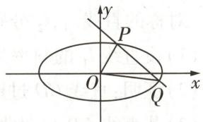

图1

$\Delta = (6 k t) ^ {2} - 4 (1 + 3 k ^ {2}) (3 t ^ {2} - 3) > 0, \text {即} 3 k ^ {2} - t ^ {2} + 1 > 0, \text {且} x _ {1} + x _ {2} = - \frac {6 k t}{1 + 3 k ^ {2}}, x _ {1} x _ {2} = \frac {3 t ^ {2} - 3}{1 + 3 k ^ {2}},$

从而 $y_{1}y_{2} = (kx_{1} + t)(kx_{2} + t) = k^{2}x_{1}x_{2} + kt(x_{1} + x_{2}) + t^{2}$ .

由 $m \perp n$ ，得 $x_{1}x_{2} + 3y_{1}y_{2} = 0$ ，即 $(1 + 3k^{2})x_{1}x_{2} + 3kt(x_{1} + x_{2}) + 3t^{2} = 0$ ，得 $3k^{2} = 2t^{2} - 1$ .

方法一: 向量法 由题意知 $\overrightarrow{OP} = (x_{1}, y_{1})$ , $\overrightarrow{OQ} = (x_{2}, y_{2})$ , 设 $\langle \overrightarrow{OP}, \overrightarrow{OQ} \rangle = \alpha$ ,

$\begin{array}{r l} & \text {则} S _ {\triangle O P Q} = \frac {1}{2} | \overrightarrow {O P} | | \overrightarrow {O Q} | \sin \alpha = \frac {1}{2} \sqrt {\overrightarrow {O P ^ {2}} \cdot \overrightarrow {O Q ^ {2}} (1 - \cos^ {2} \alpha)} = \frac {1}{2} \sqrt {\overrightarrow {O P ^ {2}} \cdot \overrightarrow {O Q ^ {2}} - (\overrightarrow {O P} \cdot \overrightarrow {O Q}) ^ {2}} = \\ & \frac {1}{2} | x _ {1} y _ {2} - x _ {2} y _ {1} | = \frac {1}{2} | x _ {1} (k x _ {2} + t) - x _ {2} (k x _ {1} + t) | = \frac {1}{2} | t (x _ {1} - x _ {2}) | = \frac {1}{2} \sqrt {t ^ {2} [ (x _ {1} + x _ {2}) ^ {2} - 4 x _ {1} x _ {2} ]} = \end{array}$

【巧突破】利用向量法求三角形面积，简化了求弦长、点到直线距离的过程，使得运算量大为降低。实际上，在 $\triangle OAB$ 中，若 $\overrightarrow{OA}=(x_{1},y_{1}),\overrightarrow{OB}=(x_{2},y_{2})$ ，则其面积的向量法计算公式为 $S_{\triangle OAB}=\frac{1}{2}|x_{1}y_{2}-x_{2}y_{1}|$ ，该结论在选填题中可直接使用，但在解答题中注意需先进行简单的证明再使用。本题也可利用直接法求解，如方法二

$\frac {1}{2 \sqrt {}} t ^ {2} \left[ \left(\frac {6 k t}{1 + 3 k ^ {2}}\right) ^ {2} - 4 \cdot \frac {3 t ^ {2} - 3}{1 + 3 k ^ {2}} \right] = \frac {\sqrt {3}   | t |   \sqrt {3 k ^ {2} - t ^ {2} + 1}}{1 + 3 k ^ {2}} = \frac {\sqrt {3}   | t |   \sqrt {2 t ^ {2} - 1 - t ^ {2} + 1}}{1 + 2 t ^ {2} - 1} = \frac {\sqrt {3}}{2}, \text {为定值.}$

方法二 易知原点 O 到直线 l 的距离 $d=\frac{|t|}{\sqrt{1+k^{2}}}$ ,

$\vert P Q \vert = \sqrt {1 + k ^ {2}} \cdot \sqrt {\left(x _ {1} + x _ {2}\right) ^ {2} - 4 x _ {1} x _ {2}} = \sqrt {1 + k ^ {2}} \cdot \sqrt {\left(\frac {6 k t}{1 + 3 k ^ {2}}\right) ^ {2} - 4 \cdot \frac {3 t ^ {2} - 3}{1 + 3 k ^ {2}}} = \sqrt {1 + k ^ {2}} \cdot$

$\frac {2 \sqrt {3} \sqrt {3 k ^ {2} - t ^ {2} + 1}}{1 + 3 k ^ {2}}, S _ {\triangle O P Q} = \frac {1}{2} | P Q | \cdot d = \frac {1}{2} \cdot \sqrt {1 + k ^ {2}} \cdot \frac {2 \sqrt {3} \sqrt {3 k ^ {2} - t ^ {2} + 1}}{1 + 3 k ^ {2}} \cdot \frac {| t |}{\sqrt {1 + k ^ {2}}} =$

$\frac {\sqrt {3} | t | \sqrt {3 k ^ {2} - t ^ {2} + 1}}{1 + 3 k ^ {2}} = \frac {\sqrt {3} | t | \sqrt {2 t ^ {2} - 1 - t ^ {2} + 1}}{1 + 2 t ^ {2} - 1} = \frac {\sqrt {3}}{2}.$

综上, $\triangle OPQ$ 的面积为定值 $\frac{\sqrt{3}}{2}$ .

# 技法 ③

# 利用割补法或图形转化法求面积

调研 3 试题调研原创 已知椭圆 $C: \frac{x^{2}}{a^{2}} + \frac{y^{2}}{b^{2}} = 1 (a > b > 0)$ 的左、右焦点分别为 $F_{1}, F_{2}$ ，以线段 $F_{1}F_{2}$ 为直径的圆过 C 的上、下顶点，点 $(1, e)$ 在 C 上，其中 e 为 C 的离心率.

  
“图形转化法”巧解类 蝴蝶三角形的面积问题

（1） 求椭圆 C 的方程和短轴长.

（2） 点 A, B 在 C 上, 且均在 x 轴的上方, $AF_{1} \parallel BF_{2}$ , $\left|AF_{1}\right|=2\left|BF_{2}\right|$ , 直线 $AF_{2}$ 与直线 $BF_{1}$ 的交点为 P, 求 $\triangle APF_{1}$ 与 $\triangle BPF_{2}$ 的面积和.

解析 （1） 设 $F_{1}(-c,0), F_{2}(c,0)$ , 椭圆上、下顶点分别为 $B_{1}(0,b), B_{2}(0,-b)$ .

由以线段 $F_{1}F_{2}$ 为直径的圆过 C 的上、下顶点，得 $\left|OB_{1}\right|=\left|OF_{1}\right|=c$ ，则 $b^{2}=c^{2}$ ，即 b=c。

因为 $a^{2}=b^{2}+c^{2}=2c^{2}$ ，所以 $a=\sqrt{2}c$ ，所以 $e=\frac{c}{a}=\frac{\sqrt{2}}{2}$ .

由点 $(1, \frac{\sqrt{2}}{2})$ 在 $C$ 上，得 $\frac{1^2}{a^2} + \frac{(\frac{\sqrt{2}}{2})^2}{b^2} = 1$ ，即 $\frac{1}{2b^2} + \frac{1}{2b^2} = 1$ ，所以 $b = 1$ .

所以 $a^{2}=2b^{2}=2$ ，则 $C:\frac{x^{2}}{2}+y^{2}=1$ ，短轴长 $\left|B_{1}B_{2}\right|=2b=2$ 。

【避易错】在椭圆中短轴长为 $2b$ ，而不是 $b$

（2）根据题意,作出示意图,如图2所示.

由图形可知 $S_{\triangle APF_1} + S_{\triangle BPF_2} = S_{\triangle AF_1F_2} + S_{\triangle BF_1F_2} - 2S_{\triangle PF_1F_2}$ ，则 $S_{\triangle APF_1} + S_{\triangle BPF_2} = \frac{1}{2}|F_1F_2| (y_A + y_B - 2y_P)$ ，其中 $y_A, y_B, y_P$ 分别为点 $A, B, P$ 的纵坐标.

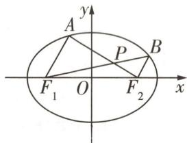

图2

因为 $AF_{1} \parallel BF_{2}, |AF_{1}| = 2|BF_{2}|$ ，所以 $\triangle APF_{1} \sim \triangle F_{2}PB, \frac{|PF_{1}|}{|BP|} = \frac{|AF_{1}|}{|BF_{2}|} = 2$ ，即 $|PF_{1}| = 2|BP|, \overrightarrow{PF_{1}} = 2\overrightarrow{BP}, \overrightarrow{AP} = 2\overrightarrow{PF_{2}}$ ，则 $y_{A} = 2y_{B} = 3y_{P}$ ，从而 $S_{\triangle APF_{1}} + S_{\triangle BPF_{2}} = \frac{5}{3} y_{B}$ .

【巧思考】直接计算两三角形的面积，运算量大，而利用几何关系，将问题转化为只需求 B 点纵坐标，实现简化运算

焦弦三角算面积, 半个 $p^{2}$ 比正弦 抛物线焦点三角形 AOB 的面积为 $S_{\triangle OAB} = p^{2} / (2 \sin \alpha)$ , 其中 $\alpha$ 为焦点弦 AB 所在直线的倾斜角.

由（1）知 $F_{1}(-1,0)$ , $F_{2}(1,0)$ ，设 $A(x_{1},y_{1})$ , $B(x_{2},y_{2})$ ,

由 $\overrightarrow{AF_1} = 2\overrightarrow{BF_2}$ 得 $\left\{ \begin{array}{l} -1 - x_{1} = 2(1 - x_{2}),\\ -y_{1} = -2y_{2}, \end{array} \right.$ 即 $\left\{ \begin{array}{l}x_{1} = 2x_{2} - 3,\\ y_{1} = 2y_{2}, \end{array} \right.$

因为点 $A(x_{1},y_{1}),B(x_{2},y_{2})$ 在椭圆 $C:\frac{x^2}{2} +y^2 = 1$ 上，所以 $\left\{ \begin{array}{l}(2x_2 - 3)^2 +2\times (2y_2)^2 = 2,\\ x_2^2 +2y_2^2 = 2, \end{array} \right.$ 即 $\left\{ \begin{array}{ll}4x_2^2 -12x_2 + 8y_2^2 = -7,\\ 4x_2^2 +8y_2^2 = 8, \end{array} \right.$ 两式相减得 $12x_{2} = 15$ ，即 $x_{2} = \frac{5}{4}$

所以 $\left(\frac{5}{4}\right)^{2}+2y_{2}^{2}=2$ ，又点A,B在x轴的上方，所以 $y_{2}=\frac{\sqrt{14}}{8}$ .

故 $S_{\triangle APF_1} + S_{\triangle ABF_2} = \frac{5}{3} y_B = \frac{5}{3} \times \frac{\sqrt{14}}{8} = \frac{5\sqrt{14}}{24}$ .

# 满分攻略

# 圆锥曲线面积问题的速破策略

<table><tr><td>1</td><td>三角形的面积问题</td><td>往往利用直接法求解,寻底找高,为简化运算,通常优先选择能用坐标直接表示出来的底(或高);对于底与高不易求解的三角形,也可利用转化法或割补法,将其转化为易于求高与底的三角形的面积或若干个三角形的面积和.三角形常用面积公式: $\triangle ABC$ 三个内角 $A,B,C$ 的对边分别为 $a,b,c$ , $h_a$ 为 $BC$ 边上的高, $R$ 为外接圆半径, $p=\frac{1}{2}(a+b+c)$ , $\overrightarrow{AB}=(x_1,y_1)$ , $\overrightarrow{AC}=(x_2,y_2)$ ,则 $S_{\triangle ABC}=\frac{1}{2}ah_a=\frac{1}{2}absin C=\frac{1}{2}|x_1y_2-x_2y_1|=\frac{abc}{4R}=\sqrt{p(p-a)(p-b)(p-c)}$ .</td></tr><tr><td>2</td><td>不规则多边形的面积问题</td><td>往往利用割补法求解,将其拆分为若干个三角形,利用三角形的面积公式求解.</td></tr><tr><td>3</td><td>多个图形面积的转化问题</td><td>求解的关键是“求同存异”,寻找这些图形的“相同点”,一般是“同底”或“等高”,将面积问题转化为边长关系,简化运算.</td></tr><tr><td>4</td><td>面积的最值问题</td><td>往往利用公式将面积表示为关于某个变量的函数,进而利用函数或基本不等式求最值.</td></tr></table>

# 创新预测

答案▶083页

##### 1.[2025 山东烟台 8 月开学考试]已知抛物线 $C: y^{2} = 2px (p > 0)$ 过点 $(1,2), F$ 为 $C$ 的焦点, $A$ , $B$ 为 $C$ 上不同于原点 $O$ 的两点.

（1） 若 $OA \perp OB$ ，试探究直线 AB 是否过定点，若是，求出该定点；若不是，说明理由.  
（2） 若 $AF \perp BF$ ，求 $\triangle AFB$ 面积的最小值.

# 规范答题

##### 2.[2025 安徽芜湖一中模拟]如图3, 直线 $l_{1}: x = my + n_{1}$ 与直线 $l_{2}: x = my + n_{2}$ 分别与抛物线 $T: y^{2} = 2px (p > 0)$ 交于点 A, B 和点 C, D (A, D 在 x 轴上侧). 当 $l_{1}$ 经过 T 的焦点 F 且垂直于 x 轴时, $|AB| = 1$ .

（1） 求抛物线 T 的标准方程.  
（2） 线段 AC 与 BD 交于点 H, 线段 AB 与 CD 的中点分别为 M, N.  
①证明:M,H,N三点共线.   
②若 $2|HM|=|HN|=2$ ，求四边形 ABCD 的面积.

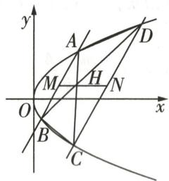

图3

# 规范答题

格点问题 又称整点问题,是研究一些特殊区域甚至一般区域中的格点个数的问题.格点问题所涉及的知识点通常与抽屉原理和图论知识联系紧密.

数学文化

# 参考答案与解析

# 原创变式

（1）根据题意作图,如图4.由题意知直线l的倾斜角为 $\alpha=\frac{\pi}{4}$ .

设直线 $l_{1}, l_{2}$ 的倾斜角分别为 $\theta_{1}, \theta_{2} (\theta_{1}, \theta_{2} \in (0, \pi))$ ,

则由直线 $l_{1}, l_{2}$ 关于直线 l 对称知， $\pi - (\theta_{1} - \frac{\pi}{4}) = \theta_{2} - \frac{\pi}{4}$ ，从而 $\theta_{1} + \theta_{2} = \frac{3\pi}{2}$ [避易错：注意 C 在第四象限，D 在第二象限，因而题目隐含 $\theta_{1}, \theta_{2} \in (\frac{\pi}{2}, \pi)$ ，本题容易错解得出 $\theta_{1} + \theta_{2} = \frac{\pi}{2}$ ]，

所以 $k_{1} \cdot k_{2} = \tan \theta_{1} \cdot \tan \theta_{2} = \tan \theta_{1} \cdot \tan \left(\frac{3\pi}{2} - \theta_{1}\right) = \tan \theta_{1} \cdot \frac{1}{\tan \theta_{1}} = 1.$

（2）由题意知直线 CD 的斜率存在,设直线 CD 的方程为 $y=kx+m$ , $C(x_{1},y_{1})$ , $D(x_{2},y_{2})$ .

由 $\left\{\begin{aligned}y&=kx+m,\\ x^{2}&-\frac{y^{2}}{4}=1\end{aligned}\right.$ 得关于x的二次方程 $(4-k^{2})x^{2}-2kmx-m^{2}-4=0$ ，则 $\Delta=$

$(2km)^{2} - 4(4 - k^{2})(-m^{2} - 4) > 0$ ，可得 $m^2 + 4 > k^2, x_1 + x_2 = \frac{2km}{4 - k^2},$

$x _ {1} x _ {2} = \frac {- m ^ {2} - 4}{4 - k ^ {2}}.$

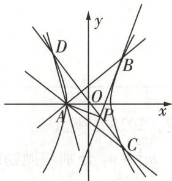

图 4

$k _ {1} \cdot k _ {2} = \frac {y _ {1}}{x _ {1} + 1} \cdot \frac {y _ {2}}{x _ {2} + 1} = \frac {k ^ {2} x _ {1} x _ {2} + k m (x _ {1} + x _ {2}) + m ^ {2}}{x _ {1} x _ {2} + x _ {1} + x _ {2} + 1} = \frac {k ^ {2} \cdot \frac {- m ^ {2} - 4}{4 - k ^ {2}} + k m \cdot \frac {2 k m}{4 - k ^ {2}} + m ^ {2}}{\frac {- m ^ {2} - 4}{4 - k ^ {2}} + \frac {2 k m}{4 - k ^ {2}} + 1} = \frac {4 (m + k)}{k - m} = 1$

[破障碍:结合第（1）问的结论建立等式关系,化简得到所设参数k,m之间的关系,即可求证直线过定点],得到 $m=-\frac{3}{5}k$ .

所以直线 CD 的方程为 $y = k(x - \frac{3}{5})$ ，即直线 CD 过定点 $(\frac{3}{5}, 0)$ .

（3）由 $\left\{\begin{aligned}x^{2}-\frac{y^{2}}{4}&=1,\\ y=x+1\end{aligned}\right.$ 得 $A(-1,0),B(\frac{5}{3},\frac{8}{3}).$

设双曲线 $\Gamma$ 在点 $B$ 处的切线方程为 $y = tx + n$ ，则由（2）的计算过程可知 $n^2 + 4 = t^2$ ，又 $\frac{8}{3} = \frac{5}{3} t +$

n, 可得 $t = \frac{5}{2}$ , $n = -\frac{3}{2}$ ，所以双曲线 $\Gamma$ 在点 B 处的切线方程为 $y = \frac{5}{2}x - \frac{3}{2}$ [记结论: 双曲线 $\frac{x^{2}}{a^{2}} - \frac{y^{2}}{b^{2}} = 1 (a > 0, b > 0)$ 在点 $(x_{0}, y_{0})$ 处的切线方程为 $\frac{x_{0}x}{a^{2}} - \frac{y_{0}y}{b^{2}} = 1$ ，在解答题中可利用该结论检验计算结果]，

该切线恰好过点 $\left(\frac{3}{5},0\right)$ ，所以 $P\left(\frac{3}{5},0\right)$ ，所以 $S_{\triangle ABP}=\frac{1}{2}|AP|y_{B}=\frac{1}{2}\times\frac{8}{5}\times\frac{8}{3}=\frac{32}{15}$

# 创新预测

##### 1.（1）方法一 已知抛物线 $C: y^{2} = 2px (p > 0)$ 过点 $(1, 2)$ ,

所以 $2^{2}=4=2p$ ，所以抛物线 C 的方程为 $y^{2}=2px=4x$ .

根据题意作图,如图5.

由题意可设直线 $AB: x = my + n, A(x_1, y_1), B(x_2, y_2)$ ,

与抛物线 C 的方程联立可得关于 y 的二次方程 $y^{2}-4my-4n=0,\Delta=16(m^{2}+n)>0$ ，则 $y_{1}+y_{2}=4m,y_{1}y_{2}=-4n.$

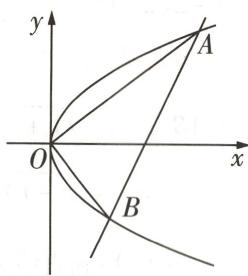

图5

因为 $OA \perp OB$ ，所以 $\overrightarrow{OA} \cdot \overrightarrow{OB} = x_{1}x_{2} + y_{1}y_{2} = \frac{(y_{1}y_{2})^{2}}{16} + y_{1}y_{2} = n^{2} - 4n = 0$ ，因为 A, B 为 C 上不同于原点 O 的两点，所以 $n \neq 0$ ，所以 n = 4，经检验符合题意。

故 AB:x=my+4,所以直线 AB 过定点(4,0).

方法二: 设而不求, 点差法 由方法一知 C 的方程为 $y^{2}=4x$ .

设 $A(x_{1},y_{1}),B(x_{2},y_{2})$ ，则 $y_1^2 = 4x_1,y_2^2 = 4x_2$

由 $\overrightarrow{OA} \perp \overrightarrow{OB}$ , 得 $x_{1}x_{2} + y_{1}y_{2} = 0$ , 即 $\frac{1}{16}(y_{1}y_{2})^{2} + y_{1}y_{2} = 0$ , 所以 $y_{1}y_{2} = -16$ .

直线 $AB$ 的斜率为 $\frac{y_1 - y_2}{x_1 - x_2} = \frac{y_1 - y_2}{\frac{y_1^2}{4} - \frac{y_2^2}{4}} = \frac{4}{y_1 + y_2}$ , 所以直线 $AB$ 的方程为 $y - y_1 = \frac{4}{y_1 + y_2}(x - x_1)$ .

当 $y = 0$ 时， $-y_{1} = \frac{4}{y_{1} + y_{2}} (x - x_{1})$ ，即 $-y_{1}^{2} - y_{1}y_{2} = 4(x - x_{1})$

所以 $-4x_{1}+16=4x-4x_{1}$ ，得 x=4，所以直线 AB 恒过点 $(4,0)$ [记结论：从抛物线 $y^{2}=2px(p>0)$ 的顶点 O 作两条互相垂直的直线 OA, OB，与抛物线分别交于 A, B 点，则直线 AB 恒过点 $(2p,0)$ ]。

（2） 根据题意作图, 如图 6. 由 （1） 方法一得 $F(1,0), y_1 + y_2 = 4m, y_1y_2 = -4n$ .

斐波那契数列指的是这样一个数列:1,1,2,3,5,8,13,21,34,55,89,…,这个数列从第3项开始,每一项都等于前两项之和.

因为 $AF \perp BF$ ，所以 $\overrightarrow{AF} \cdot \overrightarrow{BF} = (1 - x_1)(1 - x_2) + y_1y_2 = 1 + y_1y_2 + \frac{(y_1y_2)^2}{16} - (my_1 + n + my_2 + n) = 1 - 4n + n^2 - 4m^2 - 2n = 0$ ，即等式 $n^2 - 6n + 1 = 4m^2$ 有解，

而 $\Delta = 16(m^2 + n) = 4(n^2 - 6n + 1) + 16n = 4(n^2 - 2n + 1) = 4(n - 1)^2 > 0$

所以 $n \neq 1$ ，且 $n^2 - 6n + 1 = 4m^2 \geqslant 0$ ，所以 $n \geqslant 3 + 2\sqrt{2}$ 或 $n \leqslant 3 - 2\sqrt{2}$ .

图6

因为 n 为直线 AB: $x = my + n$ 的横截距, 且 A, B 与 O 相异, 所以 n > 0, 从而 $n \geqslant 3 + 2\sqrt{2}$ 或 $0 < n \leqslant 3 - 2\sqrt{2}$ [点关键: 由弦长公式及点到直线的距离可将所求面积表示为关于 n 的式子, 故求 n 的范围是关键].

$\begin{array}{l} \mid A B \mid = \sqrt {1 + m ^ {2}} \mid y _ {1} - y _ {2} \mid = \sqrt {1 + m ^ {2}} \sqrt {(y _ {1} + y _ {2}) ^ {2} - 4 y _ {1} y _ {2}} = \sqrt {1 + m ^ {2}} \sqrt {1 6 m ^ {2} + 1 6 n} = \\ \sqrt {1 + m ^ {2}} \sqrt {4 (n - 1) ^ {2}} = 2 \sqrt {1 + m ^ {2}} \mid n - 1 \mid , \end{array}$

点 $F(1,0)$ 到直线 $AB: x = my + n$ 的距离为 $d = \frac{|n - 1|}{\sqrt{1 + m^2}}$ ,

所以 $\triangle AFB$ 的面积为 $S_{\triangle AFB} = \frac{1}{2}|AB|d = (n - 1)^2$ [向量法: 当点的坐标容易表示时用向量法求面积更为简便, 如本题可通过如下过程表示出所求三角形的面积, $S_{\triangle AFB} = \frac{1}{2}|(1 - x_1)y_2 - (1 - x_2)y_1| = \frac{1}{2}|(1 - \frac{y_1^2}{4})y_2 - (1 - \frac{y_2^2}{4})y_1| = \frac{1}{2}|(y_2 - y_1) + (\frac{y_1y_2^2}{4} -\frac{y_1^2y_2}{4})| = \frac{1}{2}|(y_2 - y_1)(1 + \frac{y_2y_1}{4})| = \frac{1}{2} |\sqrt{(y_2 + y_1)^2 - 4y_2y_1}(1 + \frac{y_2y_1}{4})| = \frac{1}{2} |\sqrt{16m^2 + 16n}\cdot (1 - n)| = \frac{1}{2} |\sqrt{4(n - 1)^2}(1 - n)| = (n - 1)^2 ].$

因为 $n \geqslant 3 + 2\sqrt{2}$ 或 $0 < n \leqslant 3 - 2\sqrt{2}$ , 所以 $n - 1 \geqslant 2 + 2\sqrt{2}$ 或 $-1 < n - 1 \leqslant 2 - 2\sqrt{2}$ ,

所以当 $n = 3 - 2\sqrt{2}$ ，即 $n - 1 = 2 - 2\sqrt{2}$ 时， $S_{\triangle AFB}$ 取最小值，为 $(3 - 2\sqrt{2} - 1)^2 = 4(3 - 2\sqrt{2})$

综上所述, $\triangle AFB$ 面积的最小值为 $4(3-2\sqrt{2})$ .

##### 2.（1）由当 $l_{1}$ 经过抛物线 $T:y^{2}=2px$ 的焦点F且垂直于x轴时, $|AB|=1$ ,

可得 2p=1，解得 $p=\frac{1}{2}$ ，所以抛物线的标准方程为 $y^{2}=x$ 。

（2）①设 $A(x_{1},y_{1}),B(x_{2},y_{2})$ ，则 $l_{1}:(y_{1} + y_{2})y - y_{1}y_{2} = x,y_{M} = \frac{y_{1} + y_{2}}{2},$

同理设 $C(x_{3},y_{3}),D(x_{4},y_{4})$ ，则 $l_{2}:(y_{3} + y_{4})y - y_{3}y_{4} = x,y_{N} = \frac{y_{3} + y_{4}}{2}.$

因为 $l_{1} \parallel l_{2}$ ，所以 $y_{1} + y_{2} = y_{3} + y_{4}, y_{M} = y_{N}$ .

同理 $l_{BD}:(y_{2}+y_{4})y-y_{2}y_{4}=x$ ，令 $y=\frac{y_{1}+y_{2}}{2}$ ，可得 $x=\frac{y_{1}^{2}+y_{1}y_{2}+y_{2}y_{3}-y_{1}y_{3}}{2}$ [会化简：将 $y=\frac{y_{1}+y_{2}}{2}$ 代入得 $x=\frac{y_{2}^{2}+y_{1}y_{2}+y_{1}y_{4}-y_{2}y_{4}}{2}=\frac{y_{2}(y_{3}+y_{4})+y_{1}y_{4}-y_{2}y_{4}}{2}=\frac{y_{2}y_{3}+y_{1}(y_{1}+y_{2}-y_{3})}{2}=$ $\frac{y_{1}^{2}+y_{1}y_{2}+y_{2}y_{3}-y_{1}y_{3}}{2}]$ ，

$l_{AC}:(y_1 + y_3)y - y_1y_3 = x$ ，令 $y = \frac{y_3 + y_4}{2}$ 可得 $x = \frac{y_1^2 + y_1y_2 + y_2y_3 - y_1y_3}{2},$

故点 H 的横坐标为 $x=\frac{y_{1}^{2}+y_{1}y_{2}+y_{2}y_{3}-y_{1}y_{3}}{2}$ ，纵坐标为 $y=\frac{y_{3}+y_{4}}{2}$ [传技巧: 直接联立直线 AC，BD 的方程求点 H 的坐标较麻烦，故直接将 $y=y_{M}=y_{N}$ 分别代入两直线的方程，若求出的 x 相同，则可说明三点共线].

所以点 M, H, N 三点共线.

②由①知 $x_{M} = \frac{x_{1} + x_{2}}{2} = \frac{y_{1}^{2} + y_{2}^{2}}{2}$ ，同理 $x_{N} = \frac{y_{3}^{2} + y_{4}^{2}}{2}$

所以 $x_{H} - x_{M} = \frac{y_{1}^{2} + y_{1}y_{2} + y_{2}y_{3} - y_{1}y_{3}}{2} -\frac{y_{1}^{2} + y_{2}^{2}}{2} = 1$ ，可得 $y_{1}y_{2} + y_{2}y_{3} - y_{1}y_{3} - y_{2}^{2} = 2,$

$x_{N} - x_{H} = \frac{y_{3}^{2} + y_{4}^{2}}{2} -\frac{y_{1}^{2} + y_{1}y_{2} + y_{2}y_{3} - y_{1}y_{3}}{2} = 2$ ，可得 $y_{2}^{2} + 2y_{3}^{2} + y_{1}y_{2} - 3y_{2}y_{3} - y_{1}y_{3} = 4,$

则 $2y_{2}^{2} + 2y_{3}^{2} - 4y_{2}y_{3} = 2$ ，即 $y_{2}^{2} - 2y_{2}y_{3} + y_{3}^{2} = 1$ ，所以 $\mid y_2 - y_3\mid = 1.$

如图7,作 $BE \parallel MN$ 交AC于P,交CD于E,则 $|BE| = |MN| = 3$ , $S_{\triangle BCE} = \frac{1}{2} \times 3 \times |y_2 - y_3| = \frac{3}{2}$ .

因为 $2|HM| = |HN| = 2$ ，且 $AB \parallel CD$ ，所以 $\triangle AHB \sim \triangle CHD$ ，且 $\frac{|AB|}{|CD|} = \frac{|MH|}{|NH|} = \frac{|AH|}{|CH|} = \frac{|BH|}{|DH|} = \frac{1}{2}$ ，则 $H$ 为线段 $AC$ 的三等分点，所以 $S_{\triangle BCP} = S_{\triangle BPH}, S_{\triangle CDH} = 4S_{\triangle ABH}, S_{\triangle BCH} = 2S_{\triangle ABH}, S_{\triangle ADH} = 2S_{\triangle ABH}$ ，且 $S_{\triangle ABH} = \frac{2}{3} S_{\triangle BCE} = 1$

[破障碍:由平行关系知H,P为线段AC的三等分点,所以 $S_{\triangle BCP}=S_{\triangle ABH}$ .由

$AB \parallel CD, BE \parallel MN, 2|HM| = |HN|$ 及三角形的中位线知 $|BP| = 2|MH| = |HN| = 2|EP|$ ，从而 $S_{\triangle BCP} = \frac{2}{3} S_{\triangle BCE}$ ，即 $S_{\triangle ABH} = \frac{2}{3} S_{\triangle BCE}$ ，

所以 $S_{\text{四边形}ABCD} = S_{\triangle ABH} + S_{\triangle ADH} + S_{\triangle CDH} + S_{\triangle BCH} = 9S_{\triangle ABH} = 9 \times 1 = 9.$

图7

# 超重点10 解析几何中定点与定值的探索性问题解题策略

# 三年考情与创新命题特点

# 2025命题预测

2023 新课标Ⅱ卷 T21，求双曲线方程和定直线问题，技巧性较强，可以根据设而不求或者齐次化的思想求解，还可以利用根与系数的关系简化运算

2023 全国乙卷 T20，考查直线与椭圆位置关系的综合应用，研究定点问题，对学生的逻辑推理、直观想象等数学学科核心素养有一定的要求

①命题形式：以解答题的形式呈现，直线与圆锥曲线的位置关系的综合应用，涉及定点、定值问题.  
②必考热点：直线方程与圆锥曲线方程联立，以及根与系数的关系的应用.  
③创新考法：突出与其他模块知识的交汇，如交汇函数与导数、平面向量等，彰显综合性.

# 策略 1 定点问题的解题策略

调研 1 试题调研原创 已知双曲线 $C: \frac{x^{2}}{a^{2}} - \frac{y^{2}}{b^{2}} = 1 (a > 0, b > 0)$ 的虚轴长为 $2\sqrt{2}$ ，点 P(3, -2) 在 C 上。直线 l 与 C 交于 A, B 两点（异于点 P），直线 AP 与 BP 的斜率之积为 $\frac{1}{3}$ 。

（1） 求 C 的方程.  
（2） 证明: 直线 l 的斜率存在, 且直线 l 过定点.

解析（1）因为虚轴长为 $2b = 2\sqrt{2}$ ，所以 $b = \sqrt{2}$ ，

将 $P(3, -2)$ 的坐标代入方程 $\frac{x^2}{a^2} -\frac{y^2}{b^2} = 1$ ，得 $\frac{9}{a^2} -\frac{4}{2} = 1$ ，所以 $a^2 = 3$

故 C 的方程为 $\frac{x^{2}}{3}-\frac{y^{2}}{2}=1$ .

  
“整体代入法”妙转化斜率之积速找定点

（2）根据题意作图,如图1.设 $A(x_{1},y_{1}),B(x_{2},y_{2}),x_{1},x_{2}\neq3$ ,直线AP的斜率为 $k_{1}$ ,直线BP的斜率为 $k_{2}$ ,

当直线 l 的斜率不存在时, 设 $l: x = t (|t| > \sqrt{3}$ , 且 $t \neq 3)$ ,

不妨设 A 在 B 上方, 则 $A(t, \sqrt{\frac{2t^{2}}{3}-2})$ , $B(t, -\sqrt{\frac{2t^{2}}{3}-2})$ ,

由 $k_{1}k_{2}=\frac{1}{3}$ ，得 $\frac{\sqrt{\frac{2t^{2}}{3}-2}+2}{t-3}\cdot\frac{-\sqrt{\frac{2t^{2}}{3}-2}+2}{t-3}=\frac{1}{3}$ ，即 $t^{2}-2t-3=0$ ，得 t=-1（舍去）或 t=3（舍去）.

所以直线 l 的斜率存在.

图1

# 数学文化

阿波罗尼斯圆 简称阿氏圆. 在平面上给定相异两点 A, B, 设点 P 在同一平面上且满足 $\left|PA\right|/\left|PB\right|=k$ , 当 k>0 且 $k\neq1$ 时, 点 P 的轨迹是一个圆.

方法一 设直线 l 的方程为 $y = kx + m$ ,

【巧思考】巧妙设直线方程，若直线斜率存在，可设直线方程为 $y = kx + m$ ；若直线的斜率有可能不存在，可设直线方程为 $x = py + q$

由 $\left\{\begin{aligned}\frac{x^{2}}{3}-\frac{y^{2}}{2}=1,\\ y=kx+m\end{aligned}\right.$ 得关于x的二次方程 $(2-3k^{2})x^{2}-6kmx-3m^{2}-6=0$ ，则 $2-3k^{2}\neq0,\Delta=$

$2 4 (m ^ {2} + 2 - 3 k ^ {2}) > 0, x _ {1} + x _ {2} = \frac {6 k m}{2 - 3 k ^ {2}}, x _ {1} x _ {2} = \frac {- 3 m ^ {2} - 6}{2 - 3 k ^ {2}}.$

【破障碍】设出直线方程，“直曲联立”，借助根与系数的关系可得直线 l 中参数 k，m 与 A，B 坐标的关系

由 $k_{1}k_{2}=\frac{(y_{1}+2)(y_{2}+2)}{(x_{1}-3)(x_{2}-3)}=\frac{(kx_{1}+m+2)(kx_{2}+m+2)}{x_{1}x_{2}-3(x_{1}+x_{2})+9}=\frac{k^{2}x_{1}x_{2}+k(m+2)(x_{1}+x_{2})+(m+2)^{2}}{x_{1}x_{2}-3(x_{1}+x_{2})+9}=$ $\frac{1}{3}$ ,

整理得 $\left(k^{2}-\frac{1}{3}\right)x_{1}x_{2}+\left(km+2k+1\right)\left(x_{1}+x_{2}\right)+m^{2}+4m+1=0,$

即 $(k^2 -\frac{1}{3})\cdot \frac{-3m^2 - 6}{2 - 3k^2} +(km + 2k + 1)\cdot \frac{6km}{2 - 3k^2} +m^2 +4m + 1 = 0,$

化简得 $3m^{2} + (6k + 8)m + 4 - 9k^{2} = 0$ ，即 $(3m - 3k + 2)(m + 3k + 2) = 0,$

所以 $m = k - \frac{2}{3}$ 或 m = -3k - 2.

当 $m = -3k - 2$ 时，直线 $l$ 的方程为 $y = kx - 3k - 2$ ，即 $y + 2 = k(x - 3)$ ，直线 $l$ 过点 $P(3, -2)$ ，与条件矛盾舍去，

当 $m = k - \frac{2}{3}$ 时，直线 $l$ 的方程为 $y = kx + k - \frac{2}{3}$ ，即 $y + \frac{2}{3} = k(x + 1)$ ，故直线 $l$ 过定点 $(-1, -\frac{2}{3})$ 。

方法二 设直线 l 的方程为 $y + 2 = k(x - 3) + m$ ,

将 C 的方程变形为 $\frac{(x-3+3)^{2}}{3}-\frac{(y+2-2)^{2}}{2}=1$ ，即 $\frac{(x-3)^{2}+6(x-3)}{3}-\frac{(y+2)^{2}-4(y+2)}{2}=0$ ，

将直线 l 的方程变形为 $m = y + 2 - k(x - 3)$ ，代入 C 的方程，

得 $\frac{(x - 3)^2 + 6(x - 3) \cdot \frac{y + 2 - k(x - 3)}{m}}{3} - \frac{(y + 2)^2 - 4(y + 2) \cdot \frac{y + 2 - k(x - 3)}{m}}{2} = 0,$

整理得关于 $\frac{y + 2}{x - 3}$ 的二次方程 $(3 - \frac{12}{m})(\frac{y + 2}{x - 3})^2 +(\frac{12k}{m} -\frac{12}{m})\cdot \frac{y + 2}{x - 3} -(2 - \frac{12k}{m}) = 0,$

$\Delta_{1} > 0$ ，则 $k_{1}k_{2} = \frac{y_{1} + 2}{x_{1} - 3}\cdot \frac{y_{2} + 2}{x_{2} - 3} = \frac{-(2 - \frac{12k}{m})}{3 - \frac{12}{m}} = \frac{1}{3}$ 即 $m = 4k + \frac{4}{3},$

所以直线 l 的方程为 $y + 2 = k(x - 3) + 4k + \frac{4}{3}$ ，即 $y + \frac{2}{3} = k(x + 1)$ ，故直线 l 过定点 $(-1, -\frac{2}{3})$ .

【传技巧】求解(或证明)直线和曲线过定点的基本思路是: 把直线或曲线方程中的变量 $x$ , $y$ 视作常数, 把方程一边化为零, 令这个方程对任意参数都成立, 这时参数的系数就要全部等于零, 这样就得到一个关于 $x$ , $y$ 的方程(组), 这个方程(组)的解所确定的点就是直线或曲线所过的定点

# 策略 ② 定值问题的解题策略

调研 2 试题调研原创 在平面直角坐标系 xOy 中, 点 A, B 的坐标分别为 $(-2,0)$ , $(2,0)$ , 直线 MA, MB 相交于点 M, 且它们的斜率之积为 $-\frac{3}{4}$ , 记动点 M 的轨迹为 $\Gamma$ .

（1） 求 $\Gamma$ 的方程.

（2） 设 C, D 是 $\Gamma$ 上的两个动点, 且以 CD 为直径的圆经过点 O, 证明: $\frac{|CD|}{|OC| \cdot |OD|}$ 为定值.

解析（1）设动点M的坐标为 $(x,y)$ ,

依题意得 $\frac{y}{x + 2} \cdot \frac{y}{x - 2} = -\frac{3}{4} (x \neq \pm 2)$ , 化简整理, 得 $3x^{2} + 4y^{2} = 12 (x \neq \pm 2)$ ,

【点技巧】求此类动点轨迹只需利用直译法，即直接将条件翻译成等式，整理化简后即得动点的轨迹方程。需注意：利用过两点的斜率公式时，两点的横坐标不能相等

所以 $\Gamma$ 的方程为 $\frac{x^{2}}{4} + \frac{y^{2}}{3} = 1 (x \neq \pm 2)$ .

【易失分】求动点 M 的轨迹方程时，若缺少限制条件 $x \neq \pm2$ ，则此处不给分

（2） 因为以 CD 为直径的圆经过点 O，所以 $OC \perp OD$ ，所以 $\left|CD\right|^{2} = \left|OC\right|^{2} + \left|OD\right|^{2}$

所以 $\left(\frac{|CD|}{|OC|\cdot|OD|}\right)^{2}=\frac{|OC|^{2}+|OD|^{2}}{|OC|^{2}\cdot|OD|^{2}}=\frac{1}{|OC|^{2}}+\frac{1}{|OD|^{2}}.$

【指点迷津】要用两点间的距离公式求线段长，最好使用平方法，能简化运算

由（1）知, $\Gamma$ 的方程为 $\frac{x^{2}}{4}+\frac{y^{2}}{3}=1(x\neq\pm2)$ ,

所以 C, D 不可能为 $\Gamma$ 的顶点, 所以直线 OC 的斜率存在且不等于零,

故可设直线 OC 的方程为 $y = kx (k \neq 0)$ ，则直线 OD 的方程为 $y = -\frac{1}{k}x$ ，

由 $\left\{\begin{aligned}\frac{x^{2}}{4}+\frac{y^{2}}{3}=1,\\ y=kx,\end{aligned}\right.$ 得 $\left\{\begin{aligned}x^{2}&=\frac{12}{3+4k^{2}},\\ y^{2}&=\frac{12k^{2}}{3+4k^{2}},\end{aligned}\right.$ 所以 $|OC|^{2}=\frac{12}{3+4k^{2}}+\frac{12k^{2}}{3+4k^{2}}=\frac{12(k^{2}+1)}{3+4k^{2}}.$

同理可得, $|OD|^{2}=\frac{12}{3+4\left(-\frac{1}{k}\right)^{2}}+\frac{12\left(-\frac{1}{k}\right)^{2}}{3+4\left(-\frac{1}{k}\right)^{2}}=\frac{12\left(k^{2}+1\right)}{3k^{2}+4}$ ,

【点技巧】对于解题过程一样的答题步骤，可适当利用“同理可得”，把相应的参数进行更换

所以 $\left(\frac{|CD|}{|OC|\cdot|OD|}\right)^2 = \frac{1}{|OC|^2} +\frac{1}{|OD|^2} = \frac{3 + 4k^2 + 3k^2 + 4}{12(k^2 + 1)} = \frac{7 + 7k^2}{12(k^2 + 1)} = \frac{7}{12}.$

所以 $\frac{|CD|}{|OC|\cdot|OD|}=\frac{\sqrt{21}}{6}$ ，为定值.

# 满分攻略

# 破解定点问题的两大解题策略

一是引进参数法,引进动点的坐标或动线中系数为参数表示变化量,通过研究变化的量与参数的关系找到定点.  
二是特殊到一般法,根据动点或动线的特殊情况探索出定点,再验证一般情况下动点或动线也过该点.

# 定值问题的处理技巧

（1） 对于较为复杂的问题, 可先研究特殊情况(例如斜率不存在的直线等)求出定值, 进而给后面一般情况的处理提供方向.

（2） 在运算过程中, 尽量减少所求表达式中变量的个数, 以便于向定值靠拢.

（3） 巧妙利用变量间的关系, 尽量做到整体代入, 简化运算.

# 策略 ③ 定直线问题的解题策略

调研 3 [2025 河北石家庄一中 8 月测试] 已知椭圆 C 的中心为原点 O，对称轴为坐标轴， $A(1, \frac{\sqrt{2}}{2})$ ， $B(\frac{\sqrt{6}}{2}, \frac{1}{2})$ 是椭圆上两点.

（1） 求椭圆 C 的标准方程.  
（2）椭圆 C 的左、右顶点分别为 $A_{1}$ 和 $A_{2}, M, N$ 为椭圆上异于 $A_{1}, A_{2}$ 的两点，直线 MN 不过原点且不与坐标轴垂直。点 M 关于原点的对称点为 S，直线 $A_{1}S$ 与直线 $A_{2}N$ 相交于点 T。  
(i) 设直线 $MA_{1}$ 的斜率为 $k_{1}$ ，直线 $MA_{2}$ 的斜率为 $k_{2}$ ，求 $\left|k_{1}-k_{2}\right|$ 的最小值.  
(ii) 证明: 直线 OT 与直线 MN 的交点在定直线上.

解析 （1） 设椭圆 $C$ 的方程为 $mx^{2} + ny^{2} = 1 (m, n > 0, m \neq n)$ ,

【巧思考】若不知道椭圆的焦点在哪个坐标轴上，可设椭圆的方程为 $mx^{2} + ny^{2} = 1 (m, n > 0, m \neq n)$ 或者 $\frac{x^{2}}{m^{2}} + \frac{y^{2}}{n^{2}} = 1 (m, n > 0, m \neq n)$

将 $A, B$ 坐标代入得 $\left\{ \begin{array}{l} m + \frac{n}{2} = 1, \\ \frac{3}{2} m + \frac{1}{4} n = 1, \end{array} \right.$ 解得 $\left\{ \begin{array}{l} m = \frac{1}{2}, \\ n = 1. \end{array} \right.$

勾股数 又名毕氏三元数, 指可以构成一个直角三角形三边边长的一组正整数. 若 $a, b, c (c > a$ 且 $c > b, a, b, c \in \mathbb{N}^*$ ) 为勾股数, 则 $a^2 + b^2 = c^2$ .

故椭圆 C 的标准方程为 $\frac{x^{2}}{2} + y^{2} = 1$ .

（2）由题意得 $A_{1}(-\sqrt{2},0)$ , $A_{2}(\sqrt{2},0)$ ,

设直线 MN 的方程为 $x = ty + p (t \neq 0, p \neq 0)$ , $M(x_{1}, y_{1})$ , $N(x_{2}, y_{2})$ , $T(x_{0}, y_{0})$ ，则 $S(-x_{1}, -y_{1})$ .
根据题意作图,如图2.

(i) 由题意可得 $k_{1}k_{2} = \frac{y_{1}}{x_{1} + \sqrt{2}}\cdot \frac{y_{1}}{x_{1} - \sqrt{2}} = \frac{y_{1}^{2}}{x_{1}^{2} - 2} = \frac{1 - \frac{x_{1}^{2}}{2}}{x_{1}^{2} - 2} = -\frac{1}{2}$ , 即 $k_{2} = -\frac{1}{2k_{1}}$ ,

所以 $|k_{1}-k_{2}|=|k_{1}+\frac{1}{2k_{1}}|=|k_{1}|+|\frac{1}{2k_{1}}|\geqslant2\sqrt{|k_{1}|\cdot|\frac{1}{2k_{1}}|}=\sqrt{2}$

当且仅当 $k_{1}=\frac{\sqrt{2}}{2}, k_{2}=-\frac{\sqrt{2}}{2}$ (或 $k_{1}=-\frac{\sqrt{2}}{2}, k_{2}=\frac{\sqrt{2}}{2}$ ) 时等号成立.

【破障碍】设直线和相关点，结合椭圆方程分析可知 $k_{1}k_{2} = -\frac{1}{2}$ ，结合基本不等式运算

(ii) 由 $\left\{ \begin{array}{l} \frac{x^2}{2} + y^2 = 1, \\ x = ty + p \end{array} \right.$ 消去 $x$ 得关于 $y$ 的二次方程 $(t^2 + 2)y^2 + 2tpy + p^2 - 2 = 0,$

$t ^ {2} + 2 \neq 0, \Delta = 8 (t ^ {2} + 2 - p ^ {2}) > 0,$

故 $y_{1}+y_{2}=-\frac{2tp}{t^{2}+2},y_{1}y_{2}=\frac{p^{2}-2}{t^{2}+2}$ ，即 $\frac{y_{1}+y_{2}}{y_{1}y_{2}}=-\frac{2tp}{p^{2}-2}$ .

由 $A_{1}, S, T$ 三点共线得 $\frac{y_0}{x_0 + \sqrt{2}} = \frac{-y_1}{-x_1 + \sqrt{2}} = \frac{y_1}{x_1 - \sqrt{2}}$ 即 $\frac{x_0 + \sqrt{2}}{y_0} = \frac{x_1 - \sqrt{2}}{y_1}$ ①，

由 $A_{2}, N, T$ 三点共线得 $\frac{y_0}{x_0 - \sqrt{2}} = \frac{y_2}{x_2 - \sqrt{2}}$ 即 $\frac{x_0 - \sqrt{2}}{y_0} = \frac{x_2 - \sqrt{2}}{y_2}$ ②.

$\begin{array}{r l} & {\text {①} + \text {②得} \frac {2 x _ {0}}{y _ {0}} = \frac {x _ {1} - \sqrt {2}}{y _ {1}} + \frac {x _ {2} - \sqrt {2}}{y _ {2}} = \frac {t y _ {1} + p - \sqrt {2}}{y _ {1}} + \frac {t y _ {2} + p - \sqrt {2}}{y _ {2}} = 2 t + (p - \sqrt {2}) \frac {y _ {1} + y _ {2}}{y _ {1} y _ {2}} = 2 t -} \\ & {(p - \sqrt {2}) \frac {2 t p}{p ^ {2} - 2} = \frac {2 \sqrt {2} t}{p + \sqrt {2}},} \end{array}$

所以直线 $OT$ 的斜率为 $k_{OT} = \frac{y_0}{x_0} = \frac{p + \sqrt{2}}{\sqrt{2}t}$ , 直线 $OT$ 的方程为 $y = \frac{p + \sqrt{2}}{\sqrt{2}t} x$ .

由 $\left\{\begin{aligned}y&=\frac{p+\sqrt{2}}{\sqrt{2}t}x,\\ x&=ty+p\end{aligned}\right.$ 得 $x=-\sqrt{2}.$

故直线 $OT$ 与直线 $MN$ 的交点在定直线 $x = -\sqrt{2}$ 上.

【解题策略】定直线问题是证明动点在定直线上，其实质是求动点的轨迹方程，所以所用的方法即为求轨迹方程的方法，如定义法、消参法、交轨法等

图 2

# 创新预测

答案▶092页

##### 1.[2025 安徽宿州灵璧中学 8 月开学考试]已知抛物线 $C: y^{2} = 2px (p > 0)$ 与 $x^{2} + y^{2} = 5$ 交于 $A, B$ 两点, 其中点 $A$ 在第一象限, 且 $|AB| = 4$ , 抛物线 $C$ 的准线 $l$ 与 $x$ 轴交于点 $P$ .

（1） 求以线段 PA 为直径的圆的方程.  
（2） 若 M, N 在抛物线 C 上, 且 $MB \perp BN$ , 探究直线 MN 是否过定点, 若是, 求出定点坐标; 若不是, 说明理由.

# 规范答题

##### 2. 试题调研原创 已知椭圆 $C: \frac{x^2}{a^2} + \frac{y^2}{b^2} = 1 (a > b > 0)$ 的右顶点为 $A(3,0)$ , 离心率为 $\frac{\sqrt{5}}{3}$ , 过点 $P(3,2)$ 的直线 $l$ 与 $C$ 交于 $M, N$ 两点.

（1） 若 C 的上顶点为 B, 直线 BM, BN 的斜率分别为 $k_{1}, k_{2}$ , 求 $\frac{1}{k_{1}} + \frac{1}{k_{2}}$ 的值.  
（2） 过点 M 且垂直于 x 轴的直线交直线 AN 于点 Q, 证明: 线段 MQ 的中点在定直线上.

# 规范答题

##### 3.[2025 山东日照校际联考|双曲线交汇函数性质、平面向量]已知双曲线 C 的中心为坐标原点 O, 右顶点为 $A(2,0)$ , 离心率为 $\frac{\sqrt{7}}{2}$ .

（1） 求双曲线 C 的方程.  
（2） 过点 $Q(3,0)$ 的直线 l 交双曲线右支于 M, N 两点, 交 y 轴于点 P, 且 $\overrightarrow{PM} = \lambda \overrightarrow{MQ}, \overrightarrow{PN} = \mu \overrightarrow{NQ}$ .  
(i) 证明: $\lambda + \mu$ 为定值.  
(ii) 记 $\triangle AMN, \triangle AOM, \triangle AON$ 的面积分别为 $S, S_1, S_2$ , 若 $\frac{16}{5} S = \mu S_1 + mS_2$ , 当 $5 < \lambda \leqslant 8$ 时, 求实数 $m$ 的范围.

# 规范答题

# 参考答案与解析

##### 1.（1）由题意得,点A的纵坐标为2,

代入 $x^{2} + y^{2} = 5$ 中，解得 $x = 1(x = -1$ 舍去）， $\therefore A(1,2)$ ，

代入 $y^{2} = 2px$ 中，得 $4 = 2p$ ，解得 $p = 2$ ，∴ 抛物线 $C: y^{2} = 4x$ ，∴ $P(-1,0)$ ，∴ $|PA| = \sqrt{(-1 - 1)^{2} + (0 - 2)^{2}} = 2\sqrt{2}$ ，

则以线段 PA 为直径的圆的方程为 $x^{2} + (y - 1)^{2} = 2$ .

（2）根据题意作图,如图3,显然直线MN与x轴不平行,设直线MN的方程为 $x=my+n$ ,

由 $\left\{\begin{aligned}x&=my+n,\\ y^{2}&=4x\end{aligned}\right.$ 消去 x 得关于 y 的二次方程 $y^{2}-4my-4n=0,\Delta=16m^{2}+16n>0.$

设 $M(x_{1},y_{1}),N(x_{2},y_{2})$ ，则 $y_{1} + y_{2} = 4m,y_{1}y_{2} = -4n.$

图 3

∵ $MB \perp BN$ ，且 M, N 是抛物线上异于 B 的不同两点，∴ $x_{1}, x_{2} \neq 1, k_{MB} \cdot k_{NB} = -1$ [避陷阱：由题目条件知，M, N 是抛物线上异于 B 的点，可得 M, N 的横坐标不可能为 1，进而利用 $MB \perp NB$ 进行转化，求出 m, n 的关系，确定直线过定点].

易知 $B(1, -2)$ ，则 $k_{MB} = \frac{y_1 + 2}{x_1 - 1} = \frac{y_1 + 2}{\frac{y_1^2}{4} - 1} = \frac{4}{y_1 - 2}$ ，同理得 $k_{NB} = \frac{4}{y_2 - 2}, \therefore \frac{4}{y_1 - 2} \cdot \frac{4}{y_2 - 2} = -1$ ，

$\therefore (y_{1} - 2)(y_{2} - 2) + 16 = 0$ ，即 $y_{1}y_{2} - 2(y_{1} + y_{2}) + 20 = 0,\therefore -4n - 8m + 20 = 0$ ，即 $n = -2m + 5$ $\therefore x = my + n = my - 2m + 5 = m(y - 2) + 5,\therefore$ 直线MN过定点(5,2).

##### 2.（1）由题意知 $\left\{\begin{aligned}a&=3,\\ \frac{c}{a}&=\frac{\sqrt{5}}{3},\\ c^{2}&=a^{2}-b^{2},\end{aligned}\right.$ 所以 a=3,b=2,c= $\sqrt{5}$ ,

所以椭圆 C 的方程为 $\frac{x^{2}}{9} + \frac{y^{2}}{4} = 1$ .

显然直线 l 的斜率存在, 设直线 l 的方程为 $y = k(x - 3) + 2$ , $M(x_{1}, y_{1})$ , $N(x_{2}, y_{2})$ ,

由 $\left\{\begin{aligned}\frac{x^{2}}{9}+\frac{y^{2}}{4}=1,\\ y=k(x-3)+2\end{aligned}\right.$ 得关于x的二次方程 $(4+9k^{2})x^{2}+18k(2-3k)x+81k^{2}-108k=0,4+9k^{2}\neq0,$

由 $\Delta = 1728k > 0$ , 可得 k > 0,

所以 $x_{1} + x_{2} = -\frac{18k(2 - 3k)}{4 + 9k^{2}}, x_{1}x_{2} = \frac{81k^{2} - 108k}{4 + 9k^{2}}$ ,

易得 $B(0,2)$ ，所以 $k_{1} = \frac{y_{1} - 2}{x_{1}} = \frac{kx_{1} - 3k}{x_{1}}, k_{2} = \frac{y_{2} - 2}{x_{2}} = \frac{kx_{2} - 3k}{x_{2}}$

四色问题 世界三大数学猜想之一,指任何一张地图只用四种颜色就能使具有共同边界的国家着上不同的颜色.

所以 $\frac{1}{k_1} +\frac{1}{k_2} = \frac{x_1}{kx_1 - 3k} +\frac{x_2}{kx_2 - 3k} = \frac{x_1(x_2 - 3) + x_2(x_1 - 3)}{k(x_1 - 3)(x_2 - 3)} = \frac{2x_1x_2 - 3(x_1 + x_2)}{k[x_1x_2 - 3(x_1 + x_2) + 9]} =$

$2 \cdot \frac{81k^{2} - 108k}{4 + 9k^{2}} + \frac{54k(2 - 3k)}{4 + 9k^{2}} = -3$ [破障碍: 将 $\frac{1}{k_{1}} + \frac{1}{k_{2}}$ 进行代换, 利用根与系数的关系转化]

为关于 k 的表达式进行化简, 得定值].

（2） 根据题意作图, 如图 4. 设线段 $MQ$ 的中点为 $(x_0, y_0)$ , 又 $M(x_1, y_1), N(x_2, y_2)$ ,

所以 $x_{0}=x_{1}, Q(2x_{0}-x_{1},2y_{0}-y_{1})$ ，即 $Q(x_{1},2y_{0}-y_{1})$ .

因为 A, N, Q 三点共线, A(3,0), 所以 $k_{AQ} = k_{AN}$ , 即 $\frac{2y_{0} - y_{1}}{x_{1} - 3} = \frac{y_{2}}{x_{2} - 3}$ [消

卡壳: 将三点共线转化为三点中任意两点连线的斜率相等],

所以 $\frac{2y_{0}}{x_{0}-3}=\frac{y_{2}}{x_{2}-3}+\frac{y_{1}}{x_{1}-3}.$

图 4

又 M, N 在直线 $y = k(x - 3) + 2$ 上，所以 $\frac{2y_{0}}{x_{0} - 3} = \frac{y_{2}}{x_{2} - 3} + \frac{y_{1}}{x_{1} - 3} = \frac{kx_{2} - 3k + 2}{x_{2} - 3} + \frac{kx_{1} - 3k + 2}{x_{1} - 3} =$

$2 k + \frac {2}{x _ {1} - 3} + \frac {2}{x _ {2} - 3} = 2 k + \frac {2 (x _ {1} + x _ {2} - 6)}{x _ {1} x _ {2} - 3 (x _ {1} + x _ {2}) + 9} = 2 k + \frac {2 [ - \frac {1 8 k (2 - 3 k)}{4 + 9 k ^ {2}} - 6 ]}{\frac {8 1 k ^ {2} - 1 0 8 k}{4 + 9 k ^ {2}} + \frac {5 4 k (2 - 3 k)}{4 + 9 k ^ {2}} + 9} = 2 k +$

$\frac {- 3 6 k - 2 4}{1 8} = - \frac {4}{3},$

所以 $2x_{0} + 3y_{0} - 6 = 0$ ，即线段 MQ 的中点在定直线 $2x + 3y - 6 = 0$ 上.

##### 3.（1）设双曲线 C 的方程为 $\frac{x^{2}}{a^{2}} - \frac{y^{2}}{b^{2}} = 1 (a > 0, b > 0)$ ，由题意得 $a = 2, \frac{c}{a} = \frac{\sqrt{7}}{2}$ ,

则 $c=\sqrt{7}$ , $b^{2}=c^{2}-a^{2}=3$ , 所以双曲线 C 的方程为 $\frac{x^{2}}{4}-\frac{y^{2}}{3}=1$ .

（2）(i) 设 $M(x_{1}, y_{1}), N(x_{2}, y_{2})$ ，其中 $x_{1} > 0, x_{2} > 0, P(0, y_{0})$ ,

由 $\overrightarrow{PM} = \lambda \overrightarrow{MQ}$ 与 $Q(3,0)$ ，得 $(x_{1},y_{1} - y_{0}) = \lambda (3 - x_{1}, - y_{1})$ ，即 $x_{1} = \frac{3\lambda}{1 + \lambda}, y_{1} = \frac{y_{0}}{1 + \lambda}$ ，

将 $M\left(\frac{3\lambda}{1 + \lambda},\frac{y_0}{1 + \lambda}\right)$ 代入 $C$ 的方程得 $\frac{\left(\frac{3\lambda}{1 + \lambda}\right)^2}{4} -\frac{\left(\frac{y_0}{1 + \lambda}\right)^2}{3} = 1,$

整理得 $15\lambda^{2}-24\lambda-4y_{0}^{2}-12=0$ ①,

同理由 $\overrightarrow{PN}=\mu\overrightarrow{NQ}$ 可得 $15\mu^{2}-24\mu-4y_{0}^{2}-12=0$ ②.

由①②知, $\lambda,\mu$ 是关于x的一元二次方程 $15x^{2}-24x-4y_{0}^{2}-12=0$ 的两个不等实根.

显然 $\Delta > 0$ ，由根与系数的关系知 $\lambda + \mu = \frac{24}{15} = \frac{8}{5}$ ，所以 $\lambda + \mu$ 为定值。

(ii) 由 $\frac{16}{5} S = \mu S_1 + mS_2$ ，即 $\frac{16}{5}\left(\frac{1}{2} \cdot |AQ| \cdot |y_1 - y_2|\right) = \mu\left(\frac{1}{2} \cdot 2 \cdot |y_1|\right) + m\left(\frac{1}{2} \cdot 2 \cdot |y_2|\right)$ ，

整理得 $\frac{8}{5} |y_1 - y_2| = \mu |y_1| + m|y_2|$

因为 $y_{1}y_{2}<0$ ，不妨设 $y_{2}<0<y_{1}$ ，则 $\frac{8}{5}(y_{1}-y_{2})=\mu y_{1}-my_{2}$ ，整理得 $m=\frac{8}{5}-\left(\frac{8}{5}-\mu\right)\frac{y_{1}}{y_{2}}$ .

又 $\lambda +\mu = \frac{8}{5}$ ，故 $m = \frac{8}{5} -\lambda \frac{y_1}{y_2},$

而由（2）(i)知 $y_{1}=\frac{y_{0}}{1+\lambda},y_{2}=\frac{y_{0}}{1+\mu}$ ，故 $\frac{y_{1}}{y_{2}}=\frac{1+\mu}{1+\lambda}$ ，所以 $m=\frac{8}{5}-\lambda\cdot\frac{1+\mu}{1+\lambda}=\frac{8}{5}-\frac{\lambda(\frac{13}{5}-\lambda)}{1+\lambda}$ .

令 $1 + \lambda = t$ ，则 $t \in (6,9]$ ， $m = \frac{8}{5} - \frac{(t - 1)(\frac{18}{5} - t)}{t} = -3 + t + \frac{\frac{18}{5}}{t}$ [巧思考：观察式子，考虑利用对勾函数的单调性求解]，

由对勾函数的性质可知 $y = t + \frac{\frac{18}{5}}{t}$ 在(6,9]上单调递增，

所以 $t + \frac{\frac{18}{5}}{t}$ 的取值范围是 $(\frac{33}{5},\frac{47}{5} ]$ ，所以 $m$ 的取值范围为 $(\frac{18}{5},\frac{32}{5} ]$

# 超重点11 解析几何“多想少算”的3个必用妙招

# 妙招 1 点坐标的“求与不求”

调研 1 [2025 上海复旦大学附属中学 8 月模拟] 设 A, B 是双曲线 $H: \frac{x^{2}}{a^{2}} - \frac{y^{2}}{b^{2}} = 1 (a > 0, b > 0)$ 上的两点. 直线 l 与双曲线 H 交于 P, Q 两点.

（1） 若双曲线 H 的离心率是 $\sqrt{3}$ ，且点 $(\sqrt{2}, \sqrt{2})$ 在双曲线 H 上，求双曲线 H 的方程.  
（2） 设 A, B 分别是双曲线 $H: \frac{x^{2}}{a^{2}} - \frac{y^{2}}{b^{2}} = 1 (a > 0, b > 0)$ 的左、右顶点，直线 l 平行于 y 轴。求直线 AP 与 BQ 斜率的乘积，并求直线 AP 与 BQ 的交点 M 的轨迹方程。  
（3） 设双曲线 $H: x^{2} - y^{2} = 1, A(-\sqrt{2}, 1), B(\sqrt{2}, 1)$ ，点 M 是抛物线 $C: x^{2} = 2y$ 上不同于点 A, B 的动点，且直线 MA 与双曲线 H 相交于另一点 P，直线 MB 与双曲线 H 相交于另一点 Q。直线 PQ 是否恒过某一定点？若是，求该定点的坐标；若不是，说明理由。

解析 （1）依题意得 $\frac{2}{a^2} -\frac{2}{b^2} = 1$ ，离心率 $e = \frac{c}{a} = \sqrt{3},c^2 = a^2 +b^2$ ，可得 $a^2 = 1,b^2 = 2$

所以双曲线 H 的方程为 $x^{2}-\frac{y^{2}}{2}=1$ .

（2） 设 $M(x, y) (xy \neq 0)$ , $P(x_1, y_1) (x_1 > a$ 或 $x_1 < -a$ ), 则 $Q(x_1, -y_1), A(-a, 0), B(a, 0)$ , 则 $k_{AP} = \frac{y_1}{x_1 + a}, k_{BQ} = \frac{-y_1}{x_1 - a}$ , 所以 $k_{AP} k_{BQ} = \frac{y_1}{x_1 + a} \cdot \frac{-y_1}{x_1 - a} = \frac{-y_1^2}{x_1^2 - a^2}$ ,

又 $\frac{x_1^2}{a^2} -\frac{y_1^2}{b^2} = 1$ ，即 $y_{1}^{2} = \frac{b^{2}(x_{1}^{2} - a^{2})}{a^{2}}$ ，所以 $k_{AP}k_{BQ} = \frac{-y_1^2}{x_1^2 - a^2} = \frac{-\frac{b^2(x_1^2 - a^2)}{a^2}}{x_1^2 - a^2} = -\frac{b^2}{a^2}.$

【设而不求】虽然设出了 $P(x_{1}, y_{1})$ ，但无须求其坐标，而是利用点在双曲线上，整体代入，即可求出斜率之积

方法一 $\overrightarrow{AM}=(x+a,y),\overrightarrow{AP}=(x_{1}+a,y_{1})$ ，由 A,M,P 三点共线得 $(x_{1}+a)y=y_{1}(x+a)$ .
又 $\overrightarrow{BM}=(x-a,y),\overrightarrow{BQ}=(x_{1}-a,-y_{1})$ ，由B,M,Q三点共线得 $(x_{1}-a)y=-y_{1}(x-a)$ .

所以 $x_{1}=\frac{a^{2}}{x}, y_{1}=\frac{ay}{x}$ ，因为 $\frac{x_{1}^{2}}{a^{2}}-\frac{y_{1}^{2}}{b^{2}}=1$ ，所以 $\frac{a^{2}}{x^{2}}-\frac{a^{2}y^{2}}{x^{2}b^{2}}=1$ ，即 $a^{2}b^{2}-a^{2}y^{2}=b^{2}x^{2}$ ，

【敲黑板】利用两次三点共线求出用 x, y 表示的 $x_{1}$ , $y_{1}$ ，再由 $P(x_{1}, y_{1})$ 在双曲线上，即可得到动点轨迹方程

所以直线 $AP$ 与直线 $BQ$ 的交点 $M$ 的轨迹方程为 $\frac{x^2}{a^2} +\frac{y^2}{b^2} = 1(xy\neq 0)$

# 数学文化

黄金分割比 把一条线段分割为两部分,使较长部分与全长的比值等于较短部分与较长部分的比值.由于按此比例设计的造型十分美丽,因此称为黄金分割比,也称为中外比.

方法二:交轨法 由A,M,P三点共线得 $(x_{1}+a)y=y_{1}(x+a)$ ,

同理,由 B,M,Q 三点共线得 $(x_{1}-a)y=-y_{1}(x-a)$ ,

两式相乘得 $(x_{1}^{2} - a^{2})y^{2} = -y_{1}^{2}(x^{2} - a^{2})$ ，又 $\frac{x_1^2 - a^2}{a^2} = \frac{y_1^2}{b^2}$ 所以 $\frac{y^2}{b^2} = -\frac{x^2 - a^2}{a^2}$ 即 $\frac{x^2}{a^2} +\frac{y^2}{b^2} = 1(xy\neq 0).$

【设而不求】运用交轨法，整体代入求轨迹方程，“设而不求”

（3） 设 $M(x_0, y_0)(x_0 \neq \pm \sqrt{2}), P(x_P, y_P), Q(x_Q, y_Q)$ , 则 $x_0^2 = 2y_0$ .

直线 $AP:y = \frac{x_0 - \sqrt{2}}{2} (x + \sqrt{2}) + 1$ ，即 $y = \frac{x_0 - \sqrt{2}}{2} x + \frac{\sqrt{2}x_0}{2}.$

直线 $BQ:y = \frac{x_0 + \sqrt{2}}{2} (x - \sqrt{2}) + 1$ ，即 $y = \frac{x_0 + \sqrt{2}}{2} x - \frac{\sqrt{2}x_0}{2}$

由 $\left\{ \begin{array}{l} y = \frac{x_0 - \sqrt{2}}{2} x + \frac{\sqrt{2}x_0}{2}, \\ x^2 - y^2 = 1 \end{array} \right.$ 消去 $y$ 得关于 $x$ 的二次方程 $\left[\left(\frac{x_0 - \sqrt{2}}{2}\right)^2 - 1\right]x^2 + \frac{\sqrt{2}}{2} x_0(x_0 - \sqrt{2})x + \frac{x_0^2}{2} + 1 = 0, \Delta > 0.$

所以 $x_{P}x_{A} = -\sqrt{2} x_{P} = 2\frac{x_{0}^{2} + 2}{(x_{0} - \sqrt{2})^{2} - 4}$ 即 $x_{P} = \sqrt{2}\frac{x_{0}^{2} + 2}{4 - (x_{0} - \sqrt{2})^{2}}$ ，则 $y_{P} = \frac{x_{0}^{2} + 2\sqrt{2}x_{0} - 2}{4 - (x_{0} - \sqrt{2})^{2}}$

同理得 $x_{Q}=\sqrt{2}\frac{x_{0}^{2}+2}{\left(x_{0}+\sqrt{2}\right)^{2}-4},\quad y_{Q}=\frac{-x_{0}^{2}+2\sqrt{2}x_{0}+2}{\left(x_{0}+\sqrt{2}\right)^{2}-4}.$

【点关键】这里不仅要设出 P, Q 的坐标，还要通过 “直曲联立” 求出 P, Q 的坐标，是 “设且求” 的思想

由对称性知,若直线 PQ 过定点,则定点在 y 轴上.

取 $M(0,0)$ ，可得 $P(\sqrt{2},-1)$ ， $Q(-\sqrt{2},-1)$ ，则直线 PQ:y=-1，直线 PQ 过点 $(0,-1)$ .

【抓技巧】用特殊值引路，先找到定点，再证明一般性

下证直线 PQ 恒过定点 $(0, -1)$ .

由 $\frac{y_P + 1}{x_P} = \frac{4\sqrt{2}x_0}{\sqrt{2}(x_0^2 + 2)}$ 且 $\frac{y_Q + 1}{x_Q} = \frac{4\sqrt{2}x_0}{\sqrt{2}(x_0^2 + 2)}$ ，得 $\frac{y_P + 1}{x_P} = \frac{y_Q + 1}{x_Q}$ 所以直线 $PQ$ 恒过定点(0，-1).

综上, 直线 PQ 恒过定点 $(0, -1)$ .

# 妙招 ② “同理可得”

调研 2 试题调研原创 在平面直角坐标系 $xOy$ 中, 点 $A, B$ 分别是椭圆 $C: \frac{x^2}{a^2} + \frac{y^2}{b^2} = 1 (a > b > 0)$ 的右顶点、上顶点, 已知 $C$ 的离心率为 $\frac{\sqrt{3}}{2}$ , 且 $O$ 到直线 $AB$ 的距离为 $\frac{2}{5}\sqrt{5}$ .

（1） 求椭圆 C 的标准方程.

计算黄金分割比最简单的方法是计算斐波那契数列1,1,2,3,5,8,…的前后相邻两数之比1,1/2,2/3,3/5,…的近似值，随着项数的增加，前后两项的比值越来越接近黄金分割比.

（2） 过点 $P(2,1)$ 的直线 l 与椭圆 C 交于 M, N 两点, 其中点 M 在第一象限, 点 N 在 x 轴下方且不在 y 轴上, 设直线 BM, BN 的斜率分别为 $k_{1}, k_{2}$ .

(i) 证明: $\frac{1}{k_{1}} + \frac{1}{k_{2}}$ 为定值, 并求出该定值.

(ii) 设直线 BM 与 x 轴交于点 T, 求 $\triangle BNT$ 面积 S 的最大值.

  
“同理可得法”多想少算速求面积最值

解析（1）设椭圆 C 的焦距为 $2c(c>0)$ ，因为椭圆 C 的离心率为 $\frac{\sqrt{3}}{2}$ ，所以 $\frac{c}{a}=\frac{\sqrt{3}}{2}$ ，即 $c^{2}=\frac{3}{4}a^{2}$ ，又 $a^{2}-b^{2}=c^{2}$ ，所以 $a^{2}-b^{2}=\frac{3}{4}a^{2}$ ，即 a=2b，

所以直线 AB 的方程为 $\frac{x}{2b} + \frac{y}{b} = 1$ ，即 $x + 2y - 2b = 0$ .

因为原点 O 到直线 AB 的距离为 $\frac{2}{5}\sqrt{5}$ ，故 $\frac{|-2b|}{\sqrt{1^{2}+2^{2}}}=\frac{2}{5}\sqrt{5}$ ，解得 b=1（负值舍去），所以 a=2，所以椭圆 C 的标准方程为 $\frac{x^{2}}{4}+y^{2}=1$ 。

（2） 易知直线 l 的斜率存在, 设直线 l 的方程为 $y - 1 = k(x - 2)$ , 即 $y = kx - 2k + 1$ , 根据点 N 的位置得 $k > \frac{1}{4}$ , 且 $k \neq 1$ .

【敲黑板】判断 k 的范围是很有必要的，解题时这点容易忽视，这是本题的第一个“多想”的点设 $M(x_{1}, y_{1}), N(x_{2}, y_{2})$ ，

由 $\left\{\begin{aligned}y&=kx-2k+1,\\ \frac{x^{2}}{4}+y^{2}&=1\end{aligned}\right.$ 消去 y 得关于 x 的二次方程 $(4k^{2}+1)x^{2}-(16k^{2}-8k)x+16k^{2}-16k=0$ ，其中 $\Delta>0$ ，所以 $x_{1}+x_{2}=\frac{16k^{2}-8k}{4k^{2}+1},x_{1}x_{2}=\frac{16k^{2}-16k}{4k^{2}+1}.$

【设而不求】这里是典型的“设而不求”，即设直线方程，设点的坐标，联立方程得方程组，化简得关于某个参数的方程，但不需要解方程，而是利用根与系数的关系得到代数式，是整体思想的一个运用

(i) $\frac{1}{k_1} + \frac{1}{k_2} = \frac{x_1}{y_1 - 1} + \frac{x_2}{y_2 - 1} = \frac{1}{k} \cdot \left(\frac{x_1}{x_1 - 2} + \frac{x_2}{x_2 - 2}\right) = \frac{2}{k} \cdot \frac{x_1 x_2 - (x_1 + x_2)}{(x_1 - 2)(x_2 - 2)} = \frac{2}{k}$ .

$\frac{x_{1}x_{2}-(x_{1}+x_{2})}{x_{1}x_{2}-2(x_{1}+x_{2})+4}=\frac{2}{k}\cdot\frac{\frac{16k^{2}-16k}{4k^{2}+1}-\frac{16k^{2}-8k}{4k^{2}+1}}{\frac{16k^{2}-16k}{4k^{2}+1}-2\cdot\frac{16k^{2}-8k}{4k^{2}+1}+4}=\frac{2}{k}\cdot\frac{\frac{-8k}{4k^{2}+1}}{\frac{4}{4k^{2}+1}}=-4,$ 为定值，得证.

(ii) 方法一 由题可知直线 BM 的方程为 $y = k_{1}x + 1$ ,

令 y=0 , 得 $x=-\frac{1}{k_{1}}$ , 故 $T(-\frac{1}{k_{1}},0)$ .

如图1,设直线BN与x轴交于点Q,易知直线BN的方程为y=

图1

$k_{2}x+1$ , 同理可得 $Q(-\frac{1}{k_{2}},0)$ .

【同理可得】这里利用 T 的坐标与 “同理可得” 知直线 BN 与 x 轴交于点 $Q(-\frac{1}{k_{2}}, 0)$ ，不需要令 y = 0，计算求坐标

由 $\left\{\begin{aligned}y&=k_{2}x+1,\\ \frac{x^{2}}{4}&=y^{2}=1\end{aligned}\right.$ 消去 y 得关于 x 的二次方程 $(4k_{2}^{2}+1)x^{2}+8k_{2}x=0,\Delta_{1}>0$ ，解得 $x_{2}=$ $-\frac{8k_{2}}{4k_{2}^{2}+1}$ 或 0（舍去），

【敲黑板】对过椭圆上一已知点的直线，“直曲联立”后一定有“一根已知，则另一根立得”，这是一个常用的思路，也是本题第二个“多想”的点，若能想到，运算过程就会顺理成章

$y _ {2} = k _ {2} x _ {2} + 1 = k _ {2} \cdot \left(- \frac {8 k _ {2}}{4 k _ {2} ^ {2} + 1}\right) + 1 = - \frac {8 k _ {2} ^ {2}}{4 k _ {2} ^ {2} + 1} + 1.$

所以 $\triangle BNT$ 的面积 $S = \frac{1}{2} |QT||y_B - y_2| = \frac{1}{2} | - \frac{1}{k_1} +\frac{1}{k_2} ||1 - (-\frac{8k_2^2}{4k_2^2 + 1} +1)| = | - \frac{1}{k_1} +$ $\frac{1}{k_2}| \cdot \frac{4k_2^2}{4k_2^2 + 1},$

由(i)可知 $\frac{1}{k_{1}}+\frac{1}{k_{2}}=-4$ ，故 $-\frac{1}{k_{1}}=4+\frac{1}{k_{2}}$ ，代入上式得 $S=|4+\frac{2}{k_{2}}|\cdot\frac{4k_{2}^{2}}{4k_{2}^{2}+1}=|2+\frac{1}{k_{2}}|\cdot\frac{8k_{2}^{2}}{4k_{2}^{2}+1}$

因为点 N 在 x 轴下方且不在 y 轴上, 故 $k_{2} < -\frac{1}{2}$ 或 $k_{2} > \frac{1}{2}$ , 所以 $2 + \frac{1}{k_{2}} > 0$ ,

所以 $S = (2 + \frac{1}{k_2})\cdot \frac{8k_2^2}{4k_2^2 + 1} = \frac{8k_2(2k_2 + 1)}{4k_2^2 + 1} = 4\cdot \frac{4k_2^2 + 2k_2}{4k_2^2 + 1} = 4(1 + \frac{2k_2 - 1}{4k_2^2 + 1}),$

【二级结论】此处也可以利用向量法求面积： $BN=(x_{2},y_{2}-1)$ ， $\overrightarrow{BT}=(-\frac{1}{k_{1}},-1)$ ，因此 $S_{\triangle BNT}=\frac{1}{2}|\overrightarrow{BN}\times\overrightarrow{BT}|=\frac{1}{2}|-x_{2}+\frac{1}{k_{1}}(y_{2}-1)|=\frac{1}{2}|\frac{8k_{2}}{4k_{2}^{2}+1}+(-4-\frac{1}{k_{2}})\cdot(-\frac{8k_{2}^{2}}{4k_{2}^{2}+1})|=4|1+\frac{2k_{2}-1}{4k_{2}^{2}+1}|=4(1+\frac{2k_{2}-1}{4k_{2}^{2}+1})$

显然当 $k_{2} < -\frac{1}{2}$ 时， $S = 4(1 + \frac{2k_{2} - 1}{4k_{2}^{2} + 1}) < 4$ ，当 $k_{2} > \frac{1}{2}$ 时， $S = 4(1 + \frac{2k_{2} - 1}{4k_{2}^{2} + 1}) > 4$

故只需考虑 $k_{2} > \frac{1}{2}$ 的情况，令 $t = 2k_{2} - 1$ ，则 $t > 0$

滚动一周时,动点的轨迹为摆线的一支,称为一拱.一拱的长度等于旋转圆直径的4倍,这是令人惊叹的地方,它不依赖于 $\pi$ .

所以 $S = 4\left[1 + \frac{t}{(t + 1)^2 + 1}\right] = 4\left(1 + \frac{1}{t + \frac{2}{t} + 2}\right) \leqslant 4\left(1 + \frac{1}{2\sqrt{t \cdot \frac{2}{t}} + 2}\right) = 2\sqrt{2} + 2$ ，当且仅当 $t = \frac{2}{t}$ ，即 $t = \sqrt{2}, k_2 = \frac{\sqrt{2} + 1}{2}$ 时取等号，所以 $\triangle BNT$ 的面积的最大值为 $2\sqrt{2} + 2$ .

方法二 直线 BM 的方程为 $y = k_{1}x + 1$ ，令 y = 0，得 $x = -\frac{1}{k_{1}}$ ，故 $T(-\frac{1}{k_{1}}, 0)$ .

设直线 BN 与 x 轴交于点 Q，同理可得 $Q(-\frac{1}{k_{2}},0)$ ，由(i) 可知， $\frac{1}{k_{1}} + \frac{1}{k_{2}} = -4$ ，故 $-\frac{1}{k_{1}} - \frac{1}{k_{2}} = 4$ ，所以点 A(2,0) 是线段 TO 的中点.

【点关键】这是方法二的核心，正是这一发现，使得不必直接求 $\triangle BNT$ 的面积，而是将问题转化成一边长为定值的三角形面积的最值问题，进而转化为这条边上的高的最值问题

所以 $\triangle BNT$ 的面积 $S = 2S_{\triangle BAN} = 2 \times \frac{1}{2} |AB| \times d = \sqrt{5} d$ ，其中 $d$ 为点 $N$ 到直线 $AB$ 的距离.

下面我们分三个思路具体求解 S 的最大值.

【敲黑板】将求面积最值转化为求距离最值之后，以下的三种思路，体现的思维角度不同，运算的过程不同，计算量也有差异，这是本题第三个“多想少算”的点

【思路1:平行线法】显然当过点N且与直线AB平行的直线 $l'$ 与椭圆C相切时,d取最大值.

设直线 $l'$ 的方程为 $y = -\frac{1}{2}x + m (m < 0)$ ，即 $x + 2y - 2m = 0$ ，

由 $\left\{\begin{aligned}y&=-\frac{1}{2}x+m,\\ &\text{消去}y\text{得关于}x\text{的二次方程}x^{2}-2mx+2m^{2}-2=0,\text{根据}\Delta_{2}=(-2m)^{2}-\\ &\frac{x^{2}}{4}+y^{2}=1\end{aligned}\right.$

$4(2m^{2}-2)=0$ , 解得 $m=-\sqrt{2}$ (正值舍去), 所以直线 $l':x+2y+2\sqrt{2}=0$ 与直线 AB: $x+2y-2=0$ 之间的距离为 $\frac{|2\sqrt{2}-(-2)|}{\sqrt{5}}=\frac{2\sqrt{2}+2}{\sqrt{5}}$ , 即 d 的最大值为 $\frac{2\sqrt{2}+2}{\sqrt{5}}$ .

所以 $\triangle BNT$ 面积的最大值为 $\sqrt{5} \times \frac{2\sqrt{2} + 2}{\sqrt{5}} = 2\sqrt{2} + 2.$

【思路2:基本不等式法】因为直线AB的方程为 $x+2y-2=0$ ，所以 $S=\sqrt{5}d=\sqrt{5}\cdot\frac{|x_{2}+2y_{2}-2|}{\sqrt{1^{2}+2^{2}}}=|x_{2}+2y_{2}-2|$ ，

依题意得 $-2 < x_{2} < 2, x_{2} \neq 0, y_{2} < 0$ ，故 $x_{2} + 2y_{2} - 2 < 0$ ，

所以 $S=|x_{2}+2y_{2}-2|=-\left(x_{2}+2y_{2}\right)+2.$

【设而不求】这里也体现了设而不求(仅设点的坐标, 但不再联立得方程组求解), 利用整体思想, 借助基本不等式求解

因为 $N(x_{2},y_{2})$ 在椭圆 C 上，故 $\frac{x_{2}^{2}}{4} + y_{2}^{2} = 1$ ，即 $x_{2}^{2} + (2y_{2})^{2} = 4$ ，

所以 $(\frac{x_2 + 2y_2}{2})^2 \leqslant \frac{x_2^2 + (2y_2)^2}{2} = 2$ ，当且仅当 $x_2 = 2y_2 = -\sqrt{2}$ 时取等号，

故 $-2\sqrt{2} \leqslant x_{2} + 2y_{2} \leqslant 2\sqrt{2}$ , 所以 $S = -(x_{2} + 2y_{2}) + 2 \leqslant 2 + 2\sqrt{2}$ ,

即 $\triangle BNT$ 面积的最大值为 $2\sqrt{2} + 2$ .

【思路3:三角换元法】因为直线AB的方程为 $x+2y-2=0$ ，所以 $S=\sqrt{5}d=\sqrt{5}\cdot\frac{|x_{2}+2y_{2}-2|}{\sqrt{1^{2}+2^{2}}}=|x_{2}+2y_{2}-2|$ ，因为 $N(x_{2},y_{2})$ 在椭圆C上，故 $\frac{x_{2}^{2}}{4}+y_{2}^{2}=1$ .

设 $x_{2} = 2\cos \theta ,y_{2} = \sin \theta$ ，不妨设 $\theta \in (\pi ,\frac{3}{2}\pi)\cup (\frac{3}{2}\pi ,2\pi),$

则 $S = |x_{2} + 2y_{2} - 2| = |2\cos \theta + 2\sin \theta - 2| = |2\sqrt{2}\sin (\theta + \frac{\pi}{4}) - 2|$ ,

当 $\theta=\frac{5\pi}{4}$ ，即 $x_{2}=-\sqrt{2}, y_{2}=-\frac{\sqrt{2}}{2}$ 时，S 取得最大值，为 $2\sqrt{2}+2$ ，即 $\triangle BNT$ 面积的最大值为 $2\sqrt{2}+2$ .

# 妙招 ③ “不妨设”

调研 3 试题调研原创 已知椭圆 $C: \frac{x^{2}}{a^{2}} + \frac{y^{2}}{b^{2}} = 1 (a > b > 0)$ 的离心率为 $e = \frac{\sqrt{3}}{2}$ ，连接其相邻顶点，所得菱形的面积为 4，斜率为 k 的直线交椭圆于 A, B 两点.

（1） 求椭圆 C 的方程.

（2） 若 k=1, 求 $\left|AB\right|$ 的最大值.

（3） 设 O 为坐标原点, 若 A, B, O 三点不共线, 且直线 OA, OB 的斜率满足路径快解椭圆证明题足 $k_{OA} \cdot k_{OB} = -1$ , 证明: $\frac{1}{|OA|^{2}} + \frac{1}{|OB|^{2}}$ 为定值.

解析 （1） 因为 $e = \frac{c}{a} = \frac{\sqrt{3}}{2}$ , 所以 $\frac{b^2}{a^2} = \frac{1}{4}$ .

易知菱形的面积为 $\frac{1}{2}\cdot2a\cdot2b=4$ ，可得ab=2，

  
“不妨设法”巧缩解题  
路径快解椭圆证明题

蒙日圆 在椭圆(双曲线)中,任意两条互相垂直的切线的交点都在同一个圆上.这个圆的圆心是椭圆(双曲线)的中心,半径等于长半轴(实半轴)长与短半轴(虚半轴)长平方和(差)的算术平方根.

数学文化

所以 a=2, b=1，椭圆 C 的方程为 $\frac{x^{2}}{4} + y^{2} = 1$ .

（2） 因为 k=1，所以设直线 AB 的方程为 $y=x+m$ ，设 $A(x_{1},y_{1})$ ， $B(x_{2},y_{2})$ ，

由 $\left\{\begin{aligned}\frac{x^{2}}{4}+y^{2}=1,\\ y=x+m\end{aligned}\right.$ 消去y得关于x的二次方程 $5x^{2}+8mx+4m^{2}-4=0$ ，则 $\Delta_{1}=16(5-m^{2})>0$ ，可得 $-\sqrt{5}<m<\sqrt{5}$ ，

所以 $x_{1} + x_{2} = -\frac{8m}{5}, x_{1}x_{2} = \frac{4m^{2} - 4}{5}$ .

由弦长公式可得 $|AB| = \sqrt{1 + 1^2} |x_1 - x_2| = \sqrt{2}\sqrt{(x_1 + x_2)^2 - 4x_1x_2} = \frac{4\sqrt{2}}{5}\sqrt{5 - m^2}$

故当 m=0 时， $|AB|$ 取得最大值，最大值为 $\frac{4\sqrt{10}}{5}$ .

（3） 方法一 不妨设直线 $AB$ 的方程为 $y = kx + t (t \neq 0), A(x_1, y_1), B(x_2, y_2)$ ,

【不妨设】这里的不妨设，意指题设中与椭圆相交的直线具有任意性

由 $\left\{\begin{aligned}\frac{x^{2}}{4}+y^{2}&=1,\\ y&=kx+t\end{aligned}\right.$ 消去y得关于x的二次方程 $(1+4k^{2})x^{2}+8ktx+4t^{2}-4=0$ ，则 $\Delta_{2}=16(1+4k^{2}-t^{2})>0$ ，

所以 $x_{1} + x_{2} = -\frac{8kt}{1 + 4k^{2}}, x_{1}x_{2} = \frac{4t^{2} - 4}{1 + 4k^{2}}.$

因为 $k_{OA} \cdot k_{OB} = -1$ ，所以 $x_1 x_2 + y_1 y_2 = 0$ ，所以 $(k^2 + 1) x_1 x_2 + k(x_1 + x_2) + t^2 = 0$ ，所以 $(k^2 + 1) \cdot \frac{4t^2 - 4}{1 + 4k^2} + k \cdot \frac{-8kt}{1 + 4k^2} + t^2 = 0$ ，可得 $4k^2 = 5t^2 - 4$ ，所以 $x_1 + x_2 = \frac{-8kt}{5t^2 - 3}, x_1 x_2 = \frac{4t^2 - 4}{5t^2 - 3}$ ，

$x _ {1} ^ {2} + x _ {2} ^ {2} = \left(x _ {1} + x _ {2}\right) ^ {2} - 2 x _ {1} x _ {2} = \left(\frac {- 8 k t}{5 t ^ {2} - 3}\right) ^ {2} - 2 \times \frac {4 t ^ {2} - 4}{5 t ^ {2} - 3} = \frac {4 0 t ^ {4} - 2 4}{\left(5 t ^ {2} - 3\right) ^ {2}}.$

$|OA|^{2}=x_{1}^{2}+y_{1}^{2}=x_{1}^{2}+1-\frac{1}{4}x_{1}^{2}=\frac{3}{4}x_{1}^{2}+1$ ，同理可得， $|OB|^{2}=\frac{3}{4}x_{2}^{2}+1$

所以 $\frac{1}{|OA|^2} +\frac{1}{|OB|^2} = \frac{1}{\frac{3}{4}x_1^2 + 1} +\frac{1}{\frac{3}{4}x_2^2 + 1} = \frac{\frac{3}{4}x_2^2 + 1 + \frac{3}{4}x_1^2 + 1}{(\frac{3}{4}x_1^2 + 1)(\frac{3}{4}x_2^2 + 1)} = \frac{5}{4}$ ，为定值，问题得证.

方法二 因为 $k_{OA} \cdot k_{OB} = -1$ ，所以直线 OA, OB 斜率均存在且不为 0，

不妨设直线 OA 的方程为 $y = nx (n \neq 0)$ ，则直线 OB 的方程为 $y = -\frac{1}{n}x$ ，

【不妨设】这里的不妨设，是指设直线 OA 的方程或直线 OB 的方程均可由 $\left\{\begin{aligned}y&=nx,\\ \frac{x^{2}}{4}+y^{2}&=1\end{aligned}\right.$ 得 $x_{A}^{2}=\frac{4}{4n^{2}+1},y_{A}^{2}=\frac{4n^{2}}{4n^{2}+1}$ ，所以 $|OA|^{2}=\frac{4+4n^{2}}{4n^{2}+1}$

同理可得, $x_{B}^{2}=\frac{4}{4\left(-\frac{1}{n}\right)^{2}+1}=\frac{4n^{2}}{4+n^{2}},y_{B}^{2}=\frac{4}{4+n^{2}},|OB|^{2}=\frac{4n^{2}+4}{4+n^{2}}$

因此 $\frac{1}{|OA|^2} +\frac{1}{|OB|^2} = \frac{4n^2 + 1 + 4 + n^2}{4n^2 + 4} = \frac{5}{4}$ ，为定值.

方法三 不妨设 $A(|OA|\cos \theta, |OA|\sin \theta)$ , 则由已知得 $B(|OB|\cos (\theta + \frac{\pi}{2}), |OB|\sin (\theta + \frac{\pi}{2}))$ ,

【避易错】这里用 $\overrightarrow{OA}$ 与 x 轴正方向所成角 $\theta$ 体现椭圆上点 A 的任意性，因此由 $\overrightarrow{OA} \perp \overrightarrow{OB}$ 可不妨设 $A(|OA| \cos \theta, |OA| \sin \theta)$ ，但如果将点的坐标用椭圆的参数方程形式设成 $A(2 \cos \theta, \sin \theta)$ 与 $B(2 \cos (\theta + \frac{\pi}{2}), 2 \sin (\theta + \frac{\pi}{2}))$ 是错误的，因为参数方程中的角（往往称为离心角）不是 $\overrightarrow{OA}, \overrightarrow{OB}$ 与 x 轴正方向的夹角

代入椭圆方程, 可得 $\frac{(|OA|\cos\theta)^{2}}{4} + (|OA|\sin\theta)^{2} = 1$ , 所以 $\frac{1}{|OA|^{2}} = \frac{\cos^{2}\theta}{4} + \sin^{2}\theta$ ,

同理可得, $\frac{1}{|OB|^{2}}=\frac{\cos^{2}\left(\theta+\frac{\pi}{2}\right)}{4}+\sin^{2}\left(\theta+\frac{\pi}{2}\right)=\frac{\sin^{2}\theta}{4}+\cos^{2}\theta,$

所以 $\frac{1}{|OA|^2} +\frac{1}{|OB|^2} = \frac{\cos^2\theta}{4} +\sin^2\theta +\frac{\sin^2\theta}{4} +\cos^2\theta = \frac{5}{4}$ 为定值.

# 原创变式

已知中心在坐标原点 O，以坐标轴为对称轴的双曲线 E 经过点 $P(\frac{4\sqrt{3}}{3}, \sqrt{7})$ ，且其渐近线的斜率为 $\pm \frac{\sqrt{3}}{2}$ .

（1） 求 E 的方程.  
（2） 若直线 l 与 E 交于 A, B 两点, 且 $\angle AOB = \frac{\pi}{2}$ , 证明: $\frac{|OA||OB|}{|AB|}$ 为定值.

答案》第104页

# 创新预测

答案▶ 105页

试题调研原创 已知椭圆 $C: \frac{x^{2}}{a^{2}} + \frac{y^{2}}{b^{2}} = 1 (a > b > 0)$ 的左、右焦点分别为 $F_{1}, F_{2}$ ，过 $F_{2}$ 的直线 l 交椭圆 C 于 A, B 两点， $|AB|$ 的最小值为 $2\sqrt{2}$ ，且 $\triangle ABF_{1}$ 的周长为 $8\sqrt{2}$ .

（1） 求椭圆 C 的标准方程.  
（2）由椭圆 C 外一点 M 引椭圆 C 的两条切线, 当 M 在圆 $x^{2} + y^{2} = 12$ 上移动时, 若两条切线的斜率都存在, 证明: 两条切线的斜率之积为定值.

# 规范答题

# 参考答案与解析

# 原创变式

（1）由题可设双曲线 E 的方程为 $4y^{2}-3x^{2}=\lambda(\lambda\neq0)$ .

因为双曲线 E 经过点 $P(\frac{4\sqrt{3}}{3},\sqrt{7})$ ，所以 $4 \times 7 - 3 \times \frac{16}{3} = \lambda$ ，解得 $\lambda = 12$ ，故 E 的方程为 $\frac{y^{2}}{3} - \frac{x^{2}}{4} = 1$ [避易错: 注意焦点在 y 轴上].

（2） 方法一 设 $A(x_{1}, y_{1}), B(x_{2}, y_{2})$ . 若直线 l 的斜率存在 [避易错: 注意对直线 l 的斜率情况的讨论], 设 $l: y = kx + m$ , 由 $\left\{\begin{aligned} y &= kx + m, \\ \frac{y^{2}}{3} - \frac{x^{2}}{4} &= 1 \end{aligned}\right.$ 消去 y 得关于 x 的方程 $(4k^{2} - 3)x^{2} + 8kmx + 4m^{2} - 12 = 0$ ,

则 $4k^{2}-3\neq0,\Delta=64k^{2}m^{2}-4(4k^{2}-3)(4m^{2}-12)>0$ ，即 $m^{2}+4k^{2}-3>0$ ，则 $x_{1}+x_{2}=\frac{-8km}{4k^{2}-3},x_{1}x_{2}=\frac{4m^{2}-12}{4k^{2}-3}$ .
因为 $\angle AOB=\frac{\pi}{2}$ ，所以 $\overrightarrow{OA}\cdot\overrightarrow{OB}=0$ ，即 $x_{1}x_{2}+y_{1}y_{2}=0$ ，

所以 $x_{1}x_{2}+(kx_{1}+m)(kx_{2}+m)=0$ , 即 $(k^{2}+1)x_{1}x_{2}+km(x_{1}+x_{2})+m^{2}=0$ , 整理得 $12(1+k^{2})=m^{2}$ , 满足 $\Delta>0$

设点 O 到直线 l 的距离为 d，则由等面积法得 $\left|OA\right|\cdot\left|OB\right|=\left|AB\right|\cdot d$ ，所以 $\frac{\left|OA\right|\left|OB\right|}{\left|AB\right|=d}$

又 $d = \frac{|m|}{\sqrt{1 + k^2}} = \sqrt{\frac{m^2}{1 + k^2}} = \sqrt{\frac{12(1 + k^2)}{1 + k^2}} = 2\sqrt{3}$ 所以 $\frac{|OA||OB|}{|AB|} = 2\sqrt{3}$ .

若直线 l 的斜率不存在, 则直线 OA 的斜率为 $\pm1$ ,

不妨设[敲黑板:这里的不妨设是根据OA,OB的任意性设的]直线OA的斜率为1,则 $x_{1}=y_{1}$ ,结合 $\frac{y_{1}^{2}}{3}-\frac{x_{1}^{2}}{4}=1$ ,得 $x_{1}^{2}=12$ ,所以 $|OA|=|OB|=2\sqrt{6},|AB|=4\sqrt{3}$ ,所以 $\frac{|OA||OB|}{|AB|}=2\sqrt{3}$ .

综上, $\frac{|OA||OB|}{|AB|}$ 为定值 $2\sqrt{3}$ .

方法二 如图2,不妨设 $|OA|=\rho_{1}(\rho_{1}>0)$ ， $\overrightarrow{OA}$ 与x轴正方向所成角为 $\theta,A(\rho_{1}\cos\theta,\rho_{1}\sin\theta)$ ， $|OB|=\rho_{2}(\rho_{2}>0)$ ,

由 $\angle AOB = \frac{\pi}{2}$ ，可设 $B(\rho_2\cos (\theta -\frac{\pi}{2}),\rho_2\sin (\theta -\frac{\pi}{2}))$ ，即 $B(\rho_2\sin \theta ,$ $-\rho_{2}\cos \theta)$

因为 $A, B$ 在双曲线 $E$ 上，所以 $\left\{ \begin{array}{l} \frac{\rho_1^2\sin^2\theta}{3} - \frac{\rho_1^2\cos^2\theta}{4} = 1, \\ \frac{\rho_2^2\cos^2\theta}{3} - \frac{\rho_2^2\sin^2\theta}{4} = 1, \end{array} \right.$ 即 $\left\{ \begin{array}{l} \frac{1}{\rho_1^2} = \frac{\sin^2\theta}{3} - \frac{\cos^2\theta}{4}, \\ \frac{1}{\rho_2^2} = \frac{\cos^2\theta}{3} - \frac{\sin^2\theta}{4}, \end{array} \right.$

所以 $\frac{1}{\rho_1^2} +\frac{1}{\rho_2^2} = \frac{\sin^2\theta}{3} -\frac{\cos^2\theta}{4} +\frac{\cos^2\theta}{3} -\frac{\sin^2\theta}{4} = \frac{1}{12}$ 即 $\frac{\rho_1^2 + \rho_2^2}{\rho_1^2\rho_2^2} = \frac{1}{12},$

所以 $\frac{\rho_1\rho_2}{\sqrt{\rho_1^2 + \rho_2^2}} = 2\sqrt{3}$ ，也就是 $\frac{|OA||OB|}{|AB|} = 2\sqrt{3}$ ，问题得证.

图 2

# 创新预测

（1）由椭圆的定义可知 $\triangle ABF_{1}$ 周长为 $4a=8\sqrt{2}$ ，因而 $a=2\sqrt{2}$ ，

设 $A(x_{A}, y_{A})$ ，易知当过 $F_{2}$ 的直线 l 与椭圆长轴垂直时， $|AB|$ 取最小值 [点关键：通径是过焦点的弦中弦长最短的]，此时 $x_{A} = c$ ，即 $\frac{c^{2}}{8} + \frac{y_{A}^{2}}{b^{2}} = 1$ ，即 $\frac{8 - b^{2}}{8} + \frac{y_{A}^{2}}{b^{2}} = 1$ ，可得 $|y_{A}| = \frac{b^{2}}{2\sqrt{2}}$ ，

因而 $2|y_A| = \frac{b^2}{\sqrt{2}} = 2\sqrt{2}$ , 可得 $b^2 = 4$ . 所以椭圆 $C$ 的标准方程为 $\frac{x^2}{8} + \frac{y^2}{4} = 1$ .

（2） 设 $M(x_{0}, y_{0}) (x_{0} \neq \pm 2\sqrt{2}, y_{0} \neq \pm 2)$ ，则 $x_{0}^{2} + y_{0}^{2} = 12$ ，过点 M 引椭圆 C 的切线，切线方程可设为 $y - y_{0} = k(x - x_{0})$ ，

由 $\left\{\begin{aligned}y-y_{0}&=k(x-x_{0}),\\ \frac{x^{2}}{8}&+\frac{y^{2}}{4}=1,\end{aligned}\right.$ 化简得关于x的方程 $(1+2k^{2})x^{2}+4k(y_{0}-kx_{0})x+2(y_{0}-kx_{0})^{2}-8=0$ [设

而不求:这里“直曲联立”,但不解方程], $1+2k^{2}\neq0$ .

因为直线与椭圆相切,所以 $\Delta=\left[4k\left(y_{0}-kx_{0}\right)\right]^{2}-4\left(1+2k^{2}\right)\left[2\left(y_{0}-kx_{0}\right)^{2}-8\right]=0$

化简得 $(x_0^2 - 8)k^2 - 2x_0y_0k + y_0^2 - 4 = 0$ ，则 $x_0^2 - 8 \neq 0, \Delta_1 > 0$

设两条切线的斜率分别为 $k_{1}, k_{2}$ ，则 $k_{1} \cdot k_{2} = \frac{y_{0}^{2} - 4}{x_{0}^{2} - 8} = \frac{y_{0}^{2} - 4}{12 - y_{0}^{2} - 8} = \frac{y_{0}^{2} - 4}{4 - y_{0}^{2}} = -1$ [设而不求:仍然是不解方程求根,而是利用整体思想代换],所以两条切线斜率的积为定值,问题得证.

<table><tr><td>系列</td><td colspan="2">主题</td><td>提分方案</td><td>上市时间</td><td>定价</td></tr><tr><td rowspan="22">月刊教辅 系列 (全年102本)</td><td colspan="2">调研1辑·函数与导数</td><td rowspan="4">解透关键题型,专注超重点、疑难点、 创新考法的专题突破,快速攻克核心考点</td><td>2024.6</td><td rowspan="10">18.9元/册</td></tr><tr><td colspan="2">调研2辑·三角函数&amp;平面向量</td><td>2024.7</td></tr><tr><td colspan="2">调研3辑·数列&amp;立体几何&amp;概率与统计</td><td>2024.8</td></tr><tr><td colspan="2">调研4辑·解析几何满分攻略</td><td>2024.9</td></tr><tr><td colspan="2">调研5辑·模型解题法</td><td>跳出题海,巧用“模型解题法”提高解题能力</td><td>2024.11</td></tr><tr><td colspan="2">调研6辑·高频易错点快攻</td><td>纠正高频错误,杜绝盲目刷题,做到精准查漏补缺</td><td>2024.12</td></tr><tr><td colspan="2">调研7辑·高考解题大招</td><td>学大招、练大招、放大招,大招解题,只讲提分干货</td><td>2025.1</td></tr><tr><td colspan="2">调研8辑·情境题解读与预测</td><td>参透陌生情境,理解问题本质,突破命题最热点</td><td>2025.2</td></tr><tr><td colspan="2">调研9辑·考前50天50题</td><td>练习原创好题,提升应变能力,提前演练高考</td><td>2025.3</td></tr><tr><td colspan="2">调研10辑·考前抢分必备</td><td>速记结论、速通大招、圈画热点,考前1分钟都能提分</td><td>2025.4</td></tr><tr><td rowspan="4">语文作文素材</td><td>第1册·名校模考满分作文</td><td>模仿名校满分作文,写55+考场一类文</td><td>2024.6</td><td rowspan="12">18.9元/册</td></tr><tr><td>第2册·思辨性写作</td><td>速用万能公式,速背思辨素材,速破思辨命题,拯救作文平庸</td><td>2024.7</td></tr><tr><td>第3册·年度精选素材</td><td>万能鲜活素材,多维解读,考场速用,作文稳破50+</td><td>2024.11</td></tr><tr><td>第4册·考前热点素材</td><td>考前锁定热点话题,速背抢分素材,作文轻松+10分</td><td>2025.3</td></tr><tr><td rowspan="4">数学专项</td><td>专项1·高考新定义题第19题</td><td>攻克新定义压轴题,冲刺高考数学最后17分</td><td>2024.6</td></tr><tr><td>专项2·选择题、填空题满分技法</td><td>小题要巧做,妙招速攻克,30天搞定高考选填题</td><td rowspan="3">2024.11</td></tr><tr><td>专项3·解答题高分技法</td><td>大题要速解,大招巧突破,30天搞定高考解答题</td></tr><tr><td>专项4·二级结论高妙应用</td><td>妙用二级结论,快速解题,快得分</td></tr><tr><td>英语专项</td><td>万能作文模板</td><td>活用万能模板,速搭写作框架,成就满分作文</td><td>2024.11</td></tr><tr><td>物理专项</td><td>高考物理的数学方法</td><td>巧用数学方法,精准运算,快速攻克物理解题难关</td><td>2024.11</td></tr><tr><td rowspan="2">时政热点</td><td>时政热点(上)</td><td>2024年4月—12月重大时事,全方位解读</td><td>2024.12</td></tr><tr><td>时政热点(下)</td><td>全年度重大时事热点,一网打尽,分析预测,把脉高考</td><td>2025.4</td></tr><tr><td rowspan="16">热点题型 专练系列 (全27本)</td><td colspan="2">选择题 (语文、物理、化学、生物、政治、地理、历史)</td><td rowspan="2">速刷小题小卷,专注小题速破巧解, 练速度、刷题感、快提分</td><td rowspan="2">2024.7</td><td rowspan="2">37.9-45.9 元/册</td></tr><tr><td colspan="2">选择题&amp;填空题(数学)</td></tr><tr><td rowspan="2">数学</td><td>解答题前3道题</td><td>构建解题模板,专练基础解答题,拿一本保底43分</td><td rowspan="13">2024.8</td><td rowspan="13">26.9-39.9 元/册</td></tr><tr><td>解答题第18、19题</td><td>突破思维瓶颈,专攻压轴解答题,进名校必争最后34分</td></tr><tr><td rowspan="2">语文</td><td>文言文阅读</td><td>夯实文言基础,提升解题能力,攻克高考语文“硬伤”</td></tr><tr><td>高考理解性默写</td><td>一句不落,一字不差,名句默写一分不丢</td></tr><tr><td rowspan="2">英语</td><td>阅读&amp;语言运用</td><td>聚焦热考话题,练透必考题型,争满分</td></tr><tr><td>应用文&amp;读后续写</td><td>巧学技法,速背素材,精练新题,拿高分</td></tr><tr><td rowspan="2">物理</td><td>计算题</td><td>构建解题模板,搭配母题变式,专练大题快提分</td></tr><tr><td>实验题</td><td>注重原理剖析,突破探究难点,专练创新实验,得满分</td></tr><tr><td rowspan="4">化学</td><td>实验综合题</td><td rowspan="4">聚焦实验热点,攻克原理难点 速推工艺流程,建构有机模型 练透4大题型,完胜大题冲满分</td></tr><tr><td>反应原理综合题</td></tr><tr><td>工艺流程题</td></tr><tr><td>有机合成题</td></tr><tr><td>生物</td><td>遗传题</td><td>掌握高分技法,专攻遗传大题,练透难点得高分</td></tr><tr><td colspan="2">高考情境题&amp;创新题 (数学、物理、化学、生物、地理、历史)</td><td>聚焦创新情境,练透创新考法,拉开差距得满分</td><td>2024.8</td><td>26.9-27.9 元/册</td></tr></table>

# 热点题型专练系列

1—4辑▶一轮夯基，核心考点轻松攻克

5—7辑▶二轮提升，解题能力大突破

8—10辑▶考前冲刺，做新题，快抢分

快速提分专项 ▶ 抓热点，破瓶颈，冲高分

# 每月一手考情 讲透关键题型

22年品牌积淀，相见恨晚的提分利器，知乎、小红书高中生推崇的好教辅

名师视频 每辑赠送价值2999元的全9科100+节名师精讲视频课，免费观看

高考真题

一轮夯基

二轮提升  
考前冲刺

# 每期严选10套卷※ 每套值得刷两遍

25年品牌积淀，B站、知乎大神力荐，与名校名师深度对话的好试卷

超多增值 重难试题视频讲解、答题卡……免费赠送

※第1期为高考真题，不止10套卷。

# 为什么好题在天星？

26年

积累好题数据库

10000+

一线名师编委

1=100

分层设问,懂一题会百题

6审6校

品控超越国标

# 新书预告

《试题调研》第5辑 模型解题法

一个模型理清千头万绪

√ 快用超级模型，理清千头万绪

√ 巧用写作技法，成就满分作文

(11月初上市)

《试题调研》第6辑 高频易错点快攻

纠正错误比盲目刷题更重要

√ 专攻易错点，填补知识漏洞

√ 警示失分点，杜绝再次丢分

(12月中旬上市)

# 每月掌握一手考情 每月稳步提升成绩

上市

时间

  
1—4辑

高考超重点①②③④

##### 2024.11

  
5辑

模型解题法

##### 2024.12

  
6辑

高频易错点快攻

##### 2025.1

  
7辑

高考解题大招

##### 2025.2

  
8辑

情境题解读与预测

##### 2025.3

  
9辑

考前50天50题

##### 2025.4

  
10辑

考前抢分必备

定价：18.90元

