# 创于2003

# 试题调研

# 每月一手考情

# 讲透关键题型

畅销22年

22周年感恩回馈

9.9元/本

数学专项《选择题、填空题高分技法》

<table><tr><td>第1辑</td><td>第2辑</td><td>第3辑</td><td>第4辑</td><td>第5辑</td><td>第6辑</td><td>第7辑</td><td>第8辑</td><td>第9辑</td><td>第10辑</td></tr><tr><td>2024年6月上市</td><td>7月上市</td><td>8月上市</td><td>9月上市</td><td>11月上市</td><td>12月上市</td><td>2025年1月上市</td><td>1月上市</td><td>3月上市</td><td>4月上市</td></tr></table>

# 高考解题快招

高考最后100天，得分技巧是关键

√ 学快招，33个解题快招秒学易懂  
√ 练快招，46道名校新题一次练透  
☑ 上绝招，29个考场技法决胜高考  
追踪以思维进阶为导向的高考命题新趋势深化理性思维 / 培养发散思维 / 开发创新思维

natural_image

Yellow star-shaped mascot wearing a blue and purple outfit with stars, holding a small object (no text or symbols visible)

第7辑·数学

1月 月刊教辅 2025高考

# 创于2003

# 试题调研

# 每月一手考情

# 讲透关键题型

畅销22年

第1辑

第2辑

第3辑

第4辑

第5辑

第6辑

第7辑

第8辑

第9辑

第10辑

2024年6月上市

7月上市

8月上市

9月上市

11月上市

12月上市

2025年1月上市

1月上市

3月上市

4月上市

# 高考解题快招

# 专家顾问 张继海 赵成海

张继海 四川师范大学校外硕士生导师，曾获全国第七届苏步青数学教育奖。  
赵成海 河北省特级教师，省级骨干教师，中国数学奥林匹克一级教练员，中国数学会会员。

本册编委 张继海 赵成海 陈玉兰 周鸿高

邵立武 彭向阳 王博渊 韦莉

王应祥 高晏和 陈奕佳 陈秋社

吴敏发

# 第7辑·数学

1月 月刊教辅 2025高考

# 图书在版编目(CIP)数据

试题调研. 第7辑 高考解题快招 数学 / 杜志建主编. 乌鲁木齐：新疆青少年出版社，2024.12.--ISBN 978-7-5756-0132-0

I. G634

中国国家版本馆 CIP 数据核字第 20241T7Y47 号

出版人:马俊

策划:王启全

责任编辑:多艳萍

# 试题调研第7辑高考解题快招数学

# SHITI DIAOYAN DI 7 JI GAOKAO JIETI KUAIZHAO SHUXUE

杜志建 主编

出版:新疆青少年出版社有限公司

社址:乌鲁木齐市泰山街608号 邮政编码:830015

电话:0991-8156932(编辑部) 0371-68698015(读者服务部)

官网:http://www.qingshao.net 天猫旗舰店:http://xjqss.tmall.com

发行:新疆青少年出版社有限公司

经销:各地新华书店 法律顾问:王冠华 18699089007

印刷:河南文华印务有限公司

开 本:787mm×1092mm 1/16 版 次:2024年12月第1版

印 张:7 印 次:2024年12月第1次印刷

字 数:130 千字

书号:ISBN 978-7-5756-0132-0

定价:18.90元

CHISO® 版权所有,侵权必究。印装问题可随时同印厂退换。

# 声明

基于对知识和创作的尊重,本书向所选文章、图片的作者支付补贴。因条件所限未能及时联系的作者,我们在此深表歉意,当您看到本书时,请与我们联系,以便我们向您支付补贴和赠送样书。联系方式:0371-68698015。

# 1 聚焦一手考情 紧密追踪2025热考新趋势

# 命题趋势 ② 有序猜想，提升能力，培养发散思维

调研2 试题调研原创 已知椭圆 $E: \frac{x^2}{a^2} + \frac{y^2}{b^2} = 1 (a > b > 0)$ 过点 $M(-1, \frac{\sqrt{2}}{2})$ ，离心率为 $\frac{\sqrt{2}}{2}$ .

(1) 求椭圆 E 的方程.

(2) 在椭圆 $E$ 上任取三个不同的点 $A_{1}, A_{2}, A_{3}$ , 若 $\angle A_{1}FA_{2} = \angle A_{2}FA_{3} = \angle A_{3}FA_{1}$ , 其中 $F$ 为椭圆 $E$ 的左焦点, 则 $\frac{1}{|A_{1}F|} + \frac{1}{|A_{2}F|} + \frac{1}{|A_{3}F|}$ 是否为定值? 若是, 求出此

名师指导，庖丁解牛触类旁通，引领解题新思路

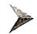

有序思想、数形结合解码命题新趋势，瞄准提分方向

本解法运算量很大,运算能力是关键,耗时费力.然而,从创新思维角度分析,既然是代数问题,我们能否通过数形结合的方式,从图形着眼思考呢?有以下创新解法.

创新解析 直线 $AB$ 的倾斜角为 $\frac{\pi}{4}$ , 如图3, 显然有 $|FD| = \frac{\sqrt{2}}{2} |PF|$ ,

不妨设 $|PF|=2t,t>0$ ，则 $|FD|=\sqrt{2}t$ ，由 $\frac{|PF|}{|AB|}=\frac{1}{4}$ ，得 $|AB|=8t$ ，所以

$$
| A D | = | B D | = 4 t, \text {所以} | A F | = | A D | - | F D | = (4 - \sqrt {2}) t, | B F | = | B D | +
$$

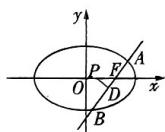  
图3

# 2 速通解题快招 分秒必争开启提分通道

快招识别——以 $n$ 为奇数和 $n$ 为偶数分段的分段数列，并且具有 $a_{n}$ 与 $a_{n+1}$ 的递推关系

先求一类 先讨论n为奇数（偶数）的情况→根据“相间项”具有相同数列属性，转化为特殊数列递推关系求奇数（偶数）项通项→求奇数（偶数）项和

求通项：将项数n代换为 $n+1$ 得偶数（奇数）段通项

求和：利用 $S_{2n} = S_{2n - 1} + a_{2n}(S_{2n - 1} = S_{2n} - a_{2n})$ ， $n\in \mathbf{N}^{\bullet}$ 得偶数

快速破题有高招

一眼识题，准确析题拿高分

高效解题有妙招

直击核心，提高准度争满分

2.1(答案不唯一) 快招识别 用取特例情形1:已知抽象函数的数量关系,取特殊的常函数求解,或者根据抽象函数原型,取三角函数求解.

快招解题1 取常函数 $f(x) = 1$ ，满足 $f(x + y) + f(x - y) = 1 + 1 = 2 \times 1 \times 1 = 2f(x)f(y)$ ， $f(0) = 1$ .

快招解题2 令 $x = 0$ ，则 $f(y) + f(-y) = 2f(0)f(y)$ ，

因为 $f(0)=1$ ，所以 $f(y)+f(-y)=2f(y)$ ，即 $f(-y)=f(y)$ ，所以函数 $f(x)$ 为偶函数，取 $f(x)=\cos x$ ，则 $\cos(x+y)+\cos(x-y)=2\cos x\cos y,f(0)=1$ ，满足题意.

②考场秒解决招 极限法！当 $a \to +\infty$ 时，区间 $[a, 2a]$ 与 $[2a, 3a]$ 包含函数的无数个周期，显然有 $s_a = t_a = -1 < 0$ ；当 $a \to 0^+$ 时，显然有 $s_a > 0, t_a > 0$ 。据此可排除AB.

①考场秒解快招 特殊化思想！由于本题是存在性探索问题，若考场上时间紧张或者平面APC的法向量求不出来，可以利用特殊化思想，先猜测点P为 $A_{1}B_{1}$ 的中点或三等分点，令 $\lambda=\frac{1}{2}$ 或 $\lambda=\frac{1}{3}$ 或 $\lambda=\frac{2}{3}$ ，经过验证可得当 $\lambda=\frac{1}{2}$ 时，满足题意，得P为棱 $A_{1}B_{1}$ 的中点，先拿到一部分分数，保证结论正确，再逆推过程.

直取分数有绝招

另辟“捷径”，专注考场快得分

本辑全9科260个解题快招速览

<table><tr><td>学科</td><td>语文</td><td>数学</td><td>英语</td><td>物理</td><td>化学</td><td>生物</td><td>政治</td><td>历史</td><td>地理</td></tr><tr><td>解题快招</td><td>31</td><td>33</td><td>20</td><td>34</td><td>23</td><td>31</td><td>30</td><td>30</td><td>28</td></tr></table>

扫码获取

# 超值配赠 二轮冲刺·提分技法课

全9科150+节视频课，大咖名师亲录

快速掌握考场抢分、0思路秒破技法，无限次免费观看，超赞！

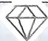

# 每月一手考情

追踪以思维进阶为导向的高考命题新趋势 001

命题趋势1 揭示本质，重视思维严谨性，深化理性思维 001

命题趋势2 有序猜想，提升能力，培养发散思维 002

命题趋势3 创新解法，数形结合，开发创新思维 005

# 考前必备 33 个解题快招

# 快速破题有高招 4招速破高考创新题型

快招1 逻辑分析法速排除多选题错误项 007

快招2 取特例快解答案不唯一填空题 010

快招3 条件对比分析法巧解结构不良问题 012

快招4 抽象句具体化，快速实现新定义题前两问满分 016

# 高效解题有妙招 29招速解高考核心题型

# 专题1 函数与导数

快招5 取特值法速解函数选择题 019

快招6 “双对称法”定周期，速解抽象函数求值问题 022

快招7 巧借等高线妙解方程中的多根问题 024

快招8 性质分析法巧解函数压轴选择题 027

快招9 超越不等式放缩法快解函数比大小问题 031

快招10 不等式恒成立与能成立的两大妙解技巧 033

快招11 切线法妙解函数与不等式综合问题 037

# 专题2 不等式

快招12 利用基本不等式求最值的三个必杀技 040

快招13 三角换元法速解双元最值问题 042

快招14 糖水不等式快解比大小放缩问题 044

# 专题3 向量与三角

快招15 万能建系法通解向量数量积问题 047

快招16 逆用、变用公式巧解三角恒等变换问题 049

快招17 “算两次”巧解三角形一线分两角问题 051

# 专题4 数列

快招18 万能转化法构造一阶线性递推数列求通项 054

快招19 待定系数法巧破分数型数列的裂项瓶颈 057

快招20 放缩法快解数列不等式问题 060

快招21 奇偶代换模型妙解分段数列问题 063

# 专题5 立体几何

快招22 “长方体模型”速判立体几何选择题 065

快招23 抓不变量，巧解动态几何多选题 068

快招24 养成目标意识，分析法巧破解答题第（1）问 072

快招25 分析图形特征，妙用定义法速求空间角 075

快招26 最佳原点建系策略速得空间点的坐标 079

# 专题6 圆锥曲线

快招27 隐圆模型速破最值、范围问题 082

快招28 阿基米德三角形性质速解圆锥曲线性质问题 085

快招29 三招搞定圆锥曲线非对称问题 089

快招30 构造思想速克圆锥曲线压轴题 093

# 目录

# 专题7 概率与统计

快招31 巧用全概率公式速解生活情境问题 096

快招32 “五步法” 快解随机变量的分布列与期望 099

快招33 数列思想巧解概率中的反复操作问题 102

# 下辑新书预告

2025年1月下旬上市

# 《试题调研》第8辑将推出：高考同源题

# 考前练透同源题,提分快人一步!

# 每月一手考情

本辑将邀请高考命题专家张继海,深度解读2025年“八省联考”最新命题趋势,预判2025高考命题新题型,挖掘高考冲刺备考新热点.

# 研透3年高赞 同源创新题

历年高考中被高赞的创新命题会延续或被借鉴. 本辑深研 3 年 24 套高考真题, 精选出 9 个创新题型和考法, 如: 设问开放的决策性与探究性问题、取材数学竞赛的新定义问题等, 通过 100% 真题同源变式演练, 助力考生消除对新题的恐惧, 从容应考.

# 练透5年高频 同源经典题

高考 80% 考查的都是课标核心考点. 本辑在统计 5 年 44 套高考真题的基础上, 精选出考频 TOP20 的典型真题, 通过“速记高频结论”和“速刷同源变式”, 助力考生吃透高频核心考点.

1 80个高频结论速记 高度总结最核心、最常用、最好用的公式定理、二级结论、方法技巧、解题模型等，以表格或者流程图的形式呈现，方便快速记忆，解题轻松套用.

② 100 道同源变式速刷 研透真题,进行多角度同源变式,如同源教材变考法、同源模型变设问、同源函数变综合、同源曲线变角度等,提前演练高考,提分快人一步!

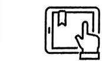

超值配赠·名师视频课 本辑全9科100+节,大咖名师亲录,讲透最新考情、新题型、新考法,预测2025高考新变化,无限次免费观看.

# 追踪以思维进阶为导向的高考命题新趋势

河北省正高级教师 赵成海

四川师范大学校外硕士生导师 张继海(审订)

高考数学试题贯彻考试内容改革要求,锐意改革探索,突出考查思维过程、思维方法和创新能力. 高考数学不再仅仅聚焦于数学知识的简单运用,而是着重考查学生在复杂情境中灵活运用数学思维解决问题的能力. 高考试题已由“解答试题”转向“解决问题”,而“解决问题”的关键在于思维. 实现思维进阶,学生能够更好地将数学知识转化为解决实际问题的工具,为高考中灵活、创新的解题策略奠定基础. 这种以思维进阶为导向的高考命题方式,是现阶段命题的新趋势、新热点.

# 命题趋势 1 揭示本质，重视思维严谨性，深化理性思维

调研 1 试题调研原创 [新题型·判断题][问题]若函数 $f(x) = 1 + \lg x, x \in [\frac{1}{10}, 100]$ ，则函数 $F(x) = 2^{[f(x)]^2 - f(x^2)}$ 的值域为 \_\_\_\_. 小明、小刚两名同学分别给出了如下解答过程：

[小明的解答过程]由函数 $f(x)=1+\lg x$ 在区间 $\left[\frac{1}{10},100\right]$ 上单调递增,可得 $f(x)\in[0,3]$ ,所以 $\left[f(x)\right]^{2}-f(x^{2})=\left[f(x)\right]^{2}-(1+\lg x^{2})=\left[f(x)\right]^{2}-2f(x)+1=\left[f(x)-1\right]^{2}\in[0,4]$ ,从而 $F(x)=2^{\left[f(x)\right]^{2}-f(x^{2})}\in[1,16]$ .

[小刚的解答过程]由函数 $f(x)=1+\lg x$ 在区间 $\left[\frac{1}{10},100\right]$ 上单调递增,可得 $f(x)\in[0,3]$ ,所以 $\left[f(x)\right]^{2}-f(x^{2})=(1+\lg x)^{2}-(1+\lg x^{2})=(\lg x)^{2}\in[0,4]$ ,从而 $F(x)=2^{\left[f(x)\right]^{2}-f(x^{2})}\in[1,16]$ .

虽然解题过程略有差异,但得出了一样的结果,两名同学很高兴,可是作业上交后,这个问题却没有得分.请你帮助他们分析错因,并给出正确的结果及解答过程.

解析 错误原因: $F(x)$ 的定义域不正确. 正确的结果为[1,2].

正确解答过程: 函数 $F(x)=2^{[f(x)]^{2}-f(x^{2})}$ 解析式中出现复合函数 $f(x^{2})$ ，那么由 $f(x)$ 的定义域为 $\left[\frac{1}{10},100\right]$ 知，对 $f(x^{2})$ 而言， $x^{2}\in\left[\frac{1}{10},100\right]$ ，所以 $F(x)$ 的定义域为 $\left[\frac{1}{\sqrt{10}},10\right]$ ，则 $f(x)\in\left[\frac{1}{2},2\right]$ 。所以 $\left[f(x)\right]^{2}-f(x^{2})\in[0,1]$ ，从而 $F(x)=2^{\left[f(x)\right]^{2}-f(x^{2})}\in[1,2]$ ，即 $F(x)$ 的值域为 [1,2]。

☑ 思维剖析 本题属于创新题型中的“判断题”, 即给出关于一个问题的几种结论或者几种解题方法, 要求学生判断哪种结论或解法正确, 哪种解法错误, 并说明理由. 这是对学生理性思维的直观考查, 不仅考查学生的知识储备, 还考查学生的逻辑推理能力和问题解决能力, 此过程中一旦出现思维偏差, 进入思维误区、盲区, 就有可能遗漏细节, 导致在题目的解答过程中出现错误. 因此关注本质、重视思维严谨性, 从而深化理性思维的必要性与重要性势在必行.

# 命题趋势 ② 有序猜想，提升能力，培养发散思维

调研 2 试题调研原创 已知椭圆 $E: \frac{x^2}{a^2} + \frac{y^2}{b^2} = 1 (a > b > 0)$ 过点 $M(-1, \frac{\sqrt{2}}{2})$ ，离心率为 $\frac{\sqrt{2}}{2}$ .

(1) 求椭圆 E 的方程.

(2) 在椭圆 $E$ 上任取三个不同的点 $A_{1}, A_{2}, A_{3}$ , 若 $\angle A_{1} F A_{2} = \angle A_{2} F A_{3} = \angle A_{3} F A_{1}$ , 其中 $F$ 为椭圆 $E$ 的左焦点, 则 $\frac{1}{|A_{1} F|} + \frac{1}{|A_{2} F|} + \frac{1}{|A_{3} F|}$ 是否为定值? 若是, 求出此定值, 若不是, 说明理由.

解析 (1) 将点 $M$ 的坐标代入椭圆方程, 结合 $\frac{c}{a} = \frac{\sqrt{2}}{2}$ , 可得 $a = \sqrt{2}, b = c = 1$ ,

所以椭圆 E 的方程为 $\frac{x^{2}}{2} + y^{2} = 1$ .

(2)在解答第(2)问之前,我们不妨先发散一下,本题是一个与焦半径的倒数和有关的定值问题,那么你能否联想到下面这道经典例题?

变式 过椭圆 $\frac{x^2}{2} + y^2 = 1$ 的左焦点 $F$ 作两条互相垂直的直线, 分别交椭圆 $E$ 于 $A, B$ 和 $C, D$ , 则 $\frac{1}{|AB|} + \frac{1}{|CD|}$ 是否为定值? 若是, 求出该定值, 若不是, 说明理由.

这道题目我们很熟悉,是一道与焦点弦倒数和有关的定值问题,解决的方法很多,最常用的是椭圆的弦长公式法,如下:

变式解析1：弦长公式法 易知 $F(-1,0)$ 。当直线 $AB, CD$ 其中之一与 $x$ 轴重合时，由 $\frac{(-1)^2}{2} + y^2 = 1$ ，得 $y = \pm \frac{\sqrt{2}}{2}$ ，此时 $\frac{1}{|AB|} + \frac{1}{|CD|} = \frac{3\sqrt{2}}{4}$ 。

当直线 $AB, CD$ 的斜率均存在且不为0时，设直线 $AB$ 的方程为 $x = my - 1 (m \neq 0)$ ，由 $\left\{ \begin{array}{l} x = my - 1, \\ \frac{x^2}{2} + y^2 = 1, \end{array} \right.$ 得关于 $y$ 的方程 $(m^2 + 2)y^2 - 2my - 1 = 0, \Delta = (-2m)^2 + 4(m^2 + 2) = 8m^2 + 8 > 0.$

设 $A(x_{1},y_{1}),B(x_{2},y_{2})$ ，则 $y_{1} + y_{2} = \frac{2m}{m^{2} + 2},y_{1}y_{2} = -\frac{1}{m^{2} + 2}.$

所以 $|AB| = \sqrt{1 + m^2} |y_2 - y_1| = \sqrt{1 + m^2} \cdot \sqrt{(y_2 + y_1)^2 - 4y_1y_2} = \frac{2\sqrt{2}(m^2 + 1)}{m^2 + 2}$ ,

以 $-\frac{1}{m}$ 替换 $m$ ，可得 $|CD| = \frac{2\sqrt{2}(m^2 + 1)}{1 + 2m^2}$ .

所以 $\frac{1}{|AB|} +\frac{1}{|CD|} = \frac{m^2 + 2}{2\sqrt{2}(m^2 + 1)} +\frac{2m^2 + 1}{2\sqrt{2}(m^2 + 1)} = \frac{3\sqrt{2}}{4}$ ，为定值.

综上, $\frac{1}{|AB|}+\frac{1}{|CD|}$ 为定值 $\frac{3\sqrt{2}}{4}$ .

上面的方法能解弦长问题,但与我们【调研2】的焦半径问题却没有直接联系,我们在此基础上发散思维,解题过程如果想与焦半径联系起来,椭圆的第二定义是不二之选.因此上面的方法中,利用弦长公式的部分可以替换成下面的步骤:

根据椭圆第二定义,得椭圆 $\frac{x^{2}}{a^{2}}+\frac{y^{2}}{b^{2}}=1(a>b>0)$ 上任意一点A到左焦点 $F(-c,0)$ 的距离(即焦半径)为 $|AF|=a+ex_{A}(e$ 为离心率). [教材溯源:此式来源于新教材人教A版《选择性必修第一册》第113页例6及第116页的信息技术应用“用信息技术探究点的轨迹:椭圆”]

$|AF| = \sqrt{2} + \frac{\sqrt{2}}{2} x_1 = \sqrt{2} + \frac{\sqrt{2}}{2} (my_1 - 1) = \frac{\sqrt{2}}{2} (1 + my_1)$ , 同理, $|BF| = \frac{\sqrt{2}}{2} (1 + my_2)$ ,

所以 $|AB| = |AF| + |BF| = \sqrt{2} + \frac{\sqrt{2}}{2} m(y_1 + y_2) = \frac{2\sqrt{2}(m^2 + 1)}{m^2 + 2}$ ,

以 $-\frac{1}{m}$ 替换 $m$ ，得 $|CD| = \frac{2\sqrt{2}(m^2 + 1)}{1 + 2m^2}$ .

所以 $\frac{1}{|AB|} +\frac{1}{|CD|} = \frac{m^2 + 2}{2\sqrt{2}(m^2 + 1)} +\frac{2m^2 + 1}{2\sqrt{2}(m^2 + 1)} = \frac{3\sqrt{2}}{4}$ ，为定值.

此解法的可贵之处在于能够取材课本并应用于解题,这是学以致用的典范.如此一来就能建立“倒数和”与“焦半径”的联系了,但遗憾的是,我们发现这时候还是依赖于“直曲”联立的结果,依旧是把两条焦半径合成一段弦长去思考了,对于我们【调研2】并不适用,那怎样能够让每条焦半径“各自独立”呢?

思考【变式】与【调研2】的相似之处在哪里,【调研2】中 $\angle A_{1}FA_{2}=\angle A_{2}FA_{3}=\angle A_{3}FA_{1}=\frac{2\pi}{3}$ ,【变式】中 $\angle AFC=\angle CFB=\angle BFD=\angle DFA=\frac{\pi}{2}$ ,都存在相等的角,既然如此,我们不如

试试从三角函数入手解题.

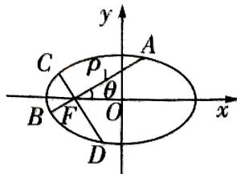

text_image

y
C
ρ
A
θ
B
F
O
x
D

图1

变式解析2：三角函数定义法 如图1，设 $\angle AFx = \theta (0\leqslant \theta \leqslant \frac{\pi}{2})$ ， $|AF| = \rho_1, |BF| = \rho_2, |CF| = \rho_3, |DF| = \rho_4$ ，则 $A(\rho_{1}\cos \theta - 1, \rho_{1}\sin \theta)$

明确复习目标 此阶段的主要目标是将上阶段复习中掌握的基础知识进一步巩固和深化,构建系统的知识体系,提升综合运用能力和完善解题技巧,为高考打下坚实基础.具体目标如下.

代入椭圆方程 $\frac{x^2}{2} + y^2 = 1$ 中，可得 $\frac{(\rho_1\cos\theta - 1)^2}{2} + (\rho_1\sin\theta)^2 = 1$ ，整理得 $(\rho_1\cos\theta)^2 - 2\rho_1\cos\theta + 1 + 2(\rho_1\sin\theta)^2 = 2$ ，得 $\rho_1 = \frac{1}{\sqrt{2} - \cos\theta}$ .

所以 $\rho_{2} = \frac{1}{\sqrt{2} - \cos(\pi + \theta)} = \frac{1}{\sqrt{2} + \cos\theta}, \rho_{3} = \frac{1}{\sqrt{2} - \cos(\frac{\pi}{2} + \theta)} = \frac{1}{\sqrt{2} + \sin\theta}, \rho_{4} =$

$$
\frac {1}{\sqrt {2} - \cos (\frac {3 \pi}{2} + \theta)} = \frac {1}{\sqrt {2} - \sin \theta}, \text {从而} | A B | = \rho_ {1} + \rho_ {2} = \frac {2 \sqrt {2}}{2 - \cos^ {2} \theta}, | C D | = \rho_ {3} + \rho_ {4} = \frac {2 \sqrt {2}}{2 - \sin^ {2} \theta},
$$

所以 $\frac{1}{|AB|} +\frac{1}{|CD|} = \frac{2 - \cos^2\theta}{2\sqrt{2}} +\frac{2 - \sin^2\theta}{2\sqrt{2}} = \frac{3\sqrt{2}}{4}$ 为定值.

发散到此处豁然开朗,这种方法似乎跟几段焦半径关系不大?我们甚至还能得到 $\frac{1}{|AF|}+\frac{1}{|BF|}+\frac{1}{|CF|}+\frac{1}{|DF|}=\sqrt{2}-\cos\theta+\sqrt{2}+\cos\theta+\sqrt{2}+\sin\theta+\sqrt{2}-\sin\theta=4\sqrt{2}$ ,也是定值.那能不能以此方法解【调研2】呢?下面给出【调研2】第(2)问的解析.

(2) 如图 2, 设 $\angle A_{1}Fx = \theta (0 \leqslant \theta \leqslant \frac{2\pi}{3})$ , $|A_{1}F| = \rho_{1}$ , $|A_{2}F| = \rho_{2}$ , $|A_{3}F| = \rho_{3}$ , 则 $A_{1}(\rho_{1}\cos \theta - 1, \rho_{1}\sin \theta)$ .

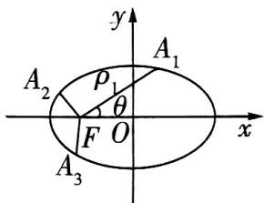

text_image

y
A₁
ρ₁
θ
F O
x
A₂
A₃

图2

代入椭圆方程 $\frac{x^2}{2} + y^2 = 1$ 中，可得 $\frac{(\rho_1\cos\theta - 1)^2}{2} + (\rho_1\sin\theta)^2 = 1$ ，整理得 $(\rho_1\cos\theta)^2 - 2\rho_1\cos\theta + 1 + 2(\rho_1\sin\theta)^2 = 2$ ，得 $\rho_1 = \frac{1}{\sqrt{2} - \cos\theta}$ .

所以 $\rho_{2} = \frac{1}{\sqrt{2} - \cos(\theta + \frac{2\pi}{3})}, \rho_{3} = \frac{1}{\sqrt{2} - \cos(\theta + \frac{4\pi}{3})}$ ,

从而 $\frac{1}{|A_1F|} +\frac{1}{|A_2F|} +\frac{1}{|A_3F|} = \frac{1}{\rho_1} +\frac{1}{\rho_2} +\frac{1}{\rho_3} = 3\sqrt{2}$ ，为定值.

解题到此为止,但思维还未结束,更进一步地,张开思维的翅膀,我们将本题的探究结果提升到更一般的情况,如果从【调研2】的三个点 $(A_{1},A_{2},A_{3})$ 、【变式】的四个点 $(A,B,C,D)$ 推广到n个点呢?

可以得到一般性结论:在椭圆 $\Gamma:\frac{x^{2}}{a^{2}}+\frac{y^{2}}{b^{2}}=1(a>b>0)$ 上按顺时针(逆时针)方向依次任取 n 个不同的点 $P_{1},P_{2},\cdots,P_{n}$ ，若 $\angle P_{1}FP_{2}=\angle P_{2}FP_{3}=\cdots=\angle P_{n}FP_{1}$ ，其中 F 为椭圆的左焦点，则 $\frac{1}{|P_{1}F|}+\frac{1}{|P_{2}F|}+\cdots+\frac{1}{|P_{n}F|}=\frac{na}{b^{2}}$ .

思维剖析 发散思维能够引导学生跳出固化的解题思维框架,深入思考解题过程中的逻辑,从而提高解题的效率和准确性,本题是典型的先弱化再推广的发散思维的应用.最终解法其实利用了极坐标的思想,但哪怕在没有学习极坐标的前提下,通过三角函数的定义亦能巧妙转化得解.试题设问虽然创新,但有迹可循,需要学生在平时备考中注重多发散、多联想.

# 命题趋势 ③ 创新解法，数形结合，开发创新思维

调研 3 试题调研原创 已知关于 x 的方程 $4^{x} + a \cdot 2^{x+1} - a^{2} + 1 = 0$ 有一个正根和一个负根, 则实数 a 的取值范围为 ( )

A. $(-1, 1 - \sqrt{3})$

B. $(-1, \sqrt{3} - 1)$

C. $(-1, \sqrt{3} + 1)$

D. $(\sqrt{3} + 1, +\infty)$

解析 从思维进阶角度多层次思考本题的解答.

第一层次:考虑到换元法. 设 $t=2^{x}, t>0$ ，则原方程化为关于 t 的方程 $t^{2}+2at-a^{2}+1=0$ ，易知此方程的两个根分别在 $(0,1)$ 和 $(1,+\infty)$ 内. 由 $\Delta=8a^{2}-4>0$ ，得 $a^{2}>\frac{1}{2}$ . 由求根公式解得 $t_{1,2}=\frac{-2a\pm\sqrt{8a^{2}-4}}{2}=-a\pm\sqrt{2a^{2}-1}$ ，则 $\left\{\begin{aligned}&0<-a-\sqrt{2a^{2}-1}<1,\\ &-a+\sqrt{2a^{2}-1}>1,\end{aligned}\right.$ 此法可行，不过运算过程复杂，小题大解.

第二层次: 进一步考虑到函数与方程思想. 在换元法的基础上, 可得关于 t 的函数 $f(t) = t^{2} + 2at - a^{2} + 1$ 的两个零点分别在 $(0,1)$ 和 $(1,+\infty)$ 内, 则由函数零点存在定理得 $\left\{\begin{aligned}f(0)>0,\\ f(1)<0,\end{aligned}\right.$ 解得 $\left\{\begin{aligned}-1<a<1,\\ a<1-\sqrt{3}\text{或}a>1+\sqrt{3},\end{aligned}\right.$ 从而 $a\in(-1,1-\sqrt{3})$ , 选 A. 可以顺利完成解答.

第三层次:本题是选择题,可以借助选项答题.当 a=0 时,原方程化为 $4^{x}+1=0$ ,无解,排除 BC;当 a=3 时,原方程化为 $2^{x}(2^{x}+6)=8$ ,若 x<0,则 $0<2^{x}<1,6<2^{x}+6<7$ ,则 $2^{x}(2^{x}+6)<7$ ,方程无负解,排除 D.应选 A.

调研 4 [2025 浙江 Z20 名校联盟联考]已知椭圆 $C: \frac{x^2}{a^2} + \frac{y^2}{b^2} = 1 (a > b > 0)$ 的右焦点为 $F$ , 过点 $F$ 作倾斜角为 $\frac{\pi}{4}$ 的直线交椭圆 $C$ 于 $A, B$ 两点, 弦 $AB$ 的垂直平分线交 $x$ 轴于点 $P$ , 若 $\frac{|PF|}{|AB|} = \frac{1}{4}$ , 则椭圆 $C$ 的离心率 $e = \_$ .

常规解析 由题可设直线 $AB$ 的方程为 $y = x - c, A(x_1, y_1), B(x_2, y_2)$ ，线段 $AB$ 的中点为 $D(x_0, y_0)$ 。由 $\left\{ \begin{array}{l} y = x - c, \\ \frac{x^2}{a^2} + \frac{y^2}{b^2} = 1, \end{array} \right.$ 消去 $y$ 可得关于 $x$ 的方程 $(a^2 + b^2)x^2 - 2a^2cx + a^2c^2 - a^2b^2 = 0, \Delta > 0,$

构建知识体系 将零散的知识点有机地结合在一起,形成系统的知识网络,便于综合应用.

所以 $x_{1} + x_{2} = \frac{2a^{2}c}{a^{2} + b^{2}}, x_{1}x_{2} = \frac{a^{2}c^{2} - a^{2}b^{2}}{a^{2} + b^{2}}$ ，则 $x_{0} = \frac{x_{1} + x_{2}}{2} = \frac{a^{2}c}{a^{2} + b^{2}}, y_{0} = x_{0} - c = -\frac{b^{2}c}{a^{2} + b^{2}}.$

所以 $|AB| = \sqrt{1 + 1^2} \cdot \sqrt{(x_1 + x_2)^2 - 4x_1x_2} = \frac{4ab^2}{a^2 + b^2}$ .

所以线段 $AB$ 的垂直平分线方程为 $y + \frac{b^2c}{a^2 + b^2} = -(x - \frac{a^2c}{a^2 + b^2})$

令 $y = 0$ ，解得 $x_{P} = \frac{c^{3}}{a^{2} + b^{2}}$ ，所以 $P\left(\frac{c^3}{a^2 + b^2},0\right)$ .所以 $|PF| = c - x_P = \frac{2b^2c}{a^2 + b^2},$

所以 $\frac{|PF|}{|AB|} = \frac{c}{2a} = \frac{1}{4}$ , 则 $e = \frac{c}{a} = \frac{1}{2}$ , 所以椭圆 $C$ 的离心率为 $\frac{1}{2}$ .

本解法运算量很大,运算能力是关键,耗时费力.然而,从创新思维角度分析,既然是代数问题,我们能否通过数形结合的方式,从图形着眼思考呢?有以下创新解法.

创新解析 直线 $AB$ 的倾斜角为 $\frac{\pi}{4}$ , 如图3, 显然有 $|FD| = \frac{\sqrt{2}}{2} |PF|$ , 不妨设 $|PF| = 2t, t > 0$ , 则 $|FD| = \sqrt{2} t$ , 由 $\frac{|PF|}{|AB|} = \frac{1}{4}$ , 得 $|AB| = 8t$ , 所以 $|AD| = |BD| = 4t$ , 所以 $|AF| = |AD| - |FD| = (4 - \sqrt{2})t$ , $|BF| = |BD| + |FD| = (4 + \sqrt{2})t$ .

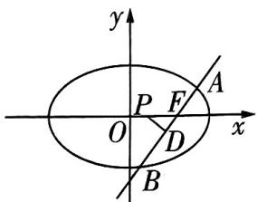

text_image

y
P F A
O D x
B

图3

由椭圆焦半径结论可得 $|AF|=\frac{b^{2}}{a+c\cos\frac{\pi}{4}},|BF|=\frac{b^{2}}{a-c\cos\frac{\pi}{4}}$ ，[破障碍:不需要刻意记忆
焦半径公式,按照以下思路也可推出此结论.在本题中,设 $|AF|=m,\angle AFx=\theta$ ,另一个焦点为 $F'$ ,连接 $AF'$ ,根据 $\overrightarrow{AF'}=\overrightarrow{FF'}-\overrightarrow{FA}$ ,可得 $(2a-m)^{2}=4c^{2}+4cm\cos\theta+m^{2}$ ,则 $|AF|=\frac{b^{2}}{a+c\cos\theta}$ .
这样在解答题中也能轻松写出步骤]

所以 $\frac{|AF|}{|BF|} = \frac{a - c\cos\frac{\pi}{4}}{a + c\cos\frac{\pi}{4}} = \frac{4 - \sqrt{2}}{4 + \sqrt{2}}$ 即 $\frac{\sqrt{2} - e}{\sqrt{2} + e} = \frac{\sqrt{2} - \frac{1}{2}}{\sqrt{2} + \frac{1}{2}}$ 可得离心率 $e = \frac{1}{2}$ .

☑ 思维剖析 创新思维是指突破常规思维的界限,用独特、新颖的方式解决问题的思维过程,注重从反常规的视角去提出问题、分析问题,并从新视角提出与众不同的解决问题的方案.因此,当无法用常规方法求解或用常规方法求解困难时,需要提升思维层次,找到创新解法,例如【调研3】的第三层次从选项入手解题、【调研4】完全撇开传统特色的“直曲”联立,从图形特色入手另辟蹊径,大大减少运算量,这便是创新思维的卓越之处.

# 快速破题有高招

# 4招速破高考创新题型

# 快招1 逻辑分析法速排除多选题错误项

# 快招速通

多选题四个选项,通过逻辑分析找到某个关键选项.
逻辑 1: 矛盾选项只选其一.
逻辑 2: 关联选项同正同误

用分析法、特值法、极限法、估算法等确定关键选项正误

排除了两个错误选项,另外两个就是正确选项

特殊的选项 D: 多选题往往在判断选项 D 的正误时比较困难, 这时若在选项 ABC 中排除两个错误选项, 则另一个选项与选项 D 均为正确项; 若能判断出选项 ABC 为正确项, 则选项 D 必为错误项.

# 快招速练

# 选项间有矛盾也有关联，瞄准逻辑 $1 + 2$

1.[2022 新高考Ⅱ卷](多选)如图 1, 四边形 ABCD 为正方形, $ED \perp$ 平面 ABCD, $FB \parallel ED$ , AB = ED = 2FB. 记三棱锥 E - ACD, F - ABC, F - ACE 的体积分别为 $V_{1}, V_{2}, V_{3}$ , 则 ( )

A. $V_{3} = 2 V_{2}$

B. $V_{3} = V_{1}$

C. $V_{3} = V_{1} + V_{2}$

D. $2V_{3} = 3V_{1}$

# 选项间各自独立，但是个别选项容易取反例

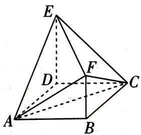

text_image

Geometric diagram of a triangular pyramid with labeled vertices and internal points

图1

2.[2025 浙江宁波 11 月一模](多选)已知数列 $\{a_{n}\}$ 是等比数列,则()

A. 数列 $\{a_{n}^{2}\}$ 是等比数列

B. 数列 $\{\frac{1}{a_n}\}$ 是等比数列

C. 数列 $\{a_{n} + a_{n + 1}\}$ 是等比数列

D. 数列 $\{\lg a_n^2\}$ 是等比数列

# 选项间各自独立，但是判断难度有明显差异

3.[2025 湖南师大附中 11 月模拟](多选)已知函数 $f(x)=\sqrt{2}\cos(2x+\frac{5\pi}{4})$ ，则()

A. $f(x)$ 图象的一个对称中心为 $(\frac{3}{8}\pi,0)$

培养数学思维 通过对解题过程的反思和总结, 培养逻辑思维、逆向思维和创造性思维.

B. $f(x)$ 的图象向右平移 $\frac{3\pi}{8}$ 个单位长度后得到的是奇函数的图象

C. $f(x)$ 在区间 $[\frac{5\pi}{8}, \frac{7\pi}{8}]$ 上单调递增

D. 若 $y = f(x)$ 的图象在区间 $(0, m)$ 上与直线 $y = 1$ 有且只有 6 个交点，则 $m \in (\frac{5\pi}{2}, \frac{13\pi}{4}]$

# 选项间两两一组矛盾明显

4.[2025 浙江金华 12 月模拟](多选)函数 $f(x)=\sin(\omega x+\frac{\pi}{6})$ 的图象向左平移 $\frac{\pi}{4}$ 个单位长度后,得到函数 $g(x)$ 的图象,则下列说法正确的有()

A. 若 $g(x)$ 为偶函数, 则 $\omega$ 的最小正值是 $\frac{10}{3}$

B. 若 $g(x)$ 为偶函数, 则 $\omega$ 的最小正值是 $\frac{4}{3}$

C. 若 $g(x)$ 为奇函数, 则 $\omega$ 的最小正值是 $\frac{10}{3}$

D. 若 $g(x)$ 为奇函数, 则 $\omega$ 的最小正值是 $\frac{4}{3}$

# 快招速解与参考答案

# 1.CD 快招解题

<table><tr><td>第1步(用逻辑分析法发现矛盾选项和关联选项)</td><td>选项B和选项C明显矛盾.观察图形可得 $V_1=2V_2$ ,则选项A与选项B是等价的关联选项,选项C与选项D是等价的关联选项,那么本题要么选AB,要么选CD,因此只需判断 $V_1$ 和 $V_3$ 的关系</td></tr><tr><td>第2步(用图形观察法得到 $V_3\neq V_1$ )</td><td> $V_1=V_{E-ACD}=V_{D-ACE},V_3=V_{F-ACE}$ ,观察图形知点D与点F到平面ACE的距离不相等,[图形观察法:线段DF的中点在过底面ABCD的中心O,且垂直于底面ABCD的垂线上,这条垂线和平面ACE只有O一个交点,所以线段DF的中点不在平面ACE上]所以 $V_{D-ACE}\neq V_{F-ACE}$ ,即 $V_1\neq V_3$ </td></tr><tr><td>第3步(逻辑推理下结论)</td><td>B错误,所以AB错误,应选CD</td></tr></table>

# 2.AB 快招解题

<table><tr><td>第1步(用特殊的摆动数列排除C)</td><td>取 $a_n = (-1)^n$ ,由于 $a_n + a_{n+1} = 0$ ,则数列 $\{a_n + a_{n+1}\}$ 不是等比数列,排除选项C</td></tr><tr><td>第2步(用常数列“1,1,1,...”排除D)</td><td>取 $a_n = 1$ ,则 $\lg a_n^2 = \lg 1 = 0$ ,所以数列 $\{\lg a_n^2\}$ 不是等比数列,排除选项D</td></tr><tr><td>第3步(逻辑推理下结论)</td><td>CD错误,多选题至少有两个正确选项,故选AB</td></tr></table>

# 3.BD 快招解题

<table><tr><td>第1步(用代入法排除A)</td><td> $f(\frac{3}{8}\pi)=\sqrt{2}\cos(2\times\frac{3}{8}\pi+\frac{5\pi}{4})=\sqrt{2}\neq0$ ,排除A</td></tr><tr><td>第2步(通过计算排除C)</td><td>当 $x\in[\frac{5\pi}{8},\frac{7\pi}{8}]$ 时, $2x+\frac{5\pi}{4}\in[\frac{5\pi}{2},3\pi]$ ,由余弦函数单调性知, $f(x)$ 在区间 $[\frac{5\pi}{8},\frac{7\pi}{8}]$ 上单调递减,排除C</td></tr><tr><td>第3步(逻辑推理下结论)</td><td>AC错误,多选题至少有两个正确选项,故选BD</td></tr></table>

# 4.BC 快招解题

<table><tr><td>第1步(用逻辑分析法发现矛盾选项)</td><td>观察选项可知,选项A和选项B矛盾,选项C和选项D矛盾;选项A和选项C矛盾,选项B和选项D矛盾</td></tr><tr><td>第2步(计算任意一个选项)</td><td>由题意得,g(x)=sin[ω(x+π/4)+π/6]=sin(ωx+ωπ/4+π/6),若g(x)为偶函数,则ωπ/4+π/6=π/2+kπ,k∈Z,故ω=4/3+4k,k∈Z,所以ω的最小正值是4/3,故A错误</td></tr><tr><td>第3步(逻辑推理下结论)</td><td>A错误,所以B正确,则D错误,C正确,故选BC</td></tr></table>

# 快招2 取特例快解答案不唯一填空题

# 快招速通

答案不唯一填空题, 就是指题目的条件不完备或结论不确定的问题. 这类题目的正确答案不止一个, 写出满足条件的其中一个结果即可. 做这类题目有个基本原则: 解答过程越简单越好.

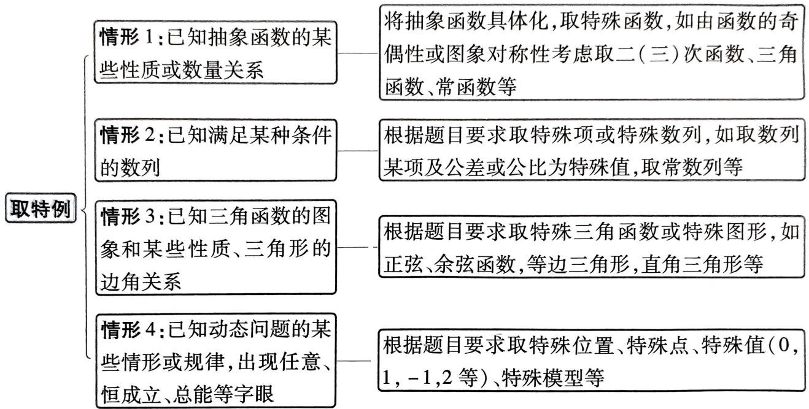

flowchart

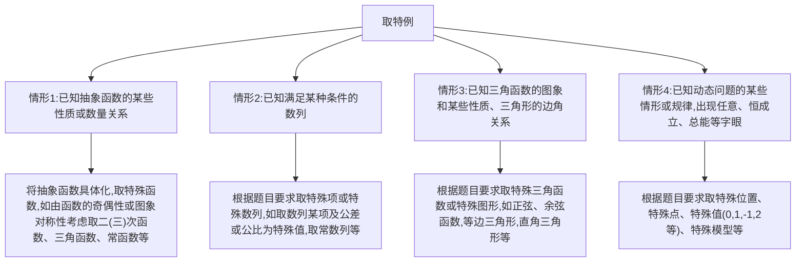

# 快招速练

# 取特殊图形求三角形周长

1. 试题调研原创 在 $\triangle ABC$ 中, 内角 $A,B,C$ 所对的边分别为 $a,b,c$ . 若角 $A$ 为锐角, $b=3,c=4$ , 则 $\triangle ABC$ 的周长可能为\_\_\_\_.(写出一个符合题意的答案即可)

# 取特殊函数求函数解析式

2. 试题调研原创 已知函数 $f(x)$ 的定义域为 $\mathbf{R}$ , 且 $f(x+y)+f(x-y)=2f(x)\cdot f(y), f(0)=1$ , 写出满足条件的一个 $f(x)$ 的解析式: $f(x)=$ \_\_\_\_. (写出一个符合题意的答案即可)

# 取特殊项求数列通项

3.[2025江西师大附中12月模拟]已知等比数列 $\{a_{n}\}$ 满足 $a_{n+1}a_{n}<0(n\in\mathbf{N}^{*})$ ，且其前 $n$ 项和 $S_{n}>0$ ，则数列 $\{a_{n}\}$ 的通项公式可以是 $a_{n}=$ \_\_\_\_.（写出一个符合题意的答案即可）

# 取特殊位置求直线方程

4. 试题调研原创 若直线 l 经过原点, 且与双曲线 $\frac{x^{2}}{20}-\frac{y^{2}}{24}=1$ 没有公共点, 则直线 l 的方程可以为 \_\_\_\_. (写出一个符合题意的答案即可)

# 快招速解与参考答案

1.7 + $\sqrt{7}$ (答案不唯一) 快招识别 用取特例情形3:已知三角形的边长,取特殊三角形求三角形周长.

快招解题 取 $\triangle ABC$ 为直角三角形, 其中 $\angle C = 90^{\circ}$ , 则 $a = \sqrt{c^{2} - b^{2}} = \sqrt{7}$ , 所以周长为 $7 + \sqrt{7}$ .

方法二 由余弦定理可得 $a = \sqrt{b^2 + c^2 - 2bc\cos A} = \sqrt{25 - 24\cos A}$

因为角 $A$ 为锐角, 则 $\cos A \in (0,1)$ , 可得 $a = \sqrt{25 - 24\cos A} \in (1,5)$ , 所以 $\triangle ABC$ 的周长为 $a + b + c = a + 7 \in (8,12)$ . 故可填9(答案不唯一, (8,12)内的任何一个值均可).

2.1(答案不唯一) 快招识别 用取特例情形1:已知抽象函数的数量关系,取特殊的常函数求解,或者根据抽象函数原型,取三角函数求解.

快招解题1 取常函数 $f(x) = 1$ ，满足 $f(x + y) + f(x - y) = 1 + 1 = 2 \times 1 \times 1 = 2f(x)f(y)$ ， $f(0) = 1$ .

快招解题2 令 $x = 0$ ，则 $f(y) + f(-y) = 2f(0)f(y)$ ，

因为 $f(0)=1$ ，所以 $f(y)+f(-y)=2f(y)$ ，即 $f(-y)=f(y)$ ，所以函数 $f(x)$ 为偶函数，取 $f(x)=\cos x$ ，则 $\cos(x+y)+\cos(x-y)=2\cos x\cos y,f(0)=1$ ，满足题意.

3. $(- \frac{1}{2})^{n-1}$ (答案不唯一) 快招识别 用取特例情形2:已知数列相邻两项的符号不同,取首项和公比为特殊值.

快招解题 由 $a_{n+1}a_n < 0 (n \in \mathbf{N}^*)$ 可知该等比数列的奇数项和偶数项的符号不同, 设等比数列的公比为 $q (q \neq 0)$ , 则 $q < 0$ ,

因为 $S_{n} > 0$ ，所以 $S_{1} = a_{1} > 0, S_{2} = a_{1} + a_{2} = a_{1}(1 + q) > 0$ ，所以 $q > -1$ ，所以取 $a_{1} = 1, q = -\frac{1}{2}$ ，即 $a_{n} = \left(-\frac{1}{2}\right)^{n - 1}$ ，经检验，满足题意.

方法二 设等比数列 $\{a_{n}\}$ 的公比为 $q(q \neq 0)$ , 则 $a_{n} = a_{1}q^{n - 1}$ , 由 $a_{n + 1}a_{n} < 0 (n \in \mathbf{N}^{*})$ 可知该等比数列的奇数项和偶数项的符号不同, 则 $q < 0$ , 由 $S_{n} = \frac{a_{1}(1 - q^{n})}{1 - q} > 0$ , 得 $a_{1}(1 - q^{n}) > 0$ 恒成立.

所以 $a_1 > 0, q^n < 1$ 恒成立，所以 $-1 < q < 0$ ，可取 $a_n = (-\frac{1}{2})^{n-1}$ .

4. $y = 2x$ (答案不唯一) 快招识别 用取特例情形 4: 已知直线与双曲线没有公共点, 利用渐近线与双曲线的位置关系取特殊位置.

快招解题 由于双曲线 $\frac{x^2}{20} - \frac{y^2}{24} = 1$ 的渐近线的斜率为 $\pm \frac{\sqrt{30}}{5}$ , 所以只要直线 $l$ 的斜率在 $(- \infty, -\frac{\sqrt{30}}{5}] \cup [\frac{\sqrt{30}}{5}, + \infty)$ 内即可, 可取直线 $l$ 的斜率为 2 , 即直线 $l$ 的方程可以为 $y = 2x$ .

# 快招3 条件对比分析法巧解结构不良问题

# 快招速通

我们把初始条件、目标状态和解决问题的方法这三者中至少有一个不明确的试题称为结构不良问题, 这是一类典型的开放性试题, 旨在引导学生独立思考、个性化地解决问题. 结构不良问题具有条件模糊、解决方案多样、结果开放等特点, 做这类题目有个基本原则: 对比分析条件, 做好选择再出发.

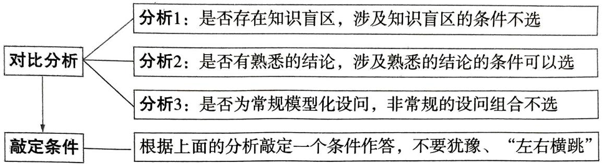

flowchart

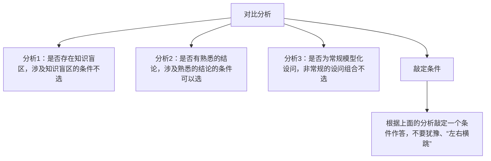

# 快招速练

# 三个互不相关的条件择

1.[2025 山西晋中 11 月模拟]在“①函数 $f(x) = a^x - (b - 1)a^{-x}$ 是定义在 R 上的奇函数且 $f(1) = \frac{8}{3}$ ，②函数 $f(x) = x\ln x + ax + b$ 的图象在点 $(1, f(1))$ 处的切线方程为 $y = 4x + 1$ ，③函数 $f(x) = (a - 2)2^x + 2 - b$ 是指数函数”这三个条件中任选一个，补充在下面的问题中，并解答.

已知函数 $g(x) = \log_a(b + x) + \log_a(b - x)(a > 0$ 且 $a\neq 1,b > 0)$

(1)试确定 $g(x)$ 的奇偶性;  
(2)已知\_\_\_\_,求不等式 $g(x)\leqslant1$ 的解集.

注:如果选择多个条件分别解答,按第一个解答计分.

# 规范答题

# 三个类似的条件择一，但其中两个明显带有公式特征

2.[2025 福建泉州 12 月模拟]在“① $2a-b=2c\cos B$ ，② $\frac{a^{2}}{a^{2}+b^{2}-c^{2}}=\frac{\sin A}{\sin B}$ ，③ $\frac{a\cos B+b\cos A}{c}=\frac{\sqrt{3}(a^{2}+b^{2}-c^{2})}{2absin C}$ ”这三个条件中任选一个，补充在下面的问题中，并解答.

问题:在 $\triangle ABC$ 中,内角A,B,C所对的边分别为a,b,c,且\_\_\_\_.

(1) 求 C.   
(2) 若 $AB$ 边上的高为 1, $\triangle ABC$ 的面积为 $\frac{\sqrt{3}}{3}$ , 求 $\triangle ABC$ 的周长.

注:如果选择多个条件分别解答,按第一个解答计分.

# 规范答题

# 四个条件择二，但有不能选的“糟糕”条件

3.[2025 北京北师大二附中 11 月模拟]已知函数 $f(x) = a \sin \omega x \cos \omega x (a > 0, \omega > 0)$ . 从下列四个条件中选择两个作为已知,使函数 $f(x)$ 存在且唯一确定,并解答以下问题.

(1) 求 $f(x)$ 的解析式.  
(2) 设 $g(x) = f(x) - 2\cos^2\omega x + 1, x \in (0, \pi)$ ，求函数 $g(x)$ 的最小值与单调递减区间.  
条件① $f(\frac{\pi}{4})=1$ ; 条件② $f(x)$ 为偶函数; 条件③ $f(x)$ 的最大值为1; 条件④ $f(x)$ 图象的相邻两条对称轴之间的距离为 $\frac{\pi}{2}$ .

注:如果选择的条件组合不符合要求,第(1)问得0分;如果选择多个符合要求的条件组合分别解答,按第一个解答计分.

# 规范答题

# 快招速解与参考答案

1.(1)对于 $g(x)=\log_{a}(b+x)+\log_{a}(b-x)(b>0)$ ，有 $\left\{\begin{aligned}b+x&>0,\\ b-x&>0,\end{aligned}\right.$ 则 -b<x<b，

所以函数 $g(x)$ 的定义域为 $(-b, b)$ ，又 $g(-x) = \log_a(b - x) + \log_a(b + x) = g(x)$ ，

所以 $g(x)=\log_{a}(b+x)+\log_{a}(b-x)$ 为偶函数. [避失分: 直接根据 $g(-x)=g(x)$ 判断而不考虑定义域的, 不得全分]

(2) 对比分析 条件①要从奇函数的性质和特值入手求参,条件②要从曲线的切线方程入手求参,条件③直接根据指数函数的定义即可求参.对比分析三种情况发现:大多数人对指数函数的定义比较熟悉,所以选条件③可快速求出a,b,进而求解不等式.

快招解题 选择条件③. 因为 $f(x) = (a - 2)2^x + 2 - b$ 是指数函数，

所以 $\left\{ \begin{array}{l} a - 2 = 1, \\ 2 - b = 0, \end{array} \right.$ 解得 $\left\{ \begin{array}{l} a = 3, \\ b = 2, \end{array} \right.$ 所以 $g(x) = \log_3(2 + x) + \log_3(2 - x) = \log_3(4 - x^2)$ .

由 $g(x)\leqslant 1$ ，得 $\log_3(4 - x^2)\leqslant 1$ ，即 $0 <   4 - x^{2}\leqslant 3$ ，解得 $-2 <   x\leqslant -1$ 或 $1\leqslant x <   2$

所以不等式 $g(x) \leqslant 1$ 的解集为 $(-2, -1] \cup [1, 2)$ . [解后反思:选择条件①,根据 $f(0) = 0$ 求出 $b$ (注意检验),再由 $f(1) = \frac{8}{3}$ 求出 $a$ ,即可得到 $g(x) = \log_3 (4 - x^2)$ ;选择条件②,利用导数的几何意义求出 $a$ ,再由 $f(1) = 5$ 求出 $b$ ,同样可以得到 $g(x) = \log_3 (4 - x^2)$ . 大家可自行探索]

2. 对比分析 观察条件①②③三个等式,很容易发现②③两个等式含有可以使用余弦定理的结构,而第③个等式相比第②个等式又更复杂,可以得出结论,条件②是解决问题的首选.

快招解题(1)选择条件②. 在 $\triangle ABC$ 中, 由正弦定理得 $\frac{\sin A}{\sin B}=\frac{a}{b}$ .

又 $\frac{a^2}{a^2 + b^2 - c^2} = \frac{\sin A}{\sin B}$ , 所以 $\frac{a^2}{a^2 + b^2 - c^2} = \frac{a}{b}$ , 化简得 $a^2 + b^2 - c^2 = ab$ .

在 $\triangle ABC$ 中，由余弦定理得 $\cos C = \frac{a^2 + b^2 - c^2}{2ab} = \frac{ab}{2ab} = \frac{1}{2}$

又 $0 < C < \pi$ , 所以 $C = \frac{\pi}{3}$ . [解后反思: 选择条件①, 根据正弦定理化为角的关系, 然后利用三角恒等变换得到 $\cos C = \frac{1}{2}$ ; 选择条件③, 在等号左边用射影定理、右边用余弦定理, 化边为角, 化简后可以得到 $\tan C = \sqrt{3}$ . 大家可自行探索]

(2) 因为 $AB$ 边上的高为 1, $\triangle ABC$ 的面积为 $\frac{\sqrt{3}}{3}$ , 所以 $\frac{1}{2} c \times 1 = \frac{\sqrt{3}}{3}$ , 得 $c = \frac{2\sqrt{3}}{3}$ .

由(1)知 $C=\frac{\pi}{3}$ ，所以 $\frac{1}{2}ab\sin C=\frac{1}{2}ab\times\frac{\sqrt{3}}{2}=\frac{\sqrt{3}}{3}$ ，得 $ab=\frac{4}{3}$ .

由余弦定理得 $c^2 = a^2 + b^2 - 2ab\cos C$ ，可得 $(\frac{2\sqrt{3}}{3})^2 = a^2 + b^2 - 2 \times \frac{4}{3} \times \frac{1}{2}$ ，得 $a^2 + b^2 = \frac{8}{3}$ .

所以 $a^2 + b^2 + 2ab = \frac{8}{3} + \frac{8}{3} = \frac{16}{3}$ , 即 $(a + b)^2 = \frac{16}{3}$ , 所以 $a + b = \frac{4\sqrt{3}}{3}$ ,

则 $a + b + c = \frac{4\sqrt{3}}{3} +\frac{2\sqrt{3}}{3} = 2\sqrt{3}$ ，即 $\triangle ABC$ 的周长为 $2\sqrt{3}$

考场秒解快招 第(1)问得到了 $\triangle ABC$ 有一个内角为特殊角 $\frac{\pi}{3}$ , 那在第(2)问中不妨大胆令 $\triangle ABC$ 为等边三角形, 根据高为 1 求得边长是 $\frac{2\sqrt{3}}{3}$ , 恰好满足三角形面积是 $\frac{\sqrt{3}}{3}$ , 如此一来直接能得到周长是 $2\sqrt{3}$ .

3. 对比分析 易得 $f(x)=\frac{a}{2}\sin2\omega x$ ，所以函数 $f(x)$ 为奇函数，②不能选。条件①③是类似的条件，都是求 a，不能确定 $\omega$ ，①③不能同时选。只有④能求周期，进而得 $\omega$ ，④必须选。对比分析①③，明显③更容易确定 a=2，所以应选条件③④。

快招解题(1)选择条件③④.

易知 $f(x) = \frac{a}{2}\sin 2\omega x.$ 由④可知 $\frac{2\pi}{2\omega} = \pi$ ，即 $\omega = 1$ ，所以 $f(x) = \frac{a}{2}\sin 2\omega x = \frac{a}{2}\sin 2x.$

因为函数 $f(x)$ 的最大值为1,所以 $\frac{a}{2}=1$ ,即a=2,所以 $f(x)=\sin 2x.$ [解后反思:选择条件①④,求出 $\omega$ 后由 $f(\frac{\pi}{4})=1$ 求a,亦可得解]

(2) $g(x) = f(x) - 2\cos^2\omega x + 1 = \sin 2x - \cos 2x = \sqrt{2}\sin \left(2x - \frac{\pi}{4}\right)$ ,

因为 $0 < x < \pi$ ，所以 $-\frac{\pi}{4} < 2x - \frac{\pi}{4} < \frac{7\pi}{4}$

当 $2x - \frac{\pi}{4} = \frac{3\pi}{2}$ 时， $x = \frac{7\pi}{8}$ ，可得 $[g(x)]_{\min} = g(\frac{7\pi}{8}) = -\sqrt{2}$ .

令 $\frac{\pi}{2} + 2k\pi < 2x - \frac{\pi}{4} < \frac{3\pi}{2} + 2k\pi (k \in \mathbf{Z})$ ，可得 $\frac{3\pi}{8} + k\pi < x < \frac{7\pi}{8} + k\pi (k \in \mathbf{Z})$

所以函数 $g(x)$ 的单调递减区间为 $\left(\frac{3\pi}{8}, \frac{7\pi}{8}\right)$ .

# 快招4 抽象句具体化，快速实现新定义题前两问满分

# 快招速通

新定义解答题内容新颖,特点是通过给出一个新概念,或约定一种新运算,或给出几个新模型来创设全新的问题情境,考查学生的快速学习能力和信息迁移能力.新定义解答题的前两问一般是新定义的识别或直接用新定义求解简单、特殊的情况,讲究“比葫芦画瓢”,因此“一圈二换”能快速实现前两问满分.

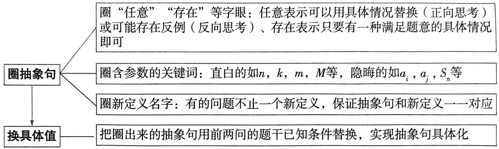

flowchart

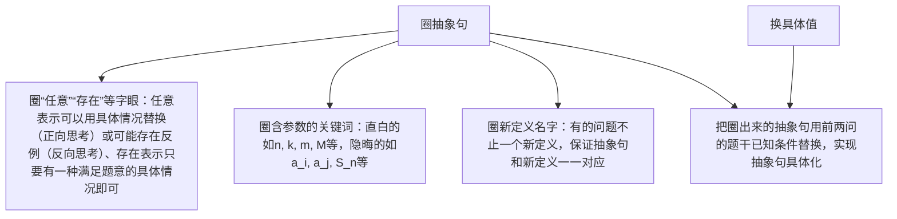

# 快招速练

# 新定义“封闭数列”

1.[2025 河北邢台 12 月模拟]已知 $m \in \mathbf{N}^*$ , $m \geqslant 5$ , 定义: 数列 $\{a_n\}$ 共有 $m$ 项, 对任意 $i, j (i, j \in \mathbf{N}^*, i \leqslant j \leqslant m)$ , 存在 $k_1 (k_1 \in \mathbf{N}^*, k_1 \leqslant m)$ , 使得 $a_i a_j = a_{k_1}$ , 或存在 $k_2 (k_2 \in \mathbf{N}^*, k_2 \leqslant m)$ , 使得 $\frac{a_j}{a_i} = a_{k_2}$ , 则称数列 $\{a_n\}$ 为“封闭数列”.

(1) 若 $a_{n} = n (1 \leqslant n \leqslant 10, n \in \mathbf{N}^{*})$ ，判断数列 $\{a_{n}\}$ 是否为“封闭数列”.  
(2)已知递增数列 $\{a_{n}\}$ 为 $a_1,2,a_3,8,a_5,\{a_n\}$ 为“封闭数列”，求 $a_1,a_3,a_5$   
(3)已知递增数列 $\{a_{n}\}$ 为“封闭数列”，若 $a_1 \geqslant 1$ ，证明： $\{a_{n}\}$ 是等比数列.

# 规范答题

# 新定义“极异集合”

2.[2025 福建福州 11 月期中]设自然数 $n \geqslant 3$ , 由 $n$ 个不同的正整数 $a_1, a_2, \cdots, a_n$ 构成的集合 $S = \{a_1, a_2, \cdots, a_n\}$ . 若集合 $S$ 的每一个非空子集所含元素的和构成新的集合 $P_S$ , 记 $\operatorname{card}(P_S)$ 为集合 $P_S$ 元素的个数. 对于集合 $S = \{a_1, a_2, \cdots, a_n\}$ , 若 $\operatorname{card}(P_S)$ 等于集合 $S$ 的非空子集的个数, 则称集合 $S$ 为“极异集合”.

(1) 已知集合 $A = \{1, 2, 3, 4\}$ , 集合 $B = \{1, 2, 4, 8\}$ , 分别求解 $\operatorname{card}(P_A), \operatorname{card}(P_B)$ .  
(2)已知集合 $S' = \{1, 2, 3\}$ , 判断 $S'$ 是否为“极异集合”.  
(3) 设集合 $S = \{a_{1}, a_{2}, a_{3}, \cdots, a_{n}\}$ 是“极异集合”，记 $b_{i} = a_{i} - 2^{i-1} (i = 1, 2, \cdots, n)$ ，证明：数列 $\{b_{i}\}$ 的前 $k$ 项和 $D_{k} \geqslant 0 (k = 1, 2, \cdots, n)$ .

# 规范答题

  
电子教辅名校试卷  
高中网课一手资源  
知识总结备课资料  
扫码关注获取更多  
使用微信扫一扫

# 快招速解与参考答案

1.(1)一圈二换 数列 $\{a_{n}\}$ 共有m项,对任意 $i,j(i,j\in\mathbb{N}^{*},i\leqslant j\leqslant m)$ ,存在 $k_{1}(k_{1}\in\mathbb{N}^{*},k_{1}\leqslant m)$ ,
数列1,2,3,4,5,6,7,8,9,10共有10项,任意取其中两项,比如2,7,如果这两项的
积14或商 $\frac{7}{2}$ 至少有一个也在数列1,2,3,4,5,6,7,8,9,10中,就满足“封闭数列”的定义.
使得 $a_{i}a_{j}=a_{k_{1}}$ 或存在 $k_{2}(k_{2}\in\mathbb{N}^{*},k_{2}\leqslant m)$ ,使得 $\frac{a_{j}}{a_{i}}=a_{k_{2}}$ ,则称数列 $\{a_{n}\}$ 为“封闭数列”.
快招解题 由题意知,数列 $\{a_{n}\}$ 为1,2,3,4,5,6,7,8,9,10.

因为 $a_2a_7 = 2 \times 7 = 14, \frac{a_7}{a_2} = \frac{7}{2}, 14$ 和 $\frac{7}{2}$ 均不是 $\{a_n\}$ 中的项，所以数列 $\{a_n\}$ 不是“封闭数列”.

(2)一圈二换 数列 $\{a_{n}\}$ 共有m项,对任意 $i,j(i,j\in\mathbf{N}^{*},i\leqslant j\leqslant m)$ ,存在 $k_{1}(k_{1}\in\mathbf{N}^{*},k_{1}\leqslant m)$ ,
递增数列 $a_{1},2,a_{3},8,a_{5}$ 共有5项,任意取其中两项,比如 $a_{5},a_{5}$ (此时相当于i,j均取5),这两项的积 $a_{5}^{2}$ 或商1至少有一个也在数列 $a_{1},2,a_{3},8,a_{5}$ 中.

使得 $(a_{i}a_{j}=a_{k_{1}})$ 或存在 $k_{2}(k_{2}\in\mathbf{N}^{*},k_{2}\leqslant m)$ ，使得 $\frac{a_{j}}{a_{i}}=a_{k_{2}}$ ，则称数列 $\{a_{n}\}$ 为“封闭数列”.

及时复盘 每天睡前总结一下,今天学了什么,有什么长进,进步很大的时候记得奖励自己哦!

快招解题 由数列 $\{a_{n}\}$ 递增可知 $a_1 < 2 < a_3 < 8 < a_5$ ，则 $a_5^2$ 不是 $\{a_n\}$ 中的项，

所以 $\frac{a_5}{a_5} = 1$ 是 $\{a_n\}$ 中的项，除 $a_1$ 外， $\{a_n\}$ 中其他项都大于等于2，所以 $a_1 = 1$

因为 $a_5a_i > a_5 (1 < i < 5, i \in \mathbf{N}^*)$ ，所以 $\frac{a_5}{8}, \frac{a_5}{a_3}, \frac{a_5}{2}$ 都是 $\{a_n\}$ 中的项，所以 $\frac{a_5}{8} = 2$ ，得 $a_5 = 16$ .

由 $\frac{a_5}{a_3} = a_3$ ，得 $a_3 = 4$ ，经检验，符合题意，所以 $a_1 = 1, a_3 = 4, a_5 = 16.$

(3) 因为数列 $\{a_{n}\}$ 递增, 且 $a_{1} \geqslant 1$ , 所以 $a_{m} > 1$ , 则 $a_{m}^{2}$ 不是 $\{a_{n}\}$ 中的项, 所以 $\frac{a_{m}}{a_{m}} = 1$ 是 $\{a_{n}\}$ 中的项, 即 $a_{1} = 1$ . 因为 $a_{m} a_{i} (1 < i \leqslant m, i \in \mathbf{N}^{*})$ 不是 $\{a_{n}\}$ 中的项, 所以 $\frac{a_{m}}{a_{i}}$ 是 $\{a_{n}\}$ 中的项,

所以 $1 = a_{1} <   \frac{a_{m}}{a_{m - 1}} <  \frac{a_{m}}{a_{m - 2}} <  \frac{a_{m}}{a_{m - 3}} <  \dots <  \frac{a_{m}}{a_{2}} <  a_{m}.$

因为 $a_{1}, \frac{a_{m}}{a_{m-1}}, \frac{a_{m}}{a_{m-2}}, \frac{a_{m}}{a_{m-3}}, \cdots, \frac{a_{m}}{a_{2}}, a_{m}$ 共有 m 项，所以 $a_{i} = \frac{a_{m}}{a_{m+1-i}}$ ，则 $a_{m} = a_{i} a_{m+1-i} (1 < i \leqslant m - 1, i \in \mathbf{N}^{*})$ ①，

类似地, 对 $2 < j \leqslant m - 1, j \in \mathbf{N}^{*}, a_{m-1}a_{j} = \frac{a_{m}}{a_{2}} \cdot a_{j} > a_{m}$ , 则 $a_{m-1}a_{j}$ 不是 $\{a_{n}\}$ 中的项,

所以 $\frac{a_{m - 1}}{a_j}$ 是 $\{a_n\}$ 中的项， $1 = a_{1} <   \frac{a_{m - 1}}{a_{m - 2}} <  \frac{a_{m - 1}}{a_{m - 3}} <  \frac{a_{m - 1}}{a_{m - 4}} <  \dots <  \frac{a_{m - 1}}{a_3} <  a_{m - 2} <   a_{m - 1} <   a_m,$

所以 $a_{j} = \frac{a_{m - 1}}{a_{m - j}}$ ，则 $a_{m - 1} = a_j a_{m - j}(2 < j \leqslant m - 2, i \in \mathbf{N}^*)$ ②，

由①和②得 $\frac{a_{m}}{a_{m-1}}=\frac{a_{m-1}}{a_{m-2}}=\frac{a_{m-2}}{a_{m-3}}=\cdots=\frac{a_{3}}{a_{2}}=\frac{a_{2}}{a_{1}}=a_{2}>1$ ，所以 $\left\{a_{n}\right\}$ 是首项为1的等比数列.

2.(1)一圈二换 由题意知集合 $S=\{a_{1},a_{2},\cdots,a_{n}\}$ 的每一个非空子集所含元素的和构成集合 $A=\{1,2,3,4\}$ 的15个非空子集中,所含元素的和最小为1,最大为10,

$P_{A}=\{1,2,3,4,5,6,7,8,9,10\}$ ，有10个元素.

新的集合 $P_{s}$ ，记 $\text{card}(P_{s})$ 为集合 $P_{s}$ 元素的个数.

快招解题 集合 $A = \{1,2,3,4\}$ 的非空子集有 15 个: $\{1\}, \{2\}, \{3\}, \{4\}, \{1,2\}, \{1,3\}, \cdots$ $\{1,2,3,4\}$ .

计算可得 $P_{A} = \{1,2,3,4,5,6,7,8,9,10\}$ ，则 $\operatorname {card}(P_A) = 10.$

集合 $B=\{1,2,4,8\}$ 的非空子集有 15 个： $\{1\},\{2\},\{4\},\{8\},\{1,2\},\{1,4\},\cdots,\{1,2,4,8\}$ .

计算可得 $P_{B} = \{1,2,3,4,5,6,7,8,9,10,11,12,13,14,15\}$ ，则 $\operatorname {card}(P_B) = 15.$

(下转第078页)

# 高效解题有妙招

# 29招速解高考核心题型

# 专题1 函数与导数

# 快招5 取特值法速解函数选择题

# 快招速通

“一筛二选三替代”

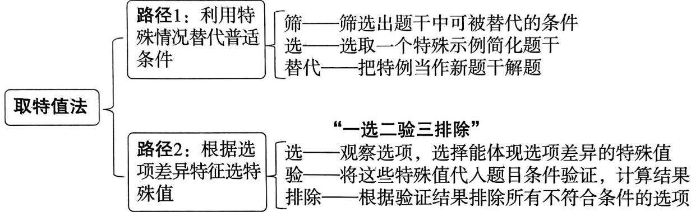

flowchart

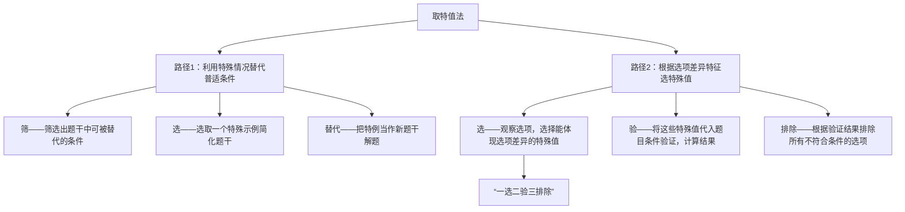

# 快招速练

# 取特值识别函数图象

1.[2025 福建泉州 12 月模拟] 函数 $f(x) = \frac{\mathrm{e}^x + \mathrm{e}^{-x}}{4} \cdot \sin \pi x$ 在区间 $[-3,3]$ 上的图象大致为 ( )

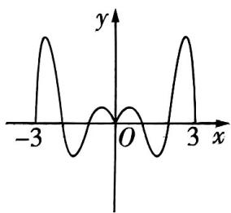

text_image

-3
O
x
y

A

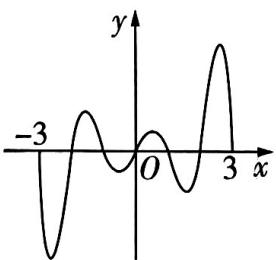

line

| x  | y  |
|----|----|
| -3 | -3 |
| 0  | 0  |
| 3  | 1  |

B

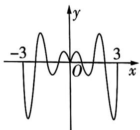

text_image

-3
O
3
x
y

C

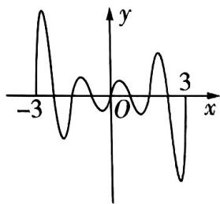

line

| x  | y  |
|----|----|
| -3 | 1  |
| 0  | 0  |
| 3  | -1 |

D

# 利用特殊情况求参

2.[2025 湖南岳阳 12 月模拟]已知函数 $f(x) = \frac{\mathrm{e}^x\cos x}{\mathrm{e}^{2x} + a}$ 是偶函数,则 $a =$ ( )

A. 1

B. e

C. -1

D. 2

# 取特值验证排除

3.[2025 北京四中 11 月期中]已知 a > 0, 记 $y = \sin x$ 在 $[a, 2a]$ 上的最小值为 $s_{a}$ , 在 $[2a, 3a]$ 上的最小值为 $t_{a}$ , 则下列情况不可能的是 ( )

小编说:高中数学每个模块都有属于该模块非常常用的一些解题方法,下面介绍一些函数与导数、立体几何、数列、解析几何模块常用的解题方法,一起来学习一下吧!

解题
技法

A. $s_{a} > 0, t_{a} > 0$

B. $s_{a} < 0, t_{a} < 0$

C. $s_{a} > 0, t_{a} < 0$

D. $s_{a} < 0, t_{a} > 0$

# 取特殊函数秒杀

4. 试题调研原创 已知 $f(x)$ 是定义在 $\mathbb{R}$ 上的偶函数且 $f(0) = -1, g(x) = f(x-1)$ 是奇函数, 则 $f(2026) =$

A.-1

B. 0

C. 1

D.2

# 快招速解与参考答案

1.B 快招识别 选项差异明显→用取特值法路径2:找特殊区间进行排除.

快招解题 当 $2 < x < 3$ 时, $\frac{\mathrm{e}^x + \mathrm{e}^{-x}}{4} > 0$ , $\sin \pi x > 0$ , 则 $f(x) = \frac{\mathrm{e}^x + \mathrm{e}^{-x}}{4} \cdot \sin \pi x > 0$ , 排除 CD; 当 $-3 < x < -2$ 时, $\frac{\mathrm{e}^x + \mathrm{e}^{-x}}{4} > 0$ , $\sin \pi x < 0$ , 则 $f(x) = \frac{\mathrm{e}^x + \mathrm{e}^{-x}}{4} \cdot \sin \pi x < 0$ , 排除 A, 选 B.

方法二: 极限法 当 $x \to 0$ 且 x > 0 时, $f(x) = \frac{\mathrm{e}^{x} + \mathrm{e}^{-x}}{4} \cdot \sin \pi x > 0$ , 同理, 当 $x \to 0$ 且 x < 0 时, $f(x) = \frac{\mathrm{e}^{x} + \mathrm{e}^{-x}}{4} \cdot \sin \pi x < 0$ , 排除 AC; 当 $x \to 3$ 且 x < 3 时, $f(x) = \frac{\mathrm{e}^{x} + \mathrm{e}^{-x}}{4} \cdot \sin \pi x > 0$ , 排除 D. 选 B.

考场秒解快招 对于函数 $f(x) = \frac{\mathrm{e}^x + \mathrm{e}^{-x}}{4} \cdot \sin \pi x$ ，解析式中的“ $\frac{\mathrm{e}^x + \mathrm{e}^{-x}}{4}$ ”并不会影响 $f(x)$ 的零点，只有“ $\sin \pi x$ ”会影响，在[-3,3]上应该有7个零点，排除CD.

2.A 快招识别 $f(x)=f(-x)$ 对任意 x 都成立,用取特值法路径 1:找特殊情况求参.

快招解题 因为 $f(x) = \frac{\mathrm{e}^x\cos x}{\mathrm{e}^{2x} + a}$ 是偶函数, 所以 $f(1) = f(-1)$ , 所以 $\frac{\mathrm{e}\cos 1}{\mathrm{e}^2 + a} = \frac{\mathrm{e}^{-1}\cos(-1)}{\mathrm{e}^{-2} + a}$ , 即 $\frac{\mathrm{e}}{\mathrm{e}^2 + a} = \frac{\mathrm{e}^{-1}}{\mathrm{e}^{-2} + a}$ , 化简可得 $(a - 1)(\mathrm{e}^2 - 1) = 0$ , 解得 $a = 1$ .

方法二 $f(x) = \frac{\mathrm{e}^x\cos x}{\mathrm{e}^{2x} + a} = \frac{\mathrm{e}^x}{\mathrm{e}^{2x} + a}\cdot \cos x,$ 设 $g(x) = \frac{\mathrm{e}^x}{\mathrm{e}^{2x} + a}$ 则 $f(x) = g(x)\cdot \cos x$

因为 $y = \cos x$ 为偶函数，所以 $g(x) = \frac{\mathrm{e}^x}{\mathrm{e}^{2x} + a}$ 为偶函数，

所以 $g(x) = g(-x)$ ，即 $\frac{\mathrm{e}^x}{\mathrm{e}^{2x} + a} = \frac{\mathrm{e}^{-x}}{\mathrm{e}^{-2x} + a}$ ，化简得 $(a - 1)(\mathrm{e}^{2x} - 1) = 0$ ，得 $a = 1$ 。

3.D 快招识别 选项都与 a 有关→用取特值法路径 2: 对 a 取特殊值验证排除.

# 解题技法

分离参数法 分离参数法是一种解决含参函数问题的常用方法. 它的核心思想是将参数与变量分离到等式(不等式)的两边, 从而简化问题, 便于求解.

快招解题

<table><tr><td>一选</td><td>二验</td><td>三排除</td></tr><tr><td>a=π/6</td><td>[a,2a]=[π/6,π/3],[2a,3a]=[π/3,π/2],此时sa&gt;0,ta&gt;0</td><td>A可能</td></tr><tr><td>a=7π/6</td><td>[a,2a]=[7π/6,7π/3],[2a,3a]=[7π/3,7π/2],此时sa&lt;0,ta&lt;0</td><td>B可能</td></tr><tr><td>a=5π/12</td><td>[a,2a]=[5π/12,5π/6],[2a,3a]=[5π/6,5π/4],此时sa&gt;0,ta&lt;0</td><td>C可能</td></tr></table>

排除 ABC, 选 D.

思考 如何证明选项 D 不可能呢？可以利用反证法。假设 $s_{a}<0, t_{a}>0$ 成立，则必然有 $a>\pi$ ，则区间 $[a,2a]$ 与 $[2a,3a]$ 的区间长度大于 $\pi$ 。根据正弦函数性质可知，当区间长度大于 $\pi$ 时，函数 $y=\sin x$ 在区间 $[a,2a]$ 与 $[2a,3a]$ 上的取值必然有正有负，此时 $s_{a}<0, t_{a}<0$ ，与假设矛盾，故 D 不可能。

考场秒解快招 极限法！当 $a \to +\infty$ 时，区间 $[a, 2a]$ 与 $[2a, 3a]$ 包含函数的无数个周期，显然有 $s_a = t_a = -1 < 0$ ；当 $a \to 0^+$ 时，显然有 $s_a > 0, t_a > 0$ 。据此可排除 AB.

4.C 快招识别 $f(x)$ 可以用具体函数代替,用取特值法路径1:找特殊函数简化题干.

快招解题 构造函数 $f(x) = -\cos \frac{\pi x}{2}$ ，[用快招：怎么构造？梳理题意，一个偶函数经过平移变换变成了奇函数，自然可以联想到函数 $y = A \cos (\omega x + \varphi) + b$ （如果是奇函数变成偶函数要联想 $y = A \sin (\omega x + \varphi) + b$ ），再根据四分之一周期是1推出 $x$ 的系数是 $\frac{\pi}{2}$ ，最后根据 $f(0) = -1$ 微调 $A$ 和 $b$ 即可找到具体函数]

则 $f(x)$ 为定义在 $\mathbf{R}$ 上的偶函数，且 $f(0) = -1, g(x) = f(x - 1) = -\sin \frac{\pi x}{2}$ 是奇函数，满足题意，所以 $f(2026) = -\cos \frac{2026\pi}{2} = -\cos \pi = 1$ ，故选C.

方法二: 函数性质法 因为 $g(x)=f(x-1)$ 是奇函数, 所以 $f(x-1)+f(-x-1)=0$ , 所以 $f(x)$ 的图象关于点 $(-1,0)$ 对称.

又 $f(x)$ 是偶函数，则 $f(x) = -f(-2 - x) = -f(x + 2), f(x + 2) = -f(x + 4)$ ，所以 $f(x) = f(x + 4)$ ，

所以 $f(x)$ 是周期函数,4 是它的一个周期.

$f(0) = -1$ ，则 $f(-2) = -f(0) = 1 = f(2), f(2026) = f(4 \times 506 + 2) = f(2) = 1$ ，故选C.

换元法 通过引入新的变量(即换元), 将复杂的函数或方程转化为简单的形式, 便于求解.

# 快招6 “双对称法”定周期，速解抽象函数求值问题

# 快招速通

# 快招识别

题干出现两次关键词→有两组对称→双对称法.

<table><tr><td>关键词</td><td>判断方法</td><td>对称类型</td></tr><tr><td> $f(a-x)=f(b+x)$ </td><td> $\forall x\in\mathbf{R},f(a-x)=f(b+x)\Leftrightarrow f(x)$ 的图象关于直线 $x=\frac{a+b}{2}$ 对称.特别地,若a=b=0,则 $f(x)$ 是偶函数</td><td>关于线对称</td></tr><tr><td> $f(a+x)+f(a-x)=2b$ </td><td> $\forall x\in\mathbf{R},f(a+x)+f(a-x)=2b\Leftrightarrow f(x)$ 的图象关于点(a,b)对称.特别地,若a=b=0,则 $f(x)$ 是奇函数</td><td>关于点对称</td></tr></table>

# 快招结论

结论①:若函数 $f(x)$ 的图象既关于直线x=a对称,又关于直线x=b对称, $a\neq b$ ,则函数 $f(x)$ 的周期为 $2|a-b|$ .  
结论②:若函数 $f(x)$ 的图象既关于点 $(a,c)$ 对称,又关于点 $(b,c)$ 对称, $a\neq b$ ,则函数 $f(x)$ 的周期为 $2|a-b|$ .  
结论③:若函数 $f(x)$ 的图象既关于直线x=a对称,又关于点 $(b,d)$ 对称, $a\neq b$ ,则函数 $f(x)$ 的周期为 $4|a-b|$ .

# 快招速练

# ▶点对称 + 线对称

1.[2025 兰州一中 12 月模拟]已知定义在 $\mathbf{R}$ 上的奇函数 $f(x)$ 满足 $f(x + 2) = f(2 - x)$ , 则 $f(1) + f(2) + f(3) + \cdots + f(2024) =$ ( )

A.0

B. -253

C. 253

D. 506

# ▶点对称 + 点对称

2. 试题调研原创 定义在 $\mathbf{R}$ 上的函数 $f(x)$ 满足 $f(-1 + x) + f(-1 - x) = 0$ , 且 $f(1 + x) + f(1 - x) = 0$ , 当 $x \in [-1, 0)$ 时, $f(x) = e^{x} - a$ , 当 $x \in [0, 1]$ 时, $f(x) = 2x - b$ , 则 $f(x)$ 的最小值为 ( )

A.-6

B. -4

C. -3

D. -2

# 线对称 + 点对称

3. 试题调研原创（多选）若函数 $y = f(x + 1)$ 为偶函数， $y = f(x + 2)$ 为奇函数，且当 $x \in (0,1]$ 时， $f(x) = \ln x$ ，则 （）

A. $f(x)$ 的周期为2

B. $f(\mathbf{e}) = 1$

C. $f(x)$ 为奇函数

D. 当 $x \in [1,2)$ 时, $f(x) = \ln (2 - x)$

解题

技法

构造函数法 根据题目条件,构造一个新的函数并研究这个新函数的性质,从而得到原问题的解.

# 快招速解与参考答案

1.A 快招识别 关键词 1“定义在 R 上的奇函数”⇒关于点对称;关键词 2“f(x+2)=f(2-x)”⇒关于线对称→利用双对称法结论③定周期求值.

快招解题 因为函数 $f(x)$ 为 $\mathbf{R}$ 上的奇函数, 所以 $f(x)$ 的图象关于点 $(0,0)$ 对称; 因为 $f(x + 2) = f(2 - x)$ , [利用结论③] 所以 $f(x)$ 的图象关于直线 $x = 2$ 对称, 所以函数 $f(x)$ 是周期为 8 的周期函数.

又 $f(x + 2) = f(2 - x)$ ，则 $f(5) = -f(1), f(6) = -f(2), f(7) = -f(3), f(8) = -f(4)$ ，

所以 $f(1)+f(2)+f(3)+f(4)+f(5)+f(6)+f(7)+f(8)=0,$

所以 $f(1) + f(2) + f(3) + \cdots + f(2024) = 253 \times 0 = 0.$ 故选 A.

2.D 快招识别 关键词 1“ $f(-1+x)+f(-1-x)=0$ ”⇒关于点对称;关键词 2“ $f(1+x)+f(1-x)=0$ ”⇒关于点对称→利用双对称法结论②定周期求值.

快招解题 由 $f(-1 + x) + f(-1 - x) = 0$ 可得 $f(x)$ 的图象关于点 $(-1,0)$ 对称；由 $f(1 + x) + f(1 - x) = 0$ 可得 $f(x)$ 的图象关于点 $(1,0)$ 对称，

[利用结论②]所以 $f(x)$ 的周期为4.

易知 $f(-1)=f(1)=0$ ，所以 $e^{-1}-a=2-b=0$ ，所以 $a=\frac{1}{e}$ ，b=2，所以 $f(x)$ 在 $[-1,1]$ 上的值域为 $[-2,1-\frac{1}{e})$ 。又 $f(x)$ 的图象关于点 $(1,0)$ 对称，所以当 $x\in[1,3]$ 时， $f(x)\in(\frac{1}{e}-1,2]$ ，即 $f(x)$ 在一个周期内的值域为 $[-2,2]$ ，所以 $f(x)$ 的最小值为-2，故选D。

3.CD 快招识别 关键词 1“ $y=f(x+1)$ 为偶函数”⇒关于线对称;关键词 2“ $y=f(x+2)$ 为奇函数”⇒关于点对称→利用双对称法结论③定周期求值.

快招解题 对于 A, 因为 $y = f(x + 1)$ 为偶函数, 所以 $f(-x + 1) = f(x + 1)$ , 所以 $f(x)$ 的图象关于直线 x = 1 对称; 因为 $y = f(x + 2)$ 为奇函数, 所以 $f(-x + 2) = -f(x + 2)$ , 所以 $f(x)$ 的图象关于点 (2,0) 对称,

[利用结论③]所以 $f(x)$ 的周期为4,A错误.

对于 B, $f(e) = f(e - 2 + 2) = -f(4 - e)$ ，又 $f(x)$ 的图象关于直线 x = 1 对称，故 $-f(4 - e) = -f(e - 2) = -\ln(e - 2) \neq 1$ ，B 错误.

对于 C, 因为点 $(2,0)$ 关于直线 x=1 的对称点是 $(0,0)$ , 所以 $f(x)$ 的图象也关于点 $(0,0)$ 对称, [跳出思维定式: 不要再反复赋值代换得到 $f(-x) = -f(x)$ 后才确定奇偶性, 别忘了点对称与奇函数的紧密联系] 所以 $f(x)$ 为奇函数, C 正确.

对于 D, 当 $x \in [1,2)$ 时, $2 - x \in (0,1]$ , 所以 $f(2 - x) = \ln(2 - x)$ . 又 $f(x)$ 的图象关于直线 x = 1 对称, 所以 $f(x) = f(2 - x) = \ln(2 - x)$ , D 正确. 故选 CD.

考场秒解快招 逻辑分析法！判断出 AB 错误之后，可以直接选 CD，不再讨论 CD 选项，时间也是分数.

# 快招7 巧借等高线妙解方程中的多根问题

# 快招速通

如图1,对于函数 $y=f(x)$ ,若存在不相等的实数 $n_{1},n_{2},n_{3},\cdots$ ,使得 $f(n_{1})=f(n_{2})=f(n_{3})=\cdots=t$ ,则称直线y=t为函数 $f(x)$ 图象的“等高线”.

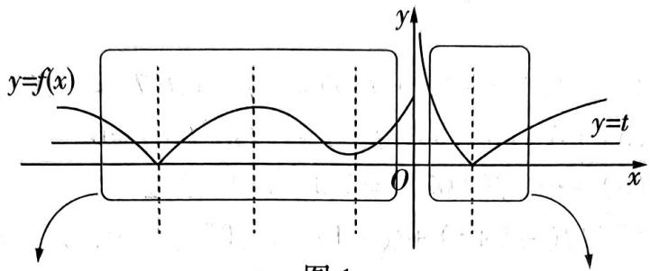

text_image

y=f(x)
y
y=t
O
x
图1

图1

快招识别: 对称求和. 看到二次函数、绝对值函数、三角函数等图象具有对称结构的, 利用对称性求图象与等高线交点的横坐标之和.

快招结论①: 若函数 $y = f(x)$ 图象的等高线上存在两点 $A(x_{1}, y_{1})$ ， $B(x_{2}, y_{2})$ 关于直线 x = h 对称，则 $x_{1} + x_{2} = 2h$ .

快招识别:等高求积. 看到对数函数的绝对值或二次函数, 利用等高线的等高性求其图象与等高线交点的横坐标之积.

快招结论②: 若 $y = \left| \log_{m} x \right| (m > 0 \text{ 且 } m \neq 1)$ 的图象与其等高线 $y = t (t > 0)$ 有两个交点 $A(x_{1}, y_{1})$ ， $B(x_{2}, y_{2})$ ，则 $x_{1}x_{2} = 1$ .

快招结论③: 若 $y = ax^{2} + bx + c (a \neq 0)$ 的图象与其等高线 y = t 有两个交点 $A(x_{1}, y_{1}), B(x_{2}, y_{2})$ ，则

$$
x _ {1} x _ {2} = \frac {c - t}{a}.
$$

# 快招速练

# 等高求积

1. 试题调研原创 已知 $f(x) = \begin{cases} x^2 + x + 1, & x \leqslant 0, \\ e^{-x}, & x > 0, \end{cases}$ 若 $x_1, x_2, x_3$ 互不相等，且 $f(x_1) = f(x_2) = f(x_3)$ ，则 $|x_1x_2x_3|$ 的取值范围为

A. $\left(\frac{1}{2},\frac{1}{2}\ln\frac{4}{3}\right)$

B. $(0, \frac{1}{2} \ln \frac{2}{3})$

C. $(0, \frac{1}{4} \ln \frac{4}{3})$

D. $\left(\frac{1}{2},\frac{1}{4}\ln\frac{2}{3}\right)$

# ▶对称求和

2. 试题调研原创 已知 $f(x) = \begin{cases} \sin \frac{\pi x}{2}, -2 \leqslant x < 0, \\ -\sin \frac{\pi x}{2}, 0 \leqslant x \leqslant 2, \\ \ln (x - 2), x > 2, \end{cases}$ 关于 $x$ 的方程 $f(x) - t = 0 (t \in \mathbb{R})$ 恰有：

个不同的实数解 $x_{1}, x_{2}, x_{3}, x_{4}, x_{5}$ ，则 $x_{1} + x_{2} + x_{3} + x_{4} + x_{5}$ 的取值范围为

A. $(-2,3)$

B. $(1,3)$

C. $(1 + \frac{2}{\mathrm{e}},3)$

D. $(2 + \frac{1}{\mathrm{e}},3)$

# 等高求积 + 对称求和

3.[2025江西南昌11月期中](多选)已知函数 $f(x)=\left\{\begin{aligned}&|4^{x}-1|,x<\frac{1}{2},\\&|\log_{2}x|,x\geqslant\frac{1}{2},\end{aligned}\right.$ 若存在实数m使得关于x的方程 $f(x)=m$ 有四个不同的实数解 $x_{1},x_{2},x_{3},x_{4}$ ，且 $x_{1}<x_{2}<x_{3}<x_{4}$ ，则（）

A. $f(x_{3}x_{4}) = 0$

B. $x_{1} + x_{2} < 0$

C. $x_{2} + f(x_{3}) > 1$

D. $x_{3} + f(x_{2}) > 1$

# 快招速解与参考答案

1.C 快招识别 二次函数 + 求积 → 等高求积 → 利用等高线的等高性求交点横坐标之积.

快招解题 设 $f(x_{1}) = f(x_{2}) = f(x_{3}) = t$ ，不妨设 $x_{1} < x_{2} < x_{3}$ ，作出函数 $y = f(x)$ 的图象和直线 $y = t$ ，如图2所示，易知 $\frac{3}{4} < t < 1$ ，且 $x_{1} < -\frac{1}{2} < x_{2} < 0 < x_{3}$ .

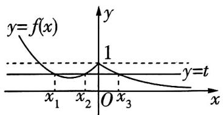

text_image

y=f(x)
1
y=t
x₁ x₂ O x₃
x

图2

[利用结论③]令 $x^{2} + x + 1 = t$ ，可得 $x_{1}x_{2} = 1 - t.$

$f(x_{3}) = \mathrm{e}^{-x_{3}} = t$ ，即 $x_{3} = -\ln t$ ，所以 $|x_{1}x_{2}x_{3}| = |- \ln t|\cdot |1 - t| = -(1 - t)\ln t = (1 - t)\ln \frac{1}{t},$

因为函数 $y = 1 - t$ 和 $y = \ln \frac{1}{t}$ 都是减函数，且当 $\frac{3}{4} < t < 1$ 时二者都大于0，

所以 $y = (1 - t)\ln \frac{1}{t}$ 在 $(\frac{3}{4}, 1)$ 上单调递减，其值域为 $(0, \frac{1}{4}\ln \frac{4}{3})$ ，即 $|x_1 x_2 x_3| \in (0, \frac{1}{4}\ln \frac{4}{3})$ . 故选 C.

2.D 快招识别 三角函数 + 求和 → 对称求和 → 利用等高线的对称性求交点横坐标之和.

快招解题 $f(x) - t = 0$ ，即 $f(x) = t$ ，不妨设 $x_{1} < x_{2} < x_{3} < x_{4} < x_{5}$ ，作出函数 $y = f(x)$ 的图象和直线 $y = t$ ，如图3所示，由题意知 $-1 < t < 0$ 且 $-2 < x_{1} < -1 < x_{2} < 0 < x_{3} < 1 < x_{4} < 2, 2 + \frac{1}{\mathrm{e}} < x_{5} < 3,$

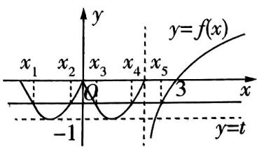

text_image

y
x₁ x₂ x₃ x₄ x₅ y=f(x)
-1 3
y=t

图3

[利用结论①]由正弦函数图象的对称性可知 $(x_{1},t),(x_{2},t)$ 关于

直线 $x = -1$ 对称， $(x_{3}, t), (x_{4}, t)$ 关于直线 $x = 1$ 对称，所以 $x_{1} + x_{2} = -2, x_{3} + x_{4} = 2$ ，所以

$x_{1} + x_{2} + x_{3} + x_{4} + x_{5} = x_{5}\in (2 + \frac{1}{\mathrm{e}},3).$ 故选D.

3.ABD 快招识别 绝对值函数 + 求积与求和 → 利用等高线的等高性求交点横坐标之积利用对称性求图象与等高线交点横坐标之和.

快招解题 作出函数 $y = f(x)$ 的图象和直线 $y = m$ ，如图4所示。当 $x < 0$ 时，函数 $f(x)$ 单调递减，此时 $f(x) \in (0,1)$ ；当 $0 \leqslant x < \frac{1}{2}$ 时，函数 $f(x)$ 单调递增，此时 $f(x) \in [0,1)$ ；当 $\frac{1}{2} \leqslant x < 1$ 时，函数 $f(x)$ 单调递减，此时 $f(x) \in (0,1]$ ；当 $x \geqslant 1$ 时，函数 $f(x)$ 单调递增，此时 $f(x) \in [0, +\infty)$ 。

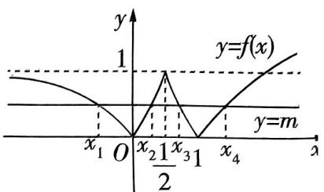

text_image

y
1
y=f(x)
x₁ O x₂ 1/2 x₃ 1 x₄
y=m
x

图4

由关于 $x$ 的方程 $f(x) = m$ 有四个不同的实数解 $x_{1}, x_{2}, x_{3}, x_{4}$ , 知函数 $y = f(x)$ 的图象与直线 $y = m$ 有 4 个交点, 即 $m \in (0,1)$ , 且 $x_{1} < 0 < x_{2} < \frac{1}{2} < x_{3} < 1 < x_{4} < 2$ .

[利用结论②]由结论②可知 $x_{3}x_{4} = 1$ ，所以 $f(x_{3}x_{4}) = f(1) = 0$ ，A正确.

[利用结论①]由结论①, 假设 $f(x)$ 的图象在 $\left[-\frac{1}{2}, \frac{1}{2}\right]$ 上关于 $y$ 轴对称, 则 $x_1 + x_2 = 0$ , 但由图可知 $y$ 轴左侧的图象是向左“歪”的, 所以 $x_1 + x_2 < 0$ , B 正确. [另解: 此处也可以直接利用基本不等式. 由 $|4^{x_1} - 1| = |4^{x_2} - 1|$ 得 $4^{x_1} + 4^{x_2} = 2$ (一正二定), 又 $4^{x_1} + 4^{x_2} \geqslant 2\sqrt{4^{x_1 + x_2}}$ , 当且仅当 $4^{x_1} = 4^{x_2}$ , 即 $x_1 = x_2$ 时取等号 (三相等), 故 $2\sqrt{4^{x_1 + x_2}} < 2$ , 即 $x_1 + x_2 < 0$ ]

因为 $f(x_{2})=f(x_{3})$ ，所以 $x_{2}+f(x_{3})=x_{2}+f(x_{2})=x_{2}+4^{x_{2}}-1,x_{3}+f(x_{2})=x_{3}+f(x_{3})=x_{3}-\log_{2}x_{3}$ ，[破瓶颈：对于多变量问题，解题的一般思路是根据已知条件找出变量之间的关系将多变量问题化为单变量问题求解]

设 $g(x) = x + 4^x - 1$ ，易知 $g(x) = x + 4^x - 1$ 在 $[0, \frac{1}{2}]$ 上单调递增，对于 $x \in (0, \frac{1}{2}), g(0) < g(x) < g(\frac{1}{2})$ ，即 $0 < g(x) < \frac{3}{2}$ ，则 $0 < x_2 + f(x_3) < \frac{3}{2}$ ，C 错误.

设 $h(x) = x - \log_2x, x \in (\frac{1}{2}, 1)$ , 则 $h'(x) = 1 - \frac{1}{x\ln 2}$ , 且 $h'(x)$ 在 $(\frac{1}{2}, 1)$ 上单调递增, 则 $h'(x) < 1 - \frac{1}{\ln 2} = \frac{\ln 2 - 1}{\ln 2} < 0$ , 所以 $h(x)$ 在 $(\frac{1}{2}, 1)$ 上单调递减, 所以 $h(x) = x - \log_2x > 1 - \log_21 = 1$ , 即 $x_3 + f(x_2) > 1$ , D 正确.

故选 ABD.

# 快招8 性质分析法巧解函数压轴选择题

# 快招速通

# 1 具体函数性质分析法

具体函数压轴题设问多样,如函数不等式问题、零点问题、整数解问题、恒成立问题等,但共同点都是回归基本性质.具体函数性质分析有二看:一看奇偶性、二看单调性.

<table><tr><td rowspan="2">快招速解</td><td>一看奇偶性</td><td>奇函数结论:1f(x)=m·ax+1/ax-1(x≠0)或f(x)=m·ax-1/ax+1(x≠0),其中m≠0,a&gt;0且a≠1;2f(x)=±(ax-a-x),其中a&gt;0且a≠1;3f(x)=logax+m/x-m或f(x)=logax-m/x+m,其中m≠0,a&gt;0且a≠1;4f(x)=logax(√bx2x2+1±bx),其中a&gt;0且a≠1,b≠0.偶函数结论:5f(x)=±(ax+a-x),其中a&gt;0且a≠1;6f(x)=logax(amx+1)-mx/2,其中m≠0,a&gt;0且a≠1;7f(|x|)类函数</td></tr><tr><td>二看单调性</td><td>判断函数单调性有四法:1定义法,2导数法,3性质法(增函数+增函数=增函数,减函数+减函数=减函数),4复合函数单调性法(同增异减)</td></tr></table>

# 2 抽象函数性质分析法

抽象函数压轴题多为直接求值、求周期、求对称中心和对称轴. 抽象函数性质分析有二看: 一看图象对称性、二看周期性.

<table><tr><td rowspan="2">快招速解</td><td>一看图象对称性</td><td>单对称→轴对称、中心对称结论;双对称→周期结论.详见【快招6】</td></tr><tr><td>二看周期性</td><td>周期T=2a(a≠0):1f(x+a)=±m/f(x)(m≠0);2f(x+a)=-f(x);3f(x+a)=f(x-a);4f(x+a)=1-f(x).周期T=3a(a≠0):5f(x+a)=1-1/f(x);6f(x+a)=-1/1+f(x).周期T=4a(a≠0):7f(x+a)=1+f(x)/1-f(x)</td></tr></table>

# 快招速练

# 具体函数性质解不等式

1.[2025 贵州省 12 月联考]已知函数 $f(x) = \log_2(4^x + 1) - x + \sqrt{x^2 - 1}$ ，则关于 $x$ 的不等式 $f(x + 2) > f(2x)$ 的解集为 ( )

A. $(-1, -\frac{1}{2})$

B. $(-1, -\frac{2}{3}) \cup (\frac{1}{2}, 2)$

C. $(-\frac{2}{3}, -\frac{1}{2}] \cup [\frac{1}{2}, 2)$

D. $[-1, -\frac{1}{2}] \cup [\frac{1}{2}, 2)$

# 具体函数性质求参数取值范围

2.[2025 成都实验外国语学校 11 月期中] 函数 $h(x) = \frac{\mathrm{e}^{2x} - 1}{\mathrm{e}^x} + \frac{2}{2^x + 1}$ , 不等式 $h(ax^2 - 2) + h(2ax) \leqslant 2$ 对任意 $x \in \mathbb{R}$ 恒成立, 则实数 $a$ 的取值范围是 ( )

A. $(-2, +\infty)$

B. $(-\infty, 2)$

C. $(0,2)$

D. $[-2,0]$

# 抽象函数性质求值、求周期、求对称中心

3.[2025 辽宁省名校 11 月期中联考](多选)已知函数 $f(x)$ 及其导函数 $f'(x)$ 的定义域均为 $\mathbf{R}$ , 若 $f(x+1)$ 与 $f'(x)$ 均为偶函数, 且 $f(-1)+f(1)=2$ , 则下列结论正确的是 ( )

A. $f'(1)=0$

B. 4 是 $f(x)$ 的一个周期

C. $f(1012) = 0$

D. $f(x)$ 的图象关于点(6,1)对称

# 快招速解与参考答案

1.C 快招解题 由 $x^{2} - 1 \geqslant 0$ 可得 $x \leqslant -1$ 或 $x \geqslant 1$ , 即函数 $f(x)$ 的定义域为 $(- \infty, -1] \cup [1, +\infty)$ ,

$$
\begin{array}{l} f (x) = \log_ {2} \left(4 ^ {x} + 1\right) - x + \sqrt {x ^ {2} - 1} = \log_ {2} \left(4 ^ {x} + 1\right) - \log_ {2} 2 ^ {x} + \sqrt {x ^ {2} - 1} = \log_ {2} \frac {4 ^ {x} + 1}{2 ^ {x}} + \sqrt {x ^ {2} - 1} = \\ \log_ {2} \left(2 ^ {x} + 2 ^ {- x}\right) + \sqrt {x ^ {2} - 1}, \\ \end{array}
$$

[利用偶函数结论⑤]因为 $y = 2^{x} + 2^{-x}, y = \sqrt{x^{2} - 1}$ 都是偶函数,所以函数 $f(x)$ 为偶函数.

[利用定义法判断单调性]任取 $x_{1}, x_{2} \in [1, +\infty), x_{1} > x_{2}$ , 则 $2^{x_{1}} > 2^{x_{2}} \geqslant 2, x_{1} + x_{2} > 2, 2^{x_{1} + x_{2}} > 4$ , 令 $g(x) = 2^{x} + 2^{-x}$ , 则 $g(x_{1}) - g(x_{2}) = 2^{x_{1}} + \frac{1}{2^{x_{1}}} - (2^{x_{2}} + \frac{1}{2^{x_{2}}}) = 2^{x_{1}} - 2^{x_{2}} + (\frac{1}{2^{x_{1}}} - \frac{1}{2^{x_{2}}}) = 2^{x_{1}} - 2^{x_{2}} - \frac{2^{x_{1}} - 2^{x_{2}}}{2^{x_{1} + x_{2}}} = \frac{(2^{x_{1}} - 2^{x_{2}})(2^{x_{1} + x_{2}} - 1)}{2^{x_{1} + x_{2}}} > 0$ , 即 $g(x_{1}) > g(x_{2})$ , 所以函数 $g(x) = 2^{x} + 2^{-x}$ 在 $[1, x]$ .

$+\infty$ ) 上为增函数.

[利用“同增异减”判断单调性]令 $u = g(x)$ , 因为函数 $y = \log_2 u$ 在 $u \in (0, +\infty)$ 上为增函数, 所以函数 $y = \log_2 (2^{-x} + 2^x)$ 在 $x \in [1, +\infty)$ 上为增函数, [用快招: 判断复合函数的单调性牢记“同增异减”, 即在同一定义域内, 若 $y = f(u)$ 是增函数, $u = g(x)$ 是增(减)函数, 则 $y = f(g(x))$ 是增(减)函数; 若 $y = f(u)$ 是减函数, $u = g(x)$ 是增(减)函数, 则 $y = f(g(x))$ 是减(增)函数]

因为函数 $y = \sqrt{x^2 - 1}$ 在 $[1, +\infty)$ 上为增函数，所以函数 $f(x)$ 在 $[1, +\infty)$ 上为增函数，在 $(- \infty, -1]$ 上为减函数，

由 $f(x + 2) > f(2x)$ 可得 $f(|x + 2|) > f(|2x|)$ ，则 $|x + 2| > |2x| \geqslant 1$ ，解得 $-\frac{2}{3} < x \leqslant -\frac{1}{2}$ 或 $\frac{1}{2} \leqslant x < 2$ ，故原不等式的解集为 $(- \frac{2}{3}, -\frac{1}{2}] \cup [\frac{1}{2}, 2)$ . 故选 C.

考场秒解快招 特值验证法！令 $x=\frac{1}{2}$ ，则 $f(x+2)-f(2x)=f(\frac{5}{2})-f(1)=\log_{2}\frac{33}{5}+\frac{\sqrt{21}-3}{2}>0$ ，排除 AB.

令 $x = -1$ ，则 $f(x + 2) - f(2x) = f(1) - f(-2) = \log_2\frac{80}{17} -3 - \sqrt{3} < 0$ ，排除D.选C.

2.D 快招解题 [利用奇函数结论②] 因为 $h(x) = \frac{\mathrm{e}^{2x} - 1}{\mathrm{e}^x} + \frac{2}{2^x + 1} = \mathrm{e}^x - \mathrm{e}^{-x} + \frac{2}{2^x + 1}$ ,

所以 $h(x) + h(-x) = \frac{2}{2^x + 1} + e^x - e^{-x} + \frac{2}{2^{-x} + 1} + e^{-x} - e^x = \frac{2}{2^x + 1} + \frac{2 \cdot 2^x}{2^x + 1} = 2,$

令 $f(x)=h(x)-1$ ，则 $f(x)+f(-x)=0$ ，又 $f(x)$ 的定义域为R，故 $f(x)$ 为奇函数，[破瓶颈：当函数 $f(x)+f(-x)$ 为定值时，可构造出奇函数]

[利用导数法判断单调性] 又 $f'(x) = \left(\frac{2}{2^x + 1}\right)' + \left(\mathrm{e}^x - \mathrm{e}^{-x}\right)' = \mathrm{e}^x + \frac{1}{\mathrm{e}^x} - \frac{\ln 4}{2^x + \frac{1}{2^x} + 2}$ ,

$e^{x}+\frac{1}{e^{x}}\geqslant2$ ，当且仅当 $e^{x}=\frac{1}{e^{x}}$ ，即x=0时等号成立，

$-\frac{\ln 4}{2^x + \frac{1}{2^x} + 2} \geqslant -\frac{\ln 4}{4} = -\frac{\ln 2}{2}$ , 当且仅当 $2^x = \frac{1}{2^x}$ , 即 $x = 0$ 时等号成立,

所以 $f'(x) \geqslant 2 - \frac{\ln 2}{2} > 0$ ，故 $f(x)$ 在 $\mathbb{R}$ 上单调递增.

因为 $h(ax^2 - 2) + h(2ax) \leqslant 2$ ，所以 $f(ax^2 - 2) + f(2ax) \leqslant 0$ ，即 $f(ax^2 - 2) \leqslant f(-2ax)$ ，

所以关于 $x$ 的不等式 $ax^2 + 2ax - 2 \leqslant 0$ 在 $\mathbf{R}$ 上恒成立, 显然当 $a = 0$ 时满足题意; [易遗漏:

不要忘记 a=0 这一特殊情况]

当 $a \neq 0$ 时， $\left\{ \begin{array}{l} a < 0, \\ \Delta = 4a^2 + 8a \leqslant 0, \end{array} \right.$ 解得 $-2 \leqslant a < 0$ .

综上, $a\in[-2,0]$ .故选D.

# 3.ABD 快招解题

<table><tr><td>性质分析</td><td>快招速解</td></tr><tr><td>复合函数求导</td><td>f(x+1)为偶函数→f(-x+1)=f(x+1),对f(-x+1)=f(x+1)两边同时求导→-f&#x27;(1-x)=f&#x27;(x+1),令x=0,得-f&#x27;(1)=f&#x27;(1),解得f&#x27;(1)=0,A正确</td></tr><tr><td>双对称法定周期</td><td>f&#x27;(x)为偶函数→f&#x27;(-x)=f&#x27;(x),即-f(-x)=f(x)+c(c为常数),f(-1)+f(1)=2→c=-2→f(x)+f(-x)=2[中心对称],f(x+1)为偶函数→f(-x+1)=f(x+1)→f(x)=f(2-x)[轴对称],所以4是f(x)的周期,[另解:若f(x+a)与f&#x27;(x)均为偶函数,则函数f(x)的周期为4a,秒得周期为4]B正确</td></tr><tr><td>周期求值</td><td>由B知f(x)+f(-x)=2,所以f(0)=1,所以f(1012)=f(4×253)=f(0)=1,C错误</td></tr><tr><td>对称结论找对称中心</td><td>因为f(x)+f(-x)=2,f(x)=f(2-x),所以f(2-x)+f(2+x)=2,故f(x)的图象关于点(2,1)对称,由于4是f(x)的周期,故f(x)的图象关于点(6,1)对称,D正确</td></tr></table>

考场秒解快招 构造特殊函数！根据题目条件猜测三角函数可能满足题意，故令 $f(x) = \sin \frac{\pi x}{2} + 1$ ，则 $f(x + 1) = \sin \frac{\pi (x + 1)}{2} + 1 = \cos \frac{\pi x}{2} + 1$ ，为偶函数，易知 $f'(x) = \frac{\pi}{2}\cos \frac{\pi x}{2}$ 为偶函数， $f(-1) + f(1) = 2$ ，满足题意，则 $f'(1) = \frac{\pi}{2}\cos \frac{\pi}{2} = 0$ . $f(x)$ 的最小正周期为 $4, f(1012) = \sin 506\pi + 1 = 1$ , $f(x)$ 的图象关于点(6,1)对称. 故选 ABD.

# 快招9 超越不等式放缩法快解函数比大小问题

# 快招速通

# 快招识别

在函数比大小问题中, 当待比较的目标数式中含有 $\mathrm{e}^x$ , $\ln x$ , $\sin x$ , $\tan x$ 等结构时, 可使用超越不等式结论放缩快速比大小. 解题时, 先仔细观察要比较大小的数式, 根据题目中数式的结构, 选择对应的超越不等式放缩求解.

# 快招结论

结论① 指数型超越不等式: $e^{x} \geqslant x + 1$ (当且仅当 $x = 0$ 时取等号).

结论② 对数型超越不等式: $\ln x \leqslant x - 1$ (当且仅当 x = 1 时取等号).

结论③ 三角型超越不等式: $\sin x \leqslant x \leqslant \tan x (x \in [0, \frac{\pi}{2}))$ (当且仅当 $x = 0$ 时取等号).

# 快招速练

# ▶对数型 + 三角型超越不等式比大小

1.[2025 福建宁德 12 月联考]已知 $a = \sin \frac{1}{2}, b = \ln \frac{5}{3}, c = 2^{-\frac{1}{2}}$ ，则 （）

A. $c < b < a$

B. $a < b < c$

C. $a < c < b$

D. $b < a < c$

# ▶指数型 + 对数型超越不等式比大小

2. 试题调研原创 已知 $a = \ln 1.01, b = \mathrm{e}^{-0.99}, c = \frac{1}{101}$ , 则 ( )

A. $a < b < c$

B. $a < c < b$

C. $c < b < a$

D. $c < a < b$

# 快招速解与参考答案

1.B 快招识别 目标式中含有 $\sin x$ 与 $\ln x$ 结构, 利用快招结论②③解题.

快招解题 [利用结论③]令 $f(x) = x - \sin x (x > 0)$ ，则 $f'(x) = 1 - \cos x \geqslant 0$ 且不恒等于 0，所以 $f(x)$ 在 $(0, +\infty)$ 上单调递增，所以 $f(x) > 0 - \sin 0 = 0$ ，则当 $x > 0$ 时，有 $x > \sin x$ .

[利用结论②]令 $g(x) = \ln x - x + 1$ ，则 $g'(x) = \frac{1}{x} - 1 = \frac{1 - x}{x}$ ，当 $0 < x < 1$ 时， $g'(x) > 0$ ，当 $x > 1$ 时， $g'(x) < 0$ ，所以 $g(x)$ 在 $(0,1)$ 上单调递增，在 $(1, +\infty)$ 上单调递减，则 $g(x) \leqslant g(1) = 0$ ，则 $x - 1 \geqslant \ln x$ 。[结论快招：在小题中，可直接利用这两个超越不等式实现放缩。上述过程即对这两个超越不等式的证明]

向量法 通过向量的运算(如向量加法、减法、数乘、数量积等)来解决几何问题. 向量法适用于解决位置、方向、长度和夹角等问题.

所以 $\sin \frac{1}{2} < \frac{1}{2} = \ln e^{\frac{1}{2}} < \ln \frac{5}{3} < \frac{2}{3} < \frac{\sqrt{2}}{2} = 2^{-\frac{1}{2}}$ ，故选B.

方法二: 中间值法 $a = \sin \frac{1}{2} < \sin \frac{\pi}{6} = \frac{1}{2}, b = \ln \frac{5}{3} > \ln \sqrt{e} = \frac{1}{2}, c = 2^{-\frac{1}{2}} = \frac{1}{\sqrt{2}} > \frac{1}{2}$ ，则 a 最小.

下面比较 b 与 c，由 $\left(\frac{5}{3}\right)^{3}<\mathrm{e}^{2}$ 得 $\left(\frac{5}{3}\right)^{\frac{3}{2}}<\mathrm{e}$ ，则 $\left(\frac{5}{3}\right)^{\sqrt{2}}<\left(\frac{5}{3}\right)^{\frac{3}{2}}<\mathrm{e}$ ，[释疑难：通过指对互化，将 $\frac{1}{\sqrt{2}}$ 变形成 $\ln e^{\frac{1}{\sqrt{2}}}$ ，转化为比较 $\left(\frac{5}{3}\right)^{\sqrt{2}}$ 与 e 的大小关系， $\left(\frac{5}{3}\right)^{\sqrt{2}}$ 难以直接运算，故由 $\sqrt{2}<\frac{3}{2}$ 放缩为比较 $\left(\frac{5}{3}\right)^{\frac{3}{2}}$ 与 e 的大小即可]

所以 $\ln \frac{5}{3} < \ln \mathrm{e}^{\frac{1}{\sqrt{2}}} = \frac{1}{\sqrt{2}}$ ，即 $b < c$ .

综上， $a < b < c$ ，故选B.

2.D 快招识别 目标式中含有 $e^{x}$ 与 $\ln x$ 结构, 利用快招结论①②解题.

快招解题 [利用结论②] 由 $\ln x \leqslant x - 1$ 知 $a = \ln 1.01 < 1.01 - 1 = 0.01$ .

[利用结论①]令 $f(x)=\mathrm{e}^{x}-x-1$ ，则 $f'(x)=\mathrm{e}^{x}-1$ ，所以当x<0时， $f'(x)<0,f(x)$ 单调递减，当x>0时， $f'(x)>0,f(x)$ 单调递增，所以 $f(x)\geqslant f(0)=0$ ，即 $e^{x}\geqslant x+1$ ，所以 $b=e^{-0.99}>-0.99+1=0.01=\frac{1}{100}>\frac{1}{101}=c$ ，且b>a.

[利用结论②]由 $\ln x \leqslant x - 1$ 知 $\ln \frac{1}{x} \leqslant \frac{1}{x} - 1$ , [结论快招: 由超越不等式 $\ln x \leqslant x - 1$ 与 $e^x \geqslant x + 1$ 可直接比较得出 $a$ 与 $b, b$ 与 $c$ 的大小关系, 但比较不出 $a$ 与 $c$ 的大小关系, 故结合目标式的结构特征, 对 $\ln x \leqslant x - 1$ 中的 $x$ 取倒数, 得到新的超越不等式后再放缩比较]

即 $-\ln x \leqslant \frac{1}{x} - 1$ ，则 $-\ln 1.01 < \frac{1}{1.01} - 1 = \frac{100}{101} - 1 = -\frac{1}{101}$ ，所以 $\ln 1.01 > \frac{1}{101}$ ，即 $a > c$ .

综上, $c < a < b$ , 故选 D. [构造函数: 对于 $a$ 与 $c$ 的大小关系的判断, 若想不到利用超越不等式变形处理, 也可构造函数求解. $a = \ln 1.01 = \ln \frac{101}{100} = -\ln (1 - \frac{1}{101})$ , 令 $g(x) = x + \ln (1 - x)$ , 求导可知 $g(x)$ 在 $[0,1)$ 上单调递减, 则 $g(\frac{1}{101}) = \frac{1}{101} + \ln \frac{100}{101} < g(0) = 0$ , 即 $a > c]$

考场秒解快招 估值法！根据泰勒展开式 $\ln (x + 1) = x - \frac{1}{2} x^2 +\frac{1}{3} x^3 -\dots ,\mathrm{e}^x = 1 + x+$ $\frac{1}{2!} x^2 +\dots$ ，估值得 $a = \ln 1.01 = \ln (1 + 0.01)\approx 0.01 - \frac{1}{2}\times 0.01^2 = 0.00995,b = \mathrm{e}^{-0.99}\approx$ $1 - 0.99\approx 0.01$ ，又 $c = \frac{1}{101}\approx 0.00990$ ，所以 $c <   a <   b$ ，故选D.

# 快招10 不等式恒成立与能成立的两大妙解技巧

# 快招速通

<table><tr><td colspan="2">设问角度</td><td>恒成立</td><td>能成立</td></tr><tr><td rowspan="2">快招速解</td><td>分离参数</td><td colspan="2">【第1步】分离参数:若待求范围的量为参数a,可将参数a移到不等式一边,其他式子(不含a)在另一边.【第2步】构造函数:将上述不含a的式子构造成新函数g(x),将原问题转化为函数g(x)的值域问题.【第3步】得参数范围:求导或结合函数特征求g(x)的最值或临界值,由函数最值或临界值得所求参数a的取值范围</td></tr><tr><td>分类讨论</td><td colspan="2">【第1步】构造函数:一般通过移项、作差构造含参函数h(x).【第2步】分类讨论:对参数a分类,讨论各个情况下h(x)的单调性及取值情况.一般根据导函数值及函数值在待求区间上的符号确定分类讨论的标准.【第3步】得参数范围:总结符合题意的情况,即得参数a的取值范围</td></tr><tr><td colspan="2">快招结论</td><td>结论1:若a&gt;f(x)对x∈D恒成立,则a&gt;f(x)max(x∈D).结论2:若a结论3:若∃x∈D,使得a&gt;f(x)有解,则a&gt;f(x)min(x∈D).结论4:若∃x∈D,使得a结论5:若∃x∈D,使得a结论6:若∃x∈D,使得a结论7:若∃x∈D,使得a结论8:若∃x∈D,使得a结论9:若∃x∈D,使得a结论10:若∃x∈D,使得a结论11:若∃x∈D,使得a结论12:若∃x∈D,使得a结论13:若∃x∈D,使得a结论14:若∃x∈D,使得a结论15:若∃x∈D,使得a结论16:若∃x∈D,使得a结论17:若∃x∈D,使得a结论18:若∃x∈D,使得a结论19:若∃x∈D,使得a结论20:若∃x∈D,使得a结论21:若∃x∈D,使得a结论22:若∃x∈D,使得a结论23:若∃x∈D,使得a结论24:若∃x∈D,使得a结论25:若∃x∈D,使得a结论26:若∃x∈D,使得a结论27:若∃x∈D,使得a结论28:若∃x∈D,使得a结论29:若∃x∈D,使得a结论30:若∃x∈D,使得a结论31:若∃x∈D,使得a结论32:若∃x∈D,使得a结论33:若∃x∈D,使得a结论34:若∃x∈D,使得a结论35:若∃x∈D,使得a结论36:若∃x∈D,使得a结论37:若∃x∈D,使得a结论38:若∃x∈D,使得a结论39:若∃x∈D,使得a结论40:若∃x∈D,使得a结论41:若∃x∈D,使得a结论42:若∃x∈D,使得a结论43:若∃x∈D,使得a结论44:若∃x∈D,使得a结论45:若∃x∈D,使得a结论46:若∃x∈D,使得a结论47:若∃x∈D,使得a结论48:若∃x∈D,使得a结论49:若∃x∈D,使得a结论50:若∃x∈D,使得a结论51:若∃x∈D,使得a结论52:若∃x∈D,使得a结论53:若∃x∈D,使得a结论54:若∃x∈D,使得a结论55:若∃x∈D,使得a结论56:若∃x∈D,使得a结论57:若∃x∈D,使得a结论58:若∃x∈D,使得a结论59:若∃x∈D,使得a结论60:若∃x∈D,使得a结论61:若∃x∈D,使得a结论62:若∃x∈D,使得a结论63:若∃x∈D,使得a结论64:若∃x∈D,使得a结论65:若∃x∈D,使得a结论66:若∃x∈D,使得a结论67:若∃x∈D,使得a结论68:若∃x∈D,使得a结论69:若∃x∈D,使得a结论70:若∃x∈D,使得a结论71:若∃x∈D,使得a结论72:若∃x∈D,使得a结论73:若∃x∈D,使得a结论74:若∃x∈D,使得a结论75:若∃x∈D,使得a结论76:若∃x∈D,使得a结论77:若∃x∈D,使得a结论78:若∃x∈D,使得a结论79:若∃x∈D,使得a结论80:若∃x∈D,使得a结论81:若∃x∈D,使得a结论82:若∃x∈D,使得a结论83:若∃x∈D,使得a结论84:若∃x∈D,使得a结论85:若∃x∈D,使得a结论86:若∃x∈D,使得a结论87:若∃x∈D,使得a结论88:若∃x∈D,使得a结论89:若∃x∈D,使得a结论90:若∃x∈D,使得a结论91:若∃x∈D,使得a结论92:若∃x∈D,使得a结论93:若∃x∈D,使得a结论94:若∃x∈D,使得a结论95:若∃x∈D,使得a结论96:若∃x∈D,使得a结论97:若∃x∈D,使得a结论98:若∃x∈D,使得a结论99:若∃x∈D,使得a结论100:若∃x∈D,使得a结论101:若∃x∈D,使得a结论102:若∃x∈D,使得a结论103:若∃x∈D,使得a结论104:若∃x∈D,使得a结论105:若∃x∈D,使得a结论106:若∃x∈D,使得a结论107:若∃x∈D,使得a结论108:若∃x∈D,使得a结论109:若∃x∈D,使得a结论110:若∃x∈D,使得a结论111:若∃x∈D,使得a结论112:若∃x∈D,使得a结论113:若∃x∈D,使得a结论114:若∃x∈D,使得a结论115:若∃x∈D,使得a结论116:若∃x∈D,使得a结论117:若∃x∈D,使得a结论118:若∃x∈D,使得a结论119:若∃x∈D,使得a结论120:若∃x∈D,使得a结论121:若∃x∈D,使得a结论122:若∃x∈D,使得a结论123:若∃x∈D,使得a结论124:若∃x∈D,使得a结论125:若∃x∈D,使得a结论126:若∃x∈D,使得a结论127:若∃x∈D,使得a结论128:若∃x∈D,使得a结论129:若∃x∈D,使得a结论130:若∃x∈D,使得a结论131:若∃x∈D,使得a结论132:若∃x∈D,使得a结论133:若∃x∈D,使得a结论134:若∃x∈D,使得a结论135:若∃x∈D,使得a结论136:若∃x∈D,使得a结论137:若∃x∈D,使得a结论138:若∃x∈D,使得a结论139:若∃x∈D,使得a结论140:若∃x∈D,使得a结论141:若∃x∈D,使得a结论142:若∃x∈D,使得a结论143:若∃x∈D,使得a结论144:若∃x∈D,使得a结论145:若∃x∈D,使得a结论146:若∃x∈D,使得a结论147:若∃x∈D,使得a结论148:若∃x∈D,使得a结论149:若∃x∈D,使得a结论150:若∃x∈D,使得a结论151:若∃x∈D,使得a结论152:若∃x∈D,使得a结论153:若∃x∈D,使得a结论154:若∃x∈D,使得a结论155:若∃x∈D,使得a结论156:若∃x∈D,使得a结论157:若∃x∈D,使得a结论158:若∃x∈D,使得a结论159:若∃x∈D,使得a结论160:若∃x∈D,使得a结论161:若∃x∈D,使得a结论162:若∃x∈D,使得a结论163:若∃x∈D,使得a结论164:若∃x∈D,使得a结论165:若∃x∈D,使得a结论166:若∃x∈D,使得a结论167:若∃x∈D,使得a结论168:若∃x∈D,使得a结论169:若∃x∈D,使得a结论170:若∃x∈D,使得a结论171:若∃x∈D,使得a结论172:若∃x∈D,使得a结论173:若∃x∈D,使得a结论174:若∃x∈D,使得a结论175:若∃x∈D,使得a结论176:若∃x∈D,使得a结论177:若∃x∈D,使得a结论178:若∃x∈D,使得a结论179:若∃x∈D,使得a结论180:若∃x∈D,使得a结论181:若∃x∈D,使得a结论182:若∃x∈D,使得a结论183:若∃x∈D,使得a结论184:若∃x∈D,使得a结论185:若∃x∈D,使得a结论186:若∃x∈D,使得a结论187:若∃x∈D,使得a结论188:若∃x∈D,使得a结论189:若∃x∈D,使得a结论190:若∃x∈D,使得a结论191:若∃x∈D,使得a结论192:若∃x∈D,使得a结论193:若∃x∈D,使得a结论194:若∃x∈D,使得a结论195:若∃x∈D,使得a结论196:若∃x∈D,使得a结论197:若∃x∈D,使得a结论198:若∃x∈D,使得a结论199:若∃x∈D,使得a结论200:若∃x∈D,使得a结论201:若∃x∈D,使得a结论202:若∃x∈D,使得a结论203:若∃x∈D,使得a结论204:若∃x∈D,使得a结论205:若∃x∈D,使得a结论206:若∃x∈D,使得a结论207:若∃x∈D,使得a结论208:若∃x∈D,使得a结论209:若∃x∈D,使得a结论210:若∃x∈D,使得a结论211:若∃x∈D,使得a结论212:若∃x∈D,使得a结论213:若∃x∈D,使得a结论214:若∃x∈D,使得a结论215:若∃x∈D,使得a结论216:若∃x∈D,使得a结论217:若∃x∈D,使得a结论218:若∃x∈D,使得a结论219:若∃x∈D,使得a结论220:若∃x∈D,使得a结论221:若∃x∈D,使得a结论222:若∃x∈D,使得a结论223:若∃x∈D,使得a结论224:若∃x∈D,使得a结论225:若∃x∈D,使得a结论226:若∃x∈D,使得a结论227:若∃x∈D,使得a结论228:若∃x∈D,使得a结论229:若∃x∈D,使得a结论230:若∃x∈D,使得a结论231:若∃x∈D,使得a结论232:若∃x∈D,使得a结论233:若∃x∈D,使得a结论234:若∃x∈D,使得a结论235:若∃x∈D,使得a结论236:若∃x∈D,使得a结论237:若∃x∈D,使得a结论238:若∃x∈D,使得a结论239:若∃x∈D,使得a结论240:若∃x∈D,使得a结论241:若∃x∈D,使得a结论242:若∃x∈D,使得a结论243:若∃x∈D,使得a结论244:若∃x∈D,使得a结论245:若∃x∈D,使得a结论246:若∃x∈D,使得a结论247:若∃x∈D,使得a结论248:若∃x∈D,使得a结论249:若∃x∈D,使得a结论250:若∃x∈D,使得a结论251:若∃x∈D,使得a结论252:若∃x∈D,使得a结论253:若∃x∈D,使得a结论254:若∃x∈D,使得a结论255:若∃x∈D,使得a结论256:若∃x∈D,使得a结论257:若∃x∈D,使得a结论258:若∃x∈D,使得a结论259:若∃x∈D,使得a结论260:若∃x∈D,使得a结论261:若∃x∈D,使得a结论262:若∃x∈D,使得a结论263:若∃x∈D,使得a结论264:若∃x∈D,使得a结论265:若∃x∈D,使得a结论266:若∃x∈D,使得a结论267:若∃x∈D,使得a结论268:若∃x∈D,使得a结论269:若∃x∈D,使得a结论270:若∃x∈D,使得a结论271:若∃x∈D,使得a结论272:若∃x∈D,使得a结论273:若∃x∈D,使得a结论274:若∃x∈D,使得a结论275:若∃x∈D,使得a结论276:若∃x∈D,使得a结论277:若∃x∈D,使得a结论278:若∃x∈D,使得a结论279:若∃x∈D,使得a结论280:若∃x∈D,使得a结论281:若∃x∈D,使得a结论282:若∃x∈D,使得a结论283:若∃x∈D,使得a结论284:若∃x∈D,使得a结论285:若∃x∈D,使得a结论286:若∃x∈D,使得a结论287:若∃x∈D,使得a结论288:若∃x∈D,使得a结论289:若∃x∈D,使得a结论290:若∃x∈D,使得a结论291:若∃x∈D,使得a结论292:若∃x∈D,使得a结论293:若∃x∈D,使得a结论294:若∃x∈D,使得a结论295:若∃x∈D,使得a结论296:若∃x∈D,使得a结论297:若∃x∈D,使得a结论298:若∃x∈D,使得a结论299:若∃x∈D,使得a结论300:若∃x∈D,使得a结论301:若∃x∈D,使得a结论302:若∃x∈D,使得a结论303:若∃x∈D,使得a结论304:若∃x∈D,使得a结论305:若∃x∈D,使得a结论306:若∃x∈D,使得a结论307:若∃x∈D,使得a结论308:若∃x∈D,使得a结论309:若∃x∈D,使得a结论310:若∃x∈D,使得a结论311:若∃x∈D,使得a结论312:若∃x∈D,使得a结论313:若∃x∈D,使得a结论314:若∃x∈D,使得a结论315:若∃x∈D,使得a结论316:若∃x∈D,使得a结论317:若∃x∈D,使得a结论318:若∃x∈D,使得a结论319:若∃x∈D,使得a结论320:若∃x∈D,使得a结论321:若∃x∈D,使得a结论322:若∃x∈D,使得a结论323:若∃x∈D,使得a结论324:若∃x∈D,使得a结论325:若∃x∈D,使得a结论326:若∃x∈D,使得a结论327:若∃x∈D,使得a结论328:若∃x∈D,使得a结论329:若∃x∈D,使得a结论330:若∃x∈D,使得a结论331:若∃x∈D,使得a结论332:若∃x∈D,使得a结论333:若∃x∈D,使得a结论334:若∃x∈D,使得a结论335:若∃x∈D,使得a结论336:若∃x∈D,使得a结论337:若∃x∈D,使得a结论338:若∃x∈D,使得a结论339:若∃x∈D,使得a结论340:若∃x∈D,使得a结论341:若∃x∈D,使得a结论342:若∃x∈D,使得a结论343:若∃x∈D,使得a结论344:若∃x∈D,使得a结论345:若∃x∈D,使得a结论346:若∃x∈D,使得a结论347:若∃x∈D,使得a结论348:若∃x∈D,使得a结论349:若∃x∈D,使得a结论350:若∃x∈D,使得a结论351:若∃x∈D,使得a结论352:若∃x∈D,使得a结论353:若∃x∈D,使得a结论354:若∃x∈D,使得a结论355:若∃x∈D,使得a结论356:若∃x∈D,使得a结论357:若∃x∈D,使得a结论358:若∃x∈D,使得a结论359:若∃x∈D,使得a结论360:若∃x∈D,使得a结论361:若∃x∈D,使得a结论362:若∃x∈D,使得a结论363:若∃x∈D,使得a结论364:若∃x∈D,使得a结论365:若∃x∈D,使得a结论366:若∃x∈D,使得a结论367:若∃x∈D,使得a结论368:若∃x∈D,使得a结论369:若∃x∈D,使得a结论370:若∃x∈D,使得a结论371:若∃x∈D,使得a结论372:若∃x∈D,使得a结论373:若∃x∈D,使得a结论374:若∃x∈D,使得a结论375:若∃x∈D,使得a结论376:若∃x∈D,使得a结论377:若∃x∈D,使得a结论378:若∃x∈D,使得a结论379:若∃x∈D,使得a结论380:若∃x∈D,使得a结论381:若∃x∈D,使得a结论382:若∃x∈D,使得a结论383:若∃x∈D,使得a结论384:若∃x∈D,使得a结论385:若∃x∈D,使得a结论386:若∃x∈D,使得a结论387:若∃x∈D,使得a结论388:若∃x∈D,使得a结论389:若∃x∈D,使得a结论390:若∃x∈D,使得a结论391:若∃x∈D,使得a结论392:若∃x∈D,使得a结论393:若∃x∈D,使得a结论394:若∃x∈D,使得a结论395:若∃x∈D,使得a结论396:若∃x∈D,使得a结论397:若∃x∈D,使得a结论398:若∃x∈D,使得a结论399:若∃x∈D,使得a结论400:若∃x∈D,使得a结论401:若∃x∈D,使得a结论402:若∃x∈D,使得a结论403:若∃x∈D,使得a结论404:若∃x∈D,使得a结论405:若∃x∈D,使得a结论406:若∃x∈D,使得a结论407:若∃x∈D,使得a结论408:若∃x∈D,使得a结论409:若∃x∈D,使得a结论410:若∃x∈D,使得a结论411:若∃x∈D,使得a结论412:若∃x∈D,使得a结论413:若∃x∈D,使得a结论414:若∃x∈D,使得a结论415:若∃x∈D,使得a结论416:若∃x∈D,使得a结论417:若∃x∈D,使得a结论418:若∃x∈D,使得a结论419:若∃x∈D,使得a结论420:若∃x∈D,使得a结论421:若∃x∈D,使得a结论422:若∃x∈D,使得a结论423:若∃x∈D,使得a结论424:若∃x∈D,使得a结论425:若∃x∈D,使得a结论426:若∃x∈D,使得a结论427:若∃x∈D,使得a结论428:若∃x∈D,使得a结论429:若∃x∈D,使得a结论430:若∃x∈D,使得a结论431:若∃x∈D,使得a结论432:若∃x∈D,使得a结论433:若∃x∈D,使得a结论434:若∃x∈D,使得a结论435:若∃x∈D,使得a结论436:若∃x∈D,使得a结论437:若∃x∈D,使得a结论438:若∃x∈D,使得a结论439:若∃x∈D,使得a结论440:若∃x∈D,使得a结论441:若∃x∈D,使得a结论442:若∃x∈D,使得a结论443:若∃x∈D,使得a结论444:若∃x∈D,使得a结论445:若∃x∈D,使得a结论446:若∃x∈D,使得a结论447:若∃x∈D,使得a结论448:若∃x∈D,使得a结论449:若∃x∈D,使得a结论450:若∃x∈D,使得a结论451:若∃x∈D,使得a结论452:若∃x∈D,使得a结论453:若∃x∈D,使得a结论454:若∃x∈D,使得a结论455:若∃x∈D,使得a结论456:若∃x∈D,使得a结论457:若∃x∈D,使得a结论458:若∃x∈D,使得a结论459:若∃x∈D,使得a结论460:若∃x∈D,使得a结论461:若∃x∈D,使得a结论462:若∃x∈D,使得a结论463:若∃x∈D,使得a结论464:若∃x∈D,使得a结论465:若∃x∈D,使得a结论466:若∃x∈D,使得a结论467:若∃x∈D,使得a结论468:若∃x∈D,使得a结论469:若∃x∈D,使得a结论470:若∃x∈D,使得a结论471:若∃x∈D,使得a结论472:若∃x∈D,使得a结论473:若∃x∈D,使得a结论474:若∃x∈D,使得a结论475:若∃x∈D,使得a结论476:若∃x∈D,使得a结论477:若∃x∈D,使得a结论478:若∃x∈D,使得a结论479:若∃x∈D,使得a结论480:若∃x∈D,使得a结论481:若∃x∈D,使得a结论482:若∃x∈D,使得a结论483:若∃x∈D,使得a结论484:若∃x∈D,使得a结论485:若∃x∈D,使得a</td><td></td></tr></table>

注意:对于此类问题,优先考虑利用分离参数法求解,若无法分参,再考虑分类讨论法,一般来说能用分离参数法的题目也一定能用分类讨论法求解.

# 快招速练

# 分类讨论法解能成立问题

1. 试题调研原创 函数 $f(x) = \frac{x^2}{2} + a\ln x$ ，若存在 $x_0 \geqslant 1$ ，使得 $f(x_0) - \frac{a}{2}x_0^2 - x_0 < \frac{a}{a - 1} (a \neq 1)$ ，则 $a$ 的取值范围为 \_\_\_\_.

# 分离参数法 + 分类讨论法解恒成立问题

2.[2025 湖南长沙 11 月阶段检测]已知函数 $f(x)$ 的导函数为 $f'(x)$ ，且 $f(x) = e^{x - 1} + \frac{1}{3} f'(1)x^2 + 1$ .

(1) 求曲线 $y = f(x)$ 在点 $(1, f(1))$ 处的切线方程；

投影法 将空间图形投影到某个平面上,通过分析投影图形来解决空间问题.可用投影法求二面角、求几何体表面积和体积或者通过投影分析点、线、面的位置关系.

解题
技法

(2) 若对于任意的 $x \in [-1, 2]$ , $f(x) \geqslant mx$ 恒成立, 求实数 $m$ 的取值范围.

# 规范答题

# 快招速解与参考答案

1. $(- \sqrt{2}-1, \sqrt{2}-1) \cup (1, +\infty)$

快招识别 解析式复杂,无法分离参数,分类讨论标准明显,使用分类讨论法.

快招解题 [第1步“构造函数”] 设 $g(x) = f(x) - \frac{a}{2} x^2 - x - \frac{a}{a - 1} = a\ln x + \frac{1 - a}{2} x^2 - x - \frac{a}{a - 1}, x \geqslant 1, a \neq 1$ ，则 $g'(x) = \frac{a}{x} + (1 - a)x - 1 = \frac{(1 - a)x^2 - x + a}{x} = \frac{[(1 - a)x - a](x - 1)}{x}$ . 令 $g'(x) = 0$ ，则 $x = \frac{a}{1 - a}$ 或 $x = 1$ .

[第2步“分类讨论”](i)若 $a>1$ ,则 $(1-a)x-a<0$ ,

所以当 $x \geqslant 1$ 时, $g'(x) \leqslant 0$ , 则 $g(x)$ 在 $[1, +\infty)$ 上单调递减,

所以 $g(x) \leqslant g(1) = \frac{1 - a}{2} - 1 - \frac{a}{a - 1} = \frac{-1 - a}{2} - \frac{a}{a - 1} < 0$ ，符合题意.

(ii) 若 $\frac{1}{2} < a < 1$ ，则 $1 - a > 0, \frac{a}{1 - a} > 1$

故当 $x \in (1, \frac{a}{1 - a})$ 时， $g'(x) < 0$ ，当 $x \in (\frac{a}{1 - a}, +\infty)$ 时， $g'(x) > 0$

所以 $g(x)$ 在 $(1, \frac{a}{1-a})$ 上单调递减，在 $(\frac{a}{1-a}, +\infty)$ 上单调递增.

[利用结论③]所以要满足题意,需使 $g(x)_{\min}=g(\frac{a}{1-a})<0$ ,

而 $g\left(\frac{a}{1 - a}\right) = a\ln \left(\frac{a}{1 - a}\right) + \frac{a^2}{2(1 - a)} + \frac{a}{a - 1} - \frac{a}{a - 1} >0$ ，不符合题意.

(iii) 若 $a \leqslant \frac{1}{2}$ , [分类标准: 本题根据方程 $[(1 - a)x - a](x - 1) = 0$ 的两根 $x_1 = \frac{a}{1 - a}, x_2 = 1$ 是否在定义域 $[1, +\infty)$ 内及两根的大小关系对参数 $a$ 分三类情况进行讨论]

则 $\frac{a}{1 - a} \leqslant 1$ ，故当 $x \in [1, +\infty)$ 时， $g'(x) \geqslant 0, g(x)$ 在 $[1, +\infty)$ 上单调递增.

[利用结论③]所以要满足题意,需使 $g(x)_{\min}=g(1)=\frac{1-a}{2}-1-\frac{a}{a-1}=\frac{-1-a}{2}-\frac{a}{a-1}<0,$

解得 $-\sqrt{2} - 1 < a < \sqrt{2} - 1.$

[第3步“得参数范围”]综上， $a$ 的取值范围是 $(- \sqrt{2} - 1, \sqrt{2} - 1) \cup (1, +\infty)$ .

2.(1)由题意得 $f'(x)=\mathrm{e}^{x-1}+\frac{2}{3}f'(1)x$ ,

将 $x = 1$ 代入上式得 $f^{\prime}(1) = 1 + \frac{2}{3} f^{\prime}(1)$ ，得 $f^{\prime}(1) = 3$

则 $f(x) = \mathrm{e}^{x - 1} + x^2 +1,f(1) = 1 + 1 + 1 = 3.$

所以曲线 $y=f(x)$ 在点 $(1,f(1))$ 处的切线方程为 $y-3=3(x-1)$ ,

即所求切线方程为 $3x - y = 0$ .

(2) 快招识别 解析式结构简单, 参数易分离, 优先使用分离参数法.

快招解题1 分离参数法.

对于任意的 $x \in [-1, 2]$ , $f(x) \geqslant mx$ 恒成立,

即关于 $x$ 的不等式 $\mathrm{e}^{x - 1} + x^2 + 1 \geqslant mx$ 在 $[-1, 2]$ 上恒成立.

(i) 当 $x = 0$ 时, $\frac{1}{\mathrm{e}} + 1 > 0$ , 上述不等式对任意的 $m \in \mathbb{R}$ 成立.

[第1步“分离参数”+利用结论①](ii)当 $-1\leqslant x<0$ 时,不等式恒成立问题等价转化为 $m\geqslant\left(\frac{\mathrm{e}^{x-1}}{x}+x+\frac{1}{x}\right)_{\max}$ 问题.

[第2步“构造函数”]令 $g(x) = \frac{\mathrm{e}^{x - 1}}{x} + x + \frac{1}{x}, x \in [-1,0)$ ，

则 $g^{\prime}(x) = \frac{\mathrm{e}^{x - 1}\cdot x - \mathrm{e}^{x - 1}}{x^{2}} +1 - \frac{1}{x^{2}} = \frac{x - 1}{x^{2}} (\mathrm{e}^{x - 1} + x + 1)$

当 $-1 \leqslant x < 0$ 时, $x - 1 < 0$ , $\mathrm{e}^{x - 1} + x + 1 \geqslant \mathrm{e}^{-2} > 0$ , 则 $g'(x) < 0$ ,

所以 $g(x)$ 在 $[-1,0)$ 上单调递减，

[第3步“求函数最值,得参数范围”]则 $g(x)_{\max}=g(-1)=-e^{-2}-1-1=-e^{-2}-2$ ，所以 $m\geqslant-e^{-2}-2$ .

[第1步“分离参数”+利用结论②](iii)当 $0<x\leq2$ 时, [易错警示:本题分离参数需不等式两边同除以x,此时务必对x的正负进行讨论,切勿想当然地以为x>0]

不等式恒成立问题等价转化为 $m \leqslant \left(\frac{\mathrm{e}^{x - 1}}{x} + x + \frac{1}{x}\right)_{\min}$ 问题.

[第 $2 + 3$ 步“构造函数 $+$ 得参数范围”]令 $g^{\prime}(x) = 0$ ，得 $x = 1$

当 $0 < x < 1$ 时， $g'(x) < 0, g(x)$ 单调递减；当 $1 < x \leqslant 2$ 时， $g'(x) > 0, g(x)$ 单调递增.

所以 $g(x)_{\min} = g(1) = 1 + 1 + 1 = 3$ ，所以 $m \leqslant 3$

综上, $m$ 的取值范围为 $[-e^{-2} - 2,3]$ .

# 快招解题2 分类讨论法.

[第1步“作差构造函数”]令 $h(x) = f(x) - mx = \mathrm{e}^{x - 1} + x^2 +1 - mx$ ，则 $h^\prime (x) = \mathrm{e}^{x - 1} + 2x - m,$

令 $\varphi(x) = \mathrm{e}^{x - 1} + 2x - m$ ，则 $\varphi'(x) = \mathrm{e}^{x - 1} + 2 > 0$ 恒成立，

所以 $h'(x)$ 在 $[-1,2]$ 上单调递增.

[第2步“分类讨论”+利用结论②](i)若 $h'(2)=e+4-m\leqslant0$ ，则 $m\geqslant e+4$ ，[分类标准:这里的解题目标是求使得 $h(x)\geqslant0$ 在 $[-1,2]$ 上恒成立的m的范围，因为 $h'(x)$ 在 $[-1,2]$ 上单调递增，根据 $h'(x)$ 在 $[-1,2]$ 上的符号分类讨论，先考虑区间端点处的符号，再考虑区间内是否存在零点]

$\forall x \in [-1, 2], h'(x) \leqslant h'(2) \leqslant 0$ ，则 $h(x)$ 在 $[-1, 2]$ 上单调递减，

所以 $h(x)_{\min} = h(2) = \mathrm{e} + 5 - 2m\geqslant 0$ ，则 $m\leqslant \frac{\mathrm{e} + 5}{2}$ 与 $m\geqslant \mathrm{e} + 4$ 矛盾，舍去.

(ii) 若 $h^{\prime}(-1) = \mathrm{e}^{-2} - 2 - m \geqslant 0$ ，则 $m \leqslant \frac{1}{\mathrm{e}^2} - 2$

$\forall x \in [-1, 2], h'(x) \geqslant h'(1) \geqslant 0$ ，所以 $h(x)$ 在 $[-1, 2]$ 上单调递增，

所以 $h(x)_{\min} = h(-1) = \mathrm{e}^{-2} + 2 + m \geqslant 0$ ，所以 $m \geqslant -2 - \frac{1}{\mathrm{e}^2}$ ，故 $-\frac{1}{\mathrm{e}^2} - 2 \leqslant m \leqslant \frac{1}{\mathrm{e}^2} - 2.$

(iii) 若 $\left\{\begin{aligned}h^{\prime}(-1)<0,\\ h^{\prime}(2)>0,\end{aligned}\right.$ 则 $\frac{1}{e^{2}}-2<m<e+4,$

$\exists x_0 \in (-1, 2)$ , 使得 $h'(x_0) = 0$ , 即 $\mathrm{e}^{x_0 - 1} + 2x_0 = m$ ,

所以 $h(x)_{\min} = h(x_0) = \mathrm{e}^{x_0 - 1} + x_0^2 + 1 - mx_0 \geqslant 0$

即 $\mathrm{e}^{x_0 - 1} + x_0^2 +1 - x_0\mathrm{e}^{x_0 - 1} - 2x_0^2\geqslant 0,$

即 $(1 - x_0)\mathrm{e}^{x_0 - 1} + 1 - x_0^2\geqslant 0,(1 - x_0)(\mathrm{e}^{x_0 - 1} + 1 + x_0)\geqslant 0,$

当 $-1 < x_0 < 2$ 时, $\mathrm{e}^{x_0 - 1} + 1 + x_0 > 0$ 恒成立，

则要满足 $h(x_0) \geqslant 0$ ，只需 $1 - x_0 \geqslant 0$ ，故 $-1 < x_0 \leqslant 1$ ，所以 $m = \mathrm{e}^{x_0 - 1} + 2x_0 \in (\frac{1}{\mathrm{e}^2} - 2,3]$ .

[第3步“总结得参数范围”]综上， $m$ 的取值范围为 $\left[-\frac{1}{e^{2}} - 2,3\right]$ . [方法辨析: 比较上述两种解法可以发现分离参数法的分析过程更简便一些, 虽然两种方法都需分类讨论, 但分离参数法是对自变量取值范围的讨论, 所构造的函数解析式中不含参, 对于函数单调性及最值的讨论更简便. 因此, 对于不等式求参问题, 应优先考虑利用分离参数法求解]

# 快招11 切线法妙解函数与不等式综合问题

# 快招速通

<table><tr><td>快招原理</td><td>如图,直线 $y = k_1x + b_1$ , $y = k_2x + b_2$ ,⋯,均为曲线 $y = f(x)$ 的切线,由图可知曲线一直保持在直线的上方,则 $f(x) \geqslant k_1x + b_1$ , $f(x) \geqslant k_2x + b_2$ ,⋯,上述不等式被称为切线不等式,由此我们将“数”与“形”进行了有效转化,将解析式较复杂的函数“放缩”为一次函数,这是使用切线法解题的根本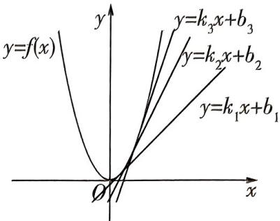</td></tr><tr><td>快招识别</td><td>对于含 $e^x$ ,ln $x$ 等复杂结构的函数不等式问题,可以优先考虑利用切线法求解,有时所给函数解析式中既含 $e^x$ ,又含ln $x$ ,则需先指对同构后再进行切线放缩</td></tr><tr><td>快招结论</td><td>结论1指数型切线不等式:曲线 $y = e^x$ 上任一点 $(x_0, y_0)$ 处的切线一定在曲线的“下方”,即 $e^x \geqslant e^{x_0}x + (1 - x_0)e^{x_0}$ 恒成立,当且仅当 $x = x_0$ 时等号成立.结论2对数型切线不等式:曲线 $y = \ln x$ 上任一点 $(x_0, y_0)$ 处的切线一定在曲线的“上方”,即 $\ln x \leqslant \frac{x}{x_0} + (\ln x_0 - 1)$ 恒成立,当且仅当 $x = x_0$ 时等号成立.结论3常见指对同构: $x = e^{\ln x} = \ln e^x$ </td></tr></table>

注意:对于 $e^{x} \geqslant e^{x_{0}} x + (1 - x_{0}) e^{x_{0}}$ ，当 $x_{0} = 0$ 时有 $e^{x} \geqslant x + 1$ ; 对于 $\ln x \leqslant \frac{x}{x_{0}} + (\ln x_{0} - 1)$ ，当 $x_{0} = 1$ 时有 $\ln x \leqslant x - 1$ 。实际上，这两个不等式就是【快招9】的快招结论①②，本节从数形结合的角度又一次印证了这两个重要不等式。

# 快招速练

# 切线法求参数的最值

1. 试题调研原创 已知 $\forall x > 0$ ，都有 $\mathrm{e}^{ax} + a \leqslant \frac{1 - \ln x}{x}$ ，则 $a$ 的最大值为 （）

A. -1

B. $-\frac{1}{2}$

C. $-\frac{1}{e}$

D. -e

# 切线法证明不等式恒成立

2.[2025 广东中山 12 月调研]已知函数 $f(x) = ax^{2} - 1 + 2\ln x$ .

(1) 当 $a = 1$ 时, 若存在 $x_{1}, x_{2}$ , 满足 $f(x_{1}) = -f(x_{2})$ , 证明: $x_{1} + x_{2} \geqslant 2$ .

累乘法 适用于数列 $\{a_{n}\}$ 满足 $a_{n + 1} / a_n = f(n)$ ，且 $f(n)$ 可以求积的情况，通过累乘，可以求出数列的通项公式.

(2) 对任意的 $x > 0, f'(x) \leqslant x \mathrm{e}^{2x} + \frac{2}{x} - \ln x - 1$ 恒成立, 其中 $f'(x)$ 是函数 $f(x)$ 的导数, 求 $a$ 的取值范围.

# 规范答题

# 快招速解与参考答案

1.C 快招识别 目标式既含 $\mathrm{e}^x$ ，又含 $\ln x$ ，通过指对同构将问题转化为 $-ax \geqslant \ln x$ ，利用结论②③求解.

快招解题 由 $\forall x > 0, \mathrm{e}^{ax} + a \leqslant \frac{1 - \ln x}{x}$ , 得 $x\mathrm{e}^{ax} + ax + \ln x - 1 \leqslant 0$ ,

[利用结论③“ $x = \mathrm{e}^{\ln x}$ ”]即 $\mathrm{e}^{ax + \ln x} + (ax + \ln x) - 1\leqslant 0$

设 $t = ax + \ln x$ ，则 $\mathrm{e}^t + t - 1 \leqslant 0$ ，即 $\mathrm{e}^t \leqslant 1 - t$ ，作出曲线 $y = \mathrm{e}^t$ 及直线 $y = 1 - t$ （图略），可知当 $t \leqslant 0$ 时有 $\mathrm{e}^t \leqslant 1 - t$ ，则 $t = ax + \ln x \leqslant 0$ ，即 $-ax \geqslant \ln x.$

[利用结论②“对数型, $x_{0}=e$ ”]由曲线 $y=\ln x$ 在点 $(x_{0},y_{0})$ 处的切线与曲线 $y=\ln x$ 的位置关系可知 $\ln x\leqslant\frac{x}{x_{0}}+(\ln x_{0}-1)$ ，当直线y=-ax与曲线 $y=\ln x$ 相切时，有 $-a=\frac{1}{x_{0}},\ln x_{0}-1=0$ ，此时 $-a=\frac{1}{e}$ ，结合图形，要满足题意，需使 $-a\geqslant\frac{1}{e}$ ，则 $a\leqslant-\frac{1}{e}$ ，故选C.

考场秒解快招 代入验证法！要求 a 的最大值，由 $-e < -1 < -\frac{1}{2} < -\frac{1}{e}$ ，先将 $a = -\frac{1}{e}$ 代入原不等式，得 $e^{-\frac{x}{e}} - \frac{1}{e} \leqslant \frac{1 - \ln x}{x}$ ，即 $e^{\ln x - \frac{x}{e}} + (\ln x - \frac{x}{e}) \leqslant 1$ ，则 $\ln x - \frac{x}{e} \leqslant 0$ ，而由曲线 $y = \ln x$ 过点 $(0,0)$ 的切线为直线 $y = \frac{1}{e}x$ 知此式恒成立，故选 C.

2.(1) 快招识别 函数解析式中含 $\ln x$ ，待证式中含 x，结合配方法利用结论②求解.

快招解题 当 $a = 1$ 时, $f(x) = x^2 - 1 + 2\ln x$ ,

由 $f(x_{1}) = -f(x_{2})$ ，得 $x_{1}^{2} - 1 + 2\ln x_{1} = -(x_{2}^{2} - 1 + 2\ln x_{2})$ ，即 $x_{1}^{2} + x_{2}^{2} = 2 - 2\ln (x_{1}x_{2}).$

[利用结论②“对数型, $x_{0}=1$ ”]令 $g(x)=\ln x-x+1$ ，则 $g'(x)=\frac{1}{x}-1=\frac{1-x}{x}$ ，当 $x\in(0,1)$ 时， $g'(x)>0$ ，当 $x\in(1,+\infty)$ 时， $g'(x)<0$ ，所以 $g(x)_{\max}=g(1)=0$ ，所以 $g(x)=\ln x-x+1\leqslant0$ ，即 $\ln x\leqslant x-1$ （当且仅当x=1时取等号）。[规范答题:在解答题中不可直接应用结论 $\ln x\leqslant x-1$ ，必须先证明，否则会丢失步骤分]

所以 $(x_{1} + x_{2})^{2} = 2x_{1}x_{2} + 2 - 2\ln (x_{1}x_{2})\geqslant 2x_{1}x_{2} + 2 - 2(x_{1}x_{2} - 1) = 4$ ，当且仅当 $x_{1}x_{2} = 1$ 时，等号成立，所以 $x_{1} + x_{2}\geqslant 2$ ，得证.

方法二:对称构造法 当 a=1 时, $f(x)=x^{2}-1+2\ln x,f'(x)=2x+\frac{2}{x}>0$ ,则 $f(x)$ 在 $(0,+\infty)$ 上单调递增.

当 $x_{1} = x_{2}$ 时，有 $f(x_{1}) = f(x_{2})$ ，因为 $f(x_{1}) = -f(x_{2})$ ，所以 $f(x_{1}) = f(x_{2}) = 0$ ，易知 $f(1) = 0$ 所以 $x_{1} = x_{2} = 1$ ，所以 $x_{1} + x_{2} = 2.$

当 $x_{1} \neq x_{2}$ 时，不妨设 $0 < x_{1} < 1 < x_{2}$ ，要证 $x_{1} + x_{2} > 2$ ，即证 $x_{2} > 2 - x_{1}$ ，即证 $f(x_{2}) > f(2 - x_{1})$ ，因为 $f(x_{1}) = -f(x_{2})$ ，所以即证 $f(x_{1}) + f(2 - x_{1}) < 0$ .

令 $F(x) = f(x) + f(2 - x), 0 < x < 1$

则 $F^{\prime}(x) = f^{\prime}(x) - f^{\prime}(2 - x) = 2x + \frac{2}{x} -2(2 - x) - \frac{2}{2 - x} = \frac{4(x - 1)^{3}}{x(x - 2)},$

因为 0 < x < 1，所以 $F'(x) > 0$ ，所以 $F(x)$ 在 $(0,1)$ 上单调递增，

所以 $F(x) < 2f(1) = 0$ ，所以 $f(x_{1}) + f(2 - x_{1}) < 0$ ，所以 $x_{1} + x_{2} > 2$ .

综上, $x_{1}+x_{2}\geqslant 2$ . [解后反思:本题为典型的极值点偏移问题,对称构造法是解决此类问题的通法,即要证明 $x_{1}+x_{2}<2a$ (或 $x_{1}+x_{2}>2a$ ), 即证 $x_{2}<2a-x_{1}$ (或 $x_{2}>2a-x_{1}$ ), 首先构造函数 $F(x)=f(x)-f(2a-x)$ , 确定 $y=f(x)$ 和 $y=F(x)$ 的单调性; 然后由 $F(x_{1})$ 与 $F(a)$ 的大小关系, 得 $f(x_{2})$ 与 $f(2a-x_{1})$ 的大小关系; 最后根据 $y=f(x)$ 的单调性得到 $x_{2}$ 与 $2a-x_{1}$ 的大小关系, 从而得证. 对于本题, 此法较烦琐, 不如直接放缩解题快]

(2) 快招识别 本题可分参处理, 分参后的目标函数式中既含 $\mathbf{e}^x$ , 又含 $\ln x$ , 指对同构, 利用结论①③求解.

快招解题 $f^{\prime}(x) = 2ax + \frac{2}{x}$ ，由 $f^{\prime}(x)\leqslant x\mathrm{e}^{2x} + \frac{2}{x} -\ln x - 1$ ，得 $2ax\leqslant x\mathrm{e}^{2x} - \ln x - 1,$

即 $a \leqslant \frac{x e^{2x} - (\ln x + 1)}{2x}$ , 所以原问题等价于 $a \leqslant \left[\frac{x e^{2x} - (\ln x + 1)}{2x}\right]_{\min}$ . [会转化: 本题先利用【快招10】中的“分离参数法”与快招结论②, 将原问题转化为求函数的最小值问题, 进而利用切线法求解]

[利用结论①“指数型, $x_{0}=0$ ”]令 $h(x)=\mathrm{e}^{x}-x-1$ ，则 $h'(x)=\mathrm{e}^{x}-1$ ，当 $x\in(-\infty,0)$ 时， $h'(x)<0$ ，当 $x\in(0,+\infty)$ 时， $h'(x)>0$ ，所以 $h(x)_{\min}=h(0)=0$ ，所以 $h(x)=\mathrm{e}^{x}-x-1\geqslant0$ ，即 $e^{x}\geqslant x+1$ （当且仅当x=0时取等号）.

[利用结论 ③ “x = e $^{ln x}$ ”] 所以 $\frac{x\mathrm{e}^{2x} - (\ln x + 1)}{2x} = \frac{\mathrm{e}^{\ln x + 2x} - (\ln x + 1)}{2x} \geqslant \frac{\ln x + 2x + 1 - (\ln x + 1)}{2x} = 1$ , 当且仅当 $\ln x + 2x = 0$ 时, 等号成立 (方程 $\ln x + 2x = 0$ 显然有解), 即 $\left[\frac{x\mathrm{e}^{2x} - (\ln x + 1)}{2x}\right]_{\min} = 1$ , 所以 $a \leqslant 1$ .

所以 a 的取值范围是 $(-∞,1]$ . [换思路: 本题分离参数后若不能联想到利用切线放缩, 则可直接求导, 利用隐零点求参数的取值范围, 同学们可自行尝试求解]

# 专题2 不等式

# 快招12 利用基本不等式求最值的三个必杀技

# 快招速通

<table><tr><td>必杀技1:配凑</td><td>1添、拆项.如 $y = 7x - 2 + \frac{1}{7x - 5}(x < \frac{5}{7}) \rightarrow y = -(5 - 7x + \frac{1}{5 - 7x}) + 3$ .2凑系数.如 $y = x(3 - 2x)(0 < x < \frac{3}{2}) \rightarrow y = \frac{1}{2}[2x(3 - 2x)]$ .3分离常数.如 $y = \frac{x^2 + 7x + 10}{x + 1}(x > -1) \rightarrow y = x + 1 + \frac{4}{x + 1} + 5$ </td></tr><tr><td>必杀技2:妙用“1”</td><td>适用于已知 $ax + by = 1$ ,求 $\frac{c}{x} + \frac{d}{y}$ 的最值问题.如已知 $x + y = 1(x, y > 0)$ ,则 $\frac{2}{x} + \frac{4}{y} = \frac{2(x + y)}{x} + \frac{4(x + y)}{y} = 6 + \frac{2y}{x} + \frac{4x}{y}$ </td></tr><tr><td>必杀技3:齐次化</td><td>在含有双变量的分式中,若分子、分母次数一样,则通过换元,把双变量问题转化为单变量问题,如 $\frac{x^2 - 2y^2}{xy - x^2}(x, y \neq 0) \xrightarrow[\text{除以 }y^2]{\text{分子分母同时}} \frac{(\frac{x}{y})^2 - 2}{\frac{x}{y} - (\frac{x}{y})^2}$ ,令 $t = \frac{x}{y}$ ,原式 $= \frac{t^2 - 2}{t - t^2} = -1 + \frac{t - 2}{t - t^2} = -1 + \frac{1}{-(t - 2) - \frac{2}{t - 2} - 3}$ </td></tr></table>

# 快招速练

# 配凑 + 妙用 “1”

1. 试题调研原创（多选）下列函数最小值为4的是 （）

A. $y = x + \frac{9}{x + 2}$

B. $y = 2^{x} + 2^{2 - x}$

C. $y = \frac{1}{\sin^2 x} + \frac{1}{\cos^2 x}$

D. $y = 2\log_2a + \log_a4(a > 1)$

# 齐次化

2.[2025 湖南长沙 11 月模拟]已知实数 a, b 满足 ab > 0, 则 $\frac{a}{a + b} - \frac{a}{a + 2b}$ 的最大值为 \_\_\_\_.

# 解题 技法

分组求和法 当数列的项可以分成几组,且每组内部都可以进行求和时,可以使用分组求和法.分组求和的关键在于确定分组的方式和每组内部的求和公式.

# 快招速解与参考答案

1.BCD 快招解题 [添项配凑] 当 $x > -2$ 时, $y = x + \frac{9}{x + 2} = x + 2 + \frac{9}{x + 2} - 2 \geqslant 2\sqrt{(x + 2) \cdot \frac{9}{x + 2}} - 2 = 4$ , 当且仅当 $x + 2 = \frac{9}{x + 2}$ , 即 $x = 1$ 时取等号; 当 $x < -2$ 时, $-x - 2 > 0, y = -[(-x - 2) + \frac{9}{-x - 2}] - 2 \leqslant -2\sqrt{(-x - 2) \cdot \frac{9}{-x - 2}} - 2 = -8$ , 当且仅当 $-x - 2 = \frac{9}{-x - 2}$ , 即 $x = -5$ 时取等号. 综上, $y \in (-\infty, -8] \cup [4, +\infty)$ , A 错误.

考场秒解快招 取特值法！当 x = -3 时，y = -12 < 4，A 错误。

$y=2^{x}+2^{2-x}\geqslant2\sqrt{2^{x}\cdot2^{2-x}}=4$ ，当且仅当 $2^{x}=2^{2-x}$ ，即x=1时等号成立，B正确.

[妙用“1”] $y = \frac{1}{\sin^2 x} + \frac{1}{\cos^2 x} = \left( \frac{1}{\sin^2 x} + \frac{1}{\cos^2 x} \right) (\sin^2 x + \cos^2 x) = 2 + \frac{\cos^2 x}{\sin^2 x} + \frac{\sin^2 x}{\cos^2 x} \geqslant 2 + 2\sqrt{\frac{\cos^2 x}{\sin^2 x} \cdot \frac{\sin^2 x}{\cos^2 x}} = 4$ , 当且仅当 $\frac{\cos^2 x}{\sin^2 x} = \frac{\sin^2 x}{\cos^2 x}$ , 即 $\sin x = \pm \cos x$ 时等号成立, C 正确.

考场秒解快招 1 的逆用! $y = \frac{1}{\sin^2 x} + \frac{1}{\cos^2 x} = \frac{1}{\sin^2 x \cos^2 x} = \frac{4}{\sin^2 2x}, \sin^2 2x \in (0,1]$ , 故 $y \geqslant 4$ , C 正确.

$y=2\log_{2}a+\log_{a}4=2(\log_{2}a+\log_{a}2)$ ，由于a>1，所以 $\log_{2}a>0,\log_{a}2>0$ ，从而 $\log_{2}a+\log_{a}2\geqslant2\sqrt{\log_{2}a\cdot\log_{a}2}=2$ ，于是 $y\geqslant4$ ，当且仅当 $\log_{2}a=\log_{a}2=\frac{1}{\log_{a}2}$ ，即 $\log_{a}2=1,a=2$ 时等号成立，D正确.

2.3-2√2 快招解题 令 $\frac{a}{b}=t$ ，则 t>0，

[齐次化]所以 $\frac{a}{a + b} -\frac{a}{a + 2b} = \frac{\frac{a}{b}}{1 + \frac{a}{b}} -\frac{\frac{a}{b}}{2 + \frac{a}{b}} = \frac{t}{1 + t} -\frac{t}{2 + t} = \frac{t^2 + 2t - t^2 - t}{(t + 1)(t + 2)} = \frac{t}{t^2 + 3t + 2} = \frac{1}{t + \frac{2}{t} + 3},$ 因为 $t > 0$ ，所以 $t + \frac{2}{t}\geqslant 2\sqrt{2}$ ，所以 $\frac{1}{t + \frac{2}{t} + 3}\leqslant \frac{1}{3 + 2\sqrt{2}} = 3 - 2\sqrt{2}$ ，当且仅当 $t = \sqrt{2}$ ，即 $a = \sqrt{2} b$ 时等号成立.所以 $\frac{a}{a + b} -\frac{a}{a + 2b}$ 的最大值为 $3 - 2\sqrt{2}$

考场秒解快招 分母整体化！设 $\left\{\begin{aligned}a+b=m,\\ a+2b=n,\end{aligned}\right.$ 则 $\left\{\begin{aligned}a=2m-n,\\ b=n-m,\end{aligned}\right.$ 于是 $\frac{a}{a+b}-\frac{a}{a+2b}=$ $\frac{2m-n}{m}-\frac{2m-n}{n}=3-\frac{n}{m}-\frac{2m}{n}\leqslant3-2\sqrt{2}$ ，当且仅当 $n=\sqrt{2}m$ ，即 $a=\sqrt{2}b$ 时取等号。

# 快招13 三角换元法速解双元最值问题

# 快招速通

# 快招识别

识别一个关键结构: $a^{2}+b^{2}=$ 定值,即已知条件或待求问题是含有两个变量的“平方式”且存在定值.

# 快招速解

设定值为 $k$ ，令 $a = k\cos \alpha, b = k\sin \alpha$ ，即可将问题转化为关于三角函数的最值问题（这里运用了参数方程思想哟），利用三角恒等变换和正、余弦函数的有界性求最值。

# 快招速练

# 双元和的最小值问题

1.[2025 广东省部分学校 12 月模拟]设 $a, b \in \mathbb{R}$ , 若 $4a^{2} + b^{2} + 2ab = 6$ , 则 $3a^{2} + 2b^{2}$ 的最小值为 ( )

A. 6

B. $3 \sqrt{3}$

C. $2 \sqrt{6}$

D. 4

# 含根式不等式有解求参问题

2. 试题调研原创 若关于 $x$ 的不等式 $\sqrt{x - 4} + \sqrt{8 - x} \geqslant k$ 有解, 则实数 $k$ 的最大值为 ( )

A. $2 \sqrt{2}$

B. $2 \sqrt{3}$

C. $2 \sqrt{6}$

D. 4

# 双元积的最小值问题

3. 试题调研改编 已知实数 $x, y$ 满足 $x^{2} + xy + y^{2} = 1$ , 则 $xy$ 的最小值为 \_\_\_\_.

# 快招速解与参考答案

1.D 快招识别 已知条件含有结构 $4a^{2} + b^{2}$ , 设问含有结构 $3a^{2} + 2b^{2}$ , 存在定值 $6 \rightarrow$ 双元最值问题, 用三角换元法.

快招解题1 正向换元,条件入手找最值 因为 $4a^{2} + b^{2} + 2ab = 6$ ,所以 $3a^{2} + (a + b)^{2} = 6$ ,

[用快招:看到平方和、常数,联系三角换元法,这里平方结构“拐了个弯”,需要我们先配方变形为标准的“ $a^{2}+b^{2}$ =定值”结构]

故可设 $\sqrt{3} a = \sqrt{6}\cos \alpha ,a + b = \sqrt{6}\sin \alpha ,$

则 $3a^{2} + 2b^{2} = 6\cos^{2}\alpha + 2(\sqrt{6}\sin \alpha - \sqrt{2}\cos \alpha)^{2} = 1 - \cos 2\alpha - 4\sqrt{3}\sin 2\alpha + 10 = -7\sin (2\alpha +$ $\varphi) + 11 \in [4,18]$ ，其中 $\sin \varphi = \frac{1}{7}$ , $\cos \varphi = \frac{4\sqrt{3}}{7}$ ,

当 $a^2 = \frac{8}{7}, b^2 = \frac{2}{7}$ 时， $3a^2 + 2b^2$ 取得最小值4，故选D.

# 解题 技法

特征根法 通过构建数列的特征根方程,求解该方程的根,进而利用这些根以及数列的初始项来推导出数列的通项公式.

快招解题2 逆向换元,问题入手找条件 设 $\sqrt{3}a=t\cos\alpha,\sqrt{2}b=t\sin\alpha$ ,则 $3a^{2}+2b^{2}=t^{2}$ ,

所以 $4a^{2} + b^{2} + 2ab = 6$ 可变形为 $4\cdot \frac{t^2\cos^2\alpha}{3} +\frac{t^2\sin^2\alpha}{2} +2\cdot \frac{t^2\sin\alpha\cos\alpha}{\sqrt{6}} = 6,$

即 $t^2 (3 + 5\cos^2\alpha +\sqrt{6}\sin 2\alpha) = 36.$

所以 $t^2 = \frac{36}{5\cos^2\alpha + \sqrt{6}\sin 2\alpha + 3} = \frac{72}{2\sqrt{6}\sin 2\alpha + 5\cos 2\alpha + 11} = \frac{72}{7\sin(2\alpha + \varphi) + 11},$

其中 $\sin \varphi = \frac{5}{7},\cos \varphi = \frac{2\sqrt{6}}{7}$ ，当且仅当 $\sin (2\alpha +\varphi) = 1$ 时， $t^2$ 取得最小值4，故选D.

2.A 快招识别 已知条件虽无直观“ $a^{2}+b^{2}=$ 定值”结构,但有 $x-4+8-x=4$ (定值)→用三角换元法.

快招解题 由题可知 $x \in [4,8]$ , 并且有 $(\sqrt{x-4})^2 + (\sqrt{8-x})^2 = 4$ , [用快招: 此式向我们释放了平方和的信号, 根号下的式子和为定值 4, 这便是在暗示我们用三角换元法了]

故可设 $\sqrt{x - 4} = 2\cos \alpha, \sqrt{8 - x} = 2\sin \alpha$ ，则 $2\cos \alpha + 2\sin \alpha = 2\sqrt{2}\sin (\alpha + \frac{\pi}{4}) \leqslant 2\sqrt{2}$ ，

因为关于 $x$ 的不等式 $\sqrt{x - 4} +\sqrt{8 - x}\geqslant k$ 有解，所以实数 $k$ 的最大值为 $2\sqrt{2}$ ，故选A.

3.-1 快招识别 已知条件含有结构 $x^{2} + y^{2}$ , 存在定值 $1 \rightarrow$ 双元最值问题, 用三角换元法.

快招解题 $x^{2} + xy + y^{2} = 1$ ，即 $(x + \frac{1}{2} y)^{2} + \frac{3}{4} y^{2} = 1$

设 $x + \frac{1}{2} y = \cos \alpha, \frac{\sqrt{3}}{2} y = \sin \alpha$ ，则 $x = \cos \alpha - \frac{1}{\sqrt{3}} \sin \alpha, y = \frac{2}{\sqrt{3}} \sin \alpha,$

于是 $xy = (\cos \alpha - \frac{1}{\sqrt{3}}\sin \alpha)\frac{2}{\sqrt{3}}\sin \alpha = \frac{1}{\sqrt{3}}\sin 2\alpha - \frac{1}{3}(1 - \cos 2\alpha) = \frac{2}{3}\sin (2\alpha + \frac{\pi}{6}) - \frac{1}{3}.$

易知 $-1 \leqslant \sin \left(2\alpha + \frac{\pi}{6}\right) \leqslant 1$ ，所以 $-1 \leqslant xy \leqslant \frac{1}{3}$ ，所以 $xy$ 的最小值为 $-1$ .

方法二:方程思想 当 x=0 时, xy=0, 当 $x \neq 0$ 时, 设 xy=t, 则 $y=\frac{t}{x}$ , 代入已知等式整理得 $x^{4}+(t-1)x^{2}+t^{2}=0$ ,

这个关于 $x^{2}$ 的一元二次方程至少有一个正根，即 $\left\{ \begin{array}{l} \Delta = (t - 1)^{2} - 4t^{2} \geqslant 0, \\ -\frac{t - 1}{2} > 0, \end{array} \right.$ 得 $-1 \leqslant t \leqslant \frac{1}{3}$ .

从而 $-1 \leqslant xy \leqslant \frac{1}{3}$ , 所以 $xy$ 的最小值为 $-1$ .

考场秒解快招 基本不等式法！由于 $x^{2} + y^{2} \geqslant -2xy$ ，所以 $x^{2} + xy + y^{2} \geqslant -xy$ ，即 $-xy \leqslant 1$ ，从而 $xy \geqslant -1$ ，所以 $xy$ 的最小值为 $-1$ .

# 快招 14 糖水不等式快解比大小放缩问题

# 快招速通

<table><tr><td>教材溯源</td><td>人教A版《必修第一册》P43习题2.1T10是这么一道题目:已知b克糖水中含有a克糖(b&gt;a&gt;0),再添加m克糖(m&gt;0)(假设全部溶解),糖水变甜了.请将这一事实表示为一个不等式,并证明这个不等式成立.解:这一事实可表示为 $\frac{a+m}{b+m}>\frac{a}{b}$ .证明如下: $\frac{a+m}{b+m}-\frac{a}{b}=\frac{b(a+m)-a(b+m)}{b(b+m)}=\frac{m(b-a)}{b(b+m)}$ ,由于b&gt;a&gt;0,m&gt;0,所以 $\frac{m(b-a)}{b(b+m)}>0$ ,所以 $\frac{a+m}{b+m}>\frac{a}{b}$ </td></tr><tr><td>快招结论</td><td>结论1:糖水不等式,若b&gt;a&gt;0,m&gt;0,则 $\frac{a+m}{b+m}>\frac{a}{b}$ .结论2:若b&gt;a&gt;m&gt;0,则 $\frac{a}{b}>\frac{a-m}{b-m}$ .结论3:若 $\frac{a}{b}<\frac{c}{d}(b>a>0,d>c>0)$ ,则 $\frac{a}{b}<\frac{a+c}{b+d}<\frac{c}{d}$ .结论4:对数糖水不等式, $\log_{n+1}n<\log_{n+2}(n+1),n\in\mathbf{N}^{*}$ </td></tr></table>

# 快招速练

# 用糖水不等式比大小

1. 试题调研原创 已知 $a = 0.6^{0.5}, b = \log_3 5, c = \log_5 8$ , 则 ( )

A. $a < b < c$

B. $b < c < a$

C. $c < b < a$

D. $a < c < b$

# 用糖水不等式证明不等式

2. 试题调研原创 设 $S_{n}$ 为等比数列 $\{a_{n}\}$ 的前 $n$ 项和，且 $S_{4} = 2a_{4} - 2, S_{3} = 2a_{3} - 2$ .

(1)求数列 $\{a_{n}\}$ 的前 $n$ 项和 $S_{n}$ .  
(2) 设 $b_{n}=a_{n}-\frac{1}{a_{n}}$ ，证明： $\frac{1}{b_{1}}+\frac{1}{b_{2}}+\cdots+\frac{1}{b_{n}}<\frac{4}{3}$ .

# 规范答题

# 解题 技法

待定系数法 通过设立未知数(待定系数), 将数列的递推关系式或已知条件转化为关于这个未知数的方程或方程组, 通过求解这个方程或方程组, 得到未知数的值, 进而求解数列的通项公式或特定项的值.

# 用糖水不等式证明等比数列

3. 试题调研原创 已知数列 $\{a_{n}\}$ 的前 $n$ 项和 $S_{n} = \frac{(n + 1)a_{n}}{2}$ , 且 $a_{1} = 1$ .

(1) 求 $S_{n}$ .   
(2) 令 $b_{n} = \ln a_{n}$ ，是否存在 $k (k \geqslant 2, k \in \mathbf{N}^{*})$ ，使得 $b_{k}, b_{k+1}, b_{k+2}$ 成等比数列？若存在，求出所有符合条件的 $k$ 值；若不存在，请说明理由.

# 规范答题

# 快招速解与参考答案

1.D 快招识别 b,c 结构相似→换底公式变形→利用糖水不等式比较 b,c 的大小.

快招解题 因为 $a = 0.6^{0.5} < 1, b > 1, c > 1$ ，所以 $b > a, c > a$ .

[利用结论①] $b=\log_{3}5=\frac{\lg 5}{\lg 3}>\frac{\lg 5+\lg\frac{5}{3}}{\lg 3+\lg\frac{5}{3}}=\frac{\lg\frac{25}{3}}{\lg 5}=\log_{5}\frac{25}{3}>\log_{5}8=c.$ [避易错: 结论①中

分母是大于分子的,这里分母小于分子,故此处应是大于号]

所以 b > c > a, 故选 D.

方法二:作差法 $b-c=\log_{3}5-\log_{5}8=\frac{\lg5}{\lg3}-\frac{\lg8}{\lg5}=\frac{(\lg5)^{2}-\lg3\times\lg8}{\lg3\times\lg5}$ ,

由于 $\lg 3 \times \lg 8 - (\lg 5)^2 < \left(\frac{\lg 3 + \lg 8}{2}\right)^2 - (\lg 5)^2 = \left(\frac{\lg 24}{2}\right)^2 - (\lg 5)^2 < \left(\frac{\lg 25}{2}\right)^2 - (\lg 5)^2 = 0,$

且 $\lg 3 > 0, \lg 5 > 0$ ，所以 $b - c = \frac{(\lg 5)^2 - \lg 3 \times \lg 8}{\lg 3 \times \lg 5} > 0$ ，故 $b > c$ .

又 $0 < a < 1, b > 1, c > 1$

所以 b > c > a, 故选 D.

2.(1)设数列 $\{a_{n}\}$ 的公比为 $q(q\neq0)$ , $a_{4}=S_{4}-S_{3}=2a_{4}-2a_{3}$ ，故 $a_{4}=2a_{3}$ ，所以 $q=\frac{a_{4}}{a_{3}}=2$ .

又 $S_{3} = 2a_{3} - 2$ ，即 $a_1 + 2a_1 + 4a_1 = 8a_1 - 2$ ，解得 $a_1 = 2$ ，故 $a_{n} = 2\times 2^{n - 1} = 2^{n}$

则 $S_{n} = \frac{2\times(1 - 2^{n})}{1 - 2} = 2^{n + 1} - 2.$

迭代法 通过逐个计算递推数列的项,并观察记录项与项之间的关系,尝试推导出数列的通项公式或求解特定项的值.

(2) 快招识别 利用糖水不等式将 $\frac{1}{b_n}$ 放缩为两个分式的和的形式, 利用分组求和法求解.

快招解题 由(1)得 $b_{n}=2^{n}-\frac{1}{2^{n}}=\frac{4^{n}-1}{2^{n}}$ ，当 $n\geqslant1$ 时， $0<\frac{2^{n}}{4^{n}-1}<1$ ，

[利用结论①]则 $\frac{1}{b_n} = \frac{2^n}{4^n - 1} < \frac{2^n + 1}{4^n} = \frac{1}{2^n} + \frac{1}{4^n}$ ,

所以 $\frac{1}{b_{1}}+\frac{1}{b_{2}}+\cdots+\frac{1}{b_{n}}<\left(\frac{1}{2}+\frac{1}{2^{2}}+\cdots+\frac{1}{2^{n}}\right)+\left(\frac{1}{4}+\frac{1}{4^{2}}+\cdots+\frac{1}{4^{n}}\right)=1-\frac{1}{2^{n}}+\frac{1}{3}\times\left(1-\frac{1}{4^{n}}\right)=\frac{4}{3}-\left(\frac{1}{2^{n}}+\frac{1}{3}\times\frac{1}{4^{n}}\right)<\frac{4}{3}$ ，得证.

方法二 由(1)得 $b_{n} = 2^{n} - \frac{1}{2^{n}}$ ，因为 $n \geqslant 1$ ，所以 $n - 2 \geqslant -n$ ，所以 $2^{n-2} \geqslant 2^{-n}$ ，所以 $\frac{1}{4} \times 2^{n} \geqslant \frac{1}{2^{n}}$ ，所以 $2^{n} - \frac{3}{4} \times 2^{n} \geqslant \frac{1}{2^{n}}$ ，即 $2^{n} - \frac{1}{2^{n}} \geqslant \frac{3}{4} \times 2^{n}$ ，即 $b_{n} \geqslant \frac{3}{4} \times 2^{n}$ ，所以 $\frac{1}{b_{n}} \leqslant \frac{4}{3} \times \frac{1}{2^{n}}$ ，

所以 $\frac{1}{b_1} +\frac{1}{b_2} +\dots +\frac{1}{b_n}\leqslant \frac{4}{3} (\frac{1}{2} +\frac{1}{2^2} +\dots +\frac{1}{2^n}) = \frac{4}{3}\times \frac{\frac{1}{2}(1 - \frac{1}{2^n})}{1 - \frac{1}{2}} = \frac{4}{3}\times (1 - \frac{1}{2^n}) <   \frac{4}{3},$ 得证.

3.(1)当 $n \geqslant 2$ 时, $a_{n} = S_{n} - S_{n-1} = \frac{(n+1)a_{n}}{2} - \frac{na_{n-1}}{2}$ , 即 $\frac{a_n}{n} = \frac{a_{n-1}}{n-1} (n \geqslant 2)$ , 又 $\frac{a_1}{1} = 1$ , 故数列 $\{\frac{a_n}{n}\}$ 是各项均为 1 的常数列, 所以 $\frac{a_n}{n} = 1, a_n = n$ .

所以数列 $\{a_{n}\}$ 的通项公式为 $a_{n} = n$ ，故 $S_{n} = \frac{n(n + 1)}{2}$

(2) 快招解题 假设存在 $k (k \geqslant 2, k \in \mathbf{N}^*)$ ，使得 $b_k, b_{k+1}, b_{k+2}$ 成等比数列，则 $b_k b_{k+2} = b_{k+1}^2$ . 因为 $b_n = \ln a_n = \ln n$ ，所以 $\ln k \cdot \ln (k+2) = [\ln (k+1)]^2$ ，即 $\frac{\ln k}{\ln (k+1)} = \frac{\ln (k+1)}{\ln (k+2)}$ .

[利用结论①]而 $\frac{\ln k}{\ln(k + 1)} < \frac{\ln k + \ln \frac{k + 2}{k + 1}}{\ln(k + 1) + \ln \frac{k + 2}{k + 1}} = \frac{\ln \frac{k^2 + 2k}{k + 1}}{\ln(k + 2)} < \frac{\ln \frac{k^2 + 2k + 1}{k + 1}}{\ln(k + 2)} = \frac{\ln(k + 1)}{\ln(k + 2)},$

与 $\frac{\ln k}{\ln(k+1)} = \frac{\ln(k+1)}{\ln(k+2)}$ 矛盾, 所以不存在 $k (k \geqslant 2, k \in \mathbf{N}^*)$ , 使得 $b_k, b_{k+1}, b_{k+2}$ 成等比数列. 方法二: 基本不等式 因为 $b_n = \ln a_n = \ln n$ , 所以 $b_k b_{k+2} = \ln k \cdot \ln(k+2) < [\frac{\ln k + \ln(k+2)}{2}]^2 = [\frac{\ln(k^2 + 2k)}{2}]^2 < [\frac{\ln(k+1)^2}{2}]^2 = [\ln(k+1)]^2 = b_{k+1}^2$ ,

即 $b_{k}b_{k + 2} < b_{k + 1}^{2}$ 恒成立，所以不存在 $k(k\geqslant 2,k\in \mathbf{N}^{*})$ ，使得 $b_{k},b_{k + 1},b_{k + 2}$ 成等比数列.

# 专题 3 向量与三角

# 快招15 万能建系法通解向量数量积问题

# 快招速通

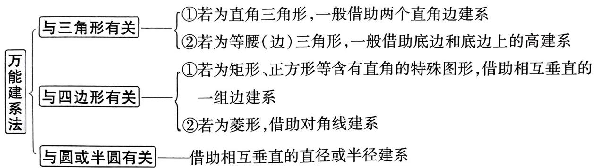

flowchart

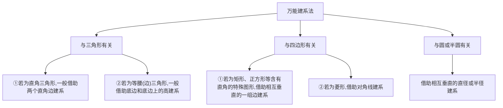

# 快招速练

# 与正三角形有关的建系

1. 试题调研原创 已知 $P$ 是边长为 4 的正 $\triangle ABC$ 所在平面内一点, 且 $\overrightarrow{AP} = \lambda \overrightarrow{AB} + (2 - 2\lambda) \overrightarrow{AC}$ ( $\lambda \in \mathbb{R}$ ), 则 $\overrightarrow{PA} \cdot \overrightarrow{PC}$ 的最小值为 \_\_\_\_.

# 与半圆有关的建系

2. 试题调研原创 已知 $AB$ 是半圆 $O$ 的直径, $AB = 2$ , 点 $C, D$ 在半圆弧 $\widehat{AB}$ 上运动, 且 $\angle COD = 120^\circ$ , 点 $P$ 是半圆弧 $\widehat{AB}$ 上的动点, 则 $\overrightarrow{PC} \cdot \overrightarrow{PD}$ 的取值范围为 \_\_\_\_.

# 快招速解与参考答案

1.5 快招识别 关键词“正△ABC”→与正三角形有关→借助底边和底边上的高建系.

快招解题 取 $AB$ 的中点 $O$ , 连接 $OC$ , 如图 1, 以 $AB$ 的中点 $O'$ 为原点, $AB$ 所在直线为 $x$ 轴, 以 $OC$ 所在直线为 $y$ 轴, 建立平面直角坐标系, 则 $A(-2,0), B(2,0), C(0,2\sqrt{3})$ .

设 $P(x,y)$ ，于是 $\overrightarrow{AP} = (x + 2,y),\overrightarrow{AB} = (4,0),\overrightarrow{AC} = (2,2\sqrt{3})$ 从而 $(x + 2,y) = \lambda (4,0) + (2 - 2\lambda)(2,2\sqrt{3})$

所以 $\left\{ \begin{array}{l}x + 2 = 4\lambda +4 - 4\lambda ,\\ y = 4\sqrt{3}(1 - \lambda), \end{array} \right.$ 解得 $\left\{ \begin{array}{l}x = 2,\\ y = 4\sqrt{3}(1 - \lambda), \end{array} \right.$

于是 $\overrightarrow{PA} = (-4, 4\sqrt{3} (\lambda - 1)), \overrightarrow{PC} = (-2, 4\sqrt{3}\lambda - 2\sqrt{3})$

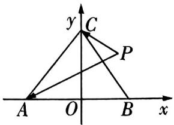

text_image

y
C
P
A O B x

图1

从而 $\overrightarrow{PA} \cdot \overrightarrow{PC} = 8 + 4\sqrt{3} (\lambda - 1) \times 2\sqrt{3} (2\lambda - 1) = 8 + 24(2\lambda^2 - 3\lambda + 1) = 48(\lambda - \frac{3}{4})^2 + 5,$ 所以当 $\lambda=\frac{3}{4}$ 时, $\overrightarrow{PA}\cdot\overrightarrow{PC}$ 取得最小值 5.

考场秒解快招 爪子定理！ $\overrightarrow{AP}=\lambda \overrightarrow{AB}+(2-2\lambda)\overrightarrow{AC}(\lambda\in\mathbf{R})$ 有明显的爪子定理特征，取 $\overrightarrow{AM}=2\overrightarrow{AC}$ ，则 $\overrightarrow{AP}=\lambda \overrightarrow{AB}+(1-\lambda)\overrightarrow{AM}$ ，点 $P,B,M$ 三点共线，即点 $P$ 在直线 $BM$ 上。同样以 $O$ 为原点， $AB$ 所在直线为 $x$ 轴建系，根据 $AB\perp BM$ ，可得 $P(2,y)$ ，则 $\overrightarrow{PA}\cdot\overrightarrow{PC}=(y-\sqrt{3})^{2}+5$ ，最小值是5。

2. $\left[-\frac{1}{2}, 1\right]$ 快招识别 关键词“ $AB$ 是半圆 $O$ 的直径” $\rightarrow$ 与半圆有关 $\rightarrow$ 借助相互垂直的直径和半径建系.

快招解题 如图2, 以 $O$ 为原点, 直线 $AB$ 为 $x$ 轴建立平面直角坐标系, 设 $C(\cos \alpha, \sin \alpha), D(\cos (\alpha + 120^\circ), \sin (\alpha + 120^\circ))$ , 其中 $0^\circ \leqslant \alpha \leqslant 60^\circ$ . 设 $P(\cos \beta, \sin \beta) (0^\circ \leqslant \beta \leqslant 180^\circ)$ ,

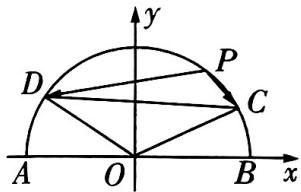

text_image

y
D
P
C
A O B x

图2

则 $\overrightarrow{PC} \cdot \overrightarrow{PD} = (\cos \alpha - \cos \beta, \sin \alpha - \sin \beta) \cdot (\cos (\alpha + 120^\circ) - \cos \beta,$

$$
\sin (\alpha + 1 2 0 ^ {\circ}) - \sin \beta) = \frac {1}{2} - \frac {1}{2} \cos (\alpha - \beta) + \frac {\sqrt {3}}{2} \sin (\alpha - \beta) = \frac {1}{2} + \sin (\alpha - \beta - 3 0 ^ {\circ}).
$$

由于 $0^{\circ} \leqslant \alpha \leqslant 60^{\circ}, -180^{\circ} \leqslant -\beta \leqslant 0^{\circ}$ , 所以 $-180^{\circ} \leqslant \alpha - \beta \leqslant 60^{\circ}$ ,

从而 $-210^{\circ} \leqslant \alpha - \beta - 30^{\circ} \leqslant 30^{\circ}$ , 所以 $-1 \leqslant \sin (\alpha - \beta - 30^{\circ}) \leqslant \frac{1}{2}$ , 所以 $-\frac{1}{2} \leqslant \overrightarrow{PC} \cdot \overrightarrow{PD} \leqslant 1$ .

考场秒解快招 极化恒等式法！取 CD 的中点 M，连接 PM，则 $\overrightarrow{PC} \cdot \overrightarrow{PD} = \overrightarrow{PM^{2}} - \overrightarrow{MC^{2}} = \overrightarrow{PM^{2}} - \frac{3}{4}$ （这是极化恒等式的三角形模型，即三角形的两邻边对应向量的数量积等于第三条边上中线长的平方减去第三条边长一半的平方）。易知点 M 的轨迹是以 O 为圆心， $\frac{1}{2}$ 为半径的圆的一段，又点 P 在半圆弧 $\widehat{AB}$ 上运动，所以 $|\overrightarrow{PM}|_{\min} = \frac{1}{2}$ 。当 D 在 A 点，P 在 B 点（或 C 在 B 点，P 在 A 点）时， $|\overrightarrow{PM}|_{\max} = \sqrt{\frac{1}{4} + 1 - 2 \times 1 \times \frac{1}{2} \times \cos 120^{\circ}} = \frac{\sqrt{7}}{2}$ ，所以 $-\frac{1}{2} \leqslant \overrightarrow{PC} \cdot \overrightarrow{PD} \leqslant 1$ 。

# 快招16 逆用、变用公式巧解三角恒等变换问题

# 快招速通

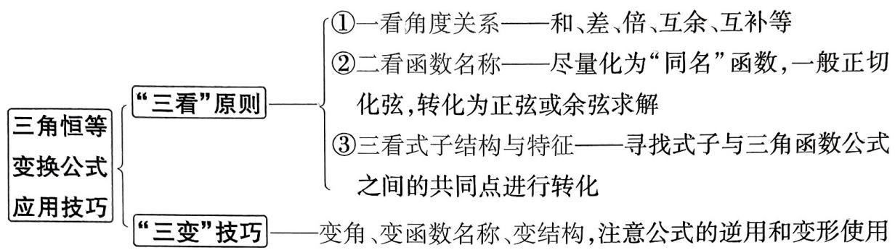

flowchart

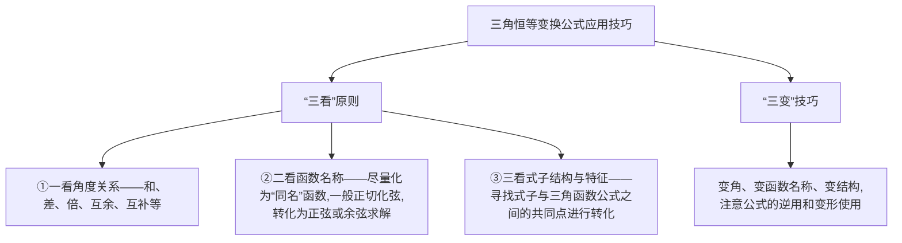

# 快招速练

# ▶和差角化单角

1.[2025 广东广州 12 月调研]已知 $0 < \beta < \alpha < \frac{\pi}{2}, \cos (\alpha + \beta) = \frac{1}{5}, \sin (\alpha - \beta) = \frac{3}{5}$ , 则 $\tan \alpha \tan \beta$ 的值为 ( )

A. $\frac{1}{2}$

B. $\frac{3}{5}$

C. $\frac{5}{3}$

D. 2

# “1”的代换和公式逆用

2. 试题调研原创 已知 $0 < \theta < \pi$ , 则 $\frac{(1 + \sin \theta + \cos \theta)(\sin \frac{\theta}{2} - \cos \frac{\theta}{2})}{\sqrt{2 + 2 \cos \theta}} =$ ( )

A. $\sin \frac{\theta}{2}$

B. $-\cos \frac{\theta}{2}$

C. $\sin \theta$

D. $-\cos \theta$

# 化双角为单角

3.[2025 江苏南京、盐城 11 月一模]已知 $\alpha, \beta \in (0, \frac{\pi}{2})$ ，且 $\sin \alpha - \sin \beta = -\frac{1}{2}, \cos \alpha - \cos \beta = \frac{1}{2}$ ，则 $\tan \alpha + \tan \beta =$ \_\_\_\_.

# 快招速解与参考答案

1.B 快招识别 一看角度关系:两角和与差→二看函数名:余弦和正弦→利用和差角公式求解.

快招解题 由 $0 < \beta < \alpha < \frac{\pi}{2}$ , 得 $0 < \alpha - \beta < \frac{\pi}{2}$ ,

构造齐次式 在求直线与圆锥曲线的交点问题时,通过构造一个齐次方程(即方程中所有项的次数都相等的方程),来简化计算过程,并避免直接求解交点坐标.

解题
技法

因为 $\sin (\alpha -\beta) = \frac{3}{5}$ ，所以 $\cos (\alpha -\beta) = \frac{4}{5}$ 即 $\cos \alpha \cos \beta +\sin \alpha \sin \beta = \frac{4}{5}$ ①.

又 $\cos (\alpha +\beta) = \frac{1}{5}$ 即 $\cos \alpha \cos \beta -\sin \alpha \sin \beta = \frac{1}{5}$ ②，

联立①②得 $\cos \alpha \cos \beta = \frac{1}{2}, \sin \alpha \sin \beta = \frac{3}{10}$ , 所以 $\tan \alpha \tan \beta = \frac{3}{10} \times 2 = \frac{3}{5}$ , 故选 B.

2.D 快招识别 看式子结构:含有半角、倍角、“1”等→用 $\cos^{2}\frac{\theta}{2}+\sin^{2}\frac{\theta}{2}$ 代换“1”→活用平方差公式、逆用倍角公式化简.

快招解题 由于 $0 < \theta < \pi$ ，所以 $0 < \frac{\theta}{2} < \frac{\pi}{2}$ ，于是 $\cos \frac{\theta}{2} > 0$

从而 $\sqrt{2 + 2\cos\theta} = \sqrt{4\cos^2\frac{\theta}{2}} = 2\cos \frac{\theta}{2}$

$$
1 + \sin \theta + \cos \theta = (\cos \frac {\theta}{2} + \sin \frac {\theta}{2}) ^ {2} + \cos^ {2} \frac {\theta}{2} - \sin^ {2} \frac {\theta}{2} = (\cos \frac {\theta}{2} + \sin \frac {\theta}{2}) (\cos \frac {\theta}{2} + \sin \frac {\theta}{2} +
$$

$$
\cos \frac {\theta}{2} - \sin \frac {\theta}{2}) = 2 \cos \frac {\theta}{2} (\cos \frac {\theta}{2} + \sin \frac {\theta}{2}).
$$

所以原式 $= \frac{2\cos\frac{\theta}{2}(\cos\frac{\theta}{2} + \sin\frac{\theta}{2})(\sin\frac{\theta}{2} - \cos\frac{\theta}{2})}{2\cos\frac{\theta}{2}} = \sin^2\frac{\theta}{2} - \cos^2\frac{\theta}{2} = -\cos \theta$ ，故选D.

考场秒解快招 取特值法！令 $\theta=\frac{\pi}{3}$ ，则 $\frac{\theta}{2}=\frac{\pi}{6}$ ，代入计算可得原式 $=-\frac{1}{2}$ ，只有 D 符合，选 D.

3. $\frac{8}{3}$ 快招识别 一看函数名: 正弦、余弦混着来 $\rightarrow$ 二看式子结构: 两式右边互为相反数 $\rightarrow$ 利用辅助角公式求解.

快招解题 由于 $\sin \alpha - \sin \beta = -\frac{1}{2}, \cos \alpha - \cos \beta = \frac{1}{2}$ ,

两式相加得 $\sin \alpha + \cos \alpha = \sin \beta + \cos \beta$ ，即 $\sin \left( \alpha + \frac{\pi}{4} \right) = \sin \left( \beta + \frac{\pi}{4} \right)$ ，

因为 $\alpha, \beta \in (0, \frac{\pi}{2})$ ，所以 $\alpha + \frac{\pi}{4} \in (\frac{\pi}{4}, \frac{3\pi}{4}), \beta + \frac{\pi}{4} \in (\frac{\pi}{4}, \frac{3\pi}{4})$ ，于是 $\alpha + \frac{\pi}{4} = \beta + \frac{\pi}{4}$ 或 $\alpha + \frac{\pi}{4} + \beta + \frac{\pi}{4} = \pi$ ，从而 $\alpha = \beta$ （舍去）或 $\alpha + \beta = \frac{\pi}{2}$ ，于是 $\beta = \frac{\pi}{2} - \alpha$ 。代入 $\sin \alpha - \sin \beta = -\frac{1}{2}$ 得 $\sin \alpha - \cos \alpha = -\frac{1}{2}$ ，等式两边平方得 $1 - 2\sin \alpha\cos \alpha = \frac{1}{4}$ ，所以 $\sin \alpha\cos \alpha = \frac{3}{8}$ ，所以 $\tan \alpha + \tan \beta = \frac{\sin \alpha}{\cos \alpha} + \frac{\cos \alpha}{\sin \alpha} = \frac{1}{\sin \alpha\cos \alpha} = \frac{8}{3}$ 。

# 快招17 “算两次”巧解三角形一线分两角问题

# 快招速通

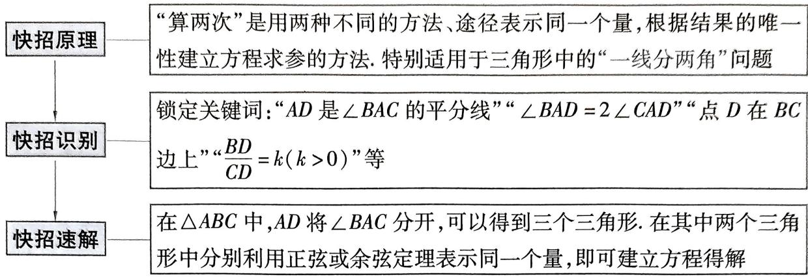

flowchart

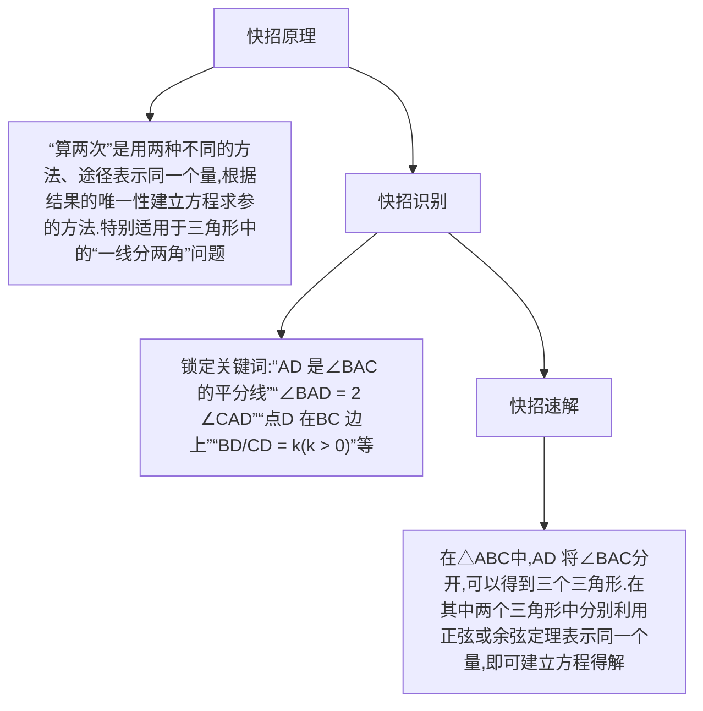

# 快招速练

# “算两次”求边长问题

1. 试题调研原创 已知 $\triangle ABC$ 的内角 $A, B, C$ 的对边分别为 $a, b, c, b = \sqrt{3}c, D$ 为 $BC$ 边上一点, $CD = 2BD$ , $AD = 2$ , $\angle DAC = 2\angle ABC$ , 则 $a =$ \_\_\_\_.

# “算两次”求最值问题

2. 试题调研原创 在 $\triangle ABC$ 中, 内角 $A, B, C$ 的对边分别为 $a, b, c, b \cos A + a \cos B = -2c \cos A$ .

(1) 求 $\sin A$ .   
(2)已知点 D 为 BC 的中点,且 AD = 2,求 a 的最大值.

# 规范答题

# “算两次”求角问题

3.[2025 广东 12 月大联考]已知 $\triangle ABC$ 的内角 $A, B, C$ 的对边分别为 $a, b, c, D$ 为边 $BC$ 上一点, $\angle BAD = \alpha$ , $\angle CAD = \beta$ , $AD = d$ , 且 $2ac\sin \alpha + 2ab\sin \beta = 3bc$ .

(1) 若 $\angle BAC = \frac{5\pi}{6}$ , 证明: $a = 3d$ .   
(2) 若 $CD = 2BD$ , 在 (1) 的条件下, 求 $\cos \angle ADC$ .

# 规范答题

# 快招速解与参考答案

1.6√2 快招识别 锁定关键词“D 为 BC 边上一点, CD = 2BD”→一线分两角, 用余弦定理算两次.

快招解题 如图 1, 过点 A 作 $\angle DAC$ 的平分线 AM 交 DC 于点 M, 则 $\angle ABC = \angle DAM = \angle CAM$ , 因为 $\angle BCA = \angle ACM$ , 所以 $\triangle ABC \sim \triangle MAC$ , 所以 $\frac{MC}{AC} = \frac{AC}{BC}$ , 又 $b = \sqrt{3}c$ , 所以 $MC = \frac{3c^{2}}{a}$ .

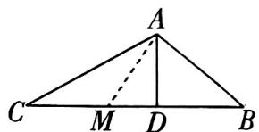

text_image

A
C M D B

图1

设 $\triangle ABC$ 底边 $BC$ 上的高为 $h$ , 则 $S_{\triangle ACM} = \frac{1}{2} AC \times AM \times \sin \angle CAM = \frac{1}{2} MC \times h$ ,$S_{\triangle ADM}=\frac{1}{2}AD\times AM\times\sin\angle DAM=\frac{1}{2}MD\times h$ , 两式相除得 $\frac{MC}{MD}=\frac{AC}{AD}$ , 所以 $DM=\frac{2\sqrt{3}c}{a}$ . [秒解快招: AM 是 $\angle DAC$ 的平分线, 根据角平分线定理可得 $\frac{MC}{MD}=\frac{AC}{AD}$ ]由 $CM + DM = CD = \frac{2a}{3}$ , 得 $\frac{3c^2}{a} + \frac{2\sqrt{3}c}{a} = \frac{2a}{3}$ , 所以 $a^2 = \frac{9c^2}{2} + 3\sqrt{3}c$ .

[算两次]在 $\triangle ABD$ 中，由余弦定理得 $\cos \angle ABD = \frac{c^2 + \frac{a^2}{9} - 4}{2 \times c \times \frac{a}{3}}$ （第1次），在 $\triangle ABC$ 中，由余弦定理得 $\cos \angle ABC = \frac{a^2 + c^2 - 3c^2}{2ac}$ （第2次），所以 $a^2 = \frac{15c^2}{2} - 18$ ，所以 $\frac{15c^2}{2} - 18 = \frac{9c^2}{2} + 3\sqrt{3}c$ ，化简得 $c^2 - \sqrt{3}c - 6 = 0$ ，解得 $c = 2\sqrt{3}$ 或 $c = -\sqrt{3}$ （舍去），所以 $a = \sqrt{\frac{9c^2}{2} + 3\sqrt{3}c} = \sqrt{54 + 18} = 6\sqrt{2}$ .

2.(1)由题意知 $b \cos A + a \cos B = -2c \cos A$ ,

由余弦定理得 $b \cdot \frac{b^2 + c^2 - a^2}{2bc} + a \cdot \frac{a^2 + c^2 - b^2}{2ac} = -2c \cdot \frac{b^2 + c^2 - a^2}{2bc}$ , 化简得 $c = -\frac{b^2 + c^2 - a^2}{b}$ , 即 $b^2 + c^2 - a^2 = -bc$ , 故 $\cos A = \frac{b^2 + c^2 - a^2}{2bc} = -\frac{1}{2}$ , 由于 $0 < A < \pi$ , 则 $\sin A = \frac{\sqrt{3}}{2}$ .

考场秒解快招 射影定理法！根据射影定理得 $b \cos A + a \cos B = c$ ，则 $\cos A = -\frac{1}{2}$ ，由于 $0 < A < \pi$ ，故 $\sin A = \frac{\sqrt{3}}{2}$ .

(2) 快招识别 锁定关键词“点 D 为 BC 的中点”→一线分两角,用余弦定理算两次.

快招解题 [算两次] 在 $\triangle ADC$ 中, 由余弦定理得 $\cos \angle ADC = \frac{AD^2 + DC^2 - AC^2}{2AD \times DC} = \frac{4 + DC^2 - b^2}{4DC}$ (第1次); 在 $\triangle ABD$ 中, 由余弦定理得 $\cos \angle ADB = \frac{AD^2 + BD^2 - AB^2}{2AD \times BD} = \frac{4 + BD^2 - c^2}{4BD}$ (第2次).

易知 $\cos \angle ADC = -\cos \angle ADB, BD = CD = \frac{a}{2}$ , 所以 $\frac{4 + \frac{a^2}{4} - b^2}{2a} = -\frac{4 + \frac{a^2}{4} - c^2}{2a}$ , 即 $a^2 = 2(b^2 + c^2) - 16$ . 在 $\triangle ABC$ 中, 由余弦定理得 $a^2 = b^2 + c^2 - 2bc\cos \angle BAC$ , 得 $a^2 = b^2 + c^2 + bc$ .

故 $2(b^{2} + c^{2}) - 16 = b^{2} + c^{2} + bc$ ，所以 $b^{2} + c^{2} = bc + 16 \geqslant 2bc$ ，即 $bc \leqslant 16$

故 $a^2 = b^2 + c^2 + bc = 2bc + 16 \leqslant 48$ ，所以 $a \leqslant 4\sqrt{3}$ ，当且仅当 $b = c = 4$ 时取等号，所以 $a$ 的最大值为 $4\sqrt{3}$ .

考场秒解快招 中线长公式！根据三角形中线长公式得 $(2AD)^{2}+a^{2}=2b^{2}+2c^{2}$ ，可以直接得到 $a^{2}=2(b^{2}+c^{2})-16$ ，但要注意解题过程的完整性.

3. 快招识别 锁定关键词“D 为 BC 边上一点”“CD = 2BD”→一线分两角,用正弦定理或余弦定理算两次.

快招解题(1)[算两次]在 $\triangle ABD$ 中,由正弦定理得 $\frac{\sin \alpha}{BD}=\frac{\sin B}{AD}$ (第1次),则 $\sin \alpha=\frac{BD \sin B}{d}$ ,在 $\triangle ACD$ 中,由正弦定理得 $\frac{\sin \beta}{CD}=\frac{\sin C}{AD}$ (第2次),则 $\sin \beta=\frac{CD \sin C}{d}$ .

因为 $2ac\sin \alpha + 2ab\sin \beta = 3bc$ ，所以 $\frac{\sin \alpha}{b} + \frac{\sin \beta}{c} = \frac{3}{2a}$ .

而 $\frac{\sin\alpha}{b} +\frac{\sin\beta}{c} = \frac{BD\sin B}{bd} +\frac{CD\sin C}{cd} = \frac{BD\sin\angle BAC}{ad} +\frac{CD\sin\angle BAC}{ad} = \frac{\frac{1}{2}(BD + CD)}{ad} = \frac{\frac{1}{2}a}{ad} = \frac{1}{2d}.$ 所以 $\frac{1}{2d} = \frac{3}{2a}$ 即 $a = 3d$

(2)由 $CD = 2BD$ ，得 $CD = \frac{2a}{3}, BD = \frac{a}{3}$

[算两次]在 $\triangle ABD$ 中，由余弦定理得 $\cos \angle ADB = \frac{BD^2 + d^2 - AB^2}{2BD \times d} = \frac{2a^2 - 9c^2}{2a^2}$ （第1次），

在 $\triangle ACD$ 中，由余弦定理得 $\cos \angle ADC = \frac{CD^2 + d^2 - AC^2}{2CD\times d} = \frac{5a^2 - 9b^2}{4a^2}$ （第2次），

因为 $\angle ADB + \angle ADC = \pi$ ，所以 $\cos \angle ADB = -\cos \angle ADC$ ，即 $\frac{2a^2 - 9c^2}{2a^2} = -\frac{5a^2 - 9b^2}{4a^2}$ ，整理得 $a^2 - b^2 = 2c^2$ .

在 $\triangle ABC$ 中，由余弦定理得 $\cos \angle BAC = \frac{b^2 + c^2 - a^2}{2bc} = -\frac{c^2}{2bc} = -\frac{c}{2b} = -\frac{\sqrt{3}}{2}$

故 $c = \sqrt{3} b$ ，故 $a^2 - b^2 = 6b^2$ ，则 $a = \sqrt{7} b$ ，所以 $\cos \angle ADC = \frac{5a^2 - 9b^2}{4a^2} = \frac{35b^2 - 9b^2}{28b^2} = \frac{13}{14}$ .

# 专题4 数列

# 快招18 万能转化法构造一阶线性递推数列求通项

# 快招速通

万能转化法可以将高考几乎所有的数列已知关系转化为形如 $a_{n+1} = pa_n + q (p \neq 0, p \neq 1, q \neq 0)$ 的递推关系，大大降低解题难度，具体如下（记数列 $\{a_n\}$ 的前 $n$ 项和为 $S_n, n \in \mathbb{N}^*$ ）.

<table><tr><td rowspan="4">转化技巧</td><td>退位相减</td><td>已知 Sn=pa_n+qn+mn(p≠0,p≠1,q≠0,m∈R)退位相减an=Sn-Sn-1=pa_n-pa_{n-1}+q(n≥2)化简an=p/p-1an-1-q/n(≥2)</td></tr><tr><td rowspan="2">同除以</td><td>已知 an+1=pa_n+mqn(p≠0,p≠1,q≠0,q≠1,m≠0)同除以qn+1q/n+1=pn·qn+q/m令bn=qn/qnbn+1=p/q·bn+m/q</td></tr><tr><td>已知 na_{n+1}=p(n+1)an+qn(n+1)(p≠0,p≠1,q≠0)同除以n(n+1)n+1=pn·an/q令bn=n/nbn+1=p·bn+q</td></tr><tr><td>取倒数</td><td>已知 an+1=ma_n/pan+qn(p≠0,q≠0,m≠0,q≠m)取倒数1/a_{n+1}=qn·1/a_n+1令bn=1/a_nbn+1=q/m·bn+m</td></tr><tr><td>速记结论</td><td colspan="2">由形如an+1=pa_n+qn(p≠0,p≠1,q≠0)的递推关系可构造出以an+qn/pt-1为首项、p为公比的等比数列.简证:设an+1+λ=p(an+λ)→an+1=pa_n+(p-1)λ→λ=q/p-1→{an+qn-1}是以an+qn/p-1为首项、p为公比的等比数列</td></tr></table>

注意:对于形如 $a_{n+1}=pa_{n}+qn+m(p\neq0,p\neq1,q\neq0)$ 的递推关系,类比 $a_{n+1}=pa_{n}+q(p\neq0,p\neq1,q\neq0)$ 型,也可构造出等比数列,即令 $a_{n+1}+A(n+1)+B=p(a_{n}+An+B)$ ,展开,通过对应项相等求出 A 与 B 即可.

快速记忆

小编说:高中数学有很多需要记忆的定理、结论,掌握科学有效的记忆技巧,可以帮助提高记忆力,下面我们整理了一些记忆方法,大家快来选择适合自己的方法吧.

# 快招速练

# “退位相减”转化求通项

1. 试题调研原创 已知数列 $\{a_{n}\}$ 的前 $n$ 项和为 $S_{n}, S_{n} = 2a_{n} - 3n$ , 则 $a_{2025} =$ （）

A. $2 \times 3^{2025} - 3$

B. $3^{2026} - 6$

C. $3 \times 2^{2025} - 3$

D. $2^{2026} - 1$

# “同除以”转化求通项

2. 试题调研原创 已知数列 $\{a_{n}\}$ 中, $na_{n+1} = 3(n+1)a_{n} + n(n+1)$ 且 $a_{1} = 1$ , 则数列 $\{a_{n}\}$ 的通项公式为 \_\_\_\_.

# “取倒数” + “同除以”转化求通项

3. 试题调研原创 已知数列 $\{a_{n}\}$ 的首项 $a_{1} = \frac{1}{3}$ , 且满足 $a_{n+1} = \frac{a_{n}}{4^{n} a_{n} + 2} (n \in \mathbf{N}^{*})$ , 则数列 $\{a_{n}\}$ 的通项公式为 \_\_\_\_.

# 快招速解与参考答案

1.C 快招识别 $S_{n} = pa_{n} + qn + m (p \neq 0, p \neq 1, q \neq 0, m \in \mathbb{R})$ 型 $\rightarrow$ 退位相减构造出 $a_{n+1} = pa_{n} + q (p \neq 0, p \neq 1, q \neq 0)$ 型递推式.

快招解题 [退位相减] 由 $S_{n} = 2a_{n} - 3n$ 知, 当 $n \geqslant 2$ 时, $S_{n-1} = 2a_{n-1} - 3(n-1)$ , 则 $a_{n} = S_{n} - S_{n-1} = 2a_{n} - 2a_{n-1} - 3$ , 化简得 $a_{n} = 2a_{n-1} + 3$ . $a_{1} = S_{1} = 2a_{1} - 3$ , 则 $a_{1} = 3$ ,

[结论速解]所以 $\{a_{n} + 3\}$ 是以6为首项、2为公比的等比数列，则 $a_{n} + 3 = 6 \cdot 2^{n - 1} = 3 \cdot 2^{n}$ ，故 $a_{n} = 3 \cdot 2^{n} - 3$ ，所以 $a_{2025} = 3 \times 2^{2025} - 3$ 。故选C.

考场秒解快招 猜想验证法！由 $S_{n}=2a_{n}-3n$ 得 $a_{1}=3, a_{2}=9$ 。由各选项对应的数式结构猜测其对应的通项公式，如，对 A 项，猜测 $a_{n}=2\times3^{n}-3$ ，则 $a_{1}=3, a_{2}=15$ ，不符合题意，A 错误。依次判断各选项，可知选 C。

2. $a_{n} = \frac{(3^{n} - 1)n}{2}$ 快招识别 $na_{n + 1} = p(n + 1)a_n + qn(n + 1)(p\neq 0,p\neq 1,q\neq 0)$ 型 $\rightarrow$ 同除以 $n(n + 1)$ 得到 $a_{n + 1} = pa_n + q(p\neq 0,p\neq 1,q\neq 0)$ 型递推式.

快招解题 [同除以 $n(n + 1)]na_{n + 1} = 3(n + 1)a_n + n(n + 1)$ , 等号两边同除以 $n(n + 1)$ , 可得 $\frac{a_{n + 1}}{n + 1} = 3 \times \frac{a_n}{n} + 1$ . 令 $b_n = \frac{a_n}{n}$ , 则 $b_{n + 1} = 3b_n + 1, b_1 = 1$ , [换思路: 遇见此类式子, 除了利用本节所构造的等比数列求通项外, 还可用如下思路求解, 当 $n \geqslant 2$ 时, 有 $b_n = 3b_{n - 1} + 1$ , 则 $b_{n + 1} -$

口诀记忆法 在学习数学时,利用顺口溜或歌诀记忆某些较为烦琐的公式或方法步骤,可以提高效率.

$b_{n}=3(b_{n}-b_{n-1})$ ，又 $b_{2}-b_{1}=4-1=3$ ，所以数列 $\{b_{n+1}-b_{n}\}$ 是以3为首项、3为公比的等比数列，所以 $b_{n+1}-b_{n}=3^{n}$ ，再结合累加法即可求出 $b_{n}$ ，进而求出 $a_{n}$

[结论速解]所以 $\{b_{n} + \frac{1}{2}\}$ 是以 $\frac{3}{2}$ 为首项、3为公比的等比数列，

所以 $b_{n} + \frac{1}{2} = \frac{3}{2}\cdot 3^{n - 1}$ ，则 $b_{n} = \frac{3}{2}\cdot 3^{n - 1} - \frac{1}{2} = \frac{3^{n} - 1}{2}$ 所以 $a_{n} = nb_{n} = \frac{(3^{n} - 1)n}{2}$

3. $a_{n}=\frac{1}{2^{2n-1}+2^{n-1}}$ 快招识别 分式结构→先取倒数→含 $4^{n}\rightarrow$ 同除以 $4^{n+1}\rightarrow$ 构造出 $a_{n+1}=pa_{n}+q(p\neq0,p\neq1,q\neq0)$ 型递推式.

快招解题 [取倒数] 因为 $a_1 = \frac{1}{3}, a_{n+1} = \frac{a_n}{4^n a_n + 2} (n \in \mathbf{N}^*)$ ，所以 $a_n \neq 0$

所以 $\frac{1}{a_{n+1}} = \frac{2}{a_n} + 4^n$ , [破障碍:本题中的数列递推公式虽然与本节【快招速通】栏目的结构不完全吻合,但从其整体结构上看可以先尝试取倒数,从而得到 $a_{n+1} = pa_n + mq^n (p \neq 0, p \neq 1, q \neq 0, q \neq 1, m \neq 0)$ 型的递推公式,进而利用“同除以”即可求解]

[同除以 $4^{n + 1}$ ] 设 $b_{n} = \frac{1}{a_{n}}$ ，则 $b_{n + 1} = 2b_{n} + 4^{n}$ ，等号两边同除以 $4^{n + 1}$ ，则有 $\frac{b_{n + 1}}{4^{n + 1}} = \frac{1}{2} \times \frac{b_n}{4^n} + \frac{1}{4}$ ，设 $c_{n} = \frac{b_{n}}{4^{n}}$ ，则有 $c_{n + 1} = \frac{1}{2} \times c_{n} + \frac{1}{4}$ ，由 $a_{1} = \frac{1}{3}$ ，得 $b_{1} = \frac{1}{a_{1}} = 3$ ，所以 $c_{1} = \frac{b_{1}}{4} = \frac{3}{4}$ .

[结论速解]所以数列 $\{c_{n} - \frac{1}{2}\}$ 是以 $\frac{1}{4}$ 为首项、 $\frac{1}{2}$ 为公比的等比数列，

故 $c_{n} - \frac{1}{2} = \frac{1}{4}\times \left(\frac{1}{2}\right)^{n - 1} = \left(\frac{1}{2}\right)^{n + 1},$

所以 $b_{n} = \left[\frac{1}{2} +\left(\frac{1}{2}\right)^{n + 1}\right]\times 4^{n} = 2^{2n - 1} + 2^{n - 1}$ ，所以 $a_{n} = \frac{1}{b_{n}} = \frac{1}{2^{2n - 1} + 2^{n - 1}}.$

方法二:待定系数法 由 $a_{n+1} = \frac{a_n}{4^n a_n + 2}$ 可得 $\frac{1}{a_{n+1}} = \frac{2}{a_n} + 4^n$ , 令 $b_n = \frac{1}{a_n}$ , 则 $b_{n+1} = 2b_n + 4^n$ .

设 $b_{n+1}+\lambda\times4^{n+1}=2(b_{n}+\lambda\times4^{n})$ ，[类比思想：类比 $a_{n+1}=pa_{n}+q(p\neq0,p\neq1,q\neq0)$ 型，此处常数q变成了与n有关的式子，故在构造等比数列时不再只是等式两边同加一个常数，而应把 $4^{n}$ 和 $4^{n+1}$ 也考虑进来]

即 $b_{n + 1} = 2b_n - 2\lambda \times 4^n$ ，则 $\lambda = -\frac{1}{2}$ 即 $b_{n + 1} - \frac{1}{2}\times 4^{n + 1} = 2(b_n - \frac{1}{2}\times 4^n)$

又 $b_{1} - \frac{1}{2}\times 4 = \frac{1}{a_{1}} -2 = 1$ ，所以 $\{b_n - \frac{1}{2}\times 4^n\}$ 是以1为首项、2为公比的等比数列，

故 $b_{n}-\frac{1}{2}\times4^{n}=2^{n-1}$ ，所以 $b_{n}=2^{2n-1}+2^{n-1}$ ，所以 $a_{n}=\frac{1}{b_{n}}=\frac{1}{2^{2n-1}+2^{n-1}}$

# 快招19 待定系数法巧破分数型数列的裂项瓶颈

# 快招速通

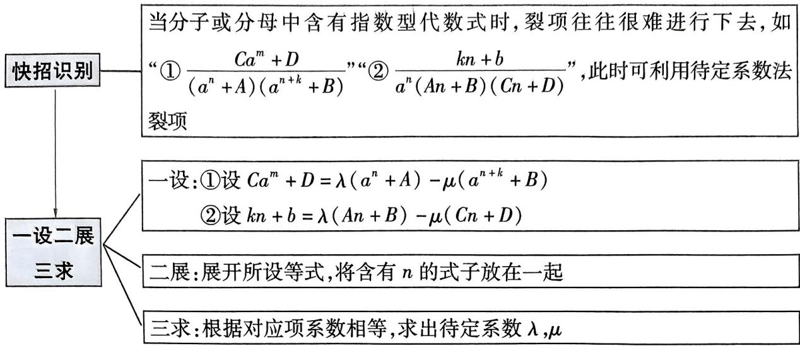

flowchart

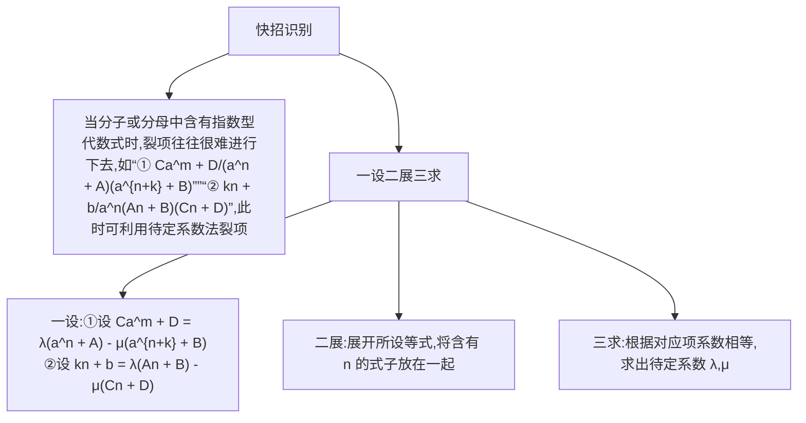

# 快招速练

$$
\boxed { \begin{array}{c} \frac {k n + b}{a ^ {n} (A n + B) (C n + D)} \text {型} \end{array} }
$$

1.[2025 福建师范大学附属中学 12 月模拟]已知数列 $\{a_{n}\}$ 满足 $a_{1} = 1, a_{n+1} = 2a_{n} + 1$ , 数列 $\{b_{n}\}$ 的前 $n$ 项和为 $S_{n}$ , 且 $2S_{n} = n^{2} + \log_{2}(a_{n} + 1)$ .

(1)求数列 $\{a_{n}\}$ ， $\{b_{n}\}$ 的通项公式.  
(2) 记 $c_{n} = \frac{b_{n + 3}}{b_{n + 1}b_{n + 2}(a_n + 1)}$ ，数列 $\{c_{n}\}$ 的前 $n$ 项和为 $T_{n}$ ，若 $T_{n} < \frac{1}{2} (t^{2} + t - 1)$ 对一切 $n \in \mathbf{N}^{*}$ 恒成立，求实数 $t$ 的取值范围.

# 规范答题

$\frac{Ca^{m}+D}{(a^{n}+A)(a^{n+k}+B)}$ 型

2. 试题调研原创 若数列 $\{a_{n}\}$ 是公差为 1 的等差数列, 且 $a_{3} = 2$ , 点 $(a_{n}, b_{n})$ 在函数 $f(x) = 3^{x}$ 的图象上, 记数列 $\{b_{n}\}$ 的前 $n$ 项和为 $S_{n}(n \in \mathbf{N}^{*})$ .

(1) 求数列 $\{a_{n}\}$ , $\{b_{n}\}$ 的通项公式.  
(2) 设 $c_{n} = \frac{b_{n}}{4S_{n}S_{n + 1}}$ ，记数列 $\{c_{n}\}$ 的前 $n$ 项和为 $T_{n}$ ，证明： $T_{n} < \frac{1}{12}$ .

# 规范答题

# 快招速解与参考答案

1.(1)由 $a_{n+1}=2a_{n}+1$ 得 $a_{n+1}+1=2(a_{n}+1)$ ，又 $a_{1}+1=2$ ，

所以数列 $\{a_{n} + 1\}$ 是以2为首项、2为公比的等比数列，

所以 $a_{n} + 1 = 2^{n}$ ，则 $a_{n} = 2^{n} - 1$

由 $2S_{n} = n^{2} + \log_{2}2^{n}$ ，得 $S_{n} = \frac{n^{2} + n}{2}$ ，当 $n = 1$ 时， $b_{1} = S_{1} = 1$

当 $n \geqslant 2$ 时, $b_{n} = S_{n} - S_{n-1} = \frac{n^{2} + n}{2} - \frac{(n - 1)^{2} + (n - 1)}{2} = n$ , 当 $n = 1$ 时, 上式亦成立, 所以 $b_{n} = n$ .

(2) 快招识别 $\frac{kn + b}{a^n (An + B)(Cn + D)}$ 型 $\rightarrow$ 待定系数法裂项.

快招解题 [一设] $c_{n} = \frac{n + 3}{2^{n}(n + 1)(n + 2)}$ ，设 $n + 3 = \lambda (n + 2) - \mu (n + 1)$ ，

[二展] $n+3=(\lambda-\mu)n+(2\lambda-\mu)$ ,

[三求]则 $\left\{ \begin{array}{l} \lambda - \mu = 1, \\ 2\lambda - \mu = 3, \end{array} \right.$ 得 $\lambda = 2, \mu = 1$

所以 $\frac{n + 3}{2^n(n + 1)(n + 2)} = \frac{1}{2^n}\cdot \frac{2(n + 2) - (n + 1)}{(n + 1)(n + 2)} = \frac{1}{(n + 1)2^{n - 1}} -\frac{1}{(n + 2)2^n},$

所以 $T_{n}=\frac{1}{2\times1}-\frac{1}{3\times2}+\frac{1}{3\times2}-\frac{1}{4\times2^{2}}+\cdots+\frac{1}{(n+1)2^{n-1}}-\frac{1}{(n+2)2^{n}}=\frac{1}{2}-\frac{1}{(n+2)2^{n}}<\frac{1}{2}.$

[避易错:使用待定系数法裂项后,消项时要注意“对称”相消,切勿漏项、多项]

由 $T_{n} < \frac{1}{2}(t^{2} + t - 1)$ ，得 $\frac{1}{2}(t^2 + t - 1) \geqslant \frac{1}{2}$ ，解得 $t \geqslant 1$ 或 $t \leqslant -2$ .

所以实数 $t$ 的取值范围为 $(- \infty, -2] \cup [1, +\infty)$ .

2.(1)由 $\{a_{n}\}$ 的公差为1, $a_{3}=2$ 得 $a_{1}=0$ ,

所以 $a_{n} = 0 + (n - 1)\times 1 = n - 1.$

由点 $(a_{n},b_{n})$ 在函数 $f(x)=3^{x}$ 的图象上，得 $b_{n}=3^{a_{n}}=3^{n-1}$ .

(2) 快招识别 $\frac{Ca^{m}+D}{\left(a^{n}+A\right)\left(a^{n+k}+B\right)}$ 型→待定系数法裂项.

快招解题 由(1)知 $b_{n}=3^{n-1}$ ，则 $S_{n}=\frac{3^{n}-1}{2}$

所以 $c_{n} = \frac{b_{n}}{4S_{n}S_{n + 1}} = \frac{3^{n - 1}}{(3^{n} - 1)(3^{n + 1} - 1)}.$

[一设二展] 设 $3^{n-1} = \lambda(3^{n+1} - 1) - \mu(3^n - 1) = 3^{n-1}(9\lambda - 3\mu) - \lambda + \mu,$

[三求]则 $\left\{ \begin{array}{l}9\lambda -3\mu = 1,\\ -\lambda +\mu = 0, \end{array} \right.$ 得 $\lambda = \mu = \frac{1}{6}$ ，故 $c_{n} = \frac{1}{6}\left(\frac{1}{3^{n} - 1} -\frac{1}{3^{n + 1} - 1}\right),$

所以 $T_{n}=c_{1}+c_{2}+c_{3}+\cdots+c_{n}$

$$
= \frac {1}{6} \times \left(\frac {1}{2} - \frac {1}{8} + \frac {1}{8} - \frac {1}{2 6} + \frac {1}{2 6} - \frac {1}{8 0} + \dots + \frac {1}{3 ^ {n} - 1} - \frac {1}{3 ^ {n + 1} - 1}\right)
$$

$$
= \frac {1}{6} \times \left(\frac {1}{2} - \frac {1}{3 ^ {n + 1} - 1}\right)
$$

$$
= \frac {1}{1 2} - \frac {1}{6 (3 ^ {n + 1} - 1)}
$$

$<\frac{1}{12}$ , [传技巧: 由于 $n \in N^{*}$ ，则 $3^{n+1}-1>0$ ，从而 $\frac{1}{12}-\frac{1}{6(3^{n+1}-1)}<\frac{1}{12}$ ]

所以 $T_{n} < \frac{1}{12}$ , 得证.

考场秒解快招 归纳法！当 n=1 时， $c_{1}=\frac{3^{0}}{2\times8}=\left(\frac{1}{2}-\frac{1}{8}\right)\times\frac{1}{6}$ ，当 n=2 时， $c_{2}=\frac{3^{1}}{8\times26}=$ $\left(\frac{1}{8}-\frac{1}{26}\right)\times\frac{3}{26-8}=\left(\frac{1}{8}-\frac{1}{26}\right)\times\frac{1}{6},c_{3}=\frac{3^{2}}{26\times80}=\left(\frac{1}{26}-\frac{1}{80}\right)\times\frac{3^{2}}{80-26}=\left(\frac{1}{26}-\frac{1}{80}\right)\times$ $\frac{1}{6},\cdots,$ 由此推测 $c_{n}=\left(\frac{1}{3^{n}-1}-\frac{1}{3^{n+1}-1}\right)\times\frac{1}{6}$ （这一部分可在演草纸上完成，在答题卡上直接写 $c_{n}=\frac{3^{n-1}}{(3^{n}-1)(3^{n+1}-1)}=\frac{1}{6}\left(\frac{1}{3^{n}-1}-\frac{1}{3^{n+1}-1}\right)$ 即可）.

# 快招 20 放缩法快解数列不等式问题

# 快招速通

<table><tr><td rowspan="3">裂项放缩</td><td>1分式型: $\frac{1}{n}-\frac{1}{n+1}=\frac{1}{n(n+1)}<\frac{1}{n^2}<\frac{1}{(n-1)n}=\frac{1}{n-1}-\frac{1}{n}(n\geqslant2)$ , $\frac{1}{n^2}=\frac{4}{4n^2}<\frac{4}{4n^2-1}=2(\frac{1}{2n-1}-\frac{1}{2n+1})$ </td></tr><tr><td>2根式型: $\frac{1}{\sqrt{n}}=\frac{2}{\sqrt{n}+\sqrt{n}}<\frac{2}{\sqrt{n-1}+\sqrt{n}}=2(\sqrt{n}-\sqrt{n-1})(n\geqslant2)$ , $\frac{1}{\sqrt{n}}=\frac{2}{\sqrt{n}+\sqrt{n}}>\frac{2}{\sqrt{n}+\sqrt{n+1}}=2(\sqrt{n+1}-\sqrt{n})$ </td></tr><tr><td>3指数型: $\frac{1}{2^n-1}=\frac{2^{n+1}-1}{(2^n-1)(2^{n+1}-1)}<\frac{2^{n+1}}{(2^n-1)(2^{n+1}-1)}=\frac{2}{2^n-1}-\frac{2}{2^{n+1}-1}$ </td></tr><tr><td>等比放缩</td><td>4 $\frac{1}{3^n-1}<\frac{1}{3^n-3^{n-1}}=\frac{1}{2\cdot3^{n-1}}(n\geqslant2)$ ;5 $\frac{1}{a^n-b^n}\leqslant\frac{1}{a^{n-1}(a-b)}(a>b\geqslant1)$ </td></tr><tr><td>对数型放缩</td><td>6 $n>\ln(n+1)$ ;7 $\ln\frac{n+1}{n}>\frac{1}{n+1}$ </td></tr></table>

# 快招速练

# ▶ 裂项放缩 + 对数型放缩

1. 试题调研原创 (多选) 若数列 $\{a_{n}\}$ 满足 $a_{1} = 1, \forall m, n \in \mathbb{N}^{*}, \frac{1}{a_{n+m}} = \frac{1}{a_{n}} + \frac{1}{a_{m}}$ 成立, 则 ( )

A. $a_{2024} = \frac{1}{2025}$   
B. $\exists n\in N^{*}$ ，使得 $a_{2}^{2}+a_{3}^{2}+\cdots+a_{n+1}^{2}>1$   
C. $\forall n\in N^{*},a_{1}+a_{2}+a_{3}+\cdots+a_{n}>\ln(n+1)$   
D. $\forall n\in N^{*},a_{2}+a_{3}+a_{4}+\cdots+a_{n+1}<\ln(n+1)$

# ▶等比放缩

2.[2025 湖南长沙 12 月检测]已知数列 $\{a_{n}\}$ 满足对于任意 $n \in \mathbf{N}^{*}$ 都有 $\frac{a_{1} + 1}{2} + \frac{a_{2} + 1}{2^{2}} + \frac{a_{3} + 1}{2^{3}} + \cdots + \frac{a_{n} + 1}{2^{n}} = n$ .

(1)求数列 $\{a_{n}\}$ 的通项公式.

快速

记忆

推理记忆法 许多数学知识之间逻辑关系比较明显, 记忆时, 只需记住一个, 再利用推理得到其他的, 这种方法称为推理记忆法.

(2) 证明: $\frac{1}{a_1} + \frac{1}{a_2} + \frac{1}{a_3} + \cdots + \frac{1}{a_{n+1}} < \frac{5}{3}$ .

# 规范答题

# 快招速解与参考答案

1.CD 快招识别 B 选项中 $a_{n}^{2} = \frac{1}{n^{2}} \rightarrow$ 裂项放缩, CD 选项中含 $\ln (n + 1) \rightarrow$ 对数型放缩.

快招解题 对于 A, 令 m=1, 则 $\frac{1}{a_{n+1}} - \frac{1}{a_n} = \frac{1}{a_1} = 1$ , 所以 $\left\{\frac{1}{a_n}\right\}$ 是以 1 为首项、1 为公差的等差数列, 所以 $\frac{1}{a_n} = 1 + (n-1) \times 1 = n$ , 所以 $a_n = \frac{1}{n}$ , 故 $a_{2024} = \frac{1}{2024}$ , A 错误.

对于 B, [裂项放缩①分式型] 易知 $a_{n}^{2} = \frac{1}{n^{2}}$ , 因为 $\frac{1}{n^{2}} = \frac{4}{4n^{2}} < \frac{4}{4n^{2} - 1} = \frac{2}{2n - 1} - \frac{2}{2n + 1}$ ,

所以 $\frac{1}{2^2} +\frac{1}{3^2} +\dots +\frac{1}{(n + 1)^2} <  (\frac{2}{3} -\frac{2}{5}) + (\frac{2}{5} -\frac{2}{7}) + \dots +( \frac{2}{2n + 1} -\frac{2}{2n + 3}) = \frac{2}{3} -\frac{2}{2n + 3},$

所以 $\frac{1}{2^{2}}+\frac{1}{3^{2}}+\cdots+\frac{1}{(n+1)^{2}}<\frac{2}{3}$ ，即 $a_{2}^{2}+a_{3}^{2}+\cdots+a_{n+1}^{2}<\frac{2}{3}$ ，B错误.

对于 C, [对数型放缩⑥] 记 $f(x) = x - \ln(1 + x)$ , x > 0, 则 $f'(x) = 1 - \frac{1}{1 + x} = \frac{x}{1 + x} > 0$ ,

所以 $f(x)$ 在 $(0, +\infty)$ 上单调递增，所以 $f(x) > 0 - \ln (1 + 0) = 0$ ，所以 $x > \ln (1 + x)$ ，所以 $n > \ln (1 + n), n \in \mathbf{N}^*$ ，则 $\frac{1}{n} > \ln (1 + \frac{1}{n}), n \in \mathbf{N}^*$ ，

所以 $1 > \ln 2, \frac{1}{2} > \ln (1 + \frac{1}{2}) = \ln \frac{3}{2}, \frac{1}{3} > \ln \frac{4}{3}, \cdots, \frac{1}{n} > \ln \frac{n + 1}{n}$ , [秒解快招:由切线不等式 $x - 1 \geqslant \ln x$ 可秒得结论 $\frac{1}{n} > \ln (1 + \frac{1}{n})$ , 快速判断本选项]

所以 $1 + \frac{1}{2} + \frac{1}{3} + \cdots + \frac{1}{n} > \ln 2 + \ln \frac{3}{2} + \cdots + \ln \frac{n+1}{n} = \ln (2 \times \frac{3}{2} \times \cdots \times \frac{n+1}{n}) = \ln (n+1)$ ,
即 $a_{1} + a_{2} + a_{3} + \cdots + a_{n} > \ln(n+1)$ ，C 正确.

对于 D, [对数型放缩⑦] 记 $g(x)=\ln(x+1)-\frac{x}{x+1}, x>0$ ，则 $g'(x)=\frac{1}{x+1}-\frac{1}{(x+1)^2}=\frac{x}{(x+1)^2}>0$ ，
所以 $g(x)$ 在 $(0, +\infty)$ 上单调递增，所以 $g(x) > \ln(0 + 1) - \frac{0}{0 + 1} = 0$ ，

所以当 $x > 0$ 时， $\ln (x + 1) > \frac{x}{x + 1}$ ，所以 $\ln (\frac{1}{n} +1) > \frac{1}{n + 1}$ 即 $\ln \frac{n + 1}{n} >\frac{1}{n + 1},n\in \mathbf{N}^*$

所以 $\frac{1}{1 + 1} < \ln \frac{1 + 1}{1}, \frac{1}{2 + 1} < \ln \frac{2 + 1}{2}, \dots, \frac{1}{n + 1} < \ln \frac{n + 1}{n}$ ,

累加得 $\frac{1}{2}+\frac{1}{3}+\cdots+\frac{1}{n+1}<\ln(\frac{2}{1}\times\frac{3}{2}\times\cdots\times\frac{n+1}{n})=\ln(n+1)$ ，[巧求和:由对数运算性质也可得到 $\frac{1}{n+1}<\ln\frac{1+n}{n}=\ln(1+n)-\ln n$ ，进而应用累加法求解]

即 $a_{2} + a_{3} + a_{4} + \cdots + a_{n+1} < \ln(n+1)$ ，D 正确。故选 CD.

2.(1) $\frac{a_{1}+1}{2}+\frac{a_{2}+1}{2^{2}}+\frac{a_{3}+1}{2^{3}}+\cdots+\frac{a_{n}+1}{2^{n}}=n$ ( \* ) ,

当 $n \geqslant 2$ 时, $\frac{a_1 + 1}{2} + \frac{a_2 + 1}{2^2} + \frac{a_3 + 1}{2^3} + \cdots + \frac{a_{n-1} + 1}{2^{n-1}} = n - 1$ (\* \*),

由 $(*) - (**)$ 得 $\frac{a_n + 1}{2^n} = 1$ ，所以 $a_n = 2^n - 1 (n \geqslant 2)$ .

又 $n = 1$ 时， $\frac{a_1 + 1}{2} = 1$ ，得到 $a_1 = 1$ ，满足 $a_{n} = 2^{n} - 1$

所以数列 $\{a_{n}\}$ 的通项公式为 $a_{n} = 2^{n} - 1$

(2) 快招识别 $\frac{1}{a_n} = \frac{1}{2^n - 1}$ 可裂项或构造等比放缩 $\rightarrow \frac{1}{a_1} + \frac{1}{a_2} = \frac{4}{3} \rightarrow$ 通过等比数列求和出现 $\frac{1}{3}$ 方可得到 $\frac{5}{3} \rightarrow$ 构造等比放缩.

快招解题[等比放缩⑤]当 $n \geqslant 2$ 时, $2^{n+1} - 1 - 3 \times 2^{n-1} = 2^{n-1} - 1 > 0$ , 则 $2^{n+1} - 1 > 3 \times 2^{n-1}$ .

当 $n = 1$ 时， $\frac{1}{a_1} +\frac{1}{a_2} = 1 + \frac{1}{3} = \frac{4}{3} <  \frac{5}{3}.$

当 $n \geqslant 2$ 时, $\frac{1}{a_1} + \frac{1}{a_2} + \frac{1}{a_3} + \cdots + \frac{1}{a_{n+1}} = 1 + \frac{1}{3} + \frac{1}{7} + \cdots + \frac{1}{2^{n+1} - 1} < 1 + \frac{1}{3} + \frac{1}{6} + \cdots + \frac{1}{3 \times 2^{n-1}} = \frac{4}{3} + \frac{\frac{1}{6}\left[1 - \left(\frac{1}{2}\right)^{n-1}\right]}{1 - \frac{1}{2}} = \frac{4}{3} + \frac{1}{3}\left[1 - \left(\frac{1}{2}\right)^{n-1}\right] < \frac{4}{3} + \frac{1}{3} = \frac{5}{3}$ . [妙构造:适当放缩, 把原式放

缩为可利用等比数列前 $n$ 项和公式求和的式子]

综上， $\frac{1}{a_{1}}+\frac{1}{a_{2}}+\frac{1}{a_{3}}+\cdots+\frac{1}{a_{n+1}}<\frac{5}{3}.$

①考场秒解快招 特殊化思想！第(2)问完整证明不等式难度较大,若思路卡壳,可以先找特殊值证明,即先证明 n=1 时不等式成立,此时可以得部分分,接下来再对一般情况进行证明,注意解答题是按步骤得分,写步骤时一定要清晰、明了.

# 快招 21 奇偶代换模型妙解分段数列问题

# 快招速通

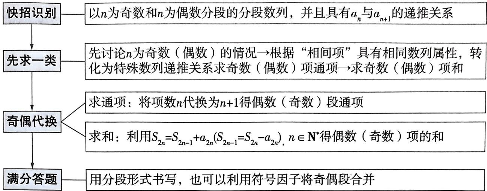

flowchart

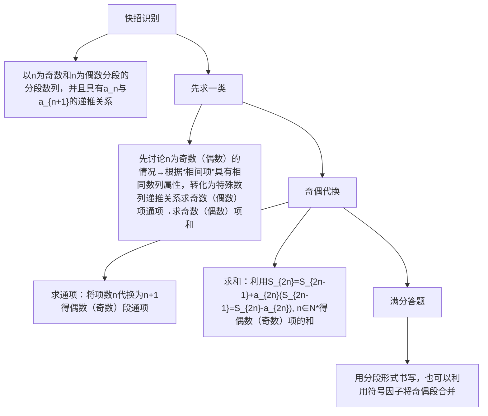

# 快招速练

# 奇偶代换速求数列通项公式

1.[2025 哈尔滨九中 11 月期中]已知数列 $\{a_{n}\}$ 满足 $a_{n+1}=\begin{cases}2a_{n},n\text{为奇数,}\\a_{n}+2,n\text{为偶数,}\end{cases}$ , 则 $a_{n}=$ \_\_\_\_; 设数列 $\{a_{n}\}$ 的前 $n$ 项和为 $S_{n}$ , 则 $S_{2024}=$ \_\_\_\_.

# 奇偶代换速求数列前 $n$ 项和

2. 试题调研原创 已知数列 $\{a_{n}\}$ 的前 $n$ 项和为 $S_{n}$ , 且 $a_{1} = 1, a_{n+1} = \left\{ \begin{array}{l} 2a_{n} + 2n - 2, n \text{为奇数,} \\ a_{n} - n, n \text{为偶数,} \end{array} \right.$ 则 $S_{n} =$ \_\_\_\_.

# 快招速解与参考答案

1. $\left\{ \begin{array}{l} 2^{\frac{n+1}{2}} - 2, n \text{为奇数,} \\ 2^{\frac{n+2}{2}} - 4, n \text{为偶数} \end{array} \right.$ $3 \times (2^{1013} - 2026)$ 快招识别 $\{a_n\}$ 是以 $n$ 为奇数和 $n$ 为偶数分段

的分段数列,并且奇偶项各自具有 $a_{n}$ 与 $a_{n+1}$ 的递推关系 $\rightarrow$ 奇偶代换法,只求一类,另一类代换得解.

快招解题 由 $a_1 = 0$ 得 $a_2 = 0$ ，当 $n$ 为偶数时， $a_{n+2} = 2a_{n+1} = 2(a_n + 2) = 2a_n + 4$

所以 $a_{n + 2} + 4 = 2(a_n + 4)$ ，故 $a_{n} + 4 = 4\times 2^{\frac{n}{2} -1}$ 即 $a_{n} = 2^{\frac{n}{2} +1} - 4,n$ 为偶数

当 $n$ 为奇数时， $n + 1$ 为偶数，则 $a_{n} = \frac{a_{n + 1}}{2} = 2^{\frac{n + 1}{2}} - 2.$ 综上 $a_{n} = \left\{ \begin{array}{l} 2^{\frac{n + 1}{2}} - 2, n \text{为奇数}, \\ 2^{\frac{n + 2}{2}} - 4, n \text{为偶数}. \end{array} \right.$

理解记忆法 理解是记忆的前提,要通过理解、掌握它的逻辑结构体系进行记忆. 对于数学知识的理解记忆,关键在于弄清数学知识的逻辑联系,把握它的来龙去脉,使用理解记忆法可以提高记忆效率.

当 $n$ 为奇数时， $a_{n+1} = 2a_n$ ，则 $S_{2024} = (a_1 + a_3 + \cdots + a_{2023}) + (a_2 + a_4 + \cdots + a_{2024}) = 3(a_1 + a_3 + \cdots + a_{2023}) = 3 \times \left[\frac{2 \times (1 - 2^{1012})}{1 - 2} - 2 \times 1012\right] = 3 \times (2^{1013} - 2026)$ .

方法二:分组求和法 $S_{2024}=(a_{1}+a_{3}+\cdots+a_{2023})+(a_{2}+a_{4}+\cdots+a_{2024})=(2-2+2^{2}-2+\cdots+2^{1012}-2)+(2^{2}-4+2^{3}-4+\cdots+2^{1013}-4)=\frac{2\times(1-2^{1012})}{1-2}-2\times1012+\frac{4\times(1-2^{1012})}{1-2}-4\times1012=3\times(2^{1013}-2026).$

考场秒解快招 项数“k”化法！用 $n = 2k - 1, k \in \mathbf{N}^*$ 表示项数 $n$ 为奇数时的情况，用 $n = 2k, k \in \mathbf{N}^*$ 表示项数 $n$ 为偶数时的情况，那么 $a_{2k + 1} = a_{2k} + 2 = 2a_{2k - 1} + 2$ ，则 $a_{2k + 1} + 2 = 2(a_{2k - 1} + 2)$ ，所以 $a_{2k - 1} = 2^k - 2$ ，则 $a_{2k} = 2a_{2k - 1} = 2^{k + 1} - 4$ 。最后根据项数 $n$ 为奇数时 $k = \frac{n + 1}{2}, n$ 为偶数时 $k = \frac{n}{2}$ 得到用 $n$ 表示的数列通项公式并求和。

2. $\left\{\begin{aligned}&2^{\frac{n+3}{2}}-\frac{n^{2}-1}{4}-3,n\text{为奇数,}\\ &-3+3\times2^{\frac{n}{2}}-\frac{n^{2}}{4}+\frac{n}{2},n\text{为偶数}\end{aligned}\right.$

快招识别 数列通项公式分 $n$ 为奇数和 $n$ 为偶数两种情

况, 故求数列前 $n$ 项和 $S_{n}$ 也应分 $n$ 为奇数和 $n$ 为偶数两种情况, 求出一种后用奇偶代换法求另一种.

快招解题 由题意得 $a_{2} = 2a_{1} + 2 \times 1 - 2 = 2$

当 $n \geqslant 2$ 时, $a_{2n} = 2a_{2n-1} + 2(2n - 1) - 2 = 2a_{2n-1} + 4n - 4 = 2[a_{2n-2} - (2n - 2)] + 4n - 4 = 2a_{2n-2}$ , 所以 $a_{2n} = 2^n$ , 所以当 $n$ 为偶数时, $a_n = 2^{\frac{n}{2}}$ .

当 $n$ 为奇数时，由已知可得 $a_{n} = \frac{a_{n + 1}}{2} - n + 1.$

所以当 $n$ 为偶数时， $S_{n} = (a_{1} + a_{3} + \dots + a_{n-1}) + (a_{2} + a_{4} + \dots + a_{n}) = \frac{3}{2}(a_{2} + a_{4} + \dots +$

$$
a _ {n}) - (0 + 2 + 4 + \dots + n - 2) = \frac {3}{2} (2 + 2 ^ {2} + \dots + 2 ^ {\frac {n}{2}}) - \frac {(0 + n - 2) \frac {n}{2}}{2} = - 3 + 3 \times 2 ^ {\frac {n}{2}} - \frac {n ^ {2}}{4} + \frac {n}{2},
$$

当 $n$ 为奇数时, $S_{n} = S_{n + 1} - a_{n + 1} = -3 + 3 \times 2^{\frac{n + 1}{2}} - \frac{(n + 1)^{2}}{4} + \frac{n + 1}{2} - 2^{\frac{n + 1}{2}} = 2^{\frac{n + 3}{2}} - \frac{n^{2} - 1}{4} - 3.$ [用快招: $n$ 为奇数, 则 $n + 1$ 为偶数, 借助已求得的偶数结论转换求解]

所以 $S_{n} = \left\{ \begin{array}{l}2^{\frac{n + 3}{2}} - \frac{n^{2} - 1}{4} -3,n\\ -3 + 3\times 2^{\frac{n}{2}} - \frac{n^{2}}{4} +\frac{n}{2},n \end{array} \right.$ 为奇数，

# 专题5 立体几何

# 快招22 “长方体模型”速判立体几何选择题

# 快招速通

# 1 锥体补形为长(正)方体的 4 大模型

<table><tr><td>墙角模型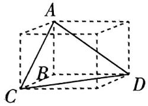</td><td>有三条共顶点的棱互相垂直的三棱锥,补形为长方体后,符合“三棱三面”:共顶点的三条棱对应长方体的长、宽、高,其余三条棱为长方体的面对角线</td><td>鳖臑模型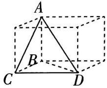</td><td>“鳖臑”是四个面均为直角三角形的三棱锥,补形为长方体后,符合“三棱二面一体”:三条棱对应长方体的长、宽、高,二条棱对应面对角线,一条棱对应体对角线</td></tr><tr><td>对棱相等模型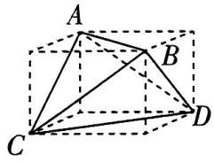</td><td>如果三棱锥的对棱相等,补形为长方体后,符合“棱对面”:三棱锥的每条棱都对应长方体的面对角线</td><td>正四面体模型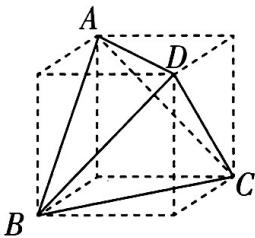</td><td>正四面体可以看作一种特殊的对棱相等的三棱锥,可补形为正方体,且正方体的棱长为正四面体棱长的 $\frac{\sqrt{2}}{2}$ </td></tr></table>

# 2 长方体模型常用结论

<table><tr><td>平行结论</td><td>已知长方体 $ABCD-A_{1}B_{1}C_{1}D_{1}$ .结论1:平面 $C_{1}BD$ //平面 $AB_{1}D_{1}$ .结论2:E为 $DD_{1}$ 的中点,则 $D_{1}B$ //平面 $ACE$ .结论3:M,N,E,F分别为棱 $A_{1}B_{1},A_{1}D_{1},B_{1}C_{1},C_{1}D_{1}$ 的中点,则平面 $AMN$ //平面 $EFDB$ 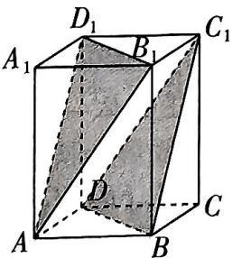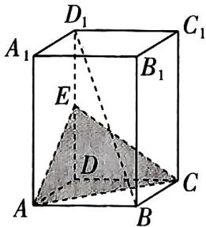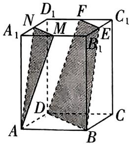[结论1图][结论2图][结论3图]</td></tr><tr><td>垂直结论</td><td>已知正方体 $ABCD-A_{1}B_{1}C_{1}D_{1}$ .结论4: $AB_{1}\perp$ 平面 $A_{1}BCD_{1}$ ,即面对角线垂直于“对角面”.结论5: $DB_{1}\perp$ 平面 $ACD_{1}$ ,即体对角线垂直于“三角面”,且体对角线与“三角面”的交点为体对角线的三等分点[结论4图][结论5图]</td></tr></table>

# 快招速练

# $\triangleright$ 交汇化学学科，利用正四面体模型求交线长

1.[2025 江西景德镇 11 月第一次质检]甲烷是最简单的有机化合物,其化学式为 $\mathrm{CH}_{4}$ , 它是由四个氢原子和一个碳原子构成的. 甲烷的分子结构是正四面体结构,如图 1, 四个氢原子分别位于正四面体的顶点 A, B, C, D 处, 碳原子位于正四面体的中心 O 处. 若正四面体 ABCD 的棱长为 1 , 则平面 OAB 和平面 OCD 位于正四面体内部的交线长度为 ( )

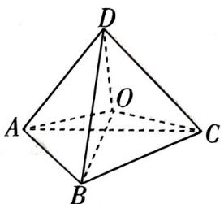

text_image

D
O
A
B
C

图1

A. $\frac{\sqrt{2}}{2}$

B. $\frac{\sqrt{3}}{3}$

C. $\frac{\sqrt{6}}{3}$

D. 1

# 正方体内动点轨迹问题

2.[2024 北京市第五十中学 12 月检测]点 M, N 分别是棱长为 2 的正方体 $ABCD - A_{1}B_{1}C_{1}D_{1}$ 中棱 $BC, CC_{1}$ 的中点, 动点 P 在正方形 $BCC_{1}B_{1}$ (包括边界) 内运动. 若 $PA_{1} \parallel$ 平面 AMN, 则 $PA_{1}$ 的长度范围是 ()

A. $[2, \sqrt{5}]$

B. $\left[\frac{3\sqrt{2}}{2}, \sqrt{5}\right]$

C. $\left[\frac{3\sqrt{2}}{2}, 3\right]$

D. $[2,3]$

# 三棱锥与球交汇问题

3. 试题调研原创 (多选)已知 $\triangle ABC$ 的三边长分别为 $AB = \sqrt{2}, BC = 1, AC = 1, P$ 是平面 $ABC$ 外一点. 下列说法正确的是 ( )

A. 若 $PB \perp$ 平面 $ABC$ , 且 $PB = 2$ , 则三棱锥 $P - ABC$ 的外接球体积为 $6\pi$   
B. 若 $PC \perp$ 平面 $ABC$ , 且 $PC = 1$ , 则三棱锥 $P - ABC$ 的外接球球心到平面 $PAB$ 的距离为 $\frac{\sqrt{3}}{6}$   
C. 若 $PA = PB = \sqrt{2}, M$ 为 $AC$ 中点, $PM \perp BC$ , 则三棱锥 $P - ABC$ 的外接球表面积为 $\frac{3}{4}\pi$   
D. 若 $BC \perp PC$ , 且点 $P$ 在以 $AB$ 为直径的球面上, $\angle ACP = 30^{\circ}$ , 则 $CP = \frac{\sqrt{3}}{2}$

# 快招速解与参考答案

1.A 快招识别 看到正四面体内求线段长问题 $\rightarrow$ 补形得到正方体 $\rightarrow$ 利用正四面体模型求解.

快招解题 如图2所示,分别取AB,CD的中点E,F,连接FA,FB,EC,ED,EF,则由正四面体的性质可得EF过正四面体的中心O,所以平面OAB即平面FAB,平面OCD即平面ECD,又EF⊂平面FAB,EF⊂平面ECD,所以平面OAB和平面OCD位于正四面体内部的交线为线段EF.方法一 将正四面体补形为正方体,如图3,

[利用正四面体模型]正四面体棱长为1,则对应的正方体棱长为 $\frac{\sqrt{2}}{2}$ , [用快招: 正四面体的棱长等于补形得到的正方体的面对角线长]
所以 EF 的长度等于正方体的棱长, 即 $\frac{\sqrt{2}}{2}$ . 故选 A.

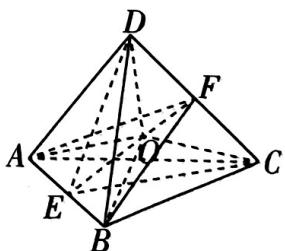

text_image

Geometric diagram of a tetrahedron with labeled vertices and internal points, used for spatial geometry problems.

图2

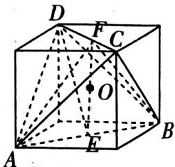

text_image

Geometric diagram of a cube with labeled vertices and internal points, used for spatial geometry problems.

图3

方法二 因为正四面体 $ABCD$ 的棱长为 1, 所以由勾股定理可得 $FA = FB = \sqrt{1^2 - (\frac{1}{2})^2} = \frac{\sqrt{3}}{2}$ , 所以在等腰三角形 $FAB$ 中, $EF = \sqrt{FA^2 - EA^2} = \sqrt{(\frac{\sqrt{3}}{2})^2 - (\frac{1}{2})^2} = \frac{\sqrt{2}}{2}$ . 故选 A.

2.B 快招解题 连接 $AD_{1}, D_{1}N$ , 易知平面 $AMN$ 即平面 $AMND_{1}$ , 如图4, 取 $B_{1}C_{1}$ 的中点 $E, BB_{1}$ 的中点 $F$ , 连接 $A_{1}E, A_{1}F, EF$ ,

[利用平行结论③]所以平面 $A_{1}EF / /$ 平面AMN，所以点 $P$ 的轨迹是线段 $EF$ . $A_{1}E = A_{1}F = \sqrt{2^{2} + 1^{2}} = \sqrt{5}, EF = \sqrt{1^{2} + 1^{2}} = \sqrt{2}$ ，

因为 $\triangle A_{1}EF$ 为等腰三角形,所以当 $P$ 在 $EF$ 的中点处时, $PA_{1}$ 取最小值,为 $\sqrt{(\sqrt{5})^{2}-(\frac{\sqrt{2}}{2})^{2}}=\frac{3\sqrt{2}}{2}.P$ 在点 $E$ 或者点 $F$ 处时, $PA_{1}$ 取最大值,为 $\sqrt{5}$ .

即 $PA_{1}$ 的长度范围为 $\left[\frac{3\sqrt{2}}{2},\sqrt{5}\right]$ ，故选 B.

3.BD 快招解题 [利用鳖臑模型] 对于 A, 当 $PB \perp$ 平面 ABC 时, 三棱锥 P-ABC 的所有面都是直角三角形, 则可以将其补形为长方体, 如图 5, 则外接球半径 $R = \frac{\sqrt{1^{2} + 1^{2} + 2^{2}}}{2} = \frac{\sqrt{6}}{2}$ , 所以外接球体积为 $\sqrt{6}\pi$ , A 错误.

[利用墙角模型]对于B,当 $PC\perp$ 平面ABC时,PC,AC,BC三线两两垂直且均等于1,则三棱锥P-ABC可还原为正方体,如图6,CF为三棱锥P-ABC的外接球的直径,O是外接球球心, $O_{1}$ 是CF与平面PAB的交点,显然 $OC=\frac{1}{2}CF.$

[利用垂直结论⑤]则 $CF \perp$ 平面 $PAB$ , 且 $O_{1}C = \frac{1}{3} CF$ . 所以三棱锥 $P - ABC$ 的外接球球心到平面 $PAB$ 的距离为 $OO_{1}, OO_{1} = OC - O_{1}C = \frac{1}{6} CF = \frac{\sqrt{3}}{6}$ , B 正确.

[利用墙角模型]对于 C, 由 $AB = \sqrt{2}, BC = 1, AC = 1$ 得 $BC \perp AC$ , 又 $PM \perp BC, PM \cap AC = M$ , 所以 $BC \perp$ 平面 $PAC$ , 所以 $BC \perp PC$ , 即 $BC, PC, AC$ 三线两两垂直, 构造长方体, 如图 7, 由 $PA = \sqrt{2}, AC = 1$ 可得, $PC = 1$ , 所以三棱锥 $P - ABC$ 的外接球半径 $R = \frac{\sqrt{3}}{2}$ , 所以外接球表面积为 $3\pi$ , C 错误.

对于 D, 连接 PA, PB, 易知 $AC \perp BC$ , 又 $BC \perp PC, AC \cap PC = C$ , 所以 $BC \perp$ 平面 PAC, 所以 $BC \perp PA$ .

因为点 P 在以 AB 为直径的球面上, 所以 $PA \perp PB$ , 所以三棱锥 P - ABC 的所有面都是直角三角形.

[利用鳖臑模型]构造如图8所示的长方体,因为 $\angle ACP=30^{\circ}$ ,所以 $CP=1\times\cos30^{\circ}=\frac{\sqrt{3}}{2}$ ,D正确.

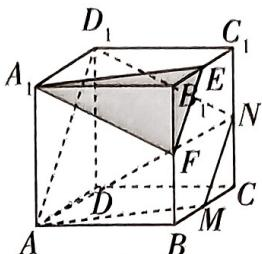

text_image

Geometric diagram of a cube with labeled vertices and internal points, showing solid and dashed edges for spatial relationships.

图4

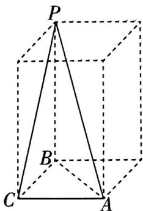

text_image

P
B
C
A

图5  

text_image

Geometric diagram of a cube with labeled points and lines, including center O and intersection point B

图6

text_image

P
B
C M A

图7

B   

text_image

P
C
A

图8

考场秒解快招 逻辑分析法！分析得出 AC 错误，B 正确后，由多选题的规则可知 D 正确，直接选 BD.

转换简化 把复杂的记忆目标甲,转换为简单的或早已熟记的乙,把乙以及甲与乙相互转换的过程,作为新的记忆目标进行记忆.

# 快招23 抓不变量，巧解动态几何多选题

# 快招速通

flowchart

# 快招速练

# ▶抓垂直关系、包含关系确定轨迹

1.[2025 江淮十校 12 月联考](多选)在棱长为 2 的正方体 $ABCD - A_{1}B_{1}C_{1}D_{1}$ 中, 点 $E, F$ 分别为棱 $AB, AD$ 的中点, 点 $G$ 在底面 $A_{1}B_{1}C_{1}D_{1}$ 内运动(含边界), 且 $A_{1}C \perp$ 平面 $EFG$ , 则 ( )

A. 若 $\overrightarrow{D_1G} = \lambda \overrightarrow{GC_1} (\lambda \in \mathbf{R})$ ，则 $EG \parallel$ 平面 $ADD_{1}A_{1}$   
B. 点 $G$ 到直线 $EF$ 的距离为 $\frac{\sqrt{6}}{2}$   
C. 若 $\overrightarrow{A_1G} = \lambda \overrightarrow{GC_1} (\lambda \in \mathbf{R})$ ，则 $\lambda = 3$   
D. 直线 $CE$ 与平面 $EFG$ 所成角的正弦值为 $\frac{\sqrt{15}}{5}$

# ▶抓等距性确定轨迹

2. 试题调研原创（多选）在长方体 $ABCD - A_{1}B_{1}C_{1}D_{1}$ 中， $|AB| = |BC| = 2, |AA_{1}| = 2\sqrt{2}, P$ 是四边形 $A_{1}B_{1}C_{1}D_{1}$ 内（包含边界）一动点，设二面角 $P - AD - B$ 的大小为 $\alpha$ ，直线 $PB$ 与平面 $ABCD$ 所成的角为 $\beta$ ，若 $\alpha = \beta$ ，则 （）

A. 点 $P$ 的轨迹为双曲线的一部分

B. $|PB|$ 的最小值为 3

C. 直线 $PA_{1}$ 与直线 $CD$ 所成角的最大值为 $\frac{\pi}{3}$

D. 三棱锥 $P - A_{1}BC_{1}$ 体积的最大值为 $\frac{2\sqrt{2}}{3}$

# 抓翻折不变量破解轨迹问题

3.[2025 重庆12月阶段测试](多选)如图1,在矩形ABCD中,AB=2BC=2,点M是边CD的中点,将△ADM沿AM翻折,直至点D落在边AB上.当△ADM翻折到△PAM的位置时,连接PB,PC(如图2),则()

text_image

D
M
C
A
B

图1

text_image

Geometric diagram of a parallelepiped with labeled vertices and internal points, used for spatial geometry problems.

图2

A. 四棱锥 $P - ABCM$ 体积的最大值为 $\frac{\sqrt{2}}{4}$   
B. 存在某一翻折位置, 使得 $AM \perp PB$   
C. E 为 AB 的中点, 当 $PE = \frac{1}{2}$ 时, 二面角 P - AM - C 的余弦值为 $\frac{3}{4}$   
D. $N$ 为 $PB$ 的中点, 则线段 $CN$ 的长为定值

# 快招速解与参考答案

1.ACD 快招解题 如图3,连接 $C_1D,C_1B,BD$ ，由正方体的性质得 $A_{1}C\perp$ 平面 $C_1DB$ .易知 $EF / / DB,EF\not\subset$ 平面 $C_1BD$ ，所以 $EF / /$ 平面 $C_1BD$

分别取棱 $BB_{1}, B_{1}C_{1}, C_{1}D_{1}, DD_{1}$ 的中点 $M, N, P, Q$ , 连接 $EM, MN, NP, PQ, QF$ , 则 $NP \parallel$ 平面 $C_{1}BD, EM \parallel PQ \parallel$ 平面 $C_{1}BD, MN \parallel FQ \parallel$ 平面 $C_{1}BD$ , 所以平面 $EMNPQF \parallel$ 平面 $C_{1}BD$ .

[抓位置关系①垂直关系]因为 $A_{1}C \perp$ 平面 $C_{1}DB$ , 所以 $A_{1}C \perp$ 平面 EMNPQF, 所以平面 EFG 即平面 EMNPQF.

text_image

D₁ P C₁
A₁ B₁ N
Q
D M C
F
A E B

图3

[抓位置关系②包含关系]又平面 $EMNPQF \cap$ 平面 $A_{1}B_{1}C_{1}D_{1} = NP$ , 所以点 $G$ 的轨迹即线段 $NP$ .

<table><tr><td>选项</td><td>分析过程</td><td>正误</td></tr><tr><td>A</td><td>[抓位置关系2包含关系]若 $\overrightarrow{D_1G} = \lambda \overrightarrow{GC_1} (\lambda \in \mathbb{R})$ ,则点G为棱 $C_1D_1$ 的中点P,[用快招:此时点G既在线段NP上,又在线段 $D_1C_1$ 上,由直线NP与 $D_1C_1$ 相交确定点的位置]连接 $AD_1$ ,则 $EG//AD_1$ ,又 $EG\not\subset$ 平面 $ADD_1A_1$ , $AD_1 \subset$ 平面 $ADD_1A_1$ ,所以 $EG//$ 平面 $ADD_1A_1$ </td><td>√</td></tr></table>

联合记忆法 把相关联的两个或两个以上的记忆目标, 联合在一起记忆, 往往比孤立地记忆其中一个容易得多.

快速记忆

续表

<table><tr><td>选项</td><td>分析过程</td><td>正误</td></tr><tr><td>B</td><td>[抓位置关系1平行关系]因为 $NP // EF$ ,所以点 $G$ 到 $EF$ 的距离即 $NP$ 与 $EF$ 间的距离,为 $\frac{\sqrt{3}}{2} \times \sqrt{2} \times 2 = \sqrt{6}$ </td><td>×</td></tr><tr><td>C</td><td>连接 $A_1 C_1$ ,则直线 $A_1 C_1$ 与 $NP$ 的交点即点 $G$ ,此时 $A_1 G = 3GC_1$ ,则 $\lambda = 3$ </td><td>√</td></tr><tr><td>D</td><td>因为 $CE = \sqrt{5}$ ,点 $C$ 到平面 $EFG$ 的距离为 $\frac{1}{2}A_1C = \sqrt{3}$ ,所以直线 $CE$ 与平面 $EFG$ 所成角的正弦值为 $\frac{\sqrt{3}}{\sqrt{5}} = \frac{\sqrt{15}}{5}$ </td><td>√</td></tr></table>

# 2.BD 快招解题 对于 A, 如图 4, 过点 P 作 $PO \perp$ 平面 ABCD, 垂足为 O, 作 $OH \perp AD$ , 垂足为

H, 连接 PH,

∵ PO ⊥ 平面 ABCD, AD ⊂ 平面 ABCD, ∴ AD ⊥ PO,

又 $OH \perp AD, PO \cap OH = O, PO, OH \subset$ 平面 $POH, \therefore AD \perp$ 平面 $POH$ ,

$\because PH \subset$ 平面 $POH, \therefore AD \perp PH,$

∴ $\angle PHO$ 为二面角 P-AD-B 的平面角, 即 $\angle PHO = \alpha$ .

连接 OB, 则 $\angle PBO = \beta, \therefore \angle PHO = \angle PBO,$

text_image

Geometric diagram of a cube with labeled vertices and internal points, used for spatial geometry problems.

图4

[抓数量关系⑥等距性]∴ $|OH|=|OB|$ , ∴ 点 P 到直线 $A_{1}D_{1}$ 的距离等于

点 $B_{1}, P$ 间的距离, [用定义: 点 $P$ 到定直线与到定点的距离相等, 利用抛物线定义判断轨迹] 则点 $P$ 的轨迹为以 $B_{1}$ 为焦点, 以直线 $A_{1}D_{1}$ 为准线的抛物线在四边形 $A_{1}B_{1}C_{1}D_{1}$ 内 (含边界) 的部分, A 错误.

对于 B, 由抛物线性质知, 当 O 为 AB 中点时, $\left|OB\right|$ 取最小值, $\left|OB\right|_{\min}=1$ ,

$\therefore |PB|_{\min} = \sqrt{(2\sqrt{2})^2 + 1^2} = 3, B$ 正确.

对于 C, 连接 OA, 则直线 $PA_{1}$ 与 CD 所成角即直线 OA 与 AB 所成角 $\angle OAB$ , 在平面 ABCD 中, 以线段 AB 中点 M 为坐标原点, 建立如图 5 所示平面直角坐标系,

由题意知点 O 所在抛物线方程为 $y^{2}=4x, A(-1,0)$ ，易知当直线 OA 与抛物线 $y^{2}=4x$ 相切时， $\angle OAB$ 取得最大值.

text_image

y
D
O
C
A
M
B
x

图5

设切线方程为 $x = ty - 1$ ，则由 $\left\{ \begin{array}{l} x = ty - 1, \\ y^2 = 4x, \end{array} \right.$ 得关于 $y$ 的方程 $y^2 - 4ty + 4 = 0$

$\therefore \Delta = 16t^{2} - 16 = 0$ ，解得 $t = \pm 1$

∵ O 在四边形 ABCD 内(含边界)，结合图形可知 t=1，此时 $\angle OAB=\frac{\pi}{4}$ ,

∴ 直线 $PA_{1}$ 与 CD 所成角的最大值为 $\frac{\pi}{4}$ ，C 错误.

对于D,在图4中,连接AC,∵ $V_{P-A_{1}BC_{1}}=V_{B-PA_{1}C_{1}}=\frac{1}{3}S_{\triangle PA_{1}C_{1}}\cdot|BB_{1}|=\frac{2\sqrt{2}}{3}S_{\triangle PA_{1}C_{1}},|A_{1}C_{1}|=2\sqrt{2}$

∴ 若三棱锥 $P - A_{1}BC_{1}$ 的体积最大, 则点 P 到直线 $A_{1}C_{1}$ 的距离最大, 即点 O 到直线 AC 的距离最大.

由图 5 可知当 O 为 AB 中点时, 点 O 到直线 AC 的距离最大, 最大值为 $\frac{\sqrt{2}}{2}$ ,

即点 $P$ 到直线 $A_{1}C_{1}$ 距离的最大值为 $\frac{\sqrt{2}}{2}$ ,

$\therefore (V_{P - A_1BC_1})_{\max} = \frac{2\sqrt{2}}{3}\times \frac{1}{2}\times 2\sqrt{2}\times \frac{\sqrt{2}}{2} = \frac{2\sqrt{2}}{3},\mathrm{D}$ 正确.故选BD.

考场秒解快招 逻辑分析法！判断出 C 错误后,已经排除了 AC 两个选项,根据多选题的规律可以直接选 BD,节约时间.

3. ACD 快招解题 [抓数量关系⑤翻折不变量] 如图 6, 取 AM 中点O, 连接 OP, 则 $PO \perp AM, PO = \frac{\sqrt{2}}{2}$ . [找轨迹: 翻折过程中点 P 到点 O 的距离始终不变, 所以点 P 的轨迹为以 O 为圆心的半圆]

text_image

Geometric diagram of a parallelepiped with labeled vertices and internal points, used for spatial geometry problems.

图6

对于 A, 当平面 $PAM \perp$ 平面 ABCM 时, 四棱锥 P - ABCM 的体积最大, 此时点 P 到平面 ABCM 的距离等于 PO, 直角梯形 ABCM 的面积为 $\frac{1}{2} \times (AB + CM) \times BC = \frac{1}{2} \times (1 + 2) \times 1 = \frac{3}{2}$ , 所以四棱锥 P - ABCM 体积的最大值为 $\frac{1}{3} \times \frac{3}{2} \times \frac{\sqrt{2}}{2} = \frac{\sqrt{2}}{4}$ , A 正确.对于 B, 连接 BM, 易知 $AM \perp BM$ , 若 $AM \perp PB$ 成立, 则结合 $BM \cap PB = B$ , 可得 $AM \perp$ 平面 PBM, 所以 $AM \perp PM$ , 推出矛盾, B 错误.

对于 C, 连接 OE, 由题可知 $AM \perp OP, AM \perp OE$ , 所以 $\angle POE$ 为二面角 P - AM - C 的平面角, 在 $\triangle POE$ 中, $PE = \frac{1}{2}, OP = OE = \frac{\sqrt{2}}{2}$ , 所以 $\cos \angle POE = \frac{OP^{2} + OE^{2} - PE^{2}}{2OP \cdot OE} = \frac{3}{4}$ , C 正确.

对于 D, 方法一 [抓数量关系⑤翻折不变量] 连接 $EN, EC$ , 则 $EN \parallel AP, EN = \frac{1}{2} PA$ , 且四边形 $AECM$ 为平行四边形, $EC \parallel AM, EC = AM$ , 所以 $\angle NEC = \angle PAM = \frac{\pi}{4}$ , 则在翻折过程中, $\angle NEC, EN, EC$ 不变, 由余弦定理知 $CN$ 为定值. D 正确.

方法二 [抓数量关系④中位线]分别延长 $AM, BC$ 交于点 $Q$ , 连接 $PQ$ (图略), 由 $CN$ 为 $\triangle BPQ$ 的一条中位线, 得 $CN = \frac{1}{2} PQ$ , 在翻折过程中, $AP, AQ, \angle PAM$ 不变, 则 $PQ$ 不变, 所以 $CN$ 也不变. D 正确.

# 快招24 养成目标意识，分析法巧破解答题第（1）问

# 快招速通

立体几何解答题的第(1)问往往是空间线面位置关系的证明,看似简单,但其实是考查逻辑思维能力和空间想象能力的重要一环,不可放松警惕.为了解透这类问题,需要养成目标意识,以待证结论为最终目标回推条件,用分析法巧破立体几何解答题第(1)问.

flowchart

# 快招速练

# 妙用“1:λ矩形”性质证明线线垂直

1.[2025 广东揭阳 12 月阶段考试]如图 1, 在四棱锥 S-ABCD 中, 底面 ABCD 是矩形, SA⊥BD, SA = AD = $\frac{\sqrt{2}}{2}$ CD, M 是 SB 的中点.

(1) 证明: $MC \perp BD$ .   
(2) 若 $SA \perp AD, SA = 2$ , 点 $P$ 是棱 $SC$ 上的点, 直线 $AP$ 与平面 $AMC$ 所成角的正弦值为 $\frac{\sqrt{10}}{10}$ , 求 $\frac{SP}{SC}$ .

# 规范答题

text_image

S
M
A
B
D
C

图1

# 巧作辅助线构造平行四边形证明线面平行

2.[2025 福建南平 11 月期中]如图 2, 在四棱锥 $P - ABCD$ 中, 点 $B$ 在平面 $PAD$ 上的射影是 $\triangle PAD$ 的外心, $BP = \sqrt{5}$ , $PA = PD = \sqrt{2}$ , $\angle APD = \frac{\pi}{2}$ , $E$ 是棱 $PA$ 的中点, 且 $CD \perp$ 平面 $PAD$ .

(1) 证明: BE // 平面 PCD.  
(2) 若 $CD = 1$ , 求二面角 $A - PB - C$ 的正弦值.

# 规范答题

text_image

Geometric diagram of a polyhedron with labeled vertices P, A, B, C, D, E and internal points connected by solid and dashed lines.

图2

# 快招速解与参考答案

1.(1) 快招解题 要证线线垂直→需证线面垂直→BD 与平面 AMC 显然不垂直, CM 与平面 ABCD 显然不垂直→需作辅助线, 取 AB 的中点 N, 连接 MN, CN, 记 BD, CN 交于 Q→证明 BD⊥平面 CMN→需证 BD⊥MN, BD⊥CN→在底面 ABCD 中, 根据“1: λ 型矩形”的垂直性质 (如图 3 所示), 由 △BNQ∽△DCQ, 求得 NQ, BQ, BN, 利用勾股定理的逆定理证明 BD⊥CN; 在 △SAB 中, 利用三角形的中位线可得 MN∥SA, 又 SA⊥BD, 由线线平行和线线垂直得到 BD⊥MN→得证 (规范解答过程按照分析思路“倒序书写”).

  
图3

(2) 由于 $SA \perp BD, SA \perp AD, AD \cap BD = D$ , 则 $SA \perp$ 平面 $ABD$ , 所以 $SA \perp AB$ , 所以 $SA, AD, AB$ 三线两两垂直, 以点 $A$ 为坐标原点, $AD, AB, AS$ 所在直线分别为 $x$ 轴, $y$ 轴, $z$ 轴建立空间直角坐标系, 如图4所示,

由于 $SA = 2$ ，则 $A(0,0,0),S(0,0,2),C(2,2\sqrt{2},0),B(0,2\sqrt{2},0)$

$$
\begin{array}{l} M (0, \sqrt {2}, 1), \overrightarrow {A C} = (2, 2 \sqrt {2}, 0), \overrightarrow {A M} = (0, \sqrt {2}, 1), \overrightarrow {S C} = (2, 2 \sqrt {2}, - 2), \\ \overrightarrow {A S} = (0, 0, 2), \end{array}
$$

设 $\overrightarrow{SP} = k\overrightarrow{SC} = k(2,2\sqrt{2}, - 2) = (2k,2\sqrt{2} k, - 2k)$ ，其中 $0\leqslant k\leqslant 1$ 则 $\overrightarrow{AP} = \overrightarrow{AS} +\overrightarrow{SP} = (0,0,2) + (2k,2\sqrt{2} k, - 2k) = (2k,2\sqrt{2} k,2 - 2k).$ 设平面AMC的法向量为 $\pmb {n} = (x,y,z)$

则 $\left\{ \begin{array}{l} \pmb{n} \cdot \overrightarrow{AC} = 0, \\ \pmb{n} \cdot \overrightarrow{AM} = 0, \end{array} \right.$ 即 $\left\{ \begin{array}{l} 2x + 2\sqrt{2}y = 0, \\ \sqrt{2}y + z = 0, \end{array} \right.$

text_image

z
S
M
A
M
O
B y
x
D
C

图4

令 $x = \sqrt{2}$ , 得 $\pmb{n} = (\sqrt{2}, -1, \sqrt{2})$ 为平面 $AMC$ 的一个法向量.

因为直线 $AP$ 与平面AMC所成角的正弦值为 $\frac{\sqrt{10}}{10}$

所以 $|\cos \langle \overrightarrow{AP},\pmb {n}\rangle | = \frac{|\pmb{n}\cdot\overrightarrow{AP}|}{|\pmb{n}|\times|\overrightarrow{AP}|} = \frac{|2\sqrt{2}(1 - k)|}{\sqrt{5}\times\sqrt{16k^{2} - 8k + 4}} = \frac{\sqrt{10}}{10}$ ，解得 $k = \frac{1}{2}$ ，所以 $\frac{SP}{SC} = \frac{1}{2}$

2.(1) 快招解题 要证线面平行→需证面面平行或线线平行→观察题图选择证明线线平行→EB 与平面 PCD 内的三条直线 PC, PD, CD 均不平行→需作辅助线, 三角形 PAD 为等腰三角形, E 为 PA 的中点→分别取 PD, AD 的中点 F, O, 连接 OB, EF, 延长 DC 至 Q, 使得 DQ = OB, 连接 BQ, FQ, 如图 5→需证 EB // FQ, 可通过证明四边形 EFQB 为平行四边形实现→需证 EF // BQ, 且 EF = BQ → 易知 EF // OD, EF = OD → 需证

text_image

Geometric diagram of a polyhedron with labeled vertices and internal points, used for spatial geometry problems.

图5

$BQ \parallel OD$ , 且 $BQ = OD$ , 可通过证明四边形 $BQDO$ 为平行四边形实现→已知 $DQ = OB$ , 需证 $DQ \parallel OB \rightarrow$ 利用线面垂直证明, $CD \perp$ 平面 $PAD$ , 点 $B$ 在平面 $PAD$ 上的射影是 $\triangle PAD$ 的外心, 即点 $O$ , 故 $BO \perp$ 平面 $PAD$ , 可得 $DQ \parallel OB \rightarrow$ 得证 (规范解答过程按照分析思路“倒序书写”).

(2) 连接 $OP$ , 在 $\triangle APD$ 中, $AP = DP$ , 则 $PO \perp AD$ ,

因为 $OB \perp$ 平面 $APD, AD, PO \subset$ 平面 $APD$ , 所以 $OB \perp PO, OB \perp AD$ ,

如图6,以 $O$ 为坐标原点,分别以 $OA,OB,OP$ 所在的直线为 $x$ 轴, $y$ 轴, $z$ 轴建立空间直角坐标系.

在 Rt△APD 中, $AP = DP = \sqrt{2}$ , 则 $AD = \sqrt{AP^2 + DP^2} = 2$ , $PO = \frac{1}{2}AD = 1$ ,

在 Rt△POB 中, $PB=\sqrt{5}$ ,则 $OB=\sqrt{PB^{2}-PO^{2}}=2$ ,

则 $A(1,0,0),P(0,0,1),B(0,2,0),C(-1,1,0)$

故 $\overrightarrow{AP} = (-1,0,1),\overrightarrow{AB} = (-1,2,0),\overrightarrow{CP} = (1, - 1,1),\overrightarrow{CB} = (1,1,0).$

设平面 $APB$ 的法向量为 $\pmb {n} = (x,y,z)$

则 $\left\{\begin{aligned}\boldsymbol{n}\cdot\overrightarrow{AP}&=0,\\ \boldsymbol{n}\cdot\overrightarrow{AB}&=0,\end{aligned}\right.$ 即 $\left\{\begin{aligned}-x+z&=0,\\ -x+2y&=0,\end{aligned}\right.$

令 x=2 ，得 $\boldsymbol{n}=(2,1,2)$ 为平面 APB 的一个法向量.

设平面 $CPB$ 的法向量为 $\pmb {m} = (a,b,c)$ ，则 $\left\{ \begin{array}{l}\pmb {m}\cdot \overrightarrow{CP} = 0,\\ \pmb {m}\cdot \overrightarrow{CB} = 0, \end{array} \right.$ 即 $\left\{ \begin{array}{l}a - b + c = 0,\\ a + b = 0, \end{array} \right.$

令 a=1 , 得 $\boldsymbol{m}=(1,-1,-2)$ 为平面 CPB 的一个法向量.

设二面角 $A - PB - C$ 的大小为 $\theta$ , 则 $|\cos \theta| = |\cos \langle n, m \rangle| - \frac{|n \cdot m|}{|n| \times |m|} = \frac{|2 - 1 - 4|}{\sqrt{4 + 1 + 4} \times \sqrt{1 + 1 + 4}} = \frac{\sqrt{6}}{6}$ , 故 $\sin \theta = \sqrt{1 - \cos^2 \theta} = \frac{\sqrt{30}}{6}$ .

text_image

z
P
E
F
A
O
D
x
B
Q
C
y

图6

# 快招25 分析图形特征，妙用定义法速求空间角

# 快招速通

<table><tr><td>快招识别</td><td colspan="2">快招速解</td></tr><tr><td>异面直线所成角</td><td>通过平移一条或两条直线(常取中点,补形),找出这两条异面直线所成的角,构造三角形求解.实质上为线线平行.如图,因为 $A'B' // AB$ ,所以 $\angle B'OD$ 为异面直线 $AB$ 与 $CD$ 所成角(或其补角)</td><td></td></tr><tr><td>直线与平面所成角</td><td>找垂线(从斜线上非斜足点出发,常利用面面垂直的性质定理找) $\rightarrow$ 找射影→斜线与射影的夹角即线面角,实质上为线面垂直.如图,求直线 $PA$ 与平面 $\alpha$ 所成角 $\theta ,PO \perp$ 平面 $\alpha$ ,则 $\angle PAO$ 为所求角, $\sin \theta = \frac{PO}{PA}$ </td><td></td></tr><tr><td>二面角</td><td>在二面角棱上取一点作双垂线,如图, $\alpha \cap \beta = l$ ,因为 $AO \perp l,BO \perp l,AO \subset$ 平面 $\alpha ,BO \subset$ 平面 $\beta$ ,所以 $\angle AOB$ 为二面角 $\alpha -l-\beta$ 的平面角</td><td></td></tr></table>

# 快招速练

# 等体积法妙求点面距巧得线面角

1.[2025 浙江台州 12 月质检]如图 1, 在四棱锥 P-ABCD 中, 底面 ABCD 是正方形, 侧面 PAD 是正三角形, PC = AC.

(1) 证明: 平面 $PAD \perp$ 平面 $ABCD$ .  
(2) 求直线 $PB$ 与平面 $PCD$ 所成角的正弦值.

# 规范答题

text_image

P
A
B
C
D

图1

循环记忆法 将要记忆的材料分成若干组, 当记后几组时, 要有规律地复习记忆前面的几组.

# 补形法妙寻二面角的平面角

2.[2025 湖北武汉 11 月调考]如图 2, 在三棱柱 $ABC - A_{1}B_{1}C_{1}$ 中, 侧面 $ACC_{1}A_{1} \perp$ 底面 $ABC$ , $AC = AA_{1} = 2$ , $AB = 1$ , $BC = \sqrt{3}$ , 点 $E$ 为线段 $AC$ 的中点.

(1) 证明: $AB_{1} \parallel$ 平面 $BEC_{1}$ .  
(2) 若 $\angle A_{1}AC = \frac{\pi}{3}$ , 求二面角 $A - BE - C_{1}$ 的余弦值.

# 规范答题

text_image

A₁
B₁
C₁
A
E
C
B

图2

# 快招速解与参考答案

1.(1)不妨设正方形 ABCD 的边长为 2, 则 PD = CD = 2, AC = PC = $2\sqrt{2}$ .

由 $PC^2 = PD^2 + CD^2$ ，得 $CD \perp PD$ .

又 $CD \perp AD, PD \cap AD = D, PD, AD \subset$ 平面 $PAD$ , 故 $CD \perp$ 平面 $PAD$ ,

因为 $CD \subset$ 平面 ABCD, 所以平面 $PAD \perp$ 平面 ABCD.

(2) 快招识别 求解线面角,关键是求出 B 到平面 PCD 的距离,再解三角形即可得直线 PB 与平面 PCD 所成角.

快招解题 取 $AD$ 的中点 $O$ , 连接 $PO, BO$ , 则 $PO \perp AD$ , 由 (1) 得 $PO = \sqrt{3}, BO = \sqrt{5}$ .

因为 $PO \perp AD$ ，平面 $PAD \perp$ 平面 $ABCD$ ，平面 $PAD \cap$ 平面 $ABCD = AD$ ，

所以 $PO \perp$ 平面 $ABCD$ , 所以 $PO \perp BO$ , 则 $PB = \sqrt{(\sqrt{3})^2 + (\sqrt{5})^2} = 2\sqrt{2}$ .

连接 $BD$ , 设 $B$ 到平面 $PCD$ 的距离为 $h$ ,

由 $V_{P - BCD} = V_{B - PCD}$ ，得 $\frac{1}{3}\times (\frac{1}{2}\times BC\times CD)\times PO = \frac{1}{3}\times (\frac{1}{2}\times CD\times PD)\times h,$ [点技巧：利用等体积法求点到平面的距离]

即 $\frac{1}{3} \times \left(\frac{1}{2} \times 2 \times 2\right) \times \sqrt{3} = \frac{1}{3} \times \left(\frac{1}{2} \times 2 \times 2\right) h$ ，解得 $h = \sqrt{3}$ .

记 $PB$ 与平面 $PCD$ 所成角为 $\theta$ , 则 $\sin \theta = \frac{h}{PB} = \frac{\sqrt{3}}{2\sqrt{2}} = \frac{\sqrt{6}}{4}$ .

方法二: 向量法 如图 3, 取 AD 的中点 O, 连接 PO, 则 $PO \perp AD$ , 易知 $PO \perp$ 平面 ABCD, 以 O 为原点, 过点 O 且平行于 AB 的直线为 x 轴, OD,

text_image

P
z
A
O
B
C
D
y
x

图3

$OP$ 所在直线分别为 $y$ 轴， $z$ 轴建立空间直角坐标系，则 $P(0,0,\sqrt{3})$ ， $B(2,-1,0)$ ， $C(2,1,0)$ ， $D(0,1,0)$ ， $\overrightarrow{PB} = (2,-1,-\sqrt{3})$ ， $\overrightarrow{PD} = (0,1,-\sqrt{3})$ ， $\overrightarrow{DC} = (2,0,0)$ .

设平面 $PCD$ 的法向量为 $\pmb {n} = (x,y,z)$ ，则 $\left\{ \begin{array}{l}\pmb {n}\cdot \overrightarrow{DC} = 0,\\ \pmb {n}\cdot \overrightarrow{PD} = 0, \end{array} \right.$ 即 $\left\{ \begin{array}{l}2x = 0,\\ y - \sqrt{3} z = 0, \end{array} \right.$

令 $y = \sqrt{3}$ ，可得平面 $PCD$ 的一个法向量为 $n = (0, \sqrt{3}, 1)$ .

记 $PB$ 与平面 $PCD$ 所成角为 $\theta$ , 则 $\sin \theta = \frac{|\overrightarrow{PB} \cdot \boldsymbol{n}|}{|\overrightarrow{PB}| \times |\boldsymbol{n}|} = \frac{2\sqrt{3}}{4\sqrt{2}} = \frac{\sqrt{6}}{4}$ ,

所以直线 $PB$ 与平面 $PCD$ 所成角的正弦值为 $\frac{\sqrt{6}}{4}$ .

2.(1) 连接 $B_{1}C$ ，设 $BC_{1}$ 交 $B_{1}C$ 于点 N，连接 NE，

因为侧面 $BCC_{1}B_{1}$ 是平行四边形, 所以 N 为 $B_{1}C$ 的中点,

因为 E 为线段 AC 的中点, 所以 $NE \parallel AB_{1}$ ,

因为 $AB_{1} \not\subset$ 平面 $BEC_{1}, NE \subset$ 平面 $BEC_{1}$ , 所以 $AB_{1} //$ 平面 $BEC_{1}$ .

(2) 快招识别 求二面角的余弦值,关键是找到二面角的平面角,即在棱上取一点作双垂线,本题利用补形法结合三垂线定理帮助我们快速找到二面角的平面角求解.

快招解题 将三棱柱 $ABC - A_{1}B_{1}C_{1}$ 补形为四棱柱 $ABMC - A_{1}B_{1}M_{1}C_{1}$ , 如图4所示.

取 $B_{1}M_{1}$ 的中点 $F$ , 连接 $BF, C_{1}F$ , 则平面 $BC_{1}E$ 即平面 $BFC_{1}E$ , 故二面角 $A - BE - C_{1}$ 为二面角 $M - BE - C_{1}$ 的补角.

取 BE 的中点 O, 连接 AO 并延长交 BM 于点 H, 易知 HA⊥BE, H 为 BM 的中点, 作 HG⊥BM 交 BF 于点 G, 易知 GH⊥平面 ABC, 连接 OG,

text_image

A₁
B₁
C₁
E
F
M₁
A
G
C
O
B
H
M

图4

根据三垂线定理, 得 $\angle GOH$ 为二面角 $M - BE - C_{1}$ 的平面角. [三垂线定理: 平面内的一条直线, 如果和这个平面的一条斜线的射影垂直, 那么它也就和这条斜线垂直. 定义法求空间角时常用三垂线定理来找二面角的平面角]

易知 $OH = \frac{\sqrt{3}}{2}, BH = 1, HG = \frac{\sqrt{3}}{2}$ .

在 Rt△GOH 中， $\angle GOH=\frac{\pi}{4}$ ，所以 $\angle GOA=\frac{3\pi}{4}$ ，即二面角 $A-BE-C_{1}$ 的余弦值为 $-\frac{\sqrt{2}}{2}$ .

方法二: 向量法 连接 $A_{1} C, A_{1} E$ , 如图 5, 因为 $\angle A_{1} A C = \frac{\pi}{3}, A C = A A_{1} = 2$ , 所以 $\triangle A A_{1} C$ 为等边三角形, $A_{1} C = 2$ . 因为 $E$ 为线段 $A C$ 的中点, 所以 $A_{1} E \perp A C$ , 因为侧面 $A C C_{1} A_{1} \perp$ 底面 $A B C$ , 平面 $A C C_{1} A_{1} \cap$ 平面 $A B C = A C, A_{1} E \subset$ 平面 $A C C_{1} A_{1}$ , 所以 $A_{1} E \perp$ 底面 $A B C$ , 过点 $E$ 在平面 $A B C$ 内作 $E F \perp A C$ 交 $B C$ 于 $F$ .

以 $E$ 为坐标原点，以 $EF, EC, EA_{1}$ 所在直线分别为 $x$ 轴， $y$ 轴， $z$ 轴建立空间直角坐标系，则

$$
E (0, 0, 0), B (\frac {\sqrt {3}}{2}, - \frac {1}{2}, 0), C _ {1} (0, 2, \sqrt {3}),
$$

所以 $\overrightarrow{EB} = (\frac{\sqrt{3}}{2}, -\frac{1}{2}, 0), \overrightarrow{EC_1} = (0, 2, \sqrt{3})$ .

设平面 $BEC_{1}$ 的法向量为 $m=(x,y,z)$ ,

则 $\left\{ \begin{array}{l} \pmb{m} \cdot \overrightarrow{EB} = 0, \\ \pmb{m} \cdot \overrightarrow{EC_1} = 0, \end{array} \right.$ 即 $\left\{ \begin{array}{l} \frac{\sqrt{3}}{2} x - \frac{1}{2} y = 0, \\ 2y + \sqrt{3} z = 0, \end{array} \right.$ 令 $x = 1$ ，得 $\pmb{m} = (1, \sqrt{3}, -2)$ 为平面

$BEC_{1}$ 的一个法向量，

又平面 $ABE$ 的一个法向量为 $\pmb{n} = (0,0,1)$ ，故 $\cos \langle \pmb {m},\pmb {n}\rangle = \frac{-2}{\sqrt{1 + 3 + 4}\times 1} = -\frac{\sqrt{2}}{2}$ .

观察图形得二面角 $A - BE - C_{1}$ 的平面角为钝角, 所以二面角 $A - BE - C_{1}$ 的余弦值为 $-\frac{\sqrt{2}}{2}$ . [解后反思: 本题中采用向量法时, 寻找建系的原点和坐标轴需要很大的思考量, 所以求解立体几何解答题不能陷入对向量法的盲目推崇中, 要弄清立体几何问题本质考查的是空间想象能力与逻辑推理能力, 预测像本题这样的“建系困难但定义法求解简单”的立体几何问题是高考的新热点, 此外, 需注意法向量的夹角与二面角的关系, 基本原则是“同进同出互补, 一进一出相等”]

text_image

A₁
z
B₁
C₁
A
E
C
y
F
B
x

图5

(上接第018页)

(2) 一圈二换 对于集合 $S = \{a_{1}, a_{2}, \cdots, a_{n}\}$ , 若 $\operatorname{card}(P_{S})$ 等于集合 $S$ 的非空子集的个数, 对于集合 $S = \{a_{1}, a_{2}, a_{3}\}$ , 当 $\operatorname{card}(P_{S}) = 7$ (集合 $S$ 的 7 个非空子集所含元素的和各不相同)时, $S$ 为“极异集合”.

则称集合 S 为“极异集合”.

快招解题 集合 $S' = \{1,2,3\}$ 有7个非空子集： $\{1\}, \{2\}, \{3\}, \{1,2\}, \{1,3\}, \{2,3\}, \{1,2,3\}$ .

各子集所含元素的和分别为 1,2,3,3,4,5,6，则 $P_{S'} = \{1,2,3,4,5,6\}$ , $\operatorname{card}(P_{S'}) = 6 \neq 7$ ，所以集合 $S'$ 不是“极异集合”。

(3) 因为 $\{a_{1}, a_{2}, \cdots, a_{n}\}$ 是“极异集合”，故对于任意的 $k \leqslant n, \{a_{1}, a_{2}, \cdots, a_{k}\}$ 也是“极异集合”，否则， $\{a_{1}, a_{2}, \cdots, a_{k}\}$ 有两个非空子集 A, B，它们的元素和相等，而 A, B 也是 $\{a_{1}, a_{2}, \cdots, a_{n}\}$ 的非空子集，那么 $\{a_{1}, a_{2}, \cdots, a_{n}\}$ 就不是“极异集合”，与题干矛盾.

注意到 $\{a_{1},a_{2},\cdots,a_{k}\}$ 共有 $(2^{k}-1)$ 个非空子集，每个子集的元素和相异，

且子集所含元素的和最大为 $a_1 + a_2 + \cdots + a_k$ ，故 $a_1 + a_2 + \cdots + a_k \geqslant 2^k - 1, a_1 + a_2 + \cdots + a_k - (2^k - 1) \geqslant 0$ .

因为 $b_{i}=a_{i}-2^{i-1}$ ，故 $D_{k}=a_{1}+a_{2}+\cdots+a_{k}-(1+2+\cdots+2^{k-1})=a_{1}+a_{2}+\cdots+a_{k}-(2^{k}-1)\geqslant0.$

# 快招26 最佳原点建系策略速得空间点的坐标

# 快招速通

flowchart

Tips: 建系时, 让尽可能多的点在坐标轴上或坐标平面内, 使关键坐标易求

# 快招速练

# 利用垂面结构找最佳原点

1.[2025 湖北武汉 12 月调考]如图 1, 在多面体 ABCDFE 中, 四边形 ABCD 为菱形, 且 $\angle ABC = 60^{\circ}$ , $AE \perp$ 平面 ABCD, $AB = AE = 2DF$ , $AE \parallel DF$ .

(1) 证明: 平面 $AEC \perp$ 平面 $CEF$ .  
(2) 求平面 ABE 与平面 CEF 夹角的余弦值.

# 规范答题

text_image

Geometric diagram of a tetrahedron with labeled vertices A, B, C, D, E, F and dashed internal lines

图1

# 补形后利用墙角结构找最佳原点

2. 试题调研原创 如图2,侧面 $BCC_{1}B_{1}$ 水平放置的正三棱台 $ABC-A_{1}B_{1}C_{1},AB=2A_{1}B_{1}=4$ ,侧棱长为 $\sqrt{2},P$ 为棱 $A_{1}B_{1}$ 上的动点.

(1) 证明: $BB_{1} \perp$ 平面 $ACC_{1}A_{1}$ .

垂径定理 垂直于弦的直径平分弦且平分这条弦所对的两条弧. 约公元前300年, 古希腊数学家欧几里得在《几何原本》中提出该定理.

(2) 是否存在点 P, 使得平面 APC 与平面 $A_{1}B_{1}C_{1}$ 的夹角的余弦值为 $\frac{5\sqrt{33}}{33}$ ? 若存在, 求点 P 的位置; 若不存在, 请说明理由.

# 规范答题

text_image

A
A₁
C₁
C
B₁
B

图2

# 快招速解与参考答案

1.(1)如图3,取EC的中点H,连接BD交AC于点O,连接HO,HF.

因为四边形 ABCD 为菱形, 所以 $AC \perp BD$ ,

又 $AE \perp$ 平面 $ABCD, BD \subset$ 平面 $ABCD$ , 所以 $AE \perp BD$ .

因为 $AE, AC \subset$ 平面 AEC，且 $AE \cap AC = A$ ，所以 $BD \perp$ 平面 AEC.

因为 H, O 分别为 EC, AC 的中点, 所以 $HO \parallel EA$ , 且 $HO = \frac{1}{2} EA$ .

又 $AE \parallel DF$ ，且 $DF = \frac{1}{2} EA$ ，所以 $HO \parallel DF$ ，且 $HO = DF$ ，

所以四边形 HODF 为平行四边形, 所以 HF // OD, 即 HF // BD.

所以 $HF \perp$ 平面 AEC, 因为 $HF \subset$ 平面 CEF, 所以平面 $AEC \perp$ 平面 CEF.

(2) 快招识别 关键词“AE⊥平面ABCD”→垂面结构→以直线AE为z轴→在平面ABCD内寻找两条垂直直线分别作为x轴,y轴→让尽可能多的点在坐标轴上或坐标平面内.

快招解题 取 $CD$ 的中点 $M$ , 连接 $AM$ . 因为菱形 $ABCD$ 中, $\angle ABC = 60^\circ$ , 所以 $\triangle ACD$ 为正三角形, 又 $M$ 为 $CD$ 中点, 所以 $AM \perp CD$ , 因为 $AB \parallel CD$ , 所以 $AM \perp AB$ ,

因为 $AE \perp$ 平面 ABCD, AB, AM ⊂ 平面 ABCD, 所以 $AE \perp AB, AE \perp AM$ ,

如图4,以 $A$ 为坐标原点, $AB,AM,AE$ 所在直线分别为 $x$ 轴, $y$ 轴, $z$ 轴, 建立空间直角坐标系. [巧选建系原点: 由于平面 $AEC \perp$ 平面 $CEF$ , 可以考虑选这两个平面作为坐标平面建系,但是发现很多相关点在坐标平面外, 关键点求解难度较大, 所以此种建系方式不合适] 不妨设 $AB = AD = AE = 2DF = 2$ ,

则 $A(0,0,0),C(1,\sqrt{3},0),E(0,0,2),F(-1,\sqrt{3},1),M(0,\sqrt{3},0).$

易知 $AM \perp$ 平面 $ABE$ , 所以 $\overrightarrow{AM} = (0, \sqrt{3}, 0)$ 为平面 $ABE$ 的一个法向量,

设平面 $CEF$ 的法向量为 $\pmb {n} = (x,y,z)$ ，因为 $\overrightarrow{CE} = (-1, - \sqrt{3},2),\overrightarrow{CF} = (-2,0,1)$

所以 $\left\{ \begin{array}{l} \boldsymbol{n} \cdot \overrightarrow{CE} = -x - \sqrt{3}y + 2z = 0, \\ \boldsymbol{n} \cdot \overrightarrow{CF} = -2x + z = 0, \end{array} \right.$ 即 $\left\{ \begin{array}{l} y = \sqrt{3}x, \\ z = 2x, \end{array} \right.$ 取 $x = 1$ ，得 $\boldsymbol{n} = (1, \sqrt{3}, 2)$ 为平面 $CEF$ 的一个法向量.

text_image

Geometric diagram of a triangular pyramid with labeled vertices and internal points, used for spatial geometry problems.

图3

text_image

E
z
H
F
A
B
O
C
M
D
x
y

图4

设平面 $ABE$ 与平面 $CEF$ 的夹角为 $\theta$ , 则 $\cos \theta = |\cos \langle n, \overrightarrow{AM} \rangle| = \frac{|\boldsymbol{n} \cdot \overrightarrow{AM}|}{|\boldsymbol{n}| |\overrightarrow{AM}|} = \frac{3}{2\sqrt{2} \times \sqrt{3}} = \frac{\sqrt{6}}{4}$ , 所以平面 $ABE$ 与平面 $CEF$ 夹角的余弦值为 $\frac{\sqrt{6}}{4}$ .

2. 快招识别 关键词“侧面水平放置三棱台”→题干图形给出了暗示, 将三棱台补全为三棱锥→三线两两垂直→根据墙角结构建系.

快招解题 (1)延长三条侧棱交于一点 $O$ , [会补形:棱台各侧棱延长线会交于一点,据此将三棱台补形成三棱锥]

如图 5 所示, 由于 $AB = 2A_{1}B_{1} = 4$ , $BB_{1} = \sqrt{2}$ ,

所以 $OB = OA = 2\sqrt{2}$ ，所以 $OA^{2} + OB^{2} = 16 = AB^{2}$ ，所以 $OA \perp OB$ ，同理 $OA \perp OC, OB \perp OC$ ，又 $OA \cap OC = O, OA, OC \subset$ 平面 OAC，所以 $OB \perp$ 平面 OAC，即 $BB_{1} \perp$ 平面 $ACC_{1}A_{1}$ .

(2)由(1)知 $OA \perp OB, OA \perp OC, OB \perp OC$ , [巧选建系原点: 这里出现类似“墙角”的三棱两两垂直, 以共顶点 $O$ 为坐标原点, 以共顶点 $O$ 的三条棱所在直线为坐标轴建系]

如图5,以 $O$ 为原点， $OB, OC, OA$ 所在直线分别为 $x$ 轴， $y$ 轴， $z$ 轴，建立空间直角坐标系，则 $A(0,0,2\sqrt{2}), C(0,2\sqrt{2},0), A_1(0,0,\sqrt{2}), B_1(\sqrt{2},0,0), C_1(0,\sqrt{2},0)$ ，

得 $\overrightarrow{AA_1} = (0,0, - \sqrt{2}),\overrightarrow{AC} = (0,2\sqrt{2}, - 2\sqrt{2}),\overrightarrow{A_1B_1} = (\sqrt{2},0, - \sqrt{2})$ $\overrightarrow{B_1C_1} = (-\sqrt{2},\sqrt{2},0),$

设 $\overrightarrow{A_1P} = \lambda \overrightarrow{A_1B_1} = \lambda (\sqrt{2},0, - \sqrt{2}) = (\sqrt{2}\lambda ,0, - \sqrt{2}\lambda),\lambda \in [0,1]$

则 $\overrightarrow{AP} = \overrightarrow{AA_1} +\overrightarrow{A_1P} = (\sqrt{2}\lambda ,0, - \sqrt{2} -\sqrt{2}\lambda)$

设平面 $A_{1}B_{1}C_{1}$ 和平面APC的法向量分别为 $\pmb {m} = (x,y,z),\pmb {n} = (r,s,t)$

所以 $\left\{ \begin{array}{l} \sqrt{2} x - \sqrt{2} z = 0, \\ -\sqrt{2} x + \sqrt{2} y = 0, \end{array} \right.$ $\left\{ \begin{array}{l} \sqrt{2}\lambda r - \sqrt{2} (\lambda +1)t = 0, \\ 2\sqrt{2}s - 2\sqrt{2} t = 0, \end{array} \right.$

text_image

A
z
A₁
C₁
O
B₁
C
y
B
x

图5

可得 $\boldsymbol{m}=(1,1,1)$ 为平面 $A_{1}B_{1}C_{1}$ 的一个法向量, $\boldsymbol{n}=(\lambda+1,\lambda,\lambda)$ 为平面 APC 的一个法向量,

则 $|\cos \langle m, n\rangle| = \frac{|m \cdot n|}{|m||n|} = \frac{3\lambda + 1}{\sqrt{3}\sqrt{3\lambda^2 + 2\lambda + 1}} = \frac{5\sqrt{33}}{33}$ .

整理得 $12\lambda^2 + 8\lambda - 7 = 0$ ，即 $(2\lambda - 1)(6\lambda + 7) = 0$ ，所以 $\lambda = \frac{1}{2}$ 或 $\lambda = -\frac{7}{6}$ （舍），

故存在点 P, 当点 P 为棱 $A_{1}B_{1}$ 的中点时, 满足题意.

考场秒解快招 特殊化思想! 由于本题是存在性探索问题, 若考场上时间紧张或者平面 APC 的法向量求不出来, 可以利用特殊化思想, 先猜测点 P 为 $A_{1}B_{1}$ 的中点或三等分点, 令 $\lambda = \frac{1}{2}$ 或 $\lambda = \frac{1}{3}$ 或 $\lambda = \frac{2}{3}$ , 经过验证可得当 $\lambda = \frac{1}{2}$ 时, 满足题意, 得 P 为棱 $A_{1}B_{1}$ 的中点, 先拿到一部分分数, 保证结论正确, 再逆推过程.

# 专题6 圆锥曲线

# 快招27 隐圆模型速破最值、范围问题

# 快招速通

模型 1 蒙日圆模型

<table><tr><td>模型概要</td><td>在椭圆(双曲线)中,任意两条互相垂直的切线的交点都在同一个圆上,该圆的圆心是椭圆(双曲线)的中心,半径等于椭圆(双曲线)长半轴长(实半轴长)与短半轴长(虚半轴长)平方和(差)的算术平方根,这个圆叫蒙日圆.以椭圆 $\frac{x^{2}}{a^{2}}+\frac{y^{2}}{b^{2}}=1(a>b>0)$ 为例(如图),设P为蒙日圆 $x^{2}+y^{2}=a^{2}+b^{2}$ 上任一点,过点P作椭圆的两条切线,分别交椭圆于A,B两点</td><td></td></tr><tr><td>模型结论</td><td colspan="2">结论1: $S_{\triangle AOB}$ 的最大值为 $\frac{ab}{2}$ , $S_{\triangle AOB}$ 的最小值为 $\frac{a^{2}b^{2}}{a^{2}+b^{2}}$ .结论2: $S_{\triangle APB}$ 的最大值为 $\frac{a^{4}}{a^{2}+b^{2}}$ , $S_{\triangle APB}$ 的最小值为 $\frac{b^{4}}{a^{2}+b^{2}}$ </td></tr></table>

模型 2 阿氏圆模型

<table><tr><td>模型概要</td><td>平面内到两个定点A,B的距离的比值 $\frac{|PA|}{|PB|}$ 为正数λ(λ≠1)的点的轨迹是圆,即阿波罗尼斯圆,简称阿氏圆</td></tr><tr><td>模型结论</td><td>假设A(-a,0),B(a,0),a&gt;0,M,N为圆与x轴的交点,P为圆上不与M,N重合的任一点.结论3:圆的圆心为O( $\frac{\lambda^2+1}{\lambda^2-1}a$ ,0),半径为| $\frac{2a\lambda}{\lambda^2-1}$ |.结论4:当λ&gt;1时,点B在圆内;当0&lt;λ&lt;1时,点A在圆内.结论5: $\frac{|AM|}{|BM|}=\frac{|AN|}{|BN|}=\lambda$ ,PM平分∠APB,PN平分∠APB的外角,M在A,B之间</td></tr></table>

模型 3 垂直定圆模型

<table><tr><td>模型概要</td><td>动点与两定点连线的夹角为直角,则动点的轨迹为圆</td></tr><tr><td>模型定理及推论</td><td>垂径定理:圆的垂直于弦的直径平分这条弦,并且平分弦所对的两条弧.推论1:平分弦(不是直径)的直径垂直于弦,并且平分弦所对的两条弧.推论2:弦的垂直平分线经过圆心,并且平分弦所对的两条弧.推论3:平分弦所对的一条弧的直径,垂直平分弦,并且平分弦所对的另一条弧</td></tr></table>

# 快招速练

# 垂直定圆模型求距离最值

1.[2025 山东青岛二中 11 月模拟]已知直线 $y = kx + m (km \neq 0)$ 与 $x$ 轴和 $y$ 轴分别交于 $A, B$ 两点，且 $|AB| = 2\sqrt{2}$ ，动点 $C$ 满足 $CA \perp CB$ ，则当 $k, m$ 变化时，点 $C$ 到点 $D(2,2)$ 的距离的最大值为（）

A. $5\sqrt{2}$

B. $4\sqrt{2}$

C. $3\sqrt{2}$

D. $2 \sqrt{2}$

# 阿氏圆模型求代数式最值

2. 试题调研原创 古希腊著名数学家阿波罗尼斯发现: 平面内到两个定点 A, B 的距离的比值为定值 $\lambda (\lambda \neq 1)$ 的点的轨迹是圆. 后来, 人们将这个圆以他的名字命名, 称为阿波罗尼斯圆, 简称阿氏圆. 若平面内两定点 A, B 间的距离为 2, 动点 P 满足 $\frac{|PA|}{|PB|} = \sqrt{3}$ , 则 $|PA|^2 + |PB|^2$ 的最大值为 ( )

A. ${16} + 8\sqrt{3}$

B. $8 + 4\sqrt{3}$

C. $7 + 4\sqrt{3}$

D. $3 + \sqrt{3}$

# 蒙日圆模型求面积最值

3. 试题调研原创 过椭圆 $C: \frac{x^2}{2} + y^2 = 1$ 上的两点 $A, B$ 分别作该椭圆的切线 $l_1, l_2, l_1 \perp l_2$ , 且 $l_1$ 与 $l_2$ 交于点 $M, O$ 为坐标原点, 则 $\triangle OAB$ 面积的最小值为 \_\_\_\_.

# 快招速解与参考答案

1.B 快招识别 识别关键词“ $CA \perp CB$ ”, 满足垂直定圆模型.

快招解题 由 $y = kx + m (km \neq 0)$ ，得 $A(-\frac{m}{k}, 0), B(0, m)$ ，由 $|AB| = 2\sqrt{2}$ ，得 $(-\frac{m}{k})^2 + m^2 = 8$ .

由 $CA \perp CB$ ，得 $\overrightarrow{AC} \cdot \overrightarrow{BC} = 0$ ，设 $C(x, y)$ ，则 $(x + \frac{m}{k}, y) \cdot (x, y - m) = 0$ ，即 $(x + \frac{m}{2k})^2 + (y - \frac{m}{2})^2 = \frac{m^2}{4k^2} + \frac{m^2}{4} = 2$ ，因此动点 $C$ 的轨迹为一动圆（除去点 $A, B$ ），

设该动圆圆心为 $(x', y')$ ，则 $x' = -\frac{m}{2k}, y' = \frac{m}{2}$ ，即 $\frac{m}{k} = -2x'$ ， $m = 2y'$ ，将其代入 $(- \frac{m}{k})^2 + m^2 = 8$ ，得 $x'^2 + y'^2 = 2$ ，即动点 $C$ 的轨迹的圆心在圆 $x'^2 + y'^2 = 2$ 上（除此圆与坐标轴的交点）

外), [避易错: 动圆圆心的轨迹也是一个圆, 我们发现此题求解中会出现两个隐圆, 注意不要忘记动圆圆心的限制条件]

点 $D(2,2)$ 与圆 $x'^{2} + y'^{2} = 2$ 上点 $(-1, -1)$ 的距离加上圆 $C$ 的半径, 即点 $C$ 到点 $D$ 的距离的最大值, 所以最大值为 $\sqrt{[2 - (-1)]^2 + [2 - (-1)]^2} + \sqrt{2} = 4\sqrt{2}$ . 故选 B.

2.A 快招识别 动点 P 满足 $\frac{|PA|}{|PB|} = \sqrt{3}$ ，满足阿氏圆模型.

快招解题 以 AB 的中点为原点, AB 所在直线为 x 轴建立平面直角坐标系,

不妨取 $A(-1,0), B(1,0)$ .

[利用快招模型2结论③]由阿氏圆定义知动点 $P$ 的轨迹是圆，圆心为 $(\frac{(\sqrt{3})^2 + 1}{(\sqrt{3})^2 - 1} \times 1,0)$ ，即(2,0)，半径为 $\left|\frac{2\times1\times\sqrt{3}}{\left(\sqrt{3}\right)^{2}-1}\right|=\sqrt{3}$ ，所以点P的轨迹方程为 $(x-2)^{2}+y^{2}=3$ 。[用快招：由结论③可知圆心为 $\left(\frac{\lambda^{2}+1}{\lambda^{2}-1}a,0\right)$ ，半径为 $\left|\frac{2a\lambda}{\lambda^{2}-1}\right|$ ，本题中 $a=1,\lambda=\sqrt{3}$

设 $P(x,y)$ ，则 $\vert PA\vert^2 +\vert PB\vert^2 = (x + 1)^2 +y^2 +(x - 1)^2 +y^2 = 2(x^2 +y^2 +1),$ $x^{2} + y^{2}$ 可看作圆 $(x - 2)^{2} + y^{2} = 3$ 上的点 $(x,y)$ 到原点 $(0,0)$ 的距离的平方，所以 $(x^{2} + y^{2})_{\max} = (2 + \sqrt{3})^{2} = 7 + 4\sqrt{3}$ 所以 $[2(x^2 +y^2 +1)]_{\max} = 16 + 8\sqrt{3},$ 即 $|PA|^{2}+|PB|^{2}$ 的最大值为 $16+8\sqrt{3}$ ，故选A.

考场秒解快招 利用圆心与已知点共线的特殊性！设 $A(-1,0), B(1,0), P(x,y)$ ，则 $\frac{\sqrt{(x+1)^2 + y^2}}{\sqrt{(x-1)^2 + y^2}} = \sqrt{3}$ ，整理得 $(x-2)^2 + y^2 = 3$ ，该方程表示以 $(2,0)$ 为圆心， $\sqrt{3}$ 为半径的圆，因为 $A(-1,0), B(1,0)$ 和 $(2,0)$ 都在 $x$ 轴上，所以当点 $P(2 + \sqrt{3}, 0)$ 时， $|PA|^2 + |PB|^2$ 取最大值，为 $(2 + \sqrt{3} + 1)^2 + (2 + \sqrt{3} - 1)^2 = 16 + 8\sqrt{3}$ .

3. $\frac{2}{3}$ 快招识别 过椭圆上两点作两条互相垂直的切线, 相交于一点, 满足蒙日圆模型.

快招解题 [利用快招模型1结论①]由题可知点 $M$ 在椭圆 $C: \frac{x^2}{2} + y^2 = 1$ 的蒙日圆上, $S_{\triangle AOB}$ 的最小值为 $\frac{a^2b^2}{a^2 + b^2}$ , 即所求面积最小值为 $\frac{2}{3}$ .

(下转第098页)

# 快招28 阿基米德三角形性质速解圆锥曲线性质问题

# 快招速通

# 模型 1 椭圆或双曲线中的阿基米德三角形

<table><tr><td colspan="2">过椭圆  $C : \frac{{x}^{2}}{{a}^{2}} + \frac{{y}^{2}}{{b}^{2}} = 1\left( {a > b > 0}\right)$  或双曲线  $C : \frac{{x}^{2}}{{a}^{2}} - \frac{{y}^{2}}{{b}^{2}} = 1\left( {a > 0,b > 0}\right)$  上的  $A,B$  两点分别作椭圆或双曲线的切线,交于  $Q$  点,称  ${\bigtriangleup ABQ}$  为椭圆或双曲线的阿基米德三角形. 记  ${AB}$  过点  $P(m,0)$ </td></tr><tr><td>常考角度</td><td>常用结论</td></tr><tr><td>求定直线</td><td>结论1:  $Q$  落在直线  $x = \frac{{a}^{2}}{m}$  上</td></tr><tr><td>求斜率关系</td><td>结论2: 直线  ${AQ},{PQ},{BQ}$  的斜率成等差数列,即  $2{k}_{PQ} = {k}_{AQ} + {k}_{BQ}$ </td></tr><tr><td>求垂直关系</td><td>结论3: 当  $P$  点为焦点时,  ${PQ} \perp {AB}$ </td></tr></table>

# 模型 2 抛物线中的阿基米德三角形

<table><tr><td colspan="2">过抛物线上的A,B两点分别作抛物线的切线,交于Q点,称△ABQ为抛物线的阿基米德三角形</td></tr><tr><td>常考角度</td><td>常用结论</td></tr><tr><td>求中线、轨迹</td><td>结论4:阿基米德三角形底边AB上的中线与抛物线的对称轴平行或重合.结论5:若阿基米德三角形的底边AB过抛物线内的定点C,则点Q的轨迹为一条直线</td></tr><tr><td>求面积</td><td>结论6:记|AB|=a,则AB对应的阿基米德三角形的面积最大值为 $\frac{a^3}{8p}$ (p为抛物线焦点到准线的距离).结论7:若阿基米德三角形的底边AB过焦点,则点Q的轨迹为准线,且阿基米德三角形的面积最小值为 $p^2$ (p为抛物线焦点到准线的距离)</td></tr><tr><td>求角度、弦长</td><td>结论8:在阿基米德三角形中, $\angle QFA = \angle QFB$ (F为抛物线的焦点),且 $|QF|^2 = |AF||BF|$ </td></tr></table>

# 快招速练

# 抛物线阿基米德三角形面积最值

1.[2025 山东菏泽 12 月阶段考试]已知抛物线 $C: x^{2} = 4y$ , 直线 $y = kx + b$ 与抛物线交于 $A, B$ 两点, $|AB| = 8$ , 且抛物线在 $A, B$ 处的切线相交于点 $P$ , 则 $\triangle PAB$ 的面积最大值为 ( )

A.8

B. 16

C. $16 \sqrt{2}$

D. 32

π的莱布尼茨公式 $\frac{\pi}{4}=1-\frac{1}{3}+\frac{1}{5}-\frac{1}{7}+\cdots$ ，等式的右边展开的无穷级数被称为莱布尼茨级数。最早由印度数学家马达瓦在14世纪发现，由莱布尼茨在17世纪70年代首次发表。

数源探秘

# 椭圆阿基米德三角形直线斜率的关系

2. 试题调研原创 已知椭圆 $C: \frac{x^{2}}{24} + \frac{y^{2}}{8} = 1$ , 点 $P$ 是直线 $x = 6$ 上的一个动点, 过点 $P$ 作椭圆 $C$ 的两条切线, 切点分别为 $A, B, F$ 是直线 $AB$ 与 $x$ 轴的交点, 若直线 $PA, PB, PF$ 的斜率分别为 $k_{1}, k_{2}, k_{0}$ , 则 ( )

A. $k_{1} + k_{2} = k_{0}$

B. $k_{1} + k_{2} = 2k_{0}$

C. $k_{1} + k_{0} = 2k_{2}$

D. $k_{1} - k_{2} = 2k_{0}$

# ▶抛物线阿基米德三角形底边中线与角度关系

3. 试题调研原创 (多选)已知抛物线 $y^{2} = 2x$ 的焦点为 $F$ , 过 $F$ 的直线与抛物线相交于 $A, B$ 两点. 过 $A, B$ 两点分别作抛物线的切线, 两切线交于点 $Q$ , 则 ( )

A. 当 $|AF|=2$ 时, $|BF|=\frac{2}{3}$

B. 若 $M(1,1), P$ 是抛物线上一个动点, 则 $|PM| + |PF|$ 的最小值为 2

C. 记弦 $AB$ 中点为 $M$ , 则 $QM$ 与 $y$ 轴垂直

D. $\angle QFA = \angle QFB$

# 双曲线阿基米德三角形求定直线

4. 试题调研原创 若直线 AB 与曲线 $C: x^{2} - \frac{y^{2}}{3} = 1 (x \geqslant 1)$ 交于 A, B 两点，过 A, B 分别作 C 的切线，两切线交于点 M，若直线 AB 经过定点 $P(4,0)$ ，则点 M 在定直线 \_\_\_\_ 上.

# 快招速解与参考答案

1.D 快招识别 匹配模型 2: 抛物线中的阿基米德三角形模型.

快招解题 [利用模型2的结论⑥]由抛物线阿基米德三角形的性质知 $(S_{\triangle PAB})_{\max}=\frac{|AB|^{3}}{8p}=$ $\frac{8^{3}}{8\times2}=32$ , 选D. [用快招:根据结论⑥秒解,注意与结论⑦的区别,结论⑦的底边AB过抛物线焦点]

方法二 设 $A(x_{1},y_{1}),B(x_{2},y_{2})$ ，由 $\left\{ \begin{array}{l}y = kx + b,\\ x^2 = 4y, \end{array} \right.$ 得关于 $x$ 的方程 $x^{2} - 4kx - 4b = 0$ ，则 $\Delta =$ $16(k^2 +b) > 0,x_1 + x_2 = 4k,x_1x_2 = -4b$ ，因为 $|AB| = \sqrt{1 + k^2}|x_1 - x_2| = \sqrt{1 + k^2}\cdot$ $\sqrt{16k^2 + 16b} = 8$ ，故 $k^2 +b = \frac{4}{1 + k^2}.$

易知直线 $PA$ 的方程为 $xx_{1} = 2(y + y_{1})$ ，即 $y = \frac{1}{2} xx_{1} - \frac{1}{4} x_{1}^{2}$ ，同理，直线 $PB$ 的方程为 $y = \frac{1}{2} xx_{2} - \frac{1}{4} x_{2}^{2}$ ，[用结论：利用抛物线切线方程结论“抛物线 $x^{2} = 2py (p > 0)$ 上一点 $P(x_{0}, y_{0})$

# 数源探秘

素数的倒数之和 约公元前3世纪,欧几里得证明了素数有无穷多个.公元18世纪,欧拉证明了所有素数的倒数之和是发散的.

处的切线方程为 $x_0x = p(y + y_0)$ 速得直线方程]

联立直线 $PA, PB$ 的方程可得 $x_{P} = \frac{x_{1} + x_{2}}{2}, y_{P} = \frac{x_{1}x_{2}}{4}$ , 所以 $x_{P} = \frac{4k}{2} = 2k, y_{P} = \frac{x_{1}x_{2}}{4} = -b$ , 即 $P(2k, -b)$ , 所以点 $P$ 到直线 $AB$ 的距离 $d = \frac{|2k^2 + 2b|}{\sqrt{1 + k^2}}$ , 所以 $S_{\triangle PAB} = \frac{1}{2}|AB| \times d = \frac{1}{2} \times 8 \times \frac{|2k^2 + 2b|}{\sqrt{1 + k^2}} = 4 \times \frac{1}{\sqrt{1 + k^2}} \times \frac{2 \times 4}{1 + k^2} = \frac{32}{(1 + k^2)^{\frac{3}{2}}}$ , 当 $k = 0$ 时, $S_{\triangle PAB}$ 最大, $(S_{\triangle PAB})_{\max} = 32$ .

# 2.B 快招识别 匹配模型1:椭圆中的阿基米德三角形模型.

快招解题 [利用模型1的结论②]由题意可知, $\triangle PAB$ 为阿基米德三角形, 则直线 $AP, PF$ , $BP$ 的斜率成等差数列, 即 $2k_{PF} = k_{AP} + k_{BP}$ , [用快招: 根据结论②, 直线 $PA, PF, PB$ 的斜率成等差数列]

故 $k_{1} + k_{2} = 2k_{0}$ ，选B.

方法二 设 $P(6, t) (t \neq 0)$ , 对应椭圆的切线斜率为 $k$ , 则切线方程为 $y = k(x - 6) + t$ ,

由 $\left\{ \begin{array}{l} y = k(x - 6) + t, \\ \frac{x^2}{24} + \frac{y^2}{8} = 1, \end{array} \right.$ 得关于 $x$ 的方程 $(3k^2 + 1)x^2 + 6k(t - 6k)x + 3(t - 6k)^2 - 24 = 0,$

则 $\Delta = 36k^{2}(t - 6k)^{2} - 4(3k^{2} + 1)[3(t - 6k)^{2} - 24] = 0$ ，整理得关于 $k$ 的方程 $12k^{2} - 12tk + t^{2} - 8 = 0, \Delta' > 0$ ，所以 $k_{1} + k_{2} = t$ . 易知直线 $AB$ 的方程为 $\frac{6x}{24} + \frac{ty}{8} = 1$ ，即 $2x + ty - 8 = 0$ ，[用结论：椭圆切点弦方程结论“椭圆 $\frac{x^2}{a^2} + \frac{y^2}{b^2} = 1 (a > b > 0)$ 外一点 $M(x_0, y_0)$ 对应的切点弦方程为 $\frac{x_0x}{a^2} + \frac{y_0y}{b^2} = 1$ ”]

将 $y = 0$ 代入上式得 $x = 4$ , 则 $F(4,0)$ . 因为 $k_{0} = \frac{t}{6 - 4} = \frac{t}{2}$ , 所以 $k_{1} + k_{2} = 2k_{0}$ , 故选 B.

# 3.ACD 快招识别 匹配模型2:抛物线中的阿基米德三角形模型.

快招解题 对于 A, 设 $A(x_{1}, y_{1}), B(x_{2}, y_{2})$ ，直线 AB 的方程为 $x = my + \frac{1}{2}$ ，由 $\left\{\begin{aligned}y^{2} &= 2x, \\ x &= my + \frac{1}{2}\end{aligned}\right.$ 整理

得关于 y 的方程 $y^{2} - 2my - 1 = 0, \Delta = 4m^{2} + 4 > 0, y_{1} + y_{2} = 2m, y_{1}y_{2} = -1$ 。当 $|AF| = 2$ 时，则 $x_{1} + \frac{1}{2} = 2$ ，故 $x_{1} = \frac{3}{2}, y_{1}^{2} = 2x_{1} = 3$ ，则 $y_{2}^{2} = \frac{1}{y_{1}^{2}} = \frac{1}{3}$ ，故 $x_{2} = \frac{y_{2}^{2}}{2} = \frac{1}{6}$ ，所以 $|BF| = x_{2} + \frac{1}{2} = \frac{2}{3}$ ，故 A 正确。

对于 B, M 到抛物线准线的距离为 $\frac{3}{2}$ ，结合抛物线的定义可知，当 P 的纵坐标为 1 时，

$|PM| + |PF|$ 取最小值,为 $\frac{3}{2}$ ,故 B 错误.

[利用模型2结论④⑧]对于CD,因为 $\triangle ABQ$ 为阿基米德三角形,弦 $AB$ 的中点为 $M$ ,所以 $QM$ 与 $y$ 轴垂直, $\angle QFA=\angle QFB$ ,CD正确.[用快招:根据结论④知,抛物线中的阿基米德三角形底边 $AB$ 上的中线与抛物线的对称轴平行或重合,此处对称轴为 $x$ 轴,则 $QM$ 与 $x$ 轴平行或重合,故其与 $y$ 轴垂直.根据结论⑧知 $\angle QFA=\angle QFB$ ]

方法二 对于C,抛物线 $y^{2}=2px$ 在点 $A(x_{1},y_{1})$ 处的切线方程为 $y_{1}y=p(x_{1}+x)$ ，在点 $B(x_{2},y_{2})$ 处的切线方程为 $y_{2}y=p(x_{2}+x)$ ，设点 $Q(x_{Q},y_{Q})$ ，则 $\left\{\begin{aligned}y_{1}y_{Q}&=p(x_{1}+x_{Q}),\\ y_{2}y_{Q}&=p(x_{2}+x_{Q}),\end{aligned}\right.$ 可知 $\left\{\begin{aligned}x=x_{1},\\ y=y_{1},\end{aligned}\right.\left\{\begin{aligned}x=x_{2},\\ y=y_{2}\end{aligned}\right.$ 是方程 $yy_{Q}=p(x+x_{Q})$ 的两组解，则直线AB的方程为 $yy_{Q}=p(x+x_{Q})$ ，当p=1时，直线AB的方程即 $x-y_{Q}y+x_{Q}=0$ ，

又由 A 选项知直线 AB 的方程为 $2x - (y_{1} + y_{2})y - 1 = 0$ ，则 $y_{Q} = \frac{y_{1} + y_{2}}{2} = y_{M}$ ，所以 QM 与 x 轴平行或重合，即 QM 与 y 轴垂直，故 C 正确.

4. $x = \frac{1}{4}$ 快招识别 匹配模型1:双曲线中的阿基米德三角形模型.

快招解题 [利用模型1结论①] 易知 $\triangle ABM$ 为双曲线中的阿基米德三角形, 当弦 $AB$ 过点 $P(m,0)$ 时, 点 $M$ 落在直线 $x = \frac{a^2}{m}$ 上.

由题意知此处 $m = 4, a = 1$ ，则所求定直线为直线 $x = \frac{1}{4}$ .

方法二 依题意得直线 $AB$ 的斜率必不为0，

设直线 $AB$ 的方程为 $x = my + 4, A(x_1, y_1), B(x_2, y_2)$ .

曲线 C 在点 A 处的切线方程为 $yy_{1}=3x_{1}x-3$ ，在点 B 处的切线方程为 $yy_{2}=3x_{2}x-3$ ，[用结论：双曲线切线方程结论“双曲线 $\frac{x^{2}}{a^{2}}-\frac{y^{2}}{b^{2}}=1(a>0,b>0)$ 上一点 $P(x_{0},y_{0})$ 处的切线方程为 $\frac{x_{0}x}{a^{2}}-\frac{y_{0}y}{b^{2}}=1$ ”]

由 $\left\{\begin{aligned}y y_{1}&=3x_{1}x-3,\\ y y_{2}&=3x_{2}x-3,\end{aligned}\right.$ 得点M的横坐标为 $\frac{y_{2}-y_{1}}{x_{1}y_{2}-x_{2}y_{1}}$ ,

又 $x_{1} = m y_{1} + 4, x_{2} = m y_{2} + 4$

所以 $x_{1}y_{2} = my_{1}y_{2} + 4y_{2}, x_{2}y_{1} = my_{1}y_{2} + 4y_{1}$ , 所以 $M$ 的横坐标为 $\frac{y_{2} - y_{1}}{x_{1}y_{2} - x_{2}y_{1}} = \frac{y_{1} - y_{2}}{4(y_{1} - y_{2})} = \frac{1}{4}$ . 即点 $M$ 在定直线 $x = \frac{1}{4}$ 上.

# 快招29 三招搞定圆锥曲线非对称问题

# 快招速通

flowchart

# 快招速练

# 化简非对称结构得定直线

1. 试题调研原创 已知椭圆 $C: \frac{x^2}{a^2} + \frac{y^2}{b^2} = 1 (a > b > 0)$ 过点 $(\sqrt{2}, \sqrt{3})$ ，且长轴长为 $4\sqrt{2}$ .

(1) 求椭圆 C 的方程.  
(2) $A, B$ 分别为椭圆 $C$ 的上、下顶点, 过 $P(0,4)$ 且斜率为 $k$ 的直线与椭圆 $C$ 交于 $M, N$ 两点, 证明: 直线 $BM, AN$ 的交点在定直线上.

# 规范答题

# 化简非对称结构证明等式

2.[2025 福建泉州 12 月阶段测试]已知椭圆 $C: \frac{x^2}{a^2} + \frac{y^2}{b^2} = 1 (a > b > 0)$ 的左、右顶点分别为 $A$ , $B$ , 点 $(1, \frac{3}{2})$ 在该椭圆上, 且该椭圆的右焦点为 $F(1,0)$ .

(1) 求椭圆 C 的标准方程.  
(2)如图1,过点 $F$ 且斜率为 $\pmb{k}$ 的直线 $l$ 与椭圆 $C$ 交于 $M,N$ 两点，记直线 $AM$ 的斜率为 $\pmb{k}_{1}$ 直线 $BN$ 的斜率为 $\pmb{k}_{2}$ .  
(i) 证明: $k_{1} = \frac{1}{3} k_{2}$ .   
(ii) 直线 $AM$ 与 $BN$ 的交点是否在定直线上？如果是，求出定直线的方程，否则说明理由。

# 规范答题

text_image

y
l
M
F
B
x
A
O
N

图1

# 快招速解与参考答案

1.(1)椭圆 C 过点 $(\sqrt{2}, \sqrt{3})$ ，且长轴长为 $4\sqrt{2}$ ，

所以 $\left\{ \begin{array}{l} 2a = 4\sqrt{2}, \\ \frac{2}{a^2} + \frac{3}{b^2} = 1, \end{array} \right.$ 得 $\left\{ \begin{array}{l} a^2 = 8, \\ b^2 = 4, \end{array} \right.$ 故椭圆 $C$ 的方程为 $\frac{x^2}{8} + \frac{y^2}{4} = 1$ .

(2) 快招识别 求两直线的交点 (公共点), 需要写出两直线方程 $\rightarrow$ 联立后得到 $\frac{y - 2}{y + 2} = \frac{kx_{1}x_{2} + 2x_{1}}{kx_{1}x_{2} + 6x_{2}} \rightarrow$ 看到关键的“ $\frac{kx_{1}x_{2} + \lambda x_{1}}{kx_{1}x_{2} + \mu x_{2}} (\lambda \neq \mu)$ ”型结构 $\rightarrow$ 非对称问题 $\rightarrow$ 三个快招解题.

快招解题 设 $M(x_{1},y_{1}),N(x_{2},y_{2})$ ，直线 $MN$ 的方程为 $y = kx + 4$

由 $\left\{ \begin{array}{l} \frac{x^2}{8} + \frac{y^2}{4} = 1, \\ y = kx + 4, \end{array} \right.$ 得关于 $x$ 的方程 $(1 + 2k^2)x^2 + 16kx + 24 = 0$ ，由 $\Delta = 64k^2 - 96 > 0$ ，得 $k^2 > \frac{3}{2}$ ，

则 $x_{1} + x_{2} = \frac{-16k}{1 + 2k^{2}}, x_{1}x_{2} = \frac{24}{1 + 2k^{2}}.$

# 万物皆数

蜜蜂的蜂巢由紧密排列的蜂室组成,蜂室是严格的六角柱状体,它的一端是平整的正六边形开口,另一端是封闭的六角菱形的底,由三个相同的菱形组成.

由题可知 $A(0,2), B(0,-2)$ , 所以直线 $AN$ 的方程为 $y - 2 = \frac{y_2 - 2}{x_2} x$ , 直线 $BM$ 的方程为 $y + 2 = \frac{y_1 + 2}{x_1} x$ , 联立两直线方程得 $\frac{y - 2}{y + 2} = \frac{(y_2 - 2)x_1}{(y_1 + 2)x_2} = \frac{kx_1x_2 + 2x_1}{kx_1x_2 + 6x_2}$ .

方法一 [利用①积化和法]由 $x_{1} + x_{2} = \frac{-16k}{1 + 2k^{2}}, x_{1}x_{2} = \frac{24}{1 + 2k^{2}}$ ，得 $-\frac{3}{2}(x_{1} + x_{2}) = kx_{1}x_{2}$ ，

所以 $\frac{y - 2}{y + 2} = \frac{-\frac{3}{2}(x_1 + x_2) + 2x_1}{-\frac{3}{2}(x_1 + x_2) + 6x_2} = \frac{x_1 - 3x_2}{9x_2 - 3x_1} = -\frac{1}{3}$ , 得 $y = 1$ ,

故直线 BM, AN 的交点在定直线 y = 1 上.

方法二 [利用②单变量法]由 $x_{1} + x_{2} = \frac{-16k}{1 + 2k^{2}}$ 得 $x_{1} = \frac{-16k}{1 + 2k^{2}} - x_{2}$ , [消变量: 用 $x_{2}$ 表示 $x_{1}$ （或用 $x_{1}$ 表示 $x_{2}$ ），然后对所求式子消元，即可化简求解]

则 $\frac{y - 2}{y + 2} = \frac{\frac{24k}{1 + 2k^2} + 2\left(\frac{-16k}{1 + 2k^2} - x_2\right)}{\frac{24k}{1 + 2k^2} + 6x_2} = \frac{-8k - (2 + 4k^2)x_2}{24k + (6 + 12k^2)x_2} = -\frac{1}{3}$ ，可得 $y = 1$

故直线 BM, AN 的交点在定直线 y = 1 上.

方法三 [利用③圆锥曲线替换法]由 $\frac{x_1^2}{8} +\frac{y_1^2}{4} = 1$ 得 $\frac{x_1^2}{8} = 1 - \frac{y_1^2}{4} = \frac{(2 + y_1)(2 - y_1)}{4},$

所以 $\frac{x_1}{2 + y_1} = \frac{2(2 - y_1)}{x_1}$

所以 $\frac{y - 2}{y + 2} = \frac{-2(y_1 - 2)(y_2 - 2)}{x_1x_2} = \frac{-2(kx_1 + 2)(kx_2 + 2)}{x_1x_2} = -2k^2 -\frac{4k(x_1 + x_2) + 8}{x_1x_2} = -\frac{1}{3},$

所以 y=1，故直线 BM, AN 的交点在定直线 y=1 上.

考场秒解快招 先猜后验证！假设过 $P(0,4)$ 的直线也过点 $(2\sqrt{2},0)$ ，则直线方程为 $y = -\sqrt{2} x + 4$ ，可得 $M(2\sqrt{2},0), N(\frac{6\sqrt{2}}{5}, \frac{8}{5}) \to$ 直线 $BM, AN$ 交于 $(3\sqrt{2},1)$ 或 $N(2\sqrt{2},0), M(\frac{6\sqrt{2}}{5}, \frac{8}{5}) \to$ 直线 $BM, AN$ 交于 $(\sqrt{2},1)$ ，两种情况交点纵坐标相同，均为 1，猜想直线 $BM, AN$ 的交点在定直线 $y = 1$ 上，再进行验证即可.

2.(1)依题意可得 $\left\{\begin{aligned}a^{2}&=b^{2}+1,\\ \frac{1}{a^{2}}&+\frac{9}{4b^{2}}=1,\end{aligned}\right.$ 解得 $\left\{\begin{aligned}a&=2,\\ b&=\sqrt{3},\end{aligned}\right.$ 故椭圆C的标准方程为 $\frac{x^{2}}{4}+\frac{y^{2}}{3}=1.$

(2)(i) 快招识别 设 $M(x_{1},y_{1}), N(x_{2},y_{2})$ ，则 $k_{1} = \frac{y_{1}}{x_{1} + 2}, k_{2} = \frac{y_{2}}{x_{2} - 2} \rightarrow$ 利用根与系数的关系得到 $\frac{k_{1}}{k_{2}} = \frac{ty_{1}y_{2} - y_{1}}{ty_{1}y_{2} + 3y_{2}} \rightarrow$ 看到关键的“ $\frac{kx_{1}x_{2} + \lambda x_{1}}{kx_{1}x_{2} + \mu x_{2}} (\lambda \neq \mu)$ ”型结构 $\rightarrow$ 非对称问题 $\rightarrow$ 三个快招解题.

快招解题 由题意得 $A(-2,0), B(2,0)$ ,

设直线 $l$ 的方程为 $x = ty + 1, M(x_1, y_1), N(x_2, y_2)$ ，则 $k_1 = \frac{y_1}{x_1 + 2}, k_2 = \frac{y_2}{x_2 - 2}$ .

由 $\left\{ \begin{array}{l} \frac{x^2}{4} + \frac{y^2}{3} = 1, \\ x = ty + 1, \end{array} \right.$ 消去 $x$ 得关于 $y$ 的方程 $(4 + 3t^2)y^2 + 6ty - 9 = 0, \Delta = 144(t^2 + 1) > 0,$

则 $y_{1} + y_{2} = -\frac{6t}{4 + 3t^{2}},y_{1}y_{2} = -\frac{9}{4 + 3t^{2}}$ ，所以 $\frac{k_1}{k_2} = \frac{y_1(x_2 - 2)}{y_2(x_1 + 2)} = \frac{ty_1y_2 - y_1}{ty_1y_2 + 3y_2}.$

方法一 [利用①积化和法]由 $y_{1} + y_{2} = -\frac{6t}{4 + 3t^{2}}, y_{1}y_{2} = -\frac{9}{4 + 3t^{2}}$ ，得 $ty_{1}y_{2} = \frac{3}{2}(y_{1} + y_{2})$ ，

所以 $\frac{k_1}{k_2} = \frac{ty_1y_2 - y_1}{ty_1y_2 + 3y_2} = \frac{\frac{3}{2}(y_1 + y_2) - y_1}{\frac{3}{2}(y_1 + y_2) + 3y_2} = \frac{\frac{1}{2}y_1 + \frac{3}{2}y_2}{\frac{3}{2}y_1 + \frac{9}{2}y_2} = \frac{1}{3}$ , 即 $k_1 = \frac{1}{3} k_2$ .

方法二 [利用②单变量法]由 $y_1 + y_2 = -\frac{6t}{4 + 3t^2}$ 得 $y_1 = -\frac{6t}{4 + 3t^2} - y_2$ ，所以 $\frac{k_1}{k_2} = \frac{ty_1y_2 - y_1}{ty_1y_2 + 3y_2} = \frac{-\frac{9t}{4 + 3t^2} + \frac{6t}{4 + 3t^2} + y_2}{- \frac{9t}{4 + 3t^2} + 3y_2} = \frac{-\frac{3t}{4 + 3t^2} + y_2}{- \frac{9t}{4 + 3t^2} + 3y_2} = \frac{1}{3}$ ，即 $k_1 = \frac{1}{3} k_2$ .

方法三 [利用③圆锥曲线替换法]由 $\frac{x_1^2}{4} +\frac{y_1^2}{3} = 1$ 得 $\frac{y_1^2}{3} = 1 - \frac{x_1^2}{4} = \frac{(2 - x_1)(2 + x_1)}{4}$ 所以 $\frac{y_1}{2 + x_1} = \frac{3(2 - x_1)}{4y_1}.$

所以 $\frac{k_1}{k_2} = \frac{y_1(x_2 - 2)}{(x_1 + 2)y_2} = \frac{-3(x_1 - 2)(x_2 - 2)}{4y_1y_2} = \frac{-3(ty_1 - 1)(ty_2 - 1)}{4y_1y_2} = -\frac{3t^2}{4} +\frac{3t(y_1 + y_2) - 3}{4y_1y_2},$

结合 $y_{1} + y_{2} = -\frac{6t}{4 + 3t^{2}}, y_{1}y_{2} = -\frac{9}{4 + 3t^{2}}$ ，得 $\frac{k_{1}}{k_{2}} = -\frac{3t^{2}}{4} + \frac{3t(y_{1} + y_{2}) - 3}{4y_{1}y_{2}} = \frac{1}{3}$ ，即 $k_{1} = \frac{1}{3} k_{2}$ .

(ii) 由(i)得, 直线 AM 的方程为 $y = k_{1}(x + 2)$ ,

直线 $BN$ 的方程为 $y = k_{2}(x - 2)$ ，即 $y = 3k_{1}(x - 2)$ ，

联立两直线方程可得 x=4，即直线 AM 与 BN 的交点在定直线 x=4 上.

# 快招30 构造思想速克圆锥曲线压轴题

# 快招速通

<table><tr><td rowspan="2">图形构造思想</td><td>1构造三角形.利用正、余弦定理解三角形,特别地,构造直角三角形或等腰(边)三角形,利用这些特殊三角形的几何特征直接解题</td></tr><tr><td>2构造平行四边形.利用平行四边形各边的对应关系等价转化原问题</td></tr><tr><td rowspan="3">代数构造思想</td><td>3构造方程.构造关于参数a,b,c,p等的方程,列方程求值;根据题设条件或挖掘隐含条件构造方程,将所设变量用已知变量表示,“消元”或求参数的取值范围;构造直线方程或曲线方程,求直线或曲线所过定点坐标</td></tr><tr><td>4构造函数.对于弦长、周长、面积等的范围或最值类问题,一般将待求式构造成关于某个变量的函数,利用函数的性质求解,此时注意所构造函数自变量的取值范围</td></tr><tr><td>5构造不等关系.对于单个参变量范围类问题,若题目中未给出明确的不等关系,解题时往往需要挖掘题设隐含条件构造不等式求解</td></tr></table>

# 快招速练

# 构造三角形 + 构造方程 + 构造不等关系

1. 试题调研原创 (多选)已知双曲线 $\Gamma: \frac{x^2}{a^2} - \frac{y^2}{b^2} = 1 (a > 0, b > 0)$ 的左、右焦点分别为 $F_1(-c, 0), F_2(c, 0) (c > 0)$ , 过点 $F_1$ 的直线 $l$ 与 $\Gamma$ 的右支在 $x$ 轴上方交于点 $A$ . 则 ( )

A. 若 $a = \sqrt{5}$ , 点 $A$ 的坐标为 $(3,4)$ , 则 $c = 3$   
B. 若 $AF_{2} \perp F_{1}F_{2}$ , 且 $a, b, c$ 成等比数列, 则直线 $l$ 的斜率为 $\frac{1}{2}$   
C. 设直线 $l$ 与 $\Gamma$ 左支的交点为 $B$ , 若 $c = 3, |AB| = |AF_2|$ , 则 $a \in (1, \frac{3\sqrt{5}}{5})$   
D. 若 $AF_{1} \perp AF_{2}, \Gamma$ 的离心率 $e > \sqrt{5}$ , 则直线 $l$ 的斜率 $k \in (\frac{1}{2}, 1)$

# 构造平行四边形 + 构造函数

2. 试题调研原创 已知椭圆 $E: \frac{x^2}{a^2} + \frac{y^2}{b^2} = 1 (a > b > 0)$ 的一个顶点坐标为 $(2,0)$ , 离心率为 $\frac{1}{2}$ . (1) 求椭圆 $E$ 的标准方程.

(2) $M, N$ 分别为椭圆 $E$ 的左、右焦点，点 $A, C$ 是椭圆 $E$ 上两点，且均在 $x$ 轴上方，满足 $AM \parallel NC$ ，求四边形 $AMNC$ 面积的最大值.

# 规范答题

# 快招速解与参考答案

1.BCD 快招识别 A 选项求参数的值 $\rightarrow$ 构造方程, B 选项中涉及垂直关系与直线的斜率 $\rightarrow$ 构造直角三角形, C 选项求单个参数 $a$ 的取值范围 $\rightarrow$ 构造不等关系, D 选项涉及垂直 $\rightarrow$ 构造直角三角形.

快招解题 [利用③构造方程]由题意可列出方程 $\frac{3^2}{5} - \frac{4^2}{b^2} = 1$ ，得 $b^2 = 20$ ，则 $c = \sqrt{a^2 + b^2} = 5$ ，故A错误.

[利用①构造直角三角形]由 $a, b, c$ 成等比数列，得 $b^2 = ac$ ，根据题意作出示意图，如图1，由 $AF_2 \perp F_1F_2$ 知， $|AF_2| = \frac{b^2}{a} = c$ ，在 Rt $\triangle AF_1F_2$ 中， $\tan \angle AF_1F_2 = \frac{|AF_2|}{|F_1F_2|} = \frac{c}{2c} = \frac{1}{2}$ ，所以直线 $l$ 的斜率为 $\frac{1}{2}$ ，B 正确.

text_image

y
A
l
F₁ O F₂ x

图1

[利用①构造三角形 + ⑤构造不等关系] 连接 $BF_{2}$ , 由题可知 $|AF_{1}| - |AF_{2}| = 2a$ , 故由 $|AB| = |AF_{2}|$ 可得 $|AF_{1}| - |AB| = |BF_{1}| = 2a$ , 由 $|BF_{2}| - |BF_{1}| = 2a$ , 得 $|BF_{2}| = 4a$ , 令 $\angle BF_{1}F_{2} = \theta$ , 在 $\triangle BF_{1}F_{2}$ 中由余弦定理得 $\cos \theta = \frac{4c^{2} + 4a^{2} - 16a^{2}}{2 \times 2c \times 2a} = \frac{3 - a^{2}}{2a}$ , 由题意知 $0 < \tan \theta < \frac{b}{a}$ , 则 $1 > \cos \theta > \frac{a}{c} = \frac{a}{3}$ , [挖条件: 要求 $a$ 的范围, 而题目中未出现明确的不等式, 故需挖掘隐藏的不等关系, 由点 $A, B$ 的位置关系, 得到直线 $l$ 的斜率范围, 进而列出关于待求量 $a$ 的不等关系, 即可求解]所以 $1 > \frac{3 - a^2}{2a} > \frac{a}{3}$ , 所以 $1 < a < \frac{3\sqrt{5}}{5}$ , 故 C 正确.

[利用①构造直角三角形 + ③构造方程] 设 $|AF_1| = m, |AF_2| = n$ ，则 $|AF_1| - |AF_2| = m - n = 2a$ ，在 Rt $\triangle AF_1F_2$ 中， $m^2 + n^2 = 4c^2, k = \tan \angle AF_1F_2 = \frac{|AF_2|}{|AF_1|} = \frac{n}{m}$ ，由 $m - n = 2a, m^2 + n^2 = 4c^2$ 得 $mn = 2b^2$ ，则 $\frac{m^2 + n^2}{mn} = \frac{n}{m} + \frac{m}{n} = k + \frac{1}{k} = \frac{2c^2}{b^2}$ ，[破障碍：此处已知 $e = \frac{c}{a}$ 的范围，要求 $k$ 的范围，利用直角三角形的边搭建桥梁，建立方程，将待求量与已知量联系起来，即可求解] 由 $e = \frac{c}{a} > \sqrt{5}$ 得 $\frac{c^2}{b^2} < \frac{5}{4}$ ，易知 $\frac{c^2}{b^2} > 1$ ，则 $2 < \frac{2c^2}{b^2} < \frac{5}{2}$ ，即 $2 < k + \frac{1}{k} < \frac{5}{2}$ ，又 $n < m$ ，所以 $k = \frac{n}{m} <$

1, 所以 $k \in \left(\frac{1}{2}, 1\right)$ , D 正确. 故选 BCD.

2.(1)由题意知 $a = 2, \frac{c}{a} = \frac{1}{2}$ , 则 $c = 1, b^2 = a^2 - c^2 = 2^2 - 1^2 = 3$ , 所以椭圆 $E$ 的标准方程为 $\frac{x^2}{4} + \frac{y^2}{3} = 1$ .  
(2) 快招识别 待求四边形的面积不易直接求解, 出现平行关系 $AM \parallel NC$ , 构造平行四边形转化解题, 构造函数求解最值.

快招解题 由题意得 $M(-1,0), N(1,0)$ .

[利用②构造平行四边形]如图2,连接 $CO$ 并延长交椭圆 $E$ 于点 $B$ ,连接 $BM,AN,CM,BN$ ,则 $\vert OC\vert = \vert OB\vert$ ,因为 $\vert OM\vert = \vert ON\vert$ ,所以四边形 $CMBN$ 为平行四边形,所以 $CN / / BM,\vert CN\vert = \vert BM\vert$ ,又 $AM / / NC$ ,所以 $S_{\triangle BOM} = S_{\triangle CON}$ 且 $A,M,B$ 三点共线,所以四边形AMNC的面积 $S = S_{\triangle ACM} + S_{\triangle COM} + S_{\triangle CON} = S_{\triangle ACM} + S_{\triangle COM} + S_{\triangle BOM} = S_{\triangle ABC}$ . [破障碍:由已知平行关系及 $\vert OM\vert = \vert ON\vert$ 作辅助线,构造平行四边形 CMBN, 由平行四边形的几何特征将所求四边形面积转化为三角形面积. 此处也可通过延长 AM, CN, 分别交椭圆于 B, D, 连接 BD, 结合椭圆的对称性构造平行四边形 ABDC]

text_image

y
C
A
M O N x
B

图2

设直线 $AB$ 的方程为 $x = my - 1, A(x_{1}, y_{1})(y_{1} > 0), B(x_{2}, y_{2})$

由 $\left\{ \begin{array}{l} \frac{x^2}{4} + \frac{y^2}{3} = 1, \\ x = my - 1, \end{array} \right.$ 得关于 $y$ 的方程 $(3m^2 + 4)y^2 - 6my - 9 = 0, \Delta > 0, y_1 + y_2 = \frac{6m}{3m^2 + 4}, y_1y_2 = -\frac{9}{3m^2 + 4}$ , 则 $|AB| = \sqrt{1 + m^2} \cdot \sqrt{(y_1 + y_2)^2 - 4y_1y_2} = \frac{\sqrt{1 + m^2} \cdot \sqrt{144(m^2 + 1)}}{3m^2 + 4} = \frac{12(1 + m^2)}{3m^2 + 4}$ ,

又 $AM \parallel NC$ , 所以点 $C$ 到直线 $AB$ 的距离即点 $N$ 到直线 $AB$ 的距离, [化“动”为“静”: 根据平行关系将动点到动直线的距离转化为定点到动直线的距离, 简化运算]

点 $N$ 到直线 $AB$ 的距离 $d = \frac{2}{\sqrt{1 + m^2}}$ , 所以 $S = \frac{1}{2} |AB| \cdot d = \frac{12\sqrt{1 + m^2}}{3m^2 + 4} = 12\sqrt{\frac{1 + m^2}{(3m^2 + 4)^2}}$ .

[利用④构造函数]设 $3m^{2}+4=t$ ，则 $m^{2}=\frac{t-4}{3},t\geqslant4$ ，[换元构造:整体换元,将待求四边形面积表达式表示为关于t的函数,利用二次函数的单调性即可求解最值]

所以 $S = 12\sqrt{\frac{1 + \frac{t - 4}{3}}{t^2}} = 12\sqrt{\frac{t - 1}{3t^2}} = 4\sqrt{3}\sqrt{-\frac{1}{t^2} + \frac{1}{t}} = 4\sqrt{3}\sqrt{-\left(\frac{1}{t} - \frac{1}{2}\right)^2 + \frac{1}{4}}$

又 $0 < \frac{1}{t} \leqslant \frac{1}{4}$ , 所以当 $\frac{1}{t} = \frac{1}{4}$ , 即 $m = 0$ 时, 四边形 AMNC 面积取得最大值, 最大值为 3.

考场秒解快招 特殊化思想！若考场上时间不足或想不到利用平行四边形转化，本题也可利用特殊化思想，先猜测当直线 $AC$ 与 $\pmb{x}$ 轴平行时的特殊情况下所求四边形面积最大，此时四边形AMNC为矩形，面积为3，先拿2分，再对一般情况进行证明，即直线 $AC$ 与 $\pmb{x}$ 轴不平行时的情况.

蜘蛛结的“八卦形”网，既复杂又非常美丽，人们即使用直尺和圆规也很难画出像蜘蛛网那样匀称的图案。

# 专题7 概率与统计

# 快招31 巧用全概率公式速解生活情境问题

# 快招速通

flowchart

# 快招速练

# 抽奖改选情境

1.[2025 浙江 12 月质检](多选)现有一个抽奖活动,主持人将奖品放在编号为 1,2,3 的箱子中,甲从中选择了 1 号箱子,但暂时未打开箱子,主持人此时打开了另一个箱子(主持人知道奖品在哪个箱子,他只打开甲选择之外的一个空箱子).记 $A_{i}(i = 1,2,3)$ 表示第 $i$ 号箱子有奖品, $B_{j}(j = 2,3)$ 表示主持人打开第 $j$ 号箱子.则下列说法正确的有 ( )

A. $P(B_{3}|A_{2}) = \frac{1}{2}$

B. $P(A_{1}|B_{3}) = \frac{1}{3}$

C. 若再给甲一次选择的机会,则甲换号后中奖概率增大

D. 若再给甲一次选择的机会,则甲换号后中奖概率不变

# ▶疾病症状情境

2.[2025 南宁二中 11 月阶段练习]在秋冬季节,疾病 $B_{1}$ 的发病率为 $2\%$ ,病人中 $40\%$ 表现出症状 $A$ ,疾病 $B_{2}$ 的发病率为 $5\%$ ,病人中 $18\%$ 表现出症状 $A$ ,疾病 $B_{3}$ 的发病率为 $0.5\%$ ,病人中 $60\%$ 表现出症状 $A$ . 则患有疾病 $B_{1}, B_{2}$ 或 $B_{3}$ 的病人有症状 $A$ 的概率为 \_\_\_\_,病人有症状 $A$ 时患疾病 $B_{2}$ 的概率为 \_\_\_\_. (症状 $A$ 只在患有疾病 $B_{1}, B_{2}, B_{3}$ 时会出现)

# 户外极限运动情况调查情境

3. 试题调研原创 越来越多的人喜欢参加户外极限运动, 已知 A, B, C 三个地区分别有 10%, 9%, 8% 的人参加户外极限运动, 三个地区的总人口数的比为 9:6:7. 从这三个地区中任意选取一人, 此人参加户外极限运动的概率为 \_\_\_\_.

# 快招速解与参考答案

1.BC 快招识别 涉及改选且最终获奖概率情况复杂 $\rightarrow$ 利用全概率公式求解.

快招解题 对于 A, 事件“ $B_{3}|A_{2}$ ”表示奖品在 2 号箱里, 主持人打开 3 号箱. 因为甲已经选择了 1 号箱, 所以当奖品在 2 号箱里时, 主持人只能打开 3 号箱, 即 $P(B_{3}|A_{2})=1$ , A 错误.

[一设二求]对于 $\mathrm{B}, P(A_1) = P(A_2) = P(A_3) = \frac{1}{3}, P(B_3|A_1) = \frac{1}{2}, P(B_3|A_2) = 1, P(B_3|A_3) = 0,$

[三代入]则 $P(B_{3}) = P(A_{1})P(B_{3}|A_{1}) + P(A_{2})P(B_{3}|A_{2}) + P(A_{3})P(B_{3}|A_{3}) = \frac{1}{3}\times (\frac{1}{2} +$

$$
1 + 0) = \frac {1}{2}.
$$

所以 $P(A_{1}|B_{3}) = \frac{P(A_{1}B_{3})}{P(B_{3})} = \frac{P(A_{1})P(B_{3}|A_{1})}{P(B_{3})} = \frac{\frac{1}{3}\times\frac{1}{2}}{\frac{1}{2}} = \frac{1}{3},\mathrm{B}$ 正确.

对于 CD, 奖品在 1 号箱的概率为 $\frac{1}{3}$ , 不在 1 号箱的概率为 $\frac{2}{3}$ , 若继续选择 1 号箱, 获得奖品的概率为 $\frac{1}{3}$ ; 若换号, 选择剩下的那个箱子, 获得奖品的概率为 $\frac{2}{3}$ . 所以甲换号后中奖概率增大, C 正确, D 错误.

故选BC.

考场秒解快招 逻辑分析法！CD 是矛盾选项, 只选其一或一个不选, 因此先计算 CD, 即甲换号后中奖概率, 由此排除 D. 接下来判断 A 选项, A 选项是错误的, 那就排除了 AD 选项, 直接选 BC.

2.0.02 0.45 快招识别 涉及医疗疾病原因诊断情境且症状 A 背后的疾病原因复杂→利用全概率公式求解.

快招解题 [一设二求] 记事件 $D_{i} (i = 1,2,3)$ 为某人患有疾病 $B_{i} (i = 1,2,3)$ , 事件 $S$ 为病人表现出症状 $A$ , 由题意可知 $P(D_{1}) = 0.02, P(D_{2}) = 0.05, P(D_{3}) = 0.005$ ,

$$
P (S \mid D _ {1}) = 0. 4, P (S \mid D _ {2}) = 0. 1 8, P (S \mid D _ {3}) = 0. 6,
$$

[三代入]所以 $P(S) = P(D_{1})P(S|D_{1}) + P(D_{2})P(S|D_{2}) + P(D_{3})P(S|D_{3}) = 0.02 \times 0.4 + 0.05 \times 0.18 + 0.005 \times 0.6 = 0.02$ ，即患有疾病 $B_{1}, B_{2}$ 或 $B_{3}$ 的病人有症状 $A$ 的概率为 0.02.

$$
P (D _ {2} \mid S) = \frac {P (D _ {2}) P (S \mid D _ {2})}{P (S)} = \frac {0 . 0 5 \times 0 . 1 8}{0 . 0 2} = 0. 4 5,
$$

冬天,猫睡觉时总是把身体蜷成一个球,这样身体暴露在冷空气中的表面积变小,从而散发的热量也变少.

即病人有症状 A 时患疾病 $B_{2}$ 的概率为 0.45.

3. $\frac{1}{11}$ 快招识别 从三个地区中任选一人参加户外极限运动包含的情况复杂 $\rightarrow$ 利用全概率公式求解.

快招解题 [一设]记事件 $D =$ “选取的这个人参加户外极限运动”, 事件 $E =$ “此人来自 $A$ 地区”, 事件 $F =$ “此人来自 $B$ 地区”, 事件 $G =$ “此人来自 $C$ 地区”, 则 $P(E \cup F \cup G) = 1$ , 且 $E, F, G$ 彼此互斥.

[二求]由题意可得 $P(E) = \frac{9}{22}, P(F) = \frac{3}{11}, P(G) = \frac{7}{22}$ ,

$$
P (D \mid E) = \frac {1}{1 0}, P (D \mid F) = \frac {9}{1 0 0}, P (D \mid G) = \frac {2}{2 5},
$$

[三代入]所以 $P(D) = P(E)P(D|E) + P(F)P(D|F) + P(G)P(D|G) = \frac{9}{22}\times \frac{1}{10} +\frac{3}{11}\times$

$$
\frac {9}{1 0 0} + \frac {7}{2 2} \times \frac {2}{2 5} = \frac {9}{2 2 0} + \frac {2 7}{1 1 0 0} + \frac {7}{2 7 5} = \frac {1 0 0}{1 1 0 0} = \frac {1}{1 1}.
$$

(上接第084页)

方法二 设切点 $A(x_{1},y_{1}),B(x_{2},y_{2})$ ，可得切线 $l_{1}:x_{1}x + 2y_{1}y = 2,l_{2}:x_{2}x + 2y_{2}y = 2,$ [用结论：椭圆 $\frac{x^2}{a^2} +\frac{y^2}{b^2} = 1(a > b > 0)$ 上点 $P(x_0,y_0)$ 处的切线方程为 $\frac{x_0x}{a^2} +\frac{y_0y}{b^2} = 1]$

设 $M(m, n)$ , 则 $m^2 + n^2 = 3$ , 由 $l_1$ 与 $l_2$ 交于点 $M$ , 可得 $mx_1 + 2ny_1 = 2$ , $mx_2 + 2ny_2 = 2$ , 则直线 $AB$ 的方程为 $mx + 2ny = 2$ , 所以点 $O$ 到直线 $AB$ 的距离 $d = \frac{2}{\sqrt{4n^2 + m^2}}$ .

由 $\left\{ \begin{array}{l}mx + 2ny = 2,\\ x^2 +2y^2 = 2 \end{array} \right.$ 消去 $x$ 可得关于 $y$ 的方程 $(2n^{2} + m^{2})y^{2} - 4ny + 2 - m^{2} = 0,\Delta >0,y_{1} + y_{2} =$ $\frac{4n}{2n^2 + m^2},y_1y_2 = \frac{2 - m^2}{2n^2 + m^2},$

可得 $|AB|=\sqrt{1+\frac{4n^{2}}{m^{2}}}\cdot\sqrt{(y_{1}+y_{2})^{2}-4y_{1}y_{2}}=\frac{2\sqrt{m^{2}+4n^{2}}\cdot\sqrt{m^{2}+2n^{2}-2}}{2n^{2}+m^{2}}$

可得 $\triangle OAB$ 的面积 $S = \frac{1}{2} d|AB| = \frac{2\sqrt{2n^2 + m^2 - 2}}{2n^2 + m^2} = \frac{2\sqrt{n^2 + 1}}{n^2 + 3}$

设 $t = \sqrt{1 + n^2}$ ，则 $1\leqslant t\leqslant 2,S = \frac{2t}{2 + t^2} = \frac{2}{t + \frac{2}{t}}$ 易知 $2\sqrt{2}\leqslant t + \frac{2}{t}\leqslant 3$ ，所以 $\frac{2}{3}\leqslant S\leqslant \frac{\sqrt{2}}{2}$ 故 $S$ 的最小值为 $\frac{2}{3}$

# 快招32 “五步法”快解随机变量的分布列与期望

# 快招速通

flowchart

# 快招速练

# 用“五步法”求解二项分布概率模型

1. 试题调研原创 中国申报的“春节——中国人庆祝传统新年的社会实践”,于2024年12月4日在巴拉圭亚松森举行的联合国教科文组织保护非物质文化遗产政府间委员会第19届常会上通过评审,列入联合国教科文组织人类非物质文化遗产代表作名录.至此,中国共有44个项目列入联合国教科文组织非物质文化遗产名录、名册,总数居世界第一.某中学某班利用班会课时间组织了有关春节传统习俗知识竞赛活动,竞赛分为初赛、复赛和决赛,只有通过初赛和复赛,才能进入决赛.首先出战的是第一组、第二组、第三组,已知第一组、第二组通过初赛和复赛的概率均为 $\frac{2}{3}$ ,第三组通过初赛和复赛的概率分别为 $p$ 和 $\frac{4}{3}-p$ ,其中 $0<p\leqslant\frac{3}{4}$ ,三组是否通过初赛和复赛互不影响.

(1) 求 p 取何值时, 第三组进入决赛的概率最大;  
(2) 在(1)的条件下, 求进入决赛的小组数 X 的分布列和数学期望.

# 规范答题

# 用“五步法”求解相互独立事件概率模型

2.[2025 福建福州 11 月适应性考试]已知篮球比赛中,得分规则如下:在 3 分线外侧投入可得 3 分,踩线及在 3 分线内侧投入可得 2 分,不进得 0 分.经过多次试验,某生投篮 100 次,有 20 个是在 3 分线外侧投入,20 个是踩线及在 3 分线内侧投入,其余不能入篮,且每次投篮为相互独立事件.

(1) 求该生在 4 次投篮中恰有 3 次是在 3 分线外侧投入的概率；  
(2) 求该生两次投篮得分 $\xi$ 的分布列及数学期望.

# 规范答题

# 快招速解与参考答案

1.(1)由题知:第三组通过初赛和复赛的概率 $P_{0}=p\left(\frac{4}{3}-p\right)=-p^{2}+\frac{4}{3}p=-\left(p-\frac{2}{3}\right)^{2}+\frac{4}{9}$ ,  
因为 $\left\{ \begin{array}{l} 0 < p \leqslant \frac{3}{4}, \\ 0 \leqslant \frac{4}{3} - p \leqslant 1, \end{array} \right.$ [避陷阱: 不要忘记已知条件 $0 < p \leqslant \frac{3}{4}$ 和隐含条件 $0 \leqslant \frac{4}{3} - p \leqslant 1$ 的限制]  
所以 $\frac{1}{3} \leqslant p \leqslant \frac{3}{4}$ , 所以当 $p = \frac{2}{3}$ 时, 第三组进入决赛概率最大, 为 $\frac{4}{9}$ .

(2) 快招识别 本问是以春节传统习俗知识竞赛活动为背景的二项分布概率模型,用“五步法”求解.

快招解题 [第1步:写]由题及(1)知:第一组、第二组、第三组进入决赛的概率均为 $\frac{2}{3}\times\frac{2}{3}=\frac{4}{9}$ . 对应的X的所有可能取值为0,1,2,3.

[第2步:定]因为进入决赛的小组数 $X \sim B(3, \frac{4}{9})$ ，[释疑惑:注意此处是放回抽样,独立重复试验事件,每次试验都是独立的,属于二项分布概率模型]

[第3步:求]所以 $P(X = 0) = \mathrm{C}_3^0\times (1 - \frac{4}{9})^3 = \frac{125}{729},P(X = 1) = \mathrm{C}_3^1\times \frac{4}{9}\times (1 - \frac{4}{9})^2 = \frac{300}{729} =$ $\frac{100}{243},P(X = 2) = \mathrm{C}_3^2\times (\frac{4}{9})^2\times (1 - \frac{4}{9}) = \frac{240}{729} = \frac{80}{243},P(X = 3) = \mathrm{C}_3^3\times (\frac{4}{9})^3 = \frac{64}{729}.$ [换思路：

$$
P (X = 3) = 1 - \frac {1 2 5}{7 2 9} - \frac {1 0 0}{2 4 3} - \frac {8 0}{2 4 3} = \frac {6 4}{7 2 9}
$$

[第4步:列]所以随机变量 $X$ 的分布列为

<table><tr><td>X</td><td>0</td><td>1</td><td>2</td><td>3</td></tr><tr><td>P</td><td> $\frac{125}{729}$ </td><td> $\frac{100}{243}$ </td><td> $\frac{80}{243}$ </td><td> $\frac{64}{729}$ </td></tr></table>

[第5步:套] $E(X)=0\times\frac{125}{729}+1\times\frac{100}{243}+2\times\frac{80}{243}+3\times\frac{64}{729}=\frac{4}{3}$ . [秒解: $E(X)=3\times\frac{4}{9}=\frac{4}{3}$ ]
2.(1)“在3分线外侧投入”,“踩线及在3分线内侧投入”,“不能入篮”分别记为事件A,B,
C,由题意知 $P(A)=\frac{20}{100}=\frac{1}{5},P(B)=\frac{20}{100}=\frac{1}{5},P(C)=\frac{60}{100}=\frac{3}{5}.$

因为每次投篮为相互独立事件，

所以 4 次投篮中恰有 3 次是在 3 分线外侧投入的概率为 $P = \mathrm{C}_4^3\left(\frac{1}{5}\right)^3\left(1 - \frac{1}{5}\right) = \frac{16}{625}$ .

(2) 快招识别 本问是以篮球比赛投篮为背景的相互独立事件概率模型,用“五步法”求解. 快招解题 [第1步:写]两次投篮后得分 $\xi$ 的所有可能取值为0,2,3,4,5,6,

[第2步:定]该生两次投篮互不影响,是相互独立事件.

[第3步:求] $\xi=0$ 表示两次投篮都不能入篮,[易遗漏:根据得分规则,两次投篮分别对应不能入篮,踩线及在3分线内侧投入,在3分线外侧投入,是这几种情况的自由组合,不要遗漏任何情况]

即得分都为0,则 $P(\xi=0)=\frac{3}{5}\times\frac{3}{5}=\frac{9}{25}$ ;

$\xi = 2$ 表示一次是踩线及在3分线内侧投入, 另一次不能入篮, 则 $P(\xi = 2) = \frac{3}{5} \times \frac{1}{5} + \frac{1}{5} \times \frac{3}{5} = \frac{6}{25}$ ; $\xi = 3$ 表示一次是在3分线外侧投入, 另一次不能入篮, 则 $P(\xi = 3) = \frac{3}{5} \times \frac{1}{5} + \frac{1}{5} \times \frac{3}{5} = \frac{6}{25}$ ; $\xi = 4$ 表示两次都是踩线及在3分线内侧投入, 则 $P(\xi = 4) = \frac{1}{5} \times \frac{1}{5} = \frac{1}{25}$ ;

$\xi = 5$ 表示一次是在3分线外侧投入, 另一次是踩线及在3分线内侧投入, 则 $P(\xi = 5) = \frac{1}{5} \times \frac{1}{5} + \frac{1}{5} \times \frac{1}{5} = \frac{2}{25}$ ;

$\xi = 6$ 表示两次都是在3分线外侧投入，则 $P(\xi = 6) = \frac{1}{5} \times \frac{1}{5} = \frac{1}{25}$ .

[第4步:列]故 $\xi$ 的分布列为

<table><tr><td>ξ</td><td>0</td><td>2</td><td>3</td><td>4</td><td>5</td><td>6</td></tr><tr><td>P</td><td> $\frac{9}{25}$ </td><td> $\frac{6}{25}$ </td><td> $\frac{6}{25}$ </td><td> $\frac{1}{25}$ </td><td> $\frac{2}{25}$ </td><td> $\frac{1}{25}$ </td></tr></table>

[第5步:套]所以 $E(\xi)=0\times\frac{9}{25}+2\times\frac{6}{25}+3\times\frac{6}{25}+4\times\frac{1}{25}+5\times\frac{2}{25}+6\times\frac{1}{25}=2.$

壁虎在捕食蚊、蝇、蛾等小昆虫时，总沿着一条螺旋形曲线爬行，数学上称这条曲线为“螺旋线”。

# 快招33 数列思想巧解概率中的反复操作问题

# 快招速通

以能力立意是高考数学命题的指导思想,在知识模块交汇处设计试题是高考数学命题的新特点和大方向.与递推数列有关的概率综合题正是在这种背景下“闪亮登场”,这类题目综合性强,且难度较大,采用“一定二建三解”三步法可以速破与递推数列有关的概率中的反复操作问题.

flowchart

# 快招速练

用“一定二建三解”求解 $a_{n + 1} = pa_n + q(pq\neq 0,p\neq 1)$ 递推数列模型

1.[2025 江苏常州 11 月期中]从甲、乙、丙等 5 人中随机抽取三个人去做传球训练. 训练规则是确定一人第一次将球传出,每次传球时,传球者都等可能地将球传给另外两个人中的任意一人,每次必须将球传出.

(1) 记甲、乙、丙三个人中被抽到的人数为随机变量 $X$ , 求 $X$ 的分布列.  
(2)若刚好抽到甲、乙、丙三个人相互做传球训练,且第1次由甲将球传出,记经过n次传球后球在甲手中的概率为 $p_{n},n=1,2,3,\cdots$ .

①直接写出 $p_1, p_2, p_3$ 的值；  
②求 $p_{n+1}$ 与 $p_n$ 的关系式, 并求 $p_n$ (用含 $n$ 的式子表示).

# 规范答题

用“一定二建三解”求解 $a_{n + 1} = pa_n + qa_{n - 1}(pq\neq 0)$ 递推数列模型

2.[2025 四川成都 11 月期中]如今,人们的互联网生活日益丰富,网络外卖成为不少人日常生活中重要的一部分,其中大学生是网络外卖服务的重要消费群体. A 市教育主管部门为掌握网络外卖在该市各大学的发展情况,在某月从该市大学生中随机调查了 100 人,并将这 100 人在当月的网络外卖的消费金额统计并制成如下频数分布表(已知每人每月网络外卖消费金额不超过 3 000 元):

<table><tr><td>消费金额(单位:百元)</td><td>[0,5]</td><td>(5,10]</td><td>(10,15]</td><td>(15,20]</td><td>(20,25]</td><td>(25,30]</td></tr><tr><td>频数</td><td>20</td><td>35</td><td>25</td><td>10</td><td>5</td><td>5</td></tr></table>

(1)由频数分布表可以认为,该市大学生网络外卖消费金额 Z(单位:元)近似服从正态分布 $N(\mu,\sigma^{2})$ , 其中 $\mu$ 近似为样本平均数 $\bar{x}$ (每组数据取区间的中点值), $\sigma=660$ . 现从该市任选 20 名大学生, 记其中网络外卖消费金额恰在 390 元至 2370 元之间 (包含区间端点值) 的人数为 X, 求 X 的数学期望.

(2) A 市某大学后勤部为鼓励大学生在食堂消费, 特地给参与本次问卷调查的大学生每人发放价值 100 元的饭卡, 并推出一档“勇闯关, 送大奖”的活动. 规则是: 在某张方格图上标有第 0 格、第 1 格、第 2 格、…、第 60 格, 共 61 个方格, 棋子开始在第 0 格, 按格子数字顺序向前移动, 掷一枚硬币 (硬币出现正、反面的概率都是 $\frac{1}{2}$ ), 若掷出正面, 将棋子向前移动一格 (如从第 0 格到第 1 格), 若掷出反面, 则将棋子向前移动两格 (如从第 0 格到第 2 格). 重复多次, 若这枚棋子最终停在第 59 格, 则认为“闯关成功”, 额外赠送价值 100 元的饭卡; 若这枚棋子最终停在第 60 格, 则认为“闯关失败”, 不再获得其他奖励, 活动结束.

①设棋子移到第 $n$ 格的概率为 $P_{n}$ （规定 $P_0 = 1$ ），求 $P_{2}$ 的值，并证明：当 $1 \leqslant n \leqslant 59$ 时， $\{P_{n} - P_{n-1}\}$ 是等比数列.

②某大学生参与了这档“闯关游戏”，比较该大学生闯关成功与闯关失败的概率大小，说明理由.

参考数据:若随机变量 $\xi$ 服从正态分布 $N(\mu,\sigma^{2})$ ，则 $P(\mu-\sigma\leqslant\xi\leqslant\mu+\sigma)\approx0.6827, P(\mu-2\sigma\leqslant\xi\leqslant\mu+2\sigma)\approx0.9545, P(\mu-3\sigma\leqslant\xi\leqslant\mu+3\sigma)\approx0.9973.$

# 规范答题

# 快招速解与参考答案

1.(1)X的所有可能取值为1,2,3,

$$
P (X = 1) = \frac {\mathrm{C} _ {3} ^ {1} \mathrm{C} _ {2} ^ {2}}{\mathrm{C} _ {5} ^ {3}} = \frac {3}{1 0}, P (X = 2) = \frac {\mathrm{C} _ {3} ^ {2} \mathrm{C} _ {2} ^ {1}}{\mathrm{C} _ {5} ^ {3}} = \frac {3}{5}, P (X = 3) = \frac {\mathrm{C} _ {3} ^ {3} \mathrm{C} _ {2} ^ {0}}{\mathrm{C} _ {5} ^ {3}} = \frac {1}{1 0}.
$$

则随机变量 $X$ 的分布列为

<table><tr><td>X</td><td>1</td><td>2</td><td>3</td></tr><tr><td>P</td><td>3/10</td><td>3/5</td><td>1/10</td></tr></table>

(2)①由题意知 $p_1 = 0, p_2 = \frac{2}{2^2} = \frac{1}{2}, p_3 = \frac{2}{2^3} = \frac{1}{4}$ .

② 快招识别 本问是以做传球训练为情境的概率与递推数列交汇问题,用“一定二建三解”三步法结合数列思想求解.

快招解题 [第1步:精准定性]记 $A_{n}$ 表示事件“经过n次传球后,球在甲手中”,

则 $A_{n + 1} = \overline{A_n} A_{n + 1} + A_nA_{n + 1}$ ，所以 $p_{n + 1} = P(\overline{A_n} A_{n + 1} + A_na_{n + 1}) = P(\overline{A_n} A_{n + 1}) + P(A_na_{n + 1}) =$ $P(\overline{A_n})P(A_{n + 1}|\overline{A_n}) + P(A_n)P(A_{n + 1}|A_n) = (1 - p_n)\cdot \frac{1}{2} +p_n\cdot 0 = \frac{1}{2} (1 - p_n),$

[第2步:准确建模,构造递推数列模型]即 $p_{n+1}=-\frac{1}{2}p_{n}+\frac{1}{2},n=1,2,3,\cdots,$

[第3步:解决模型,根据 $a_{n+1}=pa_n+q(pq\neq0,p\neq1)$ 构造等比数列求解]所以 $p_{n+1}-\frac{1}{3}=-\frac{1}{2}(p_n-\frac{1}{3})$ ,且 $p_1-\frac{1}{3}=-\frac{1}{3}$ ,

所以数列 $\{p_n - \frac{1}{3}\}$ 是以 $-\frac{1}{3}$ 为首项、 $-\frac{1}{2}$ 为公比的等比数列，

所以 $p_n - \frac{1}{3} = -\frac{1}{3} \times (-\frac{1}{2})^{n-1}$ , 所以 $p_n = -\frac{1}{3} \times (-\frac{1}{2})^{n-1} + \frac{1}{3} = \frac{1}{3}[1 - (-\frac{1}{2})^{n-1}]$ , [另解: $p_{n+1} = -\frac{1}{2} p_n + \frac{1}{2}$ , 则 $p_n = -\frac{1}{2} p_{n-1} + \frac{1}{2}(n \geqslant 2)$ , 两式相减可得 $p_{n+1} - p_n = -\frac{1}{2}(p_n - p_{n-1})(n \geqslant 2)$ , 因为 $p_2 - p_1 = \frac{1}{2}$ , 所以 $\{p_{n+1} - p_n\}$ 是等比数列, 再结合累加法求数列通项公式即可]

所以经过 $n$ 次传球后球在甲手中的概率是 $\frac{1}{3} [1 - (-\frac{1}{2})^{n - 1}]$ .

2. (1) $\overline{x} = 250 \times 0.2 + 750 \times 0.35 + 1250 \times 0.25 + 1750 \times 0.1 + 2250 \times 0.05 + 2750 \times 0.05 = 1050$ ，所以 $Z$ 近似服从正态分布 $N(1050,660^2)$ ，

所以 $P(390 \leqslant Z \leqslant 2370) = P(\mu - \sigma \leqslant Z \leqslant \mu + 2\sigma) \approx \frac{0.9545 + 0.6827}{2} = 0.8186.$

所以 $X \sim B(20, 0.8186)$ , 所以 $E(X) = 20 \times 0.8186 = 16.372$ .

(2)①快招识别 本问是以闯关游戏为情境的概率与递推数列融合问题,用“一定二建三解”三步法结合数列思想求解.

快招解题 [第1步:精准定性]第一次掷硬币出现正面,棋子移到第1格,其概率为 $\frac{1}{2}$ ,即 $P_{1}=\frac{1}{2}.$

$$
P _ {2} = \frac {1}{2} P _ {0} + \frac {1}{2} P _ {1} = \frac {1}{2} \times 1 + \frac {1}{2} \times \frac {1}{2} = \frac {3}{4}.
$$

棋子移到第 $n(2 \leqslant n \leqslant 59)$ 格的情况有两种可能: 棋子先到第 $n - 2$ 格, 又掷出反面, 其概率为 $\frac{1}{2} P_{n-2}$ ; 棋子先到第 $n - 1$ 格, 又掷出正面, 其概率为 $\frac{1}{2} P_{n-1}$ , [破瓶颈: 棋子移到第 $n (2 \leqslant n \leqslant 59)$ 格包括两种可能情况, 应用逆向思维, 若上一次掷出反面, 则棋子上一次在第 $n - 2$ 格; 若上一次掷出正面, 则棋子上一次在第 $n - 1$ 格, 如此反复操作, 类似条件概率的应用] [第 $2 + 3$ 步: 准确建模 + 解决模型, 构造递推数列模型, 根据 $a_{n+1} = pa_n + qa_{n-1} (pq \neq 0)$ 构造等比数列] 即 $P_n = \frac{1}{2} P_{n-2} + \frac{1}{2} P_{n-1}$ , 所以 $P_n - P_{n-1} = -\frac{1}{2}(P_{n-1} - P_{n-2})$ ,

又 $P_{1} - P_{0} = -\frac{1}{2},$

所以当 $1 \leqslant n \leqslant 59$ 时, 数列 $\{P_n - P_{n-1}\}$ 是首项为 $-\frac{1}{2}$ 、公比为 $-\frac{1}{2}$ 的等比数列.

②由①知 $P_{1}-1=-\frac{1}{2}, P_{2}-P_{1}=(-\frac{1}{2})^{2}, P_{3}-P_{2}=(-\frac{1}{2})^{3}, \cdots, P_{n}-P_{n-1}=(-\frac{1}{2})^{n} (1 \leqslant n \leqslant 59)$ ,

以上各式相加, 得 $P_{n}=1+(-\frac{1}{2})+(-\frac{1}{2})^{2}+\cdots+(-\frac{1}{2})^{n}=\frac{2}{3}[1-(-\frac{1}{2})^{n+1}](1\leqslant n\leqslant59)$ .

所以闯关成功的概率为 $P_{59} = \frac{2}{3}\times [1 - (-\frac{1}{2})^{60}] = \frac{2}{3}\times [1 - (\frac{1}{2})^{60}],$

闯关失败的概率为 $P_{60} = \frac{1}{2} P_{58} = \frac{1}{2}\times \frac{2}{3}\times [1 - (-\frac{1}{2})^{59}] = \frac{1}{3}\times [1 + (\frac{1}{2})^{59}],[$ 另解： $P_{60} =$ $1 - P_{59} = 1 - \frac{2}{3}\times [1 - (\frac{1}{2})^{60}] = \frac{1}{3} +\frac{2}{3}\times (\frac{1}{2})^{60} = \frac{1}{3}\times [1 + (\frac{1}{2})^{59}]]$

$$
P _ {5 9} - P _ {6 0} = \frac {2}{3} \times \left[ 1 - \left(\frac {1}{2}\right) ^ {6 0} \right] - \frac {1}{3} \times \left[ 1 + \left(\frac {1}{2}\right) ^ {5 9} \right] = \frac {1}{3} \times \left[ 1 - \left(\frac {1}{2}\right) ^ {5 8} \right] > 0,
$$

所以该大学生闯关成功的概率大于闯关失败的概率.

# 全程提分方略

月刊教辅系列（全年102本）

<table><tr><td>系列</td><td colspan="2">主题</td><td>提分方案</td><td>上市时间</td><td>定价</td></tr><tr><td rowspan="22">月刊教辅 系列 (全年102本)</td><td colspan="2">调研1辑·函数与导数</td><td rowspan="4">解透关键题型,专注超重点、疑难点、创新考法的专题突破,快速攻克核心考点</td><td>2024.6</td><td rowspan="10">18.9元/册</td></tr><tr><td colspan="2">调研2辑·三角函数&amp;平面向量</td><td>2024.7</td></tr><tr><td colspan="2">调研3辑·数列&amp;立体几何&amp;概率与统计</td><td>2024.8</td></tr><tr><td colspan="2">调研4辑·解析几何满分攻略</td><td>2024.9</td></tr><tr><td colspan="2">调研5辑·模型解题法</td><td>一个模型理清千头万绪,解一题通百题,一通百通</td><td>2024.11</td></tr><tr><td colspan="2">调研6辑·高频易错点快攻</td><td>纠正高频错误,杜绝盲目刷题,做到精准查漏补缺</td><td>2024.12</td></tr><tr><td colspan="2">调研7辑·高考解题快招</td><td>高考最后100天,得分技巧是关键</td><td>2025.1</td></tr><tr><td colspan="2">调研8辑·高考同源题</td><td>考前70天,练100%高考同源题,提分快人一步</td><td>2025.1</td></tr><tr><td colspan="2">调研9辑·考前50天50题</td><td>考前50天,练原创好题,提升应变能力,提前演练高考</td><td>2025.3</td></tr><tr><td colspan="2">调研10辑·考前抢分必备</td><td>速记结论、速通大招、圈画热点,考前1分钟都能提分</td><td>2025.4</td></tr><tr><td rowspan="4">语文作文素材</td><td>第1册·名校模考满分作文</td><td>模仿名校满分作文,写55+考场一类文</td><td>2024.6</td><td rowspan="12">18.9元/册</td></tr><tr><td>第2册·思辨性写作</td><td>速用万能公式,速背思辨素材,速破思辨命题,拯救作文平庸</td><td>2024.7</td></tr><tr><td>第3册·年度精选素材</td><td>万能鲜活素材,多维解读,考场速用,作文稳破50+</td><td>2024.11</td></tr><tr><td>第4册·考前热点素材</td><td>考前锁定热点话题,速背抢分素材,作文轻松+10分</td><td>2025.3</td></tr><tr><td rowspan="4">数学专项</td><td>专项1·高考新定义题第19题</td><td>攻克新定义压轴题,冲刺高考数学最后17分</td><td>2024.6</td></tr><tr><td>专项2·选择题、填空题高分技法</td><td>小题要巧做,妙招速攻克,30天搞定高考选填题</td><td rowspan="3">2024.11</td></tr><tr><td>专项3·解答题高分技法</td><td>大题要速解,大招巧突破,30天搞定高考解答题</td></tr><tr><td>专项4·二级结论高妙应用</td><td>妙用结论运算,答题时间减半</td></tr><tr><td>英语专项</td><td>万能作文模板&amp;素材</td><td>活用万能模板,速搭写作框架,成就满分作文</td><td>2024.11</td></tr><tr><td>物理专项</td><td>高考物理的数学方法</td><td>物理高分并不难,数学思想是关键</td><td>2024.11</td></tr><tr><td rowspan="2">时政热点</td><td>时政热点(上)</td><td>2024年4月—12月重大时事,全方位解读</td><td>2024.12</td></tr><tr><td>时政热点(下)</td><td>全年度重大时事热点,一网打尽,分析预测,把脉高考</td><td>2025.4</td></tr></table>

热点题型
专练系列
(全27本)

<table><tr><td colspan="2">选择题(语文、物理、化学、生物、政治、地理、历史)</td><td rowspan="2">速刷小题小卷,专注小题速破巧解,练速度、刷题感、快提分</td><td rowspan="2">2024.7</td><td rowspan="2">37.9—45.9元/册</td></tr><tr><td colspan="2">选择题&amp;填空题(数学)</td></tr><tr><td rowspan="2">数学</td><td>解答题前3道题</td><td>构建解题模板,专练基础解答题,拿一本保底43分</td><td rowspan="13">2024.8</td><td rowspan="13">26.9—39.9元/册</td></tr><tr><td>解答题第18、19题</td><td>突破思维瓶颈,专攻压轴解答题,进名校必争最后34分</td></tr><tr><td rowspan="2">语文</td><td>文言文阅读</td><td>夯实文言基础,提升解题能力,攻克高考语文“硬伤”</td></tr><tr><td>高考理解性默写</td><td>一句不落,一字不差,名句默写一分不丢</td></tr><tr><td rowspan="2">英语</td><td>阅读&amp;语言运用</td><td>聚焦热考话题,练透必考题型,争满分</td></tr><tr><td>应用文&amp;读后续写</td><td>巧学技法,速背素材,精练新题,拿高分</td></tr><tr><td rowspan="2">物理</td><td>计算题</td><td>构建解题模板,搭配母题变式,专练大题快提分</td></tr><tr><td>实验题</td><td>注重原理剖析,突破探究难点,专练创新实验,得满分</td></tr><tr><td rowspan="4">化学</td><td>实验综合题</td><td rowspan="4">聚焦实验热点,攻克原理难点速推工艺流程,建构有机模型练透4大题型,完胜大题冲满分</td></tr><tr><td>反应原理综合题</td></tr><tr><td>工艺流程题</td></tr><tr><td>有机合成题</td></tr><tr><td>生物</td><td>遗传题</td><td>掌握高分技法,专攻遗传大题,练透难点得高分</td></tr><tr><td colspan="2">高考情境题&amp;创新题(数学、物理、化学、生物、地理、历史)</td><td>聚焦创新情境,练透创新考法,拉开差距得满分</td><td>2024.8</td><td>26.9—27.9元/册</td></tr></table>

