# 高考数学

# 小题才互做®

恩波教育研究中心编

# 基础篇

考点过关+阶段温习

# 体现高考新动向

注重基础知识与基本方法，难易适中  
题型丰富，多角度考查，训练思维

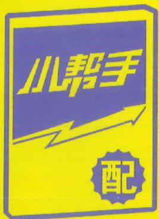

text_image

小帮手
配

# 限时定量，平时训练高考化

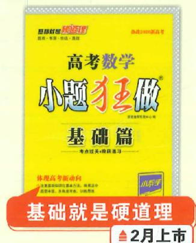

text_image

高考数学
小题狂做
基础篇
考点过关:做题练习
体验高考新动向
基础就是硬道理
▲2月上市

text_image

暂时高考高分
高考数学
小题狂王做
巅峰篇
重难突破，自主提优
▲9月上市

# 特色

考点过关+阶段温习，45分钟限时定量基础题、典型题、变式题、新情境题  
小帮手：小题常见解法

重难突破+题组训练  
重难题、热点题、思想方法题、新考向题  
小帮手：数学思想方法

# 使用建议

对于基础较好、有志于考高分的考生，特别推荐《巅峰篇》，着重突破重难点  
对于基础一般的考生，先用《基础篇》，确保基础分；再用《巅峰篇》，突破重难点

# 高考数学 小题才互做®

# 基础篇

新课标

编者 恩波教育研究中心

编 委 苗 勇 周家忠

宋克金 葛爱菊

# 图书在版编目(CIP)数据

高考数学小题狂做. 基础篇：新课标 / 恩波教育研究中心编. —南京：南京大学出版社，2019.5(2025.1重印)

ISBN 978-7-305-21955-9

I. ①高… II. ①恩… III. ①中学数学课—高中—习题集—升学参考资料 IV. ①G634.605

中国版本图书馆 CIP 数据核字(2019)第 072597 号

出版发行 南京大学出版社

社 址 南京市汉口路 22 号 邮 编 210093

GAOKAO SHUXUE XIAOTI KUANGZUO • JICHUPIAN • XINKEBIAO

书名 高考数学小题狂做·基础篇·新课标

编者 恩波教育研究中心

责任编辑 季红 编辑热线 025-83530763

印刷 天长市梦远印刷服务有限公司

开 本 880 mm×1230 mm 1/16 开 印张 18 字数 568 千

版 次 2019年5月第1版 2025年1月第8次印刷

ISBN 978-7-305-21955-9

定 价 49.80 元

网址 http://www.njupco.com

官方微博 http://weibo.com/njupco

官方微信 njupress

销售咨询热线 025-83594756

\* 版权所有,侵权必究  
\* 凡购买南大版图书,如有印装质量问题,请与所购图书销售部门联系调换

# Contents目录

# 第一章 集合与常用逻辑用语

考点过关1 集合的概念与运算 …… 1

考点过关2 常用逻辑用语 3

# 第二章 不等式

考点过关3 不等关系与不等式的性质 5

考点过关4 基本不等式 7

考点过关5 二次函数与一元二次不等式 9

阶段温习一 考点 1\~5 …… 11

# 第三章 函数

考点过关6 函数的概念及其表示 13

考点过关 7 函数的基本性质…… 15

考点过关8 指数函数、对数函数与幂函数 …… 17

考点过关9 函数的图象 19

考点过关 10 函数与方程 …… 21

考点过关 11 函数的综合应用 …… 23

阶段温习二 考点 1\~11 25

# 第四章 导数及其应用

考点过关 12 导数的概念与运算 …… 27

考点过关 13 导数与函数的单调性 …… 29

考点过关 14 导数与函数的极(最)值 …… 31

考点过关 15 导数的综合应用 …… 33

阶段温习三 考点 1\~15 35

大题过关一 函数与导数(1) 37

大题过关二 函数与导数(2) 39

# 第五章 三角函数与解三角形

考点过关 16 三角函数的概念与同角关系式、诱导公式…… 41

考点过关 17 两角和、两角差与二倍角的三角函数…… 43

考点过关 18 三角函数的图象与性质 …… 45

考点过关 19 解三角形及其应用 …… 47

考点过关 20 三角函数的综合问题 …… 49

大题过关三 三角函数与解三角形(1) …… 51

大题过关四 三角函数与解三角形(2) …… 53

# 第六章 平面向量与复数

考点过关21 平面向量的概念及线性运算 55

考点过关22 平面向量的基本定理及向量的坐标表示 57

考点过关23 平面向量的数量积 59

考点过关 24 复数的概念与运算 …… 61

阶段温习四 考点 1\~24 63

# 第七章 数列

考点过关25 数列的概念及简单表示 65

考点过关26 等差数列 67

考点过关27 等比数列 69

考点过关28 数列的通项与求和 71

考点过关 29 数列的综合问题 …… 73

阶段温习五 考点 1\~29 75

大题过关五 数列(1) 77

大题过关六 数列(2) 79

# 第八章 立体几何初步

考点过关30 空间几何体的表面积与体积 81

考点过关31 平面基本性质及空间两条直线的位置关系 83

考点过关32 直线、平面的平行的判定与性质 85

考点过关33 直线、平面的垂直的判定与性质 87

考点过关34 空间向量的应用 89

考点过关35 立体几何的综合问题 91

阶段温习六 考点 1\~35 93

大题过关七 立体几何初步(1) 95

大题过关八 立体几何初步(2) 97

# 第九章 平面解析几何

考点过关36 直线的方程 99

考点过关37 圆的方程、直线与圆及圆与圆的位置关系 101

考点过关38 椭圆 103

考点过关 39 双曲线 …… 105

考点过关40 抛物线 107

考点过关 41 圆锥曲线的综合…… 109

阶段温习七 考点 1\~41 …… 111

大题过关九 平面解析几何(1) 113

大题过关十 平面解析几何(2) 114

# 第十章 统计与概率

考点过关 42 抽样方法与总体分布的估计…… 116

考点过关43 计数原理与排列、组合 118

考点过关44 二项式定理 120

考点过关 45 随机事件与古典概型 …… 122

考点过关 46 事件的相互独立性、条件概率与全概率公式 …… 124

考点过关47 离散型随机变量及其分布列、均值与方差 126

考点过关 48 二项分布、超几何分布及正态分布 …… 128

考点过关 49 一元线性回归模型 列联表与独立性检验…… 130

考点过关50 概率与统计综合问题 133

阶段温习八 考点 1\~50 …… 135

大题过关十一 概率与统计(1) 137

大题过关十二 概率与统计(2) 139

答案详析(含核心笔记,另册)

小帮手(小题常见解法,另册)

# 第一章 集合与常用逻辑用语

# 考点过关1 集合的概念与运算

满分:73 分 时间:45 分钟

答案见 P1

# 老查要点

集合的概念与表示,集合与元素的关系,集合与集合的关系,集合的运算

# 一、单项选择题:本题共8小题,每小题5分,共40分.

1. (2025 江苏宿迁一调) 已知集合 $A = \{x \mid 0 \leqslant x \leqslant 4, x \in \mathbf{N}\}, B = \{x \mid x = 3k - 1, k \in \mathbf{Z}\}$ , 则 $A \cap B =$

A. $\{0,2\}$

B. $\{2,4\}$

C. $\{2\}$

D. $\{1,3\}$

2. (2024 云南昆明三模)如图, 已知集合 $A = \{1, 2, 3, 4\}$ , $B = \{3, 4, 5, 6\}$ , 则图中阴影部分所表示的集合为

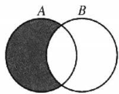

A. $\{1,2\}$

B. $\{3,4\}$

C. $\{5,6\}$

D. $\{3,4,5,6\}$

3. 已知集合 $A = \{1, 16, 4x\}$ , $B = \{1, x^2\}$ , 若 $B \subseteq A$ , 则实数 $x =$ （）

A. 0

B.-4

C. 0 或 -4

D. 0 或 $\pm 4$

4. 已知集合 $A = \{1, 2, 3, 4\}$ , $B = \{x \mid x = n^2, n \in A\}$ , 则 $A \cap B$ 的子集个数为 ( )

A. 2

B. 4

C. 6

D. 8

5.（2024湖北4月调研）已知集合 $M = \{x\mid x^2 -3x <   0\} ,N = \{x\mid \log_2x <   4\}$ ，且全集 $U = [-1,20]$ ，则 $U =$ （

A. $M \cap (\complement_{U} N)$

B. $N \cap (\complement_{U} M)$

C. $M \cup (\complement_{U} N)$

D. $N \cup (\complement_U M)$

6. 设集合 $M = \left\{x \mid \frac{1}{x - 1} \leqslant -1\right\}, N = \{x \mid x^2 - x \leqslant 0\}$ , 则 ( )

Λ. $M \subsetneqq N$

B. $N \not\subseteq M$

C. N=M

D. $N \cap M = \varnothing$

7. (2025 江苏南通如皋、连云港调研)已知全集 $U = \mathbf{R}$ , 集合 $A, B$ 满足 $A \subseteq (A \cap B)$ , 则下列关系一定正确的是

A. A = B

B. $B \subseteq A$

C. $A \cap (\complement_{U} B) = \varnothing$

D. $(\complement_U A) \cap B = \varnothing$

8. 给定集合 A，若对于任意 $a, b \in A$ ，有 $a + b \in A$ ，且 $a - b \in A$ ，则称集合 A 为闭集合，下列结论正确的个数是（）

①集合 $A=\{-4,-2,0,2,4\}$ 为闭集合；  
②集合 $A=\{n \mid n=3k, k \in Z\}$ 为闭集合；  
③若集合 $A_{1}, A_{2}$ 为闭集合，则 $A_{1} \cup A_{2}$ 为闭集合；  
④若集合 $A_{1}, A_{2}$ 为闭集合，且 $A_{1} \subseteq \mathbf{R}, A_{2} \subseteq \mathbf{R}$ ，则存在 $c \in \mathbf{R}$ ，使得 $c \notin (A_{1} \cup A_{2})$ 。

A. 0

B. 1

C. 2

D. 3

# 成长记录

# 二、多项选择题:本题共3小题,每小题6分,共18分.全部选对的得6分,部分选对的得部分分,有选错的得0分.

9.（2025山东青岛开学考试）下列各组中， $M,P$ 表示不同集合的是 （）

A. $M=\{3,-1\}, P=\{(3,-1)\}$   
B. $M=\{(3,1)\}, P=\{(1,3)\}$   
C. $M = \{y\mid y = x^2 +1,x\in \mathbf{R}\} ,P = \{x\mid x = t^2 +1,t\in \mathbf{R}\}$   
D. $M = \{y\mid y = x^2 -1,x\in \mathbf{R}\} ,P = \{(x,y)\mid y = x^2 -1,x\in \mathbf{R}\}$

10.（2024湖北宜荆荆三模）设 $U$ 为全集，集合 $A, B, C$ 满足条件 $A \cup B = A \cup C$ ，那么下列各式中不一定成立的是 （）

A. $B \subseteq A$   
B. $C \subseteq A$   
C. $A \cap (C_U B) = A \cap (\complement_U C)$   
D. $(\complement_U A) \cap B = (\complement_U A) \cap C$

11. 已知集合 $A, B$ 满足 $A \cap B = \emptyset, A \cup B = \mathbf{Q}$ , 全集 $U = \mathbf{R}$ , 则下列说法中可能正确的有 ( )

A. $\complement_U A$ 没有最大元素， $\complement_U B$ 有一个最小元素  
B. A 有一个最大元素, B 没有最小元素  
C. A 有一个最大元素, B 有一个最小元素  
D. $A$ 没有最大元素， $B$ 也没有最小元素

# 三、填空题:本题共3小题,每小题5分,共15分.

12. (2025 江苏南京开学考试) 已知集合 $A = \left\{x, \frac{y}{x}, 1\right\}, B = \{x^2, x + y, 0\}$ . 若 $A = B$ , 则 $x^{2017} + y^{2018} =$ \_\_\_\_.

13. (2024 九省联考)已知集合 $A = \{-2, 0, 2, 4\}$ , $B = \{x \mid |x - 3| \leqslant m\}$ , 若 $A \cap B = A$ , 则 $m$ 的最小值为 \_\_\_\_.

14. 定义集合 $P = \{p \mid a \leqslant p \leqslant b\}$ 的“长度”是 $b - a$ ，其中 $a, b \in \mathbb{R}$ . 已知集合 $M = \left\{x \mid m \leqslant x \leqslant m + \frac{1}{2}\right\}$ ， $N = \left\{x \mid n - \frac{3}{5} \leqslant x \leqslant n\right\}$ ，且 $M, N$ 都是集合 $\{x \mid 1 \leqslant x \leqslant 2\}$ 的子集，那么集合 $M \cap N$ 的“长度”的最小值是 \_\_\_\_；若 $m = \frac{6}{5}$ ，集合 $M \cup N$ 的“长度”大于 $\frac{3}{5}$ ，则 $n$ 的取值范围是 \_\_\_\_。（本题第一空 2 分，第二空 3 分）

# 考点过关 2 常用逻辑用语

满分:73 分 时间:45 分钟

答案见 P2

# 考查要点

命题及其真假判断,充分条件,必要条件,充要条件,量词及其否定

# 一、单项选择题：本题共8小题，每小题5分，共40分.

1. (2025 广东汕头一模)“ $a > \frac{1}{2}$ ”是“ $\frac{1}{a} < 2$ ”的()

A. 充分不必要条件  
B. 必要不充分条件  
C. 充要条件  
D. 既不充分又不必要条件

2. (2025 山西一模) 若命题 $p: \exists x \in \mathbf{R}, a^x > kx$ , 则 $\neg p$ 为

A. $\forall x\in R, a^{x}>kx$

B. $\exists x\in R,a^{x}\leqslant kx$

C. $\forall x\in R,a^{x}\leqslant kx$

D. $\exists x\in \mathbf{R},a^{x} = kx$

3.（2025江苏徐州、淮安、宿迁、连云港一调）设 $p:4x - 3 < 1;q:x - (2a + 1) < 0$ ，若 $p$ 是 $q$ 的充分不必要条件，则 （）

A. a>0

B. $a > 1$

C. $a \geqslant 0$

D. $a \geqslant 1$

4.（2024湖北武汉4月调研）阅读下段文字：“已知 $\sqrt{2}$ 为无理数，若 $(\sqrt{2})^{\sqrt{2}}$ 为有理数，则存在无理数 $a = b = \sqrt{2}$ ，使得 $a^b$ 为有理数；若 $(\sqrt{2})^{\sqrt{2}}$ 为无理数，则取无理数 $a = (\sqrt{2})^{\sqrt{2}}, b = \sqrt{2}$ ，此时 $a^b = [(\sqrt{2})^{\sqrt{2}}]^{\sqrt{2}} = (\sqrt{2})^{\sqrt{2} \cdot \sqrt{2}} = (\sqrt{2})^2 = 2$ 为有理数。”依据这段文字可以证明的结论是 （）

A. $(\sqrt{2})^{\sqrt{2}}$ 是有理数  
B. $(\sqrt{2})^{\sqrt{2}}$ 是无理数  
C. 存在无理数 a, b，使得 $a^{b}$ 为有理数  
D. 对任意无理数 a, b, 都有 $a^{b}$ 为无理数

5. 已知命题 $p$ : 有的三角形是等边三角形, 则 ( )

A. $\neg p$ :有的三角形不是等边三角形  
B. $\neg p$ :有的三角形是不等边三角形  
C. $\neg p$ : 所有的三角形都是等边三角形  
D. $\neg p$ : 所有的三角形都不是等边三角形

6. (2024 辽宁名校联盟 3 月模拟) 命题 $p: \exists x \in [1,3], x^2 - ax + 3 > 0$ , 则 $p$ 的一个必要不充分条件是

A. $a <   5$

B. $a > 5$

C. a<4

D. a>4

7. (2025 东北三省四市一模) 已知向量 $a = (2,4), b = (3,-1)$ , 则“ $k = \sqrt{2}$ ”是“( $a + kb) \perp (a - kb)$ ”的

A. 充分不必要条件

B. 必要不充分条件

C. 充要条件

D. 既不充分又不必要条件

8. 若命题“ $\exists x_0 \in \mathbf{R}$ ，使得 $x_0^2 + mx_0 + 2m - 3 < 0$ ”为假命题，则实数 $m$ 的取值范围是 （）

A. $[2,6]$

B. $\left[-6,-2\right]$

C. $(2,6)$

D. $(-6,-2)$

# 成长记录

# 二、多项选择题:本题共3小题,每小题6分,共18分.全部选对的得6分,部分选对的得部分分,有选错的得0分.

9.（2025河北衡水中学模拟）已知 $\mathbf{R}$ 是实数集，集合 $A = \{x\mid 1 <   x <   2\} ,B = \{x\mid x\leqslant 2\}$ ，则下列说法正确的是 （）

A. $x \in A$ 是 $x \in B$ 的充分不必要条件  
B. $x \in A$ 是 $x \in B$ 的必要不充分条件  
C. $x \in C_{R}A$ 是 $x \in C_{R}B$ 的充分不必要条件  
D. $x \in \complement_{\mathbb{R}} A$ 是 $x \in \complement_{\mathbb{R}} B$ 的必要不充分条件

10.（2025湖南长沙一中模拟）下列命题是真命题的有 （）

A. “ $x \neq 1$ ”是“ $|x| \neq 1$ ”的必要不充分条件   
B. “若 $x + y \geqslant 6$ ，则 x, y 中至少有一个大于 3”的否命题  
C. $\exists x\in \mathbf{R},2^{x} <   x^{2}$   
D. 命题“ $\exists x < 0, x^{2} - x - 2 < 0$ ”的否定是“ $\forall x \geqslant 0, x^{2} - x - 2 \geqslant 0$ ”

11. (2025 福建莆田模拟) 若“ $\forall x \in M, |x| > x$ ”为真命题，“ $\exists x \in M, x > 3$ ”为假命题，则集合 $M$ 可以是

A. $(-∞,-5)$

B. $(-3,-1]$

C. $(3,+\infty)$

D. $[0,3]$

# 三、填空题：本题共3小题，每小题5分，共15分.

12. (2025 江苏徐州中学期中)已知集合 $A = \left\{x \mid \log_{\frac{1}{2}}(x + 2) < 0\right\}$ , 集合 $B = \{x \mid (x - a)(x - b) < 0\}$ . 若“ $a = -3$ ”是“A $\cap B \neq \emptyset$ ”的充分条件, 则实数 $b$ 的取值范围是 \_\_\_\_.

13. 已知 $p$ 是 $r$ 的充分不必要条件, $q$ 是 $r$ 的充分条件, $s$ 是 $r$ 的必要条件, $q$ 是 $s$ 的必要条件, 现有下列命题:

①s 是 q 的充要条件；  
②p 是 q 的充分不必要条件；  
③r 是 q 的必要不充分条件；  
④r 是 s 的充分不必要条件.  
其中,正确的命题序号是\_\_\_\_.

14. 已知 M 是集合 $\{1,2,3,\cdots,2k-1\}(k\in\mathbf{N}^{*},k\geqslant2)$ 的非空子集，且当 $x\in M$ 时，有 $2k-x\in M$ . 记满足条件的集合 M 的个数为 $f(k)$ ，则 $f(2)=$ \_\_\_\_； $f(k)=$ \_\_\_\_。（本题第一空 2 分，第二空 3 分）

# 第二章 不等式

# 考点过关3 不等关系与不等式的性质

满分:73 分 时间:45 分钟

答案见P3

# 考查要点

不等式作差证明，不等式的性质及其应用

# 一、单项选择题：本题共8小题，每小题5分，共40分.

1. (2025 山东德州模拟) 若 $a > b > 0$ , 则下列不等式不一定成立的是

A. $\frac{b^2}{a^2} < \frac{b^2 + 1}{a^2 + 1}$

B. $a^{2}+b^{2}>ab$

C. $a + \frac{1}{a} > b + \frac{1}{b}$

D. $a - \frac{1}{a} > b - \frac{1}{b}$

2. (2025 江西南昌期中) 甲、乙两人同时从 A 地出发沿同一路线到达 B 地, 所用的时间分别为 $t_1, t_2$ , 甲有一半的时间以速度 $m$ 行走, 另一半的时间以速度 $n$ 行走, 乙有一半的路程以速度 $m$ 行走, 另一半的路程以速度 $n$ 行走, 且 $m \neq n$ , 则 ( )

A. $t_{1} > t_{2}$

B. $t_{1}<t_{2}$

C. $t_{1}=t_{2}$

D. $t_1, t_2$ 的大小不能确定

3.（2025江苏南通开学考试）已知 $a < 0, -1 < b < 0$ ，则 （）

A. $a > ab > ab^{2}$

B. $ab^{2}>ab>a$

C. $ab > a > ab^{2}$

D. $ab > ab^{2} > a$

4.（2025陕西咸阳期中）若 $ab > a^2$ ，且 $a,b\in (0,1)$ ，则下列不等式一定正确的是 （）

A. $\frac{1}{b}<\frac{1}{b-a}$

B. $ab > b^{2}$

C. $1+ab<a+b$

D. $\frac{1}{a} < \frac{1}{b}$

5.（2025四川南充开学考试）已知 $x > y > z, x + y + z = 0$ ，则下列不等式一定成立的是 （）

A. xy>yz

B. xy > xz

C. $xz > yz$

D. $x \mid y \mid > \mid y \mid z$

6. (2025 江苏宿迁中学期中) 已知 $a, b \in \mathbf{R}$ , 则 $\left\{ \begin{array}{l} a > 2, \\ b > 3 \end{array} \right.$ 是 $\left\{ \begin{array}{l} a + b > 5, \\ ab > 6 \end{array} \right.$ 的 ( )

A. 充分不必要条件

B. 必要不充分条件

C. 充要条件

D. 既不充分又不必要条件

7.（2025江苏连云港模拟)若 $a, b, c \in \mathbf{R}$ ，则下列说法正确的是 （）

A. 若 $\frac{a}{c}>\frac{b}{c}$ ，则a>b

B. 若 $b > a > 0, m < 0$ ，则 $\frac{b - m}{a - m} > \frac{b}{a}$

C. 若 $a > b, \frac{1}{a} > \frac{1}{b}$ , 则 $ab > 0$

D. 若 $a > b > c, a + b + c = 0$ ，则 $ab > ac$

8.（2025 浙江丽水期末）为了加强家校联系，王老师组建了一个由学生、家长和教师组成的 QQ 群，已知该群中男学生人数多于女学生人数，女学生人数多于家长人数，家长人数多于教师人数，教师人数的两倍多于男学生人数，则该 QQ 群教师人数的最小值为 （）

A. 3

B. 4

C. 5

D. 6

# 二、多项选择题:本题共3小题,每小题6分,共18分.全部选对的得6分,部分选对的得部分分,有选错的得0分.

9.（2025江西景德镇开学考试）已知 $a > b > 0$ ，则使得 $\frac{a + c}{a} >\frac{b + c}{b}$ 成立的充分条件可以是 （）

A. c = -2

B. c = -1

C. c=1

D. c=2

10.（2025河南郑州期中）已知 $a, b, c, d \in \mathbb{R}$ ，则下列说法正确的是 （）

A. 若 $a > b, c > d$ ，则 $ac > bd$   
B. 若 $bc - ad > 0, bd > 0$ ，则 $\frac{a + b}{b} < \frac{c + d}{d}$   
C. 若 $a < b < 0$ ，则 $\frac{b}{a} < \frac{a}{b}$   
D. 若 $a > b, \frac{1}{a} > \frac{1}{b}$ , 则 $a > 0, b < 0$

11.（2025湖北武汉期中）已知 $a > b > c$ ，且 $2a + b + c = 0$ ，则 （）

A. $a > 0, c < 0$

B. $\frac{c}{a} +\frac{a}{c} <  - 2$

C. $a + c > 0$

D. $\frac{a+2c}{a+b}<-1$

# 三、填空题:本题共3小题,每小题5分,共15分.

12. (2024 云南昆明期中) 设 $a = \sqrt{5}, b = 4 - \sqrt{3}$ , 则 $a$ \_\_\_\_ $b$ (填入“>”或“<”).  
13. 新题型·构造实例题(2024江苏苏州中学期中)若 a, b 同时满足下列两个条件: ①a+b>ab;
② $\frac{1}{a+b}>\frac{1}{ab}$ . 请写出一组 a, b 的值: \_\_\_\_.  
14. (2025 浙江杭州一模) 对 $x, y$ 定义一种新运算 $T$ , 规定: $T(x, y) = \frac{ax + by}{2x + y}$ (其中 $a, b$ 均为非零常数), 这里等式右边是通常的四则运算, 例如, $T(0, 1) = \frac{a \times 0 + b \times 1}{2 \times 0 + 1} = b$ . 已知 $T(1, -1) = -2$ , $T(4, 2) = 1$ , 若关于 $m$ 的不等式组 $\left\{ \begin{array}{l} T(2m, 5 - 4m) \leqslant 4, \\ T(m, 3 - 2m) > P \end{array} \right.$ 恰好有 3 个整数解, 则实数 $P$ 的取值范围是 \_\_\_\_.

# 考点过关4 基本不等式

满分:73 分 时间:45 分钟

∠答案见 P4

# 考查要点

基本不等式,基本不等式的应用

# 一、单项选择题：本题共8小题，每小题5分，共40分.

1. 若 $x > 0, y > 0$ ，且 $x + y = 18$ ，则 $\sqrt{xy}$ 的最大值为 （）

A. 9

B. 18

C. 36

D. 81

2. 在下列函数中, 最小值是 2 的为 ( )

A. $y=x+\frac{1}{x}$

B. $y=3^{x}+3^{-x}$

C. $y=\ln x+\frac{1}{\ln x}(1<x<e)$

D. $y = \sin x + \frac{1}{\sin x}\left(0 <   x <   \frac{\pi}{2}\right)$

3. “x>0”是“ $x+\frac{1}{x}\geqslant2$ ”的 （）

A. 充分不必要条件

B. 必要不充分条件

C. 充要条件

D. 既不充分又不必要条件

4. 函数 $y = \frac{x^2 + 2x + 2}{x + 1} (x > -1)$ 的图象的最低点的坐标是 （）

A. $(1,2)$

B. $(1,-2)$

C. $(1,1)$

D. $(0,2)$

5. (2024 黑龙江齐齐哈尔二模)早在西元前 6 世纪, 毕达哥拉斯学派的已经知道算术中项, 几何中项以及调和中项, 毕达哥拉斯学派哲学家阿契塔在《论音乐》中定义了上述三类中项, 其中算术中项, 几何中项的定义与今天大致相同. 若 $2^{a} + 2^{b} = 1$ , 则 $(4^{a} + 1)(4^{b} + 1)$ 的最小值为 ( )

A. $\frac{25}{4}$

B. $\frac{9}{16}$

C. $\frac{9}{4}$

D. $\frac{25}{16}$

6.（2024河北唐山二模）已知实数 $x, y$ 满足 $x^{2} + 4y^{2} = 5$ ，则 $x + 2y$ 的最大值是 （）

A. $\sqrt{10}$

B. $\sqrt{5}$

C. 6

D. 3

7.（2024辽宁名校联盟3月模拟)若 $m > 2n > 0$ ，则 $\frac{m}{m - 2n} +\frac{m}{n}$ 的最小值为 （）

A. $3+2\sqrt{2}$

B. $3-2\sqrt{2}$

C. $2+3\sqrt{2}$

D. $3\sqrt{2}-2$

8. (2025 广东汕头一模) 已知函数 $f(x) = \ln \frac{m + x}{1 - n - x} (m > 0, n > 0)$ 是奇函数，则 $\frac{1}{m} + \frac{2}{n}$ 的最小值为

A. 3

B. 5

C. $3+2\sqrt{2}$

D. $3+4\sqrt{2}$

# 成长记录

# 二、多项选择题:本题共3小题,每小题6分,共18分.全部选对的得6分,部分选对的得部分分,有选错的得0分.

9. 给出下面四个推断, 其中正确的为

( )

A. 若 $a, b \in (0, +\infty)$ , 则 $\frac{b}{a} + \frac{a}{b} \geqslant 2$   
B. 若 $x, y \in (0, +\infty)$ , 则 $\lg x + \lg y \geqslant 2\sqrt{\lg x \cdot \lg y}$   
C. 若 $a \in R, a \neq 0$ ，则 $\frac{4}{a} + a \geqslant 4$   
D. 若 $x, y \in \mathbf{R}, xy < 0$ ，则 $\frac{x}{y} + \frac{y}{x} \leqslant -2$

10.（2024贵州贵阳适应(一))已知 $a > 0, b > 0$ ，且 $a + b = 2$ ，则 （）

A. $2^{a}+2^{b}\geqslant2\sqrt{2}$   
B. $\frac{1}{a}+\frac{1}{b}\geqslant2$   
C. $\log_2a + \log_2b\leqslant 1$   
D. $a^{2}+b^{2}\geqslant2$

11.《几何原本》中的几何代数法是以几何方法研究代数问题,这种方法是后西方数学家处理问题的重要依据,通过这一原理,很多的代数公理或定理都能够通过图形实现证明,也称之为无字证明.现有图形如图所示,C为线段AB上的点,且AC=a,BC=b,O为AB的中点,以AB为直径作半圆.过

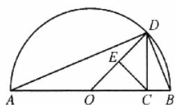

点 $C$ 作 $AB$ 的垂线交半圆于点 $D$ ，连接 $OD, AD, BD$ ，过点 $C$ 作 $OD$ 的垂线，垂足为 $E$ . 则该图形可以完成的所有的无字证明为 （）

A. $\frac{a + b}{2} \geqslant \sqrt{ab} (a > 0, b > 0)$

B. $a^{2}+b^{2}\geqslant2ab(a>0,b>0)$

C. $\sqrt{ab} \geqslant \frac{2}{\frac{1}{a} + \frac{1}{b}} (a > 0, b > 0)$

D. $\frac{a^2 + b^2}{2} \geqslant \frac{a + b}{2} (a \geqslant 0, b > 0)$

# 三、填空题:本题共3小题,每小题5分,共15分.

12. 已知 x, y 都是正实数，且 $x + 2y = xy$ ，则 xy 的最小值为 \_\_\_\_.  
13. 已知 $x > 0, y > 0, \sqrt{2}$ 是 $2^x$ 与 $4^y$ 的等比中项，则 $\frac{1}{x} + \frac{x}{y}$ 的最小值为 \_\_\_\_.  
14. (2025 浙江杭州模拟) 在 $\triangle ABC$ 中, 已知 $\angle A = 90^{\circ}, AB = 1, AC = 4, P$ 为边 $BC$ 上一动点, 且点 $P$ 到边 $AB, AC$ 的距离分别是 $h_1, h_2$ , 则 $\frac{1}{h_1} + \frac{1}{h_2}$ 的最小值为 \_\_\_\_.

# 考点过关5 二次函数与一元二次不等式

满分:73 分 时间:45 分钟

∠答案见 P5

# 考查要点

二次函数的解析式、图象与性质；一元二次不等式的解法

# 一、单项选择题：本题共8小题，每小题5分，共40分.

1. (2025 江西南昌期中) 已知集合 $A = \{x \mid x^2 - 3 < 0\}$ , $B = \{x \mid 0 < x + 1 < 3\}$ , 则 $A \cap B =$ （）

A. $(-1,\sqrt{3})$

B. $(- \sqrt{3}, 2)$

C. $(- \sqrt{3}, \sqrt{3})$

D. $(-1,2)$

2.（2025江苏南通中学期中）已知函数 $f(x) = x^{2} - 2tx + 2t^{2} - 2t$ ，则下列选项正确的是 （）

A. $f(x)$ 的图象恒过点 $(0,0)$   
B. $f(x)$ 的图象必与 $x$ 轴有两个不同的交点  
C. $f(x)$ 的最小值可能为 -2  
D. $f(x)$ 的最小值可能为 -1

3.（2025山东青岛一模）命题“ $\exists x \in \mathbf{R}, \frac{1}{2} x^2 + x - \frac{3}{2} - a < 0$ ”为真命题的一个必要不充分条件是（）

A. $a \geqslant 0$

B. $a \geqslant 1$

C. a > -2

D. $a \geqslant -3$

4.（2025浙江绍兴期中）不等式 $cx^2 + ax + b > 0$ 的解集为 $\left\{x\mid -1 <   x <   \frac{1}{2}\right\}$ ，则函数 $y = ax^{2} + bx - c$ 的图象大致为 （）

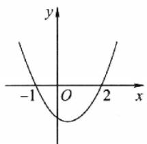

text_image

y
-1 O 2 x

A

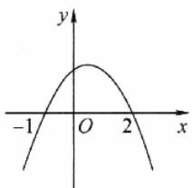

text_image

y
-1 O 2 x

B

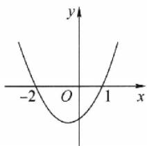

text_image

y
-2 O 1 x

C

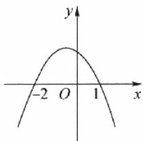

line

| x | y |
|---|---|
| -2 | 0 |
| 0 | 1 |
| 1 | 0 |

D

5.（2025广东湛江开学考试）已知 $0 < a < 1$ ，则关于 $x$ 的不等式 $(a - x)\left(x - \frac{1}{a}\right) < 0$ 的解集为（

A. $\left\{x \mid a < x < \frac{1}{a}\right\}$

B. $\left\{x\mid \frac{1}{a} <  x <   a\right\}$

C. $\left\{x\mid x <   \frac{1}{a}\text{或} x > a\right\}$

D. $\left\{x\mid x <   a\text{或} x > \frac{1}{a}\right\}$

6. (2025 河北石家庄开学考试) 已知 $a > 0, b > 0$ ，且 $a + 2b = 2$ . 若 $3t^2 - t \leqslant \frac{b}{a} + \frac{2}{b}$ 恒成立，则实数 $t$ 的取值范围是

A. $\left[-\frac{2}{3},1\right]$

B. $\left[-1,\frac{2}{3}\right]$

C. $\left[-\frac{4}{3}, 1\right]$

D. $\left[-1, \frac{4}{3}\right]$

7. (2025 江苏徐州一模) 已知函数 $f(x) = x^{2} + ax + b (a, b \in \mathbb{R})$ 的值域为 $[0, +\infty)$ . 若关于 $x$ 的不等式 $f(x) < c$ 的解集为 $(m, m + 2\sqrt{5})$ ，则实数 $c$ 的值是

A. 3

B. 5

C. 9

D. 12

8.（2025河南郑州期中）定义 $b - a$ 为集合 $\{x\mid a\leqslant x\leqslant b\}$ 的长度.已知集合 $M = \{x\mid x^2 -2mx-$ $3m^{2}\leqslant 0\}$ ， $N = \{x\mid x^2 +mx - 2m^2\leqslant 0\}$ ，若集合 $M\cap N$ 的长度为4，则 $M\cup N$ 的长度为 （）

A. 3

B. 4

C. 5

D. 10

# 成长记录

# 二、多项选择题:本题共3小题,每小题6分,共18分.全部选对的得6分,部分选对的得部分分,有选错的得0分.

9.（2025贵州遵义模拟）已知函数 $y = ax^{2} + bx + c$ 的部分图象如图所示，则 （）

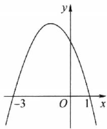

line

| x | y |
|---|---|
| -3 | 0 |
| 0 | Peak |
| 1 | 0 |

A. abc<0   
B. $b+c>0$   
C. $2a+b+c>0$   
D. 关于 $x$ 的方程 $cx^2 + bx + a = 0$ 的解集为 $\left\{-\frac{1}{3}, 1\right\}$

10.（2025山西临汾期末）已知关于 $x$ 的不等式 $ax^2 - 3x + 9b > 0$ 的解集为 $(a, b)$ ，则 $a + b$ 的值可能为（）

A. $-\sqrt{3}$

B. $-\sqrt{2}$

C.-1

D.-2

11.（2025江苏苏州期中）已知不等式 $2kx^{2} + kx - \frac{3}{8} < 0$ ，则下列说法正确的是 （）

A. 若 k=1，则不等式的解集为 $\left(-\frac{1}{4}, \frac{3}{4}\right)$   
B. 若不等式 $\forall x \in \mathbf{R}$ 恒成立，则整数 $k$ 的取值集合为 $\{-2, -1, 0\}$   
C. 若不等式对 $0 \leqslant k \leqslant 1$ 恒成立，则实数 $x$ 的取值范围是 $\left(-\frac{3}{4}, \frac{1}{4}\right)$   
D. 若恰有一个整数 $x$ 使得不等式成立，则实数 $k$ 的取值范围是 $\left[\frac{3}{8}, +\infty\right)$

# 三、填空题：本题共3小题，每小题5分，共15分.

12. (2024 辽宁锦州期中) 已知函数 $f(x) = x^2 - 2x + 5$ 在 $[m, n]$ 上的值域为 $[4m, 4n]$ , 则 $m + n$ 的值为 \_\_\_\_.  
13. (2025 湖南长沙期中) 若命题“存在实数 $x$ , 使得不等式 $(a^2 - 1)x^2 - (a - 1)x - 1 \geqslant 0$ 成立”是假命题, 则实数 $a$ 的取值范围是 \_\_\_\_.  
14. (2025 浙江丽水模拟) 已知函数 $f(x) = x^2 - 2ax + 1 (a \in \mathbb{R})$ . 若非空集合 $A = \{x \mid f(x) \leqslant 0\}$ , $B = \{x \mid f[f(x)] \leqslant 1\}$ , 满足 $A = B$ , 则实数 $a$ 的取值范围是 \_\_\_\_.

# 阶段温习一 考点 1\~5

满分:73 分 时间:45 分钟

∠答案见 P7

# 考查要点

集合与常用逻辑用语，不等式

# 一、单项选择题：本题共8小题，每小题5分，共40分.

1. (2025 江苏南京学情调研) 已知集合 $A = \{x \mid x^2 - 4x + 3 \leqslant 0\}$ , $B = \{x \mid 2 < x < 4\}$ , 则 $A \cap B =$

A. $\{x \mid 3 \leqslant x < 4\}$

B. $\{x \mid 1 \leqslant x \leqslant 3\}$

C. $\{x \mid 2 < x \leqslant 3\}$

D. $\{x \mid 1 \leqslant x < 4\}$

2. (2025 江苏徐州一中期初) 命题“存在 $x \in \mathbb{R}$ , 使得 $x^2 + 2x < 1$ ”的否定是

A. 对任意 $x \in R$ ，都有 $x^{2} + 2x \geqslant 1$

B. 不存在 $x \in \mathbf{R}$ , 使得 $x^2 + 2x \geqslant 1$

C. 存在 $x \in \mathbb{R}$ , 使得 $x^2 + 2x > 1$

D. 对任意 $x \in R$ ，都有 $x^{2} + 2x < 1$

3. (2025 四川成都模拟) 若不等式 $ax^2 + bx + c > 0$ 的解集为 $\{x \mid -1 < x < 2\}$ , 则不等式 $a(x^2 + 1) + b(x - 1) + c > 2ax$ 的解集是

A. $\{x \mid 0 < x < 3\}$

B. $\{x \mid x < 0 \text{ 或 } x > 3\}$

C. $\{x \mid 1 < x < 3\}$

D. $\{x\mid-1<x<3\}$

4. 对于任意实数 $a, b, c, d$ ，有下列命题：① 若 $a > b, c > d$ ，则 $a - c > b - d$ ；② 若 $a > b > 0, c > d > 0$ ，则 $ac > bd$ ；③ 若 $a > b > 0$ ，则 $\sqrt[3]{a} > \sqrt[3]{b}$ ；④ 若 $a > b > 0$ ，则 $\frac{1}{a^2} > \frac{1}{b^2}$ . 其中，是真命题的为 （）

A. ①②

B. ②③

C. ①④

D. ①③

5.（2024山东青岛期中）在 $\mathbf{R}$ 上定义运算 $\otimes :A\otimes B = (A - 2)\cdot B$ ，若不等式 $(t - x)\otimes (x + t) <   4$ 对任意的 $x\in \mathbb{R}$ 恒成立，则实数 $t$ 的取值范围是 （）

A. $(-3,1)$

B. $(-1,2)$

C. $(-1,3)$

D. $(-∞,-1)∪(3,+∞)$

6. (2025 山东临沂一模) 已知函数 $\operatorname{sgn}(x) = \begin{cases} 1, & x > 0, \\ 0, & x = 0, \end{cases}$ 则“ $\operatorname{sgn}(\mathrm{e}^x - 1) + \operatorname{sgn}(-x + 1) = 0$ ”是“ $x > -1, x < 0$ ，

A. 充分不必要条件  
B. 必要不充分条件  
C. 充要条件  
D. 既不充分也不必要条件

7. (2024 湖北宜荆荆三模)有三个房间需要粉刷, 粉刷方案要求如下: 每个房间只用一种颜色, 且三个房间颜色各不相同. 已知三个房间的粉刷面积(单位: $\mathrm{m}^{2}$ ) 分别为 $x, y, z$ , 且 $x > y > z$ , 三种颜色涂料的粉刷费用(单位: 元/ $\mathrm{m}^{2}$ ) 分别为 $a, b, c$ , 且 $a < b < c$ . 在不同的方案中, 最低的总费用(单位: 元) 是

A. $ax + by + cz$

B. $az + by + cx$

C. $ay + bz + cx$

D. $ay + bx + cz$

8. 已知 $2xy - y + 1 = 0 (x > 0, y > 0)$ ，则 $\frac{2 + xy}{x}$ 的最小值为 （）

A. $4\sqrt{2}$

B. 8

C. 9

D. $8\sqrt{2}$

# 成长记录

# 二、多项选择题:本题共3小题,每小题6分,共18分.全部选对的得6分,部分选对的得部分分,有选错的得0分.

9. 下列各结论中正确的是 ( )

A. “ $xy > 0$ ”是“ $\frac{x}{y} > 0$ ”的充要条件

B. 设 $a, b, c \in \mathbb{R}$ , 则“ $b^2 - 4ac < 0$ ”是“函数 $y = ax^2 + bx + c$ 的图象在 $x$ 轴上方”的充分不必要条件  
C. 设 $a \in \mathbf{R}$ , 则“ $a = 2$ ”是“( $a - 1$ ) $(a - 2) = 0$ ”的必要不充分条件   
D. “函数 $y=ax^{2}+bx+c$ 的图象过点 $(1,0)$ ” 是 “ $a+b+c=0$ ” 的充要条件

10.（2025江苏南京学情调研）若 $a < 0 < b$ ，且 $a + b > 0$ ，则 （）

A. $\frac{a}{b} > -1$

B. $|a| < |b|$

C. $\frac{1}{a} +\frac{1}{b} >0$

D. $(a-1)(b-1)<1$

11.（2025年1月八省联考）下面四个绳结中，不能无损伤地变为图中的绳结的有 （）

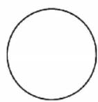  
A

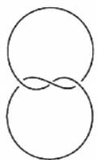  
B

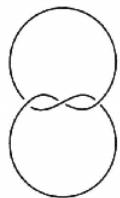  
C

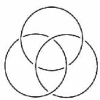  
D

# 三、填空题：本题共3小题，每小题5分，共15分.

12. (2024 江苏南京二模) 已知集合 $A = \{1, 2, 4\}$ , $B = \{(x, y) | x \in A, y \in A, x - y \in A\}$ , 则集合 $B$ 的元素个数为 \_\_\_\_.  
13. (2025 江苏海安中学期初) 若关于 $x$ 的一元二次不等式 $x^{2} - ax + 1 \leqslant 0$ 的解集为 $\varnothing$ , 则实数 $a$ 的取值范围是 \_\_\_\_.  
14. 已知 $a, b$ 都是正数，且 $ab + a + b = 3$ ，则 $ab$ 的最大值是 \_\_\_\_， $a + 2b$ 的最小值是 \_\_\_\_。（本题第一空 2 分，第二空 3 分）

# 第三章 函数

# 考点过关6 函数的概念及其表示

满分:73 分 时间:45 分钟

答案见 P8

# 考查要点

函数的概念及其表示,函数的对应法则

# 一、单项选择题:本题共8小题,每小题5分,共40分.

1. 下列各组中的两个函数是同一个函数的为 （）

A. $y = 1, y = x^{0}$

B. $y=\sqrt{x-1}\cdot\sqrt{x+1},y=\sqrt{x^{2}-1}$

C. $y = x, y = \sqrt[3]{x^{3}}$

D. $y = |x|, y = (\sqrt{x})^2$

2. 设集合 $M = \{x \mid -2 \leqslant x \leqslant 2\}$ , $N = \{y \mid 0 \leqslant y \leqslant 2\}$ , 函数 $f(x)$ 的定义域为 $M$ , 值域为 $N$ , 则函数 $f(x)$ 的图象可以是 ( )

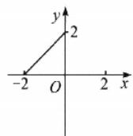  
A

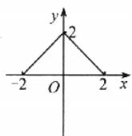  
B

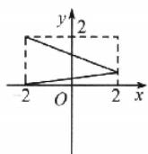  
C

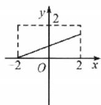  
D

3. 已知函数 $f(x) = \ln (4 - x)$ ，则 $g(x) = \frac{f(2x)}{x - 1}$ 的定义域为 （）

A. $(-∞,1)∪(1,8)$

B. $(-∞,1)∪(1,2)$

C. $(0,1)\cup(1,8)$

D. $(0,1)\cup(1,2)$

4. 右图所表示的函数解析式为 （）

A. $y=\frac{3}{2}|x-1|$ , $0 \leqslant x \leqslant 2$

B. $y=\frac{3}{2}-\frac{3}{2}|x-1|$ , $0 \leqslant x \leqslant 2$

C. $y=\frac{3}{2}-|x-1|$ , $0 \leqslant x \leqslant 2$

D. $y = 1 - |x - 1|,0\leqslant x\leqslant 2$

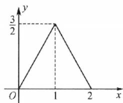

line

| x | y |
|---|---|
| 0 | 0 |
| 1 | 3/2 |
| 2 | 0 |

5.（2024江苏苏州八校联盟三模）设函数 $f(x) = \sqrt{ax^2 - 2ax} (a < 0)$ 的定义域为 $D$ ，对于任意 $m, n \in D$ ，若所有点 $P(m, f(n))$ 构成一个正方形区域，则实数 $a$ 的值为 （）

A.-1

B.-2

C.-3

D. -4

6.（2025广东湛江模拟）已知函数 $y = f(2^x)$ 的定义域是 $[-1, 1]$ ，则函数 $f(\log_3 x)$ 的定义域是（）

A. $[-1, 1]$

B. $\left[\frac{1}{3},3\right]$

C. [1,3]

D. $\left[\sqrt{3},9\right]$

7. 已知 $\forall x \in \mathbf{R}$ , 函数 $f(x)$ 表示 $-x + 3, \frac{3}{2} x + \frac{1}{2}, x^2 - 4x + 3$ 中的最大的一个, 则 $f(x)$ 的最小值是 ( )

A. 2

B. 3

C. 8

D.-1

8. 设定义在 $(0, +\infty)$ 上的函数 $f(x)$ 为单调函数，且 $f\left[f(x) + \frac{2}{x}\right] = 1$ ，则 $f(1) =$ （）

A.-3

B.-2

C.-1

D. 0

# 成长记录

# 二、多项选择题:本题共3小题,每小题6分,共18分.全部选对的得6分,部分选对的得部分分,有选错的得0分.

9. (2025 山东烟台开学考试) 某打车平台欲对收费标准进行改革, 现制定了甲、乙两种方案供乘客选

择,其支付费用与打车里程数的函数关系大致如图所示,则下列说法正确的有()

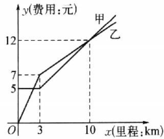

line

| 路径 (km) | 甲 (¥) | 乙 (¥) |
| --------- | ------ | ------ |
| 0         | 0      | 0      |
| 3         | 5      | 7      |
| 10        | 12     | 12     |

A. 当打车里程数为 8 km 时, 乘客选择甲方案省钱  
B. 当打车里程数为 10 km 时, 乘客选择甲、乙方案均可  
C. 打车 3 km 以上时, 每公里增加的费用甲方案比乙方案多  
D. 增加 1 公里费用增加 0.7 元

10. (2025 浙江余姚中学期中) 已知函数 $f(x) = \begin{cases} ax, & x \geqslant 0, \\ x^2 - ax, & x < 0. \end{cases}$ 若函数的值域为 $[0, +\infty)$ , 则下列的 $a$ 值满足条件的是

A. $a=\frac{1}{2}$

B. a = -3

C. $a = 0$

D. $a = 4$

11. 狄利克雷函数 $f(x) = \begin{cases} 1, & x \in \mathbf{Q}, \\ 0, & x \in \complement_{\mathbb{R}} \mathbf{Q} \end{cases}$ 是高等数学中的一个典型函数，对于狄利克雷函数 $f(x)$ ，下列命题中真命题的有

A. 对任意 $x \in \mathbf{R}$ , 都有 $f[f(x)] = 1$   
B. 对任意 $x \in \mathbf{R}$ , 都有 $f(-x) + f(x) = 0$   
C. 若 $a < 0, b > 1$ ，则有 $\{x \mid f(x) > a\} = \{x \mid f(x) < b\}$   
D. 存在三个点 $A(x_{1}, f(x_{1})), B(x_{2}, f(x_{2})), C(x_{3}, f(x_{3}))$ ，使得 $\triangle ABC$ 为等腰三角形

# 三、填空题:本题共3小题,每小题5分,共15分.

12. 已知函数 $f(x) = \begin{cases} x - 3, & x \geqslant 9, \\ f(f(x + 4)), & x < 9, \end{cases}$ 则 $f(7) =$ \_\_\_\_.

13. 若函数 $f(x) = \frac{1}{ax^2 + 4ax + 3}$ 的定义域为 $\mathbf{R}$ ，则实数 $a$ 的取值范围是 \_\_\_\_.

14. (2024 广东茂名期中) 已知函数 $f(x) = \begin{cases} 2 - x, & x \geqslant 1, \\ x^2 + x - 1, & x < 1, \end{cases}$ 则 $f[f(4)] =$ \_\_\_\_；若存在实数 $a$ ，使得 $f(a) = f[f(a)]$ ，则 $a$ 的个数是 \_\_\_\_。（本题第一空 2 分，第二空 3 分）

# 考点过关7 函数的基本性质

满分:73 分 时间:45 分钟

∠答案见 P9

# 考查要点

本书重点训练函数的奇偶性、函数的单调性与函数的周期性等基础知识、方法。函数性质的综合运用难度较大，学生可在有一定基础后，使用《巅峰篇》进一步提升

# 一、单项选择题:本题共8小题,每小题5分,共40分.

1. (2025 辽宁教研联盟一调) 下列函数是偶函数, 且在区间 $(-\infty, 0)$ 上单调递增的为 ( )

A. $y=x^{-2}$

B. $y = |x|$

C. $y=2^{|x|}$

D. $y = x^{3}$

2. 设函数 $f(x), g(x)$ 的定义域都为 $\mathbf{R}$ ，且 $f(x)$ 是奇函数， $g(x)$ 是偶函数，则下列结论正确的是（）

A. $f(x)g(x)$ 是偶函数

B. $|f(x)|g(x)$ 是奇函数

C. $f(x)|g(x)|$ 是奇函数

D. $|f(x)g(x)|$ 是奇函数

3.（2024重庆3月考试）已知 $y = f(x)$ 是定义在 $\mathbf{R}$ 上的奇函数，当 $x < 0$ 时， $f(x) = x^3 + 2x^2 - a + 3$ ，且 $f(3) = 8$ ，则 $2f(1) + f(-2) =$ （）

A. 3

B. 1

C.-1

D.-3

4.（2024江西4月质检）已知定义在 $\mathbf{R}$ 上的函数 $f(x)$ 的图象关于点(1,0)成中心对称，且当 $x\geqslant 1$ 时， $f(x) = 2x + a$ ，则 $f(0) =$ （

A.-2

B. 0

C. 1

D. 2

5. 已知奇函数 $f(x)$ 的定义域为 $\mathbf{R}$ ，若 $f(x + 1)$ 为偶函数，且 $f(-1) = -1$ ，则 $f(2018) + f(2019) =$ （）

A.-2

B.-1

C. 0

D. 1

6. 若定义在 $\mathbf{R}$ 上的偶函数 $f(x)$ 和奇函数 $g(x)$ 满足 $f(x) + g(x) = \mathrm{e}^x$ ，则 $g(x) =$ （ ）

A. $e^{x}-e^{-x}$

B. $\frac{1}{2} (\mathrm{e}^{x} + \mathrm{e}^{-x})$

C. $\frac{1}{2}(e^{-x}-e^{x})$

D. $\frac{1}{2} (\mathrm{e}^{x} - \mathrm{e}^{-x})$

7.（2025浙江嘉兴期中）已知偶函数 $f(x)$ 在区间 $[0, +\infty)$ 上单调递增，则满足 $f(2x - 1) < f\left(\frac{1}{3}\right)$ 的 $x$ 取值范围是 （

A. $\left(\frac{1}{3},\frac{2}{3}\right)$

B. $\left[\frac{1}{3},\frac{2}{3}\right)$

C. $\left(\frac{1}{2},\frac{2}{3}\right)$

D. $\left[\frac{1}{2},\frac{2}{3}\right)$

8.（2025江苏宿迁一调）已知函数 $f(x) = 2^{x} - 3^{-x}$ ，则不等式 $f(x^2) < f(2x + 3)$ 的解集为 （）

A. $(-1,3)$

B. $(-∞,-1)∪(3,+∞)$

C. $(-3,1)$

D. $(-∞,-3)∪(1,+∞)$

# 成长记录

# 二、多项选择题:本题共3小题,每小题6分,共18分.全部选对的得6分,部分选对的得部分分,有选错的得0分.

9. 设函数 $f(x) = \begin{cases} (3 - 2a)x - 1, & x \leqslant 1, \\ a^x, & x > 1 \end{cases}$ ( $a > 0$ 且 $a \neq 1$ ), 下列关于该函数的说法正确的有（）

A. 若 a=2，则 $f(\log_{2}3)=3$   
B. 若 $f(x)$ 在 $\mathbf{R}$ 上单调递增，则 $1 < a < \frac{3}{2}$   
C. 若 $f(0) = -1$ ，则 $a = \frac{3}{2}$   
D. 函数 $f(x)$ 为 R 上的奇函数

10.（2024江苏盐城三模）已知函数 $f(x)$ 为 $\mathbf{R}$ 上的奇函数， $g(x) = f(x + 1)$ 为偶函数，下列说法正确的有

A. $f(x)$ 的图象关于直线 x = -1 对称  
B. $g(2023)=0$   
C. $g(x)$ 的最小正周期为 4  
D. 对任意 $x \in R$ 都有 $f(2 - x) = f(x)$

11.（2025山东临沂一模）已知函数 $f(x) = \frac{2}{2^x - 1} + a(a \in \mathbf{R})$ ，则 （）

A. 函数 $f(x)$ 的定义域为 $(-∞,0)∪(0,+∞)$   
B. 函数 $f(x)$ 的值域为 $\mathbf{R}$   
C. 当 a=1 时, 函数 $f(x)$ 为奇函数  
D. 当 a=2 时， $f(-x)+f(x)=2$

# 三、填空题:本题共3小题,每小题5分,共15分.

12. (2024 广东广州三模) 若函数 $f(x) = 2^x + \frac{a}{2^x}$ 是偶函数, 则 $f(1) =$ \_\_\_\_.  
13. (2024 福建厦门四检) 已知奇函数 $f(x)$ 及其导函数 $f'(x)$ 的定义域均为 $\mathbf{R}, f(1) = 2$ ，当 $x > 0$ 时， $xf'(x) + f(x) > 0$ ，则使不等式 $xf(x) > 2$ 成立的 $x$ 的取值范围是 \_\_\_\_.  
14. 设函数 $f(x) = x + \frac{a}{x} (a > 0)$ . 当 $a = 1$ 时, $f(x)$ 在区间 $(0, +\infty)$ 上的最小值为 \_\_\_\_; 若 $f(x)$ 在区间 $(2, +\infty)$ 上存在最小值, 则满足条件的一个 $a$ 的值为 \_\_\_\_. (本题第一空 2 分, 第二空 3 分)

# 考点过关8 指数函数、对数函数与幂函数

满分:73 分 时间:45 分钟

答案见 P11

# 考查要点

本书重点训练指数函数、对数函数与幂函数的概念与简单性质等基础知识、方法。函数的运算求解能力难度较大，学生可在有一定基础后，使用《巅峰篇》进一步提升

# 一、单项选择题：本题共8小题，每小题5分，共40分.

1. (2025 江苏苏州开学考试) 已知幂函数 $y = (m^2 - 3m + 3)x^{2m - 3}$ 在 $(0, +\infty)$ 上单调递减，则 $m$ 的值为

A. 1

B. 2

C. 1 或 2

D. 3

2. 已知函数 $f(x) = x^{-2}$ ，则 （）

A. $f(x)$ 为偶函数且在 $(0, +\infty)$ 上单调递增  
B. $f(x)$ 为奇函数且在 $(0, +\infty)$ 上单调递增  
C. $f(x)$ 为偶函数且在 $(0, +\infty)$ 上单调递减  
D. $f(x)$ 为奇函数且在 $(0, +\infty)$ 上单调递减

3. 已知当 $x > 0$ 时，函数 $f(x) = (3a - 2)^x$ 的值总大于1，则实数 $a$ 的取值范围是 （）

A. $\left(\frac{2}{3},1\right)$

B. $(-∞,1)$

C. $(1,+\infty)$

D. $\left(0,\frac{2}{3}\right)$

4. 下列函数中其定义域和值域分别与函数 $y = 2 \cdot x^{-\frac{1}{2}}$ 的定义域和值域相同的是 ( )

A. y=3x

B. $y=\ln x$

C. $y=2^{\log_{2}x}$

D. $y=2^{x}$

5. 已知 $a > 0, b > 0$ ，则“ $\left(\frac{1}{2}\right)^a < \left(\frac{1}{2}\right)^b$ ”是“ $\ln a > \ln b$ ”的（）

A. 充分不必要条件

B. 必要不充分条件

C. 充要条件

D. 既不充分又不必要条件

6. (2025 云南一模) 已知 $f(x) = |\lg x|$ . 若 $a = f\left(\frac{1}{4}\right), b = f\left(\frac{1}{2}\right), c = f(3)$ ，则 ( )

A. a > b > c

B. a>c>b

C. c > a > b

D. b > a > c

7.（2024海南诊断(三))已知正实数 $a, b, c$ 满足 $\left(\frac{1}{3}\right)^a = \log_3 a, \left(\frac{1}{2}\right)^b = \log_3 b, c = \log_{\frac{1}{3}} c$ ，则 （）

A. a<b<c

B. c<b<a

C. b<c<a

D. c<a<b

8.（2024辽宁名校联盟3月模拟）已知函数 $f(x + 2)$ 为偶函数，且当 $x\geqslant 2$ 时， $f(x) = \log_{\frac{1}{7}}(x^2 -$ $4x + 7)$ .若 $f(a) > f(b)$ ，则 （）

A. $(a+b-4)(a-b)<0$   
B. $(a+b-4)(a-b)>0$   
C. $(a+b+4)(a-b)<0$   
D. $(a+b+4)(a-b)>0$

# 成长记录

# 二、多项选择题:本题共3小题,每小题6分,共18分.全部选对的得6分,部分选对的得部分分,有选错的得0分.

9. 下列关于幂函数 $y = x^{\alpha}$ 的性质，描述正确的有 （）

A. 当 $\alpha = -1$ 时, 函数在其定义域上单调递减  
B. 当 $\alpha=0$ 时, 函数图象是一条直线  
C. 当 $\alpha=2$ 时, 函数是偶函数  
D. 当 $\alpha = 3$ 时, 函数在其定义域上单调递增

10.（2024江西4月质检）若实数 $a > b > 0$ ，则下列不等式一定成立的是 （）

A. $0.3^{a} < 0.3^{b}$

B. $\lg a > \lg b$

C. $\frac{1}{a - 1} < \frac{1}{b - 1}$

D. $\sqrt{a} >\sqrt{b}$

11. 设函数 $f(x) = |2^x - 1|$ , $a < b < c$ ，且 $f(a) > f(c) > f(b)$ ，则下列说法正确的有（）

A. a<0, b<0, c<0

B. $a < 0, c > 0, b$ 符号不定

C. $2^{-a}<2^{c}$

D. $2^{c}+2^{a}<2$

# 三、填空题：本题共3小题，每小题5分，共15分.

12. (2025 东北三省四市一模)已知函数 $f(x) = \begin{cases} 3^x, & x > 0, \\ f(x + 2), & x \leqslant 0, \end{cases}$ 则 $f\left(\log_3\frac{1}{16}\right) =$ \_\_\_\_.

13. 函数 $y=\log_{a}(x-5)^{2}+1(a>0$ 且 $a\neq1)$ 的图象恒过点 \_\_\_\_.

14. (2024 江苏南通 9 月质监) 函数 $f(x) = x \left( \frac{1}{2^x - a} + \frac{1}{2} \right)$ 定义域为 $(- \infty, 1) \cup (1, +\infty)$ , 则满足不等式 $a^x \geqslant f(a)$ 的实数 $x$ 的集合为 \_\_\_\_.

# 考点过关9 函数的图象

满分:73 分 时间:45 分钟

答案见 P12

# 考查要点

本书重点训练基本初等函数的图象等基础知识、方法. 函数图象的综合运用难度较大, 学生可在有一定基础后, 使用《巅峰篇》进一步提升

# 一、单项选择题：本题共8小题，每小题5分，共40分.

1. (2025 河北沧州中学模拟) 函数 $f(x) = \frac{1}{8} \mathrm{e}^{|x|} \sin 2x$ 的部分图象大致是 ( )

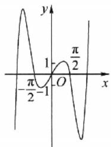

line

| x | y |
|---|---|
| -π/2 | -1 |
| 0 | 0 |
| π/2 | π/2 |

A

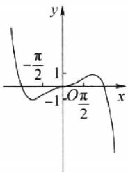

line

| x | y |
|---|---|
| -π/2 | -π/2 |
| 0 | 0 |
| π/2 | -1 |
| 0 | 1 |

B

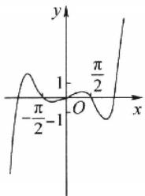

line

| x | y |
|---|---|
| -π/2 | 0 |
| -π/2 | 1 |
| 0 | 1 |
| π/2 | 0 |

C

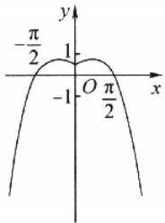

text_image

-π/2
-1 O π/2
y
1
x

D

2. 为了得到函数 $y = \log_3\sqrt[3]{x - 2}$ 的图象，可将函数 $y = \log_3 x$ 的图象上所有的点（）

A. 纵坐标缩短到原来的 $\frac{1}{3}$ ，横坐标不变，再向右平移2个单位长度  
B. 横坐标缩短到原来的 $\frac{1}{3}$ ，纵坐标不变，再向左平移2个单位长度  
C. 横坐标伸长到原来的 3 倍, 纵坐标不变, 再向左平移 2 个单位长度  
D. 纵坐标伸长到原来的 3 倍, 横坐标不变, 再向右平移 2 个单位长度

3. 使 $\log_2(-x) < x + 1$ 成立的 $x$ 的取值范围是 （）

A. $(-1,0)$

B. $\left[-1,0\right)$

C. $(-2,0)$

D. $\left[-2,0\right)$

4. 已知图①对应的函数为 $y = f(x)$ ，则图②对应的函数为 （）

A. $y = f(|x|)$   
B. $y = |f(x)|$   
C. $y=f(-|x|)$   
D. $y = -f(|x|)$

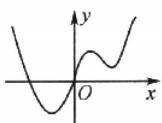  
①

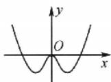  
②

5. 已知定义在 $\mathbf{R}$ 上的函数 $f(x)$ 是奇函数，且对任意的 $x_{1}, x_{2} \in (-\infty, 0)$ ，且 $x_{1} \neq x_{2}$ ，都有 $\frac{f(x_{1}) - f(x_{2})}{x_{1} - x_{2}} < 0$ ，又 $f(2) = 0$ ，则不等式 $xf(x + 2) \leqslant 0$ 的解集是 （）

A. $(-∞,-2]∪[2,+∞)$

B. $[-4, -2] \cup [0, +\infty)$

C. $(-∞,-4]∪[-2,+∞)$

D. $(- \infty, -4] \cup [0, +\infty)$

6. (2025 广东中山期末)已知函数 $f(x) = \log_a x (a > 0 \text{且} a \neq 1)$ ，则 $y = f(|x| - 1)$ 的图象可能是

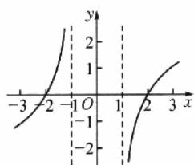

line

| x | y |
|---|---|
| -3 | -1 |
| -2 | 0 |
| -1 | 1 |
| 0 | 2 |
| 1 | 1 |
| 2 | 0 |
| 3 | -1 |

A

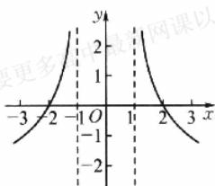

line

| x | y |
|---|---|
| -3 | -1 |
| -2 | 0 |
| -1 | 1 |
| 0 | 2 |
| 1 | 1 |
| 2 | 0 |
| 3 | -1 |

B

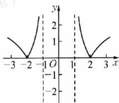

line

| x | y |
|---|---|
| -3 | 1 |
| -2 | -2 |
| -1 | 0 |
| 0 | 0 |
| 1 | 1 |
| 2 | -2 |
| 3 | 1 |

C

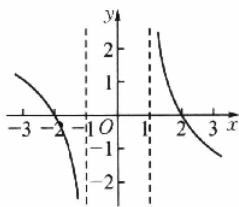

line

| x | y |
|---|---|
| -3 | 1 |
| -2 | 0.5 |
| -1 | 0 |
| 0 | 0 |
| 1 | 0.5 |
| 2 | 1 |
| 3 | 1.5 |

D

7. (2025 江苏淮安开学考试) 如图, 直线 $l$ 对应的函数解析式为 $y = -x + 4$ , 它与 $x$ 轴和 $y$ 轴分别相交于 $A, B$ 两点. 平行于直线 $l$ 的直线 $m$ 从原点 $O$ 出发, 沿 $x$ 轴的正方向以每秒 1 个单位长度的速度运动. 它与 $x$ 轴和 $y$ 轴分别相交于 $C, D$ 两点, 运动时间为 $t \mathrm{~s}(0 \leqslant t \leqslant 4)$ , 以 $CD$ 为斜边作等腰直角三角形 $CDE(E, O$ 两点分别在 $CD$ 两侧). 若 $\triangle CDE$ 和 $\triangle OAB$ 的重合部分的面积为 $S$ , 则 $S$ 与 $t$ 之间的函数关系的大致图象是

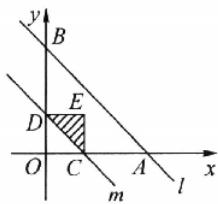

text_image

y
B
E
D
O C A
l x
m

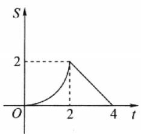

line

| t | S |
|---|---|
| 0 | 0 |
| 2 | 2 |
| 4 | 0 |

A

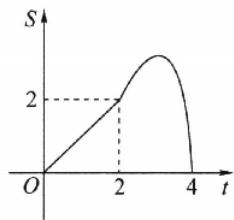

line

| t | S |
|---|---|
| 0 | 0 |
| 2 | 2 |
| 4 | 0 |

B

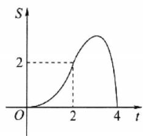

line

| t | S |
|---|---|
| 0 | 0 |
| 2 | 2 |
| 4 | 0 |

C

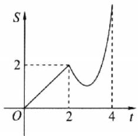

line

| t | S |
|---|---|
| 0 | 0 |
| 2 | 2 |
| 3 | 1 |
| 4 | 2 |

D

8. 已知函数 $f(x)(x \in \mathbb{R})$ 满足 $f(-x) = 2 - f(x)$ ，若函数 $y = \frac{x + 1}{x}$ 与 $y = f(x)$ 图象的交点为 $(x_{1}, y_{1}), (x_{2}, y_{2}), \cdots, (x_{m}, y_{m})$ ，则 $\sum_{i=1}^{m} (x_{i} + y_{i}) =$ （）

A. 0

B. m

C. 2m

D. $4m$

# 二、多项选择题:本题共3小题,每小题6分,共18分.全部选对的得6分,部分选对的得部分分,有选错的得0分.

9.（2025重庆中学开学考试）周末，自行车骑行爱好者甲、乙两人相约沿同一路线从A地出发前往B地进行骑行训练，甲、乙分别以不同的速度匀速骑行，乙比甲早出发 $5\mathrm{min}$ 乙骑行 $25\mathrm{min}$ 后，甲以原速的 $\frac{8}{5}$ 继

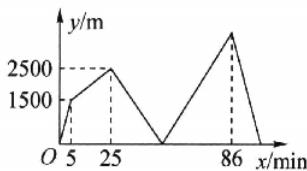

line

| x/min | y/m |
|---|---|
| 0 | 1000 |
| 5 | 1500 |
| 25 | 2500 |
| 86 | 3000 |
| 96 | 1000 |

续骑行,经过一段时间,甲先到达 B 地,乙一直保持原速前往 B 地.在此过程中,甲、乙两人相距的路程 y(单位:m)与乙骑行的时间 x(单位:min)之间的关系如图所示,则下列说法正确的是()

A. 乙的速度为 300 m/min

B. 25 min 后甲的速度为 400 m/min

C. 乙比甲晚 $14 \mathrm{~min}$ 到达 B 地

D. A, B 两地之间的路程为 $29400 \mathrm{~m}$

10. (2025 重庆一诊) 函数 $f(x) = \begin{cases} |x - 1|, & x \leqslant 2, \\ 5 - x, & x > 2, \end{cases}$ 且 $f(a) = f(b) = f(c) (a < b < c)$ ，则 （）

A. $f(x)$ 的值域为 $[0, +\infty)$

B. 不等式 $f(x) \geqslant 1$ 的解集为 $(- \infty, 0]$

C. $a + b = 2$

D. $a+b+c\in[6,7)$

11.（2025河北石家庄质检(一))已知 $a, b$ 分别是方程 $2^{x} + x = 0, 3^{x} + x = 0$ 的两个实数根，则下列选项正确的有 （）

A. -1<b<a<0

B. $-1 < a < b < 0$

C. $b \cdot 3^{a} < a \cdot 3^{b}$

D. $a \cdot 2^{b} < b \cdot 2^{a}$

# 三、填空题：本题共3小题，每小题5分，共15分.

12. (2025 陕西西安一模) 函数 $f(x)$ 是定义在 $[-4, 4]$ 上的奇函数, 其在 $(0, 4]$ 上的图象如图所示, 那么不等式 $f(x) \sin x < 0$ 的解集为 \_\_\_\_.

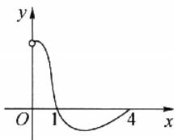

13. (2025 广东模拟测试(一))已知 $f(x)$ 是定义在 $\mathbb{R}$ 上的奇函数, 且 $f(x)$ 在[0, 2]上单调递减, $f(x + 2)$ 为偶函数. 若 $f(x) = m$ 在[0,12]上恰好有 4 个不同的实数根 $x_1, x_2, x_3, x_4$ , 则 $x_1 + x_2 + x_3 + x_4 =$ \_\_\_\_.

14. 新题型·构造实例题(2024山东曲阜期中)对任意的 $x_{1} < 0 < x_{2}$ , 若函数 $f(x) = a|x - x_{1}| + b|x - x_{2}|$ 的大致图象如图所示(两侧的射线均平行于 $x$ 轴), 则满足条件的 $a, b$ 的值可以分别为 \_\_\_\_.

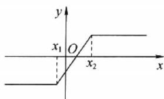

text_image

y
x₁ O x₂ x

# 考点过关10 函数与方程

满分:73 分 时间:45 分钟

答案见 P14

# 考查要点

函数零点的概念,函数的零点与方程的解的关系,用函数零点的存在性定理判断函数的零点与方程的根的存在性的应用

# 一、单项选择题:本题共8小题,每小题5分,共40分.

1. 已知自变量和函数值的对应值如下表：

<table><tr><td>x</td><td>0.2</td><td>0.6</td><td>1.0</td><td>1.4</td><td>1.8</td><td>2.2</td><td>2.6</td><td>3.0</td><td>3.4</td><td> $\cdots$ </td></tr><tr><td> $y=2^{x}$ </td><td>1.149</td><td>1.516</td><td>2.0</td><td>2.639</td><td>3.482</td><td>4.595</td><td>6.063</td><td>8.0</td><td>10.556</td><td> $\cdots$ </td></tr><tr><td> $y=x^{2}$ </td><td>0.04</td><td>0.36</td><td>1.0</td><td>1.96</td><td>3.24</td><td>4.84</td><td>6.76</td><td>9.0</td><td>11.56</td><td> $\cdots$ </td></tr></table>

则方程 $2^{x} = x^{2}$ 的一个根位于区间 （）

A. $(0.6,1.0)$

B. $(1.4,1.8)$

C. (1.8,2.2)

D. (2.6,3.0)

2. 在下列区间中, 函数 $f(x)=\mathrm{e}^{x}+4x-3$ 的零点所在的区间为 ( )

A. $\left(-\frac{1}{4},0\right)$

B. $\left(0,\frac{1}{4}\right)$

C. $\left(\frac{1}{4},\frac{1}{2}\right)$

D. $\left(\frac{1}{2},\frac{3}{4}\right)$

3. 已知偶函数 $f(x)$ 满足 $f(1 - x) = f(1 + x)$ ，且当 $x \in [0,1]$ 时， $f(x) = 2^x - 1$ . 若函数 $y = f(x) - \log_a x$ 恰有4个零点，则 $a =$ （）

A. 2

B. 3

C. 4

D. 5

4. (2025 贵州贵阳期中) 若函数 $y = x - \frac{1}{x}$ 与函数 $y = kx - 1$ 的图象存在唯一的公共点 $A(x_0, y_0)$ ，且点 $A$ 落在角 $\theta$ 的终边上，则 $\sin \theta$ 的值是 ( )

A. 0 或 $\frac{2}{3}$

B. $\frac{2}{3}$

C. 0 或 $\frac{3}{5}$

D. $\frac{3}{5}$

5.（2025甘肃兰州模拟）已知函数 $y = 5x^{2} - 7x - m$ 的一个零点在区间 $(-1,0)$ 上，另一个零点在区间(2,3)上，则 $m$ 的值可能是 （）

A. $-\frac{1}{2}$

B. 1

C. $\frac{9}{2}$

D. $\frac{13}{2}$

6. (2025 广西南宁期中) 已知偶函数 $f(x)$ 满足 $f(x) = f(2 - x)$ ，当 $x \in [0,1]$ 时， $f(x) = x^2$ ，则方程 $f(x) = \frac{1}{2}$ 在 $[-1,7]$ 上所有的实数根之和为

A. 20

B. 22

C. 24

D. 26

7. (2025 安徽芜湖统测) 定义在 $\mathbf{R}$ 上的偶函数 $f(x)$ 满足 $f(2 + x) = f(-x)$ , 当 $x \in [0,1]$ 时, $f(x) = 2^x - 1$ , 若函数 $F(x) = f(x) - kx$ 在 $(-2, 2)$ 上恰有三个零点, 则实数 $k$ 的取值范围是 ( )

A. $(-1,0)\cup(0,1)$

B. $(- \ln 2,0) \cup (0,\ln 2)$

C. $(-1,-\ln2)\cup(\ln2,1)$

D. $\left(-1,-\frac{1}{2}\right)\cup\left(\frac{1}{2},1\right)$

8.（2024 辽宁名校联盟 3 月模拟）已知函数 $f(x) = \begin{cases} x + \frac{1}{x - 1} - 2, & x > 1, \\ 2 - 2^x, & x \leqslant 1, \end{cases}$ 若关于 $x$ 的方程 $f[f(x)] = m$ 有五个不相等的实数根，则 $m$ 的取值范围是 ( )

A. $(0,1)$

B. $[1,2)$

C. $(1,+\infty)$

D. $[0,2]$

# 二、多项选择题:本题共3小题,每小题6分,共18分.全部选对的得6分,部分选对的得部分分,有选错的得0分.

9. 下列函数图象与 $x$ 轴均有交点, 其中能用二分法求图中函数零点的有 ( )

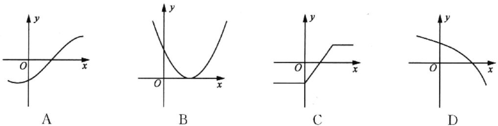

10. 给出以下四个方程,其中有唯一解的是 ( )

A. $\ln x = 1 - x$

B. $e^{x}=\frac{1}{x}$

C. $2-x^{2}=\lg|x|$

D. $\cos x = |x| + 1$

11. 已知函数 $f(x) = \begin{cases} 2^x - 1, & x \leqslant 0, \\ |\log_{\frac{1}{3}}x| + 1, & x > 0, \end{cases}$ 则方程 $f^2(x) - mf(x) + m - 1 = 0$ 的根的个数可能为 ( )

A. 1

B. 2

C. 3

D. 4

# 三、填空题：本题共3小题，每小题5分，共15分.

12. 若函数 $f(x) = 4^x - 2^x - a, x \in [-1, 1]$ 有零点，则实数 $a$ 的取值范围是 \_\_\_\_.

13. 新题型·构造实例题(2024 苏北七市一模)函数 $f(x)$ 的图象在区间 $(0,2)$ 上连续不断, 能说明“若 $f(x)$ 在区间 $(0,2)$ 上存在零点, 则 $f(0) \cdot f(2) < 0$ ”为假命题的一个函数 $f(x)$ 的解析式可以为 $f(x) =$ \_\_\_\_.

14. (2025 广东深圳一模)人们很早以前就开始探索高次方程的数值求解问题. 牛顿在《流数法》一书中, 给出了高次代数方程的一种数值解法——牛顿法. 这种求方程根的方法, 在科学界已被广泛采用, 例如求方程 $x^{3} + 2x^{2} + 3x + 3 = 0$ 的近似解, 先用函数零点存在定理, 令 $f(x) = x^{3} + 2x^{2} + 3x + 3$ , $f(-2) = -3 < 0$ , $f(-1) = 1 > 0$ , 得在 $(-2, -1)$ 上存在零点, 取 $x_{0} = -1$ , 牛顿用公式 $x_{n} = x_{n-1} - \frac{f(x_{n-1})}{f'(x_{n-1})}$ 反复迭代, 以 $x_{n}$ 作为 $f(x) = 0$ 的近似解, 迭代两次后计算得到的近似解为 \_\_\_\_; 以 $(-2, -1)$ 为初始区间, 用二分法计算两次后, 以最后一个区间的中点值作为方程的近似解, 则近似解为 \_\_\_\_. (本题第一空 2 分, 第二空 3 分)

# 考点过关11 函数的综合应用

满分:73 分 时间:45 分钟

答案见 P16

# 考查要点

基本初等函数,函数的图象,函数与方程,函数性质的综合运用

# 一、单项选择题:本题共8小题,每小题5分,共40分.

1. 函数 $y = \frac{2x + 1}{x - 3}$ 的值域为 ( )

A. $\left(-\infty, \frac{4}{3}\right) \cup \left(\frac{4}{3}, +\infty\right)$

B. $(-∞,2)∪(2,+∞)$

C. $\mathbf{R}$

D. $\left(-\infty,\frac{2}{3}\right)\cup\left(\frac{4}{3},+\infty\right)$

2. (2024 广东深圳二调) 已知 $a > 0$ ，且 $a \neq 1$ ，则函数 $y = \log_a\left(x + \frac{1}{a}\right)$ 的图象一定经过 （）

A. 第一、二象限

B. 第一、三象限

C. 第二、四象限

D. 第三、四象限

3. 函数 $y = \frac{x\ln|x|}{|x|}$ 的图象可能是 ( )

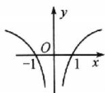  
A

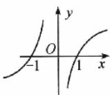  
B

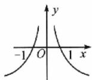  
C

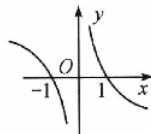  
D

4.（2025广州番禺实验中学开学考试）已知 $f(x)$ 是定义在 $\mathbf{R}$ 上的奇函数，当 $x > 0$ 时， $f(x) = -x^2 + x$ ，则不等式 $(x - 1)f(x) > 0$ 的解集为 （）

A. $(-∞,-1)$

B. $(-1,0)$

C. $(0,1)$

D. $(1,+\infty)$

5.（2025河北石家庄质检(一))下列不等式成立的是 （）

A. $\log_{6}0.5 > \log_{6}0.7$

B. $0.6^{0.5} > \log_{0.6} 0.5$

C. $\log_{6}0.6 > \log_{5}0.5$

D. $0.6^{0.6}>0.6^{0.5}$

6. 已知函数 $f(x)$ 是定义在 $\mathbf{R}$ 上的偶函数，且在 $(-\infty, 0)$ 上单调递减，则下列三个数， $a = f(-\log_2 6), b = f(\log_3 27), c = f\left[\left(\frac{1}{2}\right)^{-0.6}\right]$ 的大小关系为 ( )

A. a>c>b

B. a > b > c

C. b > a > c

D. c > a > b

7. (2024 浙江温州二模)已知定义在(0,1)上的函数 $f(x)=\left\{\begin{aligned}&\frac{1}{n},&x 是有理数 \frac{m}{n}(m,n 是互质的正整数),\\ &1,&x 是无理数,\end{aligned}\right.$ 则下列结论正确的是

A. $f(x)$ 的图象关于直线 $x=\frac{1}{2}$ 对称

B. $f(x)$ 的图象关于点 $\left(\frac{1}{2}, \frac{1}{2}\right)$ 对称

C. $f(x)$ 在 $(0,1)$ 上单调递增

D. $f(x)$ 有最小值

8. (2024 广东茂名 5 月模拟考试) 已知 $f(x)$ 是定义域为 $\mathbf{R}$ 的单调递增函数, $\forall n \in \mathbb{N}, f(n) \in \mathbb{N}$ , 且 $f[f(n)] = 3n$ , 则 $f(28) =$

A. 54

B. 55

C. 56

D. 57

# 二、多项选择题:本题共3小题,每小题6分,共18分.全部选对的得6分,部分选对的得部分分,有选错的得0分.

9. 已知函数 $f(x)$ 的图象是连续不断的，且有如下对应值表：

<table><tr><td>x</td><td>1</td><td>2</td><td>3</td><td>4</td><td>5</td></tr><tr><td>f(x)</td><td>-4</td><td>-2</td><td>1</td><td>4</td><td>7</td></tr></table>

在下列区间中，函数 $f(x)$ 不一定存在零点的区间为 （）

A. $(1,2)$

B. $(2,3)$

C. $(3,4)$

D. $(4,5)$

10.（2025浙江温州期末）已知函数 $f(x) = \frac{2^x - 1}{2^x + 1}$ ，则 （）

A. 不等式 $|f(x)| < \frac{1}{3}$ 的解集是 $(-1, 1)$   
B. $\forall x\in \mathbf{R}$ ，都有 $f(-x) = f(x)$   
C. 函数 $f(x)$ 是 R 上的减函数  
D. 函数 $f(x)$ 的值域为 $(-1,1)$

11.（2024海南海口等4地、乐东中学等2校高考全真模拟(三))已知定义在 $\mathbf{R}$ 上的函数 $f(x)$ 不恒等于零，同时满足 $f(x + y) = f(x)f(y)$ ，且当 $x > 0$ 时， $f(x) > 2022$ ，那么当 $x < 0$ 时，下列结论不正确的有

A. -1 < f(x) < 0   
B. $f(x) < -1$   
C. $f(x) > 1$   
D. $0 <   f(x) <   \frac{1}{2022}$

# 三、填空题：本题共3小题，每小题5分，共15分.

12. 已知函数 $f(x) = \sqrt{ax^2 - ax + 2}$ 的定义域为 $\mathbf{R}$ ，则实数 $a$ 的取值范围是  
13. 定义区间 $[x_1, x_2]$ 的长度为 $x_2 - x_1$ ，已知函数 $f(x) = 3^{|x|}$ 的定义域为 $[a, b]$ ，值域为 $[1, 9]$ ，则区间 $[a, b]$ 长度的最小值为 \_\_\_\_.  
14. (2024 重庆主城二测) 若函数 $f(x)$ 在定义域内存在 $x_0 (x_0 \neq 0)$ 使得 $f(-x_0) = -f(x_0)$ ，则称 $f(x)$ 为“ω 函数”， $x_0$ 为该函数的一个“ω 点”。设 $g(x) = \begin{cases} -x - 2\ln 2, & x < 0, \\ \ln (a - e^x), & x > 0, \end{cases}$ 若 $\ln 2$ 是 $g(x)$ 的一个“ω 点”，则实数 $a$ 的值为 \_\_\_\_；若 $g(x)$ 为“ω 函数”，则实数 $a$ 的取值范围是 \_\_\_\_。（本题第一空 2 分，第二空 3 分）

# 阶段温习二 考点 1\~11

满分:73 分 时间:45 分钟

答案见 P17

# 考查要点

集合,常用逻辑用语,不等式,函数

# 一、单项选择题:本题共8小题,每小题5分,共40分.

1. (2024 湖北武汉 2 月调研) 已知集合 $A = \{x \mid 2x^2 + x - 1 < 0\}$ , $B = \{y \mid y = \lg (x^2 + 1)\}$ , 则 $A \cap B =$

A. $(-1,0]$

B. $\left[0, \frac{1}{2}\right)$

C. $\left(-\frac{1}{2},0\right]$

D. $[0,1)$

2. (2025 河北石家庄质检(一))已知命题 $p: \forall x \in (0, +\infty), e^x > \ln x$ ，则 （）

A. p 是假命题， $\neg p:\exists x\in(-\infty,0),e^{x}\leqslant\ln x$   
B. $p$ 是假命题， $\neg p: \exists x \in (0, +\infty), e^x \leqslant \ln x$   
C. p 是真命题， $\neg p:\exists x\in(-\infty,0),e^{x}\leqslant\ln x$   
D. p 是真命题， $\neg p:\exists x\in(0,+\infty),e^{x}\leqslant\ln x$

3.（2025江苏海安中学期中）函数 $y = \frac{2x}{x^2 + x^{-2}}$ 的图象大致为 （ ）

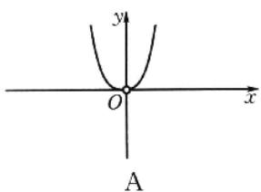

text_image

y
O
x
A

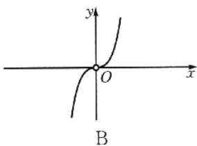

text_image

y
O
x
B

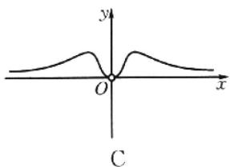

text_image

y
O
x
C

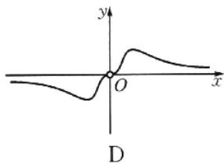

text_image

y
O
x
D

4. (2025 江苏南京一中期初) 已知点 $(a, b) (a > 0, b > 0)$ 在直线 $x + y = 1$ 上，则 $\frac{1}{a} + \frac{a}{b}$ 的最小值为 ( )

A. 1

B. 2

C. 3

D. 4

5. (2024 海南海口等 4 地、乐东中学等 2 校高考全真模拟(三)) 设 $x \in \mathbf{R}$ , 则“ $2^{x^2 - 2x - 8} < 1$ ”是“ $\lg(x + 3) > 0$ ”的

A. 充分不必要条件

B. 必要不充分条件

C. 充要条件

D. 既不充分又不必要条件

6. (2024 湖北武汉 2 月调研) 已知 $ab \neq 1, \log_a m = 2, \log_b m = 3$ , 则 $\log_{ab} m =$ （）

A. $\frac{1}{6}$

B. $\frac{1}{5}$

C. $\frac{5}{6}$

D. $\frac{6}{5}$

7. (2024 浙江杭州二模) 设集合 $M = \{1, -1\}$ , $N = \{x \mid x > 0$ 且 $x \neq 1\}$ , 函数 $f(x) = a^x + \lambda a^{-x} (a > 0$ 且 $a \neq 1)$ , 则

A. $\forall\lambda\in M,\exists a\in N,f(x)$ 为增函数

B. $\exists \lambda \in M, \forall a \in N, f(x)$ 为减函数

C. $\forall\lambda\in M,\exists a\in N,f(x)$ 为奇函数

D. $\exists\lambda\in M,\forall a\in N,f(x)$ 为偶函数

8. (2025 江苏南京、盐城一模) 已知函数 $f(x) = \begin{cases} \mathrm{e}^{x - 4}, & x \leqslant 4, \\ (x - 16)^2 - 143, & x > 4, \end{cases}$ 则当 $x \geqslant 0$ 时， $f(2^x)$ 与 $f(x^2)$ 的大小关系是

A. $f(2^{x}) \leqslant f(x^{2})$

B. $f(2^{x}) \geqslant f(x^{2})$

C. $f(2^{x})=f(x^{2})$

D. 不确定

# 二、多项选择题:本题共3小题,每小题6分,共18分.全部选对的得6分,部分选对的得部分分,有选错的得0分.

9. 已知函数 $f(x)$ 的定义域为 $[a, b]$ ，对任意 $x_1, x_2 \in [a, b]$ ，且 $x_1 \neq x_2$ ，下列条件能推出 $f(x)$ 在定义域内单调递增的有（）

A. $\frac{f(x_1)f(x_2)}{x_1 - x_2} > 1$

B. $(x_{1} - x_{2})(f(x_{1}) - f(x_{2})) > 0$

C. 对任意 $x_{1} < x_{2}$ , 都有 $f(x_{1}) - f(x_{2}) < 0$

D. 对任意 $x_{1} < x_{2}$ , 都有 $\frac{f(x_2)}{f(x_1)} > 1$

10.（2024山东潍坊二模）已知实数 $a > b > 0$ ，则

( )

A. $\frac{b}{a} < \frac{b + 2}{a + 2}$

B. $a + \frac{1}{b} > b + \frac{1}{a}$

C. $a^b > b^a$

D. $\lg \frac{a + b}{2} >\frac{\lg a + \lg b}{2}$

11. (2024 浙江杭州二模) 已知函数 $f(x)$ 对任意实数 $x$ 均满足 $2f(x) + f(x^2 - 1) = 1$ ，则 （）

A. $f(-x)=f(x)$

B. $f(\sqrt{2}) = 1$

C. $f(-1)=\frac{1}{3}$

D. 函数 $f(x)$ 在区间 $(\sqrt{2},\sqrt{3})$ 上不单调

# 三、填空题:本题共3小题,每小题5分,共15分.

12. 若函数 $f(x) = \begin{cases} x^2 + 2x - 1, & x > 0, \\ a, & x = 0, \\ g(2x), & x < 0 \end{cases}$ ，为奇函数，则 $f[g(-2)] =$ \_\_\_\_.

13. (2024 辽宁教研联盟第二次调研测试) 若实数 $b > a > 1$ , 且 $\log_a b + \log_b a = \frac{10}{3}$ , 则 $3 \ln a - \ln b =$ \_\_\_\_.

14. (2025年1月八省联考)已知曲线 $C: y = x^3 - \frac{2}{x}$ , 两条直线 $l_1, l_2$ 均过坐标原点 $O, l_1$ 和 $C$ 交于 $M$ , $N$ 两点, $l_2$ 和 $C$ 交于 $P, Q$ 两点, 若 $\triangle OPM$ 的面积为 $\sqrt{2}$ , 则 $\triangle MNQ$ 的面积为 \_\_\_\_.

# 第四章 导数及其应用

# 考点过关12 导数的概念与运算

满分:73 分 时间:45 分钟

答案见 P19

# 考查要点

导数的概念与运算

# 一、单项选择题：本题共8小题，每小题5分，共40分.

1. 若函数 $f(x) = \sin \alpha - \cos x$ ，则 $f'(\alpha) =$ （）

A. $\sin \alpha$

B. $\cos \alpha$

C. $\sin \alpha + \cos \alpha$

D. $2 \sin \alpha$

2. 已知一个物体的运动方程为 $s=1-t+t^{2}$ ，其中 s 的单位是 m, t 的单位是 s，那么物体在 4 s 末的瞬时速度是（）

A. 7 m/s

B. 6 m/s

C. 5 m/s

D. 8 m/s

3.（2024湖北十七所重点中学联考）函数 $f(x) = \log_2\frac{1}{x}$ 的导函数为 （ ）

A. $f'(x)=\frac{\ln 2}{x}$

B. $f^{\prime}(x) = \frac{1}{x\ln 2}$

C. $f^{\prime}(x) = -\frac{\ln 2}{x}$

D. $f^{\prime}(x) = -\frac{1}{x\ln 2}$

4. (2025 山西太原模拟) 函数 $y = f(x)$ 的导数 $y = f'(x)$ 仍是 $x$ 的函数, 通常把导函数 $y = f'(x)$ 的导数叫作函数 $y = f(x)$ 的二阶导数, 记作 $y = f''(x)$ . 类似地, 二阶导数的导数叫作三阶导数, 三阶导数的导数叫作四阶导数, …一般地, $n - 1$ 阶导数的导数叫作 $n$ 阶导数, 函数 $y = f(x)$ 的 $n$ 阶导数记作 $y = f^{(n)}(x)$ , 例如 $y = e^x$ 的 $n$ 阶导数 $(e^x)^{(n)} = e^x$ . 若 $f(x) = x e^x + \sin x$ , 则 $f^{(2024)}(0) =$

A. 2022

B. 2023

C. 2024

D. 2025

5.（2025湖北荆州质检）已知函数 $f(x) = x^{3} + x^{2}f'(0) - x$ ，则 $f(1)$ 的值为 （）

A.-1

B. 1

C.-3

D. 3

6. 如图, 已知曲线 $C: y = f(x)$ 与直线 $l$ 相切于点 $A$ , 设 $g(x) = xf(x)$ . 则曲线 $y = g(x)$ 在点 (2, $g(2)$ ) 处的切线方程为 ( )

A. $x - 2y + 2 = 0$   
B. 3x-y-4=0   
C. 3x-y-2=0   
D. x-3y-2=0

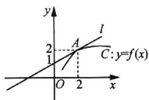

text_image

y
l
2
A
C: y=f(x)
1
O
2
x

7. (2024 海南海口 4 月调研) 已知函数 $f(x)$ 的定义域为 $\mathbf{R}, f(x + 1)$ 是偶函数, 当 $x < \frac{1}{2}$ 时, $f(x) = \ln(1 - 2x)$ , 则曲线 $y = f(x)$ 在点 (2, $f(2)$ ) 处的切线斜率为 ( )

A. $\frac{2}{5}$

B. $-\frac{2}{5}$

C. 2

D.-2

8. (2024 江苏张家港期中) 贝塞尔曲线(Beziercurve)是应用于二维图形应用程序的数学曲线, 一般的矢量图形软件通过它来精确画出曲线. 三次函数 $f(x)$ 的图象是可由 $A, B, C, D$ 四点确定的贝塞尔曲线, 其中点 $A, D$ 在 $f(x)$ 的图象上, $f(x)$ 在点 $A, D$ 处的切线分别过点 $B, C$ . 若 $A(0,0), B(-1,-1), C(2,2), D(1,0)$ , 则 $f(x)=$

A. $5x^{3}-4x^{2}-x$

B. $3x^{3} - 3x$

C. $3x^{3}-4x^{2}+x$

D. $3x^{3}-2x^{2}-x$

# 二、多项选择题:本题共3小题,每小题6分,共18分.全部选对的得6分,部分选对的得部分分,有选错的得0分.

9.（2025浙江宁波期末）下列函数的导数计算正确的是 （）

A. 若函数 $f(x)=\cos(-x)$ ，则 $f'(x)=\sin x$   
B. 若函数 $f(x)=a^{-x}(a>0$ 且 $a\neq1)$ ，则 $f'(x)=-a^{-x}\ln a$   
C. 若函数 $f(x)=\lg x$ ，则 $f'(x)=\frac{\lg c}{x}$ （e 是自然对数的底数）  
D. 若函数 $f(x) = \tan x$ ，则 $f'(x) = \frac{1}{\cos^2 x}$

10. 新题型·判断正误题(2025江苏镇江期末)定义方程 $f(x) = f'(x)$ 的实数根 $x_0$ 叫作函数 $f(x)$ 的“新不动点”，有下列函数，其中只有一个“新不动点”的函数有（）

A. $g(x)=x \cdot 2^{x}$   
B. $g(x) = -\mathrm{e}^{x} - 2x$   
C. $g(x)=\ln x$   
D. $g(x)=\sin x+2\cos x$

11. (2025 湖南桃源第一中学模拟) 已知过点 $A(a,0)$ 作曲线 $y = (1 + x)e^x$ 的切线有且仅有 1 条, 则 $a$ 的可能取值为

A.-5

B.-3

C.-1

D. 1

# 三、填空题:本题共3小题,每小题5分,共15分.

12.（2024甘肃兰州诊断）函数 $f(x) = x\mathrm{e}^{-x}$ （e是自然对数的底数）在 $x = 1$ 处的切线方程是\_\_\_\_。  
13. (2025 湖南常德期末) 已知函数 $f(x) = \mathrm{e}^{x - 1} - a\ln x - a$ ，若曲线 $y = f(x)$ 在点 $(1, f(1))$ 处的切线与直线 $2x + y - 1 = 0$ 垂直，则切线的方程为 \_\_\_\_.  
14. 若直线 $y = kx + b$ 是曲线 $y = \ln x$ 的切线，也是曲线 $y = \mathrm{e}^{x - 2}$ 的切线，则 $k =$ \_\_\_\_.

# 考点过关13 导数与函数的单调性

满分:73 分 时间:45 分钟

答案见 P20

# 考查要点

以导数为工具判断函数的单调性

# 一、单项选择题:本题共8小题,每小题5分,共40分.

1. 已知函数 $y = f(x)$ 的图象如图所示，则 $y = f'(x)$ 的图象可能是 ( )

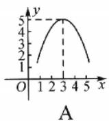

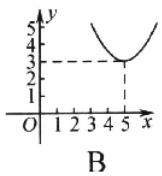

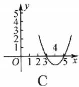

line

| x | y |
|---|---|
| 0 | 1 |
| 1 | 2 |
| 2 | 3 |
| 3 | 5 |
| 4 | 4 |
| 5 | 3 |

2. 函数 $y = x - \ln x$ 的单调递增区间为 （）

A. $(-∞,0)$

B. $(0,1)$

C. $(1,+\infty)$

D. $(-∞,0)∪(1,+∞)$

3. (2025 海南海口期中) 已知函数 $f(x) = -\frac{x}{\mathrm{e}^x}, a < b < 1$ ，则

A. $f(a)=f(b)$

B. $f(a) < f(b)$

C. $f(a) > f(b)$

D. 关系不确定

4. (2024 江苏南京模拟) 设 $a \in \mathbb{R}$ , 若函数 $f(x) = 3x^3 - (a + 2)x$ 在 $\mathbb{R}$ 上单调递增, 则 $a$ 的取值范围是

A. $(-∞,0]$

B. $(-∞,0)$

C. $(-∞,-2]$

D. $(-∞,-2)$

5. 设函数 $f(x) = \frac{1}{2} x^2 - 9\ln x$ 在区间 $[a - 1, a + 1]$ 上单调递减，则实数 $a$ 的取值范围是 ( )

A. $(1,2]$

B. $[4, +\infty)$

C. $(-∞,2]$

D. $(0,3]$

6. (2025 福建南平期末)“ $f(x)=x+\frac{1}{x}$ 在 $(a,+\infty)$ 上单调递增”是“a>-2”的()

A. 充分不必要条件

B. 必要不充分条件

C. 充要条件

D. 既不充分也不必要条件

7. (2025 东北三省四市联考)为了激发同学们学习数学的热情,某学校开展利用数学知识设计 LOGO 的比赛,其中某位同学利用函数图象的一部分设计了如图所示的 LOGO,那么该同学所选的函数最有可能是 ( )

A. $f(x)=x-\sin x$

B. $f(x)=\sin x-x\cos x$

C. $f(x)=x^{2}-\frac{1}{x^{2}}$

D. $f(x) = \sin x + x^3$

8. (2025 江西赣州模拟) 若对任意的 $x_{1}, x_{2} \in (m, +\infty)$ , 且 $x_{1} < x_{2}, \frac{x_{1} \ln x_{2} - x_{2} \ln x_{1}}{x_{2} - x_{1}} < 2$ 成立, 则 $m$ 的最小值是

A. $\mathrm{e}^2$

B. e

C. 1

D. $\frac{1}{e}$

# 二、多项选择题:本题共3小题,每小题6分,共18分.全部选对的得6分,部分选对的得部分分,有选错的得0分.

9.（2025江苏泰州开学考试）下列说法正确的是 （）

A. 若函数 $f(x)$ 在区间 $(a, b)$ 上单调递增，则一定有 $f'(x) > 0$   
B. 若函数 $f(x)$ 在区间 $(a, b)$ 上恒有 $f'(x) = 0$ ，则 $f(x)$ 在 $(a, b)$ 上不是单调的  
C. 若函数 $f(x)$ 在区间 $(a, b)$ 上恒有 $f'(x) > 0$ ，则 $f(x)$ 在 $(a, b)$ 上是单调递增的  
D. 函数 $f(x) = x - \sin x$ 在 $\mathbf{R}$ 上是增函数

10. (2025 江苏常州期末) 若 $f(x) = \frac{1}{2} x^2 - \mathrm{e}^2 \ln x, 0 < a < \mathrm{e} < b$ ，则下列结论不正确的是 （）

A. $f(a) < f(b)$

B. $f(a) > f(b)$

C. $f(a) > f(e)$

D. $f(e) > f(b)$

11.（2025海南海口期末）已知函数 $f(x) = x^{3} - 3x^{2} + ax + b$ ，则下列论述正确的有 （）

A. 若 $a = -9$ ，则函数 $y = f(x)$ 的单调递减区间为 $(-1,3)$   
B. 若函数 $y=f(x)$ 在区间 $(0,+\infty)$ 上是单调递增的，则 $a\geqslant4$   
C. 当 a=3, b=0 时，函数 $f(x)$ 图象的对称轴为直线 x=2  
D. 当 a=0, b=2 时，函数 $f(x)$ 图象的对称中心为 $(1,0)$

# 三、填空题：本题共3小题，每小题5分，共15分.

12. 已知函数 $f(x) = x^3 - 3x$ ，则 $f(x)$ 的单调递减区间是 \_\_\_\_.  
13. (2025 山东济南开学考试) 如果 $f(x) = mx - \mathrm{e}^x$ 在区间 $(-1, 0)$ 上是单调函数, 那么实数 $m$ 的取值范围是 \_\_\_\_.  
14. (2025 湖北襄阳期末) 函数 $f(x)$ 的导函数为 $f'(x)$ ，若在 $f(x)$ 的定义域内存在一个区间 $D, f(x)$ 在区间 $D$ 上单调递增， $f'(x)$ 在区间 $D$ 上单调递减，则称区间 $D$ 为函数 $f(x)$ 的一个“渐缓增区间”。若对于函数 $f(x) = a e^{x} - x^2$ ，区间 $\left(0, \frac{1}{2}\right)$ 是其一个渐缓增区间，则实数 $a$ 的取值范围是 \_\_\_\_。

# 考点过关14 导数与函数的极(最)值

满分:73 分 时间:45 分钟

∠答案见 P22

# 考查要点

通过判断函数的单调性进一步求极值(最值)

# 一、单项选择题：本题共8小题，每小题5分，共40分.

1. (2024 江苏徐州一中期中) 如图所示为函数 $f(x)$ 的导函数图象, 则下列关于函数 $f(x)$ 的说法正确的有

①单调递减区间是 $[-2,2]$ ;

②-4 和 4 都是极小值点；

③没有最大值；

④最多能有四个零点.

A. ①②

B. ②③

C. ②④

D. ②③④

2. 若函数 $f(x) = x^3 + ax^2 + x (x \in \mathbf{R})$ 不存在极值点，则实数 $a$ 的取值范围是 （）

A. $(-∞,-\sqrt{3})∪(\sqrt{3},+∞)$

B. $(-∞,-\sqrt{3})∪[√3,+∞)$

C. $(- \sqrt{3}, \sqrt{3})$

D. $\left[-\sqrt{3},\sqrt{3}\right]$

3.（2025河北唐山期末）函数 $f(x) = \frac{x^2}{\mathrm{e}^{2x}}$ 的极大值为 （ ）

A. 0

B. $\frac{4}{e^{4}}$

C. $\frac{1}{e^{2}}$

D. $\frac{1}{e}$

4. (2025 浙江嘉兴期中) 函数 $f(x)=2x+\sin x$ 在区间 $[0,\pi]$ 上的 ( )

A. 最小值为 0, 最大值为 $\pi + 1$

B. 最小值为 0, 最大值为 $2 \pi$

C. 最小值为 $\pi+1$ ，最大值为 $2\pi$

D. 最小值为 0, 最大值为 2

5. 设 $a \in \mathbf{R}$ , 若函数 $y = e^x + ax$ 有大于零的极值点, 则 ( )

A. $a <   - 1$

B. $a > - 1$

C. $a > -\frac{1}{e}$

D. $a < -\frac{1}{\mathrm{e}}$

6. (2025 四川成都期末) 已知函数 $f(x) = a \mathrm{e}^{x} - x^{2} (a \in \mathbf{R})$ 有三个不同的零点，则实数 $a$ 的取值范围是

A. $\left(0,\frac{4}{\mathrm{e}^{2}}\right)$

B. $\left(0,\frac{2}{e}\right)$

C. $\left(0,\frac{2}{c^{2}}\right)$

D. $\left(0,\frac{4}{\mathrm{e}}\right)$

7.（2025河南焦作期中）某制药公司生产某种胶囊，其中胶囊中间部分为圆柱，且圆柱高为 $l$ ，左、右两端均为半球形，其半径为 $r$ .若其表面积为 $S$ ，则当胶囊的体积 $V$ 取得最大值时， $r =$ （

A. $\sqrt{\frac{S}{4\pi}}$

B. $\sqrt{\frac{S}{2\pi}}$

C. $\sqrt{\frac{S}{\pi}}$

D. $\sqrt{\frac{S}{6\pi}}$

8. (2025 江苏南通期末) 若函数 $f(x)$ 的导数 $f'(x) = x - \sin x, f(x)$ 的最小值为 -1，则函数 $y = f(x) - \cos x$ 的零点为

A. 0

B. $\pm \sqrt{2}$

C. $\pm2$

D. $2k\pi (k\in \mathbf{Z})$

# 二、多项选择题:本题共3小题,每小题6分,共18分.全部选对的得6分,部分选对的得部分分,有选错的得0分.

9. 已知定义在 $\mathbf{R}$ 上的函数 $f(x)$ , 其导函数 $f'(x)$ 的大致图象如图所示, 则下列叙述正确的有 ( )

A. $f(a) > f(e) > f(d)$

B. 函数 $f(x)$ 在 $[a, b]$ 上单调递增，在 $[c, d]$ 上单调递减

C. 函数 $f(x)$ 的极值点为 $c, e$

D. 函数 $f(x)$ 的极大值为 $f(b)$

10.（2024江苏南京、盐城期末）已知函数 $f(x) = 3\sin x - 4\cos x$ ，若 $f(\alpha), f(\beta)$ 分别为 $f(x)$ 的极大值与极小值，则 （）

A. $\tan \alpha = -\tan \beta$

B. $\tan \alpha = \tan \beta$

C. $\sin \alpha = -\sin \beta$

D. $\cos\alpha=-\cos\beta$

11.（2024江苏南京期末）下列不等式恒成立的有 （）

A. 当 $x \in \left(0, \frac{\pi}{2}\right)$ 时, $x > \sin x$

B. 当 $x \in (0, +\infty)$ 时， $x > \ln x$

C. $e^{x}>x+1$ (其中 e 为自然对数的底数)

D. 当 $x \in (1, +\infty)$ 时, $x - \frac{1}{x} > 2\ln x$

# 三、填空题:本题共3小题,每小题5分,共15分.

12. (2025 河北石家庄期末) 写出一个恰有 1 个极值点, 且其图象经过坐标原点的函数 $f(x) =$ \_\_\_\_.

13. (2025 福建福州质检) 已知函数 $f(x) = a\sqrt{x} + \ln x$ 在 $x = 1$ 处取得极值, 则实数 $a =$ \_\_\_\_.

14. 已知函数 $f(x) = ax^3 - 3x + b$ 的图象关于点(0,1)对称，则 $b =$ \_\_\_\_；若对任意 $x \in [0,1]$ ，总有 $f(x) \geqslant 0$ 成立，则实数 $a$ 的取值范围是 \_\_\_\_。（本题第一空2分，第二空3分）

# 考点过关15 导数的综合应用

满分:73 分 时间:45 分钟

答案见 P23

# 考查要点

本书重点训练导数的概念,导数的几何意义,导数的运算和导数的简单应用等基础知识、方法.利用导数的方法研究函数的单调性、极值、最值,研究方程和不等式等内容难度较大,学生可在有一定基础后,使用《巅峰篇》进一步提升

# 一、单项选择题:本题共8小题,每小题5分,共40分.

1. 曲线 $y = \sin x$ 在点(0,0)处的切线方程为 ( )

A. y=2x

B. y = x

C. y = -2x

D. y = -x

2. 已知 $f(x) = \frac{3x}{\mathrm{e}^x}$ ，则 $f(x)$ （）

A. 在 $(-∞,+∞)$ 上单调递增

B. 在 $(-∞,1)$ 上单调递减

C. 有极大值 $\frac{3}{e}$ ，无极小值

D. 有极小值 $\frac{3}{e}$ ，无极大值

3. 已知函数 $f(x)$ 的定义域为 $(a, b)$ ，导函数 $f'(x)$ 在 $(a, b)$ 上的图象如图所示，则函数 $f(x)$ 在 $(a, b)$ 上极小值点的个数为 （）

A. 1

B. 2

C. 3

D. 4

4.（2025广东东莞第一学期教学质量检查）如图，某公园需要修建一段围绕绿地的弯曲绿道（图中虚线）与两条直道（图中实线）平滑连续（相切），已知环绕绿地的弯曲绿道为某三次函数图象的一部分，则该函数的解析式为 （）

text_image

y
y=-x
绿地
y=2x-4
O
2
x

A. $y=\frac{1}{4}x^{3}-x$

B. $y=\frac{1}{4}x^{3}-x^{2}-x$

C. $y = -\frac{1}{4}x^{3} + x$

D. $y = -\frac{1}{4} x^3 +x^2 +x$

5.（2025江苏南京、盐城一模）用 $\min \{x, y\}$ 表示 $x, y$ 中的最小数。已知函数 $f(x) = \frac{x}{\mathrm{e}^x}$ ，则 $\min \{f(x), f(x + \ln 2)\}$ 的最大值为

A. $\frac{2}{e^{2}}$

B. $\frac{1}{e}$

C. $\frac{\ln2}{2}$

D. $\ln 2$

6. “m<4”是“函数 $f(x)=2x^{2}-mx+\ln x$ 在 $(0,+\infty)$ 上单调递增”的（）

A. 充分不必要条件

B. 必要不充分条件

C. 充要条件

D. 既不充分又不必要条件

7. (2025 广西 4 月模拟) 已知 $x = 0$ 是函数 $f(x) = x^2 (x - a)$ 的极小值点, 则实数 $a$ 的取值范围是

A. $(-∞,0)$

B. $\left(-\infty,\frac{3}{2}\right)$

C. $(0,+\infty)$

D. $\left(\frac{3}{2},+\infty\right)$

8.（2025东北三省三校一模）已知函数 $f(x) = \mathrm{e}^{2x} - \mathrm{e}^{-2x} - ax$ ，当 $x \geqslant 0$ 时，恒有 $f(x) \geqslant 0$ ，则实数 $a$ 的取值范围是

A. $(-∞,2]$

B. $(-∞,4]$

C. $[2,+\infty)$

D. $[4, +\infty)$

# 成长记录

# 二、多项选择题:本题共3小题,每小题6分,共18分.全部选对的得6分,部分选对的得部分分,有选错的得0分.

9. 函数 $f(x) = ax^3 + x^2 + x + 1$ 有极值的必要不充分条件是 ( )

A. $a <   0$

B. $a <   1$

C. $a < \frac{1}{3}$

D. $a \leqslant \frac{1}{3}$

10. 已知 $f(x) = \frac{\ln x}{x}$ ，下列说法正确的有 （）

A. $f(x)$ 在 x=1 处的切线方程为 y=x-1

B. $f(x)$ 的单调递增区间为 $(-∞, e)$

C. $f(x)$ 的极大值为 $\frac{1}{e}$

D. 方程 $f(x) = -1$ 有两个不同的解

11.（2024江西重点中学协作体3月联考）已知函数 $f(x) = \mathrm{e}^{x - 1} + \mathrm{e}^{1 - x} + x^2 -2x$ ，若不等式 $f(2 - a) <   f(x^{2} + 3)$ 对任意的 $x\in \mathbf{R}$ 恒成立，则实数 $a$ 的取值可能是 （）

A.-4

B. $-\frac{1}{2}$

C. 1

D. 2

# 三、填空题:本题共3小题,每小题5分,共15分.

12. 已知函数 $f(x)$ 的导函数为 $f'(x)$ ，且满足关系式 $f(x) = x^2 + 3xf'(2) + \mathrm{e}^x$ ，则 $f'(2) =$ \_\_\_\_.

13. (2025 广西南宁一模) 已知函数 $f(x) = (x - 1)e^x + ax^2$ 的最小值为 -1，则实数 $a$ 的取值范围是 \_\_\_\_.

14. 对于三次函数 $f(x)=ax^{3}+bx^{2}+cx+d(a\neq0)$ ，给出定义：设 $f'(x)$ 是 $y=f(x)$ 的导数， $f''(x)$ 是 $y=f'(x)$ 的导数，若 $f''(x)=0$ 有实数解 $x_{0}$ ，则称 $x_{0}$ 是函数 $y=f(x)$ 的拐点。经过研究发现，任何一个三次函数都有“拐点”，且该“拐点”也为该函数的对称中心。若 $f(x)=x^{3}-\frac{3}{2}x^{2}+\frac{1}{2}x$ ，则 $f''(x)=$ \_\_\_\_； $f\left(\frac{1}{2021}\right)+f\left(\frac{3}{2021}\right)+f\left(\frac{5}{2021}\right)+\cdots+f\left(\frac{2020}{2021}\right)=$ \_\_\_\_。（本题第一空2分，第二空3分）

# 阶段温习三 考点 1\~15

满分:73 分 时间:45 分钟

答案见 P26

# 考查要点

集合,常用逻辑用语,不等式,基本初等函数,导数及其应用

# 一、单项选择题：本题共8小题，每小题5分，共40分.

1. (2025 浙江温州期末) 设集合 $A = \{x \in \mathbf{Z} | x^2 - 3x - 4 \leqslant 0\}$ , $B = \{x | |x + 1| \leqslant 1\}$ , 则 $A \cap B =$

A. $\{-1,0\}$

B. $\{-2,-1,0\}$

C. $\{0,1,2\}$

D. $\{0,1\}$

2. (2024 辽宁教研联盟第二次调研测试)“a=1”是“函数 $f(x)=\lg(\sqrt{x^{2}+a^{2}}-x)$ 是奇函数”的()

A. 充分不必要条件

B. 必要不充分条件

C. 充要条件

D. 既不充分又不必要条件

3. 已知幂函数 $y = (m^2 - 3m + 3)x^{2m-3}$ 在 $(0, +\infty)$ 上单调递减，则 $m$ 的值为 （）

A. 1

B. 2

C. 1 或 2

D. 3

4. 已知定义在 $\mathbf{R}$ 上的函数 $f(x)$ 在 $[1, +\infty)$ 上单调递增，且 $f(x + 1)$ 为偶函数，则 （）

A. $f(0) < f\left(\frac{1}{2}\right)$

B. $f(-2) > f(2)$

C. $f(-1) < f(3)$

D. $f(-4)=f(4)$

5. (2025 广东广州一模) 已知 $a = \frac{3}{2}, 3^b = 5, 5^c = 8$ ，则

A. a<b<c

B. a<c<b

C. c<b<a

D. b<c<a

6. 函数 $y = \frac{2x^3}{2^x + 2^{-x}}$ 在 $[-6, 6]$ 上的图象大致为 （）

line

| x | y |
|---|---|
| 0 | -2 |
| 1 | -1 |
| 2 | 0 |
| 3 | 2 |
| 4 | 4 |
| 5 | 6 |
| 6 | 8 |
| 7 | 6 |
| 8 | 4 |
| 9 | 2 |
| 10 | 0 |
| 11 | -1 |
| 12 | -2 |
| 13 | -3 |
| 14 | -4 |
| 15 | -5 |
| 16 | -6 |
| 17 | -7 |
| 18 | -8 |
| 19 | -9 |
| 20 | -10 |
| 21 | -11 |
| 22 | -12 |
| 23 | -13 |
| 24 | -14 |
| 25 | -15 |
| 26 | -16 |
| 27 | -17 |
| 28 | -18 |
| 29 | -19 |
| 30 | -20 |
| 31 | -21 |
| 32 | -22 |
| 33 | -23 |
| 34 | -24 |
| 35 | -25 |
| 36 | -26 |
| 37 | -27 |
| 38 | -28 |
| 39 | -29 |
| 40 | -30 |
| 41 | -31 |
| 42 | -32 |
| 43 | -33 |
| 44 | -34 |
| 45 | -35 |
| 46 | -36 |
| 47 | -37 |
| 48 | -38 |
| 49 | -39 |
| 50 | -40 |
| 51 | -41 |
| 52 | -42 |
| 53 | -43 |
| 54 | -44 |
| 55 | -45 |
| 56 | -46 |
| 57 | -47 |
| 58 | -48 |
| 59 | -49 |
| 60 | -50 |
| 61 | -51 |
| 62 | -52 |
| 63 | -53 |
| 64 | -54 |
| 65 | -55 |
| 66 | -56 |
| 67 | -57 |
| 68 | -58 |
| 69 | -59 |
| 70 | -60 |
| 71 | -61 |
| 72 | -62 |
| 73 | -63 |
| 74 | -64 |
| 75 | -65 |
| 76 | -66 |
| 77 | -67 |
| 78 | -68 |
| 79 | -69 |
| 80 | -70 |
| 81 | -71 |
| 82 | -72 |
| 83 | -73 |
| 84 | -74 |
| 85 | -75 |
| 86 | -76 |
| 87 | -77 |
| 88 | -78 |
| 89 | -79 |
| 90 | -80 |
| 91 | -81 |
| 92 | -82 |
| 93 | -83 |
| 94 | -84 |
| 95 | -85 |
| 96 | -86 |
| 97 | -87 |
| 98 | -88 |
| 99 | -89 |
| 100 | -90 |

A

line

| x | y |
|---|---|
| 0 | -2 |
| 1 | -1 |
| 2 | 0 |
| 3 | 1 |
| 4 | 2 |
| 5 | 3 |
| 6 | 4 |
| 7 | 5 |
| 8 | 6 |
| 9 | 7 |
| 10 | 8 |
| 11 | 7 |
| 12 | 6 |
| 13 | 5 |
| 14 | 4 |
| 15 | 3 |
| 16 | 2 |
| 17 | 1 |
| 18 | 0 |
| 19 | -1 |
| 20 | -2 |
| 21 | -3 |
| 22 | -4 |
| 23 | -5 |
| 24 | -6 |
| 25 | -7 |
| 26 | -8 |
| 27 | -9 |
| 28 | -10 |
| 29 | -11 |
| 30 | -12 |
| 31 | -13 |
| 32 | -14 |
| 33 | -15 |
| 34 | -16 |
| 35 | -17 |
| 36 | -18 |
| 37 | -19 |
| 38 | -20 |
| 39 | -21 |
| 40 | -22 |
| 41 | -23 |
| 42 | -24 |
| 43 | -25 |
| 44 | -26 |
| 45 | -27 |
| 46 | -28 |
| 47 | -29 |
| 48 | -30 |
| 49 | -31 |
| 50 | -32 |
| 51 | -33 |
| 52 | -34 |
| 53 | -35 |
| 54 | -36 |
| 55 | -37 |
| 56 | -38 |
| 57 | -39 |
| 58 | -40 |
| 59 | -41 |
| 60 | -42 |
| 61 | -43 |
| 62 | -44 |
| 63 | -45 |
| 64 | -46 |
| 65 | -47 |
| 66 | -48 |
| 67 | -49 |
| 68 | -50 |
| 69 | -51 |
| 70 | -52 |
| 71 | -53 |
| 72 | -54 |
| 73 | -55 |
| 74 | -56 |
| 75 | -57 |
| 76 | -58 |
| 77 | -59 |
| 78 | -60 |
| 79 | -61 |
| 80 | -62 |
| 81 | -63 |
| 82 | -64 |
| 83 | -65 |
| 84 | -66 |
| 85 | -67 |
| 86 | -68 |
| 87 | -69 |
| 88 | -70 |
| 89 | -71 |
| 90 | -72 |
| 91 | -73 |
| 92 | -74 |
| 93 | -75 |
| 94 | -76 |
| 95 | -77 |
| 96 | -78 |
| 97 | -79 |
| 98 | -80 |
| 99 | -81 |
| 100 | -82 |

B

line

| x | y |
|---|---|
| 0 | 0 |
| 1 | 8 |
| 2 | 0 |
| 3 | 8 |
| 4 | 0 |

C

line

| x | y |
|---|---|
| 0 | 8 |
| 4 | -1 |

D

7. (2024 海南海口等 4 地、乐东中学等 2 校高考全真模拟(三)) 已知偶函数 $f(x) = (a - 1)x^2 - 3bx + c - d - 1$ 在点 $(1, f(1))$ 处的切线方程为 $x + y + 1 = 0$ ，则 $\frac{a - b}{c - d} =$ （）

A.-1

B. 0

C. 1

D. 2

8. (2025 贵州贵阳适应(一))已知 $f(x)$ 是定义在 R 上的偶函数, 且 $f'(x) + e^{x}$ 也是偶函数. 若 $f(a) > f(2a - 1)$ , 则实数 a 的取值范围是

A. $(-∞,1)$

B. $(1,+\infty)$

C. $\left(\frac{1}{3},1\right)$

D. $\left(-\infty,\frac{1}{3}\right)\cup(1,+\infty)$

# 二、多项选择题:本题共3小题,每小题6分,共18分.全部选对的得6分,部分选对的得部分分,有选错的得0分.

9.（2025江苏连云港期中）下列说法正确的是 （）

A. 奇函数的图象一定过坐标原点  
B. 若函数 $f(x + 3)$ 的定义域为[0,1]，则函数 $f(x - 2)$ 的定义域为[5,6]  
C. 函数 $g(x) = 3\log_a(2x - 5) + 6 (a > 0$ 且 $a \neq 1$ ) 的图象过定点 (3,6)  
D. 函数 $y = \log_2 2^x$ 与 $y = 2^{\log_2 x}$ 是同一函数

10. 已知函数 $f(x) = ax^3 + bx^2 + 2017x + c$ 的图象如图所示，则下列结论不成立的有（）

A. a<0, b<0, c>0   
B. a>0, b<0, c<0   
C. a>0, b<0, c>0   
D. a>0, b>0, c<0

11.（2025海南模拟预测）已知正数 $a, b$ 满足 $4a + 2b = 1$ ，则 （）

A. $4a + \frac{1}{4a}$ 的最小值为2

B. $ab$ 的最大值为 $\frac{1}{32}$

C. $\frac{1}{2a} + \frac{1}{b}$ 的最小值为 8

D. $16a^{2} + 4b^{2}$ 的最小值为 $\frac{1}{2}$

# 三、填空题:本题共3小题,每小题5分,共15分.

12. (2025 湖北武汉期初)已知函数 $f(x) = (x - 1)\mathrm{e}^x - a\ln x$ 在 $\left[\frac{1}{2}, 3\right]$ 上单调递减, 则 $a$ 的取值范围是 \_\_\_\_.  
13.（2025东北三省四市一模）已知函数 $f(x) = \begin{cases} 3^x, & x > 0, \\ f(x + 2), & x \leqslant 0, \end{cases}$ 则 $f\left(\log_3\frac{1}{16}\right) =$ \_\_\_\_.  
14. 定义方程 $f(x) = f'(x)$ 的实数根 $x_0$ 为函数 $f(x)$ 的“新驻点”.

(1) 设 $f(x)=\cos x$ ，则 $f(x)$ 在 $(0,\pi)$ 上的“新驻点”为 \_\_\_\_；  
(2) 如果函数 $g(x)=x$ 与 $h(x)=\ln(x+1)$ 的“新驻点”分别为 $\alpha, \beta$ ，那么 $\alpha$ 和 $\beta$ 的大小关系是 \_\_\_\_。（本题第一空 2 分，第二空 3 分）

# 大题过关一 函数与导数(1)

满分:58 分 时间:60 分钟

答案见 P27

1. (2025 东北三省三校一模)(本小题满分 13 分)

已知 $f(x)=\sin2x+2\cos x$ . 求：

(1) $f(x)$ 在 x=0 处的切线方程；  
(2) $f(x)$ 的单调递减区间.

2. (2024 重庆主城二测)(本小题满分 15 分)

已知函数 $f(x) = 1 - 2\ln x - \frac{a}{x^2} (a > 0)$ .

(1) 当 a=4 时, 求函数 $f(x)$ 在点 $(1, f(1))$ 处的切线方程;  
(2) 设函数 $f(x)$ 的极大值为 $M(a)$ ，求证： $M(a)+1\leqslant\frac{1}{a}$ .

# 成长记录

3. (2025 东北三省四市一模)(本小题满分 15 分)

已知函数 $f(x) = \frac{x}{\mathrm{e}^x} - a\mathrm{e}^x, a \in \mathbf{R}$ .

(1) 当 a=0 时, 求 $f(x)$ 在 x=1 处的切线方程;  
(2) 当 a=1 时, 求 $f(x)$ 的单调区间和极值;  
(3) 若对任意 $x \in R$ ，有 $f(x) \leqslant e^{x-1}$ 恒成立，求 a 的取值范围.

4. (2024 安徽六校教育研究会二测)(本小题满分 15 分)

(1) 已知 x > 0，求证： $1 + x < e^{x} < (1 + x)^{1 + x}$ ;  
(2) 证明： $\sum_{k=1}^{n}(n-k)^{n}<\frac{n^{n}}{\mathrm{e}-1}(n\in\mathbf{N}^{*})$ .

# 大题过关二 函数与导数(2)

满分:58 分 时间:60 分钟

答案见 P28

1. (2025 安徽黄山一检)(本小题满分 13 分)

已知函数 $f(x)=\frac{3}{2}x^{2}-4ax+a^{2}\ln x$ 在 x=1 处取得极大值.

(1) 求实数 a 的值;  
(2) 求函数 $f(x)$ 在区间 $\left[\frac{1}{e}, e\right]$ 上的最大值.

2. (2024 广东深圳二调)(本小题满分 15 分)

已知函数 $f(x) = (ax + 1)\mathrm{e}^x$ , $f'(x)$ 是 $f(x)$ 的导函数, 且 $f'(x) - f(x) = 2\mathrm{e}^x$ .

(1) 若曲线 $y=f(x)$ 在 x=0 处的切线为 $y=kx+b$ ，求 k, b 的值；  
(2) 在(1)的条件下, 求证: $f(x) \geqslant kx + b$ .

3. (2024 浙江温州三模)(本小题满分 15 分)

设函数 $f(x) = x\ln x - \frac{1}{6} x^3$ 的导函数为 $g(x)$ .

(1) 求函数 $g(x)$ 的单调区间和极值；  
(2) 求证: 函数 $f(x)$ 存在唯一的极大值点 $x_{0}$ ，且 $x_{0} > \frac{3}{2}$ .

(参考数据: $\ln 2\approx0.6931$ )

4. (2024 安徽芜湖三模)(本小题满分 15 分)

已知函数 $f(x)=\mathrm{e}^{x}\sin x$ .

(1) 讨论函数 $f(x)$ 在区间 $(0, \pi)$ 上的单调性；  
(2) 判断函数 $h(x)=\frac{f(x)}{\mathrm{e}^{x}}+\ln(x+1)-2x+1$ 零点的个数.

# 第五章 三角函数与解三角形

# 考点过关16 三角函数的概念与同角关系式、诱导公式

满分:73 分 时间:45 分钟

答案见 P30

# 考查要点

任意角三角函数的定义以及在各象限内的符号，诱导公式，扇形的弧长、面积公式，同角三角函数的两个基本关系式

# 一、单项选择题:本题共8小题,每小题5分,共40分.

1. (2024 安徽芜湖三模) 角 $\theta$ 为第三象限角的充要条件是

A. $\left\{ \begin{array}{l} \sin \theta > 0, \\ \cos \theta > 0 \end{array} \right.$

B. $\left\{ \begin{array}{l} \sin \theta < 0, \\ \cos \theta < 0 \end{array} \right.$

C. $\left\{\begin{array}{l}\sin\theta>0,\\ \cos\theta<0\end{array}\right.$

D. $\left\{ \begin{array}{l} \sin \theta < 0, \\ \cos \theta > 0 \end{array} \right.$

2. (2025 山东济宁质检)如图, 某时钟显示的时刻为 9:45, 此时时针与分针的夹角为 $\theta$ , 则 $(\sin \theta + \cos \theta)(\sin \theta - \cos \theta) =$ ()

text_image

12
11
1
10
2
9
3
8
4
7
6
5

A. $\frac{\sqrt{2}}{2}$

B. $-\frac{\sqrt{2}}{2}$

C. $\frac{\sqrt{3}}{2}$

D. $-\frac{\sqrt{3}}{2}$

3. (2025 江西新余模拟)扇环是指一个圆环从圆心引出两条射线截出的部分. 组成同一扇环的大、小两弧分别称为外弧与内弧, 外弧与内弧在其对应圆上对应的弦为外弦与内弦. 如图, $A, B$ 两个全等的扇环圆心角为 $\frac{\pi}{3}$ , 按此方式摆放, 我们会认为 $B$ 环更大, 这就是“贾斯特罗错觉”. 现顺势延长 $A$ 环使 $A$ 环的内弧长等于 $B$ 环的外弧长, 若外、内弧对应圆半径比为 $2:1$ , 则延长后 $A$ 的内弦与 $B$ 的外弦长度比为 ( )

A. 1:1

B. 1:2

C. $1 : \sqrt{3}$

D. $\sqrt{3}: 2$

4. 计算 $\sin \left(\frac{\pi}{2} + \theta\right) \cos (\pi - \theta) + \cos \left(\frac{\pi}{2} - \theta\right) \sin (\pi + \theta)$ 的结果为 （）

A.-1

B. 1

C. $-\cos2\theta$

D. $\cos 2\theta$

5. (2025 山西太原期中)已知角 $\alpha$ 的始边与 $x$ 轴的非负半轴重合, 终边与单位圆交于点 $P$ . 若 $\tan \alpha > \sin \alpha > \cos \alpha$ . 则点 $P$ 可能位于如图所示单位圆上的 ( )

text_image

y
C
D
B
E-1 O 1 x
A
F
G H

A. $\widehat{AB}$

B. $\widehat{CD}$

C. $\widehat{EF}$

D. $\widehat{GH}$

6. 已知 $\sin \left(\frac{\pi}{3} - x\right) = \frac{3}{5}$ , 则 $\cos \left(x + \frac{\pi}{6}\right) =$ ( )

A. $-\frac{4}{5}$

B. $-\frac{3}{5}$

C. $\frac{4}{5}$

D. $\frac{3}{5}$

7.（2024山西太原、大同二模）已知 $\sin \alpha +\cos \alpha = \frac{\sqrt{6}}{3},0 <   \alpha <  \pi$ ，则 $\sin \alpha -\cos \alpha =$ （

A. $-\frac{2\sqrt{3}}{3}$

B. $\frac{2\sqrt{3}}{3}$

C. $-\frac{\sqrt{3}}{3}$

D. $\frac{\sqrt{3}}{3}$

8. 已知 $\sin \alpha + 2\cos \alpha = 0$ ，则 $2\sin \alpha \cos \alpha - \cos^2 \alpha$ 的值是 （）

A.-1

B. $-\frac{3}{5}$

C. 1

D. $\frac{3}{5}$

# 二、多项选择题:本题共3小题,每小题6分,共18分.全部选对的得6分,部分选对的得部分分,有选错的得0分.

9. 已知角 $\theta$ 的终边与坐标轴不重合，式子 $\sqrt{1 - \sin^2(\pi + \theta)}$ 化简的结果为 $-\cos \theta$ ，则 （）

A. $\sin\theta>0,\tan\theta>0$

B. $\sin \theta < 0, \tan \theta > 0$

C. $\sin\theta<0,\tan\theta<0$

D. $\sin \theta > 0, \tan \theta < 0$

10.（2024湖南邵阳三模)下列说法正确的有 （）

A. 若角 $\alpha$ 的终边过点 $P\left(\frac{1}{2}, \frac{\sqrt{3}}{2}\right)$ , 则角 $\alpha$ 的集合是 $\left\{\alpha \mid \alpha = \frac{\pi}{3} + 2k\pi, k \in \mathbf{Z}\right\}$   
B. 若 $\cos \left(\alpha + \frac{\pi}{6}\right) = \frac{3}{5}$ , 则 $\sin \left(\alpha + \frac{2\pi}{3}\right) = \frac{3}{5}$   
C. 若 $\tan \alpha = 2$ ，则 $\sin^2\alpha + \sin \alpha \cos \alpha = \frac{6}{5}$   
D. 若扇形的周长为 $8 \, cm$ ，圆心角为 $2 \, rad$ ，则此扇形的半径是 $4 \, cm$

11. 新题型·逻辑推理题(2025 河南开封开学考试)教材《必修一》上有结论: 对任意 $n \in N^{*}$ 且 $n \geqslant 2$ , 有 $\cos \frac{2\pi}{n} + \cos \frac{4\pi}{n} + \cdots + \cos \frac{2n\pi}{n} = 0, \sin \frac{2\pi}{n} + \sin \frac{4\pi}{n} + \cdots + \sin \frac{2n\pi}{n} = 0$ , 则 ( )

A. $\cos\frac{2\pi}{5}+\cos\frac{4\pi}{5}+\cos\frac{6\pi}{5}+\cos\frac{8\pi}{5}=-1$   
B. $\sin \frac{2\pi}{5} + \sin \frac{4\pi}{5} + \sin \frac{6\pi}{5} + \sin \frac{8\pi}{5} = -1$   
C. $\cos\frac{2\pi}{5}+\cos\frac{4\pi}{5}=-\frac{1}{2}$   
D. $\sin\frac{2\pi}{5}+\sin\frac{4\pi}{5}=\frac{1}{2}$

# 三、填空题:本题共3小题,每小题5分,共15分.

12. (2025 安徽芜湖模拟) 已知角 $\theta$ 的顶点在坐标原点, 始边与 $x$ 轴非负半轴重合, 终边经过点 $P(1,$

3), 则 $\frac{2\cos(\pi-\theta)}{\cos\theta-\sin(\pi+\theta)}=$ \_\_\_\_.

13. 已知一扇形的弧长为 $\frac{2\pi}{9}$ , 面积为 $\frac{2\pi}{9}$ , 则圆心角 $\theta =$ \_\_\_\_.

14. (2025 山东济南 1 月学情监测) 已知 $\alpha \in \left(-\frac{\pi}{2}, \frac{\pi}{2}\right)$ , 且 $\sin \alpha + \cos \alpha = \frac{\sqrt{5}}{5}$ , 则 $\tan \alpha$ 的值为 \_\_\_\_.

# 考点过关17 两角和、两角差与二倍角的三角函数

满分:73 分 时间:45 分钟

答案见P31

# 考查要点

本书重点训练两角和与差的三角函数公式等基础知识、方法，角的配凑、函数名的转化、辅助角公式等重要的变形技巧难度较大，学生可在有一定基础后，使用《巅峰篇》进一步提升

# 一、单项选择题：本题共8小题，每小题5分，共40分.

1. 已知 $\cos \left(\frac{\pi}{2} + \theta\right) = \frac{3}{5}$ , 则 $\cos 2\theta =$ ( )

A. $-\frac{12}{25}$

B. $-\frac{7}{25}$

C. $\frac{7}{25}$

D. $\frac{12}{25}$

2.（2025安徽黄山一检）已知 $\sin \alpha \sin \beta = \frac{1}{5},\cos (\alpha -\beta) = \frac{3}{5}$ ，则 $\cos (\alpha +\beta) =$ （

A. $-\frac{1}{5}$

B. $\frac{1}{5}$

C. $\frac{18}{25}$

D. $-\frac{23}{25}$

3.（2024甘肃兰州诊断）已知 $0 < \alpha < \pi, \cos \alpha = 2\sin \frac{\alpha}{2}$ ，则 $\sin \frac{\alpha}{2} =$ （）

A. $\frac{\sqrt{3} - 1}{2}$

B. $\sqrt{3} - 1$

C. $\frac{\sqrt{3}}{2}$

D. $\frac{\sqrt{3} + 1}{2}$

4.（2024广东深圳冲刺(三))若 $270^{\circ} < \alpha < 360^{\circ}$ ，则三角函数式 $\sqrt{\frac{1}{2} + \frac{1}{2}\sqrt{\frac{1}{2} + \frac{1}{2}\cos 2\alpha}}$ 的化简结果是

A. $\sin \frac{\alpha}{2}$

B. $-\sin \frac{\alpha}{2}$

C. $\cos \frac{\alpha}{2}$

D. $-\cos \frac{\alpha}{2}$

5. 已知角 $\alpha$ 的终边经过点 $P(2 + \sqrt{3}, 1)$ ，若把 $\alpha$ 的终边逆时针旋转 $\frac{\pi}{4}$ 后得到 $\beta$ ，则 $\tan \beta =$ （）

A. 3

B. $\sqrt{3}$

C.-3

D. $-\sqrt{3}$

6.（2024海南诊断(三))已知 $\alpha \in \left(\frac{\pi}{2},\pi\right)$ ，且 $\tan \alpha = -2$ ，则 $\cos \left(\alpha -\frac{3\pi}{4}\right) =$ （ ）

A. $\frac{3\sqrt{10}}{10}$

B. $\frac{\sqrt{10}}{10}$

C. $-\frac{\sqrt{10}}{10}$

D. $-\frac{3\sqrt{10}}{10}$

7.（2024黑龙江实验中学第三次模拟考试）已知 $\cos 2\alpha = -\frac{4}{5},\alpha \in \left(\frac{\pi}{2},\frac{3\pi}{4}\right)$ ，则 $\frac{1 + \tan\alpha}{1 - \tan\alpha} =$ （

A.-2

B. 2

C. $-\frac{1}{2}$

D. $\frac{1}{2}$

8.《周髀算经》中给出了弦图,所谓弦图(如图)是由四个全等的直角三角形和中间一个小正方形拼成一个大的正方形.若图中直角三角形的两锐角分别为 $\alpha,\beta$ ,且小正方形与大正方形面积之比为 1:25,则 $\cos(\alpha-\beta)$ 的值为 ( )

A. $\frac{24}{25}$

B. 1

C. $\frac{7}{25}$

D. 0

# 二、多项选择题:本题共3小题,每小题6分,共18分.全部选对的得6分,部分选对的得部分分,有选错的得0分.

9. 已知 $\alpha, \beta \in \left(0, \frac{\pi}{2}\right), \tan 2\alpha = -\frac{4}{3}$ ，若 $\tan (\alpha + \beta) = 7$ ，则下列说法正确的是 （）

A. $\tan \alpha = 2$

B. $\tan \beta = \frac{1}{3}$

C. $\beta = \alpha +\frac{\pi}{4}$

D. $\beta = \alpha -\frac{\pi}{4}$

10. 已知在非直角三角形 $ABC$ 中, 三个内角为 $A, B, C$ , 则下列结论正确的是 ( )

A. $\sin(A+B)=\sin C$

B. $\cos(A+B)=\cos C$

C. $\sin (2A + 2B) = \sin 2C$

D. $\tan A \cdot \tan B \cdot \tan C = \tan A + \tan B + \tan C$

11. 若 $\sin \alpha > \sin \beta > 0$ ，则下列不等式中不一定成立的是 （）

A. $\sin 2\alpha > \sin 2\beta$

B. $\cos 2\alpha < \cos 2\beta$

C. $\cos 2\alpha > \cos 2\beta$

D. $\sin 2\alpha < \sin 2\beta$

# 三、填空题:本题共3小题,每小题5分,共15分.

12. 设 $\alpha$ 为锐角，若 $\cos\left(\alpha+\frac{\pi}{6}\right)=\frac{4}{5}$ ，则 $\sin\left(2\alpha+\frac{\pi}{12}\right)=$ \_\_\_\_.

13. (2024 广西 4 月模拟) 已知 $\sin^2\alpha = \sin 2\alpha$ ，则 $\tan\left(\alpha + \frac{\pi}{4}\right) =$ \_\_\_\_.

14. 用 $\sin \alpha$ 表示 $\sin 3\alpha$ ，则 $\sin 3\alpha =$ \_\_\_\_；利用该等式并结合 $\sin 54^{\circ} = \cos 36^{\circ}$ ，可得 $\sin 18^{\circ} =$ \_\_\_\_.（本题第一空2分，第二空3分）

# 考点过关18 三角函数的图象与性质

满分:73 分 时间:45 分钟

∠答案见 P33

# 考查要点

本书重点训练正弦函数、余弦函数与正切函数的图象的变换、平移与性质等基础知识、方法. 函数 $y = A \sin (\omega x + \varphi)$ 的图象与性质及各性质之间的综合应用等内容难度较大, 学生可在有一定基础后, 使用《巅峰篇》进一步提升

# 一、单项选择题:本题共8小题,每小题5分,共40分.

1. (2025 浙江温州期末) 已知函数 $f(x) = \cos x$ . 若关于 $x$ 的方程 $f(x) = a$ 在区间 $\left[-\frac{\pi}{3}, \frac{\pi}{2}\right]$ 上有两个不同的根, 则实数 $a$ 的取值范围是

A. $\left[\frac{\sqrt{3}}{2},1\right)$

B. $\left[\frac{\sqrt{3}}{2},1\right]$

C. $\left[\frac{1}{2},1\right)$

D. $\left[\frac{1}{2},1\right]$

2.（2024浙江杭州二模）函数 $y = |\sin x|$ 的最小正周期是 （）

A. $\frac{\pi}{4}$

B. $\frac{\pi}{2}$

C. $\pi$

D. $2\pi$

3.（2024福建厦门四检)将函数 $f(x) = \sin 2x + \sqrt{3}\cos 2x$ 的图象向右平移 $\frac{\pi}{6}$ 个单位长度后得到 $y = g(x)$ 的图象，则 （）

A. $g(x)=2\sin2x$

B. $g(x) = 2\sin \left(2x + \frac{\pi}{6}\right)$

C. $g(x) = 2\sin \left(2x + \frac{\pi}{3}\right)$

D. $g(x) = 2\sin \left(2x + \frac{2\pi}{3}\right)$

4.（2024江苏徐州、淮安、宿迁、连云港一调）若 $f(x) = \sin \left(2x + \frac{\pi}{6}\right)$ 在区间 $[-t,t]$ 上单调递增，则实数 $t$ 的取值范围是 （）

A. $\left[\frac{\pi}{6},\frac{\pi}{2}\right]$

B. $\left(0,\frac{\pi}{3}\right]$

C. $\left[\frac{\pi}{6},\frac{\pi}{3}\right]$

D. $\left(0,\frac{\pi}{6}\right]$

5. 已知函数 $f(x) = \sin (\omega x + \varphi)(\omega > 0, |\varphi| < \pi)$ 的部分图象如图所示，若存在 $0 \leqslant x_1 < x_2 \leqslant \pi$ ，满足 $f(x_1) = f(x_2) = \frac{3}{4}$ ，则 $\cos (x_1 - x_2) =$ （）

A. $-\frac{\sqrt{7}}{4}$

B. $\frac{\sqrt{7}}{4}$

line

| x | y |
|---|---|
| 7π/12 | 7 |
| 13π/12 | 13 |

C. $\frac{3}{4}$

D. $-\frac{3}{4}$

6. (2024 江苏南通等八市统考) 记函数 $f(x) = \sin \left( \omega x + \frac{\pi}{4} \right) (\omega > 0)$ 的最小正周期为 $T$ . 若 $\frac{\pi}{2} < T < \pi$ , 且 $f(x) \leqslant \left| f\left( \frac{\pi}{3} \right) \right|$ , 则 $\omega =$

A. $\frac{3}{4}$

B. $\frac{9}{4}$

C. $\frac{15}{4}$

D. $\frac{27}{4}$

7.（2024重庆3月考试）函数 $f(x) = \sqrt{3}\sin \left(x + \frac{\pi}{3}\right) - \cos x$ 的单调递减区间为 （）

A. $\left\{x\mid \frac{\pi}{3} +k\pi \leqslant x\leqslant \frac{4\pi}{3} +k\pi ,k\in \mathbf{Z}\right\}$

B. $\left\{x\left|\frac{\pi}{6}+k\pi\leqslant x\leqslant\frac{2\pi}{3}+k\pi,k\in\mathbf{Z}\right|\right\}$

C. $\left\{x\left|\frac{\pi}{3}+2k\pi\leqslant x\leqslant\frac{4\pi}{3}+2k\pi,k\in\mathbf{Z}\right.\right\}$

D. $\left\{x\left|\frac{\pi}{6} + 2k\pi \leqslant x \leqslant \frac{2\pi}{3} + 2k\pi, k \in \mathbf{Z}\right.\right\}$

# 成长记录

8. 将函数 $f(x) = 2\cos \left(\omega x + \frac{\pi}{4}\right) (\omega > 0)$ 的图象向右平移 $\frac{\pi}{4\omega}$ 个单位长度，得函数 $y = g(x)$ 的图象，若 $y = g(x)$ 在 $\left[0, \frac{\pi}{3}\right]$ 上为减函数，则 $\omega$ 的最大值为 ( )

A. 2

B. 3

C. 4

D. 5

# 二、多项选择题:本题共3小题,每小题6分,共18分.全部选对的得6分,部分选对的得部分分,有选错的得0分.

9. 在下列函数中, 最小正周期为 $\pi$ 的函数是 ( )

A. $y=\cos|2x|$

B. $y = |\cos x|$

C. $y=\cos\left(2x+\frac{\pi}{3}\right)$

D. $y = \tan \left(2x - \frac{\pi}{6}\right)$

10. 已知函数 $f(x) = a\sin x + b\cos x$ ，若 $f(0) = \sqrt{3}$ ，且对任意 $x \in \mathbf{R}$ 都有 $f(x) \leqslant f\left(\frac{\pi}{3}\right)$ ，则（）

A. $f(x) = 2\sqrt{3}\sin \left(x + \frac{\pi}{6}\right)$

B. $f(x)$ 的图象向右平移 $\frac{2\pi}{3}$ 个单位长度后，所得图象关于 $y$ 轴对称

C. $f(2x)$ 在区间 $\left[0, \frac{\pi}{3}\right]$ 上单调递增

D. $f(2x)$ 在区间 $\left[0, \frac{\pi}{2}\right]$ 上的最小值为 $-\sqrt{3}$

11. (2024 九省联考) 已知函数 $f(x) = \sin \left(2x + \frac{3\pi}{4}\right) + \cos \left(2x + \frac{3\pi}{4}\right)$ ，则

A. 函数 $f\left(x - \frac{\pi}{4}\right)$ 为偶函数

B. 曲线 $y = f(x)$ 的对称轴为直线 $x = k\pi, k \in \mathbf{Z}$

C. 函数 $f(x)$ 在区间 $\left(\frac{\pi}{3}, \frac{\pi}{2}\right)$ 上单调递增

D. 函数 $f(x)$ 的最小值为 -2

# 三、填空题：本题共3小题，每小题5分，共15分.

12. 函数 $f(x) = \cos \left( 2x - \frac{\pi}{4} \right) \left( x \in \left[0, \frac{\pi}{2}\right] \right)$ 的单调递增区间为 \_\_\_\_.

13. (2025 江苏宿迁一调) 已知定义在区间 $[0, \pi]$ 上的函数 $f(x) = 2\sin \left(\omega x + \frac{2\pi}{3}\right) (\omega > 0)$ 的值域为 $[-2, \sqrt{3}]$ , 则 $\omega$ 的取值范围是 \_\_\_\_.

14. (2025 江苏苏锡常镇调研(一)) 已知函数 $f(x) = \sqrt{3} \sin (\omega x + \varphi) \left( \omega > 0, |\varphi| < \frac{\pi}{2} \right)$ 在一个周期内的图象如图所示, 其中点 $P, Q$ 分别是图象的最高点和最低点, 点 $M$ 是图象与 $x$ 轴的交点, 且 $MP \perp MQ$ . 若 $f\left(\frac{1}{2}\right) = \frac{\sqrt{3}}{2}$ , 则 $\tan \varphi =$ \_\_\_\_.

text_image

y
P
O M x
Q

# 考点过关 19 解三角形及其应用

满分:73 分 时间:45 分钟

答案见P35

# 考查要点

本书重点训练正弦定理、余弦定理等基础知识、方法.运用正弦定理、余弦定理与内角和定理求解三角形的边、角或边长与面积等内容难度较大,学生可在有一定基础后,使用《巅峰篇》进一步提升

# 一、单项选择题:本题共8小题,每小题5分,共40分.

1. 在 $\triangle ABC$ 中，“ $\sin A < \sin B$ ”是“A < B”的 （）

A. 充分不必要条件

B. 必要不充分条件

C. 充要条件

D. 既不充分也不必要条件

2. (2024 海南诊断(三))在 $\triangle ABC$ 中, 内角 $A,B,C$ 的对边分别为 $a,b,c$ . 若 $a=2,b=3,\sin A=\frac{1}{2}$ , 则 $\sin B=$ ( )

A. $\frac{3}{4}$

B. $\frac{2}{3}$

C. $\frac{1}{3}$

D. $\frac{1}{4}$

3.（2025山东济南一模）已知 $a, b, c$ 分别为 $\triangle ABC$ 三个内角 $A, B, C$ 的对边，且 $a\cos C + \sqrt{3} a\sin C = b$ ，则 $A =$ （）

A. $\frac{\pi}{6}$

B. $\frac{\pi}{4}$

C. $\frac{\pi}{3}$

D. $\frac{\pi}{2}$

4.（2024黑龙江齐齐哈尔二模）在 $\triangle ABC$ 中， $2\sin A = 3\sin B,AB = 2AC$ ，则 $\cos C =$ （

A. $\frac{1}{2}$

B. $-\frac{1}{2}$

C. $\frac{1}{4}$

D. $-\frac{1}{4}$

5.（2024浙江湖州、衢州、丽水三地教学质量检测(二模))喜来登月亮酒店是浙江省湖州市的地标性建筑,某学生为测量其高度,在远处选取了与该建筑物的底端B在同一水平面内的两个测量基点C与D,现测得 $\angle BCD=45^{\circ},\angle BDC=105^{\circ},CD=100m$ ,在点C处测得酒店顶端A的仰角 $\angle ACB=28^{\circ}$ ,则酒店的高度约是(参考数据: $\sqrt{2}\approx1.4,\sqrt{6}\approx2.4,\tan28^{\circ}\approx0.53$ )()

natural_image

Nighttime exterior view of a modern, illuminated dome-shaped building with curved facade (no visible text or symbols)

A. $91 \mathrm{~m}$

B. $101 \mathrm{~m}$

C. $111 \mathrm{~m}$

D. 121 m

6. 在 $\triangle ABC$ 中, 已知 $\cos A = \frac{5}{13}, \sin B = \frac{3}{5}$ , 则 $\cos C =$ ( )

A. $\frac{16}{65}$ 或 $\frac{56}{65}$

B. $\frac{16}{65}$

C. $\frac{56}{65}$

D. $-\frac{16}{65}$

7. (2025 浙江杭州期末) 在 $\triangle ABC$ 中, $a\cos B = \frac{9}{\sqrt{15}}$ , $b\cos A = \frac{6}{\sqrt{15}}$ , $c = \sqrt{15}$ , 则 $\frac{\sin(B - A)}{\sin C}$ 的值为

A. $\frac{1}{5}$

B. $-\frac{1}{5}$

C. $\frac{\sqrt{15}}{15}$

D. $-\frac{\sqrt{15}}{15}$

8. (2024 江苏如东中学、姜堰中学、沭阳中学 4 月模拟) 克罗狄斯·托勒密(Claudius Ptolemy)所著的《天文集》中讲述了制作弦表的原理, 其中涉及如下定理: 任意凸四边形中, 两条对角线的乘积小于或等于两组对边乘积之和，当且仅当对角互补时取等号.根据以上材料，完成下题：如图，半圆 $O$ 的直径为2， $A$ 为直径延长线上的一点， $OA = 2,B$ 为半圆上一点，以 $AB$ 为一边作等边三角形ABC，则当线段OC的长取最大值时， $\angle AOC =$ （）

text_image

Geometric diagram showing a semicircle with points O, A, B, C and intersecting lines forming triangles and a right triangle.

A. $30^{\circ}$

B. ${45}^{ \circ  }$

C. $60^{\circ}$

D. $90^{\circ}$

# 二、多项选择题:本题共3小题,每小题6分,共18分.全部选对的得6分,部分选对的得部分分,有选错的得0分.

9. 在 $\triangle ABC$ 中, 根据下列条件解三角形, 其中有两解的是 ( )

A. $b = 10, A = 45^{\circ}, C = 70^{\circ}$

B. $b = 45, c = 48, B = 60^{\circ}$

C. $a = 14, b = 16, A = 45^{\circ}$

D. $a = 7, b = 5, A = 80^{\circ}$

10. 在 $\triangle ABC$ 中，角 $A, B, C$ 所对的边分别为 $a, b, c$ ，则下列结论正确的是 （）

A. $a^{2}=b^{2}+c^{2}-2bc\cos A$

B. $a \sin B = b \sin A$

C. $a=b\cos C+c\cos B$

D. $a \cos B + b \cos A = \sin C$

11.（2024湖北宜荆荆三模)在 $\triangle ABC$ 中， $A,B,C$ 所对的边分别为 $a,b,c$ ，设边 $BC$ 上的中点为 $M$ △ABC的面积为 $S$ ，其中 $a = 2\sqrt{3},b^2 +c^2 = 24$ ，则下列选项正确的是 （）

A. 若 $A = \frac{\pi}{3}$ , 则 $S = 3\sqrt{3}$

B. S 的最大值为 $3\sqrt{3}$

C. AM=3

D. 角 $A$ 的最小值为 $\frac{\pi}{3}$

# 三、填空题:本题共3小题,每小题5分,共15分.

12. (2024 湖北武汉 2 月调研) 在 $\triangle ABC$ 中, 其内角 $A, B, C$ 所对的边分别为 $a, b, c$ , 若 $B = \frac{3\pi}{4}, b = 6$ , $a^2 + c^2 = 2\sqrt{2}ac$ , 则 $\triangle ABC$ 的面积为 \_\_\_\_.

13. (2024 江苏南通如皋、连云港调研) 在 $\triangle ABC$ 中, 角 $A, B, C$ 所对的边分别为 $a, b, c$ , 若 $a = 2, c = 3$ , $\cos B = b \cos C$ , 点 $P, Q$ 分别在边 $AB$ 和 $CB$ 上, 且 $PQ$ 把 $\triangle ABC$ 的面积分成相等的两部分, 则 $PQ$ 长的最小值为 \_\_\_\_.

14. 在 $\triangle ABC$ 中, 角 $A, B, C$ 所对的边分别为 $a, b, c$ , 若 $\cos(A-B)+\cos C=\frac{3}{2}, c^{2}=ab$ , 则 $C=$ , $\cos A\cos B=$ . (本题第一空2分, 第二空3分)

# 考点过关20 三角函数的综合问题

满分:73 分 时间:45 分钟

∠答案见 P36

# 考查要点

有关三角函数的概念、图象、性质、恒等变形，解三角形，三角函数与其他知识的综合运用

# 一、单项选择题：本题共8小题，每小题5分，共40分.

1. (2025 东北三省四市一模)已知 $\alpha \in (0, \pi)$ , 且 $\sin \alpha + \cos \alpha = \frac{1}{5}$ , 则 $\tan 2\alpha =$ ( )

A. $\frac{12}{7}$

B. $-\frac{12}{7}$

C. $\frac{24}{7}$

D. $-\frac{24}{7}$

2.（2024广东茂名5月模拟考试）在 $\triangle ABC$ 中，内角 $A,B,C$ 的对边分别是 $a,b,c$ ，若 $a^2 -b^2 = 3\sqrt{2} bc,\sin C = 2\sqrt{2}\sin B$ ，则 $A =$ （

A. $\frac{5\pi}{6}$

B. $\frac{3\pi}{4}$

C. $\frac{2\pi}{3}$

D. $\frac{7\pi}{12}$

3. (2024 江苏南京二模)为了得到函数 $y = \sin \left( 2x + \frac{\pi}{3} \right)$ 的图象, 只要把函数 $y = \sin 2x$ 图象上所有的点 ( )

A. 向左平移 $\frac{\pi}{6}$ 个单位长度

B. 向左平移 $\frac{\pi}{3}$ 个单位长度

C. 向右平移 $\frac{\pi}{6}$ 个单位长度

D. 向右平移 $\frac{\pi}{3}$ 个单位长度

4.（2025浙江绍兴模拟）下列函数同时具有性质“①最小正周期是 $\pi$ ，②在区间 $\left[-\frac{\pi}{6},\frac{\pi}{3}\right]$ 上单调递增”的是 （）

A. $y=\sin\left(\frac{x}{2}+\frac{\pi}{6}\right)$

B. $y = \sin \left(2x - \frac{\pi}{6}\right)$

C. $y=\cos\left(2x+\frac{\pi}{3}\right)$

D. $y = \cos \left(2x - \frac{\pi}{6}\right)$

5. 已知角 $\theta$ 的顶点与原点重合, 始边与 $x$ 轴的非负半轴重合, $P\left(\frac{\sqrt{2}}{2}, \frac{\sqrt{2}}{2}\right)$ 为其终边上的一点, 将角 $\theta$ 的终边逆时针旋转 $30^{\circ}$ , 交单位圆于点 $Q(x_{Q}, y_{Q})$ , 则 $y_{Q}$ 的值是 ( )

A. $\frac{\sqrt{2} + \sqrt{6}}{4}$

B. $\frac{\sqrt{2}-\sqrt{6}}{4}$

C. $\frac{\sqrt{6} - \sqrt{2}}{4}$

D. $\frac{\sqrt{3} + \sqrt{2}}{4}$

6.（2025山西太原模拟）已知在 $\triangle ABC$ 中，内角 $A, B, C$ 的对边分别为 $a, b, c$ ，且 $a^2 + c^2 - b^2 = \sqrt{3} ac$ ，若 $\frac{1 + \sqrt{2}\sin A}{1 - \sqrt{2}\cos A} = \frac{\sin 2C}{1 + \cos 2C}$ ，则角 $A$ 的大小为

A. $\frac{\pi}{12}$

B. $\frac{5\pi}{12}$

C. $\frac{7\pi}{12}$

D. $\frac{3\pi}{4}$

7.（2025江苏苏锡常镇调研(一))已知在 $\triangle ABC$ 中， $\angle BAC = \frac{2\pi}{3}$ ， $\angle BAC$ 的平分线 $AD$ 交 $BC$ 于点 $D$ ，若 $\triangle ABD$ 的面积是 $\triangle ADC$ 面积的 3 倍，则 $\tan B =$ （）

A. $\frac{\sqrt{3}}{7}$

B. $\frac{\sqrt{3}}{5}$

C. $\frac{3\sqrt{3}}{5}$

D. $\frac{6-\sqrt{3}}{33}$

8. 新题型·逻辑推理题(2025江苏徐州期中)构造法是数学中一种常见的解题方法,请结合三角形的正、余弦定理,构造出恰当的图形解决问题: $\sin^{2}7^{\circ}+\sin^{2}23^{\circ}+\sqrt{3}\sin7^{\circ}\sin23^{\circ}=$ ( )

A. $\frac{1}{2}$

B. $\frac{1}{3}$

C. $\frac{1}{4}$

D. $\frac{1}{5}$

# 二、多项选择题:本题共3小题,每小题6分,共18分.全部选对的得6分,部分选对的得部分分,有选错的得0分.

9.（2024山西T8联考(二))已知函数 $f(x) = \sqrt{2}\cos \left(2x + \frac{5\pi}{4}\right)$ ，则 （）

A. $f(x)$ 的一个对称中心为 $\left(-\frac{3\pi}{8},0\right)$   
B. $f(x)$ 的图象向右平移 $\frac{3\pi}{8}$ 个单位长度后得到的图象对应的函数是偶函数  
C. $f(x)$ 在区间 $\left[\frac{5\pi}{8}, \frac{7\pi}{8}\right]$ 上单调递减  
D. 若 $f(x)$ 在区间 $(0, m)$ 上与 $y = 1$ 有且仅有6个交点，则 $m \in \left(2\pi, \frac{13\pi}{5}\right]$ .

10.（2024广东广州三模)在 $\triangle ABC$ 中，角 $A,B,C$ 的对边分别是 $a,b,c$ ，下列结论正确的是 （）

A. $a = 2, A = 30^{\circ}$ , 则 $\triangle ABC$ 的外接圆半径是 4

B. 若 $\frac{a}{\cos A} = \frac{b}{\sin B}$ , 则 $A = 45^{\circ}$

C. 若 $a^2 + b^2 < c^2$ ，则 $\triangle ABC$ 一定是钝角三角形

D. 若 $A < B$ ，则 $\cos A < \cos B$

11.（2024黑龙江齐齐哈尔二模）已知函数 $f(x) = \sin \left(x - \frac{\pi}{3}\right) + \cos \left(x - \frac{5\pi}{6}\right)$ ，则 （）

A. $f\left(x - \frac{2\pi}{3}\right)$ 为偶函数  
B. 曲线 $y = f(x)$ 的对称中心为 $\left(k\pi + \frac{\pi}{3}, 0\right), k \in \mathbf{Z}$   
C. $f(x)$ 在区间 $\left(\frac{\pi}{3}, \frac{4\pi}{3}\right)$ 上单调递减  
D. $f(x)$ 在区间 $\left(\frac{\pi}{3}, \frac{4\pi}{3}\right)$ 上有一条对称轴

# 三、填空题:本题共3小题,每小题5分,共15分.

12. (2025 广东深圳实验学校模拟)已知 $\sin\left(\frac{\pi}{12}-\frac{\alpha}{2}\right)=\frac{\sqrt{3}}{3}$ , 则 $\sin\left(2\alpha+\frac{\pi}{6}\right)$ 的值为 \_\_\_\_.  
13. 某港口水的深度 $y$ (单位: m) 是时间 $t (0 \leqslant t \leqslant 24$ , 单位: h) 的函数, 记作 $y = f(t)$ . 下面是某日水深的数据:

<table><tr><td>t/h</td><td>0</td><td>3</td><td>6</td><td>9</td><td>12</td><td>15</td><td>18</td><td>21</td><td>24</td></tr><tr><td>y/m</td><td>10</td><td>13</td><td>10</td><td>7</td><td>10</td><td>13</td><td>10</td><td>7</td><td>10</td></tr></table>

经长期观察， $y=f(t)$ 的曲线可以近似地看成函数 $y=A\sin\omega t+b$ 的图象。一般情况下，船舶航行时，船底离海底的距离为 5 m 或 5 m 以上时认为是安全的。某船吃水深度（船底离水面的距离）为 6.5 m，如果该船希望在同一天内安全进出港，那么该船最多能在港内停留 \_\_\_\_ 小时（忽略进出港所需的时间）。

14. (2025 云南一模)已知△ABC 的三个内角 A, B, C 满足 $\sin^{2}B = 3\sin^{2}A - 2\sin^{2}C$ ，当 $\sin A$ 的值最大时， $\frac{\sin^{2}B}{\sin^{2}C}$ 的值为 \_\_\_\_.

# 大题过关三 三角函数与解三角形(1)

满分:58 分 时间:60 分钟

答案见 P39

1. (2024 江西 4 月质检)(本小题满分 13 分)

已知函数 $f(x)=A\sin(\omega x+\varphi)\left(A>0,\omega>0,-\frac{\pi}{2}<\varphi<\frac{\pi}{2}\right)$ ，函数 $f(x)$ 和它的导函数 $f'(x)$ 的图象如图所示.

(1) 求函数 $f(x)$ 的解析式；  
(2) 已知 $f(\alpha)=\frac{6}{5}$ ，求 $f'\left(2\alpha-\frac{\pi}{12}\right)$ 的值.

line

| x       | y (solid) | y (dashed) |
|---------|-----------|------------|
| 0       | -4        | -4         |
| π/12    | 4         | 2          |

2. (2025 河北石家庄质检(一))(本小题满分 15 分)

在 $\triangle ABC$ 中，内角A,B,C所对的边分别为a,b,c，且满足 $a^{2}+b^{2}+\sqrt{2}ab=c^{2}$ .

(1) 求角 C 的大小;  
(2) 若 $b=1, c=2b\cos B$ ，求 $\triangle ABC$ 的面积.

3. (2024 安徽六校教育研究会二测)(本小题满分 15 分)

在 $\triangle ABC$ 中，内角A,B,C的对边分别为a,b,c, $\sin\left(B+\frac{\pi}{6}\right)=\frac{a+b}{2c}$ .

(1) 求角 C 的大小;  
(2) 若 $a+b=2\sqrt{3}$ , $c=\sqrt{6}$ , 求角 C 的平分线 CD 的长度.

4. (2025 广东广州一模)(本小题满分 15 分)

记 $\triangle ABC$ 的内角 $A, B, C$ 的对边分别为 $a, b, c, \triangle ABC$ 的面积为 $S$ . 已知 $S = -\frac{\sqrt{3}}{4} (a^2 + c^2 - b^2)$ .

(1) 求角 B 的大小;  
(2) 若点 D 在边 AC 上, 且 $\angle ABD = \frac{\pi}{2}$ , AD = 2DC = 2, 求 $\triangle ABC$ 的周长.

# 大题过关四 三角函数与解三角形(2)

满分:58 分 时间:60 分钟

答案见P40

1. (2025 山东临沂一模)(本小题满分 13 分)

已知向量 $\boldsymbol{a}=(\cos x,2\sin x),\boldsymbol{b}=(2\cos x,\sqrt{3}\cos x)$ ，函数 $f(x)=\boldsymbol{a}\cdot\boldsymbol{b}$ .

(1) 若 $f(x_0) = \frac{11}{5}$ ，且 $x_0 \in \left(\frac{\pi}{6}, \frac{\pi}{3}\right)$ ，求 $\cos 2x_0$ 的值；  
(2) 将 $f(x)$ 图象上所有的点向右平移 $\frac{\pi}{6}$ 个单位长度, 然后再向下平移 1 个单位长度, 最后使所有点的纵坐标变为原来的 $\frac{1}{2}$ , 得到函数 $g(x)$ 的图象, 当 $x \in \left[-\frac{\pi}{6}, \frac{\pi}{3}\right]$ 时, 解不等式 $g(x) \geqslant \frac{1}{2}$ .

2. (2024 浙江温州二模)(本小题满分 15 分)

记 $\triangle ABC$ 的内角A,B,C所对的边分别为a,b,c,已知 $2c\sin B=\sqrt{2}b$ .

(1) 求角 C 的大小;  
(2) 若 $\tan A = \tan B + \tan C, a = 2$ ，求 $\triangle ABC$ 的面积.

3. (2024 河北 9 月省级联测) (本小题满分 15 分)

如图， $\triangle BCD$ 为等腰三角形， $BC = \sqrt{3}$ ，点 $A, E$ 在 $\triangle BCD$ 外，且 $DE = 4, \angle BCD = \angle CDE = \angle BAE = \frac{2\pi}{3}$ . 求：

(1) BE 的长度;  
(2) $AB+AE$ 的最大值.

natural_image

Geometric diagram of a quadrilateral with vertices labeled A, B, C, D, E (no text or symbols beyond labels)

4. (2024 辽宁名校联盟 3 月模拟)(本小题满分 15 分)

在 $\triangle ABC$ 中，角 $A, B, C$ 所对的边分别为 $a, b, c$ ，其中 $a = 4, 4\sqrt{3} \cos C = \sqrt{3}b - c \sin A.$

(1) 求 A.   
(2) 已知直线 AM 为 $\angle BAC$ 的平分线，且与 BC 交于点 M. 若 $AM = \frac{2\sqrt{2}}{3}$ ，求 $\triangle ABC$ 的周长.

# 第六章 平面向量与复数

# 考点过关 21 平面向量的概念及线性运算

满分:73 分 时间:45 分钟

答案见 P41

# 考查要点

平面向量的概念和几何表示,共线向量,向量的加法、减法和数乘,线性运算

# 一、单项选择题：本题共8小题，每小题5分，共40分.

1. (2024 山东滨州二模) 已知在 $\triangle ABC$ 中, 点 $G$ 为 $\triangle ABC$ 的重心, 若 $M$ 为 $AC$ 上一点, 且满足 $\overrightarrow{MC} = 3\overrightarrow{AM}$ , 则 ( )

A. $\overrightarrow{GM} = \frac{1}{3}\overrightarrow{AB} +\frac{1}{12}\overrightarrow{AC}$

B. $\overrightarrow{GM} = \frac{1}{3}\overrightarrow{AB} -\frac{7}{12}\overrightarrow{AC}$

C. $\overrightarrow{GM} = -\frac{1}{3}\overrightarrow{AB} +\frac{7}{12}\overrightarrow{AC}$

D. $\overrightarrow{GM} = -\frac{1}{3}\overrightarrow{AB} -\frac{1}{12}\overrightarrow{AC}$

2. 若向量 $a, b$ 满足 $|a| = 3, |b| = 8$ ，则 $|a + b|$ 的最小值为 （）

A. 11

B. 2

C. 4

D. 5

3. (2025 山西 1 月调研) 已知在矩形 $ABCD$ 中, $E$ 为边 $AB$ 的中点, 线段 $AC$ 和 $DE$ 交于点 $F$ , 则 $\overrightarrow{BF} =$

A. $-\frac{1}{3}\overrightarrow{AB} +\frac{2}{3}\overrightarrow{AD}$

B. $\frac{1}{3}\overrightarrow{AB} -\frac{2}{3}\overrightarrow{AD}$

C. $\frac{2}{3}\overrightarrow{AB} -\frac{1}{3}\overrightarrow{AD}$

D. $-\frac{2}{3}\overrightarrow{AB}+\frac{1}{3}\overrightarrow{AD}$

4. 已知向量 $a = e_1 + 2e_2, b = 2e_1 - e_2$ ，则 $a + 2b$ 与 $2a - b$ （）

A. 一定共线

B. 一定不共线

C. 当且仅当 $e_{1}$ 与 $e_{2}$ 共线时共线

D. 当且仅当 $e_1 = e_2$ 时共线

5.（2025黑龙江齐齐哈尔一模）已知向量 $a, b$ 不共线， $\overrightarrow{AB} = \lambda a + b, \overrightarrow{AC} = a + \mu b$ ，其中 $\lambda > 0, \mu > 0$ . 若 $A, B, C$ 三点共线，则 $\lambda + 4\mu$ 的最小值为 （）

A. 5

B. 4

C. 3

D. 2

6.（2025浙江青田高级中学期初）如图所示，单位圆上有动点 $A,B$ ，当 $|\overrightarrow{OA} -\overrightarrow{OB} |$ 取得最大值时， $|\overrightarrow{OA} -\overrightarrow{OB}| =$ （

A. 0

B.-1

C. 1

D. 2

text_image

y
A
B
O
x

7. (2025 新疆乌鲁木齐一模) 已知在 $\triangle ABC$ 中, $\overrightarrow{AD} = \frac{2}{3}\overrightarrow{AB} + \frac{1}{3}\overrightarrow{AC}$ . 若 $\angle BAD = \theta, \angle CAD = 2\theta$ , 则下列各式一定成立的是

A. $\sin B = \cos \theta \sin C$

B. $\sin C=\cos\theta\sin B$

C. $\sin B=\sin\theta\sin C$

D. $\sin C = \sin \theta \sin B$

8. 设 $D$ 是 $\triangle ABC$ 所在平面内一点，则下列说法错误的是

A. 若 $\overrightarrow{AD}=\frac{1}{2}(\overrightarrow{AB}+\overrightarrow{AC})$ ，则 D 是边 BC 的中点

B. 若 $\overrightarrow{AD}=\frac{1}{3}(\overrightarrow{AB}+\overrightarrow{AC})$ ，则点 D 是 $\triangle ABC$ 的重心

C. 若 $\overrightarrow{AD}=2\overrightarrow{AB}-\overrightarrow{AC}$ ，则点 D 在边 BC 的延长线上

D. 若 $\overrightarrow{AD} = x\overrightarrow{AB} + y\overrightarrow{AC}$ , 且 $x + y = \frac{1}{2}$ , 则 $\triangle BCD$ 的面积是 $\triangle ABC$ 面积的一半

# 二、多项选择题:本题共3小题,每小题6分,共18分.全部选对的得6分,部分选对的得部分分,有选错的得0分.

9.（2025山东济南历城第二中学模拟)对于非零向量a，下列说法正确的是 （）

A. 2a 的长度是 a 的长度的 2 倍, 且 2a 与 a 方向相同  
B. $-\frac{a}{3}$ 的长度是 a 的长度的 $\frac{1}{3}$ ，且 $-\frac{a}{3}$ 与 a 方向相反  
C. 若 $\lambda = 0$ ，则 $\lambda a$ 等于零  
D. 若 $\lambda = \frac{1}{|a|}$ , 则 $\lambda a$ 是与 $a$ 同向的单位向量

10. 如图所示, 点 $A, B, C$ 是圆 $O$ 上的三点, 线段 $OC$ 与线段 $AB$ 交于圆内一点 $P$ , 若 $\overrightarrow{AP} = \lambda \overrightarrow{AB}, \overrightarrow{OC} = \mu \overrightarrow{OA} + 3 \mu \overrightarrow{OB}$ , 则 ( )

A. 当 P 为线段 OC 中点时, $\mu=\frac{1}{2}$   
B. 当 P 为线段 OC 中点时, $\mu=\frac{1}{3}$   
C. 无论 $\mu$ 取何值, 恒有 $\lambda = \frac{3}{4}$   
D. 存在 $\mu \in \mathbf{R}, \lambda = \frac{1}{2}$

text_image

A
O
P
C
B

11.（2024江苏泰州期中）已知在 $\triangle OAB$ 中， $P_{1},P_{2},\cdots,P_{n-1}$ 分别是AB上的n等分点，其中 $n\in N^{*}$ ， $n\geqslant4$ ，则()

A. $\overrightarrow{OP_{n - 3}}\cdot \overrightarrow{OP_{n - 2}} = \overrightarrow{OP_{n - 2}}\cdot \overrightarrow{OP_{n - 1}}$   
B. $2\overrightarrow{OP_{n - 2}} = \overrightarrow{OP_{n - 3}} +\overrightarrow{OP_{n - 1}}$   
C. $\overrightarrow{OP_{n - 1}} = \frac{1}{n + 1}\overrightarrow{OA} +\frac{n}{n + 1}\overrightarrow{OB}$   
D. $2\left|\overrightarrow{OP}_{1}+\overrightarrow{OP}_{2}+\cdots+\overrightarrow{OP}_{n-1}\right|=(n-1)\left|\overrightarrow{OA}+\overrightarrow{OB}\right|$

# 三、填空题:本题共3小题,每小题5分,共15分.

12. 新题型·构造实例题(2024 山西太原三模)已知 P 是平行四边形 ABCD 对角线上一点, 且 $\overrightarrow{AP} = \lambda \overrightarrow{AB} + \mu \overrightarrow{AD}$ , 其中 $\lambda \in [0,1], \mu \in [0,1]$ , 写出满足条件的一组 $(\lambda, \mu)$ 的值为 \_\_\_\_.

13. 在 $\triangle ABC$ 中, 角 $A, B, C$ 的对边分别为 $a, b, c$ , 重心为 $G$ , 若 $2a\overrightarrow{GA}+\sqrt{3}b\overrightarrow{GB}+3c\overrightarrow{GC}=0$ , 则 $\cos B=$ \_\_\_\_.

14. (2025 江苏宿迁模拟)如图, 在 $\triangle ABC$ 中, $\overrightarrow{AN} = \frac{1}{3}\overrightarrow{NC}$ . 若 $\overrightarrow{AN} = \lambda \overrightarrow{AC}$ , 则 $\lambda$ 的值为 \_\_\_\_, 若 $P$ 是 $BN$ 上的一点, 且 $\overrightarrow{AP} = \frac{1}{3}\overrightarrow{AB} + m\overrightarrow{AC}$ , 则 $m$ 的值为 \_\_\_\_. (本题第一空 2 分, 第二空 3 分)

# 考点过关22 平面向量的基本定理及向量的坐标表示

满分:73 分 时间:45 分钟

∠答案见 P43

# 考查要点

平面向量的基本定理,向量的正交分解,平面向量的坐标表示与运算

# 一、单项选择题：本题共8小题，每小题5分，共40分.

1.（2025山东临沂一模）已知向量 $a = (3,m),b = \left(-1,\frac{1}{3}\right)$ 若 $a / / b$ ，则 $m =$ （

A. 1

B.-1

C. 9

D.-9

2.（2025江西南昌期中）如图，每个小正方形的边长都是1，则下列说法正确的是 （）

A. $e_1, e_2$ 是该平面所有向量的一组基底， $\overrightarrow{AD} - \overrightarrow{AB} + \overrightarrow{CB} = e_1 + 2e_2$   
B. $e_1, e_2$ 是该平面所有向量的一组基底， $\overrightarrow{AD} - \overrightarrow{AB} + \overrightarrow{CB} = 2e_1 + e_2$   
C. $e_1, e_2$ 不是该平面所有向量的一组基底， $\overrightarrow{AD} - \overrightarrow{AB} + \overrightarrow{CB} = e_1 + 2e_2$   
D. $e_1, e_2$ 不是该平面所有向量的一组基底， $\overrightarrow{AD} - \overrightarrow{AB} + \overrightarrow{CB} = 2e_1 + e_2$

text_image

B
A
D
e₂
e₁
C

3. (2025 广东深圳一模) 已知点 $A(2,6), B(-2,-3), C(0,1), D\left(\frac{7}{2}, 6\right)$ , 则与向量 $\overrightarrow{AB} + 2\overrightarrow{CD}$ 同方向的单位向量为

A. $\left(\frac{3\sqrt{10}}{10},\frac{\sqrt{10}}{10}\right)$

B. $\left(\frac{\sqrt{10}}{10},\frac{3\sqrt{10}}{10}\right)$

C. $\left(\frac{2\sqrt{5}}{5},-\frac{\sqrt{5}}{5}\right)$

D. $\left(-\frac{4}{5},\frac{3}{5}\right)$

4. 已知点 $A(8, -1), B(1, -3)$ ，若点 $C(2m - 1, m + 2)$ 在直线 $AB$ 上，则实数 $m =$ （）

A.-12

B. 13

C. -13

D. 12

5. 已知点 $A(-3,0), B(0,2), O$ 为坐标原点，点 $C$ 在 $\angle AOB$ 内， $|OC| = 2\sqrt{2}$ ，且 $\angle AOC = \frac{\pi}{4}$ ，设 $\overrightarrow{OC} = \lambda \overrightarrow{OA} + \overrightarrow{OB} (\lambda \in \mathbb{R})$ ，则 $\lambda$ 的值为

A. 1

B. $\frac{1}{3}$

C. $\frac{1}{2}$

D. $\frac{2}{3}$

6.（2024江苏南通等八市统考）在平行四边形ABCD中， $\overrightarrow{BE} = \frac{1}{2}\overrightarrow{BC},\overrightarrow{AF} = \frac{1}{3}\overrightarrow{AE}.$ 若 $\overrightarrow{AB} = m\overrightarrow{DF}+$ $n\overrightarrow{AE}$ ，则 $m + n =$ （ ）

A. $\frac{1}{2}$

B. $\frac{3}{4}$

C. $\frac{5}{6}$

D. $\frac{4}{3}$

7. 已知 $a, b, c$ 是共起点的向量， $a, b$ 不共线，且 $\exists m, n \in \mathbb{R}$ 使 $c = ma + nb$ 成立。若 $a, b, c$ 的终点共线，则必有

A. $m+n=0$

B. $m - n = 1$

C. $m+n=1$

D. $m+n=-1$

8. (2025 湖南株洲模拟) 已知 $a = (-1, 2), b = (2, 5)$ , 下列关于 $a, b$ 的坐标运算正确的是 ( )

A. $a+b=(7,1)$

B. $a-2b=(-5,8)$

C. 若 $\overrightarrow{AB} = a$ 且 $A(2,3)$ , 则 $B(3,1)$

D. $2a + 3b = (4, 19)$

# 成长记录

# 二、多项选择题:本题共3小题,每小题6分,共18分.全部选对的得6分,部分选对的得部分分,有选错的得0分.

9. 已知平面向量 $a = (1, -2), b = (2, 1), c = (-4, -2)$ ，则下列结论中正确的有 （）

A. 向量 c 与向量 b 共线  
B. 若 $c=\lambda_{1}a+\lambda_{2}b(\lambda_{1},\lambda_{2}\in\mathbb{R})$ ，则 $\lambda_{1}=0,\lambda_{2}=-2$   
C. 对同一平面内任意向量 d，都存在实数 $k_{1}, k_{2}$ ，使得 $d = k_{1}b + k_{2}c$   
D. 原点与向量 b 的终点及向量 c 的终点三点共线

10. 若 $P_{1}(1,3), P_{2}(4,0)$ ，且 $P$ 是线段 $P_{1}P_{2}$ 的一个三等分点，则点 $P$ 的坐标为 （）

A. $(2,1)$

B. $(2,2)$

C. $(3,1)$

D. $(3,2)$

11.（2025江苏徐州三中模拟)如图，圆 $O$ 是边长为2的等边三角形ABC的内切圆，其与边 $BC$ 相切于点 $D, M$ 为圆上任意一点， $\overrightarrow{BM} = x\overrightarrow{BA} + y\overrightarrow{BD}(x, y \in \mathbb{R})$ ，则 $4x + y$ 的取值可以为 （）

text_image

A
O
B
D
C
M

A. 0

B. 1

C. 2

D. 3

# 三、填空题:本题共3小题,每小题5分,共15分.

12. (2024 浙江杭州期末)已知在平面直角坐标系 $xOy$ 中, $P_0(1,0)$ , 把向量 $\overrightarrow{OP_i}$ 顺时针旋转定角 $\theta$ 得到 $\overrightarrow{OQ_i}, Q_i$ 关于 $y$ 轴的对称点记为 $P_{i+1}, i=0,1,\cdots,10$ , 则点 $P_{11}$ 的坐标为 \_\_\_\_.  
13. 如图所示, 在 $\triangle ABC$ 中, $O$ 是 $BC$ 的中点, 过点 $O$ 的直线分别交直线 $AB$ , $AC$ 于不同的两点 $M$ , $N$ , 若 $\overrightarrow{AB} = \frac{3}{5}\overrightarrow{AM}, \overrightarrow{AC} = m\overrightarrow{AN}$ , 则 $m$ 的值为 \_\_\_\_.

text_image

Geometric diagram of triangle ABC with points M, N, O and directional arrows indicating segments

14. 已知向量 $\boldsymbol{a}=(2,\sin\theta)$ , $\boldsymbol{b}=(1,\cos\theta)$ , $a//b$ ，则 $\tan\theta=$ \_\_\_\_; $\frac{\cos2\theta}{3-2\sin\theta\cos\theta}=$ \_\_\_\_.（本题第一空2分，第二空3分）

# 考点过关 23 平面向量的数量积

满分:73 分 时间:45 分钟

答案见 P44

# 考查要点

本书重点训练平面向量的数量积等基础知识、方法. 平面向量与几何综合问题的求解难度较大, 学生可在有一定基础后, 使用《巅峰篇》进一步提升

# 一、单项选择题:本题共8小题,每小题5分,共40分.

1.（2024江苏南通等七市二调）已知单位向量 $e_1, e_2$ 的夹角为 $120^{\circ}$ ，则 $(2e_1 - e_2) \cdot e_2 =$ （ ）

A.-2

B. 0

C. 1

D. 2

2. (2024 浙江杭州二模) 已知平面向量 $a = (1,3), |b| = 2$ ，且 $|a - b| = \sqrt{10}$ ，则 $(2a + b) \cdot (a - b) =$ （）

A. 1

B. 14

C. $\sqrt{14}$

D. $\sqrt{10}$

3. (2025 江苏宿迁一调) 已知 $|a| = 2, b = (\sqrt{3}, 3)$ , 向量 $\pmb{a}$ 在 $\pmb{b}$ 上的投影向量为 $\frac{1}{2} \pmb{b}$ , 则向量 $\pmb{a}$ 与 $\pmb{b}$ 的夹角为

A. $\frac{\pi}{6}$

B. $\frac{\pi}{3}$

C. $\frac{5\pi}{6}$

D. $\frac{\pi}{6}$ 或 $\frac{5\pi}{6}$

4.（2025江苏苏锡常镇调研(一))若平面内三个单位向量 $a, b, c$ 满足 $a + 2b + 3c = 0$ ，则 （）

A. a, b 方向相同

B. a, c 方向相同

C. b, c 方向相同

D. $a, b, c$ 两两互不共线

5. $\triangle ABC$ 中, $AB = BC = 2$ , $CA = 3$ . 设 $\overrightarrow{BC} = a$ , $\overrightarrow{CA} = b$ , $\overrightarrow{AB} = c$ , 则 $a \cdot b + b \cdot c + c \cdot a =$ ( )

A. $\frac{17}{2}$

B. $-\frac{17}{2}$

C. 17

D.-17

6. (2024 重庆 3 月考试) 已知 $\overrightarrow{AB} \perp \overrightarrow{AC}, 2|\overrightarrow{AB}| = 3|\overrightarrow{AC}| = 6m (m > 0)$ . 若 $M$ 是 $\triangle ABC$ 所在平面内的一点, 且 $\overrightarrow{AM} = \frac{\overrightarrow{AB}}{|\overrightarrow{AB}|} - \frac{m\overrightarrow{AC}}{|\overrightarrow{AC}|}$ , 则 $\overrightarrow{MB} \cdot \overrightarrow{MC}$ 的最小值为 ( )

A. $\frac{1}{6}$

B. $\frac{1}{4}$

C. $\frac{3}{4}$

D. $\frac{5}{6}$

7. (2024 福建泉州质检(三))已知在平行四边形 $ABCD$ 中, $AB = 2$ , $BC = 4$ , $B = \frac{2\pi}{3}$ . 若以 $C$ 为圆心的圆与对角线 $BD$ 相切, $P$ 是圆 $C$ 上的一点, 则 $\overrightarrow{BD} \cdot (\overrightarrow{CP} - \overrightarrow{CB})$ 的最小值是 ( )

A. $8 - 2\sqrt{3}$

B. $4+2\sqrt{3}$

C. $12-4\sqrt{3}$

D. $6+2\sqrt{3}$

8. (2025 江苏宿迁一调) 已知椭圆 $\frac{x^2}{a^2} + \frac{y^2}{b^2} = 1 (a > b > 0)$ 的左焦点为 $F$ , 过原点且斜率为 $\frac{\sqrt{2}}{2}$ 的直线与椭圆交于 $P, Q$ 两点. 若 $\overrightarrow{PF} \cdot \overrightarrow{QF} = -\frac{c^2}{2}$ , 则椭圆的离心率为

A. $\frac{\sqrt{3}}{2}$

B. $\frac{\sqrt{2}}{2}$

C. $\frac{1}{2}$

D. $\frac{\sqrt{3}}{3}$

# 二、多项选择题:本题共3小题,每小题6分,共18分.全部选对的得6分,部分选对的得部分分,有选错的得0分.

9. (2025 辽宁阜新第二高级中学期末) 设 $a, b, c$ 是任意的非零向量, 则下列结论不正确的是 ( )

A. $0 \cdot a = 0$

B. $(a \cdot b) \cdot c = a \cdot (b \cdot c)$

C. 若 $a \cdot b = 0$ ，则 $a \perp b$

D. $(a + b) \cdot (a - b) = |a|^2 - |b|^2$

# 成长记录

10.（2024湖北武汉2月调研）已知向量 $a = (\cos \theta, \sin \theta), b = (-3, 4)$ ，则 （）

A. 若 $a \parallel b$ ，则 $\tan \theta = -\frac{4}{3}$   
B. 若 $a \perp b$ ，则 $\sin\theta=\frac{3}{5}$   
C. $|a - b|$ 的最大值为6  
D. 若 $a \cdot (a - b) = 0$ ，则 $|a - b| = 2\sqrt{6}$

11.（2025湖北新高考联考协作体期末)下列说法不正确的是 （）

A. 若 $a=(1,2)$ , $b=(1,-1)$ ，且 a 与 $a+\lambda b$ 的夹角为锐角，则 $\lambda$ 的取值范围是 $(-∞,5)$   
B. 若 A, B, C 不共线，且 $\overrightarrow{OP} = 2\overrightarrow{OA} - 4\overrightarrow{OB} + 3\overrightarrow{OC}$ ，则 P, A, B, C 四点共面  
C. 对于同一平面内给定的三个向量 $a, b, c$ ，一定存在唯一的一对实数 $\lambda, \mu$ ，使得 $a = \lambda b + \mu c$   
D. 在 $\triangle ABC$ 中, 若 $\overrightarrow{AB} \cdot \overrightarrow{BC}<0$ , 则 $\triangle ABC$ 一定是钝角三角形

# 三、填空题:本题共3小题,每小题5分,共15分.

12. (2024 浙江温州二模) 平面向量 $a, b$ 满足 $a = (2, 1), a // b, a \cdot b = -\sqrt{10}$ , 则 $|b| =$ \_\_\_\_.  
13. 在 $\triangle ABC$ 中, $AC=4,AB=2$ , 若 $G$ 为 $\triangle ABC$ 的重心, 则 $\overrightarrow{AG}\cdot\overrightarrow{BC}=$ \_\_\_\_.  
14. (2025 广东汕头一模)已知△ABC 的外接圆半径为 1, 圆心为 O, 且满足 $4\overrightarrow{OC} = -2\overrightarrow{OA} - 3\overrightarrow{OB}$ , 则 $\cos \angle AOB =$ \_\_\_\_ , $\overrightarrow{AB} \cdot \overrightarrow{OA} =$ \_\_\_\_. (本题第一空 2 分, 第二空 3 分)

# 考点过关24 复数的概念与运算

满分:73 分 时间:45 分钟

答案见 P46

# 考查要点

复数的实部、虚部，模的概念，复数的四则运算

# 一、单项选择题：本题共8小题，每小题5分，共40分.

1. (2024 山西 T8 联考(二)) 已知 $z = \frac{3 + a\mathrm{i}}{2 + \mathrm{i}}$ 为实数, 则 $a =$

A. 1

B. $\frac{3}{2}$

C. 2

D. $-\frac{3}{2}$

2.（2025辽宁沈阳质检）已知i为虚数单位，若复数 $z = \frac{3 - \mathrm{i}}{1 + \mathrm{i}}$ ，则 $|z| =$ （

A. 1

B. $\sqrt{2}$

C. 2

D. $\sqrt{5}$

3. (2024 广西 4 月模拟) i(6-7i) 的共轭复数为 ( )

A. $7+6i$

B. 7-6i

C. $6+7i$

D. -6-7i

4. (2025 甘肃兰州诊断) 在复平面内, 若复数 $z$ 对应的点 $Z$ 在第二象限, 则复数 $\frac{z}{2i}$ 对应的点 $Z_{1}$ 所在象限为

A. 第一象限

B. 第二象限

C. 第三象限

D. 第四象限

5. 如图，在复平面内，复数 $z_{1}$ 和 $z_{2}$ 对应的点分别是 $A$ 和 $B$ ，则 $\frac{z_1}{z_2} =$ （）

text_image

y
2
A
1
-2 -1 O 1 2 x
-1
B
-2

A. $\frac{1}{3} -\frac{2}{3}\mathrm{i}$

B. $-\frac{1}{3}+\frac{2}{3}i$

C. $\frac{1}{5} -\frac{2}{5}\mathrm{i}$

D. $-\frac{1}{5} + \frac{2}{5}\mathrm{i}$

6. 若 $z_{1}, z_{2} \in \mathbf{C}$ , 则“ $z_{1}^{2} + z_{2}^{2} = 0$ ”是“ $z_{1} = z_{2} = 0$ ”的

A. 充分不必要条件

B. 必要不充分条件

C. 充要条件

D. 既不充分也不必要条件

7. 已知复数 $z$ 满足 $z + \frac{1}{z} = 1$ ，则 $|z| =$ （）

A. $\frac{1}{2}$

B. 1

C. 2

D. $\frac{\sqrt{2}}{2}$

8. 在复平面内，O 为原点，向量 $\overrightarrow{OA}$ 对应的复数是 $z_{1}=3-2i$ (i 为虚数单位)，点 A 关于实轴对称的点是 B，向量 $\overrightarrow{OB}$ 对应的复数是 $z_{2}$ ，则 $z_{2}+\frac{2i}{1-i}=$

A. $3+2i$

B. $2 + 3\mathrm{i}$

C. 2-2i

D. 3-2i

# 二、多项选择题:本题共3小题,每小题6分,共18分.全部选对的得6分,部分选对的得部分分,有选错的得0分.

9. 已知复数 $z = x + y\mathrm{i}(x, y \in \mathbf{R})$ ，则 （）

A. $z^{2} \geqslant 0$

B. $|z| = \sqrt{x^2 + y^2}$

C. 若 $z = 1 + 2\mathrm{i}$ , 则 $x = 1, y = 2$

D. $z$ 的虚部是yi

# 成长记录

10.（2025云南一模）已知 $z_{1}, z_{2}$ 都是复数，则下列结论正确的是 （）

A. 若 $|z_1| = |z_2|$ ，则 $z_1 = \pm z_2$   
B. $|z_{1}z_{2}| = |z_{1}||z_{2}|$   
C. 若 $|z_1 + z_2| = |z_1 - z_2|$ ，则 $z_1z_2 = 0$   
D. $\overline{z_{1} \cdot z_{2}} = \overline{z_{1}} \cdot \overline{z_{2}}$

11.（2024广东广州8月阶段测试）18世纪末期，挪威测量学家威塞尔首次利用坐标平面上的点来表示复数，使复数及其运算具有了几何意义，例如 $|z| = |OZ|$ ，即复数 $z$ 的模的几何意义为 $z$ 对应的点 $Z$ 到原点的距离。下列说法正确的有 （）

A. 若 $|z| = 1$ ，则 $z = \pm 1$ 或 $z = \pm i$   
B. 复数 $6 + 5\mathrm{i}$ 与 $-3 + 4\mathrm{i}$ 分别对应向量 $\overrightarrow{OA}$ 与 $\overrightarrow{OB}$ ，则向量 $\overrightarrow{BA}$ 对应的复数为 $9 + \mathrm{i}$   
C. 若点 $Z$ 的坐标为 $(-1, 1)$ , 则 $\overline{z}$ 对应的点在第三象限  
D. 若复数 $z$ 满足 $1 \leqslant |z| \leqslant \sqrt{2}$ , 则复数 $z$ 对应的点所构成的图形面积为 $\pi$

# 三、填空题：本题共3小题，每小题5分，共15分.

12. (2025 安徽黄山一检) 若复数 $\frac{1 + a\mathrm{i}}{2 - \mathrm{i}}$ 为纯虚数, 则实数 $a$ 的值为 \_\_\_\_.  
13. 设 i 是虚数单位, 若复数 z 满足 $\left|z - i\right| = 2$ , 则 $\left|z\right|$ 的最大值为 \_\_\_\_.  
14. 已知复数 $z_{1} = 1 - \mathrm{i}, z_{2} = 4 + 6\mathrm{i}$ (i为虚数单位), 则 $\frac{z_2}{z_1} =$ \_\_\_\_ ; 若复数 $z = 1 + b\mathrm{i}(b \in \mathbf{R})$ 满足 $z + z_{1}$ 为实数, 则 $|z| =$ \_\_\_\_. (本题第一空2分, 第二空3分)

# 阶段温习四 考点 1\~24

满分:73 分 时间:45 分钟

答案见 P47

# 考查要点

集合与常用逻辑用语,不等式,函数与导数,三角函数与解三角形,平面向量与复数

# 一、单项选择题:本题共8小题,每小题5分,共40分.

1. (2024 福建厦门二模) 已知集合 $A = \{x \mid |x - 1| \leqslant 4\}$ , $B = \left\{x \mid \frac{4 - x}{x} \geqslant 0\right\}$ , 则 $A \cap (\complement_{\mathbb{R}} B) = (\quad)$

A. $(0,4)$   
B. $[0,4)$   
C. $[-3,0] \cup (4,5]$   
D. $\left[-3,0\right)\cup(4,5]$

2.（2024海南海口4月调研）在复平面内， $\frac{|1 - 2\mathrm{i}|}{2 + \mathrm{i}}$ 对应的点位于 （）

A. 第一象限

B. 第二象限

C. 第三象限

D. 第四象限

3. (2025 山东济南一模) 已知向量 $a = (m, 1), b = (3m - 1, 2)$ , 若 $a // b$ , 则实数 $m =$ （）

A. 1

B.-1

C. $\frac{2}{3}$

D. $-\frac{2}{3}$

4. 设 $\triangle ABC$ 的三个内角 $A, B, C$ 所对的边分别为 $a, b, c$ . 如果 $(a + b + c)(b + c - a) = 3bc$ ，且 $a = \sqrt{3}$ ，那么 $\triangle ABC$ 的外接圆半径为 （）

A. 2

B. 4

C. $\sqrt{2}$

D. 1

5. (2025 山西大同学情调研) 已知 $a = \left(\frac{4}{5}\right)^{\frac{2}{3}}, b = \left(\frac{2}{3}\right)^{\frac{4}{3}}, c = \log_2 3$ ，则 $a, b, c$ 的大小关系是 （）

A. a > b > c

B. $b > a > c$

C. $a > c > b$

D. c > a > b

6. (2025 山东济宁曲阜期初) 在关于 $x$ 的不等式 $x^{2} - (a + 1)x + a < 0$ 的解集中至多包含 1 个整数, 则 $a$ 的取值范围是

A. $[-1,3]$

B. $(-1,3)$

C. $[0,2]$

D. $(0,2)$

7.（2025山西太原期中）从2007年10月24日18时05分我国首颗绕月人造卫星“嫦娥一号”成功发射以来，中国航天葆有稳步前进的力量，标志着中国人一步一步将“上九天揽月”的神话变为了现实。月球距离地球大约38万千米，有人说，在理想状态下，将一张厚度约为0.1毫米的纸对折 $n$ 次，其厚度就可以超过月球与地球之间的距离，那么至少对折的次数 $n$ 是（参考数据： $\lg 2\approx 0.30$ ， $\lg 3.8\approx 0.58)$ （

A. 41

B. 42

C. 43

D. 44

8.（2025东北三省四市一模)在同一平面直角坐标系内，函数 $y = f(x)$ 及其导函数 $y = f'(x)$ 的图象如图所示，已知两图象有且仅有一个公共点，其坐标为(0,1)，则 （）

A. 函数 $y=f(x)\cdot\mathrm{e}^{x}$ 的最大值为 1

B. 函数 $y=f(x)\cdot\mathrm{e}^{x}$ 的最小值为 1

C. 函数 $y=\frac{f(x)}{\mathrm{e}^{x}}$ 的最大值为 1

D. 函数 $y=\frac{f(x)}{\mathrm{e}^{x}}$ 的最小值为 1

text_image

y
1
O
x

# 二、多项选择题:本题共3小题,每小题6分,共18分.全部选对的得6分,部分选对的得部分分,有选错的得0分.

9.（2025湖南长沙期中）已知 $\sin \theta +\sqrt{3}\cos \theta = \frac{\sqrt{3}}{2\cos\theta} +1,\theta \in \left(0,\frac{\pi}{2}\right)$ ，则 $\theta =$ （

A. $\frac{\pi}{18}$

B. $\frac{\pi}{12}$

C. $\frac{\pi}{6}$

D. $\frac{\pi}{3}$

10.（2024黑龙江哈尔滨10月模拟）设锐角三角形ABC中，角A，B，C的对边分别为a，b，c，若 $a+a\cos B=b\cos A$ ，则()

A. $b^{2} - a^{2} = ac$

B. $B = 2A$

C. $0 < A < \frac{\pi}{4}$

D. $\frac{b + c}{a} \in (\sqrt{2} + 1, \sqrt{3} + 2)$

11. (2024 浙江杭州二模)已知函数 $f(x)(x \in \mathbb{R})$ 是奇函数, $f(x + 2) = f(-x)$ 且 $f(1) = 2$ , $f'(x)$ 是 $f(x)$ 的导函数, 则 ( )

A. $f(2023)=2$

B. $f'(x)$ 的周期是 4

C. $f'(x)$ 是偶函数

D. $f^{\prime}(1) = 1$

# 三、填空题:本题共3小题,每小题5分,共15分.

12. (2024 广东茂名 5 月模拟考试) 若 $\tan \left(\alpha - \frac{\pi}{4}\right) = -\frac{1}{7}$ , 则 $\tan \alpha =$ \_\_\_\_.

13. (2025 云南一模)已知 $f(x) = \frac{1}{8} x^3 - 3ax^2 + 8ax - 100$ 在区间(2,6)上只有一个极值点，则实数 $a$ 的取值范围是 \_\_\_\_.

14. (2025 山西太原期中) 在 $\triangle ABC$ 中, $BC = 3$ , $AC = 4$ , $\angle ACB = 90^\circ$ , 点 $D$ 在边 $AB$ 上 (不与端点重合). 延长 $CD$ 到点 $P$ , 使得 $CP = 9$ . 当 $D$ 为 $AB$ 的中点时, $PD$ 的长度为 \_\_\_\_; 若 $\overrightarrow{PC} = m\overrightarrow{PA} + \left(\frac{3}{2} - m\right)\overrightarrow{PB}$ ( $m$ 为常数, $m \neq 0$ 且 $m \neq \frac{3}{2}$ ), 则 $BD$ 的长度是 \_\_\_\_. (本题第一空 2 分, 第二空 3 分)

# 第七章 数列

# 考点过关25 数列的概念及简单表示

满分:73 分 时间:45 分钟

答案见 P49

# 考查要点

数列的概念, 数列的通项公式, 递增(递减)数列, 递推数列

# 一、单项选择题：本题共8小题，每小题5分，共40分.

1. 下列结论正确的是

( )

A. 相同的一组数按不同顺序排列时都表示同一个数列  
B. 1,1,1,1,…不能构成一个数列  
C. 任何一个数列不是递增数列, 就是递减数列  
D. 如果数列 $\{a_{n}\}$ 的前 $n$ 项和为 $S_{n}$ , 则对任意 $n \in \mathbf{N}^{*}$ , 都有 $a_{n-1} = S_{n+1} - S_{n}$

2. (2024 山西太原期中)石墨烯是一种由单层碳原子构成的具有平面网状结构的物质, 其结构如图所示, 其中每个六边形的顶点是一个碳原子的所处位置. 现令六边形 $A$ 为中心六边形, 其外围紧邻的每个六边形构成“第一圆环”, “第一圆环”外围紧邻的六边形构成“第二圆环”, 以此类推. 则“第七圆环”上的碳原子数为 ( )

A. 42

B. 120

C. 168

D. 210

3. 1852年,英国来华传教士伟烈亚力将《孙子算经》中“物不知数”问题的解法传至欧洲.1874年,英国数学家马西森指出此法符合1801年由高斯得到的关于同余式解法的一般性定理,因而西方称之为“中国剩余定理”.“中国剩余定理”讲的是一个关于整除的问题,现有这样一个整除问题:将1到2022这2022个数中,能被2除余1,且被5除余1的数按从小到大的顺序排成一列,构成数列 $\{a_{n}\}$ ,则 $a_{20}=$

A. 181

B. 191

C. 201

D. 211

4. 对于数列 $\{a_{n}\} , "a_{n + 1} > |a_{n}|$ 是“ $\{a_{n}\}$ 为递增数列”的

( )

A. 充分不必要条件

B. 必要不充分条件

C. 充要条件

D. 既不充分又不必要条件

5.（2025江西景德镇期末）对于数列 $\{a_{n}\}$ ，若存在正整数 $k(k\geqslant 2)$ ，使得 $a_{k} < a_{k - 1}, a_{k} < a_{k + 1}$ ，则称 $\{a_{n}\}$ 是“谷值数列”， $k$ 是数列 $\{a_{n}\}$ 的“谷值点”。现有数列 $\{a_{n}\}$ ，其通项公式 $a_{n} = \left|n + \frac{9}{n} - 10\right|$ ，则该数列所有“谷值点”之和为

A. 3

B. 9

C. 10

D. 12

6. 删去正整数 1,2,3,4,5,…中的所有完全平方数(如 4,9)，得到一个新数列，则这个数列的第 2022 项是
需要更多两个

A. 1976

B. 1977

C. 2066

D. 2067

7. 已知正数数列 $\{a_{n}\}$ 对任意 $p, q \in \mathbf{N}^{*}$ , 都有 $a_{p+q} = a_{p} \cdot a_{q}$ . 若 $a_{2} = 4$ , 则 $a_{3} =$

( )

A. 18

B. 81

C. 256

D. 512

8. 新题型·判断正误题(2025陕西咸阳模拟预测)养过蜂的人都知道,蜂后产的卵若能受精则孵化为雌蜂,若不能受精则孵化为雄蜂,即雄蜂是有母无父,雌蜂是有父有母的,因此一只雄蜂的第n代祖先数目如图所示.

flowchart

●表示雄蜂 ○表示雌蜂

若用 $F_{n}$ 表示一只雄蜂第 $n$ 代祖先的个数，给出下列结论，其中正确的是 （）

A. $F_{8} + F_{10} > F_{11}$

B. $F_{9} + F_{10} < F_{8} + F_{11}$

C. $F_{9} + F_{11} <   2F_{10}$

D. $4F_{6} + F_{10} > F_{11}$

# 二、多项选择题:本题共3小题,每小题6分,共18分.全部选对的得6分,部分选对的得部分分,有选错的得0分.

9. 已知数列 $\{a_{n}\}$ 满足 $a_1 = -\frac{1}{2}, a_{n+1} = \frac{1}{1 - a_n}$ ，则下列各数是 $\{a_{n}\}$ 的项的有 （）

A. -2

B. $\frac{2}{3}$

C. $\frac{3}{2}$

D. 3

10.（2025湖南衡阳模拟）甲同学通过数列3,5,9,17,33,…的前5项，得到该数列的一个通项公式为 $a_{n}=2^{n}+m$ ，根据甲同学得到的通项公式，下列结论正确的是()

A. m=1

B. m=2

C. 该数列为递增数列

D. $a_{6} = 65$

11. 设 $\{a_{n}\}$ 是无穷数列，若存在正整数 $k$ ，使得对任意 $n\in \mathbf{N}^*$ ，均有 $a_{n + k} > a_n$ ，则称 $\{a_{n}\}$ 是间隔递增数列， $k$ 是 $\{a_{n}\}$ 的间隔数，则下列说法正确的是 （）

A. 公比大于 1 的等比数列一定是间隔递增数列

B. 已知 $a_{n} = n + \frac{4}{n}$ , 则 $\{a_{n}\}$ 是间隔递增数列

C. 已知 $a_{n} = 2n + (-1)^{n}$ , 则 $\{a_{n}\}$ 是间隔递增数列且最小间隔数是 2

D. 已知 $a_{n} = n^{2} - tn + 2021$ ，若 $\{a_{n}\}$ 是间隔递增数列且最小间隔数是3，则 $4 \leqslant t < 5$

# 三、填空题：本题共3小题，每小题5分，共15分.

12. (2025 江苏淮安期中)已知数列 $\{a_{n}\}$ ，若 $a_{n}$ 关于 n 的图象是一条抛物线上的孤立的点，且 $a_{1}=1$ ， $a_{2}=3, a_{3}=7$ ，则 $a_{5}=$ \_\_\_\_.

13. 在数列 $\{a_{n}\}$ 中， $a_{1} = 3, a_{n+1} = a_{n} + \frac{1}{n(n+1)}$ ，则数列 $\{a_{n}\}$ 的通项公式为 $a_{n} =$ \_\_\_\_.

14. (2025 浙江宁波一模)已知数列 $\{a_{n}\}$ 满足 $a_{n+1} = a_{n} - a_{n-1} (n \geqslant 2), a_{1} = 1, a_{2} = 3$ , 记 $S_{n} = a_{1} + a_{2} + \cdots + a_{n}$ . 则 $a_{3} = \_\_\_\_, S_{2015} = \_\_\_\_.$ (本题第一空 2 分, 第二空 3 分)

# 考点过关26 等差数列

满分:73 分 时间:45 分钟

答案见 P50

# 考查要点

本书重点训练等差数列的概念与性质,等差数列的通项与求和公式等基础知识、方法.与等差数列相关的推理题及等差与等比的综合等内容难度较大,学生可在有一定基础后,使用《巅峰篇》进一步提升

# 一、单项选择题:本题共8小题,每小题5分,共40分.

1. (2024 江苏南京、盐城期末)“ $a_{3}+a_{9}=2a_{6}$ ”是“数列 $\{a_{n}\}$ 为等差数列”的

A. 充分不必要条件

B. 必要不充分条件

C. 充要条件

D. 既不充分又不必要条件

2. (2024 九省联考) 记等差数列 $\{a_{n}\}$ 的前 $n$ 项和为 $S_{n}$ , 若 $a_{3} + a_{7} = 6, a_{12} = 17$ , 则 $S_{16} =$ （）

A. 120

B. 140

C. 160

D. 180

3. 已知 $S_{n}$ 是数列 $\{a_{n}\}$ 的前 $n$ 项和，且 $S_{n+1} = S_{n} + a_{n} + 3, a_{4} + a_{5} = 23$ ，则 $S_{8} =$ （）

A. 72

B. 88

C. 92

D. 98

4. (2024 福建厦门二模) 已知正项等差数列 $\{a_{n}\}$ 的公差为 $d$ ，前 $n$ 项和为 $S_{n}$ ，且 $4S_{3} = (a_{3} + 1)^{2}$ ， $4S_{4} = (a_{4} + 1)^{2}$ ，则 $d =$

A. 1

B. 2

C. 3

D. 4

5. 在等差数列 $\{a_{n}\}$ 中，已知 $S_{4} = 1, S_{8} = 4$ ，设 $S = a_{17} + a_{18} + a_{19} + a_{20}$ ，则 $S$ 的值为 （）

A. 8

B. 9

C. 10

D. 11

6. (2024 浙江温州二模)已知等差数列 $\{a_{n}\}$ 的前 $n$ 项和为 $S_{n}$ , 公差为 $d$ , 且 $\{S_{n}\}$ 单调递增. 若 $a_{5} = 5$ , 则 $d$ 的取值范围是

A. $\left[0,\frac{5}{3}\right)$

B. $\left[0,\frac{10}{7}\right)$

C. $\left(0,\frac{5}{3}\right)$

D. $\left(0,\frac{10}{7}\right)$

7. 已知数列 $\{a_{n}\}$ 的前 n 项和 $S_{n}=n^{2}-4n$ ，则 $\left|a_{1}\right|+\left|a_{2}\right|+\cdots+\left|a_{10}\right|$ 的值为（）

A. 68

B. 67

C. 65

D. 56

8.（2024江苏南通等七市二调）已知等差数列 $\{a_{n}\}$ 的公差为 $d$ ，前 $n$ 项和为 $S_{n}$ ，则“ $d > 0$ ”是“ $S_{n} + S_{3n}$ $>2S_{2n}$ ”的 （

A. 充分不必要条件

B. 必要不充分条件

C. 充要条件

D. 既不充分又不必要条件

# 二、多项选择题:本题共3小题,每小题6分,共18分.全部选对的得6分,部分选对的得部分分,有选错的得0分.

9. 设等差数列 $\{a_{n}\}$ 的前 $n$ 项和为 $S_{n}(n\in \mathbf{N}^{*})$ ，当首项 $a_1$ 和公差 $d$ 变化时，若 $a_1 + a_8 + a_{15}$ 是定值，则下列各项为定值的是 （）

A. $a_{7}$

B. $a_{8}$

C. $S_{15}$

D. $S_{16}$

# 成长记录

10. 已知等差数列 $\{a_{n}\}$ 的前 $n$ 项和为 $S_{n}, S_{6} < S_{7}$ , 且 $S_{7} > S_{8}$ , 则 ( )

A. 在数列 $\{a_{n}\}$ 中， $a_{1}$ 最大  
B. 在数列 $\{a_{n}\}$ 中， $a_{3}$ 或 $a_{4}$ 最大  
C. $S_{3}=S_{10}$   
D. 当 $n \geqslant 8$ 时, $a_{n} < 0$

11.（2024福建泉州质检(三))在等差数列 $\{a_{n}\}$ 中， $a_{2}=-7,a_{5}=-1$ ，若 $S_{n}=a_{1}+a_{2}+\cdots+a_{n},T_{n}=a_{1}a_{2}\cdots\cdots a_{n}$ ，则()

A. $S_{n}$ 有最小值, $T_{n}$ 无最小值  
B. $S_{n}$ 有最小值， $T_{n}$ 无最大值  
C. $S_{n}$ 无最小值， $T_{n}$ 有最小值  
D. $S_{n}$ 无最大值, $T_{n}$ 有最大值

# 三、填空题:本题共3小题,每小题5分,共15分.

12. (2025 广东广州一模) 已知数列 $\{a_{n}\}$ 的前 $n$ 项和 $S_{n} = n^{2} + n$ ，当 $\frac{S_{n} + 9}{a_{n}}$ 取最小值时， $n =$ \_\_\_\_.  
13. 已知等差数列 $\{a_{n}\}, \{b_{n}\}$ 的前 $n$ 项和分别是 $S_{n}$ 与 $T_{n}$ , 若 $\frac{S_{n}}{T_{n}} = \frac{2n}{3n + 1}$ , 则 $\frac{a_{n}}{b_{n}} = \underline{\quad}$ .  
14. 已知数列 $\{a_{n}\}$ 是公差为 3 的等差数列，数列 $\{b_{n}\}$ 满足 $b_{1} = 1, b_{2} = \frac{1}{3}, a_{n}b_{n + 1} + b_{n + 1} = nb_{n}$ ，则 $\{a_{n}\}$ 的通项公式为 \_\_\_\_； $\{b_{n}\}$ 的前 $n$ 项和为 \_\_\_\_。（本题第一空 2 分，第二空 3 分）

# 考点过关 27 等比数列

满分:73 分 时间:45 分钟

答案见 P51

# 考查要点

本书重点训练等比数列的概念与性质,等比数列的通项与求和公式等基础知识、方法.与等比数列相关的推理题及等差与等比的综合等内容难度较大,学生可在有一定基础后,使用《巅峰篇》进一步提升

# 一、单项选择题:本题共8小题,每小题5分,共40分.

1. 在等比数列 $\{a_{n}\}$ 中，已知 $a_1 = 1, a_4 = 8$ ，则 $a_5 =$ （）

A. 16

B. 16 或 -16

C. 32

D. 32 或 -32

2.（2024湖南衡阳二联）已知 $\{a_{n}\}$ 是等比数列，且 $a_6 - a_4 = -24, a_7 - a_5 = 48$ ，则 $a_1 =$ （

Λ. -1

B. $\frac{1}{2}$

C. 1

D. 2

3.（2024海南诊断(三))已知等比数列 $\{a_{n}\}$ 的公比为 $3, a_{2} - a_{4} = 12$ ，则 $a_{5} - a_{1} =$ （）

A. 20

B. 24

C. 28

D. 32

4.（2024湖北鄂东南示范高中联盟5月模拟）在等比数列 $\{a_{n}\}$ 中，已知 $a_{2020} > 0$ ，则“ $a_{2021} > a_{2024}$ ”是“ $a_{2022} > a_{2023}$ ”的 （）

A. 充分不必要条件

B. 必要不充分条件

C. 充要条件

D. 既不充分又不必要条件

5.（2024江苏南通如皋、连云港调研）设数列 $\{a_{n}\}$ 满足 $\lg a_{n + 1} = 1 + \lg a_n$ ，且 $a_{21} + a_{22} + a_{23} + a_{24} + a_{25}$ $= 10^{\frac{41}{2}}$ ，则 $a_1 + a_2 + a_3 + a_4 + a_5 =$ （

A. 1

B. $\sqrt{10}$

C. 10

D. 100

6.《算法统宗》是明朝程大位所著数学名著,其中有这样一段表述:“远看巍巍塔七层,红光点点倍加增,共灯三百八十一.”其意大致为:有一栋七层宝塔,每层悬挂的红灯数为上一层的两倍,共有381盏灯,则该塔中间一层灯的盏数是()

A. 24

B. 48

C. 12

D. 60

7. 在等比数列 $\{a_{n}\}$ 中， $a_{1} = 317, q = -\frac{1}{2}$ . 记 $f(n) = a_{1}a_{2}\cdots a_{n}$ ，则当 $f(n)$ 最大时， $n$ 的值为（）

A. 7

B. 8

C. 9

D. 10

8. (2025 辽宁期末联考) 在等比数列 $\{a_{n}\}$ 中, $0 < a_{1} < a_{8} = 1$ , 则能使不等式 $\left(a_{1} - \frac{1}{a_{1}}\right) + \left(a_{2} - \frac{1}{a_{2}}\right) + \cdots + \left(a_{n} - \frac{1}{a_{n}}\right) \leqslant 0$ 成立的正整数 $n$ 的最大值为

A. 13

B. 14

C. 15

D. 16

# 二、多项选择题:本题共3小题,每小题6分,共18分.全部选对的得6分,部分选对的得部分分,有选错的得0分.

9. 已知等比数列 $\{a_{n}\}$ 的各项均为正数，其前 $n$ 项和为 $S_{n}$ ，若 $2a_{5} + a_{4} = a_{3}$ ，且存在两项 $a_{m}, a_{n}$ ，使得 $4\sqrt{a_{m}a_{n}} = a_{1}$ ，则 （）

A. $a_{n - 1} = 2a_{n}$

B. $S_{n} = 2a_{1} - a_{n}$

C. $mn = 5$

D. $m+n=6$

10. 已知数列 $\{a_{n}\}$ 的前 $n$ 项和 $S_{n} = 5^{n} + t(t\in \mathbf{R})$ ，下列结论正确的是 （）

A. 当 t 为任意实数时， $\{a_{n}\}$ 均是等比数列  
B. 当且仅当 t = -1 时， $\{a_{n}\}$ 是等比数列  
C. 当 t=0 时， $\{a_{n}\}$ 中 $\frac{a_{3}}{a_{2}}=5$   
D. 当 t = -5 时， $\{a_{n}\}$ 一定不是等比数列

11.（2024安徽合肥二模）已知等比数列 $\{a_{n}\}$ 的公比为 $q$ ，前 $n$ 项和为 $S_{n}$ ，则 （）

A. $S_{n + 1} = S_1 + qS_n$   
B. 对任意 $n \in \mathbb{N}^*$ , $S_n, S_{2n} - S_n, S_{3n} - S_{2n}$ 成等比数列  
C. 对任意 $n \in \mathbf{N}^*$ , 都存在 $q$ , 使得 $S_n, 2S_{2n}, 3S_{3n}$ 成等差数列  
D. 若 $a_{1}<0$ ，则数列 $\{S_{2n-1}\}$ 递增的充要条件是 -1<q<0

# 三、填空题:本题共3小题,每小题5分,共15分.

12. (2024 海南诊断(三)) 设等比数列 $\{a_{n}\}$ 的前 $n$ 项和为 $S_{n}$ , 若 $2S_{n} = a_{n-1} - 2$ , 则 $\{a_{n}\}$ 的公比为 \_\_\_\_.  
13. (2025 湖北荆州质检) 在等比数列 $\{a_{n}\}$ 中, 已知 $8a_{5} + a_{2} = 0, a_{7} = \frac{3}{64}$ , 则数列 $\{a_{n}\}$ 的前 5 项和为 \_\_\_\_.  
14. (2024 江苏南通如东中学期中) 德国数学家康托尔是集合论的创始人, 以其名字命名的“康托尔尘埃”作法如下: 第一次操作, 将边长为 1 的正方形分成 9 个边长为 $\frac{1}{3}$ 的小正方形后, 保留靠角的 4 个, 删去其余 5 个; 第二次操作, 将第一次剩余的每个小正方形继续 9 等分, 并保留每个小正方形靠角的 4 个, 其余正方形删去; 以此方法继续下去, 经过 $n$ 次操作后, 共删去 \_\_\_\_ 个小正方形; 若要使保留下来的所有小正方形面积之和不超过 $\frac{1}{1000}$ , 则至少需要操作 \_\_\_\_ 次. (参考数据: $\lg 2 \approx 0.3010$ , $\lg 3 \approx 0.4771$ ) (本题第一空 2 分, 第二空 3 分)

flowchart

# 考点过关28 数列的通项与求和

满分:73 分 时间:45 分钟

答案见 P53

# 考查要点

本书重点训练数列中求通项与求和的几种常见方法. 求通项的转化法, 即转化为等差数列与等比数列; 求和中的裂项相消、错位相减、倒序相加、分组求和等内容难度较大, 学生可在有一定基础后, 使用《巅峰篇》进一步提升

# 一、单项选择题:本题共8小题,每小题5分,共40分.

1. (2025 广西南宁一模) 已知数列 $\{a_{n}\}$ 的首项 $a_{1} = a$ (其中 $a \neq 1$ 且 $a \neq 0$ ), 当 $n \geqslant 2$ 时, $a_{n} = \frac{1}{1 - a_{n-1}}$ , 则 $a_{2024} =$

A. $a$

B. $\frac{1}{1 - a}$

C. $1 - \frac{1}{a}$

D. 无法确定

2.（2024江苏苏锡常镇调研(一))已知正项数列 $\{a_{n}\}$ 满足 $\frac{1}{a_1a_2} +\frac{1}{a_2a_3} +\dots +\frac{1}{a_na_{n+1}} = \frac{n}{2n + 1}(n\in$ $\mathbf{N}^{\star})$ .若 $a_5 - 2a_6 = 7$ ，则 $a_1 =$ （

A. $\frac{1}{3}$

B. 1

C. $\frac{3}{2}$

D. 2

3. 已知数列 $\{a_{n}\}$ 是递增的等比数列， $a_{4} = 4a_{2}, a_{1} + a_{5} = 17$ ，则 $S_{2022} - 2a_{2022}$ 的值为 （）

A. 1

B.-1

C. $1-2^{2023}$

D. $1-2^{2022}$

4. 已知数列 $\{a_{n}\}$ 的前 $n$ 项和 $S_{n} = n^{2}$ ，则数列 $\left\{\frac{1}{a_n a_{n+1}}\right\}$ 的前99项和为 （）

A. $\frac{11}{68}$

B. $\frac{11}{34}$

C. $\frac{198}{199}$

D. $\frac{99}{199}$

5. 徽州的刺绣有着悠久的历史, 下图①, ②, ③, ④为徽州刺绣最简单的四个图案, 这些图案都是由小正方形构成, 小正方形的个数越多刺绣越漂亮. 现按同样的规律刺绣(小正方形的摆放规律相同), 设第 $n$ 个图形包含 $f(n)$ 个小正方形, 则 $f(6)=$ ( )

text_image

①
②
③
④
...

A. 61

B. 64

C. 65

D. 66

6.（2025浙江杭州期末）已知数列 $\{a_{n}\}$ 的前 $n$ 项和为 $S_{n}, a_{1} = 1$ ，且满足 $a_{n-1} + a_{n} = 3 \cdot 2^{n}$ ，则 $S_{11}$ 的值为

A. 4093

B. 4094

C. 4095

D. 4096

7. 在数列 $\{a_{n}\}$ 中， $a_{1} = \frac{1}{2}$ ，且 $(n + 2)a_{n + 1} = na_{n}$ ，则它的前20项和 $S_{20} =$ （）

A. $\frac{15}{19}$

B. $\frac{19}{20}$

C. $\frac{20}{21}$

D. $\frac{21}{22}$

8. 新题型·逻辑推理题(2025江西南昌期末)在学习完“错位相减法”后,善于观察的同学发现对于“等差×等比数列”此类数列求和,也可以使用“裂项相消法”求解.例如 $a_{n}=(n+1)\cdot2^{n}=(-n+1)\cdot2^{n}-(-n)\cdot2^{n-1}$ ,故数列 $\{a_{n}\}$ 的前n项和 $S_{n}=a_{1}+a_{2}+a_{3}+\cdots+a_{n}=0\times2^{1}-(-1)\times2^{2}+(-1)\times2^{2}-(-2)\times2^{3}+\cdots+(-n+1)\cdot2^{n}-(-n)\cdot2^{n+1}=n\cdot2^{n+1}$ .记数列 $\left\{\frac{n^{2}}{2^{n}}\right\}$ 的前n项和为 $T_{n}$ ,利用上述方法求 $T_{20}-6=$

A. $\frac{243}{2^{19}}$

B. $-\frac{243}{2^{19}}$

C. $\frac{485}{2^{20}}$

D. $-\frac{485}{2^{20}}$

# 二、多项选择题:本题共3小题,每小题6分,共18分.全部选对的得6分,部分选对的得部分分,有选错的得0分.

9. 已知数列 $\{a_{n}\}$ 为等差数列，首项为1，公差为2，数列 $\{b_{n}\}$ 为等比数列，首项为1，公比为2，设 $c_{n} = a_{b_{n}}, T_{n}$ 为数列 $\{c_{n}\}$ 的前 $n$ 项和，则当 $T_{n} < 2019$ 时， $n$ 的取值可能是（）

A. 8

B. 9

C. 10

D. 11

10. (2025 广东梅州期末)已知数列 $\{a_{n}\}$ : 2, -4, 6, -8, 10, …, 记 $\{a_{n}\}$ 的前 n 项和为 $S_{n}$ ，则下列说法正确的是()

A. $a_{n}=(-2)^{n+1}$

B. $\{a_{2n - 1} - a_{2n}\}$ 是一个等差数列

C. $S_{17} > S_{19}$

D. $S_{2023} = 2024$

11.（2024浙江温州期末）已知数列 $\{a_{n}\}$ 满足 $a_{n} + a_{n + 2} = \lambda a_{n + 1},\lambda \in \mathbf{R}.$ 若 $a_1 = 1,a_2 = 2,a_{2024}\geqslant 2024$ ，则 $\lambda$ 的值可能为 （

A.-1

B. 2

C. $\frac{5}{2}$

D.-2

# 三、填空题:本题共3小题,每小题5分,共15分.

12. 若数列 $\{a_{n}\}$ 的通项公式为 $a_{n} = n\cos \frac{n\pi}{2}$ , 前 $n$ 项和为 $S_{n}$ , 则 $S_{20} = \_$ .

13. (2025 黑龙江哈尔滨期末)对于等差数列和等比数列,我国古代很早就有研究成果,北宋大科学家沈括在《梦溪笔谈》中首创的“隙积术”,就是关于高阶等差级数求和的问题.现有一货物堆,从上向下查,第一层有2个货物,第二层比第一层多3个,第三层比第二层多4个,以此类推,记第n层货物的个数为 $a_{n}$ ,则数列 $\left\{\frac{n}{(n+4)a_{n}}\right\}$ 的前12项和 $S_{12}=$ \_\_\_\_.

14. 已知数列 $\{a_{n}\}$ 的前 $n$ 项和为 $S_{n}$ , 满足 $a_{1} = -\frac{1}{2}$ , 且 $a_{n} + a_{n+1} = \frac{2}{n^{2} + 2n}$ , 则 $S_{2n} = \_\_\_\_$ , $a_{n} = \_\_\_\_$ . (本题第一空 2 分, 第二空 3 分)

# 考点过关29 数列的综合问题

满分:73 分 时间:45 分钟

答案见 P55

# 考查要点

数列知识的综合运用

# 一、单项选择题:本题共8小题,每小题5分,共40分.

1.（2025陕西咸阳期中）斐波那契数列：1,1,2,3,5,8,13,21,…每项被4除所得的余数构成数列 $a_{n}$ ，则 $a_{2023}=$ （）

A. 1

B. 2

C. 0

D. 3

2.（2025广东汕头一模）已知各项均为正数的等比数列 $\{a_{n}\}$ 的前4项和为 $15,4a_{1},2a_{3},a_{5}$ 成等差数列，则 $a_1 =$ （

A. $5 \sqrt{2} - 5$

B. $5 \sqrt{2} + 5$

C. $5\sqrt{2}$

D. 5

3. “十二平均律”是通用的音律体系,明代朱载堉最早用数学方法计算出半音比例,为这个理论的发展做出了重要贡献.十二平均律将一个纯八度音程分成十二份,依次得到十三个单音,从第二个单音起,每一个单音的频率与它的前一个单音的频率的比都等于 $\sqrt[12]{2}$ .若第一个单音的频率为f,则第八个单音的频率为()

A. $\sqrt[3]{2}f$

B. $\sqrt[3]{2^{2}}f$

C. $\sqrt[12]{2^{5}}f$

D. $\sqrt[12]{2^{7}}f$

4.（2025江苏宿迁中学模拟）已知数列 $\{a_{n}\}$ 的通项公式为 $a_{n} = n^{2} - 2\lambda n(n\in \mathbf{N}^{*}),\forall k\in \mathbf{N}^{*}$ ，当 $n > k$ 时， $a_{n} > a_{k}$ 成立，则实数 $\lambda$ 的取值范围是 （

A. $[1, +\infty)$

B. $(-∞,1]$

C. $\left(-\infty,\frac{3}{2}\right)$

D. $\left(\frac{3}{2},+\infty\right)$

5. 在等差数列 $\{a_{n}\}$ 中， $a_{n} > 0$ 且 $a_{1} + a_{2} + \dots + a_{2019} = 4038$ ，则 $a_{1} \cdot a_{2019}$ 的最大值为 （）

A. 4

B. 6

C. 8

D. 9

6.（2025河南郑州模拟）十九世纪下半叶集合论的创立，奠定了现代数学的基础。著名的“康托三分集”是数学理性思维的构造产物，具有典型的分形特征，其操作过程如下：将闭区间 $[0,1]$ 均分为三段，去掉中间的区间段 $\left(\frac{1}{3},\frac{2}{3}\right)$ ，记为第一次操作，再将剩下的两个区间 $\left[0,\frac{1}{3}\right],\left[\frac{2}{3},1\right]$ 分别均分为三段，并各自去掉中间的区间段，记为第二次操作……如此这样，每次在上一次操作的基础上，将剩下的各个区间分别均分为三段，同样各自去掉中间的区间段。操作过程不断地进行下去，以至无穷，剩下的区间集合即是“康托三分集”。若使去掉的各区间长度之和小于 $\frac{1818}{2021}$ ，则操作的次数 $n$ 的最大值为 $\left(\text{参考数据}:\left(\frac{2}{3}\right)^4\approx 0.1975,\left(\frac{2}{3}\right)^5\approx 0.1317,\left(\frac{2}{3}\right)^6\approx 0.0878,\left(\frac{2}{3}\right)^7\approx 0.0585\right)$ （）

A. 4

B. 5

C. 6

D. 7

7. 设 $\{a_{n}\}$ 为等比数列，则“对于任意的 $m \in \mathbf{N}^{*}, a_{m-2} > a_{m}$ ”是“ $\{a_{n}\}$ 为递增数列”的（）

A. 充分不必要条件

B. 必要不充分条件

C. 充要条件

D. 既不充分又不必要条件

8.（2024江苏苏锡常镇调研(一))已知数列 $\{a_{n}\}$ 的前 $n$ 项和为 $S_{n}, a_{1} = 1$ ，若对任意正整数 $n, S_{n+1} = -3a_{n+1} + a_{n} + 3, S_{n} + a_{n} > (-1)^{n}a$ ，则实数 $a$ 的取值范围是

A. $\left(-1,\frac{3}{2}\right)$

B. $\left(-1,\frac{5}{2}\right)$

C. $\left(-2,\frac{5}{2}\right)$

D. $(-2,3)$

# 二、多项选择题:本题共3小题,每小题6分,共18分.全部选对的得6分,部分选对的得部分分,有选错的得0分.

9.（2025广东广州期中）已知等差数列 $\{a_{n}\}$ 的前 $n$ 项和为 $S_{n}, a_{6} = 31, S_{3} = 21$ ，则 （）

A. $\left\{\frac{a_n}{n^2}\right\}$ 为递减数列  
B. $a_{2}=7$   
C. 若 $\forall n \in \mathbf{N}^*$ , $\frac{S_n}{n^2} \leqslant a$ , 则 $a$ 的取值范围是 $(3, +\infty)$   
D. $\frac{a_n}{n} < 6$

10. 下面是关于公差 $d > 0$ 的等差数列 $\{a_{n}\}$ 的四个命题，其中是真命题的为 （）

A. 数列 $\{a_{n}\}$ 是递增数列

B. 数列 $\{na_{n}\}$ 是递增数列

C. 数列 $\left\{\frac{a_n}{n}\right\}$ 是递增数列

D. 数列 $\{a_{n} + 3nd\}$ 是递增数列

11. (2025 云南昆明期末) 数列 $\{a_{n}\}$ 依次为 $1, \frac{1}{3}, \frac{1}{3}, \frac{1}{3}, \frac{1}{5}, \frac{1}{5}, \frac{1}{5}, \frac{1}{5}, \frac{1}{5}, \frac{1}{7}, \frac{1}{7}, \frac{1}{7}, \frac{1}{7}, \frac{1}{7}, \frac{1}{7}, \frac{1}{7}, \frac{1}{9}, \frac{1}{9}, \cdots$ , 其中第一项为 1, 接下来三项为 $\frac{1}{3}$ , 再五项为 $\frac{1}{5}$ , 依次类推, 记 $\{a_{n}\}$ 的前 $n$ 项和为 $S_{n}$ , 则下列说法正确的是 ( )

A. $a_{64} = \frac{1}{17}$

B. $\left\{\frac{1}{a_{n^2}}\right\}$ 为等差数列

C. $S_{n^2} = n$

D. $a_{n} \leqslant \frac{1}{2\sqrt{n} - 1}$ 对于任意正整数 $n$ 都成立

# 三、填空题:本题共3小题,每小题5分,共15分.

12. 等比数列 $\{a_{n}\}$ 前 $n$ 项和为 $S_{n}$ , 若 $\frac{S_{6}}{S_{3}} = 4$ , 则 $\frac{S_{9}}{S_{6}} = \underline{\quad}$ .  
13. (2025 湖南常德检测考试)已知数列 $\{a_{n}\}$ 满足首项 $a_{1} = 1, a_{n+1} = \begin{cases} a_{n} + 2, & n \text{为奇数,} \\ 3a_{n}, & n \text{为偶数,} \end{cases}$ 则数列 $\{a_{n}\}$ 的前 $2n$ 项的和为 \_\_\_\_.  
14. (2025 山东济南期末)已知数列 $\{a_{n}\}, \{b_{n}\}$ 的前 $n$ 项和分别为 $S_{n}, T_{n}, S_{n} = 2a_{n} - 2, b_{n} = \log_{\sqrt{2}} a_{n} - 1$ , 则 $a_{n} =$ \_\_\_\_；若不等式 $T_{n} \leqslant \lambda a_{n}$ 恒成立，则实数 $\lambda$ 的取值范围是\_\_\_\_。（本题第一空2分，第二空3分）

# 阶段温习五 考点 1\~29

满分:73 分 时间:45 分钟

答案见 P57

# 考查要点

集合与常用逻辑用语，不等式，函数与导数，三角函数与解三角形，平面向量与复数，数列

# 一、单项选择题：本题共8小题，每小题5分，共40分.

1. (2024 安徽合肥二模) 设全集 $U = \mathbf{R}$ , 集合 $A = \{x \mid x^2 - x - 2 > 0\}$ , $B = \{x \mid x \geqslant 1\}$ , 则 $(C_U A) \cap B =$

A. $\{x \mid 1 \leqslant x \leqslant 2\}$

B. $\{x \mid 1 < x \leqslant 2\}$

C. $\{x \mid x > 2\}$

D. $\{x\mid 1\leqslant x <   2\}$

2. (2024 山西 T8 联考(二)) 已知 $z=\frac{3+a i}{2+i}$ 为实数，则 a=

A. 1

B. $\frac{3}{2}$

C. 2

D. $-\frac{3}{2}$

3.（2025云南大理开学考试）已知 $\sin \left(\alpha -\frac{\pi}{4}\right) = \frac{\sqrt{6}}{4}$ 则 $\sin 2\alpha =$ （

A. $\frac{1}{4}$

B. $\frac{1}{8}$

C. $-\frac{1}{4}$

D. $-\frac{1}{8}$

4. 如图, $y = f(x)$ 是可导函数, 直线 $y = kx + 2$ 是曲线 $y = f(x)$ 在 $x = 3$ 处的切线, 令 $g(x) = xf(x), g'(x)$ 是 $g(x)$ 的导函数, 则 $g'(3) =$ ( )

A.-1

B. 0

C. 2

D. 4

5. (2024 福建厦门二模) 在平面直角坐标系 $xOy$ 中, 点 $P$ 在直线 $3x + 4y + 1 = 0$ 上. 若向量 $\boldsymbol{a} = (3,4)$ , 则 $\overrightarrow{OP}$ 在 $\boldsymbol{a}$ 上的投影向量为 ( )

line

| x | y = f(x) |
|---|----------|
| 0 | 2        |
| 3 | 1        |

A. $\left(-\frac{3}{5},-\frac{4}{5}\right)$

B. $\left(\frac{3}{5},\frac{4}{5}\right)$

C. $\left(-\frac{3}{25},-\frac{4}{25}\right)$

D. $\left(\frac{3}{25},\frac{4}{25}\right)$

6.（2024安徽马鞍山二模）若 $a, b, c$ 均为正数，且满足 $a^2 + 3ab + 3ac + 9bc = 18$ ，则 $2a + 3b + 3c$ 的最小值是 （）

A. 6

B. $4\sqrt{6}$

C. $6\sqrt{2}$

D. $6 \sqrt{3}$

7. (2025 山西太原期中) 已知函数 $f(x) = \mathrm{e}^{-\left|x\right|}, a = f\left(\sin \frac{1}{2}\right), b = f\left(\ln \frac{1}{3}\right), c = f(\log_6 3)$ ，则下列结论正确的是

A. a<b<c

B. b<a<c

C. a<c<b

D. b<c<a

8. (2024 湖北武汉 5 月模拟考试) 将 $1,2,\cdots,n$ 按照某种顺序排成一列得到数列 $\{a_{n}\}$ , 对任意 $1 \leqslant i < j \leqslant n$ , 如果 $a_{i} > a_{j}$ , 那么称数对 $(a_{i}, a_{j})$ 构成数列 $\{a_{n}\}$ 的一个逆序对. 若 $n=4$ , 则恰有 2 个逆序对的数列 $\{a_{n}\}$ 的个数为

A. 4

B. 5

C. 6

D. 7

# 二、多项选择题:本题共3小题,每小题6分,共18分.全部选对的得6分,部分选对的得部分分,有选错的得0分.

9. 设 $d$ 为等差数列 $\{a_{n}\}$ 的公差，若 $a_1 > 0, d > 0, a_3 = 2$ ，则下列结论正确的是 （）

A. $a_{2} \cdot a_{4} < 4$

B. $a_{2}^{2}+a_{4}\geqslant\frac{15}{4}$

C. $\frac{1}{a_1} +\frac{1}{a_5} >1$

D. $a_1 \cdot a_5 > a_2 \cdot a_4$

10. (2025 安徽六安模拟) 在 $\triangle ABC$ 中, 角 $A, B, C$ 的对边分别是 $a, b, c$ . 下列四个结论正确的是 ( )

A. 若 A < B，则 $\sin A < \sin B$   
B. 若 $a = 2, A = 30^{\circ}$ , 则 $\triangle ABC$ 的外接圆半径是 4  
C. 若 $\frac{a}{\cos A} = \frac{b}{\sin B}$ , 则 $A = 45^{\circ}$   
D. 若 $A=30^{\circ}, a=4, b=3$ ，则 $\triangle ABC$ 有两解

11.（2024广东佛山二模）已知函数 $f(x) = \mathrm{e}^{x} - \frac{1}{2} x^{2} - 1$ ，对于任意的实数 $a, b$ ，下列结论一定成立的有

A. 若 $a+b>0$ ，则 $f(a)+f(b)>0$

B. 若 $a + b > 0$ ，则 $f(a) - f(-b) > 0$

C. 若 $f(a) + f(b) > 0$ ，则 $a + b > 0$

D. 若 $f(a) + f(b) < 0$ ，则 $a + b < 0$

# 三、填空题：本题共3小题，每小题5分，共15分.

12. (2025 湖北武汉模拟) 曲线 $f(x) = x \ln(2x - 1) + \frac{1}{x + 1}$ 在点 $(1, f(1))$ 处的切线方程为 \_\_\_\_.  
13. (2024 江苏南通等七市二调) 在 $\triangle ABC$ 中, $AB = \sqrt{7}$ , $AC = 1$ , $M$ 为 $BC$ 的中点, $\angle MAC = 60^\circ$ , 则 $AM = \_$ .  
14. (2024 安徽蚌埠第四次模拟考试) 函数 $f(x) = \sin (\omega x + \varphi) \left( \omega > 0, 0 < \varphi < \frac{\pi}{2} \right)$ 的部分图象如图所示. 若 $f(x_1) + f(x_2) = 0$ , 且 $f(x_1) = \frac{\sqrt{3}}{4}$ , 则 $x_1 + x_2 =$ \_\_\_\_, $\cos (x_2 - x_1) =$ \_\_\_\_. (本题第一空 2 分, 第二空 3 分)

line

| x | y |
|---|---|
| -π/3 | √3/2 |
| x₁ | |
| x₂ | |

# 大题过关五 数列(1)

满分:58 分 时间:60 分钟

答案见 P59

1. (2024 江苏南京学情调研)(本小题满分 13 分)

已知公比大于1的等比数列 $\{a_{n}\}$ 满足 $a_{1}+a_{4}=18,a_{2}a_{3}=32.$

(1) 求 $\{a_{n}\}$ 的通项公式；  
(2) 记数列 $\{b_{n}\}$ 的前 n 项和为 $S_{n}$ ，若 $S_{n}=2b_{n}-a_{n}, n\in N^{*}$ ，求证： $\left\{\frac{b_{n}}{a_{n}}\right\}$ 是等差数列.

2. (2024 江苏南通如皋、连云港调研)(本小题满分 15 分)

已知等差数列 $\{a_{n}\}$ 和等差数列 $\{b_{n}\}$ 的前 $n$ 项和分别为 $S_{n}, T_{n}$ ，且 $a_{1} = 1, \frac{S_{n}}{T_{n}} = \frac{2n}{n + 1}$ .

(1) 求数列 $\{a_{n}\}$ 和数列 $\{b_{n}\}$ 的通项公式；  
(2) 若 $c_{n} = (-2)^{b_{n} - 1} \cdot \left(\frac{1}{a_{n}} + \frac{2}{a_{n + 1}}\right), n \in \mathbb{N}^{*}$ , 求数列 $\{c_{n}\}$ 的前 $n$ 项和 $P_{n}$ .

# 成长记录

3. (2024 黑龙江齐齐哈尔二模)(本小题满分 15 分)

设数列 $\{a_{n}\}$ 的前n项和为 $S_{n},3S_{n}=2a_{n}+1.$

(1) 求数列 $\{a_{n}\}$ 的通项公式；  
(2) 在数列 $\{a_{n}\}$ 的 $a_{k}$ 和 $a_{k+1}$ 项之间插入 k 个数，使得这 $(k+2)$ 个数成等差数列，其中 k=1,2, …,n，将所有插入的数组成新的数列 $\{b_{n}\}$ ，设 $T_{n}$ 为数列 $\{b_{n}\}$ 的前 n 项和，求 $T_{36}$ .

4. (2024 江苏南通等七市二调)(本小题满分 15 分)

已知数列 $\{a_{n}\}$ 的前 $n$ 项和为 $S_{n}, S_{n} = a_{n} - 4a_{n-1}, a_{1} = -1$ .

(1) 求证: 数列 $\{2a_{n+1}-a_{n}\}$ 为等比数列.  
(2) 设 $b_{n}=\frac{a_{n+4}}{n(n+1)}$ ，求数列 $\{b_{n}\}$ 的前 n 项和.  
(3) 是否存在正整数 $p, q (p < 6 < q)$ , 使得 $S_{p}, S_{6}, S_{q}$ 成等差数列? 若存在, 求出 $p, q$ ; 若不存在, 请说明理由.

# 大题过关六 数列(2)

满分:58 分 时间:60 分钟

答案见 P60

1. (2025 甘肃兰州诊断)(本小题满分 13 分)

若一个平面多边形任意一边所在的直线都不能分割这个多边形, 则称这样的多边形为凸多边形, 凸多边形不相邻两个顶点的连线段称为凸多边形的对角线. 用 $a_{n}$ 表示凸 $(n + 3)$ 边形 $(n \in \mathbf{N}^{*})$ 对角线的条数.

(1) 求数列 $\{a_{n}\}$ 的通项公式；  
(2) 若数列 $\{b_{n}\}$ 的前n项和为 $a_{n}$ ，求数列 $\{2^{-b_{n}}\}$ 的前n项和 $S_{n}$ ，并证明 $2S_{n}-1<0$ .

2. (2024 湖北武汉 2 月调研)(本小题满分 15 分)

各项均不为0的数列 $\{a_{n}\}$ 对任意正整数n满足： $\frac{1}{a_{1}a_{2}}+\frac{1}{a_{2}a_{3}}+\cdots+\frac{1}{a_{n}a_{n+1}}=1-\frac{1}{2a_{n+1}}$

(1) 若 $\{a_{n}\}$ 为等差数列, 求 $a_{1}$ ;  
(2) 若 $a_{1}=-\frac{2}{7}$ ，求 $\{a_{n}\}$ 的前 n 项和 $S_{n}$ .

3. (2025 山东济南一模)(本小题满分 15 分)

已知数列 $\{a_{n}\}$ 的前 $n$ 项和为 $S_{n}, a_{1} = \frac{3}{2}$ 且 $S_{n} = 2a_{n+1} - 3$ , 令 $b_{n} = \frac{n^{2} + n}{a_{n}}$ .

(1) 求证: $\{a_{n}\}$ 为等比数列;   
(2) 求使 $b_{n}$ 取得最大值时 n 的值.

4. (2024 广西 4 月模拟)(本小题满分 15 分)

在等差数列 $\{a_{n}\}$ 中， $a_2 = 6$ ，且等差数列 $\{a_{n} + a_{n + 1}\}$ 的公差为4.

(1) 求 $a_{10}$ ;   
(2) 若 $b_{n} = \frac{1}{a_{n}a_{n + 1}} + a_{2n - 1}$ ，数列 $\{b_n\}$ 的前 $n$ 项和为 $S_{n}$ ，求证： $S_{n} < 2n^{2} + 2n + \frac{1}{8}$ .

# 第八章 立体几何初步

# 考点过关30 空间几何体的表面积与体积

满分:73 分 时间:45 分钟

答案见 P61

# 考查要点

本书重点训练柱体、锥体、台体、球体等简单几何体的表面积，斜二测画法等基础知识、方法。几何体的内切球与外接球，求几何体表面上两点间的最短距离等内容难度较大，学生可在有一定基础后，使用《巅峰篇》进一步提升

# 一、单项选择题：本题共8小题，每小题5分，共40分.

1.（2025河北石家庄质检(一))已知圆台 $O_{1}O$ 上、下底面圆的半径分别为1,3，母线长为4，则该圆台的侧面积为 （）

A. $8\pi$

B. $16\pi$

C. $26\pi$

D. $32\pi$

2.（2024重庆3月考试）交通锥，又称雪糕筒，是一种交通隔离警戒设施。如图，某圆锥体交通锥的高为12，侧面积为 $65\pi$ ，则该圆锥体交通锥的体积为 （）

A. $25\pi$

B. $75\pi$

C. $100\pi$

D. $300\pi$

3. (2025 山西太原 1 月第一次联考) 某同学在参加《通用技术》实践课时, 制作了一个工艺品, 如图所示, 该工艺品可以看成是一个球被一个棱长为 4 的正方体的六个面所截后剩余的部分 (球心与正方体的中心重合), 若其中一个截面圆的周长为 $2 \pi$ , 则该球的表面积为 ( )

A. $20\pi$

B. $16\pi$

C. $12\pi$

D. $8\pi$

4.（2024江苏南京二模）在圆台 $O_{1}O_{2}$ 中，圆 $O_{2}$ 的半径是圆 $O_{1}$ 半径的2倍，且 $O_{2}$ 恰为该圆台外接球的球心，则圆台的侧面积与球的表面积之比为 （）

A. 3:4

B. 1:2

C. 3:8

D. 3:10

5.（2025东北三省四市联考）辽宁省博物馆收藏的商晚期饕餮纹大圆鼎（如图1)出土于辽宁省喀左县小波汰沟.此鼎直耳，深腹，柱足中空，胎壁微薄，口沿下及足上端分别饰单层兽面纹，足有扉棱，耳、腹、足皆有炱痕.它的主体部分可以近似地看作是半球与圆柱的组合体(忽略鼎壁厚度)，如图2所示.已知球的半径为 $R$ ，圆柱的高近似于半球的半径，则此鼎的容积约等于 （）

  
图1

  
图2  
第5题

A. $\frac{8}{3}\pi R^{3}$

B. $\frac{7}{3}\pi R^3$

C. $2\pi R^{3}$

D. $\frac{5}{3}\pi R^3$

6.《九章算术》是我国古代内容极为丰富的数学名著,书中有如下问题:“今有委米依垣内角,下周八尺,高五尺.问:积及为米几何?”其意思为:“在屋内墙角处堆放米(如图,米堆为一个圆锥的四分之一),米堆底部的弧长为8尺,米堆的高为5尺,问米堆的体积和堆放的米各为多少?”已知1斛米的体积约为1.62立方尺,圆周率约为3,估算出堆放的米有

natural_image

Illustration of a person standing next to a cone-shaped object with a question mark above, holding a stick and hat (no text or symbols)

A. 14 斜

B. 22 解

C. 36 斛

D. 66 斜

7. (2024 江苏南通如皋、连云港调研)夹弹珠游戏是儿童特别喜欢的游戏,夹弹珠能有效提高参与者的注意力与协调性,调整逻辑思维判断和空间控制平衡能力,锻炼小肌肉,增强手眼协调,培养敏捷的反应能力,从而提高参与者的适应能力.如图,三个

半径都是 $\sqrt{3}$ cm 的玻璃弹珠放在一个半球面形状的容器(不计厚度)中,每颗弹珠的顶端恰好与容器的上沿处于同一水平面,则这个容器的表面积(包括容器的内部和外部两部分)是 ( )

A. $(5 + \sqrt{21})\pi \mathrm{cm}^2$

B. $2(5 + \sqrt{21})\pi \mathrm{cm}^2$

C. $4(5 + \sqrt{21})\pi \mathrm{cm}^2$

D. $8(5 + \sqrt{21})\pi \mathrm{cm}^2$

8.（2025山东潍坊一模）已知直三棱柱 $ABC-A_{1}B_{1}C_{1}$ 外接球的直径为6，且 $AB\perp BC,BC=2$ ，则该棱柱体积的最大值为()

A. 8

B. 12

C. 16

D. 24

# 二、多项选择题:本题共3小题,每小题6分,共18分.全部选对的得6分,部分选对的得部分分,有选错的得0分.

9. 两平行平面截半径为 5 的球, 截面面积分别为 $9\pi$ 和 $16\pi$ , 则这两个平面间的距离是 ( )

A. 1

B. 3

C. 4

D. 7

10. 攒尖是我国古代建筑中屋顶的一种结构形式,宋代称为撮尖,清代称攒尖,通常有圆形攒尖、三角攒尖、四角攒尖、八角攒尖,也有单檐和重檐之分,多见于亭阁式建筑,园林建筑.下面以四角攒尖为例,如图,它的屋顶部分的轮廓可近似看作一个正四棱锥.已知此正四棱锥的侧棱与底面所成角的正

natural_image

Exterior view of a traditional Chinese pavilion with curved roof and arched windows (no signage or text visible)

切值近似为 $\frac{\sqrt{6}}{6}$ ，侧棱长近似为 $\sqrt{21} \mathrm{~m}$ ，则下列结论正确的是 （）

A. 正四棱锥的底面边长近似为 $3 \mathrm{~m}$

B. 正四棱锥的高近似为 $\sqrt{3} \mathrm{~m}$

C. 正四棱锥的侧面积近似为 $48 \sqrt{3} \mathrm{~m}^{2}$

D. 正四棱锥的体积近似为 $12 \sqrt{3} \mathrm{~m}^{3}$

11. (2025 山西模拟) 在正四棱台 $ABCD - A_{1}B_{1}C_{1}D_{1}$ 中, $AB = 2A_{1}B_{1} = 4\sqrt{3}, AA_{1} = \sqrt{10}$ , 点 $P$ 在四边形 $ABCD$ 内, 且正四棱台 $ABCD - A_{1}B_{1}C_{1}D_{1}$ 的各个顶点均在球 $Q$ 的表面上, $A_{1}P = 4$ , 则 ( )

A. 该正四棱台的高为 3

B. 该正四棱台的侧面积是 $12 \sqrt{21}$

C. 球心 $Q$ 到正四棱台底面ABCD的距离为 $\frac{7}{2}$

D. 动点 $P$ 的轨迹长度是 $\frac{3\sqrt{3}\pi}{2}$

# 三、填空题:本题共3小题,每小题5分,共15分.

12. (2025 山东济南一模)已知圆锥侧面展开图的周长为 $4 + 2\pi$ ，面积为 $2\pi$ ，则该圆锥的体积为 \_\_\_\_.

13. (2025 山西一模) 若一个底面半径为 1, 高为 2 的圆柱的两个底面圆都在球 $O$ 的表面上, 则球 $O$ 的表面积为 \_\_\_\_.

14. 我国古代数学著作《算法统宗》第八卷“商功”第五章撰述：“刍荛(chú ráo)：倍下长，加上长，以广乘之，又以高乘，用六归之。如屋脊：上斜下平。”刘徽注曰：止斩方亭两边，合之即“刍甍”之形也。即将方台的两边切下来合在一起就是“刍

“瓷”，是一种五面体（如图）：矩形ABCD，棱 $EF\parallel AB,AB=4,EF=2,\triangle ADE$ 和 $\triangle BCF$ 都是边长为2的等边三角形，则此几何体的表面积为\_\_\_\_，体积为\_\_\_\_。（本题第一空2分，第二空3分）

# 考点过关31 平面基本性质及空间两条直线的位置关系

满分:73 分 时间:45 分钟

答案见 P64

# 考查要点

平面的基本性质,空间两条直线的位置关系,异面直线的概念,异面直线所成的角,公理4及空间中等角定理

# 一、单项选择题:本题共8小题,每小题5分,共40分.

1. (2025 山东济南模拟)已知 $m, n$ 为异面直线， $m \subset$ 平面 $\alpha, n \subset$ 平面 $\beta, \alpha \cap \beta = l$ ，则 $l$ （）

A. 与 $m, n$ 都相交

B. 与 $m, n$ 中的至少一条相交

C. 与 $m, n$ 都不相交

D. 至多与 $m, n$ 中的一条相交

2.（2025吉林长春模拟）已知 $\alpha, \beta$ 是两个不同的平面，则下列命题为假命题的是 （）

A. 若 $\alpha \cap \beta = l, A \in \alpha$ 且 $A \in \beta$ , 则 $A \in l$

B. 若 $A, B, C$ 是平面 $\alpha$ 内不共线三点， $A \in \beta, B \in \beta$ ，则 $C \notin \beta$

C. 若直线 $a \subset \alpha$ ，直线 $b \subset \beta$ ，则 $a$ 与 $b$ 为异面直线

D. 若 $A \in \alpha$ 且 $B \in \alpha$ , 则直线 $AB \subset \alpha$

3. 在正方体 $ABCD - A_{1}B_{1}C_{1}D_{1}$ 中， $E, F$ 分别是线段 $BC, CD_{1}$ 的中点，则直线 $A_{1}B$ 与直线 $EF$ 的位置关系是 （）

A. 相交

B. 异面

C. 平行

D. 垂直

4. 如图所示，平面 $\alpha \cap$ 平面 $\beta = l, A, B \in \alpha, C \in \beta$ ，点 $C$ 不在 $l$ 上， $AB \cap l = D$ ，设 $A, B, C$ 三点确定的平面为 $\gamma$ ，则平面 $\gamma, \beta$ 的交线必过 （）

text_image

α
A
B
γ
l
D
C
β

A. 点 A

B. 点 B

C. 点 C, 但不过点 D

D. 点 C 和点 D

5. (2025 陕西西安期末)一平面截空间四边形的四边得到四个交点, 如果该空间四边形只有一条对角线与这个截面平行, 那么这四个交点围成的四边形是 ( )

A. 梯形

B. 菱形

C. 平行四边形

D. 任意四边形

6. 已知平面 $\alpha$ 过正方体 $ABCD - A_{1}B_{1}C_{1}D_{1}$ 的顶点 $C$ ，且 $AC \perp$ 平面 $\alpha$ ，平面 $\alpha \cap$ 平面 $ABCD = l$ ，则 $A_{1}D$ 与直线 $l$ 所成角的大小为 （）

A. $\frac{\pi}{2}$

B. $\frac{\pi}{3}$

C. $\frac{\pi}{4}$

D. $\frac{\pi}{6}$

7.（2025广东广州期中）如图，在正方体 $ABCD - A_{1}B_{1}C_{1}D_{1}$ 中， $E$ 为棱 $D_{1}C_{1}$ 上靠近点 $D_{1}$ 的三等分点.设 $AE$ 与平面 $BB_{1}D_{1}D$ 的交点为 $O$ ，则（）

text_image

D₁ E C₁
A₁ O B₁
D C
A B

A. 点 $D_{1}, O, B$ 共线，且 OB = 2OD\_{1}  
B. 点 $D_{1}, O, B$ 共线，且 OB = 3OD  
C. 点 $D_{1}, O, B$ 不共线，且 OB = 2OD  
D. 点 $D_{1}, O, B$ 不共线，且 $OB = 3OD_{1}$

8. (2025 安徽一模)安徽徽州古城与四川阆中古城、山西平遥古城、云南丽江古城被称为我国四大古城。徽州古城中有一古建筑，其底层部分可近似看作一个正方体 $ABCD - A_1B_1C_1D_1$ 。已知在该正方体中， $E, F$ 分别是棱 $AA_1, CC_1$ 的中点，过 $D_1, E, F$ 三点的平面与平面 $ABCD$ 的交线为 $l$ ，则直线 $l$ 与直线 $AD_1$ 所成的角为

natural_image

Traditional Chinese gate structure with upturned eaves and a central entrance (no visible text or symbols)

( )

A. $\frac{\pi}{3}$

B. $\frac{\pi}{6}$

C. $\frac{\pi}{4}$

D. $\frac{\pi}{2}$

# 二、多项选择题:本题共3小题,每小题6分,共18分.全部选对的得6分,部分选对的得部分分,有选错的得0分.

9. 如图是正方体的平面展开图, 则关于这个正方体的说法正确的是 ( )

text_image

N
D C M
E A B
F

A. BM 与 ED 平行  
B. CN 与 BE 是异面直线  
C. CN 与 BM 成 $60^{\circ}$ 角  
D. DM 与 BN 是异面直线

10.（2025贵州安顺开学考试）木工小张在处理如图所示的一块四棱台形状的木块 $ABCD - A_{1}B_{1}C_{1}D_{1}$ 时，为了经过木料表面 $CDD_{1}C_{1}$ 内一点 $P$ 和棱 $AA_{1}$ 将木料平整锯开，需要在木料表面 $CDD_{1}C_{1}$ 过点 $P$ 画直线 $l$ ，则下列结论正确的是 （）

text_image

C₁
D₁ P C
B₁ D
A₁ A B

A. $l \parallel DD_{1}$

B. $l \parallel BB_{1}$

C. l 与直线 $AA_{1}$ 相交

D. $l$ 与直线 $CC_{1}$ 相交

11. (2025 湖北武汉模拟)如图, 在四面体 $ABCD$ 中, $\frac{AP}{AB} = \frac{AQ}{AD} = \frac{CM}{CD} = \lambda (0 < \lambda < 1)$ , 平面 $PQM$ 交 $BC$ 于点 $N$ , 则下列结论正确的是 ( )

A. 四边形 PQMN 可以不是平行四边形  
B. 四边形 PQMN 是矩形的充要条件是 $AC \perp BD$   
C. 当 $\lambda=\frac{1}{2}$ 时，四边形 PQMN 的面积最大  
D. 当 $\lambda = \frac{1}{2}$ 时，截面 $PQMN$ 刚好平分四面体 $ABCD$ 的体积

text_image

Geometric diagram of a tetrahedron with labeled vertices and internal points, used for spatial geometry problems.

# 三、填空题:本题共3小题,每小题5分,共15分.

12. (2025 湖南长沙第一中学开学考试) 已知 $\angle BAC = 40^{\circ}$ , $AB \parallel A'B'$ , $AC \parallel A'C'$ , 则 $\angle B'A'C' =$ \_\_\_\_.  
13. (2025 河南焦作模拟)如图, 圆锥的轴截面为等边三角形 $PAB, PA = 2, O, D$ 分别为 $AB, PA$ 的中点, $C$ 为底面圆周上一点. 若 $OC$ 与 $PB$ 所成角的余弦值为 $\frac{1}{4}$ , 则 $CD = \_$ .

text_image

P
D
A
O
B
C

14. 已知异面直线 a 与 b 所成的角 $\theta = 70^{\circ}$ ，P 为空间一点，则过点 P 与 a 和 b 所成角 $\theta = 45^{\circ}$ 的直线有 \_\_\_\_ 条；过点 P 与 a 和 b 所成角 $\theta = 70^{\circ}$ 的直线有 \_\_\_\_ 条。（本题第一空 2 分，第二空 3 分）

# 考点过关32 直线、平面的平行的判定与性质

满分:73 分 时间:45 分钟

答案见 P66

# 考查要点

直线与平面平行的定义、判定定理与性质定理；平面与平面平行的定义，判定定理与性质定理

# 一、单项选择题:本题共8小题,每小题5分,共40分.

1. 已知 $m, n$ 是两条不同的直线， $\alpha, \beta$ 是两个不同的平面，下列命题为真命题的是 （）

A. 若 $m \subset \alpha, n \parallel \alpha$ ，则 $m \parallel n$

B. 若 $m / / \alpha, m / / \beta$ , 则 $\alpha / / \beta$

C. 若 $m \perp \alpha, m \perp n$ ，则 $n \parallel \alpha$

D. 若 $m \perp \alpha, m \perp \beta$ , 则 $\alpha // \beta$

2. 已知直线 $l$ 与平面 $\alpha$ 平行，则下列结论错误的是 （）

A. 直线 l 与平面 $\alpha$ 没有公共点

B. 存在经过直线 l 的平面与平面 $\alpha$ 平行

C. 直线 l 与平面 $\alpha$ 内的任意一条直线都平行

D. 直线 $l$ 上所有的点到平面 $\alpha$ 的距离都相等

3. 若两条直线 $a, b$ 分别在两个不同的平面 $\alpha, \beta$ 内，则“直线 $a, b$ 不相交”是“ $\alpha // \beta$ ”的（）

A. 充分不必要条件

B. 必要不充分条件

C. 充要条件

D. 既不充分又不必要条件

4. 在下列条件中, 可判断平面 $\alpha$ 与 $\beta$ 平行的是 ( )

A. $\alpha,\beta$ 都垂直于平面 $\gamma$

B. $\alpha$ 内存在不共线的三点到 $\beta$ 距离相等

C. l, m 是 $\alpha$ 内的两条直线，且 $l \parallel \beta, m \parallel \beta$

D. $l, m$ 是两条异面直线，且 $l / / \beta, l / / \alpha, m / / \beta, m / / \alpha$

5. (2025 安徽合肥期中) 已知 $m, n, l_1, l_2$ 表示直线, $\alpha, \beta$ 表示平面. 若 $m \subset \alpha, n \subset \alpha, l_1 \subset \beta, l_2 \subset \beta, l_1 \cap l_2 = M$ , 则 $\alpha // \beta$ 的一个充分条件是

A. $m \parallel \beta$ 且 $l_{1} \parallel \alpha$

B. $m \parallel \beta$ 且 $n \parallel \beta$

C. $m \parallel \beta$ 且 $n \parallel l_{2}$

D. $m / / l_{1}$ 且 $n / / l_{2}$

6. 如图，在三棱台 $A_{1}B_{1}C_{1}-ABC$ 中，点 $D$ 在 $A_{1}B_{1}$ 上，且 $AA_{1}//BD, M$ 是 $\triangle A_{1}B_{1}C_{1}$ 内（含边界）的一个动点，且有平面 $BDM$ //平面 $A_{1}ACC_{1}$ ，则动点 $M$ 的轨迹是 （ ）

text_image

C
A       B
C₁
A₁     D     B₁

A. $\triangle A_{1}B_{1}C_{1}$ 边界的一部分  
B. 一个点  
C. 线段的一部分  
D. 圆的一部分

7.（2025山东曲阜期中）如图，圆锥的顶点为 $S,AB$ 是底面圆的直径，点 $C$ 在底面圆上且 $\angle ABC = 60^{\circ},M$ 为劣弧 $\widehat{AC}$ 的中点，过直线 $AC$ 作平面 $\alpha$ ，使得直线 $SB$ //平面 $\alpha$ .设平面 $\alpha$ 与 $SM$ 交于点 $N$ ，则 $\frac{SN}{SM}$ 的值为 （）

text_image

S
N
A
B
M
C

A. $\frac{1}{3}$

B. $\frac{2}{3}$

C. $\frac{1}{2}$

D. $\frac{3}{4}$

8. (2025 四川成都一模) 如图, 三棱锥 $A - BCD$ 的截面 $MNPQ$ 平行于对棱 $AC, BD$ , 且 $\frac{AC}{BD} = m, \frac{AM}{MB} = n$ , 其中 $m, n \in (0, +\infty)$ . 有下列命题:

①对于任意的 m, n，都有截面 MNPQ 是平行四边形；②当 $AC \perp BD$ 时，对任意的 m，都存在 n，使得截面 MNPQ 是正方形；③当 m = 1 时，截面 MNPQ 的周长与 n 无关；④当 $AC \perp BD$ ，且 AC = BD = 2 时，截面 MNPQ 的面积的最大值为 1。其中假命题的个数为（）

A. 0

B. 1

C. 2

D. 3

# 二、多项选择题:本题共3小题,每小题6分,共18分.全部选对的得6分,部分选对的得部分分,有选错的得0分.

9. 如图, 在四棱锥 P-ABCD 中, 四边形 ABCD 是平行四边形, E, F 分别是 AC, PD 的中点, 则 ( )

text_image

Geometric diagram of a pyramid with labeled vertices and internal points, used for spatial geometry problems.

A. EF//平面 PAB  
B. $EF / /$ 平面PBC  
C. CF//平面 PAB  
D. AF//平面 PBC

10. 以下命题中, 正确的命题有

( )

A. 在平面 $\alpha$ 内有两条直线和平面 $\beta$ 平行, 那么这两个平面平行  
B. 在平面 $\alpha$ 内有无数条直线和平面 $\beta$ 平行, 那么这两个平面平行  
C. 平面 $\alpha$ 内的 $\triangle ABC$ 的三个顶点在平面 $\beta$ 的同一侧且到平面 $\beta$ 的距离相等且不为 0, 那么这两个平面平行  
D. 平面 $\alpha$ 内有无数个点到平面 $\beta$ 的距离相等且不为0，那么这两个平面平行或相交

11.（2025陕西宝鸡期中）如图是四棱锥的平面展开图，其中四边形ABCD为正方形，E,F,G,H分别为PA,PB,PC,PD的中点.在原几何体中，下列结论正确的是 （）

text_image

P
H
D C
G
P
A B
F
E
P

A. 平面 EFGH//平面 ABCD  
B. BC//平面 PAD  
C. AB//平面 PCD  
D. 平面 PAD//平面 PAB

# 三、填空题：本题共3小题，每小题5分，共15分.

12.（2025上海宝山模拟）如图，平面 $\alpha //$ 平面 $\beta ,\triangle PAB$ 所在的平面与 $\alpha ,\beta$ 分别交于 $CD$ 和 $AB$ ，若 $PC = 2,CA = 3,CD = 1$ ，则 $AB = \_$

text_image

P
C D
α
A B
β

(第 12 题)

text_image

A₁
B₁
C₁
E
A
C
D
B

(第 13 题)

text_image

Geometric diagram of a cube with labeled vertices and internal diagonals, used for spatial geometry problems.

(第 14 题)

13. (2025 黑龙江哈尔滨期中)如图, 在三棱柱 $ABC - A_{1}B_{1}C_{1}$ 中, $E$ 是棱 $CC_{1}$ 的中点, $D$ 是棱 $BC$ 上一点. 若 $A_{1}B // \text{平面 } ADE$ , 则 $\frac{BD}{DC}$ 的值为 \_\_\_\_.

14. (2025 安徽阜阳模拟) 如图所示, 在长方体 $ABCD - A_1B_1C_1D_1$ 中, $AB = AD = 2$ , $AA_1 = 1$ . 一平面截该长方体所得截面为 $OPQRST$ , 其中 $O, P$ 分别为 $AD$ , $CD$ 的中点, $\frac{SR}{OP} = \frac{1}{2}$ , 则 $B_1S = \_\_\_\_, AT = \_\_\_\_.$ (本题第一空 2 分, 第二空 3 分)

# 考点过关33 直线、平面的垂直的判定与性质

满分:73 分 时间:45 分钟

答案见 P67

# 考查要点

直线与平面垂直的定义、判定定理与性质定理；平面与平面垂直的定义，判定定理与性质定理

# 一、单项选择题:本题共8小题,每小题5分,共40分.

1. 下列条件中, 能判定直线 $l \perp$ 平面 $\alpha$ 的是 ( )

A. l 与平面 $\alpha$ 内的两条直线垂直  
B. $l$ 与平面 $\alpha$ 内无数条直线垂直  
C. l 与平面 $\alpha$ 内的某一条直线垂直  
D. l 与平面 $\alpha$ 内任意一条直线垂直

2. (2024 湖北武汉 4 月调研) 设 $m, n$ 是两条不同的直线, $\alpha, \beta$ 是两个不同的平面, 则下列说法正确的是

A. 若 $\alpha \perp \beta, m / / \alpha$ ，则 $m \perp \beta$   
B. 若 $\alpha \perp \beta, m \subset \alpha$ ，则 $m \perp \beta$   
C. 若 $m \parallel \alpha, n \perp \alpha$ ，则 $m \perp n$   
D. 若 $m \perp n, m \parallel \alpha$ ，则 $n \perp \alpha$

3. (2025 上海普陀期中) 在四面体 $ABCD$ 中, 已知 $AB \perp CD$ , $AC \perp BD$ , 若 $\triangle BCD$ 不是等边三角形, 且点 $A$ 在平面 $BCD$ 上的投影 $O$ 位于 $\triangle BCD$ 内, 则点 $O$ 是 $\triangle BCD$ 的 ( )

A. 重心

B. 外心

C. 内心

D. 垂心

4. 已知 PA 垂直于以 AB 为直径的圆所在的平面, C 为圆上异于 A, B 两点的任一点, 则下列关系错误的是 ( )

A. $PA \perp BC$

B. $BC \perp$ 平面 PAC

C. $AC \perp PB$

D. $PC \perp BC$

5. (2024 福建厦门四测) 已知平面 $\alpha, \beta$ , 直线 $m, n$ 满足 $\alpha \perp \beta, \alpha \cap \beta = l, m \perp \alpha, n // \beta$ , 则 ( )

A. $m \parallel \beta$

B. $n \perp \alpha$

C. $n / / l$

D. $m \perp l$

6. 在三棱锥 A-BCD 中, AB, BC, CD 两两垂直, 被称为“三节棍”. 由该棱锥所有相邻的两个面组成的二面角中, 直二面角共有 ( )

A. 2个

B. 3个

C. 4 个

D. 5 个

7. (2024 湖北八市 3 月联考) 如图, 在正方体 $ABCD - A_{1}B_{1}C_{1}D_{1}$ 中, $P, M, N$ 分别为 $AB, BB_{1}, DD_{1}$ 的中点, 则与平面 $MNP$ 垂直的直线可以是 ( )

text_image

A₁
B₁
C₁
D₁
M
A
P
B
C
N
D

A. $A_{1}B$

B. $A_{1}D$

C. $AC_{1}$

D. $A_{1}C$

8.《九章算术》中,将底面为长方形且有一条侧棱与底面垂直的四棱锥称之为阳马,将四个面都为直角三角形的四面体称之为鳖臑.过与阳马底面垂直的侧棱和与该棱相对的棱的截面将阳马分为两个鳖臑,则一个鳖臑的所有四个面中相互垂直的面的对数是()

A. 1

B. 2

C. 3

D. 4

# 成长记录

# 二、多项选择题:本题共3小题,每小题6分,共18分.全部选对的得6分,部分选对的得部分分,有选错的得0分.

9.（2024广东深圳二调）已知 $m,n$ 是异面直线， $m\subset \alpha ,n\subset \beta$ ，则 （ ）

A. 当 $m \perp \beta$ 或 $n \perp \alpha$ 时， $\alpha \perp \beta$   
B. 当 $m \parallel \beta$ ，且 $n \parallel \alpha$ 时， $\alpha \parallel \beta$   
C. 当 $\alpha \perp \beta$ 时, $m \perp \beta$ 或 $n \perp \alpha$   
D. 当 $\alpha, \beta$ 不平行时, m 与 $\beta$ 不平行, 且 n 与 $\alpha$ 不平行

10.（2025重庆一诊）如图，在三棱锥 $P - ABC$ 中，已知 $PA \perp$ 底面 $ABC, AB \perp BC, E, F$ 分别是线段 $PB, PC$ 上的动点，则下列说法正确的有 （）

A. 当 $AE \perp PB$ 时, $AE \perp PC$   
B. 当 $AF \perp PC$ 时, $\triangle AEF$ 一定为直角三角形  
C. 当 $EF \parallel BC$ 时, 平面 $AEF \perp$ 平面 PAB  
D. 当 $PC \perp$ 平面 $AEF$ 时, 平面 $AEF$ 与平面 $PAB$ 不可能垂直

text_image

Geometric diagram of a triangular pyramid with labeled vertices and internal points, including dashed lines indicating hidden edges.

11.（2025河北石家庄质检(一))如图，在圆柱 $O_{1}O$ 中，轴截面ABCD为正方形， $F$ 是弧 $\widehat{AB}$ 上的一

点，M 为 BD 与轴 $O_{1}O$ 的交点，E 为 MB 的中点，点 N 为点 A 在 DF 上的射影，且 EF // 平面 AMN，则下列选项正确的有（）

text_image

D
O₁
C
M
E
A
N
O
B
F

A. CF//平面 AMN  
B. AN⊥平面 DBF  
C. DB⊥平面 AMN  
D. F 是弧 AB 的中点

# 三、填空题:本题共3小题,每小题5分,共15分.

12. (2025 上海黄浦期初)已知 $\triangle ABC$ 为直角三角形, 且 $\angle ACB = 90^{\circ}, AB = 10, P$ 是平面 $ABC$ 外一点. 若 $PA = PB = PC$ , 且 $PO \perp$ 平面 $ABC, O$ 为垂足, 则 $OC = \_$ .  
13. (2025 湖南长沙第二中学模拟) 已知三棱锥 $S - ABC$ 中, $AB = AC = BC = 2\sqrt{3}$ , $SB \perp SC$ , 平面 $SBC \perp$ 平面 $ABC$ , 则三棱锥的外接球的表面积为 \_\_\_\_.

text_image

S
B
C
A

(第 13 题)

text_image

P
A
D
E
C
B

(第 14 题)

14.《九章算术》中,将四个面都为直角三角形的四面体称为鳖臑.在如图所示的鳖臑 $P - ABC$ 中, $PA \perp$ 平面 $ABC$ , $\angle ACB = 90^{\circ}$ , $AC = 4$ , $PA = 2$ , $D$ 为 $AB$ 的中点, $E$ 为 $\triangle PAC$ 内的动点 (含边界), 且 $PC \perp DE$ . 当 $E$ 在 $AC$ 上时, $AE = \_\_\_\_$ . 点 $E$ 的运动轨迹的长度为 \_\_\_\_. (本题第一空 2 分, 第二空 3 分)

# 考点过关 34 空间向量的应用

满分:73 分 时间:45 分钟

∠答案见 P70

# 考查要点

本书重点训练空间向量的线性运算、数量积及其坐标表示等基础知识、方法. 运用空间向量解决角和距离问题, 翻折问题和最值问题等内容难度较大, 学生可在有一定基础后, 使用《巅峰篇》进一步提升

# 一、单项选择题：本题共8小题，每小题5分，共40分.

1. 若直线 $l$ 的方向向量为 $\pmb{a} = (1,0,2)$ ，平面 $\alpha$ 的法向量为 $\pmb{n} = (-2,0,-4)$ ，则 （）

A. $l / / \alpha$

B. $l \perp \alpha$

C. $l \subset \alpha$

D. $l$ 与 $\alpha$ 斜交

2. 已知 $A(1,0,0), B(0,1,0), C(0,0,1)$ ，则下列向量是平面 $\triangle ABC$ 法向量的是 （）

A. $(-1,1,1)$

B. $(1,-1,1)$

C. $\left(-\frac{\sqrt{3}}{3},-\frac{\sqrt{3}}{3},-\frac{\sqrt{3}}{3}\right)$

D. $\left(\frac{\sqrt{3}}{3},\frac{\sqrt{3}}{3},-\frac{\sqrt{3}}{3}\right)$

3. (2025 宁夏银川期初) 如图, 在三棱柱 $ABC - A_{1}B_{1}C_{1}$ 中, $N$ 是 $A_{1}B$ 的中点.

若 $\overrightarrow{CA} = a, \overrightarrow{CB} = b, \overrightarrow{CC_1} = c$ ，则 $\overrightarrow{CN} =$

( )

A. $\frac{1}{2} (a + b - c)$

B. $\frac{1}{2} (\pmb {a} + \pmb {b} + \pmb {c})$

C. $a + b + \frac{1}{2} c$

D. $\frac{1}{2} a + (b + c)$

text_image

B₁
C₁ A₁
N
B
C A

4. 正方体 $ABCD - A_{1}B_{1}C_{1}D_{1}$ 中，点 $E$ 为上底面 $A_{1}C_{1}$ 的中心. 若向量 $\overrightarrow{AE} = \overrightarrow{AA_1} + x\overrightarrow{AB} + y\overrightarrow{AD}$ ，则实数 $x, y$ 的值分别为 （）

A. $x = 1, y = 1$

B. $x=1, y=\frac{1}{2}$

C. $x=\frac{1}{2}, y=\frac{1}{2}$

D. $x=\frac{1}{2}, y=1$

5. 在正方体 $ABCD - A_{1}B_{1}C_{1}D_{1}$ 中， $E$ 为 $BB_{1}$ 的中点，则平面 $A_{1}ED$ 与平面 $ABCD$ 所成的锐二面角的余弦值为 （）

A. $\frac{1}{2}$

B. $\frac{2}{3}$

C. $\frac{\sqrt{3}}{3}$

D. $\frac{\sqrt{2}}{2}$

6. 如图, 在四面体 OABC 中, OA, OB, OC 两两垂直, 已知 OA = OB = 2, OC = 1, 则直线 OC 与平面 ABC 所成角的正弦值为 ( )

A. $\frac{\sqrt{6}}{6}$

B. $\frac{\sqrt{3}}{4}$

C. $\frac{\sqrt{3}}{3}$

D. $\frac{\sqrt{6}}{3}$

text_image

B
O
C
A

第6题

text_image

P
N
A
M
D
B
C

第7题

7. 如图所示, 已知矩形 $ABCD, P$ 为平面 $ABCD$ 外一点, 且 $PA \perp$ 平面 $ABCD, M, N$ 分别为 $PC, PD$ 上的点, 且 $\overrightarrow{PM} = 2\overrightarrow{MC}, \overrightarrow{PN} = \overrightarrow{ND}, \overrightarrow{NM} = x\overrightarrow{AB} + y\overrightarrow{AD} + z\overrightarrow{AP}$ , 则 $x + y + z =$

A. $-\frac{2}{3}$

B. $\frac{2}{3}$

C. 1

D. $\frac{5}{6}$

8.（2024江苏南京、盐城一模）在棱长为 $2a(a > 0)$ 的正方体 $ABCD - A_{1}B_{1}C_{1}D_{1}$ 中， $M, N$ 分别为棱 $AB, D_{1}C_{1}$ 的中点。已知动点 $P$ 在该正方体的表面上，且 $\overrightarrow{PM} \cdot \overrightarrow{PN} = 0$ ，则点 $P$ 的轨迹长度为（）

A. 12a

B. $12\pi a$

C. $24a$

D. $24\pi a$

# 二、多项选择题:本题共3小题,每小题6分,共18分.全部选对的得6分,部分选对的得部分分,有选错的得0分.

9. 给出以下命题, 其中错误的是 ( )

A. 直线 $l$ 的方向向量为 $\pmb{a} = (1, -1, 2)$ , 直线 $m$ 的方向向量为 $\pmb{b} = \left(2, 1, -\frac{1}{2}\right)$ , 则 $l \perp m$   
B. 直线 $l$ 的方向向量为 $\pmb{a} = (0,1, - 1)$ ，平面 $\alpha$ 的法向量为 $\pmb {n} = (1, - 1 - 1)$ ，则 $l\bot \alpha$   
C. 平面 $\alpha, \beta$ 的法向量分别为 $n_1 = (0, 1, 3), n_2 = (1, 0, 2)$ ，则 $\alpha // \beta$   
D. 平面 $\alpha$ 经过三个点 $A(1,0,-1), B(0,-1,0), C(-1,2,0)$ ，向量 $n = (1, u, t)$ 是平面 $\alpha$ 的法向量，则 $u + t = 1$

10. 如图，在长方体 $ABCD-A_{1}B_{1}C_{1}D_{1}$ 中，AB=5, AD=4, $AA_{1}=3$ ，以直线 DA, DC, $DD_{1}$ 分别为 x 轴、y 轴、z 轴，建立空间直角坐标系，则（） $D_{1}^{4z}$

A. 点 $B_{1}$ 的坐标为 $(4,5,3)$   
B. 点 $C_1$ 关于点 $B$ 对称的点为 $(5,8,-3)$   
C. 点 A 关于直线 $BD_{1}$ 对称的点为 $(0,5,3)$   
D. 点 C 关于平面 $ABB_{1}A_{1}$ 对称的点为 $(8,5,0)$

11. (2024 湖南衡阳二联) 在正四棱柱 $ABCD - A_{1}B_{1}C_{1}D_{1}$ 中, $AB = BC = 2, AA_{1} = 4, P$ 是棱 $CC_{1}$ 的中点, 则 ( )

A. 直线 $BP$ 与 $B_{1}D_{1}$ 所成的角为 $60^{\circ}$   
B. 直线 $BP$ 与 $A_{1}D$ 所成的角为 $90^{\circ}$   
C. 平面 $A_{1}B_{1}P \perp$ 平面 $ABP$   
D. 直线 $A_{1}B$ 与平面 $BDD_{1}B_{1}$ 所成角的正弦值为 $\frac{\sqrt{5}}{5}$

# 三、填空题:本题共3小题,每小题5分,共15分.

12. (2025 山东济南一模) 在三棱柱 $ABC - A_{1}B_{1}C_{1}$ 中, $\overrightarrow{AM} = 2\overrightarrow{MB}, \overrightarrow{A_{1}N} = m\overrightarrow{A_{1}C_{1}}$ , 且 $BN //$ 平面 $A_{1}CM$ , 则 $m$ 的值为 \_\_\_\_.  
13. (2025 山东滨州校联考)如图, 在一个二面角的棱上有两个点 $A, B$ , 线段 $AC, BD$ 分别在这个二面角的两个平面内, 并且都垂直于棱 $AB, AB = 2, AC = 3, BD = 4, CD = 4$ , 则这个二面角的余弦值为 \_\_\_\_.

  
(第 13 题)

text_image

A E D
B C
→
A'
E
B C
D'

(第 14 题)

14. (2024 浙江温州二模)如图, 在等腰梯形 $ABCD$ 中, $AB=BC=CD=\frac{1}{2}AD$ , $E$ 是 $AD$ 的中点. 现将 $\triangle ABE$ 沿 $BE$ 翻折到 $\triangle A^{\prime}BE$ , 将 $\triangle DCE$ 沿 $CE$ 翻折到 $\triangle D^{\prime}CE$ , 使得二面角 $A^{\prime}-BE-C$ 等于 $60^{\circ}, D^{\prime}-CE-B$ 等于 $90^{\circ}$ , 则直线 $A^{\prime}B$ 与平面 $D^{\prime}CE$ 所成角的余弦值为 \_\_\_\_.

text_image

D₁
z
A₁
B₁
C₁
D
C
y
A
B
x

# 考点过关 35 立体几何的综合问题

满分:73 分 时间:45 分钟

答案见 P73

# 考查要点

柱体、锥体、台体、球体及空间几何体的表面积与体积，线面的位置关系以及相关综合问题

# 一、单项选择题:本题共8小题,每小题5分,共40分.

1. 若空间三条直线 $a, b, c$ 满足 $a \perp b, b \perp c$ , 则直线 $a$ 与 $c$ （）

A. 一定平行

B. 一定相交

C. 一定是异面直线

D. 平行、相交、异面直线都有可能

2. 在平行六面体(底面是平行四边形的四棱柱) $ABCD-A_{1}B_{1}C_{1}D_{1}$ 中, $AB=AD=AA_{1}=1,\angle BAD=\angle BAA_{1}=\angle DAA_{1}=60^{\circ}$ ，则 $AC_{1}$ 的长为（）

A. 3

B. $\sqrt{3}$

C. 6

D. $\sqrt{6}$

3. (2024 云南昆明三模)已知 m, n 是两条不重合的直线, $\alpha, \beta$ 是两个不重合的平面, 则下列说法错误的是 ()

A. 若 $m \perp \alpha$ ，则“ $n // \alpha$ ”是“ $m \perp n$ ”的必要条件   
B. 若 $m \not\subset \alpha, n \subset \alpha$ ，则“ $m // n$ ”是“ $m // \alpha$ ”的充分条件  
C. 若 $m \perp \alpha$ ，则“ $m \perp \beta$ ”是“ $\alpha // \beta$ ”的充要条件   
D. 若 $m / / \alpha$ ，则“ $m / / n$ ”是“ $n / / \alpha$ ”的既不充分也不必要条件

4.（2024 河北石家庄二检）已知圆台的上、下底面圆的半径之比为 $\frac{1}{2}$ ，侧面积为 $9\pi$ ，在圆台的内部有一球 O，该球与圆台的上、下底面及母线均相切，则球 O 的表面积为（）

A. $3\pi$

B. $5\pi$

C. $8\pi$

D. $9\pi$

5. 如图, 已知正方体 $ABCD - A_{1}B_{1}C_{1}D_{1}$ 中, F 为线段 $BC_{1}$ 的中点, E 为线段 $A_{1}C_{1}$ 上的动点, 则下列四个结论正确的是 ( )

text_image

D₁
E
C₁
A₁
B₁
F
D
C
A
B

A. 存在点 E，使 $EF \parallel BD$   
B. 存在点 E，使 $EF \perp$ 平面 $AB_{1}C_{1}D$   
C. EF 与 $AD_{1}$ 所成的角不可能等于 $60^{\circ}$   
D. 三棱锥 $B_{1} - ACE$ 的体积随动点 $E$ 变化而变化

6. 已知正方体 $ABCD - A_{1}B_{1}C_{1}D_{1}$ 的体积为 1, 则四棱锥 $B - A_{1}B_{1}C_{1}D_{1}$ 与四棱锥 $A - A_{1}B_{1}C_{1}D_{1}$ 重叠部分的体积是 ( )

A. $\frac{1}{8}$

B. $\frac{1}{6}$

C. $\frac{5}{24}$

D. $\frac{7}{24}$

7.（2025安徽合肥一模）已知四面体ABCD的各顶点都在同一球面上，若 $AB = BC = CD = DA = BD = 2\sqrt{3}$ ，平面 $ABD\bot$ 平面BCD，则该球的表面积是

A. $100\pi$

B. $40\pi$

C. $20\pi$

D. $16\pi$

8.（2025 河北石家庄期末）四面体 ABCD 的所有棱长都是 3，点 M, N, P 分别在棱 AB, AD, CD 上，AM = 2MB, AN = $\frac{1}{2}ND$ , CP = 2PD，平面 MNP 交 BC 于点 Q，则 BQ 的长为（）

A. $\frac{1}{7}$

B. $\frac{1}{4}$

C. $\frac{1}{3}$

D. 1

# 成长记录

# 二、多项选择题:本题共3小题,每小题6分,共18分.全部选对的得6分,部分选对的得部分分,有选错的得0分.

9. 如图, 平面 $\alpha$ 与平面 $\beta$ 相交于直线 $BC, AB \subset \alpha, CD \subset \beta$ , 点 $A \notin BC$ , 点 $D \notin BC$ , 则下列叙述正确的是 ( )

text_image

β
D
A
B
α
C

A. 直线 $AD$ 与 $BC$ 是异面直线  
B. 过 $AD$ 能且只能作一个平面与 $BC$ 平行  
C. 过 AD 能且只能作一个平面与 BC 垂直  
D. 过 $D$ 只能作唯一平面与 $BC$ 垂直, 但过点 $D$ 可作无数个平面与 $BC$ 平行

10.（2024浙江宁波二模）已知 $SO \perp$ 平面 $\alpha$ 于点 $O, A, B$ 是平面 $\alpha$ 上的两个动点，且 $\angle OSA = \frac{\pi}{6}$ ， $\angle OSB = \frac{\pi}{4}$ ，则

A. SA 与 SB 所成的角可能为 $\frac{\pi}{3}$   
B. SA 与 OB 所成的角可能为 $\frac{\pi}{6}$   
C. SO 与平面 SAB 所成的角可能为 $\frac{\pi}{6}$   
D. 平面 SOB 与平面 SAB 的夹角可能为 $\frac{\pi}{2}$

11. (2024 河南郑州二模) 如图, 在矩形 $ABB_{1}A_{1}$ 中, $AA_{1}=1, AB=4, C, D, E$ 与 $C_{1}, D_{1}, E_{1}$ 分别是线段 $AB$ 与 $A_{1}B_{1}$ 的四等分点. 若把矩形 $ABB_{1}A_{1}$ 卷成以 $AA_{1}$ 为母线的圆柱的侧面, 使线段 $AA_{1}$ 与 $BB_{1}$ 重合, 则以下说法正确的是 ( )

A. 直线 $AC_{1}$ 与 $DE_{1}$ 异面  
B. $AE \parallel$ 平面 $A_{1}CD$   
C. 直线 $DE_{1}$ 与平面 $AED_{1}$ 垂直  
D. 点 $C_1$ 到平面 $DD_{1}E_{1}$ 的距离为 $\frac{2\sqrt{2}}{\pi}$

# 三、填空题:本题共3小题,每小题5分,共15分.

12. 分别以直角三角形的两条直角边 $a, b$ 和斜边 $c$ 为轴将直角三角形旋转一周，所得旋转体的体积依次为 $V_{a}, V_{b}, V_{c}$ ，则 $V_{a}^{2} + V_{b}^{2}$ 与 $(2V_{c})^{2}$ 的大小关系是 \_\_\_\_.  
13. (2025 东北三省三校一模)如图, 四边形 $ABCD$ 是正方形, $PA \perp$ 平面 $ABCD$ , 且 $PA = AB = 2, M$ 是线段 $PB$ 的中点, 则异面直线 $DM$ 与 $PA$ 所成的角的正切值为 \_\_\_\_.

text_image

Geometric diagram of a quadrilateral with labeled vertices and internal points, including dashed lines for hidden edges.

(第 13 题)

  
(第 14 题)

14. (2025 福建省质检) 如图, 一张 $\mathrm{A}_{4}$ 纸的长 $AD = 2\sqrt{2} a$ , 宽 $AB = 2a, M, N$ 分别是 $AD, BC$ 的中点. 现将 $\triangle ABD$ 沿 $BD$ 折起, 得到以 $A, B, C, D$ 为顶点的三棱锥, 则三棱锥 $A - BCD$ 的外接球 $O$ 的半径为 \_\_\_\_; 在翻折的过程中, 直线 $MN$ 被球 $O$ 截得的线段长的取值范围是 \_\_\_\_. (本题第一空 2 分, 第二空 3 分)

# 阶段温习六 考点 1\~35

满分:73 分 时间:45 分钟

答案见 P76

# 考查要点

集合与常用逻辑用语,不等式,函数与导数,三角函数与解三角形,平面向量,复数,数列,立体几何初步

# 一、单项选择题:本题共8小题,每小题5分,共40分.

1. (2025 东北三省四市联考) 设集合 $A = \{x \in \mathbf{N} \mid -1 \leqslant x \leqslant 3\}$ , 集合 $B = \{x \mid 2^x < 2\}$ , 则 $A \cap B =$

A. $\{-1,0\}$

B. $\{x\mid -1\leqslant x <   1\}$

C. $\{0\}$

D. ∅

2. (2024 江苏南京二模) 已知向量 $\boldsymbol{a}=(1,2)$ , $\boldsymbol{b}=(x,x+3)$ . 若 $a//b$ , 则 x=

A.-6

B.-2

C. 3

D. 6

3. 设复数 $z$ 满足 $(1 + \mathrm{i})z = 3 - \mathrm{i}$ ，则 $|z| =$ （）

A. $\sqrt{5}$

B. $2 \sqrt{2}$

C. $\sqrt{10}$

D. 5

4.（2024九省联考）设 $\alpha, \beta$ 是两个平面， $m, l$ 是两条直线，则下列命题为真命题的是 （）

A. 若 $\alpha \perp \beta, m / / \alpha, l / / \beta$ , 则 $m \perp l$

B. 若 $m \subset \alpha, l \subset \beta, m \parallel l$ ，则 $\alpha \parallel \beta$

C. 若 $\alpha \cap \beta = m, l // \alpha, l // \beta$ ，则 $m // l$

D. 若 $m \perp \alpha, l \perp \beta, m // l$ ，则 $\alpha \perp \beta$

5. (2025 山东潍坊一模) 已知等差数列 $\{a_{n}\}$ 的前 $n$ 项和为 $S_{n}, a_{1} = -1, S_{7} = 5a_{4} + 10$ , 则 $S_{4} = (\quad)$

A. 6

B. 7

C. 8

D. 10

6. (2025 山东青岛期初调研) 已知圆台的上、下底面半径分别为 1 和 2，侧面积为 $3\sqrt{5}\pi$ ，则该圆台的外接球半径为 （）

A. $\frac{\sqrt{105}}{5}$

B. $\frac{\sqrt{65}}{4}$

C. $\frac{\sqrt{185}}{4}$

D. $\frac{\sqrt{105}}{4}$

7. (2024 江苏宿迁期中) 将函数 $f(x) = \sin 2x$ 的图象向右平移 $\varphi\left(0 < \varphi < \frac{\pi}{2}\right)$ 个单位长度后得到函数 $g(x)$ 的图象. 若对满足 $|f(x_1) - g(x_2)| = 2$ 的 $x_1, x_2$ , 有 $|x_1 - x_2|_{\min} = \frac{\pi}{4}$ , 则 $\varphi =$ （）

A. $\frac{5\pi}{12}$

B. $\frac{\pi}{3}$

C. $\frac{\pi}{4}$

D. $\frac{\pi}{8}$

8. 已知函数 $f(x) = ax^2 + bx + c\ln x (a > 0)$ 在 $x = 1$ 和 $x = 2$ 处取得极值，且极大值为 $-\frac{5}{2}$ ，则函数 $f(x)$ 在区间(0,4]上的最大值为

A. 0

B. $-\frac{5}{2}$

C. $2\ln 2-4$

D. $4\ln2-4$

# 二、多项选择题:本题共3小题,每小题6分,共18分.全部选对的得6分,部分选对的得部分分,有选错的得0分.

9.（2025辽宁教研联盟一调）设等差数列 $\{a_{n}\}$ 的前 $n$ 项和是 $S_{n}$ ，若 $a_{2} < -a_{11} < a_{1}$ ，则 （）

A. $a_{6}<a_{7}$

B. $S_{10}>0$

C. $S_{15} < 0$

D. $S_{n} \leqslant S_{0}$

10.（2025河北邯郸期中）已知 $O$ 为平面直角坐标系的原点，角 $\alpha, \beta$ 的终边分别与以 $O$ 为圆心的单位圆交于 $A, B$ 两点. 若 $\sin \alpha > 0, \beta$ 为第四象限角，且 $\cos \beta = \frac{2\sqrt{5}}{5}$ ，则 （）

A. $\overrightarrow{OA} \cdot \overrightarrow{OB} = \cos(\alpha + \beta)$

B. 当 $|\overrightarrow{AB}| = \sqrt{2}$ 时, $\overrightarrow{OA} \cdot \overrightarrow{OB} = 1$

C. $|\overrightarrow{AB}|$ 最大值为2

D. 当 $|\overrightarrow{AB}| = 1$ 时, $\sqrt{3}\cos \alpha - \sin \alpha = \frac{2\sqrt{5}}{5}$

11.（2025河北石家庄质检(一))设 $f(x)$ 是定义域为 $\mathbf{R}$ 的奇函数，且 $y = f(2x + 2\pi)$ 的图象关于直线 $x = -\frac{\pi}{2}$ 对称.当 $0 < x\leqslant \pi$ 时， $f(x) = (\mathrm{e}^x -\mathrm{e}^{\pi -x})\cos x$ ，则 （）

A. $f(x+\pi)$ 为偶函数

B. $f(x)$ 在 $\left(-\pi, -\frac{\pi}{2}\right)$ 上单调递减

C. $f(x)$ 在区间 $[0,2023\pi]$ 上有 4046 个零点

D. $\sum_{k=1}^{2023} f(k\pi) = 1 - \mathrm{e}^{\pi}$

# 三、填空题：本题共3小题，每小题5分，共15分.

12. (2025 河北石家庄质检(一))已知向量 $a, b$ 的夹角为 $\frac{\pi}{6}$ , 且 $|a| = 2$ , $|b| = 1$ , 则 $|a + \sqrt{3}b| =$ \_\_\_\_.

13. (2024 江苏南通等八市统考) 过点 $(-1,0)$ 作曲线 $y = x^{3} - x$ 的切线, 请写出切线的一般式方程 \_\_\_\_.

14. (2025 安徽阜阳一模) 已知 $\sin \alpha + \sin \beta = a, \cos \alpha + \cos \beta = b (ab \neq 0)$ , 则 $\cos (\alpha - \beta) =$ \_\_\_\_， $\sin (\alpha + \beta) =$ \_\_\_\_. (本题第一空 2 分，第二空 3 分)

# 大题过关七 立体几何初步(1)

满分:58 分 时间:60 分钟

答案见 P78

1. (2024 河北 9 月省级联测) (本小题满分 13 分)

如图，在四棱锥 S-ABCD 中，底面 ABCD 是直角梯形， $AD \parallel BC, AB \perp BC, \triangle SAB$ 是等边三角形，侧面 $SAB \perp$ 底面 ABCD, AB = 2, BC = 3, AD = 1，点 M, N 分别在棱 SB, CB 上，且 BM = 2MS, BN = 2NC, P 是线段 MN 上的任意一点.

(1) 求证: AP // 平面 SCD;  
(2) 求平面 SCD 与平面 BCD 夹角的余弦值.

text_image

S
M P
B N
A D C

2. (2024 九省联考)(本小题满分 15 分)

如图，在平行六面体 $ABCD-A_{1}B_{1}C_{1}D_{1}$ 中，底面 ABCD 是边长为 2 的正方形，O 为 AC 与 BD 的交点， $AA_{1}=2,\angle C_{1}CB=\angle C_{1}CD,\angle C_{1}CO=45^{\circ}$ .

(1) 求证: $C_{1}O \perp$ 平面 ABCD;  
(2) 求二面角 $B - AA_{1} - D$ 的正弦值.

text_image

D₁
C₁
A₁
B₁
D
O
A
B
C

# 成长记录

3. (2024 江苏南通如皋、连云港调研)(本小题满分 15 分)

如图，在五棱锥 P-ABCFE 中， $AB \parallel CF, AE \parallel BC, PE \perp PF, AB \perp BC, PE = PF = AE = 2, FC = BC = 4, AB = 6$ ，平面 $PEF \perp$ 平面 ABCFE.

(1) 求证: $PE \perp BF$ ;   
(2) 若 $\overrightarrow{PM} = \lambda \overrightarrow{PB} (0 < \lambda \leqslant 1)$ ，且直线 AM 与平面 PCF 所成角的正弦值为 $\frac{2\sqrt{10}}{15}$ ，求 $\lambda$ 的值.

text_image

Geometric diagram of a polyhedron with labeled vertices and internal points, used for spatial geometry problems.

4. (2024 湖南新高考十八校联盟 3 月联考)(本小题满分 15 分)

如图，在四棱锥 P-ABCD 中， $AB \parallel CD, AB = 4, CD = 2, BC = 2, PC = PD = 3$ ，平面 $PCD \perp$ 平面 ABCD, $PD \perp BC$ .

(1) 求证: $BC \perp$ 平面 PCD.  
(2) 若 Q 是线段 PC 的中点, M 是直线 AQ 上的一点, N 是直线 PD 上的一点, 则是否存在点 M, N, 使得 $MN = \frac{2\sqrt{5}}{9}$ ? 请说明理由.

text_image

Geometric diagram of a pyramid with labeled vertices and internal points, used in spatial geometry problems.

# 大题过关八 立体几何初步(2)

满分:58 分 时间:60 分钟

答案见 P80

1. (2024 福建泉州质检(三))(本小题满分 13 分)

如图，在三棱锥 P-ABC 中，PA=PC=AB=AC=2, BC= $2\sqrt{2}$ ，E 为 PC 的中点，点 F 在 PA 上，且 $EF \perp$ 平面 PAB, $\overrightarrow{PM}=\lambda\overrightarrow{PB}(\lambda\in\mathbb{R})$ .

(1) 若 $MF \parallel$ 平面 ABC，求 $\lambda$ 的值；  
(2) 若 $\lambda=\frac{1}{2}$ ，求平面 PAB 与平面 MAC 夹角的正弦值.

text_image

Geometric diagram of a triangular pyramid with labeled vertices and internal points

2. (2025 河北石家庄质检(一))(本小题满分 15 分)

如图，P 为圆锥的顶点，AC 为圆锥底面的直径， $\triangle PAC$ 为等边三角形，点 O 是圆锥底面的圆心， $\triangle ABD$ 为底面圆 O 的内接正三角形，且边长为 $2\sqrt{3}$ ，E 为线段 PC 的中点.

(1) 求证: 平面 BED⊥平面 ABD.  
(2) M 为底面圆 O 的劣弧 $\widehat{BC}$ 上一点，且 $\angle ACM = 30^{\circ}$ ，求平面 AME 与平面 PAC 夹角的余弦值.

text_image

Geometric diagram of a cone with labeled points and internal lines, likely for a math problem or proof.

3. (2025 山东临沂一模)(本小题满分 15 分)

如图，在直三棱柱 $ABC-A_{1}B_{1}C_{1}$ 中， $AB=BC=2,AA_{1}=3$ ，点 D,E 分别在棱 $AA_{1},CC_{1}$ 上， $AD=2DA_{1},C_{1}E=2EC,F$ 为 $B_{1}C_{1}$ 的中点.

(1) 在平面 $ABB_{1}A_{1}$ 内，过点 A 作一条直线与平面 DEF 平行，并说明理由；  
(2) 当三棱柱 $ABC-A_{1}B_{1}C_{1}$ 的体积最大时, 求平面 DEF 与平面 ABC 夹角的余弦值.

text_image

Geometric diagram of a cube with labeled vertices and internal points, used for spatial geometry problems.

4. (2025 广东汕头一模)(本小题满分 15 分)

如图，在三棱台 $ABC-A_{1}B_{1}C_{1}$ 中，侧面四边形 $ACC_{1}A_{1}$ 为等腰梯形，底面三角形 ABC 为正三角形，且 $AC=2A_{1}C_{1}=2$ 。设 D 为棱 $A_{1}C_{1}$ 上的点。

(1) 若 D 为 $A_{1}C_{1}$ 的中点, 求证: $AC \perp BD$ .  
(2) 若三棱台 $ABC - A_{1}B_{1}C_{1}$ 的体积为 $\frac{7}{8}$ , 且侧面 $ACC_{1}A_{1} \perp$ 底面 $ABC$ , 试探究是否存在点 $D$ , 使得直线 $BD$ 与平面 $BCC_{1}B_{1}$ 所成角的正弦值为 $\frac{\sqrt{15}}{10}$ ? 若存在, 确定点 $D$ 的位置; 若不存在, 请说明理由.

text_image

C₁
D
A₁ B₁
C
A B

# 第九章 平面解析几何

# 考点过关36 直线的方程

满分:73 分 时间:45 分钟

答案见 P83

# 考查要点

直线的倾斜角和斜率, 直线方程, 两条直线平行与垂直的条件, 平面上两点间的距离, 点到直线的距离

# 一、单项选择题:本题共8小题,每小题5分,共40分.

1. 在平面直角坐标系中，直线 $\sqrt{3} x + y - 3 = 0$ 的倾斜角是 （）

A. $\frac{\pi}{6}$

B. $\frac{\pi}{3}$

C. $\frac{5\pi}{6}$

D. $\frac{2\pi}{3}$

2. (2024 河北 9 月省级联测) 已知 $a \in \mathbb{R}, b \in \mathbb{R}$ , 则“直线 $ax + 2y - 1 = 0$ 与直线 $(a + 1)x - 2ay + 1 = 0$ 垂直”是“ $a = 0$ ”的 ( )

A. 充分不必要条件

B. 必要不充分条件

C. 充要条件

D. 既不充分也不必要条件

3. 已知 $A(2,4), B(1,0)$ ，动点 $P$ 在直线 $x = -1$ 上，当 $|PA| + |PB|$ 取最小值时，点 $P$ 的坐标为（）

A. $(-1,\frac{8}{5})$

B. $\left(-1,\frac{21}{5}\right)$

C. $(-1,2)$

D. $(-1,1)$

4. 如图, 平面四边形 ABCD 的顶点都在坐标轴上, 直线 AB 的斜率为 $\frac{2}{3}$ , 直线 BC 的斜率为 $-\frac{1}{2}$ , 则 $\tan \angle ABC =$ ( )

text_image

y
B
A O C x
D

A. $-\frac{1}{4}$

B. $-\frac{7}{8}$

C. $-\frac{7}{4}$

D. $-\frac{7}{2}$

5. 不论实数 $m$ 取何值，直线 $(m - 1)x - y + 2m - 1 = 0$ 都过定点 （）

A. $(2,-1)$

B. $(-2,1)$

C. $(1,-2)$

D. $(-1,2)$

6. (2024 九省联考) 已知 $Q$ 为直线 $l: x + 2y + 1 = 0$ 上的动点, 点 $P$ 满足 $\overrightarrow{QP} = (1, -3)$ , 记点 $P$ 的轨迹为 $E$ , 则 ( )

A. E 是一个半径为 $\sqrt{5}$ 的圆

B. $E$ 是一条与 $l$ 相交的直线

C. E 上的点到 l 的距离均为 $\sqrt{5}$

D. $E$ 是两条平行直线

7. 著名数学家华罗庚曾说过：“数形结合百般好，割裂分家万事休。”有很多代数问题可以转化为几何问题加以解决，如： $\sqrt{(x-a)^{2}+(y-b)^{2}}$ 可以转化为点 $(x,y)$ 到点 $(a,b)$ 的距离，则 $\sqrt{x^{2}+1}+\sqrt{x^{2}-4x+8}$ 的最小值为（）

A. 3

B. $2\sqrt{2}+1$

C. $2\sqrt{3}$

D. $\sqrt{13}$

8. (2024 湖北八市 3 月联考) 设直线 $l: x + y - 1 = 0$ , 一束光线从原点 $O$ 出发沿射线 $y = kx (x \geqslant 0)$ 向直线 $l$ 射出, 经 $l$ 反射后与 $x$ 轴交于点 $M$ , 再次经 $x$ 轴反射后与 $y$ 轴交于点 $N$ . 若 $|\overrightarrow{MN}| = \frac{\sqrt{13}}{6}$ , 则 $k$ 的值为

A. $\frac{3}{2}$

B. $\frac{2}{3}$

C. $\frac{1}{2}$

D. 2

# 二、多项选择题:本题共3小题,每小题6分,共18分.全部选对的得6分,部分选对的得部分分,有选错的得0分.

9. (2025 福建莆田期中)以下四个命题为真命题的是

( )

A. 直线 $2x - y + 1 = 0$ 在 $x$ 轴上的截距是 1  
B. 直线 $x + ky = 0$ 和 $2x + 3y + 8 = 0$ 的交点为 $P$ , 且点 $P$ 在直线 $x - y - 1 = 0$ 上, 则 $k$ 的值是 $-\frac{1}{2}$   
C. 设 $M(x, y)$ 是直线 $x + y - 2 = 0$ 上的动点， $O$ 为原点，则 $|OM|$ 的最小值是 $\sqrt{2}$   
D. 直线 $l_{1}: ax + 3y + 1 = 0, l_{2}: 2x + (a + 1)y + 1 = 0$ ，若 $l_{1} // l_{2}$ ，则 $a = -3$ 或 2

10.（2025辽宁大连期中）已知直线 $l_{1}:\cos \theta x + \sin \theta y = 1$ ，直线 $l_{2}:\cos \theta x - \sin \theta y = 1$ ，直线 $l_{3}:\sin \theta x + \cos \theta y = 1$ ，直线 $l_{4}:\sin \theta x - \cos \theta y = 1$ ，则下列说法正确的是 （

A. 对任意的 $\theta \in \mathbf{R}, l_2 \perp l_3$ 恒成立

B. 对任意的 $\theta \in \mathbf{R}, l_1 // l_4$ 恒成立

C. 存在 $\theta \in \mathbf{R}$ , 使得 $l_{1} \perp l_{3}$ 成立

D. 存在 $\theta \in \mathbf{R}$ , 使得 $l_{2} // l_{4}$ 成立

11. 如图, 直线 $l_{1}, l_{2}$ 相交于点 $O, P$ 是平面内的任意一点, 若 $x, y$ 分别表示点 $P$ 到 $l_{1}, l_{2}$ 的距离, 则称 $(x, y)$ 为点 $P$ 的“距离坐标”. 下列说法正确的是 ( )

text_image

l₁
N
P
O
M
l₂

A. 距离坐标为 $(0,0)$ 的点有 1 个  
B. 距离坐标为(0,1)的点有2个   
C. 距离坐标为(1,2)的点有4个   
D. 距离坐标为 $(x,x)$ 的点在一条直线上

# 三、填空题:本题共3小题,每小题5分,共15分.

12. (2025 山东济宁质检) 若直线 $l_{1}: x - 2y + 1 = 0$ 与直线 $l_{2}: 2x + my + 1 = 0$ 平行, 则直线 $l_{1}$ 与 $l_{2}$ 之间的距离为 \_\_\_\_.  
13. (2025 山东淄博模拟) 点 $P(2, -1)$ 到直线 $kx - y + 1 + 2k = 0 (k \in \mathbf{R})$ 的最大距离为 \_\_\_\_.  
14. (2025 山东菏泽模拟) 把 $\triangle ABC$ 放置在平面直角坐标系中, 点 $A$ 在直线 $BC$ 的上方, 点 $D, E$ 在边 $BC$ 上, $AD$ 平分 $\angle BAC, AE \perp BC$ , 且点 $A, E$ 都在 $y$ 轴上, 直线 $AD$ 的方程为 $\sqrt{3} x - y + 4 = 0$ , $|AD| = 2\sqrt{3}$ , 直线 $AC$ 的斜率为 $-3$ , 则点 $C$ 的坐标为 \_\_\_\_; 直线 $AB$ 在 $x$ 轴上的截距为 \_\_\_\_. (本题第一空 2 分, 第二空 3 分)

# 考点过关37 圆的方程、直线与圆及圆与圆的位置关系

满分:73 分 时间:45 分钟

答案见 P84

# 考查要点

圆的标准方程和一般方程，直线与圆、圆与圆的位置关系

# 一、单项选择题:本题共8小题,每小题5分,共40分.

1. 过坐标原点，且在 $x$ 轴和 $y$ 轴上的截距分别为2和3的圆的方程为 （）

A. $x^{2}+y^{2}-2x-3y=0$   
B. $x^{2} + y^{2} + 2x - 3y = 0$   
C. $x^{2}+y^{2}-2x+3y=0$   
D. $x^{2}+y^{2}+2x+3y=0$

2. (2024 福建厦门四检) 圆 $x^{2} + y^{2} = 1$ 被直线 $y = \sqrt{3} x - 1$ 所截得劣弧的弧长为

A. $\frac{\pi}{6}$

B. $\frac{\pi}{3}$

C. $\frac{2\pi}{3}$

D. $\frac{5\pi}{6}$

3. 已知圆 $C$ 的方程为 $x^{2} - 2x + y^{2} = 0$ ，直线 $l: kx - y + 2 - 2k = 0$ 与圆 $C$ 交于 $A, B$ 两点，则当 $\triangle ABC$ 面积最大时，直线 $l$ 的斜率 $k$ 为 （）

A. 1   
C. 1 或 7

B. 6   
D. 2 或 6

4. 若圆 $x^{2} + y^{2} = 4$ 上恰有2个点到直线 $y = x + b$ 的距离等于1，则实数 $b$ 的取值范围是 （）

A. $(-2\sqrt{2},- \sqrt{2})\cup(\sqrt{2},2\sqrt{2})$   
B. $(-3\sqrt{2},- \sqrt{2})\cup(\sqrt{2},3\sqrt{2})$   
C. $(- \sqrt{2}, \sqrt{2})$   
D. $(-3\sqrt{2},3\sqrt{2})$

5.（2024江苏南京学情调研）设 $O$ 为坐标原点， $A$ 为圆 $C: x^2 + y^2 - 4x + 2 = 0$ 上一动点，则 $\angle AOC$ 的最大值为 （）

A. $\frac{\pi}{12}$   
C. $\frac{\pi}{4}$

B. $\frac{\pi}{6}$

D. $\frac{\pi}{3}$

6. (2025 安徽合肥一模) 已知直线 $l: x - ay - 1 = 0$ 与圆 $C: x^2 + y^2 - 2x + 4y - 4 = 0$ 交于 $A, B$ 两点，设弦 $AB$ 的中点为 $M, O$ 为坐标原点，则 $OM|$ 的取值范围是 （）

A. $\left[3-\sqrt{5},3+\sqrt{5}\right]$   
C. $\left[2-\sqrt{3},2+\sqrt{3}\right]$

B. $\left[\sqrt{3}-1,\sqrt{3}+1\right]$

D. $\left[\sqrt{2}-1,\sqrt{2}+1\right]$

7. 若圆 $O_{1}: x^{2} + y^{2} = 5$ 与圆 $O_{2}: (x - m)^{2} + y^{2} = 20 (m \in \mathbb{R})$ 相交于 A, B 两点，且两圆在点 A 处的切线互相垂直，则线段 AB 的长是

A.1   
C. 3

B. 2   
D. 4

8. (2024 湖北武汉 4 月模拟) 已知直线 $ax + by - 1 = 0 (ab > 0)$ 过圆 $(x - 1)^{2} + (y - 2)^{2} = 2022$ 的圆心, 则 $\frac{1}{a} + \frac{1}{b}$ 的最小值为

A. $3+2\sqrt{2}$   
C. 6

B. $3-2\sqrt{2}$   
D. 9

# 二、多项选择题:本题共3小题,每小题6分,共18分.全部选对的得6分,部分选对的得部分分,有选错的得0分.

9. 若直线 $y = kx - 1$ 与圆 $C: (x + 3)^2 + (y - 3)^2 = 36$ 相交于 $A, B$ 两点，则 $AB$ 长度可能为（）

A. 6

B. 8

C. 12

D. 16

10.（2024江苏南通如皋、连云港调研）已知圆 $C_1: x^2 + y^2 = 1$ ，圆 $C_2: (x - 3)^2 + (y + 4)^2 = r^2 (r > 0)$ ， $P, Q$ 分别是圆 $C_1$ 与圆 $C_2$ 上的动点，

A. 若圆 $C_{1}$ 与圆 $C_{2}$ 无公共点，则 0<r<4  
B. 当 $r = 5$ 时，两圆公共弦所在直线方程为 $6x - 8y - 1 = 0$   
C. 当 $r = 2$ 时， $|PQ|$ 的取值范围是[2,8]  
D. 当 $r = 3$ 时，过点 $P$ 作圆 $C_2$ 的两条切线，切点分别为 $A, B$ ，则 $\angle APB$ 不可能为 $\frac{\pi}{2}$

11. (2025 广东汕头一模) 如图, OA 是连接河岸 AB 与 OC 的一座古桥, 因保护古迹与发展的需要, 现规划建一座新桥 BC, 同时设立一个圆形保护区. 规划要求:

text_image

北
y
A
B
60 m
M
O
170 m
C
东

①新桥 BC 与河岸 AB 垂直；  
②保护区的边界为一个圆，该圆与 $BC$ 相切，且圆心 $M$ 在线段 $OA$ 上；  
③古桥两端 O 和 A 到该圆上任意一点的距离均不少于 80 m.

经测量,点 A,C 分别位于点 O 正北方向 60 m,正东方向 170 m 处, $\tan\angle BCO=\frac{4}{3}$ .根据图中所给的平面直角坐标系,下列结论正确的是()

A. 新桥 BC 的长度为 150 m  
B. 圆心 M 可以在点 A 处  
C. 圆心 M 到点 O 的距离至多为 35 m  
D. 当 OM 为 20 m 时, 圆形保护区的面积最大

# 三、填空题：本题共3小题，每小题5分，共15分.

12. 圆 $M: x^{2} + y^{2} + 2x - 3 = 0$ 与圆 $N: x^{2} + y^{2} - 2y = 0$ 的公共弦长为 \_\_\_\_.  
13. (2024 浙江杭州二模) 写出与圆 $x^{2} + y^{2} = 1$ 相切且方向向量为 $(1, \sqrt{3})$ 的一条直线的方程: \_\_\_\_.  
14. 阿波罗尼斯是古希腊著名数学家, 与欧几里得、阿基米德并称为亚历山大时期数学三巨匠, 他对圆锥曲线有深刻而系统的研究, 主要研究成果集中在他的代表作《圆锥曲线》一书, 阿波罗尼斯圆是他的研究成果之一, 指的是: 已知动点 $M$ 与两定点 $Q, P$ 的距离之比 $\frac{|MQ|}{|MP|} = \lambda (\lambda > 0$ , 且 $\lambda \neq 1)$ , 那么点 $M$ 的轨迹就是阿波罗尼斯圆. 已知圆 $O: x^2 + y^2 = 1$ 和 $A\left(-\frac{1}{2}, 0\right)$ , 若定点 $B(b, 0) (b \neq -\frac{1}{2})$ 和常数 $\lambda$ 满足: 对圆 $O$ 上任意一点 $M$ , 都有 $|MB| = \lambda |MA|$ , 则 $\lambda = \_\_\_\_ , \triangle MAB$ 面积的最大值为 \_\_\_\_. (本题第一空 2 分, 第二空 3 分)

# 考点过关38 椭圆

满分:73 分 时间:45 分钟

∠答案见 P87

# 考查要点

椭圆的定义、标准方程与简单的几何性质

# 一、单项选择题：本题共8小题，每小题5分，共40分.

1. (2024 九省联考) 若椭圆 $\frac{x^2}{a^2} + y^2 = 1 (a > 1)$ 的离心率为 $\frac{1}{2}$ , 则 $a =$

A. $\frac{2\sqrt{3}}{3}$

B. $\sqrt{2}$

C. $\sqrt{3}$

D. 2

2. 已知椭圆 $kx^{2} + 5y^{2} = 5$ 的一个焦点坐标是 $F(2,0)$ ，则实数 $k$ 的值为 （）

A. $\sqrt{5}$

B. $\frac{5\sqrt{3}}{3}$

C. $\frac{5}{3}$

D. 1

3. (2024 福建泉州质检(三)) 已知圆锥 SO 的轴截面是边长为 2 的正三角形, 过其底面圆周上一点 A 作平面 $\alpha$ . 若 $\alpha$ 截圆锥 SO 得到的截口曲线为椭圆, 则该椭圆的长轴长的最小值为 ( )

A. $\frac{\sqrt{3}}{2}$

B. 1

C. $\sqrt{3}$

D. 2

4. (2025 广东广州一模) 设 $B, F_{2}$ 分别是椭圆 $C: \frac{y^{2}}{a^{2}} + \frac{x^{2}}{b^{2}} = 1 (a > b > 0)$ 的右顶点和上焦点，点 $P$ 在 $C$ 上，且 $\overrightarrow{BF_2} = 2\overrightarrow{F_2P}$ ，则 $C$ 的离心率为 （）

A. $\frac{\sqrt{3}}{3}$

B. $\frac{\sqrt{65}}{13}$

C. $\frac{1}{2}$

D. $\frac{\sqrt{3}}{2}$

5. 若椭圆 $\frac{x^2}{4} + \frac{y^2}{2} = 1$ 上有一点 $P, F_1, F_2$ 是椭圆的左、右焦点， $\triangle F_1PF_2$ 为直角三角形，则这样的点 $P$ 有 （）

A. 3个

B. 4 个

C. 6个

D. 8个

6. (2024 江苏南通等七市一调) 2022 年神舟接力腾飞, 中国空间站全面建成, 我们的“太空之家”遨游苍穹. 太空中飞船与空间站的对接, 需要经过多次变轨. 某飞船升空后的初始运行轨道是以地球的中心为一个焦点的椭圆, 其远地点 (长轴端点中离地面最远的点) 与地面的距离为 $S_{1}$ , 近地点 (长轴端点中离地面最近的点) 与地面的距离为 $S_{2}$ , 地球的半径为 $R$ , 则该椭圆的短轴长为 ( )

A. $\sqrt{S_1 S_2}$

B. $2\sqrt{S_{1}S_{2}}$

C. $\sqrt{(S_1 + R)(S_2 + R)}$

D. $2\sqrt{(S_{1}+R)(S_{2}+R)}$

7. 已知 $F_{1}, F_{2}$ 分别为椭圆 $\frac{x^{2}}{a^{2}} + \frac{y^{2}}{16} = 1$ 的左、右焦点， $M$ 为椭圆上一点，若满足 $\triangle MF_{1}F_{2}$ 的内切圆的周长等于 $3\pi$ 的点 $M$ 恰好有 2 个，则 $a^{2} =$ （）

A. 20

B. 25

C. 36

D. 48

8.（2025广东汕头一模）如图，设 $F_{1}, F_{2}$ 分别是椭圆的左、右焦点，点 $P$ 是以 $F_{1}F_{2}$ 为直径的圆与椭圆在第一象限内的一个交点，延长 $PF_{2}$ 与椭圆交于点 $Q$ . 若 $\left|PF_{1}\right| = 4\left|QF_{2}\right|$ ，则直线 $PF_{2}$ 的斜率为 （）

text_image

y
P
F₁ O F₂ x
Q

A. $-\frac{1}{2}$

B.-1

C.-2

D.-3

# 二、多项选择题:本题共3小题,每小题6分,共18分.全部选对的得6分,部分选对的得部分分,有选错的得0分.

9.（2025山东济南一模）已知椭圆 $C:3x^{2} + 4y^{2} = 48$ 的左、右焦点分别为 $F_{1},F_{2},P$ 是 $C$ 上任意一点，则 （）

A. $C$ 的离心率为 $\frac{\sqrt{3}}{2}$   
B. $\triangle PF_{1}F_{2}$ 的周长为 12  
C. $\left|PF_{1}\right|$ 的最小值为3  
D. $|PF_{1}| \cdot |PF_{2}|$ 的最大值为16

10. 已知椭圆 $E: \frac{x^2}{a^2} + \frac{y^2}{b^2} = 1 (a > b > 0)$ 的两个焦点分别为 $F_1, F_2$ ，与 $y$ 轴正半轴交于点 $B$ ，下列选项中给出的条件，能够求出椭圆 $E$ 的标准方程的是 （）

A. $\triangle BF_{1}F_{2}$ 是等腰直角三角形  
B. 已知椭圆 $E$ 的离心率为 $\frac{1}{2}$ , 短轴长为 2  
C. $\triangle BF_{1}F_{2}$ 是等边三角形，且椭圆 $E$ 的离心率为 $\frac{1}{2}$   
D. 设椭圆 E 的焦距为 4，点 B 在圆 $(x-c)^{2}+y^{2}=9$ 上

11.（2025福建福州质检）已知椭圆 $C: \frac{x^2}{4} + \frac{y^2}{3} = 1$ 的左、右焦点分别为 $F_{1}, F_{2}, P$ 为 $C$ 上一点，则 （）

A. C 的离心率为 $\frac{\sqrt{2}}{2}$

B. $\triangle PF_{1}F_{2}$ 的周长为5

C. $\angle F_{1}PF_{2}<90^{\circ}$

D. $1 \leqslant |PF_{1}| \leqslant 3$

# 三、填空题:本题共3小题,每小题5分,共15分.

12. (2024 湖北武汉 4 月调研) 设椭圆 $\frac{x^2}{25} + \frac{y^2}{12} = 1$ 的左、右焦点分别为 $F_1, F_2$ , 椭圆上点 $P$ 满足 $|PF_1|: |PF_2| = 2:3$ , 则 $\triangle PF_1F_2$ 的面积为 \_\_\_\_.  
13. (2025 辽宁期末联考) 已知点 $F_{1}, F_{2}$ 分别是椭圆 $\frac{x^{2}}{a^{2}} + \frac{y^{2}}{b^{2}} = 1 (a > b > 0)$ 的左、右焦点, 过 $F_{2}$ 的直线交椭圆于 $A, B$ 两点, 且满足 $AF_{1} \perp AB$ , $\frac{|AF_{1}|}{|AB|} = \frac{4}{3}$ , 则该椭圆的离心率是 \_\_\_\_.  
14. (2024 重庆 3 月考试) 已知 $F$ 是椭圆 $E: \frac{x^2}{4} + \frac{y^2}{2} = 1$ 的右焦点, $P$ 是椭圆 $E$ 上一点, $Q$ 是圆 $C: x^2 + y^2 - 2\sqrt{2}x - 4\sqrt{2}y + 9 = 0$ 上一点, 则 $|PQ| - |PF|$ 的最小值为 \_\_\_\_, 此时直线 $PQ$ 的斜率为 \_\_\_\_. (本题第一空 2 分, 第二空 3 分)

# 考点过关39 双曲线

满分:73 分 时间:45 分钟

答案见 P89

# 考查要点

双曲线的定义、标准方程与简单几何性质

# 一、单项选择题:本题共8小题,每小题5分,共40分.

1. 双曲线 $C: \frac{x^2}{9} - \frac{y^2}{16} = \lambda (\lambda \neq 0)$ , 当 $\lambda$ 变化时, 以下说法正确的是 ( )

A. 焦点坐标不变

B. 顶点坐标不变

C. 渐近线不变

D. 离心率不变

2. (2024 湖南衡阳二联) 已知双曲线 $C: \frac{x^2}{a^2} - \frac{y^2}{b^2} = 1 (a > 0, b > 0)$ 的左焦点为 $F$ , 虚轴的上、下端点分别为 $A, B$ . 若 $|\overrightarrow{FA} + \overrightarrow{FB}| = 2 |\overrightarrow{FA} - \overrightarrow{FB}|$ , 则 $C$ 的离心率为

A. $\frac{2\sqrt{3}}{3}$

B. $\frac{\sqrt{5}}{2}$

C. $\sqrt{3}$

D. $\frac{2\sqrt{5}}{5}$

3. (2024 山东济南三模)“ $0 < a < \frac{1}{2}$ ”是“方程 $\frac{x^2}{2a - 1} + \frac{y^2}{a} = 1$ 表示的曲线为双曲线”的 （）

A. 充分不必要条件

B. 必要不充分条件

C. 充要条件

D. 既不充分又不必要条件

4. (2024 湖南新高考十八校联盟 3 月联考) 已知双曲线 $\frac{x^2}{6} - \frac{y^2}{b^2} = 1 (b > 0)$ 的一条渐近线的倾斜角为 $\frac{\pi}{6}$ , 则此双曲线的右焦点到一条渐近线的距离为 ( )

A. $\sqrt{2}$

B. 2

C. $\sqrt{6}$

D. $3 \sqrt{2}$

5. (2025 福建省质检) 已知双曲线 $C: \frac{x^2}{a^2} - \frac{y^2}{b^2} = 1 (a > 0, b > 0)$ 的离心率为 $\sqrt{5}$ , 左、右焦点分别为 $F_1$ , $F_2$ , 点 $F_2$ 关于 $C$ 的一条渐近线的对称点为 $P$ . 若 $|PF_1| = 2$ , 则 $\triangle PF_1F_2$ 的面积为 ( )

A. 2

B. $\sqrt{5}$

C. 3

D. 4

6. (2025 安徽合肥一模) 已知双曲线 $C: x^{2} - \frac{y^{2}}{b^{2}} = 1$ 的焦距为 4, 则 $C$ 的渐近线方程为 ( )

A. $y=\pm\sqrt{15}x$

B. $y=\pm\sqrt{3}x$

C. $y=\pm\frac{\sqrt{15}}{15}x$

D. $y=\pm\frac{\sqrt{3}}{3}x$

7. (2025 河北石家庄期末) 已知双曲线 $C: \frac{x^2}{a^2} - \frac{y^2}{b^2} = 1 (a > 0, b > 0)$ 的左、右焦点分别是 $F_1, F_2$ ，左、右顶点分别是 $A_1, A_2$ ，离心率为 2，点 $P$ 在 $C$ 上，若直线 $A_1P, A_2P$ 的斜率之和为 $\frac{6\sqrt{15}}{5}, \triangle PF_1F_2$ 的面积为 $\sqrt{15}$ ，则 $a =$

A. 1

B. $\sqrt{2}$

C. $\sqrt{3}$

D. 2

8. (2024 九省联考) 设双曲线 $C: \frac{x^2}{a^2} - \frac{y^2}{b^2} = 1 (a > 0, b > 0)$ 的左、右焦点分别为 $F_1, F_2$ ，过坐标原点的直线与 $C$ 交于 $A, B$ 两点， $|F_1B| = 2 |F_1A|, \overrightarrow{F_2A} \cdot \overrightarrow{F_2B} = 4a^2$ ，则 $C$ 的离心率为 （）

A. $\sqrt{2}$

B. 2

C. $\sqrt{5}$

D. $\sqrt{7}$

# 二、多项选择题:本题共3小题,每小题6分,共18分.全部选对的得6分,部分选对的得部分分,有选错的得0分.

9.（2025湖南长沙适应性考试）已知双曲线的方程为 $\frac{y^2}{64} -\frac{x^2}{16} = 1$ ，则下列结论正确的是 （）

A. 渐近线方程为 $y = \pm \frac{1}{2} x$

B. 焦距为 $8 \sqrt{5}$

C. 离心率为 $\frac{\sqrt{5}}{2}$

D. 焦点到渐近线的距离为 8

10. (2024 湖北八市 3 月联考) 某数学兴趣小组的同学经研究发现, 反比例函数 $y = \frac{1}{x}$ 的图象是双曲线, 设其焦点为 $M, N$ , 若 $P$ 为其图象上任意一点, 则 ( )

A. 直线 $y = -x$ 是它的一条对称轴

B. 它的离心率为 $\sqrt{2}$

C. (2,2)是它的一个焦点

D. $||PM| - |PN|| = 2\sqrt{2}$

11. 我们把离心率为 $e = \frac{\sqrt{5} + 1}{2}$ 的双曲线 $\frac{x^2}{a^2} - \frac{y^2}{b^2} = 1 (a > 0, b > 0)$ 称为黄金双曲线。如图， $F_1, F_2$ 为双曲线的左、右焦点， $A_1, A_2$ 为双曲线的左、右顶点， $B_1(0, b), B_2(0, -b), MN$ 经过右焦点 $F_2$ 且 $MN \perp F_1F_2$ ，给出以下几个说法中，其正确的是 \_\_\_\_

A. 双曲线 $x^{2} - \frac{2y^{2}}{\sqrt{5} + 1} = 1$ 是黄金双曲线

B. 若 $b^{2}=ac$ ，则该双曲线是黄金双曲线

C. 若 $\angle F_{1}B_{1}A_{2} = 90^{\circ}$ , 则该双曲线是黄金双曲线

D. 若 $\angle MON=90^{\circ}$ , 则该双曲线不是黄金双曲线

text_image

y
B₁
N
F₁ A₁ O A₂ F₂ x
B₂ M

# 三、填空题:本题共3小题,每小题5分,共15分.

12. 已知双曲线 E 的中心为原点， $F(3,0)$ 是双曲线 E 的一个焦点，过点 F 的直线 l 与双曲线 E 相交于 A, B 两点，且 AB 的中点为 $N(-12,-15)$ ，则双曲线 E 的方程为 \_\_\_\_.

13. (2024 江苏南京、盐城一模) 设双曲线 $C: \frac{x^2}{a^2} - \frac{y^2}{b^2} = 1 (a > 0, b > 0)$ 的一个焦点为 $F$ , 过点 $F$ 作一条渐近线的垂线, 垂足为 $E$ . 若线段 $EF$ 的中点在 $C$ 上, 则双曲线 $C$ 的离心率为 \_\_\_\_.

14. 已知双曲线 $C: \frac{x^2}{a^2} - \frac{y^2}{b^2} = 1 (a > 0, b > 0)$ 的左、右焦点分别为 $F_1, F_2$ .

(1) 若 $F_{2}$ 到渐近线的距离是 3，则 b= \_\_\_\_；

(2) 若 P 为双曲线 C 右支上一点, $\angle F_{1}PF_{2}=60^{\circ}$ 且 $\angle F_{1}PF_{2}$ 的平分线与 x 轴的交点为 Q, 满足 $\overrightarrow{F_{1}Q}=2\overrightarrow{QF_{2}}$ , 则双曲线 C 的离心率为 \_\_\_\_. (本题第一空 2 分, 第二空 3 分)

# 考点过关40 抛物线

满分:73 分 时间:45 分钟

答案见 P90

# 考查要点

抛物线的定义、标准方程与简单几何性质

# 一、单项选择题:本题共8小题,每小题5分,共40分.

1. (2024 湖南岳阳质监(二)) 抛物线 $x^{2}=8y$ 的焦点坐标为 ()

A. $(4,0)$

B. $(0,4)$

C. $(2,0)$

D. $(0,2)$

2. (2024 云南昆明三模) 已知点 $A(1,2)$ 在抛物线 $C: y^2 = 2px (p > 0)$ 的图象上， $F$ 为 $C$ 的焦点，则 $|AF| =$

A. $\sqrt{2}$

B. 2

C. 3

D. $2\sqrt{2}$

3. 若抛物线 $y^{2} = 2px$ 的准线为圆 $x^{2} + y^{2} + 4x = 0$ 的一条切线，则抛物线的方程为 （）

A. $y^{2}=-16x$

B. $y^{2}=-8x$

C. $y^{2}=16x$

D. $y^{2}=8x$

4. (2025 辽宁期末联考) 已知抛物线 $C: y^{2} = 12x$ 的焦点为 $F$ , 准线为 $l, P$ 为 $C$ 上一点, 过点 $P$ 作 $l$ 的垂线, 垂足为 $A$ . 若 $AF$ 的倾斜角为 $150^{\circ}$ , 则 $|PF| =$

A. 6

B. 5

C. 4

D. 3

5. 已知抛物线 $C: y^{2} = 4x$ 的焦点为 $F, A$ 为 $C$ 上一点且在第一象限，以点 $F$ 为圆心， $FA$ 为半径的圆交 $C$ 的准线于 $M, N$ 两点，且 $A, F, M$ 三点共线，则 $|AF| =$ （）

A. 2

B. 4

C. 6

D. 8

6. 若抛物线 $y=4x^{2}$ 上一点到直线 y=4x-5 的距离最短，则该点为 ( )

A. $(1,2)$

B. $(0,0)$

C. $\left(\frac{1}{2},1\right)$

D. $(1,4)$

7. 如图所示, 一隧道内设有双行线公路, 其截面由一个长方形的三条边和抛物线的一段构成. 为保证安全, 要求行驶车辆顶部 (设为平顶) 与隧道顶部在竖直方向上高度之差至少要有 $0.5 \mathrm{~m}$ , 已知行车道总宽度 $|AB| = 7(\mathrm{~m})$ , 则车辆通过隧道的限制高度为 ( )

text_image

7 m
A
3.5 m
3.5 m
10 m
B
C
D
2 m

A. 4.00 m

B. 4.05 m

C. 4.10 m

D. 4.15 m

8. (2024 江苏南通等七市二调) 设抛物线 $C: y^{2} = 4x$ 的焦点为 $F, C$ 的准线与 $x$ 轴交于点 $A$ , 过点 $A$ 的直线与 $C$ 在第一象限的交点为 $M, N$ , 且 $|FM| = 3|FN|$ , 则直线 $MN$ 的斜率为 ( )

A. $\frac{\sqrt{3}}{2}$

B. $\frac{1}{2}$

C. $\frac{\sqrt{3}}{3}$

D. $\frac{2}{3}$

# 二、多项选择题:本题共3小题,每小题6分,共18分.全部选对的得6分,部分选对的得部分分,有选错的得0分.

9.（2025江苏扬州中学开学考试）若平面内到定点 $F(0,1)$ 和到定直线 $l:y = -1$ 的距离相等的动点的轨迹为曲线 $C$ ，则 （）

A. 曲线 C 的方程为 $x^{2}=4y$   
B. 曲线 C 关于 y 轴对称  
C. 当点 $P(x,y)$ 在曲线 C 上时, $y \geqslant 2$   
D. 当点 P 在曲线 C 上时，点 P 到直线 l 的距离 $d \geqslant 2$

10. 过抛物线 $y^{2} = 4x$ 的焦点 $F$ 的直线交抛物线于 $A, B$ 两点，且 $|AF| = 3|BF|$ ，则直线 $AB$ 的斜率可能为

A. $\sqrt{2}$

B. $\sqrt{3}$

C. $-\sqrt{2}$

D. $-\sqrt{3}$

11. (2025 山东济宁期末)已知过点 $P(2,0)$ 的直线 $l$ 交抛物线 $y^{2} = 4x$ 于 $A, B$ 两点， $O$ 为坐标原点，则下列说法正确的有 （）

A. $\triangle AOB$ 的面积存在最大值  
B. $\triangle AOB$ 的面积存在最小值  
C. 存在直线 l，使得 $OA \perp OB$   
D. 在 $x$ 轴上存在异于点 $P$ 的定点 $Q$ , 使得对任意直线 $l$ , 总有 $\angle PQA = \angle PQB$

# 三、填空题:本题共3小题,每小题5分,共15分.

12. (2024 海南诊断(三)) 过抛物线 $C: y^{2} = 2px (p > 0)$ 的焦点 $F$ 且垂直于 $x$ 轴的直线与 $C$ 在第一象限内交于点 $A$ , 点 $B(-3,0)$ . 若 $|FB| = |AF| + 1$ , 则 $p =$ \_\_\_\_.  
13. (2024 福建厦门二模) 已知抛物线 $C: y^{2} = 4x$ 的焦点为 $F, A$ 为 $C$ 上一点, 且 $|AF| = 5, O$ 为坐标原点, 则 $\triangle OAF$ 的面积为 \_\_\_\_.  
14. (2024 福建泉州质检(三))已知抛物线 $C$ 的顶点为坐标原点, 对称轴为坐标轴, 准线为 $l$ . 若 $C$ 恰过 $(-2, 1), \left(1, \frac{1}{4}\right), (-2, -2)$ 三点中的两点, 则 $C$ 的方程为 \_\_\_\_; 若过 $C$ 的焦点的直线与 $C$ 交于 $A, B$ 两点, 且点 $A$ 到 $l$ 的距离为 4 , 则 $|AB| =$ \_\_\_\_. (本题第一空 2 分, 第二空 3 分)

# 考点过关41 圆锥曲线的综合

满分:73 分 时间:45 分钟

答案见 P92

# 考查要点

本书重点训练圆锥曲线的定义、标准方程及其简单的应用等基础知识、方法。圆锥曲线中的运算求解能力，数形结合与设而不求的思想方法等内容难度较大，学生可在有一定基础后，使用《巅峰篇》进一步提升

# 一、单项选择题:本题共8小题,每小题5分,共40分.

1. 双曲线 $\frac{x^2}{10} - \frac{y^2}{2} = 1$ 的焦距为 （）

A. $3 \sqrt{2}$

B. $4 \sqrt{2}$

C. $3\sqrt{3}$

D. $4\sqrt{3}$

2.抛物线 $y = \frac{1}{4} x^2$ 的准线方程是 （）

A. y = -1

B. y = -2

C. x = -1

D. $x = -2$

3. 已知双曲线 $\frac{y^2}{a^2} - \frac{x^2}{b^2} = 1 (a > 0, b > 0)$ 的离心率为 $\sqrt{3}$ ，则双曲线的渐近线方程为 （）

A. $y=\pm\frac{\sqrt{2}}{2}x$

B. $y=\pm\sqrt{2}x$

C. $y=\pm2x$

D. $y=\pm\frac{1}{2}x$

4. (2024 江苏苏锡常镇调研(一))在平面直角坐标系 $xOy$ 中, 已知 $A$ 为双曲线 $C: \frac{x^2}{a^2} - \frac{y^2}{b^2} = 1 (a > 0$ , $b > 0)$ 的右顶点, 以 $OA$ 为直径的圆与 $C$ 的一条渐近线交于点 $M$ . 若 $|AM| = \frac{1}{2} b$ , 则 $C$ 的离心率为 ( )

A. $\sqrt{2}$

B. 2

C. $2\sqrt{2}$

D. 4

5. 已知椭圆 E 的中心为坐标原点，离心率为 $\frac{1}{2}$ ，椭圆 E 的右焦点与抛物线 $C: y^{2} = 8x$ 的焦点重合，A, B 是抛物线 C 的准线与椭圆 E 的两个交点，则 $\left|AB\right| =$ （）

A. 3

B. 6

C. 9

D. 12

6. 已知抛物线 $C: y^{2} = 4x$ ，其焦点为 $F$ ，准线为 $l, P$ 为抛物线 $C$ 上第一象限内的点，过点 $P$ 作 $l$ 的垂线，垂足为 $Q$ . 当 $\triangle PFQ$ 周长为 12 时， $\triangle PFQ$ 的面积为 （）

A. $2\sqrt{3}$

B. $\sqrt{3}$

C. $4 \sqrt{3}$

D. $3\sqrt{3}$

7. (2024 福建泉州质检(三))已知椭圆 $C: \frac{x^2}{a^2} + \frac{y^2}{b^2} = 1 (a > b > 0)$ 的左、右焦点分别为 $F_1, F_2$ ，过点 $F_1$ 且斜率为 $-3\sqrt{7}$ 的直线与椭圆交于 $A, B$ 两点（点 $A$ 在点 $B$ 左侧），若 $(\overrightarrow{F_1A} + \overrightarrow{F_1F_2}) \cdot \overrightarrow{AF_2} = 0$ ，则 $C$ 的离心率为

A. $\frac{2}{5}$

B. $\frac{3}{5}$

C. $\frac{2}{7}$

D. $\frac{3}{7}$

8. (2024 安徽合肥二模) 已知双曲线 $C: \frac{x^2}{a^2} - \frac{y^2}{b^2} = 1 (a > 0, b > 0)$ 的左、右焦点分别为 $F_1, F_2$ ，点 $P$ 在双曲线左支上，线段 $PF_2$ 交 $y$ 轴于点 $E$ ，且 $\overrightarrow{PF_2} = 3\overrightarrow{PE}$ . 设 $O$ 为坐标原点，点 $G$ 满足 $\overrightarrow{PO} = 3\overrightarrow{GO}$ ， $\overrightarrow{GF_2} \cdot \overrightarrow{PF_1} = 0$ ，则双曲线 $C$ 的离心率为

A. $\frac{1 + \sqrt{2}}{2}$

B. $1 + \sqrt{2}$

C. $1+\sqrt{5}$

D. $2 + \sqrt{2}$

# 二、多项选择题:本题共3小题,每小题6分,共18分.全部选对的得6分,部分选对的得部分分,有选错的得0分.

9.（2025湖北武汉调研）若椭圆 $\frac{x^2}{m^2 + 2} +\frac{y^2}{m^2} = 1(m > 0)$ 的某两个顶点间的距离为4，则 $m$ 的可能取值有 （）

A. $\sqrt{5}$

B. $\sqrt{7}$

C. $\sqrt{2}$

D. 2

10. 已知 $O$ 是坐标原点， $A, B$ 是抛物线 $y = x^2$ 上不同于 $O$ 的两点， $OA \perp OB$ ，下列四个结论中，所有正确的结论是 （）

A. $|OA|\cdot|OB|\geqslant2$

B. $|OA| + |OB| \geqslant 2\sqrt{2}$

C. 直线 $AB$ 过抛物线 $y = x^{2}$ 的焦点

D. $O$ 到直线 $AB$ 的距离小于等于 1

11.（2024云南昆明三模）已知 $F_{1}, F_{2}$ 分别是双曲线 $x^{2} - \frac{y^{2}}{2} = 1$ 的左、右焦点， $M$ 是左支上一点，且在 $x$ 轴上方，过点 $F_{2}$ 作 $\angle F_{1}MF_{2}$ 平分线的垂线，垂足为 $N, O$ 是坐标原点，则下列说法正确的是（）

A. 若 $\angle MF_{1}F_{2} = \frac{\pi}{2}$ , 则直线 $MN$ 的斜率为 $-\sqrt{3}$

B. 若 $\angle MF_{1}F_{2} = \frac{\pi}{2}$ , 则 $\overrightarrow{F_{2}M} \cdot \overrightarrow{F_{2}N} = 2$

C. 若 $\angle MF_{1}F_{2} = \alpha$ ，则 $|ON| = 1$

D. 若 $\angle MF_{1}F_{2} = \alpha$ ，则 $|ON| = \cos \alpha$

# 三、填空题：本题共3小题，每小题5分，共15分.

12. 过点 $M(0,1)$ ，且和抛物线 $C: y^{2} = 4x$ 仅有一个公共点的直线方程是 \_\_\_\_.

13. (2024 河北石家庄二测) 已知椭圆 $C_{1}$ 和双曲线 $C_{2}$ 有公共的焦点 $F_{1}, F_{2}$ , 曲线 $C_{1}$ 和 $C_{2}$ 在第一象限相交于点 $P$ , 且 $\angle F_{1}PF_{2}=60^{\circ}$ . 若椭圆 $C_{1}$ 的离心率的取值范围是 $\left[\frac{\sqrt{3}}{3}, \frac{\sqrt{2}}{2}\right]$ , 则双曲线 $C_{2}$ 的离心率的取值范围是 \_\_\_\_.

14. (2024 广东深圳二调)已知在 $\triangle ABC$ 中, $\tan \frac{B}{2} = 3 \tan \frac{C}{2}$ , 双曲线 $E$ 以 $B, C$ 为焦点, 且经过点 $A$ , 则 $E$ 的两条渐近线的夹角为 \_\_\_\_; $\tan \frac{A}{2} + \tan \frac{C}{2}$ 的取值范围是 \_\_\_\_. (本题第一空 2 分, 第二空 3 分)

# 阶段温习七 考点 1\~41

满分:73 分 时间:45 分钟

答案见 P96

# 考查要点

集合与常用逻辑用语,不等式,函数,三角函数与解三解形,导数,数列,平面向量,复数,立体几何初步,圆锥曲线

# 一、单项选择题：本题共8小题，每小题5分，共40分.

1. (2024 广东广州二模) 已知集合 $A = \{x \mid x = 3n - 2, n \in \mathbf{N}^*\}$ , $B = \{6, 7, 10, 11\}$ , 则集合 $A \cap B$ 中元素个数为

A. 1

B. 2

C. 3

D. 4

2. (2025 湖南株洲第二中学模拟) 复数 $z = \frac{\mathrm{i}}{1 - \mathrm{i}}$ (i 为虚数单位) 在复平面内对应的点位于 ( )

A. 第一象限

B. 第二象限

C. 第三象限

D. 第四象限

3. (2024 江苏南京、盐城一模) 德国天文学家约翰尼斯·开普勒根据丹麦天文学家第谷·布拉赫等人的观测资料和星表, 通过本人的观测和分析后, 于 1618 年在《宇宙和谐论》中提出了行星运动第三定律——绕以太阳为焦点的椭圆轨道运行的所有行星, 其椭圆轨道的长半轴长 $a$ 与公转周期 $T$ 有如下关系: $T = \frac{2\pi}{\sqrt{GM}} \cdot a^{\frac{3}{2}}$ , 其中 $M$ 为太阳质量, $G$ 为引力常量. 已知火星的公转周期约为水星的 8 倍, 则火星的椭圆轨道的长半轴长约为水星的 ( )

A. 2倍

B. 4 倍

C. 6倍

D. 8倍

4.（2025河北衡水期中）已知非零向量 $a, b$ 满足 $|a| = 2|b|$ ，且 $(a - b) \perp b$ ，则 $a$ 与 $b$ 的夹角为（）

A. $\frac{\pi}{6}$

B. $\frac{\pi}{3}$

C. $\frac{2\pi}{3}$

D. $\frac{5\pi}{6}$

5. (2025 浙江湖州期中) 对于无穷数列 $\{a_{n}\}$ , 给出下列命题:

①若 $\{a_{n}\}$ 既是等差数列，又是等比数列，则 $\{a_{n}\}$ 是常数列；②若等差数列 $\{a_{n}\}$ 满足 $|a_{n}|\leqslant2022$ ，则 $\{a_{n}\}$ 是常数列；③若等比数列 $\{a_{n}\}$ 满足 $|a_{n}|\leqslant2022$ ，则 $\{a_{n}\}$ 是常数列；④若各项为正数的等比数列 $\{a_{n}\}$ 满足 $1\leqslant a_{n}\leqslant2022$ ，则 $\{a_{n}\}$ 是常数列。其中，真命题的个数是（）

A. 1

B. 2

C. 3

D. 4

6. (2025 甘肃兰州期末)已知 $\sin \left(\frac{4\pi}{3} + \alpha\right) = -\frac{\sqrt{5}}{5}$ , 则 $\cos \left(\frac{\pi}{6} - \alpha\right) =$

A. $\frac{\sqrt{5}}{5}$

B. $-\frac{\sqrt{5}}{5}$

6C. $\frac{2\sqrt{5}}{5}$

D. $-\frac{2\sqrt{5}}{5}$

7. (2024 江西重点中学协作体 3 月联考) 已知双曲线 $C: \frac{x^2}{a^2} - \frac{y^2}{b^2} = 1 (a > 0, b > 0)$ 的左、右焦点分别为 $F_1, F_2, M$ 为点 $F_1$ 关于渐近线的对称点. 若 $\frac{|MF_1|}{|MF_2|} = 2$ , 且 $\triangle MF_1F_2$ 的面积为 8, 则 $C$ 的方程为

A. $x^{2}-\frac{y^{2}}{4}=1$

B. $\frac{x^2}{4} - y^2 = 1$

C. $\frac{x^2}{2} -\frac{y^2}{8} = 1$

D. $\frac{x^2}{4} -\frac{y^2}{16} = 1$

8.（2025四川德阳一模） $f(x)=\frac{1}{1+\mathrm{e}^{-x}}$ 是神经网络中重要的激活函数，又称Sigmoid函数。下列对该函数图象和性质的描述正确的是()

A. $f(x)$ 的值域是 $(0,1]$   
B. $f(x)$ 的图象不是中心对称图形  
C. $f(x)$ 在 $\mathbf{R}$ 上不单调  
D. $f'(x)=f(x)[1-f(x)][\text{其中 } f'(x)\text{ 是 } f(x)\text{ 的导函数}]$

# 二、多项选择题：本题共3小题，每小题6分，共18分.全部选对的得6分，部分选对的得部分分，有选错的得0分.

9. 将函数 $g(x) = \cos \left( x + \frac{\pi}{6} \right)$ 的图象向左平移 $\frac{\pi}{6}$ 个单位长度，得到 $y = f(x)$ 的图象，则下列说法正确的是

A. $f(x)$ 的一个周期为 $2\pi$

B. $y = f(x)$ 的图象关于直线 $x = -\frac{\pi}{3}$ 对称

C. $f(x + \pi)$ 的一个零点为 $x = \frac{\pi}{6}$

D. $f(x)$ 在 $\left(\frac{\pi}{2},\pi\right)$ 上单调递减

10. (2024 福建厦门二模) 如图 1, 扇形 $ABC$ 的弧长为 $12\pi$ , 半径为 $6\sqrt{2}$ , 线段 $AB$ 上有一动点 $M$ , 弧 $\widehat{BC}$ 上一点 $N$ 是弧的三等分点. 现将该扇形卷成以 $A$ 为顶点的圆锥, 使得 $AB$ 和 $AC$ 重合, 则在图 2 的圆锥中,

A. 圆锥的体积为 $216\pi$

B. 当 M 为 AB 的中点时, 线段 MN 在底面的投影长为 $3\sqrt{7}$

C. 存在点 M, 使得 $MN \perp AB$

D. $MN$ 长的最小值为 $\frac{3\sqrt{30}}{2}$

text_image

C
A
M
B
N

图1

text_image

A
M
B(C)
N

图2

11. (2024 湖北宜荆荆三模) 对于正整数 $n, \varphi(n)$ 是小于或等于 $n$ 的正整数中与 $n$ 互质的数的数目. 函数 $\varphi(n)$ 以其首名研究者欧拉命名, 称为欧拉函数, 例如 $\varphi(9)=6(1,2,4,5,7,8$ 与 9 互质), 则 ( )

A. 若 n 为质数，则 $\varphi(n)=n-1$

B. 数列 $\{\varphi (n)\}$ 单调递增

C. 数列 $\left\{\frac{n}{\varphi(2^n)}\right\}$ 的最大值为 1

D. 数列 $\{\varphi (3^n)\}$ 是等比数列

# 三、填空题:本题共3小题,每小题5分,共15分.

12. (2024 辽宁名校联盟 3 月模拟) 已知向量 $a = (1, 0), b = (-1, -2)$ . 若 $3a + 2b$ 与 $xa - 4b$ 共线, 则 $x =$ \_\_\_\_.

13. (2025 贵州贵阳模拟) 在 $\triangle ABC$ 中, 内角 $A, B, C$ 的对边分别为 $a, b, c$ , 若 $\frac{\sin A - \sin B}{\sin C - \sin B} = \frac{c}{a + b}$ , 则 $A = \_$ .

14. (2024 广东中山期初) 已知抛物线 $C: y^{2} = 2px (p > 0)$ 的准线 $l$ 与 $x$ 轴的交点为 $H$ , 抛物线 $C$ 的焦点为 $F$ , 过点 $H$ 的直线与抛物线 $C$ 交于 $A(x_{1}, y_{1}), B(x_{2}, y_{2})$ 两点, $|BF| = 4|AF|$ , 则 $\frac{x_{2}}{x_{1}} =$ \_\_\_\_; 若 $AB$ 的中点到准线 $l$ 的距离为 $\frac{25}{4}$ , 则 $p =$ \_\_\_\_. (本题第一空 2 分, 第二空 3 分)

# 大题过关九 平面解析几何(1)

满分:58 分 时间:60 分钟

答案见 P97

1. (2024 福建厦门二模)(本小题满分 13 分)

已知点 $A(-2,0), B(2,0), P$ 为平面上的一个动点. 设直线 $AP, BP$ 的斜率分别为 $k_{1}, k_{2}$ , 且满足 $k_{1} \cdot k_{2} = -\frac{3}{4}$ . 记 $P$ 的轨迹为曲线 $\Gamma$ .

(1) 求 $\Gamma$ 的轨迹方程.  
(2) 直线 $PA, PB$ 分别交动直线 $x = t$ 于点 $C, D$ , 过点 $C$ 作 $PB$ 的垂线交 $x$ 轴于点 $H. \overrightarrow{HC} \cdot \overrightarrow{HD}$ 是否存在最大值? 若存在, 求出最大值; 若不存在, 请说明理由.

2. (2024 海南诊断(三))(本小题满分 15 分)

如果一双曲线的实轴及虚轴分别为另一双曲线的虚轴及实轴,那么这两双曲线互为“共轭双曲线”.已知双曲线 $\frac{y^{2}}{m^{2}}-x^{2}=1(m>0)$ 的共轭双曲线C的离心率为 $\sqrt{3}$ .

(1) 求双曲线 C 的方程；  
(2) 若直线 $l: y = k(x - 1)$ 与双曲线 C 的右支交于 A, B 两点，且以线段 AB 为直径的圆与 y 轴相切，求 $k^{2}$ 的值.

3. (2024 湖北武汉 4 月调研)(本小题满分 15 分)

已知抛物线 $E: y = x^{2}$ ，过 $T(1, 2)$ 的直线与抛物线 E 交于 A, B 两点，设抛物线 E 在点 A, B 处的切线分别为 $l_{1}$ 和 $l_{2}$ ，已知 $l_{1}$ 与 x 轴交于点 M, $l_{2}$ 与 x 轴交于点 N，设 $l_{1}$ 与 $l_{2}$ 的交点为 P.

(1) 求证: 点 P 在定直线上;  
(2) 若 $\triangle PMN$ 面积为 $\sqrt{2}$ ，求点 P 的坐标；  
(3) 若 P, M, N, T 四点共圆, 求点 P 的坐标.

4. (2025 山东潍坊一模)(本小题满分 15 分)

已知在椭圆 $E: \frac{x^{2}}{a^{2}} + \frac{y^{2}}{b^{2}} = 1 (a > b > 0)$ 中，A, C 分别是 E 的左、上顶点， $|AC| = \sqrt{5}$ ，且 E 的焦距为 $2\sqrt{3}$ .

(1) 求 E 的方程和离心率.  
(2) 过点 $(1,0)$ 且斜率不为零的直线交椭圆于 R, S 两点，设直线 RS, CR, CS 的斜率分别为 $k, k_{1}, k_{2}$ . 若 $k_{1} + k_{2} = -3$ , 求 k 的值.

# 大题过关十 平面解析几何(2)

满分:58 分 时间:60 分钟

答案见 P100

1. (2024 浙江温州二模)(本小题满分 13 分)

已知直线 y=kx 与椭圆 $C:\frac{x^{2}}{4}+y^{2}=1$ 交于 A, B 两点，P 是椭圆 C 上一动点（不同于点 A, B），记 $k_{OP}, k_{PA}, k_{PB}$ 分别为直线 OP, PA, PB 的斜率，且满足 $k \cdot k_{OP} = k_{PA} \cdot k_{PB}$ . 求：

(1) 点 P 的坐标(用 k 表示);  
(2) $|OP|\cdot|AB|$ 的取值范围.

2. (2025 广东汕头一模)(本小题满分 15 分)

已知 $M(x_0, y_0)$ 为双曲线 $\frac{x^2}{2} - y^2 = 1$ 上的动点.

(1) 判断直线 $\frac{x_{0}x}{2}-y_{0}y=1$ 与双曲线的公共点个数，并说明理由.

(2) ① 如果把(1)的结论推广到一般双曲线,你能得到什么相应的结论?请写出你的结论,不必证明.  
② 将双曲线 $C: \frac{x^2}{a^2} - \frac{y^2}{b^2} = 1 (a > 0, b > 0)$ 的两条渐近线称为“退化的双曲线”，其方程为 $\frac{x^2}{a^2} - \frac{y^2}{b^2} = 0$ 。请利用该方程证明如下命题：若 $T(m, n)$ 为双曲线 $C$ 上一点，直线 $l: \frac{mx}{a^2} - \frac{ny}{b^2} = 1$ 与 $C$ 的两条渐近线分别交于点 $P, Q$ ，则 $T$ 为线段 $PQ$ 的中点。

3. (2025 安徽合肥一模)(本小题满分 15 分)

已知抛物线 $C: x^{2} = 2py (p > 0)$ 的焦点为 $F(0,1)$ ，过点 $F$ 的直线 $l$ 与 $C$ 交于 $A, B$ 两点，过点 $A, B$ 分别作 $C$ 的切线 $l_{1}, l_{2}$ ，交于点 $M$ ，且 $l_{1}, l_{2}$ 与 $x$ 轴分别交于点 $D, E$ .

(1) 求证: $\left|DE\right|=\left|MF\right|$ ;   
(2) 设 P 是 C 上异于点 A, B 的一点，点 P 到直线 $l_{1}, l_{2}, l$ 的距离分别为 $d_{1}, d_{2}, d$ ，求 $\frac{d_{1}d_{2}}{d^{2}}$ 的最小值.

4. (2024 江苏南通等七市二调)(本小题满分 15 分)

在平面直角坐标系 $xOy$ 中，已知椭圆 $\Gamma: \frac{x^2}{a^2} + \frac{y^2}{b^2} = 1 (a > b > 0)$ 的离心率为 $\frac{\sqrt{6}}{3}$ ，直线 $l$ 与 $\Gamma$ 相切，与圆 $O: x^2 + y^2 = 3a^2$ 相交于 $\Lambda, B$ 两点。当 $l$ 垂直于 $x$ 轴时， $|AB| = 2\sqrt{6}$ 。

(1) 求 $\Gamma$ 的方程.  
(2) 对于给定的点集 M, N, 若 M 中的每个点在 N 中都存在距离最小的点, 且所有最小距离的最大值存在, 则记此最大值为 $d(M, N)$ .

① 若 M, N 分别为线段 AB 与圆 O 上任意一点，P 为圆 O 上一点，当 $\triangle PAB$ 的面积最大时，求 $d(M, N)$ .  
②若 $d(M,N), d(N,M)$ 均存在，记两者中的较大者为 $H(M,N)$ . 已知 $H(X,Y), H(Y,Z)$ ， $H(X,Z)$ 均存在，证明： $H(X,Z) + H(Y,Z) \geqslant H(X,Y)$ .

# 第十章 统计与概率

# 考点过关42 抽样方法与总体分布的估计

满分:73 分 时间:45 分钟

答案见 P102

# 考查要点

抽样方法和用样本估计总体的方法

# 一、单项选择题：本题共8小题，每小题5分，共40分.

1. (2024 湖北宜荆荆三模)从一个容量为 $m (m \geqslant 3, m \in \mathbf{N})$ 的总体中抽取一个容量为 3 的样本, 当选取简单随机抽样方法抽取样本时, 总体中每个个体被抽中的可能性均是 $\frac{1}{5}$ , 则选取分层随机抽样方法抽取样本时, 总体中每个个体被抽中的可能性是 ( )

A. $\frac{1}{5}$

B. $\frac{1}{4}$

C. $\frac{1}{2}$

D. $\frac{1}{3}$

2.（2024九省联考）样本数据16,24,14,10,20,30,12,14,40的中位数为 （）

A. 14

B. 16

C. 18

D. 20

3.（2024海南诊断(三))某机构统计了1000名演员的学历情况,制作出如图所示的饼状图,其中本科学历的人数为630.现按比例用分层随机抽样的方法从中抽取200人,则抽取的硕士学历的人数为()

A. 11

B. 13

C. 22

D. 26

4. 新题型·数据分析题(2025云南一模)甲、乙、丙、丁四名运动员参加射击项目选拔赛,每人射击10次的成绩的平均数 $\overline{x}$ (单位:环)和方差 $s^{2}$ (单位:环 $^{2}$ )

pie

| Category | Percentage (%) |
|---|---|
| 博士及以上 | 2 |
| 本科 | 17 |
| 硕士 | 5 |
| 高中及以下 | 5 |

<table><tr><td></td><td>甲</td><td>乙</td><td>丙</td><td>丁</td></tr><tr><td> $\overline{x}$ </td><td>8.2</td><td>9.5</td><td>9.9</td><td>7.7</td></tr><tr><td> $s^{2}$ </td><td>0.16</td><td>0.65</td><td>0.09</td><td>0.41</td></tr></table>

根据表中数据,若从中选择一名成绩好且发挥稳定的运动员参加比赛,最合适的人是()

A. 甲

B. 乙

C. 丙

D. 丁

5.（2025 河北邯郸期末）某学校在校学生有 2000 人，为了增强学生的体质，学校举行了跑步和登山比赛，每人都参加且只参加其中一项比赛，高一、高二、高三年级参加跑步的人数分别为 a, b, c，且 a:b:c=2:5:3，全校参加登山的人数占总人数的 $\frac{1}{4}$ . 为了了解学生对本次比赛的满意程度，按分层抽样的方法从中抽取一个容量为 200 的样本进行调查，则应从高三年级参加跑步的学生中抽取

A. 15 人

B. 30 人

C. 40 人

D. 45 人

6. 新题型·数据分析题(2024 安徽六校教育研究会二测)在发生某公共卫生事件期间,有专业机构认为该事件在一段时间没有发生大规模群体感染的标志为“连续 10 天,每天新增疑似病例不超过 7 人”.根据过去 10 天甲、乙、丙、丁四地新增疑似病例数据,一定符合该标志的是 ( )

A. 甲地: 总体均值为 3, 中位数为 4  
B. 乙地: 总体均值为 1, 总体方差大于 0  
C. 丙地: 中位数为 2, 众数为 3  
D. 丁地: 总体均值为 2, 总体方差为 3

7.（2025山西一模）某学校高三年级组在每次考试后将全年级数学成绩的第85百分位数定为“优秀”分数线.某次考试后，张老师将自己所带100名学生的数学成绩录入计算机，并借助统计软件制作成如图所示的频率分布直方图.据此，以样本估计总体，可知此次考试的“优秀”分数线约为 （）

histogram

| 成绩 | 频率/组距 |
|---|---|
| 60-75 | 0.002 |
| 75-90 | 0.011 |
| 90-105 | 0.014 |
| 105-120 | 0.018 |
| 120-135 | 0.013 |
| 135-150 | 0.006 |
| >150 | 0.002 |

A. 120

B. 123

C. 126

D. 129

8.（2024福建厦门二模）已知样本2,1,3,x,4,5(x∈R)的平均数等于60%分位数，则满足条件的实数x的个数是()

A. 0

B. 1

C. 2

D. 3

# 二、多项选择题:本题共3小题,每小题6分,共18分.全部选对的得6分,部分选对的得部分分,有选错的得0分.

9.（2024江苏南京学情调研）有一组样本数据 $x_{1}, x_{2}, x_{3}, x_{4}, x_{5}$ ，已知 $\sum_{i=1}^{5} x_{i} = 10, \sum_{i=1}^{5} x_{i}^{2} = 30$ ，则该组数据的 （）

A. 平均数为 2

B. 中位数为 2

C. 方差为 2

D. 标准差为 2

10. (2024 湖北武汉 4 月调研) 如图所示, 下列频率分布直方图显示了三种不同的分布形态. 图(1) 形成对称形态, 图(2) 形成“右拖尾”形态, 图(3) 形成“左拖尾”形态, 根据所给图作出以下判断, 正确的是 ( )

  
(1)

  
(2)

  
(3)

A. 图(1)的平均数=中位数=众数

B. 图(2)的平均数<众数<中位数

C. 图(2)的众数 $<$ 中位数 $<$ 平均数

D. 图(3)的平均数<中位数<众数

11.（2024海南海口4月调研）已知甲、乙两组样本各有10个数据，甲、乙两组数据合并后得到一组新数据，则下列说法正确的是 （）

A. 若甲、乙两组数据的平均数都为 a，则新数据的平均数等于 a

B. 若甲、乙两组数据的极差都为 b，则新数据的极差可能大于 b

C. 若甲、乙两组数据的方差都为 $c$ ，则新数据的方差可能小于 $c$

D. 若甲、乙两组数据的中位数都为 d，则新数据的中位数等于 d

# 三、填空题:本题共3小题,每小题5分,共15分.

12.（2024广东深圳二调）已知样本 $x_{1}, x_{2}, x_{3}$ 的平均数为2，方差为1，则 $x_{1}^{2}, x_{2}^{2}, x_{3}^{2}$ 的平均数为 \_\_\_\_.

13. 某医院有职工 200 人,每人到超市或市场购物约有 25 次,为调查职工戴口罩购物的次数,随机抽取了 40 名职工进行调查,得到这个月职工戴口罩购物次数的频率分布直方图,则该医院职工戴口罩购物次数不低于 15 的人数约为 \_\_\_\_.

histogram

| 戴口罩 | 频率/组距 |
| :--- | :--- |
| 0-5 | 0.04 |
| 5-10 | 0.10 |
| 10-15 | 0.05 |
| 15-20 | 0.01 |
| 20-25 | 0.01 |

14. (2025 江苏南京期末) 在由 8 个整数组成的样本数据中, 至少有 6 个互不相同的整数. 若平均数、中位数、唯一的众数和全距 (即样本中最大数与最小数之差) 都是 8 , 则可能成为样本数据中的最大整数是 \_\_\_\_.

# 考点过关43 计数原理与排列、组合

满分:73 分 时间:45 分钟

答案见 P104

# 考查要点

分类计数原理的应用,排列组合的计算及应用

# 一、单项选择题：本题共8小题，每小题5分，共40分.

1. (2024 云南昆明三模)某学校邀请 A, B, C, D, E 五个班的班干部座谈, 其中 A 班有甲、乙两位班干部到会, 其余班级各有一位班干部到会, 会上共选 3 位班干部进行发言, 则 A 班至少有一位班干部被选到的不同的选法种数为 ( )

A. 10

B. 12

C. 16

D. 20

2. (2025 浙江温州期末)6 名同学排成一排, 其中甲与乙互不相邻, 丙与丁必须相邻的不同排法有 ( )

A. 72 种

B. 144 种

C. 216 种

D. 256 种

3. 如图, 小圆圈表示网络的结点, 结点之间的连线表示它们有网相联. 连线标注的数字表示该段网线单位时间内可以通过的最大信息量, 现从结点 A 向结点 B 传递信息, 信息可以分开沿不同的路线同时传递, 则单位时间内传递的最大信息量为 ( )

flowchart

A. 26

B. 24

C. 20

D. 19

4.（2025云南一模）一个信息设备装有一排六只发光电子元件，每个电子元件被点亮时可发出红色光、蓝色光、绿色光中的一种光。若每次恰有三个电子元件被点亮，但相邻的两个电子元件不能同时被点亮，根据这三个被点亮的电子元件的不同位置以及发出的不同颜色的光来表示不同的信息，则这排电子元件能表示的信息种数为 （）

A. 60

B. 68

C. 82

D. 108

5.（2025福建福州质检）从集合 $\{1,2,3\}$ 的非空子集中任取两个不同的集合 $A$ 和 $B$ ，若 $A\cap B\neq \emptyset$ ，则不同的取法共有 （）

A. 42种

B. 36 种

C. 30 种

D. 15种

6. 汉代数学家赵爽在注解《周髀算经》时给出的“赵爽弦图”是我国古代数学的瑰宝。在如图所示的弦图中，由四个全等的直角三角形和一个正方形构成。现有五种不同的颜色可供涂色，要求相邻的区域不能用同一种颜色，则不同的涂色方案有（）

text_image

D
A
C
B
中

A. 180 种

B. 192 种

C. 420 种

D. 480 种

7.（2024浙江杭州二模)将5名志愿者分配到三个社区协助开展活动，每名志愿者至少去一个社区，每个社区至少分配1名志愿者，则不同的分配方法数为 （）

A. 300

B. 240

C. 150

D. 50

8.（2024湖南新高考十八校联盟3月联考）一对夫妻带着3个小孩和一个老人，手拉着手围成一圈跳舞，3个小孩不相邻的站法种数是 （）

A. 6

B. 12

C. 18

D. 36

# 二、多项选择题:本题共3小题,每小题6分,共18分.全部选对的得6分,部分选对的得部分分,有选错的得0分.

9. 某学生想在物理、化学、生物、政治、历史、地理、技术这七门课程中选三门作为选考科目，下列说法错误的是 （）

A. 若任意选择三门课程,选法总数为 $A_{7}^{3}$ 种  
B. 若物理和化学至少选一门, 选法总数为 $C_{2}^{1}C_{6}^{2}$ 种  
C. 若物理和历史不能同时选, 选法总数为 $\left(\mathrm{C}_{7}^{3}-\mathrm{C}_{5}^{1}\right)$ 种  
D. 若物理和化学至少选一门，且物理和历史不同时选，选法总数为 $\left(\mathrm{C}_{2}^{1}\mathrm{C}_{5}^{2}-\mathrm{C}_{5}^{1}\right)$ 种

10.（2025广东江门模拟)下列结论正确的是 （）

A. $C_{7}^{3}=\frac{A_{7}^{3}}{4!}$   
B. $A_{n}^{m}=nA_{n-1}^{m-1}(m,n$ 为正整数且 $n>m>1)$   
C. $C_{6}^{2} + C_{6}^{3} = C_{7}^{3}$   
D. 满足方程 $C_{16}^{x^{2}-x}=C_{16}^{5x-5}$ 的 x 值可能为 x=1 或 x=5 或 x=-7 或 x=3

11. (2025 广东梅州期中) 将 1, 2, 3, 4, 5, 6, 7 这七个数随机地排成一个数列, 记第 i 项为 $a_{i}$ (i = 1, 2, …, 7), 则下列说法正确的是 ()

A. 若 $a_4 = 7, a_1 + a_2 + a_3 < a_5 + a_6 + a_7$ ，则这样的数列共有360个  
B. 若所有的奇数不相邻, 所有的偶数也不相邻, 则这样的数列共有 288 个  
C. 若该数列恰好先减后增, 则这样的数列共有 62 个   
D. 若 $a_{1}<a_{2}<a_{3}, a_{3}>a_{4}>a_{5}, a_{5}<a_{6}<a_{7}$ ，则这样的数列共有 71 个

# 三、填空题：本题共3小题，每小题5分，共15分.

12. (2025 山东潍坊一模)第 40 届潍坊国际风筝会期间, 某学校派 5 人参加连续 6 天的志愿服务活动, 其中甲连续参加 2 天, 其他人各参加 1 天, 则不同的安排方法有 \_\_\_\_ 种(结果用数值表示).  
13. 中秋节是中国传统佳节,赏花灯是常见的中秋活动.某社区拟举办庆祝中秋的活动,购买了A,B,C三种类型的花灯,其中A种花灯4个,B种花灯5个,C种花灯1个,现从中随机抽取4个花灯,则A,B,C三种花灯各至少被抽取一个的情况种数为\_\_\_\_.  
14. (2025 山西一模)甲、乙、丙、丁、戊、己六位同学的中考语文、数学、外语的成绩如下表：

<table><tr><td></td><td>甲</td><td>乙</td><td>丙</td><td>丁</td><td>戊</td><td>己</td></tr><tr><td>语文</td><td>108</td><td>110</td><td>115</td><td>110</td><td>118</td><td>107</td></tr><tr><td>数学</td><td>110</td><td>120</td><td>112</td><td>111</td><td>100</td><td>118</td></tr><tr><td>外语</td><td>110</td><td>100</td><td>112</td><td>114</td><td>110</td><td>113</td></tr></table>

将每人中考成绩最高的科目认定为他的“最擅长科目”，例如甲的最擅长科目为数学和外语。现从这六位同学中选出三人分别担任语文、数学、外语三个科目的课代表（每科一人，不可兼任）。若每个课代表对应的科目都是他的最擅长科目，则符合要求的安排方法共有\_\_\_\_种。

# 考点过关44 二项式定理

满分:73 分 时间:45 分钟

∠答案见 P105

# 考查要点

二项式的展开式,赋值法的应用

# 一、单项选择题：本题共8小题，每小题5分，共40分.

1.（2024江苏南京学情调研） $\left(x - \frac{2}{x}\right)^4$ 的展开式中常数项为 （ ）

A.-24

B.-4

C. 4

D. 24

2.（2024安徽六校教育研究会二测）若 $(1 - ax)^{6}$ 的展开式中 $x^{3}$ 的系数为160，则实数 $a =$ （

A. 2

B.-2

C. 4

D.-4

3.（2025广东汕头一模） $\left(1 + \frac{1}{x^3}\right)(1 + x)^7$ 展开式中 $x^{3}$ 项的系数为 （）

A. 42

B. 35

C. 7

D. 1

4.（2024江苏苏锡常镇调研(一))设 $(1 + 2x)^{5} = a_{0} + a_{1}x + a_{2}x^{2} + \dots +a_{5}x^{5}$ ，则 $a_1 + a_2 + \dots +a_5 =$ （

A.-2

B. -1

C. 242

D. 243

5.（2025山东临沂一模） $\left(\frac{x}{2} +1\right)^2 +\left(\frac{x}{3} +1\right)^3 +\left(\frac{x}{4} +1\right)^4 +\dots +\left(\frac{x}{10} +1\right)^{10}$ 的展开式中含 $x$ 项的系数为 （）

A. 9

B. 10

C. 18

D. 20

6.（2024湖北八市3月联考）已知今天是星期三，则 $(6^{7} - 1)$ 天后是 （）

A. 星期一

B. 星期二

C. 星期三

D. 星期五

7. (2025 山西太原期末) 已知在 $\left(\frac{y}{x} - a\right)(x + y)^{7}$ 展开式中, $x^{5}y^{2}$ 的系数为 28 , 则该展开式的各项系数之和为

A. $2^{-8}$

B. $2^{-7}$

C. 0

D. $2^{8}$

8.（2025江苏苏州中学期中）已知 $(1 - px)^n = 1 - 3x + 4x^2 +\dots +( - px)^n$ ，其中 $n\in \mathbf{N}^*$ ，则 $p$ 的值为（

A. 1

B. $\frac{1}{2}$

C. $\frac{1}{3}$

D. $\frac{1}{4}$

# 二、多项选择题:本题共3小题,每小题6分,共18分.全部选对的得6分,部分选对的得部分分,有选错的得0分.

9.（2025湖北孝感质量检测）关于 $\left(xy^2 -\frac{1}{2xy}\right)^6$ 的展开式，下列结论正确的是 （ ）

A. $\left(xy^{2} - \frac{1}{2xy}\right)^{6}$ 的展开式中不含字母 $x$ 的项为 $-20y^{3}$

B. $\left(xy^{2} - \frac{1}{2xy}\right)^{6}$ 的展开式中不含字母 $x$ 的项为 $-\frac{5}{2} y^3$

C. $\left(xy^{2} - \frac{1}{2xy}\right)^{6}$ 的展开式中不含字母 $y$ 的项为 $\frac{15}{16x^4}$

D. $\left(xy^{2} - \frac{1}{2xy}\right)^{6}$ 的展开式中不含字母 $y$ 的项为 $\frac{15}{16x^2}$

10. (2025 浙江杭州期中) $(x+2y+z)^{n}$ 展开式为多项式, 设其展开式经过合并同类项后的项数记为 $p(n)$ , 其通项的形式为 $a_{m}x^{i}y^{j}z^{n-i-j}(a_{m}$ 为项的系数), 则下列说法正确的是 ()

A. 当 n=8 时， $x^{3}y^{2}z^{3}$ 前的系数为 2240  
B. 当 n=8 时， $x^{3}y^{2}z^{3}$ 前的系数为 6272  
C. 当 n=11 时, $p(11)=78$   
D. 当 n=13 时, $p(13)=78$

11.（2025山东济南一模)下列等式正确的是 （）

A. $\sum_{k=1}^{8} C_8^k = 2^8$   
B. $\sum_{k=2}^{8}C_{k}^{2}=C_{9}^{3}$   
C. $\sum_{k=2}^{8} \frac{k-1}{k!}=1-\frac{1}{8!}$   
D. $\sum_{k=0}^{8}(C_{8}^{k})^{2}=C_{16}^{8}$

# 三、填空题:本题共3小题,每小题5分,共15分.

12. (2024 安徽合肥二模) 在 $\left(x - \frac{1}{\sqrt{x}}\right)^6$ 的展开式中, $x^3$ 的系数为 \_\_\_\_.  
13. (2024 河北 9 月省级联测) 若 $(1 + \mathrm{e}x)^{2023} = a_{0} + a_{1}x + a_{2}x^{2} + \cdots + a_{2023}x^{2023}$ ，则 $a_{0} - \frac{a_{1}}{c} + \frac{a_{2}}{e^{2}} - \frac{a_{3}}{c^{3}} + \frac{a_{4}}{e^{4}} - \cdots - \frac{a_{2023}}{e^{2023}} =$ \_\_\_\_.  
14. (2025 东北三省四市一模)有序实数组 $(x_{1}, x_{2}, \cdots, x_{n}) (n \in \mathbb{N}^{*})$ 称为 n 维向量， $|x_{1}| + |x_{2}| + \cdots + |x_{n}|$ 为该向量的范数，范数在度量向量的长度方面有着重要的作用。已知 n 维向量 $a = (x_{1}, x_{2}, \cdots, x_{n})$ ，其中 $x_{i} \in \{0, 1, 2\}, i = 1, 2, \cdots, n$ 。记范数为奇数的 a 的个数为 $A_{n}$ ，则 $A_{4} =$ \_\_\_\_； $A_{2n+1} =$ \_\_\_\_（用含 n 的式子表示）。（本题第一空 2 分，第二空 3 分）

# 考点过关45 随机事件与古典概型

满分:73 分 时间:45 分钟

答案见 P107

# 考查要点

随机事件概率,古典概型

# 一、单项选择题:本题共8小题,每小题5分,共40分.

1. (2025 山东济南一模)某公司现有员工 120 人, 在荣获“优秀员工”称号的 85 人中, 有 75 人是高级工程师. 既没有荣获“优秀员工”称号又不是高级工程师的员工共有 14 人. 公司将随机选择一名员工接受电视新闻节目的采访, 被选中的员工是高级工程师的概率为 ( )

A. $\frac{3}{8}$

B. $\frac{17}{24}$

C. $\frac{4}{5}$

D. $\frac{33}{40}$

2.（2024安徽、云南、吉林、黑龙江联考）若甲、乙、丙、丁四名教师带领学生参加校园植树活动，教师被随机分成三组，每组至少一人，则甲、乙在同一组的概率为 （）

A. $\frac{1}{6}$

B. $\frac{1}{4}$

C. $\frac{1}{3}$

D. $\frac{1}{2}$

3.（2024江苏南通如皋、连云港调研）有5张相同的卡片，分别标有数字1,2,3,4,5，从中有放回地随机取两次，每次取1张卡片， $A_{1}$ 表示事件“第一次取出的卡片上的数字为2”， $A_{2}$ 表示事件“第一次取出的卡片上的数字为奇数”， $A_{3}$ 表示事件“两次取出的卡片上的数字之和为6”， $A_{4}$ 表示事件“两次取出的卡片上的数字之和为7”，则 （）

A. $A_{3}$ 与 $A_{4}$ 为对立事件  
B. $A_{1}$ 与 $A_{3}$ 为相互独立事件  
C. $A_{2}$ 与 $A_{4}$ 为相互独立事件  
D. $A_{2}$ 与 $A_{4}$ 为互斥事件

4.（2025广东汕头一模)有4名大学生志愿者参加2022年北京冬奥会志愿服务.冬奥会志愿者指挥部随机派这4名志愿者参加冰壶、短道速滑、花样滑冰3个比赛项目的志愿服务，则每个项目至少安排一名志愿者进行志愿服务的概率为()

A. $\frac{9}{16}$

B. $\frac{3}{4}$

C. $\frac{2}{27}$

D. $\frac{4}{9}$

5.（2025安徽黄山一检）2024年是安徽省实施“3+1+2”选科方案后的第一年新高考，该方案中的“2”是指从政治、地理、化学、生物4门学科中任选2门，假设每门学科被选中的可能性相等，那么化学和地理至少有一门被选中的概率是 （）

A. $\frac{1}{6}$

B. $\frac{1}{2}$

C. $\frac{2}{3}$

D. $\frac{5}{6}$

6.（2024 浙江温州三模）设 A, B 为同一试验中的两个随机事件，则“ $P(A)+P(B)=1$ ”是“事件 A，B 互为对立事件”的

A. 充分不必要条件

B. 必要不充分条件

C. 充要条件

D. 既不充分也不必要条件

7.（2025 辽宁教研联盟一调）口袋中装有大小、重量完全相同的 2 个红球、3 个白球，从口袋中一次摸出一个球，摸出的球不再放回，如果 2 个红球全部被摸出，就停止摸球，那么恰好摸球三次就停止摸球的概率为 （）

A. $\frac{1}{5}$

B. $\frac{1}{4}$

C. $\frac{3}{10}$

D. $\frac{2}{5}$

8.《镜花缘》是清代文人李汝珍创作的长篇小说,书中有这样一个情节:一座楼阁到处挂满了五彩缤纷的大小灯球.灯球有两种,一种是大灯下缀2个小灯,另一种是大灯下缀4个小灯,大灯共360个,小灯共1200个.若在这座楼阁的灯球中,随机选取1个灯球,则这个灯球是大灯下缀4个小灯的概率为()

A. $\frac{1}{3}$

B. $\frac{2}{3}$

C. $\frac{1}{4}$

D. $\frac{3}{4}$

# 二、多项选择题:本题共3小题,每小题6分,共18分.全部选对的得6分,部分选对的得部分分,有选错的得0分.

9.（2024河北石家庄二检）先后两次掷一枚质地均匀的骰子，事件 $A =$ “两次掷出的点数之和是6”，事件 $B =$ “第一次掷出的点数是奇数”，事件 $C =$ “两次掷出的点数相同”，则 （）

A. $A$ 与 $B$ 互斥

B. $B$ 与 $C$ 相互独立

C. $P(A)=\frac{1}{6}$

D. $P(AC) = \frac{1}{36}$

10. 一个正八面体，八个面分别标以数字1到8，任意抛掷一次这个正八面体，把它与地面接触的面上的数字记为 $X$ ，则 $X \in \{1,2,3,4,5,6,7,8\}$ ，定义事件 $A = \{X \mid X \in \{1,2,3,4\}\}$ ，事件 $B = \{X \mid X \in \{1,5,6,7\}\}$ ，事件 $C = \{X \mid X \in \{1,5,6,8\}\}$ ，则下列判断正确的是 （）

A. $P(A + B) = 1$

B. $P(BC)=\frac{3}{8}$

C. $P(ABC)=P(A)P(B)P(C)$

D. A, B, C 两两相互独立

11. (2025 黑龙江大庆期末)一台仪器每启动一次都随机地出现一个 5 位数 $A = \boxed{a_1} \boxed{a_2} \boxed{a_3} \boxed{a_4} \boxed{a_5}$ , 在 $A$ 的各位数字中, $a_i \in \{0,1\} (i=1,2,3,4,5)$ , 则 ( )

A. $A$ 的所有实验结果构成的样本空间共有32个样本点

B. 若 $A$ 的各位数字都是等可能地取值为 0 或 1, 则 $A = 11100$ 的概率大于 $A = 00011$ 的概率

C. 若 $A$ 的各位数字都是等可能地取值为 0 或 1, 则 $A$ 中各位数字之和是 4 的概率为 $\frac{5}{32}$

D. 若 $a_1 = 1, a_k (k = 2,3,4,5)$ 出现0的概率为 $\frac{1}{3}$ , 出现1的概率为 $\frac{2}{3}$ , 则启动一次出现的数字 $A$ 中恰有两个0的概率为 $\frac{8}{27}$

# 三、填空题：本题共3小题，每小题5分，共15分.

12. (2025 云南一模)甲、乙两人独立地破译一份密码, 若甲能破译的概率是 $\frac{1}{3}$ , 乙能破译的概率是 $\frac{2}{3}$ , 则甲、乙两人中至少有一人破译这份密码的概率是 \_\_\_\_.

13. (2024 江苏南通 9 月质监) 某大学外语系有 6 名志愿者, 其中志愿者 $A_{1}, A_{2}, C$ 只通晓英语, 志愿者 $B_{1}, B_{2}, B_{3}$ 只通晓俄语. 现从这 6 名志愿者中选出 2 名, 组成一个能通晓两种语言的小组, 则 $C$ 被选中的概率为 \_\_\_\_.

14. (2025 黑龙江齐齐哈尔期中) 甲、乙两人进行一场游戏, 每一轮两人分别投掷一枚质地均匀的骰子 (骰子的六个面上的点数分别为 1, 2, 3, 4, 5, 6), 点数大的得 3 分, 点数小的得 0 分, 若两人点数相同, 各得 1 分. 记第 $n$ 轮后, 甲、乙两人的累计得分分别为 $X_{n}, Y_{n}$ , 则 $P(X_{1} > Y_{1}) = \_\_\_\_ ,$ 若第 1 轮甲得 3 分, 则 $P(X_{3} > Y_{3}) = \_\_\_\_.$ (本题第一空 2 分, 第二空 3 分)

# 考点过关46 事件的相互独立性、条件概率与全概率公式

满分:73 分 时间:45 分钟

答案见 P108

# 考查要点

相互独立事件的概率乘法公式,条件概率的定义与计算,全概率公式的应用

# 一、单项选择题:本题共8小题,每小题5分,共40分.

1. (2024 河北 9 月省级联测) 在某次围棋比赛中, 甲、乙两人进入最后决赛. 比赛采取三局两胜制, 即先胜两局的一方获得比赛冠军, 比赛结束. 假设每局比赛甲胜出的概率都为 $\frac{2}{3}$ , 比赛不设平局, 且各局比赛的胜负互不影响. 在甲第一局胜出的情况下, 甲获得冠军的概率为 ( )

A. $\frac{4}{9}$

B. $\frac{8}{9}$

C. $\frac{5}{27}$

D. $\frac{2}{3}$

2.（2024福建厦门四检）设 $A,B$ 为随机事件，则 $P(A) = P(B)$ 的充要条件是 （）

A. $P(A \cup B) = P(A) + P(B)$   
B. $P(AB)=P(A)P(B)$   
C. $P(AB)=P(\overline{A}\overline{B})$   
D. $P(A\overline{B})=P(B\overline{A})$

3.（2024安徽合肥二模）甲、乙两名乒乓球运动员进行一场比赛，采用7局4胜制（先胜4局者胜，比赛结束).已知每局比赛甲获胜的概率均为 $\frac{1}{2}$ ，则甲以 $4:2$ 获胜的概率为 （）

A. $\frac{1}{64}$

B. $\frac{3}{32}$

C. $\frac{5}{32}$

D. $\frac{15}{64}$

4. (2025 山东临沂一模)长时间玩手机可能影响视力. 据调查, 某学校学生中, 大约有 $\frac{1}{5}$ 的学生每天玩手机超过 $1 \mathrm{~h}$ , 这些人近视率约为 $\frac{1}{2}$ , 其余学生的近视率约为 $\frac{3}{8}$ , 现从该校任意调查一名学生, 他近视的概率大约是 ( )

A. $\frac{1}{5}$

B. $\frac{7}{16}$

C. $\frac{2}{5}$

D. $\frac{7}{8}$

5. (2024 江苏南京二模) 已知 $P(A) = \frac{3}{5}, P(A\overline{B}) = \frac{1}{5}, P(A|B) = \frac{1}{2}$ , 则 $P(B) =$ ( )

A. $\frac{1}{5}$

B. $\frac{2}{5}$

C. $\frac{3}{5}$

D. $\frac{4}{5}$

6.（2024 河北 3 月省级联测）甲、乙、丙、丁 4 位同学报名参加学校举办的数学建模、物理探究、英语演讲、劳动实践四项活动，每人只能报其中一项，则在甲同学报的活动其他同学不报的情况下，4 位同学所报活动各不相同的概率为 （）

A. $\frac{1}{18}$

B. $\frac{3}{32}$

C. $\frac{2}{9}$

D. $\frac{8}{9}$

7.（2024河南郑州二模）在某次测试中，若甲、乙、丙三人获得优秀等级的概率分别是0.5,0.6和0.7，且三人的测试结果相互独立，测试结束后，在甲、乙、丙三人中恰有两人没有达到优秀等级的条件下，乙达到优秀等级的概率为 （）

A. $\frac{5}{8}$

B. $\frac{7}{8}$

C. $\frac{9}{29}$

D. $\frac{20}{29}$

8. (2025 东北三省四市一模)我国古代典籍《周易》用“卦”描述万物的变化, 每一“重卦”由从下到上排列的 6 个爻组成, 爻分为阳爻“———”和阴爻“———”, 如图就是一重卦. 在所有重卦中随机取一重卦, 记事件 $A =$ “取出的重卦中至少有 1 个阴爻”, 事件 $B =$ “取出的重卦中至少有 3 个阳爻”, 则 $P(B|A)=$

A. $\frac{5}{16}$

B. $\frac{11}{32}$

C. $\frac{41}{63}$

D. $\frac{15}{64}$

# 二、多项选择题:本题共3小题,每小题6分,共18分.全部选对的得6分,部分选对的得部分分,有选错的得0分.

9. (2024 云南昆明三模) 在一个有限样本空间中, 事件 $A, B, C$ 发生的概率满足 $P(A) = P(B) = P(C) = \frac{1}{3}, P(A \cup B) = \frac{5}{9}, A$ 与 $C$ 互斥, 则下列说法正确的是 ( )

A. $P(A\overline{C}) = \frac{1}{3}$

B. $A$ 与 $B$ 相互独立

C. $P(ABC)=\frac{1}{27}$

D. $P(A \cup B \cup C) \leqslant \frac{8}{9}$

10. (2024 江苏南通等七市二调) 已知 $P(A) = \frac{1}{5}, P(B|A) = \frac{1}{4}$ . 若随机事件 $\Lambda, B$ 相互独立, 则 ( )

A. $P(B) = \frac{1}{3}$

B. $P(AB)=\frac{1}{20}$

C. $P(\overline{A}|B)=\frac{4}{5}$

D. $P(A + \overline{B}) = \frac{4}{5}$

11. (2024 江苏南通如皋、连云港调研) 设 $A, B$ 是一个随机试验中的两个事件, 且 $P(A) = \frac{1}{2}, P(B) = \frac{2}{3}, P(A + \overline{B}) = \frac{3}{4}$ , 则 ( )

A. $P(A\overline{B}) = \frac{1}{12}$

B. $P(\overline{A}\overline{B}) = \frac{1}{3}$

C. $P(\overline{B}|A)=\frac{1}{6}$

D. $P(\overline{A} |B) = \frac{3}{8}$

# 三、填空题:本题共3小题,每小题5分,共15分.

12. 已知事件 $A, B$ 相互独立， $0 < P(B) < 1$ . 若 $P(\overline{A}) = 0.6, P(B|\overline{A}) = 0.3$ ，则 $P(AB) =$ \_\_\_\_.  
13. (2024 江苏南京学情调研)在某批麦种中,一等麦种占 $90\%$ ,二等麦种占 $10\%$ ,一、二等麦种种植后所结麦穗含有 50 粒以上麦粒的概率分别为 0.6,0.2,则这批麦种种植后所结麦穗含有 50 粒以上麦粒的概率为 \_\_\_\_.   
14. 一玩具制造厂的某一配件由 A, B, C 三家配件制造厂提供, 根据三家配件制造厂以往的制造记录分析得到数据: 制造厂 A, B, C 的次品率分别为 0.02, 0.01, 0.03, 提供配件的份额分别为 15%, 80%, 5%. 设三家制造厂的配件在玩具制造厂仓库均匀混合且不区别标记, 从中随机抽取一件配件, 若抽到的是次品, 则该次品来自制造厂 C 的概率为 \_\_\_\_.

# 考点过关 47 离散型随机变量及其分布列、均值与方差

满分:73 分 时间:45 分钟

答案见 P109

# 考查要点

离散形随机变量的概率分布及数学期望与方差的计算

# 一、单项选择题:本题共8小题,每小题5分,共40分.

1. 已知随机变量 $\xi$ 满足 $E(\xi) = 2$ ，则 $E(2\xi + 3) =$ （）

A. 2

B. 4

C. 6

D. 7

2. 某一随机变量 $\xi$ 的概率分布如下，且 $m+2n=1.2$ ，则 $m-\frac{n}{2}=$ （）

<table><tr><td>ξ</td><td>0</td><td>1</td><td>2</td><td>3</td></tr><tr><td>P</td><td>0.1</td><td>m</td><td>n</td><td>0.1</td></tr></table>

A.-0.2

B. 0.2

C. 0.1

D.-0.1

3.（2025江苏南通期末）某校为全体高中学生开设了15门校本课程，其中人文社科类6门，科学技术类6门，体育美术类3门.学校要求每位高中学生需在高中三年内选学其中的8门课程.从全校高中学生中随机抽取一名学生，设该学生选择的人文社科类的校本课程为 $X$ 门，则下列概率中等于 $\frac{\mathrm{C}_6^5\mathrm{C}_9^3}{\mathrm{C}_{15}^8}$ 的是 （）

A. $P(X \leqslant 3)$

B. $P(X=3)$

C. $P(X \leqslant 5)$

D. $P(X=5)$

4. (2025 山东烟台期末)已知某生物技术公司研制出一种新药,并进行了临床试验,该临床试验的成功概率是失败概率的 2 倍. 若记一次试验中成功的次数为 X,则随机变量 X 的数学期望为( )

A. $\frac{2}{3}$

B. $\frac{1}{2}$

C. $\frac{1}{3}$

D. $\frac{1}{6}$

5. 投篮测试中, 每人投 3 次, 至少投中 2 次才能通过测试. 已知某同学每次投篮投中的概率为 0.6, 且各次投篮是否投中相互独立, 则该同学通过测试的概率为 ( )

A. 0.648

B. 0.432

C. 0.36

D. 0.312

6.（2025江西南昌模拟)在概率论和统计学中用协方差来衡量两个变量的总体误差，对于离散型随机变量 $X,Y$ ，定义协方差为 $\operatorname {Cov}(X,Y) = E(XY) - E(X)E(Y)$ .已知 $X,Y$ 的分布列如下表所示，其中 $0 < p < 1$ ，则 $\operatorname {Cov}(X,Y)$ 的值为 （）

<table><tr><td>X</td><td>1</td><td>2</td></tr><tr><td>P</td><td>p</td><td>1-p</td></tr><tr><td>Y</td><td>1</td><td>2</td></tr><tr><td>P</td><td>1-p</td><td>p</td></tr></table>

A. 0

B. 1

C. 2

D. 4

7.（2025重庆一模）为迎接中秋佳节，某公司开展抽奖活动，规则如下：在不透明的容器中有除颜色外完全相同的2个红球和3个白球，每位员工从中摸出2个小球。若摸到一红球一白球，可获得价值 $a$ 百元的代金券；摸到两白球，可获得价值 $b$ 百元的代金券；摸到两红球，可获得价值 $ab$ 百元的代金券 $(a,b$ 均为整数）。已知每位员工平均可得5.4百元的代金券，则运气最好者获得的代金券至多为 （）

A. 5.4 百元

B. 9 百元

C. 12 百元

D. 18 百元

8. (2025 山西 1 月调研) 已知随机变量 $\xi_{i}$ 的分布列如下表:

<table><tr><td> $\xi_{i}$ </td><td>0</td><td>1</td><td>2</td></tr><tr><td>P</td><td> $(1-p_{i})^{2}$ </td><td> $2p_{i}(1-p_{i})$ </td><td> $p_{i}^{2}$ </td></tr></table>

其中 $i = 1,2.$ 若 $\frac{1}{2} < p_1 < p_2 < 1$ ，则 （）

A. $E(\xi_1) < E(\xi_2), D(3\xi_1 + 1) < D(3\xi_2 + 1)$   
B. $E(\xi_{1})<E(\xi_{2}),D(3\xi_{1}+1)>D(3\xi_{2}+1)$   
C. $E(\xi_{1})>E(\xi_{2}), D(3\xi_{1}+1)<D(3\xi_{2}+1)$   
D. $E(\xi_{1})>E(\xi_{2}), D(3\xi_{1}+1)>D(3\xi_{2}+1)$

# 二、多项选择题:本题共3小题,每小题6分,共18分.全部选对的得6分,部分选对的得部分分,有选错的得0分.

9.（2024江苏苏州二模）随机变量 $X$ 的分布列如下表所示，随机变量 $Y \sim B\left(3, \frac{2}{3}\right)$ . 设 $Z = XY, P(Z = 0) = \frac{29}{81}$ ，且 $X$ 与 $Y$ 互相独立，则下列说法正确的是 （）

<table><tr><td>X</td><td>a</td><td>1</td></tr><tr><td>P</td><td>p</td><td>1-p</td></tr></table>

A. $p=\frac{5}{17}$

B. $p = \frac{1}{3}$

C. a=0

D. $E(Z)=\frac{2}{3}$

10. (2024 浙江绍兴二模) 高考数学试题的第二部分为多选题, 共三个题, 每个题有 4 个选项, 其中有 2 个或 3 个是正确选项, 全部选对的得 6 分, 部分选对的得 2 分, 有选错的得 0 分. 小明对其中的一道题完全不会, 该题有两个选项正确的概率是 $\frac{1}{2}$ , 记 $X$ 为小明随机选择 1 个选项的得分, 记 $Y$ 为小明随机选择 2 个选项的得分, 则 ( )

A. $P(X = 0) > P(Y = 0)$

B. $P(X=2) > P(Y=2)$

C. $E(X) > E(Y)$

D. $D(X) > D(Y)$

11. (2025 湖北武汉调研)已知离散型随机变量 X 服从二项分布 $B(n, p)$ ，其中 $n \in N^{*}, 0 < p < 1$ ，记 X 为奇数的概率为 a，X 为偶数的概率为 b，则下列说法正确的有（）

A. $a + b = 1$

B. 当 $p=\frac{1}{2}$ 时, a=b

C. 当 $0 < p < \frac{1}{2}$ 时, a 随着 n 的增大而增大

D. 当 $\frac{1}{2} < p < 1$ 时, $a$ 随着 $n$ 的增大而减小

# 三、填空题：本题共3小题，每小题5分，共15分.

12. (2024 河南郑州期中) 若甲同学在某次期中考试中数学成绩班级第一的概率为 $\frac{3}{4}$ , 记该同学在本次期中考试中数学成绩班级第一发生的次数为离散型随机变量 $X$ , 则 $D(2X - 3) =$ \_\_\_\_.

13. 李明上学要经过 4 个路口, 前 3 个路口遇到红灯的概率均为 $\frac{1}{2}$ , 第 4 个路口遇到红灯的概率为 $\frac{1}{3}$ , 设在各个路口是否遇到红灯互不影响, 则李明从家到学校恰好遇到一次红灯的概率为 \_\_\_\_.

14. 某商场迎新游园摸彩球赢积分活动规则如下: 已知箱子中装有 1 个红球和 3 个黄球, 每位顾客有放回地依次取出 3 个球, 则摸到一个红球两个黄球的概率为 \_\_\_\_; 若摸到一个红球得 2 个积分, 则顾客获得积分的期望为 \_\_\_\_. (本题第一空 2 分, 第二空 3 分)

# 考点过关48 二项分布、超几何分布及正态分布

满分:73 分 时间:45 分钟

答案见 P111

# 考查要点

$n$ 次独立重复事件恰有 $k$ 次发生的概率，二项分布的特征与相关计算，超几何分布的计算，正态分布图象的对称性

# 一、单项选择题:本题共8小题,每小题5分,共40分.

1. 国家提出“乡村振兴”战略,各地纷纷响应.某县有7个自然村,其中有4个自然村根据自身特点推出乡村旅游,被评为“旅游示范村”.现要从该县7个自然村里选出3个作宣传,则恰有2个村是“旅游示范村”的概率为()

A. $\frac{12}{35}$

B. $\frac{18}{35}$

C. $\frac{4}{7}$

D. $\frac{3}{7}$

2. 某班级共有 40 名同学, 其中 15 人是团员. 现从该班级通过抽签选择 10 名同学参加活动, 定义随机变量 X 为其中团员的人数, 则 X 服从 ( )

A. 二项分布

B. 超几何分布

C. 正态分布

D. 伯努利分布

3. (2025 山东德州期末)已知每门大炮击中目标的概率都是 0.5, 现有 10 门大炮同时对某一目标各射击一次. 记恰好击中目标 3 次的概率为 A, 若击中目标记 2 分, 记 10 门大炮总得分的期望值为 B, 则 A, B 的值分别为 ( )

A. $\frac{15}{128}, 5$

B. $\frac{15}{128}, 10$

C. $\frac{15}{256}, 5$

D. $\frac{15}{256}, 10$

4.（2024福建厦门四检）已知随机变量 $X\sim N(2,\sigma^2),P(X\leqslant 1) = 0.3$ ，则 $P(X <   3) =$ （

A. 0.2

B. 0.3

C. 0.7

D. 0.8

5.（2025河南商丘期末）设随机变量 $X\sim B(3,p)$ .若 $D(X) = \frac{3}{4}$ ，则 $P(X\geqslant 2) =$ （

A. $\frac{1}{3}$

B. $\frac{3}{4}$

C. $\frac{2}{3}$

D. $\frac{1}{2}$

6.（2024福建泉州质检(三))中心极限定理是概率论中的一个重要结论.根据该定理,若随机变量 $\xi \sim B(n,p)$ ,则当 $np > 5$ 且 $n(1 - p) > 5$ 时, $\xi$ 可以由服从正态分布的随机变量 $\eta$ 近似替代,且 $\xi$ 的期望与方差分别与 $\eta$ 的均值与方差近似相等.现投掷一枚质地均匀分布的骰子2500次,利用正态分布估算骰子向上的点数为偶数的次数少于1300的概率约为 （）

附：若 $\eta \sim N(\mu, \sigma^2)$ ，则 $P(\mu - \sigma < \eta < \mu + \sigma) \approx 0.6827, P(\mu - 2\sigma < \eta < \mu + 2\sigma) \approx 0.9545, P(\mu - 3\sigma < \eta < \mu + 3\sigma) \approx 0.9973.$

A. 0.0027

B. 0.5

C. 0.8414

D. 0.9773

7. (2025 山东青岛期中)从装有 6 个白球, 2 个红球的密闭容器中逐个不放回地摸取小球. 若每取出 1 个红球得 2 分, 每取出 1 个白球得 1 分. 按照规则从容器中任意抽取 2 个球, 所得分数的期望为 ( )

A. $\frac{5}{2}$

B. 3

C. $\frac{10}{3}$

D. $\frac{7}{2}$

8.（2025广西南宁期中）已知 $X \sim B\left(9, \frac{1}{3}\right)$ ，记使 $P(X = k)$ 取最大值时的 $k$ 的值为 $k_0$ 。把 $1 \sim 9$ 这9个数字排成一列，则 $k_0$ 的左、右两侧都有数字，且与 $k_0$ 相邻的数字都比 $k_0$ 大的排列种数为 （）

A. $15A_{7}^{7}$

B. $21A_{7}^{7}$

C. $30A_{7}^{7}$

D. $42A_{7}^{7}$

# 二、多项选择题:本题共3小题,每小题6分,共18分.全部选对的得6分,部分选对的得部分分,有选错的得0分.

9.（2025山东聊城期末）一箱儿童玩具中有3件正品，2件次品，现从中不放回地任取2件进行检测。记随机变量 $X$ 为检测到的正品的件数，则 （）

A. $X$ 服从二项分布

B. $P(X \geqslant 1) = \frac{9}{10}$

C. $E(X)=\frac{6}{5}$

D. 最有可能取得的 $X$ 为1

10. (2024 江苏宿迁一调) 设随机变量 $X \sim N(0,1), f(x) = P(X \leqslant x)$ , 其中 $x > 0$ , 下列说法正确的是 ( )

A. 变量 X 的方差为 1, 均值为 0

B. $P(|X| \leqslant x) = 1 - 2f(x)$

C. 函数 $f(x)$ 在区间 $(0, +\infty)$ 上是单调递增的

D. $f(-x) = 1 - f(x)$

11. (2025 辽宁教研联盟一调) 已知随机变量 $X \sim N(\mu, \sigma^2)$ , 且 $P(X \leqslant 2) = 0.5$ , 随机变量 $Y \sim B(3, p)$ , 若 $E(Y) = E(X)$ , 则 ( )

A. $\mu=2$

B. $D(X) = 2\sigma^{2}$

C. $p=\frac{2}{3}$

D. $D(3Y)=6$

# 三、填空题：本题共3小题，每小题5分，共15分.

12. (2025 河北石家庄期中) 已知甲每次投掷飞镖中靶的概率为 0.6. 若甲连续投掷飞镖 n 次, 要使飞镖最少中靶一次的概率超过 90%, 则至少需要投掷飞镖次. (参考数据: lg 2≈0.3)

13. 青少年的身高一直是家长和社会关注的重点, 它不仅关乎个体成长, 也是社会健康素养发展水平的体现. 某市教育部门为了了解本市高三学生的身高状况, 从本市全体高三学生中随机抽查了 1200 人, 经统计后发现样本的身高 (单位: cm) 近似服从正态分布 $N(172, \sigma^2)$ , 且身高在 $168 \mathrm{~cm}$ 到 $176 \mathrm{~cm}$ 之间的人数占样本量的 $75\%$ , 则样本中身高不低于 $176 \mathrm{~cm}$ 的约有 \_\_\_\_ 人.

14. (2025 河北沧州期末) 产品抽样检查中经常遇到一类实际问题, 假定在 $N$ 件产品中有 $M$ 件不合格品, 在产品中随机抽 $n$ 件做检查, 发现 $k$ 件不合格品的概率为 $P(X = k) = \frac{C_M^k C_{N-M}^{n-k}}{C_N^n}$ , $k = t, t + 1$ , $\cdots, s$ , 其中 $s$ 是 $M$ 与 $n$ 中的较小者, $t$ 在 $n$ 不大于合格品数 (即 $n \leqslant N - M$ ) 时取 0 , 否则 $t$ 取 $n$ 与合格品数之差, 即 $t = n - (N - M)$ . 根据以上定义及分布列性质, 请计算当 $N = 16, M = 8$ 时, $C_8^0 C_8^4 + C_8^1 C_8^3 + C_8^2 C_8^2 + C_8^3 C_8^1 + C_8^4 C_8^0 = \_\_\_\_$ ; 若 $N = 2n, M = n$ , 请计算 $C_n^0 C_n^1 + C_n^1 C_n^2 + C_n^2 C_n^3 + \cdots + C_n^{n-2} C_n^{n-1} + C_n^{n-1} C_n^n = \_\_\_\_$ (用组合数表示). (本题第一空 2 分, 第二空 3 分)

# 考点过关49 一元线性回归模型 列联表与独立性检验

满分:73 分 时间:45 分钟

答案见P112

# 考查要点

散点图,变量的相关关系,回归直线方程,独立性检验及其应用

# 一、单项选择题：本题共8小题，每小题5分，共40分.

1. (2025 河北石家庄期末)根据变量 $x, y$ 的观测数据 $(x_{i}, y_{i}) (i = 1, 2, \dots, 15)$ , 绘制成散点图 1; 根据变量 $u, v$ 的观测数据 $(u_{i}, v_{i}) (i = 1, 2, \dots, 15)$ , 绘制成散点图 2. 若用线性回归进行分析, 设 $r_{1}$ 表示变量 $x, y$ 的样本相关系数, $r_{2}$ 表示变量 $u, v$ 的样本相关系数, 则 ( )

scatter

| x | y |
|---|---|
| 0.5 | 4.5 |
| 1.0 | 4.0 |
| 1.5 | 3.8 |
| 2.0 | 3.2 |
| 2.5 | 2.8 |
| 3.0 | 2.5 |
| 3.5 | 2.0 |
| 4.0 | 1.5 |
| 4.5 | 1.0 |
| 5.0 | 0.5 |

图1

scatter

| u | v |
|---|---|
| 0 | 5 |
| 1 | 5 |
| 2 | 5 |
| 3 | 4.5 |
| 4 | 3.5 |
| 5 | 2.5 |
| 6 | 1.5 |
| 7 | 1 |

图2

A. $-1 < r_{1} < r_{2} < 0$

B. $-1 < r_{2} < r_{1} < 0$

C. $0 < r_{1} < r_{2} < 1$

D. $0 < r_{2} < r_{1} < 1$

2. 对于事件 $A$ 和事件 $B$ , 通过计算得到 $K^2$ 的观测值 $k \approx 4.514$ , 下列说法正确的是 ( )

A. 有 $99\%$ 的把握认为事件 $A$ 和事件 $B$ 有关

B. 有 $95\%$ 的把握认为事件 $A$ 和事件 $B$ 有关

C. 有 $99\%$ 的把握认为事件 $A$ 和事件 $B$ 无关

D. 有 $95\%$ 的把握认为事件 $A$ 和事件 $B$ 无关

3.（2025江苏徐州中学期中）一唱片公司欲知唱片费用 $x$ （十万元）与唱片销售量 $y$ （千张）之间的关系，从其所发行的唱片中随机抽选了10张，得如下的资料： $\sum_{i = 1}^{10}x_{i} = 28,\sum_{i = 1}^{10}x_{i}^{2} = 303.4,\sum_{i = 1}^{10}y_{i} = 75,$ $\sum_{i = 1}^{10}y_i^2 = 598.5,\sum_{i = 1}^{10}x_iy_i = 237$ ，则 $y$ 与 $x$ 的样本相关系数 $r$ 的绝对值为 样本相关系数 $r =$

$$
\frac {\sum_ {i = 1} ^ {n} (x _ {i} - \overline {{x}}) (y _ {i} - \overline {{y}})}{\sqrt {\sum_ {i = 1} ^ {n} (x _ {i} - \overline {{x}}) ^ {2} \sum_ {i = 1} ^ {n} (y _ {i} - \overline {{y}}) ^ {2}}} \tag {（）}
$$

A. 0.6

B. 0.5

C. 0.4

D. 0.3

4.（2025河南郑州期中）下列说法正确的是 （）

A. 若两个具有线性相关关系的变量的相关性越强, 则相关系数 r 的值越接近于 1

B. 当回归直线方程为 $\hat{y} = 0.3 - 0.7x$ 时，变量 $x$ 和 $y$ 负相关

C. 在回归直线方程 $\hat{y}=0.4+0.5x$ 中，当 x 每增加 1 个单位时，相应观测值 y 增加 0.5 个单位

D. 由样本数据得到的回归直线 $\hat{y}=\hat{b}x+\hat{a}$ 至少经过点 $(x_{1},y_{1}),(x_{2},y_{2}),\cdots,(x_{n},y_{n})$ 中的一个

5. 对具有线性相关关系的两个变量 $x, y$ ，测得一组数据如下表：

<table><tr><td>x</td><td>2</td><td>4</td><td>5</td><td>6</td><td>8</td></tr><tr><td>y</td><td>20</td><td>m</td><td>60</td><td>70</td><td>n</td></tr></table>

根据上表,利用最小二乘法得到他们的回归直线方程为 $\hat{y}=10.5x+1.5$ , 则 $m+n$ 的值为（）

A. 119

B. 120

C. 129

D. 130

6. 已知一组样本点 $(x_{i}, y_{i})$ ，其中 $i=1,2,3,\cdots,30$ 。根据最小二乘法求得的回归方程是 $\hat{y}=bx+a$ ，则下列说法正确的是（）

A. 若所有样本点都在 $\hat{y}=bx+a$ 上，则变量间的相关系数为 1  
B. 至少有一个样本点落在回归直线 $\hat{y}=bx+a$ 上  
C. 对所有的预报变量 $x_{i}(i=1,2,3,\cdots,30)$ , $bx_{i}+a$ 的值一定与 $y_{i}$ 有误差  
D. 若 $\hat{y}=bx+a$ 中 b>0，则变量 x 与 y 正相关

7. 利用独立性检验的方法调查高中生的写作水平与喜好阅读是否有关,通过随机询问120名高中生是否喜好阅读,利用 $2\times2$ 列联表,由计算可得 $\chi^{2}=4.236$ .

<table><tr><td> $P(\chi^{2} \geqslant x_{0})$ </td><td>0.100</td><td>0.050</td><td>0.025</td><td>0.010</td><td>0.001</td></tr><tr><td> $x_{0}$ </td><td>2.706</td><td>3.841</td><td>5.024</td><td>6.635</td><td>10.828</td></tr></table>

参照附表,可得正确的结论是 ( )

A. 有 95% 的把握认为“写作水平与喜好阅读有关”  
B. 有 97.5% 的把握认为“写作水平与喜好阅读有关”  
C. 有 $95\%$ 的把握认为“写作水平与喜好阅读无关”  
D. 有 97.5% 的把握认为“写作水平与喜好阅读无关”

8. 某学校开展研究性学习活动, 某同学获得一组实验数据如下表:

<table><tr><td>x</td><td>1.99</td><td>3</td><td>4</td><td>5.1</td><td>6.12</td></tr><tr><td>y</td><td>1.5</td><td>4.04</td><td>7.5</td><td>12</td><td>18.01</td></tr></table>

对于表中数据,现给出以下拟合曲线,其中拟合程度最好的是()

A. y=2x-2

B. $y=\left(\frac{1}{2}\right)^{x}$

C. $y=\log_{2}x$

D. $y=\frac{1}{2}(x^{2}+1)$

# 二、多项选择题:本题共3小题,每小题6分,共18分.全部选对的得6分,部分选对的得部分分,有选错的得0分.

9. 新题型·数据分析题(2024福建厦门二模)为了预测某地的经济增长情况,某经济学专家根据该地2023年1\~6月的GDP的数据y(单位:百亿元)建立了线性回归模型,得到的经验回归方程为 $\hat{y}=0.42x+\hat{a}$ ,其中自变量x指的是1\~6月的编号,其中部分数据如表所示:

<table><tr><td>时间</td><td>2023年1月</td><td>2023年2月</td><td>2023年3月</td><td>2023年4月</td><td>2023年5月</td><td>2023年6月</td></tr><tr><td>编号x</td><td>1</td><td>2</td><td>3</td><td>4</td><td>5</td><td>6</td></tr><tr><td>y/百亿元</td><td> $y_1$ </td><td> $y_2$ </td><td> $y_3$ </td><td>11.107</td><td> $y_5$ </td><td> $y_6$ </td></tr></table>

参考数据： $\sum_{i = 1}^{6}y_{i}^{2} = 796,\sum_{i = 1}^{6}(y_{i} - \overline{y})^{2} = 70.$

则下列说法正确的是 （）

A. 经验回归直线经过点(3.5,11)   
B. $\hat{a}=10.255$   
C. 根据该模型,该地 2023 年 12 月的 GDP 的预测值为 14.57 百亿元  
D. 相应于点 $(x_{4}, y_{4})$ 的残差为0.103

10. (2024 湖北武汉 4 月模拟) 在研究某种产品的零售价 x (单位: 元) 与销售量 y (单位: 万件) 之间的关系时, 根据所得数据得到如下所示的对应表:

<table><tr><td>x</td><td>12</td><td>14</td><td>16</td><td>18</td><td>20</td></tr><tr><td>y</td><td>17</td><td>16</td><td>14</td><td>13</td><td>11</td></tr></table>

利用最小二乘法计算数据,得到的回归直线方程为 $\hat{y}=\hat{b}x+26.2$ , 则下列说法正确的是 ( )

A. $x$ 与 $y$ 的样本相关系数 $r > 0$   
B. 回归直线必过点(16,14.2)  
C. $\hat{b}<0$   
D. 若该产品的零售价定为 22 元, 可预测销售量是 9.7 万件

11. 新题型·数据分析题(2024 湖北八市 3 月联考)某校为了了解高一新生对数学是否感兴趣,从 400 名女生和 600 名男生中通过分层抽样的方式随机抽取 100 名学生进行问卷调查,将调查的结果得到如下等高堆积条形图和列联表,则 ( )

bar_stacked

| 性别 | 不感兴趣 | 感兴趣 |
| :--- | :--- | :--- |
| 女生 | 0.7 | 0.35 |
| 男生 | 0.5 | 0.65 |

<table><tr><td rowspan="2">性别</td><td colspan="2">数学兴趣</td><td rowspan="2">合计</td></tr><tr><td>感兴趣</td><td>不感兴趣</td></tr><tr><td>女生</td><td>a</td><td>b</td><td>a+b</td></tr><tr><td>男生</td><td>c</td><td>d</td><td>c+d</td></tr><tr><td>合计</td><td>a+c</td><td>b+d</td><td>100</td></tr></table>

参考数据:本题中

$$
\chi^ {2} = \frac {n (a d - b c) ^ {2}}{(a + b) (c + d) (a + c) (b + d)} \approx 3. 9 4.
$$

<table><tr><td> $\alpha$ </td><td>0.1</td><td>0.05</td><td>0.01</td><td>0.005</td><td>0.001</td></tr><tr><td> $x_{\alpha}$ </td><td>2.706</td><td>3.841</td><td>6.635</td><td>7.879</td><td>10.828</td></tr></table>

A. 表中 a=12, c=30  
B. 估计该校高一新生中对数学不感兴趣的女生人数比男生多  
C. 根据小概率值 $\alpha = 0.05$ 的 $\chi^2$ 独立性检验, 可以认为性别与对数学的兴趣有差异  
D. 根据小概率值 $\alpha=0.01$ 的 $\chi^{2}$ 独立性检验, 可以认为性别与对数学的兴趣没有差异

# 三、填空题:本题共3小题,每小题5分,共15分.

12. (2025 广东汕头一模) 在一组样本数据 $(x_{1}, y_{1}), (x_{2}, y_{2}), \cdots, (x_{n}, y_{n})$ ( $n \geqslant 2, x_{1}, x_{2}, \cdots, x_{n}$ 不全相等) 的散点图中, 若所有样本点 $(x_{i}, y_{i})$ ( $i = 1, 2, \cdots, n$ ) 都在直线 $y = \frac{1}{2} x + 1$ 上, 则这组样本数据的样本相关系数为 \_\_\_\_.  
13. 以模型 $y = c\mathrm{e}^{kx}$ 去拟合一组数据时，为了求出回归方程，设 $z = \ln y$ ，其变换后得到线性回归方程 $z = 0.3x + 4$ ，则 $c =$ \_\_\_\_.  
14. (2025 广东广州一模)某校数学建模兴趣小组收集了一组恒温动物体重 $W$ (单位: 克)与脉搏率 $f$ (单位: 心跳次数/分)的对应数据 $(W_{i}, f_{i}) (i = 1, 2, \dots, 8)$ , 根据生物学常识和散点图得出 $f$ 与 $W$ 近似满足 $f = cW^{k}(c, k$ 为参数). 令 $x_{i} = \ln W_{i}, y_{i} = \ln f_{i}$ , 计算得 $\bar{x} = 8, \bar{y} = 5$ , $\sum_{i=1}^{8} y_{i}^{2} = 214$ . 由最小二乘法得经验回归方程为 $\hat{y} = \hat{b} x + 7.4$ , 则 $k$ 的值为 \_\_\_\_; 为判断拟合效果, 通过经验回归方程求得预测值 $\hat{y}_{i} (i = 1, 2, \dots, 8)$ , 若残差平方和 $\sum_{i=1}^{8} (y_{i} - \hat{y}_{i})^{2} \approx 0.28$ , 则决定系数 $R^{2} \approx$ \_\_\_\_. (参考公式: 决定系数 $R^{2} = 1 - \frac{\sum_{i=1}^{n} (y_{i} - \hat{y}_{i})^{2}}{\sum_{i=1}^{n} (y_{i} - \overline{y})^{2}}$ ) (本题第一空 2 分, 第二空 3 分)

# 考点过关50 概率与统计综合问题

满分:73 分 时间:45 分钟

答案见 P114

# 考查要点

抽样方法与总体估计，变量间的相关关系与统计案例，随机事件的概率，古典概型，计数原理，排列组合，二项式定理，离散型随机变量及概率分布

# 一、单项选择题:本题共8小题,每小题5分,共40分.

1. 对某贫困地区人均纯收入进行统计,得到如图所示的频率分布直方图,现采取分层抽样的方法,从[55,60), [60,65), [65,70]这三个区间中随机抽取6人,再从这6人中随机抽取3人,则这3人中恰有2人年人均纯收入位于[60,65)的概率是

histogram

| 平台 (百元) | 频率/组距 |
| :--- | :--- |
| 45-50 | 0.01 |
| 50-55 | 0.07 |
| 55-60 | 0.06 |
| 60-65 | 0.04 |
| 65-70 | 0.02 |

( )

A. $\frac{1}{5}$

B. $\frac{3}{5}$

C. $\frac{9}{20}$

D. $\frac{9}{10}$

2. (2024 湖南岳阳质监(二)) 下列说法错误的是

( )

A. 若随机变量 $\xi, \eta$ 满足 $\eta = 2\xi - 1$ 且 $D(\xi) = 3$ ，则 $D(\eta) = 12$   
B. 样本数据 50, 53, 55, 59, 62, 68, 70, 73, 77, 80 的第 45 百分位数为 62  
C. 若事件 A, B 相互独立, 则 $P(A \mid B) = P(A)$   
D. 若 A, B 两组成对数据的相关系数分别为 $r_{A}=0.95, r_{B}=-0.98$ ，则 A 组数据的相关性更强

3. (2024 广东深圳二调)从 1,2,3,4,5 中随机选取三个不同的数. 若这三个数之积为偶数, 则它们之和大于 8 的概率为 ( )

A. $\frac{1}{3}$

B. $\frac{2}{3}$

C. $\frac{4}{9}$

D. $\frac{5}{9}$

4. (2024 安徽芜湖三模)下列说法正确的是

( )

A. 若随机变量 $X \sim N(\mu, \sigma^{2})$ ，则当 $\sigma$ 较小时，对应的正态曲线“矮胖”，随机变量 X 的分布比较分散  
B. 在做回归分析时,可以用决定系数 $R^{2}$ 刻画模型回归效果, $R^{2}$ 越小,说明模型拟合的效果越好  
C. 一元线性回归模型中, 如果相关系数 r=0.98, 表明两个变量的相关程度很强  
D. 在 $2 \times 2$ 列联表中, 若所有数据均变为原来的 2 倍, 则 $\chi^{2}$ 不变

(参考公式: $\chi^{2}=\frac{n(ad-bc)^{2}}{(a+b)(c+d)(a+c)(b+d)}$ ,其中 $n=a+b+c+d$ )

5. 某地区空气质量监测资料表明,一天的空气质量为优良的概率是 0.75,连续两天为优良的概率是 0.6,则在某天的空气质量为优良的情况下,随后一天的空气质量为优良的概率是 ( )

A. 0.8

B. 0.75

C. 0.6

D. 0.45

6. (2024 山东潍坊二模) 已知事件 A, B 满足 $P(A \mid B)=0.7, P(\overline{A})=0.3$ ，则

A. $P(A \cap B) = 0.3$

B. $P(B|A)=0.3$

C. 事件 A, B 相互独立

D. 事件 A, B 互斥

7.（2024江苏南通等七市一调）已知随机变量 $X$ 服从正态分布 $N(\mu ,\sigma^2)$ ，有下列四个命题：

甲: $P(X>m+1)>P(X<m-2)$ ;

乙: $P(X>m)=0.5;$

丙： $P(X \leqslant m) = 0.5;$

丁： $P(m-1<X<m)<P(m+1<X<m+2)$ .

( )

若只有一个假命题,则该命题为

A. 甲

B. 乙

C. 丙

D. 丁

8.（2025 湖北武汉期末）设随机变量 $X \sim B(n, p)$ ，记 $p_k = C_n^k p^k (1 - p)^{n-k}, k = 0, 1, 2, \cdots, n$ ，则下列说法正确的是（）

A. 当 $k$ 由0增大到 $n$ 时, $p_k$ 先增后减, 在某一个(或两个) $k$ 值处达到最大. 二项分布当 $p = 0.5$ 时是对称的, 当 $p < 0.5$ 时向右偏倚, 当 $p > 0.5$ 时向左偏倚  
B. 如果 $(n+1)p$ 为正整数，当且仅当 $k=(n+1)p$ 时， $p_{k}$ 取得最大值  
C. 如果 $(n + 1)p$ 为非整数，当且仅当 $k$ 取 $(n + 1)p$ 的整数部分时， $p_k$ 取得最大值  
D. $E(X)=np(1-p)$

# 二、多项选择题:本题共3小题,每小题6分,共18分.全部选对的得6分,部分选对的得部分分,有选错的得0分.

9.（2024河北3月省级联测）下列说法正确的是 （）

A. 若数据 1,3,4,4,m 的极差和平均数相等, 则 $m=\frac{17}{4}$   
B. 数据 1,3,7,7,9,12,16 的第 80 百分位数为 10.5  
C. 若 $X \sim N(60, 5^2)$ , 则 $P(X \leqslant 60) = 0.5$   
D. 若 $X \sim B\left(4, \frac{2}{3}\right)$ , 随机变量 $Y = 3X - 1$ , 则 $E(Y) = 7$

10.（2024河北9月省级联测）下列说法正确的是 （）

A. 互斥事件一定是对立事件, 对立事件不一定是互斥事件  
B. 若 $X \sim N(1, \sigma^2), P(X \geqslant 2) = 0.2$ ，则 $P(0 < X < 1) = 0.3$   
C. 已知 $0 < P(M) < 1, 0 < P(N) < 1$ ，若 $P(M|N) + P(\overline{M}) = 1$ ，则事件 $M, N$ 相互独立  
D. 根据分类变量 X 与 Y 的成对样本数据, 计算得到 $\chi^{2}=3.712$ , 依据 $\alpha=0.05$ 的独立性检验 $(x_{0.05}=3.841)$ , 可判断 X 与 Y 有关且犯错误的概率不超过 0.05

11.（2025山东临沂一模)下列结论正确的是 （）

A. 一组样本数据的散点图中, 若所有样本点 $(x_{i}, y_{i})$ 都在直线 $y = 0.95x + 1$ 上, 则这组样本数据的样本相关系数为 0.95  
B. 已知随机变量 $\xi \sim N(3,4)$ , 若 $\xi = 2\eta + 1$ , 则 $D(\eta) = 1$   
C. 在 $2 \times 2$ 列联表中, 若每个数据 $a, b, c, d$ 均变成原来的 2 倍, 则 $\chi^2$ 也变成原来的 2 倍 $\left(\chi^2 = \frac{n(ad - bc)^2}{(a + b)(c + d)(a + c)(b + d)}\right)$ , 其中 $n = a + b + c + d$   
D. 分别抛掷 2 枚质地均匀的骰子, 若事件 A=“第一枚骰子正面向上的点数是奇数”, B=“2 枚骰子正面向上的点数相同”, 则 A, B 互为独立事件

# 三、填空题:本题共3小题,每小题5分,共15分.

12. (2025 山东曲阜期末)某学校组织趣味运动会, 一共设置了 3 个项目(其中只包含 1 个球类项目), 每位教师只能从 3 个项目中随机选择 2 个参加. 设李老师选择的 2 个项目中所含球类项目的数量为 $X$ , 则 $X$ 的数学期望 $E(X)=$ \_\_\_\_.

13. (2025 湖南长沙适应性考试) 已知事件 $A, B$ , 且 $P(A) = 0.5, P(B) = 0.2$ , 如果 $A$ 与 $B$ 互斥, 令 $m = P(AB)$ , 如果 $A$ 与 $B$ 相互独立, 令 $n = P(\overline{AB})$ , 则 $n - m =$ \_\_\_\_.

14. (2024 广东佛山二模)有 $n$ 个编号分别为 $1,2,\dots,n$ 的盒子, 第 1 个盒子中有 2 个白球 1 个黑球, 其余盒子中均为 1 个白球 1 个黑球, 现从第 1 个盒子中任取一球放入第 2 个盒子, 再从第 2 个盒子中任取一球放入第 3 个盒子, 以此类推, 则从第 2 个盒子中取到白球的概率是 \_\_\_\_, 从第 $n$ 个盒子中取到白球的概率是 \_\_\_\_. (本题第一空 2 分, 第二空 3 分)

# 阶段温习八 考点 1\~50

满分:73 分 时间:45 分钟

答案见 P115

# 考查要点

集合,常用逻辑用语,不等式,函数与导数,三角函数与解三角形,平面向量与复数,数列,立体几何,解析几何,统计与概率

# 一、单项选择题:本题共8小题,每小题5分,共40分.

1. (2025 广东广州一模) 已知 $p: (x + 2)(x - 3) < 0, q: |x - 1| < 2$ ，则 $p$ 是 $q$ 的 ( )

A. 充分不必要条件

B. 必要不充分条件

C. 充要条件

D. 既不充分又不必要条件

2.（2025广东顺德模拟）已知i为虚数单位，复数 $z = \frac{1 + \mathrm{i}}{1 + 2\mathrm{i}}$ ，则 $z$ 的共轭复数 $\bar{z}$ 在复平面内对应的点位于 （）

A. 第一象限

B. 第二象限

C. 第三象限

D. 第四象限

3.（2024 山西 T8 联考(二))从集合 $S=\{1,2,3,4,5,6,7,8\}$ 中任取两个不同的数，和为 2 的倍数的概率为
()

A. $\frac{3}{5}$

B. $\frac{1}{4}$

C. $\frac{11}{12}$

D. $\frac{3}{7}$

4. (2025 江苏南通开学考试) 若 $a = \log_{\frac{1}{2}} \frac{1}{3}, b = \left(\frac{1}{3}\right)^{\frac{1}{2}}, c = \sin \frac{1}{2}$ , 则 $a, b, c$ 的大小关系为 ( )

A. a > b > c

B. b > a > c

C. $a > c > b$

D. $b > c > a$

5.（2025贵州遵义期中）函数 $f(x) = \mathrm{e}^{|x|}(3 - x^2)$ 的大致图象为 （）

  
A

  
B

  
C

  
D

6. (2025 浙江杭州模拟) 将函数 $g(x) = \cos \left( \omega x + \frac{\pi}{12} \right) (\omega \in \mathbf{N}^{*})$ 的图象上所有点的横坐标变为原来的 $\frac{1}{2}$ ，纵坐标变为原来的 2 倍，得到函数 $f(x)$ 的图象。若 $f(x)$ 在 $\left(0, \frac{\pi}{2}\right)$ 上只有一个极大值点，则 $\omega$ 的最大值为

A. 2

B. 3

C. 4

D. 5

7. (2025 江苏连云港期中) 在锐角三角形 $ABC$ 中, $\sin C = \frac{1}{3}, \sin (A - B) = \frac{1}{4}, AB = 8$ , 则边 $AB$ 上的高 $CD$ 的长为

A. $\frac{36\sqrt{2}}{5}$

B. $\frac{19\sqrt{11}}{7}$

C. $4\sqrt{7} + 6\sqrt{3}$

D. $3 \sqrt{15} + 8 \sqrt{2}$

8. (2024 河南郑州二模) 在中国南北朝时期的著作《孙子算经》中, 对同余除法有较深的研究. 设 $a, b, m (m > 0)$ 为整数, 若 $a$ 和 $b$ 被 $m$ 除得的余数相同, 则称 $a$ 和 $b$ 对模 $m$ 同余, 记为 $a \equiv b (\bmod m)$ . 若 $a = C_{20}^{1} \cdot 2 + C_{20}^{2} \cdot 2^{2} + \cdots + C_{20}^{20} \cdot 2^{20}, a \equiv b (\bmod 10)$ , 则 $b$ 的值可以是

A. 2018

B. 2020

C. 2022

D. 2024

# 成长记录

# 二、多项选择题:本题共3小题,每小题6分,共18分.全部选对的得6分,部分选对的得部分分,有选错的得0分.

9.（2025 浙江金华期末）某车间加工同一型号零件，第一、二台车床加工的零件分别占总数的 40%，60%，各自产品中的次品率分别为 6%，5%。记“任取一个零件为第 i 台车床加工 (i=1,2)”为事件 $A_{i}$ ，“任取一个零件是次品”为事件 B，则

A. $P(\overline{B})=0.054$

B. $P(A_{2}B) = 0.03$

C. $P(B|A_{1})=0.06$

D. $P(A_{2}|B) = \frac{5}{9}$

10. 如图, 以等腰直角三角形 $ABC$ 的斜边上的高 $AD$ 为折痕, 把 $\triangle ABD$ 和 $\triangle ACD$ 折成相互垂直的两个平面, 则下列结论正确的是 ( )

text_image

Geometric diagram showing triangle transformation from original triangle ABC to its transformed version with point D on base BC

A. $BD \perp AC$   
B. $\angle BAC = 60^{\circ}$

C. 若 $AD = 1$ ，则三棱锥内切球的半径为 $\frac{3 - \sqrt{3}}{6}$   
D. 二面角 $B - AC - D$ 的平面角的正切值为 $\frac{\sqrt{2}}{2}$

11. (2025 安徽黄山一模) 已知函数 $f(x) = a^x - x \ln x + x + 2 (a > 0$ 且 $a \neq 1$ ), $f'(x)$ 是 $f(x)$ 的导函数, 则下列命题为假命题的是 ( )

A. 若 $a = \mathrm{e}$ , 则 $f'(x)$ 是增函数  
B. 若 $a = \mathrm{e}$ , 则 $f(x)$ 是增函数  
C. 若 $f(x)$ 有极大值, 则 $a > 1$   
D. 若 $f(x)$ 有极大值，则 $0 < a < 1$

# 三、填空题：本题共3小题，每小题5分，共15分.

12. 某产品的广告费用 $x$ (万元) 与销售额 $y$ (万元) 的统计数据如下表:

<table><tr><td>广告费x/万元</td><td>2</td><td>3</td><td>4</td><td>5</td></tr><tr><td>销售额y/万元</td><td>26</td><td></td><td>49</td><td>56</td></tr></table>

根据上表已得回归方程为 $\hat{y}=9.4x+9.1$ . 表中有一处的数据模糊不清, 推算该数据的值为 \_\_\_\_.

13. (2025 浙江温州期末)已知圆 $x^{2} + y^{2} = 16$ 与直线 $y = -\sqrt{3} x$ 交于 $A, B$ 两点，则经过点 $A, B, C(8, 0)$ 的圆的标准方程为 \_\_\_\_.

14. (2024 江西重点中学协作体 3 月联考)斐波那契数列(Fibonacci sequence), 又称黄金分割数列, 因数学家莱昂纳多·斐波那契(Leonardo Fibonacci)以兔子繁殖为例子而引入, 故又称为“兔子数列”, 指的是这样一个数列: 1, 1, 2, 3, 5, 8, 13, 21, 34, …. 在数学上, 斐波那契数列以如下递推的方式定义: $a_0 = 1$ , $a_1 = 1$ , $a_n = a_{n-1} + a_{n-2}$ ( $n \geqslant 2$ , $n \in \mathbf{N}^*$ ). 若 $A = \{a_1, a_2, \dots, a_{2024}\}$ , $B \subseteq A$ 且 $B \neq \emptyset$ , 则 $B$ 中所有元素之和为奇数的概率为 \_\_\_\_.

# 大题过关十一 概率与统计(1)

满分:58 分 时间:60 分钟

∠答案见 P117

1. (2024 河南郑州二模)(本小题满分 13 分)

荥阳境内广武山上汉王城与霸王城之间的鸿沟，即为象棋棋盘上“楚河汉界”的历史原型，荥阳因此被授予“中国象棋文化之乡”之称。有甲、乙、丙三位同学进行象棋比赛，其中每局只有两人比赛，每局比赛必分胜负，本局比赛结束后，负的一方下场。第1局由甲、乙对赛，接下来丙上场进行第2局比赛，来替换负的那个人，每次比赛负的人排到等待上场的人之后参加比赛。设各局中双方获胜的概率均为 $\frac{1}{2}$ ，各局比赛的结果相互独立。

(1) 求前 3 局比赛甲都取胜的概率；  
(2) 用 X 表示前 3 局比赛中乙获胜的次数, 求 X 的分布列和数学期望.

2. 新题型·数据分析题(2024 湖北武汉 2 月调研)(本小题满分 15 分)

随着科技发展的日新月异,人工智能融入了各个行业,促进了社会的快速发展.其中利用人工智能生成的虚拟角色因为拥有更低的人工成本,正逐步取代传统的真人直播带货.某公司使用虚拟角色直播带货销售金额得到逐步提升,下表为该公司自2023年8月使用虚拟角色直播带货后的销售金额情况统计.

<table><tr><td>年月</td><td>2023年8月</td><td>2023年9月</td><td>2023年10月</td><td>2023年11月</td><td>2023年12月</td><td>2024年1月</td></tr><tr><td>月份编号x</td><td>1</td><td>2</td><td>3</td><td>4</td><td>5</td><td>6</td></tr><tr><td>销售金额y/万元</td><td>15.4</td><td>25.4</td><td>35.4</td><td>85.4</td><td>155.4</td><td>195.4</td></tr></table>

若 y 与 x 的相关关系拟用线性回归模型表示,请回答如下问题:

(1) 变量 y 与 x 的样本相关系数 r (结果精确到 0.01);  
(2) y 关于 x 的经验回归方程, 并据此计算 2024 年 2 月份该公司的销售金额.

附：经验回归方程 $\hat{y} = \hat{b} x + \hat{a}$ ，其中 $\hat{b} = \frac{\sum_{i=1}^{n}(x_i - \overline{x})(y_i - \overline{y})}{\sum_{i=1}^{n}(x_i - \overline{x})^2} = \frac{\sum_{i=1}^{n}x_iy_i - n\overline{x}\overline{y}}{\sum_{i=1}^{n}x_i^2 - n\overline{x}^2},\hat{a} = \overline{y} -\hat{b}\overline{x},$

样本相关系数 $r = \frac{\sum_{i=1}^{n}(x_i - \overline{x})(y_i - \overline{y})}{\sqrt{\sum_{i=1}^{n}(x_i - \overline{x})^2}\sqrt{\sum_{i=1}^{n}(y_i - \overline{y})^2}} = \frac{\sum_{i=1}^{n}x_iy_i - n\overline{x}\overline{y}}{\sqrt{\sum_{i=1}^{n}x_i^2 - n\overline{x}^2}\sqrt{\sum_{i=1}^{n}y_i^2 - n\overline{y}^2}},$

参考数据： $\sum_{i = 1}^{6}x_{i}y_{i} = 2463.4,\sqrt{\sum_{i = 1}^{\delta}(y_{i} - \overline{y})^{2}} = 20\sqrt{70}.$

# 3. (2024 安徽合肥二模)(本小题满分 15 分)

树人中学高三(1)班某次数学质量检测(满分150分)的统计数据如下表:

<table><tr><td>性别</td><td>参加考试人数</td><td>平均成绩</td><td>标准差</td></tr><tr><td>男</td><td>30</td><td>100</td><td>16</td></tr><tr><td>女</td><td>20</td><td>90</td><td>19</td></tr></table>

在按比例分配分层随机抽样中，已知总体划分为2层，第一层样本记为 $x_{1},x_{2},x_{3},\cdots,x_{n}$ ，其平均数记为 $\bar{x}$ ，方差记为 $s_{1}^{2}$ ；第二层样本记为 $y_{1},y_{2},y_{3},\cdots,y_{m}$ ，其平均数记为 $\bar{y}$ ，方差记为 $s_{2}^{2}$ ；总体样本数据的平均数记为 $\bar{z}$ ，方差记为 $s^{2}$ 。

(1) 求证: $s^{2}=\frac{1}{m+n}\left\{n\left[s_{1}^{2}+(\bar{x}-\bar{z})^{2}\right]+m\left[s_{2}^{2}+(\bar{y}-\bar{z})^{2}\right]\right\}$ ;   
(2) 求该班参加考试的学生成绩的平均数和标准差(精确到1);  
(3) 假设全年级学生的考试成绩服从正态分布 $N(\mu, \sigma^2)$ , 以该班参加考试学生成绩的平均数和标准差分别作为 $\mu$ 和 $\sigma$ 的估计值. 如果按照 $16\%$ , $34\%$ , $34\%$ , $16\%$ 的比例将考试成绩从高分到低分依次划分为 A, B, C, D 四个等级, 试确定各等级的分数线 (精确到 1).

附： $P(\mu -\sigma \leqslant X\leqslant \mu +\sigma)\approx 0.68,\sqrt{302}\approx 17,\sqrt{322}\approx 18,\sqrt{352}\approx 19.$

# 4. (2024 广东深圳二调)(本小题满分 15 分)

某大型企业准备把某一型号的零件交给甲工厂或乙工厂生产. 经过调研和试生产, 质检人员抽样发现: 甲工厂试生产的一批零件的合格品率为 $94\%$ ; 乙工厂试生产的另一批零件的合格品率为 $98\%$ ; 若将这两批零件混合放在一起, 则合格品率为 $97\%$ .

(1) 从混合放在一起的零件中随机抽取 3 个, 用频率估计概率, 记这 3 个零件中来自甲工厂的个数为 $X$ , 求 $X$ 的分布列和数学期望.  
(2) 为了争取获得该零件的生产订单, 甲工厂提高了生产该零件的质量指标. 已知在甲工厂提高质量指标的条件下, 该大型企业把零件交给甲工厂生产的概率, 大于在甲工厂不提高质量指标的条件下, 该大型企业把零件交给甲工厂生产的概率. 设事件 $A =$ “甲工厂提高了生产该零件的质量指标”, 事件 $B =$ “该大型企业把零件交给甲工厂生产”. 已知 $0 < P(B) < 1$ , 求证: $P(A|B) > P(A|\overline{B})$ .

# 大题过关十二 概率与统计(2)

满分:58 分 时间:60 分钟

答案见 P119

1. (2024 江苏南京学情调研)(本小题满分 13 分)

某地区对某次考试成绩进行分析,随机抽取100名学生的A,B两门学科成绩作为样本.将他们的A学科成绩整理得到如图所示的频率分布直方图,且规定成绩达到70分为良好.已知他们中B学科良好的有50人,两门学科均良好的有40人.

histogram

| 分数 | 频率组距 |
|---|---|
| 50-60 | 0.010 |
| 60-70 | 0.020 |
| 70-80 | 0.040 |
| 80-90 | 0.025 |
| 90-100 | 0.005 |

(1) 根据所给数据, 完成下面的 $2 \times 2$ 列联表, 并根据列联表, 判断是否有 95% 的把握认为这次考试学生的 A 学科良好与 B 学科良好有关；

<table><tr><td></td><td>B学科良好</td><td>B学科不够良好</td><td>合计</td></tr><tr><td>A学科良好</td><td></td><td></td><td></td></tr><tr><td>A学科不够良好</td><td></td><td></td><td></td></tr><tr><td>合计</td><td></td><td></td><td></td></tr></table>

(2) 用样本频率估计总体概率,从该地区参加考试的全体学生中随机抽取 3 人,记这 3 人中 A,B 学科均良好的人数为随机变量 X,求 X 的分布列与数学期望.

附： $\chi^{2}=\frac{n(ad-bc)^{2}}{(a+b)(c+d)(a+c)(b+d)}$ ，其中 $n=a+b+c+d$ .

<table><tr><td> $P(\chi^{2} \geqslant x_{0})$ </td><td>0.15</td><td>0.10</td><td>0.05</td><td>0.025</td><td>0.010</td><td>0.005</td><td>0.001</td></tr><tr><td> $x_{0}$ </td><td>2.072</td><td>2.706</td><td>3.841</td><td>5.024</td><td>6.635</td><td>7.879</td><td>10.828</td></tr></table>

2. (2024 九省联考)(本小题满分 15 分)

盒中有标记数字 1,2,3,4 的小球各 2 个,随机一次取出 3 个小球.

(1) 求取出的 3 个小球上的数字两两不同的概率;  
(2) 记取出的 3 个小球上的最小数字为 X, 求 X 的分布列及数学期望 $E(X)$ .

3. (2024 江苏苏锡常镇调研(一))(本小题满分 15 分)

我国无人机发展迅猛，在全球具有领先优势，已经成为“中国制造”一张靓丽的新名片，并广泛用于森林消防、抢险救灾、环境监测等领域。某森林消防支队在一次消防演练中利用无人机进行投弹灭火试验，消防员甲操控无人机对同一目标起火点进行了三次投弹试验，已知无人机每次投弹击中目标的概率都为 $\frac{4}{5}$ ，每次投弹是否击中目标相互独立。无人机击中目标一次起火点被扑灭的概率为 $\frac{1}{2}$ ，击中目标两次起火点被扑灭的概率为 $\frac{2}{3}$ ，击中目标三次起火点必定被扑灭。求：

(1) 起火点被无人机击中次数的分布列及数学期望；  
(2) 起火点被无人机击中且被扑灭的概率.

4. (2024 江西重点中学协作体 3 月联考)(本小题满分 15 分)

设 $(X,Y)$ 是一个二维离散型随机变量，它们的一切可能取值为 $(a_{i},b_{j})$ ，其中 $i,j\in \mathbf{N}^{*}$ ，令 $p_{ij} = P(X = a_i,Y = b_j)$ ，称 $p_{ij}(i,j\in \mathbf{N}^{\star})$ 是二维离散型随机变量 $(X,Y)$ 的联合分布列.与一维的情形相似，我们也习惯于把二维离散型随机变量的联合分布列写成下表形式：

<table><tr><td>(X,Y)</td><td> $b_{1}$ </td><td> $b_{2}$ </td><td> $b_{3}$ </td><td>...</td></tr><tr><td> $a_{1}$ </td><td> $p_{11}$ </td><td> $p_{12}$ </td><td> $p_{13}$ </td><td>...</td></tr><tr><td> $a_{2}$ </td><td> $p_{21}$ </td><td> $p_{22}$ </td><td> $p_{23}$ </td><td>...</td></tr><tr><td> $a_{3}$ </td><td> $p_{31}$ </td><td> $p_{32}$ </td><td> $p_{33}$ </td><td>...</td></tr><tr><td>...</td><td>...</td><td>...</td><td>...</td><td>...</td></tr></table>

现有 $n(n \in \mathbf{N}^{*})$ 个球等可能地放入编号为1,2,3的三个盒子中，记落入1号盒子中的球的个数为 $X$ ，落入2号盒子中的球的个数为 $Y$

(1) 当 n=2 时, 求 $(X,Y)$ 的联合分布列, 并写成分布表的形式;  
(2) 设 $p_k = \sum_{m=0}^{n} P(X=k, Y=m), k \in \mathbb{N}$ 且 $k \leqslant n$ , 求 $\sum_{k=0}^{n} k p_k$ 的值.

(参考公式: 若 $X \sim B(n, p)$ ，则 $\sum_{k=0}^{n} k C_{n}^{k} p^{k} \cdot (1 - p)^{n-k} = np$ )

