与《小题狂做基础篇》配套使用

# 儿邦手

# 小题常见解法

10%的容量，100%的精华

简洁、快速、准确！

方法选得好，解题快准狠

更提供一些“开脑洞”的解题方法，拓展思维

# 目象

### 一、单项选择题解法

##### 1.数形结合法……1   
##### 2.特殊求解法……2   
##### 3.极限思想……3   
##### 4.排除法……4   
##### 5.估算法……6   
##### 6.逻辑分析法……7  
##### 7.构造法……8   
##### 8.整体法……9   
##### 9.逆推法……10

### 二、多项选择题解法

##### 1.数形结合法……12   
##### 2.特殊求解法……13   
##### 3.极限思想……14   
##### 4.排除法……14   
##### 5.逻辑分析法……15

单选题、多选题和填空题在高考数学试卷中占有重要的比重,通常按照由易到难的顺序排列,每道题目一般是多个知识点的小型综合,其中不乏渗透各种数学的思想和方法,基本上能够做到充分考查灵活应用基础知识解决数学问题的能力.单选题、多选题和填空题多属于“小灵通”题,其解题过程可以说是“不讲道理”,本文试图以“小”题巧解,“小”题快解,“小”题解准为原则,探讨选择题和填空题的一些解题技巧,以帮助学生提高作答的速度和正确率.需要说明的是,学生不能过度追求这些方法和技巧,毕竟有些方法和技巧适应的范围有限,只能作为通解通法的补充,最重要的还是要以扎扎实实的知识和技能作为基础.

# 单项选择题解法

# 数形结合法

中学数学研究的对象可分为数和形两大部分, 数与形是有联系的, 这个联系称之为数形结合, 其应用大致又可分为两种情形: 一是借助于数的精确性来阐明形的某些属性, 即“以数解形”, 坐标法就是典型的例子; 二是借助形的几何直观性来阐明数之间的某种关系, 即“以形助数”. 平时解题中更多的是借助图形的直观性, 不仅直观, 易发现解题途径, 还能避免复杂的计算与推理, 大大简化了解题过程.

##### 例1 已知 $\overrightarrow{AB} \perp \overrightarrow{AC}, |\overrightarrow{AB}| = \frac{1}{t}, |\overrightarrow{AC}| = t$ . 若 $P$ 是 $\triangle ABC$ 所在平面内一点, 且 $\overrightarrow{AP} = \frac{\overrightarrow{AB}}{|\overrightarrow{AB}|} + \frac{9\overrightarrow{AC}}{|\overrightarrow{AC}|}$ , 则 $\overrightarrow{PB} \cdot \overrightarrow{PC}$ 的最大值为 ( )

$\quad$A. 16

$\quad$B. 4

$\quad$C. 82

$\quad$D. 76

答案 D

解析 分别以 $\overrightarrow{AB},\overrightarrow{AC}$ 为 $x$ 轴、 $y$ 轴建立平面直角坐标系，则 $A(0,0),B\left(\frac{1}{t},0\right),C(0,t)$ . 因为 $\frac{\overrightarrow{AB}}{|\overrightarrow{AB}|},\frac{\overrightarrow{AC}}{|\overrightarrow{AC}|}$ 分别为 $\overrightarrow{AB},\overrightarrow{AC}$ 方向上的单位向量，所以 $P(1,9)$ . 所以 $\overrightarrow{PB} = \left(\frac{1}{t} -1, - 9\right)$ ， $\overrightarrow{PC} = (-1,t - 9),\overrightarrow{PB}\cdot \overrightarrow{PC} = 82 - \left(9t + \frac{1}{t}\right)\leqslant 82 - 2\sqrt{9t\cdot\frac{1}{t}} = 76$ ，当且仅当 $9t = \frac{1}{t}$ ，即 $t = \frac{1}{3}$ 时取“=”。所以 $\overrightarrow{PB}\cdot \overrightarrow{PC}$ 的最大值为76。

##### 例2 函数 $f(x) = \frac{\sin x - 1}{\sqrt{3 - 2\cos x - 2\sin x}} (0 \leqslant x \leqslant 2\pi)$ 的值域是 （）

$\quad$A. $\left[-\frac{\sqrt{2}}{2},0\right]$

$\quad$B. $[-1,0]$

$\quad$C. $[- \sqrt{2}, 0]$

$\quad$D. $[- \sqrt{3}, 0]$

答案 B

解析 注意到 $3 - 2\cos x - 2\sin x = (1 - \sin x)^{2} + (1 - \cos x)^{2}$ , 可设 $1 - \sin x = a, 1 - \cos x = b$ , 所以原式 $= \frac{-a}{\sqrt{a^2 + b^2}}$ . 又 $(a - 1)^{2} + (b - 1)^{2} = 1$ , 设 $P(a, b)$ , 则点 $P$ 在圆 $(a - 1)^{2} + (b - 1)^{2} = 1$ 上, 如图所示. 则由三角函数的定义知 $\frac{-a}{\sqrt{a^2 + b^2}} = -\cos \angle aOP$ . 由图可知, $\cos \angle aOP \in [0, 1]$ , 所以函数 $f(x)$ 的值

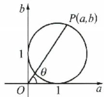

##### 例3 若向量 $a, b$ 满足 $|a| = |b| = |a + b|$ ，则向量 $a$ 与 $a - b$ 的夹角为 （）

$\quad$A. $30^{\circ}$

$\quad$B. $60^{\circ}$

$\quad$C. $120^{\circ}$

$\quad$D. $150^{\circ}$

答案 A

解析 因为向量可以用有向线段表示,所以向量的运算问题常可以转化为几何问题.如图,在平行四边形OACB中,设向量 $\overrightarrow{OA}=a,\overrightarrow{OB}=b$ ,则 $\overrightarrow{OC}=a+b,\overrightarrow{BA}=a-b$ .由 $|a|=|b|=|a+b|$ ,知 $\triangle OAC$ 为等边三角形,四边形OACB为菱形,则a与a-b的夹角为 $30^{\circ}$ .

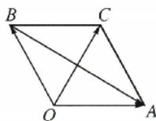

# 特殊求解法

在单项选择题中, 当已知条件中含有某些不确定的量, 但结论唯一或题设条件中提供的信息暗示答案是一个定值时, 可以将题中变化的不定量选取一些符合条件的恰当特殊值 (或特殊函数、特殊角、特殊数列、图形特殊位置、特殊点、特殊方程、特殊模型等) 进行处理, 从而得出探求的结论. 这样可大大地简化推理、论证的过程. 在运用这种方法时, 应注意化抽象为具体, 化整体为局部, 化参量为常量, 化较弱条件为较强条件等等. 通过对“特殊”的思考与解决, 启发思维, 达到对“一般”的解决.

##### 例4 如图, 已知定圆的半径为 a, 圆心为 $(b, c)$ , 则直线 $ax + by + c = 0$ 与直线 $x - y + 1 = 0$ 的交点在 ( )

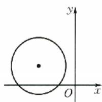

$\quad$A. 第四象限

$\quad$B. 第三象限

$\quad$C. 第二象限

$\quad$D. 第一象限

答案 B

解析 本题隐含结果唯一,根据图示,取满足题设的特殊值:a=2,b=-3,c=1.解方程组 $\left\{\begin{aligned}&2x-3y+1=0,\\ &x-y+1=0,\end{aligned}\right.$ 得 $\left\{\begin{aligned}&x=-2,\\ &y=-1.\end{aligned}\right.$ 即两直线的交点在第三象限.

##### 例5 定义域为 $\mathbf{R}$ 的函数 $f(x)$ 满足 $f(3 - x) = f(3 + x)$ ，且当 $x_{2} > x_{1} > 3$ 时， $\frac{f(x_{2}) - f(x_{1})}{x_{2} - x_{1}} > 0$ 恒成立。设 $a = f(2x^{2} - x + 5), b = f\left(\frac{5}{2}\right), c = f(x^{2} + 4)$ ，则 （）

$\quad$A. c > a > b

$\quad$B. c > b > a

$\quad$C. $a > c > b$

$\quad$D. $b > c > a$ 答案 C

解析 题目隐含对于任意的 $x \in R, a, b, c$ 的大小关系是确定不变的，可取特殊值 x = 0，得 $a = f(5), c = f(4)$ ，而 $x_{2} > x_{1} > 3$ 时， $\frac{f(x_{2}) - f(x_{1})}{x_{2} - x_{1}} > 0$ 恒成立，所以 $f(x)$ 在区间 $(3, +\infty)$ 上单调递增，易得 a > c > b.

##### 例6 已知函数 $f(x)$ ，任意 $x, y \in \mathbb{R}$ ，满足 $f(x + y)f(x - y) = f^2(x) - f^2(y)$ ，且 $f(1) = 2, f(2) = 0$ ，则 $f(1) + f(2) + \dots + f(90)$ 的值为

$\quad$A.-2

$\quad$B. 0

$\quad$C. 2

$\quad$D. 4

答案 C

解析 结合条件 $f(x+y)f(x-y)=f^{2}(x)-f^{2}(y)$ ，联想到正弦平方差公式（课后习题中出现）： $\sin(x+y)\sin(x-y)=\sin^{2}x-\sin^{2}y$ ，可取特殊函数 $f(x)=A\sin(\omega x)$ ，由 $f(1)=2$ ， $f(2)=0$ ，进一步取 $f(x)=2\sin\left(\frac{\pi}{2}x\right)$ ，此函数满足条件，易知 $f(x)$ 是周期为 4 的周期函数，且 $f(1)+f(2)+f(3)+f(4)=0$ ，所以 $f(1)+f(2)+\cdots+f(90)=f(1)+f(2)=2$ 。

##### 例 7 已知一个等差数列的前 n 项和为 48, 前 2n 项和为 60, 则它的前 3n 项和为 ( )

$\quad$A.-24

$\quad$B. 84

$\quad$C. 72

$\quad$D. 36

答案 D

解析 因为各选项中不含 $n$ ，所以题目隐含对于任意的 $n \in \mathbf{N}^*$ ，结果是确定的，于是对 $n$ 取特殊值，如 $n = 1$ ，此时 $a_1 = 48, a_2 = S_2 - S_1 = 12$ ，则 $d = a_2 - a_1 = -36, a_3 = a_1 + 2d = -24$ ，所以前 $3n$ 项和为 36.

# 极眼思想

当题目中的变量趋近于无穷大或一个常数 $c$ ，或者图形趋近于某一极端情况，而题干中的信息却暗示了结论不变，则可利用极端情况直接得出结论。

##### 例8 函数 $f(x) = \frac{6x^6}{3^{|x|}}$ 的部分图象大致为 （）

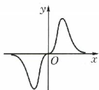  
A

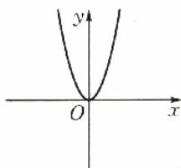  
B

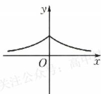  
C

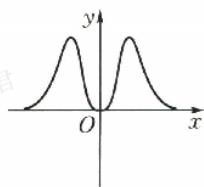  
D

答案 D

解析 因为 $f(-x) = \frac{6(-x)^6}{3^{| - x|}} = \frac{6x^6}{3|x|} = f(x)$ ，所以 $f(x)$ 为偶函数，排除选项 A. 因为

4

# 小帮手——小题常见解法

$f(0)=0$ , 所以排除选项 C. 当 x 趋于正无穷时, 虽然 $f(x)$ 的分子和分母都趋于正无穷, 但其分母“增加的速度”远大于分子“增加的速度”, 所以函数值趋近于 0. 所以排除选项 B.

##### 例 9 已知过抛物线 $y=ax^{2}(a>0)$ 的焦点 F 作一条直线交抛物线于 P, Q 两点. 若线段 PF 与 QF 的长分别是 p, q，则 $\frac{1}{p}+\frac{1}{q}$ 的值为 ( )

$\quad$A. $2a$

$\quad$B. $\frac{1}{2a}$

$\quad$C. 4a

$\quad$D. $\frac{4}{a}$

答案 C

解析 如图, 取 PQ 的极限位置: 将直线 PQ 绕点 F 顺时针方向旋转到与 y 轴重合, 此时点 Q 与点 O 重合, 点 P 运动到无穷远处, 虽不能再称它为抛物线的弦了, 它是弦的一种极限情形. 因为 $\left|QF\right|=\left|OF\right|=\frac{1}{4a}$ , 而 $\left|PF\right|=q$ 趋近于正无穷, 所以 $\frac{1}{p}+\frac{1}{q}$ 趋近于 4a.

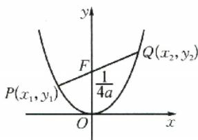

##### 例10 已知 $P$ 是双曲线 $\frac{x^2}{a^2} -\frac{y^2}{b^2} = 1(a > 0,b > 0)$ 右支上一点， $F_{1},F_{2}$ 分别是左、右焦点，且焦距为 $2c$ ，则 $\triangle PF_1F_2$ 的内切圆圆心的横坐标为 （）

$\quad$A. $a$

$\quad$B. b

$\quad$C. c

$\quad$D. $a + b - c$

答案 A

解析 当点 $P$ 沿双曲线向右顶点无限接近时， $\triangle PF_{1}F_{2}$ 的内切圆越来越小，极限为“点圆”，此“点圆”应为右顶点，所以内切圆圆心的横坐标为 $a$ 。

##### 例11 函数 $f(x) = \frac{1}{4^{x - 1} + 1}$ 图象的对称中心是 （）

$\quad$A. $(0,1)$

$\quad$B. $\left(\frac{1}{2},1\right)$

$\quad$C. $(1,0)$

$\quad$D. $\left(1,\frac{1}{2}\right)$

答案 D

解析 当 $x \to +\infty$ 时, $f(x) \to 0$ ; 当 $x \to -\infty$ 时, $f(x) \to 1$ . 根据对称性可猜测函数 $f(x)$ 的对称中心的纵坐标为 $\frac{1}{2}$ , 从而选 D, 经验证 D 正确.

# 排除法

利用已知条件和选项所提供的信息,剔除掉错误的答案,尤其是答案为定值或取值范围时,取特殊数或特殊点或利用特殊情况代入,得到条件成立的必要条件,排除错误选项,不能排除的选项再进行充分性验证.

##### 例12 已知数列 $\{a_{n}\}$ 的通项公式为 $a_{n} = \frac{n}{(n + 1)!}$ ，则其前 $n$ 项和为 （）

$\quad$A. $2 - \frac{1}{(n + 1)!}$

$\quad$B. $\frac{3}{2} - \frac{1}{n!}$

$\quad$C. $2 - \frac{1}{n!}$

$\quad$D. $1 - \frac{1}{(n + 1)!}$

答案 D

解析 设 $\{a_{n}\}$ 的前 $n$ 项和为 $S_{n}$ , 则 $S_{1} = a_{1} = \frac{1}{1 \times 2} = \frac{1}{2}, S_{2} = a_{1} + a_{2} = \frac{1}{2} + \frac{2}{1 \times 2 \times 3} = \frac{5}{6}$ . 对于选项 A, 令 $n = 1$ , 其值为 $\frac{3}{2}$ , 故 A 错误. 对于选项 B, 令 $n = 1$ , 其值为 $\frac{1}{2}$ , 令 $n = 2$ , 其值为 1, 故 B 错误. 对于选项 C, 令 $n = 1$ , 其值为 1, 故 C 错误. 由单项选择题有且只有一个正确选项知 D 正确.

##### 例13 函数 $y = f(x)$ 的部分图象如图所示，则 （）

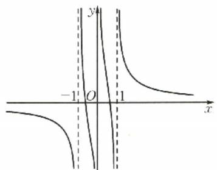

$\quad$A. $f(x) = \frac{1}{2(x + 1)} +\frac{1}{x} +\frac{1}{2(x - 1)}$

$\quad$B. $f(x) = \frac{1}{2(x + 1)} -\frac{1}{x} +\frac{1}{2(x - 1)}$

$\quad$C. $f(x) = \frac{1}{2(x + 1)} +\frac{1}{x} -\frac{1}{2(x - 1)}$

$\quad$D. $f(x) = -\frac{1}{2(x + 1)} - \frac{1}{x} +\frac{1}{2(x - 1)}$

答案 A

解析 由函数 $f(x)$ 的图象可得函数 $f(x)$ 为奇函数.

对于 A, $f(-2) = -\frac{7}{6}$ , $f(2) = \frac{7}{6}$ , 对于 B, $f(-2) = -\frac{1}{6}$ , $f(2) = \frac{1}{6}$ , 故 A, B 可能正确; 对于 C, $f(-2) = -\frac{5}{6}$ , $f(2) = \frac{1}{6}$ , $f(x)$ 不是奇函数, 对于 D, $f(-2) = \frac{5}{6}$ , $f(2) = -\frac{1}{6}$ , $f(x)$ 不是奇函数, 故排除 C, D 选项.

又当 $x = 0.1$ 时，代入B中函数解析式，即 $f(0.1) = \frac{1}{2\times(0.1 + 1)} -\frac{1}{0.1} +\frac{1}{2\times(0.1 - 1)} =$ $\frac{5}{11} -10 - \frac{5}{9} <  0$ ，不符合题意，故排除B选项，答案选A.

##### 例 14 已知函数 $f(x)=(4a^{2}-1)e^{x}+(4a+2)x$ . 若 $f(x)\leqslant0$ , 则 a 的取值范围是

$\quad$A. $\left[-\frac{1}{2},\frac{\mathrm{e}-2}{2\mathrm{e}}\right]$

$\quad$B. $\left[-\frac{1}{2},\frac{1}{2}\right]$

$\quad$C. $\left[-\frac{1}{2},-\frac{1}{e}\right]$

$\quad$D. $\left[-\frac{1}{2},\frac{2-e}{2e}\right]$

答案 A

解析 函数的定义域为 $\mathbf{R}$ , 若 $a = 0$ , 则 $f(x) \leqslant 0$ , 即 $\mathrm{e}^x \geqslant 2x$ , 此不等式显然恒成立, 故排除 C, D 选项. 比较 A, B 选项, 由 $\frac{\mathrm{e}-2}{2\mathrm{e}} < \frac{1}{2}$ , 取 $a = \frac{1}{2}$ , 则 $f(x) \leqslant 0$ , 即 $4x \leqslant 0$ , 此不等式显然不恒成立, 故排除 B 选项.

##### 例 15 当 $x \in [-2,1]$ 时，不等式 $ax^{3}-x^{2}+4x+3 \geqslant 0$ 恒成立，则实数 a 的取值范围是（）

$\quad$A. $[-5, -3]$

$\quad$B. $\left[-6, -\frac{9}{8}\right]$

$\quad$C. $[-6, -2]$

$\quad$D. $\left[-4,-3\right]$

答案 C

解析 设 $f(x) = ax^3 - x^2 + 4x + 3$ . 由 $f(-1) = -a - 2 \geqslant 0$ , 得 $a \leqslant -2$ , 即 $a \leqslant -2$ 是 $f(x) \geqslant 0$ 恒成立的必要条件, 排除 B. 当 $a = -2$ 时, $f(x) = -2x^3 - x^2 + 4x + 3$ , 则 $f'(x) = -6x^2 - 2x + 4 = -2(x + 1)(3x - 2)$ . 令 $f'(x) = 0$ , 得 $x = -1$ 或 $x = \frac{2}{3}$ , 则 $f(x)$ 在 $[-2, -1)$ 和 $\left(\frac{2}{3}, 1\right]$ 上单调递减, 在 $\left(-1, \frac{2}{3}\right)$ 上单调递增, 所以 $f(x)_{\min} = \min\{f(-1), f(1)\} = 0$ , 符合条件, 排除 A, D.

# 估算法

由于单项选择题提供了唯一正确的选项,解答又无需过程.因此,对于一些问题,如果直接求值,其运算量比较大,而又不必进行准确的计算,故通过观察、分析、比较、对其数值特点和取值界限作出适当的估计,估算出其值所属的区间,从而快速作出判断,这就是估算法.

##### 例 16 某棋手与甲、乙、丙三位棋手各比赛一盘, 各盘比赛结果相互独立. 已知该棋手与甲、乙、丙比赛获胜的概率分别为 $p_{1}, p_{2}, p_{3}$ , 且 $p_{3} > p_{2} > p_{1} > 0$ . 记该棋手连胜两盘的概率为 p, 则 ( )

$\quad$A. p 与该棋手和甲、乙、丙的比赛次序无关

$\quad$B. 该棋手在第二盘与甲比赛, p 最大

$\quad$C. 该棋手在第二盘与乙比赛, p 最大

$\quad$D. 该棋手在第二盘与丙比赛，p 最大

答案 D

解析 本题若要把各种可能的情况下该棋手连胜两盘的概率为 p 计算出来较为费时,该棋手若要连胜两盘,中间一盘必须要赢,因此中间一盘赢的概率大,才能使连胜两盘的概率大,即中间一盘要安排实力最弱的棋手丙,所以选 D.

##### 例 17 现有 1,2,3,4,5 这五个数字组成没有重复数字的三位数, 其中奇数共有 ( )

$\quad$A. 36 个

$\quad$B. 60 个

$\quad$C. 24 个

$\quad$D. 28 个

答案 A

解析 由于五个数字可组成 $60(A_{5}^{3})$ 个没有重复数字的三位数, 而其中 1, 2, 3, 4, 5 中, 奇数有 3 个, 偶数有 2 个, 所构成的奇数必然超过一半, 但又不全是奇数, 而选项 B 是所有不重复的三位数, 选项 C, D 都没有超过一半.

##### 例 18 已知过球面上 A, B, C 三点的截面和球心的距离等于球半径的一半，且 AB = BC = CA = 2，则该球的表面积是（）

$\quad$A. $\frac{16\pi}{9}$

$\quad$B. $\frac{8\pi}{3}$

$\quad$C. $4\pi$

$\quad$D. $\frac{64\pi}{9}$

答案 D

解析 因为球的半径 R 大于 $\triangle ABC$ 的外接圆的半径 $r=\frac{2\sqrt{3}}{3}$ ，所以 $S_{球}=4\pi R^{2}>4\pi r^{2}=\frac{16\pi}{3}>5\pi.$

##### 例19 已知 $a = \log_54, b = \log_53, c = \log_76$ ，则 （）

$\quad$A. a<b<c

$\quad$B. b<a<c

$\quad$C. b<c<a

$\quad$D. c<a<b

答案 B

解析 由对数函数的单调性, 直觉上 $\log_{x} y (x > y > 1)$ 中, $x, y$ 越大且 $x, y$ 越接近, 其值越大, 从而确定大概率选 B, 下面由这个目标可进行估值计算, 可取中间数 $\frac{3}{4}, \frac{4}{5}$ 进行比较. 因为 $a = \log_{6} 4 > \frac{3}{4}$ , 即 $4^{4} > 6^{3}$ , 即 $256 > 216$ , $b = \log_{5} 3 < \frac{3}{4}$ , 即 $3^{4} < 5^{3}$ , 即 $81 < 125$ , 所以 $a > b$ . 因为 $a = \log_{6} 4 < \frac{4}{5}$ , 即 $4^{5} < 6^{4}$ , 即 $1024 < 1296$ , $c = \log_{7} 6 > \frac{4}{5}$ , 即 $6^{5} > 7^{4}$ , 即 $7776 > 2401$ (实际上 $6^{5}$ 与 $7^{4}$ 不必计算出准确结果, 大小关系估算可知), 所以 $a < c$ .

# 逻辑分析法

由于单项选择题有且仅有一个正确选项,如果能判断3个选项为错误选项,那么此三项自动排除(这也是前面排除法的逻辑依据).若选项A等价于B,则A,B同真或同假,则A,B两选项自动排除.如果A能推出B,若A为真命题,则B也为真命题,若B为假命题,则A为假命题;若选项A,B互斥,则A,B至多有一个正确,若A,B矛盾,则A,B中有且只有一个正确.

##### 例20 设 $a, b \in \mathbb{R}$ , 数列 $\{a_n\}$ 中, $a_1 = a, a_{n+1} = a_n^2 + b, n \in \mathbb{N}^*$ , 则 ( )

$\quad$A. 当 $b=\frac{1}{2}, a_{10}>10$

$\quad$B. 当 $b=\frac{1}{4}, a_{10}>10$

$\quad$C. 当 $b = -2, a_{10} > 10$

$\quad$D. 当 $b = -4, a_{10} > 10$

答案 A

解析 比较各选项, 可以发现如果 $b=\frac{1}{4}$ , 能满足 $a_{10}>10$ , 那么当 $b=\frac{1}{2}$ 时, 也能满足 $a_{10}>10$ , 即若 B 正确, 则 A 正确, 同理若 C, D 正确, 则 A 正确, 因为单项选择题有且仅有一个正确答案, 所以选 A.

# 构造法

构造法是一种创造性思维,是综合运用各种知识和方法,依据问题给出的条件和结论给出的信息,把问题作适当的加工处理,构造与问题相关的数学模式,揭示问题的本质,从而沟通解题思路的方法.构造法首先应观察题目,观察已知(例如代数式)形式上的特点,然后积极调动思维,联想、类比已学过的知识及各种数学结构、数学模型,深刻地了解问题及问题的背景(几何背景、代数背景),从而构造几何、函数、不等式、数列、向量等具体的数学模型,从而转化为自己熟悉的问题,达到快速解题的目的.

##### 例 21 我国古代数学名著《九章算术》中给出了很多立体几何的结论, 其中提到的多面体 “鳖臑” 是四个面都是直角三角形的三棱锥. 若一个 “鳖臑” 的所有顶点都在球 O 的球面上, 且该 “鳖臑” 的高为 2 , 底面是腰长为 2 的等腰直角三角形, 则球 O 的表面积为 ( )

$\quad$A. $12 \pi$

$\quad$B. $4 \sqrt{3} \pi$

$\quad$C. $6\pi$

$\quad$D. $2 \sqrt{6} \pi$

答案 A

解析 造一个棱长为2的正方体,则题中的“鳖臑”就是三棱锥A-BCD(易知其四个面都是直角三角形),如图所示,则正方体外接球就是三棱锥A-BCD的外接球,正方体的体对角线就是其外接球的直径,所以外接球O的半径 $R=\frac{1}{2}AD=\frac{1}{2}\sqrt{2^{2}+2^{2}+2^{2}}=\sqrt{3}$ ,表面积为 $4\pi R^{2}=12\pi$ .

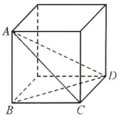

##### 例22 若 $7^{a} = 5,8^{b} = 6,\mathrm{e}^{\frac{c}{b}} = 2 + \mathrm{e}^{2}$ ，则实数 $a,b,c$ 的大小关系为 （）

$\quad$A. a>c>b

$\quad$B. c>b>a

$\quad$C. b>c>a

$\quad$D. $b > a > c$

答案 B

解析 根据指数与对数式的互化以及换底公式, 可得 $a = \frac{\ln 5}{\ln 7}, b = \frac{\ln 6}{\ln 8}, c = \frac{\ln e^2}{\ln (e^2 + 2)}$ . 由于它们具有相同的结构特征, 可以构造函数解题. 设 $f(x) = \frac{\ln x}{\ln (x + 2)}, x > 1$ , 则 $f'(x) = \frac{(x + 2)\ln(x + 2) - x\ln x}{x(x + 2)\ln^2(x + 2)}, x > 1$ . 因为 $x > 1$ , 所以 $x + 2 > x > 1, \ln (x + 2) > \ln x > 0$ . 所以 $(x + 2) \cdot \ln (x + 2) - x\ln x > 0$ , 即 $f'(x) > 0$ . 所以 $f(x)$ 在 $(1, +\infty)$ 上单调递增. 又 $a = f(5), b = f(6), c = f(e^2)$ , 且 $e^2 > 6 > 5$ , 所以 $c > b > a$ .

##### 例 23 已知 $a, b, c \in (0,1)$ ，且 $a^{2} - 2\ln a + 1 = e, b^{2} - 2\ln b + 2 = e^{2}, c^{2} - 2\ln c + 3 = e^{3}$ ，则（）

$\quad$A. $a > b > c$

$\quad$B. a > c > b

$\quad$C. c > a > b

$\quad$D. $c > b > a$

答案 A

解析 题中条件等式可变形为 $a^2 - 2\ln a = c - 1, b^2 - 2\ln b = e^2 - 2, c^2 - 2\ln c = e^3 - 3$ ，考虑其左右两边有相同的结构特征，构造函数设 $f(x) = x^2 - 2\ln x, g(x) = e^x - x$ ，则 $f(a) = g(1), f(b) = g(2), f(c) = g(3)$ ，又 $g'(x) = e^x - 1 > 0 (x > 0)$ ，所以 $g(x)$ 在 $(0, +\infty)$ 上单调递增。所以 $g(3) > g(2) > g(1)$ ，即 $f(c) > f(b) > f(a)$ 。因为 $f'(x) = 2x - \frac{2}{x} = \frac{2(x^2 - 1)}{x} < 0$ ( $x \in (0,1)$ )，所以 $f(x)$ 在 $(0,1)$ 上单调递减。所以 $a > b > c$ 。

# 整体法

有很多数学问题,如果我们有意识地放大考察问题的“视角”,往往能发现问题中隐含的某个“整体”,通过研究问题的整体形式、整体结构、整体特征,从而对问题进行整体处理.运用整体思想,可以使繁难的问题得到巧妙地解决.

##### 例 24 当 a > 0 且 $a \neq 1$ 时，若 $\forall x \in R, a^{2x} + a^{-2x} + t(a^x + a^{-x}) > 0$ 恒成立，则 t 的取值范围是

$\quad$A. $(1,+\infty)$

$\quad$B. $(-∞,1)$

$\quad$C. $(-1,+\infty)$

$\quad$D. $(-∞,-1)$

答案 C

解析 本题变量较多,根据题目结构特点将其整合以整体对待化为熟悉的二次函数问题.设 $m=a^{x}+a^{-x}$ ，则当a>0且 $a\neq1$ 时， $m=a^{x}+a^{-x}\geqslant2\sqrt{a^{x}\cdot a^{-x}}=2$ ，当且仅当 $a^{x}=a^{-x}$ ，即x=0时，等号成立，且 $m^{2}=(a^{x}+a^{-x})^{2}=a^{2x}+a^{-2x}+2$ ，则 $a^{2x}+a^{-2x}=m^{2}-2$ ，所以原问题等价于不等式 $m^{2}+tm-2>0$ 对任意 $m\in[2,+\infty)$ 恒成立.所以 $t>\frac{2}{m}-m$ 恒成立.又 $y=\frac{2}{m}-m$ 在 $[2,+\infty)$ 上单调递减，所以 $t>\frac{2}{2}-2=-1$ .

##### 例25 已知 $x < 0, y < 0$ ，则 $\frac{2y}{x + 2y} - \frac{y}{x + y}$ 的最大值为 （）

$\quad$A. $2-\sqrt{2}$

$\quad$B. 1

$\quad$C. $3-2\sqrt{2}$

$\quad$D. $3 + 2\sqrt{2}$

答案 C

解析 根据解决不等式问题的经验,当分母为单项式时,容易变形突出式子结构特征,所以可考虑将分母视为整体,换元处理.设 $a=x+2y<0, b=x+y<0$ , 则 x=2b-a, y=a-b, 所以 $\frac{2y}{x+2y}-\frac{y}{x+y}=\frac{2(a-b)}{a}-\frac{a-b}{b}=3-\left(\frac{2b}{a}+\frac{a}{b}\right)\leqslant3-2\sqrt{\frac{2b}{a}\cdot\frac{a}{b}}=3-2\sqrt{2}$ , 当且仅当 $\frac{2b}{a}=$

$\frac{a}{b}$ 即 $\frac{a}{b} = \sqrt{2}$ 时等号成立. 所以原式的最大值为 $3 - 2\sqrt{2}$ .

##### 例 26 若 x 是三角形的最小内角, 则函数 $y = \sin x + \cos x - \sin x \cos x$ 的最小值是 ( )

$\quad$A. $\frac{1}{2} + \sqrt{2}$

$\quad$B. $-\frac{1}{2} + \sqrt{2}$

$\quad$C. 1

$\quad$D. $\sqrt{2}$

答案 B

解析 联想到同角三角函数关系式及完全平方公式, 可将 $\sin x + \cos x$ 视为整体换元处理. 设 $t = \sin x + \cos x$ . 因为 $x$ 是三角形的最小内角, 所以 $0 < x \leqslant \frac{\pi}{3}, \frac{\pi}{4} < x + \frac{\pi}{4} \leqslant \frac{7\pi}{12}$ . 所以 $t \in (1, \sqrt{2}]$ , 则问题可转化为求函数 $f(t) = -\frac{1}{2} t^2 + t + \frac{1}{2}$ 在 $(1, \sqrt{2}]$ 上的最小值. 因为 $f(t)$ 在 $(1, \sqrt{2}]$ 上单调递减. 所以 $f(t)_{\min} = f(\sqrt{2}) = -\frac{1}{2} + \sqrt{2}$ .

##### 例27 已知数列 $\{a_{n}\}$ 的通项公式 $a_{n} = n\cos \frac{n\pi}{2}$ ，其前 $n$ 项和为 $S_{n}$ ，则 $S_{2023}$ 的值为（）

$\quad$A. 1010

$\quad$B. -1010

$\quad$C. 1012

$\quad$D. -1012

答案 D

解析 考虑到函数 $f(n)=\cos\frac{n\pi}{2}$ 具有周期性, 周期为 4, 尝试分组 (每 4 项为一组) 求和. 因为 $a_{n}=n\cos\frac{n\pi}{2}$ , 所以 $a_{1}=0, a_{2}=-2, a_{3}=0, a_{4}=4, a_{5}=0, \cdots$ . 当 $n=4k+1, k \in N$ 时, $a_{4k+1}=(4k+1)\cos\frac{(4k+1)\pi}{2}=0$ ; 当 $n=4k+2, k \in N$ 时, $a_{4k+2}=(4k+2)\cos\frac{(4k+2)\pi}{2}=-(4k+2)$ ; 当 $n=4k+3, k \in N$ 时, $a_{4k+3}=(4k+3)\cos\frac{(4k+3)\pi}{2}=0$ ; 当 $n=4k+4, k \in N$ 时, $a_{4k+4}=(4k+4)\cos\frac{(4k+4)\pi}{2}=4k+4$ . 所以 $a_{4k+1}+a_{4k+2}+a_{4k+3}+a_{4k+4}=2, k \in N$ . 所以 $a_{2021}=a_{4\times505+1}=0, a_{2022}=a_{4\times505+2}=-2022, a_{2023}=a_{4\times505+3}=0$ . 故 $S_{4}=a_{1}+a_{2}+a_{3}+a_{4}=2$ . 所以 $S_{2023}=(a_{1}+a_{2}+a_{3}+a_{4})+\cdots+(a_{2017}+a_{2018}+a_{2019}+a_{2020})+a_{2021}+a_{2022}+a_{2023}=\frac{2020}{4}\times2+0+(-2022)+0=-1012$ .

# 逆推法

选择题优于填空题之处就在于选项也可提供解题信息,解题时可以比较各选项的异同,进行分析、联想、启发解题思路.有一类含参数取值问题,如果求参数取值范围那么难度较大,如果问参数可能取哪些值,那么可从选项出发,逐项检验.

##### 例 28 裴波那契数列 $\{F_{n}\}$ ，因数学家莱昂纳多·裴波那契以兔子繁殖为例子而引入，故又称为“兔子数列”，该数列 $\{F_{n}\}$ 满足 $F_{1}=F_{2}=1$ ，且 $F_{n+2}=F_{n+1}+F_{n}(n\in\mathbf{N}^{*})$ 。卢卡斯数列 $\{L_{n}\}$ 是以数学家爱德华·卢卡斯命名，与裴波那契数列联系紧密，即 $L_{1}=1$ ，且 $L_{n+1}=F_{n}+F_{n+2}(n\in\mathbf{N}^{*})$ ，则 $F_{2023}=$ （）

$\quad$A. $\frac{1}{3} L_{2022} + \frac{1}{6} L_{2024}$

$\quad$B. $\frac{1}{3} L_{2022} + \frac{1}{7} L_{2024}$

$\quad$C. $\frac{1}{5} L_{2022} + \frac{1}{5} L_{2024}$

$\quad$D. $-\frac{1}{5} L_{2022} + \frac{2}{5} L_{2024}$

答案 C

解析 从四个选项可以看出结果都与 $L_{2022}, L_{2024}$ 有关，所以先用数列 $\{F_n\}$ 的项表示 $L_{2022}, L_{2024}$ ，并逐步转化到用 $F_{2023}, F_{2022}$ 表示，最后反解出 $F_{2023}$ .

$L _ {2 0 2 2} = F _ {2 0 2 1} + F _ {2 0 2 3} = (F _ {2 0 2 3} - F _ {2 0 2 2}) + F _ {2 0 2 3} = 2 F _ {2 0 2 3} - F _ {2 0 2 2},$

$L_{2024} = F_{2023} + F_{2025} = F_{2023} + (F_{2023} + F_{2024}) = 2F_{2023} + F_{2024} = 2F_{2023} + (F_{2023} + F_{2022}) =$ $3F_{2023} + F_{2022}$ ，即 $L_{2022} = 2F_{2023} - F_{2022},L_{2024} = 3F_{2023} + F_{2022}$ ，两式相加，得 $L_{2022} + L_{2024} = 5F_{2023}$

所以 $F_{2023}=\frac{1}{5}L_{2022}+\frac{1}{5}L_{2024}$ .

##### 例 29 若函数 $f(x)=2c^{x}-3ax^{2}+1$ 有两个不同的极值点，则实数 a 可以为（）

$\quad$A. $\frac{1}{3}$

$\quad$B. $\frac{1}{2}$

$\quad$C. $\frac{e}{3}$

$\quad$D. $\frac{e}{2}$

答案 D

解析 依题意, 得 $f'(x) = 2\mathrm{e}^x - 6ax$ 有 2 个零点. 当 $a = \frac{1}{3}$ 时, $f'(x) = 2(\mathrm{e}^x - x) > 0$ , 故 A 错误; 当 $a = \frac{1}{2}$ 时, $f'(x) = 2\mathrm{e}^x - 3x = 2\left(\mathrm{e}^x - \frac{3}{2}x\right) > 0$ , 故 B 错误; 当 $a = \frac{\mathrm{e}}{3}$ 时, $f'(x) = 2(\mathrm{e}^x - \mathrm{e}x) \geqslant 0$ , 故 C 错误; 当 $a = \frac{\mathrm{e}}{2}$ 时, $f'(x) = 2\left(\mathrm{e}^x - \frac{3}{2}\mathrm{e}x\right)$ , 此函数有两个零点, 故 D 正确. (当然判断 ABC 错误后可以直接选 D)

##### 例30 已知 $f(x) = \begin{cases} 1 - 2x, & x \leqslant 0, \\ \ln x, & x > 0. \end{cases}$ 若 $f[f(a)] = 1$ ，则实数 $a$ 的值不可以为（）

$\quad$A. $\frac{1 - e}{2}$

$\quad$B. $e^{e}$

$\quad$C. 1

$\quad$D. $\frac{1}{2}$

答案 D

解析 本题可以逐项检验, 当 $a = \frac{1 - \mathrm{c}}{2} < 0$ 时, $f\left[f\left(\frac{1 - \mathrm{e}}{2}\right)\right] = f(\mathrm{e}) = 1$ . 当 $a = \mathrm{e}^{\mathrm{c}} > 0$ 时, $f[f(\mathrm{e}^{\mathrm{c}})] = f(\mathrm{e}) = 1$ . 当 $a = 1$ 时, $f[f(1)] = f(0) = 1$ . 当 $a = \frac{1}{2}$ 时, $f\left[f\left(\frac{1}{2}\right)\right] = f(-\ln 2) =$

$1+2\ln2\neq1$ ,所以选D.(当然D选项可以不用检验而在检验ABC后直接选择)

# 多项选择题解法

# 数形结合法

##### 例1 设 $a \neq 0$ ，若 $x = a$ 为函数 $f(x) = a(x - a)^2 (x - b)$ 的极大值点，则 （）

$\quad$A. $a < b$

$\quad$B. $ab > 0$

$\quad$C. $ab < b^{2}$

$\quad$D. $a^{2}<ab$

答案 BCD

解析 若 a=b，则 $f(x)=a(x-a)^{3}$ 为单调函数，无极值点，不符合题意，故 $a\neq b$ .

所以 $f(x)$ 有 $x = a$ 和 $x = b$ 两个不同的零点，且在 $x = a$ 附近是不变号的，在 $x = b$ 附近是变号的。依题意， $x = a$ 为函数 $f(x) = a(x - a)^2 (x - b)$ 的极大值点，所以在 $x = a$ 附近都是小于零的。

当 $a < 0$ 时，由 $x > b, f(x) \leqslant 0$ ，画出 $f(x)$ 的图象如下图所示.

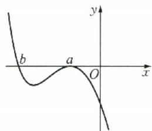

由图可知，b<a,a<0，故 $b^{2}>ab>a^{2}>0$ 。

当 $a > 0$ 时，由 $x > b$ 时， $f(x) > 0$ ，画出 $f(x)$ 的图象如下图所示.

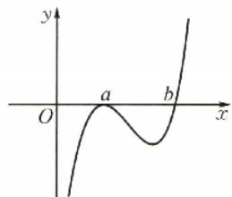

由图可知， $b > a, a > 0$ ，故 $b^{2} > ab > a^{2} > 0.$ 综上所述， $b^{2} > ab > a^{2} > 0$ 成立.

##### 例2 等差数列 $\{a_{n}\}$ 的前 $n$ 项和记为 $S_{n}$ ，若 $a_{1} > 0, S_{10} = S_{20}$ ，则下列结论成立的是（）

$\quad$A. $d > 0$

$\quad$B. $S_{n}$ 的最大值是 $S_{15}$

$\quad$C. $a_{16}<0$

$\quad$D. 当 $S_{n} > 0$ 时， $n$ 最大值为31

答案 BC

解析 因为等差数列前 n 项的和 $S_{n}=\frac{d}{2}n^{2}+\left(a_{1}-\frac{d}{2}\right)n$ ，所以点 $(n, S_{n})$ 分布在函数 $f(x)=\frac{d}{2}x^{2}+\left(a_{1}-\frac{d}{2}\right)x$ 的图象上，所以我们常用图象

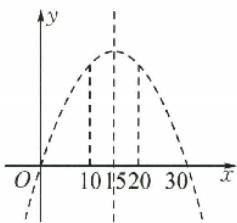

法解决等差数列问题. 本题中, 若 $a_1 > 0$ , $S_{10} = S_{20}$ , 得 $d < 0$ , 否则 $a_1 > 0$ 时, 数列各项为正, 有 $S_{10} < S_{20}$ 矛盾, 故 A 选项错误. 画出函数 $f(x) = \frac{d}{2} x^2 + \left(a_1 - \frac{d}{2}\right)x$ 的图象, 由 $S_{10} = S_{20}$ , 知函数图象的对称轴是直线 $x = 15$ , 故 $S_n$ 的最大值是 $S_{15}$ . 所以数列 $\{a_n\}$ 前 15 项为正, 第 16 项开始为负, 故 BC 选项正确. 根据对称性可知, $S_{30} = 0$ , 当 $n \geqslant 31$ 时, $S_n < 0$ , 当 $n \leqslant 29$ 时, $S_n > 0$ , 故使 $S_n > 0$ 的 $n$ 的最大值为 29, 故 D 选项错误.

# 特殊求解法

在多项选择题中,如果用特殊代替一般(比如取特殊函数,特殊图形),可以否定与特例不符的选项,但要注意不能肯定与特例相符的选项.如果能够否定两个选项,根据多项选择题至少有两个正确选项的特点,可以得出正确答案.

##### 例 3 已知 $f(x)$ 是定义在 R 上的奇函数, $g(x)$ 是定义在 R 上的偶函数, 且 $f(x), g(x)$ 在 $(-∞,0]$ 上单调递增, 则下列结论正确的是 ( )

$\quad$A. $f[f(1)]<f[f(2)]$

$\quad$B. $f[g(-1)]<f[g(2)]$

$\quad$C. $g[f(1)] > g[f(2)]$

$\quad$D. $g[g(1)] < g[g(2)]$

答案 AC

解析 根据函数 $f(x)$ 与 $g(x)$ 的奇偶性和单调性, 可取特殊函数 $f(x)=x, g(x)=-x^{2}$ , 对于 A 选项有 $f[f(1)]=1, f[f(2)]=2$ , 所以 A 选项可能正确;

对于 B 选项有 $f[g(-1)] = f(-1) = -1, f[g(2)] = f(-4) = -4$ ，所以 B 选项错误；
对于 C 选项有 $g[f(1)] = g(1) = -1, g[f(2)] = g(2) = -4$ ，所以 C 选项可能正确；

对于 D 选项有, $g[g(1)]=g(-1)=-1$ , $g[g(2)]=g(-4)=-16$ ,所以 D 选项错误,
由于多选题至少有两个正确选项,所以答案为 AC.

##### 例 4 在 $\triangle ABC$ 中, 已知 $A + B < C$ , 则 ( ).

$\quad$A. $a^2 + b^2 < c^2$

$\quad$B. $\sin^{2}A + \sin^{2}B < 1$

$\quad$C. $\sin A + \sin B \geqslant \sqrt{2} \sin C$

$\quad$D. $\tan A\tan B > 1$

答案 AB

解析 取特例为熟知的 $\triangle ABC$ ，其中 $a = b = 1, c = \sqrt{3}$ ，则 $A = B = 30^{\circ}, C = 120^{\circ}, a^{2} + b^{2} < c^{2}, \sin^{2} A + \sin^{2} B < 1, \sin A + \sin B < \sqrt{2} \sin C, \tan A \tan B < 1$ ，排除 CD，所以选 AB.

##### 例 5 已知函数 $f(x)$ 的定义域为 R，且函数 $f(2x+1)$ 是周期为 2 的奇函数，则（）

$\quad$A. 函数 $f(x)$ 的图象关于点 $\left(\frac{1}{2},0\right)$ 中心对称

$\quad$B. 函数 $f(x)$ 的图象关于点 $(1,0)$ 中心对称

14

# 小帮手——小题常见解法

$\quad$C. 2 是函数 $y=f(x)$ 的一个周期  
$\quad$D. 4 是函数 $y=f(x)$ 的一个周期

答案 BD

解析 由函数 $f(2x + 1)$ 是周期为2的奇函数，取特殊函数 $f(2x + 1) = \sin (\pi x)$ ，显然符合要求，此时 $f(x) = \sin \left(\frac{\pi}{2} x - \frac{\pi}{2}\right)$ . 因为 $f\left(\frac{1}{2}\right) \neq 0$ ，所以 $f(x)$ 的图象不关于点 $\left(\frac{1}{2}, 0\right)$ 中心对称，故A不正确，显然其最小正周期为 $T = \frac{2\pi}{\frac{\pi}{2}} = 4$ ，故C不正确，排除AC，所以答案为BD.

# 极限思想

##### 例6 已知点 $P(1,2)$ 和圆 $C:(x - 4)^{2} + (y - 6)^{2} = r^{2}(r > 0)$ . 若过点 $P$ 可作一条射线与圆 $C$ 依次交于 $A,B$ 两点，且满足 $|PA| = 2|AB|$ ，则圆 $C$ 的半径 $r$ 可以为 （）

$\quad$A. 2

$\quad$B. 3

$\quad$C. 4

$\quad$D. 5

答案 ABC

解析 由题意知, 点 $P$ 在圆 $C$ 外, 则 $r < \sqrt{(1 - 4)^2 + (2 - 6)^2} = 5$ . 对于确定的 $r$ , 当射线 $PA$ 通过圆心 $C$ 时, $|PB|$ 取值最大, $|PA|$ 取值最小, $\frac{|PB|}{|PA|} = \frac{|PC| + r}{|PC| - r}$ 为最大值, 而当射线 $PA$ 趋于圆的切线时, $\frac{|PB|}{|PA|}$ 的值趋于 1 , 所以 $\frac{|PB|}{|PA|}$ 的取值范围是 $(1, \frac{|PC| + r}{|PC| - r})$ . 由 $|PA| = 2 |AB|$ 知 $\frac{|PB|}{|PA|} = \frac{3}{2}$ , 所以 $\frac{3}{2} \leqslant \frac{5 + r}{5 - r}$ , 解得 $r \geqslant 1$ . 所以 $r$ 的取值范围是 [1,5).

# 排除法

多项选择题有四个选项,至少有两个选项正确,至多有三个选项正确,如果利用已知条件和选项所提供的信息,剔除掉两个错误的答案,那么可选择出正确选项。(解答时可不必按ABCD的顺序进行逐一判断,先考察容易判断的选项)

##### 例7 已知 $a > 0, b > 0$ ，且 $a + b = 1$ ，则

( )

$\quad$A. $ab \geqslant \frac{1}{4}$

$\quad$B. $a^2 + b^2 \leqslant \frac{1}{2}$

$\quad$C. $2^{a} + 2^{b} \geqslant 2\sqrt{2}$

$\quad$D. $\frac{b}{a} + \frac{1}{b} \geqslant 3$

答案 CD

解析 对于A，由基本不等式 $ab \leqslant \left(\frac{a + b}{2}\right)^2 = \frac{1}{4}$ 知A错误；对于B，由 $a^2 + b^2 = (a + b)^2 -$

$2ab = 1 - 2ab \geqslant 1 - 2 \times \frac{1}{4} = \frac{1}{2}$ 知 B 错误. 故选 CD.

##### 例 8 如图, 正方体 $ABCD - A_{1}B_{1}C_{1}D_{1}$ 的棱长为 2, 线段 $B_{1}D_{1}$ 上有两个不重合的动点 E, F, 则 ( )

$\quad$A. 当 $\overrightarrow{EF} \cdot \overrightarrow{AB} = \sqrt{2}$ 时, $EF = 2$   
$\quad$B. $AC_{1} \perp EF$   
$\quad$C. $CC_{1}$ //平面 AEF  
$\quad$D. 二面角 A - EF - B 为定值

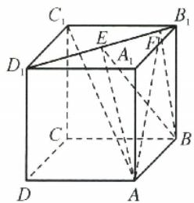

答案 BD

解析 由正方体的性质可知， $D_{1}C_{1}\parallel AB,\angle C_{1}D_{1}B_{1}=45^{\circ}$ ，则 $\overrightarrow{EF}\cdot\overrightarrow{AB}=EF\times2\times\cos45^{\circ}=\sqrt{2}$ ，解得 EF=1，故 A 错误；因为 $CC_{1}\parallel AA_{1},AA_{1}\cap$ 平面 $AEF=A,AA_{1}\not\subset$ 平面 AEF，所以 $CC_{1}$ 不可能平行于平面 AEF，故 C 错误。故选 BD.

# 逻辑分析法

因为多项选择题至少有2个正确选项,至多有3个正确选项,如果能判断3个选项为正确选项,问题得解.若A⇒B,则A,B同真或同假,当能判断A,B中有一假时,则可选CD.如果A⇒B,若A真,则B真,若B假,则A假.若A,B互斥,则A,B至多一个为真.若A,B矛盾,则A,B必一真一假.

##### 例9 已知不恒为0的函数 $f(x)$ ，满足 $\forall x, y \in \mathbb{R}$ 都有 $f(x) + f(y) = 2f\left(\frac{x + y}{2}\right) \cdot f\left(\frac{x - y}{2}\right)$ ，则 （）

$\quad$A. $f(0)=0$

$\quad$B. $f(0) = 1$

$\quad$C. $f(x)$ 为奇函数

$\quad$D. $f(x)$ 为偶函数

答案 BD

解析 A, B 互斥, 不可能都选. 因为 $f(x)$ 不恒为 0 , 所以 C, D 互斥, 不可能都选. 又因为奇函数的图象过点 $(0,0)$ , 所以若 C 正确, 则 A 必正确, 所以本题答案可能是 AC, AD, BD. 下面考察 $f(0)$ 的值, 在 $f(x) + f(y) = 2f\left(\frac{x + y}{2}\right)\left(\frac{x - y}{2}\right)$ 中, 令 $y = x$ , 得 $2f(x) = 2f(x)f(0)$ , 由于 $f(x)$ 不恒为 0 , 所以 $f(0) = 1$ , 从而本题答案为 BD.

##### 例10 已知 $\alpha, \beta$ 均为第二象限角，且 $\sin \alpha \tan \frac{\beta}{2} = 2 \sin \beta \tan \frac{\alpha}{2}$ ，则可能存在（）

$\quad$A. $\alpha=\beta$

$\quad$B. $\alpha >\beta$

$\quad$C. $\alpha=2\beta$

$\quad$D. $\alpha > 2\beta$

答案 BCD

解析 如果 $\alpha = \beta$ 或者 $\alpha = 2\beta$ 满足条件, 由函数的周期性将 $\alpha$ 增加 $2\pi$ 的整数倍仍然满足条件, 只要这个整数倍足够多, 就可得到 $\alpha > \beta, \alpha > 2\beta$ , 所以只要 A, C 选项中有一项正确, B, D 必正确, 下面判断 AC 中哪个选项正确.

如果A正确，即 $\alpha = \beta$ ，则由条件可得 $\sin \alpha \tan \frac{\alpha}{2} = 0$ ，与 $\alpha, \beta$ 均为第二象限角矛盾，故A错误（此时即可判断本题大概率选择BCD）；

如果 C 正确, 即 $\alpha=2\beta$ , 则有 $\sin 2\beta\tan\frac{\beta}{2}=2\sin\beta\tan\beta$ , 得 $2\sin\beta\cos\beta\tan\frac{\beta}{2}=2\sin\beta\tan\beta$ ,
得 $\cos\beta\tan\frac{\beta}{2}=\tan\beta$ ，得 $\cos\beta\frac{\sin\beta}{1+\cos\beta}=\frac{\sin\beta}{\cos\beta}$ ，得 $\cos^{2}\beta=1+\cos\beta$ ，解得 $\cos\beta=\frac{1\pm\sqrt{5}}{2}$

因为 $\beta$ 在第二象限，所以 $\cos \beta = \frac{1 - \sqrt{5}}{2}$ ，此时 $\cos \alpha = 2 - \sqrt{5} < 0$ 符合条件。所以答案为 BCD。

# 构造法

##### 例 11 已知 e 是自然对数的底数, 则下列不等关系中正确的是 ( )

$\quad$A. $e^{\pi} > 3^{e}$

$\quad$B. $\pi^3 < 3^\pi$

$\quad$C. $2^{e}<e^{2}$

$\quad$D. $\mathrm{e}^{3}< 3^{\circ}$

答案 ABC

解析 观察各选项,除 A 选项外都有相同的结构 $a^b < b^a (a > 1, b > 1)$ , 等价于 $\frac{\ln a}{a} < \frac{\ln b}{b}$ , 所以可以构造函数 $f(x) = \frac{\ln x}{x}$ , 则 $f'(x) = \frac{1 - \ln x}{x^2}$ . 易知 $f(x)$ 在 $(0, c)$ 上单调递增, 在 $(e, +\infty)$ 上单调递减, 所以 $\frac{\ln 2}{2} = \frac{\ln 4}{4} < \frac{\ln \pi}{\pi} < \frac{\ln 3}{3} < \frac{\ln e}{e}$ . 由 $\frac{\ln 3}{3} < \frac{\ln e}{e}$ , 得 $3^c < e^3$ , 故 D 错误. 由 $\frac{\ln \pi}{\pi} < \frac{\ln 3}{3}$ , 得 $\pi^3 < 3^\pi$ , 故 B 正确. 由 $\frac{\ln 2}{2} < \frac{\ln c}{c}$ , 得 $2^c < c^2$ , 故 C 正确. 由 $\frac{\ln 3}{3} < \frac{\ln c}{c}$ , 得 $3^c < e^3$ , 进而有 $3^c < c^\pi$ , 故 A 正确.

##### 例12 下列不等式成立的是 （）

$\quad$A. $\ln 3 < \frac{3}{2} \ln 2$

$\quad$B. $\ln \pi < \sqrt{\frac{\pi}{e}}$

$\quad$C. $4^{\sqrt{3}}<12$

$\quad$D. $e^{0.1} > \sqrt{1.2}$

答案 CD

解析 因为 $\ln 3 < \frac{3}{2}\ln 2\Leftrightarrow \frac{\ln 3}{3} < \frac{\ln 2}{2},\ln \pi < \sqrt{\frac{\pi}{c}}\Leftrightarrow \frac{\ln \pi}{\sqrt{\pi}} < \frac{\ln c}{\sqrt{c}}\Leftrightarrow \frac{\ln \sqrt{\pi}}{\sqrt{\pi}} < \frac{\ln \sqrt{e}}{\sqrt{e}},4^{\sqrt{3}} < 12\Leftrightarrow$ $\sqrt{3}\ln 4 < \ln 12\Leftrightarrow \frac{\ln 4}{2} < \frac{\ln 12}{2\sqrt{3}}\Leftrightarrow \frac{\ln 2}{2} = \frac{\ln 4}{4} < \frac{\ln\sqrt{12}}{\sqrt{12}}$ ，所以考虑构造函数 $f(x) = \frac{\ln x}{x}$ ，利用其单

调性判断. 因为 $f'(x)=\frac{1-\ln x}{x^{2}}$ ，所以当 $x\in(0,e)$ 时， $f'(x)>0$ 。所以 $f(x)$ 在 $x\in(0,e)$ 上单调递增。当 $x\in(\mathrm{e},+\infty)$ 时， $f'(x)<0$ ，所以 $f(x)$ 在 $x\in(\mathrm{e},+\infty)$ 上单调递减。所以 $f(3)>f(4)\Rightarrow\frac{\ln 3}{3}>\frac{\ln 4}{4}=\frac{\ln 2}{2}$ ，故 A 错误。 $f(\sqrt{\pi})>f(\sqrt{\mathrm{e}})\Rightarrow\frac{\ln\sqrt{\pi}}{\sqrt{\pi}}>\frac{\ln\sqrt{\mathrm{e}}}{\sqrt{\mathrm{c}}}$ ，故 B 错误，所以选 CD.

# 整体法

##### 例13 已知 $\alpha \in (0, \pi)$ ，且 $\sin \alpha + \cos \alpha = \frac{2}{3}$ ，则 （）

$\quad$A. $\sin 2\alpha = -\frac{5}{9}$

$\quad$B. $\cos \alpha - \sin \alpha = \frac{\sqrt{14}}{3}$

$\quad$C. $\cos \alpha - \sin \alpha = -\frac{\sqrt{14}}{3}$

$\quad$D. $\tan\alpha=-\frac{9+2\sqrt{14}}{5}$

答案 ACD

解析 直接的方法是由 $\sin \alpha + \cos \alpha = \frac{2}{3}$ 和 $\sin^2\alpha + \cos^2\alpha = 1$ 组成方程组求解，但计算麻烦，观察选项及条件之间的关系，可将 $\cos \alpha - \sin \alpha$ 整体对待. $\sin \alpha + \cos \alpha = \frac{2}{3}$ 两边平方得到 $2\sin \alpha \cos \alpha = -\frac{5}{9} < 0$ ，所以 $\sin 2\alpha = -\frac{5}{9}$ ，故A正确；再结合 $\alpha \in (0, \pi)$ 得到 $\sin \alpha > 0, \cos \alpha < 0$ ，由 $(\cos \alpha - \sin \alpha)^2 + (\cos \alpha + \sin \alpha)^2 = 2$ ，得 $(\cos \alpha - \sin \alpha)^2 = \frac{14}{9}$ ，由 $\sin \alpha > 0, \cos \alpha < 0$ ，得 $\cos \alpha - \sin \alpha < 0$ ，则 $\cos \alpha - \sin \alpha = -\frac{\sqrt{14}}{3}$ ，故B错误，C正确；由 $\sin \alpha + \cos \alpha = \frac{2}{3}$ 和 $\cos \alpha - \sin \alpha = -\frac{\sqrt{14}}{3}$ ，得 $\sin \alpha = \frac{2 + \sqrt{14}}{6}, \cos \alpha = \frac{2 - \sqrt{14}}{6}$ ，则 $\tan \alpha = \frac{\sin \alpha}{\cos \alpha} = -\frac{9 + 2\sqrt{14}}{5}$ ，故D正确.

# 逆推法

##### 例 14 已知关于 x 的不等式 $ax^{2}+(1-2a^{2})x-2a<0$ 的解集中恰有 3 个正整数解，则 a 的值可以为（）

$\quad$A. $\frac{3}{2}$

$\quad$B. $\frac{7}{4}$

$\quad$C. $\frac{5}{3}$

$\quad$D. 2

答案 BCD

解析 本题可以对各选项逐一检验,原不等式可化为 $(ax+1)(x-2a)<0$ (若看不出左边的因式分解也可以直接逐一检验).当 $a=\frac{3}{2}$ 时,不等式的解集为 $\left(-\frac{2}{3},3\right)$ ,解集中恰有1,2两

个正整数, 故 A 错误; 当 $a=\frac{7}{4}$ 时, 不等式的解集为 $\left(-\frac{4}{7},\frac{7}{2}\right)$ , 解集中恰有 1,2,3 三个正整数, 故 B 正确; 当 $a=\frac{5}{3}$ 时, 不等式的解集为 $\left(-\frac{3}{5},\frac{10}{3}\right)$ , 解集中恰有 1,2,3 三个正整数, 故 C 正确; 当 a=2 时, 不等式的解集为 $\left(-\frac{1}{2},4\right)$ , 解集中恰有 1,2,3 三个正整数, 故 D 正确.

##### 例15 已知 $[x]$ 表示不超过 $x$ 的最大整数，则满足不等式 $[x]^2 - 3[x] - 10 \leqslant 0$ 的 $x$ 的值可以为 （）

$\quad$A.-1.5

$\quad$B.-2.5

$\quad$C. 5.5

$\quad$D. 6.5

答案 AC

解析 本题可逐项检验, 当 x = -1.5 时, $[x] = -2$ , $[x]^{2} - 3[x] - 10 = 0$ , 故 A 正确; 当 x = -2.5 时, $[x] = -3$ , $[x]^{2} - 3[x] - 10 = 8 > 0$ , 故 B 错误; 当 x = 5.5 时, $[x] = 5$ , $[x]^{2} - 3[x] - 10 = 0$ , 故 C 正确; 当 x = 6.5 时, $[x] = 6$ , $[x]^{2} - 3[x] - 10 = 8 > 0$ , 故 D 错误.

# 填空题解法

# 数形结合法

##### 例 1 已知 a, b 是平面内两个互相垂直的单位向量. 若向量 c 满足 $(a - b) \cdot (a - c) = 0$ ，则 $|c|$ 的最小值是 \_\_\_\_.

答案 $\frac{\sqrt{2}}{2}$

解析 因为向量可以用有向线段表示,所以向量的运算问题常可以转化为几何问题.如图,设向量 $\overrightarrow{OA}=a,\overrightarrow{OB}=b,\overrightarrow{OC}=c,\overrightarrow{OA}\perp\overrightarrow{OB}$ , 则 $(a-b)\cdot(a-c)=0$ 等价于 $\overrightarrow{BA}\cdot\overrightarrow{CA}=0$ , 即 $\overrightarrow{BA}\perp\overrightarrow{CA}$ , 即点 C 的轨迹是过点 A 且与 AB 垂直的直线, $|c|$ 的最小值即 $|\overrightarrow{OC}|$ 的最小值. 由垂线段最短易得答案为 $\frac{\sqrt{2}}{2}$ .

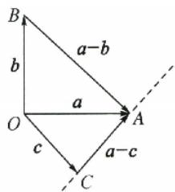

# 特殊求解法

填空题不同于选择题,它没有选项作为参考,有时填空题的答案也不唯一,所以用特例去代替一般可能会丢解,但如果根据题意或通过分析结果唯一时,就可采用特殊求解法.

##### 例 2 已知等比数列 $\{a_{n}\}$ 的公比 $q = -\frac{1}{2}$ , $S_{n}$ 是其前 n 项和, 则 $\frac{S_{4}}{a_{4}} =$ \_\_\_\_.

答案 -5

解析 设数列 $\{a_{n}\}$ 为 $16, -8, 4, -2$ ，则 $\frac{S_{4}}{a_{4}} = \frac{16 - 8 + 4 - 2}{-2} = -5$ . 由于等比数列每一项都可以用公比和 $a_{4}$ 表示，所以此题结果应是唯一的，故答案为 $-5$ .

##### 例3 已知函数 $f(x) = x^{2} + ax + b (a, b \in \mathbb{R})$ 的值域为 $[0, +\infty)$ . 若关于 $x$ 的不等式 $f(x) < c$ 的解集为 $(m, m + 6)$ , 则实数 $c$ 的值为 \_\_\_\_.

答案 9

解析 根据题意, 函数 $y=f(x)$ 是一条开口向上且和 x 轴相切的抛物线, 它在左右平移过程中截直线 y=c 所得弦长为定值 6, 这个弦长是由 $x^{2}$ 的系数确定的, 与抛物线的对称轴位置无关. 特殊地, 取 y 轴为对称轴时 (如图), 得 m=-3, 此时 $f(x)=x^{2}$ , 从而可得 c=9.

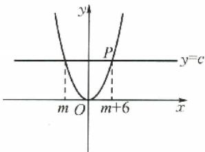

##### 例 4 如图, 在 $\triangle ABC$ 中, $O$ 是 $BC$ 的中点, 过点 $O$ 的直线 $l$ 分别交直线 $AB, AC$ 于不同的两点 $M, N$ . 若 $\overrightarrow{AB}=m\overrightarrow{AM}, \overrightarrow{AC}=n\overrightarrow{AN}$ , 则 $m+n$ 的值为 \_\_\_\_.

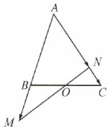

答案 2

解析 直线 l 于特殊位置与直线 BC 重合, 此时点 M, N 分别与点 B, C 重合, 则 $m + n = 1 + 1 = 2$ .

##### 例 5 已知 Q 是直线 l: x - y - 4 = 0 上的动点, 过点 Q 作圆 $O: x^{2} + y^{2} = 4$ 的切线, 切点分别为 A, B, 则切点弦 AB 所在直线恒过定点 \_\_\_\_.

答案 (1, -1)

解析 根据题意,此题答案具有唯一性,取两个特殊的点 $Q_{1}(4,0)$ , $Q_{2}(0,-4)$ ,画出图形,利用几何知识易求出两种情况下直线AB的方程分别为x=1和y=-1(实际上只要求出一种情况,另一种情况由对称性可知),直线x=1和y=-1的交点为 $(1,-1)$ ,所以直线AB恒过定点 $(1,-1)$ .

# 极眼思想

##### 例6 已知椭圆 $\frac{x^2}{8} +\frac{y^2}{2} = 1$ 上一点 $A(2,1)$ 和该椭圆上两动点 $B,C$ ，直线 $AB,AC$ 的斜率分别为 $k_{1},k_{2}$ ，且 $k_{1} + k_{2} = 0$ ，则直线 $BC$ 的斜率为

答案 $\frac{1}{2}$

解析 从题意上看, 直线 BC 的斜率为定值, 不随 B, C 两点位置变化而变化, 考虑极限. 当

20 小帮手——小题常见解法

B,C 两点沿椭圆无限接近时,则割线 BC 无限接近点(2,-1)处切线,因此直线 BC 的斜率为点(2,-1)处切线的斜率,而经过椭圆 $\frac{x^{2}}{a^{2}}+\frac{y^{2}}{b^{2}}=1$ 上一点 $(x_{0},y_{0})$ 的椭圆切线方程为 $\frac{x_{0}x}{a^{2}}+\frac{y_{0}y}{b^{2}}=1$ ,据此可知,本题中上述切线的方程为 $\frac{2x}{8}+\frac{-y}{2}=1$ ,从而得切线的斜率为 $\frac{1}{2}$ .

##### 例 7 有一个内接于球的四棱锥 P-ABCD，若 PA⊥底面 ABCD， $\angle BCD=\frac{\pi}{2}$ ， $\angle ABC\neq\frac{\pi}{2}$ ，BC=3，CD=4，PA=5，则该球的表面积为 \_\_\_\_。

答案 $50 \pi$

解析 本题条件 $\angle ABC \neq \frac{\pi}{2}$ , 命题人的目的, 就是不希望用特殊化法解题, 其实 $\angle ABC = \frac{\pi}{2}$ 就是图形的极端情况, 此时四棱锥底面为矩形, 对角线为 5 , 球心在底面上的射影为 $BD$ 的中点. 因为 $PA \perp$ 底面 $ABCD$ 且 $PA = 5$ , 所以球心到底面距离为 $\frac{5}{2}$ . 易得球半径为 $\frac{5\sqrt{2}}{2}$ , 则球的表面积为 $50\pi$ .

##### 例 8 在平面四边形 ABCD 中, $\angle A = \angle B = \angle C = 75^{\circ}, BC = 2$ , 则 AB 长的取值范围是 \_\_\_\_.

答案 $(\sqrt{6}-\sqrt{2},\sqrt{6}+\sqrt{2})$

解析 如图, 作 $\triangle PBC$ , 使 $\angle B = \angle PCB = 75^{\circ}, BC = 2$ , 作直线 $AD$ 分别交线段 $PB, PC$ (不含端点)于点 $A, D$ , 且使 $\angle BAD = 75^{\circ}$ , 则四边形 $ABCD$ 就是符合题意的四边形, 过点 $C$ 作 $AD$ 的平行线交 $PB$ 于点 $Q$ , 在 $\triangle PBC$ 中, 可求得 $BP = \sqrt{6} + \sqrt{2}$ ; 在 $\triangle QBC$ 中, 由 $BC = 2, \angle B = \angle BQC = 75^{\circ}$ , 可求得 $BQ = \sqrt{6} - \sqrt{2}$ , 所以 $AB$ 长的取值范围是 $(\sqrt{6} - \sqrt{2}, \sqrt{6} + \sqrt{2})$ .

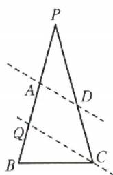

# 排除法

填空题因为没有选项进行排除,似乎无法运用排除法解题,实际上对于含参的恒成立问题,因为参数变化的影响,需进行较多的分类讨论,我们可以取特殊值,得到条件成立的必要条件,缩小参数的取值范围,减少讨论的类别,从而可以简化计算过程.

##### 例9 已知函数 $f(x) = \ln x - \frac{1}{2} ax^2, a \in \mathbb{R}$ . 若关于 $x$ 的不等式 $f(x) \leqslant (a - 1)x - 1$ 恒成立，则实数 $a$ 的最小整数值为 \_\_\_\_.

答案 2

解析 不等式 $f(x) \leqslant (a - 1)x - 1$ 恒成立, 即 $\ln x - \frac{1}{2} ax^2 - (a - 1)x + 1 \leqslant 0$ . 令 $g(x) = \ln x - \frac{1}{2} ax^2 - (a - 1)x + 1$ . 因为求解目标是实数 $a$ 的最小整数值 (而非取值范围), 可先考虑原不等式恒成立的一个必要条件是 $g(1) \leqslant 0$ , 即 $a \geqslant \frac{4}{3}$ . 而满足 $a \geqslant \frac{4}{3}$ 的最小整数为 2 , 下面验证当 $a = 2$ 时, 若 $g(x) \leqslant 0$ , 则答案为 2.

当 $a = 2$ 时， $g(x) = \ln x - x^2 - x + 1$ ，则 $g'(x) = \frac{(-2x + 1)(x + 1)}{x}$ . 易知 $g(x)$ 在区间 $\left(0, \frac{1}{2}\right)$ 上单调递增，在区间 $\left(\frac{1}{2}, +\infty\right)$ 上单调递减，所以 $g(x) \leqslant g\left(\frac{1}{2}\right) = \frac{1}{4} - \ln 2 < 0$ . 所以实数 $a$ 的最小整数值为 2.

# 估算法

##### 例 10 在正项等比数列 $\{a_{n}\}$ 中， $a_{5}=\frac{1}{2}, a_{6}+a_{7}=3$ 。则满足 $a_{1}+a_{2}+a_{3}+\cdots+a_{n}>a_{1}a_{2}a_{3}\cdots a_{n}$ 的最大正整数 n 的值为 \_\_\_\_.

答案 12

解析 由 $a_5 = \frac{1}{2}, a_6 + a_7 = 3$ ，可求得 $a_n = 2^{n-6}$ ，而 $a_1 + a_2 + a_3 + \cdots + a_n > a_1 a_2 a_3 \cdots a_n$ 可化为 $2^{n-5} - 2^{-5} > 2^{\frac{n^2 - 11n}{2}}$ ①，很多同学做到这儿不会解不等式了，这里可通过先估算再验证的方法求解。将①中很小的正数 $2^{-5}$ 舍弃，得 $n - 5 > \frac{n^2 - 11n}{2}$ ，即 $n^2 - 13n + 10 < 0$ ，易看出此时正整数 $n$ 的最大值为 12，验证当 $n = 12$ 时不等式①成立。

# 合情推理

填空题不像选择题有选项提供信息或进行比较分析,因此难度较大.但有时我们可以根据考题的特点或根据命题人意图合理猜想答案,虽不合逻辑,不能保证得到正确答案,但也失为一种“抢分”的好办法.

##### 例 11 如图, 在 $\triangle ABC$ 中, $D$ 是 $BC$ 的中点, 点 $E$ 在边 $AB$ 上, $BE=2EA$ , $AD$ 与 $CE$ 交于点 $O$ . 若 $\overrightarrow{AB} \cdot \overrightarrow{AC}=6\overrightarrow{AO} \cdot \overrightarrow{EC}$ , 则 $\frac{AB}{AC}$ 的值是\_\_\_\_.

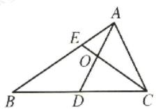

答案 $\sqrt{3}$

解析 设 $\overrightarrow{AO}=\lambda\overrightarrow{AD}=\lambda\left(\frac{1}{2}\overrightarrow{AB}+\frac{1}{2}\overrightarrow{AC}\right)$ . 由 $\overrightarrow{EC}=\overrightarrow{AC}-\overrightarrow{AE}=\overrightarrow{AC}-\frac{1}{3}\overrightarrow{AB}$ ，得 $\overrightarrow{AB}\cdot\overrightarrow{AC}=6\overrightarrow{AO}\cdot\overrightarrow{EC}=3\lambda(\overrightarrow{AB}+\overrightarrow{AC})\cdot\left(\overrightarrow{AC}-\frac{1}{3}\overrightarrow{AB}\right)$ . 要求出结果，就是要求出 $\frac{AB}{AC}$ 或 $\frac{AB^{2}}{AC^{2}}$ ，此时只有抵消掉 $\overrightarrow{AB}\cdot\overrightarrow{AC}$ ，也就是必有右边的 $\overrightarrow{AB}\cdot\overrightarrow{AC}$ 的系数 $2\lambda=1$ ，此时 $\frac{1}{2}\overrightarrow{AB^{2}}=\frac{3}{2}\overrightarrow{AC^{2}}$ ， $\frac{AB}{AC}=\sqrt{3}$ .

##### 例 12 已知 AC, BD 为圆 $O: x^{2} + y^{2} = 4$ 的两条相互垂直的弦，垂足为 $M(1, \sqrt{2})$ ，则四边形 ABCD 面积的最大值为 \_\_\_\_.

答案 5

解析 如图, 圆是中心对称图形, 相对于直线 $OM$ , $AC$ 与 $BD$ 具有“平等”的地位, 可以合情猜测当 $OM$ 平分 $\angle AMB$ 时, 四边形 $ABCD$ 的面积最大, 此时原点 $O$ 到 $AC$ 与 $BD$ 距离相等. 由 $|OM| = \sqrt{3}$ , 可以求出这个距离为 $\frac{\sqrt{6}}{2}$ , 进而有 $|AC| = |BD| = \sqrt{10}$ , 四边形 $ABCD$ 的面积 $S = \frac{1}{2} |AC| \cdot |BD| = 5$ . 当然极端情况 $AC$ 和 $BD$ 中有一条经过圆心时也可以取得极值, 但此时 $S = 4$ .

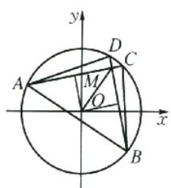

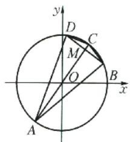

# 构造法

##### 例 13 如图, 在平行四边形 ABCD 中, $AB = 2\sqrt{2}$ , BC = 3, 且 $\cos A = \frac{\sqrt{2}}{3}$ , 以 BD 为折痕, 将 $\triangle BDC$ 折起, 使点 C 到达点 E 处, 且满足 AE = AD, 则三棱锥 E - ABD 外接球的表面积为 \_\_\_\_.

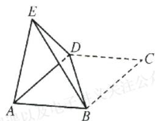

答案 $13\pi$

解析 在 $\triangle ABD$ 中, $AB = 2\sqrt{2}$ , $BC = 3$ , 且 $\cos A = \frac{\sqrt{2}}{3}$ , 由余弦定理, 得 $BD^{2} = AB^{2} + AD^{2}-$

$2AB \cdot AD\cos A$ ，即 $BD^{2} = (2\sqrt{2})^{2} + 3^{2} - 2 \times 2\sqrt{2} \times 3 \times \frac{\sqrt{2}}{3} = 9$ ，解得 $BD = 3$ 。在四面体 $ABED$ 中， $AE = BD = 3, AD = BE = 3, AB = ED = 2\sqrt{2}$ ，三组对棱长相等，可将四面体 $A - BED$ 放在长方体中。设长方体的相邻三棱长分别为 $x, y, z$ ，设外接球半径为 $R$ ，则 $x^{2} + y^{2} = 9, y^{2} + z^{2} = 9, z^{2} + x^{2} = 8$ ，则 $x^{2} + y^{2} + z^{2} = 13$ ，即 $2R = \sqrt{13}$ ，所以 $R = \frac{\sqrt{13}}{2}$ 。所以三棱锥 $E - ABD$ 外接球的表面积为 $4\pi R^{2} = 4\pi \times \frac{13}{4} = 13\pi$ 。

##### 例 14 如图, 三棱锥 P-ABC 的底面 ABC 是等腰直角三角形, $\angle ACB = 90^{\circ}$ , 且 $PA = PB = AB = \sqrt{2}$ , $PC = \sqrt{3}$ , 则点 C 到平面 PAB 的距离为 \_\_\_\_.

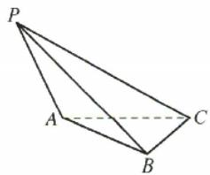

答案 $\frac{\sqrt{3}}{3}$

解析 由题意,可将三棱锥 P-ABC 补全为边长为 1 的正方体如图所示.

由题意知， $PA = PB = AB = \sqrt{2}$ ，AC = BC = PD = 1。设点 C 到平面 PAB 的距离为 h，则由 $V_{P-ABC} = V_{C-PAB}$ ，得 $\frac{1}{3} S_{\triangle ABC} \cdot PD = \frac{1}{3} S_{\triangle PAB} \cdot h$ ，所

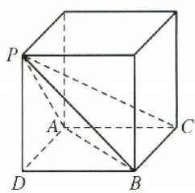

$\text {以} h = \frac {S _ {\triangle A B C} \bullet P D}{S _ {\triangle P A B}} = \frac {\frac {1}{2} \times 1 \times 1 \times 1}{\frac {\sqrt {3}}{4} \times (\sqrt {2}) ^ {2}} = \frac {\sqrt {3}}{3}.$

# 整体法

##### 例 15 已知函数 $y=a^{x}(a>0$ ，且 $a\neq1)$ 在 $[2,4]$ 上的最大值与最小值之和为 20，记 $f(x)=\frac{a^{x}}{a^{x}+\sqrt{2}}$ ，则 $f\left(\frac{1}{2023}\right)+f\left(\frac{2}{2023}\right)+\cdots+f\left(\frac{2022}{2023}\right)=$ \_\_\_\_.

答案 1011

解析 由函数 $y = a^{x} (a > 0$ ，且 $a \neq 1$ 在[2,4]上的最大值与最小值之和为20，而函数 $y = a^{x}$ 在[2,4]上是单调函数，得 $a^{2} + a^{4} = 20$ ，解得 $a = 2$ 或 $a = -2$ （舍去）。所以 $a = 2$ ，则 $f(x) = \frac{2^x}{2^x + \sqrt{2}}$ 。显然不可能求出和式中的每一项，要着眼于整体，观察和式的结构特点，尝试计算 $f(x) + f(1 - x)$ ，得 $f(x) + f(1 - x) = \frac{2^x}{2^x + \sqrt{2}} + \frac{2^{1 - x}}{2^{1 - x} + \sqrt{2}} = \frac{2^x}{2^x + \sqrt{2}} + \frac{2}{2 + \sqrt{2} \times 2^x} = \frac{2^x}{2^x + \sqrt{2}} + \frac{\sqrt{2}}{\sqrt{2} + 2^x} = 1$ ，所以 $f\left(\frac{1}{2023}\right) + f\left(\frac{2}{2023}\right) + \dots + f\left(\frac{2022}{2023}\right) = \left[f\left(\frac{1}{2023}\right) + f\left(\frac{2022}{2023}\right)\right] + \left[f\left(\frac{2}{2023}\right) + f\left(\frac{2023}{2023}\right)\right]$

$f \left(\frac {2 0 2 1}{2 0 2 3}\right) ] + \dots + \left[ f \left(\frac {1 0 1 1}{2 0 2 3}\right) + f \left(\frac {1 0 1 2}{2 0 2 3}\right) \right] = 1 0 1 1.$

# 主元法

含参问题中，习惯上将 $x, y$ 看成主元，将 $a, b, m$ 等看成参数，实际上主元和参数没有必然的界限，可以互相转化。在图形的运动变化中，运动与静止也是相对的，在必要时可以打破常规的“动与静”，打破思维定势，可能就有意外收获。

##### 例 16 已知 $a, b \in R, a \neq 0$ ，曲线 $y = \frac{a + 2}{x}, y = ax + 2b + 1$ 在区间 $[3, 4]$ 上至少有一个公共点，则 $a^{2} + b^{2}$ 最小值为 \_\_\_\_.

答案 $\frac{1}{100}$

解析 原条件等价于 $\frac{a+2}{x}=ax+2b+1$ ，即 $ax^{2}+(2b+1)x-(a+2)=0$ 在区间 [3,4] 上有解。 $ax^{2}+(2b+1)x-(a+2)=0$ 变形为 $(x^{2}-1)a+2xb+x-2=0$ ，将 a,b 看成主元，它表示直线的方程， $a^{2}+b^{2}$ 表示该直线上的点到原点距离的平方，最小值即为原点到直线距离的平方，所以原点到此直线的距离为 $d(x)=\frac{x-2}{\sqrt{(x^{2}-1)^{2}+4x^{2}}}=\frac{x-2}{x^{2}+1}, x\in[3,4]$ ，求导得 $d'(x)=\frac{-(x-2)^{2}+5}{(x^{2}+1)^{2}}>0$ 。所以 $d(x)$ 在 [3,4] 上单调递增。所以 $d(x)_{\min}=d(3)=\frac{1}{10}$ ，即 $a^{2}+b^{2}$ 最小值为 $\frac{1}{100}$ 。

##### 例 17 如图, $\angle BAC=60^{\circ}$ , 在 $\angle BAC$ 的内部有一动点 P, AB, AC 上分别有动点 M, N (异于点 A), 且满足 PM=PN=MN=2, 则 PA 长的最大值为 \_\_\_\_.

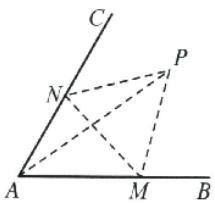

答案 $2 \sqrt{3}$

解析 本题常规解法是以 P, M, N 为动点选取变量列出函数关系式求其最大值. 但若将 $\triangle MNP$ 看成固定不动的, 而将 A 看成动点, 则点 A 的轨迹是一段优弧. 如图, 由平面几何知识可知, 当 A, P, 圆心三点共线时, AP 的长取得最大值, 此时点 P 位于 $\angle BAC$ 的平分线上, 易得 $PA = 2\sqrt{3}$ .

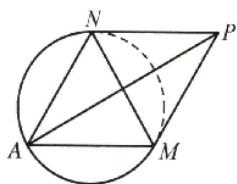

##### 6.构造法……16   
##### 7.整体法……17   
##### 8.逆推法……17

### 三、填空题解法

##### 1.数形结合法……18   
##### 2.特殊求解法……18   
##### 3.极限思想……19   
##### 4.排除法……20   
##### 5.估算法……21   
##### 6.合情推理……21   
##### 7.构造法……22   
##### 8.整体法……23   
##### 9.主元法……24

# 小帮手

# 高效解题的好帮手

《小帮手》针对同学们解题过程中可能会遇到的各方面困惑，总结、整理了非常实用的知识、方法、技巧，是同学们做“小题狂做”时的好帮手。

“小题狂做”基于分层提优的设计思想，有《基础篇》《巅峰篇》两个系列，每个系列都配套了专属小帮手。同学们可在做题前认真学习、做题后回顾总结，提升解题速度和准确率。

小题常见解法  
与《基础篇》配套使用

思想方法  
与《巅峰篇》配套使用

