# 高考数学

# 小题狂王做®

# 基础篇

# 核心笔记与答案详析

【核心笔记】不照搬教材上的概念、公式、定理，侧重从解题的角度给出要点。

【答案详析】解析详细、规范，典型题、重难题重点解析。

对于已能拿到基础分、有志于考高分的考生，特别推荐《基础篇》的番外篇：《巅峰篇》

省的高效得高分

# 高考数学

# 小题狂王做®

恩波教育研究中心 编

# 巅峰篇

重难突破+题组训练

南京大学出版社

\*重难题、热点题、思想方法题、新动向题   
\*习得探究力，从练过所以会做，到没见过也会做

指数幂的运算性质：

$a ^ {r} a ^ {s} = a ^ {r + s} (a > 0, r, s \in \mathbf {R}); \quad (a ^ {r}) ^ {s} = a ^ {r s} (a > 0, r, s \in \mathbf {R}); \quad (a b) ^ {r} = a ^ {r} b ^ {r} (a > 0, b > 0, r \in \mathbf {R});$

对数的运算性质：

$\log_ {a} (M \cdot N) = \log_ {a} M + \log_ {a} N; \quad \log_ {a} \frac {M}{N} = \log_ {a} M - \log_ {a} N; \quad \log_ {a} M ^ {n} = n \log_ {a} M (n \in \mathbf {R});$

$\log_ {a} \sqrt [ n ]{M} = \frac {1}{n} \log_ {a} M (n \in \mathbb {N}, \text { 且 } n > 1) (\text { 以   上 } a > 0, a \neq 1, M, N > 0);$

$a ^ {\log_ {a} N} = N; \quad \log_ {a} N = \frac {\log_ {b} N}{\log_ {b} a}; \quad \log_ {a} b ^ {m} = \frac {m}{n} \log_ {a} b (\text {   以上   } a > 0, a \neq 1, b > 0, b \neq 1, N > 0);$

等差数列：

通项公式： $a_{n}=a_{1}+(n-1)d$ （其中首项是 $a_{1}$ ，公差是d）；

前 n 项和公式: $S_{n}=\frac{n(a_{1}+a_{n})}{2}=na_{1}+\frac{n(n-1)}{2}d$ (整理后是关于 n 的没有常数项的二次函数);

等差中项： $A$ 是 $a$ 与 $b$ 的等差中项，则有 $A = \frac{a + b}{2}$

等比数列：

通项公式： $a_{n} = a_{1}q^{n - 1}$ （其中首项是 $a_1$ ，公比是 $q$ ）；前 $n$ 项和公式： $S_{n} = \left\{ \begin{array}{ll}na_{1}, & q = 1,\\ \frac{a_{1} - a_{n}q}{1 - q} = \frac{a_{1}(1 - q^{n})}{1 - q}, & q\neq 1; \end{array} \right.$

等比中项： $G$ 是 $a$ 与 $b$ 的等比中项，则有 $\frac{G}{a} = \frac{b}{G}$ ，即 $G^2 - ab$ （或 $G = \pm \sqrt{ab}$ ，等比中项有两个）；

空间几何体的表面积、侧面积、体积：

$S _ {\text { 直棱柱侧 }} = c h;$

$S _ {\text { 圆柱侧 }} = 2 \pi r l;$

$S _ {\text {正棱锥侧}} = \frac {1}{2} c h ^ {'};$

$S _ {\text { 圆锥侧 }} = \pi r l;$

$S _ {\text {正棱台侧}} = \frac {1}{2} (c + c ^ {'}) h ^ {'};$

$S _ {\text { 圆   台   侧 }} = \pi (r + R) l;$

$S _ {\mathrm{球表}} = 4 \pi R ^ {2};$

$V _ {\text { 梯柱 }} = S h;$

$V _ {\mathrm{圆柱}} = \pi r ^ {2} h;$

$V _ {\mathrm{棱锥}} = \frac {1}{3} S h;$

$V _ {\text { 圆锥 }} = \frac {1}{3} \pi r ^ {2} h;$

$V _ {\mathrm{棱台}} = \frac {1}{3} (S + \sqrt {S S ^ {'}} + S ^ {'}) h;$

$V _ {\mathrm{页台}} = \frac {1}{3} \pi (R ^ {2} + R r + r ^ {2}) h;$

$V _ {\mathrm{球}} = \frac {4}{3} \pi R ^ {3};$

平面向量的坐标表示、模、夹角：

已知非零向量 $a = (x_{1},y_{1}),b = (x_{2},y_{2})$ ，则

$\boldsymbol {a} \cdot \boldsymbol {b} = x _ {1} x _ {2} + y _ {1} y _ {2}; \quad | \boldsymbol {a} | = \sqrt {x _ {1} ^ {2} + y _ {1} ^ {2}}, | \boldsymbol {b} | = \sqrt {x _ {2} ^ {2} + y _ {2} ^ {2}};$

若 $a \perp b$ ，则 $x_{1}x_{2} + y_{1}y_{2} = 0$ ；反之，若 $x_{1}x_{2} + y_{1}y_{2} = 0$ ，则 $a \perp b$ ；

$a / / b (b \neq 0) \Leftrightarrow x _ {1} y _ {2} - x _ {2} y _ {1} = 0; \quad \cos \theta = \frac {\boldsymbol {a} \cdot \boldsymbol {b}}{| \boldsymbol {a} | | \boldsymbol {b} |} = \frac {x _ {1} x _ {2} + y _ {1} y _ {2}}{\sqrt {x _ {1} ^ {2} + y _ {1} ^ {2}} \cdot \sqrt {x _ {2} ^ {2} + y _ {2} ^ {2}}};$

向量数量积的性质：

$\boldsymbol {a} \cdot \boldsymbol {e} = | \boldsymbol {a} | \cos \langle \boldsymbol {a}, \boldsymbol {e} \rangle ; \quad \boldsymbol {a} \perp b \Leftrightarrow \boldsymbol {a} \cdot \boldsymbol {b} = 0; \quad \boldsymbol {a} \cdot \boldsymbol {b} = | \boldsymbol {a} | | \boldsymbol {b} | \cos \langle \boldsymbol {a}, \boldsymbol {b} \rangle ;$

向量数量积的运算律：

$a \cdot b = b \cdot a; (\lambda a) \cdot b = a \cdot (\lambda b) = \lambda (a \cdot b) = \lambda a \cdot b; (a + b) \cdot c = a \cdot c + b \cdot c;$

两点 $P_{1}(x_{1},y_{1}),P_{2}(x_{2},y_{2})$ 问距离公式： $P_{1}P_{2} = \sqrt{(x_{2} - x_{1})^{2} + (y_{2} - y_{1})^{2}};$

点 $P_{0}(x_{0},y_{0})$ 到直线 $Ax + By + C = 0$ 的距离公式： $d = \frac{|Ax_0 + By_0 + C|}{\sqrt{A^2 + B^2}}$ ；

牢记公式，灵活运用，
才是每一次训练的价值所在！

# 高考数学95个重要公式

两平行直线 $Ax + By + C_1 = 0$ 和 $Ax + By + C_2 = 0$ 间的距离公式： $d = \frac{|C_1 - C_2|}{\sqrt{A^2 + B^2}}$ ；

圆锥曲线被直线所截弦长公式： $l=\sqrt{1+k^{2}}\left|x_{1}-x_{2}\right|=\sqrt{1+k^{2}}\cdot\sqrt{(x_{1}+x_{2})^{2}-4x_{1}x_{2}}$

圆被直线截得的弦长公式： $l=2\sqrt{r^{2}-d^{2}}$ ；

方差公式： $s^2 = \frac{1}{n} [(x_1 - \overline{x})^2 +(x_2 - \overline{x})^2 +\dots +(x_n - \overline{x})^2 ];$

标准差公式： $s=\sqrt{\frac{1}{n}\left[(x_{1}-\overline{x})^{2}+(x_{2}-\overline{x})^{2}+\cdots+(x_{n}-\overline{x})^{2}\right]}$

弧长及扇形面积公式：

$l=|\alpha|r;S_{扇形}=\frac{1}{2}lr=\frac{1}{2}| \alpha|r^{2}(l为弧长,r为圆的半径,\alpha为圆心角的弧度数);$

同角三角函数关系：

$\sin^ {2} \alpha + \cos^ {2} \alpha = 1; \quad \tan \alpha = \frac {\sin \alpha}{\cos \alpha} \left(\alpha \neq \frac {\pi}{2} + k \pi , k \in \mathbb {Z}\right);$

三角函数的诱导公式：

公式 1: $\sin(\alpha+2k\pi)=\sin\alpha;\quad\cos(\alpha+2k\pi)=\cos\alpha;\quad\tan(\alpha+k\pi)=\tan\alpha(k\in\mathbb{Z});$

公式 2: $\sin(-\alpha)=-\sin\alpha;\quad\cos(-\alpha)=\cos\alpha;\quad\tan(-\alpha)=-\tan\alpha;$

公式 3: $\sin(\pi-\alpha)=\sin\alpha;\quad\cos(\pi-\alpha)=-\cos\alpha;\quad\tan(\pi-\alpha)=-\tan\alpha;$

公式 4: $\sin(\pi+\alpha)=-\sin\alpha;\quad\cos(\pi+\alpha)=-\cos\alpha;\quad\tan(\pi+\alpha)=\tan\alpha;$

公式 5: $\sin\left(\frac{\pi}{2}-\alpha\right)=\cos\alpha;\quad\cos\left(\frac{\pi}{2}-\alpha\right)=\sin\alpha;$

公式 6: $\sin\left(\frac{\pi}{2}+\alpha\right)=\cos\alpha;\quad\cos\left(\frac{\pi}{2}+\alpha\right)=-\sin\alpha;$

三角恒等变换公式：

$\sin (\alpha + \beta) = \sin \alpha \cos \beta + \cos \alpha \sin \beta ; \quad \sin (\alpha - \beta) = \sin \alpha \cos \beta - \cos \alpha \sin \beta ;$

$\cos (\alpha + \beta) = \cos \alpha \cos \beta - \sin \alpha \sin \beta ; \quad \cos (\alpha - \beta) = \cos \alpha \cos \beta + \sin \alpha \sin \beta ;$

$\tan (\alpha + \beta) = \frac {\tan \alpha + \tan \beta}{1 - \tan \alpha \tan \beta}; \quad \tan (\alpha - \beta) = \frac {\tan \alpha - \tan \beta}{1 + \tan \alpha \tan \beta};$

$\sin 2 \alpha = 2 \sin \alpha \cos \alpha ; \quad \cos 2 \alpha = \cos^ {2} \alpha - \sin^ {2} \alpha = 2 \cos^ {2} \alpha - 1 = 1 - 2 \sin^ {2} \alpha ; \quad \tan 2 \alpha = \frac {2 \tan \alpha}{1 - \tan^ {2} \alpha};$

正弦定理： $\frac{a}{\sin A}=\frac{b}{\sin B}=\frac{c}{\sin C}=2R$ （其中 R 为 $\triangle ABC$ 的外接圆半径）；

余弦定理： $a^2 = b^2 +c^2 -2bc\cos A;\quad b^2 = a^2 +c^2 -2accosB;\quad c^2 = a^2 +b^2 -2abc\cos C;$

三角形的面积公式：

$S=\frac{1}{2}ah_{a}=\frac{1}{2}bh_{b}=\frac{1}{2}ch_{c}(h_{a},h_{b},h_{c}$ 分别为底边长为 a,b,c 的高的长);

$S = \frac {1}{2} a b \sin C = \frac {1}{2} b c \sin A = \frac {1}{2} a c \sin B; \quad S = \sqrt {p (p - a) (p - b) (p - c)}, \text {其中} p = \frac {1}{2} (a + b + c);$

几种常见函数的导数：

$C'=0$ （其中 C 为常数）； $(x^{n})'=nx^{n-1}(n\in\mathbb{N}^{*})$ ； $(\sin x)'=\cos x$ ； $(\cos x)'=-\sin x$ ；

$(\ln x)'=\frac{1}{x};\quad(\log_{a}x)'=\frac{1}{x}\log_{a}e$ （其中a>0且 $a\neq1$ ）； $(e^{x})'=e^{x};\quad(a^{x})'=a^{x}\ln a$ （其中a>0且 $a\neq1$ ）

函数的和、差、积、商的导数：

设 $f(x), g(x)$ 是可导的，则有

$[f(x)\pm g(x)]' = f'(x)\pm g'(x);$ $[Cf(x)]' = Cf'(x)$ (其中 C 为常数);

$[f(x)g(x)]' = f'(x)g(x) + f(x)g'(x)$ ; $\left[\frac{f(x)}{g(x)}\right]' = \frac{f'(x)g(x) - f(x)g'(x)}{g^2(x)}$ (其中 $g(x) \neq 0$ ).

# 答案详析

# 考点过关1 集合的概念与运算

##### 1. C 由题知, $A=\{0,1,2,3,4\}$ , $B=\{x\mid x$ 被3整除余2 $\}$ ，则 $A\cap B=\{2\}$ .  
##### 2. A 设全集为 U，则阴影部分对应的集合为 $A \cap (\complement_{U} B)$ ，所以 $A \cap (\complement_{U} B) = \{1, 2\}$ .  
##### 3. C 分析: 已知 $B \subseteq A$ ，所以集合 B 中的元素必须属于集合 A，因此 $1 \in A, x^{2} \in A$ 。根据无序性和确定性，可以是 $x^{2} = 16$ ，也可以是 $x^{2} = 4x$ ，求得的 x 值必须保证集合 A，B 中的元素互异。检验互异性易被忽略，造成错误。此类题主要考查集合中元素的三个属性：确定性、无序性、互异性。一般步骤是，根据互异性进行讨论，根据确定性建立方程，再通过检验确保互异性。

因为 $A = \{1, 16, 4x\}$ , $B = \{1, x^2\}$ , 且 $B \subseteq A$ , 则 $x^2 = 16$ 或 $x^2 = 4x$ , 解得 $x = 0$ 或 $x = -4$ 或 $x = 4$ , 而当 $x = 4$ 时, $A = \{1, 16, 16\}$ , 舍去, 所以 $x = 0$ 或 $x = -4$ .

易错警示 对于含有字母的集合,在求出字母的值后,要注意检验集合中的元素是否满足互异性.

##### 4. B $A \cap B = \{1, 4\}$ ，其子集个数为 $2^{2} = 4$ .  
##### 5. D 由 $x^{2} - 3x < 0$ ，得 $x(x - 3) < 0$ ，所以 $0 < x < 3$ ，则 $M = (0, 3)$ . 由 $\log_2 x < 4$ ，得 $0 < x < 16$ ，则 $N = (0, 16)$ . 因为 $U = [-1, 20]$ ，所以 $\complement_U M = [-1, 0] \cup [3, 20]$ ， $\complement_U N = [-1, 0] \cup [16, 20]$ ，所以 $U = N \cup (\complement_U M)$ .

方法突破 求集合的交、并、补时，应先对集合进行化简或计算。若涉及连续区间问题，通常借助数轴来完成；若涉及离散的数集问题，可利用韦恩图解决。

##### 6. A $M=\{x\mid0\leqslant x<1\}$ , $N=\{x\mid x^{2}-x\leqslant0\}=\{x\mid0\leqslant x\leqslant1\}$ ,
得 $M \not\subseteq N$ .   
##### 7. C 由 $A \subseteq (A \cap B)$ , 可得 $A \subseteq B$ , 当 $A$ 为 $B$ 的真子集时, 选项 A, B, D 都不成立; $A \cap (\complement_U B) = \emptyset$ 恒成立, 故选项 C 正确.  
##### 8. C ①因为 $4 - (-2) = 6 \notin \{-4, -2, 0, 2, 4\}$ , 故错误; ②设 $a = 3k_{1}(k_{1} \in \mathbf{Z}), b = 3k_{2}(k_{2} \in \mathbf{Z})$ , 则 $a + b = 3k_{1} + 3k_{2} = 3(k_{1} + k_{2}) \in A, a - b = 3k_{1} - 3k_{2} = 3(k_{1} - k_{2}) \in A$ , 故正确; ③设 $A_{1} = \{n | n = 3k, k \in \mathbf{Z}\}, A_{2} = \{n | n = 5k, k \in \mathbf{Z}\}$ , 则 $3 \in A_{1}, 5 \in A_{2}, 3 + 5 \notin (A_{1} \cup A_{2})$ , 故错误; ④设 $A_{1} = \{n | n = 3k, k \in \mathbf{Z}\}, A_{2} = \{n | n = 5k, k \in \mathbf{Z}\}$ , 则 $A_{1} \subseteq \mathbf{R}, A_{2} \subseteq \mathbf{R}$ , 存在 $3 + 5 \notin (A_{1} \cup A_{2})$ , 故正确.  
##### 9. ABD 选项 A 中, M 是由 3, -1 两个元素构成的集合, 而集合 P 是由点 (3, -1) 构成的集合; 选项 B 中, (3, 1) 与 (1, 3) 表示不同的点, 故 $M \neq P$ ; 选项 C 中, $M = \{y \mid y = x^{2} + 1, x \in R\} = [1, +\infty)$ , $P = \{x \mid x = t^{2} + 1, t \in R\} = [1, +\infty)$ , 故 M = P; 选项 D 中, M 是二次函数 $y = x^{2} - 1$ , $x \in R$ 的所有因变量组成的集合, 即值域, 而集合 P 是二次函数 $y = x^{2} - 1$ , $x \in R$ 图象上所有点组成的集合, 即一条曲线.  
##### 10. ABC 对于选项 A, B, 设 $A=\{1,2,3\}$ , $B=\{3,4\}$ , $C=\{4\}$ , 满足 $A \cup B = A \cup C$ , 此时 $B \subseteq A$ , $C \subseteq A$ 均不成立, 故选项 A, B

不一定成立；对于选项C，设 $U = \{1,2,3,4\}, A = \{1,2,3\}, B = \{3,4\}, C = \{4\}$ ，满足 $A \cup B = A \cup C$ ，此时 $A \cap (\complement_U B) = \{1,2\} \neq \{1,2,3\} = A \cap (\complement_U C)$ ，故C不一定成立；对于选项D，若 $(\complement_U A) \cap B = \emptyset$ ，则有 $B \subseteq A$ ，所以 $A \cup B = A$ ，又 $A \cup C = A$ ，所以 $C \subseteq A$ ，所以 $(\complement_U A) \cap C = \emptyset = (\complement_U A) \cap B$ ；若 $(\complement_U A) \cap B \neq \emptyset$ ，不妨设任意元素 $a \in (\complement_U A) \cap B$ ，所以有 $a \in (\complement_U A)$ 且 $a \in B$ ，即 $a \notin A$ 且 $a \in B$ 。又 $a \in (A \cup B)$ ，所以 $a \in (A \cup C)$ ，又 $a \notin A$ ，所以 $a \in C$ ，所以 $a \in (\complement_U A) \cap C$ ，故D正确。

解后反思 不成立的命题只要举出反例即可,正确的命题一定要给出证明.

##### 11. BCD 对于 A, 因为 $A \cup B = Q, U = R$ , 所以 $C_{U}Q \subseteq C_{U}A$ , $C_{U}Q \subseteq C_{U}B$ , 所以 $C_{U}A, C_{U}B$ 都没有最大和最小元素, 故 A 不可能成立; 对于 B, 若 $A = \{x \in Q \mid x \leqslant 0\}, B = \{x \in Q \mid x > 0\}$ , 则 A 有一个最大元素, B 没有最小元素, 故 B 可能成立; 对于 C, 若 $A = \{x \in Q \mid x \leqslant 0 \text{ 且 } x \neq -1\}, B = \{x \in Q \mid x > 0 \text{ 或 } x = -1\}$ , 则 A 有一个最大元素, B 有一个最小元素, 故 C 可能成立; 对于 D, 若 $A = \{x \in Q \mid x < \sqrt{2}\}, B = \{x \in Q \mid x \geqslant \sqrt{2}\}$ , 则 A 没有最大元素, B 也没有最小元素, 故 D 可能成立.  
##### 12. -1 因为 $A = \left\{x, \frac{y}{x}, 1\right\}, B = \{x^2, x + y, 0\}, A = B$ ，所以 $\begin{cases} y = 0, \\ x^2 = 1, \text{解得} \begin{cases} x = -1, \\ y = 0, \end{cases} \text{则 } x^{2017} + y^{2018} = (-1)^{2017} + 0^{2018} = -1. \\ x \neq 1, \end{cases}$   
##### 13. 5 由 $A \cap B = A$ ，得 $A \subseteq B$ . 由 $|x - 3| \leqslant m$ ，得 $-m + 3 \leqslant x \leqslant m + 3$ ，故有 $\left\{ \begin{array}{l} 4 \leqslant m + 3, \\ -2 \geqslant -m + 3, \end{array} \right.$ 解得 $\left\{ \begin{array}{l} m \geqslant 1, \\ m \geqslant 5, \end{array} \right.$ 即 $m \geqslant 5$ ，所以 $m$ 的最小值为 5.  
##### 14. $\frac{1}{10}\left[\frac{8}{5},\frac{17}{10}\right) \cup \left(\frac{9}{5},2\right]$ 分析：从集合“长度”整体把握，再到细节控制端点，更易突破。集合 $M = \left\{x\mid m\leqslant x\leqslant m + \frac{1}{2}\right\}$ ， $N = \left\{x\mid n - \frac{3}{5}\leqslant x\leqslant n\right\}$ ，都是集合 $\{x\mid 1\leqslant x\leqslant 2\}$ 的子集，它们的“长度”分别为 $\frac{1}{2},\frac{3}{5},1$ ，集合 $M,N$ 的长度固定，且 $\frac{1}{2} +\frac{3}{5} =$ $\frac{11}{10} >1$ ，当 $M,N$ 分别滑动到集合 $\{x\mid 1\leqslant x\leqslant 2\}$ 的最左端和最右端，或最右端和最左端时， $M\cap N$ 的“长度”最小，最小值为 $\left(\frac{1}{2} +\frac{3}{5}\right) - 1 = \frac{1}{10}$ 。若 $m = \frac{6}{5}$ ，则 $M = \left[\frac{6}{5},\frac{17}{10}\right]$ ，因为集合 $N = \left\{x\mid n - \frac{3}{5}\leqslant x\leqslant n\right\}$ 的“长度”为 $\frac{3}{5}$ ，要使集合 $M\cup N$ 的“长度”大于 $\frac{3}{5}$ ，只要 $M\subseteq N$ 不成立即可。也可先考虑 $M\subseteq N$ ，然后结合 $\frac{8}{5}\leqslant n\leqslant 2$ 求扑集。

由 $\left\{ \begin{array}{l} m \geqslant 1, \\ m + \frac{1}{2} \leqslant 2, \end{array} \right.$ 可得 $1 \leqslant m \leqslant \frac{3}{2}$ ; 由 $\left\{ \begin{array}{l} n - \frac{3}{5} \geqslant 1, \\ n \leqslant 2, \end{array} \right.$ 可得 $\frac{8}{5} \leqslant n \leqslant$

##### 2. 易知 $M \cap N = \left\{x \mid m \leqslant x \leqslant n$ 或 $n - \frac{3}{5} \leqslant x \leqslant m + \frac{1}{2}\right\}$ , 故有“长度”的最小值为 $n_{\min} - m_{\max} = \frac{8}{5} - \frac{3}{2} = \frac{1}{10}$ 或 $\left(m + \frac{1}{2}\right)_{\min} - \left(n - \frac{3}{5}\right)_{\max} = \frac{3}{2} - \frac{7}{5} = \frac{1}{10}$ , 即集合 $M \cap N$ 的“长度”的最小值是 $\frac{1}{10}$ . 若 $m = \frac{6}{5}$ , 则 $M = \left[\frac{6}{5}, \frac{17}{10}\right]$ , 故 $n - \frac{3}{5} < \frac{17}{10} - \frac{3}{5}$ 或 $n > \frac{6}{5} + \frac{3}{5}$ , 即 $n < \frac{17}{10}$ 或 $n > \frac{9}{5}$ . 又 $\frac{8}{5} \leqslant n \leqslant 2$ , 故 $n \in \left[\frac{8}{5}, \frac{17}{10}\right) \cup \left(\frac{9}{5}, 2\right]$ .

# 核心笔记

##### 1. 解决集合问题时，要弄清集合中的元素是什么，比如集合 $\{x \mid y = f(x)\}$ ， $\{y \mid y = f(x)\}$ ， $\{(x, y) \mid y = f(x)\}$ 三者是不同的。

##### 2. 借助集合的图示法来表示集合间的运算. 对离散的数集间的运算或抽象集合间的运算, 可借助韦恩(Venn)图; 对连续的数集间的运算, 常利用数轴; 对点集间的运算, 则往往通过坐标平面内的图形求解. (练习运用: 第2题)

##### 3. 根据集合的基本关系或运算求参数的注意点: （1） 化简要分类, 分类的依据是参数对该不等式或对应的方程的解的影响; （2） 关系要分类, 已知两个集合之间的关系求参数的取值, 要注意空集的特殊性; （3） “端点”要取舍, 利用集合之间的关系求参数满足的条件, 要注意集合对应区间的端点的取舍. (练习运用: 第3题、第13题、第14题)

# 考点过关 2 常用逻辑用语

##### 1. A 由 $\frac{1}{a} < 2$ 得 $a < 0$ 或 $a > \frac{1}{2}$ , 所以“ $a > \frac{1}{2}$ ”是“ $\frac{1}{a} < 2$ ”的充分不必要条件.

##### 2. C 存在量词命题的否定为全称量词命题, 则 $\neg p: \forall x \in R, a^{x} \leqslant kx.$

##### 3. A 分析: 这种涉及范围的充要条件的确定, 一般将充要条件的问题等价转化为集合之间的包含关系问题来解决. 规律: 已知命题 $p, q$ 中相应变量的取值集合分别为 $A, B$ , 如果 $A \subseteq B$ , 那么 $p$ 是 $q$ 的充分不必要条件; 如果 $A \subseteq B$ , 那么 $p$ 是 $q$ 的充分条件; 如果 $A = B$ , 那么 $p$ 是 $q$ 的充要条件.

由条件可得 $p: x < 1, q: x < 2a + 1$ . 因为 $p$ 是 $q$ 的充分不必要条件, 所以 $p$ 中集合是 $q$ 中集合的真子集, 所以 $2a + 1 > 1$ , 即 $a > 0$ .

##### 4. C 这段文字中, 没有证明 $(\sqrt{2})^{\sqrt{2}}$ 是有理数的条件, 也没有证明 $(\sqrt{2})^{\sqrt{2}}$ 是无理数的条件, A, B 错误; 都说明了结论“存在无理数 $a, b$ , 使得 $a^{b}$ 为有理数”, C 正确; 只提及存在无理数 $a, b$ , 不涉及对任意无理数 $a, b$ 都成立的问题, D 错误.

##### 5. D 命题 p: 有的三角形是等边三角形, 其中“有的”是存在量词, 所以对它的否定, 应该改存在量词为全称量词“所有”, 然后对

结论进行否定，故有 $\neg p$ ：所有的三角形都不是等边三角形.

##### 6. A 若 $\exists x \in [1,3]$ , 使得 $x^2 - ax + 3 > 0$ , 即 $ax < x^2 + 3$ , 可得 $a < x + \frac{3}{x}$ , 则 $a < \left(x + \frac{3}{x}\right)_{\max}$ . 因为函数 $f(x) = x + \frac{3}{x}$ 在 $[1, \sqrt{3}]$ 上单调递减, 在 $[\sqrt{3}, 3]$ 上单调递增, 且 $f(1) = f(3) = 4$ , 所以当 $x \in [1,3]$ 时, $f(x)_{\max} = 4$ , 即 $p: a < 4$ , 所以 $p$ 的一个必要不充分条件是 $a < 5$ .

易错警示 $p: \exists x \in [1,3], x^2 - ax + 3 > 0$ 是存在量词命题，不能将它当做全称量词命题，进而按恒成立的要求来求 $a$ 的取值范围； $a < 4$ 是 $p$ 成立的充要条件，将 $a$ 的范围扩大后，便成为 $p$ 成立的必要不充分条件，而非缩小。

##### 7. A 当 $(a + kb) \perp (a - kb)$ 时， $(a + kb) \cdot (a - kb) = 0$ ，即 $a^2 - k^2 b^2 = 0$ ，故 $20 - 10k^2 = 0$ ，解得 $k = \pm \sqrt{2}$ . 故“ $k = \sqrt{2}$ ”是“(a + kb) \perp (a - kb)”的充分不必要条件.

##### 8. A 因命题“ $\exists x_0 \in \mathbb{R}$ ，使得 $x_0^2 + mx_0 + 2m - 3 < 0$ ”为假命题，故“ $\forall x \in \mathbb{R}, x^2 + mx + 2m - 3 \geqslant 0$ 恒成立”为真命题，由二次函数开口向上，知 $\Delta = m^2 - 4(2m - 3) \leqslant 0$ ，所以 $m \in [2, 5]$ .

##### 9. AD 由题意，集合 $A = \{x \mid 1 < x < 2\}$ ， $B = \{x \mid x \leqslant 2\}$ ，可得 $A \subsetneq B$ ，且 $\complement_{\mathbb{R}} B \subsetneq \complement_{\mathbb{R}} A$ ，所以 $x \in A$ 是 $x \in B$ 的充分不必要条件，且 $x \in \complement_{\mathbb{R}} A$ 是 $x \in \complement_{\mathbb{R}} B$ 的必要不充分条件。

##### 10. AC 对于 A 选项，由 x = -1，此时 $x \neq 1$ ，可得 $|x| = 1$ ，所以不是充分条件，由 $|x| \neq 1$ ，可得 $x \neq \pm 1$ ，可得 $x \neq 1$ ，所以是必要不充分条件，A 选项正确；对于 B 选项，“若 $x + y \geqslant 6$ ，则 x, y 中至少有一个大于 3”的否命题为“若 $x + y < 6$ ，则 x, y 都不大于 3”，取 x = 4, y = 1，显然为假命题，故 B 选项错误；对于 C 选项，取 x = -1 可知 C 选项正确；命题“ $\exists x < 0, x^{2} - x - 2 < 0$ ”的否定是“ $\forall x < 0, x^{2} - x - 2 \geqslant 0$ ”，故 D 错误。

解后反思 若想说明一个命题是错误的,则给出问题的反面成立,即举出一个反例即可;若想证明一个命题是正确的,则需要给出严格的证明.

##### 11. AB 因为“ $\exists x \in M, x > 3$ ”为假命题，所以“ $\forall x \in M, x \leqslant 3$ ”为真命题，可得 $M \subseteq (-\infty, 3]$ . 又“ $\forall x \in M, |x| > x$ ”为真命题，可得 $M \subseteq (-\infty, 0)$ ，所以 $M \subseteq (-\infty, 0)$ . 则集合 $M$ 可以为 $(- \infty, -5), (-3, -1]$ .

##### 12. $(-1, +\infty)$ $A = \{x \mid \log_{\frac{1}{2}}(x + 2) < 0\} = \{x \mid x > -1\}$ , 因为 $a = -3$ , 所以 $B = \{x \mid (x - a)(x - b) < 0\} = (-3, b)$ 或 $(b, -3)$ , 由 $A \cap B \neq \emptyset$ , 得 $b > -1$ .

##### 13. ①② 分析: 涉及多个命题之间的充要条件的确定, 一般借助图形和充要条件的传递性来解决. 这里只需将题目条件借助图形展示出来: $p \Leftrightarrow r \Rightarrow s$ , 看出 q, r, s 三者是等价的, 便能快速得到答案.

因为 $p$ 是 $r$ 的充分不必要条件，所以 $p \Rightarrow r, r \not\Rightarrow p$ 。因为 $q$ 是 $r$ 的充分条件，所以 $q \Rightarrow r$ 。因为 $s$ 是 $r$ 的必要条件，所以 $r \Rightarrow s$ 。因为 $q$ 是 $s$ 的必要条件，所以 $s \Rightarrow q$ 。因为 $q \Rightarrow r, r \Rightarrow s$ ，所以 $q \Rightarrow s$ 。又 $s \Rightarrow q$ ，所以 $s$ 是 $q$ 的充要条件。故命题（1）正确。因为 $p \Rightarrow r, r \Rightarrow s, s \not\Rightarrow q$ ，所以 $p \Rightarrow q$ 。若 $q \Rightarrow p$ ，则由 $r \Rightarrow s, s \Rightarrow q, q \Rightarrow p$ 。得 $r \Rightarrow p$ ，与 $r \not\Rightarrow p$ 矛盾. 所以 $q \neq p$ . 所以 $p$ 是 $q$ 的充分不必要条件. 故命题②正确. 因为 $r \to s, s \to q$ , 所以 $r \to q$ . 又 $q > r$ , 所以 $r$ 是 $q$ 的充要条件. 故命题③错误. 因为 $s \to q, q \to r$ , 所以 $s \to r$ . 又 $r \to s$ , 所以 $r$ 是 $s$ 的充要条件. 故命题④错误.

##### 14. 3 $2^{k} - 1$ 将 $1, 2, \cdots, 2k - 1$ 分为 $k$ 组，和 $2k - 1, 2$ 和 $2k - 2, \cdots, k - 1$ 和 $k + 1, k$ 单独一组，每组中的两个数必须同时属于或同时不属于一个满足条件的集合 $M$ ，每组属于或不属于 $M$ 共两种情况，排除一个空集，满足条件的集合 $M$ 的个数为 $2^{k} - 1$ ，即 $f(k) - 2^{k} - 1, f(2) - 3$ .

# 核心笔记

##### 1. 充分、必要条件的判断有三种方法：（1） 定义法，根据 $p > q$ ， $q \to p$ 进行判断；（2） 集合法，根据使 $p, q$ 成立的对象的集合之间的包含关系进行判断；（3） 等价转化法，将命题转化为另一个等价且容易判断真假的命题。（练习运用：第1题、第3题、第5题、第7题、第9题）  
##### 2. 否定全称量词命题与存在量词命题时，一定要改写量词，全称量词改写为存在量词。存在量词改写为全称量词；二是要否定结论。（练习运用：第2题、第5题）  
##### 3. 判定全称量词命题“ $\forall x \in M, p(x)”$ 是真命题，需要对集合 $M$ 中的每一个元素 $r$ ，证明 $p(x)$ 成立；判定存在量词命题“ $J_x \in M, p(x)"$ 是真命题，只需要在集合 $M$ 中找到一个 $x = x_0$ ，使得 $p(x_0)$ 成立即可。（练习运用：第8题、第10题）

# 考点过关3 不等关系与不等式的性质

##### 1. C $\frac{b^2}{a^2} - \frac{b^2 + 1}{a^2 - 1} = \frac{b^2 - a^2}{a^2(a^2 + 1)} = \frac{(b + a)(b - a)}{a^2(a^2 + 1)}$ ，因为 $a > b > 0$   
所以 $\frac{b^2}{a^2} -\frac{b^2 + 1}{a^2 + 1} < 0$ ，即 $\frac{b^2}{a^2} < \frac{b^2 + 1}{a^2 + 1}$ 故A一定成立；因为 $a>$ $b > 0$ ，所以 $a^2 +b^2 >2ab > ab$ ，故B一定成立； $a + \frac{1}{a} -b-$ $\frac{1}{b} = (a - b)\left(1 - \frac{1}{ab}\right)$ ，当 $a = \frac{1}{2},b = \frac{1}{3}$ 时， $a + \frac{1}{a} -b - \frac{1}{b} < 0.$ 此时 $a + \frac{1}{a} < b + \frac{1}{b}$ 故C不一定成立； $a - \frac{1}{a} -b - \frac{1}{b} = (a-$ $b)\left(1 + \frac{1}{ab}\right)$ 因为 $a > b > 0$ ，所以 $a - \frac{1}{a} -b + \frac{1}{b} >0$ ，即 $a - \frac{1}{a}>$ $b - \frac{1}{b}$ 故D一定成立.

##### 2. B 设 A 地到 B 地相距 S m，依题意， $\frac{t_{1}}{2}m + \frac{t_{1}}{2}n = S$ ①.

$\frac{\frac{S}{2}}{m} + \frac{\frac{S}{2}}{n} = t, \quad ②.$ 由①，可得 $t - \frac{2S}{m - n}$ ，由②，可得 $t_2$ $\frac{m + n}{2mn} S$ ，则 $t_1 - t_2 = \frac{2S}{m + n} - \frac{m + n}{2mn} S = S\left(\frac{2}{m + n} - \frac{m + n}{2mn}\right) - S \cdot \frac{4mn - (m + n)^2}{2mn(m + n)} S \cdot \frac{-(m - n)^2}{2mn(m + n)}$ ，因为 $m \neq n$ ，且 $m, n > 0$ ，所以 $t_1 - t_2 < 0$ ，即 $t_1 < t_2$ .

##### 3. D 因为 $a < 0, -1 < b < 0$ ，所以 $ab > 0, 0 < b^2 < 1$ ，所以 $0 > ab^2 > a$ ，所以 $ab > ab^2 > a$ .

##### 4. A 因为 $a, b \in (0,1)$ 且 $ab > a^2$ ，所以 $ab - a^2 = a(b - a) > 0$ .

所以 $b - a > 0$ ，对于A.因为 $\frac{1}{b} -\frac{1}{b - a} -\frac{-a}{b(b - a)} < 0$ ，所以 $\frac{1}{b} <$ $\frac{1}{b - a}$ .所以A正确；对于B.因为 $ab - b^{2} = b(a - b) <   0$ ，所以 $ab <   b^2$ .所以B错误；对于C，因为 $1 - ab - (a + b) = a(b-$ $1)(b - 1) = (a - 1)(b - 1)$ ，且 $a,b\in (0,1)$ ，所以 $a - 1 <   0,b$ $1 <   c.$ 所以 $1 - ab - (a + b) > 0$ ，所以 $1 - ab > a + b$ ，所以C错误；对于D，因为 $\frac{1}{a} -\frac{1}{b} -\frac{b - a}{ab} >c.$ 所以 $\frac{1}{a} >\frac{1}{b}$ ，所以D错误.

##### 5. B 因为 $x > y > z, x + y + z = 0$ ，所以 $3x > x - y + z = 0 > 3z$ ，所以 $x > 0, z < 0$ 。对于 A、D，令 $x - 2, y = 0, z = -2$ ，满足条件 $x > y > z, x + y + z = 0$ 。但 $xy - yz = 0, x - y + z - y = 0$ ，故 A、D 错误；对于 B。由 $y > z, x > 0$ ，得 $xy > xz$ ，故 B 正确；对于 C，由 $x > y, z < 0$ ，得 $xz < yz$ ，故 C 错误。  
##### 6. A 当 $\left\{\begin{aligned}a&>2,\\ b&>3\end{aligned}\right.$ 时， $\left\{\begin{aligned}a+b&>5,\\ ab&>6\end{aligned}\right.$ 成立；当 $\left\{\begin{aligned}a+b&>5,\\ ab&>6\end{aligned}\right.$ 时，取 $\left\{\begin{aligned}a&=2,\\ b&=4.\end{aligned}\right.$ 则 $\left\{\begin{aligned}a&>2,\\ h&>3\end{aligned}\right.$ 不成立。故 $\left\{\begin{aligned}a&>2,\\ b&>3\end{aligned}\right.$ 是 $\left\{\begin{aligned}a-b&>5,\\ ab&>6\end{aligned}\right.$ 的充分不必要条件。  
##### 7. D 令 $a = 1, b = 2, c = -1$ ，满足 $\frac{a}{c} > \frac{b}{c}$ ，不满足 $a > b$ ，故 A 错误；当 $a = 1, b = 2, m = -1$ 时， $\frac{b}{a} = 2, \frac{b - m}{a - m} = \frac{3}{2}$ ，不满足 $\frac{b - m}{a - m} > \frac{b}{a}$ ，故 B 错误；当 $a = 2, b = -1$ 时，满足 $\frac{1}{a} > \frac{1}{b}$ ，不满足 $ab > 0$ ，故 C 错误；若 $a > b > c, a + b + c = 0$ ，则 $a > 0$ 一定成立，故 $ab > ac$ ，故 D 正确.  
##### 8. B 设男学生、女学生人数分别为 x, y，教师人数为 z，家长人数为 m，其中 x, y, z, m 都是正整数，由题意，得 $\left\{\begin{aligned}x&>y,\\ y&>m,\end{aligned}\right.$ 即 z<2z>x，

$m < y < z < 2z.$ 由于 $m, x, y, z$ ，都是正整数，所以 $2z - z \geqslant 4$ ，即 $z \geqslant 1$ 。当 $z = 4$ 时， $m = 5, y = 6, x = 7, 2z = 8$ ，满足不等式，所以教师人数的最小值为4.

##### 9. AB $\frac{a + c}{a} >\frac{b + c}{b}$ 可化为 $1 + \frac{c}{a} >1 + \frac{c}{b}$ ，即 $\frac{c}{a} >\frac{c}{b}$ ，由 $a > b > 0$ ，得 $bc > ac$ ，即 $(a - b)c < 0$ ，即 $c < 0$ ，故 A, B 正确，C, D 错误.

##### 10. BCD 令 $a - 0, b = -1, c = 1, d = 0$ ，满足条件，但 $ac - bd$ ，故 A 错误；由题意， $\frac{a + b}{b} \cdot \frac{c + d}{d} = \frac{ad - bc}{bd} < 0$ ，所以 $\frac{a + b}{b} < \frac{c - d}{d}$ ，故 B 正确；因为 $\frac{b}{a} - \frac{a}{b} = \frac{b^2 - a^2}{ab} = \frac{(b - a)(b + a)}{ab} < 0$ ，所以 $\frac{b}{a} < \frac{a}{b}$ ，故 C 正确；因为 $\frac{1}{a} - \frac{1}{b} = \frac{b - a}{ab} > 0, a > b$ ，所以 $ab < 0$ ，又因为 $a > b$ ，所以 $a > 0, b < 0$ ，故 D 正确。

##### 11. ABD 对于 A, 因为 $a > b > c$ , 且 $2a + b + c = 0$ , 若 $c \geqslant 0$ , 则 $a > b > c \geqslant 0$ , 所以 $2a + b + c > 0$ , 不合题意, 所以 $c < 0$ ; 若 $a \leqslant 0$ , 则 $0 \geqslant a > b > c$ , 则 $2a + b - c < 0$ , 不合题意, 所以 $a > 0$ . 综上所述, $a > 0, c < 0$ , 故 A 正确, 对于 C, 因为 $a > b > c$ , 所以 $a + b >$ $a + c$ ，可得 $2a + b + c > 2(a + c)$ ，即 $0 > 2(a + c)$ ，可得 $a + c < 0$ 故C错误.对于B，由选项A,C可知 $a > 0 > c$ ，又 $a + c < 0$ 得 $(a + c)^{2} > 0$ ，即 $a^2 +c^2 > - 2ac$ ，且 $ac <   0$ ，所以 $\frac{c}{a} +\frac{a}{c} <  - 2,$ 故B正确.对于D，因为 $(a + 2c) + (a + b) = (2a + b + c) + c =$ $c <   0$ ，所以 $a + 2c <   -(a + b)$ ，又因为 $2a + b + c = (a + b) + (a+$ $c) = 0$ ，所以 $a + b = -(a + c) > 0$ ，所以 $\frac{a + 2c}{a + b} <  - 1$ ，故D正确.

##### 12. $<$ 依题意， $a - b = \sqrt{5} - (4 - \sqrt{3}) = \sqrt{5} + \sqrt{3} - 4 = \sqrt{(\sqrt{5} + \sqrt{3})^2} - 4 = \sqrt{8 + 2\sqrt{15}} - 4 < \sqrt{8 + 2\sqrt{16}} - 4 = 0$ ，所以 $a < b$ .  
##### 13. $a = -1, b = 2$ (答案不唯一) 容易发现, 若要满足条件①和②式, 需使 $(a + b)ab < 0$ , 即 $a + b$ 与 $ab$ 异号, 显然应使 $a + b > 0$ , $ab < 0$ . 当 $a < 0, b > 0$ 时, 需使 $a + b > 0$ , 则 $|a| < |b|$ , 可取 $a = -1, b = 2$ ; 当 $a > 0, b < 0$ 时, 需使 $a + b > 0$ , 则 $|a| > |b|$ , 可取 $a = 2, b = -1$ . 综上, 取任意异号的两个数, 且正数的绝对值大于负数的绝对值皆为合理答案.  
##### 14. $\left[-2, -\frac{1}{3}\right)$ 因为 $T(1, -1) = -2, T(4, 2) = 1$ ，所以 $\frac{a - b}{2 - 1} = -2, \frac{4a + 2b}{2 \times 4 + 2} = 1$ ，解得 $a = 1, b = 3$ ，所以 $T(2m, 5 - 4m) = \frac{2m + 3 \times (5 - 4m)}{4m + 5 - 4m} \leqslant 4$ ，解得 $m \geqslant -\frac{1}{2}, T(m, 3 - 2m) = \frac{m + 3 \times (3 - 2m)}{2m + 3 - 2m} > P$ ，解得 $m < \frac{9 - 3P}{5}$ . 因为不等式组恰有3个整数解，所以 $2 < \frac{9 - 3P}{5} \leqslant 3$ ，解得 $-2 \leqslant P < -\frac{1}{3}$ .

# 核心笔记

##### 1. 比较两个数(式)大小的三种方法:（1）作差法,通过变形判断与0的大小关系;（2）作商法,通过变形判断与1的大小关系;（3）特殊值法,结合题目情境,用特殊值代入得出结论.(练习运用:第1题、第2题)  
##### 2. 判断多个不等式是否成立,需要逐一给出推理判断或反例说明.常用的推理判断需要利用不等式的性质,常见的反例构成方式可从以下几个方面思考:①不等式两边都乘以一个代数式时,考查所乘的代数式是正数、负数或0;②不等式左边是正数,右边是负数,当两边同时平方后不等号方向不一定保持不变;③不等式左边是正数,右边是负数,当两边同时取倒数后不等号方向不变等.(练习运用:第4题、第7题、第11题)

# 考点过关4 基本不等式

##### 1. A 因为 $x + y = 18$ ，所以 $\sqrt{xy} \leqslant \frac{x + y}{2} = 9$ ，当且仅当 $x = y = 9$ 时，等号成立.  
##### 2. B 分析: 从 4 个选项不难看出本题考查基本不等式和用基本不等式求最值. 用基本不等式一定要明确不等式成立时对字母的要求; 用基本不等式求最值一定要逐一检查“一正、二定、三相等”, 尤其是“三相等”.

当 $x = -1$ 时， $y = x + \frac{1}{x} = -2$ ，A错误； $y = 3^x + 3^{-x} \geqslant 2\sqrt{3^x \cdot 3^{-x}} = 2$ ，当且仅当 $3^x = 3^{-x}$ ，即 $x = 0$ 时等号成立，B正

确； $1 < x < e$ ，则 $\ln x \in (0, 1), y = \ln x + \frac{1}{\ln x} \geqslant 2\sqrt{\ln x \cdot \frac{1}{\ln x}} = 2$ ，当且仅当 $\ln x = \frac{1}{\ln x}$ 即 $\ln x = 1$ 时等号成立，而 $\ln x \neq 1$ ，等号不成立，故C错误； $0 < x < \frac{\pi}{2}$ 则 $\sin x \in (0, 1), y = \sin x + \frac{1}{\sin x} \geqslant 2\sqrt{\sin x \cdot \frac{1}{\sin x}} = 2$ ，当且仅当 $\sin x = \frac{1}{\sin x}$ 即 $\sin x = 1$ 时等号成立，而 $\sin x \neq 1$ ，等号不成立，故D错误.

##### 3. C 当 x > 0 时， $x + \frac{1}{x} \geqslant 2\sqrt{x \cdot \frac{1}{x}} = 2$ 。因为 $x, \frac{1}{x}$ 同号，所以 $x + \frac{1}{x} \geqslant 2$ 时，x > 0， $\frac{1}{x} > 0$ 。  
##### 4. D $y=\frac{(x+1)^{2}+1}{x+1}=(x+1)+\frac{1}{x+1}\geqslant2$ , 当且仅当 x=0 时取最小值.  
##### 5. D 设 $m=2^{a}, n=2^{b}$ ，则 m>0, n>0, $m+n=1$ 。因为 $m+n\geqslant2\sqrt{mn}$ ，即 $0<mn\leqslant\frac{1}{4}$ ，当且仅当 m=n 时取等号，所以 $(4^{a}+1)(4^{b}+1)=(m^{2}+1)(n^{2}+1)=(mn)^{2}+m^{2}+n^{2}+1=(mn)^{2}+(m+n)^{2}-2mn+1=(mn)^{2}-2mn+2=(mn-1)^{2}+1(0<mn\leqslant\frac{1}{4})$ ，所以当 $mn=\frac{1}{4}$ 时， $(mn)^{2}-2mn+2$ 取得最小值为 $\frac{25}{16}$ .  
##### 6. A 解法 1(不等式法) 因为 $(x + 2y)^{2} = x^{2} + 4y^{2} + 2 \cdot x \cdot 2y \leqslant (x^{2} + 4y^{2}) + (x^{2} + 4y^{2}) = 5 + 5 = 10$ ，所以 $-\sqrt{10} \leqslant x + 2y \leqslant \sqrt{10}$ ，当且仅当 $x = \frac{\sqrt{10}}{2}, y = \frac{\sqrt{10}}{4}$ 时， $x + 2y$ 取得最大值 $\sqrt{10}$ .

【解法2】（三角换元法）因为实数 $x, y$ 满足 $x^{2} + 4y^{2} = 5$ ，所以可设 $x = \sqrt{5}\cos \theta, 2y = \sqrt{5}\sin \theta, \theta \in [0, 2\pi)$ ，则 $x + 2y = \sqrt{5}\cos \theta + \sqrt{5}\sin \theta = \sqrt{10}\sin \left(\theta + \frac{\pi}{4}\right)$ ，当 $\theta = \frac{\pi}{4}$ 时， $x + 2y$ 取得最大值 $\sqrt{10}$ .

解后反思 处理双元最值问题,要有方程、减元和整体意识,要多观察题中给出式子的结构特点及条件与所求的联系,要带着方向和目标去解题.

##### 7. A 分析: 这种多变量的最值问题一般从不等式求最值出发, 但解题时要注意“一正、二定、三相等”.

由 $m > 2n > 0$ ，得 $m - 2n > 0, \frac{m}{m - 2n} + \frac{m}{n} = \frac{(m - 2n) + 2n}{m - 2n} + \frac{(m - 2n) + 2n}{n} = 3 + \frac{2n}{m - 2n} + \frac{m - 2n}{n} \geqslant 3 + 2\sqrt{2}$ ，当且仅当 $\frac{2n}{m - 2n} = \frac{m - 2n}{n}$ ，即 $m = (2 + \sqrt{2})n$ 时，等号成立.

##### 8. C 令 $\frac{m + x}{1 - n - x} > 0$ ，得 $(x + m)(x - 1 + n) < 0$ ，故函数 $f(x)$ 的定义域为 $\{x \mid (x + m)(x - 1 + n) < 0\}$ ，因为 $f(x)$ 是奇函数，所以其定义域关于原点对称，可得 $-m + 1 - n - 0$ ，即 $m - n - 1$ ，此时 $f(x) = \ln \frac{m - x}{m - x}$ ，因为 $f(x) + f(-x) = \ln \frac{m + x}{m - x} +$

$\ln \frac{m - x}{m + x} = \ln 1 = 0$ ，所以 $f(x)$ 是奇函数，所以 $m + n = 1$ 符合题意.所以 $\frac{1}{m} +\frac{2}{n} = \left(\frac{1}{m} +\frac{2}{n}\right)(m + n) = 3 + \frac{n}{m} +\frac{2m}{n}\geqslant 3 + 2\sqrt{2},$ 当且仅当 $m = \sqrt{2} -1,n = 2 - \sqrt{2}$ 时等号成立，即 $\frac{1}{m} +\frac{2}{n}$ 的最小值为 $3 + 2\sqrt{2}$

##### 9. AD A 正确; B 不正确, 因为 $\lg x$ 和 $\lg y$ 不一定是正实数, 故不可用基本不等式; C 不正确, 因为 $a < 0$ 时, 则 $\frac{4}{a} + a \geqslant 4$ 不成立; D 正确, 若 $x, y \in \mathbb{R}, xy < 0$ , 则 $-\frac{x}{y} > 0, -\frac{y}{x} > 0$ , 所以 $\left(-\frac{x}{y}\right) + \left(-\frac{y}{x}\right) \geqslant 2\sqrt{\left(-\frac{x}{y}\right) \cdot \left(-\frac{y}{x}\right)} = 2$ , 则 $\frac{x}{y} + \frac{y}{x} \leqslant -2$ .

##### 10. ABCD 对于选项 A, 因为 $2^{a} + 2^{b} \geqslant 2\sqrt{2^{a + b}} = 4 \geqslant 2\sqrt{2}$ , 故 A 正确; 对于选项 B, 因为 $2\left(\frac{1}{a} + \frac{1}{b}\right) = \left(\frac{1}{a} + \frac{1}{b}\right)(a + b) = 2 + \frac{b}{a} + \frac{a}{b} \geqslant 2 + 2\sqrt{\frac{b}{a} \cdot \frac{a}{b}} = 4$ , 所以 $\frac{1}{a} + \frac{1}{b} \geqslant 2$ , 当且仅当 $a = b = 1$ 时, 等号成立, 故 B 正确; 对于选项 C, 因为 $2 = a + b \geqslant 2\sqrt{ab}$ , 所以 $1 \geqslant ab$ , 当且仅当 $a = b = 1$ 时, 等号成立, 所以 $\log_2 a + \log_2 b = \log_2 ab \leqslant \log_2 1 = 0 \leqslant 1$ , 故 C 正确; 对于选项 D, 因为 $\frac{a^2 + b^2}{2} \geqslant \left(\frac{a + b}{2}\right)^2$ , 所以 $a^2 + b^2 \geqslant 2$ , 当且仅当 $a = b = 1$ 时, 等号成立, 故 D 正确.

解后反思 此题属于易错题型,四个选项都是不等式中的常规问题,都有常规的解题方法,需要注意使用基本不等式的条件,符合“一正、二定、三相等”.

##### 11. ABC 由 $AC + CB = a + b$ ，由射影定理可知 $CD = \sqrt{ab}$ ，又 $OD \geqslant CD$ ，所以 $\frac{a + b}{2} \geqslant \sqrt{ab} (a > 0, b > 0)$ ，A 正确；因为 $CD \leqslant \frac{1}{2} AB$ ，故 $AB^2 \geqslant 4CD^2$ ，即 $(a + b)^2 \geqslant 4ab$ ，即 $a^2 + b^2 \geqslant 2ab (a > 0, b > 0)$ ，B 正确；由射影定理可知 $CD^2 = DE \cdot OD$ ，即 $DE = \frac{CD^2}{OD} = \frac{ab}{\frac{a + b}{2}} = \frac{2}{\frac{1}{a} + \frac{1}{b}}$ ，又 $CD \geqslant DE$ ，即 $\sqrt{ab} \geqslant \frac{2}{\frac{1}{a} + \frac{1}{b}} (a > 0, b > 0)$ ，C 正确。

解后反思 一般地，在题目中出现“ $a \pm b, a^{2} + b^{2}, ab$ ”三者关系时有两种思考角度，一个是用基本不等式，一个是用根与系数的关系，当然必须要利用恒等式 $(a \pm b)^{2} = a^{2} \pm 2ab + b^{2}$ 把题设中“ $a \pm b, a^{2} + b^{2}, ab$ ”化为两者的关系.

##### 12.8 由 $x, y$ 都是正实数，且 $x + 2y = xy$ ，可得 $xy = x + 2y \geqslant 2\sqrt{2xy}$ ，即 $\sqrt{xy} (\sqrt{xy} - 2\sqrt{2}) \geqslant 0$ ，解得 $\sqrt{xy} \geqslant 2\sqrt{2}$ ，即 $xy \geqslant 8$ ，当且仅当 $x = 2y$ ，即 $x = 4, y = 2$ 时，等号成立，所以 $xy$ 的最小值为 8.

##### 13. $2\sqrt{2} + 1$ 分析: 从已知条件中易得 $x + 2y = 1$ , 这里的“1”就不能用乘“1”法了, 而是凑齐次, 由 $\frac{1}{x} + \frac{x}{y} = \frac{x + 2y}{x} + \frac{x}{y} = 1 + \frac{2y}{x} + \frac{x}{y}$ , 这就是常用的代“1”法, 其目的就是要产生“乘积为定值的两项之和”, 以便利用基本不等式求最值.

由题得 $2^{x} \cdot 4^{y} = 2$ ，所以 $2^{x + 2y} = 2$ ，所以 $x + 2y = 1$ . $\frac{1}{x} + \frac{x}{y} = \frac{x + 2y}{x} + \frac{x}{y} = 1 + \frac{2y}{x} + \frac{x}{y} \geqslant 1 + 2\sqrt{\frac{2y}{x} \cdot \frac{x}{y}} = 1 + 2\sqrt{2}$ ，当且仅当 $x = \sqrt{2} - 1, y = \frac{2 - \sqrt{2}}{2}$ 时取等号.

##### 14. $\frac{9}{4}$ 如图，因为 $PM \perp AB$ ，所以 $PM // AC.$ 所以 $\frac{PM}{BM} = \frac{AC}{AB} = 4.$ 所以 $PM = 4BM.$ 所以 $BM = \frac{1}{4} h_1.$ 由 $AM = PN = h_2$ ，得 $\frac{1}{4} h_1 + h_2 = 1.$ 所以 $\frac{1}{h_1} + \frac{1}{h_2} = \left(\frac{1}{h_1} + \frac{1}{h_2}\right)\left(\frac{1}{4} h_1 + h_2\right) = \frac{5}{4} + \frac{h_2}{h_1} + \frac{h_1}{4h_2} \geqslant \frac{5}{4} + 2\sqrt{\frac{h_2}{h_1} \cdot \frac{h_1}{4h_2}} = \frac{5}{4} + 1 = \frac{9}{4}$ ，当且仅当 $\frac{h_2}{h_1} = \frac{h_1}{4h_2}$ ，即 $h_1 = 2h_2 = \frac{4}{3}$ 时，等号成立，所以 $\frac{1}{h_1} + \frac{1}{h_2}$ 的最小值为 $\frac{9}{4}$ .

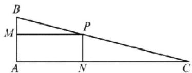

# 核心笔记

##### 1. 多元问题用基本不等式求最值, 基本的理念就是要减少变量. 一是把其中的两个自变量的和、积或特定的结构视为整体, 二是将一个量用另外两个量来表示, 最终可化归为前面的类型. (练习运用: 第6题、第12题)
##### 2. 利用基本不等式求最值问题. 已知 x > 0, y > 0, ① 若积 xy 是定值 p，则当且仅当 x = y 时， $x + y$ 有最小值 $2\sqrt{p}$ (简记: 积定和最小); ② 若和 x + y 是定值 q，则当且仅当 x = y 时，xy 有最大值 $\frac{q^{2}}{4}$ (简记: 和定积最大). (练习运用: 第9题)

# 考点过关5 二次函数与一元二次不等式

##### 1. A 因为 $A = (-\sqrt{3}, \sqrt{3}), B = (-1, 2)$ ，所以 $A \cap B = (-1, \sqrt{3})$

##### 2. D 当 t=2 时， $f(0)=2t^{2}-2t=2\times2^{2}-2\times2\neq0$ ，所以 $f(x)$ 的图象不恒过点 $(0,0)$ ，故 A 错误；当 t=0 时， $\Delta=4t^{2}-4(2t^{2}-2t)=-4t^{2}+8t=0$ ，此时 $f(x)$ 的图象与 x 轴只有 1 个交点，故 B 错误； $f(x)=x^{2}-2tx+2t^{2}-2t=(x-t)^{2}+t^{2}-2t$ ，则 $f(x)$ 的最小值为 $t^{2}-2t=(t-1)^{2}-1\geqslant-1$ ，所以函数的最小值不可能是 -2，可能为 -1，故 C 错误，D 正确.

##### 3. D 由 $\exists x \in \mathbb{R}, \frac{1}{2} x^2 + x - \frac{3}{2} - a < 0$ ，可得 $a > \frac{1}{2} x^2 + x - \frac{3}{2}$ 在 $\mathbb{R}$ 上能成立。因为 $\frac{1}{2} x^2 + x - \frac{3}{2} = \frac{1}{2}(x - 1)^2 - 2 \geqslant -2$ ，所以 $a > -2$ 。由题意知， $(-2, +\infty)$ 是选项的范围的真子集即可。

##### 4. B 由题意，得 $c < 0, -1, \frac{1}{2}$ 是 $cx^2 + ax - b = 0$ 的两个根，则

$-1+\frac{1}{2}=-\frac{a}{c},-1\times\frac{1}{2}=\frac{b}{c}$ ，即 $a=\frac{1}{2}c<0,b=-\frac{1}{2}c>0$ ，所以函数 $y=ax^{2}+bx-c$ 的图象开口向下，对称轴为直线 $x=-\frac{b}{2a}>0$ ，与y轴交点纵坐标为 $-c>0$ 。

##### 5. D 因为 $0 < a < 1$ ，所以 $\frac{1}{a} > 1$ ，原不等式等价于 $(x - a) \left( x - \frac{1}{a} \right) > 0$ ，解得 $x < a$ 或 $x > \frac{1}{a}$ ，所以不等式的解集为 $\left\{ x \mid x < a \text{ 或 } x > \frac{1}{a} \right\}$ .

##### 6. D 已知 $a > 0, b > 0$ ，则 $\frac{a}{b} > 0, \frac{b}{a} > 0$ ，所以 $\frac{b}{a} + \frac{2}{b} = \frac{b}{a} + \frac{a + 2b}{b} = \frac{b}{a} + \frac{a}{b} + 2 \geqslant 2\sqrt{\frac{b}{a} \cdot \frac{a}{b}} + 2 = 4$ ，当且仅当 $\frac{a}{b} = \frac{b}{a}$ ，即 $a = b = \frac{2}{3}$ 时等号成立，故 $\frac{b}{a} + \frac{2}{b}$ 的最小值为 4。因为 $3t^2 - t \leqslant \frac{b}{a} + \frac{2}{b}$ 恒成立，所以 $3t^2 - t \leqslant 4$ ，即 $(3t - 4)(t + 1) \leqslant 0$ ，解得 $-1 \leqslant t \leqslant \frac{4}{3}$ ，即 $t \in [-1, \frac{4}{3}]$ 。

##### 7. B 由函数 $f(x) = x^2 + ax + b (a, b \in \mathbb{R})$ 的值域为 $[0, +\infty)$ ，得方程 $x^2 + ax + b = 0$ 有两个相等的实根，则 $\Delta = a^2 - 4b = 0$ ，即 $b = \frac{1}{4} a^2$ . 由不等式 $x^2 + ax + \frac{1}{4} a^2 < c$ 的解集为 $(m, m + 2\sqrt{5})$ ，得方程 $x^2 + ax + \frac{1}{4} a^2 - c = 0$ 的两根为 $m, m + 2\sqrt{5}$ ，所以 $\left\{ \begin{array}{l} m + m + 2\sqrt{5} = -a, \\ m(m + 2\sqrt{5}) = \frac{1}{4} a^2 - c, \end{array} \right.$ 即 $m(m + 2\sqrt{5}) = \frac{1}{4} (-2m - 2\sqrt{5})^2 - c$ ，所以 $c = 5$ .

##### 8. D 由题意, 得 $M = \{x \mid (x - 3m)(x + m) \leqslant 0\}$ , $N = \{x \mid (x - m)(x + 2m) \leqslant 0\}$ , 方程 $x^2 - 2mx - 3m^2 = 0$ 的根为 $-m, 3m$ , 方程 $x^2 + mx - 2m^2 = 0$ 的根为 $-2m, m$ . 当 $m = 0$ 时, $M \cap N = \{0\}$ , 不合题意; 当 $m > 0$ 时, $M = \{x \mid -m \leqslant x \leqslant 3m\}$ , $N = \{x \mid -2m \leqslant x \leqslant m\}$ , $M \cap N = \{x \mid -m \leqslant x \leqslant m\}$ , 由 $m - (-m) = 4$ , 得 $m = 2$ , 此时 $M = \{x \mid -2 \leqslant x \leqslant 6\}$ , $N = \{x \mid -4 \leqslant x \leqslant 2\}$ , $M \cup N = \{x \mid -4 \leqslant x \leqslant 6\}$ , $M \cup N$ 的长度为 10; 当 $m < 0$ 时, $M = \{x \mid 3m \leqslant x \leqslant -m\}$ , $N = \{x \mid m \leqslant x \leqslant -2m\}$ , $M \cap N = \{x \mid m \leqslant x \leqslant -m\}$ , 由 $(-m) - m = 4$ , 得 $m = -2$ , 此时 $M = \{x \mid -6 \leqslant x \leqslant 2\}$ , $N = \{x \mid -2 \leqslant x \leqslant 4\}$ , $M \cup N = \{x \mid -6 \leqslant x \leqslant 4\}$ , $M \cup N$ 的长度为 10. 综上所述, $M \cup N$ 的长度为 10.

##### 9. BD 由图象知，当 $x = 0$ 时， $y = c > 0$ ，开口向下， $a < 0, -3 + 1 = -\frac{b}{a} < 0$ ，即 $\frac{b}{a} > 0$ ，则 $b < 0, ab > 0$ ，所以 $abc > 0$ ，故 A 错误；当 $x = 1$ 时， $a + b + c = 0$ 且 $a < 0$ ，所以 $b + c > 0$ ，故 B 正确；因为 $2a + b + c = a + a + b + c = a < 0$ ，所以 C 错误；由 $cx^2 + bx + a = 0$ ，可得 $a\left(\frac{1}{x}\right)^2 + b \cdot \frac{1}{x} + c = 0$ ，因为 $-3, 1$ 是方程 $ax^2 + bx + c = 0$ 的两根，所以 $-\frac{1}{3}, 1$ 是方程 $a\left(\frac{1}{x}\right)^2 + b \cdot \frac{1}{x} + c = 0$ 的两根，所以关于 $x$ 的方程 $cx^2 + bx + a = 0$ 的解集为 $\left\{-\frac{1}{3}, 1\right\}$ ，故 D 正确。

##### 10. AC 由题意可得方程 $ax^2 - 3x + 9b = 0$ 的两根为 $a$ 和 $b$ , 且 $a < 0$ , 根据根与系数的关系可得 $\left\{ \begin{array}{l} a + b = \frac{3}{a}, \\ ab = \frac{9b}{a}, \end{array} \right.$ 解得 $\left\{ \begin{array}{l} a = -\sqrt{3}, \\ b = 0 \end{array} \right.$ 或 $\left\{ \begin{array}{l} a = -3, \\ b = 2, \end{array} \right.$ 则 $a + b = -\sqrt{3}$ 或 $a + b = -1$ .

##### 11. BCD 当 k=1 时， $2kx^{2}+kx-\frac{3}{8}=2x^{2}+x-\frac{3}{8}<0$ ，解得 $-\frac{3}{4}<x<\frac{1}{4}$ ，故 A 错误。若 $\forall x\in R$ 恒成立，则当 k=0 时， $-\frac{3}{8}<0$ 成立；当 $k\neq0$ 时， $2k<0,\Delta=k^{2}-4\times2k\times\left(-\frac{3}{8}\right)<0$ ，解得 -3<k<0。综上， $-3<k\leqslant0$ ，则整数 k 的取值集合为 $\{-2,-1,0\}$ ，故 B 正确。若不等式 $2kx^{2}+kx-\frac{3}{8}<0$ 对 $0\leqslant k\leqslant1$ 恒成立，则 $(2x^{2}+x)k-\frac{3}{8}<0$ ，即 $(2x^{2}+x)\times1-\frac{3}{8}<0$ ， $(2x^{2}+x)\times0-\frac{3}{8}<0$ ，则 $-\frac{3}{4}<x<\frac{1}{4}$ ，故 C 正确。令 $h(x)=2kx^{2}+kx-\frac{3}{8}$ ，因为 $h(0)=-\frac{3}{8}<0$ ，所以整数 x=0 符合题意。又恰有一个整数 x 使得不等式 $2kx^{2}+kx-\frac{3}{8}<0$ 成立，所以 k>0，且 $\left\{\begin{aligned}h(-1)=2k-k-\frac{3}{8}\geqslant0,\\h(1)=3k-\frac{3}{8}\geqslant0,\end{aligned}\right.$ 解得 $k\geqslant\frac{3}{8}$ ，故 D 正确。

##### 12.6 函数 $f(x) = x^2 - 2x + 5$ 的图象开口向上，对称轴为直线 $x = 1$ ，则 $f(x)_{\min} = f(1) = 4 \leqslant 4m$ ，解得 $m \geqslant 1$ ，所以 $f(x)$ 在 $[m, n]$ 上单调递增，所以 $\left\{ \begin{array}{l} f(m) = 4m, \\ f(n) = 4n, \end{array} \right.$ 即 $\left\{ \begin{array}{l} m^2 - 2m + 5 = 4m, \\ n^2 - 2n + 5 = 4n, \end{array} \right.$ 所以 $m, n$ 为方程 $x^2 - 2x + 5 = 4x$ 的两个根，即 $m, n$ 为方程 $x^2 - 6x + 5 = 0$ 的两个根，由根与系数的关系得 $m + n = 6$ .

##### 13. $\left(-\frac{3}{5},1\right]$ 由题意可得，命题的否定“ $\forall x\in R$ ，不等式 $(a^{2}-1)x^{2}-(a-1)x-1<0$ 恒成立”为真命题。当 $a^{2}-1=0$ ，即 $a=\pm1$ 时，若a=1，则不等式为-1<0恒成立；若a=-1,2x-1<0不恒成立，即a=-1不满足；当 $a^{2}-1\neq0$ 时， $\left\{\begin{aligned}a^{2}-1&<0,\\ \Delta=(a-1)^{2}+4(a^{2}-1)&<0,\end{aligned}\right.$ 解得 $-\frac{3}{5}<a<1$ 。综上所述，实数a的取值范围是 $\left(-\frac{3}{5},1\right]$ 。

##### 14. $[-1 - \sqrt{2}, -1]$ 由 $f[f(x)] \leqslant 1$ ，可得 $(x^2 - 2ax + 1)^2 - 2a(x^2 - 2ax + 1) + 1 \leqslant 1$ ，即 $(x^2 - 2ax + 1)(x^2 - 2ax + 1 - 2a) \leqslant 0$ . 由 $A = B$ ，可得 $x^2 - 2ax + 1 - 2a \geqslant 0$ 在 $\mathbf{R}$ 上恒成立，即 $\Delta = 4a^2 - 4(1 - 2a) \leqslant 0$ ，解得 $-1 - \sqrt{2} \leqslant a \leqslant -1 + \sqrt{2}$ ①. 又集合 $A$ 是非空集合，所以 $x^2 - 2ax + 1 \leqslant 0$ 在 $\mathbf{R}$ 上有解，则 $\Delta' = 4a^2 - 4 \geqslant 0$ ，解得 $a \leqslant -1$ 或 $a \geqslant 1$ ②. 由①②可得 $a \in [-1 - \sqrt{2}, -1]$ .

# 核心笔记

##### 1. 二次函数的解析式有：

①一般式： $f(x)=ax^{2}+bx+c(a\neq0)$ ;

②顶点式： $f(x)=a(x-m)^{2}+n(a\neq0)$ ，顶点坐标为 $(m,n)$ ;

③零点式： $f(x)=a(x-x_{1})(x-x_{2})(a\neq0)$ ，其中 $x_{1},x_{2}$ 是方程 $ax^{2}-bx+c=0$ 的两个根.

##### 2. 二次函数的图象与性质：

二次函数： $f(x)=ax^{2}+bx+c(a\neq0)$ 的图象是一条抛物线，对称轴为直线 $x=-\frac{b}{2a}$ ，顶点坐标为 $\left(-\frac{b}{2a},\frac{4ac-b^{2}}{4a}\right)$ ，当a>0时，开口向上，有最小值，当a<0时，开口向下，有最大值。一元二次根的判别式符号可以判断二次函数图象与x轴交点的个数。（练习运用：第2题、第3题、第9题）

##### 3. 解一元二次不等式的步骤: （1） 把二次项的系数 a 变为正的 (若 a<0, 则在不等式两边都乘以 -1, 把系数变为正); （2） 解对应的一元二次方程 (先看能否因式分解, 若不能, 看 $\Delta$ , 再求根); （3） 求解一元二次不等式 (根据一元二次方程的根的情况). (练习运用: 第 5 题、第 10 题、第 14 题)

##### 4. 要理解一元二次不等式与一元二次方程、二次函数的关系。要注意数形结合思想的运用。(练习运用: 第4题、第9题)

# 阶段温习一 考点 1\~5

##### 1. C 因为集合 $A=\{x \mid 1 \leqslant x \leqslant 3\}$ ，所以 $A \cap B = \{x \mid 2 < x \leqslant 3\}$ .

##### 2. A

##### 3. A 由 $a(x^2 + 1) + b(x - 1) + c > 2ax$ ，整理得 $ax^2 + (b - 2a)x + (a + c - b) > 0$ ①. 又不等式 $ax^2 + bx + c > 0$ 的解集为

\( \{x\mid-1<x<2\} \) ，所以a<0，且 \( \left\{\begin{aligned}-1+2&=-\frac{b}{a},\\(-1)\times2&=\frac{c}{a},\end{aligned}\right. \)  即 \( \left\{\begin{aligned}\frac{b}{a}&=-1,\\ \frac{c}{a}&=-2\end{aligned}\right. \)

②. 将①两边同除以 a 得 $x^{2}+\left(\frac{b}{a}-2\right)x+\left(1+\frac{c}{a}-\frac{b}{a}\right)<0$ ③. 将②代入③得 $x^{2}-3x<0$ ，解得 0<x<3.

##### 4. B 对于①， $(a - c) - (b - d) = (a - b) + (d - c)$ ，无法判断是否大于零，当 $a = 1, b = 0, c = 0, d = -2$ 时，则 $a - c < b - d$ ，故①错误；对于②，根据不等式性质——同向同正可乘性，可得②正确；对于③，根据不等式性质——正向可开方性，可得③正确；对于④， $\frac{1}{a^2} - \frac{1}{b^2} = \frac{b^2 - a^2}{a^2 b^2} = \frac{(b - a)(b + a)}{a^2 b^2}$ ，因为 $a > b > 0$ ，所以 $b - a < 0, b + a > 0, a^2 b^2 > 0$ ，则 $\frac{(b - a)(b - a)}{a^2 b^2} < 0$ ，故 $\frac{1}{a^2} < \frac{1}{b^2}$ ，可得④错误。

##### 5. C $(t-x)\otimes(x+t)=(t-x-2)(x+t)<4$ 对任意实数 x 恒成立，即 $x^{2}+2x-t^{2}+2t+4>0$ 对任意实数 x 恒成立，所以 $\Delta=4-4(-t^{2}+2t+4)<0$ ，解得 -1<t<3.

##### 6. B 分析: 直接由 $\mathrm{sgn}(e^{x}-1)+\mathrm{sgn}(-x+1)=0$ 求出 x 的范围, 需要分类讨论, 较为复杂, 可以考虑举反例说明充分性不成立, 再利用函数 $\mathrm{sgn}(x)$ 的性质说明必要性成立.

当 $\operatorname{sgn}(\mathrm{e}^x - 1) + \operatorname{sgn}(-x - 1) = 0$ 时，取 $x = -\frac{1}{2}$ ，则 $\mathrm{e}^x - 1 < 0, -x + 1 > 0$ ，此时 $\operatorname{sgn}(\mathrm{e}^x - 1) + \operatorname{sgn}(-x + 1) = -1 + 1 = 0$ ，则 $x > 1$ 不成立，即充分性不成立；当 $x > 1$ 时， $\mathrm{e}^x - 1 > 0, -x + 1 < 0$ ，所以 $\operatorname{sgn}(\mathrm{e}^x - 1) + \operatorname{sgn}(-x + 1) = 1 - 1 = 0$ ，即必要性成立，所以“ $\operatorname{sgn}(\mathrm{e}^x - 1) + \operatorname{sgn}(-x + 1) = 0$ ”是“ $x > 1$ ”的必要不充分条件.

##### 7. A 解法 1(比较法) 因为 $(ax+by+cz)-(az+by+cx)=(x-z)(a-c)<0$ ，所以 $ax+by+cz<az+by+cx$ 。因为 $(ax+by+cz)-(ay+bx+cz)=(x-y)(a-b)<0$ ，所以 $ax+by+cz<ay+bx+cz$ 。因为 $(ay+bx+cz)-(ay+bz+cx)=(x-z)(b-c)<0$ ，所以 $ay+bx+cz<ay+bz+cx$ 。因此，最低的总费用是 $ax+by+cz$ 。

【解法2】（特殊值法）令 $x = 3, y = 2, z = 1, a = 4, b = 5, c = 6$ ，则 $ax + by + cz = 4 \times 3 + 5 \times 2 + 6 \times 1 = 28, az + by + cx = 4 \times 1 + 5 \times 2 + 6 \times 3 = 32, ay + bz + cx = 4 \times 2 + 5 \times 1 + 6 \times 3 = 31, ay + bx + cz = 4 \times 2 + 5 \times 3 + 6 \times 1 = 29$ ，显然是 $ax + by + cz$ 最小.

##### 8. C 分析: 对条件最值的处理, 在不等式法不易达成时, 通常考虑函数法, 函数法就得先消元, 减少变量转变为一元函数. 消元需注意两点: 一是消去谁, 二是消去元对保留元的影响. 这里, 消去 x 比较好, 同时受 x > 0 的约束, 保留的 y > 1, 接下来可以用函数知识解决问题, 或者通过配凑, 用基本不等式求最值更快捷.

由 $2xy - y + 1 = 0$ ，可得 $x = \frac{y - 1}{2y}$ 又由 $x > 0, y > 0$ ，可得 $y > 1$ 则 $\frac{2 + xy}{x} = \frac{2 + \frac{y - 1}{2}}{\frac{y - 1}{2y}} = \frac{4y}{y - 1} + y = \frac{4}{y - 1} + y + 4 = \frac{4}{y - 1} + (y -$

$1)+5\geqslant2\sqrt{\frac{4}{y-1}\times(y-1)}+5=9$ ，当且仅当 $\frac{4}{y-1}=y-1$ ，即y=3时取得等号.

##### 9. AD 对于 A 选项, 由 $xy > 0$ , 得 $x, y$ 同号, 故 $\frac{x}{y} > 0$ , 反之由 $\frac{x}{y} > 0$ , 得 $x, y$ 同号, 故 $xy > 0$ , 所以“ $xy > 0$ ”是“ $\frac{x}{y} > 0$ ”的充要条件, 故 A 正确. 对于 B 选项, $b^2 - 4ac < 0$ 且 $a > 0$ 时, 函数 $y = ax^2 - bx + c$ 的图象在 $x$ 轴上方; 函数 $y = ax^2 + bx + c$ 的图象在 $x$ 轴上方时, 必有 $b^2 - 4ac < 0$ , 故“ $b^2 - 4ac < 0$ ”是“函数 $y = ax^2 - bx + c$ 的图象在 $x$ 轴上方”的必要不充分条件, 故 B 错误. 对于 C 选项, 当 $a = 2$ 时, $(a - 1)(a - 2) = 0$ 成立, 反之 $(a - 1)(a - 2) = 0$ 时, $a = 2$ 不一定成立, 故“ $a = 2$ ”是“(a - 1)(a - 2) = 0”的充分不必要条件, 故 C 错误. 对于 D 选项, 函数 $y = ax^2 - bx + c$ 的图象过点 $(1, 0)$ , 则 $a + b + c = 0$ , 反之也成立, 故“函数 $y = ax^2 + bx + c$ 的图象过点 $(1, 0)$ ”是“ $a + b + c = 0$ ”的充要条件, 故 D 正确.

##### 10. ABD 对于 A, 由 $a + b > 0$ , 可得 a > -b, 因为 b > 0, 所以 $\frac{a}{b} > -1$ , 故 A 正确; 对于 B, 由 $|a| - |b| = -a - b = -(a + b) < 0$ , 所以 $|a| < |b|$ , 故 B 正确; 对于 C, 因为 a < 0 < b, 且 $a + b > 0$ , 所以 $\frac{1}{a} + \frac{1}{b} = \frac{b + a}{ab} < 0$ , 故 C 错误; 对于 D, 因为 a < 0 < b, 且 $a + b > 0$ , 所以 ab < 0, 则 $(a - 1)(b - 1) = ab - (a + b) + 1 < 1$ , 故 D 正确.

##### 11. ABD 对于选项 A, 原图中的圆环不可解开, 则无法无损变为一个圆, 所以无法得到选项 A; 对于选项 D, 为三个圆, 不是一根绳, 所以无法得到选项 D; 对于选项 B, C, 根据左手三叶结和右手三叶结不能无损转换, 而 B, C 情形为三叶结变体, 则 B, C 至少有一个无法无损伤得到, 两者为手性, 即镜像 (只能在镜子中相互重叠),再通过考场身边道具(如鞋带,头发)进行实验,可以得到选项C,无法得到选项B.

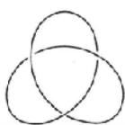  
左手三叶结

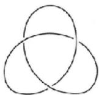  
右手三叶结

##### 12. 2 当 $x = 1$ 时, $y = 1, 2, 4$ , 此时 $x - y = 0, -1, -3$ ; 当 $x = 2$ 时, $y = 1, 2, 4$ , 此时 $x - y = 1, 0, -2$ ; 当 $x = 4$ 时, $y = 1, 2, 4$ , 此时 $x - y = 3, 2, 0$ . 综上, 符合条件的 $B = \{(2, 1), (4, 2)\}$ , 共 2 个元素.

解后反思 送分题,也要讲究方法,按一定顺序验证,不重不漏,方能稳稳拿分.

##### 13.（-2,2）问题等价转换为 $f(x) = x^{2} - ax + 1$ 的图象在 $x$ 轴上方，所以 $\Delta = a^2 - 4 < 0$ ，解得 $-2 < a < 2$ .

##### 14. 1 $4\sqrt{2} - 3$ 解法1 因为 $3 = ab + a + b \geqslant ab + 2\sqrt{ab}$ , 所以 $ab + 2\sqrt{ab} - 3 \leqslant 0$ , 解得 $0 < ab \leqslant 1$ , 当且仅当 $a = b = 1$ 时取等号, 所以 $ab$ 的最大值是1. 因为 $ab + a + b = 3$ , 所以 $b = \frac{3 - a}{a + 1}$ , 所以 $a + 2b = a + 2 \cdot \frac{3 - a}{a + 1} = a + 2\left(-1 + \frac{4}{a + 1}\right) = a + 1 + \frac{8}{a + 1} - 3 \geqslant 4\sqrt{2} - 3$ , 当且仅当 $a = 2\sqrt{2} - 1$ 时取等号, 则 $a + 2b$ 的最小值是 $4\sqrt{2} - 3$ .

【解法2】因为 $ab + a + b = 3$ ，所以 $b = \frac{3 - a}{a + 1} >0$ ，所以 $0 < a < 3, ab = \frac{a(3 - a)}{a + 1}$ .令 $t = a + 1$ ，则 $1 < t < 4, ab = \frac{(t - 1)(4 - t)}{t} = -t - \frac{4}{t} +5\leqslant 1$ ，当且仅当 $t = \frac{4}{t} = 2$ ，即 $a = 1$ 时取等号， $a + 2b = a+$ $\frac{2(3 - a)}{a + 1} = a + 1 + \frac{8}{a + 1} -3\geqslant 4\sqrt{2} -3$ ，当且仅当 $a + 1 = \frac{8}{a + 1}$ 即 $a = 2\sqrt{2} -1$ 时取等号.

# 考点过关6 函数的概念及其表示

##### 1. C 对于 A, y = 1 的定义域为 R, $y = x^{0}$ 的定义域为 $\{x \mid x \neq 0\}$ ，定义域不相同，故 A 错误；对于 B, $y = \sqrt{x - 1} \cdot \sqrt{x + 1}$ 的定义域为 $[1, +\infty)$ , $y = \sqrt{x^{2} - 1}$ 的定义域为 $(-\infty, -1] \cup [1, +\infty)$ ，定义域不相同，故 B 错误；对于 C, y = x 和 $y = \sqrt[3]{x^{3}}$ 的定义域都为 R，且 $y = \sqrt[3]{x^{3}} = x$ ，对应关系一致，故 C 正确；对于 D, $y = |x|$ 的定义域为 R, $y = (\sqrt{x})^{2}$ 的定义域为 $[0, +\infty)$ ，定义域不相同，故 D 错误.

##### 2. B 分析: 根据函数的概念可知函数图象和与 y 轴平行的直线至多只有一个交点. 据此可排除选项 C, 其他三个选项都可作为函数图象, 但还需要符合题目中函数的另外两个要素: 定义域和值域.

A项中，定义域为 $[-2,0]$ ；C项中，当 $x = 0$ 时，有两个 $y$ 值与之对应；D项中，值域不是 $[0,2]$ . 排除 A, C, D, 故选 
$\quad$B.

##### 3. B 要使 $f(x)$ 有意义，则 4-x>0，所以 x<4，所以 $f(x)$ 的定义域为 $(-∞,4)$ ，所以 $g(x)$ 的定义域满足 $\left\{\begin{aligned}&2x<4,\\ &x\neq1,\end{aligned}\right.$ 所以 x<

2 且 $x \neq 1$ .

# 方法突破 简单函数定义域的求法

（1）已知函数的解析式,则构造使解析式有意义的不等式(组)求解.

（2） 抽象函数

①若已知函数 $f(x)$ 的定义域为 $[a, b]$ ，则函数 $f[g(x)]$ 的定义域由不等式 $a \leqslant g(x) \leqslant b$ 求出；  
②若已知函数 $f[g(x)]$ 的定义域为 $[a, b]$ ，则 $f(x)$ 的定义域为 $g(x)$ 在 $x \in [a, b]$ 时的值域.

##### 4. B 将点(0,0)代入可排除选项 A,C; 将点 $\left(1,\frac{3}{2}\right)$ 代入可排除选项 D.

##### 5. D 分析: 对“所有点 $(m, f(n))$ 构成一个正方形区域”这句话的理解是突破口, 尽管 m, n 是任意的, 但它们属于定义域 D, $f(n)$ 是任意的, 但它属于值域 C. 若点 $(m, f(n))$ 构成一个正方形区域, 则定义域的区间“长度”和值域的区间“长度”必须相等.

由题意得 $ax^2 - 2ax \geqslant 0$ ，且 $a < 0$ ，解得 $D = [0, 2]$ . 因为 $y = x^2 - 2x$ 在 $x = 1$ 处取最小值 $-1$ ，所以 $y = a(x^2 - 2x)$ 在 $x = 1$ 处取最大值 $-a$ ，所以 $f(x) = \sqrt{ax^2 - 2ax}$ 在 $x = 1$ 处取最大值 $\sqrt{-a}$ . 因为 $D = [0, 2]$ ， $f(0) = f(2) = 0$ ，且所有点 $P(m, f(n))$ 构成正方形区域，所以 $\sqrt{-a} = 2$ ，解得 $a = -4$ .

##### 6. D 分析: 求抽象函数或复合函数的定义域, 抓住两点, 就能迎刃而解. 1. 定义域是指单个 x 的取值范围; 2. 相同的对应关系 f, 对实施对象的范围要求是一致的. 这里 $y = f(2^{x})$ 和 $y = f(\log_{3}x)$ 中 $2^{x}$ 和 $\log_{3}x$ 所属范围是相同的. 由 $y = f(2^{x})$ 的定义域可求得 $2^{x}$ 的范围, 即为 $\log_{3}x$ 的范围, 据此可求得 x 的范围, 即函数 $y = f(\log_{3}x)$ 的定义域.

由 $x \in [-1, 1]$ , 得 $2^x \in \left[\frac{1}{2}, 2\right]$ , 所以 $\log_3 x \in \left[\frac{1}{2}, 2\right]$ , 所以 $x \in [\sqrt{3}, 9]$ .

##### 7. A 作出函数 $y = -x + 3, y = \frac{3}{2} x + \frac{1}{2}, y = x^2 - 4x + 3$ 在同一平面直角坐标系中的图象，则函数 $f(x)$ 的图象为图中实线部分（如图）。当 $x = 1$ 时， $f(x)$ 取最小值 2。

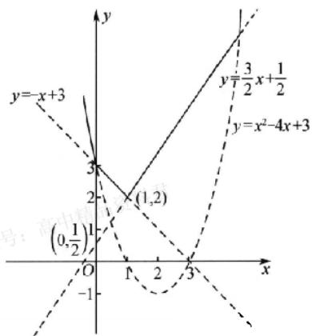

##### 8. D 由题意得 $f(x) + \frac{2}{x}$ 为常数，不妨设 $f(x) + \frac{2}{x} = a$ ，则 $f(x) = a - \frac{2}{x}$ ，原式化为 $f(a) = 1$ ，即 $a - \frac{2}{a} = 1$ ，解得 $a = 2$ 或

$a = -1$ （舍去），故 $f(x) = 2 - \frac{2}{x}$ 所以 $f(1) = 2 - 2 = 0.$   
##### 9. ABC 从图中可以看出当 $x = 8$ 时，甲方案所需要的费用低于乙方案，故A选项正确；从图中可以看出当 $x = 10$ 时，甲方案与乙方案所需要的费用相同，均为12元，故乘客选择甲、乙方案均可，故B选项正确；打车 $3\mathrm{km}$ 以上时，甲方案每公里增加的费用为 $\frac{12 - 5}{10 - 3} = 1$ （元），乙方案每公里增加的费用为 $\frac{12 - 7}{10 - 3} = \frac{5}{7}$ （元），故每公里增加的费用甲方案比乙方案多，C选项正确；增加1公里增加的费用甲方案与乙方案不同，由C选项的计算可知，D选项错误.  
##### 10. ACD 若 $a \geqslant 0$ ，当 $x \geqslant 0$ 时， $f(x) = ax \geqslant 0$ ，若函数的值域为 $[0, +\infty)$ ，则当 $x < 0$ 时， $f(x) = x^2 - ax$ 的对称轴 $x = \frac{a}{2} \geqslant 0$ ，此时 $f(x) = x^2 - ax$ 在 $(- \infty, 0)$ 上单调递减，且 $f(0) = 0$ ，满足题意，所以选项 A, C, D 符合题意；若 $a < 0$ ，当 $x \geqslant 0$ 时， $f(x) = ax < 0$ ，当 $x < 0$ 时， $f(x) = x^2 - ax$ 的对称轴 $x = \frac{a}{2} < 0$ ，此时 $f(x)_{\min} = f\left(\frac{a}{2}\right) < f(0) = 0$ ，不满足值域为 $[0, +\infty)$ ，所以 $a = -3$ 不符合题意。  
##### 11. ACD 对于A, 当 $x \in \mathbf{Q}$ 时, $f(x) = 1$ , 则 $f[f(x)] = f(1) = 1$ , 当 $x \in \complement_{\mathbb{R}} \mathbf{Q}$ 时, $f(x) = 0$ , 则 $f[f(x)] = f(0) = 1$ , 综上, 对任意的 $x \in \mathbb{R}$ , 都有 $f[f(x)] = 1$ , A 正确; 对于B, 当 $x \in \mathbf{Q}$ 时, $-x \in \mathbf{Q}$ , 则 $f(-x) + f(x) = 2$ , B 错误; 对于C, 若 $a < 0, b > 1$ , 则 $\{x | f(x) > a\} = \mathbf{R} = \{x | f(x) < b\}$ , C 正确; 对于D, 取 $A(0, 1), B(\sqrt{3}, 0), C(-\sqrt{3}, 0)$ , 则 $|AB| = |AC| = 2, |BC| = 2\sqrt{3}$ , $\triangle ABC$ 为等腰三角形, D 正确.  
##### 12.6 因为 $7 < 9$ ，所以 $f(7) = f[f(7 + 4)] = f[f(11)] = f(11 - 3) = f(8)$ . 又 $8 < 9$ ，所以 $f(8) = f[f(12)] = f(9) = 9 - 3 = 6$ ，即 $f(7) = 6$ .  
##### 13. $\left[0, \frac{3}{4}\right)$ 由题意得关于 $x$ 的方程 $ax^2 + 4ax + 3 = 0$ 无解，当 $a = 0$ 时，方程显然无解；当 $a \neq 0$ 时， $\Delta = 16a^2 - 12a < 0$ ，解得 $0 < a < \frac{3}{4}$ . 综上所述，实数 $a$ 的取值范围是 $\left[0, \frac{3}{4}\right)$ .  
##### 14. 1 5 因为 $f(x) = \begin{cases} 2 - x, & x \geqslant 1, \\ x^2 + x - 1, & x < 1, \end{cases}$ 所以 $f(4) = 2 - 4 = -2$ . 所以 $f[f(4)] = f(-2) = (-2)^2 - 2 - 1 = 1$ . 设 $f(a) = t$ , 则 $f(t) = t$ , 当 $t \geqslant 1$ 时, $f(t) = 2 - t = t$ , 可得 $t = 1$ , 当 $t < 1$ 时, $f(t) = t^2 + t - 1 = t$ , 可得 $t = -1$ , 所以 $f(a) = 1$ 或 $f(a) = -1$ . 当 $a \geqslant 1$ 时, 由 $f(a) = 2 - a = 1$ 或 $f(a) = 2 - a = -1$ , 可得 $a = 1$ 或 $a = 3$ ; 当 $a < 1$ 时, $f(a) = a^2 + a - 1 = 1$ 或 $f(a) = a^2 + a - 1 = -1$ , 可得 $a = -2$ 或 $a = 1$ (舍去) 或 $a = -1$ 或 $a = 0$ . 综上所述, $a = -2, -1, 0, 1, 3$ , 符合题意的实数 $a$ 的个数为 5.

# 核心笔记

##### 1. 对于分段函数的求值问题, 若自变量的取值范围不确定, 则分情况求解; 求解过程中, 求出的参数的值或范围并不一定符合题意, 所以要检验结果是否符合要求. (练习运用: 第 10 题、第

14题）

##### 2. 已知 $f[g(x)] = F(x)$ ，求 $f(x)$ 的常用方法：（1） 配凑法，由已知条件 $f[g(x)] = F(x)$ ，可将 $F(x)$ 改写成关于 $g(x)$ 的表达式，然后以 $x$ 替代 $g(x)$ ，便可得 $f(x)$ 的解析式；（2） 换元法，令 $t = g(x)$ ，再用 $t$ 表示 $x$ ，进而可得 $f(t)$ ，然后以 $x$ 替代 $t$ ，便可得 $f(x)$ 的解析式。在以上两种方法中要注意根据 $g(x)$ 或 $t$ 的取值范围确定函数的定义域。（练习运用：第6题）

# 考点过关7 函数的基本性质

##### 1. A 对于 A, $y = f(x) = x^{-2}$ 满足 $f(-x) = f(x)$ ，故 $f(x)$ 为偶函数，由幂函数的性质可知 $f(x) = x^{-2}$ 在区间 $(0, +\infty)$ 上单调递减，故 $f(x) = x^{-2}$ 在区间 $(-∞, 0)$ 上单调递增，A 正确；对于 B, $y = |x|$ 在区间 $(-∞, 0)$ 上单调递减，B 错误；对于 C, $y = |x|$ 在区间 $(-∞, 0)$ 上单调递减， $y = 2^{x}$ 在区间 $(-∞, 0)$ 上单调递增，由复合函数的单调性可知 $y = 2^{|x|}$ 在区间 $(-∞, 0)$ 上单调递减，C 错误；对于 D, $y = x^{3}$ 是 R 上的奇函数，D 错误。  
##### 2. C 解法1 因为 $f(x)$ 是奇函数， $g(x)$ 是偶函数，所以 $|f(x)|$ ， $|g(x)|$ 都是偶函数，根据一个奇函数与一个偶函数的积为奇函数，两个偶函数的积还是偶函数知 $f(x) \cdot |g(x)|$ 是奇函数.

【解法2】因为 $f(x)$ 是奇函数， $g(x)$ 是偶函数，所以 $f(-x) = -f(x), g(-x) = g(x)$ . 对于 $\mathrm{A}, f(-x)g(-x) = -f(x) \cdot g(x)$ ，为奇函数，错误；对于 $\mathrm{B}, |f(-x)|g(-x) = |f(x)| \cdot g(x)$ ，为偶函数，错误；对于 $\mathrm{C}, f(-x)|g(-x)| = -f(x) \cdot |g(x)|$ ，是奇函数，正确；对于 $\mathrm{D}, |f(-x) \cdot g(-x)| = |f(x)g(x)|$ ，是偶函数，错误.

# 方法突破 判断函数的奇偶性

（1） 函数奇偶性的判断, 本质是判断 $f(x)=f(-x)$ 是否成立, 前提是定义域关于原点对称, 在运算中, 也可以转化为判断奇偶性的等价关系式 $f(x)+f(-x)=0$ 或 $f(x)-f(-x)=0$ 是否成立.  
（2） 判断函数的奇偶性, 必先检验其定义域是否关于原点对称.  
（3） 函数 $f(x)$ 为奇函数，且在 x=0 处有定义，必有 $f(0)=0$ ；但反之未必成立.  
（4） 若 $f(x)$ 是偶函数，则 $f(-x)=f(x)=f(|x|)$ .  
（5）已知函数奇偶性求参数值问题时,常用特值法,如函数是奇函数,在x=0处有意义,常用 $f(0)=0$ 求参数,否则用其他特值进行运算.

##### 3. D $f(-3) = -6 - a = -f(3) = -8$ ，所以 $a = 2$ ，所以当 $x < 0$ 时， $f(x) = x^3 + 2x^2 + 1, 2f(1) - f(-2) = -2f(-1) + f(-2) = -4 + 1 = -3$ .  
##### 4. A 因为函数 $f(x)$ 的图象关于点(1,0)成中心对称，所以 $f(1) = 0$ ，即 $2 + a = 0$ ，解得 $a = -2$ ，故 $f(0) = -f(2) = -(2 \times 2 - 2) = -2$ .  
##### 5. B $f(-x+1)=f(x+1)=-f(x-1)$ ，即 $f(x+2)=-f(x)$ ，则 $f(x+4)=f(x)$ ，即 $f(x)$ 是周期为 4 的周期函数， $f(2018)=f(504\times4+2)=0$ ， $f(2019)=f(505\times4-1)=-1$ ，则 $f(2018)+f(2019)=0-1=-1$ 。

# 方法突破 求函数周期的方法

（1） 若函数 $f(x)$ 满足 $f(x + T) = f(x)$ ，则由函数周期性的定义

可知 T 是函数的一个周期.

（2）若函数 $f(x)$ 满足 $f(x + a) = -f(x)$ ，则 $f(x + 2a) = f[(x + a) + a] = -f(x + a) = f(x)$ ，所以 $2a$ 是函数的一个周期.  
（3） 若函数 $f(x)$ 满足 $f(x + a) = \frac{1}{f(x)}$ ，则 $f(x + 2a) = f[(x + a) + a] = \frac{1}{f(x + a)} = f(x)$ ，所以 $2a$ 是函数的一个周期.  
（4） 若函数 $f(x)$ 满足 $f(x+a)=-\frac{1}{f(x)}$ ，则同理可得 2a 是函数的一个周期.

##### 6. D 分析: 对函数及性质的研究, 掌握一些常见方法很有必要, 比如求函数解析式通常有: 1. 待定系数法 (适用于已知函数类型); 2. 配凑法或换元法 (适用于复合函数, 求外函数); 3. 方程组法 (适用于含有函数 $f(x)$ 和 $g(x)$ 的等式). 这里用的是方程组法, 但还需要寻找一个关于 $f(x)$ 和 $g(x)$ 的新的等式, 根据奇偶性条件, 不难想到用 $-x$ 去替换已知等式中的 $x$ 并结合奇偶性, 就能得到一个新的等式, 进而运用方程组思想求得 $f(x)$ 和 $g(x)$ .

$\begin{array}{l} {f (- x) + g (- x) = f (x) - g (x) = \mathrm{e} ^ {- x}, \text {所以} g (x) = \frac {1}{2} (\mathrm{e} ^ {x} -} \\ {\mathrm{e} ^ {- x}).} \end{array}$

##### 7. A 因为偶函数 $f(x)$ 在区间 $[0, +\infty)$ 上单调递增，所以 $f(x)$ 在区间 $(- \infty, 0)$ 上单调递减，故 $x$ 越靠近 $y$ 轴，函数值越小。因为 $f(2x - 1) < f\left(\frac{1}{3}\right)$ ，所以 $|2x - 1| < \frac{1}{3}$ ，解得 $\frac{1}{3} < x < \frac{2}{3}$ 。

##### 8. A 解法1(利用函数单调性) 设 $g(x) = 2^x, h(x) = 3^{-x}$ , 易知 $g(x)$ 在 $\mathbf{R}$ 上单调递增, $h(x)$ 在 $\mathbf{R}$ 上单调递减, 则 $f(x) = g(x) - h(x)$ 在 $\mathbf{R}$ 上单调递增. 又 $f(x^2) < f(2x + 3)$ , 所以 $x^2 < 2x + 3$ , 即 $x \in (-1, 3)$ .

解法 2(取特殊值) 当 x=0 时, $f(0)<f(3)$ , 排除 B, D; 当 x=1 时, $f(1)<f(5)$ , 排除 C, 故 A 正确.

##### 9. AB 对于选项 A, 因为 $\log_{2}3 > 1$ , 所以 $f(\log_{2}3) = 2^{\log_{2}3} = 3$ , 所以选项 A 正确; 对于选项 B, 欲使该函数在 R 上单调递增, 则满足 $\left\{\begin{aligned}&3-2a>0,\\ &a>1,\end{aligned}\right.$ 解得 $1 < a < \frac{3}{2}$ , 所以选项 B 正确; 对于选项 C, 使 $3-2a-1 \leqslant a$ ,

得 $f(0)=-1$ ，此时 a>0 且 $a\neq1$ ，与条件不符，所以选项 C 错误。对于选项 D，该函数为非奇非偶函数，所以选项 D 错误。

##### 10. ABD 对于 A 选项, 由题意知, $f(x)$ 关于 $(0,0)$ 中心对称, 且直线 $x = 1$ 为对称轴, 所以直线 $x = -1$ 也是对称轴, 故 A 正确; 对于 B 选项, 因为 $f(x)$ 关于 $(0,0)$ 中心对称, 关于直线 $x = 1$ 对称, 所以 $f(x) = -f(-x) = f(2 - x)$ , 进而得到 $f(2 + x) = -f(x)$ , 所以 $f(4 + x) = -f(2 + x) = f(x)$ , 即 $f(x)$ 是周期为 4 的函数, 所以 $g(2023) = f(2024) = f(0) = 0$ , 故 B 正确; 对于 C 选项, 只能说明 $f(x)$ 的周期为 4, 但不能说明 $f(x)$ 的最小正周期为 4, 故 C 错误; 对于 D 选项, 因为 $f(x)$ 关于直线 $x = 1$ 对称, 所以 $f(1 + x) = f(1 - x)$ , 即 $f(x) = f(2 - x)$ , 故 D 正确.

##### 11. ACD 对于函数 $f(x) = \frac{2}{2^x - 1} + a (a \in \mathbb{R})$ ，令 $2^x - 1 \neq 0$ ，解得 $x \neq 0$ ，所以 $f(x)$ 的定义域为 $(-\infty, 0) \cup (0, +\infty)$ ，故 A 正确。因为 $2^x > 0$ ，当 $2^x - 1 > 0$ 时， $\frac{2}{2^x - 1} > 0$ ，所以 $\frac{2}{2^x - 1} + a > a$ 。当 $-1 < 2^x - 1 < 0$ 时， $\frac{2}{2^x - 1} < -2$ ，所以 $\frac{2}{2^x - 1} + a < -2 + a$ ；综上可得 $f(x)$ 的值域为 $(-\infty, -2 + a) \cup (a, +\infty)$ ，故 B 错误。当 $a = 1$ 时， $f(x) = \frac{2}{2^x - 1} + 1 = \frac{2^x + 1}{2^x - 1}$ ，则 $f(-x) = \frac{2^{-x} + 1}{2^{-x} - 1} = -\frac{2^x + 1}{2^x - 1} = -f(x)$ ，所以 $f(x) = \frac{2}{2^x - 1} + 1$ 为奇函数，故 C 正确。当 $a = 2$ 时， $f(x) = \frac{2}{2^x - 1} + 2 = \frac{2^x + 1}{2^x - 1} + 1$ ，则 $f(-x) + f(x) = \frac{2^x + 1}{2^x - 1} + 1 + \frac{2^{-x} + 1}{2^{-x} - 1} + 1 = 2$ ，故 D 正确。  
##### 12. $\frac{5}{2}$ 因为函数 $f(x) = 2^{x} + \frac{a}{2^{x}}$ 是偶函数，所以 $f(x) = f(-x)$ ，即 $2^{x} + \frac{a}{2^{x}} = 2^{-x} + \frac{a}{2^{-x}}$ ，解得 $a = 1$ ，所以 $f(x) = 2^{x} + \frac{1}{2^{x}}$ ，则 $f(1) = 2 + \frac{1}{2} = \frac{5}{2}$ .  
##### 13. $(- \infty, -1) \cup (1, +\infty)$ 令 $g(x) = xf(x)$ , 则 $g'(x) = xf'(x) + f(x)$ , 当 $x > 0$ 时, $g'(x) > 0$ , 故 $g(x)$ 在 $(0, +\infty)$ 上单调递增, 又 $f(x)$ 为奇函数, 所以 $g(x)$ 为偶函数. 因为 $f(1) = 2$ , 所以 $xf(x) > 2 = 1 \cdot f(1)$ 等价于 $g(x) > g(1)$ , 从而 $g(|x|) > g(1)$ , 因此, $|x| > 1$ , 解得 $x > 1$ 或 $x < -1$ , 故使不等式 $xf(x) > 2$ 成立的 $x$ 的取值范围是 $(- \infty, -1) \cup (1, +\infty)$ .  
##### 14.25 当 $a = 1$ 时，因为 $x > 0$ ，所以 $f(x) = x + \frac{1}{x} \geqslant 2\sqrt{x \cdot \frac{1}{x}} - 2$ ，当且仅当 $x = 1$ 时， $f(x)$ 取得最小值2.若 $f(x)$ 在区间 $(2, +\infty)$ 上存在最小值，由 $f(x)$ 的导数为 $f'(x) = 1 - \frac{a}{x^2} = \frac{(x + \sqrt{a})(x - \sqrt{a})}{x^2}$ ，当 $x > \sqrt{a}$ 时， $f'(x) > 0,f(x)$ 单调递增；当 $0 < x < \sqrt{a}$ 时， $f'(x) < 0,f(x)$ 单调递减，可得 $f(x)$ 在 $x = \sqrt{a}$ 处取得极小值.由题意可得 $f(\sqrt{a})$ 为最小值，即有 $\sqrt{a} >2$ ，可得 $a > 4.$ 可取 $a = 5$ （答案不唯一）.

# 核心笔记

##### 1. 函数的基本性质：单调性、奇偶性、周期性。（1）单调性性质：增 $+$ 增 $=$ 增，减 $+$ 减 $=$ 减，增一减 $=$ 增，减一增 $=$ 减。（2）若一个奇函数 $f(x)$ 在 $x = 0$ 处有定义，则 $f(0) = 0$ ；若一个函数 $y = f(x)$ 既是奇函数又是偶函数，则 $f(x) = 0$ 。（3）两个奇（偶）函数之和（差）为奇（偶）函数，之积（商）为偶函数；一个奇函数与一个偶函数的积（商）为奇函数。（4）若 $f(x)$ 为偶函数，则 $f(x) = f(|x|)$ 。（5）若 $f(x + T) = -f(x), f(x + T) = \frac{1}{f(x)} (T > 0)$ ，则 $f(x)$ 的最小正周期为 $2T$ 。（练习运用：第2题、第5题、第10题）  
##### 2. 单调性的判断方法：（1） 利用定义证明，设元 $\rightarrow$ 作差（商） $\rightarrow$ 变形（因式分解、配方、有理化等） $\rightarrow$ 判断正负（与1比较大小） $\rightarrow$ 得结论。（2）利用导数判断，函数 $y = f(x)$ 在区间 $I$ 上有

$f'(x)>0(f'(x)<0)$ ，则有函数 $y=f(x)$ 在区间 I 上单调递增（减）。（3）利用基本函数判断，利用基本函数单调性的四则运算判断。遇到函数的乘除时还需要验证函数值的正负。（4）利用复合函数的单调性判断，同增异减，即内、外函数的单调性相同时，则复合函数的单调性为增；内、外函数的单调性不同时，则复合函数的单调性为减。（5）利用抽象函数的单调性判断，常见形式有 $\frac{f(x_{1})-f(x_{2})}{x_{1}-x_{2}}>0(<0)$ ，或者 $(x_{1}-x_{2})[f(x_{1})-f(x_{2})]>0(<0)$ ，此时 $y=f(x)$ 为单调递增函数（单调递减函数）（也满足“同增异减”）。（练习运用：第8题）

##### 3. 由函数的奇偶性求参数的值时,通常有两种方法:一是利用函数奇偶性的定义得到相关的恒等式,从而求出参数的值;二是通过特殊化得到关于参数的等式,从而求出参数的值。(练习运用:第3题)

# 考点过关8 指数函数、对数函数与幂函数

##### 1. A 因为函数 $y = (m^2 - 3m + 3)x^{2m - 3}$ 是幂函数，所以 $m^2 - 3m + 3 = 1$ ，解得 $m = 1$ 或 $m = 2$ . 当 $m = 1$ 时，函数 $y = \frac{1}{x}$ 在 $(0, +\infty)$ 上单调递减，符合题意；当 $m = 2$ 时，函数 $y = x$ 在 $(0, +\infty)$ 上单调递增，不符合题意. 综上， $m$ 的值为 1.

##### 2. C 由于 $f(-x) = (-x)^{-2} = x^{-2} = f(x)$ ，故 $f(x)$ 为偶函数。设 $a > b > 0$ ，则 $\frac{f(a)}{f(b)} = \frac{a^{-2}}{b^{-2}} = \left(\frac{a}{b}\right)^{-2} < 1$ ，故 $f(a) < f(b)$ ，所以 $f(x)$ 在 $(0, +\infty)$ 上单调递减。

##### 3. C 根据指数函数性质知 3a-2>1.

##### 4. C 因为 $y = 2 \cdot x^{-\frac{1}{2}}$ 的定义域为 $(0, +\infty)$ ，值域为 $(0, +\infty)$ . A 中， $y = 3x$ 的定义域为 R，故不符合；B 中， $y = \ln x$ 的值域为 R，故不符合；C 中，可化为 $y = x (x > 0)$ ，其定义域和值域都为 $(0, +\infty)$ ，故符合；D 中，定义域为 R，故不符合.

##### 5. C 因为 $y = \left(\frac{1}{2}\right)^x$ 在定义域上单调递减，所以由 $\left(\frac{1}{2}\right)^a < \left(\frac{1}{2}\right)^b$ ，得 $a > b > 0$ . 由于 $y = \ln x$ 在定义域上单调递增，故 $\left(\frac{1}{2}\right)^a < \left(\frac{1}{2}\right)^b$ 可推出 $\ln a > \ln b$ ，满足充分性. 又 $\ln a > \ln b$ 可推出 $\left(\frac{1}{2}\right)^a < \left(\frac{1}{2}\right)^b$ ，所以满足必要性.

##### 6. B 分析: 根据 $f(x)=\left|\lg x\right|$ 将 a, b, c 进行转化, 再利用 $y=\lg x$ 在 $(0,+\infty)$ 上为增函数进行判断.

由 $f(x) = |\lg x|$ ，得 $a = f\left(\frac{1}{4}\right) = \left|\lg \frac{1}{4}\right| = |- \lg 4| = \lg 4$ ， $b - f\left(\frac{1}{2}\right) = \left|\lg \frac{1}{2}\right| = |- \lg 2| = \lg 2, c = f(3) = \lg 3.$ 因为 $y = \lg x$ 在 $(0, +\infty)$ 上单调递增，所以 $\lg 4 > \lg 3 > \lg 2$ ，即 $a > c > b$ 。

##### 7. D 分析: 注意到 a, b, c 分别为三个方程的实数根, 直接求出实数根不可能. 分析这三个方程之间存在的共同点, 均含有函数 $y = \log_{3} x$ , 因此, 将方程的根看作两个函数的图象的交点的横坐标来处理.

因为 $c=\log_{\frac{1}{3}}c=-\log_{3}c$ ，所以 $-c=\log_{3}c$ 。由题意知 a, b, c 分别为函数 $y=\left(\frac{1}{3}\right)^{x}, y=\left(\frac{1}{2}\right)^{x}, y=-x$ 与函数 $y=\log_{3}x$ 的图象交点的横坐标。在同一平面直角坐标系中作出函数 $y=\left(\frac{1}{3}\right)^{x}, y=\left(\frac{1}{2}\right)^{x}, y=-x, y=\log_{3}x$ 的图象如图所示，由图可得 c<a<b。

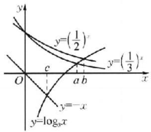

解后反思 1. 我们常常利用数形结合思想解决函数零点、恒成立、存在性、比较大小等问题, 这些问题往往都是难点和热点问题, 所以在平时学习中, 要熟练掌握基本初等函数的图象, 会运用平移、翻转、对称、周期等变换绘制和初等函数有关的函数图象, 同时还需掌握利用单调性和极值、最值等绘制函数的草图.

##### 2. 当研究函数的零点问题或方程的实数根的问题时, 我们经常会将它们转化为两个函数的图象的交点来处理.

##### 8. A 分析: 对条件 $f(a) > f(b)$ 的转化, 一般借助 $f(x)$ 的单调性, 根据题目所给条件可知 $f(x)$ 在 $[2, +\infty)$ 上的单调性, 那么它在 $(-∞, 2]$ 的单调性如何? 又 $f(x+2)$ 为偶函数, 所以可得 $f(x)$ 的图象关于直线 x=2 对称, 接下来问题就好处理了.

因为函数 $f(x + 2)$ 为偶函数，其图象关于 $y$ 轴对称，所以 $f(x)$ 的图象关于直线 $x = 2$ 对称.当 $x\geqslant 2$ 时， $f(x) = \log_{\frac{1}{7}}(x^2 -$ $4x + 7)$ ，由复合函数单调性（同增异减），得 $f(x)$ 在 $[2, + \infty)$ 上单调递减，再由对称性知 $f(x)$ 在 $(-\infty ,2]$ 上单调递增.由 $f(a) > f(b)$ ，得 $|a - 2| <   |b - 2|$ ，所以 $|a - 2|^2 <  |b - 2|^2$ ，即 $a^2 -4a + 4 <   b^2 -4b + 4$ ，化简得 $(a + b - 4)(a - b) <   0.$

##### 9. CD 分析:幂函数比较复杂,研究它的一般顺序.先明确定义域,再判断奇偶性,作出在第一象限的图象,再根据奇偶性补全图象(不具备奇偶性无须补),最后对照图象回答问题.依照此步骤,可得正确答案.

对于 A, $y=\frac{1}{x}$ ，在 $(-∞,0)$ 和 $(0,+∞)$ 上单调递减，不能说在定义域上单调递减，故 A 错误。对于 B, $y=x^{0}, x≠0$ ，图象是直线 y=1 去掉点 $(0,1)$ ，故 B 错误。对于 C, $y=x^{2}$ ，定义域为 R，是偶函数，故 C 正确。对于 D, $y=x^{3}$ ，函数在其定义域上单调递增，故 D 正确。

##### 10. ABD 因为函数 $y = 0.3^x$ 为减函数，所以 $0.5^x < 0.3^y$ ，故 A 正确；因为函数 $y - \lg x$ 为增函数，所以 $\lg a > \lg b$ ，故 B 正确；当 $a > 1 > b > 0$ 时， $\frac{1}{a - 1} > \frac{1}{b - 1}$ ，故 C 错误；因为函数 $y = \sqrt{x}$ 为增函数

数，所以 $\sqrt{a} >\sqrt{b}$ ，故D正确.

##### 11. BD 作出函数 $f(x) = |2^x - 1|$ 的图象如图所示. 若 $c \leqslant 0$ , 则由单调性及 $a < b < c$ , 得 $f(a) > f(b) > f(c)$ 与条件矛盾, 故 $c > 0$ . 若 $a \geqslant 0$ , 则由单调性及 $a < b < c$ , 得 $f(a) < f(b) < f(c)$ 与条件矛盾, 故 $a < 0$ . 由图象可以看出 $b$ 符号不定, 故 A 错误, B 正确. 取 $a = -2, c = \frac{1}{2}$ , 满足 $a < c$ , 但不满足 $2^{-a} < 2^c$ , 所以 C 错误. 因为 $f(a) > f(c)$ , 所以 $|2^a - 1| > |2^c - 1|$ , 得 $1 - 2^a > 2^c - 1$ , 即 $2^a + 2^c < 2$ , 所以 D 正确.

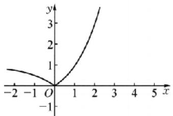

##### 12. $\frac{81}{16}$ 因为 $\log_3\frac{1}{16} = -\log_316, 3^2 < 16 < 3^3$ ，所以 $-3 < \log_3\frac{1}{16} < -2$ ，所以 $f\left(\log_3\frac{1}{16}\right) = f\left(\log_3\frac{1}{16} + 2\right) = f\left(\log_3\frac{1}{16} + 2 + 2\right) = f\left(\log_3\frac{81}{16}\right) = 3^{\log_3\frac{81}{16}} = \frac{81}{16}$ .

##### 13. (4,1)或(6,1). 分析: 函数 $y=\log_{a}(x-5)^{2}+1$ (a>0 且 $a\neq1$ ) 的图象恒过定点, 就应该与参数 a 无关, 注意只有 $\log_{a}1=0$ 时才与参数 a 无关, 所以这里应有 $(x-5)^{2}=1$ .

令 $(x-5)^{2}=1$ ，得x=4或6，此时y=1，所以恒过定点(4,1)或(6,1).

##### 14. $\{x \mid x \geqslant 1\}$ 由函数 $f(x) = x\left(\frac{1}{2^x - a} + \frac{1}{2}\right)$ 定义域为 $(- \infty, 1)\cup (1, + \infty)$ , 可知 $a = 2$ , 所以 $f(x) = x\left(\frac{1}{2^x - 2} + \frac{1}{2}\right)$ , $f(a) = f(2) = 2$ , 由 $a^x \geqslant f(a)$ 可得 $2^x \geqslant 2$ , 则 $x \geqslant 1$ .

# 核心笔记

##### 1. 在研究与指数、对数函数相关的一些复合函数问题时，其基本思想是将它转化为若干个基本初等函数，然后分别来研究相关的基本初等函数的性质，由此得到相应的复合函数的性质。在研究此类问题时，一定要注意函数的定义域的限制作用，否则容易出错。（练习运用：第8题）

##### 2. 影响指数、对数函数的性质的关键在于它的底数. 因此, 在研究与指数、对数函数有关的问题时, 要注意函数的底数的取值. (练习运用: 第3题)

##### 3. 在函数的转化过程中或当研究函数的性质时, 一定要注意定义域优先原则, 否则容易致错; 判断复合函数的单调性, 要弄清由哪些基本初等函数复合而成, 再由“同增异减”作出判断.

##### 4. 一般地，比较数的大小问题，通常由各个数的结构联想到相关的指数函数与对数函数、幂函数的单调性来判断。（练习运用：第6题、第7题、第10题、第11题）

# 考点过关9 函数的图象

##### 1. C 因为 $f(-x) = -f(x)$ ，所以函数是奇函数，排除 D;

当 $x \in \left(0, \frac{\pi}{2}\right)$ 时， $f(x) > 0$ ，当 $x \in \left(\frac{\pi}{2}, \pi\right)$ 时， $f(x) < 0$ ，排除 B: 当 $x \in \left(0, \frac{\pi}{2}\right)$ 时， $\sin 2x \in (0, 1), \frac{1}{8} e^{|x|} \in \left(\frac{1}{8}, \frac{1}{8} e^{\frac{\pi}{2}}\right) \subseteq (0, 1)$ ，所以当 $x \in \left(0, \frac{\pi}{2}\right)$ 时， $f(x) \in (0, 1)$ ，排除 A; C 符合条件.

##### 2. A $y=\log_{3}\sqrt[3]{x-2}=\frac{1}{3}\log_{3}(x-2)$ .

##### 3. A 作出 $y = \log_2(-x)$ 和 $y = x + 1$ 的图象，由图可知满足条件的 $x \in (-1,0)$ .

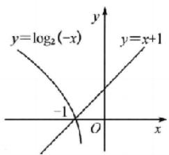

##### 4. C 分析: 此题可正解, 由图①变到图②, 它是保留了图①的左边, 寻去右边, 然后在右边作出左边关于 y 轴对称的图象. 因此图②对应的函数为偶函数, 且它在 $x \leqslant 0$ 时, 图象与图①对应的函数 $f(x)$ 是一致的. 此题亦可用排除法, 通过常见的变换作排除.

由图②知，当 $x < 0$ 时，其函数图象与 $y = f(x)$ 的图象相同；当 $x \geqslant 0$ 时，其函数图象与 $y = f(-x)$ 的图象相同，故 $y = f(-|x|) = \begin{cases} f(-x), & x \geqslant 0, \\ f(x), & x < 0. \end{cases}$

##### 5. C 由题可得函数 $f(x)$ 是奇函数，在 $(- \infty, 0)$ 上单调递减，在 $(0, +\infty)$ 上单调递减，过点 $(2, 0), (-2, 0)$ . 由此作出函数 $y = f(x + 2)$ 的大致图象如图，所以 $xf(x + 2) \leqslant 0$ 的解集为 $(- \infty, -4] \cup [-2, +\infty)$ .

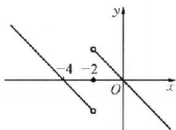

##### 6. B 分析: 掌握函数图象的变换顺序是关键, 这里是 $y = f(x) \rightarrow y = f(x - 1) \rightarrow y = f(|x| - 1)$ .

设 $g(x) = f(|x| - 1) = \log_a(|x| - 1)$ ，则 $g(-x) = f(|-x| - 1) = g(x)$ ，故 $g(x)$ 为偶函数，排除A，D，又由 $g(3) = \log_a2,g\left(\frac{3}{2}\right) = -\log_a2$ ，函数值异号，排除C.

##### 7. C 当 $0 < t \leqslant 2$ 时, $S = \frac{1}{2} t^2$ ; 当 $2 < t \leqslant 4$ 时, $S = \frac{1}{2} t^2 - \frac{1}{2}(2t - 4)^2 = -\frac{3}{2} t^2 + 8t - 8$ . 观察图象可知, $S$ 与 $t$ 之间的函数关系的大致图象是 C.

##### 8. B 分析: 遇到函数难题怎么办, 要多想函数具备怎样的性质, 不难发现函数 $y = f(x)$ 与函数 $y = \frac{x + 1}{x}$ 的图像相关于

点(0,1)对称.因此它们图象的交点也关于点(0,1)对称,下面求值就好办了.

由于 $f(-x)+f(x)=2$ ，所以函数 $y=\frac{x+1}{x}$ 与 $y=f(x)$ 都关于点 $(0,1)$ 对称，不妨设 $x_{1}<x_{2}<\cdots<x_{m}$ ，那么有点 $(x_{1},y_{1})$ 与点 $(x_{m},y_{m})$ ，点 $(x_{2},y_{2})$ 与点 $(x_{m-1},y_{m-1})$ ，…都关于点 $(0,1)$ 对称，即 $x_{1}+x_{m}=x_{2}+x_{m-1}=\cdots=x_{m}+x_{1}=0$ ，且 $y_{1}+y_{m}=y_{2}+y_{m-1}=\cdots-y_{m}+y_{1}=2$ ，倒序相加，可得 $\sum_{i=1}^{m}(x_{i}+y_{i})=\frac{1}{2}\times2m=m$ 。

##### 9. ABD 因为乙比甲早出发 5 min, 由图知乙的速度为 $\frac{1500}{5} = 300 \mathrm{~m} / \mathrm{min}$ , 故选项 A 正确; 设甲的原速度为 $V$ , 由图可知 $25 \times 300 - (25 - 5)V = 2500$ , 解得 $V = 250 \mathrm{~m} / \mathrm{min}$ , 所以 $25 \mathrm{~min}$ 后甲的速度为 $250 \times \frac{8}{5} = 400 \mathrm{~m} / \mathrm{min}$ , 故选项 B 正确; 根据图象知, 当 $x = 86$ 时, 甲到达 B 地, 此时乙距离 B 地还有 $250 \times 20 + 400 \times (86 - 25) - 300 \times 86 = 3600 (\mathrm{~m})$ , 所以还需要 $\frac{3600}{300} = 12 (\mathrm{~min})$ , 所以乙比甲晚 $12 \mathrm{~min}$ 到达 B 地, 故选项 C 错误; 利用甲行驶的路程计算可得, A, B 两地之间的路程为 $250 \times 20 + 400 \times (86 - 25) = 29400 (\mathrm{~m})$ , 故选项 D 正确.

##### 10. CD 作出函数 $f(x)$ 的图象，如图所示，则 $f(x)$ 的值域为 $\mathbf{R}$ ，故A错误；由函数图象知不等式 $f(x) \geqslant 1$ 的解集为 $(-\infty, 0] \cup [2, 4]$ ，故B错误；根据对称性知 $a + b = 2$ ，故C正确；令 $5 - x = 1$ ，得 $x = 4$ ，故 $4 \leqslant c < 5$ ，所以 $a + b + c = 2 + c \in [6, 7)$ ，故D正确.

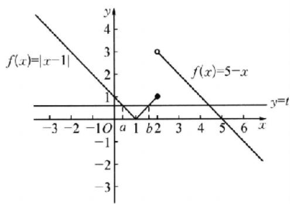

##### 11. BD 函数 $y=2^{x}, y=3^{x}, y=-x$ 在同一坐标系中的图象如图所示，所以 -1<a<b<0，所以 $2^{a}<2^{b}, 3^{a}<3^{b}, 0<-b<-a$ ，所以 $-b\cdot2^{a}<(-a)\cdot2^{b}, -b\cdot3^{a}<(-a)\cdot3^{b}$ ，所以 $a\cdot2^{b}<b\cdot2^{a}, b\cdot3^{c}>a\cdot3^{b}$ .

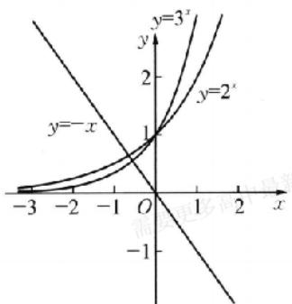

##### 12. $(- \pi, -1) \cup (1, \pi)$ 根据题意，在 $(0, 4]$ 上，当 $0 < x < 1$ 时，

$f(x) > 0$ ，当 $1 < x < 4$ 时， $f(x) < 0$ ，又 $f(x)$ 是定义在 $[-4, 4]$ 上的奇函数，所以当 $-1 < x < 0$ 时， $f(x) < 0$ ，当 $-4 < x < -1$ 时， $f(x) > 0$ 。对于 $g(x) = \sin x$ ，当 $0 < x < \pi$ 时， $g(x) > 0$ ，当 $\pi < x < 4$ 时， $g(x) < 0$ ，当 $-\pi < x < 0$ 时， $g(x) < 0$ ，当 $-4 < x < -\pi$ 时， $g(x) > 0$ ，所以 $f(x) \sin x < 0$ ，即 $\left\{ \begin{array}{l} f(x) > 0, \\ \sin x < 0 \end{array} \right.$ 或 $\left\{ \begin{array}{l} f(x) < 0, \\ \sin x > 0, \end{array} \right.$ 则 $f(x) \sin x < 0$ 在区间 $[-4, 4]$ 上的解集为 $(- \pi, -1) \cup (1, \pi)$ 。

##### 13. 24 分析: 由题设可得 $f(x)$ 的周期为 8, 且是关于直线 $x = 2$ 对称的奇函数, 结合区间单调性判断 $f(x)$ 在 $[0, 12]$ 上的单调性, 根据 $f(x)$ 的图象与直线 $y = m$ 有 4 个交点, 及函数的对称性求实数根的和.

由 $f(x + 2)$ 为偶函数知 $f(-x + 2) = f(x + 2)$ ，故 $f(-x) = f(x + 4)$ . 又 $f(x)$ 是定义在 $\mathbf{R}$ 上的奇函数，所以 $f(x) = -f(-x)$ ，所以 $f(x) = -f(x + 4)$ ，故 $f(x + 4) = -f(x + 8)$ ，即有 $f(x) = f(x + 8)$ . 综上所述， $f(x)$ 的周期为 8，且是关于直线 $x = 2$ 对称的奇函数，由 $f(x)$ 在 $[0, 2]$ 上单调递减，结合上述分析知 $f(x)$ 在 $[2, 6]$ 上单调递增，在 $[6, 10]$ 上单调递减，在 $[10, 12]$ 上单调递增，所以 $f(x)$ 在 $[0, 12]$ 上的大致图象如图所示：

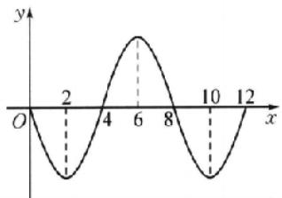

要使 $f(x)=m$ 在 $[0,12]$ 上恰好有 4 个不同的实数根，即 $f(x)$ 的图象与直线 y=m 有 4 个交点，所以必有两对交点分别关于直线 x=2, x=10 对称，则 $x_{1}+x_{2}+x_{3}+x_{4}=24$ .

##### 14. 1, -1(答案不唯一) 当 $x \leqslant x_1$ 时, $f(x) = -a(x - x_1) - b(x - x_2) = -(a + b)x + (ax_1 + bx_2)$ , 由题图可知 $\left\{ \begin{array}{ll} a + b = 0 & ①, \\ ax_1 + bx_2 < 0 & ②; \end{array} \right.$ 当 $x_1 < x < x_2$ 时, $f(x) = a(x - x_1) - b(x - x_2) = (a - b)x - ax_1 + bx_2$ , 由题图可知 $\left\{ \begin{array}{ll} a - b > 0 & ③, \\ -ax_1 + bx_2 < 0 & ④; \end{array} \right.$ 当 $x \geqslant x_2$ 时, $f(x) = a(x - x_1) + b(x - x_2) = (a + b)x - (ax_1 + bx_2)$ , 由题图又可得出 ① ② 两式, 由 ① 和 ③ 两式可得 $a = -b > 0$ , 此时 ② 和 ④ 均成立. 故可取 $a = 1$ , $b = -1$ (注: 答案不唯一, 满足 $a > 0$ 且 $a + b = 0$ 即可)

# 核心笔记

##### 1. 已知图象写解析式与已知解析式选图象方法一样，往往从函数性质（定义域、值域、单调性、奇偶性、周期性、对称性、极值或最值等）和特征点入手。由函数的定义域，判断图象的左、右位置；由函数的值域，判断图象的上、下位置；由函数的单调性，判断图象的变化趋势；由函数的奇偶性，判断图象的对称性；由函数的周期性，判断图象的循环往复；由函数的特征点，排除不合要求的图象。（练习运用：第1题、第7题）

##### 2. 要清楚知道 $y = f(|x|), y = |f(x)|, y = f(x - a)$ 的图象与

$y=f(x)$ 的图象之间的关系。(练习运用:第4题、第6题)

##### 3. 函数图象的应用: （1） 研究函数性质时, 一般要借助函数的图象, 体现了数形结合思想; （2） 有些不等式问题常转化为两函数图象的上、下关系来解决; （3） 方程解的问题常化为两基础函数图象的交点个数问题来解决, (练习运用: 第 10 题、第 11 题、第 13 题)

# 考点过关10 函数与方程

##### 1. C $f(x)=2^{x}, g(x)=x^{2}, f(1.8)=3.482, g(1.8)=3.24,$ $f(2.2)=4.595,\quad g(2.2)=4.84.$ 令 $h(x)=2^{x}-x^{2}$ ，则 $h(1.8)>0,h(2.2)<0.$

##### 2. C 分析: 确定函数 $f(x)=\mathrm{e}^{x}+4x-3$ 的零点所在区间有两种方法. 一是直接研究该函数的单调性, 并运用函数零点存在性定理; 二是转化为研究函数 $g(x)=\mathrm{e}^{x}$ 与 $h(x)=3-4x$ 的图象交点的横坐标所在区间, 结合选项和图象作选择, 有时后一种方法更简便, 通常构造的两个函数图象是“一直线和一曲线”.

因为 $f\left(\frac{1}{4}\right) = \mathrm{e}^{\frac{1}{4}} - 2 < 0, f\left(\frac{1}{2}\right) = \mathrm{e}^{\frac{1}{2}} - 1 > 0$ ，所以 $f\left(\frac{1}{4}\right) \cdot f\left(\frac{1}{2}\right) < 0.$ 又因为 $y = \mathrm{e}^{x}$ 是单调递增， $y = 4x - 3$ 也是单调递增，所以 $f(x) = \mathrm{e}^{x} + 4x - 3$ 是单调递增，所以函数 $f(x) = \mathrm{e}^{x} + 4x - 3$ 的零点在区间 $\left(\frac{1}{4}, \frac{1}{2}\right)$ 内.

# 方法突破 判断函数零点所在区间的方法

判断函数在某个区间上是否存在零点,要根据具体题目灵活处理,当能直接求出零点时,就直接求出进行判断;当不能直接求出时,可根据函数零点存在性定理判断;当用函数零点存在性定理也无法判断时可画出图象判断.

##### 3. D 因为函数 $y = f(x) - \log_x x$ 恰有 4 个零点，所以函数 $f(x)$ 的图象与函数 $y = \log_x x$ 的图象恰有 4 个交点。因为 $f(1 - x) = f(1 + x)$ ，所以 $f(x)$ 的图象关于直线 $x = 1$ 对称。因为 $f(x)$ 为偶函数，且当 $x \in [0,1]$ 时， $f(x) = 2^x - 1$ ，所以 $f(x)$ 的部分图象如图所示。

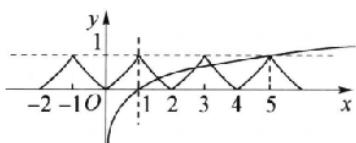

结合图象可得函数 $y=\log_{a}x$ 的图象经过点(5,1)，则 $1=\log_{a}5$ ，解得 a=5.

##### 4. C 函数 $y=x-\frac{1}{x}$ 与函数 y=kx-1 的图象存在唯一的公共点 $A(x_{0},y_{0})$ ，所以方程 $x-\frac{1}{x}=kx-1$ 有唯一的根，显然 $x\neq0$ ，故方程可化为 $(1-k)x^{2}+x-1=0$ 。当 k=1 时，方程有唯一的根 1，所以公共点坐标为 $A(1,0)$ ；当 $k\neq1$ 时，由 $\Delta=1+4(1-$

$k)=0$ , 得 $k=\frac{5}{4}$ , 此时方程只有一个根, 联立 $\left\{\begin{aligned}y &= x - \frac{1}{x}, \\ y &= \frac{5}{4}x - 1,\end{aligned}\right.$ 解得

$\left\{ \begin{array}{l} x = 2, \\ y = \frac{3}{2}, \end{array} \right.$ 所以公共点坐标为 $A\left(2, \frac{3}{2}\right)$ . 当公共点为 $A(1,0)$ 时，由三角函数定义可得 $\sin \theta = 0$ ；当公共点为 $A\left(2, \frac{3}{2}\right)$ 时，由三角函数定义可得 $\sin \theta = \frac{y}{r} = \frac{3}{5}$ .

##### 5. D 分析: 令 $f(x)=5x^{2}-7x-m$ ，根据零点的范围得到 m 满足的条件，解不等式组可得结果.

令 $f(x) = 5x^{2} - 7x - m$ ，由题意，得 $\left\{ \begin{array}{l} f(-1) > 0, \\ f(0) < 0, \\ f(2) < 0, \\ f(3) > 0, \end{array} \right.$ 即

$\left\{ \begin{array}{l}12 - m > 0,\\ -m <   0,\\ 6 - m <   0,\\ 24 - m > 0, \end{array} \right.$ 解得 $6 <   m <   12$ ，故 $m$ 的取值范围是(6，12).四个选

项中在(6,12)上的只有 $\frac{13}{2}$ .

##### 6. C 当 $x \in [0,1]$ 时， $f(x) = x^2$ ，当 $x \in [-1,0]$ 时， $-x \in [0,1]$ ，则 $f(-x) = (-x)^2 = x^2$ ，又 $f(x)$ 是偶函数，则 $f(-x) = f(x)$ ，所以当 $x \in [-1,0]$ 时， $f(x) = x^2$ ，又 $f(x) = f(2 - x)$ ，所以 $f(x)$ 的周期 $T = 2$ ，其在区间 $[-1,7]$ 上的图象如图所示。

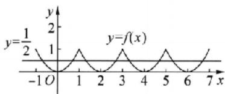

不妨设 $y = f(x)$ 与 $y = \frac{1}{2}$ 在区间 $[-1,7]$ 上的交点分别为 $x_{1},x_{2},x_{3},x_{4},x_{5},x_{6},x_{7},x_{8}$ ，由图可知， $(x_{1} + x_{2}) + (x_{3}+$ $x_{4}) + (x_{5} + x_{6}) + (x_{7} + x_{8}) = 0 + 4 + 8 + 12 = 24$ ，则方程 $f(x) =$ $\frac{1}{2}$ 在[-1,7]上所有的实数根之和为24.

##### 7. C 因为定义在 R 上的偶函数 $f(x)$ 满足 $f(2+x)=f(-x)$ ，所以 $f(2+x)=f(-x)=f(x)$ ，即函数为周期函数，周期为 2.

分析:由题知函数 $f(x)$ 的周期为 2, 再结合 $y=f(x)$ 与 y=kx 有 3 个交点, 进而作出函数图象, 数形结合求解.

因为当 $x \in [0,1]$ 时， $f(x) = 2^x - 1$ ，所以作出其图象如图所示，因为函数 $F(x) = f(x) - kx$ 在 $(-2,2)$ 上恰有三个零点，所以 $y = f(x)$ 与 $y = kx$ 有3个交点。当 $k > 0$ 时，设直线 $l_1$ 是 $y = f(x)$ 在原点处的切线，此时直线 $l_1$ 与 $y = f(x)$ 有2个交点。当直线 $l_2$ 过点 $(1,1)$ 时，直线 $l_2$ 与 $y = f(x)$ 有2个交点，此时直线 $l_2$ 的斜率为1。因为当 $x \in [0,1]$ 时， $f'(x) = 2^x \ln 2, f'（0） = 2^0 \ln 2 = \ln 2$ ，即直线 $l$ 的斜率为 $\ln 2$ ，所以要使 $y - f(x)$ 与 $y = kx$ 有3个交点，则 $\ln 2 < k < 1$ 。当 $k < 0$ 时，由对称性可知 $-1 < k < -\ln 2$ 也满足题意。所以实数 $k$ 的取值范围是 $(-1, -\ln 2) \cup (\ln 2, 1)$ 。

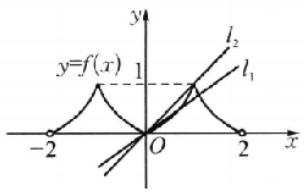

##### 8. C 分析: 一般地, 研究函数零点或方程根的个数, 需要借助函数的图象, 充分利用数形结合的思想, 将问题转化为求函数图象交点的个数, 所以精准作出函数 $f(x)$ 的图象是解题的关键, 而且这里涉及函数的嵌套. 因此需要两次利用函数 $f(x)$ 的图象, 第一次是 $f(t)=m$ , 第二次是 $f(x)=t$ , 另外还涉及对 $m$ 的讨论, 分 $m<0, m=0, 0<m<1, m=1, 1<m<2, m \geqslant 2$ 六种情况讨论, 同时结合函数图象即可得解.

$f(x)=\left\{\begin{aligned}&x+\frac{1}{x-1}-2,&x>1,\\ &2-2^{x},&x\leqslant1.\end{aligned}\right.$ 当 $x\leqslant1$ 时， $f(x)=2-2^{x}$ ，函数 $f(x)$ 在 $(-∞,1]$ 上单调递减，且 $f(1)=0,f(0)=1$ ，当x趋近于 $-∞$ 时， $f(x)$ 趋近于2。当x>1时， $f(x)=x+\frac{1}{x-1}-2$ ，则 $f'(x)=1-\frac{1}{(x-1)^{2}}=\frac{x(x-2)}{(x-1)^{2}}$ ，所以当1<x<2时， $f'(x)<0$ ，当x>2时， $f'(x)>0$ ，所以 $f(x)$ 在 $(1,2)$ 上单调递减，在 $(2,+∞)$ 上单调递增，且 $f(2)=1$ ，可得 $f(x)$ 的大致图象如图：

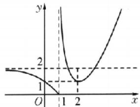

令 $t = f(x)$ ，则 $f[f(x)] = m$ ，即为 $f(t) = m$ 。（1）当 $m < 0$ 时， $f(t) = m$ 无解，则 $f[f(x)] = m$ 无解，不符合题意；（2）当 $m = 0$ 时， $f(t) = m = 0$ ，解得 $t = 1$ ，由图可知 $f(x) = 1$ ，则有 $x = 0$ 或 $x - 2$ 两解，即 $f[f(x)] = m$ 有两个解，不符合题意；（3）当 $0 < m < 1$ 时， $f(t) = m$ 有一解，且 $0 < t < 1$ ，又 $f(x) = t$ 有一个解，所以 $f[f(x)] = m$ 有一个解，不符合题意；（4）当 $m = 1$ 时， $f(t) = m = 1$ 有两个解，即 $t_1 = 0$ 或 $t_2 = 2$ ，又 $f(x) = t_1 = 0$ ，有一个解， $f(x) = t_2 = 2$ 有两个解，所以 $f[f(x)] = m$ 共有三个解，不符合题意；（5）当 $1 < m < 2$ 时， $f(t) = m$ 有三个解，即 $t_3 < 0, 1 < t_4 < 2, t_5 > 2, f(x) = t_3 < 0$ 无解， $f(x) = t_4$ 有三个解， $f(x) = t_5$ 有两个解，所以 $f[f(x)] = m$ 共有五个解，符合题意；（6）当 $m \geqslant 2$ 时， $f(t) = m$ 有两个解，即 $1 < t_6 < 2, t_7 > 2, f(x) = t_6$ 有三个解， $f(x) = t_7$ 有两个解，所以 $f[f(x)] = m$ 共有五个解，符合题意。综上， $m$ 的取值范围是 $(1, +\infty)$ 。

解后反思 本题的解答集中体现了数形结合和分类讨论的思想，在分类讨论时需做到不重不漏。

易错警示 函数 $f(x)$ 在 $(- \infty, 1]$ 上的图象是以 $y = 2$ 为渐近线的，这一点不能忽略.

##### 9. ACD 能用二分法求零点的前提是零点左、右的函数值符号

相反，故 A, C, D 正确.

##### 10. ABD 对于 A, 设 $f(x)=\ln x+x-1$ , 易知 $y=f(x)$ 为单调递增, 又 $f(1)=0$ , 故 $\ln x=1-x$ 有唯一解, 符合. 对于 B, 设 $g(x)=\mathrm{e}^{x}-\frac{1}{x}$ , 易知 $y=g(x)$ 为增函数, 又 $g\left(\frac{1}{2}\right)=\sqrt{\mathrm{e}}-2<0$ , $g(1)=\mathrm{e}-1>0$ . 由零点存在性定理得 $e^{x}=\frac{1}{x}$ 有唯一解, 符合. 对于 C, 设 $h(x)=x^{2}+\lg x-2$ , 易知 $y=h(x)$ 为增函数. 又 $h(1)=1-2<0$ , $h(2)=2+\lg 2>0$ , 由函数零点存在定理可得 $h(x)=x^{2}+\lg x-2$ 有唯一零点. 又 $H(x)=x^{2}+\lg |x|-2$ 为偶函数, 则 $2-x^{2}=\lg |x|$ 有两个解, 不符合. 对于 D, 因为 $\cos x\in[-1,1]$ , $|x|+1\geqslant1$ , 当且仅当 x=0 时, $\cos x=|x|+1$ , 即 $\cos x=|x|+1$ 有唯一解, 符合.

##### 11. ABC 由 $f^2(x) - mf(x) + m - 1 = 0$ ，可得 $f(x) = 1$ 或 $f(x) = m - 1$ ，函数 $f(x)$ 的图象如图所示.

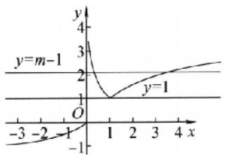

当 $0 < m - 1 \leqslant 1$ 或 $m - 1 \leqslant -1$ ，即 $1 < m \leqslant 2$ 或 $m \leqslant 0$ 时，方程 $f^2(x) - mf(x) + m - 1 = 0$ 只有一个实数根；当 $m - 1 > 1$ ，即 $m > 2$ 时，方程 $f^2(x) - mf(x) + m - 1 = 0$ 有三个实数根；当 $-1 < m - 1 \leqslant 0$ ，即 $0 < m \leqslant 1$ 时，方程 $f^2(x) - mf(x) + m - 1 = 0$ 有两个实数根。

##### 12. $\left[-\frac{1}{4}, 2\right]$ 令 $2^{x} = t, t \in \left[\frac{1}{2}, 2\right]$ , 则函数 $f(x)$ 在区间 $[-1, 1]$ 上有零点, 转化为方程 $t^{2} - t - a = 0$ 在 $t \in \left[\frac{1}{2}, 2\right]$ 时有解, 进而转化为求 $a = t^{2} - t, t \in \left[\frac{1}{2}, 2\right]$ 的值域问题. 易知 $a = \left(t - \frac{1}{2}\right)^{2} - \frac{1}{4}, t \in \left[\frac{1}{2}, 2\right]$ 为单调递增, 当 $t = \frac{1}{2}$ 时, $a_{\min} = -\frac{1}{4}$ ; 当 $t = 2$ 时, $a_{\max} = 2$ .

# 方法突破 已知函数有零点(方程有根)求参数取值范围的常用方法

（1） 直接法: 直接根据题设条件构建关于参数的不等式, 再通过解不等式确定参数范围.  
（2） 分离参数法: 先将参数分离, 转化为求函数值域问题来解决.  
（3） 数形结合法: 先对解析式变形, 在同一直角坐标系中, 画出函数的图象, 然后数形结合求解.

##### 13. $(x - 1)^2$ (答案不唯一) 由函数 $f(x)$ 的图象在区间(0,2)上连续不断，且“若 $f(x)$ 在区间(0,2)上存在零点，则 $f(0) \cdot f(2) < 0$ ”为假命题，可知函数 $f(x)$ 在(0,2)上存在零点，且$f(0) \cdot f(2) \geqslant 0$ ，所以满足题意的函数解析式可以为 $f(x)=(x-1)^{2}$

##### 14. $-\frac{7}{5} - \frac{11}{8}$ 已知 $f(x) = x^3 + 2x^2 + 3x + 3$ ，则 $f'(x) = 3x^2 + 4x + 3$ 。迭代1次后， $x_1 = -1 - \frac{f(-1)}{f'(-1)} = -1 - \frac{1}{2} = -\frac{3}{2}$ ，迭代2次后， $x_2 = -\frac{3}{2} - \frac{f\left(-\frac{3}{2}\right)}{f'\left(-\frac{3}{2}\right)} = -\frac{3}{2} - \frac{-\frac{3}{8}}{\frac{15}{4}} =$   
$-\frac{7}{5}$ . 用二分法计算第1次，区间 $(-2, -1)$ 的中点为 $-\frac{3}{2}$ ， $f\left(-\frac{3}{2}\right) = -\frac{3}{8} < 0, f(-1)f\left(-\frac{3}{2}\right) < 0$ ，所以近似解在 $\left(-\frac{3}{2}, -1\right)$ 上；用二分法计算第2次，区间 $\left(-\frac{3}{2}, -1\right)$ 的中点为 $-\frac{5}{4}, f\left(-\frac{5}{4}\right) = \frac{27}{64} > 0, f\left(-\frac{3}{2}\right)f\left(-\frac{5}{4}\right) < 0$ ，所以近似解在 $\left(-\frac{3}{2}, -\frac{5}{4}\right)$ 上，取其中点值 $-\frac{11}{8}$ ，所求近似解为 $-\frac{11}{8}$ .

# 核心笔记

##### 1. 确定零点所在区间的方法: （1） 解方程, 直接求零点, 令 $f(x)=0$ , 方程易解时, 可直接求解, 再看求得的解是否落在给定的区间上; （2） 利用零点存在定理; （3） 数形结合, 通过画函数的图象, 观察图象与 $x$ 轴在给定区间上是否有交点来判断. (练习运用: 第1题、第2题)  
##### 2. 已知函数有零点(方程有根)求参数取值范围的常用方法:（1） 直接法, 直接根据题设条件构建关于参数的不等式, 再通过解不等式确定参数范围;（2） 分离参数法, 先将参数分离, 转化为求函数值域或最值问题来解决;（3） 数形结合法, 先对解析式变形, 在同一直角坐标系中, 画出函数的图象, 然后利用数形结合求解。(练习运用: 第3题、第7题、第8题、第12题)

# 考点过关11 函数的综合应用

##### 1. B 分析: 对分式函数 $y=\frac{ax+b}{cx+d}$ 有关图象和性质的研究, 将函数 $y=\frac{ax+b}{cx+d}$ 重新表示为 $y=\frac{a}{c}+\frac{bc-ad}{c(cx+d)}$ 是关键, 这种方法称为分子常数化、分离常数法.

用分离常数法. $y = \frac{2(x - 3) + 7}{x - 3} = 2 + \frac{7}{x - 3}$ ，所以 $\frac{7}{x - 3} \neq 0$ ，所以 $y \neq 2$ .

##### 2. D 当 $x = 0$ 时, $y = \log_a \frac{1}{a} = -1$ . 当 $0 < a < 1$ 时, 如图 1, 函数图象过第二、三、四象限; 当 $a > 1$ 时, 如图 2, 函数图象过第一、三、四象限. 所以函数 $y = \log_a \left( x + \frac{1}{a} \right)$ 的图象一定经过第三、四象限.

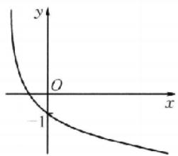

图1

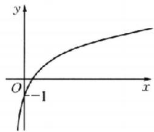

图2

##### 3. B 分析: 不论是由函数选图象, 还是由图象选函数, 函数图象的特征与性质是对应的, 定义域和值域决定图象在坐标系中的分布位置, 单调性决定图象的升降变化趋势, 奇偶性决定图象的对称性, 最值决定图象的最(低)高点, 函数的零点和截距决定图象与两坐标轴的交点等等, 做题时往往从最明显的特征开始, 如奇偶性, 并结合排除法.

因为 $y = f(x) = \frac{x\ln|x|}{|x|}$ 的定义域为 $(- \infty, 0) \cup (0, +\infty)$ ，关于原点对称。当 $x > 0$ 时， $f(x) = \frac{x\ln|x|}{|x|} = \frac{x\ln x}{x} = \ln x$ ，则 $-x < 0$ ， $f(-x) = \frac{-x\ln|-x|}{|-x|} - \frac{-x\ln x}{x} = -\ln x$ ，所以 $f(-x) = -f(x)$ ，因此函数在定义域内是奇函数。

##### 4. B 因为 $f(x)$ 是定义在 $\mathbb{R}$ 上的奇函数，当 $x > 0$ 时， $f(x) = -x^2 + x$ ，所以当 $x < 0$ 时， $f(x) = -f(-x) = -(-x^2 - x) = x^2 + x$ ，且 $f(0) = 0$ . 当 $x > 0$ 时，由 $f(x) = -x^2 + x > 0$ 得 $x \in (0,1)$ ，由 $f(x) = -x^2 + x < 0$ 得 $x \in (1, +\infty)$ ; 当 $x < 0$ 时，由 $f(x) = x^2 + x > 0$ 得 $x \in (-\infty, -1)$ ，由 $f(x) = x^2 + x < 0$ 得 $x \in (-1,0)$ . 由 $(x - 1)f(x) > 0$ 得 $\left\{ \begin{array}{l} x - 1 > 0, \\ f(x) > 0 \end{array} \right.$ 或 $\left\{ \begin{array}{l} x - 1 < 0, \\ f(x) < 0. \end{array} \right.$ 当 $\left\{ \begin{array}{l} x - 1 > 0, \\ f(x) > 0 \end{array} \right.$ 时，无解；当 $\left\{ \begin{array}{l} x - 1 < 0, \\ f(x) < 0 \end{array} \right.$ 时， $x \in (-1,0)$ .  
##### 5. C 由对数函数 $y = \log_6 x$ 单调递增知 $\log_6 0.5 < \log_6 0.7 < 0$ , A 错误; 由指数函数 $y = 0.6^x$ 单调递减知 $0 < 0.6^{0.6} < 0.6^{0.5} < 1$ , D 错误; 而 $0 < 0.6^{0.5} < 1 < \log_{0.6} 0.5$ , 故 B 错误; 而 $\log_6 0.6 > \log_6 0.5 > \log_6 0.5$ , C 正确.  
##### 6. C 分析: 此题最终需比较的是 $\log_{2}6, \log_{3}27, \left(\frac{1}{2}\right)^{-0.6}$ ，但他们又不能直接比较，此时就需要考虑找媒介，并用估值法.

因为 $\log_26\in (2,3),\log_327 = 3,\left(\frac{1}{2}\right)^{-0.6} = 2^{0.6}\in (1,2)$ ，所以 $\left(\frac{1}{2}\right)^{-0.6} <   \log_26 <   \log_327.$ 因为 $f(x)$ 是偶函数，所以 $a =$ $f(-\log_26) = f(\log_26).$ 因为 $\left(\frac{1}{2}\right)^{-0.6} <   \log_26 <   \log_327,$ 且 $f(x)$ 在 $(- \infty ,0)$ 上单调递减，所以 $f(x)$ 在 $(0, + \infty )$ 上单调递增，所以 $c <   a <   b$

##### 7. A 对于选项 A, 若 $x = \frac{m}{n}$ 是有理数, 则 $1 - x = \frac{n - m}{n}$ 也为有理数, 则 $f\left(\frac{m}{n}\right) - \frac{1}{n} - f\left(\frac{n - m}{n}\right)$ , 若 $x$ 为无理数, 则 $1 - x$ 也为无理数, 即 $f(x) = f(1 - x) = 1$ , 所以 $f(x)$ 的图象关于直线 $x -$ $\frac{1}{2}$ 对称，故A正确；对于选项B,C，由题意知 $f\left(\sqrt{2} -\frac{1}{2}\right) =$ $f\left(-\sqrt{2} +\frac{3}{2}\right) = 1$ ，显然 $f(x)$ 的图象不关于点 $\left(\frac{1}{2},\frac{1}{2}\right)$ 对称，而 $0 <   - \sqrt{2} +\frac{3}{2} <  \sqrt{2} -\frac{1}{2} <  1$ ，故B,C错误；对于选项D，若 $x$ 为有理数，则 $f(x) = \frac{1}{n}$ 显然函数 $f(x)$ 无最小值，故D错误.

解后反思 抽象函数可以适当选取特殊值验证选项,从而提高解题速度,而验证 $f(x)$ 的图象关于直线 $x=\frac{1}{2}$ 对称时,要根据对称性的定义 $f(x)=f(1-x)$ 判断,需注意讨论 x 为有理数和无理数两种情形.

##### 8. B 分析: 此题有点难, 若抓住单调递增和对任意 $n \in N$ , $f(n) \in N$ 等关键点, 则结合夹逼思想和反证法就能解决.

$\forall n \in \mathbb{N}$ , 有 $f[f(n)] = 3n$ , 令 $f(1) = a > f(0)$ , 则 $a \geqslant 1$ , 显然 $a \neq 1$ , 否则 $f[f(1)] = f(1) = 1$ , 与 $f[f(1)] = 3$ 矛盾, 从而 $a > 1$ . 由 $f[f(1)] = 3$ , 得 $f(a) = 3, f(a) > f(1) = a$ , 即 $a < 3$ , 于是 $1 < a < 3$ , 且 $a \in \mathbb{N}$ , 所以 $a = 2$ , 所以 $f(1) = 2, f[f(1)] = f(2) = 3$ . 因为 $f[f(2)] = f(3) = 6$ , 所以 $f[f(3)] = f(6) = 9$ , 于是 $f(4) = 7, f(5) = 8$ . 因为 $f[f(4)] = f(7) = 12$ , 所以 $f[f(7)] = f(12) = 21$ . 因为 $f[f(6)] = f(9) = 18$ , 所以 $f(10) = 19, f(11) = 20$ . 因为 $f[f(9)] = f(18) = 27, f[f(10)] = f(19) = 30$ , 所以 $f[f(18)] = f(27) = 54, f[f(19)] = f(30) = 57$ , 所以 $f(28) = 55, f(29) = 56$ .

##### 9. ACD 由所给的函数值的表格可以看出, x=2 与 x=3 这两个数字对应的函数值的符号不同, 即 $f(2) \cdot f(3) < 0$ .

##### 10. AD $f(x)=\frac{2^{x}-1}{2^{x}+1}=1-\frac{2}{2^{x}+1}$ . 对于 A, $|f(x)|=$ $\left|1-\frac{2}{2^{x}+1}\right|<\frac{1}{3}$ ，即 $\left\{\begin{aligned}&1-\frac{2}{2^{x}+1}<\frac{1}{3},\\ &1-\frac{2}{2^{x}+1}>-\frac{1}{3},\end{aligned}\right.$ 解得 -1<x<1，故 A

正确；对于B，因为 $f(x) = \frac{2^x - 1}{2^x + 1}$ ，所以 $f(-x) = \frac{2^{-x} - 1}{2^{-x} + 1} = \frac{1 - 2^x}{1 + 2^x} = \frac{2^x - 1}{2^x + 1} = -f(x)$ ，故B错误；对于C，由 $f(x) = 1 - \frac{2}{2^x + 1}$ ，得 $f'(x) = \frac{2\ln 2 \cdot 2^x}{(2^x + 1)^2} > 0$ ，所以函数 $f(x)$ 是R上的增函数，故C错误；对于D，因为 $f(x) = 1 - \frac{2}{2^x + 1}$ ，又 $2^x > 0$ ，所以 $f(x) = 1 - \frac{2}{2^x + 1} < 1$ ，同时 $f(x) = 1 - \frac{2}{2^x + 1} > 1 - \frac{2}{0 + 1} = -1$ ，即函数 $f(x)$ 的值域为 $(-1, 1)$ ，故D正确.

##### 11. ABC 对任意 $x, y \in \mathbb{R}$ , 恒有 $f(x + y) = f(x)f(y)$ , 令 $x = 1, y = 0$ , 可得 $f(1 + 0) = f(1)f(0)$ , 因为当 $x > 0$ 时, $f(x) > 2022$ , 所以 $f(1) > 2022$ , $f(0) = 1$ , 令 $y = -x$ , 可得 $f(0) = f(x - x) = f(x)f(-x) - 1$ , 所以 $f(-x) = \frac{1}{f(x)}$ , 当 $x < 0$ 时, $-x > 0$ , 根据已知条件得 $f(-x) > 2022$ , 即 $\frac{1}{f(x)} > 2022$ , 所

$\text { 以 } 0 <   f (x) <   \frac {1}{2 0 2 2}.$

方法突破 抽象函数指没有给出函数的具体解析式, 只给出一些体现函数特征的式子的一类函数. 求解方法: ① 尽可能把抽象函数与我们所学的具体模型联系起来, 如 $f(x + y) = f(x) + f(y)$ 的原型函数为 $y = kx$ ; $f(xy) = f(x) + f(y)$ 的原型函数为 $y = \log_a x (a > 0, a \neq 1)$ ; $f(x + y) = f(x) \cdot f(y)$ 的原型函数为 $y = a^x (a > 0, a \neq 1)$ . ② 可通过赋特殊值法使问题得以解决.

##### 12. [0,8] 由题意得 $ax^2 - ax + 2 \geqslant 0$ 恒成立. 当 $a = 0$ 时， $2 \geqslant 0$ 恒成立，满足题意；当 $a \neq 0$ 时， $\left\{ \begin{array}{l} a > 0, \\ a^2 - 8a \leqslant 0, \end{array} \right.$ 解得 $0 < a \leqslant 8$ . 综上， $0 \leqslant a \leqslant 8$ .

##### 13.2 因为函数 $f(x) = 3^{[2]}$ 的定义域为 $[a, b]$ ，值域为 $[1, 9]$ ，又 $3^0 = 1, 3^2 = 3^{[2]} = 9$ ，所以 $0 \in [a, b]$ ，2和-2至少有一个属于区间 $[a, b]$ ，故区间 $[a, b]$ 的长度最小时为 $[-2, 0]$ 或 $[0, 2]$ ，即区间 $[a, b]$ 长度的最小值为2.

##### 14. 4 $[4, +\infty)$ 依题意得 $g(-\ln 2) = -g(\ln 2)$ ，因为 $\ln 2 > 0$ ，所以 $-( -\ln 2) - 2\ln 2 = -\ln (a - e^{\ln 2})$ ，即 $-\ln 2 = -\ln (a - 2)$ ，所以 $2 = a - 2$ ，解得 $a = 4$ 。若 $g(x)$ 为“ $\omega$ 函数”，则在定义域内存在 $x_0(x_0 \neq 0)$ 使得 $g(-x_0) = -g(x_0)$ 。不妨设 $x_0 > 0$ ，则 $-( -x_0) - 2\ln 2 = -\ln (a - e^{x_0})$ ，即 $-\ln (4e^{-x_0}) = -\ln (a - e^{x_0})$ ，所以 $a = e^{x_0} + 4e^{-x_0} = e^{x_0} + \frac{4}{e^{x_0}}$ 。因为 $x_0 > 0$ ，所以 $e^{x_0} > 1, e^{x_0} + \frac{4}{e^{x_0}} \geqslant 2\sqrt{e^{x_0} \times \frac{4}{e^{x_0}}} = 4$ ，当且仅当 $e^{x_0} = 2$ ，即 $x_0 = \ln 2 > 0$ 时，等号成立，所以 $a \geqslant 4$ ，所以实数 $a$ 的取值范围是 $[4, +\infty)$ 。

解后反思 第二空的本质就是函数 $y=-x+2\ln2$ 的图象与 $y=\ln(a-c^{x})(x>0)$ 的图象有交点.

# 核心笔记

##### 1. 函数零点个数的判断方法：（1） 直接求零点，令 $f(x)=0$ ，如果能求出解，那么有几个解就有几个零点；（2） 零点存在性定理，利用定理不仅要求函数在区间 $[a,b]$ 上是连续不断的曲线，且 $f(a)f(b)<0$ ，还必须结合函数的图象与性质（如单调性、奇偶性）才能确定函数有多少个零点；（3） 利用图象交点的个数，画出两个函数的图象，看其交点的个数，其中交点的横坐标有几个不同的值，就有几个不同的零点。

##### 2. 周期与对称的关系: （1） 若 $f(x)$ 的图象有两条对称轴 x=a 和 $x=b(a\neq b)$ ，则 $f(x)$ 为周期函数， $2|b-a|$ 为一个周期.
（2） 若 $f(x)$ 的图象有两个对称中心 $(a,0)$ 和 $(b,0)$ $(a\neq b)$ ，则 $f(x)$ 为周期函数， $2|b-a|$ 为一个周期。（3） 若 $f(x)$ 的图象有一条对称轴 x=a 和一个对称中心 $(b,0)$ $(a\neq b)$ ，则 $f(x)$ 为周期函数， $4|b-a|$ 为一个周期。(练习运用: 第7题)

# 阶段温习二 考点 1\~11

##### 1. B 集合 $A = \{x^1 2x^2 + x - x < 0\} \left\{x \mid -1 < x < \frac{1}{2}\right\}$ . 因为 $x^2 + 1 \geqslant 1$ , 所以 $\lg (x^2 + 1) \geqslant 0$ , 所以集合 $B = \{y | y - \lg (x^2 +$

1) $\}=\{y\mid y\geqslant0\}$ ，所以 $A\cap B=\left[0,\frac{1}{2}\right)$ .

解后反思 注意集合代表元素的含义,如本题集合 A 是不等式的解集;集合 B 是函数的值域.

##### 2. D 当 $x \in (0, +\infty)$ ，由常见结论知 $\mathrm{e}^x \geqslant x + 1 > x > x - 1 \geqslant \ln x$ ，即 $\mathrm{e}^x > \ln x$ ，因此命题 $p$ 正确，而 $\neg p: \exists x \in (0, +\infty), \mathrm{e}^x \leqslant \ln x.$   
##### 3. D 函数定义域为 $\{x \mid x \neq 0\}$ . 令 $y = f(x)$ ，则 $f(-x) = -\frac{2x}{x^{2} + x^{-2}} = -f(x)$ ，故函数为奇函数，排除 A, C. 又 $f(1) = \frac{2}{1+1} = 1$ , $f(2) = \frac{4}{4 + \frac{1}{4}} = \frac{16}{17}$ ，所以 $f(1) > f(2)$ ，即 $f(x)$ 在

$(0,+\infty)$ 上不单调递增，排除 B.

# 解后反思 识图常用的方法

（1） 定性分析法: 通过对问题进行定性的分析, 从而得出图象的上升(或下降)趋势, 利用这一特征分析解决问题.  
（2） 定量计算法: 通过定量的计算来分析解决问题.  
（3） 函数模型法: 由所提供的图象特征, 联想相关的函数模型, 利用这一函数模型来分析解决问题.

##### 4. C 因为点 $(a, b)$ 在直线 $x + y = 1$ 上，所以 $a + b = 1$ 。因为 $a > 0, b > 0$ ，所以 $\frac{1}{a} + \frac{a}{b} = \frac{a + b}{a} + \frac{a}{b} = 1 + \frac{b}{a} + \frac{a}{b} \geqslant 2\sqrt{\frac{b}{a} \cdot \frac{a}{b}} + 1 = 3$ ，当且仅当 $\frac{b}{a} = \frac{a}{b}$ ，即 $a = b = \frac{1}{2}$ 时取等号。

##### 5. A 由 $2^{x^2 - 2x - 8} < 1$ ，可得 $x^2 - 2x - 8 < 0$ ，解得 $-2 < x < 4$ ，即解集为 $A = (-2, 4)$ 。又由 $\lg (x + 3) > 0$ ，可得 $x + 3 > 1$ ，解得 $x > -2$ ，所以解集为 $B = (-2, +\infty)$ 。因为集合 $A$ 为集合 $B$ 的真子集，所以“ $2^{x^2 - 2x - 8} < 1$ ”是“ $\lg (x + 3) > 0$ ”的充分不必要条件。  
##### 6. D 由换底公式，得 $\log_{m}a = \frac{1}{\log_a m} = \frac{1}{2}, \log_{m}b = \frac{1}{\log_b m} = \frac{1}{3}$ ，所以 $\log_{ab}m = \frac{1}{\log_{m}ab} = \frac{1}{\log_m a + \log_{m}b} = \frac{6}{5}$ .

##### 7. D 分析: 当量词较多时, 因为任意要求高, 存在要求低, 只要有即可, 所以应该从存在量词入手. 设定一个数然后对任意的变量进行判断, 采用排除法, 锁定答案.

当 $\lambda = 1$ 时， $f(x) = a^x + a^{-x}$ ，因为 $f(-x) = a^{-x} + a^x = f(x)$ ，所以 $f(x)$ 为偶函数，则 $f(x)$ 在 $y$ 轴两侧的单调性相反， $f(x)$ 在 $\mathbf{R}$ 上不单调，故A、C错误，D正确，当 $\lambda = -1$ 时，取 $a = 2$ ，则 $f(x) = 2^x - 2^{-x}$ ，易知此时 $f(x)$ 在 $\mathbf{R}$ 上单调递增，故B错误。

##### 8. B 分析: 当 $x \geqslant 0$ 时, 比较 $f(2^{x})$ 与 $f(x^{2})$ 的大小, 一是要了解函数 $f(x)$ 的单调性, 二是要清楚 $2^{x}$ 与 $x^{2}$ 的大小关系, 而确定 $2^{x}$ 与 $x^{2}$ 的大小关系是难点, 需借助函数 $y = x^{2}$ 与 $y = 2^{x}$ 的图象, 它们在 y 轴的右边有两个交点 (2, 2), (4, 16), 以此为突破口.

由题意可知 $f(x)$ 在 $(-\infty, 4)$ 上单调递增，在(4,16)上单调递减，在 $(16, +\infty)$ 上单调递增. 当 $0 \leqslant x \leqslant 2$ 时， $x^2 \leqslant 2^x \leqslant 4$ ，则 $f(2^x) \geqslant f(x^2)$ ；当 $2 \leqslant x \leqslant 4$ 时， $4 \leqslant 2^x \leqslant x^2 \leqslant 16$ ，则 $f(2^x) \geqslant$

$f(x^{2})$ ; 当 $x \geqslant 4$ 时, $16 \leqslant x^{2} \leqslant 2^{x}$ , 则 $f(2^{x}) \geqslant f(x^{2})$ .

# 解后反思 分段函数问题

（1）应注意各段函数中自变量的取值范围,求值域、解不等式等问题,先分段求解,再求并集.  
（2）在解决分段函数单调性时,首先要确定每一段函数的单调性(单调递增或单调递减);其次,在函数分段的分界点处也应该满足函数的单调性,据此建立不等式组,求出各不等式解集的交集,即可求出结果.

##### 9. BC 对于选项 A, $\frac{f(x_1)f(x_2)}{x_1 - x_2} > 1$ , 可得 $x_1 < x_2$ 时, $f(x_1) \cdot f(x_2) < 0$ , 不能判断 $f(x_1), f(x_2)$ 的大小关系, 故不符合; 对于选项 B, $(x_1 - x_2) \cdot [f(x_1) - f(x_2)] > 0$ , 当 $x_1 < x_2$ 时, $f(x_1) < f(x_2)$ , 可推出 $f(x)$ 在 $[a, b]$ 上单调递增; 对于选项 C, 对任意 $x_1 < x_2$ , 都有 $f(x_1) - f(x_2) < 0$ , 即 $f(x_1) < f(x_2)$ , 可推出 $f(x)$ 在 $[a, b]$ 上单调递增; 对于选项 D, 对任意 $x_1 < x_2$ , 都有 $\frac{f(x_2)}{f(x_1)} > 1$ , 由于 $f(x_1)$ 符号不确定, 即不能判断 $f(x_1), f(x_2)$ 的大小关系, 故不符合.

##### 10. ABD 分析: 在一定条件下, 判断一些不等式是否成立, 除了简单的看能否直接由不等式的基本性质或基本不等式推断出, 复杂的可左、右两边作差比较判断外, 也可通过构造函数, 运用函数的单调性来判断. 选项 A 可作差比较, 也可直接利用“糖水不等式”; 选项 B 可作差比较, 也可利用函数 $y = x - \frac{1}{x}$ 在 $(0, +\infty)$ 上单调递增的性质比较; 选项 C 可通过举反例, 也可通过对两边先取对数, 转化为比较 $b \ln a$ 与 $a \ln b$ , 即比较 $\frac{\ln a}{a}$ 与 $\frac{\ln b}{b}$ , 再利用函数 $y = \frac{\ln x}{x}$ 在 $(0, e)$ 上单调递增, 在 $(e, +\infty)$ 上单调递减的性质比较; 选项 D 可用基本不等式进行比较.

已知 $a > b > 0$ ，对于选项A，因为 $\frac{b}{a} -\frac{b + 2}{a + 2} = \frac{2(b - a)}{a(a + 2)} < 0$ ，所以 $\frac{b}{a} < \frac{b + 2}{a + 2},\Lambda$ 正确；对于选项B，因为 $a + \frac{1}{b} -b - \frac{1}{a} = (a - b)+$ $\frac{a - b}{ab} = (a - b)\left(1 + \frac{1}{ab}\right) > 0$ ，所以 $a + \frac{1}{b} >b + \frac{1}{a},\mathrm{B}$ 正确；对于选项C，当 $a - 4,b = 2$ 时， $a^b = b^a$ ，C错误；对于选项D，因为 $\frac{a + b}{2} >\sqrt{ab}$ （注意等号取不到），所以 $\lg \frac{a + b}{2} >\lg \sqrt{ab} =$ $\frac{\lg a + \lg b}{2},\mathrm{D}$ 正确.

##### 11. ACD 对于 A, 由题知 $2f(-x) + f(x^2 - 1) = 1$ , 所以 $f(-x) = f(x)$ , 故 A 正确. 对于 B, 令 $x = 1$ , 则 $2f(1) + f(0) = 1$ , 令 $x = 0$ , 则 $2f(0) + f(1) = 1$ , 解得 $f(0) = f(1) = \frac{1}{3}$ . 令 $x = \sqrt{2}$ , 则 $2f(\sqrt{2}) + f(1) = 1$ , 所以 $f(\sqrt{2}) - \frac{1}{3}$ , 故 B 错误. 对于 C, 由 A 的分析, 知 $f(-x) - f(x)$ . 所以 $f(-1) = f(1) = \frac{1}{3}$ , 故 C 正确. 对于 D,

分析:对于抽象函数判断单调性的问题,需转换思路,猜测是不单调的,只需举反例即可.由选项B的参考,只需再找一个比 $\sqrt{2}$ 大比 $\sqrt{3}$ 小的数,求其函数值,判断两函数值的大小关系即可.

【解法1】 令 $x = x^2 - 1$ ，解得 $x = \frac{1 \pm \sqrt{5}}{2}$ 。令 $x = \frac{1 + \sqrt{5}}{2}$ ，则 $2f\left(\frac{1 + \sqrt{5}}{2}\right) + f\left(\frac{1 + \sqrt{5}}{2}\right) = 1$ ，所以 $f\left(\frac{1 + \sqrt{5}}{2}\right) = \frac{1}{3}$ ，因为 $\frac{1 + \sqrt{5}}{2} \in (\sqrt{2}, \sqrt{3})$ ，则 $f\left(\frac{1 + \sqrt{5}}{2}\right) = f(\sqrt{2}) = \frac{1}{3}$ ，所以函数 $f(x)$ 在区间 $(\sqrt{2}, \sqrt{3})$ 上不单调，故D正确。

【解法2】 取 $x = \sqrt{\sqrt{2} + 1}, 2f(\sqrt{\sqrt{2} + 1}) + f(\sqrt{2}) = 1$ ，由 $f(\sqrt{2}) = \frac{1}{3}$ 得 $f(\sqrt{\sqrt{2} + 1}) = \frac{1}{3} = f(\sqrt{2})$ 。由 $\sqrt{2} < \sqrt{\sqrt{2} + 1} < \sqrt{3}$ 知函数 $f(x)$ 在区间 $(\sqrt{2}, \sqrt{3})$ 上不单调，故 D 正确。

##### 12. -7 若 $x < 0$ ，则 $-x > 0$ ，则 $f(-x) = -f(x)$ ，即 $f(x) = -f(-x)$ ，则 $g(2x) = -(x^2 - 2x - 1)$ ，令 $x = -1$ ，则 $g(-2) = -(1 + 2 - 1) = -2$ ， $f(-2) = -f(2) = -(4 + 4 - 1) = -7$ ，故 $f[g(-2)] = -7$ .

##### 13. 0 由 b > a > 1，得 $\log_{a}b > 1, 0 < \log_{a}a < 1$ 。设 $\log_{a}b = x$ ，则 $\log_{a}a = \frac{1}{x}$ ，故 $x + \frac{1}{x} = \frac{10}{3}$ ，解得 $x = \log_{a}b = 3$ 。由换底公式得 $\log_{a}b = \frac{\ln b}{\ln a} = 3$ ，故 $3\ln a - \ln b = 0$ 。

##### 14. $2\sqrt{2}$ 设 $f(x) = y = x^3 - \frac{2}{x}, x \neq 0$ ，因为 $f(-x) = -x^3 + \frac{2}{x} = -f(x)$ ，所以 $f(x)$ 为奇函数，所以曲线 $C$ 的图象关于原点对称。当 $x > 0$ 时，函数 $y = x^3 - \frac{2}{x}$ 单调递增，由此画出曲线 $C$ 的大致图象如图所示。

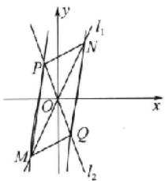

两条直线 $l_{1}, l_{2}$ 均过坐标原点 $O$ ，所以 $M, N$ 两点关于原点对称， $P, Q$ 两点关于原点对称，根据对称性，不妨设 $M, N, P, Q$ 位置如图，可知 $|OP| = |OQ|$ ， $|OM| = |ON|$ ， $\angle POM = \angle QON$ ，所以 $\triangle OPM \cong \triangle OQN$ ，所以 $S_{\triangle OQN} = S_{\triangle OPM} = \sqrt{2}$ ，而 $\triangle OQM$ 和 $\triangle OQN$ 等底等高，面积相同，所以 $S_{\triangle OQM} = \sqrt{2}$ ，所以 $S_{\triangle MNQ} = 2\sqrt{2}$ .

# 考点过关12 导数的概念与运算

##### 1. A 因为 $f'(x)=\sin x$ ，所以 $f'(\alpha)=\sin \alpha$ .

注意： $f(x)$ 中 x 是变量，求导时， $\sin\alpha$ 应看成常量.

##### 2. A $s' = -1 + 2t$ ，则 $s'\bigg|_{t=4} = -1 + 2 \times 4 = 7$ .

##### 3. D 解法 1 $f(x)=\log_{2}\frac{1}{x}=-\log_{2}x$ ，则 $f'(x)=-\frac{1}{x\ln2}$ .

【解法2】 函数 $f(x) = \log_2\frac{1}{x}$ 是由 $\left\{ \begin{array}{l}u = \frac{1}{x},\\ y = \log_2u \end{array} \right.$ 复合而成，利用复合函数求导法则可求出 $f'(x) = -\frac{1}{x\ln 2}.$

解后反思 我们在对函数求导时,首先观察函数式的结构特征,若能化简则先化简.此题,明显解法1比解法2简单.

##### 4. C 依题意, 得 $f'(x) = (x + 1)e^x + \cos x, f''(x) = (x + 2)e^x - \sin x, f^{（3）}(x) - (x + 3)e^x - \cos x, f^{（4）}(x) = (x + 4)e^x + \sin x, f^{（5）}(x) = (x + 5)e^x + \cos x, f^{（6）}(x) = (x + 6)e^x - \sin x, f^{（7）}(x) = (x + 7)e^x - \cos x, f^{（8）}(x) = (x + 8)e^x + \sin x, \cdots$ . 由此得 $f^{(4n)}(x) = (x + 4n)e^x + \sin x, f^{(3n-1)}(x) = (x + 4n+1) \cdot e^x + \cos x, f^{(4n+2)}(x) = (x + 4n+2)e^x - \sin x, f^{(4n+3)}(x) = (x + 4n+3)e^x - \cos x, n \in \mathbb{N}^*$ , 因此 $f^{（2024）}(x) = (x + 2024)e^x + \sin x$ , 所以 $f^{(2:24)}（0） = 2024$ .

##### 5. A 因为 $f'(x)=3x^{2}+2xf'（0）-1$ ，代入 x=0，得 $f'（0）=-1$ ，所以 $f(x)=x^{3}-x^{2}-x$ ，所以 $f(1)=-1$ 。

##### 6. C 点 A(2,2) 同时在曲线 C 和切线 l 上，所以 $f(2)=2$ . 又切线过点 (0,1)，所以切线的斜率 $k=\frac{1}{2}$ ，所以 $f'（2）=\frac{1}{2}$ . 又 $g(2)=2f(2)=4$ ，于是曲线 $y=g(x)$ 在点 (2, g(2)) 处的切线的切点为 (2,4). 由 $g'(x)=f(x)+xf'(x)$ ，所以曲线 $y=g(x)$ 在点 (2, g(2)) 处的切线斜率为 $k_{0}=g'（2）=f(2)+2f'（2）=3$ ，所以切线方程为 y-4=3(x-2)，即 3x-y-2=0.

##### 7. C 解法 1 分析：注意到 $f(x+1)$ 是偶函数可得函数 $f(x)$ 的图象关于直线 x=1 对称，从而根据 $x<\frac{1}{2}$ 时的解析式，可求得 $x>\frac{3}{2}$ 时的解析式，由此来解决问题.

因为 $f(x+1)$ 是偶函数，所以 $f(-x+1)=f(x+1)$ ，即 $f(x)=f(2-x)$ 。设 $x>\frac{3}{2}$ ，则 $2-x<\frac{1}{2}$ ，从而 $f(x)=f(2-x)=\ln[1-2\cdot(2-x)]=\ln(2x-3)$ ，此时， $f'(x)=\frac{2}{2x-3}$ ，故 $f'（2）=\frac{2}{4-3}=2$ 。

解法 2 分析: 根据 $f(x+1)$ 是偶函数, 得到 $f(1+x)=f(1-x)$ , 对此式求导来得到导函数的关系, 再根据 $x<\frac{1}{2}$ 时的解析式求得它的导数, 由此来计算 $f'（2）$ 的值.

根据题意, 函数 $f(x)$ 的定义域为 R, 因为 $f(x+1)$ 是偶函数, 所以 $f(1+x)=f(1-x)$ , 两边同时求导可得 $f'(1+x)=f'(1-x)$ . 当 $x<\frac{1}{2}$ 时, $f(x)=\ln(1-2x)$ , 求导可得 $f'(x)=\frac{-2}{1-2x}$ , 则有 $f(0)=-2$ . 因为 $f'(1+x)=f'(1-x)$ , 令 x=1, 得 $f'（2）=-f'（0）-2$ , 则曲线 $y=f(x)$ 在点 $(2,f(2))$ 处的切线斜率为 2.

##### 8. C 设 $f(x) = ax^2 + bx^2 + cx + d$ ，则 $f'(x) - 3ax^2 + 2bx + d$

c. 由题意得 $\left\{ \begin{array}{l} f(0) = d = 0, \\ f(1) = a + b + c + d = 0, \\ f'（0） = c = \frac{-1 - 0}{-1 - 0} = k_{AB}, \\ f'（1） = 3a + 2b + c = \frac{2 - 0}{2 - 1} = k_{DC}, \end{array} \right.$ 解得 $\left\{ \begin{array}{l} a = 3, \\ b = -4, \\ c = 1, \\ d = 0, \end{array} \right.$ 所

以 $f(x)=3x^{3}-4x^{2}+x.$

##### 9. BCD 对于 A, $f(x)=\cos(-x)=\cos x$ ，所以 $f'(x)=-\sin x$ ，故 A 错误；对于 B, $f'(x)=a^{-x}\ln a\times(-x)'=-a^{-x}\ln a$ ，故 B 正确；对于 C, $f'(x)=\frac{1}{x\ln 10}=\frac{\ln e}{x\ln 10}=\frac{\lg e}{x}$ ，故 C 正确；对于 D, $f'(x)=(\tan x)'=\left(\frac{\sin x}{\cos x}\right)'=\frac{\cos^{2}x-\sin x(-\sin x)}{\cos^{2}x}=\frac{1}{\cos^{2}x}$ ，故 D 正确.

##### 10. ABC 对于 A, $g'(x)=2^{x}+x\cdot2^{x}\cdot\ln2$ ，由 $x\cdot2^{x}=2^{x}+x\cdot2^{x}\cdot\ln2$ ，解得 $x=\frac{1}{1-\ln2}$ ，所以 $g(x)$ 只有一个“新不动点”，故 A 正确；对于 B, $g'(x)=-e^{x}-2$ ，由 $-e^{x}-2=-e^{x}-2x$ ，解得 x=1，所以 $g(x)$ 只有一个“新不动点”，故 B 正确；对于 C, $g'(x)=\frac{1}{x}$ ，根据 $y=\ln x$ 和 $y=\frac{1}{x}$ 的图象可看出 $\ln x=\frac{1}{x}$ 只有一个实数根，所以 $g(x)$ 只有一个“新不动点”，故 C 正确；对于 D, $g'(x)=\cos x-2\sin x$ ，由 $\sin x+2\cos x=\cos x-2\sin x$ ，得 $3\sin x=-\cos x$ ，所以 $\tan x=-\frac{1}{3}$ ，根据 $y=\tan x$ 和 $y=-\frac{1}{3}$ 的图象可看出方程 $\tan x=-\frac{1}{3}$ 有无数个解，所以 $g(x)$ 有无数个“新不动点”，故 D 错误.

##### 11. AC 由已知得 $y' = (2 + x)e^x$ ，设切点为 $(x_0, (1 + x_0)e^{x_0})$ ，则切线斜率 $k = (2 + x_0)e^{x_0}$ ，切线方程为 $y - (1 + x_0)e^{x_0} = (2 + x_0)e^{x_0}(x - x_0)$ . 因为切线过点 $A(a, 0)$ ，所以 $-(1 + x_0)e^{x_0} = (2 + x_0)e^{x_0}(a - x_0)$ ，化简得 $x_0^2 + (1 - a)x_0 - 2a - 1 = 0$ . 因为切线有且仅有 1 条，所以 $\Delta = (a - 1)^2 + 4(2a + 1) = 0$ ，化简得 $a^2 + 6a + 5 = 0$ ，即 $(a + 1)(a + 5) = 0$ ，解得 $a = -1$ 或 $a = -5$ .  
##### 12. $y = e^{-1}$ 因为 $f'(x) = e^{-x} - x e^{-x} = (1 - x) e^{-x}$ ，所以 $f'（1） = 0, f(1) = e^{-1}$ ，所以切线方程为 $y = e^{-1}$ .  
##### 13. $x - 2y = 0$ 因为直线 $2x + y - 1 = 0$ 的斜率为-2，所以切线的斜率为 $\frac{1}{2} f'(x) = \mathrm{e}^{x - 1} - \frac{a}{x}, f'（1） = 1 - a = \frac{1}{2}$ ，解得 $a = \frac{1}{2}$ ，所以 $f(x) = \mathrm{e}^{x - 1} - \frac{1}{2}\ln x - \frac{1}{2}, f(1) = 1 - 0 - \frac{1}{2} = \frac{1}{2}$ ，所以切线方程为 $y - \frac{1}{2} = \frac{1}{2}(x - 1)$ ，即 $x - 2y = 0$

# 方法突破 切线方程

（1） 求曲线切线方程的步骤：

①求出函数 $y=f(x)$ 在 $x=x_{0}$ 处的导数，即曲线 $y=f(x)$ 在点 $P(x_{0},f(x_{0}))$ 处切线的斜率；  
②由点斜式方程求得切线方程为 $y-y_{0}=f'(x_{0})\cdot(x-x_{0})$ .  
（2） 求曲线的切线方程需注意两点：  
①当曲线 $y=f(x)$ 在点 $P(x_{0},f(x_{0}))$ 处的切线平行于 y 轴（此

时导数不存在)时，切线方程为 $x = x_0$

②当切点坐标不知道时，应首先设出切点坐标，再求解.  
（3）求过某点的切线问题,常设出切点,利用导数求出切线方程,将已知点代入切线方程得到关于切点横坐标的方程,解出切点的横坐标,即可求出切线方程.

##### 14. 1 或 $\frac{1}{e}$ 分析: 公切线求解, 往往需要设出两个曲线的切点, 并分别求出切线方程, 再根据切线重合, 构建方程组, 通过消元法求得切点坐标, 即可求解.

设 $y = kx + b$ 与 $y = \ln x$ 和 $y = e^{x - 2}$ 的切点分别为 $(x_2, \ln x_2), (x_1, e^{x_1 - 2})$ ，由导数的几何意义可得 $k = e^{x_1 - 2} = \frac{1}{x_2}$ ，曲线 $y = e^{x - 2}$ 在点 $(x_1, e^{x_1 - 2})$ 处的切线方程为 $y - e^{x_1 - 2} = e^{x_1 - 2} \cdot (x - x_1)$ ，即 $y = e^{x_1 - 2} + (1 - x_1)e^{x_1 - 2}$ ，曲线 $y = \ln x$ 在点 $(x_2, \ln x_2)$ 处的切线方程为 $y - \ln x_2 = \frac{1}{x_2}(x - x_2)$ ，即 $y = \frac{1}{x_2} x + \ln x_2 - 1$ ，则 $\left\{ \begin{array}{l} e^{x_1 - 2} = \frac{1}{x_2}, \\ (1 - x_1)e^{x_1 - 2} = \ln x_2 - 1, \end{array} \right.$ 解得 $x_2 = 1$ 或 $x_2 = e$ ，所以 $k = 1$ 或 $\frac{1}{e}$ .

# 核心笔记

##### 1. 导数的几何意义, 要紧紧抓住切点. 通常有三类问题: 一是求曲线过某一点处的切线; 二是求两个函数的公切线; 三是求过某一点的直线是否与曲线相切. 解决这三类问题的方法都是设切点, 用导数求斜率, 建立等量关系. 在这三类问题中, 要注意公切线问题的本质就是两条曲线的切线重合, 从而根据直线重合的条件来得到相关的方程组, 进而研究问题. 同时, 注意“在点 $M(x_0, y_0)$ 处的切线”与“过点 $M(x_0, y_0)$ 的切线”的区别: “在点 $M(x_0, y_0)$ 处的切线”, 点 $M$ 一定是切点, 且在曲线 $y = f(x)$ 上; “过点 $M(x_0, y_0)$ 的切线”, 点 $M$ 不一定是切点, 且不一定在曲线 $y = f(x)$ 上. (练习运用: 第6题、第7题)  
##### 2. 曲线的切线与切点有关, 当讨论曲线的切线时, 缺乏切点信息, 需设出切点, 通过求导求出切线的斜率, 由点斜式方程求出切线方程, 再根据题设条件求得切点的坐标, 进而完成问题的解答。(练习运用: 第11题、第14题)

# 考点过关13 导数与函数的单调性

##### 1. C 由图象知， $y = f(x)$ 在 $(0,3)$ 和 $(5,+\infty)$ 上单调递增，在 $(3,5)$ 上单调递减，所以当 $x \in (0,3) \cup (5,+\infty)$ 时， $y = f'(x) > 0$ ，当 $x \in (3,5)$ 时， $f'(x) < 0$ .  
##### 2. C 函数的定义域为 $(0,+\infty)$ . $f'(x)=1-\frac{1}{x}$ ，令 $f'(x)>0$ ，得 x>1.  
##### 3. C 由已知可得 $f'(x) = -\frac{x' e^x - x(e^x)'}{e^{2x}} = -\frac{1 - x}{e^x} \frac{x - 1}{e^x}$ ，令 $f'(x) = 0$ ，解得 $x = 1$ . 当 $x \in (-\infty, 1)$ 时， $f'(x) < 0$ ，当 $x \in (1, +\infty)$ 时， $f'(x) > 0$ ，故 $f(x)$ 在 $(-\infty, 1)$ 上单调递减，在 $(1, +\infty)$ 上单调递增。因为 $a < b < 1$ ，所以 $f(a) > f(b)$ 。  
##### 4. C 函数 $f(x) = 3x^{3} - (a + 2)x$ ，求导得 $f'(x) - 9x^{2} - a - 2$ ，

依题意， $\forall x \in \mathbb{R}, f'(x) \geqslant 0$ 等价于 $a \leqslant 9x^2 - 2$ ，而 $9x^2 - 2 \geqslant -2$ 恒成立，则 $a \leqslant -2$ ，所以 $a$ 的取值范围是 $(- \infty, -2]$ .

##### 5. A $f'(x) = x - \frac{9}{x} (x > 0)$ . 当 $x - \frac{9}{x} \leqslant 0$ 时，有 $0 < x \leqslant 3$ ，即在(0,3]上 $f(x)$ 单调递减，所以 $a - 1 > 0$ 且 $a + 1 \leqslant 3$ ，解得 $1 < a \leqslant 2$ .

##### 6. A 函数 $f(x) = x + \frac{1}{x}$ 的定义域为 $(- \infty, 0) \cup (0, -\infty)$ ，求导得 $f'(x) = 1 - \frac{1}{x^2}$ ，由 $f'(x) > 0$ ，得 $x < -1$ 或 $x > 1$ ，即函数 $f(x)$ 在 $(- \infty, -1), (1, +\infty)$ 上单调递增，而 $f(x)$ 在 $(a, +\infty)$ 上单调递增，于是 $a \geqslant 1$ ，显然 $\{a \mid a \geqslant 1\}$ 真包含于 $\{a \mid a > -2\}$ ，所以“ $f(x) = x + \frac{1}{x}$ 在 $(a, +\infty)$ 上单调递增”是“ $a > -2$ ”的充分不必要条件。

##### 7. B 解法1 对于 A, $f'(x)=1-\cos x \geqslant 0$ ，即 $f(x)$ 在定义域上单调递增，不符合题意；对于 B, $f'(x)=\cos x-(\cos x-x\sin x)=x\sin x$ ，在 $(-2\pi,-\pi)$ 上， $f'(x)<0$ ，在 $(-π,\pi)$ 上， $f'(x)>0$ ，在 $(\pi,2\pi)$ 上， $f'(x)<0$ ，所以 $f(x)$ 在 $(-2\pi,-\pi)$ ， $(\pi,2\pi)$ 上单调递减， $(-π,\pi)$ 上单调递增，符合题意；对于 C，由 $f(-x)=(-x)^{2}-\frac{1}{(-x)^{2}}=x^{2}-\frac{1}{x^{2}}=f(x)$ 且定义域为 $\{x|x \neq 0\}$ ，得 $f(x)$ 为偶函数， $f'(x)=2x+\frac{2}{x^{3}}$ ，当 x>0 时， $f'(x)>0$ ，故 $f(x)$ 在 $(0,+\infty)$ 上单调递增，不符合题意；对于 D，由 $f(-x)=\sin(-x)+(-x)^{3}=-\sin x-x^{3}=-f(x)$ 且定义域为 R，得 $f(x)$ 为奇函数， $f'(x)=\cos x+3x^{2}$ ，当 x>0 时， $f'(x)>0$ ，故 $f(x)$ 在 $(0,+\infty)$ 上单调递增，所以 $f(x)$ 在 R 上单调递增，不符合题意。

解法 2(排除法) 如图, 加上坐标系以后, 易得该函数为奇函数, 排除选项 C.

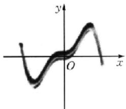

对于 A, $f'(x)=1-\cos x \geqslant 0$ ，即 $f(x)$ 在定义域上单调递增，不符合题意；对于 D, $f'(x)=\cos x + 3x^{2}$ ，当 x > 0 时， $f'(x) > 0$ ，故 $f(x)$ 在 $(0, +\infty)$ 上单调递增，所以 $f(x)$ 在 R 上单调递增，不符合题意.

解后反思 图象与解析式匹配问题,最佳方法就是从定义域、奇偶性、单调性、特殊点入手进行排除.单调性的处理可以代入特殊值,求导一劳永逸,但是有时候解析式复杂,还要注意运算准确.

##### 8. D 对任意的 $x_{1}, x_{2} \in (m, +\infty)$ , 且 $x_{1} < x_{2}, \frac{x_{1} \ln x_{2} - x_{2} \ln x_{1}}{x_{2} - x_{1}} < 2$ 成立, 易知 $m > 0$ , 化简得 $x_{1} \ln x_{2} - x_{2} \ln x_{1} < 2x_{2} - 2x_{1}$ , 即 $x_{1} (\ln x_{2} + 2) < x_{2} (\ln x_{1} + 2)$ , 即 $\frac{\ln x_{1} + 2}{x_{1}} > \frac{\ln x_{2} + 2}{x_{2}}$ , 令 $f(x) = \frac{\ln x + 2}{x}$ , 则函数 $f(x)$ 在 $(m, +\infty)$ 上单调递减.

$f'(x)=-\frac{\ln x+1}{x^{2}}$ ，由 $f'(x)<0$ ，可得 $x>\frac{1}{e}$ ，所以 $f(x)$ 的单调递减区间为 $\left(\frac{1}{e},+\infty\right)$ ，所以 $(m,+\infty)\subseteq\left(\frac{1}{e},+\infty\right)$ ，所以 $m\geqslant\frac{1}{e}$ ，因此，实数m的最小值为 $\frac{1}{e}$ .

##### 9. BCD 对于 A, 若函数 $f(x)$ 在区间 $(a, b)$ 上单调递增，则在区间 $(a, b)$ 上可以是 $f'(x) > 0$ ，也可以是 $f'(x) \geqslant 0$ ，如 $f(x) = x^{3}$ ，故 A 错误；对于 B，根据导数与其单调性的关系可知，当函数在某个区间内恒有 $f'(x) = 0$ ，此时函数是常值函数，因此无单调性，故 B 正确；对于 C，根据导数与单调性关系可知，若函数 $f(x)$ 在区间 $(a, b)$ 上恒有 $f'(x) > 0$ ，则 $f(x)$ 在 $(a, b)$ 上是单调递增的，故 C 正确；对于 D， $f'(x) = 1 - \cos x$ ，因为 $\cos x \in [-1, 1]$ ，所以 $1 - \cos x \geqslant 0$ ，则 $f(x)$ 是 R 上的增函数，故 D 正确。

##### 10. ABD 由题意可得, $f(x)$ 的定义域为 $(0,+\infty)$ , $f'(x)=x-\frac{e^{2}}{x}=\frac{(x-e)(x+e)}{x}$ , 当 $f'(x)>0$ 时, $x>e$ , 当 $f'(x)<0$ 时, $0<x<e$ , 故 $f(x)$ 在 $(0,e)$ 上单调递减, 在 $(e,+\infty)$ 上单调递增, 又因为 $0<a<e<b$ , 所以 $f(a)$ 与 $f(b)$ 无法确定大小, 且 $f(a)>f(e), f(b)>f(e)$ , 故 A,B,D 错误, C 正确.

##### 11. AD 函数 $f(x) = x^3 - 3x^2 + ax + b$ , $f'(x) = 3x^2 - 6x + a$ . 对于 A, $f'(x) = 3x^2 - 6x - 9 = 3(x^2 - 2x - 3) = 3(x - 3)(x + 1)$ , 令 $f'(x) < 0$ , 可得 $x \in (-1, 3)$ , 所以 $f(x)$ 的单调递减区间为 (-1, 3), 故选项 A 正确; 对于 B, 若函数 $y = f(x)$ 在区间 (0, +∞) 上是单调递增的, 则 $\forall x \in (0, +\infty)$ , $f'(x) = 3x^2 - 6x + a \geqslant 0$ , 所以 $a \geqslant -3x^2 + 6x$ 恒成立, 即 $a \geqslant (-3x^2 + 6x)_{\max}$ , 当 $x = 1$ 时, $y_{\max} = -3 + 6 = 3$ , 所以 $a \geqslant 3$ , 故选项 B 错误; 对于 C, 当 $a = 3, b = 0$ 时, 函数 $f'(x) = 3x^2 - 6x + 3 = 3(x - 1)^2 \geqslant 0$ , 所以 $f(x)$ 单调递增, 不可能有对称轴, 故选项 C 错误; 对于 D, 当 $a = 0, b = 2$ 时, $f(x) = x^3 - 3x^2 + 2$ , 又因为 $f(1 + x) + f(1 - x) = (1 + x)^3 + (1 - x)^3 - 3(1 - x)^2 - 3(1 + x)^2 + 4 = [(1 + x) + (1 - x)][(1 + x)^2 + (1 - x)^2 - (1 - x^2)] - 3(1 - x)^2 - 3(1 + x)^2 + 4 = -(1 - x)^2 - (1 + x)^2 - 2(1 - x^2) + 4 = 0$ , 所以函数 $f(x)$ 的图象关于点 (1, 0) 对称, 故选项 D 正确.

##### 12. $(-1, 1)$ $f'(x) = 3x^2 - 3$ . 由 $3x^2 - 3 < 0$ , 可得 $-1 < x < 1$ . 方法突破 导数法求函数单调区间的一般流程

求定义域 $\rightarrow$ 求导数 $f'(x)\rightarrow$ 求 $f'(x) = 0$ 在定义域内的根 $\rightarrow$ 用求得的根划分定义区间 $\rightarrow$ 确定 $f'(x)$ 在各个开区间内的符号 $\rightarrow$ 得相应开区间上的单调性.

（1） 在函数中含有参数时，解方程 $f'(x)=0$ 时必须对参数进行分类讨论，这里分类讨论的标准要按照不等式的形式正确确定.
（2） 已知函数的单调性，求参数的取值范围，应用条件 $f'(x) \geqslant 0$ (或 $f'(x) \leqslant 0$ ), $x \in (a, b)$ ，转化为不等式恒成立问题求解.

##### 13. $\left(-\infty, \frac{1}{e}\right] \cup [1, +\infty)$ 由已知 $f(x) - mx - e^x$ ，得 $f'(x) = m - e^x$ ，因为 $f(x) - mx - e^x$ 在区间 $(-1, 0)$ 上是单调函数，所以在区间 $(-1, 0)$ 上， $f'(x) - m - e^x \geqslant 0$ 恒成立或 $f'(x) = m - e^x \leqslant 0$ 恒成立，即 $m \geqslant e^x$ 在区间 $(-1, 0)$ 上恒成立或 $m \leqslant$

$e^{x}$ 在区间 $(-1,0)$ 上恒成立，所以 $m \geqslant e^{0} = 1$ 或 $m \leqslant e^{-1} = \frac{1}{e}$ ，所以实数 m 的取值范围是 $\left(-\infty, \frac{1}{e}\right] \cup [1, +\infty)$ .

##### 14. $\left[\frac{\sqrt{e}}{e}, \frac{2\sqrt{e}}{e}\right]$ 对于函数 $f(x) = a e^x - x^2, x \in \left(0, \frac{1}{2}\right)$ , $f'(x) = a e^x - 2x'$ , 令 $g(x) = a e^x - 2x$ , 则 $g'(x) = a e^x - 2$ . 因为 $f'(x)$ 在区间 $\left(0, \frac{1}{2}\right)$ 上单调递减, 所以 $a e^x - 2 \leqslant 0$ 恒成立, 即 $a \leqslant \frac{2}{e^x}$ 恒成立, 又 $\frac{2}{e^x} > \frac{2}{e^{\frac{1}{2}}} = \frac{2}{\sqrt{e}}$ , 所以 $a \leqslant \frac{2\sqrt{e}}{e}$ . 又 $f(x)$ 在区间 $\left(0, \frac{1}{2}\right)$ 上单调递增, 所以 $f'(x) = a e^x - 2x \geqslant 0$ 恒成立, 所以 $a e^{\frac{1}{2}} - 1 \geqslant 0$ , 解得 $a \geqslant \frac{\sqrt{e}}{e}$ . 综上, $\frac{\sqrt{e}}{e} \leqslant a \leqslant \frac{2\sqrt{e}}{e}$ .

# 核心笔记

利用导数研究函数的单调性

##### 1. 利用导数求函数的单调区间的基本步骤: （1） 确定 $f(x)$ 的定义域; （2） 求 $f(x)$ 的导函数 $f'(x)$ ; （3） 由 $f'(x) \geqslant 0$ 得函数的单调递增区间, 由 $f'(x) \leqslant 0$ 得函数的单调递减区间. (练习运用: 第2题、第7题、第12题)  
##### 2. 已知函数 $y=f(x)$ 在区间 A 上的单调性，研究参数的取值范围。此类问题一般转化为 $y=f'(x)$ 在区间 A 上大于等于零（或小于等于零）恒成立加以解决。（练习运用：第 4 题、第 5 题、第 13 题、第 14 题）  
##### 3. 根据单调性比较大小或解不等式问题. 解决此类问题时, 首先要得出函数的单调性及单调区间, 然后根据单调性比较大小或解不等式. 在利用单调性解不等式的过程中, 脱去函数符号“f”时, 要注意单调区间的限制. (练习运用: 第3题、第10题)

# 考点过关 14 导数与函数的极(最)值

##### 1. C 观察图象知，当 $x < -4$ 或 $0 < x < 4$ 时， $f'(x) < 0$ ，当 $-4 < x < 0$ 或 $x > 4$ 时， $f'(x) > 0$ ，因此函数 $f(x)$ 在 $(- \infty, -4), (0, 4)$ 上单调递减，在 $(-4, 0), (4, +\infty)$ 上单调递增，函数 $f(x)$ 在 $[-2, 2]$ 上不单调，①错误；-4 和 4 都是极小值点，②正确；函数 $f(x)$ 在 $x = 0$ 处取得极大值，当 $f(0)$ 不小于函数 $f(x)$ 在 $(- \infty, -4), (4, +\infty)$ 上的所有函数值时，函数 $f(x)$ 有最大值，③错误；当 $f(0) > 0, f(-4) < 0, f(4) < 0$ ，且函数函数 $f(x)$ 在 $(- \infty, -4), (4, +\infty)$ 上的图象都与 $x$ 轴相交时，函数 $f(x)$ 在 $(- \infty, -4), (-4, 0), (0, 4), (4, +\infty)$ 上各有 1 个零点，共有 4 个零点，因此 $f(x)$ 最多能有四个零点，④正确。  
##### 2. D $f'(x)=3x^{2}+2ax+1=0$ 有两个相等的实数根或没有实数根，所以 $\Delta=4a^{2}-12\leqslant0$ ，解得 $-\sqrt{3}\leqslant a\leqslant\sqrt{3}$ .  
##### 3. C 由题意可得 $f'(x) = \frac{2x - 2x^2}{\mathrm{e}^{2x}}$ . 由 $f'(x) > 0$ , 得 $0 < x < 1$ ; 由 $f'(x) < 0$ , 得 $x < 0$ 或 $x > 1$ . 则 $f(x)$ 在 $(-\infty, 0)$ 和 $(1, +\infty)$ 上单调递减, 在 $(0, 1)$ 上单调递增, 故 $f(x)_{\text{极大值}} = f(1) = \frac{1}{\mathrm{c}^2}$ .  
##### 4. B $f'(x)=2+\cos x>0$ , 所以 $f(x)$ 在区间 $[0,\pi]$ 上单调递

增，因此 $f(x)$ 的最小值为 $f(0) = 0$ ，最大值为 $f(\pi) = 2\pi .$

##### 5. A $y' = e^{x} + a = 0$ 有大于零的解，当 x > 0 时， $-e^{x} < -1$ ，所以 $a = -e^{x} < -1$ .  
##### 6. A 令 $f(x) = ae^x - x^2 = 0$ ，可得 $a = \frac{x^2}{\mathrm{e}^x}$ ，若 $g(x) = \frac{x^2}{\mathrm{e}^x}$ ，则 $g'(x) = \frac{x(2 - x)}{\mathrm{e}^x}$ ，所以当 $0 < x < 2$ 时， $g'(x) > 0, g(x)$ 单调递增；当 $x < 0$ 或 $x > 2$ 时， $g'(x) < 0, g(x)$ 单调递减。所以 $g(x)$ 有极小值 $g(0) = 0$ ，极大值 $g(2) = \frac{4}{\mathrm{e}^2}$ ，又当 $x$ 趋近于 $-\infty$ 时， $g(x)$ 趋近于 $+\infty$ ，当 $x$ 趋近于 $+\infty$ 时， $g(x)$ 趋近于 0，可得 $g(x)$ 的图象如图：

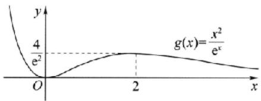

所以要使题设函数有三个不同零点，即 $g(x)$ 的图象与直线 $y = a$ 有三个不同交点，则 $0 < a < \frac{4}{\mathrm{e}^2}$ .

##### 7. A 依题意, 得 $4\pi r^2 + 2\pi rl = S$ , 即 $l = \frac{S - 4\pi r^2}{2\pi r}$ , 故 $V(r) = \frac{4}{3}\pi r^3 + \pi r^2 l = \frac{Sr}{2} - \frac{2}{3}\pi r^3$ , 则 $V'(r) = \frac{S}{2} - 2\pi r^2$ , 当 $r = \sqrt{\frac{S}{4\pi}}$ 时, $V'(r) = 0$ , $V$ 取得最大值.  
##### 8. C 因为函数 $f(x)$ 的导数 $f'(x) = x - \sin x$ ，所以 $f(x) = \frac{1}{2} x^2 + \cos x + C$ ， $C$ 为常数，设 $g(x) = f'(x) = x - \sin x$ ，则 $g'(x) = 1 - \cos x \geqslant 0$ 恒成立， $g(x)$ 在 $\mathbf{R}$ 上单调递增，即 $f'(x) = x - \sin x$ 在 $\mathbf{R}$ 上单调递增，又 $f'（0） = 0$ ，所以当 $x \in (-\infty, 0)$ 时， $f'(x) < 0$ ， $f(x)$ 单调递减，当 $x \in (0, +\infty)$ 时， $f'(x) > 0$ ， $f(x)$ 单调递增，所以 $f(x)$ 在 $x = 0$ 处取得最小值，即 $f(x)_{\text{mic}} = f(0) = 1 + C = -1$ ，所以 $C = -2$ ，所以 $f(x) = \frac{1}{2} x^2 + \cos x - 2$ . 由 $y = f(x) - \cos x = \frac{1}{2} x^2 - 2$ ，令 $\frac{1}{2} x^2 - 2 = 0$ ，解得 $x = \pm 2$ ，所以 $y = f(x) - \cos x$ 的零点为 ±2.  
##### 9. BC $f(x)$ 在 $(- \infty, c)$ 上单调递增，在 $(c, e)$ 上单调递减，在 $(e, +\infty)$ 上单调递增，故 $f(d) > f(e)$ ，显然A错误；函数 $f(x)$ 在 $[a, b]$ 上单调递增，在 $[b, c]$ 上单调递增，在 $[c, d]$ 上单调递减，故B正确；函数 $f(x)$ 的极值点为 $c, e$ ，故C正确；函数 $f(x)$ 的极大值为 $f(c)$ ，故D错误。  
##### 10. BCD $f'(x)=3\cos x+4\sin x$ ，且 $3\cos a+4\sin a=0$ ， $3\cos\beta+4\sin\beta=0$ 。又 $f'(x)=3\cos x+4\sin x=5\sin(x+\varphi),\alpha,\beta$ 分别为 $f(x)$ 的极大值点与极小值点，所以 $\beta=\alpha+\pi+2k\pi,k\in Z$ 。则选项 A 错误，选项 B、C、D 正确。

解后反思 本题考查了导数应用、函数图象、三角函数化简等方面的知识，首先提供了一个大家比较熟悉的三角函数关系，让学生研究其极值点的情况，这里就需要学生知道其导函数的图象，由于导函数也是周期函数，了解极大值、极小值点分别在何处，两类点之间满足何种关系，从而解决问题。本题也考查了学生逻辑推理、数学建模、数学运算、数据分析等方面的核心素养。

##### 11. ABD 对于 A, 令 $f(x) = x - \sin x, x \in \left(0, \frac{\pi}{2}\right)$ , 则 $f'(x) = 1 - \cos x \geqslant 0$ , 故 $f(x)$ 在 $\left(0, \frac{\pi}{2}\right)$ 上单调递增, 故 $f(x) > f(0) = 0$ , 故 $x > \sin x$ , 故 A 正确; 对于 B, 设 $m(x) = \ln x - x$ , 则 $m'(x) = \frac{1}{x} - 1$ , 当 $x > 1$ 时, $m'(x) < 0, m(x)$ 在 $(1, +\infty)$ 上单调递减, 当 $0 < x < 1$ 时, $m'(x) > 0, m(x)$ 在 $(0, 1)$ 上单调递增, 故 $m(x) \leqslant m(1) = -1 < 0$ , 故 $\ln x < x$ , 故 B 正确; 对于 C, 令 $n(x) = e^x - x - 1$ , 则 $n'(x) = e^x - 1$ , 当 $x > 0$ 时, $n'(x) > 0, n(x)$ 在 $(0, +\infty)$ 上单调递增, 当 $x < 0$ 时, $n'(x) < 0, n(x)$ 在 $(-\infty, 0)$ 上单调递减, 所以 $n(x) \geqslant n(0) = 0$ , 故 $e^x \geqslant x + 1$ , 故 C 错误; 对于 D, 令 $g(x) = x - \frac{1}{x} - 2\ln x, x \in (1, +\infty)$ , 则 $g'(x) = 1 + \frac{1}{x^2} - \frac{2}{x} = \frac{x^2 - 2x + 1}{x^2} = \frac{(x - 1)^2}{x^2} \geqslant 0$ , 故 $g(x)$ 在 $(1, +\infty)$ 上单调递增, 故 $g(x) > g(1) = 0$ , 故 $x - \frac{1}{x} > 2\ln x$ , 故 D 正确.

##### 12. $x^{2}$ （答案不唯一）令 $f(x) = x^2$ ，则 $f(0) = 0, f'(x) = 2x$ 令 $f'(x) = 0$ ，则 $x = 0$ ，故函数 $f(x)$ 在 $(-\infty, 0)$ 上单调递减，在 $(0, +\infty)$ 上单调递增，故函数 $f(x) = x^2$ 只有一个极值点.

##### 13. -2 由题意得 $f'(x) = \frac{a}{2\sqrt{x}} + \frac{1}{x}$ ，故 $f'（1） = \frac{a}{2} + 1 = 0$ ， $a = -2$ ，故 $f'(x) = \frac{-1}{\sqrt{x}} + \frac{1}{x} = \frac{1 - \sqrt{x}}{x}$ ，所以当 $0 < x < 1$ 时， $f'(x) > 0$ ，当 $x > 1$ 时， $f'(x) < 0$ ，所以当 $x = 1$ 时， $f(x)$ 取得极值，所以实数 $a = -2$ .

##### 14.1 $[4, +\infty)$ 分析：中心对称可以通过奇函数图象变换得到，不难发现 $y = ax^3 - 3x$ 为奇函数，其图象关于原点对称，通过图象平移可以求出 $b$ 的值；不等式恒成立问题首选分离变量，当 $0 < x \leqslant 1$ 时，易得 $a \geqslant \frac{3}{x^2} - \frac{1}{x^3}$ 恒成立，通过导数法求出函数 $g(x) = \frac{3}{x^2} - \frac{1}{x^3}$ 的最大值，即可求出 $a$ 的取值范围.

由条件知 $y = f(x)$ 的图象可由奇函数 $y = ax^3 - 3x$ 的图象上下平移得到，因为 $y = f(x)$ 的图象关于点(0, b)对称，所以 $b = 1$ ，所以 $f(x) = ax^3 - 3x + 1$ . 当 $x = 0$ 时， $f(x) = 1 \geqslant 0$ 恒成立. 当 $0 < x \leqslant 1$ 时， $f(x) = ax^3 - 3x + 1 \geqslant 0$ 等价于 $a \geqslant \frac{3}{x^2} - \frac{1}{x^3}$ . 设 $g(x) = \frac{3}{x^2} - \frac{1}{x^3} (0 < x \leqslant 1)$ ，则 $a \geqslant g(x)_{\max}$ . 因为 $g'(x) = \frac{3(1 - 2x)}{x^4}$ ，所以当 $0 < x < \frac{1}{2}$ 时， $g'(x) > 0$ ; 当 $\frac{1}{2} < x \leqslant 1$ 时， $g'(x) < 0$ . 所以 $g(x)$ 在 $\left(0, \frac{1}{2}\right)$ 上单调递增，在 $\left(\frac{1}{2}, 1\right]$ 上单调递减，所以 $x = \frac{1}{2}$ 时， $g(x)$ 取得最大值，且为 $g\left(\frac{1}{2}\right) = 4$ ，所以 $a \geqslant 4$ .

# 方法突破 由函数的单调性求参数取值范围的方法

（1） 可导函数在区间 $(a, b)$ 上单调，实际上就是 $f'(x) \geqslant 0$ （或$f'(x) \leqslant 0$ 在该区间上恒成立，得到关于参数的不等式，从而转化为求函数的最值问题，求出参数的取值范围，注意检验等号成立时导数是否在 $(a, b)$ 上恒为0.

（2） 可导函数在区间 $(a, b)$ 上存在单调区间，实际上就是 $f'(x) > 0$ （或 $f'(x) < 0$ ）在该区间上存在解集，即 $f'(x)_{\max} > 0$ （或 $f'(x)_{\min} < 0$ ）在该区间上有解，从而转化为不等式问题，求出参数的取值范围.  
（3） 若已知 $f(x)$ 在区间 I 上的单调性，区间 I 由参数表示，则先求出 $f(x)$ 的单调区间，令 I 是其单调区间的子集，从而求出参数的取值范围.

# 核心笔记

利用导数求函数的极值与最值

##### 1. 求极值的基本步骤：（1） 求函数 $f(x)$ 的定义域，并求导函数 $f'(x)$ ；（2） 求方程 $f'(x) = 0$ 的实数根；（3） 检验 $f'(x)$ 在方程 $f'(x) = 0$ 的根的两侧的值的符号，若在根的左侧为正，右侧为负，则函数 $f(x)$ 在这个根处取得极大值；若在根的左侧为负，右侧为正，则函数 $f(x)$ 在这个根处取得极小值；若左右同号，则函数 $f(x)$ 在这个根处不取得极值。（练习运用：第3题、第7题）  
##### 2. 已知 $y = f(x)$ 的极值求参数的值或范围的方法: 根据所给出的极值条件列出方程(组)(或不等式(组)), 求出参数的值或取值范围, 此时, 需要验证求得的值或取值范围是否满足题设的极值条件. 因为导数为 0 的点不一定是极值点, 要检验极值点两侧导数的符号是否异号. (练习运用: 第 13 题)  
##### 3. 求函数 $y=f(x)$ 在区间 $[a,b]$ 上的最大值或最小值的基本步骤：（1） 求出函数 $y=f(x)$ 在区间 $(a,b)$ 上的极值；（2） 将 （1） 中求得的极值与 $f(a)$ ， $f(b)$ 的值进行比较，其中最大的一个为函数的最大值，最小的一个为函数的最小值。（练习运用：第7题）  
##### 4. 若已知函数 $y = f(x)$ 在区间 $[a, b]$ 上的最值，求参数的值或取值范围，其基本方法是通过分类讨论求出其最值，然后根据其与条件中的最值相等得到相应的方程（组），求得参数的值或取值范围。有时，我们也可以先利用最值的必要条件，即 $f(x) \leqslant A$ （或 $f(x) \geqslant A$ ，其中 $\Lambda$ 为相应的最值）在区间 $[a, b]$ 上恒成立，通过特殊化来缩小参数的取值范围，然后在缩小的范围内求参数的值或取值范围，此方法有时可以避免或简化分类讨论。  
##### 5. 含参数的函数的极值与最值的求解需要应用分类讨论思想，常见的分类标准如下：（1） 对导函数 $f'(x)$ 的首项系数是否为零进行分类讨论。（2） 导函数 $f'(x)$ 的首项系数不为零时，对导函数 $f'(x)$ 是否存在零点进行分类讨论；若导函数 $f'(x)$ 存在零点，则对零点的大小关系、零点是否在所研究的区间内以及单调性进行分类讨论。（3） 对函数 $y = f(x)$ 在区间内的极值与区间的端点的函数值的大小关系进行分类讨论。

# 考点过关15 导数的综合应用

##### 1. B   
##### 2. C 由题意 $f'(x) = \frac{3(1 - x)}{\epsilon'}$ ，当 $x < 1$ 时， $f'(x) > 0, f(x)$ 单调递增，当 $x > 1$ 时， $f'(x) < 0, f(x)$ 单调递减，故 $j(1) = \frac{3}{\epsilon}$ 是函数的极大值，无极小值.  
##### 3. A 极小值点应是先减后增的拐点，即先 $f'(x) < 0$ ，再

$f'(x)=0$ ，最后 $f'(x)>0$ 。由图象可知，只有1个极小值点。

##### 4. A 由题意设三次函数的解析式为 $f(x) = ax(x - 2) \cdot (x + b)$ ，即 $f(x) = ax^3 + a(b - 2)x^2 - 2abx$ ， $f'(x) = 3ax^2 + 2a(b - 2)x - 2ab$ ，所以 $\left\{ \begin{array}{l} f'（0） = -2ab = -1, \\ f'（2） = 12a + 4a(b - 2) - 2ab = 2, \end{array} \right.$ 解得 $\left\{ \begin{array}{l} a = \frac{1}{4}, \\ b = 2, \end{array} \right.$ 所以 $f(x) = \frac{1}{4} x(x - 2)(x + 2) = \frac{1}{4} x^3 - x$ .

##### 5. C 分析: 求解关于函数最值的最值问题, 通常会利用函数的图象进行求解, 注意到函数 $f(x + \ln 2)$ 的图象可由函数 $f(x)$ 的图象向左平移 $\ln 2$ 个单位长度得到, 因此, 只需研究 $f(x) = \frac{x}{\mathrm{e}^x}$ 的单调性, 作出其图象, 根据图象平移作出 $y = f(x + \ln 2)$ 的图象. 而函数 $\min \{f(x), f(x + \ln 2)\}$ 的图象是由两个函数 $f(x), f(x + \ln 2)$ 图象在下方的部分所构成.

因为 $f(x)=\frac{x}{\mathrm{e}^{x}}$ ，所以 $f'(x)=\frac{1-x}{\mathrm{e}^{x}}$ ，故 $f(x)$ 在 $(-∞,1)$ 上单调递增，在 $(1,+∞)$ 上单调递减。由题意，令 $f(x)=f(x+\ln2)$ ，即 $\frac{x}{\mathrm{e}^{x}}=\frac{x+\ln2}{\mathrm{e}^{x+\ln2}}$ ，解得 $x=\ln2$ 。作出图象如图所示。

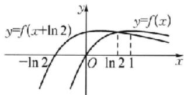

则 $\min\{f(x), f(x+\ln 2)\}$ 的最大值为两函数图象交点处的函数值，为 $\frac{\ln 2}{2}$ .

解后反思 研究多个函数最值中的最值问题时,常用函数的图象来进行求解.

##### 6. A 若 $f(x) = 2x^{2} - mx + \ln x$ 在 $(0, +\infty)$ 上单调递增，则 $f'(x) = 4x - m + \frac{1}{x} \geqslant 0$ 对任意的 $x \in (0, +\infty)$ 恒成立，所以有 $4x + \frac{1}{x} \geqslant m$ 对任意的 $x \in (0, +\infty)$ 恒成立，即 $m \leqslant \left(4x + \frac{1}{x}\right)_{\min}$ ，而 $4x + \frac{1}{x} \geqslant 2\sqrt{4x \cdot \frac{1}{x}} = 4$ ，当且仅当 $4x = \frac{1}{x}$ ，即 $x = \frac{1}{2}$ 时等号成立，则 $m \leqslant 4$ . 所以“ $m < 4$ ”是“函数 $f(x) = 2x^{2} - mx + \ln x$ 在 $(0, +\infty)$ 上单调递增”的充分不必要条件.

方法突破 利用导数解决不等式恒成立问题的两种常用方法：

（1） 分离参数法: 将原不等式分离参数, 转化为不含参数的函数的最值问题, 利用导数求该函数的最值, 根据要求求得所求范围. 一般地, $f(x) \geqslant a$ 恒成立, 只需 $f(x)_{\min} \geqslant a$ 即可; $f(x) \leqslant a$ 恒成立, 只需 $f(x)_{\max} \leqslant a$ 即可.

（2） 函数思想法: 将不等式转化为某含待求参数的函数的最值问题, 利用导数求该函数的极值(最值), 然后构建不等式求解.

##### 7. A 解法1 已知 $f(x) = x^3 - ax^2$ ，则 $f'(x) = 3x^2 - 2ax = 3x\left(x - \frac{2a}{3}\right)$ . 令 $f'(x) = 0$ ，得 $x = 0$ 或 $x = \frac{2a}{3}$ . ①当 $\frac{2a}{3} < 0$ ，即

$a < 0$ 时，则当 $\frac{2a}{3} < x < 0$ 时， $f'(x) < 0$ ，当 $x < \frac{2a}{3}$ 或 $x > 0$ 时， $f'(x) > 0$ ，所以 $f(x)$ 在 $\left(\frac{2a}{3}, 0\right)$ 上单调递减，在 $(- \infty, \frac{2a}{3})$ ， $(0, +\infty)$ 上单调递增，所以 $x = 0$ 是 $f(x)$ 的极小值点， $x = \frac{2a}{3}$ 是 $f(x)$ 的极大值点，符合题意；② 当 $\frac{2a}{3} = 0$ ，即 $a = 0$ 时，则 $f'(x) = 3x^2 \geqslant 0$ ，所以 $f(x)$ 在 $\mathbf{R}$ 上单调递增， $f(x)$ 无极值，不符合题意；③ 当 $\frac{2a}{3} > 0$ ，即 $a > 0$ 时，则当 $0 < x < \frac{2a}{3}$ 时， $f'(x) < 0$ ，当 $x < 0$ 或 $x > \frac{2a}{3}$ 时， $f'(x) > 0$ ，所以 $f(x)$ 在 $\left(0, \frac{2a}{3}\right)$ 上单调递减，在 $(- \infty, 0), \left(\frac{2a}{3}, +\infty\right)$ 上单调递增，所以 $x = 0$ 是 $f(x)$ 的极大值点，不符合题意。综上，当 $a < 0$ 时， $x = 0$ 是 $f(x)$ 的极小值点。

解法 2(特殊值法) 分析: 在选择题中, 求解取值范围的问题, 一般可以通过选项之间的区别, 取特殊值验证、排除, 再判断.

通过选项对比，取 $a = 0$ 和 $a = 2$ 进行验证.当 $a = 0$ 时， $f(x) = x^3$ ，因为 $f(x)$ 在 $\mathbf{R}$ 上单调递增，所以 $f(x)$ 无极值，故排除B；当 $a = 2$ 时， $f(x) = x^{2}(x - 2)$ ，则该三次函数 $f(x)$ 有两个零点，为0和2，所以该三次函数 $f(x)$ 的图象大致如下图：

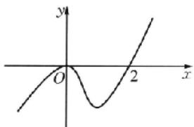

故 x=0 是函数 $f(x)$ 的极大值点，故排除 C, D.

解后反思 对比上述两个方法,可以发现利用“特殊值法”求解,既快速,又准确.

##### 8. B 解法1(函数最值法)分析:由于 $f(x) \geqslant 0$ 恒成立,故只需 $f(x)_{\min} \geqslant 0$ ,可利用导数求解,由于 $f'(x) = 2e^{2x} + 2e^{-2x} - a$ 比较复杂,所以令 $g(x) = 2e^{2x} + 2e^{-2x} - a (x \geqslant 0)$ ,利用导数判断函数 $g(x)$ 的单调性,再由 a 分类讨论即可得解.

由 $f(x) = \mathrm{e}^{2x} - \mathrm{e}^{-2x} - ax$ ，得 $f'(x) = 2\mathrm{e}^{2x} + 2\mathrm{e}^{-2x} - a.$ 令 $g(x) =$ $2\mathrm{e}^{2x} + 2\mathrm{e}^{-2x} - a(x\geqslant 0)$ ，则 $g'(x) = 4\mathrm{e}^{2x} - 4\mathrm{e}^{-2x}$ 因为函数 $y =$ $4\mathrm{e}^{2x},y = -4\mathrm{e}^{-2x}$ 在[0， $-\infty)$ 上都是增函数，所以函数 $g'(x) =$ $4\mathrm{e}^{2x} - 4\mathrm{e}^{-2x}$ 在[0， $-\infty)$ 上是增函数，所以 $g'(x)\geqslant g'（0） = 0$ ，所以函数 $g(x) = 2\mathrm{e}^{2x} - 2\mathrm{e}^{-2x} - a$ 在[0， $+\infty)$ 上是增函数，所以 $f'(x)_{\min} = f'（0） = 4 - a.$

当 $a \leqslant 4$ 时， $f'(x) = 2\mathrm{e}^{2x} + 2\mathrm{e}^{-2x} - a \geqslant 4 - a \geqslant 0$ ，所以函数 $f(x)$ 在 $[0, +\infty)$ 上单调递增，所以 $f(x) \geqslant f(0) = 0$ ，满足题意；当 $a > 4$ 时，存在 $x \in (0, +\infty)$ ，使得 $f'(x_0) = 0$ ，且当 $x \in [0, x_0)$ 时， $f'(x) < 0$ ，函数 $f(x)$ 单调递减，所以 $f(x_0) < f(0) = 0$ ，故 $f(x_0) \geqslant 0$ 不恒成立。

综上所述，实数 $a$ 的取值范围是 $(-\infty, 4]$ .

解法 2(切线法) 分析: 解决不等式的恒成立问题, 可以考虑转化为两个函数图象的位置关系, 即一条曲线和一条直线, 通过切线法求解.

令 $g(x) = \mathrm{e}^{2x} - \mathrm{e}^{-2x}$ 和 $y = ax$ ，则当 $x \in [0, +\infty)$ 时，曲线 $g(x)$ 的图象恒在直线 $y = ax$ 上方。由于 $g(x) = \mathrm{e}^{2x} - \mathrm{e}^{-2x}$ 在 $[0, +\infty)$ 上单调递增，且两个函数图象都过坐标原点，又 $g'(x) = 2\mathrm{e}^{2x} + 2\mathrm{e}^{-2x}$ ，所以 $g(x)$ 在 $x = 0$ 处的切线的斜率为 $g'（0） = 4$ ，故实数 $a$ 的取值范围是 $(- \infty, 4]$ 。

解后反思 对于恒成立问题,通常转化成求最值问题.若 $f(x) \leqslant g(a)$ 恒成立,则 $f(x)_{\min} \leqslant g(a)$ ; 若 $f(x) \geqslant g(a)$ 恒成立,则 $f(x)_{\max} \geqslant g(a)$ ,如解法1.此外还可以通过分离变量法和切线法求解,特别是切线法,往往会非常简洁,体现小题巧解.

##### 9. BD $f'(x) = 3ax^2 + 2x + 1$ . 若 $a \neq 0$ ，三次函数 $f(x)$ 有极值，则 $f'(x) = 0$ 有不相等的两个解，所以 $\Delta = 4 - 12a > 0$ ，所以 $a < \frac{1}{3}$ . 若 $a = 0$ ，导函数 $f'(x) = 3ax^2 + 2x + 1 = 2x + 1$ . 令 $f'(x) > 0$ ，则 $x > -\frac{1}{2}$ ; 令 $f'(x) < 0$ ，则 $x < -\frac{1}{2}$ . 所以函数在 $x = -\frac{1}{2}$ 处取得极小值. 所以函数 $f(x) = ax^3 + x^2 + x + 1$ 有极值的充要条件是 $a < \frac{1}{3}$ ，必要不充分条件有 $a < 1, a \leqslant \frac{1}{3}$ .

##### 10. AC 定义域为 $(0, +\infty), f'(x) = \frac{1 - \ln x}{x^2}, f'（1） = 1, f(1) = 0$ ，所以 $f(x)$ 的图象在点 $(1, 0)$ 处的切线方程为 $y - 0 = f'（1）(x - 1)$ ，即 $y = x - 1$ ，故 A 正确；在 $(0, e)$ 上， $f'(x) > 0, f(x)$ 单调递增，在 $(e, +\infty)$ 上， $f'(x) < 0, f(x)$ 单调递减，故 B 错误； $f(x)$ 的极大值为 $f(e) = \frac{1}{e}$ ，故 C 正确；方程 $f(x) = \frac{\ln x}{x} = -1$ 的解的个数，即为 $\ln x = -x$ 的解的个数，即为函数 $y = \ln x$ 与 $y = -x$ 图象交点的个数，作出函数 $y = \ln x$ 与 $y = -x$ 的图象可知只有一个交点，即方程 $f(x) = -1$ 只有一个解，故 D 错误。

##### 11. BCD 分析：解函数不等式的基本思想是利用函数的单调性及对称性来脱去函数符号“f”，转化为简单的不等式问题，为此，就需要研究函数 $f(x)$ 的单调性及对称性.

因为 $f(x) = \mathrm{e}^{x - 1} + \mathrm{e}^{1 - x} + x^2 - 2x$ ，所以 $f(2 - x) = \mathrm{e}^{1 - x} + \mathrm{e}^{x - 1} + (2 - x)^2 - 2(2 - x) - f(x)$ ，即函数 $f(x)$ 的图象关于直线 $x = 1$ 对称。当 $x > 1$ 时， $y = x^2 - 2x = (x - 1)^2 - 1$ 为增函数。令 $g(x) = \mathrm{e}^{x - 1} + \mathrm{e}^{1 - x}$ ，则 $g'(x) = \mathrm{e}^{x - 1} - \mathrm{e}^{1 - x}$ ，当 $x > 1$ 时， $\mathrm{e}^{x - 1} > 1, \mathrm{e}^{1 - x} < 1$ ，所以 $g'(x) > 0$ ，所以 $g(x) = \mathrm{e}^{x - 1} + \mathrm{e}^{1 - x}$ 为增函数，所以当 $x > 1$ 时， $f(x)$ 为增函数。由对称性可知，当 $x < 1$ 时， $f(x)$ 为减函数。因为 $f(2 - a) < f(x^2 + 3)$ 恒成立，所以 $|1 - a| < |x^2 + 2|$ 恒成立，即 $|1 - a| < 2$ ，解得 $-1 < a < 3$ 。

##### 12. $-\frac{e^{2}}{2}-2$ $f'(x)=2x+3f'（2）+e^{x}$ ，令 x=2 得 $f'（2）=4+3f'（2）+e^{2}$ ， $f'（2）=-\frac{e^{2}}{2}-2$ .

##### 13. $[0, +\infty)$ 解法1 分析: 求出导函数, 根据 $a$ 的符号分类讨论研究函数的单调性, 利用单调性研究函数最值即可求解.

因为 $f(x)=(x-1)e^{x}+ax^{2}$ ，所以 $f'(x)=xe^{x}+2ax=x(e^{x}+2a)$ 。若 $a\geqslant0$ ，则当 $x\in(-\infty,0)$ 时， $f'(x)<0$ ，故 $f(x)$ 在 $(-∞,0)$ 上单调递减；当 $x∈(0,+∞)$ 时， $f'(x)>0$ ，故 $f(x)$ 在 $(0,+∞)$ 上单调递增。所以当 x=0 时， $f(x)$ 有最小值 $f(0)=-1$ ，满足题意。若 a<0，则当 x 无限趋近于 $-∞$ 时， $f(x)$ 无限趋向于 $-∞$ ， $f(x)$ 没有最小值，不符合题意。综上， $a\geqslant0$ ，所以实数 a 的取值范围是 $[0,+∞)$ 。

【解法2】 分析: 注意到 $f(0) = -1$ , 正好是函数 $f(x)$ 的最小值, 猜想函数 $f(x)$ 在 $(-∞, 0)$ 上单调递减, 在 $(0, +∞)$ 上单调递增. 由此, 通过 $f'(x)$ 来求解.

因为 $f(x) = (x - 1)\mathrm{e}^x +ax^2$ ，所以 $f'(x) = x\mathrm{e}^{x} + 2ax = x(\mathrm{e}^{x}+$ $2a)$ .因为 $f(0) = -1 = f(x)_{\min}$ ，所以 $f'(x)\leqslant 0$ 在 $(-\infty ,0)$ 上恒成立，且 $f'(x)\geqslant 0$ 在 $(0, + \infty)$ 上恒成立.由 $f'(x)\leqslant 0$ 在 $(-\infty ,0)$ 上恒成立，得 $a\geqslant -\frac{\mathrm{e}^x}{2}$ 因为当 $x\in (-\infty ,0)$ 时，恒有 $-\frac{\mathrm{e}^x}{2} < 0$ ，所以 $a\geqslant 0.$ 由 $f'(x)\geqslant 0$ 在 $(0, + \infty)$ 上恒成立，得 $a\geqslant$ $-\frac{\mathrm{e}^x}{2}$ 因为当 $x\in (0, + \infty)$ 时，恒有 $-\frac{\mathrm{e}^x}{2} < -\frac{1}{2}$ ，所以 $a\geqslant$ $-\frac{1}{2}$ 综上，实数 $a$ 的取值范围是 $[0, + \infty)$

解后反思 解题中,不仅要能从通性通法来研究问题,还要注意一些特殊方法的应用,解法1就是通性通法,而解法2则是从问题的数字特征入手,对问题的“秒杀”.尤其是在解选择题、填空题时,要注意“特殊方法”的应用.

##### 14. 6x-30 分析: 根据所给新定义, 解方程 $f''(x)=0$ , 可得拐点, 从而得到对称中心为 $\left(\frac{1}{2},0\right)$ . 因此根据对称中心可以得到 $f(x)+f(1-x)=0$ , 而所求自变量成对出现, 即可求解.

$f'(x)=3x^{2}-3x+\frac{1}{2}$ ，所以 $f''(x)=6x-3$ ；由6x-3=0得 $x=\frac{1}{2}$ ，且 $f\left(\frac{1}{2}\right)=0$ ，所以 $f(x)$ 的对称中心为 $\left(\frac{1}{2},0\right)$ ，所以 $f(1-x)+f(x)=0$ ，所以 $f\left(\frac{1}{2021}\right)+f\left(\frac{3}{2021}\right)+f\left(\frac{5}{2021}\right)+\cdots+f\left(\frac{2020}{2021}\right)=0.$

# 核心笔记

导数中的构造问题

（1）作差或变形构造法.一般构造函数 $F(x)=f(x)-g(x)$ ，进而转化为求函数 $F(x)$ 的最值来研究相应的问题.

（2）分离参数构造法. 分离参数是指对已知有解的不等式或恒成立的不等式在能够判断出参数系数正负的条件下, 根据不等式的性质将参数分离出来, 得到一个一端是参数、另一端是变量的不等式, 只要研究变量不等式的最值就可以解决问题.

（3）局部构造法. 若函数 $F(x)$ 比较复杂, 直接求导会更复杂, 使解题无法进行下去. 此时, 可将函数 $F(x)$ 化成 $F(x) - f(x) \cdot g(x)$ (或 $F(x) - f(x) + g(x)$ ), 其中 $f(x), g(x)$ 有一个可明显判断出是否大于零或小于零, 而另一个函数式又远比 $F(x)$ 简单.

这样就可以作局部处理. 对这个函数进行求导, 判断其单调性, 使问题迎刃而解.

（4）换元构造法.换元构造法在处理多变元函数问题中应用较多，就是用新元去代替该函数中的部分(或全部)变元，通过换元可以使变量化多元为少元，即达到减元的作用.  
（5）消元(或主元)构造法.将多变元函数中的某一个变元看作主元(即自变量),将其他变元看作常数来构造函数,然后用函数、方程、不等式的相关知识来解决问题.  
（6）特征构造法.根据题目中的条件特征或所要研究对象的结论特征,抑或根据各对象之间的关系特征等来构造相应的函数的一种方式.(练习运用:第4题)

# 阶段温习三 考点 1\~15

##### 1. A 因为 $A = \{x \in \mathbf{Z} \mid -1 \leqslant x \leqslant 4\} = \{-1, 0, 1, 2, 3, 4\}$ , $B = \{x \mid -2 \leqslant x \leqslant 0\}$ , 所以 $A \cap B = \{-1, 0\}$ .

##### 2. A 当函数 $f(x) = \lg (\sqrt{x^2 + a^2} - x)$ 为奇函数时， $f(x) + f(-x) = \lg (\sqrt{x^2 + a^2} - x) + \lg (\sqrt{x^2 + a^2} + x) = \lg a^2 = 0$ ，解得 $a = \pm 1$ . 所以“ $a = 1$ ”是“函数 $f(x) = \lg (\sqrt{x^2 + a^2} - x)$ 为奇函数”的充分不必要条件.

##### 3. A 因为函数 $y=(m^{2}-3m+3)x^{2m-3}$ 是幂函数，所以 $m^{2}-3m+3=1$ ，解得 m=1 或 m=2。当 m=1 时，函数 $y=\frac{1}{x}$ 在 $(0,+\infty)$ 上单调递减，符合题意；当 m=2 时，函数 y=x 在 $(0,+\infty)$ 上单调递增，不符合题意。所以 m 的值为 1。

##### 4. B 由题意得 $f(1 + x) = f(1 - x), f(x)$ 关于直线 $x = 1$ 对称. 又因为 $f(x)$ 在 $[1, +\infty)$ 上单调递增，所以 $f(x)$ 在 $(- \infty, 1]$ 上单调递减，所以 $f(0) > f\left(\frac{1}{2}\right), f(-2) = f(4) > f(2), f(-1) = f(3), f(-4) = f(6) > f(4).$

##### 5. C 分析: 注意到 a 是直观的数字, 因此, 分别比较 a, b 或 a, c 的大小关系, 看能否确定答案.

由题意得 $b = \log_35, c = \log_58$ ，因为 $a = \frac{3}{2} = \log_33^{\frac{3}{2}} = \log_3\sqrt{27} > \log_35 = b$ ，即 $a > b$ ；又 $a = \frac{3}{2} = \log_55^{\frac{3}{2}} = \log_5\sqrt{125} > \log_58$ ，即 $a > c$ 。

分析:应用作差或作商的方法通过化同底来比较b,c的大小.

因为 $\frac{b}{c} = \frac{\lg 5}{\lg 3} \times \frac{\lg 5}{\lg 8} = \frac{(\lg 5)^2}{\lg 3 \times \lg 8} > \frac{(\lg 5)^2}{\left(\frac{\lg 3 + \lg 8}{2}\right)^2} = \frac{4(\lg 5)^2}{\lg^2 24} =$

$\frac{\lg^225}{\lg^224} > 1$ ，所以 $b > c$ （或 $b - c = \frac{\lg 5}{\lg 3} - \frac{\lg 8}{\lg 5} = \frac{\lg^25 - \lg 8\lg 3}{\lg 3\lg 5}$ ，因为 $\frac{\lg 3 + \lg 8}{2} > \sqrt{\lg 3\lg 8}$ ，所以 $\lg 3\lg 8 < (\lg \sqrt{24})^2 < (\lg 5)^2$ ，所以 $b > c$ ），故 $a > b > c$ 。

##### 6. B 由 $y = \frac{2x^3}{2^x + 2^{-x}}$ , $x \in [-6, 6]$ , 知 $f(-x) = \frac{2(-x)^3}{2^{-x} + 2^x} = -\frac{2x^3}{2^x + 2^{-x}} = -f(x)$ , 所以 $f(x)$ 是 $[-6, 6]$ 上的奇函数, 因此排

除 C. 又 $f(4)=\frac{2^{11}}{2^{8}+1}>7$ ，因此排除 A, D.

##### 7. A 因为 $f(x)$ 是偶函数，所以 $f(-x)=(a-1)x^{2}+3bx+c-d-1=f(x)$ ，即 b=0。由题意可得 $f(1)=a-1-3b+c-d-1=-2$ ，即 c-d=-a=-a+b，所以 $\frac{a-b}{c-d}=-1$ 。  
##### 8. D 分析: 根据 $f(x)$ 是定义在 R 上的偶函数, 且 $f'(x) + e^{x}$ 也是偶函数, 建立关于 $f'(-x)$ , $f'(x)$ 的方程组, 即可求解出 $f'(x)$ 的解析式.

因为函数 $f(x)$ 是定义在 R 上的偶函数，所以 $f(-x)=f(x)$ ，两边同时求导可得 $-f'(-x)=f'(x)$ ①。又因为函数 $f'(x)+e^{x}$ 也是偶函数，所以 $f'(-x)+e^{-x}=f'(x)+e^{x}$ ②。由①②可得 $f'(x)=\frac{1}{2}(e^{-x}-e^{x})$ 。

分析:要解不等式,常常利用函数的单调性,根据函数值的大小关系得到自变量的大小关系,故容易联想到根据 $f'(x)$ 的正负来判断函数 $f(x)$ 的单调性.

令 $f'(x) = 0$ ，得 $e^{-x} - e^x = 0$ ，解得 $e^x = 1$ 或 $e^x = -1$ （舍），即 $x = 0$ . 所以当 $x > 0$ 时， $f'(x) < 0$ ，即 $f(x)$ 在 $(0, +\infty)$ 上单调递减，根据偶函数的性质可知，函数 $f(x)$ 在 $(-\infty, 0)$ 上单调递增.

分析: 利用偶函数的性质将不等式 $f(a) > f(2a - 1)$ 中的自变量转化到同一个单调区间上来求解.

又因为 $f(x) = f(|x|)$ ，所以不等式 $f(a) > f(2a - 1)$ 可转化为 $f(|a|) > f(|2a - 1|)$ ，由该函数的单调性可得 $|a| < |2a - 1|$ ，解得 $a > 1$ 或 $a < \frac{1}{3}$ ，所以实数 $a$ 的取值范围是 $\left(-\infty, \frac{1}{3}\right) \cup (1, +\infty)$ .

##### 9. BC 若奇函数在 $x = 0$ 处有定义，则 $f(-0) = -f(0)$ ，即 $f(0) = 0$ ，故图象一定过坐标原点，否则不过原点，如 $f(x) = \frac{1}{x}$ ，选项A错误；若函数 $f(x + 3)$ 的定义域为[0,1]，则 $x + 3 \in [3,4]$ ，故在函数 $f(x - 2)$ 中， $x - 2 \in [3,4]$ ，故 $x \in [5,6]$ ，即函数 $f(x - 2)$ 的定义域为[5,6]，故B正确；在函数 $g(x) = 3\log_2(2x - 5) + 6$ 中，令 $2x - 5 - 1$ ，即 $x = 3, y = 6$ ，故图象过定点(3,6)，故C正确；函数 $y = \log_22^x = x$ ，定义域为R， $y = 2^{\log_2x} = x$ ，定义域为 $\{x | x > 0\}$ ，故不是同一函数，故D错误。  
##### 10. ABD $f(0) = c > 0$ ，所以 B, D 错误； $f'(x) = 3ax^2 + 2bx + 2017$ ，由图可知 $f'(x) = 0$ 有两个不同的正实根，则 $x_1 + x_2 = -\frac{2b}{3a} > 0$ 且 $x_1x_2 = \frac{2017}{3a} > 0$ ，所以 $a > 0, b < 0$ ，所以 A 错误.  
##### 11. BCD 对于 A, 因为 a > 0, 所以 $4a - \frac{1}{4a} \geqslant 2$ , 当 E 只当 $a = \frac{1}{4}$ 时, 等号成立, 但此时 b = 0, 与题意不符. 故 A 错误; 对于 B, $4a + 2b = 1 \geqslant 1 \sqrt{2ab}$ , 解得 $\frac{1}{32} \geqslant ab$ , 当且仅当 $\left\{\begin{aligned}&4a = 2b,\\ &4a + 2b = 1,\end{aligned}\right.$ 即

$\left\{\begin{aligned}b&=\frac{1}{4},\\ a&=\frac{1}{8}\end{aligned}\right.$ 时，等号成立，故 B 正确；对于 C, $\frac{1}{2a}+\frac{1}{b}=\left(\frac{1}{2a}+\right.$

$\left.\frac{1}{b}\right)(4a+2b)=4+\frac{b}{a}+\frac{4a}{b}\geqslant8$ ，当且仅当 $\left\{\begin{aligned}b^{2}&=4a^{2},\\ 4a&+2b=1,\end{aligned}\right.$ 即 $\left\{\begin{aligned}b=\frac{1}{4},\\ a=\frac{1}{8}\end{aligned}\right.$ 时，等号成立，故C正确；对于D，由 $4a+2b=1$ ，可得

$4b^{2}=1+16a^{2}-8a$ ，所以 $16a^{2}+4b^{2}=32a^{2}-8a+1$ ，当 $a=\frac{1}{8}$ 时， $32a-8a+1$ 取得最小值 $\frac{1}{2}$ ，此时， $b=\frac{1}{4}$ ，所以 $16a^{2}+4b^{2}$ 的最小值为 $\frac{1}{2}$ ，故D正确.

##### 12. $[9\mathrm{e}^3, +\infty)$ $f'(x) = x\mathrm{e}^{x} - \frac{a}{x}\leqslant 0$ 在 $\left[\frac{1}{2},3\right]$ 上恒成立，则 $a\geqslant x^{2}\mathrm{e}^{x}$ ，在 $\left[\frac{1}{2},3\right]$ 上恒成立.设 $g(x) = x^{2}\mathrm{e}^{x},x\in \left[\frac{1}{2},3\right]$ ，则 $g'(x) = (x^{2} + 2x)\mathrm{e}^{x} > 0$ ，所以 $g(x)$ 在 $\left[\frac{1}{2},3\right]$ 上单调递增，故 $g(x)$ 的最大值为 $g(3) = 9\mathrm{e}^3$ 故 $a\geqslant 9\mathrm{e}^3$

##### 13. $\frac{81}{16}$ 因为 $\log_3\frac{1}{16} = -\log_316, 3^2 < 16 < 3^3$ ，所以 $-3 < \log_3\frac{1}{16} < -2$ ，所以 $f\left(\log_3\frac{1}{16}\right) = f\left(\log_3\frac{1}{16} + 2\right) = f\left(\log_3\frac{1}{16} + 2 + 2\right) = f\left(\log_3\frac{81}{16}\right) = 3^{\log_3\frac{81}{16}} = \frac{81}{16}$ .

##### 14. （1） $\frac{3\pi}{4}$ （2） $a > \beta$ （1） 根据题意, $f(x) = \cos x$ , 其导数 $f'(x) = -\sin x$ , 若 $f(x) = f'(x)$ , 即 $\cos x = -\sin x$ , 则有 $\tan x = -1$ . 又由 $x \in (0, \pi)$ 得 $x = \frac{3\pi}{4}$ .

（2） 分析: 易得 $a=1$ , 根据 $f(x)=f'(x)$ , 可以得到 $\ln(\beta+1)=\frac{1}{\beta+1}$ , 令 $\beta+1=t$ , 通过构造函数 $G(t)=\ln t-\frac{1}{t}$ , 根据函数的单调性以及函数零点存在性定理, 可以得到 $t$ 的范围, 进一步得到 $\beta$ 的范围, 问题得以求解.

函数 $g(x)=x$ ，其导数 $g'(x)=1$ ，由 $g(x)=g'(x)$ ，得 x=1，则函数 $g(x)=x$ 的“新驻点” $\alpha=1$ 。 $h(x)=\ln(x+1)$ ，则 $h'(x)=\frac{1}{x+1}$ ， $h(x)=h'(x)$ ，即 $\ln(x+1)=\frac{1}{x+1}$ 。 $h(x)=\ln(x+1)$ 的“新驻点”为 $\beta$ ，则有 $\ln(\beta+1)=\frac{1}{\beta+1}$ 。令 $\beta+1=t$ ，所以 $t\in(0,+\infty)$ 。令 $G(t)=\ln t-\frac{1}{t}$ ，则 $G'(t)=\frac{1}{t}+\frac{1}{t^{2}}>0$ ，所以 $G(t)$ 在 $(0,+\infty)$ 上单调递增， $G(1)=-1$ ， $G(2)-\ln2-\frac{1}{2}=\ln\sqrt{\frac{4}{e}}>0$ ，所以当 $G(t)=0$ 时， $t\in(1,2)$ ，所以 $0<\beta<1$ ，则有 $\alpha>\beta$ 。

# 大题过关一 函数与导数（1）

##### 1. 解: （1） 由 $f(x)=\sin2x+2\cos x$ ，得 $f'(x)=2\cos2x-2\sin x$ ，(2分)

所以 $f'（0）=2, f(0)=2,$ [1] (4 分)

所以 $f(x)$ 在 x=0 处的切线方程为 $y-2=2(x-0)$ ，即 $2x-y+2=0$ 。 $^{[2]}$ (6 分)

（2） 由于 $f'(x)=2\cos2x-2\sin x$ ,

则 $f'(x)=2(1-2\sin^{2}x)-2\sin x=-2(2\sin^{2}x+\sin x-1)$ .
(7 分)

若 $f'(x) \leqslant 0$ ，则 $-2(2\sin^{2}x + \sin x - 1) \leqslant 0$ ，即 $-2(2\sin x - 1)(\sin x + 1) \leqslant 0$ ， $^{[3]}$ (9 分)

由于 $-1\leqslant\sin x\leqslant1$ ，则 $\sin x+1\geqslant0$ ，(10分)

故只需 $2\sin x - 1 \geqslant 0$ ，即 $\sin x \geqslant \frac{1}{2}$ 即可，解得 $x \in \left[2k\pi + \frac{\pi}{6}, 2k\pi + \frac{5\pi}{6}\right]$ ， $k \in \mathbf{Z}$ ，(12分)

故 $f(x)$ 的单调递减区间为 $\left[2k\pi +\frac{\pi}{6},2k\pi +\frac{5\pi}{6}\right],k\in \mathbf{Z}_{*}$ (13分)

规范书写【1】未求 $f(0)=2$ ，扣1分.

##### 【2】直线方程未化为一般式，扣1分，写成 $y=2x+2$ 不扣分.

##### 【3】未因式分解,扣1分.

##### 2. 解: （1） 当 a=4 时, $f(x)=1-2\ln x-\frac{4}{x^{2}}$ , 则 $f'(x)=-\frac{2}{x}+\frac{8}{x^{3}}=\frac{8-2x^{2}}{x^{3}}$ ,

则 $f(1)=-3, f'（1）=6.$ (3 分)

所以函数 $f(x)$ 在点 $(1, f(1))$ 处的切线方程为 $y + 3 = 6(x - 1)$ ，即 $6x - y - 9 = 0.$ (5 分)

分析:先求极大值 $M(a)$ ，然后构造差函数 $g(a)=\frac{1}{a}-M(a)-1$ ，求导并判断其单调性，求得最值，达到求证 $g(a)\geqslant0$ 的目的.

（2） $f(x)$ 的定义域为 $(0,+\infty)$ .[1]

由 $f(x)=1-2\ln x-\frac{a}{x^{2}}(a>0)$ ,

得 $f'(x) = -\frac{2}{x} +\frac{2a}{x^{3}} = \frac{-2(x + \sqrt{a})(x - \sqrt{a})}{x^{3}}.$ (6分）

当 $x \in (0, \sqrt{a})$ 时， $f'(x) > 0, f(x)$ 单调递增；

当 $x \in (\sqrt{a}, +\infty)$ 时， $f'(x) < 0, f(x)$ 单调递减. (8分)

所以 $f(x)$ 的极大值 $M(a)=f(\sqrt{a})=-\ln a.$ (10 分)

下面就是要证明 $M(a) + 1 \leqslant \frac{1}{a}$ , 即证明 $\ln a + \frac{1}{a} - 1 \geqslant 0$ .

设 $g(x) = \ln x + \frac{1}{x} - 1 (x > 0), g'(x) = \frac{1}{x} - \frac{1}{x^2} = \frac{x - 1}{x^2},$ (11分)

所以当 $x \in (0,1)$ 时， $g'(x) < 0, g(x)$ 单调递减；

当 $x \in (1, +\infty)$ 时， $g'(x) > 0, g(x)$ 单调递增.

所以 $g(x) \geqslant g(x)_{\min} = g(1) = 0$ ，即 $g(a) = \ln a - \frac{1}{a} - 1 \geqslant 0$ 。

即 $\ln a + \frac{1}{a}$ $1 \geqslant 0$ ，所以 $M(a)$ $1 \leqslant \frac{1}{a}$ . (15 分)

规范书写【1】定义域先行.

##### 3. 解: （1） 当 a=0 时, $f(x)=\frac{x}{e^{x}}$ , 则 $f'(x)=\frac{1-x}{e^{x}}$ ,

所以 $f'（1）=0, f(1)=\frac{1}{e}$ ,

所以所求的切线方程为 $y=\frac{1}{c}$ . (3 分)

（2） 当 $a = 1$ 时, $f(x) = x\mathrm{e}^{-x} - \mathrm{e}^{x}$ ,

则 $f'(x)=(1-x)e^{-x}-e^{x}=\frac{1-x-e^{2x}}{e^{x}}.$ (4分)

令 $g(x) = 1 - x - \mathrm{e}^{2x}$ ，则 $g'(x) = -1 - 2\mathrm{e}^{2x} < 0$ 。

故 $g(x)$ 在 $\mathbf{R}$ 上单调递减. 而 $g(0) = 0$ ，所以 $0$ 是 $g(x)$ 在 $\mathbf{R}$ 上的唯一零点，即 $0$ 是 $f'(x)$ 在 $\mathbf{R}$ 上的唯一零点. (6分)

当 $x$ 变化时， $f'(x), f(x)$ 的变化情况如下表：

<table><tr><td>x</td><td>(-∞,0)</td><td>0</td><td>(0,+∞)</td></tr><tr><td>f&#x27;(x)</td><td>-</td><td>0</td><td>-</td></tr><tr><td>f(x)</td><td>↗</td><td>极大值</td><td>↘</td></tr></table>

所以 $f(x)$ 的单调递减区间为 $(0, +\infty)$ ; 单调递增区间为 $(-∞, 0)$ .
(8 分)

所以 $f(x)$ 的极大值为 $f(0) = -1$ ，无极小值。 $^{[2]}$ (9 分)

（3） 分析: 注意到参数 a 可以很方便地分离出来, 为此, 利用分离参数法来求解.

由题意知 $x\mathrm{e}^{-x} - ae^{x}\leqslant \mathrm{e}^{x - 1}$ ，即 $a\geqslant \frac{x\mathrm{e}^{-x} - \mathrm{e}^{x - 1}}{\mathrm{e}^x}$ 即 $a\geqslant \frac{x}{\mathrm{e}^{2x}}-$ $\frac{1}{\mathrm{e}}.$ 设 $m(x) = \frac{x}{\mathrm{e}^{2x}} -\frac{1}{\mathrm{e}}$ ，则 $m'(x) = \frac{\mathrm{e}^{2x} - 2x\mathrm{e}^{2y}}{(\mathrm{e}^{2x})^2} = \frac{1 - 2x}{\mathrm{e}^{2x}}.$ (11分）令 $m'(x) = 0$ ，解得 $x = \frac{1}{2}$

当 $x \in \left(-\infty, \frac{1}{2}\right)$ 时， $m'(x) > 0, m(x)$ 单调递增；

当 $x \in \left(\frac{1}{2}, +\infty\right)$ 时， $m'(x) < 0, m(x)$ 单调递减.

所以 $m(x)_{\max}=m\left(\frac{1}{2}\right)=\frac{1}{2e}-\frac{1}{e}=-\frac{1}{2e}$ ，(14分)

所以 $a \geqslant -\frac{1}{2e}$ ，即 a 的取值范围是 $\left[-\frac{1}{2e}, +\infty\right)$ . (15 分)

规范书写【1】根据已知条件将 a=1 代入求导通分, 然后将导函数分子再次赋函数 $g(x)$ 进行求导研究单调性, 否则此处无法进行后续研究, 导致后面不得分.

##### 【2】根据函数 $g(x)$ 的单调性以及 $g(0)=0$ ，列出 $f'(x)$ 的符号正负变化分界点，从而可以找到函数 $f(x)$ 的单调区间，此处若漏掉函数极值的求解，则扣1分.

解后反思 1. 利用导数研究函数的有关极值问题,其核心就是要将问题转化为研究导函数的变号零点问题,此时我们可以结合函数的零点存在定理来处理,由此我们就不难得到函数在定义域上的单调区间以及函数的极值.

##### 2. 利用导数研究有关不等式恒成立问题, 常用方法有两种:
（1） 分离参数法, 将所给不等式中所要研究的参数分离出来, 将问

题转化为研究函数的最值问题；（2）分类讨论法，利用分类讨论思想研究有关含参函数的最值问题.

##### 4. （1） 分析: 对于 $e^{x} < (1 + x)^{1 + x}$ ，直接作差构造的函数太复杂，因此要先变形，取对数得 $x < (1 + x)\ln(1 + x)$ ，即 $\frac{x}{1 + x} < \ln(1 + x)$ 。因此，要证明 $1 + x < e^{x} < (1 + x)^{1 + x}$ ，只需构造函数 $f(x) = e^{x} - 1 - x, g(x) = \ln(1 + x) - \frac{x}{1 + x}$ ，分别求导分析单调性。

证明：令 $f(x) = \mathrm{e}^{x} - 1 - x, \forall x > 0, f'(x) = \mathrm{e}^{x} - 1 > 0,$

则 $f(x)$ 在 $(0,+\infty)$ 上单调递增，所以 $f(x)>f(0)=0$ ，即 $e^{x}>1+x.$ (3 分)

令 $g(x)-\ln(1+x)-\frac{x}{1+x},\forall x>0,g'(x)=\frac{1}{1+x}-\frac{1}{(1+x)^{2}}=\frac{x}{(1+x)^{2}}>0,$

则 $g(x)$ 在 $(0, +\infty)$ 上单调递增，所以 $g(x) > g(0) = 0$ ，即 $\ln(1+x) > \frac{x}{1+x}$ . (5 分)

所以 $(1+x)\ln(1+x)>x,\ln(1+x)^{1+x}>x$ ，所以 $e^{x}<(1+x)^{1+x}$ .
综上， $1+x<e^{x}<(1+x)^{1+x}$ . (7分)

（2）分析:结合第（1）问, $e^{x}\geqslant1+x$ 对任意的 $x\in R$ 恒成立,而 $\frac{(n-k)^{n}}{n^{n}}=\left(1-\frac{k}{n}\right)^{n}$ ,因此只需令 $x=-\frac{k}{n}(k=1,2,\cdots,n)$ ,得到 $\left(1-\frac{k}{n}\right)^{n}\leqslant e^{-k}$ ,再累加求和证明即可.

证明:结合第（1）问, $e^{x}\geqslant1+x$ 对任意的 $x\in R$ 恒成立. (8分)
令 $x=-\frac{k}{n}(k=1,2,\cdots,n)$ ，则 $e^{-\frac{k}{n}}\geqslant1-\frac{k}{n}\geqslant0$ ，(10分)

$\left(1-\frac{k}{n}\right)^{n}\leqslant\mathrm{e}^{-k}$ ，即 $\left(1-\frac{1}{n}\right)^{n}\leqslant\mathrm{e}^{-1},\left(1-\frac{2}{n}\right)^{n}\leqslant\mathrm{e}^{-2},\cdots,$ $\left(1-\frac{n}{n}\right)^{n}\leqslant\mathrm{e}^{-n}.$ (12分)

$\left(1-\frac{1}{n}\right)^{n}+\left(1-\frac{2}{n}\right)^{n}+\cdots+\left(1-\frac{n}{n}\right)^{n}\leqslant\mathrm{e}^{-1}+\mathrm{e}^{-2}+\cdots+$ $e^{-n}=\frac{\mathrm{e}^{-1}(1-\mathrm{e}^{-n})}{1-\mathrm{e}^{-1}}<\frac{1}{\mathrm{e}-1},$ (14分)

即 $\frac{(n-1)^{n}}{n^{n}}+\frac{(n-2)^{n}}{n^{n}}+\cdots+\frac{(n-n)^{n}}{n^{n}}<\frac{1}{e-1}$

所以 $\sum_{k=1}^{n}(n-k)^{n}<\frac{n^{n}}{\mathrm{e}-1}(n\in\mathbf{N}^{*}).$ (15分)

解后反思 1. 待证不等式的两边含有同一个变量时,一般地,可以直接构造“左减右”的函数,有时对复杂的式子要进行变形,利用导数研究其单调性和最值,借助所构造函数的单调性和最值即可得证.

##### 2. 有累加形式证明的不等式，通常根据前问的结论，代入特殊值可得不等式，最后累加求和进行证明即可.

# 大题过关二 函数与导数（2）

##### 1. 解: （1） 分析: 将函数 $f(x)$ 求导, 然后令 $f'(x)=0$ , 求出 $x$ 代入 $x=1$ 的证是否符合题意, 即可得答案.

由已知得 $f'(x)=3x-4a+\frac{a^{2}}{x}=\frac{3x^{2}-4ax+a^{2}}{x}=$ $\frac{(3x-a)(x-a)}{x}, x>0,$ 令 $f'(x)=0,$ 解得 x=a 或 $x=\frac{a}{3}.$ (1 分)

分析: 此处要注意两个极值点谁为 1, 需分两种情况进行讨论.

当 $a = 1$ 时，令 $f'(x) > 0$ ，解得 $0 < x < \frac{1}{3}$ 或 $x > 1$ ，令 $f'(x) < 0$ 解得 $\frac{1}{3} < x < 1$ ，所以函数 $f(x)$ 在 $\left(0, \frac{1}{3}\right)$ 上单调递增，在 $\left(\frac{1}{3}, 1\right)$ 上单调递减，在 $(1, +\infty)$ 上单调递增，此时函数 $f(x)$ 在 $x = \frac{1}{3}$ 处取极大值，在 $x = 1$ 处取极小值，不符合题意。[1]（4分）

当 $\frac{a}{3}=1$ ，即a=3时，令 $f'(x)>0$ ，解得0<x<1或x>3，令 $f'(x)<0$ ，解得1<x<3，所以函数 $f(x)$ 在(0,1)上单调递增，在(1,3)上单调递减，在 $(3,+\infty)$ 上单调递增，此时函数 $f(x)$ 在x=1处取极大值，在x=3处取极小值，符合题意。综上，a=3.

（2） 分析: 对函数 $f(x)$ 进行求导, 然后判断导函数 $f'(x)$ 的符号, 即可求得函数 $f(x)$ 在区间 $\left[\frac{1}{e}, e\right]$ 上的单调性, 从而求得函数的最大值.

由（1）得 $f(x)=\frac{3}{2}x^{2}-12x+9\ln x$ ，则 $f'(x)=\frac{3(x-1)(x-3)}{x}, x \in \left[\frac{1}{e}, e\right]$ .
(9 分)

令 $f'(x)>0$ ，解得 $\frac{1}{e}<x<1$ ，函数 $f(x)$ 单调递增；

令 $f'(x)<0$ , 解得 1<x<e, 函数 $f(x)$ 单调递减. (11 分)

所以 $f(x)_{\max}=f(1)=\frac{3}{2}-12=-\frac{21}{2}.$ (13分)

规范书写【1】注意在上述 a=1 的情况下，求得函数 $f(x)$ 在 x=1 处取极小值，与题干函数 $f(x)$ 在 x=1 处取得极大值不符，若直接误认为符合题意，则扣 2 分.

解后反思 求函数的极值、最值,通常转化为对函数的单调性的分析讨论,函数的单调性常借助导函数的图象分析导函数的正负;函数的极值常借助导函数的图象分析导函数的变导零点;函数的最值常借助原函数图象来分析最值点.

易错警示 由极值点求参数值, 这种逆向问题, 一定要检验, 不能仅凭 $f'(x_{0})=0$ , 解得参数值就完事. 因为 $f'(x_{0})=0$ , 只是 $x_{0}$ 成为极值点的必要条件, 况且即使 $x_{0}$ 是极值点, 究竟是极大值点还是极小值点也不清楚, 检验是去伪存在的最有效的方法.

##### 2. （1） 解: 因为 $f(x)=(ax+1)e^{x}$ ，所以 $f'(x)=(ax+a+1)e^{x}$ .
(2 分)

因为 $f'(x)-f(x)=2e^{x}$ ，所以 a=2.
(4 分)

则 $f(x)=(2x+1)\mathrm{e}^{x}, f'(x)=(2x+3)\mathrm{e}^{x}$ ，所以曲线 $y=f(x)$ 在 x=0 处的切线斜率为 $f'（0）=3$ .

又因为 $f(0)=1$ ，

所以曲线 $y=f(x)$ 在 x=0 处的切线方程为 $y=3x+1$ ,

即 k=3, b=1.
(6 分)

（2） 分析: 问题等价于求函数 $g(x) = (2x + 1)e^x - 3x - 1$ 的最小值, 且它的最小值大于或等于 0.

证明：设函数 $g(x) = (2x + 1)\mathrm{e}^x -3x - 1,x\in \mathbf{R},$

则 $g'(x)=(2x+3)e^{x}-3.$ (8 分)

设 $h(x) = g'(x)$ ，则 $h'(x) = (2x + 5)e^x$ ，（10分）

当 $x > -\frac{5}{2}$ 时， $h'(x) > 0, g'(x)$ 单调递增.

又因为 $g'（0）=0$ ，所以当 x>0 时， $g'(x)>0$ ， $g(x)$ 单调递增；

当 $-\frac{5}{2}<x<0$ 时， $g'(x)<0$ ， $g(x)$ 单调递减.

又当 $x \leqslant -\frac{5}{2}$ 时， $g'(x) = (2x + 3)e^x - 3 < 0.$

综上， $g(x)$ 在 $(-∞,0)$ 上单调递减，在 $(0,+∞)$ 上单调递增.
(13 分)

所以当 x=0 时， $g(x)$ 取得最小值，且 $g(x)_{\min}=g(0)=0$ ，

即 $(2x+1)e^{x}-3x-1\geqslant0$ ,

所以当 $x \in \mathbb{R}$ 时， $f(x) \geqslant 3x + 1$ . (15分)

##### 3. （1） 解: $f(x)$ 的定义域为 $(0, +\infty)$ ,

$g (x) = f ^ {'} (x) = 1 + \ln x - \frac {1}{2} x ^ {2},$

则 $g'(x)=\frac{1}{x}-x.$ [1] (3 分)

令 $g'(x)=\frac{1}{x}-x=\frac{1-x^{2}}{x}=0$ ，解得 x=1.
(4 分)

当 $x \in (0,1)$ 时， $g'(x) > 0, g(x)$ 单调递增；当 $x \in (1, +\infty)$ 时， $g'(x) < 0, g(x)$ 单调递减.

所以 $g(x)$ 的单调递增区间为 $(0,1)$ ，单调递减区间为 $[1,+\infty)$ ， $g(x)$ 极大值为 $g(1)=\frac{1}{2}$ ， $g(x)$ 无极小值。 (7 分)

（2） 证明: 由（1）可知 $f'(x)$ 在 $(0,1)$ 上单调递增,

所以当 $x \in (0,1)$ 时，函数 $f(x)$ 不存在极大值点. (8分)

又因为 $f'(x)_{\max}=f'（1）=\frac{1}{2}>0, f'(x)$ 在 $(1,+\infty)$ 上单调递减， $f'（2）=1+\ln 2-2=\ln 2-1<0,$

所以存在唯一 $x_0 \in (1, +\infty)$ ，使 $f'(x_0) = 0$ 。（11分）

当 $x \in (1, x_0)$ 时， $f'(x) > 0, f(x)$ 单调递增，

当 $x \in (x_0, +\infty)$ 时， $f'(x) < 0, f(x)$ 单调递减，

所以 $x_0$ 是 $f(x)$ 的唯一的极大值点. (13分)

又因为 $f'\left(\frac{3}{2}\right)=1+\ln\frac{3}{2}-\frac{9}{8}=\ln3-\ln2-\frac{1}{8}>1-0.$ 6931-0.125>0, $^{[3]}$

所以 $x_{0} > \frac{3}{2}$ . (15 分)

规范书写【1】 $f'(x)$ 和 $g'(x)$ 只要有一个对给3分.

##### 【2】只写 $f'\left(\frac{3}{2}\right) > 0$ . 扣1分.

##### 4. 解: （1） $f'(x) - (\cos x + \sin x)e^{-\sqrt{2}} \sin\left(x + \frac{\pi}{4}\right)e^{x}$ . (2分)

当 $x \in \left(0, \frac{3\pi}{4}\right)$ 时， $f'(x) > 0$ ， $f(x)$ 单调递增；

当 $x \in \left(\frac{3\pi}{4}, \pi\right)$ 时， $f'(x) < 0, f(x)$ 单调递减. (5分)

（2） 分析: 函数的零点往往转化为函数图象与 x 轴的交点个数, 为此需通过导数法得到函数的单调性.

易知函数 $h(x)$ 的定义域为 $(-1, +\infty)$ ，

因为 $h(x) = \sin x + \ln (x + 1) - 2x + 1$

所以 $h'(x)=\cos x+\frac{1}{x+1}-2.$

当 x>0 时， $\cos x\leqslant1,\frac{1}{x+1}<1$ ，所以 $h'(x)<0$ ，所以 $h(x)$ 单调递减；(7 分)

分析: 当 -1 < x < 0 时, 无法判断 $h'(x)$ 正负, 需要二次求导.

当-1<x<0时，令 $g(x)=h'(x)=\cos x+\frac{1}{x+1}-2$ ，则 $g'(x)=-\sin x-\frac{1}{(x+1)^{2}}<0$ ，所以 $h'(x)$ 单调递减，所以 $h'(x)>h'（0）=0$ ，所以 $h(x)$ 单调递增.

综上， $h(x)$ 在 $(-1,0)$ 上单调递增，在 $(0, + \infty)$ 上单调递减

所以 $h(x)_{\max}=h(0)=1>0.$ (11 分)

分析:要判断零点个数,需要结合零点存在定理求解.

【解法1】 又 $x$ 趋近于 $-1^{+}$ 时, $h(x)$ 趋近于 $-\infty$ , 所以 $h(x)$ 在 $(-1,0)$ 上有唯一零点;

x 趋近于 $+\infty$ 时， $h(x)$ 趋近于 $-\infty$ ，所以 $h(x)$ 在 $(0, +\infty)$ 上有唯一零点.

【解法2】 因为 $h(\mathrm{e} - 1) = \sin (\mathrm{e} - 1) + \ln \mathrm{e} - 2(\mathrm{e} - 1) + 1 \leqslant 5 - 2\mathrm{e} < 0$ ，所以 $h(x)$ 在 $(0, +\infty)$ 上有唯一零点；

因为 $h\left(\frac{1}{\mathrm{e}^4} - 1\right) = \sin \left(\frac{1}{\mathrm{e}^4} - 1\right) + \ln \frac{1}{\mathrm{e}^4} - 2\left(\frac{1}{\mathrm{e}^4} - 1\right) + 1 \leqslant -\frac{2}{\mathrm{e}^4} < 0$ ，所以 $h(x)$ 在 $(-1, 0)$ 上有唯一零点.

所以 $h(x)$ 有两个零点. (15 分)

解后反思 利用函数性质研究函数的零点,主要是根据函数单调性、最值或极值的符号确定函数零点的个数,此类问题在求解过程中可以通过数形结合的方法确定函数存在零点的条件,但需要运用零点存在定理说明零点的存在性.

# 考点过关16 三角函数的概念与同角关系式、诱导公式

##### 1. B 当 $\theta$ 为第三象限角时， $\sin\theta<0,\cos\theta<0$ ，故只有 B 正确.

##### 2. B 由题意可得 $\theta = \frac{2\pi}{12} \times \frac{3}{4} = \frac{\pi}{8}$ , 所以 $(\sin \theta + \cos \theta) \cdot (\sin \theta - \cos \theta) = \sin^2 \theta - \cos^2 \theta = -\cos 2\theta = -\cos \left(2 \times \frac{\pi}{8}\right) = -\cos \frac{\pi}{4} = -\frac{\sqrt{2}}{2}$ .

##### 3. D 设外、内弧对应圆半径分别为 $r_{2}, r_{1}$ ，且 $r_{2}: r_{1}=2:1$ ，由已知可得 B 环的外弧长为 $\frac{\pi}{3} \cdot r_{2}$ ，延长后 A 环的内弧长为 $\left(\frac{\pi}{3} + \theta\right) \cdot r_{1}$ ，由题意可得两式相等，即 $\left(\frac{\pi}{3} + \theta\right) \cdot r_{1} = \frac{\pi}{3} \cdot r_{2}$ ，

解得 $\theta=\frac{\pi}{3}$ ; 易得延长后 A 环的内弦长为 $\sqrt{3}r_{1}$ , B 环的外弦长为 $r_{2}$ , 显然比值为 $\sqrt{3}:2$ .

##### 4. A 原式 $= \cos \theta (-\cos \theta) + \sin \theta (-\sin \theta) = -1.$

##### 5. C 设 $P(x, y)$ ，则 $\tan \alpha = \frac{y}{x}$ ， $\sin \alpha = y$ ， $\cos \alpha = x$ 。因为 $\tan \alpha > \sin \alpha > \cos \alpha$ ，所以 $\frac{y}{x} > y > x$ ，所以 x, y 同号，且 $y > x, x \neq 0$ ，则 ABD 不符合题意。

##### 6. D $\cos\left(x+\frac{\pi}{6}\right)=\sin\left[\frac{\pi}{2}-\left(x+\frac{\pi}{6}\right)\right]=\frac{3}{5}.$

##### 7. B $(\sin\alpha+\cos\alpha)^{2}=\frac{2}{3}$ ，即 $\sin^{2}\alpha+2\sin\alpha\cos\alpha+\cos^{2}\alpha=\frac{2}{3}$ ，所以 $2\sin\alpha\cos\alpha=-\frac{1}{3}$ 。因为 $0<\alpha<\pi$ ，所以 $\cos\alpha<0<\sin\alpha$ ，所以 $\sin\alpha-\cos\alpha>0$ 。又 $(\sin\alpha-\cos\alpha)^{2}=\sin^{2}\alpha-2\sin\alpha\cos\alpha+\cos^{2}\alpha=1+\frac{1}{3}=\frac{4}{3}$ ，所以 $\sin\alpha-\cos\alpha=\frac{2\sqrt{3}}{3}$ 。

方法突破（1）应用公式时注意方程思想的应用：对于 $\sin\alpha+\cos\alpha,\sin\alpha\cos\alpha,\sin\alpha-\cos\alpha$ 这三个式子，利用 $(\sin\alpha\pm\cos\alpha)^{2}=1\pm2\sin\alpha\cos\alpha$ ，可以知一求二.

（2） 注意公式逆用及变形应用: $1 = \sin^{2}\alpha + \cos^{2}\alpha, \sin^{2}\alpha = 1 - \cos^{2}\alpha, \cos^{2}\alpha = 1 - \sin^{2}\alpha.$

（3） 同角三角函数(特别是正、余弦函数)求值问题的通常解法: 结合 $\sin^{2}\alpha + \cos^{2}\alpha = 1$ , 解出 $\sin\alpha$ 与 $\cos\alpha$ 的值, 然后代入计算, 但这种方法往往比较麻烦, 而且涉及符号的讨论.

##### 8. A $\sin \alpha = -2\cos \alpha$ ，即 $\tan \alpha = -2, 2\sin \alpha \cos \alpha - \cos^2 \alpha = \frac{2\sin \alpha \cos \alpha - \cos^2 \alpha}{\sin^2 \alpha + \cos^2 \alpha} = \frac{2\tan \alpha - 1}{\tan^2 \alpha + 1} = -1.$

方法突破 给值求值问题的求解思路：

（1）化简所求式子；

（2） 观察已知条件与所求式子之间的联系(从三角函数名及角入手);

（3） 将已知条件代入所求式子, 化简求值.

##### 9. BD $\sqrt{1-\sin^{2}(\pi+\theta)}=\sqrt{1-\sin^{2}\theta}=\sqrt{\cos^{2}\theta}=|\cos\theta|=-\cos\theta$ ，所以 $\cos\theta\leqslant0$ ，角 $\theta$ 的终边落在第二或三象限，所以 $\sin\theta>0,\tan\theta<0$ 或 $\sin\theta<0,\tan\theta>0$ ，故选 B, D.

##### 10. ABC 因为角 $\alpha$ 的终边过点 $P\left(\frac{1}{2}, \frac{\sqrt{3}}{2}\right)$ ，为第一象限角，所以由三角函数的定义知 $\tan \alpha = \sqrt{3}$ ，所以角 $\alpha$ 的终边与 $\frac{\pi}{3}$ 的终边相同，所以角 $\alpha$ 的集合是 $\left\{\alpha \mid \alpha = \frac{\pi}{3} + 2k\pi, k \in \mathbf{Z}\right\}$ ，故 A 正确；因为 $\sin \left(\alpha + \frac{2\pi}{3}\right) = \sin \left(\alpha + \frac{\pi}{6} + \frac{\pi}{2}\right) = \cos \left(\alpha + \frac{\pi}{6}\right) = \frac{3}{5}$ ，故 B 正确；因为 $\sin^2\alpha + \sin \alpha \cos \alpha = \frac{\sin^2\alpha + \sin \alpha \cos \alpha}{\sin^2\alpha + \cos^2\alpha} - \frac{\tan^2\alpha + \tan \alpha}{\tan^2\alpha + 1} - \frac{4 + 2}{4 + 1} = \frac{6}{5}$ ，故 C 正确；设扇形的半径为 $r$ ，圆心角为 $\alpha$ ，因为扇形所对的弧长为 $l - \alpha r - 2r$ ，所以扇形周长为 $l + 2r = 2r + 2r = 4r = 8$ ，故 $r = 2\mathrm{cm}$ ，故 D 错误。

##### 11. AC 依题意, 取 n-5, 则 $\cos\frac{2\pi}{5}+\cos\frac{4\pi}{5}+\cos\frac{6\pi}{5}+\cos\frac{8\pi}{5}+\cos\frac{10\pi}{5}=0$ , $\sin\frac{2\pi}{5}+\sin\frac{4\pi}{5}+\sin\frac{6\pi}{5}+\sin\frac{8\pi}{5}-\sin\frac{10\pi}{5}=0$ , 因此 $\cos\frac{2\pi}{5}+\cos\frac{4\pi}{5}+\cos\frac{6\pi}{5}+\cos\frac{8\pi}{5}=-\cos2\pi=-1$ , 故 A 正确; $\sin\frac{2\pi}{5}+\sin\frac{4\pi}{5}+\sin\frac{6\pi}{5}+\sin\frac{8\pi}{5}=-\sin2\pi=0$ , 故 B 错误; 由 A 知 $\cos\frac{2\pi}{5}+\cos\frac{4\pi}{5}+\cos\frac{4\pi}{5}+\cos\frac{2\pi}{5}=-1$ , 因此 $\cos\frac{2\pi}{5}+\cos\frac{4\pi}{5}=-\frac{1}{2}$ , 故 C 正确; 显然 $\sin\frac{2\pi}{5}+\sin\frac{4\pi}{5}>\sin\frac{4\pi}{5}=\sin\frac{\pi}{5}>\sin\frac{\pi}{6}=\frac{1}{2}$ , 故 D 错误.

##### 12. $-\frac{1}{2}$ 因为角 $\theta$ 的顶点在坐标原点，始边与 $x$ 轴非负半轴重合，终边经过点 $P(1,3)$ ，所以由三角函数的定义可得， $\tan \theta = \frac{3}{1} = 3$ ，则 $\frac{2\cos(\pi - \theta)}{\cos \theta - \sin(\pi + \theta)} = \frac{-2\cos \theta}{\cos \theta + \sin \theta} = -\frac{2}{1 + \tan \theta} = -\frac{2}{1 + 3} = -\frac{1}{2}$ .

##### 13. $\frac{\pi}{9} = \frac{2\pi}{9} = \frac{1}{2}\times \frac{2\pi}{9}\times r$ ，解得 $r = 2.$ 由扇形的弧长为 $\frac{2\pi}{9} = r\theta =$ $2\theta$ ，解得 $\theta = \frac{\pi}{9}$

##### 14. $-\frac{1}{2}$ 分析: 直接建立方程组求出 $\sin \alpha, \cos \alpha$ , 较为繁琐, 可以通过下列两种方法简化计算过程: 解法 1. 先求出 $\sin \alpha \cdot \cos \alpha$ , 进一步求出 $\cos \alpha - \sin \alpha$ 的值, 与 $\sin \alpha + \cos \alpha = \frac{\sqrt{5}}{5}$ 联立, 求出 $\sin \alpha, \cos \alpha$ 的值, 进而求出 $\tan \alpha$ . 解法 2: 令 $\cos \alpha - \sin \alpha = t$ , 通过平方关系求得 $t$ 的值, 并进一步与 $\sin \alpha + \cos \alpha = \frac{\sqrt{5}}{5}$ 联立, 并结合 $-\frac{\pi}{2} < \alpha < \frac{\pi}{2}$ , 求出 $\sin \alpha, \cos \alpha$ 的值, 进而求出 $\tan \alpha$ .

【解法1】 因为 $\sin \alpha + \cos \alpha = \frac{\sqrt{5}}{5}$ , 所以 $\sin^2\alpha + \cos^2\alpha + 2\sin \alpha \cos \alpha = \frac{1}{5}$ , 所以 $\sin \alpha \cos \alpha = -\frac{2}{5}$ , 所以 $\sin^2\alpha + \cos^2\alpha - 2\sin \alpha \cos \alpha = \frac{9}{5} = (\sin \alpha - \cos \alpha)^2$ , 又 $a \in \left(-\frac{\pi}{2}, \frac{\pi}{2}\right)$ , 所以 $\sin \alpha < 0, \cos \alpha > 0$ , 所以 $\cos \alpha - \sin \alpha = \frac{3\sqrt{5}}{5}$ , 与 $\sin \alpha + \cos \alpha = \frac{\sqrt{5}}{5}$ 联立, 解得 $\sin \alpha = -\frac{\sqrt{5}}{5}, \cos \alpha = \frac{2\sqrt{5}}{5}$ , 所以 $\tan \alpha = -\frac{1}{2}$ .

【解法2】(构造对偶式求解) 令 $t = \cos \alpha - \sin \alpha$ ，又 $\sin \alpha + \cos \alpha = \frac{\sqrt{5}}{5}$ ，则两式平方相加得 $t^2 + \frac{1}{5} = 2$ ，所以 $t = \pm \frac{3}{5} \sqrt{5}$ . 由 $\sin \alpha + \cos \alpha = \frac{\sqrt{5}}{5}$ 与 $\cos \alpha - \sin \alpha = \pm \frac{3\sqrt{5}}{5}$ ，解得 $\sin \alpha = -\frac{\sqrt{5}}{5}, \cos \alpha = \frac{2\sqrt{5}}{5}$ 或 $\sin \alpha = \frac{2\sqrt{5}}{5}, \cos \alpha = -\frac{\sqrt{5}}{5}$ . 因为 $\alpha \in \left(-\frac{\pi}{2}, \frac{\pi}{2}\right)$ ，所以 $\sin \alpha = -\frac{\sqrt{5}}{5}, \cos \alpha = \frac{2\sqrt{5}}{5}$ ，故 $\tan \alpha = -\frac{1}{2}$ .

# 核心笔记

##### 1. 利用 $\sin^{2}\alpha + \cos^{2}\alpha = 1$ 可以实现角 $\alpha$ 的正、余弦的互化，利用 $(\sin\theta \pm \cos\theta)^{2} = 1 \pm 2\sin\theta\cos\theta$ 关系可进行积互化，利用 $\frac{\sin\alpha}{\cos\alpha} = \tan\alpha$ 可以实现角 $\alpha$ 的弦切互化。（练习运用：第7题、第14题）

##### 2. 同角三角函数(特别是正、余弦函数)求值问题的解法:（1） 结合 $\sin^{2}\alpha + \cos^{2}\alpha = 1$ , 解出 $\sin\alpha$ 与 $\cos\alpha$ 的值, 然后代入计算, 但这种方法往往比较麻烦, 而且涉及符号的讨论。（2） 利用整体代换思想, 先求出 $\tan\alpha$ 的值, 再对所求式除以 $\sin^{2}\alpha + \cos^{2}\alpha$ , 此种方法是解此类题的常见变换技巧, 通常称为“齐次式方法”。(练习运用: 第8题)

# 考点过关17 两角和、两角差与二倍角的三角函数

##### 1. C 因为 $\cos\left(\frac{\pi}{2}+\theta\right)=-\sin\theta=\frac{3}{5}$ ，则 $\sin\theta=-\frac{3}{5}$ ，所以 $\cos2\theta=1-2\sin^{2}\theta=1-2\times\left(-\frac{3}{5}\right)^{2}=\frac{7}{25}.$

##### 2. B 分析: 利用两角差的余弦公式求出 $\cos\alpha\cos\beta$ 的值, 再利用两角和的余弦公式求出 $\cos(\alpha+\beta)$ 的值.

因为 $\sin \alpha \sin \beta = \frac{1}{5},\cos (\alpha -\beta) = \cos \alpha \cdot \cos \beta +\sin \alpha \sin \beta =$ $\cos \alpha \cos \beta +\frac{1}{5} = \frac{3}{5}$ ，所以 $\cos \alpha \cos \beta = \frac{2}{5}$ ，所以 $\cos (\alpha +\beta) =$ $\cos \alpha \cos \beta -\sin \alpha \sin \beta = \frac{2}{5} -\frac{1}{5} = \frac{1}{5}.$

##### 3. A 因为 $0 < \alpha < \pi$ ，所以 $0 < \frac{\alpha}{2} < \frac{\pi}{2}$ . 又 $\cos \alpha = 2\sin \frac{\alpha}{2}$ ，所以 $1 - 2\sin^2 \frac{\alpha}{2} = 2\sin \frac{\alpha}{2}$ ，解得 $\sin \frac{\alpha}{2} = \frac{\sqrt{3} - 1}{2}$ 或 $\sin \frac{\alpha}{2} = \frac{-\sqrt{3} - 1}{2}$ （舍去）.

易错警示 别忘了判断 $\frac{\alpha}{2}$ 的范围.

##### 4. D 由 $270^{\circ} < \alpha < 360^{\circ}$ , 得 $135^{\circ} < \frac{\alpha}{2} < 180^{\circ}$ , 则 $\cos \alpha > 0$ , $\cos \frac{\alpha}{2} < 0$ . 又 $\frac{1}{2} + \frac{1}{2} \cos 2\alpha = \frac{1}{2} \times 2 \cos^{2} \alpha = \cos^{2} \alpha, \frac{1}{2} + \frac{1}{2} \cos \alpha = \frac{1}{2} \times 2 \cos^{2} \frac{\alpha}{2} = \cos^{2} \frac{\alpha}{2}$ , 所以 $\sqrt{\frac{1}{2} + \frac{1}{2} \sqrt{\frac{1}{2} + \frac{1}{2} \cos 2\alpha}} = \sqrt{\frac{1}{2} + \frac{1}{2} \sqrt{\cos^{2} \alpha}} = \sqrt{\frac{1}{2} + \frac{1}{2} \cos \alpha} = \sqrt{\cos^{2} \frac{\alpha}{2}} = |\cos \frac{\alpha}{2}| = -\cos \frac{\alpha}{2}$ .

##### 5. B $\tan\alpha=\frac{1}{2+\sqrt{3}}=2-\sqrt{3},\tan\beta=\tan\left(\alpha+\frac{\pi}{4}\right)=\frac{1+\tan\alpha}{1-\tan\alpha}=$ $\frac{1+2-\sqrt{3}}{1-(2-\sqrt{3})}=\sqrt{3}.$

##### 6. A 解法 1 由已知可得 $\tan \left(\alpha - \frac{3\pi}{4}\right) \frac{\tan \alpha - \tan \frac{3\pi}{4}}{1 + \tan \alpha \tan \frac{3\pi}{4}}$ $\frac{-2 - 1}{1 + 2} = -\frac{1}{3}$ . 又因为 $\alpha \in \left(\frac{\pi}{2}, \pi\right)$ , 所以 $\alpha - \frac{3\pi}{4} \in \left(-\frac{\pi}{4}, \frac{\pi}{4}\right)$ , 所以 $\cos \left(\alpha - \frac{3\pi}{4}\right) = \frac{3}{\sqrt{(-1)^2 + 3^2}} = \frac{3\sqrt{10}}{10}$ .

【解法2】 因为 $\tan \alpha = \frac{\sin \alpha}{\cos \alpha} = -2$ ，所以 $\sin \alpha = -2\cos \alpha$ 。又因为 $\sin^2 \alpha + \cos^2 \alpha = 1$ ，所以 $5\cos^2 \alpha = 1$ 。因为 $\alpha \in \left(\frac{\pi}{2}, \pi\right)$ ，所以 $\sin \alpha = \frac{2\sqrt{5}}{5}$ ， $\cos \alpha = -\frac{\sqrt{5}}{5}$ ，则 $\cos \left(\alpha - \frac{3\pi}{4}\right) = -\frac{\sqrt{2}}{2}\cos \alpha + \frac{\sqrt{2}}{2}\sin \alpha = -\frac{\sqrt{2}}{2} \times \left(-\frac{\sqrt{5}}{5}\right) + \frac{\sqrt{2}}{2} \times \left(\frac{2\sqrt{5}}{5}\right) = \frac{3\sqrt{10}}{10}$ 。

##### 7. C 解法 1 由题设 $2\alpha \in \left(\pi, \frac{3\pi}{2}\right)$ ，则 $\sin 2\alpha = -\sqrt{1 - \cos^2 2\alpha} = -\frac{3}{5}, \frac{1 + \tan \alpha}{1 - \tan \alpha} = \frac{\cos \alpha + \sin \alpha}{\cos \alpha - \sin \alpha} = \frac{1 - 2\sin \alpha \cos \alpha}{\cos^2 \alpha - \sin^2 \alpha} = \frac{1 + \sin 2\alpha}{\cos 2\alpha} = -\frac{1}{2}$ .

【解法2】 由 $\cos 2\alpha = 2\cos^2\alpha - 1 = -\frac{4}{5}, \alpha \in \left(\frac{\pi}{2}, \frac{3\pi}{4}\right)$ ，所以 $\cos \alpha = -\frac{\sqrt{10}}{10}$ . 又 $\sin^2\alpha + \cos^2\alpha = 1$ ，所以 $\sin \alpha = \frac{3\sqrt{10}}{10}$ ，则 $\tan \alpha = -3$ ，所以 $\frac{1 + \tan \alpha}{1 - \tan \alpha} = -\frac{1}{2}$ .

##### 8. A 分析: 可以设大正方形的边长为 1, 则小正方形的边长为 $\frac{1}{5}$ , 通过直角三角形中三角函数关系易得 $\cos \alpha - \sin \alpha = \frac{1}{5}$ ①以及 $\sin \beta - \cos \beta = \frac{1}{5}$ ②, 由于 $\cos (\alpha - \beta) = \cos \alpha \cos \beta + \sin \alpha \sin \beta$ , 因此①②相乘即可求解.

设大的正方形边长为1，由小正方形与大正方形面积之比为1：25，则小正方形的边长为 $\frac{1}{5}$ ，可得 $\cos \alpha - \sin \alpha = \frac{1}{5}$ ①， $\sin \beta - \cos \beta = \frac{1}{5}$ ②，由题图可得 $\cos \alpha = \sin \beta, \sin \alpha = \cos \beta, ① \times ②$ 可得 $\frac{1}{25} = \cos \alpha \sin \beta + \sin \alpha \cos \beta - \cos \alpha \cos \beta - \sin \alpha \sin \beta = \sin^2 \beta - \cos^2 \beta - \cos (\alpha - \beta) = 1 - \cos (\alpha - \beta)$ ，解得 $\cos (\alpha - \beta) = \frac{24}{25}$ .

##### 9. ABD 因为 $\alpha, \beta \in \left(0, \frac{\pi}{2}\right)$ ，由 $\tan 2\alpha = \frac{2\tan\alpha}{1 - \tan^2\alpha} = -\frac{4}{3}$ ，解得 $\tan \alpha = 2$ 或 $\tan \alpha = -\frac{1}{2}$ （舍），故 A 正确；由 $\tan (\alpha + \beta) = \frac{\tan\alpha + \tan\beta}{1 - \tan\alpha\tan\beta} = 7$ ，解得 $\tan \beta = \frac{1}{3}$ ，故 B 正确；由 $\tan (\alpha - \beta) = \frac{\tan\alpha - \tan\beta}{1 + \tan\alpha\tan\beta} = 1$ ，且 $\alpha - \beta \in \left(-\frac{\pi}{2}, \frac{\pi}{2}\right)$ ，所以 $\alpha - \beta = \frac{\pi}{4}$ ，故 C 错误，D 正确。

##### 10. AD 在非直角三角形 ABC 中， $A + B = \pi - C$ 。对于 A， $\sin(A + B) = \sin(\pi - C) = \sin C$ ，故 A 正确；对于 B， $\cos(A + B) = \cos(\pi - C) = -\cos C$ ，故 B 错误；对于 C， $\sin(2A + 2B) = \sin[2(\pi - C)] = 2\sin(\pi - C)\cos(\pi - C) = -\sin 2C$ ，故 C 错

误；对于D.由 $\tan (A + B) = -\tan C$ 得 $\frac{\tan A + \tan B}{1 - \tan A\tan B} = -\tan C$ ，所以 $\tan A\cdot \tan B\cdot \tan C = \tan A + \tan B + \tan C$ ，故D正确.

##### 11. AD 由 $\cos 2\alpha = 1 - 2\sin^2\alpha, \cos 2\beta = 1 - 2\sin^2\beta, \sin \alpha > \sin \beta > 0, \cos 2\alpha < \cos 2\beta$ ，则 B 一定成立，C 一定不成立。当 $\alpha = \frac{\pi}{4}, \beta = \frac{\pi}{6}$ 时 $\sin \alpha > \sin \beta > 0, \sin 2\alpha = 1 > \frac{\sqrt{3}}{2} = \sin 2\beta$ 。当 $\alpha = \frac{\pi}{2}, \beta = \frac{\pi}{6}$ 时 $\sin \alpha > \sin \beta > 0, \sin 2\alpha = 0 < \frac{\sqrt{3}}{2} = \sin 2\beta$ 。A, D 可能成立，也可能不成立。

##### 12. $\frac{17\sqrt{2}}{50}$ 因为 $a$ 为锐角且 $\cos \left(\alpha +\frac{\pi}{6}\right) = \frac{4}{5} >0$ ，所以 $\alpha+$ $\frac{\pi}{6}\in \left(\frac{\pi}{6},\frac{\pi}{2}\right)$ ，所以 $\sin \left(\alpha +\frac{\pi}{6}\right) = \frac{3}{5}$ ，所以 $\sin \left(2\alpha +\frac{\pi}{12}\right)$ $= \sin \left[2\left(\alpha +\frac{\pi}{6}\right) - \frac{\pi}{4}\right] = \sin \left[2\left(\alpha +\frac{\pi}{6}\right)\right]\cos \frac{\pi}{4} -\cos \left[2\left(\alpha +$ $\frac{\pi}{6}\right)\right]\sin \frac{\pi}{4} = \sqrt{2}\sin \left(\alpha +\frac{\pi}{6}\right)\cos \left(\alpha +\frac{\pi}{6}\right) - \frac{\sqrt{2}}{2}\left[2\cos^2\left(\alpha +$ $\frac{\pi}{6}\right) - 1\right] = \sqrt{2}\times \frac{3}{5}\times \frac{4}{5} -\frac{\sqrt{2}}{2}\times \left[2\times \left(\frac{4}{5}\right)^2 -1\right] = \frac{17\sqrt{2}}{50}.$

方法突破 解三角函数的求值问题的关键是把“所求角”用“已知角”表示.

（1）当“已知角”有两个时，“所求角”一般表示为两个“已知角”的和或差的形式；
（2）当“已知角”有一个时，此时应着眼于“所求角”与“已知角”的和或差的关系，然后应用诱导公式把“所求角”变成“已知角”。

##### 13. 1 或 -3 由 $\sin^2\alpha = \sin 2\alpha$ 可得 $\sin^2\alpha = 2\sin \alpha \cos \alpha$ ，所以 $\sin \alpha = 0$ 或 $\sin \alpha = 2\cos \alpha$ ，即 $\tan \alpha = 0$ 或 $\tan \alpha = 2$ 。当 $\tan \alpha = 0$ 时， $\tan \left(\alpha + \frac{\pi}{4}\right) = \frac{\tan \alpha + 1}{1 - \tan \alpha} - 1$ ；当 $\tan \alpha = 2$ 时， $\tan \left(\alpha + \frac{\pi}{4}\right) = \frac{\tan \alpha + 1}{1 - \tan \alpha} = -3$ 。

易错警示 在解方程 $\sin^{2}\alpha=2\sin\alpha\cos\alpha$ 时，不能轻易约去 $\sin\alpha$ ，要先判断 $\sin\alpha$ 是否可以为 0，否则容易漏解.

##### 14. $3\sin \alpha - 4\sin^3\alpha \frac{\sqrt{5} - 1}{4}$ 分析: $\sin 3\alpha = \sin (2\alpha + \alpha)$ , 通过两角和的正弦以及二倍角公式可以求出; 要求解 $\sin 18^\circ$ 的值, 需要建立 $\sin 18^\circ$ 的方程, 可以令 $\sin 18^\circ = x$ , 根据 $\sin 54^\circ = \cos 36^\circ$ , 第一空结论以及二倍角余弦公式, 不难得到 $4x^3 - 2x^2 - 3x + 1 = 0$ , 先因式分解, 再解方程即可.

$\sin 3\alpha = \sin 2\alpha \cos \alpha + \cos 2\alpha \sin \alpha = 2\cos^2\alpha \sin \alpha + \sin \alpha (1 - 2\sin^2\alpha) = 2\sin \alpha (1 - \sin^2\alpha) + \sin \alpha (1 - 2\sin^2\alpha) = \sin \alpha (3 - 4\sin^2\alpha) = 3\sin \alpha - 4\sin^3\alpha.$ 由 $\sin 54^\circ = 3\sin 18^\circ - 4\sin^3 18^\circ, \cos 36^\circ = 1 - 2\sin^2 18^\circ,$ 得 $3\sin 18^\circ - 4\sin^4 18^\circ = 1 - 2\sin^2 18^\circ.$ 令 $x = \sin 18^\circ \in \left(0, \frac{1}{2}\right)$ , 则 $4x^3 - 2x^2 - 3x + 1 = 0$ , 所以 $(x - 1)(4x^2 + 2x - 1) = 0$ , 即 $4x^2 + 2x - 1 = 0$ , 解得 $x = \frac{1 - \sqrt{5}}{4}$ (负值舍去).

# 核心笔记

##### 1. 熟练掌握常用的角变换技巧，如 $\alpha=(\alpha+\beta)-\beta=(\alpha-\beta)+\beta,$ $2\alpha=(\alpha+\beta)+(\alpha-\beta),\frac{\alpha+\beta}{2}=\left(\alpha-\frac{\beta}{2}\right)\left(\frac{\alpha}{2}-\beta\right).$ （练习运用：
第9题）  
##### 2. 三角函数的求角问题的一般解题思路: 已知正切函数值, 选正切函数, 已知正弦或余弦函数值, 选正弦或余弦函数. 若角的范围是 $\left(0, \frac{\pi}{2}\right)$ , 则选正弦或余弦函数皆可; 若角的范围是 $(0, \pi)$ , 则选余弦函数较好; 若角的范围是 $\left(-\frac{\pi}{2}, \frac{\pi}{2}\right)$ , 则选正弦函数较好. (练习运用: 第8题)  
##### 3. 给角求值问题往往给出的角是非特殊角, 求值时要注意: （1） 观察角, 分析角之间的差异, 巧用诱导公式或拆分; （2） 观察名, 尽可能使得函数统一名称; （3） 观察结构, 利用公式, 整体化简; （4） 一般来说, 求值常用把“所求角”用“已知角”表示的方法, 但注意到 $\sin \alpha \pm \cos \alpha$ 与 $\sin 2\alpha$ 的关系, 关于 $\frac{\pi}{4} - \alpha$ 的三角函数值常可展开. (练习运用: 第 12 题、第 14 题)

# 考点过关18 三角函数的图象与性质

##### 1. C 方程 $f(x) = a$ 在 $\left[-\frac{\pi}{3}, \frac{\pi}{2}\right]$ 上有两个不同的根，等价于函数 $f(x) = \cos x$ 在 $\left[-\frac{\pi}{3}, \frac{\pi}{2}\right]$ 上的图象与直线 $y = a$ 有两个不同的交点。因为函数 $f(x) = \cos x$ 在 $\left[-\frac{\pi}{3}, 0\right]$ 上单调递增，在 $\left[0, \frac{\pi}{2}\right]$ 上单调递减，所以 $f(x)$ 的值域为 $[0, 1]$ ，再结合图象，可得实数 $a$ 的取值范围是 $\left[\frac{1}{2}, 1\right)$ 。  
##### 2. C $f(x)=|\sin x|$ 的图象是将 $y=\sin x$ 在 x 轴下方的图象沿 x 轴翻折上来所得，所以其周期是 $y=\sin x$ 周期的一半，即周期为 $\pi$ .  
##### 3. A 因为 $f(x) = 2\sin \left(2x + \frac{\pi}{3}\right)$ ，所以 $f(x)$ 的图象向右平移 $\frac{\pi}{6}$ 个单位长度后得到 $g(x) = f\left(x - \frac{\pi}{6}\right) = 2\sin \left[2\left(x - \frac{\pi}{6}\right) + \frac{\pi}{3}\right] = 2\sin 2x$ 的图象.  
##### 4. D 令 $-\frac{\pi}{2} + 2k\pi \leqslant 2x + \frac{\pi}{6} \leqslant \frac{\pi}{2} + 2k\pi, k \in \mathbf{Z}$ , 所以 $-\frac{\pi}{3} + k\pi \leqslant x \leqslant \frac{\pi}{6} + k\pi, k \in \mathbf{Z}$ , 所以函数 $f(x)$ 的单调递增区间为 $\left[-\frac{\pi}{3} + k\pi, \frac{\pi}{6} + k\pi\right], k \in \mathbf{Z}$ . 又因为 $f(x)$ 在 $[-t, t]$ 上单调递增, 则 $[-t, t]$ 是 $\left[-\frac{\pi}{3} + k\pi, \frac{\pi}{6} + k\pi\right], k \in \mathbf{Z}$ 的一个子区间, 当 $k = 0$ 时, 可得单调递增区间为 $\left[-\frac{\pi}{3}, \frac{\pi}{6}\right]$ , 若 $[-t, t]$ 是 $\left[-\frac{\pi}{3}, \frac{\pi}{6}\right]$ .

$\left.\frac{\pi}{6}\right]$ 的子集，则 $t\in\left(0,\frac{\pi}{6}\right]$ .

# 方法突破 已知单调区间求参数范围的三种方法

①子集法:求出原函数的相应单调区间,由已知区间是所求某区间的子集,列不等式(组)求解.  
②反子集法:由所给区间求出整体角的范围,由该范围是某相应正、余弦函数的某个单调区间的子集,列不等式(组)求解.   
③周期性法:由所给区间的两个端点到其相应对称中心的距离不超过 $\frac{1}{4}$ 周期,列不等式(组)求解.

##### 5. C $T=2\times\left(\frac{13\pi}{12}-\frac{7\pi}{12}\right)=\pi$ , 所以 $\omega=\frac{2\pi}{T}=2$ , 又 $\frac{\frac{7\pi}{12}+\frac{13\pi}{12}}{2}=\frac{5\pi}{6}$ , 且 $f\left(\frac{5\pi}{6}\right)=\sin\left(2\times\frac{5\pi}{6}+\varphi\right)=\sin\left(\frac{5\pi}{3}+\varphi\right)=-1$ , 因为 $-\pi<\varphi<\pi$ , 所以 $\frac{2\pi}{3}<\frac{5\pi}{3}+\varphi<\frac{8\pi}{3}$ , 所以 $\frac{5\pi}{3}+\varphi=\frac{3\pi}{2}$ , 所以 $\varphi=-\frac{\pi}{6}$ , 所以 $f(x)=\sin\left(2x-\frac{\pi}{6}\right)$ . 当 $0\leqslant x\leqslant\pi$ 时, $-\frac{\pi}{6}\leqslant2x-\frac{\pi}{6}\leqslant\frac{11\pi}{6}$ , 因为存在 $0\leqslant x_{1}<x_{2}\leqslant\pi$ , 满足 $f(x_{1})=f(x_{2})=\frac{3}{4}$ , 即 $\frac{2x_{1}-\frac{\pi}{6}+2x_{2}-\frac{\pi}{6}}{2}=\frac{\pi}{2}$ , 则 $x_{1}+x_{2}=\frac{2\pi}{3}$ , 可得 $x_{2}=\frac{2\pi}{3}-x_{1}$ , 且 $\sin\left(2x_{1}-\frac{\pi}{6}\right)=\frac{3}{4}$ , 则 $\cos(x_{1}-x_{2})=\cos\left(2x_{1}-\frac{2\pi}{3}\right)=\cos\left(2x_{1}-\frac{\pi}{6}-\frac{\pi}{2}\right)=\sin\left(2x_{1}-\frac{\pi}{6}\right)=\frac{3}{4}$ .

##### 6. C 因为 $\frac{\pi}{2} < T < \pi$ ，所以 $\frac{\pi}{2} < \frac{2\pi}{\omega} < \pi$ ，从而 $2 < \omega < 4$ 。因为 $f(x) \leqslant \left| f\left(\frac{\pi}{3}\right) \right|$ ，所以 $\sin \left(\frac{\omega\pi}{3} + \frac{\pi}{4}\right) = \pm 1, \frac{\omega\pi}{3} + \frac{\pi}{4} = k\pi + \frac{\pi}{2}, k \in \mathbf{Z}$ ，所以 $\omega = 3k + \frac{3}{4}, k \in \mathbf{Z}$ ，从而 $\omega = \frac{15}{4}$ 。  
##### 7. C $f(x)=\frac{\sqrt{3}}{2}\sin x+\frac{1}{2}\cos x=\sin\left(x+\frac{\pi}{6}\right)$ ，令 $\frac{\pi}{2}+2k\pi\leqslant x+\frac{\pi}{6}\leqslant\frac{3\pi}{2}+2k\pi,k\in Z$ ，解得 $\frac{\pi}{3}+2k\pi\leqslant x\leqslant\frac{4\pi}{3}+2k\pi,k\in Z$ ，故 $f(x)$ 的单调递减区间为 $\left\{x\mid\frac{\pi}{3}+2k\pi\leqslant x\leqslant\frac{4\pi}{3}+2k\pi,k\in Z\right\}$ .

##### 8. B 分析: 先通过图象变换得到 $g(x)=2\cos\omega x$ ，由于区间 $\left[0,\frac{\pi}{3}\right]$ 左端点为 0，因此可以取 $g(x)$ 的一个减区间 $\left[0,\frac{\pi}{\omega}\right]$ ，令 $\left[0,\frac{\pi}{3}\right]\subset\left[0,\frac{\pi}{\omega}\right]$ 即可求解.

$g(x)=2\cos\left[\omega\left(x-\frac{\pi}{4\omega}\right)+\frac{\pi}{4}\right]=2\cos\omega x$ ，函数 $g(x)$ 的一个单调递减区间是 $\left[0,\frac{\pi}{\omega}\right]$ ，若函数 $y=g(x)$ 在区间 $\left[0,\frac{\pi}{3}\right]$ 上为减

函数，则 $\left[0, \frac{\pi}{3}\right] \subseteq \left[0, \frac{\pi}{\omega}\right]$ ，只要 $\frac{\pi}{\omega} \geqslant \frac{\pi}{3}$ ，所以 $\omega \leqslant 3$

##### 9. ABC A 中, 函数 $y = \cos |2x| = \cos 2x$ , 它的最小正周期为 $\frac{2\pi}{2} = \pi$ . B 中, $y = |\cos x|$ 的最小正周期为 $\frac{1}{2} \cdot \frac{2\pi}{1} = \pi$ . C 中, $y = \cos \left(2x + \frac{\pi}{3}\right)$ 的最小正周期为 $\frac{2\pi}{2} = \pi$ . D 中, $y = \tan \left(2x - \frac{\pi}{6}\right)$ 的最小正周期为 $\frac{\pi}{2}$ .

##### 10. ABD 由 $f(0) = \sqrt{3}$ 得 $b = \sqrt{3}$ . 因为对任意 $x \in \mathbb{R}$ 都有 $f(x) \leqslant f\left(\frac{\pi}{3}\right)$ , 所以 $a \sin \frac{\pi}{3} + b \cos \frac{\pi}{3} = \sqrt{a^2 + b^2}$ , 解得 $a = 3$ , 所以 $f(x) = 3 \sin x + \sqrt{3} \cos x = 2\sqrt{3} \sin \left(x + \frac{\pi}{6}\right)$ , 故 A 正确; $f(x)$ 的图象向右平移 $\frac{2\pi}{3}$ 个单位长度后, 得 $y = 2\sqrt{3} \cdot \sin \left(x - \frac{2\pi}{3} + \frac{\pi}{6}\right) = -2\sqrt{3} \cos x$ 的图象, 关于 $y$ 轴对称, 故 B 正确; 因为 $f(2x) = 2\sqrt{3} \sin \left(2x + \frac{\pi}{6}\right), x \in \left[0, \frac{\pi}{3}\right]$ , 则 $2x + \frac{\pi}{6} \in \left[\frac{\pi}{6}, \frac{5\pi}{6}\right]$ , $f(2x)$ 不单调, 故 C 错误; 当 $x \in \left[0, \frac{\pi}{2}\right]$ 时, $2x + \frac{\pi}{6} \in \left[\frac{\pi}{6}, \frac{7\pi}{6}\right], \sin \left(2x + \frac{\pi}{6}\right) \in \left[-\frac{1}{2}, 1\right]$ , 所以 $f(2x)$ 在区间 $[0, \frac{\pi}{2}]$ 上的最小值为 $-\sqrt{3}$ , 故 D 正确.

##### 11. AC 分析: 研究三角函数的性质的问题, 其前提是要将它转化为函数 $y = A \sin(\omega x + \varphi)$ 或 $y = A \cos(\omega x + \varphi)$ , 从而利用其相关性质来解决问题.

$f(x)=\sin\left(2x+\frac{3\pi}{4}\right)+\cos\left(2x+\frac{3\pi}{4}\right)=\sqrt{2}\sin\left(2x+\frac{3\pi}{4}+\frac{\pi}{4}\right)=-\sqrt{2}\sin 2x.$ 对于 A，因为 $f\left(x-\frac{\pi}{4}\right)=-\sqrt{2}\sin\left(2x-\frac{\pi}{2}\right)=\sqrt{2}\cos 2x$ ，为偶函数，所以 A 正确；对于 B，函数 $f(x)=-\sqrt{2}\sin 2x$ 图象的对称轴为直线 $2x=\frac{\pi}{2}+k\pi,k\in\mathbf{Z}$ ，即 $x=\frac{\pi}{4}+\frac{k\pi}{2},k\in\mathbf{Z}$ ，所以 B 错误；对于 C，当 $x\in\left(\frac{\pi}{3},\frac{\pi}{2}\right)$ 时， $2x\in\left(\frac{2\pi}{3},\pi\right)$ ，此时 $y=\sin 2x$ 单调递减，而 $f(x)=-\sqrt{2}\sin 2x$ 单调递增，所以 C 正确；对于 D， $f(x)=-\sqrt{2}\sin 2x\in[-\sqrt{2},\sqrt{2}]$ ，所以 D 错误.

##### 12. $\left[0, \frac{\pi}{8}\right]$ 解法 1 $2k\pi - \pi \leqslant 2x - \frac{\pi}{4} \leqslant 2k\pi, k \in \mathbf{Z}$ , 得 $k\pi - \frac{3\pi}{8} \leqslant x \leqslant k\pi + \frac{\pi}{8}, k \in \mathbf{Z}$ . 又 $x \in \left[0, \frac{\pi}{2}\right]$ , 令 $k = 0$ , 则 $f(x)$ 的单调递增区间为 $\left[0, \frac{\pi}{8}\right]$ .

解法 2 $f(x)=\cos\left(2x-\frac{\pi}{4}\right)$ 是由 $y=\cos t, t=2x-\frac{\pi}{4}$ 复合而得. 因为 $t=2x-\frac{\pi}{4}$ 关于 x 单调递增, 所以当 $y=\cos t$ 单调递增时, $f(x)$ 单调递增. 因为 $x\in\left[0,\frac{\pi}{2}\right]$ , 所以 $t\in\left[-\frac{\pi}{4},\frac{3}{4}\pi\right]$ , 在此范围内当 $t\in\left[-\frac{\pi}{4},0\right]$ 时, $y=\cos t$ 单调递增, 即 $2x-\frac{\pi}{4}\in\left[-\frac{\pi}{4},0\right]$ , 解得 $x\in\left[0,\frac{\pi}{8}\right]$ .

方法突破 求 $y = \sin (\omega x + \varphi)$ 在区间 $D$ 内的单调区间的方法：

（1） 先由 $-\frac{\pi}{2} + 2k\pi \leqslant \omega x + \varphi \leqslant \frac{\pi}{2} + 2k\pi$ 或 $\frac{\pi}{2} + 2k\pi \leqslant \omega x + \varphi \leqslant \frac{3\pi}{2} + 2k\pi (k \in \mathbf{Z})$ 求出 $f(x)$ 在 R 上的单调区间，再与 D 求交集.
（2）先由x的取值范围求出 $t=\omega x+\varphi$ 的取值范围 $D'$ ，求 $y=\sin t$ 在 $D'$ 上的单调区间，再反解出x的范围.

##### 13. $\left[\frac{5}{6}, \frac{5}{3}\right]$ 因为 $x \in [0, \pi]$ , 所以 $\omega x + \frac{2\pi}{3} \in \left[\frac{2\pi}{3}, \frac{2\pi}{3} + \omega \pi\right]$ . 又因为 $f(x)$ 的值域为 $[-2, \sqrt{3}]$ , 所以 $\frac{3\pi}{2} \leqslant \frac{2\pi}{3} + \omega \pi \leqslant \frac{7\pi}{3}$ , 解得 $\omega \in \left[\frac{5}{6}, \frac{5}{3}\right]$ .

##### 14. $\sqrt{3} - 2$ 分析: 由于 $MP \perp MQ$ , 可以利用直角三角形斜边上的中线等于斜边的一半, 即 $\frac{T}{2} = \frac{1}{2} |PQ|$ , 建立方程, 求出周期 $T$ , 再根据 $f\left(\frac{1}{2}\right) = \frac{\sqrt{3}}{2}$ , 可以得到 $\sqrt{3} \sin\left(\frac{\pi}{4} + \varphi\right) = \frac{\sqrt{3}}{2}$ , 求出 $\varphi$ 的值, 再通过两角和差正切公式求解即可.

因为 $MP \perp MQ$ ，所以 $\frac{T}{2} = \frac{1}{2} |PQ|$ ，即 $T = |PQ|$ ，所以 $T^2 = (2\sqrt{3})^2 + \left(\frac{T}{2}\right)^2$ ，解得 $T = 4$ ，则 $\omega = \frac{2\pi}{4} = \frac{\pi}{2}$ ，所以 $f(x) = \sqrt{3}\sin \left(\frac{\pi}{2}x + \varphi\right)$ ，则 $f\left(\frac{1}{2}\right) = \sqrt{3}\sin \left(\frac{\pi}{4} + \varphi\right) = \frac{\sqrt{3}}{2}$ ，所以 $\frac{\pi}{4} + \varphi = \frac{\pi}{6} + 2k\pi, k \in \mathbf{Z}$ 或 $\frac{\pi}{4} + \varphi = \frac{5\pi}{6} + 2k\pi, k \in \mathbf{Z}$ ，则 $\varphi = -\frac{\pi}{12} + 2k\pi, k \in \mathbf{Z}$ 或 $\varphi = \frac{7\pi}{12} + 2k\pi, k \in \mathbf{Z}$ . 因为 $|\varphi| < \frac{\pi}{2}$ ，所以 $\varphi = -\frac{\pi}{12}$ ，所以 $\tan \left(-\frac{\pi}{12}\right) = -\tan \left(\frac{\pi}{3} - \frac{\pi}{4}\right) = -\frac{\tan \frac{\pi}{3} - \tan \frac{\pi}{4}}{1 + \tan \frac{\pi}{3} \cdot \tan \frac{\pi}{4}} = -\frac{\sqrt{3} - 1}{1 + \sqrt{3}} = \sqrt{3} - 2.$

# 核心笔记

### 一、三角函数的图象及变换

##### 1. 根据函数图象求解析式, 其一般步骤: ① 利用最大值与最小值求出振幅; ② 利用周期求出 $\omega$ ; ③ 利用图象上的特殊点 (通常是最值点) 求出符合条件的 $\varphi$ .

##### 2. 注意统一变换函数的名称，在解答有关三角函数图象变换问题时,我们首先要观察函数的名称形式是否统一,若不统一,就需利用三角公式进行变换。(练习运用:第3题)

### 二、三角函数性质的综合

##### 1. 求函数 $y = A \sin(\omega x + \varphi)$ 的对称轴或者已知函数的对称轴求参数的值，常用整体法，即函数取得最大值或最小值，从而得到 $\omega x + \varphi = k \pi + \frac{\pi}{2} (k \in \mathbb{Z})$ ，进而求出对称轴或参数的值.  
##### 2. 求函数 $y = A \sin (\omega x + \varphi)$ 的对称中心，常用整体法，令 $\omega x + \varphi = k\pi (k \in \mathbf{Z})$ ，从而得到 $x = \frac{k\pi - \varphi}{\omega}$ ，进而求出对称中心 $\left(\frac{k\pi - \varphi}{\omega}, 0\right) (k \in \mathbf{Z})$ .  
##### 3. 求函数 $y = A \sin (\omega x + \varphi)$ 的单调区间的步骤：（1） 将 $\omega$ 化为正；（2） 将 $\omega x + \varphi$ 看成一个整体，由 $2k\pi - \frac{\pi}{2} \leqslant \omega x + \varphi \leqslant 2k\pi + \frac{\pi}{2} (k \in \mathbf{Z})$ 得其单调递增区间，由 $2k\pi + \frac{\pi}{2} \leqslant \omega x + \varphi \leqslant 2k\pi + \frac{3\pi}{2} (k \in \mathbf{Z})$ 得其单调递减区间。（练习运用：第10题、第12题）

# 考点过关 19 解三角形及其应用

##### 1. C 由正弦定理“ $\sin A < \sin B$ ”等价于“a < b”，根据“大边对大角”知“a < b”等价于“A < B”。  
##### 2. A 由正弦定理可得 $\frac{a}{\sin A} = \frac{b}{\sin B}$ ，则 $\sin B = \frac{b \sin A}{a} = \frac{3 \times \frac{1}{2}}{2} = \frac{3}{4}$ .  
##### 3. A 由 $a \cos C + \sqrt{3} a \sin C = b$ 以及正弦定理可得 $\sin A \cos C + \sqrt{3} \sin A \sin C = \sin B$ ，因为 $\sin B = \sin (A + C) = \sin A \cos C + \cos A \sin C$ ，代入整理得 $\sqrt{3} \sin A \sin C - \cos A \sin C = 0$ ，因为 $0 < C < \pi, \sin C > 0$ ，解得 $\tan A = \frac{\sqrt{3}}{3}$ ，又因为 $0 < A < \pi$ ，故 $A = \frac{\pi}{6}$ .

解后反思 遇到条件中既有边又有角的等式求角时, 将边化为角, 统一为角处理. 若三个角同时出现, 一定要恰当地消去某个角, 通过减元, 最终求得所求角的大小.

##### 4. D 由正弦定理可得 $2BC = 3AC$ ，又 $AB = 2AC$ ，所以 $AC: BC: AB = 2:3:4$ ，不妨设 $AC = 2k$ ，则 $BC = 3k, AB = 4k$ ，所以由余弦定理得 $\cos C = \frac{4k^2 + 9k^2 - 16k^2}{2 \times 2k \times 3k} = -\frac{1}{4}$ .  
##### 5. B 由题设 $\angle CBD = 30^{\circ}$ , 在 $\triangle BCD$ 中, $\frac{CD}{\sin \angle CBD} = \frac{BC}{\sin \angle BDC}$ . 又 $\sin \angle BDC = \sin 105^{\circ} = \sin (60^{\circ} + 45^{\circ}) = \sin 60^{\circ} \cos 45^{\circ} + \cos 60^{\circ} \sin 45^{\circ} = \frac{\sqrt{6} + \sqrt{2}}{4}$ , 所以 $BC = \frac{CD \cdot \sin \angle BDC}{\sin \angle CBD} = \frac{100 \times \frac{\sqrt{6} + \sqrt{2}}{4}}{\frac{1}{2}} = 50 (\sqrt{6} + \sqrt{2}), AB = BC \cdot$

$\tan \angle A C B = 5 0 (\sqrt {6} + \sqrt {2}) \times \tan 2 8 ^ {\circ} \approx 1 0 1 (\mathrm{m}).$

##### 6. B 由 $\cos A = \frac{5}{13}$ 可得 $\sin A = \frac{12}{13}.\sin B = \frac{3}{5} <   \sin A$ ，所以

$B < A, \cos B = \frac{4}{5}$ , 故 $\cos C = -\cos (A + B) = -(\cos A \cos B - \sin A \sin B) = -\frac{5}{13} \times \frac{4}{5} + \frac{12}{13} \times \frac{3}{5} = \frac{16}{65}$ .   
##### 7. B 由题意得 $\frac{\sin(B - A)}{\sin C} = \frac{\sin B\cos A - \cos B\sin A}{\sin C} = \frac{b\cos A - a\cos B}{c} = \left(\frac{6}{\sqrt{15}} - \frac{9}{\sqrt{15}}\right) \times \frac{1}{\sqrt{15}} = -\frac{3}{\sqrt{15}} \times \frac{1}{\sqrt{15}} = -\frac{1}{5}$ .  
方法突破 解三角形问题离不了“正、余弦定理”。“两角一边”是最典型的使用正弦定理的条件，而涉及“两边”以上的条件都可以使用余弦定理。解三角形主要应用三大定理：正弦定理、余弦定理、内角和定理，采用的策略是化统一，统一成纯边或纯角问题即可，可概括为一句话：“三大定理化一统。”  
##### 8. C 分析: 根据所给定理, 可以得到 $OC \leqslant 3$ , 即 OC 的最大值为 3, 此时 $\angle BCA + \angle AOB = 180^{\circ}$ , 则 $\angle AOB = 120^{\circ}$ , 要求 $\angle AOC$ , 可以放在 $\triangle AOC$ 中用余弦定理求解, 但需求出 AC 的长, 即等边三角形的边长. 在 $\triangle AOB$ 中, 运用余弦定理求解 AB 即可.  
因为 $OB \cdot AC + OA \cdot BC \geqslant OC \cdot AB$ ，且 $\triangle ABC$ 为等边三角形，OB = 1, OA = 2，且 AB = BC = CA，所以 $OB + OA \geqslant OC$ ，所以 $OC \leqslant 3$ ，所以 OC 的最大值为 3，取等号时有 $\angle BCA + \angle AOB = 180^{\circ}$ ，又 $\angle BCA = 60^{\circ}$ ，则 $\angle AOB = 120^{\circ}$ 。在 $\triangle AOB$ 中，由余弦定理得 $AB = \sqrt{1^{2} + 2^{2} - 2 \times 1 \times 2 \cos 120^{\circ}} = \sqrt{7}$ ，即 AB = BC = CA = $\sqrt{7}$ 。在 $\triangle AOC$ 中，由余弦定理得 $\cos \angle AOC = \frac{OA^{2} + OC^{2} - AC^{2}}{2OA \cdot OC} = \frac{4 + 9 - 7}{2 \times 2 \times 3} = \frac{1}{2}$ ，所以 $\angle AOC = 60^{\circ}$ 。  
##### 9. BC 对于选项 A, 可求 $B=180^{\circ}-A-C=65^{\circ}$ ，三角形有一解；选项 B 满足 $c\sin60^{\circ}<b<c$ ，选项 C 满足 $b\sin45^{\circ}<a<b$ ，所以 B, C 有两解；对于选项 D，由 $\sin B=\frac{b\sin A}{a}$ ，且 b<a，可得 B 为锐角，三角形只有一解.  
##### 10. ABC A 正确; 在 B 中, 由正弦定理得 B 正确; 在 C 中, 由余弦定理得 $b \times \frac{a^{2} + b^{2} - c^{2}}{2ab} + c \times \frac{a^{2} + c^{2} - b^{2}}{2ac} = a$ , 故 C 正确; 在 D 中, $a \cos B + b \cos A = a \times \frac{a^{2} + c^{2} - b^{2}}{2ac} + b \times \frac{b^{2} + c^{2} - a^{2}}{2bc} = c \neq \sin C$ , 故 D 错误.  
##### 11. ABC 对于选项 A, 在 $\triangle ABC$ 中, 由余弦定理得 $a^{2}=b^{2}+c^{2}-2bc\cos A$ , 即 $12=24-2bc\times\frac{1}{2}$ , 解得 bc=12, 所以 $S=\frac{1}{2}bc\sin A=\frac{1}{2}\times12\times\frac{\sqrt{3}}{2}=3\sqrt{3}$ , 故选项 A 正确; 对于选项 B, 在 $\triangle ABC$ 中, 由余弦定理得 $a^{2}=b^{2}+c^{2}-2bc\cos A$ , 即 $12=24-2bc\cos A$ , 解得 $bc=\frac{6}{\cos A}$ , 所以 $S=\frac{1}{2}bc\sin A=\frac{1}{2}\cdot\frac{6}{\cos A}\cdot\sin A=\frac{3\sin A}{\cos A}=3\tan A$ , 又 $24=b^{2}+c^{2}\geqslant2bc$ , 所以 $bc\leqslant12$ , 当且仅当 $b=c-2\sqrt{3}$ 时, 等号成立, 而 $bc=\frac{6}{\cos A}$ , 所以 $0<b_{c}=\frac{6}{\cos A}\leqslant12$ , 所以 $\cos A\geqslant\frac{1}{2}$ , 解得 $0<A\leqslant\frac{\pi}{3}$ , 所以 $0<\tan A\leqslant\sqrt{3}$ , 因此当 $\tan A-\sqrt{3}$ 时, S 取最

大值 $3\sqrt{3}$ ，故选项B正确；对于选项C，设 $\angle AMB = \alpha$ ，则 $\angle AMC = \pi -\alpha$ ，在 $\triangle AMB$ ， $\triangle AMC$ 中，分别运用余弦定理，有 $\left\{ \begin{array}{l}c^2 = AM^2 +MB^2 -2\cdot AM\cdot MB\cdot \cos \alpha ,\\ b^2 = AM^2 +MC^2 -2\cdot AM\cdot MC\cdot \cos (\pi -\alpha), \end{array} \right.$ 且 $MB = MC = \sqrt{3}$

$b^{2}+c^{2}=24$ ，两式相加得 $b^{2}+c^{2}=2AM^{2}+2MC^{2}$ ，即 $24=2AM^{2}+2\times(\sqrt{3})^{2}$ ，解得AM=3，故选项C正确；对于选项D，由对选项B的处理可知 $0<A\leqslant\frac{\pi}{3}$ ，故选项D错误.

解后反思 三角形中角和边的计算,应不忘使用正、余弦定理,三角形的面积应选择恰当的面积公式,遇到最值问题,应不忘用基本不等式、三角形中角的取值范围和三角函数的有界性.在遇到多个三角形时,若每个三角形都不能独立求解,则需联立方程组来解决.

##### 12.3 由余弦定理得 $b^{2} = a^{2} + c^{2} - 2ac \cdot \cos B = 2\sqrt{2}ac - 2ac\cos \frac{3\pi}{4} = 3\sqrt{2}ac = 36$ ，解得 $ac = 6\sqrt{2}$ ，所以 $S_{\triangle ABC} = \frac{1}{2}ac \cdot \sin B = \frac{1}{2} \times 6\sqrt{2} \times \frac{\sqrt{2}}{2} = 3$ .

##### 13. $\sqrt{3}$ 分析：三角形的线段长的最值问题，往往借助于余弦定理以及基本不等式处理，为此根据条件 $\cos B = b\cos C$ 可以求出角 $B$ 大小.

由 $\cos B = b\cos C$ ，得 $\frac{a^2 + c^2 - b^2}{2ac} = b\cdot \frac{a^2 + b^2 - c^2}{2ab}$ 即 $\frac{2^2 + 3^2 - b^2}{2\times 2\times 3} = b\cdot \frac{2^2 + b^2 - 3^2}{2\times 2b}$ ，解得 $b = \sqrt{7}$ ，所以 $\cos B =$ $\frac{a^2 + c^2 - b^2}{2ac} = \frac{4 + 9 - 7}{2\times 2\times 3} = \frac{1}{2}$ 则 $B = \frac{\pi}{3}$

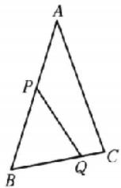

分析:根据三角形面积公式可以求出 $S_{\triangle PBQ}$ ，进而可得出 BP·BQ，根据余弦定理表示出 $PQ^{2}$ ，最后利用基本不等式即可求出 PQ 的最小值.

则 $S_{\triangle ABC} = \frac{1}{2}\times 2\times 3\times \frac{\sqrt{3}}{2} = \frac{3\sqrt{3}}{2}$ 所以 $S_{\triangle PBQ} = \frac{3\sqrt{3}}{4}$ ，令 $BP = x$ $BQ = y,\frac{1}{2} x\cdot y\cdot \frac{\sqrt{3}}{2} = \frac{3\sqrt{3}}{4}$ 所以 $xy = 3,y = \frac{3}{x}$ ，令 $\left\{ \begin{array}{ll}0 <   x\leqslant 3,\\ 0 <   \frac{3}{x}\leqslant 2, \end{array} \right.$ 得 $\frac{3}{2}\leqslant x\leqslant 3,PQ^2 = x^2 +y^2 -2xy\cos B = x^2 +\frac{9}{x^2}-$ $3\geqslant 2\sqrt{9} -3 = 3$ ，所以 $PQ_{\min} = \sqrt{3}$ ，当且仅当 $x^{2} = \frac{9}{x^{2}}$ ，即 $x = \sqrt{3}$ 时等号成立.

解后反思 本题求解,需要突破三关:第一关,求出角 $B = \frac{\pi}{3}$ ; 第二关,要能将面积关系转化为 $BP$ 与 $BQ$ 的等量关系;第三关,要有目标意识,用余弦定理表示出 $PQ$ ,最后运用基本不等式即可完成求解. 所以我们在处理较为复杂的问题时, 需要规划合理清晰的解题步骤, 做到步步为营, 层层推进, 这样, 问题求解就水到渠成了.

##### 14. $\frac{\pi}{3} = \frac{1}{4}$ 分析：通过诱导公式以及两角和差公式易得 $\sin A\sin B = \frac{3}{4}$ ，而 $c^2 = ab$ 为齐次等式，可以转化为 $\sin^2 C =$ $\sin A\sin B$ ，则 $\sin C = \frac{\sqrt{3}}{2}$ ，结合角 $C$ 的范围，求出角 $C$ 的值；要求 $\cos A\cos B$ 的值，需要求出 $\cos (A - B)$ ，结合条件 $\cos (A-$ $B) + \cos C = \frac{3}{2}$ 即可求解.

$\cos (A - B) + \cos C = \frac{3}{2}$ , 即 $\cos (A - B) + \cos (\pi - A - B) = \frac{3}{2}$ , $\cos (A - B) - \cos (A + B) = \frac{3}{2}$ , $\cos A\cos B + \sin A\sin B - \cos A\cos B + \sin A\sin B = \frac{3}{2}, 2\sin A\sin B = \frac{3}{2}, \sin A\sin B = \frac{3}{4}$ . 由 $c^2 = ab$ 及正弦定理得, $\sin^2 C = \sin A\sin B = \frac{3}{4}$ , 因为 $0 < C < \pi$ , 所以 $\sin C = \frac{\sqrt{3}}{2}$ . 因为 $c^2 = ab$ , 所以 $C$ 不可能是钝角, $C = \frac{\pi}{3}$ , 所以 $\cos C = \frac{1}{2}$ , 所以 $\cos (A - B) = 1$ , 即 $\cos A\cos B + \sin A\sin B = 1, \cos A\cos B = \frac{1}{4}$ .

# 核心笔记

化边为角后一般要结合三角形的内角和定理与三角恒等变换进行转化。由三角形内角和定理确定角的范围，从而确定三角函数值的符号，防止出现增根等扩大范围的现象。若将条件转化为边之间的关系，则式子一般比较复杂，要注意根据式子结构特征灵活化简。（练习运用：第10题、第14题）

# 考点过关20 三角函数的综合问题

##### 1. C 因为 $\sin \alpha + \cos \alpha = \frac{1}{5}$ , 所以 $(\sin \alpha + \cos \alpha)^2 = 1 + 2\sin \alpha \cos \alpha = \frac{1}{25}$ , 即 $\sin \alpha \cos \alpha = -\frac{12}{25}$ . 又因为 $\alpha \in (0, \pi)$ , 所以 $\sin \alpha > 0, \cos \alpha < 0, \alpha \in \left(\frac{\pi}{2}, \pi\right)$ , 故 $(\sin \alpha - \cos \alpha)^2 = 1 - 2\sin \alpha \cdot \cos \alpha = \frac{49}{25}$ . 因为 $\alpha \in \left(\frac{\pi}{2}, \pi\right)$ , 所以 $\sin \alpha - \cos \alpha = \frac{7}{5}$ , 结合 $\sin \alpha + \cos \alpha = \frac{1}{5}$ , 得 $\sin \alpha = \frac{4}{5}, \cos \alpha = -\frac{3}{5}$ , 则 $\tan \alpha = -\frac{4}{3}$ . 故 $\tan 2\alpha = \frac{2\tan \alpha}{1 - \tan^2\alpha} = \frac{-\frac{8}{3}}{1 - \left(-\frac{4}{3}\right)^2} = \frac{24}{7}$ .

##### 2. B $\sin C=2\sqrt{2}\sin B$ ，由正弦定理得 $c=2\sqrt{2}b$ 。因为 $a^{2}-b^{2}-3\sqrt{2}bc$ ，所以由余弦定理得 $\cos A-\frac{b^{2}+c^{2}-a^{2}}{2bc}-\frac{c^{2}-3\sqrt{2}bc}{2bc}=\frac{c}{2b}-\frac{3\sqrt{2}}{2}=-\frac{\sqrt{2}}{2}$ 。因为 $A\in(0,\pi)$ ，所以 $A=\frac{3\pi}{4}$ 。

##### 3. A 因为 $y = \sin \left(2x + \frac{\pi}{3}\right) = \sin \left[2\left(x + \frac{\pi}{6}\right)\right]$ ，所以只要把函数 $y = \sin 2x$ 图象上所有的点向左平移 $\frac{\pi}{6}$ 个单位长度.

##### 4. B 对于 A, 函数的最小正周期 $T=\frac{2\pi}{\frac{1}{2}}=4\pi$ , 故 A 不符合题意; 对于 B, 函数的最小正周期 $T=\frac{2\pi}{2}=\pi$ , 当 $x\in\left[-\frac{\pi}{6},\frac{\pi}{3}\right]$ 时, $2x-\frac{\pi}{6}\in\left[-\frac{\pi}{2},\frac{\pi}{2}\right]$ , 所以函数在区间 $\left[-\frac{\pi}{6},\frac{\pi}{3}\right]$ 上单调递增, 故 B 符合题意; 对于 C, 函数的最小正周期 $T=\frac{2\pi}{2}=\pi$ , 当 $x\in\left[-\frac{\pi}{6},\frac{\pi}{3}\right]$ 时, $2x+\frac{\pi}{3}\in[0,\pi]$ , 所以函数在区间 $\left[-\frac{\pi}{6},\frac{\pi}{3}\right]$ 上单调递减, 故 C 不符合题意; 对于 D, 函数的最小正周期 $T=\frac{2\pi}{2}=\pi$ , 当 $x\in\left[-\frac{\pi}{6},\frac{\pi}{3}\right]$ 时, $2x-\frac{\pi}{6}\in\left[-\frac{\pi}{2},\frac{\pi}{2}\right]$ , 所以函数在区间 $\overline{-\frac{\pi}{6},\frac{\pi}{3}}$ 上不具有单调性, 故 D 不符合题意.

##### 5. A $\theta = 45^{\circ}$ , 将角 $\theta$ 的终边逆时针旋转 $30^{\circ}$ , 得 $\theta + 30^{\circ} = 75^{\circ}$ , 所以 $y_{Q} = \sin 75^{\circ} = \sin (45^{\circ} + 30^{\circ}) = \frac{\sqrt{2}}{2} \left( \frac{1}{2} + \frac{\sqrt{3}}{2} \right) = \frac{\sqrt{2} + \sqrt{6}}{4}$ .

##### 6. B 因为 $a^{2}+c^{2}-b^{2}=\sqrt{3}ac$ ，由余弦定理，得 $2ac\cos B=\sqrt{3}ac$ ，所以 $\cos B=\frac{\sqrt{3}}{2}$ 。又 $B\in(0,\pi)$ ，所以 $B=\frac{\pi}{6}$ 。因为 $\frac{1+\sqrt{2}\sin A}{1-\sqrt{2}\cos A}=\frac{\sin 2C}{1+\cos 2C}=\frac{2\sin C\cos C}{2\cos^{2}C}=\frac{\sin C}{\cos C}$ ，所以 $\cos C+\sqrt{2}\sin A\cos C=\sin C-\sqrt{2}\cos A\sin C$ ，即 $\sqrt{2}\sin(A+C)=\sin C-\cos C$ 。又 $A+C=\pi-B$ ，所以 $\sqrt{2}\sin B=\sqrt{2}\sin\left(C-\frac{\pi}{4}\right)$ ，所以 $B=C-\frac{\pi}{4}$ 或 $B+C-\frac{\pi}{4}=\pi$ （舍），所以 $C=\frac{\pi}{6}+\frac{\pi}{4}=\frac{5\pi}{12}$ ，所以 $A=\pi-B-C=\pi-\frac{\pi}{6}-\frac{5\pi}{12}=\frac{5\pi}{12}$ 。

##### 7. A 解法1(面积法+几何法) 因为 $\frac{S_{\triangle ABD}}{S_{\triangle ADC}} = \frac{\frac{1}{2} \cdot AB \cdot AD \sin \angle BAD}{\frac{1}{2} \cdot AC \cdot AD \sin \angle CAD} = \frac{AB}{AC} = 3$ ，所以 AB = 3AC。在 $\triangle ABC$ 中，过点 C 作边 AB 上的高，垂足为 H，如图，则 $\tan B = \frac{CH}{BH} = \frac{AC \sin \angle CAH}{AB + AH} = \frac{AC \sin \angle CAH}{AB - AC \cos \angle CAH} = \frac{\frac{\sqrt{3}}{2} AC}{\frac{7}{2} AC} = \frac{\sqrt{3}}{7}$ 。

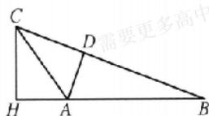

【解法2】(角平分线定理+正弦定理) 因为 $S_{\triangle ABD}=3S_{\triangle ACD}$ ，所以$BD = 3CD.$ 由角平分线定理得 $\frac{AB}{AC} = \frac{DB}{DC} = 3$ ，所以 $AB = 3AC$ ，所以 $\sin C = 3\sin B$ ，所以 $\sin \left(\frac{\pi}{3} -B\right) = 3\sin B$ ，所以 $\frac{\sqrt{3}}{2}\cos B-$ $\frac{1}{2}\sin B = 3\sin B$ ，所以 $\frac{\sqrt{3}}{2} = \frac{7}{2}\tan B$ ，所以 $\tan B = \frac{\sqrt{3}}{7}$

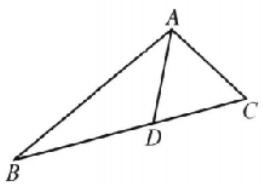

解后反思 解法 1 是通过应用平面几何的方法将三角形转化为直角三角形进行处理, 其难点在于构造直角三角形. 解法 2 是通过应用正弦定理, 将边的关系转化为角的关系, 从而通过解三角方程来解决问题, 其思路更为直接.

##### 8. C 构造△ABC, 设角 A, B, C 所对的边分别为 a, b, c, 设 $A = 7^{\circ}$ , $B = 23^{\circ}$ , $C = 150^{\circ}$ , 由余弦定理可得 $c^{2} = a^{2} + b^{2} - 2ab\cos C$ , 即 $c^{2} = a^{2} + b^{2} - 2ab\cos 150^{\circ} = a^{2} + b^{2} + \sqrt{3}ab$ . 由正弦定理可得 $\sin^{2}C = \sin^{2}A + \sin^{2}B + \sqrt{3}\sin A\sin B$ , 即 $\sin^{2}150^{\circ} = \sin^{2}7^{\circ} + \sin^{2}23^{\circ} + \sqrt{3}\sin 7^{\circ}\sin 23^{\circ}$ , 所以 $\sin^{2}7^{\circ} + \sin^{2}23^{\circ} + \sqrt{3}\sin 7^{\circ}\sin 23^{\circ} = \frac{1}{4}$ .

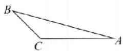

##### 9. AC 对于 A, 由于 $f\left(-\frac{3\pi}{8}\right)=\sqrt{2}\cos\left(\frac{5\pi}{4}-2\times\frac{3\pi}{8}\right)=0$ , 故 A 正确; 对于 B, $f(x)$ 的图象向右平移 $\frac{3\pi}{8}$ 个单位长度后得 $y=f\left(x-\frac{3\pi}{8}\right)=\sqrt{2}\cos\left[2\left(x-\frac{3\pi}{8}\right)+\frac{5\pi}{4}\right]=\sqrt{2}\cos\left(2x+\frac{\pi}{2}\right)=-\sqrt{2}\sin 2x$ 的图象, 对应函数为奇函数, 故 B 错误; 对于 C, 当 $x\in\left[\frac{5\pi}{8},\frac{7\pi}{8}\right]$ 时, $2x+\frac{5\pi}{4}\in\left[\frac{5\pi}{2},3\pi\right]\subseteq[2\pi,3\pi]$ , 由余弦函数的单调性知 $f(x)$ 在区间 $\left[\frac{5\pi}{8},\frac{7\pi}{8}\right]$ 上单调递减, 故 C 正确; 对于 D,

【解法1】 由 $f(x) = 1$ ，得 $\cos \left(2x + \frac{5\pi}{4}\right) = \frac{\sqrt{2}}{2}$ ，解得 $x = \frac{\pi}{4} + k\pi$ 或 $x = -\frac{\pi}{2} + k\pi, k \in \mathbf{Z}$ ，因为 $f(x)$ 在区间 $(0, m)$ 上与 $y = 1$ 有且只有6个交点，所以这些交点的横坐标从小到大依次为 $\frac{\pi}{4}, \frac{\pi}{2}, \frac{5\pi}{4}, \frac{3\pi}{2}, \frac{9\pi}{4}, \frac{5\pi}{2}$ ，而第7个交点的横坐标为 $\frac{13\pi}{4}$ . 所以 $\frac{5\pi}{2} < m \leqslant \frac{13\pi}{4}$ ，故D错误.

【解法2】 分析: 将 $2x + \frac{5\pi}{4}$ 作为一个整体, 通过图象求解:

由 $f(x) = 1$ ，得 $\cos \left(2x + \frac{5\pi}{4}\right) = \frac{\sqrt{2}}{2}$ 因为 $x\in (0,m)$ ，所以 $2x+$ $\frac{5\pi}{4}\in \left(\frac{5\pi}{4},2m + \frac{5\pi}{4}\right)$ ，作出 $y = \cos t$ 的图象，如图，根据图象可知，若使得 $f(x)$ 在区间 $(0,m)$ 上与 $y = 1$ 有且仅有六个交点，则需 $6\pi +\frac{\pi}{4} <  2m + \frac{5\pi}{4}\leqslant 8\pi -\frac{\pi}{4}$ 即 $\frac{5\pi}{2} <  m\leqslant \frac{13\pi}{4}$ 故D错误

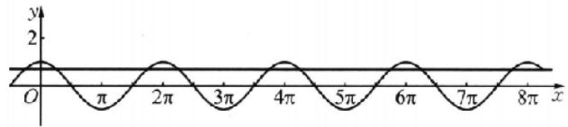

##### 10. BC 对于 A 选项, 由正弦定理得 $\frac{a}{\sin A} = 4 = 2R$ , 所以外接圆半径是 2, 故 A 错误; 对于 B 选项, 由正弦定理及 $\frac{a}{\cos A} = \frac{b}{\sin B}$ 可得 $\frac{\sin A}{\cos A} = \frac{\sin B}{\sin B} = 1$ , 即 $\tan A = 1$ , 且 $A \in (0, \pi)$ , 则 $A = \frac{\pi}{4}$ , 故 B 正确; 对于 C 选项, 由余弦定理得 $\cos C = \frac{a^2 + b^2 - c^2}{2ab} < 0$ , 则角 C 为钝角, $\triangle ABC$ 为钝角三角形, 故 C 正确; 对于 D 选项, 若 $A = \frac{\pi}{6}, B = \frac{\pi}{4}$ , 显然 $\cos A > \cos B$ , 故 D 错误.

方法突破（1）判断三角形形状要对所给的边角关系式进行转化,使之变为只含边或只含角的式子,然后进行判断;（2）在三角变换过程中,一般不要两边约去公因式,应移项提取公因式,以免漏解;（3）在利用三角函数关系推证角的关系时,要注意利用诱导公式,不要漏掉角之间关系的某种情况.

##### 11. BD $f(x) = \sin \left( x - \frac{\pi}{3} \right) + \cos \left( x - \frac{5\pi}{6} \right) = \sin \left( x - \frac{\pi}{3} \right) + \cos \left[ \frac{\pi}{2} - \left( x - \frac{\pi}{3} \right) \right] = 2\sin \left( x - \frac{\pi}{3} \right)$ . 对于 A, 因为 $f\left( x - \frac{2\pi}{3} \right) = 2\sin (x - \pi) = -2\sin x$ , 所以 $f\left( x - \frac{2\pi}{3} \right)$ 为奇函数, 故 A 错误; 对于 B, 令 $x - \frac{\pi}{3} = k\pi, k \in \mathbf{Z}$ , 解得 $x = k\pi + \frac{\pi}{3}, k \in \mathbf{Z}$ , 所以曲线 $y = f(x)$ 的对称中心为 $\left( k\pi + \frac{\pi}{3}, 0 \right), k \in \mathbf{Z}$ , 故 B 正确; 对于 C, 因为 $f\left( \frac{\pi}{2} \right) = 2\sin \frac{\pi}{6} = 1, f\left( \frac{5\pi}{6} \right) = 2\sin \frac{\pi}{2} = 2$ , 所以 $f\left( \frac{\pi}{2} \right) < f\left( \frac{5\pi}{6} \right)$ , 即 $f(x)$ 在区间 $\left( \frac{\pi}{3}, \frac{4\pi}{3} \right)$ 上不是单调递减函数, 故 C 错误; 对于 D, 因为 $x \in \left( \frac{\pi}{3}, \frac{4\pi}{3} \right)$ , 则 $x - \frac{\pi}{3} \in (0, \pi)$ , 且曲线 $y = \sin x$ 在 $(0, \pi)$ 内有且仅有一条对称轴 $x = \frac{\pi}{2}$ , 所以 $f(x)$ 在区间 $\left( \frac{\pi}{3}, \frac{4\pi}{3} \right)$ 上有且仅有一条对称轴, 故 D 正确.

方法突破 重视三角函数的“三变”，“三变”是指“变角、交名、变式”。变角：对角的拆分要尽可能化成同名、同角、特殊角。变名：尽可能减少函数名称。变式：对式子变形一般要尽可能有理化、整式化、降低次数等. 在解决求值、化简、证明问题时, 一般是观察角度、函数名、所求(或所证明)问题的整体形式中的差异, 再选择适当的三角恒等变换公式.

##### 12. $-\frac{7}{9} \cos \left(\frac{\pi}{6} - \alpha\right) = 1 - 2 \sin^2 \left(\frac{\pi}{12} - \frac{\alpha}{2}\right) = 1 - 2 \times \left(\frac{\sqrt{3}}{3}\right)^2 = \frac{1}{3}$ , 所以 $\cos \left(\frac{\pi}{3} - 2\alpha\right) = 2 \cos^2 \left(\frac{\pi}{6} - \alpha\right) - 1 = 2 \times \left(\frac{1}{3}\right)^2 - 1 = -\frac{7}{9}$ , 所以 $\sin \left(2\alpha + \frac{\pi}{6}\right) = \cos \left[\frac{\pi}{2} - \left(2\alpha + \frac{\pi}{6}\right)\right] = \cos \left(\frac{\pi}{3} - 2\alpha\right) = -\frac{7}{9}$ .

##### 13. 16 由题设可得 $\left\{ \begin{array}{l} A + b = 13, \\ -A + b = 7, \end{array} \right.$ 解得 $\left\{ \begin{array}{l} A = 3, \\ b = 10, \end{array} \right.$ 所以 $f(x) = 3\sin \omega t + 10$ . 由题表可知， $y = f(t)$ 的最小正周期 $T = 12$ ，故 $\omega = \frac{2\pi}{T} = \frac{\pi}{6}$ ，所以 $f(x) = 3\sin \frac{\pi}{6} t + 10$ . 由题意可得 $3\sin \frac{\pi}{6} t + 10 \geqslant 5 + 6.5$ ，即 $\sin \frac{\pi}{6} t \geqslant 0.5$ ，所以 $\frac{\pi}{6} + 2k\pi \leqslant \frac{\pi}{6} t \leqslant 2k\pi + \frac{5\pi}{6}$ ，得 $12k + 1 \leqslant t \leqslant 12k + 5, k \in \mathbf{Z}$ . 又 $0 \leqslant t \leqslant 24$ ，解得 $1 \leqslant t \leqslant 5$ 或 $13 \leqslant t \leqslant 17$ ，所以该船最多在港内停留 $24 - 8 = 16$ （小时）.

##### 14. $\frac{1}{2}$ 分析: 先根据已知条件得 $a^2 = \frac{b^2 + 2c^2}{3}$ , 再结合余弦定理得 $\cos A = \frac{1}{3} \left( \frac{b}{c} + \frac{c}{2b} \right)$ , 判断出 $A \in \left(0, \frac{\pi}{2}\right)$ . 将 $\sin A$ 的值最大转化为 $\cos A$ 的值最小, 最后利用基本不等式求解.

由 $\sin^2 B = 3\sin^2 A - 2\sin^2 C$ 及正弦定理，得 $b^{2} = 3a^{2} - 2c^{2}$ ，所以 $a^2 = \frac{b^2 + 2c^2}{3}$ 所以 $\cos A = \frac{b^2 + c^2 - a^2}{2bc} = \frac{b^2 + c^2 - \left(\frac{b^2 + 2c^2}{3}\right)}{2bc} =$ $\frac{1}{3}\cdot \frac{2b^2 + c^2}{2bc} = \frac{1}{3}\left(\frac{b}{c} +\frac{c}{2b}\right).$ 因为 $a > 0,b > 0,c > 0$ ，所以 $\cos A > 0$ ，所以 $A\in \left(0,\frac{\pi}{2}\right)$ ，要使 $\sin A$ 最大，则 $A$ 最大，cos A最小，所以根据基本不等式得 $\cos A = \frac{1}{3}\left(\frac{b}{c} +\frac{c}{2b}\right)\geqslant \frac{1}{3}\times$ $2\sqrt{\frac{b}{c}\cdot\frac{c}{2b}} = \frac{\sqrt{2}}{3}$ 当且仅当 $\frac{b}{c} = \frac{c}{2b}$ 即 $\frac{b^2}{c^2} = \frac{1}{2}$ 时，等号成立，所以 $\frac{\sin^2B}{\sin^2C} = \frac{b^2}{c^2} = \frac{1}{2}.$

# 核心笔记

##### 1. 利用公式 $f(x) = a\sin \omega x + b\cos \omega x = \sqrt{a^2 + b^2}\sin (\omega x + \varphi)$ 可以求出：（1） $f(x)$ 的周期为 $\frac{2\pi}{|\omega|}$ ; （2） 单调区间（正弦函数的单调区间可通过解不等式求得）；（3） 值域为 $[-\sqrt{a^2 + b^2}, \sqrt{a^2 + b^2}]$ ; （4） 对称轴及对称中心（由 $\omega x + \varphi = \frac{\pi}{2} + k\pi, k \in \mathbb{Z}$ 可得对称轴方程，由 $\omega x + \varphi - k\pi, k \in \mathbb{Z}$ 可得对称中心的横坐标）。

##### 2. 求形如 $y = A\sin (\omega x - \varphi)$ 或 $y = A\cos (\omega x + \varphi)$ 的值域的方法：

使用换元法，设 $t = \omega x + \varphi$ ，根据 $x$ 的取值范围确定 $t$ 的取值范围，然后利用三角函数的图象或单位圆求出 $\omega x + \varphi$ 的三角函数值，进而得到值域.

# 大题过关三 三角函数与解三角形（1）

##### 1. 解: （1） 分析: 因为导函数的正、负决定原函数的增、减, 所以图象高的为 $f'(x)$ 的图象, 图象低的为 $f(x)$ 的图象, 以此为突破口.

由 $f(x) = A\sin (\omega x + \varphi)(A > 0, \omega > 0)$ 得 $f'(x) = A\omega \cos (\omega x + \varphi)$ .

由图象得 A=2, $A\omega=4$ , 即 $A=\omega=2$ . (3 分)

因为 $f(x)$ 的图象过点 $\left(\frac{\pi}{12},0\right)$ ，所以 $2\times\frac{\pi}{12}+\varphi=k\pi,k\in Z$ ，解得

$\varphi = k \pi - \frac {\pi}{6}, k \in \mathbf {Z}.$

又 $-\frac{\pi}{2}<\varphi<\frac{\pi}{2}$ ，所以 $\varphi=-\frac{\pi}{6}$ 。所以 $f(x)=2\sin\left(2x-\frac{\pi}{6}\right)$ .
(6 分)

（2）由 $f(\alpha)=\frac{6}{5}$ 得 $\sin\left(2\alpha-\frac{\pi}{6}\right)=\frac{3}{5}$ . (9分)

又 $f'(x)=4\cos\left(2x-\frac{\pi}{6}\right)$ ,

所以 $f'\left(2\alpha -\frac{\pi}{12}\right) = 4\cos \left(4\alpha -\frac{\pi}{3}\right) = 4\cos \left[2\left(2\alpha -\frac{\pi}{6}\right)\right] =$

$4\left[1 - 2\sin^2\left(2\alpha - \frac{\pi}{6}\right)\right] = 4\left[1 - 2\times \left(\frac{3}{5}\right)^2\right] - \frac{28}{25}.$ (13分)

##### 2. 解: （1） 因为 $a^{2} + b^{2} + \sqrt{2}ab = c^{2}$ ,

所以 $a^{2}+b^{2}-c^{2}=-\sqrt{2}ab$ ，所以 $\cos C=\frac{a^{2}+b^{2}-c^{2}}{2ab}$ (2分)

$= \frac{-\sqrt{2}ab}{2ab} = -\frac{\sqrt{2}}{2}. \tag{4分}$

因为 $C \in (0, \pi)$ ，所以 $C = \frac{3\pi}{4}$ . (6 分)

（2） 因为 $c=2b\cos B$ ,

由正弦定理可得 $\sin C=2\sin B\cos B$ ，(8 分)

所以 $\sin C = \sin 2B - \frac{\sqrt{2}}{2}$ . (9 分)

因为 $C=\frac{3\pi}{4}$ ,

所以 $B \in \left(0, \frac{\pi}{4}\right), 2B \in \left(0, \frac{\pi}{2}\right)$ ,

所以 $2B=\frac{\pi}{4}, B=\frac{\pi}{8}$ ，(10 分)

所以 $A=\pi-\frac{\pi}{8}-\frac{3\pi}{4}=\frac{\pi}{8}$ ,

所以 a=b=1. (12 分)

所以 $\triangle ABC$ 的面积为 $\frac{1}{2}ab\sin C=\frac{1}{2}\times1\times1\times\sin\frac{3\pi}{4}=\frac{\sqrt{2}}{4}.$ (15 分)

##### 3. 解: （1） 由 $\sin\left(B+\frac{\pi}{6}\right)=\frac{a+b}{2c}$ 得 $a+b=2c\sin\left(B+\frac{\pi}{6}\right)=$

$\sqrt{3}c\sin B+c\cos B.$ (2分)

由正弦定理得 $\sin A + \sin B = \sqrt{3} \sin B \sin C + \sin C \cos B$ ，（4分）得 $\sin(B + C) + \sin B = \sqrt{3} \sin B \sin C + \sin C \cos B$ ，得 $\cos C \cdot \sin B + \sin B = \sqrt{3} \sin C \sin B$ .

因为 $B \in (0, \pi)$ ，所以 $\sin B \neq 0$ ，所以 $\sqrt{3} \sin C - \cos C = 1$ ，（6分）

即 $\sin\left(C-\frac{\pi}{6}\right)=\frac{1}{2}$ . 又 $0<C<\pi,$ 从而 $-\frac{\pi}{6}<C-\frac{\pi}{6}<\frac{5\pi}{6}$ ，所

以 $C - \frac{\pi}{6} = \frac{\pi}{6}$ 所以 $C = \frac{\pi}{3}$ . (8分)

（2）由余弦定理得 $(\sqrt{6})^{2}=a^{2}+b^{2}-2ab\cos C=(a+b)^{2}-3ab$ ，可得ab=2.
(12 分)

又 $S_{\triangle ABC} = S_{\triangle CED} + S_{\triangle CAD}$ ，所以 $\frac{1}{2} ab\sin \frac{\pi}{3} = \frac{1}{2} a\cdot CD$

$\sin\frac{\pi}{6}+\frac{1}{2}b\cdot CD\cdot\sin\frac{\pi}{6},$

即 $\frac{1}{2}ab\cdot\frac{\sqrt{3}}{2}=\frac{1}{2}a\cdot CD\cdot\frac{1}{2}+\frac{1}{2}b\cdot CD\cdot\frac{1}{2}$ ，(14分)

所以 $CD=\frac{\sqrt{3}ab}{a+b}=\frac{\sqrt{3}\times2}{2\sqrt{3}}=1.$ (15 分)

规范书写【1】必须指明角 C 的取值范围(写“在三角形中”视为正确)，否则扣 1 分.

解后反思 涉及角平分线问题,往往通过面积法求解,注意方程思想和整体法的应用.

##### 4. 解: （1） 由 $S = -\frac{\sqrt{3}}{4}(a^{2} + c^{2} - b^{2})$ 得 $\frac{1}{2}ac\sin B = -\frac{\sqrt{3}}{4} \times 2ac\cos B$ ,

即 $\sin B = -\sqrt{3} \cos B.$ (3 分)

因为 $\cos B \neq 0,^{[1]}$ 所以 $\tan B = -\sqrt{3}$ . (5 分)

又 $B \in (0, \pi)$ , [2] 故 $B = \frac{2\pi}{3}$ . (7 分)

（2） 解法 1（向量法）由（1）可知 $B = \frac{2\pi}{3}$ ，又 $\angle ABD = \frac{\pi}{2}$ ，则 $\angle CBD = \frac{\pi}{6}$ .
(8 分)

由题可知 AD=2DC=2，

故 $\overrightarrow{BD} = \overrightarrow{BC} + \overrightarrow{CD} = \overrightarrow{BC} + \frac{1}{3}\overrightarrow{CA} = \overrightarrow{BC} + \frac{1}{3} (\overrightarrow{BA} - \overrightarrow{BC}) = \frac{2}{3}\overrightarrow{BC} + \frac{1}{3}\overrightarrow{BA},$ (10 分)

所以 $\overrightarrow{BA} \cdot \overrightarrow{BD} = \overrightarrow{BA} \cdot \left( \frac{2}{3} \overrightarrow{BC} + \frac{1}{3} \overrightarrow{BA} \right) = \frac{1}{3} c^2 - \frac{1}{3} ac = 0,$

因为 $c \neq 0$ ，所以 a = c, $A = C = \frac{\pi}{6}$ . (12 分)

在 Rt $\triangle ABD$ 中， $c=AD \cdot \cos \frac{\pi}{6}=\sqrt{3}$ . (13 分)

故 $\triangle ABC$ 的周长为 $AB + BC + AC = \sqrt{3} +\sqrt{3} +3 = 3 - 2\sqrt{3}$ （15分）

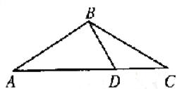

【解法2】 由（1）可知 $B = \frac{2\pi}{3}$ ，又 $\angle ABD = \frac{\pi}{2}$ ，则 $\angle CBD = \frac{\pi}{6}$ . (8分)

在 Rt△ABD 中, AD=2, 所以 BD=2sin A. (9 分)

在 $\triangle BCD$ 中，由 $\frac{BD}{\sin C}=\frac{CD}{\sin\angle DBC}$ ，得 $\frac{2\sin A}{\sin C}=\frac{1}{\sin\frac{\pi}{6}}$ ，即 $\sin A=\sin C.$ (11 分)

因为 $0 < A, C < \frac{\pi}{3}, A + C = \pi - B = \frac{\pi}{3}$ ，所以 $A = C = \frac{\pi}{6}$ .
(12 分)

在 Rt△ABD 中， $c=AD\cdot\cos\frac{\pi}{6}=\sqrt{3}$ . (14 分)

故 $\triangle ABC$ 的周长为 $AB+BC+AC=\sqrt{3}+\sqrt{3}+3=3+2\sqrt{3}.$ (15 分)

【解法3】 由（1）可知 $B = \frac{2\pi}{3}$ ，又 $\angle ABD = \frac{\pi}{2}$ ，则 $\angle CBD = \frac{\pi}{6}$ . (8分)

设 BD = x，在 $\triangle ABC$ 中，由余弦定理得 $b^{2} = c^{2} + a^{2} - 2ca \cdot \cos \angle ABC$ ，(9 分)

即 $c^2 + a^2 + ca = 9$ .

在 $\triangle ABD$ 中， $c^2 +x^2 = AD^2 = 4.$ (10分）

在 $\triangle CBD$ 中， $BC^{2}+BD^{2}-2BC\cdot BD\cdot\cos\angle CBD=CD^{2}$

即 $a^{2}+x^{2}-\sqrt{3}ax=1.$ (11 分)

联立, 解得 $a = c = \sqrt{3}$ , x = 1. (14 分)

所以 $\triangle ABC$ 的周长为 $3+2\sqrt{3}$ . (15分)

规范书写【1】不交代 $\cos B \neq 0$ ，扣 1 分.

##### 【2】不交代 $B \in (0, \pi)$ ，扣1分.

# 大题过关四 三角函数与解三角形（2）

##### 1. 解: （1） 分析: 平面向量数量积与三角函数的综合问题, 往往通过数量积的坐标公式以及三角恒等变换公式化简 $f(x)$ 为 $A\sin(\omega x + \varphi) + B$ 的形式, 再进行后续求解.

因为 $a-(\cos x,2\sin x)$ , $b=(2\cos x,\sqrt{3}\cos x)$ ，函数 $f(x)=a \cdot b$ ,

所以 $f(x)=2\cos^{2}x+2\sqrt{3}\sin x\cos x$ (1分)

$= \cos 2 x + 1 + \sqrt {3} \sin 2 x \tag {3分}$

$= 2 \left(\frac {1}{2} \cos 2 x + \frac {\sqrt {3}}{2} \sin 2 x\right) + 1$

$= 2 \sin \left(2 x + \frac {\pi}{6}\right) + 1. \tag {4分}$

因为 $f(x_{0})=\frac{11}{5}$ ，所以 $2\sin\left(2x_{0}+\frac{\pi}{6}\right)+1=\frac{11}{5}$ ，所以 $\sin\left(2x_{0}+\frac{\pi}{6}\right)=\frac{3}{5}$ . (5 分)

分析: 要求 $\cos 2x_{0}$ ，需要变角，将所求角用已知角和差或倍角形式表示， $\cos 2x_{0} = \cos \left[ \left( 2x_{0} + \frac{\pi}{6} \right) - \frac{\pi}{6} \right]$ ，为此先求出 $\cos \left( 2x_{0} + \frac{\pi}{6} \right)$ ，最后再利用两角差的余弦公式计算可得.

因为 $x_0 \in \left(\frac{\pi}{6}, \frac{\pi}{3}\right)$ , 所以 $2x_0 + \frac{\pi}{6} \in \left(\frac{\pi}{2}, \frac{5\pi}{6}\right)$ ,

所以 $\cos\left(2x_{0}+\frac{\pi}{6}\right)=-\sqrt{1-\sin^{2}\left(2x_{0}+\frac{\pi}{6}\right)}=-\frac{4}{5}$ ，（6分）

所以 $\cos 2x_0 = \cos \left[\left(2x_0 + \frac{\pi}{6}\right) - \frac{\pi}{6}\right]$

$= \cos \left(2 x _ {0} + \frac {\pi}{6}\right) \cos \frac {\pi}{6} + \sin \left(2 x _ {0} + \frac {\pi}{6}\right) \sin \frac {\pi}{6} \tag {7分}$

$= \frac {4}{5} \times \frac {\sqrt {3}}{2} + \frac {3}{5} \times \frac {1}{2} = \frac {3 - 4 \sqrt {3}}{1 0}. \tag {8分}$

（2） 分析: 先根据三角函数的变换规则求出 $g(x)$ 的解析式, 再根据正弦函数的性质解不等式.

将 $f(x)$ 图象上所有的点向右平移 $\frac{\pi}{6}$ 个单位长度得到 $y = 2\sin \left[2\left(x - \frac{\pi}{6}\right) + \frac{\pi}{6}\right] + 1 = 2\sin \left(2x - \frac{\pi}{6}\right) + 1$ 的图象，

再将 $y = 2\sin \left(2x - \frac{\pi}{6}\right) + 1$ 向下平移 1 个单位长度得到 $y = 2\sin \left(2x - \frac{\pi}{6}\right)$ 的图象，最后将 $y = 2\sin \left(2x - \frac{\pi}{6}\right)$ 图象上所有点的纵坐标变为原来的 $\frac{1}{2}$ 得到 $y = \sin \left(2x - \frac{\pi}{6}\right)$ 的图象，

即 $g(x)=\sin\left(2x-\frac{\pi}{6}\right)$ . (10 分)

【解法1】 由 $g(x) \geqslant \frac{1}{2}$ , 得 $\sin\left(2x - \frac{\pi}{6}\right) \geqslant \frac{1}{2}$ , 所以 $\frac{\pi}{6} + 2k\pi \leqslant 2x - \frac{\pi}{6} \leqslant \frac{5\pi}{6} + 2k\pi, k \in \mathbf{Z}$ , (11分)

解得 $\frac{\pi}{6} + k\pi \leqslant x \leqslant \frac{\pi}{2} + k\pi, k \in \mathbf{Z}$ ,

令 $k = 0$ 可得 $x\in \left[\frac{\pi}{6},\frac{\pi}{2}\right]$

令 $k = -1$ 可得 $x \in \left[-\frac{5\pi}{6}, -\frac{\pi}{2}\right]$ .

又 $x \in \left[-\frac{\pi}{6}, \frac{\pi}{3}\right]$ , 所以 $x \in \left[\frac{\pi}{6}, \frac{\pi}{3}\right]$ .

【解法2】 也可先由 $x \in \left[-\frac{\pi}{6}, \frac{\pi}{3}\right]$ , 求得 $2x - \frac{\pi}{6} \in \left[-\frac{\pi}{2}, \frac{\pi}{2}\right]$ , 再结合 $\sin \left(2x - \frac{\pi}{6}\right) \geqslant \frac{1}{2}$ , 求得 $2x - \frac{\pi}{6} \in \left[\frac{\pi}{6}, \frac{\pi}{2}\right]$ , 解得 $x \in \left[\frac{\pi}{6}, \frac{\pi}{3}\right]$ .

即当 $x \in \left[-\frac{\pi}{6}, \frac{\pi}{3}\right]$ 时，不等式 $g(x) \geqslant \frac{1}{2}$ 的解集为 $\left[\frac{\pi}{6}, \frac{\pi}{3}\right]$ . (13分)

规范书写【1】要指明 $2J_{\mathrm{C}} + \frac{\pi}{6}$ 的范围，否则扣1分.

##### 【2】没有根据 $x \in \left[-\frac{\pi}{6}, \frac{\pi}{3}\right]$ ，得不到最终答案扣2分.

解后反思 第（1）问,经常用到“配角”技巧,用已知三角函数的角来表示未知角,即把 $2x_{0}$ 表示成 $\left(2x_{0}+\frac{\pi}{6}\right)-\frac{\pi}{6}$ ,不会配,也可用“换元法”处理;

第（2）问,对于三角方程或三角不等式,学生不太会处理,如果x有初始范围,用解法2,结合正弦函数的图象处理更方便.

##### 2. 解: （1） 分析: 边角混合, 所求为角, 可以考虑运用正弦定理, 边化角.

由 $2c\sin B=\sqrt{2}b$ 及正弦定理得 $2\sin C\sin B=\sqrt{2}\sin B.$ (2 分)

因为角 B 为三角形内角，所以 $\sin B > 0$ ，所以 $\sin C = \frac{\sqrt{2}}{2}$ . (4 分)

又 C 为三角形内角, 所以 $C=\frac{\pi}{4}$ 或 $C=\frac{3\pi}{4}$ . (6 分)

（2） 分析: 要求 $\triangle ABC$ 的面积, 只知道 a=2 和角 C 的值, 需要求出 $\sin B$ 以及边 c, 因此先根据正切关系求得 $\tan B$ 和 $\tan A$ , 再运用正弦定理求得边 c.

由 $\tan A = -\tan(B + C) = \tan B + \tan C$ 得 $-\frac{\tan B + \tan C}{1 - \tan B \tan C} = \tan B + \tan C$ ,

又 $\tan B + \tan C \neq 0$ ，所以 $\tan B \tan C = 2$ ，

且 $B, C \in \left(0, \frac{\pi}{2}\right)$ .

由（1）得 $\tan C=1$ ，所以 $\tan B=2.$ (9分)

所以 $\tan A = \tan B + \tan C = 3.$

又角 A 为三角形内角，所以 $\sin A = \frac{3\sqrt{10}}{10}$ .

又 $\frac{a}{\sin A} = \frac{c}{\sin C}$ 即 $\frac{2}{\frac{3\sqrt{10}}{10}} = \frac{c}{\frac{\sqrt{2}}{2}}$ 即 $c = \frac{2\sqrt{5}}{3}$ . (12分)

又 $\tan B=2$ ，角 B 为三角形内角，所以 $\sin B=\frac{2\sqrt{5}}{5}$ .

所以 $S_{\triangle ABC}=\frac{1}{2}ac\sin B=\frac{1}{2}\times2\times\frac{2\sqrt{5}}{3}\times\frac{2\sqrt{5}}{5}=\frac{4}{3}.$ (15分)

规范书写【1】需要正确写出两个值，少一个扣1分.

##### 3. 解: （1） 在 $\triangle BCD$ 中, $BC = CD = \sqrt{3}$ , 由余弦定理得 $BD^{2} = BC^{2} + CD^{2} - 2BC \cdot CD \cos \angle BCD = 9$ , 所以 BD = 3. (3 分)

又 BC=CD，所以 $\angle CBD=\angle CDB=\frac{\pi}{6}$ . 又 $\angle CDE=\frac{2\pi}{3}$ ，所以 $\angle BDE=\frac{2\pi}{3}-\frac{\pi}{6}=\frac{\pi}{2}$ .
(6 分)

在 Rt△BDE 中， $BE=\sqrt{BD^{2}+DE^{2}}=\sqrt{9+16}=5.$ (8 分)

（2） 在 $\triangle BAE$ 中， $\angle BAE = \frac{2\pi}{3}$ ，BE = 5.

由余弦定理得 $BE^{2}=AB^{2}+AE^{2}-2AB\cdot AE\cos\angle BAE$ ，即 $25=AB^{2}+AE^{2}-AB\cdot AE$ ，

所以 $(AB + AE)^2 - 25 = AB \cdot AE \leqslant \left(\frac{AB + AE}{2}\right)^2$ ，即 $\frac{3}{4} (AB + AE)^2 \leqslant 25$ ，

解得 $AB + AE \leqslant \frac{10\sqrt{3}}{3}$ , 当且仅当 $AB = AE = \frac{5\sqrt{3}}{3}$ 时等号成立,

所以 $BA + AE$ 的最大值为 $\frac{10\sqrt{3}}{3}$ . (15 分)

##### 4. 解: （1） 分析: 求 A, 则需要将条件 $4\sqrt{3}\cos C = \sqrt{3}b - c\sin A$ 化为只含角的等式, 但它又不是含边的齐次式, 故难于边化角, 考虑 a = 4, 条件中的等式可化为 $\sqrt{3}a\cos C = \sqrt{3}b - c\sin A$ , 这样就是含边的齐次式了, 就可以边化角了.

根据题意可得 $\sqrt{3} a\cos C + c\sin A = \sqrt{3} b$ ，由正弦定理得 $\sqrt{3}\sin A\cos C + \sin A\sin C = \sqrt{3}\sin B.$ [1]

又 $\sqrt{3}\sin B=\sqrt{3}\sin(A+C)=\sqrt{3}\sin A\cos C-\sqrt{3}\cos A\sin C$ ，所以 $\sin A \sin C = \sqrt{3} \cos A \sin C.$ (4 分)

又 $C \in (0, \pi)$ . 所以 $\sin C \neq 0$ , 所以 $\sin A = \sqrt{3} \cos A$ , 即 $\tan A = \sqrt{3}$ .

因为 $A \in (0, \pi)$ ，所以 $A = \frac{\pi}{3}$ . [2] (6分)

（2） 分析: 求周长, 即需求出 b, c, 则需建立关于 b, c 的方程组, 其中一个方程可由含角 A 的余弦定理确立, 而另一个可由面积关系 $S_{\triangle ABC} = S_{\triangle ABM} + S_{\triangle ACM}$ 确立, 再运用整体思想求出 $b + c$ , 从而可求出周长.

如图，因为 $S_{\triangle ABC} = S_{\triangle ABM} + S_{\triangle ACM}$ ，所以 $\frac{1}{2} bc\sin \angle BAC = \frac{1}{2}\cdot$ $AM\cdot c\cdot \sin \angle BAM + \frac{1}{2} AM\cdot b\cdot \sin \angle CAM.$

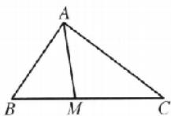

又 AM 平分 $\angle BAC$ ，所以 $\angle BAM = \angle CAM = \frac{1}{2} \angle BAC = \frac{\pi}{6}$ ，所以 $\frac{1}{2} bc \times \frac{\sqrt{3}}{2} = \frac{1}{2} \times \frac{2\sqrt{2}}{3} c \times \frac{1}{2} + \frac{1}{2} \times \frac{2\sqrt{2}}{3} b \times \frac{1}{2}$ ，则 $\sqrt{3} bc = \frac{2\sqrt{2}}{3}(b + c)$ ，即 $bc = \frac{2\sqrt{2}}{3\sqrt{3}}(b + c)$ . (10 分)

由余弦定理得 $a^{2}=b^{2}+c^{2}-2bc\cos/\angle BAC$ ，即 $16=b^{2}+c^{2}-bc$ ，
(12分)

所以 $16 - (b + c)^2 - 3bc = (b + c)^2 - \frac{2\sqrt{2}}{\sqrt{3}}(b + c)$ ，解得 $b + c = 2\sqrt{6}$ （负值舍去），

故 $\triangle ABC$ 的周长为 $2\sqrt{6}+4$ . (15分)

规范书写【1】应用正弦定理或余弦定理,一定要冠名,先写定理的原型再代数值.

##### 【2】三角函数是周期函数,没有限定角的范围,会有无数个解.一定要有 $A\in(0,\pi)$ ,才能得到 $A=\frac{\pi}{3}$ ,没有扣1分.

# 考点过关21 平面向量的概念及线性运算

##### 1. D 由题意，画出几何图形如图所示.

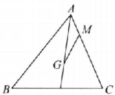

根据向量加法运算可得 $\overrightarrow{GM} = \overrightarrow{GA} +\overrightarrow{AM}$ ，因为点 $G$ 为△ABC的重心，所以 $\overrightarrow{AG} = \frac{2}{3}\times \frac{1}{2} (\overrightarrow{AB} +\overrightarrow{AC}) = \frac{1}{3}\overrightarrow{AB} +\frac{1}{3}\overrightarrow{AC}.$ 又点 $M$ 满足 $\overrightarrow{MC} = 3\overrightarrow{AM}$ ，即 $\overrightarrow{AM} = \frac{1}{4}\overrightarrow{AC}.$ 所以 $\overrightarrow{GM} = -\left(\frac{1}{3}\overrightarrow{AB} +\right.$ $\frac{1}{3}\overrightarrow{AC}\Big) + \frac{1}{4}\overrightarrow{AC} = -\frac{1}{3}\overrightarrow{AB} -\frac{1}{12}\overrightarrow{AC}.$

##### 2. D 当 a 与 b 反向时， $|a+b|$ 的最小值为 5.  
##### 3. D 因为 $AB \parallel DC$ ，且 $AE = \frac{1}{2} DC$ ，所以 $\overrightarrow{AF} = \frac{1}{3}\overrightarrow{AC} = \frac{1}{3} (\overrightarrow{AB} + \overrightarrow{AD}), \overrightarrow{BF} = \overrightarrow{BA} + \overrightarrow{AF} = -\overrightarrow{AB} + \frac{1}{3} (\overrightarrow{AB} + \overrightarrow{AD}) = -\frac{2}{3}\overrightarrow{AB} + \frac{1}{3}\overrightarrow{AD}$ .

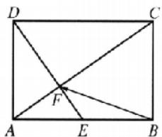

##### 4. C 由 $a + 2b = 5e_1, 2a - b = 5e_2$ 可知，当且仅当 $e_1$ 与 $e_2$ 共线时，两向量共线。  
##### 5. B 因为 A, B, C 三点共线，所以存在实数 k，使 $\overrightarrow{AB} = k\overrightarrow{AC}$ ，即 $\lambda a + b = k (a + \mu b)$ 。又向量 a, b 不共线，所以 $\left\{\begin{aligned}\lambda &= k,\\ 1 &= \mu k,\end{aligned}\right.$ 得 $\lambda\mu=1$ 。由 $\lambda > 0, \mu > 0$ ，得 $\lambda + 4\mu \geqslant 2\sqrt{4\lambda\mu} = 4$ ，当且仅当 $\lambda = 4\mu$ ，即 $\lambda = 2, \mu = \frac{1}{2}$ 时，取“=”.  
##### 6. D 因为 $\left|\overrightarrow{OA}-\overrightarrow{OB}\right|=\left|\overrightarrow{BA}\right|$ , A, B 是单位圆上的动点, 所以 $\left|\overrightarrow{OA}-\overrightarrow{OB}\right|$ 的最大值为 2, 此时 $\overrightarrow{OA}$ 与 $\overrightarrow{OB}$ 反向.  
##### 7. B 因为 $\overrightarrow{AD} = \frac{2}{3}\overrightarrow{AB} + \frac{1}{3}\overrightarrow{AC}$ , 所以 $\overrightarrow{BD} = \overrightarrow{AD} - \overrightarrow{AB} = -\frac{1}{3}\overrightarrow{AB} + \frac{1}{3}\overrightarrow{AC} = \frac{1}{3}\overrightarrow{BC}$ , 所以点 $D$ 在线段 $BC$ 上靠近点 $B$ 的三等分处, 如图所示, 过点 $D$ 作 $DE \perp AB$ 交 $AB$ 于点 $E$ , 过点 $D$ 作 $DF \perp AC$ 交 $AC$ 于点 $F$ , 则 $\sin B = \frac{DE}{BD}, \sin \theta = \frac{DE}{AD}, \sin C = \frac{DF}{DC}, \sin 2\theta = \frac{DF}{AD}$ , 所以 $DE = AD\sin \theta, DF = AD\sin 2\theta$ , 所以 $\sin B = \frac{DE}{BD} = \frac{AD\sin \theta}{\frac{1}{3}BC} = \frac{3AD\sin \theta}{BC}, \sin C = \frac{DF}{DC} = \frac{AD\sin 2\theta}{\frac{2}{3}BC} = \frac{3AD\sin 2\theta}{2BC} = \frac{3AD\sin \theta\cos \theta}{BC}$ , 所以 $\sin C = \cos \theta\sin B$ .

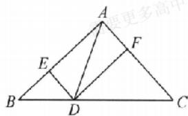

##### 8. C 分析: 根据系数关系, 将 $\overrightarrow{AD}$ 拆分为 $\overrightarrow{AD} = \frac{1}{2}\overrightarrow{AD} + \frac{1}{2}\overrightarrow{AD}$ , 通过减法运算可以得到 $\overrightarrow{BD} = \overrightarrow{DC}$ .

对于 A, 因为 $\overrightarrow{AD} = \frac{1}{2} (\overrightarrow{AB} + \overrightarrow{AC})$ ，所以 $\frac{1}{2} \overrightarrow{AD} - \frac{1}{2} \overrightarrow{AB} = \frac{1}{2} \overrightarrow{AC} - \frac{1}{2} \overrightarrow{AD}$ ，即 $\overrightarrow{BD} = \overrightarrow{DC}$ ，所以 D 是边 BC 的中点，故 A 正确；

分析: 取 BC 的中点为 M, 通过向量的加法运算, 可以得到 $\overrightarrow{AD} = \frac{2}{3} \overrightarrow{AM}$ , 符合重心的性质.

对于 B, 设 BC 的中点为 M, $\overrightarrow{AD} = \frac{1}{3} (\overrightarrow{AB} + \overrightarrow{AC}) = \frac{1}{3} \times 2\overrightarrow{AM} = \frac{2}{3}\overrightarrow{AM}$ , 即点 D 是 $\triangle ABC$ 的重心, 故 B 正确;

分析:根据系数关系,将 $2\overrightarrow{AB}$ 拆分为 $\overrightarrow{AB} + \overrightarrow{AB}$ ,通过减法运算可以得到 $\overrightarrow{BD} = \overrightarrow{CB}$ ,根据共线定理可以判断.

对于 C，因为 $\overrightarrow{AD}=2\overrightarrow{AB}-\overrightarrow{AC}$ ，所以 $\overrightarrow{AD}-\overrightarrow{AB}=\overrightarrow{AB}-\overrightarrow{AC}$ ，即 $\overrightarrow{BD}=\overrightarrow{CB}$ ，所以点 D 在边 CB 的延长线上，故 C 错误；

分析:由于 $x+y=\frac{1}{2}$ ，考虑将等式两边同乘以 2，设 $\overrightarrow{AM}=2\overrightarrow{AD}$ ，根据系数之和为 1，得到 M, B, C 三点共线，且 $\overrightarrow{AM}=2\overrightarrow{AD}$ ，可得面积关系.

对于 D, 因为 $\overrightarrow{AD}=x\overrightarrow{AB}+y\overrightarrow{AC}$ ，且 $x+y=\frac{1}{2}$ ，所以 $2\overrightarrow{AD}=2x\overrightarrow{AB}+2y\overrightarrow{AC}$ ，且 $2x+2y=1$ ，设 $\overrightarrow{AM}=2\overrightarrow{AD}$ ，则 $\overrightarrow{AM}=2x\overrightarrow{AB}+2y\overrightarrow{AC}$ ，且 $2x+2y=1$ ，故 M, B, C 三点共线，且 $\overrightarrow{AM}=2\overrightarrow{AD}$ ，即 $\triangle BCD$ 的面积是 $\triangle ABC$ 面积的一半，故 D 正确.  
##### 9. ABD 对于 A, 2a 的长度是 a 的长度的 2 倍, 且 2a 与 a 方向相同, 故 A 正确; 对于 B, $-\frac{a}{3}$ 的长度是 a 的长度的 $\frac{1}{3}$ , 且 $-\frac{a}{3}$ 与 a 方向相反, 故 B 正确; 对于 C, 若 $\lambda = 0$ , 则 $\lambda a$ 等于零向量, 不是零, 故 C 错误; 对于 D, 若 $\lambda = \frac{1}{|a|}$ , 则 $\lambda a$ 是与 a 同向的单位向量, 故 D 正确.  
##### 10. AC $\overrightarrow{OP} = \overrightarrow{OA} + \overrightarrow{AP} = \overrightarrow{OA} + \lambda \overrightarrow{AB} = \overrightarrow{OA} + \lambda (\overrightarrow{OB} - \overrightarrow{OA}) = (1 - \lambda) \overrightarrow{OA} + \lambda \overrightarrow{OB}$ ，因为 $\overrightarrow{OP}$ 与 $\overrightarrow{OC}$ 共线，所以 $\frac{1 - \lambda}{\mu} = \frac{\lambda}{3\mu}$ ，解得 $\lambda = \frac{3}{4}$ ，所以 C 正确，D 错误；当 P 为线段 OC 中点时， $\overrightarrow{OP} = \frac{1}{2} \overrightarrow{OC}$ ，即 $\overrightarrow{OP} = \frac{1}{2} \mu \overrightarrow{OA} + \frac{3}{2} \mu \overrightarrow{OB}$ ，则 $1 - \lambda = \frac{1}{2} \mu$ 且 $\lambda = \frac{3}{2} \mu$ ，解得 $\mu = \frac{1}{2}$ ，所以 A 正确，B 错误。  
##### 11. BD 对于 A, $\overrightarrow{OP_{n-3}} \cdot \overrightarrow{OP_{n-2}} = |\overrightarrow{OP_{n-3}}| \cdot |\overrightarrow{OP_{n-2}}| \cdot \cos \angle P_{n-3}OP_{n-2}, \overrightarrow{OP_{n-2}} \cdot \overrightarrow{OP_{n-1}} - |\overrightarrow{OP_{n-2}} \cdot |\overrightarrow{OP_{n-1}}| \cdot \cos \angle P_{n-2}OP_{n-1}$ ，由图易知， $\overrightarrow{OP_{n-3}}, \overrightarrow{OP_{n-1}}$ 两向量在 $\overrightarrow{OP_{n-2}}$ 上的投影向量的大小是 $|\overrightarrow{OP_{n-3}}| \cdot \cos \angle P_{n-3}OP_{n-2} \neq |\overrightarrow{OP_{n-1}}| \cdot \cos \angle P_{n-2}OP_{n-1}$ ，故 A 错误。对于 B，因为 $P_{n-2}$ 是 $P_{n-1}P_{n-3}$ 的中点，所以有 $2\overrightarrow{OP_{n-2}} = \overrightarrow{OP_{n-3}} + \overrightarrow{OP_{n-1}}$ ，故 B 正确。对于 C，

$\overrightarrow{OP_{n-1}}=\overrightarrow{OA}+\overrightarrow{AP_{n-1}}=\overrightarrow{OA}+\frac{n-1}{n}\overrightarrow{AB}=\overrightarrow{OA}+\frac{n-1}{n}(\overrightarrow{OB}-\overrightarrow{OA})=\frac{1}{n}\overrightarrow{OA}+\frac{n-1}{n}\overrightarrow{OB}$ ，故C错误。对于D，因为 $\overrightarrow{OP_{1}}=\overrightarrow{OA}+\overrightarrow{AP_{1}},\overrightarrow{OP_{1}}=\overrightarrow{OB}+\overrightarrow{BP_{1}}=\overrightarrow{OB}-\overrightarrow{AP_{n-1}}$ ，所以 $2\overrightarrow{OP_{1}}=\overrightarrow{OA}+\overrightarrow{OB}+\overrightarrow{AP_{1}}-\overrightarrow{AP_{n-1}},\overrightarrow{OP_{2}}=\overrightarrow{OA}+\overrightarrow{AP_{2}},\overrightarrow{OP_{2}}=\overrightarrow{OB}+\overrightarrow{BP_{2}}=\overrightarrow{OB}-\overrightarrow{AP_{n-2}}$ ，所以 $2\overrightarrow{OP_{2}}=\overrightarrow{OA}+\overrightarrow{OB}+\overrightarrow{AP_{2}}-\overrightarrow{AP_{n-2}},\cdots,\overrightarrow{OP_{n-1}}=\overrightarrow{OA}-\overrightarrow{AP_{n-1}},\overrightarrow{OP_{n-1}}-\overrightarrow{OB}+\overrightarrow{BP_{n-1}}=\overrightarrow{OB}-\overrightarrow{AP_{1}}$ ，所以 $2\overrightarrow{OP_{n-1}}=\overrightarrow{OA}-\overrightarrow{OB}+\overrightarrow{AP_{n-1}}-\overrightarrow{AP_{1}}$ ，即由上面(n-1)个等式相加得， $2(\overrightarrow{OP_{1}}+\overrightarrow{OP_{2}}+\cdots+\overrightarrow{OP_{n-1}})=(n-1)(\overrightarrow{OA}+\overrightarrow{OB})$ ，所以 $2|\overrightarrow{OP_{1}}+\overrightarrow{OP_{2}}+\cdots+\overrightarrow{OP_{n-1}}|=(n-1)|\overrightarrow{OA}+\overrightarrow{OB}|$ ，故D正确。

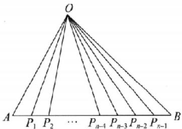

##### 12. $\left(\frac{1}{3},\frac{2}{3}\right)$ （答案不唯一，满足 $\lambda +\mu = 1$ 或 $\lambda = \mu$ 即可）因为 $\overrightarrow{AC} = \overrightarrow{AB} +\overrightarrow{AD}$ ，若点 $P$ 在 $AC$ 上，则 $\overrightarrow{AC} / / \overrightarrow{AP}$ ，又 $\overrightarrow{AP} = \lambda \overrightarrow{AB}+$ $\mu \overrightarrow{AD}$ ，所以 $\lambda = \mu .$ 若点 $P$ 在 $BD$ 上，即 $P,B,D$ 三点共线，又 $\overrightarrow{AP} = \lambda \overrightarrow{AB} +\mu \overrightarrow{AD}$ ，则 $\lambda +\mu = 1.$   
##### 13. $\frac{1}{12}$ 因为重心为 $G$ ，所以 $\overrightarrow{GA} + \overrightarrow{GB} + \overrightarrow{GC} = 0$ 。因为 $2a \cdot \overrightarrow{GA} + \sqrt{3} b\overrightarrow{GB} + 3c\overrightarrow{GC} = 0$ ，所以 $2a = \sqrt{3}b = 3c$ 。不妨设 $2a = \sqrt{3}b = 3c = 1$ ，则 $\cos B = \frac{\frac{1}{4} + \frac{1}{9} - \frac{1}{3}}{2 \times \frac{1}{2} \times \frac{1}{3}} = \frac{1}{12}$ .  
##### 14. $\frac{1}{4} \quad \frac{1}{6}$ 在 $\triangle ABC$ 中, $\overrightarrow{AN} = \frac{1}{3}\overrightarrow{NC}$ , 所以 $\overrightarrow{AN} = \frac{1}{4}\overrightarrow{AC}$ , 故 $\lambda = \frac{1}{4}$ . $\overrightarrow{AP} = \frac{1}{3}\overrightarrow{AB} + m\overrightarrow{AC} = \frac{1}{3}\overrightarrow{AB} + 4m\overrightarrow{AN}$ , 由 $B, P, N$ 三点共线知 $\frac{1}{3} + 4m = 1$ , 解得 $m = \frac{1}{6}$ .  
方法突破 A, B, C 三点共线 $\Leftrightarrow \overrightarrow{AB} = \lambda \overrightarrow{AC} \Leftrightarrow \overrightarrow{OC} = (1 - t) \overrightarrow{OA} + t \overrightarrow{OB}$ (O 为平面内异于 A, B, C 的一点).

# 核心笔记

证明三点共线问题,可用向量共线定理解决,但应注意向量共线和三点共线的区别与联系.当两向量共线且有公共点时,才能得出三点共线.对于平面上的任一点 $O, \overrightarrow{OA}, \overrightarrow{OB}$ 不共线,满足 $\overrightarrow{OP} = x\overrightarrow{OA} + y\overrightarrow{OB}(x, y \in \mathbb{R})$ , 则 $P, A, B$ 共线 $\Leftrightarrow x + y = 1$ . (练习运用: 第5题、第14题)

# 考点过关22 平面向量的基本定理及向量的坐标表示

##### 1. B 由 $a / / b$ ，可得 $3 \times \frac{1}{3} = (-1) \times m$ ，所以 $m = -1$ .  
##### 2. A 由图可知，平面向量 $e_1, e_2$ 不共线，是该平面所有向量的一组基底，且 $\overrightarrow{AD} - \overrightarrow{AB} + \overrightarrow{CB} = \overrightarrow{BD} + \overrightarrow{CB} = \overrightarrow{CD} = e_1 + 2e_2$ .

##### 3. A 由题意, 得 $\overrightarrow{AB} = (-4, -9), \overrightarrow{CD} = \left(\frac{7}{2}, 5\right)$ , 所以 $\overrightarrow{AB} + 2\overrightarrow{CD} = (3, 1)$ , 从而与向量 $\overrightarrow{AB} + 2\overrightarrow{CD}$ 同方向的单位向量为 $\frac{\overrightarrow{AB} + 2\overrightarrow{CD}}{|\overrightarrow{AB} + 2\overrightarrow{CD}|} = \frac{1}{\sqrt{9 + 1}}(3, 1) = \left(\frac{3\sqrt{10}}{10}, \frac{\sqrt{10}}{10}\right)$ .  
##### 4. C $\overrightarrow{AB}=(-7,-2)$ . 又点 C 在直线 AB 上, 故 $\overrightarrow{AC}$ 与 $\overrightarrow{AB}$ 同向. 又 $\overrightarrow{AC}=(2m-9,m+3)$ , 故 $\frac{2m-9}{-7}=\frac{m+3}{-2}$ , 所以 m=-13.  
##### 5. D 过 C 作 $CE \perp x$ 轴于点 E. 由 $\angle AOC = \frac{\pi}{4}$ ，知 $|OE| = |CE| = 2$ ，所以 $\overrightarrow{OC} = \overrightarrow{OE} + \overrightarrow{OB} = \lambda \overrightarrow{OA} + \overrightarrow{OB}$ ，即 $\overrightarrow{OE} = \lambda \overrightarrow{OA}$ ，所以 $(-2, 0) = \lambda (-3, 0)$ ，故 $\lambda = \frac{2}{3}$ .  
##### 6. D 解法1(基底法) 因为 $\overrightarrow{AE} = \overrightarrow{AB} + \overrightarrow{BE} = \overrightarrow{AB} + \frac{1}{2}\overrightarrow{AD} = \overrightarrow{AB} + \frac{1}{2} (\overrightarrow{AF} + \overrightarrow{FD}) = \overrightarrow{AB} + \frac{1}{2}\left(\frac{1}{3}\overrightarrow{AE} - \overrightarrow{DF}\right)$ , 所以 $\overrightarrow{AE} = \overrightarrow{AB} + \frac{1}{6}\overrightarrow{AE} - \frac{1}{2}\overrightarrow{DF}$ , 即 $\overrightarrow{AB} = \frac{1}{2}\overrightarrow{DF} + \frac{5}{6}\overrightarrow{AE}$ . 因为 $\overrightarrow{AB} = m\overrightarrow{DF} + n\overrightarrow{AE}$ , 所以由平面向量基本定理得 $m = \frac{1}{2}, n = \frac{5}{6}$ , 从而 $m + n = \frac{4}{3}$ .

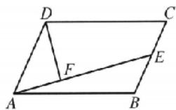

【解法2】（特殊图形法）不妨取边长为6的正方形ABCD，以点A为坐标原点，AB所在的直线为x轴，AD所在的直线为y轴，建立平面直角坐标系 $xOy$ ，则 $A(0,0),B(6,0),E(6,3),D(0,6)$ $F(2,1)$ .因为 $\overrightarrow{AB} = m\overrightarrow{DF} +n\overrightarrow{AE}$ ，所以 $(6,0) = m(2, - 5) + n(6,$ 3)，即 $\left\{ \begin{array}{ll}2m + 6n = 6,\\ -5m + 3n = 0, \end{array} \right.$ 解得 $m = \frac{1}{2},n = \frac{5}{6}$ ，从而 $m + n = \frac{4}{3}$

解后反思 解法 1 运用的基底法是解平面向量问题的基本方法，结合平面向量基本定理求解。解法 2 是将平行四边形特殊化为正方形，利用坐标法求解，这种特殊化法在求解客观题时可以提升解题的速度和准确度。

##### 7. C 设 $\overrightarrow{OA}=a,\overrightarrow{OB}=b,\overrightarrow{OC}=c$ ，因为 a,b,c 的终点共线，所以设 $\overrightarrow{AC}=\lambda\overrightarrow{AB}$ ，即 $\overrightarrow{OC}-\overrightarrow{OA}=\lambda(\overrightarrow{OB}-\overrightarrow{OA})$ ，所以 $\overrightarrow{OC}=(1-\lambda)\cdot\overrightarrow{OA}+\lambda\overrightarrow{OB}$ ，即 $c=(1-\lambda)a+\lambda b$ 。又 $c=ma+nb$ ，所以 $\left\{\begin{aligned}1-\lambda=m,\\ \lambda=n,\end{aligned}\right.$ 所以 $m+n=1$ . 高中精品资料君  
##### 8. D 向量 $a = (-1, 2), b = (2, 5)$ ，则 $a + b = (1, 7)$ ，故 A 错误； $a - 2b = (-1, 2) - (4, 10) = (-5, -8)$ ，故 B 错误；令 O 为坐标原点，则 $\overrightarrow{OB} = \overrightarrow{OA} + \overrightarrow{AB} = (2, 3) + (-1, 2) = (1, 5)$ ，点 $B(1, 5)$ ，故 C 错误； $2a + 3b = (-2, 4) - (6, 15) - (4, 19)$ ，故 D 正确。  
##### 9. AB 对于 A, 因为 $b-(2,1)$ . c (-4, -2). 所以 c = -2b, 所以向量 c 与向量 b 共线, 故 A 正确; 对于 B. 若 $c = \lambda_{1}a + \lambda_{2}b (\lambda_{1},$

$\lambda_{2} \in \mathbf{R}$ , 则 $(-4, -2) = (\lambda_{1} + 2\lambda_{2}, -2\lambda_{1} + \lambda_{2})$ , 所以 $\left\{ \begin{array}{l} \lambda_{1} + 2\lambda_{2} = -4, \\ -2\lambda_{1} + \lambda_{2} = -2, \end{array} \right.$ 解得 $\lambda_{1} = 0, \lambda_{2} = -2$ , 故 B 正确; 对于 C, 因为 $c = -2b$ , 所以 $k_{1}b + k_{2}c = k_{1}b - 2k_{2}b = (k_{1} - 2k_{2})b$ , 所以当 $d$ 不与 $b$ 共线时, 不存在实数 $k_{1}, k_{2}$ , 使得 $d = k_{1}b + k_{2}c$ , 故 C 不正确; 对于 D, 向量 $c$ 与向量 $b$ 共线, 但其起点不一定是原点, 所以终点与原点也不一定共线, 故 D 不正确.

##### 10. BC 由题意， $\overrightarrow{P_{1}P}=\frac{1}{3}\overrightarrow{P_{1}P_{2}}$ 或 $\overrightarrow{P_{1}P}=\frac{2}{3}\overrightarrow{P_{1}P_{2}}$ . 由于 $\overrightarrow{P_{1}P_{2}}=(3,-3)$ ，设 $P(x,y)$ ，则 $\overrightarrow{P_{1}P}=(x-1,y-3)$ ，则当 $\overrightarrow{P_{1}P}=\frac{1}{3}\overrightarrow{P_{1}P_{2}}$ 时， $(x-1,y-3)=\frac{1}{3}(3,-3)$ ，所以 x=2,y=2，即 $P(2,2)$ ; 当 $\overrightarrow{P_{1}P}=\frac{2}{3}\overrightarrow{P_{1}P_{2}}$ 时， $(x-1,y-3)=\frac{2}{3}(3,-3)$ ，所以 x=3,y=1，即 $P(3,1)$ .

##### 11. BCD 分析: $\triangle ABC$ 为等边三角形, 根据对称性, 以 $O$ 为坐标原点, 建立平面直角坐标系, 求出圆 $O$ 的半径, 根据圆的参数方程, 设出 $M\left(\frac{\sqrt{3}}{3}\cos \theta, \frac{\sqrt{3}}{3}\sin \theta\right), \theta \in [0, 2\pi]$ , 可以通过平面向量的坐标运算, 求出 $x, y$ , 并通过三角恒等变换以及三角函数图象与性质求出 $4x + y$ 的取值范围.

建立如图所示的平面直角坐标系，则 $A\left(0, \frac{2\sqrt{3}}{3}\right), B\left(-1, -\frac{\sqrt{3}}{3}\right), D\left(0, -\frac{\sqrt{3}}{3}\right)$ ，等边三角形 $ABC$ 的内切圆的半径为 $\frac{1}{2} \times \frac{2\sqrt{3}}{3} = \frac{\sqrt{3}}{3}$ ，故可设 $M\left(\frac{\sqrt{3}}{3} \cos \theta, \frac{\sqrt{3}}{3} \sin \theta\right)$ ，其中 $\theta \in [0, 2\pi]$ ，故 $\overrightarrow{BM} = \left(\frac{\sqrt{3}}{3} \cos \theta + 1, \frac{\sqrt{3}}{3} \sin \theta + \frac{\sqrt{3}}{3}\right)$ ，而 $\overrightarrow{BA} = (1, \sqrt{3}), \overrightarrow{BD} =$

(1,0)，结合 $\overrightarrow{BM} = x\overrightarrow{BA} +\overrightarrow{yBD}$ 可得 $\left\{ \begin{array}{l}\frac{\sqrt{3}}{3}\cos \theta +1 = x + y,\\ \frac{\sqrt{3}}{3}\sin \theta +\frac{\sqrt{3}}{3} = \sqrt{3} x, \end{array} \right.$ 故 $\left\{ \begin{array}{ll}x = \frac{1}{3}\sin \theta +\frac{1}{3},\\ y = \frac{\sqrt{3}}{3}\cos \theta -\frac{1}{3}\sin \theta +\frac{2}{3}, \end{array} \right.$ 故 $4x + y = \frac{\sqrt{3}}{3}\cos \theta +\sin \theta +2 =$

$\frac{2\sqrt{3}}{3}\sin \left(\theta +\frac{\pi}{6}\right) + 2.$ 因为 $-1\leqslant \sin \left(\theta +\frac{\pi}{6}\right)\leqslant 1$ ，所以 $2 - \frac{2\sqrt{3}}{3}\leqslant$ $4x + y\leqslant 2 + \frac{2\sqrt{3}}{3}.0\notin \left[2 - \frac{2\sqrt{3}}{3},2 + \frac{2\sqrt{3}}{3}\right],\mathrm{A}$ 错误； $2 - \frac{2\sqrt{3}}{3}-$ $1 = 1 - \frac{2\sqrt{3}}{3} < 0,1 <   2 + \frac{2\sqrt{3}}{3},1\in \left[2 - \frac{2\sqrt{3}}{3},2 + \frac{2\sqrt{3}}{3}\right],\mathrm{B}$ 正确； $2 - \frac{2\sqrt{3}}{3} -2 = -\frac{2\sqrt{3}}{3} < 0,2\in \left[2 - \frac{2\sqrt{3}}{3},2 + \frac{2\sqrt{3}}{3}\right],\mathrm{C}$ 正确； $2+$ $\frac{2\sqrt{3}}{3} -3 = \frac{2\sqrt{3}}{3} -1 > 0,3\in \left[2 - \frac{2\sqrt{3}}{3},2 + \frac{2\sqrt{3}}{3}\right],\mathrm{D}$ 正确.

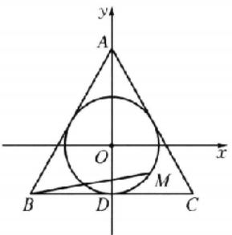

##### 12. $(- \cos \theta, -\sin \theta)$ 把向量 $\overrightarrow{OP_0}$ 顺时针旋转定角 $\theta$ 得到 $\overrightarrow{OQ_0}$ , 得 $Q_0(\cos(-\theta), \sin(-\theta)), Q_0$ 关于 $y$ 轴的对称点记为 $P_1$ , 则 $P_1(\cos(\theta - \pi), \sin(\theta - \pi))$ , 即 $P_1(-\cos \theta, -\sin \theta)$ , 把向量 $\overrightarrow{OP_1}$ 顺时针旋转定角 $\theta$ 得到 $\overrightarrow{OQ_1}$ , 得 $Q_1(\cos(-\pi), \sin(-\pi))$ , 即 $Q_1(-1, 0)$ , 点 $Q_1$ 关于 $y$ 轴的对称点记为 $P_2$ , 则 $P_2(1, 0)$ , 以此类推可得, 当 $i$ 为奇数时, $P_i(-\cos \theta, -\sin \theta)$ , 当 $i$ 为偶数时, $P_i(1, 0)$ , 故点 $P_{11}$ 的坐标为 $(- \cos \theta, -\sin \theta)$ .  
##### 13. $\frac{7}{5}$ 由题意得 $\overrightarrow{AO} = \frac{1}{2}\overrightarrow{AB} +\frac{1}{2}\overrightarrow{AC} = \frac{3}{10}\overrightarrow{AM} +\frac{m}{2}\overrightarrow{AN}$ ，所以 $\frac{3}{10} +\frac{m}{2} = 1$ ，解得 $m = \frac{7}{5}$

# 方法突破 向量的线性运算的求解方法

（1） 进行向量运算时, 要尽可能转化到平行四边形或三角形中, 选用从同一顶点出发的基底向量或首尾相接的向量, 运用向量加、减法运算及数乘运算来求解.  
（2）除了充分利用相等向量、相反向量和线段的比例关系外,有时还需要利用三角形中位线、相似三角形对应边成比例等平面几何的性质,把未知向量转化为与已知向量有直接关系的向量来求解.  
##### 14. 2 $-\frac{3}{11}$ $2\cos\theta=\sin\theta$ ，所以 $\tan\theta=2.\frac{\cos2\theta}{3-2\sin\theta\cos\theta}=$ $\frac{\cos^{2}\theta-\sin^{2}\theta}{3\sin^{2}\theta+3\cos^{2}\theta-2\sin\theta\cos\theta}=\frac{1-\tan^{2}\theta}{3\tan^{2}\theta+3-2\tan\theta}=-\frac{3}{11}.$

# 核心笔记

##### 1. 解决向量问题常用两种方法: 几何法与代数法. 几何法往往与解析几何进行交汇, 运用几何意义进行求解; 代数法又以函数法最为常见, 建立平面直角坐标系, 利用平面向量的坐标运算, 将向量问题转化代数问题. (练习运用: 第5题、第12题)  
##### 2. 设 $A(x_{1}, y_{1}), B(x_{2}, y_{2}), C(x_{3}, y_{3})$ ，要证三点共线，只需证明 $\overrightarrow{AB} // \overrightarrow{BC}$ . 又 $\overrightarrow{AB} = (x_{2} - x_{1}, y_{2} - y_{1}), \overrightarrow{BC} = (x_{3} - x_{2}, y_{3} - y_{2})$ ，所以只需证 $(x_{2} - x_{1})(y_{3} - y_{2}) - (x_{3} - x_{2})(y_{2} - y_{1}) = 0$ 即可。（练习运用：第4题、第9题）

# 考点过关23 平面向量的数量积

##### 1. A $(2e_{1}-e_{2})\cdot e_{2}=2e_{1}\cdot e_{2}-e_{2}^{2}=2|e_{1}||e_{2}|\cos120^{\circ}-|e_{2}|^{2}=2\times\left(-\frac{1}{2}\right)-1=-2.$

##### 2. B 因为 $\left|a-b\right|^{2}=a^{2}-2a\cdot b+b^{2}=14-2a\cdot b=10$ ，所以 $a\cdot b=2$ ，所以 $(2a-b)\cdot(a-b)=2a^{2}-b^{2}$ $a\cdot b=20-4$ 2=14.  
##### 3. A 设向量 $a, b$ 的夹角为 $\theta$ , 因为向量 $a$ 在 $b$ 上的投影向量为 $|a| \cos \theta \frac{b}{|b|} = \frac{1}{2} b$ , 所以 $\frac{|a \cos \theta|}{|b|} = \frac{1}{2}$ . 又 $|a| = 2, b| =$

$2\sqrt{3}$ , 所以 $\cos \theta = 2 \frac{|b|}{|a|} = \frac{\sqrt{3}}{2}$ , 又 $\theta \in [0, \pi]$ , 所以 $\theta = \frac{\pi}{6}$ .

##### 4. A 因为 $a + 2b + 3c = 0$ ，所以 $3c = -a - 2b$ ，则 $(3c)^2 = (-a - 2b)^2$ 。所以 $9c^2 = a^2 + 4b^2 + 4a \cdot b$ ，所以 $9 = 1 + 4 + 4|a| \cdot |b| \cos(a, b)$ ，所以 $\cos(a, b) = 1$ ，所以 $\langle a, b \rangle = 0$ ，所以 $a, b$ 方向相同。

##### 5. B 解法 1 易知 $a + b + c = 0$ ，故 $(a + b + c)^2 = 0$ ，即 $|a|^2 + |b|^2 + |c|^2 + 2(a \cdot b + b \cdot c + c \cdot a) = 0, a \cdot b + b \cdot c + c \cdot a = -\frac{|a|^2 + |b|^2 + |c|^2}{2} = -\frac{2^2 + 3^2 + 2^2}{2} = -\frac{17}{2}$ .

【解法2】 因为 $a + b = \overrightarrow{BC} +\overrightarrow{CA} = \overrightarrow{BA} = -c.$ 同理 $b + c = -a,a+$ $c = -b$ ，所以 $2(a\cdot b + b\cdot c + c\cdot a) = (a\cdot b + b\cdot c) + (a\cdot b+$ $c\cdot a) + (b\cdot c + c\cdot a) = b\cdot (a + c) + a\cdot (b + c) + c\cdot (b+$ $a) = -b^2 -a^2 -c^2 = -9 - 4 - 4 = -17$ ，所以 $a\cdot b + b\cdot c + a\cdot$ $c = -\frac{17}{2}.$

##### 6. B 以 A 为坐标原点, AB, AC 所在直线分别为 x 轴、y 轴建立平面直角坐标系(图略), 则 $A(0,0)$ , $B(3m,0)$ , $C(0,2m)$ , $\overrightarrow{AM} = \frac{\overrightarrow{AB}}{|\overrightarrow{AB}|} - \frac{m\overrightarrow{AC}}{|\overrightarrow{AC}|} = (1, -m)$ , 所以 $M(1, -m)$ , $\overrightarrow{MB} = (3m - 1, m)$ , $\overrightarrow{MC} = (-1, 3m)$ , 则 $\overrightarrow{MB} \cdot \overrightarrow{MC} = 3m^2 - 3m + 1 = 3\left(m - \frac{1}{2}\right)^2 + \frac{1}{4} \geqslant \frac{1}{4}$ .

解后反思 对于向量问题通常有两种处理方法:一是选择合适的向量作为基底,先将其余的向量都用基底表示,然后将问题转化为基底的问题,这样目标就比较明确,但对向量的线性分解要求较高;二是如果可以建系,则可通过坐标运算来解决问题,这样就将问题转化为代数问题,接下来的问题处理就比较程式化.一般能建系,就建系,建了系,处理问题的方向就明确了,但它必须有准确的计算来作保证.

##### 7. C 解法 1(坐标法) 在 $\triangle ABD$ 中, $A = \frac{\pi}{3}$ , $AB = 2$ , $AD = BC = 4$ , 由余弦定理得 $BD^2 = AB^2 + AD^2 - 2AB \cdot AD\cos \frac{\pi}{3} = 4 + 16 - 8 = 12$ , 所以 $BD = 2\sqrt{3}$ , 因为 $BD^2 + AB^2 = AD^2$ , 所以 $BD \perp AB$ . 如图 1, 以 $B$ 为坐标原点, $AB$ , $BD$ 所在直线分别为 $x$ 轴、 $y$ 轴建立平面直角坐标系, 则 $B(0,0)$ , $D(0,2\sqrt{3})$ , 圆 $C: (x - 2)^2 + (y - 2\sqrt{3})^2 = 4$ , 设 $P(2 + 2\cos \theta, 2\sqrt{3} + 2\sin \theta)$ , 所以 $\overrightarrow{BD} \cdot (\overrightarrow{CP} - \overrightarrow{CB}) = \overrightarrow{BD} \cdot \overrightarrow{BP} = 12 + 4\sqrt{3}\sin \theta$ , 当 $\sin \theta = -1$ 时, $\overrightarrow{BD} \cdot (\overrightarrow{CP} - \overrightarrow{CB})$ 取得最小值 $12 - 4\sqrt{3}$ .

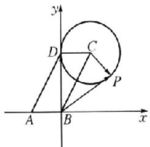

图1

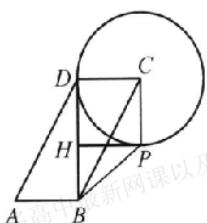

图2

【解法2】(基底法) 如图2, 过点C作BD的平行线交圆C于点P, 过点P作 $PH \perp BD$ , 垂足为H, 在 $\triangle ABD$ 中, $A = \frac{\pi}{3}$ , AB = 2,

$AD = BC = 4$ ，由余弦定理得 $BD^{2} = AB^{2} + AD^{2} - 2AB\cdot$ $AD\cos \frac{\pi}{3} = 4 + 16 - 8 = 12$ ，所以 $BD = 2\sqrt{3}$ ，因为 $BD^{2} + AB^{2} =$ $AD^2$ ，所以 $BD\bot AB$ ，所以四边形DCPH为正方形，所以 $\overrightarrow{BD}\cdot (\overrightarrow{CP} -\overrightarrow{CB}) = \overrightarrow{BD}\cdot \overrightarrow{BP}$ 的最小值为 $|\overrightarrow{BD}| \cdot |\overrightarrow{BH}| =$ $2\sqrt{3}\times (2\sqrt{3} -2) = 12 - 4\sqrt{3}.$

解后反思 一般地,在求解平面向量的数量积问题时,对于特殊图形可以考虑坐标法,设点时,圆或椭圆上的动点可以用参数法;另外也可以用基底法求解,同时要注意平面向量数量积的几何意义.

##### 8. B 解法 1（向量极化恒等式）由 $\overrightarrow{PF} \cdot \overrightarrow{QF} = (\overrightarrow{FO} + \overrightarrow{OQ}) \cdot (\overrightarrow{FO} - \overrightarrow{OQ}) = |\overrightarrow{FO}|^2 - |\overrightarrow{OQ}|^2 = -\frac{c^2}{2}$ ，得 $|\overrightarrow{OQ}| = \frac{\sqrt{6}}{2} c$ 。又 $k_{OQ} = \frac{\sqrt{2}}{2}$ ，则 $PQ$ 的方程为 $y = \frac{\sqrt{2}}{2} x$ 。设 $Q(x_1, \frac{\sqrt{2}}{2} x_1) (x_1 < 0)$ ，则 $|\overrightarrow{OQ}| = \sqrt{x_1^2 + \left(\frac{\sqrt{2}}{2} x_1\right)^2} = \frac{\sqrt{6}}{2} c$ ，解得 $x_1 = -c$ ，即 $FQ \perp x$ 轴，则 $|FQ| = \frac{\sqrt{2}}{2} c = \frac{b^2}{a}$ ，即 $\frac{\sqrt{2}}{2} c = \frac{a^2 - c^2}{a}$ ，即 $e^2 + \frac{\sqrt{2}}{2} e - 1 = 0$ ，又 $e \in (0, 1)$ ，解得 $e = \frac{\sqrt{2}}{2}$ 。

【解法2】（向量坐标运算）因为 $k_{0Q} = \frac{\sqrt{2}}{2}$ ，所以 $PQ$ 的方程为 $y = \frac{\sqrt{2}}{2} x$ ，设 $Q\left(x_1, \frac{\sqrt{2}}{2} x_1\right) (x_1 < 0)$ ， $P\left(-x_1, -\frac{\sqrt{2}}{2} x_1\right)$ ，则 $\overrightarrow{PF} = (-c + x_1 \frac{\sqrt{2}}{2} x_1)$ ， $\overrightarrow{QF} = (-x_1, -\frac{\sqrt{2}}{2} x_1)$ ，所以 $\overrightarrow{PF} \cdot \overrightarrow{QF} = -\frac{c^2}{2} = c^2 - x_1^2 - \frac{x_1^2}{2}$ ，解得 $x_1 = -c$ ，以下同解法1.

##### 9. AB 对于 A, 实数与向量相乘的结果是向量, 故 A 错误; 对于 B, $a \cdot b$ , $b \cdot c$ 都是实数, 故等号左边是 c 的共线向量, 等号右边是 a 的共线向量, 但 c 与 a 的方向未必相同或相反, 且左右两边的模长未必相等, 故 B 错误; 对于 C, 因为 a, b 皆为非零向量, 所以由 $a \cdot b = 0$ 能推出 $a \perp b$ , 故 C 正确; 对于 D, 根据数量积的运算性质及运算律可知该式成立, 故 D 正确.

##### 10. ACD 若 $a \parallel b$ ，则 $4\cos \theta = -3\sin \theta$ ，解得 $\tan \theta = -\frac{4}{3}$ ，故 A 正确；若 $a \perp b$ ，则 $-3\cos \theta + 4\sin \theta = 0$ ，解得 $\tan \theta = \frac{3}{4}$ ，所以 $\sin \theta = \pm \frac{3}{5}$ ，故 B 错误；因为 $|a| = \sqrt{\cos^2 \theta + \sin^2 \theta} = 1, |b| = \sqrt{(-3)^2 + 4^2} = 5$ ，而 $|a - b| \leqslant |a| + |b| = 6$ ，当且仅当 $a, b$ 反向时，等号成立，故 C 正确；若 $a \cdot (a - b) = 0$ ，则 $\cos \theta (\cos \theta + 3) + \sin \theta (\sin \theta - 4) = 0$ ，即 $\cos^2 \theta + 3\cos \theta + \sin^2 \theta - 4\sin \theta = 0$ ，即 $4\sin \theta - 3\cos \theta = 1$ ，又 $|a - b| = \sqrt{(\cos \theta + 3)^2 - (\sin \theta - 4)^2} - \sqrt{6\cos \theta - 8\sin \theta + 26}$ ，所以 $a - b| = \sqrt{24} = 2\sqrt{6}$ ，故 D 正确。

##### 11. ACD 对于 A, 依题意, $a + \lambda b = (1 + \lambda, 2 - \lambda)$ , $a \cdot (a +$

$\lambda b) > 0$ 且 $a$ 与 $a + \lambda b$ 不同向共线，所以 $\left\{ \begin{array}{l}5 - \lambda >0,\\ \lambda \neq 0, \end{array} \right.$ 解得 $\lambda < 5$ 且 $\lambda \neq 0$ ，故A错误；对于B，由 $\overrightarrow{OP} = 2\overrightarrow{OA} -4\overrightarrow{OB} +3\overrightarrow{OC}$ ，得 $\overrightarrow{OP}-$ $\overrightarrow{OC} = 2(\overrightarrow{OA} -\overrightarrow{OC}) - 4(\overrightarrow{OB} -\overrightarrow{OC})$ ，即 $\overrightarrow{CP} = 2\overrightarrow{CA} -4\overrightarrow{CB}$ ，于是得 $\overrightarrow{CP},\overrightarrow{CA},\overrightarrow{CB}$ 共面，且公共起点为 $C$ ，而 $A,B,C$ 三点不共线，所以 $P,A,B,C$ 四点共面，故B正确；对于C，对于同一平面内不共线的非零向量 $a,b,c$ ，才存在唯一的一对实数 $\lambda ,\mu$ ，使得 $a = \lambda b+$ $\mu c$ ，否则不成立，故C错误；对于D，在△ABC中， $\overrightarrow{AB}\cdot \overrightarrow{BC} =$ $|\overrightarrow{AB}|\cdot |\overrightarrow{BC}|\cdot \cos (\pi -\angle ABC) <   0,$ 于是得∠ABC为锐角，不能确定△ABC是钝角三角形，故D错误.

##### 12. $\sqrt{2}$ 设 $b = \lambda a = \lambda (2,1) = (2\lambda ,\lambda)$ ，则 $a\cdot b = 5\lambda = -\sqrt{10}$ ，解得 $\lambda = -\frac{\sqrt{10}}{5}$ ，则 $b = \left(-\frac{2\sqrt{10}}{5}, - \frac{\sqrt{10}}{5}\right)$ ，所以 $|b| =$ $\sqrt{\left(-\frac{2\sqrt{10}}{5}\right)^2 + \left(-\frac{\sqrt{10}}{5}\right)^2} = \sqrt{2}.$

##### 13.4 设 BC 的中点为 D. 因为 G 为 $\triangle ABC$ 的重心, 所以 $\overrightarrow{AG} = \frac{2}{3}\overrightarrow{AD} = \frac{2}{3} \times \frac{1}{2} (\overrightarrow{AB} + \overrightarrow{AC}) = \frac{1}{3} (\overrightarrow{AB} + \overrightarrow{AC}), \overrightarrow{BC} = \overrightarrow{AC} - \overrightarrow{AB}$ , 所以 $\overrightarrow{AG} \cdot \overrightarrow{BC} = \frac{1}{3} (\overrightarrow{AB} + \overrightarrow{AC}) \cdot (\overrightarrow{AC} - \overrightarrow{AB}) = \frac{1}{3} (|\overrightarrow{AC}|^2 - |\overrightarrow{AB}|^2) = \frac{1}{3}(4^2 - 2^2) = 4.$

##### 14. $\frac{1}{4} - \frac{3}{4}$ 分析: 根据条件可将 $\angle AOB$ 看作 $\overrightarrow{OA}$ 与 $\overrightarrow{OB}$ 的夹角, 所以 $\cos \angle AOB$ 可借助数量积 $\overrightarrow{OA} \cdot \overrightarrow{OB}$ 求得. 因此需将已知的向量等式两边平方, 即可求出 $\cos \angle AOB$ 的值. 对于第二空, 则贯彻基向量思想, 选择 $\overrightarrow{OA}, \overrightarrow{OB}$ 为基底, 便可求解.

由 $4\overrightarrow{OC} = -2\overrightarrow{OA} - 3\overrightarrow{OB}$ , 两边平方得 $16OC^2 = 4OA^2 + 9OB^2 + 12\overrightarrow{OA} \cdot \overrightarrow{OB}$ , 根据题意得 $16 = 4 + 9 + 12\cos \angle AOB$ , 解得 $\cos \angle AOB = \frac{1}{4}$ . 所以 $\overrightarrow{AB} \cdot \overrightarrow{OA} = (\overrightarrow{OB} - \overrightarrow{OA}) \cdot \overrightarrow{OA} = \overrightarrow{OB} \cdot \overrightarrow{OA} - \overrightarrow{OA}^2 = \cos \angle AOB - 1 = -\frac{3}{4}$ .

# 核心笔记

##### 1. 坐标法是通过建立平面直角坐标系,用坐标的形式表示各个向量来进行运算的方法.构建向量的坐标,将向量数量积运算代数化.  
##### 2. 基底法是先确定一组基底,再将所求数量积的两个向量分别用这组基底线性表示,进而将所求数量积问题转化为由基底构成的向量数量积问题的方法.对于解答不含坐标系或不方便建立坐标系的题目十分有效.(练习运用:第13题)  
##### 3. 用向量解决平面几何问题的“三部曲”:（1）建立平面几何与向量的联系,用向量表示问题中涉及的几何元素,将平面几何问题转化为向量问题;（2）通过向量运算研究几何元素之间的关系;（3）将运算结果“翻译”成几何关系。(练习运用:第5题、第6题)

# 考点过关24 复数的概念与运算

##### 1. B 由题意得， $z=\frac{3+a\mathrm{i}}{2+\mathrm{i}}=\frac{(3+a\mathrm{i})(2-\mathrm{i})}{(2+\mathrm{i})(2-\mathrm{i})}=\frac{6-3\mathrm{i}+2\mathrm{a}\mathrm{i}-\mathrm{a}\mathrm{i}^{2}}{4+1}=$ $\frac{(6+a)+(2a-3)\mathrm{i}}{5}$ . 因为 z 为实数，所以 $\frac{2a-3}{5}=0$ ，解得 $a=\frac{3}{2}$ .  
##### 2. D 解法 1(定义法) 因为 $z=\frac{3-i}{1+i}=\frac{(3-i)(1-i)}{(1+i)(1-i)}=1-2i$ ，
所以 $|z|=\sqrt{5}$ .

【解法2】(性质法) $|z| = \frac{|3 - i|}{|1 + i|} = \frac{\sqrt{10}}{\sqrt{2}} = \sqrt{5}$ .

解后反思 用性质法求解复数的模比较快. 常见复数模的性质有: $|z_1 \cdot z_2| = |z_1||z_2|$ , $\left|\frac{z_1}{z_2}\right| = \frac{|z_1|}{|z_2|}, z \cdot \overline{z} = |z|^2 = |\overline{z}|^2$ .

##### 3. B 因为 $i(6-7i)=6i-7i^{2}=7+6i$ ，所以复数 $i(6-7i)$ 的共轭复数为 7-6i.  
##### 4. A 设 $z = a + bi (a, b \in \mathbf{R}, a < 0, b > 0)$ , 则 $\frac{z}{2\mathrm{i}} = \frac{a + bi}{2\mathrm{i}} = \frac{a\mathrm{i} + b\mathrm{i}^2}{2\mathrm{i}^2} = \frac{b}{2} - \frac{a}{2}\mathrm{i}$ , 则 $\frac{b}{2} > 0, -\frac{a}{2} > 0$ , 即复数 $\frac{z}{2\mathrm{i}}$ 对应的点 $Z_{1}\left(\frac{b}{2}, -\frac{a}{2}\right)$ 位于第一象限.  
##### 5. D $A(0,1)$ , $B(2,-1)$ , 故 $z_{1}=i$ , $z_{2}=2-i$ , 所以 $\frac{z_{1}}{z_{2}}=\frac{i}{2-i}=\frac{i(2+i)}{(2-i)(2+i)}=-\frac{1}{5}+\frac{2}{5}i.$   
##### 6. B 若 $z_{1} = z_{2} = 0$ ，则 $z_{1}^{2} + z_{2}^{2} = 0$ ，必要性成立；若 $z_{1}, z_{2} \in \mathbf{C}$ ， $z_{1}^{2} + z_{2}^{2} = 0$ ，可以取 $z_{1} = i, z_{2} = 1$ ，充分性不成立。  
##### 7. B 设 $z=a+bi(a,b\in\mathbb{R})$ ，则由 $z+\frac{1}{z}=1$ ，得 $z^{2}+1=z$ ，即 $a^{2}-b^{2}+2ab\mathrm{i}+1=a+bi$ ，所以 $\left\{\begin{aligned}a^{2}-b^{2}+1&=a,\\ 2ab=b,\end{aligned}\right.$ 解得 $\left\{\begin{aligned}a&=\frac{1}{2},\\ b^{2}&=\frac{3}{4},\end{aligned}\right.$ 所以 $|z|=\sqrt{a^{2}+b^{2}}=1$ .

##### 8. B 分析: 根据向量与复数的对应关系, 易得 $\overrightarrow{OA} = (3, -2)$ , 也就是点 A 对应的坐标, 从而可得点 B 的坐标为 $(3, 2)$ , 因此可得 $z_{2}$ , 通过复数的除法和加法运算求解即可.

由题知 $A(3, -2)$ 关于实轴的对称点 $B(3, 2)$ ，所以向量 $\overrightarrow{OB}$ 对应的复数 $z_{2} = 3 + 2\mathrm{i}$ 。又因为 $\frac{2\mathrm{i}}{1 - \mathrm{i}} = \frac{2\mathrm{i}(1 + \mathrm{i})}{2} = -1 + \mathrm{i}$ ，所以 $z_{2} + \frac{2\mathrm{i}}{1 - \mathrm{i}} = 3 + 2\mathrm{i} - 1 + \mathrm{i} = 2 + 3\mathrm{i}$ 。

##### 9. BC 因为 $z = x + y\mathrm{i}(x,y\in \mathbf{R})$ ，所以 $z^2 = x^2 -y^2 +2xy\mathrm{i}$ ，故不能推出 $z^2\geqslant 0,\mathrm{A}$ 不正确；由复数模的定义知 $|z| = \sqrt{x^2 + y^2}$ 故B正确；根据复数相等知 $z = 1 + 2\mathrm{i}$ 时， $x = 1,y = 2$ ，故C正确；由虚部的定义知 $z$ 的虚部是 $y$ ，故D不正确.  
##### 10. BD 对于 A, 令 $z_{1}=2+i, x_{2}=1-2i$ , 则 $z\left|-\mathbf{z}_{2}\right|=\sqrt{5}$ , 但不满足 $z_{1}=\pm z_{2}$ , 故 A 错误; 对于 C, 令 $z_{1}=1+i, x_{2}=1-i$ , 则

$z_{1}+z_{2}=2,z_{1}-z_{2}=2i$ ，所以 $|z_{1}+z_{2}|=|z_{1}-z_{2}|$ ，但是 $z_{1}z_{2}=(1+i)(1-i)=2$ ，故C错误；对于B，设 $z_{1}=a+bi,z_{2}=c+di(a,b,c,d\in\mathbf{R})$ ，所以 $z_{1}\cdot z_{2}=(a+bi)(c+di)=ac-bd+(ad+bc)i$ ，则 $|z_{1}\cdot z_{2}|=|ac-bd+(ad+bc)i|=\sqrt{(ac-bd)^{2}+(ad+bc)^{2}}=\sqrt{(ac)^{2}+(bd)^{2}+(ad)^{2}+(bc)^{2}}$ ，又因为 $|z_{1}|\cdot|z_{2}|=\sqrt{a^{2}+b^{2}}\cdot\sqrt{c^{2}+d^{2}}=\sqrt{(ac)^{2}+(bd)^{2}+(ad)^{2}+(bc)^{2}}$ ，所以 $|z_{1}\cdot z_{2}|=|z_{1}|\cdot|z_{2}|$ ，故B正确；对于D, $\overline{z_{1}\cdot z_{2}}=ac-bd-(ad+bc)i$ ，又 $\overline{z_{1}}\cdot\overline{z_{2}}=(a-bi)(c-di)=ac-bd-(ad+bc)i$ ，所以 $\overline{z_{1}\cdot z_{2}}=\overline{z_{1}}\cdot\overline{z_{2}}$ ，故D正确.

##### 11. BCD 对于选项 A, 设 $z = a + bi (a, b \in \mathbb{R})$ , 若 $|z| = 1$ , 只需 $a^{2} + b^{2} = 1$ 即可, 故 A 错误; 对于选项 B, 向量 $\overrightarrow{BA} = \overrightarrow{OA} - \overrightarrow{OB}$ 对应的复数为 $6 + 5i - (-3 + 4i) = 9 + i$ , 故 B 正确; 对于选项 C, $\overline{z}$ 对应的点为 $(-1, -1)$ , 在第三象限内, 故 C 正确; 对于选项 D, 复数 z 对应的点在以原点为圆心, 内圆半径为 1, 外圆半径为 $\sqrt{2}$ 的圆环上, 故所构成的图形面积为 $2\pi - \pi - \pi$ , 故 D 正确.

解后反思 复数题抓住四则运算的规则和几何意义即可.

##### 12. 2 因为 $\frac{1 + a\mathrm{i}}{2 - \mathrm{i}} = \frac{(1 + a\mathrm{i})(2 + \mathrm{i})}{(2 - \mathrm{i})(2 + \mathrm{i})} = \frac{2 - a}{5} + \frac{2a + 1}{5}\mathrm{i}$ 为纯虚数，所以 $\left\{ \begin{array}{l} \frac{2 - a}{5} = 0, \\ \frac{2a + 1}{5} \neq 0, \end{array} \right.$ 解得 $a = 2$

##### 13. 3 $|z - i| = 2$ 的几何意义为复平面内复数 $z$ 对应的动点 $Z$ 到表示复数 $i$ 对应的定点 $(0,1)$ 之间的距离为定值2，所以动点 $Z$ 的轨迹是以 $(0,1)$ 为圆心，2为半径的圆，而 $|z|$ 表示动点 $Z$ 到原点的距离，因此， $|z|_{\max} = \sqrt{0^2 + (1 - 0)^2} + r = 1 + 2 = 3.$

##### 14. $-1 + 5\mathrm{i}\sqrt{2}$ 因为 $z_{1} = 1 - \mathrm{i}, z_{2} = 4 + 6\mathrm{i}$ ，所以 $\frac{z_2}{z_1} = \frac{4 + 6\mathrm{i}}{1 - \mathrm{i}} = \frac{(4 + 6\mathrm{i})(1 + \mathrm{i})}{(1 - \mathrm{i})(1 + \mathrm{i})} = \frac{-2 + 10\mathrm{i}}{2} = -1 + 5\mathrm{i}$ . 因为 $z = 1 + b\mathrm{i}(b \in \mathbb{R})$ ，所以 $z + z_{1} = 2 + (b - 1)\mathrm{i}$ . 又因为 $z + z_{1}$ 为实数，所以 $b - 1 = 0$ ，得 $b = 1$ . 所以 $z = 1 + \mathrm{i}$ ，则 $|z| = \sqrt{2}$ .

方法突破（1）复数的加法、减法、乘法运算可以类比多项式运算，除法的关键是分子、分母同乘以分母的共轭复数，注意要把i的幂写成最简形式.

（2）记住以下结论，可提高运算速度：① $(1\pm i)^{2}=\pm2i$ ; ② $\frac{1+i}{1-i}=i$ ;
③ $\frac{1-i}{1+i}=-i$ ; ④ $\frac{a+b{i}}{i}=b-a{i}$ ; ⑤ $i^{4n}=1,i^{4n+1}=i,i^{4n+2}=-1,$ $i^{4n+3}=-i(n\in N^{*})$

# 核心笔记

复数 $z = a + bi(a, b \in \mathbf{R})$ 的模 $|z| = |a + bi| = \sqrt{a^2 + b^2}$ . $\left|\frac{z_1}{z_2}\right| = \frac{|z_1|}{|z_2|}, |z_1z_2| = |z_1| |z_2|$ . (练习运用: 第 2 题、第 7 题、第 14 题)

# 阶段温习四 考点 1\~24

##### 1. C 由 $|x - 1| \leqslant 4$ ，得 $-3 \leqslant x \leqslant 5$ ，所以 $A = [-3, 5]$ . 由 $\frac{4 - x}{x} \geqslant 0$ ，得 $\left\{ \begin{array}{l} x(x - 4) \leqslant 0, \\ x \neq 0, \end{array} \right.$ 解得 $0 < x \leqslant 4$ ，所以 $B = (0, 4]$ ， $\complement_{\mathbb{R}} B = (-\infty, 0] \cup (4, +\infty)$ ，故 $A \cap (\complement_{\mathbb{R}} B) = [-3, 0] \cup (4, 5]$ .

##### 2. D $\frac{|1-2i|}{2+i}=\frac{\sqrt{5}(2-i)}{(2+i)(2-i)}=\frac{2\sqrt{5}}{5}-\frac{\sqrt{5}}{5}i$ ，其对应的点 $\left(\frac{2\sqrt{5}}{5},\frac{\sqrt{5}}{5}\right)$ 位于第四象限.

##### 3. A 因为 $a / / b$ ，所以 $2m - (3m - 1) = 0$ ，解得 $m = 1$ .

##### 4. D 因为 $(a+b+c)(b+c-a)=3bc$ ，所以 $(b+c)^{2}-a^{2}=3bc$ ，即 $b^{2}+c^{2}-a^{2}=bc$ ，所以 $\cos A=\frac{b^{2}+c^{2}-a^{2}}{2bc}=\frac{1}{2}$ 。因为 $A\in(0,\pi)$ ，所以 $A=\frac{\pi}{3}$ 。设△ABC的外接圆半径为R，由正弦定理可得 $2R=\frac{a}{\sin A}=\frac{\sqrt{3}}{\frac{\sqrt{3}}{2}}$ ，解得R=1。

##### 5. D $c=\log_{2}3>\log_{2}2=1,1=\left(\frac{4}{5}\right)^{0}>a=\left(\frac{4}{5}\right)^{\frac{2}{3}}>\left(\frac{4}{5}\right)^{1}=$ $\frac{4}{5}, b=\left(\frac{2}{3}\right)^{\frac{4}{3}}<\left(\frac{2}{3}\right)^{1}=\frac{2}{3}$ ，因为 $1>\frac{4}{5}>\frac{2}{3}$ ，所以c>a>b.

##### 6. A 因为 $x^{2} - (a + 1)x + a < 0$ ，所以 $(x - a)(x - 1) < 0$ 。当 $a = 1$ 时， $(x - 1)^{2} < 0$ ，此时无解，符合条件；当 $a > 1$ 时，此时解集为 $(1, a)$ ，所以 $1 < a \leqslant 3$ ；当 $a < 1$ 时，此时解集为 $(a, 1)$ ，所以 $-1 \leqslant a < 1$ 。综上可知 $a \in [-1, 3]$ 。

##### 7. B 由题知,第一次对折后纸张的厚度为 $0.1 \times 2$ 毫米,第二次对折后纸张的厚度为 $0.1 \times 2 \times 2 = 0.1 \times 2^{2}$ 毫米,第三次对折后纸张的厚度为 $0.1 \times 2 \times 2 \times 2 = 0.1 \times 2^{3}$ 毫米,……所以第 $n$ 次对折后纸张的厚度为 $0.1 \times 2^{n}$ 毫米.因为38万千米 $= 3.8 \times 10^{11}$ 毫米,所以 $0.1 \times 2^{n} > 3.8 \times 10^{11}$ ,两边取以10为底的对数得 $\lg 0.1 + n\lg 2 > \lg 3.8 + 11$ ,即 $0.3n > 12.58$ ,解得 $n > 41.93$ ,所以至少对折的次数是42.

##### 8. C 分析: 先根据 $f(x)$ , $f'(x)$ 的图象确定哪一个是 $f(x)$ 的图象, 哪一个是 $f'(x)$ 的图象.

根据 $f(x), f'(x)$ 的图象可知，两个函数的图象均在 $x$ 轴上方， $f(x)$ 的导函数一定恒为正，因此 $f(x)$ 为单调递增函数，故实线部分的图象为 $y = f(x)$ 的图象，虚线部分的图象为 $y = f'(x)$ 的图象.

分析:由于要研究函数 $y=f(x)\cdot\mathrm{e}^{x}$ 与 $y=\frac{f(x)}{\mathrm{e}^{x}}$ 的最值情况,
为此,通过它们的导数来研究其单调性.

在A，B中，因为 $y' = f'(x)\cdot \mathrm{e}' + f(x)\cdot \mathrm{e}' = [f'(x) +$ $f(x)]\cdot \mathrm{e}' > 0$ 恒成立，所以 $y = f(x)\cdot \mathrm{e}'$ 在R上单调递增，所以A，B错误.在C，D中， $y' - \frac{f'(x)\mathrm{e}' - f(x)\mathrm{e}'}{(\mathrm{e}^{x})^{2}} =$

$\frac{f'(x)-f(x)}{\mathrm{e}^{x}}$ ，由图象可知，当 $x\in(-\infty,0)$ 时， $y'=\frac{f'(x)-f(x)}{\mathrm{e}^{x}}>0$ 恒成立，故 $y=\frac{f(x)}{\mathrm{e}^{x}}$ 在 $(-∞,0)$ 上单调递增；当 $x∈(0,+∞)$ 时， $y'=\frac{f'(x)-f(x)}{\mathrm{e}^{x}}<0$ 恒成立，故 $y=\frac{f(x)}{\mathrm{e}^{x}}$ 在 $(0,+∞)$ 上单调递减，所以函数 $y=\frac{f(x)}{\mathrm{e}^{x}}$ 在 x=0 处取得极大值，也是最大值，为 $\frac{f(0)}{\mathrm{e}^{0}}=1$ ，所以 C 正确，D 错误。

##### 9. AC 由 $\sin \theta + \sqrt{3} \cos \theta = \frac{\sqrt{3}}{2 \cos \theta} + 1$ ，得 $2 \sin \theta \cos \theta + 2 \sqrt{3} \cos^2 \theta = \sqrt{3} + 2 \cos \theta$ ，即 $\sin 2\theta + \sqrt{3}(2 \cos^2 \theta - 1) = 2 \cos \theta$ ，故 $\sin 2\theta + \sqrt{3} \cos 2\theta - 2 \cos \theta$ ，由辅助角公式，得 $2 \cos \left(2\theta - \frac{\pi}{6}\right) = 2 \cos \theta$ ，即 $\cos \left(2\theta - \frac{\pi}{6}\right) = \cos \theta$ 。因为 $\theta \in \left(0, \frac{\pi}{2}\right)$ ，所以 $2\theta - \frac{\pi}{6} \in \left(-\frac{\pi}{6}, \frac{5\pi}{6}\right)$ ，故 $2\theta - \frac{\pi}{6} = \theta$ 或 $2\theta - \frac{\pi}{6} + \theta = 0$ ，解得 $\theta = \frac{\pi}{6}$ 或 $\theta = \frac{\pi}{18}$ ，经检验，均满足要求。

##### 10. ABD 分析: 所求为边的关系, 可以通过会弦定理化简已知条件中的 $\cos A, \cos B$ , 将角转化为边.

因为 $a + a\cos B = b\cos A$ ，所以 $a + a \cdot \frac{a^2 + c^2 - b^2}{2ac} = b \cdot \frac{b^2 + c^2 - a^2}{2bc}$ ，整理可得 $b^2 - a^2 = ac$ ，故A正确；

分析: 所求为角的关系, 可以通过正弦定理化简已知条件, 将边转化为角, 结合两角和差公式化简.

由 $a + a\cos B = b\cos A$ ，可得 $\sin A + \sin A\cos B = \sin B\cos A$ ，所以 $\sin A = \sin B\cos A - \sin A\cos B = \sin (B - A)$ ，所以 $A = B - A$ 或 $A + B - A = \pi$ （舍去），即 $B = 2A$ ，故B正确；

分析：锐角三角形，须角 A, B, C 都为锐角.

因为 $\triangle ABC$ 为锐角三角形，所以 $\left\{ \begin{array}{l}0 < A < \frac{\pi}{2},\\ 0 < B = 2A < \frac{\pi}{2},\quad \text{解得}\frac{\pi}{6} < \\ 0 < C = \pi -3A < \frac{\pi}{2}, \end{array} \right.$ $A <   \frac{\pi}{4}$ ，故C错误；

分析: 可以通过正弦定理将边转化为角, 再运用消元法转化为关于 $\cos A$ 的函数来求解.

由题可得 $\frac{b + c}{a} = \frac{\sin B + \sin C}{\sin A} = \frac{\sin 2A + \sin (\pi - 3A)}{\sin A} = \frac{\sin 2A + \sin 2A \cos A + \cos 2A \sin A}{\sin A} = 2\cos A + 2\cos^2 A + \cos 2A = 4\cos^2 A + 2\cos A - 1$ ，又 $\frac{\pi}{6} < A < \frac{\pi}{4}$ ，则 $\frac{\sqrt{2}}{2} < \cos A < \frac{\sqrt{3}}{2}$ ，所以

$\frac{b+c}{a}\in(\sqrt{2}+1,\sqrt{3}+2)$ ，故D正确.

##### 11. BC 分析: 首先探究出 $f(x)$ 是周期为 4 的周期函数, 然后分析 $f(x)$ 的性质, 通过求导运算, 得出 $f'(x)$ 的相应性质. 对于选项 D, 可在 $f'(x+2) = -f'(-x)$ 中令 x = -1 求得 $f'（1）$ .

因为函数 $f(x)$ 是奇函数，所以 $f(-x) = -f(x)$ . 又 $f(x + 2) = f(-x)$ ，所以 $f(x + 2) = f(-x) = -f(x)$ ，所以 $f(x + 4) = -f(x + 2) = f(x)$ ，即 $f(x + 4) = f(x)$ ，故 $f(x)$ 的周期为 4，所以 $f'(x + 4) = f'(x)$ ，故 $f'(x)$ 的周期为 4，故 B 正确. $f(2023) = f(4 \times 505 + 3) = f(3) = f(-1) = -f(1) = -2$ ，故 A 错误. 因为函数 $f(x)$ 是奇函数，所以 $f(-x) = -f(x)$ ，所以 $f'(-x) = -f'(x)$ ，即 $f'(-x) = f'(x)$ ，所以 $f'(x)$ 为偶函数，故 C 正确. 因为 $f(x + 2) = f(-x)$ ，所以 $f'(x + 2) = -f'(-x)$ ，令 $x = -1$ ，可得 $f'（1） = -f'（1）$ ，解得 $f'（1） = 0$ ，故 D 错误.

##### 12. $\frac{3}{4}$ 由两角差的正切公式可得， $\tan \left(\alpha - \frac{\pi}{4}\right) = \frac{\tan \alpha - \tan \frac{\pi}{4}}{1 + \tan \alpha \tan \frac{\pi}{4}} = \frac{\tan \alpha - 1}{1 + \tan \alpha} = -\frac{1}{7}$ ，解得 $\tan \alpha = \frac{3}{4}$ .

##### 13. $\left[\frac{3}{8}, \frac{27}{56}\right)$ 解法 1（函数法） 因为 $f(x) = \frac{1}{8} x^3 - 3ax^2 + 8ax - 100$ 在 (2,6) 上只有一个极值点，所以 $f'(x) = \frac{3}{8} x^2 - 6ax + 8a = 0$ 在 (2,6) 上有唯一解，且左右函数值异号，即 $\frac{8}{3} a = \frac{x^2}{6x - 8}$ . 令 $6x - 8 = t \in (4,28)$ ，则 $\frac{8}{3} a = \frac{\left(\frac{t + 8}{6}\right)^2}{t} = \frac{1}{36}\left(t + \frac{64}{t} + 16\right)$ ，易知 $g(t) = t + \frac{64}{t}$ 在 (4,8) 上单调递减，在 (8,28) 上单调递增，所以 $g(t)_{\min} = 8 + \frac{64}{8} = 16$ . 又 $g(4) = 4 + \frac{64}{4} = 20, g(28) = 28 + \frac{64}{28} = \frac{212}{7}$ ，所以 $g(t)_{\max} = \frac{212}{7}$ ，故 $\frac{1}{36} \times (20 + 16) \leqslant \frac{8}{3} a < \frac{1}{36} \times \left(\frac{212}{7} + 16\right)$ ，解得 $\frac{3}{8} \leqslant a < \frac{27}{56}$ .

【解法2】 由题知 $f'(x) = \frac{3}{8} x^2 - 6ax + 8a$ 在(2,6)上只有一个变号零点，则 $f'（2）f'（6） < 0$ ，即 $\left(\frac{3}{2} - 4a\right)\left(\frac{27}{2} - 28a\right) < 0$ ，解得 $\frac{3}{8} < a < \frac{27}{56}$ . 当 $f'（2） = 0$ 时， $a = \frac{3}{8}, f'(x) = \frac{3}{8} x^2 - \frac{9}{4} x + 3$ ，此时 $f'（4） = 0$ 符合题意. 当 $f'（6） = 0$ 时， $a = \frac{27}{56}, f'(x) = \frac{3}{8} x^2 - \frac{81}{28} x + \frac{27}{7}, f'（2） < 0, f'(x)$ 在(2,6)上无变号零点，不符合题意. 综上， $a \in \left[\frac{3}{8}, \frac{27}{56}\right)$ .

##### 14. $\frac{13}{2} \frac{18}{5}$ 分析: 当 $D$ 为 $AB$ 中点时, 根据直角三角形斜边上的中线等于斜边的一半, 可得 $CD$ 的长度, 进而求出 $PD$ 的长度; 由于 $C, D, P$ 三点共线, 因此考虑设 $\overrightarrow{PC} = \lambda \overrightarrow{PD} (\lambda > 0)$ , 将 $\overrightarrow{PC}$ 转化为 $\overrightarrow{PD}$ , 可以得到 $\overrightarrow{PD} = \frac{m}{\lambda} \overrightarrow{PA} + \frac{\frac{3}{2} - m}{\lambda} \overrightarrow{PB}$ , 从而根据 $A, B, D$ 三点共线, 系数之和为 1, 求得 $\lambda$ , 进而求出 $PD$ 和 $CD$ 的长, 再通过两次余弦定理, 求得 $AD$ , 即可得到 $BD$ 的长.

由勾股定理可知， $AB=\sqrt{AC^{2}+BC^{2}}=\sqrt{3^{2}+4^{2}}=5$ ，当D为AB的中点时， $CD=\frac{1}{2}\Lambda B=\frac{5}{2}$ ，所以PD=PC-CD=9- $\frac{5}{2}=\frac{13}{2}$ 。因为C,D,P三点共线，所以可设 $\overrightarrow{PC}=\lambda\overrightarrow{PD}(\lambda>0)$ ，因为 $\overrightarrow{PC}=m\overrightarrow{PA}+\left(\frac{3}{2}-m\right)\overrightarrow{PB}$ ，所以 $\lambda\overrightarrow{PD}=m\overrightarrow{PA}+\left(\frac{3}{2}-m\right)\overrightarrow{PB}$ ，即 $\overrightarrow{PD}=\frac{m}{\lambda}\overrightarrow{PA}+\frac{\frac{3}{2}-m}{\lambda}\overrightarrow{PB}$ 。因为 $m\neq0$ 且 $m\neq\frac{3}{2}$ ，且A,B,D三点共线，所以 $\frac{m}{\lambda}+\frac{\frac{3}{2}-m}{\lambda}=1$ ，即 $\lambda=\frac{3}{2}$ 。因为CP=9，所以PD=6,CD=3。设AD=x， $\angle ADC=\theta$ ，则BD=5-x， $\angle BDC=\pi-\theta$ ，所以根据余弦定理可得 $\cos\theta=\frac{AD^{2}+CD^{2}-AC^{2}}{2AD\cdot CD}=\frac{x^{2}-7}{6x},\cos(\pi-\theta)=\frac{CD^{2}+BD^{2}-BC^{2}}{2CD\cdot BD}=\frac{(5-x)^{2}}{6(5-x)}$ 。因为 $\cos\theta+\cos(\pi-\theta)=0$ ，所以 $\frac{x^{2}-7}{6x}+\frac{(5-x)^{2}}{6(5-x)}=0$ ，解得 $x=\frac{7}{5}$ 或x=5（舍去），所以BD的长度为 $5-\frac{7}{5}=\frac{18}{5}$ 。

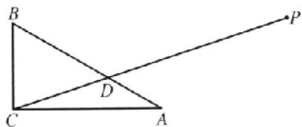

方法突破 三角函数和平面向量是高中数学的两个重要分支, 内容繁杂, 且平面向量与三角函数交汇点较多, 向量的平行、垂直、夹角、数量积等知识都可以与三角函数进行交汇. 不论是哪类向量知识与三角函数的交汇试题, 都会出现交汇问题中的难点, 对于此类问题的解决方法就是利用向量的知识将条件转化为三角函数中的“数量关系”, 再利用三角函数的相关知识进行求解.

# 考点过关25 数列的概念及简单表示

##### 1. D 选项 A 中, 数列: 1, 2, 3 和数列: 3, 2, 1 是不同的数列. 选项 B 中, 数列中的数是可以重复的, 可以构成数列. 选项 C 中, 数列可以是常数列或摆动数列. 选项 D 中, 数列 $\{a_{n}\}$ 的前 $n$ 项和为 $S_{n}$ , 前 $n+1$ 项和为 $S_{n+1}$ , 故 D 正确.

##### 2. C 记“第 $n$ 圆环”最外层的碳原子个数为 $a_{n}$ ，依题意知， $a_{1} = 6 \times 2 + 6, a_{2} = 6 \times 2 + 6 \times 3 = 6 \times 2 - 6 \times (2 \times 2 - 1), a_{3} = 6 \times 2 + 6 \times 5 = 6 \times 2 + 6 \times (2 \times 3 - 1)$ ，由此可以归纳出 $a_{n} = 6 \times 2 +$

$6 \times (2n - 1)$ , “第二圆环”上的碳原子个数为 $a_{2} + a_{1}$ , “第三圆环”上的碳原子个数为 $a_{3} + a_{2}$ , 由此可得“第 $n$ 圆环”上的碳原子个数为 $a_{n} + a_{n-1}$ , 所以“第七圆环”的碳原子个数为 $a_{7} + a_{6} = 90 + 78 = 168$ .

##### 3. B 由题意可知 $a_{n} - 1$ 既是2的倍数，也是5的倍数，即 $a_{n} - 1$ 是10的倍数，则 $a_{n} - 1 = 10(n - 1)(n \in \mathbf{N}^{*})$ ，故 $a_{20} = 10 \times (20 - 1) + 1 = 191.$

##### 4. A 若 $a_{n+1} > |a_n|$ ，则 $a_{n+1} > a_n$ ，所以 $\{a_n\}$ 为递增数列，但 $\{a_n\}$ 为递增数列时，不等式 $a_{n+1} > |a_n|$ 不一定成立。如数列 $-5, -3, -1, 1, \cdots$ 是递增数列，但 $|-5| > -3$ 。

##### 5. B 由题意可知， $a_{1}=0,a_{2}=\left|2+\frac{9}{2}-10\right|=\frac{7}{2},a_{3}=|3+3-10|=4,a_{4}=\left|4+\frac{9}{4}-10\right|=\frac{15}{4},a_{5}=\left|5+\frac{9}{5}-10\right|=\frac{16}{5},a_{6}=\left|6+\frac{9}{6}-10\right|=\frac{5}{2},a_{7}=\left|7+\frac{9}{7}-10\right|=\frac{12}{7},a_{8}=\left|8+\frac{9}{8}-10\right|=\frac{7}{8},a_{9}=\left|9+\frac{9}{9}-10\right|=0$ ，函数 $y=x+\frac{9}{x}-10$ ，
在 $[10,+\infty)$ 上单调递增，且当x=10时， $y=\frac{9}{10}>0$ ，且 $a_{9}<a_{10}$ ，所以从第10项开始，不会是“谷值点”，只有 $a_{8}>a_{9},a_{9}<a_{10}$ ，所以数列 $a_{n}$ 只有1个“谷值点”，谷值点为9.

##### 6. D 这些数可以写为 $1^{2}, 2, 3, 2^{2}, 5, 6, 7, 8, 3^{2}, \cdots$ ，第 k 个平方数与第 $(k+1)$ 个平方数之间有 2k 个正整数，而数列 $1^{2}, 2, 3, 2^{2}, 5, 6, 7, 8, 3^{2}, \cdots, 45^{2}$ 中共有 2025 项，去掉 45 个平方数，还剩 1980 个数，所以去掉平方数后的第 2022 项应是 2025 后的第 42 个数，即 2067.

##### 7. D $a_{4}-a_{2+2}=a_{2}^{2}=16, a_{2}=a_{1+1}=a_{1}^{2}=4$ ，所以 $a_{1}=2, a_{8}=a_{4+4}=a_{4}^{2}=256$ ，所以 $a_{9}=a_{8}\cdot a_{1}=512$ .

##### 8. B 由题意，得 $F_{1} = F_{2} = 1$ ，当 $n \geqslant 3$ 时， $F_{n} = F_{n-1} + F_{n-2}$ . 对于 A, $F_{11} = F_{10} + F_{9} > F_{10} + F_{3}$ ，故 A 错误；对于 B, $F_{9} + F_{10} = F_{11} < F_{8} + F_{11}$ ，故 B 正确；对于 C, $F_{9} + F_{11} - 2F_{10} = 2F_{9} + F_{10} - 2F_{10} = 2F_{5} - F_{10} = 2F_{9} - F_{9} - F_{8} = F_{9} - F_{8} > 0$ ，故 $F_{9} + F_{11} > 2F_{10}$ ，故 C 错误；对于 D, $F_{11} - F_{10} - 4F_{6} = F_{9} - 4F_{6} = F_{8} + F_{7} - 4F_{5} = 3F_{6} + 2F_{5} - 4F_{6} = 2F_{5} - F_{6} = 2F_{5} - F_{5} - F_{4} = F_{5} - F_{4} > 0$ ，故 $4F_{6} + F_{10} < F_{11}$ ，故 D 错误.

##### 9. BD 因为数列 $\{a_{n}\}$ 满足 $a_1 = -\frac{1}{2}, a_{n+1} = \frac{1}{1 - a_n}$ , 所以 $a_2 = \frac{1}{1 - a_1} = \frac{2}{3}, a_3 = \frac{1}{1 - a_2} = 3, a_4 = \frac{1}{1 - a_3} = -\frac{1}{2} = a_1$ , 所以数列 $\{a_n\}$ 是周期为 3 的数列, 目前 3 项为 $-\frac{1}{2}, \frac{2}{3}, 3$ .

##### 10. ACD 对于 A, B, 由 $a_1 = 2^1 - m = 3$ , 得 $m = 1$ , 所以 $a_n - 2^n - 1$ , 故 A 正确, B 错误: 对于 C, $a_n - a_{n-1} - 2^n - 2^n \cdot = 2^{n-1} > 0$ 得该数列为递增数列, 故 C 正确; 对于 D, $a_n = 2^n + 1$ , 则 $a_1 - 2^6 + 1 = 65$ , 故 D 正确.

##### 11. BCD 分析: 选项 A, 易得 $a_{n-k} - a_n = a_1 q^{n-1}(q^k - 1)$ , 由于 $q > 1$ , 则 $a_1 < 0$ 时, $a_{n+k} - a_n > 0$ 不成立. 选项 B, 易得 $a_{n+k} - a_n = k \cdot \frac{n^2 + kn - 4}{(n + k)n}$ , 从而转化为 $n^2 + kn - 4 > 0$ 对 $\forall n \in \mathbb{N}^*$ 恒成立, 可以通过对 $t(n) = n^2 + kn - 4$ 单调性研究, 转化为其最小值大于 0; 选项 C, 易得 $a_{n+k} - a_n = 2k + (-1)^n [(-1)^k - 1]$ , 需要对 $n$ 分奇、偶进行讨论, 根据不等式的恒成立, 确定 $k$ 的最小值; 选项 D, 易得 $a_{n+k} - a_n = 2kn + k^2 - tk > 0$ 对 $\forall n \in \mathbb{N}^*$ 恒成立, 先根据单调性, 转化为 $2k + k^2 - tk > 0$ 恒成立, 再分离变量, 根据最小间隔数为 3, 建立不等式求出 $t$ 的取值范围.

对于A，设等比数列 $\{a_{n}\}$ 的公比为 $q$ ，则 $a_{n + k} - a_n = a_1q^{n + k - 1} - a_1q^{n - 1} = a_1q^{n - 1}(q^k -1)$ ，因为 $q > 1$ ，所以 $q^{n - 1}(q^k -1) > 0$ ，若 $a_1 < 0$ ，则 $a_{n + k} - a_n <   0$ ，不是间隔递增数列，故A错误；对于B， $a_{n + k} - a_n = \left(n + k + \frac{4}{n + k}\right) - \left(n + \frac{4}{n}\right) = k\cdot \frac{n^2 + kn - 4}{(n + k)n}$ 易得 $t(n) = n^2 +kn - 4$ 在 $(0, + \infty)$ 上单调递增，且 $t(1) = k - 3$ ，所以当 $k > 3$ 时， $\{a_n\}$ 一定是间隔递增数列，故B正确；对于C， $a_{n + k} - a_n = 2(n + k) + (-1)^{n + k} - [2n + (-1)^n ] = 2k + (-1)^n\cdot$ $[(-1)^k -1]$ ，当 $n$ 为奇数时， $a_{n - k} - a_n = 2k - [-(-1)^k -1]$ 显然当 $k = 1$ 时， $a_{n + k} - a_n > 0$ ，当 $n$ 为偶数时， $a_{n + k} - a_n = 2k+$ $[(-1)^k -1]$ 显然当 $k = 2$ 时， $a_{n + k} - a_n > 0$ 故C正确；对于D， $a_{n + k} - a_n = (n + k)^2 -t(n + k) + 2021 - (n^2 -tn + 2021) = 2kn+$ $k^2 -tk > 0$ 对于 $n\in \mathbf{N}^*$ 恒成立，则 $2k + k^2 -tk > 0$ 恒成立，因为最小间隔数是3，所以 $2k + k^2 -tk > 0$ 即 $k > t - 2$ 对于 $k\geqslant 3$ 恒成立，且当 $k\leqslant 2$ 时， $k\leqslant t - 2$ ，于是 $4\leqslant t <   5$ ，故D正确.

##### 12. 21 设 $a_{n} = an^{2} + bn + c (a \neq 0, n \in \mathbf{N}^{*})$ ，由题设可得 $\left\{ \begin{array}{l} a + b + c = 1, \\ 4a + 2b + c = 3, \\ 9a + 3b + c = 7, \end{array} \right.$ 解得 $\left\{ \begin{array}{l} a = 1, \\ b = -1, \\ c = 1, \end{array} \right.$ 所以 $a_{n} = n^{2} - n + 1, n \in \mathbf{N}^{*}, a_{5} =$ $5^{2} - 5 + 1 = 21$ .

##### 13. $4-\frac{1}{n}$ 因为 $a_{n+1}-a_{n}=\frac{1}{n(n+1)}=\frac{1}{n}-\frac{1}{n+1}$ ，所以 $a_{2}-a_{1}=1-\frac{1}{2}, a_{3}-a_{2}=\frac{1}{2}-\frac{1}{3}, \cdots, a_{n}-a_{n-1}=\frac{1}{n-1}-\frac{1}{n}$ ，累加可得 $a_{n}-a_{1}=1-\frac{1}{n}$ ，因为 $a_{1}=3$ ，所以 $a_{n}=4-\frac{1}{n}$ .

##### 14.22 分析: 直接根据递推关系, 可得 $a_{3}$ 的值; 无法直接求出 $\{a_{n}\}$ 的通项公式, 可以从前几项归纳出数列的周期, 根据数列的周期性求出 $S_{2015}$ .

因为 $a_1 = 1, a_2 = 3$ ，所以 $a_3 = a_2 - a_1 = 2, a_4 = a_3 - a_2 = -1, a_5 = a_4 - a_3 = -3, a_6 = a_5 - a_4 = -2, a_7 = a_6 - a_5 = 1$ ，所以数列 $\{a_n\}$ 是以6为周期的周期数列，且 $a_1 + a_2 + a_3 + a_4 + a_5 + a_6 = 0$ ，所以 $S_{2015} = a_1 + a_2 + \dots + a_{2015} = a_1 + a_2 + a_3 + a_4 + a_5 = 2.$

# 核心笔记

##### 1. 已知 $S_{n}$ 求 $a_{n}$ ，需对 $n = 1$ 时的结果进行检验，看是否符合 $n \geqslant 2$ 时 $a_{n}$ 的表达式。若符合，则数列的通项公式为 $a_{n}$ 的表达式；否

则，应分 $n = 1$ 与 $n \geqslant 2$ 两段来写.

##### 2. 要把数列看成特殊的函数,从函数的观点看数列。(练习运用:第5题)

# 考点过关26 等差数列

##### 1. B 分析: 本题只需深刻理解题意, 不用运算, 思考便可得出结论, 当然也可以取特殊值, $a_{3} = a_{5} = a_{9} = 1$ , 其余的各项均为 2, 则该数列满足 $a_{3} + a_{9} = 2a_{6}$ , 但不是等差数列, 故充分性不满足.

由于不知道除了 $a_3, a_6, a_9$ 以外的其他项，且 $a_3 + a_9 = 2a_6$ 只能判断 $a_3, a_6, a_9$ 三项成等差数列，故不能推出数列 $\{a_n\}$ 为等差数列，充分性不成立；而数列 $\{a_n\}$ 为等差数列时，有 $a_9 - a_6 = a_6 - a_2 = 3d$ ，即 $a_3 + a_9 = 2a_6$ 成立，必要性成立.

##### 2. C 解法 1(性质法) 因为 $a_{3} + a_{7} = 2a_{5} = 6$ ，所以 $a_{5} = 3$ ，所以 $a_{5} + a_{12} = 3 + 17 = 20$ ，所以 $S_{16} = \frac{(a_{1} + a_{15}) \times 16}{2} = 8(a_{5} + a_{12}) = 160$ .

【解法2】(基本量法) $\left\{ \begin{array}{l}a_{1} + 2d + a_{1} + 6d = 6,\\ a_{1} + 11d = 17, \end{array} \right.$ 解得 $\left\{ \begin{array}{ll}a_1 = -5,\\ d = 2, \end{array} \right.$ $S_{16} =$ $16\times (-5) + \frac{16\times 15}{2}\times 2 = 160.$

##### 3. C 由 $S_{n+1} = S_n + a_n + 3$ 得 $a_{n+1} - a_n = 3$ ，所以 $\{a_n\}$ 为等差数列，公差为3，所以由 $a_4 + a_5 = 23$ 得 $2a_1 + 7d = 23$ ，所以 $a_1 = 1$ ， $S_8 = 8 + \frac{1}{2} \times 8 \times 7 \times 3 = 92$ .

##### 4. B 由 $4S_{3} = (a_{3} + 1)^{2}, 4S_{4} = (a_{4} + 1)^{2}$ ，两式相减得 $4a_{4} = (a_{4} + 1)^{2} - (a_{3} + 1)^{2}$ ，所以 $(a_{4} - 1)^{2} - (a_{3} + 1)^{2} = 0$ ，则 $(a_{4} + a_{3})(a_{4} - a_{3} - 2) = 0$ 。又数列 $\{a_{n}\}$ 为正项等差数列，所以 $a_{4} - a_{3} - 2 = 0$ ，即 $a_{4} - a_{3} = 2$ ，所以 $d = 2$ 。

##### 5. B 因为 $S_{4}=1, S_{8}=4$ ，所以 $S_{8}-S_{4}=3$ ，所以 $S_{12}-S_{8}=5$ ，所以 $S_{16}-S_{12}=7$ ，所以 $S=S_{20}-S_{16}=9$ 。

方法突破 在等差数列 $\{a_{n}\}$ 中，数列 $S_{m}, S_{2m} - S_{m}, S_{3m} - S_{2m}$ 成等差数列， $\left\{\frac{S_n}{n}\right\}$ 也是等差数列.

##### 6. A 解法1(二次函数法) 分析: 可以建立 $S_{n}$ 关于 n 的函数关系, 通过二次函数的图象分析得到对称轴的范围, 由此可求 d 的取值范围.

由题意知 $a_5 = a_1 + 4d = 5$ ，则 $a_1 = 5 - 4d$ ，所以 $S_n = na_1 + \frac{n(n - 1)d}{2} = n(5 - 4d) + \frac{n(n - 1)d}{2} = \frac{d}{2}n^2 + \left(5 - \frac{9}{2}d\right)n.$ 因为 $\{S_n\}$ 单调递增，所以当 $d = 0$ 时， $S_n = 5n$ ，满足题意；当 $d \neq 0$ 时，由于 $n$ 为正整数，当对称轴为直线 $n = 1.5$ 时， $a_1 = a_2$ ，故 $\left\{ \begin{array}{l} d > 0, \\ \frac{9}{2}d - 5 \\ \frac{d}{d} < \frac{3}{2}. \end{array} \right.$ 解得 $0 < d < \frac{5}{3}$ . 综上 $d$ 的取值范围是 $\left[0, \frac{5}{3}\right)$ .

【解法2】（通项公式法）分析：数列 $\{S_n\}$ 为递增数列，根据数列和与通项公式的关系，不难得到 $\{a_n\}$ 从第二项开始，各项均为正数，由此可求 $d$ 的取值范围.

因为 $\{a_{n}\}$ 为等差数列，且 $a_5 = 5$ ，所以 $a_{n} = 5 + (n - 5)d$ ，又数列 $\{S_n\}$ 为递增数列，当 $n\geqslant 1$ 时， $a_{n + 1} = S_{n + 1} - S_n > 0$ ，即数列 $\{a_{n}\}$ 中，当 $a_{n}\geqslant 2$ 时， $a_{n} > 0$ ，所以数列 $\{a_{n}\}$ 从第二项开始，各项均为正数.由 $a_2 = 5 + (2 - 5)d > 0$ ，解得 $d <   \frac{5}{3}$ 因为 $a_{n} > 0(n\geqslant 2)$ 恒成立，所以数列 $\{a_{n}\}$ 为常数数列或递增数列，所以 $d\geqslant 0.$ 综上， $d\in$ $\left[0,\frac{5}{3}\right).$

##### 7. A 当 $n \geqslant 2$ 时， $a_{n} = S_{n} - S_{n-1} = n^{2} - 4n - [(n-1)^{2} - 4(n-1)] = 2n - 5$ ; 当 n = 1 时， $a_{1} = S_{1} = -3$ 符合上式. 所以 $a_{n} = 2n - 5$ , 所以 $\left|a_{1}\right| + \left|a_{2}\right| + \cdots + \left|a_{10}\right| = |-3| + |-1| + 1 + 3 + 5 + \cdots + 15 = 4 + \frac{8 \times (1 + 15)}{2} = 68$ .

易错警示 由 $a_{n} = S_{n} - S_{n - 1}$ 求 $a_{n}$ 时的 $n$ 是从2开始的自然数，由此求得的 $a_{n}$ 不一定就是它的通项公式，必须验证 $n = 1$ 时是否也成立，如果 $n = 1$ 时不成立，通项公式只能用分段函数 $a_{n} = \left\{ \begin{array}{ll}S_{1}, & n = 1,\\ S_{n} - S_{n - 1}, & n\geqslant 2 \end{array} \right.$ 来表示.

##### 8. C 分析: 根据系数关系可以将 $2S_{2n}$ 拆分, 进而将和转化为项, 即 $a_{2n+1} + a_{2n+2} + \cdots + a_{2n} > a_{n+1} + a_{n+2} + \cdots + a_{2n}$ , 根据等距性, 可以通过分组作差, 推理得到 $n^{2}d > 0$ , 根据充分必要条件定义求解即可.

由 $S_{n} + S_{3n} > 2S_{2n}$ ，得 $S_{3n} - S_{2n} > S_{2n} - S_n$ ，即 $a_{2n + 1} + a_{2n + 2} + \dots + a_{3n} > a_{n + 1} + a_{n + 2} + \dots + a_{2n}$ ，所以 $(a_{2n + 1} - a_{n - 1}) + (a_{2n + 2} - a_{n + 2}) + \dots + (a_{3n} - a_{2n}) > 0$ ，所以 $n^2 d > 0, d > 0$ ，反之亦可，所以“ $d > 0$ ”是“ $S_n + S_{3n} > 2S_{2n}$ ”的充要条件.

##### 9. BC 由等差数列的性质知 $a_1 + a_{15} = 2a_8$ ，故由 $a_1 + a_8 + a_{15}$ 是定值，可得 $a_8$ 是定值， $S_{15} = \frac{1}{2} \times 15 \times (a_1 + a_{15}) = 15a_3$ ，故 $S_{15}$ 为定值.

方法突破 应用等差数列 $\{a_{n}\}$ 的性质: 若 $p + q = m + n$ , 则 $a_{p} + a_{q} = a_{m} + a_{n}$ , 可以进行整体转化或简化运算.

##### 10. AD $S_{7}-S_{6}=a_{7}>0$ , $S_{8}-S_{7}=a_{8}<0$ , 所以数列 $\{a_{n}\}$ 是递减的等差数列, 最大项为 $a_{1}$ , 所以 A 正确, B 错误, D 正确; $S_{10}-S_{3}=a_{4}+a_{5}+\cdots+a_{10}=7a_{7}>0$ , 故 C 错误.

##### 11. AD 设等差数列 $\{a_{n}\}$ 的公差为 d，则由 $a_{5}=a_{2}+3d$ 得 -1=-7+3d，所以 d=2，所以 $a_{n}=a_{2}+(n-2)d=2n-11$ ， $S_{n}=\frac{n(-9+2n-11)}{2}=n^{2}-10n$ ，所以当 n=5 时， $S_{n}$ 取最小值 -25，无最大值。而 $T_{n}=(-9)\times(-7)\times(-5)\times(-3)\times(-1)\times1\times3\times5\times\cdots\times(2n-11)$ ，所以当 n=4 时， $T_{n}$ 取最大值 945，无最小值。

##### 12.3 因为 $S_{n} = n^{2} + n$ ，所以当 $n\geqslant 2$ 时， $a_{n} = S_{n} - S_{n - 1} = n^{2}+$

$n - (n - 1)^2 -(n - 1) = 2n$ ，又当 $n = 1$ 时， $a_1 = S_1 = 2$ ，满足 $a_{n} = 2n$ ，故 $a_{n} = 2n$ ，则 $\frac{S_n + 9}{a_n} = \frac{n^2 + n + 9}{2n} = \frac{1}{2}\left(n + \frac{9}{n}\right) + \frac{1}{2}$ 又 $y = x + \frac{9}{x}$ 在(1,3)上单调递减，在(3， $+\infty)$ 上单调递增，故当 $n = 3$ 时， $n + \frac{9}{n}$ 取得最小值，即当 $n = 3$ 时， $\frac{S_n + 9}{a_n}$ 取得最小值.

##### 13. $\frac{2n - 1}{3n - 1}$ $\frac{a_n}{b_n} = \frac{(2n - 1)a_n}{(2n - 1)b_n} = \frac{S_{2n - 1}}{T_{2n - 1}} = \frac{2(2n - 1)}{3(2n - 1) + 1} = \frac{2n - 1}{3n - 1}.$

##### 14. $a_{n} = 3n - 1\frac{3}{2} -\frac{1}{2\cdot 3^{n - 1}}$ 分析：要求出 $\{a_n\}$ 的通项公式，需求出首项 $a_1$ ，可以从已知条件中所给的递推关系入手，令 $n = 1$ ，求得 $a_1$ ，进而求出 $a_{n}$ 将 $a_{n} = 3n - 1$ 代入，易得 $3b_{n + 1} = b_n$ ，从而得到 $\{b_n\}$ 为等比数列，再求和得 $S_{n}$

因为 $a_{n}b_{n + 1} + b_{n + 1} = nb_{n}$ 当 $n = 1$ 时， $a_1b_2 + b_2 = b_1$ 因为 $b_{1} = 1$ $b_{2} = \frac{1}{3}$ ，所以 $a_1 = 2.$ 又因为 $\{a_n\}$ 是公差为3的等差数列，所以 $a_{n} = 3n - 1.$ 由 $(3n - 1)b_{n + 1} + b_{n + 1} = nb_{n}$ ，得 $3b_{n - 1} = b_n$ ，即数列 $\{b_n\}$ 是以1为首项、 $\frac{1}{3}$ 为公比的等比数列，所以 $\{b_n\}$ 的前 $n$ 项和 $S_{n} = \frac{1 - \left(\frac{1}{3}\right)^{n}}{1 - \frac{1}{3}} = \frac{3}{2} -\frac{1}{2\cdot 3^{n - 1}}.$

# 核心笔记

##### 1. 等差数列性质的应用：（1） 项的性质，在等差数列 $\{a_{n}\}$ 中，若 $m + n = p + q (m, n, p, q \in \mathbb{N}^{*})$ ，则 $a_{m} + a_{n} = a_{p} + a_{q}$ . （2） 和的性质，在等差数列 $\{a_{n}\}$ 中， $S_{n}$ 为其前 $n$ 项和，则① $S_{2n} = n (a_{1} + a_{2n}) = \dots = n (a_{n} + a_{n+1})$ ；② 依次 $k$ 项和成等差数列，即 $S_{k}, S_{2k} - S_{k}, S_{3k} - S_{2k}, \dots$ 成等差数列.（练习运用：第5题）

##### 2. $S_{n} = na_{1} + \frac{n(n - 1)}{2} d$ 或 $S_{n} = \frac{n(a_{1} + a_{n})}{2}$ . 因此可以从两个方向研究等差数列前 $n$ 项和的最值问题: （1） 看作关于 $n$ 的二次函数, 通过二次函数的图象和性质研究最值. 值得注意的是, 由于 $n$ 为正整数, 对称轴处往往取不到最值, 要分析与对称轴相邻的两个正整数的取值情况. （2） 通过对 $\{a_{n}\}$ 的通项公式的研究, 找到正负转折项, 常用到等差数列的等差中项的性质. 一般地, 在等差数列 $\{a_{n}\}$ 中, 若 $a_{1} > 0, d < 0$ , 则 $S_{n}$ 存在最大值; 若 $a_{1} < 0, d > 0$ , 则 $S_{n}$ 存在最小值. (练习运用: 第8题、第10题)

##### 3. 等差数列的前 n 项和是关于 n 的二次式(当公差为 0 时, 二次项系数为 0). (练习运用: 第 7 题、第 13 题)

# 考点过关27 等比数列

##### 1. A $a_{4} = a_{1}q^{3}$ ，则 $q = 2$ ，所以 $\alpha_{1} = 26$

##### 2. C 设等比数列 $(a_{1})$ 的公比为 q，则 $q - \frac{a_{1} - a_{2}}{a_{1} + a_{2}} - \frac{13}{-24} = -2$ ，则 $a_{6} - a_{4} = a_{1}q^{5} - a_{1}q^{4} = -32a_{1} + 8a_{1} = -24$ ，解得 $a_{1} = 1$ .

##### 3. D 分析: 解决和等比数列有关的问题, 一般采用: （1）“基本量法”, 即将条件全部用 $a_{1}, q$ 表示出来, 再联立方程求解即可, 此法有时运算量稍大; （2）“性质法”, 即利用等比数列的性质和前 $n$ 项和性质求解, 此法运算量一般都比较简便, 但技巧性强.

【解法1】（定义法）由已知可得 $3a_{1} + 27a_{1} = 12$ ，则 $a_1 = \frac{2}{5}$ 所以 $a_5 - a_1 = a_1\times 3^4 -a_1 = 80a_1 = 32.$

【解法2】(性质法) 因为 $\frac{a_{2}+a_{4}}{a_{1}+a_{3}}=q=3,\frac{a_{3}+a_{5}}{a_{2}+a_{4}}=3$ ，所以 $a_{1}+a_{3}=4,a_{3}+a_{5}=36$ ，则 $a_{5}-a_{1}=(a_{3}+a_{5})-(a_{1}+a_{3})=36-4=32.$

##### 4. A 公比 $q \neq 0$ ，由 $a_{2021} > a_{2024}$ ，得 $a_{2020}q > a_{2020}q^4$ ，因为 $a_{2020} > 0$ ，所以 $q > q^4$ ，即 $q(1 - q^3) > 0$ ，所以 $q(1 - q)(1 + q + q^2) > 0$ ，因为 $1 + q + q^2 > 0$ ，所以 $q(1 - q) > 0$ ，得 $0 < q < 1$ 。由 $a_{2022} > a_{2023}$ ，得 $a_{2020}q^2 > a_{2020}q^3$ ，因为 $a_{2020} > 0$ ，所以 $q^2 > q^3$ ，得 $q < 1$ 且 $q \neq 0$ ，而 $0 < q < 1 \Rightarrow q < 1$ 且 $q \neq 0$ ，反之不成立，即“ $a_{2021} > a_{2024}$ ”是“ $a_{2022} > a_{2023}$ ”的充分不必要条件。

##### 5. B $\lg a_{n+1}-\lg a_{n}=\lg\frac{a_{n+1}}{a_{n}}=1$ ，则 $\frac{a_{n+1}}{a_{n}}=10$ ，故 $\{a_{n}\}$ 是以
10为公比的等比数列，所以 $\frac{a_{21}+a_{22}+a_{23}+a_{24}+a_{25}}{a_{1}+a_{2}+a_{3}+a_{4}+a_{5}}=\frac{a_{1}q^{20}+a_{2}q^{20}+a_{3}q^{20}+a_{4}q^{20}+a_{5}q^{20}}{a_{1}+a_{2}+a_{3}+a_{4}+a_{5}}=q^{20}=10^{20}$ ，所以 $a_{1}+a_{2}+a_{3}+a_{4}+a_{5}=\frac{a_{21}+a_{22}+a_{23}+a_{24}+a_{25}}{10^{20}}=\sqrt{10}.$

##### 6. A 由题意可知宝塔从上至下每层的灯盏数构成公比为2的等比数列. 设等比数列的首项为 $a$ ，则有 $\frac{a(1 - 2^7)}{1 - 2} = 381$ ，解得 $a = 3$ . 所以该塔中间一层（即第4层）的灯盏数为 $3 \times 2^3 = 24$ .

##### 7. C $a_{n}=317\times\left(-\frac{1}{2}\right)^{n-1}$ ，易知 $a_{9}=317\times\frac{1}{256}>1$ ， $a_{10}<0,0<a_{11}<1.$ 又 $a_{1}a_{2}\cdots a_{9}>0$ ，故 $f(9)$ 最大，此时 n=9.

##### 8. C 分析: 由 $0 < a_{1} < a_{8} = 1$ , 得 $q > 1$ , 即可得到当 $n > 8$ 时, $a_{n} - \frac{1}{a_{n}} > 0$ , 当 $n < 8$ 时, $a_{n} - \frac{1}{a_{n}} < 0$ . 再根据下标和性质, 得 $a_{n} a_{16-n} = (a_{8})^{2} = 1 (n \in \mathbb{N}^{*})$ , 即可得到 $\left(a_{1} - \frac{1}{a_{1}}\right) + \left(a_{2} - \frac{1}{a_{2}}\right) + \cdots + \left(a_{15} - \frac{1}{a_{15}}\right) = 0$ , 从而得解.

不等式 $\left(a_{1}-\frac{1}{a_{1}}\right)+\left(a_{2}-\frac{1}{a_{2}}\right)+\cdots+\left(a_{n}-\frac{1}{a_{n}}\right)\leqslant0$ 可转化为 $a_{1}+a_{2}+\cdots+a_{n}\leqslant\frac{1}{a_{1}}+\frac{1}{a_{2}}+\cdots+\frac{1}{a_{n}}$ ，再由基本量转化求解.

【解法1】（等比数列中项的性质）因为 $0 < a_{1} < a_{8} = 1$ ，所以 $q^{7} = \frac{a_{8}}{a_{1}} > 1$ ，则公比 $q > 1$ ，所以当 $n > 8$ 时， $a_{n} - \frac{1}{a_{n}} > 0$ ，当 $n < 8$ 时， $a_{n} - \frac{1}{a_{n}} < 0$ 。又 $1 = a_{3}^{2} = a_{1}a_{15} = a_{2}a_{14} = \dots = a_{7}a_{9}$ ，所以 $a_{1} = \frac{1}{a_{15}}$

$a_{2}=\frac{1}{a_{14}},\cdots,a_{7}=\frac{1}{a_{9}}$ ，则 $\left(a_{1}-\frac{1}{a_{1}}\right)+\left(a_{2}-\frac{1}{a_{2}}\right)+\cdots+\left(a_{15}-\frac{1}{a_{15}}\right)=0.$ 又当n>8时， $a_{n}-\frac{1}{a_{n}}>0$ ，所以能使不等式 $\left(a_{1}-\frac{1}{a_{1}}\right)+\left(a_{2}-\frac{1}{a_{2}}\right)+\cdots+\left(a_{n}-\frac{1}{a_{n}}\right)\leqslant0$ 成立的最大正整数n是15.

【解法2】（基本量法）由 $0 < a_{1} < a_{8} = 1$ ，得 $q > 1, a_{1} \cdot q^{7} = 1.$ 由 $\left(a_{1} - \frac{1}{a_{1}}\right) + \left(a_{2} - \frac{1}{a_{2}}\right) + \dots + \left(a_{n} - \frac{1}{a_{n}}\right) \leqslant 0$ ，得 $a_{1} + a_{2} + \dots + a_{n} \leqslant \frac{1}{a_{1}} + \frac{1}{a_{2}} + \dots + \frac{1}{a_{n}}$ ，则 $\frac{a_{1}(1 - q^{n})}{1 - q} \leqslant \frac{\frac{1}{a_1}\left[1 - \left(\frac{1}{q}\right)^n\right]}{1 - \frac{1}{q}}$ ，即

$\frac{1-q^{n}}{q^{7}\cdot(1-q)}\leqslant\frac{q^{7}\cdot\left[1-\left(\frac{1}{q}\right)^{n}\right]}{1-\frac{1}{q}}$ ，即 $q^{n}+q^{15-n}-q^{15}-1\leqslant0$ 。令 $f(x)=q^{x}+q^{15-x}-q^{15}-1,x\geqslant0$ ，则 $f'(x)=(q^{x}-q^{15-x})\ln q$ ，故当x<7.5时， $f'(x)<0$ ；当x>7.5时， $f'(x)>0$ ；而 $f(0)=f(15)=0$ ，所以正整数n的最大值为15。

解后反思 解法 1 侧重于等比数列中项的性质, 解法 2 侧重于等比数列的基本量计算, 借助函数的单调性来解题, 显然解法 1 对思维的灵活性要求高, 解法 2 需要相当的运算量.

##### 9. BD 设公比为 $q, q > 0$ . 因为 $2a_{5} + a_{4} = a_{3}$ , 即 $2a_{1}q^{5} + a_{1}q^{3} = a_{1}q^{2}$ , 所以 $2q^{2} + q = 1$ , 解得 $q = \frac{1}{2}$ 或 $q = -1$ (舍去). 对于 A, 因为 $q = \frac{1}{2}$ , 所以 $a_{n+1} = \frac{1}{2} a_{n}$ , 故 A 错误. 对于 B, $S_{n} = \frac{a_{1} - a_{n}q}{1 - q} = \frac{a_{1} - \frac{1}{2} a_{n}}{1 - \frac{1}{2}} = 2a_{1} - a_{n}$ , 故 B 正确. 对于 C, 因为 $4\sqrt{a_{m}a_{n}} = a_{1}$ , 即 $4\sqrt{a_{1}q^{m-1}a_{1}q^{n-1}} = a_{1}$ , 所以 $q^{\frac{m+n-2}{2}} = \frac{1}{4}$ , 又 $q = \frac{1}{2}$ , 解得 $m + n = 6$ , 当 $m = 2, n = 4$ 时, $mn = 8$ , 故 C 错误, 故 D 正确.

##### 10. BCD $a_1 = S_1 = 5 + t, a_n = S_n - S_{n-1} = 5^n - 5^{n-1} = 4 \times 5^{n-1}$ ( $n > 1$ ), 当且仅当 $a_1 = 4$ , 即 $t = -1$ 时, $\{a_n\}$ 是等比数列, A 错误, B 正确. 当 $t = 0$ 时, $\{a_n\}$ 中 $\frac{a_3}{a_2} = \frac{100}{20} = 5$ , C 正确. 当 $t = -5$ 时, $a_1 = 0, \{a_n\}$ 一定不是等比数列, D 正确.

方法突破 $\{a_{n}\}$ 为公比 $q\neq -1$ 的等比数列的充要条件是其前 $n$ 项和 $S_{n} = Aq^{n} + B$ ，其中 $A + B = 0$ ；若 $A + B\neq 0$ ，则 $\{a_{n}\}$ 是从第2项开始的等比数列，等比数列任何一项都不能为0.

##### 11. ACD 对于选项 A, 因为 $S_{n+1}=a_{1}+a_{2}+\cdots-a_{n}+a_{n-1}=a_{1}+(qa_{1}+qa_{2}+\cdots+qa_{n})=a_{1}+qS_{n}$ ，故 A 正确；对于选项 B，当 q=-1，且 n 为偶数时，则 $S_{n}-0$ ，此时 $S_{n}, S_{2n}-S_{n}, S_{3n}-S_{2n}$ 不成等比数列，故 B 错误；对于选项 C，因为 $S_{2n}=S_{n}+a_{n+1}+a_{n+2}+\cdots+a_{2n}=S_{n}+q^{n}S_{n}, S_{3n}=S_{n}+q^{n}S_{n}+q^{2n}S_{n}$ ，若 $S_{n}, 2S_{2n}$ ，

$3S_{3n}$ 成等差数列，则有 $S_{n} + 3S_{3n} = 4S_{2n}$ ，即 $S_{n} + 3(1 + q^{n} + q^{2n}) \cdot S_{n} = 4(1 + q^{n})S_{n}$ ，因为 $n$ 为任意正整数，所以 $S_{n}$ 不恒为0，从而有 $3q^{2n} - q^{n} = 0$ ，因为 $q \neq 0$ ，所以 $q'' = \frac{1}{3}$ ，故存在 $q$ ，使得 $S_{n}, 2S_{2n}, 3S_{3n}$ 成等差数列，故C正确；对于选项D，当 $q = 1$ 时， $S_{2n-1} = (2n - 1)a_{1}$ ，因为 $a_{1} < 0$ ，所以 $\{S_{2n-1}\}$ 单调递减，不合题意；当 $q \neq 1$ 时， $S_{2n-1} = \frac{a_{1}(1 - q^{2n-1})}{1 - q}$ ，从而 $S_{2n-1} - S_{2n-3} = \frac{a_{1}(1 - q^{2n-1})}{1 - q} - \frac{a_{1}(1 - q^{2n-3})}{1 - q} = \frac{a_{1}q^{2n-3}(1 - q^{2})}{1 - q} = a_{1}q^{2n-3}(1 + q)$ ，所以数列 $\{S_{2n-1}\}$ 递增的充要条件为 $a_{1}q^{2n-3}(1 + q) > 0$ ，因为 $a_{1} < 0$ ，所以 $q(1 + q) < 0$ ，解得 $-1 < q < 0$ ，故D正确.

##### 12.3 因为 $2S_{n} = a_{n + 1} - 2$ ，所以 $2S_{n + 1} = a_{n + 2} - 2$ ，所以 $2a_{n + 1} = a_{n + 2} - a_{n + 1}$ ，即 $a_{n + 2} = 3a_{n + 1}$ ，即公比为3.

##### 13. $\frac{33}{16}$ 设等比数列 $\{a_{n}\}$ 的公比为 $q$ ，由 $8a_{5} + a_{2} = 0$ ，得 $\frac{a_{5}}{a_{2}} = -\frac{1}{8}$ ，所以 $q^{3} = -\frac{1}{8}$ ，则 $q = -\frac{1}{2}$ . 由 $a_{7} = \frac{3}{64}$ ，得 $a_{1} \cdot \left(-\frac{1}{2}\right)^{6} = \frac{3}{64}$ ，所以 $a_{1} = 3$ . 所以数列 $\{a_{n}\}$ 的前 5 项和 $S_{5} = \frac{a_{1}(1 - q^{5})}{1 - q} = \frac{33}{16}$ .

方法突破 数列中的 $a_{n}$ 与 $S_{n}$ 求解可以分为两种方法：一是基本量法，即转化为 $a_{1}, d(q), n, a_{n}, S_{n}$ 的方程组，解方程组即可；二是利用 $a_{n}$ 与 $S_{n}$ 的性质来求解，避开某些基本量。

##### 14. $\frac{5}{3} (4^n - 1)$ 9 由题可知，每次删掉的正方形数构成公比为4，首项为5的等比数列，所以经过 $n$ 次操作后，共删去的正方形个数 $S_n = \frac{5(1 - 4^n)}{1 - 4} = \frac{5}{3} (4^n - 1)$ ，易知第 $n$ 次操作后共保留了 $4^n$ 个小正方形，其边长为 $\frac{1}{3^n}$ ，所以保留下来的所有小正方形面积之和为 $\left(\frac{1}{3^a}\right)^2 \times 4^n = \left(\frac{4}{9}\right)^n$ ，由 $\left(\frac{4}{9}\right)^n \leqslant \frac{1}{1000}$ ，得 $n \geqslant$ $\log_{\frac{1}{9}} \frac{1}{1000} = \frac{-3}{2(\lg 2 - \lg 3)} \approx \frac{-3}{2 \times (0.3010 - 0.4771)} \approx 8.5$ ，所以至少需要9次操作才能使保留下来的所有小正方形面积之和不超过 $\frac{1}{1000}$ .

# 核心笔记

##### 1. 等比数列的性质：（1）等比数列除了通项公式 $a_{n} = a_{1}q^{n - 1}$ ，还要熟练掌握并运用变形式 $a_{n} = a_{m}\cdot q^{n - m}(n,m\in \mathbf{N}^{*})$ ；（2）等比中项性质的应用，若 $m + n = p + q = 2k(m,n,p,q,k\in \mathbf{N}^{*})$ ，则 $a_{m}\cdot a_{n} = a_{p}\cdot a_{q} = a_{k}^{2}$ ；（3）若数列 $\{a_{n}\},\{b_{n}\}$ （项数相同）是等比数列，则 $\{\lambda a_n\} ,\left\{\frac{1}{a_n}\right\} ,\{a_u^2\} ,\{a_n\cdot b_n\} ,\left\{\frac{a_n}{b_n}\right\} (\lambda \neq 0)$ 仍然是等比数列；（4）在等比数列 $\{a_{n}\}$ 中，等距离取出若干项也构成一个等比数列，即 $a_{n},a_{n + k},a_{n + 2k},a_{n + 3k},\dots$ 为等比数列，公比为 $q^{k}$ 。（练习运用：第9题）  
##### 2. 公式法求等比数列的前 n 项和: 涉及对公比 q 的分类讨论, 当

$q = 1$ 时， $\{a_{n}\}$ 的前 $n$ 项和 $S_{n} = na_{1}$ ；当 $q\neq 1$ 时， $\{a_n\}$ 的前 $n$ 项和 $S_{n} = \frac{a_{1}(1 - q^{n})}{1 - q} = \frac{a_{1} - a_{n}q}{1 - q}$ （练习运用：第13题）

##### 3. 等比数列前 $n$ 项和的性质: 若公比不为 $-1$ 的等比数列 $\{a_{n}\}$ 的前 $n$ 项和为 $S_{n}$ , 则 $S_{n}, S_{2n} - S_{n}, S_{3n} - S_{2n}$ 仍成等比数列, 其公比为 $q^{n}$ . (练习运用: 第11题)

# 考点过关28 数列的通项与求和

##### 1. B 分析: 注意到所研究的数列为非等差、等比数列, 因此, 可以通过列举来寻找规律.

由题知 $a_1 = a, a_2 = \frac{1}{1 - a}, a_3 = \frac{1}{1 - \frac{1}{1 - a}} = \frac{a - 1}{a}, a_4 = \frac{1}{1 - \frac{a - 1}{a}} = a$ ，故数列 $\{a_n\}$ 的周期为3，所以 $a_{2024} = a_{3 \times 674 + 2} = a_2 = \frac{1}{1 - a}$ .

##### 2. D 分析: 对于 $\frac{1}{a_{1}a_{2}} + \frac{1}{a_{2}a_{3}} + \cdots + \frac{1}{a_{n}a_{n+1}} = \frac{n}{2n+1} (n \in \mathbb{N}^{+})$ ,
往往运用赋值消元法, 得到 $a_{n}$ 的递推关系.

$\frac{1}{a_{1}a_{2}}+\frac{1}{a_{2}a_{3}}+\cdots+\frac{1}{a_{n}a_{n+1}}=\frac{n}{2n+1}(n\in\mathbf{N}^{*})$ ①, 当 n=1 时, $\frac{1}{a_{1}a_{2}}=\frac{1}{3}$ ; 当 $n\geqslant2$ 时, $\frac{1}{a_{1}a_{2}}+\frac{1}{a_{2}a_{3}}+\cdots+\frac{1}{a_{n-1}a_{n}}=\frac{n-1}{2n-1}$ ②,
由①-②得 $\frac{1}{a_{n}a_{n+1}}=\frac{n}{2n+1}-\frac{n-1}{2n-1}=\frac{1}{4n^{2}-1}.$

分析:由已知条件 $a_{5}-2a_{6}=7$ ，令 n=5，得 $\frac{1}{a_{5}a_{6}}=\frac{1}{99}$ ，从而求出 $a_{5}$ ，依次类推求出 $a_{1}$ 。

当 $n = 5$ 时， $\frac{1}{a_5a_6} = \frac{1}{99}$ ，则 $a_5a_6 = 99.$ 又 $a_5 - 2a_6 = 7$ ，所以 $a_6(2a_6 + 7) = 99$ ，解得 $a_6 = \frac{11}{2}$ 或 $a_6 = -9$ （舍），所以 $a_5 = 18.$ 因为 $a_4a_5 = 63$ ，所以 $a_4 = \frac{7}{2}$ 因为 $a_3a_4 = 35$ ，所以 $a_3 = 10.$ 因为 $a_{2}a_{3} = 15$ ，所以 $a_2 = \frac{3}{2}$ 因为 $a_1a_2 = 3$ ，所以 $a_1 = 2.$

解后反思 本题的解题关键在于运用消元法得到 $a_{n}$ 的递推关系式，即 $\frac{1}{a_n a_{n+1}} = \frac{1}{4n^2 - 1}$ ，从而找到相邻两项的关系式，结合 $a_5 - 2a_6 = 7$ ，可以求出 $a_5$ ，从而逐项求得 $a_5$ 。事实上，我们也可以从 $\frac{1}{a_n a_{n+1}} = \frac{1}{4n^2 - 1}$ 出发，得到 $a_n a_{n+1} = 4n^2 - 1 = (2n - 1)(2n + 1)$ ，所以 $a_{n+1} a_{n+2} = (2n + 1)(2n + 3)$ ，则 $\frac{a_{n+2}}{a_n} = \frac{2n + 3}{2n - 1}$ ，再运用累乘法求得 $a_1$ 。

##### 3. B $a_4 = 4a_2$ ，所以 $q^2 = 4$ 。又 $a_1 + a_5 = a_1 + 16a_1 = 17$ ，所以 $a_1 = 1$ 。因为 $\{a_n\}$ 是递增的等比数列，所以 $q - 2$ ，所以 $S_{2022} = 2a_{2022} = \frac{1 \times (1 - 2^{2022})}{1 - 2} - 2 \times 2^{2022 - 1} - 2^{2022} - 1 - 2^{2022} = 1$ 。

##### 4. D $S_{n} = n^{2}, S_{n-1} = n^{2} - 2n + 1$ . 两式作差得 $a_{n} = 2n - 1 (n \geqslant 2)$ , 又当 $n = 1$ 时, $a_{1} = S_{1} = 1^{2} = 1$ , 符合上式, 所以 $a_{n} = 2n - 1$ , 则

$\begin{array}{l} \frac {1}{a _ {n} a _ {n + 1}} = \frac {1}{(2 n - 1) (2 n + 1)} = \frac {1}{2} \left(\frac {1}{2 n - 1} - \frac {1}{2 n + 1}\right), \text {所以} \frac {1}{a _ {1} a _ {2}} + \\ \frac {1}{a _ {2} a _ {3}} + \frac {1}{a _ {3} a _ {4}} + \dots + \frac {1}{a _ {n} a _ {n + 1}} = \frac {1}{2} \left[ \left(1 - \frac {1}{3}\right) + \left(\frac {1}{3} - \frac {1}{5}\right) + \left(\frac {1}{5} - \frac {1}{6}\right) \right] \\ \left. \frac {1}{7}\right) + \dots + \left(\frac {1}{2 n - 1} - \frac {1}{2 n + 1}\right) \Biggr ] = \frac {1}{2} \left(1 - \frac {1}{2 n + 1}\right) = \frac {n}{2 n + 1}, \text {所以} \\ \frac {1}{a _ {1} a _ {2}} + \frac {1}{a _ {2} a _ {3}} + \frac {1}{a _ {3} a _ {4}} + \dots + \frac {1}{a _ {9 9} a _ {1 0 0}} = \frac {9 9}{2 \times 9 9 + 1} = \frac {9 9}{1 9 9}. \\ \end{array}$

# 方法突破 常见的裂项公式有

$\begin{array}{l} ① \frac {1}{n (n + 1)} = \frac {1}{n} - \frac {1}{n + 1}; \\ ② \frac {1}{(2 n - 1) (2 n + 1)} = \frac {1}{2} \left(\frac {1}{2 n - 1} - \frac {1}{2 n + 1}\right); \\ ③ \frac {1}{\sqrt {n} + \sqrt {n + 1}} = \sqrt {n + 1} - \sqrt {n}. \\ \end{array}$

##### 5. A $f(1)=1, f(n+1)-f(n)=4n$ ，再用累加法可得 $f(n)=2n^{2}-2n+1$ ，所以 $f(6)=61$ 。

##### 6. A 解法1（通项法）因为 $a_{n+1} + a_n = 3 \cdot 2^n$ ，所以 $\frac{a_{n+1} - 2^{n+1}}{a_n - 2^n} = \frac{3 \cdot 2^n - a_n - 2^{n+1}}{a_n - 2^n} = \frac{2^n - a_n}{a_n - 2^n} = -1.$ 又 $a_1 - 2 = -1$ 所以 $\{a_n - 2^n\}$ 是首项为-1，公比为-1的等比数列，所以 $a_n = (-1)^n + 2^n$ ，则 $S_{11} = a_1 + a_2 + \cdots + a_{11} = -1 + 2^1 + 1 + 2^2 + \cdots - 1 + 2^{11} = -1 + \frac{2 \times (1 - 2^{11})}{1 - 2} = 4093.$

解法 2(并项法) $S_{11}=a_{1}+(a_{2}+a_{3})+(a_{4}+a_{5})+\cdots+(a_{10}+a_{11})=1+3\times2^{2}+3\times2^{4}+3\times2^{6}+3\times2^{8}+3\times2^{10}=1+3\times\frac{4\times(1-4^{5})}{1-4}=4093.$

##### 7. C 由题意得 $\frac{a_{n-1}}{a_n} = \frac{n}{n+2}$ , 则 $\frac{a_n}{a_{n-1}} \times \frac{a_{n-1}}{a_{n-2}} \times \cdots \times \frac{a_2}{a_1} = \frac{n-1}{n+1} \times \frac{n-2}{n} \times \frac{n-3}{n-1} \times \cdots \times \frac{3}{5} \times \frac{2}{4} \times \frac{1}{3}$ , 即 $\frac{a_n}{a_1} = \frac{2}{n(n+1)}$ , 故 $a_n = \frac{2}{n(n+1)} \times a_1 = \frac{1}{n} - \frac{1}{n+1}$ , 则 $S_n = 1 - \frac{1}{2} + \frac{1}{2} - \frac{1}{3} + \frac{1}{3} - \frac{1}{4} + \cdots + \frac{1}{n} - \frac{1}{n+1} = \frac{n}{n+1}$ , 故 $S_{20} = \frac{20}{21}$ .

方法突破 已知数列递推关系求通项的典型方法：

（1） 当出现 $a_{n}=a_{n-1}+m$ 时，构造等差数列；  
（2） 当出现 $a_{n}=xa_{n-1}+y$ 时，构造等比数列；  
（3） 当出现 $a_{n}=a_{n-1}+f(n)$ 时，用累加法求解；  
（4） 当出现 $\frac{a_{n}}{a_{n-1}} = f(n)$ 时，用累乘法求解.

##### 8. B 设 $\frac{n^2}{2^n} = \frac{a(n - 1)^2 + b(n - 1) + c}{2^{n - 1}} - \frac{an^2 + bn + c}{2^n} = \frac{an^2 + (b - 4a)n + 2a - 2b + c}{2^n}$ , 则 $\left\{ \begin{array}{l} a = 1, \\ b - 4a = 0, \\ 2a - 2b + c = 0 \end{array} \right.$ 解得 $\left\{ \begin{array}{l} a = 1, \\ b = 4, \\ c = 6, \end{array} \right.$ 以 $\frac{n^2}{2^n} = \frac{(n - 1)^2 + 4(n - 1) + 6}{2^{n - 1}} - \frac{n^2 + 4n + 6}{2^n}$ , 则数列 $\left\{\frac{n^2}{2^n}\right\}$ 的前 $n$

项和为 $T_{n}=\left(6-\frac{1^{2}+4\times1+6}{2}\right)+\left(\frac{1^{2}+4\times1+6}{2}-\frac{2^{2}+4\times2+6}{2^{2}}\right)+\cdots+\left[\frac{(n-1)^{2}+4(n-1)+6}{2^{n-1}}-\frac{n^{2}+4n+6}{2^{n}}\right]=$ $6-\frac{n^{2}+4n+6}{2^{n}}$ . 故 $T_{20}-6=-\frac{486}{2^{20}}=-\frac{243}{2^{19}}$ .

##### 9. AB 由题意, $a_{n}=1+2(n-1)=2n-1,b_{n}=2^{n-1},c_{n}=a_{b_{n}}=2\cdot2^{n-1}-1=2^{n}-1$ ,则数列 $\{c_{n}\}$ 为递增数列,其前n项和 $T_{n}=(2^{1}-1)+(2^{2}-1)+(2^{3}-1)+\cdots+(2^{n}-1)=(2^{1}+2^{2}+\cdots+2^{n})-n=\frac{2(1-2^{n})}{1-2}-n=2^{n+1}-2-n.$ 当n=9时, $T_{n}=1013<2019;$ 当n=10时, $T_{n}=2036>2019.$ 所以n的取值可以是8,9.

##### 10. BD 对于 A, 数列 $\{a_{n}\}$ : 2, -4, 6, -8, 10, … 的通项公式 $a_{n}=(-1)^{n+1}2n$ , 故 A 错误; 对于 B, $a_{2n-1}-a_{2n}=(-1)^{2n}2(2n-1)-(-1)^{2n+1}4n=4n-2+4n=8n-2$ , 故 $\{a_{2n-1}-a_{2n}\}$ 是一个等差数列, 故 B 正确; 对于 C, $S_{19}=S_{17}+a_{18}+a_{19}=S_{17}-36+38=S_{17}+2>S_{17}$ , 故 C 错误; 对于 D, $S_{2023}=(a_{1}+a_{2})+(a_{3}+a_{4})+\cdots+(a_{2021}+a_{2022})+a_{2023}=(2-4)+(6-8)+\cdots+(4042-4044)+a_{2023}=1011\times(-2)+4046=2024$ , 故 D 正确.

##### 11. BCD 对于 A, $\lambda = -1$ ，则 $a_{n} + a_{n+2} = -a_{n+1}$ ，即 $a_{n} + a_{n+1} + a_{n-2} = 0$ ①，从而 $a_{n+1} + a_{n+2} + a_{n+3} = 0$ ②，由②-①得 $a_{n-3} = a_{n}$ ，所以数列 $\{a_{n}\}$ 是周期为 3 的周期数列，令①中的 n = 1，则 $a_{1} + a_{2} + a_{3} = 0$ ，又 $a_{1} = 1, a_{2} = 2$ ，所以 $a_{3} = -3$ ，所以数列 $\{a_{n}\}$ 为 1, 2, -3, 1, 2, -3, … 循环往复，故 $a_{2024} \geqslant 2024$ 不可能成立；对于 B, $\lambda = 2$ ，则 $a_{n} + a_{n+2} = 2a_{n+1}$ ，即 $a_{n+1} - a_{n} = a_{n-2} - a_{n+1}$ ，所以数列 $\{a_{n}\}$ 为等差数列，又 $a_{1} = 1, a_{2} = 2$ ，所以 $a_{n} = n$ ，故 $a_{2024} = 2024 \geqslant 2024$ 成立；对于 C, $\lambda = \frac{5}{2}$ ，则 $a_{n} + a_{n+2} = \frac{5}{2}a_{n+1}$ ，即 $a_{n} - 2a_{n+1} = \frac{1}{2}(a_{n+1} - 2a_{n+2})$ ，又 $a_{1} = 1, a_{2} = 2$ ，所以数列 $\{a_{n} - 2a_{n+1}\}$ 是首项为 $a_{1} - 2a_{2} = -3$ ，公比为 2 的等比数列，所以 $a_{n} - 2a_{n+1} = -3 \times 2^{n-1}$ ，即 $\frac{a_{n+1}}{2^{n+1}} - \frac{1}{2} = \frac{1}{4}\left(\frac{a_{n}}{2^{n}} - \frac{1}{2}\right)$ ，因为 $\frac{a_{1}}{2} - \frac{1}{2} = 0$ ，所以 $\left\{\frac{a_{n}}{2^{n}} - \frac{1}{2}\right\}$ 为常数列，且 $\frac{a_{n}}{2^{n}} - \frac{1}{2} = 0$ ，即 $a_{n} = 2^{n-1}$ ，故 $a_{2024} = 2^{2023} \geqslant 2024$ 成立；对于 D, $\lambda = -2$ ，则 $a_{n} + a_{n+2} = -2a_{n+1}$ ，即 $a_{n} + a_{n+1} = -(a_{n+1} + a_{n+2})$ ，又 $a_{1} = 1, a_{2} = 2$ ，所以数列 $\{a_{n} + a_{n+1}\}$ 是首项为 $a_{1} + a_{2} = 3$ ，公比为 -1 的等比数列，所以 $a_{n} + a_{n+1} = 3 \times (-1)^{n-1}$ ，所以有 $a_{2k} + a_{2k+1} = -3 (k \in N^{*})$ 。①， $a_{2k+1} + a_{2k+2} = 3 (k \in N^{*})$ 。②，由②-①得 $a_{2k+2} - a_{2k} = 6$ ，所以数列 $\{a_{2k}\}$ 为等差数列，又首项 $a_{2} = 2$ ，公差为 6，所以 $a_{2k} = 6n - 4$ ，故 $a_{2024} = 6 \times 10^{12} - 4 = 6068 \geqslant 2024$ 成立。

解后反思 此题近乎全面地考察了对含有相邻三项的数列递推关系的不同类型(特征根法是最主要的方法)，这些方法有一个共同点：首先将相邻三项的递推关系转化为相邻两项的递推关系，再进一步转化为等差(或等比)数列问题.

##### 12. 10 $S_{20} = (1 \times 0 - 2 \times 1 + 3 \times 0 + 4 \times 1) + \cdots + (17 \times 0 - 18 \times 1 + 19 \times 0 + 20 \times 1) = (-2 + 4) + \cdots + (-18 + 20) = 2 \times 5 = 10.$

##### 13. $\frac{3}{8}$ 由题意可知， $a_{1}=2, a_{2}-a_{1}=3, a_{3}-a_{2}=4, \cdots, a_{n}-a_{n-1}=n+1 (n \geqslant 2)$ ，所以 $a_{n}=a_{1}+(a_{2}-a_{1})+(a_{3}-a_{2})+\cdots+(a_{n}-a_{n-1})=2+3+4+\cdots+n+1=\frac{n(2+n+1)}{2}=\frac{n(n+3)}{2}(n \geqslant 2)$ ，当 n=1 时，上式也成立，故 $a_{n}=\frac{n(n+3)}{2}(n \in \mathbf{N}^{*})$ ，所以数列 $\frac{n}{(n+4)a_{n}}=\frac{2}{(n+4)(n+3)}=2\left(\frac{1}{n+3}-\frac{1}{n+4}\right)$ ，所以 $S_{12}=2\left[\left(\frac{1}{4}-\frac{1}{5}\right)+\left(\frac{1}{5}-\frac{1}{6}\right)+\cdots+\left(\frac{1}{15}-\frac{1}{16}\right)\right]=2\left(\frac{1}{4}-\frac{1}{16}\right)=\frac{3}{8}$ .

##### 14. $\frac{2n}{2n + 1} (-1)^n + \frac{1}{n(n + 1)}$ 分析: 由于给出相邻两项的和, 可以考虑运用并项求和法, 因此先求出 $a_{2n - 1} + a_{2n}$ , 再求和可得 $S_{2n}$ ; 直接求通项 $a_n$ 较为困难, 可以求出前几项, 归纳得到 $a_n$ , 体现小题小解.

由题意可得 $a_{2n-1} + a_{2n} = \frac{2}{(2n-1)^2 + 2(2n-1)} = \frac{2}{(2n-1)(2n+1)} = \frac{1}{2n-1} - \frac{1}{2n+1}$ , 所以 $S_{2n} = 1 - \frac{1}{3} + \frac{1}{3} - \frac{1}{5} + \cdots + \frac{1}{2n-1} - \frac{1}{2n+1} = 1 - \frac{1}{2n+1} = \frac{2n}{2n+1}$ . 由 $a_1 = -\frac{1}{2} = -\frac{1}{1 \times 2}$ , 递推可得 $a_2 = \frac{7}{6} = \frac{7}{2 \times 3}, a_3 = -\frac{11}{12} = -\frac{11}{3 \times 4}, a_4 = \frac{21}{20} = \frac{21}{4 \times 5}$ , 归纳可得 $a_n = (-1)^n + \frac{1}{n(n+1)}$ .

方法突破 解决非等差、等比数列求和问题的两种思路：

（1）转化的思想,即将一般数列设法转化为等差或等比数列,这一思想方法往往通过通项分解或错位相减来完成;  
（2）不能转化为等差或等比数列的,往往通过裂项相消法、倒序相加法等来求和.

# 核心笔记

##### 1. 由递推关系求数列通项公式的方法

（1） 已知 $S_{n}$ （即 $a_{1} + a_{2} + \cdots + a_{n} = S_{n}$ ）求 $a_{n}$ ，用作差法； $a_{n}=\left\{\begin{aligned}&S_{1},&n=1,\\ &S_{n}-S_{n-1},&n\geqslant2.\end{aligned}\right.$

（2） 已知 $a_{1} \cdot a_{2} \cdot \cdots \cdot a_{n} = f(n)$ 求 $a_{n}$ ，用作商法： $a_{n}=\left\{\begin{aligned}&f(1),&n=1,\\ &\frac{f(n)}{f(n-1)},&n\geqslant2.\end{aligned}\right.$

（3）已知 $a_{n + 1} - a_n = f(n)$ 求 $a_{n}$ ，用累加法： $a_{n} = (a_{n} - a_{n - 1})+$ $(a_{n - 1} - a_{n - 2}) + \dots +(a_2 - a_1) + a_1(n\geqslant 2).$ （4）已知 $\frac{a_{n + 1}}{a_n} = f(n)$ 求 $a_{n}$ ，用累乘法： $a_{n} = \frac{a_{n}}{a_{n - 1}}\cdot \frac{a_{n - 1}}{a_{n - 2}}\cdot \dots$

$\frac{a_{2}}{a_{1}}\cdot a_{1}(n\geqslant2).$

（5） 已知递推关系求 $a_{n}$ , 用构造法 (构造等差、等比数列, 常数列). 形如 $a_{n} = ka_{n-1} + b$ , $a_{n} = ka_{n-1} + b^{n}$ ( $k, b$ 为常数) 的递推数列都可以用待定系数法转化为公比为 $k$ 的等比数列后, 再求 $a_{n}$ ; 形如 $a_{n} = \frac{a_{n-1}}{ka_{n-1} + b}$ 的递推数列都可以用倒数法求通项. (练习运用: 第6题)

##### 2. 非等差数列和非等比数列求和，主要有两种思路：

（1） 转化的思想, 即将一般数列转化为等差数列或等比数列, 这一思想方法往往通过通项分解或错位相减法(适用于等差与等比的乘积)来完成.  
（2） 不能转化为等差数列或等比数列的特殊数列, 往往通过以下方法来处理:

①倒序相加法. 如果一个数列的前 n 项中首末两端等“距离”的两项的和相等或等于同一个常数, 则可以利用倒序相加法求和, 类比于等差数列前 n 项和公式的推导. (练习运用: 第 2 题)  
②裂项相消法.把数列的通项拆成两项之差,在求和时中间的一些项可以相互抵消,从而求和.值得注意的是,要关注抵消后,还剩下几项.(练习运用:第14题)  
③分组求和法. 若一个数列由若干个等差数列或等比数列或可求和的数列组成, 则求和时可用分组转化法, 分别求和再相加. (练习运用: 第8题、第9题)  
④ 并项求和法. 若一个数列的前 $n$ 项和可以两两结合求解, 形如 $a_{n} = (-1)^{n} f(n)$ , 则可采用两项合并求解. (练习运用: 第 12 题)

# 考点过关29 数列的综合问题

##### 1. A 由题意，斐波那契数列：1,1,2,3,5,8,13,21,…每项被4除所得的余数构成数列 $a_{n}$ ，可得数列 $\{a_{n}\}$ 的各项分别为1,1,2,3,1,0,1,1,2,3,1,0,…，即数列 $\{a_{n}\}$ 是以6为周期的周期数列，所以 $a_{2223} = a_{337\times 6 - 1} = a_1 = 1$   
##### 2. A 设等比数列 $\{a_{n}\}$ 的公比为 $q(q>0)$ ， $a_{1}\neq0$ ，则 $\left\{\begin{aligned}&a_{1}(1+q+q^{2}+q^{5})=15,\\ &4a_{3}=4a_{1}+a_{5},\end{aligned}\right.$ 即 $\left\{\begin{aligned}&a_{1}(1+q+q^{2}+q^{3})=15,\\ &4q^{2}=4+q^{4},\end{aligned}\right.$ 解得 $q=\sqrt{2}, a_{1}=5\sqrt{2}-5.$   
##### 3. D 因为每一个单音与前一个单音频率比为 $\sqrt[12]{2}$ ，所以 $a_{n}=\sqrt[12]{2}a_{n-1}(n\geqslant2,n\in\mathbb{N}^{*})$ 。又 $a_{1}=f$ ，则 $a_{8}=a_{1}(\sqrt[12]{2})^{7}=\sqrt[12]{2^{7}}f$ 。  
##### 4. C 由 $\forall k \in \mathbf{N}^*$ , 当 $n > k$ 时, $a_n > a_k$ 成立, 即数列 $\{a_n\}$ 递增, 则对于任意的 $n \in \mathbf{N}^*$ , 都有 $a_{n+1} > a_n$ . 已知 $a_n = n^2 - 2\lambda n (n \in \mathbf{N}^*)$ , 则有 $(n+1)^2 - 2\lambda (n+1) > n^2 - 2\lambda n$ 恒成立, 即 $\lambda < n + \frac{1}{2}$ 对于任意的 $n \in \mathbf{N}^*$ 都成立. 因为当 $n=1$ 时, $\left(n + \frac{1}{2}\right)_{mn} = \frac{3}{2}$ , 所以 $\lambda < \frac{3}{2}$ .  
##### 5. A 因为在等差数列 $\{a_{n}\}$ 中， $a_{1} + a_{2} + \dots - a_{2n} = 4038$ ，所以 $\frac{2019(a_{1} - a_{2n})}{2} = 4038$ ，即 $a_{1} + a_{2n} = 4$ 。又 $a_{n} > 0$ ，所以 $a_{1} \cdot$

$a_{2019} \leqslant \left(\frac{a_1 + a_{2019}}{2}\right)^2 = 4$ ，当且仅当 $a_1 = a_{2019} = 2$ 时，等号成立. 所以 $a_1 \cdot a_{2019}$ 的最大值为 4.

解后反思 记住一些常用的结论可以提高解题速度. 在等比数列 $\{a_{n}\}$ 中, 若 $m, n, p, q \in \mathbf{N}^{*}$ , 且 $m + n - p + q$ , 则 $a_{m}a_{n} = a_{p}a_{q}$ ; 在等差数列 $\{a_{n}\}$ 中, 若 $m, n, p, q \in \mathbf{N}^{*}$ , 且 $m + n = p + q$ , 则 $a_{m} + a_{n} = a_{p} + a_{q}$ .

##### 6. B 记 $a_{n}$ 表示第 $n$ 次去掉的长度，所以 $a_{1} = \frac{1}{3}$ ，第2次操作，去掉的线段长为 $a_{2} = \frac{2}{3^{2}}\cdots$ 第 $n$ 次操作，去掉的线段长度为 $a_{n} = \frac{2^{n - 1}}{3^n}$ ，所以 $S_{n} = \frac{\frac{1}{3}\left[1 - \left(\frac{2}{3}\right)^{n}\right]}{1 - \frac{2}{3}} = 1 - \left(\frac{2}{3}\right)^{n}$ ，则 $1 - \left(\frac{2}{3}\right)^{n} < \frac{1818}{2021}$ ，即 $\left(\frac{2}{3}\right)^{n} > \frac{203}{2021} \approx 0.1004$ ，由 $\left(\frac{2}{3}\right)^5 \approx 0.1317$ ， $\left(\frac{2}{3}\right)^5 \approx 0.0878$ ，所以 $n$ 的最大值为5.

##### 7. C $a_{m+2} > a_{m}$ ，即 $a_{m}(q^{2}-1) > 0$ 。所以 $\left\{\begin{aligned}a_{m}&>0,\\ q^{2}&-1>0\end{aligned}\right.$ 或 $\left\{\begin{aligned}a_{m}&<0,\\ q^{2}&-1<0,\end{aligned}\right.$ 所以 $\left\{\begin{aligned}a_{m}&>0,\\ q&>1\end{aligned}\right.$ 或 $\left\{\begin{aligned}a_{m}&<0,\\ 0&<q<1.\end{aligned}\right.$ 所以 $\{a_{n}\}$ 为递增数列，反之也成立。

##### 8. C 解法1 分析: 利用 $a_{n}$ 与 $S_{n}$ 的关系, 根据题设条件中的“和”与“通项”的关系来求得数列的递推关系, 进而求得它的通项公式以及前 n 项和, 然后通过分类讨论, 分离出参数 a, 从而求 a 的取值范围.

因为 $S_{n+1} = -3a_{n+1} + a_n + 3, a_1 = 1$ ，所以当 $n = 1$ 时， $S_2 = -3a_2 + a_1 + 3$ ，解得 $a_2 = \frac{3}{4}$ ；当 $n \geqslant 2$ 时， $S_n = -3a_n + a_{n-1} + 3$ ，则 $a_{n+1} = S_{n+1} - S_n = -3a_{n-1} + 4a_n - a_{n-1}$ ，即 $2a_{n+1} - a_n = \frac{1}{2}(2a_n - a_{n-1})$ 。又 $2a_2 - a_1 = \frac{1}{2}$ ，所以数列 $\{2a_{n+1} - a_n\}$ 是首项为 $\frac{1}{2}$ ，公比为 $\frac{1}{2}$ 的等比数列，所以 $2a_{n-1} - a_n = \frac{1}{2^n}$ ，则 $2^{n+1}a_{n+1} - 2^n a_n = 1$ 。又 $2a_1 = 2$ ，所以 $\{2^n a_n\}$ 是首项为 2，公差为 1 的等差数列，则 $2^n a_n = n + 1$ ，则 $a_n = \frac{n+1}{2^n}$ ，所以 $S_{n+1} + a_{n+1} = -2 \cdot \frac{n+2}{2^{n+1}} + \frac{n+1}{2^n} + 3 = 3 - \frac{1}{2^n}$ 。又 $S_1 + a_1 = 2 = 3 - \frac{1}{2^{1-1}}$ ，所以 $S_n + a_n = 3 - \frac{1}{2^{n-1}} (n \in \mathbf{N}^*)$ 。因为 $S_n + a_n > (-1)^n a$ ，所以 $3 - \frac{1}{2^{n-1}} > (-1)^n a$ 。当 $n$ 为奇数时， $3 - \frac{1}{2^{n-1}} > -a$ ，而 $3 - \frac{1}{2^{n-1}} \geqslant 2$ ，则 $2 > -a$ ，解得 $a > -2$ ；当 $n$ 为偶数时， $3 - \frac{1}{2^{n-1}} > a$ ，而 $3 - \frac{1}{2^{n-1}} \geqslant \frac{5}{2}$ ，则 $a < \frac{5}{2}$ 。综上所述，实数 $a$ 的取值范围是 $(-2, \frac{5}{2})$ 。

【解法2】 分析: 注意到所研究的不等式的形式, 将 $S_{n} + a_{n}$ 作为一个整体来进行求解, 因此, 根据条件中的和与通项的关系, 来构造它的递推关系, 通过递推关系来求得它的通项, 进而通过分离出参数 a 求得它的取值范围.

$S_{n + 1} = -(S_{n + 1} - S_n) - 2a_{n - 1} + a_n + 3$ ，所以 $2(S_{n + 1} + a_{n + 1}) = S_n + a_n + 3.$ 令 $S_{n} + a_{n} = b_{n}$ ，则 $2b_{n + 1} = b_n + 3$ ，所以 $b_{n + 1} - 3 = \frac{1}{2}(b_n - 3)$ ，所以 $\{b_n - 3\}$ 是首项为-1，公比为 $\frac{1}{2}$ 的等比数列，所以 $b_{n} - 3 = (-1)\cdot \left(\frac{1}{2}\right)^{n - 1}$ ，所以 $S_{n} + a_{n} = 3 - \left(\frac{1}{2}\right)^{n - 1}$ 所以 $3 - \left(\frac{1}{2}\right)^{n - 1} > (-1)^{n}a.$ 当 $n$ 为奇数时， $-a <   [3-$ $\left(\frac{1}{2}\right)^{n - 1}]_{\min} = 2$ ，所以 $a > - 2$ ；当 $n$ 为偶数时， $a <   [3-$ $\left(\frac{1}{2}\right)^{n - 1}]_{\min} = \frac{5}{2}.$ 综上所述，实数 $a$ 的取值范围是 $\left(-2,\frac{5}{2}\right).$

解后反思 1. 本题的关键是根据和与通项的关系来构造数列的逆推关系,从而求得数列的通项公式,然后通过分类讨论来分离参数求解.

##### 2. 解法1是通过先求 $a_{v}$ ，再求 $S_{n}$ 来求解问题的，解题过程较长；而解法2是根据解题目标直接构造相关的数列来求它的通项，解题过程较短，但思维能力要求更高。

##### 9. BD 由题意知， $\{a_{n}\}$ 为等差数列，设公差为 $d$ ，由 $a_{6} = 31$ ， $S_{3} = 21$ ，得 $\left\{ \begin{array}{l} a_{1} + 5d = 31, \\ 3a_{1} + \frac{3(3 - 1)d}{2} = 21, \end{array} \right.$ 解得 $a_{1} = 1, d = 6$ ，则 $a_{n} = 6n - 5, S_{n} = n + \frac{n(n - 1)}{2} \times 6 = 3n^{2} - 2n$ ，则 $a_{2} = 7$ ，故 B 正确；由 $\frac{a_{1}}{1^{2}} = 1 < \frac{a_{2}}{2^{2}} = \frac{7}{4}$ ，得 $\left\{\frac{a_{n}}{n^{2}}\right\}$ 不为递减数列，故 A 错误；因为 $\frac{S_{n}}{n^{2}} = 3 - \frac{2}{n}$ ， $n \in \mathbf{N}^{*}, 0 < \frac{2}{n} \leqslant 2$ ，所以 $1 \leqslant \frac{S_{n}}{n^{2}} < 3$ ，由于 $\forall n \in \mathbf{N}^{*}, \frac{S_{n}}{n^{2}} \leqslant a$ ，故 $a$ 的取值范围是 $[3, +\infty)$ ，故 C 错误；由于 $n \in \mathbf{N}^{*}$ ，所以 $0 < \frac{5}{n} \leqslant 5$ ，故 $\frac{a_{n}}{n} = 6 - \frac{5}{n} < 6$ ，故 D 正确。

##### 10. AD 因为 d > 0，所以 $a_{n+1} > a_{n}$ ，所以 A 是真命题。因为 $n + 1 > n$ ，但是 $a_{n}$ 的符号不知道，所以 B 是假命题。同理 C 是假命题。由 $a_{n+1} + 3(n+1)d - a_{n} - 3nd = 4d > 0$ ，所以 D 是真命题。

##### 11. BCD 设分母为 1 的数为第一组，分母为 3 的数为第二组，…，分母为 2n-1 的数为第 n 组，则前 n 组数共有 $1 + 3 + 5 + \cdots + 2n - 1 = n^{2}$ 个数。对于 A，令 $n^{2} = 64$ ，可得 n = 8，所以 $a_{61}$ 为第 8 组最后一个数，则 $a_{61} = \frac{1}{15}$ ，故 A 错误；对于 B，因为前 n 组数共有 $n^{2}$ 个数，所以数列 $\left\{\frac{1}{a_{n}}\right\}$ 的项为 $\{a_{n}\}$ 每一组的最后一个数的倒数，即 1, 3, 5, 7, …, 2n-1, …，故 B 正确；对于 C，因为前 $n^2$ 项共有 $n$ 组数，又每组数的和为1，所以前 $n$ 组数的和为 $n$ 即 $S_{n^2} = n$ ，故C正确；对于D，根据已知设 $m^2 < k \leqslant (m + 1)^2, k \in \mathbf{N}^*$ ，因为 $a_k$ 为定值，所以 $a_k = \frac{1}{2m + 1}$ ，因为 $m^2 < k \leqslant (m + 1)^2, k \in \mathbf{N}^*$ ，所以 $m < \sqrt{k} \leqslant m + 1$ ，则 $\frac{1}{2m + 1} \leqslant \frac{1}{2\sqrt{k} - 1} < \frac{1}{2m - 1}$ ，因为 $a_k = \frac{1}{2m + 1}$ ，所以 $a_k \leqslant \frac{1}{2\sqrt{k} - 1} < \frac{1}{2m - 1}$ ，即 $a_n \leqslant \frac{1}{2\sqrt{n} - 1}$ ，故D正确.

##### 12. $\frac{13}{4}$ 由 $\frac{S_6}{S_3} = 4$ ，知 $q \neq 1$ ，则 $S_n, S_{2n} - S_n, S_{2n} - S_{2n}$ 成等比数列，且 $S_n \neq 0$ ，所以 $\frac{S_6 - S_3}{S_3} = \frac{S_9 - S_6}{S_5 - S_3}$ . 又因为 $\frac{S_6}{S_3} = 4$ ，即 $S_3 = \frac{1}{4} S_6$ ，所以 $\frac{S_6 - \frac{1}{4} S_6}{\frac{1}{4} S_6} = \frac{S_9 - S_6}{S_6 - \frac{1}{4} S_6}$ ，整理得 $\frac{S_9}{S_6} = \frac{13}{4}$ .

##### 13. $4 \times 3^{n} - 4n - 4$ 当 n 为奇数时， $a_{n+2} = 3a_{n-1} = 3(a_n + 2)$ ，即 $a_{n+2} + 3 = 3(a_n + 3)$ ，此时 $\{a_n + 3\}$ 是以 $a_1 + 3 = 4$ 为首项，公比为 3 的等比数列，故 $a_n + 3 = \frac{a_n + 3}{a_{n-2} + 3} \cdot \frac{a_{n-2} + 3}{a_{n-4} + 3} \cdot \cdots \cdot \frac{a_5 + 3}{a_1 + 3} \cdot (a_1 + 3) = 4 \times 3^{\frac{n-1}{2}}$ ，即 $a_n = 4 \times 3^{\frac{n-1}{2}} - 3$ 。 $S_{2n} = a_1 + a_2 + a_3 + a_4 + \cdots + a_{2n-1} + a_{2n} = a_1 + (a_1 + 2) + a_3 + (a_3 + 2) + \cdots + a_{2n-1} + (a_{2n-1} + 2) = 2(a_1 + a_3 + \cdots + a_{2n-1}) + 2n = 2(4 \times 3^0 - 3 + 4 \times 3^1 - 3 + \cdots + 4 \times 3^{n-1} - 3) + 2n = 2\left[4 \times \frac{3^0(1 - 3^n)}{1 - 3} - 3n\right] + 2n = 4 \times 3^n - 4n - 4.$

##### 14. $2^{n}\left[\frac{9}{8}, +\infty\right)$ 将 $n = 1$ 代入 $S_{n} = 2a_{n} - 2$ ，得 $a_{1} = 2$ 。当 $n \geqslant 2$ 时，由 $\left\{\begin{array}{l} S_{n} = 2a_{n} - 2, \\ S_{n-1} = 2a_{n-1} - 2, \end{array}\right.$ 两式相减，得 $a_{n} = 2a_{n} - 2a_{n-1}$ ，化简得 $a_{n} = 2a_{n-1}$ 。因此数列 $\{a_{n}\}$ 是以 2 为首项，2 为公比的等比数列，故 $a_{n} = 2^{n}$ ，所以 $b_{n} = \log_{\sqrt{2}} a_{n} - 1 = 2n - 1$ 。因此 $T_{n} = \frac{(1 + 2n - 1)n}{2} = n^{2}$ 。由 $T_{n} \leqslant \lambda a_{n}$ ，得 $\lambda \geqslant \frac{n^{2}}{2^{n}}$ 。令 $c_{n} = \frac{n^{2}}{2^{n}}$ ，则 $c_{n+1} = c_{n} = \frac{(n + 1)^{2}}{2^{n+1}} - \frac{n^{2}}{2^{n}} = \frac{-n^{2} + 2n + 1}{2^{n+1}}$ ，解方程 $-x^{2} + 2x + 1 = 0$ ，得 $x = 1 + \sqrt{2}$ 或 $x = 1 - \sqrt{2}$ ，故当 $n < 3$ 时， $c_{n+1} - c_{n} > 0$ ，当 $n \geqslant 3$ 时， $c_{n+1} - c_{n} < 0$ ，即 $c_{1} < c_{2} < c_{3} > c_{4} > c_{5} > \dots$ ，所以当 $n = 3$ 时， $\frac{n^{2}}{2^{n}}$ 取得最大值，且最大值为 $\frac{9}{8}$ ，故 $\lambda \geqslant \frac{9}{8}$ ，即实数 $\lambda$ 的取值范围是 $\left[\frac{9}{8}, +\infty\right)$ 。

# 核心笔记

数列知识与其他知识的综合,主要体现在以下几个方面:1. 数列中的单调性与最值问题,可以利用作差法得到数列的单调性或者借助数列对应的函数单调性确定最值;

##### 2. 数列中的探索性问题,可根据等差、等比相关公式,得到参数

的不等式或方程,进而直接解不等式或者构造函数,通过函数的性质确定方程解的情况;

##### 3. 与数列有关的不等式的证明问题,一般采用放缩法进行证明,有时也可以通过构造函数进行证明。(练习运用:第9题)

# 阶段温习五 考点 1\~29

##### 1. A 由 $x^{2} - x - 2 > 0$ 得 $x > 2$ 或 $x < -1$ , 故 $A = (-\infty, -1) \cup (2, +\infty)$ , 从而 $\complement_U A = [-1, 2]$ . 又 $B = [1, +\infty)$ , 所以 $(\complement_U A) \cap B = [1, 2]$ .

##### 2. B 由题总得, $z=\frac{3+a\mathrm{i}}{2+\mathrm{i}}=\frac{(3+a\mathrm{i})(2-\mathrm{i})}{(2+\mathrm{i})(2-\mathrm{i})}=\frac{6-3\mathrm{i}+2\mathrm{a}\mathrm{i}-\mathrm{a}\mathrm{i}^{2}}{4+1}=$ $\frac{(6+a)+(2a-3)\mathrm{i}}{5}$ . 因为 z 为实数，所以 $\frac{2a-3}{5}=0$ ，解得 $a=\frac{3}{2}$ .

##### 3. A $\sin 2\alpha = \sin\left[2\left(\alpha - \frac{\pi}{4}\right) + \frac{\pi}{2}\right] = \cos\left[2\left(\alpha - \frac{\pi}{4}\right)\right] = 1 - 2\sin^{2}\left(\alpha - \frac{\pi}{4}\right) = 1 - 2 \times \left(\frac{\sqrt{6}}{4}\right)^{2} = \frac{1}{4}.$

##### 4. B 由函数图象可知， $f(3)=1$ ，则 $3k+2=1$ ，解得 $k=-\frac{1}{3}$ ，
所以 $f'（3） = -\frac{1}{3}$ . 又 $g(x) = xf(x)$ ，所以 $g'(x) = f(x) + xf'(x)$ ，所以 $g'（3） = f(3) + 3f'（3） = 1 + 3 \times \left(-\frac{1}{3}\right) = 0.$

##### 5. C 设 $P(m, n)$ , 则 $\overrightarrow{OP} = (m, n)$ , 且 $3m + 4n + 1 - 0$ . 又 $a = (3, 4)$ , 所以 $\overrightarrow{OP}$ 在 $a$ 上的投影向量为 $\frac{\overrightarrow{OP} \cdot a}{|a|^2} \cdot a = \frac{3m + 4n}{3^2 + 4^2} \cdot (3, 4) = \frac{-1}{25} \times (3, 4) = \left(-\frac{3}{25}, -\frac{4}{25}\right)$ .

##### 6. C 由 $a^2 + 3ab + 3ac + 9bc = 18$ ，得 $a(a + 3b) + 3c(a + 3b) = 18$ ，即 $(a + 3b)(a + 3c) = 18$ 。因为 $a, b, c$ 均为正数，所以 $18 = (a + 3b)(a + 3c) \leqslant \left(\frac{a + 3b + a + 3c}{2}\right)^2$ ，即 $2a + 3b + 3c \geqslant 6\sqrt{2}$ ，当且仅当 $a + 3b = a + 3c$ ，即 $a + 3b = 3\sqrt{2}, b = c$ 时，取等号，故 $2a + 3b + 3c$ 的最小值是 $6\sqrt{2}$ 。

##### 7. D 函数 $f(x) = \mathrm{e}^{-|x|}$ 的定义域为 R, $f(-x) = \mathrm{e}^{-| - x|} = \mathrm{e}^{-x|} = f(x)$ ，所以函数 $f(x)$ 为偶函数，所以 $b = f\left(\ln \frac{1}{3}\right) = f(-\ln 3) - f(\ln 3)$ . 因为当 $x > 0$ 时， $f(x) = \mathrm{e}^{-x}$ ，所以由指数函数单调性可知， $f(x)$ 在 $(0, +\infty)$ 上单调递减。因为 $\frac{1}{2} < \frac{\pi}{6}$ ，函数 $y = \sin x$ 在 $\left[0, \frac{\pi}{2}\right]$ 上单调递增，所以 $0 < \sin \frac{1}{2} < \sin \frac{\pi}{6} = \frac{1}{2}$ ，又因为 $1 = \log_6 6 > \log_6 3 > \log_5 \sqrt{6} = \frac{1}{2}, \ln 3 > \ln e - 1$ . 所以 $\ln 3 > 1 > \log_6 3 > \frac{1}{2} > \sin \frac{1}{2} > 0$ . 所以由函数 $f(x)$ 在 $(0, +\infty)$ 上单调递减，可得 $f(\ln 3) < f(\log_6 3) < f\left(\sin \frac{1}{2}\right)$ ，所以 $b < c < a$ .

##### 8. B 分析: 根据逆序对的定义, 分数列 $\{a_{n}\}$ 的第一个数为 4, 数列 $\{a_{n}\}$ 的第二个数为 4, 数列 $\{a_{n}\}$ 的第三个数为 4, 数列 $\{a_{n}\}$ 的第四个数为 4, 四种情况讨论即可.

若 $n = 4$ ，则 $1\leqslant i < j\leqslant 4.$ 由1,2,3,4构成的逆序对有(4,3)，(4，2)，(4,1)，(3,2)，(3,1)，(2,1).若数列 $\{a_{n}\}$ 的第一个数为4，则至少有3个逆序对；若数列 $\{a_{n}\}$ 的第二个数为4，则恰有2个逆序对的数列 $\{a_{n}\}$ 为 $\{1,4,2,3\}$ ；若数列 $\{a_{n}\}$ 的第三个数为4，则恰有2个逆序对的数列 $\{a_{n}\}$ 为 $\{1,3,4,2\}$ 或 $\{2,1,4,3\}$ ；若数列 $\{a_{n}\}$ 的第四个数为4，则恰有2个逆序对的数列 $\{a_{n}\}$ 为 $\{2,3,1,4\}$ 或 $\{3,1,2,4\}$ .综上，恰有2个逆序对的数列 $\{a_{n}\}$ 的个数为5.

##### 9. ABC 由 $\left\{ \begin{array}{l} a_{1} = 2 - 2d > 0, \\ d > 0 \end{array} \right.$ 得 $0 < d < 1$ ，则 $a_{2} \cdot a_{4} = (2 - d) \cdot (2 + d) = 4 - d^{2} < 4$ ，A 正确； $a_{2}^{2} + a_{4} = (2 - d)^{2} + (2 + d) = d^{2} - 3d + 6 = \left(d - \frac{3}{2}\right)^{2} + \frac{15}{4} \geqslant \frac{15}{4}$ ，B 正确； $\frac{1}{a_{1}} + \frac{1}{a_{5}} = \frac{1}{2 - 2d} + \frac{1}{2 + 2d} = \frac{1}{1 - d^{2}} > 1$ ，C 正确； $a_{1} \cdot a_{5} - a_{2} \cdot a_{4} = (2 - 2d) \cdot (2 + 2d) - (2 - d) \cdot (2 + d) = -3d^{2} < 0$ ，即 $a_{1} \cdot a_{5} < a_{2} \cdot a_{4}$ ，D 错误。

##### 10. AC 对于 A, 若 A < B, 则 a < b, 由正弦定理, 得 $2R \sin A < 2R \sin B$ , 即 $\sin A < \sin B$ , 故 A 正确; 对于 B, 若 a = 2, $A = 30^{\circ}$ , 则由正弦定理 $\frac{a}{\sin A} = 2R$ 可得 $R = \frac{a}{2 \sin A} = \frac{2}{2 \sin 30^{\circ}} = 2$ , 则 $\triangle ABC$ 的外接圆半径是 2, 故 B 错误; 对于 C, 若 $\frac{a}{\cos A} = \frac{b}{\sin B}$ , 由正弦定理, 得 $\frac{\sin A}{\cos A} = \frac{\sin B}{\sin B} = 1$ , 所以 $\cos A = \sin A$ , 即 $\tan A = 1$ , 因为 $0^{\circ} < A < 180^{\circ}$ , 所以 $A = 45^{\circ}$ , 故 C 正确; 对于 D, 若 $A = 30^{\circ}, a = 4, b = 3$ , 则由余弦定理可得, $\cos A = \frac{b^{2} + c^{2} - a^{2}}{2bc}$ , 即 $\frac{9 + c^{2} - 16}{6c} = \cos 30^{\circ} = \frac{\sqrt{3}}{2}, c^{2} - 3\sqrt{3}c - 7 = 0$ , 解得 $c = \frac{3\sqrt{3} \pm \sqrt{55}}{2}$ , 因为 $\frac{3\sqrt{3} - \sqrt{55}}{2} < 0$ , 所以 $c^{2} - 3\sqrt{3}c - 7 = 0$ 只有一解, 即 $\triangle ABC$ 有一解, 故 D 错误.

##### 11. ABD 分析: 先通过二次求导, 可得 $f(x)$ 在 R 上单调递增, 选项 B 中, a > -b, 通过单调性可得 $f(a) > f(-b)$ , 可以判断正误; 选项 A 中, 由于 $f(a) > f(-b)$ , 则可以利用放缩法消元, 得到 $f(a) + f(b) > f(-b) + f(b)$ , 从而构造关于 b 的函数, 通过导数法研究函数的单调性, 可以判断正误; 选项 D 中, 根据 $f(a) < f(-b)$ 以及 $f(x)$ 的单调性可以判断正误; 选项 C 中, 可以通过举反例判断正误.

因为 $f(x) = \mathrm{e}^{x} - \frac{1}{2} x^{2} - 1$ ，所以 $f'(x) = \mathrm{e}^{x} - x$ ，令 $g(x) =$ $\mathbf{e}^x -x$ ，则 $g'(x) = \mathrm{e}^{x} - 1$ ，所以 $g(x)$ 在 $(0, + \infty)$ 上单调递增，在 $(- \infty ,0)$ 上单调递减，故 $g(x)\geqslant g(0) = 1$ ，所以 $f(x)$ 在R上单调递增，且 $f(0) = 0.$ 对于B若 $a + b > 0$ ，则 $a > - b$ ，所以 $f(a)>$

$f(-b)$ , 即 $f(a) - f(-b) > 0$ , 故 B 正确; 对于 A, 若 $a + b > 0$ , 则 $a > -b$ , 所以 $f(a) > f(-b)$ , $f(a) + f(b) > f(-b) + f(b)$ , $f(b) + f(-b) = e^b - \frac{1}{2} b^2 - 1 + \left(e^{-b} - \frac{1}{2} b^2 - 1\right) = e^b + e^{-b} - b^2 - 2$ , 令 $h(b) = e^b + e^{-b} - b^2 - 2$ , 则 $h'(b) = e^b - e^{-b} - 2b$ , 令 $h'(b) = u(b)$ , 则 $u'(b) = e^b + e^{-b} - 2 \geqslant 0$ , 所以 $u(b)$ 在 R 上单调递增, 而 $h'（0） = u(0) = 0$ , 故 $h(b)$ 在 $(0, +\infty)$ 上单调递增, 在 $(- \infty, 0)$ 上单调递减, 故 $h(b) \geqslant h(0) = 0$ , 所以 $f(b) + f(-b) \geqslant 0$ , 即 $f(a) + f(b) > 0$ , 故 A 正确; 对于 D, 若 $f(a) + f(b) < 0$ , 则 $f(a) < -f(b)$ , 结合处理 A 选项中的结论 $f(b) + f(-b) \geqslant 0$ , 有 $f(a) < -f(b) \leqslant f(-b)$ , 即 $f(a) < f(-b)$ . 又 $f(x)$ 在 R 上单调递增, 所以 $a < -b$ , 即 $a + b < 0$ , 故 D 正确; 对于 C, 令 $a = 2, b = -2$ , 则 $f(a) + f(b) = e^2 - 3 + \frac{1}{e^2} - 3 = e^2 + \frac{1}{e^2} - 6 > 0$ , 由于 $a + b = 2 - 2 = 0$ , 故 C 错误.

##### 12. $7x - 4y - 5 = 0$ 因为 $f(x) = x\ln (2x - 1) + \frac{1}{x + 1}$ ，则 $f(1) = 1 \times \ln 1 + \frac{1}{1 + 1} = \frac{1}{2}$ ，所以切点为 $\left(1, \frac{1}{2}\right)$ ，且 $f'(x) = \ln (2x - 1) + \frac{2x}{2x - 1} - \frac{1}{(x + 1)^2}$ ，则 $k = f'（1） = \ln 1 + \frac{2}{2 - 1} - \frac{1}{2^2} = \frac{7}{4}$ ，由直线的点斜式可得 $y - \frac{1}{2} = \frac{7}{4}(x - 1)$ ，化简可得 $7x - 4y - 5 = 0$ ，所以切线方程为 $7x - 4y - 5 = 0$ 。

##### 13. $\frac{3}{2}$ 分析: 由于条件中所给边和角不在同一个三角形中, 因此考虑取 $AC$ 的中点 $N$ , 则 $MN = \frac{1}{2} AB = \frac{\sqrt{7}}{2}$ , 从而在 $\triangle AMN$ 中运用余弦定理求解.

如图，在 $\triangle ABC$ 中，取 $AC$ 的中点 $N$ ，连接 $MN$ 。由 $M$ 为 $BC$ 的中点，得 $MN=\frac{1}{2}AB=\frac{\sqrt{7}}{2}$ 。在 $\triangle AMN$ 中，由余弦定理得 $MN^{2}=AM^{2}+AN^{2}-2AM\cdot AN\cos\angle CAM$ ，则 $\frac{7}{4}=AM^{2}+\frac{1}{4}-\frac{1}{2}AM$ ，即 $AM^{2}-\frac{1}{2}AM-\frac{3}{2}=0$ ，又 $AM>0$ ，所以 $AM=\frac{3}{2}$ 。

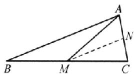

##### 14. $\frac{4\pi}{3} = \frac{5}{8}$ 分析: 易得函数的解析式为 $f(x) = \sin \left( x + \frac{\pi}{3} \right)$ , 从而得到 $f(x)$ 关于点 $\left( \frac{2\pi}{3}, 0 \right)$ 对称, 可得 $x_1 + x_2 = \frac{4\pi}{3}$ ; 由 $f(x_1) = \frac{\sqrt{3}}{4}$ , 可以整理得到 $\sin \left( x_1 - \frac{\pi}{6} \right) = \frac{\sqrt{13}}{4}$ , 所求 $\cos (x_2 - x_1)$ , 通过消元整理得到关于 $x_1$ 的函数关系式, 则通过三角恒等变换来解即可.

由题设 $f(0) = \sin \varphi = \frac{\sqrt{3}}{2}$ . 又 $0 < \varphi < \frac{\pi}{2}$ , 所以 $\varphi = \frac{\pi}{3}$ . $f\left(-\frac{\pi}{3}\right) = \sin \left(\frac{\pi}{3} - \frac{\omega\pi}{3}\right) = 0$ , 则 $\frac{\pi}{3} - \frac{\omega\pi}{3} = k\pi, k \in \mathbf{Z}$ , 故 $\omega = 1 - 3k, k \in \mathbf{Z}$ , 由 $\omega > 0$ 且 $-\frac{\pi}{3}$ 是 $y$ 轴左侧第一个零点, 故 $k = 0$ , 即 $\omega = 1$ , 则 $f(x) = \sin \left(x + \frac{\pi}{3}\right)$ . 由图知 $x_1, x_2$ 关于函数图象中 $y$ 轴右侧第一个零点对称, 即关于点 $\left(\frac{2}{3}\pi, 0\right)$ 对称, 所以 $x_1 + x_2 = \frac{4\pi}{3}$ . 由 $f(x_1) = \sin \left(x_1 + \frac{\pi}{3}\right) = \frac{\sqrt{3}}{4}$ , 且 $x_1 + \frac{\pi}{3} \in \left(\frac{\pi}{2}, \pi\right)$ , 所以 $\sin \left(x_1 - \frac{\pi}{6}\right) = \sin \left[\left(x_1 + \frac{\pi}{3}\right) - \frac{\pi}{2}\right] = -\cos \left(x_1 + \frac{\pi}{3}\right) = \frac{\sqrt{13}}{4}$ , 而 $x_2 = \frac{4\pi}{3} - x_1$ , 则 $\cos (x_2 - x_1) = \cos \left(\frac{4\pi}{3} - 2x_1\right) = -\cos \left(\frac{\pi}{3} - 2x_1\right) = -\cos \left(2x_1 - \frac{\pi}{3}\right) = 2\sin^2 \left(x_1 - \frac{\pi}{6}\right) - 1 = \frac{5}{8}$ .

# 大题过关五 数列（1）

##### 1.（1）解法1（等比数列性质法）设公比为 $q$

因为 $\{a_{n}\}$ 是等比数列，所以 $a_{2}a_{3}=a_{1}a_{4}=32$ ，

又 $a_1 + a_4 = 18$ ，解得 $\left\{ \begin{array}{l}a_{1} = 2,\\ a_{4} = 16 \end{array} \right.$ 或 $\left\{ \begin{array}{l}a_{1} = 16,\\ a_{4} = 2. \end{array} \right.$ (4分）

又 $q > 1$ ，所以 $\left\{ \begin{array}{l}a_{1} = 2,\\ a_{4} = 16, \end{array} \right.$ 所以 $q^{3} = 8,q = 2,$ (6分）

所以 $a_{n}=a_{1}q^{n-1}=2^{n}$ . (7 分)

【解法2】(基本量法) 设公比为 $q$

由题意，得 $\left\{\begin{aligned}a_{1}+a_{1}q^{3}&=18,\\ a_{1}q\cdot a_{1}q^{2}&=32,\end{aligned}\right.$

解得 $\left\{\begin{aligned}a_{1}&=2,\\ q&=2\end{aligned}\right.$ 或 $\left\{\begin{aligned}a_{1}&=16,\\ q&=\frac{1}{2}.\end{aligned}\right.$ (4分)

又 q>1，所以 $\left\{\begin{aligned}a_{1}&=2,\\ q&=2,\end{aligned}\right.$ (6 分)

所以 $a_{n}=a_{1}q^{n-1}=2^{n}$ . (7 分)

（2） 分析: 出现 $S_{n}$ 与 $b_{n}$ 的关系式, 往往运用相邻项作差法消去 $S_{n}$ 或利用 $b_{n}=S_{n}-S_{n-1}$ 消去 $b_{n}$ .

证明：由（1），得 $S_{n}=2b_{n}-2^{n}$ ，所以 $S_{n+1}=2b_{n+1}-2^{n+1}$ ，

两式作差，可得 $S_{n + 1} - S_n = 2b_{n - 1} - 2^{n + 1} - (2b_n - 2^n)$

即 $b_{n + 1} = 2b_{n + 1} - 2^n -2b_n$

整理，得 $b_{n+1}-2b_{n}=2^{n}, n\in\mathbf{N}^{*}$ . (10分)

分析: $a_{n}=2^{n}$ ，自然想到方程两边同除以 $2^{n+1}$ ，构造等差数列.

方程两边同除以 $2^{n + 1}$ ，得 $\frac{b_{n - 1}}{2^{n + 1}} -\frac{b_n}{2^n} = \frac{1}{2}$ 即 $\frac{b_{n + 1}}{a_{n + 1}} -\frac{b_n}{a_n} = \frac{1}{2} (n\in \mathbf{N}^*)$ （12分）

所以数列 $\left\{\frac{b_n}{a_n}\right\}$ 是公差为 $\frac{1}{2}$ 的等差数列. (13分)

##### 2. 解: （1） 分析: 给出和的比值, 要求通项, 需要通过等差数列前 n 项和的性质, 将和转化为通项 $\frac{a_{n}}{b_{n}}$ .

$\frac{a_{n}}{b_{n}}=\frac{S_{2n-1}}{T_{2n-1}}=\frac{2(2n-1)}{2n-1+1}=\frac{2(2n-1)}{2n}=\frac{2n-1}{n},$ (2 分)

分析：由于等差数列的通项公式是关于 $n$ 的一次式，因此可以设 $a_{n} = k(2n - 1)$

设 $a_{n} = k(2n - 1)$ ，则 $b_{n} = kn$ （4分）

又 $a_1 = k = 1$ ，所以 $a_{n} = 2n - 1, b_{n} = n.$ (7分）

（2） $c_{n}=(-2)^{n-1}\left(\frac{1}{2n-1}+\frac{2}{2n+1}\right)=(-2)^{n-1}\cdot\frac{1}{2n-1}-$

$(-2)^{n}\cdot\frac{1}{2n+1},$ (10分)

分析: 写出前几项, 不难发现可以相消, 求和即可.

所以 $P_{n} = 1 - (-2)^{1}\cdot \frac{1}{3} +(-2)^{1}\cdot \frac{1}{3} -(-2)^{2}\cdot \frac{1}{5} +\dots$

$+(-2)^{n-1}\cdot\frac{1}{2n-1}-(-2)^{n}\cdot\frac{1}{2n+1}=1-(-2)^{n}\cdot\frac{1}{2n+1}.$ (15 分)

##### 3. 解: （1） 分析: 含有 $S_{n}, a_{n}$ 的数列求通项问题, 往往是构造两式相减, 消去 $S_{n}$ , 考察 $\{a_{n}\}$ 中项的递推关系.

当 n=1 时， $3S_{1}=2a_{1}+1$ ，所以 $a_{1}=1$ .
(1 分)

当 $n \geqslant 2$ 时， $3a_{n} = 3S_{n} - 3S_{n-1} = 2a_{n} - 2a_{n-1}$ ，即 $a_{n} = -2a_{n-1}$ ，(3分)

所以 $\{a_{n}\}$ 是以1为首项，-2为公比的等比数列，

所以 $a_{n} = (-2)^{n - 1}$ (6分）

（2） 分析: 依题意可知插入数列 $\{b_n\}$ 后, $\{a_n\}$ 与 $\{b_n\}$ 所构成的数列为 $a_1, b_1, a_2, b_2, b_3, a_3, b_4, b_5, b_6, a_4, \cdots$ , 考察数列 $\{b_n\}$ 的项的变化规律, 进而求 $T_{35}$ .

因为 $a_{k}, a_{k+1}$ 与其之间的 k 个数构成等差数列，由等差数列的性质及求和公式可得，插入的 k 个数的和为

$\frac{(a_{k}+a_{k+1})k}{2}=\frac{k[(-2)^{k-1}+(-2)^{k}]}{2}=k\cdot(-2)^{k-2}.$ (8分)

$a_{1},a_{2}$ 之间是 $b_{1},a_{2},a_{3}$ 之间是 $b_{2},b_{3},\cdots,a_{8},a_{9}$ 之间是 $b_{29},b_{30},\cdots,b_{35}$ .

所以 $T_{36}=(-2)^{-1}+2\times(-2)^{3}+3\times(-2)^{1}+4\times(-2)^{2}\div5\times(-2)^{3}+6\times(-2)^{4}+7\times(-2)^{5}-8\times(-2)^{6}$ （1），(11分)

分析: 至此我们发现上面的求和问题是一个等差乘等比型数列求和问题, 可用错位相减法求和.

将①两边同乘以-2，得

$- 2 T _ {3 6} = (- 2) ^ {6} + 2 \times (- 2) ^ {1} + 3 \times (- 2) ^ {2} + 4 \times (- 2) ^ {3} + 5 \times$

$(- 2) ^ {4} + 6 \times (- 2) ^ {5} + 7 \times (- 2) ^ {6} + 8 \times (- 2) ^ {7} \quad ②, \qquad (1 3 \text {   分   })$

①—②可得

$3 T _ {3 6} = (- 2) ^ {- 1} + (- 2) ^ {0} + (- 2) ^ {1} + (- 2) ^ {2} + (- 2) ^ {3} +$

$(- 2) ^ {4} + (- 2) ^ {5} + (- 2) ^ {6} - 8 \times (- 2) ^ {7}$

$= \frac {(- 2) ^ {- 1} \times [ 1 - (- 2) ^ {8} ]}{1 - (- 2)} + 2 ^ {1 0} = 1 0 6 6. 5, ^ {[ 1 ]}$

所以 $T_{36}=355.5.$ (15 分)

规范书写【1】使用错位相减法求数列的和时要有过程展示. 否则扣2分. 如果直接计算求出结果也可以, 但也要有过程展示.

##### 4.（1）分析:由 $S_{n}$ 与 $a_{n}$ 的关系式求通项公式,往往运用相邻项作差法,消去 $S_{n}$ ,转化为 $a_{n}$ 的递推关系.

证明： $S_{n} = a_{n} - 4a_{n + 1},n\in \mathbf{N}^{*}$ ，当 $n\geqslant 2$ 时， $S_{n - 1} = a_{n - 1} - 4a_n$

两式相减得 $a_{n} = a_{n} - a_{n - 1} - 4a_{n + 1} + 4a_{n}$ ，即 $4a_{n + 1} = 4a_{n} - a_{n - 1}$ （2分）

则 $2(2a_{n + 1} - a_n) = 2a_n - a_{n - 1}$ . 当 $n = 1$ 时, $S_1 = a_1 - 4a_2$ , 则 $a_2 = 0$ , 即 $2a_2 - a_1 = 1 \neq 0$ , 所以数列 $\{2a_{n + 1} - a_n\}$ 是以 1 为首项, $\frac{1}{2}$ 为公比的等比数列. (4 分)

（2） 解: 由（1）得, $2a_{n+1}-a_n=\frac{1}{2^{n-1}}$ ,

分析: 观察到系数与底数同为 2, 所以等式两边同乘以 $2^{n-1}$ , 再构造等差数列求解.

则 $2^{n}a_{n + 1} - 2^{n - 1}a_{n} = 1$ ，所以数列 $\{2^{n - 1}a_n\}$ 是首项为-1，公差为1的等差数列，

于是 $2^{n - 1}a_{n} = n - 2$ ，解得 $a_{n} = \frac{n - 2}{2^{n - 1}}$ （6分）

分析：由 $a_{n}$ 可以得到 $b_{n}$ ，再利用裂项相消法求和。

则 $b_{n} = \frac{n + 2}{2^{n + 3}n(n + 1)} = \frac{1}{8}\left[\frac{1}{2^{n - 1}n} -\frac{1}{2^{n}(n + 1)}\right],$

所以 $\{b_{n}\}$ 的前 n 项和 $T_{n}=\frac{1}{8}\left\{\left(1-\frac{1}{2\times2}\right)+\left(\frac{1}{2\times2}-\frac{1}{2^{2}\times3}\right)+\cdots+\left[\frac{1}{2^{n-1}n}-\frac{1}{2^{n}(n+1)}\right]\right\}=\frac{1}{8}-\frac{1}{2^{n-3}(n+1)}.$ (8 分)

（3） 解: 因为 $a_{n}=\frac{n-2}{2^{n-1}}$ ，所以 $S_{n}=\frac{n-2}{2^{n-1}}-4\times\frac{n-1}{2^{n}}=-\frac{n}{2^{n-1}}$ .

由 $S_{p}, S_{6}, S_{q}$ 成等差数列，得 $-\frac{12}{2^{5}} = -\frac{p}{2^{p-1}} - \frac{q}{2^{q-1}}$ 整理得 $\frac{p}{2^p} + \frac{q}{2^q} = \frac{3}{16}$ . (10分)

分析:由于 $\frac{p}{2^{p}}$ 与 $\frac{q}{2^{q}}$ 具有相同的结构,可以先确定p的取值范围,再构造数列 $d_{n}=\frac{n}{2^{n}}$ ,通过 $d_{n}$ 的单调性,得到p,q的值.

由 $\frac{p}{2^p} +\frac{q}{2^q} = \frac{3}{16}$ 得 $\frac{p}{2^p} <  \frac{3}{16}$ 又 $1\leqslant p <   6,p\in \mathbf{N}^{*}$

$\frac{1}{2}=\frac{2}{2^{2}}>\frac{3}{2^{3}}>\frac{4}{2^{4}}>\frac{3}{16}$ ，所以 p=5 时不等式成立，（12 分）

因此 $\frac{5}{32} +\frac{q}{2^q} = \frac{3}{16}$ ，即 $\frac{q}{2^q} = \frac{1}{32}$ 令 $d_{n} = \frac{n}{2^{n}}$ ，则 $d_{n + 1} - d_n =$ $\frac{1 - n}{2^{n + 1}}\leqslant 0,$

从而 $d_{1}=d_{2}>d_{3}>d_{4}>d_{5}>\cdots$ ，显然 $d_{8}=\frac{1}{32}$ ，即 q=8，

所以存在 $p = 5, q = 8$ ，使得 $S_{p}, S_{6}, S_{q}$ 成等差数列. (15 分)

易错警示 裂项法求和,要注意正、负项相消时消去了哪些项,保留了哪些项,切不可漏写未被消去的项.未被消去的项有前后对称的特点,实质上造成正、负相消是此法的根源与目的.

# 大题过关六 数列（2）

##### 1. 解: （1） 从 $(n+3)$ 个顶点中任选两个顶点, 共有 $C_{n+3}^{2}$ 种选法, 减去凸 $(n+3)$ 边形 $(n \in \mathbb{N}^{*})$ 的边数, 即为该凸 $(n+3)$ 边形 $(n \in \mathbb{N}^{*})$ 对角线的条数, (3 分)

所以 $a_{n} = C_{n + 3}^{2} - (n + 3) = \frac{n^{2} + 3n}{2} (n\in \mathbf{N}^{*})$ [1] (5分)

（2） 数列 $\{b_{n}\}$ 的前n项和 $a_{n}=\frac{n^{2}+3n}{2}$ ，则 $b_{1}=a_{1}=2$ ，(6分)

当 $n \geqslant 2$ 时， $b_n = a_n - a_{n-1} = \frac{n^2 + 3n}{2} - \frac{(n-1)^2 + 3(n-1)}{2} = n + 1,$ (8分)

当 $n = 1$ 时， $b_{1} = 2$ 也满足 $b_{n} = n + 1$

所以数列 $\{b_{n}\}$ 的通项公式为 $b_{n}=n+1(n\in\mathbf{N}^{*})$ . (9分)

因为 $2^{-b_n} = \left(\frac{1}{2}\right)^{n + 1}$ （10分）

所以 $S_{n}=\frac{\frac{1}{4}\left(1-\frac{1}{2^{n}}\right)}{1-\frac{1}{2}}=\frac{1}{2}\left(1-\frac{1}{2^{n}}\right)$ ，(12分)

所以 $2S_{n}-1=-\frac{1}{2^{n}}<0.$ (13 分)

规范书写【1】直接写出结果，扣2分.

##### 【2】未验证 $b_{1}=2$ 也适用通项公式，扣1分.

##### 2. 解：（1） 分析：由递推关系 $\frac{1}{a_{1}a_{2}} + \frac{1}{a_{2}a_{3}} + \cdots + \frac{1}{a_{n}a_{n+1}} = 1 - \frac{1}{2a_{n+1}}$ 的左边是求和，右边是某一项，这一结构采用“去和留项”，退位相减，消去左和。令 n = n - 1，然后两式相减得 $\frac{1}{a_{n}a_{n+1}} = \frac{1}{2a_{n}} - \frac{1}{2a_{n+1}}$ ，即 $a_{n+1} - a_{n} = 2, n \geqslant 2$ ，进一步结合已知 $\{a_{n}\}$ 为等差数列，并在已知式子中令 n = 1，即可得解。

由题意知， $\frac{1}{a_1a_2} +\frac{1}{a_2a_3} +\dots +\frac{1}{a_n a_n} = 1 - \frac{1}{2a_n}$

当 $n \geqslant 2, n \in \mathbb{N}^*$ 时， $\frac{1}{a_1 a_2} + \frac{1}{a_2 a_3} + \cdots + \frac{1}{a_n - a_n} = 1 - \frac{1}{2a_n}$ .

两式相减得 $\frac{1}{a_n a_{n+1}} = \frac{1}{2a_n} - \frac{1}{2a_{n+1}}$ ，即 $a_{n+1} - a_n = 2, n \geqslant 2.$ （3分）

因为 $\{a_{n}\}$ 为等差数列，在式子 $\frac{1}{a_{1}a_{2}}+\frac{1}{a_{2}a_{3}}+\cdots+\frac{1}{a_{n}a_{n+1}}=1-\frac{1}{2a_{n+1}}$ 中，令n=1，得 $\frac{1}{a_{1}a_{2}}=1-\frac{1}{2a_{2}}$ ，所以 $a_{2}=\frac{1}{a_{1}}+\frac{1}{2}$ ，

所以 $a_2 - a_1 = \frac{1}{a_1} + \frac{1}{2} - a_1 = 2$ ，解得 $a_1 = -2$ 或 $a_1 = \frac{1}{2}$ .

若 $a_1 = -2$ ，则 $a_2 = 0$ ，这与 $a_{n}\neq 0$ 矛盾，舍去，

所以 $a_{1}=\frac{1}{2}$ . (8 分)

（2） 分析: 由（1）, 得当 $n \geqslant 2, n \in \mathbb{N}^n$ 时, 数列是等差数列, 故首先求得 $a_2$ 的值, 然后写出通项公式, 使用等差数列求和公式求解即可, 千万不要忘记验证首项.

因为 $a_1 = -\frac{2}{7}$ ，所以 $a_2 = -\frac{7}{2} + \frac{1}{2} = -3.$

而当 $n \geqslant 2, n \in \mathbf{N}^*$ 时， $a_{n+1} - a_n = 2$ ，所以此时 $a_n = -3 + 2(n - 2) = 2n - 7$ 。（11分）

所以此时 $S_{n}=-\frac{2}{7}+\frac{(n-1)(-3+2n-7)}{2}=n^{2}-6n+\frac{33}{7}$ .

当 n=1 时， $S_{1}=-\frac{2}{7}$ ，满足上式。 $^{[1]}$

综上所述， $\{a_{n}\}$ 的前 n 项和 $S_{n}=n^{2}-6n+\frac{33}{7}$ . (15 分)

规范书写【1】需要验证 $n = 1$ ，否则扣1分.

##### 3. （1） 分析: 对于这种含有 $S_{n}, a_{n}$ 的等式, 处理方法是: 退位相减, 实现和 $S_{n}$ 与项 $a_{n}$ 归一, 转化为项 $a_{n}$ 与 $a_{n-1}$ 的递推关系求解.

证明：因为 $S_{n} = 2a_{n + 1} - 3$ ①，

当 $n \geqslant 2$ 时， $S_{n-1} = 2a_n - 3$ ②，

由①-②，得 $S_{n} - S_{n - 1} = 2a_{n + 1} - 2a_{n}$ ，即 $a_{n} = 2a_{n + 1} - 2a_{n}$ ，即 $a_{n + 1} = \frac{3}{2} a_n(n\geqslant 2).$ （3分）

因为 $a_1 = \frac{3}{2}$ , 由 $S_1 = 2a_2 - 3$ , 解得 $a_2 = \frac{9}{4}$ , 所以 $\frac{a_2}{a_1} = \frac{3}{2}$ , [1] (5分)

所以当 $n \geqslant 1$ 时, $\frac{a_{n+1}}{a_n} = \frac{3}{2}$ , 所以 $\{a_n\}$ 为首项和公比均为 $\frac{3}{2}$ 的等比数列. (7 分)

（2） 分析: 先求得 $b_{n}$ 的通项公式, 利用作商 (或作差) 比较法, 判断数列 $\{b_{n}\}$ 的单调性, 从而求得数列 $\{b_{n}\}$ 的最大项.

解：由（1），得 $a_{n} = \left(\frac{3}{2}\right)^{n}$ ，所以 $b_{n} = \left(\frac{2}{3}\right)^{n}(n^{2} + n)$ ，（9分）

当 $n \geqslant 2$ 时， $\frac{b_n}{b_{n-1}} = \frac{2(n^2 + n)}{3(n^2 - n)} = \frac{2(n + 1)}{3(n - 1)}$

令 $\frac{b_{n}}{b_{n-1}}>1$ ，可得 $2\leqslant n<5$ ，（或令 $\frac{b_{n}}{b_{n-1}}<1$ ，可得 $n>5$ ）（12分）

可知 $b_{1}<b_{2}<b_{3}<b_{4}=b_{5}>b_{6}>b_{7}>\cdots,$

综上，当 $n = 4$ 或 $n = 5$ 时， $\left[^{23}\right]b_n$ 取得最大值 $\frac{320}{81}$ . (15分)

规范书写【1】由 $a_{n + 1} = \frac{3}{2} a_n (n \geqslant 2)$ ，不能得到 $\{a_n\}$ 为等比数

列，一定要补求 $a_2$ ，且验证 $\frac{a_2}{a_1} = \frac{3}{2}$ 方可下结论.

##### 【2】 $b_{n}$ 的最大值是唯一的，但取得最大值的条件是 n=4 或 n=5，n 的取值有两个，少一个，扣 2 分.

##### 4. 解: （1） 设数列 $\{a_{n}\}$ 的公差为 d, 因为等差数列 $\{a_{n} + a_{n+1}\}$ 的公差为 4.

所以 $(a_{2} + a_{3}) - (a_{1} + a_{2}) = a_{3} - a_{1} = 2d = 4$ ，则 $d = 2$ （4分）

又 $a_{2}=6$ ，所以 $a_{10}=a_{2}+(10-2)d=6+16=22.$ (6 分)

（2）由（1）得 $a_{n}=a_{2}+(n-2)d=6+2(n-2)=2n+2$ ，(8分)

所以 $b_{n}=\frac{1}{4(n+1)(n+2)}+4n=\frac{1}{4}\left(\frac{1}{n+1}-\frac{1}{n+2}\right)+4n,$ (11 分)

所以 $S_{n}=b_{1}+b_{2}+\cdots+b_{n}=\frac{1}{4}\left(\frac{1}{2}-\frac{1}{3}+\frac{1}{3}-\cdots+\frac{1}{n+1}-\right.$

$\left.\frac{1}{n+2}\right)+4\times\frac{n(n+1)}{2}=2n^{2}+2n+\frac{1}{8}-\frac{1}{4(n+2)}.$ (13分)

又 $\frac{1}{4(n+2)}>0$ ，所以 $S_{n}=2n^{2}+2n+\frac{1}{8}-\frac{1}{4(n+2)}<2n^{2}+2n+\frac{1}{8}$ .
(15 分)

方法总结 数列求和的几种常见类型及处理策略.

类型1：已知数列 $\{a_{n}\}$ 是等差数列或等比数列，求其前 $n$ 项和.处理策略：利用等差数列或等比数列前 $n$ 项和的公式求解即可.

类型2：已知数列 $\{a_{n}\}$ 是等差数列， $\{b_{n}\}$ 是等比数列，求数列 $\{a_{n}b_{n}\}$ 的前 $n$ 项和.处理策略：利用错位相减法求解即可.

类型3：已知数列 $\{a_{n}\}$ 是等差数列， $\{b_{n}\}$ 是等比数列，求数列 $\{a_{n} \pm b_{n}\}$ 的前 $n$ 项和。处理策略：利用分组求和法即可（即分别求数列 $\{a_{n}\}, \{b_{n}\}$ 的前 $n$ 项和，再将其相加减）。

类型 4: ① 等差型: 已知数列 $\{a_{n}\}$ 是等差数列, 求数列 $\left\{\frac{k}{a_{n}a_{n+1}}\right\}(k \neq 0)$ 的前 n 项和; ② 对数型: 已知 $a_{n} = \log_{a} \frac{n+k}{n}$

$(a>0 \text{ 且 } a\neq1,k\in\mathbf{N}^{*})$ ，求数列 $\{a_{n}\}$ 的前 n 项和。处理策略：利用裂项相消法求解即可。

# 考点过关30 空间几何体的表面积与体积

##### 1. B $S_{\text{侧面积}} = \pi (r_{\text{上}} + r_{\text{下}}) l = \pi \times (1 + 3) \times 4 = 16 \pi.$

##### 2. C 设该圆锥体交通锥的底面半径为 r，则 $\pi r \cdot \sqrt{144 + r^{2}} = 65\pi$ ，解得 r = 5，所以该圆锥体交通锥的体积为 $\frac{12 \times 5^{2}\pi}{3} = 100\pi$ .

##### 3. A 设截面圆半径为 r，球的半径为 R，则球心到某一截面的距离为正方体棱长的一半，即 2. 根据截面圆的周长可得 $2\pi = 2\pi r$ ，得 r = 1，故由题意知 $R^{2} = r^{2} + 2^{2}$ ，即 $R^{2} = 1^{2} + 2^{2} = 5$ ，所以该球的表面积为 $4\pi R^{2} = 20\pi$ .

方法突破 球的截面具有:（1）球心和截面(不过球心)圆心的连线垂直于截面;（2）球心到截面的距离d与球的半径R及截面的半径r满足 $r=\sqrt{R^{2}-d^{2}}$ .

##### 4. C 如图，设圆 $O_{1}$ 的半径为 r，则圆 $O_{2}$ 和外接球的半径都为 2r，即 $O_{2}A = 2r, O_{2}B = 2r, O_{1}B - r$ 。过点 B 作 $BC \perp O_{2}A$ ，垂足为 C，则 $O_{2}C = O_{1}B - r$ 。所以 $AC = O_{1}C - r$ 。又 $BC = O_{1}O_{2} = \sqrt{(2r)^{2} - r^{2}} = \sqrt{3}r$ ，所以 $AB = \sqrt{r^{2} + (\sqrt{3}r)^{2}} = 2r$ ，所以圆台的侧面积 $S_{1}=\pi(r+2r)\times2r=6\pi r^{2}$ ，球的表面积 $S_{2}=4\pi\times(2r)^{2}=16\pi r^{2}$ ，所以圆台的侧面积与球的表面积之比 $S_{1}:S_{2}=3:8$ 。

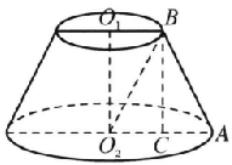

解后反思 立体几何问题,作出关键的截面图,化为平面几何问题来解决.

##### 5. D 由题设可知此鼎的容积为半球体积与圆柱体积的和, 所以容积约为 $\frac{1}{2} \times \frac{4}{3} \pi R^{3} + \pi R^{3} = \frac{5}{3} \pi R^{3}$ .  
##### 6. B 设圆锥底面半径为 r，则 $\frac{1}{4} \times 2 \times 3r = 8, r = \frac{16}{3}$ ，所以米堆的体积为 $\frac{1}{4} \times \frac{1}{3} \times 3 \times \left(\frac{16}{3}\right)^{2} \times 5 = \frac{320}{9}$ （立方尺）， $\frac{320}{9} \div 1.62 \approx 22$ （斜）.  
##### 7. D 分析: 求容器的表面积, 就需求大球的半径, 三个小球是外切, 球心距等于半径之和, 小球与大球是内切, 球心距等于半径之差, 每颗弹珠的顶端恰好与容器的上沿处于同一水平面, 即意味着大球球心 O 到三个小球球心确定的平面 $O_{1}O_{2}O_{3}$ 的距离等于小球的半径, 知道这些, 问题就迎刃而解了.

如图，记半球的球心为 $O$ ，三个小球的球心分别为 $O_{1}, O_{2}, O_{3}$ ，半球的半径为 $R$ ，小球的半径为 $r$ ，则 $r = \sqrt{3} \mathrm{~cm}$ 。设点 $O$ 在平面 $O_{1}O_{2}O_{3}$ 的投影为 $M$ ，连接 $OM, O_{1}M$ ，则 $OM = r = \sqrt{3} \mathrm{~cm}$ 。又 $O_{1}O_{2} = O_{2}O_{3} = O_{1}O_{3} = 2r = 2\sqrt{3} \mathrm{~cm}$ ，所以 $\triangle O_{1}O_{2}O_{3}$ 为等边三角形， $O_{1}M = \frac{1}{2} \times \frac{O_{1}O_{2}}{\sin 60^{\circ}} = \frac{1}{2} \times 4 = 2(\mathrm{cm})$ 。在 $\operatorname{Rt} \triangle OO_{1}M$ 中， $OO_{1} = \sqrt{OM^{2} + O_{1}M^{2}} = \sqrt{2^{2} + (\sqrt{3})^{2}} = \sqrt{7} (\mathrm{cm})$ ，所以 $R = OO_{1} + r = (\sqrt{7} + \sqrt{3}) \mathrm{cm}$ ，所以 $S_{\text{表}} = S_{\text{内}} + S_{\text{外}} = 4\pi R^{2} = 4\pi (\sqrt{7} + \sqrt{3})^{2} = 8(5 + \sqrt{21})\pi (\mathrm{cm}^{2})$ 。

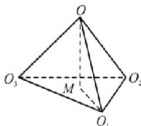

##### 8. C 解法 1 分析: 由已知求出多面体外接球的半径, 设 AB = x (0 < x < 6), 把棱柱的体积用含有 x 的代数式表示, 再由基本不等式求最值.

在直三棱柱 $ABC - A_{1}B_{1}C_{1}$ 中， $AB \perp BC$ ，所以 $\triangle ABC$ 为直角三角形，则 $\triangle ABC$ 外接圆的圆心为斜边 $AC$ 的中点，同理可得 $\triangle A_{1}B_{1}C_{1}$ 外接圆的圆心为斜边 $A_{1}C_{1}$ 的中点，如图所示。因为直三棱柱 $ABC - A_{1}B_{1}C_{1}$ 外接球的直径为6，所以外接球的半径 $R = 3$ 。设上、下底面的中心分别为 $O_{1}, O$ ，连接 $O_{1}O$ ，则外接球的球心 $G$ 为 $O_{1}O$ 的中点，连接 $GC$ ，则 $GC = 3$ 。设 $AB = x (0 < x <$

6)，则 $AC = \sqrt{x^2 + 4}$ ，所以 $OC = \frac{\sqrt{x^3 + 4}}{2}$ .在Rt△COG中， $OG = \sqrt{9 - \frac{x^2 + 4}{4}}$ ，则 $OO_{2} = 2\sqrt{9 - \frac{x^{2} + 4}{4}} = \sqrt{32 - x^{2}}$ ，所以该棱柱的体积 $V = \frac{1}{2}\times 2x\times \sqrt{32 - x^2} = \sqrt{x^2(32 - x^2)}\leqslant$ $\sqrt{\left(\frac{x^2 + 32 - x^2}{2}\right)^2} = 16$ ，当且仅当 $x^{2} = 32 - x^{2}$ ，即 $x = 4$ 时，等号成立.

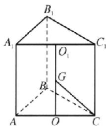

解法 2 分析: 注意到所研究的直三棱柱为长方体的一部分, 为此, 可将它补成长方体再进行求解.

过点 $A, C, A_1, C_1$ 分别作 $BC, AB, B_1C_1, A_1B_1$ 的平行线，交于点 $D, D_1$ ，连接 $DD_1$ ，则几何体 $ABDC - A_1B_1D_1C_1$ 为长方体，从而有 $AB^2 + BC^2 + AA_1^2 = 36$ ，即 $AB^2 + AA_1^2 = 32$ ，所以 $V_{\text{三棱柱}ABC - A_1B_1C_1} = \frac{1}{2} AB \cdot BC \cdot AA_1 = AB \cdot AA_1 \leqslant \frac{AB^2 + AA_1^2}{2} = 16$ ，当且仅当 $AB = AA_1 = 4$ 时，取等号.

解后反思 将问题转化为常见的数学模型将有助于我们快速、准确地解决问题. 解法 2 通过将三棱柱看作是长方体的一部分, 从而转化为长方体来加以研究, 更加简单、方便.

##### 9. AD 如图 1 所示, 若两个平行截面在球心同侧, 则 $CD = OC - OD = \sqrt{5^2 - 3^2} - \sqrt{5^2 - 4^2} = 4 - 3 = 1$ ; 如图 2 所示, 若两个平行截面在球心两侧, 则 $CD = OC + OD = \sqrt{5^2 - 3^2} + \sqrt{5^2 - 4^2} = 4 + 3 = 7$ .

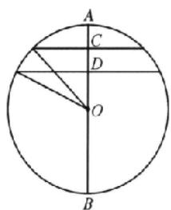

图1

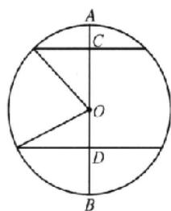

图2

##### 10. BD 如图，在正四棱锥 S-ABCD 中，O 为正方形 ABCD 的中心，则 $SO \perp$ 平面 ABCD，则 $\angle SAO$ 为侧棱与底面所成角，且 $\tan \angle SAO = \frac{\sqrt{6}}{6}$ . 设底面边长为 2a，则 $OA = \sqrt{2} a, OS = OA \cdot \tan \angle SAO = \frac{\sqrt{3}}{3} a$ . 在 Rt△SAO 中， $(\sqrt{2} a)^{2} + \left(\frac{\sqrt{3}}{3} a\right)^{2} = 21$ ，解得 a = 3，故正四棱锥的底面边长为 6 m. 高为 $\sqrt{3}$ m，侧面积 $S = \frac{1}{2} \times 6 \times 2\sqrt{3} \times 4 - 24\sqrt{3} \, (\text{m}^{2})$ . 体积 $V = \frac{1}{3} \times 6^{2} \times \sqrt{3} - 12\sqrt{3} (\text{m}^{3})$ .

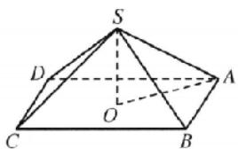

##### 11. BC 对于 A, 如图, 取正方形 $A_{1}B_{1}C_{1}D_{1}$ 的中心 $O_{1}$ , 正方形 ABCD 的中心 O, 连接 $A_{1}O_{1}, AO, OO_{1}$ , 则 $O_{1}O \perp$ 平面 ABCD, 过点 $A_{1}$ 作 $A_{1}M \perp AO$ 于点 M, 则 $A_{1}M \perp$ 平面 ABCD, $A_{1}O_{1} = OM, A_{1}M = OO_{1}$ , 因为 $AB = 2A_{1}B_{1} = 4\sqrt{3}$ , 所以 $A_{1}O_{1} = OM = \sqrt{6}, AO = 2\sqrt{6}$ , 所以 AM = AO - OM = $\sqrt{6}$ , 因为 $AA_{1} = \sqrt{10}$ , 所以由勾股定理, 得 $A_{1}M = \sqrt{A_{1}A^{2} - AM^{2}} = \sqrt{10 - 6} = 2$ , 故 A 错误; 对于 B, 过点 $A_{1}$ 作 $A_{1}W \perp AB$ 于点 W, 则 $AW = \frac{1}{2}(AB - A_{1}B_{1}) = \sqrt{3}, A_{1}W = \sqrt{A_{1}A^{2} - AW^{2}} = \sqrt{7}$ , 所以正四棱台 ABCD - $A_{1}B_{1}C_{1}D_{1}$ 的侧面积是 $4 \times \frac{(2\sqrt{3} + 4\sqrt{3}) \times \sqrt{7}}{2} = 12\sqrt{21}$ , 故 B 正确; 对于 C, 正四棱台 ABCD - $A_{1}B_{1}C_{1}D_{1}$ 的外接球球心 Q 在直线 $OO_{1}$ 上, 连接 AQ, $A_{1}Q$ , 则 AQ = $A_{1}Q = R$ .

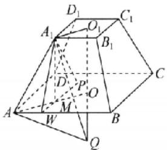

设 $OQ = h$ ，则 $QO_{1} = OO_{1} + OQ = 2 + h$ ，由勾股定理，得 $AQ^{2} = AO^{2} + OQ^{2} = 24 + h^{2},A_{1}Q^{2} = A_{1}O_{1}^{2} + O_{1}Q^{2} = 6 + (2 + h)^{2}$ ，所以 $24 + h^2 = 6 + (2 + h)^2$ ，解得 $h = \frac{7}{2}$ 故C正确；对于D，由勾股定理得 $PM = \sqrt{A_1P^2 - A_1M^2} = \sqrt{16 - 4} = 2\sqrt{3}$ ，故点 $P$ 的轨迹为以点 $M$ 为圆心， $2\sqrt{3}$ 为半径的圆且在正方形ABCD内部的部分，如图.

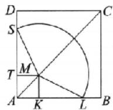

其中 $MT = MK = \sqrt{3}$ ，则 $DT = BK = 3\sqrt{3}$ ，又 $SM = ML = 2\sqrt{3}$ ，所以由勾股定理，得 $ST = KL = \sqrt{12 - 3} = 3$ ，因为 $\frac{ST}{SM} = \frac{KL}{LM} = \frac{\sqrt{3}}{2}$ ，所以 $\angle SMT = \angle LMK = \frac{\pi}{3}$ ，故 $\angle SML = \frac{5\pi}{6}$ ，故动点 $P$ 的轨迹长度是 $\frac{5\pi}{6} \times 2\sqrt{3} = \frac{5\sqrt{3}\pi}{3}$ ，故 D 错误.

##### 12. $\frac{\sqrt{3}}{3}\pi$ 或 $\frac{4\sqrt{\pi^4 - 4}}{3\pi^2}$ 设圆锥底面圆的半径为 $r$ ，母线长为 $l$ ，则圆锥侧面展开图扇形弧长为 $2\pi r$ .依题意，得 $\left\{ \begin{array}{l}2\pi r + 2l = 4 + 2\pi ,\\ \pi rl = 2\pi , \end{array} \right.$ 即 $\left\{ \begin{array}{l}\pi r + l = 2 + \pi ,\\ r l = 2, \end{array} \right.$ 解得 $\left\{ \begin{array}{l}r = 1,\\ l = 2 \end{array} \right.$ 或 $\left\{ \begin{array}{l}r = \frac{2}{\pi},\\ l = \pi . \end{array} \right.$ 当

$\left\{ \begin{array}{l} r = 1, \\ l = 2 \end{array} \right.$ 时，圆锥的高 $h = \sqrt{l^2 - r^2} = \sqrt{3}$ ，体积 $V = \frac{1}{3}\pi r^2 h = \frac{\sqrt{3}}{3}\pi$ ；当 $\left\{ \begin{array}{l} r = \frac{2}{\pi}, \\ l = \pi \end{array} \right.$ 时，圆锥的高 $h = \sqrt{l^2 - r^2} = \frac{1}{\pi}\sqrt{\pi^4 - 4}$ ，体积 $V = \frac{1}{3}\pi r^2 h = \frac{4\sqrt{\pi^4 - 4}}{3\pi^2}$ . 所以该圆锥的体积为 $\frac{\sqrt{3}}{3}\pi$ 或 $\frac{4\sqrt{\pi^4 - 4}}{3\pi^2}$ .

##### 13. $8\pi$ 画出轴截面如图所示, 其中 BC 是球 O 的半径, AB 是圆柱底面半径, AC 的长是圆柱高的一半, 故 $BC^{2} = AC^{2} + AB^{2} = 1 + 1 = 2$ , 所以球 O 的表面积为 $4\pi \cdot BC^{2} = 8\pi$ .

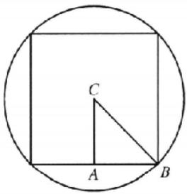

##### 14. $8 + 8\sqrt{3} = \frac{10\sqrt{2}}{3}$ 分析：注意到所研究的几何体为不规则几何体，为此将它分割成规则的几何体。由于所研究的几何体是对称的，因此，分别过点 $E, F$ 作平面ABCD的垂面，且与 $EF$ 垂直，这样就将几何体分割为一个直三棱柱和两个三棱锥，由此来解决问题。

$S = S_{矩形ABCD} + 2S_{\triangle ADE} + 2S_{梯形ABFE} = 2 \times 4 + 2 \times \frac{1}{2} \times 2 \times \sqrt{2^2 - 1^2} + 2 \times \frac{1}{2} \times (2 - 4) \times \sqrt{2^2 - 1^2} = 8 + 8\sqrt{3}.$ 过点 $F$ 作 $FO \perp$ 平面 $ABCD$ ，垂足为 $O$ ，取 $BC$ 的中点 $P$ ，连接 $PF$ ，过点 $F$ 作 $FQ \perp AB$ ，垂足为 $Q$ ，连接 $OQ$ . 因为 $\triangle ADE$ 和 $\triangle BCF$ 都是边长为 2 的等边三角形，所以 $OP = \frac{1}{2}(AB - EF) = 1, PF = \sqrt{2^2 - 1^2} = \sqrt{3}, OQ = \frac{1}{2}BC = 1$ ，所以 $OF = \sqrt{PF^2 - OP^2} = \sqrt{2}$ ，采用分割的方法，分别过点 $F, E$ 作与平面 $ABCD$ 垂直的平面，这两个平面把几何体分割成三部分，如图，包含一个三棱柱 $EMN - FQH$ ，两个全等的四棱锥： $E - AMND, F - QBCH$ ，所以 $V = V_{\text{二棱柱EMN-FQH}} + 2V_{\text{四棱锥F-QBCH}} = S_{\triangle QFH} \times MQ + 2 \times \frac{1}{3}S_{矩形QBCH} \times FO = \frac{1}{2} \times 2 \times \sqrt{2} \times 2 + 2 \times \frac{1}{3} \times 1 \times 2 \times \sqrt{2} = \frac{10\sqrt{2}}{3}.$

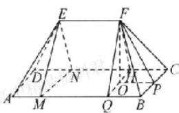

解后反思 求组合多面体的体积时,可以利用切割的方法转化为熟悉的多面体,本题就是把五面体转化为一个三棱柱和两个全等的四棱锥.

# 核心笔记

##### 1. 几何体的表面积的求法通常有以下几类：（1） 多面体，①明确特殊多面体的定义以及几何性质，例如正棱锥各个侧面是全等的等腰三角形,所以只要求出底面边长和侧面的斜高,就可求得侧面积;②非特殊的多面体的侧面积,就是求各个侧面的面积之和,而表面积就是侧面积和底面积之和.（2）旋转体,可以从旋转体的形成过程及其几何特征入手,将其展开后求表面积,但要搞清它们的底面半径、母线长与对应侧面展开图中的边长关系.（3）简单组合体,应弄清楚各构成部分,并注意重合部分的处理.(练习运用:第1题、第4题、第7题、第13题)

##### 2. 求空间几何体体积的常见类型及思路: （1） 规则几何体, 直接利用公式进行求解. （2） 不规则几何体, 若所给定的几何体是不规则几何体, 则将不规则的几何体通过分割或补形转化为规则几何体, 再利用公式求解. （3） 等体积法, 若一个几何体的底面面积和高较难求解, 则可用等体积法进行求解. 等体积法也称等积转化或等积变形, 它是通过选择合适的底面来求几何体体积的一种方法, 多用来求锥体的体积. (练习运用: 第 2 题、第 5 题、第 8 题、第 14 题)

# 考点过关31 平面基本性质及空间两条直线的位置关系

##### 1. B 若 $l$ 与 $m, n$ 都不相交，则 $l // m, l // n$ ，则 $m // n$ ，这与 $m, n$ 是异面直线矛盾；故 C 错误；如图， $l$ 与 $m, n$ 中的一条相交，另一条不相交；

也可以与两条都相交，但不交于同一点，如图.

综上， $l$ 与 $m,n$ 中的至少一条相交.

##### 2. C 对于 A, 由 $A \in \alpha$ 且 $A \in \beta$ , 知 $A$ 是平面 $\alpha$ 和平面 $\beta$ 的公共点, 又 $\alpha \cap \beta = l$ , 所以由基本事实 3 (公理 2) 可得 $A \in l$ , 故 A 为真命题; 对于 B, 由基本事实 1 (公理 3): 过不在一条直线上的三个点, 有且只有一个平面, 又 $A \in \beta, B \in \beta$ , 且 $A, B, C \in \alpha$ , 则 $C \notin \beta$ , 故 B 为真命题: 对于 C, 由于平面 $\alpha$ 和平面 $\beta$ 的位置不确定, 故直线 $a$ 与直线 $b$ 的位置亦不确定, 可能异面、相交、平行、重合, 故 C 为假命题; 对于 D, 由基本事实 2 (公理 1): 如果一条直线上的两个点在一个平面内, 那么这条直线在这个平面内, 故 D 为真命题.

##### 3. A 如图所示，连接 $BD_{1}, CD_{1}$ ，由题意，易得四边形 $A_{1}BCD_{1}$ 是平行四边形。在 $\square A_{1}BCD_{1}$ 中， $E, F$ 分别是线段 $BC, CD_{1}$ 的中点，所以 $EF \parallel BD_{1}$ 。又 $A_{1}B \cap BD_{1} = B$ ，且 $A_{1}, B, E, F$ 共面，则直线 $A_{1}B$ 与直线 $EF$ 相交。

##### 4. D 根据公理判定点 C 和 D 既在平面 $\beta$ 内又在平面 $\gamma$ 内，故点 C, D 都在 $\beta$ 与 $\gamma$ 的交线上.

##### 5. A 根据题意, 如图, 不妨设该平面截空间四边形 $ABCD$ 的四边得到四个交分别为点 $E, F, G, H, AC \parallel$ 平面 $EFGH, BD$ 不平行于平面 $EFGH$ . 因为 $AC \parallel$ 平面 $EFGH, AC \subset$ 平面 $ABC$ , 且平面 $ABC \cap$ 平面 $EFGH = EF$ , 所以 $AC \parallel EF$ , 同理, 可得 $AC \parallel GH$ , 所以 $GH \parallel EF$ . 下面证明 $EH$ 与 $FG$ 不平行. 假设 $EH \parallel FG$ , 由 $FG \subset$ 平面 $BCD, EH \not\subset$ 平面 $BCD$ , 得 $EH \parallel$ 平面 $BCD$ . 又因为 $EH \subset$ 平面 $ABD$ , 且平面 $ABD \cap$ 平面 $BCD = BD$ , 所以 $EH \parallel BD$ . 又 $EH \subset$ 平面 $EFGH, BD \not\subset$ 平面 $EFGH$ , 所以 $BD \parallel$ 平面 $EFGH$ , 与题设 $BD$ 不平行于平面 $EFGH$ 矛盾, 所以 $EH$ 与 $FG$ 不平行, 所以四边形 $EFGH$ 是梯形.

##### 6. B 由 $AC \perp$ 平面 $a$ , 平面 $a \cap$ 平面 $ABCD = l$ 可知 $BD$ 与直线 $l$ 平行 (如图), 所以 $A_{1}D$ 与直线 $l$ 所成的角就是 $A_{1}D$ 与 $BD$ 所成角, 而 $\triangle A_{1}DB$ 是等边三角形, 则所成角为 $\frac{\pi}{3}$ .

方法突破 作异面直线所成的角主要方法有:利用图中已有的平行线平移;利用特殊点(线段的端点或中点)作平行线平移;补形平移.求异面直线所成的角常用方法是平移法,平移的方法一般有三种类型:利用图中已有的平行线平移;利用特殊点(线段的端点或中点)作平行线平移;补形平移.其中空间选点任意,但要灵活,经常选择“端点、中点、等分点”,通过作三角形的中位线,平行四边形等进行平移,作出异面直线所成的角,转化为解三角形问题,进而求解.

##### 7. B 如图，连接 $AD_{1}, BC_{1}$ . 因为点 $O \in$ 直线 $AE, AE \subset$ 平面 $ABC_{1}D_{1}$ ，所以点 $O \in$ 平面 $ABC_{1}D_{1}$ . 又因为点 $O \in$ 平面 $BB_{2}D_{1}D$ ，平面 $ABC_{1}D_{1} \cap$ 平面 $BB_{1}D_{1}D = BD_{1}$ ，所以点 $O \in$ 直线 $BD_{1}$ . 所以点 $D_{1}, O, B$ 共线. 因为 $\triangle ABO \sim \triangle ED_{1}O$ ，所以 $OB:OD_{1} = AB:ED_{1} = 3:1$ . 所以 $OB = 3OD_{1}$ .

##### 8. A 如图，在平面 $AA_{1}D_{1}D$ 中，连接 $D_{1}E$ 与 DA 延长线交于点 H，则 HA=AD，在平面 $CC_{1}D_{2}D$ 中，连接 $D_{1}F$ 与 DC 延长线交于点 G，则 GC=CD，则 GH 为平面 $D_{1}EF$ 与平面 ABCD 的交线 l，且 GH//AC。在等边三角形 $ACD_{1}$ 中，AC 与 $AD_{1}$ 所成的角为 $\frac{\pi}{3}$ ，故直线 l 与直线 $AD_{1}$ 所成的角为 $\frac{\pi}{3}$ 。

##### 9. CD 把平面展开图还原成原几何体如图. 对于 A, 由正方体的性质可知, BM 与 ED 异面且垂直, 故 A 错误; 对于 B, CN 与 BE 平行, 故 B 错误; 对于 C, 连接 BE, 则 BE //CN, ∠EBM 为 CN 与 BM 所成角, 连接 EM, 可知 △BEM 为正三角形, 则 ∠EBM = 60°, 故 C 正确; 对于 D, 由异面直线的定义可知, DM 与 BN 是异面直线, 故 D 正确.

方法突破 用平移法求异面直线所成的角的步骤：

一作：即根据定义作平行线，作出异面直线所成的角。

二证：即证明作出的角是异面直线所成的角。

三求: 解三角形, 求出作出的角. 如果求出的角是锐角或直角, 那么它就是要求的角; 如果求出的角是钝角, 那么它的补角才是要求的角.

##### 10. CD 延长 $A_{1}A, B_{1}B$ 交于点 M，则 $C_{1}C, D_{1}D$ 的延长线也过点 M，如图所示.

因为 $M \in AA_{1}, M \in$ 平面 $PAA_{1}$ ，所以直线 $PM$ 即为所求的直线 $l$ 。所以直线 $l$ 与直线 $AA_{1}, BB_{1}, CC_{1}, DD_{1}$ 都相交。

##### 11. BCD 对于 A, 由 $\frac{AP}{AB} = \frac{AQ}{AD} = \lambda (0 < \lambda < 1)$ , 得 $PQ // BD$ , 因为 $PQ \nsubseteq$ 平面 $BCD$ , $BD \subset$ 平面 $BCD$ , 所以 $PQ //$ 平面 $BCD$ , 又 $PQ \subset$ 平面 $PQMN$ , 平面 $PQMN \cap$ 平面 $BCD - MN$ , 所以 $PQ // MN$ , 由 $\frac{AQ}{AD} = \frac{CM}{CD} = \lambda$ , 得 $QM // AC$ , 同理, 可得 $QM // PN$ , 所以四边形 $PQMN$ 是平行四边形, 故 A 错误; 对于 B, 由选项 A 知, $\angle PQM$ 是异面直线 $AC$ , $BD$ 所成的角或其补角, 若 $AC \perp BD$ , 则 $\angle PQM = 90^\circ$ , $\square PQMN$ 是矩形, 反之, 四边形 $PQMN$ 是

矩形，有 $\angle PQM = 90^{\circ}$ ，则 $AC\bot BD$ ，所以四边形PQMN是矩形的充要条件是 $AC\mid BD$ ，故B正确；对于C，令异面直线 $AC,BD$ 所成的角为 $\theta$ ，则 $\sin /PQM = \sin \theta$ ，显然 $\frac{PQ}{BD} = \frac{AP}{AB} = \lambda ,\frac{QM}{AC} =$ $\frac{DQ}{AD} = 1 - \lambda$ ，即 $PQ - \lambda BD,QM = (1 - \lambda)AC$ ，则□PQMN的面积 $S = 2S_{\triangle PQM} = PQ\cdot QM\sin \theta = \lambda (1 - \lambda)AC\cdot BD\sin \theta \leqslant$ （ $\frac{\lambda + 1 - \lambda}{2})^2 AC\cdot BD\sin \theta = \frac{1}{4} AC\cdot BD\sin \theta$ ，当且仅当 $\lambda =$ $\frac{1}{2}$ 时，取等号，故C正确；对于D，如图，连接AM,AN,DP,DN，由 $\lambda = \frac{1}{2}$ 得 $P,Q,M,N$ 分别是所在棱的中点，则点A，D到平面PQMN的距离相等，即 $V_{\text{四棱锥}A - PQMN} = V_{\text{四棱锥}D - PQMN}$ ，而点D到平面ABC的距离是点M到平面ABC的距离h的2倍，所以 $V_{\text{三棱锥}A - CMN} = V_{\text{三棱锥}M - ACN} = \frac{1}{3} S_{\triangle ACN}\cdot h = \frac{1}{3}\cdot 2S_{\triangle BPN}\cdot h =$ $\frac{1}{3} S_{\triangle BPN}\cdot 2h = V_{D - BPN}$ ，故 $V_{\text{四棱锥}A - PQMN} + V_{\text{三棱锥}A - CMN} =$ $V_{\text{四棱锥}D - PQMN} + V_{\text{三棱锥}D - BPN} = \frac{1}{2} V_{\text{四面体ABCD}}$ ，此时截面PQMN刚好平分四面体ABCD的体积，故D正确.

##### 12. $40^{\circ}$ 或 $140^{\circ}$ 利用等角定理: 如果一个角的两边和另一个角的两边分别平行, 那么这两个角相等或互补. 故由 $AB \parallel A'B'$ , $AC \parallel A'C'$ , 则有 $\angle B'A'C' = \angle BAC$ 或 $\angle B'A'C' + \angle BAC = 180^{\circ}$ , 又 $\angle BAC = 40^{\circ}$ , 所以 $\angle B'A'C' = 40^{\circ}$ 或 $140^{\circ}$ .

##### 13. $\frac{\sqrt{6}}{2}$ 或 $\frac{\sqrt{10}}{2}$ 如图，连接 $OD$ 。因为 $O, D$ 分别为 $AB, PA$ 的中点，所以 $OD // PB, OD = \frac{1}{2} PB$ ，所以 $\angle COD$ （或其补角）即为异面直线 $OC$ 与 $PB$ 所成的角，所以 $\cos \angle COD = \frac{1}{4}$ ，或 $\cos \angle COD = -\frac{1}{4}$ 。又 $OC = 1, OD = 1$ ，所以当 $\cos \angle COD = \frac{1}{4}$ 时， $CD = \sqrt{OC^2 + OD^2 - 2OC \cdot OD\cos \angle COD} = \sqrt{1 + 1 - 2 \times 1 \times 1 \times \frac{1}{4}} = \frac{\sqrt{6}}{2}$ ，当 $\cos \angle COD = -\frac{1}{4}$ 时， $CD = \sqrt{OC^2 + OD^2 - 2OC \cdot OD\cos \angle COD} = \sqrt{1 + 1 + 2 \times 1 \times 1 \times \frac{1}{4}} = \frac{\sqrt{10}}{2}$ ，所以 $CD = \frac{\sqrt{6}}{2}$ 或 $\frac{\sqrt{10}}{2}$ 。

##### 14.24 分析: 研究空间中的角的问题其基本方法是转化为共面问题加以研究, 为此, 将直线 a, b 通过平移到点 P, 由于所要研究的是与 a, b 等角的问题, 为此, 先在平面内, 研究 a, b 所构成角的平分线的大小, 通过比较与 $45^{\circ}, 70^{\circ}$ 间的大小关系判断直线的条数.

平移 $a, b$ 过点 $P$ , 如图, 平面 $a$ 内, 设 $a$ 与 $b$ 所成锐角的平分线所在的直线为 $m$ , 所成钝角的平分线所在的直线为 $n$ , 则 $m$ 与 $a, b$ 所成最小角为 $35^\circ, n$ 与 $a, b$ 所成最小角为 $55^\circ$ , 旋转 $m$ , 可得与 $a$ 和 $b$ 所成角 $\theta = 45^\circ$ 的直线有 2 条; 分别旋转 $m, n$ , 可得过点 $P$ 与 $a$ 和 $b$ 所成角 $\theta = 70^\circ$ 的直线有 4 条.

# 核心笔记

##### 1. 求异面直线所成的角的三部曲：“一作、二证、三求”。其中空间选点任意，但要灵活，经常选择“端点、中点、等分点”，通过平移法作出异面直线所成的角，转化为解三角形问题，进而求解。平移法一般有三种类型：利用图中已有的平行线平移；利用特殊点（线段的端点或中点）作平行线平移；补形平移。（练习运用：第6题、第8题、第9题、第14题）  
##### 2. 空间中两直线位置关系的判定, 主要是异面、平行和相交的判定. 对于异面直线, 可采用直接法或反证法; 对于平行直线, 可利用三角形(梯形)中位线的性质、公理4及线面平行与面面平行的性质定理. (练习运用: 第2题、第5题、第11题)

# 考点过关 32 直线、平面的平行的判定与性质

##### 1. D A 错误，由 $n \parallel \alpha$ ，可得出 n 与 $\alpha$ 内的直线位置关系是平行或异面；B 错误，因为 $m \parallel \alpha, m \parallel \beta$ 中的平行关系不具有传递性，平行于同一直线的两个平面可能平行，也可能相交；C 错误，由 $m \perp \alpha, m \perp n$ ，可得出 $n \parallel \alpha$ 或 $n \subset \alpha$ ；D 正确， $m \perp \alpha, m \perp \beta$ ，可根据垂直于同一直线的两个平面平行得出 $\alpha \parallel \beta$ 。  
##### 2. C 直线 l 与平面 $\alpha$ 平行, 但直线 l 不可能与平面 $\alpha$ 内的任意一条直线都平行.  
##### 3. B 由直线 a, b 不相交不能推出 $\alpha/\beta$ ; 由 $\alpha/\beta$ 可推出直线 a, b 不相交. 所以“直线 a, b 不相交”是“ $\alpha/\beta$ ”的必要不充分条件.  
##### 4. D 过 l 上任一点 P 作直线 $m'$ ，使 $m' \parallel m$ 。由 $m \parallel \alpha, m \parallel \beta$ 得 $m' \parallel \alpha, m' \parallel \beta$ 。由 $l \parallel \alpha, l \parallel \beta, l \cap m' = P$ ，由 l 与 $m'$ 确定的平面 $\gamma \parallel \alpha, \gamma \parallel \beta$ ，所以 $\alpha \parallel \beta$ 。

解后反思 面面平行的判定方法是通过证明“某个平面内两条相交直线分别与另一个平面平行”来实现的.

##### 5. D 对于 A, 若 $m \parallel \beta$ 且 $l_{1} \parallel \alpha$ , 则 $\alpha, \beta$ 可能相交, 故 A 错误; 对于 B, 若 $m \parallel \beta$ 且 $n \parallel \beta$ , 要得出 $\alpha \parallel \beta$ , 必须满足 m, n 相交, 故 B 错误; 对于 C, 若 $m \parallel \beta$ 且 $n \parallel l_{2}$ , 要得出 $\alpha \parallel \beta$ , 则必须满足 m, n 相交, 故 C 错误; 对于 D, 由定理“如果一个平面内有两条相交直线分别与另一个平面平行, 那么这两个平面平行”, 知选项 D 可以推知 $\alpha \parallel \beta$ , 故 D 正确.

##### 6. C 如图，过点 D 作 $DE \parallel A_{1}C_{1}$ 交 $B_{1}C_{1}$ 于 E，连接 BE。因为 $BD \parallel AA_{1}, BD \not\subset$ 平面 $AA_{1}C_{1}C, AA_{1} \subset$ 平面 $AA_{1}C_{1}C$ ，所以 $BD \parallel$ 平面 $AA_{1}C_{1}C$ ，同理 $DE \parallel$ 平面 $AA_{1}C_{1}C$ 。又 $BD \cap DE = D, BD, DE \subset$ 平面 BDE，所以平面 $BDE \parallel$ 平面 $AA_{1}C_{1}C$ ，所以 $M \in DE (M \text{ 不与 } D \text{ 重合，否则没有平面 } BDM)$ 。

##### 7. B 如图1, 连接 $BM$ 交 $AC$ 于点 $D$ , 连接 $ND$ , 则平面 $SBM \cap$ 平面 $\alpha = ND$ . 又 $SB //$ 平面 $\alpha, SB \subset$ 平面 $SBM$ , 所以 $ND // SB$ , 所以 $\frac{SN}{SM} = \frac{BD}{BM}$ . 如图2, 连接 $MC$ , 由题意知, $\angle ABM = \angle MBC = \angle BAC = \angle BMC = 30^\circ$ , 所以 $MC = BC = \frac{1}{2} AB$ , 易得 $\triangle DAB \sim \triangle DCM$ , 所以 $\frac{BD}{DM} = \frac{AB}{MC} = \frac{2}{1}$ , 则 $\frac{SN}{SM} = \frac{BD}{BM} = \frac{2}{3}$ .

图1

图2

##### 8. A ①因为 $AC \parallel$ 截面 $MNPQ$ , 平面 $ABC \cap$ 平面 $MNPQ = MN, AC \subset$ 平面 $ABC$ , 所以 $AC \parallel MN$ , 同理 $AC \parallel PQ$ , 所以 $MN \parallel PQ$ , 同理 $MQ \parallel PN$ , 所以对于任意的 $m, n$ , 都有截面 $MNPQ$ 是平行四边形, 所以该命题正确; ②当 $AC \perp BD$ 时, 则 $MN \perp PN$ , 所以截面 $MNPQ$ 是矩形, 由①知 $MN \parallel AC, PN \parallel BD$ , 所以 $MN = \frac{1}{n+1} AC, NP = \frac{n}{n+1} BD$ , 若 $MN = NP$ , 则 $\frac{AC}{BD} = n$ , 即 $m = n$ , 此时对任意的 $m$ , 都存在 $n = m$ , 使得截面 $MNPQ$ 是正方形, 所以该命题正确; ③当 $m = 1$ 时, 设 $AC = BD = x$ , 所以 $MN = \frac{1}{n+1} x, PN = \frac{n}{n+1} x$ , 所以 $MN + PN = x$ , 所以截面的周长为 $2x$ , 所以截面 $MNPQ$ 的周长与 $n$ 无关, 所以该命题正确; ④当 $AC \perp BD$ , 且 $AC = BD = 2$ 时, $PN = \frac{n}{n+1} \times 2 = \frac{2n}{n+1}, MN = \frac{1}{n+1} \times 2 = \frac{2}{n+1}$ , 易知 $MN \perp NP$ , 即截面是矩形, 所以截面 $MN-PQ$ 的面积为 $\frac{4n}{(n-1)^2} = \frac{4n}{n^2 + 2n + 1} = \frac{4}{n + 2 + \frac{1}{n}} \leqslant \frac{4}{2 + 2\sqrt{n \times \frac{1}{n}}} = 1$ , 当且仅当 $n = 1$ 时, 等号成立. 所以截面

MNPQ 的面积的最大值为 1, 所以该命题正确.

##### 9. AB 如图, 连接 $BD$ . 因为四边形 $ABCD$ 是平行四边形, 且 $E$ 是 $AC$ 的中点, 所以 $E$ 是 $BD$ 的中点. 又因为 $F$ 是 $PD$ 的中点, 所以 $EF \parallel PB$ . 又 $EF \not\subset$ 平面 $PAB$ , $EF \not\subset$ 平面 $PBC$ , $PB \subset$ 平面 $PAB$ , $PB \subset$ 平面 $PBC$ , 所以 $EF \parallel$ 平面 $PAB$ , $EF \parallel$ 平面 $PBC$ , 故 A, B 正确. 因为 $AD \parallel BC$ , $AD \not\subset$ 平面 $PBC$ , $BC \subset$ 平面 $PBC$ , 所以 $AD \parallel$ 平面 $PBC$ . 假设 $AF \parallel$ 平面 $PBC$ , 又 $AF \cap AD = A$ , $AF$ , $AD \subset$ 平面 $PAD$ , 则平面 $PAD \parallel$ 平面 $PBC$ . 因为平面 $PAD$ 与平面 $PBC$ 相交, 则假设不成立, 即 $AF \parallel$ 平面 $PBC$ 不成立, 故 D 错误. 同理可得 C 错误.

##### 10. CD 如图 1, 作 $\alpha, \beta$ 交线的无数条平行线, 可知 A, B 错误. 对于 C, 由题意可知 $AB // \beta$ , $BC // \beta$ , $AB \cap BC = B$ , $AB$ , $BC \subset \alpha$ , 由面面平行的判定定理可知 $\alpha // \beta$ , C 正确. 对于 D, 由 C 可知假设 $\alpha$ 内有一个点位于点 A 处, 而其余点均位于直线 BC 上, 则两个平面平行, 如图 2, $\alpha$ 内有一个点位于点 A 处, 而其余点均位于直线 BC 上, 可知两个平面相交, D 正确.

图1

图2

##### 11. ABC 分析: 根据面面平行、线面平行的判定定理逐个进行判断即可.

如图，把平面展开图还原为四棱锥.对于A，因为由 $EF\parallel AB,EF\not\subset$ 平面ABCD， $AB\subset$ 平面ABCD，所以 $EF\parallel$ 平面ABCD，又 $EH\parallel AD$ ，同理可得 $EH\parallel$ 平面ABCD，又 $EF\cap EH=E,EF,EH\subset$ 平面EFGH，所以平面EFGH//平面ABCD，故A正确；对于B，因为 $BC\parallel AD,BC\not\subset$ 平面PAD， $AD\subset$ 平面PAD，所以 $BC\parallel$ 平面PAD，故B正确；对于C，因为 $AB\parallel CD,AB\not\subset$ 平面PCD， $CD\subset$ 平面PCD，所以 $AB\parallel$ 平面PCD，故C正确；对于D，由于平面PAD与平面PAB有公共点P，故平面PAD与平面PAB不平行，故D错误.

##### 12. $\frac{5}{2}$ 分析: 由面面平行可得线线平行, 所以 $\frac{PC}{PA} = \frac{CD}{AB}$ , 可求 $\dot{A} B$ 的长.

因为平面 $\alpha //$ 平面 $\beta$ , 平面 $PAB \cap$ 平面 $\alpha = CD$ , 平面 $PAB \cap$ 平面 $\beta = AB$ , 所以 $AB //CD$ . 所以 $\frac{PC}{PA} = \frac{CD}{AB}$ . 因为 $PC = 2, CA = 3, CD = 1$ , 所以 $\frac{CD}{AB} = \frac{2}{2 + 3}$ . 所以 $AB = \frac{5}{2}$ .

##### 13.2 如图，连接 $A_{1}C$ ，与 $AE$ 相交于点 $O$ ，连接 $OD$ 。因为 $A_{1}B \parallel$ 平面 $ADE$ ，平面 $A_{1}BC \cap$ 平面 $ADE = OD, A_{1}B \subset$ 平面 $A_{1}BC$ ，所以 $A_{1}B \parallel OD$ ，所以 $\frac{CO}{A_{1}O} = \frac{DC}{BD}$ 。因为 $AA_{1} \parallel CE$ ，所以 $\triangle A_{1}OA \sim \triangle COE$ ，所以 $\frac{CO}{A_{1}O} = \frac{CE}{AA_{1}} = \frac{1}{2}$ ，所以 $\frac{DC}{BD} = \frac{1}{2}$ ，即 $\frac{BD}{DC} = 2.$

##### 14. $\frac{1}{2} - \frac{2}{5}$ 设 $AT = x, A_{1}T = y$ ，则 $x + y = 1$ . 该截面六边形的对边分别平行，即 $PO // SR, OT // QR, PQ // TS$ ，则 $\triangle DOP \sim \triangle B_{1}RS$ . 又因为 $DP = DO = 1, \frac{SR}{OP} = \frac{1}{2}$ ，所以 $B_{1}S = B_{1}R = \frac{1}{2}$ ，则 $A_{1}S = C_{1}R = \frac{3}{2}$ . 由 $\triangle ATO \sim \triangle C_{1}QR$ ，可得 $\frac{AO}{AT} = \frac{C_{1}R}{C_{1}Q}$ ，所以 $C_{1}Q = \frac{3}{2}x$ . 由 $\triangle A_{1}TS \sim \triangle CQP$ ，可得 $\frac{CQ}{CP} = \frac{A_{1}T}{A_{1}S}$ ，所以 $CQ = \frac{2}{3}y$ ，则 $\frac{3}{2}x + \frac{2}{3}y = x + y = 1$ ，解得 $x = \frac{2}{5}, y = \frac{3}{5}$ ，所以 $AT = \frac{2}{5}$ .

# 核心笔记

##### 1. 证明直线 l 与平面 $\alpha$ 平行的关键: （1） 在 $\alpha$ 内找一条直线 m; （2） 利用中位线定理、平行的传递性、构造平行四边形、寻找比例式或线面平行的性质证明 $m \parallel l$ ; （3） 注意说明 l 在 $\alpha$ 外, 即三个条件缺一不可. (练习运用: 第 5 题、第 9 题)  
##### 2. 判断或证明面面平行的方法: 利用面面平行的判定定理, 前提是熟练应用线面平行的判定。(练习运用: 第 3 题、第 6 题、第 12 题)

# 考点过关 33 直线、平面的垂直的判定与性质

##### 1. D 由直线与平面垂直的定义, 可知 D 正确.  
##### 2. C 如图所示.

对于 A, 设平面 $\alpha$ 为平面 ABCD, 平面 $\beta$ 为平面 $BCC_{1}B_{1}, m$ 为 $B_{1}C_{1}$ , 则 $\alpha \perp \beta, m \parallel \alpha$ , 则 $m \subset \beta$ , 故 A 错误; 对于 B, 设平面 $\alpha$ 为平面 ABCD, 平面 $\beta$ 为平面 $BCC_{1}B_{1}, m$ 为 AD, 则 $\alpha \perp \beta, m \subset \alpha$ , 则 $m \parallel \beta$ , 故 B 错误; 对于 C, 过 m 作平面 $\gamma$ 与平面 $\alpha$ 交于直线 b, $m \parallel \alpha$ , 则 $m \parallel b, n \perp \alpha$ , 可得 $n \perp b$ , 则 $m \perp n$ , 故 C 正确; 对于 D, 设平面 $\alpha$ 为平面 ABCD, $A_{1}B_{1}$ 为 m, $B_{1}C_{1}$ 为 n, 则 $m \perp n, m \parallel \alpha$ , 则 $n \parallel \alpha$ , 故 D 错误.

##### 3. D 如图，由题意可知 $OA \perp$ 平面 BCD。因为 CD, BD ⊆ 平面 BCD，所以 $OA \perp CD, OA \perp BD$ 。又 $AB \perp CD, OA \cap AB = A, OA, AB \subset$ 平面 AOB，所以 $CD \perp$ 平面 AOB。又 OB ⊆ 平面 AOB，所以 OB ⊂ CD。因为 $AC \perp BD, AC \cap OA = \Lambda, AC, OA \subset$ 平面 AOC，所以 $BD \perp$ 平面 AOC。又 OC ⊂ 平面 AOC，所以 $BD \perp OC$ 。所以点 O 是 $\triangle BCD$ 的垂心。

##### 4. C 由 $PA \perp$ 平面 $ACB$ 得 $PA \perp BC$ , 故选项 A 正确; 因为 $AB$ 为直径, 所以 $\angle ACB = 90^{\circ}$ , 所以 $BC \perp AC$ . 又因为 $BC \perp PA$ , $AC \cap PA = A$ , 所以 $BC \perp$ 平面 $PAC$ , 故选项 B 正确; 由 $BC \perp$ 平面 $PAC$ , $PC \subset$ 平面 $PAC$ 得 $BC \perp PC$ , 故选项 D 正确.

方法突破 判断或证明线面垂直的方法

①线面垂直的定义: 若 a 与 $\alpha$ 内任何直线都垂直, 则 $a \perp \alpha$ ;  
②判定定理1：若 $m, n \subset \alpha, m \cap n = A, l \perp m, l \perp n$ ，则 $l \perp \alpha$ ；  
③判定定理2：若 $a / / b,a\bot a$ ，则 $b\bot a$   
④面面平行的性质：若 $\alpha/\beta, a \perp \alpha$ ，则 $a \perp \beta$ ;  
⑤面面垂直的性质：若 $\alpha\perp\beta,\alpha\cap\beta=l,a\subset\alpha,a\perp l$ ，则 $a\perp\beta$ .

##### 5. D 对于 A, 因为 $\alpha \perp \beta, m \perp \alpha$ , 所以 $m \subset \beta$ 或 $m \parallel \beta$ , 故 A 错误; 对于 B, 因为 $n \parallel \beta, \alpha \perp \beta$ , 所以 n 与 $\alpha$ 可能平行、相交或 $n \subset \alpha$ , 故 B 错误; 对于 C, 因为 $n \parallel \beta, \alpha \cap \beta = l$ , 所以 n 与 l 可能平行或异面, 故 C 错误; 对于 D, 因为 $\alpha \cap \beta = l$ , 所以 $l \subset \alpha$ , 又 $m \perp \alpha$ , 故 $m \perp l$ , 故 D 正确.

##### 6. B 易知 $AB \perp$ 平面 BCD，又 $AB \subset$ 平面 ABD，平面 ABC，故平面 $ABD \perp$ 平面 BCD，平面 $ABC \perp$ 平面 BCD。又 $CD \perp$ 平面 ABC， $CD \subset$ 平面 ACD，故平面 $ACD \perp$ 平面 ABC，所以 A-BC-C，A-BC-D，D-AC-B 是直二面角。

方法突破 证明面面垂直的方法：

①利用定义:两个平面相交,所成的二面角是直二面角;  
②判定定理：若 $a \subset \alpha, a \perp \beta$ ，则 $\alpha \perp \beta$ .

##### 7. D 分析: 作出与平面 MNP 平行的平面 $AB_{1}D_{1}$ ，证明 $A_{1}C \perp$ 平面 $AB_{1}D_{1}$ 即可.

连接 $AB_{1}, B_{1}D_{1}, AD_{1}, A_{1}C_{1}, A_{1}C$ ，如图所示。因为 $P, M, N$ 分别为 $AB, BB_{1}, DD_{1}$ 的中点，所以 $MP \parallel AB_{1}, B_{1}D_{1} \parallel MN$ 。又 $MP \not\subset$ 平面 $AB_{1}D_{1}, AB_{1} \subset$ 平面 $AB_{1}D_{1}$ ，所以 $MP \parallel$ 平面 $AB_{1}D_{1}$ 。又 $MN \not\subset$ 平面 $AB_{1}D_{1}, B_{1}D_{1} \subset$ 平面 $AB_{1}D_{1}$ ，所以 $MN \parallel$ 平面 $AB_{1}D_{1}$ 。又 $MP \cap MN = M, MP, MN \subset$ 平面 $MNP$ ，所以平面 $MNP \parallel$ 平面 $AB_{1}D_{1}$ ，则垂直于平面 $MNP$ 的直线一定垂直于平面 $AB_{1}D_{1}$ 。显然 $CC_{1} \perp$ 平面 $A_{1}B_{1}C_{1}D_{1}$ ，又 $B_{1}D_{1} \subset$ 平面 $A_{1}B_{1}C_{1}D_{1}$ ，所以 $B_{1}D_{1} \perp CC_{1}$ ，又 $B_{1}D_{1} \perp A_{1}C_{1}, A_{1}C_{1} \cap CC_{1} = C_{1}, A_{1}C_{1}, CC_{1} \subset$ 平面 $A_{1}C_{1}C$ ，所以 $B_{1}D_{1} \perp$ 平面 $A_{1}C_{1}C$ ，又 $A_{1}C \subset$ 平面 $A_{1}C_{1}C$ ，所以 $A_{1}C \perp B_{1}D_{1}$ 。同理可得 $A_{1}C \perp AB_{1}$ 。又 $AB_{1} \cap B_{2}D_{1} = B_{1}, AB_{1}, B_{2}D_{1} \subset$ 平面 $AB_{1}D_{1}$ ，所以 $A_{1}C \perp$ 平面 $AB_{2}D_{2}$ ，也即 $A_{2}C \perp$ 平面 $MNP$ 。若其他选项的直线垂直于平面 $MNP$ ，则要与 $A_{2}C$ 平行，显然都不平行。

##### 8. C 如图所示. 四边形 $ABCD$ 为矩形, $PA \perp$ 平面 $ABCD$ , 则四面体 $P - ABC$ 和四面体 $P - ACD$ 都是一个整臑, 则本题即问四面体 $P - ABC$ 中, 所有四个面中相互垂直的面的对数. 因为 $PA \perp$ 平面 $ABC$ , 且 $PA \subset$ 平面 $PAB$ , 所以平面 $ABC \perp$ 平面 $PAB$ . 又因为 $PA \subset$ 平面 $PAC$ , 所以平面 $ABC \perp$ 平面 $PAC$ . 因为 $BC \perp AB$ , $PA \perp BC$ , $AB \cap PA = A$ , 所以 $BC \perp$ 平面 $PAB$ . 因为 $BC \subset$ 平面 $PBC$ , 所以平面 $PBC \perp$ 平面 $PAB$ . 所以共有 3 对.

##### 9. AB 解法 1 对于 A, 当 $m \perp \beta, m \subset \alpha$ 时, $\alpha \perp \beta$ ; 当 $n \perp \alpha, n \subset \beta$ 时, $\alpha \perp \beta$ . 故 A 正确. 对于 B, 若 $\alpha, \beta$ 不平行, 设 $\alpha \cap \beta = l$ , 因为 $m \subset \alpha, m // \beta$ , 所以 $l // m$ , 同理 $n // l$ , 故 $m // n$ , 这与 $m, n$ 异面矛盾, 故 B 正确. 对于 C, 当 $\alpha \perp \beta$ 时, 由 $m \subset \alpha$ , 得 $m // \beta$ 或 $m$ 与 $\beta$ 相交; 当 $\alpha \perp \beta$ 时, 由 $n \subset \beta$ , 得 $n // \alpha$ 或 $n$ 与 $\alpha$ 相交. 故 C 错误. 对于 D, 当 $\alpha, \beta$ 不平行时, 可能有 $m // \beta$ 或 $m$ 与 $\beta$ 相交, $n // \alpha$ 或 $n$ 与 $\alpha$ 相交, 故 D 错误.

【解法2】 由解法1知A、B正确.如图，设平面 $\alpha$ 为平面ABCD，平面 $\beta$ 为平面 $BCC_{1}B_{2}, m$ 为AD， $n$ 为 $B_{1}C$ ，此时 $m$ 与 $\beta$ 不垂直， $n$ 与 $\alpha$ 不垂直，故C错误；此时 $m / / \beta$ ，故D错误.

##### 10. ACD 分析: 对于选项 A, 通过证明 $AE \perp$ 平面 BCP, 可得到 $AE \perp PC$ .

因为 $PA \perp$ 底面 $ABC, BC \subset$ 平面 $ABC$ , 所以 $PA \perp BC$ . 又 $AB \perp BC, PA \cap AB = A, PA, AB \subset$ 平面 $PAB$ , 所以 $BC \perp$ 平面 $PAB$ . 因为 $AE \subset$ 平面 $PAB$ , 所以 $BC \perp AE$ . 因为 $AE \perp PB, BC \cap PB = B$ , 且 $BC, PB \subset$ 平面 $BCP$ , 所以 $AE \perp$ 平面 $BCP$ . 因为 $PC \subset$ 平面 $BCP$ , 所以 $AE \perp PC$ , 故 $A$ 正确.

分析:对于选项 B, 直接证明 $\triangle AEF$ 不为直角三角形比较困难, 可以取动点 E 为特殊的点 B, 再假设 $\triangle AEF$ 为直角三角形, 通过反证法证明.

当 $AF \perp PC$ 时，无法得出 $\triangle AEF$ 一定为直角三角形，例如当点E运动到点B时， $\triangle ABF$ 不是直角三角形。若 $\angle AFB = 90^\circ$ ，则 $BF \perp AF$ 。又因为 $AF \perp PC, BF \cap PC = F, BF, PC \subset$ 平面BCP，所以 $AF \perp$ 平面BCP。因为 $BC \subset$ 平面BCP，所以 $AF \perp BC$ 。因为 $PA \perp BC, AF \cap PA = A, AF, PA \subset$ 平面ACP，所以 $BC \perp$ 平面ACP。因为 $AC \subset$ 平面ACP，所以 $BC \perp AC$ ，显然不成立，故此时 $\angle AFB \neq 90^\circ$ 。若 $\angle BAF = 90^\circ$ ，则 $AF \perp AB$ 。因为 $AP \perp AB, AF \cap AP = A, AF, AP \subset$ 平面ACP，所以 $AB \perp$ 平面ACP。因为 $AC \subset$ 平面ACP，所以 $AB \perp AC$ ，显然不成立，故此时 $\angle BAF \neq 90^\circ$ 。若 $\angle ABF = 90^\circ$ ，则 $BF \perp BA$ ，因为 $CB \perp BA, BF, CB \subset$ 平面BCP， $BF \cap CB = B$ ，所以 $BA \perp$ 平面BCP。因为 $BP \subset$ 平面BCP，所以 $BA \perp BP$ ，显然不成立，故 $\angle ABF \neq 90^\circ$ ，故B错误。

分析: 对于选项 C, 通过证明 $EF \perp$ 平面 PAB, 可得平面 $AEF \perp$ 平面 PAB.

由选项 A 可得 $BC \perp$ 平面 PAB. 因为 $EF \parallel BC$ ，所以 $EF \perp$ 平面 PAB. 因为 $EF \subset$ 平面 AEF，所以平面 $AEF \perp$ 平面 PAB，故 C 正确.

分析:对于选项 D, 直接证明平面 AEF 与平面 PAB 不垂直比较困难, 可以假设平面 AEF ⊥ 平面 PAB, 通过反证法, 运用面面垂直的性质定理证明.

如图，在平面 $PAB$ 内，过点 $P$ 作 $AE$ 的垂线，垂足为 $G$ ，假设平面 $AEF \perp$ 平面 $PAB$ . 因为平面 $AEF \cap$ 平面 $PAB = AE, PG \perp AE$ ，且 $PG \subset$ 平面 $PAB$ ，所以 $PG \perp$ 平面 $AEF$ . 若此时 $PC \perp$ 平面 $AEF$ ，这与过平面外一点作平面的垂线有且只有一条矛盾，故当 $PC \perp$ 平面 $AEF$ 时，平面 $AEF$ 与平面 $PAB$ 不可能垂直，故 D 正确.

##### 11. BCD 对于 A, 因为 M 为 BD 的中点, 也是 AC 的中点, 所以 $C \in AM \subset$ 平面 AMN, 所以 $CF \cap$ 平面 AMN = C, 因此 CF 与平面 AMN 不平行, A 错误. 对于 B, 因为 $AD \perp$ 平面 ABF, $BF \subset$ 平面 ABF, 所以 $AD \perp BF$ , 又 $BF \perp AF$ , $AD \cap AF = A$ , 且 AD, $AF \subset$ 平面 ADF, 所以 $BF \perp$ 平面 ADF, 又 $BF \subset$ 平面 DBF, 所以平面 $DBF \perp$ 平面 ADF, 且平面 $DBF \cap$ 平面 ADF = DF, 因为 $AN \subset$ 平面 ADF, 又 $AN \perp DF$ , 所以 $AN \perp$ 平面 DBF, B 正确. 对于 C, 因为 $AN \perp$ 平面 DBF, $DB \subset$ 平面 DBF, 所以 $AN \perp DB$ , 因为轴截面 ABCD 为正方形, 又 M 为 BD 的中点, 所以 $AM \perp DB$ , $AM \cap AN = A$ , 且 AM, $AN \subset$ 平面 AMN, 所以 $DB \perp$ 平面 AMN, C 正确. 对于 D, 因为 $DB \perp$ 平面 AMN, $MN \subset$ 平面 AMN, 所以 $BD \perp MN$ , 因为 EF // 平面 AMN, $EF \subset$ 平面 DBF, 平面 $DBF \cap$ 平面 AMN = MN, 所以 EF // MN, 所以 $DB \perp EF$ , 且 M 为 BD 的中点, E 为 MB 的中点. 由选项 B 知 $BF \perp$ 平面 ADF, 所以 $BF \perp DF$ , 所以 $BF = MF = \frac{1}{2} BD$ , 又 $BD = \sqrt{2} AB$ , 所以 $BF = \frac{\sqrt{2}}{2} AB$ , 又 $BF \perp AF$ , 即有 AF = BF, 所以 F 是弧 $\widehat{AB}$ 的中点, D 正确.

##### 12.5 由 $PA = PB = PC, PO \perp$ 平面 $ABC$ , 得 $OA = OB = OC$ , 即点 $O$ 是 $\triangle ABC$ 的外心. 又 $\angle ACB = 90^\circ$ , 则 $O$ 是 $AB$ 的中点, 所以 $OC = \frac{1}{2} AB = 5$ .

##### 13. $16\pi$ 分析: 求外接球的面积的关键在于确定外接球的球心的位置. 为此, 选择三棱锥的其中一个面作为底面, 确定该平面三角形的外接圆的圆心, 由于 $SB \perp SC$ , 从而将它作为三棱锥的底面, 这是由于它的外接圆的圆心很容易确定, 即为斜边 $BC$ 的中点 $D$ . 再注意到平面 $SBC \perp$ 平面 $ABC$ , 且 $\triangle ABC$ 为正三角形, 所以 $AD \perp BC$ , 由面面垂直的性质可知 $AD \perp$ 平面 $SBC$ , 根据外接球的性质可知, 球心 $O$ 在 $AD$ 上, 从而可求得球的半径.

取 $BC$ 的中点 $D$ , 连接 $SD, AD$ , 如图所示. 因为 $SB \perp SC$ , 所以 $D$ 为 $\triangle SBC$ 的外接圆圆心, 又因为 $AB = AC = BC$ , $D$ 为 $BC$ 的中点, 所以 $AD \perp BC$ . 因为平面 $SBC \perp$ 平面 $ABC$ , 且平面 $SBC \cap$ 平面 $ABC = BC$ , 所以 $AD \perp$ 平面 $SBC$ , 所以三棱锥 $S - ABC$ 的外接球球心在直线 $AD$ 上. 在 $AD$ 上取一点 $O$ , 使得 $OS = OA$ , 即 $O$ 为三棱锥 $S - ABC$ 的外接球球心. 设 $OS = OA = R$ , $AD = \sqrt{(2\sqrt{3})^2 - (\sqrt{3})^2} - 3$ . 所以 $OD = 2 - R$ , $SD = \frac{1}{2} BC - \sqrt{3}$ . 在 Rt $\triangle SDO$ 中, $SD^2 - OD^2 = SO^2$ , 所以 $(\sqrt{3})^2 + (3 - R)^2 = R^2$ , 解得 $R = 2$ , 所以三棱锥的外接球的表面积为 $4\pi R^2 = 16\pi$ .

##### 14. 2 $\frac{2\sqrt{5}}{5}$ 如图，取 $AC$ 的中点 $E$ ，连接 $DE$ ，则 $DE \parallel BC$ .因为 $\angle ACB = 90^{\circ}$ ，所以 $DE \perp AC$ .因为 $PA \perp$ 平面 $ABC, PAC \subset$ 平面PAC，所以平面 $PAC \perp$ 平面 $ABC$ .因为平面 $PAC \cap$ 平面 $ABC = AC, DE \perp AC, DE \subset$ 平面 $ABC$ ，所以 $DE \perp$ 平面 $PAC$ .因为 $PC \subset$ 平面 $PAC$ ，所以 $DE \perp PC$ ，则 $AE = \frac{1}{2} AC = 2.$ 过点 $E$ 作 $EG \perp PC$ ，垂足为 $G$ ，则 $PC \perp$ 平面 $DEG$ ，即点 $E$ 在线段 $EG$ 上运动时， $DE \perp PC$ ，所以点 $E$ 的轨迹为线段 $EG$ ，则 $EG = EC\cdot$ $\sin \angle PCA = 2\times \frac{PA}{PC} = 2\times \frac{2}{\sqrt{2^2 + 4^2}} = \frac{2\sqrt{5}}{5}.$

# 核心笔记

##### 1. 判断或证明线面垂直的方法有（1）线面垂直的定义: 若 $a$ 与 $\alpha$ 内任何直线都垂直, 则 $a \perp \alpha$ ; （2） 判定定理 1: 若 $m, n \subset \alpha, m \cap n = A, l \perp m, l \perp n$ , 则 $l \perp \alpha$ ; （3） 判定定理 2: 若 $a // b, a \perp \alpha$ , 则 $b \perp \alpha$ ; （4） 面面平行的性质: 若 $a // \beta, a \perp \alpha$ , 则 $a \perp \beta$ ; （5） 面面垂直的性质: 若 $\alpha \perp \beta, \alpha \cap \beta = l, a \subset \alpha, a \perp l$ , 则 $a \perp \beta$ . (练习运用: 第 1 题、第 3 题、第 7 题、第 11 题)

##### 2. 线面、面面垂直的判定: ①遵循从“低维”向“高维”推进, 即从“线线垂直”到“线面垂直”, 再到“面面垂直”; ②证线线垂直的常用方法有等腰三角形三线合一, 菱形的对角线, 矩形的内角, 勾股定理的逆定理, 直角梯形, 直径所对的圆周角, 线面垂直的性质等; ③判定线面垂直时, 注意面内两线必须相交. (练习运用: 第6题、第8题、第13题)

# 考点过关34 空间向量的应用

##### 1. B 因为 $a=(1,0,2)$ , $n=(-2,0,-4)$ ，所以 n=-2a，即 $a//n$ ，所以 $l\perp\alpha$ .

##### 2. C $\overrightarrow{AB}=(-1,1,0),\overrightarrow{AC}=(-1,0,1)$ ，设平面 ABC 的法向量为 $n=(x,y,z)$ ，则 $\left\{\begin{aligned}n\cdot\overrightarrow{AB}&=0,\\ n\cdot\overrightarrow{AC}&=0,\end{aligned}\right.$ 即 $\left\{\begin{aligned}-x+y&=0,\\ -x+z&=0,\end{aligned}\right.$ 解得 $\left\{\begin{aligned}y=x,\\ z=x,\end{aligned}\right.$ 令 $x=-\frac{\sqrt{3}}{3}$ ，则 $y=-\frac{\sqrt{3}}{3},z=-\frac{\sqrt{3}}{3}$ 。所以平面 ABC 的一个法向量 $n=\left(-\frac{\sqrt{3}}{3},-\frac{\sqrt{3}}{3},-\frac{\sqrt{3}}{3}\right)$ 。

##### 3. B $\overrightarrow{CN} = \overrightarrow{CB} +\overrightarrow{BN} = \overrightarrow{CB} +\frac{1}{2}\overrightarrow{BA_1} = \overrightarrow{CB} -\frac{1}{2} (\overrightarrow{BA} +\overrightarrow{BB}) =$ $\overrightarrow{CB} +\frac{1}{2} (\overrightarrow{CA} -\overrightarrow{CB} +\overrightarrow{CC_1}) = \boldsymbol {b} + \frac{1}{2} (\boldsymbol {a} - \boldsymbol {b} + \boldsymbol {c}) = \frac{1}{2}\boldsymbol {a} + \frac{1}{2}\boldsymbol {b}+$ $\frac{1}{2}\boldsymbol {c} = \frac{1}{2} (\boldsymbol {a} + \boldsymbol {b} + \boldsymbol {c}).$

##### 4. C 如图， $\overrightarrow{AE}=\overrightarrow{AA_{1}}+\overrightarrow{A_{1}E}=\overrightarrow{AA_{1}}+\frac{1}{2}\overrightarrow{A_{1}C_{1}}=\overrightarrow{AA_{1}}+\frac{1}{2}(\overrightarrow{AB}+\overrightarrow{AD})$ ，故 $x=y=\frac{1}{2}$ .

方法突破 空间向量问题实质上是转化为平面向量问题来解决的,即把空间向量转化到某一个平面上,利用三角形法则或平行四边形法则来解决.

##### 5. B 以 A 为坐标原点建立如图所示的空间直角坐标系 A - xyz，设棱长为 1，则 $A_{1}(0,0,1)$ ， $E\left(1,0,\frac{1}{2}\right)$ ， $D(0,1,0)$ ，所以 $\overrightarrow{A_{1}D}=(0,1,-1)$ ， $\overrightarrow{A_{1}E}=\left(1,0,-\frac{1}{2}\right)$ 。设平面 $A_{1}ED$ 的法向量为 $n_{1}=(x,y,z)$ ，则 $\left\{\begin{aligned}&n_{1}\cdot\overrightarrow{A_{1}D}=0,\\ &n_{1}\cdot\overrightarrow{A_{1}E}=0,\end{aligned}\right.$ 即 $\left\{\begin{aligned}y-z=0,\\ x-\frac{1}{2}z=0,\end{aligned}\right.$ 所以 $\left\{\begin{aligned}y=z,\\ x=\frac{1}{2}z,\end{aligned}\right.$ 令 z=2，则 x=1,y=2，所以平面 $A_{1}ED$ 的一个法向量为 $n_{1}=(1,2,2)$ 。又平面 ABCD 的一个法向量为 $n_{2}=(0,0,1)$ ，所以 $\cos(n_{1},n_{2})=\frac{2}{3\times1}=\frac{2}{3}$ 。即平面 $A_{1}ED$ 与平面 ABCD 所成的锐二面角的余弦值为 $\frac{2}{3}$ 。

##### 6. D 以 $OA, OC, OB$ 所在直线分别为 $x$ 轴、 $y$ 轴、 $z$ 轴建立空间直角坐标系（如图所示），则 $A(2,0,0), B(0,0,2), C(0,1,0)$ ，所以 $\overrightarrow{OC} = (0,1,0), \overrightarrow{AB} = (-2,0,2), \overrightarrow{AC} = (-2,1,0)$ . 设平面 $ABC$ 的法向量为 $m = (x, y, z)$ ，则 $\left\{ \begin{array}{l} \overrightarrow{AB} \cdot m = 0, \\ \overrightarrow{AC} \cdot m = 0, \end{array} \right.$ 即 $\left\{ \begin{array}{l} -2x + 2z = 0, \\ -2x - y = 0, \end{array} \right.$ 令 $x - 1$ ，则 $y - 2, z - 1$ ，所以平面 $ABC$ 的一个法向量为 $m = (1,2,1)$ . 设直线 $OC$ 与平面 $ABC$ 所成角为 $\theta$ ，则$\sin \theta = \frac{|\pmb{m} \cdot \overrightarrow{\mathrm{OC}}|}{|\pmb{m}| \cdot |\overrightarrow{\mathrm{OC}}|} = \frac{2}{\sqrt{6}} = \frac{\sqrt{6}}{3}$ , 即直线 $OC$ 与平面 $ABC$ 所成角的正弦值为 $\frac{\sqrt{6}}{3}$ .

解后反思 求线线角、线面角或面面角时，能建系的尽量建系，将解三角形的问题转化为坐标运算，较为简捷.

##### 7. B 因为 $\overrightarrow{PM} = 2\overrightarrow{MC}, \overrightarrow{PN} = \overrightarrow{ND}$ , 所以 $\overrightarrow{PM} = \frac{2}{3}\overrightarrow{PC}, \overrightarrow{PN} = \frac{1}{2}\overrightarrow{PD}$ , 所以 $\overrightarrow{NM} = \overrightarrow{PM} - \overrightarrow{PN} = \frac{2}{3}\overrightarrow{PC} - \frac{1}{2}\overrightarrow{PD} = \frac{2}{3} (\overrightarrow{AC} - \overrightarrow{AP}) - \frac{1}{2} (\overrightarrow{AD} - \overrightarrow{AP}) = \frac{2}{3} (\overrightarrow{AB} + \overrightarrow{AD} - \overrightarrow{AP}) - \frac{1}{2}\overrightarrow{AD} + \frac{1}{2}\overrightarrow{AP} = \frac{2}{3}\overrightarrow{AB} + \frac{1}{6}\overrightarrow{AD} - \frac{1}{6}\overrightarrow{AP}$ . 因为 $\overrightarrow{NM} = x\overrightarrow{AB} + y\overrightarrow{AD} + z\overrightarrow{AP}$ , 所以 $x = \frac{2}{3}, y = \frac{1}{6}, z = -\frac{1}{6}$ , 所以 $x + y + z = \frac{2}{3}$ .

##### 8. B 分析: 注意到 M, N 为两个定点, 动点 P 满足 $PM \perp PN$ , 所以点 P 的轨迹是以 MN 为直径的球, 又注意到点 P 在正方体的表面上, 因此, 点 P 的轨迹是以 MN 为直径的球与正方体的表面的交线, 即六个半径为 a 的圆.

【解法1】（几何法）因为 $\overrightarrow{PM} \cdot \overrightarrow{PN} = 0$ ，所以点 $P$ 的轨迹为以 $MN$ 为直径的球，如图1，易知 $MN$ 的中点即为正方体的中心 $O$ ，球心在每个面上的射影为面的中心。设 $O$ 在底面ABCD上的射影为 $O_{1}$ ，又正方体的棱长为 $2a$ ，所以 $MN = 2\sqrt{2} a$ 。易知 $OO_{1} = a$ ， $O_{1}M = a$ ，又动点 $P$ 在正方体的表面上运动，所以点 $P$ 的轨迹是六个半径为 $a$ 的圆，轨迹长度为 $6\times 2\pi a = 12\pi a$ 。

图1

【解法2】（代数法）如图2，以 $\{\overrightarrow{DA},\overrightarrow{DC},\overrightarrow{DD_1}\}$ 为基底，建立空间直角坐标系，则 $P(x,y,z),M(2a,a,0),N(0,a,2a)$ 因为 $\overrightarrow{PM} \cdot \overrightarrow{PN} = 0$ ，所以 $(x - a)^2 +(y - a)^2 +(z - a)^2 = 2a^2$ ，所以点 $P$ 的轨迹为以 $O(a,a,a)$ 为球心， $\sqrt{2} a$ 为半径的球，如图3.设四边形ABCD的中心为点 $E$ ，则OE⊥平面ABCD且OE=a，所以EF=a，即平面ABCD截球 $O$ 的截面圆的半径为 $a$ ，则截面图的周长为 $2\pi a$ ，六个面周长之和为 $12\pi a$

图2

图3

##### 9. BCD 对于 A, 因为 $a \cdot b = 1 \times 2 + (-1) \times 1 + 2 \times \left(-\frac{1}{2}\right) = 0$ , 则 $a \perp b$ , 所以 l 与 m 垂直, 故 A 正确; 对于 B, 显然 a 与 n 不平行, 所以 l 与平面 $\alpha$ 不垂直, 故 B 错误; 对于 C, 显然 $n_{1}$ 与 $n_{2}$ 不平行, 所以 $\alpha$ 与 $\beta$ 不平行, 故 C 错误; 对于 D, 因为 $\overrightarrow{AB} = (-1, -1, 1), \overrightarrow{AC} = (-2, 2, 1)$ , 且向量 $n = (1, u, t)$ 是平面 $\alpha$ 的法向量, 则 $\left\{\begin{aligned}\overrightarrow{AB} \cdot n &= 0, \\ \overrightarrow{AC} \cdot n &= 0,\end{aligned}\right.$ 即 $\left\{\begin{aligned}-1 - u + t &= 0, \\ -2 + 2u + t &= 0,\end{aligned}\right.$ 解得 $\left\{\begin{aligned}u &= \frac{1}{3}, \\ t &= \frac{4}{3},\end{aligned}\right.$ 所以 $u + t = \frac{5}{3}$ , 故 D 错误.

##### 10. ACD 由题意知点 $B_{1}$ 的坐标为 $(4,5,3)$ , A 正确; 点 $B$ 的坐标为 $(4,5,0)$ , 点 $C_{1}$ 的坐标为 $(0,5,3)$ , 故点 $C_{1}$ 关于点 $B$ 对称的点为 $(8,5,-3)$ , B 错误; 在长方体中, $AD_{1} = BC_{1} = \sqrt{AD^{2} + DD_{1}^{2}} = 5 = AB$ , 所以四边形 $ABC_{1}D_{1}$ 为正方形, $AC_{1}$ 与 $BD_{1}$ 垂直且平分, 即点 $A$ 关于直线 $BD_{1}$ 对称的点为 $C_{1}(0,5,3)$ , C 正确; 点 $C$ 关于平面 $ABB_{1}A_{1}$ 对称的点为 $(8,5,0)$ , D 正确.  
##### 11. AC 分析 1: 画出正四棱柱 $ABCD-A_{1}B_{1}C_{1}D_{1}$ ，根据异面直线所成角，面面垂直的判定定理和直线与平面所成角的定义逐一判断.

【解法1】 对于A，如图1，因为 $BD / / B_{1}D_{1}$ ，所以 $\angle DBP$ 为直线 $BP$ 与 $B_{1}D_{1}$ 所成的角或其补角，易知 $BP = BD = DP = 2\sqrt{2}$ ，即 $\triangle DBP$ 为等边三角形，所以 $\angle DBP = 60^{\circ}$ ，故A正确；对于B，因为 $A_{1}D / / B_{1}C$ ，所以 $\angle BEC$ 为直线 $BP$ 与 $A_{1}D$ 所成的角或其补角，若 $\angle BEC = 90^{\circ}$ ，则 $\triangle BB_{1}C\sim \triangle CBP$ ，即需满足 $\frac{BC}{BB_1} = \frac{PC}{BC}$ 而 $PC = BC = 2,BB_{1} = 4$ ，不满足上式，故B错误；对于C，易知 $BP = 2\sqrt{2} = B_{1}P,BB_{1} = 4$ ，满足 $B_{1}P^{2} + BP^{2} = B_{1}B^{2}$ ，所以 $BP\bot$ $B_{1}P.$ 又 $A_{1}B\subset$ 平面 $B_{1}BCC_{1},BP\subset$ 平面 $B_{1}BCC_{1}$ ，所以 $BP\bot$ $A_{1}B_{1},B_{1}P\cap A_{1}B_{1} = B_{1},B_{1}P,A_{1}B_{1}\subset$ 平面 $A_{1}B_{1}P,$ 所以 $BP\bot$ 平面 $A_{1}B_{1}P.$ 又 $BP\subset$ 平面ABP，所以平面 $A_{1}B_{1}P\bot$ 平面ABP，故C正确；对于D，连接 $A_{1}C_{1},B_{1}D_{1}$ 交于点F，由正方形性质可得 $A_{1}F\bot B_{1}D_{1}$ ，由直棱柱性质可知BB-平面 $A_{1}B_{1}C_{1}D_{1}$ ，又 $A_{1}F\subset$ 平面 $A_{1}B_{1}(D_{1})$ ，所以BB-⊥AIF，又 $BB_{1}\cap B_{1}D = B_{1},BB_{1},B,D$ （平面BDD B.，所以AF-平面 $BDD_{1}B_{1}$ ，所以 $\angle A_1BF$ 为直线 $A_{1}B$ 与平面 $BDD_{1}B_{1}$ 所成的角. 因为 $A_{1}F = \sqrt{2}, A_{1}B = 2\sqrt{5}$ , 所以 $\sin \angle A_{1}BF = \frac{\sqrt{2}}{2\sqrt{5}} = \frac{\sqrt{10}}{10}$ , 故 D 错误.

图1

图2

分析 2: 建立空间直角坐标系, 利用向量法对选项进行逐判断.

【解法2】 如图2，以 $D$ 为坐标原点，分别以 $DA, DC, DD_{1}$ 所在直线为 $x$ 轴、 $y$ 轴、 $z$ 轴建立空间直角坐标系，则 $B(2,2,0), B_{1}(2,2,4), D_{1}(0,0,4), A_{1}(2,0,4), A(2,0,0), P(0,2,2)$ ，所以 $\overrightarrow{BP} = (-2,0,2), \overrightarrow{B_{1}D_{1}} = (-2,-2,0)$ . 因为 $\cos \langle \overrightarrow{BP}, \overrightarrow{B_{1}D_{1}} \rangle = \frac{\overrightarrow{BP} \cdot \overrightarrow{B_{1}D_{1}}}{|\overrightarrow{BP}| \cdot |\overrightarrow{B_{1}D_{1}}|} = \frac{1}{2}$ ，所以 $\langle \overrightarrow{BP}, \overrightarrow{B_{1}D_{1}} \rangle = \frac{\pi}{3}$ ，故A正确；又 $\overrightarrow{A_{1}D} = (-2,0,-4), \overrightarrow{BP} \cdot \overrightarrow{A_{1}D} = -4 \neq 0$ ，故B错误；可用待定系数法求得平面 $A_{1}B_{1}P$ 和平面ABP的一个法向量分别为 $m_{1} = (1,0,-1), m_{2} = (1,0,1), m_{1} \cdot m_{2} = 0$ ，故C正确；可求得平面 $BDD_{1}B_{1}$ 的一个法向量为 $n = (-2,2,0), \overrightarrow{A_{1}B} = (0,2,-4)$ . 设 $A_{1}B$ 与平面 $BDD_{1}B_{1}$ 所成的角为 $\theta$ ，则 $\sin \theta = |\cos \langle n, \overrightarrow{A_{1}B}\rangle| = \frac{|n \cdot \overrightarrow{A_{1}B}|}{|n||\overrightarrow{A_{1}B}|} = \frac{4}{2\sqrt{2} \times 2\sqrt{5}} = \frac{\sqrt{10}}{10}$ ，故D错误.

##### 12. $\frac{1}{2}$ 分析: 利用三棱柱模型, 选择一组空间基底 $\overrightarrow{AB} = a$ , $\overrightarrow{AC} = b, \overrightarrow{AA_1} = c$ , 将相关向量分别用基底表示, 再利用 $BN //$ 平面 $A_1CM$ , 确定 $\overrightarrow{BN}, \overrightarrow{MA_1}, \overrightarrow{MC}$ 必共面, 运用空间向量共面定理表达, 利用唯一性建立方程组计算即得.

【解法1】 如图1, 不妨设 $\overrightarrow{AB} = a$ , $\overrightarrow{AC} = b$ , $\overrightarrow{AA_1} = c$ , 依题意, $\overrightarrow{AM} = \frac{2}{3}a$ , $\overrightarrow{MA_1} = \overrightarrow{MA} + \overrightarrow{AA_1} = c - \frac{2}{3}a$ , $\overrightarrow{MC} = \overrightarrow{AC} - \overrightarrow{AM} = b - \frac{2}{3}a$ , 因为 $\overrightarrow{A_1N} = m\overrightarrow{A_1C_1} = mb$ , 则 $\overrightarrow{BN} = \overrightarrow{BA_1} + \overrightarrow{A_1N} = c - a + mb$ , 又因为 $BN//$ 平面 $A_1CM$ , 故 $\overrightarrow{BN}$ , $\overrightarrow{MA_1}$ , $\overrightarrow{MC}$ 必共面, 即存在 $\lambda, \mu \in \mathbb{R}$ , 使得 $\overrightarrow{BN} = \lambda\overrightarrow{MA_1} + \mu\overrightarrow{MC}$ , 即 $c - a + mb = \lambda\left(c - \frac{2}{3}a\right) + \mu\left(b - \frac{2}{3}a\right)$ , 即 $c - a + mb = \lambda c - \frac{2}{3} (\lambda + \mu)a + \mu b$ , 从而有 $\begin{cases}-\frac{2}{3}(\lambda + \mu) = -1, \\ \mu = m, \\ \lambda = 1,\end{cases}$ 解得 $m = \frac{1}{2}$ .

图1

图2

【解法2】 如图2，连接 $AN$ 交 $A_{1}C$ 于点 $P$ ，连接 $MP$ ，由题知 $BN / /$ 平面 $A_{1}CM$ ，平面 $ABN\cap$ 平面 $A_{1}CM = MP.$ 所以 $BN / /$ $MP$ ，所以 $\frac{AM}{BM} = \frac{AP}{NP} = 2$ ，又 $\frac{AP}{NP} = \frac{AC}{A_1N} = 2$ ，所以 $m = \frac{1}{2}$

##### 13. $\frac{13}{24}$ 分析: 注意到 $AC, BD$ 均垂直于二面角的棱 $AB$ , 因此, 向量 $\overrightarrow{AC}, \overrightarrow{BD}$ 的夹角的大小即为二面角的大小, 以 $\overrightarrow{AC}, \overrightarrow{AB}, \overrightarrow{BD}$ 为基底将 $\overrightarrow{CD}$ 表示出来, 根据空间向量的模即可求得答案. 因为 $BD \perp AB, AC \perp AB$ , 所以 $\overrightarrow{DB} \cdot \overrightarrow{BA} = \overrightarrow{BA} \cdot \overrightarrow{AC} = 0$ . 设二面角 $C - AB - D$ 为 $\theta$ , 则由题图知 $\overrightarrow{DB} \cdot \overrightarrow{AC} = 4 \times 3 \times \cos (\pi - \theta) = -12 \cos \theta$ . 又 $\overrightarrow{DC} = \overrightarrow{DB} + \overrightarrow{BA} + \overrightarrow{AC}$ , 所以 $\overrightarrow{DC^2} = \overrightarrow{DB^2} + \overrightarrow{BA^2} + \overrightarrow{AC^2} + 2\overrightarrow{DB} \cdot \overrightarrow{BA} + 2\overrightarrow{DB} \cdot \overrightarrow{AC} + 2\overrightarrow{BA} \cdot \overrightarrow{AC}$ , 即 $4^2 = 4^2 + 2^2 + 3^2 - 24 \cos \theta$ , 解得 $\cos \theta = \frac{13}{24}$ .

##### 14. $\frac{\sqrt{37}}{8}$ 如图，取 $BE$ 的中点 $F$ ，连接 $A'F, CF, A'G$ ，则 $A'F \perp BE, CF \perp BE$ ，所以 $\angle A'FC$ 为二面角 $A'-BE-C$ 的平面角，即 $\angle A'FC = 60^{\circ}$ ，则 $\triangle A'FC$ 为等边三角形。取 $FC$ 的中点 $O$ ，则 $A'O \perp CF$ ，易证 $BE \perp$ 平面 $A'FC$ ，又 $A'O \subset$ 平面 $A'FC$ ，所以 $BE \perp A'O, BE \cap CF = F$ ，则 $A'O \perp$ 平面 $BCE$ 。以 $OC, OA'$ 所在直线分别为 $y$ 轴和 $z$ 轴建立空间直角坐标系，设 $AB = 2$ ，取 $CE$ 的中点 $G$ ，连接 $BG$ ，由题知平面 $BCE \perp$ 平面 $D'CE$ ，平面 $BCE \cap$ 平面 $D'CE = CE$ ，又 $BG \subset$ 平面 $BCE, BG \perp CE$ ，所以 $BG \perp$ 平面 $D'CE$ ，则 $\overrightarrow{BG}$ 为平面 $D'CE$ 的一个法向量。又 $A'(0,0,\frac{3}{2})$ ， $B(1,-\frac{\sqrt{3}}{2},0), G(-\frac{1}{2},0,0)$ ，则 $\overrightarrow{A'B} = (1,-\frac{\sqrt{3}}{2},-\frac{3}{2})$ ， $\overrightarrow{BG} = (-\frac{3}{2},\frac{\sqrt{3}}{2},0)$ 。设直线 $A'B$ 与平面 $D'CE$ 所成的角为 $\theta$ ，则 $\sin \theta = |\cos (\overrightarrow{A'B},\overrightarrow{BG})| = \frac{|-\frac{3}{2}-\frac{3}{4}|}{\sqrt{1+\frac{3}{4}+\frac{9}{4}}\times\sqrt{\frac{9}{4}+\frac{3}{4}}} = \frac{3\sqrt{3}}{8}$ ，则 $\cos \theta = \sqrt{1 - \left(\frac{3\sqrt{3}}{8}\right)^2} = \frac{\sqrt{37}}{8}$ 。

# 核心笔记

##### 1. 求解异面直线所成的角: 求出两条直线的方向向量 a, b, 设异面直线所成角为 $\theta$ , 则 $\cos \theta = |\cos \langle a, b \rangle|$ .  
##### 2. 求解直线与平面所成的角: 用 m 表示平面 $\alpha$ 的法向量, a 表示直线的方向向量, 直线与平面 $\alpha$ 所成角为 $\theta$ , 则 $\sin \theta = |\cos(a, m)| = \left| \frac{a \cdot m}{|a||m|} \right|$ . (练习运用: 第 6 题、第 11 题、第 14 题)

# 考点过关35 立体几何的综合问题

##### 1. D 当 $a, b, c$ 共面时， $a//c$ ；当 $a, b, c$ 不共面时， $a$ 与 $c$ 可能异面也可能相交。

##### 2. D 由 $\overrightarrow{AC_1} = \overrightarrow{AB} + \overrightarrow{AD} + \overrightarrow{AA_1}$ , 得 $|\overrightarrow{AC_1}|^2 = (\overrightarrow{AB} + \overrightarrow{AD} + \overrightarrow{AA_1})^2 = |\overrightarrow{AB}|^2 + |\overrightarrow{AD}|^2 + |\overrightarrow{AA_1}|^2 + 2\overrightarrow{AB} \cdot \overrightarrow{AD} - 2\overrightarrow{AB} \cdot \overrightarrow{AA_1} + 2\overrightarrow{AD} \cdot \overrightarrow{AA_1} = 1 + 1 + 1 + 3 \times 2 \times 1 \times 1 \times \cos 60^\circ = 6$ . 所以 $|\overrightarrow{AC_1}| = \sqrt{6}$ .

##### 3. A 对于 A, 若 $m \perp \alpha, m \perp n$ , 则 $n \parallel \alpha$ 或 $n \subset \alpha$ , 故必要性不成立, 故 A 错误; 对于 B, 若 $m \not\subset \alpha, n \subset \alpha, m \parallel n$ , 由线面平行的判定定理可知 $m \parallel \alpha$ , 故 B 正确; 对于 C, 若 $m \perp \alpha, m \perp \beta$ , 则 $\alpha \parallel \beta$ , 充分性成立, 反之, 若 $m \perp \alpha, \alpha \parallel \beta$ , 则 $m \perp \beta$ , 必要性也成立, 故 C 正确; 对于 D, 若 $m \parallel \alpha, m \parallel n$ , 则 $n \parallel \alpha$ 或 $n \subset \alpha$ , 故充分性不成立, 反之, 若 $m \parallel \alpha, n \parallel \alpha$ , 则 m 与 n 平行或相交或异面, 故必要性也不成立, 故 D 正确.

##### 4. C 设圆台的上底面圆的半径为 r，则底面圆的半径为 2r，母线长为 l，如图所示，作出圆台与球的轴截面。由于球 O 与圆台的上、下底面及母线均相切，故 $l = AD = AH + DG = r + 2r = 3r$ 。根据圆台的侧面积公式 $S = (\pi r + 2\pi r)l = 9\pi$ ，可得 r = 1，所以球的直径为 $HG = 2\sqrt{2}$ 。故球 O 的半径为 $\sqrt{2}$ ，则球 O 的表面积为 $4\pi \times (\sqrt{2})^{2} = 8\pi$ 。

##### 5. B 如图, 连接 $A_{1}B, AD_{1}, AB_{1}, DC_{1}$ .

对于 A, 因为 $EF \subset$ 平面 $A_{1}BC_{1}, BD \not\subset$ 平面 $A_{1}BC_{1}$ ，所以若 $EF \parallel BD$ ，一定有 $BD \parallel$ 平面 $A_{1}BC_{1}$ ，又因为 BD 与平面 $A_{1}BC_{1}$ 相交，所以不存在点 E，使 $EF \parallel BD$ ，故 A 错误；对于 B，当$E$ 为 $A_{1}C_{1}$ 的中点时，易知 $EF \parallel A_{1}B$ ，因为在正方体 $ABCD - A_{1}B_{1}C_{1}D_{1}$ 中， $A_{1}B \perp AB_{1}, AD \perp A_{1}B$ ，且 $AD \cap AB_{1} = A, AD, AB_{1} \subset$ 平面 $AB_{1}C_{1}D$ ，所以 $A_{1}B \perp$ 平面 $AB_{1}C_{1}D$ ，即 $EF \perp$ 平面 $AB_{1}C_{1}D$ ，故 B 正确；对于 C，当 E 为 $A_{1}C_{1}$ 的中点时，易知 $EF \parallel A_{1}B, AD_{1} \parallel BC_{1}$ ，因为在正方体 $ABCD - A_{1}B_{1}C_{1}D_{1}$ 中， $A_{1}B = BC_{1} = A_{1}C_{1}$ ，所以 $A_{1}B$ 与 $BC_{1}$ 所成的角为 $60^{\circ}$ ，即 $EF$ 与 $AD_{1}$ 所成的角为 $60^{\circ}$ ，故 C 错误；对于 D，设正方体的边长为 2，因为 $AC \parallel A_{1}C_{1}, AC \subset$ 平面 $ACB_{1}, A_{1}C_{1} \subset$ 平面 $ACB_{1}$ ，所以 $A_{1}C_{1} \parallel$ 平面 $ACB_{1}$ ，所以三棱锥 $B_{1} - ACE$ 的体积 $V_{\text{三棱锥 } B_{1}-ACE} = V_{\text{三棱锥 } E-ACB_{1}} = V_{\text{三棱锥 } A_{1}-ACB_{1}} = V_{\text{三棱锥 } B_{1}-A_{1}AC} = \frac{1}{3} \cdot S_{\triangle A_{1}AC} \cdot \frac{B_{1}D_{1}}{2} = \frac{4}{3}$ ，故 D 错误.

##### 6. C 如图，设 $A_{1}B \cap AB_{1} = E, AC_{1} \cap BD_{1} = O, DC_{1} \cap CD_{1} = F$ ，所以四棱锥 $B - A_{1}B_{1}C_{1}D_{1}$ 与四棱锥 $A - A_{1}B_{1}C_{1}D_{1}$ 重叠部分的体积是 $V = V_{三棱柱A_{1}EB_{1}-D_{1}FC_{1}} - V_{三棱锥O-B_{1}FC_{1}} = \frac{1}{4} \times 1 - \frac{1}{3} \times \frac{1}{4} \times \frac{1}{2} = \frac{5}{24}$ .

##### 7. C 如图，由 $AB = BC = CD = DA = BD = 2\sqrt{3}$ 可知 $\triangle ABD$ ， $\triangle BCD$ 均是边长为 $2\sqrt{3}$ 的正三角形。取 BD 的中点 E，连接 AE，CE，则 $AE \perp BD, CE \perp BD$ ，又平面 $ABD \perp$ 平面 BCD，平面 $ABD \cap$ 平面 BCD = BD，所以 $AE \perp$ 平面 BCD，又 $CE \subset$ 平面 BCD，所以 $AE \perp CE$ 。分别取 $\triangle BCD, \triangle ABD$ 的外心 F, G，过点 F, G 分别作平面 BCD 和平面 ABD 的垂线 OF, OG 相交于点 O，则点 O 为四面体 ABCD 的外接球的球心。由已知可得 $AE = CE = 2\sqrt{3} \times \sin 60^{\circ} = 3, EG = EF = \frac{1}{3} CE = 1$ ，所以 OF = EG = 1， $CF = \frac{2}{3} CE = 2$ ，则 $OC^{2} = OF^{2} + CF^{2} = 1 + 4 = 5$ ，所以该球的表面积是 $4\pi \cdot OC^{2} = 20\pi$ 。

解后反思 求作空间几何体的外接球和内切球的方法

（1） 直接法: 先确定到球心 O, 再求半径 R (如此题);  
（2） 补形法: 通过补形, 将问题放在长方体、正方体、正四面体等特殊的几何体中解决. (如正方体的外接球、内切球、棱切球的球心和半径都能够轻易获得)

##### 8. C 分析: 延长 NM 交 DB 的延长线于点 T, 连接 TP 交 BC 于点 Q, 过点 N 作 NE // BD 交 AB 于点 E, 过点 P 作 PF // BC 交 BD 于点 F, 可得 $\triangle PDF$ 是边长为 1 的等边三角形, 再利用平行线分线段成比例定理可求得结果:

因为四面体 ABCD 的所有棱长都是 3, AM = 2MB, AN = $\frac{1}{2}ND$ , CP = 2PD, 所以 AM = 2, BM = 1, AN = 1, ND = 2, CP = 2, PD = 1. 如图, 延长 NM 交 DB 的延长线于点 T, 连接 TP 交 BC 于点 Q, 过点 N 作 NE // BD 交 AB 于点 E. 因为 $\triangle AEN$ 是边长为 1 的等边三角形, M 为 EB 的中点, 所以 $\triangle ENM \cong \triangle BTM$ , 所以 EN = BT = 1, 所以 DT = BT + BD = 4. 过点 P 作 PF // BC 交 BD 于点 F, 所以 $\triangle PDF$ 是边长为 1 的等边三角形, 所以 PF = DF = 1, 所以 TF = 3, BF = 2. 因为 PF // BC, 所以 $\frac{BT}{TF} - \frac{BQ}{PF}$ , 即 $\frac{1}{3} = \frac{BQ}{1}$ , 所以 BQ = $\frac{1}{3}$ .

##### 9. ABD 根据异面直线的定义知, 直线 AD 与 BC 是异面直线, 所以 A 正确; 根据异面直线的性质知, 过 AD 能且只能作一个平面与 BC 平行, 所以 B 正确; 根据异面直线的性质知, 过 AD 不一定能作一个平面与 BC 垂直, 所以 C 错误; 根据线面垂直与平行的判定定理知, 过点 D 只能作唯一平面与 BC 垂直, 但过点 D 可作无数个平面与 BC 平行, 所以 D 正确.  
##### 10. AC 分析: 可以建立空间直角坐标系, 设 OA=1, 根据题中角, 得到相关点的坐标, 通过空间向量研究线线角、线面角以及二面角.

设 OA=1，则 $SO=\sqrt{3}$ ，SA=2， $OB=\sqrt{3}$ ， $SB=\sqrt{6}$ ，以 O 为原点，OA，OS 所在直线分别为 x 轴、z 轴建立如图所示的空间直角坐标系，

则 $S(0,0,\sqrt{3}), A(1,0,0)$ . 设 $B(m,n,0)$ , 且 $m^2 + n^2 = 3$ , 则

$\overrightarrow {S A} = (1, 0, - \sqrt {3}), \overrightarrow {S B} = (m, n, - \sqrt {3}), \overrightarrow {O B} = (m, n, 0),$

$\overrightarrow{SO} = (0,0, - \sqrt{3})$ .若 $SA$ 与 $SB$ 所成的角为 $\frac{\pi}{3}$ ，则 $\mid \cos \langle \overrightarrow{SA},$

$\overrightarrow {S B} \rangle   | = \frac {| \overrightarrow {S A} \cdot \overrightarrow {S B} |}{| \overrightarrow {S A} |   | \overrightarrow {S B} |} = \frac {| m + 3 |}{2 \sqrt {6}} = \cos   \frac {\pi}{3} = \frac {1}{2},   \text {解得}   m = -   3 \pm$

$\sqrt{6}$ . 当 $m = -3 - \sqrt{6}$ 时, $m^2 > 3$ , 不符合题意; 当 $m = -3 + \sqrt{6}$ 时,

$n^{2}=6\sqrt{6}-12>0$ ，方程有解，故A正确。若SA与OB所成的角为

$\frac {\pi}{6}, \text {则} | \cos \langle \overrightarrow {S A}, \overrightarrow {O B} \rangle | = \frac {| \overrightarrow {S A} \cdot \overrightarrow {O B} |}{| \overrightarrow {S A} | | \overrightarrow {O B} |} = \frac {| m |}{2 \sqrt {3}} = \cos \frac {\pi}{6} = \frac {\sqrt {3}}{2}, \text {解得}$

$m^{2}=9>3$ , 不符合题意, 故 B 错误. 设平面 SAB 的法向量为

$p = (x _ {1}, y _ {1}, z _ {1}), \text {则} \left\{ \begin{array}{l l} p \cdot \overrightarrow {S A} = x _ {1} - \sqrt {3}   z _ {1} = 0, \\ p \cdot \overrightarrow {S B} = m x _ {1} + n y _ {1} - \sqrt {3}   z _ {1} = 0, \end{array} \right. \text {令} x _ {1} = \sqrt {3},$

则 $z_{1} = 1, y_{1} = \frac{\sqrt{3} - \sqrt{3} m}{n}$ , 所以 $\pmb{p} = \left(\sqrt{3}, \frac{\sqrt{3} - \sqrt{3} m}{n}, 1\right)$ . 若 SO 与

平面 SAB 所成的角为 $\frac{\pi}{6}$ ，则 $\left|\cos\langle\overrightarrow{SO},p\rangle\right|=\frac{\left|\overrightarrow{SO}\cdot p\right|}{\left|\overrightarrow{SO}\right|\left|p\right|}=$

$\frac {\sqrt {3}}{\sqrt {3} \times \sqrt {4 + \frac {3 (1 - m) ^ {2}}{n ^ {2}}}} = \sin \frac {\pi}{6} = \frac {1}{2}, \text {解得} m = 1, n = \pm \sqrt {2}, \text {故C}$

正确. 设平面 SOB 的法向量为 $\boldsymbol{q} = (x_{2}, y_{2}, z_{2})$ ，则

$\left\{ \begin{array}{l l} {\pmb {q} \cdot \overrightarrow {\mathrm{SO}} = - \sqrt {3} z _ {2} = 0,} \\ {\pmb {q} \cdot \overrightarrow {\mathrm{OB}} = m x _ {2} + n y _ {2} = 0,} \end{array} \right. \text {则} z _ {2} = 0, \text {令} x _ {2} = 1, \text {则} y _ {2} = - \frac {m}{n}, \text {所以}$

$q=\left(1,-\frac{m}{n},0\right)$ . 若平面 SOB 与平面 SAB 的夹角为 $\frac{\pi}{2}$ ，则 $p \cdot$

$q = 0, \text {即} \sqrt {3} - \frac {\sqrt {3} - \sqrt {3} m}{n} \cdot \frac {m}{n} = 0, \text {解得} m ^ {2} + n ^ {2} = m. \text {又} m ^ {2} + n ^ {2} =$

3, 所以 $m = 3, m^2 = 9 > 3$ , 不符合题意, 故 D 错误.

##### 11. ABD 分析: 平面图形变立体图形, 作出相对准确图形, 解题事半功倍.

对于选项 A, 由图可知 $DE_{1} \cap$ 平面 $ADC_{1} = D, AC_{1}$ 是平面 $ADC_{1}$ 内不过 D 的直线, 所以直线 $AC_{1}$ 与 $DE_{1}$ 异面, A 正确;

对于选项 B, 由题知 AD、CE 是底面圆的直径, 且 AD⊥CE, 所以四边形 ACDE 为正方形, 所以 AE∥CD, 又 CD⊂平面 A₁CD, AE⊂平面 A₂CD, 所以 AE∥平面 A₁CD, B 正确;

对于选项 C，由题知劣弧 $\widehat{DE}$ 的长为 1, $DD_{1}=1$ ，所以 $DE \neq DD_{1}$ ，所以长方形 $DD_{1}E_{1}E$ 的对角线 $DE_{1}$ 与 $D_{1}E$ 不垂直，所以直线 $DE_{1}$ 与平面 $AED_{1}$ 不垂直，C 错误；

对于选项D，同上可得 $A_{1}C_{1}D_{1}E_{1}$ 为正方形，所以 $C_1D_1\bot D_1E_1$ 由圆柱性质可知 $DD_{1}\bot C_{1}D_{1}$ ，又 $DD_{1}\cap D_{1}E_{1} = D_{1},DD_{1},$ $D_{1}E_{1}\subset$ 平面 $DD_{1}E_{1}$ ，所以 $C_1D_1\bot$ 平面 $DD_{1}E_{1}$ ，所以 $C_1D_1$ 即为点 $C_1$ 到平面 $DD_{1}E_{1}$ 的距离，记圆柱底面半径为 $r$ ，则 $2\pi r = 4$ 得 $r = \frac{2}{\pi}$ ，所以 $C_1D_1 = \sqrt{r^2 + r^2} = \sqrt{\frac{8}{\pi^2}} = \frac{2\sqrt{2}}{\pi},\mathrm{D}$ 正确.

##### 12. $V_{a}^{2} + V_{b}^{2}\geqslant (2V_{c})^{2}$ 设 $h$ 为斜边上的高，因为 $V_{a}^{2} + V_{b}^{2} =$ $\left(\frac{\pi}{3} b^2 a\right)^2 +\left(\frac{\pi}{3} a^2 b\right)^2 = \frac{\pi^2}{9} a^2 b^2 (a^2 +b^2) = \frac{\pi^2}{9} a^2 b^2 c^2$ ，且 $(2V_{c})^{2} = \left(2\cdot \frac{\pi}{3} h^{2}c\right)^{2} = \frac{4\pi^{2}}{9}\cdot \left(\frac{ab}{c}\right)^{4}c^{2} = \frac{4\pi^{2}}{9}\cdot \frac{a^{4}b^{4}}{c^{2}}$ ，两式作商得 $\frac{V_a^2 + V_b^2}{(2V_c)^2} = \frac{c^4}{4a^2b^2} = \frac{(a^2 + b^2)^2}{4a^2b^2}\geqslant \frac{(2ab)^2}{4a^2b^2} = 1,$ 所以 $V_{a}^{2}+$ $V_{b}^{2}\geqslant (2V_{c})^{2}$

##### 13. $\sqrt{5}$ 解法1（空间向量法）因为 $PA \perp$ 平面ABCD，所以 $PA \perp AD, PA \perp AB.$ 又四边形ABCD是正方形，所以 $AB \perp AD.$ 所以 $AP, AB, AD$ 两两垂直，则以 $A$ 为坐标原点， $\overrightarrow{AP}, \overrightarrow{AB}, \overrightarrow{AD}$ 分别为 $x$ 轴、 $y$ 轴、 $z$ 轴的正半轴，建立如图所示的空间直角坐标系.

则 $D(0,0,2), P(2,0,0), B(0,2,0)$ . 又 $M$ 是线段 $PB$ 的中点, 所以 $M(1,1,0)$ , 所以 $\overrightarrow{DM} - (1,1,-2), \overrightarrow{AP} = (2,0,0)$ , 则 $\cos (\overrightarrow{AP}, \overrightarrow{DM}) = \frac{\overrightarrow{AP} \cdot \overrightarrow{DM}}{|\overrightarrow{AP}| \cdot |\overrightarrow{DM}|} = \frac{2}{2\sqrt{6}} = \frac{\sqrt{6}}{6}$ . 设异面直线 $DM$ 与 $PA$ 所成的角为 $\theta$ , 则 $\cos \theta = |\cos \langle \overrightarrow{AP}, \overrightarrow{DM} \rangle| = \frac{\sqrt{6}}{6}$ , 则 $\sin \theta = \sqrt{1 - \cos^2\theta} = \frac{\sqrt{30}}{6}$ , 所以 $\tan \theta = \frac{\sin \theta}{\cos \theta} = \sqrt{5}$ , 即异面直线 $DM$ 与 $PA$ 所成的角的正切值为 $\sqrt{5}$ .

解法 2(几何法) 如图, 取 AB 的中点 N, 连接 MN, DN.

因为 M, N 分别为 PB, AB 的中点, 所以 $MN \parallel PA$ , 所以异面直线 DM 与 PA 所成的角即为 $\angle DMN$ 或其补角. 因为 $PA \perp$ 平面 ABCD, 所以 $MN \perp$ 平面 ABCD. 又 $DN \subset$ 平面 ABCD, 所以 $MN \perp DN$ . 因为四边形 ABCD 为正方形, 且 PA = AB = 2, 所以 $MN = 1, DN = \sqrt{5}$ . 在 Rt△DMN 中, $\tan \angle DMN = \frac{DN}{MN} = \sqrt{5}$ , 即异面直线 DM 与 PA 所成角的正切值为 $\sqrt{5}$ .

##### 14. $\sqrt{3} a$ $\left(\frac{2\sqrt{21}}{3} a, 2\sqrt{3} a\right)$ 分析: 利用外接球球心在两个平面的外接圆圆心上, 可知三棱锥 $A - BCD$ 的外接球 $O$ 的球心 $O$ 是 $BD$ 的中点, 即可求出半径; 直线 $MN$ 被球 $O$ 截得的线段长与二面角 $A - BD - C$ 的大小有关, 求出二面角在临界值时的情况, 即可得到线段长的取值范围.

由于 $\triangle ABD$ 和 $\triangle BCD$ 都是直角三角形,故两个面的外接圆圆心都在 $BD$ 的中点处,因此三棱锥 $A-BCD$ 的外接球 $O$ 的球心 $O$ 是 $BD$ 的中点,则半径 $R=\frac{1}{2}BD=\frac{1}{2}\sqrt{AD^{2}+AB^{2}}=\frac{1}{2}\sqrt{(2\sqrt{2}a)^{2}+(2a)^{2}}=\sqrt{3}a$ . 直线 $MN$ 被球 $O$ 截得的线段长与二面角 $A-BD-C$ 的大小有关,当二面角 $A-BD-C$ 接近 $180^{\circ}$ 时,直线 $MN$ 被球 $O$ 截得的线段最长,趋于直径 $2\sqrt{3}a$ ,当二面角 $A-BD-C$ 接近 $0^{\circ}$ 时,直线 $MN$ 被球 $O$ 截得的线段长最短. 如图,翻折后,此时 $\angle OBN+\angle BON=\angle NOH+\angle BON=90^{\circ}$ ,所以 $\angle OBN=\angle NOH$ ,则 $\triangle BON\sim\triangle ONH$ ,可得 $\frac{BO}{ON}=\frac{BN}{OH}$ ,所以 $OH=\frac{BN\cdot ON}{BO}=\frac{\sqrt{2}a\cdot a}{\sqrt{3}a}=\frac{\sqrt{6}}{3}a$ ,直线 $MN$ 被球 $O$ 截得的线段长 $d=2\sqrt{R^{2}-OH^{2}}-2\sqrt{3a^{2}-\frac{2}{3}a^{2}}-\frac{2\sqrt{2}}{3}a$ . 综上,直线 $MN$ 被球 $O$ 截得的线段长的取值范围是 $\left(\frac{2\sqrt{21}}{3}a,2\sqrt{3}a\right)$ .

# 核心笔记

##### 1. 外接球问题的处理方法: （1） 外接球问题的实质是解决球的半径长或确定球心的位置, 其中球心的确定是关键. 定义法确定球心, 在空间中, 如果一个定点与一个简单多面体的所有顶点的距离都相等, 那么这个定点就是该简单多面体的外接球的球心. （2） 空间问题平面化, 过球心或接点作截面, 把空间问题转化为平面问题, 再利用平面几何知识寻找几何体中元素间的关系、球心的位置, 弄清球的半径(直径)与该几何体已知量的关系, 进而求解. (练习运用: 第7题、第14题)

##### 2. 内切球问题的处理方法: （1） 体积分割法是求内切球半径的通常解法, 即把几何体分割为以球心为顶点, 底为几何体各个面的棱锥之和. （2） 作出合适的截面(过球心、切点等), 转化为平面问题来求解. 如球内切于正方体时, 切点为正方体各个面的中心, 正方体的棱长等于球的直径; 球与其他旋转体组合时, 通常作它们的轴截面解题; 球与多面体组合时, 通常过多面体的一条侧棱和球心及“切点”作截面图进行解题. (练习运用: 第4题)

# 阶段温习六 考点 1\~35

##### 1. C 因为 $B = \{x \mid 2^x < 2\} = \{x \mid x < 1\}, A = \{x \in \mathbb{N} \mid -1 \leqslant x \leqslant 3\} = \{0, 1, 2, 3\}$ , 所以 $A \cap B = \{0\}$ .

##### 2. C 因为 $a \parallel b$ ，所以 $x + 3 = 2x$ ，解得 $x = 3$ .

##### 3. A $z=\frac{3-i}{1+i}=\frac{(3-i)(1-i)}{(1+i)(1-i)}=\frac{2-4i}{2}=1-2i$ ，所以 $|z|=\sqrt{1^{2}+(-2)^{2}}=\sqrt{5}$ .

##### 4. C 解法 1（模型法排除） 如图，在正方体 ABCD - $A_{1}B_{1}C_{1}D_{1}$ 中，

对于选项 A，设平面 ABCD 为平面 $\alpha$ ，平面 $ADD_{1}A_{1}$ 为平面 $\beta$ ， $B_{1}C_{1}$ 为直线 m，BC 为直线 l，满足选项条件，但 m // l，故 A 错误；对于选项 B，设平面 ABCD 为平面 $\alpha$ ，平面 $ADD_{1}A_{1}$ 为平面 $\beta$ ，BC 为直线 m，AD 为直线 l，满足选项条件，但 $\alpha, \beta$ 相交，故 B 错误；对于选项 D，设平面 ABCD 为平面 $\alpha$ ，平面 $A_{1}B_{1}C_{1}D_{1}$ 为平面 $\beta$ ， $AA_{1}$ 为直线 m， $BB_{1}$ 为直线 l，满足选项条件，但 $\alpha, \beta$ 平行，故 D 错误。

解法 2(直接判断法) 对于选项 A, m, l 可能平行, 相交或异面,

故 A 错误；对于选项 B, $\alpha, \beta$ 可能相交或平行，故 B 错误；对于选项 C，如图，过 l 作平面 $\gamma$ 交 $\alpha$ 于直线 n（与 m 不重合），则根据线面平行的性质定理得 $l \parallel n$ ，又 $l \parallel \beta, n \not\subset \beta$ ，所以 $n \parallel \beta$ ，因为 $n \subset \alpha, \alpha \cap \beta = m$ ，所以 $n \parallel m$ ，由此得 $l \parallel m$ ，故 C 正确；

对于选项 D, 因为 $m \perp \alpha, l \parallel m$ , 所以 $l \perp \alpha$ , 又 $l \perp \beta$ , 所以 $\alpha, \beta$ 平行, 故 D 错误.

解后反思 对于立体几何的判断正误的选择题,一般可以有两种方法来处理:一是模型法,利用相关的几何模型来构造选项中的相关条件,从而排除掉一些错误的选项,常见的模型可以是正方体、长方体、正四面体等;二是直接应用几何定理来证明,从而确定相关的选项.

##### 5. C 分析: 由等差数列的前 n 项和公式, 首先可以得到 $a_{4}=$ 5. 然后根据等差数列的求和公式即可求得 $S_{1}$ .

因为数列 $\{a_{n}\}$ 为等差数列，所以 $S_{7} = \frac{7(a_{1} + a_{7})}{2} = \frac{7\times 2a_{4}}{2} = 7a_{4}$ 又 $S_{7} = 5a_{4} + 10$ ，所以 $7a_{4} = 5a_{4} + 10$ ，解得 $a_4 = 5$ ，则 $S_{4} = \frac{4(a_{1} + a_{4})}{2} = \frac{4\times(-1 + 5)}{2} = 8.$

##### 6. B 设圆台的高和母线长分别为 $h, l$ ，球心到圆台上底面的距离为 $x$ ，根据圆台的侧面积公式可得 $\pi(1+2)l=3\sqrt{5}\pi$ ，解得 $l=\sqrt{5}$ ，因此圆台的高 $h=\sqrt{l^2-(2-1)^2}=2$ 。当球心在圆台内部时，则 $1^2+x^2=2^2+(h-x)^2, x<h$ ，解得 $x=\frac{7}{4}$ ，故此时外接球半径为 $\sqrt{1^2+x^2}=\sqrt{\frac{65}{16}}=\frac{\sqrt{65}}{4}$ ；当球心在圆台外部时，则 $1^2+x^2=2^2+(x+h)^2, x>h$ ，解得 $x=-\frac{7}{4}$ ，不符合要求，舍去。故外接球半径为 $\frac{\sqrt{65}}{4}$ 。

##### 7. C 函数 $f(x) = \sin 2x$ 的图象向右平移 $\varphi\left(0 < \varphi < \frac{\pi}{2}\right)$ 个单位长度后得到函数 $g(x) = \sin (2x - 2\varphi)$ 的图象。由 $|f(x_1) - g(x_2)| = 2$ ，可知 $f(x_1), g(x_2)$ 分别为两个函数的最大值和最小值（或最小值和最大值）。不妨设 $2x_1 = 2k\pi + \frac{\pi}{2}, k \in \mathbf{Z}, 2x_2 - 2\varphi = 2m\pi - \frac{\pi}{2}, m \in \mathbf{Z}$ ，则 $x_1 - x_2 = \frac{\pi}{2} - \varphi + (k - m)\pi, k, m \in \mathbf{Z}$ 。由 $|x_1 - x_2|_{\min} = \frac{\pi}{4}$ ，可得 $\frac{\pi}{2} - \varphi = \frac{\pi}{4}$ ，解得 $\varphi = \frac{\pi}{4}$ 。

##### 8. D $f'(x) = 2ax + b + \frac{c}{x} = \frac{2ax^2 - bx - c}{x} (x > 0, a > 0)$ . 因为函数 $f(x)$ 在 $x = 1$ 和 $x = 2$ 处取得极值，所以 $f'（1） = 2a + b +$ $c = 0$ ①, $f'（2） = 4a + b + \frac{c}{2} = 0$ ②，又 $a > 0$ ，所以当 $0 < x < 1$ 或 $x > 2$ 时， $f'(x) > 0, f(x)$ 是增函数；当 $1 < x < 2$ 时， $f'(x) < 0, f(x)$ 是减函数. 所以当 $x = 1$ 时， $f(x)_{\text{极大值}} = f(1) = a + b = -\frac{5}{2}$ ③，联立①②③，解得 $a = \frac{1}{2}, b = -3, c = 2.$ $f(4) = \frac{1}{2} \times 16 - 3 \times 4 + 2\ln 4 = 4\ln 2 - 4$ ，经比较，函数 $f(x)$ 在区间 $(0,4]$ 上的最大值是 $f(4) = 4\ln 2 - 4$

##### 9. BC 设公差为 d，则由 $a_{2}<a_{1}$ ，知 d<0，故选项 A 错误；由 $a_{2}<-a_{11}<a_{1}$ ，知 $a_{2}-a_{11}<0, a_{1}+a_{11}>0$ ，所以 $S_{11}=\frac{11\times(a_{1}+a_{11})}{2}=11a_{5}>0, S_{12}=\frac{12(a_{1}+a_{12})}{2}=6(a_{2}+a_{11})<0$ ，故当 $n\leqslant11$ 时， $S_{n}>0$ ，当 $n\geqslant12$ 时， $S_{n}<0$ ，故选项 B、C 正确；因为 $a_{5}>0, a_{2}+a_{11}=a_{6}+a_{7}<0$ ，所以 $a_{7}<0$ ，所以 $S_{6}$ 最大，故选项 D 错误.

##### 10. CD 易知 $A(\cos \alpha, \sin \alpha), B(\cos \beta, \sin \beta)$ , 则 $\overrightarrow{OA} \cdot \overrightarrow{OB} = \cos \alpha \cos \beta + \sin \alpha \sin \beta = \cos (\alpha - \beta)$ , 故 A 错误. 当 $|\overrightarrow{AB}| = \sqrt{2}$ 时, $\overrightarrow{OA} \perp \overrightarrow{OB}$ , 所以 $\overrightarrow{OA} \cdot \overrightarrow{OB} = 0$ , 故 B 错误. 当点 A 在第二象限, 且 AB 过原点时, $\overrightarrow{AB}|$ 最大且最大值为 2, 故 C 正确. 因为 $\cos \beta = \frac{2\sqrt{5}}{5}$ , 且 $\beta$ 为第四象限角, 所以 $\sin \beta = -\frac{\sqrt{5}}{5}$ . 因为 $|\overrightarrow{AB}| = 1$ , 所以 $\angle AOB = \frac{\pi}{3}$ , 即 $\alpha - \beta = \frac{\pi}{3} + 2k\pi, k \in \mathbf{Z}$ , 所以 $\sqrt{3} \cos \alpha - \sin \alpha = -2\sin \left( \alpha - \frac{\pi}{3} \right) = -2\sin \beta = \frac{2\sqrt{5}}{5}$ , 故 D 正确.

##### 11. AB 分析: 利用函数的平移变换和伸缩变换判断 A.

因为 $y=f(2x+2\pi)$ 的图象关于直线 $x=-\frac{\pi}{2}$ 对称，所以将 $f(2x+2\pi)$ 的图象向右平移 $\frac{\pi}{2}$ 个单位长度得到 $y=f\left[2(x-\frac{\pi}{2}+\pi)\right]=f(2x+\pi)$ 的图象，关于 y 轴对称，再将 $f(2x+\pi)$ 的横坐标扩大为原来的 2 倍得到 $f(x+\pi)$ 的图象，关于 y 轴对称，即 $f(x+\pi)$ 为偶函数，A 正确.

分析: 利用导函数研究 $f(x)$ 的单调性, 结合奇函数的性质判断 B.

当 $0 < x \leqslant \pi$ 时，令 $g(x) = f'(x) = (e^x + e^{x - x})\cos x - (e^x - e^{x - x})\sin x$ ，则 $g'(x) = -2(e^x + e^{x - x})\sin x \leqslant 0$ 在 $(0, \pi]$ 上恒成立，所以 $f'(x)$ 单调递减. 又 $f'\left(\frac{\pi}{2}\right) = 0$ ，所以当 $0 < x < \frac{\pi}{2}$ 时， $f'(x) > 0, f(x)$ 单调递增；当 $\frac{\pi}{2} < x \leqslant \pi$ 时， $f'(x) < 0, f(x)$ 单调递减. 因为 $f(x)$ 是奇函数，所以 $f(x)$ 在 $\left(-\pi, -\frac{\pi}{2}\right)$ 上单调递减，B正确.

分析: 利用 $f(x)$ 是奇函数和 $f(x+\pi)$ 是偶函数求得 $f(x)$ 的周期来判断 C, D.

由A可得 $f(x)$ 关于直线 $x = \pi$ 对称，结合 $f(x)$ 是奇函数可得 $f(-x) = -f(x) = f(2\pi +x)$ ，所以 $f(x) = -f(2\pi +x) =$ $f(x + 4\pi)$ ，即 $f(x)$ 是周期为 $4\pi$ 的周期函数.由 $f\left(\frac{\pi}{2}\right) = 0$ ，结合 $f(x)$ 的单调性和关于直线 $x = \pi$ 对称，可得 $f\left(\frac{3\pi}{2}\right) = 0.$ 所以函数 $f(x)$ 在区间 $(0,2\pi)$ 上有2个零点.又因为 $f(x)$ 是定义在R上的奇函数， $f(0) = 0$ ，所以 $f(x)$ 在区间 $[-2\pi ,2\pi)$ 上有6个零点.又 $2023\pi = 505\times 4\pi +3\pi$ ，所以 $f(x)$ 在区间[0,2023π]上的零点个数为 $505\times 6 + 5 = 3035,\mathrm{C}$ 错误.因为 $f(\pi) = 1 - \mathrm{e}^{\pi},$ $f(2\pi) = f(0) = 0,f(3\pi) = -f(-3\pi) = -f(\pi) = \mathrm{e}^{\pi} - 1,$ $f(4\pi) = f(0) = 0$ ，所以 $\sum_{k = 1}^{2023}f(k\pi) = 505[f(\pi) + f(2\pi) +$ $f(3\pi) + f(4\pi)] + f(\pi) + f(2\pi) + f(3\pi) = 0,\mathrm{D}$ 错误.

##### 12. $\sqrt{13}$ 因为 $|a + \sqrt{3} b|^2 = (a + \sqrt{3} b)^2 = a^2 + 2\sqrt{3} a \cdot b + 3b^2 = 2^2 + 2\sqrt{3} \times 2 \times 1 \times \frac{\sqrt{3}}{2} + 3 \times 1^2 = 13$ ，所以 $|a + \sqrt{3} b| = \sqrt{13}$ .

##### 13. $2x - y + 2 = 0$ 或 $x + 4y + 1 = 0$ 设切点为 $(x_0, x_0^3 - x_0)$ ， $y' = 3x^2 - 1, k = y'\bigg|_{x=x_0} = 3x_0^2 - 1$ ，所以切线方程为 $y - (x_0^3 - x_0) = (3x_0^2 - 1)(x - x_0)$ . 将点 $(-1, 0)$ 代入得 $-(x_0^3 - x_0) = (3x_0^2 - 1) \cdot (-1 - x_0)$ ，整理得 $(x_0 + 1)^2 \cdot (2x_0 - 1) = 0$ ，所以 $x_0 = -1$ 或 $x_0 = \frac{1}{2}$ . 当 $x_0 = -1$ 时，切线的一般式方程为 $2x - y + 2 = 0$ ；当 $x_0 = \frac{1}{2}$ 时，切线的一般式方程为 $x + 4y + 1 = 0$ .

易错警示 利用导数求曲线的切线,一定要注意“过点”和“在点”的区别,一般“过点”作切线,需要先设出切点再求解.

##### 14. $\frac{a^2 + b^2 - 2}{2} \frac{2ab}{a^2 + b^2}$ 分析：第一空，将已知条件两边同时平方两式相加，即可求解；第二空，将已知条件和差化积后，两式相除得到 $\tan \frac{\alpha + \beta}{2}$ ，再利用万能公式即可得解。

由 $\sin \alpha - \sin \beta = a$ 可得 $(\sin \alpha + \sin \beta)^2 = a^2$ ，即 $\sin^2 \alpha + \sin^2 \beta + 2\sin \alpha \sin \beta = a^2$ 。由 $\cos \alpha + \cos \beta = b$ 可得 $(\cos \alpha + \cos \beta)^2 - b^2$ ，即 $\cos^2 \alpha + \cos^2 \beta + 2\cos \alpha \cos \beta - b^2$ 。两式相加可得 $2 + 2(\sin \alpha \sin \beta + \cos \alpha \cos \beta) = a^2 + b^2$ ，即 $2 + 2\cos (\alpha - \beta) = a^2 + b^2$ 。解得 $\cos (\alpha - \beta)$

$\beta) = \frac {a ^ {2} + b ^ {2} - 2}{2}. \text {因为} \sin \alpha + \sin \beta = \sin \left(\frac {\alpha + \beta}{2} + \frac {\alpha - \beta}{2}\right) +$

$\sin \left(\frac {\alpha + \beta}{2} - \frac {\alpha - \beta}{2}\right) = 2 \sin \frac {\alpha + \beta}{2} \cos \frac {\alpha - \beta}{2} = a, \cos \alpha + \cos \beta =$

$\cos \left(\frac {\alpha + \beta}{2} + \frac {\alpha - \beta}{2}\right) + \cos \left(\frac {\alpha + \beta}{2} - \frac {\alpha - \beta}{2}\right) = 2 \cos \frac {\alpha + \beta}{2} \cos \frac {\alpha - \beta}{2} =$

$b$ ，两式相除可得 $\tan \frac{\alpha + \beta}{2} = \frac{a}{b}$ ，所以 $\sin (\alpha + \beta) =$

$\frac {2 \sin \frac {\alpha + \beta}{2} \cos \frac {\alpha + \beta}{2}}{\sin^ {2} \frac {\alpha + \beta}{2} + \cos^ {2} \frac {\alpha + \beta}{2}} = \frac {2 \tan \frac {\alpha + \beta}{2}}{\tan^ {2} \frac {\alpha + \beta}{2} + 1} = \frac {2 \times \frac {a}{b}}{\left(\frac {a}{b}\right) ^ {2} + 1} = \frac {2 a b}{a ^ {2} + b ^ {2}}.$

解后反思 第一空的处理运用了整体思想；第二问涉及教材的拓展内容，若平时有所涉猎，可提高解题速度和正确率。此处的解法仍采用同学易接受的解法，而未用一些常用结论，如和差化积公式，万能公式等。

# 大题过关七 立体几何初步（1）

##### 1. （1） 证明: 连接 $AM, AN$ , 因为 $CN \parallel AD, CN = AD$ , 所以四边形 $ADCN$ 是平行四边形, 所以 $AN \parallel CD$ , 又 $AN \nsubseteq$ 平面 $SCD, CD \subset$ 平面 $SCD$ , 所以 $AN \parallel$ 平面 $SCD$ . (3分)

由于 $\frac{BM}{MS}=\frac{BN}{NC}=2$ ，故MN//SC.

又 $MN \not\subset$ 平面 $SCD, SC \subset$ 平面 $SCD$ , 所以 $MN //$ 平面 $SCD$ .

(5 分)

又 $AN \cap MN = N, AN, MN \subset$ 平面 $AMN$ , 所以平面 $AMN //$ 平面 $SCD$ ,

又因为 $AP \subset$ 平面 $AMN$ , 所以 $AP \parallel$ 平面 $SCD$ . (7 分)

（2） 解: 由于平面 $SAB \perp$ 平面 ABCD, $AB \perp BC$ ,

故以 B 为原点, 建立如图所示的空间直角坐标系,

则 $S(1,0,\sqrt{3})$ , $D(2,1,0)$ , $C(0,3,0)$ , $\overrightarrow{SD}=(1,1,-\sqrt{3})$ , $\overrightarrow{CD}=(2,-2,0).$ (9分)

设平面 SCD 的法向量为 $\boldsymbol{n}=(x,y,z)$ ,

则 $\left\{ \begin{array}{l} n \cdot \overrightarrow{SD} = x + y - \sqrt{3} z = 0, \\ n \cdot \overrightarrow{CD} = 2x - 2y = 0, \end{array} \right.$ 令 $x = \sqrt{3}$ , 则 $n = (\sqrt{3}, \sqrt{3}, 2)$ ,

(10 分)

又平面 BCD 的一个法向量为 $m-(0,0,1)$ ，(11 分)

设平面 SCD 与平面 BCD 的夹角为 $\theta$ ，

则 $\cos\theta=\frac{|m\cdot n|}{|m|\cdot|n|}=\frac{2}{\sqrt{10}\times1}=\frac{\sqrt{10}}{5}.$ (13分)

##### 2.（1）分析：根据线面垂直的判定定理，只需证明 $C_1O \perp CO$ ， $C_1O \perp BD$ 即可。注意到在 $\triangle C_1CO$ 中有两边及一夹角的条件，为此，通过以算代证的方法可证得 $C_1O \perp CO$ ；难点在于证明 $C_1O \perp BD$ ，注意到图形的对称性，为此，想到应用几何法中的证明三角形全等的方法来证明 $C_1B = CD$ ，或者应用向量的基底法来证明

证法1（立体几何的逻辑推理法）

连接 $BC_{1}, DC_{1}$ .

因为底面 ABCD 是边长为 2 的正方形, 所以 BC = DC.

又因为 $\angle C_{1}CB = \angle C_{1}CD, CC_{1} = CC_{1}$

所以 $\triangle C_{1}CB\cong \triangle C_{1}CD$ ，所以 $BC_{1} = DC_{1}$ （2分）

又 O 为线段 BD 中点，所以 $C_{1}O \perp BD.$ (3 分)

在 $\triangle C_{1}CO$ 中， $CC_{1} = 2, CO = \frac{1}{2} AC = \sqrt{2}, \angle C_{1}CO = 45^{\circ}$

所以由余弦定理得 $C_1O^2 = CC_1^2 + CO^2 - 2CC_1 \cdot CO \cdot \cos \angle C_1CO = 4 + 2 - 2 \times 2 \times \sqrt{2} \times \frac{\sqrt{2}}{2} = 2,$

所以 $C_{1}C^{2}=OC^{2}+C_{1}O^{2}$ ，所以 $C_{1}O\perp OC.$ (5 分)

又 $OC \cap BD = O, OC \subset$ 平面 $ABCD, BD \subset$ 平面 $ABCD$ ,

所以 $C_{1}O \perp$ 平面 ABCD. (7 分)

规范书写【1】三个条件缺一不可，缺少其中的任何一个扣1分.

证法2（空间向量基底法） 因为 $\overrightarrow{C_1O} = \overrightarrow{C_1C} +\overrightarrow{CO} = \overrightarrow{C_1C}-$ $\frac{1}{2} (\overrightarrow{CB} +\overrightarrow{CD})$ ， (1分)

所以 $\overrightarrow{C_1O} \cdot \overrightarrow{BD} = \left[\overrightarrow{C_1C} - \frac{1}{2}\left(\overrightarrow{CB} + \overrightarrow{CD}\right)\right] \cdot \left(\overrightarrow{CD} - \overrightarrow{CB}\right)$

$= \left(\overrightarrow {C C _ {1}} \bullet \overrightarrow {C D} - \overrightarrow {C C _ {1}} \bullet \overrightarrow {C B}\right) - \frac {1}{2} \left(\overrightarrow {C D ^ {2}} - \overrightarrow {C B ^ {2}}\right). \tag {2分}$

因为 $|\overrightarrow{CB}| = |\overrightarrow{CD} |, \angle C_1CB = \angle C_1CD,$

所以 $\overrightarrow{C_1O} \cdot \overrightarrow{BD} = 0$ ，所以 $C_1O \perp BD$ . (3分)

下同证法1.

（2） 解: 以 O 为坐标原点, $\overrightarrow{OB}$ , $\overrightarrow{OC}$ , $\overrightarrow{OC_{1}}$ 的方向分别为 x 轴、y 轴、z 轴正方向, 建立如图所示的空间直角坐标系 O-xyz.

由题设得 $B(\sqrt{2},0,0),A(0, - \sqrt{2},0),A_{1}(0, - 2\sqrt{2},\sqrt{2}),$ $D(-\sqrt{2},0,0),C_1(0,0,\sqrt{2}),C(0,\sqrt{2},0),$ （9分）

$\overrightarrow{AA_1} = (0, -\sqrt{2}, \sqrt{2}), \overrightarrow{AB} = (\sqrt{2}, \sqrt{2}, 0), \overrightarrow{AD} = (-\sqrt{2}, \sqrt{2}, 0)$ .

设 $m = (x,y,z)$ 是平面 $\mathcal{A}\mathcal{A}_1\mathcal{B}$ 的法向量.

则 $\left\{ \begin{array}{l} m \cdot \overrightarrow{AA_1} = 0, \\ m \cdot \overrightarrow{AB} - 0, \end{array} \right.$ 即 $x = -\sqrt{2} y + \sqrt{2} z - 0,$ 取 $x = 1$ ，则 $y = -1$

$z = -1$ ，所以 $m = (1, - 1, - 1)$ （11分）

设 $n = (p,q,r)$ 是平面 $AA_{1}D$ 的法向量，

则 $\left\{ \begin{array}{l} n \cdot \overrightarrow{AA_1} = 0, \\ n \cdot \overrightarrow{AD} = 0, \end{array} \right.$ 即 $\left\{ \begin{array}{l} -\sqrt{2} q + \sqrt{2} r = 0, \\ -\sqrt{2} p + \sqrt{2} q = 0, \end{array} \right.$ 取 $p = 1$ ，则 $q = 1, r = 1$ ，所

以 $n = (1,1,1)$ （13分）

所以 $\cos\langle m,n\rangle-\frac{m\cdot n}{|m||n|}-\frac{1\times1+(-1)\times1+(-1)\times1}{\sqrt{3}\times\sqrt{3}}=-\frac{1}{3}.$

因此二面角 $B - AA_{1} - D$ 的正弦值为 $\frac{2\sqrt{2}}{3}$ . (15分)

##### 3. （1） 分析: 五边形 ABCFE 为不规则图形, 可以将其补形, 证明 $BF \perp EF$ , 再通过面面垂直的性质定理证明即可.

证明:如图,延长 AE,CF 交于点 D,因为 $AB \parallel CF$ , $AE \parallel BC$ , $AB \perp BC$ ,所以四边形 ABCD 为矩形. (2 分)

所以 DE=DF=2，则 $\angle DFE=\angle CFB=45^{\circ}$ ，所以 $\angle BFE=90^{\circ}$ ，所以 $BF\perp EF.$ (3 分)

又因为平面 $PEF \perp$ 平面 $ABCFE$ , 平面 $PEF \cap$ 平面 $ABCFE = EF, BF \subset$ 平面 $ABCFE$ , 所以 $BF \perp$ 平面 $PEF$ . (5 分)

又 $PE \subset$ 平面 $PEF$ , 所以 $BF \perp PE$ , 即 $PE \perp BF$ . (6 分)

（2） 分析: 由于 $BF \perp EF$ , 且平面 $PEF \perp$ 平面 $ABCFE$ , 因此以 $F$ 为坐标原点建系, 则根据面面垂直的性质定理, $z$ 轴在平面 $PEF$ 内, 求出向量 $\overrightarrow{AM}$ 以及平面 $PCF$ 的法向量 $n$ , 根据条件中的所成角的正弦值为 $\frac{2\sqrt{10}}{15}$ , 不难建立方程求出 $\lambda$ 的值.

解：分别以 $FE, FB$ 所在直线为 $x$ 轴、 $y$ 轴，以过点 $F$ 且垂直于平面 $ABCFE$ 的直线为 $z$ 轴，建立如图所示的空间直角坐标系，则 $F(0,0,0), P(\sqrt{2},0,\sqrt{2}), C(-2\sqrt{2},2\sqrt{2},0), A(3\sqrt{2},\sqrt{2},0), B(0,4\sqrt{2},0)$ ，所以 $\overrightarrow{PB} = (-\sqrt{2},4\sqrt{2},-\sqrt{2}), \overrightarrow{PM} = \lambda \overrightarrow{PB} = (-\sqrt{2}\lambda,4\sqrt{2}\lambda,-\sqrt{2}\lambda)$ ，

则 $\overrightarrow{AM} = \overrightarrow{AP} +\overrightarrow{PM} = (-2\sqrt{2}, - \sqrt{2},\sqrt{2}) + (-\sqrt{2}\lambda ,4\sqrt{2}\lambda ,$ $-\sqrt{2}\lambda) = (-2\sqrt{2} -\sqrt{2}\lambda ,4\sqrt{2}\lambda -\sqrt{2},\sqrt{2}(1 - \lambda)).$ (8分)

又 $\overrightarrow{FP} = (\sqrt{2},0,\sqrt{2}),\overrightarrow{FC} = (-2\sqrt{2},2\sqrt{2},0)$

设平面PCF的法向量为 $\pmb {n} = (x,y,z)$

所以 $\left\{ \begin{array}{l} n \cdot \overrightarrow{FP} = 0, \\ n \cdot \overrightarrow{FC} = 0, \end{array} \right.$ 即 $\left\{ \begin{array}{l} \sqrt{2} x + \sqrt{2} z = 0, \\ -2\sqrt{2} x + 2\sqrt{2} y = 0, \end{array} \right.$ 令 $x = 1$ ，则 $n = (1, 1, -1)$ ，

所以 $|\cos \langle \overrightarrow{AM}, n\rangle| = \frac{|\overrightarrow{AM} \cdot n|}{|\overrightarrow{AM}| |n|} = \frac{2\sqrt{10}}{15}$ ,

即 $\frac{4\sqrt{2}(1 - \lambda)}{\sqrt{2(2 + \lambda)^2 + 2(4\lambda - 1)^2 + 2(1 - \lambda)^2} \cdot \sqrt{3}} = \frac{2\sqrt{10}}{15},$ (13分)

化简得 $(2\lambda-1)(\lambda-4)=0$ ，因为 $0<\lambda\leqslant1$ ，所以 $\lambda=\frac{1}{2}$ .【1】(15分)
规范书写【1】最后保留两组解，扣1分.

##### 4. （1） 分析: 根据面面垂直的性质可得线面垂直, 进而可得线线垂直, 根据线面垂直的判定即可求解.

证明：如图，取 $CD$ 的中点 $O$ ，因为 $PC = PD = 3$ ，所以 $PO \perp CD$ 因为平面 $PCD \perp$ 平面ABCD，平面 $PCD \cap$ 平面 $ABCD = CD$ $PO \subset$ 平面 $PCD$ ，所以 $PO \perp$ 平面ABCD. (3分)

又 $BC \subset$ 平面 $ABCD$ , 所以 $PO \perp BC$ . 又 $BC \perp PD, PO \subset$ 平面 $PCD, PD \subset$ 平面 $PCD, PD \cap PO = P$ , 所以 $BC \perp$ 平面 $PCD$ . (6分)

（2） 分析: 建立空间直角坐标系, 利用向量法求解异面直线的距离, 即可求解.

解:不存在,理由如下:因为 PC=PD=3,O 为 CD 的中点,OC=1,所以 $PO=\sqrt{PC^{2}-OC^{2}}=2\sqrt{2}$ .

过点 O 作 OE//BC 交 AB 于点 E，则由 BC ⊥ 平面 PCD，CD ⊂ 平面 PCD，可得 BC ⊥ CD.

以 O 为坐标原点，OE, OC, OP 所在直线分别为 x 轴、y 轴、z 轴建立如图所示的空间直角坐标系.

则 $O(0,0,0)$ , $A(2,-3,0)$ , $Q\left(0,\frac{1}{2},\sqrt{2}\right)$ , $D(0,-1,0)$ , $P(0,0,2\sqrt{2})$ ,
(8分)

所以 $\overrightarrow{AQ}=\left(-2,\frac{7}{2},\sqrt{2}\right),\overrightarrow{DP}=(0,1,2\sqrt{2}),\overrightarrow{AD}=(-2,2,0)$ .
设与 $\overrightarrow{AQ},\overrightarrow{DP}$ 都垂直的向量为 $n=(x,y,z)$ ,

则 $\left\{ \begin{array}{l} n \cdot \overrightarrow{AQ} = -2x + \frac{7}{2}y + \sqrt{2}z - 0, \\ n \cdot \overrightarrow{DP} = y + 2\sqrt{2}z - 0, \end{array} \right.$ 得 $z = -\frac{\sqrt{2}}{4}y,$

令 $y = 4$ ，则 $x = 6, z = -\sqrt{2}$ 所以 $\pmb{n} = (6, 4, -\sqrt{2})$ （11分）

设直线 AQ 与直线 DP 的距离为 d，

则 $d = |\overrightarrow{AD}|\cdot |\cos \langle \overrightarrow{AD},\pmb {n}\rangle | - \frac{|\overrightarrow{AD}\cdot\pmb{n}|}{|\pmb{n}|} = \frac{| - 12 + 8|}{\sqrt{36 + 16 + 2}} =$

$\frac {2 \sqrt {6}}{9} > \frac {2 \sqrt {5}}{9}, \tag {14分}$

则不存在点 M 和 N，使得 $MN=\frac{2\sqrt{5}}{9}$ . (15 分)

# 大题过关八 立体几何初步（2）

##### 1. 解法 1(综合法) （1）由题意得△PAC 是正三角形, 取 PA 的中点 N, 连接 CN, 则 CN⊥PA.

因为 $EF \perp$ 平面 $PAB, PA \subset$ 平面 $PAB$ , 所以 $EF \perp PA$ , 所以 $EF // CN$ . (2分)

又因为 E 为 PC 的中点, 所以 F 为 PN 的中点, 即 $PF = \frac{1}{4} P\Lambda.$ (3 分)

因为 $MF \parallel$ 平面 $ABC, MF \subset$ 平面 $PAB$ , 平面 $PAB \cap$ 平面 $ABC = AB$ , 所以 $MF \parallel AB$ . (5 分)

所以 $\frac{PM}{PB} = \frac{PF}{PA} = \frac{1}{4}$ ，从而由 $\overrightarrow{PM} = \lambda \overrightarrow{PB} (\lambda \in \mathbb{R})$ 得 $\lambda = \frac{1}{4}$ . (6分)

（2） 因为 $EF \perp$ 平面 PAB, $AB \subset$ 平面 PAB, 所以 $EF \perp AB$ .
由（1）得 $EF \parallel CN$ ，所以 $AB \perp CN$ .

因为 $AB = AC = 2, BC = 2\sqrt{2}$ ，所以 $AB^2 + AC^2 = BC^2$

所以 $\triangle ABC$ 为等腰直角三角形，且 $AB\perp AC$ .

又因为 $AC \cap CN = C, AC, CN \subset$ 平面 PAC，所以 $AB \perp$ 平面 PAC，(8 分)

因为 $PA \subset$ 平面 PAC，所以 $AB \perp PA$ .

又 PA=AB=2，所以 $\triangle PAB$ 为等腰直角三角形.

因为 $\lambda=\frac{1}{2}$ ，所以 M 为 PB 的中点，所以 $\triangle PAM$ 也是等腰直角三角形.

如图 1, 取 AM 的中点 H, 连接 CH, 则 $NH \perp AM$ . (9 分)

因为 $EF \perp$ 平面 $PAB, AM \subset$ 平面 $PAB$ , 所以 $EF \perp AM$ .

由（1）得 $EF \parallel CN$ ，所以 $AM \perp CN$ 。

因为 $NH \cap CN = N, NH, CN \subset$ 平面 CNH,

所以 $AM \perp$ 平面 $CNH$ , 而 $CH \subset$ 平面 $CNH$ , 所以 $AM \perp CH$ ,

从而∠CHN 就是二面角 P-AM-C 的平面角, $^{[2]}$ (12 分)

又 $EF \perp$ 平面 $PAB, NH \subset$ 平面 $PAB$ , 所以 $EF \perp NH$ 且 $EF \parallel CN$ , 所以 $CN \perp NH$ , 即 $\triangle CHN$ 是直角三角形.

在 Rt $\triangle CHN$ 中， $CH^{2}=CN^{2}+NH^{2}=3+\frac{1}{2}=\frac{7}{2}$ ，所以 $CH=\frac{\sqrt{14}}{2}$

所以 $\sin\angle CHN=\frac{CN}{CH}=\frac{\sqrt{3}}{\frac{\sqrt{14}}{2}}=\frac{\sqrt{42}}{7}$ ，即平面 PAB 与平面 MAC

夹角的正弦值为 $\frac{\sqrt{42}}{7}$ . (13 分)

图1

解法 2(向量法) （1） 根据题意, 因为 $EF \perp$ 平面 PAB, AB ⊂ 平面 PAB, 所以 $EF \perp AB$ .

因为 $AB = AC = 2, BC = 2\sqrt{2}$ ，所以 $AB^2 + AC^2 = BC^2$

则 $\triangle ABC$ 为等腰直角三角形，且 $AB\perp AC$ .

取 BC 的中点 Q, AC 的中点 O, 连接 OQ, PO, 则 OQ//AB,

所以 $OQ \perp EF, OQ \perp AC.$

又因为 EF 与 AC 为平面 PAC 内的相交直线, 所以 OQ 上平面 PAC. (3 分)

由题意得 $\triangle PAC$ 是正三角形,所以 $PO\perp AC$ ,

所以 $OQ, OC, OP$ 两两互相垂直，以 $O$ 为坐标原点， $OQ, OC, OP$ 所在直线分别为 $x$ 轴、 $y$ 轴、 $z$ 轴建立如图2所示的空间直角坐标系 $O - xyz$ ，[3]则 $A(0, -1, 0), B(2, -1, 0), C(0, 1, 0)$ ，

$P (0, 0, \sqrt {3}), E \left(0, \frac {1}{2}, \frac {\sqrt {3}}{2}\right), \overrightarrow {P A} = (0, - 1, - \sqrt {3}). \tag {4分}$

因为 $MF \parallel$ 平面 ABC, $MF \subset$ 平面 PAB, 平面 $PAB \cap$ 平面 ABC = AB, 所以 $MF \parallel AB$ .
(6 分)

因为 $\overrightarrow{PM} = \lambda \overrightarrow{PB} (\lambda \in \mathbf{R})$ ，所以 $\overrightarrow{PF} = \lambda \overrightarrow{PA} = (0, -\lambda, -\sqrt{3}\lambda)$ $\overline{EF} = \overrightarrow{EP} +\overrightarrow{PF} = \left(0, - \lambda -\frac{1}{2},\frac{\sqrt{3}}{2} -\sqrt{3}\lambda\right).$

又 $EF \perp$ 平面 $PAB, PA \subset$ 平面 $PAB$ , 所以 $EF \perp PA$ , 所以 $\overrightarrow{EF} \cdot \overrightarrow{PA} = 0$ .

由 $\overrightarrow{EF} \cdot \overrightarrow{PA} = 0$ ，得 $4\lambda - 1 = 0$ ，解得 $\lambda = \frac{1}{4}$ . (6 分)

图2

（2） 因为 $\lambda=\frac{1}{2}$ ，所以 M 为 PB 的中点，从而 $M\left(1,-\frac{1}{2},\frac{\sqrt{3}}{2}\right)$ ，

$\overrightarrow {A M} = \left(1, \frac {1}{2}, \frac {\sqrt {3}}{2}\right), \overrightarrow {A C} = (0, 2, 0).$

设平面 MAC 的法向量为 $\boldsymbol{n}=(x,y,z)$ .

由 $\left\{ \begin{array}{l} n \cdot \overrightarrow{AM} = 0, \\ n \cdot \overrightarrow{AC} = 0, \end{array} \right.$ 得 $\left\{ \begin{array}{l} x + \frac{1}{2} y + \frac{\sqrt{3}}{2} z = 0, \\ 2y = 0, \end{array} \right.$ 取 $x = 2$ ，则 $x = -\sqrt{3}$ ，即

$n = (\sqrt {3}, 0, 2). \tag {11分}$

因为 $EF \perp$ 平面 PAB，所以 $\overrightarrow{EF}$ 是平面 PAB 的一个法向量。
取 PA 的中点 S，连接 CS. 因为 $\triangle PAC$ 是正三角形，所以 $CS \perp PA$ .

由（1）知 $EF \perp PA$ ，所以 $EF \parallel CS$ ，又 E 是 PC 的中点，所以 F 是 PS 的中点，所以 $PF = \frac{1}{4} PA$ ，即 $\overrightarrow{PF} = \frac{1}{4} \overrightarrow{PA}$ .

又 $\overrightarrow{EF} = \overrightarrow{PF} -\overrightarrow{PE} = \frac{1}{4}\overrightarrow{PA} -\overrightarrow{PE} -\left(0, - \frac{3}{4},\frac{\sqrt{3}}{4}\right),$

所以 $\cos(n,\overrightarrow{EF})=\frac{n\cdot\overrightarrow{EF}}{|n||\overrightarrow{EF}|}=\frac{\sqrt{7}}{7}.$

设平面 PAB 与平面 MAC 的夹角为 $\theta$ ，则 $\sin \theta = \sqrt{1 - \cos^{2} \langle n, \overrightarrow{EF} \rangle} = \frac{\sqrt{42}}{7}$ ,

即平面 PAB 与平面 MAC 夹角的正弦值为 $\frac{\sqrt{42}}{7}$ . (13 分)

规范书写【1】在线面平行的性质定理中,三个条件得到一个结论,漏一个扣1分,2分扣完为止.

##### 【2】二面角 P-AM-C 的平面角的作图以及证明过程共 4 分, 若作图正确, 而证明不规范, 则扣 2 分.

##### 【3】建立空间直角坐标系时必须要证明 OQ, OC, OP 两两垂直，不证明扣 3 分.

##### 2. （1） 证明: 如图, 设 AC, BD 交于点 F, 连接 EF.

在 $\triangle ABD$ 中，由正弦定理知 $AC=2R=\frac{BD}{\sin\angle BAD}=4$ ，（2分）
连接 OB，在 $\triangle OFB$ 中， $OF=OB\sin30^{\circ}=1$ ，

所以 F 为 OC 的中点, 所以 $EF \parallel PO.$ (4 分)

又 $PO \perp$ 平面 ABD，所以 $EF \perp$ 平面 ABD，

又 $EF \subset$ 平面 BED，因此平面 $BED \perp$ 平面 ABD. (6 分)

（2）解法1 分析: 求空间角一般用空间向量解决, 但也可以用综合法. 综合法应遵循作、证、求三个步骤, 其中作是关键, 这里可考虑用三垂线定理作出二面角的平面角.

以 F 为坐标原点，FA, FB, FE 所在直线分别为 x 轴、y 轴、z 轴，建立如图所示的空间直角坐标系，则 $A(3,0,0)$ , $M(2,\sqrt{3},0)$ , $E(0,0,\sqrt{3})$ . (8 分)

故 $\overrightarrow{AM}=(-1,\sqrt{3},0),\overrightarrow{AE}=(-3,0,\sqrt{3})$ . (9 分)

设平面 AME 的法向量为 $\boldsymbol{n}_{1}=(x,y,z)$ ,

由 $\left\{\begin{aligned}n_{1}\cdot\overrightarrow{AM}&=0,\\ n_{1}\cdot\overrightarrow{AE}&=0,\end{aligned}\right.$ 得 $\left\{\begin{aligned}-x+\sqrt{3}y&=0,\\ -3x-\sqrt{3}z&=0,\end{aligned}\right.$ (11分)

令 $x=\sqrt{3}$ ，解得 $n_{1}=(\sqrt{3},1,3)$ . (12 分)

设平面 PAC 的法向量为 $n_{2}=(0,1,0)$ ，(13 分)

所以 $\cos\langle n_{1},n_{2}\rangle=\frac{1}{\sqrt{3+1+9}}=\frac{\sqrt{13}}{13}$ ,

因此平面 AME 与平面 PAC 夹角的余弦值为 $\frac{\sqrt{13}}{13}$ . (15 分)

解法 2 分析: 注意到平面 PAC⊥平面 AMC, 为此, 过 M 作它们的交线 AC 的垂线, 即可将面面垂直转化为线面垂直, 从而作出二面角 M-AE-C 的平面角进行求解.

如图, 过 M 作 $MN \perp AC$ 于点 N, 过点 N 作 $NQ \perp AE$ 于点 Q, 连接 MQ.

因为 $PO \perp$ 平面 ABD, MN ⊂ 平面 ABD, 所以 $PO \perp MN$ .

又因为 $MN \perp AC, PO \cap AC = O, PO, AC \subset$ 平面 PAC，所以 $MN \perp$ 平面 PAC. (8 分)

因为 $AE \subset$ 平面 PAC，所以 $MN \perp AE$ .

又因为 $AE \perp NQ, MN \cap NQ = N, MN, NQ \subset$ 平面 MNQ，所以 $AE \perp$ 平面 MNQ，又 $MQ \subset$ 平面 MNQ，所以 $AE \perp MQ.$

又 $AE \perp NQ$ ，所以 $\angle MQN$ 为二面角M-AE-C的平面角.

(9 分)

连接 MC，因为 AC 为圆 O 的直径，所以 $\angle AMC = 90^{\circ}$ .

在 Rt△AMC 中，因为 $\angle ACM = 30^{\circ}, AC = 4$ ，所以 $AM = AC \cdot \sin \angle ACM = 2$ 。

所以在 Rt△ANM 中， $MN=\sqrt{3}$ ，AN=1. (11 分)

在等边三角形 PAC 中，E 为 AC 的中点，所以 $AE \perp PC, CE = 2$ ，

所以 $\frac{NQ}{CE}=\frac{AN}{AC}=\frac{1}{4},NQ=\frac{1}{4}CE=\frac{1}{2},$ (12分)

所以在 Rt△MNQ 中， $\tan\angle MQN=\frac{MN}{NQ}=2\sqrt{3}$ ，(14 分)

所以 $\cos\angle MQN=\frac{\sqrt{13}}{13}$ ,

因此平面AME与平面PAC夹角的余弦值为 $\frac{\sqrt{13}}{13}$ （15分）

##### 3. 解: （1） 分析: 要证明线面平行, 往往需要找到线线平行, 可通过证明四边形 $ADC_{1}E$ 为平行四边形, 找到线线平行, 即可证明 $AB_{1} \parallel$ 平面 DEF.

作直线 $AB_{1}$ 即为所求, 理由如下: (1 分)

如图, 连接 $AC_{1}$ 交 DE 于点 M, 连接 MF, AE, $DC_{1}$ . (2 分)

因为 $AD=2DA_{1}, C_{1}E=2EC$ ,

所以 $AD-C_{1}E-\frac{2}{3}AA_{1}-2$ ，又 $AD\parallel C_{1}E$ ，所以四边形 $ADC_{1}E$ 为平行四边形，

所以 $AM = MC_{1}$ . (4 分)

又 $B_{1}F=FC_{1}$ ，所以 $MF\parallel AB_{1}$ . (5 分)

又 $MF \subset$ 平面 DEF, $AB_{1} \not\subset$ 平面 DEF,

所以 $AB_{1}$ // 平面 DEF. $^{[1]}$ (6 分)

（2） 分析: 要使得直三棱柱 $ABC-A_{1}B_{1}C_{1}$ 的体积最大, 高是固定的, 则需 $S_{\triangle ABC}$ 最大, 根据三角形的面积公式, 可得 $AB \perp BC$ 时, $S_{\triangle ABC}$ 最大, 由此建立空间直角坐标系, 利用空间向量法计算可得.

因为 $V_{三棱柱ABC-A_{1}B_{1}C_{1}}=S_{\triangle ABC}\cdot BB_{1}=3S_{\triangle ABC}$

又 $S_{\triangle ABC}=\frac{1}{2}AB\cdot BC\sin\angle ABC=2\sin\angle ABC,$

所以当 $\angle ABC = \frac{\pi}{2}$ 时， $S_{\triangle ABC}$ 取得最大值2.

即当 $AB \perp BC$ 时，直三棱柱 $ABC - A_{1}B_{1}C_{1}$ 的体积最大。（7 分）

又 $BB_{1} \perp$ 平面 $ABC, AB, BC \subset$ 平面 $ABC$ , 所以 $BB_{1} \perp AB$ ,

$BB_{1}\perp BC$ ，以BA，BC， $BB_{1}$ 所在直线分别为x轴、y轴、z轴，建

立如图所示的空间直角坐标系, $^{[2]}$ (8分)

则 $D(2,0,2)$ , $E(0,2,1)$ , $F(0,1,3)$ ,

所以 $\overrightarrow{DE}=(-2,2,-1),\overrightarrow{EF}=(0,-1,2)$ ，(10分)

设平面 DEF 的法向量为 $n=(x,y,z)$ ,

则 $\left\{ \begin{array}{l} n \cdot \overrightarrow{DE} = -2x + 2y - z = 0, \\ n \cdot \overrightarrow{EF} = -y + 2z = 0, \end{array} \right.$ 取 $z = 1$ ，则 $x = \frac{3}{2}, y = 2$ ，所以

$n = \left(\frac{3}{2}, 2, 1\right)$ . (12 分)

又平面 ABC 的一个法向量为 $m=(0,0,1)$ ，(13 分)

设平面DEF与平面ABC的夹角为 $\theta$

则 $\cos \theta = \frac{|m \cdot n|}{|m||n|} = \frac{1}{\sqrt{\left(\frac{3}{2}\right)^2 - 2^2 + 1^2}} = \frac{2\sqrt{29}}{29}$ , (14分)

所以平面 DEF 与平面 ABC 夹角的余弦值为 $\frac{2\sqrt{29}}{29}$ . [3] (15 分)

规范书写【1】证明线面平行，需要3个条件，缺一不可，否则会

扣1分.

##### 【2】需要写出所建坐标系，同时在图中作出坐标轴，否则扣1分.

##### 【3】法向量所成的角，不等同于平面的夹角，写错或不写扣1分.

##### 4. （1） 证明: 如图 1, 取 AC 的中点为 M, 连接 DM, BM, 因为四边形 $ACC_{1}A$ 为等腰梯形, $\triangle ABC$ 为正三角形, 所以 $AC \perp DM$ , $AC \perp BM$ . (2 分)

图1

由 $DM \cap BM = M, DM, BM \subset$ 平面 $BDM$ , 得 $AC \perp$ 平面 $BDM$ .

(3 分)

又因为 $BD \subset$ 平面 BDM，所以 $AC \perp BD.$ (4 分)

（2） 解: 如图 2, 取 $A_{1}C_{1}$ 的中点为 N, 连接 MN. 由 （1） 可知 $\angle NMB$ 为二面角 $A_{1}-AC-B$ 的平面角, (5 分)

图2

因为平面 $ACC_{1}A_{1}$ ⊥ 平面 ABC，平面 $ACC_{1}A_{1} \cap$ 平面 ABC = AC, AC ⊥ BM, BM ⊂ 平面 ABC，所以 BM ⊥ 平面 $ACC_{1}A_{1}$ . 又 MN ⊂ 平面 $ACC_{1}A_{1}$ ，所以 NM ⊥ BM. (6 分)

如图2所示，以 $M$ 为坐标原点，直线 $MA, MB, MN$ 分别为 $x$ 轴、 $y$ 轴、 $z$ 轴建立空间直角坐标系，[1] (7分)

设该棱台的高为 h，由 $V=\frac{1}{3}\left(\frac{\sqrt{3}}{4}+\sqrt{3}+\frac{\sqrt{3}}{2}\right)\cdot h=\frac{7}{8}$ ，解得 $h=\frac{\sqrt{3}}{2}$ ，(8 分)

则 $A(1,0,0),B(0,\sqrt{3},0),C(-1,0,0),C_1\left(-\frac{1}{2},0,\frac{\sqrt{3}}{2}\right)$ 所以 $\overrightarrow{CB} = (1,\sqrt{3},0),\overrightarrow{CC_1} = \left(\frac{1}{2},0,\frac{\sqrt{3}}{2}\right),$ （9分）

设平面 $BB_{1}C_{1}C$ 的法向量为 $\pmb {n} = (x,y,z)$

则 $\left\{\begin{aligned}\overrightarrow{CB}\cdot n&=x+\sqrt{3}y=0,\\ \overrightarrow{CC_{1}}\cdot n&=\frac{1}{2}x+\frac{\sqrt{3}}{2}z=0,\end{aligned}\right.$ 取 $x=\sqrt{3}$ ，则 y=-1, z=-1，得

$n = (\sqrt{3}, -1, -1)$ (10分）

设 $D = \left(t,0,\frac{\sqrt{3}}{2}\right)\left(-\frac{1}{2}\leqslant t\leqslant \frac{1}{2}\right)$ ，则 $\overrightarrow{BD} = \left(t,\sqrt{3},\frac{\sqrt{3}}{2}\right),$

(11 分)

所以 $|\cos \langle \overrightarrow{BD},\pmb {n}\rangle | = \frac{|\overrightarrow{BD}\cdot\pmb{n}|}{|\overrightarrow{BD}||\pmb{n}|} = \frac{\left|\sqrt{3}t + \frac{\sqrt{3}}{2}\right|}{\sqrt{5}\cdot\sqrt{t^2 + \frac{15}{4}}} = \frac{\sqrt{15}}{10},$ (13分)

解得 $t=\frac{1}{2}$ 或 $t=-\frac{11}{6}$ (舍去)，(14 分)

综上所述，存在点 $D$ 满足题意，此时点 $D$ 与点 $A_{1}$ 重合。（15分）规范书写【1】建立空间直角坐标系时要说明 $x$ 轴、 $y$ 轴、 $z$ 轴的位置，并在图中绘制出坐标轴.

# 考点过关36 直线的方程

##### 1. D 直线的斜截式方程为 $y = -\sqrt{3}x + 3$ ，即直线的斜率 k = tan α = -√3，所以 $a = \frac{2\pi}{3}$ .

##### 2. B 直线 $ax + 2y - 1 = 0$ 与直线 $(a + 1)x - 2ay + 1 = 0$ 垂直，即 $a(a + 1) + 2 \times (-2a) = a^{2} - 3a = 0$ ，解得 a = 0 或 a = 3。所以“直线 $ax + 2y - 1 = 0$ 与直线 $(a + 1)x - 2ay + 1 = 0$ 垂直”是“a = 0”的必要不充分条件。

##### 3. A 如图, 作出点 $A$ 关于直线 $x = -1$ 的对称点 $A'(-4, 4)$ , 连接 $A'B$ , 与 $x = -1$ 交于点 $P$ , 即为所求的点. 此时 $|PA| + |PB|$ 取最小值 $|A'B|$ , 由 $A'B$ 的斜率为 $k = -\frac{4}{5}$ , 可得方程 $y = -\frac{4}{5}(x - 1)$ , 令 $x = -1$ , 可得 $y = \frac{8}{5}$ , 即 $P\left(-1, \frac{8}{5}\right)$ .

##### 4. C 由三角形的外角公式可得 $\angle ABC = \angle xCB - \angle xAB$ ，所以 $\tan \angle ABC = \tan (\angle xCB - \angle xAB) = \frac{k_{BC} - k_{AB}}{1 + k_{BC}k_{AB}} = \frac{-\frac{1}{2} - \frac{2}{3}}{1 + \left(-\frac{1}{2}\right) \times \frac{2}{3}} = -\frac{7}{4}$ .

##### 5. B $(m-1)x-y+2m-1=0$ 可化为 $m(x+2)-(x+y+1)=0$ ，故 $\left\{\begin{aligned}x+2&=0,\\ x+y&=1\end{aligned}\right.$ 解得 $\left\{\begin{aligned}x&=-2,\\ y&=1.\end{aligned}\right.$

方法突破 含参数的直线(或曲线)所过定点的求法: 将含参数的项、不含参数的项分别整理, 令两者都为 0 , 即可求得定点坐标.

##### 6. C 设 $P(x,y)$ ，由 $\overrightarrow{QP}=(1,-3)$ ，得 $Q(x-1,y+3)$ ，由于点 Q 在直线 l: $x+2y+1=0$ 上，故 $x=1+2(y+3)+1=0$ ，化简得 $x+2y+6=0$ ，即点 P 的轨迹 E 为直线且与直线 l 平行，E 上的点到 l 的距离 $d=\frac{|6-1|}{\sqrt{1^{2}+2^{2}}}=\sqrt{5}$ ，故 A, B, D 错误，C 正确.

##### 7. D $\sqrt{x^{2}+1} + \sqrt{x^{2}-4x+8} = \sqrt{(x-0)^{2}+(0-1)^{2}} + \sqrt{(x-2)^{2}+(0-2)^{2}}$ ，可以看作点 $P(x,0)$ 到点 A(0,1)，点 B(2,2) 的距离之和，作点 A 关于 x 轴的对称点 $A'(0,-1)$ ，显然当 B, P, $A'$ 三点共线时，取到最小值，最小值为点 B, $A'$ 之间的距离 $\sqrt{2^{2}+3^{2}} = \sqrt{13}$ .

##### 8. B 分析: 根据光学的性质, 根据对称性可先求点 O 关于直线 l 的对称点 A, 然后求直线 AP 的方程, 可得 M, N 两点的坐标, 进而由 $\left|\overrightarrow{MN}\right|=\frac{\sqrt{13}}{6}$ 求得 k.

如图，设点 $O$ 关于直线 $l$ 的对称点为 $A(x_{1},y_{1})$ ，则 $\left\{ \begin{array}{l} \frac{x_1}{2} +\frac{y_1}{2} -1 = 0,\\ \frac{y_1}{x_1}\times (-1) = -1, \end{array} \right.$ 解得 $\left\{ \begin{array}{ll} x_{1} = 1,\\ y_{1} = 1, \end{array} \right.$ 即 $A(1,1)$ .由题意知 $y =$ $kx(x \geqslant 0)$ 与直线 l 不平行，故 $k \neq -1$ 。由 $\left\{\begin{aligned} y &= kx, \\ x + y - 1 &= 0, \end{aligned}\right.$ 得 $\left\{\begin{aligned}x&=\frac{1}{k+1},\\ y&=\frac{k}{k+1},\end{aligned}\right.$ 即 $P\left(\frac{1}{k+1},\frac{k}{k+1}\right)$ ，故直线 AP 的斜率 $k_{AP}=$ $\frac{\frac{k}{k+1}-1}{\frac{1}{k+1}-1}=\frac{1}{k}$ ，直线AP的方程为 $y-1=\frac{1}{k}(x-1)$ 。令y=0，
得 x=1-k，故 $M(1-k,0)$ 。令 x=0，得 $y=1-\frac{1}{k}$ ，故由对称性可得 $N\left(0,\frac{1}{k}-1\right)$ 。由 $\left|\overrightarrow{MN}\right|=\frac{\sqrt{13}}{6}$ ，得 $(1-k)^{2}+\left(\frac{1}{k}-1\right)^{2}=\frac{13}{36}$ ，即 $\left(k+\frac{1}{k}\right)^{2}-2\left(k+\frac{1}{k}\right)=\frac{13}{36}$ ，解得 $k+\frac{1}{k}=\frac{13}{6}$ 或 $k+\frac{1}{k}=\frac{-1}{6}$ （舍去），得 $k=\frac{2}{3}$ 或 $k=\frac{3}{2}$ 。若 $k=\frac{3}{2}$ ，则第二次反射后光线不会与 y 轴相交，故不符合条件，故 $k=\frac{2}{3}$ 。

易错警示 这里解的取舍有点难确定,需要作图分析确定,主要是反射光线为射线,是要保证射线与 y 轴相交,而不是直线与 y 轴相交,稍有不慎就会出错.

##### 9. BC 对于 A, 直线 2x - y - 1 C 在 x 轴上的截距是 $\frac{1}{2}$ , 故
A 错误; 对于 B, 由 $\left\{\begin{array}{l}2x + 3y + 8 = 0,\\x - y - 1 = 0,\end{array}\right.$ 解得 $\left\{\begin{array}{l}x = -1,\\y = -2,\end{array}\right.$ 即 $P(-1,$

-2)，则 $-1 - 2k = 0$ ，解得 $k = -\frac{1}{2}$ ，故B正确；对于C，依题意知， $\left|OM\right|_{\min} = \frac{| - 2|}{\sqrt{1^2 + 1^2}} = \sqrt{2}$ ，故C正确；对于D，当 $a = 2$ 时，直线 $l_{1}:2x + 3y + 1 = 0,l_{2}:2x + 3y + 1 = 0$ 重合，故D错误.

##### 10. ACD 因为直线 $l_{2}: \cos \theta x - \sin \theta y = 1$ ，直线 $l_{3}: \sin \theta x + \cos \theta y = 1$ ，又 $\cos \theta \sin \theta + (-\sin \theta \cos \theta) = 0$ ，所以对任意 $\theta \in \mathbf{R}$ ， $l_{2} \perp l_{3}$ 恒成立，故 A 正确；因为 $l_{1}: \cos \theta x + \sin \theta y = 1, l_{4}: \sin \theta x - \cos \theta y = 1$ ，又 $\cos \theta (-\cos \theta) - \sin \theta \sin \theta = -1 \neq 0$ ，所以对任意 $\theta \in \mathbf{R}, l_{1} // l_{4}$ 不成立，故 B 错误；因为 $l_{1}: \cos \theta x + \sin \theta y = 1, l_{3}: \sin \theta x + \cos \theta y = 1$ ，当 $\theta = \frac{\pi}{2}$ 时， $\cos \theta \sin \theta + \sin \theta \cos \theta = 0$ ，所以存在 $\theta \in \mathbf{R}$ ，使得 $l_{1} \perp l_{3}$ 成立，故 C 正确；因为 $l_{2}: \cos \theta x - \sin \theta y = 1, l_{4}: \sin \theta x - \cos \theta y = 1$ ，当 $\theta = \frac{3\pi}{4}$ 时， $\cos \theta (-\cos \theta) - \sin \theta \cdot (-\sin \theta) = \sin^{2} \theta - \cos^{2} \theta = 0$ ，且 $-1 \times (-\sin \theta) - (-\cos \theta) \times (-1) = \sqrt{2} \neq 0$ ，所以存在 $\theta \in \mathbf{R}$ ，使得 $l_{2} // l_{4}$ 成立，故 D 正确。

##### 11. ABC 分析: 根据距离坐标 $(x,y)$ 的含义, 当 x>0, y>0 且为常数时, 根据距离的几何意义, 则到 $l_{1}$ 的距离为 x 的点在两条与 $l_{1}$ 平行的直线上, 到 $l_{2}$ 的距离为 y 的点在两条与 $l_{2}$ 平行的直线上, 由此判断 C 正确; 若距离坐标 $(x,x)(x>0)$ , 则满足条件的点在 $l_{1},l_{2}$ 所成角的角平分线上, 由此判断 D 的正确性.

对于 A, 若距离坐标为 $(0,0)$ ，即点 P 到两条直线的距离都为 0，P 为两直线的交点，即距离坐标为 $(0,0)$ 的点只有 1 个，A 正确；对于 B, 若距离坐标为 $(0,1)$ ，即点 P 到直线 $l_{1}$ 的距离为 0，到直线 $l_{2}$ 的距离为 1，P 在直线 $l_{1}$ 上，到直线 $l_{2}$ 的距离为 1，符合条件的点有 2 个，B 正确；对于 C, 若距离坐标为 $(1,2)$ ，即点 P 到直线 $l_{1}$ 的距离为 1，到直线 $l_{2}$ 的距离为 2，有 4 个符合条件的点，即四个交点为与直线 $l_{1}$ 相距为 1 的两条平行线和与直线 $l_{2}$ 相距为 2 的两条平行线的交点，C 正确；对于 D, 若距离坐标为 $(x,x)$ ，即点 P 到两条直线的距离相等，则距离坐标为 $(x,x)$ 的点在 2 条相互垂直的直线上，D 错误.

##### 12. $\frac{\sqrt{5}}{10}$ 因为直线 $l_{2}: x - 2y + 1 = 0$ 与直线 $l_{2}: 2x + my + 1 = 0$ 平行，所以 $m - 2 \times (-2) = 0$ ，即 $m = -4$ ，此时 $l_{2}: 2x - 4y + 1 = 0$ ，即 $x - 2y + \frac{1}{2} = 0$ ，则直线 $l_{1}$ 与 $l_{2}$ 之间的距离 $d = \frac{|1 - \frac{1}{2}|}{\sqrt{1^2 + (-2)^2}} = \frac{\sqrt{5}}{10}$ .

##### 13. $2\sqrt{5}$ 因为直线方程 $kx - y + 1 + 2k = 0 (k \in \mathbb{R})$ 可化为 $k(x + 2) - (y - 1) = 0 (x \in \mathbb{R})$ ，不论 $k$ 取何值，直线都过 $\left\{ \begin{array}{l} x + 2 = 0, \\ y - 1 = 0, \end{array} \right.$ 即点 $(-2, 1)$ ，由题意可知，点 $P(2, -1)$ 到直线 $kx - y + 1 + 2k = 0 (k \in \mathbb{R})$ 的最大距离就是点 $P(2, -1)$ 到定点 $(-2, 1)$ 的距离，由两点间距离公式可得 $d_{\max} =$

$\sqrt {(2 + 2) ^ {2} + (- 1 - 1) ^ {2}} = 2 \sqrt {5}.$

##### 14. (1,1) $-\frac{20\sqrt{3} + 24}{3}$ 由题意知，直线 $AE$ 的方程 $x = 0$ 与直线 $AD$ 的方程 $\sqrt{3} x - y + 4 = 0$ 联立解得 $A(0,4)$ . 因为直线 $AC$ 的斜率为 $-3$ ，所以直线 $AC$ 的方程为 $y = -3x + 4$ . 由 $AE \perp BC$ ，得直线 $BC$ 的斜率为 $0$ ，由 $|AD| = 2\sqrt{3}$ 及 $AD$ 的斜率为 $\sqrt{3}$ ，结合上图，易得 $|AE| = 3$ . 又 $AE \perp BC$ ，所以直线 $BC$ 的方程为 $y = 1$ ，与 $y = -3x + 4$ 联立得 $C(1,1)$ . 设直线 $AB$ 与 $x$ 轴交于点 $F(t,0)$ ，点 $F$ 关于直线 $AD$ 的对称点为 $G(a,b)$ ，则点 $G$ 在直线 $AC$ 上，所以 $\frac{b}{a - t} = -\frac{\sqrt{3}}{3}$ ，且 $\frac{\sqrt{3}(a + t)}{2} - \frac{b}{2} + 4 = 0$ ，联立解得 $\left\{ \begin{array}{l} a = -\frac{1}{2} t - 2\sqrt{3}, \\ b = \frac{\sqrt{3}}{2} t + 2, \end{array} \right.$ 代入 $y = -3x + 4$ ，得 $t = -\frac{20\sqrt{3} + 24}{3}$ ，所以直线 $AB$ 在 $x$ 轴上的截距为 $-\frac{20\sqrt{3} + 24}{3}$ .

# 核心笔记

##### 1. 在求直线方程时，应先选择恰当的形式，并注意各种形式的适用条件，注意分类讨论思想的应用。如在使用点斜式时，应先考查斜率不存在的情形；在使用截距式方程时，则应先考虑截距是不是为零。（练习运用：第10题）

##### 2. 在判定两直线平行和垂直时,需注意斜率不存在的情形,注意分类讨论思想的应用.如在判定两直线平行时,斜率要么存在且相等,此时注意不重合的验证;要么都不存在.在判定两直线垂直时,斜率要么都存在,且斜率乘积为-1;要么一个不存在,另外一个为零.(练习运用:第2题、第10题)

##### 3. 距离的考查有三种: ①两点间的距离公式, 注意公式的结构特征; ②点到直线的距离公式; ③两平行线间的距离, 注意使用时 x 与 y 的系数要相等, 也可以运用化归的思想, 将两条平行线间的距离转化为一条直线上一点到另外一条直线的距离. (练习运用: 第 7 题、第 11 题、第 12 题、第 13 题)

# 考点过关37 圆的方程、直线与圆及圆与圆的位置关系

##### 1. A 设圆的方程为 $x^{2} + y^{2} + Dx^{-1}Ey + F = 0, (D^{2} + E^{2} - 4F > 0)$ ，由题意知，圆过点 $(0,0)$ ， $(2,0)$ 和 $(0,3)$ ，所以 $\left\{ \begin{array}{l} F = 0, \\ 4 - 2D + F = 0, \\ 9 + 3E + F = 0, \end{array} \right.$ 解得 $\left\{ \begin{array}{l} D = -2, \\ E = -3, \\ F = 0. \end{array} \right.$ 所以所求圆的方程为 $x^{2} + y^{2} -$

$2 x - 3 y = 0.$

方法突破 确定圆的方程的方法：

①几何法，利用圆的几何特征，求出圆心与半径；  
②代数法，利用待定系数法，得到方程组进而求解.

##### 2. C 圆心(0,0)到直线 $y=\sqrt{3}x-1$ 的距离 $d=\frac{1}{\sqrt{3+1}}=\frac{1}{2}$ . 又半径 r=1，所以圆心角 $a=\frac{2\pi}{3}$ ，故劣弧的长为 $ar=\frac{2\pi}{3}$ .

##### 3. C 根据题意，圆 C 的方程为 $x^{2}-2x+y^{2}=0$ ，即为 $(x-1)^{2}+y^{2}=1$ ，则圆半径 r=1，圆心 C(1,0). 直线 l: kx-y+2-2k=0 与圆 C 交于 A, B 两点，当 CA 与 CB 垂直时，△ABC 面积最大，此时 △ABC 为等腰直角三角形，圆心 C 到直线 AB 的距离 $d=\frac{\sqrt{2}}{2}$ ，则有 $\frac{|2-k|}{\sqrt{1+k^{2}}}=\frac{\sqrt{2}}{2}$ ，解得 k=1 或 7.

##### 4. B 分析: 注意到圆的半径为 2, 要求圆上只有两点到直线的距离等于 1, 为此, 考虑它的“临界”情况, 即圆上有一个点到直线的距离等于 1 以及圆有上三个点到直线的距离等于 1, 当圆上有一个点到直线的距离等于 1 时, 则圆心到直线的距离为 3, 而圆上有三个点到直线的距离等于 1 时, 则圆心到直线的距离为 1, 从而得到“圆上只有两点到直线的距离等于 1”, 要求圆心到直线的距离在 (1,3) 内.

依题意可得圆心到直线的距离 $d \in (1,3)$ . 又 $d = \frac{|b|}{\sqrt{2}}$ , 所以 $1 < \frac{|b|}{\sqrt{2}} < 3$ , 解得 $-3\sqrt{2} < b < -\sqrt{2}$ 或 $\sqrt{2} < b < 3\sqrt{2}$ .

##### 5. C 如图, 当直线 AO 与圆相切时, $\angle AOC$ 最大, 此时 A 为切点, 则 $AC \perp AO$ . 由 $x^{2} + y^{2} - 4x + 2 = 0$ , 得 $(x - 2)^{2} + y^{2} = 2$ , 则 $C(2, 0)$ , $|AC| = \sqrt{2}$ , 所以 $\sin \angle AOC = \frac{\sqrt{2}}{2}$ , 则 $\angle AOC = \frac{\pi}{4}$ , 故 $\angle AOC$ 的最大值为 $\frac{\pi}{4}$ .

##### 6. D 分析: 因为 O 为定点, M 为动点, 所以探究 $\left|OM\right|$ 的取值范围, 就要探究动点 M 的轨迹, 而 $CM \perp AB$ , 又动直线 l 过定点 $P(1,0)$ , 从而有动点 M, 对定点 P, C 张的角为直角, 故动点 M 的轨迹为圆, 接下来就是求圆上的动点 M 与定点 O 的距离 $\left|OM\right|$ 的取值范围.

圆 C 的标准方程为 $(x-1)^{2}+(y+2)^{2}=9$ ，圆心 $C(1,-2)$ ，半径 R=3，易得直线 l: x-ay-1=0 过定点 $P(1,0)$ ，弦 AB 的中点为 M，因为 $MC \perp MP$ ，所以点 M 轨迹是以 PC 为直径的圆，求得其方程为 $(x-1)^{2}+(y+1)^{2}=1$ （除点 $P(1,0)$ ），圆心 N（1，

-1), 半径 $r = 1$ , 此圆在圆 $C$ 的内部, 而 $|ON| = \sqrt{2}$ , 所以 $|OM|_{\max} = \sqrt{2} + r = \sqrt{2} + 1$ , $|OM|_{\min} = \sqrt{2} - r = \sqrt{2} - 1$ , 因此 $|OM|$ 的取值范围是 $[\sqrt{2} - 1, \sqrt{2} + 1]$ .

##### 7. D 由题意作出图形分析得，由圆的几何性质两圆在点 A 处的切线互相垂直，且过对方圆心 $O_{2}, O_{1}$ . 则在 $Rt\triangle O_{2}AO_{1}$ 中， $|O_{1}A|=\sqrt{5}, |O_{2}A|=\sqrt{20}=2\sqrt{5}$ ，故 $|O_{1}O_{2}|=\sqrt{5+20}=5$ ，斜边上的高为半弦，用等积法易得 $\frac{|AB|}{2}\cdot5=\sqrt{5}\times2\sqrt{5}$ ，解得 $|AB|=4$ .

方法突破 有关圆的切线方程的常用结论

（1） 过圆 $x^{2} + y^{2} = r^{2}$ 上一点 $P(x_{0}, y_{0})$ 的圆的切线方程为 $x_{0}x + y_{0}y = r^{2}$ .  
（2） 过圆 $(x-a)^{2}+(y-b)^{2}=r^{2}$ 上一点 $P(x_{0},y_{0})$ 的圆的切线方程为 $(x_{0}-a)(x-a)+(y_{0}-b)(y-b)=r^{2}$ .  
（3） 过圆 $x^{2} + y^{2} = r^{2}$ 外一点 $M(x_{0}, y_{0})$ 作圆的两条切线，则两切点所在直线方程为 $x_{0}x + y_{0}y = r^{2}$ .

##### 8. A 圆心坐标为(1,2)，因为直线 $ax + by - 1 = 0(ab > 0)$ 过圆心，所以 $a + 2b = 1(ab > 0)$ ，所以 $\frac{1}{a} +\frac{1}{b} = (a + 2b)\cdot \left(\frac{1}{a} +\right.$ $\frac{1}{b}\Big) = 3 + \frac{a}{b} +\frac{2b}{a}\geqslant 3 + 2\sqrt{\frac{a}{b}\cdot\frac{2b}{a}} = 3 + 2\sqrt{2}$ （当且仅当 $\frac{a}{b} =$ $\frac{2b}{a}$ ，即 $a = \sqrt{2} b$ 时取等号），所以 $\frac{1}{a} +\frac{1}{b}$ 的最小值为 $3 + 2\sqrt{2}$

##### 9. BC 因为直线 y=kx-1 过定点 $(0,-1)$ ，故圆 C 的圆心 $(-3,3)$ 到直线 y=kx-1 的距离的最大值为 $\sqrt{(-3-0)^{2}+(-1-3)^{2}}=5$ 。又圆 C 的半径为 6，故弦长 AB 的最小值为 $2\sqrt{6^{2}-5^{2}}=2\sqrt{11}$ 。又当直线 y=kx-1 过圆心时，弦长 AB 取最大值为直径 12，故 $AB\in[2\sqrt{11},12]$ 。  
##### 10. BC 易知圆 $C_1: x^2 + y^2 = 1$ 的圆心为 $C_1(0,0)$ ，半径 $r_1 = 1$ ；圆 $C_2: (x - 3)^2 + (y + 4)^2 = r^2$ 的圆心为 $C_2(3, -4)$ ，半径为 $r$ 。对于 A，圆 $C_1$ 与圆 $C_2$ 无公共点，则 $|C_1C_2| > r_1 + r_2$ 或 $|C_1C_2| < |r_2 - r_1|$ ，即可得 $5 > r - 1$ 或 $5 < r - 1|$ ，解得 $0 < r < 4$ 或 $r > 6$ ，故 A 错误；对于 B，当 $r = 5$ 时，两周方程相减得 $x^2 + y^2 - [(x - 3)^2 + (y + 4)^2] = 1 - 25$ 。整理得 $6t = 8y - 1 = 0$ ，即为公共弦所在直线的方程，故 B 正确；对于 C，当 $r = 2$ 时可知两圆

外离， $|PQ|\in [|C_1C_2| - 3,|C_1C_2| + 3]$ ，即 $|PQ|\in [2,8]$ ，故C正确；对于D，若 $\angle APB = \frac{\pi}{2}$ ，可知四边形 $AC_{2}BP$ 为正方形，如下图所示.

可得 $|PC_{2}|=3\sqrt{2}$ ，而 $|PC_{2}|\in[|C_{1}C_{2}|-1,|C_{1}C_{2}|+1]$ ，即 $|PC_{2}|\in[4,6]$ ，而 $3\sqrt{2}\in[4,6]$ ，所以存在P满足 $\angle APB=\frac{\pi}{2}$ ，故D错误.

解后反思 圆的问题基本用的都是几何法,很少用代数法,即从圆心和半径出发,去研究问题,此题的四个选项的处理可以见证这一点.

##### 11. AC 分析: 这是研究动圆与定直线的有关问题, 我们可以借助解析法来研究, 但在研究的过程中, 也应充分利用几何法, 如: 直线 BC 与圆相切, 则应利用圆心 M 到直线 BC 的距离等于半径 r, 而不是代数法, 另外最值问题应注意函数和不等式知识的使用.

如图所示，以 OC, OA 所在直线分别为 x 轴、y 轴建立平面直角坐标系，则 C(170, 0), A(0, 60).

由题意得直线 BC 的斜率 $k_{BC} = -\frac{4}{3}$ ，且 $AB \perp BC$ ，所以直线 AB 的斜率 $k_{AB} = -\frac{1}{k_{BC}} = \frac{3}{4}$ ，所以直线 BC 的方程为 $y = -\frac{4}{3}(x - 170)$ ，直线 AB 的方程为 $y = \frac{3}{4}x + 60$ ，联立 $\left\{\begin{aligned}&y=-\frac{4}{3}(x-170),\\ &y=\frac{3}{4}x+60,\end{aligned}\right.$ 解得 $\left\{\begin{aligned}x=80,\\ y=120,\end{aligned}\right.$ 所以 $B(80,120)$ ， $|BC|=$

$\sqrt{(80-170)^{2}+120^{2}}=150$ ，故 A 正确；设 $|OM|=t$ ，则 $M(0,t)(0\leqslant t\leqslant60)$ ，因为圆 M 与 BC 相切，所以圆 M 的半径 r 为点 M 到直线 BC 的距离，即 $r=\frac{|3t-680|}{5}$ ，因为 $0\leqslant t\leqslant60$ ，所以 r=136- $\frac{3}{5}t$ ，因为圆 M 上与点 O 最近的点是该圆与 y 轴负半轴的交点，与点 A 最近的点是该圆与 y 轴正半轴的交点，所以由题意

得 $\left\{\begin{aligned}r-t&\geqslant80,\\ r-(60-t)&\geqslant80,\end{aligned}\right.$ 则 $\left\{\begin{aligned}136-\frac{3}{5}t-t&\geqslant80,\\ 136-\frac{3}{5}t-(60-t)&\geqslant80,\end{aligned}\right.$ 解得 $10\leqslant t\leqslant$

35, 即 $10 \leqslant |OM| \leqslant 35$ , 故 B 错误, C 正确; 因为 $r = 136 - \frac{3}{5} t$ 且 $10 \leqslant t \leqslant 35$ , 所以当 t = 10 时, 圆 M 的半径最大, 即圆形保护区的面积最大, 故 D 错误.

##### 12. $\frac{\sqrt{14}}{2}$ 圆 $M: x^2 + y^2 + 2x - 3 = 0$ ①, 圆 $N: x^2 + y^2 - 2y = 0$ ②, 两式相减得 $2x + 2y - 3 = 0$ , 此为两圆公共弦所在直线的方程, 圆 $M: (x + 1)^2 + y^2 = 4$ , 其圆心坐标为 $(-1, 0)$ , 半径 $r = 2$ , 圆心到直线 $2x + 2y - 3 = 0$ 的距离 $d = \frac{|2 \times (-1) + 0 - 3|}{\sqrt{2^2 + 2^2}} = \frac{5\sqrt{2}}{4}$ . 设公共弦长为 $2L$ , 由勾股定理得 $r^2 = d^2 + L^2$ , 即 $L^2 = 2^2 - \left(\frac{5\sqrt{2}}{4}\right)^2 = \frac{7}{8}$ , 解得 $L = \frac{\sqrt{14}}{4}$ , 故公共弦长为 $2L = \frac{\sqrt{14}}{2}$ .

方法突破 与弦长有关的问题常用几何法, 即利用弦心距、半径和弦长的一半构成直角三角形进行求解. 判断两圆的位置关系时常用几何法, 即利用两圆圆心之间的距离与两圆半径之间的关系.

##### 13. $y = \sqrt{3} x + 2$ 或 $y = \sqrt{3} x - 2$ （写出一个即可）因为切线的方向向量为 $(1, \sqrt{3})$

分析:关于直线的方向向量的知识点在苏教版选择性必修第一册第一章.

所以切线的斜率为 $\sqrt{3}$ ，故可设切线方程为 $y = \sqrt{3} x + b$ 。因为直线 $y = \sqrt{3} x + b$ 与圆 $x^{2} + y^{2} = 1$ 相切。又圆 $x^{2} + y^{2} = 1$ 的圆心坐标为 $(0,0)$ ，半径为 1，圆心 $(0,0)$ 到直线 $y = \sqrt{3} x + b$ 的距离为 $\frac{|\sqrt{3} \times 0 - 0 + b|}{\sqrt{(\sqrt{3})^2 + (-1)^2}} = \frac{|b|}{2}$ ，所以 $\frac{|b|}{2} = 1$ ，所以 $b = 2$ 或 $b = -2$ ，所以与圆 $x^{2} + y^{2} = 1$ 相切且方向向量为 $(1, \sqrt{3})$ 的直线方程为 $y = \sqrt{3} x + 2$ 或 $y = \sqrt{3} x - 2$ 。

##### 14. 2 $\frac{3}{4}$ 分析: 根据条件 $|MB| = \lambda |MA|$ 求得点 $M$ 的轨迹方程, 将它与方程 $x^{2} + y^{2} = 1$ 相比较, 从而解得 $b, \lambda$ .

设点 $M(x, y)$ ，由 $|MB| = \lambda |MA|$ ，得 $(x - b)^2 + y^2 = \lambda^2\left[\left(x + \frac{1}{2}\right)^2 + y^2\right]$ ，整理得 $x^2 + y^2 - \frac{2b + \lambda^2}{1 - \lambda^2} x + \frac{b^2 - \frac{1}{4}\lambda^2}{1 - \lambda^2} = 0$ ，所以 $\begin{cases} \frac{2b + \lambda^2}{1 - \lambda^2} = 0, \\ b^2 - \frac{1}{4}\lambda^2 \\ \frac{1 - \lambda^2}{1 - \lambda^2} = 0, \end{cases}$ 解得 $\lambda - 2, b = -2$ 。如图。当

$M(0,1)$ 或 $M(0,-1)$ 时， $(S_{\triangle MAB})_{\max} - \frac{3}{4}$ .

# 核心笔记

##### 1. 求过一点圆的切线方程: （1） 当该点在圆上时, 利用切点和圆心连线与切线垂直这一性质, 直接求出切线的斜率; （2） 当该点不在圆上时, 运用待定系数法, 设出直线的方程, 再根据圆心到直线的距离等于半径求解, 特别注意对斜率不存在情形的验证. (练习运用: 第7题、第13题)  
##### 2. 直线和圆相交问题的代数解法就是联立直线方程和圆的方程,通过交点坐标满足的关系式解题,往往“设而不求”.弦长问题可采用“几何法”,利用半弦、半径和圆心到弦的垂线段构成的直角三角形求解.(练习运用:第6题、第9题)  
##### 3. 判断圆与圆的位置关系或根据圆与圆的位置关系求参数范围, 常用几何法, 即用两圆的圆心距与两圆半径的和与差的绝对值的大小关系, 来确定两圆的位置关系。(练习运用: 第10题)

# 考点过关38 椭圆

##### 1. A 因为 a > 1，所以 $e = \frac{\sqrt{a^{2} - 1}}{a} = \frac{1}{2}$ ，解得 $a = \frac{2\sqrt{3}}{3}$ .  
##### 2. D 由已知可得椭圆的方程为 $\frac{x^2}{\frac{5}{k}} + \frac{y^2}{1} = 1$ ，一个焦点坐标是 $F(2,0)$ ，则 $c = \sqrt{\frac{5}{k} - 1} = 2$ ，解得 $k = 1$ 。  
##### 3. C 如图, 当椭圆的长轴垂直于母线时, 长轴长取得最小值, 且最小值为边长为 2 的正三角形的高, 即 $h=\frac{\sqrt{3}}{2}\times2=\sqrt{3}$ .

##### 4. A 令椭圆焦距为 $2c$ ，依题意得 $B(b,0), F_2(0,c)$ ，由 $\overrightarrow{BF_2} = 2\overrightarrow{F_2P}$ ，得 $\overrightarrow{F_2P} = \frac{1}{2} (-b,c) = \left(-\frac{b}{2}, \frac{c}{2}\right)$ ，则 $P\left(-\frac{b}{2}, \frac{3c}{2}\right)$ ，而点 $P$ 在椭圆上，于是 $\frac{1}{4} + \frac{9}{4} \cdot \frac{c^2}{a^2} = 1$ ，解得 $e = \frac{c}{a} = \frac{\sqrt{3}}{3}$ ，所以椭圆 $C$ 的离心率为 $\frac{\sqrt{3}}{3}$ .  
##### 5. C 当 $\angle PF_{1}F_{2}$ 为直角时，根据椭圆的对称性，这样的点 $P$ 有两个；同理当 $\angle PF_{2}F_{1}$ 为直角时，这样的点 $P$ 有两个；由于椭圆的短轴端点与两个焦点所张的角最大，此时恰有 $\angle F_{1}PF_{2} =$

$90^{\circ}$ ，故这样的点 P 也有两个。故符合要求的点 P 有 6 个。

##### 6. D 由题意得 $a + c = S_1 + R, a - c = S_2 + R$ ，所以 $b^2 = a^2 - c^2 = (S_1 + R)(S_2 + R)$ ，故 $2b = 2\sqrt{(S_1 + R)(S_2 + R)}$ 。

解后反思 此类问题是高考题中的新型题目, 解题关键是如何把问题转化成数学模型.

##### 7. B 分析: 根据三角形的内切圆的周长可得它的半径 r, 由椭圆的对称性以及满足条件的三角形只有两个, 可得点 M 位于短轴的端点. 同时, 注意到研究三角形的内切圆的问题时, 常用面积法, 即 $\frac{1}{2} \cdot 2c \cdot b = \frac{1}{2}(2a + 2c)r$ , 由于 $b = 4, a^{2} = c^{2} + 16$ , 从而通过解方程求得结果.

设 $\triangle MF_{1}F_{2}$ 的内切圆的半径为 $r$ ，则由题意得 $2\pi r = 3\pi$ ，所以 $r = \frac{3}{2}$ .由椭圆的定义可得 $|MF_1| + |MF_2| = 2a.$ 又 $c^2 = a^2 -$ $b^{2} = a^{2} - 16$ ，所以 $c = \sqrt{a^2 - 16}$ 因为满足条件的点 $M$ 恰好有2个，所以 $M$ 是椭圆的短轴顶点，即 $|y_M| = 4,\triangle MF_1F_2$ 的面积等于 $\frac{1}{2}\cdot 2c\cdot |y_M| = 4\sqrt{a^2 - 16}$ 又 $\triangle MF_1F_2$ 的面积等于 $\frac{1}{2} (|MF_1| + |MF_2| + 2c)r = (a + c)r = \frac{3}{2} (a + \sqrt{a^2 - 16})$ .由 $\frac{3}{2} (a + \sqrt{a^2 - 16}) = 4\sqrt{a^2 - 16}$ ，解得 $a^2 = 25$

##### 8. C 分析: 本题需要求直线的斜率, 求斜率一般有两个思路: 一是求出直线上两点坐标再求斜率; 二是求倾斜角的正切值. 本题中并未给出椭圆和圆的具体参数, 缺少解析关系, 只给了线段长度关系, 此时应该考虑运用椭圆的第一定义并使用几何法求倾斜角的正切值. 再看直线是否经过特殊点, 图中是否存在特殊角, 我们发现直线经过椭圆焦点, 存在以圆的直径为斜边的直角三角形, 所以可以通过求该直线倾斜角的正切值求解.

如图所示, 连接 $PF_{1}, QF_{1}$ .

因为点 $P$ 在以 $F_{1}F_{2}$ 为直径的圆上，所以 $PF_{1} \perp PF_{2}$ ，因为点 $P, Q$ 在椭圆上，所以 $|PF_{1}| + |PF_{2}| = 2a, |QF_{1}| + |QF_{2}| = 2a.$ 设 $|QF_{2}| = m$ ，则 $|PF_{1}| = 4|QF_{2}| = 4m$ ，所以 $|QF_{1}| = 2a - m, |PF_{2}| = 2a - 4m, |PQ| = |PF_{2}| + |QF_{2}| = 2a - 3m.$ 在直角三角形 $PQF_{1}$ 中， $|PF_{1}|^{2} + PQ' - |QF_{1}|^{2}$ ，即 $(4m)^{2} + (2a - 3m)^{2} = (2a - m)^{2}$ ，解得 $a = 3m$ 。所以： $PF_{2}| = 2a - 4m = 2m$ ， $\tan / PF_{2}F_{1} = \frac{|PF_{2}|}{|PF_{2}|} = 2$ ， $k_{PF_2} = \tan (\pi - \angle PF_2F_1) = -\tan / PF_2F_1 = -2.$

##### 9. BD 由题意可知椭圆 C 的标准方程为 $\frac{x^{2}}{16} + \frac{y^{2}}{12} = 1$ ，则 a = 4， $b = 2\sqrt{3}$ ，c = 2，所以 $e = \frac{c}{a} = \frac{1}{2}$ ，故 A 错误；易知 $\triangle PF_{1}F_{2}$ 的周长为 $|F_{1}F_{2}| + |PF_{1}| + |PF_{2}| = 2a + 2c = 8 + 4 = 12$ ，故 B 正确；当点 P 位于椭圆的左顶点时， $|PF_{1}|$ 取得最小值，最小值为 a - c = 4 - 2 = 2，故 C 错误；由基本不等式得 $|PF_{1}| \cdot |PF_{2}| \leqslant \left(\frac{|PF_{1}| + |PF_{2}|}{2}\right)^{2} = 16$ ，当且仅当 $|PF_{1}| = |PF_{2}| = 4$ 时，取等号，则 $|PF_{1}| \cdot |PF_{2}|$ 的最大值为 16，故 D 正确.

##### 10. BD 对于 A, 若 $\triangle BF_{1}F_{2}$ 是等腰直角三角形, 则 c=b, 没具体数据得不出方程, 故 A 错误; 对于 B, 已知椭圆 E 的离心率为 $\frac{1}{2}$ , 短轴长为 2, 则 $\frac{c}{a} = \frac{1}{2}$ , b = 1, 又 $a^{2} = b^{2} + c^{2}$ , 所以 $a^{2} = \frac{4}{3}$ , 所以椭圆 E 的标准方程为 $\frac{3x^{2}}{4} + y^{2} = 1$ , 故 B 正确; 对于 C, $\triangle BF_{1}F_{2}$ 是等边三角形, 且椭圆 E 的离心率为 $\frac{1}{2}$ , 所以 2c = a, $b = \sqrt{3}c$ , 数据不足, 得不到结果, 故 C 错误; 对于 D, 设椭圆 E 的焦距为 4, 点 B 在圆 $(x - c)^{2} + y^{2} = 9$ 上, 则 c = 2, $b^{2} = 5$ , 又 $a^{2} = b^{2} + c^{2}$ , 所以 $a^{2} = 9$ , 所以椭圆 E 的标准方程为 $\frac{x^{2}}{9} + \frac{y^{2}}{5} = 1$ , 故 D 正确.

##### 11. CD 对于 A, 由椭圆方程知 $a = 2, c = \sqrt{4 - 3} = 1$ , 所以离心率 $e = \frac{c}{a} = \frac{1}{2}$ , A 错误; 对于 B, 由椭圆定义知 $|PF_1| + |PF_2| = 2a = 4, |F_1F_2| = 2c = 2$ , 所以 $\triangle PF_1F_2$ 的周长为 $4 + 2 = 6$ , B 错误; 对于 C, 当 $P$ 为椭圆短轴端点时, $\tan \frac{\angle F_1PF_2}{2} = \frac{c}{b} = \frac{\sqrt{3}}{3}$ , 所以 $\angle F_1PF_2 = 60^\circ$ , 即 $(\angle F_1PF_2)_{\max} = 60^\circ$ , 故 C 正确; 对于 D, 因为 $|PF_1|_{\min} = a - c = 1, |PF_1|_{\max} = a + c = 3$ , 所以 $1 \leqslant |PF_1| \leqslant 3$ , D 正确.

解后反思 掌握一些解析几何中的二级结论,能够提高解选择题、填空题的速度.例如本题中就用到了三个常见结论:（1） $\triangle PF_{1}F_{2}$ 的周长为 $2a+2c$ ;（2）当P为椭圆短轴端点时, $\angle F_{1}PF_{2}$ 取得最大值;（3） $a-c\leqslant PF_{1}\leqslant a+c$ .

##### 12. 12 由椭圆定义可得 $|PF_1| + |PF_2| = 10$ ，则有 $\frac{|PF_1|}{10 - |PF_1|} = \frac{2}{3}$ ，解得 $|PF_1| = 4, |PF_2| = 6.$ 又 $|F_1F_2| = 2\sqrt{25 - 12} = 2\sqrt{13}, 4^2 + 6^2 = 52 = (2\sqrt{13})^2$ ，所以 $\angle F_1PF_2 = 90^\circ$ ，故 $S_{\triangle PF_1F_2} = \frac{1}{2} \times 4 \times 6 = 12.$

##### 13. $\frac{\sqrt{5}}{3}$ 分析: 由于本题题意涉及焦点, 故可考虑用椭圆的定义来求解.

如图所示：

设 $\left|AF_{1}\right|=4m,m>0$ ，则 $\left|AB\right|=3m$ 。因为 $AF_{1}\perp AB$ ，所以 $\left|BF_{1}\right|=\sqrt{\left|AB\right|^{2}+\left|AF_{1}\right|^{2}}=5m$ 。由椭圆的定义得 $\left|AF_{1}\right|+\left|AB\right|+\left|BF_{1}\right|=(\left|AF_{1}\right|+\left|AF_{2}\right|)+(\left|BF_{2}\right|+\left|BF_{1}\right|)=4a=12m$ ，即 $m=\frac{a}{3}$ ，所以 $\left|AF_{1}\right|=4m=\frac{4a}{3},\left|AF_{2}\right|=2a-\frac{4a}{3}=\frac{2a}{3}$ 。由勾股定理得 $\left|AF_{1}\right|^{2}+\left|AF_{2}\right|^{2}=\left|F_{1}F_{2}\right|^{2}$ ，即 $\left(\frac{4a}{3}\right)^{2}+\left(\frac{2a}{3}\right)^{2}=4c^{2}$ ，解得 $c=\frac{\sqrt{5}}{3}a$ 。因此，该椭圆的离心率 $e=\frac{c}{a}=\frac{\sqrt{5}}{3}$ 。

解后反思 一般地,处理圆锥曲线小题常常需要用到圆锥曲线的定义、平面几何和解三角形等知识,要有小题小做的意识.

##### 14. -1 1 分析: 注意到研究圆上的点到点或直线的距离问题通常转化为圆心到点或直线的距离来处理, 而研究椭圆上的点到椭圆的焦点的距离问题, 通常会应用椭圆的定义转化到另一个焦点的距离来加以处理. 据此, $|PQ| - |PF| = |PC| - r - (2a - |PF_1|) = |PC| + |PF_1| - 5$ (其中 $F_1$ 为椭圆的另一个焦点), 由此利用两点间线段距离最短来得到答案.

如图，由题可知，圆 $C$ 的圆心坐标为 $(\sqrt{2}, 2\sqrt{2})$ ，半径为1.设椭圆 $E$ 的左焦点为 $F_{1}$ ，则 $F_{1}(-\sqrt{2}, 0), |PQ| - |PF| = |PQ| + |PF_{1}| - 4 = |PC| + |PF_{1}| - 5 \geqslant |CF_{1}| - 5 = -1$ ，当 $F_{1}, P, Q, C$ 四点共线时，等号成立，此时直线 $PQ$ 的斜率为 $\frac{2\sqrt{2} - 0}{\sqrt{2} - (-\sqrt{2})} = 1.$

解后反思 解决圆锥曲线中的最值问题的两种基本途径是：
①找最值点，直接求之；②构建函数求最值.

核心笔记

##### 1. 椭圆的离心率的求解, 主要是将几何条件转化为 $a, b, c$ 的齐次方程或齐次不等式. 在建立 $a, b, c$ 的关系时, 常从以下几个方面加以思考: 一是利用题设条件中的等(不等)量关系; 二是利用椭圆上点的坐标的取值范围建立不等关系; 三是利用椭圆上的点到焦点的距离取值范围 $[a - c, a + c]$ 建立不等关系; 四是利用直线与椭圆相交的充要条件建立不等关系. 在椭圆中出现的向量条件, 多用坐标来转化条件. (练习运用: 第 4 题、第 13 题)

##### 2. 涉及过椭圆焦点的弦长问题时,通常会利用椭圆的定义来解决。(练习运用:第13题、第14题)  
##### 3.“设而不求”是解析几何中的常用方法,尤其涉及弦中点和斜率问题,可以设点作差求解,但在双曲线或抛物线中要注意检验.(练习运用:第8题)

# 考点过关 39 双曲线

##### 1. C 当 $\lambda > 0 (\lambda < 0)$ 时，双曲线的焦点坐标以及顶点坐标在 x 轴 (y 轴) 上，离心率也随实轴的变化而变化，只有渐近线方程 $y = \pm \frac{4}{3} x$ 保持不变.  
##### 2. A 根据题意,作图如图所示.

由 $|\overrightarrow{FA} + \overrightarrow{FB}| = 2|\overrightarrow{FA} -\overrightarrow{FB}|$ ，得 $2|\overrightarrow{FO}| = 2|\overrightarrow{BA} |$ ，即 $c = 2b$ ，故 $c^2 = 4b^2 = 4(c^2 -a^2)$ ，化简得 $\frac{c^2}{a^2} = \frac{4}{3}$ ，则 $\frac{c}{a} = \frac{2\sqrt{3}}{3}$ 即 $C$ 的离心率为 $\frac{2\sqrt{3}}{3}$

##### 3. C 由方程 $\frac{x^{2}}{2a-1}+\frac{y^{2}}{a}=1$ 表示的曲线为双曲线得 $a(2a-1)<0$ ，解得 $0<a<\frac{1}{2}$ ，所以“ $0<a<\frac{1}{2}$ ”是“方程 $\frac{x^{2}}{2a-1}+\frac{y^{2}}{a}=1$ 表示的曲线为双曲线”的充要条件.  
##### 4. A 因为双曲线 $\frac{x^2}{6} - \frac{y^2}{b^2} = 1 (b > 0)$ 的一条渐近线的倾斜角为 $\frac{\pi}{6}, \tan \frac{\pi}{6} = \frac{\sqrt{3}}{3}$ , 所以该渐近线的方程为 $y = \frac{\sqrt{3}}{3} x$ , 所以 $\frac{b^2}{6} = \left(\frac{\sqrt{3}}{3}\right)^2$ , 解得 $b = \sqrt{2}$ 或 $b = -\sqrt{2}$ (舍去), 所以 $c = 2\sqrt{2}$ , 此双曲线的右焦点为 $(2\sqrt{2}, 0)$ , 到一条渐近线 $\sqrt{3}x - 3y = 0$ 的距离为 $\frac{|\sqrt{3} \times 2\sqrt{2} - 0|}{\sqrt{(\sqrt{3})^2 + (-3)^2}} = \sqrt{2}$ .

解后反思 双曲线的焦点到渐近线的距离是为虚半轴长 b.

##### 5. D 如图，设 $PF_{2}$ 与渐近线 $y = \frac{b}{a} x$ 交于点 $M$ ，则 $F_{2}M \perp OM, \tan \angle MOF_{2} = \frac{b}{a}, \sin \angle MOF_{2} = \frac{b}{c}$ ，所以 $|F_{2}M| = |OF_{2}|\cdot \sin \angle MOF_{2} = b, OM = \sqrt{|OF_{2}|^{2} - |F_{2}M|^{2}} = a.$ 由 $O, M$ 分别是 $F_{1}F_{2}$ 与 $PF_{2}$ 的中点，知 $OM / / PF_{1}$ 且 $|OM| = \frac{1}{2} |PF_{1}| = 1$ ，即

a-1. 由 $e=\sqrt{5}$ ，得 $c=\sqrt{5}, b=2$ ，所以 $S_{\triangle PF_{1}F_{2}}=4S_{\triangle OMF_{2}}=4\times\frac{1}{2}\times2\times1=4.$

解后反思 本题考查了双曲线中的一个二级结论: 在双曲线中, 焦点到渐近线的距离为虚半轴长, 即在 Rt△OF₂M 中, 有 $\left|F_{2}M\right|=b$ .

##### 6. B 设双曲线焦距为 2c，由题知，2c=4, c=2，又 a=1，所以 $b=\sqrt{c^{2}-a^{2}}=\sqrt{3}$ ，所以 C 的渐近线方程为 $y=\pm\frac{b}{a}x=\pm\sqrt{3}x$ .

##### 7. A 分析: 根据双曲线的离心率的值来确定 a, b, c 的关系, 从而简化问题的表达形式.

因为 $e = \frac{c}{a} = 2, c^2 = a^2 + b^2$ ，所以 $c = 2a, 3a^2 = b^2$ .

分析: 注意到 $A_{1}P, A_{2}P$ 与点 P 有关, 因此, 利用 $S_{\triangle PF_{1},F_{2}}$ 来确定点 P 的坐标所满足的条件.

因为 $S_{\triangle PF_1F_2} = \frac{1}{2}\cdot 2c\cdot |y_P| = \sqrt{15}$ ，所以 $|y_P| = \frac{\sqrt{15}}{c} = \frac{\sqrt{15}}{2a}$

①, 则 $|x_{P}| = \sqrt{\left(\frac{y_{P}^{2}}{b^{2}} + 1\right)a^{2}} = \sqrt{\frac{y_{P}^{2}}{3} + a^{2}} = \sqrt{\frac{5}{4a^{2}} + a^{2}}$

②.由题意可得 $A_{1}(-a,0),A_{2}(a,0)$ ，则 $k_{A_1P}\cdot k_{A_2P} = \frac{y_P^2}{x_P^2 - a^2} =$ $\frac{b^2}{a^2}$ 所以 $k_{A_1P} + k_{A_2P} = \frac{y_P}{x_P + a} +\frac{y_P}{x_P - a} = \frac{2x_Py_P}{x_P^2 - a^2} = 2\times \frac{b^2}{a^2}\times \frac{x_P}{y_P} =$ $\frac{6x_P}{y_P} = \frac{6\sqrt{15}}{5}$ 故 $\frac{x_P}{y_P} = \frac{\sqrt{15}}{5}$ ③.由 $①②③$ ，得 $\sqrt{\frac{5}{4a^2} + a^2} =$ $\frac{\sqrt{15}}{2a}\times \frac{\sqrt{15}}{5}$ 解得 $a = 1$

解后反思 本题在对 $k_{A_1P} + k_{A_2P} = \frac{6\sqrt{15}}{5}$ 进行化简运算时，要注意使用 $k_{A_1P} \cdot k_{A_2P} = \frac{b^2}{a^2}$ ，这表明同学们在复习过程中，要记住并能准确使用相关的一些二级结论，从而达到简化运算，提高解题效率的目的。

##### 8. D 分析: 注意到条件涉及双曲线上的点到焦点的距离, 为此, 联想到应用双曲线的定义, 同时, 由图形的对称性可得四边形 $AF_{1}BF_{2}$ 为平行四边形, 根据条件可求得 $\angle F_{2}BF_{1}$ , 结合解三角形的工具——余弦定理, 求得 $a, c$ 之间的关系, 从而求得离心率.

如图，止双曲线的对称性可知 $F_{1}A = F_{1}B$ , $|F_{1}B| = |F_{2}A|$ ，所以四边形 $AF_{1}BF_{2}$ 是平行四边形，令 $|F_{1}A| =$ $|F_{2}B|=m$ ，则 $|F_{1}B|=|F_{2}A|=2m$ ，由双曲线定义可知 $|F_{2}A|-|F_{1}A|=2a$ ，故有 2m-m=2a，即 m=2a，即 $|F_{1}A|=|F_{2}B|=m=2a, |F_{1}B|=|F_{2}A|=4a, \overrightarrow{F_{2}A}\cdot\overrightarrow{F_{2}B}=|\overrightarrow{F_{2}A}|\cdot|\overrightarrow{F_{2}B}|\cos\angle AF_{2}B=2a\times4a\cos\angle AF_{2}B=4a^{2}$ ，则 $\cos\angle AF_{2}B=\frac{1}{2}$ ，即 $\angle AF_{2}B=\frac{\pi}{3}$ ，故 $\angle F_{2}BF_{1}=\frac{2\pi}{3}$ ，则有 $\cos\angle F_{2}BF_{1}=\frac{|F_{1}B|^{2}+|F_{2}B|^{2}-|F_{1}F_{2}|^{2}}{2|F_{1}B|\cdot|F_{2}B|}=\frac{(4a)^{2}+(2a)^{2}-(2c)^{2}}{2\times4a\times2a}=-\frac{1}{2}$ ，即 $\frac{20a^{2}-4c^{2}}{16a^{2}}=-\frac{1}{2}$ ，即 $\frac{20}{16}-\frac{4e^{2}}{16}=-\frac{1}{2}$ ，解得 $e^{2}=7$ 。由 e>1，得 $e=\sqrt{7}$ 。

解后反思 本题融合了双曲线的定义、向量的数量积、余弦定理、平行四边形的性质等知识点，充分体现了解析几何中“先用几何眼光观察，再用代数方法解决”的学科思想。

##### 9. BC 因为 $\frac{y^2}{64} - \frac{x^2}{16} = 1$ 焦点在 $y$ 轴上，故渐近线方程为 $y = \pm \frac{a}{b} x = \pm 2x$ ，故A错误； $c^2 = 64 + 16 = 80$ ，故 $c = 4\sqrt{5}$ ，故焦距为 $8\sqrt{5}$ ，故B正确；离心率 $e = \frac{c}{a} = \frac{4\sqrt{5}}{8} = \frac{\sqrt{5}}{2}$ ，故C正确；焦点坐标为 $(0, \pm 4\sqrt{5})$ ，故焦点到渐近线 $y = \pm 2x$ 的距离为 $\frac{|\pm 4\sqrt{5}|}{\sqrt{4 + 1}} = 4$ 故D错误.

##### 10. ABD 分析: 作为常识要知道反比例函数的图象为等轴双曲线, 且离心率为 $\sqrt{2}$ , 这是解题的突破口.

反比例函数 $y=\frac{1}{x}$ 的图象为等轴双曲线，故离心率 $e=\sqrt{2}$ ，易知 y=x 是实轴，y=-x 是虚轴，坐标原点是对称中心，联立实轴方程 y=x 与反比例函数表达式 $y=\frac{1}{x}$ 得实轴顶点应为 $(1,1)$ ， $(-1,-1)$ ，所以 $a=\sqrt{2}$ ，c=2，进而知道其中一个焦点坐标应为 $(\sqrt{2},\sqrt{2})$ ，而不是 $(2,2)$ ，由双曲线的定义可知， $\left|\left|PM\right|-\left|PN\right|\right|=2a=2\sqrt{2}$ .

##### 11. ABC 双曲线 $x^{2} - \frac{2y^{2}}{\sqrt{5} + 1} = 1$ 中，因为 $e = \frac{\sqrt{1 + \frac{\sqrt{5} + 1}{2}}}{1} = \frac{\sqrt{5} + 1}{2}$ ，所以双曲线 $x^{2} - \frac{2y^{2}}{\sqrt{5} + 1} = 1$ 是黄金双曲线，故A正确； $b^{2} = ac$ ，则 $e = \frac{c}{a} = \frac{\sqrt{a^2 + ac}}{a} = \sqrt{1 + e}$ ，所以 $e^{2} - e - 1 = 0$ ，解得

$e=\frac{\sqrt{5}+1}{2}$ 或 $e=\frac{\sqrt{5}-1}{2}$ （舍），所以该双曲线是黄金双曲线，故B正确；因为 $\angle F_{1}B_{1}A_{2}=90^{\circ}$ ，所以 $\left|B_{1}F_{1}\right|^{2}+\left|B_{1}A_{2}\right|^{2}=\left|A_{2}F_{1}\right|^{2}$ ，即 $b^{2}+2c^{2}=(a+c)^{2}$ ，整理，得 $b^{2}=ac$ ，由B知该双曲线是黄金双曲线，故C正确；因为MN经过右焦点 $F_{2}$ 且 $MN\perp F_{1}F_{2},\angle MON=90^{\circ}$ ，所以 $NF_{2}=OF_{2}$ ，所以 $\frac{b^{2}}{a}=c$ ，所以 $b^{2}=ac$ ，由B知该双曲线是黄金双曲线，故D错误.

##### 12. $\frac{x^2}{4} - \frac{y^2}{5} = 1$ 由已知条件易得直线 $l$ 的斜率为 $k = k_{\mathrm{FN}} = \frac{-15}{-12 - 3} = 1$ ，设双曲线的方程为 $\frac{x^2}{a^2} - \frac{y^2}{b^2} = 1 (a > 0, b > 0)$ ，点 $A(x_1, y_1), B(x_2, y_2)$ ，则有 $\left\{ \begin{array}{l} \frac{x_1^2}{a^2} - \frac{y_1^2}{b^2} = 1, \\ \frac{x_2^2}{a^2} - \frac{y_2^2}{b^2} = 1, \end{array} \right.$ 两式相减并结合 $x_1 + x_2 = -24, y_1 + y_2 = -30$ ，得 $\frac{y_1 - y_2}{x_1 - x_2} = \frac{4b^2}{5a^2}$ ，从而 $\frac{4b^2}{5a^2} = 1$ ，即 $4b^2 = 5a^2$ 。又 $a^2 + b^2 = 9$ ，解得 $a^2 = 4, b^2 = 5$ ，故双曲线 $E$ 的方程为 $\frac{x^2}{4} - \frac{y^2}{5} = 1$ 。

##### 13. $\sqrt{2}$ 直线 $EF$ 的方程与渐近线方程联立，得 $\left\{ \begin{array}{l} y = \frac{b}{a} x, \\ y = -\frac{a}{b} (x - c), \end{array} \right.$ 解得 $x_{E} = \frac{a^{2}}{c}, y_{E} = \frac{ab}{c}$ ，所以 $EF$ 的中点 $M$ 的坐标为 $\left(\frac{a^2 + c^2}{2c}, \frac{ab}{2c}\right)$ ，又点 $M$ 在双曲线上，将坐标代入其标准方程，得 $\frac{(a^2 + c^2)^2}{4a^2c^2} - \frac{a^2}{4c^2} = 1$ ，化简得 $c^2 = 2a^2$ ，所以 $e^2 = 2, e = \sqrt{2}$ .

##### 14. （1）3 （2） $\sqrt{3}$ 分析:由于问题涉及焦点三角形中的角平分问题,为此,利用角平分定理得 $\left|PF_{1}\right|=2\left|PF_{2}\right|$ ,再利用双曲线的定义 $\left|PF_{1}\right|-\left|PF_{2}\right|=2a$ 得 $\left|PF_{1}\right|=4a,\left|PF_{2}\right|=2a$ ,由此利用余弦定理求得a,c之间的关系,从而求得离心率.

取渐近线方程为 $y = \frac{b}{a} x$ ，即 $bx - ay = 0, F_2(c, 0)$ 到渐近线的距离 $d = \frac{bc}{\sqrt{a^2 + b^2}} = \frac{bc}{c} = b = 3. \overrightarrow{F_1Q} = 2\overrightarrow{QF_2}$ ，则 $|PF_1| = 2|PF_2|, |PF_1| - |PF_2| = 2a$ ，故 $|PF_1| = 4a, |PF_2| = 2a$ . 由余弦定理得 $4c^2 = 4a^2 + 16a^2 - 2 \times 4a \cdot 2a \cos 60^\circ$ ，整理得 $c^2 = 3a^2$ ，故 $e = \sqrt{3}$ .

# 核心笔记

##### 1. 求双曲线离心率 e 的方法主要有两种。一是直接法：根据已知条件，直接求出 a, c 的值，根据定义求 e。二是方程法：根据已知条件，得到关于 a, c 的次方程，然后转化为关于 e 的方程，解方程得 e 的值。（练习运用：第 8 题、第 13 题）

##### 2.题目中出现双曲线上的点时，通常利用点的坐标是双曲线方程的解或利用点到两焦点距离之差的绝对值等于实轴长求解，但应特别注意定义中的条件“差的绝对值”，弄清是整个双曲线还是双曲线的某一支。（练习运用：第9题）

# 考点过关40 抛物线

##### 1. D 由 $x^{2}=8y=2py$ ，得 p=4，故抛物线 $x^{2}=8y$ 的焦点坐标为 $(0,2)$ .

##### 2. B 将 $A(1,2)$ 代入抛物线方程得 $2^{2}=2p\times1$ ，解得 p-2，则 $\left|AF\right|=1+\frac{p}{2}=2.$

##### 3. C 因为抛物线的方程为 $y^{2}=2px$ ，所以抛物线的准线方程为 $x=-\frac{p}{2}$ 。因为圆 $(x+2)^{2}+y^{2}=4$ 的圆心为 $(-2,0)$ ，半径 r=

2, 所以由圆与抛物线的准线相切, 可得圆心到直线 $x = -\frac{p}{2}$ 的距离等于半径, 即 $\left| -2 + \frac{p}{2} \right| = 2$ , 解得 p = 8 或 p = 0 (舍去), 当 p = 8 时, 抛物线方程为 $y^{2} = 16x$ .

##### 4. C 解法1 如图, $F(3,0)$ , 准线 $l$ 的方程为 $x = -3$ , $\left\{ \begin{array}{l} l_{AF}: y = -\frac{\sqrt{3}}{3} (x - 3), \\ l_x = -3. \end{array} \right.$ 解得 $y_A = 2\sqrt{3}$ . 代入 $C: y^2 = 12x$ ,

得 $x_{P} = 1$ ，所以 $|PF| = |AP| = 3 + x_{P} = 4.$

【解法2】 如图， $F(3,0)$ ，准线方程为 x=-3，设准线与 x 轴交于点 K，故 $\left|KF\right|=6$ 。因为 AF 的倾斜角为 $150^{\circ}$ ，所以 $\angle AFK = \angle FAP = 30^{\circ}$ ， $\left|AF\right| = \frac{\left|KF\right|}{\cos 30^{\circ}} = 4\sqrt{3}$ 。又因为 $\left|PA\right| = \left|PF\right|$ ，所以由余弦定理得 $\left|PF\right| = \left|PA\right| = 4$ 。

解后反思 解法 1 侧重于代数运算和抛物线的定义, 解法 2 侧重于平面几何知识和抛物线的定义.

##### 5. B 如图所示：

因为 A, F, M 三点共线，所以 AM 是圆的直径。所以 $AN \perp MN$ ， $AN \parallel x$ 轴。又 F 为 AM 的中点，且点 F 到准线的距离为 2，所以 $|AN| = 4$ 。由抛物线的定义可得 $|AF| = |AN| = 4$ 。

##### 6. C 解法1 根据题意, 直线 y=4x-5 必然与抛物线 y=4x² 相离, 抛物线上到直线的最短距离的点就是与直线 y=4x-5 平行的抛物线的切线的切点. 由 $y' = 8x = 4$ 得 $x = \frac{1}{2}$ ，故抛物线的斜率为 4 的切线的切点坐标是 $\left(\frac{1}{2}, 1\right)$ ，该点到直线 y = 4x - 5 的距离最短.

【解法2】 抛物线上的点 $(x, y)$ 到直线 $y = 4x - 5$ 的距离是 $d = \frac{|4x - y - 5|}{\sqrt{17}} = \frac{|4x - 4x^2 - 5|}{\sqrt{17}} = \frac{4\left(x - \frac{1}{2}\right)^2 + 4}{\sqrt{17}}$ ，显然当 $x = \frac{1}{2}$ 时， $d$ 取得最小值，此时 $y = 1$ .

##### 7. B 以隧道的顶点为原点 O，其对称轴所在的直线为 y 轴，建立平面直角坐标系(如图).

依题意,设该抛物线的方程为 $x^{2}=-2py(p>0)$ ，因为点 C(5,-5) 在抛物线上，所以 25=10p，解得 $p=\frac{5}{2}$ ，所以该抛物线的方程为 $x^{2}=-5y$ 。设车辆高为 h m，则 $|DB|=h+0.5$ ，故 D(3.5,h-6.5)，代入方程 $x^{2}=-5y$ ，解得 h=4.05，所以车辆通过隧道的限制高度为 4.05 m。

##### 8. A 分析: 对于 $\left|FM\right|=3\left|FN\right|$ 往往运用定义转化, 因此设出 $M(x_{1},y_{1}), N(x_{2},y_{2})$ , 可得 $1+x_{1}=3(1+x_{2})$ , 因此我们需要设出直线 MN 的方程: $y=k(x+1), k>0$ , 并与抛物线方程联立, 通过根与系数的关系, 建立方程组, 求出斜率 k.

抛物线 $C: y^2 = 4x$ 的焦点为 $F(1,0)$ ，准线方程为 $x = -1$ ，则 $A(-1,0)$ ，设直线 $MN$ 的方程为 $y = k(x + 1), k > 0$ ，由 $\left\{ \begin{array}{l} y = k(x + 1), \\ y^2 = 4x, \end{array} \right.$ 可得 $k^2 x^2 + (2k^2 - 4)x + k^2 = 0$ ，则 $\Delta = (2k^2 - 4)^2 - 4k^2 \cdot k^2 = -16(k - 1)(k + 1) > 0$ ，得 $-1 < k < 1$ ，故 $0 < k < 1$ 。设 $M(x_1, y_1), N(x_2, y_2), 0 < x_2 < x_1$ ，则 $x_1 + x_2 = \frac{4 - 2k^2}{k^2}, x_1 x_2 = 1$ 。如图，设抛物线 $C$ 的准线为 $l$ ，过点 $M$ 作 $MM' \perp l$ 于点 $M'$ ，过点 $N$ 作 $NN' \perp l$ 于点 $N'$ ，

所以点 $M$ 到准线的距离为 $\mathbf{MM}'$ ，点 $N$ 到准线的距离为$|NN'|$ ，又 $|FM|=3|FN|$ ，则 $|MM'|=3|NN'|$ ，即 $1+x_{1}=3(1+x_{2})$ ，得 $x_{1}=2+3x_{2}$ ，所以 $x_{1}x_{2}=(2+3x_{2})x_{2}=1$ ，又 $0<x_{2}<x_{1}$ ，解得 $x_{2}=\frac{1}{3}$ ， $x_{1}=3$ ，所以 $x_{1}+x_{2}=\frac{4-2k^{2}}{k^{2}}=3+\frac{1}{3}$ ，又k>0，解得 $k=\frac{\sqrt{3}}{2}$ .

##### 9. AB 由抛物线定义, 知曲线 C 是以 F 为焦点, 直线 l 为准线的抛物线, 其方程为 $x^{2}=4y$ , 故 A 正确; 若点 $(x,y)$ 在曲线 C 上, 则点 $(-x,y)$ 也在曲线 C 上, 故曲线 C 关于 y 轴对称, 故 B 正确; 由 $x^{2}=4y$ 知 $y\geqslant0$ , 故 C 错误; 点 P 到直线 l 的距离 $d\geqslant1$ , 所以 D 错误.

##### 10. BD 分析: 由于所研究的抛物线的弦过焦点, 因此, 利用抛物线的定义, 将焦点 F 到两个交点 A, B 的距离转化为到它的准线的距离 AD, BE 的关系, 从而在直角梯形 ABED 中应用几何法求得直线 AB 斜率的可能值.

如图所示，当点 $A$ 在第一象限时，过点 $A, B$ 分别向抛物线的准线作垂线，垂足分别为 $D, E$ ，过点 $A$ 作 $x$ 轴的垂线，与 $EB$ 交于点 $C$ ，则四边形 $ADEC$ 为矩形。由抛物线定义可知 $|AD| = |AF|, |BE| = |BF|$ ，设 $|AF| = 3|BF| = 3m$ ，所以 $|AD| = |CE| = 3m$ ，所以 $|AB| = 4m$ ，在 $\mathrm{Rt}\triangle ABC$ 中， $|BC| = 2m$ ，所以 $\angle ABC = 60^\circ$ ，所以直线 $l$ 的斜率为 $\sqrt{3}$ ；当点 $B$ 在第一象限时，同理可知直线 $l$ 的斜率为 $-\sqrt{3}$ 。

##### 11. BD 设 $A(x_{1},y_{1}),B(x_{2},y_{2})$ ，将 $l;x = ty + 2$ 代入抛物线方程，得 $y^{2} - 4ty - 8 = 0,y_{1} + y_{2} = 4t,y_{1}y_{2} = -8,S_{\triangle AOB} = \frac{1}{2}|OP|\cdot (|y_1| + |y_2|) = |y_1 - y_2| = \sqrt{(y_1 + y_2)^2 - 4y_1y_2} = \sqrt{16t^2 + 32}\geqslant$ $4\sqrt{2},\triangle AOB$ 面积有最小值，无最大值，故A错误，B正确； $k_{OA}\cdot k_{OB} = \frac{y_1\cdot y_2}{x_1\cdot x_2} = \frac{y_1\cdot y_2}{(ty_1 + 2)\cdot(ty_2 + 2)} = \frac{-8}{-8t^2 + 8t^2 + 4} = -2,$ 故C错误；设 $Q(m,0),m\neq 2$ ，令 $k_{OA} + k_{OB} = \frac{y_1}{x_1 - m} +\frac{y_2}{x_2 - m} =$ $\frac{(ty_1 + 2)\cdot y_2 + (ty_2 + 2)\cdot y_1 - m(y_1 + y_2)}{(x_1 - m)\cdot(x_2 - m)} = 0,$ 所以 $2ty_{1}y_{2} + (2-$ $m)(y_{1} + y_{2}) = -16t + 4(2 - m)t = 0,$ 解得 $m = -2$ ，所以 $Q(-2,0)$ 故D正确.

##### 12.4 由题意知， $A\left(\frac{p}{2},p\right)$ . 又 $F\left(\frac{p}{2},0\right)$ ， $B(-3,0)$ ，所以由

$|FB|=|AF|+1$ , 得 $\frac{p}{2}+3=p+1$ , 解得 p=4.

方法突破 若 AB 是过抛物线 $y^{2}=2px(p>0)$ 焦点 F 的弦， $A(x_{1},y_{1}), B(x_{2},y_{2})$ ，则弦长 $|AB|=x_{1}+x_{2}+p$ .

##### 13.2 根据题意, 抛物线 $C: y^{2} = 4x$ 的焦点为 $F(1, 0)$ . 设 $A(m, n)$ , 则 $|AF| = m + 1 = 5$ , 解得 m = 4, $|n| = 4$ , 所以 $S_{\triangle OFF} = \frac{1}{2}|OF||n| = \frac{1}{2} \times 1 \times 4 = 2$ .

##### 14. $x^{2}=4y$ $\frac{16}{3}$ 因为抛物线 C 不能同时经过点 $(-2,1)$ ， $(-2,-2)$ ，所以必过点 $\left(1,\frac{1}{4}\right)$ 。当抛物线 C 的焦点在 x 轴上时，其方程为 $y^{2}=\frac{1}{16}x$ ，均不过点 $(-2,1)$ ， $(-2,-2)$ ，不符合题意；当抛物线 C 的焦点在 y 轴上时，其方程为 $x^{2}=4y$ ，经过点 $(-2,1)$ ，符合题意。故抛物线 C 的方程为 $x^{2}=4y$ 。设 $A(x_{1},y_{1})$ ， $B(x_{2},y_{2})$ ，因为点 A 到准线 l: y=-1 的距离为 4，所以 $y_{1}=3$ ，不妨设点 $A(2\sqrt{3},3)$ 。又抛物线 C 的焦点为 $F(0,1)$ ，可得直线 $AB:y=\frac{\sqrt{3}}{3}x+1$ ，联立 $\left\{\begin{aligned}y&=\frac{\sqrt{3}}{3}x+1,\\ x^{2}&=4y,\end{aligned}\right.$ 得 $3y^{2}-10y+3=0$ ，解得 $y=\frac{1}{3}$ 或 y=3，于是 $y_{2}=\frac{1}{3}$ ，所以 $|AB|=|AF|+|BF|=\left(\frac{1}{3}+1\right)+4=\frac{16}{3}$ 。

# 核心笔记

##### 1. 抛物线的几何性质的核心为焦准距 $p$ ，与 $p$ 有关的除抛物线的方程外还有准线方程、焦点坐标、焦点到准线的距离、通径长，通过这些量可从代数（方程）角度或几何角度解决相关问题。（练习运用：第4题、第7题、第12题）

##### 2. 抛物线上的设点方法: 对于 $y^{2}=2px (p>0)$ ，可设 $P\left(\frac{y_{0}^{2}}{2p}, y_{0}\right)$ 或 $P(2pt^{2},2pt)$ 或 $P(x_{0},y_{0})$ ; 对于 $x^{2}=2py (p>0)$ ，可设 $P\left(x_{0},\frac{x_{0}^{2}}{2p}\right)$ 或 $P(2pt,2pt^{2})$ 或 $P(x_{0},y_{0})$ .

# 考点过关41 圆锥曲线的综合

##### 1. D 由题意知 $a^{2}=10, b^{2}=2$ 得 $c^{2}=a^{2}+b^{2}=12$ ，即 $c=2\sqrt{3}$ ，所以 $2c=4\sqrt{3}$ .

##### 2. A 由 $y=\frac{1}{4}x^{2}$ 得 $x^{2}=4y$ ，故准线方程为 y=-1.

易错警示 区分 $y=ax^{2}$ 与 $y^{2}=2px(p>0)$ ，前者不是抛物线的标准方程.

##### 3. A 由题意得, 双曲线的离心率 $v = \frac{c}{a} = \sqrt{3}$ , 故 $\frac{b}{a} = \sqrt{2}$ , 故双曲线的渐近线方程为 $y = \pm \frac{a}{b} x = \pm \frac{\sqrt{2}}{2} x$ .

##### 4. B 分析: 求解离心率需要寻找 a, b, c 的齐次等式, 从条件 $\left|AM\right|=\frac{1}{2}b$ 入手, 抓住直径所对的角为直角, 即 $OM \perp AM$ , 再结合双曲线的几何性质即可求解.

【解法1】（几何法）因为双曲线的一条渐近线方程为 $y = \frac{b}{a} x$ ，所以 $\tan \angle AOM = \frac{b}{a}$ ，即 $\frac{|AM|}{|OM|} = \frac{b}{a}$ . 又 $|AM| = \frac{1}{2} b$ ，所以 $|OM| = \frac{1}{2} a$ . 由题意得 $OM \perp AM$ ，所以 $\triangle OAM$ 是直角三角形，所以 $|OM|^2 + |AM|^2 = |OA|^2$ ，即 $\frac{1}{4} a^2 + \frac{1}{4} b^2 = a^2$ ，解得 $b^2 = 3a^2$ ，所以 $e = \frac{c}{a} = \sqrt{1 + \frac{b^2}{a^2}} = 2$ .

【解法2】（代数法）由题意得 $OM \perp AM$ ，所以 $\triangle OAM$ 是直角三角形。由双曲线的一条渐近线方程为 $y = \frac{b}{a} x$ ，即 $bx - ay = 0$ ，得点 $A(a,0)$ 到渐近线的距离 $d = \frac{|ab|}{\sqrt{a^2 + b^2}} = \frac{ab}{c} = |AM| = \frac{b}{2}$ ，故 $e = \frac{c}{a} = 2$ 。

##### 5. B 因为抛物线 $C: y^{2} = 8x$ 的焦点为 $(2,0)$ ，准线方程为 $x = -2$ ，所以椭圆 $E$ 的右焦点为 $(2,0)$ ，所以椭圆 $E$ 的焦点在 $x$ 轴上，设其方程为 $\frac{x^2}{a^2} + \frac{y^2}{b^2} = 1 (a > b > 0), c = 2$ ，因为 $e = \frac{c}{a} = \frac{1}{2}$ ，所以 $a = 4$ ，所以 $b^2 = a^2 - c^2 = 12$ ，所以椭圆 $E$ 的方程为 $\frac{x^2}{16} + \frac{y^2}{12} = 1$ 。将 $x = -2$ 代入椭圆 $E$ 的方程解得 $A(-2,3), B(-2,-3)$ ，所以 $|AB| = 6$ 。

方法突破 本题也可直接用椭圆或双曲线的通径 $\frac{2b^{2}}{a}$ 求解，即 $|AB|=\frac{2b^{2}}{a}=\frac{2\times12}{4}=6.$

##### 6. C 如图所示，设 $PQ = a$ ，则 $P(a - 1, 2\sqrt{a - 1}), F(1, 0)$ ， $Q(-1, 2\sqrt{a - 1})$ ，所以 $|QF| = \sqrt{4 + (2\sqrt{a - 1})^2} = 2\sqrt{a}$ ，因为 $\triangle PFQ$ 周长为 12，所以 $2a + 2\sqrt{a} = 12$ ，解得 $a = 4$ ，所以 $|QF| = 4$ ，所以 $\triangle PFQ$ 是边长为 4 的正三角形，所以三角形的面积为 $\frac{\sqrt{3}}{4} \times 4^2 = 4\sqrt{3}$ .

##### 7. A 解法 1 分析: 此题求解的关键是 $(\overrightarrow{F_{1}A} + \overrightarrow{F_{1}F_{2}}) \cdot \overrightarrow{AF_{2}} = 0$ 这个条件如何运用? 对于向量数量积问题, 需要脱去向量的包装, 通常有两种处理方法, 第一种是坐标法, 第二种是

线性运算转化后通过数量积定义处理，由于几个点的坐标未知，故本题采用第二种方法，将 $\overrightarrow{AF_2}$ 转化为 $\overrightarrow{F_1F_2} -\overrightarrow{F_1A}$ ，由此不难得到 $|\overrightarrow{F_1A}| = |\overrightarrow{F_1F_2}| = 2c.$

因为 $(\overrightarrow{F_1A} +\overrightarrow{F_1F_2})\cdot \overrightarrow{AF_2} = 0$ ，所以 $(\overrightarrow{F_1A} +\overrightarrow{F_1F_2})\cdot (\overrightarrow{F_1F_2}-$ $\overrightarrow{F_1A}) = \overrightarrow{F_1F_2^2} -\overrightarrow{F_1A^2} = 0$ ，则 $|\overrightarrow{F_1A}| = |\overrightarrow{F_1F_2}| = 2c$ ，由椭圆的定义知 $|AF_{1}| + |AF_{2}| = 2a$ ，所以 $|AF_{2}| = 2a - 2c$ ，因为直线 $AF_{1}$ 的斜率为 $-3\sqrt{7}$ ，所以 $\tan \angle AF_1F_2 = -3\sqrt{7}$ $\cos \angle AF_1F_2 = -\frac{1}{8}.$

分析: 在 $\triangle AF_{1}F_{2}$ 中, 利用余弦定理求解.

在 $\triangle AF_{1}F_{2}$ 中，由余弦定理得 $|AF_{2}|^{2} = |AF_{1}|^{2} + |F_{1}F_{2}|^{2} - 2|AF_{1}| \cdot |F_{1}F_{2}| \cos \angle AF_{1}F_{2}$ ，所以 $(2a - 2c)^{2} = 4c^{2} + 4c^{2} - 8c^{2} \times \left(-\frac{1}{8}\right)$ ，整理得 $5e^{2} + 8e - 4 = 0$ ，所以 $e = \frac{2}{5}$ .

【解法2】 同解法1可得 $|\overrightarrow{F_1A}| = |\overrightarrow{F_1F_2}| = 2c, |AF_2| = 2a - 2c$ 设 $\angle AF_1F_2 = \theta (0 < \theta < \pi)$ ，则 $\tan \theta = -3\sqrt{7}$ ，故 $\frac{\pi}{2} < \theta < \pi$ ，所以 $\left\{ \begin{array}{l} \sin \theta = -3\sqrt{7}, \\ \cos \theta = -3\sqrt{7}, \\ \sin^2\theta + \cos^2\theta = 1, \end{array} \right.$ 解得 $\cos \theta = -\frac{1}{8}$ （正值舍去），所以 $\sin \frac{\theta}{2} =$

$\sqrt {\frac {1 - \cos \theta}{2}} = \frac {3}{4}.$

分析: 在 $\triangle AF_{1}F_{2}$ 中, 利用三角函数的定义求解.

如图，过点 $F_{1}$ 作 $F_{1}M \perp AF_{2}$ ，垂足为 $M$ ，又 $|AF_{1}| = |F_{1}F_{2}|$ ，所以 $M$ 为 $AF_{2}$ 的中点，

所以 $\left|MF_{2}\right|=\frac{1}{2}\left|AF_{2}\right|=a-c$ ，则 $\sin\frac{\theta}{2}=\frac{\left|MF_{2}\right|}{\left|F_{1}F_{2}\right|}=\frac{a-c}{2c}=$ $\frac{3}{4}$ ，即 2a=5c，故 $e=\frac{c}{a}=\frac{2}{5}$ .

解后反思 求椭圆的离心率往往需要借助 a, b, c 之间的关系，构造出 a, c 的齐次式，通过两边同时除以 $a^{2}$ ，进而得到关于 e 的方程，通过解方程得出离心率 e 的值，涉及焦点三角形则需要合理利用椭圆的定义、余弦定理或勾股定理求解.

##### 8. D 分析: 注意到 $\overrightarrow{PO}=3\overrightarrow{GO}$ , O 为 $F_{1}F_{2}$ 的中点, 可得 G 为 $\triangle PF_{1}F_{2}$ 的重心, 再注意到 $\overrightarrow{PF_{2}}=3\overrightarrow{PE}$ , 得到点 P 的横坐标为 $-\frac{c}{2}$ , 根据 $\overrightarrow{GF_{2}}\cdot\overrightarrow{PF_{1}}=0$ 求得点 P 的纵坐标, 代入双曲线方程即可求得 e 的值.

【解法1】（代数法）如图，设点 $P(x_0, y_0)$ 。因为 $\overrightarrow{PF_2} = 3\overrightarrow{PE}$ ，

$F_{2}(c,0)$ ，所以 $x_{0}=-\frac{c}{2}$ . 又因为 $\overrightarrow{PO}=3\overrightarrow{GO}$ ，O 为 $F_{1}F_{2}$ 的中点，所以 G 是 $\triangle PF_{1}F_{2}$ 的重心，所以 $G\left(-\frac{c}{6},\frac{y_{0}}{3}\right)$ ，从而 $k_{GF_{2}}=-\frac{2y_{0}}{7c}$ ， $k_{PF_{1}}=\frac{2y_{0}}{c}$ . 因为 $\overrightarrow{GF_{2}}\cdot\overrightarrow{PF_{1}}=0$ ，所以 $k_{GF_{2}}\cdot k_{PF_{1}}=\left(-\frac{2y_{0}}{7c}\right)\times\frac{2y_{0}}{c}=-1$ ，所以 $y_{0}^{2}=\frac{7c^{2}}{4}$ . 因为点 $P(x_{0},y_{0})$ 在双曲线上，所以 $\frac{c^{2}}{4a^{2}}-\frac{7c^{2}}{4b^{2}}=1$ ，即 $\frac{c^{2}}{4a^{2}}-\frac{7c^{2}}{4(c^{2}-a^{2})}=1$ ，从而 $c^{4}-12a^{2}c^{2}+4a^{4}=0$ ，即 $e^{4}-12e^{2}+4=0$ ，解得 $e^{2}=6+4\sqrt{2}$ 或 $e^{2}=6-4\sqrt{2}$ ，因为 e>1，所以 $e=2+\sqrt{2}$ .

分析: 注意到 $\overrightarrow{PO}=3\overrightarrow{GO}$ ，O 为 $F_{1}F_{2}$ 的中点，可得 G 为 $\triangle PF_{1}F_{2}$ 的重心，再注意到 $\overrightarrow{GF_{2}}\cdot\overrightarrow{PF_{1}}=0$ ，可得 $\left|F_{1}F_{2}\right|=\left|PF_{2}\right|=2c$ ，根据双曲线的定义可求得 $\left|PF_{1}\right|$ 。再注意到 $\overrightarrow{PF_{2}}=3\overrightarrow{PE}$ ，从而得到点 P 的横坐标为 $-\frac{c}{2}$ ，从而求得点 P 的纵坐标，代入双曲线方程求得离心率 e。

【解法2】(几何法) 如图, 设点 $P(x_0, y_0)$ . 因为 $\overrightarrow{PO} = 3\overrightarrow{GO}, O$ 为 $F_1F_2$ 的中点, 所以 $G$ 为 $\triangle PF_1F_2$ 的重心. 又 $\overrightarrow{GF_2} \cdot \overrightarrow{PF_1} = 0$ , 所以 $|F_1F_2| = |PF_2| = 2c$ . 根据双曲线的定义有 $|PF_2| - |PF_1| = 2a$ , 所以 $|PF_1| = 2c - 2a$ . 因为 $\overrightarrow{PF_2} = 3\overrightarrow{PE}, F_2(c, 0)$ , 所以 $x_0 = -\frac{c}{2}$ , 所以 $|PF_1| = |PO|$ , 所以 $|PF_1|^2 = y_0^2 + \frac{c^2}{4}$ , 所以 $y_0^2 = (2c - 2a)^2 - \frac{c^2}{4} = \frac{15c^2 - 32c + 16a^2}{4}$ . 因为点 $P(x_0, y_0)$ 在双曲线上, 所以 $\frac{c^2}{4a^2} - \frac{15c^2 - 32c + 16a^2}{4b^2} = 1$ , 即 $\frac{c^2}{4a^2} - \frac{15c^2 - 32ac + 16a^2}{4(c^2 - a^2)} = 1$ , 故 $e^2 - \frac{15e^2 - 32e + 16}{e^2 - 1} = 4$ , 即 $e^4 - 20e^2 + 32e - 12 = 0$ , 故 $(e^2 - 2)^2 = (4e - 4)^2$ , 所以 $e^2 - 2 = 4e - 4$ 或 $e^2 - 2 = 4 - 4e$ . 因为 $e > 1$ , 所以 $e = 2 + \sqrt{2}$ .

解后反思 本题的关键在于找出点 G 的位置, 它是本题的核心所在. 解法 1 是利用重心的坐标公式来处理问题的, 思路直接, 计算方便; 而解法 2 是利用重心的几何性质来处理问题的, 思维要求比较高, 同时, 计算上也有一定的难度, 尤其是得到关于 e 为元的方程后, 如何解方程是问题的难点. 这个问题有点特殊, 一般地, 利用几何性质解题相对比较简单, 而本题则相反.

##### 9. BCD 由题意可知 $a = \sqrt{m^2 + 2}, b = \sqrt{m^2} = m$ ，若这两个顶点为长轴的两个端点，则 $2\sqrt{m^2 + 2} = 4$ ，解得 $m = \sqrt{2}$ ；若这两个

顶点为短轴的两个端点，则 $2m = 4$ ，解得 $m = 2$ ；若一个顶点是短轴的端点，另一个顶点是长轴的端点，则 $\sqrt{m^2 + 2 + m^2} = 4$ ，解得 $m = \sqrt{7}$

##### 10. ABD 分析: 注意到点 A, B 为抛物线上的动点, 为此, 通过应用其横坐标来设出它们的坐标, 进而利用 $\overrightarrow{OA} \cdot \overrightarrow{OB} = 0$ 来得到其横坐标的关系, 将所研究的对象转化为点 A 的横坐标来处理.

设 $A(x_{1},x_{1}^{2}),B(x_{2},x_{2}^{2})$ ，则 $\overrightarrow{OA}\cdot \overrightarrow{OB} = 0$ ，即 $x_{1}x_{2}(1+$ $x_{1}x_{2}) = 0$ ，所以 $x_{2} = -\frac{1}{x_{1}}$ .对于A， $\mid OA\mid \cdot \mid OB\mid =$ $\sqrt{x_1^2(1 + x_1^2)\cdot\frac{1}{x_1^2}\left(1 + \frac{1}{x_1^2}\right)} = \sqrt{1 + x_1^2 + \frac{1}{x_1^2} + 1}\geqslant 2$ ，当且仅当 $x_{1} = \pm 1$ 时，取等号，正确；对于B， $\mid OA\mid +\mid OB\mid \geqslant$ $2\sqrt{\mid OA\mid\cdot\mid OB\mid}\geqslant 2\sqrt{2}$ ，正确；对于C，直线AB的方程为 $y - x_1^2 = \left(x_1 - \frac{1}{x_1}\right)(x - x_1)$ ，不过点 $\left(0,\frac{1}{4}\right)$ ，错误；对于D.原点到直线 $AB:\left(x_{1} - \frac{1}{x_{1}}\right)\cdot x - y + 1 = 0$ 的距离 $d =$ $\sqrt{\frac{1}{\left(x_1 - \frac{1}{x_1}\right)^2 + 1}}\leqslant 1$ 正确.

##### 11. AC 对于选项 A, B,

分析:要求直线MN的斜率,需要先求出倾斜角,为此根据双曲线的定义,以及勾股定理,求出 $\left|MF_{1}\right|$ 和 $\left|MF_{2}\right|$ ,进而解直角三角形求解,并通过向量投影求得 $\overrightarrow{F_{2}M}\cdot\overrightarrow{F_{2}N}$ .

设 $\left|MF_{1}\right|=m,\left|MF_{2}\right|=n$ ，由双曲线定义得n-m=2a=2，半焦距 $c=\sqrt{3}$ ，当 $\angle MF_{1}F_{2}=\frac{\pi}{2}$ 时， $n^{2}=m^{2}+12$ ，联立解得m=2，n=4，即 $\left|MF_{1}\right|=\frac{1}{2}\left|MF_{2}\right|$ ，在Rt△ $MF_{1}F_{2}$ 中， $\angle F_{1}MF_{2}=\frac{\pi}{3}$ ， $\angle F_{1}MN=\frac{\pi}{6}$ ，可得直线MN的倾斜角为 $\frac{2\pi}{3}$ ，斜率为 $-\sqrt{3}$ 。因为 $\left|NF_{2}\right|=\left|MF_{2}\right|\sin\frac{\pi}{6}=2$ ，所以 $\overrightarrow{F_{2}M}\cdot\overrightarrow{F_{2}N}=\left|\overrightarrow{F_{2}N}\right|^{2}=4$ ，故A正确，B错误。对于选项C，D，

分析:由于 O 为 $F_{1}F_{2}$ 的中点,且 N 为角平分线垂线的交点,故想到构造中位线,并结合双曲线的定义求出 $|ON|$ .

如图，延长 $F_{2}N, MF_{1}$ 相交于点 $Q$ 。由角平分线与高线重合得 $|MQ| = |MF_{2}|$ ，所以 $|F_{1}Q| = |MQ| - |MF_{1}| = |MF_{2}| - |MF_{1}| = 2$ 。因为 $ON$ 为 $\triangle F_{1}QF_{2}$ 的中位线，所以 $|ON| = \frac{1}{2}|F_{1}Q| = 1$ ，故 C 正确，D 错误。

##### 12. $x = 0, y = 1, y = x + 1$ 过点 $M$ 的直线 $l$ 的斜率可能存在，也可能不存在，需分类处理.

当直线 l 的斜率不存在时，其方程为 x=0，显然和抛物线 C 仅有一个公共点；当直线 l 的斜率为零时，其方程为 y=1，显然和抛物线 C 也仅有一个公共点；当直线 l 的斜率为 $k(k\neq0)$ 时，其方程为 $y=kx+1$ 。由 $\left\{\begin{aligned}y=kx+1,\\ y^{2}=4x\end{aligned}\right.$ 消去 y，得 $k^{2}x^{2}+2(k-2)x+1=0$ （\*），因为 (\*) 方程有两个相等的实数根，所以 $\Delta=4(k-2)^{2}-4k^{2}=0$ ，解得 k=1。此时 l 的方程为 $y=x+1$ 。

##### 13. $\left[\frac{\sqrt{6}}{2},\sqrt{3}\right]$ 设椭圆 $C_1:\frac{x^2}{a^2} +\frac{y^2}{b^2} = 1(a > b > 0)$ ，双曲线 $C_2$ ： $\frac{x^2}{a_1^2} -\frac{y^2}{b_1^2} = 1$ ，椭圆与双曲线的半焦距均为 $c$ ，椭圆离心率 $e = \frac{c}{a}$ ，双曲线离心率 $e_1 = \frac{c}{a_1}$ ，设 $|PF_{1}| = s,|PF_{2}| = t$ ，如图.由椭圆的定义可得 $s + t = 2a$ ，由双曲线定义可得 $s - t = 2a_{1}$ ，联立可得 $s = a_{1} + a,t = a - a_{1}$ .由余弦定理可得 $4c^{2} = s^{2} + t^{2} - 2st\cos \angle F_{1}PF_{2} = (a + a_{1})^{2} + (a - a_{1})^{2} - 2(a + a_{1})\cdot (a - a_{1})\cos 60^{\circ} = a^{2} + 3a_{1}^{2}$ 即 $4 = \frac{1}{e^2} +\frac{3}{e_1^2}$ ，解得 $e_1^2 = \frac{3}{4 - \frac{1}{e^2}}$ 因为 $e\in \left[\frac{\sqrt{3}}{3},\frac{\sqrt{2}}{2}\right]$ ，所以 $\frac{1}{3}\leqslant e^2\leqslant$ $\frac{1}{2},2\leqslant \frac{1}{e^2}\leqslant 3$ ，可得 $\frac{3}{2}\leqslant e_1^2\leqslant 3$ ，故 $\frac{\sqrt{6}}{2}\leqslant e_1\leqslant \sqrt{3}.$

方法突破 求变量的取值范围的基本途径有:1. 构建关于变量的不等关系,通过解不等式求其范围;2. 构建变量的函数,转化为求函数的值域.

##### 14. $\frac{\pi}{3} \left( \frac{\sqrt{3}}{3}, +\infty \right)$ 分析: 注意到条件 $\tan \frac{B}{2} = 3 \tan \frac{C}{2}$ , 它涉及三角形的角平分线, 由此联想到三角形的内切圆, 它与双曲线的焦点三角形的内切圆有关. 结合双曲线的定义得到双曲线中 $a, b, c$ 的关系, 从而解决问题.

如图所示，设双曲线的实轴长为 $2a$ ，虚轴长为 $2b$ ，焦距为 $2c$ .设 $\triangle ABC$ 的内心为 $I$ ，过点 $I$ 向三边作垂线，垂足分别为 $M,N,$ $P.$ 根据三角形内心的性质可知， $\vert AP\vert = \vert AN\vert ,\vert BP\vert = \vert BM\vert$ $\vert CM\vert = \vert CN\vert .$ 又因为双曲线 $E$ 以 $B,C$ 为焦点，且经过点 $A$ ，所以 $\vert \vert AC\vert -\vert AB\vert \vert = 2a$ ，即 $\vert \vert AN\vert +\vert CN\vert -\vert AP\vert -\vert BP\vert \vert =$ $\vert \vert CN\vert -\vert BP\vert \vert = \vert CM\vert -\vert BM\vert = 2a.$ 因为 $\tan \frac{B}{2} = 3\tan \frac{C}{2}$ 所以 $B > C$ ，所以 $\vert AC\vert >\vert AB\vert$ ，所以点 $A$ 在双曲线的左支上，所以 $\vert CM\vert -\vert BM\vert = 2a.$ 又 $\vert CM\vert +\vert BM\vert = 2c,$ 所以 $\vert CM\vert = c+$

a, $|BM|=c-a$ , 所以 M 为双曲线的左顶点. 设 $\triangle ABC$ 的内切圆半径为 r, 所以 $\tan\frac{B}{2}=\frac{|MI|}{|MB|}=\frac{r}{c-a}$ , $\tan\frac{C}{2}=\frac{|MI|}{|MC|}=\frac{r}{c+a}$ , 所以 $\frac{r}{c-a}=\frac{3r}{c+a}$ , 即 $\frac{c}{a}=2$ , 所以 $\frac{b}{a}=\sqrt{3}$ , 渐近线的倾斜角为 $\frac{\pi}{3}$ 和 $\frac{2}{3}\pi$ , 所以两条渐近线的夹角为 $\frac{\pi}{3}$ .

分析: 利用三角形的内角和定理, 结合两角和约正切公式, 找到 $\tan\frac{A}{2}$ 与 $\tan\frac{B}{2}$ , $\tan\frac{C}{2}$ 的关系, 并通过消元转化为 $\tan\frac{C}{2}$ 的形式, 应用函数单调性求得 $\tan\frac{A}{2} + \tan\frac{C}{2}$ 的取值范围.

因为 $\tan\frac{A}{2}=\tan\frac{\pi-(B+C)}{2}=\frac{1}{\tan\frac{B+C}{2}}=\frac{1-\tan\frac{B}{2}\tan\frac{C}{2}}{\tan\frac{B}{2}+\tan\frac{C}{2}}=$

$\frac{1-3\tan^{2}\frac{C}{2}}{4\tan\frac{C}{2}}=\frac{1}{4\tan\frac{C}{2}}-\frac{3}{4}\tan\frac{C}{2}$ ，所以 $\tan\frac{A}{2}+\tan\frac{C}{2}=$

$\frac{1}{4\tan\frac{C}{2}}+\frac{1}{4}\tan\frac{C}{2}$ . 因为 $\tan\frac{A}{2}>0$ , 所以 $1-3\tan^{2}\frac{C}{2}>0$ , 所以

$\tan\frac{C}{2}\in\left(0,\frac{\sqrt{3}}{3}\right)$ ，所以 $\frac{1}{4\tan\frac{C}{2}}+\frac{1}{4}\tan\frac{C}{2}>\frac{\sqrt{3}}{3}$

解后反思 1. 根据问题的结构寻找解题思路是一种常用的思维方式. 本题的关键是根据条件 $\tan\frac{B}{2}=3\tan\frac{C}{2}$ 想到角平分线, 进而联想到三角形的内切圆.

##### 2. 双曲线 $\frac{x^{2}}{a^{2}} - \frac{y^{2}}{b^{2}} = 1 (a > 0, b > 0)$ 的焦点三角形的内切圆与 x 轴的切点坐标为 $(-a, 0)$ 或 $(a, 0)$ ，也就是说，内切圆的圆心在直线 x = -a 或 x = a 上.  
##### 3. 在 $\triangle ABC$ 中，有 $\tan \frac{A}{2} \tan \frac{B}{2} + \tan \frac{B}{2} \tan \frac{C}{2} + \tan \frac{C}{2} \tan \frac{A}{2} = 1$ 成立.

# 核心笔记

##### 1. 圆锥曲线中的定点问题,通常可从以下两个角度入手:

（1） 引入合适的参数（点参数、斜率参数、角参数等），求出动直线（曲线）的方程，再从方程上考查直线（曲线）所过的动点。含有参数 $\lambda$ 的直线的方程可整理为 $(A_{1}x + B_{1}y - C_{1}) + \lambda(A_{2}x + B_{2}y + C_{2}) = 0$ ，它表示过 $A_{1}x + B_{1}y + C_{1} = 0$ 和 $A_{2}x + B_{2}y + C_{2} = 0$ 交点的直线（简单情况下观察一下可得，与参数无关就是点坐标代入方程后可消失参数）。含有参数 $\lambda$ 的圆的方程可整理为 $x^{2} + y^{2} + Dx - Ey + F + \lambda(A_{1}x + B_{1}y + C_{1}) = 0$ ，它表示过直线 $A_{1}x + B_{1}y + C_{1} = 0$ 和圆 $x^{2} + y^{2} + Dx + Ey + F = 0$ 的交点的圆或整理为 $x^{2} + y^{2} + D_{1}x + E_{1}y + F_{1} + \lambda (x^{2} + y^{2} + D_{2}x + E_{2}y + F_{2}) = 0$ ，它表示过两圆 $x^{2} + y^{2} + D_{1}x + E_{1}y + F_{1} = 0$ 和 $x^{2} + y^{2} + D_{2}x + E_{2}y + F_{2} = 0$ 的交点的圆.

（2）若采用上述方法求出动直线(曲线)的方程较为困难(或方程形式复杂),可先由特殊位置(或对称性或极值位置)猜测定点坐标,然后证明此点在动直线上(如可用斜率证明三点共线)或动曲线上.但要注意曲线有可能过两个定点,不可漏解.

##### 2. 圆锥曲线的最值与范围问题的常见求法：（1） 几何法，若条件和结论能明显体现几何特征和意义，则考虑利用图形性质来解决。（2） 代数法，①引入参数建立方程，根据方程有解判断参数的取值范围，较多的是一元二次方程问题，常用判别式法来构造不等关系，确定参数的取值范围。②引入参数建立目标函数关系式，利用不等式放缩求其最值，注意验证等号是否可以取到。③引入参数建立目标函数关系式，确定函数定义域，求函数值域。（练习运用：第10题、第13题）

# 阶段温习七 考点 1\~41

##### 1. B 因为 $A = \{x \mid x = 3n - 2, n \in \mathbb{N}^*\}$ , $B = \{6, 7, 10, 11\}$ , 所以 $A \cap B = \{7, 10\}$ , 故集合 $A \cap B$ 中元素个数为 2.

##### 2. B $z=\frac{i}{1-i}=\frac{i(1+i)}{2}=-\frac{1}{2}+\frac{1}{2}i$ ，对应点为 $\left(-\frac{1}{2},\frac{1}{2}\right)$ ，位于第二象限.

##### 3. B 设火星的公转周期为 $T_{1}$ ，长半轴长为 $a_{1}$ ，水星的公转周期为 $T_{2}$ ，长半轴长为 $a_{2}$ ，则 $T_{1}=8T_{2}$ ，且 $\left\{\begin{aligned}&T_{1}=\frac{2\pi}{\sqrt{GM}}a_{1}^{\frac{3}{2}}①,\\ &T_{2}=\frac{2\pi}{\sqrt{GM}}a_{2}^{\frac{3}{7}}②,\end{aligned}\right.$ 由 $\frac{①}{②}$ 得， $\frac{T_{1}}{T_{2}}=\left(\frac{a_{1}}{a_{2}}\right)^{\frac{3}{2}}=8$ ，所以 $\frac{a_{1}}{a_{2}}=4$ ，即 $a_{1}=4a_{2}$ .

##### 4. B 非零向量 $a, b$ 满足 $|a| = 2|b|$ ，且 $(a - b) \perp b$ ，则 $(a - b) \cdot b = 0$ ，可得 $a \cdot b = b^2 = |b|^2$ 。设 $a$ 与 $b$ 的夹角为 $\theta$ ，则 $\cos \theta = \frac{a \cdot b}{|a||b|} = \frac{|b|^2}{2|b||b|} = \frac{1}{2}$ ，又 $\theta \in [0, \pi]$ ，所以 $a$ 与 $b$ 的夹角为 $\theta = \frac{\pi}{3}$ 。

##### 5. C ①因为 $\{a_{n}\}$ 既是等差数列，设 $\{a_{n}\}$ 的公差为 $d$ ，所以相邻的三项为 $a_{k}, a_{k} + d, a_{k} + 2d$ ，因为 $\{a_{n}\}$ 又是等比数列，所以 $a_{k} \neq 0$ ，设公比为 $q$ ，则相邻的三项为 $a_{k}, a_{k}q, a_{k}q^{2}$ ，所以 $a_{k} + d = a_{k}q$ ①， $a_{k} + 2d = a_{k}q^{2}$ ②，两式相减，得 $d = a_{k}q(q - 1)$ ③，将③代入①中， $a_{k} + a_{k}q(q - 1) = a_{k}q$ ，因为 $a_{k} \neq 0$ ，所以 $1 + q(q - 1) = q$ ，解得 $q = 1$ ，则 $d = 0$ ，所以 $\{a_{n}\}$ 是常数列，故①正确；②因为等差数列 $\{a_{n}\}$ 为无穷数列，假设 $d \neq 0$ ，则 $|a_{n}|$ 无最大值，不满足 $|a_{n}| \leqslant 2022$ ，所以假设不成立，即 $d = 0$ ，所以 $\{a_{n}\}$ 是常数列，故②正确；③当 $a_{n} = \left(\frac{1}{2}\right)^{n}$ 时， $|a_{n}| \leqslant 2022$ ，而 $\{a_{n}\}$ 不是常数列，故③错误；④设各项为正数的等比数列 $\{a_{n}\}$ 的公比为 $q$ ，因为 $1 \leqslant a_{n} \leqslant 2022$ ，所以 $1 \leqslant a_{1}q^{n-1} \leqslant 2022$ ，则 $a_{1} \geqslant 1, q \geqslant 1$ ，若 $q > 1$ ，则 $a_{n}$ 无最大值，不合题意，所以 $q = 1$ ，进而 $\{a_{n}\}$ 是常数列，故④正确.

##### 6. A $\sin \left(\frac{4\pi}{3} + \alpha\right) = \sin \left[\pi + \left(\frac{\pi}{3} + \alpha\right)\right] = -\sin \left(\frac{\pi}{3} + \alpha\right) = -\frac{\sqrt{5}}{5}$ , 所以 $\sin \left(\frac{\pi}{3} + \alpha\right) = \frac{\sqrt{5}}{5}$ , 故 $\cos \left(\frac{\pi}{6} - \alpha\right) = \cos \left[\frac{\pi}{2} - \left(\frac{\pi}{3} + \alpha\right)\right] = \sin \left(\frac{\pi}{3} + \alpha\right) = \frac{\sqrt{5}}{5}$ .

##### 7. C 分析: 由于 M 为点 $F_{1}$ 关于渐近线的对称点, 所以可知 $F_{1}M \perp ON$ 且 $|F_{1}N| = |MN|$ (如图), 利用点到直线的距离公式可求出 $|F_{1}N|$ , 根据题意, 由勾股定理结合三角形面积公式可解.

记 $F_{1}M$ 与渐近线 $bx + ay = 0$ 相交于点 $N$ . 由题可知, ON 为 $\triangle MF_{1}F_{2}$ 的中位线, 且 $ON \perp F_{1}M$ , 所以 $F_{2}M \perp F_{1}M$ . 因为焦点 $F_{1}(-c,0)$ 到渐近线 $bx + ay = 0$ 的距离 $|F_{1}N| = \frac{|-bc|}{\sqrt{b^{2} + a^{2}}} = b$ , 所以 $|F_{1}M| = 2b$ , $|F_{2}M| = 2|ON| = 2\sqrt{|F_{1}O|^{2} - |F_{1}N|^{2}} = 2a$ , 则 $S_{\triangle F_1F_2M} = \frac{1}{2}|MF_1||MF_2| = 2ab = 8$ . 又 $\frac{|MF_1|}{|MF_2|} = 2$ , 即 $b = 2a$ , 联立 $\left\{ \begin{array}{l} 2ab = 8, \\ b = 2a, \end{array} \right.$ 解得 $a^2 = 2, b^2 = 8$ , 所以 $C$ 的方程为 $\frac{x^2}{2} - \frac{y^2}{8} = 1$ .

##### 8. D 由函数 $f(x) = \frac{1}{1 + \mathrm{e}^{-x}}$ ，定义域为 $\mathbf{R}, \mathrm{e}^{-x} \in (0, +\infty)$ ， $1 + \mathrm{e}^{-x} \in (1, +\infty)$ ，则 $f(x) = \frac{1}{1 + \mathrm{e}^{-x}} \in (0, 1)$ ，故 A 错误；因为 $f(-x) = \frac{1}{1 + \mathrm{e}^x}$ ， $1 - f(x) = \frac{1}{1 + \mathrm{e}^x} = f(-x)$ ，所以 $f(-x) + f(x) = 1$ ，所以 $f(x)$ 图象的对称中心为 $\left(0, \frac{1}{2}\right)$ ，故 B 错误； $f'(x) = \frac{\mathrm{e}^{-x}}{(1 + \mathrm{e}^{-x})^2}$ ， $\forall x \in \mathbb{R}, f'(x) = \frac{\mathrm{e}^{-x}}{(1 + \mathrm{e}^{-x})^2} > 0$ ，则 $f(x)$ 是增函数，故 C 错误； $f(x)[1 - f(x)] = \frac{1}{1 + \mathrm{e}^x} \cdot \left[1 - \frac{1}{1 + \mathrm{e}^{-x}}\right] = \frac{\mathrm{e}^{-x}}{(1 + \mathrm{e}^{-x})^2} = f'(x)$ ，故 D 正确。

##### 9. ABC 依题设得 $f(x) = \cos \left( x + \frac{\pi}{3} \right)$ ，所以函数 $f(x)$ 的周期为 $T = 2\pi$ ，故 A 正确；对于 B，当 $x = -\frac{\pi}{3}$ 时， $f\left( \frac{\pi}{3} \right) = 1$ ，所以 $x = -\frac{\pi}{3}$ 是对称轴，故 B 正确；对于 C，当 $x = \frac{\pi}{6}$ 时，函数 $f\left( \frac{\pi}{6} + \pi \right) = \cos \left( \frac{\pi}{2} - \pi \right) = 0$ ，故 C 正确；对于 D， $f(x) =$

$\cos \left(x + \frac{\pi}{3}\right)$ 的单调递减区间是 $\left[2k\pi -\frac{\pi}{3},2k\pi +\frac{2\pi}{3}\right],k\in \mathbf{Z}$ ，故D错误.

##### 10. BCD 对于选项 A, 设圆锥的底面半径为 R, 高为 h, 由题意知, $2\pi R = 12\pi$ , 解得 R = 6. 又圆锥的母线长为 $l = 6\sqrt{2}$ , 所以 $h = \sqrt{(6\sqrt{2})^2 - 6^2} = 6$ , 所以圆锥的体积 $V = \frac{1}{3} \times \pi R^2 \times h = \frac{1}{3} \times \pi \times 36 \times 6 = 72\pi$ , 所以 A 错误. 对于选项 B, 当 M 为 AB 的中点时, 设 M, A 在底面上的射影分别为 H, O, 则 H 为 OB 的中点, HN 为线段 MN 在底面的射影, $OH = \frac{1}{2} R = 3$ , ON = 6, 而 $\angle NOH = 120^\circ$ . 在 $\triangle OHN$ 中, $HN^2 = OH^2 + ON^2 - 2OH \cdot ON \cdot \cos 120^\circ = 9 + 36 - 2 \times 3 \times 6 \times \left(-\frac{1}{2}\right) = 63$ , 所以 $HN = 3\sqrt{7}$ , 故线段 MN 在底面的射影长为 $3\sqrt{7}$ , 所以 B 正确. 对于选项 C, 过点 N 作 $NT \perp OB$ , 垂足为 T, 过点 T 作 $TM_1 \perp AB$ , 垂足为 $M_1$ , 连接 $M_1 N$ . 设圆锥底面直径为 BE, 因为 $AB = AE = 6\sqrt{2}$ , BE = 12, 所以 $AB^2 + AE^2 = BE^2$ , 所以 $AB \perp AE$ , 则 $TM_1 // AE$ . 又 $\angle NOE = 60^\circ$ , 所以 $\triangle ONE$ 是正三角形, 所以 T 为 OE 的中点, 则 $BT = \frac{3}{4} BE$ , 故 $BM_1 = \frac{3}{4} BA$ , 即 $M_1$ 为 AB 的四等分点. 由于平面 $ABE \perp$ 底面 BNE, 平面 $ABE \cap$ 底面 BNE = BE, NT ⊂ 底面 BNE, NT ⊂ BE, 故 NT ⊂ 平面 ABE. 又 AB ⊂ 平面 ABE, 所以 NT ⊂ AB. 又 $TM_1 \perp AB$ , $TM_1 \cap NT = T$ , $TM_1$ , NT ⊂ 平面 NTM₁, 所以 AB ⊂ 平面 NTM₁. 又 $M_1 N \subset$ 平面 NTM₁, 所以 AB ⊂ M₁ N, 所以当 M 与 M₁ 重合时, MN ⊂ AB, 所以 C 正确. 对于选项 D, 由 C 可知, AB ⊂ M₁ N, 所以 MN 长的最小值为 M₁ N, 而 TN = 6 × $\frac{\sqrt{3}}{2} = 3\sqrt{3}$ , 所以 MN 长的最小值为 M₁ N = $\sqrt{TN^2 + TM_1^2} = \sqrt{(3\sqrt{3})^2 + (\frac{3}{4} \times 6\sqrt{2})^2} = \frac{3\sqrt{30}}{2}$ , 所以 D 正确.

##### 11. ACD 分析: 对于每个选项, 求出对应的欧拉函数的表达式是关键, 这就要求对质数和互质这两个概念要准确地把握. 另外要知道小于或等于 $2^{n}$ 的正整数中的所有偶数与 $2^{n}$ 均不互质, 剩下的均互质; 小于或等于 $3^{n}$ 的正整数中的所有是 3 的倍数的数与 $3^{n}$ 均不互质, 剩下的均互质.

对于选项 A, 因为 n 为质数, 所以 1, 2, 3, …, n-1 中的每个数均与 n 互质, 所以由欧拉函数的定义可知 $\varphi(n)=n-1$ , 故选项 A 正确; 对于选项 B, $\varphi(6)=2(1,5 \text{ 与 }6 \text{ 互质}), \varphi(5)=4(1,2,3,4 \text{ 与 }5 \text{ 互质})$ , 因为 $\varphi(6)<\varphi(5)$ , 所以数列 $\{\varphi(n)\}$ 不是单调递增的, 故选项 B 错误; 对于选项 C, 小于或等于 $2^{n}$ 的正整数中所有的奇数 1, 3, 5, 7, 9, …, $2^{n}-1$ 均与 $2^{n}$ 互质, 而在 1, 2, 3, 4, …, $2^{n}$ 这些正整数中奇、偶各占一半, 即奇数有 $\frac{2^{n}}{2}=2^{n-1}$ 个, 所以 $\varphi(2^{n})=2^{n-1}$ , 所以 $\frac{n}{\varphi(2^{n})}=\frac{n}{2^{n-1}}$ , 因为 $\frac{n+1}{2^{n}}-\frac{n}{2^{n-1}}=\frac{n+1-2n}{2^{n}}=\frac{1-n}{2^{n}}\leqslant0$ , 当且仅当 n=1 时, 取等号, 所以 $1=\frac{1}{2^{0}}=\frac{2}{2^{1}}>\frac{3}{2^{2}}>$

$\frac{4}{2^3} > \frac{5}{2^4} > \cdots > \frac{n}{2^{n-1}} > \frac{n+1}{2^n} > \cdots$ ，所以数列 $\left\{\frac{n}{\varphi(2^n)}\right\}$ 的最大值为 1，故选项 C 正确；对于选项 D，在小于或等于 $3^n$ 的正整数中，只要是 3 的倍数的数与 $3^n$ 均不互质，即这些数为 $3 \times 1, 3 \times 2, 3 \times 3, \cdots, 3^n - 3 = 3 (3^{n-1} - 1)$ ，它们与 $3^n$ 均不互质，共有 $(3^{n-1} - 1)$ 个，所以与 $3^n$ 互质的共有 $(3^n - 1) - (3^{n-1} - 1) = 2 \times 3^{n-1}$ 个，即 $\varphi(3^n) = 2 \times 3^{n-1}$ ，显然它构成一个首项为 2，公比为 3 的等比数列，所以数列 $\{\varphi(3^n)\}$ 是等比数列，故选项 D 正确。

##### 12. -6 由题意可得 $3a + 2b = (1, -4), xa - 4b = (x + 4,8)$ . 因为 $3a + 2b$ 与 $xa - 4b$ 共线，所以 $8 + 4(x + 4) = 0$ ，解得 $x = -6$ .

##### 13. $\frac{\pi}{3}$ 由正弦定理，得 $\frac{a - b}{c - b} = \frac{c}{a + b}$ ，即 $b^2 + c^2 - a^2 = bc$ ，由余弦定理，得 $\cos A = \frac{b^2 + c^2 - a^2}{2bc} = \frac{bc}{2bc} = \frac{1}{2}$ . 又 $A \in (0, \pi)$ ，所以 $A = \frac{\pi}{3}$ .

##### 14. 16 4 由题可知 $H\left(-\frac{p}{2},0\right)$ ，设直线 $AB: x = ty - \frac{p}{2}$ ，代入抛物线方程可得， $y^2 - 2py + p^2 = 0$ ，则 $y_1y_2 = p^2$ ，因为 $|BF| = 4|AF|$ ，所以 $y_2 = 4y_1$ ，又 $x_1 = \frac{y_1^2}{2p}, x_2 = \frac{y_2^2}{2p}$ ，所以 $\frac{x_2}{x_1} = \frac{\frac{y_2^2}{2p}}{\frac{y_1^2}{2p}} = 16, x_1x_2 = \frac{y_1^2y_2^2}{4p^2} = \frac{p^2}{4} = 16x_1^2$ ，所以 $x_1 = \frac{p}{8}, x_2 = 2p$ ，又 $AB$ 的中点到准线 $l$ 的距离为 $\frac{25}{4}$ ，所以 $\frac{x_1 + x_2}{2} + \frac{p}{2} = \frac{25}{4}$ ，即 $x_1 + x_2 + p = \frac{25}{2}$ ，所以 $\frac{p}{8} + 2p + p = \frac{25}{2}$ ，即 $p = 4$ 。

# 大题过关九 平面解析几何（1）

##### 1. 解: （1） 设点 $P(x, y) (x \neq \pm 2)$ . 由 $k_{1} \cdot k_{2} = -\frac{3}{4}$ , 得 $\frac{y}{x + 2} \cdot \frac{y}{x - 2} = -\frac{3}{4}$ , 整理得 $\frac{x^{2}}{4} + \frac{y^{2}}{3} = 1$ ,

即 $\Gamma$ 的轨迹方程为 $\frac{x^{2}}{4} + \frac{y^{2}}{3} = 1 (x \neq \pm 2)$ . [1] (3 分)

（2） 分析: 延续第（1）间的思路, 设直线 PA, PB 的方程, 求出点 C, D 的坐标, 得出直线 CH 的方程, 继而求出点 H 的坐标, 从而求出 $\overrightarrow{HC} \cdot \overrightarrow{HD}$ 的表达式, 结合二次函数知识可得结论, 并求得最大值.

由题意知直线 AP, BP 的斜率分别为 $k_{1}, k_{2}$ ，且满足 $k_{1} \cdot k_{2} = -\frac{3}{4}$ .

如图，设直线 $PA$ 的方程为 $y = k_{1}(x + 2)$ ，令 $x = t$ ，可得 $y =$

$k_{1}(t+2)$ ，即 $C(t,k_{1}(t+2))$ .

直线 $PB: y = k_{2}(x - 2)$ ，同理求得 $D(t, k_{2}(t - 2))$ . (5 分)

所以直线 CH 的方程为 $y - k_{1}(t + 2) = -\frac{1}{k_{2}}(x - t)$ .

令 $y = 0$ ，得 $x_{H} = t + k_{1}k_{2}(t + 2) = \frac{1}{4} t - \frac{3}{2}$ 即 $H\left(\frac{t - 6}{4},0\right)$

(9 分)

故 $\overrightarrow{HC} \cdot \overrightarrow{HD} = \left(\frac{3t + 6}{4}, k_1(t + 2)\right) \cdot \left(\frac{3t + 6}{4}, k_2(t - 2)\right) =$

$\frac {(3 t + 6) ^ {2}}{1 6} + k _ {1} k _ {2} (t ^ {2} - 4) = \frac {(3 t + 6) ^ {2}}{1 6} - \frac {3 (t ^ {2} - 4)}{4} = - \frac {3 (t - 6) ^ {2}}{1 6} + 1 2.$

(11 分)

当 t=6 时， $-\frac{3(t-6)^{2}}{16}+12$ 取到最大值 12，

所以 $\overrightarrow{HC} \cdot \overrightarrow{HD}$ 存在最大值，且最大值为 12. (13 分)

规范书写【1】求轨迹方程，一般地，该轨迹不是一条完整的曲线，因此要做到“多退少补”，这里要去除 $A, B$ 两点，即方程后面要补充 $x \neq \pm 2$ ，否则扣1分.

解后反思 本题解答思路不难想出，设出直线方程，求得点 $C$ ， $D, H$ 的坐标，进而求出 $\overrightarrow{HC} \cdot \overrightarrow{HD}$ 的表达式，结合二次函数知识即可求解，但此处并没有选择设 $P(x_0, y_0)$ 的坐标为参数，而是选择了 $PA, PB$ 的斜率 $k_1, k_2$ 为参数，这么做延续了第（1）问的思路，更主要的是减少了计算量。同学们也可选择设 $P(x_0, y_0)$ 去体验一下，就能感受到这么处理的好处。以后遇到此类问题，记得借鉴就行。

##### 2. 解: （1） 由题可得 $C: x^{2} - \frac{y^{2}}{m^{2}} = 1 (m > 0)$ . (3 分)

因为双曲线 C 的离心率为 $\sqrt{3}$ ，所以 $\sqrt{m^{2}+1}=\sqrt{3}$ ，得 $m^{2}=2$ ，
(5 分)

所以双曲线 C 的方程为 $x^{2}-\frac{y^{2}}{2}=1.$ (6 分)

（2）因为直线 l 过双曲线 C 的右顶点 $(1,0)$ ，不妨设 A $(1,0)$ ， $B(x_{1},y_{1})$ ，

如图，由双曲线 $C$ 的方程可得其渐近线方程为 $y = +\sqrt{2} x$ ，且点 $A,B$ 均在双曲线 $C$ 的右支上，

可得 $k > \sqrt{2}$ 或 $k < -\sqrt{2}$ ，即 $k^2 > 2$ 。[1] (8分)

联立方程组 $\left\{ \begin{array}{l} y = k(x - 1), \\ x^2 - \frac{y^2}{2} = 1, \end{array} \right.$ 消去 $y$ ，整理得 $(2 - k^2)x^2 - 2k^2x-$

$2 - k ^ {2} = 0,$

分析: 因为此圆与 y 轴相切, 所以半径等于圆心横坐标, 又线段 AB 为圆的直径, 所以半径又等于弦长 AB 的一半, 从而通过圆心横坐标等于弦长 AB 的一半建立关于 k 的方程.

则 $x_{1} + 1 = \frac{2k^{2}}{k^{2} - 2}$ 即 $x_{1} = \frac{k^{2} + 2}{k^{2} - 2}$ . (9分)

分析: 利用根与系数的关系和中点坐标公式求解圆心的横坐标.

以线段 AB 为直径的圆的圆心横坐标为 $\frac{x_{1}+1}{2}=\frac{k^{2}}{k^{2}-2}$ ，此圆半径 $r=\frac{k^{2}}{k^{2}-2}$ ，(10 分)

分析:通过弦长公式求解 $|AB|$ .

可得 $|AB|=\sqrt{1+k^{2}}\left|x_{1}-1\right|=\frac{4\sqrt{1+k^{2}}}{k^{2}-2}$ ,

所以此圆半径 $r=\frac{|AB|}{2}=\frac{2\sqrt{1+k^{2}}}{k^{2}-2}$ ，(12 分)

所以 $\frac{k^2}{k^2 - 2} = \frac{2\sqrt{1 + k^2}}{k^2 - 2}$ ，整理得 $k^4 - 4k^2 - 4 - 0$

解得 $k^2 = 2 + 2\sqrt{2}$ 或 $k^2 = 2 - 2\sqrt{2}$ （舍去），所以 $k^2$ 的值为 $2 + 2\sqrt{2}$ . (15分)

规范书写【1】没有判断 k 的范围，扣 1\~2 分.

##### 3. （1） 证明: 由 $y = x^2$ , 得 $y' = 2x$ , 设 $A(x_1, x_1^2), B(x_2, x_2^2), P(x_P, y_P)$ ,

所以 $l_{1}$ 方程为 $y=2x_{1}(x-x_{1})+x_{1}^{2}$ ，整理得 $y=2x_{1}x-x_{1}^{2}$ .

同理，可得 $l_{2}$ 方程为 $y = 2x_{2}x - x_{2}^{2}$

联立方程得 $\left\{\begin{aligned}y&=2x_{1}x-x_{1}^{2},\\ y&=2x_{2}x-x_{2}^{2},\end{aligned}\right.$ 解得 $\left\{\begin{aligned}x_{P}&=\frac{x_{1}+x_{2}}{2},\\ y_{P}&=x_{1}x_{2}.\end{aligned}\right.$ (3分)

因为点 $T(1,2)$ 在抛物线内部，所以直线 $AB$ 的斜率存在，[1]且与抛物线必相交，

设直线 AB 的方程为 $y = k(x - 1) + 2$ ，与抛物线方程联立得 $x^{2} - kx + k - 2 = 0$ ，

所以 $x_{1} + x_{2} = k, x_{1}x_{2} = k - 2$ ，所以 $x_{P} = \frac{k}{2}, y_{P} = k - 2$ ，可知 $y_{P} = 2x_{P} - 2$ .

故点 P 在定直线 y=2x-2 上.
(5 分)

（2） 解: 在 $l_{1}, l_{2}$ 的方程中, 令 y=0, 得 $M\left(\frac{x_{1}}{2}, 0\right), N\left(\frac{x_{2}}{2}, 0\right)$ ,

分析: 以 MN 为底表示 $\triangle PMN$ 的面积.

所以 $\triangle PMN$ 面积 $S = \frac{1}{2} |MN| \cdot |y_P| = \frac{1}{4} |(x_1 - x_2)x_1x_2| = \sqrt{2}$ . (7分)

故 $(x_{1} - x_{2})^{2}(x_{1}x_{2})^{2} = \overline{[x_{1} + x_{2})^{2} - 4x_{1}x_{2}]}(x_{1}x_{2})^{2} = 32,$

由（1）得 $x_{1} + x_{2} = k, r, x_{2} = k - 2$ ，代入可得 $(k^{2} - 4k + 8) \cdot (k^{2} - 4k + 4) = 32.$

整理得 $[(k - 2)^{2} + 8](k^{2} - 4k) = 0,$ (9分)

解得 k=0 或 k=4，所以点 P 的坐标为 $(0,-2)$ 或 $(2,2)$ . (10 分)
（3） 解法 1(几何法)

分析:根据直线 MF 和 MP 的斜率判断其位置关系.

设抛物线焦点为 F，连接 MF, NF, PF. 因为 $F\left(0, \frac{1}{4}\right)$ , $M\left(\frac{x_{1}}{2},0\right)$ ，所以直线MF斜率 $k_{MF}=-\frac{1}{2x_{1}}=-\frac{1}{k_{MF}}$

可知 $MF \perp MP$ ，同理 $NF \perp NP$ ，所以 PF 是 $\triangle PMN$ 外接圆的直径.
(12 分)

分析:根据点 T 在 $\triangle PMN$ 的外接圆上,求直线 TP 的方程.

若点 $T$ 也在该圆上，则 $TF \perp TP$ .

由 $k_{TF}=\frac{7}{4}$ ，得直线 TP 的方程为 $y=-\frac{4}{7}(x-1)+2$ 。（13 分）
又点 P 在定直线 y=2x-2 上，联立两直线方程得 $\left\{\begin{aligned}&y=-\frac{4}{7}(x-1)+2,\\ &y=2x-2,\end{aligned}\right.$ 解得 $\left\{\begin{aligned}&x=\frac{16}{9},\\ &y=\frac{14}{9},\end{aligned}\right.$

所以点 P 的坐标为 $\left(\frac{16}{9}, \frac{14}{9}\right)$ . (15 分)

【解法2】(代数法) 由（2）得 $M\left(\frac{x_1}{2},0\right),N\left(\frac{x_2}{2},0\right),x_1 + x_2 =$ $k,x_{1}x_{2} = k - 2,$

所以 MN 的中垂线方程为 $x=\frac{x_{1}+x_{2}}{4}=\frac{k}{4}$ ， $|MN|=$ $\frac{|x_{1}-x_{2}|}{2}=\frac{\sqrt{(x_{1}+x_{2})^{2}-4x_{1}x_{2}}}{2}=\frac{\sqrt{k^{2}-4k+8}}{2}.$ (12分)

分析:设出 $\triangle PMN$ 的外接圆的圆心坐标,并求出其外接圆方程.

设 $\triangle PMN$ 的外接圆的圆心为 $\left(\frac{k}{4}, m\right)$ ，则半径 $R^2 = m^2 + \frac{k^2 - 4k + 8}{16}$ ，

所以 $\triangle PMN$ 的外接圆方程为 $\left(x-\frac{k}{4}\right)^{2}+(y-m)^{2}-m^{2}+\frac{k^{2}-4k+8}{16}$ .

整理得 $x^{2}+y^{2}-\frac{k}{2}x-2my=\frac{2-k}{4}.$ (13 分)

将点 $P\left(\frac{k}{2}, k - 2\right), T(1, 2)$ 代入，

得 $\left\{\begin{aligned}(k-2)(k-2-2m)&=\frac{2-k}{4},\\5-\frac{k}{2}-4m&=\frac{2-k}{4}.\end{aligned}\right.$

当 k=2 时, m=1, 此时 $P(1,0)$ , 舍去;

当 $k \neq 2$ 时, $k = \frac{32}{9}, m = \frac{65}{72}$ , 此时 $P\left(\frac{16}{9}, \frac{14}{9}\right)$ .

综上所述，点 P 的坐标为 $\left(\frac{16}{9}, \frac{14}{9}\right)$ . (15 分)

规范书写【1】直线 AB 的斜率是否存在没有说明, 扣 1 分.

##### 【2】没有舍去的，扣1分.

解后反思 本题是阿基米德三角形问题,考生入手易,第（1）（2）小题难度中等,第（3）小问可以从几何角度入手,引入抛物线的焦点 $F\left(0,\frac{1}{4}\right)$ ,利用斜率可得 $MF\perp MP,NF\perp NP$ ,可知PF 是△PMN外接圆的直径,即可得结果;也可以从代数角度入手,△PMN外接圆的圆心在MN的垂直平分线上,从而得到△PMN外接圆的方程,再将点P,T代入计算即可.

##### 4. 解: （1） 分析: 由 $\left|AC\right|$ 的值, 可得 a, b 的关系, 再由焦距可得 c 的值, 又可得 a, b 的关系, 两式联立, 可得 a, b 的值, 即求出椭圆的方程.

由题意得 $A(-a,0)$ , $C(0,b)$ ,

所以 $|AC| = \sqrt{a^2 + b^2} = \sqrt{5}$ . 又 $2c = 2\sqrt{3}$ , 所以 $c = \sqrt{3}$ . (2分)

因为 $a^2 - b^2 = c^2 = 3, a^2 + b^2 = 5,$

解得 $a^{2}=4, b^{2}=1$ ，(4 分)

所以离心率 $e = \frac{c}{a} = \frac{\sqrt{3}}{2}$ .

所以椭圆 E 的方程为 $\frac{x^{2}}{4} + y^{2} = 1$ ，离心率 $e = \frac{\sqrt{3}}{2}$ . (6 分)

（2） 分析: 设直线 RS 的方程, 与椭圆方程联立、消元、根据根与系数的关系, 求出直线 CR, CS 的斜率之和, 由题意整理可得参数的值, 从而求出直线 RS 的斜率.

如图，由（1）可得 $C(0,1)$ ，由题意设直线RS的方程为 $x=my+1(m\neq0)$ ，则 $k=\frac{1}{m}$ .

设 $R(x_{1},y_{1}),S(x_{2},y_{2})(x_{1}x_{2}\neq 0)$

联立 $\left\{\begin{aligned}\frac{x^{2}}{4}+y^{2}=1,\\ x=my+1,\end{aligned}\right.$ 整理可得 $(4+m^{2})y^{2}+2my-3=0,$

显然 $\Delta > 0$ ，且 $y_{1} + y_{2} = -\frac{2m}{4 + m^{2}}, y_{1}y_{2} = -\frac{3}{4 + m^{2}}$ .

直线 CR, CS 的斜率分别为 $k_{1}=\frac{y_{1}-1}{x_{1}}, k_{2}=\frac{y_{2}-1}{x_{2}}$ ，(8 分)

则 $k_{1} + k_{2} = \frac{y_{1} - 1}{x_{1}} +\frac{y_{2} - 1}{x_{2}}$

$= \frac {(m y _ {2} + 1) (y _ {1} - 1) + (m y _ {1} + 1) (y _ {2} - 1)}{(m y _ {1} + 1) (m y _ {2} + 1)}$

$= \frac {2 m y _ {1} y _ {2} + (1 - m) (y _ {1} + y _ {2}) - 2}{m ^ {2} y _ {1} y _ {2} + m (y _ {1} + y _ {2}) + 1}$

$= \frac {2 m \cdot \frac {- 3}{4 + m ^ {2}} + (1 - m) \cdot \frac {- 2 m}{4 + m ^ {2}} - 2}{m ^ {2} \cdot \frac {- 3}{4 - m ^ {2}} + m \cdot \frac {- 2 m}{4 + m ^ {2}} + 1} = \frac {2}{m - 1}.$

因为 $k_{1} + k_{2} = -3$ ，所以 $-3 - \frac{2}{m - 1}$ 解得 $m = \frac{1}{3}$ （13分）

所以直线 RS 的斜率 $k=\frac{1}{m}=3$ .

故 k 的值为 3. (15 分)

解后反思 设直线方程时,要注意技巧,根据设法可以不用讨论斜率是否存在,减少运算量.

# 大题过关十 平面解析几何（2）

##### 1. 解: （1） 分析: 中点弦问题, 往往运用点差法求解, 可以简化计算过程.

如图，设 $A(x_{1},y_{1}),P(x_{2},y_{2})$ ，则 $B(-x_1, - y_1)$

联立 $\left\{\begin{aligned}\frac{x_{1}^{2}}{4}+y_{1}^{2}&=1,\\ \frac{x_{2}^{2}}{4}+y_{2}^{2}&=1,\end{aligned}\right.$ 两式相减，得 $\frac{y_{1}-y_{2}}{x_{1}-x_{2}}\cdot\frac{y_{1}+y_{2}}{x_{1}+x_{2}}=-\frac{1}{4}.$ （3分）

所以 $k \cdot k_{OP} = k_{PA} \cdot k_{PB} = -\frac{1}{4}$ ，(4 分)

联立 $\left\{\begin{aligned}y=kx,\\ x^{2}+4y^{2}-4=0,\end{aligned}\right.$ 整理得 $(1+4k^{2})x^{2}=4.$

解得 $\left\{\begin{aligned}x_{1}&=\frac{2}{\sqrt{1+4k^{2}}},\\ y_{1}&=\frac{2k}{\sqrt{1+4k^{2}}}\end{aligned}\right.$ 或 $\left\{\begin{aligned}x_{1}&=-\frac{2}{\sqrt{1+4k^{2}}},\\ y_{1}&=-\frac{2k}{\sqrt{1+4k^{2}}}\cdot\end{aligned}\right.$ (6分)

分析:由于直线 OP 经过坐标原点,且斜率为 $-\frac{1}{4k}$ , 因此用 $-\frac{1}{4k}$ 代替上述坐标中的 k, 可得点 P 的坐标.

用 $-\frac{1}{4k}$ 代替上述坐标中的k，得 $P\left(-\frac{4k}{\sqrt{4k^{2}+1}},\frac{1}{\sqrt{4k^{2}+1}}\right)$ 或

$P \left(\frac {4 k}{\sqrt {4 k ^ {2} + 1}}, - \frac {1}{\sqrt {4 k ^ {2} + 1}}\right) (k \neq 0). ^ {[ 1 ]} \tag {7分}$

（2） 分析: 要求 $\left|OP\right| \cdot \left|AB\right|$ 的取值范围, 可以建立关于 k 的函数关系式, 再借助基本不等式求解.

由（1）得, $k\neq0$ .

$| O P | \cdot | A B | = \sqrt {\frac {1 6 k ^ {2} + 1}{4 k ^ {2} + 1}} \cdot \frac {4 \sqrt {k ^ {2} + 1}}{\sqrt {1 + 4 k ^ {2}}} \tag {9分}$

$= 4 \sqrt {\frac {1 6 k ^ {4} + 1 7 k ^ {2} + 1}{1 6 k ^ {4} + 8 k ^ {2} + 1}} = 4 \sqrt {1 + \frac {9 k ^ {2}}{1 6 k ^ {4} + 8 k ^ {2} + 1}}$

$= 4 \sqrt {1 + \frac {9}{1 6 k ^ {2} + 8 + \frac {1}{k ^ {2}}}}, \tag {11分}$

因为 $16k^{2}+8+\frac{1}{k^{2}}\geqslant2\sqrt{16k^{2}\cdot\frac{1}{k^{2}}}+8=16$ ，当且仅当 k=± $\frac{1}{2}$ 时，取等号。 $^{[2]}$

所以 $1 < 1 + \frac{9}{16k^2 + 8 + \frac{1}{k^2}} \leqslant \frac{25}{16}$ , 所以 $4 < |OP| \cdot |AB| \leqslant 5$ , 即

$|OP| \cdot |AB|$ 的取值范围是(4,5). (13分)

规范书写【1】需要正确求出两个坐标,少一个扣1分.

##### 【2】运用基本不等式求最值需要写出取等条件,没有写扣1分.

##### 2. 解: （1） 因为点 $M(x_{0}, y_{0})$ 在双曲线 $\frac{x^{2}}{2} - y^{2} = 1$ 上, 所以 $\frac{x_{0}^{2}}{2} - y_{0}^{2} = 1$ , 即 $y_{0}^{2} = \frac{x_{0}^{2}}{2} - 1$ ,
(1 分)

由 $\left\{\begin{aligned}\frac{x^{2}}{2}-y^{2}=1,\\ \frac{x_{0}x}{2}-y_{0}y=1,\end{aligned}\right.$ 消去 y 得 $\left(\frac{y_{0}^{2}}{2}-\frac{x_{0}^{2}}{4}\right)x^{2}+x_{0}x-(1+y_{0}^{2})=0,$ (2分)

代入 $y_{0}^{2}=\frac{x_{0}^{2}}{2}-1$ ，整理得 $x^{2}-2x_{0}x+x_{0}^{2}=0$ ，(3分)

判别式 $\Delta=4x_{0}^{2}-4x_{0}^{2}=0,$ (4 分)

综上所述,该直线与双曲线有且只有1个公共点. (5分)

（2）①由（1）可知直线 $\frac{x_{0}x}{2}-y_{0}y=1$ 与双曲线 $\frac{x^{2}}{2}-y^{2}=1$ 相切于点 $(x_{0},y_{0})$ ,

对于一般双曲线: 过双曲线 $\frac{x^{2}}{a^{2}} - \frac{y^{2}}{b^{2}} = 1 (a > 0, b > 0)$ 上一点 $(x_{0}, y_{0})$ 的切线方程为 $\frac{x_{0}x}{a^{2}} - \frac{y_{0}y}{b^{2}} = 1.$ (7 分)

②当 n=0 时，直线 l 的斜率不存在， $^{[1]}$ 由对称性知点 T 为线段 PQ 的中点. (8 分)

当 $n\neq0$ 时，设 $P(x_{1},y_{1}),Q(x_{2},y_{2})$ ，线段PQ的中点为 $N(t,s)$ ，

由 $\left\{\begin{aligned}\frac{x^{2}}{a^{2}}-\frac{y^{2}}{b^{2}}=0,\\ \frac{mx}{a^{2}}-\frac{ny}{b^{2}}=1,\end{aligned}\right.$ 消去 y 得 $\left(\frac{n^{2}}{b^{2}}-\frac{m^{2}}{a^{2}}\right)x^{2}+2mx-a^{2}=0,$ [2] (10 分)

由 $\frac{m^{2}}{a^{2}}-\frac{n^{2}}{b^{2}}=1$ ，整理得 $x^{2}-2mx+a^{2}=0$ ，(11分)

所以 $t=\frac{x_{1}+x_{2}}{2}=m.$ (12 分)

又因为 $\frac{mt}{a^{2}}-\frac{ns}{b^{2}}=1$ ，所以 $s=\frac{b^{2}}{n}\left(\frac{m^{2}}{a^{2}}-1\right)=n$ ，即点T与点N重合，(13分)

综上所述，点 T 为线段 PQ 的中点. (15 分)

解后反思 常用结论：

过双曲线 $\frac{x^2}{a^2} -\frac{y^2}{b^2} = 1(a > 0,b > 0)$ 上一点 $(x_0,y_n)$ 的切线方程为 $\frac{x_0x}{a^2} -\frac{y_0y}{b^2} = 1.$

过椭圆 $\frac{x^2}{a^2} +\frac{y^2}{b^2} = 1(a > 0,b > 0)$ 上一点 $(x_0,y_0)$ 的切线方程为

$\frac {x _ {0} x}{a ^ {2}} + \frac {y _ {0} y}{b ^ {2}} = 1.$

过双曲线和椭圆上一点的切线方程对比记忆效果更好。这里仅给出双曲线上任意一点切线方程的证明过程：

双曲线 $\frac{x_0^2}{a^2} -\frac{y_0^2}{b^2} = 1$ ，即 $b^{2}x_{0}^{2} - a^{2}y_{0}^{2} = a^{2}b^{2}$

由 $\left\{\begin{aligned}\frac{x_{0}x}{a^{2}}-\frac{y_{0}y}{b^{2}}=1,\\ \frac{x^{2}}{a^{2}}-\frac{y^{2}}{b^{2}}=1,\end{aligned}\right.$ 消去 y，得 $\frac{b^{2}}{a^{2}}x^{2}-\frac{2b^{2}}{a^{2}}x_{0}x+b^{2}+y_{0}^{2}=0,$

于是 $\Delta = \frac{4b^4x_0^2}{a^4} -\frac{4b^2}{a^2} (b^2 +y_0^2) = \frac{4b^2(b^2x_0^2 - a^2y_0^2 - a^2b^2)}{a^4} = 0,$

所以直线 $\frac{x_{0}x}{a^{2}}-\frac{y_{0}y}{b^{2}}=1$ 与双曲线 $\frac{x^{2}}{a^{2}}-\frac{y^{2}}{b^{2}}=1(a>0,b>0)$ 相切于点 $(x_{0},y_{0})$ ,

所以过双曲线 $\frac{x^{2}}{a^{2}}-\frac{y^{2}}{b^{2}}=1(a>0,b>0)$ 上一点 $(x_{0},y_{0})$ 的切线方程为 $\frac{x_{0}x}{a^{2}}-\frac{y_{0}y}{b^{2}}=1.$

规范书写【1】在分类讨论时要关注斜率不存在的情况,分析几何性质得到结论,防止扣分.

##### 【2】联立方程求解时要用大括号写出联立方程组,但不必写出计算过程,只写计算结果不写方程组扣1分.

##### 3. （1） 分析: 利用导函数的几何意义可求得直线 $l_{1}, l_{2}$ 的表达式, 从而得出 D, E, M 三点的坐标, 联立直线 l 与抛物线的方程, 根据根与系数的关系得出 $|DE| = |MF|$ .

证明:如图,因为抛物线C的焦点为 $F(0,1)$ ,

所以 p=2，即 C 的方程为 $x^{2}=4y$ .

设点 $A(x_{1},y_{1}), B(x_{2},y_{2})$ ，由题意可知 l 的斜率一定存在，故设 $l: y=kx+1$ .

由 $\left\{\begin{aligned}x^{2}&=4y,\\ y&=kx+1,\end{aligned}\right.$ 得 $x^{2}-4kx-4=0,$

所以 $x_{1} + x_{2} = 4k, x_{1}x_{2} = -4.$ (3分)

由 $x^{2} = 4y$ ，得 $y = \frac{1}{4} x^2, y' = \frac{1}{2} x,$

所以 $l_{1}: y - y_{1} = \frac{x_{1}}{2}(x - x_{1})$ ，即 $y = \frac{x_{1}}{2}x - \frac{x_{1}^{2}}{4}$ .

令 y=0，得 $x=\frac{x_{1}}{2}$ ，即 $D\left(\frac{x_{1}}{2},0\right)$ ，

同理，可得 $l_{2}: y = \frac{x_{2}}{2}x - \frac{x_{2}^{2}}{4}$ ，且 $E\left(\frac{x_{2}}{2}, 0\right)$ ，

所以 $|DE| = \frac{1}{2} |x_1 - x_2| = \frac{1}{2}\sqrt{(x_1 + x_2)^2 - 4x_1x_2} = 2\sqrt{k^2 + 1}$ .

(5 分)

由 $\left\{\begin{aligned}y&=\frac{x_{1}}{2}x-\frac{x_{1}^{2}}{4},\\ y&=\frac{x_{2}}{2}x-\frac{x_{2}^{2}}{4},\end{aligned}\right.$ 两式相减，结合根与系数的关系得 $x_{1}+x_{2}=$

4k，解得 x=2k，代入 $y=\frac{x_{1}}{2}x-\frac{x_{1}^{2}}{4}$ 得 $y=kx_{1}-\frac{x_{1}^{2}}{4}=kx_{1}-y_{1}$ ，因为点 A 在直线 $y=kx+1$ 上，所以 $y_{1}=kx_{1}+1$ ，所以 $y=kx_{1}-y_{1}=-1$ ，

即 $M(2k,-1)$ .

所以 $|MF|=\sqrt{4k^{2}+4}=2\sqrt{k^{2}+1}$ . 故 $|DE|=|MF|$ . (7分)

（2） 分析: 利用点到直线距离公式先求出 $\frac{d_{1}d_{2}}{d^{2}}$ 的表达式, 再求 $\frac{d_{1}d_{2}}{d^{2}}$ 的最小值.

解: 设点 $P(x_{0}, y_{0})$ ，结合（1）知， $l_{1}: y - y_{1} = \frac{x_{1}}{2}(x - x_{1})$ ，即 $l_{1}: 2x_{1}x - 4y - x_{1}^{2} = 0$ .

因为 $x_{1}^{2}=4y_{1}, x_{0}^{2}=4y_{0}$ ,

所以 $d_{1}=\frac{\left|2x_{1}x_{0}-4y_{0}-x_{1}^{2}\right|}{\sqrt{4x_{1}^{2}+16}}=\frac{\left|2x_{1}x_{0}-x_{0}^{2}-x_{1}^{2}\right|}{\sqrt{4x_{1}^{2}+16}}=$

$\frac{(x_{1}-x_{0})^{2}}{2\sqrt{x_{1}^{2}+4}}$ . 同理, 可得 $d_{2}=\frac{(x_{2}-x_{0})^{2}}{2\sqrt{x_{2}^{2}+4}}$ , (10 分)

所以 $d_{1}d_{2}=\frac{(x_{1}-x_{0})^{2}}{2\sqrt{x_{1}^{2}+4}}\cdot\frac{(x_{2}-x_{0})^{2}}{2\sqrt{x_{2}^{2}+4}}=$

$\frac{\left[x_{1}x_{2}-x_{0}(x_{1}+x_{2})+x_{0}^{2}\right]^{2}}{4\sqrt{x_{1}^{2}x_{2}^{2}}+4(x_{1}^{2}+x_{2}^{2})+16}=\frac{(-4-4k x_{0}+x_{0}^{2})^{2}}{32\sqrt{k^{2}+1}}.$ (12分)

又 $d = \frac{|kx_0 - y_0 + 1|}{\sqrt{k^2 + 1}} = \frac{\left|kx_0 - \frac{x_0^2}{4} + 1\right|}{\sqrt{k^2 + 1}} = \frac{|4kx_0 - x_0^2 + 4|}{4\sqrt{k^2 + 1}},$ (13分)

所以 $\frac{d_1d_2}{d^2} = \frac{(-4 - 4kx_0 + x_0^2)^2}{32\sqrt{k^2 + 1}}\cdot \frac{16(k^2 + 1)}{(4kx_0 - x_0^2 + 4)^2} =$ $\frac{\sqrt{k^2 + 1}}{2}\geqslant \frac{1}{2}.$

当 k=0 时，等号成立，即直线 l 的斜率为 0 时， $\frac{d_{1}d_{2}}{d^{2}}$ 取最小值为 $\frac{1}{2}$ .
(15 分)

解后反思 本题命题的背景是阿基米德三角形,在各类考试中出现频率较高.其中抛物线的弦与过弦的端点的两条切线所围的三角形被称为阿基米德三角形.了解并掌握一些常见的性质,可以帮助我们有效的解题,例如,

如图， $Q$ 是抛物线 $x^{2} = 2py$ 准线上任意一点，过点 $Q$ 作抛物线的切线 $QA, QB$ 分别交抛物线于 $A, B$ 两点， $M(x_{0}, y_{0})$ 为 $AB$ 的中点，则

（1） 若 AB 过焦点 F，则过点 A, B 的两条切线的交点 Q 在其准线上，反之也成立（本题第一问题，点 M 的纵坐标为 -1，正是这一性质）；  
（2） 阿基米德三角形底边上的中线平行于坐标轴, 即 $x_{Q}=x_{M}$ ;  
（3） $AQ \perp BQ;$   
（4） 阿基米德三角形面积的最小值为 $p^{2}$ .

对于上述性质,解答题中不能直接使用,因此我们不能仅仅只记住结论,需要能正确的推导,这样才能更好地掌握并运用这些结论.

##### 4.（1）分析:圆的弦长往往根据弦长一半、圆的半径以及圆心距构成直角三角形,通过勾股定理求解.

解: 当 l 垂直于 x 轴时, $\left|AB\right|=2\sqrt{6}$ , 而直线 $l: x=\pm a$ 与 $\Gamma$ 相切, 则 $2\sqrt{3a^{2}-a^{2}}=2\sqrt{6}$ , 解得 $a=\sqrt{3}$ .

(2 分)

又椭圆 $\Gamma$ 的离心率为 $\frac{\sqrt{6}}{3}$ ，所以椭圆 $\Gamma$ 的半焦距 $c = \sqrt{2}, b = \sqrt{a^2 - c^2} = 1$ .

所以 $\Gamma$ 的方程为 $\frac{x^{2}}{3} + y^{2} - 1$ . (3 分)

（2）①分析:直线与椭圆相切,需要联立直线方程与椭圆方程,由判别式为0,建立关系式.

解: 当 l 的斜率存在时, 设 l 的方程为 $y = kx + m$ .

由 $\left\{\begin{aligned}y&=kx+m,\\ x^{2}&+3y^{2}=3\end{aligned}\right.$ 消去 y 得 $(3k^{2}+1)x^{2}+6kmx+3m^{2}-3=0.$

由直线 l 与椭圆 $\Gamma$ 相切，得 $\Delta=(6km)^{2}-4(3k^{2}+1)(3m^{2}-3)=0$ ，整理得 $m^{2}=3k^{2}+1$ . (5 分)

分析:要求 $\triangle PAB$ 面积的最大值,需要明确 $|AB|$ 以及高.结合圆的性质,不难得到 $S_{\triangle PAB}\leqslant\frac{1}{2}(d+3)\cdot|AB|$ (d为圆心O到直线l的距离),由此可以建立关于d的函数关系,通过导数法求解.

于是圆心 O 到直线 l 的距离 $d = \frac{|m|}{\sqrt{k^{2}+1}} = \sqrt{\frac{3k^{2}+1}{k^{2}+1}} = \sqrt{3-\frac{2}{k^{2}+1}} \in [1, \sqrt{3})$ , (6 分)

则 $S_{\triangle PAB} \leqslant \frac{1}{2}(d + 3) \cdot |AB| = \frac{1}{2}(d + 3) \cdot 2\sqrt{9 - d^2}$ $= \sqrt{(3 - d)(d + 3)^3}$ .

设 $f(d) = (3 - d)(d + 3)^{3}, 1 \leqslant d < \sqrt{3}$ ，求导得 $f'(d) = 2(d + 3)^{2}(3 - 2d)$ .

当 $1 \leqslant d < \frac{3}{2}$ 时， $f'(d) > 0$ ，函数 $f(d)$ 单调递增，当 $\frac{3}{2} < d < \sqrt{3}$ 时， $f'(d) < 0$ ，函数 $f(d)$ 单调递减，

因此当 $d = \frac{3}{2}$ 时， $f(d)$ 取得最大值，此时 $(S_{\triangle PAB})_{\max} = \frac{27\sqrt{3}}{4}$ . (8分)

当 $l$ 的斜率不存在时，由（1）知， $S_{\triangle PAB} \leqslant \frac{1}{2} \times (\sqrt{3} + 3) \times 2\sqrt{6} = 3\sqrt{2} + 3\sqrt{6}$ . [1]

由 $\left(\frac{9\sqrt{3}}{4}\right)^{2}-(\sqrt{2}+\sqrt{6})^{2}=\frac{115}{16}-4\sqrt{3}>7-4\sqrt{3}>0$ ，得 $\frac{27\sqrt{3}}{4}>3\sqrt{2}+3\sqrt{6}$ ，则 $d=\frac{3}{2}$ . (9分)

对于线段 AB 上任意一点 E，连接 OE 并延长与圆 O 交于点 F，则 F 是圆上与 E 最近的点.

当 E 为线段 AB 的中点时, EF 取得最大值 $\frac{3}{2}$ , 所以 $d(M, N)=\frac{3}{2}$ .
(11 分)

②分析:利用新定义,结合对称性推理.

证明：因为 $H(X,Y),H(Y,Z),H(X,Z)$ 均存在，

所以可设点 $X_{1}, X_{2} \in X, Y_{1}, Y_{2} \in Y, Z_{1}, Z_{2} \in Z$ ，且 $H(X, Z) = |X_{1}Z_{1}|, H(Y, Z) = |Y_{1}Z_{2}|, H(X, Y) = |X_{2}Y_{2}|$ .

根据对称性,不妨设 $H(X,Y)=d(X,Y)=|X_{2}Y_{2}|$ , 则 $Y_{2}$ 是集合 Y 中到 $X_{2}$ 的最近点.

令点 $X_{2}$ 到集合Z的最近点为 $Z_{3}$ ，点 $Z_{3}$ 到集合Y的最近点为 $Y_{3}$ .

因为 $|X_1Z_1|\geqslant d(X,Z)$ ，而 $d(X,Z)$ 是集合 $X$ 中所有点到集合 $Z$ 最近点距离的最大值，所以 $|X_{1}Z_{1}|\geqslant |X_{2}Z_{3}|$

因为 $|Y_1Z_2|\geqslant d(Y,Z)$ ，而 $d(Y,Z)$ 是集合 $Y$ 中所有点到集合 $Z$ 最近点距离的最大值，所以 $|Y_{1}Z_{2}|\geqslant |Y_{3}Z_{3}|$

因此 $H(X,Z)+H(Y,Z)=|X_{1}Z_{1}|+|Y_{1}Z_{2}|\geqslant|X_{2}Z_{3}|+|Y_{3}Z_{3}|$ .
(13 分)

而在坐标平面中， $\left|X_{2}Z_{3}\right|+\left|Y_{3}Z_{3}\right|\geqslant\left|X_{2}Y_{3}\right|$ ，又点 $Y_{2}$ 是集合Y中到点 $X_{2}$ 的最近点，则 $\left|X_{2}Y_{3}\right|\geqslant\left|X_{2}Y_{2}\right|$ ，

所以 $H(X,Z)+H(Y,Z)\geqslant H(X,Y)$ . (15 分)

规范书写【1】需要检验斜率不存在的情形,否则扣1分.

解后反思 本题第（2）问涉及新定义问题,反复认真读题,理解最小距离的最大值的含义是解题的关键.其中圆上一点到弦的最值,往往转化为半径与圆心到直线距离之和或之差.

# 考点过关 42 抽样方法与总体分布的估计

##### 1. A 无论选取何种抽样方法,总体中每个个体被抽中的可能性不变,均为 $\frac{1}{5}$ .

易错警示 抽样的原则是保证每个个体入样的可能性相等。从相同容量的总体中抽取相同容量的样点，总体中每个个体被抽中的可能性，不会因为选取的抽样方法的不同而改变。

##### 2. B 将这些数据按从小到大排列: 10, 12, 14, 16, 20, 24, 30, 40, 则其中位数为 16.

##### 3. D 由已知可得饼状图中本科学历人数所占比例为 $\frac{630}{1000} = 63\%$ ，所以总体中硕士学历的人数所占比例为 $1 - 17\% - 5\% - 2\% - 63\% = 13\%$ 。因为总体中各层占比等于样本中各层占比，所以抽取的硕士学历的人数为 $13\% \times 200 = 26$ 。

##### 4. C 由题意可知，丙的平均数最大且方差最小，所以丙的总成绩最好且发挥最稳定，故最合适的人是丙.

##### 5. D 由题意可知,全校参加跑步的人数为 $2000 \times \frac{3}{4} = 1500$ , 所以 $a + b + c = 1500$ . 因为 a:b:c = 2:5:3, 所以 $c = 1500 \times \frac{3}{2 + 5 + 3} = 450$ . 因为按分层抽样的方法从中抽取一个容量为 200 的样本, 所以应从高三年级参加跑步的学生中抽取的人数为 $450 \times \frac{200}{2000} = 45$ .

##### 6. D 对于选项 A, 若甲地连续 10 天新增疑似病例数据从小到大依次为 0, 0, 0, 0, 4, 4, 4, 4, 10, 则总体均值为 3, 中位数为 4, 但不符合“连续 10 天, 每天新增疑似病例不超过 7 人”, 故 A 不符合; 对于选项 B, 若乙地连续 10 天新增疑似病例数据从小到大依次为 0, 0, 0, 0, 0, 0, 0, 0, 10, 则总体均值为 1, 总体方差大于 0, 但不符合“连续 10 天, 每天新增疑似病例不超过 7 人”, 故 B 不符合; 对于选项 C, 若丙地连续 10 天新增疑似病例数据从小到大依次为 0, 0, 0, 1, 1, 3, 3, 3, 3, 10, 则中位数为 2, 众数为 3, 但不符合“连续 10 天, 每天新增疑似病例不超过 7 人”, 故 C 不符合; 对于选项 D, 总体方差 $s^2 = \frac{1}{n} \left[ (x_1 - \overline{x})^2 + (x_2 - \overline{x})^2 + \cdots + (x_n - \overline{x})^2 \right]$ , 假设丁地某一天新增疑似病例超过 7 人, 即不少于 8 人, 则总体方差 $s^2 \geqslant \frac{1}{10} \times (8 - 2)^2 = 3.6 > 3$ , 所以丁地每天新增疑似病例不超过 7 人, 符合“连续 10 天, 每天新增疑似病例不超过 7 人”, 故 D 符合.

##### 7. D 样本中[120, 135), [135, 150)两个小组的频率分别为 $\frac{1}{75} \times 15 = 0.20, \frac{7}{1500} \times 15 = 0.07$ , 由于 $0.20 + 0.07 = 0.27 > 0.15$ , 故第85百分位数位于[120, 135)内. 设其为 $x$ , 则 $0.07 + \frac{1}{75}(135 - x) = 0.15$ , 解得 $x = 129$ , 即此次考试的“优秀”分数线约为129.

##### 8. C 分析: 确定样本的 60% 分位数为样本数据从小到大排序后的第 4 个数, 分类讨论 x 的取值范围, 结合样本平均数列出方程, 即可求得答案.

因为 $60\% \times 6 = 3.6$ ，所以样本的 $60\%$ 分位数为样本数据从小到大排序后的第4个数。样本数据除 $x$ 外，从小到大排序为1,2,3,4,5。由题意得 $\overline{x} = \frac{1 + 2 + 3 + 4 + 5 + x}{6} = \frac{15 + x}{6}$ 。①当 $x \leqslant 3$ 时， $\frac{15 + x}{6} = 3$ ，解得 $x = 3$ ，满足题意；②当 $3 < x < 4$ 时， $\frac{15 + x}{6} = x$ ，解得 $x = 3$ ，与 $3 < x < 4$ 矛盾；③当 $x \geqslant 4$ 时， $\frac{15 + x}{6} = 4$ ，解得 $x = 9$ ，满足题意。故满足条件的实数 $x$ 的个数是2。

##### 9. AC 数据的平均数 $\overline{x}=\frac{x_{1}+x_{2}+x_{3}+x_{4}+x_{5}}{5}=\frac{10}{5}=2$ ，所以 A

正确；根据中位数的定义，数据的中位数为中间的数据，所以不确定具体的值，所以B错误；数据的方差 $s^{2}=\frac{1}{5}\left[(x_{1}-2)^{2}+(x_{2}-2)^{2}+(x_{3}-2)^{2}+(x_{4}-2)^{2}+(x_{5}-2)^{2}\right]=\frac{1}{5}\left[(x_{1}^{2}+x_{2}^{2}+x_{3}^{2}+x_{4}^{2}+x_{5}^{2})-4\times(x_{1}+x_{2}+x_{3}+x_{4}+x_{5})+20\right]=\frac{1}{5}\times(30-4\times10+20)=2$ ，所以C正确；标准差 $s=\sqrt{2}$ ，所以D错误.

解后反思 无论是概率还是统计,方差都等于平方的平均减去平均的平方.故本题选项C,D可以这样做:

$s ^ {2} = \frac {\sum_ {i = 1} ^ {5} x _ {i} ^ {2}}{5} - \left(\frac {\sum_ {i = 1} ^ {5} x _ {i}}{5}\right) ^ {2} = \frac {3 0}{5} - \left(\frac {1 0}{5}\right) ^ {2} = 2.$

##### 10. ACD 因为图（1）的频率分布直方图是对称的, 所以平均数=中位数=众数, 故A正确; 图（2）右拖尾众数最小, 平均数大于中位数, 故B错误, C正确; 图（3）左拖尾众数最大, 平均数小于中位数, 故D正确.

##### 11. ABD 对于 A, 设甲: $x_{1}, x_{2}, \cdots, x_{10}$ , 乙: $y_{1}, y_{2}, \cdots, y_{10}$ , 新数据为 $z_{1}, z_{2}, \cdots, z_{20}$ , 因为 $\overline{z} = \frac{1}{20}(z_{1} + \cdots + z_{20}) = \frac{1}{20}(10a + 10a) = a$ , 所以 A 正确; 对于 B, 设甲: $1, 2, \cdots, 10$ , 乙: $21, 22, \cdots, 30$ , 两组数据极差均为 9, 但混合后数据的极差为 29, 所以 B 正确; 对于 C, 因为 $\frac{1}{10}(x_{1}^{2} + \cdots + x_{10}^{2} - 10\overline{x}^{2}) = \frac{1}{10}(y_{1}^{2} + \cdots + y_{10}^{2} - 10y^{2}) = c$ , 所以 $x_{1}^{2} + \cdots + x_{10}^{2} = 10c + 10\overline{x}^{2}$ , $y_{1}^{2} + \cdots + y_{10}^{2} = 10c + 10\overline{y}^{2}$ , $\overline{z} = \frac{\overline{x} + \overline{y}}{2}$ , 所以新数据的方差为 $\frac{1}{20}(x_{1}^{2} + \cdots + x_{10}^{2} + y_{1}^{2} + \cdots + y_{10}^{2} - 20\overline{z}^{2}) = \frac{1}{20}(10c + 10\overline{x}^{2} + 10c + 10\overline{y}^{2} - 20\overline{z}^{2}) = c + \frac{\overline{x}^{2} + \overline{y}^{2} - 2\overline{z}^{2}}{2}$ , 因为 $\overline{x}^{2} + \overline{y}^{2} - 2\overline{z}^{2} = \overline{x}^{2} + \overline{y}^{2} - 2 \times \left(\frac{x + \overline{y}}{2}\right)^{2} = \left(\frac{x - \overline{y}}{2}\right)^{2} \geqslant 0$ , 所以新数据的方差一定不小于 c, 所以 C 错误; 对于 D, 不妨设 $x_{1} \leqslant x_{2} \leqslant \cdots \leqslant x_{10}, y_{1} \leqslant y_{2} \leqslant \cdots \leqslant y_{10}$ , 则 $d = \frac{x_{5} + x_{6}}{2} = \frac{y_{5} + y_{6}}{2}$ , 将混合后数据按从小到大排列, 若 $x_{5} \leqslant y_{5}$ , 则 $x_{6} \geqslant y_{6}$ , 所以第 10, 11 个数分别为 $y_{5}$ 和 $y_{6}$ , 若 $x_{5} > y_{5}$ , 则 $x_{6} < y_{6}$ , 所以第 10, 11 个数分别为 $x_{5}$ 和 $x_{6}$ , 两种情形下, 新数据的中位数都等于 d, 所以 D 正确.

##### 12.5 由题意，知 $\frac{x_1 + x_2 + x_3}{3} = 2$ ，所以 $x_{1} + x_{2} + x_{3} = 6$ ，由 $\frac{(x_1 - 2)^2 + (x_2 - 2)^2 + (x_3 - 2)^2}{3} = 1,$ 得 $x_{1}^{2} + x_{2}^{2} + x_{3}^{2} = 15$ ，所以 $\frac{x_1^2 + x_2^2 + x_3^2}{3} = 5.$

##### 13.60 根据频率分布直方图知，医院职工戴口罩购物的次数不低于15的频率为 $0.01 \times 5 + 0.05 \times 5 = 0.3$ ，医院职工总数为200，所以该医院职工戴口罩购物的次数不低于15的人数约为 $200 \times 0.3 = 60.$

##### 14. 12 或 13 依题意, 平均数 = 中位数 = 众数 = 8, 所以数据分布对称, 因为存在众数且众数唯一, 所以当有两个 8 时, 可设这

8个整数为 $x_{1}, x_{2}, x_{3}, 8, 8, x_{4}, x_{5}, x_{6}$ , 且 $x_{1} < x_{2} < x_{3} < 8 = 8 < x_{4} < x_{5} < x_{6}$ , 所以 $\left\{ \begin{array}{l} x_{6} - x_{1} = 8, \\ \frac{x_{1} + x_{6}}{2} = 8, \end{array} \right.$ 解得 $x_{6} = 12$ ; 当有三个8时,

可设这8个整数为 $x_{1}, x_{2}, x_{3}, 8, 8, 8, x_{4}, x_{5}$ 或 $x_{1}, x_{2}, 8, 8, 8, x_{3}, x_{4}, x_{5}$ ，且 $x_{1} < x_{2} < x_{3} < x_{4} < x_{5}, x_{5} \geqslant 10, x_{1} \leqslant 6$ ，且 $\left\{ \begin{array}{l} x_{5} - x_{1} = 8, \\ \frac{x_{1} + x_{2} + x_{3} + x_{4} + x_{5}}{5} = 8, \end{array} \right.$ 所以5,6,7,8,8,8,9,13，满足题

意, $x_{5}=13$ .所以可能成为样本数据中的最大整数是12或13.

# 核心笔记

##### 1. 分层抽样的操作步骤: ① 将总体按一定标准进行分层; ② 计算各层的个体数与总体数的比, 按各层个体数占总体数的比确定各层应抽取的样本容量; ③ 在每一层进行抽样 (可用简单随机抽样或系统抽样). (第 1 题、第 3 题)  
##### 2. 常用性质：若 $x_{1}, x_{2}, \cdots, x_{n}$ 的平均数为 $\overline{x}$ ，方差为 $s^{2}$ ，则 $ax_{1} + b, ax_{2} + b, \cdots, ax_{n} + b$ 的平均数为 $a\overline{x} + b$ ，方差为 $a^{2}s^{2}$ .  
##### 3. 利用频率分布直方图估计样本的数字特征: （1） 中位数, 在频率分布直方图中, 中位数左边和右边的直方图的面积相等, 由此可以估计中位数的值. （2） 平均数, 平均数是频率分布直方图的“重心”, 等于图中每个小矩形的面积乘以小矩形底边中点的横坐标之和. （3） 众数, 在频率分布直方图中, 众数是最高的矩形底边的中点的横坐标. (练习运用: 第7题、第10题、第13题)

# 考点过关 43 计数原理与排列、组合

##### 1. C 从 6 名班干部中选 3 位，则有 $C_{6}^{3}=20$ （种）不同的方法，若没选到 A 班的班干部，则有 $C_{4}^{3}=4$ （种）不同的方法，则 A 班至少有一位班干部被选到的不同的选法种数为 20-4=16.

##### 2. B 分析: 相邻问题用“捆绑法”, 不相邻问题用“插空法”.

第一步：甲与乙先不参与排队，让丙与丁捆绑合一，作为一个元素，与剩余2人一起排成一排，有 $A_{3}^{3}$ 种排法；第二步：将甲与乙插在排好的队伍的头、尾和同学之间，有 $A_{4}^{2}$ 种插法；第三步：给丙与丁松绑，有 $A_{2}^{2}$ 种方法。根据计数原理共有 $A_{3}^{3}A_{4}^{2}A_{2}^{2}=144$ 种排法。

##### 3. D 依题意,首先找出 A 到 B 的路线.

①单位时间内从结点 A 经过上面一个中间节点向结点 B 传递的最大信息量，从结点 A 向中间的结点传出 12 个信息量，在该结点处分流为 6 个和 5 个，此时信息量为 11；再传到结点 B，最大传递分别是 4 个和 3 个，此时信息量为 $3 + 4 = 7$ （个）.

②单位时间内从结点 A 经过下面一个中间结点向结点 B 传递的最大信息量是 12 个信息量，在中间结点分流为 6 个和 8 个，但此时总信息量为 12（因为总共只有 12 个信息量）；再往下到结点 B 最大传递 7 个，但此时前一结点最多只有 6 个，另一条路线到结点 B 最大只能传输 6 个，所以此时信息量为 $6 + 6 = 12$ （个）。

综合以上结果,单位时间内从结点 A 向结点 B 传递的最大信息量为 $3+4+6+6=19$ (个).

方法突破 解排列组合遵循的原则:①按元素(或位置)的性质分类;②按事件发生的进程分步.即常以元素(或位置)为主体,先考虑特殊元素(或位置),再考虑其他元素(或位置).

##### 4. D 每次恰有三个电子元件被点亮，但相邻的两个电子元件不能同时被点亮，所以需要把3个被点亮的电子元件插入未被点亮的元件中，有 $C_{i}^{0}=4$ 种方法，且不同颜色种数有 $3\times3\times3=27$ ，所以这排电子元件能表示的信息种数为 $4\times27=108$ .  
##### 5. C 分析: 从其中一个集合入手, 考虑它的元素的个数, 由此来分类讨论.

若集合 $A$ 仅有1个元素，则集合 $A$ 有 $\mathrm{C}_3^1 = 3$ （种）取法，集合 $B$ 有 $2^{2} - 1 = 3$ （种）取法，此时共有 $3\times 3 = 9$ （种）取法；若集合 $A$ 中有2个元素，则集合 $A$ 有 $\mathrm{C}_3^2 = 3$ （种）取法，集合 $B$ 有 $\mathrm{C}_2^1 +\mathrm{C}_2^1 +1 =$ 5（种）取法，此时共有 $3\times 5 = 15$ （种）取法；若集合 $A$ 中有3个元素，则集合 $B$ 为 $\{1,2,3\}$ 的非空真子集，有 $2^{3} - 2 = 6$ （种）取法，此时共有 $1\times 6 = 6$ （种）取法.综上所述，不同的取法共有 $9 + 15+$ $6 = 30$ （种）.

##### 6. C 分析: 按 1,2,3,4,5 的顺序进行涂色, 当涂到 4 时, 按 4 与 2 是否同色来进行分类进行涂色.

【解法1】 根据题意，假设五个区域分别为①②③④⑤如图所示，分2步进行分析：对于区域①②③，三个区域两两相邻，有 $A_{5}^{3}=60$ （种）情况，对于区域④⑤，若④与②的颜色相同，则⑤有3种情况，若④与②的颜色不同，则④有2种情况，⑤有2种情况，此时区域④⑤的情况有 $2\times2=4$ （种），则区域④⑤有 $3+4=7$ （种）情况，则一共有 $60\times7=420$ （种）涂色方案.

分析: 按用了几种颜色来完成涂色来进行分类. 第一类是用 5 种颜色, 即每块的颜色均不同; 第二类是用 4 种颜色, 即 2, 4 同色, 3, 5 不同色; 或 3, 5 同色, 2, 4 不同色; 第三类是用 3 种颜色, 即 2, 4 同色, 3, 5 同色.

【解法2】 若用5种颜色，则共有 $A_{5}^{5} = 120$ 种不同的涂色方法；若用4种颜色，即2,4同色，3,5不同色；或3,5同色，2,4不同色，此时共有 $2A_{5}^{4} = 240$ 种不同的涂色方法；若用3种颜色，则共有 $A_{5}^{3} = 60$ 种不同的涂色方法，故共有 $120 + 240 + 60 = 420$ 种不同的涂色方法.

##### 7. C 分析: 将 5 个人分成 3 组有 1, 1, 3 或 1, 2, 2 两种情况, 再将这 3 组志愿者分配到三个社区进行全排列即可得.

先将5名志愿者分成3组，若这三组的人员构成为1,1,3，则共有 $C_{5}^{2}$ 种分组方案，若这三组的人员构成为1,2,2，则共有 $\frac{C_{5}^{2}C_{3}^{2}}{A_{2}^{2}}$ 种分组方案，再将这3组志愿者随机分配到三个社区，共有 $A_{3}^{3}$ 种分配方案，故共有 $\left(C_{5}^{3}+\frac{C_{5}^{2}C_{3}^{2}}{A_{2}^{2}}\right)\cdot A_{3}^{3}=\left(10+\frac{10\times3}{2}\right)\times6=150$ （种）分配方法.

##### 8. B 将老人位置固定，夫妻两人在老人左右，此时有 $\Lambda_{2}^{3}$ 种站法，将三个孩子插入两两大人之间的空隙中，有 $\Lambda_{3}^{3}$ 种站法，故总

的站法有 $A_{3}^{3}A_{2}^{2}=12$ 种.

解后反思 此题为圆排列类型题,如图一系列由于圆可以旋转,而此时排列方式并未改变,故会导致排列方式重复.因此可先固定A点,剩下两点再排列,则有 $A_{2}^{2}$ 种可能性.

  
图1

  
图2

  
图3

##### 9. ABD 对于 A, 若任意选择三门课程, 选法总数为 $C_7^5$ 种, 故 A 错误; 对于 B, 若物理和化学选一门, 有 $C_2^1$ 种方法, 其余两门从剩余的 5 门中选, 有 $C_2^2$ 种选法; 若物理和化学选两门, 有 $C_2^2$ 种选法, 剩下一门从剩余的 5 门中选, 有 $C_5^1$ 种选法, 由分步乘法计数原理知, 总数为 $(C_2^1 C_5^2 + C_2^0 C_5^1)$ 种, 故 B 错误; 对于 C, 若物理和历史不能同时选, 选法总数为 $C_7^5 - C_2^2 \cdot C_6^1 = (C_7^1 - C_5^1)$ 种, 故 C 正确; 对于 D, 有 3 种情况: ① 只选物理且物理和历史不同时选, 有 $C_4^1 \cdot C_4^2$ 种选法; ② 选化学, 不选物理, 有 $C_1^1 \cdot C_5^2$ 种选法; ③ 物理与化学都选, 有 $C_2^2 \cdot C_4^1$ 种选法, 故总数为 $C_1^1 \cdot C_4^2 + C_1^1 \cdot C_5^2 + C_2^2 \cdot C_4^1 = 6 + 10 + 4 = 20$ (种), 故 D 错误.

##### 10. BC 对于 A, $C_{7}^{3}=\frac{A_{2}^{3}}{3!}$ ，故 A 错误。对于 B，因为 $A_{n}^{m}=n(n-1)(n-1)\cdots(n-m+1)$ ， $A_{n-1}^{m-1}=(n-1)(n-2)\cdots[(n-1)-(m-1)+1]=(n-1)(n-2)\cdots(n-m+1)$ ，所以 $A_{n}^{m}=nA_{n-1}^{m-1}(m,n$ 为正整数且 n>m>1)，故 B 正确。对于 C, $C_{6}^{2}+C_{9}^{3}=\frac{6\times5}{2\times1}+\frac{6\times5\times4}{3\times2\times1}=35$ ， $C_{7}^{3}=\frac{7\times6\times5}{3\times2\times1}=35$ ，所以 $C_{5}^{2}+C_{6}^{3}=C_{7}^{3}$ ，故 C 正确。对于 D，因为 $C_{16}^{x^{2}-x}=C_{16}^{x^{2}-5}$ ，所以 $x^{2}-x=5x-5$ 或 $x^{2}-x+5x-5=16$ ，解得 x=1 或 x=5 或 x=3 或 x=-7，当 x=1 时， $x^{2}-x=5x-5=0$ ，符合题意；当 x=5 时， $x^{2}-x=5x-5=20>16$ ，不符合题意；当 x=3 时， $x^{2}-x=6,5x-5=10$ ，符合题意；当 x=-7 时， $x^{2}-x=56>16,5x-5=-40<0$ ，不符合题意。综上可得 x=1 或 x=3，故 D 错误。

##### 11. ACD 对于 A, 由于 $1 + 2 + 3 + 4 + 5 + 6 = 21$ , 为奇数, 根据对称性可知这样的数列有 $\frac{C_6^3}{2} \cdot A_3^3 \cdot A_3^3 = 360$ (个), 故 A 正确. 对于 B, 若所有的奇数不相邻, 所有的偶数也不相邻, 则这样的数列只能是“奇、偶、奇、偶、奇、偶、奇”, 则有 $A_4^1 \cdot A_3^3 = 144$ (个), 故 B 错误. 对于 C, 从 1, 2, 3, 4, 5, 6 中选出 1 个数排在 1 的右侧, 其余排在 1 的左侧, 得到先减后增的数列有 $C_6^1$ 个; 从 1, 2, 3, 4, 5, 6 中选出 2 个数排在 1 的右侧, 其余排在 1 的左侧, 得到先减后增的数列有 $C_6^2$ 个; 从 1, 2, 3, 4, 5, 6 中选出 3 个数排在 1 的右侧, 其余排在 1 的左侧, 得到先减后增的数列有 $C_6^3$ 个; 从 1, 2, 3, 4, 5, 6 中选出 4 个数排在 1 的右侧, 其余排在 1 的左侧, 得到先减后增的数列有 $C_6^4$ 个; 从 1, 2, 3, 4, 5, 6 中选出 5 个数排在 1 的右侧, 其余排在 1 的左侧, 得到先减后增的数列有 $C_6^5$ 个; 故满足条件的总个数为 $C_6^1 + C_6^2 + C_6^3 + C_6^4 + C_6^5 = 62$ , 故 C 正确. 对于 D, 若 $a_5 = 1$ , 则这样的数列有 $C_6^2 C_3^2 = 45$ (个); 若 $a_5 = 2$ , 则这样的数列有 $C_5^2 C_2^1 = 20$ (个); 若 $a_5 = 3$ , 则这样的数列有 $C_4^2 = 6$ (个); 若 $a_5 = 4, 5, 6, 7$ ,

则均不存在这样的数列. 所以满足条件的数列共有 $45 + 20 + 6 = 71$ (个), 故 D 正确.

##### 12. 120 分析: 首先安排甲, 考虑甲连续参加 2 天的情况, 共有 5 种, 再将其余 4 人进行全排列, 根据分步乘法计数原理可得结果.  
甲连续参加2天的情况，共有5种，剩下的4人全排列有 $A_{4}^{4}$ 种排法，故有 $5\times A_{4}^{4}=120$ （种）排法.  
##### 13. 70 由题意可知，A, B, C 三种花灯各至少被抽取一个的情况共有两种：A 种花灯选 2 个，B 种花灯选 1 个，C 种花灯选 1 个；A 种花灯选 1 个，B 种花灯选 2 个，C 种花灯选 1 个。故不同的抽取方法有 $C_{4}^{2}C_{5}^{1}C_{1}^{1}+C_{6}^{1}C_{9}^{2}C_{1}^{1}=30+40=70$ （种）。  
##### 14. 10 由表格可知，甲最擅长科目为数学和外语，乙为数学，丙为语文，丁为外语，戊为语文，己为数学，则语文课代表可从丙、戊两位同学中选，数学课代表可从甲、乙、己三位同学中选，外语课代表可从甲、丁两位同学中选。若甲不为课代表，则只需选语文、数学科目的课代表即可，有 $C_{2}C_{2}^{1}=4$ （种）选法。若甲为课代表，则可以分为两种情形，①甲为数学课代表，只需选语文课代表即可，有 $C_{2}^{1}=2$ （种）选法；②甲为外语课代表，只需选语文、数学课代表即可，有 $C_{2}^{1}C_{2}^{1}=4$ （种）选法。综上所述，共有 $4+2+4=10$ （种）选法。

# 核心笔记

##### 1. 分类计数原理与分步计数原理是解决排列、组合问题的基础并贯穿始终。分类计数原理中，完成一件事的方法属于其中一类并且只属于其中一类，简单的说分类的标准是“不重不漏，一步完成”。而分步计数原理中，各个步骤相互依存，在各个步骤中任取一种方法，即是完成这件事的一种方法，简单的说步与步之间的方法“相互独立，多步完成”。  
##### 2. 排列与组合最根本的区别在于“有序”和“无序”。取出元素后交换顺序，如果与顺序有关是排列，如果与顺序无关即是组合。求解排列、组合问题的思路：“排组分清，加乘明确；有序排列，无序组合；分类相加，分步相乘。（练习运用：第2题、第9题）  
##### 3. 排列、组合问题由于其思想方法独特, 计算量庞大, 对结果的检验困难, 所以在解决这类问题时就要遵循一定的解题原则, 如特殊元素、位置优先原则、先取后排原则、先分组后分配原则、正难则反原则等, 只有这样我们才能有明确的解题方向. 同时解答组合问题时必须心思细腻, 考虑周全, 这样才能做到不重不漏, 正确解题. (练习运用: 第7题、第11题、第12题、第13题)

# 考点过关44 二项式定理

##### 1. D $\left(x-\frac{2}{x}\right)^{4}$ 的展开式的通项为 $T_{r+1}=C_{4}^{r}x^{4-r}(-2)^{r}x^{-r}=C_{4}^{r}(-2)^{r}x^{4-2r}$ ，令 4-2r=0，解得 r=2，则 $T_{3}=C_{4}^{2}(-2)^{2}=24$ ，故常数项为 24.  
##### 2. B 展开式通项为 $T_{r+1} = C_6^r (-ax)^r$ (其中 $0 \leqslant r \leqslant 6$ 且 $r \in \mathbb{N}$ ), 令 $r = 3$ 可得 $T_4 = C_6^3 (-ax)^2 = C_6^3 (-a)^3 \cdot x^3$ , 所以 $C_6^2 (-a)^3 - 160$ , 解得 $a = -2$ .  
##### 3. A $\left(1 + \frac{1}{x^2}\right)(1 + x) - (1 + x)^2 - x^2 (1 - x)^2, (1 + x)^2$ 展

开式的通项为 $T_{r+1}=C_{7}^{r}\cdot x^{r}(r=0,1,2,\cdots,7)$ ，对于 $(1+x)^{7}$ 的通项，令 r=3，可得 $x^{3}$ 项的系数为 $C_{7}^{3}=35$ ；对于 $x^{-3}(1+x)^{7}$ 的通项 $C_{7}^{k}\cdot x^{k-3}$ ，令 k-3=3，得 k=6，所以 $x^{3}$ 项的系数为 $C_{7}^{5}=7$ ，所以展开式中 $x^{3}$ 项的系数为 $35+7=42$ 。

##### 4. C 令 x=0，则 $a_{0}=1$ 。令 x=1，则 $3^{5}=a_{0}+a_{1}+a_{2}+a_{3}+a_{4}+a_{5}$ ，所以 $a_{1}+a_{2}+a_{3}+a_{4}+a_{5}=3^{5}-1=242$ 。

##### 5. A $\left(\frac{x}{2}+1\right)^{2}+\left(\frac{x}{3}+1\right)^{3}+\left(\frac{x}{4}+1\right)^{4}+\cdots+\left(\frac{x}{10}+1\right)^{10}=\left(1+\frac{x}{2}\right)^{2}+\left(1+\frac{x}{3}\right)^{3}+\left(1+\frac{x}{4}\right)^{4}+\cdots+\left(1+\frac{x}{10}\right)^{10}$ ，则展开式中含 x 项的系数为 $C_{2}^{1}\times\frac{1}{2}+C_{3}^{1}\times\frac{1}{3}+C_{4}^{1}\times\frac{1}{4}+\cdots+C_{10}^{1}\times\frac{1}{10}=9$ .

##### 6. A 因为 $6^{7} - 1 = (7 - 1)^{7} - 1 = \mathrm{C}_{7}^{0}7^{7} + \mathrm{C}_{7}^{1}7^{8} \times (-1)^{1} + \mathrm{C}_{7}^{2}7^{5} \times (-1)^{2} + \dots + \mathrm{C}_{7}^{6}7^{1} \times (-1)^{6} + \mathrm{C}_{7}^{7}7^{0} \times (-1)^{7} - 1 = \mathrm{C}_{7}^{0}7^{7} + \mathrm{C}_{7}^{1}7^{6} \times (-1)^{1} + \mathrm{C}_{7}^{2}7^{5} \times (-1)^{2} + \dots + \mathrm{C}_{7}^{6}7^{1} \times (-1)^{5} - 2$ ，即 $6^{7} - 1$ 除以 7 的余数为 5，所以 $(6^{7} - 1)$ 天后是星期一.

##### 7. D $(x + y)^{7}$ 的展开式的通项为 $T_{r + 1} = C_7^r x^{7 - r}y^r, r = 0,1,2,$ 3,4,5,6,7. 当与 $\frac{y}{x}$ 配对时， $r = 1$ ，故 $x^{5}y^{2}$ 的系数为 $C_i^1 = 7$ ；当与 $-a$ 配对时， $r = 2$ ，故 $x^{5}y^{2}$ 的系数为 $C_i^2\cdot (-a) = -21a.$ 所以 $7 - 21a = 28$ ，解得 $a = -1$ 。令 $x = y = 1$ ，则各项的系数和为 $2^8$ 。

##### 8. C 因为 $(1-px)^{n}=1-3x+4x^{2}+\cdots+(-px)^{n}$ ，所以 $(1-px)^{n}$ 的展开式的通项为 $T_{r+1}=C_{n}^{r}(-px)^{r}$ ，令r=1可得， $T_{2}=C_{n}^{1}(-px)=-pnx=-3x$ ，令r=2可得， $T_{3}=C_{n}^{2}(-px)^{2}=\frac{1}{2}p^{2}n(n-1)x^{2}=4x^{2}$ ，则 $\left\{\begin{aligned}&pn=3,\\ &\frac{1}{2}p^{2}n(n-1)=4,\end{aligned}\right.$ 解得 $\left\{\begin{aligned}&p=\frac{1}{3},\\ &n=9.\end{aligned}\right.$

##### 9. BD $\left(xy^{2}-\frac{1}{2xy}\right)^{6}$ 的展开式的通项为 $T_{r+1}=C_{6}^{r}(xy^{2})^{6-r}$ $\left(-\frac{1}{2xy}\right)^{r}, r=0,1,2,3,4,5,6$ ，其中不含字母 x 的项为 $C_{6}^{3}(xy^{2})^{3}\left(-\frac{1}{2xy}\right)^{3}=-\frac{5}{2}y^{3}$ ，不含字母 y 的项为 $C_{6}^{4}(xy^{2})^{2}$ $\left(-\frac{1}{2xy}\right)^{4}=\frac{15}{16x^{2}}$ ，故 B,D 正确，A,C 错误.

##### 10. AC $(x+2y+z)^{n}$ 展开式为多项式，对应的项数为将 $(n+3)$ 个相同的小球分为 3 组，共有 $C_{n+2}^{2}$ 种方法，故 $p(n)=C_{n+2}^{2}=\frac{(n+1)(n+2)}{2}$ . 对于 A, B, 当 n=8 时，考虑 8 个 $(x+2y+z)$ 相乘，其中 3 个选择 x, 2 个选择 y，剩余的选择 z，则系数为 $C_{8}^{3}\times C_{5}^{2}\times2^{2}=2240$ ，故 A 正确，B 错误；对于 C，当 n=11 时， $p(11)=\frac{12\times13}{2}=78$ ，故 C 正确；对于 D，当 n=13 时， $p(13)=\frac{14\times15}{2}=105$ ，故 D 错误.

##### 11. BCD 分析: 利用 $(1+x)^{6}$ 的展开式与赋值法可判断 A, 利用组合数的性质 $C_{n}^{2} + C_{n}^{3} = C_{n+1}^{3}$ 可判断 B, 利用阶乘的裂项法可判断 C, 构造 $(1+x)^{16} = (1+x)^{6}(1+x)^{8}$ 求其含 $x^{8}$ 的项的系数可判断 D.

对于 A, 因为 $(1+x)^{8}=C_{8}^{0}-C_{8}^{1}x+C_{3}^{2}x^{2}+\cdots+C_{8}^{8}x^{8}$ ，令 x=1，得 $2^{8}=1+C_{8}^{1}+C_{5}^{2}+\cdots+C_{8}^{8}=1+\sum_{k=1}^{8}C_{8}^{6}$ ，则 $\sum_{k=1}^{8}C_{8}^{k}=2^{8}-1$ ，故 A 错误；对于 B，因为 $C_{n}^{2}+C_{n}^{3}=C_{n+1}^{3}$ ，所以 $\sum_{k=2}^{8}C_{k}^{2}=C_{2}^{2}+C_{3}^{2}+C_{4}^{2}+\cdots+C_{8}^{2}=C_{3}^{3}-C_{3}^{2}+C_{4}^{2}+\cdots+C_{8}^{2}=C_{4}^{3}+C_{4}^{2}+\cdots+C_{8}^{2}=\cdots=C_{8}^{3}+C_{3}^{2}=C_{3}^{3}$ ，故 B 正确；对于 C，因为 $\frac{1}{(k-1)!}-\frac{1}{k!}=\frac{k-1}{k!}$ ，所以 $\sum_{k=2}^{8}\frac{k-1}{k!}=\sum_{k=2}^{8}\left[\frac{1}{(k-1)!}-\frac{1}{k!}\right]=\frac{1}{1!}-\frac{1}{2!}+\frac{1}{2!}-\frac{1}{3!}+\cdots+\frac{1}{7!}-\frac{1}{8!}=1-\frac{1}{8!}$ ，故 C 正确；对于 D， $(1+x)^{16}=(1+x)^{5}(1+x)^{3}$ ，对于 $(1+x)^{16}$ ，其含有 $x^{8}$ 的项的系数为 $C_{16}^{8}$ ，对于 $(1+x)^{8}(1+x)^{8}$ ，要得到含有 $x^{8}$ 的项的系数，须从第一个式子取出 $k(0\leqslant k\leqslant8,k\in\mathbf{N})$ 个 x，再从第二个式子取出 $(8-k)$ 个 x，又 $C_{8}^{k}=C_{9}^{k-k}$ ，所以它们对应的系数为 $\sum_{k=0}^{8}C_{8}^{k}C_{8}^{k-k}=\sum_{k=0}^{8}(C_{8}^{k})^{2}$ ，所以 $\sum_{k=0}^{8}(C_{8}^{k})^{2}=C_{16}^{8}$ ，故 D 正确.

解后反思 本题D选项解决的关键是,利用组合的思想,从多项式 $(1+x)^{3}(1+x)^{8}$ 中得到含有 $x^{8}$ 的项的系数,当从 $(1+x)^{16}$ 中得到含有 $x^{8}$ 的项的系数是相等的,运用“算两次”的思想,从而得解.许多组合恒等式的证明,就是通过构造排列、组合模型,或“母函数”模型,运用“算两次”和“赋特殊值”的思想方法,达到证明的效果.

##### 12. 15 二项展开式的通项为 $T_{r+1} = C_6^r x^{6-r}\left(-\frac{1}{\sqrt{x}}\right)^r = (-1)^r C_6^r x^{6-\frac{3r}{2}}$ ，令 $6 - \frac{3r}{2} = 3$ ，得 $r = 2$ ，所以 $x^3$ 的系数为 $(-1)^2 C_6^2 = 15$ .

##### 13. 0 令 $x = -\frac{1}{\mathrm{e}}$ 可得 $0 = a_{0} - \frac{a_{1}}{\mathrm{e}} + \frac{a_{2}}{\mathrm{e}^{2}} - \frac{a_{3}}{\mathrm{e}^{3}} + \frac{a_{4}}{\mathrm{e}^{4}} - \cdots - \frac{a_{2023}}{\mathrm{e}^{2023}}.$

##### 14. 40 $\frac{3^{2a+1}-1}{2}$ 分析: $A_{4}$ 表示 $a=(x_{1},x_{2},x_{3},x_{4})$ 的范数为奇数的个数, 即需 $x_{1}, x_{2}, x_{3}, x_{4}$ 这 4 个数中有 1 个数为奇数或有 3 个数为奇数.

该问题分为两类：（1） 若 $x_{1}, x_{2}, x_{3}, x_{4}$ 中有一个数为奇数，另外三个数为偶数，则方法数为 $C_{4}^{1} \cdot 2^{3} = 32$ ; （2） 若 $x_{1}, x_{2}, x_{3}, x_{4}$ 中有三个数为奇数，另外一个数为偶数，则方法数为 $C_{4}^{3} \cdot 2 = 8$ ，故 $A_{4} = 32 + 8 = 40$ .

当范数为奇数时，a 中 $x_{i}=1$ 的个数为奇数，即 1 的个数为 1,3,5, $\cdots$ ,2n+1，由此可得 $A_{2n+1}=C_{2n+1}^{1}2^{2n}+C_{2n+1}^{5}2^{2n-2}+C_{2n+1}^{5}2^{2n-4}+\cdots+C_{2n+1}^{2n+1}2^{0}$ .

分析:如何计算 $A_{2n+1}$ ? 注意到它的形式类似于 $C_{n}^{1} + C_{n}^{3} + C_{n}^{5} + \cdots = 2^{n-1}$ ，为此，类比它的计算方法，由二项式定理 $(a + b)^{2n-1} = C_{2n+1}^{0} a^{2n+1} + C_{2n+1}^{1} a^{2n} b + \cdots + C_{2n+1}^{r} a^{2n+1-r} b^{r} + \cdots + C_{2n+1}^{2n+1} b^{2n+1}$ ，令 a, b 分别为 2, 1 和 2, -1，通过解方程组得到答案.

因为 $3^{2n-1} = (2 + 1)^{2n-1} = C_{2n-1}^{1} 2^{2n-1} + C_{2n+1}^{1} 2^{2n} + C_{2n+1}^{2} 2^{2n-1} + \cdots + C_{2n-1}^{2n-1} 2^{0}$ ①, $1 = (2 - 1)^{2n+1} = C_{2n+1}^{0} 2^{2n+1} - C_{2n+1}^{2} 2^{2n} +$

$C_{2n+1}^{2}2^{2n-1}-\cdots-C_{2n+1}^{2n+1}2^{0}$ ②.由①-②，得 $A_{2n+1}=\frac{3^{2n+1}-1}{2}$

# 核心笔记

##### 1. 求二项展开式中的特定项,一般是利用通项公式进行,化简通项公式后,令字母的指数符合要求(求常数项时,指数为零;求有理项时,指数为整数等),解出项数,代回通项公式即可.(练习运用:第1题、第2题、第9题、题12题)  
##### 2. 展开式的系数和与展开式的二项式系数和是不同的概念, 二项式系数最大的项与系数最大的项也是不同的概念, 解题时要注意辨别。(第4题、第7题)

# 考点过关 45 随机事件与古典概型

##### 1. C 由题意得, 没有荣获“优秀员工”称号的高级工程师有 $120 - 85 - 14 = 21$ (人), 则公司共有高级工程师的人数为 $75 + 21 = 96$ , 故被选中的员工是高级工程师的概率为 $\frac{96}{120} = \frac{4}{5}$ .  
##### 2. A 设“甲、乙在同一组”为事件 A，教师随机分成三组，每组至少一人的分法有 $C_{4}^{2}=6$ 种，而甲、乙在同一组的分法有 1 种，故 $P(A)=\frac{1}{6}$ .  
##### 3. B 由题意, $A_{3}$ 与 $A_{4}$ 互斥但不对立,故A错误;事件 $A_{3}$ 包含(1,5),(2,4),(3,3),(4,2),(5,1),共5个基本事件,则 $P(A_{3})=\frac{5}{5\times5}=\frac{1}{5}$ ,事件 $A_{4}$ 包含(2,5),(3,4),(4,3),(5,2),共4个基本事件,则 $P(A_{4})=\frac{4}{5\times5}=\frac{4}{25}$ ,其中事件 $A_{1}A_{3}$ 只包含基本事件(2,4),事件 $A_{2}A_{4}$ 包含(3,4),(5,2),共2个基本事件,又 $P(A_{1})=\frac{1}{5},P(A_{2})=\frac{3}{5}$ ,则 $P(A_{1}A_{3})=\frac{1}{25}=P(A_{1})P(A_{3})$ ,所以 $A_{1}$ 与 $A_{3}$ 相互独立,故B正确; $P(A_{2}A_{3})=\frac{2}{25}\neq P(A_{2})\cdot P(A_{4})$ ,所以 $A_{2}$ 与 $A_{4}$ 不独立,故C错误;因为 $A_{2}$ 与 $A_{4}$ 可以同时发生,所以 $A_{2}$ 与 $A_{4}$ 不互斥,故D错误.  
##### 4. D 先将 4 人分成 3 组, 其中一组有 2 人, 另外两组各 1 人, 共有 $C_{4}^{2}=6$ 种分法, 然后将 3 个项目全排列, 共有 $A_{3}^{3}=6$ 种排法, 所以每个项目至少安排一名志愿者进行志愿服务的方法有 $6\times6=36$ 种. 因为 4 名志愿者参加 3 个项目比赛的志愿服务的总方法有 $3^{4}=81$ 种, 所以每个项目至少安排一名志愿者进行志愿服务的概率为 $\frac{36}{81}=\frac{4}{9}$ .  
##### 5. D 分析: 首先计算出任选两门的总方法数, 根据题意可从反面出发计算出化学和地理都没有被选中的方法数, 最终可得答案.

根据题意从政治、地理、化学、生物4门学科中任选2门共有 $\mathrm{C}_4^2 = 6$ 种情况，其中化学和地理都没有被选中共有 $\mathrm{C}_2^2 = 1$ 种情况，所以化学和地理至少有一门被选中的概率 $P = 1 - \frac{1}{6} = \frac{5}{6}$

##### 6. B 若事件 A, B 互为对立事件，则 $P(A) \cup P(B) = 1$ ， $P(A) \cap P(B) = 0$ ，故 $P(A) + P(B) = 1$ 。掷一枚骰子，设“正面向上的点数为奇数”为事件 A，“正面向上的点数为质数”为事件 B，此时 $P(A) = \frac{3}{6} = \frac{1}{2}$ ， $P(B) = \frac{3}{6} = \frac{1}{2}$ ，满足 $P(A) +$

$P(B)=1$ ，而 $P(A)\cap P(B)-\frac{2}{6}=\frac{1}{3},P(A)\cup P(B)=\frac{2}{3}$ ，故A,B不为对立事件，所以“ $P(A)+P(B)=1$ ”是“事件A,B互为对立事件”的必要不充分条件.

##### 7. A 分析: “恰好摸球三次就停止摸球”说明第三次摸到的是第二个红球, 则第一次或第二次中有一次摸到了第一个红球, 则可分为两类: 第一次和第三次摸到红球或第二次和第三次摸到红球.

【解法1】 根据题意,恰好摸球三次就停止摸球的情况分为第一次和第三次摸到红球或第二次和第三次摸到红球,概率 $p=\frac{2}{5}\times\frac{3}{4}\times\frac{1}{3}+\frac{3}{5}\times\frac{2}{4}\times\frac{1}{3}=\frac{1}{5}$ .

【解法2】 摸球三次结果的所有可能情形有 $\mathrm{A}_5^3 = 60$ （种），这三次符合题意的摸球可以分为两类：第一类为第一次和第三次摸到红球，可能情形有 $\mathrm{A}_2^2\mathrm{C}_3^1 = 6$ （种）；第二类为第二次和第三次摸到红球，可能情形有 $\mathrm{A}_2^2\mathrm{C}_3^1 = 6$ （种）。于是摸球三次就停止摸球的概率 $p = \frac{6 + 6}{60} = \frac{1}{5}$

解后反思 解法 1 是算出每次摸球的概率, 然后用乘法公式和加法公式求解; 解法 2 是考虑摸球三次的结果数中有多少次符合题意, 直接根据古典概型公式求解. 两种方法都需要掌握.

##### 8. B 设大灯下缀 2 个小灯的有 x 个, 大灯下缀 4 个小灯的有 y 个, 根据题意可得 $\left\{\begin{aligned}x+y=360,\\ 2x+4y=1200,\end{aligned}\right.$ 解得 $\left\{\begin{aligned}x=120,\\ y=240,\end{aligned}\right.$ 则灯球的总数为 $x+y=360$ , 随机选取 1 个灯球, 故这个灯球是大灯下缀 4 个小灯的概率为 $\frac{240}{360}=\frac{2}{3}$ .  
##### 9. BD 分析: 根据互斥事件的定义来判断 A 的正确性; 根据独立事件的概率公式, 即“若 $P(AB)=P(A)P(B)$ , 则事件 A, B 独立”来判断 B 的正确性; 根据古典概型的概率的计算方法来判断 C, D 的正确性.

对于 A，互斥事件指不可能同时发生的两个事件，事件 A 可以有以下情况：第一次掷出 1，第二次掷出 5 或第一次掷出 3，第二次掷出 3 等，如此与事件 B 有同时发生的可能，故 A 错误。对于 B， $P(B)=\frac{3}{6}=\frac{1}{2}$ ， $P(C)-\frac{6}{6\times6}=\frac{1}{6}$ ， $P(BC)=\frac{3}{6\times6}=\frac{1}{12}=P(B)\cdot P(C)$ ，故 B 正确；对于 C，易知 $P(A)=\frac{5}{6\times6}-\frac{5}{36}\neq\frac{1}{6}$ ，故 C 错误；对于 D，点数之和为 6，且两次点数相同仅有两次都是 3 点一种情况，故 $P(AC)=\frac{1}{6\times6}=\frac{1}{36}$ ，故 D 正确。

##### 10. BC 由题意，总的基本事件 $\Omega = \{1,2,3,4,5,6,7,8\}$ $n(\Omega) = 8,n(A) = n(B) = n(C) = 4$ ，所以 $P(A) = \frac{n(A)}{n(\Omega)} = \frac{4}{8} =$ $\frac{1}{2}$ ，同理 $P(B) = P(C) = \frac{1}{2}$ .由 $n(A + B) = 7$ ，得 $P(A + B) =$ $\frac{n(A + B)}{n(\Omega)} = \frac{7}{8}$ ，故A错误；由 $n(B\cap C) = 3$ ，得 $P(BC) =$ $\frac{n(B\cap C)}{n(\Omega)} = \frac{3}{8}$ 故B正确；由 $n(A\cap B\cap C)$ 1，得 $P(ABC) =$

$\frac{n(A\cap B\cap C)}{n(\Omega)}=\frac{1}{8}$ ，而 $P(A)P(B)P(C)=\frac{1}{8}$ ，故C正确；因为 $P(BC)=\frac{3}{8}\neq P(B)\cdot P(C),P(AC)=\frac{1}{8}\neq P(A)P(C),$ $P(AB)=\frac{1}{8}\neq P(A)\cdot P(B)$ ，所以事件A，B，C不两两相互独立，故D错误.

##### 11. ACD 对于 A, 由于 A 的各位数字都可能为 0 或 1, 则 A 的所有实验结果构成的样本空间共有 $2^{5} = 32$ (个) 样本点, 故 A 正确; 对于 B, 若 A 的各位数字都是等可能地取值 0 或 1, 则 $P(A = 11100) = \frac{1}{32} = P(A = 00011)$ , 所以 $A = 11100$ 的概率等于 $A = 00011$ 的概率, 故 B 错误; 对于 C, 若 A 的各位数字都是等可能地取值为 0 或 1, 如果 A 中各位数字之和是 4, 即 5 个数字中有 4 个“1”和 1 个“0”, 可能情况有 11110, 11101, 11011, 10111, 01111, 共有 5 种, 其概率 $P_{1} = \frac{5}{32}$ , 故 C 正确; 对于 D, 由于 $a_{1} = 1$ , 故 A 中恰有 2 个 0, 即在 $a_{2}, a_{3}, a_{4}, a_{5}$ 四个数中恰好有 2 个 0, 2 个 1, 可能情况有 0011, 1100, 1001, 1010, 0101, 0110, 共有 6 种, 启动一次出现的数字 A 中恰有两个 0 的概率 $P_{2} = 6 \times \left(\frac{1}{3}\right)^{2} \times \left(\frac{2}{3}\right)^{2} = \frac{8}{27}$ , 故 D 正确.

##### 12. $\frac{7}{9}$ 分析: 先计算出两人均没能破译这份密码的概率, 进而利用对立事件的概率公式求出答案.

两人均没能破译这份密码的概率 $p = \left(1 - \frac{1}{3}\right) \times \left(1 - \frac{2}{3}\right) = \frac{2}{9}$ ，故甲、乙两人中至少有一人破译这份密码的概率为 $1 - \frac{2}{9} = \frac{7}{9}$ .

##### 13. $\frac{1}{3}$ 基本事件总数 $n = \mathrm{C}_3^1\mathrm{C}_3^1 = 9, C$ 被选中包含的基本事件个数 $m = \mathrm{C}_1^1\mathrm{C}_3^1 = 3$ ，则 $C$ 被选中的概率为 $P = \frac{m}{n} = \frac{3}{9} = \frac{1}{3}$ .  
##### 14. $\frac{5}{12} - \frac{11}{16}$ 用 $(a, b)$ 分别表示甲、乙两人的得分，则在一轮游戏中 $\{(a, b) | a = 1, 2, 3, 4, 5, 6; b = 1, 2, 3, 4, 5, 6\}$ ，共36种结果。所以每一轮甲得3分的概率为 $\frac{15}{36} = \frac{5}{12}$ ，得0分的概率为 $\frac{15}{36} = \frac{5}{12}$ ，得1分的概率为 $\frac{6}{36} = \frac{1}{6}$ ，所以 $P(X_1 > Y_1) = \frac{5}{12}$ 。若第1轮甲得3分，则 $X_3 > Y_3$ 对应的甲、乙得分情况可能为(9,0)，(7,1)，(6,3)，(5,2)，所以 $P(X_3 > Y_3) = \frac{5}{12} \times \frac{5}{12} + C_2^1 \times \frac{5}{12} \times \frac{1}{6} + C_2^1 \times \frac{5}{12} \times \frac{5}{12} + \frac{1}{6} \times \frac{1}{6} = \frac{11}{16}$ 。

# 核心笔记

##### 1. 求复杂事件的概率的两种方法: （1） 将所求事件转化成几个彼此互斥事件的和事件, 利用互斥事件概率的加法公式求解概率. （2） 若将一个较复杂的事件转化为几个彼此互斥事件的和事

件时分类太多，而其对立面的分类较少，可考虑先求其对立事件的概率，即运用“正难则反”的思想。常用此方法求“至少”“至多”型事件的概率。（练习运用：第4题、第5题、第14题）

##### 2. 有关古典概型的概率问题,关键是正确求出基本事件总数和所求事件包含的基本事件数.当基本事件总数较少时,用列举法把所有基本事件一一列出时,要做到不重复、不遗漏,可借助“树状图”列举;当基本事件总数较多时,可以借助计数原理或排列组合的知识,确定基本事件总数和所求事件包含的基本事件数.(练习运用:第2题、第10题)

# 考点过关 46 事件的相互独立性、条件概率与全概率公式

##### 1. B 分析: 分两种情况, 即甲第二局获胜或甲第二局负、第三局获胜进行讨论得解.  
甲要获胜，若甲第二局获胜，此时甲获得冠军的概率为 $\frac{2}{3}$ ；若甲第二局负、第三局获胜，所以甲获得冠军的概率为 $\frac{1}{3} \times \frac{2}{3} = \frac{2}{9}$ . 故甲获得冠军的概率为 $\frac{2}{3} + \frac{2}{9} = \frac{8}{9}$ .  
##### 2. D 对于选项 A, $P(A \cup B) = P(A) + P(B)$ ，即 $P(A) + P(B) - P(AB) = P(A) + P(B)$ ，所以 $P(AB) = 0$ ，即事件 A, B 独立，故 A 错误；对于选项 B, $P(AB) = P(A)P(B)$ ，即事件 A, B 独立，故 B 错误；对于选项 C, $P(AB) = P(\overline{A}\overline{B})$ ，即 $P(B) - P(\overline{A}B) = P(\overline{A}) - P(\overline{A}B)$ ，即 $P(B) = 1 - P(A)$ ，故 C 错误；对于选项 D, $P(A\overline{B}) = P(B\overline{A})$ ，即 $P(A) - P(AB) = P(B) - P(AB)$ ，即 $P(A) = P(B)$ ，故 D 正确.  
##### 3. C 要使得甲以 4 比 2 获胜，则需在前 5 局比赛中甲胜 3 局、负 2 局，且第 6 局甲胜，所以甲以 4:2 获胜的概率为 $\mathrm{C}_{5}^{3}\left(\frac{1}{2}\right)^{3} \cdot \left(1 - \frac{1}{2}\right)^{2} \cdot \frac{1}{2} = \frac{5}{32}$ .  
##### 4. C 设事件 A 为“任意调查一名学生，每天玩手机超过 1 h”，事件 B 为“任意调查一名学生，该学生近视”，则 $P(A)=\frac{1}{5}$ ， $P(B|A)=\frac{1}{2}$ ，所以 $P(\overline{A})=1-P(A)=\frac{4}{5}$ ， $P(B|\overline{A})=\frac{3}{8}$ ，则 $P(B)=P(A)P(B|A)+P(B|\overline{A})P(\overline{A})=\frac{1}{5}\times\frac{1}{2}+\frac{4}{5}\times\frac{3}{8}=\frac{2}{5}$ .  
##### 5. D 由 $P(A) = P(A\overline{B}) + P(AB)$ ，得 $P(AB) = \frac{2}{5}$ ，而 $P(A\overline{B}) = \frac{P(AB)}{P(B)}$ ，得 $P(B) = \frac{4}{5}$ .  
##### 6. C 设事件 A=“甲同学报的活动其他同学不报”，B=“位同学所报活动各不相同”，由题意，得 $n(A)=1\times3\times3\times3$ ， $n(AB)=4\times3\times2\times1$ 。所以 $P(B|A)=\frac{n(AB)}{n(A)}=\frac{4\times3\times2\times1}{4\times3\times3\times3}-\frac{2}{9}$ 。

##### 7. C 分别记甲、乙、丙三人获得优秀等级为事件 A, B, C，记甲、乙、丙三人中恰有两人没有达到优秀等级为事件 D。由题知 $P(A)=0.5, P(B)=0.6, P(C)=0.7$ ，所以 $P(D)=P(\overline{ABC})+P(\overline{AB}\overline{C})+P(\overline{A}\overline{B}\overline{C})=0.5\times0.4\times0.3+0.5\times0.6\times0.3+0.5\times0.4\times0.7=0.29, P(BD)=P(\overline{ABC})=0.5\times0.6\times0.3=0.09$ ，所以 $P(B|D)=\frac{P(BD)}{P(D)}=\frac{0.09}{0.29}=\frac{9}{29}$ 。

##### 8. C 由题意可知事件 AB=“取出的重卦中有 3 阳 3 阴或 4 阳 2 阴或 5 阳 1 阴”，则 $P(A)=\frac{2^{5}-1}{2^{6}}=\frac{63}{64}$ ， $P(AB)=\frac{C_{6}^{3}+C_{6}^{4}+C_{6}^{5}}{2^{6}}=\frac{41}{64}$ ，所以 $P(B|A)=\frac{P(AB)}{P(A)}=\frac{41}{63}$ .

##### 9. ABD 对于选项 A, 因为 A 与 C 互斥, 所以 $A \overline{C} = A$ , 则 $P(A \overline{C}) = P(A) = \frac{1}{3}$ , 故 A 正确; 对于选项 B, $P(AB) = P(A) + P(B) - P(A \cup B) = \frac{1}{9} = P(A) \cdot P(B)$ , 所以 A 与 B 相互独立, 故 B 正确; 对于选项 C, 因为 A 与 C 互斥, 所以 $P(ABC) = 0$ , 故 C 错误; 对于选项 D, $P(A \cup B \cup C) \leqslant P(A \cup B) + P(C) = \frac{5}{9} + \frac{1}{3} = \frac{8}{9}$ , 故 D 正确.

##### 10. BCD $P(B|A) = \frac{P(AB)}{P(A)} = \frac{P(AB)}{\frac{1}{5}} = \frac{1}{4}$ , 所以 $P(AB) = \frac{1}{20}$ , 故 B 正确; 事件 A, B 相互独立, 则 $P(AB) = P(A)P(B) = \frac{1}{5}P(B)$ , 所以 $P(B) = \frac{1}{4}$ , 故 A 错误; $P(\overline{A}B) = P(\overline{A})P(B) = \frac{4}{5} \times \frac{1}{4} = \frac{1}{5}, P(\overline{A}|B) = \frac{P(\overline{A}B)}{P(B)} = \frac{\frac{1}{5}}{\frac{1}{4}} = \frac{4}{5}$ , 故 C 正确; $P(A + \overline{B}) = P(A) + P(\overline{B}) - P(A\overline{B}) = P(A) + P(\overline{B}) - P(A)P(\overline{B}) = \frac{1}{5} + \frac{3}{4} - \frac{1}{5} \times \frac{3}{4} = \frac{4}{5}$ , 故 D 正确.

解后反思 解决本题,需要熟知独立事件、条件概率以及并事件和交事件相关的知识和结论.

$\begin{array}{l} ② P (B \mid A) = \frac {P (A B)}{P (A)}; \\ ③ P (A + B) = P (A) + P (B) - P (A B). \\ \end{array}$

①若事件 A, B 独立，则 A 与 $\overline{B}, \overline{A}$ 与 B, $\overline{A}$ 与 $\overline{B}$ 也相互独立；

##### 11. ACD $P(A + \overline{B}) = P(A) + P(\overline{B}) - P(A\overline{B}) = \frac{1}{2} + \frac{1}{3} - P(A\overline{B}) = \frac{3}{4}$ ，所以 $P(A\overline{B}) = \frac{1}{12}$ ，故 A 正确；因为 $P(\overline{B}) = P(\overline{A}\overline{B}) + P(A\overline{B})$ ，所以 $\frac{1}{3} = P(\overline{A}\overline{B}) + \frac{1}{12}$ ，所以 $P(\overline{A}\overline{B}) = \frac{1}{4}$ ，故 B 错误； $P(\overline{B}|A) = \frac{P(A\overline{B})}{P(A)} = \frac{\frac{1}{12}}{\frac{1}{2}} = \frac{1}{6}$ ，故 C 正确； $P(\overline{A}) = P(\overline{A}B) + P(\overline{A}\overline{B})$ ，所以 $\frac{1}{2} = P(\overline{A}B) + \frac{1}{4}$ ，所以 $P(\overline{A}B) = \frac{1}{4}$ ，

则 $P(\overline{A}|B)=\frac{P(\overline{A}B)}{P(B)}=\frac{\frac{1}{4}}{\frac{2}{3}}=\frac{3}{8}$ ，故 D 正确.

解后反思 本题解题关键在于熟知概率相关公式, 如 $P(A + \overline{B}) = P(A) + P(\overline{B}) - P(A\overline{B}), P(\overline{A} \mid B) = \frac{P(\overline{AB})}{P(B)}$ , 以及 $P(\overline{B}) - P(\overline{A}\overline{B}) + P(A\overline{B})$ 等, 可以运用集合中的 Venn 图加以理解并记忆.

##### 12. 0.12 因为 $P(B|\overline{A}) = \frac{P(\overline{A})P(B)}{P(\overline{A})} = \frac{0.6P(B)}{0.6} = 0.3$ ，所以 $P(B) = 0.3$ 。因为 $P(\overline{A}) = 0.6$ ，所以 $P(A) = 1 - P(\overline{A}) = 1 - 0.6 = 0.4$ 。又事件 $A, B$ 相互独立，所以 $P(AB) = P(A) \cdot P(B) = 0.4 \times 0.3 = 0.12$ .

##### 13. 0.56 分别记取到一等麦种和二等麦种分别为事件 $A_{1}, A_{2}$ ，所结麦穗含有50粒以上麦粒为事件 $B$ 。由已知可得 $P(A_{1}) = 0.9, P(A_{2}) = 0.1, P(B|A_{1}) = 0.6, P(B|A_{2}) = 0.2$ ，由全概率公式可得 $P(B) = P(A_{1})P(B|A_{1}) + P(A_{2})P(B|A_{2}) = 0.9 \times 0.6 + 0.1 \times 0.2 = 0.56$ .

##### 14. $\frac{3}{25}$ 设事件 $D$ : 抽到的是次品, 事件 $E_1$ : 抽到的配件来自于制造厂 $A$ , 事件 $E_2$ : 抽到的配件来自于制造厂 $B$ , 事件 $E_3$ : 抽到的配件来自于制造厂 $C$ , 则 $P(E_1) = 15\%$ , $P(E_2) = 80\%$ , $P(E_3) = 5\%$ , $P(D|E_1) = 0.02$ , $P(D|E_2) = 0.01$ , $P(D|E_3) = 0.03$ , 故 $P(D) = P(E_1) \cdot P(D|E_1) + P(E_2) \cdot P(D|E_2) + P(E_3) \cdot P(D|E_3) = 0.15 \times 0.02 + 0.8 \times 0.01 + 0.05 \times 0.03 = 0.0125$ . 若抽到的是次品, 则该次品来自制造厂 $C$ 的概率为 $P(E_3|D) = \frac{P(DE_3)}{P(D)} = \frac{0.05 \times 0.03}{0.0125} = \frac{3}{25}$ .

# 核心笔记

##### 1. 条件概率的求法: （1） 利用定义, 分别求 $P(A)$ 和 $P(AB)$ , 得 $P(B|A)=\frac{P(AB)}{P(A)}$ . 这是通用的求条件概率的方法. （2） 借助古典概型概率公式, 先求事件 A 包含的基本事件数 $n(A)$ , 再在事件 A 发生的条件下求事件 B 包含的基本事件数, 即 $n(AB)$ , 得 $P(B|A)=\frac{n(AB)}{n(A)}$ . (练习运用: 第 1 题、第 7 题)

##### 2. 运用公式 $P(AB)=P(A)P(B)$ 时一定要注意公式成立的条件，只有当事件 A, B 相互独立时，公式才成立。（练习运用：第2题、第9题）

##### 3. 使用全概率公式, 要能做到将一个复杂的事件分解为若干个两两互斥事件的和。(练习运用: 第 14 题)

# 考点过关 47 离散型随机变量及其分布列、均值与方差

##### 1. D 根据 $\eta=a\xi+b, E(\eta)=aE(\xi)+b$ . 所以 $E(2\xi-3)-2\times2+3=7$ .

方法突破 随机变量 X, Y 满足 Y - aX - b (a, b 为常数)，则 $E(Y)=aE(X)^{+}b,D(Y)=a^{2}D(X)$

##### 2. B 由 $m + n + 0.2 = 1, m + 2n = 1.2$ ，可得 $m = n = 0.4$ ，所以

$m - \frac {n}{2} = 0. 2.$

方法突破 $p_{1}+p_{2}+\cdots+p_{n}=1$ 是检验所求离散型随机变量的分布列正确的试金石.

##### 3. D 由题意知,每位高中学生需在高中三年内选学其中的8门课程有 $C_{15}^{8}$ 种选法.因为人文社科类有6门,若该学生选择的人文社科类的校本课程为5门,则有 $C_{9}^{5}$ 种选法,然后从其他9门课程中选3门,有 $C_{9}^{3}$ 种选法,所以该学生选择的人文社科类的校本课程为5门的概率为 $\frac{C_{9}^{5}C_{9}^{3}}{C_{15}^{8}}$ .

##### 4. A 设试验成功的概率为 $P$ ，则 $p + \frac{p}{2} = 1$ ，解得 $p = \frac{2}{3}$ . 由题意知， $X$ 的取值为 $0, 1, P(X = 0) = \frac{1}{3}, P(X = 1) = \frac{2}{3}$ ，则随机变量 $X$ 的数学期望 $E(X) = 0 \times \frac{1}{3} + 1 \times \frac{2}{3} = \frac{2}{3}$ .

##### 5. A 根据独立重复试验公式得,该同学通过测试的概率为 $C_{3}^{2} \times 0.6^{2} \times 0.4 + 0.6^{3} = 0.648$ .

##### 6. A XY 的分布列为

<table><tr><td>XY</td><td>1</td><td>2</td><td>4</td></tr><tr><td>P</td><td> $p(1-p)$ </td><td> $p^{2}+(1-p)^{2}$ </td><td> $p(1-p)$ </td></tr></table>

$\begin{array}{r l} & {E (X Y) = 1 \times p (1 - p) + 2 \times [ p ^ {2} + (1 - p) ^ {2} ] + 4 \times p (1 - p) =} \\ & {- p ^ {2} + p + 2, E (X) = 2 - p, E (Y) = p + 1, \text {则} \operatorname{Cov} (X, Y) =} \\ & {- p ^ {2} + p + 2 - (2 - p) (1 + p) = 0.} \end{array}$

##### 7. D 摸到一红球一白球的概率 $P_{1}=\frac{C_{2}^{1}C_{3}^{1}}{C_{5}^{2}}=\frac{3}{5}$ ，摸到两白球的概率 $P_{2}=\frac{C_{3}^{2}}{C_{5}^{2}}=\frac{3}{10}$ ，摸到两红球的概率 $P_{3}=\frac{C_{2}^{2}}{C_{5}^{2}}=\frac{1}{10}$ ，设可获得百元代金券为变量 X=a,b,ab，其分布列如下：

<table><tr><td>X</td><td>a</td><td>b</td><td>ab</td></tr><tr><td>P</td><td>3/5</td><td>3/10</td><td>1/10</td></tr></table>

$\begin{array}{l} E (X) = a \times \frac {3}{5} + b \times \frac {3}{1 0} + a b \times \frac {1}{1 0} = 5. 4, \text { 即 } 6 a + 3 b + a b = 5 4, \\ b = \frac {5 4 - 6 a}{a + 3}, a, b \in \mathbf {Z}, \text {运气最好者获得} a b \text {百元代金券，则} a b = \\ \frac {5 4 a - 6 a ^ {2}}{a + 3} = - 6 \left(a + 3 + \frac {3 6}{a + 3}\right) + 9 0 \leqslant - 1 2 \sqrt {(a + 3) \cdot \frac {3 6}{a + 3}} + \\ \end{array}$

90=18，当且仅当 $a+3=\frac{36}{a+3}$ ，即a=3,b=6时，等号成立，所以ab的最大值为18.估计运气最好者至多获得18百元代金券.

##### 8. B 分析: 注意到所给出的表格, 可知 $\xi_{i} \sim B(2, p_{i})$ , 由二项分布的期望及方差公式可得 $E(\xi_{i}), D(\xi_{i})$ , 通过作差比较可得它们的大小关系, 利用方差的性质可得 $D(a\xi + b) = a^{2}D(\xi)$ , 由此得到问题的答案.

$\begin{array}{l} 2 p _ {i} (1 - p _ {i}). \text {   又因为   } \frac {1}{2} <   p _ {1} <   p _ {2} <   1, \text {   所以   } E (\xi_ {1}) <   E (\xi_ {2}), \\ D (\xi_ {1}) - D (\xi_ {2}) = 2 (p _ {1} - p _ {2}) - 2 (p _ {1} ^ {2} - p _ {2} ^ {2}) = 2 (p _ {1} - p _ {2}) (1 - \\ \end{array}$

由表中数据可知 $\xi_{i}\sim B(2,p_{i})$ ，所以 $E(\xi_{i}) = 2p_{i},D(\xi_{i})$

$\begin{array}{r l} & {p _ {1} - p _ {2}) > 0. \text {所以} D (\xi_ {1}) > D (\xi_ {2}). \text {所以} D (3 \xi_ {1} + 1) = 9 D (\xi_ {1}) >} \\ & {9 D (\xi_ {2}) = D (3 \xi_ {2} + 1).} \end{array}$

##### 9. BC 由于 $Y \sim B\left(3, \frac{2}{3}\right)$ , 故 $P(Y = 0) = C_3^0\left(\frac{2}{3}\right)^2\left(\frac{1}{3}\right)^3 = \frac{1}{27}, P(Y = 1) = C_3^1 \cdot \frac{2}{3} \cdot \left(\frac{1}{3}\right)^2 = \frac{2}{9}, P(Y = 2) = C_3^2 \cdot \left(\frac{2}{3}\right)^2 \cdot \frac{1}{3} = \frac{4}{9}, P(Y = 3) = C_3^3 \cdot \left(\frac{2}{3}\right)^3 = \frac{8}{27}$ , 当 $a \neq 0$ 时, $Z = XY = 0$ , 即 $P(X = a, Y = 0) + P(X = 1, Y = 0) = \frac{1}{27}p + \frac{1}{27}(1 - p) = \frac{1}{27} \neq \frac{29}{81}$ , 当 $a = 0$ 时, $Z = XY = 0$ , 即 $P(X = 0) + P(X = 1, Y = 0) = p + \frac{1}{27}(1 - p) = \frac{29}{81}$ , 解得 $p = \frac{1}{3}$ , 故 A 错误, B, C 正确; $Z$ 的可能取值为 $0, 1, 2, 3, P(Z = 0) = \frac{29}{81}, P(Z = 1) = P(X = 1, Y = 1) = \frac{2}{9} \times \frac{2}{3} = \frac{4}{27}, P(Z = 2) = P(X = 1, Y = 2) = \frac{4}{9} \times \frac{2}{3} = \frac{8}{27}, P(Z = 3) = P(X = 1, Y = 3) = \frac{8}{27} \times \frac{2}{3} = \frac{16}{81}$ , 故 $E(Z) = 0 \times \frac{29}{81} + 1 \times \frac{4}{27} + 2 \times \frac{8}{27} + 3 \times \frac{16}{81} = \frac{4}{3}$ , 故 D 错误.

##### 10. BC X 为小明随机选择 1 个选项的得分, 所以 X=0,2, $P(X=0)=\frac{1}{2}\times\frac{1}{2}+\frac{1}{2}\times\frac{1}{4}=\frac{3}{8},P(X=2)=\frac{1}{2}\times\frac{1}{2}+\frac{1}{2}\times\frac{\frac{3}{4}}{8}=$ $\frac{5}{8}$ , 则 X 的分布列为

<table><tr><td>X</td><td>0</td><td>2</td></tr><tr><td>P</td><td>3/8</td><td>5/8</td></tr></table>

由此可得 $E(X) = 2 \times \frac{5}{8} = \frac{5}{4}, D(X) = \left(0 - \frac{5}{4}\right)^2 \times \frac{3}{8} + \left(2 - \frac{5}{4}\right)^2 \times \frac{5}{8} = \frac{15}{16}.$ Y为小明随机选择2个选项的得分，所以 $Y = 0,2,6,P(Y = 0) = \frac{1}{2} \times \frac{5}{6} +\frac{1}{2} \times \frac{1}{2} = \frac{2}{3},P(Y = 2) = \frac{1}{2}\times$ $\frac{1}{2} = \frac{1}{4},P(Y = 6) = \frac{1}{2}\times \frac{1}{6} = \frac{1}{12}$ ，则 $Y$ 的分布列为

<table><tr><td>Y</td><td>0</td><td>2</td><td>6</td></tr><tr><td>P</td><td> $\frac{2}{3}$ </td><td> $\frac{1}{4}$ </td><td> $\frac{1}{12}$ </td></tr></table>

由此可得 $E(Y)=2\times\frac{1}{4}+6\times\frac{1}{12}=1, D(Y)=(0-1)^{2}\times\frac{2}{3}+(2-1)^{2}\times\frac{1}{4}+(6-1)^{2}\times\frac{1}{12}=\frac{2}{3}+\frac{1}{4}+\frac{25}{12}=3.$ 所以 $P(X=0)<P(Y=0), P(X=2)>P(Y=2), E(X)>E(Y), D(X)<D(Y)$ ，故 B、D 正确，A、C 错误.

##### 11. ABC 对于选项 A, 由概率的基本性质可知 $a + b = 1$ . 故 A 正确. 对于选项 B, 当 $p = \frac{1}{2}$ 时, 离散型随机变量 X 服从三项分布 $B(n, \frac{1}{2})$ , 则 $P = (X = k) \cdot C_n^k\left(\frac{1}{2}\right)^k\left(1 - \frac{1}{2}\right)^{n-k}$ ( $k = 0, 1$ ,

$\begin{array}{l} 2, 3, \dots , n), \text {所以} a = \left(\frac {1}{2}\right) ^ {n} (C _ {n} ^ {1} + C _ {n} ^ {3} + C _ {n} ^ {5} + \dots) = \left(\frac {1}{2}\right) ^ {n} \times \\ 2 ^ {n - 1} = \frac {1}{2}, b = \left(\frac {1}{2}\right) ^ {n} \left(\mathrm{C} _ {n} ^ {0} + \mathrm{C} _ {n} ^ {2} + \mathrm{C} _ {n} ^ {4} + \dots\right) = \left(\frac {1}{2}\right) ^ {n} \times 2 ^ {n - 1} = \frac {1}{2}, \\ \begin{array}{r l} & {\text {所以} a = b, \text {故B正确.对于C,D选项,} a = C _ {n} ^ {1} p (1 - p) ^ {n - 1} +} \\ & {C _ {n} ^ {3} p ^ {3} (1 - p) ^ {n - 3} + C _ {n} ^ {5} p ^ {5} \cdot (1 - p) ^ {n - 5} + \dots ,} \end{array} \\ \end{array}$

分析:根据二项式定理和二项分布的关系知,上述表达式右侧可以用二项式定理表示.

则 $a = \frac{[(1 - p) + p]^n - [(1 - p) - p]^n}{2} = \frac{1 - (1 - 2p)^n}{2}$ ，当 $0 < p < \frac{1}{2}$ 时， $a = \frac{1 - (1 - 2p)^n}{2}$ 为正项且是单调递增的数列，故 $a$ 随着 $n$ 的增大而增大，故 C 正确；当 $\frac{1}{2} < p < 1$ 时， $a = \frac{1}{2} - \frac{(1 - 2p)^n}{2}$ ，且 $\frac{1}{2} - \frac{(1 - 2p)^n}{2}$ 为摆动数列，故 D 错误.

易错警示二项式 $(a + b)^n$ 的通项为 $T_{r + 1} = C_n^r a^{n - r}b^r (r = 0,$

$1, \cdots, n)$ , 若 $X \sim B(n, p)$ , 则 $P(X = r) = C_{u}^{r} p^{r}(1 - p)^{n - r}$ ( $r = 0$ , $1, \cdots, n$ ), 注意二项式定理中 $C_{u}^{r}$ 表示选择 $r$ 个 $b$ , 二项分布中 $C_{u}^{r}$ 表示选择 $r$ 个 $p$ , 注意两者摆放位置不同.

##### 12. $\frac{3}{4}$ 由题意可得 $P(X = 1) = \frac{3}{4}, P(X = 0) = \frac{1}{4}$ , 故 $D(2X + 3) = 4D(X) = 4 \times \frac{3}{4} \times \frac{1}{4} = \frac{3}{4}$ .

##### 13. $\frac{7}{24}$ 前3个路口恰有一次遇到红灯，且第4个路口为绿灯的概率为 $C_3^1 \times \frac{1}{2} \times \left(1 - \frac{1}{2}\right)^2 \times \left(1 - \frac{1}{3}\right) = \frac{1}{4}$ . 前3个路口都是绿灯，且第4个路口为红灯的概率为 $\left(1 - \frac{1}{2}\right)^3 \times \frac{1}{3} = \frac{1}{24}$ . 由互斥事件的概率加法公式可得所求概率为 $\frac{1}{4} + \frac{1}{24} = \frac{7}{24}$ .

##### 14. $\frac{27}{64} \frac{3}{2}$ 分析: 注意到是有放回地摸球, 为此, 摸到黄球的个数 (或红球的个数) 服从二项分布, 根据二项分布列可得到问题的答案.

一次摸到红球的概率为 $\frac{1}{4}$ ，摸到黄球的概率为 $\frac{3}{4}$ ，所以每位顾客有放回地依次取出3个球，摸到一个红球、两个黄球的概率为 $P = C_3^1 \times \frac{1}{4} \times \left(\frac{3}{4}\right)^2 = \frac{27}{64}$ 。设每位顾客有放回地依次取出3个球，摸到红球的个数为 $X$ ，则 $X \sim B\left(3, \frac{1}{4}\right)$ 。设该顾客获得积分为 $Y$ ，则 $Y = 2X$ ，所以 $E(Y) = E(2X) = 2E(X) = 2 \times 3 \times \frac{1}{4} = \frac{3}{2}$ ，所以顾客获得积分的期望为 $\frac{3}{2}$ 。

# 核心笔记

##### 1. 求解数学期望和方差的三个步骤: （1） 理解随机变量的实际意义, 并据此找出随机变量 X 所有可能的取值; （2） 分别求出随机

变量 X 取每个值时的概率；（3） 列出分布列，根据期望及方差的计算公式求出期望与方差。(练习运用：第 8 题、第 14 题)

##### 2. 均值与方差的性质

（1） $E(aX+b)=aE(X)+b.$   
（2） $V(aX+b)=a^{2}V(X)$ . (a,b为常数)

# 考点过关 48 二项分布、超几何分布及正态分布

##### 1. B 由题可得, 恰有 2 个村是“旅游示范村”的概率为 $\frac{C_{4}^{2}C_{3}^{1}}{C_{7}^{3}}=\frac{18}{35}.$

##### 2. B 一次试验只包含两个试验结果, 则称此试验分布为伯努利分布. 将一个伯努利试验重复做 $n$ 次, 叫做 $n$ 重伯努利试验, 一般地, 在 $n$ 重伯努利试验中, 每次试验事件 $A$ 发生的概率记为 $p$ , 在 $n$ 次试验中事件 $A$ 发生的次数记为 $X$ , 则 $X$ 服从二项分布. 若 $N$ 件产品中包含 $M$ 件次品, 从中抽取 $n$ 件产品, 记 $n$ 件产品中次品数为 $X$ , 则 $X$ 服从超几何分布. 若随机变量 $X$ 的概率分布密度曲线满足正态密度函数 $f(x)$ , 则称随机变量 $X$ 服从正态分布. 所以某班级共有 40 名同学, 其中 15 人是团员, 现从该班级通过抽签选择 10 名同学参加活动, 设随机变量 $X$ 为其中团员的人数, 则随机变量 $X$ 服从超几何分布.  
##### 3. B 设 10 门大炮击中目标的次数为 X，则根据题意可得， $X \sim B\left(10, \frac{1}{2}\right)$ ，所以 10 门大炮总得分的期望值 $B = 10 \times \frac{1}{2} \times 2 = 10, A = P(X = 3) = C_{10}^{3} \times \left(\frac{1}{2}\right)^{3} \times \left(1 - \frac{1}{2}\right)^{7} = \frac{15}{128}$ .  
##### 4. C 因为 $X \sim N(2, \sigma^2), P(X \leqslant 1) = 0.3$ ，所以 $P(X \geqslant 3) = 0.3$ ，故 $P(X < 3) = 1 - 0.3 = 0.7$ .  
##### 5. D 由题意知， $3p(1-p)=\frac{3}{4}$ ，解得 $p=\frac{1}{2}$ ，所以 $P(X\geqslant2)=P(X=2)+P(X=3)=C_{2}^{2}\left(\frac{1}{2}\right)^{2}\left(1-\frac{1}{2}\right)+C_{3}^{3}\left(\frac{1}{2}\right)^{3}=\frac{1}{2}$ .  
##### 6. D 抛掷一枚质地均匀分布的骰子 2500 次，则 $\xi \sim B(2500, \frac{1}{2})$ ，所以 $E(\xi) = 2500 \times \frac{1}{2} = 1250, D(\xi) = 2500 \times \frac{1}{2} \times (1 - \frac{1}{2}) = 625$ ，由中心极限定理得 $\eta \sim N(1250, 25^2)$ ，所以 $P(\eta < 1300) = P(\eta \leqslant 1250) + P(1250 < \eta < 1300) \approx 0.5 + \frac{0.9545}{2} \approx 0.9773$ .

解后反思 本题属于新定义概率问题,正确理解题意是解题关键,由于需要用正态分布估算,故先验证是否符合中心极限定理的条件,从而确定 $\eta\sim N(1250,25^{2})$ ,由二项分布转化为正态分布,难点得以突破.

##### 7. A 设得分为 $X$ . 根据题意知, $X$ 可以取 4.3.2. 则 $P(X = 4) = \frac{C_5^2}{C_8^2} = \frac{1}{28}$ , $P(X = 3) = \frac{C_1^2 C_4}{C_3^2} = \frac{12}{28}$ , $\frac{5}{7}$ , $P(X = 2) = \frac{C_6^2}{C_8^2} = \frac{15}{28}$ ,

则 $X$ 分布列为

<table><tr><td>X</td><td>2</td><td>3</td><td>4</td></tr><tr><td>P</td><td> $\frac{15}{28}$ </td><td> $\frac{3}{7}$ </td><td> $\frac{1}{28}$ </td></tr></table>

所以所得分数的期望 $E(X)=2\times\frac{15}{28}+3\times\frac{3}{7}+4\times\frac{1}{28}=\frac{5}{2}$

##### 8. C 因为 $X \sim B\left(9, \frac{1}{3}\right)$ , 则 $P(X = k) = C_9^k\left(\frac{2}{3}\right)^{5 - k} \times \left(\frac{1}{3}\right)^k (0 \leqslant k \leqslant 9$ 且 $k \in \mathbb{N})$ , 所以 $\frac{P(X = k + 1)}{P(X = k)} = \frac{C_9^{k + 1}\left(\frac{2}{3}\right)^{8 - k} \times \left(\frac{1}{3}\right)^{k + 1}}{C_9^k\left(\frac{2}{3}\right)^{9 - k} \times \left(\frac{1}{3}\right)^k} = \frac{9 - k}{2k + 2}$ , 当 $k \leqslant 2$ 时, $\frac{P(X = k + 1)}{P(X = k)} > 1$ ,

当 $k \geqslant 3$ 时， $\frac{P(X = k + 1)}{P(X = k)} < 1$ ，所以当 $k = 3$ 时， $P(X = k)$ 最大，所以 $k_0 = 3$ 。首先将3排到中间7个位置中的一个位置，再从4,5,6,7,8,9六个数字中选两个数字排在3的左、右两侧，其余数字全排列即可，所以符合条件的排列种数为 $\Lambda_i^1\Lambda_i^2\Lambda_i^6 = 30\mathrm{A}_i^7$ 。

##### 9. BCD 由题意可知 $X$ 的分布列为

<table><tr><td>X</td><td>0</td><td>1</td><td>2</td></tr><tr><td>P</td><td> $\frac{{\mathrm{C}}_{2}^{2}}{{\mathrm{C}}_{5}^{2}} = \frac{1}{10}$ </td><td> $\frac{{\mathrm{C}}_{2}^{1}{\mathrm{C}}_{3}^{1}}{{\mathrm{C}}_{5}^{2}} = \frac{6}{10}$ </td><td> $\frac{{\mathrm{C}}_{3}^{2}}{{\mathrm{C}}_{5}^{2}} = \frac{3}{10}$ </td></tr></table>

对于 A, X 服从超几何分布, 而不是二项分布, 故 A 错误; 对于 B, $P(X \geqslant 1) = 1 - P(X = 0) = \frac{9}{10}$ , 故 B 正确; 对于 C, $E(X) = 0 \times \frac{1}{10} + 1 \times \frac{6}{10} + 2 \times \frac{3}{10} = \frac{6}{5}$ , 故 C 正确; 对于 D, 因为 X 为 1 时的概率最大, 所以最有可能取得的 X 为 1, 故 D 正确.

##### 10. ACD 对于选项 A, 由随机变量 $X \sim N(0,1)$ 得 $\sigma^2 = 1, \mu = 0$ , 故 A 正确; 对于选项 B, $P(|X| \leqslant x) = P(-x \leqslant X \leqslant x) = 1 - 2[1 - P(X \leqslant x)] = 1 - 2[1 - f(x)] = 2f(x) - 1$ , 故 B 错误; 对于选项 C, 随机变量 $X \sim N(0,1)$ , 结合正态曲线易得函数 $f(x)$ 在 $(0, +\infty)$ 上是单调递增的, 故 C 正确; 对于选项 D, 正态分布的曲线关于直线 $x = 0$ 对称, $f(-x) = P(X \leqslant -x) = P(X \geqslant x) = 1 - f(x)$ , 故 D 正确.

##### 11. ACD 因为 $X \sim N(\mu, \sigma^{2})$ ，且 $P(X \leqslant 2) = 0.5$ ，所以 $\mu = 2$ ，故 $E(X) = \mu = 2, D(X) = \sigma^{2}$ ，选项 A 正确，选项 B 错误；因为 $Y \sim B(3, p)$ ，所以 $E(Y) = 3p = E(X)$ ，所以 3p = 2，解得 $p = \frac{2}{3}$ ，选项 C 正确； $D(3Y) = 9D(Y) = 9 \times 3 \times \frac{2}{3} \times \left(1 - \frac{2}{3}\right) = 6$ ，选项 D 正确。

##### 12.3 若投掷飞镖 $n$ 次中靶 $X$ 次，则 $X \sim B\left(n, \frac{3}{5}\right)$ ，且 $P(X \geqslant 1) > 90\%$ ，所以 $P(X = 0) = C_n^0\left(\frac{3}{5}\right)^2 \cdot \left(1 - \frac{3}{5}\right)^n < 10\%$ ，即

$\left(\frac{2}{5}\right)^{n}<\frac{1}{10}$ ，两边取对数得 $n(2\lg 2-1)<-1$ ，则 $n>\frac{1}{1-2\lg 2}\approx$ 2.5, $n \in N^{*}$ ,所以至少需要投掷飞镖3次.

##### 13. 150 因为 $X \sim N(172, \sigma^2)$ , $P(168 < X < 176) = 0.75$ , 所以 $P(172 < X < 176) = 0.375$ , 则 $P(X \geqslant 176) = 0.5 - 0.375 = 0.125$ , 所以样本中身高不低于 $176~\mathrm{cm}$ 的约有 $0.125 \times 1200 = 150$ (人).  
##### 14. $C_{16}^{4}$ 或 $C_{15}^{12}$ $C_{2n}^{n-1}$ 或 $C_{2n}^{n+1}$ 当 N=16, M=8, n=4 时， $P(X=k)=\frac{C_{8}^{k}C_{8}^{4-k}}{C_{16}^{4}}(k=0,1,2,3,4)$ ，因为 $\frac{C_{8}^{0}C_{8}^{4}}{C_{16}^{4}}+\frac{C_{8}^{1}C_{8}^{3}}{C_{16}^{4}}+\frac{C_{8}^{2}C_{8}^{2}}{C_{16}^{4}}+\frac{C_{8}^{3}C_{8}^{3}}{C_{16}^{4}}-\frac{C_{8}^{4}C_{8}^{0}}{C_{16}^{4}}=1$ ，所以 $C_{8}^{0}C_{8}^{4}+C_{8}^{1}C_{8}^{3}+C_{8}^{2}C_{8}^{2}+C_{8}^{3}C_{8}^{1}+C_{8}^{4}C_{8}^{0}=$ $\frac{C_{8}^{3}C_{8}^{1}}{C_{16}^{4}}-\frac{C_{8}^{4}C_{8}^{0}}{C_{16}^{4}}=1$ ，所以 $C_{8}^{0}C_{8}^{4}+C_{8}^{1}C_{8}^{3}+C_{8}^{2}C_{8}^{2}+C_{8}^{3}C_{8}-C_{8}^{4}\left(C_{8}^{0}\right)=$ $C_{16}^{4}$ . 当 N=2n, M=n 时，因为 $\frac{C_{n}^{0}C_{n}^{n-1}}{C_{2n}^{n-1}}+\frac{C_{n}^{1}C_{n}^{n-2}}{C_{2n}^{n-1}}+\frac{C_{n}^{2}C_{n}^{n-3}}{C_{2n}^{n-1}}+\cdots+\frac{C_{n}^{n-2}C_{n}^{1}}{C_{2n}^{n-1}}+\frac{C_{n}^{n-1}C_{n}^{0}}{C_{2n}^{n-1}}=1$ ，所以 $C_{n}^{0}C_{n}^{n-1}+C_{n}^{1}C_{n}^{n-2}+C_{n}^{2}C_{n}^{n-3}+\cdots+C_{n}^{n-2}\left(C_{n}^{0}\right)+C_{n}^{n-1}\left(C_{n}^{0}\right)=C_{2n}^{n-1},$ 所以 $C_{n}^{0}C_{n}^{1}+C_{n}^{1}\left(C_{n}^{2}\right)+C_{n}^{2}\left(C_{n}\right)+\cdots+C_{n}^{n-2}\left(C_{n}\right)+$ $C_{n}^{n-2}\left(C_{n}^{1}\right)+C_{n}^{n-1}\left(C_{n}^{0}\right)=C_{2n}^{0}\left(C_{n}\right)+C_{n}^{1}\left(C_{n}\right)+\cdots+C_{n}\left(C_{n}\right)+$ $C_{n-2}\left(C_{n}\right)+C_{n-1}\left(C_{n}\right)=C_{2n}\left(C_{n}\right)+\cdots+C_{n}\left(C_{n}\right)+$ $C_{n-1}\left(C_{n}\right)=C_{2n}\left(C_{n}\right)=\cdots+C_{2n}\left(C_{n}\right).$

# 核心笔记

##### 1. 二项分布概率模型的特点是“独立性”和“重复性”，事件的发生都是独立的、相互之间没有影响，事件又在相同的条件之下重复发生。独立重复试验中的概率公式 $P_{n}(k) = C_{n}^{k} p^{k} (1 - p)^{n - k}$ 表示的是 $n$ 次独立重复试验中事件 $A$ 发生 $k$ 次的概率， $p$ 与 $(1 - p)$ 的位置不能互换，否则该式子表示的意义就发生了改变，变为事件 $A$ 有 $k$ 次不发生的概率了。（练习运用：第1题、第5题）  
##### 2. 若 $X \sim B(n, p)$ , 则 $E(X) = np, V(X) = np(1 - p)$ .  
##### 3. 超几何分布描述的是不放回抽样问题, 随机变量为抽到的某类个体的个数, 随机变量取值的概率实质上是古典概型. 超几何分布问题不必套用相关公式, 只需从一般离散型变量概率分布角度计算即可. (练习运用: 第2题、第7题、第14题)  
##### 4. 利用正态曲线的对称性求概率的方法: （1） 解题的关键是利用对称轴 $x = \mu$ 确定所求概率的随机变量的区间与已知概率对应的随机变量的关系, 必要时, 可借助图形判断; （2） 对应特殊区间求概率, 一定要掌握服从 $N(\mu, \sigma)$ 的随机变量 $X$ 在三个特殊区间的取值概率, 将所求问题向 $P(\mu - \sigma < X \leqslant \mu + \sigma), P(\mu - 2\sigma < X \leqslant \mu + 2\sigma), P(\mu - 3\sigma < X \leqslant \mu + 3\sigma)$ 转化, 然后利用特定值求出相应的概率. 要充分利用正态曲线的对称性和曲线与 $x$ 轴之间的面积为 1 这些特殊的性质. (练习运用: 第 4 题、第 9 题、第 12 题)

# 考点过关49 一元线性回归模型列联表与独立性检验

##### 1. A 由图象可以看出 $y$ 随 $x$ 的增大而减小， $v$ 随 $u$ 的增大而减小，所以 $y$ 与 $x$ 负相关， $v$ 与 $u$ 负相关，即 $r < 0, r_2 < 0$ ，故 (C, D) 错误；另外对比两图，容易看出 $y$ 与 $x$ 的相关性更强，故 $r_1$ 更接近于 -1，所以 $1 < r_1 < r_2 < 0$ ，故 A 正确，B 错误。

##### 2. B 由独立性检验知 $k \approx 4.514 > 3.841$ 时，有 $95\%$ 的把握说事件 $A$ 与 $B$ 有关.  
##### 3. D 因为 $\sum_{i=1}^{10} x_i = 28, \sum_{i=1}^{10} y_i = 75$ ，所以 $\overline{x} = 2.8, \overline{y} = 7.5$ ，则

$| r | = \frac {\left| \sum_ {i = 1} ^ {1 0} x _ {i} y _ {i} - 1 0 \overline {{{x}}} \overline {{{y}}} \right|}{\sqrt {\sum_ {i = 1} ^ {1 0} x _ {i} ^ {2} - 1 0 (\overline {{{x}}}) ^ {2}} \sqrt {\sum_ {i = 1} ^ {1 0} y _ {i} ^ {2} - 1 0 (\overline {{{y}}}) ^ {2}}}$

$= \frac {\mid 2 3 7 - 1 0 \times 2 . 8 \times 7 . 5 \mid}{\sqrt {3 0 3 . 4 - 1 0 \times 2 . 8 ^ {2}} \times \sqrt {5 9 8 . 5 - 1 0 \times 7 . 5 ^ {2}}} = 0. 3.$

##### 4. B 对于 A, 若两个具有线性相关关系的变量的相关性越强, 则相关系数 r 的绝对值越接近于 1, 故 A 错误; 对于 B, 因为斜率小于 0, 所以变量 x 和 y 负相关, 故 B 正确; 对于 C, 在回归直线方程 $\hat{y}=0.4+0.5x$ 中, 当 x 每增加 1 个单位时, 相应观测值 y 约增加 0.5 个单位, 故 C 错误; 对于 D, 由样本数据得到的回归直线 $\hat{y}=\hat{b}x+\hat{a}$ , 必过点 $(\overline{x},\overline{y})$ , 不一定经过 $(x_{1},y_{1}),(x_{2},y_{2}),\cdots,(x_{n},y_{n})$ 中的点, 故 D 错误.

##### 5. B 因为 $\overline{x}=\frac{1}{5}\times(2+4+5+6+8)=5,\overline{y}=\frac{1}{5}\times(20+m+60+70+n)=\frac{150+m+n}{5}$ ，所以样本点的中心的坐标为（5， $\frac{150+m+n}{5}$ ），代入线性回归方程，得 $\frac{150+m+n}{5}=10.5\times5+$

##### 1.5, 所以 $m+n=120$ .

##### 6. D 所有样本点都在 $\hat{y}=bx+a$ 上，则变量间的相关系数为 $\pm1$ ，故 A 错误；回归直线必过样本数据中心点，但样本点可能全部不在回归直线上，故 B 错误；若所有样本点都在 $\hat{y}=bx+a$ 上，则 $bx_{i}+a$ 的值与 $y_{i}$ 相等，故 C 错误；相关系数 r 与 b 符号相同，若 $\hat{y}=bx+a$ 的斜率 b>0，则 r>0，样本点分布从左到右应该是上升的，则变量 x 与 y 正相关，故 D 正确.

##### 7. A 由题意知, $\chi^{2}=4.236>3.841$ ,所以有95%的把握认为“写作水平与喜好阅读有关”.

##### 8. D 分析: 选择拟合函数, 可通过作出散点图来观察.

作出散点图, 观察得拟合程度最好的是 D.

方法突破 这类题除图象法外,还可以用差值的绝对值之和最小来判定,以此达到减少运算量的目的.

##### 9. AC 对于选项 A, 由题意, 得 $\overline{x} = \frac{1 + 2 + 3 + 4 + 5 + 6}{6} = 3.5$ , 因为 $\sum_{i=1}^{6} y_i^2 = 796$ , $\sum_{i=1}^{6} (y_i - \overline{y})^2 = \sum_{i=1}^{6} y_i^2 - 6\overline{y}^2 = 70$ , 所以 $796 - 6(\overline{y})^2 = 70$ , 得 $\overline{y} = 11$ , 所以该经验回归直线必经过样本点的中心 (3.5, 11), 故 A 正确; 对于选项 B, 由 A 知, $11 = 0.42 \times 3.5 + \hat{a}$ , 解得 $\hat{a} = 9.53$ , 故 B 错误; 对于选项 C, 由 B 得 $\hat{y} = 0.42x + 9.53$ , 则当 $x = 12$ 时, $\hat{y} = 14.57$ , 故该地 2023 年 12 月的 GDP 的预测值为 14.57 百亿元, 故 C 正确; 对于选项 D, 当 $x = 4$ 时, $\hat{y} = 11.21$ , 相应于点 $(x_4, y_4)$ 的残差为 11.107 - 11.21 = -0.103, 故 D 错误.

易错警示 相应干点 $(x_{i},y_{i})$ 的残差：观测值一预测值，即 $y_{i}-\hat{y}_{i}$ ，用心记住.

##### 10. BCD 由表中数据可知 $\overline{x} = \frac{1}{5} \times (12 + 14 + 16 + 18 + 20) = 16, \overline{y} = \frac{1}{5} \times (17 + 16 + 14 + 13 + 11) = 14.2$ . 对于 A, 由相关性系数的公式 $r = \frac{\sum_{i=1}^{n} (x_i - \overline{x})(y_i - \overline{y})}{\sqrt{\sum_{i=1}^{n} (x_i - \overline{x})^2 \sum_{i=1}^{n} (y_i - \overline{y})^2}}$ ，得相关系数的正负

取决于分子， $\sum_{i = 1}^{5}(x_{i} - \overline{x})(y_{i} - \overline{y}) = (-4)\times 2.8 + (-2)\times$ $1.8 + 0\times (-0.2) + 2\times (-1.2) + 4\times (-3.2) = -30 <   0,$ 故A错误；对于B，样本点的中心为(16,14.2)，故B正确；对于C，将(16,14.2)代入 $\hat{y} = \hat{b} x + 26.2$ 中，得 $14.2 = \hat{b}\times 16 + 26.2$ ，解得 $\hat{b} = -0.75$ ，故C正确；对于D，回归方程为 $\hat{y} = -0.75x + 26.2,$ 当 $x = 22$ 时， $\hat{y} = -0.75\times 22 - 26.2 = 9.7$ ，所以该产品的零售价定为22元时，可预测销售量是9.7万件，故D正确.

##### 11. ACD 分析: 根据分层抽样的定义及等高堆积条形图的特点即可完成 $2 \times 2$ 的列联表, 利用列联表中的数据计算观测值, 再与临界值表进行比较即可求解.

由题可知女生抽取的人数为 $400 \times \frac{100}{1000} = 40$ ，男生抽取的人数为 $600 \times \frac{100}{1000} = 60$ ，由等高堆积条形图知抽取的女生感兴趣的人数为 $40 \times 0.3 = 12$ ，抽取女生不感兴趣的人数为 $40 \times 0.7 = 28$ ，抽取男生感兴趣的人数为 $60 \times 0.5 = 30$ ，抽取男生不感兴趣的人数为 $60 \times 0.5 = 30$ ，可得 $2 \times 2$ 列联表如下：

<table><tr><td rowspan="2">性别</td><td colspan="2">数学兴趣</td><td rowspan="2">合计</td></tr><tr><td>感兴趣</td><td>不感兴趣</td></tr><tr><td>女生</td><td>12</td><td>28</td><td>40</td></tr><tr><td>男生</td><td>30</td><td>30</td><td>60</td></tr><tr><td>合计</td><td>42</td><td>58</td><td>100</td></tr></table>

由此表可知 $a - 12, c = 30$ ，故A正确；女生不感兴趣的人数为

$400 \times \frac{28}{40} = 280$ ，男生不感兴趣的人数为 $600 \times \frac{30}{60} = 300$ ，所以估计该校高一新生中对数学不感兴趣的女生人数比男生人数少，故B错误；零假设为 $H_0$ ：性别与对数学的兴趣没有差异，因为 $\chi^2 \approx 3.94 > 3.841$ ，依据小概率值 $\alpha = 0.05$ 的独立性检验，有充分证据推断 $H_0$ 不成立，因此可以认为性别与对数学的兴趣有差异，故C正确；零假设为 $H_0$ ：性别与对数学的兴趣没有差异， $\chi^2 \approx 3.94 < 6.635$ ，依据小概率值 $\alpha = 0.01$ 的独立性检验，没有充分证据推断 $H_0$ 不成立，因此可以认为性别与对数学的兴趣没有差异，故D正确。

##### 12. 1 由题意可知这一组样本数据完全正相关, 故其样本相关系数为 1.  
##### 13. $\mathrm{e}^4$ 因为 $y = c\mathrm{e}^{kr}$ ，所以两边取对数，可得 $\ln y = \ln (c\mathrm{e}^{kr}) = \ln c + \ln \mathrm{e}^{kr} = \ln c + kx$ ，令 $z = \ln y$ ，可得 $z = \ln c + kx$ 。因为 $z = 0.3x + 4$ ，所以 $\ln c = 4$ ，所以 $c = \mathrm{e}^4$ 。  
##### 14. -0.3 0.98 因为 $f = cW^k$ ，所以两边取对数可得 $\ln f = \ln c + k\ln W$ ，又 $x_{i} = \ln W_{i}, y_{i} = \ln f_{i}$ ，依题意，经验回归方程 $\hat{y} = \hat{b}x + 7.4$ 必过样本点的中心 $(\overline{x}, \overline{y})$ ，所以 $5 = 8\hat{b} + 7.4$ ，解得 $\hat{b} = -0.3$ ，所以 $k = -0.3$ . $R^2 = 1 - \frac{\sum_{i=1}^{8}(y_i - \hat{y}_i)^2}{\sum_{i=1}^{6}(y_i - \overline{y})^2} = 1 -$

$\frac {\sum_ {i = 1} ^ {8} (y _ {i} - \hat {y} _ {i}) ^ {2}}{\sum_ {i = 1} ^ {8} y _ {i} ^ {2} - 8 \overline {{{{y}}}} ^ {2}} \approx 1 - \frac {0 . 2 8}{2 1 4 - 8 \times 5 ^ {2}} = 0. 9 8.$

# 核心笔记

##### 1. 线性回归方程：（1） 求解步骤，①根据散点图判断两变量是否线性相关；②利用公式，求出回归系数 $b$ ；③利用回归直线过样本点的中心求系数 $a$ 。（2）利用回归方程进行预测，把线性回归方程看作一次函数，求函数值。（3）回归方程的拟合效果，可以利用相关系数判断，当 $|r|$ 越趋近于 1 时，两变量的线性相关性越强。（练习运用：第 4 题、第 6 题、第 9 题、第 10 题）  
##### 2. 独立性检验的一般步骤：（1） 根据样本数据制成 $2 \times 2$ 列联表；（2） 根据公式 $\chi^2 = \frac{n(ad - bc)^2}{(a + b)(a + c)(b + d)(c + d)}$ 计算 $\chi^2$ ；（3） 比较 $\chi^2$ 与临界值的大小关系，作统计推断。（练习运用：第7题、第11题）

# 考点过关50 概率与统计综合问题

##### 1. A 该地区纯收入在[55,60), [60,65), [65,70]这三个区间的人数之比为 $0.06:0.04:0.02=3:2:1$ ，所以从[55,60), [60,65), [65,70]这三个区间中随机抽取6人，年人均纯收入位于[60,65)的人数为2.从6人中随机抽取3人共有 $\mathrm{C}_{6}^{3}=20$ （种）不同的结果，而这3人中恰有2人年人均收入位于[60,65)共有 $\mathrm{C}_{2}^{2}\mathrm{C}_{4}^{1}=4$ 种结果，则这3人中恰有2人年人均纯收入位于[60,65)的概率 $P=\frac{4}{20}=\frac{1}{5}$ .  
##### 2. D 对于 A, 因为 $\eta = 2\xi - 1$ 且 $D(\xi) = 3$ , 所以 $D(\eta) = D(2\xi - 1) = 2^2 \times D(\xi) = 12$ , 故 A 正确; 对于 B, 因为 $10 \times 45\% = 4.5$ , 所以第 45 百分位数为从小到大排列的第 5 个数, 即为 62, 故 B 正

确；对于C，若事件A，B相互独立，则 $P(AB)=P(A)P(B)$ ，所以 $P(A\mid B)=\frac{P(AB)}{P(B)}=\frac{P(A)P(B)}{P(B)}=P(A)$ ，故C正确；对于D.若A，B两组成对数据的相关系数分别为 $r_{A}=0.95,r_{B}=-0.98$ ，因为 $|r_{B}|>|r_{A}|$ ，所以B组数据的相关性更强，故D错误.

##### 3. D 若三个数之积为偶数，则三个数中至少有一个偶数，取法总数为 $C_{5}^{3}-C_{3}^{3}=9$ （种），其中，和大于8的情形有145,234,235,245,345，共5种，故所求的概率 $P=\frac{5}{9}$ .  
##### 4. C 对于选项 A, 当 $\sigma$ 较小时, 对应的正态曲线“瘦高”, 随机变量 X 的分布比较集中, 故 A 错误; 对于选项 B, $R^{2}$ 越大, 说明模型拟合的效果越好, 故 B 错误; 对于选项 C, 相关系数 r = 0.98, 表明两个变量的相关程度很强, 故 C 正确; 对于选项 D, 若所有数据均变成原来的 2 倍, 则 $(\chi')^{2} - \frac{2n(4ad - 4bc)^{2}}{(2a + 2b)(2c + 2d)(2a + 2c)(2b + 2d)} = \frac{32n(ad - bc)^{2}}{16(a + b)(c + d)(a + c)(b + d)} = 2\chi^{2}$ , 故 D 错误.

##### 5. A 设“某天的空气质量为优良”是事件 $A$ ，“随后一天的空气质量为优良”是事件 $B$ ，则所求事件概率为 $P(B|A) = \frac{P(AB)}{P(A)} = \frac{0.6}{0.75} = 0.8$ .

# 方法突破 条件概率的求法

①定义法：先确定 $P(A)$ 和 $P(AB)$ ，再根据公式 $P(B|A)=\frac{P(AB)}{P(A)}$ 求 $P(B|A)$ ;  
②基本事件法:先确定事件A包含的基本事件数 $n(A)$ 和事件AB包含的基本事件数 $n(AB)$ ，再由古典概型求概率的方法求 $P(B|A)=\frac{n(AB)}{n(A)}$ .

##### 6. C 由题设 $P(A) = 1 - P(\overline{A}) = 0.7 - P(A|B)$ ，所以 $P(AB) = P(A|B)P(B) = P(A)P(B)$ ，即 $A, B$ 相互独立，但同一试验中无法确定互斥，而 $P(B)$ 未知，无法确定 $P(A \cap B)$ ， $P(B|A)$ .

##### 7. D 分析: 注意到只有一个是错误的, 且乙、丙两个命题是对立的, 故它们均正确, 且 $\mu = m$ , 根据正态分布的对称性及分布规律可知 $P(X > m + 1) = P(X < m - 1) > P(X < m - 2)$ , 故命题甲正确, 从而得到答案.

因为只有一个假命题，而乙、丙只要有一个错，另一个一定错，不合题意，所以乙、丙一定都正确，则 $\mu = m, P(X > m + 1) = P(X < m - 1) > P(X < m - 2)$ ，故甲正确，根据正态曲线的对称性可得 $P(m - 1 < X < m) = P(m < X < m + 1) > P(m + 1 < X < m + 2)$ ，故丁错误.

##### 8. C 因为 $X \sim B(n, p)$ , $p_k = C_n^k p^k (1 - p)^{n-k}$ , $k = 0, 1, 2, \cdots, n$ ,
由 $\left\{\begin{aligned}p_{k}&\geqslant p_{k-1},\\ p_{k}&\geqslant p_{k+1}\end{aligned}\right.$ 得 $\left\{\begin{aligned}C_{n}^{k}p^{k}(1-p)^{n-k}&\geqslant C_{n}^{k-1}p^{k-1}(1-p)^{n-k}\\ C_{n}^{k}p^{k}(1-p)^{n-k}&\geqslant C_{n}^{k}-p^{k-1}(1-p)^{n-k}\end{aligned}\right.$ ，解

得 $(n + 1)p - 1\leqslant k\leqslant (n - 1)p.$ 若 $(n + 1)p$ 为正整数.则 $k = (n+$ 1)p或 $k - (n + 1)p - 1$ 时， $p_k$ 取得最大值.故B错误.若 $(n+$ 1)p为非整数，则 $k$ 取 $(n + 1)p$ 的整数部分时， $p_k$ 取得最大值.

故C正确. 综上所述, 当 $k$ 由0增大到 $n$ 时, $p_k$ 先增后减, 在某一个(或两个) $k$ 值处达到最大. 根据二项分布的图象性质可得, 当 $p = 0.5$ 时是对称的, 当 $p < 0.5$ 时向左偏倚, 当 $p > 0.5$ 时向右偏倚, 故A错误. 由于 $E(X) = np$ , 故D错误.

##### 9. CD 对于 A, 当 $m \geqslant 4$ 时, $m - 1 = \frac{12 + m}{5}$ , 解得 $m = \frac{17}{4}$ ; 当 $1 \leqslant m < 4$ 时, $4 - 1 = \frac{12 + m}{5}$ , 解得 m = 3; 当 m < 1 时, $4 - m = \frac{12 + m}{5}$ , 无解, 故 A 错误. 对于 B, 由于 $7 \times 80\% = 5.6$ , 所以数据 1, 3, 7, 7, 9, 12, 16 的第 80 百分位数为 12, 故 B 错误. 对于 C, $X \sim N(60, 5^2)$ , 则 $P(X \leqslant 60) = 0.5$ , 故 C 正确; 对于 D, 若 $X \sim B\left(4, \frac{2}{3}\right)$ , 则 $E(X) = 4 \times \frac{2}{3} = \frac{8}{3}$ , 所以随机变量 Y 的期望 $E(Y) = E(3X - 1) = 3E(X) - 1 = 8 - 1 = 7$ , 故 D 正确.

##### 10. BC 对于 A, 对立事件一定是互斥事件, 互斥事件不一定是对立事件, 故 A 错误; 对于 B, 因为 $X \sim N(1, \sigma^2)$ , 所以正态曲线的对称轴为直线 $x = 1$ , 则 $P(0 < X < 1) = P(1 < X < 2) = 0.5 - P(X \geqslant 2) = 0.3$ , 故 B 正确; 对于 C, 因为 $P(M|N) + P(\overline{M}) = 1$ , 所以 $P(M|N) = 1 - P(\overline{M})$ , 即 $\frac{P(MN)}{P(N)} = P(M)$ , 则 $P(MN) = P(M) \cdot P(N)$ , 所以事件 $M, N$ 相互独立, 故 C 正确; 对于 D, 因为 $3.712 < 3.841$ , 所以不能根据 $x_{0.05} = 3.841$ 作出 D 中的判断, 故 D 错误.

##### 11. BCD 对于 A, 因为所有样本点都在直线上, 所以这组样本数据的样本相关系数为 1, 故 A 错误; 对于 B, 若 $\xi \sim N(3,4)$ , 则 $D(\xi)=4$ , 又 $\xi=2\eta+1$ , 所以 $\eta=\frac{1}{2}\xi-\frac{1}{2}$ , 则 $D(\eta)=\left(\frac{1}{2}\right)^{2} \times D(\xi)=1$ , 故 B 正确; 对于 C, 在 $2 \times 2$ 列联表中, 若每个数据 $a,b,c$ , $d$ 均变成原来的 2 倍, 则 $\frac{2n(2a \times 2d-2b \times 2c)^{2}}{(2a+2b)(2c+2d)(2a+2c)(2b+2d)}=\frac{2n(ad-bc)^{2}}{(a+b)(c+d)(a+c)(b+d)}$ , 即 $\chi^{2}$ 也变成原来的 2 倍, 故 C 正确; 对于 D, $P(A)=\frac{3}{6}=\frac{1}{2}$ , $P(B)=\frac{6}{36}=\frac{1}{6}$ , $P(AB)=\frac{3}{36}=\frac{1}{12}$ , 所以 $P(AB)=P(A)P(B)$ , 则 A, B 互为独立事件, 故 D 正确.

易错警示 1. 相关系数 r 的性质: ① 当 r > 0 时, 对应的经验回归方程斜率为正; 当 r < 0 时, 对应的经验回归方程斜率为负; 当 $|r|$ 越接近 1 时, 成对样本数据的线性相关程度越强; 当 $|r|$ 越接近 0 时, 成对样本数据的线性相关程度越弱. 特别地, 若所有样本点 $(x_{i}, y_{i})$ 都在直线上, 则 $|r| = 1$ .

##### 2. 独立事件往往根据“若 $P(AB)=P(A)P(B)$ ，则 A, B 互为独立事件”来判断，切不能从字面上两个事件 A, B 发生不相互影响来判断。

##### 12. $\frac{2}{3}$ 由题意知， $X$ 的取值可能为 0, 1，则 $P(X=0)=\frac{C_{2}^{2}}{C_{3}^{2}}=\frac{1}{3}, P(X=1)=\frac{C_{1}^{1}C_{2}^{1}}{C_{3}^{2}}=\frac{2}{3}$ ，所以 $E(X)=0\times\frac{1}{3}+1\times\frac{2}{3}=\frac{2}{3}$ .

##### 13. 0.4 因为 A 与 B 互斥，所以 m=0。又因为 A 与 B 相互独

立，所以 $n = P(A\overline{B}) = P(A)P(\overline{B}) = P(A)[1 - P(B)] = 0.5\times 0.8 = 0.4$ ，所以 $n - m = 0.4.$

##### 14. $\frac{5}{9} - \frac{1}{2} \times \left( \frac{1}{3} \right)^n + \frac{1}{2}$ 分析: 若记事件 $A_i$ 表示从第 $i (i = 1, 2, \dots, n)$ 个盒子里取出白球, 注意到从上一个盒子中取出的球的颜色影响到下一个盒子取球的概率, 为此, 它是一个条件概率问题, 计算第 $i$ 个盒子取出白球的概率分为两类情况, 第一类是若第 $i - 1$ 个盒子取出的是白球, 则第 $i$ 个盒子取出的是白球的概率为 $\frac{2}{3}$ ; 第二类是第 $i - 1$ 个盒子取出的是黑球, 则第 $i$ 个盒子取出的是白球的概率为 $\frac{1}{3}$ , 从而根据条件概率公式得 $P(A_i) = \frac{2}{3} P(A_{i-1}) + \frac{1}{3} [1 - P(A_{i-1})]$ , 由此构造等比数列 $P(A_i) - \frac{1}{2} = \frac{1}{3} \left[ P(A_{i-1}) - \frac{1}{2} \right]$ 可得答案.

记事件 $A_{i}$ 表示从第 $i (i = 1,2,\dots ,n)$ 个盒子里取出白球，则 $P(A_{1}) = \frac{2}{3},P(\overline{A_{1}}) = 1 - P(A_{1}) = \frac{1}{3}$ ，所以 $P(A_{2}) =$ $P(A_{1}A_{2}) + P(\overline{A_{1}} A_{2}) = P(A_{1})P(A_{2}|A_{1}) + P(\overline{A_{1}})P(A_{2}|$ $\overline{\Lambda_1}) = \frac{2}{3}\times \frac{2}{3} +\frac{1}{3}\times \frac{1}{3} = \frac{5}{9},P(A_3) = P(A_2)P(A_3|A_2) +$ $P(\overline{A_2})P(A_3|\overline{A_2}) = P(A_2)\times \frac{2}{3} +P(\overline{A_2})\times \frac{1}{3} = \frac{1}{3}\times P(A_2) +$ $\frac{1}{3} = \frac{14}{27}$ ，进而得 $P(A_{n}) = P(A_{n - 1})\times \frac{2}{3} +[1 - P(A_{n - 1})]\times$ $\frac{1}{3} = \frac{1}{3} P(A_{n - 1}) + \frac{1}{3}$ 即 $P(A_{n}) - \frac{1}{2} = \frac{1}{3}\left[P(A_{n - 1}) - \frac{1}{2}\right].$ 又 $P(A_{1}) - \frac{1}{2} = \frac{1}{6}\neq 0$ ，所以 $\left\{P(A_n) - \frac{1}{2}\right\}$ 是首项为 $\frac{1}{6}$ ，公比为 $\frac{1}{3}$ 的等比数列，所以 $P(A_{n}) - \frac{1}{2} = \frac{1}{6}\times \left(\frac{1}{3}\right)^{n - 1} = \frac{1}{2}\times$ $\left(\frac{1}{3}\right)^n$ ，即 $P(A_n) = \frac{1}{2}\times \left(\frac{1}{3}\right)^n +\frac{1}{2}.$

# 核心笔记

##### 1. 求离散型随机变量的概率分布, 必须正确地求出相应的事件的个数, 即正确求出相应的排列、组合数, 掌握好排列、组合知识是学好概率分布的基础与前提.
##### 2. 概率与统计综合题一般是先给出样本数据或样本数据的分布等, 在解题中首先要处理好数据, 如数据的个数、数据的分布规律等, 即把数据分析清楚, 然后再根据题目的要求进行相关的计算.

# 阶段温习八 考点 1\~50

##### 1. B 解不等式 $(x+2)(x-3)<0$ ，得-2<x<3；解不等式 $|x-1|<2$ ，得-1<x<3。设 $A=(-2,3)$ ， $B=(-1,3)$ 。因为 $B\sqsubseteq A$ ，所以p是q的必要不充分条件。

##### 2. A $z=\frac{1+i}{1+2i}=\frac{(1+i)(1-2i)}{(1+2i)(1-2i)}=\frac{1-2i^{2}-i}{1-1i^{2}}-\frac{3}{5}-\frac{i}{5}i,\overline{z}=\frac{3}{5}+\frac{1}{5}i$ . 所以 $\overline{z}$ 在复平面内对应的点的坐标为 $\left(\frac{3}{5},\frac{1}{5}\right)$ ，所以 $\overline{z}$ 在复平面内对应的点位于第一象限.

##### 3. D 两数之和为 2 的倍数有 2 种情况, 两数都是奇数或都是偶数, 所以有 $C_{4}^{2} + C_{4}^{2} = 12$ 种, 所以两数之和为 2 的倍数的概率 $P = \frac{12}{C_{8}^{2}} = \frac{3}{7}$ .

##### 4. A 因为 $a = \log_{\frac{1}{2}} \frac{1}{3} > \log_{\frac{1}{2}} \frac{1}{2} = 1$ ，而 $b = \left(\frac{1}{3}\right)^{\frac{1}{2}} = \frac{1}{\sqrt{3}}$ ，所以 $\frac{1}{2} < b < 1$ 。又 $0 < \frac{1}{2} < \frac{\pi}{6}$ ，所以 $0 < \sin \frac{1}{2} < \sin \frac{\pi}{6} = \frac{1}{2}$ ，即 $c < \frac{1}{2}$ ，所以 $a > b > c$ 。

##### 5. B 分析: 根据解析式来判断函数的图象, 常用定性及定量分析法. 所谓定性分析法就是研究函数的相关性质, 由解析式可知, 函数 $f(x)$ 为偶函数, 故排除掉选项 A. 从数量的角度来分析问题, 即为定量分析法, 注意到 $f(\pm \sqrt{3}) = 0$ , $f(0) = 3$ , $f(1) = 2e$ , $f(2) = -e^2$ 可排除掉 C, D, 故选 B.

$f(x) = \mathrm{e}^{|x|}(3 - x^2)$ 的定义域为 $\mathbf{R}$ ，且 $f(-x) = \mathrm{e}^{|-x|}[3 - (-x)^2] = \mathrm{e}^{|x|}(3 - x^2) = f(x)$ ，故 $f(x) = \mathrm{e}^{|x|}(3 - x^2)$ 为偶函数，函数图象关于 $y$ 轴对称，故排除A.令 $f(x) = 0$ ，即 $3 - x^2 = 0$ ，解得 $x = \pm \sqrt{3}$ ，又 $f(2) = \mathrm{e}^{|2|}(3 - 2^2) = -\mathrm{e}^2 < 0$ ，故排除D. $f(1) = 2\mathrm{e}, f(0) = 3 < f(1)$ ，排除C.

##### 6. B 由题意可知， $f(x)=2\cos\left(2\omega x+\frac{\pi}{12}\right)(\omega\in\mathbf{N}^{*})$ ，当 $0<x<\frac{\pi}{2}$ 时， $\frac{\pi}{12}<2\omega x+\frac{\pi}{12}<\omega\pi+\frac{\pi}{12}$ . 若 $f(x)$ 在 $\left(0,\frac{\pi}{2}\right)$ 上只有一个极大值点，则由 $y=2\cos x$ 的图象（如图）可得， $2\pi<\omega\pi+\frac{\pi}{12}\leqslant4\pi$ ，解得 $\frac{23}{12}<\omega\leqslant\frac{47}{12}$ . 因为 $\omega\in N^{*}$ ，所以 $\omega$ 的最大值为 3.

##### 7. D 因为 $\sin C = \frac{1}{3}$ 且 $\triangle ABC$ 为锐角三角形，可得 $\cos C = \frac{2\sqrt{2}}{3}$ ，所以 $\cos (A + B) = -\cos C = -\frac{2\sqrt{2}}{3}$ . 因为 $\triangle ABC$ 为锐角三角形，所以 $-\frac{\pi}{2} < A - B < \frac{\pi}{2}$ . 又 $\cos (A - B) = \frac{\sqrt{15}}{4}$ ，所以 $\left\{ \begin{array}{l} \cos A\cos B + \sin A\sin B = \frac{\sqrt{15}}{4}, \\ \cos A\cos B - \sin A\sin B = -\frac{2\sqrt{2}}{3}, \end{array} \right.$ 解得 $\sin A\sin B = \frac{\sqrt{15}}{8} +$

$\frac{2\sqrt{2}}{6}$ . 由正弦定理可得， $\frac{AB}{\sin C}=\frac{AC}{\sin B}$ ，所以 $AC=24\sin B$ 。设边 AB 上的高 CD 的长为 h，所以 $S_{\triangle ABC}=\frac{1}{2}AB\cdot h=\frac{1}{2}AB\cdot AC\cdot \sin A$ ，则 $h=AC\cdot \sin A=24\sin A\sin B=24\left(\frac{\sqrt{15}}{8}+\frac{2\sqrt{2}}{6}\right)=3\sqrt{15}+8\sqrt{2}$ 。

##### 8. B 分析: 二项式可以解决整除问题, 需要将 20 转换为 10.
因为 $a=C_{20}^{1}\cdot2+C_{20}^{2}\cdot2^{2}+\cdots+C_{20}^{20}\cdot2^{20}$ ，所以 $a+1=C_{20}^{0}+C_{20}^{1}\cdot2+C_{20}^{2}\cdot2^{2}+\cdots+C_{20}^{20}\cdot2^{20}$

分析：配二项式展开式，逆用.

$\begin{array}{r l} & = (1 + 2) ^ {2 0} = 3 ^ {2 0} = 9 ^ {1 0} = (1 0 - 1) ^ {1 0} = C _ {1 0} ^ {0} \times 1 0 ^ {2 0} - C _ {1 0} ^ {1} \times 1 0 ^ {9} + \dots - \\ & C _ {1 0} ^ {2} \times 1 0 + 1, \end{array}$

分析: 将数据改造为 10 加某个数.

所以 $a=C_{10}^{0}\times10^{10}-C_{10}^{1}\times10^{9}+\cdots-C_{10}^{9}\times10=10(C_{10}^{0}\times10^{9}-C_{10}^{1}\times10^{8}+\cdots-C_{10}^{6})$ ，即 a 被 10 除得的余数为 0，结合选项可知只有 2020 被 10 除得的余数为 0.

##### 9. BCD 依题意 $P(A_{1}) = 0.4, P(A_{2}) = 0.6, P(B|A_{1}) = 0.06, P(B|A_{2}) = 0.05$ ，故 C 正确；所以 $P(B) = P(B|A_{1}) \cdot P(A_{1}) + P(B|A_{2}) \cdot P(A_{2}) = 0.4 \times 0.06 + 0.6 \times 0.05 = 0.054$ ，所以 $P(\overline{B}) = 1 - P(B) = 1 - 0.054 = 0.946$ ，故 A 错误；因为 $P(B|A_{2}) = \frac{P(BA_{2})}{P(A_{2})}$ ，所以 $P(BA_{2}) = P(B|A_{2})P(A_{2}) = 0.6 \times 0.05 = 0.03$ ，故 B 正确；所以 $P(A_{2}|B) = \frac{P(BA_{2})}{P(B)} = \frac{0.03}{0.054} = \frac{5}{9}$ ，故 D 正确。

##### 10. ABC 设等腰直角三角形 ABC 的腰为 a，则斜边 $BC = \sqrt{2}a$ ，对于 A，因为 D 为 BC 的中点，所以 $AD \perp BC$ 。又平面 $ABD \perp$ 平面 ACD，平面 $ABD \cap$ 平面 $ACD = AD, BD \perp AD, BD \subset$ 平面 ABD，所以 $BD \perp$ 平面 ADC。又 $AC \subset$ 平面 ADC，所以 $BD \perp AC$ ，故 A 正确。对于 B，由 A 知， $BD \perp$ 平面 ADC， $CD \subset$ 平面 ADC，所以 $BD \perp CD$ 。又 $BD = CD = \frac{\sqrt{2}}{2}a$ ，由勾股定理得 $BC = \sqrt{2} \cdot \frac{\sqrt{2}}{2}a = a$ 。又 AB = AC = a，所以 $\triangle ABC$ 是等边三角形，所以 $\angle BAC = 60^{\circ}$ ，故 B 正确。对于 C，设内切球的球心为 O，半径为 r。又 AD = 1，则 BD = DC = 1。由 A，B 可知，AB = BC = AC = $\sqrt{2}$ 。又 $V_{三棱锥D-ABC} = V_{三棱锥O-ABC} + V_{三棱锥O-ADB} + V_{三棱锥O-BDC} + V_{三棱锥O-ADC} = \frac{1}{3}r(S_{\triangle ABC} + S_{\triangle ADB} + S_{\triangle BDC} + S_{\triangle ADC})$ ，所以 $\frac{1}{3} \times 1 \times \frac{1}{2} \times 1 \times 1 = \frac{1}{3}r\left[\frac{\sqrt{3}}{4} \times (\sqrt{2})^{2} + \frac{1}{2} \times 1 \times 1 + \frac{1}{2} \times 1 \times 1 + \frac{1}{2} \times 1 \times 1\right]$ ，所以 $r = \frac{3 - \sqrt{3}}{6}$ ，故 C 正确。对于 D，取 AC 的中点 E，连接 DE，BE，易知 $DE \perp AC, BE \perp AC$ ，所以 $\angle BED$ 为二面角 B - AC - D 的平面角，且 $DE = \frac{a}{2}, BE = \frac{\sqrt{3}}{2}a, BD = \frac{\sqrt{2}}{2}a$ ，所以 $DE^{2} + BD^{2} = BE^{2}$ ，所以 $\triangle BDE$ 为直角三角形，所以 $\tan\angle BED = \frac{DB}{DE} = \sqrt{2}$ ，故 D 错误。

##### 11. ACD 若 $a = \mathrm{e}, f(x) = \mathrm{e}^x - x\ln x + x + 2$ ，则 $f'(x) = \mathrm{e}^x - \ln x$ ，当 $x > 0$ 时， $\mathrm{e}^x \geqslant x + 1 > x - 1 \geqslant \ln x$ ，则 $f'(x) > 0$ ，所以 $f(x)$ 是增函数，故 B 为真命题；记 $m(x) - f'(x) = \mathrm{e}^x - \ln x$ ，则 $m'(x) = \mathrm{e}^x - \frac{1}{x}$ ，易知 $m'(x) = \mathrm{e}^x - \frac{1}{x}$ 在 $(0, +\infty)$ 上单调递增，又 $m'\left(\frac{1}{2}\right) = \sqrt{\mathrm{e}} - 2 < 0$ ，所以当 $0 < x < \frac{1}{2}$ 时， $m'(x) = \mathrm{e}^x - \frac{1}{x} < 0$ ，所以 $f'(x)$ 在 $\left(0, \frac{1}{2}\right)$ 上单调递减，故 A 为假命题； $f'(x) - a^x\ln a - \ln x$ ，令 $f'(x) > 0$ ，得 $\mathrm{e}^{x\ln a}(x\ln a) > x\ln x$ ，令 $g(x) = x\ln x$ ，则 $g(\mathrm{e}^{x\ln a}) > g(x)$ ，且 $g'(x) = 1 + \ln x$ ，当 $x \in \left(0, \frac{1}{\mathrm{e}}\right)$ 时， $g'(x) < 0$ ，函数 $g(x)$ 单调递减，当 $x \in \left(\frac{1}{\mathrm{e}}, +\infty\right)$ 时， $g'(x) > 0$ ，函数 $g(x)$ 单调递增，所以 $g(x)_{\min} = g\left(\frac{1}{\mathrm{e}}\right) = -\frac{1}{\mathrm{e}}$ ，当 $x > 0$ 且 $x$ 趋近于 0 时， $g(x)$ 趋近于 0，当 $x$ 趋近于 $+\infty$ 时， $g(x)$ 趋近于 $+\infty$ ，又 $g(1) = 0$ ，所以 $g(x)$ 的大致图象如图：

当 $a > 1$ 时， $x \ln a > 0, e^{x \ln a} > 1, g(e^{x \ln a}) > g(1) = 0$ ，若 $0 < x \leqslant 1$ 则 $g(x) \leqslant 0$ ，显然有 $g(e^{x \ln a}) > g(x)$ ，所以 $f'(x) > 0, f(x)$ 单调递增，若 $x > 1$ ，又函数 $g(x)$ 在 $(1, +\infty)$ 上单调递增，所以 $e^{x \ln a} > x$ ，即 $\ln a > \frac{\ln x}{x}$ ，令 $h(x) = \frac{\ln x}{x} (x > 1)$ ，则 $h'(x) = \frac{1 - \ln x}{x^2}$ ，当 $1 < x < e$ 时， $h'(x) > 0$ ，所以 $h(x)$ 单调递增，当 $x > e$ 时， $h'(x) < 0$ ，所以 $h(x)$ 单调递减，所以 $h(x)_{\max} = h(e) = \frac{1}{e}$ ，当 $x$ 趋近于 $+\infty$ 时， $h(x)$ 趋近于 0，又当 $x = 1$ 时， $\frac{\ln 1}{1} = 0$ ，所以 $h(x)$ 的大致图象如图：

若 $\ln a \geqslant \frac{1}{\mathrm{e}}$ ，即 $a \geqslant \mathrm{e}^{\frac{1}{\mathrm{e}}}$ ，则 $f'(x) \geqslant 0$ 恒成立， $f(x)$ 单调递增， $f(x)$ 无极值点，若 $\ln a < \frac{1}{\mathrm{e}}$ ，即 $1 < a < \mathrm{e}^{\frac{1}{\mathrm{e}}}$ ，存在 $1 < x_1 < \mathrm{e} < x_2$ ，使得 $\ln a = \frac{\ln x_1}{x_1} = \frac{\ln x_2}{x_2}$ ，当 $1 < x < x_1$ 时， $\ln a > \frac{\ln x}{x}, f'(x) > 0, f(x)$ 单调递增，当 $x_1 < x < x_2$ 时， $\ln a < \frac{\ln x}{x}, f'(x) < 0, f(x)$ 单调递减，所以 $f(x_1)$ 是 $f(x)$ 的极大值，

所以当 $1 < a < \mathrm{e}^{\frac{1}{c}}$ 时， $f(x)$ 有极大值，当 $a \geqslant \mathrm{e}^{\frac{1}{c}}$ 时， $f(x)$ 无极值， $0 < a < 1$ ，当 $x > 0$ 且 $x$ 趋近于 0 时， $f'(x)$ 趋近于 $+\infty$ ，当 $x$ 趋近于 $+\infty$ 时， $f'(x)$ 趋近于 $-\infty$ ，则 $f'(x)$ 必存在一个零点，且这个零点附近的左侧 $f'(x) > 0$ ，右侧 $f'(x) < 0$ ，所以该零点即为极大值点。综上所述， $f(x)$ 有极大值的充要条件为 $0 < a < 1$ 或 $1 < a < \mathrm{e}^{\frac{1}{c}}$ ，故 C, D 为假命题。

##### 12.37 设所求数据为 $m$ ，则 $\overline{x} = \frac{2 + 3 + 4 + 5}{4} = 3.5, \overline{y} = \frac{26 + m + 49 + 56}{4} = \frac{131 + m}{4}$ ，因此 $\frac{131 + m}{4} = 9.4 \times 3.5 + 9.1$ ，解得 $m = 37$ .

##### 13. $(x-3)^{2}+(y-\sqrt{3})^{2}=28$ 解法1（直接法）由 $\left\{\begin{aligned}x^{2}+y^{2}&=16,\\ y&=-\sqrt{3}x,\end{aligned}\right.$ 求得交点 $A(-2,2\sqrt{3}),B(2,-2\sqrt{3})$ ，设经过A，
B,C(8,0)的圆的方程为 $x^{2}+y^{2}+Dx+Ey+F=0$ ，将A,B,C
三点坐标代入得 $\left\{\begin{aligned}-2D+2\sqrt{3}E+F+16-0,\\2D-2\sqrt{3}E+F+16=0,\\8D+F+64=0,\end{aligned}\right.$ 解得 D = -6, $E=-2\sqrt{3},F=-16$ ,所以所求圆的方程为 $x^{2}+y^{2}-6x-2\sqrt{3}y-16=0$ ,化为标准方程为 $(x-3)^{2}+(y-\sqrt{3})^{2}=28$ .

【解法2】（圆系法）设经过 $A, B$ 两点的圆系方程为 $(x^{2} + y^{2} - 16) + \lambda (\sqrt{3} x + y) = 0$ ，将 $C(8,0)$ 代入，得 $\lambda = -2\sqrt{3}$ ，所以经过 $A, B, C$ 的圆的方程为 $(x^{2} + y^{2} - 16) - 2\sqrt{3} \times (\sqrt{3} x + y) = 0$ ，即 $x^{2} + y^{2} - 6x - 2\sqrt{3} y - 16 = 0$ ，即 $(x - 3)^{2} + (y - \sqrt{3})^{2} = 28$ .

##### 14. $\frac{2^{2025}}{2^{2024} - 1}$ 分析：确定数列前2024项中的奇数及偶数的个数是解题的第一步，注意到数列成“两奇一偶”的规律，为此可得数列中的奇数项及偶数项的个数。要使 $B$ 中所有元素之和为奇数，则须 $B$ 中有奇数个奇数。

由斐波那契数列的规律可知，集合 $A = \{a_{1}, a_{2}, \cdots, a_{2024}\}$ 中的元素有674个偶数，1350个奇数。记 $A$ 中所有偶数组成的集合为 $C$ ，所有奇数组成的集合为 $D$ ，集合 $C$ 的子集为 $E$ ，集合 $D$ 中含有奇数个元素的子集为 $F$ ，则所有元素之和为奇数的集合 $B$ 可看成 $E \cup F$ 。显然集合 $E$ 共有 $2^{374}$ 个，集合 $F$ 共有 $\mathrm{C}_{1350}^{1} + \mathrm{C}_{1350}^{3} + \mathrm{C}_{1350}^{5} + \cdots + \mathrm{C}_{1350}^{1349} = 2^{1349}$ （个），所以所有元素之和为奇数的集合 $B$ 共有 $2^{674} \times 2^{1349} = 2^{2023}$ （个）。又集合 $A$ 的非空子集共有 $(2^{2024} - 1)$ 个，所以 $B$ 中所有元素之和为奇数的概率为 $\frac{2^{2025}}{2^{2024} - 1}$

# 大题过关十一 概率与统计（1）

##### 1. 解: （1） 因为各局比赛的结果相互独立, 前 3 局比赛甲都获胜, (4 分)

则前3局甲都取胜的概率为 $P = \frac{1}{2} \times \frac{1}{2} \times \frac{1}{2} = \frac{1}{8}$ .

（2） $X$ 的所有可能取值为0.1.2.3. (5分)

其中， $X = 0$ 表示第1局乙输，第3局是乙上场，且乙输，则 $P(X = 0) = \frac{1}{2}\times \frac{1}{2} = \frac{\dot{z}}{4};$ (6分）

X=1 表示第 1 局乙输，第 3 局是乙上场，且乙赢，或第 1 局乙赢，且第 2 局乙输，则 $P(X=1)=\frac{1}{2}\times\frac{1}{2}+\frac{1}{2}\times\frac{1}{2}=\frac{1}{2}$ ; (8 分)
X=2 表示第 1 局乙赢，且第 2 局乙赢，第 3 局乙输，

则 $P(X=2)=\frac{1}{2}\times\frac{1}{2}\times\frac{1}{2}=\frac{1}{8};$ (9 分)

X=3 表示第 1 局乙赢，且第 2 局乙赢，第 3 局乙赢，

则 $P(X=3)=\frac{1}{2}\times\frac{1}{2}\times\frac{1}{2}=\frac{1}{8}.$ (10 分)

所以 $X$ 的分布列为

<table><tr><td>X</td><td>0</td><td>1</td><td>2</td><td>3</td></tr><tr><td>P</td><td> $\frac{1}{4}$ </td><td> $\frac{1}{2}$ </td><td> $\frac{1}{8}$ </td><td> $\frac{1}{8}$ </td></tr></table>

(11分)

故 X 的数学期望为 $E(X)=0\times\frac{1}{4}+1\times\frac{1}{2}+2\times\frac{1}{8}+3\times\frac{1}{8}=$ $\frac{9}{8}.$ (13 分)

##### 2. 解: （1） 分析: 由题意根据参考公式先分别算得 $\overline{x}, \overline{y}$ 以及 $\sum_{i=1}^{5} x_{i}^{2} - 6\overline{x}^{2}$ ，进一步代入相关系数公式即可求解.

由题可得 $\overline{x} = \frac{1 + 2 + 3 + 4 + 5 + 6}{6} = \frac{7}{2}, \quad \overline{y} = \frac{15.4 + 25.4 + 35.4 + 85.4 + 155.4 + 195.4}{6} = 85.4,$ (2分)

$\sum_ {i = 1} ^ {6} x _ {i} ^ {2} - 6 \overline {{{x}}} ^ {2} = 1 + 4 + 9 + 1 6 + 2 5 + 3 6 - 6 \times \frac {4 9}{4} = 1 7. 5, \tag {3分}$

所以 $r = \frac{\sum_{i=1}^{6}x_iy_i - 6\overline{x}\overline{y}}{\sqrt{\sum_{i=1}^{5}x_i^2 - 6\overline{x}^2}\sqrt{\sum_{i=1}^{6}y_i^2 - 6\overline{y}^2}} = \frac{2463.4 - 6\times\frac{7}{2}\times85.4}{\sqrt{17.5}\times 20\sqrt{70}} =$

$\frac {6 7 0}{2 0 \times 3 5} \approx 0. 9 6. [ ] \tag {8分}$

（2） 分析: 根据（1）中的数据以及参考数据依次计算得 $\hat{b}, \hat{a}$ ，由此即可得经验回归方程并计算.

由题意 $\hat{b}=\frac{\sum_{i=1}^{6}x_{i}y_{i}-6\overline{x}\overline{y}}{\sum_{i=1}^{6}x_{i}^{2}-6\overline{x}^{2}}=\frac{2463.4-6\times\frac{7}{2}\times85.4}{17.5}\approx38.3,$ (11 分)

所以 $\hat{a}=85.4-\frac{7}{2}\times38.3=-48.65,$ (13 分)

所以 y 关于 x 的经验回归方程为 $\hat{y}=38.3x-48.65$ ,

所以计算2024年2月份该公司的销售金额为 $\hat{y} = 38.3\times 7-$ $48.65 = 219.45$ （万元）. (15分)

规范书写【1】相关系数 r 的需写成小数形式, 否则扣 1 分.

##### 3. 解: （1） $s^{2}=\frac{1}{m+n}\left[\sum_{i=1}^{n}(x_{i}-\overline{z})^{2}+\sum_{i=1}^{m}(y_{i}-\overline{z})^{2}\right]$ $=\frac{1}{m+n}\left[\sum_{i=1}^{n}(x_{i}-\overline{x}+\overline{x}-\overline{z})^{2}+\sum_{i=1}^{m}(y_{i}-\overline{y}+\overline{y}-\overline{z})^{2}\right]$

$\begin{array}{l} = \frac {1}{m + n} \left\{\sum_ {i = 1} ^ {n} \left[ (x _ {i} - \bar {x}) ^ {2} + (\bar {x} - \bar {z}) ^ {2} + 2 (x _ {i} - \bar {x}) (\bar {x} - \bar {z}) \right] + \right. \\ \sum_ {i = 1} ^ {m} \left[ (y _ {i} - \overline {{y}}) ^ {2} + (\overline {{y}} - \overline {{z}}) ^ {2} + 2 (y _ {i} - \overline {{y}}) (\overline {{y}} - \dot {\overline {{z}}}) \right] \Bigg \}, \tag {2分} \\ \end{array}$

因为 $\sum_{i=1}^{n}\left[2(x_i - \overline{x})(\overline{x} - \overline{z})\right] = 2(\overline{x} - \overline{z})\sum_{i=1}^{n}(x_i - \overline{x}) = 2(\overline{x} - \overline{z})(x_1 - x_2 + x_3 + \dots +x_n - n\overline{x}) = 0,$

同理可得 $\sum_{i=1}^{m}\left[2(y_i - \overline{y})(\overline{y} - \overline{z})\right] = 0,$ (4分)

所以 $s^{2}=\frac{1}{m+n}\left\{n\left[s_{1}^{2}+(\overline{x}-\overline{z})^{2}\right]+m\left[s_{2}^{2}+(\overline{y}-\overline{z})^{2}\right]\right\}.$ (5 分)

（2）由题意知该班参加考试的学生成绩的平均数为 $\overline{z}$ ，方差为 $s^{2}$ 。则 $\overline{z}=\frac{1}{50}(30\times100+20\times90)=96.$ (7分)

所以 $s^{2}=\frac{1}{50}\left\{30\left[256+(100-96)^{2}\right]+20\left[361+(90-96)^{2}\right]\right\}=322.$

又 $\sqrt{322} \approx 18$ ，所以 $s \approx 18$ 。

所以该班参加考试的学生成绩的平均数为 96 分, 标准差约为 18 分.
(9 分)

（3）由（2）知 $\mu=96,\sigma=18$ ，所以全年级学生的考试成绩X服从正态分布 $N(96,18^{2})$ ，

所以 $P(96-18 \leqslant X \leqslant 96+18) \approx 0.68, P(X \geqslant 96) = 0.5.$ (11 分) $P(78 \leqslant X < 96) = P(96 \leqslant X < 114) \approx 0.34, P(X \geqslant 114) = P(X < 78) \approx 0.16.$ (13 分)

故可将 $X \geqslant 114$ 定为 A 等级， $96 \leqslant X < 114$ 定为 B 等级， $78 \leqslant X < 96$ 定为 C 等级，X < 78 定为 D 等级. (15 分)

##### 4. （1） 分析: 求得从混合零件中抽取一个零件, 它来自甲工厂的概率是解决问题的第一步, 因此, 根据题意利用条件概率公式来求解.

解:设甲工厂试生产的这批零件有 m 件,乙工厂试生产的这批零件有 n 件,

事件 M=“抽取混合放在一起的零件来自甲工厂”，事件 N=“抽取混合放在一起的零件来自乙工厂”，事件 C=“混合放在一起的某一零件是合格品”，

则 $P(M) = \frac{m}{m + n}, P(N) = \frac{n}{m + n}$ ,

$\begin{array}{l} P (C) = P (C \mid M) P (M) + P (C \mid N) P (N) = 94 \% \times \frac {m}{m + n} + \\ 98\% \times \frac{n}{m + n} = 97\% , \tag{2分} \\ \end{array}$

解得 3m=n.

所以 $P(M)=\frac{m}{m+n}=\frac{1}{4}.$ (3 分)

分析: 注意到 X 服从二项分布, 因此, 利用二项分布的分布列和期望公式求得结果.

X 的所有可能取值为 0, 1, 2, 3, $X \sim B\left(3, \frac{1}{4}\right)$ , (5 分)

$P (X = 0) = \mathrm{C} _ {3} ^ {0} \left(\frac {1}{4}\right) ^ {0} \left(\frac {3}{4}\right) ^ {3} = \frac {2 7}{6 4},$

$P (X = 1) = \mathrm{C} _ {3} ^ {1} \left(\frac {1}{4}\right) ^ {1} \times \left(\frac {3}{4}\right) ^ {2} = \frac {2 7}{6 4},$

$P (X = 2) = \mathrm{C} _ {3} ^ {2} \left(\frac {1}{4}\right) ^ {2} \left(\frac {3}{4}\right) ^ {1} = \frac {9}{6 4},$

$P (X = 3) = \mathrm{C} _ {3} ^ {3} \left(\frac {1}{4}\right) ^ {3} \times \left(\frac {3}{4}\right) ^ {0} = \frac {1}{6 4}.$

所以 $X$ 的分布列为

<table><tr><td>X</td><td>0</td><td>1</td><td>2</td><td>3</td></tr><tr><td>P</td><td> $\frac{27}{64}$ </td><td> $\frac{27}{64}$ </td><td> $\frac{9}{64}$ </td><td> $\frac{1}{64}$ </td></tr></table>

(6 分)

所以 X 的数学期望为 $E(X)=3\times\frac{1}{4}=\frac{3}{4}$ . (8 分)

（2） 分析: 由条件可知 $P(B|A) > P(B|\overline{A})$ , 在此条件下, 利用条件概率公式来证明 $P(A|B) > P(A|\overline{B})$ .

证明:因为在甲工厂提高质量指标的条件下,该大型企业把零件交给甲工厂生产的概率,大于在甲工厂不提高质量指标的条件下,该大型企业把零件交给甲工厂生产的概率,

所以 $P(B|A) > P(B|\overline{A})$ . (10 分)

即 $\frac{P(AB)}{P(A)}>\frac{P(\overline{A}B)}{P(\overline{A})}.$

因为 $P(A)>0, P(\overline{A})>0$ ，所以 $P(AB)P(\overline{A})>P(\overline{AB})P(A)$ .

因为 $P(\overline{A})=1-P(A)$ , $P(\overline{A}B)=P(B)-P(AB)$ ,

所以 $P(AB)[1-P(A)]>$ $[P(B)-P(AB)]P(A)$ .

可得 $P(AB) > P(A)P(B)$ ，(12 分)

所以 $P(AB)-P(AB)P(B)>P(A)P(B)-P(AB)P(B)$ .

即 $P(AB)[1-P(B)]>P(B)[P(A)-P(AB)]$ .

又因为 $1 - P(B) = P(\overline{B})$ , $P(A) - P(AB) = P(A\overline{B})$ ，所以 $P(AB)P(\overline{B}) > P(B)P(A\overline{B})$ .

因为 $0 < P(B) < 1, 0 < P(\overline{B}) < 1$ ，所以 $\frac{P(AB)}{P(B)} > \frac{P(\overline{A}\overline{B})}{P(\overline{B})}$ .

即 $P(A|B)>P(A|\overline{B})$ . (15 分)

# 大题过关十二 概率与统计（2）

##### 1. 解: （1） 由直方图可得 A 学科良好的人数为 $100 \times (0.040 + 0.025 + 0.005) \times 10 = 70$ ，所以 $2 \times 2$ 列联表如下：

<table><tr><td></td><td>B学科良好</td><td>B学科不够良好</td><td>合计</td></tr><tr><td>A学科良好</td><td>40</td><td>30</td><td>70</td></tr><tr><td>A学科不够良好</td><td>10</td><td>20</td><td>30</td></tr><tr><td>合计</td><td>50</td><td>50</td><td>100</td></tr></table>

(2分)

提出假设 $H_{0}$ : A 学科良好与 B 学科良好无关. (3 分)

$\begin{array}{l} \chi^ {2} = \frac {n (a d - b c) ^ {2}}{(a + b) (c + d) (a - c) (b + d)} \\ = \frac {1 0 0 \times (4 0 \times 2 0 - 3 0 \times 1 0) ^ {2}}{7 0 \times 3 0 \times 5 0 \times 5 0} = \frac {1 0 0}{2 1} \approx 4. 7 6 > 3. 8 4 1, \quad (5 \text {分}) \\ = \frac {1 0 0 \times (4 0 \times 2 0 - 3 0 \times 1 0) ^ {2}}{7 0 \times 3 0 \times 5 0 \times 5 0} = \frac {1 0 0}{2 1} \approx 4. 7 6 > 3. 8 4 1, \quad (5 \text {分}) \\ \end{array}$

所以有 95% 的把握认为 A 学科良好与 B 学科良好有关. (6 分)

（2） 分析: 根据 （1） 得出 A, B 学科均良好的概率 $P = \frac{2}{5}$ ，可知 $X \sim B\left(3, \frac{2}{5}\right)$ 。然后计算得出 X 取不同值的概率，列出分布列，根据期望公式即可得出答案。

A,B学科均良好的概率 $P=\frac{40}{100}=\frac{2}{5}$ , X 的可能取值为 0,1,2,

3, 且 $X \sim B\left(3, \frac{2}{5}\right)$ , 所以 $P(X = 0) - C_3^0 \times \left(\frac{2}{5}\right)^0 \times \left(\frac{3}{5}\right)^3 =$

$\frac {2 7}{1 2 5}, P (X = 1) = \mathrm{C} _ {3} ^ {1} \times \left(\frac {2}{5}\right) ^ {1} \times \left(\frac {3}{5}\right) ^ {2} = \frac {5 4}{1 2 5}, P (X = 2) = \mathrm{C} _ {3} ^ {2} \times$

$\left(\frac {2}{5}\right) ^ {2} \times \left(\frac {3}{5}\right) ^ {1} = \frac {3 6}{1 2 5}, P (X = 3) = C _ {3} ^ {3} \times \left(\frac {2}{5}\right) ^ {3} \times \left(\frac {3}{5}\right) ^ {0} = \frac {8}{1 2 5}.$

(10 分)

所以 $X$ 的分布列为

<table><tr><td>X</td><td>0</td><td>1</td><td>2</td><td>3</td></tr><tr><td>P</td><td> $\frac{27}{125}$ </td><td> $\frac{54}{125}$ </td><td> $\frac{36}{125}$ </td><td> $\frac{8}{125}$ </td></tr></table>

因为 $X \sim B\left(3, \frac{2}{5}\right)$ ，所以 $E(X) = 3 \times \frac{2}{5} = \frac{6}{5}$ . (13 分)

##### 2. 解: （1） 记“取出的 3 个小球上的数字两两不同”为事件 M, (1 分)

先确定 3 个不同数字的小球,有 $C_{4}^{3}$ 种方法,

然后每种小球各取1个，有 $C_{2}^{1}\times C_{2}^{1}\times C_{2}^{1}$ 种取法，(4分)

所以 $P(M)=\frac{C_{4}^{3}\times C_{2}^{1}\times C_{2}^{1}\times C_{2}^{1}}{C_{8}^{3}}=\frac{4}{7}.$ (6 分)

（2） 由题意可知 X 的可能取值为 1,2,3. (7 分)

当 X=1 时, 分为两种情况: 只有一个数字为 1 的小球、有两个数字为 1 的小球,

所以 $P(X=1)=\frac{C_{2}^{1}C_{6}^{2}+C_{2}^{2}C_{6}^{1}}{C_{3}^{3}}=\frac{9}{14};$ (9 分)

当 X=2 时, 分为两种情况: 只有一个数字为 2 的小球、有两个数字为 2 的小球,

所以 $P(X=2)=\frac{C_{2}^{1}C_{4}^{2}+C_{2}^{2}C_{4}^{1}}{C_{3}^{3}}=\frac{2}{7}$ ; (11 分)

当 X=3 时, 分为两种情况: 只有一个数字为 3 的小球、有两个数字为 3 的小球,

所以 $P(X=3)=\frac{C_{2}^{1}C_{2}^{2}+C_{2}^{2}C_{2}^{1}}{C_{8}^{3}}=\frac{1}{14}.$ (13 分)

所以 X 的分布列为

<table><tr><td>X</td><td>1</td><td>2</td><td>3</td></tr><tr><td>P</td><td> $\frac{9}{14}$ </td><td> $\frac{2}{7}$ </td><td> $\frac{1}{14}$ </td></tr></table>

所以 $E(X)=1\times\frac{9}{14}-2\times\frac{2}{7}+3\times\frac{1}{14}=\frac{10}{7}$ . (15分)

##### 3. 解: （1） 设起火点被无人机击中的次数为 X, X 的所有可能取值为 0, 1, 2, 3.

$P (X = 0) = \left(\frac {1}{5}\right) ^ {3} = \frac {1}{1 2 5},$

$P (X = 1) = C _ {3} ^ {1} \times \frac {4}{5} \times \left(\frac {1}{5}\right) ^ {2} = \frac {1 2}{1 2 5},$

$P (X = 2) = \mathrm{C} _ {3} ^ {2} \times \left(\frac {4}{5}\right) ^ {2} \times \frac {1}{5} = \frac {4 8}{1 2 5},$

$P (X = 3) = \left(\frac {4}{5}\right) ^ {3} = \frac {6 4}{1 2 5}.$

所以 $X$ 的分布列为

<table><tr><td>X</td><td>0</td><td>1</td><td>2</td><td>3</td></tr><tr><td>P</td><td> $\frac{1}{125}$ </td><td> $\frac{12}{125}$ </td><td> $\frac{48}{125}$ </td><td> $\frac{64}{125}$ </td></tr></table>

##### 【1】（5分）

因为 $X \sim B\left(3, \frac{4}{5}\right)$ ，所以 $E(X) = 3 \times \frac{4}{5} = \frac{12}{5}$ . (8 分)

（2） 分析: 由于起火点被无人机击中且被扑灭这一事件可按击中次数进行分类, 共有三种情况且互斥, 可构成一个完整的事件, 故利用全概率公式计算即可.

记击中 i 次为事件 $A_{i}(i=1,2,3)$ ，则 $P(A_{1})=\frac{12}{125}$ ， $P(A_{2})=\frac{48}{125}$ ， $P(A_{3})=\frac{64}{125}$ .

记起火点被扑灭为事件 B，则 $P(B \mid A_{1}) = \frac{1}{2}$ ， $P(B \mid A_{2}) = \frac{2}{3}$ ， $P(B|A_{3})=1,$ (10 分)

所以 $P(B)=P(A_{1})P(B|A_{1})+P(A_{2})P(B|A_{2})+P(A_{3})\cdot P(B|A_{3})=\frac{12}{125}\times\frac{1}{2}+\frac{48}{125}\times\frac{2}{3}+\frac{64}{125}\times1=\frac{102}{125}.$ (14 分)

故起火点被无人机击中且被扑灭的概率为 $\frac{102}{125}$ . (15分)

规范书写【1】分布列需要列出表格形式，否则扣1分.

##### 4. 解: （1） 若 n=2, X 的取值为 0, 1, 2, Y 的取值为 0, 1, 2, $^{[1]}$ (1 分)

则 $P(X = 0,Y = 0) = \frac{1}{3^2} = \frac{1}{9}$

$P (X = 0, Y = 1) = C _ {2} ^ {1} \times \frac {1}{3} \times \frac {1}{3} = \frac {2}{9}, \tag {2分}$

$P (X = 0, Y = 2) = \frac {1}{3 ^ {2}} = \frac {1}{9},$

$P (X = 1, Y = 0) = \mathrm{C} _ {2} ^ {1} \times \frac {1}{3} \times \frac {1}{3} = \frac {2}{9}, \tag {3分}$

$P (X = 1, Y = 1) = \mathrm{C} _ {2} ^ {1} \times \frac {1}{3} \times \frac {1}{3} = \frac {2}{9},$

$P(X - 2,Y = 0) = \frac{1}{3^2} = \frac{1}{9},$ (4分)

$P(X=1,Y=2)=P(X=2,Y=1)=P(X=2,Y=2)=0,$ (5分)
故 $(X,Y)$ 的联合分布列为 $^{[2]}$

<table><tr><td>(X,Y)</td><td>0</td><td>1</td><td>2</td></tr><tr><td>0</td><td> $\frac{1}{9}$ </td><td> $\frac{2}{9}$ </td><td> $\frac{1}{9}$ </td></tr><tr><td>1</td><td> $\frac{2}{9}$ </td><td> $\frac{2}{9}$ </td><td>0</td></tr><tr><td>2</td><td> $\frac{1}{9}$ </td><td>0</td><td>0</td></tr></table>

(6分)

（2） 分析: 由题意分析, 若 1 号盒子有 $k$ 个球, 2 号盒子有 $m$ 个球, 则 3 号盒子有 $(n - m - k)$ 个球, 所以 $p_k = \sum_{m=0}^{n} P(X = k$ , $Y = m) = \sum_{m=0}^{n} C_n^q \left( \frac{1}{3} \right)^k C_{n-k}^{m} \left( \frac{1}{3} \right)^m \left( \frac{1}{3} \right)^{n - m - k}$ , 将其化简, 结合二项分布的期望公式即可求解.

$p_{k}=\sum_{m=0}^{n}P(X=k,Y=m)=P(X=k,Y=0)+P(X=k,Y=1)+\cdots+P(X=k,Y=n).$

当 $k + m > n$ 时， $P(X = k, Y = m) = 0.$ (8分)

故 $p_{k}=\sum_{m=0}^{n}P(X=k,Y=m)$

$= \sum_ {m = 0} ^ {n - k} P (X = k, Y = m) = \sum_ {m = 0} ^ {n - k} \left(C _ {n} ^ {k} C _ {n - k} ^ {m n} \cdot \frac {1}{3 ^ {n}}\right) \tag {10分}$

$= \frac {C _ {n} ^ {k}}{3 ^ {n}} \sum_ {m = 0} ^ {n - k} C _ {n - k} ^ {m} = \frac {C _ {n} ^ {k}}{3 ^ {n}} 2 ^ {n - k} = C _ {n} ^ {k} \left(\frac {1}{3}\right) ^ {k} \left(\frac {2}{3}\right) ^ {n - k}, \tag {12分}$

所以 $\sum_{k=0}^{n} k p_k = \sum_{k=0}^{n} \left[ k C_n^k \left( \frac{1}{3} \right)^k \left( \frac{2}{3} \right)^{n-k} \right]$ . (14 分)

由二项分布的期望公式可得 $\sum_{k=0}^{n}kp_{k}=\frac{n}{3}.$ (15 分)

规范书写【1】两个变量的取值未写全，扣1分.

##### 【2】分布列中间不设部分分,只要有错误就扣1分.

##### 【3】未写二项分布的期望公式,扣1分.

解后反思 本题以大学概率论中的二维离散随机变量为背景, 不过考查的仍是高中内容. 要解决此题, 第（1）问, 我们可以把所有可能列举出来, 注意按规律列举, 做到不重不漏, 依次求出概率值; 第（2）问借鉴第（1）问的方法, 先列举, 再求 $p_k$ , 最后结合我们学过的二项分布即可求解.

