# 思维觉醒导图

一张图实现数学思维的深度觉醒

解题觉醒·高考研究中心 著

natural_image

Illustration of two people, one reading and the other waving, with a paper airplane flying around (no text or symbols)

text_image

目录

专题一 集合 / 01

专题二 基本不等式 / 01

专题三 函数 / 02

专题四 导数 / 08

专题五 三角函数 / 16

专题六 解三角形 / 20

专题七 平面向量 / 22

专题八 数列 / 24

专题九 立体几何 / 30

专题十 直线与圆 / 34

专题十一 圆锥曲线 / 38

专题十二 计数原理 / 42

专题十三 概率统计 / 44

专题十四 复数 / 46

答案 / 47

# 《百日冲刺》筑梦中考、高考

2025 中考押题卷、高考押题卷全网首发！

2025 最新春季网课、押题网课

免费领取！可扫码加入群聊，第一时间获取最新资料。

text_image

获取更多资料请扫码进《资料群》
群内每天更新大量资料，全部免费！
2025小、初、高《教辅资料群》
2025初、高实时网课、名师讲义
系列教辅、课件、题库、同步讲义
中考、高考复习讲义、真题
全国各地期中、期末、月考试题
扫描二维码了解更多信息

# 更多资料可关注公众号《自学大王》获取

（关注后，回复“目录”自动获取小初高所有资料）

text_image

QR code image with a central logo, likely linking to a digital resource or website.

# 集合

# 并集

① $A \subseteq (A \cup B)$ , $B \subseteq (A \cup B)$ ; ② $A \cup A = A$ , $A \cup \varnothing = A$ ; ③ $A \cup B = B \cup A$ ;   
④ $(A\cup B)\cup C = A\cup (B\cup C)$

若 $A \subseteq B$ , 则 $A \cup B = ①$ ；反之, 若 $A \cup B = ②$ ，则 $A \subseteq B$

① $(A\cap B)\subseteq A,(A\cap B)\subseteq B$ ;② $A\cap A=A,A\cap\varnothing=\varnothing$ ;③ $A\cap B=B\cap A;$   
④ $(A\cap B)\cap C=A\cap(B\cap C)$ ; ⑤ $(A\cap B)\cup C=(A\cup C)\cap(B\cup C)$ ,

$(A \cup B) \cap C = (A \cap C) \cup (B \cap C)$

# 交集

若 $A \subseteq B$ ，则 $A \cap B = ③$ ；反之，若 $A \cap B = ④$ ，则 $A \subseteq B$

$$
\complement_ {U} U = \varnothing , \complement_ {U} \varnothing = U, \complement_ {U} (\complement_ {U} A) = A, A \cup (\complement_ {U} A) = U, A \cap (\complement_ {U} A) = \varnothing
$$

# 补集

若 $A \subseteq B$ , 则 $\complement_U A$ ⑤ $\complement_U B$ ; 反之, 若 $\complement_U A$ ⑥ $\complement_U B$ , 则 $A \subseteq B$

若 $A = B$ ，则 $\complement_U A = \complement_U B$ ；反之，若 $\complement_U A = \complement_U B$ ，则 $A = B$

德·摩根定律:① $\complement_{U}(A\cap B)=(\complement_{U}A)\cup(\complement_{U}B)$ ;

② $\complement_U(A \cup B) = (\complement_U A) \cap (\complement_U B)$

# 子集与真子集个数

若集合 $A$ 有 $n$ 个元素, $n \in \mathbf{N}_{+}$ , 则其子集的个数为

⑦ ,真子集的个数为⑧ ,非空子集的

个数为⑨，非空真子集的个数为⑩

# 基本不等式

# 基本不等式

$\frac{a + b}{2} \geqslant \sqrt{ab} (a, b > 0)$ , 当且仅当 $a = b$ 时, 等号成立

$\frac{2}{\frac{1}{a} + \frac{1}{b}} \leqslant \sqrt{ab} \leqslant \frac{a + b}{2} \leqslant ⑪ (a, b > 0)$ , 当且仅当 $a = b$

# 基本不等式链

时,等号成立

# 最值定理

(设x，y

都是正数）

若 $x + y = S$ （和为定值），则当 $x = y$ 时，积 $xy$ 取得最⑫ 值 $\frac{S^2}{4}$

若 $xy = P$ （积为定值），则当 $x = y$ 时，和 $x + y$ 取得最⑬ 值 $2\sqrt{P}$

# 柯西不等式

设 $a, b, c, d$ 均为实数，则 $(a^2 + b^2)(c^2 + d^2) \geqslant ⑭$ ，当且

仅当 $ad = bc$ 时，等号成立

大招2

# 权方和不等式

设 $a, b, x, y > 0$ ，则 $\frac{a^2}{x} + \frac{b^2}{y} \geqslant ⑮$ ，当且仅当 $\frac{a}{x} = \frac{b}{y}$ 时取等号

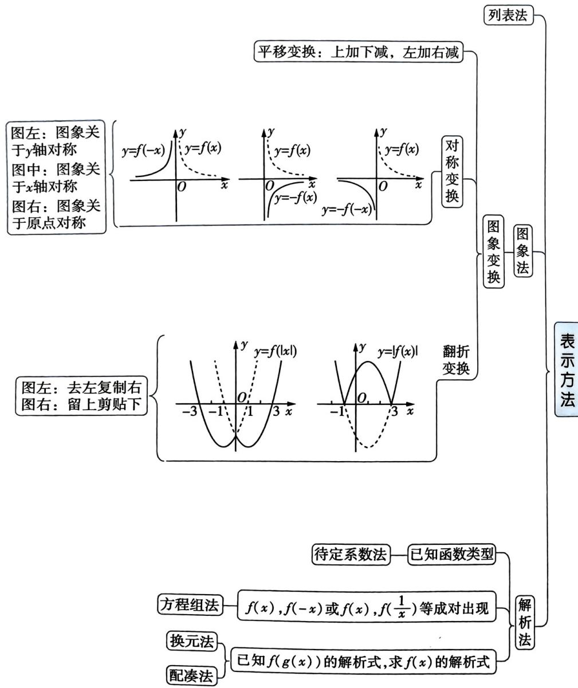

flowchart

```mermaid
graph TD
    A["列表法"] --> B["平移变换：上加下减，左加右减"]
    B --> C{y=f(-x) y=f(x) y=-f(x) y=-f(-x)}
    C --> D["对称变换"]
    D --> E["图象变换"]
    E --> F["图象法"]
    F --> G["表示方法"]
    G --> H["翻折变换"]
    H --> I{y=f(|x|) y=|f(x)|}
    I --> J["待定系数法"]
    I --> K["已知函数类型"]
    K --> L["解析法"]
    L --> M["方程组法"]
    L --> N["换元法"]
    L --> O["配凑法"]
    M --> P["f(x), f(-x) 或 f(x), f(1/x) 等成对出现"]
    N --> Q["已知 f(g(x)) 的解析式, 求 f(x) 的解析式"]
    O --> R["图左：去左复制右"]
    O --> S["图右：留上剪贴下"]
```

函数的概念及其表示  
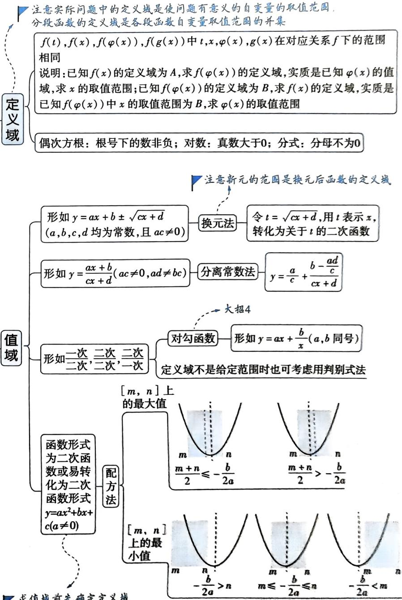

flowchart

```mermaid
graph TD
    A["定义域"] --> B["f(t), f(x), f(φ(x)), f(g(x)) 中 t, x, φ(x), g(x) 在对应关系 f 下的范围相同"]
    A --> C["说明: 已知 f(x) 的定义域为 A, 求 f(φ(x)) 的定义域, 实质是已知 φ(x) 的值域, 求 x 的取值范围; 已知 f(φ(x)) 的定义域为 B, 求 f(x) 的定义域, 实质是已知 f(φ(x)) 中 x 的取值范围为 B, 求 φ(x) 的取值范围"]
    A --> D["偶次方根: 根号下的数非负; 对数: 真数大于0; 分式: 分母不为0"]
    A --> E["值域"]
    E --> F["形如 y = ax + b ± √(ax + d) (a, b, c, d 均为常数, 且 ac ≠ 0)"]
    F --> G["换元法"]
    G --> H["令 t = √(cx + d), 用 t 表示 x, 转化为关于 t 的二次函数"]
    E --> I["形如 y = (ax + b)/(cx + d) (ac ≠ 0, ad ≠ bc)"]
    I --> J["分离常数法"]
    J --> K["y = (a/c) + (b - (c/x + d))"]
    E --> L["形如二次二次二次二次二次二次二次二次一次"]
    L --> M["对勾函数"]
    M --> N["形如 y = ax + (b/x) (a, b 同号)"]
    E --> O["定义域不是给定范围时也可考虑用判别式法"]
    P["配方法"] --> Q["[m, n"] 上的最大值]
    Q --> R["m/n (m+n/2 ≤ -b/2a)"]
    Q --> S["m/n (m+n/2 > -b/2a)"]
    P --> T["[m, n"] 上的最小值]
    T --> U["-b/2a > n"]
    T --> V["m/n (m≤ -b/2a ≤ n)"]
    T --> W["-b/n (m-2a < m)"]
```

求值域前先确定定义域。   
分段函数的值域是各段函数值域的并集

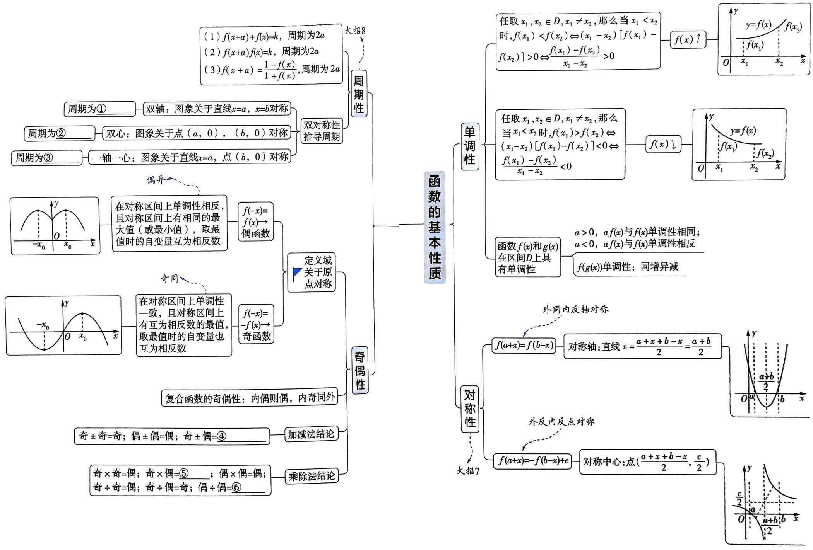

flowchart

```mermaid
graph TD
    A["周期性"] --> B["双对称性推导周期"]
    B --> C["周期为①"]
    C --> D["双轴：图象关于直线x=a, x=b对称"]
    D --> E["周期为②"]
    E --> F["双心：图象关于点(a,0), (b,0)对称"]
    F --> G["周期为③"]
    G --> H["一轴一心：图象关于直线x=a，点(b,0)对称"]
    H --> I["奇偶性"]
    I --> J["定义域关于原点对称"]
    J --> K["奇同"]
    K --> L["在对称区间上单调性一致，且对称区间上有相同的最大值（或最小值），取最值时的自变量互为相反数"]
    L --> M["f(-x)=f(x)→偶函数"]
    M --> N["奇偶性"]
    N --> O["在对称区间上单调性一致，且对称区间上有互为相反数的最值，取最值时的自变量也互为相反数"]
    O --> P["f(-x)=-f(x)→奇函数"]
    P --> Q["复合函数的奇偶性：内偶则偶，内奇同外"]
    Q --> R["奇±奇=奇；偶±偶=偶；奇±偶=④"]
    R --> S["加减法结论"]
    S --> T["奇×奇=偶；奇×偶=⑤；偶×偶=偶；奇÷奇=偶；奇÷偶=奇；偶÷偶=⑥"]
    T --> U["乘除法结论"]
    
    V["单调性"] --> W["任取x₁,x₂∈D,x₁≠x₂，那么当x₁<x₂时，f(x₁)<f(x₂)⇔(x₁-x₂)[f(x₁)-f(x₂)"]>0⇔f(x₁)-f(x₂)/x₁-x₂>0]
    W --> X["f(x)↑"]
    X --> Y["y=f(x) f(x₂) f(x₁) f(x₂) x"]
    Y --> Z["曲线图y=f(x) f(x₁) f(x₂) x"]
    Z --> AA["y=f(x) f(x₁) f(x₂) x"]
    AA --> AB["函数f(x)和g(x)在区间D上具有单调性"]
    AB --> AC["a>0, af(x)与f(x)单调性相同; a<0, af(x)与f(x)单调性相反"]
    AC --> AD["f(g(x))单调性：同增异减"]
    
    AE["对称性"] --> AF["f(a+x)=f(b-x)"]
    AF --> AG["对称轴：直线x=(a+b-b-x)/2=(a+b)/2"]
    AG --> AH["外同内反轴对称"]
    AH --> AI["f(a+x)=-f(b-x)+c"]
    AI --> AJ["对称中心：点((a+b-b-x)/2, c/2)"]
    
    AK["奇偶性"] --> AL["奇±奇=奇；偶±偶=偶；奇±偶=④"]
    AL --> AM["加减法结论"]
    AM --> AN["奇×奇=偶；奇×偶=⑤；偶×偶=偶；奇÷奇=偶；奇÷偶=奇；偶÷偶=⑥"]
    
    AO["奇偶性"] --> AP["奇×奇=偶；奇×偶=⑤；偶×偶=偶；奇÷奇=偶；奇÷偶=奇；偶÷偶=⑥"]
    
    AQ["奇偶性"] --> AR["奇±奇=偶；奇±偶=⑤；偶±偶=偶；奇÷奇=偶；奇÷偶=奇；偶÷偶=⑥"]
    
    AS["函数的基本性质"] --> AT["大招8"]
    AT --> AU["周期性"]
    AU --> AV["周期为①"]
    AV --> AW["双轴：图象关于直线x=a, x=b对称"]
    AW --> AX["周期为②"]
    AX --> AY["双心：图象关于点(a,0)，(b,0)对称"]
    AY --> AZ["周期为③"]
    AZ --> BA["一轴一心：图象关于直线x=a，点(b,0)对称"]
    
    BB["奇偶性"] --> BC["奇同"]
    BC --> BD["在对称区间上单调性相反，且对称区间上有相同的最大值（或最小值），取最值时的自变量互为相反数"]
    BD --> BE["f(-x)=f(x)→偶函数"]
    BE --> BF["定义域关于原点对称"]
    BF --> BG["奇同"]
    BG --> BH["-x₀ x₀ x̄"]
    BH --> BI["在对称区间上单调性相反，且对称区间上有相同的最大值（或最小值），取最值时的自变量互为相反数"]
    BH --> BJ["f(-x)=-f(x)→奇函数"]
    
    BK["单调性"] --> BL["任取x₁,x₂∈D,x₁≠x₂，那么当x₁<x₂时，f(x₁)<f(x₂)⇔(x₁-x₂)[f(x₁)-f(x₂)"]>0⇔f(x₁)-f(x₂)/x₁-x₂>0]
    BL --> BM["f(x)↓"]
    BM --> BN["y=f(x) f(x₁) f(x₂) x"]
    
    BO["对称性"] --> BP["大招7"]
    BP --> BQ["f(a+x)=f(b-x)"]
    BQ --> BR["对称轴：直线x=(a+b+b-x)/2=(a+b)/2"]
    BR --> BS["外反内反点对称"]
    BS --> BT["f(a+x)=-f(b-x)+c"]
    BT --> BU["对称中心：点((a+b+b-x)/2, c/2)"]
    
    CA["奇偶性"] --> CB["奇±奇=奇；偶±偶=偶；奇±偶=④"]
    CB --> CC["加减法结论"]
    CC --> DD["奇±奇=偶；奇±偶=⑤；偶±偶=偶；奇÷奇=偶；奇÷偶=奇；偶÷偶=⑥"]
    
    AD["单调性"] --> AE["其他类型1: y=f(x) f(x₁) f(x₂) x"]
```

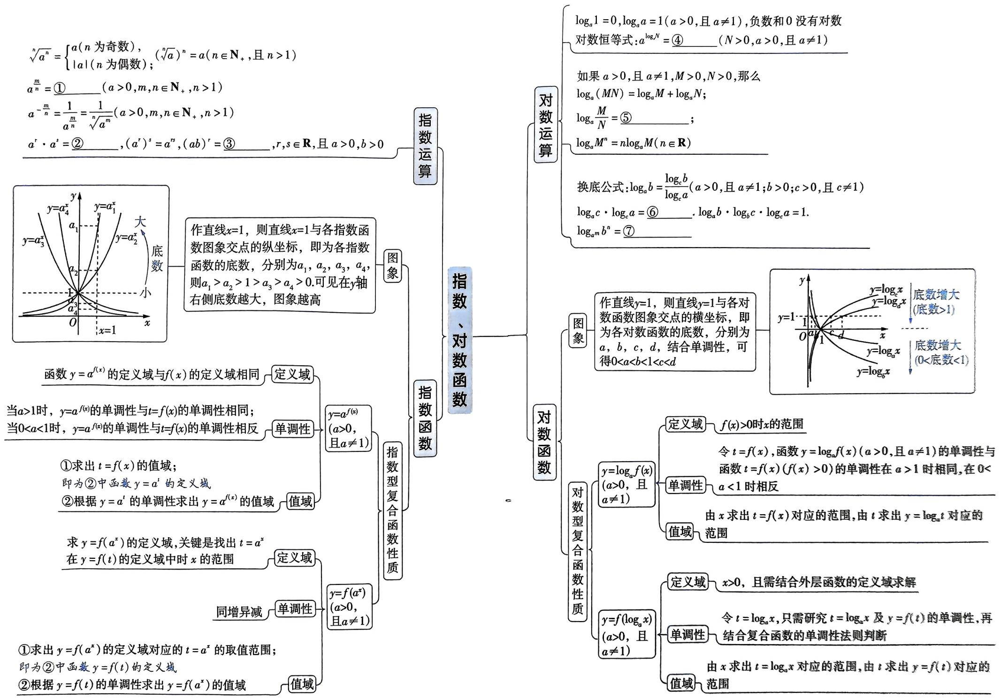

flowchart

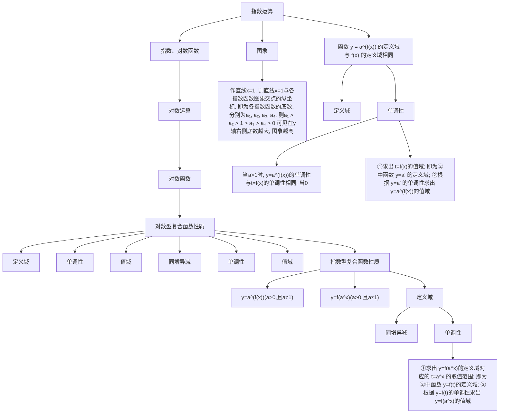
```mermaid
graph TD
    A["指数运算"] --> B["指数、对数函数"]
    B --> C["对数运算"]
    C --> D["对数函数"]
    D --> E["对数型复合函数性质"]
    E --> F["定义域"]
    E --> G["单调性"]
    E --> H["值域"]
    E --> I["同增异减"]
    E --> J["单调性"]
    E --> K["值域"]
    A --> L["图象"]
    L --> M["作直线x=1, 则直线x=1与各指数函数图象交点的纵坐标, 即为各指数函数的底数, 分别为a₁, a₂, a₃, a₄, 则a₁ > a₂ > 1 > a₃ > a₄ > 0.可见在y轴右侧底数越大, 图象越高"]
    A --> N["函数 y = a^(f(x)) 的定义域与 f(x) 的定义域相同"]
    N --> O["定义域"]
    N --> P["单调性"]
    P --> Q["当a>1时, y=a^(f(x))的单调性与t=f(x)的单调性相同; 当0<a<1时, y=a^(f(x))的单调性与t=f(x)的单调性相反"]
    P --> R["①求出 t=f(x)的值域; 即为②中函数 y=a' 的定义域; ②根据 y=a' 的单调性求出 y=a^(f(x))的值域"]
    E --> S["指数型复合函数性质"]
    S --> T["y=a^(f(x))(a>0,且a≠1)"]
    S --> U["y=f(a^x)(a>0,且a≠1)"]
    S --> V["定义域"]
    V --> W["同增异减"]
    V --> X["单调性"]
    X --> Y["①求出 y=f(a^x)的定义域对应的 t=a^x 的取值范围; 即为②中函数 y=f(t)的定义域; ②根据 y=f(t)的单调性求出 y=f(a^x)的值域"]
```

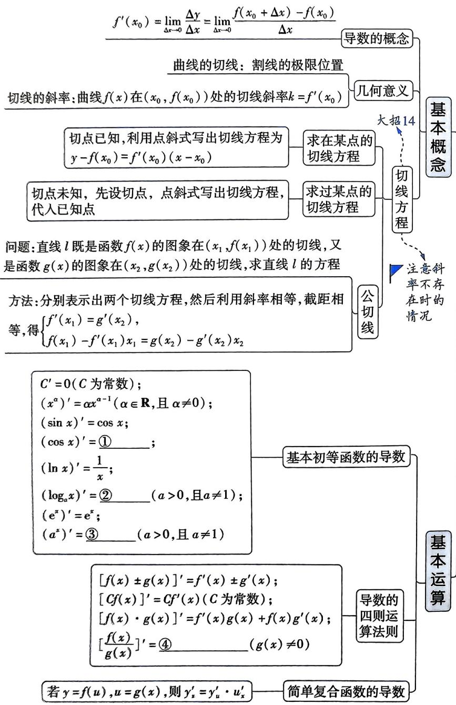

flowchart

```mermaid
graph TD
    A["基本概念"] --> B["导数的概念"]
    A --> C["几何意义"]
    A --> D["切线方程"]
    A --> E["公切线"]
    A --> F["注意斜率不存在时的情况"]
    
    B --> G["f'(x₀) = lim_{Δx→0} Δy / Δx = lim_{Δx→0} f(x₀ + Δx) - f(x₀) / Δx"]
    C --> H["曲线的切线：割线的极限位置"]
    C --> I["切线的斜率：曲线f(x)在(x₀, f(x₀))处的切线斜率k = f'(x₀)"]
    
    D --> J["求在某点的切线方程"]
    D --> K["求过某点的切线方程"]
    
    E --> L["问题：直线l既是函数f(x)的图象在(x₁, f(x₁))处的切线，又是函数g(x)的图象在(x₂, g(x₂))处的切线，求直线l的方程"]
    E --> M["方法：分别表示出两个切线方程，然后利用斜率相等，截距相等，得{f'(x₁) = g'(x₂), f(x₁) - f'(x₁)x₁ = g(x₂) - g'(x₂)x₂}"]
    E --> N["C' = 0 (C为常数); (x^α)' = αx^{α-1} (α ∈ R, 且α≠0); (sin x)' = cos x; (cos x)' = ①; (ln x)' = 1/x; (log_a x)' = ② (a > 0, 且a≠1); (e^x)' = e^x; (a^x)' = ③ (a > 0, 且a≠1)"]
    
    F --> O["基本初等函数的导数"]
    F --> P["导数的四则运算法则"]
    F --> Q["简单复合函数的导数"]
    
    O --> R["[f(x) ± g(x)"]' = f'(x) ± g'(x)]; [Cf(x)]' = Cf'(x) (C为常数); [f(x) · g(x)]' = f'(x)g(x) + f(x)g'(x)]; [f(x)/g(x)]' = ④ (g(x) ≠ 0)]
    
    P --> S["[f(x) ± g(x)"]' = f'(x) ± g'(x)]; [Cf(x)]' = Cf'(x) (C为常数); [f(x) · g(x)]' = f'(x)g(x) + f(x)g'(x)]; [f(x)/g(x)]' = ④ (g(x) ≠ 0)]
    
    Q --> T["若 y = f(u), u = g(x), 则 y'_u = y'_u · u'_u"]
```

# 导数(一)

# 基本应用

# 单调性

对于函数 $y=f(x)$ ，如果在某区间上⑤\_\_\_\_，那么 $f(x)$ 在该区间上单调递增

对于函数 $y=f(x)$ ，如果在某区间上 $f'(x)<0$ ，那么 $f(x)$ 在该区间上单调递⑥

# 定义

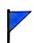

第一步，⑧；

第二步，求出导数 $f'(x)$ ;

第三步，由 $f^{\prime}(x) > 0$ 或 $< 0$ 解出相应的 $x$ 的取值范围，对应的区间为 $f(x)$ 的单调递增（减）区间

# 求单调区间的步骤

# 生求参

转化为恒成立求参问题求解

求出 $f'(x)$ 的零点 $x_{1}, x_{2}$ ，如果对于 $x_{1}$ 左侧附近的任意 $x$ ，都有 $f'(x) > 0$ （函数 $f(x)$ 单调递增）；对于 $x_{1}$ 右侧附近的任意 $x$ ，都有 $f'(x) < 0$ （函数 $f(x)$ 单调递减），即“左正右负”（“左增右减”），那么此时 $x_{1}$ 是 $f(x)$ 的极大值点

# 求极值

如果对于 $x_{2}$ 左侧附近的任意 $x$ ，都有 $f^{\prime}(x) < 0$ （函数 $f(x)$ 单调递减）；对于 $x_{2}$ 右侧附近的任意 $x$ ，都有 $f^{\prime}(x) > 0$ （函数 $f(x)$ 单调递增），即“左负右正”（“左减右增”），那么此时 $x_{2}$ 是 $f(x)$ 的极小值点

如果 $f'(x)$ 在 $x_{1}$ （或 $x_{2}$ ）的左侧附近与右侧附近均为正号或均为负号，即“左右同号”，则 $x_{1}$ （或 $x_{2}$ ）一定不是 $y=f(x)$ 的极值点

# 极值

# 极值求参

利用极值点处的导数值为0，极值点附近两侧的导数值异号，常转化为零点求参问题求解

求解步骤：第一步，求函数 $y=f(x)$ 在区间 $(a,b)$ 上的极值；
第二步，将第一步中求得的极值与 $f(a)$ 、 $f(b)$ 比较，得到 $f(x)$ 在区间 $[a,b]$ 上的最大值与最小值

# 最值

若涉及含参函数的单调性，则需判断参数对导函数在某区间的正负是否有影响，若有影响需分类讨论

# 可导函数 $f(x)$ 在 $x=x_{0}$ 处取得 极值的必要条 件是⑨

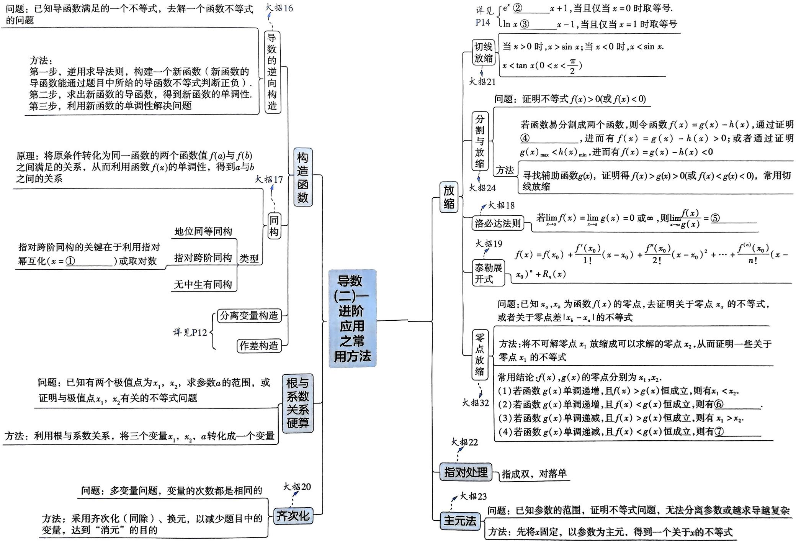

flowchart

```mermaid
graph TD
    A["问题：已知导函数满足的一个不等式，去解一个函数不等式的问题"] --> B["导数的逆向构造"]
    B --> C["构造函数"]
    C --> D["同构"]
    D --> E["同构"]
    E --> F["指定P12"]
    F --> G["分离变量构造"]
    F --> H["作差构造"]
    G --> I["指定P14"]
    I --> J["切线放缩"]
    J --> K["大招21"]
    K --> L["分析法"]
    L --> M["方法：求出新函数的导函数，得到新函数的单调性。"]
    M --> N["第二步，求出新函数的导函数，得到新函数的单调性解决问题"]
    N --> O["方法：第一步，逆用求导法则，构建一个新函数（新函数的导函数能通过题目中所给的导函数不等式判断正负）。"]
    O --> P["原理：将原条件转化为同一函数的两个函数值f(a)与f(b)之间满足的关系，从而利用函数f(x)的单调性，得到a与b之间的关系"]
    P --> Q["指定P16"]
    Q --> R["构造函数"]
    R --> S["同构"]
    S --> T["指定P17"]
    T --> U["指对跨阶同构的关键在于利用指对幂互化(x=①)或取对数"]
    U --> V["类型：指对跨阶同构"]
    V --> W["无中生有同构"]
    W --> X["指定P18"]
    X --> Y["洛必达法则"]
    Y --> Z["方法：寻找辅助函数g(x)，证明得f(x)>g(x)>0(或f(x)<g(x)<0)，常用切线放缩"]
    Z --> AA["大招24"]
    AA --> AB["分析法"]
    AB --> AC["分析法：若函数易分割成两个函数，则令函数f(x)=g(x)-h(x)，通过证明④_____,进而有f(x)=g(x)-h(x)>0；或者通过证明g(x)_{max}<h(x)_{min} ,进而有f(x)=g(x)-h(x)<0"]
    AC --> AD["分析法：若函数易分割成两个函数，则令函数f(x)=g(x)-h(x)，通过证明④_____,进而有f(x)=g(x)-h(x)>0；或者通过证明g(x)_{max}<h(x)_{min} ,进而有f(x)=g(x)-h(x)<0"]
    AD --> AE["分析法：若函数易分割成两个函数，则令函数f(x)=g(x)-h(x)，通过证明④_____,进而有f(x)=g(x)-h(x)>0；或者通过证明g(x)_{max}<h(x)_{min} ,进而有f(x)=g(x)-h(x)<0"]
    AE --> AF["分析法：若函数易分割成两个函数，则令函数f(x)=g(x)-h(x)，通过证明④_____,进而有f(x)=g(x)-h(x)>0；或者通过证明g(x)_{max}<h(x)_{min} ,进而有f(x)=g(x)-h(x)<0"]
    AF --> AG["分析法：若函数易分割成两个函数，则令函数f(x)=g(x)-h(x)，通过证明④_____,进而有f(x)=g(x)-h(x)>0；或者通过证明g(x)_{max}<h(x)_{min} ,进而有f(x)=g(x)-h(x)<0"]
    AG --> AH["分析法：若函数易分割成两个函数，则令函数f(x)=g(x)-h(x)，通过证明④_____,进而有f(x)=g(x)-h(x)>0；或者通过证明g(x)_{max}<h(x)_{min} ,进而有f(x)=g(x)-h(x)<0"]
    AH --> AI["分析法：若函数易分割成两个函数，则令函数f(x)=g(x)-h(x)，通过证明④_____,进而有f(x)=g(x)-h(x)>0；或者通过证明g(x)_{max}<h(x)_{min} ,进而有f(x)=g(x)-h(x)<0"]
    AI --> AJ["分析法：若函数易分割成两个函数，则令函数f(x)=g(x)-h(x)，通过证明④_____,进而有f(x)=g(x)-h(x)>0；或者通过证明g(x)_{max}<h(x)_{min} ,进而有f(x)=g(x)-h(x)<0"]
    AJ --> AK["分析法：若函数易分割成两个函数，则令函数f(x)=g(x)-h(x)，通过证明④_____,进而有f(x)=g(x)-h(x)>0；或者通过证明g(x)_{max}<h(x)_{min} ,进而有f(x)=g(x)-h(x)<0"]
    AK --> AL["分析法：若函数易分割成两个函数，则令函数f(x)=g(x)-h(x)，通过证明④_____,进而有f(x)=g(x)-h(x)>0；或者通过证明g(x)_{max}<h(x)_{min} ,进而有f(x)=g(x)-h(x)<0"]
    AL --> AM["分析法：若函数易分割成两个函数，则令函数f(x)=g(x)-h(x)，通过证明④_____,进而有f(x)=g(x)-h(x)>0；或者通过证明g(x)_{max}<h(x)_{min} ,进而有f(x)=g(x)-h(x)<0"]
    AM --> AN["分析法：若函数易分割成两个函数，则令函数f(x)=g(x)-h(x)，通过证明④_____,进而有f(x)=g(x)-h(x)>0；或者通过证明g(x)_{max}<h(x)_{min} ,进而有f(x)=g(x)-h(x)<0"]
    AN --> AO["分析法：若函数易分割成两个函数，则令函数f(x)=g(x)-h(x)，通过证明④_____,进而有f(x)=g(x)-h(x)>0；或者通过证明g(x)_{max}<h(x)_{min} ,进而有f(x)=g(x)-h(x)<0"]
    AO --> AP["分析法：若函数易分割成两个函数，则令函数f(x)=g(x)-h(x)，通过证明④_____,进而有f(x)=g(x)-h(x)>0；或者通过证明g(x)_{max}<h(x)_{min} ,进而有f(x)=g(x)-h(x)<0"]
    AP --> AQ["分析法：若函数易分割成两个函数，则令函数f(x)=g(x)-h(x)，通过证明④_____,进而有f(x)=g(x)-h(x)>0；或者通过证明g(z)_{max}<h(z)_{min} ,进而有f(z)=g(z)-h(z)<0"]
    AQ --> AR["分析法：若函数易分割成两个函数，则令函数f(z)=g(z)-h(z)，通过证明④_____,进而有f(z)=g(z)-h(z)>0；或者通过证明g(z)_{max}<h(z)_{min} ,进而有f(z)=g(z)-h(z)<0"]
    AR --> AS["分析法：若函数易分割成两个函数，则令函数f(z)=g(z)-h(z)，通过证明④_____,进而有f(z)=g(z)-h(z)>0；或者通过证明g(z)_{max}<h(z)_{min} ,进而有f(z)=g(z)-h(z)<0"]
    AS --> AT["分析法：若函数易分割成两个函数，则令函数f(z)=g(z)-h(z)，通过证明④_____,进而有f(z)=g(z)-h(z)>0；或者通过证明g(z)_{max}<h(z)_{min} ,进而有f(z)=g(z)-h(z)<0"]
    AT --> AU["分析法：若函数易分割成两个函数，则令函数f(z)=g(z)-h(z)，通过证明④_____,进而有f(z)=g(z)-h(z)>0；或者通过证明g(z)_{max}<h(z)_{min} ,进而有f(z)=g(z)-h(z)<0"]
    AU --> AV["分析法：若函数易分割成两个函数，则令函数f(z)=g(z)-h(z)，通过证明④_____,进而有f(z)=g(z)-h(z)>0；或者通过证明g(z)_{max}<h(z)_{min} ,进而有f(z)=g(z)-h(z)<0"]
    AV --> AW["分析法：若函数易分割成两个函数，则令函数f(z)=g(z)-h(z)，通过证明④_____,进而有f(z)=g(z)-h(z)>0；或者通过证明g(z)_{max}<h(z)_{min} ,进而有f(z)=g(z)-h(z)<0"]
    AW --> AX["分析法：若函数易分割成两个函数，则令函数f(z)=g(z)-h(z)，通过证明④_____,进而有f(z)=g(z)-h(z)>0；或者通过证明g(z)_{max}<h(z)_{min} ,进而有f(z)=g(z)-h(z)<0"]
    AX --> AY["分析法：若函数易分割成两个函数，则令函数f(z)=g(z)-h(z)，通过证明④_____,进而有f(z)=g(z)-h(z)>0；或者通过证明g(z)_{max}<h(z)_{min} ,进而有f(z)=g(z)-h(z)<0"]
    AY --> AZ["分析法：若函数易分割成两个函数，则令函数f(z)=g(z)-h(z)，通过证明④_____,进而有f(z)=g(z)-h(z)>0；或者通过证明g(z)_{max}<h(z)_{min} ,进而有f(z)=g(z)-h(z)<0"]
    AZ --> BA["分析法：若函数易分割成两个函数，则令函数f'(x)'为等式，故证明关于零点x₀的不等式，或者关于零点差|x₀-x₀|的不等式"]
    BA --> BB["零点放缩"]
    BB --> BC["大招32"]
    BC --> BD["分析法：已知参数范围，证明不等式问题，无法分离参数或越求导越复杂方法：先将x固定，以参数为主元，得到一个关于x的不等式"]
    BD --> BE["指对处理"]
    BE --> BF["大招22"]
    BF --> BG["指成双，对落单"]
    BG --> BH["主元法"]
    BH --> BI["问题：已知参数的范围，证明不等式问题，无法分离参数或越求导越复杂方法：先将x固定，以参数为主元，得到一个关于x的不等式"]
```

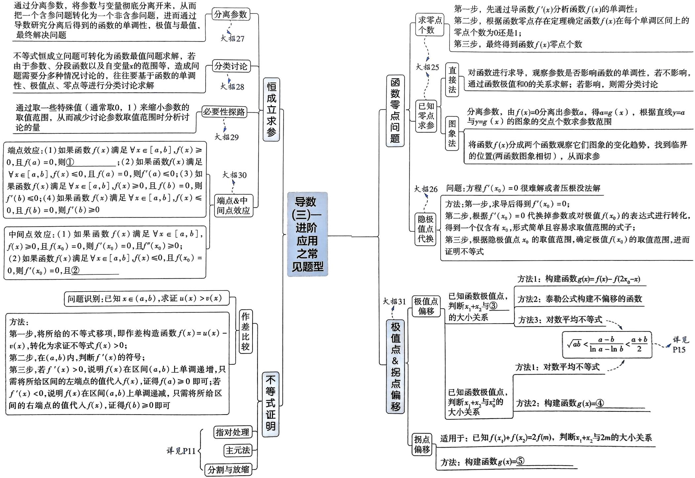

flowchart

```mermaid
graph TD
    A["通过分离参数，将参数与变量彻底分离开来，从而把一个含参问题转化为一个非含参问题，进而通过导数研究分离后得到的函数的单调性，极值与最值，最终解决问题"] --> B["分离参数"]
    B --> C["大招27"]
    D["不等式恒成立问题可转化为函数最值问题求解，若由于参数、分段函数以及自变量x的范围等，造成问题需要分多种情况讨论的，往往要基于函数的单调性、极值点、零点等进行分类讨论求解"] --> E["分类讨论"]
    E --> F["大招28"]
    G["通过取一些特殊值（通常取0,1）来缩小参数的取值范围，从而减少讨论参数取值范围时分析讨论的量"] --> H["必要性探路"]
    H --> I["大招29"]
    J["端点&中间点效应"] --> K["大招30"]
    L["端点效应：(1)如果函数f(x)满足∀x∈[a,b"],f(x)≥0,且f(a)=0,则①；(2)如果函数f(x)满足∀x∈[a,b],f(x)≤0,且f(a)=0,则f'(a)≤0; (3)如果函数f(x)满足∀x∈[a,b],f(x)≥0,且f(b)=0,则f'(b)≤0; (4)如果函数f(x)满足∀x∈[a,b],f(x)≤0,且f(b)=0,则f'(b)≥0] --> K
    L --> L1["中间点效应：(1)如果函数f(x)满足∀x∈[a,b"],f(x)≥0,且f(x₀)=0,则f'(x₀)=0,且f''(x₀)≥0; (2)如果函数f(x)满足∀x∈[a,b],f(x)≤0,且f(x₀)=0,则f'(x₀)=0,且②]
    M["作差比较"] --> N["不等式证明"]
    O["问题识别：已知x∈(a,b)，求证u(x)>v(x)"] --> P["作差比较"]
    Q["指对处理"] --> R["主元法"]
    S["分割与放缩"] --> T["分割与放缩"]
    U["导数(三)-进阶应用之常见题型"] --> V["函数零点问题"]
    V --> W["求零点个数"]
    W --> X["大招25"]
    X --> Y["直接法"]
    Y --> Z["已知零点求参"]
    Z --> AA["图象法"]
    AA --> AB["图象法"]
    AB --> AC["小数法"]
    AC --> AD["问题：方程f'(x₀)=0很难解或者压根没法解"]
    AE["隐极值点代换"] --> AF["方法：第一步，求导后得到f'(x₀)=0；第二步，根据f'(x₀)=0代换掉参数或对极值f(x₀)的表达式进行转化，得到一个仅含有x₀，形式简单且容易求取值范围的式子；第三步，根据隐极值点x₀的取值范围，确定极值f(x₀)的取值范围，进而证明不等式"]
    AG["极值点&拐点偏移"] --> AH["极值点偏移"]
    AH --> AI["方法1：构建函数g(x)=f(x)-f(2x₀-x)"]
    AH --> AJ["方法2：泰勒公式构建不偏移的函数"]
    AH --> AK["方法3：对数平均不等式"]
    AK --> AL["√ab < (a-b/ln a-1/n b) < (a+b/2)"]
    AL --> AM["详见P15"]
    AN["拐点偏移"] --> AO["仅知函数极值点，判断x₁+x₂与x₀²的大小关系"]
    AO --> AP["方法1：对数平均不等式"]
    AO --> AQ["方法2：构建函数g(x)=④"]
    AN --> AR["适用于：已知f(x₁)+f(x₂)=2f(m)，判断x₁+x₂与2m的大小关系"]
    AN --> AS["方法：构建函数g(x)=⑤"]
```

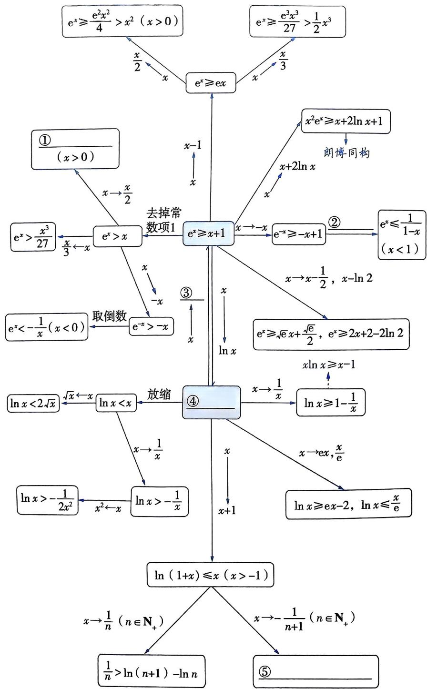

flowchart

```mermaid
graph TD
    A["e^x ≥ e^2 x^2 / 4 > x^2 (x > 0)"] -->|x/2| B["e^x ≥ ex"]
    C["e^x ≥ e^3 x^3 / 27 > 1/2 x^3"] -->|x/3| B
    D["① (x > 0)"] -->|x → x/2| E["e^x > x"]
    E -->|x/3 ← x| F["e^x > -x"]
    G["x^- ≥ x + 2ln x + 1"] -->|x+2ln x| H["e^x ≥ x + 1"]
    I["②"] -->|x → -x| J["e^- ≥ -x + 1"]
    K["x^- ≤ 1/1 - x (x < 1)"] -->|x → -1/2, x -ln 2| L["e^x ≥ √e x + √e/2, e^x ≥ 2x + 2 - 2ln 2"]
    M["③"] -->|-x| N["e^x > -1/x (x < 0)"]
    O["④"] -->|x → 1/x| P["ln x ≥ 1 - 1/x"]
    Q["⑤"] -->|x → -1/n (n ∈ N_+) | R["ln (1+x) ≤ x (x > -1)"]
    S["⑥"] -->|x → -1/n (n ∈ N_+) | T["ln (1+x) ≤ x (x > -1)"]
    U["⑦"] -->|x → -1/n (n ∈ N_+) | V["ln (1+x) ≤ x (x > -1)"]
    W["⑧"] -->|x → -1/n (n ∈ N_+) | X["ln (1+x) ≤ x (x > -1)"]
    Y["⑨"] -->|x → -1/n (n ∈ N_+) | Z["ln (1+x) ≤ x (x > -1)"]
    style A fill:#f9f,stroke:#333
    style C fill:#f9f,stroke:#333
    style D fill:#f9f,stroke:#333
    style E fill:#ccf,stroke:#333
    style F fill:#ccf,stroke:#333
    style G fill:#ccf,stroke:#333
    style H fill:#ccf,stroke:#333
    style I fill:#ccf,stroke:#333
    style J fill:#ccf,stroke:#333
    style K fill:#ccf,stroke:#333
    style L fill:#ccf,stroke:#333
    style M fill:#ccf,stroke:#333
    style N fill:#ccf,stroke:#333
    style O fill:#ccf,stroke:#333
    style P fill:#ccf,stroke:#333
    style Q fill:#ccf,stroke:#333
    style R fill:#ccf,stroke:#333
    style S fill:#ccf,stroke:#333
    style T fill:#ccf,stroke:#333
    style U fill:#ccf,stroke:#333
    style V fill:#ccf,stroke:#333
```

和切线放缩有关的二级结论

和对数平均不等式有关的二级结论  
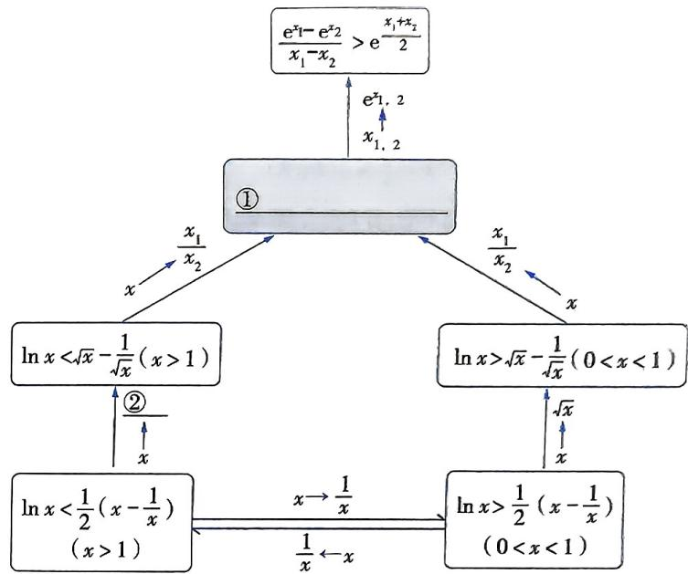

flowchart

```mermaid
graph TD
    A["1"] -->|e^x1 - e^x2 / (x_1 - x_2) > e^x1 + x_2 / 2| B["x"]
    A -->|x_1 / x_2| C["ln x < √x - 1/√x (x > 1)"]
    A -->|x_1 / x_2| D["ln x > √x - 1/√x (0 < x < 1)"]
    B -->|②| E["ln x < 1/2 (x - 1/x) (x > 1)"]
    D -->|√x| F["ln x > 1/2 (x - 1/x) (0 < x < 1)"]
    E -->|x → 1/x| F
    F -->|1/x ← x| E
    B -->|x| G["e^x1, 2"]
    D -->|x| H["e^x1, 2"]
```

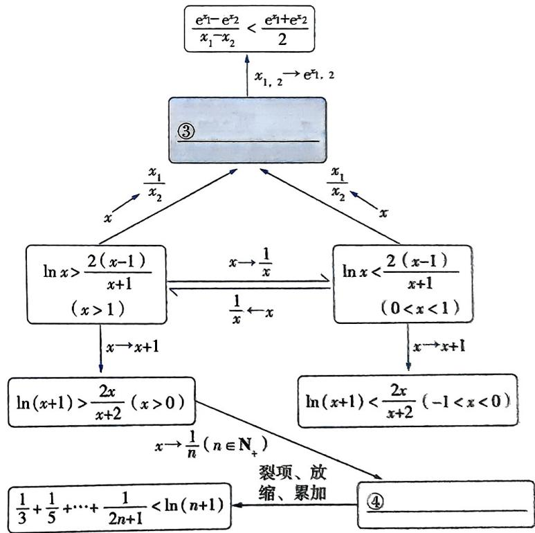

flowchart

```mermaid
graph TD
    A["3"] -->|x₁,₂ → eₓ₁,₂| B["ln x > (2(x-1)/x+1) (x>1)"]
    A -->|x₁,₂ → eₓ₁,₂| C["ln x < (2(x-1)/x+1) (0<x<1)"]
    B -->|x→x+1| D["ln(x+1) > (2x/x+2) (x>0)"]
    C -->|x→x+1| E["ln(x+1) < (2x/x+2) (-1<x<0)"]
    D -->|x→½(n∈N₊)| F["½/3 + ½/5 + … + ½/2n+1 < ln(n+1)"]
    E -->|裂项、放缩、累加| G["④"]
    B -->|x→½/x ← x| H["ln x < (2(x-1)/x+1) (0<x<1)"]
    C -->|x→½/x ← x| I["ln x < (2(x-1)/x+1) (0<x<1)"]
```

# 专题五 三角函数

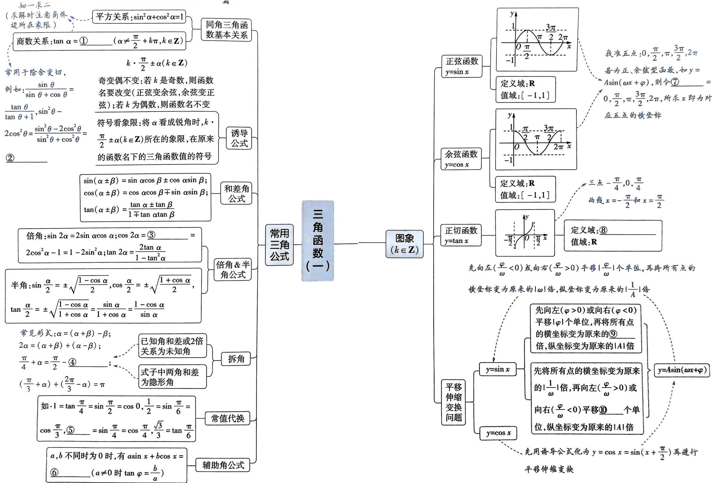

flowchart

```mermaid
graph TD
    A["三角函数 (一)"] --> B["常用三角公式"]
    A --> C["三角函数 (一)"]
    A --> D["图象 (k∈Z)"]
    B --> E["同角三角函数基本关系"]
    E --> F["商数关系: tan α = ① (α ≠ π/2 + kπ, k ∈ Z)"]
    F --> G["判令: 常用除余变切, 例如: sin θ/sin θ + cos θ, tan θ/tan θ + 1, sin²θ - 2cos²θ = sin²θ - 2cos²θ/sin²θ + cos²θ"]
    G --> H["诱导公式: 等符号看象限: 将α看成锐角时, k·(π/2) ± α(k∈Z) 所在的象限, 在原来的函数名下的三角函数值的符号"]
    H --> I["和差角公式: sin(α±β) = sin αcos β ± cos αsin β; cos(α±β) = cos αcos β ± sin αsin β; tan(α±β) = tan α ± tan β / 1 ± tan α tan β"]
    I --> J["倍角&半角公式: 倍角: sin 2α = 2sin αcos α; cos 2α = ③ = 2cos²α - 1 = 1 - 2sin²α; tan 2α = 2tan α / 1 - tan²α"]
    J --> K["半角: sin α/2 = ±√(1 - cos α/2), cos α/2 = ±√(1 + cos α/2), tan α/2 = ±√(1 - cos α/1 + cos α) = sin α / 1 + cos α = 1 - cos α / sin α"]
    K --> L["拆角: 即见形式: α = (α+β) - β; 2α = (α+β) + (α-β); π/4 + α = π/2 - ④; (π/3 + α) + (2π/3 - α) = π"]
    L --> M["式子中两角和差为隐形角"]
    M --> N["如·1 = tan π/4 = sin π/2 = cos 0, 1/2 = sin π/6 = cos π/3, ⑤ = sin π/4 = cos π/4, √3/3 = tan π/6"]
    N --> O["常值代换"]
    O --> P["a, b 不同时为0时, 有asin x + bcos x = ⑥ (a≠0时 tan φ = b/a)"]
    P --> Q["辅助角公式"]
    C --> R["正弦函数 y=sin x"]
    R --> S["定义域: R 值域: [-1,1"]]
    S --> T["定义域: R 值域: [-1,1"]]
    T --> U["正切函数 y=tan x"]
    U --> V["定义域: ⑧ 值域: R"]
    V --> W["平移伸缩变换问题"]
    W --> X["y=sin x"]
    X --> Y["先向左(φ<0)或向右(φ>0)平移|φ|个单位,再将所有点的横坐标变为原来的|ω|倍,纵坐标变为原来的|A|倍"]
    W --> Z["y=cos x"]
    Z --> AA["先向左(φ>0)或向右(φ<0)平移|φ|个单位,再将所有点的横坐标变为原来的⑨倍,纵坐标变为原来的|A|倍"]
    W --> AB["y=Asin(ωx+φ)"]
    AB --> AC["先将所有点的横坐标变为原来的|1/ω|倍,再向左(φ>0)或向右(φ<0)平移⑩个单位,纵坐标变为原来的|A|倍"]
    AC --> AD["平移伸缩变换"]
    AD --> AE["先用诱导公式化为 y = cos x = sin(x + π/2) 再进行平移伸缩变换"]
```

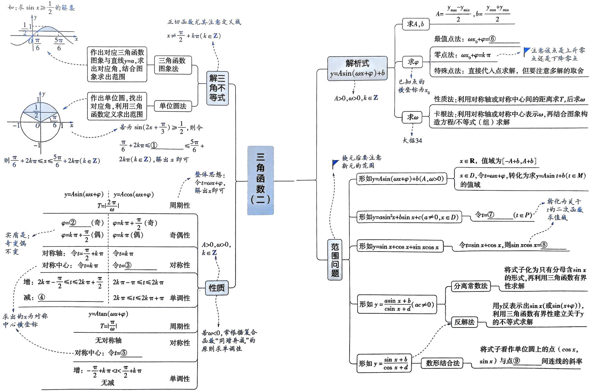

flowchart

```mermaid
graph TD
    A["三角函数 (二)"] --> B["解三角不等式"]
    A --> C["解析式 y=Asin(ωx+φ)+b"]
    A --> D["范围问题"]
    A --> E["性质"]
    A --> F["解三角不等式"]
    
    B --> G["求A,b"]
    B --> H["求φ"]
    B --> I["求ω"]
    
    C --> J["求A,b"]
    C --> K["求φ"]
    C --> L["求ω"]
    
    D --> M["换元后要注意新元的范围"]
    D --> N["形如y=Asin(ωx+φ)+b(A,ω>0)"]
    D --> O["形如y=asin²x+bsin x+c(a≠0,x∈D)"]
    D --> P["形如y=sin x+cos x+sin xcos x"]
    
    E --> Q["形式: x∈R, 值域为[-A+b,A+b"]]
    E --> R["条件: x∈D, 令t=ωx+φ, 转化为求y=Asin t+b(t∈M)的值域"]
    
    F --> S["形式: x∈R, 值域为[-A+b,A+b"]]
    F --> T["条件: x∈D, 令t=ωx+φ, 转化为求y=Asin t+b(t∈M)的值域"]
    
    G --> U["正切函数尤其注意定义域 x≠π/2+kπ(k∈Z)"]
    H --> V["最值点法: ωx₀+φ=⑥"]
    I --> W["已知点的被坐标为x₀"]
    J --> X["考虑点法: ωx₀+φ=kπ"]
    K --> Y["注意该点是上升零点还是下降零点"]
    L --> Z["性质法: 利用对称轴或对称中心间的距离求T, 后求ω"]
    M --> AA["形式: x∈R, 值域为[-A+b,A+b"]]
    N --> AB["条件: x∈D, 令t=ωx+φ, 转化为求y=Asin t+b(t∈M)的值域"]
    
    O --> AC["条件: x∈D, 令t=ωx+φ, 转化为求y=Asin t+b(t∈M)的值域"]
    
    P --> AD["形式: x∈R, 值域为[-A+b,A+b"]]
    Q --> AE["形式: x∈R, 值域为[-A+b,A+b"]]
    R --> AF["条件: x∈D, 令t=ωx+φ, 转化为求y=Asin t+b(t∈M)的值域"]
    
    S --> AG["形式: x∈R, 值域为[-A+b,A+b"]]
    T --> AH["条件: x∈D, 令t=ωx+φ, 转化为求y=Asin t+b(t∈M)的值域"]
    
    U --> AI["形式: x∈R, 值域为[-A+b,A+b"]]
    V --> AJ["条件: x∈D, 令t=ωx+φ, 转化为求y=Asin t+b(t∈M)的值域"]
    
    W --> AK["形式: x∈R, 值域为[-A+b,A+b"]]
    X --> AL["条件: x∈D, 令t=ωx+φ, 转化为求y=Asin t+b(t∈M)的值域"]
    
    Y --> AM["形式: x∈R, 值域为[-A+b,A+b"]]
    Z --> AN["条件: x∈D, 令t=ωx+φ, 转化为求y=Asin t+b(t∈M)的值域"]
    
    AB --> AO["形式: x∈R, 值域为[-A+b,A+b"]]
    AC --> AP["条件: x∈D, 令t=ωx+φ, 转化为求y=Asin t+b(t∈M)的值域"]
    
    AD --> AQ["形式: x∈R, 值域为[-A+b,A+b"]]
    AE --> AR["条件: x∈D, 令t=ωx+φ, 转化为求y=Asin t+b(t∈M)的值域"]
    
    AF --> AS["形式: x∈R, 值域为[-A+b,A+b"]]
    AG --> AT["条件: x∈D, 令t=ωx+φ, 转化为求y=Asin t+b(t∈M)的值域"]
    
    AH --> AU["形式: x∈R, 值域为[-A+b,A+b"]]
    AI --> AV["条件: x∈D, 令t=ωx+φ, 转化为求y=Asin t+b(t∈M)的值域"]
    
    AJ --> AW["形式: x∈R, 值域为[-A+b,A+b"]]
    AX --> AY["条件: x∈D, 令t=ωx+φ, 转化为求y=Asin t+b(t∈M)的值域"]
    
    AO --> AZ["形式: x∈R, 值域为[-A+b,A+b"]]
    AP --> BA["条件: x∈D, 令t=ωx+φ, 转化为求y=Asin t+b(t∈M)的值域"]
    
    AQ --> BB["形式: x∈R, 值域为[-A+b,A+b"]]
    AR --> BC["条件: x∈D, 令t=ωx+φ, 转化为求y=Asin t+b(t∈M)的值域"]
    
    AS --> BD["形式: x∈R, 值域为[-A+b,A+b"]]
    AT --> BE["条件: x∈D, 令t=ωx+φ, 转化为求y=Asin t+b(t∈M)的值域"]
    
    AU --> BF["形式: x∈R, 值域为[-A+b,A+b"]]
    AV --> BG["条件: x∈D, 令t=ωx+φ, 转化为求y=Asin t+b(t∈M)的值域"]
    
    AW --> BH["形式: x∈R, 值域为[-A+b,A+b"]]
    AX --> BI["条件: x∈D, 令t=ωx+φ, 转化为求y=Asin t+b(t∈M)的值域"]
    
    AU --> BJ["形式: x∈R, 值域为[-A+b,A+b"]]
    AV --> BK["条件: x∈D, 令t=ωx+φ, 转化为求y=Asin t+b(t∈M)的值域"]
    
    AO --> BL["形式: x∈R, 值域为[-A+b,A+b"]]
    AP --> BM["条件: x∈D, 令t=ωx+φ, 转化为求y=Asin t+b(t∈M)的值域"]
    
    AQ --> BN["形式: x∈R, 值域为[-A+b,A+b"]]
    AR --> BO["条件: x∈D, 令t=ωx+φ, 转化为求y=Asin t+b(t∈M)的值域"]
    
    AS --> BP["形式: x∈R, 值域为[-A+b,A+b"]]
    AT --> BQ["条件: x∈D, 令t=ωx+φ, 转化为求y=Asin t+b(t∈M)的值域"]
    
    AU --> BR["形式: x∈R, 值域为[-A+b,A+b"]]
    AV --> BS["条件: x∈D, 令t=ωx+φ, 转化为求y=Asin t+b(t∈M)的值域"]
    
    AU --> BT["形式: x∈R, 值域为[-A+b,A+b"]]
    AV --> BU["条件: x∈D, 令t=ωx+φ, 转化为求y=Asin t+b(t∈M)的值域"]
    
    AO --> BV["形式: x∈R, 值域为[-A+b,A+b"]]
    AP --> BW["条件: x∈D, 令t=ωx+φ, 转化为求y=Asin t+b(t∈M)的值域"]
    
    AU --> BX["形式: x∈R, 值域为[-A+b,A+b"]]
    AV --> BY["条件: x∈D, 令t=ωx+φ, 转化为求y=Asin t+b(t∈M)的值域"]
    
    AU --> BZ["形式: x∈R, 值域为[-A+b,A+b"]]
    AV --> CA["条件: x∈D, 令t=ωx+φ, 转化为求y=Asin t+b(t∈M)的值域"]
    
    AU --> CB["形式: x∈R, 值域为[-A+b,A+b"]]
    AV --> CC["条件: x∈D, 令t=ωx+φ, 转化为求y=Asin t+b(t∈M)的值域"]
    
    AU --> DE["形式: x∈R, 值域为[-A+b,A+b"]]
    AV --> DF["条件: x∈D, 令t=ωx+φ, 转化为求y=Asin t+b(t∈M)的值域"]
    
    AU --> BE["形式: x∈R, 值域为[-A+b,A+b"]]
    AV --> BF["条件: x∈D, 令t=ωx+φ, 转化为求y=Asin t+b(t∈M)的值域"]
    
    AU --> BG["形式: x∈R, 值域为[-A+b,A+b"]]
    AV --> BH["条件: x∈D, 令t=ωx+φ, 转化为求y=Asin t+b(t∈M)的值域"]
    
    AU --> BI["形式: x∈R, 值域为[-A+b,A+b"]]
    AV --> BJ["条件: x∈D, 令t=ωx+φ, 转化为求y=Asin t+b(t∈M)的值域"]
    
    AU --> BK["形式: x∈R, 值域为[-A+b,A+b"]]
    AV --> BL["条件: x∈D, 令t=ωx+φ, 转化为求y=Asin t+b(t∈M)的值域"]
    
    AU --> BM["形式: x∈R, 值域为[-A+b,A+b"]]
    AV --> BN["条件: x∈D, 令t=ωx+φ, 转化为求y=Asin t+b(t∈M)的值域"]
    
    AU --> BO["形式: x∈R, 值域为[-A+b,A+b"]]
    AV --> BP["条件: x∈D, 令t=ωx+φ, 转化为求y=Asin t+b(t∈M)的值域"]
    
    AU --> BQ["形式: x∈R, 值域为[-A+b,A+b"]]
    AV --> BR["条件: x∈D, 令t=ωx+φ, 转化为求y=Asin t+b(t∈M)的值域"]
    
    AU --> BS["形式: x∈R, 值域为[-A+b,A+b"]]
    AV --> BT["条件: x∈D, 令t=ωx+φ, 转化为求y=Asin t+b(t∈M)的值域"]
    
    AU --> BU["形式: x∈R, 值域为[-A+b,A+b"]]
    AV --> BV["条件: x∈D, 令t=ωx+φ, 转化为求y=Asin t+b(t∈M)的值域"]
    
    AU --> BW["形式: x∈R, 值域为[-A+b,A+b"]]
    AV --> BX["条件: x∈D, 令t=ωx+φ, 转化为求y=Asin t+b(t∈M)的值域"]
    
    AU --> BY["形式: x∈R, 值域为[-A+b,A+b"]]
    AV --> BZ["条件: x∈D, 令t=ωx+φ, 转化为求y=Asin t+b(t∈M)的值域"]
    
    AU --> BQ
```

# 专题六

# 解三角形

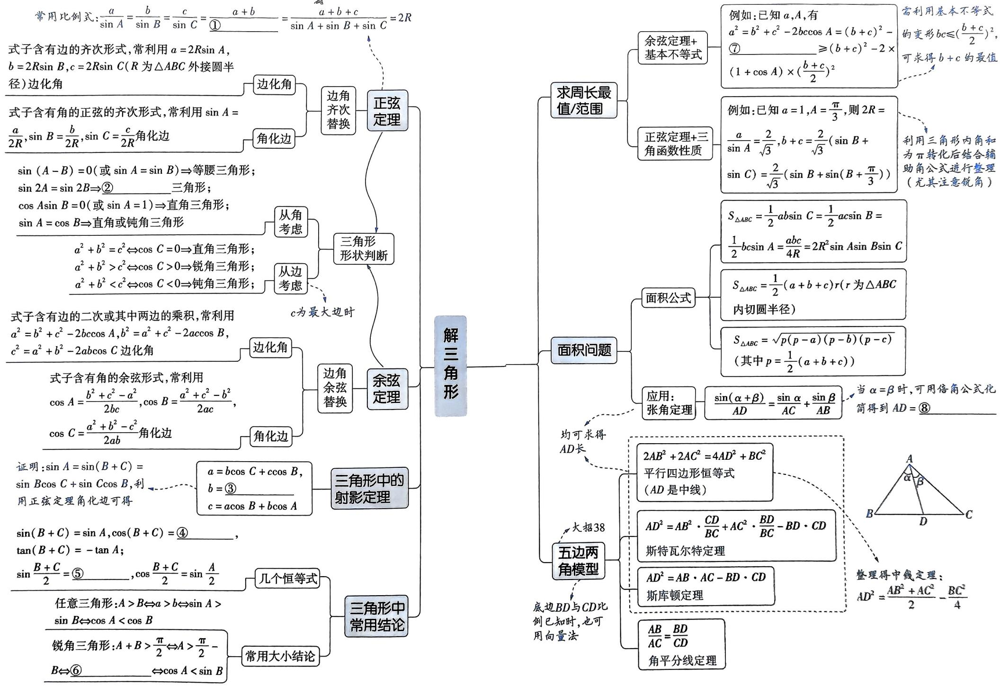

flowchart

```mermaid
graph TD
    A["解三角形"] --> B["正弦定理"]
    A --> C["余弦定理"]
    A --> D["三角形中的射影定理"]
    A --> E["三角形中常用结论"]
    
    B --> F["边角齐次替换"]
    B --> G["边角考虑"]
    B --> H["三角形形状判断"]
    B --> I["三角形中的射影定理"]
    
    C --> J["余弦定理+基本不等式"]
    C --> K["正弦定理+三角函数性质"]
    C --> L["面积公式"]
    C --> M["五边两角模型"]
    
    D --> N["求周长最值/范围"]
    D --> O["面积问题"]
    D --> P["几何关系"]
    
    E --> Q["三角形中常用结论"]
    
    F --> R["边化角"]
    F --> S["角化边"]
    
    G --> T["从角考虑"]
    G --> U["从边考虑"]
    
    H --> V["三角形形状判断"]
    
    I --> W["面积公式"]
    I --> X["五边两角模型"]
    
    J --> Y["余弦定理+基本不等式"]
    J --> Z["正弦定理+三角函数性质"]
    J --> AA["面积公式"]
    J --> AB["五边两角模型"]
    
    K --> AC["面积公式"]
    K --> AD["五边两角模型"]
    
    L --> AE["应用: 张角定理"]
    L --> AF["应用: 2AB² + 2AC² = 4AD² + BC² 平行四边形恒等式 (AD 是中线)"]
    L --> AG["应用: AD² = AB² · CD / BC + AC² · BD / BD · CD 斯特瓦尔特定理"]
    L --> AH["应用: AD² = AB · AC - BD · CD 斯库顿定理"]
    
    M --> AI["应用: 2AB² + 2AC² = 4AD² + BC² 平行四边形恒等式 (AD 是中线)"]
    M --> AJ["应用: AD² = AB² · CD / BC + AC² · BD / BD · CD 斯特瓦尔特定理"]
    M --> AK["应用: AD² = AB · AC - BD · CD 斯库顿定理"]
    
    N --> AL["使用三角形内角和为π转化后结合辅助角公式进行整理 (尤其注意锐角)"]
    
    O --> AM["使用三角形内角和为π转化后结合辅助角公式进行整理 (尤其注意锐角)"]
    
    P --> AN["应用: 张角定理"]
    P --> AO["应用: 2AB² + 2AC² = 4AD² + BC² 平行四边形恒等式 (AD 是中线)"]
    
    Q --> AP["应用: 2AB² + 2AC² = 4AD² + BC² 平行四边形恒等式 (AD 是中线)"]
    
    R --> AQ["使用三角形内角和为π转化后结合辅助角公式进行整理 (尤其注意锐角)"]
    
    S --> AR["使用三角形内角和为π转化后结合辅助角公式进行整理 (尤其注意锐角)"]
    
    T --> AS["使用三角形内角和为π转化后结合辅助角公式进行整理 (尤其注意锐角)"]
    
    U --> AT["使用三角形内角和为π转化后结合辅助角公式进行整理 (尤其注意锐角)"]
    
    V --> AU["使用三角形内角和为π转化后结合辅助角公式进行整理 (尤其注意锐角)"]
    
    W --> AV["使用三角形内角和为π转化后结合辅助角公式进行整理 (尤其注意锐角)"]
    
    X --> AW["使用三角形内角和为π转化后结合辅助角公式进行整理 (尤其注意锐角)"]
    
    Y --> AX["使用三角形内角和为π转化后结合辅助角公式进行整理 (尤其注意锐角)"]
    
    Z --> AY["使用三角形内角和为π转化后结合辅助角公式进行整理 (尤其注意锐角)"]
    
    AA --> AZ["使用三角形内角和为π转化后结合辅助角公式进行整理 (尤其注意锐角)"]
    
    AB --> BA["使用三角形内角和为π转化后结合辅助角公式进行整理 (尤其注意锐角)"]
    
    AC --> BB["使用三角形内角和为π转化后结合辅助角公式进行整理 (尤其注意锐角)"]
    
    AD --> BC["使用三角形内角和为π转化后结合辅助角公式进行整理 (尤其注意锐角)"]
    
    AE --> BD["使用三角形内角和为π转化后结合辅助角公式进行整理 (尤其注意锐角)"]
    
    AF --> BE["使用三角形内角和为π转化后结合辅助角公式进行整理 (尤其注意锐角)"]
    
    AG --> BF["使用三角形内角和为π转化后结合辅助角公式进行整理 (尤其注意锐角)"]
    
    AH --> BG["使用三角形内角和为π转化后结合辅助角公式进行整理 (尤其注意锐角)"]
    
    AI --> BH["使用三角形内角和为π转化后结合辅助角公式进行整理 (尤其注意锐角)"]
    
    AJ --> BI["使用三角形内角和为π转化后结合辅助角公式进行整理 (尤其注意锐角)"]
    
    AK --> BJ["使用三角形内角和为π转化后结合辅助角公式进行整理 (尤其注意锐角)"]
    
    AL --> BK["使用三角形内角和为π转化后结合辅助角公式进行整理 (尤其注意锐角)"]
    
    AM --> BL["使用三角形内角和为π转化后结合辅助角公式进行整理 (尤其注意锐角)"]
    
    AN --> BM["使用三角形内角和为π转化后结合辅助角公式进行整理 (尤其注意锐角)"]
    
    AO --> BN["使用三角形内角和为π转化后结合辅助角公式进行整理 (尤其注意锐角)"]
    
    AP --> BO["使用三角形内角和为π转化后结合辅助角公式进行整理 (尤其注意锐角)"]
    
    AQ --> BP["使用三角形内角和为π转化后结合辅助角公式进行整理 (尤其注意锐角)"]
    
    AR --> BQ["使用三角形内角和为π转化后结合辅助角公式进行整理 (尤其注意锐角)"]
    
    AS --> BR["使用三角形内角和为π转化后结合辅助角公式进行整理 (尤其注意锐角)"]
    
    AT --> BS["使用三角形内角和为π转化后结合辅助角公式进行整理 (尤其注意锐角)"]
    
    AU --> BT["使用三角形内角和为π转化后结合辅助角公式进行整理 (尤其注意锐角)"]
    
    AV --> BU["使用三角形内角和为π转化后结合辅助角公式进行整理 (尤其注意锐角)"]
    
    AW --> BV["使用三角形内角和为π转化后结合辅助角公式进行整理 (尤其注意锐角)"]
    
    AX --> BW["使用三角形内角和为π转化后结合辅助角公式进行整理 (尤其注意锐角)"]
    
    AZ --> BX["使用三角形内角和为π转化后结合辅助角公式进行整理 (尤其注意锐角)"]
    
    BA --> BY["使用三角形内角和为π转化后结合辅助角公式进行整理 (尤其注意锐角)"]
    
    BB --> BZ["使用三角形内角和为π转化后结合辅助角公式进行整理 (尤其注意锐角)"]
    
    CA --> CAQ["使用三角形内角和为π转化后结合辅助角公式进行整理 (尤其注意锐角)"]
    
    CB --> CBQ["使用三角形内角和为π转化后结合辅助角公式进行整理 (尤其注意锐角)"]
    
    BD --> BDQ["使用三角形内角和为π转化后结合辅助角公式进行整理 (尤其注意锐角)"]
    
    BE --> BEQ["使用三角形内角和为π转化后结合辅助角公式进行整理 (尤其注意锐角)"]
    
    BF --> BFQ["使用三角形内角和为π转化后结合辅助角公式进行整理 (尤其注意锐角)"]
    
    BG --> BGQ["使用三角形内角和为π转化后结合辅助角公式进行整理 (尤其注意锐角)"]
    
    BH --> BHQ["使用三角形内角和为π转化后结合辅助角公式进行整理 (尤其注意锐角)"]
    
    BI --> BIQ["使用三角形内角和为π转化后结合辅助角公式进行整理 (尤其注意锐角)"]
    
    BJ --> BJQ["使用三角形内角和为π转化后结合辅助角公式进行整理 (尤其注意锐角)"]
    
    CAQ --> CAQQ["使用三角形内角和为π转化后结合辅助角公式进行整理 (尤其注意锐角)"]
    
    BQ --> BQQ["使用三角形内角和为π转化后结合辅助角公式进行整理 (尤其注意锐角)"]
    
    BEQ --> BEQQ["使用三角形内角和为π转化后结合辅助角公式进行整理 (尤其注意锐角)"]
    
    BFQ --> BFQQ["使用三角形内角和为π转化后结合辅助角公式进行整理 (尤其注意锐角)"]
    
    BGQ --> BGQQ["使用三角形内角和为π转化后结合辅助角公式进行整理 (尤其注意锐角)"]
    
    BHQ --> BHQQ["使用三角形内角和为π转化后结合辅助角公式进行整理 (尤其注意锐角)"]
    
    BIQ --> BIQQ["使用三角形内角和为π转化后结合辅助角公式进行整理 (尤其注意锐角)"]
    
    BJQ --> BJQQ["使用三角形内角和为π转化后结合辅助角公式进行整理 (尤其注意锐角)"]
    
    CAQ --> CAQQ["使用三角形内角和为π转化后结合辅助角公式进行整理 (尤其注意锐角)"]
    
    ADQ --> ADQQ
```

# 专题七

# 平面向量

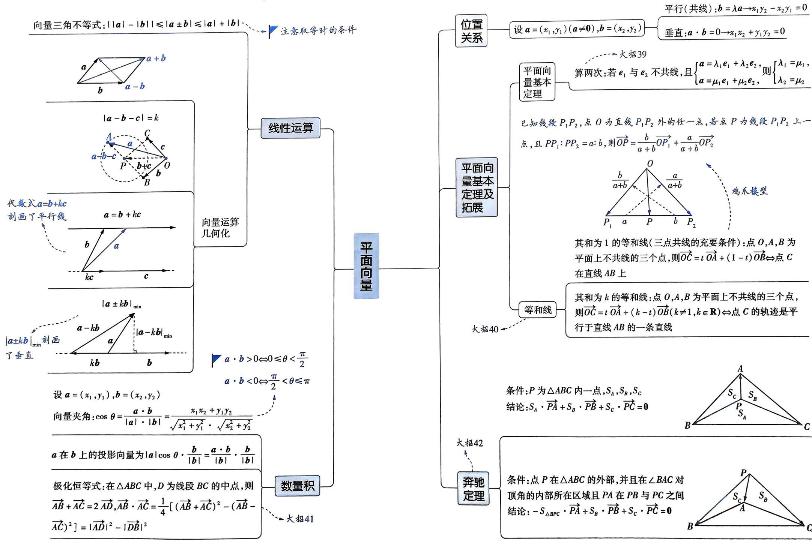

flowchart

```mermaid
graph TD
    A["向量三角不等式: ||a|-|b||≤|a±b|≤|a|+|b|"] --> B["注意取等时的条件"]
    C["线性运算"] --> D["向量运算几何化"]
    D --> E["代数式a=b+kc 刻画了平行线"]
    D --> F["|a±kb|min 刻画了垂直"]
    D --> G["|a±kb|min 刻画了垂直"]
    H["数量积"] --> I["设a=(x₁,y₁),b=(x₂,y₂)"]
    H --> J["a在b上的投影向量为|a|cosθ·b/b/b=1/4·b/b"]
    H --> K["极化恒等式: 在△ABC中, D为线段BC的中点, 则\overrightarrow{AB}+\overrightarrow{AC}=2\overrightarrow{AD},\overrightarrow{AB}\cdot\overrightarrow{AC}=\frac{1}{4}[(\overrightarrow{AB}+\overrightarrow{AC})^2-(\overrightarrow{AB}-\overrightarrow{AC})^2"]=|\overrightarrow{AD}|^2-\overrightarrow{DB}|^2]
    L["位置关系"] --> M["设a=(x₁,y₁)(a≠0),b=(x₂,y₂)"]
    L --> N["平行(共线): b=λa→x₁y₂-x₂y₁=0"]
    L --> O["垂直:a·b=0→x₁x₂+y₁y₂=0"]
    P["平面向量基本定理及拓展"] --> Q["算两次: 若e₁与e₂不共线, 且{a=λ₁e₁+λ₂e₂, a=μ₁e₁+μ₂e₂, 则{λ₁=μ₁, λ₂=μ₂}}"]
    P --> R["已知线段P₁P₂, 点O为直线P₁P₂外的任一点, 若点P为线段P₁P₂上一点, 且PP₁: PP₂=a:b, 则\overrightarrow{OP}=b/a+b\overrightarrow{OP₁}+a/a+b\overrightarrow{OP₂}"]
    P --> S["鸡爪模型"]
    T["等和线"] --> U["其和为1的等和线(三点共线的充要条件): 点O,A,B为平面上不共线的三个点, 则\overrightarrow{OC}=t\overrightarrow{OA}+(1-t)\overrightarrow{OB}\Leftrightarrow点C在直线AB上"]
    T --> V["其和为k的等和线: 点O,A,B为平面上不共线的三个点, 则\overrightarrow{OC}=t\overrightarrow{OA}+(k-t)\overrightarrow{OB}(k≠1,k∈R)⇔点C的轨迹是平行于直线AB的一条直线"]
    W["奔驰定理"] --> X["条件: P为△ABC内一点, S_A,S_B,S_C 结论: S_A·\overrightarrow{PA}+S_B·\overrightarrow{PB}+S_C·\overrightarrow{PC}=0"]
    W --> Y["条件: 点P在△ABC的外部, 并且在∠BAC对顶角的内部所在区域且PA在PB与PC之间结论: -S_{ΔBPC}·\overrightarrow{PA}+S_B·\overrightarrow{PB}+S_C·\overrightarrow{PC}=0"]
```

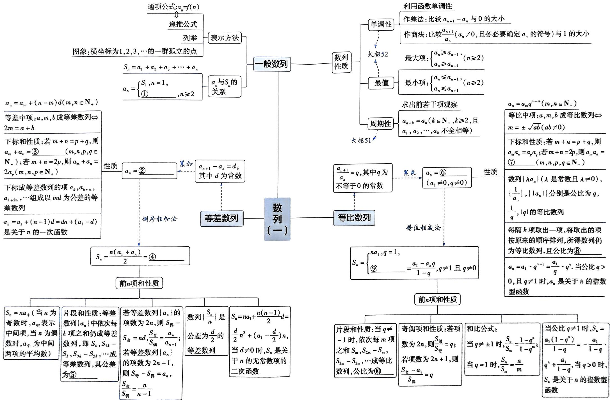

flowchart

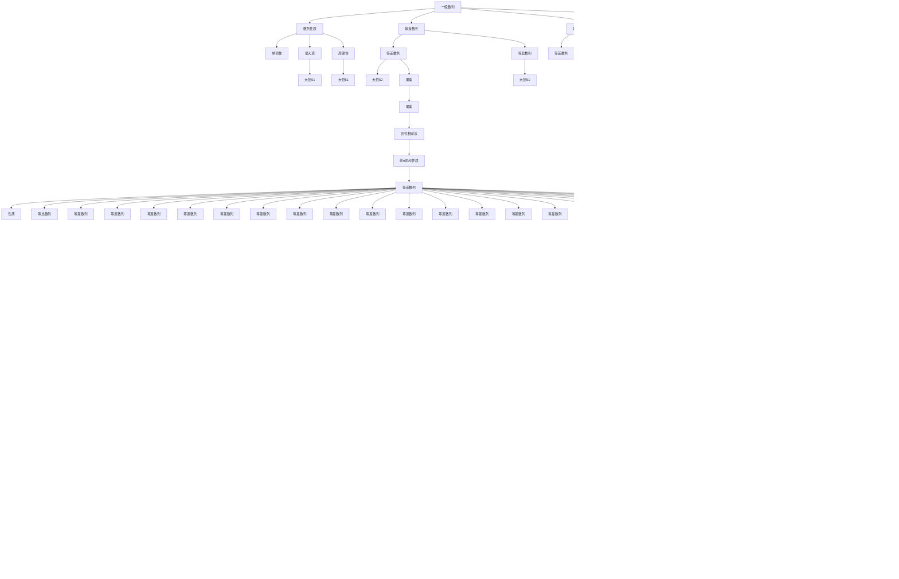
```mermaid
graph TD
    A["一般数列"] --> B["数列性质"]
    A --> C["等差数列"]
    A --> D["等比数列"]
    B --> E["单调性"]
    B --> F["最大项"]
    B --> G["周期性"]
    C --> H["等差数列"]
    C --> I["等比数列"]
    D --> J["等差数列"]
    D --> K["等比数列"]
    H --> L["大招52"]
    F --> M["大招51"]
    G --> N["大招51"]
    I --> O["大招51"]
    H --> P["累乘"]
    P --> Q["累乘"]
    Q --> R["密位相减法"]
    R --> S["前n项和性质"]

    A --> T["一般数列"]
    T --> U["表示方法"]
    T --> V["通项公式: a_n = f(n)"]
    T --> W["递推公式"]
    T --> X["列举"]
    T --> Y["图象: 横坐标为1, 2, 3, ……的一群孤立的点"]
    T --> Z["a_n 与S_n的关系"]
    Z --> AA["a_n = {S_1, n=1, ①, ..., n≥2}"]
    AA --> AB["a_n = {S_1, n=1, ①, ..., n≥2}"]
    AB --> AC["a_n = {S_1, n=1, ①, ..., n≥2}"]
    AC --> AD["a_n = {S_1, n=1, ①, ..., n≥2}"]
    AD --> AE["a_n = {S_1, n=1, ①, ..., n≥2}"]
    AE --> AF["a_n = {S_1, n=1, ①, ..., n≥2}"]
    AF --> AG["a_n = {S_1, n=1, ①, ..., n≥2}"]
    AG --> AH["a_n = {S_1, n=1, ①, ..., n≥2}"]
    AH --> AI["a_n = {S_1, n=1, ①, ..., n≥2}"]
    AI --> AJ["a_n = {S_1, n=1, ①, ..., n≥2}"]
    AJ --> AK["a_n = {S_1, n=1, ①, ..., n≥2}"]
    AK --> AL["a_n = {S_1, n=1, ①, ..., n≥2}"]
    AL --> AM["a_n = {S_1, n=1, ①, ..., n≥2}"]
    AM --> AN["a_n = {S_1, n=1, ①, ..., n≥2}"]
    AN --> AO["a_n = {S_1, n=1, ①, ..., n≥2}"]
    AO --> AP["a_n = {S_1, n=1, ①, ..., n≥2}"]
    AP --> AQ["a_n = {S_1, n=1, ①, ..., n≥2}"]
    AQ --> AR["a_n = {S_1, n=1, ①, ..., n≥2}"]
    AR --> AS["a_n = {S_1, n=1, ①, ..., n≥2}"]
    S --> AT["等差数列"]
    AT --> AU["性质"]
    AT --> AV["等比数列"]
    AT --> AW["等差数列"]
    AT --> AX["等差数列"]
    AT --> AY["等差数列"]
    AT --> AZ["等差数列"]
    AT --> BA["等差数列"]
    AT --> BB["等差数列"]
    AT --> BC["等差数列"]
    AT --> BD["等差数列"]
    AT --> BE["等差数列"]
    AT --> BF["等差数列"]
    AT --> BG["等差数列"]
    AT --> BH["等差数列"]
    AT --> BI["等差数列"]
    AT --> BJ["等差数列"]
    AT --> BK["等差数列"]
    AT --> BL["等差数列"]
    AT --> BM["等差数列"]
    AT --> BN["等差数列"]
    AT --> BO["等差数列"]
    AT --> BP["等差数列"]
    AT --> BQ["等差数列"]
```

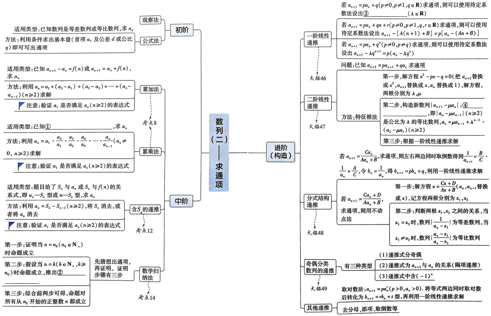

flowchart

```mermaid
graph TD
    A["数列 (二) 求通项"] --> B["初阶"]
    A --> C["中阶"]
    A --> D["进阶 (构造)"]
    
    B --> E["观察法"]
    B --> F["公式法"]
    B --> G["累加法"]
    B --> H["累乘法"]
    B --> I["含S_n的递推"]
    B --> J["数学归纳法"]
    
    C --> K["一阶线性递推"]
    C --> L["二阶线性递推"]
    C --> M["分式结构递推"]
    C --> N["奇偶分类数列的递推"]
    
    K --> O["大招46"]
    K --> P["大招47"]
    K --> Q["大招48"]
    
    L --> R["大招46"]
    L --> S["大招47"]
    
    M --> T["大招48"]
    
    N --> U["大招49"]
    
    D --> V["若 a_{n+1} = pa_n + q (p≠0, p≠1, q∈R) 求通项，则可以使用待定系数法设出③_____(λ∈R)"]
    D --> W["若 a_{n+1} = pa_n + qn + r (p≠0, p≠1, q, r∈R) 求通项，则可以使用待定系数法设出 a_{n+1} - [A(n+1) + B"] = p["a_n - (An+B)"]]
    D --> X["若 a_{n+1} = pa_n + q^n (p≠0, p≠q) 求通项，则可以使用待定系数法设出 a_{n+1} - λq^{n+1} = p(a_n - λq^n)"]
    
    P --> Y["第一步: 解方程 x² - px - q = 0 (把 a_{n+2} 替换成 x², a_{n+1} 替换成 x, a_n 替换成 1), 解方程, 两根分别为 λ, μ"]
    P --> Z["第二步: 构造新数列 {a_{n+1} - μa_n}: ④_____, 即 {a_n - μa_{n-1}} (n≥2) 是公比为 λ 的等比数列, a_n = μa_{n-1} + λ^{n-2} · (a_2 - μa_1) (n≥2)"]
    P --> AA["第三步: 根据一阶线性递推求解"]
    
    Q --> AB["第一步: 解方程 x = (Cx + Dx)/(Ax + B) (a_n, a_{n+1} 替换成 x), 记方程两根分别为 x_1, x_2"]
    Q --> AC["第二步: 判断两根 x_1, x_2 之间的关系, 当 x_1 = x_2 时, 数列 {1/(a_n - x_1)} 为等差数列, 当 x_1 ≠ x_2 时, 数列 {a_n - x_1/(a_n - x_2)} 为等比数列"]
    
    R --> AD["有三种类型"]
    R --> AE["(1) 递推式分奇偶"]
    R --> AF["(2) 递推式为 a_{n+2} 与 a_n 的关系 (隔项递推)"]
    R --> AG["(3) 递推式中含(-1)^n"]
    
    B --> AH["适用类型: 已知数列是等差数列或等比数列, 求 a_n 方法: 利用条件求出基本量 (首项 a_1 及公差 d 或公比 q) 即可写出通项"]
    B --> AI["适用类型: 已知 a_{n+1} - a_n = f(n) 或 a_{n+1} = a_n + f(n), 求 a_n 方法: 利用 a_n = a_1 + (a_2 - a_1) + (a_3 - a_2) + ... + (a_n - a_{n-1}) (n≥2) 求解"]
    B --> AJ["注意: 验证 a_1 是否满足 a_n (n≥2) 的表达式"]
    B --> AK["适用类型: 已知①_____, 求 a_n 方法: 利用 a_n = a_1 · (a_2 · (a_1) · (a_3 · (a_2) · (a_3) · ... · (a_n · (a_{n-1}) (a_n ≠ 0, n≥2) 求解"]
    B --> AK["注意: 验证 a_1 是否满足 a_n (n≥2) 的表达式"]
    
    C --> AL["含S_n的递推"]
    C --> AM["数学归纳法"]
    
    AL --> AN["考点12"]
    AL --> AO["考点14"]
    
    M --> AP["第一步: 解方程 x = (Ca_n / Aa_n + B), 求通项, 则左右两边同时取倒数得到 1/(a_{n+1}) = B / C · 1/(a_n + A/C), 令 b_n = 1/(a_n), 得 b_{n+1} = pb_n + q, 利用一阶线性递推求解"]
    
    N --> AQ["第一步: 解方程 x = (Cx + Dx)/(Ax + B) (a_n, a_{n+1} 替换成 x), 记方程两根分别为 x_1, x_2"]
    N --> AR["第二步: 判断两根 x_1, x_2 之间的关系, 当 x_1 = x_2 时, 数列 {1/(a_n - x_1)} 为等差数列, 当 x_1 ≠ x_2 时, 数列 {a_n - x_1/(a_n - x_2)} 为等比数列"]
    
    O --> AS["第一步: 解方程 x = (Cx + Dx)/(Ax + B) (a_n, a_{n+1} 替换成 x), 记方程两根分别为 x_1, x_2"]
    O --> AT["第二步: 判断两根 x_1, x_2 之间的关系, 当 x_1 = x_2 时, 数列 {1/(a_n - x_1)} 为等差数列, 当 x_1 ≠ x_2 时, 数列 {a_n - x_1/(a_n - x_2)} 为等比数列"]
    
    P --> AU["第一步: 解方程 x = (Cx + Dx)/(Ax + B) (a_n, a_{n+1} 替换成 x), 记方程两根分别为 x_1, x_2"]
    P --> AV["第二步: 判断两根 x_1, x_2 之间的关系, 当 x_1 = x_2 时, 数列 {1/(a_n - x_1)} 为等差数列, 当 x_1 ≠ x_2 时, 数列 {a_n - x_1/(a_n - x_2)} 为等比数列"]
    
    Q --> AW["第一步: 解方程 x = (Cx + Dx)/(Ax + B) (a_n, a_{n+1} 替换成 x), 记方程两根分别为 x_1, x_2"]
    Q --> AX["第二步: 判断两根 x_1, x_2 之间的关系, 当 x_1 = x_2 时, 数列 {1/(a_n - x_1)} 为等差数列, 当 x_1 ≠ x_2 时, 数列 {a_n - x_1/(a_n - x_2)} 为等比数列"]
    
    R --> AY["有三种类型"]
    R --> AZ["(2) 递推式为 a_{n+2} 与 a_n 的关系 (隔项递推)"]
    R --> BA["(3) 递推式中含(-1)^n"]
    
    B --> BB["先猜想出通项，再证明，证明步骤有三步"]
    B --> BC["第三步: 综合前两步可得，命题对所有从 n₀ 开始的正整数 n 都成立"]
    
    C --> BD["考点8"]
    C --> BE["考点8"]
    
    AD --> BF["第一步: 明证明当 n = n₀ (n₀ ∈ N₊)<br>时命题成立"]
    AD --> BG["第二步: 假设当 n = k (k ∈ N₊, k ≥ n₀) 时命题成立，推出②_____<br>第三步: 综合前两步可得，命题对所有从 n₀ 开始的正整数 n 都成立"]
    
    AE --> BH["考点10"]
    AE --> BI["考点10"]
```

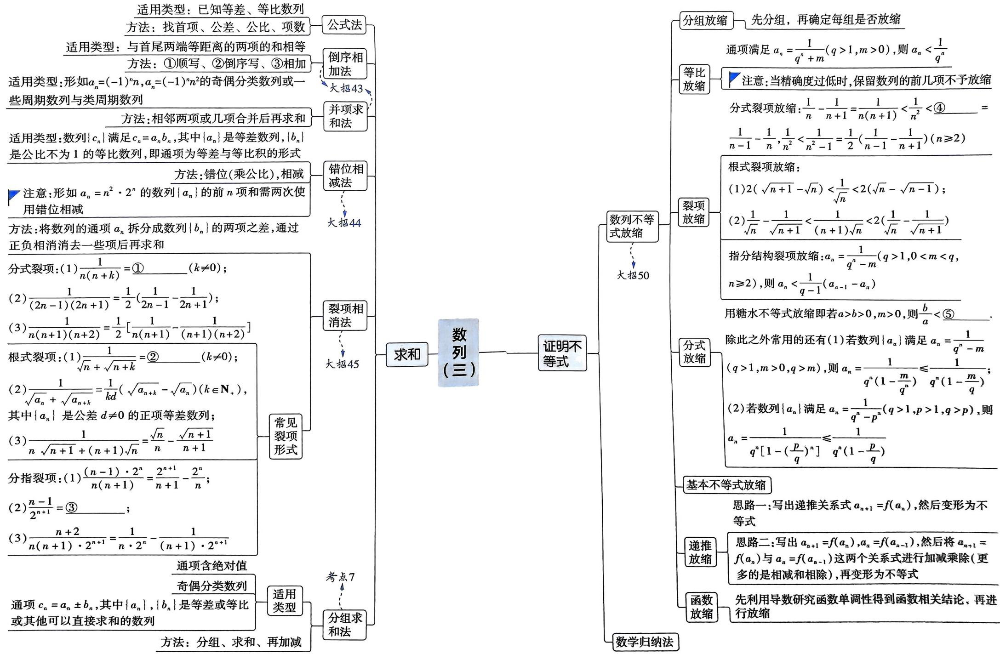

flowchart

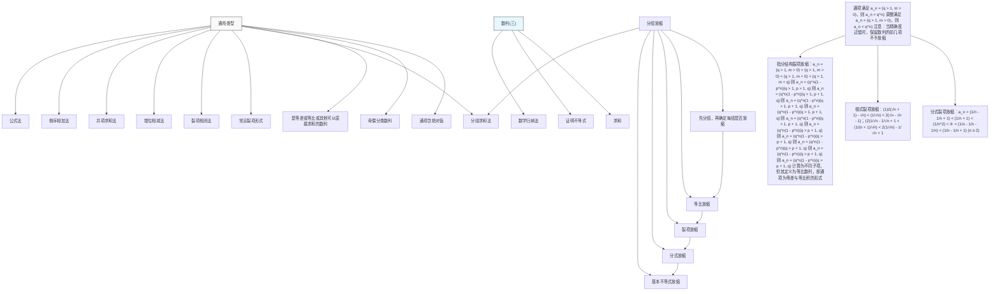
```mermaid
graph TD
    A["通用类型"] --> B["通项含绝对值"]
    A --> C["奇偶分类数列"]
    A --> D["是等差或等比或其他可以直接求和的数列"]
    A --> E["分组求和法"]
    A --> F["常见裂项形式"]
    A --> G["裂项相消法"]
    A --> H["错位相减法"]
    A --> I["并项求和法"]
    A --> J["倒序相加法"]
    A --> K["公式法"]
    
    L["数列(三)"] --> M["求和"]
    L --> N["证明不等式"]
    L --> O["数学归纳法"]
    
    P["分组放缩"] --> Q["先分组，再确定每组是否放缩"]
    P --> R["等比放缩"]
    P --> S["裂项放缩"]
    P --> T["分式放缩"]
    P --> U["基本不等式放缩"]
    
    V["通项满足 a_n = (q > 1, m > 0)，则 a_n < q^n) 调整满足 a_n = (q > 1, m > 0)，则 a_n < q^n) 注意：当精确度过低时，保留数列的前几项不予放缩"]
    V --> W["分式裂项放缩：a_n = (1/n - 1/n + 1) < (1/n + 1) < (1/n^2) < ④ = (1/n - 1/n - 1/n) < (1/n - 1/n + 1) (n ≥ 2)"]
    V --> X["根式裂项放缩：(1)2(√n + 1) - √n) < (1/√n) < 2(√n - √n - 1)；(2)1/√n - 1/√n + 1 < (1/(n + 1)/√n) < 2(1/√n) - 1/√n + 1"]
    V --> Y["指分结构裂项放缩：a_n = (q > 1, m > 0) < (q > 1, m > 0) < (q > 1, m + 0) < (q > 1, m + q) 则 a_n = (q^n(1 - p^n)(q > 1, p > 1, q) 则 a_n = (q^n(1 - p^n)(q > 1, p + 1, q) 则 a_n = (q^n(1 - p^n)(q > 1, p + 1, q) 则 a_n = (q^n(1 - p^n)(q > 1, p + 1, q) 则 a_n = (q^n(1 - p^n)(q > 1, p + 1, q) 则 a_n = (q^n(1 - p^n)(q > p + 1, q) 则 a_n = (q^n(1 - p^n)(q > p + 1, q) 则 a_n = (q^n(1 - p^n)(q > p + 1, q) 则 a_n = (q^n(1 - p^n)(q > p + 1, q) 则 a_n = (q^n(1 - p^n)(q > p + 1, q) 计算为不同子项，但其定义为等比数列，即通项为等差与等比积的形式"]
    P --> E
    Q --> R
    R --> S
    S --> T
    T --> U
    
    style A fill:#f9f9f9,stroke:#333
    style L fill:#e6f7ff,stroke:#333
```

利用平行四边形对边平行、三角形的中位线与底边平行,线线平行的传递性等平面几何知识证明

利用“线面平行→线线平行”，即根据直线与平面平行的性质定理，一条直线与一个平面平行，如果过该直线的平面与此平面相交，那么该直线与交线平行

利用“面面平行→线线平行”，即根据平面与平面平行的性质定理，两个平面平行，如果另一个平面与这两个平面相交，那么两条交线平行

利用向量,两平行线的方向向量共线

利用定义: 直线与平面没有公共点

利用线面平行的判定定理:一条线在平面内,一条线在平面外,二者平行,则线面平行

利用面面平行:两平面平行，则一个平面内的直线必定平行于另一个平面

利用向量,一般是利用直线的方向向量与平面的法向量垂直

定义法:证明两个平面没有公共点

利用“线面平行 $\Rightarrow$ 面面平行”，即根据平面与平面平行的判定定理，证明平面 $\alpha$ 内的两条相交直线 $m, l$ 分别平行于平面 $\beta$ ，如图1

转化为线线平行, 即转化为证明平面 $\alpha$ 内的两条相交直线 $m, l$ 与平面 $\beta$ 内的两条相交直线 $m_{1}, l_{1}$ 分别平行, 如图2

利用面面平行的传递性,即平行于同一个平面的两个平面平行,也就是若 $\alpha//\gamma,\beta//\gamma$ ,则 $\alpha//\beta$ ,如图3

利用向量，一般利用两平面的法向量共线

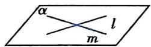

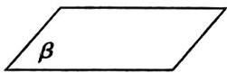  
图1

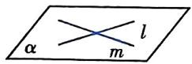

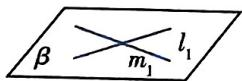  
图2

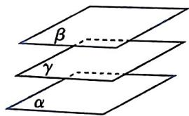

text_image

β
γ
α

图3

# 线线垂直

利用勾股定理逆定理直接证明,或利用特殊图形的性质判断

线面垂直 $\Rightarrow$ 线线垂直: $a \perp \beta$ , $b \subset \beta \Rightarrow a \perp b$ , 如图1

面面垂直⇒线面垂直⇒线线垂直: $\alpha \perp \beta, \alpha \cap \beta = l, a \subset \alpha, b \subset \beta, a \perp l \Rightarrow a \perp \beta \Rightarrow a \perp b$ , 如图2

利用平行: $a \perp b, a \parallel c \Rightarrow c \perp b$ , 如图3

三垂线定理及其逆定理: $a \subset \alpha, PA \perp \alpha, a \perp AO \Rightarrow a \perp PO; a \subset \alpha, PA \perp \alpha, a \perp PO \Rightarrow a \perp AO$ , 如图4

利用向量,两直线的方向向量垂直,对应数量积为0

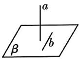  
图1

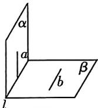  
图2

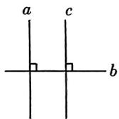  
图3

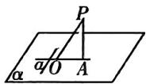  
图4

定义法： $\forall b\subset \alpha ,a\bot b\Rightarrow a\bot \alpha$

线线垂直 $\Rightarrow$ 线面垂直： $a\bot b,a\bot c,b\subset \beta ,c\subset \beta ,b\cap c = P\Rightarrow a\bot \beta$ ，如图5

面面垂直 $\Rightarrow$ 线面垂直： $\alpha \perp \beta ,\alpha \cap \beta = l,a\subset \alpha ,a\perp l\Rightarrow a\perp \beta$ ，如图6

利用线线平行: $a \perp \beta, a // b \Rightarrow b \perp \beta$ , 如图7

利用面面平行： $a\bot \alpha ,\alpha / / \beta \Rightarrow a\bot \beta$ ，如图8

利用向量,一般利用直线的方向向量与平面的法向量共线

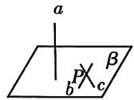  
图5

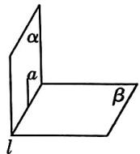  
图6

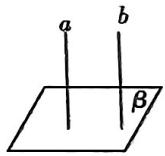  
图7

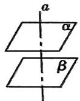  
图8

# 面面垂直

定义法: $\alpha-l-\beta=90^{\circ}\Rightarrow\alpha\perp\beta,$ 如图9

线面垂直 $\Rightarrow$ 面面垂直: $a \perp \beta, a \subset \alpha \Rightarrow \alpha \perp \beta$ , 如图10

利用面面平行: $\alpha\perp\beta,\alpha\parallel\gamma\Rightarrow\gamma\perp\beta,$ 如图11

利用线面平行: $a \perp \beta, a // \alpha \Rightarrow \alpha \perp \beta$ , 如图12

线线垂直 $\Rightarrow$ 面面垂直： $a\bot \alpha ,b\bot \beta ,a\bot b\Rightarrow \alpha \bot \beta$ ，如图13

利用向量,一般利用两平面的法向量垂直

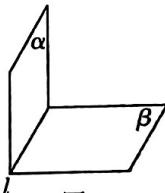  
图9

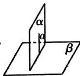  
图10

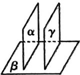  
图11

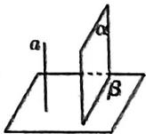  
图12

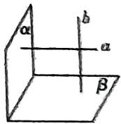  
图13

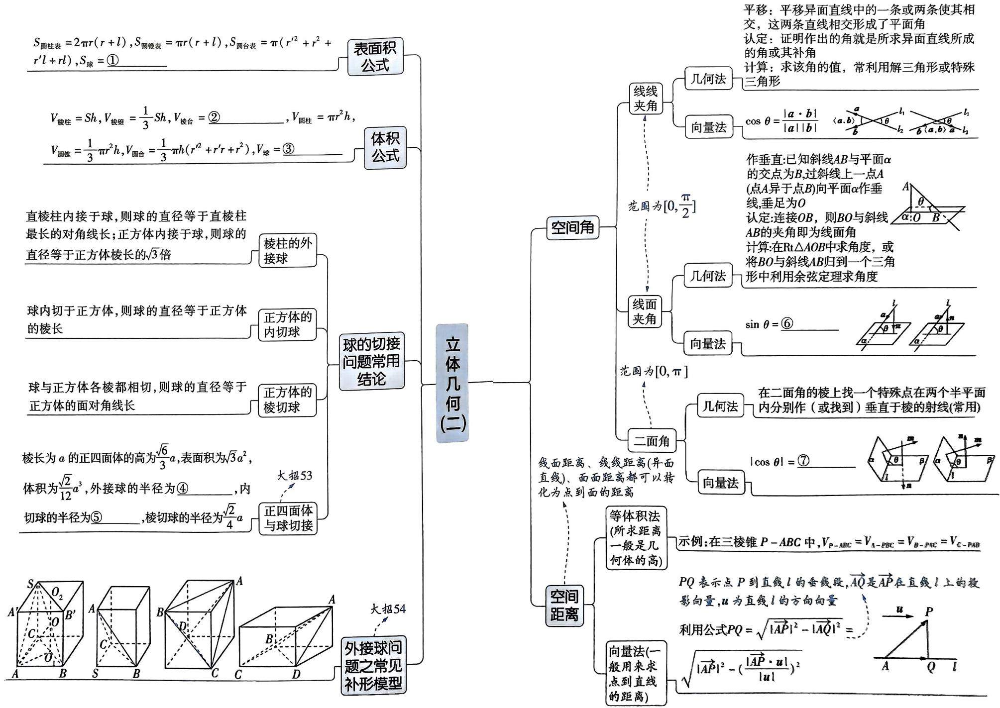

flowchart

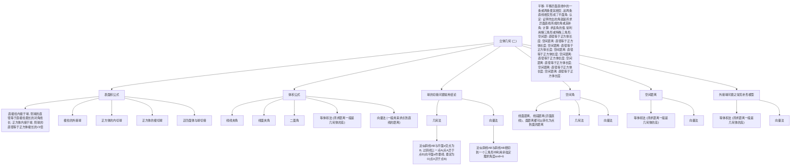
```mermaid
graph TD
    A["立体几何 (二)"] --> B["表面积公式"]
    A --> C["体积公式"]
    A --> D["球的切接问题常用结论"]
    A --> E["空间角"]
    A --> F["空间距离"]
    A --> G["外接球问题之常见补形模型"]

    B --> B1["直棱柱内接于球, 则球的直径等于直棱柱最长的对角线长; 正方体内接于球, 则球的直径等于正方体棱长的√3倍"]
    B --> B2["棱柱的外接球"]
    B --> B3["正方体的内切球"]
    B --> B4["正方体的棱切球"]
    B --> B5["正四面体与球切接"]

    C --> C1["线线夹角"]
    C --> C2["线面夹角"]
    C --> C3["二面角"]
    C --> C4["等体积法 (所求距离一般是几何体的高)"]
    C --> C5["向量法 (一般用来求点到直线的距离)"]
    
    D --> D1["几何法"]
    D --> D2["向量法"]
    D1 --> D1a["近似斜线AB与平面α交点为B, 过斜线上一点A(点A异于点B)向平面α作垂线, 垂足为O(点A异于点B)"]
    D2 --> D2a["近似斜线AB与斜线AB相切到一个三角形中利用余弦定理求角度sinθ=6"]
    
    E --> E1["线面距离、线段距离(异面直线)、面距离都可以转化为点到面的距离"]
    E --> E2["几何法"]
    E --> E3["向量法"]
    
    F --> F1["等体积法 (所求距离一般是几何体的高)"]
    F --> F2["向量法"]
    
    G --> G1["等体积法 (所求距离一般是几何体的高)"]
    G --> G2["向量法"]
    
    H["平移: 平移异面直线中的一条或两条使其相交, 这两条直线相交形成了平面角; 认定: 证明作出的角就是所求异面直线所成的角或其补角; 计算: 求该角的值, 常利用解三角形或特殊三角形; 空间距: 直径等于正方体长度; 空间距离: 直径等于正方体长度; 空间距离: 直径等于正方体长度; 空间距离: 直径等于正方体长度; 空间距离: 直径等于正方体长度; 空间距离: 直径等于正方体长度; 空间距离: 直径等于正方体长度; 空间距离: 直径等于正方体长度."]
```

# 专题十

# 直线与圆

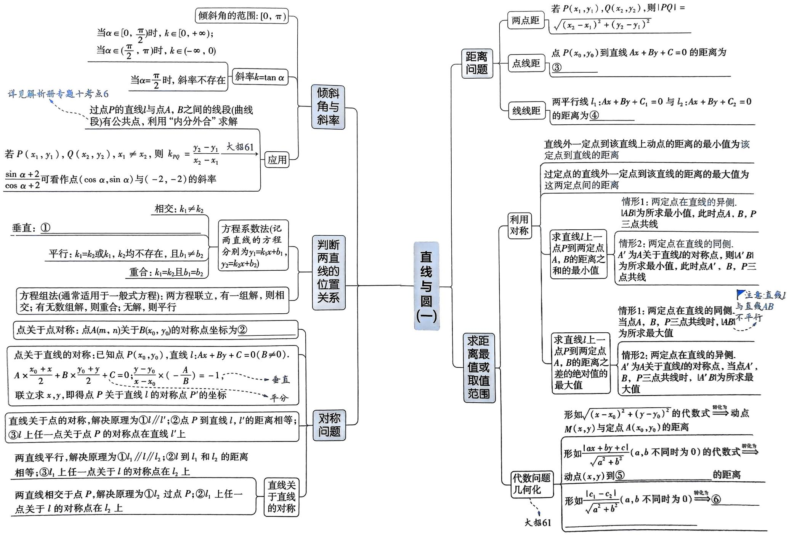

flowchart

```mermaid
graph TD
    A["直线与圆(一)"] --> B["倾斜角与斜率"]
    A --> C["判断两直线的位置关系"]
    A --> D["求距离最值或取值范围"]
    A --> E["对称问题"]
    A --> F["代数问题几何化"]
    
    B --> G["倾斜角的范围: [0, π)"]
    B --> H["斜率k=tan α"]
    H --> I["当α ∈ [0, π/2)时, k ∈ [0, +∞); 当α ∈ (π/2, π)时, k ∈ (-∞, 0)"]
    B --> J["应用"]
    J --> K["详见解析册专题+考点6"]
    K --> L["过点P的直线l与点A, B之间的线段(曲线段)有公共点, 利用“内分外合”求解"]
    J --> M["若P(x₁,y₁), Q(x₂,y₂), x₁ ≠ x₂, 则 kₚq = y₂ - y₁ / (x₂ - x₁) 大招61"]
    M --> N["sin α + 2 / cos α + 2 可看作点(cos α, sin α)与(-2, -2)的斜率"]
    C --> O["垂直: ①"]
    C --> P["相交: k₁ ≠ k₂"]
    C --> Q["平行: k₁=k₂或k₁, k₂均不存在, 且b₁≠b₂"]
    C --> R["重合: k₁=k₂且b₁=b₂"]
    C --> S["方程组法(通常适用于一般式方程): 两方程联立, 有一组解, 则相交; 有无数组解, 则重合; 无解, 则平行"]
    C --> T["点关于点对称: 点A(m, n)关于B(x₀, y₀)的对称点坐标为②"]
    C --> U["点关于直线的对称: 已知点P(x₀,y₀), 直线l: Ax + By + C = 0 (B≠0). A × (x₀ + x)/2 + B × (y₀ + y)/2 + C = 0; y - y₀/x - x₀ × (-A/B) = -1; 垂直联立求x, y, 即得点P关于直线l的对称点P'的坐标"]
    C --> V["直线关于点的对称, 解决原理为①l//l'; ②点P到直线l, l'的距离相等; ③l上任一点关于点P的对称点在直线l'上"]
    C --> W["两直线平行, 解决原理为①l₁//l/l₂; ②l到l₁和l₂的距离相等; ③l₁上任一点关于l的对称点在l₂上"]
    C --> X["两直线相交于点P, 解决原理为①l₂过点P; ②l₁上任一点关于l的对称点在l₂上"]
    
    B --> Y["距离问题"]
    Y --> Z["两点距"]
    Y --> AA["点线距"]
    Y --> AB["线线距"]
    Y --> AC["利用对称"]
    AC --> AD["求直线l上一点P到两定点A, B的距离之和的最小值"]
    AC --> AE["求直线l上一点P到两定点A, B的距离之差的绝对值的最大值"]
    
    B --> AF["直线外一定点到该直线上动点的距离的最小值为该定点到直线的距离"]
    B --> AG["过定点的直线外一定点到该直线的距离的最大值为这两定点间的距离"]
    
    AF --> AH["情形1: 两定点在直线的异侧. lABl为所求最小值, 此时点A, B, P三点共线"]
    AF --> AI["情形2: 两定点在直线的同侧. A'为A关于直线l的对称点, 则la'Bi为所求最小值, 此时点A', B, P三点共线"]
    AF --> AJ["情形1: 两定点在直线的同侧. 当点A, B, P三点共线时, lABl为所求最大值"]
    AF --> AK["注意: 直线j与直线AB不平行"]
    
    B --> AL["代数问题几何化"]
    AL --> AM["形如√(x-x₀)² + (y-y₀)² 的代数式 转化为 动点M(x,y)与定点A(x₀,y₀)的距离"]
    AL --> AN["形如 |ax + by + cl / √(a² + b²) (a,b 不同时为0) 的代数式 转化为 动点(x,y)到⑤ 的距离"]
    AL --> AO["形如 |c₁ - c₂| / √(a² + b²) (a,b 不同时为0) 转化为 ⑥ 大招61"]
```

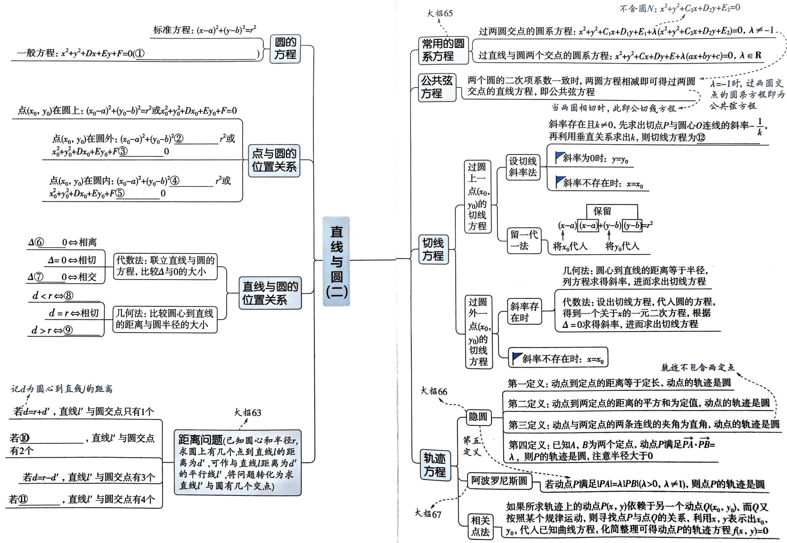

flowchart

```mermaid
graph TD
    A["直线与圆(二)"] --> B["点与圆的位置关系"]
    A --> C["直线与圆的位置关系"]
    A --> D["切线方程"]
    A --> E["轨迹方程"]
    A --> F["相关点法"]
    
    B --> G["点(x₀, y₀)在圆上: (x₀-a²+(y₀-b)²=r²或x₀²+y₀²+Dx₀+Ey₀+F=0"]
    B --> H["点(x₀, y₀)在圆外: (x₀-a²+(y₀-b)²② r²或x₀²+y₀²+Dx₀+Ey₀+F③ 0"]
    B --> I["点(x₀, y₀)在圆内: (x₀-a²+(y₀-b)²④ r²或x₀²+y₀²+Dx₀+Ey₀+F⑤ 0"]
    B --> J["几何法: 比较圆心到直线的距离与圆半径的大小"]
    
    C --> K["过圆上一点(x₀,y₀)的切线方程"]
    C --> L["过圆外一点(x₀,y₀)的切线方程"]
    C --> M["近圆斜率存在时"]
    C --> N["近圆斜率不存在时: x=x₀"]
    
    D --> O["一般方程: x²+y²+Dx+Ey+F=0(①)"]
    D --> P["标准方程: (x-a²+(y-b)²=r²)"]
    
    D --> Q["二次项系数一致时, 两圆方程相减即可得过两圆交点的直线方程, 即公共弦方程"]
    D --> R["斜率存在且k≠0, 先求出切点P与圆心O连线的斜率-1/k, 再利用垂直关系求出k, 则切线方程为⑫"]
    
    E --> S["第一定义: 动点到定点的距离等于定长, 动点的轨迹是圆"]
    E --> T["第二定义: 动点到两点的距离的平方和为定值, 动点的轨迹是圆"]
    E --> U["第三定义: 动点与两点的两条连线的夹角为直角, 动点的轨迹是圆"]
    E --> V["第四定义: 已知A, B为两个定点, 动点P满足PA·PB=λ, 则P的轨迹是圆, 注意半径大于0"]
    
    F --> W["若d=r+d', 直线l'与圆交点只有1个"]
    F --> X["若⑩_____, 直线l'与圆交点有2个"]
    F --> Y["若d=r-d', 直线l'与圆交点有3个"]
    F --> Z["若⑪_____, 直线l'与圆交点有4个"]
    
    A --> AA["大招63"]
    A --> AB["记d为圆心到直线l的距离"]
    
    AC["大招65"] --> AD["不含圆N: x²+y²+C₂x+D₂y+E₂=0"]
    AC --> AE["常用圆系方程"]
    AC --> AF["公共弦方程"]
    
    AG["近两圆交点的圆系方程"] --> AH["x²+y²+C₁x+D₁y+E₁+λ(x²+y²+C₂x+D₂y+E₂)=0, λ≠-1"]
    AG --> AI["x²+y²+Cₓ+Dᵧ+E+λ(ax+by+c)=0, λ∈R"]
    
    AJ["过直线与圆两个交点的圆系方程"] --> AK["x²+y²+Cₓ+Dᵧ+E+λ(ax+by+c)=0, λ∈R"]
    
    AL["两个圆的二次项系数一致时, 两圆方程相减即可得过两圆交点的直线方程, 即公共弦方程"] --> AM["当两圆相切时, 此即公切线方程"]
    
    AN["斜率存在且k≠0, 先求出切点P与圆心O连线的斜率-1/k, 再利用垂直关系求出k, 则切线方程为⑫"] --> AO["斜率为0时: y=y₀"]
    AN --> AP["斜率不存在时: x=x₀"]
    
    AQ["过圆外一点(x₀,y₀)的切线方程"] --> AR["留一代一法"]
    AR --> AS["(x-a)(x-a)+(y-b)(y-b)=²"]
    AR --> AT["将x₀代入 将y₀代入"]
    
    AU["几何法: 圆心到直线的距离等于半径, 列方程求得斜率, 进而求出切线方程"] --> AV["代数法: 设出切线方程, 代入圆的方程, 得到一个关于x的一元二次方程, 根据Δ=0求得斜率, 进而求出切线方程"]
    
    AW["斜率不存在时: x=x₀"] --> AX["斜率不存在时: x=x₀"]
    
    AY["大招66"] --> AZ["轨迹不包含两定点"]
    
    BA["大招67"] --> BB["阿波罗尼斯圆"]
    BA --> BC["第五定义: 若动点P满足IPAI=λIPBI(λ>0, λ≠1), 则点P的轨迹是圆"]
    BA --> BD["相关点法: 如果所求轨迹上的动点P(x,y)依赖于另一个动点Q(x₀,y₀), 而Q又按照某个规律运动, 则寻找点P与点Q的关系, 利用x,y表示出x₀,y₀, 代入已知曲线方程, 化简整理可得动点P的轨迹方程f(x,y)=0"]
```

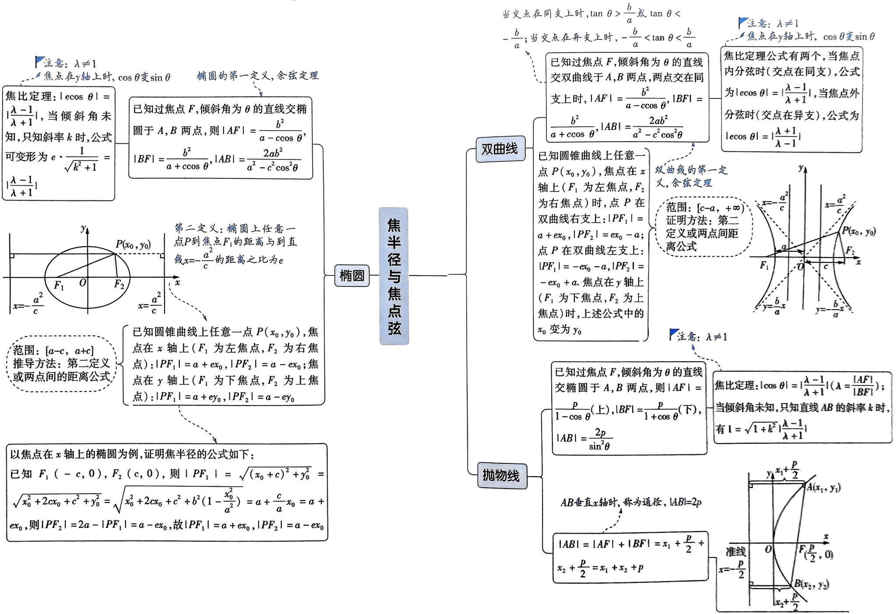

flowchart

```mermaid
graph TD
    A["椭圆"] --> B["焦半径与焦点弦"]
    B --> C["双曲线"]
    C --> D["抛物线"]
    D --> E["焦比定理: |e cos θ| = |λ - 1/λ + 1|, 当倾斜角未知, 只知斜率 k 时, 公式可变形为 e · (1/√(k² + 1) = |λ - 1/λ + 1|)"]
    A --> F["椭圆的第一定义: 焦点在y轴上时, cos θ变sin θ"]
    F --> G["焦比定理: λ ≠ 1"]
    G --> H["已知过焦点F, 倾斜角为θ的直线交椭圆于A, B两点, 则|AF| = (b²/a - c cos θ), |BF| = (a + c cos θ), |AB| = (2ab²/a² - c²cos²θ)"]
    H --> I["第二定义: 椭圆上任意一点P到焦点F₁的距离与到直线x = a²/c 的距离之比为e"]
    I --> J["范围: [a-c, a+c"]
    J --> K["推导方法: 第二定义或两点间的距离公式"]
    K --> L["已知圆锥曲线上任意一点P(x₀, y₀), 焦点在x轴上(F₁为左焦点, F₂为右焦点): |PF₁| = a + ex₀, |PF₂| = a - ex₀; 焦点在y轴上(F₁为下焦点, F₂为上焦点): |PF₁| = a + ey₀, |PF₂| = a - ey₀"]
    A --> M["被抛物线"]
    M --> N["已知过焦点F, 倾斜角为θ的直线交椭圆于A, B两点, 则|AF| = (p/1 - cos θ)(上), |BF| = (p/1 + cos θ)(下), |AB| = (2p/sin²θ)"]
    N --> O["焦比定理: |cos θ| = (λ - 1/λ + 1)(λ = |AF|)/(BF)"]
    O --> P["当倾斜角未知, 只知直线AB的斜率k时, 有1 = √(1 + k²)|(λ - 1/λ + 1)|"]
    M --> Q["AB垂直x轴时, 称为通程, |AB|=2p"]
    M --> R["|AB| = |AF| + |BF| = x₁ + p/2 + x₂ + p/2 = x₁ + x₂ + p"]
    R --> S["准线: x = -p/2"]
    S --> T["y₁ x₁ + p/2"]
    S --> U["x = a²/c"]
    S --> V["x = b/a"]
    S --> W["x = b/a"]
    S --> X["x = b/a"]
    S --> Y["x = b/a"]
    S --> Z["x = b/a"]
    S --> AA["x = b/a"]
```

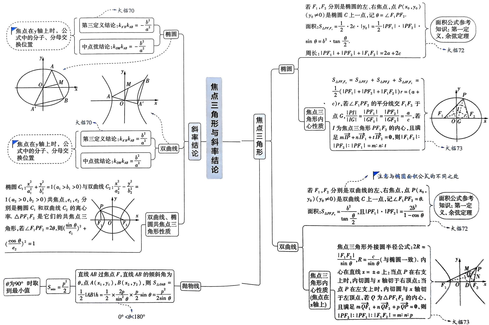

flowchart

```mermaid
graph TD
    A["焦点三角形"] --> B["焦点三角形与斜率结论"]
    B --> C["椭圆"]
    B --> D["双曲线"]
    B --> E["抛物线"]
    
    C --> F["第三定义结论: k_{A'B}k_{AB} = -b²/a²"]
    C --> G["中点弦结论: k_{OM}k_{AB} = -b²/a²"]
    
    F --> H["焦点在y轴上时, 公式中的分子、分母交换位置"]
    G --> I["双曲线"]
    D --> J["焦点三角形与斜率结论"]
    J --> K["椭圆"]
    J --> L["焦点三角形内心性质"]
    L --> M["双曲线"]
    L --> N["抛物线"]
    
    M --> O["若F₁,F₂分别是椭圆的左、右焦点,点P(x₀,y₀)(y₀≠0)是椭圆C上一点,记θ=∠F₁PF₂."]
    M --> P["面积:S_△PF,F₁ = ½·2c·|y₀| = ½|PF₁|·|PF₂|·sin θ = b²·tan θ/2."]
    M --> Q["周长: |PF₁| + |PF₂| + |F₁F₂| = 2a + 2c"]
    
    N --> R["若F₁,F₂分别是双曲线的左、右焦点,点P(x₀,y₀)(y₀≠0)是双曲线C上一点,记θ=∠F₁PF₂."]
    N --> S["面积: ∠PF₁F₁ = ∠PF₂F₁ + ∠PF₁F₂F₁ = ∠PF₂F₁F₁F₁F₁F₁F₁F₁F₁F₁F₁F₁F₁F₁F₁F₁F₁F₁F₁F₁F₁F₁F₁F₁F₁F₁F₁F₁F₁F₁F₁F₁F₁F₁F₁F₁F₁F₁F₁F₁F₁F₁F₁F₁F₁F₁F₁F₁F₁F₁F₁F₃"]
    R --> T["注意与椭圆面积公式的不同之处"]
    
    D --> U["第三定义结论: k_{A'B}k_{AB} = b²/a²"]
    D --> V["中点弦结论: k_{OM}k_{AB} = b²/a²"]
    
    U --> W["椭圆C₁: x²/a² + y²/b² = 1(a₂ > b₁ > 0)与双曲线C₂: x²/a² - y²/b² = 1(a₂ > 0, b₂ > 0)共焦点,e₁,e₂分别是椭圆C₁和双曲线C₂的离心率. ΔPF₁F₂是它们的共焦点三角形,若∠F₁PF₂ = 2θ,则( sinθ/e₁ )² + ( cosθ/e₂ )² = 1 "]
    V --> X["双曲线、椭圆共焦点三角形性质"]
    
    E --> Y["焦点三角形内心性质"]
    Y --> Z["焦点三角形外接圆半径公式: 2R = |F₁F₂|/sin θ, R = c/sin θ (与椭圆一致). 内心在直线x = ±a上; 当点P在右支上时, 内切圆与x轴切于右顶点; 当点P在左支上时, 内切圆与x轴切于左顶点, 若Q为△PF₁F₂的内心,且满足mQ̅F₁ + nQ̅F₂ + pQ̅F₂ = 0, 则|PF₂| : |PF₁| : |F₁F₂| = m:n:p"]
```

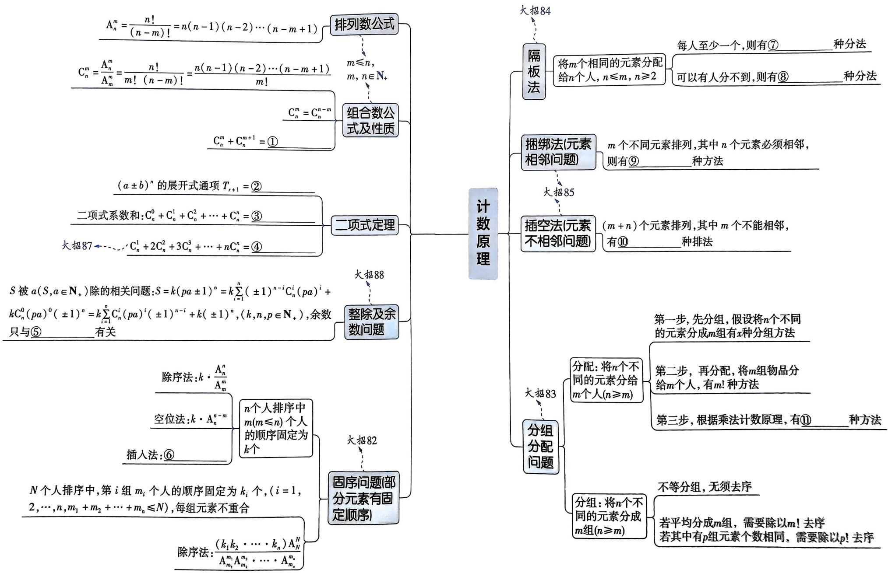

flowchart

```mermaid
graph TD
    A["计数原理"] --> B["排列数公式"]
    A --> C["组合数公式及性质"]
    A --> D["二项式定理"]
    A --> E["整除及余数问题"]
    A --> F["固序问题(部分元素有固定顺序)"]
    
    B --> G["A_n^m = (n!)/(n-m)! = n(n-1)(n-2)…(n-m+1)"]
    B --> H["C_n^m = A_n^m / A_m^m = m!/(n-m)! = n(n-1)(n-2)…(n-m+1)/m!"]
    B --> I["C_n^m = C_n^{n-m}"]
    B --> J["C_n^m + C_n^{m+1} = ①"]
    
    C --> K["(a±b)^n 的展开式通项 T_r+1 = ②"]
    C --> L["二项式系数和: C_n^0 + C_n^1 + C_n^2 + ⋯ + C_n^n = ③"]
    C --> M["大招87 ← ∽C_n^1 + 2C_n^2 + 3C_n^3 + ⋯ + nC_n^n = ④"]
    
    D --> N["S 被 a(S, a∈N+)除的相关问题: S=k(pa±1)^n=k∑_{i=1}^n(±1)^{n-i}C_i^i(pa)^i+kC_n^0(pa)^0(±1)^n=k∑_{i=1}^nC_i^i(pa)^i(±1)^{n-i}+k(±1)^n,(k,n,p∈N+),余数只与⑤______有关"]
    
    E --> O["除序法: k·A_n^n / A_m^n"]
    E --> P["空位法: k·A_n^{n-m}"]
    E --> Q["插入法: ⑥"]
    
    F --> R["n个人排序中 m(m≤n) 个人的顺序固定为 k个"]
    F --> S["N 个人排序中,第 i 组 m_i 个人的顺序固定为 k_i 个,(i=1,2,...,n,m_1+m_2+...+m_n≤N),每组元素不重合"]
    F --> T["除序法: (k_1k_2·····k_n)A_N^m / A_m^n A_m^n ····· A_m^n"]
    
    A --> U["隔板法"]
    U --> V["将m个相同的元素分配给n个人, n≤m, n≥2"]
    U --> W["每人至少一个,则有⑦ 种分法"]
    U --> X["可以有人分不到,则有⑧ 种分法"]
    
    A --> Y["捆绑法(元素相邻问题)"]
    Y --> Z["m个不同元素排列,其中n个元素必须相邻,则有⑨ 种方法"]
    
    A --> AA["插空法(元素不相邻问题)"]
    AA --> AB["(m+n)个元素排列,其中m个不能相邻,有⑩ 种排法"]
    
    A --> AC["分组分配问题"]
    AC --> AD["分配: 将n个不同的元素分给m个人(n≥m)"]
    AC --> AE["第二步,再分配,将m组物品分给m个人,有m!种方法"]
    AC --> AF["第三步,根据乘法计数原理,有⑪ 种方法"]
    
    AC --> AG["分组: 将n个不同的元素分成m组(n≥m)"]
    AG --> AH["不等分组,无须去序"]
    AG --> AI["若平均分成m组,需要除以m!去序"]
    AG --> AJ["若其中有p组元素个数相同,需要除以p!去序"]
```

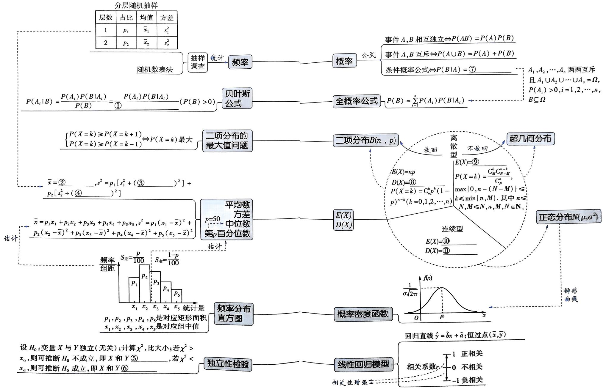

flowchart

```mermaid
graph TD
    A["分层随机抽样"] --> B["随机数表法"]
    B --> C["抽样调查"]
    C --> D["频率"]
    D --> E["概率"]
    E --> F["公式"]
    F --> G["事件A,B相互独立L P(AB)=P(A)P(B)"]
    F --> H["事件A,B互斥L P(A∪B)=P(A)+P(B)"]
    F --> I["条件概率公式L P(B|A)=⑦"]
    I --> J["A₁,A₂,…,Aₙ两两互斥且A₁∪A₂∪…∪Aₙ=Ω, P(Aᵢ)>0,i=1,2,…,n, B⊆Ω"]
    D --> K["贝叶斯公式"]
    K --> L["全概率公式"]
    L --> M["P(B)=∑_{i=1}^{n}P(A_i)P(B|A_i)"]
    M --> N["二项分布的最大值问题"]
    N --> O["二项分布B(n,p)"]
    O --> P["离散型: E(X)=9, P(X=k)=C_M^k C_N^-k, max{0,n-(N-M)}≤k≤min{n,M}.其中n≤N,M≤N,n,M,N∈N."]
    O --> Q["超几何分布"]
    Q --> R["连续型: E(X)=⑩, D(X)=⑪"]
    R --> S["正态分布N(μ,σ²)"]
    S --> T["钟形曲线"]
    O --> U["平均数方差中位数第p百分位数"]
    U --> V["E(X)D(X)"]
    V --> W["频率分布直方图"]
    W --> X["频率密度函数"]
    X --> Y["f(x)"]
    Y --> Z["1/σ/2π"]
    Z --> AA["O μ x"]
    W --> AB["独立性检验"]
    AB --> AC["线性回归模型"]
    AC --> AD["回归直线ŷ=ˆb×+ˆa;恒过点(ˆx,ˆy)"]
    style A fill:#f9f,stroke:#333
    style B fill:#ccf,stroke:#333
    style D fill:#cfc,stroke:#333
    style E fill:#cfc,stroke:#333
    style F fill:#cfc,stroke:#333
    style L fill:#cfc,stroke:#333
    style Q fill:#cfc,stroke:#333
    style R fill:#cfc,stroke:#333
    style S fill:#cfc,stroke:#333
    style T fill:#fcc,stroke:#333
    style U fill:#fcc,stroke:#333
    style V fill:#fcc,stroke:#333
    style W fill:#fcc,stroke:#333
    style X fill:#fcc,stroke:#333
    style Y fill:#fcc,stroke:#333
    style Z fill:#fcc,stroke:#333
    style AA fill:#fcc,stroke:#333
    style AB fill:#fcc,stroke:#333
```

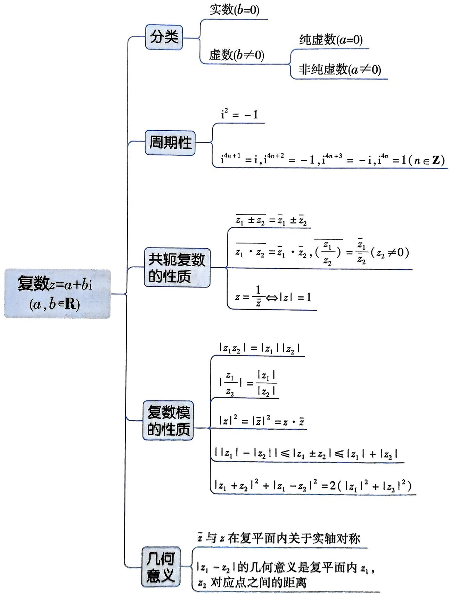

flowchart

```mermaid
graph TD
    A["复数z=a+bi (a, b∈R)"] --> B["分类"]
    B --> C["实数(b=0)"]
    B --> D["虚数(b≠0)"]
    D --> E["纯虚数(a=0)"]
    D --> F["非纯虚数(a≠0)"]
    A --> G["周期性"]
    G --> H["i² = -1"]
    H --> I["i⁴n+1 = i, i⁴n+2 = -1, i⁴n+3 = -i, i⁴n = 1 (n ∈ Z)"]
    A --> J["共轭复数的性质"]
    J --> K["共轭复数的性质"]
    K --> L["|z₁±z₂ = z̄₁ ± z̄₂"]
    K --> M["|z₁·z₂ = z̄₁ · z̄₂, (z̄₁/z₂) = z̄₁/z̄₂ (z₂ ≠ 0)"]
    K --> N["z = 1/¯z ⇔ |z| = 1"]
    A --> O["复数模的性质"]
    O --> P{|z₁z₂| = |z₁||z₂|
|    P --> Q["|z₁|² = |¯z|² = z ·¯z"]
    P --> R{|z₁| - |z₂|| ≤ |z₁ ± z₂| ≤ |z₁| + |z₂|
|    R --> S{|z₁ + z₂|² + |z₁ - z₂|² = 2(|z₁|² + |z₂|²)}]
    A --> T["几何意义"]
    T --> U["|z̄_1 - z₂| 的几何意义是复平面内 z₁, z₂ 对应点之间的距离"]
    A --> V["复数模的性质"]
    V --> W["复数模的性质"]
```

# 答案

# 专题一 集合 & 专题二 基本不等式

P01:①B ②B ③A ④A ⑤\$\supseteq\$ ⑥\$\supseteq\$ ⑦\$2^{n}\$ ⑧\$2^{n}-1\$ ⑨\$2^{n}-1\$ ⑩\$2^{n}-2\$

⑪ $\sqrt{\frac{a^{2}+b^{2}}{2}}$ ⑫大 ⑬小 ⑭ $(ac+bd)^{2}$ ⑮ $\frac{(a+b)^{2}}{x+y}$

# 专题三 函数

P04 - P05: ①2 | a - b | ②2 | a - b | ③ 4 | a - b | ④非奇非偶 ⑤奇 ⑥偶

P06 - P07 : ① $\sqrt[n]{a^m}$ ② $a^{r+s}$ ③ $a^rb^r$ ④ $N$ ⑤ $\log_a M - \log_a N$ ⑥1 ⑦ $\frac{n}{m} \log_a b$

# 专题四 导数

P08 - P09: ① - sin x ② $\frac{1}{x\ln a}$ ③ $a^x\ln a$ ④ $\frac{f'(x)g(x) - f(x)g'(x)}{[g(x)]^2}$ ⑤ $f'(x) > 0$

⑥减 ⑦充分不必要 ⑧确定函数的定义域 ⑨ $f'(x_{0})=0$

P10 - P11: ① $e^{\ln x} = \ln e^{x}$ ② $\geqslant$ ③ $\leqslant$ ④ $g(x)_{\min} > h(x)_{\max}$ ⑤ $\lim_{x \to a} \frac{f'(x)}{g'(x)}$

⑥ $x_{1}>x_{2}$ ⑦ $x_{1}<x_{2}$

P12 - P13: ① $f'(a) \geqslant 0$ ② $f''(x_0) \leqslant 0$ ③ $2x_0$ ④ $f(x) - f(\frac{x_0^2}{x})$ ⑤ $f(x) + f(2m - x)$

P14:① $e^{x}>\frac{x^{2}}{4}$ ②取倒数 ③ $e^{x}$ ④ $\ln x\leqslant x-1(x>0)$ ⑤ $\frac{1}{n+1}<\ln(n+1)-$ $\ln n$

P15:① $\frac{x_1 - x_2}{\ln x_1 - \ln x_2} >\sqrt{x_1x_2}$ ② $\sqrt{x}$ ③ $\frac{x_1 - x_2}{\ln x_1 - \ln x_2} < \frac{x_1 + x_2}{2}$ ④ $\ln (1 + \frac{1}{n}) > \frac{2}{2n + 1}$

# 专题五 三角函数

P16 - P17: ① $\frac{\sin \alpha}{\cos \alpha}$ ② $\frac{\tan^2\theta - 2}{\tan^2\theta + 1}$ ③ $\cos^2\alpha - \sin^2\alpha$ ④ $(\frac{\pi}{4} - \alpha)$ ⑤ $\frac{\sqrt{2}}{2}$

⑥ $\sqrt{a^2 + b^2}\sin (x + \varphi)$ ⑦ $\omega x + \varphi$ ⑧ $x\neq \frac{\pi}{2} +k\pi (k\in \mathbf{Z})$ ⑨ $\left|\frac{1}{\omega}\right|$ ⑩ $\left|\frac{\varphi}{\omega}\right|$

P18 - P19: ① $2x + \frac{\pi}{3}$ ② $k\pi$ ③ $\frac{\pi}{2} + k\pi$ ④ $2k\pi + \frac{\pi}{2} \leqslant t \leqslant 2k\pi + \frac{3\pi}{2}$ ⑤ $\frac{k\pi}{2}$

⑥ $2k\pi \pm \frac{\pi}{2}$ ⑦ $\sin x$ ⑧ $\frac{t^{2}-1}{2}$ ⑨ $(-d,-b)$

# 专题六 解三角形

P20 - P21: ① $\sin A + \sin B$ ②等腰或直角 ③ $a\cos C + c\cos A$ ④ $-\cos A$

⑤cos $\frac{A}{2}$ ⑥sin A > cos B ⑦2bc(1 + cos A) ⑧ $\frac{2AC \cdot AB\cos \alpha}{AC + AB}$

# 专题八 数列

P24 - P25: ① $S_{n} - S_{n-1}$ ② $a_{1} + (n-1)d$ ③ $a_{p} + a_{q}$ ④ $na_{1} + \frac{n(n-1)}{2}d$ ⑤ $k^{2}d$

⑥ $a_{1}q^{n-1}$ ⑦ $a_{p}^{2}$ ⑧ $q^{k+1}$ ⑨ $\frac{a_{1}(1-q^{n})}{1-q}$ ⑩ $q^{m}$

P26 - P27: ① $\frac{a_{n+1}}{a_n} = f(n)$ (或 $a_{n+1} = f(n)a_n$ ) ② 当 $n = k + 1$ 时命题也成立

③ $a_{n+1}-\lambda=p(a_{n}-\lambda)$ ④ $a_{n+2}-\mu a_{n+1}=\lambda(a_{n+1}-\mu a_{n})$

P28-P29:① $\frac{1}{k} (\frac{1}{n} -\frac{1}{n + k})$ ② $\frac{1}{k} (\sqrt{n + k} -\sqrt{n})$ ③ $\frac{n}{2^n} -\frac{n + 1}{2^{n + 1}}$ ④ $\frac{1}{n(n - 1)}$

⑤ $\frac{b + m}{a + m}$

# 专题九 立体几何

P32 - P33: ① $4\pi R^{2}$ ② $\frac{1}{3} h(S' + \sqrt{S'S} + S)$ ③ $\frac{4}{3}\pi R^{3}$ ④ $\frac{\sqrt{6}}{4} a$ ⑤ $\frac{\sqrt{6}}{12} a$

⑥ $\frac{|a\cdot n|}{|a||n|}$ ⑦ $\frac{|m\cdot n|}{|m||n|}$

# 专题十 直线与圆

P34 - P35: ① $k_{1} k_{2} = -1$ , 或 $k_{1}, k_{2}$ 中一个为 0, 一个不存在 ② $(2x_{0} - m, 2y_{0} - n)$

③ $\frac{|Ax_{0}+By_{0}+C|}{\sqrt{A^{2}+B^{2}}}$ ④ $\frac{|C_{2}-C_{1}|}{\sqrt{A^{2}+B^{2}}}$ ⑤直线 $ax+by+c=0$ ⑥两平行直线 $ax+by+c_{1}=0$ 与 $ax+by+c_{2}=0$ 的距离

P36 - P37: ① $D^{2} + E^{2} - 4F > 0$ ② > ③ > ④ < ⑤ < ⑥ < ⑦ > ⑧相交

⑨相离 ⑩ $r-d^{\prime}<d<r+d^{\prime}$ ⑪ $d<r-d^{\prime}$ ⑫ $y-y_{0}=k(x-x_{0})$

# 专题十二 计数原理

P42 - P43: ① $C_{n+1}^{m+1}$ ② $C_{n}^{r}a^{n-r}(\pm b)^{r}$ ③ $2^{n}$ ④ $n\cdot2^{n-1}$ ⑤ $k(\pm1)^{n}$ ⑥ $k\cdot C_{n}^{m}$

$A_{n-m}^{n-m}$ ⑦ $C_{m-1}^{n-1}$ ⑧ $C_{m+n-1}^{n-1}$ ⑨ $A_{m-n+1}^{m-n+1} \cdot A_{n}^{n}$ ⑩ $A_{n}^{n} \cdot A_{n+1}^{m}$ ⑪ $x \cdot m!$

# 专题十三 概率统计

P44 - P45: ① $\sum_{k=1}^{n} P(A_k) P(B|A_k)$ ② $p_1 \overline{x}_1 + p_2 \overline{x}_2$ ③ $\overline{x}_1 - \overline{x}$ ④ $\overline{x}_2 - \overline{x}$ ⑤ 不独立(有关)

⑥独立(无关) ⑦ $\frac{P(AB)}{P(A)}$ ⑧np(1-p) ⑨ $\frac{nM}{N}$ ⑩ $\mu$ ⑪ $\sigma^{2}$

