以卷克卷，提质增效。专治凌晨一点还在卷

# 解题觉醒™

精练/少刷/
快解/巧做/
透析


<details>
<summary>text_image</summary>

副主编·邓诚
</details>

副主编：邓诚

清北名师；B站百万粉UP主“清华数学系坑老师”


<details>
<summary>text_image</summary>

解题
觉醒 + 名师
大招册 + 大招
解析册 +
</details>

三册一课（价值万元课程公开免费看）

以卷克卷，提质增效。专治凌晨一点还在卷

# 解题觉醒™

精练/少刷/
快解/巧做/
透析

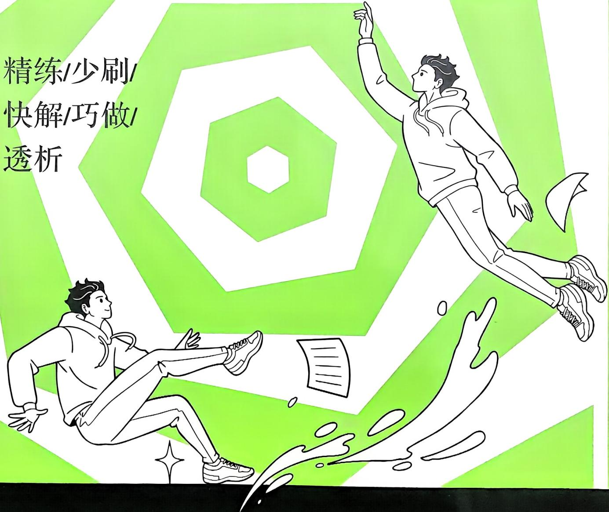

<details>
<summary>text_image</summary>

精练/少刷/
快解/巧做/
透析
</details>

副主编：邓诚

清北名师；B站百万粉UP主“清华数学系坑老师”

201个

高频考点练

93个

大招对应练

8个

素养提升练

2个

创新题专练

第1册（共3册）

高考数学

# 《百日冲刺》筑梦中考、高考

2025 中考押题卷、高考押题卷全网首发！

2025 最新春季网课、押题网课

免费领取！可扫码加入群聊，第一时间获取最新资料。


<details>
<summary>text_image</summary>

获取更多资料请扫码进《资料群》
群内每天更新大量资料，全部免费！
2025小、初、高《教辅资料群》
2025初、高实时网课、名师讲义
系列教辅、课件、题库、同步讲义
中考、高考复习讲义、真题
全国各地期中、期末、月考试题
扫描二维码了解更多信息
</details>

# 更多资料可关注公众号《自学大王》获取

（关注后，回复“目录”自动获取小初高所有资料）


<details>
<summary>text_image</summary>

QR code image with a central logo, likely linking to a digital resource or website.
</details>

# 觉醒奇袭，性能满格

# 1名师大招册

非常规的解题绝招，开悟快，思路清。

大招解读

剖析大招实质

# 大招解读

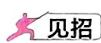

已知正数 $x, y$ 满足 $ax + by = 1$ , 求 $\frac{c}{x} + \frac{d}{y}$ 的

满足 $\frac{c}{x} +\frac{d}{y} = 1$ ，求 $ax + by$ 的最小值，也是

大招应用

教你练大招

# 大招应用

大招示例（2024四川成都外国语学校期中）已知定义在 $\mathbf{R}$ 上的函数 $f(x)$ 及其导函数 $f^{\prime}(x)$ 满足 $f^{\prime}(x) > -f(x)$ ，若 $f(\ln 3) = \frac{1}{3}$ ，则满足不等式 $f(x) > \frac{1}{e^x}$ 的 $x$ 的取值范围是 \_\_\_\_.

大招识别

何时用大招

大招识别

大招识别 条件给出 $f'(x) > -f(x)$ ，可转化为 $f'(x) + f(x) > 0$ ，系数只有常数 $(f'(x))$ 系数为 $1, f(x)$ 系数为 1），用 $e^x$ 来构，和的形式用“积”来构，联想到构造

解析 因为对任意 $x$ 即 $f'(x) + f(x) > 0$ ，所以函数 $g(x) = f'(x)e^z +f(x)$ 所以函数 $g(x)$ 在 $\mathbf{R}$ 上不等式 $f(x) > \frac{1}{\mathrm{e}^x}$ ，即e因为 $f(\ln 3) = \frac{1}{3}$ ，所以由 $g(x) > g(\ln 3)$ ，得所以不等式 $f(x) > \frac{1}{\mathrm{e}^x}$

代替. $\frac{c}{x} +\frac{d}{y} = (\frac{c}{x} +\frac{d}{y})(ax$

# 2 主书练习册

好招配新题，新考法一览无余。

# 考点切片

①看什么看，不服做了试试！

# 考点1 集合的概念

→答案 P009

1. 以下七种说法正确的有

①接近于0的数的全体  
②正方体的全体构成-   
③未来世界的高科技产

# 觉醒集训

①来了老铁 测测真学会没！

11.(2025 四川绵阳模拟)若正实数 a, b 满足 $a + b = 2ab - 4$ ，则 ab 的最小值为（）

A.1

B.2

C. 4

D. 8

2.(2024 福建省模拟)在 $\triangle ABC$ 中,点D是边BC

上一点,若

# 考点8

# 函数的周期性

大招8 对应练习

# 解题觉醒

1. 半周期推导周期

①若函数 $f(x)$ 满


抓命题动向，探创新情境，提前适应新变化

2026高考创新题觉醒速递

夏盈新月
精练创新图

# 命题新动向 1 高考班19题新定义专题

欧爱P301

1、 $\overline{A}d_{0}$ (2024湖南长沙二模)集合论在离散数学中有着非常重要的地位。对于非空集合A和B，定义和集 $A+B\approx|a+b|\alpha\in A,d\in B|$ ，用符号 $d(A+B)$ 表示和集 $A+B$ 中的元素个数。(15)已知集合 $A\approx|1,3|,D\approx|1,2,6|$ ，C=

2. $\left[\frac{1}{2} f(x)\right]$ (2024年购置费用区)定义：设 $y \in f(x)$ 和 $y = g(x)$ 均为定义在区间 $l$ 上的函数，其导函数分别为 $f'(x), g'(x)$ ，若不等式 $\left[f'(x) - g'(x)\right] \cdot \left[f'(x) - g'(x)\right] \geqslant 0$ 对任意 $x \in l$ 恒成立，则称 $y = f(x)$ 和 $y = g(x)$ 为区间 $l$

考点切片  
单练考点，一轮夯基，靶向攻克

觉醒集训混练考点，快速识别，模拟实战

觉醒速递

精练创新题，抢先适应2026高考新变化

# 3大招解析册

解析不跳步，0基础看得懂。

大招运用

大招练配大招解，彻底学会

(2) 大招解 构造函数

$$
\frac {(x - 1) \mathrm{e} ^ {x}}{x ^ {2}} + \frac {\mathrm{e}}{x} - \mathrm{e} = \frac {(x - 1)}{x}
$$

令 $h(x) = \mathrm{e}^{x} - \mathrm{e}x, x \in (0, +\infty)$ , 则 $h'(x) = \mathrm{e}^{x} - \mathrm{e}$ , 所以当 $x \in (0,1)$ 时, $h'(x) < 0$ , 函数 $h(x)$ 单调递减; 当 $x \in (1, +\infty)$ 时, $h'(x) > 0$ , 函数 $h(x)$ 单调递增. 所以当 $x = 1$ 时, 函数 $h(x)$ 取得极小值 $h(1) = 0$ .

一题多解

多种解法，拓宽思维

另解1 配凑定值. $xy + 5x + 5y = 11 \Rightarrow (x + 5)(y + 5) = 36$ , 所以 $x + y = x + 5 + y + 5 - 10 \geqslant 2\sqrt{(x + 5)(y + 5)} - 10 = 2$ , 当且仅当 $x + 5 = y + 5 = 6$ , 即 $x = y = 1$ 时, 等号成立, 故 $x + y$ 的最小值为 2.

另解2 肖元法. 因为 $xy + 5x + 5y = 11$ ，所以 $x = \frac{11 - 5y}{5 + y}$ ，所以 $x + y = \frac{11 - 5y}{5 + y} + y = \frac{11 - 5y}{5 + y} + \frac{y(5 + y)}{5 + y} = \frac{y^2 + 11}{5 + y} = \frac{(y + 5)^2 - 10(y + 5) + 36}{5 + y} = y + 5 + \frac{36}{5 + y} - 10 \geqslant 2\sqrt{36} - 10 = 2$ ，当


<details>
<summary>text_image</summary>

册（2025.8上线）
线）
</details>

# 一本书就能值回票价，但我还想给你更多

# 1 免费视频课


1.【大招册】解题大招配套视频

2.【练习册】重难试题精讲视频

很多机构把这样的课卖上万元

# 2备考资源包


1.2025高考真题加练手册（2025.8上线）  
2.多送几招（2025.3上线）  
3.高考复习阶段觉醒卷（2025.9起陆续上线）  
4.可编辑PPT课件（教师专享）

# 3 AI测成果

盲目复习2个月，不如AI提分2小时。AI测评找准薄弱点，1对1定制提分方案！


<details>
<summary>text_image</summary>

APP下载
应用商店搜索
“考试在线”下载

测评兑换
APP扫码打开兑换
</details>


<details>
<summary>text_image</summary>

图书ID/SN码
学科验证码
输入验证码兑换领取对应商品
请输入图书ID码
请输入图书SN码
确认兑换
</details>

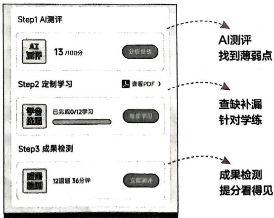

<details>
<summary>flowchart</summary>

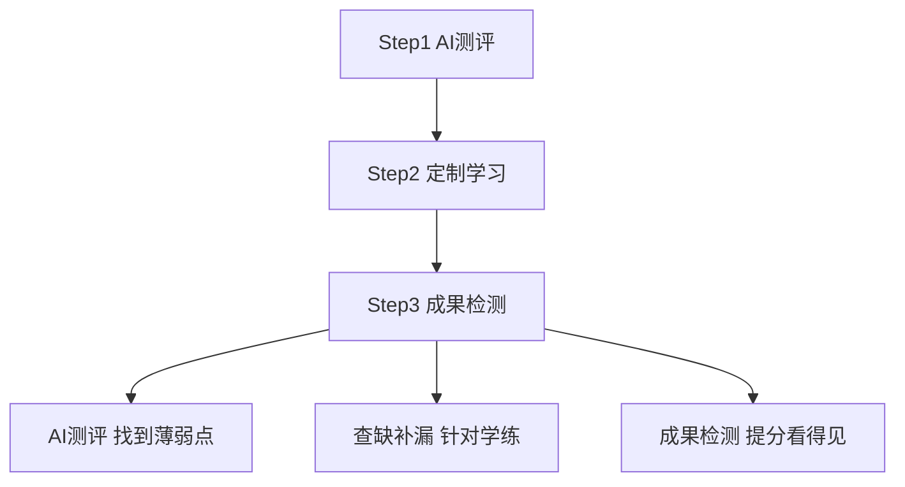
</details>

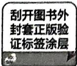

输入图书ID码和SN码完成兑换


开启AI提分，获取专属定制方案在APP首页点击“解题觉醒”进入

# 2026 高考创新题觉醒速递

命题新动向1 高考第19题新定义专练 …… 001

命题新动向2 综合题专练 006

# 专题一 集合与逻辑

考点切片 008

考点1 集合的概念 008

考点2 集合间的基本关系 008

考点3 集合的运算 009

考点4 充分条件与必要条件 009

考点5 全称量词与存在量词 010

考点6 集合与逻辑综合题 010

考点7 容斥原理 010 →大招1

考点8 创新性集合小题 011

觉醒集训 011

# 专题二 不等式

考点切片 013

考点1 不等式的性质 013

考点2 配凑定值 013

考点3 “1”的代换 014 →大招2

考点4 一个桥梁——基本不等式链的应用014 $\rightarrow$ 大招3

觉醒集训 016

# 专题三 函数

考点切片 017

考点1 函数的对应法则 017

考点2 函数的定义域 017

考点3 函数的值域与最值 017 →大招

考点4 函数的解析式 019

考点5 函数的单调性 019 → 大招

考点6 函数的奇偶性 019 →大招

考点7 函数图象的对称性 020 → 大招

考点8 函数的周期性 021 → 大招

考点9 类周期函数 022 →大招

考点10 指对运算 022

考点11 指对幂函数及其应用 023

考点12 反函数应用 024

考点13 函数的图象变换 024 $\rightarrow$ 大招

考点14 抽象函数 024

考点15 函数的零点 & 方程（一）——
数形结合找临界 025 → 大招

考点 16 函数的零点 & 方程（二）——
二次函数的零点分布问题 …… 025 → 大招

考点17 函数的零点 & 方程（三）——
复合方程问题 026 → 大招1

觉醒集训 027

# 专题四 导数

考点切片 030

考点1 导数的基础（一）——
导数的定义 …… 030

考点2 导数的基础（二）——
导数的基本运算 …… 030

考点3 导数的基础（三）——
导数的几何意义 030考点4 导数的基础（四）——

函数的单调性求解 030

考点5 导数的基础（五）——

函数的极值、最值求解 …… 031

考点6 恒成立 & 存在性问题 031

考点7 函数图象的切线方程 …… 032 → 大招 14

考点8 导数的复杂运算 032 → 大招 15

考点9 导数逆向构造 033 → 大招 16

考点10 构造函数比较大小 033

考点11 同构思想 033 $\rightarrow$ 大招17

考点12 洛必达法则 034 $\rightarrow$ 大招18

考点13 泰勒展开式 035 $\rightarrow$ 大招19

考点14 齐次化 035 $\rightarrow$ 大招20

考点 15 $e^{x} \geqslant x + 1$ 与 $\ln x \leqslant x - 1$ 的应用 …… 036 → 大招 21

考点16 不等式证明——作差比较 036

考点 17 不等式证明——指对处理 …… 037 → 大招 22

考点 18 不等式证明——主元法 …… 037 → 大招 23

考点 19 不等式证明——分割与放缩 …… 038 → 大招 24

考点20 函数零点问题 038→大招25

考点 21 隐极值点代换 039 → 大招 26

考点22 根与系数的关系硬算 040

考点 23 恒成立求参——分离参数 …… 041 → 大招 27

考点 24 恒成立求参——分类讨论 …… 041 → 大招 28

考点 25 恒成立求参——必要性探路 …… 042 → 大招 29

考点 26 恒成立求参——端点 & 中间点效应

043→大招30

考点 27 极值点 & 拐点偏移 043 → 大招 31

考点 28 零点的放缩 045 → 大招 32

考点29 导数与三角结合 045

考点30 导数与数列结合 046

觉醒集训 047

素养提升 049

# 专题五 三角函数

考点切片 050

考点1 任意角与弧度制 050

考点2 三角函数的定义 …… 050

考点3 同角关系式 050

考点4 诱导公式 051

考点5 和差角公式 051→大招33

考点 6 倍角公式 & 半角公式 & 万能公式 …… 052

考点7 辅助角公式 053

考点 8 平移 & 伸缩变换 …… 053

考点9 正弦型函数图象和性质 054

考点10 “ $\omega$ ”的求解 055 $\rightarrow$ 大招34

考点11 三角函数图象精细分析 056

觉醒集训 057

# 专题六 解三角形

考点切片 059

考点1 基本定理应用 059

考点 2 边角互化之正弦齐次替换 …… 059

考点 3 边角互化之余弦替换 …… 060

考点4 判断三角形的形状 061

考点5 三角形的周长&面积 062

考点 6 角平分线定理 …… 063 → 大招 35

考点 7 张角定理 …… 063 → 大招 36

考点8 平行四边形恒等式 064→大招37

考点9 五边两角模型 064→大招38

觉醒集训 065

# 专题七 平面向量

考点切片 068

考点1 平面向量的基本概念 068

考点2 算两次 068→大招39

考点3 数量积运算 068

考点4 投影&向量放缩 069

考点5 等和线 069→大招40

考点6 极化恒等式 070→大招41

考点7 奔驰定理 071→大招42

考点8 三角形四心的向量表达 071

考点9 建系法 072

觉醒集训 073

# 专题八 数列

考点切片 075

考点1 等差数列的基本概念 075

考点2 等比数列的基本概念 076

考点 3 等差数列与等比数列性质综合 …… 076

考点 4 倒序相加求和 & 并项求和 …… 077 → 大招 43

考点5 错位相减求和 078→大招44

考点6 裂项相消求和 079→大招45

考点7 分组求和 080

考点8 累加 & 累乘递推 081

考点9 一阶线性递推 …… 082 → 大招 46

考点10 二阶线性递推 084→大招47

考点11 分式结构递推 084→大招48

考点12 含 $S_{n}$ 的递推 085

考点13 奇偶分类递推 086→大招49

考点 14 数学归纳法 086

考点15 数列不等式放缩 087 $\rightarrow$ 大招

考点16 数列大题综合 089

考点17 周期数列 090→大招

考点18 类杨辉三角数列 091

考点19 数列的函数属性 091 $\rightarrow$ 大招

觉醒集训 092

素养提升 094

# 专题九 立体几何

考点切片 096

考点1 空间几何体 096

考点2 四面体的特殊模型 096→大招5

考点 3 外接球问题（一）——补形法 …… 097 → 大招.5

考点4 外接球问题（二）——双外心模型

098→大招5

考点5 其他外接球问题 098

考点6 内切球与球的相切问题 099→大招5

考点7 空间中的平行关系 …… 100

考点8 空间中的垂直关系 …… 101

考点 9 空间向量的概念与简单应用 …… 102

考点 10 异面直线所成角 & 三余弦定理 …… 103 → 大招 5

考点11 运动中找不变量 104

考点 12 动点轨迹的确定 …… 104 → 大招 58

考点 13 平面化处理最小值问题 …… 105 → 大招 59

考点 14 截面问题之补全图形 …… 105 → 大招 60

考点15 空间中的距离问题 106

考点16 线面角问题 106

考点17 二面角问题 107

考点18 空间向量在动点问题中的应用 …… 108

觉醒集训 110

素养提升 112

# 专题十 直线与圆

考点切片 113

考点1 直线的基本概念 …… 113

考点 2 直线过定点 & 过区域 …… 113

考点 3 圆的基本概念 …… 113

考点 4 直线与圆的位置关系 …… 113

考点 5 圆与圆的位置关系 …… 114

考点6 代数问题几何化 …… 114 → 大招 61

考点 7 对称问题 …… 115

考点8 动点问题 115→大招62

考点 9 距离问题 …… 116 → 大招 63

考点 10 直线系方程 …… 116 → 大招 64

考点11 圆系方程 117→大招65

考点 12 隐圆 117 → 大招 66

考点 13 阿波罗尼斯圆 …… 118 → 大招 67

觉醒集训 118

素养提升 119

# 专题十一 圆锥曲线

考点切片 120

考点1 椭圆的概念与几何性质 …… 120

考点2 双曲线的概念与几何性质 …… 120

考点3 抛物线的概念与几何性质 …… 121

考点4 直线与圆锥曲线的位置关系 …… 122

考点5 曲线与方程 …… 122

考点6 圆锥曲线第一定义的应用 …… 122 → 大招 68

考点7 圆锥曲线第二定义的应用 …… 123 → 大招 69

考点8 圆锥曲线第三定义的应用 …… 124 → 大招 70

考点9 弦中点问题与点差法 …… 124 → 大招 71

考点10 离心率硬算 125

考点11 焦点三角形 125→大招72

考点12 焦点三角形的内心 126→大招73

考点13 平均性质 127→大招74

考点14 圆锥曲线的切线 127→大招75

考点15 硬解定理 128→大招76

考点 16 面积问题 …… 129

考点17 角度问题 130→大招77

考点18 定点定值问题 131

考点19 极点极线问题 132→大招78

考点20 斜率积&斜率和问题 133→大招79

考点21 轨迹问题 134

考点22 三点共线&四点共圆 135

考点23 定比点差与向量条件的处理 …… 136

考点24 非对称处理 136→大招80

觉醒集训 138

素养提升 14.

# 专题十二 计数原理

考点切片 142

考点1 排列与排列数的基本概念 …… 142

考点2 组合与组合数的基本概念 …… 142

考点3 多情况分析 …… 142

考点4 特殊先安排 143 → 大招81

考点5 多面手问题 …… 143

考点6 数字问题 …… 143

考点7 染色问题 …… 143

考点8 环排问题 …… 144

考点9 固序问题 144→大招82

考点10 走楼梯问题 144

考点11 分组分配问题 145 $\rightarrow$ 大招83

考点12 隔板法 145→大招84

考点13 捆绑法&插空法 145→大招85

考点14 正难则反 146→大招86

考点15 二项式定理展开分析 …… 146

考点16 赋值法求解 146→大招87

考点17 系数和问题 147

考点 18 整除及余数问题 …… 147 → 大招 88

觉醒集训 148

素养提升 148

# 专题十三 概率统计

考点切片 149

考点1 统计的基本概念 …… 149

考点2 古典概型 150

考点3 互斥事件&对立事件 …… 151

考点4 独立事件 151

考点5 条件概率 …… 152 → 大招8

考点6 期望与方差的计算 …… 152

考点 7 二项分布 …… 152

考点8 超几何分布 …… 153

考点9 正态分布 …… 153

考点10 常见分布综合 154→大招9

考点11 比赛规则问题 155

考点12 回归分析 156

考点13 独立性检验 157

考点 14 决策问题 …… 158

考点15 概率结合函数 159

考点16 概率结合数列 160 $\rightarrow$ 大招91

觉醒集训 162

素养提升 165

# 专题十四 复数

考点切片 166

考点1 复数的基本概念及运算 …… 166

考点2 复数的模的运算 166→大招92

考点3 复数的几何意义 166→大招93

考点4 复数与数列 167

考点 5 复数与方程 …… 167

觉醒集训 167

素养提升 168

# 命题新动向 1 高考第 19 题新定义专练

答案P001

1. 大招45（2024湖南长沙二模）集合论在离散数学中有着非常重要的地位。对于非空集合 $A$ 和 $B$ ，定义和集 $A + B = \{a + b \mid a \in A, b \in B\}$ ，用符号 $d(A + B)$ 表示和集 $A + B$ 中的元素个数。

(1) 已知集合 $A = \{1, 3, 5\}$ , $B = \{1, 2, 6\}$ , $C = \{1, 2, 6, x\}$ , 若 $A + B = A + C$ , 求 $x$ 的值;  
(2) 记集合 $A_{n} = \{1, 2, \cdots, n\}$ , $B_{n} = \{\sqrt{2}, 2\sqrt{2}, \cdots, n\sqrt{2}\}$ , $C_{n} = A_{n} + B_{n}$ , $a_{n}$ 为 $C_{n}$ 中所有元素之和, $n \in N^{*}$ , 求证: $\frac{1}{a_{1}} + \frac{2}{a_{2}} + \cdots + \frac{n}{a_{n}} < 2(\sqrt{2} - 1)$ ;  
(3) 若 $A$ 与 $B$ 都是由 $m (m \geqslant 3, m \in \mathbf{N}^*)$ 个整数构成的集合, 且 $d(A + B) = 2m - 1$ , 证明: 若按一定顺序排列, 集合 $A$ 与 $B$ 中的元素是两个公差相等的等差数列.

2. 大招26 大招27 (2024 江西宜春模拟) 定义: 设 $y = f(x)$ 和 $y = g(x)$ 均为定义在区间 $I$ 上的函数, 其导函数分别为 $f'(x), g'(x)$ , 若不等式 $[f(x) - g(x)] \cdot [f'(x) - g'(x)] \geqslant 0$ 对任意 $x \in I$ 恒成立, 则称 $y = f(x)$ 和 $y = g(x)$ 为区间 $I$ 上的“友好函数”.

(1) 若 $f(x) = \mathrm{e}^{2x}$ 和 $g(x) = a - \mathrm{e}^x$ 是 $\mathbf{R}$ 上的“友好函数”，求 $a$ 的取值范围.  
(2)给出两组函数:① $f_{1}(x)=\mathrm{e}^{x},g_{1}(x)=x+1;$ ② $f_{2}(x)=x\mathrm{e}^{2x}-4\ln x-6,g_{2}(x)=\frac{1}{2}\mathrm{e}^{2x}-2\mathrm{e}^{x}$

分别判断这两组函数是不是 $(0, +\infty)$ 上的“友好函数”，并说明理由.

3. [大招27] (2024 河北秦皇岛二模) 定义: 如果函数 $y = f(x)$ 和 $y = g(x)$ 的图象上分别存在点 $M$ 和点 $N$ 关于 $x$ 轴对称, 那么称函数 $y = f(x)$ 和 $y = g(x)$ 具有 $C$ 关系.

(1) 判断函数 $f(x)=4^{x}-8$ 和 $g(x)=2^{x+1}$ 是否具有 C 关系，并说明理由；  
(2) 若函数 $f(x) = \ln x - ax - 1$ 和 $g(x) = 1 - x^2$ 不具有 $C$ 关系, 求 $a$ 的取值范围;  
(3) 若函数 $f(x) = x(\mathrm{e}^x - 1)$ 和 $g(x) = x + m\sin x$ ( $m < 0$ ) 在区间 $(0, \pi)$ 上具有 $C$ 关系, 求 $m$ 的取值范围.

4. 大招64 大招71（2025安徽合肥期中）定义：若椭圆 $C: \frac{x^2}{a^2} + \frac{y^2}{b^2} = 1 (a > b > 0)$ 上的两个点 $A(x_1, y_1), B(x_2, y_2)$ 满足 $\frac{x_1 x_2}{a^2} + \frac{y_1 y_2}{b^2} = 0$ ，则称 $A, B$ 为该椭圆的一个“共轭点对”，记作 $[A, B]$ . 已知满足上述定义的椭圆 $C$ 的离心率为 $\frac{\sqrt{3}}{2}$ ，且椭圆 $C$ 过点 $A(2,1)$ .

(1) 求椭圆 C 的方程.  
(2)求“共轭点对” $[A,B]$ 中点 $B$ 所在直线 $l$ 的方程.  
(3) 设 O 为坐标原点, 点 P, Q 在椭圆 C 上, $PQ \parallel OA$ , (2) 中的直线 l 与椭圆 C 交于两点 $B_{1}, B_{2}$ . 证明: 四边形 $B_{1}PB_{2}Q$ 的面积小于 8.

5. 大招75 (2024 吉林模拟) 直线族是指具有某种共同性质的直线的全体, 例如 $k'(x - 2) - (y - 1) = 0$ 表示过点(2,1)且斜率存在的直线族, $y = x + t'$ 表示斜率为 1 的直线族. 直线族的包络曲线定义为: 直线族中的每一条直线都是该曲线上某点处的切线, 且该曲线上的每一点处的切线都是该直线族中的某条直线.

(1) 若直线族 $mx + ny + 1 = 0 (m, n \in \mathbf{R})$ 的包络曲线是圆 $O: x^2 + y^2 = 16$ , 求 $m, n$ 满足的关系式;

(2) 若点 $M(x_0, y_0)$ 不在直线族 $\Phi: 2\lambda x - 8y - \lambda^2 = 0 (\lambda \in \mathbf{R})$ 的任意一条直线上, 对于给定的实数 $x_0$ , 求 $y_0$ 的取值范围和直线族 $\Phi$ 的包络曲线 $E$ ;

(3) 在(2)的条件下, 过直线 x - 4y - 8 = 0 上一个动点 P 作曲线 E 的两条切线, 切点分别为 A, B, 求原点 O 到直线 AB 距离的最大值.

6.(2025 山西大学附属中学月考)已知 $\Omega$ 是棱长为 $\sqrt{2}$ 的正四面体 ABCD, 设 $\Omega$ 的四个顶点到平面 $\alpha$ 的距离所构成的集合为 M, 若 M 中元素的个数为 k, 则称 $\alpha$ 为 $\Omega$ 的 k 阶等距平面, M 为 $\Omega$ 的 k 阶等距集.

(1) 若 $\alpha$ 为 $\Omega$ 的 1 阶等距平面且 1 阶等距集为 $\{a\}$ , 求 $a$ 的所有可能值以及相应的 $\alpha$ 的个数.  
(2)已知 $\beta$ 为 $\Omega$ 的4阶等距平面,且点 $A$ 与点 $B,C,D$ 分别位于 $\beta$ 的两侧.是否存在 $\beta$ ,使 $\Omega$ 的4阶等距集为 $\{b,2b,3b,4b\}$ ,其中点 $A$ 到 $\beta$ 的距离为 $b$ ?若存在,求平面 $BCD$ 与 $\beta$ 夹角的余弦值;若不存在,说明理由.

7. 大招46（2024 浙江联考）浙里启航团队举办了一场抽奖游戏，玩家一共抽取 n 次。每次都有 $\frac{1}{2}$ 的概率抽中， $\frac{1}{2}$ 的概率未抽中，玩家的抽奖得分按照如下方式计算：

①将玩家 n 次抽奖的结果按顺序排列, 抽中记作 1, 未抽中记作 0, 形成一个长度为 n 的仅有 0, 1 的序列.  
②定义序列的得分为:对于这个序列每一段极长连续的1,设它的长度为t,那么得分即为 $t^{2}$ .  
③序列的得分即为每一段连续的1的得分和.例如:如果玩家A抽了7次,第1,3,4,5,7次中奖,那么序列即为1,0,1,1,1,0,1,得分为 $1^{2}+3^{2}+1^{2}=11$ .可能用到的公式:若X,Y为两个随机变量,则 $E(X)+E(Y)=E(X+Y)$ .

(1) 若 n=3, 小明进行了一次游戏. 记随机变量 X 为小明的最终得分, 求 $E(X)$ .  
(2) 记随机变量 $Z$ 表示长度为 $n$ 的序列中从最后一个数从后往前极长连续的 1 的长度, 求 $E(Z)$ .  
(3) 若 $n = k$ , 小明进行了一次游戏. 记随机变量 $A$ 为小明的最终得分, 求 $E(A)$ .

8.(2024 广东联考)定义:任取数列 $\{a_{n}\}$ 中相邻的两项,若这两项之差的绝对值为 1,则称数列 $\{a_{n}\}$ 具有“性质 1”.已知项数为 n 的数列 $\{a_{n}\}$ 的所有项的和为 $M_{n}$ ,且数列 $\{a_{n}\}$ 具有“性质 1”.

(1) 若 $n = 4$ ，且 $a_1 = 0, a_4 = -1$ ，写出所有可能的 $M_n$ 的值；  
(2) 若 $a_{1}=2\ 024, n=2\ 023$ ，证明：“ $a_{2\ 023}=2$ ”是“ $a_{k}>a_{k+1}(k=1,2,\cdots,2\ 022)$ ”的充要条件；  
(3) 若 $a_1 = 0, n \geqslant 2, M_n = 0$ , 证明: $n = 4m$ 或 $n = 4m + 1 (m \in \mathbf{N}^*)$ .

9. (2024 江苏徐州一模) 对于每项均是正整数的数列 $P: a_{1}, a_{2}, \cdots, a_{n}$ , 定义变换 $T_{1}, T_{1}$ 将数列 $P$ 变换成数列 $T_{1}(P): n, a_{1} - 1, a_{2} - 1, \cdots, a_{n} - 1$ . 对于每项均是非负整数的数列 $Q: b_{1}, b_{2}, \cdots, b_{m}$ , 定义 $S(Q) = 2(b_{1} + 2b_{2} + \cdots + mb_{m}) + b_{1}^{2} + b_{2}^{2} + \cdots + b_{m}^{2}$ , 定义变换 $T_{2}, T_{2}$ 将数列 $Q$ 各项从大到小排列, 然后去掉所有为零的项, 得到数列 $T_{2}(Q)$ .

(1) 若数列 $P_{0}$ 为 2,4,3,7, 求 $S(T_{1}(P_{0}))$ 的值.  
(2)对于每项均是正整数的有穷数列 $P_0$ ，令 $P_{k + 1} = T_2(T_1(P_k))$ ， $k\in \mathbf{N}$

(i) 探究 $S(T_{1}(P_{0}))$ 与 $S(P_{0})$ 的关系；

(ii) 证明: $S(P_{k+1}) \leqslant S(P_k)$ .

10.(2024江西南昌三模)定义:若变量x>0,y>0,且满足:( $\frac{x}{a}$ )^{m}+( $\frac{y}{b}$ )^{m}=1,其中a>0,b>0,m∈Z,称y是关于x的“m型函数”.

(1) 当 $a = 2, b = 1$ 时, 求 $y$ 关于 $x$ 的“2 型函数”的图象在点 $(1, \frac{\sqrt{3}}{2})$ 处的切线方程.  
(2) 若 $y$ 是关于 $x$ 的“-1型函数”，

(i) 求 $x + y$ 的最小值；

（ii）求证： $(x^{n} + y^{n})^{\frac{1}{n}}\geqslant (a^{\frac{n}{n + 1}} + b^{\frac{n}{n + 1}})^{\frac{n + 1}{n}},$ $n\in \mathbf{N}^*$

# 命题新动向 2 综合题专练

答案P005

1. 大招2 (2024 河南模拟) 已知点 $P(x, y)$ 在以原点 $O$ 为圆心, 半径 $r = \sqrt{7}$ 的圆上, 则 $\frac{1}{x^2 + 1} + \frac{4}{y^2 + 1}$ 的最小值为 ( )

A. $\frac{4}{9}$

B. $\frac{5+2\sqrt{2}}{9}$

C. $\frac{7}{9}$

D. 1

2. 大招83 (2024 安徽模拟) 将 1 到 50 这 50 个正整数平均分成 $A, B$ 两组, 每组各 25 个数, 使得 $A$ 组的中位数比 $B$ 组的中位数小 1 , 则分法种数为 ( )

A. $\mathrm{C}_{24}^{12}$

B. $\mathrm{C}_{48}^{24}$

C. $\mathrm{C}_{48}^{24}\cdot \mathrm{C}_{24}^{12}$

D. $(\mathrm{C}_{24}^{12})^2$

3. 大招25 大招33 (2025 福建泉州模拟) 已知 $\sin 10^{\circ} \in \left( \frac{1}{n+1}, \frac{1}{n} \right), n \in Z,$ 则 n 的值为()

A. 5

B. 4

C. 3

D. 2

4. (2025 江西抚州联考) 如图, 在平行四边形 ABCD 中, $\tan \angle BAD = 7$ , $AB = 5\sqrt{2}$ , AD = 5, E 为边 BC 上异于端点的一点, 且 $\overrightarrow{AE} \cdot \overrightarrow{DE} = 45$ , 则 $\sin \angle CDE =$ ()

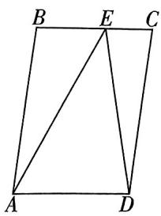

<details>
<summary>text_image</summary>

B E C
A D
</details>

A. $\frac{\sqrt{2}}{10}$

B. $\frac{7}{25}$

C. $\frac{5}{13}$

D. $\frac{1}{4}$

5.[多选](2024 湖南衡阳一模)已知一组样本数据：-1,5,a,b,其中 $a \leqslant 0, b \geqslant 0$ . 将该组数据排列，则下列关于该组数据的结论中，正确的是()

A. 数列不可能既是等比数列又是等差数列  
B. 若成等比数列, 则 a 和 b 有 4 组可能取值  
C. 若成等差数列, 则 a 和 b 有 3 组可能取值  
D. 若该组数据的平均数是 1, 则其方差的最小  
值是 $\frac{21}{4}$

6.[多选](2024 浙江金华一模)从棱长为1个单位长度的正四面体的一顶点A出发,每次均随机沿一条棱行走1个单位长度,设行走 $n(n \in \mathbf{N}^{*})$ 次时恰好第一次回到A点的概率为 $P_{n}$ ,恰好第二次回到A点的概率为 $Q_{n}$ ,则()

A. $P_{3} = \frac{2}{9}$   
B. $Q_{4} = \frac{1}{27}$   
C. $n \geqslant 2$ 时, $\frac{P_{n+1}}{P_n}$ 为定值  
D. 数列 $\{Q_{n}\}$ 的最大项为 $\frac{4}{27}$

7. 大招61（2024江西新余模拟）已知全集为 $U$ ，集合 $A = \{(x, y) \mid l: x \sin \theta + y \cos \theta - 1 = 0, \theta \in [0, 2\pi)\}$ ，请写出一个非空点集 $B$ ，使得对于唯一固定的 $\theta_0$ 满足 $A \cap B = A \cup B$ ：\_\_\_\_。

8.《新定义》(2024 四川成都石室中学适应性考试)定义在封闭的平面区域 $D$ 内任意两点的距离的最大值称为平面区域 $D$

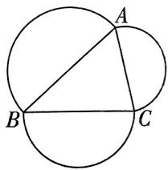

<details>
<summary>text_image</summary>

A
B
C
</details>

的“直径”. 如图, 已知锐角三角形的三个顶点 $A, B, C$ 在半径为 1 的圆上, 角的对边分别为 $a, b, c, A = \frac{\pi}{3}$ . 分别以 $\triangle ABC$ 各边为直径向外作三个半圆, 这三个半圆和 $\triangle ABC$ 构成平面区域 $D$ , 则平面区域 $D$ 的“直径”的取值范围是 \_\_\_\_.

9.(2025 安徽模拟)在平面直角坐标系 $xOy$ 中, $M$ 为曲线 $y = \frac{\ln x}{x}$ 上一点且位于第一象限, 将线段 $OM$ 绕 $x$ 轴旋转一周, 得到一个圆锥的侧面, 再将其展开成扇形, 则该扇形的圆心角的最大值为 \_\_\_\_.

10.(2025 辽宁省实验中学期中)已知锐角 $\triangle ABC$ 的内角 A, B, C 的对边分别为 a, b, c, 若 $a, c, a + b$ 成等比数列.

(1) 证明: $C = 2A$ ;   
(2) 求 $\frac{c - a}{b}$ 的取值范围；  
(3) 证明: $\cos A + \cos B + \cos C > \frac{\sqrt{3} + 1}{2}$ .   
(参考数据: $\sqrt{13}\approx3.605\ 55$ )

(3) 数列 $\{x_{n}\}$ 中, 是否存在连续三项 (按原顺序) 构成等差数列? 若存在, 指出所有这样的连续三项; 若不存在, 请说明理由.

12. 大招21 大招25 大招28 (2024 四川雅安模拟) 已知函数 $f(x) = ax^2 + (1 - a)x - \ln x$ .

(1) 若 $f(x)$ 有 2 个相异极值点, 求 a 的取值范围;  
(2) 若 $f(x) \geqslant 1$ , 求 $a$ 的值;  
(3) 设 $m$ 为正整数, 若 $\forall n \in \mathbf{N}^*$ , $(1 + \frac{1}{4}) \cdot$   
$\left(1+\frac{3}{4^{2}}\right)\left(1+\frac{3^{2}}{4^{3}}\right)\cdot\cdots\cdot\left(1+\frac{3^{n-1}}{4^{n}}\right)<m,$ 求 m 的最小值.

11.(2024 四川一模)已知抛物线 $C: y^{2} = 2px (p > 0)$ 的焦点为 $F$ , 过点 $F$ 的直线与抛物线 $C$ 相交于点 $A, B, \triangle AOB$ 面积的最小值为 $\frac{1}{2}(O$ 为坐标原点). 按照如下方式依次构造点 $F_{n}(n \in \mathbf{N}^{*})$ : $F_{1}$ 的坐标为 $(p, 0)$ , 直线 $AF_{n}, BF_{n}$ 与抛物线 $C$ 的另一个交点分别为 $A_{n}, B_{n}$ , 直线 $A_{n}B_{n}$ 与 $x$ 轴的交点为 $F_{n+1}$ , 设点 $F_{n}$ 的横坐标为 $x_{n}$ .

(1) 求 p 的值.  
(2) 求数列 $\left|x_{n}\right|$ 的通项公式.

# 考点切片

# ②⑨ 看什么看,不服做了试试!

# 考点 1 集合的概念

$\Rightarrow$ 答案P009

1. 以下七种说法正确的有\_\_\_\_（填序号）.

①接近于0的数的全体构成一个集合；

②正方体的全体构成一个集合；

③未来世界的高科技产品构成一个集合；

④不大于3的所有自然数构成一个集合；

⑤由 1,2,3 组成的集合可表示为 $\{1,2,3\}$ 或 $\{3,2,1\}$ ;

⑥方程 $(x-1)^{2}(x-2)=0$ 的所有解组成的集合中有3个元素；

⑦集合 $\{x\mid2<x<5\}$ 可用列举法表示.

2.(2025 河南名校联考)已知集合 $A = \{x \in \mathbf{Z} | \frac{3}{x - 1} \in \mathbf{Z}\}$ , 则用列举法表示 $A =$ ( )

A. $\{-2,0,1,2,4\}$

B. $\{-2,0,2,4\}$

C. $\{0,2,4\}$

D. $\{2,4\}$

3.(2025 湖南长沙一中月考)若 $x_{1}, x_{2}, x_{3}, x_{4}$ 为集合 A 中的 4 个元素, 则以 $x_{1}, x_{2}, x_{3}, x_{4}$ 为边长的四边形可能是 ( )

A. 等腰梯形

B. 直角梯形

C. 菱形

D. 矩形

4. (2023 全国甲卷) 设全集 $U = \mathbf{Z}$ , 集合 $M = \{x \mid x = 3k + 1, k \in \mathbf{Z}\}$ , $N = \{x \mid x = 3k + 2, k \in \mathbf{Z}\}$ , 则 $\complement_U(M \cup N) =$ ( )

A. $\{x\mid x = 3k,k\in \mathbf{Z}\}$

B. $\{x \mid x = 3k - 1, k \in \mathbf{Z}\}$

C. $\{x\mid x = 3k - 2,k\in \mathbf{Z}\}$

D. ∅

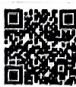

5.(2025 四川成都检测)若 $a \in \{1, 2, a^{3}\}$ ，则 a 的所有可能的取值构成的集合为（）

A. {0}

B. $\{0, -1\}$

C. $\{0,2\}$

D. $\{0, -1, 2\}$

6.(1)已知 x 为实数, 将 $x, -x, \sqrt{x^{2}}, -\sqrt[3]{x^{3}}$ , $-\sqrt[4]{x^{4}}, \sqrt{x^{4}}$ 组成集合 M, 则集合 M 中元素个

数的最大值为\_\_\_\_；

(2) 若 $a, b \in \mathbb{R}$ , 集合 $\{1, a + b, a\} = \{0, \frac{b}{a}, b\}$ , 则 $b - a$ 的值为 \_\_\_\_.

7. (2025 福建厦门一中检测) 已知集合 $A = \{x \mid x^2 + 2024x + 2025 = 0\}$ , $B = \{x \mid (x^2 + ax)(x^2 + 4ax + 4) = 0\}$ , 记非空集合 $S$ 中元素的个数为 $|S|$ , 已知 $||A| - |B|| = 1$ , 记实数 $a$ 的所有可能取值构成集合 $T$ , 则 $|T| =$ \_\_\_\_.

# 考点2

# 集合间的基本关系

→答案P009

1.(2023 新高考Ⅱ卷)设集合 $A = \{0, -a\}$ , $B = \{1, a - 2, 2a - 2\}$ , 若 $A \subseteq B$ ,
则 a =


A. 2

B. 1

C. $\frac{2}{3}$

D. -1

2.(2024 河南新乡检测)下列表示集合 $M = \{x \mid \frac{3}{x} \in Z, x \in Z\}$ 和 $N = \{x \mid x^{2} - 9 = 0\}$ 关系的 Venn 图中, 正确的是 ( )

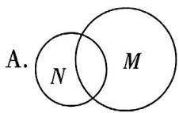

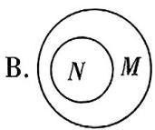

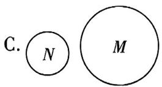

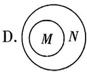

3. 判断下列关系是否正确,并说明理由.

(1) $0 = \emptyset$ ; (2) $0 = \{0\}$ ; (3) $0 \in \emptyset$ ; (4) $\emptyset = \{0\}$ ; (5) $\emptyset = \{\emptyset\}$ ; (6) $\emptyset \in \{\emptyset\}$ ; (7) $\emptyset \subsetneq \{\emptyset\}$ ; (8) $0 \subsetneq \{0\}$ .

4.(1)设集合 $A=\{x\mid-3\leqslant x\leqslant2\}$ ， $B=\{x\mid2k-1\leqslant x\leqslant2k+1\}$ ，若 $A\supseteq B$ ，则实数 k 的取值范围为 \_\_\_\_.

(2)(2025 山西大同检测)已知集合 $A = \{x \mid x \leqslant -2$ 或 $x > 1\}$ , $B = \{x \mid ax + 2 \leqslant 0\}$ , 且 $B \subseteq A$ , 则 $a$ 的取值范围是 \_\_\_\_.

5.(2025 湖南衡阳一中检测)满足条件 $\{2,3\} \subseteq A \subsetneq \{1,2,3,4,5\}$ 的集合 A 的个数为（）

A. 5

B. 6

C. 7

D. 8

6. 已知集合 $A = \{(x, y) | x^2 + y^2 = 4\}$ , $B = \{(x, y) | x, y \in \mathbf{Z}\}$ , 则 $A \cap B$ 的子集的个数为 （）

A. 7

B. 8

C. 15

D. 16

# 考点 3 集合的运算

→答案 P010

1.(1)(2024 新课标 I 卷)已知集合 $A=\{x\mid-5<x^{3}<5\}$ , $B=\{-3,-1,0,2,3\}$ , 则 $A\cap B=$ ()

A. $\{-1,0\}$

B. $\{2,3\}$

C. $\{-3,-1,0\}$

D. $\{-1,0,2\}$

(2)(2023 新高考Ⅰ卷)已知集合 $M = \{-2, -1, 0, 1, 2\}$ , $N = \{x \mid x^{2} - x - 6 \geqslant 0\}$ , 则 $M \cap N =$ ( )

A. $\{-2, -1, 0, 1\}$

B. $\{0,1,2\}$

C. $\{-2\}$

D. $\{ 2\}$

(3)(2024 北京)已知集合 $M = \{x \mid -3 < x < 1\}$ , $N = \{x \mid -1 \leqslant x < 4\}$ , 则 $M \cup N =$ ( )

A. $\{x\mid -1\leqslant x <   1\}$

B. $\{x\mid x>-3\}$

C. $\{x\mid -3 <   x <   4\}$

D. $\{x\mid x<4\}$

2.(2024 全国甲卷)已知集合 $A = \{1, 2, 3, 4, 5, 9\}$ , $B = \{x \mid \sqrt{x} \in A\}$ , 则 $\complement_{A}(A \cap B) =$ ( )

A. $\{1,4,9\}$

B. $\{3,4,9\}$

C. $\{1,2,3\}$

D. $\{2,3,5\}$

3.(1)(2024海南华侨中学检测)已知集合 $A = \{x\mid \frac{1}{4} < 2^{x} <   1\} ,B = \{x\mid x^{2} <   1\}$ ，则 $A\cap B =$ （

A. $(-1,0)$

B. $(-1,1)$

C. $(0,1)$

D. $(-2,1)$

(2)[多选](2025 浙江嘉兴检测)已知集合 $M = \{y|y = 2 - x^2\} ,N = \{x|y = \sqrt{-x + 5}\}$ ，则 （）

A. $M \cap N = M$

B. $M \cup  N = M$

C. $(\complement_{\mathbb{R}}N)\cap M = \emptyset$

D. $(\complement_{\mathbf{R}}M)\cap N = \emptyset$

4.(1)已知集合 $A = \{a^2, a + 1, -3\}$ , $B = \{a - 3, 2a - 1, a^2 + 1\}$ , 若 $A \cap B = \{-3\}$ , 则实数 $a$ 的值为 \_\_\_\_;

(2)已知集合 $A = \{2,3,a^2 +4a + 2\}$ , $B = \{0,7,a^2 +4a - 2,2 - a\}$ , 若 $A \cap B = \{3,7\}$ , 则实数 $a$ 的值为 \_\_\_\_.

5.(2025 江苏南京一中检测)已知集合 $A = \{x \mid x^{2} + 2(a + 1)x + a^{2} - 1 = 0\}$ , $B = \{x \mid x^{2} + 4x = 0\}$ , $C = \{x \mid x^{2} + 3x - 4 = 0\}$ .

(1) 若 $A \cap B = A$ , 则实数 $a$ 的取值范围为 \_\_\_\_;

(2) 若 $A \cap B \neq \emptyset, A \cap C = \emptyset$ , 则实数 $a$ 的值为 \_\_\_\_.

6. 设全集 $U = \mathbf{R}$ , 集合 $A = \{x \mid x^2 - x - 6 < 0\}$ , $B = \{x \mid x^2 - a < 0\}$ .

(1) 若 $A \cap B = A$ , 则 $a$ 的取值范围为 \_\_\_\_;

(2) 若 $(\complement_U A) \cap (\complement_U B) = \complement_U A$ ，则 $a$ 的取值范围为 \_\_\_\_.

# 考点4 充分条件与必要条件

→答案 P011

1.(2024 天津) 设 $a, b \in R$ ，则“ $a^{3} = b^{3}$ ”是“ $3^{a} = 3^{b}$ ”的（）

A. 充分不必要条件

B. 必要不充分条件

C. 充要条件

D. 既不充分也不必要条件

2.(2023 新高考 I 卷) 设 $S_{n}$ 为数列 $\{a_{n}\}$ 的前 n 项和, 设甲: $\{a_{n}\}$ 为等差数列;


乙： $\{\frac{S_n}{n}\}$ 为等差数列，则 （）

A. 甲是乙的充分条件但不是必要条件

B. 甲是乙的必要条件但不是充分条件

C. 甲是乙的充要条件

D. 甲既不是乙的充分条件也不是乙的必要条件

3.(2025辽宁省实验中学月考)若 $p:\log_{2}(a-1)<1,q:3^{a-1}<9$ ，则p是q的()

A. 充分不必要条件  
B. 必要不充分条件  
C. 充要条件  
D. 既不充分也不必要条件

4. (2024 福建泉州检测) “关于 $x$ 的不等式 $x^{2} - 2ax + a > 0$ 的解集为 $\mathbf{R}$ ” 的一个必要不充分条件是 ( )

A. $0 < a < 1$

B. $0 < a < \frac{1}{3}$

C. $0 \leqslant a \leqslant 1$

D. $a <   0$ 或 $a > \frac{1}{3}$

5.(2025江西新余模拟)已知集合 $A = \{(x, y) | y^2 = 4x\}$ , $B = \{(x, y) | (x - a)^2 + y^2 = r^2\}$ , 则 “ $A \cap B$ 中元素个数为1或2”是“ $r^2 = 4a - 4$ 且 $a > 1$ ”的 ( )

A. 充要条件  
B. 充分不必要条件  
C. 必要不充分条件  
D. 既不充分也不必要条件

6. 证明：“ $|x+1|<2x$ ”是“ $x\in(1,+\infty)$ ”的充要条件.

# 考点5 全称量词与存在量词

→答案 P011

1.(2024 新课标 II 卷)已知命题 $p: \forall x \in \mathbb{R}, |x + 1| > 1$ ; 命题 $q: \exists x > 0, x^3 = x$ . 则 ( )

A. $p$ 和 $q$ 都是真命题  
B. $\neg p$ 和 $q$ 都是真命题  
C. $p$ 和 $\neg q$ 都是真命题  
D. $\neg p$ 和 $\neg q$ 都是真命题

2.(2025北京延庆区期中)命题 $p:\forall x\in[-1,1],x^{2}-1<0$ 的否定是\_\_\_\_.

3.(1)(2024 四川成都模拟)设命题 $p: \forall x > 0$ , $x + \frac{2}{x} > a$ , 若 $\neg p$ 是假命题, 则实数 $a$ 的取值范围是 \_\_\_\_;

(2)已知命题“ $\exists x \in \mathbb{R}, ax^2 - 2ax + 3 < 0$ ”是假命题,则实数 $a$ 的取值范围为 \_\_\_\_.

# 考点6 集合与逻辑综合题

→答案P011

1. 已知 $A, B \subseteq \{1, 2, 3, \cdots, 2023, 2024\}$ ，则由集合 A, B 构成的集合 $\{A, B\}$ 的个数为（）

A. $2^{4048} - 2^{2023}$

B. $2^{4047} - 2^{2023}$

C. $2^{4047} - 2^{2024}$

D. $2^{4048} - 2^{2024}$

2.(2025 广东珠海期中)已知全集 U = R, 集合 $A=\left\{x\mid x^{2}-4x+3\leqslant0\right\},B=\left\{x\mid2<x<4\right\},C=$ $\left\{x\mid2a\leqslant x\leqslant a+2\right\}$ 且 C 为非空集合.

(1) $A \cup (\complement_{U} B) =$ \_\_\_\_;   
(2) 若 $x \in B$ 是 $x \in C$ 的必要不充分条件, 则 $a$ 的取值范围为 \_\_\_\_.

# 考点7 容斥原理

→答案P011


对应练习


# 解题觉醒

我们把含有有限个元素的集合 $A$ 叫做有限集，用 $\operatorname{card}(A)$ 来表示有限集合 $A$ 中元素的个数。对于集合 $A, B$ 来说，有二元容斥原理 $\operatorname{card}(A \cup B) = \operatorname{card}(A) + \operatorname{card}(B) - \operatorname{card}(A \cap B)$ 。对于集合 $A, B, C$ 来说，有三元容斥原理 $\operatorname{card}(A \cup B \cup C) = \operatorname{card}(A) + \operatorname{card}(B) + \operatorname{card}(C) - \operatorname{card}(A \cap B) - \operatorname{card}(B \cap C) - \operatorname{card}(C \cap A) + \operatorname{card}(A \cap B \cap C)$ 。

1.(2025 重庆一中月考)为了更加深入地了解重庆,高一某班55名学生利用周末时间去参观洪崖洞、南山一棵树、磁器口这三个地方.其中31人去了洪崖洞,21人去了南山一棵树,30人去了磁器口,同时去了洪崖洞和南山一棵树的有10人,同时去了南山一棵树和磁器口的有7人,每个人至少去了一个地方,没有人同时去三个地方,则只去了一个地方的学生数为()

A. 24

B. 26

C. 28

D. 30

2.“生命在于运动”,某学校教师在普及


程度比较高的三个体育项目——乒乓

球、羽毛球、篮球中,会打乒乓球的教师人数为30,会打羽毛球的教师人数为60,会打篮球的教师人数为20,若会至少其中一个体育项目的教师人数为80,且三个体育项目都会的教师人数为5,则会且仅会其中两个体育项目的教师人数为\_\_\_\_.

3.某学校教师周一、周二、周三开车上班的人数分别是8,10,14,若这三天中至少有一天开车上班的教师人数是20,则这三天都开车上班的教师人数至多是()

A. 8

B. 7

C. 6

D. 5

# 考点8 创新性集合小题

→答案 P012

1.(2025 上海交大附中月考)当一个非空数集 G 满足“如果 $a, b \in G$ ，那么 $a + b, a - b, ab \in G$ ，且 $b \neq 0$ 时， $\frac{a}{b} \in G$ ”时，我们就称 G 是一个数域，以下四个关于数域的命题：

①0 是任何数域的元素：  
②若数域 G 有非零元素, 则 $2024 \in G$ ;  
③集合 $P = \{x \mid x = 3k, k \in \mathbf{Z}\}$ 是一个数域；

④有理数集是一个数域.

其中真命题的个数为 （）

A. 1

B. 2

C. 3

D. 4

2.[多选](2025 辽宁七校联考)设集合 $M=\{(x,y)\mid Ax+By+C=0\}$ ，在点集M上定义运算“※”：对任意的 $(x_{1},y_{1})\in M,(x_{2},y_{2})\in M$ ，则 $(x_{1},y_{1})\otimes(x_{2},y_{2})=x_{1}x_{2}+y_{1}y_{2}$ 。则下列说法正确的是()

A. $(1,5)$ ※ $(-2, - 1) = -7$   
B. 若 $M = \{(x, y) \mid 2x - y + 3 = 0\}$ , 则 $(3, a)$ ※ $(b, 5) = 48$   
C. 若 $M = \{(x, y) | 2x - y + 3 = 0\}$ , $(3, a) \otimes (b, c) < 0$ , 则 $a, b, c$ 的值可以分别取 $9, -2, -1$   
D. 若 $M = \{(x, y) | 2x - y + 3 = 0\}, (3, a) \otimes (b, c) < 0$ ，则 $a, b, c$ 的值可以分别取 $9, -3, 3$

3. (2025 江苏苏州检测) 若有限集 $A = \{a_{1}, a_{2}, \cdots, a_{n}\} (n \geqslant 2, n \in \mathbb{N})$ , 且满足 $a_{1} + a_{2} + \cdots + a_{n} = a_{1}a_{2}\cdots a_{n}$ , 则称 $A$ 为“完美集”.

(1) 若 $A = \{a, a + 2\}$ 为“完美集”，则实数 a = \_\_\_\_；  
(2) 若 $A \subseteq \mathbf{N}^{*}$ 且 $A$ 为“完美集”，则 $A =$ \_\_\_\_.

# 觉醒集训

①来了老铁，测测真学会没！

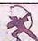

答案 P012

1.(2025 广东河源检测)已知集合 $P = \{x \in N \mid y = \frac{6}{x + 1}, y \in N\}$ , $Q = \{x \mid -1 \leqslant x < 5\}$ , 则 $P \cap Q =$ ( )

A. $\{1,2,3\}$

B. $\{0,1,2\}$

C. $\{1,2,5\}$

D. $\{0,1,2,5\}$

2.(2024 湖南联考)已知命题 $p: \exists x \in (0,1)$ , $x^{3} = \frac{\sqrt{3}}{3}$ , 则 $p$ 的否定是 ( )

A. $\forall x\in (0,1),x^3\neq \frac{\sqrt{3}}{3}$

B. $\exists x\in (0,1),x^3\neq \frac{\sqrt{3}}{3}$

C. $\forall x\in (0,1),x^3 = \frac{\sqrt{3}}{3}$

D. $\forall x \notin (0,1), x^3 \neq \frac{\sqrt{3}}{3}$

3.(2024 浙江名校联盟考试)已知集合 $A = \{x \mid (x - 2)^{2} \geqslant x + 10\}$ , $B = \{x \mid 2^{x} > 1\}$ , 则 $A \cup B =$ ()

A. $\{x \mid x \geqslant 3\}$

B. $\{x \mid x \geqslant 6\}$

C. $\{x \mid x \leqslant 2 \text{ 或 } x \geqslant 3\}$

D. $\{x \mid x \leqslant -1 \text{ 或 } x > 0\}$

4.(2025 江苏盐城中学期中)已知集合 $A = \{x \in \mathbf{Z} | x^2 + x - 2 < 0\}$ , $B = \{x \in \mathbf{N} | 0 \leqslant \log_2(x + 1) < 2\}$ , 则 $A \cup B$ 的非空真子集的个数为 （）

A. 16

B. 15

C. 14

D. 6

5.(2025青海西宁检测)集合 $A=\{x\mid-1\leqslant x\leqslant3\}$ ，集合 $B=\{x\mid1-m\leqslant x\leqslant1+m\}$ . 若 $B\subseteq A$ ，则m的取值范围是()

A. $\{m \mid m \leqslant 2\}$

B. $\{m\mid0\leqslant m\leqslant2\}$

C. $\{m \mid m \leqslant 0\}$

D. $\{m \mid m < 2\}$

6.(2023 河南联考)已知向量 $\boldsymbol{a} = (2 - t, 3)$ , $\boldsymbol{b} = (t, 1)$ ，则“a 与 b 的夹角为锐角”是“-1 < t < 3”的()

A. 充分不必要条件  
B. 必要不充分条件  
C. 充要条件  
D. 既不充分也不必要条件

7.(2024 四川绵阳期中) 设 $p: x^{2} - x - 20 \leqslant 0, q: \frac{9}{x + 4} \geqslant 1$ ，则 p 是 q 的 ( )

A. 充分不必要条件  
B. 必要不充分条件  
C. 充要条件  
D. 既不充分也不必要条件

8.(2025 福建泉州检测)甲、乙、丙、丁四位同学在玩一个猜数字游戏,甲、乙、丙共同写出三个集合: $A=\{x\mid0<\Delta x<2\}$ , $B=\{x\mid-3\leqslant x\leqslant5\}$ , $C=\{x\mid0<x<\frac{2}{3}\}$ ,然后他们三人各用一句话来正确地描述“ $\Delta$ ”处的数字,让丁同学找出该数字,以下是甲、乙、丙三位同学的描述,甲:此数为小于5的正整数;乙:B是A的必要不充分条件;丙:C是A的充分不必要条件.则“ $\Delta$ ”处的数字是()

A.3或4

B.2或3

C.1或2

D. 1 或 3

9.(2023 黑龙江模拟)已知集合 A 满足① $A \subseteq N$ ,
② $\forall x, y \in A, x \neq y$ , 必有 $|x - y| \geqslant 2$ , ③ 集合 A 中所有元素之和为 100, 则集合 A 中元素个数最多为 ( )

A.11

B. 10

C.9

D. 8

10.[多选](2025 福建龙岩一中开学考试)已知全集 $U=\{0,1,2,3,4,5,6,7\}$ ，集合 $A=\{x\in N|x<5\}$ ， $B=\{1,3,5,7\}$ ，则图中阴影部分所表示的集合为（）

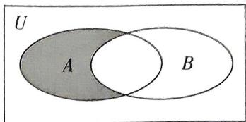

<details>
<summary>text_image</summary>

U
A
B
</details>

A. $\{0,2,4\}$

B. $\complement_U(A\cap B)$

C. $A \cap (\complement_U B)$

D. $(\complement_U A) \cap (\complement_U B)$

11.[多选](2025 辽宁锦州检测)对于集合 $M = \{a \mid a = x^2 - y^2, x \in \mathbf{Z}, y \in \mathbf{Z}\}$ , 下面结论正确的是 ( )

A. 如果 $P = \{b \mid b = 2n + 1, n \in \mathbf{Z}\}$ , 那么 $P \subseteq M$   
B. 如果 $c = 4n + 2, n \in \mathbf{Z}$ , 那么 $c \in M$   
C. 如果 $a_1 \in M, a_2 \in M$ , 那么 $a_1 a_2 \in M$   
D. 如果 $a_1 \in M, a_2 \in M$ , 那么 $a_1 + a_2 \in M$

12.[多选](2023 湖北黄冈统考)下列说法正确的有 ( )

A. “-2 < x < 4” 是“ $x^{2} - 2x - 15 < 0$ ” 的必要不充分条件  
B. 命题“ $\exists x_0 > 1, \ln (x_0 - 1) \geqslant 0$ ”的否定是
“ $\forall x \leqslant 1, \ln (x - 1) < 0$ ”  
C. “ $\ln a > \ln b$ ”是“ $a^2 > b^2$ ”的充分不必要条件  
D. 设 $a, b \in \mathbb{R}$ , 则“ $a \neq 0$ ”是“ $ab \neq 0$ ”的必要不充分条件

13.(2025 安徽“江淮十校”联考)下列可以成为不等式“ $x^{2}-6x+8\leqslant0$ ”成立的必要不充分条件的有\_\_\_\_。(填序号)

$$
\begin{array}{r l} & {\textcircled {1} | x - 3 | \leqslant 1; \textcircled {2} x ^ {2} - 8 x + 1 5 \leqslant 0; \textcircled {3} \log_ {2} (2 x) \leqslant} \\ & {\log_ {2} (x + 5); \textcircled {4} (\frac {1}{2}) ^ {x} \geqslant (\frac {1}{2}) ^ {6}.} \end{array}
$$

14. (2025 四川绵阳中学期中) 设集合 $A = \{x \mid x^2 - 3x + 2 = 0\}$ , $B = \{x \mid x^2 + 2(a + 1)x + a^2 - 5 = 0\}$ .

(1) 若 $A \cap B = \{2\}$ ，则实数 a 的值为 \_\_\_\_；
(2) 若“ $x \in A$ ”是“ $x \in B$ ”的必要条件，则实数a的取值范围为\_\_\_\_。

# 考点切片

# ② 看什么看，不服做了试试!

# 考点1 不等式的性质

→答案 P014

1. 下列命题为真命题的是 ( )

A. 若 $a > b$ , 则 $\sqrt{a} > \sqrt{b}$   
B. 若 $a > b$ , 则 $ac > bc$   
C. 若 $a > b, c > d$ , 则 $a + c > b + d$   
D. 若 $a > b, c > d$ , 则 $ac > bd$

2.(2024 江苏苏州期末)已知 0 < x < 1, 则下列不等式成立的是 ( )

A. $x^{2} > \frac{1}{x} > x$

B. $\frac{1}{x} > x^2 > x$

C. $x > \frac{1}{x} > x^2$

D. $\frac{1}{x} > x > x^{2}$

3.[多选](2025吉林四平期中)下列说法中,正确的是()

A. 若 $\frac{a}{c^2} > \frac{b}{c^2}$ , 则 $a > b$   
B. 若 $a^2 > b^2, ab > 0$ ，则 $\frac{1}{a} < \frac{1}{b}$   
C. 若 $a > b, c < d$ , 则 $a - c > b - d$   
D. 若 $b > a > 0, m > 0$ ，则 $\frac{a + m}{b + m} > \frac{a}{b}$

4.(2025 四川内江模拟) 设 $a = 0.1 e^{0.2}$ , $b = \frac{1}{10}$ , $c=0.2e^{0.1}$ ，则下列判断正确的是（）

A. $c < b < a$

B. $b < a < c$

C. $b < c < a$

D. $a < c < b$

# 考点2 配凑定值

→答案 P014

# 题组一 和定求积的最大值

1.(2024黑龙江哈尔滨九中开学考试)已知正实数m,n满足 $m+n=1$ ,则 $\sqrt{m}+\sqrt{n}$ 的最大值是()

A. 2

B. $\sqrt{2}$

C. $\frac{\sqrt{2}}{2}$

D. $\frac{1}{2}$

2.(2024河南省重点高中联考模拟)已知a>0，
b>0,且 $a+b=1$ ,则 $(a+\frac{1}{a})(b+\frac{1}{b})$ 的最小值为()

A. 4

B. 5

C. $\frac{16}{3}$

D. $\frac{25}{4}$

3.[多选](2020 新高考 I 卷)已知 a > 0, b > 0,
且 $a + b = 1$ , 则 ( )

A. $a^2 + b^2 \geqslant \frac{1}{2}$

B. $2^{a - b} > \frac{1}{2}$

C. $\log_2 a + \log_2 b \geqslant -2$

D. $\sqrt{a} +\sqrt{b}\leqslant \sqrt{2}$

4.(2025 福建宁德检测)已知 a > 0, b > 0, c > 0, 若 $2a + b + c = 4$ , 则 $a(a + b + c) + bc$ 的最大值为 \_\_\_\_.

5.(2024江西宜春三模)已知x>0,y>0,且满足 $4x^{2}+9y^{2}+6xy-3=0$ ,则 $2x+3y$ 的最大值为\_\_\_\_.

# 题组二 积定求和的最小值

6.(2024 山东枣庄八中月考)已知正数 a, b 满足 $2a + b = 1$ ，则 $4^{a} + 2^{b}$ 的最小值为 \_\_\_\_.

7.(2021 天津) 若 a > 0, b > 0, 则 $\frac{1}{a} + \frac{a}{b^{2}} + b$ 的最小值为 \_\_\_\_.

8.(2025重庆西南大学附属中学检测)已知x>2y>0,则 $x+\frac{8}{x+2y}+\frac{2}{x-2y}$ 的最小值为()

A. 2

B. 4

C. 6

D. 8

9.(2025 吉林长春检测)已知正数 x, y 满足 $x^{2} + 2xy - 3 = 0$ , 则 $2x + y$ 的最小值是 ( )

A.3

B. 5

C. 6

D. 12

10.(2024 河北张家口开学考试)已知 a > 1, b > 0, 且 $\frac{2}{a - 1} + \frac{1}{b} = 1$ , 则 $2a + b$ 的最小值为 \_\_\_\_.

11. 已知 $a > b > c > 0$ ，则 $2a^2 + \frac{1}{ab} + \frac{1}{a(a - b)} - 10ac + 25c^2$ 的最小值是 \_\_\_\_.

# 考点3 “1”的代换

→答案 P016


# 解题觉醒

处理形如“已知正数 $x, y$ 满足 $ax + by = 1$ ，求 $\frac{c}{x} + \frac{d}{y}$ 的最小值，其中 $a, b, c, d$ 都为正参数”的问题时，我们一般进行如下操作：

第一步: 将 1 用 ax + by 代替, 得 $\frac{c}{x} + \frac{d}{y} = (ax + by)$ .

$$
\left(\frac {c}{x} + \frac {d}{y}\right) = a c + b d + a d \cdot \frac {x}{y} + b c \cdot \frac {y}{x}.
$$

第二步: 对 $ad \cdot \frac{x}{y} + bc \cdot \frac{y}{x}$ 使用基本不等式.

第三步: 求出 $\frac{c}{x} + \frac{d}{y}$ 的最小值, 注意验证等号成立的条件.

需要注意的是,有时候需要经过换元或变形才能得到“1”的代换的基本形式.

1.(1)(2025 湖北黄冈一模)若 m>0, n>0, 且 $3m+2n-1=0$ , 则 $\frac{3}{m}+\frac{2}{n}$ 的最小值为 ( )

A. 20

B. 12

C. 16

D. 25

(2) 若 $m > 0, n > 0$ ，且 $3m + 2n = mn$ ，则 $3m + 2n$ 的最小值为 （）

A. 20

B. 18

C. 24

D. 12

2.(1)(2025 河北保定期中)已知 ab > 0 且 $a + 2b = 1$ ，则 $\frac{a^{2} + 2b + 1}{ab}$ 的最小值是（）

A.12

B. 16

C. 15

D. 14

(2)(2025 贵州遵义一中月考)已知实数 $x > 0, y \geqslant 0$ , 且 $x + 2y = 1$ , 若 $m^2 - 3m \leqslant \frac{2}{x} - \frac{4}{x + y}$ 恒成立, 则满足条件的整数 $m$ 的个数是 ( )

A.2

B.3

C. 4

D.5

3.(2024 陕西咸阳模拟)已知实数 x 满足 0 < x < $\frac{1}{3}$ ，则 $\frac{1}{x} + \frac{12}{1 - 3x}$ 的最小值为（）

A. 9

B. 18

C. 27

D. 36

4. 已知 $x > 0, y > 0, \lg 2^{x} + \lg 4^{y} = \lg 2$ ，则 $\frac{1}{x} + \frac{1}{2y}$ 的最小值为 \_\_\_\_.

5.(2025 河南郑州七中月考)若 $x, y \in R^{+}$ ，且 $x + 2y = 1$ ，则 $\frac{x^{2}}{x + 1} + \frac{2y^{2}}{y + 2}$ 的最小值为（）

A. $\frac{1}{5}$

B. $\frac{1}{6}$

C. $\frac{1}{7}$

D. $\frac{1}{8}$

6. 已知实数 $a, b$ 满足 $-1 < a < 1 < b$ , 且 $a + b = 2$ , 则 $\frac{1}{a + 1} + \frac{3a}{b - 1}$ 的最小值为 \_\_\_\_.

7. 已知正数 a, b 满足 $\frac{1}{a} + \frac{1}{b} = 1$ ，则 $\frac{1}{a - 1} + \frac{9}{b - 1}$ 的最小值为 \_\_\_\_.

8. 已知 $x > 0, y > 0, x + y = 1$ ，则


$\frac{2x^{2}+x+1}{xy}$ 的最小值为\_\_\_\_.

9. 已知 $a + b = 2, b > 0$ ，则 $\frac{1}{2|a|} + \frac{|a|}{b}$ 的最小值为 \_\_\_\_.

# 考点4 一个桥梁——基本不等式链的应用

→答案 P017


对应练习


# 解题觉醒

在求解形如“已知正数 $x, y$ 满足 $ax + by = f(xy)$ （其中 $a, b$ 都为正参数， $f(xy)$ 为 $cxy + d$ 的形式，求 $ax + by$ （或 $xy$ ）的最值”的问题时，我们一般进行如下操作：

第一步: 根据基本不等式变形得到 $ax + by \geqslant 2\sqrt{abxy}$ ，建立关于 $ax + by$ （或 xy）的不等式；

第二步: 解关于 $ax + by$ (或 xy) 的不等式, 即可求得 $ax + by$ (或 xy) 的最值, 注意验证等号能否取到.

除此之外,根据式子形式的不同,常见的用于构建桥梁的不等式还有 $xy \leqslant \frac{x^{2} + y^{2}}{2}, xy \leqslant (\frac{x + y}{2})^{2}$ 等.

1.[多选](2022 新高考Ⅱ卷)对任意 $x, y, x^2 + y^2 - xy = 1$ ，则 （）

A. $x + y \leqslant 1$

B. $x + y \geqslant -2$

C. $x^{2} + y^{2}\leqslant 2$

D. $xy \leqslant 1$

2.(2025 安徽省名校联考)若正实数 $x, y$ 满足 $xy + 5x + 5y = 11$ , 则 $x + y$ 的最小值为 ( )

A. 2

B. 3

C. 4

D. 5

3. 已知 $x > 0, y > 0$ ，且 $x + \frac{2}{x} = 6 - 2y - \frac{1}{y}$ ，则 $x + 2y$ 的最大值为 \_\_\_\_.

4. 已知 $x > 0, y > 0, x^2y + xy^2 = 4x + y$ ，则 $x + y$ 的最小值为 \_\_\_\_.

5.(2024 浙江宁波期中)已知正实数 a, b, c, $a + b = 3$ , 则 ab 的最大值为 \_\_\_\_, $\frac{ac}{b} + \frac{3c}{ab} + \frac{3}{c+1}$ 的最小值为 \_\_\_\_.

6.(2025 上海市川沙中学期中)设正实数 x, y, z 满足 $x^{2}-3xy+4y^{2}-z=0$ ，当 $\frac{xy}{z}$ 取得最大值时，求 $\frac{2}{x}+\frac{1}{y}-\frac{2}{z}$ 的最大值.

7. 已知实数 $a, b, c$ 满足 $a + b + c = 1, a^2 + b^2 + c^2 = 1$ , 求 $a^3 + b^3 + c^3$ 的最小值.


# 觉醒集训

# ②来了老铁，测测真学会没！


答案 P019

1.(2025 四川绵阳模拟)若正实数 a, b 满足 $a + b = 2ab - 4$ ，则 ab 的最小值为（）

A.1

B.2

C. 4

D. 8

2.(2024 福建省模拟)在 $\triangle ABC$ 中,点 $D$ 是边 $BC$ 上一点,若 $\overrightarrow{AD}=x\ \overrightarrow{AB}+y\ \overrightarrow{AC}$ ,则 $\frac{2x+5y}{xy}$ 的最小值为()

A. $7 - 2\sqrt{10}$

B. $7 + 2\sqrt{10}$

C. $2 \sqrt{10}$

D.7

3.(2024 江苏苏州模拟)设正实数 a, b, m, n 满足 $a + b = 1$ , mn = 2，则 $(am + bn)(an + bm)$ 的最小值为 ()

A.2

B. 4

C. 6

D. 8

4.《名师原创》已知 $A(x_{1}, y_{1})$ , $B(x_{2}, y_{2})$ 是函数 $y = e^{x}$ 的图象上的两个不同的点, 则下列结论中正确的是 ( )

A. $\mathrm{e}^{x_1 + x_2} > \frac{y_1^2 + y_2^2}{2}$

B. $\mathrm{e}^{x_1 + x_2} > \left(\frac{y_1 + y_2}{2}\right)^2$

C. $y_{1} + y_{2} > 2\mathrm{e}^{\sqrt{x_{1}x_{2}}}$

D. $y_{1} + y_{2} < 2\mathrm{e}^{\sqrt{x_{1}x_{2}}}$

5.(2025 山西晋中质检)已知 x > 0, y > 0, 且 $4x^{2} + 5xy = (4 + y)(4 - y)$ , 则 $7x + 4y$ 的最小值为
()

A. $6 \sqrt{3}$

B. $6 \sqrt{5}$

C. $8\sqrt{3}$

D. $8 \sqrt{5}$

6.(2025天津第一中学模拟)已知a>0,b>0,c>0,
且 $a + b - c \geqslant 0$ , 则 $\frac{b}{a} + \frac{4a}{c}$ 的最小值为 ( )

A.2

B.3

C.4

D. 5

7. 名师原创 已知函数 $f(x) = m \cdot n^x$ 图象上的点 $(x, y)$ 满足点 $(x, \log_a y)$ 在直线 $l$ 上，若直线 $l$ 过点 $A(0, 3), B(1, \frac{3}{2})$ ，则当 $a > 1$ 时，下列结论中正确的是 （）

A. $m^2 n = 1$

B. $n > 1$

C. $m + 2n^{2}\geqslant 2\sqrt{2}$

D. $\frac{m + 3n^2}{(1 + m)n^2}$ 的最小值为2

8.《名师原创》[多选]已知实数 $x > 0, y > 0$ ，设 $M = x + \frac{1}{y}, N = \frac{1}{x} + 9y$ ，则下列结论中正确的是（）

A. $M + N \geqslant 8$

B. ${MN} \geq  {16}$

C. $MN$ 的最小值为 12

D. 若 $M + N = 10$ ，则 $2 \leqslant M \leqslant 8$

9.[多选](2025 湖南省联考)已知正数 a, b 满足 $a + 4b = 4$ , 则 ( )

A. $ab \leqslant 1$

B. $a + 4\sqrt{b} \leqslant 5$

C. $\frac{4ab + 1}{a} +\frac{4ab + 1}{4b}\geqslant 8$

D. $\frac{1}{a} + \frac{4}{b} \geqslant \frac{25}{4}$

10.《强基自招》[多选]（2024 清华大学强基计划）已知 $e^{a} + a = \ln b + b = 4$ ，则下列选项中正确的有（）

A. $a \ln b + b \ln a > 1$

B. $a \ln b + b \ln a = 1$

C. $ab < 4$

D. $ab > \mathrm{e}$

11.(2025河南省名校联考)已知a,b均为正实数,且 $2a+3b=ab$ ,则 $\frac{1}{a-3}+\frac{3}{b-2}$ 的最小值为\_\_\_\_.

12.(2025 江苏南通一模)已知 $3^{a}=2+3^{b}$ ，则 2a-b 的最小值为 \_\_\_\_.

13.(2024 湖北省一模)已知正实数 a, b 满足 $2a + 3b = 2$ ，则 $\frac{ab}{-a^{2} + 2b + 4}$ 的最大值为 \_\_\_\_.

14.(2025 浙江嘉兴调研)已知 $a, b, c \in R^{+}$ ，且满足 $a + b + c = 4$ ，则 $\frac{1}{ab} + \frac{1}{bc}$ 的最小值为 \_\_\_\_.

# 考点切片

# ②⑨ 看什么看，不服做了试试！

# 考点1 函数的对应法则

→答案 P020

1. 在下列四组函数中, 表示同一函数的是 \_\_\_\_. (填序号)

① $f(x)=2x+1,x\in\mathbf{N},g(x)=2x-1,x\in\mathbf{N}.$   
② $f(x)=\sqrt{x-1}\cdot\sqrt{x+1},g(x)=\sqrt{x^{2}-1}.$   
③ $f(x)=\frac{(x-1)(x+1)}{x-1},g(x)=x+1.$   
④ $f(x)=|x|$ , $g(x)=\sqrt{x^{2}}$ .

2.[多选]下列说法正确的是 ( )

A. $f(x) = \frac{|x|}{x}$ 与 $g(x) = \left\{ \begin{array}{ll}1,x\geqslant 0,\\ -1,x <   0 \end{array} \right.$ 表示同一函数  
B. 函数 $y = f(x)$ 的图象与直线 $x = 1$ 的交点最多有1个  
C. $f(x) = x^{2} - 2x + 1$ 与 $g(t) = t^2 -2t + 1$ 是同一函数  
D. 若 $f(x) = |x - 1| - x$ ，则 $f\left(f\left(\frac{1}{2}\right)\right) = 0$

# 考点2 函数的定义域

→答案 P020

1.(1)(2025 山东聊城月考)函数 $f(x)=\sqrt{x-2}+\sqrt{x+5}$ 的定义域是\_\_\_\_.

(2)(2025 山东滨州检测) 函数 $f(x)=\ln(4x-x^{2})+\frac{1}{x-2}$ 的定义域为 \_\_\_\_.

2. 函数 $f(x) = \lg(mx^{2} + mx + 1)$ 的定义域为 R，则实数 m 的取值范围是 \_\_\_\_.

3. 函数 $f(x) = \ln (|x - 1| + |x - 2| - 3)$ 的定义域为 \_\_\_\_.

4.(1)已知函数 $f(x+2)$ 的定义域为[1,3],则函数 $f(x)$ 的定义域为\_\_\_\_;

(2)(2024 湖南衡阳模拟)已知函数 $f(x)$ 的定

义域为[2,8],则函数 $h(x) = f(2x) + \sqrt{9 - x^2}$ 的定义域为

5.(1)已知函数 $f(x)$ 的定义域为 $[-1,3]$ ，则函数 $y=f(|x|)$ 的定义域为\_\_\_\_；  
(2)已知函数 $f(x)$ 的定义域为[0,10],则函数 $y=f(x+1)+f(x-1)$ 的定义域为\_\_\_\_.

# 考点3 函数的值域与最值

→答案 P021

# 题组一

1.(1)(2025 重庆一中月考)函数 $y = x + \sqrt{2 - x}$ 的值域为 \_\_\_\_.  
(2)(2025 北京期中) 定义 $\max \{a, b, c\}$ 为 $a, b, c$ 中的最大值, 设 $h(x) = \max \{x^2, \frac{1}{4} x, 6 - x\}$ , 则 $h(x)$ 的最小值为 \_\_\_\_.  
2. 函数 $f(x) = \lg(mx^{2} + mx + 1)$ 的值域为 R，则实数 m 的取值范围是 \_\_\_\_.  
3.(2025 江苏南京期中)已知函数 $f(x)=x^{2}-2ax+a^{2}-9, x\in[a-3,a^{2}]\quad(a>0)$ ，若函数 $f(x)$ 的值域为 $[-9,0]$ ，则实数 a 的取值范围是 \_\_\_\_.  
4.（2023 湖北武汉调研）已知函数 $f(x)=\left\{\begin{aligned}x+1,x&\leqslant a,\\ 2^{x},x>a,\end{aligned}\right.$ 若 $f(x)$ 的值域是 R，则实数 a 的取值范围是 （）

A. $(-∞,0]$

B. $[0,1]$

C. $[0, +\infty)$

D. $(-∞,1]$

5.(2022 浙江) 已知函数 $f(x)=$

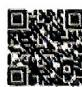

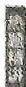

则 $f(f(\frac{1}{2})) =$

\_\_\_\_; 若当 $x \in [a, b]$ 时, $1 \leqslant f(x) \leqslant 3$ , 则 $b - a$ 的最大值是 \_\_\_\_.

6.(2025 湖南常德开学考试)高斯是德国著名的数学家,是近代数学奠基者之一,享有“数学王子”的称号,用其名字命名的“高斯函数”为 $y=[x]$ ,其中 $x\in\mathbf{R}$ , $[x]$ 表示不超过x的最大整数.例如 $[-2.1]=-3$ , $[3.1]=3$ .若函数 $f(x)=\frac{2^{x}+5}{2^{x}+1}$ ,则函数 $y=[f(x)]$ 的值域为()

A. $\{1,2,3\}$

B. $\{0,1,2,3\}$

C. $\{1,2,3,4\}$

D. $\{2,3,4,5\}$

# 题组二


# 解题觉醒

使用对勾函数求值域时,大多数情况是求分式型函数的值域,通常包含以下几种情形.

①二次比一次型:形如 $f(x)=\frac{ax^{2}+bx+c}{dx+e}(a,b,c,d,e\in\mathbf{R},ad\neq0)$ ，此时把分母看作一个整体进行换元，即可化成对勾函数的形式，进而求解出值域.

②一次比二次型:形如 $f(x)=\frac{ax+b}{cx^{2}+dx+e}(a,b,c,d,e\in\mathbf{R},ac\neq0)$ ，此时将分子、分母同除以分子，分母就变成了①中的形式，换元后继续操作即可.

③二次比二次型:形如 $f(x)=\frac{ax^{2}+bx+c}{dx^{2}+ex+f}(a,b,c,d,e,f\in\mathbf{R},ad\neq0)$ ，此时先把分子中的二次项分离常数，分离下去，就变成了②中的形式，再将分子、分母同除以分子，换元后继续操作即可.

7.(1)求函数 $f(x)=\frac{x^{2}+2x+4}{x}$ 的值域；

(2) 求函数 $f(x) = \frac{2x^2 - x + 1}{2x - 1}$ 的值域.

8. (1) 求函数 $y = \frac{\sqrt{x + 2}}{x + 3}$ 的值域.

(2) 求函数 $f(x) = \frac{x + 1}{x^2 + 2x + 10} (0 \leqslant x \leqslant 8)$ 的值域.

9. 求函数 $f(x) = \frac{2x^2 + 3x + 2}{x^2 + x + 1} (x \geqslant 0)$ 的值域.

10. 求函数 $f(x) = 5x^{2} + \frac{5}{x^{2}} - 15\left(x + \frac{1}{x}\right) + 6(x > 0)$ 的值域.

# 考点4 函数的解析式

→答案 P022

1.(2025重庆江津中学月考)已知 $f(x^{2}+1)=x^{4}-1$ ，则函数 $f(x)$ 的解析式为()

A. $f(x) = x^{2} - 2x$   
B. $f(x)=x^{2}-1(x\geqslant1)$   
C. $f(x) = x^{2} - 2x + 2(x \geqslant 1)$   
D. $f(x)=x^{2}-2x(x\geqslant1)$

2.(2025 湖北华中师大一附中期中)(1)已知 $f(x)$ 是一次函数,且 $f(f(x))=9x+4$ ,则 $f(x)$ 的解析式为 \_\_\_\_;

(2) 已知函数 $f(x)$ 满足 $f(2 - x) + 2f(2 + \frac{1}{x}) = x$ ,
则函数 $y=f(x)$ 的解析式为 \_\_\_\_.

# 考点5 函数的单调性

→答案 P023

# 题组一

1.(2023 新课标 I 卷) 设函数 $f(x)=2^{x(x-a)}$ 在区间 $(0,1)$ 上单调递减，则 a 的取值范围是


A. $(-∞,-2]$

B. $[-2,0)$

C. $(0,2]$

D. $[2, +\infty)$

2.(2025 湖南常德月考)“函数 $f(x)=-x^{2}+2mx$ 在区间[1,3]上不单调”的一个必要不充分条件是()

A. $1 < m < 3$

B. $\frac{1}{2} \leqslant m \leqslant \frac{5}{2}$

C. $1 \leqslant m < 3$

D. $2 \leqslant m \leqslant \frac{5}{2}$

3. 已知函数 $f(x)=\frac{\sqrt{3-ax}}{a-1}$ ，若 $f(x)$ 在区间 $(0,1]$ 上单调递减，则实数 a 的取值范围是 \_\_\_\_.

4.（2024 新课标 I 卷）已知函数 $f(x)=\left\{\begin{aligned}-x^{2}-2ax-a,x<0,\\ \mathrm{e}^{x}+\ln(x+1),x\geqslant0\end{aligned}\right.$ 在 R 上单调递增，则 a 的取值范围是 （）

A. $(-∞,0]$

B. $[-1,0]$

C. $[-1, 1]$

D. $[0, +\infty)$

5. 若函数 $f(x)$ 在 $\mathbf{R}$ 上为增函数，且对任意实数 $x$ ，都有 $f(f(x) - e^x) = e + 1$ （e 是自然对数的底数），则 $f(\ln 2)$ 的值为 \_\_\_\_.

# 题组二


# 解题觉醒

处理“解函数不等式 $f(g(x))<f(h(x))$ ”的问题时,我们通常采用以下步骤.

第一步:根据单调性的定义或 $f(x)$ 的导数 $f'(x)$ ，得到函数 $f(x)$ 在对应区间上的单调性.

第二步: 根据函数 $f(x)$ 的单调性, 将不等式 $f(g(x)) < f(h(x))$ 转化为不等式 $g(x) < h(x)$ 或 $g(x) > h(x)$ .

第三步: 求出 $g(x) < h(x)$ 或 $g(x) > h(x)$ 的解集.

6.(2025 山东淄博实验中学月考)已知 $f(x)$ 是定义在 $[-1,1]$ 上的增函数, 则不等式 $f(x-1) < f(1-3x)$ 的解集为 \_\_\_\_.

7.(2025 广东中山中学月考)定义在 R 上的函数 $f(x)$ 满足 $(x_{1}-x_{2})\cdot[f(x_{1})-f(x_{2})]>0,x_{1}\neq x_{2}$ ，且 $f(a^{2}-a)>f(2a-2)$ ，则实数 a 的取值范围为（）

A. $(- \infty, 1) \cup (2, +\infty)$   
B. $(-1,2)$   
C. $(1,2)$   
D. $(- \infty, -1) \cup (2, +\infty)$

8. 已知函数 $f(x) = \begin{cases} x^3, & x \leqslant 1, \\ \ln (x^2 - 2x + 4), & x > 1, \end{cases}$ 若 $f(m) > f(2m - 1)$ ，则实数 $m$ 的取值范围是 \_\_\_\_.

9. 已知函数 $f(x) = \begin{cases} 2^{x} - 1, & x \geqslant 2, \\ 3x - 3, & x < 2, \end{cases}$ 则不等式 $f(3x - 4) < f(x + 2)$ 的解集为 \_\_\_\_.

# 考点6 函数的奇偶性

→答案 P023

# 题组一

1.(2023 新课标Ⅱ卷) 若 $f(x)=(x+a)\ln\frac{2x-1}{2x+1}$ 为偶函数,则 a= ()

A.-1

B.0

C. $\frac{1}{2}$

D. 1

2.(2025 福建百校联考)已知奇函数 $f(x)=$ $(2^{x}+m\cdot2^{-x})\cos x$ ，则 m=()

A. -1

B.0

C. 1

D. $\frac{1}{2}$

3.(2025 辽宁丹东期中)已知奇函数 $f(x)$ 的定义域为 R, 当 $x \geqslant 0$ 时, $f(x) = 2^{x} - 1$ , 则当 x < 0 时, $f(x) =$ \_\_\_\_.

4. (2025 北京丰台区期中) 已知 $f(x)$ 是定义域为 R 的偶函数, 且在区间 $(- \infty, 0)$ 上单调递增, 则 $f(a^2 - 2a + 4)$ 与 $f(-2)$ 的大小关系为 ( )

A. $f(a^{2} - 2a + 4) > f(-2)$   
B. $f(a^{2} - 2a + 4) = f(-2)$   
C. $f(a^{2} - 2a + 4) <   f(-2)$   
D. 不确定

5.[多选](2025重庆期中)已知函数 $y=f(x)$ 对任意实数x,y都满足 $2f(x)f(y)=f(x+y)+f(x-y)$ ，且 $f(1)=-1,f(0)\neq0$ ，则()

A. $f(0) = 1$

B. $f(x)$ 是奇函数

C. $f(x)$ 是偶函数

D. $f(x) + f(1 - x) = 0$

6. 已知函数 $f(x+1)$ 是定义在 $(-∞,0)∪(0,+∞)$ 上的偶函数，且 $f(x+1)$ 在区间 $(-∞,0)$ 上单调递减，图象过点 $(1,0)$ ，则不等式 $(x-1)·f(x)≤0$ 的解集为 \_\_\_\_.

7. (2025 江苏苏州模拟) 若函数 $f(x) = \ln \left( \frac{2}{1 - x} + a \right)$ 是奇函数, 则不等式 $f(x) < 1$ 的解集为 ( )

A. $(-1, \frac{\mathrm{e} - 1}{\mathrm{e} + 1})$

B. $(0, \frac{\mathrm{e} - 1}{\mathrm{e} + 1})$

$\left(\frac{e-1}{e+1},1\right)$

D. $(-1, \frac{e - 1}{e + 1}) \cup (1, +\infty)$

题组二


对应练习

# 解题觉醒

对于根据 $f(x_0)$ 求解 $f(-x_0)$ 的问题，我们可以根据以下步骤处理.

第一步: 把函数 $f(x)$ 分解为一个偶函数 $g(x)$ 和一个奇函数 $h(x)$ 的和.

第二步: 如果偶函数 $g(x)$ 形式简单, 根据 $h(-x_{0}) = -h(x_{0})$ 列式子求解; 如果奇函数 $h(x)$ 形式简单, 根据 $g(-x_{0}) = g(x_{0})$ 列式子求解.

8. 已知函数 $f(x) = ax^{4} + bx^{2} + x + 6$ ，且 $f(-1) = 2023$ ，则 $f(1) = \_\_\_\_$ .

9. 已知函数 $f(x) = ax^{7} + bx^{3} + x^{2} + cx - 2023$ ，且 $f(10) = 6$ ，则 $f(-10) = \_\_\_\_$ .

10.(2025 河北保定六校联考)已知定义域为 $[a-4,a-2]$ 的奇函数 $f(x)=2024x^{3}-5x+b+3$ ，则 $f(a)+f(b)$ 的值为 \_\_\_\_.

11.(2025 湖南常德期中)若对任意 $x, y \in R$ ，有 $f(x+y)=f(x)+f(y)$ ，则函数 $g(x)=\frac{2x}{x^{2}+1}+f(x)+3$ 在 $[-2024,2024]$ 上的最大值 M 与最小值 m 的和为 \_\_\_\_.

考点7

# 函数图象的对称性

→答案P025


对应练习


# 解题觉醒

1. 轴对称相关结论: ① 函数 $f(x)$ 的图象关于直线 x = a 对称 $\Leftrightarrow f(a + x) = f(a - x)$ .

② $f(x)=f(2a-x)\Leftrightarrow$ 函数 $f(x)$ 的图象关于直线x=a对称.

③ $f(x+a)=f(b-x)\Leftrightarrow$ 函数 $f(x)$ 的图象关于直线 $x=\frac{a+b}{2}$ 对称.

2. 中心对称相关结论: ① 函数 $f(x)$ 的图象关于点 $(a, b)$ 中心对称 $\Leftrightarrow f(a + x) + f(a - x) = 2b$ .

② $f(x)+f(2a-x)=2b\Leftrightarrow$ 函数 $f(x)$ 的图象关于点 $(a,b)$ 中心对称.

③ $f(x+a)+f(b-x)=2c\Leftrightarrow$ 函数 $f(x)$ 的图象关于点 $\left(\frac{a+b}{2},c\right)$ 中心对称.

3. 三次函数的对称性: 对于一个三次函数 $f(x) = ax^3 + bx^2 + cx + d (a \neq 0)$ 来说, $(x_0, f(x_0))$ 是函数 $f(x)$ 图象的对称中心, 其中 $x_0$ 满足方程 $f''(x_0) = 0(f''(x)$ 为函数 $f(x)$ 的二阶导数).

1.(2025 贵州贵阳月考)已知定义在 $\mathbf{R}$ 上的函数 $f(x)$ 的图象关于点(1,0)中心对称,且当 $x \geqslant 1$ 时, $f(x) = 2x + a$ , 则 $f(0) = \_$ .

2.(2025 北京人大附中质检)已知函数 $f(x)=|x+1|+|ax-2|(a>0)$ 的定义域为 R, 最小值记为 $M(a)$ , 给出以下四个结论:

① $M(a)$ 的最小值为1;  
② $M(a)$ 的最大值为3;  
③ $f(x)$ 在 $(-∞,-1)$ 上单调递减；

④a 只有唯一值使得 $y = f(x)$ 的图象有一条垂直于 x 轴的对称轴.

其中所有正确结论的序号是\_\_\_\_。

3. (全国Ⅰ卷) 若函数 $f(x) = (1 - x^2)(x^2 + ax + b)$ 的图象关于直线 $x = -2$ 对称, 则 $f(x)$ 的最大值为 \_\_\_\_.

4.(2021全国乙卷)设函数 $f(x)=\frac{1-x}{1+x}$ ，则下列函数中为奇函数的是()

A. $f(x - 1) - 1$

B. $f(x-1)+1$

C. $f(x + 1) - 1$

D. $f(x+1)+1$

5.(2023 全国甲卷)已知函数 $f(x)=\mathrm{e}^{-(x-1)^{2}}$ . 记 $a=f(\frac{\sqrt{2}}{2}), b=f(\frac{\sqrt{3}}{2}), c=f(\frac{\sqrt{6}}{2})$ ，则（）

A. $b > c > a$

B. $b > a > c$

C. $c > b > a$

D. $c > a > b$

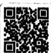

6.(2025 福建宁德月考) 曲线 $f(x)=\frac{3^{x}-6}{3^{x}+3}$ 的对称中心为 \_\_\_\_.

7. 已知函数 $f(x) = x^3 + ax^2 + x + b$ 的图象关于点 (1,0) 对称，则 $b =$ \_\_\_\_.

8. 已知函数 $f(x) = x^{3} - 3x^{2} - \sin \pi x$ ，则 $f(\frac{1}{2023}) + f(\frac{2}{2023}) + \cdots + f(\frac{4044}{2023}) + f(\frac{4045}{2023}) =$ \_\_\_\_.

# 考点8 函数的周期性

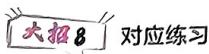

→答案 P026

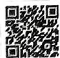


# 解题觉醒

1. 半周期推导周期: 已知 $a \in R, a \neq 0$ .

①若函数 $f(x)$ 满足 $f(x)+f(x+a)=b(b\in\mathbf{R})$ ，则函数 $f(x)$ 是周期为2a的周期函数.  
②若函数 $f(x)$ 满足 $f(x)f(x+a)=b(b\in\mathbf{R},b\neq0)$ ，则函数 $f(x)$ 是周期为2a的周期函数.  
③若函数 $f(x)$ 满足 $f(x+a)=\frac{1+f(x)}{1-f(x)}$ ，则函数 $f(x)$ 是周期为4a的周期函数.

2. 双对称推导周期.

①两条对称轴:已知函数 $f(x)$ 图象关于直线x=a和直线x=b对称,则函数 $f(x)$ 是周期为 $2|b-a|$ 的周期函数.  
②两个对称中心: 已知函数 $f(x)$ 图象关于点 $(a,0)$ 和点 $(b,0)$ 中心对称, 则函数 $f(x)$ 是周期为 $2|b-a|$ 的周期函数.  
③一条对称轴 + 一个对称中心: 已知函数 $f(x)$ 图象关于点 $(a,0)$ 中心对称且关于直线 $x=b$ 对称, 则函数 $f(x)$ 是周期为 $4|b-a|$ 的周期函数.

1.(1) 若 $f(x) = -f(x + 4)$ ，则函数 $f(x)$ 的最小正周期为 \_\_\_\_；

(2) 若 $f(x+3)=\frac{1+f(x)}{1-f(x)}$ ，则函数 $f(x)$ 的最小正周期为 \_\_\_\_.

2.(2025 河南高中创新联盟调研)已知函数 $f(x)$ 的定义域为 R, 且 $f(x+2)f(x)=1$ , 若 $f(0)\in(1,2)$ , 则 $f(2026)$ 的取值范围为 \_\_\_\_.

3.(2025 河北模拟)已知定义在 $\mathbf{R}$ 上的函数 $f(x)$ , 满足 $f(x - 3) + f(5 - x) = 2, f(2x + 2)$ 为偶函数, $f(2) = 2$ , 则 $\sum_{i=1}^{2023} f(i) =$ \_\_\_\_.

4.[多选]设函数 $y = f(x)$ 的定义域为R,其图象关于直线 $x = -2$ 对称,且 $f(x + 2) = f(x - 2)$ . 当 $x \in [0,2]$ 时, $f(x) = (\frac{1}{3})^x - x$ ,则下列结论正确的是()

A. $f(x)$ 为偶函数  
B. $f(2023) = 4$   
C. $f(x)$ 的图象关于直线 $x = 2$ 对称  
D. $f(x)$ 在区间 $[-2,0]$ 上单调递减

5.(2024 黑龙江哈尔滨模拟)定义在 $\mathbf{R}$ 上的奇函数 $f(x - 1)$ 满足 $f(x) = f(2 - x)$ , 且当 $x \in [1, 3]$ 时, $f(x) = a \sin \pi x + b \cos \pi x + 1$ , 则 $f(2024) =$ ( )

A. -4

B. -2

C. 0

D. 2

6.(2022全国乙卷)已知函数 $f(x)$ , $g(x)$ 的定义域均为 R, 且 $f(x) + g(2 - x) = 5$ , $g(x) - f(x - 4) = 7$ . 若 $y = g(x)$ 的图象关于直线 x = 2 对称, $g(2) = 4$ , 则 $\sum_{k=1}^{22} f(k) =$ ( )

A. -21

B. -22

C. -23

D. -24


7.[多选](2025广东肇庆检测)已知 $f(3x+1)$ 为奇函数,且对任意 $x\in R$ ,都有 $f(x+2)=f(4-x)$ , $f(3)=1$ ,则()

A. $f(7) = -1$

B. $f(5)=0$

C. $f(11) = -1$

D. $f(23) = 0$

# 考点9 类周期函数

→答案P027

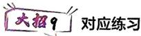


# 解题觉醒

对于形如 $g(x + T) = ag(bx) + c(a, b > 0, c \in \mathbb{R})$ 的类周期函数 $g(x)$ 来说，我们往往知道其在 $(x_0, x_0 + T]$ （或 $[x_0, x_0 + T])$ 上的解析式. 此时我们通常采用以下步骤处理：

第一步:利用函数 $g(x)$ 的类周期性,找到函数 $g(x)$ 各段值域之间的关系(如涉及精细分析则需要将函数 $g(x)$ 各段的解析式求出来,如有必要画出函数 $g(x)$ 各段的图象).

第二步: 对函数 $g(x)$ 各段开展分类讨论(或根据函数 $g(x)$ 各段的图象解决问题).

1.(2025 四川南充适应性考试)定义在 $\mathbf{R}$ 上的函数 $f(x)$ 的图象关于点 $(\frac{1}{2}, \frac{1}{2})$ 对称, 且满足 $f(x) = \frac{1}{2} f(5x), f(0) = 0$ , 当 $0 \leqslant x_1 < x_2 \leqslant 1$ 时, 都有 $f(x_1) \leqslant f(x_2)$ , 则 $f(\frac{1}{2024}) =$ ( )

A. $\frac{1}{256}$

B. $\frac{1}{128}$

C. $\frac{1}{64}$

D. $\frac{1}{32}$

2. 定义域为 $\mathbf{R}$ 的函数 $f(x)$ 满足 $f(x + 2) = 2f(x) - 1$ , 当 $x \in (0,2]$ 时, $f(x) = \begin{cases} x^2 - x, & x \in (0,1), \\ \frac{1}{x}, & x \in [1,2]. \end{cases}$ . 当 $x \in (0,4]$ 时, $t^2 - \frac{7t}{2} \leqslant f(x) \leqslant 3 - t$ 恒成立, 则实数 $t$ 的取值范围是 \_\_\_\_.

3.(2025 河北保定期中)已知函数 $f(x)=\left\{\begin{aligned}|x|-1,-1&\leqslant x<1,\\ 2f(x-2),1&\leqslant x\leqslant7,\end{aligned}\right.$ 若关于 x 的方程 $f(x)=a$ 至少有五个不等的实数解,则实数 a 的取值范围是 ( )

A. $[-1,0]$

B. $[-2,0]$

C. $[-4,0]$

D. $[-8,0]$

4. 已知定义在 $[0, +\infty)$ 上的函数 $f(x)$ 满足 $f(x) = 3f(x + 2)$ , 当 $x \in [0, 2)$ 时, $f(x) = -x^2 + 2x$ , 设 $f(x)$ 在 $[2n - 2, 2n)$ 上的最大值为 $a_n$ ( $n \in \mathbf{N}_+$ ), 且 $\{a_n\}$ 的前 $n$ 项和为 $S_n$ , 则 $S_n$ 的取值范围是 \_\_\_\_.

5. 已知函数 $f(x) = \begin{cases} 2 - x, & 1 < x \leqslant 2, \\ \frac{1}{2} f(2x), & 0 < x \leqslant 1, \end{cases}$ 若函数 $g(x)=f(x)-k(x-1)$ 恰有三个不同的零点，
则实数 k 的取值范围是 \_\_\_\_。

# 考点10 指对运算

→答案 P028

1.(2025 安徽合肥七中月考) 计算: $1^{0} + e^{\ln 2} - 0.5^{-2} + \lg 25 + 2\lg 2 =$ ( )

A. -2

B. -1

C.0

D.1

2.(2024全国甲卷)已知a>1且 $\frac{1}{\log_{8}a}-\frac{1}{\log_{a}4}=$ $-\frac{5}{2}$ , 则 a = \_\_\_\_.

3.已知 $a > 1, b > 1$ ，且 $\log_2\sqrt{a} = \log_b4$ ，则 $ab$ 的最小值为 （）

A. 4

B.8

C. 16

D. 32

4.(2025 上海南洋中学期中)已知 $\log_{18}9 = a$ , $18^{b}=5$ ，则 $18^{a-\frac{b}{2}}$ 的值为 \_\_\_\_.

5.(2022 全国甲卷)已知 $9^{m}=10, a=10^{m}-11,$ $b=8^{m}-9$ , 则 ( )

A. $a > 0 > b$

B. $a > b > 0$

C. $b > a > 0$

D. $b > 0 > a$

6.(2025江西上饶检测)已知实数x,y满足 $2x=\left(\frac{4}{3}\right)^{\log_{2}x}-3^{1+\log_{2}x},3y=\left(\frac{4}{3}\right)^{\log_{3}y}-2^{1+\log_{3}y}$ ，则 $\frac{x}{y}=$ \_\_\_\_.

7. (2025 上海七宝中学期中) 定义“正对数”: $\ln^{+}x=\begin{cases}0,0<x<1,\\ \ln x,x\geqslant1,\end{cases}$ 现有四个命题:

①若 $a > 0, b > 0$ ，则 $\ln^{+}(a^{b}) = b\ln^{+}a$ ；  
②若 $a > 0, b > 0$ ，则 $\ln^{+}(ab) = \ln^{+}a + \ln^{+}b$ ;  
③若 $a > 0, b > 0$ ，则 $\ln^{+}\left(\frac{a}{b}\right) = \ln^{+}a - \ln^{+}b$ ;  
④若 $a > 0, b > 0$ ，则 $\ln^{+}(a + b) \geqslant \ln^{+}a + \ln^{+}b + \ln 2$ .

其中真命题的个数为 （）

A. 1

B.2

C. 3

D. 4

# 考点11 指对幂函数及其应用

→答案 P028

1. 已知函数 $f(x) = \log_a (x^2 - 2x + 3) (a > 0, a \neq 1)$ 在 $[\frac{1}{2}, 2]$ 上的最大值比最小值大 2，则 $a =$ \_\_\_\_.

2.(2025北京师大附中模拟)已知 $a=\log_{2}3,b=\log_{4}6,c=\log_{4}9$ ，则()

A. $a = b < c$

B. $a < b < c$

C. $a = c > b$

D. a > c > b

3.(2024 天津) 若 $a = 4.2^{-0.3}$ , $b = 4.2^{0.3}$ , $c = \log_{4.2}0.2$ , 则 a, b, c 的大小关系为 ( )

A. $a > b > c$

B. $b > a > c$

C. $c > a > b$

D. $b > c > a$

4.(2024 北京)已知 $(x_{1},y_{1}),(x_{2},y_{2})$ 是函数 y= $2^{x}$ 的图象上两个不同的点,则()

A. $\log_2\frac{y_1 + y_2}{2} < \frac{x_1 + x_2}{2}$

B. $\log_2\frac{y_1 + y_2}{2} >\frac{x_1 + x_2}{2}$

C. $\log_2\frac{y_1 + y_2}{2} < x_1 + x_2$

D. $\log_2\frac{y_1 + y_2}{2} >x_1 + x_2$

5.(2025 邢台一中月考)已知幂函数 $f(x)=x^{\alpha}$ 的图象经过点(4,2)，若 $f(a+1)>f(3-2a)$ ，则实数a的取值范围是\_\_\_\_；若 $0<x_{1}<x_{2}$ ，则 $\frac{f(x_{1})+f(x_{2})}{2}$ \_\_\_\_ $f(\frac{x_{1}+x_{2}}{2})$ （填“＞”“≤”或“＝”）.

6.(2020 全国 I 卷) 若 $2^{a} + \log_{2}a = 4^{b} + 2\log_{4}b$ ，则
()

A. $a > 2b$

B. $a <   2b$

C. $a > b^{2}$

D. $a < {b}^{2}$

7.已知 $a = 10\mathrm{e}^{0.1},b = 10.1$ ，则 （

A. $a > b + 1$

B. $b - 1 < a < b$

C. $b < a < b + 1$

D. $a < b - 1$

8.[多选](2023 新课标 I 卷)噪声污染问题越来越受到重视. 用声压级来度

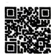

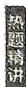

量声音的强弱,定义声压级 $L_{p}=20\times\lg\frac{p}{p_{0}}$ , 其中常数 $p_{0}(p_{0}>0)$ 是听觉下限阈值,p 是实际声压. 下表为不同声源的声压级:

<table><tr><td>声源</td><td>与声源的距离/m</td><td>声压级/dB</td></tr><tr><td>燃油汽车</td><td>10</td><td>60~90</td></tr><tr><td>混合动力汽车</td><td>10</td><td>50~60</td></tr><tr><td>电动汽车</td><td>10</td><td>40</td></tr></table>

已知在距离燃油汽车、混合动力汽车、电动汽车 $10\mathrm{m}$ 处测得的实际声压分别为 $p_1, p_2, p_3$ ，则（）

A. $p_1 \geqslant p_2$

B. $p_2 > 10p_3$

C. $p_{3} = 100p_{0}$

D. $p_1 \leqslant 100p_2$

# 考点12 反函数应用

→答案P029

1. (2021 上海) 已知 $f(x) = \frac{3}{x} + 2$ ，则 $f^{-1}(1) =$ \_\_\_\_.

2.(2025 广东梅州开学考试)已知函数 $y = e^{x}$ 的图象与函数 $y = f(x)$ 的图象关于直线 y = x 对称, 则 $f(2e) =$ ( )

A. $2 \mathrm{e}^{2}$

B. $2 \mathrm{e}$

C. $1 + \ln 2$

D. lg 2e

3. 已知函数 $f(x) = e^{x} + a$ 的反函数是 $f^{-1}(x)$ ，若函数 $y = f(x)$ 的图象与函数 $y = f^{-1}(x)$ 的图象有交点，则 a 的取值范围是 \_\_\_\_.

4.[多选](2025 安徽六安月考)已知函数 $y = e^{x}$ 和 $y = \ln x$ 的图象与直线 y = 2 - x 交点的横坐标分别为 a, b, 则 ( )

A. $a < b$

B. $a + b = 2$

C. ${ab} > 1$

D. $a^2 + b^2 > 2$

# 考点 13 函数的图象变换

→答案 P029


对应练习

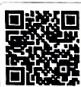


# 解题觉醒

1. 平移变换: 按左加右减, 上加下减的原则处理.  
2. 伸缩变换: 针对自变量 x 做伸缩变换.  
3. 对称变换.

①关于直线 $x = a$ 对称： $f(2a - x)$ 的图象与 $f(x)$ 的图象关于直线 $x = a$ 对称.  
②关于点 $(a, b)$ 对称: $g(x) = 2b - f(2a - x)$ 的图象与 $f(x)$ 的图象关于点 $(a, b)$ 对称.  
③关于直线 y = x 对称: $f^{-1}(x)$ 的图象与 $f(x)$ 的图象关于直线 y = x 对称.

4. 翻折变换.

①下翻上:要得到 $g(x)=|f(x)|$ 的图象,只需把 $f(x)$ 图象中 $f(x)<0$ 部分的图象沿 x 轴翻折上来,并抹去原 $f(x)<0$ 部分的图象,保留原 $f(x)\geqslant0$ 部分的图象.  
②右翻左:要得到 $g(x)=f(|x|)$ 的图象,只需把 $f(x)$ 图象中 x>0 部分的图象沿 y 轴翻折过去,并保留原 $x\geqslant0$ 部分的图象.

1.[多选](2025 江苏省海安高级中学开学考试)下列曲线平移后可得到曲线 $y = 2^{x}$ 的是（）

A. $y = 2^{x + 3}$

B. $y = 2^{x} - 3$

C. $y = 2^{3x}$

D. $y = \frac{2^x}{3}$

2.(2024 安徽淮南期末)将函数 $f(x)=2+\log_{3}x$ 图象上所有点的横坐标变化到原来的 m(m>0) 倍,纵坐标保持不变,得到 $g(x)=\log_{3}x$ 的图象,则 m= \_\_\_\_.  
3. 已知 $y = f(2x + 1)$ 为奇函数, $y = f(x)$ 的图象与 $y = g(x)$ 的图象关于直线 y = x 对称, 若 $x_{1} + x_{2} = 0$ , 则 $g(x_{1}) + g(x_{2}) =$ \_\_\_\_.  
4. 定义域为 $\mathbf{R}$ 的函数 $f(x) = ax^{2} + b|x| + c (a \neq 0)$ 有两个单调区间, 则实数 $a, b, c$ 满足（）

A. $b^{2} - 4ac\geqslant 0$ 且 $a > 0$   
B. ${b}^{2} - {4ac} \geq  0$   
C. $-\frac{b}{2a} \geqslant 0$   
D. $-\frac{b}{2a} \leqslant 0$

5.(2025重庆沙坪坝区模拟)已知函数 $f(x)=$ $\left\{\begin{aligned}h(x),&x<0,\\ -(\frac{1}{e})^{x}-1,x&\geqslant0.\end{aligned}\right.$ 将函数 $h(x)$ 的图象向左

平移一个单位长度,再向上平移一个单位长度后得函数 $y = -\frac{4}{x}$ 的图象,若 $f(m + 2) < f(m^{2})$ ,则实数 m 的取值范围是 ( )

A. $(-1,2)$   
B. $(- \infty, -1) \cup (2, +\infty)$   
C. $[-2, -1) \cup (2, +\infty)$   
D. $(-\infty, -1] \cup [2, +\infty)$

# 考点14 抽象函数

$\Rightarrow$ 答案P030

1.(2025重庆西南大学附中月考)若定义在(0, +∞)上的函数 $f(x)$ 满足 $f(x+y)=f(x)+f(y)+6xy$ ，且有 $f(n)\geqslant3n$ 对 $n\in N^{*}$ 恒成立，则 $\sum_{i=1}^{8}f(i)$ 的最小值为\_\_\_\_.

2.(2024 新课标 I 卷)已知函数 $f(x)$ 的定义域为 R, $f(x) > f(x - 1) + f(x - 2)$ ，且当 x < 3 时， $f(x) = x$ ，则下列结论中一定正确的是（）

A. $f(10) > 100$

B. $f(20) > 1000$

C. $f(10) < 1000$

D. $f(20) < 10000$

3.[多选](2023 新课标 I 卷)已知函数 $f(x)$ 的定义域为 R, $f(xy)=y^{2}f(x)+x^{2}f(y)$ ，则（）

A. $f(0) = 0$

B. $f(1) = 0$

C. $f(x)$ 是偶函数

D. $x = 0$ 为 $f(x)$ 的极小值点

4. 已知定义在 $(-1, 1)$ 上的函数 $f(x)$ 满足对任意的 $x, y \in (-1, 1)$ , 都有 $f(x) + f(y) = f(\frac{x + y}{1 + xy})$ , 且当 $x \in (-1, 0)$ 时, 有 $f(x) > 0$ . 若 $f(-\frac{1}{2}) = 1$ , 则不等式 $f(2x + 1) + 2 < 0$ 的解集为 \_\_\_\_.

# 考点15 函数的零点 & 方程(一)——数形结合

找临界

→答案 P031

大招11 对应练习


# 解题觉醒

对于函数零点问题,按以下步骤处理:

第一步: 将“函数 $F(x) = f(x) - g(x)$ 的零点个数”
转化为“函数 $f(x)$ 图象与函数 $g(x)$ 图象的交点个数”（有时需要对 $F(x)$ 做一定的变形，以函数 $f(x)$ 图象与函数 $g(x)$ 图象容易画出为标准）.

第二步:画出函数 $f(x)$ 与函数 $g(x)$ 的图象,如果含参,重点讨论直曲相切、双曲公切以及端点、间断点情形,得到全部的临界情形.

第三步:数形结合解答问题.

1.(1) 函数 $f(x)=2x^{3}-4x+1$ 的零点个数为 \_\_\_\_；

(2)(2025 重庆期中)已知 a > 0，则关于 x 的方程 $\sin \pi x + \frac{1}{x - a} - 3(x - a) = 0$ 的实根个数为 \_\_\_\_.

2.(2025 四川绵阳诊断考试)已知函数 $f(x)=\left|\ln|x+2\right|-m,m>0$ ，则 $f(x)$ 的零点之和为 \_\_\_\_.

3.(2025 湖南师大附中开学考试)已知函数 $f(x)=$ $\left\{\begin{aligned}&1+\log_{a}|x-2|,x\leqslant1,\\ &(x-1)^{2}+4a,x>1(a>0\text{ 且 }a\neq1)\end{aligned}\right.$ 在 R 上为

单调函数,若函数 $y = |f(x)| - x - 2$ 有两个不同的零点,则实数 a 的取值不可能是（）

A. $\frac{1}{16}$

B. $\frac{1}{4}$

C. $\frac{1}{2}$

D. $\frac{13}{16}$

4. 已知 $f(x)$ 是定义在 $\mathbb{R}$ 上的奇函数，且 $f(x)$ 在 $[0,2]$ 上单调递减， $f(x + 2)$


为偶函数, 若 $f(x)=m$ 在 $[0,12]$ 上恰好有四个不同的实数根 $x_{1}, x_{2}, x_{3}, x_{4}$ ，则 $x_{1} + x_{2} + x_{3} + x_{4} =$ \_\_\_\_.

5.（2024 四川模拟）设函数 $f(x)=\left\{\begin{aligned}-x^{2}+4x,x&\leqslant4,\\|\log_{2}(x-4)|,x&>4,\end{aligned}\right.$ 若关于 x 的方程 $f(x)=t$ 有四个实根 $x_{1}, x_{2}, x_{3}, x_{4} (x_{1} < x_{2} < x_{3} < x_{4})$ ，则 $x_{1} + x_{2} + 2x_{3} + \frac{1}{2}x_{4}$ 的最小值为（）

A. $\frac{31}{2}$

B. 16

C. $\frac{33}{2}$

D. 17

6.(2024 天津)若函数 $f(x)=2\sqrt{x^{2}-ax}-|ax-2|+1$ 恰有一个零点,则a的取值范围为\_\_\_\_.

7. 已知函数 $f(x) = |x^{2} + 3x|$ , $x \in R$ , 若方程 $f(x) - a|x - 1| = 0$ 恰有四个互异的实数根, 则 a 的取值范围是 \_\_\_\_.

# 考点 16 函数的零点 & 方程(二)——二次函数

的零点分布问题

→答案 P033

大招12

对应练习

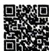


# 解题觉醒

对于二次函数的零点分布问题,根据①二次函数图象的开口方向,②对应一元二次方程根的判别式,③二次函数图象的对称轴与区间端点的位置关系,④二次函数在所给区间端点处函数值的正负,列式子解决问题.

1. 已知关于 $x$ 的方程 $x^{2} + 2(m - 1)x + 2m + 6 = 0$ .

(1) 若方程有两个实根, 且一个比 2 大, 一个比 2 小, 求实数 m 的取值范围;

(2) 若方程有两个实根 $\alpha, \beta$ , 且满足 $0 < \alpha < 1 < \beta < 4$ , 求实数 $m$ 的取值范围;

(3) 若方程至少有一个正根, 求实数 m 的取值范围.

2.(2025 上海交大附中等四校期中联考)已知二次函数 $f(x)=ax^{2}+bx+c(a>0)$ ，若集合 $A=\{x\mid f(x)=0,1\leqslant x\leqslant3\}$ 中恰有两个元素，则 $\frac{f(2)}{a}$ 的取值范围为 \_\_\_\_.

3.[多选](2023 新课标Ⅱ卷)若函数 $f(x)=a\ln x+\frac{b}{x}+\frac{c}{x^{2}}(a\neq0)$ 既有极大值也有极小值,则()

A. $bc > 0$

B. ${ab} > 0$

C. $b^{2} + 8ac > 0$

D. ${ac} < 0$


4. (2025 湖南明德中学检测) 在数学中, 对于满足一定条件的连续函数 $g(x)$ , 存在实数 $x_0$ , 使得 $g(x_0) = x_0$ , 我们就称该函数为“不动点”函数, 实数 $x_0$ 为该函数的不动点. 已知函数 $g(x) = ax^2 + (a - 2)x + 1$ 在区间 $(- \infty, \frac{1}{2})$ 上恰有两个不同的“不动点”, 则实数 $a$ 的取值范围为 ( )

A. $(\frac{3}{2}, +\infty)$

B. $(9, +\infty)$

C. $(-\infty, 0) \cup (9, +\infty)$

D. $(-\infty, \frac{2}{3})$

# 考点 17 函数的零点 & 方程(三)——复合方程

问题

→答案 P034


对应练习


# 解题觉醒

1. 复合方程的由外向内: 探讨“求关于 x 的复合方程 $f(g(x)) = m (m \in \mathbf{R})$ 实数根的个数”的相关问题时, 如果方程能解, 我们一般采用由外向内一层一层去处理, 其一般步骤如下:

第一步,设 $u = g(x)$ , 解关于 u 的方程 $f(u) = m$ , 得到若干实数根 $u_{1}, u_{2}, \cdots$ .

第二步,分别探讨关于 x 的方程 $g(x)=u_{1}, g(x)=u_{2}, \cdots$ 的实数根的个数,各个方程的实数根个数之和即关于 x 的复合方程 $f(g(x))=m(m\in\mathbf{R})$ 的实数根的个数(也可以反过来根据实数根个数之和确定方程中参数的取值范围).

2. 复合方程的由内到外: 探讨“已知关于 x 的复合方程 $f(g(x)) = m (m \in \mathbb{R})$ 的实数根的个数, 求参数的取值范围”的相关问题时, 如果含参方程没法解, 此时需要由内向外处理. 其一般步骤如下:

第一步,构建合适的复合函数,设 $u=g(x)$ , 得到函数 $u=g(x)$ 的性质(主要是单调性)及值域, 如有必要画出函数图象.

第二步, 确定关于 u 的方程 $f(u) = m$ 的实数根的个数情况, 进而求出参数的取值范围.

1. 已知函数 $f(x) = |\sin x| (x \in [-\pi, \pi])$ ， $g(x) = x - 2\sin x (x \in [-\pi, \pi])$ ，设方程 $f(g(x)) = 0$ 的实数根个数为 $n$ ，则 $n =$ \_\_\_\_.

2.(2025 江西上饶模拟)已知函数 $f(x) = -x^{2} + 2|x|$ ，若关于 $x$ 的方程 $[f(x)]^{2} + mf(x) + n = 0$ ( $m, n \in \mathbb{R}$ ) 恰好有三个互不相等的实根，则 ( )

A. $m < -1$

B. $m \leqslant 0$

C. $m < -1$ 或 $m > 0$

D. $m = 0$ 或 $m < -1$

3. 已知函数 $f(x) = \begin{cases} x, & x > 0, \\ \mathrm{e}^{2x}, & x \leqslant 0, \end{cases}$ , $g(x) = \mathrm{e}^x$ , 若关于 $x$ 的方程 $g(f(x)) - m = 0$ 恰有两个不同的实数根 $x_1, x_2$ , 且 $x_1 < x_2$ , 则 $x_2 - x_1$ 的最小值为 \_\_\_\_.

4.（2025重庆沙坪坝区开学考试）已知 $f(x)=$ $\left\{\begin{aligned}&\left|\log_{2}(1-x)\right|,x<1,\\&-(x-2)^{2}+m,x\geqslant1,\end{aligned}\right.$ 若方程 $f(f(x))=0$ 有六个
不等实数根，则实数 m 的取值范围为 （）

A. (1,2) B. $(2,\frac{\sqrt{13} + 1}{2} ]$   
C. $(\frac{\sqrt{13} + 1}{2},4)$ D. $(4,\frac{\sqrt{13} + 7}{2} ]$

5.(2025江苏名校联考)设函数 $f(x)=|xe^{-x+1}+1|$ ，若关于x的方程 $[f(x)]^{2}-\frac{5}{2}f(x)+m=0$ 有五个不相等的实数根，则实数m的取值范围是\_\_\_\_.

# 觉醒集训

①来了老铁，测测真学会没！

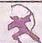

答案 P035

1.(2025 江西南昌检测)设函数 $f(x)=\ln\frac{1-x}{x+2}$ 的定义域为 A, 函数 $g(x)=x+\sqrt{x-2}-4$ 的值域为 B, 则“ $x\in A$ ”是“ $x\in B$ ”的 ( )

A. 充分不必要条件  
B. 必要不充分条件  
C. 充要条件  
D. 既不充分也不必要条件

2.(2025 四川雅安一模) 函数 $f(x)=\frac{\mathrm{e}^{x}+\mathrm{e}^{-x}}{4}\cdot$ $\sin\pi x$ 在区间 $[-3,3]$ 上的图象大致为
()

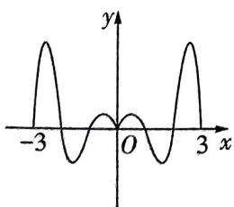

<details>
<summary>text_image</summary>

y
-3 O 3 x
</details>

A

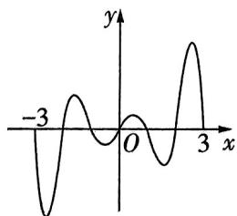

<details>
<summary>line</summary>

| x  | y  |
|----|----|
| -3 | -4 |
| 0  | 0  |
| 3  | 4  |
</details>

B

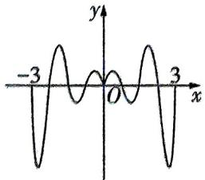

<details>
<summary>text_image</summary>

-3
O
3
x
y
</details>

C

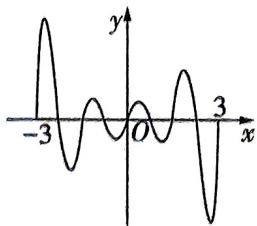

<details>
<summary>line</summary>

| x  | y  |
|----|----|
| -3 | 0  |
| 0  | 0  |
| 3  | 0  |
</details>

D

3.(2025 湖南长沙一中模拟)1903 年,火箭专家、航天之父康斯坦丁·齐奥尔科夫斯基就提出单级火箭在不考虑空气阻力和地球引力的理

想情况下的最大速度 v 满足公式: $v = v_{0} \cdot \ln \frac{m_{1} + m_{2}}{m_{1}}$ , 其中 $m_{1}, m_{2}$ 分别为火箭结构质量和推进剂的质量, $v_{0}$ 是发动机的喷气速度. 已知某单级火箭结构质量是推进剂质量的 2 倍, 火箭的最大速度为 8 km/s, 则火箭发动机的喷气速度约为 ( )

(参考数据: $\ln 2\approx0.7,\ln 3\approx1.1,\ln 4\approx1.4$ )

A. $10 \mathrm{~km} / \mathrm{s}$   
B. $20 \mathrm{~km} / \mathrm{s}$   
C. $\frac{80}{3} \mathrm{~km/s}$   
D. $40 \mathrm{~km} / \mathrm{s}$

4.(2025 河南期中)已知函数 $f(x)=\frac{\sin^{3}(x-1)}{2^{x-1}+2^{1-x}}+$ $x+a(a$ 为常数 $)$ ，若 $f(x)$ 在 $[-2,4]$ 上的最大值为M，最小值为m，且 $M+m=6$ ，则a=
()

A. 6 B. 4 C. 3 D. 2

5. 名师原创 若直线 $y = m (m \in \mathbb{R})$ 与函数 $f(x) = \left\{\begin{aligned} & |x + 2| (-6 \leqslant x < 0), \\ & 2 - 2^{x} (x \geqslant 0)\end{aligned}\right.$ 的图象交点的横坐标依次为 $x_{1}, x_{2}, x_{3} (x_{1} < x_{2} < x_{3})$ ，则 $f(x_{1} + x_{2} + x_{3} - m)$ 的取值范围是 （）

A. [1,4]   
B. $[1,3]$   
C. $(1,4)$   
D. $(1,3]$

6.(2025 浙江杭州一模)已知函数 $f(x)$ 的定义域为 R, 若 $f(f(x)+yz)=x+f(y)f(z)$ , 则 ( )

A. $f(1) = 0$

B. $f(f(x))=x$

C. $f(xy) = f(x) + f(y)$

D. $f(x+y)=f(x)f(y)$

7.(2025 山西吕梁期中)已知函数 $f(x)$ 是定义在R上的奇函数,且 $f(x+1)$ 为偶函数,当 $0\leqslant x\leqslant1$ 时, $f(x)=3^{2x}+2x-1$ ,则下列结论中正确的是()

A. $f(14) > 3$

B. $f(\frac{16}{3}) < 3$

C. $f(\ln 3) <   3$

D. $f(\log_218) < 3$

8.（2024 海南模拟）已知函数 $f(x)=\left\{\begin{aligned}&|x|-3,x\leqslant3,\\ &-x^{2}+6x-9,x>3,\end{aligned}\right.$ 若函数 $g(x)=[f(x)]^{2}-af(x)+2$ 有六个零点，则实数 a 的值可能为

A. -1

B. -2

C. -3

D. -4

9.[多选](2025安徽皖南名校联考)已知 $m, n \in (0,1) \cup (1, +\infty)$ , 若 $\log_m 2 = \frac{1}{1 - 2a}, \log_n 2 = \frac{1}{a^2}$ , 则下列结论正确的是 ( )

A. 若 $a = 2$ , 则 $mn = 2$

B. 若 $a > 2$ ，则 $mn > 2$

C. 若 $mn = 1$ ，则 $a = 1$

D. 若 $mn > 1$ ，则 $a > 1$

10.[多选](2025 山东德州模拟)函数 $f(x)$ 的定义域为D,若存在闭区间 $[a,b]\subseteq D$ ,使得函数 $f(x)$ 同时满足① $f(x)$ 在 $[a,b]$ 上是单调函数, ② $f(x)$ 在 $[a,b]$ 上的值域为 $[ka,kb](k>0)$ , 则称区间 $[a,b]$ 为 $f(x)$ 的“k倍值区间”.下列函数存在“3倍值区间”的有()

A. $f(x) = \ln x$

B. $f(x) = \frac{1}{x} (x > 0)$

C. $f(x) = x^{2}(x\geqslant 0)$

D. $f(x) = \frac{x}{1 + x^2} (0 \leqslant x \leqslant 1)$

11.《名师原创》[多选]已知定义在 $\mathbf{R}$ 上的函数 $f(x)$ 和函数 $g(x)$ 满足 $f(1 - 2x) + g(x) = 1$ 则 （）

A. 若函数 $g(x)$ 为奇函数, 则函数 $f(x)$ 的图象关于点 $(1,1)$ 对称

B. 若函数 $g(x)$ 为偶函数, 则函数 $f(x)$ 的图象关于直线 $x = 1$ 对称

C. 若函数 $f(x)$ 为偶函数, 则函数 $g(x)$ 的图象
关于直线 $x = -\frac{1}{2}$ 对称

D. 若函数 $f(x)$ 为奇函数, 则 $g\left(\frac{1}{2025}\right) + g\left(\frac{2}{2025}\right) + g\left(\frac{3}{2025}\right) + \cdots + g\left(\frac{2024}{2025}\right) = 2024$

12.[多选](2024 四川南充模拟)函数 $f(x)=x\ln x-1$ 的零点为 $x_{1}$ ，函数 $g(x)=\mathrm{e}^{x}(x-1)-\mathrm{e}$ 的零点为 $x_{2}$ ，则下列结论正确的是()

A. $\mathrm{e}^{x_2}\cdot \ln x_1 = \mathrm{e}$

B. $\mathrm{e}^{x_2 - 1} + \frac{1}{x_1} > 2$

C. $\ln x_{1} - x_{2} = 1$

D. $x_{2} + \frac{1}{1 + \ln x_{1}}\leqslant 2$

13.(2025 湖南长沙市长郡中学期中)已知函数 $y = f(x)$ 的定义域为 R, $f(x + 2)$ 为偶函数, 对任意的 $x_{1}, x_{2}$ , 当 $2 \leqslant x_{1} < x_{2}$ 时, $\frac{f(x_{1}) - f(x_{2})}{x_{1} - x_{2}} > 0$ , 则关于 t 的不等式 $f(4^{t} + 2) < f(2^{t} - 4)$ 的解集为 \_\_\_\_. (用区间表示)

14.(2025 上海川沙中学月考)已知数列 $\{a_{n}\}$ 的前 n 项和为 $S_{n}$ ，满足 $2S_{n}=3a_{n}-1(n\in\mathbf{N},n\geqslant1)$ ，函数 $f(x)$ 的定义域为 R，对任意 $x\in R$ 都有 $f(x+1)=\frac{1+f(x)}{1-f(x)}$ ，若 $f(2)=1-\sqrt{2}$ ，则 $f(a_{2025})$ 的值为 \_\_\_\_.

15.（2024 贵州模拟）已知函数 $f(x)=\left\{\begin{aligned}(x+1)^{2},&x\leqslant0,\\|\lg x|,&x>0,\end{aligned}\right.$ 若函数 $g(x)=f(x)-b$ 有四个不同的零点，则实数 b 的取值范围为 \_\_\_\_.

16. (2024 湖南期中联考) 已知 $m > 0$ , 函数 $f(x) = \left\{ \begin{array}{l} 2^x, x \leqslant m, \\ -\frac{2}{3}x^2 + \frac{8}{3}, x > m \end{array} \right.$ 的值域为 $(- \infty, 2^m]$ , 则 $m$ 的取值范围是 \_\_\_\_.

17. 强基自招 (2023 复旦大学强基计划) 方程 $5^{x} - 3^{2 - x} = 1$ 有几个实数解?

18.《名师原创》已知定义在 $\mathbf{R}$ 上的奇函数 $f(x)$ 满足 $f(\log_a x) = \frac{x^2 + p}{x} (a > 0$ 且 $a \neq 1, p \in \mathbf{R})$ .

(1) 求 $p$ 的值.  
(2) 若对任意 $x \in [0,1]$ 有 $f(-2x^2 + kx + k - 1) > f(1) > 0$ 恒成立, 求实数 $k$ 的取值范围.  
(3) 若 $f(2) = \frac{80}{9}$ 且函数 $g(x)$ 满足 $m^{g(x)} + mf(x) = a^{2x} + a^{-2x} - 1$ ，其中 $m > 0, m \neq 1$ ，问是否存在实数 $m$ ，使函数 $g(x)$ 在 $[0,1]$ 上的最大值为 0？若存在，求出 $m$ 的值或取值范围；若不存在，说明理由.

# 考点切片

# ②⑨ 看什么看,不服做了试试!

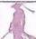

# 考点1 导数的基础(一)——导数的定义

答案 P038

1.(2025 河北衡水调研)已知 $f(x)$ 是定义在 R 上的可导函数, 若 $\lim_{h\to0}\frac{f(2+h)-f(2)}{2h}=\frac{1}{2}$ , 则 $f'(2)=$ ()

A. -1

B. $-\frac{1}{4}$

C. 1

D. $\frac{1}{4}$

2.(2025 上海晋元高级中学期中)已知一罐汽水放入冰箱后的温度 x(单位:℃)与时间 t(单位:h)满足函数关系 $x = 4 + 16e^{-2t}$ ，则大约经过 \_\_\_\_ 分，温度的瞬时变化率为 $-1^{\circ}C/h$ （精确到 1 分，参考数据： $\ln 2 \approx 0.693$ ）.

3.(2025 浙江名校联盟模拟)已知:当 n 无穷大时, $(1+\frac{1}{n})^{n}$ 的值为 e,记为 $\lim_{n\to+\infty}(1+\frac{1}{n})^{n}=e$ .
运用上述结论,可得 $\lim_{x\to0}\frac{\ln(1+2x)}{x}(x>0)=$

# 考点2 导数的基础(二)——导数的基本运算

→答案 P038

1. (2020 全国 III 卷) 设函数 $f(x) = \frac{\mathrm{e}^x}{x + a}$ . 若 $f'(1) = \frac{\mathrm{e}}{4}$ , 则 $a =$ \_\_\_\_.

2.(2025 湖北省部分高中联考)已知函数 $f(x)=x^{2}+2f'(2)x-2\ln x$ ，则 $f'(2)=$ \_\_\_\_.

3.(2024 河北沧州统考) 在等比数列 $\{a_{n}\}$ 中， $a_{1013}=2$ ，若函数 $f(x)=\frac{1}{2}x(x-a_{1})(x-a_{2})\cdots(x-a_{2025})$ ，则 $f'(0)=$ （）

A. $-2^{2024}$

B. $2^{2024}$

C. $-2^{2025}$

D. $2^{2025}$

# 考点 3 导数的基础(三)——导数的几何意义

→答案P039

1.(2025 北京师范大学第二附属中学期中)曲线 $y=\frac{1}{3}x^{3}+1$ 在点 $(-3,-8)$ 处的切线斜率为
()

A.9

B. 5

C. -8

D. 10

2.(2025 湖北宜昌月考)曲线 $f(x)=x\ln x+ax+2$ 在点 $(1,f(1))$ 处的切线与直线 $x-2y+2=0$ 相互垂直, 则实数 a= \_\_\_\_.

3.(2025江西上饶广信中学检测)已知函数 $f(x)=\log_{a}x(a>1)$ 的导函数为 $y=f'(x)$ ，记A=f'(a)， $B=f'(a+1)$ ， $C=\frac{f(a+1)-f(a)}{(a+1)-a}$ ，则A,B,C的大小关系是\_\_\_\_。（按从小到大的顺序排列）

4.(2025重庆市西南大学附属中学检测)若曲线 $f(x)=\ln x+\frac{1}{x}$ 在 x=2 处的切线的倾斜角为 $\alpha$ , 则 $\frac{\sin \alpha - \cos \alpha}{\cos \alpha (1 - \sin 2\alpha)} =$ （）

A. $-\frac{17}{12}$

B. $-\frac{5}{6}$

C. $-\frac{17}{5}$

D. $-\frac{5\sqrt{17}}{17}$

# 考点4 导数的基础(四)——函数的单调性求解

答案 P039

1. 已知函数 $f(x) = -4\ln x + \frac{1}{2}x^2 + 5$ ，则函数 $f(x)$ 的单调递减区间是 \_\_\_\_.

2.(2025 江苏省百校联考)在同一坐标系中作出三次函数 $f(x)=ax^{3}+bx^{2}+cx+d(a\neq0)$ 及其导函数的图象,下列图象一定正确的是()

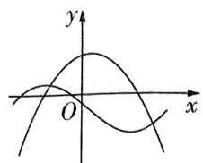

<details>
<summary>text_image</summary>

y
O
x
</details>

A

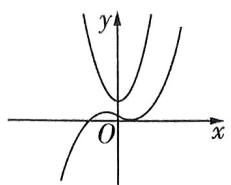

<details>
<summary>text_image</summary>

y
O
x
</details>

B

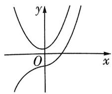

<details>
<summary>text_image</summary>

y
O
x
</details>

C

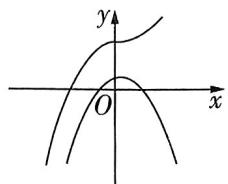

<details>
<summary>text_image</summary>

y
O
x
</details>

D

3.[多选](2024 新课标 I 卷) 设函数 $f(x)=$ $(x-1)^{2}(x-4)$ ，则()

A. $x = 3$ 是 $f(x)$ 的极小值点  
B. 当 0 < x < 1 时, $f(x) < f(x^{2})$   
C. 当 $1 < x < 2$ 时, $-4 < f(2x - 1) < 0$   
D. 当 -1 < x < 0 时, $f(2 - x) > f(x)$

4. (2023 全国乙卷) 设 $a \in (0,1)$ , 若函数 $f(x) = a^x + (1 + a)^x$ 在 $(0, +\infty)$


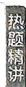

上单调递增,则 a 的取值范围是 \_\_\_\_.

5.(2025 湖北华中师大一附中期中)设函数 $f(x)=\mathrm{e}^{x-1}-\mathrm{e}^{1-x}+\sin(x-1)$ ，则关于 x 的不等式 $f(x^{2}-x-2)+f(-2x)\geqslant0$ 的解集为（）

A. $[-1,4]$   
B. $(-\infty, -1] \cup [4, +\infty)$   
C. $[-2,1]$   
D. $(-\infty, -2] \cup [1, +\infty)$

考点5 导数的基础(五)——函数的极值、

# 最值求解

→答案 P040

1. 函数 $f(x)$ 的定义域为 $(a, b)$ ，导函数 $f'(x)$ 在 $(a, b)$ 内的图象如图所示，则函数 $f(x)$ 在区间 $(a, b)$ 内极大值点的个数与极小值点的个数之和为 \_\_\_\_.

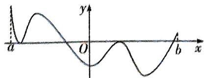

<details>
<summary>text_image</summary>

a
y
O
b
x
</details>

2. 已知函数 $f(x) = x^3 + 3ax^2 + bx + a^2$ 在 $x = -1$ 处有极值0，则 $a + b =$ \_\_\_\_.

3. 函数 $f(x) = x^{m}(1 - x)^{n}$ (m > 0, n > 0) 在区间 [0, 1] 上的图象如图所示，
则 m \_\_\_\_ n (填“<”
“=”或“>”).

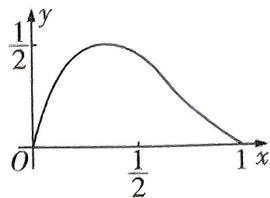

<details>
<summary>line</summary>

| x | y |
|---|---|
| 0 | 0 |
| 0.5 | 0.875 |
| 1 | 0 |
</details>

4. (2022 全国乙卷) 函数 $f(x) = \cos x + (x + 1) \cdot \sin x + 1$ 在区间 $[0, 2\pi]$ 上的最小值、最大值分别为

A. $-\frac{\pi}{2}, \frac{\pi}{2}$

B. $-\frac{3\pi}{2},\frac{\pi}{2}$

C. $-\frac{\pi}{2}, \frac{\pi}{2} + 2$

D. $-\frac{3\pi}{2}, \frac{\pi}{2} + 2$

5. (2024 新课标Ⅱ卷) 已知函数 $f(x) = \mathrm{e}^{x} - ax - a^{3}$ .

(1) 当 a=1 时, 求曲线 $y=f(x)$ 在点 $(1,f(1))$ 处的切线方程;  
(2) 若 $f(x)$ 有极小值, 且极小值小于 0, 求 a 的取值范围.

# 考点6 恒成立 & 存在性问题

→答案 P041

1. 已知函数 $f(x) = a^x + x^2 - x \ln a (a > 0 \text{ 且 } a \neq 1)$ ，若对任意的 $x_1, x_2 \in [1, 2]$ ，不等式 $f(x_1) - f(x_2) \leqslant a^2 - a + 1$ 恒成立，则实数 $a$ 的取值范围为 \_\_\_\_.

2.(2023 新课标Ⅱ卷)已知函数 $f(x)=ae^{x}-\ln x$ 在区间 $(1,2)$ 上单调递增，则 a 的最小值为

A. $e^{2}$

B. e

C. $e^{-1}$

D. $e^{-2}$

3.（2024云南昆明模拟）已知函数 $f(x) = \left\{ \begin{array}{ll} 2x, & 0 \leqslant x \leqslant 1, \\ \ln x + 1, & 1 < x \leqslant 3. \end{array} \right.$ 若存在实数 $x_{1}, x_{2}$ 满足 $0 \leqslant x_{1} < x_{2} \leqslant 3$ ，且 $f(x_{1}) = f(x_{2})$ ，则 $x_{2} - x_{1}$ 的最大值为 （）

A. $\mathrm{e} - 1$

B. $\frac{1}{2}$

C. $\frac{5}{2} - \frac{1}{2} \ln 3$

D. 1

4. 已知 e 为自然对数的底数, 若对任意的 $x \in \left[\frac{1}{e}, 1\right]$ , 总存在唯一的 $y \in (0, +\infty)$ , 使得 $x \ln x + 1 + a = \frac{\ln y + y}{y}$ 成立, 则实数 a 的取值范围是 \_\_\_\_.

5. 已知函数 $f(x) = \frac{1}{3} x^3, g(x) = e^x - \frac{1}{2} x^2 - x$ . $\exists x_1, x_2 \in [1, 2]$ , 使 $|g(x_1) - g(x_2)| > k |f(x_1) - f(x_2)|$ ( $k$ 为常数) 成立, 则常数 $k$ 的取值范围为 ( )

A. $(-\infty, e - 2]$

B. $(-\infty, e - 2)$

C. $(-\infty, \frac{e^2 - 3}{4}]$

D. $(-\infty, \frac{\mathrm{e}^2 - 3}{4})$

# 考点7 函数图象的切线方程

→答案 P041

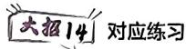


# 解题觉醒

(1) 已知函数 $f(x)$ 连续，且当 $x = x_0$ 时导函数值 $f'(x_0)$ 存在，则函数 $f(x)$ 的图象在 $(x_0, f(x_0))$ 处切线的斜率为 $f'(x_0)$ . 于是在 $(x_0, f(x_0))$ 处函数 $f(x)$ 的图象的切线方程用点斜式表示为 $y - f(x_0) = f'(x_0)(x - x_0)$ ，用斜截式表示为 $y = f'(x_0)x + [f(x_0) - f'(x_0)x_0]$ .

(2) 若直线 $l$ 既是函数 $f(x)$ 的图象在 $(x_{1}, f(x_{1}))$ 处的切线，又是函数 $g(x)$ 的图象在 $(x_{2}, g(x_{2}))$ 处的切线，则 $\left\{ \begin{array}{l} f'(x_{1}) = g'(x_{2}), \\ f(x_{1}) - f'(x_{1})x_{1} = g(x_{2}) - g'(x_{2})x_{2}. \end{array} \right.$

1. (2024 全国甲卷) 设函数 $f(x) = \frac{\mathrm{e}^x + 2\sin x}{1 + x^2}$ ，则曲线 $y = f(x)$ 在点(0，


1)处的切线与两坐标轴所围成的三角形的面积为 （）

A. $\frac{1}{6}$

B. $\frac{1}{3}$

C. $\frac{1}{2}$

D. $\frac{2}{3}$

2. (2022 新高考 II 卷) 曲线 $y = \ln |x|$ 过坐标原点的两条切线的方程为 \_\_\_\_, \_\_\_\_.

3.(2022 新高考 I 卷) 若曲线 $y = (x + a)e^{x}$ 有两条过坐标原点的切线, 则 a 的取值范围是 \_\_\_\_.

4.(2025 河北唐山第一中学开学考)已知直线 $y = ax + b (a \in \mathbb{R}, b > 0)$ 是曲线 $f(x) = e^x$ 与曲线 $g(x) = \ln x + 2$ 的公切线, 则 $a + b$ 的值为 \_\_\_\_.

5. 若两函数 $f(x) = x^{2} - 1$ 与 $g(x) = a \ln x - 1$ 的图象存在公切线，则正实数 a 的取值范围为 \_\_\_\_.

# 考点8 导数的复杂运算

→答案P042


# 解题觉醒

隐函数求导的一般步骤：

第一步:通过等式两边同时取对数或代数变形,变成等式两边都能对 x 求导的形式.

第二步: 把 y 看作关于 x 的函数, 运用复合函数的求导法则对等式两边求导.

第三步:化简式子,得出 $y'$ 的表达式.

1. 函数 $f(x) = x^{x^2 + \ln x}$ 的导函数为 \_\_\_\_.

2. 已知椭圆方程为 $\frac{x^{2}}{4} + \frac{y^{2}}{3} = 1$ ，则其在点 $(1, \frac{3}{2})$ 处的切线方程为 \_\_\_\_.

3. 函数 $y = \frac{\sqrt{x^{2}e^{x} + \sin x + 1}}{x} (x > 0)$ 的导函数为 \_\_\_\_.

# 解题觉醒

对于已知导函数满足的一个不等式,去解一个函数不等式的导数逆向构造问题,按以下步骤处理:

第一步:逆用求导法则构建一个新函数,新函数的导函数能通过题目中所给的导函数不等式判断与0的关系.

第二步: 求出新函数的导函数, 得到新函数的单调性.

第三步:利用新函数的单调性解决问题.

1.(2024 江苏常州模拟)已知 $2f(x) + xf'(x) = 2x\cos 2x + 2(\cos x + \sin x)^{2}$ ，且 x > 0, $f(\frac{\pi}{2}) = 5$ ，那么 $f(\pi) =$ \_\_\_\_.

2.(2024 山东济宁模拟)定义在 $\mathbf{R}$ 上的函数 $f(x)$ 的导函数为 $f'(x)$ , 若对任意实数 $x$ , 有 $f(x) > f'(x)$ , 且 $f(x) + 2024$ 为奇函数, 则不等式 $f(x) + 2024e^{x} < 0$ 的解集是 ( )

A. $(-\infty, 0)$

B. $(-\infty, \ln 2024)$

C. $(0, +\infty)$

D. (2 024, +∞)

3. 设 $f'(x)$ 是奇函数 $f(x) (x \in \mathbb{R})$ 的导函数, 当 x > 0 时, $x \ln x \cdot f'(x) < -f(x)$ , 则使得 $(x^{2} - 2x - 8)f(x) > 0$ 成立的 x 的取值范围是 \_\_\_\_.

4.(2024 江苏无锡检测)设 $f(x)$ 是定义在 $(-π, 0)∪(0,π)$ 上的奇函数,其导函数为 $f'(x)$ ,且当 $x∈(0,π)$ 时, $f'(x)\sin x-f(x)\cos x<0$ ,则关于x的不等式 $f(x)<2f(\frac{π}{6})\sin x$ 的解集为 \_\_\_\_.

5. 已知定义在 $\mathbf{R}$ 上的函数 $f(x)$ 满足 $[f(x)]^2 \cdot f'(x) - x > 0$ ，且 $f(2) = 2$ ，则不等式 $[f(\sqrt{x})]^3 < \frac{3}{2} x + 2$ 的解集为 \_\_\_\_.

6. 定义在 $(0, +\infty)$ 上的函数 $f(x)$ 满足 $f(x) + xf'(x) = \frac{1}{x}$ , 且 $f(1) = 0$ , 若关于 $x$ 的方程

$|f(x)| - a = 0$ 有 1 个实根, 则 a 的取值范围是 \_\_\_\_.

7. 设定义在 $(0, +\infty)$ 上的函数 $f(x)$ 的导函数为 $f'(x)$ ，且满足 $xf'(x) + 2f(x) = \frac{\ln x}{x}, f(e) = \frac{1}{2e}$ . 则 $f(\frac{1}{3}), f(\sin \frac{1}{3}), f(\tan \frac{1}{3})$ 的大小关系为 ( )

A. $f\left(\frac{1}{3}\right) <   f(\sin \frac{1}{3}) <   f(\tan \frac{1}{3})$   
B. $f(\sin \frac{1}{3}) < f(\frac{1}{3}) < f(\tan \frac{1}{3})$   
C. $f(\tan \frac{1}{3}) < f(\frac{1}{3}) < f(\sin \frac{1}{3})$   
D. $f(\sin \frac{1}{3}) < f(\tan \frac{1}{3}) < f(\frac{1}{3})$

# 考点10 构造函数比较大小

→答案 P044

1. 已知 $a = \sin 0.1, b = \frac{0.3}{\pi}, c = \frac{0.9}{\pi^2}$ , 则 $a, b, c$ 的大小关系是 ( )

A. $a > b > c$

B. $a > c > b$

C. $b > a > c$

D. $c > b > a$

2.[多选](2024 深圳模拟)若 $0 < x_{1} < x_{2} < 1$ , 则
()

A. $\mathrm{e}^{x_2} - \mathrm{e}^{x_1} > \ln \frac{x_2 + 1}{x_1 + 1}$

B. $e^{x_{2}} - e^{x_{1}} < \ln \frac{x_{2} + 1}{x_{1} + 1}$

C. $x_{2}\mathrm{e}^{x_{1}} > x_{1}\mathrm{e}^{x_{2}}$

D. $x_{2}\mathrm{e}^{x_{1}} <   x_{1}\mathrm{e}^{x_{2}}$

# 考点11 同构思想

→答案 P044

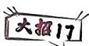

对应练习

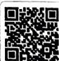


# 解题觉醒

运用同构思想将原条件转化为同一函数的两个函数值 $f(a)$ 与 $f(b)$ 之间满足的关系，再利用函数 $f(x)$ 的单调性，得到 $a$ 与 $b$ 之间的关系，从而大大简化问题.

1. 已知 $\forall \alpha, \beta \in (0, \frac{\pi}{2})$ ，满足 $\cos \alpha \cos (\cos \alpha) - \sin (\cos \alpha) < \cos \beta \cos (\cos \beta) - \sin (\cos \beta)$ ，则 $\alpha$ \_\_\_\_ $\beta$ （填“<”“=”或“>”）。

2. 已知 $x, y$ 分别满足 $x^x = \mathrm{e}^2, y + \ln y = \ln 2$ , 则 $xy =$ \_\_\_\_.

3.(2024江西南昌高三联考)函数 $f(x)=\mathrm{e}^{2x-\ln x}-18x+9\ln x$ 的最小值为()

A. $9 - 18 \ln 3$

B. $9 - 9 \ln 3$

C. $18 - 18 \ln 2$

D. $9 - 9\ln 2$

4. 已知 $f(x) = \frac{ae^x}{x}, x \in [1, 2]$ ，且 $\forall x_1, x_2 \in [1, 2], x_1 \neq x_2, \frac{f(x_1) - f(x_2)}{x_1 - x_2} < 1$ 恒成立，则 $a$ 的取值范围是 \_\_\_\_.

5.已知 $x_0$ 是方程 $2x^{2}\mathrm{e}^{2x} + \ln x = 0$ 的实根, 则关于 $x_0$ 的判断正确的是 ( )

A. $x_0 \geqslant \ln 2$

B. $x_0 < \frac{1}{\mathrm{e}}$

C. $2x_{0} + \ln x_{0} = 0$

D. $2\mathrm{e}^{x_0} + \ln x_0 = 0$

6. 若不等式 $x^4 \mathrm{e}^{2mx} - [(m + 1)x^2 + x \ln x - 1] x \mathrm{e}^{mx} - 1 < 0$ 恒成立, 则实数 $m$ 的取值范围是 \_\_\_\_.


7. (2022 新高考 I 卷) 已知函数 $f(x) = \mathrm{e}^{x} - ax$ 和 $g(x) = ax - \ln x$ 有相同的最小值.

(1) 求 $a$ ;

(2) 证明: 存在直线 $y = b$ , 其与两条曲线 $y = f(x)$ 和 $y = g(x)$ 共有三个不同的交点, 并且从左到右的三个交点的横坐标成等差数列.

# 考点 12 洛必达法则

→答案 P045


对应练习


# 解题觉醒

根据洛必达法则解决问题. 已知函数 $f(x)$ 与 $g(x)$ 都存在导数 $f'(x), g'(x)$ ，其中 $g'(x) \neq 0$ . ①若 $\lim_{x \to a} f(x) = \lim_{x \to a} g(x) = 0$ 或 $\infty$ ，则 $\lim_{x \to a} \frac{f(x)}{g(x)} = \lim_{x \to a} \frac{f'(x)}{g'(x)}$ . ②若 $\lim_{x \to \infty} f(x) = \lim_{x \to \infty} g(x) = 0$ 或 $\infty$ ，则 $\lim_{x \to \infty} \frac{f(x)}{g(x)} = \lim_{x \to \infty} \frac{f'(x)}{g'(x)}$ .

1.(2024 重庆模拟)已知函数 $f(x)=2ax^{3}+x$ . 当 $x\in(1,+\infty)$ 时,恒有 $f(x)>x^{3}-a$ ,则a的取值范围是\_\_\_\_.

2. (2024 四川成都模拟) 设函数 $f(x) = \frac{\sin x}{2 + \cos x}$ . 若对任意 $x \geqslant 0$ , 都有 $f(x) \leqslant ax$ , 则 $a$ 的取值范围是 \_\_\_\_.

3.(2025 北京市一零一中学统考)已知函数 $f(x)=\frac{a\ln x}{x+1}+\frac{b}{x}$ ，曲线 $y=f(x)$ 在点 $(1,f(1))$ 处的切线方程为 $x+2y-3=0$ .

(1) 求 $a, b$ 的值;

(2) 如果当 $x > 0$ , 且 $x \neq 1$ 时, $f(x) > \frac{\ln x}{x - 1} + \frac{k}{x}$ , 求 $k$ 的取值范围.

# 考点13 泰勒展开式

→答案 P046

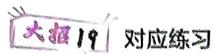


1.(2022全国甲卷)已知 $a=\frac{31}{32}$ , $b=\cos\frac{1}{4}$ , c=4sin $\frac{1}{4}$ , 则 ( )

A. $c > b > a$

B. $b > a > c$

C. $a > b > c$

D. $a > c > b$

2.(2021全国乙卷)设 $a=2\ln1.01,b=\ln1.02$ , $c=\sqrt{1.04}-1$ ,则()

A. $a < b < c$

B. $b < c < a$

C. $b < a < c$

D. $c < a < b$

3. 新情境 (2024 安徽合肥八中期中节选) 英国数学家泰勒发现的泰勒公式有如下特殊形式: 当 $f(x)$ 在 $x = 0$ 处的 $n(n \in \mathbf{N}^*)$ 阶导数都存在时, $f(x) = f(0) + f'(0)x + \frac{f''(0)}{2!}x^2 + \frac{f^{(3)}(0)}{3!}x^3 + \cdots + \frac{f^{(n)}(0)}{n!}x^n + \cdots$ .

注： $f''(x)$ 表示 $f(x)$ 的2阶导数，即为 $f'(x)$ 的导数， $f^{(n)}(x)(n \geqslant 3)$ 表示 $f(x)$ 的 $n$ 阶导数，该公式也称麦克劳林公式.

(1) 写出 $f(x) = \frac{1}{1 - x}$ 泰勒展开式（只需写出前4项）；

(2) 证明: 当 $x \geqslant 0$ 时, $\mathrm{e}^{x} - \frac{x^{2}}{2} - \sin x - \cos x \geqslant 0$ .

# 考点14 齐次化

→答案 P047


# 解题觉醒

齐次化后换元减少变量,进而解决问题.

1. 若存在两个正实数 $x, y$ 使得等式 $3x + a(2y - 4ex)(\ln y - \ln x) = 0$ 成立, 则实数 $a$ 的取值范围是 \_\_\_\_.

2. 已知 $x, y, z \in \mathbf{R}_{+}$ , 且 $z \leqslant 3y \leqslant 9z$ , $\ln \left(\frac{x}{z}\right)^{\frac{1}{e}} = \frac{y}{z}$ , 若对任意的 $x, y \in \mathbf{R}_{+}, \frac{x}{y} \geqslant m$ 恒成立, 则实数 $m$ 的取值范围是 \_\_\_\_.

3.(2024 陕西省、青海省、四川省名校联盟月考)
若关于 x 的方程 $\frac{x}{e^{x}} + \frac{e^{x}}{x - e^{x}} + m = 0$ 有三个不相等的实数解 $x_{1}, x_{2}, x_{3}$ ，且 $x_{1} < 0 < x_{2} < x_{3}$ ，其中 $m \in R$ 。则 $\left(\frac{x_{1}}{e^{x_{1}}} - 1\right)^{2}\left(\frac{x_{2}}{e^{x_{2}}} - 1\right)\left(\frac{x_{3}}{e^{x_{3}}} - 1\right)$ 的值为 \_\_\_\_.

4. (2020 天津) 已知函数 $f(x) = x^3 + k\ln x (k \in \mathbf{R})$ , $f'(x)$ 为 $f(x)$ 的导函数.

(1) 当 $k = 6$ 时:

(i) 求曲线 $y = f(x)$ 在点 (1, $f(1)$ ) 处的切线方程；

(ii) 求函数 $g(x) = f(x) - f'(x) + \frac{9}{x}$ 的单调区间和极值.

(2) 当 $k \geqslant -3$ 时, 求证: 对任意的 $x_{1}, x_{2} \in [1, +\infty)$ , 且 $x_{1} > x_{2}$ , 有 $\frac{f'(x_1) + f'(x_2)}{2} > \frac{f(x_1) - f(x_2)}{x_1 - x_2}$ .

考点 15 $\mathrm{e}^{x} \geqslant x + 1$ 与 $\ln x \leqslant x - 1$ 的应用 $\Rightarrow$ 答案 P049


对应练习

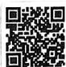


# 解题觉醒

根据 $e^{x} \geqslant x + 1$ ，当且仅当 x = 0 时取等号， $\ln x \leqslant x - 1$ ，当且仅当 x = 1 时取等号解决问题.

1.(2023 湖北联考) 设 $a = \frac{1}{21}$ , $b = \ln 1.05$ , c = $e^{0.05} - 1$ , 则下列关系正确的是 ( )

A. $a > b > c$

B. $b > a > c$

C. $c > b > a$

D. $c > a > b$

2. 已知函数 $f(x) = x \mathrm{e}^{x} - \ln x - x - 2, g(x) = \frac{\mathrm{e}^{x - 2}}{x} + \ln x - x$ 的最小值分别为 $a, b$ ，则 （）

A. $a = b$

B. $a < b$

C. $a > b$

D. $a, b$ 大小关系不确定

3. 已知函数 $f(x) = x + \mathrm{e}^{x - a}, g(x) = \ln (x + 2) - 4\mathrm{e}^{a - x}$ ，若存在 $x_0$ 使得 $f(x_0) - g(x_0) = 3$ 成立，则实数 $a =$ \_\_\_\_.

4.(2024 四川遂宁模拟)已知函数 $f(x)=\ln x-ax(a\in\mathbf{R})$ .

(1) 讨论函数 $f(x)$ 在 $(0, +\infty)$ 上的单调性；  
(2) 证明: $e^x - e^2 \ln x > 0$ 恒成立.

考点 16 不等式证明——作差比较 → 答案 P049

1.(2023 新高考 I 卷)已知函数 $f(x)=a(e^{x}+a)-x.$


(1) 讨论 $f(x)$ 的单调性；  
(2) 证明: 当 a > 0 时, $f(x) > 2 \ln a + \frac{3}{2}$ .

2.(2021 全国乙卷) 设函数 $f(x)=\ln(a-x)$ ，已知 x=0 是函数 $y=xf(x)$ 的极值点.

(1) 求 $a$ ;   
(2) 设函数 $g(x) = \frac{x + f(x)}{xf(x)}$ ，证明： $g(x) < 1$ .

3.(2022 北京)已知函数 $f(x)=\mathrm{e}^{x}\ln(1+x)$ .

(1) 求曲线 $y = f(x)$ 在点 $(0, f(0))$ 处的切线方程；  
(2) 设 $g(x) = f'(x)$ ，讨论函数 $g(x)$ 在 $[0, +\infty)$ 上的单调性；  
(3) 证明: 对任意的 $s, t \in (0, +\infty)$ , 有 $f(s + t) > f(s) + f(t)$ .

考点 17 不等式证明——指对处理

→答案 P050

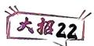

对应练习


# 解题觉醒

根据“指成双,对落单”原则处理问题.

1. 设函数 $f(x) = ax^2 - a - \ln x, g(x) = \frac{1}{x} - \frac{\mathrm{e}}{\mathrm{e}^x}$ ，其中 $a \in \mathbb{R}, \mathrm{e}$ 为自然对数的底数.

(1) 当 $a = 1$ 时, 讨论 $f(x)$ 的单调性;  
(2) 证明: 当 x > 1 时, $g(x) > 0$ .

2. 已知函数 $f(x) = e^{x} + ex \ln x$ (其中 e 是自然对数的底数).

(1) 求曲线 $y = f(x)$ 在点 $(1, f(1))$ 处的切线方程；  
(2) 求证: $f(x) \geqslant \mathrm{e}x^{2}$ .

考点18 不等式证明——主元法

→答案 P051


对应练习

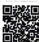


# 解题觉醒

可以先将 $x$ 固定，以参数为主元，得到一个关于 $x$ 的不等式，然后加以处理.

1. 已知函数 $f(x) = (x^2 - 2x + 2)\mathrm{e}^x - \frac{1}{2} ax^2 (a \in \mathbb{R})$ .

(1) 当 $a = \mathrm{e}$ 时, 求函数 $f(x)$ 的单调区间;  
(2) 证明: 当 $a \leqslant -2$ 时, $f(x) \geqslant 2$ .

2. 已知函数 $f(x) = \frac{x^2 - 1}{\ln x}$ .

(1) 求证: $f(x)$ 在 $(0,1)$ 和 $(1,+\infty)$ 上都是增函数;  
(2) 设 $a > \frac{1}{2}$ , 求证: $af(x) > x$ .

# 考点 19 不等式证明——分割与放缩

→答案 P051


对应练习

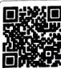


# 解题觉醒

1. 分割法: 通过证明 $g(x)_{\min} > h(x)_{\max}$ ，证明 $f(x) = g(x) - h(x) > 0$ 或通过证明 $g(x)_{\max} < h(x)_{\min}$ ，证明 $f(x) = g(x) - h(x) < 0$ .  
2. 放缩法: 通过一个辅助函数 $g(x)$ , 对函数 $f(x)$ 进行放缩, 使得 $f(x) > g(x) > 0$ (或 $f(x) < g(x) < 0$ ).

1. (2024 长沙模拟) 已知函数 $f(x) = a \ln x + x + \frac{2}{x} + 2a (a \in \mathbb{R})$ .

(1) 若 $f(x)$ 在 x=1 处取得极小值, 求 a 的值;  
(2) 若 $0 < a < \frac{\mathrm{e}}{4}$ , 求证: $f(x) < x + \frac{\mathrm{e}^x + 2}{x}$ .

2.(2024 天津节选)设函数 $f(x)=x\ln x$ .

(1) 求 $f(x)$ 图象上点 $(1, f(1))$ 处的切线方程；
(2) 若 $x_{1}, x_{2} \in (0,1)$ ，证明 $\left|f\left(x_{1}\right)-f\left(x_{2}\right)\right| \leqslant \left|x_{1}-x_{2}\right|^{\frac{1}{2}}$ .

# 考点20

# 函数零点问题

→答案 P052


对应练习


# 解题觉醒

1. 求函数 $f(x)$ 的零点个数的一般步骤：

第一步:先通过导函数 $f'(x)$ 分析函数 $f(x)$ 的单调性.

第二步:根据函数零点存在定理确定函数 $f(x)$ 在每个单调区间上的零点个数是0还是1.使用零点存在定理时,通常需要使用特殊值法或放缩法找点 $x_{0}$ 使得 $f(x_{0})>0$ (或 $f(x_{0})<0$ ).

第三步:最终得到函数 $f(x)$ 零点个数.

2. 已知函数零点求参的方法

切入点1 直接法. 观察参数是否影响函数的单调性, 若不影响, 则分析零点个数, 通过函数极值和0的关系求解; 若影响, 则分类讨论, 在每个范围内, 研究零点的个数, 最终合并在一起, 即所求参数范围.

切入点2 分离参数法. 有两种情况: (1) 由 $f(x)=0$ 分离出参数 $a$ , 得 $a=g(x)$ , 利用导数求函数 $y=g(x)$ 的单调性、极值和最值, 进而画出 $y=g(x)$ 的大致图象, 再根据直线 $y=a$ 与 $y=g(x)$ 的图象的交点个数得参数的取值范围. (2) 将函数 $f(x)$ 分成两个函数, 一个为容易求导的不含参函数 (具有明显的凹凸性), 另一个为含参的一次函数或一个为凹函数, 另一个为凸函数, 找到临界的位置 (两函数图象相切), 求出此时参数的值, 再根据零点个数, 求参数的取值范围.

# 题组一

1. (2024 四川绵阳一模) 已知函数 $f(x) = \sin x - \ln (1 + x), f'(x)$ 为 $f(x)$ 的导数, 证明:

(1) $f'(x)$ 在区间 $(-1, \frac{\pi}{2})$ 上存在唯一极大值点；  
(2) $f(x)$ 有且仅有2个零点.

2.(2024 北京)设函数 $f(x)=x+k\ln(1+x)(k\neq0)$ ，直线 l 是曲线 $y=f(x)$ 在点 $(t,f(t))(t>0)$ 处的切线.


(1) 当 $k = -1$ 时, 求 $f(x)$ 的单调区间.  
(2) 求证: l 不经过点 $(0,0)$ .  
(3) 当 $k = 1$ 时, 设点 $A(t, f(t)) (t > 0)$ , $C(0, f(t)), O(0, 0), B$ 为 $l$ 与 $\gamma$ 轴的交点, $S_{\triangle ACO}$ 与 $S_{\triangle ABO}$ 分别表示 $\triangle ACO$ 与 $\triangle ABO$ 的面积. 是否存在点 $A$ 使得 $2S_{\triangle ACO} = 15S_{\triangle ABO}$ 成立? 若存在, 这样的点 $A$ 有几个?

(参考数据:1.09<ln 3<1.10,1.60<ln 5<1.61,1.94<ln 7<1.95)

# 题组二

3.(2022全国乙卷)已知函数 $f(x)=ax-\frac{1}{x}-(a+1)\ln x.$

(1) 当 a=0 时, 求 $f(x)$ 的最大值;  
(2) 若 $f(x)$ 恰有一个零点, 求 a 的取值范围.

4. (2024 江苏兴化检测) 已知函数 $f(x) = x \mathrm{e}^{x} - mx + \frac{m}{2} (\mathrm{e}$ 为自然对数的底数) 在 $(0, +\infty)$ 上有两个零点, 则实数 $m$ 的取值范围是 ( )

A. $(0, \mathrm{e})$

B. $(0,2\mathrm{e})$

C. $(\mathbf{e}, + \infty)$

D. $(2\mathrm{e}, + \infty)$

5.(2024 天津)若函数 $f(x)=2\sqrt{x^{2}-ax}-|ax-2|+1$ 恰有一个零点, 则 a 的取值范围为 \_\_\_\_.

# 考点21 隐极值点代换

→答案 P054


# 解题觉醒

解决隐极值点代换问题的一般步骤

第一步:求导后得到 $f'(x_{0})=0$ .

第二步:根据 $f'(x_{0})=0$ 代换掉参数或对极值 $f(x_{0})$ 的表达式进行转化,得到一个仅含有 $x_{0}$ 、形式简单且容易求取值范围的式子.

第三步:根据隐极值点 $x_{0}$ 的取值范围,确定极值 $f(x_{0})$ 的取值范围,进而证明不等式.

1. 已知函数 $f(x) = x \mathrm{e}^{x} - a (x + \ln x)$ ，且 $f(x)$ 在 $x = x_0$ 处取得极小值.

(1) 求实数 a 的取值范围；  
(2) 若 $f(x_0) > 0$ , 求证: $\frac{f(x_0)}{x_0 - x_0^3} > 2$ .

2.(2024 内蒙古包头模拟)已知函数 $f(x)=ae^{x}-\ln(x+1)-1$ .

(1) 当 $a = \mathrm{e}$ 时, 求曲线 $y = f(x)$ 在点 $(0, f(0))$ 处的切线与两坐标轴所围成的三角形的面积;  
(2) 证明: 当 a > 1 时, $f(x)$ 没有零点.

3.(2021 天津)已知 a > 0, 函数 $f(x) = ax - xe^{x}$ .

(1) 求曲线 $y = f(x)$ 在点 $(0, f(0))$ 处的切线方程；  
(2) 证明 $f(x)$ 存在唯一的极值点；  
(3) 若存在 $a$ , 使得 $f(x) \leqslant a + b$ 对任意 $x \in \mathbb{R}$ 成立, 求实数 $b$ 的取值范围.

# 考点 22 根与系数的关系硬算

→答案P055

1.(2024 浙江宁波质检)已知函数 $f(x)=ax-\ln x-\frac{a}{x}$ .

(1) 对任意 $x \in (1, +\infty), f(x) > 0$ 恒成立, 求实数 $a$ 的取值范围;  
(2) 设 $x_{1}, x_{2}$ 是 $f(x)$ 的两个极值点, 证明:

$$
\left| f \left(x _ {1}\right) - f \left(x _ {2}\right) \right| <   \frac {\sqrt {1 - 4 a ^ {2}}}{a}.
$$

2. 已知函数 $f(x) = \mathrm{e}^{x}(x^{2} - a) (a \in \mathbb{R})$ 在定义域内有两个不同的极值点.

(1) 求实数 a 的取值范围；  
(2) 当 $a > 3$ 时, $f(x)$ 两个不同的极值点分别为 $x_{1}, x_{2}$ , 且 $x_{1} < x_{2}$ , 若不等式 $\mathrm{e}^{x_2} + \lambda x_1 > 0$ 恒成立, 求实数 $\lambda$ 的取值范围.

# 考点 23 恒成立求参——分离参数

→答案P056


# 解题觉醒

参变分离的使用条件:①参数与变量可以比较容易分离开;②参变分离后得到的函数的形式不复杂,通过导数来研究单调性、极值以及最值比较容易;③参变分离后得到的函数容易求得值域,不会出现必须使用洛必达法则才能解决问题的情形.

1.(2024 山东枣庄质量检测) 设函数 $f(x)=\mathrm{e}^{x}-ax^{2}-x+1, a \in \mathbf{R}$ .

(1) 当 a=0 时, 求 $f(x)$ 的最小值;  
(2) 若 $f(x) \geqslant 0$ 在 $(0, +\infty)$ 上恒成立，求 $a$ 的取值范围.

2. (2024 广东肇庆模拟) 已知 $f(x) = ax^2 - 2\ln x$ , $a \in \mathbb{R}$ .

(1) 讨论函数 $f(x)$ 的单调性；  
(2) 若对任意的 $x > 0, 2 - f(x) \leqslant 2(a - 1)x$ 恒成立, 求整数 $a$ 的最小值.

# 考点 24 恒成立求参——分类讨论

答案 P057


对应练习


# 解题觉醒

基于单调性、极值点、零点等情况,结合题目要求进行分类讨论.

1.(2020 全国 I 卷)已知函数 $f(x)=\mathrm{e}^{x}+ax^{2}-x$ .

(1) 当 $a = 1$ 时, 讨论 $f(x)$ 的单调性;  
(2) 当 $x \geqslant 0$ 时, $f(x) \geqslant \frac{1}{2} x^3 + 1$ , 求 $a$ 的取值范围.

2.(2023 全国甲卷)已知函数 $f(x)=ax-\frac{\sin x}{\cos^{3}x}$ ,

$$
x \in (0, \frac {\pi}{2}).
$$


(1) 当 a=8 时, 讨论 $f(x)$ 的单调性;  
(2) 若 $f(x) < \sin 2x$ ，求 a 的取值范围.

3.(2025天津五十四中月考)已知函数 $f(x)=\frac{2\mathrm{e}\ln x}{x}-1$ （其中e为自然对数的底数），函数 $g(x)=x^{3}+ax^{2}+1$ .

(1) 求曲线 $y = f(x)$ 在点 $(1, f(1))$ 处的切线方程；  
(2) 若 $\forall x_{1}, x_{2} \in [1, e]$ , 不等式 $f(x_{1}) \leqslant g(x_{2})$ 恒成立, 求实数 $a$ 的取值范围.

考点 25 恒成立求参——必要性探路 →答案 P058


对应练习


# 解题觉醒

根据必要性探路缩小参数范围,再运用主元法解决问题.

1. 已知函数 $f(x) = a\mathrm{e}^{x} - \ln x - 1$ .

(1) 设 $x = 2$ 是 $f(x)$ 的极值点, 求 $a$ 的值, 并讨论 $f(x)$ 的零点个数;  
(2) 若 $f(x) \geqslant 0$ 恒成立, 求 $a$ 的取值范围.

2. 已知函数 $f(x) = k\ln x + x^2 - 2x, g(x) = kx$ .

(1) 若 $k = 2$ ，证明：函数 $f(x)$ 单调递增；  
(2) 若 $\forall x \in (0, +\infty), f(x) \geqslant g(x)$ 恒成立，求 $k$ 的取值范围.


# 考点 26 恒成立求参——端点 &

# 中间点效应

→答案 P058


对应练习


# 解题觉醒

1. 端点效应

①若函数 $f(x)$ 满足 $\forall x\in[a,b],f(x)\geqslant0$ ，且 $f(a)=0$ ，则 $f'(a)\geqslant0$ .  
②若函数 $f(x)$ 满足 $\forall x\in[a,b],f(x)\leqslant0$ ，且 $f(a)=0$ ，则 $f'(a)\leqslant0$ .  
③若函数 $f(x)$ 满足 $\forall x\in[a,b],f(x)\geqslant0$ ，且 $f(b)=0$ ，则 $f'(b)\leqslant0$ .  
④若函数 $f(x)$ 满足 $\forall x\in[a,b]$ , $f(x)\leqslant0$ , 且 $f(b)=0$ , 则 $f'(b)\geqslant0$ .

2. 中间点效应

①若函数 $f(x)$ 满足 $\forall x\in[a,b]$ ， $f(x)\geqslant0$ ，且 $f(x_{0})=0$ ，其中 $x_{0}\in(a,b)$ ，则 $f'(x_{0})=0$ ，且 $f''(x_{0})\geqslant0$ .  
②若函数 $f(x)$ 满足 $\forall x\in[a,b],f(x)\leqslant0$ ，且 $f(x_{0})=0$ ，其中 $x_{0}\in(a,b)$ ，则 $f'(x_{0})=0$ ，且 $f''(x_{0})\leqslant0$ .

1. 已知函数 $f(x) = ax^2 + (1 + 2a)x + \ln x, g(x) = (1 - a)x^2 - (1 + 3a)x + a - 1 (a \in \mathbb{R})$ .

(1) 若 $a = 0$ , 求曲线 $y = f(x)$ 在点 $(1, f(1))$ 处的切线方程;  
(2) 设 $h(x)=f(x)+g(x)$ ，若 $\forall x\in[1,+\infty)$ ， $h(x)\geqslant0$ 恒成立，求实数 a 的取值范围.

2.(2024 全国甲卷)已知函数 $f(x)=(1-ax)$

$$
\ln (1 + x) - x.
$$

(1) 当 a = -2 时, 求 $f(x)$ 的极值;  
(2) 当 $x \geqslant 0$ 时, $f(x) \geqslant 0$ , 求 $a$ 的取值范围.


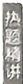

# 考点 27

# 极值点 & 拐点偏移

→答案 P059


对应练习


# 解题觉醒

1. 极值点偏移: 对于“已知函数 $y = f(x)$ 的极值点为 $x_{0}$ ，且函数 $y = f(x)$ 的图象与直线 y = m 交于 $(x_{1}, y_{1})$ ， $(x_{2}, y_{2})$ 两点，去判断 $x_{1} + x_{2}$ 与 $2x_{0}$ 的大小关系（或 $x_{1}x_{2}$ 与 $x_{0}^{2}$ 的大小关系）”的问题来说，构建函数 $g(x) = f(x) - f(2x_{0} - x)$ （或 $g(x) = f(x) - f(\frac{x_{0}^{2}}{x})$ ），再分析函数 $g(x)$ 的单调性即可.  
2. 拐点偏移: 类似地, 对于“已知 $(x_{1}, y_{1}), (x_{2}, y_{2})$ 为函数 $y = f(x)$ 的图象上的两个点, 且 $f(x_{1}) + f(x_{2}) = 2f(m)$ , 去判断 $x_{1} + x_{2}$ 与 $2m$ 的大小关系”的问题来说, 构建函数 $g(x) = f(x) + f(2m - x)$ , 再分析函数 $g(x)$ 的单调性即可.

1. 已知函数 $f(x) = \frac{\mathrm{e}^x}{x} - x\mathrm{e}^{\frac{1}{x}}$ .

(1) 求 $f(x)$ 在 $[1, +\infty)$ 上的最小值；  
(2) 设 $g(x)=f(x)+xe^{\frac{1}{x}}+x-\ln x-a$ ，若 $g(x)$ 有两个零点 $x_{1}, x_{2}$ ，证明： $x_{1}x_{2}<1$ .

2. 已知函数 $f(x) = (x - 1) \ln x - x^2 + ax (a \in \mathbf{R})$ .

(1) 若函数 $y = f'(x)$ 有两个零点, 求实数 a 的取值范围;  
(2) 设 $x_{1}, x_{2}$ 是函数 $f(x)$ 的两个极值点, 证明: $x_{1} + x_{2} > 2$ .

3. (2021 新高考 I 卷) 已知函数 $f(x) = x(1 - \ln x)$ .

(1) 讨论 $f(x)$ 的单调性；  
(2) 设 $a, b$ 为两个不相等的正数，且 $b \ln a - a \ln b = a - b$ ，证明： $2 < \frac{1}{a} + \frac{1}{b} < e$ .

4. (2024 安徽合肥模拟) 已知函数 $f(x) = \mathrm{e}^{x} + \cos x - \mathrm{e}x, f'(x)$ 是 $f(x)$ 的导函数.

(1) 证明: 函数 $f(x)$ 只有一个极值点;  
(2) 若关于 $x$ 的方程 $f(x) = t (t \in \mathbf{R})$ 在 $(0, \pi)$ 上有两个不相等的实数根 $x_{1}, x_{2}$ , 证明:

$$
f ^ {\prime} \left(\frac {x _ {1} + x _ {2}}{2}\right) <   0.
$$


5. 已知函数 $f(x) = \frac{1}{2} \mathrm{e}^{2(x - 1)} - x^2 + \mathrm{e}f'(\frac{1}{2})x$ .

(1) 求函数 $f(x)$ 的单调区间；  
(2) 若存在 $x_{1}, x_{2} (x_{1} < x_{2})$ ，使得 $f(x_{1}) + f(x_{2}) = 1$ ，求证： $x_{1} + x_{2} < 2$ .

# 考点28

# 零点的放缩

→答案 P061


对应练习


# 解题觉醒

已知定义在 I 上的函数 $f(x)$ , $g(x)$ 的零点分别为 $x_{1}, x_{2}$ .

①若函数 $f(x)$ 单调递增，且 $f(x)>g(x)$ （或 $f(x)<g(x)$ ）恒成立，则有 $x_{1}<x_{2}$ （或 $x_{1}>x_{2}$ ）.  
②若函数 $f(x)$ 单调递减，且 $f(x)>g(x)$ （或 $f(x)<g(x)$ ）恒成立，则有 $x_{1}>x_{2}$ （或 $x_{1}<x_{2}$ ）.  
根据以上结论可以将不可解零点 $x_{1}$ 放缩成可以求解的零点 $x_{2}$ , 从而证明一些关于零点 $x_{1}$ 的不等式.

1. 已知函数 $f(x) = (e - x) \ln x$ .

(1) 求函数 $f(x)$ 的零点, 以及曲线 $y = f(x)$ 在其零点处的切线方程;  
(2) 若方程 $f(x) = m$ 有两个实数根 $x_{1}, x_{2} (x_{1} < x_{2})$ ，求证： $x_{2} - x_{1} \leqslant e - 1 - \frac{em}{e - 1}$ .

2.(2024 四川成都树德中学开学考试)已知函数 $f(x)=(x+1)(e^{x}-1)$ .

(1)设曲线 $y = f(x)$ 与 $x$ 轴负半轴的交点为点 $P$ ，曲线在点 $P$ 处的切线方程为 $y = h(x)$ ，求证：对于任意的实数 $x$ ，都有 $f(x) \geqslant h(x)$ ；  
(2) 若关于 $x$ 的方程 $f(x) = m (m > 0)$ 有两个实数根 $x_{1}, x_{2}$ , 且 $x_{1} < x_{2}$ , 求证: $x_{2} - x_{1} \leqslant 1 +$

$$
\frac {m (1 - 2 \mathrm{e})}{1 - \mathrm{e}}.
$$


# 考点29

# 导数与三角结合

→答案P062

1.(2023 新课标Ⅱ卷节选)已知函数 $f(x)=\cos ax-\ln(1-x^{2})$ ，若 x=0 是 $f(x)$ 的极大值点，求 a 的取值范围.


2.(2025 重庆西南大学附属中学模拟)已知函数 $f(x)=2\sin x-x\cos x-x.$

(1) 求曲线 $y = f(x)$ 在 $x = \pi$ 处的切线方程.  
(2) 证明: $f(x)$ 在 $(0, 2\pi)$ 上有且仅有一个零点.  
(3) 若 $x \in (0, +\infty)$ 时, $g(x) = \sin x$ 的图象恒在 $h(x) = ax^2 + x$ 的图象上方, 求 $a$ 的取值范围.

2. (2022 新高考 II 卷) 已知函数 $f(x) = x \mathrm{e}^{ax} - \mathrm{e}^x$ .

(1) 当 a=1 时, 讨论 $f(x)$ 的单调性;  
(2) 当 $x > 0$ 时, $f(x) < -1$ , 求 $a$ 的取值范围;  
(3) 设 $n \in \mathbf{N}_{+}$ , 证明: $\frac{1}{\sqrt{1^2 + 1}} + \frac{1}{\sqrt{2^2 + 2}} + \cdots +$

$$
\frac {1}{\sqrt {n ^ {2} + n}} > \ln (n + 1).
$$


# 考点 30 导数与数列结合

→答案 P063

1. (2025 山西太原期中) 已知函数 $f(x) = \mathrm{e}^{x}$ ，令 $a_{1} > 0$ ，过点 $(a_{1}, f(a_{1}))$ 作曲线 $y = f(x)$ 的切线，交 $x$ 轴于点 $(a_{2}, 0)$ ，再过 $(a_{2}, f(a_{2}))$ 作曲线 $y = f(x)$ 的切线，交 $x$ 轴于点 $(a_{3}, 0)$ ……以此类推，得到数列 $\{a_{n}\} (n \in \mathbf{N}^{*})$ .

(1) 证明: 数列 $\{a_{n}\}$ 为等差数列;  
(2) 若数列 $\{f(a_{n})\}$ 的前 4 项和为 $(e^{2} + 1)(e + 1)$ , 求实数 $a_{1}$ 的值;  
(3) 当 $x > 0$ 时, 若 $f(x) \geqslant \frac{1}{2} x^3 - mx^2 + x + 1$ 恒成立, 求实数 $m$ 的取值范围.

1.(2025 浙江金华一模)已知函数 $f(x)=x^{3}+ax^{2}+bx+c$ 的部分图象如图所示,则以下可能成立的是()

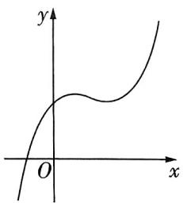

<details>
<summary>text_image</summary>

y
O
x
</details>

A. $a = 2, b = 1$

B. $a = -1, b = 2$

C. $a = -2, b = 1$

D. $a = 2, b = -1$

2.(2025 重庆巴蜀中学模拟)曲线 $f(x)=\sin x-\cos x,x\in\left[-\frac{\pi}{2},\frac{\pi}{2}\right]$ 的所有切线中,斜率最小的切线方程是()

A. $\sqrt{2} x + y + \frac{\sqrt{2}\pi}{2} + 1 = 0$   
B. $\sqrt{2} x + y + \frac{\sqrt{2}\pi}{2} - 1 = 0$   
C. $x + y + \frac{\pi}{2} - 1 = 0$   
D. $x + y + \frac{\pi}{2} + 1 = 0$

3.(2024 安徽合肥一中模拟) 若函数 $f(x)=\frac{x^{2}+2x-a}{e^{x}}$ 在区间 $(a,a+1)$ 上存在最小值, 则实数 a 的取值范围为 ( )

A. $(-\infty, -1)$

B. $(-2,-1)$

C. $(-\infty, \frac{-1 - \sqrt{5}}{2})$

D. $\left(\frac{-1-\sqrt{5}}{2},-1\right)$

4.(2024江西新余四中模拟)函数 $f(x)=x^{x+a}$ 在定义域 $(0,+\infty)$ 上单调递增,则a的最小值为()

A.e

B. $\frac{\sqrt{e}}{e}$

C. $\frac{1}{e}$

D. $\frac{1}{\mathrm{e}^2}$

5.(2025 辽宁大连联考)已知函数 $y=f(x)$ 是定义在 R 上的奇函数, 且当 $x\in(-\infty,0]$ 时, $f(x)+xf'(x)<0$ , 若 $a=\frac{31}{32}\cdot f(\frac{31}{32})$ , $b=\cos\frac{1}{4}$ .

$f(\cos \frac{1}{4}), c = 4\sin \frac{1}{4} \cdot f(4\sin \frac{1}{4})$ ，则 $a, b, c$ 的大小关系是 （）

A. $c > a > b$

B. $a > c > b$

C. $b > a > c$

D. $c > b > a$

6.(2025 山西五所学校联合质量检测)已知函数 $f(x)=\frac{\mathrm{e}^{x}}{|x|}$ ，若函数 $g(x)=[f(x)]^{2}+2af(x)-e^{2}-ae$ 恰有 4 个不同的零点，则实数 a 的取值范围是（）

A. $(-\infty, -2\mathrm{e})$

B. $(-\infty, -\mathrm{e})$

C. $(-\infty, -\frac{2}{e})$

D. $(-\infty, -\frac{1}{\mathrm{e}})$

7.[多选](2024 新课标Ⅱ卷)设函数 $f(x)=2x^{3}-3ax^{2}+1$ ，则()

A. 当 $a > 1$ 时, $f(x)$ 有三个零点


B. 当 a < 0 时, x = 0 是 $f(x)$ 的极大值点

C. 存在 $a, b$ , 使得直线 $x = b$ 为曲线 $y = f(x)$ 的对称轴

D. 存在 $a$ , 使得点 $(1, f(1))$ 为曲线 $y = f(x)$ 的对称中心

8.[多选](2024重庆联考)已知函数 $f(x)=ae^{x}-\frac{1}{2}x^{2}(a\in\mathbb{R})$ 有两个极值点 $x_{1},x_{2}(x_{1}<x_{2})$ ，则()

A. $0 < a < \frac{1}{\mathrm{e}}$

B. $f(x_{1}) > \frac{1}{2}$

C. $f(x_{2}) <   \frac{1}{2}$

D. $x_{1} + x_{2} > 2$

9.《名师原创》[多选]若函数 $f(x)=x^{3}-3x^{2}+ax$ 的图象与直线 $y=m(m\neq0)$ 的三个交点依次为 $A(x_{1},m),B(x_{2},m),C(x_{3},m)$ ，则下列说法中正确的是()

A. $f(1 - m) + f(1 + m) - 2a = -4$

B. $a > 3$

C. 若 $m = a$ ，则 $\frac{1}{x_1} + \frac{1}{x_2} + \frac{1}{x_3} = 1$

D. 设 $f(x)$ 的图象在 $A, B, C$ 三点处的切线斜率分别为 $k_{1}, k_{2}, k_{3}$ ，则 $\frac{1}{k_{1}} + \frac{1}{k_{2}} + \frac{1}{k_{3}} = 0$

10.(2024 江苏镇江模拟)若 $\frac{\ln x+1}{x}\leqslant ax+b$ 对于 $x\in(0,+\infty)$ 恒成立,则当a=0时,b的最小值为\_\_\_\_;当a>0时, $\frac{b}{a}$ 的最小值是\_\_\_\_.

11. 名师原创 已知关于 x 的方程 $\left(\frac{x^{3}+x}{4}-a\right)^{3}+\frac{x^{3}+x}{4}=4x+5a$ 在区间 $[-1,1]$ 上有解，则实数 a 的取值范围为 \_\_\_\_.

12.《名师原创》设函数 $y = \frac{1}{x}$ 的图象与函数 $f(x) = \mathrm{e}^{x}, g(x) = \ln x$ 的图象分别相交于点 $A(x_{1}, y_{1}), B(x_{2}, y_{2})$ ，则 $(x_{1} + \ln x_{2})(x_{2} + \mathrm{e}^{x_{1}}) =$ \_\_\_\_.

13.(2024 河南开封模拟)已知函数 $f(x)=(x-2)\ln x-x-1$ .

(1) 证明: $f(x)$ 存在唯一的极值点;

(2) 若 $m$ 为整数, $f(x) > m$ , 求 $m$ 的最大值.

14.(2024 湖南长沙模拟)已知函数 $f(x)=(x+2)\ln(x+2),g(x)=x^{2}+(3-a)x+2(1-a)$ $(a\in\mathbb{R})$ .

(1) 求函数 $f(x)$ 的极值；

(2) 若不等式 $f(x) \leqslant g(x)$ 在 $x \in (-2, +\infty)$ 上恒成立，求 $a$ 的取值范围；

(3) 证明: $(1 + \frac{1}{4})(1 + \frac{1}{4^2})(1 + \frac{1}{4^3}) \cdot \cdots$ $(1 + \frac{1}{4^n}) < e^{\frac{1}{3}} (n \in \mathbf{N}_+).$

15.(2025 江苏无锡市第一中学测试)已知函数 $f(x)=\frac{a}{x}+\ln x(a\in\mathbf{R})$ .

(1) 讨论 $f(x)$ 的单调性；

(2) 若 $f(x)$ 有两个不相同的零点 $x_{1}, x_{2}$ ，证明： $x_{1}f'(x_{1}) + x_{2}f'(x_{2}) > 2\ln a + 2.$

# 素养提升

②看学霸学神，厉害如斯！

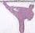

答案 P068

1.《数学文化》(2025 鄂北六校期中)英国数学家牛顿在 17 世纪给出了一种求方程近似根的方法——牛顿迭代法, 做法如下: 如图, 设 $r$ 是 $f(x) = 0$ 的根, 选取 $x_0$ 作为 $r$ 的初始近似值, 过点 $(x_0, f(x_0))$ 作曲线 $y = f(x)$ 的切线 $l: y - f(x_0) = f'(x_0)(x - x_0)$ , 则 $l$ 与 $x$ 轴的交点的横坐标 $x_1 = x_0 - \frac{f(x_0)}{f'(x_0)} (f'(x_0) \neq 0)$ , 称 $x_1$ 是 $r$ 的一次近似值; 过点 $(x_1, f(x_1))$ 作曲线 $y = f(x)$ 的切线, 则该切线与 $x$ 轴的交点的横坐标为 $x_2$ , 称 $x_2$ 是 $r$ 的二次近似值; 重复以上过程, 得 $r$ 的近似值序列, 其中 $x_{n+1} = x_n - \frac{f(x_n)}{f'(x_n)} (f'(x_n) \neq 0)$ , 称 $x_{n+1}$ 是 $r$ 的 $n+1$ 次近似值. 这种求方程 $f(x) = 0$ 近似解的方法称为牛顿迭代法. 若使用该方法求方程 $x^2 = 3$ 的近似解, 则下列说法正确的是 ( )

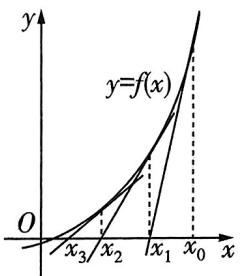

<details>
<summary>text_image</summary>

y
y=f(x)
O
x₃/x₂/x₁/x₀/x
</details>

A. 若取初始近似值为 1, 则过点 $(1, f(1))$ 的曲线 $y = f(x)$ 的切线方程为 y = 2x - 3

B. 若取初始近似值为 1, 则该方程解的二次近似值为 $\frac{7}{5}$

C. $x_{3} = x_{0} - \frac{f(x_{0})}{f'(x_{0})} +\frac{f(x_{1})}{f'(x_{1})} -\frac{f(x_{2})}{f'(x_{2})}$

D. $x_{n + 1} = x_0 - \frac{f(x_0)}{f'(x_0)} -\frac{f(x_1)}{f'(x_1)} -\frac{f(x_2)}{f'(x_2)} -\dots -$ $\frac{f(x_n)}{f'(x_n)}$

2. 强基自招 [大招17] (2024 兰州大学强基计划) 比较大小；

$(e+1)^{e+2}$ $(e+2)^{e+1};(\cos 1)^{\sin 1}$ $(\sin 1)^{\cos 1}.$ （选填“＞”或“＜”）

3.《新定义》《名师原创》若函数 $y = f(x)$ 的图象上存在相异的两点 $P, Q$ ，使得曲线 $y = f(x)$ 在点 $P$ 和点 $Q$ 处的切线重合，则称 $y = f(x)$ 是“优切函数”，点 $P, Q$ 为“优切点”，直线 $PQ$ 为 $y = f(x)$ 的“优切线”.

(1) 若 $f(x)=\mathrm{e}^{x}+\mathrm{e}^{-x}$ ，判断函数 $y=f(x)$ 是否为“优切函数”，并说明理由；
(2) 若 $g(x)=x^{3}+\frac{1}{x}$ ，证明：函数 $y=f(x)$ 是“优切函数”，并求出其“优切线”方程；

(3) 若 $h(x) = \begin{cases} \ln x, & 1 < x < e, \\ -\frac{1}{2}x^2 + a, & x < 0 \end{cases}$ 存在“优切线”，求实数 $a$ 的取值范围.

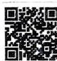


# 考点切片

②② 看什么看,不服做了试试!


# 考点1 任意角与弧度制

→答案P068

1.(1) $1500^{\circ}$ 角的弧度数是

(2) $-112^{\circ}30'$ 角的弧度数是\_\_\_\_.

(3) $\frac{7\pi}{6}$ 角的角度数是\_\_\_\_.

(4) $-\frac{5\pi}{12}$ 角的角度数是\_\_\_\_.

2.[多选]下列说法正确的是 ( )

A. 小于 $90^{\circ}$ 的角是锐角

B. 钝角一定是第二象限角

C. 第二象限角大于第一象限角

D. 若 $M = \{x \mid x = \frac{\pi}{4} + k \cdot \frac{\pi}{2}, k \in \mathbf{Z}\}$ , $N = \{y \mid y = \frac{\pi}{2} + k \cdot \frac{\pi}{4}, k \in \mathbf{Z}\}$ , 则 $M \subseteq N$

3. 已知 $\alpha$ 是第二象限角, 且 $|\alpha + 2| \leqslant 4$ , 则 $\alpha$ 的范围是 \_\_\_\_.

4.(1)已知扇形的周长为6 cm、半径为1 cm,则其面积为\_\_\_\_.

(2)已知扇形的周长为 $12 \, cm$ 、面积为 $8 \, cm^{2}$ ，则圆心角的弧度数为 \_\_\_\_.

(3)在面积为定值 $S \, cm^{2}$ 的扇形中, 当扇形的周长取得最小值时, 扇形的半径是 \_\_\_\_.

# 考点2 三角函数的定义

答案 P069

1.(2024 湖南联考) 若角 $\alpha$ 的终边在直线 y = 3x
上, 则 $\sin \alpha =$ ( )

A. $\pm \frac{3\sqrt{10}}{10}$

B. $\pm 3$

C. $\frac{3\sqrt{10}}{10}$

D. 3

2.(2024 福建福州检测)已知角 $\alpha$ 的顶点是坐标原点,始边与 x 轴非负半轴重合,若终边交单位圆于点 $P(\frac{1}{2},y_{0})$ ,则()

A. $\alpha = \frac{\pi}{3}$

B. $\sin \alpha = \frac{1}{2}$

C. $\cos \alpha = \frac{1}{2}$

D. $\tan \alpha = \frac{1}{2}$

3.(2020 全国Ⅱ卷)若 $\alpha$ 为第四象限角,则 ( )

A. $\cos 2\alpha > 0$

B. $\cos 2\alpha < 0$

C. $\sin 2\alpha > 0$

D. $\sin 2\alpha < 0$

4.(1)(2024 安徽模拟)已知角 $\alpha$ 终边上有一点 $P(\sin\frac{2\pi}{3},\cos\frac{2\pi}{3})$ ，则 $\pi-\alpha$ 的终边位于第 \_\_\_\_ 象限.

(2)已知角 $\alpha$ 是第二象限角,则点 $P(\sin (\cos \alpha),\cos (\cos \alpha))$ 在第 \_\_\_\_ 象限.

(3) 角 $\alpha$ 的终边在第一象限, 则 $\frac{|\sin \frac{\alpha}{2}|}{\sin \frac{\alpha}{2}} + \frac{|\cos \frac{\alpha}{2}|}{\cos \frac{\alpha}{2}}$ 的取值集合为 \_\_\_\_.

5.(1)当 $\alpha\in(0,\frac{\pi}{2})$ 时, $\alpha,\sin\alpha,\tan\alpha$ 的大小关系是 \_\_\_\_.

(2)若 $\alpha$ 是第一象限角,则 $\sin \alpha +\cos \alpha$ 的值与1的大小关系是 （）

A. $\sin \alpha + \cos \alpha > 1$

B. $\sin \alpha + \cos \alpha = 1$

C. $\sin \alpha + \cos \alpha < 1$

D. 不能确定

6. 若 $-\frac{3\pi}{4}<\alpha<-\frac{\pi}{2}$ ，则 $\sin\alpha,\cos\alpha,\tan\alpha$ 的大小关系是 \_\_\_\_.

# 考点3 同角关系式

答案 P070

1.(2023 全国乙卷) 若 $\theta \in (0, \frac{\pi}{2})$ , $\tan \theta = \frac{1}{2}$ , 则 $\sin\theta-\cos\theta=$ \_\_\_\_.

2. 若 $\tan \alpha = \cos \alpha$ ，则 $\frac{1}{\sin \alpha} + \cos^4 \alpha =$ \_\_\_\_.

3. 已知 $\sin \alpha - \cos \alpha = \frac{1}{5}$ , 求下列式子的值:

(1) $\sin \alpha \cos \alpha =$   
(2) $\sin \alpha + \cos \alpha =$   
(3) $\sin^3\alpha + \cos^3\alpha = \underline{\quad}$ .

4. 化简下列式子:

(1) $\cos \alpha (\sqrt{\frac{1 + \sin\alpha}{1 - \sin\alpha}} +\sqrt{\frac{1 - \sin\alpha}{1 + \sin\alpha}}) =$

(其中 $\alpha$ 是第三象限角).

(2) $\frac{\tan^2 x - \frac{1}{\tan^2 x}}{\sin^2 x - \cos^2 x} + \frac{1}{\cos^2 x} - \frac{1}{\sin^2 x} =$ \_\_\_\_.

5.(1)已知 $\frac{3\sin\alpha+\cos\alpha}{4\sin\alpha+3\cos\alpha}=3$ ，则 $\tan\alpha=$ \_\_\_\_.

(2)(2025云南昆明联考)若 $\sin 2\alpha +\cos^2\alpha =$ $-\frac{1}{2},\alpha \in (\frac{\pi}{2},\frac{3\pi}{4})$ ，则 $\tan \alpha =$   
(3) 已知 $2 \sin \alpha - \cos \alpha = \sqrt{5}$ , 则 $\tan \alpha =$ \_\_\_\_.

6.（2021 新高考 I 卷）若 $\tan \theta = -2$ ，则 $\frac{\sin\theta(1+\sin2\theta)}{\sin\theta+\cos\theta}=$ （）

A. $-\frac{6}{5}$

B. $-\frac{2}{5}$

C. $\frac{2}{5}$

D. $\frac{6}{5}$

7.(2022 浙江)若 $3\sin\alpha - \sin\beta = \sqrt{10}, \alpha + \beta = \frac{\pi}{2}$ ，则 $\sin\alpha =$ \_\_\_\_ ， $\cos2\beta =$ \_\_\_\_ .

# 考点4 诱导公式

→答案 P071

1. 求下列三角函数值:

(1) $\sin\left(-\frac{\pi}{6}\right)=$ \_\_\_\_.   
(2) $\cos \frac{17}{6}\pi =$ \_\_\_\_.   
(3) $\tan \left(-\frac{19\pi}{4}\right) =$   
(4) $\sin \frac{5\pi}{4} \cdot \cos \frac{25\pi}{6} \cdot \tan \frac{4\pi}{3} =$ \_\_\_\_.

2.(2025云南师大附中月考)若 $\sin 160^{\circ} = m$ ，则 $\sin 40^{\circ} =$ （

A. -2m

B. $-2m\sqrt{1 - m^2}$

C. $-2m\sqrt{1 + m^2}$

D. $2m\sqrt{1 - m^2}$

3.(2024陕西渭南一模)已知角 $\alpha$ 的终边过点 $P(1, -2)$ , 则 $\frac{\sin(\pi - \alpha) + \cos(-\alpha)}{2\cos(\frac{\pi}{2} - \alpha) - \sin(\frac{\pi}{2} + \alpha)} =$ \_\_\_\_.

4.(2020 北京)已知 $\alpha, \beta \in R$ ，则“存在 $k \in Z$ 使得 $\alpha = k\pi + (-1)^{k}\beta$ ”是“ $\sin \alpha = \sin \beta$ ”的（）

A. 充分而不必要条件  
B. 必要而不充分条件  
C. 充分必要条件  
D. 既不充分也不必要条件

# 考点5 和差角公式

→答案P072

# 题组一

1.(2024 全国甲卷)已知 $\frac{\cos \alpha}{\cos \alpha - \sin \alpha} = \sqrt{3}$ ，则 $\tan(\alpha+\frac{\pi}{4})=$ ( )

A. $2 \sqrt{3} + 1$

B. $2\sqrt{3}-1$

C. $\frac{\sqrt{3}}{2}$

D. $1 - \sqrt{3}$

2. 求下列式子的值:

(1)已知 x, y 均为锐角，且 $\sin x = \frac{1}{\sqrt{5}}$ , $\cos y = \frac{3}{\sqrt{10}}$ ，则 $x + y =$ \_\_\_\_ .  
(2) 已知 $x, y \in (0, \frac{\pi}{2})$ ，且 $(\tan x + \sqrt{3})(\tan y + \sqrt{3}) = 4$ ，则 $x + y =$ \_\_\_\_.

3.(2022 新高考Ⅱ卷)若 $\sin(\alpha+\beta)+\cos(\alpha+\beta)=2\sqrt{2}\cos(\alpha+\frac{\pi}{4})\sin\beta,$ 则 ( )

A. $\tan (\alpha -\beta) = 1$

B. $\tan (\alpha +\beta) = 1$

C. $\tan (\alpha -\beta) = -1$

D. $\tan (\alpha +\beta) = -1$

4. 若 $0 < y \leqslant x < \frac{\pi}{2}$ ，且 $\tan x = 3\tan y$ ，则 x - y 的最大值为 \_\_\_\_.  
5.(2025 河北衡水期中)已知 $\alpha, \beta \in (0, \frac{\pi}{2})$ ，且 $\sin\alpha=\tan\beta(1+\cos\alpha)$ ，则()

A. $2\alpha + \beta = \frac{\pi}{2}$

B. $\alpha + 2\beta = \frac{\pi}{2}$

C. $\alpha = 2\beta$

D. $2\alpha = \beta$

6.(2024 新课标Ⅱ卷)已知 $\alpha$ 为第一象限角, $\beta$ 为第三象限角, $\tan \alpha + \tan \beta = 4$ , $\tan \alpha \tan \beta = \sqrt{2} + 1$ , 则 $\sin(\alpha + \beta) =$ \_\_\_\_.

# 题组二

# 大招33 对应练习


# 解题觉醒

寻找题目中所给角度之间的关系,题目中所给角度与特殊角之间的关系,或题目中所给角度与待求目标角之间的关系,根据找到的关系选择恰当的三角函数公式处理问题.

7. 求下列式子的值: (1) (2025 江西南昌检测) $\cos 162^{\circ} \cos 132^{\circ} + \cos 72^{\circ} \cos 42^{\circ} =$ \_\_\_\_.

(2) $\sin 54^{\circ}\cos 24^{\circ} + \cos 66^{\circ}\cos 126^{\circ} =$   
(3) $\frac{1 + \tan 56^{\circ} \tan 26^{\circ}}{\tan 56^{\circ} - \tan 26^{\circ}} =$ \_\_\_\_.   
(4) $\tan 50^{\circ} + \tan 70^{\circ} - \sqrt{3}\tan 50^{\circ}\tan 70^{\circ} =$   
(5) $\frac{2\sin 12^{\circ} + \sqrt{3}\sin 18^{\circ}}{2\cos 12^{\circ} - \sin 18^{\circ}} =$   
(6) $\frac{1-\tan105^{\circ}}{1+\tan105^{\circ}}=$ \_\_\_\_.

8. 求下列式子的值: (1) 若 $x \in (0, \frac{\pi}{2})$ , 且 $\sin(x - \frac{\pi}{6}) = \frac{3}{5}$ , 则 $\sin x =$ \_\_\_\_ .

(2)(2024 广东湛江期末)已知 $\alpha, \beta \in (\frac{3\pi}{4}, \pi)$ , $\sin(\alpha + \beta) = -\frac{3}{5}$ , $\sin(\beta - \frac{\pi}{4}) = \frac{\sqrt{2}}{2}$ , 则 $\cos(\alpha + \frac{\pi}{4}) =$ \_\_\_\_.

9.(2024 湖北一模)已知 $\alpha\in(0,\pi)$ ，若 $\sin(\alpha-\frac{\pi}{6})=\frac{\sqrt{3}}{3}$ ，则 $\sin(2\alpha+\frac{\pi}{6})=$ （）

A. $-\frac{1}{3}$

B. $\frac{2}{3}$

C. $\frac{1}{3}$

D. $\pm \frac{1}{3}$

10. 写出一个使等式 $(\sqrt{3} - \tan 10^{\circ}) \cos \alpha = 1$ 成立的角 $\alpha$ 的值：\_\_\_\_。  
11.(2024 江苏南京一模)若 $2\sin(\alpha+\frac{\pi}{3})=\sin(\alpha-\frac{\pi}{6})$ ，则 $\tan(\alpha-\frac{\pi}{3})=$ ( )

A. $5 \sqrt{3} + 8$

B. $3 \sqrt{3} - 4$

C. $4 + 3\sqrt{3}$

D. $5\sqrt{3} - 8$

12. (2024 江西联考) 在平面直角坐标系 $xOy$ 中, 锐角 $\theta$ 的大小如图所示, 则 $\frac{\sin 2\theta}{2\cos^2\theta - 3\sin^2\theta} = (\quad)$

A.-2

B. 2

C. $\frac{5}{2}$


<details>
<summary>text_image</summary>

y
P(3, 15)
θ
π/4
O
x
</details>

D. 3

# 考点6 倍角公式 & 半角公式 & 万能公式

→答案 P074

1.(2023 新课标Ⅱ卷)已知 $\alpha$ 为锐角, $\cos \alpha = \frac{1 + \sqrt{5}}{4}$ , 则 $\sin \frac{\alpha}{2} =$ ( )

A. $\frac{3 - \sqrt{5}}{8}$

B. $\frac{-1 + \sqrt{5}}{8}$

C. $\frac{3 - \sqrt{5}}{4}$

D. $\frac{-1 + \sqrt{5}}{4}$

2. (2023 新课标 I 卷) 已知 $\sin (\alpha - \beta) = \frac{1}{3}$ , $\cos \alpha \sin \beta = \frac{1}{6}$ , 则 $\cos (2\alpha + 2\beta) =$ ()

A. $\frac{7}{9}$

B. $\frac{1}{9}$


C. $-\frac{1}{9}$

D. $-\frac{7}{9}$

3.(1)(2024 福建南平二模)已知 $\tan\left(\alpha+\frac{\pi}{6}\right)=\frac{1}{2}$ ，则 $\cos\left(2\alpha-\frac{2\pi}{3}\right)=$ \_\_\_\_.

(2)已知 $\cos (x + \frac{\pi}{6}) = \frac{4}{5}$ , 则 $\sin (2x + \frac{\pi}{12}) =$ \_\_\_\_.

4.(2025 安徽联考) $\sin^{2}\frac{\pi}{12}-\sin^{2}\frac{7\pi}{12}=$ ( )

A. $\frac{\sqrt{3}}{2}$

B. $\frac{1}{2}$

C. $-\frac{1}{2}$

D. $-\frac{\sqrt{3}}{2}$

5.求下列式子的值:(1) $\frac{2\cos10^{\circ}-\sin20^{\circ}}{\cos20^{\circ}}=$ \_\_\_\_.

(2) $\frac{3-\sin70^{\circ}}{2-\cos^{2}10^{\circ}}=$ \_\_\_\_.

6.求下列式子的值:(1) $\cos20^{\circ}\cos40^{\circ}\cos80^{\circ}=$

(2) $\sin 6^{\circ}\sin 42^{\circ}\sin 66^{\circ}\sin 78^{\circ} =$

7. (1) 已知 $2\pi < x < 3\pi$ ，且 $\sin x = \frac{1}{3}$ ，则 $\sin \frac{x}{2} + \cos \frac{x}{2} =$ \_\_\_\_.

(2)已知 x 是第三象限角,且 $\cos x = -\frac{4}{5}$ , 则 $\frac{1+\tan\frac{x}{2}}{1-\tan\frac{x}{2}}=\underline{\hspace{2cm}}.$

8.(2024广东佛山质检)已知 $\sin(2\alpha-\frac{\pi}{12})=\frac{\sqrt{2}}{3}$ ，则 $\tan(\alpha+\frac{\pi}{3})\tan(\alpha+\frac{\pi}{12})=$ \_\_\_\_.

9.(2021 全国甲卷) 若 $\alpha \in (0, \frac{\pi}{2})$ , $\tan 2\alpha = \frac{\cos \alpha}{2 - \sin \alpha}$ , 则 $\tan \alpha =$ ()

A. $\frac{\sqrt{15}}{15}$

B. $\frac{\sqrt{5}}{5}$

C. $\frac{\sqrt{5}}{3}$

D. $\frac{\sqrt{15}}{3}$

10. 函数 $y = \frac{\sin x}{2 - \cos x}$ 的值域为 \_\_\_\_.

# 考点7 辅助角公式

→答案 P076

1.(2025 河南南阳一中月考)已知 $\sin \alpha + \sin (\alpha + \frac{\pi}{3}) = \frac{2\sqrt{3}}{3}$ ，则 $\cos(\frac{\pi}{3} - \alpha) =$ \_\_\_\_ .

2.(2024 全国甲卷) 函数 $f(x)=\sin x-\sqrt{3}\cos x$ 在 $[0,\pi]$ 上的最大值是 \_\_\_\_.

3.(1) 当 $x = \theta$ 时, 函数 $f(x) = 3\sin x - \cos x$ 取得最小值, 则 $\tan \theta =$ \_\_\_\_.

(2)已知函数 $f(x)=a\sin x-b\cos x$ 在 $x=\frac{\pi}{3}$ 处取得最小值-2，则函数 $f(\frac{\pi}{3}-x)=$ \_\_\_\_.

4.(2025 北京清华大学附中统练)若实数 $\alpha, \beta \in [-\pi, \pi]$ ，且 $\alpha, \beta$ 满足方程组 $\left\{\begin{aligned}1 + 2\cos \alpha &= 2\cos \beta, \\ \sqrt{3} + 2\sin \alpha &= 2\sin \beta,\end{aligned}\right.$ 则 $\alpha =$ \_\_\_\_ , $\beta =$ \_\_\_\_ . (写出一组值即可)

5.(2024 四川雅安一模)已知函数 $f(x)=3\sin(4x+\frac{\pi}{3})+4\sin(4x-\frac{\pi}{6})$ ，设 $\forall x\in R,\exists x_{0}\in$

$\mathbf{R}, f(x) \leqslant f(x_0)$ , 则 $\tan (4x_0 - \frac{2\pi}{3}) =$ （ ）

A. $-\frac{4}{3}$

B. $-\frac{3}{4}$

C. $\frac{3}{4}$

D. $\frac{4}{3}$

6.(2025 广东茂名联考)已知关于 x 的方程 $2\sin x + \cos x = 1$ 在 $[0, 2\pi)$ 内有 2 个不同的解 $\alpha, \beta$ ，则 $\cos(\alpha - \beta) =$ \_\_\_\_.

7. $(1 + \frac{1}{\tan 46^{\circ}})(1 + \frac{1}{\tan 47^{\circ}}) \cdot \cdots \cdot (1 + \frac{1}{\tan 89^{\circ}}) =$ \_\_\_\_.

# 考点8 平移 & 伸缩变换

→答案 P077

1.(2024 江苏二模)为了得到函数 $y = \sin(2x + \frac{\pi}{3})$ 的图象, 只要把函数 $y = \sin 2x$ 的图象上所有的点 ( )

A. 向左平移 $\frac{\pi}{6}$ 个单位长度  
B. 向左平移 $\frac{\pi}{3}$ 个单位长度  
C. 向右平移 $\frac{\pi}{6}$ 个单位长度  
D. 向右平移 $\frac{\pi}{3}$ 个单位长度

2.(2021全国乙卷)把函数 $y=f(x)$ 图象上所有点的横坐标缩短到原来的 $\frac{1}{2}$ ，纵坐标不变，再把所得曲线向右平移 $\frac{\pi}{3}$ 个单位长度，得到函数 $y=\sin(x-\frac{\pi}{4})$ 的图象，则 $f(x)=$ （）

A. $\sin \left(\frac{x}{2} - \frac{7\pi}{12}\right)$

B. $\sin \left(\frac{x}{2} +\frac{\pi}{12}\right)$

C. $\sin (2x - \frac{7\pi}{12})$

D. $\sin (2x + \frac{\pi}{12})$

3.(2023 全国甲卷) 函数 $y = f(x)$ 的图象由函数 $y = \cos(2x + \frac{\pi}{6})$ 的图象向左


平移 $\frac{\pi}{6}$ 个单位长度得到, 则 $y = f(x)$ 的图象与直线 $y = \frac{1}{2} x - \frac{1}{2}$ 的交点个数为 ( )

A. 1

B.2

C. 3

D. 4

4.(2024 安徽合肥检测) 将函数 $y = \sin\left(2x - \frac{\pi}{4}\right)$ 图象上的点 $P(\frac{\pi}{4}, t)$ 向左平移 s (s > 0) 个单位长度得到点 $P'$ ，若点 $P'$ 位于函数 $y = \cos 2x$ 的图象上，则（）

A. $t = \frac{\sqrt{2}}{2}, s$ 的最小值为 $\frac{\pi}{8}$   
B. $t = \frac{1}{2}, s$ 的最小值为 $\frac{\pi}{8}$   
C. $t = \frac{\sqrt{2}}{2}, s$ 的最小值为 $\frac{3\pi}{8}$   
D. $t = \frac{1}{2}, s$ 的最小值为 $\frac{3\pi}{8}$

5.(2025 吉林长春模拟)将函数 $f(x)=\sin(\omega x+\frac{\pi}{3})(\omega>0)$ 的图象向右平移 $\frac{\pi}{6}$ 个单位长度后与函数 $g(x)=\cos\omega x$ 的图象重合,则 $\omega$ 的最小值为()

A. 7

B. 5

C.9

D. 11

6.[多选](2025 四川联考)已知 $x_{1}, x_{2}$ 是函数 $f(x) = \tan (\omega x + \varphi)(\omega > 0, -\pi < \varphi < \pi)$ 的两个零点, 且 $|x_{1} - x_{2}|$ 的最小值为 $\frac{\pi}{3}$ , 若将函数 $f(x)$ 的图象向左平移 $\frac{\pi}{12}$ 个单位长度后得到的图象关于原点对称, 则 $\varphi$ 的可能值为 ( )

A. $\frac{3\pi}{4}$

B. $\frac{\pi}{4}$

C. $-\frac{\pi}{4}$

D. $\frac{\pi}{8}$

# 考点9 正弦型函数图象和性质

→答案P077

1. 函数 $f(x) = \cos (\omega x + \varphi)$ 的部分图象如图所示, 则 $f(x)$ 的单调递减区间为 ( )


<details>
<summary>line</summary>

| x | y |
|---|---|
| 0 | -1 |
| 1/4 | 1 |
| 5/4 | -1 |
</details>

A. $(k\pi - \frac{1}{4}, k\pi + \frac{3}{4})$ $(k \in \mathbf{Z})$   
B. $(2k\pi - \frac{1}{4}, 2k\pi + \frac{3}{4}) (k \in \mathbf{Z})$   
C. $(k - \frac{1}{4}, k + \frac{3}{4})(k \in \mathbf{Z})$   
D. $(2k - \frac{1}{4}, 2k + \frac{3}{4}) (k \in \mathbf{Z})$

2.[多选](2024新课标Ⅱ卷)对于函数 $f(x)=\sin 2x$ 和 $g(x)=\sin(2x-\frac{\pi}{4})$ ，下列说法中正确的有()

A. $f(x)$ 与 $g(x)$ 有相同的零点  
B. $f(x)$ 与 $g(x)$ 有相同的最大值  
C. $f(x)$ 与 $g(x)$ 有相同的最小正周期  
D. $f(x)$ 与 $g(x)$ 的图象有相同的对称轴

3.[多选](2025河南商丘、周口联考)已知函数 $f(x)=a\cos x+\sqrt{3}\sin\left(x-\frac{\pi}{6}\right)(a>0)$ 的最小值为 $-\sqrt{3}$ ，则()

A. 直线 $x = \frac{\pi}{2}$ 为 $f(x)$ 图象的一条对称轴  
B. $f(x)$ 在区间 $(\frac{\pi}{2}, \frac{4\pi}{3})$ 上单调递减  
C. 将 $f(x)$ 的图象向左平移 $\frac{\pi}{3}$ 个单位长度, 得到一个奇函数的图象  
D. 当 $x \in [-\frac{\pi}{3}, t]$ 时, $f(x)$ 的值域为 $[- \frac{\sqrt{3}}{2}, \sqrt{3}]$ , 则 $t$ 的取值范围为 $[\frac{\pi}{3}, \pi]$

4.(2023 全国乙卷)已知函数 $f(x)=\sin(\omega x+\varphi)$ 在区间 $(\frac{\pi}{6},\frac{2\pi}{3})$ 上单调


递增, 直线 $x = \frac{\pi}{6}$ 和 $x = \frac{2\pi}{3}$ 为函数 $y = f(x)$ 的图象的两条相邻对称轴, 则 $f(-\frac{5\pi}{12}) =$ ( )

A. $-\frac{\sqrt{3}}{2}$

B. $-\frac{1}{2}$

C. $\frac{1}{2}$

D. $\frac{\sqrt{3}}{2}$

5.(2025 湖南长沙一中月考) 如图是函数 $y = \sin(\omega x + \varphi)$ 的部分图象, 则函数的解析式可以为 ( )


<details>
<summary>text_image</summary>

y
O π/6 2π/3 x
</details>

A. $y = \sin \left(\frac{\pi}{3} -2x\right)$

B. $y = \sin (x + \frac{\pi}{3})$

C. $y = \sin (2x + \frac{\pi}{6})$

D. $y = \cos\left(\frac{5\pi}{6} - 2x\right)$

6.[多选](2022 新高考Ⅱ卷)已知函数 $f(x)=\sin(2x+\varphi)(0<\varphi<\pi)$ 的图象关于点 $\left(\frac{2\pi}{3},0\right)$ 中心对称,则()

A. $f(x)$ 在区间 $(0, \frac{5\pi}{12})$ 上单调递减  
B. $f(x)$ 在区间 $(-\frac{\pi}{12},\frac{11\pi}{12})$ 上有两个极值点  
C. 直线 $x = \frac{7\pi}{6}$ 是曲线 $y = f(x)$ 的对称轴  
D. 直线 $y = \frac{\sqrt{3}}{2} - x$ 是曲线 $y = f(x)$ 的切线

7.（2024 江苏镇江模拟）定义 $a \otimes b = \left\{ \begin{array}{l} a, a \leqslant b, \\ b, a > b. \end{array} \right.$ 如： $1 \otimes 2 = 1$ 。则函数 $f(x) = \sin x \otimes \cos x$ 的值域为 （）

A. $[-1, -\frac{\sqrt{2}}{2}]$

B. $\left[-\frac{\sqrt{2}}{2}, \frac{\sqrt{2}}{2}\right]$

C. $[- \frac{\sqrt{2}}{2}, 1]$

D. $[-1, \frac{\sqrt{2}}{2}]$

8.(2024 吉林长春期末) 函数 $f(x) = -2\sin^{2}x - 3\cos x + 2, x \in [0, \frac{\pi}{4}]$ 的值域为 \_\_\_\_.  
9.(2024 北京模拟)若函数 $f(x)=\cos 2x+a\sin x$ 在区间 $\left(\frac{\pi}{6},\frac{\pi}{2}\right)$ 上单调递减, 则 a 的取值范围是 \_\_\_\_.  
10. 若函数 $f(x) = \sin \left(2x - \frac{\pi}{3}\right)$ 在 $[ \pi - m, m]$ 上单调递减, 则 $m$ 的最大值为 \_\_\_\_.

考点10 “ω”的求解

→答案 P079


# 解题觉醒

“ω”的求解问题按以下步骤处理：

第一步:根据题目条件,将 $\omega x + \varphi$ 看作整体,得到函数 $f(x)$ 的最(极)值点或图象的对称轴、对称中心所满足的关系,从而建立方程(组)或不等式(组).

第二步: 解方程(组)或不等式(组), 得到答案. (不等式(组)有些复杂时, 可先去压缩不等式中的整数 k 的取值范围, 进而对整数 k 的取值进行分类讨论, 从而求得 $\omega$ 的取值范围)

1.(2024 北京) 设函数 $f(x)=\sin \omega x (\omega>0)$ . 已知 $f(x_{1})=-1, f(x_{2})=1$ , 且 $|x_{1}-x_{2}|$ 的最小值为 $\frac{\pi}{2}$ , 则 $\omega=$ ( )

A. 1

B.2

C. 3

D. 4

2.(2022 新高考 I 卷) 记函数 $f(x)=\sin(\omega x+\frac{\pi}{4})+b(\omega>0)$ 的最小正周


期为 T. 若 $\frac{2\pi}{3} < T < \pi$ ，且 $y = f(x)$ 的图象关于点 $(\frac{3\pi}{2}, 2)$ 中心对称，则 $f(\frac{\pi}{2}) =$ （）

A. 1

B. $\frac{3}{2}$

C. $\frac{5}{2}$

D. 3

3.(2022 全国甲卷) 设函数 $f(x)=\sin(\omega x+\frac{\pi}{3})$ ( $\omega>0$ ) 在区间 $(0,\pi)$ 上恰有三个极值点、两个零点，则 $\omega$ 的取值范围是（）

A. $\left[\frac{5}{3},\frac{13}{6}\right)$

B. $\left[\frac{5}{3},\frac{19}{6}\right)$

C. $(\frac{13}{6}, \frac{8}{3}]$

D. $(\frac{13}{6}, \frac{19}{6}]$

4.(2025 吉林长春外国语期中)已知函数 $f(x)=2\sin(2\omega x+\frac{\pi}{6})+1,\omega>0$ 的定义域为 $[0,\pi]$ ，在定义域内存在唯一 $x_{0}$ ，使得 $f(x_{0})=3$ ，则 $\omega$ 的取值范围为()

A. $\left[\frac{1}{12},\frac{13}{12}\right]$

B. $\left[\frac{1}{12},\frac{13}{12}\right)$

C. $\left[\frac{1}{6},\frac{7}{6}\right)$

D. $\left[\frac{1}{6},\frac{7}{6}\right]$

5. 已知 $\omega > 0$ , 函数 $f(x) = \sin \left( \omega x + \frac{\pi}{4} \right)$ 在 $(\frac{\pi}{2}, \pi)$ 上单调递减, 则 $\omega$ 的取值范围是 \_\_\_\_.


6.(2025北京清华大学附中统练)已知函数 $f(x)=A\sin(\omega x+\varphi)(A>0,\omega>0,|\varphi|<\frac{\pi}{2})$ , $x=-\frac{\pi}{4}$ 是函数的一个零点, 且 $x = \frac{\pi}{4}$ 是其图象的一条
对称轴. 若 $f(x)$ 在区间 $(\frac{\pi}{9}, \frac{\pi}{6})$ 上单调, 则 $\omega$ 的最大值为 ( )

A. 18

B. 17

C. 14

D. 13

7. (2024 江西模拟) 将函数 $g(x) = \sin \omega x (\omega > 0)$ 的图象向右平移 $\frac{\pi}{6\omega}$ 个单位长度可以得到函数 $f(x)$ 的图象, 若函数 $f(x)$ 在区间 $(\frac{\pi}{3}, \frac{5\pi}{6})$ 内有零点, 无最值, 则 $\omega$ 的取值范围是 \_\_\_\_.

8.(2023 新课标Ⅱ卷)已知函数 $f(x)=\sin(\omega x+\varphi)$ ，如图，A,B 是直线 $y=\frac{1}{2}$ 与曲线 $y=f(x)$ 的两个交点，若 $\left|AB\right|=\frac{\pi}{6}$ ，则 $f(\pi)=$ \_\_\_\_.


<details>
<summary>text_image</summary>

y
1/2
A B
O
2π/3 x
</details>


9.[多选](2025 广东广州模拟)设函数 $f(x)=\cos(\omega x+\frac{\pi}{3})(\omega>0)$ ，已知 $f(x)$ 的图象在区间 $[0,2\pi]$ 有且仅有5个对称中心，则（）

A. $f(x)$ 在区间 $(0,2\pi)$ 有且仅有2个极大值点  
B. $f(x)$ 在区间 $(0,2\pi)$ 有且仅有3个极小值点  
C. $f(x)$ 在区间 $(0, \frac{\pi}{4})$ 单调递减  
D. $\omega$ 的取值范围是 $(\frac{25}{12}, \frac{31}{12}]$

# 考点11 三角函数图象精细分析

→答案P081

1.(2024 辽宁联考)已知函数 $f(x)=A\sin(\omega x+\varphi)(A,\omega,\varphi$ 均为正的常数) 的最小正周期为 $\pi$ ，当 $x=\frac{6074\pi}{3}$ 时，函数 $f(x)$ 取得最小值，则下列结论正确的是（）

A. $f(2) < f(-2) < f(0)$   
B. $f(0) < f(2) < f(-2)$   
C. $f(-2) < f(0) < f(2)$   
D. $f(2) < f(0) < f(-2)$

2. 将函数 $f(x) = \sin 2x$ 的图象向右平移 $\varphi(0 < \varphi < \frac{\pi}{2})$ 个单位长度后得到函数 $g(x)$ 的图象.

若满足 $|f(x_{1})-g(x_{2})|=2$ 的 $x_{1},x_{2}$ 有 $|x_{1}-x_{2}|_{\min}=\frac{\pi}{3}$ ，则 $\varphi=$ \_\_\_\_.

3.(2024 安徽期末)已知 $f(x)=\sin(2x-\frac{5\pi}{6})$ ，将 $f(x)$ 的图象先向左平移 $\frac{5\pi}{12}$ 个单位长度，再把所得图象上各点的横坐标伸长为原来的2倍，得到函数 $h(x)$ 的图象，若对任意的 $x \in (0, \frac{\pi}{2})$ ，不等式 $p[h(x)-1] \cdot [h(x+\frac{\pi}{2})-1] < h(2x)$ 恒成立，实数 p 的取值范围为 \_\_\_\_.

4.(2024 湖北联考)将函数 $f(x)=2\sin x-1$ 的图象上所有点的横坐标不变纵坐标伸长为原来的2倍,向下平移1个单位长度,向左平移 $\varphi(\varphi\in(0,\pi])$ 个单位长度,最后所有点的纵坐标不变横坐标缩短到原来的0.5,得到函数 $g(x)$ 的图象.若对任意 $x_{1}\in[0,\frac{\pi}{2}]$ ,都存在 $x_{2}\in[-\frac{\pi}{4},0]$ ,使得 $f(x_{1})=g(x_{2})$ ,则 $\varphi$ 的取值范围为\_\_\_\_.

5.(2021全国甲卷)已知函数 $f(x)=2\cos(\omega x+\varphi)$ 的部分图象如图所示,则满足条件 $[f(x)-f(-\frac{7\pi}{4})]\cdot[f(x)-f(\frac{4\pi}{3})]>0$ 的最小正整数x为\_\_\_\_.


<details>
<summary>line</summary>

| x | y |
|---|---|
| 0 | 0 |
| π/3 | 2 |
| 13π/12 | 2 |
</details>

6. 已知函数 $f(x) = A \sin \left( \omega x + \frac{\pi}{4} \right) - 1 (A > 0, 0 < \omega < 1)$ ，且 $f\left(\frac{\pi}{8}\right) = f\left(\frac{5\pi}{8}\right), f(x)$ 在区间 $(0, \frac{3\pi}{4})$ 上的最大值为 $\sqrt{2}$ ，若对任意 $x_1, x_2 \in [0, t]$ 都有 $2f(x_1) \geqslant f(x_2)$ 成立，则实数 $t$ 的最大值是 \_\_\_\_.

7. 已知函数 $f(x) = 2\sin \left(2x + \frac{\pi}{3}\right) - 2\sin^2 \left(x + \frac{\pi}{6}\right) + 1$ ，把 $f(x)$ 的图象向右平移 $\frac{\pi}{6}$ 个单位长度，得到函数 $g(x)$ 的图象，若 $x_1, x_2$ 是关于 $x$ 的方程 $g(x) = m$ 在 $[0, \frac{\pi}{2}]$ 内的两根，则 $\sin (x_1 + x_2)$ 的值为 （）

A. $\frac{2\sqrt{5}}{5}$

B. $\frac{\sqrt{5}}{5}$

C. $-\frac{\sqrt{5}}{5}$

D. $-\frac{2\sqrt{5}}{5}$

8.(2024 江苏模拟)已知函数 $f(x)=\sin x\sin(x+\frac{\pi}{3})-\frac{1}{4}$ 的定义域为 $[m,n]$ ，其中 m<n，值域为 $[- \frac{1}{2},\frac{1}{4}]$ ，则 n-m 的值不可能是（）

A. $\frac{5\pi}{12}$

B. $\frac{\pi}{2}$

C. $\frac{7\pi}{12}$

D. $\frac{3\pi}{4}$

# 觉醒集训

# 来了老铁，测测真学会没！


1.(2024 新课标 I 卷) 已知 $\cos(\alpha + \beta) = m$ , $\tan\alpha\tan\beta=2$ , 则 $\cos(\alpha-\beta)=$ ( )

A. $-3m$

B. $-\frac{m}{3}$

C. $\frac{m}{3}$

D. $3m$

2.(2024 安徽模拟)在平面直角坐标系中,已知角 $\alpha$ 的顶点与坐标原点重合,始边与 x 轴的非负半轴重合,将角 $\alpha$ 的终边按照逆时针方向旋转 $\frac{\pi}{6}$ 后,其终边经过点 $P(1,2)$ ,则 $\sin\left(\frac{2\pi}{3}-2\alpha\right)=$ ()

A. $-\frac{4}{5}$

B. $\frac{4}{5}$

C. $-\frac{3}{4}$

D. $\frac{3}{4}$

3.(2024 四川二模)已知函数 $f(x)=\sin(\omega x-\frac{2\pi}{3})(\omega>0)$ 在 $[0,\pi]$ 有且仅有三个零点, 则 $\omega$ 的取值范围是 ( )

A. $\left[\frac{8}{3},\frac{11}{3}\right]$

B. $\left[\frac{8}{3}, \frac{11}{3}\right)$

C. $\left[\frac{5}{3},\frac{8}{3}\right]$

D. $\left[\frac{5}{3},\frac{8}{3}\right)$

4.(2024 湖南一模)出土于鲁国故城遗址的“出廓双龙勾玉纹黄玉璜”(图1)的璜身满刻勾云纹,体扁平,呈扇面状,璜身外镂空雕饰“S”型双龙,造型精美.现要计算璜身面积(厚度忽略不计),测得各项数据(图2): $AB\approx8~cm,AD\approx2~cm,AO\approx5~cm$ ,若 $\sin37^{\circ}\approx\frac{3}{5},\pi\approx3.14$ ,则璜身(即曲边四边形ABCD)的面积近似为()

  
图1


<details>
<summary>text_image</summary>

A
B
D
C
O
</details>

图2

A. $6.8 \mathrm{~cm}^{2}$

B. $9.8 \mathrm{~cm}^{2}$

C. ${14.8}{\mathrm{\;{cm}}}^{2}$

D. $22.4 \mathrm{~cm}^{2}$

5.(2024 浙江模拟)已知 $2\sin \alpha - \sin \beta = \sqrt{3}$ , $2\cos\alpha-\cos\beta=1$ ，则 $\cos(2\alpha-2\beta)=$ （）

A. $-\frac{1}{8}$

B. $\frac{\sqrt{15}}{4}$

C. $\frac{1}{4}$

D. $-\frac{7}{8}$

6.(2024 辽宁三模)已知函数 $f(x)=A\sin(\omega x+\varphi)(A>0,$ $\omega>0,|\varphi|<\frac{\pi}{2})$ 的图象如图所示,下列说法正确的是


<details>
<summary>line</summary>

| x | y |
|---|---|
| -1 | -1 |
| 0 | 2 |
</details>

( )

A. 函数 $f(x)$ 的振幅是2, 初相是 $\frac{\pi}{6}$

B. 若函数 $f(x)$ 的图象上的所有点向左平移 $\frac{\pi}{12}$ 个单位长度后, 对应函数为奇函数, 则 $\omega = 2$

C. 若函数 $f(x)$ 在 $(\frac{\pi}{3}, \frac{\pi}{2})$ 上单调递减, 则 $\omega$ 的取值范围为 $[2, \frac{10}{3}]$

D. 若函数 $f(x)$ 的图象关于 $(\frac{7\pi}{12},0)$ 中心对称，则函数 $f(x)$ 的最小正周期 $T$ 的最小值为 $7\pi$

7. (2024 江西模拟) 已知函数 $f(x) = a \sin 2\omega x + \cos 2\omega x (\omega > 0)$ 图象的对称轴方程为 $x = k\pi + \frac{\pi}{4} (k \in \mathbf{Z})$ ，则 $f(\frac{a}{4}\pi) =$ （）

A. $\frac{\sqrt{2}}{2}$

B. $-\frac{\sqrt{2}}{2}$

C. $\sqrt{2}$

D. $-\sqrt{2}$

8.[多选](2024 河南新乡二模)如图,弹簧挂着的小球做上下运动,它在 t s 时相对于平衡位置的高度 h(单位:cm)由关系式 $h = A \sin(\omega t + \varphi), t \in [0, +\infty)$


<details>
<summary>text_image</summary>

h>0
h=0
h<0
</details>

确定,其中 $A > 0, \omega > 0, \varphi \in (0, \pi]$ . 小球从最高点出发,经过 2 s 后,第一次回到最高点,则()

A. $\varphi = \frac{\pi}{4}$

B. $\omega = \pi$

C. $t = 3.75\mathrm{s}$ 与 $t = 10\mathrm{s}$ 时小球相对于平衡位置的高度 $h$ 之比为 $\frac{\sqrt{2}}{2}$

D. $t = 3.75\mathrm{s}$ 与 $t = 10\mathrm{s}$ 时小球相对于平衡位置的高度 $h$ 之比为 $\frac{1}{2}$

9.[多选](2024 广西模拟)如图所示,设单位圆与 x 轴的正半轴相交于点 A(1,0),以 O 为顶点,x 轴非负半轴为始边作锐角 $\alpha,\beta,\alpha-\beta$ , 它们的终边分别与单位圆相交于点 $P_{1},A_{1},P$ , 则下列说法正确的是()


<details>
<summary>text_image</summary>

y
α的终边
P
A₁
β的终边
α-β的终边
P
O
A(1,0)
x
</details>

A. $\widehat{AP}$ 的长度为 $\alpha - \beta$

B. 扇形 $A_{1} O P_{1}$ 的面积为 $\alpha - \beta$

C. 当 $A_{1}$ 与 $P$ 重合时, $\vert AP_{1} \vert = 2\sin \beta$

D. 当 $\alpha = \frac{\pi}{3}$ 时, 四边形 $OAA_{1}P_{1}$ 面积的最大值为 $\frac{1}{2}$

10.[多选](2024江西联考)已知函数 $f(x)=\sin|x|-|\cos x|$ ，下列关于此函数的论述正确的是()

A. $\pi$ 是 $f(x)$ 的一个周期

B. 函数 $f(x)$ 的值域为 $[- \sqrt{2}, 1]$

C. 函数 $f(x)$ 在 $\left[\frac{3\pi}{4}, \frac{4\pi}{3}\right]$ 上单调递减

D. 函数 $f(x)$ 在 $[-2\pi, 2\pi]$ 内有 4 个零点

11. (2025 湖南联考) 将函数 $f(x) = \sin \left( 2x - \frac{\pi}{6} \right)$ 的图象向左平移 $\theta (\theta > 0)$ 个单位长度, 得到函数 $g(x)$ 的图象, 若 $g(x)$ 的图象关于点 $\left( \frac{\pi}{4}, 0 \right)$ 对称, 则 $\theta$ 的最小值为 \_\_\_\_.

12.(2024 山西模拟)若 $\tan(\alpha-\frac{\pi}{6})=2$ ，则 $\tan(\alpha-\frac{\pi}{3})+\cos^{2}(\alpha-\frac{\pi}{6})-\frac{1}{2}=$ \_\_\_\_.

13.《强基自招》(2024厦门大学强基计划)对于 $x\in \left[0,\frac{\pi}{2}\right]$ ， $f(x)=\sqrt{\sin x}+\sqrt{\cos x}$ 的值域为\_\_\_\_。

14.(2024 福建厦门二模)已知函数 $f(x)=\sin(\omega x+\varphi)(\omega>0)$ 在 $\left[-\frac{\pi}{3},\frac{\pi}{6}\right]$ 上单调， $f(\frac{\pi}{6})=f(\frac{4\pi}{3})=-f(-\frac{\pi}{3})$ ，则 $\omega$ 的可能取值为 \_\_\_\_.

# 考点切片

# ②⑨ 看什么看,不服做了试试!

# 考点1 基本定理应用

→答案P085

1.(2025 山西吕梁质检)在 $\triangle ABC$ 中,内角 $A,B$ , $C$ 的对边分别为 $a,b,c$ .已知 $a=\sqrt{3},b=\sqrt{2},A=60^{\circ}$ ,则角 $B$ 的大小为()

A. $45^{\circ}$ 或 $135^{\circ}$

B. ${45}^{ \circ  }$

C. ${135}^{ \circ  }$

D. $30^{\circ}$ 或 $150^{\circ}$

2.(2025 浙江联考)在 $\triangle ABC$ 中,内角A,B,C的
对边分别为a,b,c.已知 $a=1,b=\sqrt{3},A=\frac{\pi}{6}$ ,
则c=()

A. 1

B.2

C. 1 或 2

D. $\frac{\sqrt{3}}{4}$ 或 $\frac{\sqrt{3}}{2}$

3.(2024 昆明一中月考)在 $\triangle ABC$ 中,内角 $A,B$ , $C$ 所对的边分别为 $a,b,c$ ,已知 $a=b=1,c=\sqrt{3}$ ,则 $\triangle ABC$ 的外接圆面积为 ( )

A. $2 \pi$

B. $\sqrt{3}\pi$

C. $\pi$

D. $\sqrt{2}\pi$

4.(2024 浙江联考)在 $\triangle ABC$ 中,内角 $A,B,C$ 所对的边分别为 $a,b,c,a=x,b=2,B=60^{\circ}$ ,若三角形有两解,则 $x$ 的取值范围是\_\_\_\_.

5.(2024 上海) 海上有灯塔 O, A, B, 货船 T, 如图, 已知 A 在 O 的正东方向, B 在 O 的正北方向, O 到 A, B 的距离相等, $\angle BTO = 16.5^{\circ}$ , $\angle ATO = 37^{\circ}$ , 则 $\angle BOT =$


<details>
<summary>text_image</summary>

T
B
O
A
</details>

\_\_\_\_.（参考数据：tan 16.5° = 0.296 2, tan 37° ≈ 0.753 6, tan 7.8° ≈ 0.137 6，结果精确到0.1°）

6.(2024 天津)在 $\triangle ABC$ 中,内角A,B,C所对的边分别是a,b,c.已知 $\cos B=\frac{9}{16},b=5,\frac{a}{c}=\frac{2}{3}.$ (1) 求 a 的值；

(2) 求 $\sin A$ 的值;

(3) 求 $\cos (B - 2A)$ 的值.

7. (2024 河北邢台联考) 如图, 在 $\triangle ABC$ 中, $AB \perp AC$ , 点 $M$ 在边 $BC$ 上, 且 $\angle BAM = 30^{\circ}, AM = 2$ .

(1) 若 $AC = \frac{3}{2}$ ，求 CM 的长；

(2) 求 $AB \cdot AC$ 的最小值.


# 考点2 边角互化之正弦齐次替换

答案 P086

1.(2025 海南模拟)在 $\triangle ABC$ 中, a, b, c 分别为内角 A, B, C 的对边, 且 $a\cos B - b\cos A - c = 0$ , 则 $A =$ ( )

A. $45^{\circ}$

B. $60^{\circ}$

C. ${90}^{ \circ  }$

D. ${135}^{ \circ  }$

2. (2024 全国甲卷) 在 $\triangle ABC$ 中, 内角 $A, B, C$ 所对的边分别为 $a, b, c$ , 若 $B = \frac{\pi}{3}, b^2 = \frac{9}{4} ac$ , 则 $\sin A + \sin C =$ ( )

A. $\frac{2\sqrt{39}}{13}$

B. $\frac{\sqrt{39}}{13}$

C. $\frac{\sqrt{7}}{2}$

D. $\frac{3\sqrt{13}}{13}$

3.(2024 浙江宁波期末)在 $\triangle ABC$ 中, $\sin A:\sin B:\sin C=5:7:8$ ,则该三角形外接圆半径 $R$ 与内切圆半径 $r$ 的比值是()

A. $\frac{4}{3}$

B. $\frac{5}{3}$

C. $\frac{7}{3}$

D. $\frac{8}{3}$

4.(2024 陕西商洛期末)记△ABC 的内角 A, B, C 的对边分别为 a, b, c, 若 $b \sin A + \sqrt{3} a \cos B = 0$ , $b^{2} = 3ac$ , 则 $\frac{b}{a + c} =$ \_\_\_\_.

5.(2024 浙江金华联考)在锐角三角形 ABC 中, 边 BC 的长为 1 ,且 B = 2A ,则边 AC 的长度的取值范围是

6. 若 $\triangle ABC$ 的内角满足 $\sin A + \sqrt{2} \sin B = 2 \sin C$ , 则 $\cos C$ 的最小值是 \_\_\_\_.

7.(2022 新高考Ⅰ卷)记△ABC 的内角 A, B, C 的对边分别为 a, b, c, 已知 $\frac{\cos A}{1 + \sin A} = \frac{\sin 2B}{1 + \cos 2B}$ .

(1) 若 $C = \frac{2\pi}{3}$ , 求 $B$ ;

(2) 求 $\frac{a^2 + b^2}{c^2}$ 的最小值.

8.(2023 全国甲卷)记△ABC 的内角 A, B, C 的对边分别为 a, b, c, 已知 $\frac{b^{2} + c^{2} - a^{2}}{\cos A} = 2$ .

(1) 求 $bc$ ;

(2) 若 $\frac{a\cos B - b\cos A}{a\cos B + b\cos A} - \frac{b}{c} = 1$ ，求 $\triangle ABC$ 的面积.


# 考点 3 边角互化之余弦替换

→答案P087

1.(2025 山西朔州检测)在 $\triangle ABC$ 中, $a,b,c$ 分别为内角 $A,B,C$ 的对边,且 $a(\cos B-1)-b(\cos A-1)=0$ .若 $a=4$ ,则 $b=$ ( )

A. 1

B.2

C. 3

D. 4

2.(2024 河北唐山联考)若 $\triangle ABC$ 的面积为 $S$ ,内角 $A,B,C$ 的对边分别是 $a,b,c$ ,且 $4S=\tan A(b^{2}+c^{2}-5)$ ,则 $a=$ \_\_\_\_.

3.(2024 山东联考)记△ABC 的内角 A, B, C 的对边分别为 a, b, c，已知 $a^{2} = 3b^{2} + c^{2}$ ，则 $\frac{\tan A}{\tan C} =$ \_\_\_\_.

4.(2025江苏常州检测)在△ABC中,内角A,B,C的对边分别为a,b,c,若 $\frac{1}{\tan A}+\frac{1}{\tan B}=\frac{6}{\tan C}$ , $\frac{b}{a}+\frac{a}{b}=k\cos C$ ,则实数k的值为\_\_\_\_.

5.(2022 新高考Ⅱ卷)记△ABC 的内角 A, B, C 的对边分别为 a, b, c，分别以 a, b, c 为边长的三个等边三角形的面积依次为 $S_{1}, S_{2}, S_{3}$ . 已知 $S_{1} - S_{2} + S_{3} = \frac{\sqrt{3}}{2}, \sin B = \frac{1}{3}$ .

(1) 求 $\triangle ABC$ 的面积;  
(2) 若 $\sin A\sin C = \frac{\sqrt{2}}{3}$ , 求 $b$ .

4. (2024 黑龙江实验中学四模) 在 $\triangle ABC$ 中, 内角 $A, B, C$ 所对的边分别为 $a, b, c$ , 若 $\frac{b^2}{c^2} = \frac{\tan B}{\tan C}$ , 则 $\triangle ABC$ 的形状是 ( )

A. 等腰三角形  
B. 直角三角形  
C. 等腰三角形或直角三角形  
D. 等腰直角三角形

5.(2024 江苏盐城调研)在 $\triangle ABC$ 中, $a,b,c$ 分别是内角 $A,B,C$ 的对边,且 $2\sin^{2}\frac{B+C}{2}>\frac{b+c}{c}$ ,则 $\triangle ABC$ 的形状为()

A. 直角三角形  
B.锐角三角形  
C. 直角或钝角三角形  
D. 钝角三角形

6.(2024 山西联考)若用长度分别为 1,2,a 的三支木棒拼成一个钝角三角形,则 a 的取值范围为 \_\_\_\_.  
7.(2021 新高考Ⅱ卷)在△ABC 中,角 A,B,C 所对的边分别为 a,b,c,b=a+1,c=a+2.

(1) 若 $2 \sin C = 3 \sin A$ , 求 $\triangle ABC$ 的面积.

(2)是否存在正整数 $a$ ，使得 $\triangle ABC$ 为钝角三角形？若存在，求 $a$ ；若不存在，说明理由.

# 考点4 判断三角形的形状

→答案 P088

1.(2024 江苏宿迁期中)在 $\triangle ABC$ 中,内角A,B,C所对的边分别为a,b,c,若 $\sin C=2\sin A\cos B$ ,则该三角形一定是()

A. 直角三角形

B. 等边三角形

C. 等腰三角形

D. 等腰直角三角形

2.(2024 安徽马鞍山期末)在 $\triangle ABC$ 中, 内角 A, B, C 所对的边分别为 a, b, c, 若 $a\cos B + b\cos A = c\sin C$ , 则 $\triangle ABC$ 是 ( )

A. 直角三角形

B. 等腰三角形

C. 等腰直角三角形

D. 等边三角形

3.(2024黑龙江绥化期中)在 $\triangle ABC$ 中,内角A,
B,C的对边分别为a,b,c,若c-acos B=
(2a-b)cos A,则△ABC的形状为\_\_\_\_.

# 考点5 三角形的周长 & 面积

→答案 P089

1. 在 $\triangle ABC$ 中, 内角 $A, B, C$ 所对的边分别为 $a$ , $b, c$ , 满足 $b^{2} + c^{2} - a^{2} = bc = 1$ , 且 $\cos B \cos C = -\frac{1}{8}$ , 则 $\triangle ABC$ 的周长为 \_\_\_\_.

2.(2024 湖北武汉期中)在锐角△ABC 中,内角 A,B,C 的对边分别为 a,b,c,S 为△ABC 的面积,a=4,且 $2S=a^{2}-(b-c)^{2}$ ,则△ABC 的周长的取值范围为 \_\_\_\_.

3.(2024 四川雅安三模)已知在四边形 ABCD 中, $AB = BC = CD = 2$ , $DA = 2\sqrt{3}$ , 设 $\triangle ABD$ 与 $\triangle BCD$ 的面积分别为 $S_{1}, S_{2}$ , 则 $S_{1}^{2} + S_{2}^{2}$ 的最大值为 \_\_\_\_.

4. (2023 全国乙卷) 在 $\triangle ABC$ 中, 已知 $\angle BAC = 120^{\circ}, AB = 2, AC = 1$ .

(1) 求 $\sin \angle ABC$ ;

(2) 若 D 为 BC 上一点, 且 $\angle BAD = 90^{\circ}$ , 求 $\triangle ADC$ 的面积.


5.(2025 广东顺德区联考)在 $\triangle ABC$ 中,内角 $A$ , $B,C$ 的对边分别是 $a,b,c$ ,且满足 $asin B = b\cos(A - \frac{\pi}{6})$ .

(1) 求角 A;  
(2) 若 $a = 2$ , 求 $\triangle ABC$ 的周长 $l$ 的取值范围.

6.(2024 辽宁大连期中) $\triangle ABC$ 的内角 $A, B, C$ 的对边分别为 $a, b, c$ , 已知 $a \sin \frac{A + C}{2} = b \sin A$ .

(1) 若 $b = \sqrt{3}$ ，求 $\triangle ABC$ 的外接圆的周长.  
(2) 若 $\triangle ABC$ 为锐角三角形, 且 $c = 2$ , 求 $\triangle ABC$ 面积的取值范围.

7.(2024 广西桂林适应性考试) $\triangle ABC$ 的内角 $A, B$ , $C$ 所对的边分别为 $a, b, c, a = 6, b + 12\cos B = 2c$ .

(1)求 A 的大小.
(2) M 为 $\triangle ABC$ 内一点, AM 的延长线交 BC 于点 D, \_\_\_\_, 求 $\triangle ABC$ 的面积.
请在下列三个条件中选择一个作为已知条件补充在横线上,使 $\triangle ABC$ 存在,并解决问题.

①M 为 $\triangle ABC$ 的外心, AM = 4;  
②M 为 $\triangle ABC$ 的垂心, $MD = \sqrt{3}$ ;  
③M 为 $\triangle ABC$ 的内心, $AD = 3\sqrt{3}$ .

8.(2024 安徽滁州中学月考)设△ABC 的内角 A, B, C 所对的边分别为 a, b, c (a, b, c ∈ N\*), $\frac{1 + \cos B}{2 - \cos A} = \frac{\sin B}{\sin A}$ .

(1) 求 $\frac{a + c}{b}$ 的值;  
(2) 若 $a < b$ 且三个内角中最大角是最小角的两倍, 则当 $\triangle ABC$ 周长取最小值时, 求 $\triangle ABC$ 的面积.


# 考点6 角平分线定理


→答案 P091


# 解题觉醒

1. 角平分线定理: 在 $\triangle ABC$ 中, $\angle BAC$ 的平分线交 BC 于点 D, 则有 $\frac{AB}{AC} = \frac{DB}{DC}$ 或 $\frac{AB}{BD} = \frac{AC}{CD}$ .  
2. 角平分线定理的应用: 角平分线定理构建了角平分线分对边形成的两条线段长度与该角的两条邻边长度之间的关系, 题目中出现角平分线条件时可以考虑使用这组关系列式子解决问题.

1.(2025 四川成都调研)如图,在 Rt△ABC中,∠ACB=90°,AD平分 ∠BAC与BC相交于点D,若BD=2,CD=1,则AC的长是\_\_\_\_.


2.(2024 黑龙江绥化期末)在 $\triangle ABC$ 中, $CD$ 为角 $C$ 的平分线,若 $B=2A,3AD=4BD$ ,则 $\cos A$ 等于\_\_\_\_.   
3. 已知 $CD$ 为 $\triangle ABC$ 的角平分线, 且 $AD = 2$ , $BD = 1$ , 则 $\frac{\sin A \sin B}{\sin \angle ACB}$ 的最大值为 \_\_\_\_.

# 考点7 张角定理

→答案 P091


# 解题觉醒

1. 张角定理: 在 $\triangle ABC$ 中, 内角 $A, B, C$ 所对的边分别为 $a, b, c$ , 若 $D$ 为 $BC$ 上一点, 且 $\angle BAD = \alpha, \angle CAD = \beta$ , 则有 $\frac{\sin (\alpha + \beta)}{AD} = \frac{\sin \alpha}{b} + \frac{\sin \beta}{c}$ .  
2. 张角定理的应用: 张角定理的本质是通过三角形面积公式构建三角方程.

①如果 $\alpha,\beta$ 是已知的,使用张角定理可以建立 AD, b,c 之间的关系.  
②如果 AD, b, c 是已知的, 使用张角定理可以得到 $\alpha, \beta$ 满足的三角方程.

1.(2024 四川绵阳二模)在△ABC 中,内角 A,B,C 所对的边分别为 a,b,c,∠ABC=120°,∠ABC 的平分线交 AC 于点 D,且 BD=1,则 $4a+3c$ 的最小值为 \_\_\_\_.  
2.(2024 四川内江三模)在 $\triangle ABC$ 中, $\angle BAC$ 的平分线 $AD$ 与 $BC$ 边相交于点 $D$ ,若 $\cos\angle BAC=\frac{7}{9}$ ,则 $\frac{AB+AC}{AD}$ 的最小值为\_\_\_\_.

3. 在 $\triangle ABC$ 中, $AB = BC = 1$ , $D$ 为边 $AC$ 上一点, $\angle ABD = \frac{\pi}{4}, \tan \angle CBD = 7$ , 则 $BD = \_$ .

4. 在 $\triangle ABC$ 中, 内角 $A, B, C$ 所对的边分别为 $a, b, c, \angle BAC$ 的平分线 $AD$ 与


BC 相交于点 D, AD = 2, a = 3, $c \sin \angle BAC \cos C = (2b - c) \cdot \cos \angle BAC \sin C$ , 则 $\angle BAC =$ \_\_\_\_ , $\triangle ABC$ 的面积为 \_\_\_\_.

# 考点8 平行四边形恒等式

→答案 P092

大报37

对应练习


# 解题觉醒

1. 平行四边形的一个重要恒等式: 若四边形 ABCD 为平行四边形, 则 $AB^{2} + BC^{2} + CD^{2} + DA^{2} = AC^{2} + BD^{2}$ .  
2. 平行四边形恒等式的应用: 平行四边形恒等式常用于解决与三角形中线长相关的问题.  
在 $\triangle ABC$ 中, 如果 $D$ 是 $BC$ 的中点, 根据平行四边形定理就有 $2AB^{2} + 2AC^{2} = 4AD^{2} + BC^{2}$ , 因此得到中线定理 $AD^{2} = \frac{AB^{2} + AC^{2}}{2} - \frac{BC^{2}}{4}$ , 利用这个式子能较为快速地处理中线长问题.

1.(2024 江苏淮安联考)已知△ABC 的内角 A, B, C 的对边分别为 a, b, c, 若 a = 6, b = 5, c = 4, 则 BC 边上的中线 AD 的长为 \_\_\_\_.  
2.(2024江西联考)在 Rt△ABC 中, $\angle BAC=\frac{\pi}{2}$ ,
BC=9,以 BC 的中点为圆心,作直径为 3 的圆,分别交 BC 于点 P,Q,则 $AB^{2}+AP^{2}+AQ^{2}+AC^{2}=$ \_\_\_\_.  
3.(2024 辽宁葫芦岛二模)在 $\triangle ABC$ 中, $B=45^{\circ}$ , $AB=\sqrt{2}$ ,M是 $BC$ 的中点, $AM=\sqrt{10}$ ,则 $AC=$ \_\_\_\_, $\cos\angle MAC=$ \_\_\_\_.   
4.(2024 四川成都期末)在 $\triangle ABC$ 中,内角 $A,B$ , $C$ 所对的边分别是 $a,b,c$ ,且 $\sin^{2}B=\sin^{2}\frac{A+C}{2},b=\sqrt{3}$ ,则边 $AC$ 上的中线 $BE$ 的取值范围是\_\_\_\_.

# 考点9 五边两角模型

→答案 P093


对应练习


# 解题觉醒

1. 五边两角模型: 在 $\triangle ABC$ 中, $D$ 是线段 $BC$ 上一点, 连接 $AD$ , $\triangle ABD$ 与 $\triangle ACD$ 共边 $AD$ , 且以 $AD$ 为边的两角互补, 则有 $\frac{AD^2 + BD^2 - AB^2}{BD} + \frac{AD^2 + CD^2 - AC^2}{CD} = 0$ .

2. 五边两角模型的应用: 五边两角模型的本质是通过余弦定理及 $\angle ADB + \angle ADC = \pi$ 构建三角方程.
当题目中出现五边两角的结构时考虑用 $\frac{AD^{2}+BD^{2}-AB^{2}}{BD}+\frac{AD^{2}+CD^{2}-AC^{2}}{CD}=0$ 构建 $AD, BD,$ $CD, AB, AC$ 之间的等量关系求解.

3. 斯特瓦尔特定理: $AD^{2} = AB^{2} \cdot \frac{CD}{BC} + AC^{2} \cdot \frac{BD}{BC} - BD \cdot CD.$

推论(角平分线长公式): 若 AD 为 $\angle BAC$ 的平分线,
则 $AD^{2}=AB\cdot AC-BD\cdot CD.$

可快速处理 BC 边上 AD 的长度问题.

1. 在 $\triangle ABC$ 中, $\angle BAC$ 的平分线 $AD$ 与 $BC$ 相交于点 $D$ , 且 $AB=4, AC=6, BC=5$ , 则 $AD=$ \_\_\_\_.  
2.(2024 安徽黄山调研)记△ABC 的内角 A, B, C 的对边分别为 a, b, c, 其外接圆直径为 $2\sqrt{3}$ , 且 $\cos 2B = 2 - 5\cos (A + C)$ , 则 B 的大小为 \_\_\_\_; 若点 D 在边 AC 上, DC = 2AD, BD = 1, 则 △ABC 的面积为 \_\_\_\_.  
3.(2024 河北衡水一模)在 $\triangle ABC$ 中, $AB=2AC$ , $AD$ 是 $\angle BAC$ 的平分线,交 $BC$ 于点 $D$ ,且 $AC=tAD$ ,则 $t$ 的取值范围是()

A. $(\frac{3}{4}, +\infty)$   
B. $\left(\frac{3}{4},1\right)$   
C. $(\frac{1}{2}, +\infty)$   
D. $\left(\frac{1}{2},1\right)$

4.(2021 新高考 I 卷) 记 $\triangle ABC$ 的内角 A, B, C 的对边分别为 a, b, c. 已知 $b^{2} = ac$ , 点 D 在边 AC 上, $BD\sin\angle ABC = a\sin C$ .

(1) 证明: BD = b.   
(2) 若 $AD = 2DC$ , 求 $\cos \angle ABC$ .  
(1) 证明: BD = b.   
(2) 若 $AD = 2DC$ , 求 $\cos \angle ABC$ .

# 觉醒集训

①来了老铁，测测真学会没！


1.(2024 河北秦皇岛二模)在 $\triangle ABC$ 中,内角 $A$ , $B,C$ 的对边分别为 $a,b,c$ ,若 $\frac{\cos A}{a}+\frac{\cos B}{b}=\frac{\sin C}{c},13b^{2}+13c^{2}=10bc+13a^{2}$ ,则 $\tan B$ 的值为()

A. $\frac{7}{12}$

B. $\frac{3}{4}$

C. $\frac{12}{7}$

D. $\frac{4}{3}$

2.(2025 河北邢台联考)如图,已知 $AA_{1}$ 为某建筑物的高, $BB_{1}$ , $CC_{1}$ 分别为该建筑物附近的参照物甲、乙的高, $A_{1}, B_{1}, C_{1}$ 分别为该建筑物、甲、乙的底部且均在同一水平面上, A, B, C 分别为该建筑物、甲、乙的顶点, 经测量得


<details>
<summary>text_image</summary>

A
B
C
B₁
C₁
A₁
</details>

$A_{1}B_{1}=80$ 米, $CC_{1}=86$ 米, $\angle C_{1}A_{1}B_{1}=48.60^{\circ}$ , $\angle A_{1}C_{1}B_{1}=30^{\circ}$ ,在C点测得B点的仰角为33.69°,在B点测得A点的仰角为51.34°,则该建筑物的高 $AA_{1}$ 约为(参考数据: $\tan33.69^{\circ}\approx0.667,\tan51.34^{\circ}\approx1.250,\sin48.60^{\circ}\approx0.750$ )()

A.268米

B.265米

C. 266 米

D.267米

3.(2024 湖北鄂东南联考)在 $\triangle ABC$ 中,内角A,
B,C所对的边分别为a,b,c,B= $\frac{2\pi}{3}$ ,点D为
AC上一点且 $\angle DBC=\frac{\pi}{2},BD=3$ ,则 $a+2c$ 的

答案 P093

最小值为 （）

A. $2 \sqrt{3}$

B. $9 \sqrt{3}$

C. $6 \sqrt{3}$

D. $\sqrt{3}$

4.[多选](2024 湖南二模)在 $\triangle ABC$ 中,内角A,B,C所对的边分别为a,b,c,且 $c=b(2\cos A+1)$ ,则下列结论正确的有()

A. $A = 2B$

B. 若 $a = \sqrt{3} b$ , 则 $\triangle ABC$ 为直角三角形

C. 若 $\triangle ABC$ 为锐角三角形, 则 $\frac{1}{\tan B} - \frac{1}{\tan A}$ 的最小值为 1

D. 若 $\triangle ABC$ 为锐角三角形, 则 $\frac{c}{a}$ 的取值范围为 $(\frac{\sqrt{2}}{2}, \frac{2\sqrt{3}}{3})$

5.(2024 河南郑州联考)在△ABC 中, 内角 A, B, C 的对边分别是 a, b, c, 若 $b(2b + c) = 2a^{2}$ , $\sin \frac{A}{2} = \frac{\sqrt{6}}{4}$ , 则 △ABC 中最大边与该边上高的比值为 \_\_\_\_.

6.(2024 浙江宁波适应性考试) 面积为 1 的 $\triangle ABC$ 满足 $AB = 2AC, AD$ 为 $\angle BAC$ 的平分线且 $D$ 在线段 $BC$ 上, 当边 $BC$ 的长度最短时, $\frac{AD}{AC}$ 的值是 \_\_\_\_.

7.(2024河南周口模拟)设锐角三角形ABC的内角A,B,C所对的边分别为a,b,c,且 $b\sin B = a\sin A + a\sin C$ ,则 $\frac{3b - c}{a}$ 的取值范围是\_\_\_\_.

8.(2024 重庆联考)在 $\triangle ABC$ 中,内角 $A,B,C$ 所对的边分别是 $a,b,c$ .已知 $\frac{2\cos(B+C)}{bc}=\frac{\cos B}{ab}+\frac{\cos C}{ac}$ .

(1) 求 A;   
(2) 若 $D$ 为 $BC$ 边上一点, $DA \perp BA$ , 且 $BD = 3DC$ , 求 $\cos C$ .

9.(2024 福建厦门一模)已知在锐角 $\triangle ABC$ 中, 内角 $A, B, C$ 所对的边分别为 $a, b, c, \sin A = 2\sin 2C - \sin (B - C), D$ 为 $BC$ 边上一点, 且 $\overrightarrow{CD} = 2\overrightarrow{DB}$ .

(1) 证明: AD 平分 $\angle BAC$ ;  
(2) 已知 $\cos \angle BAC = \frac{7}{25}$ , 求 $\frac{AD}{BC}$ .

10.(2025 吉林长春一模)在① $\tan A(1+\frac{2}{a\cos B})=$ $\tan B(\frac{1}{\cos A}-1)$ , ② $a\cos B=b(\frac{2}{3}-\cos A)$ 这两个条件中任选一个, 补充在下面问题中并解答.

问题: 在 $\triangle ABC$ 中, 内角 A, B, C 所对的边分别为 a, b, c, $\overrightarrow{AC^{2}} + \overrightarrow{AC} \cdot \overrightarrow{CB} = -6$ , $\sin A = \frac{\sqrt{15}}{4}$ , 且 \_\_\_\_ (填序号), 求 a 的值.

注:如果选择多个条件分别解答,那么按第一个解答计分.

11.(2024 湖南永州二模)已知 $\triangle ABC$ 的内角 A, B, C 的对边分别为 a, b, c, 若 $4\sin A - b\sin B = c\sin(A - B)$ .

(1) 求 $a$ 的值;  
(2) 若 $\triangle ABC$ 的面积为 $\frac{\sqrt{3}(b^2 + c^2 - a^2)}{4}$ , 求 $\triangle ABC$ 周长的取值范围.

12.(2024 江西联考)记△ABC 的内角 A, B, C 的

对边分别为 $a, b, c$ ，已知 $\frac{a + b}{a + c} = \frac{\sin \frac{C - A}{2}}{\sin \frac{C + A}{2}}$ .

(1) 若 $A = \frac{\pi}{4}$ , 求 $B$ ;   
(2) 求 $\frac{c}{a} + \frac{c}{b}$ 的取值范围.

13.(2024 湖南邵阳联考)如图,在平面四边形ABCD中, $BC\perp CD,AB=BC=2,\angle ABC=\theta,$ $120^{\circ}\leqslant\theta<180^{\circ}$ .

(1) 若 $\theta = 120^{\circ}, AD = 6$ , 求 $\angle ADC$ 的大小;  
(2) 若 $2CD \cdot \sin \frac{\theta}{2} = \sqrt{3} AC$ , 求四边

形ABCD面积的最大值.


<details>
<summary>natural_image</summary>

Geometric diagram of a quadrilateral ABCD with vertices labeled (no text or symbols beyond vertex labels)
</details>

# 考点切片

# ②① 看什么看,不服做了试试!

# 考点1 平面向量的基本概念

→答案P097

1.(2024河南中原名校模拟)已知向量 $e_{1},e_{2}$ 不共线,实数x,y满足 $(x-y)e_{1}+(x+y)e_{2}=e_{1}+3e_{2}$ ,则 $x+2y=$ ( )

A. 4

B. -4

C. 2

D. -2

2.(2025 山西大同质量检测)已知向量 $a=(-1, x)$ , $b=(-x,2)$ , 若 a 与 b 方向相同, 则 x= ()

A. 0

B. 1

C. $\sqrt{2}$

D. $-\sqrt{2}$

3.(2022 新高考 I 卷)在 $\triangle ABC$ 中, 点 D 在边 AB 上, BD = 2DA. 记 $\overrightarrow{CA} = m, \overrightarrow{CD} = n$ , 则 $\overrightarrow{CB} = (\quad)$

A. ${3m} - {2n}$

B. $-2m + 3n$

C. $3m + 2n$

D. $2m + 3n$

4. 设 D, E, F 分别是 $\triangle ABC$ 的三边 BC, CA, AB 上的点，且 $\overrightarrow{DC} = 2 \overrightarrow{BD}, \overrightarrow{CE} = 2 \overrightarrow{EA}, \overrightarrow{AF} = 2 \overrightarrow{FB}$ ，则 $\overrightarrow{AD} + \overrightarrow{BE} + \overrightarrow{CF}$ 与 $\overrightarrow{BC}$ （）

A. 反向平行

B. 同向平行

C.互相垂直

D. 既不平行也不垂直

# 考点2 算两次

→答案P097


# 解题觉醒

对于通过平面向量线性运算求参数的相关问题,我们常采用以下步骤处理:

第一步:根据题目要求选取合适的基向量a和b.

第二步:写出待求向量 c 关于基向量 a 和 b 的两种表达方式.

第三步:根据基向量 a 和 b 不共线,得到参数所满足的方程(组),最终求得参数的值,表达出 c.

1.(2025 黑龙江哈三中月考)在 $\triangle ABC$ 中, D 为 BC 的中点, $\overrightarrow{CP}=\lambda\overrightarrow{CB},\overrightarrow{AQ}=\frac{2}{3}\overrightarrow{AB}+\frac{1}{3}\overrightarrow{AC}$ , 若 $\overrightarrow{AD}=$

$\frac{2}{5}\overrightarrow{AP}+\frac{3}{5}\overrightarrow{AQ}$ ，则 $\lambda=$ （）

A. $\frac{1}{2}$

B. $\frac{1}{3}$

C. $\frac{1}{4}$

D. $\frac{1}{5}$

2. 在 $\triangle ABC$ 中, $\overrightarrow{AD} = \frac{2}{3}\overrightarrow{AB}, \overrightarrow{BM} = \overrightarrow{MC}$ , 分别连接 $CD, AM$ 交于 $P$ , 若 $\overrightarrow{AP} = \lambda \overrightarrow{AM}, \overrightarrow{CP} = \mu \overrightarrow{CD}, \lambda, \mu$ 为实数, 则 $\lambda = \_\_\_\_, \mu = \_\_\_\_.$

3.(2024河南省部分名校模拟)已知△ABC为等边三角形,分别以CA,CB为边作正六边形,如图所示,则()


<details>
<summary>text_image</summary>

Geometric diagram with labeled points and intersecting lines, likely from a math problem or proof
</details>

A. $\overrightarrow{EF} = \frac{9}{2}\overrightarrow{AD} +4\overrightarrow{GH}$

B. $\overrightarrow{EF} = \frac{7}{2}\overrightarrow{AD} +3\overrightarrow{GH}$

C. $\overrightarrow{EF} = 5\overrightarrow{AD} +4\overrightarrow{GH}$

D. $\overrightarrow{EF} = \frac{9}{2}\overrightarrow{AD} +3\overrightarrow{GH}$

4. 在梯形 ABCD 中, $\overrightarrow{AB} = 2\overrightarrow{DC}, \overrightarrow{BE} = \frac{1}{3}\overrightarrow{BC}, P$ 为线段 DE 上的动点 (包括端点), 且 $\overrightarrow{AP} = \lambda \overrightarrow{AB} + \mu \overrightarrow{BC} (\lambda, \mu \in \mathbb{R})$ , 则 $\lambda^{2} + \mu$ 的最小值为 \_\_\_\_.

# 考点3 数量积运算

→答案 P098

1.(2024 新课标 I 卷)已知向量 $\boldsymbol{a} = (0, 1)$ , $\boldsymbol{b} = (2, x)$ , 若 $\boldsymbol{b} \perp (\boldsymbol{b} - 4\boldsymbol{a})$ , 则 x = ()

A.-2

B. -1

C. 1

D.2

2.(2024 新课标Ⅱ卷)已知向量 a, b 满足 $|a| = 1$ , $|a + 2b| = 2$ , 且 $(b - 2a) \perp b$ , 则 $|b| =$

A. $\frac{1}{2}$

B. $\frac{\sqrt{2}}{2}$

C. $\frac{\sqrt{3}}{2}$

D. 1

3.(2024 广东省南粤名校联考)在 $\triangle ABC$ 中,点 $D$ 在边 $AB$ 上,且 $BD=2DA$ .点 $E$ 满足 $\overrightarrow{CD}=2\overrightarrow{CE}$ .若 $AB=AC=6,\overrightarrow{AB}\cdot\overrightarrow{AC}=6$ ,则 $|\overrightarrow{AE}|=$

A. $\sqrt{11}$

B. $2\sqrt{3}$

C. 12

D. 11

4. 已知单位向量 $e_{1}$ 与 $e_{2}$ 的夹角为 $\alpha$ ，且 $\cos \alpha = \frac{1}{3}$ ，向量 $a = 3e_{1} - 2e_{2}$ 与 $b = 3e_{1} - e_{2}$ 的夹角为 $\beta$ ，则 $\cos \beta =$ \_\_\_\_.

5.(2022 新高考Ⅱ卷)已知向量 $\boldsymbol{a} = (3, 4)$ , $\boldsymbol{b} = (1, 0)$ , $c = a + t b$ , 若 $\langle a, c \rangle = \langle b, c \rangle$ , 则 t = ()

A. -6

B. -5

C. 5

D. 6

6.(2024江西上饶一模)在平行四边形ABCD中, $|\overrightarrow{AB}| = 4, |\overrightarrow{AD}| = 2, \langle \overrightarrow{AB}, \overrightarrow{AD} \rangle = \frac{\pi}{3}$ , 点 $M, N$ 分别是 $CD, BC$ 的中点, 则 $\overrightarrow{AM} \cdot \overrightarrow{MN} =$ \_\_\_\_.

7.(2025 湖北省沙市中学月考)在 $\triangle ABC$ 中, $BC=\sqrt{3}, \angle BAC=\frac{\pi}{3}, D$ 为线段 $AB$ 靠近点 $A$ 的三等分点, $E$ 为线段 $CD$ 的中点,若 $\overrightarrow{BF}=\frac{1}{4}\overrightarrow{BC}$ ,则 $\overrightarrow{AE} \cdot \overrightarrow{AF}$ 的最大值为\_\_\_\_.

8. 在等腰梯形 ABCD 中, $AB \parallel CD$ , AB = 2, BC = 1, $\angle ABC = 60^{\circ}$ , 动点 E 和 F 分别在线段 BC 和 DC 上, 且 $\overrightarrow{BE} = \lambda \overrightarrow{BC}, \overrightarrow{DF} = \frac{1}{9\lambda} \overrightarrow{DC}$ , 则 $\overrightarrow{AE} \cdot \overrightarrow{AF}$ 的最小值是 \_\_\_\_.

# 考点4 投影 & 向量放缩

→答案P099

1.(2025 安徽江淮十校一模)已知 $|b|=2|a|$ ，若a与b的夹角为 $60^{\circ}$ ，则2a-b在b上的投影向量为()

A. $\frac{1}{2}b$

B. $-\frac{1}{2} b$

C. $-\frac{3}{2}b$

D. $\frac{3}{2}b$

2.(2024 湖北联考)已知 e 是单位向量, 且 $\left|2e-a\right|=\sqrt{10}$ , $a+2e$ 在 e 上的投影向量为 5e, 则 a 与 e 的夹角为 ( )

A. $\frac{\pi}{6}$

B. $\frac{\pi}{4}$

C. $\frac{\pi}{3}$

D. $\frac{5\pi}{12}$

3. 已知 $e_{1}, e_{2}$ 是平面单位向量，且 $e_{1} \cdot e_{2} = \frac{1}{2}$ ，若平面向量 b 满足 $b \cdot e_{1} = b \cdot e_{2} = 1$ ，则 $|b| =$ \_\_\_\_.

4.[多选](2024 浙江宁波模拟)若平面向量 a, b, c 满足 $\left|a\right|=1,\left|b\right|=1,\left|c\right|=3$ 且 $a \cdot c = b \cdot c$ , 则 ( )

A. $|\pmb{a} + \pmb{b} + \pmb{c}|$ 的最小值为 2

B. $|\pmb {a} + \pmb {b} + \pmb{c}|$ 的最大值为5

C. $|\pmb{a} - \pmb{b} + \pmb{c}|$ 的最小值为 2

D. $\left| {\boldsymbol{a} - \boldsymbol{b} + \boldsymbol{c}}\right|$ 的最大值为 $\sqrt{13}$

5. 已知平面向量 a, b 满足 $\left|a\right|=1, \left|b\right|=2$ ，若对任意单位向量 e, $\left|a\cdot e\right|+\left|b\cdot e\right|\leqslant\sqrt{6}$ 恒成立，则 $a\cdot b$ 的最大值是 \_\_\_\_.

6. 已知向量 a, b，有 $\left|a\right|=1, \left|b\right|=2$ ，则 $\left|a+b\right|+\left|a-b\right|$ 的最小值是 \_\_\_\_。

7. 已知 a, b, c 为平面内的三个单位向量, 若 $a + b - c = \left( \frac{3\sqrt{3}}{2}, \frac{3}{2} \right)$ , 则 c = ()

A. $(\frac{\sqrt{3}}{2}, \frac{1}{2})$

B. $(- \frac{\sqrt{3}}{2}, \frac{1}{2})$

C. $(\frac{\sqrt{3}}{2}, -\frac{1}{2})$

D. $(- \frac{\sqrt{3}}{2}, -\frac{1}{2})$

# 考点 5 等和线

→答案 P100


对应练习


# 解题觉醒

对于涉及向量式 $\overrightarrow{OA} = \lambda \overrightarrow{OB} +\mu \overrightarrow{OC},\lambda ,\mu \in \mathbf{R}$ 的相关问题，我们常使用等和线处理.

1. 其和为 1 的等和线: 点 $O, A, B$ 为平面上不共线的三个点, 则 $\overrightarrow{OC} = t \overrightarrow{OA} + (1 - t) \overrightarrow{OB} \Leftrightarrow$ 点 $C$ 在直线 $AB$ 上.

2. 其和为 $k$ 的等和线: 点 $O, A, B$ 为平面上不共线的三个点, 则 $\overrightarrow{OC} = t\overrightarrow{OA} + (k - t)\overrightarrow{OB} (k \neq 1, k \in \mathbb{R}) \Leftrightarrow$ 点 $C$ 的轨迹是平行于直线 $AB$ 的一条直线.

1.(2024云南曲靖期中)在 $\triangle ABC$ 中,N为AC的四等分点(靠近A点),点P在线段BN上,若 $\overrightarrow{AP}=(m+\frac{2}{9})\overrightarrow{AB}+\frac{2}{9}\overrightarrow{BC}$ ,则实数m的值为()

A. $\frac{1}{9}$

B. $\frac{1}{3}$

C. 1

D. 3

2. 给定两个长度均为 1 的平面向量 $\overrightarrow{OA}$ 和 $\overrightarrow{OB}$ , 它们的夹角为 $120^{\circ}$ , 点 $C$ 在以 $O$ 为圆心的 $\widehat{AB}$ 上运动, 若 $\overrightarrow{OC} = x\overrightarrow{OA} + y\overrightarrow{OB}$ (其中 $x, y \in \mathbf{R}$ ), 则 $x + y$ 的最大值是 \_\_\_\_.

3.(2024 上海宜川中学期中)如图所示, $\odot O$ 是正六边形 $A_{1}A_{2}A_{3}A_{4}A_{5}A_{6}$ 的外接圆,若点P是 $\odot O$ 上的动点,设 $\overrightarrow{A_{1}P}=\lambda\overrightarrow{A_{1}A_{3}}+\mu\overrightarrow{A_{1}A_{6}}$ ,则 $\lambda+\mu$ 的最大值是\_\_\_\_.


<details>
<summary>text_image</summary>

A₅
A₄
A₆
O
A₃
A₁
A₂
</details>

# 考点6 极化恒等式

→答案P100

大招41 对应练习


# 解题觉醒

问题中出现共起点的两个向量 $\overrightarrow{AB},\overrightarrow{AC}$ 之和或数量积时，取 $BC$ 的中点 $D$ ，然后使用极化恒等式 $\overrightarrow{AB} +\overrightarrow{AC} =$ $2\overrightarrow{AD},\overrightarrow{AB}\cdot \overrightarrow{AC} = |\overrightarrow{AD}|^2 -|\overrightarrow{DB}|^2$ 解决问题.

1.(2023全国乙卷)正方形ABCD的边长是2,E 是AB的中点,则 $\overrightarrow{EC}\cdot\overrightarrow{ED}=$ ( )

A. $\sqrt{5}$

B.3

C. $2 \sqrt{5}$

D. 5

2. 在 $\triangle ABC$ 中, $D$ 是 $BC$ 的中点, $E, F$ 分别是 $AD$ 上的两个三等分点 (其中点 $E$ 靠近点 $A$ ), 且 $\overrightarrow{BA} \cdot \overrightarrow{CA} = 4$ , $\overrightarrow{BF} \cdot \overrightarrow{CF} = -1$ , 则 $\overrightarrow{BE} \cdot \overrightarrow{CE}$ 的值是

3.[多选](2025北京市中关村中学月考)如图,在 $\triangle ABC$ 中,BC=6,D,E分别是BC的三等分

点,且 $\overrightarrow{AD}\cdot\overrightarrow{AE}=4$ ,则下列等式正确的是()


A. $\overrightarrow{AD} = \frac{1}{2}\overrightarrow{AB} +\frac{1}{2}\overrightarrow{AE}$

B. $\overrightarrow{AE} = \frac{2}{3}\overrightarrow{AB} +\frac{1}{3}\overrightarrow{AC}$

C. $\overrightarrow{AB} \cdot \overrightarrow{AC} = -4$

D. $\overrightarrow{AB}^2 +\overrightarrow{AC}^2 = 28$

4. 已知在 $\triangle ABC$ 中, $P_{0}$ 是边 $AB$ 上一定


点, 满足 $P_{0}B = \frac{1}{4}AB$ , 且对于边 AB 上任一点 $P$ ，恒有 $\overrightarrow{PB}\cdot \overrightarrow{PC}\geqslant \overrightarrow{P_0B}\cdot \overrightarrow{P_0C}$ ，则（

A. $\angle ABC = 90^{\circ}$

B. $\angle BAC = 90^{\circ}$

C. ${AB} = {AC}$

D. $AC = BC$

5. 在四边形 $ABCD$ 中, $\angle B = 60^{\circ}, AB = 3, BC = 6$ , 且 $\overrightarrow{AD} = \lambda \overrightarrow{BC}, \overrightarrow{AD} \cdot \overrightarrow{AB} = -\frac{3}{2}$ , 则实数 $\lambda =$ \_\_\_\_; 若 $M, N$ 是线段 $BC$ 上的动点, 且 $|\overrightarrow{MN}| = 1$ , 则 $\overrightarrow{DM} \cdot \overrightarrow{DN}$ 的最小值为 \_\_\_\_.

6. 在四边形 $ABCD$ 中, $AB \perp BC$ , $AD \perp CD$ , $\angle BAD = 120^{\circ}$ , 且 $AB = AD = 1$ , 若点 $E$ 为边 $CD$ 上的动点, 则 $\overrightarrow{AE} \cdot \overrightarrow{BE}$ 的最小值为 \_\_\_\_.

7. 窗花是贴在窗纸或窗户玻璃上的剪纸, 它是中国古老的传统民间艺术之一. 小明设计了一种由外围四个大小相等的半圆和中间的正方形所构成的剪纸窗花 (如图 1). 已知正方形 ABCD 的边长为 2, 中心为 O, 四个半圆的圆心分别为正方形 ABCD 各边的中点 (如图 2), 若 P 是 $\widehat{BC}$ 的中点, 则 $(\overrightarrow{PA} + \overrightarrow{PB}) \cdot \overrightarrow{PO} =$ \_\_\_\_.


<details>
<summary>natural_image</summary>

Black-and-white decorative cutout of a stylized mythical creature with floral patterns (no text or symbols)
</details>

图1


<details>
<summary>text_image</summary>

Geometric diagram showing two intersecting circles with labeled points A, B, C, D, O, P and connecting lines forming triangles and chords.
</details>

图2

# 解题觉醒

奔驰定理: 若点 O 为 $\triangle ABC$ 内一点, 则 $S_{\triangle BOC} \cdot \overrightarrow{OA} + S_{\triangle COA} \cdot \overrightarrow{OB} + S_{\triangle AOB} \cdot \overrightarrow{OC} = 0$ .

1.(2024 河南焦作一模)已知△ABC 所在平面内一点 D 满足 $\overrightarrow{DA} + \overrightarrow{DB} + \frac{1}{2}\overrightarrow{DC} = 0$ ，则 △ABC 的面积是 △ABD 的面积的（）

A. 5 倍

B. 4 倍

C. 3 倍

D. 2 倍

2. 设 O 为三角形 ABC 内一点, 且满足 $\overrightarrow{OA} + 2\overrightarrow{OB} + 3\overrightarrow{OC} = 3\overrightarrow{AB} + 2\overrightarrow{BC} + \overrightarrow{CA}$ , 则 $\frac{S_{\triangle AOB}}{S_{\triangle ABC}} =$ \_\_\_\_.

3. 已知各项都为正数的数列 $\{a_{n}\}$ , 且 $a_{1} = 1$ , $\triangle ABC$ 内的点 $D_{n}(n \in \mathbf{N}_{+})$ 满足 $\triangle D_{n}AB$ 与 $\triangle D_{n}AC$ 的面积比为 2:1, 若 $\overrightarrow{D_{n}A} + \frac{1}{2} a_{n+1} \overrightarrow{D_{n}B} + (2a_{n} + 1) \overrightarrow{D_{n}C} = 0$ , 则 $a_{n} =$ \_\_\_\_.

4. 在 $\triangle ABC$ 中, $AB = 4$ , $AC = 5$ , $\angle BAC = \frac{\pi}{3}$ , $H$ 为 $\triangle ABC$ 内一点, $S_{\triangle HAB}: S_{\triangle HCB}: S_{\triangle HAC} = 2:3:5$ , 则 $\overrightarrow{HA} \cdot \overrightarrow{HC} =$ \_\_\_\_.

5. 已知椭圆 $\frac{x^{2}}{a^{2}} + \frac{y^{2}}{b^{2}} = 1 (a > b > 0)$ 的离心率是 $\frac{3}{4}$ ，M 是椭圆上一点，且 $F_{1}, F_{2}$ 分别是椭圆的左、右焦点，C 是 $\triangle MF_{1}F_{2}$ 的内切圆圆心，若 $m \overrightarrow{CF_{1}} + 3 \overrightarrow{CF_{2}} + 3 \overrightarrow{CM} = 0$ ，则 m = \_\_\_\_.

6. 已知 O 是 $\triangle ABC$ 内一点，且满足 $3\overrightarrow{OA} + 4\overrightarrow{OB} + 2\overrightarrow{OC} = 0$ ，记 $I_{1} = \overrightarrow{OA} \cdot \overrightarrow{OB}, I_{2} = \overrightarrow{OB} \cdot \overrightarrow{OC}, I_{3} = \overrightarrow{OA} \cdot \overrightarrow{OC}$ ，则 $I_{1}\tan \angle AOB, I_{2}\tan \angle BOC, I_{3}\tan \angle AOC$ 的大小关系是 \_\_\_\_.

1.[多选](2024福建省福州高级中学期末) $\triangle ABC$ 的重心为点 $G$ , 点 $O, P$ 是 $\triangle ABC$ 所在平面内两个不同的点, 满足 $\overrightarrow{OP} = \overrightarrow{OA} + \overrightarrow{OB} + \overrightarrow{OC}$ , 则 ( )

A. $O, P, G$ 三点共线

B. $\overrightarrow{OP} = 2\overrightarrow{OG}$

C. $2 \overrightarrow{OP} = \overrightarrow{AP} + \overrightarrow{BP} + \overrightarrow{CP}$

D. 点 $P$ 在 $\triangle ABC$ 的内部

2. 在 $\triangle ABC$ 中, 点 $P$ 是 $\triangle ABC$ 内一点, 若 $\sin\angle BAC \cdot \overrightarrow{PA}+\sin\angle ABC \cdot \overrightarrow{PB}+\sin\angle ACB \cdot \overrightarrow{PC}=0$ , 则点 $P$ 是 $\triangle ABC$ 的 ( )

A. 重心

B. 内心

C. 垂心

D. 外心

3.(2024 黑龙江哈尔滨三中月考)在 $\triangle ABC$ 中, 设 $\overrightarrow{AC^{2}}-\overrightarrow{AB^{2}}=2\overrightarrow{AM}\cdot\overrightarrow{BC}$ ,那么动点 $M$ 的轨迹必通过 $\triangle ABC$ 的()

A. 垂心

B. 内心

C. 外心

D. 重心

4. 在 $\triangle ABC$ 中, $O$ 是 $\triangle ABC$ 所在平面内一定点, 给出如下命题:

①若动点 P 满足 $\overrightarrow{OP} = \overrightarrow{OA} + \lambda (\overrightarrow{AB} + \overrightarrow{AC})$ , $\lambda \in [0, +\infty)$ , 则动点 P 的轨迹一定过 $\triangle ABC$ 的重心.

②若动点 $P_{1}$ 满足 $\overrightarrow{OP_1} = \overrightarrow{OA} + \lambda_1\left(\frac{\overrightarrow{AB}}{|\overrightarrow{AB}|} + \frac{\overrightarrow{AC}}{|\overrightarrow{AC}|}\right), \lambda_1 \in [0, +\infty)$ ，则动点 $P_{1}$ 的轨迹一定过 $\triangle ABC$ 的内心.

③若 $\overrightarrow{OA} +\overrightarrow{OB} +\overrightarrow{OC} = 0$ ，则 $\frac{S_{\triangle AOC}}{S_{\triangle ABC}} = \frac{2}{3}.$

④若 $\left(\frac{\overrightarrow{AB}}{|\overrightarrow{AB}|}+\frac{\overrightarrow{AC}}{|\overrightarrow{AC}|}\right)\cdot\overrightarrow{BC}=0$ ，且 $\frac{\overrightarrow{AB}}{|\overrightarrow{AB}|}\cdot\frac{\overrightarrow{AC}}{|\overrightarrow{AC}|}=$ $\frac{1}{2}$ ，则 $\triangle ABC$ 是等边三角形.

其中正确的命题有 \_\_\_\_ 个.

5. 已知 $O$ 是锐角 $\triangle ABC$ 内的一点, 且点 $O$ 满足 $\overrightarrow{OA} \cdot \overrightarrow{OB} = \overrightarrow{OB} \cdot \overrightarrow{OC} = \overrightarrow{OC} \cdot \overrightarrow{OA}$ .

现给出下列命题: ① O 为 $\triangle ABC$ 的垂心;
② $\angle AOB = \pi - \angle ACB$ ; ③ $|\overrightarrow{OA}| : |\overrightarrow{OB}| : |\overrightarrow{OC}| = \sin \angle BAC : \sin \angle ABC : \sin \angle ACB$ ; ④ $\tan \angle BAC \cdot \overrightarrow{OA} + \tan \angle ABC \cdot \overrightarrow{OB} + \tan \angle ACB \cdot \overrightarrow{OC} = 0.$

其中正确命题的序号为\_\_\_\_。

6. 在锐角 $\triangle ABC$ 中, $\angle BAC = \frac{\pi}{6}, O$ 是 $\triangle ABC$ 的垂心, 若 $\sin B\cos C \cdot \overrightarrow{AB} + \sin C\cos B \cdot \overrightarrow{AC} = 2m\sin B\sin C \cdot \overrightarrow{AO}$ , 则 $m$ 的值为 \_\_\_\_.

# 考点9 建系法

→答案 P104

1.(2025河南省创新发展联盟联考)三角板主要用于几何图形的绘制和角度的测量,在数学、工程制图等领域被广泛应用.如图,这是由两块直角三角板拼出的一个几何图形,其中 $|\overrightarrow{AB}|=|\overrightarrow{AC}|$ , $|\overrightarrow{BD}|=|\overrightarrow{BC}|$ , $\overrightarrow{AB}\cdot\overrightarrow{AC}=\overrightarrow{BD}\cdot\overrightarrow{BC}=0$ .连接AD,若 $\overrightarrow{AD}=x\overrightarrow{AB}+y\overrightarrow{AC}$ ,则x-y=()


<details>
<summary>text_image</summary>

Geometric diagram with labeled points A, B, C, D and vectors E, showing relationships between vertices
</details>

A.1

B. 2

C. $\sqrt{2}$

D. $\frac{3}{2}$

2.(2025 湖北省腾云联盟联考)已知四边形ABCD是边长为4的正方形,点P是正方形内的一点,且满足 $|\overrightarrow{AP}+\overrightarrow{BP}+\overrightarrow{CP}+\overrightarrow{DP}|=4$ ,则 $|\overrightarrow{AP}|$ 的最大值是()

A. $1 + \sqrt{2}$

B. $\sqrt{2}-1$

C. $2\sqrt{2}-1$

D. $2 \sqrt{2} + 1$

3.(2023 全国甲卷)已知向量 a, b, c 满足 $|a| = |b| = 1, |c| = \sqrt{2}$ ，且 $a + b + c = 0$ ，则 $\cos\langle a - c, b - c \rangle =$ （）

A. $-\frac{4}{5}$

B. $-\frac{2}{5}$


C. $\frac{2}{5}$

D. $\frac{4}{5}$

4.(2025 湖南衡阳一中月考)已知平行四边形ABCD中, $\angle ABC=120^{\circ},E,F$ 分别为边BC,CD的中点,若 $\overrightarrow{AE}\cdot\overrightarrow{AF}=13$ ,则四边形ABCD面积的最大值为()

A. $4\sqrt{3}$

B. $2\sqrt{3}$

C. 4

D.2

5.(2022 北京)在 $\triangle ABC$ 中, $AC=3, BC=4, C=90^{\circ}$ . $P$ 为 $\triangle ABC$ 所在平面内的动点,且 $PC=1$ ,则 $\overrightarrow{PA} \cdot \overrightarrow{PB}$ 的取值范围是 ( )

A. $[-5, 3]$

B. $[-3,5]$

C. $[-6,4]$

D. $[-4,6]$

6. 已知 e 是单位向量. 若非零向量 a 与 e 的夹角为 $\frac{\pi}{3}$ ，向量 b 满足 $b^{2}-4e\cdot b+3=0$ ，则 $|a-b|$ 的最小值是 \_\_\_\_.

7.(2024 天津)在边长为1的正方形ABCD中,点E为线段CD的三等分点, $CE=\frac{1}{2}DE,\overrightarrow{BE}=\lambda\overrightarrow{BA}+\mu\overrightarrow{BC}$ ,则 $\lambda+\mu=$ \_\_\_\_;F为线段BE上的动点,G为AF的中点,则 $\overrightarrow{AF}\cdot\overrightarrow{DG}$ 的最小值为\_\_\_\_.

8. 设向量 $a, b, c$ 满足 $|a| = |b| = 1, a \cdot b = -\frac{1}{2}$ , 且 $\langle a - c, b - c \rangle = 60^\circ$ , 则 $|a - b + c|$ 的最大值为 \_\_\_\_.

1.(2025 福建联考)如图,梯形 ABCD 的腰 CD 的中点为 E,且 BC = 3AD,记 $\overrightarrow{AB} = m, \overrightarrow{AD} = n$ ,则 $\overrightarrow{BE} =$ ( )


<details>
<summary>text_image</summary>

A D
B E C
</details>

A. $-\frac{1}{2} m + 2n$

B. $\frac{1}{2} m + 2n$

C. $-2m + \frac{1}{2} n$

D. $-\frac{1}{2} m + \frac{3}{2} n$

2.(2025 广东联考)已知向量 $\boldsymbol{a} = (m, -1)$ , $\boldsymbol{b} = (1, 2)$ , 则“m < 2”是“a 与 b 的夹角为钝角”的()

A. 充分不必要条件  
B. 必要不充分条件  
C. 充要条件  
D. 既不充分也不必要条件

3.(2025 广东三校一模)已知向量 $\boldsymbol{a}=(1,t)$ , $\boldsymbol{b}=(-3,1)$ , 且 $(2\boldsymbol{a}+\boldsymbol{b})\perp\boldsymbol{b}$ , 则向量 a 与 b 的夹角等于 ()

A. $\frac{\pi}{4}$

B. $\frac{\pi}{3}$

C. $\frac{2\pi}{3}$

D. $\frac{3\pi}{4}$

4.(2025 江苏百校联考)已知向量 $a = (x, 2)$ , $b = (2, y)$ , $c = (1, -2)$ , 若 $a \parallel c$ , $b \perp c$ , 则向量 $2a + b$ 在向量 $c$ 上的投影向量为 ( )

A. $(-2,4)$

B. $(2,-4)$

C. $(- \frac{1}{2}, - \frac{3}{2})$

D. $(\frac{1}{2}, \frac{3}{2})$

5.(2025广西联考) $e_{1},e_{2}$ 是两个不共线的单位向量, $a=\lambda e_{1}+\mu e_{2},b=\mu e_{1}+\lambda e_{2},\lambda+\mu=\frac{1}{2}$ ，则下列式子正确的是()

A. $a \cdot b = \frac{1}{2}$

B. $a \cdot b = \frac{1}{4}$

C. $|\pmb {a} + \pmb{b}| \geqslant 1$

D. $0 < |a + b| < 1$

6.(2023 全国乙卷)已知 $\odot O$ 的半径为1, 直线 $PA$ 与 $\odot O$ 相切于点 $A$ , 直线 $PB$ 与 $\odot O$ 交于 $B$ , $C$ 两点, $D$ 为 $BC$ 的中点, 若 $|PO|=\sqrt{2}$ , 则 $\overrightarrow{PA} \cdot \overrightarrow{PD}$ 的最大值为 ( )

A. $\frac{1 + \sqrt{2}}{2}$

B. $\frac{1+2\sqrt{2}}{2}$


C. $1 + \sqrt{2}$

D. $2 + \sqrt{2}$

7.(2024 湖南三模)在平行四边形 ABCD 中, AC = 2BD = 4, 点 P 为该平行四边形所在平面内的任意一点, 则 $\left|\overrightarrow{PA}\right|^{2} + \left|\overrightarrow{PB}\right|^{2} + \left|\overrightarrow{PC}\right|^{2} + \left|\overrightarrow{PD}\right|^{2}$ 的最小值为 ( )

A. 6

B. 8

C. 10

D. 12

8.(2025 黑龙江联考)已知平面向量 a, b, c 满足 $|a|=|b|=1$ , 且 $\cos\langle a,b\rangle=-\frac{1}{2},|c-a+b|=1$ ,
则 $\boldsymbol{b} \cdot (\boldsymbol{a} - \boldsymbol{c})$ 的最小值为 ( )

A. -1

B. 0

C. 1

D. 2

9.(2024 河北三模)对称美是数学美的重要组成部分,它普遍存在于初等数学和高等数学的各个分支中,在数学史上,数学美是数学发展的动力.如图,在等边△ABC中,AB=2,以三条边为直径向外作三个半圆,M是三个半圆弧上的一个动点,若 $\overrightarrow{BM}=\lambda\overrightarrow{AB}+\mu\overrightarrow{AC}$ ,则 $\lambda+\mu$ 的最大值为()


<details>
<summary>text_image</summary>

A
M
B
C
</details>

A. $\frac{1}{2}$

B. $\frac{\sqrt{3}}{3}$

C. 1

D. $\frac{3}{2}$

10.(2024 湖南模拟)已知 a, b, c 均为单位向量,
且 $\langle a,b\rangle=\frac{2\pi}{3},\langle a+b,c\rangle=\frac{\pi}{3}$ ，则 $|a+b+tc|$ $(t \in \mathbb{R})$ 的最小值为 ( )

A. $\frac{3}{4}$

B. $\frac{\sqrt{3}}{2}$

C. $\frac{9}{4}$

D. $\frac{3}{2}$

11.[多选](2024 山西三模)蜜蜂的巢房(如图1)是令人惊叹的神奇天然建筑物,巢房是严格的六角柱状体,它的一端是平整的六角形开口,另一端是封闭的六角菱形的底(由三个相同的菱形组成),巢中被封盖的是自然成熟的蜂蜜.如图2是一个蜂巢的正六边形开口 $ABCDEF$ ,它的边长为1,点P是△DEF内部(包括边界)的一个动点,则()


<details>
<summary>natural_image</summary>

Close-up of a honeycomb structure with uniform circular holes (no text or symbols)
</details>

图1


<details>
<summary>text_image</summary>

E
D
C
F
A
B
</details>

图2

A. $\overrightarrow{DE} = \overrightarrow{AF} -\frac{1}{2}\overrightarrow{AD}$

B. $\overrightarrow{AC} \cdot \overrightarrow{BD} = \frac{3}{4}$

C. 若 P 为 $\overrightarrow{EF}$ 的中点, 则 $\overrightarrow{CP}$ 在 $\overrightarrow{EC}$ 上的投影向量为 $-\sqrt{3}\overrightarrow{EC}$

D. $|\overrightarrow{FE} +\overrightarrow{FP}|$ 的最大值为 $\sqrt{7}$

12.[多选](2025 江苏模拟)平面内有一点 O, 小明从点 $A_{1}$ 出发, 依次到达点 $A_{2}, A_{3}, \cdots, \overrightarrow{A_{i}A_{i+1}}$ 等于 $\overrightarrow{OA_{i}}$ 绕点 O 逆时针旋转 $60^{\circ}$ 后得到的向量, i = 1, 2, 3, $\cdots$ . $|\overrightarrow{OA_{1}}| = 1$ . 则下列说法正确的是 ( )

A. $\overrightarrow{OA_3} = 3\overrightarrow{A_1A_2}$

B. $|\overrightarrow{OA_n}| = 3^{\frac{n}{2}}$


C. $\sum_{i=1}^{n} |\overrightarrow{A_i A_{i+1}}| = \frac{1 + \sqrt{3}}{2} (3^{\frac{n}{2}} - 1)$

D. $\overrightarrow{OA_{i + 6k}} (k\in \mathbf{N})$ 与 $\overrightarrow{OA_i}$ 共线

13.[多选](2024江西质检)“奔驰定理”因其几何表示酷似奔驰的标志得来,是平面向量中一个非常优美的结论. 奔驰定理与三角形四心 (重心、内心、外心、垂心) 有着神秘的关联. 它的具体内容是: 已知 $M$ 是 $\triangle ABC$ 内一点, $\triangle BMC$ , $\triangle AMC$ , $\triangle AMB$ 的面积分别为 $S_A$ ,


<details>
<summary>text_image</summary>

A
S_B
S_C
M
S_A
R
C
</details>

$S_{B}, S_{C}$ ，且 $S_{A} \cdot \overrightarrow{MA} + S_{B} \cdot \overrightarrow{MB} + S_{c} \cdot \overrightarrow{MC} = 0$ 。以下命题正确的有（）

A. 若 $S_A: S_B: S_C = 1: 1: 1$ ，则 $M$ 为 $\triangle ABC$ 的重心

B. 若 M 为 $\triangle ABC$ 的内心, 则 $BC \cdot \overrightarrow{MA} + AC \cdot \overrightarrow{MB} + AB \cdot \overrightarrow{MC} = 0$

C. 若 $\angle BAC = 45^{\circ}$ , $\angle ABC = 60^{\circ}$ , $M$ 为 $\triangle ABC$ 的外心, 则 $S_{A}: S_{B}: S_{C} = \sqrt{3}: 2: 1$

D. 若 M 为 $\triangle ABC$ 的垂心, $3\overrightarrow{MA} + 4\overrightarrow{MB} + 5\overrightarrow{MC} = 0$ , 则 $\tan \angle BAC: \tan \angle ABC: \tan \angle BCA = 3:4:5$

14.(2024 河北模拟)如

图所示, $\triangle ABC$ 中, $D, E$ 是线段 $BC$ 的三等分点 ( $D$ 靠近 $B$ ), $F$ 是线段 $AC$ 的中


<details>
<summary>text_image</summary>

Geometric diagram of triangle ABC with internal points D, E, F, M, N and line segments AD, BE, EF labeled
</details>

点, BF 与 AD, AE 分别交于 M, N, 则平面向量 $\overrightarrow{MN}$ 用向量 $\overrightarrow{CA}, \overrightarrow{CB}$ 表示为 \_\_\_\_.

15.(2024 四川凉山三模)在 $\triangle ABC$ 中,已知 $AB=1$ , $AC=3$ ,点 $G$ 为 $\triangle ABC$ 的外心,点 $O$ 为 $\triangle ABC$ 的重心,则 $\overrightarrow{OG}\cdot\overrightarrow{BC}=$ \_\_\_\_.

16.(2024 天津一模)青花瓷,常简称青花,代表了我国古代劳动人民智慧的结晶,是中国瓷器的主流品种之一.图1是一个由波涛纹和葡萄纹构成的正六边形青花瓷盘,已知图2中正六边形的边长为4,圆O的圆心为正六边形的中心,半径为2,若点M在正六边形的边上运动,动点A,B在圆O上运动且关于圆心O对称.(i)请用 $\overrightarrow{MA},\overrightarrow{MB}$ 表示 $\overrightarrow{MO}=$ \_\_\_\_;(ii) $\overrightarrow{MA}\cdot\overrightarrow{MB}$ 的取值范围为\_\_\_\_.


<details>
<summary>natural_image</summary>

Ornate hexagonal decorative pattern with intricate floral and circular motifs (no text or symbols)
</details>

图1


<details>
<summary>text_image</summary>

A
O
B
M
</details>

图2

17. (2024 山东三模) 已知 $|a| = |a + b| = 3\sqrt{2}$ , $|b| = 6$ , 则 $f(x) = |xa - \frac{1}{2}b| + |xa - \frac{1}{3}b|$ ( $x \in \mathbf{R}$ ) 的最小值为 \_\_\_\_.

# 考点切片

⑨⑩ 看什么看，不服做了试试！


# 考点1 等差数列的基本概念

→答案 P110

1.(2024全国甲卷)记 $S_{n}$ 为等差数列 $\{a_{n}\}$ 的前n项和,已知 $S_{5}=S_{10},a_{5}=1$ ,则 $a_{1}=$ ( )

A. $\frac{7}{2}$

B. $\frac{7}{3}$

C. $-\frac{1}{3}$

D. $-\frac{7}{11}$

2.(2024 新课标Ⅱ卷)记 $S_{n}$ 为等差数列 $\{a_{n}\}$ 的前 n 项和. 若 $a_{3} + a_{4} = 7, 3a_{2} + a_{5} = 5$ , 则 $S_{10} =$ \_\_\_\_.

3.(2023全国甲卷)记 $S_{n}$ 为等差数列 $\{a_{n}\}$ 的前n项和.若 $a_{2}+a_{6}=10,a_{4}a_{8}=45$ ,则 $S_{5}=$ ( )

A. 25

B. 22

C. 20

D. 15

4.《实际应用》(2022 新高考Ⅱ卷)图 1 是中国古代建筑中的举架结构, $AA', BB', CC', DD'$ 是桁, 相邻桁的水平距离称为步, 垂直距离称为举. 图 2 是某古代建筑屋顶截面的示意图, 其中 $DD_1, CC_1, BB_1, AA_1$ 是举, $OD_1, DC_1, CB_1, BA_1$ 是相等的步, 相邻桁的举、步之比分别为 $\frac{DD_1}{OD_1} = 0.5, \frac{CC_1}{DC_1} = k_1, \frac{BB_1}{CB_1} = k_2, \frac{AA_1}{BA_1} = k_3$ . 已知 $k_1, k_2, k_3$ 成公差为 0.1 的等差数列, 且直线 OA 的斜率为 0.725 , 则 $k_3 =$ ( )


<details>
<summary>text_image</summary>

Technical diagram of a roof structure with labeled components A, B, C, D and reference lines
</details>

图1


<details>
<summary>text_image</summary>

y
A
B
C
D
O
D₁
x
B₁
C₁
A₁
</details>

图2

A.0.75

B.0.8

C. 0.85

D. 0.9

5.(2025北京朝阳区和平街一中月考)已知等差数列 $\{a_{n}\}$ 的前n项和为 $S_{n}$ ，且 $S_{2023}<S_{2024}<S_{2022}$ ，数列 $\left\{\frac{1}{a_{n}a_{n+1}}\right\}$ 的前n项和为 $T_{n}$ 。给出下列四个结论：

① $a_{2023}<0$ ; ② $a_{2022}a_{2023}>a_{2024}a_{2025}$ ; ③使 $S_{n}<0$ 成立的 n 的最大值为 4048; ④当 n=2023 时， $T_{n}$ 取得最小值.

其中所有正确结论的序号是

6.(2021 新高考Ⅱ卷) 记 $S_{n}$ 是公差不为 0 的等差数列 $\{a_{n}\}$ 的前 $n$ 项和, 若 $a_{3} = S_{5}, a_{2}a_{4} = S_{4}$ .

(1) 求数列 $\{a_{n}\}$ 的通项公式；  
(2) 求使 $S_{n} > a_{n}$ 成立的 $n$ 的最小值.

7.(2023 新课标Ⅰ卷)设等差数列 $\{a_{n}\}$ 的公差为d,且d>1.令 $b_{n}=\frac{n^{2}+n}{a_{n}}$ ,记 $S_{n},T_{n}$ 分别为数列 $\{a_{n}\},\{b_{n}\}$ 的前n项和.

(1) 若 $3a_{2} = 3a_{1} + a_{3}, S_{3} + T_{3} = 21$ ，求 $\{a_{n}\}$ 的通项公式；


(2) 若 $\{b_{n}\}$ 为等差数列, 且 $S_{99} - T_{99} = 99$ , 求 $d$ .

# 考点2 等比数列的基本概念

→答案 P111

1. (2023 全国甲卷) 设等比数列 $\{a_{n}\}$ 的各项均为正数, 前 $n$ 项和为 $S_{n}$ , 若 $a_{1} = 1, S_{5} = 5S_{3} - 4$ , 则 $S_{4} =$ ( )

A. $\frac{15}{8}$

B. $\frac{65}{8}$

C. 15

D. 40

2.(2023 天津)已知 $\{a_{n}\}$ 为等比数列, $S_{n}$ 为数列 $\{a_{n}\}$ 的前 n 项和, $a_{n+1}=2S_{n}+2$ , 则 $a_{4}$ 的值为 ( )

A. 3

B. 18

C. 54

D. 152

3.(2020 全国Ⅱ卷)在数列 $\{a_{n}\}$ 中, $a_{1}=2, a_{m+n}=a_{m}a_{n}$ . 若 $a_{k+1}+a_{k+2}+\cdots+a_{k+10}=2^{15}-2^{5}$ , 则 k=

A. 2

B. 3

C. 4

D. 5

4.(2024 海淀期末)已知 $\{a_{n}\}$ 是公比为 $q(q \neq 1)$ 的等比数列, $S_{n}$ 为其前 n 项和. 若对任意的 $n \in N^{*}, S_{n} < \frac{a_{1}}{1 - q}$ 恒成立, 则 ( )

A. $\{a_{n}\}$ 是递增数列

B. $\{a_{n}\}$ 是递减数列

C. $\{S_{n}\}$ 是递增数列

D. $\{S_{n}\}$ 是递减数列

5.(2022 新高考Ⅱ卷)已知 $\{a_{n}\}$ 是等差数列， $\{b_{n}\}$ 是公比为 2 的等比数列，且 $a_{2}-b_{2}=a_{3}-b_{3}=b_{4}-a_{4}$ .

(1) 证明: $a_{1} = b_{1}$ ;

(2) 求集合 $\{k \mid b_k = a_m + a_1, 1 \leqslant m \leqslant 500\}$ 中元素的个数.

# 考点 3 等差数列与等比数列性质综合 → 答案 P111

1. 在等差数列 $\{a_{n}\}$ 中, $3(a_{3} + a_{5}) + 2(a_{7} + a_{10} + a_{13}) = 24$ , 则此数列的前 13 项和为 \_\_\_\_.

2.(2025黑龙江牡丹江市第三高级中学期中)设 $S_{n},T_{n}$ 分别为等差数列 $\{a_{n}\},\{b_{n}\}$ 的前n项和，且 $\frac{S_{n}}{T_{n}}=\frac{3n+2}{4n+5}$ .设A是直线BC外一点,P是直线BC上一点，且 $\overrightarrow{AP}=\frac{a_{1}+a_{5}}{b_{3}}\overrightarrow{AB}+\lambda\overrightarrow{AC}$ ，则实数 $\lambda$ 的值为\_\_\_\_.

3.(2023全国乙卷)已知 $\{a_{n}\}$ 为等比数列, $a_{2}a_{4}a_{5}=$ $a_{3}a_{6}, a_{9}a_{10} = -8$ , 则 $a_{7} =$ \_\_\_\_ .

4.《古代文化》(2023 北京)我国度量衡的发展有着悠久的历史, 战国时期就已经出现了类似于砝码的、用来测量物体质量的“环权”. 已知 9 枚环权的质量 (单位: 铢) 从小到大构成项数为 9 的数列 $\{a_{n}\}$ , 该数列的前 3 项成等差数列, 后 7 项成等比数列, 且 $a_{1} = 1, a_{5} = 12, a_{9} = 192$ , 则 $a_{7} =$ \_\_\_\_; 数列 $\{a_{n}\}$ 所有项的和为 \_\_\_\_.

5.《实际应用》(2020 全国Ⅱ卷)北京天坛的圜丘坛为古代祭天的场所,分上、中、下三层.上层中心有一块圆形石板(称为天心石),环绕天心石砌9块扇面形石板构成第一环,向外每环依次增加9块.下一层的第一环比上一层的最后一环多9块,向外每环依次也增加9块.已知每层环数相同,且下层比中层多729块,则三层共有扇面形石板(不含天心石)()

A.3699块

B.3474块

C.3 402 块

D.3 339 块

6.(2023 新课标Ⅱ卷)记 $S_{n}$ 为等比数列 $\{a_{n}\}$ 的前 n 项和, 若 $S_{4} = -5, S_{6} = 21S_{2}$ , 则 $S_{8} =$ ( )

A. 120

B. 85

C. -85

D. -120

7.(2024 河北邢台一中月考)已知等差数列 $\{a_{n}\}$ 的前 n 项和为 $S_{n}$ ，且 $S_{11} > S_{10} > S_{12}$ ，若 $b_{n} = 2024^{a_{n}}$ ，数列 $\{b_{n}\}$ 的前 n 项积为 $T_{n}$ ，则使 $T_{n} > 1$ 的最大整数 n 为（）

A. 20

B.21

C. 22

D. 23

# 考点 4 倒序相加求和 & 并项求和

→答案 P112


对应练习


# 解题觉醒

在对数列进行求和时,有时把首尾两项或相邻的几项合并在一起后再求和会比较方便.

1. 倒序相加求和: 如果数列 $\{a_{n}\}$ 中与首尾两端等距离的两项的和相等, 那么求这个数列的前 n 项和即可采用倒序相加法.  
2. 并项求和: 对通项形如 $a_{n}=(-1)^{n}n, a_{n}=(-1)^{n}n^{2}$ 的数列 $\{a_{n}\}$ 或一些周期数列与类周期数列, 在求和见考点 17

过程中可将相邻两项或几项合并后再进行求和.

1. 已知 $S = \sin^{2}1^{\circ} + \sin^{2}2^{\circ} + \cdots + \sin^{2}88^{\circ} + \sin^{2}89^{\circ}$ ，求 S.


2.《数学文化》(2024福建厦门外国语学校模拟)德国大数学家高斯年少成名,被誉为数学王子.他年幼时,在 $1+2+3+\cdots+100$ 的求和运算中,提出了倒序相加法的原理,该原理基于所给数据前后对应项的和呈现一定的规律而生成.此方法也称为高斯算法.现有函数 $f(x)=\frac{2^{x}}{2^{x}+\sqrt{2}}$ ,设数列 $\{a_{n}\}$ 满足 $a_{n}=f(0)+f(\frac{1}{n})+f(\frac{2}{n})+\cdots+f(\frac{n-1}{n})+f(1)(n\in\mathbf{N}^{*})$ ,若存在 $n\in\mathbf{N}^{*}$ 使不等式 $n^{2}+4n-2ka_{n}+27\leqslant0$ 成立,求实数k的取值范围.

3. 已知数列 $\{a_{n}\}$ 满足 $a_{n+1} = \frac{1}{1 - a_{n}}$ , 且 $a_{1} = 2$ , 求数列 $\{a_{n}\}$ 的前 2023 项和 $S$ .

4. (2024 辽宁省名校联盟模拟) 已知数列 $\{a_{n}\}$ 的前 $n$ 项和为 $S_{n}$ , 且 $4S_{n} = 5a_{n} - 2$ .

(1) 证明: $\{a_{n}\}$ 是等比数列, 并求其通项公式;  
(2) 设 $b_n = (-1)^n \cdot \log_5 \frac{a_{2n+2}}{2}$ ，求数列 $\{b_n\}$ 的前 100 项和 $T_{100}$ .

# 考点5 错位相减求和


→答案 P113


# 解题觉醒

若差比数列 $\{c_n\}$ 满足 $c_{n} = (an + b)q^{n - 1}(a\neq 0,q\neq$ 1)，通过错位相减法可以得到其前 $n$ 项和 $S_{n} = (An+$ $B)q^{n} - B$ ，其中 $A = \frac{a}{q - 1},B = \frac{b - A}{q - 1}.$

在解答题中不能直接套结论,可以按错位相减求和正常写步骤,最后化简时根据结论直接得答案,或检验自己算的结果是否正确.

1. 已知数列 $\{a_{n}\}$ 满足 $a_{n} = (2n + 1) \cdot 2^{n}$ , 求数列

$\{a_{n}\}$ 的前 n 项和 $S_{n}$ .


2.(2023 全国甲卷)记 $S_{n}$ 为数列 $\{a_{n}\}$ 的前 $n$ 项

和,已知 $a_{2}=1,2S_{n}=na_{n}$ .

(1) 求 $\{a_{n}\}$ 的通项公式；

(2) 求数列 $\{\frac{a_{n+1}}{2^n}\}$ 的前 $n$ 项和 $T_n$ .


3. 若 $a_{n} = (n + 1)^{2}, b_{n} = 3^{n}$ , 求数列 $\left\{\frac{a_n}{b_n}\right\}$ 的前 $n$ 项和 $S_{n}$ .

4. (2024 天津) 已知数列 $\{a_{n}\}$ 是等比数列, 公比大于 0 , 其前 $n$ 项和为 $S_{n}$ , 若 $a_{1} = 1, S_{2} = a_{3} - 1$ .

(1)求数列 $\{a_{n}\}$ 的前 $n$ 项和 $S_{n}$ .  
(2) 设 $b_n = \begin{cases} k, & n = a_k, \\ b_{n-1} + 2k, & a_k < n < a_{k+1}, \end{cases}$ $k \in \mathbf{N}^*$ .   
(i) 当 $k \geqslant 2, n = a_{k+1}$ 时，求证： $b_{n-1} \geqslant a_k \cdot b_n$ ；  
(ii) 求 $\sum_{i=1}^{S_{n}} b_{i}$ .

# 解题觉醒

常见的裂项相消求和的形式：

1. 分式裂项

① $\frac{1}{n(n+k)}=\frac{1}{k}\cdot\frac{(n+k)-n}{n(n+k)}=\frac{1}{k}\left(\frac{1}{n}-\frac{1}{n+k}\right)(k\neq0)$ ;   
② $\frac{1}{(2n - 1)(2n + 1)} = \frac{1}{2} \cdot \frac{(2n + 1) - (2n - 1)}{(2n - 1)(2n + 1)} = \frac{1}{2}\left(\frac{1}{2n - 1} - \frac{1}{2n + 1}\right)$ ;   
③ $\frac{1}{n(n + 1)(n + 2)} = \frac{1}{2}\left[\frac{1}{n(n + 1)} -\frac{1}{(n + 1)(n + 2)}\right].$

2. 根式裂项

$$
\begin{array}{l} \frac {1}{\sqrt {n} + \sqrt {n + k}} = \frac {\sqrt {n + k} - \sqrt {n}}{(\sqrt {n + k} - \sqrt {n}) (\sqrt {n + k} + \sqrt {n})} = \\ \frac {1}{k} (\sqrt {n + k} - \sqrt {n}) (k \neq 0). \\ \end{array}
$$

3. 分指裂项

① $\frac{(n - 1) \cdot 2^n}{n(n + 1)} = \frac{n \cdot 2^{n + 1} - (n + 1) \cdot 2^n}{n(n + 1)} = \frac{2^{n + 1}}{n + 1} - \frac{2^n}{n}$ ;   
② $\frac{n - 1}{2^{n + 1}} = \frac{2n - (n + 1)}{2^{n + 1}} = \frac{n}{2^n} -\frac{n + 1}{2^{n + 1}};$   
③ $\frac{n + 2}{n(n + 1)\cdot 2^{n + 1}} = \frac{2(n + 1) - n}{n(n + 1)\cdot 2^{n + 1}} = \frac{1}{n\cdot 2^n}$

$$
\frac {1}{(n + 1) \cdot 2 ^ {n + 1}}.
$$

1.(2024 江苏南京市第一中学月考)对于实数 x, [x] 表示不超过 x 的最大整数. 已知数列 $\{a_{n}\}$ 的前 n 项和为 $S_{n}$ ，且 $a_{n} = \lg \frac{n + 1}{n}, b_{n} = [S_{n}]$ ，则数列 $\{b_{n}\}$ 的前 1000 项和为 ( )

A. 1 890

B. 1 891

C. 1 893

D. 1 896

2.(2024 徐州模拟) $\frac{1}{2!}+\frac{2}{3!}+\frac{3}{4!}+\cdots+\frac{99}{100!}=$   
3.(2024云南昆明模拟)若数列 $\{a_{n}\}$ 满足 $a_{n}=\frac{(-1)^{n}}{\sqrt{n+1}-\sqrt{n}}$ , $S_{n}$ 为其前n项和,则 $S_{8}=$ \_\_\_\_.  
4. 已知在正项数列 $\{a_{n}\}$ 中， $a_{1}=\frac{1}{2}, a_{n}^{2}=a_{n+1}-a_{n}$ ，且 $S_{n}=\frac{1}{1+a_{1}}+\frac{1}{1+a_{2}}+\cdots+\frac{1}{1+a_{n}}$ ，若 $a\leqslant S_{n}<b$ ，则 b-a 的最小值为 \_\_\_\_.

5. 已知数列 $\{a_{n}\}$ 满足 $a_{1} + 3a_{2} + \cdots + (2n - 1)a_{n} = \frac{1}{3} - \frac{1}{2n + 3}, n \in N^{*}$ ，求数列 $\{a_{n}\}$ 的前 n 项和 $S_{n}$ .

6. (2024 长沙模拟) 已知在数列 $\{a_{n}\}$ 中, $a_{1} = 1$ , 且 $a_{n} \neq 0, S_{n}$ 为数列 $\{a_{n}\}$ 的前 $n$ 项和, $\sqrt{S_{n}} + \sqrt{S_{n-1}} = a_{n} (n \geqslant 2)$ .

(1)求数列 $\{a_{n}\}$ 的通项公式；  
(2) 若 $c_{n} = \frac{(-1)^{n} n}{a_{n} a_{n + 1}}$ , 求数列 $\{c_{n}\}$ 的前 $n$ 项和.

7.（天津卷）设 $\{a_{n}\}$ 是等比数列，公比大于0，其前 $n$ 项和为 $S_{n}(n\in \mathbf{N}^{*}),\{b_{n}\}$ 是等差数列.已知 $a_1 = 1,a_3 = a_2 + 2,a_4 = b_3 + b_5,a_5 = b_4 + 2b_6.$

(1) 求 $\{a_{n}\}$ 和 $\{b_{n}\}$ 的通项公式；  
(2) 设数列 $\{S_{n}\}$ 的前 $n$ 项和为 $T_{n} (n \in \mathbf{N}^{*})$ .  
(i) 求 $T_{n}$ ;   
(ii) 证明: $\sum_{k=1}^{n} \frac{(T_k + b_{k+2})b_k}{(k+1)(k+2)} = \frac{2^{n+2}}{n+2} - 2 (n \in \mathbf{N}^*)$ .

8.(2024 湖北华中师大一附中模拟)在等差数列 $\{a_n\}(n \in \mathbf{N}^*)$ 中, $a_1 + a_2 = 11, a_3 = 10.$

(1) 求 $\{a_{n}\}$ 的通项公式;  
(2) 若 $b_{n} = \frac{1}{a_{n}a_{n + 1}a_{n + 2}}$ ，数列 $\{b_{n}\}$ 的前 $n$ 项和为 $T_{n}$ ，证明： $T_{n} < \frac{1}{168}$ .

# 考点7 分组求和

→答案 P115

# 题组一

1. (2023 全国乙卷) 记 $S_{n}$ 为等差数列 $\{a_{n}\}$ 的前 $n$ 项和, 已知 $a_{2} = 11$ , $S_{10} = 40$ .

(1) 求 $\{a_{n}\}$ 的通项公式;  
(2)求数列 $\{|a_{n}|\}$ 的前n项和 $T_{n}$ .


2.(2024 全国甲卷)已知等比数列 $\{a_{n}\}$ 的前 n 项和为 $S_{n}$ ，且 $2S_{n}=3a_{n+1}-3$ .

(1) 求 $\{a_{n}\}$ 的通项公式；  
(2) 求数列 $\{S_{n}\}$ 的前 $n$ 项和.

3. 已知数列 $\{a_{n}\}$ 满足 $a_{n} = \frac{n^{2} + 2n + 2}{n(n + 1) \cdot 2^{n + 2}}$ , 求数列 $\{a_{n}\}$ 的前 $n$ 项和 $S_{n}$ .

# 题组二 奇偶分类数列的分组求和

4. (2023 新课标Ⅱ卷) 已知 $\{a_{n}\}$ 为等差数列, $b_{n} = \begin{cases} a_{n} - 6, & n \text{ 为奇数,} \\ 2a_{n}, & n \text{ 为偶数,} \end{cases}$ 记 $S_{n}, T_{n}$ 分别为数列 $\{a_{n}\}, \{b_{n}\}$ 的前 $n$ 项和, $S_{4} = 32$ , $T_{3} = 16$ .

(1) 求 $\{a_{n}\}$ 的通项公式；  
(2) 证明: 当 n > 5 时, $T_{n} > S_{n}$ .


5.(2024 山东聊城二模)已知数列 $\{a_{n}\}$ ， $\{b_{n}\}$ 满足 $a_{2n-1}=b_{2n-1}+12m$ ， $a_{2n}=mb_{2n}$ ，m 为常数，若 $\{a_{n}\}$ 为等差数列，且 $b_{4}-b_{2}=2(b_{3}-b_{1})=2(a_{1}+b_{1})=8$ .

(1) 求 $m$ 的值及 $\{a_{n}\}$ 的通项公式；  
(2) 求 $\{b_{n}\}$ 的前 $2n$ 项和 $S_{2n}$ .

# 考点8 累加 & 累乘递推

→答案 P116

1. (2024 唐山二模) 已知数列 $\{a_{n}\}$ 满足 $a_{n+1} = a_{n} + a_{1} + 2n, a_{10} = 130$ ，则 $a_{1} =$ （）

A. 1

B. 2

C. 3

D. 4

2. 已知数列 $\{a_{n}\}$ 满足 $a_{n} - a_{n-1} = \frac{1}{n^{2} - 1} (n \geqslant 2)$ , 且 $a_{1} = \frac{1}{4}$ , 求数列 $\{a_{n}\}$ 的通项公式.

3.(2025 江苏海安市实验中学质量统测)设公比为正的等比数列 $\{a_{n}\}$ 的前 n 项和为 $S_{n}, S_{3} = 7a_{1}$ ，且 $a_{1}, a_{3}, 20 + a_{2}$ 成等差数列.

(1) 求 $\{a_{n}\}$ 的通项公式；  
(2) 若数列 $\{b_{n}\}$ 满足 $b_{n}=b_{n+1}+b_{n}b_{n+1}\log_{2}a_{n}$ ， $b_{1}=1$ ，求数列 $\{b_{n}\}$ 的前 n 项和 $T_{n}$ .

4. 已知数列 $\{a_{n}\}$ 满足 $a_{1} = \frac{2}{3}, a_{n+1} = \frac{n}{n+2} a_{n}$ , 求数列 $\{a_{n}\}$ 的通项公式.

5. (2022 新高考 I 卷) 记 $S_{n}$ 为数列 $\{a_{n}\}$ 的前 $n$

项和,已知 $a_{1}=1,\left\{\frac{S_{n}}{a_{n}}\right\}$ 是公差为 $\frac{1}{3}$ 的等差数列.


(1) 求 $\{a_{n}\}$ 的通项公式;  
(2) 证明: $\frac{1}{a_1} + \frac{1}{a_2} + \cdots + \frac{1}{a_n} < 2$ .

# 考点9 一阶线性递推


对应练习

→答案 P117


# 解题觉醒

我们把“数列 $\{a_{n}\}$ 满足递推式 $a_{n+1}=pa_{n}+f(n)(p\neq0)$ ，求数列 $\{a_{n}\}$ 的通项公式”的问题，称为一阶线性递推问题。有一些递推式需要经过同除、取倒数等变形后才能转化为一阶线性递推的形式。

①当数列 $\{a_{n}\}$ 满足递推式 $a_{n + 1} = pa_n + q(p\neq 0,1)$ 时，可以使用待定系数法设出 $a_{n + 1} - \lambda = p(a_n - \lambda)$ $(\lambda \in \mathbf{R})$ ，进而可得数列 $\{a_{n}\}$ 的通项公式.  
②当数列 $\{a_{n}\}$ 满足递推式 $a_{n + 1} = pa_{n} + q^{n}(p\neq 0,p\neq$ $q)$ 时，可以使用待定系数法设出 $a_{n + 1} - \lambda q^{n + 1} = p(a_n-$ $\lambda q^n)$ ，进而可得数列 $\{a_{n}\}$ 的通项公式.  
③当数列 $\{a_{n}\}$ 满足递推式 $a_{n + 1} = pa_n + qn + r (p \neq 0, p \neq 1, q, r \in \mathbb{R})$ 时，可以使用待定系数法设出 $a_{n + 1} - [A(n + 1) + B] = p[a_n - (An + B)]$ ，进而可得数列 $\{a_{n}\}$ 的通项公式.

1. 已知数列 $\{a_{n}\}$ 满足 $a_{n+1}=2a_{n}+2$ ，且 $a_{1}=1$ ，求数列 $\{a_{n}\}$ 的通项公式.

2.《新定义》[多选](2024 河北承德二模)对于给定的数列 $\{a_{n}\}$ , 如果存在实数 $p, q$ , 使得 $a_{n+1} = pa_{n} + q$ 对任意 $n \in \mathbf{N}^{*}$ 成立, 我们称数列 $\{a_{n}\}$ 是“线性数列”, 则下列说法正确的是 ( )

A. 等差数列是“线性数列”   
B. 等比数列是“线性数列”   
C. 若 $p \neq 1$ 且 $a_1 = q$ , 则 $a_n = \frac{q(1 - p^{n-1})}{1 - p}$   
D. 若 $p \neq 1$ 且 $a_1 = q$ , 则 $a_n$ 是等比数列 $\{qp^{n-1}\}$ 的前 $n$ 项和

3. 已知数列 $\{a_{n}\}$ 满足 $a_{n+1} = 2a_{n} + n$ ，且 $a_{1} = 1$ ，求数列 $\{a_{n}\}$ 的通项公式.

4. 已知 $a_1 = 1, a_n + a_{n-1} = 2^n (n \in \mathbf{N}, n \geqslant 2)$ , 求数列 $\{a_n\}$ 的通项公式.

5. 在数列 $\{a_{n}\}$ 中, 已知 $a_{1} = \frac{2}{5}, 3a_{n+1}a_{n} = 4a_{n+1} - 2a_{n}$ . 求数列 $\{a_{n}\}$ 的通项公式.

6. 已知数列 $\{a_{n}\}$ 满足 $a_{n+1} = \frac{(5n + 10)a_{n}}{(n^{2} + 5n + 6)a_{n} + 5n + 15}$ , 且 $a_{1} = \frac{5}{6}$ , 求数列 $\{a_{n}\}$ 的通项公式.

# 考点 10 二阶线性递推

→答案 P118


# 分式结构递推


→答案 P118


# 解题觉醒

符合 $a_{n + 2} = pa_{n + 1} + qa_n$ 的形式，根据二阶线性递推的一般方法处理.

第一步: 解方程 $x^{2}-px-q=0$ (把 $a_{n+2}$ 替换成 $x^{2}$ , $a_{n+1}$ 替换成 $x, a_{n}$ 替换成 1), 两根分别记为 $\lambda, \mu$ .

第二步: 把 $a_{n+2}=pa_{n+1}+qa_{n}$ 变形为 $a_{n+2}-\mu a_{n+1}=\lambda(a_{n+1}-\mu a_{n})$ ，即 $\left\{a_{n}-\mu a_{n-1}\right\}(n\geqslant2)$ 是公比为 $\lambda$ 的等比数列，可得 $a_{n}=\mu a_{n-1}+\lambda^{n-2}(a_{2}-\mu a_{1})(n\geqslant2)$ .

第三步:根据一阶线性递推求解,看 $\lambda,\mu$ 是否相等,当 $\lambda=\mu$ 时,数列 $\{a_{n}\}$ 的通项公式满足 $a_{n}=(An+B)\lambda^{n}$ 的形式,当 $\lambda\neq\mu$ 时,数列 $\{a_{n}\}$ 的通项公式满足 $a_{n}=C\lambda^{n}+D\mu^{n}$ 的形式.

1. 已知数列 $\{a_{n}\}$ 满足 $4a_{n+1} = 4a_{n+2} + a_{n}$ , 且 $a_{1} = 1, a_{2} = \frac{3}{2}$ .

(1) 证明: $\{a_{n+1} - \frac{1}{2} a_n\}$ 为等比数列.

(2) 求 $\{a_{n}\}$ 的通项公式.

2. 已知数列 $\{a_{n}\}$ 满足 $a_{n+2}=a_{n+1}+a_{n}$ ，且 $a_{1}=a_{2}=1$ ，则数列 $\{a_{n}\}$ 的通项公式为 \_\_\_\_.  
3. 已知数列 $\{a_{n}\}$ 满足 $a_{n}a_{n+1} + 2a_{n+1}a_{n+2} = 3a_{n}a_{n+2}$ ，且 $a_{1} = 1, a_{2} = \frac{1}{3}$ ，则数列 $\{a_{n}\}$ 的通项公式为 \_\_\_\_.

# 解题觉醒

(1) 若数列 $\{a_{n}\}$ 满足分式结构递推式 $a_{n+1}=\frac{Ca_{n}}{Aa_{n}+B}$ ，则左右两边同时取倒数，利用一阶线性递推求通项.  
(2) 符合 $a_{n+1} = \frac{Ca_n + D}{Aa_n + B}$ 的形式, 根据分式结构递推的一般方法处理.

第一步: 解方程 $x = \frac{Cx + D}{Ax + B}(a_{n}, a_{n+1}$ 替换成 x), 记方程两根分别为 $x_{1}, x_{2}$ .

第二步: 判断两根 $x_{1}, x_{2}$ 之间的关系, 当 $x_{1} = x_{2}$ 时, 数列 $\left\{\frac{1}{a_{n} - x_{1}}\right\}$ 为等差数列, 当 $x_{1} \neq x_{2}$ 时, 数列

$\left\{\frac{a_{n}-x_{1}}{a_{n}-x_{2}}\right\}$ 为等比数列, 进而可得数列 $\left\{a_{n}\right\}$ 的通项公式.

1. (2024 安徽合肥检测) 已知数列 $\{a_{n}\}$ 的首项 $a_{1} = \frac{3}{5}, a_{n+1} = \frac{3a_{n}}{2a_{n} + 1}$ , 则数列 $\{a_{n}\}$ 的通项公式为 \_\_\_\_.  
2. 已知数列 $\{a_{n}\}$ 满足 $a_{n+1} = \frac{2a_{n} - 9}{a_{n} - 4}$ , 且 $a_{1} = 5$ , 求数列 $\{a_{n}\}$ 的通项公式.

3. 已知数列 $\{a_{n}\}$ 满足 $a_{n+1} = \frac{4a_{n} - 2}{a_{n} + 1}$ , 且 $a_{1} = 3$ , 求数列 $\{a_{n}\}$ 的通项公式.

5.(2022全国甲卷)记 $S_{n}$ 为数列 $\{a_{n}\}$ 的前n项和.已知 $\frac{2S_{n}}{n}+n=2a_{n}+1$ .

(1) 证明: $\{a_{n}\}$ 是等差数列;   
(2) 若 $a_{4}, a_{7}, a_{9}$ 成等比数列, 求 $S_{n}$ 的最小值.

6. (2021 全国乙卷) 记 $S_{n}$ 为数列 $\{a_{n}\}$ 的前 $n$ 项和, $b_{n}$ 为数列 $\{S_{n}\}$ 的前 $n$ 项积, 已知 $\frac{2}{S_{n}} + \frac{1}{b_{n}} = 2$ .

(1) 证明: 数列 $\{b_{n}\}$ 是等差数列;  
(2) 求 $\{a_{n}\}$ 的通项公式.

# 考点12 含 $S_{n}$ 的递推

→答案 P118

1. 设数列 $\{a_{n}\}$ 的前 n 项和为 $S_{n}$ ，且 $2S_{n}=3^{n}+3$ ，则 $a_{n}=$ \_\_\_\_.

2.(2025重庆西南大学附属中学检测)已知数列 $\{a_{n}\}$ 的首项 $a_{1}=2\ 025$ ，前n项和为 $S_{n}$ ，满足 $S_{n}=n^{2}a_{n}$ ，则 $a_{2024}=$ （）

A. $\frac{1}{2025}$

B. $\frac{1}{2024}$

C. $\frac{1}{1012}$

D. $\frac{1}{1013}$

3. 设数列 $\{a_{n}\}$ 的前 n 项和为 $S_{n}$ ，且 $a_{n} > 0, a_{n}^{2} + 2a_{n} = 4S_{n} + 3$ ，则 $a_{n} =$ \_\_\_\_ 。

4. 设数列 $\{a_{n}\}$ 的前 n 项和为 $S_{n}$ ，且 $a_{1}=2, S_{n+1}$ $S_{n}=a_{n+1}$ ，则 $a_{n}=$

# 解题觉醒

类型1 递推式分奇偶: n 为奇数和 n 为偶数时的递推式不同, 分奇偶讨论, 即 $a_{n}=\left\{\begin{aligned}h(n),&n\text{为奇数,}\\ g(n),&n\text{为偶数.}\end{aligned}\right.$

类型2 递推式为 $a_{n+2}$ 与 $a_n$ 的关系（隔项递推）：递推式中出现 $a_{n+2}$ 与 $a_n$ 的关系，或给出的是 $a_{n+1} + a_n = f(n), a_{n+1}a_n = f(n)$ ，但直接分析 $a_{n+1}$ 与 $a_n$ 的递推式无法获得解题思路，需转化为 $a_{n+2}$ 与 $a_n$ 的递推式处理，得到 $a_n = \begin{cases} h(n), n \text{为奇数}, \\ g(n), n \text{为偶数}. \end{cases}$

类型3 递推式中含 $(-1)^n$ : 对 $n \in \mathbf{N}_+$ 分奇偶讨论, 寻找前后项的递推关系分析求解.

1.(2025 辽宁省沈阳市郊联体开学联考)已知数列 $\{a_{n}\}$ 的前 n 项和为 $S_{n}$ ，若 $a_{n} + a_{n+1} = 2n + 5$ ， $a_{1} = 1$ ，则 $S_{8} =$ （）

A. 48

B. 50

C. 52

D. 54

2.[多选](2024 江苏南京师大附中检测)在数列 $\{a_{n}\}$ 中, 已知 $a_{1}=3$ . 当 $n\in N^{*}$ 时, 满足 $a_{n}a_{n+1}=3^{n+1}$ , 则下列说法正确的是 ( )

A. $a_{2} = 3$

B. $a_4 - a_3 = 27$

C. $\{a_{2n}\}$ 是等比数列

D. $a_{2n - 1} + a_{2n} = 3^{n + 1}$

3.[多选](2024云南临沧期末)数列 $\{a_{n}\}$ 满足 $a_{1}=1$ 且 $a_{n+1}=\left\{\begin{aligned}&2a_{n},&n\text{为奇数,}\\ &a_{n}+2,n\text{为偶数,}\end{aligned}\right.$ 则（）

A. $a_{n} = 3 \times 2^{\frac{n - 1}{2}} - 2$

B. $a_{n} = 3 \times 2^{\frac{n}{2}} - 4$

C. $S_{10} = 249$

D. $a_{2024} = 3 \times 2^{1012} - 4$

4. 已知数列 $\{a_{n}\}$ 满足 $a_{n+1} + (-1)^{n} a_{n} = 2n - 1$ , 且 $a_{1} = 1$ , 求数列 $\{a_{n}\}$ 的通项公式.


5. 已知数列 $\{a_{n}\}$ 与 $\{b_{n}\}$ 满足 $a_{n+1}=a_{n}+2b_{n}, b_{n+1}=2a_{n}+b_{n}$ ，且 $a_{1}=1, b_{1}=2$ ，求数列 $\{a_{n}\}$ 与 $\{b_{n}\}$ 的通项公式.

# 考点 14 数学归纳法

→答案 P120

1. 利用数学归纳法证明 $f(n)=1+2+3+4+\cdots+(4n-1)(n\in\mathbf{N}^{*})$ 时, 第一步应证明 ( )

A. $f(1) = 1$

B. $f(1)=1+2+3$

C. $f(2) = 1 + 2$

D. $f(1) = 1 + 2 + 3 + 4$

2.(2024 四川成都石室中学三诊)用数学归纳法证明: $f(n)=1+\frac{1}{2}+\frac{1}{3}+\cdots+\frac{1}{2^{n}}\geqslant\frac{n+2}{2}(n\in\mathbf{N}^{*})$ 的过程中,从n=k到 $n=k+1$ 时, $f(k+1)$ 比 $f(k)$ 共增加了()

A.1项

B. $(2^{k}-1)$ 项

C. $2^{k+1}$ 项

D. $2^{k}$ 项

3.用数学归纳法证明不等式 $1 + \frac{1}{2} +\frac{1}{4} +\dots +$ $\frac{1}{2^{n - 1}} >\frac{127}{64}$ 成立时，起始值至少应取 $n =$

4. 已知数列 $\{a_{n}\}$ 满足 $a_{1} = -\frac{1}{2}, a_{n}a_{n-1} + 2a_{n} + 1 = 0 (n \geqslant 2, n \in \mathbf{N}^{*})$ .

(1) 求 $a_{2}, a_{3}, a_{4}$ ;   
(2)猜想数列 $\{a_{n}\}$ 的通项公式, 并用数学归纳法给出证明.

5.《新定义》(2025 上海南洋模范中学期中节选) 对于函数 $y = F(x)$ 和数列 $\{a_n\}, \{b_n\}$ , 若 $a_n = F(n), F(b_n) = n$ , 则称 $\{a_n\}$ 为函数 $y = f(x)$ 的 “影数列”, $\{b_n\}$ 为函数 $y = f(x)$ 的一个“镜数列”. 已知 $f(x) = x^2, g(x) = \log_2 x$ .

(1) 若 $\{a_{n}\}$ 为 $y=f(x)$ 的“影数列”， $\{b_{n}\}$ 为 $y=g(x)$ 的“镜数列”，求 $a_{2}+b_{4}$ 的值；  
(2) 在 (1) 的条件下, 当 $n \geqslant 5, n \in \mathbf{N}$ 时, 比较 $a_{n}$ 和 $b_{n}$ 的大小, 并说明理由.


# 考点15 数列不等式放缩


对应练习

$\Rightarrow$ 答案 P120


# 解题觉醒

常见的放缩有分组放缩、等比放缩、裂项放缩、分式放缩、基本不等式放缩、递推放缩、函数放缩(详见大招册).

1. 分组放缩: 先将数列的前 n 项和分成若干组, 再对每组单独确定放缩或不放缩.  
2. 等比放缩: 所构造的辅助数列是等比数列的放缩方式称为等比放缩.  
3. 裂项放缩: 所构造的辅助数列是可以裂项相消求和的数列的放缩方式称为裂项放缩.  
4. 分式放缩: 利用分式的性质, 通过对正分数的分母或分子进行放大或缩小完成的放缩称为分式放缩.  
5. 基本不等式放缩: 利用基本不等式来进行放缩的放缩方式称为基本不等式放缩.  
6. 递推放缩: 利用题目中给出的递推关系式直接进行放缩的放缩方式称为递推放缩.  
7. 函数放缩: 先利用导数研究函数单调性得到函数相关结论, 再进行放缩.

1. 已知数列 $\{a_{n}\}$ 的前 $n$ 项和为 $S_{n}$ , 且 $a_{n} = \frac{1}{3^{n} - 2^{n}}$ , 求证: $S_{n} < \frac{3}{2}$ .

2. 已知数列 $\{a_{n}\}$ 的前 $n$ 项和为 $S_{n}$ , 且 $a_{n} = \frac{1}{3 \cdot 2^{n-1} + 1}$ , 求证: $S_{n} < \frac{4}{7}$ .

4. 已知 $a_{n} = \sqrt{n}$ , 若 $c_{n} = a_{2n - 1}$ , 数列 $\{\frac{1}{c_n}\}$ 的前 $n$ 项和为 $T_{n}$ , 证明: $a_{2n + 1} - 1 < T_{n} \leqslant a_{2n - 1}$ .

3. 已知 $a_{n} = n + 1$ ，若数列 $\left\{\frac{1}{a_n^2}\right\}$ 的前 $n$ 项和为 $T_{n}$ ，求证： $T_{n} < \frac{2}{3}$ .

5. 已知数列 $\{a_{n}\}$ 的前 n 项和为 $S_{n}$ ，且 $a_{n} = \frac{1}{4^{n} - 1}$ ，求证： $S_{n} < \frac{4}{9}$ .


6. 已知数列 $a_{n} = n^{2} \cdot 2^{n}$ , 设 $c_{n} = \frac{n}{a_{n}}$ , 求证: $c_{1} + c_{2} + \cdots + c_{n} < \frac{17}{24}$ .

7. 已知数列 $\{a_{n}\}$ 的前 $n$ 项和为 $S_{n}$ , 且 $a_{n} = \frac{1}{n(n + 7)}$ , 求证: $S_{n} < \frac{3}{7}$ .

8. 已知数列 $\{a_{n}\}$ 的前 n 项和为 $S_{n}$ ，且 $a_{1}=1$ ， $a_{n}a_{n+1}=n+1$ ，求证： $\frac{1}{a_{1}}+\frac{1}{a_{2}}+\cdots+\frac{1}{a_{n}}\geqslant2\sqrt{n+1}-2.$

9. (2021 浙江) 已知数列 $\{a_{n}\}$ 满足 $a_{1} = 1, a_{n+1} = \frac{a_{n}}{1 + \sqrt{a_{n}}} (n \in \mathbf{N}^{*})$ . 记数列 $\{a_{n}\}$ 的前 $n$ 项和为 $S_{n}$ , 则 ( )

A. $\frac{3}{2} < S_{100} < 3$

B. $3 < S_{100} < 4$

C. $4 < S_{100} < \frac{9}{2}$

D. $\frac{9}{2} < S_{100} < 5$

# 考点 16 数列大题综合

→答案 P121

1.(2024 四川绵阳三模)已知首项为 1 的等差数列 $\{a_{n}\}$ 满足: $a_{1}, a_{2}, a_{3} + 1$ 成等比数列.

(1)求数列 $\{a_{n}\}$ 的通项公式；  
(2) 若数列 $\{b_{n}\}$ 满足: $a_{1}b_{n} + a_{2}b_{n-1} + \cdots + a_{n}b_{1} = 3^{n} - 1$ , 求数列 $\{b_{n}\}$ 的前 n 项和 $T_{n}$ .

2. (2024 上海奉贤区二模) 已知数列 $\{a_{n}\}$ 和 $\{b_{n}\}$ , 其中 $b_{n} = 2^{a_{n}}, n \in \mathbb{N}^{*}$ , 数列 $\{a_{n} + b_{n}\}$ 的前 $n$ 项和为 $S_{n}$ .

(1) 若 $a_{n} = 2n$ , 求 $S_{n}$ ;   
(2) 若 $\{b_n\}$ 是各项为正的等比数列, $S_n = 3n$ , 求数列 $\{a_n\}$ 和 $\{b_n\}$ 的通项公式.

3. (2025 四川雅安诊断) 已知数列 $\{a_{n}\}$ 满足 $a_{1} - a_{2} = \frac{3}{32}, a_{n} = \frac{1}{4} a_{n-1} + \frac{3}{8} (n \in \mathbf{N}^{*}$ , 且 $n \geqslant 2$ ).


(1) 证明: 数列 $\left\{a_{n}-\frac{1}{2}\right\}$ 是等比数列;  
(2)求数列 $\{n\cdot a_n\}$ 的前 $n$ 项和 $H_{n}$ ;  
(3) 令 $b_{n} = \frac{2a_{n}}{8a_{n} - 3}$ ，数列 $\{b_{n}\}$ 的前 $n$ 项和为 $T_{n}$ ，证明： $n - 1 + \frac{1}{4^{n}} < T_{n} < n$ .

4. 已知数列 $\{a_{n}\}$ 满足 $a_{1}=\frac{1}{2}, 2a_{n+1}+a_{n}=3$ ，数列 $\{b_{n}\}$ 满足 $b_{1}=1, nb_{n+1}-(n+1)b_{n}=n^{2}+n.$

(1)求数列 $\{a_{n}\}$ 与 $\{b_{n}\}$ 的通项公式；  
(2) 若 $c_{n} = (b_{n+1} - b_{n})a_{n}$ ，求使 $[c_{1}] + [c_{2}] + [c_{3}] + \cdots + [c_{n}] \leqslant 2025$ 成立的整数 n 的最大值. ( $[c_{n}]$ 表示不超过 $c_{n}$ 的最大整数)

# 考点17

# 周期数列

→答案 P122


对应练习


# 解题觉醒

1. 周期数列在数列求和中的应用: 若数列 $\{a_{n}\}$ 满足 $a_{n}=f(n)\cdot c_{n}+g(n)$ ，其中数列 $\{c_{n}\}$ 是周期为 T 的周期数列，则在求数列 $\{a_{n}\}$ 的前 n 项和 $S_{n}$ 时，把每 T 项并项后再求和比较快.  
2. 周期数列在递推式为 $a_{n+1} = (-1)^n a_n + f(n)$ 的数列求和中的应用: 若数列 $\{a_n\}$ 满足 $a_{n+1} = (-1)^n a_n + f(n)$ , 则在求数列 $\{a_n\}$ 的前 $n$ 项和 $S_n$ 时, 把每 2 项并项后再求和比较快.  
3. 周期数列在递推式为 $a_{n+1} = (-1)^{n+1} a_n + f(n)$ 的数列求和中的应用：若数列 $\{a_n\}$ 满足 $a_{n+1} = (-1)^{n+1} a_n + f(n)$ ，则在求数列 $\{a_n\}$ 的前 $n$ 项和 $S_n$ 时，把每4项并项后再求和比较快.

1.(2024宝鸡三模)已知数列 $\{a_{n}\}$ 是公差不为0的等差数列, $a_{4}=5$ ,且 $a_{1},a_{3},a_{7}$ 成等比数列.

(1)求数列 $\{a_{n}\}$ 的通项公式；

(2) 设 $b_{n} = a_{n}\cos \frac{\pi a_{n}}{2}$ ，求数列 $\{b_{n}\}$ 的前 2024 项和.

2. 已知数列 $\{a_{n}\}$ 满足 $a_{n+1} + (-1)^{n+1} a_{n} = 2n - 1$ , 则数列 $\{a_{n}\}$ 的前60项和为 \_\_\_\_.  
3. 已知数列 $\{a_{n}\}$ 满足 $a_{n+1} = (2|\sin \frac{n\pi}{2}| - 1) \cdot a_{n} + 2n$ ，则数列 $\{a_{n}\}$ 的前 100 项和为 \_\_\_\_.

# 考点 18 类杨辉三角数列

→答案 P123

1. 在我国南宋数学家杨辉 1261 年所著的《详解九章算法》一书里出现了如图所示的表，即杨辉三角，这是数学史上的一个伟大成就。在杨辉三角中，第 $n$ 行的所有数字之和

为 $2^{n-1}$ ，若去除所有为1的项，依次构成数列2,3,3,4,6,4,5,10,10,5,…，则此数列的前34项和为（）


<details>
<summary>text_image</summary>

1
1 1
1 2 1
1 3 3 1
1 4 6 4 1
1 5 10 10 5 1
...
</details>

A. 959

B. 964

C. 1 003

D. 1 004

2. 几位大学生响应国家的创业号召, 开发出一款应用软件, 为激发大家学习数学的兴趣, 他们推出了“解数学题获取软件激活码”的活动. 这款软件的激活码为下面数学问题的答案: 已知数列 $1, 1, 2, 1, 2, 4, 1, 2, 4, 8, 1, 2, 4, 8, 16, \cdots$ , 其中第一项是 $2^{0}$ , 接下来两项是 $2^{0}, 2^{1}$ , 再接下来的三项是 $2^{0}, 2^{1}, 2^{2}$ , 以此类推, 求满足如下条件的最小整数 $N: N > 100$ , 且该数列的前 $N$ 项和为 2 的整数幂. 那么该软件激活码 $N$ 为 \_\_\_\_.

# 考点19 数列的函数属性

→答案 P123


对应练习


# 解题觉醒

对于“求数列的最大、最小项或项的取值范围”的相关问题,可以将数列看成函数,利用函数单调性、作差法或作商法等方法得出数列的单调性,再根据其单调性得出最值以及其他一些有价值的结论.

1.(2024 梅州二模)已知数列 $\{a_{n}\}$ 的通项公式为 $a_{n}=(-1)^{n}\frac{3n+1}{2^{n}}(n\in\mathbf{N}^{*})$ ，则 $\prod_{k=1}^{n}a_{k}=a_{1}a_{2}\cdot\cdots\cdot a_{n}$ 的最小值为 \_\_\_\_.

2. 已知在数列 $\{a_{n}\}$ 中, $a_{1} = 0$ , $a_{n+1} = a_{n} + 6n + 3$ ,

数列 $\{b_{n}\}$ 满足 $b_{n}=n\sqrt{a_{n+1}+3}$ $\left(\frac{16}{19}\right)^{n-1}$ ，则数列 $\{b_{n}\}$ 的最大项为第
\_\_\_\_项.


3.(2020 北京)在等差数列 $\{a_{n}\}$ 中, $a_{1} = -9$ , $a_{5} = -1$ . 记 $T_{n} = a_{1}a_{2}\cdots a_{n} (n = 1, 2, \cdots)$ , 则数列 $\{T_{n}\}$ ()

A. 有最大项, 有最小项  
B. 有最大项,无最小项  
C. 无最大项,有最小项  
D. 无最大项, 无最小项

4.[多选](2024 江苏省灌云高级中学月考)设数

列 $\{a_{n}\}$ 的前 $n$ 项和为 $S_{n}$ ，且 $nS_{n} = (n + 1)S_{n - 1} + (n - 1)n(n + 1)(n\geqslant 2,n\in \mathbf{N}^{*})$ ，若 $S_{1} = -50$ ，则下列结论正确的有 （）

A. $a_{5} > 0$   
B. 当 $n = 4$ 时, $S_{n}$ 取得最小值  
C. 当 $S_{n} > 0$ 时, $n$ 的最小值为 7  
D. 当 $n = 5$ 时, $\frac{S_n}{a_n}$ 取得最小值

# 觉醒集训

来了老铁，测测真学会没！


答案 P124

1.(2025 江苏南京调研)已知等比数列 $\{a_{n}\}$ 满足 $a_{4}a_{5}a_{6}=64$ ，则 $a_{2}a_{4}+a_{6}a_{8}$ 的最小值为（）

A. 48

B. 32

C. 24

D. 8

2.《名师原创》已知数列 $\{a_{n}\}$ 满足 $a_{n + 1} = 2a_n^2 -1$ 若 $a_1 = \cos \frac{\pi}{7}$ ，则 $a_1a_2a_3a_4a_5a_6$ 的值为（）

A. $\frac{1}{8}$

B. $\frac{1}{32}$

C. $\frac{1}{64}$

D. $-\frac{1}{64}$

3.(2024 江苏苏州二模)已知数列 $\{a_{n}\}$ 的前 n 项和为 $S_{n}, 2a_{n} + 1 = 3S_{n}$ ，若 $tS_{n} < 2^{n}$ 对任意的 $n \in N^{*}$ 恒成立，则实数 t 的取值范围为（）

A. $(-4,2)$   
C. $(-6,2)$

B. $[-3,2)$

D. $(-3,2]$

4. (2024 江西联考) 已知各项均为正数的数列 $\{a_{n}\}$ 满足 $a_{n}a_{n+1} = (\sin \alpha)^{n}(0 < \alpha \leqslant \frac{\pi}{2})$ ，且数列 $\{a_{n}\}$ 的前 $n$ 项积为 $T_{n}$ ，则下列结论错误的是 （）

A. 若 $\alpha = \frac{\pi}{2}$ , 则 $T_{100} = 1$   
B. 若 $\alpha = \frac{\pi}{6}$ , 则 $a_{9} = \frac{a_{1}}{16}$

C. 存在 $\alpha$ 及正整数 $k$ , 使得 $a_{2k+1} > a_{2k-1}$

D. 若 $\{a_{n}\}$ 为等比数列, 则 $a_{1} = \sqrt[4]{\sin \alpha}$

5. (2024 信阳模拟) 已知数列 $\{a_{n}\}$ 的前 $n$ 项和为 $S_{n}, S_{1} = 1, S_{2} = 3$ , 且 $\frac{3}{2} a_{n+1}$ 是 $2a_{n}, a_{n+2}$ 的等差中项, 则使得 $\sum_{i=1}^{n} \frac{i}{a_{i}} > \frac{509}{128}$ 成立的 $n$ 的最小值为 ( )

A. 8

B.9

C. 10

D.11

6.[多选](2025 四川雅安模拟)已知各项都是正数的数列 $\{a_{n}\} (n\in \mathbf{N}^{*})$ 的前 $n$ 项和为 $S_{n}$ , 且 $S_{n} = \frac{a_{n}}{2} +\frac{2}{a_{n}}$ , 则下列结论正确的是 ( )

A. $\{a_{n}\}$ 是单调递增数列  
B. $S_{n} + S_{n + 2} <   2S_{n + 1}$   
C. $\frac{1}{S_1} +\frac{1}{S_2} +\dots +\frac{1}{S_n} >\frac{S_{n + 1} - 2}{2}$   
D. $\frac{S_n - 2}{3S_n - 2} \leqslant \frac{1}{4} \ln n$

7.[多选](2024 黄山二模)已知数列 $\{a_{n}\}$ 满足 $a_{n + 1} = a_n^2 +2a_n + \lambda (n\in \mathbf{N}^*)$ ，其中 $\lambda \in \mathbf{R}$ ，下列说法正确的有 （）

A. 当 $a_1 = 2, \lambda = \frac{5}{4}$ 时, $a_n \geqslant n + 1$   
B. 当 $\lambda \in \left[\frac{1}{4}, +\infty\right)$ 时, 数列 $\{a_{n}\}$ 是递增数列  
C. 当 $\lambda = -2$ 时, 若数列 $\{a_{n}\}$ 是递增数列, 则 $a_{1} \in (-\infty, -3) \cup (1, +\infty)$   
D. 当 $a_{1}=3, \lambda=0$ 时， $\frac{1}{a_{1}+2}+\frac{1}{a_{2}+2}+\cdots+\frac{1}{a_{n}+2}<\frac{1}{3}$

8.《名师原创》已知 $S_{n}$ 和 $T_{n}$ 分别为等差数列 $\{a_{n}\}$ 和 $\{b_{n}\}$ 的前 $n$ 项和，若 $\frac{S_n}{T_n} = \frac{3n + 1}{n + 1} (n\in \mathbf{N}^*)$ ，则 $\frac{a_1a_2\dots a_n}{b_1b_2\dots b_n}$ 的最小值为

9.(2025湖南长沙市长郡中学检测)设 $T_{n}$ 为数列 $\{a_{n}\}$ 的前n项积,若 $T_{n}+a_{n}=m$ ,其中常数m>0,数列 $\{\frac{1}{T_{n}}\}$ 为等差数列,则m= \_\_\_\_.

10. (2025 贵州省贵阳市第一中学适应性考试)
已知数列 $\{a_{n}\}$ 满足 $a_{n}=2n-10$ ，数列 $\{b_{n}\}$ 满足 $b_{1}+\frac{b_{2}}{5}+\frac{b_{3}}{5^{2}}+\cdots+\frac{b_{n}}{5^{n-1}}=5n, n\in\mathbf{N}^{*}$ .

(1) 求数列 $\{|a_{n}|\}$ 的前 15 项和 $S_{15}$ ;

(2)求数列 $\{\frac{a_n}{b_n}\}$ 的前 $n$ 项和 $T_{n}$ .

11.(2024 天津二模) 设 $\{a_{n}\}$ 是等差数列, 其前 n 项和为 $S_{n}, \{b_{n}\}$ 是等比数列, 且 $a_{1} = b_{1} = 3$ , $a_{4} = b_{2}, S_{3} = 15$ .

(1) 求 $\{a_{n}\}$ 与 $\{b_{n}\}$ 的通项公式；

(2) 设 $c_{n}=\left\{\begin{aligned}&a_{n}b_{n},n\text{为奇数,}\\ &\frac{(3-4n)b_{n}}{a_{n-1}\cdot a_{n+1}},n\text{为偶数,}\end{aligned}\right.$ 求数列 $\{c_{n}\}$ 的前 2n 项和 $T_{2n}$ ;

(3) 若对于任意的 $n \in \mathbb{N}^*$ , 不等式 $n(a_n + 1) -$

$\lambda(a_{n}-1)(n+2)-12<0$ 恒成立,求实数 $\lambda$ 的取值范围.

12.(2024 苏北七市调研)已知数列 $\{a_{n}\}$ 的前 n 项和为 $S_{n}, S_{n} = a_{n} - 4a_{n+1}, a_{1} = -1$ .

(1) 证明: 数列 $\{2a_{n+1} - a_n\}$ 为等比数列.


(2) 设 $b_{n} = \frac{a_{n+4}}{n(n+1)}$ ，求数列 $\{b_{n}\}$ 的前 $n$ 项和.

(3) 是否存在正整数 $p, q (p < 6 < q)$ , 使得 $S_{p}$ , $S_{6}, S_{q}$ 成等差数列? 若存在, 求 $p, q$ ; 若不存在, 说明理由.

13.(2024 广东江门二模)已知 $\left\{a_{n+1}2^{n+1}-a_{n}2^{n}\right\}$ 是公差为 2 的等差数列, 数列 $\left\{a_{n}\right\}$ 的前 n 项和为 $S_{n}$ , 且 $a_{1}=\frac{3}{2}, a_{2}=2$ .

(1) 求 $\{a_{n}\}$ 的通项公式；  
(2) 求 $S_{n}$ ;   
(3)[x]表示不超过 x 的最大整数, 当 $n \geqslant k$ 时, $[S_{n}]$ 是定值, 求正整数 k 的最小值.

# 素养提升

②① 看学霸学神，厉害如斯！


答案 P127

1.《学科综合》(2024 北京海淀区一模)某生物兴趣小组在显微镜下拍摄到一种黏菌的繁殖轨迹,如图1.通过观察发现,该黏菌繁殖符合如下规律:①黏菌沿直线繁殖一段距离后,就会以该直线为对称轴分叉(分叉的角度约为60°),再沿直线繁殖……②每次分叉后沿直线繁殖的距离约为前一段沿直线繁殖的距离的一半.于是,该组同学将整个繁殖过程抽象为如图2所示的一个数学模型:黏菌从圆形培养皿的中心O开始,沿直线繁殖到A $_{11}$ ,然后分叉向A $_{21}$ 与A $_{22}$ 方向继续繁殖,其中∠A $_{21}$ A $_{11}$ A $_{22}$ =60°,且A $_{11}$ A $_{21}$ 与A $_{11}$ A $_{22}$ 关于OA $_{11}$ 所在直线对称,A $_{11}$ A $_{21}$ =A $_{11}$ A $_{22}$ = $\frac{1}{2}$ OA $_{11}$ ,…,若OA $_{11}$ =4 cm,为保证黏菌在繁殖过程中不会碰到培养皿壁,则培养皿的半径r(r∈N+,单位:cm)至少为()


<details>
<summary>text_image</summary>

分叉
</details>

图1


<details>
<summary>text_image</summary>

O
A₂₁ A₁₁
A₂₂
培养皿壁
</details>

图2

A.6

B.7

C.8

D. 9

2.《新定义》[多选](2024 河南二模)设 $M(x)$ 是定义在 $\mathbf{N}_{+}$ 上的奇因函数,是指 $x$ 的最大奇因数,比如: $M(3)=3,M(6)=3,M(8)=1$ ,则()

A. 对 $k \in \mathbf{N}_{+}, M(2k - 1) \geqslant M(2k)$   
B. $M(2k) = M(k)$   
C. $M(1) + M(2) + \cdots + M(63) = 931$   
D. $M(1 + 2 + \cdots + 63) = 63$

3.《新定义》(2025 山东济宁模拟)已知 $\{a_{n}\}$ 是各项均为正数, 公差不为 0 的等差数列, 其前 $n$ 项和为 $S_{n}$ , 且 $a_{2} = 3, a_{1}, a_{3}, a_{7}$ 成等比数列, 则数列 $\{a_{n}\}$ 的通项公式为 \_\_\_\_. 若定义在数列 $\{a_{n}\}$ 中, 使 $\log_{3}(a_{n} + 1)$ 为整数的 $a_{n}$ 叫做 “调和数”, 则在区间 [1, 2024] 内所有 “调和数” 之和为 \_\_\_\_.

4. 强基自招 (2024 全国中学生奥林匹克竞赛浙江赛区初赛) 已知数列 $\{x_{n}\}$ 满足: $x_{1} = \frac{\sqrt{2}}{2}$ , $x_{n+1} = x_{n} \sqrt{\frac{n(n+1)}{x_{n}^{2} + n(n+1)}}$ , $n \geqslant 1$ , 则通项 $x_{n} =$

5.《新定义》《名师原创》定义:对于给定数列 $\{a_{n}\}$ ，若数列 $\{p_{n}\}$ 满足 $\frac{n}{p_{n}}=\sum_{i=1}^{n}\frac{1}{a_{i}}$ ，则称数列 $\{p_{n}\}$ 为数列 $\{a_{n}\}$ 的调和平均数列。已知数列 $\{a_{n}\}$ 的调和平均数列 $\{p_{n}\}$ 的通项公式为 $p_{n}=\frac{2}{n+1}$ 。

(1)求数列 $\{a_{n}\}$ 的通项公式;  
(2) 数列 $\{b_{n}\}$ 满足 $b_{n}=a_{2n-1}a_{2n+1}$ ，求数列 $\{b_{n}\}$ 的前 n 项和 $S_{n}$ ;  
(3) 求证: $(1 + a_{1}^{2})(1 + a_{2}^{2})(1 + a_{3}^{2})\cdots(1 + a_{n}^{2}) < e^{2}$ (其中 $e = 2.71828\cdots$ 为自然对数的底数).

6.《新定义》(2024 新课标 I 卷) 设 m 为正整数, 数列 $a_{1}, a_{2}, \cdots, a_{4m+2}$ 是公差不为 0 的等差数列, 若从中删去两项 $a_{i}$ 和 $a_{j} (i < j)$ 后剩余的 4m 项可被平均分为 m 组, 且每组的 4 个数都能构成等差数列, 则称数列 $a_{1}, a_{2}, \cdots, a_{4m+2}$ 是 $(i, j)$ - 可分数列.

(1) 写出所有的 $(i,j)$ , $1 \leqslant i < j \leqslant 6$ , 使得数列 $a_{1}, a_{2}, \cdots, a_{6}$ 是 $(i,j)$ - 可分数列;


(2) 当 $m \geqslant 3$ 时, 证明: 数列 $a_{1}, a_{2}, \cdots, a_{4m+2}$ 是 (2,13)-可分数列;  
(3)从 $1,2,\cdots,4m+2$ 中一次任取两个数 i 和 $j(i<j)$ ，记数列 $a_{1},a_{2},\cdots,a_{4m+2}$ 是 $(i,j)$ - 可分数列的概率为 $P_{m}$ ，证明： $P_{m}>\frac{1}{8}$ .

# 考点切片

②⑨ 看什么看,不服做了试试!

# 考点1 空间几何体

→答案P128

1.(2024 新课标Ⅰ卷)已知圆柱和圆锥的底面半径相等,侧面积相等,且它们的高均为 $\sqrt{3}$ ,则圆锥的体积为()

A. $2 \sqrt{3} \pi$

B. $3 \sqrt{3} \pi$

C. $6 \sqrt{3} \pi$

D. $9 \sqrt{3} \pi$

2.(2024 全国甲卷)已知圆台甲、乙的上底面半径均为 $r_1$ ，下底面半径均为 $r_2$ ，圆台的母线长分别为 $2(r_2 - r_1), 3(r_2 - r_1)$ ，则圆台甲与乙的体积之比为 \_\_\_\_.

3.(2024 北京)如图,在四棱锥 P-ABCD 中,底面 ABCD 是边长为 4 的正方形,PA=PB=4,PC=PD=2 $\sqrt{2}$ ,该棱锥的高为()


<details>
<summary>text_image</summary>

Geometric diagram of a pyramid with labeled vertices and internal points, used in spatial geometry problems.
</details>

A. 1

B. 2

C. $\sqrt{2}$

D. $\sqrt{3}$

4.(2024 北京)汉代刘歆设计的“铜嘉量”是龠、合、升、斗、斛五量合一的标准量器,其中升量器、斗量器、斛量器的形状均可视为圆柱.若升、斗、斛量器的容积成公比为10的等比数列,底面直径依次为65 mm,325 mm,325 mm,且斛量器的高为230 mm,则斗量器的高为\_\_\_\_mm,升量器的高为\_\_\_\_mm.(不计量器的厚度)

5.(2024 福建莆田三模)若制作一个容积为 $\frac{4\pi}{3}$ 的圆锥形无盖容器(不考虑材料的厚度),要使所用材料最省,则该圆锥的高是()

A. $\sqrt{2}$

B.2

C. $\sqrt{6}$

D. 4

6.(2024 天津)如图是一个五面体 ABC-DEF. 已知 $AD \parallel BE \parallel CF$ ，且两两之间距离为 1, AD = 1, BE = 2, CF = 3，则该五面体的体积为 ( )

A. $\frac{\sqrt{3}}{6}$

B. $\frac{3\sqrt{3}}{4} +\frac{1}{2}$

C. $\frac{\sqrt{3}}{2}$

D. $\frac{3\sqrt{3}}{4} -\frac{1}{2}$


<details>
<summary>text_image</summary>

Geometric diagram of a polyhedron with labeled vertices A, B, C, D, E, F
</details>

7.[多选](2023 新高考Ⅰ卷)下列物体中,能够被整体放入棱长为 1(单位:m)的正方体容器(容器壁厚度忽略不计)内的有()

A. 直径为 $0.99 \mathrm{~m}$ 的球体

B. 所有棱长均为 $1.4 \mathrm{~m}$ 的四面体

C. 底面直径为 $0.01 \mathrm{~m}$ , 高为 $1.8 \mathrm{~m}$ 的圆柱体

D. 底面直径为 $1.2 \mathrm{~m}$ , 高为 $0.01 \mathrm{~m}$ 的圆柱体

8.[多选](2023 新高考Ⅱ卷)已知圆锥的顶点为 P, 底面圆心为 O, AB 为底面直径, $\angle APB = 120^{\circ}$ , PA = 2, 点 C 在底面圆周上, 且二面角 P - AC - O 为 $45^{\circ}$ , 则 ( )

A. 该圆锥的体积为 $\pi$

B. 该圆锥的侧面积为 $4 \sqrt{3} \pi$

C. $AC = 2\sqrt{2}$

D. $\triangle PAC$ 的面积为 $\sqrt{3}$

# 考点2 四面体的特殊模型

→答案 P129


对应练习


# 解题觉醒

四面体的常见特殊模型和常用结论.

1. 正四面体.

若正四面体的边长为 $a$ ，则有以下常用结论：

①高 $h = \frac{\sqrt{6}}{3} a$ ，表面积 $S = \sqrt{3} a^2$ ，体积 $V = \frac{\sqrt{2}}{12} a^3.$

②记相邻两个面的夹角为 $\alpha$ ，则 $\cos \alpha = \frac{1}{3}$ 。记三条侧棱与底面的夹角为 $\beta$ ，则 $\cos \beta = \frac{\sqrt{3}}{3}$ 。  
③正四面体外接球的半径 $R=\frac{\sqrt{6}}{4}a$ ，内切球的半径 $r=\frac{\sqrt{6}}{12}a, R: r=3:1.$

(注: 正四面体的高、外接球的半径、内切球的半径公式可用 3 个数字速记: 3, 4, 12)

④顶点在底面的射影是底面三角形的中心(四心合一).  
⑤对棱互相垂直,且对棱中点的连线为对棱的公垂线,
长度为 $\frac{\sqrt{2}}{2}a$ ,三对对棱的公垂线交于一点.

2. 正方体切割出来的四面体.

在正方体的8个顶点中任取4个,可组成的三棱锥有以下四种:

①每个面都是正三角形的正四面体(图1)，此正四面体的体积为正方体体积的 $\frac{1}{3}$ .  
②每个面都是直角三角形的四面体(也被称作鳖臑)(图2),此鳖臑的外接球球心位于最长棱的中点处,且鳖臑的体积为正方体体积的 $\frac{1}{6}$ .  
③有三个面为直角三角形的四面体(图3, 图4), 其中图3也被称为墙角体, 此墙角体的体积为正方体体积的 $\frac{1}{6}$ .

  
图1

  
图2

  
图3

  
图4

1.(2024 四川成都外国语学校模拟)小张同学将一块棱长为 $\sqrt{2}$ 的正方体橡皮泥重新捏成一个正四面体(过程中橡皮泥无损失),则该四面体外接球的体积为()

A. $\sqrt{6}\pi$

B. $2\sqrt{6}\pi$

C. $3 \sqrt{6} \pi$

D. $9\sqrt{6}\pi$

2.(2024广东深圳检测)如图,在三棱锥S-ABC
中, $SA=SC=AC=2\sqrt{2}$ ,AB=BC=2,二面角

$S - AC - B$ 的余弦值是 $\frac{\sqrt{3}}{3}$ ，则三棱锥 $S - ABC$ 的外接球的表面积是 （）

A. $12\pi$

B. $4\pi$

C. $4 \sqrt{3} \pi$

D. $\frac{4\sqrt{3}}{3}\pi$


<details>
<summary>text_image</summary>

S
A
B
C
</details>

第2题图


<details>
<summary>chemical</summary>

Simple molecular structure diagram with central black atom bonded to four white atoms
</details>

第3题图

3.[多选]甲烷是最简单的有机物,甲烷分子是由一个碳原子和四个氢原子组成的,呈正四面体结构.如图是甲烷分子结构的球棍模型,表示碳原子的黑球球心位于正四面体的中心,表示氢原子的白球球心分别为正四面体的四个顶点.若模型中白球半径为1 cm,任意两个白球球心距为 $6\sqrt{2}$ cm,则下列选项正确的是()

A. 模型中黑球与白球的球心距是 $3\sqrt{3} \mathrm{~cm}$


B. 如图摆放模型的高度为 $(2 + 4\sqrt{3})\mathrm{cm}$   
C. 模型中黑球半径最大是 $(3\sqrt{3} - 2)\mathrm{cm}$   
D. 给如图模型做一个正四面体形状的包装盒, 包装盒的棱长最小为 $(2\sqrt{6}+6\sqrt{2})$ cm

4.(2024 山东青岛期末)已知正四面体的棱长为 a, 球 $O_{1}$ 与正四面体六条棱相切, 球 $O_{2}$ 与正四面体四个面相切, 则两个球的体积比 $\frac{V_{O_{1}}}{V_{O_{2}}} =$ \_\_\_\_ .

考点3 外接球问题(一)——补形法

答案 P130

  
对应练习


# 解题觉释

如果一个三棱锥的各个顶点都是直棱柱的一些顶点,那么就可以将这个三棱锥补形成直棱柱,并且直棱柱的外接球就是原三棱锥的外接球.常见的补形模型有4种,详见大招册.

1.(2025 贵州贵阳七校联考)如图1,在边长为2的正方形ABCD中,E,F分别是AB,BC的中点,将 $\triangle AED,\triangle BEF,\triangle DCF$ 分别沿DE,EF,DF折起,使得A,B,C三点重合于点 $A'$ ,如图2,若三棱锥 $A'-EFD$ 的所有顶点均在球O的球面上,则球O的体积为()


<details>
<summary>text_image</summary>

A
E
B
F
C
D
</details>

图1


<details>
<summary>text_image</summary>

A'
E
D
F
</details>

图2

A. $\sqrt{6}\pi$

B. $6\pi$

C. $8\pi$

D. $8 \sqrt{6} \pi$

2.(2019 全国 I 卷)已知三棱锥 P-ABC 的四个顶点在球 O 的球面上, PA = PB = PC, $\triangle ABC$ 是边长为 2 的正三角形, E, F 分别是 PA, AB 的中点, $\angle CEF = 90^{\circ}$ , 则球 O 的体积为 ( )

A. $8 \sqrt{6} \pi$

B. $4 \sqrt{6} \pi$

C. $2 \sqrt{6} \pi$

D. $\sqrt{6}\pi$

3.(2025 辽宁省调研)在四棱锥 P-ABCD 中, $PA \perp$ 平面 ABCD, $AB \perp BC$ , 二面角 P-CD-A 的大小为 $45^{\circ}$ , $AD + CD = 2$ , 若点 P, A, B, C, D 均在球 O 的表面上, 则球 O 的表面积最小值为 ( )

A. $3 \pi$

B. $\frac{8\sqrt{6}}{27}\pi$

C. $\frac{8}{3}\pi$

D. $\frac{\sqrt{3}}{2}\pi$

4.(2024 浙江宁波期末)在平行四边形 ABCD 中,已知 AB = 4, AC = $2\sqrt{3}$ , 将 $\triangle ABC$ 沿 AC 翻折得四面体 $AB'CD$ , 作一平面分别与 AD, DC, $CB', B'A$ 交于点 E, F, G, H, 若四边形 EFGH 是边长为 $\sqrt{3}$ 的正方形, 则四面体 $AB'CD$ 外接球的表面积为 ( )

A. $22\pi$

B. $24\pi$

C. $44\pi$

D. $48\pi$

5.三棱锥 $S - ABC$ 的底面 $ABC$ 是等腰直角三角形， $\angle ABC = 90^{\circ}$ ，且 $SA =$


$SC = AC = \sqrt{2}$ , $SB = \sqrt{3}$ ，则棱锥 S - ABC 的外接球的表面积为 \_\_\_\_.

6. 已知三棱锥 P-ABC 的底面是正三角形, PA = $\sqrt{3}$ , 点 A 在侧面 PBC 内的射影 H 是 $\triangle PBC$ 的垂心, 则当三棱锥 P-ABC 体积最大时, 三棱锥 P-ABC 外接球的体积为 \_\_\_\_.

# 考点4 外接球问题(二)——双外心模型

→答案 P132


对应练习


# 解题觉醒

如图, 点 O 为四面体 ABCD 的外接球球心, 点 $O_{1}$ 为 $\triangle ABC$ 的外接圆圆心, 点 $O_{2}$ 为 $\triangle ABD$ 的外接圆圆心, 点 E 为 AB 的中点, 则四面体 ABCD 的外接球半径 R 满足以下关


<details>
<summary>text_image</summary>

Geometric diagram showing a circle with inscribed triangle ABC, center O, and auxiliary points D, E, B, O₂, including dashed lines for construction or proof.
</details>

系： $R^2 = \frac{EO_1^2 + EO_2^2 - 2EO_1\cdot EO_2\cos\angle O_1EO_2}{\sin^2\angle O_1EO_2} +\frac{AB^2}{4}.$

1.【考点3第3题变式】(2025江西南昌二中月考)已知二面角 $P - AB - C$ 的大小为 $120^{\circ}$ , 且 $\angle PAB = \angle ABC = 90^{\circ}, AP = AB, AB + BC = 6$ . 若四点 $P, A, B, C$ 都在同一个球面上, 则当该球体积取最小值时, $AB$ 的长为 ( )

A. $\frac{30}{7}$

B. $\frac{18}{7}$

C. 3

D. $\frac{12}{7}$

2. 在三棱锥 S-ABC 中, 底面 ABC 是边长为 3 的等边三角形, 且 $SA = 2\sqrt{3}$ , $SB = \sqrt{3}$ , 若此三棱锥外接球的表面积为 $21\pi$ , 则二面角 S-AB-C 的余弦值为 \_\_\_\_.

# 考点5 其他外接球问题

→答案 P133

1.(2022 新高考Ⅱ卷)已知正三棱台的高为 1, 上、下底面边长分别为 $3\sqrt{3}$ 和 $4\sqrt{3}$ , 其顶点都在同一球面上, 则该球的表面积为 ( )

A. $100\pi$

B. $128\pi$

C. $144\pi$

D. $192\pi$

2.(2024 福建福州期末)图 1 为迪拜世博会中国馆,建筑名为“华夏之光”,外观取自中国传统灯笼,寓意希望和光明.它的形状可视为内外两个同轴圆柱. 某爱好者制作了一个迪拜世博会中国馆的实心模型(如图2), 已知模型内层底面直径为 $12 \mathrm{~cm}$ , 外层底面直径为 $16 \mathrm{~cm}$ , 且内外层圆柱的底面圆周都在同一个球面上. 若该模型的表面积为 $368 \pi \mathrm{~cm}^{2}$ , 则此模型外接球的体积为 ( )


<details>
<summary>natural_image</summary>

Exterior view of a modern circular building with symmetrical facade and central entrance (no visible text or symbols)
</details>

图1


<details>
<summary>natural_image</summary>

Simple line drawing of a cylindrical object with dashed internal lines, no text or symbols present.
</details>

图2

A. $400 \pi \mathrm{~cm}^{3}$

B. $\frac{400\pi}{3}\mathrm{cm}^3$

C. $\frac{4000\pi}{3}\mathrm{cm}^3$

D. $4000\pi \mathrm{cm}^3$

3.(2023 全国甲卷)在正方体 $ABCD-A_{1}B_{1}C_{1}D_{1}$ 中,AB=4,O 为 $AC_{1}$ 的中点,若该正方体的棱与球 O 的球面有公共点,则球 O 的半径的取值范围是 \_\_\_\_.

4.(2025江西红色十校联考)在体积为12的三棱锥A-BCD中, $AC\perp AD$ , $BC\perp BD$ ,平面 $ACD\perp$ 平面BCD, $\angle ACD=\frac{\pi}{3}$ , $\angle BCD=\frac{\pi}{4}$ ,若点A,B,C,D都在球O的表面上,则球O的表面积为()

A. $12\pi$

B. $16\pi$

C. $32\pi$

D. $48\pi$

5.(2025 重庆段考)在母线长为4的圆锥 $PO$ 中, 其侧面展开图的面积为 $4\pi$ , 则该圆锥的外接球的表面积为 ( )

A. $32\pi$

B. $\frac{64\pi}{3}$

C. $\frac{256\pi}{15}$

D. $\frac{256\pi}{49}$

6.(2022全国乙卷)已知球 O 的半径为 1, 四棱锥的顶点为 O, 底面的四个顶点均在球 O 的球面上, 则当该四棱锥体积最大时, 其高为
()

A. $\frac{1}{3}$

B. $\frac{1}{2}$

C. $\frac{\sqrt{3}}{3}$

D. $\frac{\sqrt{2}}{2}$

7.(2022 新高考Ⅰ卷)已知正四棱锥的侧棱长为 l, 其各顶点都在同一球面上. 若该球的体积为 $36\pi$ , 且 $3 \leqslant l \leqslant 3\sqrt{3}$ , 则该正四棱锥体积的取值范围是 ( )

A. $[18, \frac{81}{4}]$

B. $\left[\frac{27}{4}, \frac{81}{4}\right]$


C. $\left[\frac{27}{4},\frac{64}{3}\right]$

D. [18,27]

# 考点6 内切球与球的相切问题

→答案 P134


对应练习


# 解题觉醒

1. 对于内切球与球的相切问题, 我们处理此类问题的基本逻辑都是去寻找这些几何体之间刚好卡住的临界情况.

2. 求内切球半径的两种方法

①等体积法:先将几何体的内切球球心与几何体各个顶点用线段连接,运用等体积法就有 $r=\frac{3V}{S}$ ,其中r为几何体内切球的半径,V为几何体的体积,S为几何体的表面积.

②平面化:通过找特殊截面,将立体几何问题转化为平面问题.

1.(2020 全国Ⅲ卷)已知圆锥的底面半径为 1, 母线长为 3, 则该圆锥内半径最大的球的体积为 \_\_\_\_.

2.(2025 广东深圳质检)如图,圆台的上、下底面半径分别为 $r_{1}, r_{2}$ , 且 $2r_{1} + r_{2} = 12$ , 半径为 4 的球与圆台的上、下底面及每条母线均相切, 则圆台的侧面积为 ( )


<details>
<summary>natural_image</summary>

Geometric diagram of a cone with a sphere inside, showing solid and dashed lines (no text or symbols)
</details>

A. $36\pi$

B. $64\pi$

C. $72\pi$

D. $100\pi$

3.(2024四川蓬溪中学月考)已知正三棱柱ABC-A1B1C1的六个顶点在球O1上,又球O2与此三棱柱的五个面都相切,则球O1与球O2的表面积之比为\_\_\_\_.

4. (2025 江西景德镇阶段练习) 已知正三棱锥 $P - ABC$ 的底面边长为 $2\sqrt{3}$ , 若半径为 1 的球与该正三棱锥的各棱均相切, 则三棱锥 $P - ABC$ 外接球的半径为 ( )

A. $\sqrt{3}$

B. 2

C. $\frac{2\sqrt{3}}{3}$

D. $\frac{4\sqrt{3}}{3}$

5.(2024河南省实验中学月考)正四面体的棱长为2, MN是它内切球的一条弦(球面上任意两个点连成的线段称为球的弦), P为正四面体表面上的动点, 当弦MN最长时, $\overrightarrow{PM} \cdot \overrightarrow{PN}$ 的最大值为()


A. $\frac{1}{3}$

B. $\frac{4}{3}$

C. $\frac{1}{6}$

D. $\frac{2}{3}$

6. 将两个半径为 2 的球记为 $O_{1}, O_{2}$ , 两个半径为 3 的球记为 $O_{3}, O_{4}$ , 这四个球彼此相外切, 现有一个球 $O$ 与这四个球 $O_{1}, O_{2}, O_{3}, O_{4}$ 都相内切, 则球 $O$ 的表面积为 \_\_\_\_.


# 考点7 空间中的平行关系

→答案 P135

1. (2025 上海市宜川中学阶段检测)已知 m, n 是两条不同的直线, $\alpha, \beta, \gamma$ 是三个不同的平面, 下列命题正确的是 ()

A. 若 $\alpha \perp \beta, \beta \perp \gamma$ , 则 $\alpha \parallel \gamma$   
B. 若 $m \parallel n, n \subset \alpha$ , 则 $m \parallel \alpha$   
C. 若 $m, n$ 是异面直线, $m \subset \alpha, m \parallel \beta, n \subset \beta, n \parallel \alpha$ , 则 $\alpha \parallel \beta$   
D. 平面 $\alpha$ 内有不共线的三点到平面 $\beta$ 的距离相等, 则 $\alpha // \beta$

2.(2022 全国乙卷)在正方体 $ABCD - A_{1}B_{1}C_{1}D_{1}$ 中, E, F 分别为 AB, BC 的中点, 则 ( )

A. 平面 $B_{1}EF \perp$ 平面 $BDD_{1}$   
B. 平面 $B_{1}EF \perp$ 平面 $A_{1}BD$   
C. 平面 $B_{1}EF \parallel$ 平面 $A_{1}AC$   
D. 平面 $B_{1}EF \parallel$ 平面 $A_{1}C_{1}D$

3.(2025 黑龙江哈三中月考)在三棱柱 ABC-A₁B₁C₁ 中,点 D 在棱 BB₁ 上,且 BB₁=4BD,点 M 为 A₁C₁ 的中点,点 N 在棱 BB₁ 上,若 MN//

平面 $ADC_{1}$ ，则 $\frac{NB}{NB_1} =$ （

A. 2

B. 3

C. 4

D. 5

4.[多选](2024河南洛阳期中)在正方体ABCD-A₁B₁C₁D₁中,M,N,Q分别是棱D₁C₁,A₁D₁,BC的中点, $\overrightarrow{BP}=\frac{2}{3}\overrightarrow{BD_{1}}$ ,则()

A. $MN \parallel$ 平面 $APC$   
B. $MQ \parallel$ 平面 APC  
C. $A, P, M$ 三点共线 D. 平面 $A_{1} C_{1} Q \parallel$ 平面 APC

5.(2022 新高考Ⅱ卷节选)如图,PO 是三棱锥 P-ABC 的高,PA=PB,AB⊥AC,E 为 PB 的中点.证明:OE//平面 PAC.


<details>
<summary>text_image</summary>

Geometric diagram of a triangular pyramid with labeled vertices and internal points, used for spatial geometry problems.
</details>

6.(2024 陕西宝鸡模拟)如图,在四棱锥 P-ABCD 中,底面 ABCD 为平行四边形,PA=PC, $PB\perp AC$ .

(1) 证明: 四边形 ABCD 为菱形;  
(2) E 为棱 PB 上一点 (不与 P, B 重合), 证明: AE 不可能与平面 PCD 平行.


<details>
<summary>text_image</summary>

Geometric diagram of a pyramid with labeled vertices and internal points, showing solid and dashed edges for 3D perspective.
</details>

7.(2024 山东临沂阶段测试)如图,四边形 ABCD 与四边形 ADEF 均为平行四边形,M,N,G 分别是 AB,AD,EF 的中点.求证:

(1) $BE \parallel$ 平面 $DMF$ ;  
(2) 平面 $BDE \parallel$ 平面 $MNG$ .


<details>
<summary>text_image</summary>

Geometric diagram with labeled points and lines, likely from a math problem or proof
</details>

# 考点8 空间中的垂直关系

→答案 P136

1.(2025 江苏淮安十校联考)已知 $\alpha, \beta$ 是两个不重合的平面, m, n 为两条不同的直线, 给出下列命题, 其中是真命题的个数是 ( )

①若 $m \parallel \alpha, n \parallel \beta, m \perp n$ ，则 $\alpha \perp \beta$ ；②若 $\alpha \parallel \beta, m \parallel \alpha, n \parallel \beta$ ，则 $m \parallel n$ ；③若 $m \perp \alpha, n \perp \beta, m \perp n$ ，则 $\alpha \perp \beta$ ；④若 $\alpha \perp \beta, m \perp \alpha, n \perp \beta$ ，则 $m \perp n$

A. 1

B. 2

C. 3

D. 4

2.[多选](2025 陕西西安开学考试)在四边形ABCD中, $AD \parallel BC$ , $AD = AB$ , $\angle BCD = 45^{\circ}$ , $\angle BAD = 90^{\circ}$ , 将 $\triangle ABD$ 折起,使平面 $ABD \perp$ 平面BCD,构成三棱锥A-BCD,如图,则在三棱锥A-BCD中,下列结论正确的有()

A. ${CD} \bot  {AB}$   
B. $CD \perp BD$   
C. 平面 ${ADC} \bot$ 平面 ${ABD}$   
D. 平面 $ABC \perp$ 平面 $BDC$


<details>
<summary>text_image</summary>

A
B
C
D
</details>

3.[多选](2024 湖南邵阳期中)已知四棱锥 $P - ABCD$ 的底面 $ABCD$ 为矩形, 且 $PA \perp$ 平面 $ABCD, PA = AB = AD, E, F$ 分别为棱 $PB, PD$ 的中点, 则下列选项正确的是 ( )

A. $EF \parallel$ 平面ABCD  
B. $EF \perp$ 平面 PAC  
C. 平面 $PBD \perp$ 平面 $AEF$   
D. 平面 $AEF \perp$ 平面 $PBC$

4.[多选](2024福建漳州第四次质检)如图,四棱锥P-ABCD中, $PA\perp$ 底面ABCD,且PA=AB=AD= $\frac{1}{2}CD$ , $AB\parallel CD$ , $\angle ADC=90^{\circ}$ ,平面PAD与平面PBC的交线为l,则下列直线中与l垂直的是()


<details>
<summary>text_image</summary>

P
D
A
B
C
</details>

A. ${PB}$

B. ${CD}$

C. $PC$

D. ${PD}$

5.(2024 陕西省部分学校模拟)已知四棱锥 S - ABCD 的底面 ABCD 为菱形, 其中 $\angle BCD = 120^{\circ}$ , $SA = SB = 2AB = \frac{2\sqrt{6}}{3}SC$ , 点 H 在线段 SB 上, 若平面 $SAB \perp$ 平面 CDH, 则 $\frac{BH}{BS} =$ \_\_\_\_.

6.(2021 全国甲卷)如图,已知直三棱柱 ABC - $A_{1}B_{1}C_{1}$ 中,侧面 $AA_{1}B_{1}B$ 为正方形,AB = BC = 2,E,F 分别为 AC 和 $CC_{1}$ 的中点, $BF \perp A_{1}B_{1}$ .

(1) 求三棱锥 F - EBC 的体积;  
(2)已知 D 为棱 $A_{1}B_{1}$ 上的点,证明: $BF \perp DE$ .


<details>
<summary>text_image</summary>

A₁
C₁
D
B₁
F
A
E
C
B
</details>

7.(2025 贵州毕节检测)如图,在四棱锥 P-ABCD 中, $PA=PD=4,PC=4\sqrt{2}$ ,底面 ABCD 是直角梯形, $AB\perp AD,AB\parallel DC,AD=DC=2AB=4.$

(1) 求证: 平面 PAD⊥平面 ABCD;  
(2) 求证: $PC \perp BD$ ;   
(3)求平面 PAD 与平面 PBC 夹角的余弦值.


<details>
<summary>text_image</summary>

P
D
C
A
B
</details>

# 考点 9 空间向量的概念与简单应用

→答案 P138

1.(2025 甘肃天水一中质检)给出下列命题:

①若 $\overrightarrow{AB}=\overrightarrow{CD}$ ，则必有A与C重合，B与D重合，AB与CD为同一线段；  
②若 $a \cdot b < 0$ ，则 $\langle a, b \rangle$ 是钝角；  
③若 $\pmb{a}$ 为直线 $l$ 的方向向量，则 $\lambda \pmb{a}(\lambda \in \mathbb{R})$ 也是 $l$

的方向向量；

④非零向量 a, b, c 满足 a 与 b, b 与 c, c 与 a 都是共面向量, 则 a, b, c 必共面.

其中不正确的命题为\_\_\_\_（填序号）.

2.如图,已知正方体 $ABCD-A_{1}B_{1}C_{1}D_{1}, M, N$ 分别是 $A_{1}D, D_{1}B$ 的中点,则 ()


<details>
<summary>text_image</summary>

D₁
A₁
B₁
C₁
M
N
D
C
A
B
</details>

A. 直线 $A_{1}D$ 与直线 $D_{1}B$ 垂直, 直线 $MN \parallel$ 平面ABCD  
B. 直线 $A_{1}D$ 与直线 $D_{1}B$ 平行, 直线 $MN \perp$ 平面 $BDD_{1}B_{1}$   
C. 直线 $A_{1}D$ 与直线 $D_{1}B$ 相交, 直线 $MN \parallel$ 平面 $ABCD$   
D. 直线 $A_{1}D$ 与直线 $D_{1}B$ 异面, 直线 $MN \perp$ 平面 $BDD_{1}B_{1}$

3.(2024 江苏盐城模拟)《九章算术》中将底面为矩形且有一条侧棱与底面垂直的四棱锥称为“阳马”, 现有一阳马 $P - ABCD$ , $PA \perp$ 底面 $ABCD$ , $PA = AB = AD = 2$ , $M$ 为底面 $ABCD$ 及其内部(含边界)的一个动点且满足 $PM = \sqrt{5}$ , 则 $\overrightarrow{PM} \cdot \overrightarrow{BM}$ 的取值范围是 ( )

A. $[1 - 2\sqrt{2}, 1 + 2\sqrt{2}]$

B. $\left[-1,2\right]$

C. $[1 - \sqrt{2}, -1]$

D. $[-1, 1]$

4.(2025 山东济南模拟)在三棱柱 $ABC-A_{1}B_{1}C_{1}$ 中， $\overrightarrow{AM}=2\overrightarrow{MB},\overrightarrow{A_{1}N}=m\overrightarrow{A_{1}C_{1}}$ ，且 $BN \parallel$ 平面 $A_{1}CM$ ，则 m 的值为 \_\_\_\_.

5.(2025 江西省联考)四棱锥 P-ABCD 的底面 ABCD 为平行四边形, 点 E, F, G 分别在侧棱 PA, PB, PC 上, 且满足 $PE = \frac{1}{4}PA, PF = \frac{2}{3}PB, PG = \frac{1}{2}PC.$ 若平面 EFG 与侧棱 PD 交于点 H, 则 PH = PD.

6. 如图, 四面体 ABCD 中, AB = AC = AD = BC = BD = 3, E 是 AB 上一动点, F, G 分别是 CD, EF 的中点.

(1) 求四面体 ABCD 的体积最大值;  
(2) 当 E 是 AB 的中点, CD = 3 时, 求证: $DG \perp BC$ .


<details>
<summary>text_image</summary>

Geometric diagram of a tetrahedron with labeled vertices and internal points, used for spatial geometry problems.
</details>

# 考点10 异面直线所成角 & 三余弦定理

→答案 P139

# 题组一

1.(2021 全国乙卷)在正方体 $ABCD - A_{1}B_{1}C_{1}D_{1}$ 中, P 为 $B_{1}D_{1}$ 的中点, 则直线 PB 与 $AD_{1}$ 所成的角为 ( )

A. $\frac{\pi}{2}$

B. $\frac{\pi}{3}$

C. $\frac{\pi}{4}$

D. $\frac{\pi}{6}$

2.[多选](2022 新高考 I 卷)已知正方体 $ABCD-A_{1}B_{1}C_{1}D_{1}$ ，则()

A. 直线 $BC_{1}$ 与 $DA_{1}$ 所成的角为 $90^{\circ}$   
B. 直线 $BC_{1}$ 与 $CA_{1}$ 所成的角为 $90^{\circ}$   
C. 直线 $BC_{1}$ 与平面 $BB_{1}D_{1}D$ 所成的角为 $45^{\circ}$   
D. 直线 $BC_{1}$ 与平面ABCD所成的角为 $45^{\circ}$

3. (2025 河北石家庄联考) 如图, 在直三棱柱 $ABC - A_{1}B_{1}C_{1}$ 中, $AC = AB = AA_{1}$ , $\angle BAC = 120^{\circ}, D$ , $E, F$ 分别是棱 $B_{1}C_{1}, BC, A_{1}C_{1}$ 的中点, 则异面直线 $AD$ 与 $EF$ 所成角的余弦值为 ( )


<details>
<summary>text_image</summary>

A₁ F C₁
B₁ D
A
B E C
</details>

A. $\frac{3}{10}$

B. $\frac{\sqrt{51}}{10}$

C. $\frac{2}{5}$

D. $\frac{7}{10}$

# 题组二


对应练习


# 解题觉醒

①三余弦定理(最小角定理): O 为平面 $\alpha$ 内一点, 直线 OA 是平面 $\alpha$ 的一条过点 O 的斜线, OB 为 OA 在平面 $\alpha$ 内的射影, OC 为平面 $\alpha$ 内任一直线, 则 $\cos\angle AOC = \cos\angle AOB \cdot \cos\angle BOC$ .  
②三余弦定理实际上构建了“水平面”上的角 $\angle COB$ 、“竖直面”上的角 $\angle AOB$ 以及“斜面”上的角 $\angle AOC$ 的余弦之间的关系,知道其中两个角,就能求出另外一个角,可用于求直线与平面所成的角等相关问题,能大大简化运算.

4. (2024 重庆联考) 已知 $\angle ACB = 90^{\circ}$ , $P$ 为平面 $ABC$ 外一点, $PC = 2$ , 点 $P$ 到 $\angle ACB$ 两边 $AC$ , $BC$ 的距离均为 $\sqrt{3}$ , 那么点 $P$ 到平面 $ABC$ 的距离为 \_\_\_\_.  
5. 四面体 $ABCD$ 中, $\angle ABC = \angle ABD = \angle CBD = 60^{\circ}$ , 且 $AB = 3$ , $CB = DB = 2$ , 则此四面体外接球的表面积为 \_\_\_\_.

# 考点11 运动中找不变量

→答案 P140

1. 在三棱锥 $A - BCD$ 中, $AC = AD = BC = BD = 10$ , $AB = 6, CD = 16$ , 点 $P$ 在平面 $ACD$ 内, 且 $BP = \sqrt{30}$ , 设异面直线 $BP$ 与 $CD$ 所成角为 $\alpha$ , 则 $\sin \alpha$ 的最小值为 ( )

A. $\frac{3\sqrt{10}}{10}$

B. $\frac{\sqrt{10}}{10}$

C. $\frac{2\sqrt{5}}{5}$

D. $\frac{\sqrt{5}}{5}$

2. (2020 新高考 I 卷) 已知直四棱柱 $ABCD - A_{1}B_{1}C_{1}D_{1}$ 的棱长均为 $2, \angle BAD = 60^{\circ}$ . 以 $D_{1}$ 为球心, $\sqrt{5}$ 为半径的球面与侧面 $BCC_{1}B_{1}$ 的交线长为 \_\_\_\_.

3. 长方体 $ABCD - A_{1}B_{1}C_{1}D_{1}$ 中, AB = 1, AD = 2, P 是棱 $DD_{1}$ 上的动点, 则 $\triangle PA_{1}C$ 的面积最小时, $\frac{DP}{PD_{1}} =$ \_\_\_\_


# 考点12 动点轨迹的确定


对应练习

→答案 P141


# 解题觉醒

# 确定动点轨迹的两个方法

①传统几何法:确定动点满足某一图形的基本定义(如射线、直线、圆、双曲线、球等),从而确定该动点的轨迹.  
②建系法:找到合适的平面,建立直角坐标系,求出动点的轨迹方程,从而确定该动点的轨迹.

1.(2025 山西大学附属中学开学考试)如图,在边长为4的菱形ABCD中, $\angle ABC=120^{\circ}$ . 将菱形沿对角线AC折叠成大小为 $30^{\circ}$ 的二面角 $B'-AC-D$ . 若点E为 $B'C$ 的中点,F为三棱锥 $B'-ACD$ 表面上的动点,且总满足 $AC\perp EF$ ,则点F轨迹的长度为()


<details>
<summary>text_image</summary>

Geometric diagram of a polyhedron with labeled vertices and internal points, including dashed lines indicating hidden edges.
</details>

A. $\frac{4 + \sqrt{6} - \sqrt{2}}{2}$

B. $\frac{4 + \sqrt{6} + \sqrt{2}}{2}$

C. $4 + \sqrt{6} - \sqrt{2}$

D. $4 + \sqrt{6} + \sqrt{2}$

2.[多选](2024 山西运城调研)已知正方体ABCD-A₁B₁C₁D₁的棱长为1,M为棱CC₁的中点,P为正方形A₁B₁C₁D₁上的动点,则()

A. 满足 $MP \perp AM$ 的点 $P$ 的轨迹长度为 $\frac{\sqrt{2}}{4}$   
B. 满足 $MP \parallel$ 平面 $BDA_{1}$ 的点 $P$ 的轨迹长度为 $\frac{\sqrt{2}}{2}$   
C. 存在点 $P$ , 使得平面 $AMP$ 经过点 $B$   
D. 存在点 P 满足 $PA + PM = 6$

3.(2025 福建福州第十八中学检测)在直四棱柱 $ABCD-A_{1}B_{1}C_{1}D_{1}$ 中, 底面 ABCD 是菱形, 边长为 2, $\angle BAD = \frac{\pi}{3}$ , 侧棱长 $2\sqrt{3}$ , 点 F 为四边形 $DCC_{1}D_{1}$ 内动点, 若 $A_{1}F = \sqrt{7}$ , 则点 F 的轨迹长为 \_\_\_\_.

4.(2024 河北保定部分重点高中联考)如图,在棱长为 8 的正方体 $ABCD-A_{1}B_{1}C_{1}D_{1}$ 中,E 是棱 $AA_{1}$ 上的一个动点,给出下列三个结论:①若 F 为 $BD_{1}$ 上的动点,则 EF 的最小值为 $4\sqrt{2}$ ;②D 到平面 $BED_{1}$ 的距离的最大值为 $\frac{8\sqrt{6}}{3}$ ;③M 为 BC 的中点,P 为空间中一点,且 PD 与平面 ABCD 所成的角为 $30^{\circ},PM$ 与平面 ABCD 所成的角为 $60^{\circ}$ ,则 P 在平面 ABCD 上射影的轨迹长度为 $3\sqrt{3}\pi$ . 其中所有正确结论的序号是\_\_\_\_.


<details>
<summary>text_image</summary>

D₁
C₁
A₁
B₁
E
D
C
A
B
</details>

# 考点13 平面化处理最小值问题


对应练习


→答案 P142


# 解题觉醒

处理不同平面内的共点线段长度和的最小值或周长最小值问题的关键在于将原本不在一个平面内的情形,通过翻折变换翻折到一个平面内处理,这个过程我们称之为平面化.在实际操作过程中既可以翻折整个平面,也可以只翻折需要的线段.解题根本原理是“两点之间,线段最短”.

1.(2025 山东七校联考)圆台的上底面半径为 1, 下底面半径为 2, 母线长为 4. 已知 P 为该圆台某条母线的中点, 若一质点从点 P 出发, 绕着该圆台的侧面运动一圈后又回到点 P, 则该质点运动的最短路径长为 ( )

A. $6\sqrt{2}$

B.6

C. $6\pi$

D. $3\pi$

2.(2025河南郑州检测)如图,在棱长为4的正方体 $ABCD-A_{1}B_{1}C_{1}D_{1}$ 中,已知P是 $BC_{1}$ 上靠近 $C_{1}$ 的四等分点,点M,N分别在BC,BD上,

则 $\triangle PMN$ 周长的最小值为


<details>
<summary>text_image</summary>

D₁
A₁
B₁
C₁
P
D
C
N
M
A
B
</details>

3. 正四面体 ABCD 中, E 是 AD 的中点, P 是棱 AC 上一动点, $BP + PE$ 的最小值为 $\sqrt{14}$ , 则该正四面体内切球的体积为 \_\_\_\_.

# 考点14 截面问题之补全图形


对应练习

答案 P143


# 解题觉醒

处理截面问题的关键在于使用基本事实及推论、三线共点、线面(面面)平行的性质以及判定定理将截面剩下部分的图形补充完整,然后根据完整截面图形进行问题的求解.常用的方法是平行线法和延长线法.

1. 已知正方体 $ABCD - A_{1}B_{1}C_{1}D_{1}$ 的体积为 1, 点 M 在线段 BC 上 (点 M 异于 B, C 两点), 点 N 为线段 $CC_{1}$ 的中点, 若平面 AMN 截正方体 $ABCD - A_{1}B_{1}C_{1}D_{1}$ 所得的截面为五边形, 则线段 BM 长的取值范围为 \_\_\_\_.

2.(2025 河南信阳检测)如图,已知正四棱锥 P-ABCD 的所有棱长均为 4, 点 E 为 PB 中点, 点 F 在 PC 上, FC = 3PF, 点 G 为 AD 中点, 则平面 EFG 截正四棱锥 P-ABCD 所得截面的周长为 \_\_\_\_.


<details>
<summary>text_image</summary>

Geometric diagram of a pyramid with labeled vertices and internal points, used for spatial geometry problems.
</details>

3.[多选](2024 湖北省联考)已知点 P 为正方体 $ABCD-A_{1}B_{1}C_{1}D_{1}$ 底面 ABCD 的中心,用与直线 $PD_{1}$ 垂直的平面 $\alpha$ 截此正方体,所得截面可能是()

A. 三角形

B. 四边形

C. 五边形

D.六边形


# 考点 15 空间中的距离问题

→答案 P144

1.(2024 辽宁重点高中郊联体联考)如图所示,在三棱锥 P-ABC 中,侧面 PAC⊥底面 ABC,底面 ABC 是边长为 1 的正三


<details>
<summary>text_image</summary>

P
A
B
M
C
</details>

角形,侧面 PAC 中,PA = PC,且 $\angle APC = 90^{\circ}$ ,M 为棱 BC 的中点,则直线 AB 上任意一点与直线 PM 上任意一点距离的最小值为 \_\_\_\_.

(2024 全国甲卷) 如图, 已知 $AB \parallel CD, CD \parallel EF, AB = DE = EF = CF = 2, CD = 4, AD = BC = \sqrt{10}, AE = 2\sqrt{3}, M$ 为 $CD$ 的中点.

(1) 证明: EM // 平面 BCF;  
(2) 求点 M 到平面 ADE 的距离.


<details>
<summary>text_image</summary>

A
B
D
M
C
E
F
</details>

3.(2024 江苏徐州模拟)如图,在斜三棱柱 ABC - $A_{1}B_{1}C_{1}$ 中, $\triangle ABC$ 为边长为 3 的正三角形,侧面 $BB_{1}C_{1}C$ 为正方形, $A_{1}$ 在底面 ABC 内的射影为点 O.

(1) 求证: OB = OC;

(2) 若 $OA = OB = OC$ , 求直线 $AA_{1}$ 到平面 $BB_{1}C_{1}C$ 的距离.


<details>
<summary>text_image</summary>

A₁
B₁
C₁
A
O
B
C
</details>

# 考点16 线面角问题

→答案 P145

1. (2025 山东潍坊调研) 如图, Rt $\triangle ABC$ 中, $\angle ACB = 90^{\circ}, \angle CAB = 30^{\circ}, BC = 3, AD = 2\sqrt{3}$ , 过点 $D$ 作 $DE \perp AB$ , 垂足为 $E$ , 将 $\triangle ADE$ 沿 $DE$ 翻折至 $\triangle PDE$ , 使得 $PB = 3\sqrt{2}$ .

(1) 求证: $PE \perp$ 平面 BCDE;
(2) 若 DM = PM, 求直线 EM 与平面 PBC 所成角的正弦值.


<details>
<summary>text_image</summary>

Geometric diagram with labeled points and lines, likely from a math problem or proof
</details>

2. (2022 全国乙卷) 如图, 四面体 $ABCD$ 中, $AD \perp CD$ , $AD = CD$ , $\angle ADB = \angle BDC$ , $E$ 为 $AC$ 的中点.

(1) 证明: 平面 $BED \perp$ 平面 $ACD$ ;  
(2) 设 AB = BD = 2, $\angle ACB = 60^{\circ}$ , 点 F 在 BD 上, 当 $\triangle AFC$ 的面积最小时, 求 CF 与平面 ABD 所成的角的正弦值.


<details>
<summary>text_image</summary>

Geometric diagram of a tetrahedron with labeled vertices A, B, C, D, E, F and internal dashed lines indicating hidden edges.
</details>

3.(2023 全国甲卷)如图,在三棱柱 ABC - $A_{1}B_{1}C_{1}$ 中, $AA_{1}=2,A_{1}C\perp$ 平面 ABC, $\angle ACB=90^{\circ},A_{1}$ 到平面 $BCC_{1}B_{1}$ 的距离为 1.

(1) 证明: $AC = A_{1}C$ ;   
(2)已知 $AA_{1}$ 与 $BB_{1}$ 的距离为2,求 $AB_{1}$ 与平面 $BCC_{1}B_{1}$ 所成角的正弦值.


<details>
<summary>text_image</summary>

C₁
A₁
B₁
C
A
B
</details>

# 考点17 二面角问题

1. (2024 新课标 I 卷) 如图, 四棱锥 $P - ABCD$ 中, $PA \perp$ 底面 $ABCD$ , $PA = AC = 2$ , $BC = 1$ , $AB = \sqrt{3}$ .

(1) 若 $AD \perp PB$ ，证明： $AD \parallel$ 平面 PBC；


(2) 若 $AD \perp DC$ , 且二面角 $A - CP - D$ 的正弦值为 $\frac{\sqrt{42}}{7}$ , 求 $AD$ .


<details>
<summary>text_image</summary>

Geometric diagram of a pyramid with labeled vertices P, A, B, C, and D
</details>

2.(2024 新课标Ⅱ卷)如图,平面四边形 ABCD 中,AB = 8, CD = 3, AD = 5 $\sqrt{3}$ , $\angle ADC = 90^{\circ}$ , $\angle BAD = 30^{\circ}$ , 点 E, F 满足 $\overrightarrow{AE} = \frac{2}{5}\overrightarrow{AD}, \overrightarrow{AF} = \frac{1}{2}\overrightarrow{AB}$ . 将 $\triangle AEF$ 沿 EF 翻折至 $\triangle PEF$ , 使得 $PC = 4\sqrt{3}$ .

(1) 证明: $EF \perp PD$ ;   
(2)求平面 PCD 与平面 PBF 所成的二面角的正弦值.


<details>
<summary>text_image</summary>

Geometric diagram of a pyramid with labeled vertices and internal points, used in spatial geometry problems.
</details>

3.(2023 新课标 I 卷)如图,在正四棱柱 $ABCD-A_{1}B_{1}C_{1}D_{1}$ 中, $AB=2$ , $AA_{1}=4$ . 点 $A_{2}, B_{2}, C_{2}, D_{2}$ 分别在棱 $AA_{1}, BB_{1}, CC_{1}, DD_{1}$ 上, $AA_{2}=1$ , $BB_{2}=DD_{2}=2$ , $CC_{2}=3$ .

(1) 证明: $B_{2}C_{2} \parallel A_{2}D_{2}$ ;   
(2) 点 $P$ 在棱 $BB_{1}$ 上, 当二面角 $P - A_{2}C_{2} - D_{2}$ 为 $150^{\circ}$ 时, 求 $B_{2}P$ .


<details>
<summary>text_image</summary>

C₁
D₁ C₂ A₁ P
D₂ C A₂ B₂
D A B
</details>

4. (2023 新课标Ⅱ卷) 如图, 三棱锥 A - BCD 中, DA = DB = DC, BD ⊥ CD, ∠ADB = ∠ADC = 60°, E 为 BC 的中点.

(1) 证明: $BC \perp DA$ ;


(2) 点 F 满足 $\overrightarrow{EF} = \overrightarrow{DA}$ ，求二面角 D - AB - F 的正弦值.


<details>
<summary>text_image</summary>

Geometric diagram of a parallelepiped with labeled vertices A, B, C, D, E, F and solid/dashed edges indicating hidden edges.
</details>

# 考点18 空间向量在动点问题中的应用

→答案 P148

1.[多选](2025 河北张家口阶段练习)如图,棱长为1的正方体 $ABCD - A_{1}B_{1}C_{1}D_{1}$ 中,点 $P$ 在棱 $CD$ 上运动,点 $Q$ 在侧面 $ADD_{1}A_{1}$ 上运动,满足 $B_{1}Q \perp$ 平面 $AD_{1}P$ ,则()

A. 点 $Q$ 在侧面对角线 $AD_{1}$ 上

B. 点 $Q$ 在侧面对角线 $A_{1}D$ 上

C. 线段 $PQ$ 的最小值为 $\frac{\sqrt{2}}{3}$

D. 线段 $PQ$ 的最小值为 $\frac{\sqrt{6}}{3}$


<details>
<summary>text_image</summary>

D₁
A₁
Q
D
P
C
B₁
C₁
A
B
</details>

2. (2025 天津期中) 如图, 棱柱 $ABCD - A_{1}B_{1}C_{1}D_{1}$ 的所有棱长都等于 2, 平面 $AA_{1}C_{1}C \perp$ 平面 $ABCD$ , $\angle ABC = \angle A_{1}AC = 60^{\circ}$ .

(1) 证明: $BD \perp AA_{1}$ .   
(2) 求平面 $DAA_{1}$ 与平面 $A_{1}ACC_{1}$ 夹角的余弦值.  
(3)在直线 $CC_{1}$ 上是否存在点 P, 使 $BP \parallel$ 平面 $DA_{1}C_{1}$ ? 若存在, 求出点 P 的位置.


<details>
<summary>text_image</summary>

A₁
B₁
C₁
D₁
A
B
C
D
</details>

3.(2025 浙江台州十校联考)如图,在四棱锥 P-ABCD 中, $PA\perp$ 平面 ABCD,底面 ABCD 是直角梯形,其中 $AD\parallel BC,AB\perp AD,AB=AD=\frac{1}{2}BC=1,PA=2,E$ 为棱 BC 上的点,且 $BE=\frac{1}{4}BC$ ,点 Q 在棱 CP 上(不与点 C,P 重合).

(1) 求证: 平面 $DEQ \perp$ 平面 PAC.  
(2)求二面角 $A - PC - D$ 的平面角的余弦值.  
(3) 直线 QE 能与平面 PCD 垂直吗? 若能, 求出 $\frac{CQ}{CP}$ 的值; 若不能, 请说明理由.


<details>
<summary>text_image</summary>

P
Q
A
D
B
E
C
</details>

4.(2025 广东省联考)如图 1, 在边长为 4 的菱形 ABCD 中, $\angle DAB = 60^{\circ}$ , 点 M, N 分别是边 BC, CD 的中点, $AC \cap BD = O_{1}$ , $AC \cap MN = G$ . 沿 MN 将 $\triangle CMN$ 翻折到 $\triangle PMN$ 的位置, 连接 PA, PB, PD, 得到如图 2 所示的五棱锥 P - ABMND.


<details>
<summary>text_image</summary>

D N C
G
O₁ M
A B
图1
P(C)
D
N
A O₁ G M
B
图2
</details>

(1)在翻折过程中是否总有平面 $PBD \perp$ 平面 $PAG$ ? 证明你的结论.  
(2)若平面 $PMN \perp$ 平面 $MNDB$ , 线段 $PA$ 上是否存在一点 $Q$ , 使得平面 $QDN$ 与平面 $PMN$ 所成角的余弦值为 $\frac{\sqrt{13}}{13}$ ? 若存在, 试确定点 $Q$ 的位置; 若不存在, 请说明理由.

5.(2025 福建福州联考)如图,在四棱锥 P-ABCD 中,平面 PAD⊥平面 ABCD, AB⊥AD, AB+AD=5, CD= $\sqrt{2}$ , $\angle PAD=120^{\circ}$ , $\angle ADC=45^{\circ}$ .

(1) 求证: 平面 $PAB \perp$ 平面 PAD.  
(2) 设 AB = AP.

①若直线 PB 与平面 PCD 所成角的正弦值为 $\frac{\sqrt{33}}{44}$ ，求线段 AB 的长.

②在线段 AD 上是否存在点 G, 使得点 P, C, D 在以 G 为球心的球上? 若存在, 求线段 AB 的长; 若不存在, 说明理由.


<details>
<summary>text_image</summary>

P
A
B
C
D
</details>

# 觉醒集训

②来了老铁，测测真学会没！


答案 P150

1.(2024 河北省联考)如图,已知正方形 ABCD 的边长为 1 , 将正方形 ABCD 绕着边 CD 旋转至 EFCD, P, Q 分别为线段 CE, BD 上的动点, 且 $PQ \perp CD$ , 若 AF = 2 , 则 PQ 的最小值为 ( )

A. $\frac{\sqrt{3}}{2}$

B. $\frac{\sqrt{2}}{2}$

C. $\frac{1}{2}$

D. $\sqrt{2}$


<details>
<summary>text_image</summary>

Geometric diagram of a cube with labeled vertices and internal points, used for spatial geometry problems.
</details>

第1题图


<details>
<summary>text_image</summary>

D₁ P C₁
A₁ B₁
D C
A B
</details>

第2题图

2.(2024 辽宁部分高中模拟)如图,在正四棱柱 $ABCD - A_{1}B_{1}C_{1}D_{1}$ 中,AB = AD = 2, $A_{1}A = 3$ ,P 为线段 $C_{1}D_{1}$ 的中点,一质点从 A 点出发,沿长方体表面运动到达 P 点处,若沿质点的最短运动路线截该正四棱柱,则所得截面的面积为()

A. $\sqrt{3}$

B. $\frac{7\sqrt{3}}{2}$

C. $\frac{15\sqrt{6}}{4}$

D. $3\sqrt{6}$

3.(2024 山西太原一模)已知圆锥 SO 的母线 SA=5, 侧面积为 $15\pi$ , 若正四面体 $A_{1}B_{1}C_{1}D_{1}$ 能在圆锥 SO 内任意转动, 则正四面体 $A_{1}B_{1}C_{1}D_{1}$ 的最大棱长为 ( )

A.1

B. $\sqrt{6}$

C. $\frac{3}{2}$

D. $\sqrt{3}$

4.(2025 河北衡水中学质检)如图,四棱锥 A - BCDE 是棱长均为 2 的正四棱锥,三棱锥 A - CDF 是正四面体,G 为 BE 的中点,则下列结论错误的是 ( )

A. 点 A, B, C, F 共面  
B. 平面 $ABE \parallel$ 平面 $CDF$   
C. $FG \perp CD$   
D. $FG \perp$ 平面 $ACD$

5.(2024 北京人大附中三模)故宫角楼的屋顶是我国十字脊顶的典型代表,


<details>
<summary>text_image</summary>

Geometric diagram of a parallelepiped with labeled vertices and internal points, used for spatial geometry problems.
</details>


如图1,它是由两个完全相同的直三棱柱垂直交叉构成,将其抽象成几何体如图2所示.已知三棱柱ABF-CDE和BDG-ACH是两个完全相同的直三棱柱,侧棱EF与GH互相垂直平分,EF,GH交于点I,AF=BF=a,AF⊥BF,则点G到平面ACEF的距离是()


<details>
<summary>natural_image</summary>

Exterior view of a traditional Chinese palace with tiered eaves and stone lions (no signage or text visible)
</details>

图1


<details>
<summary>text_image</summary>

Geometric diagram of a polyhedron with labeled vertices and internal points, showing solid and dashed edges.
</details>

图2

A. $\frac{\sqrt{3}}{3}a$

B. $\frac{1}{2}a$

C. $\frac{\sqrt{2}}{2}a$

D. $\frac{\sqrt{2}}{4}a$

6.[多选](2024 河北保定联考)已知正方体 $ABCD-A_{1}B_{1}C_{1}D_{1}$ 的棱长为1,则下列结论正确的是()

A. 若 $E, F$ 分别为 $AB, BC$ 的中点, 则过点 $D_{1}, E, F$ 的平面截正方体 $ABCD - A_{1}B_{1}C_{1}D_{1}$ 所得的截面为六边形  
B. 若 P 为线段 $B_{1}D_{1}$ 上动点(包括端点), 则三棱锥 $P-A_{1}BD$ 的体积为定值  
C. 当点 P 为 $B_{1}D_{1}$ 的中点时, 三棱锥 $P-A_{1}BD$ 的外接球半径 $R = \frac{\sqrt{11}}{4}$   
D. 若点 P 是正方体体对角线 $BD_{1}$ 上异于 B， $D_{1}$ 的点, 当 $\angle APC$ 为钝角时, $\frac{BP}{BD_{1}} \in (0, \frac{2}{3})$

7.(2025 湖北武汉部分学校联考)两个有共同底面的正三棱锥 P-ABC 与 Q-ABC, 它们的各顶点均在半径为 1 的球面上, 若二面角 P-AB-Q 的大小为 $120^{\circ}$ , 则 $\triangle ABC$ 的边长为 \_\_\_\_.

8.(2025 安徽十校联考)已知 P, A, B, C, D 是球 O 的球面上的五个点, 四边形 ABCD 为梯形, $AD \parallel BC$ , AB = DC = AD = 1, BC = PA = 2, PD ⊥ 平面 ABCD, 则球 O 的表面积为 \_\_\_\_.

9.(2025 山东模拟)已知圆柱 $O_{1}O$ 的底面直径为 2, 其轴截面是矩形 ABCD, $A_{1}$ 为底面圆周上除 A, B 外任一点, 若 $\triangle A_{1}CD$ 面积的最大值为 $\sqrt{3}$ , 则圆柱 $O_{1}O$ 的母线长为 \_\_\_\_.

10.(2024 河北衡水中学模拟)在直三棱柱 $ABC-A_{1}B_{1}C_{1}$ 中, $AC=BC=\sqrt{5},AB=4$ , $AA_{1}=2\sqrt{5},E$ 是棱 $CC_{1}$ 上一点,平面 $AB_{1}E$ 将直三棱柱 $ABC-A_{1}B_{1}C_{1}$ 分成体积相等的两部分.若 $A,B_{1},A_{1},E$ 四点均在球O的球面上,则球O的体积为\_\_\_\_.

11.(2024 江苏镇江三模)如图,三棱锥 P-ABC 中, $\angle ABC=\frac{\pi}{2},AB=BC=2,PA=PB,D$ 是棱 AB 的中点,点 E 在棱 AC 上.

(1)下面有①②③三个命题,能否从中选取两个命题作为条件,证明另外一个命题成立?如果能,请你选取并证明(只需选取一组并证明,若选取多组,则按第一组计分).

①平面 $PAB \perp$ 平面 ABC；② $DE \perp AC$ ；
③ $PE \perp AC$ .

(2)若三棱锥 P-ABC 的体积为 $\frac{2}{3}$ ，以你在
(1) 中所选的两个条件作为条件, 求平面
PDE 与平面 PBC 所成二面角的大小.


<details>
<summary>text_image</summary>

P
B
D
A
E
C
</details>

# 素养提升

②① 看学霸学神，厉害如斯！


答案 P153

1.《新定义》(2025 辽宁沈阳联考)已知两个非零向量 a, b, 在空间任取一点 O, 作 $\overrightarrow{OA} = a, \overrightarrow{OB} = b$ , 则 $\angle AOB$ 叫做向量 a, b 的夹角, 记作 $\langle a, b \rangle$ . 定义 a 与 b 的“向量积”为: $a \times b$ 是一个向量, 它与向量 a, b 都垂直, 它的模 $|a \times b| = |a| \cdot |b|$ 和 $\langle a, b \rangle$ . 如图, 在四棱锥 P-ABCD 中, 底面 ABCD 为矩形, $PD \perp$ 底面 ABCD, DP = DA = 4, E 为 AD 上一点, $|\overrightarrow{AD} \times \overrightarrow{BP}| = 8\sqrt{5}$ .

(1) 求 AB 的长;  
(2) 若 E 为 AD 的中点, 求平面 PEB 与平面 EBA 夹角的余弦值;  
(3) 若 M 为 PB 上一点, 且满足 $\overrightarrow{AD} \times \overrightarrow{BP} = \lambda \overrightarrow{EM}$ , 求 $|\lambda|$ .


<details>
<summary>text_image</summary>

P
D
C
E
M
A
B
</details>

2.《数学思维》(2025 河北承德联考)如图,正四棱柱 $OABC - O_{1}A_{1}B_{1}C_{1}$ 中 $OB = \sqrt{2}$ ,点 $P, Q, R$ 分别在 $AA_{1}, BB_{1}, CC_{1}$ 上,且 $O, P, Q, R$ 四点共面. (1)若 $OP = OR$ ,记平面 $OPQR$ 与底面的交线为 $l$ ,证明: $AC // l$ . (2)已知 $\angle AOP = \alpha, \angle COR = \beta$ ,若 $\alpha + \beta = \frac{\pi}{4}$ ,求四边形 $OPQR$ 面积的最大值.


<details>
<summary>text_image</summary>

C₁
B₁
O₁
A₁
Q
R
C
P
B
O
A
</details>

# 考点切片

# ② 看什么看，不服做了试试!

# 考点1 直线的基本概念

→答案 P155

1.(2025 山东德州五校联考)已知直线 l 的一个法向量为 $(1, \sqrt{3})$ ，则直线 l 的倾斜角为()

A. ${30}^{ \circ  }$

B. ${60}^{ \circ  }$

C. $120^{\circ}$

D. ${150}^{ \circ  }$

2.(2025 河南青桐鸣联考)已知直线 l 过点(1, 2)，且直线 l 与直线 y = ax - 1 平行，与直线 $y = \left(1 + \frac{1}{a}\right)x + a$ 垂直， $a \neq 0$ ，则直线 l 的方程为（）

A. $x + y - 2 = 0$

B. $2x + y - 4 = 0$

C. $x - y - 2 = 0$

D. $2x - y - 4 = 0$

3.[多选](2025陕西榆林联考)若直线 $(a-2)x+4y+a=0$ 与直线 $(a-2)x+(a^{2}+2a+4)y-2=0$ 平行,则a的值可以是()

A.0

B.2

C. -2

D. 4

4.(2025 湖南长沙市长郡中学月考)直线 $(4a^{2}+3)x-4ay+1=0$ 的倾斜角的取值范围是\_\_\_\_.

5.(2025 山东菏泽一中月考)使得关于 x, y 的方程组 $\left\{\begin{aligned}\frac{y-2}{x-1}&=a+1,\\ (a^{2}-1)x+(a-1)y&=12\end{aligned}\right.$ 无解的一个 a

的值为

# 考点2 直线过定点 & 过区域

→答案 P155

1. 已知直线 $l$ 的方程为 $(2m + 3)x + (3m - 4)y - 2m - 9 = 0$ ，则无论 $m$ 取何值，直线 $l$ 一定过点 \_\_\_\_.

2.[多选](2025河南周口联考)若直线 $l:(2a-1)x+(a-3)y+1=0$ 不经过第四象限,则实数a的可能取值为()

A. $\frac{1}{3}$

B. $\frac{4}{3}$

C. 3

D. 4

3.(2024 安徽江淮十校模拟)已知直线 $l: x + (1 + a)y = 2 - a$ ，圆 $C: x^{2} + y^{2} - 6x + 4y + 12 = 0$ ，则该动直线与圆的位置关系是（）

A. 相离

B. 相切

C. 相交

D. 不确定

4.(2025 福建龙岩联考)已知 $m \in R$ , 若过定点 A 的动直线 $l_{1}: x - my = 0$ 和过定点 B 的动直线 $l_{2}: mx + y + m = 0$ 交于点 P (P 与 A, B 不重合), 则 $|PA|^{2} + |PB|^{2}$ 的值为 \_\_\_\_.

5.两平行直线 $l_{1}, l_{2}$ 分别过点 $P_{1}(1,0)$ 和 $P_{2}(0,5)$ , 若 $l_{1}$ 和 $l_{2}$ 间的距离为 5 , 则直线 $l_{1}$ 的方程为 \_\_\_\_, 直线 $l_{2}$ 的方程为 \_\_\_\_.

# 考点3 圆的基本概念

→答案 P156

1.(2025 福建漳州十校联考)若方程 $a^{2}x^{2}+(2-a)y^{2}+4x+4y+4=0$ 表示圆,则 a= ()

A. 1

B. -1

C. -2

D. -2 或 1

2.(2024 北京) 圆 $x^{2} + y^{2} - 2x + 6y = 0$ 的圆心到直线 $x - y + 2 = 0$ 的距离为 ( )

A. $\sqrt{2}$

B.2

C. 3

D. $3\sqrt{2}$

3.(2025 江苏无锡期中)圆 C 的圆心在直线 $y = x + 4$ 上,且圆 C 与 x 轴、y 轴均相切,则圆 C 的半径为 \_\_\_\_.

4.(2022全国甲卷)设点M在直线 $2x+y-1=0$ 上,点(3,0)和(0,1)均在 $\odot M$ 上,则 $\odot M$ 的方程为\_\_\_\_.

# 考点4 直线与圆的位置关系

→答案 P156

1.[多选](2021新高考Ⅱ卷)已知直线 $l:ax+by-r^{2}=0(r>0)$ 与圆 $C:x^{2}+y^{2}=r^{2}$ ，点 $A(a,b)$ ，则下列说法正确的是()

A. 若点 A 在圆 C 上, 则直线 l 与圆 C 相切

B. 若点 A 在圆 C 内, 则直线 l 与圆 C 相离

C. 若点 A 在圆 C 外, 则直线 l 与圆 C 相离

D. 若点 A 在直线 l 上, 则直线 l 与圆 C 相切

2. (2023 新课标 I 卷) 过点 $(0, -2)$ 与圆 $x^{2} + y^{2} - 4x - 1 = 0$ 相切的两条直线的夹角为 $\alpha$ , 则 $\sin \alpha =$ （）

A. 1 B. $\frac{\sqrt{15}}{4}$ C. $\frac{\sqrt{10}}{4}$ D. $\frac{\sqrt{6}}{4}$

3.(2024全国甲卷)已知b是a,c的等差中项,直线 $ax+by+c=0$ 与圆 $x^{2}+y^{2}+4y-1=0$ 交于A,B两点,则 $|AB|$ 的最小值为()

A. 1 B. 2 C. 4 D. $2 \sqrt{5}$

4.(2024天津武清区统考)已知过点 $P(2,3)$ 的直线与圆 $(x-1)^{2}+y^{2}=10$ 相切,且与直线x-ay+1=0平行,则a=()

A.2 B.-3 C. $-\frac{1}{2}$ D. $\frac{1}{2}$

5.在平面直角坐标系 $xOy$ 中,已知圆 $C:(x+3)^{2}+(y+4)^{2}=16$ ,若对于直线 $x+my+1=0$ 上的任意一点 $P$ ,在圆 $C$ 上总存在 $Q$ 使 $\angle PQC=\frac{\pi}{2}$ ,则实数 $m$ 的取值范围为 \_\_\_\_.

6.(2025 北京市第一〇一中学期中)已知圆 C 过点 $E(1,4)$ 和点 $F(3,2)$ ，且圆心在直线 4x - 3y = 0 上，直线 $l_{1}$ 过点 $A(1,0)$ .

(1) 求圆 C 的方程；
(2) 若 $l_{1}$ 与圆 C 相切，求 $l_{1}$ 的方程；
(3) 若 $l_{1}$ 与圆 C 相交于 P, Q 两点，线段 PQ 的中点为 M, $l_{1}$ 与 $l_{2}: x + 2y + 2 = 0$ 的交点为 N，
求证： $|AM|\cdot|AN|$ 为定值.

# 考点5 圆与圆的位置关系

→答案 P157

1.(2025 湖南长沙期中)已知圆 $C_{1}:(x+1)^{2}+(y-1)^{2}=1$ 与圆 $C_{2}:x^{2}+y^{2}-4x-2y+5-a^{2}=0(a>0)$ 外切,则 a 的值为 ( )

A. 1 B. 2 C. 3 D. 4

2.(2025 江苏无锡六校联考) 圆 $x^{2} + y^{2} - 2x + 4y - 20 = 0$ 与圆 $x^{2} + y^{2} + 4x - 4y - 1 = 0$ 的公切线条数是 ()

A. 1 B. 2 C. 3 D. 4

3.(2024 江苏镇江联考)已知圆 $C: x^{2} + y^{2} = 4$ ，点 P 为直线 $\frac{x}{4} + \frac{y}{2} = 1$ 上一动点，过点 P 向圆 C 引两条切线 PA, PB, A, B 为切点，则直线 AB 经过定点（）

A. (1,2) B. (2,1) C. (2,0) D. (-2,1)

4. (2022 新高考 I 卷) 写出与圆 $x^{2} + y^{2} = 1$ 和 $(x - 3)^{2} + (y - 4)^{2} = 16$ 都相切的一条直线的方程: \_\_\_\_.

5.(2024 广东东莞一模)若直线 $y = x + a$ 与圆 $C_{1}: x^{2} + y^{2} = 4$ 及圆 $C_{2}: x^{2} + y^{2} - 4x = 0$ 共有三个公共点, 则所有符合条件的 a 的和为 ( )

A. 0 B. $2 \sqrt{3}$ C. -6 D. -4

# 考点6 代数问题几何化

→答案 P158


# 解题觉醒

对于一些解析几何以及代数问题,可以去寻求问题的几何含义,然后从几何角度去解决问题,常见的有斜率、点到直线的距离、两点间的距离等.

1.(2025 江苏南京期中)设 $A(-2,3)$ , $B(1,2)$ ,
若点 $P(x,y)$ 在线段 AB 上，则 $\frac{y+1}{x}$ 的取值范围是
()

A. $[-2,3]$ B. $(-2,3)$ C. $(-\infty , - 2]\cup [3, + \infty)$ D. $(-\infty , - 2)\cup (3, + \infty)$

2.(2025 河南郑州联考)已知实数 x, y 满足 $x^{2} + y^{2} = 2|x| + 2|y|$ ，则 $\frac{y}{x - 4}$ 的最大值为（）

A.3

B. -1

C. 2

D. 1

3.(2025 吉林通化期中)若函数 $y = k(x - 3) - 1 - \sqrt{2 - x^{2}}$ 有两个零点, 则 k 的取值范围是 ( )

A. $(-1, \frac{1}{7})$   
B. $(- \frac{3 + \sqrt{2}}{7}, - \frac{1}{7} ]$   
C. $(-1, -\frac{3 + \sqrt{2}}{7}]$

D. $(-\infty, -1) \cup \{-\frac{3 + \sqrt{2}}{7}\}$

4.(2023 全国乙卷)已知实数 x, y 满足 $x^{2} + y^{2} - 4x - 2y - 4 = 0$ ，则 x - y 的最大值是（）

A. $1 + \frac{3\sqrt{2}}{2}$

B. 4

C. $1 + 3\sqrt{2}$

D.7

5. 已知实数 $x_{1}, x_{2}, y_{1}, y_{2}$ 满足 $x_{1}^{2} + y_{1}^{2} = 1, x_{2}^{2} + y_{2}^{2} = 1, x_{1}x_{2} + y_{1}y_{2} = \frac{1}{2}$ , 则 $\frac{|x_1 + y_1 - 1|}{\sqrt{2}} + \frac{|x_2 + y_2 - 1|}{\sqrt{2}}$ 的最大值为 \_\_\_\_.

# 考点7 对称问题

→答案 P160

1.(2025 福建龙岩联考)已知点 $P(0, -2)$ 关于直线 $x + y + 1 = 0$ 对称的点 Q 在圆 $C: x^{2} + y^{2} + mx + 4 = 0$ 上，则 m = ()

A. 1

B. $\frac{9}{2}$

C.-6

D. $-\frac{3}{2}$

2. 已知 $\triangle ABC$ 的顶点 $B(-5, -2)$ , $C(1, -2)$ ，一条角平分线所在直线方程为 x - y - 1 = 0，则点 A 的坐标为 \_\_\_\_.

3.(2022 新高考Ⅱ卷)设点 $A(-2,3)$ , $B(0,a)$ ，若直线 AB 关于 y=a 对称的直线与圆 $(x+3)^{2}+(y+2)^{2}=1$ 有公共点，则 a 的取值范围是 \_\_\_\_.

4. 以 $A(2,1)$ 为一个顶点，试在 $x$ 轴上找一点 $B$ 直线 $l: y = x + 1$ 上找一点 $C$ ，构成 $\triangle ABC$ ，则 $\triangle ABC$ 的最小周长为 \_\_\_\_.  
5.(2024 福建莆田期中) 圆 $C_{1}:(x-2)^{2}+(y-3)^{2}=1$ , 圆 $C_{2}:(x-3)^{2}+(y-4)^{2}=9$ , M, N 分别是圆 $C_{1}, C_{2}$ 上的动点, P 为 x 轴上的动点, 则 $|PM|+|PN|$ 的最小值为 \_\_\_\_.  
6. 在等腰直角三角形 ABC 中, AB = AC = 4, 点 P 是边 AB 上异于 A, B 的一点, 光从点 P 出发经反射后又回到点 P, 反射点为 Q, R, 若光线 QR 经过 $\triangle ABC$ 的重心, 则 AP = \_\_\_\_.

# 考点8 动点问题

→答案 P161


对应练习


# 解题觉醒

动点问题处理策略:①当问题中出现两个动点时,我们先选取一个“主动点”并“固定”其余动点加以分析.

②特别地,在处理圆上的动点问题时,我们一般将关于圆上的动点的条件转化为关于圆心的条件.

1.(2025 广东深圳期中)设 P 是直线 $l: x + y + 2 = 0$ 上的动点, 过 P 作圆 $C: (x - 1)^{2} + (y - 1)^{2} = 1$ 的切线, 则切线长的最小值为 \_\_\_\_.  
2.[多选](2021新高考I卷)已知点P在圆 $(x-5)^{2}+(y-5)^{2}=16$ 上,点 $A(4,0)$ , $B(0,2)$ ,则()

A. 点 $P$ 到直线 $AB$ 的距离小于 10  
B. 点 $P$ 到直线 $AB$ 的距离大于 2  
C. 当 $\angle PBA$ 最小时, $|PB| = 3\sqrt{2}$   
D. 当 $\angle PBA$ 最大时, $|PB| = 3\sqrt{2}$

3.(2025安徽蚌埠联考)已知点 $A(0,1),B(1,$ 0), $C(t,0)$ ，点 $M$ 是直线 $AC$ 上的动点，若 $\vert MA\vert \leqslant$ 2|MB|恒成立，则最小正整数 $t =$ （

A.1

B.2

C.3

D. 4

4. 在平面直角坐标系 $xOy$ 中, 已知圆 $C: (x - 2)^{2} + (y - 2)^{2} = 20$ 与 $x$ 轴交于点 $A, B$ (点 $A$ 在点 $B$ 的左侧), 圆 $C$ 的弦 $MN$ 过点 $T(3,4)$ , 分别过点 $M, N$ 作圆 $C$ 的切线, 交点为 $P$ , 则线段 $AP$ 的最小值为 \_\_\_\_.

5.(2025 江苏省邗江中学月考)已知圆 C:


$x^{2} + y^{2} = 8, MN$ 为圆 $C$ 的动弦，且满足

$|MN|=4,G$ 为弦 MN 的中点,两动点 P,Q 在直线 l:y=x-4 上,且 $|PQ|=4,MN$ 运动时, $\overrightarrow{GP}\cdot\overrightarrow{GQ}>0$ 恒成立,则线段 PQ 中点的横坐标的取值范围是 \_\_\_\_.

# 考点9 距离问题

→答案 P162

大招63 对应练习


# 解题觉醒

已知圆心和半径 $r$ ，求圆上有几个点到直线 $l$ 的距离为 $d'$ ，可作与直线 $l$ 距离为 $d'$ 的平行线 $l'$ ，将问题转化为求直线 $l'$ 与圆有几个交点。

记 d 为圆心到直线 l 的距离.

若 $d = r + d'$ ，则直线 $l'$ 与圆有1个交点；

若 $r - d' < d < r + d'$ ，则直线 $l'$ 与圆有2个交点；

若 $d = r - d'$ ，则直线 $l'$ 与圆有3个交点；

若 $d < r - d'$ ，则直线 $l'$ 与圆有4个交点.

1.(2025 江苏南通、启东联考)已知直线 $l: x - y + 4 = 0$ ，圆 $C: x^{2} + y^{2} = r^{2} (r > 0)$ ，若圆 C 上有且仅有一个点到直线 l 的距离为 $\sqrt{2}$ ，则 r = （）

A.1

B.2

C. $\sqrt{2}$

D. $2\sqrt{2}$

2. 已知圆 $C: x^{2} + y^{2} + 2x + 4y - 3 = 0$ , 直线 $l: x + y + 1 = 0$ , 则圆 $C$ 上到直线 $l$ 的距离为 $\sqrt{2}$ 的点的个数为 ( )

A.1

B.2

C.3

D. 4

3.(2025天津联考)若圆 $x^{2}+y^{2}-4x-4y-10=0$ 上至少有三个不同点到直线l:ax+by=0的距离为 $2\sqrt{2}(b\neq0)$ ，则直线l的斜率的取值范围是\_\_\_\_.

# 考点10 直线系方程

大招64

对应练习

→答案 P162


# 解题觉醒

常见的直线系方程有以下几种:①过定点 $(x_{0},y_{0})$ 的直线系方程: $a(x-x_{0})+b(y-y_{0})=0(a,b$ 不同时为0);

②斜率为 $k_{0}$ 的直线系方程: $y = k_{0}x + b, b \in R;$   
③与直线 $Ax + By + C = 0 (A, B$ 不同时为 0) 平行的直线系方程: $Ax + By + C_{1} = 0 (C_{1} \neq C)$ ;  
④与直线 $Ax + By + C = 0 (A, B$ 不同时为 0) 垂直的直线系方程: $Bx - Ay + C_{2} = 0$ ;  
⑤过两相交直线 $l_{1}: A_{1}x + B_{1}y + C_{1} = 0$ 与 $l_{2}: A_{2}x + B_{2}y + C_{2} = 0$ 的交点的直线系方程，可以写为 $A_{1}x + B_{1}y + C_{1} + \lambda(A_{2}x + B_{2}y + C_{2}) = 0$ （其中 $\lambda$ 是参数，注意此方程不包含直线 $l_{2}$ ）；  
⑥到定点 $(x_{0},y_{0})$ 的距离为定值|c|的直线系方程（或以 $(x_{0},y_{0})$ 为圆心，以|c|为半径的圆的切线的通式方程）： $(x-x_{0})\cos\theta+(y-y_{0})\sin\theta-c=0.$

1.(2021 北京)已知圆 $C: x^{2} + y^{2} = 4$ ，直线 l: y = kx + m，当 k 的值发生变化时，直线 l 被圆 C 所截得的弦长的最小值为 2，则 m 的值为（）

A. $\pm 2$

B. $\pm \sqrt{2}$

C. $\pm \sqrt{3}$

D. $\pm 3$

2.(1)(2025 福建三明联考)已知直线 $l:3x+4y-1=0$ 和点 $P(1,1)$ . 经过点 P, 且与直线 l 平行的直线的方程为 \_\_\_\_; 经过点 P, 且与直线 l 垂直的直线的方程为 \_\_\_\_.

(2) 直线 $l$ 经过直线 $l_{1}: 2x + 3y + 2 = 0$ 与 $l_{2}: 3x - 4y - 2 = 0$ 的交点, 且与坐标轴围成的三角形是等腰直角三角形, 则直线 $l$ 的方程为 \_\_\_\_.

3. 已知圆 $O: x^{2} + y^{2} = 5$ ，直线 $l: x \cos \theta + y \sin \theta = 1$ ( $0 \leqslant \theta < 2\pi$ )，设圆 $O$ 上到直线 $l$ 的距离等于 1 的点的个数为 $k$ ，则 $k =$ \_\_\_\_.  
4. 在平面直角坐标系内, 设 $M(x_{1}, y_{1}), N(x_{2}, y_{2})$ 为不同的两点, 直线 $l$ 的方程为 $ax + by + c = 0$ ,

设 $\delta = \frac{ax_1 + by_1 + c}{ax_2 + by_2 + c}$ . 有下列三个说法：

①存在实数 $\delta$ ，使点 N 在直线 l 上；  
②若 $\delta = 1$ , 则过 $M, N$ 两点的直线与直线 $l$ 平行;  
③若 $\delta = -1$ ，则直线 l 经过线段 MN 的中点.  
上述所有正确说法的序号是

# 考点11 圆系方程

→答案 P163


对应练习


# 解题觉醒

同心圆圆系方程: $(x-a)^{2}+(y-b)^{2}=r^{2},r\neq0.$

过两圆交点的圆系方程: $x^{2}+y^{2}+C_{1}x+D_{1}y+E_{1}+\lambda(x^{2}+y^{2}+C_{2}x+D_{2}y+E_{2})=0(\lambda\neq-1)$ ，此圆系方程不含圆 $x^{2}+y^{2}+C_{2}x+D_{2}y+E_{2}=0$ ，其中 $x^{2}+y^{2}+C_{1}x+D_{1}y+E_{1}=0$ 和 $x^{2}+y^{2}+C_{2}x+D_{2}y+E_{2}=0$ 分别代表两圆的方程.

过圆与直线两交点的圆系方程: $x^{2} + y^{2} + Cx + Dy + E + \lambda (ax + by + c) = 0, \lambda \in \mathbb{R}$ , 其中 $x^{2} + y^{2} + Cx + Dy + E = 0$ 和 $ax + by + c = 0$ 分别代表圆与直线的方程.

1.(2024 吉林省实验中学月考)经过直线 $2x + y - 6 = 0$ 与圆 $C: x^{2} + y^{2} - 4x + 6y + 4 = 0$ 的两个交点,且面积最小的圆的方程是 ( )

A. $(x - 4)^2 +(y - 2)^2 = 2$   
B. $(x + 4)^2 +(y + 2)^2 = 2$   
C. $(x - 4)^2 +(y + 2)^2 = 4$   
D. $(x + 4)^2 +(y - 2)^2 = 4$

2. 已知圆 $O: x^{2} + y^{2} = 5$ 与圆 $C_{1}: x^{2} + y^{2} - 5x = 0$ 相交于 $M, N$ 两点，点 $P$ 的坐标为 $(3, -4)$ . 若圆 $C_{2}$ 经过 $M, N, P$ 三点，则圆 $C_{2}$ 的方程为 \_\_\_\_.

3.[多选]已知圆 $O: x^{2} + y^{2} = 4$ 和圆 $M: x^{2} + y^{2} - 4x + 2y + 4 = 0$ 相交于 $A, B$ 两点，下列说法正确的是 （）

A. 所有过点 $A, B$ 的圆系方程都可以记为 $(x^{2} + y^{2} - 4) + \lambda (x^{2} + y^{2} - 4x + 2y + 4) = 0$ （其中 $\lambda \in \mathbf{R}, \lambda \neq -1$ ）

B. 直线 $AB$ 的方程为 $y = 2x + 4$

C. 线段 $AB$ 的长为 $\frac{4\sqrt{5}}{5}$

D. 两圆有两条公切线 y = -2 与 $4x + 3y - 10 = 0$

4. (2024 湖南岳阳期初考试) 已知圆 $M: (x - 1)^{2} + (y - 2)^{2} = 5$ 和点 $P(3,5)$ , 过点 $P$ 作圆 $M$ 的切线, 切点分别为 $A, B$ , 则三角形 $PAB$ 外接圆的方程为 \_\_\_\_.

# 考点12 隐圆

→答案 P164


对应练习


# 解题觉醒

隐圆第一定义:动点到定点的距离等于定长,动点的轨迹是圆.

隐圆第二定义: 动点到两定点的距离的平方和为定值, 动点的轨迹是圆.

隐圆第三定义: 动点与两定点的两条连线的夹角为直角, 动点的轨迹是圆(本质为圆的直径所对的圆周角为直角).

隐圆第四定义: 已知 A, B 为两个定点, 动点 P 满足 $\overrightarrow{PA} \cdot \overrightarrow{PB} = \lambda (\lambda$ 为某个定值), 则 P 的轨迹是圆.

隐圆第五定义: 若动点 P 满足 $\left|PA\right|=\lambda\left|PB\right|\left(\lambda>0,\lambda\neq1\right)$ ，则点 P 的轨迹是圆。（此圆为阿波罗尼斯圆）

1. 直线 $l_{1}: kx - y + 2 = 0$ 与直线 $l_{2}: x + ky - 2 = 0$ 交于点 P，当 k 变化时，点 P 到直线 x - y - 4 = 0 的距离的最大值是 \_\_\_\_.

2.(2025 江苏南京调研)已知圆 $C: x^{2} + y^{2} = 16$ ，点 A(2,2)，B(2024,2024)，P，Q 为圆 C 上的动点，且满足 $\angle PAQ = 90^{\circ}$ ，线段 PQ 的中点为 M，则线段 MB 长度的最大值为 \_\_\_\_.

3. 已知 $A(-10,0), B(2,0)$ , 动点 $P$ 满足 $\overrightarrow{AP} \cdot \overrightarrow{BP} = -20$ . 设点 $P$ 的轨迹为曲线 $C$ , 直线 $l: x - ay + 1 + a = 0$ 与曲线 $C$ 交于 $D, E$ 两点, 则曲线 $C$ 的方程为 \_\_\_\_, 当 $|DE|$ 最小时, $a =$ \_\_\_\_.

4.(2025安徽芜湖期中)已知 $M(x_{1},y_{1}),N(x_{2},y_{2})$ 是圆 $C:(x+3)^{2}+(y-5)^{2}=4$ 上的两个不同的点,若 $|MN|=2\sqrt{2}$ ,则 $|x_{1}-y_{1}|+|x_{2}-y_{2}|$ 的取值范围为()

A. [12,20]

B. [10,14]

C. [8,16]

D. $[4\sqrt{2},8\sqrt{2}]$

5.(2025 山东青岛期中)已知直线 $y = kx + m (km \neq 0)$ 与 x 轴和 y 轴分别交于 A, B 两点，且 $|AB| = 2\sqrt{2}$ ，动点 C 满足 $CA \perp CB$ ，则当 k, m 变化时，点 C 到点 $D(2,2)$ 的距离的最大值为（）

A. $5\sqrt{2}$

B. $4\sqrt{2}$

C. $3\sqrt{2}$

D. $2\sqrt{2}$

# 考点 13 阿波罗尼斯圆


→答案 P165


# 解题觉醒

平面内到两个定点 $A, B$ 的距离之比为定值 $\lambda (\lambda \neq 1)$ 的点 $M$ 的轨迹是圆，此圆被称为阿波罗尼斯圆。记圆心为 $O$ ，对圆上任意一点 $M$ 有 $\frac{|OA|}{|OM|} = \frac{|OM|}{|OB|} = \frac{|MA|}{|MB|} = \lambda .$

1.(2025 山东济宁期中)已知动点 M 与两个定点 $O(0,0)$ , $A(3,0)$ 的距离之比为 2, 那么直线 OM 的斜率的取值范围是 ( )

$[2\sqrt{6},6\sqrt{2}]$   
B $\left[-\frac{\sqrt{7}}{2},\frac{\sqrt{7}}{2}\right]$   
C. $\left[-\frac{\sqrt{3}}{3}, \frac{\sqrt{3}}{3}\right]$   
-3, $-\frac{3}{2}$

2.(2025 湖南省联考)已知点 A(-7,0), B 为直线 $l: 4x + 3y + 11 = 0$ 上的动点, P 为圆 C: $(x - 2)^{2} + y^{2} = 9$ 上的动点, 则 $|PA| + 3|PB|$ 的最小值为 \_\_\_\_.

3.(2025 北京市第一〇一中学统考)在平面直角坐标系 $xOy$ 中, 点 $A(-2,0), B(4,0)$ , 点 $P$ 满足 $\frac{|PA|}{|PB|} = \frac{1}{2}$ . 设点 $P$ 的轨迹为 $C$ , 给出下列三个结论:

①当 A, B, P 三点不共线时， $\triangle ABP$ 面积的最大值为 12；  
②当A,B,P三点不共线时,射线PO是 $\angle APB$ 的平分线;  
③在 C 上存在点 M, 使得 $\left|MO\right|=2\left|MA\right|$ .
其中所有正确结论的序号是\_\_\_\_.

4.如图,圆 C 与 x 轴相切于点 T(1,0),与 y 轴正半轴交于点 A,B(点 B 在点 A 的上方),且 $\left|AB\right|=2$ .


<details>
<summary>text_image</summary>

y
B
C
M
A
O
T
x
N
</details>

(1) 圆 C 的标准方程为 \_\_\_\_.  
(2) 过点 A 任作一条直线与圆 $O: x^{2} + y^{2} = 1$ 相交于 M, N 两点, 有下列三个结论: ① $\frac{|NA|}{|NB|} = \frac{|MA|}{|MB|}$ ; ② $\frac{|NB|}{|NA|} - \frac{|MA|}{|MB|} = 2$ ; ③ $\frac{|NB|}{|NA|} + \frac{|MA|}{|MB|} = 2\sqrt{2}$ . 其中所有正确结论的序号是 \_\_\_\_.

# 觉醒集训

②来了老铁，测测真学会没！


答案 P166

1.(2025北京房山区学业水平调研)已知直线 $l: ax + by = 1$ ，圆 $O_{1}: x^{2} + y^{2} = 1$ ，圆 $O_{2}: (x - a)^{2} + (y - b)^{2} = 1, a, b \in \mathbb{R}$ 则下列说法错误的是（）

A. 若圆心 $O_{2}$ 在圆 $O_{1}$ 内, 则圆心 $O_{1}$ 在圆 $O_{2}$ 内  
B. 若圆心 $O_{2}$ 在圆 $O_{1}$ 内, 则直线 $l$ 与圆 $O_{1}$ 相离  
C. 若直线 $l$ 与圆 $O_{1}$ 相切, 则直线 $l$ 与圆 $O_{2}$ 相切  
D. 若直线 $l$ 与圆 $O_{1}$ 相切, 则圆心 $O_{2}$ 在直线 $l$ 上

2.(2024北京海淀区三模)已知直线 $l: kx - y + 1 - k = 0$ 和 $\odot O: x^2 + y^2 = r^2 (r > 0)$ , 则“ $r = \sqrt{2}$ ”是“存在唯一 $k$ 使得直线 $l$ 与 $\odot O$ 相切”的

A. 充分不必要条件

B. 必要不充分条件

C. 充要条件

D. 既不充分也不必要条件

3.(2024 四川达州二模)如图, $\odot O:x^{2}+y^{2}=4$ 与x轴交于点A,B,C是 $\odot O$ 上第一象限内的点,D,E分别在射线AC,CB上,DE交x轴


<details>
<summary>text_image</summary>

y
C
D
A O B F x
E
</details>

于点 $F$ . 若直线 $DE$ 的方程为 $x = 4, F$ 是线段 $DE$ 中点, 则直线 $CF$ 的方程为 ( )

A. $2x + 3y - 8 = 0$

B. $x + 2y - 4 = 0$

C. $2x + \sqrt{3} y - 8 = 0$

D. $x + \sqrt{3} y - 4 = 0$

4.(2025云南昆明一中等校联考)已知曲线 $\Gamma$ 的方程为 $(x^{2}+y^{2}+2x+2y)(x^{2}+y^{2}-2x-2y)=0$ ，若经过点 A(-4,-2) 的直线 l 与曲线 $\Gamma$ 有四个交点，则直线 l 的斜率的取值范围是（）

A. $(\frac{7}{23}, \frac{1}{2}) \cup (\frac{1}{2}, 1)$

B. $(- \frac{1}{7}, \frac{7}{23}) \cup (\frac{7}{23}, 1)$

C. $(\frac{7}{23}, 1)$

D. $(- \frac{1}{7}, 1)$

5.(2024 海南模拟)已知点 M, N 在圆 $O: x^{2} + y^{2} = 4$ 上, 点 $P(6 + 2\cos \theta, 2\sin \theta)$ , $\theta \in R$ , 则使得 $\triangle PMN$ 是面积为 $3\sqrt{3}$ 的等边三角形的点 P 的个数为 ( )

A. 1

B. 2

C. 3

D. 4

6.(2024 重庆联考)已知二次函数 $y = x^{2} + (2m - 3)x - 4 - 11m$ 的图象与 x 轴交于 A, B 两点, 点 C(1,3), 圆 G 过 A, B, C 三点, 存在一条定直线 l 被圆 G 截得的弦长为定值, 则该定值为()

A. $2\sqrt{3}$

B. $\sqrt{13}$

C. $4 \sqrt{3}$

D. $2 \sqrt{13}$

7.[多选](2025湖南名校联合体联考)已知直线 $l: kx - y + (1 - k) = 0$ , 圆 $C: (x + 1)^{2} + (y - 2)^{2} = 1$ , 则下列说法正确的是()

A. $l$ 与圆 $C$ 不一定存在公共点

B. 圆心 C 到 l 的最大距离为 $\sqrt{5}$

C. 当 l 与圆 C 相交时, $-\frac{3}{4} < k < 0$

D. 当 k = -1 时, 圆 C 上有三个点到 l 的距离为 $\frac{2 - \sqrt{2}}{2}$

8.[多选](2024 安徽六安模拟)已知圆 $C: x^{2} + y^{2} - 4x - 5 = 0$ ，点 $P(a, b)$ 是圆 C 上一点，则下列说法正确的是()

A. 圆 $C$ 关于直线 $x - 3y - 2 = 0$ 对称

B. 已知点 $A(1, -2), B(5, 0)$ , 则 $|PA|^2 + |PB|^2$ 的最小值为 $32 - 12\sqrt{2}$

C. $2a + b$ 的最小值为 $2 - 3\sqrt{5}$

D. $\frac{a + 2b + 9}{a + 3}$ 的最大值为 $\frac{19}{4}$

9.(2025 江苏徐州多校联考)已知点 $M(0,2)$ ，直线 x-ky-2=0 被圆 $(x-1)^{2}+y^{2}=8$ 所截得弦的中点为 N，则 $|MN|$ 的取值范围是 \_\_\_\_.

10.(2025 山东省三校联考)在平面直角坐标系 $xOy$ 中,已知动点 $Q(m,n)$ 到两直线 $l_{1}:y = x$ 与 $l_{2}:y = -x - 1$ 的距离之和为 $\sqrt{2}$ ,则 $\frac{n}{m + 8}$ 的最大值为 \_\_\_\_.

# 素养提升

# ②看学霸学神，厉害如斯！

# 答案 P168

1. 新定义》[多选](2025重庆市联考)“曼哈顿距离”是十九世纪的赫尔曼·闵可夫斯基所创词汇,用以标明两个点在标准坐标系上的绝对轴距总和,其定义如下:在平面直角坐标系中任意两点 $A(x_{1},y_{1}),B(x_{2},y_{2})$ 的曼哈顿距离 $d(A,B)=|x_{1}-x_{2}|+|y_{1}-y_{2}|$ ,则下列结论正确的是()

A. 若点 $P(1,3), Q(2,4)$ , 则 $d(P, Q) = 2$

B. 若对于三点 $A, B, C$ , 则“ $d(A, B) + d(A, C) = d(B, C)$ ”当且仅当“点 $A$ 在线段 $BC$ 上”

C. 若点 $M$ 在圆 $x^{2} + y^{2} = 4$ 上，点 $P$ 在直线 $x - 2y + 8 = 0$ 上，则 $d(P, M)$ 的最小值是 $8 - 2\sqrt{5}$

D. 若点 $M$ 在圆 $x^{2} + y^{2} = 4$ 上，点 $P$ 在直线 $x - 2y + 8 = 0$ 上，则 $d(P, M)$ 的最小值是 $4 - \sqrt{5}$

2.《知识综合》[多选](2025鄂豫皖五十三校联考)已知集合 $S=\{(x,y)\mid(x-2)^{2}+(y-m)^{2}=1,y\geqslant0\}\cup\{(x,y)\mid(x-2)^{2}+(y+m)^{2}=1,y\geqslant0\},T=\{(x,y)\mid y=\frac{1}{2}x\},P=S\cap T$ ，则下列结论正确的是()

A. 当 $m = \frac{1}{2}$ 时, $S \cap \{(x, y) | y = 0\} = \{(2 - \frac{\sqrt{3}}{2}, 0), (2 + \frac{\sqrt{3}}{2}, 0)\}$

B. 当 $m = \frac{\sqrt{5}}{2} + 1$ 时, $P$ 有 1 个元素

C. 若 $P$ 有2个元素, 则 $m \in (-\frac{\sqrt{5}}{2} - 1, -\frac{\sqrt{5}}{2} + 1) \cup (\frac{\sqrt{5}}{2} - 1, \frac{\sqrt{5}}{2} + 1)$

D. 若 $P$ 有4个元素, 则 $m$ 无整数解

# 考点切片


看什么看，不服做了试试！


# 考点1 椭圆的概念与几何性质

→答案 P169

1.(1)已知点 $A(-1,0), B(1,0)$ , 动点 $P(x,y)$ 满足 $|PA| + |PB| = 4$ , 则动点 $P$ 的轨迹是 ( )

A.椭圆

B. 直线

C. 线段

D. 圆

(2)已知点 $A(-1,0),B(1,0)$ ，动点 $P(x,y)$ 满足 $|PA| + |PB| = 2$ ，则动点 $P$ 的轨迹是 （）

A.椭圆

B. 直线

C. 线段

D. 圆

2.(2023 新课标 I 卷) 设椭圆 $C_{1}:\frac{x^{2}}{a^{2}}+y^{2}=1(a>1)$ , $C_{2}:\frac{x^{2}}{4}+y^{2}=1$ 的离心率分别为 $e_{1}, e_{2}$ . 若 $e_{2}=\sqrt{3}e_{1}$ ，则 a=()

A. $\frac{2\sqrt{3}}{3}$

B. $\sqrt{2}$

C. $\sqrt{3}$

D. $\sqrt{6}$

3.(2024 新课标Ⅱ卷)已知曲线 $C: x^{2} + y^{2} = 16$ (y > 0), 从 C 上任意一点 P 向 x 轴作垂线段 $PP', P'$ 为垂足, 则线段 $PP'$ 的中点 M 的轨迹方程为 ( )

A. $\frac{x^2}{16} +\frac{y^2}{4} = 1(y > 0)$   
B. $\frac{x^2}{16} +\frac{y^2}{8} = 1(y > 0)$   
C. $\frac{y^2}{16} +\frac{x^2}{4} = 1(y > 0)$   
D. $\frac{y^2}{16} +\frac{x^2}{8} = 1(y > 0)$

4. 若常数 $a > 0$ , 椭圆 $x^{2} + a^{2}y^{2} = 2a^{2}$ 的长轴长是短轴长的 3 倍, 则实数 $a$ 的值为 \_\_\_\_.

5.(2025 吉林期中)已知动点 P 在椭圆 $\frac{x^{2}}{36} + \frac{y^{2}}{27} =$ 1 上, 若点 A(3,0), 点 M 满足 $|AM| = 1$ , 且 $\overrightarrow{PM} \cdot \overrightarrow{AM} = 0$ , 则 $|PM|$ 的最小值为 ( )

A. $3\sqrt{3}$

B.3

C. $2\sqrt{2}$

D. $\sqrt{7}$

6. 已知 F 是椭圆 $C: \frac{x^{2}}{a^{2}} + \frac{y^{2}}{b^{2}} = 1 (a > b > 0)$ 的右焦点, 过椭圆 C 的下顶点且斜率为 $\frac{3}{4}$ 的直线与以点 F 为圆心, 半焦距为半径的圆相切, 则椭圆 C 的离心率为 \_\_\_\_.

7. (2025 重庆八中期中) 椭圆 $C: \frac{x^2}{a^2} + \frac{y^2}{b^2} = 1 (a > b > 0)$ 的右顶点为 $A$ , 上顶点为 $B$ , 点 $M$ 满足 $\overrightarrow{MA} = 2\overrightarrow{BM}, O$ 为坐标原点, 点 $P$ 为椭圆 $C$ 上一点且 $\overrightarrow{OP} = \lambda \overrightarrow{OM} (\lambda > 0)$ , 则 $\lambda$ 的值为 ( )

A. $\frac{3 \sqrt{5}}{5}$

B. $\frac{4 \sqrt{5}}{5}$

C. $\frac{3}{2}$

D. 2

# 考点2 双曲线的概念与几何性质

→答案 P169

1. 已知点 $F_{1}(0, -2), F_{2}(0, 2)$ , 则在平面内满足下列条件的动点 $P$ 的轨迹为双曲线的是 ( )

A. $\left|PF_{1}\right|-\left|PF_{2}\right|=3$   
B. $\left|\left|PF_{1}\right|-\left|PF_{2}\right|\right|=3$   
C. $|\left|PF_{1}\right| - \left|PF_{2}\right|| = 4$   
D. $\left|PF_{1}\right|-\left|PF_{2}\right|=4$

2. 到两定点 $F_{1}(-3,0), F_{2}(3,0)$ 的距离之差的绝对值等于6的点 $M$ 的轨迹是 （）

A. 椭圆   
B. 线段  
C. 双曲线  
D. 两条射线

3.(2025天津红桥区期中)过双曲线 $\frac{x^{2}}{a^{2}}-\frac{y^{2}}{b^{2}}=1$ $(a>0,b>0)$ 的一个焦点作圆 $x^{2}+y^{2}=a^{2}$ 的两条切线,切点分别为A,B,若 $\angle AOB=120^{\circ}$ (O是坐标原点),则该双曲线的离心率为()

A. $\sqrt{2}$

B.2

C. $\sqrt{3}$

D. $\sqrt{5}$

4.（2024江苏盐城联考）设 $F_{1}, F_{2}$ 是椭圆 $C_{1}$ ： $\frac{x^{2}}{a_{1}^{2}} + \frac{y^{2}}{b_{1}^{2}} = 1 (a_{1} > b_{1} > 0)$ 与双曲线 $C_{2}: \frac{x^{2}}{a_{2}^{2}} - \frac{y^{2}}{b_{2}^{2}} =$

$1(a_{2} > 0, b_{2} > 0)$ 的公共焦点，曲线 $C_{1}, C_{2}$ 在第一象限内交于点 $M, \angle F_{1}MF_{2} = 60^{\circ}$ . 若椭圆的离心率 $e_{1} \in [\frac{\sqrt{3}}{3}, 1)$ ，则双曲线的离心率 $e_{2}$ 的取值范围是 （）

A. $(1, \sqrt{2}]$

B. $(1, \sqrt{3}]$

C. $\left[\sqrt{3}, +\infty\right)$

D. $\left[\sqrt{2}, +\infty\right)$

5.(2023 全国甲卷)已知双曲线 $C:\frac{x^{2}}{a^{2}}-\frac{y^{2}}{b^{2}}=1$ $(a>0,b>0)$ 的离心率为 $\sqrt{5}$ ，其中一条渐近线与圆 $(x-2)^{2}+(y-3)^{2}=1$ 交于 A, B 两点，则 $|AB|=$ （）

A. $\frac{\sqrt{5}}{5}$

B. $\frac{2\sqrt{5}}{5}$

C. $\frac{3\sqrt{5}}{5}$

D. $\frac{4 \sqrt{5}}{5}$

6.(2024 全国甲卷)已知双曲线的两个焦点分别为(0,4),(0,-4),点(-6,4)在该双曲线上,则该双曲线的离心率为()

A. 4

B. 3

C. 2

D. $\sqrt{2}$

# 考点 3 抛物线的概念与几何性质

→答案P170

1.(2024 北京)抛物线 $y^{2}=16x$ 的焦点坐标为 \_\_\_\_.

2.(2023 全国乙卷)已知点 $A(1,\sqrt{5})$ 在抛物线 $C: y^{2} = 2px$ 上, 则点 A 到 C 的准线的距离为 \_\_\_\_.

3.已知动点 $M(x,y)$ 的坐标满足方程 $5\sqrt{x^2 + y^2} = |3x + 4y - 12|$ ，则动点 $M$ 的轨迹是 （）

A.椭圆

B. 双曲线

C. 抛物线

D. 以上都不对

4.(2025云南昆明一中检测)在平面内,设n是直线l的法向量(直线的法向量:直线l的方向向量为a,若向量 $n\perp a$ ,则向量n叫做直线l的法向量),M,N是平面内的两个定点, $M\in l$ , $N\notin l$ ,若动点P满足 $\frac{|\overrightarrow{PM}\cdot n|}{|n|}=|\overrightarrow{PN}|$ .则动点P的轨迹为()

A. 圆

B. 椭圆

C. 双曲线

D. 抛物线

5.(2025江西南昌莲塘一中期中)如图,是一个工业凹槽,它的截面是一条抛物线的一部分,抛物线的方程是 $x^{2}=4y,y\in[0,10]$ ,在凹槽内放入一个清洁钢球(规则的球体),要求清洁钢球能擦净凹槽的最底部,则清洁钢球的最大半径为()


A. $\frac{1}{2}$

B. 1

C. 2

D. $\frac{5}{2}$

6.[多选](2025安徽阜阳三中期中)如图,曲线E可以看成是抛物线 $y=\frac{1}{4}x^{2}$ 和 $y=-\frac{1}{16}x^{2}+5$ 所围成的,点M,N在曲线E上,点A(0,a),则下列说法中正确的是()


<details>
<summary>text_image</summary>

C
y
N
D
A
M
O
x
</details>

A. 对于任意 $a \in (0,5)$ , 都存在点 $M, N$ , 使得 $|AM| = |AN|$

B. 对于任意 $a \in (0,5)$ , 都存在点 $M, N$ , 满足这两点关于点 $A$ 对称

C. 存在 $a \in (0,5)$ , 当点 $M, N$ 运动时, 使得 $|AM| + |AN| \leqslant 10$

D. 对于任意 $a \in (0,5)$ , 恰有三对不同的点 $M$ , $N$ , 满足每对点 $M, N$ 关于点 $A$ 对称

7.(2023 天津) 过原点 O 的一条直线与圆 C: $(x+2)^{2}+y^{2}=3$ 相切, 交曲线 $y^{2}=2px(p>0)$ 于点 P, 若 $|OP|=8$ , 则 p 的值为 \_\_\_\_.

8.(2025重庆市第十一中期中)已知 $x, y \in \mathbb{R}$ , 若 $m \leqslant \frac{y^2}{4} + \sqrt{(x - \frac{y^2}{4})^2 + (\mathrm{e}^x - y)^2} + 1$ (e为自然对数的底数)恒成立, 则实数 $m$ 的最大值是 ( )

A. $2 - \sqrt{2}$

B. $\sqrt{2}-1$

C. $\sqrt{2} + 1$

D. $\sqrt{2}$

# 考点 4 直线与圆锥曲线的位置关系 →答案 P171

1. 直线 $l: x + y - 3 = 0$ 与椭圆 $C: \frac{x^2}{4} + y^2 = 1$ 的位置关系是 （）

A. 相交

B. 相切

C. 相离

D. 相切或相交

2. 直线 $l: y = k(x - 1) + 2$ 与抛物线 $C: x^2 = 4y$ 的位置关系是 （）

A. 相交

B. 相切

C. 相离

D. 不能确定

3.[多选](2024新课标Ⅱ卷)抛物线 $C:y^{2}=4x$ 的准线为l,P为C上动点.过P作 $\odot A:x^{2}+(y-4)^{2}=1$ 的一条切线,Q为切点.过P作l的垂线,垂足为B.则()

A. $l$ 与 $\odot A$ 相切

B. 当 $P, A, B$ 三点共线时, $|PQ| = \sqrt{15}$

C. 当 $|PB|=2$ 时, $PA\perp AB$

D. 满足 $|PA| = |PB|$ 的点 $P$ 有且仅有2个


4.(2024 北京)若直线 $y = k(x - 3)$ 与双曲线 $\frac{x^{2}}{4} - y^{2} = 1$ 只有一个公共点, 则 k 的一个取值为 \_\_\_\_.

# 考点5 曲线与方程 →答案 P172

1.(2025 河南南阳六校联考)曲线 $\left|x\right| + \left|y\right| = 1$ 所围成的封闭图形的面积为（）

A. 1

B.2

C. 3

D. 4

2.(2025 福建模拟预测)设曲线 D 的方程为 $ax^{3} + by^{3} = xy$ (a, b 为系数), 则 ( )

A. 曲线 $D$ 一定经过第一象限  
B. 当 $a = 0$ ，曲线 $D$ 一定为抛物线  
C. 曲线 $D$ 一定经过第三象限  
D. 当 $a = b$ ，曲线 $D$ 一定关于直线 $y = x$ 对称

3.(2024 北京十一学校月考)下列说法正确的个数是 ( )

① 动点 $P(x, y)$ 满足 $\sqrt{x^2 + (y - 2)^2} + \sqrt{x^2 + (y + 2)^2} = 4$ ，则 $P$ 的轨迹是椭圆；  
② 动点 $P(x, y)$ 满足 $\sqrt{x^2 + (y - 2)^2} +$

$\sqrt{x^{2}+(y+2)^{2}}=5$ , 则 P 的轨迹是双曲线;

③动点 $P(x, y)$ 满足到 $y$ 轴的距离比到 $F(1, 0)$ 的距离小 1 , 则 $P$ 的轨迹是抛物线;  
④动点 $P(x, y)$ 满足 $(x - 2)\sqrt{x^2 + y^2 - 5} = 0$ ，则 $P$ 的轨迹是圆和一条直线.

A.0

B. 1

C.2

D. 3

4.(2025 广东华南师大附中综合测试)数学能为自然界的和谐、生命现象的和谐等找到最佳论证. 在大自然中一些植物的叶子有着明确的数学方程式, 如图 1 中蔓叶从一点出发散开的叶脉所形成的曲线, 可近似为 $y^{2}(a - 2x) = 2x^{3}$ , 该曲线即为蔓叶线, 其图象如图 2, 若圆 $x^{2} - 4x + 3 + y^{2} = 0$ 与该蔓叶线恰有两个交点, 则 $a =$ \_\_\_\_.


<details>
<summary>natural_image</summary>

Two-panel image: left shows a leaf-like shape with a curved line graph in the fourth quadrant (x, y axes), right shows a parabolic curve intersecting the x-axis at origin.
</details>

图1  
图2

# 考点6 圆锥曲线第一定义的应用

→答案 P173


对应练习


# 解题觉醒

1. 椭圆第一定义的应用: 若 $F_{1}, F_{2}$ 分别为椭圆 $C: \frac{x^{2}}{a^{2}} + \frac{y^{2}}{b^{2}} = 1 (a > b > 0)$ 的左、右焦点, 且点 P 在椭圆 C 上, 则根据椭圆第一定义有 $\left|PF_{1}\right| + \left|PF_{2}\right| = 2a$ , 此时就可以将 $\left|PF_{1}\right|$ 与 $\left|PF_{2}\right|$ 互相转化.  
2. 双曲线第一定义的应用: 若 $F_{1}, F_{2}$ 分别为双曲线 $C: \frac{x^{2}}{a^{2}} - \frac{y^{2}}{b^{2}} = 1 (a > 0, b > 0)$ 的左、右焦点, 且点 $P$ 在双曲线 $C$ 上, 则根据双曲线第一定义有 $|PF_{1}| - |PF_{2}| = 2a$ , 此时也可以将 $|PF_{1}|$ 与 $|PF_{2}|$ 互相转化.  
3. 抛物线定义的应用: 若点 P 在抛物线 C 上, 则根据抛物线的定义有点 P 到焦点的距离等于到准线的距离, 此时就可以将点 P 到焦点的距离与点 P 到准线的距离互相转化.

1.(2025 辽宁鞍山一中期中)已知 $F_{1}, F_{2}$ 分别是双曲线 $E: \frac{x^{2}}{4} - \frac{y^{2}}{12} = 1$ 的左、右焦点, M 是 E 的左支上一点, 过 $F_{2}$ 作 $\angle F_{1}MF_{2}$ 的平分线的垂线, 垂足为 N, O 为坐标原点, 则 $|ON| =$ ( )

A. 4

B.2

C. 3

D. 1

2.(2025 上海大学附中期中)已知动点 P 在椭圆 $C:\frac{y^{2}}{4}+\frac{x^{2}}{3}=1$ 上, $F(0,-1)$ , $D(3,-3)$ , 则 $|PD|-|PF|$ 的最小值为 ( )

A. 5

B. $\sqrt{13}$

C. 2

D. 1

3.(2022 新高考Ⅰ卷)已知椭圆 $C:\frac{x^{2}}{a^{2}}+\frac{y^{2}}{b^{2}}=1$ $(a>b>0)$ ，C 的上顶点为 A，两个焦点为 $F_{1}$ ， $F_{2}$ ，离心率为 $\frac{1}{2}$ 。过 $F_{1}$ 且垂直于 $AF_{2}$ 的直线与 C 交于 D, E 两点， $|DE|=6$ ，则 $\triangle ADE$ 的周长是 \_\_\_\_.

4.(2024 新课标I卷)设双曲线 $C:\frac{x^{2}}{a^{2}}-\frac{y^{2}}{b^{2}}=1(a>0,$ b>0) 的左、右焦点分别为 $F_{1}, F_{2}$ ，过 $F_{2}$ 作平行于 y 轴的直线交 C 于 A, B 两点，若 $|F_{1}A|=13, |AB|=10$ ，则 C 的离心率为 \_\_\_\_.

5.(2023 南阳六校联考)已知双曲线的方程为 $\frac{x^{2}}{m}-\frac{y^{2}}{m}=1(m>0)$ ，焦距为8，左、右焦点分别为 $F_{1}$ ， $F_{2}$ ，点A的坐标为(1,2)，P为双曲线右支上一动点，则 $|PF_{1}|+|PA|$ 的最小值为\_\_\_\_.

6.(2025 重庆一中月考)已知 $F_{1}, F_{2}$ 是椭圆与双曲线的公共焦点, $P$ 是它们的一个公共点, 且 $|PF_{1}| > |PF_{2}|$ , 线段 $PF_{1}$ 的中垂线经过 $F_{2}$ . 记椭圆的离心率为 $e_{1}$ , 双曲线的离心率为 $e_{2}$ , 则 $\frac{1}{e_{1}} + 4e_{2}$ 的取值范围是 ( )

A. $(6, +\infty)$

B. $(7, +\infty)$

C. $(6,7)$

D. $(5,+\infty)$

7.(2025 四川开学考试)已知抛物线 $y^{2}=6x$ 的焦点为 F, 准线为 l, 过 F 的直线与抛物线交于点

A, B, 与直线 l 交于点 D, 若 $\overrightarrow{AF} = \lambda \overrightarrow{FB} (\lambda > 1)$ 且 $\left|\overrightarrow{BD}\right|=4$ ，则 $\lambda=$ （）

A. 1

B.2

C. 3

D. 4

8.(2025 河北邯郸部分学校联考)已知抛物线 $C: y^{2} = 2px (p > 0)$ 的焦点为 F，准线为 l，点 P 在 C 上，PQ 垂直 l 于点 Q，直线 QF 与 C 相交于 M, N 两点。若 M 为靠近点 F 的 QF 的三等分点，则 $\frac{|PN|}{|PQ|} =$ （）

A. $\frac{1}{2}$

B. $\frac{\sqrt{2}}{2}$

C. $\frac{\sqrt{3}}{2}$

D. $\sqrt{3}$

# 考点7 圆锥曲线第二定义的应用

答案 P174


对应练习


# 解题觉醒

1. 椭圆的第二定义: 平面内到定点 $F_{1}(c,0)$ 的距离与到定直线 $l_{1}: x = \frac{a^{2}}{c}$ (点 $F_{1}$ 不在 $l_{1}$ 上) 的距离之比为常数 $e = \frac{c}{a} \in (0,1)$ 的点 $P(x,y)$ 的轨迹是椭圆.

2. 双曲线的第二定义: 平面内到定点 $F_{1}(c,0)$ 的距离与到定直线 $l_{1}: x = \frac{a^{2}}{c}$ (点 $F_{1}$ 不在 $l_{1}$ 上) 的距离之比为常数 $e = \frac{c}{a} \in (1, +\infty)$ 的点 $P(x, y)$ 的轨迹是双曲线.

3. 焦点弦定比分点问题: 已知斜率为 k 且过焦点在 x 轴上的圆锥曲线(椭圆/双曲线/抛物线)的焦点 F 的直线 l 与圆锥曲线交于 A, B 两点, 若 $\overrightarrow{AF} = \lambda \overrightarrow{FB} (\lambda > 0 \text{ 且 } \lambda \neq 1)$ , 则圆锥曲线的离心率 $e = \left| \frac{\lambda - 1}{\lambda + 1} \right| \cdot \sqrt{1 + k^{2}}$ .

1. 已知椭圆 $\frac{x^2}{a^2} + \frac{y^2}{b^2} = 1 (a > b > 0)$ 的上顶点为 $A$ , 右顶点为 $B$ , 若过原点 $O$ 作 $AB$ 的垂线交直线 $x = \frac{a^2}{c}$ 于点 $P$ , 点 $P$ 到 $x$ 轴的距离为 $\frac{2a^2}{c}$ , 则此椭圆的离心率为 \_\_\_\_.

2. 如果以原点为圆心的圆经过双曲线 $\frac{x^{2}}{a^{2}} - \frac{y^{2}}{b^{2}} = 1$ $(a > 0, b > 0)$ 的焦点，且被直线 $x = \frac{a^{2}}{c}$ 分成弧长比为 2:1 的两段圆弧，那么该双曲线的离心率为 \_\_\_\_。

3. 已知椭圆 $C: \frac{x^2}{4} + y^2 = 1$ ，过右焦点 $F$ 且斜率为 $\sqrt{2}$ 的直线 $l$ 交椭圆 $C$ 于 $A, B$ 两点，若 $|AF| < |BF|$ ，则 $\frac{|BF|}{|AF|} =$ \_\_\_\_.

4.(2025云南昆明期中)双曲线 $C: \frac{x^2}{a^2} - \frac{y^2}{b^2} = 1$ $(a > 0, b > 0)$ 的左焦点坐标为 $F_{1}(-c, 0)$ , 直线 $l: y = \frac{\sqrt{3}}{3} (x + c)$ 与双曲线 $C$ 交于 $A, B$ 两点（其中 $A$ 在第一象限），已知 $\overrightarrow{OF_1} \cdot \overrightarrow{OA} = -c^2$ , $\overrightarrow{F_1B} = \lambda \overrightarrow{F_1A}$ ( $O$ 为坐标原点)，则 $\lambda = (\quad)$

A. $\frac{1}{3}$

B. $\frac{1}{4}$

C. $\frac{1}{5}$

D. $\frac{2}{7}$

5. 设抛物线 $C: y^{2} = 4x$ 的焦点为 F，直线 l 经过 F 且与 C 交于 A, B 两点，若 $|AF| = 3|BF|$ ，则 l 的方程为 \_\_\_\_.

# 考点8 圆锥曲线第三定义的应用

→答案 P175

大招70

对应练习


# 解题觉醒

1. 根据椭圆的第三定义可知, 若关于原点对称的点 $A(x_{0}, y_{0}), B(-x_{0}, -y_{0})$ 在椭圆 $C: \frac{x^{2}}{a^{2}} + \frac{y^{2}}{b^{2}} = 1 (a > b > 0)$ 上, 而 $P(x, y)$ 是椭圆上满足条件 $x \neq \pm x_{0}$ 的任意一点, 则 $k_{PA} \cdot k_{PB} = e^{2} - 1 = -\frac{b^{2}}{a^{2}}$ .

2. 根据双曲线的第三定义可知, 若关于原点对称的点 $A(x_0, y_0), B(-x_0, -y_0)$ 在双曲线 $C: \frac{x^2}{a^2} - \frac{y^2}{b^2} = 1 (a > 0, b > 0)$ 上, 而 $P(x, y)$ 是双曲线上满足条件 $x \neq \pm x_0$ 的任意一点, 则 $k_{PA} \cdot k_{PB} = e^2 - 1 = \frac{b^2}{a^2}$ .

1. 椭圆 $C: \frac{x^2}{4} + \frac{y^2}{3} = 1$ 的左、右顶点分别为 $A_1, A_2$ ，点 $P$ 在 $C$ 上，且直线 $PA_2$ 的斜率的取值范围是 $[-2, -1]$ ，则直线 $PA_1$ 斜率的取值范围是 \_\_\_\_.

2.(2022全国甲卷)椭圆 $C: \frac{x^2}{a^2} + \frac{y^2}{b^2} = 1 (a > b > 0)$ 的左顶点为 $A$ , 点 $P, Q$ 均在 $C$ 上, 且关于 $y$ 轴对称. 若直线 $AP, AQ$ 的斜率之积为 $\frac{1}{4}$ , 则 $C$ 的

离心率为 （）

A. $\frac{\sqrt{3}}{2}$

B. $\frac{\sqrt{2}}{2}$

C. $\frac{1}{2}$

D. $\frac{1}{3}$

3.(2025 广州六中期末)已知双曲线 $M: \frac{x^{2}}{a^{2}} - \frac{y^{2}}{b^{2}} = 1 (a > 0, b > 0)$ 的左、右焦点分别为 $F_{1}, F_{2}$ ， $\triangle ABC$ 的三个顶点都在 M 上，且直线 BC 过原点，直线 AC, AB 斜率的乘积为 3，则双曲线 M 的离心率为 \_\_\_\_.

# 考点9 弦中点问题与点差法

→答案 P175

大招71

对应练习


# 解题觉醒

1. 椭圆弦中点问题: 若直线 $l: y = kx + p$ 与椭圆 $C: \frac{x^{2}}{a^{2}} + \frac{y^{2}}{b^{2}} = 1 (a > b > 0)$ 交于 $A(x_{1}, y_{1}), B(x_{2}, y_{2})$ 两点, 且 $G(x_{0}, y_{0})$ 是线段 AB 的中点, 则 $k = -\frac{b^{2}x_{0}}{a^{2}y_{0}}$ .

2. 双曲线弦中点问题: 若直线 $l: y = kx + p$ 与双曲线 $C:\frac{x^{2}}{a^{2}}-\frac{y^{2}}{b^{2}}=1(a>0,b>0)$ 交于 $A(x_{1},y_{1}), B(x_{2},y_{2})$ 两点，且 $G(x_{0},y_{0})$ 是线段 AB 的中点，则 $k=\frac{b^{2}x_{0}}{a^{2}y_{0}}$ .

3. 抛物线弦中点问题: 若直线 $l: y = kx + t$ 与抛物线 $C: y^{2} = 2px (p > 0)$ 交于 $A(x_{1}, y_{1})$ , $B(x_{2}, y_{2})$ 两点, 且 $G(x_{0},y_{0})$ 是线段 AB 的中点, 则 $k=\frac{p}{y_{0}}$ .

1.(2025 上海师大附中期中)过椭圆 $C:\frac{x^{2}}{a^{2}}+\frac{y^{2}}{b^{2}}=$ 1(a>b>0) 右焦点 F 的直线 l:x-y-2=0 交 C 于 A, B 两点, P 为线段 AB 的中点, 且直线 OP 的斜率为 $-\frac{1}{2}$ , 则椭圆 C 的标准方程为 \_\_\_\_.

2.(2022新高考Ⅱ卷)已知直线l与椭圆 $\frac{x^{2}}{6}+\frac{y^{2}}{3}=1$ 在第一象限交于A,B两点,l与x轴,y轴分别交于M,N两点,且 $|MA|=|NB|,|MN|=2\sqrt{3}$ ,则l的方程为\_\_\_\_.

3.(2025 四川绵阳模拟)过双曲线 $C:\frac{x^{2}}{a^{2}}-\frac{y^{2}}{b^{2}}=1$ $(a>0,b>0)$ 的左焦点 $F_{1}$ 的直线 l(斜率为正)交双曲线于 A,B 两点,满足 $\overrightarrow{F_{1}B}=3\overrightarrow{F_{1}A}$ ,设 M 为 AB 的中点,则直线 OM(O 为坐标原点)斜率的最小值是()

A. $2 \sqrt{6}$

B. $\sqrt{3}$

C. $4\sqrt{3}$

D. $\sqrt{5}$

4.(2024 江西省四校联考)如图,已知抛物线 $E: y^{2} = 2px$ (p > 0) 的焦点为 F, 过 F 且斜率为 1 的直线交 E 于 A, B 两点, 线段 AB 的中点为 M,其垂直平分线交 $x$ 轴于点 $C, MN \perp y$ 轴于点 $N$ . 若四边形 $OCMN$ 的面积等于 8 , 则 $E$ 的方程为 （）


<details>
<summary>text_image</summary>

y
A
N
M
O
F
C
x
B
</details>

A. $y^{2} = 2x$

B. $y^{2}=4x$

C. $y^{2} = 4\sqrt{3} x$

D. $y^{2} = 8x$

# 考点 10 离心率硬算

→答案 P176

1. 已知椭圆 $C: \frac{x^2}{a^2} + \frac{y^2}{b^2} = 1 (a > b > 0)$ 的左、右焦点分别为 $F_1, F_2, P$ 为椭圆上一点， $\angle F_1PF_2 = 60^\circ$ ，若坐标原点 $O$ 到 $PF_1$ 的距离为 $\frac{\sqrt{3}}{6} a$ ，则椭圆 $C$ 的离心率为 （）

A. $\frac{\sqrt{2}}{2}$

B. $\frac{\sqrt{6}}{3}$

C. $\frac{\sqrt{7}}{3}$

D. $\frac{\sqrt{3}}{3}$

2.(2025 河北模拟)已知椭圆 $C:\frac{x^{2}}{a^{2}}+\frac{y^{2}}{b^{2}}=1$ 的左、右焦点分别为 $F_{1},F_{2}$ ，过点 $F_{1}$ 的直线与椭圆 C 交于 A,B 两点，若 $\left|AF_{1}\right|=\frac{3}{2}\left|F_{1}B\right|$ ，且 $\angle AF_{2}B=90^{\circ}$ ，则椭圆的离心率为（）

A. $\frac{\sqrt{2}}{2}$

B. $\frac{\sqrt{3}}{3}$

C. $\frac{\sqrt{5}}{5}$

D. $\frac{\sqrt{2}}{3}$

3.(2021全国乙卷)设B是椭圆 $C:\frac{x^{2}}{a^{2}}+\frac{y^{2}}{b^{2}}=1(a>b>0)$ 的上顶点,若C上的任意一点P都满足 $|PB|\leqslant2b$ ,则C的离心率的取值范围是()

A. $\left[\frac{\sqrt{2}}{2}, 1\right)$

B. $\left[\frac{1}{2}, 1\right)$

C. $(0, \frac{\sqrt{2}}{2}]$

D. $(0, \frac{1}{2}]$

4.(2024 江苏南京师大附中开学考试)设 $F_{1}, F_{2}$ 分别是双曲线 $C: \frac{x^{2}}{a^{2}} - \frac{y^{2}}{b^{2}} = 1 (a > 0, b < 0)$ 的左、右焦点，P 是双曲线 C 上一点，若 $\left|PF_{1}\right| + \left|PF_{2}\right| = 6a$ ，且 $\triangle PF_{1}F_{2}$ 的最小内角为 $30^{\circ}$ ，则双曲线 C 的离心率为（）

A. $\sqrt{3}$

B.2

C. $\frac{\sqrt{3}}{3}$

D. $2\sqrt{3}$

5.(2023 新课标 I 卷)已知双曲线 $C:\frac{x^{2}}{a^{2}}-\frac{y^{2}}{b^{2}}=1$ $(a>0,b>0)$ 的左、右焦点分别为 $F_{1},F_{2}$ . 点 A 在 C 上, 点 B 在 y 轴上, $\overrightarrow{F_{1}A}\perp\overrightarrow{F_{1}B},\overrightarrow{F_{2}A}=-\frac{2}{3}\overrightarrow{F_{2}B}$ , 则 C 的离心率为 \_\_\_\_.

6.(2025 湖南衡阳一模)已知双曲线 $C:\frac{x^{2}}{a^{2}}-\frac{y^{2}}{b^{2}}=$ 1,两焦点分别为 $F_{1}, F_{2}$ ，过右焦点 $F_{2}$ 作直线 l
交右支于 A, B 两点，且 $\overrightarrow{AB} = \frac{5}{3} \overrightarrow{AF_{2}}$ ，若 $\angle F_{1}AB = \frac{\pi}{3}$ ，则双曲线 C 的离心率为（）

A. $\frac{3}{2}$

B. $\frac{5}{3}$

C. $\frac{7}{5}$

D.2

# 考点11 焦点三角形

→答案 P177


# 解题觉醒

以下均为焦点在 $x$ 轴上的情形：

1. 椭圆焦点三角形 $PF_{1}F_{2}$ 的性质如下: ① 焦点三角形 $PF_{1}F_{2}$ 的周长 $L = |PF_{1}| + |PF_{2}| + |F_{1}F_{2}| = 2 (a + c)$ . ② 若 $\angle F_{1}PF_{2} = \theta$ , 则 $|PF_{1}| \cdot |PF_{2}| = \frac{2b^{2}}{1 + \cos \theta}$ . ③ 若 $\angle F_{1}PF_{2} = \theta$ , 则焦点三角形 $PF_{1}F_{2}$ 的面积 $S = b^{2} \tan \frac{\theta}{2}$ .

2. 双曲线焦点三角形 $PF_{1}F_{2}$ 的性质如下: ① 若 $\angle F_{1}PF_{2} = \theta$ , 则 $|PF_{1}| \cdot |PF_{2}| = \frac{2b^{2}}{1 - \cos \theta}$ . ② 若 $\angle F_{1}PF_{2} = \theta$ , 则焦点三角形 $PF_{1}F_{2}$ 的面积 $S = \frac{b^{2}}{\tan \frac{\theta}{2}}$ .

3. 抛物线焦点三角形 OAB 的性质如下: 若 AB 是经过抛物线的焦点 F 的一条弦, 且倾斜角为 $\theta$ , 则
① $|AF|=\frac{p}{1-\cos\theta},|BF|=\frac{p}{1+\cos\theta}$ . 注意: 比较长的等于 $\frac{p}{1\pm\cos\theta}$ 的较大者. ② $|AB|=\frac{2p}{\sin^{2}\theta},\frac{1}{|AF|}+\frac{1}{|BF|}=\frac{2}{p}$ . ③焦点三角形 OAB 的面积 $S=\frac{p^{2}}{2\sin\theta}$ .

1.(2023全国甲卷)设 $F_{1},F_{2}$ 为椭圆 $C:\frac{x^{2}}{5}+y^{2}=1$ 的两个焦点,点P在C上,若 $\overrightarrow{PF_{1}}\cdot\overrightarrow{PF_{2}}=0$ ,则 $|PF_{1}|\cdot|PF_{2}|=$ ( )

A. 1

B. 2

C. 4

D. 5

2.(2021全国甲卷)已知 $F_{1},F_{2}$ 为椭圆 $C:\frac{x^{2}}{16}+\frac{y^{2}}{4}=1$ 的两个焦点,P,Q为C上关于坐标原点对称的两点,且 $|PQ|=|F_{1}F_{2}|$ ,则四边形 $PF_{1}QF_{2}$ 的面积为\_\_\_\_.

3.(2024 天津)已知双曲线 $\frac{x^{2}}{a^{2}}-\frac{y^{2}}{b^{2}}=1(a>0,b>0)$ 的左、右焦点分别为 $F_{1},F_{2},P$ 是双曲线右支上一点,且直线 $PF_{2}$ 的斜率为2, $\triangle PF_{1}F_{2}$ 是面积为8的直角三角形,则双曲线的方程为()

A. $\frac{x^2}{8} -\frac{y^2}{2} = 1$

B. $\frac{x^2}{8} -\frac{y^2}{4} = 1$


C. $\frac{x^2}{2} -\frac{y^2}{8} = 1$

D. $\frac{x^2}{4} -\frac{y^2}{8} = 1$

4.(2025江苏南京期中)已知双曲线 $\frac{x^{2}}{64}-\frac{y^{2}}{36}=1$ 的左、右焦点分别为 $F_{1},F_{2}$ ，点P在双曲线上， $\angle F_{1}PF_{2}=90^{\circ}$ ，则 $\triangle F_{1}PF_{2}$ 面积为()

A.9

B. 18

C. 36

D. 72

5. 直线 l 过抛物线 $y^{2}=2024x$ 的焦点 F 且与抛物线交于 A, B 两点，则 $\frac{|AF| \cdot |BF|}{|AF| + |BF|} =$ \_\_\_\_.

6.[多选](2025广东湛江期中)已知 $O$ 为坐标原点,抛物线 $C:y^{2} = 4x$ 的焦点为 $F,A$ 为 $C$ 上第一象限的点,且 $\vert AF\vert = 2$ ,过点 $F$ 的直线 $l$ 与 $C$ 交于 $P,Q$ 两点,圆 $E:x^{2} + y^{2} - 4x = 0$ ,则（）

A. $|OA| = \sqrt{5}$

B. 若 $|PQ| = 6$ ，则直线 $l$ 倾斜角的正弦值为 $\frac{\sqrt{3}}{3}$

C. 若 $\triangle OPQ$ 的面积为 6, 则直线 $l$ 的斜率为 $\pm \frac{\sqrt{2}}{4}$

D. 过点 A 作圆 E 的两条切线, 则两切点连线的方程为 $x - 2y + 2 = 0$

# 考点12 焦点三角形的内心


对应练习

→答案 P178


# 解题觉醒

1. 椭圆的焦点三角形的内心: 若点 I 是焦点 $\triangle PF_{1}F_{2}$ 的内心, 则有下列结论: ① 若 r 为焦点 $\triangle PF_{1}F_{2}$ 的内切圆半径, 则 $S_{\triangle PF_{1}F_{2}} = (a + c)r$ ; ② 若 $\angle F_{1}PF_{2}$ 的平分线交 $F_{1}F_{2}$ 于点 Q, 则在 $\triangle PF_{1}F_{2}$ 中, 根据角平分线定理得到 $\frac{|PF_{1}|}{|QF_{1}|} = \frac{|PF_{2}|}{|QF_{2}|} = \frac{|PI|}{|IQ|} = \frac{a}{c}$ .

2. 双曲线的焦点三角形的内心: 若点 P 在双曲线 $\frac{x^{2}}{a^{2}} - \frac{\gamma^{2}}{b^{2}} = 1 (a > 0, b > 0)$ 的右(或左)支上且不与右(或左)顶点重合, 则焦点 $\triangle PF_{1}F_{2}$ 的内心 I 的横坐标为 a(或 -a).

1.(2025吉林长春第二实验中学月考)已知 $F_{1}$ ， $F_{2}$ 分别为双曲线 $\frac{x^{2}}{a^{2}}-\frac{y^{2}}{b^{2}}=1(a>0,b>0)$ 的左、右焦点，过点 $F_{2}$ 的直线与双曲线的右支交于A,B两点，记 $\triangle AF_{1}F_{2}$ 的内切圆 $I_{1}$ 的半径为 $r_{1}$ ， $\triangle BF_{1}F_{2}$ 的内切圆 $I_{2}$ 的半径为 $r_{2}$ ，若 $r_{1}r_{2}=a^{2}$ ，则双曲线的离心率为()

A. $\frac{3}{2}$

B.2

C. $\frac{5}{2}$

D. 3

2.(2025广东深圳期中)椭圆 $\frac{x^{2}}{a^{2}}+\frac{y^{2}}{b^{2}}=1(a>b>0)$ 的离心率e满足 $e=\frac{\sqrt{5}-1}{2}$ ，则称该椭圆为

“黄金椭圆”. 若 $\frac{x^2}{10} + \frac{y^2}{m} = 1 (10 > m > 0)$ 是“黄金椭圆”, 则 $m =$ \_\_\_\_; “黄金椭圆” $C: \frac{x^2}{a^2} + \frac{y^2}{b^2} = 1 (a > b > 0)$ 两个焦点分别为 $F_1(-c, 0)$ , $F_2(c, 0)(c > 0)$ , $P$ 为椭圆 $C$ 上的异于顶点的任意一点, 点 $M$ 是 $\triangle PF_1F_2$ 的内心, 连接 $PM$ 并延长交 $F_1F_2$ 于点 $N$ , 则 $\frac{|PM|}{|MN|} =$ \_\_\_\_.

3. 已知双曲线 $\frac{x^{2}}{a^{2}} - \frac{y^{2}}{b^{2}} = 1 (a > 0, b > 0)$ 的左、右焦点分别为 $F_{1}, F_{2}, M$ 为右支上一点， $\angle MF_{2}F_{1} = 120^{\circ}$ ， $\triangle MF_{2}F_{1}$ 的内切圆圆心为 Q，直线 MQ 交 x 轴于点 N， $|MQ| = 2|QN|$ ，则双曲线的离心率为 \_\_\_\_.

4.(2025 湖南衡阳八中月考)设 I, G 分别是 $\triangle ABC (AB \neq AC)$ 的内心和重心, 若 $GI \perp BC$ 于点 F, 则以 B, C 为焦点且过点 A 的椭圆的离心率是 \_\_\_\_.

# 考点13 平均性质

→答案 P179


# 解题觉醒

1. 焦点在 $x$ 轴上的抛物线的平均性质: 已知点 $A(x_{1}, y_{1}), B(x_{2}, y_{2})$ 在抛物线 $C: y^{2} = 2px (p > 0)$ 上, 若直线 $AB$ 与 $x$ 轴交于点 $M(m, 0)$ , 则 $\left\{ \begin{array}{l} x_{1}x_{2} = m^{2}, \\ y_{1}y_{2} = -2pm. \end{array} \right.$

2. 焦点在 $y$ 轴上的抛物线的平均性质: 已知点 $A(x_{1}, y_{1}), B(x_{2}, y_{2})$ 在抛物线 $C: x^{2} = 2py (p > 0)$ 上, 若直线 $AB$ 与 $y$ 轴交于点 $M(0, m)$ , 则 $\left\{ \begin{array}{l} x_{1}x_{2} = -2pm, \\ y_{1}y_{2} = m^{2}. \end{array} \right.$

1. 过点 $M(0,2)$ 的直线 $l$ 与抛物线 $y^{2} = -4x$ 交于 $A, B$ 两点，与 $x$ 轴交于点 $C$ ，则有 （）

A. $|MA| + |MB| = 2|MC|$

B. $|MA| \cdot |MB| = |MC|^2$

C. $|MA| = |MB| \cdot |MC|$

D. $|MA|^2 = |MB| \cdot |MC|$

2.(2025江西上饶期中)已知抛物线 $C: y^{2} = 2px$ $(p > 0)$ 的焦点 $F$ 到准线的距离为2, 过焦点 $F$ 的直线 $l$ 与抛物线交于 $A, B$ 两点, 则 $2|AF| + 3|BF|$ 的最小值为 ( )

A. $\sqrt{6} + \frac{5}{2}$

B. $2 \sqrt{6} + 5$

C. $4 \sqrt{6} + 10$

D. 11

3.(2025 山东青岛二中期中)已知抛物线 $C: y^{2} = 8x$ 的焦点为 F, 过焦点 F 的直线 l 与抛物线 C 交于异于原点 O 的 A, B 两点, 若在直线 x = 6 上存在点 $P(6, t) (t > 0)$ , 使得四边形 OAPB 是平行四边形, 则 t = ()

A. 3

B. 4

C. 5

D. 6

4.[多选](2022 新高考Ⅰ卷)已知 O 为坐标原点, 点 A(1,1) 在抛物线 C: $x^{2}=2py(p>0)$ 上, 过点 B(0,-1) 的直线交 C 于 P, Q 两点, 则 ( )

A. $C$ 的准线为 $y = -1$

B. 直线 $AB$ 与 $C$ 相切

C. $|OP|\cdot |OQ| > |OA|^2$

D. $|BP|\cdot |BQ| > |BA|^2$

# 考点14 圆锥曲线的切线


→答案 P180


# 解题觉醒

1. 抛物线 $x^{2} = 2py(p > 0)$ 在点 $P(x_0, y_0)$ 处的切线方程为 $x_0x = p(y + y_0)$ .

2. 抛物线 $y^{2} = 2px (p > 0)$ 在点 $P(x_{0}, y_{0})$ 处的切线方程为 $y_{0}y = p(x + x_{0})$ .

3. 椭圆 $\frac{x^2}{a^2} + \frac{y^2}{b^2} = 1 (a > b > 0)$ 在点 $P(x_0, y_0)$ 处的切线方程为 $\frac{x_0x}{a^2} + \frac{y_0y}{b^2} = 1$ .

4. 双曲线 $\frac{x^2}{a^2} - \frac{y^2}{b^2} = 1 (a > 0, b > 0)$ 在点 $P(x_0, y_0)$ 处的切线方程为 $\frac{x_0x}{a^2} - \frac{y_0y}{b^2} = 1$ .

1. 已知椭圆 $C: \frac{x^2}{4} + \frac{y^2}{3} = 1$ , 过直线 $l: x = 4$ 上的任一点 $P$ 作椭圆的两条切线, 切点分别为 $A, B$ , 则原点到直线 $AB$ 的距离的最大值为 \_\_\_\_.  
2.(2025 江苏南京调研考试)已知双曲线 $C: x^{2} - \frac{y^{2}}{b^{2}} = 1$ ，在双曲线 C 上任意一点 P（点 P 在第一象限）处作双曲线 C 的切线，交 C 在第一、四象限的渐近线分别于 A, B 两点。当 $S_{\triangle OPA} = 2$ 时，该双曲线的离心率为 \_\_\_\_。  
3. 抛物线的弦与过弦端点的两条切线所围成的三角形被称为阿基米德三角形. 设抛物线为 $y^{2}=4x$ , 弦 AB 过焦点, $\triangle ABQ$ 为阿基米德三角形, 则 $\triangle ABQ$ 的面积的最小值为 \_\_\_\_.

考点15

硬解定理

→答案 P180


对应练习


# 解题觉醒

1. 椭圆 & 双曲线的硬解定理

如果直线 $Ax + By + C = 0(B \neq 0)$ 与曲线 $\frac{x^2}{m} + \frac{y^2}{n} = 1$ ( $m, n$ 至少一个为正数)有两个交点 $E(x_1, y_1)$ , $F(x_2, y_2)$ . 先将直线方程 $Ax + By + C = 0 (B \neq 0)$ 与曲线方程 $\frac{x^2}{m} + \frac{y^2}{n} = 1 (m \neq 0, n \neq 0)$ 进行联立, 得到 $(A^2m + B^2n)x^2 + 2ACmx + (C^2m - B^2mn) = 0$ , 于是判别式 $\Delta = 4B^2mn(A^2m + B^2n - C^2) > 0$ , 再根据韦达

定理得到 $\left\{ \begin{array}{l} x_{1} + x_{2} = -\frac{2ACm}{A^{2}m + B^{2}n}, \\ x_{1}x_{2} = \frac{C^{2}m - B^{2}mn}{A^{2}m + B^{2}n}, \end{array} \right.$ 于是有 $(x_{2} - x_{1})^{2} =$

$$
(x _ {1} + x _ {2}) ^ {2} - 4 x _ {1} x _ {2} = \frac {\Delta}{(A ^ {2} m + B ^ {2} n) ^ {2}}, \text {从而} | E F | =
$$

$$
\sqrt {\left(x _ {2} - x _ {1}\right) ^ {2} + \left(y _ {2} - y _ {1}\right) ^ {2}} = \sqrt {1 + \left(- \frac {A}{B}\right) ^ {2}}.
$$

$$
\sqrt {\left(x _ {2} - x _ {1}\right) ^ {2}} = \frac {\sqrt {A ^ {2} + B ^ {2}} \cdot \sqrt {\Delta}}{| B | | A ^ {2} m + B ^ {2} n |}.
$$

特别地,对于最常见的斜截式 $y=kx+s$ 来说,可令 A=k,B=-1,C=s,则有以下结论:

① 判别式 $\Delta = 4mn(k^2m + n - s^2) > 0.$

② $\left\{ \begin{array}{l} x_{1} + x_{2} = -\frac{2ksm}{k^{2}m + n}, \\ x_{1}x_{2} = \frac{s^{2}m - mn}{k^{2}m + n}. \end{array} \right.$

③ $(x_{2} - x_{1})^{2} = (x_{1} + x_{2})^{2} - 4x_{1}x_{2} = \frac{\Delta}{(k^{2}m + n)^{2}}.$   
④ $|EF|=\sqrt{(x_{2}-x_{1})^{2}+(y_{2}-y_{1})^{2}}=\frac{\sqrt{k^{2}+1}\cdot\sqrt{\Delta}}{|k^{2}m+n|}.$

2. 抛物线 $y^{2}=2px(p>0)$ 的硬解定理: 若直线 $Ax+By+C=0(A\neq0)$ 与抛物线 $y^{2}=2px(p>0)$ 有两个交点 $E(x_{1},y_{1}), F(x_{2},y_{2})$ ，则联立可得判别式 $\Delta=B^{2}-\frac{2AC}{p}>0$ ，弦长 $|EF|=\frac{2p\sqrt{A^{2}+B^{2}}\cdot\sqrt{\Delta}}{A^{2}}$ 。同理，得抛物线 $x^{2}=2py(p>0)$ 的弦长 $|EF|= \frac{2p\sqrt{A^{2}+B^{2}}\cdot\sqrt{\Delta}}{B^{2}}(B\neq0)$ 。

1. (2023 全国甲卷) 已知直线 $x - 2y + 1 = 0$ 与抛物线 $C: y^2 = 2px (p > 0)$ 交于 $A, B$ 两点, $|AB| = 4\sqrt{15}$ .

(1) 求 $p$ ;   
(2) 设 $F$ 为 $C$ 的焦点, $M, N$ 为 $C$ 上两点, 且 $\overrightarrow{FM} \cdot \overrightarrow{FN} = 0$ , 求 $\triangle MFN$ 面积的最小值.

2. 设 $F_{1}, F_{2}$ 分别为椭圆 $E: \frac{x^{2}}{a^{2}} + \frac{y^{2}}{b^{2}} = 1 (a > b > 0)$ 的左、右焦点，点 $P(1, \frac{3}{2})$ 在椭圆 E 上，且点 P 和点 $F_{1}$ 关于点 $C(0, \frac{3}{4})$ 对称.


(1) 求椭圆 E 的方程.

(2) 过右焦点 $F_{2}$ 的直线 $l$ 与椭圆 $E$ 相交于 $A$ , $B$ 两点, 过点 $P$ 且平行于 $AB$ 的直线与椭圆交于另一点 $Q$ , 问是否存在直线 $l$ , 使得四边形 $PABQ$ 的对角线互相平分? 若存在, 求出 $l$ 的方程; 若不存在, 说明理由.

# 考点16 面积问题

→答案 P181

1.(2024 新课标 I 卷)已知 $A(0,3)$ 和 $P(3,\frac{3}{2})$ 为椭圆 $C:\frac{x^{2}}{a^{2}}+\frac{y^{2}}{b^{2}}=1(a>b>0)$ 上两点.

(1) 求 $C$ 的离心率；

(2) 若过 $P$ 的直线 $l$ 交 $C$ 于另一点 $B$ , 且 $\triangle ABP$ 的面积为 9, 求 $l$ 的方程.

2.(2025 广东深圳期中)在平面直角坐标系中, 已知动点 $P(x,y)$ 到直线 $l: x = \frac{4\sqrt{3}}{3}$ 的距离与点 $P$ 到点 $F(\sqrt{3},0)$ 的距离的比是 $\frac{2\sqrt{3}}{3}$ .

(1) 求动点 P 的轨迹方程 E;

(2) 若轨迹 $E$ 与 $x$ 轴的交点分别为 $A, B$ , 过点 $T(4, t) (t \neq 0)$ 的直线 $AT, BT$ 分别与轨迹 $E$ 相交于点 $M$ 和点 $N$ , 求四边形 $AMBN$ 面积的最大值.

3.(2025江西南昌外国语学校月考)已知双曲线 $C:\frac{x^{2}}{a^{2}}-\frac{y^{2}}{b^{2}}=1(a>0,b>0)$ 的右顶点A(1,0)，点A到双曲线C一条渐近线的距离为 $\frac{\sqrt{3}}{2}$ .若过双曲线C上一点P作直线l与两条渐近线相交,交点为M,N,且分别在第一象限和第四象限.

(1) 求双曲线 C 的方程;

(2) 若 $\overrightarrow{MP} = \overrightarrow{PN}$ ，求 $\triangle MON$ 的面积.

4.(2021 全国乙卷)已知抛物线 $C: x^{2} = 2py (p > 0)$ 的焦点为 F，且 F 与圆 $M: x^{2} + (y + 4)^{2} = 1$ 上点的距离的最小值为 4.

(1) 求 p;   
(2) 若点 P 在 M 上, PA, PB 是 C 的两条切线, A, B 是切点, 求 $\triangle PAB$ 面积的最大值.

# 考点17 角度问题

→答案 P183


对应练习


# 解题觉醒

在处理圆锥曲线角度问题时我们通常采用以下两种方法处理：

1. 倾斜角法: 把角度问题通过倾斜角转化为直线斜率问题.  
2. 向量法: 把角度问题通过向量工具转化为向量夹角问题.

1. 如图, 已知 $A, B$ 分别为椭圆 $C: \frac{x^2}{4} + y^2 = 1$ 的左、右顶点, 设点 $P$ 为直线 $x = 4$ 上不同于点 $(4,0)$ 的任意一点, 若直线 $AP$ 与椭圆 $C$ 相交于异于点 $A$ 的点 $M$ , 证明: $\angle PBM$ 为钝角.


<details>
<summary>text_image</summary>

y
M
P
A
O
B
x
</details>

2. 已知抛物线 $C: y^{2} = 2px (p > 0)$ 的焦点为 $F$ , 点 $M$ 在抛物线 $C$ 上, 点 $A(-2p, 0)$ , 若当 $MF \perp x$ 轴时, $\triangle MAF$ 的面积为 5.

(1) 求抛物线 C 的方程;  
(2) 若 $\angle MFA + 2\angle MAF = \pi$ ，求点 $M$ 的坐标.

3.(2025 广东广州外国语学校开学考试)双曲线 $C:\frac{x^{2}}{a^{2}}-\frac{y^{2}}{b^{2}}=1(a>0,b>0)$ 的左顶点为 A, 右焦点为 F, 动点 B 在 C 上, 当 $BF \perp AF$ 时, $|AF| = |BF|$ .

(1) 求 C 的离心率.


(2) 若 B 在第一象限, 在 x 轴的负半轴是否存在定点 M 使得 $\angle BFM = 2 \angle BMF$ ? 若存在, 求出点 M 的坐标; 若不存在, 请说明理由.

4. 已知椭圆 $C: \frac{x^2}{4} + \frac{y^2}{3} = 1$ , 点 $P(x_0, y_0)$ 为椭圆 $C$ 在第一象限内的点, $F_1, F_2$ 分别为椭圆的左、右焦点, 点 $P$ 关于原点的对称点为点 $Q$ .

(1)设点 $Q$ 到直线 $PF_{1}, PF_{2}$ 的距离分别为 $d_{1}$ , $d_{2}$ , 求 $\frac{d_1}{d_2}$ 的取值范围;  
(2)已知椭圆在 $P(x_0,y_0)$ 处的切线 $l$ 的方程为 $\frac{x_0x}{4} +\frac{y_0y}{3} = 1$ ，射线 $QF_{1}$ 交 $l$ 于点 $R$ ，求证： $\angle F_{1}RP = \angle RPF_{1}$

# 考点 18 定点定值问题

→答案 P185

1.(2025 江苏省海安高级中学期中)设抛物线 $C: x^{2} = 4y$ 的焦点为 F，准线为 l，点 P 在 C 上，记点 P 在 l 上的射影为点 H.

(1) $\triangle PFH$ 能否为正三角形？若能，求点 $P$ 的坐标；若不能，请说明理由.  
(2) 设抛物线 C 在点 P 处的切线与 l 相交于点 Q，证明： $\angle PFQ = 90^{\circ}$ .

2.(2023全国乙卷)已知椭圆 $C:\frac{y^{2}}{a^{2}}+\frac{x^{2}}{b^{2}}=1(a>b>0)$ 的离心率为 $\frac{\sqrt{5}}{3}$ ，点 A(-2,0) 在 C 上.

(1) 求 C 的方程;  
(2) 过点 $(-2,3)$ 的直线交 C 于 P, Q 两点, 直线 AP, AQ 与 y 轴的交点分别为 M, N, 证明: 线

段 $MN$ 的中点为定点.


3. 已知抛物线 $C: x^{2} = 4y, M$ 为直线 $l: y = -1$ 上任意一点, 过点 $M$ 作抛物线 $C$ 的两条切线 $MA, MB$ , 切点分别为 $A, B$ .

(1) 当 $M$ 的坐标为 $(0, -1)$ 时, 求过 $M, A, B$ 三点的圆的方程;  
(2) 证明: 以 AB 为直径的圆恒过点 M.

4.(2025 山东菏泽一中月考)如图所示,已知双曲线 $C:\frac{x^{2}}{a^{2}}-y^{2}=1(a>0)$ 的焦距为 $2\sqrt{5}$ 且左、右顶点分别为 $A_{1},A_{2}$ ，过点 $T(4,0)$ 的直线 l 与双曲线 C 的右支交于 M,N 两点.

(1) 求双曲线 C 的方程.  
(2) 若直线 $MN$ 的斜率为 $\frac{\sqrt{3}}{2}$ , 求弦长 $|MN|$ .  
(3) 记直线 $A_{1} M, A_{2} N$ 的斜率分别为 $k_{1}, k_{2}$ , 证

明: $\frac{k_{1}}{k_{2}}$ 是定值.


<details>
<summary>text_image</summary>

y
A₁
O A₂ T x
M
N
l
</details>

# 考点19 极点极线问题

→答案 P186


# 解题觉醒

使用极点极线相关知识解决问题时,先在定值、定点问题中猜出其定点、定值或者其他一些结论,再确定大致方向,最后规范证明.

1.[多选]过双曲线 $C: \frac{x^2}{2} - \frac{y^2}{2} = 1$ 的左焦点 $F$ 的直线分别交 $C$ 的左、右支于 $A, B$ 两点，交直线 $x = -1$ 于点 $P$ ，若 $9\overrightarrow{AF} = \overrightarrow{BF}$ ，则 （）

A. $|AB|=2\sqrt{2}|FP|$

B. $4|AF| = 5|AP|$

C. $\frac{|AF|}{|BF|} = \frac{|AP|}{|BP|}$

D. $\frac{1}{|AP|} -\frac{1}{|AF|} = \frac{2}{|AB|}$

2.(2025 陕西安康期中)已知椭圆 $C:\frac{x^{2}}{a^{2}}+\frac{y^{2}}{b^{2}}=1$ $(a>b>0)$ 经过点 $M(\sqrt{2},\frac{\sqrt{2}}{2})$ ，且离心率为 $\frac{\sqrt{3}}{2}$ .

(1) 求 C 的方程;  
(2) 若直线 $l$ 与 $C$ 交于不同的两点 $P, Q$ , 且线段 $PQ$ 的中点为 $R(-1, \frac{1}{2})$ , 求 $l$ 的方程;  
(3) 过 C 外一点 $N(x_{0}, 6 - x_{0})$ 作直线 $y = mx + n$ 与 C 相切，切点分别为 A, B，证明：当 $x_{0}$ 变化时直线 AB 过定点，并求出定点的坐标.

3. 已知双曲线 $E: \frac{x^2}{a^2} - \frac{y^2}{4} = 1 (a > 0)$ 的中心为原点 $O$ , 左、右焦点分别为 $F_1, F_2$ , 离心率为 $\frac{3\sqrt{5}}{5}$ .

(1) 求实数 $a$ 的值.  
(2) 若点 $P$ 的坐标为 $(0,4)$ , 过点 $P$ 作动直线 $l$ 与双曲线右支交于不同的两点 $M, N$ , 在线段 $MN$ 上取异于点 $M, N$ 的点 $H$ , 满足 $\frac{|PM|}{|PN|} =$   
$\frac{|MH|}{|HN|}$ . 证明: 点 $H$ 在一条定直线上.


# 考点20 斜率积 & 斜率和问题

→答案 P188


对应练习


# 解题觉醒

对于斜率积 & 斜率和问题可以采用超级韦达定理处理
第一步:设出直线 l 的方程 $p(x-x_{0})+q(y-y_{0})=1$ .

第二步: 将曲线 $C: \frac{x^{2}}{m} + \frac{y^{2}}{n} = 1$ 的方程配凑成 C:

$$
\frac {\left[ \left(x - x _ {0}\right) + x _ {0} \right] ^ {2}}{m} + \frac {\left[ \left(y - y _ {0}\right) + y _ {0} \right] ^ {2}}{n} = 1.
$$

第三步：整理得 $\frac{(x - x_0)^2}{m} +\frac{2x_0(x - x_0)}{m} +\frac{x_0^2}{m} +$

$$
\frac {(y - y _ {0}) ^ {2}}{n} + \frac {2 y _ {0} (y - y _ {0})}{n} + \frac {y _ {0} ^ {2}}{n} = 1, \text {将其中} \frac {2 x _ {0} (x - x _ {0})}{m},
$$

$\frac{2y_0(y - y_0)}{n}$ 乘 $p(x - x_0) + q(y - y_0);\frac{x_0^2}{m},\frac{y_0^2}{n},1$ 乘 $[p(x -$

$(x_{0})+q(y-y_{0})]^{2}$ ，得到关于 $(x-x_{0})$ ， $(y-y_{0})$ 的形如 $a(x-x_{0})^{2}+b(y-y_{0})^{2}+c(x-x_{0})(y-y_{0})=0$ 的二次齐次方程.

第四步:对关于 $(x-x_{0})$ ， $(y-y_{0})$ 的二次齐次方程，两边除以 $(x-x_{0})^{2}$ ，就能得到实数根为直线PA,PB的斜率 $k_{PA},k_{PB}$ 的一元二次方程.

第五步:用根与系数关系得到斜率和 $(k_{PA}+k_{PB})$ 与斜率积 $(k_{PA}k_{PB})$ .

1. 已知椭圆 $C: \frac{x^2}{a^2} + \frac{y^2}{b^2} = 1 (a > b > 0)$ 的左、右焦点分别为 $F_1, F_2$ , 上顶点为 $M, \triangle MF_1F_2$ 是等腰直角三角形, 且其面积为 1.

(1) 求椭圆 C 的方程.


(2) 过点 $M$ 分别作直线 $MA, MB$ 交椭圆 $C$ 于 $A, B$ 两点, 设两条直线的斜率分别为 $k_{1}, k_{2}$ , 且 $k_{1} + k_{2} = 2$ , 证明: 直线 $AB$ 过定点.

2.(2025 湖北华中师大一附中期中)已知椭圆 $M:\frac{x^{2}}{a^{2}}+\frac{y^{2}}{b^{2}}=1(a>b>0)$ 的离心率为 $\frac{\sqrt{3}}{2}$ ，且点 $(1,-\frac{\sqrt{3}}{2})$ 在椭圆上.

(1) 求椭圆 M 的方程.

(2) 过 $x$ 轴上的一定点 $P(1,0)$ 作两条直线 $l_{1}$ , $l_{2}$ , 其中 $l_{1}$ 与椭圆 $M$ 交于 $A, B$ 两点, $l_{2}$ 与椭圆 $M$ 交于 $C, D$ 两点 ( $A, C$ 在 $x$ 轴上方, $B, D$ 在 $x$ 轴下方), 如图所示.

(i) 已知 $Q(2,0)$ , 直线 $QA$ 斜率为 $k_{1}$ , 直线 $QC$ 斜率为 $k_{2}$ , 且 $k_{1} \cdot k_{2} = 1$ , 求证: 直线 $AC$ 过定点;

(ii) 若直线 $l_{1}, l_{2}$ 相互垂直, 试求 $\overrightarrow{AC} \cdot \overrightarrow{BD}$ 的取值范围.


<details>
<summary>text_image</summary>

C
l₂
O l₁ P Q x
B
D
A
y
x
</details>

3. 已知双曲线 $C: \frac{x^2}{a^2} - \frac{y^2}{b^2} = 1 (a > 0, b > 0)$ , 其渐近线方程为 $y \pm \frac{x}{2} = 0$ , 点 $A(2,0)$ 在 $C$ 上.

(1) 求双曲线 C 的方程.

(2)如图,过点A的两条直线AP,AQ分别与双曲线C交于P,Q两点(不与A点重合),且两条直线的斜率 $k_{1},k_{2}$ 满足 $k_{1}+k_{2}=1$ ,直线PQ与直线x=2,y轴分别交于M,N两点,求证: $\triangle AMN$ 的面积为定值.


<details>
<summary>text_image</summary>

y
Q N M P
O A x
</details>

0) 上任意的一点. 求证: 当 $\left|PN\right|$ 取得最小值时, P 在点 $B_{1}, B_{2}$ 或 $A_{1}$ 处.
(3)作垂直于y轴的直线与“曲线M”交于两点

H,K,求线段 HK 中点的轨迹方程.


<details>
<summary>text_image</summary>

y
B₂
F₂
A₁ O N F A₂ x
F₁
B₁
</details>

2. 已知抛物线 $C: y^{2} = 2x$ 的焦点为 $F$ , 平行于 $x$ 轴的两条直线 $l_{1}, l_{2}$ 分别交 $C$ 于 $A, B$ 两点, 交 $C$ 的准线于 $P, Q$ 两点.

(1) 若 $F$ 在线段 $AB$ 上, $R$ 是 $PQ$ 的中点, 证明 $AR \parallel FQ$ ;


(2) 若 $\triangle PQF$ 的面积是 $\triangle ABF$ 的面积的 2 倍, 求 $AB$ 的中点的轨迹方程.

# 考点21 轨迹问题

→答案 P190

1.(2025 贵州贵阳一中适应考试)“曲线 M”: 由半椭圆 $\frac{x^{2}}{a^{2}} + \frac{y^{2}}{b^{2}} = 1 (x \geqslant 0)$ 与半椭圆 $\frac{x^{2}}{c^{2}} + \frac{y^{2}}{b^{2}} = 1 (x \leqslant 0)$ 组成, 其中 $a^{2} = b^{2} + c^{2}, a > b > c > 0$ . 如图, 设点 $F, F_{1}, F_{2}$ 是相应椭圆的焦点, $A_{1}, A_{2}$ 和 $B_{1}, B_{2}$ 分别是“曲线 M”与 x, y 轴的交点, N 为线段 $A_{1}A_{2}$ 的中点.

(1) 若等边三角形 $FF_{1}F_{2}$ 的重心坐标为 $\left(\frac{\sqrt{3}}{3}\right)$ ,  
0), 求“曲线 M”的方程.  
(2) 设 $P$ 是“曲线 $M$ ”的半椭圆 $\frac{y^2}{b^2} + \frac{x^2}{c^2} = 1 (x \leqslant$

# 考点22 三点共线 & 四点共圆

→答案 P191

1. 已知椭圆 $C: \frac{x^2}{a^2} + \frac{y^2}{b^2} = 1 (a > b > 0)$ 经过点 $M(\frac{4}{3}, \frac{1}{3})$ ，且点 $M$ 到椭圆的两焦点的距离之和为 $2\sqrt{2}$ .

(1) 求椭圆 C 的标准方程.  
(2) 若 $R, S$ 是椭圆 $C$ 上的两个点, 线段 $RS$ 的垂直平分线 $l$ 的斜率为 $\frac{1}{2}$ , 且直线 $l$ 与 $RS$ 交于点 $P, O$ 为坐标原点. 求证: $P, O, M$ 三点共线.

3. 已知双曲线 $C: \frac{x^{2}}{a^{2}} - \frac{y^{2}}{b^{2}} = 1 (a > 0, b > 0)$ 的右焦点为 $F(2,0)$ ，左、右顶点分别为 $A_{1}, A_{2}$ ，且 D 为 C 上不与 $A_{1}, A_{2}$ 重合的一点，直线 $DA_{1}, DA_{2}$ 的斜率之积为 3.

(1) 求双曲线 C 的方程;  
(2)平面上一点 $T(m, n) (m < 1)$ , $T$ 不在 $C$ 上, 过 $T$ 的两条直线分别交 $C$ 的右支于 $A, B$ 两点和 $P, Q$ 两点 (点 $A, P$ 分别在点 $B, Q$ 左侧), 若 $A, B, Q, P$ 四点在同一圆上, 求直线 $AB$ 的斜率与直线 $PQ$ 的斜率之和.

2.(2025 河北期中)已知抛物线 $C: y^{2} = 2px (p > 0)$ ，F 为其焦点，点 $G(1, y_{0})$ 在 C 上，且三角形 OFG 的面积 $S_{\triangle OFG} = 1, O$ 为坐标原点.

(1) 求抛物线 C 的标准方程.  
(2) 过点 $F$ 且斜率为 1 的直线 $l$ 与 $C$ 相交于 $A, B$ 两点, 若线段 $AB$ 的垂直平分线 $l'$ 与 $C$ 相交于 $M, N$ 两点. 求证: $A, M, B, N$ 四点在同一圆上.

4.(2024全国甲卷)已知椭圆 $C:\frac{x^{2}}{a^{2}}+\frac{y^{2}}{b^{2}}=1(a>b>0)$ 的右焦点为 F，点 $M(1,\frac{3}{2})$ 在 C 上，且 $MF\perp x$ 轴.

(1) 求 $C$ 的方程.  
(2) 过点 $P(4,0)$ 的直线交 $C$ 于 $A, B$ 两点, $N$ 为线段 $FP$ 的中点, 直线 $NB$ 交直线 $MF$ 于点 $Q$ , 证明: $AQ \perp y$ 轴.

# 考点 23 定比点差与向量条件的处理 → 答案 P192

1. 已知椭圆 $C: \frac{y^2}{a^2} + \frac{x^2}{b^2} = 1 (a > b > 0)$ 的一条切线方程为 $y = 2x + 2\sqrt{2}$ , 且离心率为 $\frac{\sqrt{3}}{2}$ .

(1) 求椭圆 C 的方程;  
(2) 若直线 $l: y = kx + m$ 与椭圆交于 $A, B$ 两个不同的点，与 $y$ 轴交于点 $M$ ，且 $\overrightarrow{AM} = 3\overrightarrow{MB}$ ，求实数 $m$ 的取值范围.

2. 已知双曲线 $C: \frac{x^{2}}{a^{2}} - \frac{y^{2}}{b^{2}} = 1 (a > 0, b > 0)$ 过点 $M(3, \sqrt{2})$ ，且右焦点为 $F(2, 0)$ .

(1) 求双曲线 C 的方程.


(2) 过点 $F$ 的直线 $l$ 与双曲线 $C$ 的右支交于 $A, B$ 两点, 交 $y$ 轴于点 $P$ , 若 $\overrightarrow{PA} = m\overrightarrow{AF}, \overrightarrow{PB} = n\overrightarrow{BF}$ , 求证: $m + n$ 是定值.  
(3)在(2)的条件下,若点 Q 是点 P 关于原点 O 的对称点,求证: $\triangle QAB$ 的面积 $S_{\triangle QAB} > \frac{23}{10}$ .

3. (2021 全国乙卷) 已知抛物线 $C: y^{2} = 2px (p > 0)$ 的焦点 $F$ 到准线的距离为 2.

(1) 求 $C$ 的方程;  
(2)已知 O 为坐标原点, 点 P 在 C 上, 点 Q 满足 $\overrightarrow{PQ}=9\overrightarrow{QF}$ , 求直线 OQ 斜率的最大值.

# 考点 24 非对称处理

→答案 P193


对应练习


# 解题觉醒

非对称问题的处理方式：

(1)代换:如 $x_{1}x_{2}+y_{1}y_{2}$ 中,正设直线消去y,反设直线消去x;  
(2) 配凑: 如 $|x_1 - x_2| = \sqrt{(x_1 + x_2)^2 - 4x_1x_2}, x_1^2 + x_2^2 = (x_1 + x_2)^2 - 2x_1x_2$ ;  
(3)利用根与系数关系构造“和积消去”型:如要证 $\frac{(y_{2}-2)x_{1}}{(y_{1}+2)x_{2}}$ 为定值,直线设为 $x=ty+1$ ,消去x得 $\frac{(y_{2}-2)x_{1}}{(y_{1}+2)x_{2}}=\frac{ty_{1}y_{2}-y_{1}}{ty_{1}y_{2}+3y_{2}}$ ,此时考虑和积消去,求出 $y_{1}y_{2}$ 和 $y_{1}+y_{2}$ 的倍数关系即可.

(4) 平方升幂：如求 $\frac{(x_2 - a)y_1}{(x_1 + a)y_2}$ 的值时，利用 $\left[\frac{(x_2 - a)y_1}{(x_1 + a)y_2}\right]^2 = \frac{x_1x_2 - a(x_1 + x_2) + a^2}{x_1x_2 + a(x_1 + x_2) + a^2}$ 化为对称问题解决.

1. 如图, 椭圆 $\Omega$ 的两顶点 $A(-1,0), B(1,0)$ , 过其焦点 $F(0,1)$ 的直线 $l$ 与椭圆 $\Omega$ 交于 $C, D$ 两点, 并与 $x$ 轴交于点 $P$ , 且直线 $l$ 的斜率大于 1, 直线 $AC$ 与直线 $BD$ 交于点 $Q$ .

(1) 求椭圆 $\Omega$ 的方程.  
(2) 求证: $\overrightarrow{OP} \cdot \overrightarrow{OQ}$ 为定值.


<details>
<summary>text_image</summary>

Mathematical diagram showing an ellipse and intersecting lines in a Cartesian coordinate system with labeled points A, B, C, D, F, P, Q.
</details>

(2)设直线 $AC, BD$ 的斜率分别为 $k_{1}, k_{2}$ , 且 $k_{1} < 0, k_{2} < 0$ , 求 $\frac{k_{1}}{k_{2}}$ 的值.

3.(2024 江苏扬州中学期中)已知椭圆 $C:\frac{x^{2}}{a^{2}}+\frac{y^{2}}{b^{2}}=1(a>b>0)$ 过点 $(2,\sqrt{2})$ ，且离心率为 $\frac{\sqrt{2}}{2}$ .

(1) 求椭圆 C 的方程.  
(2)如图,点A,B分别为椭圆C的上、下顶点,过点 $P(0,4)$ 且斜率为k的直线与椭圆C交于不同的两点M,N,探究直线BM,AN的交点是否在一条定直线 $l_{0}$ 上,若在,求出该直线 $l_{0}$ 的方程;若不在,请说明理由.


<details>
<summary>text_image</summary>

y
P
M
A
O
x
N
B
</details>

2. 椭圆 $E: \frac{x^2}{a^2} + \frac{y^2}{b^2} = 1 (a > b > 0)$ 的左、右顶点分别为 $A, B$ , 左、右焦点分别为 $F_1, F_2, |AB| = 4$ , $|F_1F_2| = 2\sqrt{3}$ , 直线 $l: y = kx + \frac{1}{4} (k > 0)$ 交椭圆 $E$ 于 $C, D$ 两点, 与线段 $F_1F_2$ 、椭圆短轴分别交于 $M, N$ 两点, 且 $|CM| = |DN|$ .

(1) 求椭圆 E 的方程；

# 觉醒集训

②来了老板，测测真学会没！


答案 P195

1.(2025 浙江宁波余姚中学月考)如图,在棱长为 1 的正方体 $ABCD - A'B'C'D'$ 中,若点 P 是棱上一点,则满足 $PA + PC' = 2$ 的点 P 的个数为()


<details>
<summary>text_image</summary>

A
B
C
D
A'
B'
C'
D'
</details>

A. 10

B. 8

C. 6

D. 4

2. (2025 辽宁师大附中期中) 已知双曲线 $\frac{x^2}{a^2} - \frac{y^2}{b^2} = 1$ ( $a > 0, b > 0$ ) 的两个焦点分别为 $F_1, F_2$ , 点 $F_2$ 到其中一条渐近线的距离为 3 , 点 $P$ 是双曲线上一点, 且 $\angle F_1PF_2 = 60^\circ$ , 则 $|PF_1| \cdot |PF_2| =$ ( )

A. 12

B. 18

C. 24

D. 36

3.(2025 陕西西安交大附中检测)已知双曲线 $C:\frac{x^{2}}{a}-\frac{y^{2}}{12}=1(a>0)$ ，过右焦点F的直线l与双曲线C交于A,B两点，且 $|AB|=16$ ，若这样的直线有4条，则实数a的取值范围是()

A. $(\frac{9}{16}, 64)$

B. $(\frac{9}{4}, 64)$

C. $(0, \frac{9}{4})$

D. $(0,64)$

4.(2025江西南昌一中期中)吹奏乐器“埙”(如图1)在古代通常是用陶土烧制的,一种“埙”的外轮廓的上半部分是半椭圆,下半部分是半圆.已知半椭圆 $\frac{y^{2}}{a^{2}}+\frac{x^{2}}{b^{2}}=1(y\geqslant0,a>b>0$ 且为常数)和半圆 $x^{2}+y^{2}=b^{2}(y<0)$ 组成的曲线C如图2所示,曲线C交x轴的负半轴于点A,交y轴的正半轴于点G,点M是半圆上任意一点,当点M的坐标为 $(\frac{\sqrt{2}}{2},-\frac{1}{2})$ 时, $\triangle AGM$ 的面积最大,则半椭圆的方程是()

  
图1


<details>
<summary>text_image</summary>

y
G
A
O
x
M
</details>

图2

A. $\frac{4x^2}{3} +\frac{y^2}{2} = 1(y\geqslant 0)$

B. $\frac{16x^2}{9} +\frac{y^2}{3} = 1(y\geqslant 0)$

C. $\frac{2x^2}{3} +\frac{4y^2}{3} = 1(y\geqslant 0)$

D. $\frac{4x^2}{3} +\frac{2y^2}{3} = 1(y\geqslant 0)$

5.(2025 成都树德中学综合测试)已知双曲线 $C:\frac{x^{2}}{a^{2}}-\frac{y^{2}}{b^{2}}=1(a>0,b>0)$ 的左焦点为 $F_{1},O$ 为坐标原点,若在 C 的右支上存在关于 x 轴对称的两点 P,Q,使得 $\triangle PF_{1}Q$ 为正三角形,且直线 $OQ\perp F_{1}P$ ,则 C 的离心率为 ( )

A. $\sqrt{2}$

B. $1 + \sqrt{2}$

C. $\sqrt{3}$

D. $1 + \sqrt{3}$

6. (2025 云南昆明八中期中) 已知椭圆 $E: \frac{x^2}{10} + \frac{y^2}{6} = 1$ 的左、右焦点分别为 $F_1, F_2$ , 过 $F_2$ 且斜率为 3 的直线交 $E$ 于 $P, Q$ 两点, 则 $\triangle PQF_1$ 的内切圆半径为 ( )

A. $\frac{3\sqrt{10}}{8}$

B. $\frac{3\sqrt{10}}{4}$

C. $\frac{3\sqrt{5}}{4}$

D. $\frac{3\sqrt{5}}{8}$

7.(2025 浙江期中)已知抛物线 $C_{1}: y^{2} = 2px (p > 0)$ 过点 $(1, 2)$ ，圆 $C_{2}: x^{2} + y^{2} - 2x = 0$ 。如图，过圆心 $C_{2}$ 的直线 l 与抛物线 $C_{1}$ 和圆 $C_{2}$ 分别交于点 P, Q, M, N，则 $|PM| + 4|QN|$ 的最小值为（）


<details>
<summary>text_image</summary>

y
l
P C₁
M
C₂
O
x
O N
</details>

A. 4

B.5

C. 6

D. 9

8.[多选](2025湖南长沙市长郡中学期中)已知椭圆 $C_1: \frac{x^2}{9} + \frac{y^2}{5} = 1$ ，将 $C_1$ 绕原点 $O$ 沿逆时针方向旋转 $\frac{\pi}{2}$ 得到椭圆 $C_2$ ，将 $C_1$ 上所有点的横坐标沿着 $x$ 轴方向、纵坐标沿着 $y$ 轴方向分别伸长到原来的 2 倍得到椭圆 $C_3$ ，动点 $P, Q$ 在 $C_1$ 上且直线 $PQ$ 的斜率为 $-\frac{1}{2}$ ，则 （）

A. 顺次连接 $C_1, C_2$ 的四个焦点构成一个正方形  
B. $C_{3}$ 的面积为 $C_{1}$ 的4倍  
C. $C_{3}$ 的方程为 $\frac{4x^{2}}{9} +\frac{4y^{2}}{5} = 1$   
D. 线段 $PQ$ 的中点 $R$ 始终在直线 $y = \frac{10}{9} x$ 上

9.[多选](2024 新课标Ⅰ卷)设计一条美丽的丝带,其造型可以看作图中的曲线 C 的一部分.已知 C 过坐标原点 O,且 C 上的点满足:横坐标大于 -2,到点 F(2,0)的距离与到定直线 x=a(a<0)的距离之积为 4,则()


<details>
<summary>text_image</summary>

C
y
O
F
x
</details>

A. $a = -2$   
B. 点 $(2\sqrt{2},0)$ 在 $C$ 上  
C. $C$ 在第一象限的点的纵坐标的最大值为 1  
D. 当点 $(x_0, y_0)$ 在 $C$ 上时, $y_0 \leqslant \frac{4}{x_0 + 2}$

10.[多选](2025江苏扬州中学期中)如图,P是椭圆 $C_{1}:\frac{x^{2}}{9}+\frac{y^{2}}{4}=1$ 与双曲线 $C_{2}:\frac{x^{2}}{m^{2}}-\frac{y^{2}}{n^{2}}=1$ (m>0,n>0)在第一象限的交点,且 $C_{1},C_{2}$ 共焦点 $F_{1},F_{2},\angle F_{1}PF_{2}=\theta,C_{2}$ 的离心率为e,则下列结论正确的是()


<details>
<summary>text_image</summary>

y
P
F₁ O F₂ x
</details>

A. $\left|PF_{1}\right|=3+m,\left|PF_{2}\right|=3-m$   
B. 若双曲线 $C_2$ 的方程是 $x^2 - \frac{y^2}{4} = 1$ ，则 $\theta = 90^\circ$   
C. 若 $\theta = 60^{\circ}$ , 则 $e = \frac{3\sqrt{5}}{5}$   
D. $\triangle PF_{1}F_{2}$ 的面积为 $2n$

11.(2025 天津一中期中)已知抛物线 $C: y^{2} = 2px$ (p > 0) 的焦点为 F，其准线与 x 轴交点为 K， $|FK| = 2$ ，直线 l 过点 K，且与抛物线 C 交于 A, B 两点，若 $|BF| = \frac{\sqrt{7}}{3} |BK|$ ，则 $|AF| + |BF| =$

12. (2024 浙江金华一模) 已知双曲线 $C: x^{2} - y^{2} = 1, F$ 为右焦点, 斜率为 $\sqrt{2}$ 的直线 $l$ 与 $C$ 交于 $M, N$ 两点, 设点 $M(x_{1}, y_{1}), N(x_{2}, y_{2})$ , 其中 $x_{1} > x_{2} > 0$ , 过 $M$ 且斜率为 -1 的直线与过 $N$ 且斜率为 1 的直线交于点 $T$ , 直线 $TF$ 交 $C$ 于 $A, B$ 两点, 且点 $T$ 为线段 $AB$ 的中点, 则点 $T$ 的坐标为 \_\_\_\_.

13.(2025 重庆多校联考)已知平面内一动点 P 到点 $F(-2,0)$ 的距离与点 P 到定直线 $x = -\frac{3}{2}$ 的距离之比为 $\frac{2\sqrt{3}}{3}$ ，记动点 P 的轨迹为曲线 C.

(1) 求曲线 C 的方程.  
(2) 在直线 $y = \frac{\sqrt{3}}{3} x$ 上有一点 $M$ , 过点 $M$ 的直线 $l$ 与曲线 $C$ 相交于 $A, B$ 两点. 设 $l: x = my - n (m^2 > 3)$ , 证明: $|MA| \cdot |MB|$ 只与 $m$ 有关.

14. 已知椭圆 C 的两个焦点为 $F_{1}(-\sqrt{3},0)$ ， $F_{2}(\sqrt{3},0)$ ，且椭圆 C 的离心率为 $\frac{\sqrt{3}}{2}$ .

(1) 求椭圆 C 的标准方程.  
(2) 已知 $O$ 为坐标原点, 斜率为 $k_{1} (k_{1} \neq 0)$ 的直线 $l$ 与椭圆 $C$ 有两个不同的交点 $A, B$ , 且张 $AB$ 的中点为 $E$ , 直线 $OE$ 的斜率为 $k_{2}$ , 求 $k_{1} \sim k_{2}$ .  
(3) 直线 $d$ 与椭圆 $C$ 有两个不同的交点 $P$ , $Q$ . 椭圆 $C$ 在点 $P, Q$ 处的切线分别为 $l_1, l_2, l_1$ 。交于点 $T$ , 点 $T$ 在直线 $x = 4$ 上. 请你判出直线 $d$ 是否经过定点, 并说明理由.

15.(2023 新课标 I 卷)在直角坐标系 $xOy$ 中, 点 $P$ 到 $x$ 轴的距离等于点 $P$ 到点 $(0, \frac{1}{2})$ 的距离, 记动点 $P$ 的轨迹为 $W$ .

(1) 求 W 的方程;  
(2)已知矩形ABCD有三个顶点在W上,证明:矩形ABCD的周长大于 $3\sqrt{3}$ .


# 素养提升

②① 看学霸学神，厉害如斯！


答案 P199

1. 强基自招 (2024 高中数学联赛重庆赛区初赛) 已知抛物线 $\Omega: y = x^2$ , 动线段 $AB$ 在直线 $y = \sqrt{3}x - 3$ 上 (B 在 $A$ 右侧), 且 $|AB| = 2\sqrt{3}$ . 过 $A$ 作 $\Omega$ 的切线, 取左边的切点为 $M$ , 过 $B$ 作 $\Omega$ 的切线, 取右边的切点为 $N$ . 当 $MN \parallel AB$ 时, 点 $A$ 的横坐标为 \_\_\_\_.

2. 强基自招 大招75（2024全国中学生奥林匹克竞赛内蒙古赛区初赛）已知双曲线 $C: \frac{x^2}{4} - \frac{y^2}{3} = 1$ ，直线 $l: y = kx + 1$ 与双曲线 $C$ 的左右支分别相交于 $A, B$ 两点，双曲线 $C$ 在 $A, B$ 两点处的切线相交于点 $P$ ，求 $\triangle ABP$ 面积的最小值。

3.《强基自招》大招71（2024全国高中数学联赛四川赛区预赛）已知 $t$ 为正实数，若曲线 $y = t \cdot e^{x}$ 与椭圆 $C: \frac{x^2}{2} + y^2 = 1$ 交于 $A, B$ 两个不同的点，求证：直线 $AB$ 的斜率 $k < \frac{\sqrt{2}}{2}$ .

# 考点切片

# ②① 看什么看,不服做了试试!

# 考点1 排列与排列数的基本概念

→答案 P201

1. $\mathrm{A}_4^{m + 1} - \mathrm{A}_m^2 (m\in \mathbf{N}^*)$ 的值为

2. (2024 湖南长沙二模) 若 $m, n \in \mathbf{N}^*$ , $m \geqslant 3$ , $n \geqslant m + 2$ , 则 $\mathrm{A}_n^m = \mathrm{A}_m^2 \mathrm{A}_{n-2}^{m-2} + \mathrm{C}_2^1 \mathrm{A}_m^1 \mathrm{A}_{n-2}^{m-1} + \_$ . （请用一个排列数来表示）

3. 若 $M = A_{1}^{1} + A_{2}^{2} + A_{3}^{3} + \cdots + A_{2025}^{2025}$ ，则 M 的个位数字是（）

A.3

B. 8

C.0

D. 5

4.(2024 河南郑州期末)不等式 $3A_{x}^{3} \leqslant 2A_{x+1}^{2} + 6A_{x}^{2}$ 的解集为 ()

A. $\{3,4,5\}$

B. $\{1,2,3,4,5\}$

C. $\{x\mid 3\leqslant x\leqslant 5\}$

D. $\{x\mid \frac{2}{3}\leqslant x\leqslant 5\}$

# 考点2 组合与组合数的基本概念

→答案 P201

1.(2025 河北承德联考) 若 $\frac{C_{2n}^{n}}{C_{2n+1}^{n}} = \frac{5}{9}$ ，则 n = \_\_\_\_.

2. 已知 $C_{15}^{x^{2}+2x}-C_{15}^{8x-9}=0$ ，则 $C_{2x+1}^{2x-1}=$ \_\_\_\_.

3. 计算: $C_{4}^{3} + C_{5}^{3} + \cdots + C_{19}^{3} =$ \_\_\_\_.

4. (2024 辽宁沈阳模拟) 化简式子: $C_{3}^{0} \cdot C_{7}^{4} + C_{3}^{1} \cdot C_{7}^{3} + C_{3}^{2} \cdot C_{7}^{2} + C_{3}^{3} \cdot C_{7}^{1}$ 的结果为 ( )

A. $\mathbf{C}_9^4$

B. $\mathrm{C}_{9}^{3}$

C. $C_{10}^{4}$

D. $\mathbf{C}_{10}^{3}$

# 考点3 多情况分析

→答案 P201

1.(2024陕西商洛三模)甲、乙、丙、丁、戊5名大学生实习时,有A,B,C三家企业可供选择,若去C企业最多一人,则不同分配种数是()

A. 112

B. 80

C. 64

D. 32

2.(2023 全国乙卷)甲、乙两位同学从 6 种课外读物中各自选读 2 种,则这两人选读的课外读物中恰有 1 种相同的选法共有 ( )

A. 30 种

B. 60 种

C. 120 种

D. 240 种

3.(2024 广东佛山一模)现有甲、乙、丙等 7 位同学,各自写了一封信,然后都投到同一个邮箱里.若甲、乙、丙 3 位同学分别从邮箱里随机抽取一封信,则这 3 位同学抽到的都不是自己写的信的不同取法种数是\_\_\_\_(用数字作答).

4.(2023 新课标Ⅰ卷)某学校开设了 4 门体育类选修课和 4 门艺术类选修课,学生需从这 8 门课中选修 2 门或 3 门课,并且每类选修课至少选修 1 门,则不同的选课方案共有\_\_\_\_种(用数字作答).

5.(2024 新课标Ⅱ卷)在如图的 $4 \times 4$ 的方格表中选4个方格,要求每行和每列均恰有一个方格被选中,则共有 \_\_\_\_ 种选法,在所有符合上述要求的选法中,选中方格中的4个数之和的最大值是 \_\_\_\_.

<table><tr><td>11</td><td>21</td><td>31</td><td>40</td></tr><tr><td>12</td><td>22</td><td>33</td><td>42</td></tr><tr><td>13</td><td>22</td><td>33</td><td>43</td></tr><tr><td>15</td><td>24</td><td>34</td><td>44</td></tr></table>

6. 设 $(x_{1}, x_{2}, x_{3}, x_{4}, x_{5})$ 是 1, 2, 3, 4, 5 的一个排列，若 $(x_{i} - x_{i+1})(x_{i+1} - x_{i+2}) < 0$ 对一切 $i \in \{1, 2, 3\}$ 恒成立，就称该排列是“交替”的。则“交替”的排列的数目是 \_\_\_\_。

# 解题觉醒

先安排特殊条件,以特殊条件为依据开展分类讨论.

1.(2023 全国甲卷)现有5名志愿者报名参加公益活动,在某一星期的星期六、星期日两天,每天从这5人中安排2人参加公益活动,则恰有1人在这两天都参加的不同安排方式共有()

A. 120 种

B. 60 种

C. 30 种

D. 20 种

2. 某生产过程有 4 道工序, 每道工序需要安排一人照看, 现从甲、乙、丙等 6 名工人中安排 4 人分别照看一道工序, 第一道工序只能从甲、乙两工人中安排 1 人, 第四道工序只能从甲、丙两工人中安排 1 人, 则不同的安排方案有 \_\_\_\_ 种.

3.(2024江西新余模拟)为了协调城乡教育资源的平衡,政府决定派甲、乙、丙等六名教师去往包括希望中学在内的三所学校支教(每所学校至少安排一名教师).受某些因素影响,甲、乙教师不被安排在同一所学校,丙教师不去往希望中学,则不同的分配方法有()

A. 144 种

B. 260 种

C. 320 种

D. 540 种

# 考点5 多面手问题

→答案 P202

1. 某龙舟队有 12 名队员, 其中只能划左边的有 5 人, 只能划右边的有 5 人, 有 2 名队员左右都能划, 现在要组成一支左边 3 人右边 3 人的龙舟队, 有 \_\_\_\_ 种组法.

2. 在一次演唱会上共有 10 名演员, 且他们至少会唱歌、跳舞中的一项, 若 8 人会唱歌, 5 人会跳舞, 现要演出一个 2 人唱歌 2 人伴舞的节目, 有 \_\_\_\_ 种选派方法.

# 考点6 数字问题

→答案 P202

1.(2024 浙江嘉兴模拟)将数字 1,2,3,4,5,6,7,8,9 随机填入 $3 \times 3$ 的正方形格子中,则每一横行、每一竖列以及两条对角线上的三个数字之和都相等的种数为 \_\_\_\_.

2.(2024 上海)设集合 A 中的元素皆为无重复数字的三位正整数,且集合中任意两个不同元素之积皆为偶数,则集合中元素个数的最大值为 \_\_\_\_.

3. 用 0,1,2,3,4 这五个数字组成无重复数字的自然数.

(1)在组成的五位数中,有多少个奇数?

(2) 在组成的五位数中, 若从小到大排列, 30 124 排第几个?

# 考点7 染色问题

→答案 P203

1. 现用五种不同的颜色对如图所示的四个部分进行涂色, 要求有公共边的两块不能涂同一种颜色, 每个部分只涂一种颜色, 则不同的涂色方法种数为 \_\_\_\_.


2.(2024 福建福州联考)如图,用 4 种不同的颜色对图中 5 个区域涂色(4 种颜色全部使用),要求每个区域涂一种颜色,相邻的区域不能涂相同的颜色,则不同的涂色种数有 ( )

<table><tr><td>1</td><td rowspan="3">4</td><td rowspan="3">5</td></tr><tr><td>2</td></tr><tr><td>3</td></tr></table>

A. 24

B. 96

C. 48

D. 108

3.(2024 江苏镇江期末)某五面体木块的直观图如图所示,现准备给其5个面涂色,每个面涂一种颜色,且相邻两个面(有公共棱的两个面)所涂颜色不能相同.若有6种不同颜色的颜料可供选择,则不同的涂色方案有\_\_\_\_种.


<details>
<summary>text_image</summary>

P
A
D
B
C
</details>

# 考点8 环排问题

→答案 P203

1.(1)四对母子坐成一圈,如果每对母子都坐在一起的话,则排列他们座位的方法有\_\_\_\_种.
(2)五对母子坐成一圈,孩子都挨着自己的母亲坐,则所有孩子不相邻的坐法有\_\_\_\_种.

2.有6个匣子,每个匣子有一把钥匙,并且钥匙不能通用,如果在每一个匣子内各放入一把钥匙,然后把匣子全部锁上,要求砸开一个匣子后,能继续用钥匙打开其余5个匣子,那么钥匙的放法有\_\_\_\_种.

# 考点9 固序问题

→答案 P203


# 解题觉醒

1. $n$ 个人排序中 $m(m \leqslant n)$ 个人的顺序固定为 1 个，不同排法的种数为 $\frac{\mathrm{A}_n^n}{\mathrm{A}_m^m}$ (或 $\mathrm{A}_n^{n - m}$ 或 $\mathrm{C}_n^m\mathrm{A}_{n - m}^{n - m}$ ).  
2. $n$ 个人排序中 $m(m \leqslant n)$ 个人的顺序固定为 $k$ 个，不同排法的种数为 $\frac{kA_n^n}{A_m^m}$ (或 $kA_n^{n-m}$ 或 $kC_n^m A_{n-m}^{n-m}$ ).  
3. N 个人排序中第一组 $m_{1}$ 个人的顺序固定为 $k_{1}$ 个，第二组 $m_{2}$ 个人的顺序固定为 $k_{2}$ 个……第 n 组 $m_{n}$ 个人的顺序固定为 $k_{n}$ 个 $(m_{1} + m_{2} + \cdots + m_{n}) \leqslant N$ ，不同排法的种数为 $\frac{(k_{1} \cdot k_{2} \cdot \cdots \cdot k_{n}) A_{N}^{N}}{A_{m_{1}}^{m_{1}} \cdot A_{m_{2}}^{m_{2}} \cdot \cdots \cdot A_{m_{n}}^{m_{n}}}$ .

1. 现有 9 人排成一队, 其中要求甲、乙、丙、丁四人的先后顺序固定, 则共有不同排法 \_\_\_\_ 种.  
2.(2024 辽宁抚顺联考)若把英语单词“receive”的字母顺序写错了,则出现的错误写法共有\_\_\_\_种.   
3. 将 3 个红球, 4 个蓝球, 2 个黄球排成一排 (相同颜色的球大小是一样的), 有 \_\_\_\_ 种排法.  
4. 用 1,2,3,4,5,6,7 组成没有重复数字的七位数, 规定 1 在 2 的左边, 且 4 在 6 的右边, 则有 \_\_\_\_ 个七位数符合条件.

# 考点10 走楼梯问题

答案 P204

1. 一个楼梯共 18 级台阶,一步可以登一级或两级台阶,若 12 步登完,共有 \_\_\_\_ 种不同的走法.  
2. 已知相邻楼层之间有 8 级台阶, 一步可以登一级或两级台阶, 那么小明从一层到二层共有 \_\_\_\_ 种不同的走法.  
3.(2024 广东模拟)某人从一层到二层需跨 10 级台阶,他一步可能跨 1 级台阶,称为一阶步,也可能跨 2 级台阶,称为二阶步,最多能跨 3 级台阶,称为三阶步,从一层上到二层他总共跨了 6 步,而且任何相邻两步均不同阶,则他从一层到二层可能的不同走法共有 ( )

A. 10 种

B.9种

C.8种

D. 12 种

4.(2025 河北保定开学考)某楼梯有 11 级台阶 (从下往上依次为第 1 级, 第 2 级, …, 第 11 级), 甲一步能上 1 级或 2 级台阶, 最多可以一步上 3 级, 且每一步上几级台阶都是随机的, 则甲登完这个楼梯且没踩过第 6 级台阶的方法有 \_\_\_\_ 种.

# 考点11 分组分配问题

→答案 P204


# 解题觉醒

1. 对于将 $n$ 个不同的元素进行无主体分成 $m$ 组的问题, 按照下列步骤处理:

第一步: 将 n 个不同的元素分成有顺序的 m 组;

第二步: 若其中 k 组无顺序, 将有顺序的 k 组转换为无顺序的 k 组.

2. 对于将 $n$ 个不同的元素分给 $m$ 个人, 进行有主体分配的问题, 按照下列步骤处理:

第一步(分组): 将 n 个不同的元素分成 m 组, 有 x 种方法;

第二步(分配): 将 m 组物品分给 m 个人, 有 $A_{m}^{m}$ 种方法;

第三步:根据乘法计数原理,计算出不同分法的种数有 $xA_{m}^{m}$ 种.

1. 将6本不同的书分给甲、乙、丙三人, 每人至少得一本, 则有\_\_\_\_种分配方式.

2. 某公司为了调查产品在 A, B, C 3 个城市的营销情况, 派甲、乙、丙、丁 4 人去调研, 每人只去一个城市, 每个城市必须有人去, 且甲、乙不能去同一个城市, 则不同的派遣方法有\_\_\_\_种.

3.(2024 四川成都石室中学开学考试)某单位共招聘6名应届毕业生,其中男女各3人,准备平均分配到3个部门,其中有一组必须分配2名女生,则不同的安排方法有()

A.36种

B.54种

C.72种

D. 108 种

4.(2021全国乙卷)将5名北京冬奥会志愿者分配到花样滑冰、短道速滑、冰球和冰壶4个项目进行培训,每名志愿者只分配到1个项目,每个项目至少分配1名志愿者,则不同的分配方案共有()

A.60种

B.120种

C. 240 种

D. 480 种

5. 将 6 名志愿者分到 4 所学校支教, 每个学校至少 1 名志愿者, 则不同的分派方法有 \_\_\_\_ 种.

# 考点12 隔板法

→答案 P205


对应练习


# 解题觉醒

对于相同元素的分组分配问题采用隔板法处理.

1.(1)将6本相同的书分给甲、乙、丙三人,每人至少得一本,则有\_\_\_\_种分配方式.

(2)将6本相同的书分给甲、乙、丙三人,可以有人分不到,则有\_\_\_\_种分配方式.

2.20 个相同的小球放入编号为 1,2,3 的三个盒子中,要求每个盒内的球数不小于它的编号数,则不同的放法种数为 \_\_\_\_.

3. 四元一次方程 $x_{1} + x_{2} + x_{3} + x_{4} = 10$ 的正整数解有\_\_\_\_组, 非负整数解有\_\_\_\_组.

# 考点13 捆绑法 & 插空法

→答案 P205


对应练习


# 解题觉醒

需要元素相邻的问题采用捆绑法处理,需要元素不相邻的问题采用插空法处理.

1. 用 0,1,2,3,4 这五个数字组成无重复数字的五位数, 数字 1 和 3 相邻的个数为 \_\_\_\_.


2.(2024 上海期末)某学校组织学生参加劳动实践活动,其中 2 名男生和 4 名女生参加农场体验活动,体验活动结束后,农场主与 6 名同学站成一排合影留念,则 2 名男生相邻且农场主站在正中间的排列数为\_\_\_\_。(用数字作答)

3. 现有 7 位同学(分别编号为 A, B, C, D, E, F, G) 排成一排拍照, 若其中 A, B, C 三人互不相邻, D, E 两人也不相邻, 而 F, G 两人必须相邻, 则不同的排法总数为 \_\_\_\_, (用数字作答)

# 考点14 正难则反

→ 答案 P205

大招86 对应练习


名师大招

# 解题觉醒

对于某些问题,如果直接从问题的正面去分析过于烦琐,那么我们可以尝试从问题的反面进行分析,从而简化分析过程.

1.(2024 浙江金华一模)从 1,2,3,4,5,6 这六个数中任选三个数,至少有两个数为相邻整数的选法有\_\_\_\_种.  
2.(2024 河北沧州月考)某班团支部换届选举,从已产生的甲、乙、丙、丁四名候选人中选出三人分别担任书记、副书记和组织委员,并且规定:上届任职的甲、乙、丙三人不能连任原职,则不同的任职结果有()

A. 15 种

B. 11 种

C. 14 种

D. 23 种

3. 某单位安排7位员工在10月1日至7日值班, 每天安排1人, 每人值班1天, 若7位员工中的甲、乙排在相邻两天, 丙不排在10月1日, 丁不排在10月7日, 则不同的安排方案共有\_\_\_\_种.

# 考点15 二项式定理展开分析

→答案 P206

1.(2024 北京)在 $(x-\sqrt{x})^{4}$ 的展开式中, $x^{3}$ 的系数为
()

A.6

B. -6

C. 12

D. -12

2.(2023 上海) 设 $(1 - 2x)^{4} = a_{0} + a_{1}x + a_{2}x^{2} + a_{3}x^{3} + a_{4}x^{4}$ ，则 $a_{0} + a_{4} =$ \_\_\_\_ .  
3.(2023 天津)在 $(2x^{3}-\frac{1}{x})^{6}$ 的展开式中, $x^{2}$ 的系数是\_\_\_\_.  
4.(2024 天津)在 $\left(\frac{3}{x^{3}}+\frac{x^{3}}{3}\right)^{6}$ 的展开式中,常数项为\_\_\_\_.  
5.(2024 四川达州二模) $\frac{(x-2y)^{5}}{xy^{3}}$ 展开式中 x 项的系数为 ( )

A. 80

B. -80

C. 40

D. -40

6. 已知 $(x - m)^{7}$ 的展开式中 $x^{4}$ 的系数是 -35，则系数最大的项是第 \_\_\_\_ 项，系数最大为 \_\_\_\_.

7.(2024全国甲卷) $\left(\frac{1}{3}+x\right)^{10}$ 的展开式中,各项系数中的最大值为\_\_\_\_.


实题精讲

8.(2023 上海)已知 $(1+2\ 023x)^{100}+(2\ 023-x)^{100}=a_{0}+a_{1}x+a_{2}x^{2}+\cdots+a_{100}x^{100}$ ，其中 $a_{0},a_{1},a_{2},\cdots,a_{100}\in R$ ，若 $0\leqslant k\leqslant100$ 且 $k\in N$ ，当 $a_{k}<0$ 时，k的最大值为\_\_\_\_.  
9. 在 $(1 + x)^{3} + (1 + \sqrt{x})^{3} + (1 + \sqrt[3]{x})^{3}$ 的展开式中，x 的系数是 \_\_\_\_.  
10. $(1+x-x^{2})^{6}$ 的展开式中 $x^{3}$ 的系数是\_\_\_\_.

# 考点16 赋值法求解

→答案 P207

大招87

对应练习


名师大招

# 解题觉醒

根据赋值法解决问题. ① 直接赋值: 常赋的值有 1,

-1,0, $\frac{1}{2}$ 等.②变形后再赋值. $\overline{S}_{\text{恒等变形，换元，求导等}}$

1.[多选](2025 湖南师大附中模拟)若(1 + 2x) $^{2024}$ =a $_{0}$ +a $_{1}$ x+a $_{2}$ x $^{2}$ +⋯+a $_{2024}$ x $^{2024}$ ,则下列式子正确的是()

A. $a_0 = 2024$   
B. $a_0 + a_1 + \dots + a_{2024} = 3^{2024}$   
C. $a_{0}-a_{1}+a_{2}-a_{3}+\cdots+a_{2024}=1$   
D. $a_1 - 2a_2 + 3a_3 - \dots - 2024a_{2024} = -2024$

2. 若 $(1 - 2x)^{2024} = a_{0} + a_{1}x + \cdots + a_{2024}x^{2024}$ ( $x \in R$ ), 则 $\frac{a_{1}}{2} + \frac{a_{2}}{2^{2}} + \cdots + \frac{a_{2024}}{2^{2024}} =$ \_\_\_\_.

3. 设 $(2 - 3x)^6 = a_0 + a_1x + a_2x^2 + a_3x^3 + a_4x^4 + a_5x^5 + a_6x^6$ ，则 $|a_1| + |a_2| + |a_3| + |a_4| + |a_5| + |a_6| =$ （）

A. 13 344

B. 14 625

C. 15 561

D. 18 773

4.(2024 山西运城调研)已知 $(x+1)^{4}(x-2)^{5}=a_{0}+a_{1}x+a_{2}x^{2}+\cdots+a_{9}x^{9}$ ，则 $a_{2}+a_{4}+a_{6}+a_{8}=$ \_\_\_\_.

# 考点17 系数和问题

→答案 P207

1. 求证下列恒等式:

(1) $C_{n}^{0} + C_{n}^{1} + C_{n}^{2} + \cdots + C_{n}^{n} = 2^{n};$   
(2) $C_{n}^{1}+2C_{n}^{2}+\cdots+nC_{n}^{n}=n\cdot2^{n-1}.$

2.(2024 上海)在 $(x+1)^{n}$ 的展开式中,若各项系数和为32,则展开式中 $x^{2}$ 的系数为\_\_\_\_.

3.(2024宁夏一模)若 $(1+2x^{2})(ax+\frac{1}{x})^{7}$ 的展开式中所有项的系数和为384,则展开式中 $x^{3}$ 的系数为\_\_\_\_.

4.(2025 贵州贵阳联考)若 $\left(\sqrt{x}-\frac{a}{x}\right)^{n}$ 的展开式的二项式系数和为32,且 $x^{-2}$ 的系数为80,则实数a的值为\_\_\_\_.

5. 已知在 $\left(\frac{1}{x} + 2\sqrt[3]{x}\right)^n$ 的展开式中所有奇数项的二项式系数和为 128, 则展开式中常数项为 \_\_\_\_.

6.[多选](2024 江苏期末)已知 $(x-\frac{1}{2\sqrt{x}})^{n}$ 的展开式中共有7项,则下列选项正确的有()

A. 所有项的二项式系数和为 64  
B. 所有项的系数和为 1  
C. 系数最大的项为第4项  
D. 有理项 (x 的指数为整数的项) 共 4 项

7. (2024 陕西西安联考) 已知 $(x^{2} + \frac{3}{x})^{n}$ 的展开式中各项系数和为 1024, 则 $(x^{2} + x + y)^{n}$ 展开式中不含 $x^{5}y^{2}$ 的所有项系数和等于 \_\_\_\_.

# 考点18

# 整除及余数问题

→答案 P208


对应练习


# 解题觉醒

对于 S 被 $a(a \in \mathbf{N}_{+})$ 除的相关问题, 可按以下步骤解决:

第一步:先将 S 恒等变形为 $S = k(ap \pm 1)^{n} (k \in \mathbf{N}_{+}, n \in \mathbf{N}_{+}, p \in \mathbf{N}_{+})$ .

第二步：使用二项式定理展开得 $S = k\sum_{i=0}^{n} (\pm 1)^{i} p^{n-i} C_{n}^{i} a^{n-i}$ .

第三步:从而可得到 S 被 $a(a \in \mathbf{N}_{+})$ 除的余数 $t, t \in \{0, 1, 2, \cdots, a - 1\}$ . 当 t = 0 时, 称 S 被 $a(a \in \mathbf{N}_{+})$ 整除.

1.74 $^{2026}$ 被15除的余数是\_\_\_\_。

2. 设 n 为偶数, 则 $8C_{n}^{n-1} + 8^{2}C_{n}^{n-2} + \cdots + 8^{n-1}C_{n}^{1} + 8^{n}$ 被 10 除的余数是 \_\_\_\_.

3. 假设今天是星期六, 则 $2^{2026}$ 天后是星期 \_\_\_\_; $3^{2026}$ 天后是星期\_\_\_\_。

# 觉醒集训

②来了老铁，测测真学会没！


答案P208

1.(2024 四川模拟)甲、乙等6名数学竞赛国家集训队队员站成一排合影,若甲、乙两名队员中间恰有1人,则不同的站法数为()

A. 144

B. 192

C. 360

D. 480

2.(2025 广东模拟)甲、乙等 6 人围成一圈,且甲、乙两人相邻,则不同的排法共有 ( )

A. 6 种

B. 12 种

C. 24 种

D. 48 种

3.(2024 山东联考)中国是世界上最早发明雨伞的国家,伞是中国劳动人民一个重要的创造.如图所示的雨伞伞面被伞骨分


成8个区域,每个区域分别印有数字1,2,3,…,8.现准备给该伞面的每个区域涂色,要求每个区域涂一种颜色,相邻两个区域所涂颜色不能相同,对称的两个区域(如区域1与区域2)所涂颜色相同.若有6种不同颜色的颜料可供选择,则不同的涂色方案有()

A. 550 种

B.630种

C. 720 种

D. 840 种

4.(2024江西模拟)小梁同学将5个完全相同的球放入3个不同的盒子中有M种放法,小郅同学将5个完全不同的球放入3个相同的盒子中有m种放法.若每个盒子中至少有一个球,则 $|M-m|=$ ( )

A. 4

B. 19

C. 125

D. 144

5.(2024 河北模拟)用 0,1,2,3,4 能组成没有重复数字且比 32 000 小的数字的个数为( )

A. 212

B. 213

C. 224

D. 225

6.(2025 四川联考)在 $(1+x)^{3}+(1+x)^{4}+\cdots+(1+x)^{n+2}$ 的展开式中, $x^{2}$ 的系数是()

A. $\mathrm{C}_{n + 3}^{3}$

B. $C_{n + 3}^{2} - 1$

C. $\mathrm{C}_{n + 3}^{3} - 1$

D. $1 - \mathrm{C}_{n + 3}^{3}$

7.(2024 北京二模)一组学生站成一排. 若任意相邻的 3 人中都至少有 2 名男生, 且任意相邻的 5 人中都至多有 3 名男生, 则这组学生人数的最大值是 ( )

A. 5

B.6

C. 7

D. 8

8.[多选](2024 湖北模拟)已知 $(1-x)^{6}=a_{0}+a_{1}x+a_{2}x^{2}+\cdots+a_{6}x^{6}$ ，则下列结论正确的是（）

A. $a_{2} = 15$

B. $a_{1} + a_{2} + a_{3} + \dots +a_{6} = 0$

C. $a_0 + a_2 + a_4 + a_6 = 64$

D. $a_{1} + 2a_{2} + 3a_{3} + \dots +6a_{6} = 0$

9.(2024 江西模拟) $(2-\frac{x}{y})(x-y)^{7}$ 的展开式中 $x^{4}y^{3}$ 的系数为 \_\_\_\_.

10. (2024 广东模拟) 设 $a = \mathrm{C}_{19}^{0} + \mathrm{C}_{19}^{1} \times 7 + \mathrm{C}_{19}^{2} \times 7^{2} + \dots + \mathrm{C}_{19}^{19} \times 7^{19}$ , 则 $a$ 除以 9 所得的余数为 \_\_\_\_.

11.(2025 福建联考)已知 $(x+1)^{4}+2x^{5}=a_{0}+a_{1}(x-1)+a_{2}(x-1)^{2}+\cdots+a_{5}(x-1)^{5}$ ，则 $a_{2}=$ \_\_\_\_.

12.(2024 上海模拟)5 位志愿者需要被安排到 3 个不同的路口执勤,每个路口至少安排一人,其中甲和乙不能被安排到同一个路口,那么总共有\_\_\_\_种不同安排方法.(用数字作答)

# 素养提升

②看学霸学神，厉害如斯！


答案 P209

1. 强基自招 大招81（2024全国中学生数学奥林匹克竞赛一试）若三个正整数 $a, b, c$ 的位数之和为8，且组成 $a, b, c$ 的8个数为2,0,2,4,0,9,0,8，则称 $(a, b, c)$ 为“幸运数组”。例如(9,8,202400)是一个幸运数组。满足 $10 < a < b < c$ 的幸运数组 $(a, b, c)$ 的个数为

2.(2025 中国矿业大学自主招生)已知 $(x^{2}-3x+2)^{10}=a_{0}+a_{1}(x+1)+a_{2}(x+1)^{2}+\cdots+a_{20}(x+1)^{20}$ ，则 $\frac{2a_{0}}{3^{8}}+a_{1}+2a_{2}+3a_{3}+\cdots+20a_{20}=$

# 考点切片

②① 看什么看,不服做了试试!


# 考点1 统计的基本概念

→答案 P209

1.(2024 河南三模)国内某优秀新能源电池制造企业在锂电池单位能量密度技术上取得了重大突破,该制造企业内的某车间有两条生产线,分别生产高能量密度锂电池和低能量密度锂电池,总产量为 400 个锂电池.质检人员采用分层随机抽样的方法随机抽取了一个容量为 80 的样本进行质量检测,已知样本中高能量密度锂电池有 35 个,则估计低能量密度锂电池的总产量为 ( )

A. 325 个

B. 300 个

C. 225 个

D. 175 个

2.(2024 陕西西安一模)某高校对中文系新生进行体测,利用随机数表对650名学生进行抽样,先将650名学生进行编号:001,002,…,649,650.从中抽取50个样本,如图提供随机数表的第4行到第6行,若从表中第5行第6列开始向右读取数据,则得到的第4个样本编号是()

<table><tr><td>32</td><td>21</td><td>18</td><td>34</td><td>29</td><td>78</td><td>64</td><td>54</td><td>07</td><td>32</td></tr><tr><td>52</td><td>42</td><td>06</td><td>44</td><td>38</td><td>12</td><td>23</td><td>43</td><td>56</td><td>77</td></tr><tr><td>35</td><td>78</td><td>90</td><td>56</td><td>42</td><td></td><td></td><td></td><td></td><td></td></tr><tr><td>84</td><td>42</td><td>12</td><td>53</td><td>31</td><td>34</td><td>57</td><td>86</td><td>07</td><td>36</td></tr><tr><td>25</td><td>30</td><td>07</td><td>32</td><td>86</td><td>23</td><td>45</td><td>78</td><td>89</td><td>07</td></tr><tr><td>23</td><td>68</td><td>96</td><td>08</td><td>04</td><td></td><td></td><td></td><td></td><td></td></tr><tr><td>32</td><td>56</td><td>78</td><td>08</td><td>43</td><td>67</td><td>89</td><td>53</td><td>55</td><td>77</td></tr><tr><td>34</td><td>89</td><td>94</td><td>83</td><td>75</td><td>22</td><td>53</td><td>55</td><td>78</td><td>32</td></tr><tr><td>45</td><td>77</td><td>89</td><td>23</td><td>45</td><td></td><td></td><td></td><td></td><td></td></tr></table>

A. 007

B.253

C. 328

D. 860

3.(2024 新课标Ⅱ卷)某农业研究部门在面积相等的100块稻田上种植一种新型水稻,得到各块稻田的亩产量(单位:kg)并整理得下表:

<table><tr><td>亩产量</td><td>[900,950)</td><td>[950,1 000)</td><td>[1 000,1 050)</td></tr><tr><td>频数</td><td>6</td><td>12</td><td>18</td></tr><tr><td>亩产量</td><td>[1 050,1 100)</td><td>[1 100,1 150)</td><td>[1 150,1 200)</td></tr><tr><td>频数</td><td>30</td><td>24</td><td>10</td></tr></table>

根据表中数据,下列结论中正确的是（）

A. 100 块稻田亩产量的中位数小于 $1050 \mathrm{~kg}$   
B. 100 块稻田中亩产量低于 1 100 kg 的稻田所占比例超过 80%  
C. 100 块稻田亩产量的极差介于 $200 \mathrm{~kg}$ 至 $300 \mathrm{~kg}$ 之间  
D. 100 块稻田亩产量的平均值介于 $900 \mathrm{~kg}$ 至 $1000 \mathrm{~kg}$ 之间

4.[多选](2023 新课标Ⅰ卷)有一组样本数据 $x_{1},x_{2},\cdots,x_{6}$ ，其中 $x_{1}$ 是最小值， $x_{6}$ 是最大值，则()

A. $x_{2}, x_{3}, x_{4}, x_{5}$ 的平均数等于 $x_{1}, x_{2}, \cdots, x_{6}$ 的平均数  
B. $x_{2}, x_{3}, x_{4}, x_{5}$ 的中位数等于 $x_{1}, x_{2}, \cdots, x_{6}$ 的中位数  
C. $x_{2}, x_{3}, x_{4}, x_{5}$ 的标准差不小于 $x_{1}, x_{2}, \cdots, x_{6}$ 的标准差  
D. $x_{2}, x_{3}, x_{4}, x_{5}$ 的极差不大于 $x_{1}, x_{2}, \cdots, x_{6}$ 的极差

5.(2024 上海徐汇区一模)某学校组织全校学生参加网络安全知识竞赛,成绩(单位:分)的


<details>
<summary>histogram</summary>

| 成绩/分 | 频率/组距 |
|---|---|
| 20-40 | 0.005 |
| 40-60 | 0.010 |
| 60-80 | 0.020 |
| 80-100 | 0.015 |
</details>

频率分布直方图如图所示,数据的分组依次为[20,40), [40,60), [60,80), [80,100], 若该校的学生总人数为 1 000, 则成绩低于 60 分的学生人数为 \_\_\_\_.

6.(2024 浙江宁波九校联考)已知用分层随机抽样从某校高二年级 800 名学生的数学成绩中抽取一个样本量为 100 的样本,其中男生成绩数据 40 个,女生成绩数据 60 个.男生成绩样本数据的平均数和方差分别为 71 和 187.75,女生成绩样本数据的平均数和方差分别为 73.5 和 119,则总样本的平均数为\_\_\_\_,方差为\_\_\_\_.

7.(2022 新高考Ⅱ卷)在某地区进行流行病学调查,随机调查了 100 位某种疾病患者的年龄,得到如下的样本数据的频率分布直方图:


<details>
<summary>histogram</summary>

| 年龄/岁 | 频率/组距 |
|---|---|
| 0-10 | 0.001 |
| 10-20 | 0.0015 |
| 20-30 | 0.012 |
| 30-40 | 0.017 |
| 40-50 | 0.023 |
| 50-60 | 0.020 |
| 60-70 | 0.017 |
| 70-80 | 0.006 |
| 80-90 | 0.0015 |
</details>

(1) 估计该地区这种疾病患者的平均年龄 (同一组中的数据用该组区间的中点值为代表).

(2)估计该地区一位这种疾病患者的年龄位于区间[20,70)的概率.

(3)已知该地区这种疾病的患病率为 $0.1\%$ ，该地区年龄位于区间[40,50)的人口占该地区总人口的 $16\%$ 。从该地区中任选一人，若此人的年龄位于区间[40,50)，求此人患这种疾病的概率（以样本数据中患者的年龄位于各区间的频率作为患者的年龄位于该区间的概率，精确到0.0001）。

# 考点2 古典概型

→答案 P210

1.(2023 全国甲卷)某校文艺部有4名学生,其中高一、高二年级各2名.从这4名学生中随机选2名组织校文艺汇演,则这2名学生来自不同年级的概率为()

A. $\frac{1}{6}$

B. $\frac{1}{3}$

C. $\frac{1}{2}$

D. $\frac{2}{3}$

2.(2024 全国甲卷)甲、乙、丙、丁四人排成一列,则丙不在排头,且甲或乙在排尾的概率是()

A. $\frac{1}{4}$

B. $\frac{1}{2}$

C. $\frac{1}{3}$

D. $\frac{2}{3}$

3.(2022 新高考 I 卷)从 2 至 8 的 7 个整数中随机取 2 个不同的数,则这 2 个数互质的概率为 ( )

A. $\frac{1}{6}$

B. $\frac{1}{3}$

C. $\frac{1}{2}$

D. $\frac{2}{3}$

4.(2024 上海期中)已知函数 $y = f(x)$ 的定义域为 $\{-4, -3, 3, 4\}$ ，值域为 $\{2, 3\}$ ，则函数 $y = f(x)$ 是偶函数的概率为 \_\_\_\_.

5.(2024 全国甲卷)有 6 个相同的球,分别标有数字 1,2,3,4,5,6,从中无放回地随机取 3 次,每次取 1 个球,设 m 为前两次取出的球上数字的平均值,n 为取出的三个球上数字的平均值,则 m 与 n 之差的绝对值不大于 $\frac{1}{2}$ 的概率为 \_\_\_\_.

6.(2024 新课标 I 卷)甲、乙两人各有四张卡片, 每张卡片上标有一个数字, 甲的卡片上分别标有数字 1,3,5,7,乙的卡片上分别标有数字 2, 4,6,8. 两人进行四轮比赛, 在每轮比赛中, 两人各自从自己持有的卡片中随机选一张, 并比较所选卡片上数字的大小, 数字大的人得 1 分, 数字小的人得 0 分, 然后各自弃置此轮所选的卡片 (弃置的卡片在此后的轮次中不能使用). 则四轮比赛后, 甲的总得分不小于 2 的概率为 \_\_\_\_.

# 考点3 互斥事件 & 对立事件

→答案 P211

1.(2025 山东淄博检测)某小组有三名男生和两名女生,从中任选两名去参加比赛,则下列事件是互斥事件而不互为对立事件的是（）

A.“恰有一名男生”和“全是男生”  
B.“至少有一名男生”和“至少有一名女生”  
C.“至少有一名男生”和“全是男生”  
D.“至少有一名男生”和“全是女生”

2. 假定生男孩和生女孩是等可能的, 现考虑有 3 个小孩的家庭, 随机选择一个家庭, 则下列说法正确的是 ( )

A. 事件“该家庭3个小孩中至少有1个女孩”和事件“该家庭3个小孩中至少有1个男孩”是互斥事件  
B. 事件“该家庭3个孩子都是男孩”和事件“该家庭3个孩子都是女孩”是对立事件  
C. 该家庭3个小孩中只有1个男孩的概率为 $\frac{1}{8}$   
D. 在已知该家庭 3 个小孩中有男孩的条件下, 3 个小孩中至少有 2 个男孩的概率为 $\frac{4}{7}$

# 考点4 独立事件

→答案 P211

1.(2024 上海)有四个礼盒,前三个里面分别仅装有中国结、记事本、笔袋,第四个礼盒里面上述三种礼品都装的有,现从中任选一个礼盒,设事件A:所选礼盒中有中国结,事件B:所选礼盒中有记事本,事件C:所选礼盒中有笔袋,则下列结论正确的是()

A. 事件 A 与事件 B 互斥  
B. 事件 A 与事件 B 相互独立  
C. 事件 $A$ 与事件 $B \cup C$ 互斥  
D. 事件 $A$ 与事件 $B \cap C$ 相互独立

2.[多选](2024 四川成都七中月考)下列结论正确的是()

A.“事件 $A, B$ 互斥”是“事件 $A, B$ 对立”的充分不必要条件  
B. 假设 $P(A) = 0.7, P(B) = 0.8$ ，且事件 $A$ 与 $B$ 相互独立，则 $P(A \cup B) = 0.56$

C. 若 $P(A) > 0, P(B) > 0$ ，则事件 $A, B$ 相互独立与事件 $A, B$ 互斥不能同时成立  
D. 6个相同的小球, 分别标有1,2,3,4,5,6,从中有放回地随机取两次, 每次取1个球, 设事件 $A =$ “第一次取出球的数字是1”, 事件 $B =$ “两次取出的球的数字之和是7”, 则事件 $A$ 与 $B$ 相互独立

3.(2022 全国乙卷)某棋手与甲、乙、丙三位棋手各比赛一盘,各盘比赛结果相互独立.已知该棋手与甲、乙、丙比赛获胜的概率分别为 $p_{1}$ , $p_{2}, p_{3}$ , 且 $p_{3} > p_{2} > p_{1} > 0$ . 记该棋手连胜两盘的概率为 $p$ , 则 ( )

A. $p$ 与该棋手和甲、乙、丙的比赛次序无关  
B. 该棋手在第二盘与甲比赛, p 最大  
C. 该棋手在第二盘与乙比赛, p 最大  
D. 该棋手在第二盘与丙比赛, p 最大

4.[多选](2023 新课标Ⅱ卷)在信道内传输 0,1 信号,信号的传输相互独立. 发送 0 时,收到 1 的概率为 $\alpha (0 < \alpha < 1)$ , 收到 0 的概率为 $1 - \alpha$ ; 发送 1 时,收到 0 的概率为 $\beta (0 < \beta < 1)$ , 收到 1 的概率为 $1 - \beta$ . 考虑两种传输方案: 单次传输和三次传输. 单次传输是指每个信号只发送 1 次;三次传输是指每个信号重复发送 3 次. 收到的信号需要译码,译码规则如下: 单次传输时,收到的信号即为译码;三次传输时,收到的信号中出现次数多的即为译码(例如,若依次收到 1,0,1,则译码为 1). ()

A. 采用单次传输方案, 若依次发送 1,0,1, 则依次收到 1,0,1 的概率为 $(1-\alpha)(1-\beta)^{2}$   
B. 采用三次传输方案, 若发送 1, 则依次收到 1, 0, 1 的概率为 $\beta(1 - \beta)^2$

C. 采用三次传输方案, 若发送 1, 则译码为 1 的概率为 $\beta(1-\beta)^{2}+(1-\beta)^{3}$

D. 当 $0 < \alpha < 0.5$ 时, 若发送 0 , 则采用三次传输方案译码为 0 的概率大于采用单次传输方案译码为 0 的概率

# 考点5 条件概率

→答案 P212


# 解题觉醒

条件概率相关问题求解方法：

①定义式法: 直接从条件概率的定义式入手.  
②缩减样本空间法:在事件A发生的前提下,缩减事件B的样本空间,再在新的样本空间中计算B发生的概率,进而得到 $P(B|A)$ .  
③贝叶斯公式法:使用贝叶斯公式间接计算条件概率.

1.(2023 全国甲卷)某地的中学生中有 60% 的同学爱好滑冰,50% 的同学爱好滑雪,70% 的同学爱好滑冰或爱好滑雪. 在该地的中学生中随机调查一位同学,若该同学爱好滑雪,则该同学也爱好滑冰的概率为 ( )

A.0.8

B. 0.6

C. 0.5

D. 0.4

2.[多选](2025 陕西四校联考)甲、乙两个不透明的袋子中分别装有两种颜色不同但是大小相同的小球,甲袋中装有5个红球和5个绿球;乙袋中装有4个红球和6个绿球.先从甲袋中随机摸出一个小球放入乙袋中,再从乙袋中随机摸出一个小球,记 $A_{1}$ 表示事件“从甲袋摸出的是红球”, $A_{2}$ 表示事件“从甲袋摸出的是绿球”,记 $B_{1}$ 表示事件“从乙袋摸出的是红球”, $B_{2}$ 表示事件“从乙袋摸出的是绿球”.下列说法正确的是()

A. $A_{1},A_{2}$ 是互斥事件  
B. $A_{1}, B_{2}$ 是独立事件  
C. $P(B_{2}|A_{2}) = \frac{7}{11}$   
D. $P(B_{2}|A_{1}) + P(B_{1}|A_{2}) = \frac{10}{11}$

3.[多选]某高校有甲、乙两家餐厅,王同学第一天去甲、乙两家餐厅就餐的概率分别为0.4和0.6,如果他第一天去甲餐厅,那么第二天去甲餐厅的概率为0.6;如果第一天去乙餐厅,那么第二天去甲餐厅的概率为0.5,则王同学()

A. 第二天去甲餐厅的概率为 0.54  
B.第二天去乙餐厅的概率为0.44


C. 第二天去了甲餐厅, 则第一天去乙餐厅的概率为 $\frac{5}{9}$   
D. 第二天去了乙餐厅, 则第一天去甲餐厅的概率为 $\frac{4}{9}$

# 考点6 期望与方差的计算

→答案P212

1.(2025 上海检测)下列命题错误的是 ( )

A. 若 $X \sim B\left(4, \frac{1}{2}\right), Y \sim N(3, 1)$ , 则 $D(X) = D(Y)$   
B. 设 $\xi \sim B(n, p)$ ，若 $E(\xi) = 30, D(\xi) = 20$ ，则 n = 90  
C. 若随机变量 X 服从两点分布, 那么 $D(X)$ 的最大值是 $\frac{1}{4}$   
D. 一个袋子中有 100 个大小相同的球, 其中有 40 个黄球、60 个白球, 从中不放回地随机摸出 20 个球作为样本, 用随机变量 X 表示样本中黄球的个数, 则 X 服从二项分布, 且 $E(X) = 8$

2. 已知 $a \neq c$ , 随机变量 $\xi, \eta$ 的分布列如表所示:

<table><tr><td>ξ</td><td>1</td><td>2</td><td>3</td></tr><tr><td>P</td><td>a</td><td>b</td><td>c</td></tr></table>

<table><tr><td>η</td><td>1</td><td>2</td><td>3</td></tr><tr><td>P</td><td>c</td><td>b</td><td>a</td></tr></table>

命题 $p: E(\xi) = E(\eta)$ , 命题 $q: D(\xi) = D(\eta)$ , 则下列结论正确的是 ( )

A. $p$ 真 $q$ 真

B. $p$ 真 $q$ 假

C. $p$ 假 $q$ 真

D. $p$ 假 $q$ 假

# 考点7 二项分布

→答案 P213

1.[多选](2024云南贵州二模)袋子中有2个黑球,1个白球,现从袋子中有放回地随机取球4次,每次取一个球,取到白球记0分,黑球记1分,记4次取球的总分数为X,则()

A. $X \sim B(3, \frac{2}{3})$   
B. $P(X = 2) = \frac{8}{27}$   
C. $X$ 的期望 $E(X) = \frac{8}{3}$   
D. $X$ 的方差 $D(X) = \frac{8}{9}$

2.[多选](2024 湖北荆州中学测试)设随机变量 $X \sim B(8, \frac{1}{3}), Y \sim B(8, \frac{2}{3})$ , 则下列说法正确的是 ( )

A. $X, Y$ 服从正态分布

B. $P(X > 6) = \frac{17}{3^8}$

C. $E(X) < E(Y), D(X) = D(Y)$

D. 当且仅当 k=5 时, $P(Y=k)$ 取得最大值

# 考点8 超几何分布

→答案 P213

1. 下列随机变量 $X$ 服从超几何分布的是（）

A. 将一枚硬币连续抛掷 3 次, 正面向上的次数为 X

B. 从7男3女的10名学生中选出5名学生, 女生人数为 $X$

C. 某射手的射击命中率为 0.8, 现对目标射击 1 次, 记命中次数为 X

D. 盒子中有 4 个白球和 3 个黑球, 每次从中摸出 1 个球且不放回, X 是第一次摸到黑球时已经摸球的次数

2.(2025 四川成都模拟)为了估计鱼塘中鱼的数量,常常采用如下方法:先从鱼塘中捞出 m 条鱼,在鱼身上做好某种标记后再放回鱼塘.一段时间后,再从鱼塘中捞出 n 条鱼,并统计身上有标记的鱼的数目,就能估计出鱼塘中的鱼的总数 N.已知 m=200,设第二次捞出的 n 条鱼中身上有标记的鱼的数目为随机变量 X.

(1) 若已知 $N = 4000, n = 40$ .

①求 $X$ 的均值；

②是否有 $90\%$ 的把握认为能捞出身上有标记的鱼(即能捞出身上有标记的鱼的概率不小于0.9)?

(2) 若 $n = 700$ , 其中身上有标记的鱼有 30 条, 估计池塘中鱼的总数 $N$ (将使 $P(X = 30)$ 最大的 $N$ 作为估计值).

参考数据: $\lg 3.76\approx0.5752,\lg 3.8\approx0.5798,$ $\lg 3.96 \approx 0.5977, \lg 4 \approx 0.6021.$

# 考点9 正态分布

→答案P213

1.[多选](2024 新课标 I 卷)随着“一带一路”国际合作的深入,某茶叶种植区多措并举推动茶叶出口.为了解推动出口后的亩收入(单位:万元)情况,从该种植区抽取样本,得到推动出口后亩收入的样本均值 $\bar{x}=2.1$ ,样本方差 $s^{2}=0.01$ .已知该种植区以往的亩收入X服从正态分布 $N(1.8,0.1^{2})$ ,假设推动出口后的亩收入Y服从正态分布 $N(\bar{x},s^{2})$ ,则() (若随机变量Z服从正态分布 $N(\mu,\sigma^{2})$ ,则 $P(Z<\mu+\sigma)\approx0.8413$ )

A. $P(X > 2) > 0.2$

B. $P(X > 2) <   0.5$

C. $P(Y > 2) > 0.5$

D. $P(Y > 2) <   0.8$

2.[多选](2024 湖南名校联考)山东东阿盛产阿胶,阿胶与人参、鹿茸并称“中药三宝”. 阿胶的主要原料是驴皮,配以冰糖、绍酒、豆油等十几种辅料,用东阿特有的含多种矿物质的井水,采取传统的制作工艺熬制而成. 已知每盒某阿胶产品的质量 $M$ (单位:g)服从正态分布 $N(250, \sigma^2)$ , 且 $P(M < 251) = 0.75$ , $P(249 < M < 253) = 0.7$ , 以下说法正确的是 ( )

A. 若从该阿胶产品中随机选取 1 盒, 则这盒阿胶产品的质量大于 249 g 的概率为 0.75

B. 若从该阿胶产品中随机选取 1 盒, 则这盒阿胶产品的质量在 $251 \mathrm{~g} \sim 253 \mathrm{~g}$ 内的概率为 0.15  
C. 若从该阿胶产品中随机选取 1 000 盒, 则质量大于 253 g 的盒数的方差为 47.5  
D. 若从该阿胶产品中随机选取 1 000 盒, 则质量在 $251 \mathrm{~g} \sim 253 \mathrm{~g}$ 内的盒数的数学期望为 200

3.[多选](2025广东广州调研测试)对某地区数学考试成绩的数据进行分析,男生成绩X服从正态分布 $N(72,8^{2})$ ,女生成绩Y服从正态分布 $N(74,6^{2})$ .则()

A. $P(X\leqslant 86) <   P(Y\leqslant 86)$   
B. $P(X\leqslant 80) > P(Y\leqslant 80)$   
C. $P(X \leqslant 74) > P(Y \leqslant 74)$   
D. $P(X \leqslant 64) = P(Y \geqslant 80)$

# 考点10 常见分布综合

→答案 P214


对应练习


# 解题觉醒

# 常见分布的特征

①二项分布:在进行多次重复试验,且单次试验中事件发生概率已知时使用.  
②超几何分布:从含有两类元素的总体中一次性抽取n个元素(不放回抽取),探讨两类元素中的一种被抽取到的个数时使用.  
③正态分布:在随机变量 X 服从正态分布,或能近似地服从正态分布时使用.题目中通常会出现“正态分布”四个字.

1.(2024 四川成都石室中学测试)为建立健全国家学生体质健康监测评价机制,激励学生积极参加身体锻炼,教育部印发《国家学生体质健康标准》,要求各学校每学年开展覆盖本校各年级学生的《标准》测试工作.为做好全省的迎检工作,成都市在高三年级开展了一次体质健康模拟测试,并从中随机抽取了200名学生的数据,根据他们的健康指数绘制了如图所示的频率分布直方图.

(1) 估计这 200 名学生健康指数的平均数 $\overline{x}$ 和样本方差 $s^2$ (同一组数据用该组区间的中点值作代表).

(2)由频率分布直方图知,该市学生的健康指数X近似服从正态分布 $N(\mu,\sigma^{2})$ ,其中 $\mu$ 近似为样本平均数 $\bar{x},\sigma^{2}$ 近似为样本方差 $s^{2}$ .

①求 $P(50.73 < X < 78.54)$   
②已知该市高三学生约有10 000名,记体质健康指数在区间(50.73,78.54)的人数为 $\xi$ ,试求 $E(\xi)$ .

参考数据: $\sqrt{86} \approx 9.27$ , 若随机变量 X 服从正态分布 $N(\mu, \sigma^{2})$ , 则 $P(\mu - \sigma < X < \mu + \sigma) \approx 0.683$ , $P(\mu - 2\sigma < X < \mu + 2\sigma) \approx 0.955$ , $P(\mu - 3\sigma < X < \mu + 3\sigma) \approx 0.997$ .


<details>
<summary>histogram</summary>

| 健康指数 | 频率/组距 |
| :--- | :--- |
| 35 | 0.001 |
| 45 | 0.002 |
| 55 | 0.030 |
| 65 | 0.040 |
| 75 | 0.023 |
| 85 | 0.004 |
| 95 | 0.001 |
</details>

2.(2025 安徽综合素质检测)如图,一个质点在随机外力作用下,从 0 出发,每次等可能地向左或者向右移动一个单位.

$$
- 4 - 3 - 2 - 1 0 1 2 3 4
$$

(1) 求质点移动 5 次后移动到 1 的位置的概率；

(2) 设移动 5 次中向右移动的次数为 X, 求 X 的分布列和期望.

3.(2025 江苏南京联合调研)某人工智能研究实验室开发出一款全新聊天机器人,它能够通过学习和理解人类的语言来进行对话.聊天机器人的开发主要采用 RLHF(人类反馈强化学习)技术,在测试它时,如果输入的问题没有语法错误,则它的回答被采纳的概率为 80%,当出现语法错误时,它的回答被采纳的概率为 40%.

(1)在某次测试中输入了8个问题,聊天机器人的回答有5个被采纳,现从这8个问题中抽取4个,以X表示抽取的问题中回答被采纳的问题个数,求X的分布列和数学期望;

(2)设输入的问题出现语法错误的概率为 $p$ ，若聊天机器人的回答被采纳的概率为 $70\%$ ，求 $p$ 的值.

# 考点11 比赛规则问题

答案 P215

1.(2022全国甲卷)甲、乙两个学校进行体育比赛,比赛共设三个项目,每个项目胜方得10分,负方得0分,没有平局.三个项目比赛结束后,总得分高的学校获得冠军.已知甲学校在三个项目中获胜的概率分别为0.5,0.4,0.8,各项目的比赛结果相互独立.

(1)求甲学校获得冠军的概率;

(2)用 X 表示乙学校的总得分,求 X 的分布列与期望.

2.(2025 河北联考)某中学组织开展“科技兴国”人工智能知识竞赛. 竞赛试题有甲、乙、丙三类(每类题有若干道), 各类试题的每题分值及选手小李答对概率如下表所示, 各小题回答正确得到相应分值, 否则得 0 分, 竞赛分三轮答题依次进行, 竞赛结束, 各轮得分之和即为选手最终得分.

<table><tr><td>项目 题型</td><td>每小题分值</td><td>每小题答对概率</td></tr><tr><td>甲类题</td><td>10</td><td>2/3</td></tr><tr><td>乙类题</td><td>20</td><td>1/3</td></tr><tr><td>丙类题</td><td>30</td><td>1/2</td></tr></table>

其竞赛规则为：

第一轮,先回答一道甲类题,若正确,进入第二轮答题;若错误,继续回答另一道甲类题,该题回答正确,同样进入第二轮答题;否则,退出比赛.

第二轮,在丙类题中选择一道作答,若正确,进入第三轮答题;否则,退出比赛.

第三轮,在乙类题中选择一道作答.

(1) 求小李答题次数恰好为 2 次的概率;  
(2) 求小李最终得分的数学期望.

$\frac{3}{5}$ . 每轮点球中, 进球与否互不影响. 求甲队在点球大战中比赛 4 轮并以 3:1 获得冠军的概率.

3. 足球比赛若加时赛仍是平局, 则采取“点球大战”的方式决定胜负, 规则如下: ①两队应各派5名队员, 双方轮流踢点球(每两人为一轮, 当轮开始后两队均需踢完), 累计进球个数多者胜; ②若在踢满5轮前, 一队的进球数已多于另一队踢满5次可能射中的球数, 则不需再踢.

(1)已知小明在点球训练中踢进点球的概率是 $\frac{2}{3}$ . 在一次赛前训练中, 小明踢了 3 次点球, 且每次踢点球互不影响, 记 $X$ 为踢进点球的次数, 求 $X$ 的分布列与期望;

(2) 现有甲, 乙两支球队在冠军赛中相遇, 须互罚点球决出胜负. 设甲队每名球员踢进点球的概率为 $\frac{2}{3}$ , 乙队每名球员踢进点球的概率为

# 考点12 回归分析

→答案 P215

1. (2024 天津) 下列图中, 线性相关系数最大的是 ( )


2.(2022 全国乙卷)某地经过多年的环境治理,已将荒山改造成了绿水青山,为估计一林区某种树木的总材积量,随机抽取了10棵这种树木,测量每棵树的根部横截面积(单位: $m^{2}$ )和材积量(单位: $m^{3}$ ),得到如下数据:

<table><tr><td>样本号i</td><td>1</td><td>2</td><td>3</td><td>4</td><td>5</td><td>6</td><td>7</td><td>8</td><td>9</td><td>10</td><td>总和</td></tr><tr><td>根部横截面积xi</td><td>0.04</td><td>0.06</td><td>0.04</td><td>0.08</td><td>0.08</td><td>0.05</td><td>0.05</td><td>0.07</td><td>0.07</td><td>0.06</td><td>0.6</td></tr><tr><td>材积量yi</td><td>0.25</td><td>0.40</td><td>0.22</td><td>0.54</td><td>0.51</td><td>0.34</td><td>0.36</td><td>0.46</td><td>0.42</td><td>0.40</td><td>3.9</td></tr></table>

并计算得 $\sum_{i=1}^{10} x_i^2 = 0.038, \sum_{i=1}^{10} y_i^2 = 1.6158, \sum_{i=1}^{10} x_i y_i = 0.2474.$

(1) 估计该林区这种树木平均一棵的根部横截面积与平均一棵的材积量；

(2) 求该林区这种树木的根部横截面积与材积量的样本相关系数(精确到0.01);

(3) 现测量了该林区所有这种树木的根部横截面积, 并得到所有这种树木的根部横截面积总和为 $186 \mathrm{~m}^{2}$ . 已知树木的材积量与其根部横截面积近似成正比. 利用以上数据给出该林区这种树木的总材积量的估计值.

附：相关系数 $r = \frac{\sum_{i=1}^{n}(x_i - \overline{x})(y_i - \overline{y})}{\sqrt{\sum_{i=1}^{n}(x_i - \overline{x})^2\sum_{i=1}^{n}(y_i - \overline{y})^2}},$ $\sqrt{1.896}\approx 1.377.$

# 考点13 独立性检验

→答案 P216

1.(2024 全国甲卷)某工厂进行生产线智能化升级改造. 升级改造后,从该工厂甲、乙两个车间的产品中随机抽取 150 件进行检验,数据如下:

<table><tr><td></td><td>优级品</td><td>合格品</td><td>不合格品</td><td>总计</td></tr><tr><td>甲车间</td><td>26</td><td>24</td><td>0</td><td>50</td></tr><tr><td>乙车间</td><td>70</td><td>28</td><td>2</td><td>100</td></tr><tr><td>总计</td><td>96</td><td>52</td><td>2</td><td>150</td></tr></table>

填写如下列联表：

<table><tr><td></td><td>优级品</td><td>非优级品</td></tr><tr><td>甲车间</td><td></td><td></td></tr><tr><td>乙车间</td><td></td><td></td></tr></table>

能否有95%的把握认为甲、乙两车间产品的优

级品率存在差异？能否有 $99\%$ 的把握认为甲、乙两车间产品的优级品率存在差异？

(2)已知升级改造前该工厂产品的优级品率 $p = 0.5$ . 设 $\overline{p}$ 为升级改造后抽取的 $n$ 件产品的优级品率. 如果 $\overline{p} > p + 1.65\sqrt{\frac{p(1 - p)}{n}}$ , 则认为该工厂产品的优级品率提高了. 根据抽取的150件产品的数据, 能否认为生产线智能化升级改造后, 该工厂产品的优级品率提高了? $(\sqrt{150} \approx 12.247)$

附: $K^{2}=\frac{n(ad-bc)^{2}}{(a+b)(c+d)(a+c)(b+d)},n=a+b+c+d.$

<table><tr><td> $P\left( {{K}^{2} \geqslant k}\right)$ </td><td>0.050</td><td>0.010</td><td>0.001</td></tr><tr><td>k</td><td>3.841</td><td>6.635</td><td>10.828</td></tr></table>

2.(2022 新高考 I 卷)一医疗团队为研究某地的一种地方性疾病与当地居民的卫生习惯(卫生习惯分为良好和不够良好两类)的关系,在已患该疾病的病例中随机调查了 100 例(称为病例组),同时在未患该疾病的人群中随机调查了 100 人(称为对照组),得到如下数据:

<table><tr><td></td><td>不够良好</td><td>良好</td></tr><tr><td>病例组</td><td>40</td><td>60</td></tr><tr><td>对照组</td><td>10</td><td>90</td></tr></table>

(1)能否有99%的把握认为患该疾病群体与未患该疾病群体的卫生习惯有差异?

(2)从该地的人群中任选一人,A表示事件“选到的人卫生习惯不够良好”,B表示事件“选到的人患有该疾病”, $\frac{P(B|A)}{P(\overline{B}|A)}$ 与 $\frac{P(B|\overline{A})}{P(\overline{B}|\overline{A})}$ 的比值是卫生习惯不够良好对患该疾病风险程度的一项度量指标,记该指标为R.

(i) 证明: $R = \frac{P(A \mid B)}{P(\overline{A} \mid B)} \cdot \frac{P(\overline{A} \mid \overline{B})}{P(A \mid \overline{B})}$ ;   
(ii) 利用该调查数据, 给出 $P(A \mid B)$ , $P(A \mid \overline{B})$ 的估计值, 并利用(i)的结果给出 R 的估计值.

附： $K^2 = \frac{n(ad - bc)^2}{(a + b)(c + d)(a + c)(b + d)}.$

<table><tr><td> $P\left( {{K}^{2} \geqslant k}\right)$ </td><td>0.050</td><td>0.010</td><td>0.001</td></tr><tr><td>k</td><td>3.841</td><td>6.635</td><td>10.828</td></tr></table>

# 考点14 决策问题

→答案P216

1.(2024 重庆月考)直播带货是惠民助农的一种新模式,利用网络主播的公信力助力打通农产品产销链条,切实助力农民增收.我市忠县是蜜橘种植大县,在蜜橘成熟季节通过网络平台直播销售蜜橘,其中每箱蜜橘重5千克,单价为40元/箱.已知最近5天单日直播总时长x(即所有主播的直播时长之和,单位:小时)与蜜橘的单日销售量y(单位:百箱)之间的统计数据如下表:

<table><tr><td>直播总时长x</td><td>8</td><td>9</td><td>11</td><td>12</td><td>15</td></tr><tr><td>单日销售量y</td><td>67</td><td>63</td><td>80</td><td>80</td><td>85</td></tr></table>

可用线性回归模型拟合 y 与 x 之间的关系.

(1) 试求变量 $y$ 与 $x$ 的经验回归方程 $\hat{y} = \hat{b} x + \hat{a}$ ;

(2)若每位主播每天直播的时间不超过4小时,要使每天直播带货销售蜜橘的总金额超过60万元,则至少要请几位主播进行直播?  
(3) 直播带货大大提升销量的同时, 也增加了坏果赔付的成本. 该蜜橘平均每箱按 80 个计算, 若客户在收到货时有坏果, 则每个坏果要赔付 1 元. 现有甲、乙两款包装箱, 若采用甲款包装箱, 成本为 $t (1 \leqslant t \leqslant 5)$ 元/箱, 且每箱坏果的个数 $X$ 服从 $P(X = i) = \left\{ \begin{array}{l} \frac{1}{32}, i = 0, \\ \left(\frac{1}{2}\right)^i, i = 1,2,3,4,5, \\ 0, i = 6, \cdots, 80, \end{array} \right.$ 若采用乙款包装箱, 成

本为 $\frac{3}{2} t$ 元/箱，且每箱坏果的个数 $Y$ 服从 $P(Y =$

$i) = \begin{cases} \frac{9}{16}, i = 0, \\ (\frac{1}{2})^{i+1}, i = 1, 2, 3, \\ 0, i = 4, 5, \cdots, 80. \end{cases}$ 请运用概率统计的相

关知识分析,选择哪款包装箱获得的利润更大?

附： $\hat{b} = \frac{\sum_{i = 1}^{n}(x_i - \overline{x})(y_i - \overline{y})}{\sum_{i = 1}^{n}(x_i - \overline{x})^2},\hat{a} = \overline{y} -\hat{b}\overline{x}. \sum_{i = 1}^{5}x_iy_i =$

4 128, $\sum_{i=1}^{5} x_i^2 = 635$ .

2.(2024 新课标 II 卷)某投篮比赛分为两个阶段,每个参赛队由两名队员组成. 比赛具体规则如下:第一阶段由参赛队中一名队员投篮 3 次,若 3 次都未投中,则该队被淘汰,比赛成绩为 0 分;若至少投中 1 次,则该队进入第二阶段. 第二阶段由该队的另一名队员投篮 3 次,每次投篮投中得 5 分,未投中得 0 分,该队的比赛成绩为第二阶段的得分总和.

某参赛队由甲、乙两名队员组成,设甲每次投中的概率为 p, 乙每次投中的概率为 q, 各次投中与否相互独立.

(1) 若 $p = 0.4, q = 0.5$ , 甲参加第一阶段比赛, 求甲、乙所在队的比赛成绩不少于 5 分的概率.

(2) 假设 $0 < p < q$ .

(i)为使得甲、乙所在队的比赛成绩为15分的概率最大,应该由谁参加第一阶段比赛?  
(ii)为使得甲、乙所在队的比赛成绩的数学期望最大,应该由谁参加第一阶段比赛?


<details>
<summary>histogram</summary>

| 患病者 | 频率/组距 |
| :--- | :--- |
| 95 | 0.002 |
| 100 | 0.012 |
| 105 | 0.036 |
| 110 | 0.036 |
| 115 | 0.040 |
| 120 | 0.040 |
| 125 | 0.036 |
| 130 | 0.036 |
</details>


<details>
<summary>histogram</summary>

| 指标 | 频率/组距 |
|---|---|
| 70-75 | 0.038 |
| 75-80 | 0.040 |
| 80-85 | 0.036 |
| 85-90 | 0.034 |
| 90-95 | 0.010 |
| 95-100 | 0.002 |
| 100-105 | 0.002 |
</details>

利用该指标制定一个检测标准,需要确定临界值 c, 将该指标大于 c 的人判定为阳性, 小于或等于 c 的人判定为阴性, 此检测标准的漏诊率是将患病者判定为阴性的概率, 记为 $p(c)$ ; 误诊率是将未患病者判定为阳性的概率, 记为 $q(c)$ . 假设数据在组内均匀分布. 以事件发生的频率作为相应事件发生的概率.


(1) 当漏诊率 $p(c)=0.5\%$ 时, 求临界值 c 和误诊率 $q(c)$ ;  
(2) 设函数 $f(c) = p(c) + q(c)$ ，当 $c \in [95, 105]$ 时，求 $f(c)$ 的解析式，并求 $f(c)$ 在区间[95,105]的最小值.

# 考点15 概率结合函数

答案 P217

1.(2023 新课标Ⅱ卷)某研究小组经过研究发现某种疾病的患病者与未患病者的某项医学指标有明显差异,经过大量调查,得到如下的患病者和未患病者该指标的频率分布直方图:

2. (2025 重庆市第八中学月考) 某企业生产的产品的质量指标值为 $M(M \in [70, 100])$ ，其质量指标等级划分如下表：

<table><tr><td>质量指标值M</td><td>[70,75)</td><td>[75,90)</td><td>[90,100]</td></tr><tr><td>质量指标等级</td><td>废品</td><td>合格</td><td>废品</td></tr></table>

为了解该产品的经济效益,该企业先进行试生产.现从试生产的产品中随机抽取了1000件,将其质量指标值M的数据作为样本,绘制成如下的频率分布直方图:


<details>
<summary>histogram</summary>

| 质量指标值M | 频率/组距 |
| :--- | :--- |
| 70 | 0.01 |
| 75 | 0.02 |
| 80 | 0.03 |
| 85 | 0.04 |
| 90 | 0.05 |
| 95 | 0.04 |
| 100 | 0.02 |
</details>

(1) 若样本数据中质量指标值的中位数和平均值分别为 87.5 和 87, 求 a, b, c 的值;

(2)若每件产品的质量指标值 M 与利润 y (单位:万元) 的关系如下表 $(0 < x < \frac{\pi}{2})$ :

<table><tr><td>质量指标值M</td><td>[70,75)</td><td>[75,80)</td><td>[80,85)</td><td>[85,90)</td><td>[90,100]</td></tr><tr><td>利润y(万元)</td><td>-10/x</td><td>10cos x/x</td><td>2x</td><td>x/5</td><td>-5/3x</td></tr></table>

以频率作为概率,期望作为决策依据,若c=0.01,对任意的 $x\in(0,\frac{\pi}{2})$ ,生产该产品一定能盈利,求a的取值范围.

3.(2021 新高考Ⅱ卷)一种微生物群体可以经过自身繁殖不断生存下来,设一个这种微生物为第 0 代,经过一次繁殖后为第 1 代,再经过一次繁殖后为第 2 代……该微生物每代繁殖的个数是相互独立的且有相同的分布列,设 X 表示 1 个微生物个体繁殖下一代的个数, $P(X=i)=p_{i}(i=0,1,2,3)$ .

(1) 已知 $p_{0}=0.4, p_{1}=0.3, p_{2}=0.2, p_{3}=0.1$ ,
求 $E(X)$ ;  
(2) 设 p 表示该种微生物经过多代繁殖后临近灭绝的概率, p 是关于 x 的方程 $p_{0} + p_{1}x + p_{2}x^{2} + p_{3}x^{3} = x$ 的一个最小正实根, 求证: 当 $E(X) \leqslant 1$ 时, p = 1, 当 $E(X) > 1$ 时, p < 1;  
(3) 根据你的理解说明(2)问结论的实际含义.

考点16

概率结合数列

→答案 P218


对应练习


# 解题觉醒

对于概率结合数列的问题可采取以下步骤处理：

第一步:设出第 n 次操作后需要求解的概率 $p_{n}$ .

第二步:根据题目中的条件得到概率数列 $\{p_{n}\}$ 所满足的递推关系式.

第三步：通过数列递推求通项或数列求和解决问题.

1.(2023 新课标 I 卷) 甲、乙两人投篮,每次由其中一人投篮,规则如下:若命中则此人继续投篮,若未命中则换为对方投篮.无论之前投篮情况如何,甲每次投篮的命中率均为0.6,乙每次投篮的命中率均为0.8.由抽签确定第1次投篮的人选,第1次投篮的人是甲、乙的概率各为0.5.


(1) 求第 2 次投篮的人是乙的概率.  
(2) 求第 i 次投篮的人是甲的概率.  
(3) 已知: 若随机变量 $X_{i}$ 服从两点分布, 且 $P(X_{i}=1)=1-P(X_{i}=0)=q_{i}, i=1,2,\cdots,n$ , 则 $E(\sum_{i=1}^{n}X_{i})=\sum_{i=1}^{n}q_{i}$ . 记前 n 次 (即从第 1 次到第 n 次投篮) 中甲投篮的次数为 Y, 求 $E(Y)$ .

态 $X_{t}$ ，即 $P(X_{t + 1}|\dots ,X_{t - 2},X_{t - 1},X_t) = P(X_{t + 1}|X_t)$ .现实生活中也存在着许多马尔科夫链，例如著名的赌徒模型.假如一名赌徒进入赌场参与一个赌博游戏，每一局赌徒赌赢的概率为 $50\%$ ，且每局赌赢可以赢得1元，每一局赌徒赌输的概率为 $50\%$ ，且赌输就要输掉1元.赌徒会一直玩下去，直到遇到如下两种情况才会结束赌博游戏：一种是手中赌金为0元，即赌徒输光；一种是赌金达到预期的 $B$ 元，赌徒停止赌博.记赌徒的本金为 $A(A\in \mathbf{N}_{+},$ $A < B)$ ，赌博过程如下图的数轴所示


<details>
<summary>text_image</summary>

0
A-1 A A+1
0.5 0.5
0.5 0.5
B
</details>

当赌徒手中有 $n$ 元 $(0 \leqslant n \leqslant B, n \in \mathbf{N})$ 时，最终输光的概率为 $P(n)$ ，请回答下列问题：

(1)请直接写出 $P(0)$ 与 $P(B)$ 的数值.

(2) 证明 $\{P(n)\}$ 是一个等差数列, 并写出公差 $d$ .


(3) 当 $A = 100$ 时, 分别计算 $B = 200$ , $B = 1000$ 时, $P(A)$ 的数值, 并结合实际, 解释当 $B$ 持续增大时, $P(A)$ 的统计含义.

2. 马尔科夫链是概率统计中的一个重要模型, 也是机器学习和人工智能的基石, 在强化学习、自然语言处理、金融领域、天气预测等方面都有着极其广泛的应用. 其数学定义为: 假设我们的序列状态是 $\cdots, X_{t-2}, X_{t-1}, X_t, X_{t+1}, \cdots$ , 那么 $X_{t+1}$ 时刻的状态的条件概率仅依赖前一状

# 觉醒集训

②来了老铁，测测真学会没！


答案 P218

1.(2024 浙江金华模拟)有一组样本数据 1,3,2, a,3,5,4,b,则下列结论正确的是 ( )

A. 这组样本数据的极差不小于 4  
B. 这组样本数据的平均数不小于 4  
C. 这组样本数据的中位数不小于 3  
D. 这组样本数据的众数等于 3

2.(2025云南昆明联考)从某小型加工厂生产的产品中抽取100件作为样本,将该样本进行某项质量指标值测量,下图是测量结果x的频率分布直方图.若同一组中的数据用该组区间的中点值作代表,则在下列选项中,关于该样本统计量的叙述不正确的是()


<details>
<summary>histogram</summary>

| 质量 | 频率/组距 |
|---|---|
| 165 | 0.002 |
| 175 | 0.009 |
| 185 | 0.022 |
| 195 | 0.033 |
| 205 | 0.024 |
| 215 | 0.008 |
| 225 | 0.002 |
| 235 | 0.002 |
</details>

A. 指标值在区间 $[195,205)$ 的产品约有 33 件  
B. 指标值的极差介于 50 与 70 之间  
C. 指标值的第 60 百分位数大于 205  
D. 指标值的方差的估计值是 150

3.(2025 江苏常州检测)已

知 $(1 + 2x)^n = a_0 + a_1x +$

$$
a _ {2} x ^ {2} + a _ {3} x ^ {3} + \dots + a _ {n} x ^ {n},
$$

随机变量 $\xi \sim N(\mu,$


<details>
<summary>text_image</summary>

y
σ=1/2
O
1
x
</details>

$\sigma^2)$ ，其正态密度曲线如图所示，若 $\frac{a_1}{a_2} = E(\xi)\cdot$ $D(\xi)$ ，则 $n$ 的值为 （）

A.5

B.8

C.9

D. 14

4.(2024 安徽皖南八校联考)春夏换季是流行性感冒高发期,已知 A,B,C 三个地区分别有 3%,6%,5% 的人患了流感,且这三个地区的人口数之比是 9:8:5,现从这三个地区中任意选取 1 人,若选取的这人患了流感,则这人来自 B 地区的概率是 ( )

A. 0.25

B.0.27

C.0.48

D. 0.52

5.(2024 江苏常州检测)在一个有限样本空间中,假设 $P(A)=P(B)=P(C)=\frac{1}{3}$ ,且 A 与 B 相互独立,A 与 C 互斥,则下列说法不正确的是()

A. $P(A\cup B) = \frac{2}{3}$   
B. $P(\overline{C} |A) = 2P(A|\overline{C})$   
C. $P(\overline{C} |AB) = 1$   
D. 若 $P(C|B) + P(C|\overline{B}) = \frac{1}{2}$ , 则 $P(BC) = 0$

6.[多选](2024 山东泰安模拟)下列结论正确的是()

A. 回归直线 $\hat{y} = \hat{b}x + \hat{a}$ 至少经过其样本数据 $(x_{1}, y_{1}), (x_{2}, y_{2}), \cdots, (x_{n}, y_{n})$ 中的一个点  
B. 已知随机变量 $X \sim B\left(3, \frac{1}{2}\right)$ , 则 $E(2X + 1) = 4$   
C. 若 $X$ 为取有限个值的离散型随机变量, 则 $[E(X)]^2 \geqslant E(X^2)$   
D. 若一组样本数据 $x_{1}, x_{2}, \cdots, x_{n}$ 的平均数为 10，另一组样本数据 $2x_{1} + 4, 2x_{2} + 4, \cdots, 2x_{n} + 4$ 的方差为 8，则两组样本数据合并为一组样本数据后的平均数和方差分别为 17 和 54

7.[多选](2024 湖北武汉联考)某高中一年级有 3 个班级,(1)班、(2)班、(3)班的学生人数之比为 3:3:4. 在某次数学考试中,(1)班的及格率为 80%, (2)班的及格率为 70%, (3)班的及格率为 75%,从该校随机抽取一名高一学生. 记事件 $A =$ “该学生本次数学考试及格”,事件 $B_{i} =$ “该学生在高一(i)班” $(i = 1,2,3)$ ,则下列结论正确的是 ( )

A. $P(A) = 0.75$   
B. A 与 $B_{i}(i=1,2,3)$ 均不相互独立  
C. $P(B_{2}|A) = 0.72$   
D. 若从这次高一年级数学考试及格的学生中随机抽取一人, 则该同学来自(1)班的概率最大

8.(2024 天津)A,B,C,D,E 五种活动,甲、乙都要选择三个活动参加.甲选到 A 活动的概率为 \_\_\_\_;已知乙选了 A 活动,他再选择 B 活动的概率为 \_\_\_\_.

9.(2024 广东深圳二模)害虫防控对于提高农作物产量具有重要意义. 已知某种害虫产卵数 y (单位: 个)与温度 x (单位: ℃)有关, 测得一组数据 $(x_{i}, y_{i}) (i = 1, 2, \cdots, 20)$ , 可用模型 $y = c_{1} e^{c_{2} x}$ 进行拟合, 利用 $z = \ln y$ 变换得到的经验回归方程为 $\hat{z} = 0.3x + \hat{a}$ . 若 $\sum_{i=1}^{20} x_{i} = 600$ , $\sum_{i=1}^{20} \ln y_{i} = 120$ , 则 $c_{1}$ 的值为 \_\_\_\_.

10.(2025 河南许昌质检)一颗质地均匀的正方体骰子,六个面上分别标有点数 1,2,3,4,5,6. 现随机地将骰子抛掷三次(各次抛掷结果相互独立),其向上的点数依次为 $a_{1}, a_{2}, a_{3}$ , 则事件“ $|a_{1}-a_{2}|+|a_{2}-a_{3}|+|a_{3}-a_{1}|=6$ ”发生的概率为 \_\_\_\_.

11.(2024 西安八校联考)“政府送温暖,老人有饭吃”. 近年来,某市各级政府,重视提高老年人的生活质量. 在医疗、餐饮等多方面,为老人提供方便. 单从用餐方面,各社区创建了“幸福大食堂”“爱心午餐”“老人食堂”等食堂,解决了老人的吃饭问题.“爱心食堂 A”为了更好地服务老人,于 3 月 28 日 12 时,食堂管理层人员对这一时刻用餐的 118 人,对本食堂推出的 15 种菜品按性价比“满意”和“不满意”作问卷调查,其中,有 13 人来食堂用餐不足 5 次,另有儿童 5 人,他们对菜品不全了解,不予问卷调查,在被问卷的人员中男性比女性多 20 人. 用餐者对 15 种菜品的性价比认为“满意”的菜品数记为 $x(0 \leqslant x \leqslant 15, x \in \mathbf{N})$ , 当 $x \geqslant 12$ 时,认为该用餐者对本食堂的菜品“满意”,否则,认为“不满意”. 统计结果部分信息如下表:

<table><tr><td></td><td>满意</td><td>不满意</td><td>合计</td></tr><tr><td>男</td><td>40</td><td></td><td></td></tr><tr><td>女</td><td>20</td><td></td><td></td></tr><tr><td>合计</td><td></td><td></td><td></td></tr></table>

(1) 完成上面 $2 \times 2$ 列联表; 依据小概率值 $\alpha = 0.05$ 的 $\chi^2$ 独立性检验, 能否据此推断用餐者对本食堂菜品的性价比是否满意与性别无关?

(2)用分层抽样在对菜品的性价比“满意”的人群中抽取6人,再从这6人中随机抽取3人,用X表示抽取的3人中的男性人数,求X的分布列和期望.

附参考公式和临界值表:

$\chi^2 = \frac{n\times(ad - bc)^2}{(a + b)\times(c + d)\times(a + c)\times(b + d)}$ ，其中 $n = a + b + c + d.$

<table><tr><td> $\alpha$ </td><td>0.100</td><td>0.050</td><td>0.010</td><td>0.001</td></tr><tr><td> $x_{\alpha}$ </td><td>2.706</td><td>3.841</td><td>6.635</td><td>10.828</td></tr></table>

12.(2024河南郑州三模)按照《中华人民共和国环境保护法》的规定,每年生态环境部都会会同国家发展改革委等部门共同编制《中国生态环境状况公报》,并向社会公开发布.下表是2017—2021年五年《中国生态环境状况公报》中酸雨区面积约占国土面积的百分比 $y_{i}\%$ :

<table><tr><td>年份</td><td>2017年</td><td>2018年</td><td>2019年</td><td>2020年</td><td>2021年</td></tr><tr><td>年份代码xi</td><td>1</td><td>2</td><td>3</td><td>4</td><td>5</td></tr><tr><td>yi</td><td>6.4</td><td>5.5</td><td>5.0</td><td>4.8</td><td>3.8</td></tr></table>

(1) 求 2017—2021 年年份代码 $x_{i}$ 与 $y_{i}$ 的样本相关系数 (精确到 0.01);  
(2)请用样本相关系数说明该组数据中 $y$ 与 $x$ 之间的关系可用一元线性回归模型进行描述，并求出 $y$ 关于 $x$ 的经验回归方程；  
(3) 预测 2025 年的酸雨区面积占国土面积的百分比.

附:回归直线的斜率和截距的最小二乘法估计公式分别为 $\hat{b}=\frac{\sum_{i=1}^{n}\left(x_{i}-\bar{x}\right)\left(y_{i}-\bar{y}\right)}{\sum_{i=1}^{n}\left(x_{i}-\bar{x}\right)^{2}},\hat{a}=\bar{y}-$

$$
\hat {b} \bar {x}, \sum_ {i = 1} ^ {5} x _ {i} y _ {i} = 7 0. 6, \sum_ {i = 1} ^ {5} y _ {i} ^ {2} = 1 3 3. 6 9,
$$

样本相关系数

$$
r = \frac {\sum_ {i = 1} ^ {n} (x _ {i} - \overline {{{{x}}}}) (y _ {i} - \overline {{{{y}}}})}{\sqrt {\sum_ {i = 1} ^ {n} (x _ {i} - \overline {{{{x}}}}) ^ {2} \sum_ {i = 1} ^ {n} (y _ {i} - \overline {{{{y}}}}) ^ {2}}}, \sqrt {3 6 . 4} \approx 6.
$$

13.(2024 河南联考)某考生在做高考数学模拟题第 12 题时发现不会做. 已知该题有 4 个选项, 为多选题, 至少有 2 个选项正确, 至多有 3 个选项正确. 评分标准为: 全部选对得 5 分, 部分选对得 2 分, 选到错误选项得 0 分. 设此题正确答案为 2 个选项的概率为 $p_{0} (0 < p_{0} < 1)$ . 已知该考生随机选择若干个(至少 1 个).

(1) 若 $p_{0}=\frac{1}{2}$ ，该考生随机选择 1 个选项，求得分 X 的分布列及数学期望.  
(2)为使他此题得分数学期望最高,请你帮他从以下两种方案中选一种,并说明理由.

方案一:随机选择1个选项;

方案二:随机选择2个选项.

14.(2025 广东广州调研测试)在某地区进行高中学生每周户外运动调查,随机调查了1 000名高中学生户外运动的时间(单位:小时),得到如下样本数据的频率分布直方图.


<details>
<summary>histogram</summary>

| 时间/小时 | 频率/组距 |
|---|---|
| 0-2 | 0.02 |
| 2-4 | 0.03 |
| 4-6 | 0.05 |
| 6-8 | 0.15 |
| 8-10 | 0.09 |
| 10-12 | 0.05 |
| 12-14 | 0.04 |
| 14-16 | 0.01 |
| 16-18 | 0.01 |
</details>

(1) 求 a 的值, 并估计该地区高中学生每周户外运动的平均时间; (同一组数据用该区间的中点值作代表)

(2)为进一步了解这1000名高中学生户外运动的时间分配,在(14,16],(16,18]两组的学生中,采用分层抽样的方法抽取了5人,现从这5人中随机抽取3人进行访谈,记在(14,16]内的人数为X,求X的分布列和期望;

(3)以频率估计概率,从该地区的高中学生中随机抽取8名学生,用“ $P_{8}(k)$ ”表示这8名学

生中恰有 k 名学生户外运动时间在 $(8,10]$ 内的概率, 当 $P_{8}(k)$ 最大时, 求 k 的值.

# 素养提升

②① 看学霸学神，厉害如斯！

答案 P221

1. 强基自招 大招91（2024高中数学联赛海南赛区预赛）一只小虫在正八面体的表面上爬行，每秒从某一个顶点等可能地爬往4个相邻的顶点之一，则小虫第八秒在初始位置的概率为\_\_\_\_。

2.(2024 河北调研)在信息论中,熵是接收的每条消息中包含的信息的平均量,又被称为信息熵. 而正是信息熵的发现,使得 1871 年由英国物理学家詹姆斯·麦克斯韦为了说明违反热力学第二定律的可能性而设想的麦克斯韦妖理论被推翻. 设随机变量 $\xi$ 所有取值为 1,2, $\cdots,n$ , 定义 $\xi$ 的信息熵 $H(\xi) = -\sum_{i=1}^{n} P_i \log_2 P_i (P_i > 0, \sum_{i=1}^{n} P_i = 1, i = 1, 2, \cdots, n)$ .

(1) 若 n=2，试探索 $\xi$ 的信息熵关于 $P_{1}$ 的解析式，并求其最大值；

(2) 若 $P_{1}=P_{2}=\frac{1}{2^{n-1}}, P_{k+1}=2P_{k}(k=2,3,\cdots,n)$ ，求此时的信息熵（用 n 表示）.

# 考点切片

①② 看什么看,不服做了试试!

# 考点1 复数的基本概念及运算

→答案 P221

1. 已知 $a \in \mathbf{R}$ , 若复数 $z = (a^2 - a) \mathrm{i}(\mathrm{i}$ 为虚数单位) 是纯虚数, 则 $a$ 的取值范围为 \_\_\_\_.  
2. 已知 $z(1 - 2\mathrm{i}) = \mathrm{i}$ , 则复数 $z$ 的虚部为 \_\_\_\_; 复数 $z$ 对应的点在复平面的第 \_\_\_\_ 象限; 复数 $z$ 的共轭复数为 \_\_\_\_; 复数 $z$ 的模 $|z| =$ \_\_\_\_.  
3. (2024 新课标Ⅱ卷) 已知 $z = -1 - \mathrm{i}$ , 则 $|z| =$ （ ）

A. 0

B. 1

C. $\sqrt{2}$

D. 2

4.(2024 全国甲卷)设 $z=\sqrt{2}i$ ，则 $z\cdot\bar{z}=$ （）

A. -2

B. $\sqrt{2}$

C. $-\sqrt{2}$

D. 2

5. (2024 全国甲卷) 若 $z = 5 + \mathrm{i}$ , 则 $\mathrm{i}(\bar{z} + z) =$ （ ）

A. ${10}\mathrm{i}$

B. 2i

C. 10

D. 2

6. (2023 全国乙卷) 设 $z = \frac{2 + \mathrm{i}}{1 + \mathrm{i}^2 + \mathrm{i}^5}$ , 则 $\bar{z} = (\quad)$

A. $1 - 2\mathrm{i}$

B. $1 + 2\mathrm{i}$

C. $2 - \mathrm{i}$

D. $2 + \mathrm{i}$

7.(2024 新课标 I 卷) 若 $\frac{z}{z-1}=1+i$ , 则 z=

A. -1 - i

B. $-1 + \mathrm{i}$

C. 1 - i

D. $1 + \mathrm{i}$

8.(2024 上海)已知虚数 z, 其实部为 1, 且 $z + \frac{2}{z} = m (m \in R)$ , 则实数 m 为 \_\_\_\_.

# 考点2 复数的模的运算

→答案 P222


对应练习


# 解题觉醒

复数的模的相关结论

1. 复数与共轭复数的乘积: $z \cdot \bar{z} = |z|^2 = |\bar{z}|^2$ .   
2. 复数乘除及乘方的模: ① $|z_{1}z_{2}|=|z_{1}||z_{2}|$ ; ② 若 $z_{2}\neq0$ ,

则 $|\frac{z_1}{z_2}| = \frac{|z_1|}{|z_2|}$ ;③ $|z^n| = |z|^n (n\in \mathbf{N}^*)$

1.[多选](2025 江苏六校联考)对于复数 z, 下列说法正确的是 ( )

A. 若 $|z| = 1$ ，则 $z = \pm 1$   
B. $|\left(\sqrt{3} + \mathrm{i}\right) \cdot z| = 2|z|$   
C. $|z - \bar{z}| = z - \bar{z}$   
D. 若 $z \neq 0, |z| = z \cdot \bar{z}$ , 则 $|z| = 1$

2. (2024 重庆模拟) 已知复数 $z_{1}, z_{2}$ 满足 $|z_{1}| = |z_{2}| = 3, z_{1} + z_{2} = 2 - \sqrt{5} \mathrm{i}$ , 则 $|z_{1} - z_{2}| =$ \_\_\_\_.  
3. 定义函数 $f(z) = \frac{2023(z - 1)}{z - 2023} (z \in \mathbf{C} \text{且 } z \neq 2023)$ ，若复数 $\alpha$ 满足 $f(\alpha) = \sqrt{2022} + i$ ，则 $|\alpha^2| =$ \_\_\_\_.

# 考点 3 复数的几何意义

→答案 P222


对应练习


# 解题觉醒

在一些求模或给出模作为条件的问题中,使用复数的代数形式处理会涉及大量的未知数,而使用复数的几何意义可以把一些代数信息转化为几何关系,大大简化运算.

1.(2024江西新余模拟)已知复数 $z=a+bi$ 在复平面内对应点的集合表示一个圆周,则 $z' = a^{2} + b^{2}i$ 在复平面内对应的点的轨迹为 ( )

A. 直线

B. 椭圆

C. 双曲线的一部分

D. 线段

2. 已知复数 $z_{1}, z_{2}$ , 且 $|z_{1}| = 2 |z_{2}| = 2, |z_{1} + z_{2}| = \sqrt{7}$ , 则 $|z_{1} - z_{2}|$ 的值为 ( )

A. $\sqrt{5}$

B. $\sqrt{7}$

C. 3

D. $\sqrt{3}$

3.[多选](2025江西赣州阶段测试)已知复数z, $z+2i$ 在复平面内所对应的点分别为M,N,且点M,N均在以坐标原点O为圆心,2为半径的圆上,点M在第四象限,则下列说法正确的是()

A. 点 $N$ 在第一象限

B. $|MN| = 2$

C. ${OM} \bot  {ON}$

D. $z^{2} + 2 = \overline{z}$

4. 若复数 z 满足 $\left|z-1\right|+\left|z-3-2i\right|=2\sqrt{2}$ ，则 $\left|z\right|$ 的最小值为 \_\_\_\_.

5.(2025 重庆联考)已知复数 $z_{1}, z_{2}$ 和 $z$ 满足 $|z_{1}| = |z_{2}| = 1$ , 若 $|z_{1} - z_{2}| = |z_{1} - 1| = |z_{2} - z|$ , 则 $|z|$ 的最大值为 ( )

A. $2\sqrt{3}$

B. 3

C. $\sqrt{3}$

D. 1

# 考点4 复数与数列

→答案 P222

1. 已知复数数列 $\{z_{n}\}$ 满足 $z_{1}=1, z_{n+1}=\bar{z}_{n}+1+ni$ $(n=1,2,\cdots)$ ，其中 i 为虚数单位， $\bar{z}_{n}$ 表示 $z_{n}$ 的共轭复数，则 $z_{2025}$ 的值为 \_\_\_\_.

2. 已知复数数列 $\{z_{n}\}$ 满足 $z_{n}=n+\sqrt{n}i$ ，则 $\left|\frac{1}{z_{1}^{2}}\right|+\left|\frac{1}{z_{2}^{2}}\right|+\cdots+\left|\frac{1}{z_{2023}^{2}}\right|=$ \_\_\_\_.

3.(2025 河北调研)设复数数列 $\{z_{n}\}$ 满足: $|z_{1}|=$

1, 且对任意正整数 n，均有 $4z_{n+1}^{2} + 2z_{n}z_{n+1} + z_{n}^{2} = 0$ 。证明：对任意正偶数 m，均有 $|z_{1} + z_{2} + \cdots + z_{m}| < \frac{2\sqrt{3}}{3}$ .

# 考点5 复数与方程

答案 P223

1.[多选](2025江西南昌摸底)已知虚数 $z_{1},z_{2}$ 是方程 $z^{3}-8=0$ 的两个不同的根,则下列说法正确的有()

A. $z_{1}^{2} + 2z_{1} + 4 = 0$

B. $z_{1}^{2} = z_{2}$

C. $z_{1}z_{2} = 4$

D. $\left| z_{1} \right| = 2$

2. 已知复数 z 满足 $z^{4}=1$ ，则 $z+z^{2}+z^{3}+\cdots+z^{2022}+z^{2023}=$ \_\_\_\_.

# 觉醒集训

①来了老铁，测测真学会没！


答案 P223

1.(2025 百师联盟联考)在复平面内,复数 $z = (3 + i)(1 - i)$ 对应的点位于 ( )

A. 第一象限

B. 第二象限

C. 第三象限

D. 第四象限

2.(2025 海南模拟)若复数 z 满足 $\frac{z+1}{i}=2-i$ ，则
z = ( )

A. 1 - 2i

B. $1 + 2\mathrm{i}$

C. -2i

D. 2i

3. (2025 湖南郴州一模) 设复数 $z = \frac{1 - \mathrm{i}}{\mathrm{i}^{2024} + \mathrm{i}}$ ，则 $z$ 的共轭复数 $\bar{z}$ 在复平面内对应点的坐标为（）

A. $(0,1)$

B. $(1,0)$

C. $(-1,0)$

D. $(0, -1)$

4.(2025 广东佛山一模)已知复数 z 满足 $\frac{\sqrt{3}-i}{z}=1+\sqrt{3}i$ ，则 $|z|=$ （）

A. 2

B. 1

C. $\sqrt{2}$

D. $\sqrt{3}$

5.(2025 广东肇庆一模)已知复数 $z_{1}, z_{2}$ , 则“ $z_{1} = z_{2}$ ”是“ $|z_{1} + \mathrm{i}| = |z_{2} + \mathrm{i}|$ ”的 ( )

A. 充要条件  
B. 必要不充分条件  
C. 充分不必要条件  
D. 既不充分也不必要条件

6.(2025云南质检)若复数z满足 $z^{2}=-3+4i$ ,
则 $\frac{\bar{z}}{z}=$ ( )

A. $\frac{3}{5} + \frac{4}{5}\mathrm{i}$

B. $-\frac{3}{5} - \frac{4}{5}\mathrm{i}$

C. $\frac{3}{5} - \frac{4}{5}\mathrm{i}$

D. $-\frac{3}{5} + \frac{4}{5}\mathrm{i}$

7.(2025 黑龙江齐齐哈尔一模)已知 $1 + i$ 是关于 x 的方程 $x^{2} - ax + b = 0$ 的一个根, $a \in R, b \in R$ , 则 $a + b =$ ( )

A.0

B.2

C. 1

D. 4

8.(2025重庆乌江调研)已知 $z = x + yi \left( x, y \in \mathbb{R} \right)$ , $\left| (x - 3) + (y + 3) \mathrm{i} \right| = 2$ , 则 $|z + 1|$ 的最小值为 ( )

A. 3

B. 4

C. 5

D. 6

9. (2024 江西九江三模) 已知虚数 $z$ 满足 $z^2 = \bar{z}$ , 则下列结论错误的是 ( )

A. $|z| = 1$

B. $z^3 = 1$

C. $z$ 的虚部为 $\frac{\sqrt{3}}{2}$

D. $\left| z + \bar{z} \right| = 1$

10.[多选](2024 九省联考)已知复数 z, w 均不为 0, 则下列结论正确的是 ( )

A. $z^{2} = |z|^{2}$

B. $\frac{z}{\bar{z}} = \frac{z^2}{|z|^2}$

C. $\overline{z - w} = \overline{z} -\overline{w}$

D. $\left|\frac{z}{w}\right|=\frac{|z|}{|w|}$

11.[多选](2024 河北模拟)已知模长均为 1 的复数 $z_{1}, z_{2}$ 满足 $z_{1}z_{2} + z_{1} + z_{2} = 0$ , 则下列说法正确的是 ( )

A. $\left| {{z}_{1} + {z}_{2}}\right|  = 1$

B. $z_{1} + z_{2} = 1$

C. $\left| z_{1}^{2} + z_{2}^{2} \right| = 1$

D. $z_{1}^{2} + z_{2}^{2} = 1$

12.(2024 上海静安二模)已知 i 是虚数单位, 复数 $z=\frac{m+i}{2+i}$ 是纯虚数, 则实数 m 的值为 \_\_\_\_.

13.(2024 吉林模拟)复数 z 满足 $\left|z-5\right|=\left|z-1\right|=\left|z+i\right|$ ，则 $\left|z\right|=$ \_\_\_\_.

# 素养提升

# ①看学霸学神，厉害如斯！

# 答案 P224

1. 新思维 (2024 贵州贵阳模拟) 已知复数 $z = x + y\mathrm{i}(x, y \in \mathbb{R}), z_1 = -2, z_2 = -\frac{1}{2}, z_3 = \mathrm{i}$ 在复平面内对应的点分别为 $Z, Z_1, Z_2, Z_3$ ，复数 $z$ 满足

$|z-z_{1}|=2|z-z_{2}|$ ，且 $\overrightarrow{Z_{1}Z}=\lambda\overrightarrow{Z_{1}Z_{2}}+\mu\overrightarrow{Z_{1}Z_{3}}(\lambda\in R,\mu\in\mathbf{R})$ ，则 $3\lambda+2\mu$ 的最大值为\_\_\_\_.

# 解题高人一招


<details>
<summary>natural_image</summary>

Silhouette of a person performing a high kick against a light green background (no text or symbols)
</details>

# 觉醒快人一步

# 技法、实战、拓展环环相扣

# 1技法名师大招册

名师超 10 年经验沉淀的解题绝招，解题快、准、狠，专治学生“不会做、没技巧、做题慢”的学习问题。分步骤讲解，手把手教你学大招、用大招！

# 己实战 《解题觉醒》主书

覆盖高考高频考点，汇编优质真题、模拟题，题好素材新，一本满足刷题需要；按考向、考点匹配试题，并针对性运用大招刷题，提升真高效！

# 三拓展 大招解析册

超详细流程化解题过程，批注式点拨，get多种技巧。速解、秒杀解，开拓解题思路，让你踏上解题快车道！

# 4深化 精品大师课

价值万元精品大师课，无限次免费看，解决学生“文字太多看不进，大招解读不理解”的问题！

# 5考前《解题觉醒》封套知识挂图

26个超实用高频提分模型、二级公式、速记结论归纳，从此刻到高考前30分钟都可以看，好拿好记好提分！


要点觉醒


<details>
<summary>flowchart</summary>

```mermaid
graph LR
    A["2021年11月《解题觉醒》项目策划启动"] --> B["2022年10月《解题觉醒》全网征集图书封面"]
    B --> C["2022年12月《解题觉醒》语文、数学、英语、物理、化学上线"]
    C --> D["2023年6月《解题觉醒》生物、政治、历史、地理上线"]
    D --> E["2023年7月《解题觉醒》主题曲《觉醒少年》征集启动"]
    E --> F["2023年4月—2024年2月《解题觉醒》同步版入校启动版式调研和内容调研"]
    F --> G["2023年10月“解题武林大会”正式启动"]
    G --> H["2024年1月《解题觉醒》第二版9大学科上线"]
    H --> I["2024年3月《解题觉醒》同步版高二上批次上线"]
    I --> J["2024年5月《解题觉醒》同步版高一上批次上线"]

    note bottom of note: 从高考到同步，《解题觉醒》的探索与进步离不开每位觉醒少年的支持与厚爱。在提升解题能力、让学习体验更美好的路上，我们会继续努力！青春梦，觉醒魂，觉醒少年永不止步！
```
</details>

