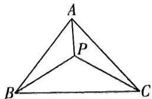
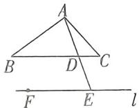
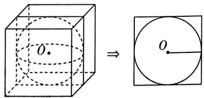
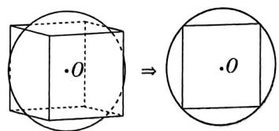
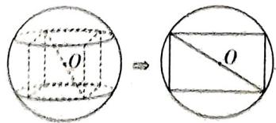
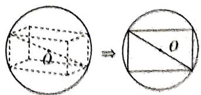
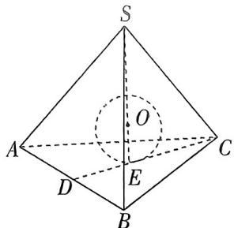
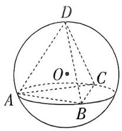

# 模块一 函数、导数

1 函数单调性

对函数 $f(x)$ 定义域内任意的 $x_{1},x_{2}$ ，且 $x_{1}\neq x_{2}$

(i) 若 $\frac{f(x_1) - f(x_2)}{x_1 - x_2} > 0$ 恒成立，则 $f(x)$ 为增函数；若 $\frac{f(x_1) - f(x_2)}{x_1 - x_2} < 0$ 恒成立，则 $f(x)$ 为减函数.  
(ii) 若 $(x_{1} - x_{2})[f(x_{1}) - f(x_{2})] > 0$ 恒成立，则 $f(x)$ 为增函数；若 $(x_{1} - x_{2})[f(x_{1}) - f(x_{2})] < 0$ 恒成立，则 $f(x)$ 为减函数.  
(iii) 若 $x_{1}f(x_{1}) + x_{2}f(x_{2}) > x_{1}f(x_{2}) + x_{2}f(x_{1})$ 恒成立，则 $f(x)$ 为增函数；若 $x_{1}f(x_{1}) + x_{2}f(x_{2}) < x_{1}f(x_{2}) + x_{2}f(x_{1})$ 恒成立，则 $f(x)$ 为减函数.

2 函数奇偶性

①若直线 $y = b$ 与偶函数 $y = f(x)$ 的图象有奇数个交点，则 $f(0) = b$ .  
②若 $g(x)$ 为偶函数，则 $f(g(x))$ 为偶函数，如 $f(x^{2}), f(|x|)$ 均为偶函数.  
③可导的奇函数的导数为偶函数,可导的偶函数的导数为奇函数.  
④定义域关于原点对称的函数可以表示成一个奇函数与一个偶函数的和的形式.

3 函数周期性

①若 $f(x+a)=f(x+b)$ ，则 $f(x)$ 的周期T=b-a，其中 $a\neq0,b\neq0,a\neq b$ .  
②若 $f(x+a)=-f(x)$ ，则 $f(x)$ 的周期T=2a，其中 $a\neq0$ .  
③若 $f(x+a)=\pm\frac{c}{f(x)}$ (c为常数)，则 $f(x)$ 的周期T=2a，其中 $a\neq0,c\neq0$ .  
④若 $f(x+a)=\frac{1-f(x)}{1+f(x)}$ ，则 $f(x)$ 的周期T=2a，其中 $a\neq0$ ；

若 $f(x+a)=\frac{1+f(x)}{1-f(x)}$ ，则 $f(x)$ 的周期T=4a，其中 $a\neq0$ .

4 函数图象的对称性

①满足 $f(a+x)=f(b-x)$ 的函数 $f(x)$ 的图象关于直线 $x=\frac{a+b}{2}$ 对称.  
②满足 $f(a+x)=2c-f(b-x)$ 的函数 $f(x)$ 的图象关于点 $(\frac{a+b}{2},c)$ 对称.  
③函数 $y = f(a + x)$ 与函数 $y = f(b - x)$ 的图象关于直线 $x = \frac{b - a}{2}$ 对称.

5 利用含导函数的不等式构造原函数

① $f'(x)>k\rightarrow g(x)=f(x)-kx+b(k,b$ 为常数， $k\neq0$ .  
② $x^{n}f'(x)+nx^{n-1}f(x)>0\rightarrow g(x)=x^{n}f(x)$ (n为非零常数)， $x^{n}f'(x)-nx^{n-1}f(x)>0\rightarrow g(x)=\frac{f(x)}{x^{n}}$ (n为非零常数).  
③ $e^{kx}f'(x)+ke^{kx}f(x)>0\rightarrow g(x)=e^{kx}f(x)(k$ 为常数 $)$ , $e^{kx}f'(x)-ke^{kx}f(x)>0\rightarrow g(x)=\frac{f(x)}{e^{kx}}(k$ 为常数.  
④ $f(x) + f'(x)\tan x > 0 \to g(x) = f(x)\sin x (x \neq \frac{\pi}{2} + k\pi, k \in \mathbf{Z})$ ， $f'(x)\tan x - f(x) > 0 \to g(x) = \frac{f(x)}{\sin x} (x \neq \frac{\pi}{2} + k\pi$ 且 $x \neq k\pi, k \in \mathbf{Z})$ .  
⑤ $f'(x) - f(x)\tan x > 0 \to g(x) = f(x)\cos x (x \neq \frac{\pi}{2} + k\pi, k \in \mathbf{Z}), f'(x) + f(x)\tan x > 0 \to g(x) = \frac{f(x)}{\cos x} (x \neq \frac{\pi}{2} + k\pi, k \in \mathbf{Z})$ .   
⑥ $\frac{f'(x)}{f(x)}>0\to g(x)=\ln f(x)(f(x)>0)$ 或 $g(x)=\ln[-f(x)](f(x)<0)$ .

# 6 导数问题常用放缩技巧

①指数型放缩:

$e^{x}\geqslant x+1$ (当且仅当 x=0 时取等号)， $e^{x-1}\geqslant x$ 即 $e^{x}\geqslant ex$ (当且仅当 x=1 时取等号)， $e^{x}\leqslant\frac{1}{1-x}(x<1)$ (当且仅当 x=0 时取等号).

②对数型放缩: $\ln(x+1) \leqslant x (x > -1)$ (当且仅当 x = 0 时取等号), $1 - \frac{1}{x} \leqslant \ln x \leqslant x - 1 (x > 0)$ (当且仅当 x = 1 时取等号).

③三角型放缩:

$\sin x \leqslant x \leqslant \tan x (0 \leqslant x < \frac{\pi}{2})$ (当且仅当 $x = 0$ 时取等号), $\sin x \geqslant x \geqslant \tan x (-\frac{\pi}{2} < x \leqslant 0)$ (当且仅当 $x = 0$ 时取等号).

# 模块二 三角、平面向量

# 7 二倍角公式

$\sin 2 \alpha = 2 \sin \alpha \cos \alpha , \tan 2 \alpha = \frac {2 \tan \alpha}{1 - \tan^ {2} \alpha},$

$\cos 2 \alpha = \cos^ {2} \alpha - \sin^ {2} \alpha = 1 - 2 \sin^ {2} \alpha = 2 \cos^ {2} \alpha - 1.$

# 8 降幂公式

$\sin^ {2} \alpha = \frac {1 - \cos 2 \alpha}{2}, \cos^ {2} \alpha = \frac {1 + \cos 2 \alpha}{2}, \tan^ {2} \alpha = \frac {1 - \cos 2 \alpha}{1 + \cos 2 \alpha}.$

# 9 半角公式

$\sin \frac {\alpha}{2} = \pm \sqrt {\frac {1 - \cos \alpha}{2}}, \cos \frac {\alpha}{2} = \pm \sqrt {\frac {1 + \cos \alpha}{2}}, \tan \frac {\alpha}{2} = \pm \sqrt {\frac {1 - \cos \alpha}{1 + \cos \alpha}} = \frac {\sin \alpha}{1 + \cos \alpha} = \frac {1 - \cos \alpha}{\sin \alpha}.$

# 10 辅助角公式

$a\sin\theta+b\cos\theta=\sqrt{a^{2}+b^{2}}\sin(\theta+\varphi)$ ，其中 $\cos\varphi=\frac{a}{\sqrt{a^{2}+b^{2}}}$ ， $\sin\varphi=\frac{b}{\sqrt{a^{2}+b^{2}}}$ .

# 11 万能公式

$\sin \alpha = \frac {2 \tan \frac {\alpha}{2}}{1 + \tan^ {2} \frac {\alpha}{2}}, \cos \alpha = \frac {1 - \tan^ {2} \frac {\alpha}{2}}{1 + \tan^ {2} \frac {\alpha}{2}}, \tan \alpha = \frac {2 \tan \frac {\alpha}{2}}{1 - \tan^ {2} \frac {\alpha}{2}}.$

# 12 奔驰定理及其推论

奔驰定理:如图所示,已知P是△ABC内任意一点,则 $S_{\triangle PBC}\overrightarrow{PA}+S_{\triangle PCA}\overrightarrow{PB}+S_{\triangle PAB}\overrightarrow{PC}=0$ .

推论:已知P是△ABC内任意一点,且 $x\overrightarrow{PA}+y\overrightarrow{PB}+z\overrightarrow{PC}=0$ ,则 $S_{\triangle PBC}:S_{\triangle PCA}:S_{\triangle PAH}=x:y:z.$

# 19.极化恒等式

$a \cdot b = \frac{1}{4} [ (a + b)^2 - (a - b)^2 ]$ 或 $4a \cdot b = (a + b)^2 - (a - b)^2$ .

几何意义:向量的数量积可以表示为以向量a,b为邻边的平行四边形的两条对角线的长的平方差的 $\frac{1}{4}$

# 平面向量的三点共线定理

已知平面内一组基底 $OA, OB$ 及任意向量 $OP$ , 若 $OP = \lambda_1 OA + \lambda_2 OB$ , 则 $A, B, P$ 三点共线的充要条件是 $A_1 + \lambda_2 = 1$ .

# 15 等和线

如图, 以 $\overline{AB}, \overline{AC}$ 为基底向量, 过 $BC$ 外一点 $F$ 作 $BC$ 的平行线 $l$ , 则对 $l$ 上任意一点 $E$ , 有 $\overline{AE} = x\overline{AB} + y\overline{AC}$ , 且 $x + y = \frac{AE}{AD}$ (常数), 其中 $D$ 是 $AE$ 和 $BC$ 的交点.

# 16 向量在平面几何中的主要应用

已知两个向量 $a = (x_{1},y_{1}),b = (x_{2},y_{2})$ ，则

（1）证明线段平行或点共线问题,常用向量共线定理:

$\boldsymbol {a} / / \boldsymbol {b} \Leftrightarrow \boldsymbol {a} = \lambda \boldsymbol {b} (\lambda \neq 0, \boldsymbol {b} \neq \boldsymbol {0}) \Leftrightarrow x _ {1} y _ {2} - x _ {2} y _ {1} = 0.$

（2）证明垂直问题,常用数量积的运算性质:

$\boldsymbol {a} \perp \boldsymbol {b} \Leftrightarrow \boldsymbol {a} \cdot \boldsymbol {b} = 0 \Leftrightarrow x _ {1} x _ {2} + y _ {1} y _ {2} = 0.$

（3）平面几何中,夹角与线段长度的计算常用以下公式:

① $\cos\langle a,b\rangle=\frac{a\cdot b}{|a||b|}=\frac{x_{1}x_{2}+y_{1}y_{2}}{\sqrt{x_{1}^{2}+y_{1}^{2}}\sqrt{x_{2}^{2}+y_{2}^{2}}};$

② $|AB|=|\overrightarrow{AB}|=\sqrt{\overrightarrow{AB}^{2}}=\sqrt{(x_{2}-x_{1})^{2}+(y_{2}-y_{1})^{2}}$ ，其中 $A(x_{1},y_{1}),B(x_{2},y_{2})$ .

（4） 若 $P$ 满足 $\overrightarrow{AP} = \lambda (\frac{\overrightarrow{AB}}{|\overrightarrow{AB}|} + \frac{\overrightarrow{AC}}{|\overrightarrow{AC}|})(\lambda > 0)$ , 则 $P$ 在 $\angle BAC$ 的平分线上.

# 模块三 立体几何

# 17 正方体的内切球

位置关系:正方体的六个面都与同一个球相切,正方体的中心与球心重合,如图（1）.

数量关系:设正方体的棱长为a,内切球的半径为r,这时有2r=a.

图（1）

图（2）

# 18 正方体的棱切球

位置关系:正方体的十二条棱都与球面相切,正方体的中心与球心重合,如图（2）.

数量关系:设正方体的棱长为a,棱切球的半径为r,这时有 $2r=\sqrt{2}a$ .

# 19 正方体的外接球

位置关系:正方体的八个顶点都在同一个球面上,正方体的中心与球心重合,如图（3）.

数量关系:设正方体的棱长为a,外接球的半径为r,这时有 $2r=\sqrt{3}a$ .

图（3）

图（4）

20 长方体的外接球

位置关系:长方体的八个顶点都在同一个球面上,长方体的中心与球心重合,如图（4）.
数量关系:外接球的半径为长方体的体对角线长的一半.

21 正四面体的内切球

位置关系:正四面体的四个面都与同一个球相切,正四面体的中心与球心重合,如图（5）数量关系:设正四面体的棱长为a,高为h,内切球的半径为r,这时有 $4r=h=\frac{\sqrt{6}}{3}a$ .

图（5）

图（6）

22 正四面体的外接球

位置关系:正四面体的四个顶点都在一个球面上,正四面体的中心与球心重合,如图（6）.数量关系:设正四面体的棱长为a,高为h,外接球的半径为r,这时有 $4r=3h=\sqrt{6}a$ .

# 模块四 计数原理、概率统计

23 组合数与排列数的性质

排列数的性质 $1:A_{n}^{m}=nA_{n-1}^{m-1}$ .

排列数的性质 2: $A_{n}^{m}=mA_{n-1}^{m-1}+A_{n-1}^{m}$

组合数的性质 $1:C_{n}^{m}=C_{n}^{n-m}$ .

组合数的性质 2: $C_{n+1}^{m}=C_{n}^{m}+C_{n}^{m-1}$ .

24 二项式系数的性质

①对称性: $C_{n}^{m}=C_{n}^{n-m}$ .   
②增减性与最大值:由 $\frac{C_{n}^{k}}{C_{n}^{k-1}}=\frac{n-k+1}{k}$ 知,当 $\frac{n-k+1}{k}>1$ ,即 $k<\frac{n+1}{2}$ 时, $C_{n}^{k}$ 随 $k$ 的增加而增大;由对称性知,当 $k>\frac{n+1}{2}$ 时, $C_{n}^{k}$ 随 $k$ 的增加而减小.当 $n$ 是偶数时,中间的一项 $C_{n}^{\frac{n}{2}}$ 取得最大值;当 $n$ 是奇数时,中间的两项 $C_{n}^{\frac{n-1}{2}}$ 与 $C_{n}^{\frac{n+1}{2}}$ 相等,且同时取得最大值.  
③ $(a + b)^n$ 的展开式的各二项式系数的和等于 $2^n$ .

25 乘法公式

根据条件概率的定义(一般地, 设 $A, B$ 为两个随机事件, 且 $P(A) > 0$ , 我们称 $P(B \mid A) = \frac{P(AB)}{P(A)}$ 为在事件 $A$ 发生的条件下, 事件 $B$ 发生的条件概率, 简称条件概率), 对任意两个事件 $A, B$ , 若 $P(A) > 0$ , 则 $P(AB) = P(B \mid A)P(A)$ , 这就是概率的乘法公式.

26 全概率公式

一般地, 设 $A_{1}, A_{2}, \cdots, A_{n}$ 是一组两两互斥的事件, $A_{1} \cup A_{2} \cup \cdots \cup A_{n} = \Omega$ , 且 $P(A_{i}) > 0, i = 1, 2, \cdots, n$ , 则对任意的事件 $B \subseteq \Omega$ , 有 $P(B) = \sum_{i=1}^{n} P(A_{i}) P(B | A_{i})$ , 我们称这个公式为全概率公式.

