# 金太阳

# 金太阳 新亏案 陈晓梦 主编

陈晓梦 主编

一轮总复习

数学

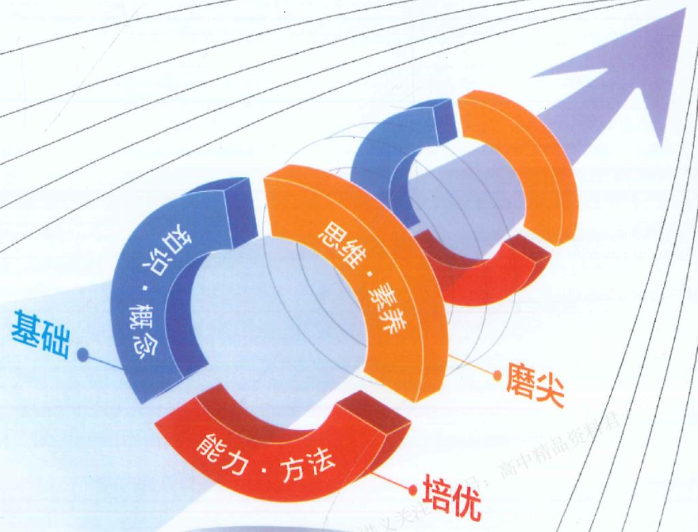

<details>
<summary>flowchart</summary>

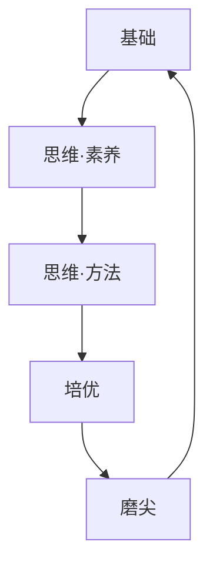
</details>

责任编辑：张雅莉

责任印制：章细珍

装帧设计：日出设计工作室

金太阳

# 金太阳 新方案

26

ISBN 978-7-5762-4407-6

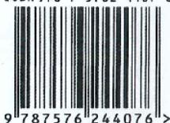

定价：133.80元

# 金太阳 新艺菜 陈晓梦 主编

# 一轮总复习

# 数学

执行主编: 明蕾 辛权 郑利彬

副主编:郭久华 刘彩艳 陈文云

编 委:(按姓氏笔画排列)

王仕健 刘 晓 闫克军 李永康 杨 柳

杨光虹 谷新龙 张逸然 张瑞敏 陈智君

范宝锐 周晓知 孟凡华 项莉 赵君华

徐立凌勇红 郭艳华 崔鑫

# 图书在版编目（CIP）数据

金太阳新考案. 一轮总复习 数学 / 陈晓梦主编. --南昌 : 江西高校出版社, 2024.12

ISBN 978-7-5762-4407-6

I. ①金… Ⅱ. ①陈… Ⅲ. ①中学数学课—高中—教学参考资料 Ⅳ. ①G634

中国国家版本馆 CIP 数据核字(2023)第 246680 号

金太阳新考案 一轮总复习 数学

JINTAIYANG XIN KAOAN YILUN ZONGFUXI SHUXUE

<table><tr><td>出版发行</td><td>江西高校出版社</td></tr><tr><td>社址</td><td>江西省南昌市洪都北大道96号</td></tr><tr><td>总编室电话</td><td>(0791)88504319,(0791)83829608(编辑部)</td></tr><tr><td>销售电话</td><td>4008842220(全国免费热线),(0791)88175897</td></tr><tr><td>网址</td><td>www.juacp.com</td></tr><tr><td>印刷</td><td>江西省茂源电子有限公司</td></tr><tr><td>经销</td><td>全国新华书店</td></tr><tr><td>开本</td><td>880 mm×1230 mm 1/16</td></tr><tr><td>印张</td><td>40</td></tr><tr><td>字数</td><td>1040千字</td></tr><tr><td>版次</td><td>2024年12月第1版</td></tr><tr><td></td><td>2024年12月第1次印刷</td></tr><tr><td>书号</td><td>ISBN 978-7-5762-4407-6</td></tr><tr><td>定价</td><td>133.80元</td></tr></table>

赣版权登字-07-2023-930

版权所有 侵权必究

图书若有印装问题，请随时向本社印制部(0791-88175897)退换

# 目录”

# 第一单元 集合与常用逻辑用语

第01课时 集合 1

>>> 深挖教材 01 集合的新定义问题 / 4  
>>> 深挖教材 02 容斥原理 / 5

第02课时 常用逻辑用语 6

# 第二单元>一元二次函数、方程和不等式

第03课时 等式性质与不等式性质 10  
第 04 课时 基本不等式 …… 12

>>> 深挖教材 03 基本不等式链 / 15

第05课时 一元二次方程、不等式 16  
强化课01 一元二次方程根的分布情况 20

# 第三单元>函数

第 06 课时 函数的概念及其表示 …… 21  
第07课时 函数的单调性与最值 26

>>> 深挖教材 04 对勾函数与飘带函数 / 29  
第 08 课时 函数的奇偶性、周期性 …… 30

强化课 02 函数的对称性 …… 33

>>> 类型一 轴对称问题 / 33  
>>> 类型二 中心对称问题 / 34  
>>> 类型三 两个函数图象的对称 / 35  
>>> 类型四 双对称问题 / 35

强化课 03 函数性质的综合应用 …… 36

>>> 类型一 函数的奇偶性与单调性 / 36  
>>> 类型二 函数的奇偶性与周期性 / 36  
>>> 类型三 函数的奇偶性与对称性 / 37  
>>> 类型四 函数的周期性与对称性 / 37

第 09 课时 二次函数与幂函数 …… 38

第 10 课时 指数与指数函数 …… 42  
第 11 课时 对数与对数函数 …… 45

强化课 04 指、对、幂比较大小 …… 48

>>> 类型一 函数性质法 / 48  
>>> 类型二 中间量(特殊值)法 / 49

第 12 课时 函数的图象 …… 49

第 13 课时 函数的零点与方程的解 …… 53

# 课型细分，精讲精练 深挖教材，对接高考

# 课时细分

65个基本课时(包含9个深挖教材)+16个强化课，涵盖195个考点、42个类型，合理划分课时，细化教学内容，明确学习目标，知识一课一清

# 课型多样

# <基础过关课>

梳理核心知识，指导方法运用，夯实学习根基。

# <专项强化课>

聚焦高考热点,深化知识理解,提升能力素养

# √ 精讲精练

★ 聚焦知识要点,提升学习效果  
★ 精巧安排训练, 提高解题技能  
★ 基础巩固练:夯基固本不失分  
★ 综合提升练: 提能增效争高分

强化课05 函数与方程的综合应用 56

>>> 类型一 函数零点的和、积问题 / 56

>>> 类型二 嵌套函数的零点问题 / 56

第 14 课时 函数的模型及其应用 …… 57

# 第四单元>一元函数的导数及其应用

第 15 课时 导数的概念及其意义、导数的运算 …… 60

>>> 深挖教材 05 曲线的公切线 / 63

第 16 课时 导数与函数的单调性 …… 63

第 17 课时 导数与函数的极值、最值 …… 66

强化课 06 函数中的构造问题 …… 70

>> 类型一 通过变量构造具体函数 /70

>>> 类型二 抽象函数的构造 / 70

>>> 类型三 同构法构造函数 / 71

第 18 课时 导数的综合应用 …… 72

# 第五单元>三角函数、解三角形

第 19 课时 任意角、弧度制和三角函数的概念 …… 74

第 20 课时 同角三角函数的基本关系及诱导公式 …… 77

第 21 课时 两角和与差的正弦、余弦和正切公式 …… 80

第 22 课时 简单的三角恒等变换 …… 82

>>> 深挖教材 06 万能公式 / 85

第 23 课时 三角函数的图象与性质 …… 86

第 24 课时 函数 $y=A\sin(\omega x+\varphi)$ 的性质与图象及其简单应用 …… 90

强化课07 三角函数中有关 $\omega$ 的范围问题 94

>>> 类型一 $\omega$ 的取值范围与单调性相结合 / 94

>>> 类型二 $\omega$ 的取值范围与对称轴(极值或最值)相结合 / 94

>>> 类型三 $\omega$ 的取值范围与对称中心(零点)相结合 / 95

>>> 类型四 $\omega$ 的取值范围与三角函数的综合性质 / 96

第 25 课时 正弦定理与余弦定理 …… 96

第 26 课时 解三角形的综合应用 …… 101

第 27 课时 解三角形的实际应用 …… 103

# 第六单元 > 平面向量与复数

第 28 课时 平面向量的概念及其线性运算 …… 106

第 29 课时 平面向量的基本定理及其坐标表示 …… 109

第 30 课时 平面向量的数量积及其应用 …… 112

强化课08 平面向量的综合应用 115

>>> 类型一 平面向量在几何中的应用 / 115

>>> 类型二 和向量有关的最值(范围)问题 / 116

第 31 课时 复数 …… 117


# 第七单元 > 数列

第 32 课时 数列的概念 …… 120  
第 33 课时 等差数列 …… 124  
第 34 课时 等比数列 …… 127


强化课09 构造法求数列通项 130

>>> 类型一 $a_{n+1}=pa_{n}+f(n)$ 型 / 130  
>>> 类型二 $a_{n+1}=pa_{n}+qa_{n-1}$ 型 / 131  
>>> 类型三 $a_{n+1}=\frac{pa_{n}}{qa_{n}+r}$ 型 / 131

第 35 课时 数列求和(一) …… 132

>>> 深挖教材 07 倒序相加法 / 134

第 36 课时 数列求和(二) …… 134

第 37 课时 数列中的综合问题 …… 137

强化课 10 子数列问题 …… 139

>>> 类型一 奇数项与偶数项问题 / 139  
>>> 类型二 公共项问题 / 139  
>>> 类型三 增减项问题 / 140


# 第八单元 ➤ 立体几何

第 38 课时 基本立体图形、简单几何体的表面积和体积 …… 141  
强化课 11 与球有关的切、接问题 …… 145

>>> 类型一 外接球问题 / 145  
>>> 类型二 内切球问题 / 146

第 39 课时 空间中点、直线、平面之间的位置关系 …… 147  
第 40 课时 空间直线、平面的平行 …… 150  
第 41 课时 空间直线、平面的垂直 …… 154  
第 42 课时 空间向量的概念与运算 …… 158  
第 43 课时 利用空间向量研究直线、平面的位置关系 …… 161  
第 44 课时 利用空间向量研究距离问题 …… 165  
第 45 课时 利用空间向量研究夹角问题 …… 168  
>>> 深挖教材 08 立体几何的探索性问题 / 171

强化课 12 立体几何中的截面、交线问题 …… 172

>>> 类型一 截面问题 / 172  
>>> 类型二 交线问题 / 173

强化课 13 立体几何中的动态、轨迹问题 …… 174

>>> 类型一 动态位置关系的判断 / 174  
>>> 类型二 动点的轨迹(长度) / 174  
>>> 类型三 最值(范围)问题 / 175

# 课型细分，精讲精练

# 深挖教材，对接高考

# 课型细分，精讲精练 深挖教材，对接高考

# 第九单元>解析几何

第 46 课时 直线的方程 …… 176  
第 47 课时 两直线的位置关系 …… 179

>>> 深挖教材 09 直线系方程 / 182

第 48 课时 圆的方程 …… 183  
第 49 课时 直线与圆、圆与圆的位置关系 …… 186  
第50课时椭圆 189  
第51课时 双曲线 193

强化课 14 离心率的范围问题 …… 197

>> 类型一 利用圆锥曲线的定义求离心率的范围 / 197  
>> 类型二 利用圆锥曲线的性质求离心率的范围 / 197  
>> 类型三 利用几何图形的性质求离心率的范围 / 198

第 52 课时 抛物线 …… 199  
第53课时 直线与圆锥曲线的位置关系 202

强化课 15 圆锥曲线中的常见结论及应用 …… 205

>> 类型一 椭圆、双曲线的常用结论及其应用 / 205  
>> 类型二 抛物线的常用结论及其应用(微专题) / 206

第 54 课时 圆锥曲线中的综合问题 …… 207

# 第十单元 统计与成对数据的统计分析

第 55 课时 随机抽样与统计图表 …… 214  
第 56 课时 用样本估计总体 …… 219  
第 57 课时 一元线性回归模型及其应用 …… 223  
第 58 课时 列联表与独立性检验 …… 229

# 第十一单元 计数原理与概率、随机变量及其分布

第59课时 计数原理 234  
第 60 课时 排列与组合 …… 238  
第 61 课时 二项式定理 …… 240  
第 62 课时 随机事件与概率 …… 243  
第 63 课时 事件的相互独立性、条件概率与全概率公式 …… 247  
第 64 课时 离散型随机变量及其分布列、数字特征 …… 251  
第 65 课时 二项分布、超几何分布、正态分布 …… 255

强化课 16 概率与统计的综合问题 …… 261

>> 类型一 频率分布直方图与分布列的综合问题 / 261  
>> 类型二 回归模型与分布列的综合问题 / 262  
>> 类型三 独立性检验与分布列的综合问题 / 263

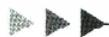

课时作业（单独装订成册）  
详细参考答案（单独装订成册）


# 精要考点·清晰明了 >>> 考点检索

# 195个考点

# 第一单元 集合与常用逻辑用语

集合的基本概念 / 2

集合间的基本关系 / 2

集合的基本运算 / 3

充分、必要条件的判断 / 7

充分、必要条件的应用 / 8

全称量词与存在量词 / 8

# 第二单元 一元二次函数、方程和不等式

比较两个数(式)的大小 / 11

不等式的性质 / 11

不等式性质的应用 / 12

利用基本不等式求最值 / 13

基本不等式的实际应用 / 15

一元二次不等式的解法 / 17

含参数的一元二次不等式的解法 / 18

三个“二次”的对应关系 / 18

一元二次不等式恒(能)成立问题 / 19

# 第三单元 函数

函数的概念 / 22

函数的定义域 / 22

函数的解析式 / 23

分段函数 / 24

函数的值域(微专题) / 25

确定函数的单调性(区间) / 27

函数单调性的应用 / 28

函数奇偶性的判断 / 31

函数奇偶性的应用 / 32

函数的周期性及其应用 / 33

幂函数的图象与性质 / 39

二次函数的解析式 / 39

二次函数的图象与性质 / 40

指数幂的运算 / 43

指数函数的图象及应用 / 43

指数函数的性质及应用 / 43

对数的运算 / 46

对数函数的图象及应用 / 46

对数函数的性质及应用 / 47

作函数的图象 / 50

函数图象的识别 / 51

函数图象的应用 / 52

函数零点所在区间的判定 / 54

函数零点个数的判定 / 54

函数零点的应用 / 55

用函数图象刻画变化过程 / 57

应用所给函数模型解决实际问题 / 58

构建函数模型解决实际问题 / 59

# 第四单元 一元函数的导数及其应用

导数的概念 / 61

导数的运算 / 61

导数的几何意义 / 62

不含参数的函数的单调性 / 64

含有参数的函数的单调性 / 64

函数单调性的应用 / 65

利用导数求函数的极值 / 67

利用导数求函数的最值 / 68

生活中的优化问题 / 69

导数与恒(能)成立问题 / 72

利用导数证明不等式 / 73

导数与函数的零点问题 / 73

# 第五单元 三角函数、解三角形

角的概念及其表示 / 75

弧度制及其应用 / 76

三角函数的定义 / 76

同角三角函数间的关系 / 78

诱导公式及其应用 / 79

两角和与差的三角函数公式 / 80

两角和与差的三角函数公式的逆用与辅助角公式 / 81

角的变换问题 / 82

三角函数式的化简 / 83

三角函数式的求值 / 83

三角恒等变换的综合应用 / 84

积化和差与和差化积公式
(微专题) / 84

三角函数的定义域 / 87

三角函数的值域(最值)/87

三角函数的周期性、奇偶性与对称性 / 87

三角函数的单调性 / 89

“五点法”作 $y=A\sin(\omega x+\varphi)$ 的图象 / 91

函数 $y = A\sin (\omega x + \varphi)$ 的图象及变换/91

由函数图象确定函数 $y=A\sin(\omega x+\varphi)$ 的解析式 / 92

三角函数图象与性质的综合应用 / 93

利用正、余弦定理解三角形 / 97

利用正、余弦定理判断三角形形状 / 98

正、余弦定理的综合应用 / 99

解三角形中的“爪”型结构问题 / 101

与多边形有关的问题 / 102

三角形中的存在性问题 / 102

测量距离问题 / 104

测量高度问题 / 104

测量角度问题 / 105

# 第六单元 平面向量与复数

平面向量的基本概念 / 107

平面向量的线性运算 / 107

向量共线定理及其应用 / 108

平面向量的基本定理及其应用 / 110

平面向量的坐标运算 / 110

平面向量共线的坐标表示 / 111

平面向量数量积的运算 / 113

平面向量数量积的应用 / 114

复数的有关概念 / 118

复数的四则运算 / 118

复数的几何意义 / 119

# 精要考点·清晰明了


# 考点检索

# 195个考点

# 第七单元 数列

归纳通项公式 / 121

已知 $S_{n}$ ，或 $S_{n}$ 与 $\pmb{a}_{n}$ 的关系求 $a_{n} / 121$

由数列的递推关系求通项公式/122

数列的性质及其应用 / 123

等差数列的基本量运算 / 125

等差数列的判定与证明 / 125

等差数列性质的应用 / 126

等比数列的基本量运算 / 128

等比数列的判定与证明 / 129

等比数列性质的应用 / 129

分组求和法 / 132

并项求和法 / 133

错位相减法求和 / 135

裂项相消法求和 / 136

等差、等比数列的交汇 / 137

数列与其他知识的交汇问题 / 137

数学文化与数列的实际应用 / 138

# 第八单元 立体几何

基本立体图形 / 142

空间几何体的表面积与体积 / 143

基本事实的应用 / 148

空间两直线位置关系的判断 / 148

异面直线所成的角 / 149

直线与平面平行 / 151

平面与平面平行的判定与性质 / 153

空间平行关系的综合问题 / 153

直线与平面垂直的判定与性质/156

平面与平面垂直的判定与性质/156

垂直关系的综合应用 / 157

空间向量的线性运算 / 159

共线、共面向量的应用 / 160

空间向量的数量积及应用 / 160

利用空间向量证明平行问题 / 162

利用空间向量证明垂直问题 / 163

与平行、垂直有关的综合问题 / 164

点线距 / 165

点面距 /166

异面直线之间的距离 / 167

异面直线所成的角 / 169

直线与平面所成的角 / 169

平面与平面的夹角 / 170

# 第九单元 解析几何

直线的倾斜角与斜率 / 177

求直线的方程 / 177

直线方程的综合应用 / 178

两条直线的平行与垂直 / 180

两条直线的交点与距离问题 / 180

两条直线的对称问题 / 181

圆的方程 / 183

圆的轨迹方程 / 184

与圆有关的最值问题 / 185

直线与圆的位置关系 / 187

圆与圆的位置关系 / 188

椭圆的定义及应用 / 190

椭圆的标准方程 / 191

椭圆的几何性质 / 191

双曲线的定义及其应用 / 194

双曲线的标准方程/195

双曲线的几何性质 / 195

抛物线的定义及应用 / 200

抛物线的标准方程/200

抛物线的几何性质 / 201

直线与圆锥曲线的位置关系 / 202

直线与圆锥曲线相交的有关问题 / 203

求值与证明 / 207

定点与定值 / 209

最值与范围 / 211

# 第十单元 统计与成对数据的统计分析

抽样方法 / 215

分层随机抽样 / 215

统计图表 / 216

频率分布直方图 / 217

总体百分位数的估计 / 220

总体集中趋势的估计 / 220

总体离散程度的估计 / 222

成对数据的相关性 / 224

回归模型及其应用 / 225

残差分析 / 227

分类变量与列联表 / 229

列联表与独立性检验/231

独立性检验的综合应用 / 232

# 第十一单元

# 计数原理与概率、随机变量及其分布

分类加法计数原理 / 234

分步乘法计数原理 / 234

两个计数原理的综合应用 / 235

排列问题 / 238

组合问题 / 239

排列与组合的综合应用 / 239

通项公式的应用 / 241

二项式系数与项的系数的问题 / 242

二项式定理的综合应用 / 243

有限样本空间与随机事件/244

随机事件的关系 / 245

古典概型/246

事件的相互独立性 / 248

条件概率 / 249

全概率公式 / 250

离散型随机变量分布列的性质 / 252

均值与方差的简单计算 / 252

离散型随机变量的分布列 / 253

离散型随机变量的数字特征 / 254

二项分布 / 256

超几何分布 / 257

正态分布 / 258

# 第一单元

# 集合与常用逻辑用语

# 第 01 课时 集合

对应答案分册第1页

# 课标要求

1. 了解集合的含义, 理解元素与集合的关系, 能用自然语言、图形语言、符号语言刻画集合.

2. 理解集合间的包含与相等关系，能识别给定集合的子集，了解全集与空集的含义.

3. 理解集合间的交、并、补的含义，能求两个集合的并集与交集，能求给定子集的补集.

4. 能使用 Venn 图表达集合间的基本关系及基本运算，体会图形对理解抽象概念的作用.

# 必备知识·逐点梳理

# 一、集合的基本概念

1. 集合中元素的三个特征：\_\_\_\_、\_\_\_\_和\_\_\_\_。

# 微判断

(1) 若 $\{x^{2},1\}=\{0,1\}$ ，则 x=0.  
(2)若 $1 \in \{x^2, x\}$ , 则 $x = -1$ 或 $x = 1$ . ( )

提醒 在解决集合问题时,要注意检验集合中元素的互异性,否则可能会因不满足互异性而导致解题错误.

2. 元素与集合间的关系有 \_\_\_\_ 或 \_\_\_\_ 两种, 用符号 \_\_\_\_ 或 \_\_\_\_ 表示.

# 微判断

设 $A$ 是一个集合，则 $A \in \{A\}$ . （）

3. 集合的表示法：\_\_\_\_、\_\_\_\_、\_\_\_\_。

# 微思考

一个集合可以用不同的方法表示,试用三种不同的方法表示由方程 $x^{2}-1=0$ 的所有实数解组成的集合.

# 4. 常见数集的记法

<table><tr><td>集合</td><td>自然数集</td><td>正整数集</td><td>整数集</td><td>有理数集</td><td>实数集</td></tr><tr><td>符号</td><td>_</td><td>_</td><td>_</td><td>_</td><td>_</td></tr></table>

# 二、集合间的基本关系

<table><tr><td>关系</td><td>文字语言</td><td>符号语言</td></tr><tr><td>子集</td><td>集合A中任意一个元素都是集合B中的元素(即若x∈A,则x∈B)</td><td></td></tr><tr><td>真子集</td><td>集合A是集合B的子集,且集合B中至少有一个元素不在集合A中</td><td></td></tr><tr><td>相等</td><td>集合A,B中的元素相同或集合A,B互为子集</td><td></td></tr></table>

# .微思考

(1)集合 $\{x\mid y=x^{2}\},\{y\mid y=x^{2}\},\{(x,y)\mid y=x^{2}\}$ 表示的是同一个集合吗?  
(2)你能分别说出 $0, \{0\}, \varnothing, \{\varnothing\}$ 之间的关系吗?

提醒 (1)空集是任意一个集合(包括它本身)的子集, 是任意一个非空集合的真子集.

(2)任何一个集合都是它本身的子集,即 $A\subseteq A$ .

(3)含有 $n$ 个元素的集合有 $2^{n}$ 个子集，有 $2^{n} - 1$ 个非空子集，有 $2^{n} - 1$ 个真子集，有 $2^{n} - 2$ 个非空真子集.

# 三、集合的基本运算

<table><tr><td></td><td>并集</td><td>交集</td><td>补集</td></tr><tr><td>图形语言</td><td>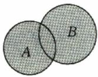</td><td>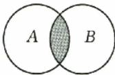</td><td>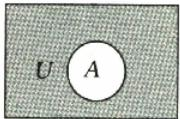</td></tr><tr><td>符号语言</td><td>A∪B=____</td><td>A∩B=____</td><td> $C_U A =$ ____</td></tr></table>

# 关键考点·核心突破

# 考点一 集合的基本概念

# 走进教材

例 1 教材 溯源题。(人 A 必修①P $_{5}$ 习题 1.1T $_{1}$ 改编)已知集合 $A=\{1,x-2,x^{2}-x-1\}$ , 若 -1∈A, 则实数 x 的值为( ).

A. 1

B.1或0

C. 0

D.-1或0

# 走向高考

例 2 经典高考题。若集合 $A=\{x\in R|ax^{2}+ax+1=0\}$ 中只有一个元素，则 $a=(\quad)$ .

A. 4

B. 2

C. 0

D. 0 或 4

# 方法总结

解决集合含义问题的三个关键点:一是确定构成集合的元素;二是确定元素的限定条件;三是根据元素的特征(满足的条件)构造关系式解决相应问题.

# 随堂加练

1. 高考 改编题 设集合 $A=\{1,2,3\}$ , $B=\{4,5\}$ , $C=\{x+y|x\in A,y\in B\}$ ，则 C 中元素的个数为().

A. 3

B. 4

C. 5

D. 6

提醒 (1)交集的常见结论及等价关系: $A \cap B = B \cap A, A \cap B \subseteq A, A \cap B \subseteq B, A \cap A = A, A \cap \varnothing = \varnothing, A \subseteq B \Rightarrow A \cap B = A.$

(2)并集的常见结论及等价关系: $A\cup B=B\cup A,A\cup B\supseteq A,A\cup B\supseteq B,A\cup A=A,A\cup\varnothing=A,A\subseteq B\Rightarrow A\cup B=B.$   
(3)补集的常见结论及等价关系： $\mathbf{C}_U(\mathbf{C}_U A) = A,\mathbf{C}_U\emptyset =$ $U,\mathbf{C}_U U = \emptyset ,A\cap (\mathbf{C}_U A) = \emptyset ,A\cup (\mathbf{C}_U A) = U.$

2. 若 $\{a^{2},0,-1\}=\{a,b,0\}$ ，则 $(ab)^{2025}$ 的值是().

A. 0

B. 1

C.-1

D. ±1

3. 已知集合 $A = \{12, a^2 + 4a, a - 2\}$ , 且 $-3 \in A$ , 则 $a =$ \_\_\_\_.

# 考点二 集合间的基本关系

例3（1）设全集 $U = \mathbf{R}$ ，则集合 $M = \{0,1,2\}$ 和 $N = \{x|x(x - 2) = 0\}$ 的关系可表示为（ ）.

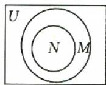  
A

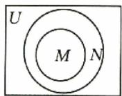  
B

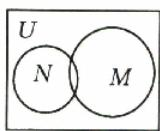  
C

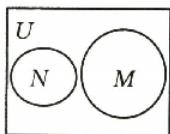  
D

(2)已知集合 $A = \left\{x\mid x = 2k + \frac{1}{3},k\in \mathbf{Z}\right\} ,B =$ $\left\{x\mid x = \frac{2k + 1}{3},k\in \mathbf{Z}\right\}$ ，则（ ）.

A. $A \subseteq B$   
B. $A \cap B = \varnothing$   
C. A = B   
D. $A \supseteq B$

(3)(2023·新高考Ⅱ卷)设集合 $A=\{0,-a\}$ ， $B=\{1,a-2,2a-2\}$ ，若 $A\subseteq B$ ，则 $a=(\quad)$ .

A. 2

B. 1

C. $\frac{2}{3}$

D.-1

# ■方法总结

判断集合间的基本关系的三种方法

<table><tr><td>列举法</td><td>根据题中的限定条件把集合中的元素表示出来,然后比较集合中的元素的异同,从而找出集合之间的关系</td></tr><tr><td>结构法</td><td>结合通分、化简、变形等技巧,在元素的结构上找差异,从而进行判断</td></tr><tr><td>数轴法</td><td>在同一个数轴上表示出两个集合,比较端点值之间的大小关系,从而确定集合与集合之间的关系</td></tr></table>

# 随堂加练

1. 已知集合 $A = \{x \mid x = \frac{a}{2} + \frac{1}{6}, a \in \mathbf{Z}\}$ , $B = \{x \mid x = \frac{b}{2} - \frac{1}{3}, b \in \mathbf{Z}\}$ , $C = \{x \mid x = c + \frac{1}{6}, c \in \mathbf{Z}\}$ , 则 $A, B, C$ 之间的关系为（ ）.

A. $A = B \supseteq C$   
B. $A = B \subseteq C$   
C. $A = B = C$   
D. $A \subseteq B = C$

2. 名师原创题。(多选题)已知集合 $A = \{\{\emptyset\}, \{0\}, \emptyset\}$ , 则( ).

A. $\varnothing \in A$   
B. $\varnothing \subseteq A$   
C. $\{0\}\subseteq A$   
D. $\{\varnothing\}\subseteq A$

3. 教材 溯源题。(人 A 必修① $P_{9}T_{5}$ 改编)已知集合 $A=\{x\mid0<x<a\},B=\{x\mid0<x<2\}$ ，若 $B\subseteq A$ ，则实数a的取值范围为\_\_\_\_。

# 考点目

# 集合的基本运算

热点考情: 高考对集合的考查以集合的运算为主, 通常与不等式的解集、函数的定义域、方程的解集、平面上的点集等交汇命题.

# 考向1 集合的基本运算

例4 教材 溯源题。(人A必修① $P_{10}$ 例2改编)设U=R,集合 $A=\{x\mid-1<x<2\}$ ,集合 $B=\{x\mid1<x<3\}$ ,求 $A\cup B,A\cap B,A\cap(\mathbb{C}_{U}B)$ .

# ■方法总结

集合基本运算的方法  
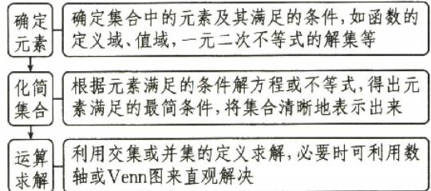

<details>
<summary>flowchart</summary>

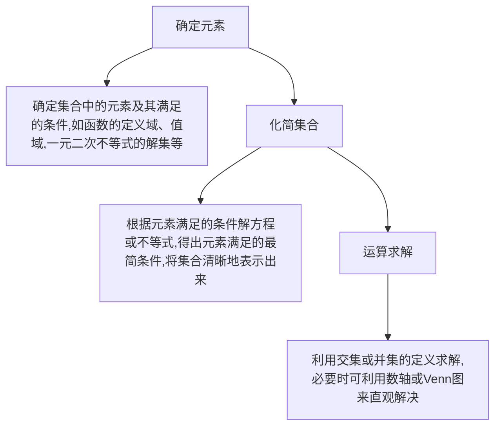
</details>

# 考向2 根据集合的运算求参数的值(范围)

# 走进教材

例5 教材 溯源题（北师大必修① $\mathrm{P}_{12}$ 习题1-1B组 $\mathrm{T}_{5}$ 改编）已知集合 $A = [2a + 1,3a - 5],B =$ [3,22].若 $A\cap B = A$ ，则实数 $a$ 的取值范围为

# 走向高考

例 6 高考 改编题（多选题）已知集合 $A = \{x \mid x < a\}, B = \{x \mid 1 < x < 2\}$ ，且 $A \cup (\mathbb{C}_{\mathbb{R}} B) = \mathbb{R}$ ，则实数 $a$ 的值可以是（ ）.

A.1

B. 2

C. 3

D. 4

# 方法总结

# 根据集合的运算结果求参数值或范围的方法

(1) 将集合中的运算关系转化为两个集合之间的关系. 若集合中的元素能一一列举, 则用观察法得到不同集合中元素之间的关系; 若是与不等式有关的集合, 则一般利用数轴解决, 要注意端点值能否取到.  
(2) 将集合之间的关系转化为解方程(组)或不等式(组)的问题来求解.  
(3) 根据求解结果来确定参数的值或取值范围.

# 随堂加练

1.(2024·新高考Ⅰ卷)已知集合 $A=\{x\mid-5<x^{3}<5\}$ ， $B=\{-3,-1,0,2,3\}$ ，则 $A\cap B=(\quad)$ .

A. $\{-1,0\}$   
B. $\{2,3\}$

C. $\{-3,-1,0\}$   
D. $\{-1,0,2\}$

2.（2025·青海西宁高三模拟）已知集合 $A = \{x\mid -3 <   x <   1\} ,B = \{x\mid 0\leqslant x\leqslant 2\}$ ，则图中阴影部分表示的集合为（ ）.

A. $(-3,0)$   
B. $(-1,0)$   
C. $(0,1)$   
D. $(2,3)$

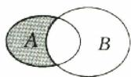

3. 已知集合 $A = \{x \mid x^2 \geqslant 4\}$ , $B = \{m\}$ . 若 $A \cup B = A$ , 则实数 $m$ 的取值范围是 ( ).

A. $(-∞,-2)$   
B. $[2,+\infty)$   
C. $[-2,2]$   
D. $(-∞,-2]∪[2,+∞)$

# 深挖教材 01 集合的新定义问题

集合的新定义问题在传统集合概念的基础上,通过引入创新的定义、规则或运算,考查学生对集合本质的理解和应用能力.高中数学教材苏教版必修第一册第22页复习题第15题介绍了此类问题.

# 母题剖析

教材 溯源题。(苏教必修①P $_{22}$ 复习题 T $_{15}$ 改编) 对于集合 A, B, 我们把集合{(a, b) | a ∈ A, b ∈ B}记作 A × B. 例如, 若 A = {1, 2}, B = {3, 4}, 则 A × B = {(1, 3), (1, 4), (2, 3), (2, 4)}, B × A = {(3, 1), (3, 2), (4, 1), (4, 2)}, A × A = {(1, 1), (1, 2), (2, 1), (2, 2)}, B × B = {(3, 3), (3, 4), (4, 3), (4, 4)}. 据此回答下列问题:

(1)已知 $C = \{a\}, D = \{1,2,3\}$ , 求 $C \times D$ ;   
(2)已知 $A \times B = \{(1, 2), (2, 2)\}$ , 求集合 $A, B$ ;

(3)若集合 A 中有 3 个元素, 集合 B 中有 4 个元素, 试确定 $A \times B$ 中有多少个元素(只写结果).

# ■方法总结

# 解决集合新定义问题的关键

(1)准确理解新定义的本质含义,紧扣题目所给定义,结合题目的要求进行恰当转化,切忌同已有概念或定义混淆.  
(2)善于从题设条件给出的数式中发现可以使用集合性质的一些因素,合理利用集合的运算与性质,并重视分类讨论思想的应用.

# 子题探究

1. (2025·河南郑州高三模拟) 定义集合运算: $A \otimes B = \{z \mid z = xy(x + y), x \in A, y \in B\}$ . 若集合 $A = \{0, 2\}, B = \{-1, 1\}$ , 则集合 $A \otimes B$ 中所有元素之和为 \_\_\_\_.  
2. 教材 溯源题。(苏教必修① $P_{18}$ “探究·拓展” $T_{13}$ 改编)我们知道,如果集合 $A\subseteq S$ ,那么 $C_{s}A=\{x\mid x\in S,且x\notin A\}$ .类似地,对于集合A,B,把集合 $\{x\mid x\in A,且x\notin B\}$ 叫作集合A与B的差集,记作A-B.例如 $A=\{1,2,3,4,5\},B=\{4,$

# 深挖教材 02 容斥原理

容斥原理在高中数学中占据着不可或缺的地位，它为解决一系列复杂的计数和概率问题提供了有效的方法。从概念上讲，容斥原理用于处理多个集合之间的重叠和包含关系，以准确计算满足特定条件的元素个数。高中数学教材人教A版必修第一册第15页“阅读与思考”介绍了此类问题。

# 民 母题剖析

教材 溯源题。(人 A 必修① $P_{15}$ “阅读与思考”改编)学校先举办了一次田径运动会,某班有8名同学参赛,又举办了一次球类运动会,这个班有12名同学参赛,两次运动会都参赛的有3人.在这两次运动会中,这个班共有多少名同学参赛?

5,6,7,8},则有 $A - B = \{1,2,3\} ,B - A = \{6,7,$ 8}.据此回答下列问题：

(1) 若 S 是高三 (18) 班全体同学组成的集合, A 是高三 (18) 班全体女生组成的集合, 求 S-A 及 $C_{s}A$ ;  
(2)在下列各图中用阴影表示集合A-B;

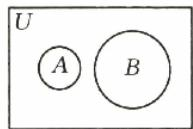

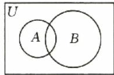

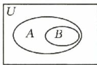

(3)如果 $A - B = \emptyset$ ，那么集合 $A$ 与 $B$ 之间具有怎样的关系？

# 方法总结

我们把包含有限个元素的集合 A 叫作有限集，用 $\text{card}(A)$ 来表示有限集合 A 中元素的个数。一般地，对于任意两个有限集合 A, B，有 $\text{card}(A \cup B) = \text{card}(A) + \text{card}(B) - \text{card}(A \cap B)$ 。

对于任意三个有限集合 $A, B, C$ ，有 $\operatorname{card}(A \cup B \cup C) = \operatorname{card}(A) + \operatorname{card}(B) + \operatorname{card}(C) - \operatorname{card}(A \cap B) - \operatorname{card}(B \cap C) - \operatorname{card}(C \cap A) + \operatorname{card}(A \cap B \cap C)$ .

容斥原理实质上就是一种计数方法，在计数时先不考虑重叠的情况，把包含于某内容中的所有对象的数目先计算出来，然后把计数时重复计算的数目排除，最终使得计算结果既无遗漏又无重复。容斥定理还可以拓展为 $n$ 个集合时的 $n$ 元情形，但是不属于高中数学范畴，这里不再赘述。

# 子题探究

1. 教材 溯源题。(北师大必修① $P_{12}$ 习题1-1B组 $T_{3}$ )

改编)某学校先后举办了多个学科的课余活动.已知高一(1)班有50名同学,其中30名同学参加了数学活动,26名同学参加了物理活动,15名同学同时参加了数学、物理两个学科的活动,则这个班有\_\_\_\_名同学既没有参加数学活动,也没有参加物理活动.

2. 教材 溯源题。(湘教必修① $P_{30}T_{15}$ 改编)为了完成一项实地测量任务,夏令营的同学们成立了一支测绘队,需要24人参加测量,20人参加计算,16人参加绘图.测绘队的成员中有很多同学是多面手,已知有8人只参加了测量和计算,有6人只参加了测量和绘图,有4人只参加了计算和绘图,且至少有2人这三项工作都参加了,则这支测绘队至少有\_\_\_\_人.

请完成《课时作业》P1\~P2

# 第02课时 常用逻辑用语

对应答案分册第2页

# 课标要求

1. 理解充分条件、必要条件、充要条件的含义.

2. 理解判定定理与充分条件、性质定理与必要条件、数学定义与充要条件的关系。

3. 理解全称量词和存在量词的含义, 能正确对两种命题进行否定.

# 必备知识·逐点梳理

# 一、充分条件、必要条件与充要条件

<table><tr><td colspan="2">若 $p \Rightarrow q$ ,则 $p$ 是 $q$ 的____条件, $q$ 是 $p$ 的____条件</td></tr><tr><td> $p$ 是 $q$ 的____条件</td><td> $p \Rightarrow q$ 且 $q \nRightarrow p$ </td></tr><tr><td> $p$ 是 $q$ 的____条件</td><td> $p \nRightarrow q$ 且 $q \Rightarrow p$ </td></tr><tr><td> $p$ 是 $q$ 的____条件</td><td> $p \Leftrightarrow q$ </td></tr><tr><td> $p$ 是 $q$ 的____条件</td><td> $p \nRightarrow q$ 且 $q \nRightarrow p$ </td></tr></table>

# 微思考

已知 $A = \{x\mid x$ 满足条件 $p\} ,B = \{x\mid x$ 满足条件 $q\}$

(1)如果 $A \subseteq B$ , 那么 $p$ 是 $q$ 的什么条件? $A \subsetneqq$

B 呢?

(2) 如果 $B \subseteq A$ , 那么 $p$ 是 $q$ 的什么条件? $B \subsetneqq A$ 呢?

(3)如果 $A = B$ ，那么 $\pmb{p}$ 是 $\pmb{q}$ 的什么条件？ $\pmb{q}$ 是 $\pmb{p}$ 的什么条件？

# 二、全称量词和存在量词

1. 全称量词: 所有的、任意一个、任给一个等, 用符号“\_\_\_\_”表示.

2. 存在量词: 存在一个、至少有一个、有些等, 用符号“\_\_\_\_”表示.

3. 含有全称量词的命题, 叫作全称量词命题. “对 M 中任意一个 x, p(x) 成立” 用符号简记为 \_\_\_\_.

4. 含有存在量词的命题, 叫作存在量词命题. “存在 M 中的元素 x, p(x) 成立” 用符号简记为 \_\_\_\_.

# 三、含有一个量词的命题的否定

<table><tr><td>命题</td><td>命题的否定</td></tr><tr><td> $\forall x\in M,p(x)$ </td><td>____</td></tr><tr><td> $\exists x\in M,p(x)$ </td><td>____</td></tr></table>

提醒 (1) $p$ 是 $q$ 的充分不必要条件, 等价于 $\neg q$ 是 $\neg p$ 的充分不必要条件;

(2)命题 $p$ 和 $\neg p$ 的真假性相反, 当判断一个命题的真假有困难时, 可先判断此命题的否定的真假.

# 关键考点·核心突破

# 考点一 充分、必要条件的判断

# 走进教材

例1教材溯源题。(人A必修① $\mathrm{P}_{18}$ 例1改编)已知 $a\in \mathbf{R}$ ，则“ $a > 1$ ”是“ $a^2 >1$ ”的（ ）.

A. 充分不必要条件  
B. 必要不充分条件  
C. 充要条件  
D. 既不充分也不必要条件

# 走向高考

例 2 （2024·天津卷）设 $a, b \in R$ ，则“ $a^{3} = b^{3}$ ”是“ $3^{a} = 3^{b}$ ”的（）.

A. 充分不必要条件  
B. 必要不充分条件  
C. 充要条件  
D. 既不充分也不必要条件

# 方法总结

# 判断充分条件、必要条件的三种方法

(1)定义法:直接判断“若 p, 则 q”“若 q, 则 p”的真假. 在判断时, 确定条件是什么及结论是什么.  
(2)集合法:利用集合中包含思想的判定特点,抓住“以小推大”的技巧,即小范围推得大范围,即可解决充分性、必要性问题.

注意: 定义法适用于推理判断性问题; 集合法适用于涉及字母范围的推断问题.

(3)等价转化法:对于带有否定性词语的命题,要判断 p 是 q 的什么条件,只需判断 $\neg q$ 是 $\neg p$ 的什么条件.

# 随堂加练

1. 教材 溯源题 (多选题) (苏教必修①P $_{35}$ “思考·运用”T $_{3}$ 改编) 在下列所给的各组条件 $p, q$ 中， $p$ 是 $q$ 的充分条件的是( ).

A. p: 在 $\triangle ABC$ 中， $\angle BAC > \angle ABC$ ，q: 在 $\triangle ABC$ 中，BC > AC  
B. $p:a^{2} <   1,q:a <   2$   
C. $p: \frac{b}{a} < 1, q: b < a$   
D. $p:m\leqslant 1,q$ ：关于 $x$ 的方程 $mx^{2} + 2x + 1 = 0$ 有两个实数解

2. 模块融合题设集合 $A = \{x \mid x - 2 > 0\}$ , $B = \{x \mid x < 0\}$ , $C = \{x \mid x^{2} - 2x > 0\}$ ，则“ $x \in A \cup B$ ”是“ $x \in C$ ”的（）.

A. 充分不必要条件

B. 必要不充分条件

C. 充要条件

D. 既不充分也不必要条件

# 考点二 充分、必要条件的应用

# 走进教材

例3（1）教材 溯源题（人B必修① $\mathrm{P}_{38}$ 习题1-2B $\mathrm{T}_5$ 改编）已知 $A = (-\infty ,a],B = (-\infty ,3)$ ，且“ $x\in A$ ”是“ $x\in B$ ”的必要不充分条件，则实数 $a$ 的取值范围是

(2)教材 溯源题。(苏教必修① $P_{47}T_{13}$ 改编)设p:4x-3<1,q:x-(2a+1)<0.若p是q的充分不必要条件,则实数a的取值范围是\_\_\_\_.

# 走向高考

例4 高考改编题。已知集合 $A = \{x \mid -1 < x < 1\}$ , $B = \{x \mid a - b < x < a + b\}$ , 若“ $b = 1$ ”是“A $\cap B \neq \emptyset$ ”的充分条件, 则实数 $a$ 的取值范围是( ).

A. $\left[-2,0\right)$

B. $(0,2]$

C. $(-3,-1)$

D. $(-2,2)$

# 方法总结

# 由充分条件、必要条件求参数范围的策略

(1)巧用转化求参数:把充分条件、必要条件或充要条件转化为集合的包含或相等关系,然后根据集合之间的关系列出关于参数的不等式(组)并求解,注意条件的等价变形.  
(2) 端点值慎取舍: 在求参数范围时, 要注意区间端点值的检验, 从而确定端点值的取舍.

# 随堂加练

1.（多选题）若“不等式 $x - 1 < a$ 成立”的必要条件是“ $x < 1$ ”，则实数 $a$ 的取值可以是（ ）.

A.-2

B.-1

C. 0

D. 1

2. 已知集合 $A = \{x \mid x^2 - 4 = 0\}$ , $B = \{x \mid ax - 2 = 0\}$ , 若“ $x \in A$ ”是“ $x \in B$ ”的必要不充分条件, 则实数 $a$ 的所有可能取值构成的集合为 \_\_\_\_.  
3. 结构 不良题。给出如下三个条件: ① 充分不必要; ② 必要不充分; ③ 充要. 请从中选择一个补充

到下面的横线上,并解答下列问题.

已知集合 $P = \{x\mid 1\leqslant x\leqslant 4\}$ ， $S = \{x\mid 1 - m\leqslant$ $x\leqslant 1 + m\}$ ，是否存在实数 $m$ 使得“ $x\in P$ ”是“ $x$ $\in S$ ”的\_\_\_\_条件？若存在，求出实数 $m$ 的取值范围；若不存在，请说明理由.

# 考点目 全称量词与存在量词

热点考情: 全称量词命题与存在量词命题在近几年的高考中出现的频率不高, 但是对于有关命题的否定及通过命题的真假求参数范围等考点, 我们应将其作为备考的重点.

# 考向 1 含量词的命题的否定

例 5 教材 溯源题。(人 A 必修① $P_{35}T_{7}$ 改编)写出下列命题的否定：

(1) $\forall a \in \mathbf{R}$ , 一元二次方程 $x^{2} - ax - 1 = 0$ 有实根;  
(2)每个正方形都是平行四边形；  
(3) $\exists m \in \mathbf{N}, \sqrt{m^2 + 1} \in \mathbf{N}$ ;   
(4) 存在一个四边形 ABCD, 其内角和不等于 $360^{\circ}$ .

# 考向 2 含量词命题的真假判断

例6（2024·新高考Ⅱ卷改编）已知命题 $p: \forall x \in \mathbb{R}, |x + 1| > 1$ ，命题 $q: \exists x > 0, x^3 = x$ . 写出命题 $p$ 和命题 $q$ 的否定，并判断这四个命题的真假.

# 考向 3 含量词命题的应用

# 走进教材

例 7 教材 溯源题。(苏教必修① $P_{47}T_{10}$ 改编)若命题“ $\forall x\in R,x^{2}+1>m$ ”是真命题,则实数m的取值范围是().

A. $(-∞,1]$

B. $(-∞,1)$

C. $[1,+\infty)$

D. $(1,+\infty)$

# 走向高考

例 8 高考 改编题 若命题 $p: \exists x \in \mathbf{R}, x^2 - x + 1 - m < 0$ 为假命题, 则实数 $m$ 的取值范围是 \_\_\_\_.

# ■方法总结

# 含量词命题的解题策略

(1)要判定全称量词命题是真命题,需证明所有情况都成立;要判定存在量词命题是真命题,只需找到一种情况成立.当一个命题的真假不易判定时,可以先判断其否定的真假.  
(2)由命题的真假求参数的范围,一是直接由命题的真假求参数的范围;二是利用等价命题求参数的范围.

# 随堂加练

1. 下列命题为真命题的是( ).

A. 任意两个等腰三角形都相似  
B. 所有的梯形都是等腰梯形  
C. $\forall x\in \mathbf{R},x + |x|\geqslant 0$   
D. $\exists x\in \mathbf{R},x^{2} - x + 1 = 0$

2. 若命题“ $\exists x \in \mathbf{R}, x^2 + x - a = 0$ ”为假命题，求实数 $a$ 的取值范围.

→请完成《课时作业》P3\~P4

# 第二单元 一元二次函数、方程和不等式

# 第03课时 等式性质与不等式性质

对应答案分册第 3 页

# 课标要求

1. 掌握等式的性质.

2. 会比较两个数的大小.

3. 理解不等式的性质，并能简单应用。

# 必备知识·逐点梳理

# 一、比较两个实数大小的方法

<table><tr><td rowspan="2">关系</td><td colspan="2">方法</td></tr><tr><td>作差法</td><td>作商法</td></tr><tr><td>a&gt;b</td><td>a-b&gt;0</td><td> $\frac{a}{b} >1(a,b>0)$ 或 $\frac{a}{b}<1(a,b<0)$ </td></tr><tr><td>a=b</td><td>a-b=0</td><td> $\frac{a}{b}=1(b\neq0)$ </td></tr><tr><td>aa-b&lt;0 $\frac{a}{b}<1(a,b>0)$ 或 $\frac{a}{b}>1(a,b<0)$ </td><td>a-b&lt;0</td><td> $\frac{a}{b}<1(a,b>0)$ 或 $\frac{a}{b}>1(a,b<0)$ </td></tr></table>

# 微思考

比较大小还有别的方法吗？

# 二、等式的性质

<table><tr><td>性质</td><td>内容</td></tr><tr><td>对称性</td><td> $a=b\Leftrightarrow b=a$ </td></tr><tr><td>传递性</td><td> $a=b,b=c\Rightarrow$ </td></tr><tr><td>可加(减)性</td><td> $a=b\Leftrightarrow a\pm c=b\pm c$ </td></tr><tr><td>可乘性</td><td> $a=b\Rightarrow ac=bc$ </td></tr><tr><td>可除性</td><td> $a=b,c\neq0\Leftrightarrow\frac{a}{c}=\frac{b}{c}$ </td></tr></table>

# 三、不等式的性质

<table><tr><td>性质</td><td>内容</td><td>注意</td></tr><tr><td>对称性</td><td>a&gt;b⇔_;a&lt; b ⇔ _</td><td>可逆</td></tr><tr><td>传递性</td><td>a&gt;b,b&gt;c⇒_;a&lt; b,b&lt; c⇒ _</td><td>同向</td></tr><tr><td>可加性</td><td>a&gt;b⇔a+c&gt;b+c</td><td>可逆</td></tr></table>

续表

<table><tr><td>性质</td><td>内容</td><td>注意</td></tr><tr><td>可乘性</td><td> $a >b,c >0 \Rightarrow$ ____; $a >b,c < 0 \Rightarrow$ ____</td><td> $c$ 的符号</td></tr><tr><td>同向可加性</td><td> $a >b,c >d \Rightarrow$ ____</td><td>同向</td></tr><tr><td>同向同正可乘性</td><td> $a >b >0,c >d >0 \Rightarrow$ ____</td><td>同向同正</td></tr><tr><td>同正可乘方性</td><td> $a >b >0,n \in \mathbf{N}^{*} \Rightarrow a^{n} >b^{n}$ </td><td>同正</td></tr><tr><td>同正可开方性</td><td> $a >b >0,n \in \mathbf{N}^{*},$  $n \geqslant 2 \Rightarrow \sqrt[n]{a} >\sqrt[n]{b}$ </td><td>同正</td></tr></table>

# 微判断

(1)a,b两个实数之间,有且只有a>b,a=b,a<b三种关系中的一种.()  
(2) 若 $\frac{b}{a} > 1$ ，则 b > a. ()  
(3) 若 $x > y$ ，则 $x^2 > y^2$ . （ ）  
(4) 若 $\frac{1}{a} > \frac{1}{b}$ ，则 b < a.

提醒 (1) 倒数的性质

$$
a b > 0, a > b \Rightarrow \frac {1}{a} <   \frac {1}{b};
$$

$$
a b <   0, a > b \Rightarrow \frac {1}{a} > \frac {1}{b}.
$$

(2) 分数的性质

已知 a > b > 0, m > 0.

①真分数的性质： $\frac{b}{a}<\frac{b+m}{a+m},\frac{b}{a}>\frac{b-m}{a-m}(b-m>0).$   
②假分数的性质： $\frac{a}{b}>\frac{a+m}{b+m},\frac{a}{b}<\frac{a-m}{b-m}(b-m>0).$

# 考点一 比较两个数（式）的大小

例1（1）教材 潮源题（北师大必修① $\mathrm{P}_{26}\mathrm{T}_3$ 改编）已知实数 $a\in \mathbf{R},M = (2a + 1)(a - 3),N = (a-$ 6） $(2a + 7) + 45$ ，则 $M$ 与 $N$ 的大小关系是（ ）.

A. $M <   N$

B. $M > N$

C. M=N

D. 不确定

(2)题多法若 $a=\frac{\ln3}{3},b=\frac{\ln4}{4}$ ，则a b.
(填“>”或“<”)

# 方法总结

# 比较两个数(式)的大小的三种方法

(1)作差法:①作差;②变形;③定号;④得出结论.   
(2)作商法:①作商;②变形;③判断商与1的大小关系;④得出结论.  
(3) 构造函数法: ① 观察式子; ② 构造函数; ③ 利用单调性比较大小; ④ 得出结论.

# 随堂加练

1. 已知实数 $a, b > 0, M = a + b, N = 2\sqrt{ab}$ ，则 $M$ 与 $N$ 的大小关系是（ ）.

A. M < N

B. M > N

C. $M \geq N$

D. $M \leqslant N$

2. 已知 c > 1，且 $x = \sqrt{c + 1} - \sqrt{c}$ ， $y = \sqrt{c} - \sqrt{c - 1}$ ，则 x, y 的大小关系是（）.

A. $x > y$   
B. x=y   
C. x<y   
D. 随 c 而定

3. 一题多法。已知 $M = \frac{\pi^{2024} + 1}{\pi^{2025} + 1}, N = \frac{\pi^{2025} + 1}{\pi^{2026} + 1}$ ，则 $M$ 与 $N$ 的大小关系是 \_\_\_\_.

# 考点日 不等式的性质

# 走进教材

例 2 教材 溯源题。(人 A 必修① $P_{43}T_{8}$ 改编)下列不等式成立的是().

A. 若 $a > b > 0$ ，则 $ac^2 > bc^2$   
B. 若 $a > b > 0$ ，则 $a^2 > b^2$   
C. 若 $a < b < 0$ ，则 $a^2 < ab < b^2$   
D. 若 $a < b < 0$ ，则 $\frac{1}{a} < \frac{1}{b}$

# 走向高考

例 3 经典 高考题。已知 a, b 为非零实数，且 a < b，则下列不等式成立的是（）.

A. $a^2 < b^2$   
B. $ab^{2} < a^{2}b$   
C. $\frac{1}{ab^2} < \frac{1}{a^2b}$   
D. $\frac{b}{a} < \frac{a}{b}$

# ■ 方法总结

# 判断不等式成立的三种方法

(1) 利用不等式的性质验证；  
(2) 在选择题中, 可利用特殊值排除选项;  
(3) 当直接利用不等式的性质不能比较大小时, 可以利用幂函数、指数函数、对数函数的单调性进行判断.

# 随堂加练

1. 若 $a, b, c \in \mathbb{R}$ , 则下列说法正确的是( ).

A. 若 $a > b$ ，则 $ac^2 > bc^2$   
B. 若 $\frac{a}{c^2} > \frac{b}{c^2}$ , 则 $a < b$   
C. 若 $a < b < c < 0$ ，则 $\frac{b}{a} < \frac{b + c}{a + c}$   
D. 若 $a > b$ ，则 $a^2 > b^2$

2. 教材 溯源题 (多选题) (人 B 必修① $P_{86}C$ 组 $T_{1}$ 改编) 已知实数 a, b, c 满足 a > b > c，且 $a + b + c = 0$ ，则下列结论正确的是()。

A. $\frac{c}{a-c}>\frac{c}{b-c}$

B. $a - c > 2b$

C. $a^2 > b^2$

D. $ab + bc > 0$

# 考点目 不等式性质的应用

# 走进教材

例 4 教材 溯源题。(人 A 必修① $P_{43}T_{5}$ 改编)已知 2<a<3,-2<b<-1,分别求 $2a+b,2a-b,ab,\frac{a}{b}$ 的取值范围.

# 走向高考

例 5 经典高考题已知 $-1 < x + y < 4$ ，且 $2 < x - y < 3$ ，则 z = 2x - 3y 的取值范围是 \_\_\_\_.

# ■方法总结

# 利用不等式的性质求代数式的取值范围的注意事项

(1) 必须严格运用不等式的基本性质.
(2) 在多次运用不等式的性质时有可能扩大了变量的取值范围, 解决的方法是先建立所求范围的整体与已知范围的整体的等量关系, 再通过“一次性”不等关系的运算求出范围.

# 随堂加练

1. 已知 12 < a < 60, 15 < b < 36，则 a - 2b 的取值范围为 \_\_\_\_， $\frac{2a}{b}$ 的取值范围为 \_\_\_\_。

2. 已知 $-2 < x - y < 0, 1 < 2x + y < 3$ ，则 $8x + y$ 的取值范围为 \_\_\_\_.

请完成《课时作业》P5\~P6

# 第04课时 基本不等式

对应答案分册第4页

# 课标要求

1. 会用基本不等式解决简单的最值问题.

2. 理解基本不等式在实际问题中的应用.

# 必备知识·逐点梳理

# 一、基本不等式： $\sqrt{ab}\leqslant \frac{a + b}{2}$

1. 基本不等式成立的条件：\_\_\_\_。  
2. 等号成立的条件: 当且仅当 \_\_\_\_ 时, 等号成立.  
3. 其中 \_\_\_\_ 叫作正数 a, b 的算术平均数，\_\_\_\_ 叫作正数 a, b 的几何平均数.

# 微思考

正数 $a, b$ 的算术平均数和几何平均数之间具有怎样的大小关系？

# 二、几个重要不等式

1. $a^2 + b^2 \geqslant$ (a, b ∈ R).

2. $\frac{b}{a} +\frac{a}{b}\geqslant$ (a,b同号).

3. $ab \leqslant$ \_\_\_\_ $(a, b \in \mathbb{R})$ .

4. $\frac{a^2 + b^2}{2} \geqslant$ (a, b ∈ R).

以上不等式中等号成立的条件均为 a=b.

# 三、利用基本不等式求最值

已知 x>0, y>0.

1. 如果 $xy$ 的定值为 $P$ , 那么当且仅当 $x = y$ 时, $x$

+y 有最小值, 最小值是\_\_\_\_。(简记为“积 定和最小”)

2. 如果 $x + y$ 的定值为 S，那么当且仅当 x = y 时，xy 有最大值，最大值是 \_\_\_\_。（简记为“和定积最大”）

提醒 （1）利用基本不等式求最值应满足“一正、二定、三相等”.

(2)在利用不等式求最值时,一定要尽量避免多次使用基本不等式,若必须多次使用,则一定要保证它们等号成立的条件一致.

# 关键考点·核心突破

# 考点一 利用基本不等式求最值

热点考情: 利用基本不等式求最值时应注意基本不等式成立的条件. 一般不会直接应用基本不等式求最值, 常常需要对题目进行添加项、换元或常数代换后再利用基本不等式求最值.

# 考向1 直接法

例 1 (1)(2025·山东滨州高三模拟)若 x>0，则 $f(x)=4x+\frac{9}{x}$ 的最小值为().

A. 4

B. 9

C. 12

D. 21

(2)已知 x, y 为正实数，且满足 $4x + 3y = 12$ ，则 xy 的最大值为 \_\_\_\_.

# 方法总结

# 利用基本不等式求最值的条件

必须满足的条件为“一正、二定、三相等”.

(1)“一正”:各项必须为正数.

(2)“二定”: 要求和的最小值, 必须把构成和的两项之积转化成定值; 要求积的最大值, 则必须把构成积的因式的和转化成定值.

(3)“三相等”: 在利用基本不等式求最值时, 必须验证等号成立的条件, 若不能取等号, 则这个定值就不是所求的最值.

# 考向2 配凑法

例 2 (1) 教材 溯源题 (人 A 必修①P $_{48}$ 习题 2.2T $_{1}$ 改编) 已知 x > 2，则 $x + \frac{1}{x - 2}$ 的最小值是 \_\_\_\_.

(2)一题多法。(北师大必修① $P_{30}$ 练习 $T_{1}$ 改编)已知 $0<x<\frac{2}{3}$ ，则函数 $y=x(2-3x)$ 的最大值为\_\_\_\_.

# 方法总结

# 配凑法求最值的解题策略

(1) 配凑法就是将相关代数式进行适当的变形, 通过添项、拆项等方法凑成和为定值或积为定值的形式, 然后利用基本不等式求解最值的方法.

(2)对于 $\frac{一次}{二次}$ 或 $\frac{二次}{一次}$ 的分式型代数式,需要先化简,再配凑,最后利用基本不等式或对勾函数解决相应的最值问题.

注意:验证等号成立的条件.

# 考向 3 常数代换法

# 走进教材

例3 教材 溯源题。(苏教必修① $P_{75}T_{15}$ 改编)已知正数a,b满足 $a+b=1$ ,则ab的最大值为\_\_\_\_, $\frac{1}{a}+\frac{1}{b}$ 的最小值为\_\_\_\_.

# 走向高考

例 4 高考改编题。若正数 x, y 满足 $x + 3y = 5xy$ ，则 xy 的最小值为 \_\_\_\_， $3x + 4y$ 的最小值为 \_\_\_\_。

# 方法总结

# 常数代换法求最值的步骤

(1)根据已知条件或其变形确定定值(常数).

(2) 把确定的定值(常数)变形为 1.

(3)把“1”的表达式与所求最值的表达式相乘或相除,进而构造和为定值或积为定值的形式.

(4) 利用基本不等式求解最值.

# 考向4 消元法

例 5 题多法已知 x > 0, y > 0, $x + 3y + xy = 9$ ，则 $x + 3y$ 的最小值为 \_\_\_\_.

# 方法总结

# 利用消元法、换元法求最值

(1) 消元法, 即根据条件建立两个量之间的函数关系, 然后代入代数式进行函数最值的求解. 有时会出现多元的问题, 解决方法是消元后利用基本不等式求解.

(2)换元法,在求较复杂的式子的最值时,通常利用换元法将式子适当变形,简化式子,再利用基本不等式求解.

# 随堂加练

1. 已知正数 x, y 满足 $x + 2y = 2$ ，则 xy 的最大值为（）.

A. 2

B. 1

C. $\frac{1}{2}$

D. $\frac{1}{4}$

2. 设 $x > 0, xy + y = 4$ ，则 $z = 3x + y + 2$ 的最小值为（ ）.

A. $4\sqrt{3}-1$

B. $4\sqrt{3}+2$

C. $4\sqrt{2} + 1$

D. 6

3.(多选题)已知正数 x,y 满足 $x+2y=1$ , 则下列说法正确的是().

A. $xy$ 的最大值为 $\frac{1}{8}$

B. $x^{2} + 4y^{2}$ 的最小值为 $\frac{1}{2}$

C. $\sqrt{x} + \sqrt{2y}$ 的最大值为 $2\sqrt{3}$

D. $\frac{1}{x} + \frac{3}{y}$ 的最小值为 $7 + 2\sqrt{6}$

4. 经典 高考题。已知 a > 0, b > 0，且 ab = 1，则 $\frac{1}{2a} + \frac{1}{2b} + \frac{8}{a + b}$ 的最小值为 \_\_\_\_.

5. 设正实数 $x, y$ 满足 $x^{2} + 2xy - 1 = 0$ ，则 $3x^{2} + 4y^{2}$ 的最小值为 \_\_\_\_.

6. 已知 $y = 4x - 2 + \frac{1}{4x - 5}$ .

(1) 当 $x > \frac{5}{4}$ 时, 求 y 的最小值;

(2) 当 $x < \frac{5}{4}$ 时, 求 $y$ 的最大值;

(3) 当 $x \geqslant 2$ 时, 求 $y$ 的最小值.

# 考点二 基本不等式的实际应用

例6 教材 溯源题。(苏教必修① $\mathrm{P}_{62}\mathrm{T}_{10}$ 改编)某种产品的两种原料相继提价,产品生产者决定根据这两种原料提价的百分比,对产品分两次提价,现在有三种提价方案.

方案甲:第一次提价 $p\%$ , 第二次提价 $q\%$ .

方案乙:第一次提价 $q\%$ , 第二次提价 $p\%$ .

方案丙：第一次提价 $\frac{p + q}{2}\%$ ，第二次提价 $\frac{p + q}{2}\%$

其中 $p > q > 0$ ，比较上述三种方案，哪一种提价少？哪一种提价多？

# 方法总结

# 有关函数最值的实际问题的解题技巧

(1)根据实际问题建立函数的关系式,再利用基本不等式求得函数的最值.  
(2) 设变量时, 一般要把求最大值或最小值的变量定义为函数.  
(3) 在解应用题时, 一定要注意变量的实际意义及取值范围.  
(4)在应用基本不等式求函数的最值时,若等号取不到,则可利用函数的单调性求解.

# 随学加练

高考改编题。设计如图所示的一幅矩形宣传画，要求画面面积为 $4840\ cm^{2}$ ，画面上、下边要留8cm空白，左、右边要留5cm空白，当画面的高为\_\_\_\_cm时，宣传张的面积最小，最小面积为\_\_\_\_

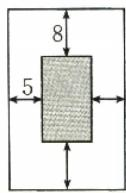

# 深挖教材 03 基本不等式链

在新高考背景下,基本不等式链的地位举足轻重.于解题而言,它在不等式证明及求最值中作用非凡,借助不同平均数的巧妙关系进行精准放缩与高效推导.它还能强力串联众多知识点,构建起完整的知识网络,与不等式、函数、几何等知识板块紧密相连.在思维拓展方面,培养了考生逻辑推理与数学运算等核心素养.熟练运用基本不等式链,能让考生在高考考场上更从容地应对各类复杂问题,提升解题速度与准确率.高中数学教材人教A版必修第一册第46页练习第2题介绍了此类问题.

# 母题剖析

一题多法。(人 A 必修① $P_{46}T_{2}$ 改编)若 a>0，
b>0，求证： $\frac{2}{\frac{1}{a}+\frac{1}{b}}\leqslant\sqrt{ab}\leqslant\frac{a+b}{2}\leqslant\sqrt{\frac{a^{2}+b^{2}}{2}}$

# ■ 方法总结

# 基本不等式链的定义及说明

若 $a > 0, b > 0$ ，则 $\frac{2}{\frac{1}{a} + \frac{1}{b}} \leqslant \sqrt{ab} \leqslant \frac{a + b}{2} \leqslant$

$\sqrt{\frac{a^2 + b^2}{2}}$ ，当且仅当 $a = b$ 时，等号成立。这是一个

基本不等式链，其中 $\sqrt{\frac{a^2 + b^2}{2}},\frac{a + b}{2},\sqrt{ab},\frac{2}{\frac{1}{a} + \frac{1}{b}}$

分别叫作正数 a, b 的平方平均数、算术平均数、几何平均数和调和平均数.

[说明] 此不等式链含6个不等式: ① $\frac{2}{\frac{1}{a}+\frac{1}{b}}$

$$
\leqslant \sqrt {a b}; ② \frac {2}{\frac {1}{a} + \frac {1}{b}} \leqslant \frac {a + b}{2}; ③ \frac {2}{\frac {1}{a} + \frac {1}{b}} \leqslant \sqrt {\frac {a ^ {2} + b ^ {2}}{2}};
$$

④ $\sqrt{ab} \leqslant \frac{a + b}{2}$ ; ⑤ $\sqrt{ab} \leqslant \sqrt{\frac{a^2 + b^2}{2}}$ ; ⑥ $\frac{a + b}{2}$

$$
\leqslant \sqrt {\frac {a ^ {2} + b ^ {2}}{2}}.
$$

# 子题探究

(多选题)若正实数 a, b 满足 $a + b = 1$ ，则（）.

A. $\sqrt{ab}$ 有最大值, 最大值为 $\frac{1}{2}$   
B. $\frac{1}{a+2b}+\frac{1}{2a+b}$ 有最小值,最小值为3  
C. $a^2 + b^2$ 有最小值，最小值为 $\frac{1}{2}$   
D. $\sqrt{a} +\sqrt{b}$ 有最大值，最大值为 $\sqrt{2}$

请完成《课时作业》P7\~P8

# 第05课时 一元二次方程、不等式

# 课标要求

对应答案分册第7页

1. 会从实际情境中抽象出一元二次不等式.

2. 结合二次函数的图象, 会判断一元二次方程的根的个数, 以及解一元二次不等式.

3. 了解简单的分式、绝对值不等式的解法.

# 必备知识·逐点梳理

# 一、三个“二次”的对应关系

二次函数 $y=ax^{2}+bx+c(a>0)$ 的图象与一元二次方程 $ax^{2}+bx+c=0(a>0)$ 的根、不等式 $ax^{2}+bx+c>0(<0)(a>0)$ 的解的对应关系.

<table><tr><td>判别式 $\Delta = b^{2} - 4ac$ </td><td> $\Delta >0$ </td><td> $\Delta = 0$ </td><td> $\Delta < 0$ </td></tr><tr><td>二次函数  $y = ax^{2} + bx + c$  的图象</td><td>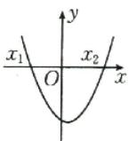</td><td>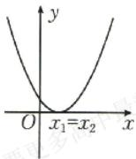</td><td>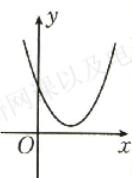</td></tr></table>

续表

<table><tr><td>判别式 $\Delta = b^{2} - 4ac$ </td><td> $\Delta >0$ </td><td> $\Delta = 0$ </td><td> $\Delta < 0$ </td></tr><tr><td>方程 $ax^{2} + bx + c = 0$ 的根</td><td>有两个不相等的实数根  $x_{1}$ , $x_{2}(x_{1}有两个相等的实数根,且\( x_{1}=x_{2}=-\frac{b}{2a}$ 没有实数根</td><td>有两个相等的实数根,且 $x_{1}=x_{2}=-\frac{b}{2a}$ </td><td>没有实数根</td></tr><tr><td> $ax^{2} + bx + c >0$ 的解集</td><td>____</td><td> $\left\{ x \mid x \neq -\frac{b}{2a} \right\}$ </td><td>____</td></tr><tr><td> $ax^{2} + bx + c < 0$ 的解集</td><td>____</td><td>∅</td><td>∅</td></tr></table>

# 微判断

(1)若关于 $x$ 的不等式 $ax^2 + bx + c > 0$ 的解集是 $(- \infty, x_1) \cup (x_2, + \infty)$ ，则方程 $ax^2 + bx + c = 0$ 的两个根是 $x_1$ 和 $x_2$ . （）  
(2)若关于 x 的不等式 $ax^{2}+bx+c<0$ 的解集为 $(x_{1},x_{2})$ ，则必有 a>0.  
(3)若关于 x 的方程 $ax^{2}+bx+c=0(a<0)$ 没有实数根，则不等式 $ax^{2}+bx+c>0(a<0)$ 的解集为 R.

提醒 (1)已知关于 $x$ 的一元二次不等式 $ax^2 + bx + c > 0$ 的解集为 $\mathbf{R}$ , 则一定满足 $\left\{ \begin{array}{l} a > 0, \\ \Delta < 0. \end{array} \right.$

(2)已知关于 x 的一元二次不等式 $ax^{2}+bx+c>0$ 的解集为 $\varnothing$ ，则一定满足 $\left\{\begin{aligned}a<0,\\ \Delta\leqslant0.\end{aligned}\right.$   
(3)已知关于 x 的一元二次不等式 $ax^{2}+bx+c<0$ 的解集为 R，则一定满足 $\left\{\begin{aligned}a&<0,\\ \Delta&<0.\end{aligned}\right.$   
(4)已知关于 x 的一元二次不等式 $ax^{2} + bx + c < 0$ 的解集为 $\varnothing$ ，则一定满足 $\left\{\begin{aligned}a &>0,\\ \Delta &\leqslant0.\end{aligned}\right.$   
(5)不等式 $ax^2 + bx + c > 0 (< 0)$ 中的 $a$ 可能为0，需要分类讨论，一般优先考虑 $a = 0$ 的情形.

# 二、分式不等式与整式不等式

1. $\frac{f(x)}{g(x)}>0(<0)\Leftrightarrow$ .   
2. $\frac{f(x)}{g(x)}\geqslant 0(\leqslant 0)\Leftrightarrow$

# 三、简单的绝对值不等式

1. $|x| > a (a > 0)$ 的解集为  
2. $|x| < a (a > 0)$ 的解集为

# 关键考点·核心突破

# 考点一 一元二次不等式的解法

例1 解下列关于 $x$ 的不等式：

(1)(2024·上海卷) $x^{2}-2x-3<0;$

(2) 教材 溯源题。(人 A 必修 ① P $_{53}$ 练习 T $_{1}$ 改编) -2x $^{2}$ +x≥-3;

(3) 教材 溯源题。(湘教必修① $P_{54}$ 例4改编) $\frac{-2x+5}{x-2}\leqslant0.$

# 方法总结

解一元二次不等式的四个步骤  
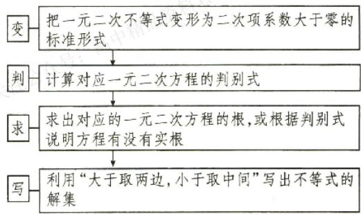

<details>
<summary>flowchart</summary>

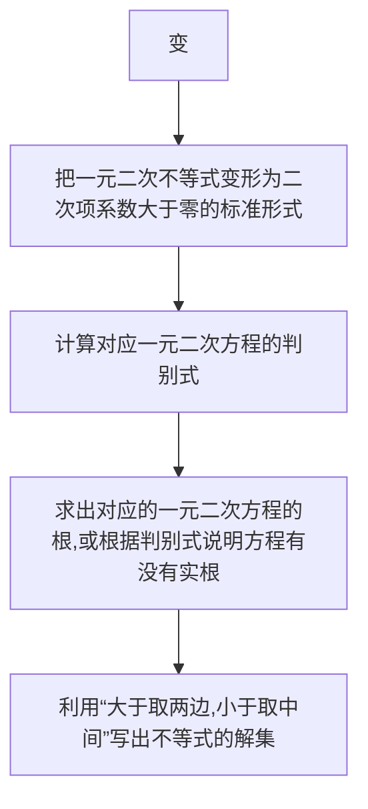
</details>

# 随堂加练

(多选题)下列选项正确的是().

A. 不等式 $x^{2} + x - 2 > 0$ 的解集为 $\{x \mid x < -2$ 或 $x > 1\}$   
B. 不等式 $\frac{2x + 1}{x - 2} \leqslant 1$ 的解集为 $\{x \mid -3 \leqslant x < 2\}$   
C. 不等式 $|x - 2| \geqslant 1$ 的解集为 $\{x \mid 1 \leqslant x \leqslant 3\}$   
D. 设 $x \in \mathbb{R}$ , 则“ $|x - 1| < 1$ ”是“ $\frac{x + 4}{x - 5} < 0$ ”的充分不必要条件

# 考点二 含参数的一元二次不等式的解法

例 2 解下列关于 x 的不等式, 其中 $a \in R$ .

(1) $x^{2}+ax+1<0;$   
(2) $ax^{2}-(a+1)x+1<0;$

(3) $\frac{ax-1}{x-3}>0.$

# 方法总结

# 解含参数的一元二次不等式时分类讨论的方法

(1) 当二次项系数中含有参数时, 应讨论二次项系数等于 0、小于 0、大于 0 的情形, 然后将不等式转化为一元一次不等式或二次项系数为正的一元二次不等式的形式.  
(2) 当不等式对应的一元二次方程的根的个数不确定时, 讨论判别式 $\Delta$ 与 0 的关系.  
(3) 确定无实根时, 可直接写出解集; 确定方程有两个不相等的实根时, 要讨论两根的大小关系, 从而确定解集的形式.

# 随堂加练

解下列关于 x 的不等式, 其中 $a \in R$ .

(1) $ax^{2}-(a+4)x+4\geqslant0;$   
(2) $\frac{ax - 1}{x - 2} > 1$ .

# 考点目 三个“二次”的对应关系

例3 教材 溯源题。(多选题)(湘教必修①P55 例6改编)若关于x的不等式 $ax^{2}-bx+c>0$ 的解集是(-3,-1)，则()。

A. a<0   
B. b<0 且 c>0   
C. $a + b + c > 0$

D. 不等式 $ax^2 + cx + b < 0$ 的解集是 $\{x \mid x > 1$ 或 $x < -4\}$

# ■方法总结

已知一元二次不等式的解集,就能够得到相应的一元二次方程的两根,由根与系数的关系,可以求出相应的系数.注意结合不等式解集的形式判断二次项系数的正负.

# 随堂加练

教材 溯源题。(多选题)(苏教必修① $P_{69}T_{12}$ 改编)已知关于x的不等式 $ax^{2}+bx+c\geqslant0$ 的解集为 $\{x\mid x\leqslant3或x\geqslant4\}$ ，则下列结论正确的是().

A. a > 0   
B. 不等式 $bx + c < 0$ 的解集为 $\{x \mid x > \frac{12}{7}\}$

C. 不等式 $cx^{2} + bx + a < 0$ 的解集为 $\left\{x \mid x < \frac{1}{4}\right.$ 或 $x > \frac{1}{3}\}$

D. $a+b+c>0$

# 考向1 在 $\mathbf{R}$ 上的恒成立问题

例4 若不等式 $(a - 2)x^{2} + 2(a - 2)x - 4 < 0$ 对 $x \in \mathbb{R}$ 恒成立，则实数 $a$ 的取值范围是（ ）.

A. $(-∞,2]$

B. $[-2,2]$

C. $(-2,2]$

D. $(-2,2)$

# 方法总结

# 不等式在 $\mathbf{R}$ 上恒成立问题的解题策略

(1)不等式 $ax^2 +bx + c > 0$ 对任意实数 $x$ 恒成立 $\Leftrightarrow \left\{ \begin{array}{ll}a = b = 0,\\ c > 0 \end{array} \right.$ 或 $\left\{ \begin{array}{ll}a > 0,\\ b^2 -4ac <   0. \end{array} \right.$

(2)不等式 $ax^2 + bx + c < 0$ 对任意实数 $x$ 恒成立 $\Leftrightarrow \left\{ \begin{array}{l} a = b = 0, \\ c < 0 \end{array} \right.$ 或 $\left\{ \begin{array}{l} a < 0, \\ b^2 - 4ac < 0. \end{array} \right.$

# 考向2 在给定区间上的恒成立问题

例 5 （1）一题多法 若对于 $x \in [1,3]$ , $mx^{2} - mx + m - 6 < 0 (m \neq 0)$ 恒成立，则实数 m 的取值范围是 \_\_\_\_.

(2) 若 $mx^{2}-mx-1<0$ 对于 $m\in[1,2]$ 恒成立，则实数 x 的取值范围为 \_\_\_\_.

# 方法总结

# 不等式在给定区间上的恒成立问题的求解方法

(1) 若 $f(x) > 0$ 在集合 A 中恒成立，即集合 A 是不等式 $f(x) > 0$ 的解集的子集，则可以先求解集，再由子集的含义求解参数的值（或范围）.  
(2)转化为函数的值域问题,即已知函数 $f(x)$ 的值域为 $[m,n]$ , 则 $f(x)\geqslant a$ 恒成立 $\Rightarrow f(x)_{\min}\geqslant a$ , 即 $m\geqslant a$ ; $f(x)\leqslant a$ 恒成立 $\Rightarrow f(x)_{\max}\leqslant a$ , 即 $n\leqslant a$ .  
(3)对于以下两种题型,可以利用二次函数在区间端点m,n处的取值特点来求参数的范围.

① $ax^{2}+bx+c<0(a>0)$ 对 $x\in[m,n]$ 恒成立；

② $ax^{2}+bx+c>0(a<0)$ 对 $x\in[m,n]$ 恒成立.

# 考向3 不等式能成立或有解问题

例6 题多法若关于 $x$ 的不等式 $x^{2} - ax + 7 > 0$ 在(2,7)上有实数解，则实数 $a$ 的取值范围是（ ）.

A. $(-∞,8)$   
B. $(-∞,8]$   
C. $(-∞,2\sqrt{7})$   
D. $(-∞, \frac{11}{2})$

# 方法总结

# 一元二次不等式在给定区间上

# 有解问题的解题策略

(1) 分离参数法: 把不等式化为 $a > f(x)$ 或 $a < f(x)$ 的形式, 只需 $a > f(x)_{\min}$ 或 $a < f(x)_{\max}$ .  
(2)最值转化法: 若 $f(x)>0$ 在集合 A 中有解, 则函数 $y=f(x)$ 在集合 A 中的最大值大于 0; 若 $f(x)<0$ 在集合 A 中有解, 则函数 $y=f(x)$ 在集合 A 中的最小值小于 0.

(3) 数形结合法: 根据图象列出约束条件求解.  
(4) 最后一定要注意检验区间的开闭.

# 随堂加练

题练透。已知关于 x 的不等式 $mx^{2}-2x-m+1<0$ 。

(1)是否存在实数 m，使不等式对任意 $x \in R$ 恒成立？请说明理由.  
(2)若不等式对任意 $x \in [0,1]$ 恒成立，求实数 $m$ 的取值范围.  
(3)若不等式对任意 $m\in [-2,2]$ 恒成立，求实数 $x$ 的取值范围.  
(4)若不等式在[2,3]上有解，求实数 $m$ 的取值范围.

请完成《课时作业》P9\~P10

# 强化课 01

# 一元二次方程根的分布情况

在高考中,一元二次方程根的分布情况有着重要的地位,它常与函数、不等式、数列等知识综合考查,是对函数与方程思想的深度检验,其题型多样,主要考查学生分类讨论、数形结合的能力,是备考的关键内容之一.

# 典例

题练透。当关于 $x$ 的一元二次方程 $(m-$

1) $x^{2} + 2(m + 1)x - m = 0$ 分别满足下列条件时，求实数 $m$ 的取值范围.

(1)两个根都大于0;   
(2)一个根大于-1,另一个根小于-1;  
(3)一个根在区间(1,2)内,另一个根在区间(-1,0)内;  
(4)一个根在区间 $(-1,1)$ 内，另一个根不在区间 $(-1,1)$ 内；  
(5)一个根小于1,另一个根大于2;  
(6)两个根都在区间 $[-1,3)$ 上；  
(7)两个根都小于1;   
(8)在区间(1,2)内有解.

$$
n ], \text {则} \left\{ \begin{array}{l l} f (m) \geqslant 0, \\ f (n) \geqslant 0, \\ \Delta \geqslant 0, \\ m \leqslant - \frac {b}{2 a} \leqslant n; \end{array} \right.
$$

(2) 若方程在 $[m, n]$ 上有两根，即 $x_{1}, x_{2} \in [m,$   
(3) 若方程有两根, 一根比 m 大, 一根比 m 小, 即 $x_{1}<m<x_{2}$ , 则 $f(m)<0$ ;  
(4) 若 $m < x_{1} < n < x_{2} < k$ ，则 $\left\{ \begin{array}{l} f(m) > 0, \\ f(n) < 0, \\ f(k) > 0; \end{array} \right.$   
(5) 若方程有两个不同的根，且在 $(m, n)$ 内有且仅有一个根，则 $f(m) \cdot f(n) < 0$ ，或 $f(m) = 0$ ，另一根在 $(m, n)$ 内，或 $f(n) = 0$ ，另一根在 $(m, n)$ 内。

# 强化训练

题练透。当关于 x 的方程 $x^{2}+(m-3)x+m=0$ 分别满足下列条件时，求实数 m 的取值范围.

(1)有两个正根；  
(2)一个根大于1,另一个根小于1;  
(3)一个根在区间 $(-2,0)$ 内，另一个根在区间 $(0,4)$ 内；  
(4)一个根小于2,另一个根大于4;  
(5)两个根都在区间 $(0,2)$ 内.

# 方法总结

设一元二次方程 $ax^2 + bx + c = 0$ 的两个根为 $x_1, x_2$ ，且 $m, n, k$ 为常数，令 $f(x) = ax^2 + bx + c$ ，结合二次函数的图象，以 $a > 0$ 的情形为例，对于一元二次方程根的分布的讨论如下：

(1)若方程有两个均大于 $m$ 的实根，即 $x_{1}, x_{2}$

$$
\in (m, + \infty), \text {则} \left\{ \begin{array}{l l} f (m) > 0, \\ \Delta \geqslant 0, \\ - \frac {b}{2 a} > m; \end{array} \right.
$$

请完成《课时作业》P11

# 第三单元

# 函数

# 第06课时 函数的概念及其表示

对应答案分册第9页

# 课标要求

1. 了解构成函数的要素,会求一些简单函数的定义域和值域.

2. 在实际情境中，会根据不同的需要选择恰当的方法（如解析法、列表法、图象法）表示函数，理解函数图象的作用.

3. 了解简单的分段函数，并能简单应用。

# 必备知识·逐点梳理

# 一、函数的有关概念

<table><tr><td colspan="2">概念</td><td>一般地,设A,B是非空的_,如果对于集合A中的_,按照某种确定的对应关系f,在集合B中都有_确定的数y和它对应,那么就称f:A→B为从集合A到集合B的一个函数</td></tr><tr><td rowspan="3">三要素</td><td>对应关系</td><td> $y=f(x),x\in A$ </td></tr><tr><td>定义域</td><td>_的取值范围</td></tr><tr><td>值域</td><td>与x的值对应的y值的集合 $\{f(x)\mid x\in A\}$ </td></tr><tr><td colspan="2">同一个函数</td><td>如果两个函数的_域相同,且_完全一致,那么这两个函数是同一个函数</td></tr></table>

# 微思考

(1)函数的概念的描述中,集合 B 一定是函数的值域吗?  
(2)定义域与值域都相同的两个函数一定是同一个函数吗？值域与对应关系都相同的两个函数一定相等吗？

提醒 求函数的定义域时常用的结论：

(1) 分式型 $\frac{1}{f(x)}$ 要满足 $f(x) \neq 0$ ;  
(2) 根式型 $\sqrt[2n]{f(x)}$ ( $n \in N^{*}$ ) 要满足 $f(x) \geqslant 0$ ;

(3) $\left[f(x)\right]^{0}$ 要满足 $f(x)\neq0$ ;   
(4) 对数型 $\log_{a}f(x)$ (a>0, 且 $a\neq1$ ) 要满足 $f(x)>0$ ;  
(5) 正切型 $\tan[f(x)]$ 要满足 $f(x) \neq \frac{\pi}{2} + k\pi, k \in \mathbf{Z}.$

# 二、表示函数的常用方法

<table><tr><td>解析法</td><td>一般情况下,必须注明函数的定义域</td></tr><tr><td>列表法</td><td>选取的自变量要有代表性,能反映定义域的特征</td></tr><tr><td>图象法</td><td>注意定义域对图象的影响;与x轴垂直的直线与函数图象最多有一个公共点</td></tr></table>

# 微思考

(1)(人 A 必修① $P_{68}$ 思考改编)所有的函数都能用解析法表示吗？列表法与图象法呢？  
(2) 直线 $x = a$ (a 是常数) 与函数 $y = f(x)$ 的图象有多少个交点？直线 $y = a$ (a 是常数) 呢？

# 三、分段函数

<table><tr><td>定义</td><td>若函数在其定义域的不同子集上,因____而分别用几个不同的式子来表示,则称这种函数为分段函数</td></tr><tr><td>相关概念</td><td>分段函数的定义域是各段函数定义域的____,其值域等于各段函数值域的____,分段函数虽由几个部分组成,但它表示的是同一个函数</td></tr></table>

# 考点一 函数的概念

例1（1）教材 溯源题。（苏教必修① $\mathrm{P}_{115}$ 练习 $\mathrm{T}_{4}$ 改编）下列四个图象中，是函数图象的是（ ）.

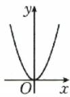  
(1)

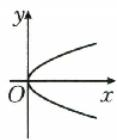  
(2)

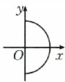  
(3)

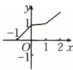  
(4)

A.(1)(2)

B.(2)(3)

C. (3)(4)

D. (1)(4)

(2)教材溯源题。(人A必修① $P_{72}$ 习题3.1 $T_{2}$ 改编)(多选题)下列各组函数是同一函数的是().

A. $f(x) = x - 1, g(x) = \frac{x^2 - 1}{x + 1}$   
B. $f(x) = \sqrt{x^2}, g(x) = \left\{ \begin{array}{ll} x, & x \geqslant 0, \\ -x, & x < 0 \end{array} \right.$   
C. $f(x) = \sqrt{-x^3}, g(x) = x\sqrt{-x}$   
D. $f(x) = x^{2} - 2x - 1, g(s) = s^{2} - 2s - 1$

# 方法总结

1. 函数的定义要求非空数集 A 中的任何一个元素在非空数集 B 中有且只有一个元素与之对应，即可以“多对一”，不能“一对多”，而 B 中有可能存在与 A 中元素不对应的元素。  
2. 构成函数的三要素中, 定义域和对应关系都相同, 则值域一定相同.

# 随堂加练

1. 设集合 $M = \{x \mid 0 \leqslant x \leqslant 2\}$ , $N = \{y \mid 0 \leqslant y \leqslant 2\}$ , 下列四个图象中, 能表示从集合 $M$ 到集合 $N$ 的函数关系的是 ( ).

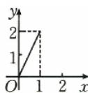  
①

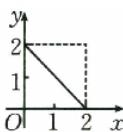  
②

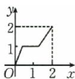  
③

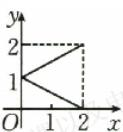  
④

A. ①②③④

B.①②③

C. ②③

D. ②

2. 以下给出的同组函数, 是否表示同一个函数? 为什么?

① $f_{1}:y=\frac{x}{x};f_{2}:y=1;f_{3}:y=x^{0}.$   
② $f_{1}:y=\sqrt{x^{2}}$ ; $f_{2}:y=(\sqrt{x})^{2}$ ;

$$
f _ {3}: y = \left\{ \begin{array}{l} x, x > 0, \\ - x, x <   0. \end{array} \right.
$$

③ $f_{1}:y=\begin{cases}1,x\leqslant1,\\2,1<x<2,\\3,x\geqslant2;\end{cases}$

<table><tr><td>x</td><td>x≤1</td><td>1x≥2</td><td>x≥2</td></tr><tr><td>y</td><td>1</td><td>2</td><td>3</td></tr></table>

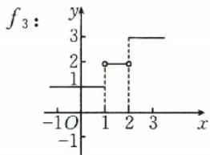

<details>
<summary>line</summary>

f₃:
| x | y |
|---|---|
| -1O | 1 |
| 1 | 2 |
| 2 | 2 |
| 3 | 3 |
</details>

# 考点二 函数的定义域

# 考向1 具体函数的定义域

例2 函数 $f(x) = \frac{2x + 1}{\sqrt{5x - 3}} + (x - 1)^0$ 的定义域为 \_\_\_\_.

# 考向2 抽象函数的定义域

例 3 一题练透求下列函数的定义域.

(1)已知函数 $y=f(x)$ 的定义域是 $[-1,5]$ ，则函数 $y=f(2x+1)$ 的定义域为 \_\_\_\_.  
(2)已知函数 $y=f(2x+1)$ 的定义域是 $[-1,5]$ ，则函数 $y=f(x)$ 的定义域为 \_\_\_\_.  
(3)已知函数 $y=f(2x+1)$ 的定义域是 $[-1,5]$ ，则函数 $y=f(1-x)$ 的定义域为 \_\_\_\_.

# 考向3 已知定义域求参数的取值范围

例 4 已知函数 $f(x)=\sqrt{2x^{2}+2ax+a}$ 的定义域为 R，则实数 a 的取值范围为 \_\_\_\_.

# 方法总结

1. 由函数解析式求定义域

求解时只要根据函数解析式列出自变量满足的不等式(组)，得出不等式(组)的解集即可.

2. 求抽象函数的定义域的策略

(1) 若已知函数 $f(x)$ 的定义域为 $[a, b]$ ，则复合函数 $f(g(x))$ 的定义域由不等式 $a \leqslant g(x) \leqslant b$ 求出；  
(2) 若已知函数 $f(g(x))$ 的定义域为 $[a, b]$ ，则 $f(x)$ 的定义域为 $g(x)$ 在 $[a, b]$ 上的值域.

# 随堂加练

1. 函数 $y=\frac{\sqrt{-x^{2}+2x+3}}{\lg(x+1)}$ 的定义域为().

A. $(-1,3]$   
B. $(-1,0)\cup(0,3]$   
C. $[-1,3]$   
D. $[-1,0)\cup (0,3]$

2. 若函数 $y = f(x)$ 的定义域是 [0, 2026]，则函数 $g(x) = \frac{f(x+1)}{x-1}$ 的定义域为 \_\_\_\_. 若

函数 $f(x-1)$ 的定义域为 [0, 2026]，则函数 $g(x)=\frac{f(x+1)}{x-1}$ 的定义域为 \_\_\_\_.

3. 已知函数 $f(x)=\ln(ax^{2}+x+1)$ 的定义域为 R，则实数 a 的取值范围为 \_\_\_\_.

# 考点目 函数的解析式

例 5 （1）题多法已知 $f(x)$ 为二次函数，且满足 $f(2x-1)=4x^{2}+4x-3$ ，则 $f(x)=$ \_\_\_\_.

(2)已知函数 $f(x)$ 满足 $2f(x)+f\left(\frac{1}{x}\right)=3x-1$ ,
则 $f(x)=$ \_\_\_\_.

# ■方法总结

# 求函数解析式的四种方法

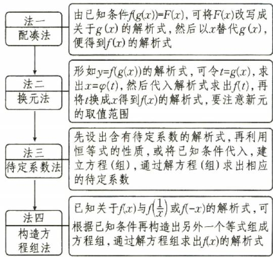

<details>
<summary>flowchart</summary>

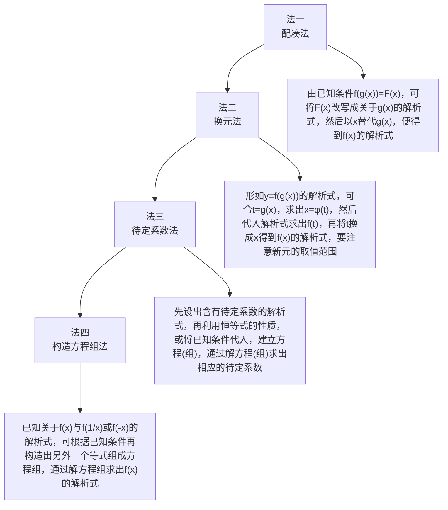
</details>

# 随堂加练

题练透利用相应的方法求下列函数的解析式：

(1)(换元法)已知 $f(1-\sin x)=\cos^{2}x$ ，求函数 $f(x)$ 的解析式；  
(2)(配凑法)已知 $f(\sqrt{x}+1)=x+2\sqrt{x}$ ，求函数 $f(x)$ 的解析式；

(3)(待定系数法)已知 $f(x)$ 是一次函数,且满足 $3f(x+1)-2f(x-1)=2x+17$ ,求函数 $f(x)$ 的解析式;

(4)(构造方程组法)已知 $f(x)$ 满足 $f(x)+2f\left(\frac{2026}{x}\right)=3x$ ，求函数 $f(x)$ 的解析式.

# 考点四 分段函数

热点考情: 分段函数作为考查函数知识的载体, 因其考查函数知识较全面而成为高考命题的热点, 重点考查求值、解方程与不等式, 涉及函数的零点、图象及性质等.

# 考向1 分段函数求值

# 走进教材

例6 教材 溯源题。(苏教必修① $P_{115}T_{7}$ 改编)已知函数 $f(x)=\left\{\begin{aligned}&2-x,x\geqslant1,\\&x^{2},x<1,\end{aligned}\right.$ 那么 $f(f(2))$ 的值为\_\_\_\_.

# 走向高考

例7（2024·上海卷）已知 $f(x) = \begin{cases} \sqrt{x}, & x > 0, \\ 1, & x \leqslant 0, \end{cases}$ 则 $f(3) =$ \_\_\_\_.

# ■方法总结

“分段函数分段看”，遇到分段函数要时刻盯住自变量的范围，并根据自变量的范围选择合适的解析式.

(1) 求函数值: 当出现 $f(f(a))$ 的形式时, 应从内到外依次求值.

(2) 求自变量的值: 先假设所求的值在分段函数定义域区间的各段上, 然后求出相应自变量的值, 切记要代入检验.

# 考向2 分段函数与方程、不等式问题

# 走进教材

例8 教材 溯源题。(北师大必修① $P_{59}$ 复习题B组 $T_{3}$ 改编)已知函数 $f(x)=\left\{\begin{aligned}&2x,x>0,\\ &x+1,x\leqslant0,\end{aligned}\right.$ 且 $f(a)+f(1)=0$ ，则实数a的值为\_\_\_\_。

# 走向高考

例 9 经典高考题。设函数 $f(x)=\left\{\begin{aligned}&\frac{1}{2}x-1,x\geqslant0,\\&\frac{1}{x},x<0,\end{aligned}\right.$ 若 $f(a)>a$ ，则实数 a 的取值范围是 \_\_\_\_.

# ■方法总结

# 解与分段函数有关的方程、不等式

当自变量的取值不确定时,分类讨论求解;当自变量的取值确定,且含有参数时,依据自变量的情况,直接代入相应的解析式求解.

注意: 求解与分段函数有关的方程(不等式)的问题时, 按不同范围求解后合并结果.

# 随堂加练

1. 已知函数 $f(x) = \begin{cases} \frac{2}{x} + 3, & x < 1, \\ \sqrt{x}, & x \geqslant 1, \end{cases}$ 则 $f\left(f\left(\frac{1}{3}\right)\right) = (\quad)$ .

A. 1

B. 2

C. 3

D. 4

2. 一题练透。（多选题）已知函数 $f(x) = \left\{ \begin{array}{l} x + 2, x < 1, \\ -x^2 + 3, x \geqslant 1, \end{array} \right.$ 则（ ）.

A. $f(f(\sqrt{3})) = 3$

B. 若 $f(a) = -1$ ，则 $a = 2$ 或 $a = -3$

C. $f(x)<2$ 的解集为 $(-∞,0)∪(1,+∞)$

D. 若 $\forall x \in \mathbf{R}, a > f(x)$ , 则 $a \geqslant 3$

3.名师原创题。已知 $f(x) = \left\{ \begin{array}{l} f(x - 2), x > 0, \\ -x^2 + 2, x \leqslant 0, \end{array} \right.$ 则 $f(2026) =$ \_\_\_\_.

# 考点五 函数的值域（微专题）

# 专题要点: 基本初等函数的值域

(1) $y=kx+b(k\neq0)$ 的值域是R.

(2) $y=ax^{2}+bx+c(a\neq0)$ 的值域: 当a>0时, 值域为 $\left[\frac{4ac-b^{2}}{4a},+\infty\right)$ ; 当a<0时, 值域为 $(-∞,\frac{4ac-b^{2}}{4a})$ .

(3) $y=\frac{k}{x}(k\neq0)$ 的值域是 $(-∞,0)∪(0,+∞)$ .

(4) $y=a^{x}(a>0,$ 且 $a\neq1)$ 的值域是 $(0,+\infty)$ .

(5) $y=\log_{a}x(a>0,$ 且 $a\neq1)$ 的值域是R.

例 10 一题练透求下列函数的值域.

(1) $y=\sqrt{-x^{2}+x+2}$ ;

(2) $y=\frac{2x}{x^{2}+x+1};$

(3) $y=\frac{x^{2}+x+1}{x};$

(4) $y=\frac{3x+4}{5x+6};$

(5) $y=x+\sqrt{1-2x}$ ;

(6) $y=\log_{\frac{1}{2}}x+\frac{1}{2^{x}},x\in[1,2];$

(7) $y=\frac{3-\sin x}{2-\cos x}.$

# 方法总结

# 求函数值域(最值)的常用方法

(1)配方法:主要用于和一元二次函数有关的函数求值域问题.

(2)判别式法:①分式函数分子、分母的最高次幂为2时,可整理成关于x的二次方程,方程有解,则判别式大于或等于0,即解得y的取值范围,得到值域;②适用于函数的定义域为R的情况.

(3) 基本不等式法: 配凑成 $y = ax + \frac{b}{x} (a, b \text{ 同号})$ 的形式, 再利用基本不等式求函数的最值, 进而得到函数的值域.

(4) 反解法与分离常数法: 形如 $f(x)=\frac{ax+b}{cx+d}$ 的函数可用反解法或分离常数法.

(5)换元法:引进一个(几个)新的量来代替原来的量,通过换元,将较复杂的值域问题转化为求某些基本初等函数的值域问题.

(6)单调性法:函数为一般函数或者复合函数,其单调性容易确定.

(7) 数形结合法: 由函数的解析式可以绘制出函数的大致图象, 并求出函数在关键点处的函数值, 或通过几何意义转化为几何问题进行求解.

# 随堂加练

1.(多选题)下列说法正确的是().

A. 当 $x \in [0,3)$ 时，函数 $y = x^{2} - 2x + 3$ 的值域为 [2,6)

B. 函数 $y=\frac{2x+1}{x-3}$ 的值域为 R

C. 函数 $y=2x-\sqrt{x-1}$ 的值域为 $\left[\frac{15}{8},+\infty\right)$

D. 函数 $y=\sqrt{x+1}+\sqrt{x-1}$ 的值域为 $[\sqrt{2},+\infty)$

2. 函数 $y=\frac{x+1}{x^{2}+x+1}$ 的值域为 \_\_\_\_；函数 $y=\frac{x^{2}+x+1}{x+1}$ 的值域为 \_\_\_\_。

3. 函数 $f(x)=2x-3-\sqrt{-x^{2}+6x-8}$ 的值域为 \_\_\_\_.

请完成《课时作业》P12\~P13

# 第07课时 函数的单调性与最值

对应答案分册第 12 页

# 课标要求

1. 借助函数图象,会用语言表达函数的单调性,掌握求函数单调区间的基本方法.

2. 理解函数的最大值、最小值的概念，理解它们的作用和实际意义，会求简单函数的最值.

3.能够利用函数的单调性解决有关问题.

# 必备知识·逐点梳理

# 一、函数的单调性

1. 单调函数的定义

<table><tr><td></td><td>增函数</td><td>减函数</td></tr><tr><td rowspan="2">定义</td><td colspan="2">一般地,设函数 $f(x)$ 的定义域为 $D$ ,区间 $I\subseteq D$ ,如果 $\forall x_1,x_2\in I$ </td></tr><tr><td>当 $x_1当\( x_1\( _{____}$ ,那么就称函数 $f(x)$ 在区间 $I$ 上单调递增,特别地,当函数 $f(x)$ 在它的定义域上单调递增时,我们就称它是增函数</td><td>当 $x_1\( _{____}$ ,那么就称函数 $f(x)$ 在区间 $I$ 上单调递减,特别地,当函数 $f(x)$ 在它的定义域上单调递减时,我们就称它是减函数</td></tr><tr><td>图象描述</td><td>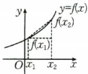自左向右看图象是上升的</td><td>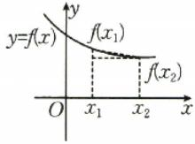自左向右看图象是下降的</td></tr></table>

# 微思考

(1)(人 A 必修①P\$\_{77}\$ 思考改编)设 A 是区间 D 上某些自变量的值组成的集合, 而且 $\forall x_1, x_2 \in A$ , 当 $x_1 < x_2$ 时, 都有 $f(x_1) < f(x_2)$ , 我们能说函数 $f(x)$ 在区间 D 上单调递增吗? 你能举例说明吗?

(2)所有的函数都具有单调性吗？你能举例说明吗？

提醒 (1) 函数单调性的两个等价结论

① 若 $x_{1}, x_{2} \in D$ ，且 $x_{1} \neq x_{2}$ ，有 $\frac{f(x_1) - f(x_2)}{x_1 - x_2} > 0 \Leftrightarrow \frac{x_1 - x_2}{f(x_1) - f(x_2)} > 0 \Leftrightarrow [f(x_1) - f(x_2)] (x_1 - x_2) > 0 \Leftrightarrow f(x)$ 在区间 $D$ 上单调递增；

② 若 $x_{1}, x_{2} \in D$ ，且 $x_{1} \neq x_{2}$ ，有 $\frac{f(x_1) - f(x_2)}{x_1 - x_2} < 0 \Leftrightarrow \frac{x_1 - x_2}{f(x_1) - f(x_2)} < 0 \Leftrightarrow [f(x_1) - f(x_2)] (x_1 - x_2) < 0 \Leftrightarrow f(x)$ 在区间 $D$ 上单调递减.

(2) 若函数 $f(x), g(x)$ 在区间 $I$ 上具有单调性，则在区间 $I$ 上具有以下性质：

①当 $f(x)$ , $g(x)$ 都是增(减)函数时, $f(x) + g(x)$ 是增(减)函数.

②若 k>0，则 $kf(x)$ 与 $f(x)$ 的单调性相同；若 k<0，则 $kf(x)$ 与 $f(x)$ 的单调性相反.

③函数 $y=f(x)(f(x)>0)$ 在公共定义域内与 $y=-f(x), y=\frac{1}{f(x)}$ 的单调性相反.

④复合函数 $y=f(g(x))$ 的单调性与 $y=f(u)$ 和 $u=g(x)$ 的单调性有关，简记“同增异减”.

2. 单调区间的定义

如果函数 $y = f(x)$ 在区间 $I$ 上 \_\_\_\_ 或 \_\_\_\_, 那么就说函数 $y = f(x)$ 在这一区间具有（严格的）单调性，区间 $I$ 叫作 $y = f(x)$ 的单调区间.

# 微判断

(1)函数 $y = f(x)$ 在 $[1, +\infty)$ 上是增函数，则函数 $f(x)$ 的单调递增区间是 $[1, + \infty)$ （

(2)函数 $y=\frac{1}{x}$ 的单调递减区间是 $(-∞,0)∪(0,+∞)$ .

提醒（1）“函数 $f(x)$ 的单调递增区间是 $I$ ”是指函数 $f(x)$ 的单调递增区间恰好是 $I$ ，在其他的区间上， $f(x)$ 不是单调递增的；而“函数 $f(x)$ 在区间 $I$ 上单调递增”是指函数 $f(x)$ 在区间 $I$ 以外的区间或包含 $I$ 的更大区

间上也可能是单调递增的.

(2)有多个单调区间时应分开写,不能用符号“∪”连接,也不能用“或”连接,只能用“,”或“和”连接.

# 二、函数的最值

<table><tr><td>前提</td><td colspan="2">一般地,设函数 $y=f(x)$ 的定义域为 $D$ ,如果存在实数 $M$ 满足</td></tr><tr><td>条件</td><td> $\forall x\in D$ ,都有____; $\exists x_{0}\in D$ ,使得____</td><td> $\forall x\in D$ ,都有____; $\exists x_{0}\in D$ ,使得____</td></tr><tr><td>结论</td><td> $M$ 是函数 $y=f(x)$ 的最大值</td><td> $M$ 是函数 $y=f(x)$ 的最小值</td></tr></table>

提醒 (1)闭区间上的连续函数一定存在最大值和最小值,当函数在闭区间上单调时,最值一定在端点处取到.
(2)开区间上的“单峰”函数一定存在最大(小)值.

# 关键考点·核心突破

# 考点一 确定函数的单调性（区间）

# 走进教材

例1 教材溯源题。(人A必修① $\mathrm{P_{86}T_8}$ 改编)根据函数单调性的定义证明 $f(x) = x + \frac{4}{x}$ 在区间 $[2, + \infty)$ 上单调递增.

# 走向高考

例 2 （2023·北京卷）下列函数中，在区间（0，+∞）上单调递增的是（ ）.

A. $f(x) = -\ln x$   
B. $f(x)=\frac{1}{2^{x}}$   
C. $f(x) = -\frac{1}{x}$   
D. $f(x) = 3^{|x - 1|}$

# 方法总结

# 确定函数单调性(区间)的方法

(1)定义法:先求定义域,设元→作差→变形→判断符号→得出结论.   
(2) 图象法: 若 $f(x)$ 是以图象形式给出的, 或者 $f(x)$ 的图象易作出, 则可由图象确定单调性 (区间).  
(3) 导数法: 先求导数, 再利用导数值的正负确定函数的单调性(区间).  
(4) 复合函数法: ① 求函数的定义域; ② 求简单函数的单调区间; ③ 求复合函数的单调区间, 依据是“同增异减”.

# 随堂加练

1. 函数 $y=\sqrt{x^{2}+x-6}$ 的单调递增区间为 \_\_\_\_，
单调递减区间为 \_\_\_\_.

2. 试讨论 $f(x) = \frac{ax}{x + 1} (a \neq 0)$ 在 $(-1, 1)$ 上的单调性.

# 考点二 函数单调性的应用

# 考向1 利用单调性比较大小

例3 已知定义在 $\mathbf{R}$ 上的函数 $y = f(x)$ 满足以下条件: ① 函数 $y = f(x)$ 的图象关于直线 $x = 1$ 对称; ② 对任意 $x_{1}, x_{2} \in (-\infty, 1]$ , 当 $x_{1} \neq x_{2}$ 时, 都有 $\frac{f(x_{1}) - f(x_{2})}{x_{1} - x_{2}} < 0$ . $f(0), f\left(\frac{3}{2}\right), f(3)$ 的大小关系为 ( ).

A. $f\left(\frac{3}{2}\right) > f(0) > f(3)$   
B. $f(3) > f(0) > f\left(\frac{3}{2}\right)$   
C. $f\left(\frac{3}{2}\right) > f(3) > f(0)$   
D. $f(3) > f\left(\frac{3}{2}\right) > f(0)$

# 考向2 解不等式

例4 已知函数 $f(x)$ 是定义在区间 $[0, +\infty)$ 上的函数，且在该区间上单调递增，则满足 $f(2x - 1) < f\left(\frac{1}{3}\right)$ 的 $x$ 的取值范围是（ ）.

A. $\left(\frac{1}{3},\frac{2}{3}\right)$   
B. $\left[\frac{1}{3},\frac{2}{3}\right)$   
C. $\left(\frac{1}{2},\frac{2}{3}\right)$   
D. $\left[\frac{1}{2},\frac{2}{3}\right)$

# 考向3 求函数的最值

例5 函数 $f(x) = x - \frac{2}{x} + 1$ 在[1,4]上的最大值为( ).

A. 0

B. 1

C. $\frac{9}{2}$

D. $\frac{11}{2}$

# 考向 4 利用单调性求参数值(范围)问题

例6 教材 溯源题。(湘教必修① $P_{85}T_{3}$ 改编)已知函数 $f(x)=-mx^{2}+3x+1$ 在区间 $(-2,+\infty)$ 上是增函数，则实数m的取值范围为\_\_\_\_.

# ■方法总结

# 函数单调性的应用策略

(1) 比较大小: 利用单调性比较函数值的大小, 需将各自变量的值化到同一单调区间上.  
(2) 解不等式: 关键是利用函数的单调性将“f”脱掉, 使其转化为具体的不等式并求解, 此时应特别注意函数的定义域.  
(3) 求最值: 利用函数单调性求最值是求函数最值的重要方法, 特别是当函数图象不易作出时.  
(4) 求参数: 利用单调性求参数时, 通常要把参数视为已知数, 依据函数的图象或单调性的定义, 确定函数的单调区间, 与已知单调区间比较求参数.

# 随堂加练

1. 已知函数 $f(x)$ 的图象关于直线 $x = 1$ 对称，当 $x_{1} \neq x_{2}$ 且 $x_{1}, x_{2} \in (1, +\infty)$ 时， $[f(x_{2}) - f(x_{1})] \cdot (x_{2} - x_{1}) < 0$ 恒成立。设 $a = f\left(-\frac{1}{2}\right), b = f(2), c = f(e)$ ，则 $a, b, c$ 的大小关系为（）.

A. c > a > b   
B. $c > b > a$   
C. $a > c > b$   
D. b > a > c

2. 已知 $f(x)$ 是定义在 $[-1, 1]$ 上的减函数，且 $f(2a - 3) < f(a - 2)$ ，则实数 $a$ 的取值范围是（ ）.

A. $(1,2]$   
B. $[-1,2]$   
C. $(1,4]$   
D. $(1,+\infty)$

3. 函数 $f(x)=3^{x}+\log_{2}(x+2)$ 在区间 $[-1,2]$ 上的最大值为 \_\_\_\_.

4. 名师原创题。已知函数 $f(x)=2x^{2}+(a-1)x+3$ ，若其单调递增区间是 $[1,+\infty)$ ，则实数 a 的值为 \_\_\_\_；若其在区间 $[1,+\infty)$ 上单调递增，则实数 a 的取值范围为 \_\_\_\_。

# 深挖教材 04 对勾函数与飘带函数

在高中数学中，对勾函数与飘带函数宛如两颗独特的明珠。对勾函数的图象似灵动的对勾，蕴含着单调性与最值的规律；飘带函数则如飘逸的丝带，其渐近线展示着独特的性质。它们不只是数学概念，更像是开启智慧之门的钥匙，引导我们深入探究函数的奥秘，领略数学之美。高中数学教材人教A版必修第一册第86页综合运用第8题、第101页拓展推广第12题分别介绍了这两类函数。

# 母题剖析

教材溯源题。(人 A 必修① $P_{86}T_{8}$ 与 $P_{101}T_{12}$ 改编)(1)讨论函数 $y=x+\frac{9}{x}$ 在区间 $(0,+\infty)$ 上的单调性；

(2) 讨论函数 $y = x + \frac{k}{x} (k > 0)$ 在区间 $(0, +\infty)$ 上的单调性；  
(3) 讨论函数 $y = x - \frac{1}{x}$ 的单调性.

# 方法总结

形如 $f(x) = ax + \frac{b}{x} (ab\neq 0)$ 的图象及性质

(1) 当 ab > 0 时，常把 $f(x)$ 称为“对勾函数”.  
①图象：

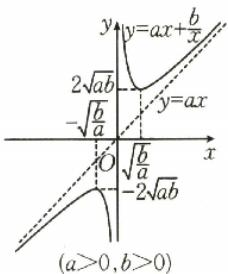

<details>
<summary>text_image</summary>

y=ax+b/x
2√ab
-√b/a
y=ax
O
√b/a
-2√ab
(a>0,b>0)
</details>

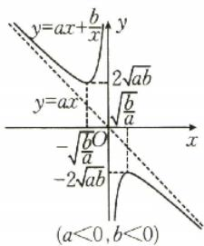

<details>
<summary>text_image</summary>

y=ax+b/x
y=ax
-√(b/a)
-2√(ab)
(a<0,b<0)
</details>

②定义域： $(-∞,0)∪(0,+∞)$ .  
③值域： $(-∞,-2\sqrt{ab}]\cup[2\sqrt{ab},+∞)$ .  
④奇偶性: 奇函数.  
⑤单调性：

若 $a > 0, b > 0$ ，则增区间为 $\left(-\infty, -\sqrt{\frac{b}{a}}\right)$ 和 $\left(\sqrt{\frac{b}{a}}, +\infty\right)$ ，减区间为 $\left(-\sqrt{\frac{b}{a}}, 0\right)$ 和 $\left(0, \sqrt{\frac{b}{a}}\right)$ ；

若 $a < 0, b < 0$ ，则增区间为 $\left(-\sqrt{\frac{b}{a}}, 0\right)$ 和 $(0, \sqrt{\frac{b}{a}})$ ，减区间为 $\left(-\infty, -\sqrt{\frac{b}{a}}\right)$ 和 $\left(\sqrt{\frac{b}{a}}, +\infty\right)$ .

⑥渐近线：一条是直线 y=ax，另一条是直线 x=0.

(2) 当 ab<0 时，常把 $f(x)$ 称为“飘带函数”.

①图象：

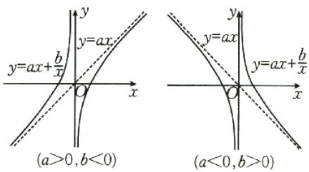

②定义域： $(-∞,0)∪(0,+∞)$ .  
③值域： $(-∞,+∞)$ .  
④奇偶性:奇函数.  
⑤单调性：

若 a>0, b<0，则增区间为 $(-∞,0)$ 和 $(0,+∞)$ ;

若 $a < 0, b > 0$ ，则减区间为 $(- \infty, 0)$ 和 $(0, +\infty)$ .

⑥渐近线：一条是直线 $y = ax$ ，另一条是直线 $x = 0$

# 子题探究

1.(多选题)已知函数 $f(x)=x-\frac{a}{x}(a\neq0)$ ，下列说法正确的是().

A. 当 $a > 0$ 时, $f(x)$ 在定义域上单调递增  
B. 当 $a = -4$ 时, $f(x)$ 的单调递增区间为 $(- \infty, -2), (2, +\infty)$   
C. 当 $a = -4$ 时, $f(x)$ 的值域为 $(- \infty, -4] \cup [4, +\infty)$   
D. 当 $a > 0$ 时, $f(x)$ 的值域为 $\mathbf{R}$

2. 已知 $x \in \left[\frac{1}{2}, 2\right]$ , 则函数 $f(x) = 25x + \frac{9}{x}$ 的值域为 \_\_\_\_; 函数 $g(x) = 25x - \frac{9}{x}$ 的值域为 \_\_\_\_.

请完成《课时作业》P14\~P15

# 第08课时 函数的奇偶性、周期性

对应答案分册第14页

# 课标要求

1. 了解函数奇偶性的含义, 了解函数的周期性及其几何意义.

2. 会简单利用函数的性质去解题.

# 必备知识·逐点梳理

# 一、函数的奇偶性

<table><tr><td>奇偶性</td><td>定义</td><td>图象特点</td></tr><tr><td>偶函数</td><td>一般地,设函数 $f(x)$ 的定义域为 $D$ ,如果 $\forall x\in D$ ,都有 $-x\in D$ ,且_,那么函数 $f(x)$ 就叫作偶函数</td><td>关于_对称</td></tr><tr><td>奇函数</td><td>一般地,设函数 $f(x)$ 的定义域为 $D$ ,如果 $\forall x\in D$ ,都有 $-x\in D$ ,且_,那么函数 $f(x)$ 就叫作奇函数</td><td>关于_对称</td></tr></table>

# 微判断

(1)不存在既是奇函数又是偶函数的函数.（）  
(2) 若 $f(x)$ 是奇函数，则 $f(0)=0.$ ( )

# 二、函数的周期性

1. 周期函数: 一般地, 设函数 $f(x)$ 的定义域为 $D$ , 如果存在一个非零常数 $T$ , 使得对每一个 $x \in D$ 都有 $x + T \in D$ , 且 \_\_\_\_, 那么函数 $f(x)$ 就叫作周期函数, 非零常数 $T$ 叫作这个函数的周期.

2. 最小正周期: 如果在周期函数 $f(x)$ 的所有周期中存在一个 \_\_\_\_ 的正数, 那么这个 \_\_\_\_ 就叫作 $f(x)$ 的最小正周期.

提醒 (1) 若 $T$ 是函数 $f(x)$ 的周期, 那么 $nT(n \in \mathbf{Z}, n \neq 0)$ 也是函数 $f(x)$ 的周期.

(2) 对 $f(x)$ 的定义域内任一自变量 x:

①若 $f(x+a)=-f(x)$ ，则 $T=2a(a>0)$ ;

②若 $f(x + a) = \pm \frac{1}{f(x)}$ ，则 $T = 2a(a > 0)$

# 关键考点·核心突破

# 考点一 函数奇偶性的判断

例 1 教材 溯源题。(北师大必修① $P_{69}T_{3}$ 改编)判断下列函数的奇偶性,并加以证明:

(1) $f(x)=x^{3}-\frac{1}{x}$ ;

(2) $f(x)=\sqrt{x^{2}-1}+\sqrt{1-x^{2}}$ ;

(3) $f(x)=x^{2}-|x|+1,x\in[-1,4]$ ;

(4) $f(x)=\left\{\begin{aligned}-x^{2}+2x+1,x&>0,\\ x^{2}+2x-1,x&<0;\end{aligned}\right.$

(5) $f(x)=(x-1)\sqrt{\frac{1+x}{1-x}},x\in(-1,1).$

# 方法总结

# 判断函数奇偶性的方法

(1) 定义法: 若函数的定义域不是关于原点对称的区间, 则可立即判断该函数既不是奇函数也不是偶函数; 若函数的定义域是关于原点对称的区间, 再判断 $f(-x)$ 是否等于 $f(x)$ 或 $-f(x)$ .

(2) 图象法: 奇(或偶)函数的充要条件是它的图象关于原点(或 y 轴)对称.

(3) 性质法: 偶函数的和、差、积、商 (分母不为零) 仍为偶函数; 奇函数的和、差仍为奇函数; 奇 (偶) 数个奇函数的积、商 (分母不为零) 为奇 (偶) 函数; 一个奇函数与一个偶函数的积为奇函数. (注: 利用上述结论时要注意各函数的定义域)

注意:一些重要类型的奇偶函数模型

(1) 函数 $f(x) = a^{x} + a^{-x} (a > 0$ ，且 $a \neq 1$ 是偶函数.

(2) 函数 $f(x)=a^{x}-a^{-x}(a>0,$ 且 $a\neq1)$ 是奇函数.

(3) 函数 $f(x)=\frac{a^{x}+1}{a^{x}-1}(a>0, \text{且 } a \neq 1)$ 是奇函数.

(4) 函数 $f(x) = \log_a \frac{x - b}{x + b} (a > 0, \text{且 } a \neq 1)$ 是奇函数.

# 随堂加练

1.（2024·天津卷）下列函数是偶函数的是( ).

A. $y=\frac{e^{x}-x^{2}}{x^{2}+1}$

B. $y = \frac{\cos x + x^2}{x^2 + 1}$

C. $y = \frac{\mathrm{e}^x - x}{x + 1}$

D. $y = \frac{\sin x + 4x}{\mathrm{e}^{|x|}}$

2.(多选题)(2023·上海卷改编)下列函数是奇函数的是().

A. $y=\sin x$

B. $y=\cos x$

C. $y = x^{3}$

D. $y=2^{x}$

# 考点□ 函数奇偶性的应用

# 考向 1 利用奇偶性求值(解析式)

# 走进教材

例 2 教材 溯源题。(人 A 必修① $P_{86}T_{11}$ 改编)已知函数 $f(x)$ 是定义域为 R 的奇函数, 当 $x \geqslant 0$ 时, $f(x)=x(1+x)$ , 则 $f(-2)=$ \_\_\_\_.

# 走向高考

例3 经典高考题。设 $f(x)$ 为奇函数，且当 $x \geqslant 0$ 时， $f(x) = \mathrm{e}^{x} - 1$ ，则当 $x < 0$ 时， $f(x) = (\quad)$ .

A. $e^{-x}-1$

B. $e^{-x} + 1$

C. $-e^{-x}-1$

D. $-e^{-x}+1$

# 考向2 利用奇偶性解不等式

例4（1）教材 溯源题。（人B必修① $\mathrm{P}_{117}$ 习题3- $1\mathrm{CT}_2$ 改编)若函数 $f(x)$ 是定义在R上的偶函数，且 $f(x)$ 在 $(- \infty, 0]$ 上是减函数， $f(2) = 0$ ，则不等式 $f(x) < 0$ 的解集是

(2)名师原创题。已知 $f(x)$ 为定义在 $\mathbf{R}$ 上的偶函数，且在区间 $[0, +\infty)$ 上单调递增，则满足 $f(x - 1) < f(2)$ 的 $x$ 的取值范围是 \_\_\_\_；若 $f(x)$ 为定义在 $(-2, 2)$ 上的奇函数，且在此区间上单调递增，则满足 $f(x - 1) + f(x) > 0$ 的 $x$ 的取值范围是 \_\_\_\_。

# 考向3 利用奇偶性求解析式中的参数

# 走进教材

例5 教材溯源题。(北师大必修① $\mathrm{P}_{73}\mathrm{B}$ 组 $\mathrm{T}_{7}$ 改编)已知函数 $f(x) = x^{2} + ax + 1$ 是偶函数，则实数 $a$ 的值是

# 走向高考

例6（2024·上海卷）已知 $f(x) = x^{3} + a, x \in \mathbf{R}$ ，且 $f(x)$ 是奇函数，则 $a =$ \_\_\_\_.

# ■方法总结

函数奇偶性的应用类型及解题策略

<table><tr><td>求解析式</td><td>先将待求区间上的自变量转化到已知区间上,再利用奇偶性求出 $f(x)$ 的解析式或充分利用奇偶性构造关于 $f(x)$ 的方程(组),从而得到 $f(x)$ 的解析式</td></tr><tr><td>求函数值</td><td>利用函数的奇偶性将待求函数值转化为已知区间上的函数值,进而求解</td></tr><tr><td>解不等式</td><td>利用奇、偶函数的图象特征或根据奇函数在对称区间上的单调性一致、偶函数在对称区间上的单调性相反,将问题转化到同一单调区间上求解,涉及偶函数时常用 $f(x)=f(|x|)$ ,将问题转化到在 $[0,+\infty)$ 上求解</td></tr><tr><td>求参数值</td><td>利用待定系数法求解,根据 $f(x)\pm f(-x)=0$ 得到关于待求参数的恒等式,由系数的对等性得出参数的值.对于在 $x=0$ 处有定义的奇函数 $f(x)$ ,可考虑列等式 $f(0)=0$ 求解</td></tr></table>

# 随堂加练

1. 已知定义在 $\mathbf{R}$ 上的奇函数 $f(x)$ 在 $(-\infty, 0)$ 上单调递减，且 $f(3) = 0$ ，则 $xf(x) > 0$ 的解集为（ ）.

A. $(-∞,-3)$

B. $(-3,0)\cup(0,3)$

C. $(0,3)$

D. $(3,+\infty)$

2. 题多法。(2023·新高考Ⅱ卷)若函数 $f(x)=(x+a)\ln\frac{2x-1}{2x+1}$ 为偶函数，则 $a=(\quad)$ .

A.-1

B. 0

C. $\frac{1}{2}$

D. 1

3. 设 $f(x)$ 是定义在 $(-∞, +∞)$ 上的奇函数，且当 x > 0 时， $f(x) = x^{2} - 3x$ ，则 $f(-2) =$ \_\_\_\_ ；当 $x \leqslant 0$ 时， $f(x) =$ \_\_\_\_ .

# 考点目 函数的周期性及其应用

例7（1）已知 $f(x)$ 是定义在 $\mathbf{R}$ 上的函数，且 $f(x + 2) = -\frac{1}{f(x)}$ ，当 $0\leqslant x\leqslant 2$ 时， $f(x) = x^{2} - 2x$ ，则 $f(2026) =$

(2)已知定义在 $\mathbf{R}$ 上的函数 $f(x)$ 满足 $f(x + 6) = f(x)$ ，当 $-3 \leqslant x < -1$ 时， $f(x) = -(x + 2)^2$ ，当 $-1 \leqslant x < 3$ 时， $f(x) = x$ ，则 $f(1) + f(2) + f(3) + \dots + f(2026) =$ \_\_\_\_.

# 方法总结

# 函数周期性的有关问题

(1) 判断函数的周期性, 只需证明 $f(x + T) = f(x) (T \neq 0)$ 便可得到函数是周期函数, 且周期为 T, 函数的周期性常与函数的其他性质综合命题.  
(2)根据函数的周期性,可以由函数的局部性质得到函数的整体性质,即将未知区间上的问题转化到已知区间上求解.

# 随堂加练

1. 设 $f(x)$ 是定义域为 $\mathbf{R}$ 的偶函数，且 $f(2 + x) = f(-x), f\left(-\frac{1}{2}\right) = \frac{1}{2}$ ，则 $f\left(\frac{9}{2}\right) = (\quad)$ .

A. $-\frac{3}{2}$   
B. $-\frac{1}{2}$   
C. $\frac{1}{2}$   
D. $\frac{3}{2}$

2. 已知定义在 R 上的函数 $f(x)$ 的图象关于 y 轴对称，且周期为 3, $f(-1)=1$ , $f(0)=-2$ ，则 $f(1)+f(2)+f(3)+\cdots+f(2026)$ 的值是（）.

A. 2026

B. 2025

C. 1

D. 0

请完成《课时作业》P16\~P17

# 强化课 02 函数的对称性

对应答案分册第15页

函数的对称性是高考重点考查的一个内容,通常出现在客观题或者解答题的某一问中,往往会将函数的对称性与单调性、周期性等其他性质相结合进行综合考查.这种考查方式要求考生能够深入理解函数对称性的本质,灵活运用对称性去解决函数求值、函数零点个数判断、不等式求解等问题.

# 类型一 轴对称问题

典例1（1）若函数 $f(x + 1)$ 为偶函数，则函数 $f(x)$ 的图象的对称轴方程为

(2)已知函数 $f(x)$ 的定义域为 R，且 $f(x+2)$ 为偶函数， $f(x)$ 在 $[2,+\infty)$ 上单调递减，则不等式 $f(-x^{2})>f(-1)$ 的解集为 \_\_\_\_.

# 方法总结

1. 函数 $y = f(x)$ 的图象关于直线 $x = a$ 对称 $\Leftrightarrow f(a + x) = f(a - x) \Leftrightarrow f(2a + x) = f(-x) \Leftrightarrow$

$$
f (2 a - x) = f (x).
$$

2. 若函数 $y = f(x)$ 满足 $f(a + x) = f(b - x)$ ，则 $y = f(x)$ 的图象关于直线 $x = \frac{a + b}{2}$ 对称.  
3. 若 $y=f(x+a)$ 是偶函数，则 $f(x)$ 的图象关于直线 x=a 对称.

# 强化训练

1. 已知函数 $f(x) = -x^2 + bx + c$ ，且 $f(x + 1)$ 是偶函数，则 $f(-1), f(1), f(2)$ 的大小关系是（ ）.

A. $f(-1) < f(1) < f(2)$

B. $f(1) < f(2) < f(-1)$

C. $f(2) < f(-1) < f(1)$

D. $f(-1) < f(2) < f(1)$

2. 已知定义域为 $\mathbf{R}$ 的函数 $f(x)$ 满足 $f(x) = f(4 - x)$ , 若 $y = |x - 2|$ 与 $y = f(x)$ 图象的交点分别为 $(x_{1}, y_{1}), (x_{2}, y_{2}), (x_{3}, y_{3}), (x_{4}, y_{4})$ , 则 $x_{1} + x_{2} + x_{3} + x_{4} = (\quad)$ .

A.-4

B. 0

C. 4

D. 8

# 类型二 中心对称问题

典例 2 (1) 已知定义域为 R 的函数 $f(x)$ 在 $[1, +\infty)$ 上单调递减，且 $f(x+1)$ 为奇函数，则使得不等式 $f(x^{2}-x)<f(2-2x)$ 成立的实数 x 的取值范围是（）.

A. $(-1,2)$   
B. $(-∞,-1)∪(2,+∞)$   
C. $(-2,1)$   
D. $(-∞,-2)∪(1,+∞)$

(2)已知定义域为 $\mathbf{R}$ 的函数 $f(x)$ 的图象关于点(1,0)对称，且当 $x\geqslant 1$ 时， $f(x) = x^2 +mx + n.$ 若 $f(-1) = -7$ ，求 $3m + n$ 的值.

# ■方法总结

1. 函数 $y=f(x)$ 的图象关于点 $(a,b)$ 对称 $\Leftrightarrow f(a+x)+f(a-x)=2b\Leftrightarrow2b-f(x)=f(2a-x)$ .  
2. 若函数 $y = f(x)$ 满足 $f(a + x) + f(b - x) = c$ ，则 $y = f(x)$ 的图象关于点 $\left(\frac{a + b}{2}, \frac{c}{2}\right)$ 中心对称.  
3. 若 $y=f(x+a)$ 是奇函数，则 $f(x)$ 的图象关于点 $(a,0)$ 中心对称.

# 强化训练

1.(多选题)下列说法中,正确的是().

A. 函数 $f(x) = \frac{2x - 1}{x + 2}$ 的图象关于点(-2,2)中心对称  
B. 函数 $f(x)$ 满足 $f(2x - 1)$ 为奇函数，则函数 $f(x)$ 的图象关于点 $(-1,0)$ 中心对称  
C. 若函数 $y=f(x)$ 的图象过定点 $(0,1)$ ，则函数 $y=f(x-1)+1$ 的图象过定点 $(1,2)$   
D. 若函数 $y=\frac{x-1}{x-b}$ 的图象关于点 $(3,c)$ 中心对称，则 $b+c=2$

2. 已知函数 $y = f(x)$ 满足 $f(-x) = f(2 + x)$ ，其图象关于点 $(2,0)$ 对称， $f(2) = 0$ ，求 $f(2026)$ 的值.

# 类型三 两个函数图象的对称

典例 3 已知函数 $y=f(x)$ 的定义域为 R，则函数 $y=f(x+2)$ 与 $y=f(4-x)$ 的图象关于().

A. 直线 $x = 1$ 对称  
B. 直线 x=3 对称  
C. 直线 y=3 对称  
D. 点 $(3,0)$ 对称

# 方法总结

函数 $y = f(a + x)$ 的图象与函数 $y = f(b - x)$ 的图象关于直线 $x = \frac{b - a}{2}$ 对称.

# 强化训练

下列函数中, 其图象与 $y = e^{x}$ 的图象关于直线 x = 1 对称的是().

A. $y = \mathrm{e}^{x - 1}$

B. $y=e^{1-x}$

C. $y = \mathrm{e}^{2 - x}$

D. $y=\ln x$

# 类型四 双对称问题

典例 4 （1）设 $f(x)$ 是定义在 R 上的偶函数，且 $f(2+x)=f(2-x)$ ，当 $-2 \leqslant x \leqslant 0$ 时， $f(x)=x+1$ ，则 $f(2026)=$ \_\_\_\_.

(2)设 $f(x)$ 是定义在 $\mathbf{R}$ 上的奇函数，且 $f(x + 4) + f(-x) = 0$ ，当 $-2\leqslant x\leqslant 0$ 时， $f(x) = x+$ 1，则 $f(2026) =$

# 方法总结

# 双对称问题

双对称问题的周期, 可类比三角函数 $y = \sin x$ .

(1) 若 $y = f(x)$ 的图象关于直线 x = a, x = b 对称，则 $T = 2|a - b| (a \neq b)$ ;  
(2) 若 $y = f(x)$ 的图象关于点 $(a,0), (b,0)$ 对称，则 $T = 2|a - b| (a \neq b)$ ;  
(3) 若 $y = f(x)$ 的图象关于直线 x = a，点 $(b, 0)$ 对称，则 $T = 4|a - b| (a \neq b)$ .

B. $f(6) < f\left(\frac{11}{2}\right) < f(-7)$   
C. $f(-7) < f\left(\frac{11}{2}\right) < f(6)$   
D. $f\left(\frac{11}{2}\right) <   f(-7) <   f(6)$

2. 设函数 $f(x)$ 为定义在 $\mathbf{R}$ 上的奇函数, $f(x + 2)$ 是偶函数, 且当 $x \in (0,2]$ 时, $f(x) = x$ , 求 $f(-2025) + f(2026)$ 的值.

# 强化训练

1. 已知定义在 $\mathbf{R}$ 上的奇函数 $f(x)$ 满足 $f(x + 2) = -f(x)$ ，当 $x \in [0,1]$ 时， $f(x)$ 单调递增，则（ ）.

A. $f(6) < f(-7) < f\left(\frac{11}{2}\right)$

请完成《课时作业》P18

# 强化课 03 函数性质的综合应用

函数性质的综合应用是历年高考的一个热点内容,经常以客观题的形式出现,要求分析函数的性质特点,或结合图象研究函数的性质,此类试题往往将多种性质结合在一起进行考查.

# 类型一 函数的奇偶性与单调性

典例1（1）（多选题）已知 $f(x)$ 是定义在 $\mathbf{R}$ 上的奇函数，且在 $(-\infty,0)$ 上单调递增，若 $f(-1) = f(2) = 1$ ，则下列不等式成立的是（ ）.

A. $f\left(-\frac{3}{2}\right) > - 1$

B. $f(-1) > f(1)$

C. $f(3) > 1$

D. $f\left(\frac{1}{2}\right) > - 1$

(2)若函数 $f(x) = a - \frac{x}{|x| + 1}$ 为奇函数，则关于 $x$ 的不等式 $f(x^2) + f(2x - 3) > a$ 的解集为 \_\_\_\_.

# ■方法总结

# 综合应用奇偶性与单调性解题的技巧

(1) 比较大小: 先利用奇偶性, 将不在同一单调区间上的两个或多个自变量的函数值转化为同一单调区间上的自变量的函数值, 然后利用单调性比

较大小.

(2) 解不等式: 先将所给的不等式转化为两个函数值的大小关系, 再利用奇偶性得出区间上的单调性, 再利用单调性“脱去”函数的符号“f”, 转化为解不等式(组)的问题.

# 强化训练

1. 设 $f(x)$ 是 R 上的偶函数，且在 $[0, +\infty)$ 上单调递增，则 $f(-2)$ ， $f(-\pi)$ ， $f(3)$ 的大小关系是 \_\_\_\_.

2. 已知 $f(x)$ 是奇函数，且在 $(0, +\infty)$ 上是增函数， $f(2)=0$ ，则 $\frac{f(x)}{x}<0$ 的解集为\_\_\_\_。

# 类型二 函数的奇偶性与周期性

典例 2 (1) 已知函数 $f(x)$ 为奇函数, 且周期为 4, $f(-2) = -2$ , 则 $f(2026) = (\quad)$ .

A. 2

B. 0

C.-2

D.-4

(2)(多选题)已知函数 $f(x)$ 的定义域为 R，且 $f(2x+1)$ 是偶函数， $f(x-1)$ 是奇函数，则下列结论正确的是()。

A. $f(x)=f(x-16)$

B. $f(19)=0$

C. $f(2026) = f(3)$

D. $f(2\ 025)=f(1)$

# 方法总结

# 综合应用奇偶性与周期性解题的技巧

(1)根据已知条件及相关函数的奇偶性推出函数的周期.

(2) 利用函数的周期性将自变量较大的函数值转化为自变量较小的函数值, 直到自变量的值在已知解析式的区间内或与已知的函数值相联系, 必要时可再次运用奇偶性将自变量的符号进行转化.

(3) 代入已知的解析式求解, 即得欲求的函数值.

# 强化训练

1.(多选题)已知函数 $f(x)$ 的定义域为 R, 若 $f(x+1)$ 与 $f(x-1)$ 都是偶函数, 则().

A. $f(x)$ 是偶函数

B. $f(x)$ 是奇函数

C. $f(x+3)$ 是偶函数

D. $f(x)=f(x+4)$

2. 函数 $y = f(x)$ 对任意 $x \in R$ 都有 $f(x + 2) = f(-x)$ 成立，且函数 $y = f(x - 1)$ 的图象关于点 $(1, 0)$ 对称， $f(1) = 4$ ，则 $f(2024) + f(2025) + f(2026)$ 的值为 \_\_\_\_.

# 类型三 函数的奇偶性与对称性

典例 3 (1) 若定义在 R 上的奇函数 $f(x)$ 满足 $f(2-x)=f(x)$ ，当 $x_{1}, x_{2} \in (0,1)$ 时， $(x_{1}-x_{2}) \cdot [f(x_{1})-f(x_{2})] > 0$ ，则下列说法正确的是（）.

A. 函数 $f(x)$ 的图象关于点 $(1,0)$ 中心对称  
B. 函数 $f(x)$ 的图象关于直线 $x = 2$ 对称  
C. $f(x)$ 在区间 $(2,3)$ 上单调递减

D. $f\left(-\frac{7}{2}\right) > f\left(\frac{2}{3}\right)$

(2)(多选题)已知定义域为 R 的函数 $f(x)$ 满足 $f(-x)+f(x)=0$ ，且 $f(1-x)=f(1+x)$ ，则下列结论一定正确的是().

A. $f(x+2)=f(x)$   
B. 函数 $y=f(x)$ 的图象关于点 $(2,0)$ 对称  
C. 函数 $y=f(x+1)$ 是偶函数  
D. $f(2-x)=f(x-1)$

# ■方法总结

由函数的奇偶性与对称性可求函数的周期,常用于化简求值、比较大小等.

# 强化训练

1. 已知 $f(x)$ 是定义在 R 上的偶函数，则下列函数的图象一定关于点 $(-1, 0)$ 中心对称的是()。

A. $y=(x-1)f(x-1)$   
B. $y=(x+1)f(x+1)$   
C. $y = xf(x) + 1$   
D. $y = xf(x) - 1$

2. 已知函数 $f(x)$ 是 R 上的偶函数，且 $f(x)$ 的图象关于点 $(1,0)$ 对称，当 $x \in [0,1]$ 时， $f(x) = 2 - 2^{x}$ ，求 $f(0) + f(1) + f(2) + \cdots + f(2026)$ 的值.

# 类型四 函数的周期性与对称性

典例 4 （1）已知定义在 R 上的函数 $f(x)$ 满足 $f(x+2)=-f(x)$ ，且 $f(x+1)$ 为偶函数，当 $x\in[-1,1]$ 时， $f(x)=x^{3}$ ，则 $f(2026)=(\quad)$ .

A. 0

B. $\frac{1}{8}$

C. $-\frac{1}{8}$

D. 1

(2)(多选题)已知非常数函数 $f(x)$ 为 $\mathbf{R}$ 上的奇函数， $g(x) = f(x + 1)$ 为偶函数，则下列说法正

确的是( ).

A. $f(x)$ 的图象关于直线 x = -1 对称  
B. $g(2025)=0$   
C. $g(x)$ 的最小正周期为 4  
D. 对任意 $x \in R$ ，都有 $f(2 - x) = f(x)$

# ■ 方法总结

# 区别两个对应关系

函数 $f(x)$ 满足的关系 $f(a + x) = f(b - x)$ 表明的是函数图象的对称性，函数 $f(x)$ 满足的关系 $f(a + x) = f(b + x)(a\neq b)$ 表明的是函数的周期性，在使用这两个关系时不要混淆.

# 强化训练

1.(多选题)已知定义在R上的奇函数 $f(x)$ 满足 $f(x+2)=-f(x)$ ，且 $f(x)$ 在 $[-1,0]$ 上是增函数，则下列说法正确的是()。

A. $f(x)$ 是周期函数

B. $f(x)$ 的图象关于直线 x=1 对称

C. $f(x)$ 在 $[1,2]$ 上是增函数

D. $f(2) = f(0)$

2.（多选题）已知 $f(x)$ 是定义域为 $\mathbf{R}$ 的函数，满足 $f(x + 1) = f(x - 3),f(1 + x) = f(3 - x)$ ，当 $0\leqslant x\leqslant 2$ 时， $f(x) = x^{2} - x$ ，则下列说法正确的是（ ）.

A. $f(x)$ 的周期为 4

B. $f(x)$ 的图象关于直线 x=2 对称

C. 当 $0 \leqslant x \leqslant 4$ 时, 函数 $f(x)$ 的最大值为 2

D. 当 $6 \leqslant x \leqslant 8$ 时，函数 $f(x)$ 的最小值为 $-\frac{1}{2}$

请完成《课时作业》P19

# 第09课时 二次函数与幂函数

对应答案分册第18页

# 课标要求

1. 通过具体实例，结合 $y = x, y = \frac{1}{x}, y = x^2, y = \sqrt{x}, y = x^3$ 的图象，理解它们的变化规律，了解幂函数.

2. 理解并掌握二次函数的图象与性质（单调性、对称性、最值、顶点等）.

# 必备知识·逐点梳理

# 一、二次函数

1.二次函数解析式的三种形式

(1)一般式: $f(x)=$ \_\_\_\_.

(2)顶点式: $f(x)=a(x-m)^{2}+n(a\neq0)$ ，顶点坐标为\_\_\_\_.

(3)零点式: $f(x)=a(x-x_{1})(x-x_{2})(a\neq0)$ , $x_{1},x_{2}$ 为 $f(x)$ 的 \_\_\_\_.

2.二次函数的图象和性质

<table><tr><td>函数</td><td> $y=ax^{2}+bx+c(a>0)$ </td><td> $y=ax^{2}+bx+c(a<0)$ </td></tr><tr><td>图象(抛物线)</td><td>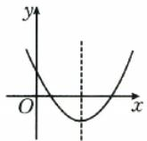</td><td>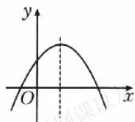</td></tr><tr><td>定义域</td><td colspan="2">R</td></tr></table>

续表

<table><tr><td>函数</td><td> $y=ax^{2}+bx+c(a>0)$ </td><td> $y=ax^{2}+bx+c(a<0)$ </td></tr><tr><td>值域</td><td> $\left[\frac{4ac-b^{2}}{4a},+\infty\right)$ </td><td> $\left(-\infty,\frac{4ac-b^{2}}{4a}\right]$ </td></tr><tr><td>对称轴</td><td colspan="2"> $x=-\frac{b}{2a}$ </td></tr><tr><td>顶点坐标</td><td colspan="2"> $\left(-\frac{b}{2a},\frac{4ac-b^{2}}{4a}\right)$ </td></tr><tr><td>奇偶性</td><td colspan="2">当 $b=0$ 时,是____函数;当 $b\neq0$ 时,是非奇非偶函数</td></tr><tr><td>单调性</td><td>在 $\left(-\infty,-\frac{b}{2a}\right]$ 上单调递____;在 $\left[-\frac{b}{2a},+\infty\right)$ 上单调递____</td><td>在 $\left(-\infty,-\frac{b}{2a}\right]$ 上单调递____;在 $\left[-\frac{b}{2a},+\infty\right)$ 上单调递____</td></tr></table>

# 二、幂函数

1. 幂函数的定义

一般地, 函数 \_\_\_\_ 叫作幂函数, 其中 x 是自变量, $\alpha$ 是常数.

提醒 幂函数解析式的特征：

(1) 自变量 x 在幂的底数位置, 幂指数 $\alpha$ 是常数.

(2) $x^{a}$ 的系数为1.

(3) 只有 1 项.

2. 常见的五种幂函数的图象

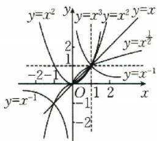

<details>
<summary>text_image</summary>

y=x²
y=x³=y=x²
y=x
y=x⁻¹
y=x⁻¹
-2-1
1
O
1
2
x
y=x¹
y=x²
y=x³
y=x²
y=x
y=x⁻¹
</details>

# 关键考点·核心突破

# 考点一 幂函数的图象与性质

例1（1）如图所示，图中的曲线是幂函数 $y = x^n$ 在第一象

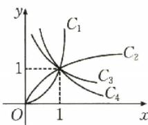

限的图象,已知 n 取 $\pm2,\pm\frac{1}{2}$

四个值,则曲线 $C_{1}, C_{2}, C_{3}, C_{4}$ 对应的 n 的值依次为().

A. $-2, -\frac{1}{2}, \frac{1}{2}, 2$

B. $2, \frac{1}{2}, -\frac{1}{2}, -2$

C. $-\frac{1}{2},-2,2,\frac{1}{2}$

D. $2, \frac{1}{2}, -2, -\frac{1}{2}$

(2)已知点 $\left(\frac{\sqrt{3}}{3},\sqrt{3}\right)$ 在幂函数 $f(x)$ 的图象上，则 $f(x)$ 是().

A. 奇函数

B. 偶函数

C. 定义域内的减函数

D. 定义域内的增函数

# 方法总结

1. 在(0,1)上，幂函数的指数越大，函数图象越靠近 $x$ 轴（简记为“指大图低”）；在 $(1, +\infty)$ 上，幂函数的指数越大，函数图象越远离 $x$ 轴。

3. 幂函数的性质

(1)幂函数在 $(0,+\infty)$ 上都有定义.
(2)当 $\alpha>0$ 时，幂函数的图象都过点\_\_\_\_和\_\_\_\_，且在 $(0,+\infty)$ 上单调递增.

(3)当 $\alpha < 0$ 时，幂函数的图象都过点\_\_\_\_，且在 $(0, +\infty)$ 上单调递减.

(4)当 $\alpha$ 为奇数时， $y=x^{\alpha}$ 为 \_\_\_\_；当 $\alpha$ 为偶数时， $y=x^{\alpha}$ 为 \_\_\_\_。

提醒 (1)幂函数的图象一定会出现在第一象限,一定不会出现在第四象限.

(2) 若幂函数 $y = x^{\alpha}$ 在 $(0, +\infty)$ 上单调递增，则 $\alpha > 0$ ;
若幂函数 $y=x^{\alpha}$ 在 $(0,+\infty)$ 上单调递减，则 $\alpha<0$ .

2. 在比较幂函数值的大小时, 必须结合幂函数值的特点, 选择适当的函数, 借助其单调性进行比较, 准确掌握各个幂函数的图象和性质是解题的关键.

# 随堂加练

1. 已知幂函数 $y = x^{m^2 + m - 2} (0 \leqslant m \leqslant 3, m \in \mathbf{Z})$ 的图象关于 $y$ 轴对称，且在 $(0, +\infty)$ 上单调递增，则 $m$ 的值为（ ）.

A. 0

B. 2

C. 3

D. 2 或 3

2. 已知幂函数 $f(x)$ 的图象过点 $(-8, -2)$ ，且 $f(a+1) \leqslant -f(a-3)$ ，则实数 a 的取值范围是 \_\_\_\_.

# 考点二 二次函数的解析式

例 2 题多法。已知二次函数 $f(x)$ 满足 $f(2) = -1, f(-1) = -1$ ，且 $f(x)$ 的最大值是 8，则 $f(x)$ 的解析式为 \_\_\_\_.

# 方法总结

求二次函数的解析式,一般用待定系数法,其关键是根据已知条件选择恰当的二次函数解析式的形式,一般选择规律如下:

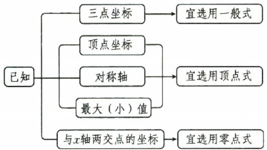

<details>
<summary>flowchart</summary>

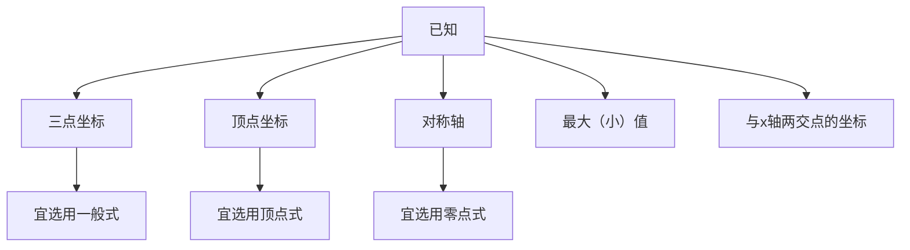
</details>

# 随堂加练

已知二次函数 $f(x)$ 满足 $f(x - 2) = f(-x - 2)$ ，且 $f(x)$ 的图象与 $y$ 轴交点的纵坐标为1，被 $x$ 轴截得的线段长为 $2\sqrt{2}$ ，则 $f(x)$ 的解析式为 $\underline{\quad}, f(2) = \underline{\quad}$ .

# 考点目 二次函数的图象与性质

# 考向1 二次函数的图象

例 3 （多选题）已知二次函数 $y=ax^{2}+bx+c$ 的图象如图所示，则下列结论正确的是（）.

A. $b = -2a$

B. $a + b + c <   0$

C. $a+c<b$

D. abc < 0

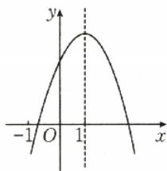

<details>
<summary>line</summary>

| x | y |
|---|---|
| -1 | 0 |
| 0 | 1 |
| 1 | 0 |
| 2 | 0 |
</details>

# 方法总结

# 识别二次函数图象应学会“三看”

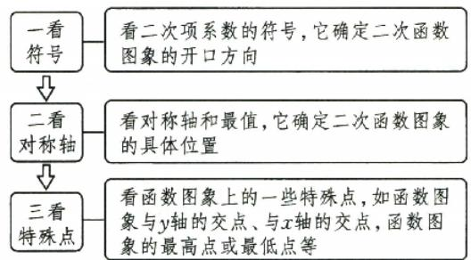

<details>
<summary>flowchart</summary>

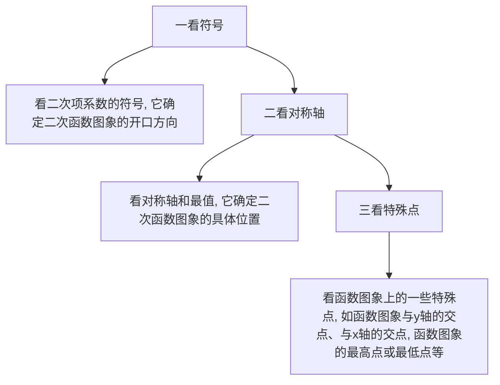
</details>

# 考向2 二次函数的单调性与最值

例 4 已知函数 $f(x)=x^{2}+ax+3-a, a \in \mathbb{R}$ .

(1) 若 $y = f(x)$ 在区间 $[-1, 3]$ 上是单调函数，求实数 $a$ 的取值范围；  
(2) 当 $0 \leqslant x \leqslant 2$ 时, 函数 $y = f(x)$ 的最小值是关于 $a$ 的函数 $m(a)$ , 求 $m(a)$ 的表达式.

# 方法总结

# 二次函数的单调性与最值问题的解题策略

(1)二次函数在闭区间上的最值主要有三种类型:轴定区间定、轴动区间定、轴定区间动.不论哪种类型,解题的关键都是分析对称轴与区间的位置关系,当含有参数时,要根据对称轴与区间的位置关系进行分类讨论.  
(2)二次函数的单调性问题主要根据二次函数图象的对称轴进行分类讨论并求解.

# 考向3 与二次函数有关的恒成立问题

例 5 题练透。已知函数 $f(x)=8x^{2}+16x-k$ ， $g(x)=2x^{2}+4x+4$ ，其中 k 为实数.

(1)对任意 $x \in [-3, 3]$ , 都有 $f(x) \leqslant g(x)$ , 求 $k$ 的取值范围;

(2) 存在 $x \in [-3, 3]$ , 使 $f(x) \leqslant g(x)$ 成立, 求 $k$ 的取值范围;  
(3) 对任意 $x_{1}, x_{2} \in [-3, 3]$ , 都有 $f(x_{1}) \leqslant g(x_{2})$ , 求 $k$ 的取值范围.

# 方法总结

# 由不等式恒成立求参数取值范围的思路及关键

(1)一般有两个解题思路:一是分离参数;二是构造新函数.  
(2)这两种思路都是将问题归结为求函数的最值,至于用哪种方法,关键是看参数是否已分离.这两个思路的依据是: $a\geqslant f(x)$ 恒成立 $\Leftrightarrow a\geqslant f(x)_{\max},a\leqslant f(x)$ 恒成立 $\Leftrightarrow a\leqslant f(x)_{\min}$ .

# 随堂加练

1. 在同一直角坐标系中, 二次函数 $y = ax^2 + bx$ 与幂函数 $y = x^{\frac{b}{a}} (x > 0)$ 图象的关系可能为( ).

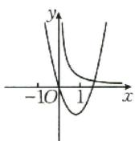  
A

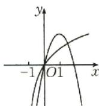  
B

  
C

  
D

2.（多选题）已知定义在 $\mathbf{R}$ 上的函数 $f(x) = -x^3 + m$ 与函数 $g(x) = f(x) + x^3 + x^2 - kx$ 在[-1,1]上具有相同的单调性，则 $k$ 的取值可以是（ ）.

A. 1

B. $\frac{3}{2}$

C. 2

D. 3

3. 已知函数 $f(x) = -2x^{2} + bx + c$ ，不等式 $f(x) > 0$ 的解集为 $(-1, 3)$ . 若对任意的 $x \in [-1, 0]$ , $f(x) + m \geqslant 4$ 恒成立，则实数 $m$ 的取值范围是（ ）.

A. $(-∞,2]$

B. $[4,+\infty)$

C. $[2, +\infty)$

D. $(-∞,4]$

4. 已知函数 $f(x)=ax^{2}-2x(0 \leqslant x \leqslant 1)$ ，求 $f(x)$ 的最小值.

# 第10课时 指数与指数函数

# 课标要求

1. 了解指数幂的拓展过程, 掌握指数幂的运算性质.

2. 了解指数函数的实际意义, 理解指数函数的概念.

3. 会画出具体指数函数的图象, 理解指数函数的单调性与特殊点.

# 必备知识·逐点梳理

# 一、指数与指数运算

1. 根式的性质

(1) $(\sqrt[n]{a})^{n}=$ \_\_\_\_ (a 使 $\sqrt[n]{a}$ 有意义).  
(2) 当 $n$ 是奇数时, $\sqrt[n]{a^n} = a$ ; 当 $n$ 是偶数时,

$$
\sqrt [ n ]{a ^ {n}} = \underline {{\quad}} = \left\{ \begin{array}{l} a, a \geqslant 0, \\ - a, a <   0. \end{array} \right.
$$

2. 分数指数幂的意义

(1) $a^{\frac{m}{n}}=\sqrt[n]{a^{m}}\quad(a>0,m,n\in\mathbf{N}^{*},\text{且}n>1);$   
(2) $a^{-\frac{m}{n}}=\frac{1}{a^{\frac{m}{n}}}=\frac{1}{\sqrt[n]{a^{m}}}(a>0,m,n\in\mathbf{N}^{*},$ 且 $n>1)$ ;   
(3)0 的正分数指数幂等于 0,0 的负分数指数幂 \_\_\_\_.

3. 有理数指数幂的运算性质: $a^r \cdot a^s =$

$$
\begin{array}{r l} (a ^ {r}) ^ {s} = & \underline {{\quad}} (a > 0, r, s \in \mathbf {Q}), (a b) ^ {r} = \\ & \underline {{\quad}} (a > 0, b > 0, r \in \mathbf {Q}). \end{array}
$$

微思考

等式 $(\sqrt[n]{a})^n = a$ 以及 $\sqrt[n]{a^n} = a$ 一定成立吗？

提醒 化简 $\sqrt[n]{a^{n}}$ 时, 一定要注意区分 n 是奇数还是偶数.

# 二、指数函数的图象与性质

<table><tr><td></td><td>01</td><td>a&gt;1</td></tr><tr><td>图象</td><td></td><td></td></tr><tr><td rowspan="5">性质</td><td colspan="2">定义域:</td></tr><tr><td colspan="2">值域:</td></tr><tr><td colspan="2">过定点</td></tr><tr><td>当x&gt;0时,_;当x&lt;0时,</td><td>当x&gt;0时,_;当x&lt;0时,</td></tr><tr><td>在R上是_函数</td><td>在R上是_函数</td></tr></table>

提醒 (1)画指数函数 $y = a^{x} (a > 0$ ，且 $a \neq 1$ ) 的图象，应抓住三个关键点：(0,1)，(1,a)， $\left(-1, \frac{1}{a}\right)$ .

(2) 讨论指数函数的性质时, 要注意分底数 a > 1 和 0 < a < 1 两种情况.  
(3)如图,这是指数函数① $y=a^{x}$ , ② $y=b^{x}$ , ③ $y=c^{x}$ , ④ $y=d^{x}$ 的图象,底数a,b,c,d与1之间的大小关系为c>d>1>a>b>0.由此我们可得到以下规律:在第一象限


<details>
<summary>text_image</summary>

y
①
②
③
④
1
O
x=1
x
</details>

内，指数函数 $y=a^{x}(a>0,$ 且 $a\neq1)$ 的图象越高，底数越大.

# 考点一 指数幂的运算

例1（1）教材溯源题。（北师大必修① $\mathrm{P}_{82}\mathrm{A}$ 组 $\mathrm{T}_{3}$ 改编)计算： $\left(\frac{1}{4}\right)^{-2} + 27^{-\frac{1}{3}} - (\sqrt{3} -1)^0 +256^{\frac{3}{4}}-$ $3^{-1} =$

(2) 教材溯源题 (苏教必修① $P_{86}T_{5}$ 改编) 化简: $\frac{\sqrt{a^{3}b^{2}\sqrt[3]{ab^{2}}}}{(\sqrt[4]{ab^{\frac{1}{2}})^{4}a^{-\frac{1}{3}}b^{\frac{1}{3}}}$ (a>0, b>0) = \_\_\_\_.

(3)教材溯源题。(人A必修① $P_{110}T_{7}$ 改编)已知 $10^{m}=2,10^{n}=3$ ，则 $10^{\frac{3m-2n}{2}}=$ \_\_\_\_.  
(4) 教材溯源题。(湘教必修① $P_{105}T_{10}$ 改编)若 $a^{\frac{1}{2}}+a^{-\frac{1}{2}}=3$ ，则 $a^{2}+a^{-2}=$ \_\_\_\_.

# 方法总结

# 指数幂的运算

(1) 运算顺序: 有括号的先算括号内的, 无括号的先进行指数的乘方、开方, 再乘除后加减, 底数是负数的先确定符号.  
(2)运算基本原则:①化负指数为正指数;②化根式为分数指数幂;③化小数为分数,化带分数为假分数.

# 随堂加练

(多选题)下列计算正确的是().

A. $\sqrt[12]{(-3)^{4}}=\sqrt[3]{-3}$   
B. $(a^{\frac{2}{3}}b^{\frac{1}{2}})(-3a^{\frac{1}{2}}b^{\frac{1}{3}})\div\left(\frac{1}{3}a^{\frac{1}{5}}b^{\frac{5}{6}}\right)=-9a(a>$

$$
0, b > 0)
$$

C. $\sqrt[4]{9x^{8}y^{4}}=-\sqrt{3}x^{2}y(x<0,y<0)$   
D. 已知 $x^{2}+x^{-2}=2$ ，则 $x+x^{-1}=2$

# 考点二 指数函数的图象及应用

例 2 （1）函数 $f(x)=a^{x-b}$ 的图象如图所示，其中 a, b 为常数，则下列结论正确的是（）.


A. a > 1, b < 0   
B. a > 1, b > 0   
C. 0 < a < 1, b > 0   
D. 0 < a < 1, b < 0

(2)若函数 $y = |2^x - 1|$ 的图象与直线 $y = b$ 有两个公共点，则实数 $b$ 的取值范围为 \_\_\_\_.

# 方法总结

# 有关指数函数图象问题的解题思路

(1) 已知函数解析式判断其图象, 一般取特殊点, 判断选项中的图象是否过这些点, 若不满足则排除.  
(2)对于有关指数型函数的图象问题,一般从最基本的指数函数的图象入手,通过平移、伸缩、对称变换得到.特别地,当底数a与1的大小关系不确定时应注意分类讨论.  
(3)有关指数方程、不等式问题的求解,往往是利用相应的指数型函数图象,数形结合求解.  
(4)对于指数函数图象判断底数大小的问题，可以利用直线 x=1 与图象的交点进行判断.

# 随堂加练

1.(多选题)已知函数 $f(x)=a^{x}-b(a>0$ ，且 $a\neq1, b\neq0$ 的图象如图所示，则().


A. a > 1

B. 0 < a < 1

C. b > 1

D. 0<b<1

2. 若函数 $y = \left|3^{x} - 1\right|$ 在 $(-∞, k]$ 上单调递减，则实数 k 的取值范围为 \_\_\_\_.

# 考点目 指数函数的性质及应用

热点考情: 指数函数的性质及应用是高考的命题热点, 多以选择题或填空题的形式呈现, 重点考查比较大小、解方程或不等式、求值域等问题, 难度中等或中等以下.

# 考向1 比较指数幂大小

例 3 教材 溯源题。(人 A 必修① $P_{119}T_{6}$ 改编)已知 $a=0.75^{0.1},b=1.01^{2.7},c=1.01^{3.5}$ ，则()。

A. $a > b > c$

B. a > c > b

C. c > b > a

D. c > a > b

# 考向2 解简单的指数方程或不等式

例 4 （1）教材 溯源题。（北师大必修①P $_{94}$ A 组 T $_{1}$ 改编）若 x 满足方程 $2^{x^2+1} = \left( \frac{1}{4} \right)^{x-2}$ ，则 x = \_\_\_\_.

(2)教材 溯源题。(北师大必修①P $_{95}$ C组T $_{1}$ 改编)已知y=4 $^{x}$ -3·2 $^{x}$ +3的值域为[1,7],则x的取值范围是\_\_\_\_.

# 考向3 指数函数性质的综合应用

例 5 （1）（2023·新高考Ⅰ卷）设函数 $f(x)=2^{x(x-a)}$ 在区间 $(0,1)$ 上单调递减，则 a 的取值范围是（）.

A. $(-∞,-2]$

B. $\left[-2,0\right)$

C. $(0,2]$

D. $[2,+\infty)$

(2)(多选题)(2025·浙江杭州高三模拟)已知函数 $f(x)=\frac{3^{x}-1}{3^{x}+1}$ ，下列说法正确的是().

A. $f(x)$ 的图象关于原点对称  
B. $f(x)$ 的图象关于 y 轴对称  
C. $f(x)$ 的值域为 $(-1,1)$   
D. $\forall x_{1},x_{2}\in \mathbf{R}$ ，且 $x_{1}\neq x_{2},\frac{f(x_{1}) - f(x_{2})}{x_{1} - x_{2}} < 0$

# 方法总结

有关指数型函数性质的常考题型及求解策略

<table><tr><td>题型</td><td>求解策略</td></tr><tr><td>比较幂值的大小</td><td>(1)能化成同底数幂的先化成同底数幂,再利用单调性比较大小;(2)不能化成同底数幂的,一般引入“1”“0”“ $\frac{1}{2}$ ”等中间量来比较大小</td></tr></table>

续表

<table><tr><td>题型</td><td>求解策略</td></tr><tr><td>解简单指数不等式</td><td>先利用幂的运算性质化为同底数幂,再利用单调性转化为一般不等式求解</td></tr><tr><td>探究指数型函数的性质</td><td>与研究一般函数的定义域、单调性(区间)、奇偶性、最值(值域)等性质的方法一致</td></tr></table>

# 随堂加练

1.(2023·天津卷)设 $a=1.01^{0.5},b=1.01^{0.6},c=0.6^{0.5}$ ，则a,b,c的大小关系为().

A. a < b < c

B. $b < a < c$

C. $c < b < a$

D. c<a<b

2. 若 x 满足不等式 $2^{x^{2}+1} \leqslant \left(\frac{1}{4}\right)^{x-2}$ ，则函数 $y = 2^{x}$ 的值域是（）.

A. $\left[\frac{1}{8},2\right)$

B. $\left[\frac{1}{8},2\right]$

C. $\left(-\infty,\frac{1}{8}\right]$

D. $[2, +\infty)$

3.（多选题）已知函数 $f(x) = \frac{\mathrm{e}^x - 1}{\mathrm{e}^x + 1}$ ，则下列结论正确的是（ ）.

A. 函数 $f(x)$ 的定义域为 $\mathbf{R}$   
B. 函数 $f(x)$ 的值域为 $(-1,1)$   
C. 函数 $f(x)$ 是奇函数  
D. 函数 $f(x)$ 为减函数

4. 已知函数 $f(x) = 2^{|2x - m|}$ ( $m$ 为常数), 若 $f(x)$ 在区间 $[2, +\infty)$ 上是增函数, 求实数 $m$ 的取值范围.

# 第11课时 对数与对数函数

# 课标要求

1. 理解对数的概念及其运算性质，会用换底公式将一般对数转化成自然对数或常用对数.

2. 了解对数函数的概念, 能画出具体对数函数的图象, 了解对数函数的单调性与特殊点.

3. 知道对数函数 $y=\log_{a}x(a>0,$ 且 $a\neq1)$ 与指数函数 $y=a^{x}(a>0,$ 且 $a\neq1)$ 互为反函数.

# 必备知识·逐点梳理

# 一、对数的概念

一般地, 如果 $a^{x}=N(a>0$ , 且 $a\neq1)$ , 那么数 x 叫作以 a 为底 N 的对数, 记作 \_\_\_\_ , 其中 \_\_\_\_ 叫作对数的底数, \_\_\_\_ 叫作真数.

提醒 (1)以 10 为底的对数叫作常用对数,记作 $\lg N$ .

(2)以 e 为底的对数叫作自然对数,记作 $\ln N$ .

# 二、对数的性质与运算性质

1. 对数的性质: $\log_{a}1=$ \_\_\_\_ , $\log_{a}a=$ \_\_\_\_ , $a^{\log_{a}N}=$ \_\_\_\_ (a>0, 且 $a\neq1,N>0$ ).

2. 对数的运算性质

如果 $a > 0$ ，且 $a \neq 1, M > 0, N > 0$ ，那么：

(1) $\log_{a}(MN)=$ \_\_\_\_;

(2) $\log_{a}\frac{M}{N}=$ \_\_\_\_；

(3) $\log_{a}M^{n}=$ \_\_\_\_ ( $n\in R$ ).

# 微判断

(1) 若 $M = N$ ，则 $\log_a M = \log_a N$ . （ ）

(2) 若 $MN > 0$ ，则 $\log_a(MN) = \log_aM + \log_aN.$ （）

3. 对数换底公式: $\log_{a}b=\frac{\log_{c}b}{\log_{c}a}(a>0,$ 且 $a\neq1; b>0;c>0,$ 且 $c\neq1).$

提醒 (1) 换底公式的变形

① $\log_a b \cdot \log_b a = 1$ ，即 $\log_a b = \frac{1}{\log_b a} (a, b$ 均大于0且不等于1).

② $\log_{a^{m}}b^{n}=\frac{n}{m}\log_{a}b(a,b$ 均大于0且不等于1, $m\neq0,n\in R$ .

③ $\log_N M = \frac{\log_a M}{\log_a N} = \frac{\log_b M}{\log_b N}$ ( $a, b, N$ 均大于0且不等于 $1, M > 0$ ).

(2)换底公式的推广

$\log_{a}b\cdot\log_{b}c\cdot\log_{c}d=\log_{a}d(a,b,c$ 均大于0且不等于1,d>0).

# 三、对数函数的图象与性质

<table><tr><td></td><td>a&gt;1</td><td>0</td></tr><tr><td>图象</td><td></td><td></td></tr><tr><td>定义域</td><td colspan="2">____</td></tr><tr><td>值域</td><td colspan="2">R</td></tr><tr><td rowspan="3">性质</td><td colspan="2">过定点____,即当x=1时,y=0</td></tr><tr><td>当x&gt;1时,____;当0当x&gt;1时,____;当0</td><td>当x&gt;1时,____;当0</td></tr><tr><td>____函数</td><td>____函数</td></tr></table>

提醒 对数函数的图象与底数大小的比较,如图,


作直线 $y = 1$ ，则该直线与四个函数图象交点的横坐标为相应的底

数. 故 0<c<d<1<a<b. 由此我们可得到以下规律：在第一象限内，对数函数的图象从左到右对应的函数的底数逐渐增大.

# 四、反函数

指数函数 $y=a^{x}(a>0,$ 且 $a\neq1)$ 与对数函数 $y=\log_{a}x(a>0,$ 且 $a\neq1)$ 互为反函数，它们的图象关于直线 \_\_\_\_ 对称.

# 考点一 对数的运算

例1（1）教材 溯源题（北师大必修① $\mathrm{P}_{103}$ 练习 $\mathrm{T}_{2}$ 改编） $\log_5 35 + 2 \log_{\frac{1}{2}} \sqrt{2} - \log_5 \frac{1}{50} - \log_5 14 =$ \_\_\_\_.

(2)教材 溯源题 (人 A 必修① $P_{126}$ 练习 $T_{3}$ 改编) $2(\log_{4}3+\log_{8}3)(\log_{3}2+\log_{9}2)=$   
(3)教材 溯源题。(苏教必修① $P_{99}T_{12}$ 改编) $e^{ln3}+$ $\log_{\sqrt{5}}25+0.125^{-\frac{2}{3}}=$ \_\_\_\_.   
(4)教材溯源题。(湘教必修① $P_{117}$ 例3改编)若 $\log_{14}7=a,14^{b}=5$ ，则 $\log_{35}28=$ \_\_\_\_（用a,b表示）.

# 方法总结

# 解决对数运算问题的常用方法

(1) 将真数化为底数的指数幂的形式进行化简.  
(2) 将同底对数的和、差、倍合并.   
(3) 利用换底公式将不同底的对数式转化成同底的对数式, 要注意换底公式的正用、逆用及变形应用.

# 随堂 加练

1.(多选题)下列各式中,结果为1的是().

A. $\log_{5}3\times\log_{3}2\times\log_{2}5$   
B. $\lg \sqrt{2} + \frac{1}{2}\lg 5$   
C. $\log_{\sqrt{a}} a^2 (a > 0$ ，且 $a \neq 1)$   
D. $\mathrm{e}^{\ln 3} - 0.125^{-\frac{1}{3}}$

2. 若 $2^{a}=3^{b}=m$ ，且 $\frac{1}{a}+\frac{1}{b}=2$ ，则 m= \_\_\_\_.

# 考点二 对数函数的图象及应用

# 走进教材

例 2 教材 溯源题。(人 A 必修① $P_{139}T_{4}$ 改编)函数 y=f(x) 的图象如图所示，则 y=f(x) 可能是().

A. $y = 1 - x^{-1}, x \in (0, +\infty)$   
B. $y = \frac{3}{2} -\left(\frac{1}{2}\right)^x,x\in (0,$ $+\infty)$   
C. $y=\ln x$   
D. $y = x - 1, x \in (0, +\infty)$


<details>
<summary>line</summary>

| x | y = f(x) |
|---|----------|
| 0 | -1       |
| 1 | 0        |
| 2 | 1        |
| 3 | 2        |
| 4 | 3        |
</details>

# 走向高考

例 3 经典 高考题。已知函数 $f(x)=\log_{a}(2^{x}+b-1)(a>0,$ 且 $a\neq1)$ 的图象如图所示，则 a,b 满足的关系是（）.

A. $0 < a^{-1} < b < 1$   
B. $0 < b < a^{-1} < 1$   
C. $0 < b^{-1} < a < 1$   
D. $0 < a^{-1} < b^{-1} < 1$


<details>
<summary>text_image</summary>

y
O
x
-1
</details>

# ■方法总结

# 对数函数图象的识别及应用方法

(1) 在识别函数图象时, 要善于利用已知函数的性质、函数图象上的特殊点 (与坐标轴的交点、最高点、最低点等) 排除不符合要求的选项.  
(2)一些对数型方程、不等式问题常可转化为相应的函数图象问题,利用数形结合法求解.

# 随堂加练

1. 数学 文化题。我国著名数学家华罗庚先生曾说：“数缺形时少直观，形缺数时难入微。数形结合百般好，隔离分家万事休。”在数学的学习和研究中，我们常用函数的图象来研究函数的性质，也常用函数解析式来琢磨函数的图象特征，函数 $f(x) = a^{x}$ 与 $g(x) = \log_{\frac{1}{a}} x (a > 0, \text{且 } a \neq 1)$ 在同一坐标系中的大致图象是（ ）.

  
A

  
B

  
C

  
D

2. 已知 $a > 0$ ，且 $a \neq 1$ ，函数 $y = a^x$ 的图象如图所示，则函数 $f_x(x) = \log_a(-x + 1)$ 的部分图象大致为（ ）.


  
A

  
B

  
C

  
D

# 考点目 对数函数的性质及应用

热点考情: 对数函数的性质及应用是高考命题的热点, 多以客观题的形式呈现, 重点考查比较大小、解不等式等问题, 难度中等.

# 考向 1 比较大小

例 4 教材 溯源题。(人 A 必修① $P_{141}T_{13}$ 改编) 设 $a=\log_{4}12,b=\log_{5}15,c=\log_{6}18$ ，则().

A. a > b > c

B. b>c>a

C. $a > c > b$

D. $c > b > a$

# 考向2 解对数方程或不等式

例 5 解下列方程或不等式.

(1) 教材 溯源题。(北师大必修① $P_{100}B$ 组 $T_{1}$ 改编) $\log_{(2x^{2}-1)}(3x^{2}+2x-1)=1$ ;  
(2) 教材 溯源题。(苏教必修 ① $P_{159}T_{13}$ 改编) $\log_{3}(x+1)>-1;$   
(3)教材 溯源题 (北师大必修① $P_{113}$ 练习 $T_{2}$ 改编) $\log_{\frac{1}{2}}x>\log_{\frac{1}{2}}(3x-2)$ .

# 考向3 对数函数性质的综合应用

例6（1）已知函数 $f(x) = \ln (2 + 2x) + \ln (3 - 3x)$ ，则 $f(x)$ （ ）.

A. 是奇函数, 且在(0,1)上单调递增  
B. 是奇函数, 且在(0,1)上单调递减  
C. 是偶函数, 且在(0,1)上单调递增  
D. 是偶函数, 且在(0,1)上单调递减

(2) 若 $f(x)=\lg(x^{2}-2ax+1+a)$ 在 $(-∞,1]$ 上单调递减，则实数 a 的取值范围为（）.

A. $[1,2)$   
B. $[1,2]$   
C. $[1,+\infty)$   
D. $[2,+\infty)$

# 方法总结

1. 比较对数大小的类型及相应方法


<details>
<summary>flowchart</summary>


</details>

2. 求解对数不等式的两种类型及方法

类型一： $\log_a x > \log_a b$ ，借助 $y = \log_a x$ 的单调性求解,如果 a 的取值不确定,那么需分 a>1 与 0<a<1 两种情况讨论.

类型二: $\log_{a}x>b$ , 需先将 b 化为以 a 为底的对数的形式, 再借助 $y=\log_{a}x$ 的单调性求解.

3. 在判断对数型复合函数的单调性时, 一定要明确底数 $a$ 对单调性的影响, 以及真数必须为正数的限制条件.

# 随堂加练

1. 经典高考题。设 $a = \log_2 0.3, b = \log_{\frac{1}{2}} 0.4, c = 0.4^{0.3}$ ，则 $a, b, c$ 的大小关系为（ ）.

A. a < b < c

B. $c < a < b$

C. b<c<a

D. a<c<b

2. 设函数 $f(x) = \ln |x + 3| + \ln |x - 3|$ ，则 $f(x)()$ .

A. 是偶函数, 且在 $(- \infty, -3)$ 上单调递减  
B. 是奇函数, 且在 $(-3, 3)$ 上单调递减  
C. 是奇函数, 且在 $(3, +\infty)$ 上单调递增  
D. 是偶函数, 且在 $(-3, 3)$ 上单调递增

3. 若函数 $f(x)=\log_{a}(3-2ax)(a>0$ ，且 $a\neq1)$ 在区间 $[1,2]$ 上单调递增，则实数 a 的取值范围为 \_\_\_\_.

4. 教材 溯源题。(人 A 必修 ① $P_{141}T_{12}$ 改编) 若 $\log_{a}\frac{1}{2}<2$ ，则实数 a 的取值范围是 \_\_\_\_.

请完成《课时作业》P24\~P25

# 强化课 04 指、对、幂比较大小

对应答案分册第 21 页

指数与对数是高中一个重要的知识点,也是高考必考考点,其中指数、对数及幂的大小比较是近几年的高考热点和难点,主要考查指数、对数的互化和运算性质,以及指数函数、对数函数和幂函数的性质,一般以选择题或填空题的形式呈现.

# 类型一 函数性质法

典例1 (1)(2024·天津卷)若 $a = 4.2^{-0.3}$ , $b = 4.2^{0.3}$ , $c = \log_{4.2}0.2$ , 则 $a, b, c$ 的大小关系为( ).

A. $a > b > c$

B. $b > a > c$

C. $c > a > b$

D. $b > c > a$

(2)设 $a=\left(\frac{4}{3}\right)^{\frac{2}{3}}$ , $b=\left(\frac{4}{3}\right)^{\frac{3}{4}}$ , $c=\left(\frac{3}{2}\right)^{\frac{3}{4}}$ ,则a,b,c的大小关系是().

A. $a > c > b$   
B. $a > b > c$   
C. $c > b > a$   
D. $b > c > a$

# 方法总结

利用函数的性质的基本思路为求同存异: 如果两个指数(或对数)的底数相同, 那么可通过幂(或真数)的大小与指数(或对数)函数的单调性, 判断出指数(或对数)的大小关系.

# 强化训练

(2025·福建高三模拟)若 $a = \left(-\frac{2}{3}\right)^{\frac{2}{3}}, b = \left(-\frac{1}{3}\right)^{\frac{2}{3}}, c = \log_{\frac{2}{3}}\frac{1}{3}$ , 则（ ）.

A. $c > a > b$

B. $c > b > a$

C. $a > b > c$

D. $b > c > a$

# 类型二 中间量（特殊值）法

典例 2 (1) 已知 $a = \log_{5}3, b = 2^{\frac{1}{2}}, c = 7^{-0.5}$ ，则 a, b, c 的大小关系为().

A. $a > b > c$

B. $a > c > b$

C. $b > a > c$

D. $c > b > a$

(2)已知 $a=\log_{5}2,b=\frac{1}{\log_{0.1}0.7},c=0.7^{0.3}$ ，则a，
b,c 的大小关系为().

A. $a < c < b$

B. $a < b < c$

C. b<c<a

D. c<a<b

# 方法总结

利用特殊值作“中间量”比较大小的关键是寻找合适的中间值，如常考虑 $a, b, c$ 与特殊数值“0”“1”“ $\frac{1}{2}$ ”的大小关系.

# 强化训练

1. 名师原创题。已知 $a = 2026^{0.9}, b = 0.9^{2026}, c = \log_{2026}0.9$ ，则（ ）.

A. $a > b > c$

B. $b > a > c$

C. $c > b > a$

D. $a > c > b$

2. 已知 $a = 2^{0.2}, b = 1 - 2\lg 2, c = 2 - \log_3 10$ ，则 $a, b, c$ 的大小关系是（ ）.

A. $b > c > a$

B. $a > b > c$

C. $a > c > b$

D. $b > a > c$

请完成《课时作业》P26

# 第12课时 函数的图象

对应答案分册第22页

# 课标要求

1. 在实际情境中，会根据不同的需要选择恰当的方法（如图象法、列表法、解析法）表示函数.

2. 会运用函数图象理解和研究函数的性质, 解决方程解的个数与不等式解集的问题.

# 必备知识·逐点梳理

# 一、利用描点法作函数图象的方法步骤

1. 确定函数的 \_\_\_\_.  
2. 化简函数的 \_\_\_\_.  
3. 讨论函数的\_\_\_\_，即奇偶性、周期性、单调性、最值（甚至变化趋势）.   
4. 描点连线, 画出函数的图象.

# 二、利用图象变换法作函数的图象

1. 平移变换


<details>
<summary>flowchart</summary>

```mermaid
graph TD
    A["y="] -->|左移 h(h>0)个 单位长度| B["y=f(x)"]
    B -->|上移 k(k>0) 个单位长度| C["y="]
    B -->|下移 k(k>0) 个单位长度| D["y="]
    C -->|右移 h(h>0)个 单位长度| E["y="]
```
</details>

# 微思考

函数 $y = \lg (2x)$ 的图象向左平移1个单位长度能得到函数 $y = \lg (2x + 1)$ 的图象吗？函数 $y = 2^{-x + 1}$ 的图象向右平移1个单位长度能得到 $y = 2^{-x}$ 的图象吗？

提醒 函数左右平移仅仅是相对 $x$ 而言的，即发生变化的只是 $x$ 本身，利用“左加右减”进行操作。如果 $x$ 的系数不是1，需要把系数提出来，再进行变换。

# 2. 伸缩变换

(1) $y=f(x)$

$$
\begin{array}{r l} & \xrightarrow {a > 1 , \text {横坐标缩短为原来的} \frac {1}{a} , \text {纵坐标不变}} \\ & 0 <   a <   1, \text {横坐标伸长为原来的} \frac {1}{a} \text {倍}, \text {纵坐标不变} \\ & = \underline {{\quad}}. \end{array}
$$

$$
\begin{array}{l} y = f (x) \tag {2} \\ \frac {a > 1 , \text {纵坐标伸长为原来的} a \text {倍} , \text {横坐标不变}}{0 <   a <   1 , \text {纵坐标缩短为原来的} a , \text {横坐标不变}} \\ = \underline {{\quad}}. \\ \end{array}
$$

y

# 3. 对称变换

(1) $y=f(x)\xrightarrow{\text{关于 }x\text{ 轴对称}}y=$ \_\_\_\_.

(2) $y=f(x)\xrightarrow{\text{关于 }y\text{ 轴对称}}y=$ \_\_\_\_.

(3) $y=f(x)\xrightarrow{关于原点对称}y=$ \_\_\_\_.

(4) $y=a^{x}(a>0,\text{且}a\neq1)\xrightarrow{\text{关于}y=x\text{对称}}y=$ $\log_{a}x(a>0,\text{且}a\neq1).$

# 4. 翻折变换

(1) $y=f(x)\xrightarrow[\text{将}x\text{轴下方图象翻折上去}]{\text{保留}x\text{轴上方图象}}y=$ \_\_\_\_.

(2) $y=f(x)\xrightarrow[\text{关于}y\text{轴对称的图象}]{\text{保留}y\text{轴右边图象,并作其}}y=$ \_\_\_\_.

# 微判断

(1)函数 $y = af(x)$ 与 $y = f(ax)(a > 0$ ，且 $a\neq 1)$ 的图象相同. （）  
(2)函数 $y = f(x)$ 与 $y = -f(x)$ 的图象关于原点对称. （）  
(3)当 $x\in (0, + \infty)$ 时，函数 $y = |f(x)|$ 与 $y = f(|x|)$ 的图象相同. （）

# 关键考点·核心突破

# 考点一

# 作函数的图象

例1 作出下列函数的图象：

(1) $y=\left|\log_{2}(x+1)\right|$ ;   
(2) $y=x^{2}-2|x|-1;$   
(3) $y=\left(\frac{1}{2}\right)^{|x|}$ ;

(4) $y=\frac{2x-1}{x-1}.$

# ■方法总结

# 函数图象的常见画法

(1) 描点法作图: 当函数解析式(或变形后的解析式)是熟悉的基本初等函数时, 可根据这些函数的特征描出图象的关键点, 进而直接作出函数的图象.

(2) 图象变换法: 若函数图象可由某个基本初等函数的图象经过平移、伸缩、翻折、对称得到, 则可利用图象变换作图.

# 随堂 加练

作出下列函数的图象：

(1) $y = x - |x - 1|$ ;   
(2) $y = |x^{2} - 4x + 3|$ ;   
(3) $y=\left(\frac{1}{2}\right)^{|x+2|}$ .

# 考点二 函数图象的识别

热点考情: 函数图象是研究函数性质、方程、不等式的重要工具, 已经成为高考命题的一个热点. 在高考中经常以几类初等函数图象为基础, 结合函数性质综合考查, 多以客观题的形式出现.

# 考向1 知式选图——根据函数解析式辨别图象

例2（2024·全国甲卷）函数 $f(x) = -x^{2} + (\mathrm{e}^{x} - \mathrm{e}^{-x})\sin x$ 在区间[-2.8,2.8]的图象大致为（ ）.


<details>
<summary>text_image</summary>

y
O
x
A
</details>


<details>
<summary>text_image</summary>

y
x
O
B
</details>

  
C

  
D

# 方法总结

根据函数解析式辨别图象的基本方法  


<details>
<summary>flowchart</summary>


</details>

# 考向 2 知图选式——根据图象辨别函数解析式

例3（2023·天津卷）已知函数 $y = f(x)$ 的图象如图所示，则 $f(x)$ 的解析式可能为（ ）.

A. $f(x) = \frac{5(\mathrm{e}^x - \mathrm{e}^{-x})}{x^2 + 2}$   
B. $f(x) = \frac{5\sin x}{x^2 + 1}$   
C. $f(x) = \frac{5(\mathrm{e}^x + \mathrm{e}^{-x})}{x^2 + 2}$   
D. $f(x) = \frac{5\cos x}{x^2 + 1}$


<details>
<summary>line</summary>

| x | y |
|---|---|
| -2 | -2 |
| 0 | 4 |
| 2 | 2 |
</details>

# 方法总结

# 由函数图象确定其解析式的基本方法

(1) 将图象的左右、上下分布情况与函数的定义域、值域进行对照.  
(2)根据图象的增减变化趋势,分析函数的单调性,与函数解析式进行对照.  
(3)根据图象的对称性特征,分析函数的奇偶性,与函数解析式进行对照.  
(4)根据图象的循环往复特征,分析函数的周期性,与函数解析式进行对照.

# 考向3 知图选图——根据图象辨别函数的图象

例4 若函数 $y = f(x)$ 的图象如图所示，则函数 $y = -f(x + 1)$ 的图象大致为（ ）.


  
A

  
B

  
C

  
D

# ■ 方法总结

若函数图象可由某个基本函数的图象经过平移、翻折、对称得到，可利用图象变换作出，并应注意平移变换与伸缩变换的顺序对变换单位及解析式的影响.

# 随堂加练

1.(2022·天津卷)函数 $f(x)=\frac{|x^{2}-1|}{x}$ 的图象大致为().

  
A

  
B

  
C

  
D

2.(2021·浙江卷)已知函数 $f(x)=x^{2}+\frac{1}{4}$ ， $g(x)=\sin x$ ，则图象为该图的函数可能是()。

A. $y = f(x) + g(x) - \frac{1}{4}$

B. $y = f(x) - g(x) - \frac{1}{4}$

C. $y = f(x)g(x)$

D. $y=\frac{g(x)}{f(x)}$


3. 若函数 $y = f(x)$ 的部分图象如图1所示，则图2所对应的函数解析式可以是（ ）.

  
图1

  
图2

A. $y = f(2x - \frac{1}{2})$

B. $y = f(2x - 1)$

C. $y=f\left(\frac{1}{2}x-\frac{1}{2}\right)$

D. $y = f\left(\frac{1}{2} x - 1\right)$

# 考点目 函数图象的应用

例 5 （1）把函数 $f(x)=\ln|x-a|$ 的图象向左平移 2 个单位长度，所得函数在 $(0,+\infty)$ 上单调递增，则 a 的最大值为（）.

A. 1

B. 2

C. 3

D. 4

(2)(多选题)记 $\max\{x,y,z\}$ 表示 x,y,z 中的最大值, 设函数 $f(x)=\max\{-x,x-3,-x^{2}+4x-2\}$ , 则下列实数 m 的取值范围中, 满足 $f(m)<1$ 的有().

A. $(-1,4)$

B. $(-1,1)$

C. $(3,4)$

D. $(4,+\infty)$

(3) 经典高考题。已知函数 $f(x)=|x-2|+1$ ， $g(x)=kx$ 。若方程 $f(x)=g(x)$ 有两个不相等的实数根，则实数 k 的取值范围是 \_\_\_\_。

# 方法总结

1. 利用函数的图象研究函数的性质

对于已知或易画出其在给定区间上图象的函数，常可以通过图象来研究其性质（单调性、奇偶性、周期性、最值（值域）、零点），但一定要注意性质与图象特征的对应关系.

2. 利用函数的图象可解决方程和不等式的求解问题, 如判断方程是否有解, 有多少个解. 数形结合是常用的思想方法. 不等式的求解可转化为两函数图象的上下关系问题.

# 随堂加练

1. 定义 $\max\{a,b,c\}$ 为 a,b,c 中的最大值，设 $y=\max\{2^{x},2x-3,6-x\}$ ，则 y 的最小值是（）.

A. 2

B. 3

C. 4

D. 6

2. 函数 $f(x)$ 是周期为 4 的偶函数，当 $x \in [0,2]$ 时， $f(x) = x - 1$ ，则不等式 $xf(x) > 0$ 在 $(-1,3)$ 上的解集为（ ）.

A. $(1,3)$

B. $(-1,1)$

C. $(-1,0)\cup(1,3)$

D. $(-1,0)\cup(0,1)$

3. 已知函数 $f(x) = \begin{cases} |3^{x+1} - 1|, & x \leqslant 0, \\ \ln x, & x > 0, \end{cases}$ 若 $y = f(x)$ 的图象与直线 $y = a$ 有三个交点，则实数 $a$ 的取值范围是（ ）.

A. $(0,1)$

B. $(0,2]$

C. $(2,+\infty)$

D. $(1,+\infty)$

请完成《课时作业》P27\~P28

# 第13课时 函数的零点与方程的解

对应答案分册第23页

# 课标要求

1. 会结合二次函数的图象, 判断一元二次方程实根的存在性及实根的个数, 了解函数的零点与方程根之间的联系.

2. 根据具体函数的图象, 能够借助计算工具利用二分法求相应方程的近似解.

# 必备知识·逐点梳理

# 一、函数的零点与方程的解

1. 函数零点的概念

对于一般函数 $y=f(x)$ ，我们把使 \_\_\_\_ 的实数 x 叫作函数 $y=f(x)$ 的零点.

2. 函数零点与方程实数解的关系

方程 $f(x)=0$ 有实数解 $\Leftrightarrow$ 函数 $y=f(x)$ 有 \_\_\_\_ $\Leftrightarrow$ 函数 $y=f(x)$ 的图象与 \_\_\_\_ 有公共点.

3. 函数零点存在定理

如果函数 $y=f(x)$ 在区间 $[a,b]$ 上的图象是一条连续不断的曲线，且有 \_\_\_\_ ，那么，函数 $y=f(x)$ 在区间 \_\_\_\_ 内至少有一个

零点, 即存在 $c \in (a, b)$ , 使得 \_\_\_\_, 这个 c 也就是方程 $f(x) = 0$ 的解.

# 微判断：

(1)函数的零点就是函数的图象与 $x$ 轴的交点. （ ）

(2)连续函数 $y=f(x)$ 在区间 $(a,b)$ 内有零点，则 $f(a)f(b)<0.$

(3) 连续函数 $y = f(x)$ 满足 $f(a)f(b) > 0$ ，则 $f(x)$ 在区间 $(a,b)$ 上没有零点.()

提醒 (1) 若连续函数 $f(x)$ 在定义域上是单调函数, 则 $f(x)$ 至多有一个零点. 函数的零点不是一个点, 而是一个数, 该数是方程 $f(x) = 0$ 的实根.

(2)由函数 $y=f(x)$ (图象是连续不断的) 在区间 $[a,b]$ 上有零点不一定能推出 $f(a)f(b)<0$ ，如图所示，所以“ $f(a)f(b)<0$ ”是“ $y=f(a)b$ 有零点”的充分不必要条件.


# 二、二分法

对于在区间 $[a, b]$ 上图象连续不断且 \_\_\_\_ 的函数 $y = f(x)$ , 通过不断地把它的零点所在区间 \_\_\_\_, 使所得区间的两个端点逐步逼近 \_\_\_\_, 进而得到零点近似值的方法叫作二分法.

# 微思考

所有的函数都可以用二分法得到零点的近似值吗？为什么？

# 关键考点·核心突破

# 考点一 函数零点所在区间的判定

题组 (1)教材溯源题。(人A必修① $\mathrm{P}_{144}$ 练习 $\mathrm{T}_{2}$ 改编)函数 $f(x) = \log_2x + x - 2$ 的零点所在的区间为（ ）.

A. $(0,1)$

B. $(1,2)$

C. $(2,3)$

D. $(3,4)$

(2)教材 潮源题。(人 A 必修① $P_{146}$ 练习 $T_{2}$ 改编) 方程 2x = 3 - lg x 的近似解所在的区间为().

A. $(0,1)$

B. $(1,2)$

C. $(2,3)$

D. $(3,4)$

(3)教材 溯源题。(人 A 必修① $P_{155}T_{1}$ 改编)下列图象所表示的函数中,不能用二分法求零点的是().

  
A

  
B

  
C

  
D

(4)用二分法求函数 $f(x) = 3^{x} - x - 4$ 的一个零点，其参考数据为：

<table><tr><td> $f(1.600\ 0)$  $\approx 0.200$ </td><td> $f(1.587\ 5)$  $\approx 0.133$ </td><td> $f(1.575\ 0)$  $\approx 0.067$ </td></tr><tr><td> $f(1.562\ 5)$  $\approx 0.003$ </td><td> $f(1.556\ 2)$  $\approx -0.029$ </td><td> $f(1.550\ 0)$  $\approx -0.060$ </td></tr></table>

据此数据,可得方程 $3^{x}-x-4=0$ 的一个近似解为 \_\_\_\_ (精确度为 0.01, 近似解保留 2 位小数).

# 方法总结

确定函数零点所在区间的常用方法: 利用函数零点存在定理; 数形结合法.

# 考点二 函数零点个数的判定

# 走进教材

例1 教材 洞源题。(苏教必修① $P_{253}T_{8}$ 改编)函数 $f(x)=\left\{\begin{aligned}&x^{2}+x-6,x\leqslant0,\\&\log_{3}(x+2)-2,x>0\end{aligned}\right.$ 的零点个数是( ).

A. 1

B. 2

C. 3

D. 4

# 走向高考

例2 经典高考题。函数 $f(x) = x^{\frac{1}{2}} - \left(\frac{1}{2}\right)^x$ 的零点个数为（ ）.

A. 0

B. 1

C. 2

D. 3

# 方法总结

# 求解函数零点个数的基本方法

(1) 直接法: 令 $f(x)=0$ , 方程有多少个不同的实数根, 则 $f(x)$ 有多少个零点.  
(2)定理法:利用函数零点存在定理时,往往还要结合函数的单调性、奇偶性等.  
(3) 图象法: 一般是把函数拆分为两个简单函数,依据两函数图象的交点个数得出函数的零点个数.

# 随堂加练

1. 一题多法函数 $f(x) = \begin{cases} x^2 + x - 2, & x \leqslant 0, \\ -1 + \ln x, & x > 0 \end{cases}$ 的零点个数为（ ）.

A. 3

B. 2

C. 7

D. 0

2. 若定义在 $\mathbf{R}$ 上的偶函数 $f(x)$ 满足 $f(x + 2) = f(x)$ ，且当 $x \in [0,1]$ 时， $f(x) = x$ ，则函数 $y = f(x) - \log_3 |x|$ 的零点（ ）.

A. 多于 4 个

B.有4个

C. 有 3 个

D.有2个

3. 函数 $f(x) = \left(\frac{1}{2}\right)^{|x|} - |\log_2 x|$ 的零点有 \_\_\_\_ 个.

# 考点目 函数零点的应用

热点考情: 函数的零点问题充分体现了函数与方程的联系, 蕴含了丰富的数形结合思想, 因此函数的零点问题一直是高考的热点, 且形式逐渐多样化, 各种题型均可考查.

# 考向1 根据零点个数求参数

例3 教材 溯源题。(人A必修① $\mathrm{P}_{160}\mathrm{T}_4$ 改编)已知函数 $f(x) = \left\{ \begin{array}{l}x^{2} + 2x - 3,x\leqslant 0,\\ -2 + \ln x,x > 0, \end{array} \right.$ 若方程 $f(x) = k$ $(k <   0)$ 的实数解个数为2，则实数 $k$ 的取值范围是

# 考向 2 根据零点范围求参数

例4 一题多法设 $k$ 为实数, 若函数 $f(x) = x^2 - 2^x + k$ 在区间 $[-1, 0]$ 上有零点, 则实数 $k$ 的取值范围是 \_\_\_\_.

# ■方法总结

# 根据函数零点的情况求参数的三种常用方法

(1) 直接法: 直接根据题设条件构建关于参数的不等式(组), 再通过解不等式确定参数(范围).  
(2) 分离参数法: 先将参数分离, 转化成求函数值域确定参数范围.  
(3) 数形结合法: 先对解析式变形, 在同一平面直角坐标系中画出函数的图象, 然后利用数形结合法求解.

# 随堂加练

1. 已知函数 $f(x) = \begin{cases} 2^x + 2 - a, & x < 1, \\ 9 - a - 2x, & x \geqslant 1 \end{cases}$ 恰有两个零点，则实数 $a$ 的取值范围是（ ）.

A. $(-∞,4)$

B. $(2,4)$

C. $(4,7)$

D. $(2,7)$

2. 教材 溯源题 (人 B 必修① $P_{126}$ 习题 3—2B T $_{3}$ 改编) 若函数 $f(x)=x^{3}+ax^{2}+bx+c$ 有三个零点 -1, 1, $x_{0}$ ，且 $x_{0}\in(2,3)$ ，求实数 c 的取值范围.

请完成《课时作业》P29\~P30

# 强化课 05 函数与方程的综合应用

函数与方程的综合应用是历年高考的一个热点内容,经常以客观题的形式出现,通过分析函数的性质,结合函数图象研究函数的零点或方程的根的分布、个数等,题目难度较大,一般作为压轴题出现.

# 类型一 函数零点的和、积问题

典例1（多选题）已知函数 $f(x) = \left\{ \begin{array}{ll}|\log_2(x - 1)|, & 1 < x \leqslant 3,\\ x^2 -8x + 16,x > 3, \end{array} \right.$ 若方程 $y = f(x) - m$

有 4 个不同的零点 $x_{1}, x_{2}, x_{3}, x_{4}$ , 且 $x_{1} < x_{2} < x_{3} < x_{4}$ , 则 ( ).

A. 0 < m < 2   
B. $x_{1} + x_{2} = x_{1}x_{2}$   
C. $x_{3} + x_{4} = 6$   
D. $\left(\frac{1}{x_1} +\frac{1}{x_2}\right)(x_3 + x_4) = 8$

# 方法总结

求解有关函数零点的和、积问题的三个关键点

(1) 确定函数零点的个数与位置(利用方程求解或借助图象).

(2) 利用根与系数的关系、对称轴等判断零点之和、积的关系.  
(3) 考虑函数的定义域和题干的限制条件, 避免错解.

# 强化训练

已知函数 $f(x) = \begin{cases} 2x^2 + 3x + 1, & x \leqslant 0, \\ |\log_2 x|, & x > 0, \end{cases}$ 若函数 $g(x) = f(x) + b$ 有四个不同的零点 $x_1, x_2, x_3, x_4$ ，且满足 $x_1 < x_2 < x_3 < x_4$ ，则下列结论错误的是（ ）.

A. -1 < b < 0

B. $x_{3}x_{4} = 1$

C. $\frac{1}{2} \leqslant x_{3} < 1$

D. $x_{1} + x_{2} = -\frac{3}{2}$

# 类型二 嵌套函数的零点问题

典例2 （1）已知函数 $f(x) =$

$\left\{ \begin{array}{l} \mathrm{e}^{-x} - 2, x \leqslant 1, \\ |\ln (x - 1)|, x > 1, \end{array} \right.$ 则函数 $g(x) = f(f(x)) -$

$2f(x)+1$ 的零点个数是().

A. 4

B. 5

C. 6

D. 7

(2)已知函数 $f(x) = -x^{2} - 2x, g(x) = \left\{ \begin{array}{ll} x + \frac{1}{4x}, & x > 0, \\ x + 1, & x \leqslant 0. \end{array} \right.$ 若方程 $g(f(x)) - a = 0$ 有4个

不同的实数根,则实数 a 的取值范围是 \_\_\_\_.

# ■方法总结

对于嵌套函数 $y=f(g(x))$ 的零点个数问题，求解思路如下：

(1) 确定内层函数 $u = g(x)$ 和外层函数 $y = f(u)$ ;  
(2) 确定外层函数 $y = f(u)$ 的零点 $u = u_{i} (i = 1, 2, 3, \cdots, n)$ ;  
(3) 确定直线 $u = u_{i} (i = 1, 2, 3, \cdots, n)$ 与内层函数 $u = g(x)$ 图象的交点个数，从而确定函数 $y = f(g(x))$ 的零点个数.

# 强化训练

1. 已知 $f(x)=\left\{\begin{aligned}&|\lg x|,x>0,\\ &2^{|x|},x\leqslant0,\end{aligned}\right.$ 则函数 $y=2[f(x)]^{2}-3f(x)+1$ 的零点个数是 \_\_\_\_.

2. 已知函数 $f(x) = \begin{cases} |\lg x|, & x > 0, \\ -x^2 - 2x + 1, & x \leqslant 0, \end{cases}$ 且关于 $x$ 的方程 $[f(x)]^2 - (2m + 1)f(x) + m^2 + m = 0$ 有7个不同的实数解，则实数 $m$ 的取值范围为 \_\_\_\_.

请完成《课时作业》P31

# 第14课时 函数的模型及其应用

对应答案分册第25页

# 课标要求

1. 了解指数函数、对数函数与一次函数增长速度的差异.

2. 理解“指数爆炸”“对数增长”“直线上升”等术语的含义.

3. 会选择合适的函数模型刻画现实问题的变化规律，了解函数模型在社会生活中的广泛应用。

# 必备知识·逐点梳理

# 一、三种函数模型的性质

<table><tr><td rowspan="2">性质</td><td colspan="3">函数</td></tr><tr><td> $y = a^{x}$  $(a > 1)$ </td><td> $y = \log_{a} x$  $(a > 1)$ </td><td> $y = x^{n}$  $(n > 0)$ </td></tr><tr><td>在 $(0, +\infty)$ 上的增减性</td><td>单调递增</td><td>单调递增</td><td>单调递增</td></tr><tr><td>增长速度</td><td>越来越快</td><td>越来越慢</td><td>相对平稳</td></tr></table>

提醒 “直线上升”是匀速增长,其增长量固定不变;“指数增长”先慢后快,其增长量成倍增加,常用“指数爆炸”来形容;“对数增长”先快后慢,其增长量越来越小.

# 二、常见的函数模型

<table><tr><td>函数模型</td><td>函数解析式</td></tr><tr><td>一次函数模型</td><td> $f(x)=ax+b(a,b \text{为常数},a\neq0)$ </td></tr><tr><td>二次函数模型</td><td> $f(x)=ax^{2}+bx+c(a,b,c \text{为常数},a\neq0)$ </td></tr><tr><td>与反比例函数相关的模型</td><td> $f(x)=\frac{k}{x}+b(k,b \text{为常数且}k\neq0)$ </td></tr><tr><td>与指数函数相关的模型</td><td> $f(x)=ba^{x}+c(a,b,c \text{为常数},a>0 \text{且}a\neq1,b\neq0)$ </td></tr><tr><td>与对数函数相关的模型</td><td> $f(x)=b\log_{a}x+c(a,b,c \text{为常数},a>0 \text{且}a\neq1,b\neq0)$ </td></tr><tr><td>与幂函数相关的模型</td><td> $f(x)=ax^{a}+b(a,b,\alpha \text{为常数},a\neq0,\alpha\neq0)$ </td></tr></table>

# 关键考点·核心突破

# 考点一 用函数图象刻画变化过程

例 1 （1）（多选题）某医药研究机构开发了一种新药，据监测，如果患者每次按规定的剂量注射该药物，那么注射后每毫升血液中的含药量


<details>
<summary>line</summary>

| t/时 | y/微克 |
| ---- | ------ |
| 0    | 0      |
| 1    | 4      |
| >1   | <4     |
</details>

$y$ （单位：微克）与时间 $t$ （单位：时）之间的关系近似满足一段曲线，如图所示.据进一步测定，当每

毫升血液中含药量不少于 0.125 微克时,对该病的治疗有效,则().

A. $a = 3$   
B. 注射一次, 治疗该病的有效时间长度为 6 小时  
C. 注射该药物 $\frac{1}{8}$ 小时后每毫升血液中的含药量为 0.4 微克  
D. 注射一次, 治疗该病的有效时间长度为 $5 \frac{31}{32}$ 小时

(2)教材溯源题。(人A必修① $P_{152}$ 例6改编)某校拟用一种喷雾剂对宿舍进行消毒,需对喷雾完毕后空气中每立方米药物残留量y(单位:毫克)与时间x(单位:时)的关系进行研究,为此收集部分数据并做了初步处理,得到如图所示的散点图.现拟从下列四个函数模型中选择一个估计y与x的关系,则应选用的函数模型是().


A. $y = ax + b$   
B. $y = a\cdot \left(\frac{1}{4}\right)^x +b(a > 0)$   
C. $y = x^{a} + b (a > 0)$   
D. $y = ax + \frac{b}{x} (a > 0, b > 0)$

# 方法总结

# 判断实际问题变化过程的两种方法

(1) 构建函数模型法: 当根据题意易构建函数模型时, 先建立函数模型, 再结合模型选图象.  
(2)验证法:根据实际问题中两变量的变化快慢等特点,结合图象的变化趋势,验证是否吻合,从中排除不符合实际的情况,选择出符合实际情况的答案.

# 随堂加练

如图，点 $P$ 在边长为1的正方形ABCD的边上运动， $M$ 是 $CD$ 的中点，则当 $P$ 沿 $A - B - C - M$ 运动时，点 $P$ 经过的路程 $x$ 与$\triangle APM$ 的面积 $y$ 的函数 $y = f(x)$ 的图象大致是（ ）.


  
A

  
B

  
C

  
D

# 考点应用所给函数模型解决实际问题

# 走进教材

例2 教材 溯源题。(人 A 必修① $P_{141}T_{10}$ 改编)声强级 $L_{I}$ (单位:dB)由公式 $L_{I}=10\lg\frac{I}{10^{-12}}$ 给出,其中 I 为声强(单位: $W/m^{2}$ ).一般正常人类听觉能忍受的最高声强为 $1W/m^{2}$ ,能听到的最低声强为 $10^{-12}W/m^{2}$ ,则人类听觉的声强级范围为\_\_\_\_;若平时正常人交谈时的声强约为 $10^{-6}W/m^{2}$ ,则其声强级为\_\_\_\_.

# 走向高考

例3（多选题）(2023·新高考Ⅰ卷)噪声污染问题越来越受到重视.用声压级来度量声音的强弱，定义声压级 $L_{p} = 20\times \lg \frac{p}{p_0}$ ，其中常数 $p_0(p_0 > 0)$ 是听觉下限阈值， $p$ 是实际声压.下表为不同声源的声压级：

<table><tr><td>声源</td><td>与声源的距离/m</td><td>声压级/dB</td></tr><tr><td>燃油汽车</td><td>10</td><td>60~90</td></tr><tr><td>混合动力汽车</td><td>10</td><td>50~60</td></tr><tr><td>电动汽车</td><td>10</td><td>40</td></tr></table>

已知在距离燃油汽车、混合动力汽车、电动汽车10 m 处测得实际声压分别为 $p_{1}, p_{2}, p_{3}$ ，则（）.

A. $p_1 \geqslant p_2$   
B. $p_2 > 10p_3$   
C. $p_3 = 100p_0$   
D. $p_1 \leqslant 100p_2$

# 方法总结

# 利用函数模型解决实际问题的关注点

(1) 认清所给函数模型, 弄清哪些量为待定系数.  
(2)根据已知条件利用待定系数法,确定模型中的待定系数.  
(3) 利用该函数模型, 借助函数的性质、导数等求解实际问题, 并进行检验.

# 随堂加练

教材 溯源题。(人 A 必修① $P_{161}T_{9}$ 改编)某工厂产生的废气经过滤后排放, 过滤过程中废气的污染物含量 P(单位: mg/L)与时间 t(单位: h)之间的关系为 $P=P_{0}e^{-kt}$ , 其中 $P_{0}, k$ 是正的常数. 若在前 5 h 消除了 10% 的污染物, 则 20 h 后约剩 \_\_\_\_ % 的污染物.

# 考点目 构建函数模型解决实际问题

例4 某科研小组对面积为8000平方米的某池塘里的一种生物的生长规律进行研究. 一开始在此池塘投放了一定面积的该生物, 观察实验得到该生物的覆盖面积 $y$ (单位: 平方米)与所经过的月数 $x(x \in \mathbf{N})$ 的数据, 如表所示.

<table><tr><td>x</td><td>0</td><td>2</td><td>3</td><td>4</td></tr><tr><td>y</td><td>4</td><td>25</td><td>62.5</td><td>156.3</td></tr></table>

为了描述该生物的覆盖面积 $y$ （单位：平方米）与经过的月数 $x(x\in \mathbf{N})$ 的关系，现有以下四种模型可供选择：

$$
\begin{array}{l} ① y = a x + b (a > 0); ② y = k \cdot a ^ {x} (k > 0, a > 1); \\ ③ y = p \sqrt {x} + q (p > 0); ④ y = \log_ {a} x + b (a > 1). \\ \end{array}
$$

(1)试判断哪种函数模型更适合,并求出该模型的函数解析式;

(2) 经过几个月, 此生物能否覆盖整个池塘? (参考数据: $\sqrt{2} \approx 1.414$ , $\lg 2 \approx 0.301$ )

# ■方法总结

# 构建函数模型解决实际问题的步骤

(1) 建模: 抽象出实际问题的数学模型;  
(2) 推理、演算: 对数学模型进行逻辑推理或数学运算, 得到问题在数学意义上的解;  
(3)评价、解释:对求得的数学结果进行深入讨论,作出评价、解释,然后返回到原来的实际问题中去,得到实际问题的解.

# 随堂加练

某旅游开发公司计划2026年在某地质大峡谷开发新的游玩项目，全年需投入固定成本300万元，若该项目在2026年有游客 $x$ 万人，则需另投入成本 $R(x)$ 万元，且 $R(x) = \left\{ \begin{array}{l}25,0 < x \leqslant 5,\\ x^{2} + 20x - 100,5 < x \leqslant 20,\\ 61x + \frac{900}{x} -565,x > 20, \end{array} \right.$ 该游玩项目的每张

门票售价为 50 元. 为吸引游客, 该公司实行门票五折优惠活动. 当地政府为鼓励企业更好发展, 每年给该游玩项目财政补贴 10x 万元.

(1) 求 2026 年该项目的利润 $W(x)$ (单位: 万元)
关于游客人数 x (单位: 万人) 的函数关系式. (利润 = 收入 - 成本)  
(2) 当 2026 年的游客人数为多少时, 该项目所获利润最大? 最大利润是多少?

请完成《课时作业》P32\~P33

# 第四单元 一元函数的导数及其应用

# 第15课时 导数的概念及其意义、导数的运算

对应答案分册第26页

# 课标要求

1. 了解导数的概念、掌握基本初等函数的导数。

2. 通过函数图象, 理解导数的几何意义.

3. 能够用导数公式和导数的运算法则求简单函数的导数, 能求简单的复合函数的导数.

# 必备知识·逐点梳理

# 一、导数的概念

1. 函数 $y = f(x)$ 在 $x = x_0$ 处的导数记作 \_\_\_\_.

$$
f ^ {\prime} (x _ {0}) = \lim _ {\Delta x \to 0} \frac {\Delta y}{\Delta x} = \lim _ {\Delta x \to 0} \frac {f (x _ {0} + \Delta x) - f (x _ {0})}{\Delta x}.
$$

2. 函数 $y = f(x)$ 的导函数

$$
f ^ {\prime} (x) = \lim _ {\Delta x \rightarrow 0} \frac {f (x + \Delta x) - f (x)}{\Delta x}.
$$

# 二、导数的几何意义

函数 $y=f(x)$ 在 $x=x_{0}$ 处的导数 $f'(x_{0})$ 的几何意义就是曲线 $y=f(x)$ 在点 $P(x_{0},f(x_{0}))$ 处的切线的 \_\_\_\_，相应的切线方程为 \_\_\_\_。

# 微判断

(1)曲线 $y = f(x)$ 在某点处的切线与曲线 $y = f(x)$ 过某点的切线的意义是相同的. （）  
(2)与曲线只有一个公共点的直线一定是该曲线的切线. ( )

提醒 求曲线的切线时,要分清在点 P 处的切线与过点 P 的切线的区别.前者 P 是切点,只有一条切线;后者 P 可以是切点,也可以不是切点,包括了前者.

# 三、基本初等函数的导数公式

<table><tr><td>基本初等函数</td><td>导函数</td></tr><tr><td> $f(x)=c$ ( $c$ 为常数)</td><td> $f'(x)=$ _</td></tr><tr><td> $f(x)=x^a$ ( $a\in\mathbb{R}$ ,且 $a\neq0$ )</td><td> $f'(x)=$ _ $x^{a-1}$ </td></tr></table>

续表

<table><tr><td>基本初等函数</td><td>导函数</td></tr><tr><td> $f(x)=\sin x$ </td><td> $f'(x)=$ </td></tr><tr><td> $f(x)=\cos x$ </td><td> $f'(x)=$ </td></tr><tr><td> $f(x)=a^{x}(a>0,且 a\neq1)$ </td><td> $f'(x)=$ </td></tr><tr><td> $f(x)=e^{x}$ </td><td> $f'(x)=$ </td></tr><tr><td> $f(x)=\log_{a}x(a>0,且 a\neq1)$ </td><td> $f'(x)=\frac{1}{x\ln a}$ </td></tr><tr><td> $f(x)=\ln x$ </td><td> $f'(x)=\frac{1}{x}$ </td></tr></table>

微判断

$$
f ^ {\prime} (x _ {0}) = [ f (x _ {0}) ] ^ {\prime}. \tag {（）}
$$

提醒 可导的奇函数的导数是偶函数,可导的偶函数的导数是奇函数,可导的周期函数的导数仍是周期函数.

# 四、导数的运算法则

若 $f^{\prime}(x), g^{\prime}(x)$ 存在，则

$$
[ f (x) \pm g (x) ] ^ {\prime} = \underline {{{\quad}}};
$$

$$
[ f (x) g (x) ] ^ {\prime} = \underline {{{\quad}}};
$$

$$
\left[ \frac {f (x)}{g (x)} \right] ^ {\prime} = \frac {f ^ {\prime} (x) g (x) - f (x) g ^ {\prime} (x)}{\left[ g (x) \right] ^ {2}}
$$

$$
(g (x) \neq 0);
$$

$$
[ c f (x) ] ^ {\prime} = \underline {{{\quad}}}.
$$

微判断

$$
\left[ \frac {1}{f (x)} \right] ^ {\prime} = - \frac {f ^ {\prime} (x)}{\left[ f (x) \right] ^ {2}} (f (x) \neq 0). \tag {（）}
$$

# 五、复合函数的定义及其导数

1. 一般地，对于两个函数 $y = f(u)$ 和 $u = g(x)$ ，如果通过中间变量 $u, y$ 可以表示成 $x$ 的函数，那么称这个函数为函数 $y = f(u)$ 与 $u = g(x)$ 的复合函数，记作 $y =$ \_\_\_\_.

2. 复合函数 $y = f(g(x))$ 的导数和函数 $y = f(u)$ ， $u = g(x)$ 的导数间的关系为 $y_x' =$ \_\_\_\_，即 $y$ 对 $x$ 的导数等于 $y$ 对 $u$ 的导数与 $u$ 对 $x$ 的导数的乘积.

提醒 在复合函数求导中,要分清每一步求导是哪个变量对哪个变量的求导,不能混淆.

# 关键考点·核心突破

# 考点一 导数的概念

题组 （1）教材 溯源题。（多选题）（人 A 选修② $\mathrm{P}_{66}\mathrm{T}_3$ 改编）已知某质点的运动方程为 $s(t) = 2t^2 + 1 (0 \leqslant t \leqslant 5)$ ，则（ ）.

A. 当 $1 \leqslant t \leqslant 3$ 时, 该质点的平均速度是 8  
B. 该质点在 $t = 4$ 时的瞬时速度是16  
C. 该质点位移的最大值为 43  
D. 该质点在 t=5 时的瞬时速度是 20

(2)教材溯源题。(人A选修② $P_{66}T_{4}$ 改编)函数 $f(x)=x^{2}-1$ 在区间[1,2]上的平均变化率为\_\_\_\_，在x=1处的导数为\_\_\_\_.

(3)教材①溯源题。(北师大选修② $\mathrm{P}_{60}$ 例5改编)设 $f(x) = 3x^{2} - x$ ，则 $\lim_{\Delta x\to 0}\frac{f(1 + \Delta x) - f(1)}{\Delta x} =$ \_\_\_\_, $\lim_{\Delta x\to 0}\frac{f(1 - \Delta x) - f(1)}{\Delta x} =$ \_\_\_\_, $\lim_{x\to 1}\frac{f(x) - f(1)}{x - 1} =$

# 方法总结

1. 函数的平均变化率和瞬时变化率的关系

(1) 平均变化率 $\frac{\Delta y}{\Delta x} = \frac{f(x_{0} + \Delta x) - f(x_{0})}{\Delta x}$ ，当 $\Delta x$ 趋近于 0 时， $\frac{\Delta y}{\Delta x}$ 所趋于的一个常数就是函数在 $x = x_{0}$ 处的瞬时变化率，即函数的瞬时变化率是利用平均变化率“逐渐逼近”的方法得到的.

(2) 平均变化率和瞬时变化率都是用来刻画函数变化快慢的, 绝对值越大, 函数变化越快.

2. 求函数 $y = f(x)$ 在 $x = x_0$ 处的导数的步骤

(1) 求函数的增量 $\Delta y = f(x_{0} + \Delta x) - f(x_{0})$ ;

(2)求平均变化率 $\frac{\Delta y}{\Delta x}=\frac{f(x_{0}+\Delta x)-f(x_{0})}{\Delta x}$ ;  
(3) 得导数 $f'(x_{0})=\lim_{\Delta x \to 0} \frac{\Delta y}{\Delta x}$ ，简记作：一差、二比、三极限.

# 考点二 导数的运算

例 1 （1）教材 潮源题（人 A 选修 ② P $_{81}$ 习题 5.2T $_{2}$ 改编）求下列函数的导数.

$$
\begin{array}{l} ① y = (x + 1) ^ {2 0 2 6}; \\ ② y = \frac {x}{\sqrt {2 x + 1}}; \\ ③ y = (2 x - 3) \sin (2 x + 5); \\ ④ y = (3 x + 1) ^ {2} \ln (3 x); \\ ⑤ y = 3 ^ {x} \mathrm{e} ^ {- 3 x}. \\ \end{array}
$$

(2)教材 溯源题。(人 A 选修②P $_{81}$ 习题 5.2T $_{6}$ 改编)已知 $f(x)=2xf'(e)+\ln x$ , 则 $f'(e)=$ , $f'(x)=$ .

# 方法总结

# 导数的运算技巧

(1) 求函数的导数要准确地把函数拆分成基本初等函数的和、差、积、商，再利用运算法则求导.  
(2) 抽象函数求导, 恰当赋值是关键, 然后活用方程思想求解.  
(3) 复合函数求导, 应由外到内逐层求导, 必要时要进行换元.

# 随堂加练

(多选题)下列说法正确的是().

A. 若 $f(x)=x\sin x-\cos x$ ，则 $f'(x)=\sin x-x\cos x+\sin x$   
B. 设函数 $f(x) = x \ln x$ ，若 $f'(x_0) = 2$ ，则 $x_0 = e$   
C. 已知函数 $f(x)=3x^{2}e^{x}$ ，则 $f'(1)=12e$   
D. 设函数 $f(x)$ 的导函数为 $f'(x)$ ，且 $f(x)=x^{2}+3xf'(2)+\ln x$ ，则 $f'(2)=-\frac{9}{4}$

# 考点目 导数的几何意义

# 考向1 求切线方程或切点坐标

# 走进教材

例 2 教材 溯源题 (苏教选修① $P_{193}T_{4}$ 改编) 已知曲线 $f(x)=x^{3}+3x-8$ .

(1)曲线在点(2,f(2))处的切线方程为 \_\_\_\_；  
(2)曲线过点 $(2,f(2))$ 的切线方程为\_\_\_\_；  
(3)若曲线在点 P 处的切线斜率为 15, 则点 P 的坐标为 \_\_\_\_, 切线方程为 \_\_\_\_.

# 走向高考

例3（2024·新高考Ⅱ卷节选）已知函数 $f(x) = \mathrm{e}^{x} - x - 1$ ，则曲线 $y = f(x)$ 在点(1, $f(1)$ )处的切线方程为 \_\_\_\_.

# 考向2 求参数的值(范围)

# 走进教材

例 4 教材 溯源题。(人 A 选修② $P_{82}T_{11}$ 改编)设曲线 $y=e^{2ax}$ 在点(0,1)处的切线方程为 $x+2y-2=0$ ，则 a= \_\_\_\_.

# 走向高考

例 5 （2022·新高考Ⅰ卷）若曲线 $y=(x+a)e^{x}$ 有两条过坐标原点的切线，则 a 的取值范围是 \_\_\_\_.

# ■方法总结

处理与切线有关的问题,关键是根据曲线、切线、切点之间的关系列出相关的方程(组)或者不等式(组),进而求解.

注意:①曲线上点的横坐标的取值范围;②切点处的导数是切线的斜率;③切点在切线上又在曲线上;④务必区分“在点P处的切线”与“过点P的切线”.

# 随堂加练

1.(2024·高考全国甲卷改编)设函数 $f(x)=\frac{\mathrm{e}^{x}+2\sin x}{1+x^{2}}$ ，则曲线 $y=f(x)$ 在点(0,1)处的切线方程为 \_\_\_\_.  
2. 已知曲线 $y=\frac{x^{2}}{2}-3\ln x$ 的一条切线的斜率为
2, 则切点的横坐标为 \_\_\_\_.  
3.（2023·北京卷节选）设函数 $f(x) = x - x^3\mathrm{e}^{ax + b}$ ，曲线 $y = f(x)$ 在点(1, $f(1)$ )处的切线方程为 $y = -x + 1$ ，则 $a =$ \_\_\_\_， $b =$ \_\_\_\_.  
4. 若曲线 $f(x)=x-\frac{1}{x}+a\ln x$ 存在与 x 轴平行的切线，则实数 a 的取值范围是 \_\_\_\_.

曲线的公切线问题是导数知识的重要应用,也是高频考点,常出现在各类题型中.这一考点能很好地考查学生对导数的几何意义的理解和运用能力,具有一定的难度,对不同层次学生的数学能力进行有效区分.高中数学教材人教A版选择性必修第二册第104页综合运用第13题对此类问题进行了探究.

# 母题剖析

教材 溯源题。(人 A 选修② $P_{104}T_{13}$ 改编)已知曲线 $y=x+\ln x$ 在点(1,1)处的切线与曲线 $y=ax^{2}+(2a+3)x+1$ 只有一个公共点，则 a= \_\_\_\_.

# 方法总结

# 解决两曲线的公切线问题的两种方法

(1) 利用其中一条曲线在某点处的切线与另一条曲线相切, 列出关系式求解.  
(2)设公切线 l 在曲线 $y=f(x)$ 上的切点为 $P_{1}(x_{1},f(x_{1}))$ ，在曲线 $y=g(x)$ 上的切点为 $P_{2}(x_{2},g(x_{2}))$ ，则 $f'(x_{1})=g'(x_{2})=\frac{f(x_{1})-g(x_{2})}{x_{1}-x_{2}}$ .

# 子题探究

1. 已知直线 l 是曲线 $y = e^{x} - 1$ 与 $y = \ln x + 1$ 的公切线，则 l 的方程为 \_\_\_\_.  
2.(2024·新高考Ⅰ卷)若曲线 $y=e^{x}+x$ 在点(0,1)处的切线也是曲线 $y=\ln(x+1)+a$ 的切线，则 a= \_\_\_\_.  
3. 若直线 $y=kx+b$ 是曲线 $y=\ln x+2$ 的切线，也是曲线 $y=\ln(x+1)$ 的切线，则 b= \_\_\_\_.

请完成《课时作业》P34\~P35

# 第16课时 导数与函数的单调性

对应答案分册第28页

# 课标要求

1. 结合实例, 借助几何直观了解函数的单调性与导数的关系.

2. 能利用导数研究函数的单调性, 会求函数的单调区间(其中多项式函数一般不超过三次).

# 必备知识·逐点梳理

# 一、函数的单调性与导数的关系

<table><tr><td>前提</td><td>条件</td><td>结论</td></tr><tr><td rowspan="3">函数 $y=f(x)$ 在区间 $(a,b)$ 上可导</td><td> $f'(x)>0$ </td><td> $f(x)$ 在区间 $(a,b)$ 上____</td></tr><tr><td> $f'(x)<0$ </td><td> $f(x)$ 在区间 $(a,b)$ 上____</td></tr><tr><td> $f'(x)=0$ </td><td> $f(x)$ 在区间 $(a,b)$ 上是____</td></tr></table>

# 微判断

(1)若函数 $f(x)$ 在 $(a,b)$ 上单调递增，则一定有 $f'(x)>0.$ （）  
(2)若函数 $y=f(x)$ 在 $(a,b)$ 内恒有 $f'(x)\geqslant0$ ，则 $y=f(x)$ 在 $(a,b)$ 上一定单调递增. （）  
(3)若函数 $f(x)$ 在定义域上都有 $f'(x)>0$ ，则 $f(x)$ 在定义域上一定单调递增. ()  
(4)若函数 $f(x)$ 在某个区间内恒有 $f'(x)=0$ ，则 $f(x)$ 在此区间内没有单调性. ()

提醒 (1) 若函数 $f(x)$ 在 $(a, b)$ 上单调递增，则当 $x \in (a, b)$ 时， $f'(x) \geqslant 0$ 恒成立；若函数 $f(x)$ 在 $(a, b)$ 上单调递减，则当 $x \in (a, b)$ 时， $f'(x) \leqslant 0$ 恒成立.

(2) 若函数 $f(x)$ 在 $(a, b)$ 上存在单调递增区间，则当 $x \in (a, b)$ 时， $f'(x) > 0$ 有解；若函数 $f(x)$ 在 $(a, b)$ 上存在单调递减区间，则当 $x \in (a, b)$ 时， $f'(x) < 0$ 有解.

# 二、利用导数判断函数单调性的步骤

第一步,确定函数的\_\_\_\_;

第二步,求出导数 $f'(x)$ 的 \_\_\_\_;

第三步，用 $f'(x)$ 的零点将 $f(x)$ 的定义域划分为若干个区间，列表给出 $f'(x)$ 在各区间上的正负，由此得出函数 $y=f(x)$ 在定义域内的单调性.

# 关键考点·核心突破

# 考点一 不含参数的函数的单调性

题组 利用导数判断下列函数的单调性：

(1) 教材 溯源题。(人 A 选修② $P_{95}$ 例 7 改编) $f(x)=(x+1)e^{x}$ ;  
(2)(2023·全国甲卷) $f(x)=\frac{\sin x}{2+\cos x}$ ;   
(3)(2023·北京卷改编) $f(x)=1-(3x-x^{2})\cdot e^{x}$ ;   
(4) 教材溯源题 (人 A 选修② $P_{87}$ 例 3 改编)

$$
f (x) = \frac {1}{3} x ^ {3} + \frac {1}{2} x ^ {2} - 2 x + 1;
$$

(5) $f(x)=x-\ln x-\frac{e^{x}}{x}$ （提示：需借助二阶导数进行判断）.

# 方法总结

# 单调区间的求法

(1) 注意先求函数的定义域.   
(2)使 $f'(x)>0$ 的区间为 $f(x)$ 的单调递增区间，使 $f'(x)<0$ 的区间为 $f(x)$ 的单调递减区间.  
(3)函数的单调区间不能用并集,要用“,”或“和”隔开.

# 考点二 含有参数的函数的单调性

# 走进教材

例 1 教材 溯源题。(人 A 选修② $P_{104}T_{19}$ 节选)已知函数 $f(x)=ae^{2x}+(a-2)e^{x}-x$ ，讨论 $f(x)$ 的单调性.

# 走向高考

例 2 （2024·全国甲卷节选）已知函数 $f(x)=a(x-1)-\ln x+1$ ，求 $f(x)$ 的单调区间.

# 方法总结

利用导数求含有参数的函数的单调区间时,基本策略是分类讨论,注意以下几点:

(1) 注意确定函数的定义域, 在定义域的限制条件下研究单调区间:  
(2) 注意观察 $f'(x)$ 的解析式(或其中的某一部分、某个因式等)的取值是否恒为正(或恒为负)，这往往是分类讨论的出发点；  
(3) 注意结合解含参数不等式中分类讨论的一些常用方法, 例如对二次项系数正负的讨论, 对判别式 $\Delta$ 的讨论, 对根的大小比较的讨论等;  
(4) 分类讨论要做到不重不漏, 同时还要注意对结果进行综述.

# 随堂加练

(2023·新高考Ⅰ卷节选)已知函数 $f(x)=a(e^{x}+a)-x$ ，讨论 $f(x)$ 的单调性.

# 考点目 函数单调性的应用

# 考向1 导数与函数的图象

例 3 教材 溯源题 (多选题) (人 A 选修②P $_{86}$ 例 2 改编) 已知函数 $y = f(x)$ 的导函数 $y = f'(x)$ 的图象如图所示, 则下列判断正确的是 ( ).


<details>
<summary>line</summary>

| Point | x | y |
|---|---|---|
| 1 | -3 | 2 |
| 2 | 0 | 3 |
| 3 | 1 | 4 |
| 4 | 2 | 3 |
| 5 | 3 | 4 |
| 6 | 4 | 5 |
The chart is a mathematical function (y = f'(x)) with x and y axes labeled. The function is closed by x = -3 to x = 0, then closed by x = 0 to x = 1, and finally closed by x = 1 to x = 2. The function crosses zero at x = -3 and x = 0, and the function crosses zero at x = 1 and x = 2. The function is symmetric about the origin. The label 'y=f'(x)' appears in the upper right corner.
</details>

A. $f(x)$ 在区间 $(-2,1)$ 上单调递增  
B. $f(x)$ 在区间 $(2,3)$ 上单调递减  
C. $f(x)$ 在区间 $(4,5)$ 上单调递增  
D. $f(x)$ 在区间 $(3,5)$ 上单调递减

# 方法总结

解决此类导函数图象与原函数关系问题的关键点有两个:一是抓住原函数的单调递增区间对应的导函数的函数值为正、原函数的单调递减区间对应的导函数的函数值为负;二是抓住原函数图象在每一点处的切线斜率的变化情况反映导函数图象在相应点处的变化情况.

# 考向2 比较函数值的大小或解不等式

例 4 （1）已知函数 $f(x)=x^{2}-\cos x$ ，则 $f\left(\frac{3}{5}\right)$ ， $f(0), f\left(-\frac{1}{2}\right)$ 的大小关系为 \_\_\_\_。（用“<”连接）

(2)已知函数 $f(x)=-x\ln2-x^{3}$ ，则不等式 $f(3-x^{2})>f(2x-5)$ 的解集为 \_\_\_\_.

# 方法总结

# 利用导数比较函数值的大小或解不等式的方法

(1) 利用导数比较函数值的大小, 其关键是判断已知(或构造后的)函数的单调性, 利用其单调性比较函数值的大小.  
(2)与函数有关的不等式,要充分挖掘条件关系,恰当构造函数,再利用导数研究新函数的单调性,从而解不等式.

# 考向3 根据函数的单调性求参数的范围

例5 已知函数 $f(x) = 2x + \ln x - \frac{a}{x}$ .

(1)若函数 $f(x)$ 在区间 $[1,2]$ 上单调递增，则实数 a 的取值范围是 \_\_\_\_.  
(2)若函数 $f(x)$ 在区间 $[1,2]$ 上存在单调递增区间，则实数 a 的取值范围是 \_\_\_\_.

# 方法总结

# 由函数的单调性求参数的取值范围的方法

(1)函数在区间 $(a,b)$ 上单调,实际上就是在该区间上 $f'(x)\geqslant0$ (或 $f'(x)\leqslant0$ )恒成立.  
(2) 函数在区间 $(a, b)$ 上存在单调区间, 实际上就是 $f'(x) > 0$ (或 $f'(x) < 0$ ) 在该区间上存在解集.

# 随堂加练

1. 已知函数 $f(x)=3x+2\cos x$ . 若 $a=f(3\sqrt{2})$ , $b=f(2)$ , $c=f(\log_{2}7)$ , 则 a, b, c 的大小关系是().

A. a < b < c

B. c<b<a

C. b < a < c

D. $b < c < a$

2. 已知函数 $f(x)$ 的图象如图所示，设 $f(x)$ 的导函数为 $f'(x)$ ，则 $f(x) \cdot f'(x) > 0$ 的解集为（ ）.

A. $(1,6)$

B. $(1,4)$

C. $(-∞,1)∪(6,+∞)$

D. $(1,4)\cup(6,+\infty)$


<details>
<summary>line</summary>

| x | y = f(x) |
|---|---|
| 1 | 0 |
| 4 | 0 |
| 6 | 0 |
</details>

3.(2023·新高考Ⅱ卷)已知函数 $f(x)=ae^{x}-\ln x$ 在区间(1,2)上单调递增，则a的最小值为().

A. $\mathrm{e}^2$

B. e

C. $e^{-1}$

D. $e^{-2}$

请完成《课时作业》P36\~P37

# 第17课时 导数与函数的极值、最值

对应答案分册第29页

# 课标要求

1. 借助函数图象, 了解函数在某点取得极值的必要条件和充分条件.

2. 会用导数求函数的极大值、极小值.

3. 会求函数在闭区间上的最大值、最小值.

# 必备知识·逐点梳理

# 一、导数与函数的极值

<table><tr><td rowspan="2">条件</td><td colspan="2"> $f'(x_0)=0$ </td></tr><tr><td>在点 $x=x_0$ 附近的左侧 $f'(x)>0$ ,右侧 $f'(x)<0$ </td><td>在点 $x=x_0$ 附近的左侧 $f'(x)<0$ ,右侧 $f'(x)>0$ </td></tr><tr><td>图象</td><td>形如山峰</td><td>形如山谷</td></tr><tr><td>极值</td><td> $f(x_0)$ 为极____值</td><td> $f(x_0)$ 为极____值</td></tr><tr><td>极值点</td><td> $x_0$ 为极____值点</td><td> $x_0$ 为极____值点</td></tr></table>

# 微思考

若函数 $f(x)$ 可导，则当 $f'(x_{0})=0$ 时， $f(x)$ 一定在 $x=x_{0}$ 处取到极值吗？

提醒 (1)函数的极大值和极小值都可能有多个,极大值和极小值没有必然的大小关系.

(2)对于可导函数 $f(x), f'(x_0) = 0$ 是“函数 $f(x)$ 在 $x = x_0$ 处有极值”的必要不充分条件.

# 二、导数与函数的最值

1. 函数 $f(x)$ 在 $[a, b]$ 上有最值的条件

一般地,如果函数 $y=f(x)$ 在区间 $[a,b]$ 上的图象是一条 \_\_\_\_ 的曲线,那么它必有最大值和最小值.

2. 求函数 $y = f(x)$ 在区间 $[a, b]$ 上的最大值与最小值的步骤

(1)求函数 $y=f(x)$ 在区间 $(a,b)$ 上的 \_\_\_\_；

(2)将函数 $y=f(x)$ 的各极值与端点处的函数值 $f(a)$ , $f(b)$ 比较, 其中 \_\_\_\_ 的一个是最大值, \_\_\_\_ 的一个是最小值.

# 微判断

(1)函数的极大值不一定是最大值,最小值也不一定是极小值.()  
(2)函数 $f(x)$ 在区间 $(a,b)$ 上不存在最值.()  
(3)函数 $f(x)$ 在区间 $[a,b]$ 上一定存在最值.
()

提醒 (1)函数的最值是对定义域而言的整体概念,而极值是局部概念,在指定区间上的极值可能不止一个,

也可能一个也没有，而最大(小)值最多有一个，并且有最值的未必有极值，有极值的未必有最值.

(2)如果函数 $f(x)$ 在闭区间 $[a,b]$ 上恰好是单调函数，那么函数的最值恰好在两个端点处取到.当 $f(x)$ 在闭区间 $[a,b]$ 上单调递增时， $f(a)$ 是最小值， $f(b)$ 是最大值；当 $f(x)$ 在闭区间 $[a,b]$ 上单调递减时， $f(a)$ 是最大值， $f(b)$ 是最小值.  
(3)如果函数 $f(x)$ 在 $(a,b)$ 上只有一个极值，那么这个极值就是相应的最值.

# 关键考点·核心突破

# 考点一 利用导数求函数的极值

热点考情: 函数极值是导数在研究函数中的一个重要应用, 在高考中也是重点考查的内容.

# 考向 1 根据导函数图象判断极值

例 1 （多选题）函数 $y = f(x)$ 的导函数 $f'(x)$ 的图象如图所示，下列说法正确的是（）.


<details>
<summary>line</summary>

| x | y |
|---|---|
| -2 | -2 |
| -1 | 0 |
| 0 | 2 |
| 1 | 3 |
| 2 | 1 |
| 3 | -2 |
| 4 | 0 |
| 5 | 2 |
</details>

A. $f(1)$ 为函数 $f(x)$ 的极大值  
B. 当 x = -1 时， $f(x)$ 取得极小值  
C. $f(x)$ 在 $(-1,2)$ 上单调递增，在(2,4)上单调递减  
D. 当 x=3 时， $f(x)$ 取得极小值

# ■方法总结

由图象判断函数 $y = f(x)$ 的极值的两个关键点

(1)由 $y=f'(x)$ 的图象与 x 轴的交点, 可得函数 $y=f(x)$ 的可能极值点.  
(2)由导函数 $y=f'(x)$ 的图象可以看出 $y=f'(x)$ 的值的正负，从而可得函数 $y=f(x)$ 的单调性，两者结合可得极值点.

# 考向2 求函数的极值

# 走进教材

例 2 教材 溯源题。(北师大选修② $P_{101}T_{6}$ 节选)求下列函数的单调区间和极值点：

(1) $y=2x^{3}-3x^{2}$ ;

(2) $y = x + \sqrt{x}$ ;   
(3) $y = x - \ln x$ ;   
(4) $y=\frac{1}{x}+4x^{2}.$

# 走向高考

例 3 （2024·全国甲卷改编）已知函数 $f(x)=(1+2x)\ln(1+x)-x$ ，求 $f(x)$ 的极值.

# 方法总结

# 运用导数求函数 $f(x)$ 极值的一般步骤

(1) 确定函数 $f(x)$ 的定义域；(2) 求导数 $f'(x)$ ; (3) 解方程 $f'(x)=0$ ，求出在函数定义域内的所有根；(4) 列表检验 $f'(x)$ 在 $f'(x)=0$ 的根 $x_{0}$ 左、右两侧导数值的符号；(5) 求出极值.

# 考向3 已知极值(点)求参数

# 走进教材

例 4 教材溯源题。(人 A 选修② $P_{104}T_{9}$ 改编)已知函数 $f(x)=x(x-c)^{2}$ 在 x=2 处有极小值，则 c 的值为 \_\_\_\_.

# 走向高考

例 5 （多选题）(2023·新高考Ⅱ卷) 若函数 $f(x)=a\ln x+\frac{b}{x}+\frac{c}{x^{2}}(a\neq0)$ 既有极大值也有极小值，则（ ）.

A. $bc > 0$

B. ab > 0

C. $b^{2}+8ac>0$

D. ac < 0

# 方法总结

# 已知函数极值点或极值求参数的两个要领

(1)列式:根据极值点处导数为0和极值这两个条件列方程组,利用待定系数法求解.  
(2) 验证: 因为导数值等于零不是此点为极值点的充要条件, 所以利用待定系数法求解后必须验证参数的合理性.

# 随堂加练

1. 经典高考题设函数 $f(x)$ 在 R 上可导，其导函数为 $f'(x)$ ，且函数 $y=(x-1)f'(x)$ 的图象如图所示，则下列结论正确的是（）.

A. 函数 $f(x)$ 的极大值为 $f(-3)$ 和 $f(3)$

B. 函数 $f(x)$ 的极小值为 $f(-3)$ 和 $f(3)$

C. 函数 $f(x)$ 的极小值为 $f(3)$ ，极大值为 $f(-3)$


<details>
<summary>text_image</summary>

y
-3 O 1 3 x
</details>

D. 函数 $f(x)$ 的极小值为 $f(-3)$ ，极大值为 $f(3)$

2. 若 1 是函数 $f(x) = (x^2 + ax - 1)e^{x - 1}$ 的极值点，则 $f(x)$ 的极大值为 \_\_\_\_.  
3. 若函数 $f(x)=\mathrm{e}^{x}-ax^{2}-2ax$ 有两个极值点，则实数 a 的取值范围为 \_\_\_\_.

# 考点二 利用导数求函数的最值

# 走进教材

例6 教材 溯源题。(湘教选修② $\mathrm{P}_{39}$ 例7改编)函数 $f(x) = x^{3} + \frac{1}{2} x^{2} - 2x + 1$ 在区间[-2,1]上的最大值是\_\_\_\_，最小值是\_\_\_\_。

# 走向高考

例 7 （2022·全国甲卷）若当 x=1 时，函数 $f(x)=a\ln x+\frac{b}{x}$ 取得最大值，最大值为 -2，则 $f'(2)=(\quad)$ .

A.-1

B. $-\frac{1}{2}$

C. $\frac{1}{2}$

D. 1

# 方法总结

# 求函数 $f(x)$ 在区间 $[a, b]$ 上的最值的方法

(1) 若函数 $f(x)$ 在区间 $[a, b]$ 上单调递增或单调递减，则 $f(a)$ 与 $f(b)$ 一个为最大值，一个为最小值.  
(2) 若函数 $f(x)$ 在区间 $[a, b]$ 上有极值，则先求出函数在 $[a, b]$ 上的极值，再与 $f(a), f(b)$ 比较，最大的是最大值，最小的是最小值，可列表完成.  
(3) 若函数 $f(x)$ 在区间 $(a, b)$ 上有唯一一个极值点，则这个极值点就是最值点，此结论在导数的实际应用中经常用到.

注意: 求含有参数的可导函数的最值, 需先求函数的定义域、导函数, 再通过对参数分类讨论, 判断函数的单调性, 从而得到函数 $f(x)$ 的最值.

# 随堂加练

1. 经典 高考题, 函数 $f(x)=\cos x+(x+1)\sin x+1$ 在区间 $[0,2\pi]$ 上的最小值、最大值分别

为( ).

A. $-\frac{\pi}{2},\frac{\pi}{2}$

B. $-\frac{3\pi}{2},\frac{\pi}{2}$

C. $-\frac{\pi}{2},\frac{\pi}{2}+2$

D. $-\frac{3\pi}{2},\frac{\pi}{2}+2$

2. 若函数 $f(x)=\frac{1}{3}x^{3}+x^{2}-\frac{2}{3}$ 在区间 $(a,a+5)$ 内存在最小值，则实数 a 的取值范围是（）.

A. $\left[-5,0\right)$

B. $(-5,0)$

C. $[-3,0)$

D. $(-3,0)$

3. 已知函数 $f(x)=ax+\ln x$ ，其中 a 为实数.

(1) 当 a = -1 时, 求 $f(x)$ 的最大值;

(2) 若 $f(x)$ 在区间 $(0, e]$ 上的最大值为 -3，求 a 的值.

# 考点目 生活中的优化问题

例 8 教材 溯源题 (人 A 选修②P $_{96}$ 例 8 改编) 某制造商制造并出售球形瓶装的某种饮料. 瓶子的制造成本是 $0.8\pi r^{2}$ 分, 其中 $r$ 是瓶子的半径 (单位: cm), 已知每出售 1 mL 的饮料, 制造商可获利 0.2 分, 且制造商能制作的瓶子的最大半径为 6 cm.

(1)当瓶子的半径多大时,每瓶饮料的利润最大?

(2)当瓶子的半径多大时,每瓶饮料的利润最小?

# 方法总结

# 利用导数解决生活中的实际应用问题的一般步骤


<details>
<summary>flowchart</summary>


</details>

# 随堂加练

教材 溯源题。(人 A 选修② $P_{104}T_{14}$ 改编)用总长为 14.8 m 的钢条制作一个长方体容器的框架,若制作的容器的底面的一边的长比另一边的长多 0.5 m,则当高为多少时,容器的容积最大?求出它的最大容积.

请完成《课时作业》P38\~P39

# 强化课

# 06

# 函数中的构造问题

函数中的构造问题是高考考查的一个热点内容,经常以客观题的形式出现,同构法构造函数也会在解答题中出现.通过已知等式或不等式的结构特征,构造新函数,解决比较大小、解不等式、恒成立等问题.

# 类型一 通过变量构造具体函数

典例1 若 $2^{x} - 2^{y} < 3^{-x} - 3^{-y}$ ，则（ ）.

A. $\ln(y-x+1)>0$

B. $\ln(y-x+1)<0$

C. $\ln |x - y| > 0$

D. $\ln |x-y|<0$

# ■方法总结

根据所给代数式(等式、不等式)中数学运算的相同点或者结构形式的相同点,构造具体的函数,利用导数研究函数的性质并解决问题.

# 强化训练

已知 $a = \frac{2}{\mathrm{e}}, b = \frac{\ln(3\mathrm{e})}{3}, c = \frac{\ln 5 + 1}{5}$ ，则（ ）.

A. $a > b > c$

B. c > b > a

C. a > c > b

D. $b > a > c$

# 类型二 抽象函数的构造

# 考向1 利用 $f(x)$ 与 $x^n$ 构造函数

典例 2 设 $f(x)$ 是定义在 R 上的偶函数，且 $f(1)=0$ ，当 x<0 时，有 $xf'(x)-f(x)>0$ 恒成立，则不等式 $f(x)>0$ 的解集为 \_\_\_\_.

# ■方法总结

1. 若出现 $nf(x) + xf'(x)$ 的形式，则构造函数 $F(x) = x^{n}f(x)$ .

2. 若出现 $xf'(x) - nf(x)$ 的形式，则构造函数 $F(x)=\frac{f(x)}{x^{n}}.$

# 考向2 利用 $f(x)$ 与 $\mathrm{e}^x$ 构造函数

典例 3 已知 $f(x)$ 为定义在 R 上的可导函数， $f'(x)$ 为其导函数，且 $f(x) < f'(x)$ 恒成立，其中 e 是自然对数的底数，则（）.

A. $f(2025) < \mathrm{e}f(2026)$

B. $\mathrm{e}f(2025) < f(2026)$

C. $e f(2025)=f(2026)$

D. $\mathrm{e}f(2025) > f(2026)$

# ■方法总结

1. 若出现 $f'(x) + nf(x)$ 的形式，则构造函数 $F(x) = e^{nx}f(x)$ .

2. 若出现 $f'(x) - nf(x)$ 的形式，则构造函数 $F(x)=\frac{f(x)}{\mathrm{e}^{nx}}.$

# 考向3 利用 $f(x)$ 与 $\sin x, \cos x$ 构造函数

典例 4（多选题）已知定义在 $\left(0,\frac{\pi}{2}\right)$ 上的函数 $f(x),f'(x)$ 是 $f(x)$ 的导函数，且恒有 $f'(x)\cdot\sin x-f(x)\cos x<0$ 成立，则()。

A. $f\left(\frac{\pi}{6}\right) > \sqrt{2}f\left(\frac{\pi}{4}\right)$

B. $\sqrt{2} f\left(\frac{\pi}{6}\right) > f\left(\frac{\pi}{3}\right)$

C. $\sqrt{3} f\left(\frac{\pi}{6}\right) > f\left(\frac{\pi}{3}\right)$

D. $\sqrt{2} f\left(\frac{\pi}{6}\right) > f\left(\frac{\pi}{4}\right)$

# ■方法总结

函数 $f(x)$ 与 $\sin x, \cos x$ 相结合构造

可导函数的几种常见形式

(1) $F(x)=f(x)\sin x,F'(x)=f'(x)\sin x+f(x)\cos x.$   
(2) $F(x) = \frac{f(x)}{\sin x}, F'(x) = \frac{f'(x)\sin x - f(x)\cos x}{\sin^2 x}.$   
(3) $F(x)=f(x)\cos x,F'(x)=f'(x)\cos x-f(x)\sin x.$   
(4) $F(x) = \frac{f(x)}{\cos x}, F'(x) = \frac{f'(x)\cos x + f(x)\sin x}{\cos^2 x}.$

# 强化训练

1. 已知 $f(x)$ 是定义在 R 上的偶函数，当 x > 0 时， $xf'(x) - f(x) < 0$ ，且 $f(-2) = 0$ ，则不等式 $\frac{f(x)}{x} > 0$ 的解集是（）.

A. $(-2,0)\cup(0,2)$

B. $(-∞,-2)∪(2,+∞)$   
C. $(-2,0)\cup(2,+\infty)$   
D. $(-∞,-2)∪(0,2)$

2. 已知可导函数 $f(x)$ 的导函数为 $f'(x)$ ，若对任意的 $x \in \mathbf{R}$ ，都有 $f'(x) - f(x) < 1$ ，且 $f(0) = 2025$ ，则不等式 $f(x) + 1 > 2026\mathrm{e}^x$ 的解集为（ ）.

A. $(-∞,0)$   
B. $(0,+\infty)$   
C. $\left(-\infty,\frac{1}{e}\right)$   
D. $(-∞,1)$

3. 已知函数 $f(x)$ 的定义域为 $\left(-\frac{\pi}{2}, \frac{\pi}{2}\right)$ ，且对任意的 $x \in \left(-\frac{\pi}{2}, \frac{\pi}{2}\right)$ ，都有 $f'(x) \cos x < f(x) \sin x$ ，则关于 $x$ 的不等式 $2f(x) < \frac{f\left(\frac{\pi}{3}\right)}{\cos x}$ 的解集为 \_\_\_\_.

# 类型三 同构法构造函数

典例 5 一题多法。若 $e^{a} + a > b + \ln b (a, b$ 为变量) 成立，则下列选项正确的是（）.

A. $a > \ln b$

B. $a < \ln b$

C. $\ln a > b$

D. $\ln a < b$

# ■方法总结

常见的同构函数：① $f(x)=\frac{\ln x}{x}$ ; ② $f(x)=x\ln x$ ; ③ $f(x)=xe^{x}$ ; ④ $f(x)=\frac{x}{e^{x}}$ .

其中①④可以借助 $\frac{\ln x}{x} = \frac{\ln x}{\mathrm{e}^{\ln x}} = \frac{t}{\mathrm{e}^t}$ ，②③可以借助 $x\mathrm{e}^{x} = (\ln \mathrm{e}^{x})\mathrm{e}^{x} = t\ln t$ 进行指数和对数的互化.

# 强化训练

若对于任意的 $x > 0, \mathrm{e}^{x} \geqslant (a - 1)x + \ln (ax)$ 恒成立，求实数 $a$ 的最大值.


请完成《课时作业》

P40

# 课标要求

导数的综合问题是高考的热点，常考查恒（能）成立、证明不等式、函数的零点等问题，解题方法灵活，难度较大，一般以压轴题的形式出现.

# 关键考点·核心突破

# 考点一 导数与恒（能）成立问题

例1 题多法。已知函数 $f(x) = \frac{1}{2} x^2 - (2a + 1)x + 2a\ln x$ . 若 $f(x) \geqslant 0$ 恒成立，求实数 $a$ 的取值范围.

(2) 若能分离参数, 则可将问题转化为 $a > f(x)$ (或 $a < f(x)$ ).

① 恒成立: $a > f(x) \Leftrightarrow a > f(x)_{\max}; a < f(x)$ $\Leftrightarrow a < f(x)_{\min}$ .  
②能成立: $a>f(x)\Leftrightarrow a>f(x)_{\min};a<f(x)\Leftrightarrow a<f(x)_{\max}.$

# 随堂加练

已知函数 $f(x)=x\ln x$ .

(1) 求函数 $f(x)$ 的极值；  
(2) 若存在 $x \in (0, +\infty)$ , 使得 $f(x) \leqslant \frac{-x^2 + mx - 3}{2}$ 成立, 求实数 $m$ 的最小值.

# 方法总结

# 恒(能)成立问题的解法

(1)对于某一区间 $I$ ，若 $f(x)$ 在区间 $I$ 上有最值，则

① 恒成立： $\forall x\in I,f(x)>0\Leftrightarrow f(x)_{\min}>0;$ $\forall x\in I,f(x)<0\Leftrightarrow f(x)_{\max}<0.$   
②能成立： $\exists x\in I,f(x) > 0\Leftrightarrow f(x)_{\max} > 0;$ $\exists x\in I,f(x) <   0\Leftrightarrow f(x)_{\min} <   0.$

# 考点二 利用导数证明不等式

例2（2024·全国甲卷节选）已知函数 $f(x) = a(x - 1) - \ln x + 1.$ 当 $a\leqslant 2$ 时，证明：当 $x > 1$ 时， $f(x) <   \mathrm{e}^{x - 1}$ 恒成立.

# 方法总结

# 利用导数证明不等式的解题策略

(1) 当待证不等式的两边含有同一个变量时, 可以直接构造“左减右”的函数, 有时要对复杂的式子进行变形, 利用导数研究最值即可得证.  
(2) 若直接求导比较复杂或无从下手, 则可将待证式进行变形, 构造两个函数, 找到可以传递的中间量, 从而达到证明的目的.  
(3)对于函数中含有 $\mathrm{e}^x$ 和 $\ln x$ 与其他代数式结合的问题，可以考虑先对 $\mathrm{e}^x$ 和 $\ln x$ 进行放缩，使问题简化，再构建函数进行证明. 常见的放缩公式如下：① $\mathrm{e}^x \geqslant 1 + x$ ，当且仅当 $x = 0$ 时取等号；② $\ln x \leqslant x - 1$ ，当且仅当 $x = 1$ 时取等号.

# 随堂加练

(2023·新高考Ⅰ卷节选)已知函数 $f(x)=a(e^{x}+a)-x$ . 证明: 当 a>0 时, $f(x)>2\ln a+\frac{3}{2}$ .

# 考点目 导数与函数的零点问题

例 3 （2025 · 河南郑州高三质检）已知函数 $f(x)=\mathrm{e}^{x}-ax+2a,a\in\mathbb{R}.$

(1) 讨论函数 $f(x)$ 的单调性；  
(2) 讨论函数 $f(x)$ 的零点个数.

# 方法总结

解决函数的零点问题有两种常见方法:一是分离参数法,作出函数的图象,根据图象特征求参数的范围或判断零点的个数;二是利用函数的性质研究函数的零点,主要是根据函数的单调性、奇偶性、最值或极值的符号确定参数的范围或零点的个数.

# 随堂加练

一题 多法 (2020·全国Ⅰ卷) 已知函数 $f(x)=\mathrm{e}^{x}-a(x+2)$ .

(1) 当 a=1 时, 讨论 $f(x)$ 的单调性;  
(2) 若 $f(x)$ 有两个零点, 求实数 a 的取值范围.

请完成《课时作业》P41

# 第五单元

# 三角函数、解三角形

# 第19课时 任意角、弧度制和三角函数的概念

对应答案分册第 34 页

# 课标要求

1. 了解任意角的概念和弧度制.

2. 能进行弧度与角度的互化.

3. 借助单位圆理解三角函数（正弦、余弦、正切）的定义.

# 必备知识·逐点梳理

# 一、角的概念的推广

1. 定义: 角可以看成一条射线绕着它的 \_\_\_\_ 旋转所成的图形.

2. 分类

<table><tr><td>按旋转方向</td><td>___、___、___</td></tr><tr><td>按终边位置</td><td>___和轴线角</td></tr></table>

3. 相反角: 我们把射线 OA 绕端点 O 按不同方向旋转相同的量所成的两个角叫作互为相反角. 角 $\alpha$ 的相反角记为 \_\_\_\_.

4. 终边相同的角: 所有与角 $\alpha$ 终边相同的角, 连同角 $\alpha$ 在内, 可构成一个集合 $S = \{\beta \mid \beta = \alpha + k \cdot 360^{\circ}, k \in Z\}$ .

# 微判断

(1)锐角是第一象限角,第一象限角也都是锐角.
()

(2)小于 $90^{\circ}$ 的角都是锐角. ( )

(3)终边相同的角不一定相等,但相等的角终边一定相同.()

(4)第一象限角可以是负角. ( )

# 提醒 (1)象限角


<details>
<summary>text_image</summary>

象限角的集合
第一象限角 {α|2kπ<α<2kπ+π/2, k∈Z}
第二象限角 {α|2kπ+π/2<α<2kπ+π, k∈Z}
第三象限角 {α|2kπ+π<α<2kπ+3π/2, k∈Z}
第四象限角 {α|2kπ+3π/2<α<2kπ+2π, k∈Z}
</details>

(2)轴线角


<details>
<summary>text_image</summary>

轴线角的集合
终边落在x轴上的角 {α|α=kπ, k∈Z}
终边落在y轴上的角 {α|α=π/2+kπ, k∈Z}
终边落在坐标轴上的角 {α|α=kπ/2, k∈Z}
</details>

# 二、弧度制的定义和公式

1. 定义: 把长度等于 \_\_\_\_ 的圆弧所对的圆心角叫作 1 弧度的角, 弧度单位用符号 rad 表示.

2. 公式

<table><tr><td>角α的弧度数公式</td><td> $|\alpha| = \frac{l}{r}$ (弧长用l表示)</td></tr><tr><td>角度与弧度的换算</td><td> $1^{\circ} = \frac{\pi}{180} \text{ rad, } 1 \text{ rad} = \left( \frac{180}{\pi} \right)^{\circ}$ </td></tr><tr><td>弧长公式</td><td>弧长l=____</td></tr><tr><td>扇形面积公式</td><td> $S = \frac{1}{2} lr = \frac{1}{2} |\alpha| r^{2}$ </td></tr></table>

提醒 （1）角度制与弧度制可利用 $180^{\circ}=\pi$ rad 进行互化，在同一个式子中，采用的度量制必须一致，不可混用；

(2) 注意扇形圆心角弧度数的取值范围是 $0 < \theta < 2\pi$ ，实际问题中注意根据这一范围进行取舍.

# 三、任意角的三角函数

1. 任意角的三角函数的定义(推广):

设 $P(x,y)$ 是角 $\alpha$ 终边上异于原点的任意一点，
其到原点 O 的距离为 r，则 $\sin \alpha = \frac{y}{r}, \cos \alpha = \frac{x}{r}$ ,

$$
\tan \alpha = \frac {y}{x} (x \neq 0).
$$

2. 三角函数值在各象限内的符号为正的情况: 一全正、二正弦、三正切、四余弦.

3. 三角函数的定义域

<table><tr><td>三角函数</td><td>sin α</td><td>cos α</td><td>tan α</td></tr><tr><td>定义域</td><td>R</td><td>R</td><td>{α|α≠kπ+π/2,k∈Z}</td></tr></table>

# 关键考点·核心突破

# 考点一 角的概念及其表示

例 1 （1）教材 溯源题（苏教必修①P $_{176}$ T $_{11}$ 改编）已知 $\alpha_{1}, \alpha_{2}$ 的终边分别在如图所示的阴影部分（包括边界）所表示的范围内，则角 $\alpha_{1}$ （图 1）用集合表示为 \_\_\_\_，角 $\alpha_{2}$ （图 2）用集合表示为 \_\_\_\_。


<details>
<summary>text_image</summary>

y
45°
O
x
</details>

图1


<details>
<summary>text_image</summary>

120°
y
O
x
210°
</details>

图2

(2)教材 溯源题。(北师大必修②P $_{8}$ A组 T $_{6}$ 改编)
已知角 α 的终边在第三象限, 则 $\frac{\alpha}{2}$ 是第 \_\_\_\_ 象
限角, 2α 的终边在 \_\_\_\_, π+α 是第 \_\_\_\_ 象限角, π-α 是第 \_\_\_\_ 象限角.

(3) 教材 溯源题。(苏教必修① $P_{175}T_{1}, P_{176}T_{2}$ 改编) 设 $\alpha_{1}=-570^{\circ},\alpha_{2}=750^{\circ},\beta_{1}=\frac{3\pi}{5},\beta_{2}=-\frac{\pi}{3}.$

①将 $\alpha_{1},\alpha_{2}$ 用弧度制表示出来，并指出它们分别是第几象限的角；  
②将 $\beta_{1}, \beta_{2}$ 用角度制表示出来，并在 $-720^{\circ} \sim 0^{\circ}$ 之间找出与它们终边重合的所有角.

# ■方法总结

1. 象限角的判断方法

(1) 图象法: 在平面直角坐标系中, 作出已知角并根据象限角的定义直接判断已知角是第几象限角.  
(2)转化法:先将已知角化为 $k \cdot 360^{\circ} + \alpha (0^{\circ} \leqslant \alpha < 360^{\circ}, k \in \mathbf{Z})$ 的形式,即找出与已知角终边相同的角 $\alpha$ ,再由角 $\alpha$ 的终边所在的象限判断已知角是第几象限角.

2. 确定角 $k\alpha, \frac{\alpha}{k} (k \in \mathbf{N}^*)$ 的终边位置的步骤

(1)用终边相同的角的形式表示出角 $\alpha$ 的范围.  
(2) 写出角 $k\alpha, \frac{\alpha}{k}$ 的范围.  
(3)根据 k 的可能取值确定角 $k\alpha$ , $\frac{\alpha}{k}$ 的终边所在的位置.

# 随堂加练

1. 若角 $\alpha$ 的终边与 $2026^{\circ}$ 角的终边相同，则（ ）.

A. $-\alpha$ 是第一象限角  
B. $\frac{\alpha}{2}$ 是第二象限角  
C. $270^{\circ} + \alpha$ 是第二象限角  
D. $2\alpha$ 是第三或第四象限角或终边在 y 轴的非正半轴上

2. $-2026^{\circ}$ 角是第 \_\_\_\_ 象限角；与 $-2026^{\circ}$ 角终边相同的最小正角是 \_\_\_\_ ，最大负角是 \_\_\_\_ .

# 考点二 弧度制及其应用

例 2 已知扇形的圆心角是 $\alpha$ ，半径为 R，弧长为 l.

(1) 若 $\alpha=\frac{\pi}{3}, R=10\ cm$ ，求扇形的弧长 l.  
(2) 一题多法。若扇形的周长是 16 cm，当扇形的圆心角为多少弧度时，这个扇形的面积最大？  
(3) 若 $\alpha = \frac{\pi}{3}, R = 2\mathrm{cm}$ , 求扇形的弧所在的弓形的面积.

# 方法总结

# 弧度制的应用

(1) 在弧度制下计算扇形的面积和弧长比在角度制下更方便、简捷.  
(2)从扇形的面积出发,在弧度制下将最值问题转化为关于 $\alpha$ 的不等式或利用二次函数的性质求最值的方法来解决.  
(3) 熟记下列公式: ① $l = |\alpha| R$ ; ② $S = \frac{1}{2} l R$ ;
③ $S=\frac{1}{2}|$ $\alpha|R^{2}$ . 其中R是扇形的半径，l是弧长， $\alpha$ 为圆心角，S是扇形的面积.

# 随堂加练

1. 数学文化题。扇面书画在中国传统绘画中由来已久，发展到明清时期


时，折扇逐渐成为主流.如图，该折扇扇面书画

的外弧长为48，内弧长为18，且该扇面所在扇形的圆心角约为 $120^{\circ}$ ，则该扇面书画的面积约为（）。（参考数据： $\pi\approx3$ ）

A. 990

B. 495

C. 330

D. 300

2. 雕塑《掷铁饼者》的灵感来源于希腊的体育竞技活动，刻画的是一名强健的男子在掷铁饼过程中最具有表现力的瞬间。可把掷铁饼者张开的双臂近似看成一张拉满弦的“弓”，掷铁饼者的一只手臂长约为 $\frac{\pi}{4}$ 米，整个肩宽约为 $\frac{\pi}{8}$ 米，“弓”所在圆的半径约为1.25米，则掷铁饼者双手之间的距离约为（ ）。（参考数据： $\sqrt{2} \approx 1.414, \sqrt{3} \approx 1.732$ ）

A. 1.612 米

B. 1.768 米

C. 1.868 米

D.2.045米

# 考点目 三角函数的定义

热点考情:三角函数的定义主要考查利用定义求三角函数值及判定三角函数值的符号,题目多以选择题、填空题的形式出现.

# 走进教材

例 3 教材 潮源题。(人 A 必修① $P_{180}T_{3}$ 改编)已知角 $\theta$ 的终边过点 $P(-12,5)$ ，则 $\sin\theta=$ ， $\cos\theta=$ \_\_\_\_.

# 走向高考

例 4 经典高考题。若 $\sin\theta\cos\theta>0$ ，则 $\theta$ 在（）.

A. 第一、三象限

B. 第一、二象限

C. 第一、四象限

D. 第二、四象限

# ■方法总结

1. 已知角 $\theta$ 终边上一点 P 的坐标, 利用三角函数的定义, 可以求出 $\theta$ 的三角函数值.  
2. 利用角所在的象限判定角的三角函数值的符号时, 特别要注意不要忽略角的终边在坐标轴上的情况.

# 随堂加练

1. 已知角 $\theta$ 的顶点与原点 $O$ 重合, 始边与 $x$ 轴的非负半轴重合, 终边在直线 $y = -2x$ 上, 则 $2\sin \theta \cos \theta = (\quad)$ .

A. $\frac{3}{5}$

B. $-\frac{3}{5}$

C. $\frac{4}{5}$

D. $-\frac{4}{5}$

2. 若角 $\alpha$ 满足 $\sin \alpha \cos \alpha < 0, \cos \alpha - \sin \alpha < 0$ , 则 $\alpha$ 在（ ）.

A. 第一象限

B. 第二象限

C. 第三象限

D.第四象限

3. 教材溯源题。(北师大必修② $P_{26}T_{4}$ 改编)已知角 $\alpha$ 的终边经过点 $P(-3,b),b>0$ ，且 $\cos\alpha=-\frac{3}{5}$ ，则 $b=$ \_\_\_\_， $\sin\alpha=$ \_\_\_\_.

请完成《课时作业》P42\~P43

# 第20课时 同角三角函数的基本关系及诱导公式

对应答案分册第35页

# 课标要求

1. 理解同角三角函数的基本关系式: $\sin^2\alpha + \cos^2\alpha = 1, \frac{\sin\alpha}{\cos\alpha} = \tan\alpha$ .

2. 掌握诱导公式，并会简单应用。

# 必备知识·逐点梳理

# 一、同角三角函数的基本关系

1. 平方关系: $\sin^{2}\alpha + \cos^{2}\alpha = 1$ .

2. 商数关系: $\frac{\sin \alpha}{\cos \alpha} = \tan \alpha (\alpha \neq \frac{\pi}{2} + k\pi, k \in \mathbf{Z})$ .

# 微判断

(1) 若 $\alpha, \beta$ 为锐角，则 $\sin^{2}\alpha + \cos^{2}\beta = 1.$ （）  
(2) 若 $\alpha \in \mathbb{R}$ , 则 $\tan \alpha = \frac{\sin \alpha}{\cos \alpha}$ 恒成立. ( )

提醒 （1）平方关系的常用变形： $1=\sin^{2}\alpha+\cos^{2}\alpha$ $\sin^{2}\alpha=1-\cos^{2}\alpha,\cos^{2}\alpha=1-\sin^{2}\alpha,\sin\alpha= \pm\sqrt{1-\cos^{2}\alpha},\cos\alpha=\pm\sqrt{1-\sin^{2}\alpha}.$

(2)商数关系的常用变形: $\cos \alpha \tan \alpha = \sin \alpha, \cos \alpha = \frac{\sin \alpha}{\tan \alpha}.$   
(3)和积互化变形: $(\sin\alpha+\cos\alpha)^{2}=1+2\sin\alpha\cos\alpha,$ $(\sin\alpha-\cos\alpha)^{2}=1-2\sin\alpha\cos\alpha.$   
(4) 弦切互化变形: $\sin^{2}\alpha=\frac{\sin^{2}\alpha}{\sin^{2}\alpha+\cos^{2}\alpha}=\frac{\tan^{2}\alpha}{\tan^{2}\alpha+1}$ ,

$$
\cos^ {2} \alpha = \frac {\cos^ {2} \alpha}{\sin^ {2} \alpha + \cos^ {2} \alpha} = \frac {1}{\tan^ {2} \alpha + 1}, \sin \alpha \cos \alpha =
$$

$$
\frac {\sin \alpha \cos \alpha}{\sin^ {2} \alpha + \cos^ {2} \alpha} = \frac {\tan \alpha}{\tan^ {2} \alpha + 1}.
$$

# 二、三角函数的诱导公式

<table><tr><td>公式</td><td>角</td><td>正弦</td><td>余弦</td><td>正切</td></tr><tr><td>一</td><td>2kπ+α(k∈Z)</td><td>sin α</td><td>cos α</td><td>tan α</td></tr><tr><td>二</td><td>π+α</td><td>_</td><td>_</td><td>_</td></tr><tr><td>三</td><td>-α</td><td>_</td><td>_</td><td>_</td></tr><tr><td>四</td><td>π-α</td><td>_</td><td>_</td><td>-tan α</td></tr><tr><td>五</td><td> $\frac{\pi}{2}-\alpha$ </td><td>_</td><td>_</td><td></td></tr><tr><td>六</td><td> $\frac{\pi}{2}+\alpha$ </td><td>_</td><td>_</td><td></td></tr></table>

提醒 诱导公式的记忆口诀:“奇变偶不变,符号看象限.”这里的奇、偶是指 $\frac{\pi}{2}$ 的奇数倍和偶数倍,变与不变是指三角函数名称的变化.

# 考点一 同角三角函数间的关系

热点考情: 同角三角函数的基本关系常与三角函数的相关知识融合在一起进行命题, 主要是利用公式变形来解决相关的运算问题, 题型多为客观题.

# 走进教材

例1 求解下列各题：

(1)教材溯源题。(人A必修① $P_{185}T_{6}$ 节选)已知 $\sin\alpha=-\frac{\sqrt{3}}{2}$ ，且 $\alpha$ 为第四象限角，求 $\cos\alpha,\tan\alpha$ 的值；  
(2)教材溯源题。(人A必修① $P_{185}T_{6}$ 改编)已知 $\tan\alpha=-\frac{3}{4}$ ，且 $\alpha$ 为第四象限角，求 $\sin\alpha,\cos\alpha$ 的值；  
(3)教材溯源题。(人B必修③ $P_{36}T_{3}$ 改编)已知 $\sin\alpha\cos\alpha=\frac{3}{8}$ ，且 $\frac{\pi}{4}<\alpha<\frac{\pi}{2}$ ，求 $\cos\alpha-\sin\alpha$ 的值.

# 走向高考

例 2 （1）经典高考题。若 $\tan\theta=-2$ ，则 $\frac{\sin\theta(1+2\sin\theta\cos\theta)}{\sin\theta+\cos\theta}=(\quad)$ .

A. $-\frac{6}{5}$   
B. $-\frac{2}{5}$   
C. $\frac{2}{5}$   
D. $\frac{6}{5}$

(2)(2023·全国乙卷)若 $\theta\in\left(0,\frac{\pi}{2}\right)$ , $\tan\theta=\frac{1}{2}$ ,
则 $\sin\theta-\cos\theta=$ \_\_\_\_.

# ■方法总结

1. 利用 $\sin^2\alpha + \cos^2\alpha = 1$ 可以实现角 $\alpha$ 的正弦、余弦的互化，利用 $\frac{\sin\alpha}{\cos\alpha} = \tan\alpha$ 可以实现角 $\alpha$ 的弦切互化.  
2. $\frac{a\sin\alpha + b\cos\alpha}{c\sin\alpha + d\cos\alpha}, a\sin^2\alpha + b\sin\alpha\cos\alpha + c\cos^2\alpha$ 等类型可进行弦化切.  
3. 对于 $\sin \alpha + \cos \alpha, \sin \alpha \cos \alpha, \sin \alpha - \cos \alpha$ 这三个式子，利用 $(\sin \alpha \pm \cos \alpha)^2 = 1 \pm 2 \sin \alpha \cos \alpha$ ，可以知一求二.

# 随堂加练

1.（多选题）已知 $\theta \in (0,\pi),\sin \theta -\cos \theta = \frac{1}{5},$ 则（ ）.

A. $\theta \in (0, \frac{\pi}{2})$   
B. $\cos \theta = \frac{3}{5}$   
C. $\tan \theta = \frac{3}{4}$   
D. $\sin \theta +\cos \theta = \frac{7}{5}$

2. 教材 溯源题。(北师大必修② $P_{150}$ 练习 $T_{4}$ 改编)
已知 $\frac{\sin\alpha-\cos\alpha}{\sin\alpha+\cos\alpha}=3$ ,求:

(1) $\tan \alpha$ ;   
(2) $\sin^{2}\alpha-\cos^{2}\alpha.$

$\cos \left(\frac{2\pi}{3} + x\right)$ 的值.

# 方法总结

# 诱导公式的两个应用

(1) 求值: 负化正, 大化小, 化到锐角为终了.  
(2)化简:统一角,统一名,同角名少为终了.   
注意：  
(1) 常见的互余的角: $\frac{\pi}{3} - \alpha$ 与 $\frac{\pi}{6} + \alpha$ ; $\frac{\pi}{3} + \alpha$ 与 $\frac{\pi}{6} - \alpha$ ; $\frac{\pi}{4} + \alpha$ 与 $\frac{\pi}{4} - \alpha$ . 常见的互补的角: $\frac{\pi}{3} + \theta$ 与 $\frac{2\pi}{3} - \theta$ ; $\frac{\pi}{4} + \theta$ 与 $\frac{3\pi}{4} - \theta$ .  
(2) 计算含有 $2\pi$ 的整数倍的三角函数式时, 可直接将 $2\pi$ 的整数倍去掉, 然后再进行运算.

# 考点二 诱导公式及其应用

# 例 3 求解下列各题：

(1)教材 潮源题。(人 A 必修① $P_{193}$ 例 4 改编)化
简： $\frac{\sin\left(-\alpha-\frac{3\pi}{2}\right)\sin\left(\frac{5\pi}{2}+\alpha\right)\tan^{2}(3\pi-\alpha)}{\sin(\pi-\alpha)\cos\left(\frac{9\pi}{2}-\alpha\right)\sin(3\pi+\alpha)}$

(2)教材溯源题。(北师大必修② $P_{25}T_{4}$ 改编)已知 $\cos(\pi+\alpha)=-\frac{3}{5}$ ，求 $\sin\left(\frac{3\pi}{2}-\alpha\right)$ 和 $\sin\left(\frac{3\pi}{2}+\alpha\right)$ 的值.

(3)教材 溯源题。(人 A 必修① $P_{195}T_{8}$ 改编)已知 $\sin\left(\frac{\pi}{3}-x\right)=\frac{1}{3}$ ，且 $0<x<\frac{\pi}{2}$ ，求 $\sin\left(\frac{\pi}{6}+x\right)$ 和

# 随堂加练

1. 名师 原创题。已知 $\cos \alpha = -\frac{\sqrt{5}}{5}$ ，且 $\alpha$ 是第三象

$\sin (\alpha - 2025\pi) + \cos (2025\pi - \alpha) + \sin \left(\frac{\pi}{2} + \alpha\right) - 2\cos \left(\frac{\pi}{2} + \alpha\right)$ 限角，则 $\frac{-\sin(2026\pi - \alpha) + \cos(\pi + \alpha)}{=$ \_\_\_\_.

2. 若 $\sin (\alpha + \frac{\pi}{6}) = -\frac{5}{13}$ , 且 $\alpha \in (\frac{\pi}{2}, \pi)$ , 则 $\cos (\frac{\pi}{3} - \alpha) = \_$ , $\sin (\alpha + \frac{2\pi}{3}) = \_$ .

请完成《课时作业》P44\~P45

# 第21课时 两角和与差的正弦、余弦和正切公式

对应答案分册第36页

# 课标要求

1. 经历推导两角差余弦公式的过程,知道两角差余弦公式的意义.

2. 能从两角差的余弦公式推导出两角和与差的正弦、余弦、正切公式.

# 必备知识·逐点梳理

# 一、两角和与差的余弦、正弦、正切公式

1. 公式 $C_{(\alpha-\beta)} : \cos(\alpha-\beta) =$ \_\_\_\_ .  
2. 公式 $C_{(\alpha+\beta)} : \cos(\alpha+\beta) =$ \_\_\_\_ .  
3. 公式 $S_{(\alpha-\beta)} : \sin(\alpha-\beta) =$ \_\_\_\_ .  
4. 公式 $S_{(\alpha+\beta)} : \sin(\alpha+\beta)=$ \_\_\_\_.  
5. 公式 $T_{(\alpha-\beta)} : \tan(\alpha-\beta) = \frac{\tan\alpha - \tan\beta}{1 + \tan\alpha\tan\beta}.$   
6. 公式 $\mathrm{T}_{(\alpha + \beta)}: \tan (\alpha + \beta) = \frac{\tan \alpha + \tan \beta}{1 - \tan \alpha \tan \beta}$ .

# 微判断：

(1)存在 $\alpha, \beta$ ，使等式 $\sin (\alpha + \beta) = \sin \alpha + \sin \beta$ 成立.  
(2)两角和与差的正弦、余弦公式中的角 $\alpha, \beta$ 是任意角. ( )

(3)两角和与差的正切公式中的角 $\alpha, \beta$ 是任意角. （ ）

# 提醒 两角和与差的公式的常见变形：

(1) $\sin\alpha\sin\beta+\cos(\alpha+\beta)=\cos\alpha\cos\beta.$   
(2) $\cos \alpha \sin \beta + \sin (\alpha - \beta) = \sin \alpha \cos \beta.$   
(3) $\tan \alpha \pm \tan \beta = \tan (\alpha \pm \beta)(1 \mp \tan \alpha \tan \beta)$ ,

$\tan \alpha \tan \beta = 1 - \frac{\tan \alpha + \tan \beta}{\tan (\alpha + \beta)} = \frac{\tan \alpha - \tan \beta}{\tan (\alpha - \beta)} - 1.$

# 二、辅助角公式

$a\sin \alpha + b\cos \alpha = \sqrt{a^2 + b^2}\sin (\alpha + \varphi)$ , 其中 $\sin \varphi = \frac{b}{\sqrt{a^2 + b^2}}, \cos \varphi = \frac{a}{\sqrt{a^2 + b^2}}.$

# 关键考点·核心突破

# 考点一 两角和与差的三角函数公式

# 走进教材

例1 教材 溯源题。(北师大必修② $P_{156}T_{7}$ 改编)已知 $\sin\alpha=\frac{12}{13},\cos\beta=-\frac{3}{5},\alpha,\beta$ 均为第二象限角，则 $\cos(\alpha-\beta)=$ \_\_\_\_， $\sin(\alpha+\beta)=$ \_\_\_\_.

# 走向高考

例 2 （2024·全国甲卷）已知 $\frac{\cos \alpha}{\cos \alpha - \sin \alpha} = \sqrt{3}$ ，则 $\tan\left(\alpha + \frac{\pi}{4}\right) = (\quad)$ .

A. $2\sqrt{3}+1$   
B. $2\sqrt{3}-1$   
C. $\frac{\sqrt{3}}{2}$   
D. $1 - \sqrt{3}$

# 方法总结

1. 两角和与差的三角函数公式可看作是诱导公式的推广, 可用 $\alpha, \beta$ 的三角函数表示 $\alpha \pm \beta$ 的三角函数.  
2. 在使用两角和与差的三角函数公式时, 特别要注意角与角之间的关系, 达成统一角和角与角转换的目标.

# 随堂加练

1.教材溯源题。(北师大必修② $\mathrm{P}_{162}\mathrm{A}$ 组 $\mathrm{T}_{1}$ 改编)求下列函数值：

(1) $\cos\frac{\pi}{12}$ ; (2) $\sin\frac{5\pi}{12}$ ; (3) $\cos\left(-\frac{31\pi}{12}\right)$ ;   
(4) $\cos\left(-\frac{11\pi}{12}\right)$ ; (5) $\tan\frac{\pi}{12}$ ; (6) $\tan\left(-\frac{7\pi}{12}\right)$ .

2. (2024·新高考Ⅱ卷)已知 $\alpha$ 为第一象限角, $\beta$ 为第三象限角, $\tan \alpha + \tan \beta = 4$ , $\tan \alpha \tan \beta = \sqrt{2} + 1$ , 则 $\sin(\alpha + \beta) =$ \_\_\_\_ .

# 考点二

# 两角和与差的三角函数公式的逆用与辅助角公式

# 走进教材

例 3 教材 洞源题 (人 B 必修③P $_{99}$ 练习 BT $_{1}$ ) 求下列各式的值.

(1) $\frac{1+\tan15^{\circ}}{1-\tan15^{\circ}};$   
(2) $\frac{1-\tan75^{\circ}}{1+\tan75^{\circ}};$   
(3) $\sin 35^{\circ}\cos 25^{\circ}+\sin 55^{\circ}\cos 65^{\circ};$   
(4) $\cos28^{\circ}\cos73^{\circ}+\cos62^{\circ}\cos17^{\circ}.$

# 走向高考

例 4 （2024·全国甲卷改编）化简：

(1) $\sin x-\sqrt{3}\cos x;$   
(2) $\frac{3}{2}\cos x - \frac{\sqrt{3}}{2}\sin x$ ;   
(3) $\sqrt{3}\sin\frac{x}{2}+\cos\frac{x}{2};$   
(4) $\frac{\sqrt{2}}{4}\sin \left(\frac{\pi}{4} - x\right) + \frac{\sqrt{6}}{4}\cos \left(\frac{\pi}{4} - x\right)$ .

# ■方法总结

1. 运用两角和与差的三角函数公式时,不仅要熟练、准确,还要熟悉公式的逆用及变形. 公式的逆用和变形应用不仅能开拓思路,而且能提高从正向思维向逆向思维转化的能力.  
2. 在化简 $a \sin x + b \cos x$ 时，要清楚如何求辅助角 $\varphi$ 的值.

# 随堂加练

1.(2024·新高考Ⅰ卷)已知 $\cos(\alpha+\beta)=m$ , $\tan\alpha\tan\beta=2$ , 则 $\cos(\alpha-\beta)=(\quad)$ .

A. $-3m$

B. $-\frac{m}{3}$

C. $\frac{m}{3}$

D. $3m$

2. 一题多法。(2022·新高考Ⅱ卷)若 $\sin(\alpha+\beta)+\cos(\alpha+\beta)=2\sqrt{2}\cos\left(\alpha+\frac{\pi}{4}\right)\sin\beta$ ，则().

A. $\tan(\alpha-\beta)=1$   
C. $\tan (\alpha -\beta) = -1$

B. $\tan (\alpha +\beta) = 1$

D. $\tan (\alpha +\beta) = -1$

# 考点目 角的变换问题

例 5 （1）教材 溯源题。（苏教必修② $P_{62}T_{12}$ 改编）
已知 $0 < \alpha < \frac{\pi}{2} < \beta < \pi, \cos \beta = -\frac{1}{3}, \sin (\alpha + \beta) = \frac{7}{9}$ ，则 $\sin \alpha =$ \_\_\_\_ .

(2)教材溯源题。(苏教必修② $P_{68}T_{5}$ 改编)已知 $\tan(\alpha+\beta)=\frac{2}{5},\tan\left(\beta-\frac{\pi}{4}\right)=\frac{1}{4}$ ，则 $\tan\left(\frac{\pi}{4}+\alpha\right)=$ \_\_\_\_.

# ■方法总结

# 常用的拆角、配角技巧

(1) $2\alpha=(\alpha+\beta)+(\alpha-\beta)$ ;   
(2) $\alpha=(\alpha+\beta)-\beta=(\alpha-\beta)+\beta;$   
(3) $\beta = \frac{\alpha + \beta}{2} - \frac{\alpha - \beta}{2} = (\alpha + 2\beta) - (\alpha + \beta)$ ;

(4) $\alpha - \beta = (\alpha - \gamma) + (\gamma - \beta), \frac{\pi}{4} + \alpha = \frac{\pi}{2} - \left(\frac{\pi}{4} - \alpha\right)$ .

# 随学加练

1.(2025·江西上饶高三模拟)已知 $\tan(\alpha+\beta)=\frac{1}{2},\tan(\alpha-\beta)=\frac{1}{3}$ ，则 $\tan(\pi-2\alpha)=(\quad)$ .

A. 1

B.-1

C. 2

D.-2

2. 已知 $0 < \alpha < \frac{\pi}{2} < \beta < \pi, \tan \alpha = \frac{4}{3}, \cos (\beta - \alpha) = \frac{\sqrt{2}}{10}$ , 则 $\sin \alpha = \_\_\_\_, \cos \beta = \_\_\_\_.$

请完成《课时作业》P46\~P47

# 第22课时 简单的三角恒等变换

对应答案分册第38页

# 课标要求

能运用两角和与差的正弦、余弦、正切公式推导二倍角的正弦、余弦、正切公式，并进行简单的恒等变换（包括推导出积化和差、和差化积、半角公式）.

# 必备知识·逐点梳理

# 一、二倍角的正弦、余弦、正切公式

1. 公式 $S_{2\alpha}:\sin 2\alpha=$ \_\_\_\_.  
2. 公式 $C_{2\alpha}$ : $\cos 2\alpha =$ \_\_\_\_ $=$ \_\_\_\_ 
= \_\_\_\_.  
3. 公式 $\mathrm{T}_{2\alpha}:\tan 2\alpha = \frac{2\tan\alpha}{1 - \tan^2\alpha}$

提醒 （1）降幂公式： $\cos^{2}\alpha=\frac{1+\cos2\alpha}{2}$ ， $\sin^{2}\alpha=\frac{1-\cos2\alpha}{2}$ ， $\tan^{2}\alpha=\frac{1-\cos2\alpha}{1+\cos2\alpha}$ .

(2) 升幂公式: $1 + \sin 2\alpha = (\sin \alpha + \cos \alpha)^{2}$ , $1 - \sin 2\alpha =$

$(\sin \alpha - \cos \alpha)^{2}$

# 二、半角公式

$$
\begin{array}{l} \sin \frac {\alpha}{2} = \sqrt {\frac {1 - \cos \alpha}{2}}, \cos \frac {\alpha}{2} = \\ - \sqrt {\frac {1 + \cos \alpha}{2}}, \tan \frac {\alpha}{2} = \pm \sqrt {\frac {1 - \cos \alpha}{1 + \cos \alpha}} = \\ \frac {\sin \alpha}{1 + \cos \alpha} = \frac {1 - \cos \alpha}{\sin \alpha}. \\ \end{array}
$$

提醒 半角的正弦、余弦公式实际上是由倍角的余弦公式逆求得到的.

# 考点一 三角函数式的化简

例1 $(1)\sqrt{1 - \sin 40^{\circ}} +\sqrt{\frac{1 - \cos 40^{\circ}}{2}}$ 的化简结果为（ ）.

A. $-\sin 20^{\circ}$

B. $-\cos20^{\circ}$

C. $\cos 20^{\circ}$

D. sin $20^{\circ}$

(2)化简： $\frac{2\cos^4x - 2\cos^2x + \frac{1}{2}}{2\tan\left(\frac{\pi}{4} - x\right)\sin^2\left(\frac{\pi}{4} + x\right)} =$

# ■方法总结

# 三角函数式化简的解题策略

(1)从三角函数名、角以及幂的差异三方面入手进行适当变形,结合所给的“形”的特征求解.  
(2) 注意弦切互化、异名化同名、异角化同角、降幂升幂的运用.

# 随堂加练

1. 求值: $\frac{2\cos^2\frac{\theta}{2} - \sin\theta - 1}{\sqrt{2}\sin\left(\frac{\pi}{4} - \theta\right)} =$ \_\_\_\_.   
2. 化简: $\left(\frac{1}{\tan \frac{\alpha}{2}} - \tan \frac{\alpha}{2}\right) \cdot \left(1 + \tan \alpha \cdot \tan \frac{\alpha}{2}\right)$ $= \_$ .

# 考点二 三角函数式的求值

# 考向1 给角求值

例 2 （1）教材 溯源题。（苏教必修② $P_{74}T_{8}$ 改编） $\sin 18^{\circ} \cos 36^{\circ}=$ \_\_\_\_.

(2) 经典高考题。 $\cos^{2}\frac{\pi}{12}-\cos^{2}\frac{5\pi}{12}=$ \_\_\_\_.  
(3)教材 溯源题。(人 B 必修③ $P_{109}$ 练习 B T $_{4}$ 改编) $\frac{2\cos 10^{\circ}-\sin 20^{\circ}}{\cos 20^{\circ}}=$ \_\_\_\_.

# 考向2 给值求值

例3（2023·新高考1卷）已知 $\sin (\alpha -\beta) = \frac{1}{3}$ $\cos \alpha \sin \beta = \frac{1}{6}$ ，则 $\cos (2\alpha +2\beta) = ()$

A. $\frac{7}{9}$

B. $\frac{1}{9}$

C. $-\frac{1}{9}$

D. $-\frac{7}{9}$

# 考向3 给值求角

例4 已知 $\alpha, \beta$ 均为锐角， $\cos \alpha = \frac{2\sqrt{7}}{7}$ ， $\sin \beta = \frac{3\sqrt{3}}{14}$ ，则 $\cos 2\alpha = \_$ ， $2\alpha - \beta = \_$ 。

# 方法总结

1. 给角求值问题一般所给出的角都是非特殊角，从表面上看是很难的，但仔细观察后会发现非特殊角与特殊角之间总有一定的关系。解题时，要利用观察到的关系，结合公式转化为特殊角，从而求解特殊角的三角函数即可。  
2. 给值求值问题一般是将待求式子化简整理, 看需要求相关角的哪些三角函数值, 然后根据角的范围求出相应角的三角函数值, 代入即可.  
3. 给值求角问题一般先求角的某一三角函数值, 再求角的范围, 最后确定角. 一般遵照以下原则:  
(1) 已知正切函数值，选正切函数；已知正、余弦函数值，选正弦或余弦函数.  
(2)若角的范围是 $\left(0,\frac{\pi}{2}\right)$ ，选正、余弦皆可；若角的范围是 $(0,\pi)$ ，选余弦较好；若角的范围为 $\left(-\frac{\pi}{2},\frac{\pi}{2}\right)$ ，选正弦较好.

# 随堂加练

1.(2023·新高考Ⅱ卷)已知 $\alpha$ 为锐角, $\cos\alpha=\frac{1+\sqrt{5}}{4}$ , 则 $\sin\frac{\alpha}{2}=(\quad)$ .

A. $\frac{3 - \sqrt{5}}{8}$

B. $\frac{-1 + \sqrt{5}}{8}$

C. $\frac{3 - \sqrt{5}}{4}$

D. $\frac{-1 + \sqrt{5}}{4}$

2. $\frac{1}{2\sin 10^{\circ}} - \frac{\sqrt{3}}{2\cos 10^{\circ}} =$   
3. 教材 溯源题。(苏教必修② $P_{87}T_{12}$ 改编)已知 $\alpha,\beta\in(0,\pi)$ ，且 $\tan(\alpha-\beta)=\frac{1}{2},\tan\beta=-\frac{1}{7}$ ，则 $2\alpha-\beta$ 的值为\_\_\_\_。

# 考点目 三角恒等变换的综合应用

例5 已知 $3\sin \alpha + 2\sin^2 \frac{\alpha}{2} = 1$ .

(1) 求 $\sin 2\alpha + \cos 2\alpha$ 的值；  
(2)已知 $\alpha \in (0,\pi),\beta \in \left(\frac{\pi}{2},\pi\right),2\tan^2\beta -\tan \beta -$ $1 = 0$ ，求 $\alpha -\beta$ 的值.

# ■方法总结

1. 解三角恒等变换问题的关键是变角、变函数名称、变结构，尤其要注意角之间的关系与公式的逆用和变形使用。  
2. 形如 $y = a \sin x + b \cos x$ ，可化为 $y = \sqrt{a^{2} + b^{2}} \cdot \sin(x + \varphi)$ ，从而可进一步研究函数的周期性、单调性、最值与对称性.

# 随堂加练

已知函数 $f(x) = \cos \left(2x - \frac{\pi}{3}\right) + 2\sin \left(x - \frac{\pi}{4}\right)\cdot$ $\cos \left(x + \frac{3\pi}{4}\right).$

(1) 求 $f\left(\frac{\pi}{3}\right)$ 的值；

(2)若锐角 $\alpha$ 满足 $f(\alpha) = \frac{\sqrt{3}}{3}$ , 求 $\sin 2\alpha$ 的值.

# 考点四 积化和差与和差化积公式（微专题）

专题要点:积化和差与和差化积公式

(1)积化和差公式

$$
\sin \alpha \cdot \cos \beta = \frac {1}{2} [ \sin (\alpha + \beta) + \sin (\alpha - \beta) ],
$$

$$
\cos \alpha \cdot \sin \beta = \frac {1}{2} [ \sin (\alpha + \beta) - \sin (\alpha - \beta) ],
$$

$$
\cos \alpha \cdot \cos \beta = \frac {1}{2} [ \cos (\alpha + \beta) + \cos (\alpha - \beta) ],
$$

$$
\sin \alpha \cdot \sin \beta = - \frac {1}{2} [ \cos (\alpha + \beta) - \cos (\alpha - \beta) ].
$$

(2)和差化积公式

$$
\sin \alpha + \sin \beta = 2 \sin \frac {\alpha + \beta}{2} \cdot \cos \frac {\alpha - \beta}{2},
$$

$$
\sin \alpha - \sin \beta = 2 \cos \frac {\alpha + \beta}{2} \cdot \sin \frac {\alpha - \beta}{2},
$$

$$
\cos \alpha + \cos \beta = 2 \cos \frac {\alpha + \beta}{2} \cdot \cos \frac {\alpha - \beta}{2},
$$

$$
\cos \alpha - \cos \beta = - 2 \sin \frac {\alpha + \beta}{2} \cdot \sin \frac {\alpha - \beta}{2}.
$$

例6 一题练透求下列各式的值：

(1) $\cos 15^{\circ}\cos 75^{\circ}$ ;   
(2) $\sin 20^{\circ}\sin 40^{\circ}\sin 80^{\circ}$ ;   
(3) $\sin15^{\circ}+\sin105^{\circ};$   
(4) $\sin20^{\circ}+\sin40^{\circ}-\sin80^{\circ};$

$$
(5) \cos 4 0 ^ {\circ} + \cos 6 0 ^ {\circ} + \cos 8 0 ^ {\circ} + \cos 1 6 0 ^ {\circ}.
$$

# 方法总结

利用积化和差与和差化积公式做题时不要急于套用公式，应先思考题目条件与公式的契合度，再选择最恰当的公式。多做一些针对性的练习来加深对公式的理解并提高应用能力。比如，在解与三角函数相关的综合题中强化运用。要注意与其他三角函数公式相结合使用，不能孤立地看待，比如，结合诱导公式、二倍角公式等一起解题。在考试中遇到复杂的问题不要慌张，冷静分析是否可以通过和差化积或积化和差公式进行化简求解。

# 随堂加练

1. (2023·新高考Ⅰ卷)已知 $\sin(\alpha-\beta)=\frac{1}{3}$ , $\cos\alpha\sin\beta=\frac{1}{6}$ ，则 $\cos(2\alpha+2\beta)=(\quad)$ .

A. $\frac{7}{9}$   
B. $\frac{1}{9}$   
C. $-\frac{1}{9}$   
D. $-\frac{7}{9}$

(提示:此题与本课时例3同题,此处运用积化和差公式求解)

2. 已知 $\cos \alpha + \cos \beta = \frac{4}{5}$ , $\sin \alpha - \sin \beta = -\frac{3}{5}$ , 则 $\tan(\alpha - \beta) =$ \_\_\_\_ .

# 深挖教材 06 万能公式

在高中数学以及高考中，万能公式占据着重要地位。它能够将各类三角函数巧妙地转化为统一的表达式，极大地简化了复杂三角函数问题的求解过程。无论是解三角形，还是求三角函数值等问题，万能公式都能开辟出便捷的途径。借助它，考生可以更高效地分析和处理问题。高中数学教材苏教版必修第二册第79页例4对此类问题进行了探究。

# 母题剖析

教材(溯源题。(苏教必修② $P_{79}$ 例4改编)设 $\tan\frac{\alpha}{2}=t$ ，求证： $\sin\alpha=\frac{2t}{1+t^{2}}$ ， $\cos\alpha=\frac{1-t^{2}}{1+t^{2}}$ $\tan\alpha=\frac{2t}{1-t^{2}}.$

# ■方法总结

在三角函数中, 我们可以通过半角代换将任意的三角函数转换成关于正切 $\tan \frac{x}{2}$ 的函数, 即

$$
\sin x = \frac {2 \tan \frac {x}{2}}{1 + \tan^ {2} \frac {x}{2}}, \cos x = \frac {1 - \tan^ {2} \frac {x}{2}}{1 + \tan^ {2} \frac {x}{2}}, \tan x =
$$

$\frac{2\tan\frac{x}{2}}{1-\tan^{2}\frac{x}{2}}$ ，也就是说，通过以上三个式子，我们可以

将任意角的三角函数化成同名同角 $\left(\tan \frac{\alpha}{2}\right)$ 的式了. 我们称以上三个式子为三角函数的万能公式.

# 子题探究

1. 已知 $\cos(\pi+\theta)=-\frac{1}{3},\theta$ 是第四象限角，则 $\tan\frac{\theta}{2}=$ \_\_\_\_.

2. 已知 $\theta \in (0, \frac{\pi}{4})$ ，且 $\cos 2\theta = \frac{\sqrt{5}}{3}$ ，则 $\tan \theta =$ \_\_\_\_.

请完成《课时作业》P48\~P49

# 第23课时 三角函数的图象与性质

对应答案分册第 40 页

# 课标要求

1. 能画出三角函数的图象.

2. 了解三角函数的周期性、单调性、奇偶性、最大(小)值.

3. 借助图象理解正弦函数、余弦函数在 $[0, 2\pi]$ 上，正切函数在 $\left(-\frac{\pi}{2}, \frac{\pi}{2}\right)$ 上的性质.

# 必备知识·逐点梳理

# 一、用五点法作正弦函数和余弦函数的简图

1. 在正弦函数 $y = \sin x, x \in [0, 2\pi]$ 的图象上，五个关键点分别是 $(0, 0), \left(\frac{\pi}{2}, 1\right), (\pi, 0), \left(\frac{3\pi}{2}, -1\right), (2\pi, 0)$ .

2. 在余弦函数 $y = \cos x, x \in [0, 2\pi]$ 的图象上，五个关键点分别是 (0,1), $\left(\frac{\pi}{2}, 0\right), (\pi, -1), \left(\frac{3\pi}{2}, 0\right), (2\pi, 1)$ .

提醒 函数 $y = \sin x, x \in [0, 2\pi], y = \cos x, x \in [0, 2\pi]$ 的五个关键点的横坐标是零点和极值点（最值点）.

# 二、正弦、余弦、正切函数的图象与性质（表中的 $k\in \mathbf{Z}$ ）

<table><tr><td>函数</td><td> $y = \sin x$ </td><td> $y = \cos x$ </td><td> $y = \tan x$ </td></tr><tr><td>图象</td><td></td><td></td><td></td></tr><tr><td>定义域</td><td>R</td><td>R</td><td> $\{x \mid x \neq k\pi + \frac{\pi}{2}\}$ </td></tr><tr><td>值域</td><td>____</td><td>____</td><td>R</td></tr><tr><td>最小正周期</td><td> $2\pi$ </td><td>____</td><td>____</td></tr></table>

续表

<table><tr><td>函数</td><td> $y = \sin x$ </td><td> $y = \cos x$ </td><td> $y = \tan x$ </td></tr><tr><td>奇偶性</td><td>____</td><td>____</td><td>奇函数</td></tr><tr><td>单调递增区间</td><td> $\left[2k\pi - \frac{\pi}{2}, 2k\pi + \frac{\pi}{2}\right]$ </td><td>____</td><td> $(k\pi - \frac{\pi}{2}, k\pi + \frac{\pi}{2})$ </td></tr><tr><td>单调递减区间</td><td> $\left[2k\pi + \frac{\pi}{2}, 2k\pi + \frac{3\pi}{2}\right]$ </td><td>____</td><td></td></tr><tr><td>对称中心</td><td>____</td><td> $(k\pi + \frac{\pi}{2}, 0)$ </td><td> $(\frac{k\pi}{2}, 0)$ </td></tr><tr><td>对称轴方程</td><td> $x = k\pi + \frac{\pi}{2}$ </td><td>____</td><td></td></tr></table>

# 微思考

能否认为函数 $y = \tan x$ 在它的定义域内为增函数？

提醒 (1)写单调区间时,不要忘记 $k\in Z$ .

(2) $y=\tan x$ 无单调递减区间.

(3) 正切函数的图象是由直线 $x = k\pi + \frac{\pi}{2} (k \in \mathbf{Z})$ 隔开的无穷多条曲线组成的.

# 考点一 三角函数的定义域

题组 1 教材 溯源题。(北师大必修② $P_{39}A$ 组 $T_{3}$ 改编)求下列函数的定义域:

(1) $y = \sqrt{\sin x + \frac{\sqrt{3}}{2}}$ ;   
(2) $y = -2\tan \left(2x + \frac{\pi}{6}\right)$ ;   
(3) $y=\sqrt{\sin x-\cos x}$ ;   
(4) $y = \lg \sin x + \sqrt{\cos x - \frac{1}{2}}.$

# 方法总结

# 三角函数定义域的求法

根据函数解析式的特征列出与三角函数有关的不等式,借助三角函数的性质及图象求解.

注意: 涉及与正切函数有关的定义域时, 要注意正切函数本身的定义域.

# 考点□ 三角函数的值域（最值）

题组 2 教材 溯源题。(人 A 必修① $P_{214}T_{10}$ 改编)
求下列函数的值域：

(1) $y=2-3\cos\left(4x-\frac{\pi}{3}\right)$ ;

(2) $y = 4\sin x \cos x - 4\sqrt{3} \cos^2 x + 2\sqrt{3}, x$

$$
\in \left[ 0, \frac {2 \pi}{3} \right];
$$

(3) $y=\cos 2x-2\cos x+1,x\in\left[\frac{\pi}{3},\frac{7\pi}{6}\right]$ ;   
(4) $y=\sin x-\cos x+\sin x\cos x;$   
(5) $y=\frac{3\sin x+1}{\sin x-2}.$

# 方法总结

# 求解三角函数的值域(最值)常见的类型

(1)形如 $y=a\sin\omega x+b\cos\omega x+c$ : 化为 $y=A\sin(\omega x+\varphi)+c$ 的形式, 再求值域(最值).  
(2) 形如 $y = a \sin^{2} x + b \sin x + c$ : 可先设 $\sin x = t$ , 化为关于 t 的二次函数求值域(最值).  
(3)形如 $y=a\sin x\cos x+b(\sin x\pm\cos x)+c$ : 可先设 $t=\sin x\pm\cos x$ , 化为关于 t 的二次函数求值域(最值).

# 考点目 三角函数的周期性、奇偶性与对称性

热点考情: 在高考中, 三角函数的周期性、奇偶性以及对称性是重要的考查内容, 而且这三种性质的考查常常综合在一起, 通常以“小而活”的客观题形式呈现.

例 1 （1）教材 溯源题。（湘教必修① $P_{197}T_{3}$ 改编）
求下列函数的最小正周期：

① $y=2\sin\left(2x-\frac{\pi}{6}\right)$ ;   
② $y=3\left|\cos\left(\frac{1}{2}x-\frac{\pi}{6}\right)\right|$ ;

$$
\begin{array}{l} ③ y = | \tan x |; \\ ④ y = \cos^ {2} x + 2 \sqrt {3} \sin x \cos x - \sin^ {2} x. \\ \end{array}
$$

(2)教材 溯源题。(人 A 必修①P $_{213}$ 习题 5.4T $_{3}$ 改编)判断下列函数的奇偶性:

$$
\begin{array}{l} ① f (x) = \sin \left(2 x + \frac {\pi}{2}\right); \\ ② f (x) = \cos \left(\frac {\pi}{2} + 2 x\right) \cos (\pi + x); \\ f (x) = \frac {6 \cos^ {4} x + 5 \sin^ {2} x - 4}{\cos 2 x}; \\ ④ f (x) = \sin (2 x - 3) + \sin (2 x + 3). \\ \end{array}
$$

(3)教材 洞源题。(湘教必修①P $_{187}$ 习题5.4T $_{12}$ 改编)求下列函数图象的对称中心和对称轴方程:

$$
\begin{array}{l} ① f (x) = 2 \sin \left(2 x - \frac {\pi}{3}\right); \\ ② f (x) = \cos \left(- 2 x + \frac {\pi}{6}\right); \\ ③ f (x) = \tan \left(\frac {x}{2} + \frac {\pi}{3}\right). \\ \end{array}
$$

\-

\-

\-

\-

\-

\-

\-

\-

\-

\-

\-

\-

\-

\-

\-

\-

\-

\-

\-

\-

\-

\-

# ■ 方法总结

1. 周期的计算方法: 利用函数 $y = A \sin(\omega x + \varphi)$ , $y=A\cos(\omega x+\varphi)(\omega>0)$ 的周期为 $\frac{2\pi}{\omega}$ ，函数 $y=$ $A\tan(\omega x+\varphi)(\omega>0)$ 的周期为 $\frac{\pi}{\omega}$ 求解.  
2. 奇偶性的判断方法: 三角函数中奇函数一般可化为 $y = A \sin \omega x$ 或 $y = A \tan \omega x$ 的形式, 而偶函数一般可化为 $y = A \cos \omega x$ 的形式.  
3. 对称轴、对称中心的求法：对于可化为 $f(x) = A \sin (\omega x + \varphi)$ （或 $f(x) = A \cos (\omega x + \varphi)$ ）形式的函数，如果求 $f(x)$ 图象的对称轴，只需令 $\omega x + \varphi = \frac{\pi}{2} + k\pi (k \in \mathbf{Z})$ （或令 $\omega x + \varphi = k\pi (k \in \mathbf{Z})$ ），求 $x$ 即可；如果求 $f(x)$ 图象的对称中心的横坐标，只需令 $\omega x + \varphi = k\pi (k \in \mathbf{Z})$ （或令 $\omega x + \varphi = \frac{\pi}{2} + k\pi (k \in \mathbf{Z})$ ），求 $x$ 即可。对于可化为 $f(x) = A \tan (\omega x + \varphi)$ 形式的函数，如果求 $f(x)$ 图象的对称中心的横坐标，只需令 $\omega x + \varphi = \frac{k\pi}{2} (k \in \mathbf{Z})$ ，求 $x$ 即可。

# 随堂加练

1. (2022·新高考Ⅰ卷) 记函数 $f(x)=\sin\left(\omega x+\frac{\pi}{4}\right)+b(\omega>0)$ 的最小正周期为 T. 若 $\frac{2\pi}{3}<T<\pi$ , 且 $y=f(x)$ 的图象关于点 $\left(\frac{3\pi}{2},2\right)$ 中心对称, 则 $f\left(\frac{\pi}{2}\right)=(\quad)$ .

A. 1

B. $\frac{3}{2}$

C. $\frac{5}{2}$

D. 3

2.(多选题)已知函数 $f(x)=\sin x(\sin x-\cos x)$ ，则下列说法正确的是().

A. 函数 $f(x)$ 的最小正周期为 $\pi$   
B. 点 $\left(-\frac{\pi}{8}, 0\right)$ 是 $y = f(x)$ 的图象的对称中心

C. 点 $\left(\frac{\pi}{8}, \frac{1}{2}\right)$ 是 $y = f(x)$ 的图象的对称中心  
D. 直线 $x=\frac{5\pi}{8}$ 是 $y=f(x)$ 的图象的对称轴

3. 已知函数 $f(x) = 2\sin \left( x + \theta + \frac{\pi}{3} \right) (\theta \in \left[ -\frac{\pi}{2}, \frac{\pi}{2} \right])$ 是偶函数，则 $\theta$ 的值为 \_\_\_\_.  
4. 已知函数 $f(x)=2\sin(\omega x+\varphi)\left(\omega>0,|\varphi|<\frac{\pi}{2}\right)$ 的最小正周期为 $\pi$ ，其图象关于直线 $x=\frac{\pi}{6}$ 对称，
则 $f\left(\frac{\pi}{4}\right)=$ \_\_\_\_.

# 考点四 三角函数的单调性

# 走进教材

例 2 教材 溯源题。(北师大必修② $P_{74}T_{10}$ )求下列函数的单调区间：

(1) $y=\sqrt{3}\sin\left(\frac{2\pi}{5}x-\frac{\pi}{3}\right)$ ;   
(2) $y=\frac{1}{2}\cos\left(3x+\frac{\pi}{4}\right)$ ;   
(3) $y=\tan\left(2x+\frac{\pi}{3}\right).$

# 走向高考

例 3 （1）经典高考题。若 $f(x)=\cos x-\sin x$ 在 $[-a,a]$ 上是减函数，则 a 的最大值是 \_\_\_\_。

(2) 经典高考题。已知 $\omega > 0$ ，函数 $f(x) = \sin\left(\omega x + \frac{\pi}{4}\right)$ 在 $\left(\frac{\pi}{2}, \pi\right)$ 上单调递减，则 $\omega$ 的取值范围是（）.

A. $\left[\frac{1}{2},\frac{5}{4}\right]$   
B. $\left[\frac{1}{2},\frac{3}{4}\right]$   
C. $\left(0,\frac{1}{2}\right]$   
D. $(0,2]$

# 方法总结

1. 形如 $y = A \sin(\omega x + \varphi) (\omega \neq 0)$ 的函数的单调区间的求法：将 $\omega x + \varphi$ 看作一个整体，结合函数 $y = \sin x$ 的性质求解，若 $\omega < 0$ ，则先利用诱导公式将 x 的系数化为正数.  
2. 已知单调区间求参数范围的两种方法

(1)求出原函数的相应单调区间,由已知区间是所求某区间的子集,列不等式(组)求解.   
(2)由所给区间求出整体角的范围,由该范围是某相应正、余弦函数的某个单调区间的子集,列不等式(组)求解.

# 随堂加练

1. (2022·北京卷) 已知函数 $f(x) = \cos^2 x - \sin^2 x$ ，则（ ）.

A. $f(x)$ 在 $\left(-\frac{\pi}{2}, -\frac{\pi}{6}\right)$ 上单调递减  
B. $f(x)$ 在 $\left(-\frac{\pi}{4},\frac{\pi}{12}\right)$ 上单调递增  
C. $f(x)$ 在 $\left(0, \frac{\pi}{3}\right)$ 上单调递减  
D. $f(x)$ 在 $\left(\frac{\pi}{4}, \frac{7\pi}{12}\right)$ 上单调递增

2. 若函数 $y = \sin\left(\omega x + \frac{\pi}{3}\right) (\omega > 0)$ 在区间 $\left[\frac{\pi}{3}, \frac{\pi}{2}\right]$ 上单调递减，则 $\omega$ 的取值范围是 \_\_\_\_.

请完成《课时作业》P50\~P51

# 第24课时 函数 $y = A\sin (\omega x + \varphi)$ 的性质与图象及其简单应用

对应答案分册第 43 页

# 课标要求

1. 结合具体实例，了解 $y = A \sin (\omega x + \varphi)$ 的实际意义；能借助图象理解参数 $\omega, \varphi, A$ 的意义，了解参数的变化对函数图象的影响。

2. 会用三角函数解决简单的实际问题, 可以利用三角函数构建刻画事物周期变化的数学模型.

# 必备知识·逐点梳理

# 一、用“五点法”画 $y = A \sin (\omega x + \varphi) (A > 0, \omega >$

# 0)在一个周期内的简图时，要找五个特征点

<table><tr><td> $\omega x + \varphi$ </td><td>0</td><td> $\frac{\pi}{2}$ </td><td> $\pi$ </td><td> $\frac{3\pi}{2}$ </td><td> $2\pi$ </td></tr><tr><td>x</td><td> $\frac{0 - \varphi}{\omega}$ </td><td> $\frac{\pi}{2} - \varphi$  $\omega$ </td><td> $\frac{\pi - \varphi}{\omega}$ </td><td> $\frac{3\pi}{2} - \varphi$  $\omega$ </td><td> $\frac{2\pi - \varphi}{\omega}$ </td></tr><tr><td>y= $A\sin(\omega x + \varphi)$ </td><td>0</td><td>A</td><td>0</td><td>-A</td><td>0</td></tr></table>

提醒 用“五点法”作图时,相邻两个关键点的横坐标之间的距离都是周期的 $\frac{1}{4}$ .

# 二、函数 $y = \sin x$ 的图象经变换得到 $y =$

$A\sin(\omega x+\varphi)(A>0,\omega>0)$ 的图象的两种途径


<details>
<summary>flowchart</summary>


</details>

# 微思考

$y = \sin x$ 的图象通过变换得到 $y = \sin (\omega x + \varphi)$ $(\omega >0)$ 的图象的过程中，先平移变换(左右平移)再周期变换(伸缩变换)和先周期变换再平移变换有什么联系与区别？

提醒 (1) 函数 $y = A \sin (\omega x + \varphi) + k$ 图象平移的规律: 左加右减, 上加下减.  
(2)由 $y = \sin \omega x$ 到 $y = \sin (\omega x + \varphi)(\omega >0,\varphi >0)$ 图象的变换：向左平移 $\frac{\varphi}{\omega}$ 个单位长度而非 $\varphi$ 个单位长度.

# 三、简谐运动的有关概念

<table><tr><td rowspan="2"> $y = A\sin(\omega x + \varphi)$  $(A > 0, \omega > 0)$ </td><td>振幅</td><td>周期</td><td>频率</td><td>相位</td><td>初相</td></tr><tr><td> $A$ </td><td> $T = \frac{2\pi}{\omega}$ </td><td> $f = \frac{1}{T} = \frac{\omega}{2\pi}$ </td><td> $\omega x + \varphi$ </td><td> $\varphi$ </td></tr></table>

# 考点一

“五点法”作 $y = A \sin (\omega x + \varphi)$ 的图象

# 走进教材

例1教材溯源题（人A必修 $① \mathrm { P } _ { 2 3 7 }$ 例1改编）用“五点法”画出函数 $y = 2\sin \left(3x - \frac{\pi}{6}\right)$ 在一个周期内的图象.

# 走向高考

例2（2024·新高考I卷）当 $x \in [0, 2\pi]$ 时，曲线 $y = \sin x$ 与 $y = 2\sin \left(3x - \frac{\pi}{6}\right)$ 的交点个数为（ ）.

A. 3

B. 4

C. 6

D. 8

# 方法总结

用“五点法”作函数 $y = A\sin (\omega x + \varphi)$ 的

# 简图的关键点

(1)通过变量代换,设 $z=\omega x+\varphi$ , 由 z 取 $0,\frac{\pi}{2}$ , $\pi,\frac{3\pi}{2},2\pi$ 来求出相应的 x.

(2)通过列表,计算得出五点坐标,描点后得出图象,其中相邻两点的横向距离均为 $\frac{T}{4}$ .

# 随堂加练

用“五点法”作出函数 $f(x)=2\sin\left(2x+\frac{\pi}{3}\right)+1$ 在 $\left[-\frac{\pi}{6},\frac{5\pi}{6}\right]$ 内的图象.

# 考点

函数 $y = A\sin (\omega x + \varphi)$ 的图象及变换

# 走进教材

例3 教材 溯源题。(北师大必修② $\mathrm{P}_{52}\mathrm{B}$ 组 $\mathrm{T}_{2}$ 改编)如何由 $y = \sin x$ 的图象得到 $y = 2\sin \left(2x + \frac{\pi}{3}\right)$ 的图象？（要求：先平移再伸缩）如何由 $y = \cos x$ 的图象得到 $y = 2\sin \left(2x + \frac{\pi}{3}\right)$ 的图象？（要求：先伸缩再平移）

# 走向高考

例 4 （2022·全国甲卷）将函数 $f(x)=\sin\left(\omega x+\frac{\pi}{3}\right)(\omega>0)$ 的图象向左平移 $\frac{\pi}{2}$ 个单位长度后得到曲线 C. 若 C 关于 y 轴对称，则 $\omega$ 的最小值是（）.

A. $\frac{1}{6}$

B. $\frac{1}{4}$

C. $\frac{1}{3}$

D. $\frac{1}{2}$

# 方法总结

# 三角函数图象平移变换问题的关键及解题策略

(1) 确定函数 $y = \sin x$ 的图象经过平移变换后对应的解析式，关键是明确左右平移的方向，即按“左加右减”的原则进行；  
(2) 已知两个函数解析式, 判断其图象间的平移关系时, 先要将解析式化为同名三角函数形式, 再确定平移方向和单位长度.

# 随堂加练

1. 经典高考题。把函数 $y = f(x)$ 的图象上所有点的横坐标缩短到原来的 $\frac{1}{2}$ ，纵坐标不变，再把所得曲线向右平移 $\frac{\pi}{3}$ 个单位长度，得到函数 $y = \sin\left(x - \frac{\pi}{4}\right)$ 的图象，则 $f(x) = (\quad)$ .

A. $\sin \left(\frac{x}{2} -\frac{7\pi}{12}\right)$

B. $\sin \left(\frac{x}{2} +\frac{\pi}{12}\right)$

C. $\sin (2x - \frac{7\pi}{12})$

D. $\sin (2x + \frac{\pi}{12})$

2.(2025·湖南长沙高三模拟)将函数 $f(x)=\sin\left(2x-\frac{\pi}{3}\right)$ 的图象向左平移 $\varphi\left(0<\varphi<\frac{\pi}{2}\right)$ 个单位长度, 得到函数 $g(x)$ 的图象. 若 $g(x)$ 是偶函数, 则 $\varphi=$ \_\_\_\_.

# 由函数图象确定函数 $y = A\sin (\omega x + \varphi)$ 的解析式

例 5 教材 溯源题。(人 A 必修① $P_{241}T_{4}$ 改编)函数 $y=A\sin(\omega x+\varphi)(A>0)$ 在一个周期内的图象如图所示,则此函数的解析式为().

A. $y=2\sin\left(2x+\frac{2\pi}{3}\right)$   
B. $y = 2\sin \left(x + \frac{\pi}{3}\right)$   
C. $y = 2\sin \left(\frac{x}{2} -\frac{\pi}{3}\right)$   
D. $y = 2\sin \left(2x - \frac{\pi}{3}\right)$


<details>
<summary>line</summary>

| x | y |
|---|---|
| -π/12 | 0 |
| 0 | 2 |
| π/12 | 0 |
| 5π/12 | -2 |
</details>

# 方法总结

# 根据三角函数图象求解析式的三个关键

(1)根据最大值或最小值,求出A的值.   
(2)根据周期,求出 $\omega$ 的值.  
(3) 求 $\varphi$ 的常用方法如下: ①代入法, 把图象上的一个已知点的坐标代入 (此时要注意该点的位置) 或把图象的最高点或最低点的坐标代入. ②五点法, 确定 $\varphi$ 的值时, 往往以“五点法”中的特殊点为突破口.

# 随堂加练

1.（多选题）函数 $f(x) =$

$$
A \sin (\omega x + \varphi) (A > 0, \omega >
$$

$0, |\varphi| < \frac{\pi}{2}$ 的部分图象如


<details>
<summary>line</summary>

| x | y |
|---|---|
| -1 | -1 |
| 0 | 0 |
| π/12 | 2 |
</details>

图所示,现将 $f(x)$ 的图象向左平移 $\frac{\pi}{6}$ 个单位长度,得到函数 $g(x)$ 的图象,则 $g(x)$ 的表达式可以为().

A. $g(x) = -2\cos x$   
B. $g(x) = 2\sin \left(2x + \frac{\pi}{6}\right)$   
C. $g(x) = 2\sin \left(x + \frac{\pi}{6}\right)$   
D. $g(x) = 2\cos \left(2x - \frac{\pi}{3}\right)$

2. 经典高考题。已知函数 $f(x)=2\cos(\omega x+\varphi)$ 的部分图象如图所示，则 $f\left(\frac{\pi}{2}\right)=$ \_\_\_\_.


<details>
<summary>line</summary>

| x | y |
|---|---|
| 0 | 0 |
| π/3 | 2 |
| 13π/12 | 2 |
</details>

# 考点四 三角函数图象与性质的综合应用

# 走进教材

例6 教材 溯源题。(多选题)(人A必修① $P_{241}T_{7}$ 改编)筒车是我国古代发明的一种水利灌溉工具,因其经济又环保,至今还在农业生产中使用(图1),明朝科学家徐光启在《农政全书》中用图画描绘了筒车的工作原理(图2).一半径为2米的筒车水轮如图3所示,水轮轴心O距离水面1米.已知水轮每60秒逆时针匀速转动一圈,如果当水轮上点P从水中浮现时(图3中点 $P_{c}$ 处)开始计时,那么下列结论正确的是().

  
图1

  
图2

  
图3

A. 点 P 再次进入水中时用时 30 秒  
B. 当水轮转动 50 秒时, 点 P 处于最低点  
C. 当水轮转动 150 秒时, 点 P 距离水面 2 米  
D. 点 P 第二次到达距水面 $(1 + \sqrt{3})$ 米时用时 25 秒

# 走向高考

例7（2023·全国甲卷）函数 $y = f(x)$ 的图象由函数 $y = \cos \left(2x + \frac{\pi}{6}\right)$ 的图象向左平移 $\frac{\pi}{6}$ 个单位长度得到，则 $y = f(x)$ 的图象与直线 $y = \frac{1}{2} x - \frac{1}{2}$ 的交点个数为（ ）.

A. 1

B. 2

C. 3

D. 4

# 方法总结

1. 研究 $y = A \sin(\omega x + \varphi)$ 的性质时，可将 $\omega x + \varphi$ 视为一个整体，利用换元法和数形结合思想进行解题.  
2. 方程根的个数可转化为两个函数图象的交点个数.  
3. 三角函数模型的应用体现在两方面: 一是已知函数模型求解数学问题; 二是把实际问题转化成数学问题, 利用三角函数的有关知识解决问题.

# 随堂加练

1. 教材 溯源题。(湘教必修①P $_{200}$ 例 2 改编)已知摩天轮的半径为 60 m, 其中心距离地面 70 m, 摩天轮做匀速转动, 每 30 min 转一圈, 摩天轮上点 P 的起始位置在最低点处. 当时刻为 t (单位: min)时, 点 P 离地面的高度 h = \_\_\_\_ m; 在摩天轮转动的一圈内, 点 P 距离地面不低于 100 m 的时间为 \_\_\_\_ min.


<details>
<summary>natural_image</summary>

Black-and-white cityscape photo showing a large circular structure and a triangular structure, with no visible text or symbols.
</details>

2.(2023·新高考Ⅱ卷)已知函数 $f(x)=\sin(\omega x+\varphi)$ ，如图，A, B 是直线 $y=\frac{1}{2}$ 与曲线 $y=f(x)$ 的两个交点，若 $|AB|=\frac{\pi}{6}$ ，则 $f(\pi)=$ \_\_\_\_.


<details>
<summary>text_image</summary>

y
1/2
A
B
O
2π/3
x
</details>

请完成《课时作业》P52\~P53

# 强化课

# 07

# 三角函数中有关 $\omega$ 的范围问题

三角函数中“ $\omega$ ”的范围问题是近几年的考查热点，涉及三角函数的图象、单调性、对称性、极值等多个知识点，重点考查学生的逻辑思维能力和运算能力，解题思路通常有两种：一是利用复合函数的性质，借助整体思想得到“ $\omega$ ”满足的关系式；二是利用图象或图象变换，借助数形结合思想得到“ $\omega$ ”满足的关系式。

# 类型一 $\omega$ 的取值范围与单调性相结合

典例1 名师原创题求下列 $\omega$ 的取值范围：

(1) 设 $\omega > 0$ ，若函数 $f(x) = 2\sin\left(\omega x - \frac{\pi}{4}\right)$ 在区间 $(0, 2)$ 上单调递增，则 $\omega$ 的取值范围是 \_\_\_\_；  
(2)设 $\omega > 0$ ，若函数 $f(x) = 2\sin \left(\omega x - \frac{\pi}{4}\right)$ 在区间（1,2）上单调递增，则 $\omega$ 的取值范围是 \_\_\_\_；  
(3)设 $\omega > 0$ ，若函数 $f(x) = 2\sin \left(\omega x - \frac{\pi}{4}\right)$ 在区间(1,2)上单调，则 $\omega$ 的取值范围是 \_\_\_\_.

# 方法总结

已知函数 $y = A\sin (\omega x + \varphi)(A > 0, \omega > 0)$ 在 $[x_1, x_2]$ 上单调递增（或单调递减），求 $\omega$ 的取值范围的步骤：

第一步，根据题意可知，区间 $[x_1, x_2]$ 的长度不大于该函数最小正周期的一半，即 $x_2 - x_1 \leqslant \frac{1}{2} T = \frac{\pi}{\omega}$ ，求得 $0 < \omega \leqslant \frac{\pi}{x_2 - x_1}$ ；

第二步，以单调递增为例，利用 $[\omega x_1 + \varphi, \omega x_2 + \varphi] \subseteq \left[-\frac{\pi}{2} + 2k\pi, \frac{\pi}{2} + 2k\pi\right], k \in \mathbf{Z}$ ，解得 $\omega$ 的范围；

第三步，结合第一步求出的 $\omega$ 的范围，对 $k$ 进行赋值，从而求出 $\omega$ （不含参数）的取值范围.

# 强化训练

已知 $\omega > 0$ ，函数 $f(x) = \cos\left(\omega x - \frac{\pi}{6}\right)$ 在 $\left(\frac{\pi}{2}, \pi\right)$ 上单调递减，则 $\omega$ 的取值范围是 \_\_\_\_.

# 类型二 $\omega$ 的取值范围与对称轴（极值或最值）相结合

典例 2 名师 原创题 求下列 $\omega$ 的取值范围.

(1)已知 $\omega > 0, x \in \mathbf{R}$ , 若函数 $f(x) = \sin\left(\omega x + \frac{\pi}{3}\right)$ 的图象在区间 $(0, \pi)$ 内恰含有 1 条对称轴, 则 $\omega$ 的取值范围是 \_\_\_\_;  
(2)已知 $\omega > 0$ ，若函数 $f(x) = \sin \left(\omega x + \frac{\pi}{3}\right)$ 在区间 $(0, \pi)$ 上有最值点，则 $\omega$ 的取值范围是 \_\_\_\_；

(3)已知 $\omega > 0, x \in \mathbf{R}$ , 若函数 $f(x) = \sin \left( \omega x + \frac{\pi}{3} \right)$ 的图象在区间 $\left( \frac{\pi}{3}, \pi \right)$ 上恰含有 1 条对称轴, 则 $\omega$ 的取值范围是 \_\_\_\_.

# 方法总结

三角函数图象中两条相邻对称轴(极值或最值)或两个相邻对称中心之间的“水平间隔”为 $\frac{T}{2}$ ，相邻的对称轴和对称中心之间的“水平间隔”为 $\frac{T}{4}$ ，也就是说，我们可以根据三角函数图象的对称性来研究其周期性，进而可以研究 $\omega$ 的取值范围.

# 强化训练

1. 已知函数 $f(x) = 2\sin \left( \omega x + \frac{\pi}{6} \right) (\omega > 0)$ 在区间 $\left(-\frac{\pi}{4}, \frac{\pi}{3}\right)$ 上恰有一个最大值点和一个最小值点，则实数 $\omega$ 的取值范围为 \_\_\_\_.

2. 已知函数 $f(x)=\cos(\omega x+\varphi)(\omega>0,0<\varphi<\pi)$ 的图象在 y 轴上的截距为 $\frac{1}{2}$ ，且在区间 $(\pi,2\pi)$ 上没有极值点，则 $\omega$ 的取值范围为 \_\_\_\_.

# 类型三 $\omega$ 的取值范围与对称中心(零点)相结合

典例 3 名师 原创题。求下列 $\omega$ 的取值范围.

(1)已知 $\omega>0$ ，若函数 $f(x)=\sin\left(\omega x+\frac{\pi}{3}\right)$ 在区间 $(0,\pi)$ 上恰有 1 个零点，则 $\omega$ 的取值范围是 \_\_\_\_；  
(2)已知 $\omega>0$ ，若函数 $f(x)=\sin\left(\omega x+\frac{\pi}{3}\right)$ 在区间 $(0,\pi)$ 上有零点，则 $\omega$ 的取值范围是 \_\_\_\_；  
(3)已知 $\omega>0$ ，若函数 $f(x)=\sin\left(\omega x+\frac{\pi}{3}\right)$ 在区间 $\left(\frac{\pi}{3},\pi\right)$ 上恰有 1 个零点，则 $\omega$ 的取值范围是 \_\_\_\_.

# 方法总结

三角函数两个零点之间的“水平间隔”为 $\frac{T}{2}$ ，根据三角函数的零点个数，可以研究“ $\omega$ ”的取值范围.

# 随堂加练

1.(2023·新高考Ⅰ卷)已知函数 $f(x)=\cos \omega x-1(\omega>0)$ 在区间 $[0,2\pi]$ 上有且仅有 3 个零点，则 $\omega$ 的取值范围是 \_\_\_\_.

2. 将函数 $f(x) = \cos x$ 的图象先向左平移 $\frac{2\pi}{3}$ 个单位长度，得到函数 $g(x)$ 的图象，再将 $g(x)$ 的图象上各点的横坐标变为原来的 $\omega (\omega > 0)$ 倍，纵坐标不变，得到函数 $h(x)$ 的图象。若 $h(x)$ 在区间 $\left(\frac{\pi}{2}, \frac{3\pi}{2}\right)$ 上没有零点，求 $\omega$ 的取值范围。

# 类型四 $\omega$ 的取值范围与三角函数的综合性质

典例4（2022·全国甲卷）设函数 $f(x) = \sin \left(\omega x + \frac{\pi}{3}\right)$ 在区间 $(0, \pi)$ 内恰有三个极值点、两个零点，则 $\omega$ 的取值范围是（ ）.

A. $\left[\frac{5}{3},\frac{13}{6}\right)$   
B. $\left[\frac{5}{3},\frac{19}{6}\right)$   
C. $\left(\frac{13}{6},\frac{8}{3}\right]$   
D. $\left(\frac{13}{6},\frac{19}{6}\right]$

# 方法总结

对于 $\omega$ 的取值范围问题，首先，从三角函数 $y = A\sin (\omega x + \varphi)$ 的最小正周期 $T = \frac{2\pi}{|\omega|}$ 入手，根据给定的周期范围初步确定 $\omega$ 的范围；其次，结合三角函数的单调性、对称轴、对称中心等条件列出关于 $\omega$ 的不等式；最后，综合考虑所有条件确定 $\omega$ 的范围.

# 强化训练

(2022·全国乙卷)记函数 $f(x)=\cos(\omega x+\varphi)$ $(\omega>0,0<\varphi<\pi)$ 的最小正周期为 T. 若 $f(T)=\frac{\sqrt{3}}{2}$ , $x=\frac{\pi}{9}$ 为 $f(x)$ 的零点，求 $\omega$ 的最小值.

请完成《课时作业》P54

# 第25课时 正弦定理与余弦定理

# 课标要求

对应答案分册第47页

1. 掌握正弦定理、余弦定理及其变形.

2. 理解三角形的面积公式并能应用.

3. 能利用正弦定理、余弦定理解决一些简单的三角形度量问题.

# 必备知识·逐点梳理

# 一、正弦定理与余弦定理

在 $\triangle ABC$ 中, 若角 A, B, C 所对的边分别是 a, b, c, R 为 $\triangle ABC$ 外接圆的半径, 则

<table><tr><td>定理</td><td>正弦定理</td><td>余弦定理</td></tr><tr><td>内容</td><td> $\frac{a}{\sin A} = \frac{b}{\sin B} = \frac{c}{\sin C}$ =2R</td><td> $a^{2} =$ ____, $b^{2} =$ ____, $c^{2} =$ ____</td></tr></table>

<table><tr><td>定理</td><td>正弦定理</td><td>余弦定理</td></tr><tr><td>变形</td><td>(1) $a=2R\sin A,b=$ ____, $c=$ ____;(2) $\sin A=\frac{a}{2R},\sin B=\frac{b}{2R},\sin C=\frac{c}{2R}$ ;(3) $a:b:c=$ ____</td><td> $\cos A=\frac{b^{2}+c^{2}-a^{2}}{2bc},$  $\cos B=\frac{c^{2}+a^{2}-b^{2}}{2ac},$  $\cos C=\frac{a^{2}+b^{2}-c^{2}}{2ab}$ </td></tr></table>

# 微判断

(1)在 $\triangle ABC$ 的六个元素中，已知任意三个元素可求其他元素. （）  
(2)在 $\triangle ABC$ 中,若 $\sin A>\sin B$ ,则A>B.()  
(3) 当 $b^{2}+c^{2}-a^{2}>0$ 时， $\triangle ABC$ 为锐角三角形；
当 $b^{2}+c^{2}-a^{2}=0$ 时， $\triangle ABC$ 为直角三角形；
当 $b^{2}+c^{2}-a^{2}<0$ 时， $\triangle ABC$ 为钝角三角形.

提醒 在 $\triangle ABC$ 中,常有以下结论:

(1) $A+B+C=\pi.$   
(2)任意两边之和大于第三边,任意两边之差小于第三边.  
(3) $a > b \Leftrightarrow A > B \Leftrightarrow \sin A > \sin B, \cos A < \cos B.$   
(4)三角形中的三角函数关系: $\sin(A+B)=\sin C$ , $\cos(A+B)=-\cos C,\tan(A+B)=-\tan C,$ $\sin\frac{A+B}{2}=\cos\frac{C}{2},\cos\frac{A+B}{2}=\sin\frac{C}{2}.$   
(5)三角形中的射影定理: 在 $\triangle ABC$ 中, $a=b\cos C+c\cos B$ , $b=a\cos C+c\cos A$ , $c=b\cos A+a\cos B$ .

# 二、三角形解的判断

<table><tr><td></td><td colspan="3">A为锐角</td></tr><tr><td>图形</td><td></td><td></td><td></td></tr></table>

# 关键考点·核心突破

# 考点一 利用正、余弦定理解三角形

# 走进教材

题组 1 （1）教材 溯源题。（北师大必修② $P_{120}T_{2}$ 改编）在△ABC 中，分别根据下列条件解三角形，其中有两解的是（）.

A. $a = 7, b = 14, A = 30^{\circ}$   
B. $a = 30, b = 25, A = 150^{\circ}$   
C. $a = 72, b = 50, A = 135^{\circ}$   
D. $a = 30, b = 40, A = 26^{\circ}$

<table><tr><td></td><td colspan="3">A为锐角</td></tr><tr><td>关系式</td><td> $a=b\sin A$ </td><td> $b\sin Aa≥b</td><td>\( a≥b$ </td></tr><tr><td>解的个数</td><td>——</td><td>——</td><td>——</td></tr><tr><td></td><td colspan="3">A为钝角或直角</td></tr><tr><td>图形</td><td colspan="2"></td><td></td></tr><tr><td>关系式</td><td colspan="2">a&gt;b</td><td> $a≤b$ </td></tr><tr><td>解的个数</td><td colspan="2">——</td><td>——</td></tr></table>

# 三、三角形的常用面积公式

在 $\triangle ABC$ 中,若角 $A,B,C$ 所对的边分别是 $a,b,c,R$ 为 $\triangle ABC$ 外接圆的半径,则面积 $S=\frac{1}{2}ab\sin C=$ \_\_\_\_=\_\_\_\_= $\frac{abc}{4R}$ .

提醒 (1) $S=\frac{1}{2}a\cdot h_{a}(h_{a}$ 表示边a上的高).

(2) $S=\frac{1}{2}r(a+b+c)$ (r为内切圆的半径).   
(3)三角形中的面积 $S=\sqrt{p(p-a)(p-b)(p-c)}$ ，其中 $p=\frac{a+b+c}{2}$ （海伦公式）.

(2)教材 溯源题。(人 A 必修② $P_{47}$ 例 8 改编)在 $\triangle ABC$ 中, 已知 $a=\sqrt{2}, b=1, A=45^{\circ}$ , 求角 B, C 及边 c.

# 走向高考

题组 2 （1）(2024·上海卷) 在 $\triangle ABC$ 中, BC = 2, $A=\frac{\pi}{3}, B=\frac{\pi}{4}$ ，则 AB= \_\_\_\_.

(2)(2024·全国甲卷改编)在 $\triangle ABC$ 中,内角A,
B,C所对的边分别为a,b,c.若 $B=\frac{\pi}{3},b^{2}=\frac{9}{4}ac$ ,则 $\sin A+\sin C=$ \_\_\_\_.

(3)(2024·天津卷)在 $\triangle ABC$ 中,角A,B,C所对的边分别为a,b,c.已知 $\cos B=\frac{9}{16},b=5,\frac{a}{c}=\frac{2}{3}.$

①求 a;   
②求 $\sin A$ ;   
③求 $\cos(B-2A)$ 的值.

# 方法总结

# 应用正、余弦定理的解题技巧

(1) 求边: 利用正弦定理变形公式 $a=\frac{b\sin A}{\sin B}$ 等或余弦定理 $a^{2}=b^{2}+c^{2}-2bc\cos A$ 等求解.  
(2) 求角: 利用正弦定理变形公式 $\sin A = \frac{a \sin B}{b}$ 等或余弦定理变形公式 $\cos A = \frac{b^{2} + c^{2} - a^{2}}{2bc}$ 等求解.  
(3) 利用式子的特点转化: 如出现 $a^{2} + b^{2} - c^{2} = \lambda ab$ 的形式用余弦定理, 等式两边是关于边或角的正弦的齐次式用正弦定理.

# 考点二 利用正、余弦定理判断三角形形状

例1 结构不良题 在△ABC中,内角A,B,C的对边分别是a,b,c,已知 $\frac{\sin A+\sin C}{\sin B}=\frac{b+c}{a}$ ,且满足条件① $a(\sin A-\sin B)=(c-b)(\sin C+\sin B)$ ,② $b\cos A+a\cos B=c\sin C$ 中的一个,试判断△ABC的形状,并写出推理过程.

注:若选择多个条件分别解答,则按第一个解答计分.

# 方法总结

# 判断三角形形状的两种思路

(1)化边:通过因式分解、配方等,得出边的相应关系,从而判断三角形的形状.  
(2)化角:通过三角恒等变换,得出内角的关系,从而判断三角形的形状.此时常应用 $A+B+C=\pi$ 这个结论.

# 随堂加练

已知 a, b, c 分别是 $\triangle ABC$ 三个内角 A, B, C 的对边，若 $a - b = c \cos B - c \cos A$ ，则 $\triangle ABC$ 的形状一定是（）.

A. 等腰三角形  
B. 直角三角形  
C. 等腰直角三角形  
D. 等腰三角形或直角三角形或等腰直角三角形

# 考点目 正、余弦定理的综合应用

热点考情: 正、余弦定理在高考中一般综合考查, 主要考查三角形的面积、周长, 与边有关或与角有关的最值或范围问题.

# 考向1 三角形面积问题

例 2 结构 不良题。(2024·北京卷)在△ABC 中，内角 A, B, C 的对边分别为 a, b, c, A 为钝角，

$$
a = 7, \sin 2 B = \frac {\sqrt {3}}{7} b \cos B.
$$

(1) 求 A;

(2)从条件①、条件②、条件③这三个条件中选择一个作为已知,使得 $\triangle ABC$ 存在,求 $\triangle ABC$ 的面积.

条件①:b=7;

条件②: $\cos B=\frac{13}{14}$ ;

条件③: $c \sin A = \frac{5}{2}\sqrt{3}$ .

注:如果选择的条件不符合要求,第(2)问得0分;如果选择多个符合要求的条件分别解答,按第一个解答计分.

# 方法总结

# 三角形面积问题的常见类型

(1) 求三角形面积: 一般要先利用正弦定理、余弦定理以及两角和与差的三角函数公式等, 求出角与边, 再求面积.

(2)已知三角形面积解三角形:常选用已知邻边求出其夹角,或利用已知角求出角的两边之间的关系.

(3)已知与三角形面积有关的关系式:常选用关系式中的角作为面积公式中的角,化为三角形的边角关系,再解三角形.

# 随堂加练

(2024·新高考Ⅰ卷)记△ABC的内角A,B,C的对边分别为a,b,c.已知 $\sin C=\sqrt{2}\cos B$ , $a^{2}+b^{2}-c^{2}=\sqrt{2}ab$ .

(1) 求 B;

(2)若 $\triangle ABC$ 的面积为 $3+\sqrt{3}$ ，求c.

# 考向2 三角形的周长问题

例3（2024·新高考Ⅱ卷）记△ABC的内角A，B,C的对边分别为a,b,c.已知 $\sin A+\sqrt{3}\cos A=2$ .

(1) 求 A;   
(2) 若 $a = 2, \sqrt{2} b \sin C = c \sin 2B$ ，求 $\triangle ABC$ 的周长.

# 方法总结

# 与三角形周长有关问题的解题策略

(1) 利用正、余弦定理解三角形, 求出三角形的相关边、角之后, 直接求三角形的周长.  
(2) 求三角形的周长, 常利用余弦定理结合配方法处理, 巧用整体代换思想.

# 随堂加练

(2022·全国乙卷)记△ABC的内角A,B,C的对边分别为a,b,c.已知 $\sin C\sin(A-B)=\sin B\sin(C-A)$ .

(1) 证明: $2a^{2} = b^{2} + c^{2}$ .   
(2) 若 $a = 5, \cos A = \frac{25}{31}$ , 求 $\triangle ABC$ 的周长.

# 考向3 三角形中的最值与范围问题

例4 在 $\triangle ABC$ 中，角 $A, B, C$ 所对的边分别为 $a, b, c$ . 已知 $\frac{\sqrt{3}}{3} b \sin C + c \cos B = a$ .

(1) 若 $a=2, b=\sqrt{3}$ ，求 $\triangle ABC$ 的面积；  
(2) 若 c=2，求 $\triangle ABC$ 的周长的取值范围；  
(3)若 $\triangle ABC$ 为锐角三角形，且 $c = 2$ ，求 $\triangle ABC$ 的周长的取值范围.

# 方法总结

# 解三角形中的最值或范围问题的两种解法

(1) 将问题表示为边的形式, 利用基本不等式求得最大值或最小值.  
(2) 将问题用三角形某一个角的三角函数表示, 利用三角函数的有界性、单调性, 再结合角的范围确定最值或范围.

# 随堂加练

已知 $\triangle ABC$ 的内角 $A, B, C$ 满足 $\frac{\sin A - \sin B + \sin C}{\sin C} = \frac{\sin B}{\sin A + \sin B - \sin C}$ .

(1) 求角 A;  
(2)若 $\triangle ABC$ 的外接圆的半径为1,求 $\triangle ABC$ 的面积S的最大值.

# 课标要求

1. 掌握三角形中角平分线、中线、高等问题.

2. 能利用解三角形的方法解决平面几何的有关问题及判断三角形的存在问题.

# 关键考点·核心突破

# 考点一：解三角形中的“爪”型结构问题

热点考情:“爪”型三角形是指在给定的一个三角形中,连接一个顶点和对边上的任意一点构成的图形.“爪”型结构的解三角形问题在高考中屡见不鲜,如中线、角平分线、高等.

例 1 一题多法。(2023·新高考Ⅱ卷)记△ABC 的内角 A, B, C 的对边分别为 a, b, c, 已知 △ABC 的面积为 $\sqrt{3}$ , D 为 BC 的中点, 且 AD=1.

(1) 若 $\angle ADC = \frac{\pi}{3}$ ，求 $\tan B$ ;  
(2) 若 $b^{2}+c^{2}=8$ ，求 b, c.

# 方法总结

该类型题目侧重考查三角恒等变换，三角形面积公式，正、余弦定理，特殊三角形的性质在解三角形问题中的综合应用.


<details>
<summary>flowchart</summary>


</details>

# 随堂加练

1. 一题多法。(2023·全国甲卷)在△ABC中, AB=2, ∠BAC=60°, BC=√6, D为BC上一点, AD为∠BAC的平分线, 则AD= \_\_\_\_.  
2.(2023·新高考Ⅰ卷)已知在△ABC中, $A+B=$ 3C, $2\sin(A-C)=\sin B$ .

(1)求 $\sin A$ ；

(2)设 AB=5, 求边 AB 上的高.

# 考点二 与多边形有关的问题

例2 如图, 在平面四边形ABCD中, 已知 $A=\frac{\pi}{2}$ , $B=\frac{2\pi}{3}$ , AB=6. 在边AB上取一点E, 使得BE=1, 连接EC, ED, 且 $\angle CED=\frac{2\pi}{3}$ , $EC=\sqrt{7}$ .

(1)求 $\sin\angle BCE$ 的值；  
(2)求 CD 的长.


(1)若 $\triangle ABC$ 的面积为 $3\sqrt{3}$ ，求AC的长；  
(2) 若 $AD = 3\sqrt{3}$ ， $\angle ACB = \angle ACD + \frac{\pi}{3}$ ，求 $\tan \angle ACD$ 的值.


# 考点目 三角形中的存在性问题

例 3 经典 高考题。在△ABC 中，角 A, B, C 所对的边分别为 a, b, c, $b = a + 1$ , $c = a + 2$ .

(1) 若 $2\sin C = 3\sin A$ ，求 $\triangle ABC$ 的面积.  
(2)是否存在正整数 $a$ ，使得 $\triangle ABC$ 为钝角三角形？若存在，求出 $a$ 的值；若不存在，请说明理由.

# 方法总结

如果已知量与未知量涉及两个或两个以上的三角形,这时需作出这些三角形,先解可用正弦定理或余弦定理直接求解的三角形,然后逐步求解其他三角形,有时需设出未知量,从几个三角形中列出方程(组),通过解方程(组)得出所要求的量.

# 随堂加练

如图，在平面四边形ABCD中， $\angle ABC = \frac{\pi}{3}$

$$
\angle A D C = \frac {\pi}{2}, B C = 4.
$$

# 方法总结

# 解决存在性问题的常见思路

(1)先仔细审题,已确定的条件有哪些,供选择的条件有哪些,设问是什么.  
(2) 将已确定的条件和设问关联, 结合有关的概念、公式、定理等进行思考, 采用多种方式进行推理, 确定所要选择的条件具备哪些性质.  
(3) 观察供选择的条件有哪些, 判断条件选择后是否有解题思路, 进而确定所选择的条件.

# 随学加练

结构不良题。(2021·北京卷)在△ABC中, $c=$ 2bcos B,C= $\frac{2\pi}{3}$ .

(1) 求 B;   
(2)再从条件①、条件②、条件③这三个条件中选择一个作为已知，使△ABC存在且唯一确定，并

求 BC 边上中线的长.

条件①: $c=\sqrt{2}b$ ;

条件②: $\triangle ABC$ 的周长为 $4+2\sqrt{3}$ ;

条件③: $\triangle ABC$ 的面积为 $\frac{3\sqrt{3}}{4}$ .

请完成《课时作业》P57

# 第27课时 解三角形的实际应用

对应答案分册第 51 页

# 课标要求

能够运用正、余弦定理等知识和方法解决一些与测量和几何计算有关的实际问题.

# 必备知识·逐点梳理

# 一、仰角和俯角

在视线和水平线所成的角中,视线在水平线\_\_\_\_的角叫仰角,在水平线\_\_\_\_的角叫俯角(如图1).

  
图1

  
图2

# 二、方位角

从正北方向线顺时针旋转到目标方向线的水平角. 如点 B 的方位角为 $\alpha$ (如图 2).

提醒 仰角与俯角是相对水平线而言的,而方位角是相对正北方向而言的.

# 三、方向角

相对某一正方向的水平角,即从指定方向线到目标方向线的水平角(指定方向线一般是指正北或正南方向,方向角小于 $90^{\circ}$ ).如北偏东 $\alpha$ ,南偏西 $\alpha$ .特别地,若目标方向线与指北或指南方向线成 $45^{\circ}$ 角,则称为东北方向、西南方向等.

1. 北偏东 $\alpha$ ，即由 \_\_\_\_ 到达目标方向（如图 3）；  
2. 北偏西 $\alpha$ ，即由 \_\_\_\_ 到达目标方向；

3. 南偏西等其他方向角类似.

  
图3

  
图4

# 四、坡角与坡度

1. 坡角：\_\_\_\_所成的二面角（如图 4，角 $\theta$ 为坡角）.

2. 坡度: 坡面的铅直高度与 \_\_\_\_ 之比(如图 4, i 为坡度), 坡度又称为坡比.

# 关键考点·核心突破

# 考点一 测量距离问题

例 1 （1）教材 溯源题。（人 A 必修② $P_{49}$ 例 9 改编) 如图, 为测量河对岸一点 C 与岸边一点 A 之间的距离, 已经测得岸边的 A, B两点间的距离为 m， $\angle CAB = \alpha, \angle ABC = \beta$ ，则 C, A 两点间的距离为().


A. $\frac{m\sin\beta}{\sin\alpha}$

B. $\frac{m\sin\alpha}{\sin\beta}$

C. $\frac{m\sin\beta}{\sin(\alpha+\beta)}$

D. $\frac{m\sin(\alpha+\beta)}{\sin\beta}$

(2)如图,为了测量A,B两处岛屿间的距离,小明在D处观测,A,B分别在D处的北偏西15°,北偏东45°方向,再往正东方向行驶20海里至C处,观测B在C处的正北方向,A在C处的北偏西60°方向,则A,B两处岛屿间的距离为().

A. $20\sqrt{6}$ 海里

B. $10 \sqrt{6}$ 海里

C. $20(1+\sqrt{3})$ 海里

D. $10(1+\sqrt{3})$ 海里


# 方法总结

# 距离问题的类型及解法

(1)类型:①两点间既不可达也不可视;②两点间可视但不可达.  
(2) 解法: 选择合适的辅助测量点, 构造三角形, 将问题转化为求某个三角形的边长问题, 从而利用正、余弦定理求解.

如图,某市地面有四个5G基站A,B,C,D.已知基站C,D建在江的南岸,距离为


$10\sqrt{3}$ km, 基站 A, B 建在江的北岸, 测得 $\angle ACB = 45^{\circ}, \angle ACD = 30^{\circ}, \angle ADC = 120^{\circ}, \angle ADB = 75^{\circ}$ , 则基站 A, B 之间的距离为( ).

A. $10 \sqrt{6} \mathrm{~km}$

B. $30(\sqrt{3}-1)$ km

C. $30(\sqrt{2}-1)$ km

D. $10\sqrt{5}$ km

# 考点 测量高度问题

例 2 (1) 教材 溯源题。(人 A

必修② $P_{49}$ 例 10 改编)如图，
为测量某树的高度，在地面上选取 A, B 两点, 从 A, B 两点分别测得树尖 P 的仰角为 $30^{\circ}, 45^{\circ}$ , 且 A, B 两点之间的距离为 60 m, 则树的高度为().


A. $(30\sqrt{3}+30)$ m

B. $(15\sqrt{3}+30)$ m

C. $(30\sqrt{3}+15)$ m

D. $(15\sqrt{3}+15)$ m

(2)如图,一辆汽车在一条水平的高速公路上直线行驶,在A,B,C三处测得道路一侧山顶P的仰角分别为 $30^{\circ},45^{\circ},60^{\circ}$ ,其中 AB=a, BC=b(0<a<3b)，则此山的高度为( )。


<details>
<summary>text_image</summary>

P
A B C
</details>

A. $\frac{1}{2}\sqrt{\frac{2ab(a+b)}{3b-a}}$

B. $\frac{1}{2}\sqrt{\frac{3ab(a+b)}{3b-a}}$

C. $\frac{1}{2}\sqrt{\frac{5ab(a + b)}{3b - a}}$

D. $\frac{1}{2}\sqrt{\frac{6ab(a+b)}{3b-a}}$

# 方法总结

# 测量高度问题的求解策略

(1) 理解仰角、俯角、方向(位)角是关键.   
(2)在实际问题中,若遇到空间与平面(地面)同时研究的问题,最好画两个图形,一个空间图形和一个平面图形.  
(3) 注意山或塔垂直于地面或海平面, 把空间问题转化为平面问题.

# 随堂加练

如图,某同学为测量古楼的高度MN,在古楼的正东方向找到一座建筑物AB,高约为37m,在地面上点C(B,C,N三点共线)处测得建筑物顶部A,古楼顶部M的仰角分别为30°和45°,在A处测得古楼顶部M的仰角为15°,则古楼的高度约为().


<details>
<summary>text_image</summary>

M
15°
A
45°
30°
N C B
</details>

A. 91 m

B. $74 \mathrm{~m}$

C. 64 m

D. 52 m

# 考点目 测量角度问题

例 3 （1）教材 溯源题（人 A

必修② $P_{51}T_{1}$ 改编)如图,A,B
两座灯塔与海岸观察站 C 的


距离相等,灯塔 A 在观察站南偏西 $40^{\circ}$ 方向,灯塔 B 在观察站南偏东 $60^{\circ}$ 方向,则灯塔 A 在灯塔 B().

A. 北偏东 $10^{\circ}$ 方向

B. 北偏西 $10^{\circ}$ 方向

C. 南偏东 $80^{\circ}$ 方向

D. 南偏西 $80^{\circ}$ 方向

(2)如图,某人在垂直于水平地面 ABC 的墙面前的点 A 处进行射击训练. 已知点 A 到墙面的距离为 AB, 某目标点 P 沿墙面的射击线 CM 移


<details>
<summary>text_image</summary>

Geometric diagram showing triangle ABC with points M, P, B' and a shaded region above the brick wall
</details>

动, 此人为了准确瞄准目标点 P, 需计算由点 A 观察点 P 的仰角 $\theta(\theta)$ 为直线 AP 与平面 ABC 所

成的角)的大小. 若 $AB = 15 \, m, AC = 25 \, m, \angle BCM = 30^{\circ}$ ，求 $\tan \theta$ 的最大值.

# 方法总结

# 测量角度问题的求解策略

测量角度问题的关键是在弄清题意的基础上，画出表示实际问题的图形，并在图形中标出有关的角和距离，再用正弦定理或余弦定理解三角形，最后将解得的结果转化为实际问题的解.

注意: 确定方向角时, 必须先弄清楚是哪一个点的方向角.

# 随堂加练

数学 文化题《孔雀东南飞》中曾叙“十三能织素，十四学裁衣，十五弹箜篌，十六诵诗书。”箜篌历史悠久、源远流长，音域宽广、音色柔美清澈，表现力强。如图，这是箜篌的一种常见的形制，对其进行绘制，发现近似一扇形，在圆弧的两个端点 $A, B$ 处分别作切线相交于点 $C$ ，测得切线 $AC = 99.9 \mathrm{~cm}, BC = 100.2 \mathrm{~cm}, AB = 180 \mathrm{~cm}$ ，根据测量数据可估算出该圆弧所对圆心角的余弦值为（ ）.

A. 0.62   
B. 0.56   
C.-0.56   
D.-0.62


请完成《课时作业》P58\~P59

# 第六单元

# 平面向量与复数

# 第28课时 平面向量的概念及其线性运算

对应答案分册第52页

# 课标要求

1. 理解平面向量的有关概念、几何表示及向量相等的含义.

2. 掌握向量的加法、减法及数乘运算，并理解其几何意义及向量共线的含义.

# 必备知识·逐点梳理

# 一、向量的有关概念

1. 向量: 既有大小又有\_\_\_\_的量叫作向量, 向量的大小称为向量的\_\_\_\_(或\_\_\_\_).   
2. 零向量: 长度为 \_\_\_\_ 的向量, 记作 0.  
3. 单位向量: 长度等于\_\_\_\_的向量.  
4. 平行向量: 方向相同或 \_\_\_\_ 的非零向量, 也叫作共线向量, 且零向量与任意向量 \_\_\_\_.  
5. 相等向量: 长度相等且方向 \_\_\_\_ 的向量.  
6. 相反向量: 长度相等且方向 \_\_\_\_ 的向量.

# 微判断

(1)若向量 a 与 b 同向，且 $|a| > |b|$ ，则 a > b.
()  
(2)单位向量都相等. ( )   
(3)任一非零向量都可以平行移动. （）  
(4)起点不同,但方向相同且模相等的向量是相等向量.()  
(5) 若 $a // b$ ，则 $a$ 与 $b$ 的方向相同或相反。（）  
(6) 若 a=b，则 $\left|a\right|=\left|b\right|$ . ()   
(7)零向量的方向是任意的. ( )   
(8)若两个单位向量互相平行,则这两个单位向量相等.()

# 二、向量的线性运算

<table><tr><td>向量运算</td><td>法则(或几何意义)</td><td>运算律</td></tr><tr><td>加法</td><td>三角形法则平行四边形法则</td><td>交换律: $a + b = b + a$ .结合律: $(a + b) + c = a + (b + c)$ </td></tr><tr><td>减法</td><td>几何意义</td><td> $a - b = a + (-b)$ </td></tr><tr><td>数乘</td><td> $|\lambda a| = |\lambda ||a|$ ,当 $\lambda >0$ 时, $\lambda a$ 的方向与 $a$ 的方向____;当 $\lambda < 0$ 时, $\lambda a$ 的方向与 $a$ 的方向____;当 $\lambda = 0$ 时, $\lambda a = 0$ </td><td> $\lambda (\mu a) = (\lambda \mu)a$ ; $(\lambda + \mu)a = \lambda a + \mu a$ ; $\lambda (a + b) = \lambda a + \lambda b$ </td></tr></table>

提醒 (1)平面向量的加法应抓住“共起点”和“首尾相连”. 平面向量的减法应抓住“共起点, 连两终点, 指向被减向量的终点”.

(2)中点公式的向量形式:若 P 为线段 AB 的中点, O 为平面内的任意一点, 则 $\overrightarrow{OP} = \frac{1}{2} (\overrightarrow{OA} + \overrightarrow{OB})$ .  
(3) 若 G 为 $\triangle ABC$ 的重心，则 $\overrightarrow{GA} + \overrightarrow{GB} + \overrightarrow{GC} = 0$ ， $\overrightarrow{AG}=\frac{1}{3}(\overrightarrow{AB}+\overrightarrow{AC})$ .

# 三、向量共线定理

向量 $a(a \neq 0)$ 与 $b$ 共线的充要条件: 存在唯一一个实数 $\lambda$ , 使 $b = \lambda a$ .

微思考

共线定理中为什么规定 $a \neq 0$ ?

提醒（1）只有当 $a \neq 0$ 时，共线定理中的实数 $\lambda$ 才存在且唯一.

(2) $\overrightarrow{OA}=\lambda\overrightarrow{OB}+\mu\overrightarrow{OC}(\lambda,\mu$ 为实数), 若A,B,C三点共线, 则 $\lambda+\mu=1$ .

# 关键考点·核心突破

# 考点一 平面向量的基本概念

例 1 (1)(多选题)下列说法正确的是().

A. 若 $a = b, b = c$ ，则 $a = c$   
B. 若四边形 ABCD 满足 $\overrightarrow{AB} = \overrightarrow{DC}$ ，则四边形 ABCD 是平行四边形  
C. 若 $a \parallel b, b \parallel c$ , 则 $a \parallel c$   
D. 与非零向量 a 共线的单位向量为 $\pm\frac{a}{|a|}$

(2) 教材 溯源题 (苏教必修②)

$P_{9}T_{7}$ 改编) 向量 a, b, c, d, e 如图所示, 小正方形的边长为 1.


①是共线向量的有\_\_\_\_；  
②方向相反的向量有\_\_\_\_；  
③模相等的向量有\_\_\_\_。

# 方法总结

# 平面向量有关概念的关注点

(1)共线向量即平行向量.   
(2) 向量的平行不一定有传递性, 只有非零向量的平行才具有传递性.  
(3)两个非零向量的共线包含同向共线与反向共线，与向量的长度、起点无关.   
(4)与非零向量 a 同向的单位向量是 $\frac{a}{|a|}$ .

1. 设 a, b 是非零向量，则“ $\frac{a}{|a|} = \frac{b}{|b|}$ ”是“a = b”的（）.

A. 充分不必要条件 B. 必要不充分条件  
C. 充要条件 D. 既不充分也不必要条件

2. 教材 溯源题。(湘教必修②P $_{5}$

习题 1.1T\_{3} 改编) 如图, 在方格纸中, 分别以两个格子的格点 (A, B, C, D, E, F) 为起


①与 $\overrightarrow{AF}$ 相等的向量是 \_\_\_\_；  
②与 $\overrightarrow{AE}$ 相反的向量是 \_\_\_\_；  
③与 $\overrightarrow{AD}$ 的模相等的向量是 \_\_\_\_.

# 考点□ 平面向量的线性运算

热点考情: 平面向量的线性运算主要考查平面向量的加、减运算, 运算规则及其几何意义, 常以平面向量为载体考查平行四边形法则、三角形法则, 题目多以客观题的形式出现.

# 走进教材

例 2 教材 溯源题 (多选题) (人 A 必修② $P_{10}T_{4}$ 改编) 下列各式化简结果正确的是() .

A. $\overrightarrow{AB} +\overrightarrow{AC} = \overrightarrow{BC}$   
B. $\overrightarrow{AM} + \overrightarrow{MB} + \overrightarrow{BO} + \overrightarrow{OM} = \overrightarrow{AM}$   
C. $\overrightarrow{AB} + \overrightarrow{BC} - \overrightarrow{AC} = 0$   
D. $\overrightarrow{AB} -\overrightarrow{AD} -\overrightarrow{DC} = \overrightarrow{BC}$

# 走向高考

例3（2022·新高考Ⅰ卷）在△ABC中，点D在边AB上，BD=2DA.记 $\overrightarrow{CA}=m,\overrightarrow{CD}=n$ ，则 $\overrightarrow{CB}=(\quad)$ .

A. 3m - 2n

B. $-2m+3n$

C. $3m + 2n$

D. $2m + 3n$

# ■方法总结

# 平面向量线性运算的解题策略

(1) 常用的法则是平行四边形法则和三角形法则, 一般共起点的向量求和用平行四边形法则, 求差用三角形法则, 求首尾相连的向量的和用三角形法则.  
(2)找出图形中的相等向量、共线向量,将所求向量与已知向量转化到同一个平行四边形或三角形中求解.

# 随堂加练

1. 教材 溯源题。(湘教必修② $P_{10}T_{3}$ 改编)设M为平行四边形ABCD对角线的交点,O为平行四边形ABCD所在平面内的任意一点,则 $\overrightarrow{OA}+\overrightarrow{OB}+\overrightarrow{OC}+\overrightarrow{OD}=$ ( ).

A. $\overrightarrow{OM}$

B. $2\overrightarrow{OM}$

C. $3\overrightarrow{OM}$

D. $4OM$

2. 如图，在平行四边形ABCD中， $E$ 为BC的中


点，点 $F$ 在线段 $AE$ 上，且 $AF = 2FE$ ，记 $\pmb{a} = \overrightarrow{AB},\pmb {b} = \overrightarrow{AD}$ ，则 $\overrightarrow{BF} = (\quad)$

A. $\frac{1}{3} a - \frac{2}{3} b$

B. $-\frac{1}{4}a+\frac{2}{3}b$

C. $-\frac{5}{8}a+\frac{1}{3}b$

D. $-\frac{1}{3}a+\frac{1}{3}b$

# 考点目 向量共线定理及其应用

# 考向 1 判定向量共线、三点共线

例 4 教材 溯源题。(苏教必修② $P_{15}T_{1}$ 改编)已知 O, A, B 是不共线的三点，且 $\overrightarrow{OP}=m\overrightarrow{OA}+n\overrightarrow{OB}$ (m, n∈R).

(1) 若 $m+n=1$ ，求证：A, P, B 三点共线.  
(2) 若 A, P, B 三点共线, 求证: $m + n = 1$ .

# 方法总结

# 利用向量共线定理解题的方法

(1) $a//b\Leftrightarrow a=\lambda b(b\neq0)$ 是判断两个向量共线的主要依据.若 $a=\lambda b(b\neq0)$ ，则a与b共线，且当 $\lambda>0$ 时，a与b同向；当 $\lambda<0$ 时，a与b反向.  
(2)要证明 A, B, C 三点共线，只需证明 $\overrightarrow{AB}$ 与 $\overrightarrow{BC}$ 共线，即证 $\overrightarrow{AB} = \lambda \overrightarrow{BC} (\lambda \in \mathbb{R})$ . 若已知 A, B, C 三点共线，则必有 $\overrightarrow{AB}$ 与 $\overrightarrow{BC}$ 共线，从而存在实数 $\lambda$ ，使得 $\overrightarrow{AB} = \lambda \overrightarrow{BC}$ .

注意: 若点 P 在直线 AB 上, 则根据三点共线设 $\overrightarrow{AP} = \lambda \overrightarrow{AB}$ 或者设 $\overrightarrow{OP} = \lambda \overrightarrow{OA} + (1 - \lambda) \overrightarrow{OB}$ , 再结合条件解题.

# 随堂加练

教材 溯源题 (湘教必修 ②P $_{20}$ 练习 T $_{3}$ 改编) 已知 $e_1$ 与 $e_2$ 不共线, $\overrightarrow{AB} = e_1 + e_2$ , $\overrightarrow{BC} = 2e_1 + 8e_2$ , $\overrightarrow{CD} = 3(e_1 - e_2)$ . 求证: A, B, D 三点共线.

# 考向 2 利用向量共线定理求参数

例5 教材 溯源题。(北师大必修② $\mathrm{P}_{97}$ 练习 $\mathrm{T}_{3}$ 改编)设 $e_1, e_2$ 是两个不共线的向量，已知 $\overrightarrow{AB} = 2e_1 + ke_2, \overrightarrow{CB} = e_1 + 3e_2, \overrightarrow{CD} = 2e_1 - e_2.$ 若 $A, B, C$ 三点共线，则 $k =$ \_\_\_\_；若 $A, B, D$ 三点共线，则 $k =$ \_\_\_\_.

# 方法总结

# 利用向量共线定理求参数的方法

已知向量共线求参数,常根据向量共线的条件将其转化为相应向量的系数相等来求解.若两个向量不共线,则向量的系数必为零,利用待定系数法建立方程(组),从而求得参数.

# 随堂加练

1. 已知 a, b 是两个不共线的向量，且 $\overrightarrow{AB} = -2a + 8b, \overrightarrow{BC} = 3a - 3b, \overrightarrow{CD} = a + 5b$ ，则（）.

A. $B, C, D$ 三点共线

B. $A, B, C$ 三点共线

C. $A, C, D$ 三点共线

D. $A, B, D$ 三点共线

2. 如图, 在 $\triangle ABC$ 中, $\overrightarrow{AN} = \frac{1}{2}\overrightarrow{NC}, P$ 是 $BN$ 上的点, 若 $\overrightarrow{AP} = m\overrightarrow{AB} + \frac{1}{4}\overrightarrow{AC}$ , 则实数 $m$ 的值是 \_\_\_\_.


<details>
<summary>text_image</summary>

A
N
P
B
C
</details>

请完成《课时作业》P60\~P61

# 第29课时 平面向量的基本定理及其坐标表示

对应答案分册第53页

# 课标要求

1. 理解平面向量的基本定理及其意义.

2. 借助平面直角坐标系，掌握平面向量的正交分解及坐标表示.

3. 会用坐标表示平面向量的加、减运算与数乘运算.

4. 能用坐标表示平面向量共线的条件.

# 必备知识·逐点梳理

# 一、平面向量基本定理

<table><tr><td>条件</td><td> $e_1,e_2$ 是同一平面内的两个_</td></tr><tr><td>结论</td><td>对于这一平面内的任一向量a,有且只有一对实 数 $λ_1,λ_2$ ,使a=_</td></tr><tr><td>基底</td><td>若 $e_1,e_2$ 不共线,则把 $\{e_1,e_2\}$ 叫作表示这一平面 内所有向量的一个基底</td></tr></table>

# 微判断

(1)平面内的任意两个向量都可以作为一个基底.()

(2)基底中可以含有零向量. （）

提醒 (1) 基底 $\{e_1, e_2\}$ 必须是同一平面内的两个不共线向量，零向量不能作为基底。若基底给定，则同一向量的分解形式唯一。

(2)如果对于一个基底 $\{e_1,e_2\}$ ，有 $a = \lambda_{1}e_{1} + \lambda_{2}e_{2} =$

$\mu_{1}e_{1} + \mu_{2}e_{2}$ ，那么可以得到 $\lambda_1 = \mu_1, \lambda_2 = \mu_2$ .特别地，若 $\lambda_1e_1 + \lambda_2e_2 = 0$ ，则 $\lambda_1 = \lambda_2 = 0$

# 二、平面向量的坐标运算

1. 平面向量的加法、减法、数乘及向量的模
设 $a=(x_{1},y_{1})$ , $b=(x_{2},y_{2})$ ，则 $a+b=$ \_\_\_\_，
a-b=\_\_\_\_， $\lambda a=$ \_\_\_\_， $|a|=\sqrt{x_{1}^{2}+y_{1}^{2}}$ .

2. 两点间的向量坐标公式
已知点 $A(x_{1},y_{1}),B(x_{2},y_{2})$ ，则 $\overrightarrow{AB} =$ \_\_\_\_， $|\overrightarrow{AB}| = \sqrt{(x_2 - x_1)^2 + (y_2 - y_1)^2}$

3. 单位向量

$a = (x, y)$ , 同向单位向量为 $\left(\frac{x}{\sqrt{x^2 + y^2}}, \frac{y}{\sqrt{x^2 + y^2}}\right)$ , 反向单位向量为 $\left(\frac{-x}{\sqrt{x^2 + y^2}}, \frac{-y}{\sqrt{x^2 + y^2}}\right)$ .

提醒 (1)已知 $P$ 为线段 $AB$ 的中点，若 $A(x_{1},y_{1})$ ， $B(x_{2},y_{2})$ ，则点 $P$ 的坐标为 $\left(\frac{x_1 + x_2}{2},\frac{y_1 + y_2}{2}\right)$ .

(2) 已知 $\triangle ABC$ 的重心为 $G$ , 若点 $A(x_1, y_1), B(x_2, y_2), C(x_3, y_3)$ , 则点 $G\left(\frac{x_1 + x_2 + x_3}{3}, \frac{y_1 + y_2 + y_3}{3}\right)$ .

# 三、平面向量共线的坐标表示

设 $a = (x_{1},y_{1}),b = (x_{2},y_{2})$ ，其中 $\pmb {b}\neq \mathbf{0}$ ，则 $a / / b\Leftrightarrow a = \lambda b(\lambda \in \mathbf{R})\Leftrightarrow$

提醒 只有当 $x_{2}y_{2}\neq 0$ 时， $\pmb {a} / / \pmb{b}$ 才与 $\frac{x_1}{x_2} = \frac{y_1}{y_2}$ 等价.

# 关键考点·核心突破

# 考点一 平面向量的基本定理及其应用

# 走进教材

例 1 教材 溯源题（苏教必修②P $_{28}$ 练习 T $_{2}$ 改编）若 $e_{1}, e_{2}$ 是平面内的一个基底，则下面的四组向量中，不能作为一个基底的是（ ）.

A. $e_{1}+e_{2}$ 和 $e_{1}-e_{2}$   
B. $3e_{1} - 2e_{2}$ 和 $4e_{2} - 6e_{1}$   
C. $e_{1}+3e_{2}$ 和 $e_{2}+3e_{1}$   
D. $e_{2}$ 和 $e_{1}+e_{2}$

# 走向高考

例 2 （2024·天津卷节选）如图，在边长为1的正方形ABCD中，E为线段CD的三等分点， $CE=\frac{1}{2}DE,\overrightarrow{BE}=\lambda\overrightarrow{BA}+\mu\overrightarrow{BC}$ ，则 $\lambda+\mu=$ \_\_\_\_.


<details>
<summary>text_image</summary>

D
E
C
A
B
</details>

# 方法总结

# 应用平面向量基本定理的关键

(1) 合理选择基底, 注意基底必须是两个不共线的向量.  
(2)选定基底后,通过构造平行四边形(或三角形),利用向量的加、减、数乘运算以及向量平行的充要条件,用基底把相关向量表示出来.  
(3) 注意几何性质在向量运算中的作用, 用基底表示未知向量, 常借助图形的几何性质, 如平行、相似等.

注意: 同一个向量在不同基底下的分解是不同的, 但在每个基底下的分解都是唯一的.

# 随堂加练

1.（多选题）如图，在 $\triangle ABC$ 中， $\overrightarrow{AD} = \overrightarrow{DB}, E$ 是线段 $BC$ 上的点，且满足 $\overrightarrow{BE} = 2\overrightarrow{EC}$ ，线段


CD 与线段 AE 交于点 F，则下列结论正确的是( ).

A. $\overrightarrow{AE} = \frac{1}{3}\overrightarrow{AB} +\frac{2}{3}\overrightarrow{AC}$   
B. $3DF = 2CF$   
C. $\overrightarrow{AF} = \frac{1}{4}\overrightarrow{AB} +\frac{1}{2}\overrightarrow{AC}$   
D. $4 \overrightarrow{AF} = 3 \overrightarrow{AE}$

2. 已知在三角形 ABC 中，D 为 BC 的中点，E 为 AB 上一点，若 $\overrightarrow{ED} = \lambda \overrightarrow{AB} + 3\lambda \overrightarrow{AC} (0 < \lambda < 1)$ ，则 $\frac{AE}{AB} =$ \_\_\_\_ .


# 考点 平面向量的坐标运算

例3（1）已知 $a = (5, -2), b = (-4, -3)$ ，若 $a - 2b + 3c = 0$ ，则 $c = (\quad)$ .

A. $\left(\frac{13}{3},\frac{8}{3}\right)$   
B. $\left(-\frac{13}{3},-\frac{8}{3}\right)$   
C. $\left(\frac{13}{3},\frac{4}{3}\right)$   
D. $\left(-\frac{13}{3},-\frac{4}{3}\right)$

(2) 在正方形 ABCD 中, M 是 BC 的中点. 若 $\overrightarrow{AC} = \lambda \overrightarrow{AM} + \mu \overrightarrow{BD}$ , 则 $\lambda + \mu$ 的值为().

A. $\frac{4}{3}$

B. $\frac{5}{3}$

C. $\frac{15}{8}$

D. 2

# ■方法总结

# 平面向量坐标运算的技巧

(1) 向量的坐标运算主要是利用向量加、减、数乘运算法则进行, 若已知有向线段两端点的坐标, 则应先求向量的坐标.  
(2)解题过程中常利用“若向量相等,则其坐标相同”这一原则,通过列方程(组)来进行求解.

# 随堂加练

1. 教材 溯源题（北师大必修② $P_{105}T_{8}$ 改编）已知点A(-1,2),B(3,1)，向量 $\overrightarrow{AC}=(2,1)$ ，则向量 $\overrightarrow{BC}=(\quad)$ .

A. $(-2,2)$

B. $(-1,0)$

C. $(3,-1)$

D. $(4,-1)$

2. 已知向量 a, b, c 在正方形网格中的位置如图所示, 若用基底 $\{a, b\}$ 表示 c, 则().


A. c=2a-3b

B. c = -2a - 3b

C. $c = -3a + 2b$

D. c=3a-2b

# 考点目 平面向量共线的坐标表示

热点考情: 向量共线的坐标表示在平面向量中是一个非常重要的知识点, 它为解决向量共线或三点共线问题提供了一种便捷的方法, 可单独考查, 也可与数量积、三角函数等结合考查.

# 走进教材

例4教材溯源题。(湘教必修② $\mathrm{P}_{30}\mathrm{T}_{10}$ 改编)已知点 $A(-1,1),B(-4,5)$ ，且 $\overrightarrow{BC} = 3\overrightarrow{BA},\overrightarrow{AD} =$ $3\overrightarrow{AB},\overrightarrow{AE} = \frac{1}{2}\overrightarrow{AB}$ ，则点 $C,D,E$ 的坐标分别为

# 走向高考

例 5 （2024·上海卷）已知 $a=(2,5)$ , $b=(6,k)$ ，且 $a//b$ ，则 k 的值为 \_\_\_\_.

# ■方法总结

# 平面向量共线的坐标表示问题的解题策略

(1) 若 $a = (x_{1}, y_{1}), b = (x_{2}, y_{2})$ ，其中 $b \neq 0$ ，则 $a // b$ 的充要条件是 $x_{1}y_{2} = x_{2}y_{1}$ .  
(2)在求与一个已知向量 a 共线的向量时, 可设所求向量为 $\lambda a (\lambda \in \mathbb{R})$ .

# 随堂加练

1. 已知向量 $a=(2,2)$ , $b=(1,x)$ ，若 $b \parallel (a+2b)$ ，则 $|b|=(\quad)$ .

A. $\sqrt{2}$

B. 2

C. $2\sqrt{2}$

D. 4

2. 已知在梯形 ABCD 中, $AB \parallel CD$ , 且 CD = 2AB,
若点 A(1,2), B(2,1), C(4,2), 求点 D 的坐标.

请完成《课时作业》P62\~P63

# 第30课时 平面向量的数量积及其应用

对应答案分册第 54 页

# 课标要求

1. 通过物理中的功等实例，理解平面向量数量积的概念及其物理意义，会计算平面向量的数量积.

2. 通过几何可直观了解平面向量投影的概念以及投影向量的意义.

3. 会用数量积判断两个平面向量的垂直关系.

4. 能用坐标表示平面向量的数量积, 会表示两个平面向量的夹角.

5. 能用坐标表示平面向量共线、垂直的条件.

# 必备知识·逐点梳理

# 一、向量的夹角

<table><tr><td>定义</td><td>已知两个非零向量a和b,作 $\overrightarrow{OA} = a,\overrightarrow{OB} = b$ ,则____叫作a与b的夹角</td></tr><tr><td>范围</td><td>设θ是a与b的夹角,则θ的取值范围是____</td></tr><tr><td>共线与垂直</td><td>____ $\Leftrightarrow a//b$ ;____ $\Leftrightarrow a\perp b$ </td></tr></table>

提醒 确定两个非零向量 $a$ 和 $b$ 的夹角，必须将两个向量平移至同一起点.

# 二、平面向量的数量积

<table><tr><td>条件</td><td>两个非零向量a与b的夹角为θ</td></tr><tr><td>结论</td><td>___叫作向量a与b的数量积(或内积)</td></tr><tr><td>记法</td><td>记作a·b,即a·b=___</td></tr><tr><td>规定</td><td>零向量与任一向量的数量积为___</td></tr></table>

# 微判断

(1)若两个向量的数量积大于零,则这两个向量的夹角一定是锐角.()   
(2)若两个向量的数量积小于零,则这两个向量的夹角一定是钝角.()

提醒 (1) 向量 $a, b$ 的夹角为锐角 $\Leftrightarrow a \cdot b > 0$ 且 $a, b$ 不共线；向量 $a, b$ 的夹角为钝角 $\Leftrightarrow a \cdot b < 0$ 且 $a, b$ 不共线.

(2) 平面向量数量积运算的常用公式：

$$
\begin{array}{l} ① (a + b) \cdot (a - b) = a ^ {2} - b ^ {2}; ② (a + b) ^ {2} = a ^ {2} + 2 a \cdot \\ \pmb {b} + \pmb {b} ^ {2}; ③ (\pmb {a} - \pmb {b}) ^ {2} = \pmb {a} ^ {2} - 2 \pmb {a} \cdot \pmb {b} + \pmb {b} ^ {2}. \\ \end{array}
$$

# 三、投影向量

<table><tr><td>条件</td><td>设 $a,b$ 是两个非零向量,它们的夹角是 $\theta,e$ 是与 $b$ 方向相同的单位向量, $\overrightarrow{AB} = a, \overrightarrow{CD} = b$ </td></tr><tr><td>作图</td><td>过 $\overrightarrow{AB}$ 的起点 $A$ 和终点 $B$ ,分别作 $\overrightarrow{CD}$ 所在直线的垂线,垂足分别为 $A_1,B_1$ ,得到 $\overrightarrow{A_1B_1}$ </td></tr><tr><td>结论</td><td>我们称上述变换为向量 $a$ 向向量 $b$ ____, $\overrightarrow{A_1B_1}$ 叫作向量 $a$ 在向量 $b$ 上的____,记为____</td></tr></table>

提醒 向量 a 在 b 上的投影向量为 $\frac{a \cdot b}{|b|} \cdot \frac{b}{|b|}$ ，向量 a 在 b 上的投影向量的模为 $\frac{|a \cdot b|}{|b|}$ .

# 四、向量数量积的运算律

<table><tr><td>交换律</td><td>a·b=_</td></tr><tr><td>分配律</td><td>(a+b)·c=_</td></tr><tr><td>数乘结合律</td><td>(λa)·b=λ(a·b)=_</td></tr></table>

提醒 (1)数量积不满足消去律, 即 $a \cdot b = a \cdot c (a \neq 0)$ 不能得出 b = c;   
(2)数量积不满足乘法结合律,即一般情况下, $(a\cdot b)\cdot c\neq a\cdot(b\cdot c)$ .

# 五、平面向量数量积的坐标运算

已知非零向量 $\boldsymbol{a}=(x_{1},y_{1}),\boldsymbol{b}=(x_{2},y_{2}),\boldsymbol{a}$ 与 b 的夹角为 $\theta$ .

<table><tr><td>结论</td><td>符号表示</td><td>坐标表示</td></tr><tr><td>模</td><td> $|a| = \sqrt{a \cdot a}$ </td><td> $|a| = \sqrt{x_{1}^{2} + y_{1}^{2}}$ </td></tr></table>

续表

<table><tr><td>结论</td><td>符号表示</td><td>坐标表示</td></tr><tr><td>夹角</td><td> $\cos \theta = \frac{a \cdot b}{|a||b|}$ </td><td> $\cos \theta = \frac{x_1x_2+y_1y_2}{\sqrt{x_1^2+y_1^2} \cdot \sqrt{x_2^2+y_2^2}}$ </td></tr><tr><td> $a \perp b$ 的充要条件</td><td> $a \cdot b=0$ </td><td>—</td></tr><tr><td> $|a \cdot b|$ 与 $|a||b|$ 的关系</td><td> $|a \cdot b| \leqslant |a||b|$ </td><td> $|x_1x_2+y_1y_2| \leqslant \sqrt{x_1^2+y_1^2} \cdot \sqrt{x_2^2+y_2^2}$ </td></tr></table>

# 关键考点·核心突破

# 考点一 平面向量数量积的运算

# 走进教材

例 1 教材 溯源题。(北师大必修② $P_{109}T_{2}$ 改编)已知 $|a|=2,|b|=4$ ，当a,b满足下列条件时，分别求 $a\cdot b$ 的值.

(1) $a//b;$   
(2) $a \perp b;$   
(3) a 与 b 的夹角为 $\frac{2\pi}{3}$ .

# 走向高考

例 2 题多法。(2023·全国乙卷)若正方形 ABCD 的边长是 2, E 是 AB 的中点, 则 $\overrightarrow{EC} \cdot \overrightarrow{ED} = (\quad)$ .

A. $\sqrt{5}$   
B. 3   
C. $2\sqrt{5}$   
D. 5

# 方法总结

# 解决向量数量积的运算问题的三种方法

(1) 当已知向量的长度和夹角时, 可直接利用定义法求解; 若不知长度和夹角, 则以已知夹角和模的不共线向量为基底来表示要求的向量, 再结合运算律展开求解.  
(2) 当已知向量的坐标或可通过建立平面直角坐标系来表示向量的坐标时, 可利用坐标法求解.  
(3) 利用向量数量积的几何意义求解.

# 随堂加练

1.(2023·上海卷)已知向量 $a=(-2,3)$ , $b=(1,2)$ , 则 $a \cdot b=$ \_\_\_\_.

2.(2022·全国甲卷)设向量a,b的夹角的余弦值为 $\frac{1}{3}$ ，且 $|a|=1,|b|=3$ ，则 $(2a+b)\cdot b=$ \_\_\_\_.

# 考点二 平面向量数量积的应用

热点考情: 高考对数量积的考查主要从模、夹角、垂直、投影向量等角度出发, 常以客观题的形式出现.

# 考向1 求平面向量的模

例3（2024·新高考Ⅱ卷）已知向量 $a, b$ 满足 $|a| = 1, |a + 2b| = 2$ ，且 $(b - 2a) \perp b$ ，则 $|b| = (\quad)$ .

A. $\frac{1}{2}$

B. $\frac{\sqrt{2}}{2}$

C. $\frac{\sqrt{3}}{2}$

D. 1

# 方法总结

# 求平面向量的模的两种方法

(1) 公式法: 利用 $\left|a\right|=\sqrt{a\cdot a}$ 及 $(a\pm b)^{2}=$ $\left|a\right|^{2}\pm2a\cdot b+\left|b\right|^{2}$ ，把向量模的运算转化为数量积的运算.  
(2) 几何法: 利用向量的几何意义, 即利用向量加、减法的平行四边形法则或三角形法则作出向量, 再利用余弦定理等方法求解.

# 随堂加练

(2023·新高考Ⅱ卷)已知向量 a, b 满足 $\left|a-b\right|=\sqrt{3},\left|a+b\right|=\left|2a-b\right|$ ，则 $\left|b\right|=$ \_\_\_\_.

# 考向2 求平面向量的夹角

例 4 （2023·全国甲卷）已知向量 $a=(3,1)$ , $b=(2,2)$ ，则 $\cos\langle a+b,a-b\rangle=(\quad)$ .

A. $\frac{1}{17}$

B. $\frac{\sqrt{17}}{17}$

C. $\frac{\sqrt{5}}{5}$

D. $\frac{2\sqrt{5}}{5}$

# 方法总结

# 求平面向量夹角的两种方法

(1) 定义法: $\cos\langle a,b\rangle=\frac{a\cdot b}{|a||b|},\langle a,b\rangle\in[0,\pi].$   
(2)坐标法:若 $\boldsymbol{a}=(x_{1},y_{1})$ 与 $\boldsymbol{b}=(x_{2},y_{2})$ ，则

$$
\cos \langle \boldsymbol {a}, \boldsymbol {b} \rangle = \frac {x _ {1} x _ {2} + y _ {1} y _ {2}}{\sqrt {x _ {1} ^ {2} + y _ {1} ^ {2}} \cdot \sqrt {x _ {2} ^ {2} + y _ {2} ^ {2}}}, \langle \boldsymbol {a}, \boldsymbol {b} \rangle \in [ 0, \pi ].
$$

# 随堂加练

(2023·全国甲卷)已知向量 a, b, c 满足 $\left|a\right| = \left|b\right| = 1, \left|c\right| = \sqrt{2}$ ，且 $a + b + c = 0$ ，则 $\cos\langle a - c, b - c\rangle = (\quad)$ .

A. $-\frac{1}{5}$

B. $-\frac{2}{5}$

C. $\frac{2}{5}$

D. $\frac{4}{5}$

# 考向3 平面向量的垂直问题

例 5 （2024·新高考Ⅰ卷）已知向量 $a=(0,1)$ ， $b=(2,x)$ 。若 $b\perp(b-4a)$ ，则 $x=(\quad)$ 。

A.-2

B.-1

C. 1

D. 2

# ■方法总结

# 平面向量垂直问题的解法

(1) 坐标法: 当 $\boldsymbol{a}=(x_{1},y_{1}),\boldsymbol{b}=(x_{2},y_{2})$ 时, 若要证明 $a \perp b$ , 则只需证明 $a \cdot b = 0$ , 即证明 $x_{1}x_{2} + y_{1}y_{2} = 0$ .  
(2) 向量法: 把 a, b 用已知(模与夹角)的基底向量表示, 进而运算证明 $a \cdot b = 0$ .

# 随堂加练

(2024·全国甲卷)设向量 $\boldsymbol{a}=(x+1,x)$ , $\boldsymbol{b}=(x,2)$ , 则().

A. “x=-3”是“ $a \perp b$ ”的必要条件   
B. “x=-3”是“a//b”的必要条件  
C. “x=0”是“a⊥b”的充分条件  
D. “ $x=-1+\sqrt{3}$ ”是“a//b”的充分条件

# 考向4 投影向量

例6 已知 $|a| = 3, |b| = 1$ ，向量 $\pmb{a}$ 与向量 $\pmb{b}$ 的夹角为 $120^{\circ}$ ，则①向量 $\pmb{a}$ 在向量 $\pmb{b}$ 上的投影向量为 \_\_\_\_；②向量 $\pmb{b}$ 在向量 $\pmb{a}$ 上的投影向量为 \_\_\_\_.

# 方法总结

# 投影向量的求法

方法一:用几何法作出恰当的垂线,直接得到投影向量.

方法二: 利用公式, 向量 a 在向量 b 上的投影向量为 $\left|a\right| \cdot \cos\langle a, b\rangle \cdot \frac{b}{\left|b\right|}$ .

# 随堂加练

(多选题)已知向量 $a=(m,-1)$ , $b=(-2,1)$ ,
则下列说法正确的是()。

A. 若 $m = 1$ ，则 $|a - b| = \sqrt{13}$

B. 若 $a \perp b$ ，则 m = 2

C. “ $m<-\frac{1}{2}$ ”是“ $a$ 与 $b$ 的夹角为锐角”的充要条件

D. 若 $m = -1$ ，则 $\pmb{b}$ 在 $\pmb{a}$ 上的投影向量的坐标为 $(- \frac{1}{2}, -\frac{1}{2})$

请完成《课时作业》P64\~P65

# 强化课 08 平面向量的综合应用

对应答案分册第55页

平面向量中的范围、最值问题是热点问题，也是难点问题，此类问题综合性强，体现了知识的交汇组合。其基本题型是根据已知条件求某个变量的范围、最值，比如向量的模、数量积、向量夹角、系数的范围等。

# 类型一 平面向量在几何中的应用

典例1 教材 溯源题(1)(多选题)(人A必修②)

$P_{52}T_{2}$ 改编)已知在 $\triangle ABC$ 所在平面内有 O, N, P 三点, 则下列说法正确的是().

A. 若 $\overrightarrow{PA} \cdot \overrightarrow{PB} = \overrightarrow{PB} \cdot \overrightarrow{PC} = \overrightarrow{PC} \cdot \overrightarrow{PA}$ ，则 P 是 $\triangle ABC$ 的垂心  
B. 若 $\overrightarrow{AP} = \lambda \left( \frac{\overrightarrow{AB}}{|\overrightarrow{AB}|} + \frac{\overrightarrow{AC}}{|\overrightarrow{AC}|} \right)$ ，则直线 AP 必过 $\triangle ABC$ 的外心  
C. 若 $\left|\overrightarrow{OA}\right|=\left|\overrightarrow{OB}\right|=\left|\overrightarrow{OC}\right|$ ，则 O 为 $\triangle ABC$ 的外心  
D. 若 $\overrightarrow{NA} + \overrightarrow{NB} + \overrightarrow{NC} = 0$ ，则 N 是 $\triangle ABC$ 的重心

(2)已知 P 为 $\triangle ABC$ 所在平面内一点， $\overrightarrow{AB} + 2\overrightarrow{PB} + 2\overrightarrow{PC} = 0, |\overrightarrow{AB}| = 4, |\overrightarrow{PB}| = |\overrightarrow{PC}| = 3$ ，则 $\triangle ABC$ 的面积等于（）.

A. $4\sqrt{3}$

B. $8 \sqrt{3}$

C. $4\sqrt{2}$

D. $8\sqrt{2}$

# 方法总结

用向量法解决平面几何问题的步骤

平面几何问题 $\xrightarrow{\text{设向量}}$ 向量问题 $\xrightarrow{\text{计算}}$ 解决向量问题 $\xrightarrow{\text{还原}}$ 解决几何问题.

# 强化训练

1. 在 $\triangle ABC$ 中, 已知 $\left(\frac{\overrightarrow{AB}}{|\overrightarrow{AB}|}+\frac{\overrightarrow{AC}}{|\overrightarrow{AC}|}\right)\cdot\overrightarrow{BC}=0$ , 且 $\frac{\overrightarrow{AB}}{|\overrightarrow{AB}|}\cdot\frac{\overrightarrow{AC}}{|\overrightarrow{AC}|}=\frac{1}{2}$ , 则 $\triangle ABC$ 为( ).

A. 等边三角形  
B. 直角三角形  
C. 等腰三角形  
D. 三边均不相等的三角形

2. 若 P 为 $\triangle ABC$ 内一点，满足 $\overrightarrow{PA} + \overrightarrow{PB} + 2\overrightarrow{PC} = 0$ ，则 $\triangle PAB$ 和 $\triangle ABC$ 的面积之比为 \_\_\_\_.

# 类型二 和向量有关的最值（范围）问题

# 考向1 与平面向量基本定理

# 有关的最值、范围问题

典例 2 在△ABC 中, E 为 AC 上一点, $\overrightarrow{AC}=3\overrightarrow{AE}$ , P 为线段 BE 上一点 (不含端点). 若 $\overrightarrow{AP}=x\overrightarrow{AB}+y\overrightarrow{AC}$ , 则 $\frac{1}{x}+\frac{3}{y}$ 的最小值是().

A. 8

B. 10

C. 13

D. 16

# 考向2 与数量积有关的最值、范围问题

典例 3 题 多法 (2024·天津卷节选) 如图, 在边长为 1 的正方形 ABCD 中, E 为线段 CD 的三等分点, $CE = \frac{1}{2} DE$ , F 为线段 BE 上的动点, G 为 AF 的 $\overrightarrow{DG}$ 的最小值为 \_\_\_\_.


# 考向3 与模有关的最值、范围问题

典例 4 已知 a, b 是单位向量, $a \cdot b = 0$ , 且向量 c 满足 $|c - a - b| = 1$ , 则 $|c|$ 的取值范围是().

A. $\left[\sqrt{2}-1,\sqrt{2}+1\right]$

B. $\left[\sqrt{2}-1,\sqrt{2}\right]$

C. $\left[\sqrt{2},\sqrt{2}+1\right]$

D. $\left[2-\sqrt{2},2+\sqrt{2}\right]$

# 方法总结

# 与向量有关的最值、范围问题的解题策略

(1)“形化”: 利用平面向量的几何意义, 先将问题转化为平面几何中的最值或范围问题, 然后根据平面图形的特征直接进行判断.  
(2)“数化”: 利用平面向量的坐标运算, 先把问题转化为代数中的函数最值与值域、不等式的解集、方程的有解等问题, 然后利用函数、不等式、方程等有关知识来解决.

# 强化训练

1. 已知平面向量 a, b，其中 $\left|a\right|=2, a, b$ 的夹角是 $\frac{\pi}{3}$ . 若 t 为任意实数，则 $\left|a+tb\right|$ 的最小值为（）.

A. 1

B. $\sqrt{2}$

C. $\sqrt{3}$

D. 2

2.(2022·北京卷)在 $\triangle ABC$ 中,AC=3,BC=4, $\angle C=90^{\circ}$ . 若 P 为 $\triangle ABC$ 所在平面内的动点，
且 PC=1，则 $\overrightarrow{PA} \cdot \overrightarrow{PB}$ 的取值范围是().

A. $[-5,3]$

B. $\left[-3,5\right]$

C. $\left[-6,4\right]$

D. $\left[-4,6\right]$

3. 如图，在 $\triangle ABC$ 中， $\overrightarrow{BO} = 2\overrightarrow{OC}$ ，过点 $O$ 的直线分别交直线 $AB, AC$ 于不同的两点 $M, N$ . 设 $\overrightarrow{AB} = m\overrightarrow{AM}, \overrightarrow{AC} = n\overrightarrow{AN}$ ，求 $\frac{1}{m} + \frac{1}{n}$ 的最小值.


请完成《课时作业》P66

# 第31课时 复数

# 课标要求

1. 通过方程的解，认识复数.

2. 理解复数的代数表示及其几何意义, 理解两个复数相等的含义.

3. 掌握复数代数表示的四则运算, 了解复数加、减运算的几何意义.

# 必备知识·逐点梳理

# 一、复数的有关概念

1. 复数的定义: 形如 $a + bi (a, b \in \mathbb{R})$ 的数叫作复数, 其中 \_\_\_\_ 是复数 z 的实部, \_\_\_\_ 是复数 z 的虚部, i 为虚数单位.

2. 复数的分类

复数 $z=a+bi(a,b\in\mathbf{R})$ ,

实数: $b$ \_\_\_\_0,
当a\_\_\_\_0,且 $b\neq0$ 时,z为纯虚数.
虚数:b\_\_\_\_0,

3. 复数相等

$$
a + b \mathrm{i} = c + d \mathrm{i} \Leftrightarrow \quad (a, b, c, d \in \mathbf {R}).
$$

4. 共轭复数

$a+bi$ 与 $c+di$ 互为共轭复数 $\Leftrightarrow$ \_\_\_\_ (a, b, c, $d \in R$ ).

5. 复数的模

向量 $\overrightarrow{OZ}$ 的模叫作复数 $z = a + bi$ 的模或绝对值，记作 \_\_\_\_ 或 \_\_\_\_ ，即 $|z| = |a + bi| = \sqrt{a^2 + b^2} (a, b \in \mathbb{R})$ .

微思考

$$
" 3 - 2 \mathrm{i} > 1 - 2 \mathrm{i}"" 2 + \mathrm{i} <   4 + \mathrm{i}" \mathrm{等结论对吗?}
$$

提醒 (1) 虚数不能比较大小; (2) 复数集包含实数集与虚数集.

# 二、复数的几何意义

1. 复数 $z=a+bi(a,b\in\mathbb{R})$ 一一对应 复平面内的点 $Z(a,b)$ .

2. 复数 $z = a + bi (a, b \in \mathbf{R}) \xrightarrow{\text{对应}}$ 平面向量 $\overrightarrow{OZ}$ .

提醒 若复数 $z_{1}, z_{2}$ 在复平面内对应的点分别为 $Z_{1}, Z_{2}$ ，则 $\left|z_{1} - z_{2}\right|$ 的几何意义是点 $Z_{1}, Z_{2}$ 间的距离.

# 三、复数的四则运算

1. 复数的加、减、乘、除运算法则

设 $z_{1} = a + bi, z_{2} = c + di(a, b, c, d \in \mathbf{R})$ ，则

(1) 加法: $z_{1} + z_{2} = (a + bi) + (c + di)$ = \_\_\_\_;   
(2) 减法: $z_{1} - z_{2} = (a + bi) - (c + di)$ =\_\_\_\_;   
(3) 乘法: $z_{1} \cdot z_{2} = (a + b\mathrm{i}) \cdot (c + d\mathrm{i}) =$ \_\_\_\_;   
(4) 除法: $\frac{z_1}{z_2} = \frac{a + b\mathrm{i}}{c + d\mathrm{i}} = \frac{(a + b\mathrm{i})(c - d\mathrm{i})}{(c + d\mathrm{i})(c - d\mathrm{i})} = \frac{ac + bd}{c^2 + d^2} + \frac{bc - ad}{c^2 + d^2}\mathrm{i}(c + d\mathrm{i} \neq 0)$ .

2. 几何意义: 复数的加、减法可按向量的平行四边形法则或三角形法则进行.


<details>
<summary>text_image</summary>

y
Z₁
Z
Z₂
O
x
</details>

图示给出的平行四边形

$OZ_{1}ZZ_{2}$ 可以直观地反映出复数加、减法的几何意义，即 $\overrightarrow{OZ} = \overrightarrow{OZ_1} +\overrightarrow{OZ_2},\overrightarrow{Z_1Z_2} = \overrightarrow{OZ_2} -\overrightarrow{OZ_1}.$

提醒 复数 z 的方程在复平面内表示的图形

(1) $a \leqslant |z| \leqslant b (a \neq b \text{ 且 } a, b > 0)$ 表示以原点 O 为圆心，a 和 b 为半径的两圆所夹的圆环.  
(2) $|z-(a+bi)|=r(r>0)$ 表示以 $(a,b)$ 为圆心，r为半径的圆.

# 考点一 复数的有关概念

例1 教材溯源题。(北师大必修② $\mathrm{P}_{180}$ 习题5-1A组 $\mathrm{T}_{1}$ 改编)已知复数 $z = (m^2 - 2m - 3) + (m^2 - 3m - 4)\mathrm{i}$ .

(1)若复数 z 为实数, 求实数 m 的值;  
(2)若复数 $z$ 为纯虚数，求 $\left|m + \mathrm{i}\right|$   
(3)若复数 z 的实部和虚部相等, 求 $\overline{z}$ ;  
(4)若复数 z 对应的点位于复平面的第三象限, 求实数 m 的取值范围.

# ■方法总结

# 解决复数概念问题的常用方法

(1)求一个复数的实部与虚部,只需将已知的复数化为代数形式 $z=a+bi(a,b\in\mathbb{R})$ , 则该复数的实部为 a, 虚部为 b.  
(2) 复数 $z = a + bi$ 是实数的特点: ① $z \in \mathbf{R} \Leftrightarrow z = \overline{z}$ ; ② $z \in \mathbf{R} \Leftrightarrow z^2 \geqslant 0$ .  
(3) 复数 $z = a + b\mathrm{i}$ 是纯虚数的特点: ① $z$ 是纯虚数 $\Leftrightarrow z + \overline{z} = 0 (z \neq 0)$ ; ② $z$ 是纯虚数 $\Leftrightarrow z^2 < 0$ .  
(4) 若复数 $z = a + bi (a, b \in \mathbf{R})$ 的共轭复数为 $\overline{z} = a - bi$ , 则 $z \cdot \overline{z} = |z|^2 = |\overline{z}|^2$ , 即 $|z| = |\overline{z}| = \sqrt{z \cdot \overline{z}}$ , 若 $z \in \mathbf{R}$ , 则 $\overline{z} = z$ .

# 随堂加练

1. (2024·新高考Ⅱ卷) 已知 z = -1 - i，则 $|z| = (\quad)$ .

A. 0

B. 1

C. $\sqrt{2}$

D. 2

2. (2023·北京卷) 若在复平面内, 复数 $z$ 对应的点的坐标是 $(-1, \sqrt{3})$ , 则 $z$ 的共轭复数 $\bar{z} = (\quad)$ .

A. $1 + \sqrt{3} \mathrm{i}$

B. $1 - \sqrt{3} \mathrm{i}$

C. $-1+\sqrt{3}i$

D. $-1-\sqrt{3}i$

3.(2022·全国乙卷)已知 z=1-2i，且 $z+a\bar{z}+b=0$ ，其中 a,b 为实数，则().

A. $a = 1, b = -2$

B. $a = -1, b = 2$

C. $a = 1, b = 2$

D. $a = -1, b = -2$

# 考点二 复数的四则运算

例 2 (1)(2024·新高考Ⅰ卷)若 $\frac{z}{z-1}=1+i$ ，则 $z=(\quad)$ .

A.-1-i

B. $-1+i$

C. 1-i

D. $1 + \mathrm{i}$

(2)(多选题)下列关于非零复数 $z_{1}, z_{2}$ 的结论正确的是（ ）.

A. 若 $z_{1}, z_{2}$ 互为共轭复数，则 $z_{1} \cdot z_{2} \in R$   
B. 若 $z_{1} \cdot z_{2} \in R$ ，则 $z_{1}, z_{2}$ 互为共轭复数  
C. 若 $z_{1}, z_{2}$ 互为共轭复数，则 $\left|\frac{z_{1}}{z_{2}}\right| = 1$   
D. 若 $\left|\frac{z_1}{z_2}\right| = 1$ ，则 $z_1, z_2$ 互为共轭复数

# ■方法总结

# 复数代数形式的运算问题的解题策略

(1) 复数的加、减、乘法类似于多项式的运算 (注意: $i^{2} = -1$ ), 可将含有虚数单位 i 的看作一类同类项, 不含 i 的看作另一类同类项, 再分别合并即可.  
(2)复数的除法的关键是分子、分母同乘分母的共轭复数,使分母实数化.

# 随堂加练

1. (2024·全国甲卷) 若 $z = 5 + i$ ，则 $i(\overline{z} + z) = (\quad)$ .

A. 10i

B. 2i

C. 10

D. 2

2. (2023·新高考Ⅰ卷)已知 $z=\frac{1-i}{2+2i}$ ，则 z- $\overline{z}=(\quad)$ .

A. -i

B. i

C. 0

D. 1

3.(2023·全国乙卷) $|2+i^{2}+2i^{3}|=(\quad)$ .

A.1

B. 2

C. $\sqrt{5}$

D. 5

# 考点目 复数的几何意义

例 3 （1）（2023·新高考Ⅱ卷）在复平面内，（1+3i）（3-i）对应的点位于（ ）.

A. 第一象限

B. 第二象限

C. 第三象限

D. 第四象限

(2)(多选题)已知复数 z 满足 $\left|z-1+i\right|=3$ ，则().

A. 复数 z 虚部的最大值为 2  
B. 复数 z 实部的取值范围是 $[-2,4]$   
C. $|z + 1 + \mathrm{i}|$ 的最小值为1  
D. 复数 z 在复平面内对应的点位于第一、三、四象限

# ■ 方法总结

# 复数几何意义的解题策略

(1) 已知复数在复平面内对应点的位置求参数范围, 可依据点所在位置建立不等式求解.  
(2)研究复数模的问题,可利用数形结合法,考虑模的几何意义求解:① $|z-z_{0}|$ 表示复数z对应的点与复数 $z_{0}$ 对应的点之间的距离;② $||z_{1}|-|z_{2}||\leqslant|z_{1}\pm z_{2}|\leqslant|z_{1}|+|z_{2}|$ .

# 随堂加练

1. 已知在复平面内，复数 $z=\frac{a+i}{1-i}$ 对应的点 $(x,y)$ 满足 $x + y = 0$ ，则实数 $a = (\quad)$ .

A.-1

B. 0

C. 1

D. 2

2. 已知 i 为虚数单位，且 $\left|z-2i\right|=1$ ，求 $\left|z\right|$ 的最大值.

请完成《课时作业》P67\~P68

# 第七单元

# 数列

# 第32课时 数列的概念

对应答案分册第58页

# 课标要求

1. 了解数列的概念和几种简单的表示方法（列表、图象、通项公式）.

2. 了解数列是自变量为正整数的一类特殊函数.

3. 能够利用 $a_{n}$ 与 $S_{n}$ 的关系求数列的通项公式.

4. 能根据数列的递推关系求数列的项或通项公式.

# 必备知识·逐点梳理

# 一、数列的有关概念

<table><tr><td>概念</td><td>含义</td></tr><tr><td>数列</td><td>按照____排列的一列数</td></tr><tr><td>数列的项</td><td>数列中的____</td></tr><tr><td>数列的通项</td><td>数列 $\{a_n\}$ 的第n项 $a_n$ </td></tr><tr><td>通项公式</td><td>数列 $\{a_n\}$ 的第n项 $a_n$ 与____之间的关系式</td></tr><tr><td>前n项和</td><td>在数列 $\{a_n\}$ 中, $S_n=$ ____</td></tr></table>

# 二、数列的表示法

<table><tr><td colspan="2">列表法</td><td>列表格表示 $n$ 与 $a_n$ 的对应关系</td></tr><tr><td colspan="2">图象法</td><td>把点____画在平面直角坐标系中</td></tr><tr><td rowspan="2">公式法</td><td>通项公式</td><td>使用____表示数列的通项的方法</td></tr><tr><td>递推公式</td><td>使用初始值 $a_1$ 和 $a_n$ 与 $a_{n+1}$ 的关系式或 $a_1$ , $a_2$ 和 $a_{n-1},a_n,a_{n+1}$ 的关系式等表示数列的方法</td></tr><tr><td colspan="2">函数法</td><td> $a_n=f(n),n\in\mathbf{N}^*$ </td></tr></table>

提醒 (1) 并不是所有的数列都有通项公式.

(2) 数列的通项公式不唯一.  
(3) 若数列 $\{a_{n}\}$ 的前 $n$ 项和为 $S_{n}$ , 通项公式为 $a_{n}$ , 则

$$
a _ {n} = \left\{ \begin{array}{l} S _ {1}, n = 1, \\ S _ {n} - S _ {n - 1}, n \geqslant 2, n \in \mathbf {N} ^ {*}. \end{array} \right.
$$

# 三、数列的分类

<table><tr><td rowspan="4">单调性</td><td>递增数列</td><td> $\forall n\in \mathbf{N}^{*}$ ,____</td></tr><tr><td>递减数列</td><td> $\forall n\in \mathbf{N}^{*}$ ,____</td></tr><tr><td>常数列</td><td> $\forall n\in \mathbf{N}^{*},a_{n+1}=a_{n}$ </td></tr><tr><td>摆动数列</td><td>从第2项起,有些项大于它的前一项,有些项小于它的前一项的数列</td></tr><tr><td colspan="2">周期性</td><td> $\forall n\in \mathbf{N}^{*}$ ,存在正整数k,使得 $a_{n+k}=a_{n}$ </td></tr></table>

# 微判断

(1)任何一个数列不是递增数列,就是递减数列.  
( )   
(2)若数列用图象表示,则从图象上看是一群孤立的点.()

提醒 (1)数列的单调性可以类比数列的通项公式对应的函数解析式在区间 $(0, +\infty)$ 上的单调性.

(2)可以把数列函数化,利用函数方法研究数列的单调性.

(3)在数列 $\{a_{n}\}$ 中， $n\geqslant 2$ ，若 $a_{n}$ 最大，则 $\left\{ \begin{array}{ll}a_n\geqslant a_{n - 1},\\ a_n\geqslant a_{n + 1}, \end{array} \right.$ 若

(2)可以把数列函数化,利用函数方法研究数列的单调性.
(3)在数列 $\{a_{n}\}$ 中, $n\geqslant2$ ,若 $a_{n}$ 最大,则 $\left\{\begin{aligned}a_{n}&\geqslant a_{n-1},\\ a_{n}&\geqslant a_{n+1},\end{aligned}\right.$ 若

$a_{n}$ 最小，则 $\left\{ \begin{array}{l}a_{n}\leqslant a_{n - 1},\\ a_{n}\leqslant a_{n + 1}. \end{array} \right.$

# 考点一 归纳通项公式

题组 （1）教材 溯源题。（北师大选修② $\mathrm{P}_{8} \mathrm{T}_{2}$ 改编）观察下图，并阅读图形下面的文字，若像这样的10条直线相交，则交点的个数最多是（ ）.

  
2条直线相交最多有1个交点

  
3条直线相交最多有3个交点

  
4条直线相交最多有6个交点

A. 40

B. 45

C. 50

D. 55

(2)教材 溯源题（苏教选修① $P_{182}T_{17}$ 改编）如图，谢尔宾斯基地毯是由波兰数学家谢尔宾斯基于1916年提出的一种无限分形图.它的美妙之处在于，


<details>
<summary>natural_image</summary>

Abstract geometric pattern with black squares and a central square on a white background (no text or symbols)
</details>

无论将其放大多少次,它总是保持着相同的结构.它的构造方法如下:首先将一个边长为1的正方形等分成9个小正方形,把中间的小正方形抠除,称为第一次操作;然后将剩余的8个小正方形均重复以上步骤,称为第二次操作;依次进行就得到了谢尔宾斯基地毯.前n次操作共抠除图形的面积为().

A. $\frac{1}{8}\times\left(\frac{8}{9}\right)^{n}$   
B. $1 - \left(\frac{8}{9}\right)^n$   
C. $1-8\times\left(\frac{1}{9}\right)^{n}$   
D. $\frac{1}{8}-\frac{1}{8}\times\left(\frac{1}{9}\right)^{n}$

(3)教材 洞源题。(湘教选修① $P_{51}T_{1}$ 改编)分别写出下列数列的一个通项公式：

① $\frac{3}{2}$ , $\frac{5}{4}$ , $\frac{7}{8}$ , $\frac{9}{16}$ , $\frac{11}{32}$ , $\cdots$ ;   
②1, $-\sqrt{2}$ , $\sqrt[3]{3}$ , $-\sqrt[4]{4}$ , $\sqrt[5]{5}$ , $\cdots$ ;   
③6,66,666,6 666,66 666,…;

④2,0,2,0,2,….

# 方法总结

# 由数列的前几项求通项公式的方法

(1)根据所给数列的前几项求其通项公式时,需仔细观察分析,抓住其四方面的特征:分式中分子、分母的各自特征;相邻项的联系特征;拆项后的各部分特征;符号特征.应多进行对比、分析,从整体到局部进行多角度观察、归纳、联想.  
(2)正、负符号的变化,可用 $(-1)^{n}$ 或 $(-1)^{n+1}$ 来调整.

# 考点日 已知 $S_{n}$ ，或 $S_{n}$ 与 $a_{n}$ 的关系求 $a_{n}$

例 1 名师原创题。已知数列 $\{a_{n}\}$ 的前 n 项和为 $S_{n}$ ，求下列数列的通项公式.

(1) $S_{n}=3^{n}+1;$   
(2) $S_{n}=3^{n}-1;$   
(3) $a_{1}+2a_{2}+3a_{3}+\cdots+na_{n}=3^{n};$   
(4) $a_{1}=-1,a_{n+1}=S_{n}S_{n+1}(S_{n}\neq0).$

(提示:需利用等差数列的通项公式)

# 方法总结

已知 $S_{n}$ 与 $a_{n}$ 的关系求 $a_{n}$ 的两种方法

(1) 利用 $S_{n} - S_{n-1} = a_{n} (n \geqslant 2)$ 消去 $S_{n}$ , 转化为 $a_{n}$ 与 $a_{n-1}$ 的关系再求 $a_{n}$ ;  
(2) 利用 $a_{n} = S_{n} - S_{n-1} (n \geqslant 2)$ 消去 $a_{n}$ , 转化为 $S_{n}$ 与 $S_{n-1}$ 的关系, 求出 $S_{n}$ 后再求 $a_{n}$ .

注意: 当 $n \geqslant 2$ 时, 推出的关系不包含 n = 1 的情况, 因此需要验证当 n = 1 时是否成立, 若成立, 则合并表示, 若不成立, 则分段表示.

# 随堂加练

1. 已知在正项数列 $\{a_{n}\}$ 中， $\sqrt{a_{1}} + \sqrt{a_{2}} + \cdots + \sqrt{a_{n}} = \frac{n(n+1)}{2}$ ，则数列 $\{a_{n}\}$ 的通项公式为 \_\_\_\_.  
2. 设数列 $\{a_{n}\}$ 的前 $n$ 项和为 $S_{n}$ , 若 $a_{1} = 3$ 且当 $n \geqslant 2$ 时, $2a_{n} = S_{n}S_{n-1}$ , 则 $\{a_{n}\}$ 的通项公式 $a_{n} = \underline{\quad}$ .  
3. 已知数列 $\{a_{n}\}$ 的前 $n$ 项和 $S_{n} = 3^{n} + b$ ，求 $\{a_{n}\}$ 的通项公式.

# 考点目 由数列的递推关系求通项公式

例 2 写出下列各数列 $\{a_{n}\}$ 的通项公式.

(1)教材 溯源题。(湘教选修① $P_{51}T_{3}$ 改编)(累加法) $a_{1}=3,a_{n+1}=a_{n}+\frac{1}{n(n+1)}$ ;

(2)(累乘法) $a_{1}=2,a_{n+1}=\frac{n}{n+1}a_{n}.$

# 方法总结

1. 形如 $a_{n+1} - a_n = f(n)$ 的数列，利用累加法即可求数列 $\{a_n\}$ 的通项公式.  
2. 形如 $\frac{a_{n+1}}{a_n} = f(n)$ 的数列，利用累乘法即可求数列 $\{a_n\}$ 的通项公式.

# 随堂加练

写出下列各数列 $\{a_{n}\}$ 的通项公式.

(1) $a_{1}=1,a_{n+1}-a_{n}=n+1;$   
(2) $a_{1}=2,(n+1)a_{n+1}=2(n+2)a_{n}.$

# 考点四 数列的性质及其应用

热点考情: 数列可以看作是一类特殊的函数, 因此可以用函数的知识和思想方法来解决. 数列的单调性、周期性是高考的常考内容, 涉及数列的最大项、最小项, 数列的有界性问题均可借助数列的单调性来解决.

# 考向1 数列的周期性

例3 若数列 $\{a_{n}\}$ 满足 $a_1 = 2, a_{n+1} = \frac{1 + a_n}{1 - a_n}$ , 其前 $n$ 项积为 $T_{n}$ , 则 $a_{2026} = \_$ , $T_{2026} = \_$ .

# 方法总结

对于数列的周期性问题,先根据给出的关系式求出数列的若干项,再通过观察,归纳出数列的周期,进而求出有关项的值或前n项和(积).

# 考向2 数列的单调性

例 4 已知数列 $\{a_{n}\}$ 的通项公式为 $a_{n}=n^{2}+kn$ .

(1) 若 $a_{n} \geqslant a_{6}$ 恒成立, 求实数 $k$ 的取值范围;

(2)若数列 $\{a_{n}\}$ 仅第7项最小，求实数 $k$ 的取值范围.

# 方法总结

# 解决数列的单调性问题的方法

(1)用作差比较法,根据 $a_{n+1}-a_{n}$ 的符号判断数列 $\{a_{n}\}$ 是递增数列、递减数列还是常数列；

(2)用作商比较法,根据 $\frac{a_{n+1}}{a_{n}}(a_{n}>0$ 或 $a_{n}<0)$ 与1的大小关系进行判断;

(3)结合相应函数的图象直观判断.

# 随堂加练

1. 已知在数列 $\{a_{n}\}$ 中， $a_{1}=a_{2}=1, a_{n}+a_{n+4}=0$ ，则 $a_{2026}=$ \_\_\_\_.

2. 已知数列 $\{a_{n}\}$ 的通项公式为 $a_{n} = \frac{2n - 19}{2n - 21}, n \in \mathbf{N}^{*}$ , 则数列 $\{a_{n}\}$ 的前 20 项中的最大项与最小项的值分别为 \_\_\_\_.

请完成《课时作业》P69\~P70

# 第33课时 等差数列

# 课标要求

1. 理解等差数列的概念，并掌握其通项公式与前 $n$ 项和公式.

2. 能在具体的问题情境中发现数列的等差关系，并解决相应的问题.

3. 体会等差数列的通项公式与一元一次函数的关系.

# 必备知识·逐点梳理

# 一、等差数列的有关概念

<table><tr><td>定义</td><td>如果一个数列从第2项起,每一项与它的前一项的差都等于_,那么这个数列就叫作等差数列,即 $a_{n+1}-a_n=d(n\in\mathbf{N}^*,d$ 为常数)</td></tr><tr><td>通项公式</td><td>设 $\{a_n\}$ 是首项为 $a_1$ ,公差为 $d$ 的等差数列,则通项公式为 $a_n=$ _</td></tr><tr><td>等差中项</td><td>由 $a,A,b$ 三个数组成的等差数列可以看成是最简单的等差数列.这时,_叫作 $a$ 与 $b$ 的等差中项.根据等差数列的定义可以知道, $2A=$ _</td></tr><tr><td>前 $n$ 项和</td><td>已知 $a_1,a_n,n$ ,则 $S_n=\frac{n(a_1+a_n)}{2}$ ;已知 $a_1,d,n$ ,则 $S_n=$ _</td></tr></table>

# 微判断

(1)若一个数列从第2项起,每一项与它的前一项的差都是常数,则这个数列是等差数列.()  
(2)数列 $\{a_{n}\}$ 为等差数列的充要条件是对任意 $n\in N^{*}$ ，都有 $2a_{n+1}=a_{n}+a_{n+2}$ .()  
(3)数列 $\{a_{n}\}$ 为等差数列的充要条件是其通项公式是关于n的一次函数.()  
(4)数列 $\{a_{n}\}$ 为等差数列的充要条件是其前n项和 $S_{n}$ 是关于n的二次函数.()

提醒 (1)已知数列 $\{a_{n}\}$ 的通项公式是 $a_{n} = pn + q$ （其中 $p, q$ 为常数），则数列 $\{a_{n}\}$ 一定是等差数列，且公差为 $p$ .

(2)等差数列的前 $n$ 项和公式可变形为 $S_{n} = \frac{d}{2} n^{2} + (a_{1} - \frac{d}{2})n.$ 当 $d\neq 0$ 时，它是关于 $n$ 的二次函数，表示为 $S_{n} = An^{2} + Bn(A,B$ 为常数），这里公差 $d = 2A$

(3)等差数列 $\{a_{n}\}$ 的单调性: 当 d>0 时, $\{a_{n}\}$ 是递增数列; 当 d<0 时, $\{a_{n}\}$ 是递减数列; 当 d=0 时, $\{a_{n}\}$ 是常数列.  
(4) 若 $a_{1}>0, d<0$ ，则 $S_{n}$ 存在最大值；若 $a_{1}<0, d>0$ ，则 $S_{n}$ 存在最小值.

# 二、等差数列的性质

1. 通项公式的推广: $a_{n} = a_{m} +$ \_\_\_\_ (n, $m \in \mathbb{N}^{*}$ ).  
2. 若 $\{a_{n}\}$ 为等差数列，且 $k+l=m+n(k,l,m,n\in\mathbf{N}^{*})$ ，则 \_\_\_\_.  
3. 若 $\{a_{n}\}$ 是等差数列，公差为 d，则 $a_{k}, a_{k+m}, a_{k+2m}, \cdots (k, m \in N^{*})$ 是公差为 \_\_\_\_ 的等差数列.  
4. 若 $S_{n}$ 为等差数列 $\{a_{n}\}$ 的前 n 项和，则数列 $S_{m}$ ， $S_{2m}-S_{m}, S_{3m}-S_{2m}, \cdots$ 也是等差数列.  
5. 若 $\{a_{n}\},\{b_{n}\}$ 是等差数列，则 $\{pa_{n}+qb_{n}\}$ 也是等差数列.  
6. 若 $\{a_{n}\}$ 是等差数列, 则 $\left\{\frac{S_n}{n}\right\}$ 也成等差数列, 其首项与 $\{a_{n}\}$ 的首项相同, 其公差是 $\{a_{n}\}$ 的公差的 $\frac{1}{2}$ .

提醒 （1）在等差数列 $\{a_{n}\}$ 中，①若项数为 2n，则 $S_{偶}-S_{奇}=nd, \frac{S_{奇}}{S_{偶}}=\frac{a_{n}}{a_{n+1}};$

②若项数为 $2n - 1$ ，则 $S_{\text{偶}} = (n - 1)a_n, S_{\text{奇}} = na_n, S_{\text{奇}} - S_{\text{偶}} = a_n, \frac{S_{\text{奇}}}{S_{\text{偶}}} = \frac{n}{n - 1}$ .  
(2)两个等差数列 $\{a_{n}\},\{b_{n}\}$ 的前n项和 $S_{n},T_{n}$ 之间的关系为 $\frac{S_{2n-1}}{T_{2n-1}}=\frac{a_{n}}{b_{n}}$ （其中 $b_{n}\neq0,T_{n}\neq0$ ）.

# 考点一 等差数列的基本量运算

# 走进教材

题组1 教材①溯源题（苏教选修① $\mathrm{P}_{181}\mathrm{T}_5$ 改编）已知等差数列 $\{a_{n}\}$ ，其前 $n$ 项和为 $S_{n}$ 。

(1) 若 $a_{3}=16, S_{20}=20$ , 求 $S_{10}$ ;   
(2) 若 $a_{3} + a_{7} = 37$ ，求 $S_{9}$ ;  
(3) 若 $a_{1}=1, S_{4}=S_{9}$ ，求 $S_{n}$ ;  
(4) 若 $a_{1}=1, d=2, S_{n+2}-S_{n}=24$ , 求 n.

# 走向高考

题组 2 （1）(2024·全国甲卷)已知等差数列 $\{a_{n}\}$ 的前 n 项和为 $S_{n}$ ，若 $S_{9}=1$ ，则 $a_{3}+a_{7}=(\quad)$ .

A. -2 B. $\frac{7}{3}$ C. 1 D. $\frac{2}{9}$

(2)(2023·全国甲卷)记 $S_{n}$ 为等差数列 $\{a_{n}\}$ 的前n项和，若 $a_{2}+a_{6}=10,a_{4}a_{8}=45$ ，则 $S_{5}=(\quad)$ .

A. 25 B. 22 C. 20 D. 15

(3)(2024·新高考Ⅱ卷)记 $S_{n}$ 为等差数列 $\{a_{n}\}$ 的前n项和，若 $a_{3}+a_{4}=7,3a_{2}+a_{5}=5$ ，则 $S_{10}=$ \_\_\_\_.

(4)(2022·全国乙卷)记 $S_{n}$ 为等差数列 $\{a_{n}\}$ 的前n项和，若 $2S_{3}=3S_{2}+6$ ，则公差d=\_\_\_\_.

# 方法总结

# 等差数列基本量运算的常见类型及解题策略

(1) 求公差 d 或项数 n: 在求解时, 一般要运用方程思想.  
(2) 求通项: $a_{1}$ 和 d 是等差数列的两个基本元素.  
(3)求特定项:利用等差数列的通项公式或等差数列的性质求解.  
(4) 求前 n 项和: 利用等差数列的前 n 项和公式直接求解或利用等差中项间接求解.

# 考点二 等差数列的判定与证明

# 走进教材

例1 教材 溯源题。(人A选修② $\mathrm{P}_{25}\mathrm{T}_7$ 改编)已知 $S_{n}$ 是等差数列 $\{a_{n}\}$ 的前 $n$ 项和，证明： $\left\{\frac{S_n}{n}\right\}$ 是等差数列.

# 走向高考

例2（2023·新高考I卷）记 $S_{n}$ 为数列 $\{a_{n}\}$ 的前 $n$ 项和，设甲： $\{a_n\}$ 为等差数列，乙： $\left\{\frac{S_n}{n}\right\}$ 为等差数列，则（ ）.

A. 甲是乙的充分条件但不是必要条件  
B. 甲是乙的必要条件但不是充分条件  
C. 甲是乙的充要条件  
D. 甲既不是乙的充分条件也不是乙的必要条件

# 方法总结

# 等差数列的判定方法

(1) 定义法: 对于数列 $\{a_{n}\}, a_{n}-a_{n-1} (n \geqslant 2, n \in \mathbb{N}^{*})$ 为同一常数 $\Leftrightarrow \{a_{n}\}$ 是等差数列.  
(2) 等差中项法: 对于数列 $\{a_{n}\}, 2a_{n-1} = a_{n} + a_{n-2} (n \geqslant 3, n \in \mathbf{N}^{*})$ 成立 $\Leftrightarrow \{a_{n}\}$ 是等差数列.  
(3)通项公式法: $a_{n}=pn+q(p,q$ 为常数)对任意的正整数n都成立 $\Leftrightarrow\{a_{n}\}$ 是等差数列.  
(4) 前 n 项和公式法: $S_{n}=An^{2}+Bn(A,B$ 为常数) 对任意的正整数 n 都成立 $\Leftrightarrow\{a_{n}\}$ 是等差数列.

# 随堂加练

高考改编题。记 $S_{n}$ 为数列 $\{a_{n}\}$ 的前 $n$ 项和， $b_{n}$ 为数列 $\{S_{n}\}$ 的前 $n$ 项积.

(1) 若 $a_{n} > 0, a_{2} = 3a_{1}$ , 且数列 $\{\sqrt{S_{n}}\}$ 是等差数列, 证明: 数列 $\{a_{n}\}$ 是等差数列.  
(2)若 $\frac{2}{S_n} +\frac{1}{b_n} = 2$ ，证明：数列 $\{b_{n}\}$ 是等差数列.

# 考点目 等差数列性质的应用

热点考情: 等差数列的性质作为计算、推理的工具, 在高考考查等差数列知识的过程中无处不在, 涉及条件的转化、式子的变形、数值的运算等.

# 考向1 项的性质

例3（1）(2024·全国甲卷)记 $S_{n}$ 为等差数列 $\{a_{n}\}$ 的前 $n$ 项和，已知 $S_{5} = S_{10}, a_{5} = 1$ ，则 $a_1 = (\quad)$ .

A. $\frac{7}{2}$

B. $\frac{7}{3}$

C. $-\frac{1}{3}$

D. $-\frac{7}{11}$

(2)(多选题)若数列 $\{a_{n}\}$ 为等差数列, $S_{n}$ 为其前n项和,若 $a_{1}>0,S_{4}=S_{12}$ ,则下列说法正确的是().

A. 公差 d < 0  
B. $a_{7} + a_{9} < 0$   
C. $S_{n}$ 的最大值为 $S_{8}$   
D. 使 $S_{n} < 0$ 的最小正整数 $n$ 为16

# 考向2 和的性质

例4（1）设等差数列 $\{a_{n}\}$ 的前 $n$ 项和为 $S_{n}$ ，若 $S_{3} = 9, S_{6} = 36$ ，则 $a_{7} + a_{8} + a_{9} = (\quad)$ .

A. 63

B. 45

C. 36

D. 27

(2)设等差数列 $\{a_{n}\},\{b_{n}\}$ 的前n项和分别是 $S_{n}$ ， $T_{n}$ .若 $\frac{S_{n}}{T_{n}}=\frac{3n+7}{2n}$ ，则 $\frac{a_{6}}{b_{6}}=$ \_\_\_\_；若 $\frac{a_{n}}{b_{n}}=\frac{3n+7}{2n}$ ，则 $\frac{S_{7}}{T_{7}}=$ \_\_\_\_.

# 方法总结

# 等差数列的性质问题的求解策略

(1)抓关系:抓住项与项之间的关系及项的序号之间的关系,从这些特点入手,选择恰当的性质进行求解.   
(2)用性质:数列是一种特殊的函数,具有函数的一些性质,如单调性、周期性等,可利用函数的性质求解.

# 随堂加练

1.（多选题）(2025·四川成都高三模拟)已知等差数列 $\{a_{n}\}$ 的前n项和为 $S_{n},a_{1}>0$ ，且 $S_{3}=S_{16}$ ，则下列说法正确的是()。

A. 当 n=9 或 n=10 时， $S_{n}$ 取得最大值  
B. $S_{19} > 0$   
C. 使 $S_{n} < 0$ 成立的 $n$ 的最大值为 20  
D. $a_{9}a_{11} < 0$

2. (2025·河北衡水高三模拟)已知数列 $\{a_{n}\},\{b_{n}\}$ 均为等差数列, 其前 n 项和分别为 $S_{n}, T_{n}$ , 满足 $(2n+3)S_{n}=(3n-1)T_{n}$ , 则 $\frac{a_{7}+a_{8}+a_{9}}{b_{6}+b_{10}}=(\quad)$ .

A. 2

B. 3

C. 5

D. 6

3. 设 $S_{n}$ 是等差数列 $\{a_{n}\}$ 的前 n 项和，若 $\frac{S_{3}}{S_{6}} = \frac{1}{3}$ ，则 $\frac{S_{6}}{S_{12}} = (\quad)$ .

A. $\frac{3}{10}$

B. $\frac{1}{3}$

C. $\frac{1}{8}$

D. $\frac{1}{9}$

请完成《课时作业》P71\~P72

# 第34课时 等比数列

对应答案分册第60页

# 课标要求

1. 理解等比数列的概念，并掌握其通项公式与前 $n$ 项和公式.

2. 能在具体的问题情境中发现数列的等比关系, 并解决相应的问题.

3. 体会等比数列的通项公式与指数函数的关系.

# 必备知识·逐点梳理

# 一、等比数列的有关概念

<table><tr><td>定义</td><td>如果一个数列从第2项起,每一项与它的前一项的比值都等于_(不为零),那么这个数列就叫作等比数列</td></tr><tr><td>通项公式</td><td>设 $\{a_n\}$ 是首项为 $a_1$ ,公比为 $q$ 的等比数列,则通项公式为 $a_n=a_1q^{n-1}(n\in\mathbb{N}^*,q\neq0)$ </td></tr><tr><td>等比中项</td><td>如果在 $a$ 与 $b$ 中间插入一个数 $G$ ,使 $a,G,b$ 成等比数列,那么____叫作 $a$ 与 $b$ 的等比中项.此时, $G^2=$ ____</td></tr><tr><td>前 $n$ 项和</td><td>已知 $a_1,q,n$ ,则 $S_n=\begin{cases}na_1,q=1,\\a_1(1-q^n)/1-q\end{cases}$ ;已知 $a_1$ , $a_n,n$ ,则 $S_n=\begin{cases}na_1,q=1,\\a_1-a_nq/1-q\end{cases}$  $q\neq1$ </td></tr></table>

# 微判断

(1) 满足 $a_{n+1}=qa_{n}(n\in\mathbf{N}^{*},q$ 为常数) 的数列 $\{a_{n}\}$ 为等比数列. ( )  
(2) $a, b, c$ 三个数成等比数列的充分不必要条件是 $b^{2} = ac$ .  
(3)常数列既是等差数列又是等比数列。（）

(4)若数列 $\{a_{n}\}$ 的通项公式是 $a_{n}=cq^{n}(c,q\in\mathbb{R},q\neq0)$ ，则数列 $\{a_{n}\}$ 一定是等比数列.()  
(5)若数列 $\{a_{n}\}$ 的前n项和为 $S_{n}=q^{n}+b(q\neq0,q\neq1)$ ，则数列 $\{a_{n}\}$ 一定是等比数列.()

提醒 (1)等比数列中不含有0项.

(2) 同号的两个数才有等比中项, 且等比中项有两个, 它们互为相反数.  
(3) 在运用等比数列的前 $n$ 项和公式时, 必须注意对 $q = 1$ 与 $q \neq 1$ 分类讨论, 避免因忽略 $q = 1$ 这一特殊情形而导致解题错误.

# 二、等比数列与指数函数的关系

等比数列的通项公式可整理为 $a_{n} = \frac{a_{1}}{q}\cdot q^{n}$ $(q > 0,q\neq 1)$ ，而 $y = \frac{a_1}{q}\cdot q^x (q > 0,q\neq 1)$ 是一个不为0的常数 $\frac{a_1}{q}$ 与指数函数 $f(x) = q^{x}$ 的乘积，从图象上看，表示数列 $\{a_n\}$ 中的各项的点 $(n,a_{n})$ 是函数 $y = \frac{a_1}{q}\cdot q^x (q > 0,q\neq 1)$ 的图象上一群孤立的点.

# 三、等比数列的性质

1. 对任意的正整数 $m, n, p, q$ ，若 $m + n = p + q$ ，则 $a_m \cdot a_n = a_p \cdot a_q$ 。特别地，若 $m + n = 2p$ ，则 $a_m \cdot a_n = a_p^2$ 。

2. 若等比数列的前 $n$ 项和为 $S_{n}$ , 则 $S_{m}, S_{2m} - S_{m}$ , $S_{3m} - S_{2m}$ 仍成等比数列 (公比 $q \neq -1$ ).

3. 若数列 $\{a_{n}\}$ 是等比数列, 则数列 $\{pa_{n}\} (p \neq 0, p$ 是常数) 也是 \_\_\_\_ 数列.

4. 若在等比数列 $\{a_{n}\}$ 中，等距离取出的若干项也构

成一个等比数列，即 $a_{n}, a_{n + k}, a_{n + 2k}, a_{n + 3k}, \cdots$ 为等比数列，则其公比为 \_\_\_\_.

5. 等比数列 $\{a_{n}\}$ 的单调性：

当 $q > 1, a_{1} > 0$ 或 $0 < q < 1, a_{1} < 0$ 时，数列 $\{a_{n}\}$ 是 \_\_\_\_ 数列；

当 $q > 1, a_{1} < 0$ 或 $0 < q < 1, a_{1} > 0$ 时，数列 $\{a_{n}\}$ 是 \_\_\_\_ 数列；

当 q=1 时，数列 $\{a_{n}\}$ 是 \_\_\_\_ 数列.

# 关键考点·核心突破

# 考点一 等比数列的基本量运算

# 走进教材

题组1 教材溯源题。(人A选修② $\mathrm{P}_{37}\mathrm{T}_1$ 改编)已知数列 $\{a_{n}\}$ 是等比数列，其前 $n$ 项和为 $S_{n}$

(1) 若 $a_1 = 3, q = 2, n = 6$ , 求 $S_n$ ;

(2) 若 $a_1 = -2.7, q = -\frac{1}{3}, a_n = \frac{1}{90}$ , 求 $S_n$ ;

(3) 若 $a_1 = -1, a_4 = 64$ ，求 $q$ 与 $S_4$ ;

(4) 若 $a_{3} = \frac{3}{2}, S_{3} = \frac{9}{2}$ , 求 $a_{1}$ 与 $q$ .

# 走向高考

题组 2 （1）(2023·全国甲卷) 设等比数列 $\{a_{n}\}$ 的各项均为正数，前 n 项和为 $S_{n}$ ，若 $a_{1}=1, S_{5}=5S_{3}-4$ ，则 $S_{4}=(\quad)$ .

A. $\frac{15}{8}$

B. $\frac{65}{8}$

C. 15

D. 40

(2)(2023·天津卷)已知数列 $\{a_{n}\}$ 的前n项和为 $S_{n}$ ，若 $a_{1}=2,a_{n+1}=2S_{n}+2(n\in\mathbf{N}^{*})$ ，则 $a_{4}=(\quad)$ .

A. 16

B. 32

C. 54

D. 162

(3)(2024·全国甲卷)已知等比数列 $\{a_{n}\}$ 的前n项和为 $S_{n}$ ，且 $2S_{n}=3a_{n+1}-3$ .

①求 $\{a_{n}\}$ 的通项公式；

②求数列 $\{S_{n}\}$ 的前n项和.

# 方法总结

# 解决等比数列有关问题的两种常用思想

(1)方程思想:等比数列基本量的运算是等比数列中的一类基本问题,等比数列中有 $a_{1},n,q,a_{n}$ , $S_{n}$ 五个量,一般可以知三求二,通过列方程(组)便可迎刃而解.  
(2) 分类讨论思想: 等比数列的前 n 项和公式涉及对公比 q 的分类讨论, 当 q=1 时, $\{a_{n}\}$ 的前 n 项和 $S_{n}=na_{1}$ ; 当 $q\neq1$ 时, $\{a_{n}\}$ 的前 n 项和 $S_{n}=\frac{a_{1}(1-q^{n})}{1-q}=\frac{a_{1}-a_{n}q}{1-q}$ .

# 考点

# 等比数列的判定与证明

例1 已知在数列 $\{a_{n}\}$ 中， $a_{1} = 1$ 且 $2a_{n + 1} = 6a_{n} + 2n - 1 (n \in \mathbb{N}^{*})$

(1) 求证: 数列 $\left\{a_{n}+\frac{n}{2}\right\}$ 为等比数列.  
(2)求数列 $\{a_{n}\}$ 的通项公式.

# 方法总结

# 等比数列的判定方法

(1) 定义法: 若 $\frac{a_{n}}{a_{n-1}} = q$ (q 为非零常数, 且 $n \geqslant 2, n \in N^{*}$ ), 则 $\{a_{n}\}$ 是等比数列.  
(2) 等比中项法: 若在数列 $\{a_{n}\}$ 中, $a_{n} \neq 0$ 且 $a_{n-1}^{2} = a_{n} a_{n+2} (n \in \mathbf{N}^{*})$ , 则 $\{a_{n}\}$ 是等比数列.  
(3)通项公式法:若数列 $\{a_{n}\}$ 的通项公式可写成 $a_{n}=cq^{n-1}(c,q$ 均为非零常数, $n\in N^{*}$ ),则 $\{a_{n}\}$ 是等比数列.  
(4)前 n 项和公式法: 若数列 $\{a_{n}\}$ 的前 n 项和 $S_{n}=kq^{n}-k$ (k 为常数, 且 $k\neq0, q\neq0,1$ ), 则 $\{a_{n}\}$ 是等比数列.

# 随堂加练

已知在数列 $\{a_{n}\}$ 中， $a_1 = 2$ ，且 $a_{n} = 2a_{n - 1} - n + 2$ $(n\geqslant 2,n\in \mathbf{N}^{*})$

(1) 求 $a_{2}, a_{3}$ , 并证明 $\{a_{n} - n\}$ 是等比数列;  
(2)求通项公式 $a_{n}$ .

# 考点目

# 等比数列性质的应用

热点考情: 等比数列的性质作为解决等比数列问题的工具, 因其考查数列知识较全面而成为高考命题的热点, 重点解决基本量运算、条件转化等.

# 考向1 项的性质

例 2 （1）(2023·全国乙卷)已知 $\{a_{n}\}$ 为等比数列， $a_{2}a_{4}a_{5}=a_{3}a_{6}, a_{9}a_{10}=-8$ ，则 $a_{7}=$ \_\_\_\_.  
(2)已知等比数列 $\{a_{n}\}$ 的各项均为正数，且 $a_{5}a_{6}+a_{4}a_{7}=16$ ，则 $\log_{2}a_{1}+\log_{2}a_{2}+\cdots+\log_{2}a_{10}=$ \_\_\_\_.

# 考向2 和的性质

例3（1）(2023·新高考Ⅱ卷)记 $S_{n}$ 为等比数列 $\{a_{n}\}$ 的前 $n$ 项和，若 $S_{4} = -5, S_{6} = 21S_{2}$ ，则 $S_{8} = (\quad)$ .

A. 120

B. 85

C.-85

D.-120

(2)已知等比数列 $\{a_{n}\}$ 共有2n项,其和为-240,且奇数项的和比偶数项的和大80,则公比q= \_\_\_\_.

# 方法总结

1. 在解决与等比数列有关的问题时, 要注意挖掘隐含条件, 利用性质, 特别是“若 $m + n = p + q$ , 则 $a_{m}a_{n} = a_{p}a_{q}$ ”, 可以减少运算量, 提高解题速度.  
2. 在应用等比数列的性质解题时,要注意性质成立的前提条件,有时需要进行适当变形.此外,解题时要注意设而不求思想的运用.

# 随堂加练

1. 若在等比数列 $\{a_{n}\}$ 中， $a_{1}, a_{17}$ 是方程 $x^{2} - 14x +$

9=0 的两根，则 $\frac{a_{2}a_{16}}{a_{9}}=(\quad)$ .

A. $\sqrt{14}$

B. 3

C. $\pm \sqrt{14}$

D. ±3

2. 一题多法。(2021·全国甲卷)记 $S_{n}$ 为等比数列 $\{a_{n}\}$ 的前 $n$ 项和, 若 $S_{2} = 4$ , $S_{4} = 6$ , 则 $S_{6} = (\quad)$ .

A. 7

B. 8

C. 9

D. 10

请完成《课时作业》P73\~P74

# 强化课 09 构造法求数列通项

对应答案分册第62页

数列中的构造问题是历年高考的一个热点问题,主观题、客观题均会出现,一般通过构造新的数列求数列的通项公式.

# 类型一 $a_{n + 1} = pa_n + f(n)$ 型

典例1 教材溯源题（人A选修② $\mathrm{P_8T_2}$ 改编）求下列数列的通项.

(1) $a_{1}=\frac{1}{2},a_{n}=4a_{n-1}+1(n\geqslant2);$

(2) $a_{1}=\frac{1}{2},a_{n}=4a_{n-1}+3n+1(n\geqslant2);$

(3) $a_{1}=\frac{1}{2},a_{n}=4a_{n-1}+4^{n}(n\geqslant2).$

方法总结

<table><tr><td>形式</td><td>构造方法</td></tr><tr><td> $a_{n+1}=pa_n+q$ </td><td>引入参数λ,构造新的等比数列 $\{a_n+\lambda\}$ </td></tr><tr><td> $a_{n+1}=pa_n+qn+c$ </td><td>引入参数λ,μ,构造新的等比数列 $\{a_n+\lambda n+\mu\}$ </td></tr><tr><td> $a_{n+1}=pa_n+q^n$ </td><td>两边同时除以 $q^{n+1}$ ,构造新的数列 $\left\{\frac{a_n}{q^n}\right\}$ </td></tr></table>

# 强化训练

1. 若数列 $\{a_{n}\}$ 满足 $a_{n}=4a_{n-1}+3(n\geqslant2)$ 且 $a_{1}=0$ ，则 $a_{2026}=$ \_\_\_\_.

2. 已知 $a_1 = 1$ ，当 $n \geqslant 2$ 时， $a_n = \frac{1}{2} a_{n-1} + 2n - 1$ ，则 $a_n =$ \_\_\_\_.

3. 一题多法。若在数列 $\{a_{n}\}$ 中， $a_{1} = -1, a_{n+1} = 2a_{n} + 4 \cdot 3^{n-1}$ ，则 $a_{n} = \underline{\quad}$ 。

# 类型二 $a_{n+1}=pa_{n}+qa_{n-1}$ 型

典例 2 教材 溯源题。(人 A 选修② $P_{8}T_{2}$ 改编)设数列 $\{a_{n}\}$ 满足 $a_{1}=\frac{1}{2},a_{2}=1,a_{n+1}=4a_{n}+5a_{n-1}$ ，则 $a_{n}=$ \_\_\_\_.

# 方法总结

形如 $a_{n + 1} = pa_n + qa_{n - 1}$ （其中 $p,q$ 为常数，且 $pq\neq 0,n\geqslant 2)$

第一步，将递推公式改写成 $a_{n + 1} + sa_n = t(a_n + sa_{n - 1})$

第二步,利用待定系数法,求出 s,t 的值.

第三步，求数列 $\{a_{n + 1} + sa_n\}$ 的通项公式.

第四步,根据数列 $\{a_{n-1}+sa_{n}\}$ 的通项公式,求出数列 $\{a_{n}\}$ 的通项公式.

# 强化训练

已知在数列 $\{a_{n}\}$ 中， $a_{1}=5,a_{2}=2,a_{n}=2a_{n-1}+3a_{n-2}(n\geqslant3)$ ，则 $a_{n}=$ \_\_\_\_.

# 类型三 $a_{n + 1} = \frac{pa_n}{qa_n + r}$ 型

典例 3 教材溯源题。(人 A 选修② $P_{8}T_{2}$ 改编)设数列 $\{a_{n}\}$ 满足 $a_{1}=\frac{1}{2},a_{n}=\frac{a_{n-1}}{4a_{n-1}+2}(n\geqslant2)$ ，则 $a_{n}=$ \_\_\_\_.

# 方法总结

形如 $a_{n + 1} = \frac{pa_n}{qa_n + r}$ （其中 $p,q,r$ 均不为0）.

第一步，将递推公式两边取倒数，得 $\frac{1}{a_{n + 1}} = \frac{r}{p}\cdot$ $\frac{1}{a_n} +\frac{q}{p}.$

第二步, 利用类型一中的构造法, 求出数列 $\left\{\frac{1}{a_{n}}\right\}$ 的通项公式.

第三步，求出数列 $\{a_{n}\}$ 的通项公式.

# 强化训练

已知在数列 $\{a_{n}\}$ 中， $a_{1} = 1, a_{n+1} = \frac{a_{n}}{a_{n} + 3}$ ，则 $a_{n} =$ \_\_\_\_.

请完成《课时作业》P75

# 第 35 课时 数列求和（一）

# 课标要求

1. 熟练掌握等差数列、等比数列的前 $n$ 项和公式.

2. 掌握分组求和、并项求和、倒序相加求和等几种常见的求和方法.

# 必备知识·逐点梳理

# 数列求和的几种常用方法

1. 公式法

直接利用等差数列、等比数列的前 n 项和公式求和.

(1) 等差数列的前 n 项和公式: $S_{n} = \frac{n(a_{1} + a_{n})}{2} = na_{1} + \frac{n(n-1)}{2}d.$   
(2) 等比数列的前 n 项和公式: $S_{n} = \left\{\begin{aligned}&na_{1}, q=1,\\&\frac{a_{1}(1-q^{n})}{1-q}=\frac{a_{1}-a_{n}q}{1-q}, q\neq1.\end{aligned}\right.$

2. 分组求和法

若一个数列是由若干个等差数列或等比数列或可求和的数列组成,则可用分组求和法求和,分别求和后再相加、减.

3. 并项求和法

若在一个数列的前 $n$ 项和中，可两两结合求和，则称之为并项求和.形如 $a_{n} = (-1)^{n}f(n)$ 的，可采用两项合并的方法求和.

提醒 常用求和公式：

(1) $1+2+3+4+\cdots+n=\frac{n(n+1)}{2}$ ;   
(2) $1+3+5+7+\cdots+(2n-1)=n^{2}$ ;   
(3) $1^{2}+2^{2}+3^{2}+\cdots+n^{2}=\frac{n(n+1)(2n+1)}{6}$ ;   
(4) $1^{3}+2^{3}+3^{3}+\cdots+n^{3}=\left[\frac{n(n+1)}{2}\right]^{2}.$

# 关键考点·核心突破

# 考点一 分组求和法

例 1 教材(溯源题。(湘教选修① $P_{36}T_{12}$ 改编)已知 $\{a_{n}\}$ 是首项为 19, 公差为 -2 的等差数列, $S_{n}$ 为 $\{a_{n}\}$ 的前 n 项和.

(1)求通项公式 $a_{n}$ 及 $S_{n}$ ;

(2)设 $\{b_{n} - a_{n}\}$ 是首项为1，公比为3的等比数列，求数列 $\{b_n\}$ 的通项公式及其前 $n$ 项和 $T_{n}$

# 方法总结

# 分组求和法的常见题型

(1) 若数列 $\{c_{n}\}$ 的通项公式为 $c_{n} = a_{n} \pm b_{n}$ , 且 $\{a_{n}\}, \{b_{n}\}$ 为等差数列或等比数列, 则可采用分组求和法求数列 $\{c_{n}\}$ 的前 $n$ 项和.

（2）若数列 $\{c_n\}$ 的通项公式为 $c_{n} = \left\{ \begin{array}{ll}a_{n},n & \text{为奇数，}\\ b_{n},n & \text{为偶数，} \end{array} \right.$ 其中数列 $\{a_{n}\} ,\{b_{n}\}$ 是等比数列或等差数列，则可采用分组求和法求 $\{c_n\}$ 的前 $n$ 项和.

# 随堂加练

在等差数列 $\{a_{n}\}$ 中， $a_{2}=5,a_{3}+a_{6}=20.$

(1)求数列 $\{a_{n}\}$ 的通项公式；  
(2) 设 $b_n = a_n + \frac{1}{2^{a_n}}$ ，其中 $n \in \mathbb{N}^*$ ，求数列 $\{b_n\}$ 的前 $n$ 项和 $S_n$ .

# 考点二 并项求和法

例 2 （2025·辽宁沈阳高三模拟）已知数列 $\{a_{n}\}$ 的前 n 项和为 $S_{n}$ ，且 $4S_{n}=5a_{n}-2$ .

(1)证明 $\{a_{n}\}$ 是等比数列，并求其通项公式；  
(2) 设 $b_{n}=(-1)^{n}\cdot\log_{5}\frac{a_{2n+2}}{2}$ ，求数列 $\{b_{n}\}$ 的前 100 项和 $T_{100}$ .

# ■ 方法总结

# 并项求和法的常见题型

(1) 已知数列 $\{a_{n}\}$ 的通项公式为 $a_{n}=(-1)^{n}$ $f(n)$ ，求数列 $\{a_{n}\}$ 的前n项和.  
(2)已知数列 $\{a_{n}\}$ 是周期数列或 $a_{k} + a_{k + 1}(k\in$ $\mathbf{N}^{*})$ 为定值，求数列 $\{a_{n}\}$ 的前 $n$ 项和.

# 随堂加练

(2025·黑龙江哈尔滨高三模拟)已知数列 $\{a_{n}\}$ 满足 $a_{1}=\frac{1}{2},2a_{n}a_{n+1}+a_{n+1}-a_{n}=0.$

(1)求数列 $\{a_{n}\}$ 的通项公式；  
(2) 设 $b_n = \frac{\cos(n+1)\pi}{a_n} + 2$ ，求数列 $\{b_n\}$ 的前 $n$ 项和 $S_n$ .

# 深挖教材 07 倒序相加法

在高中数学中, 倒序相加法的作用重大. 它能简化计算, 如推导等差数列的求和公式, 还可以发现规律. 掌握倒序相加法可提高解题效率, 同时培养多种数学思维, 感受数学之美. 高中数学教材人教 A 版选择性必修第二册第 20 页的“探究”对此类问题进行了研究.

# 母题剖析

教材 溯源题。(人 A 选修②P $_{20}$ “探究”改编)已知数列{a $_{n}$ }为等差数列,试用倒序相加法推导数列{a $_{n}$ }的前 n 项和 S $_{n}$ 的表达式.

# 子题探究

设函数 $f(x)=1+\ln\frac{1-x}{x}$ ，且 $a_{1}=1, a_{n}=f\left(\frac{1}{n}\right)+f\left(\frac{2}{n}\right)+f\left(\frac{3}{n}\right)+\cdots+f\left(\frac{n-1}{n}\right)$ ( $n\in N^{*}, n\geqslant2$ ).

(1) 计算 $f(x) + f(1 - x)$ 的值；  
(2)求数列 $\{a_{n}\}$ 的通项公式.

# 方法总结

如果一个数列的前 $n$ 项中与首末两端等“距离”的两项的和相等或等于同一个常数，那么求这个数列的前 $n$ 项和可用倒序相加法，如等差数列的前 $n$ 项和公式就是用此法推导的.

请完成《课时作业》P76

# 第 36 课时 数列求和（二）

对应答案分册第64页

# 课标要求

掌握错位相减法求和、裂项相消法求和等几种常见的求和方法.

# 必备知识·逐点梳理

# 一、错位相减法

如果一个数列的各项是由一个等差数列和一个等比数列的对应项之积构成的,那么这个数列的前 n 项和即可用此法来求,如等比数列的前 n 项

和公式就是用此法推导的.

# 二、裂项相消法

把数列的通项拆成两项之差,在求和时,中间的一些项可以相互抵消,从而求得其和.

提醒 常用的裂项公式：

(1) $\frac{1}{n^2 + n} = \frac{1}{n(n + 1)} = \frac{1}{n} -\frac{1}{n + 1};$   
(2) $\frac{1}{n(n+k)}=\frac{1}{k}\left(\frac{1}{n}-\frac{1}{n+k}\right)$ ;   
(3) $\frac{1}{4n^2 - 1} = \frac{1}{(2n - 1)(2n + 1)} = \frac{1}{2}\left(\frac{1}{2n - 1} -\frac{1}{2n + 1}\right);$

(4) $\frac{1}{n(n + 1)(n + 2)} = \frac{1}{2}\left[\frac{1}{n(n + 1)} -\frac{1}{(n + 1)(n + 2)}\right];$   
(5) $\frac{1}{\sqrt{n+k}+\sqrt{n}}=\frac{1}{k}(\sqrt{n+k}-\sqrt{n})$ .

# 关键考点·核心突破

# 考点一 错位相减法求和

例 1 教材 溯源题 (北师大选修② $P_{47}T_{1}$ 改编) 设等差数列 $\{a_{n}\}$ 的公差为 d，前 n 项和为 $S_{n}$ ，等比数列 $\{b_{n}\}$ 的公比为 q。已知 $b_{1}=a_{1}, b_{2}=2, q=d, S_{10}=100$ 。

(1)求数列 $\{a_{n}\},\{b_{n}\}$ 的通项公式；  
(2) 当 $d > 1$ 时, 记 $c_{n} = \frac{a_{n}}{b_{n}}$ , 求数列 $\{c_{n}\}$ 的前 $n$ 项和 $T_{n}$ .

两式相减，得 $(1 - q)S_{n} = a_{1}b_{1} + d(b_{2} + b_{3}$

$$
\begin{array}{l} + \dots + b _ {n}) - a _ {n} b _ {n + 1} = a _ {1} b _ {1} + d \cdot \frac {b _ {2} (1 - q ^ {n - 1})}{1 - q} \\ - a _ {n} b _ {n + 1}, \\ \end{array}
$$

令 $T_{n} = a_{1}b_{1} + d\cdot \frac{b_{2}(1 - q^{n - 1})}{1 - q} -a_{n}b_{n + 1}$ ，则

$$
S _ {n} = \frac {T _ {n}}{1 - q}.
$$

# 随堂加练

(2024·全国甲卷)记 $S_{n}$ 为数列 $\{a_{n}\}$ 的前 n 项和，且 $4S_{n}=3a_{n}+4$ .

(1)求 $\{a_{n}\}$ 的通项公式；  
(2) 设 $b_n = (-1)^{n-1} na_n$ ，求数列 $\{b_n\}$ 的前 $n$ 项和 $T_n$ .

# 方法总结

# 错位相减法求和的步骤

设 $\{a_{n}b_{n}\}$ 的前 $n$ 项和为 $S_{n}$ ，其中数列 $\{a_{n}\}$ 是公差为 $d$ 的等差数列，数列 $\{b_{n}\}$ 是公比为 $q(q \neq 1)$ 的等比数列，则错位相减法求和的步骤如下：

因为 $S_{n}=a_{1}b_{1}+a_{2}b_{2}+a_{3}b_{3}+\cdots+a_{n}b_{n}$

所以 $qS_{n}=a_{1}b_{2}+a_{2}b_{3}+\cdots+a_{n-1}b_{n}+a_{n}b_{n+1}.$

# 考点二 裂项相消法求和

例 2 教材 溯源题。(湘教选修① $P_{52}T_{18}$ 改编)已知等比数列 $\{a_{n}\}$ 的各项均为正数,且 $2a_{1}+3a_{2}=1$ , $a_{3}^{2}=9a_{2}a_{6}$ .

(1)求数列 $\{a_{n}\}$ 的通项公式；  
(2)设 $b_{n}=\log_{3}a_{1}+\log_{3}a_{2}+\cdots+\log_{3}a_{n}$ ，求数列 $\left\{\frac{1}{b_{n}}\right\}$ 的前 n 项和.

# 方法总结

# 裂项相消法的原则及规律

(1)裂项原则:一般是前面裂几项,后面就裂几项,直到发现被消去项的规律为止.  
(2) 消项规律: 消项后前面剩几项, 后面就剩几项, 前面剩第几项, 后面就剩倒数第几项.

# 随堂加练

(2022·新高考Ⅰ卷)记 $S_{n}$ 为数列 $\{a_{n}\}$ 的前n项和，已知 $a_{1}=1,\left\{\frac{S_{n}}{a_{n}}\right\}$ 是公差为 $\frac{1}{3}$ 的等差数列.

(1) 求 $\{a_{n}\}$ 的通项公式.  
(2)证明： $\frac{1}{a_{1}}+\frac{1}{a_{2}}+\cdots+\frac{1}{a_{n}}<2.$


请完成《课时作业》

# 课标要求

数列的综合运算问题以及数列与函数、不等式等知识的交汇问题，是历年高考的热点内容。一般围绕等差数列、等比数列的知识命题，涉及数列对应函数的性质、通项公式、前 $n$ 项和公式等。

# 关键考点·核心突破

# 考点一 等差、等比数列的交汇

例1 已知公差不为0的等差数列 $\{a_{n}\}$ 满足 $a_2 = 6, a_1, a_3, a_7$ 成等比数列.

(1)求数列 $\{a_{n}\}$ 的通项公式；  
(2) 设 $b_{n}=n\cdot2^{a_{n}-2}$ ，求数列 $\{b_{n}\}$ 的前 n 项和 $S_{n}$ .

# 方法总结

# 等差数列、等比数列综合问题的求解策略

(1) 基本方法: 求解等差数列、等比数列组成的综合问题, 首先要根据数列的特征设出基本量, 然后根据题目特征使用通项公式、求和公式、数列的性质等建立方程(组), 确定基本量.  
(2) 基本思路: 注意按照顺序使用基本公式、等差中项、等比中项, 以及证明数列为等差数列、等比数列的方法确定解题思路.

# 随堂加练

已知正项等比数列 $\{a_{n}\}, a_{4} = 81$ ，且 $a_{2}, a_{3}$ 的等差中项为 $\frac{3}{2}(a_{1} + a_{2})$ .

(1)求数列 $\{a_{n}\}$ 的通项公式；

(2) 若 $b_{n} = \log_{3}a_{2n - 1}$ , 数列 $\{b_n\}$ 的前 $n$ 项为 $S_{n}$ , 数列 $\{c_{n}\}$ 满足 $c_{n} = \frac{1}{4S_{n} - 1}, T_{n}$ 为数列 $\{c_{n}\}$ 的前 $n$ 项和, 求 $T_{n}$ .

# 考点二 数列与其他知识的交汇问题

热点考情: 在高考中, 数列常与函数结合, 考查数列的通项与单调性等; 与不等式结合, 证明不等式或求最值. 此类题型综合度高, 注重考查学生的分析与综合运用能力.

# 考向1 数列与函数的交汇

例2 已知函数 $f(x) = \frac{1}{3} x^3 + 4x$ ，记等差数列 $\{a_n\}$ 的前 $n$ 项和为 $S_n$ ，若 $f(a_1 + 2) = 100$ ， $f(a_{2026} + 2) = -100$ ，则 $S_{2026} = (\quad)$ .

A.-4052 B.-2026 C.2026 D.4052

# 考向2 数列与不等式的交汇

例3 教材 溯源题 (人 A 选修② $P_{41}T_{11}$ 改编) 已知数列 $\{a_{n}\}$ 的首项 $a_{1}=\frac{3}{5}$ ，且满足 $a_{n+1}=\frac{3a_{n}}{2a_{n}+1}$ .

(1) 求证: 数列 $\left\{\frac{1}{a_{n}}-1\right\}$ 为等比数列.  
(2)若 $\frac{1}{a_1} +\frac{1}{a_2} +\frac{1}{a_3} +\dots +\frac{1}{a_n} <  100$ ，求满足条件的最大整数 $n$

# 方法总结

求解数列与函数、不等式的综合问题，关键在于通过函数关系寻找数列的递推关系，求出数列的通项公式或前 $n$ 项和公式，再利用数列或数列对应的函数解决最值、范围问题，通过放缩进行不等式的证明.

# 随堂加练

1. 已知函数 $f(x)$ 是定义在 R 上的严格增函数且为奇函数，数列 $\{a_{n}\}$ 是等差数列， $a_{1013}>0$ ，则 $f(a_{1})+f(a_{2})+f(a_{3})+\cdots+f(a_{2024})+f(a_{2025})$ 的值（）.

A. 恒为正数

B. 恒为负数

C. 恒为 0

D. 可正可负

2. 若不等式 $(-1)^n a < 2 + \frac{(-1)^{n+1}}{n}$ 对于任意的正整数 $n$ 恒成立，则实数 $a$ 的取值范围是（ ）.

A. $[-2,2]$

B. $(-∞,-2]$

C. $[-2,1)$

D. $\left[-2,\frac{3}{2}\right)$

# 考点目 数学文化与数列的实际应用

例4（2022·新高考Ⅱ卷）图1是中国古代建筑中的举架结构， $AA^{\prime}, BB^{\prime}, CC^{\prime}, DD^{\prime}$ 是桁，相邻桁的水平距离称为步，垂直距离称为举。图2是某古代建筑屋顶截面的示意图，其中 $DD_{1}, CC_{1}, BB_{1}, AA_{1}$ 是举， $OD_{1}, DC_{1}, CB_{1}, BA_{1}$ 是相等的步，相邻桁的举和步的比值分别为 $\frac{DD_{1}}{OD_{1}} = 0.5, \frac{CC_{1}}{DC_{1}} = k_{1}, \frac{BB_{1}}{CB_{1}} = k_{2}, \frac{AA_{1}}{BA_{1}} = k_{3}$ 。已知 $k_{1}, k_{2}, k_{3}$ 成公差为0.1的等差数列，且直线OA的斜率为0.725，则 $k_{3} = (\quad)$ 。

  
图1


<details>
<summary>text_image</summary>

y
A
B
C
D
B₁
A₁
O
D₁
C₁
x
</details>

图2

A. 0.75

B. 0.8

C. 0.85

D. 0.9

# ■方法总结

数列在实际应用中的常见模型

<table><tr><td>等差模型</td><td>如果增加(或减少)的量是一个固定的数,那么该模型是等差模型,这个固定的数就是公差</td></tr><tr><td>等比模型</td><td>如果后一个量与前一个量的比值是一个固定的非零常数,那么该模型是等比模型,这个固定的数就是公比</td></tr><tr><td>递推数列模型</td><td>如果题目中给出的前后两项之间的关系不固定,随项的变化而变化,那么应考虑考查的是第 $n$ 项 $a_{n}$ 与第 $n+1$ 项 $a_{n+1}$ (或者相邻三项等)之间的递推关系还是前 $n$ 项和 $S_{n}$ 与前 $n+1$ 项和 $S_{n-1}$ 之间的递推关系</td></tr></table>

# 随堂加练

(2023·北京卷节选)已知9枚环权的质量(单位:铢)从小到大构成项数为9的数列 $\{a_{n}\}$ ，该数列的前3项成等差数列，后7项成等比数列，且 $a_{1}=1,a_{5}=12,a_{9}=192$ ，则 $a_{7}=$ \_\_\_\_，数列 $\{a_{n}\}$ 所有项的和为\_\_\_\_。

请完成《课时作业》P78\~P79

# 强化课 10 子数列问题

子数列问题是数列问题中的一种常见题型. 将原数列转化为子数列, 一般适用于某个由几个有规律的数列组合而成的数列, 在具体求解时, 要搞清楚子数列的项在原数列中的位置以及在子数列中的位置, 即项不变化, 项数变化, 它体现了转化与化归以及分类讨论、函数与方程的思想, 能很好地考查学生的逻辑思维能力.

# 类型一 奇数项与偶数项问题

典例1（2025·广东深圳高三模拟）已知等差数列 $\{a_{n}\}$ 满足 $a_3 = 10, a_5 - 2a_2 = 6$ .

(1) 求 $a_{n}$ ;   
(2)若数列 $\{b_{n}\}$ 满足 $b_{n}=\left\{\begin{aligned}&2^{n-1},n\text{为奇数,}\\ &\frac{1}{2}a_{n-1},n\text{为偶数,}\end{aligned}\right.T_{n}$ 为数列 $\{b_{n}\}$ 的前 n 项和，求 $T_{2n}$ .

# 方法总结

# 数列中的奇、偶项问题的常见类型

(1)数列中连续两项的和或积的问题 $(f(n)=a_{n}+a_{n+1}$ 或 $f(n)=a_{n}\cdot a_{n+1})$ ;  
(2) 含有 $(-1)^{n}$ 的类型；  
(3) 含有 $\{a_{2n}\}, \{a_{2n-1}\}$ 的类型.

# 强化训练

(2023·新高考Ⅱ卷)已知 $\{a_{n}\}$ 为等差数列, $b_{n}=$ $\left\{\begin{aligned}&a_{n}-6,n\text{为奇数},\\&2a_{n},n\text{为偶数},\end{aligned}\right.$ 记 $S_{n}, T_{n}$ 分别为数列 $\{a_{n}\}$ , $\{b_{n}\}$ 的前 n 项和， $S_{4}=32,T_{3}=16$ .

(1) 求 $\{a_{n}\}$ 的通项公式.  
(2) 证明: 当 n > 5 时, $T_{n} > S_{n}$ .

# 类型二 公共项问题

典例 2 教材 溯源题 (人 A 选修② $P_{25}T_{8}$ 改编) 已知 2,6,10, $\cdots$ ,190 及 2,8,14, $\cdots$ ,200 两个等差数列, 将这两个等差数列的公共项按从小到大的

顺序组成一个新数列,则这个新数列的各项之和为\_\_\_\_.

# 方法总结

若两个等差数列的公共项是等差数列，则其公差是这两个等差数列公差的最小公倍数。若两个等比数列的公共项是等比数列，则其公比是这两个等比数列公比的最小公倍数。

# 强化训练

(2025·福建漳州高三模拟)若将数列 $\{3n-1\}$ 与 $\{2^{n}\}$ 的公共项按从小到大的顺序排列得到数列 $\{a_{n}\}$ ，则 $a_{2026}=$ \_\_\_\_.

# 类型三 增减项问题

典例3 已知等差数列 $\{a_{n}\}$ 和等比数列 $\{b_{n}\}$ 满足

$$
a _ {1} = b _ {1} = 3, a _ {2} = b _ {2} - 2, a _ {7} = b _ {3}.
$$

(1)求数列 $\{a_{n}\}$ 和 $\{b_{n}\}$ 的通项公式；  
(2)若在数列 $\{a_{n}\}$ 中，去掉与数列 $\{b_{n}\}$ 相同的项后，将剩下的所有项按原来的顺序排列构成一个新数列 $\{c_{n}\}$ ，求数列 $\{c_{n}\}$ 的前20项和.

# 强化训练

已知正项数列 $\{a_{n}\}$ 的前n项和为 $S_{n}$ ，且 $a_{1}=1$ ， $S_{n+1}^{2}-S_{n}^{2}=8n$ .

(1) 求 $S_{n}$ .   
(2)在数列 $\{a_{n}\}$ 的每相邻两项 $a_{k},a_{k+1}$ 之间依次插入 $a_{1},a_{2},\cdots,a_{k}$ ，得到数列 $\{b_{n}\}:a_{1},a_{1},a_{2},a_{1},a_{2},a_{3},a_{1},a_{2},a_{3},a_{4},\cdots$ 。求 $\{b_{n}\}$ 的前20项和 $T_{20}$ 。

# 方法总结

对于数列的中间插项或减项构成新数列的问题,我们要把握两点:判断数列之间共插入(减少)了多少项(运用等差、等比数列的求和公式或者项数公式判断);利用题目给出的条件确定它包含了哪些项.


请完成《课时作业》P80

# 第八单元

# 立体几何

# 第38课时 基本立体图形、简单几何体的表面积和体积

对应答案分册第66页

# 课标要求

1. 利用实物、计算机软件等观察空间图形，认识柱、锥、台、球及简单组合体的结构特征，能运用这些特征描述现实生活中简单物体的结构。

2. 知道球、棱柱、棱锥、棱台、圆柱、圆锥、圆台的表面积和体积的计算公式，能用公式解决简单的实际问题.

3. 能用斜二测画法画出简单空间图形（长方体、球、圆柱、圆锥、圆台、棱柱、棱锥、棱台及简单组合体）的直观图.

# 必备知识·逐点梳理

# 一、空间几何体的结构特征

# 1. 多面体的结构特征

<table><tr><td></td><td>棱柱</td><td>棱锥</td><td>棱台</td></tr><tr><td>图形</td><td></td><td></td><td></td></tr><tr><td>底面</td><td>互相___且___</td><td>多边形</td><td>互相___且___</td></tr><tr><td>侧棱</td><td>___</td><td>相交于___但不一定相等</td><td>延长线交于___</td></tr><tr><td>侧面形状</td><td>___</td><td>___</td><td>___</td></tr></table>

# 微思考

有两个面互相平行,其余各面都是平行四边形的几何体一定是棱柱吗?

提醒（1）棱柱概念中的“侧棱平行且相等”要特别关注.

(2)棱台概念中的“上下两底相似”要特别关注.

# 2. 旋转体的结构特征

<table><tr><td></td><td>圆柱</td><td>圆锥</td></tr><tr><td>图形</td><td></td><td></td></tr><tr><td>母线</td><td>互相平行且相等,___于底面</td><td>相交于___</td></tr><tr><td>轴截面</td><td>___</td><td>___</td></tr><tr><td>侧面展开图</td><td>___</td><td>___</td></tr><tr><td></td><td>圆台</td><td>球</td></tr><tr><td>图形</td><td></td><td></td></tr><tr><td>母线</td><td>延长线交于___</td><td></td></tr><tr><td>轴截面</td><td>___</td><td>___</td></tr><tr><td>侧面展开图</td><td>___</td><td></td></tr></table>

# 二、直观图

1. 画法: 常用 \_\_\_\_.

2. 规则：

(1) 原图形中 x 轴、y 轴、z 轴两两垂直，直观图中 $x'$ 轴、 $y'$ 轴的夹角为 $45^{\circ}$ 或 $135^{\circ}$ ， $z'$ 轴与 $x'$ 轴和 $y'$ 轴所在平面 \_\_\_\_.

(2)原图形中平行于坐标轴的线段,直观图中仍\_\_\_\_,平行于x轴和z轴的线段在直观图中保持原长度\_\_\_\_,平行于y轴的线段,长度在直观图中变为原来的\_\_\_\_.

提醒 原图形与直观图面积的关系

按照斜二测画法得到的平面图形的直观图与原图形面积的关系：

(1) $S_{直观图}=\frac{\sqrt{2}}{4}S_{原图形}$ ;   
(2) $S_{原图形}=2\sqrt{2}S_{直观图}$ .

# 三、圆柱、圆锥、圆台的侧面展开图及侧面积公式

<table><tr><td></td><td>圆柱</td><td>圆锥</td><td>圆台</td></tr><tr><td>侧面展开图</td><td></td><td></td><td></td></tr><tr><td>侧面积公式</td><td> $S_{\text{圆柱侧}} =$ ____</td><td> $S_{\text{圆锥侧}} =$ ____</td><td> $S_{\text{圆台侧}} =$ ____</td></tr></table>

# 关键考点·核心突破

# 考点一 基本立体图形

热点考情: 基本立体图形是考查空间想象能力的载体, 且特殊几何体的概念及性质是高考的热点.

# 考向1 结构特征

例 1 教材 溯源题。(北师大必修② $P_{211}T_{4}$ 改编)下列说法正确的是()。

A.有两个面平行,其余各面都是四边形的几何体是棱柱  
B. 有一个面是多边形, 其余各面都是三角形的几何体是棱锥  
C. 有两个面平行, 其余各面都是四边形, 并且每相邻两个四边形的公共边都互相平行的几何体是棱柱

# 四、柱、锥、台、球的表面积和体积

<table><tr><td>几何体</td><td>表面积</td><td>体积</td></tr><tr><td>柱体</td><td> $S_{\text{表}} = S_{\text{侧}} + 2S_{\text{底}}$ </td><td> $V=$ _</td></tr><tr><td>锥体</td><td> $S_{\text{表}} = S_{\text{侧}} + S_{\text{底}}$ </td><td> $V=\frac{1}{3}S_{\text{底}}h$ </td></tr><tr><td>台体</td><td> $S_{\text{表}} = S_{\text{侧}} + S_{\text{上}} + S_{\text{下}}$ </td><td> $V=\frac{1}{3}(S_{\text{上}}+S_{\text{下}}+\sqrt{S_{\text{上}}S_{\text{下}}})h$ </td></tr><tr><td>球</td><td> $S_{\text{表}} =$ _</td><td> $V=\frac{4}{3}\pi R^{3}$ </td></tr></table>

# 微思考

柱体、锥体、台体的体积之间有什么关系？

# 提醒 与体积有关的几个结论

(1)一个组合体的体积等于它的各部分体积的和.  
(2)底面面积及高都相等的两个同类几何体的体积相等(祖暅原理).

D. 用一个平面去截棱锥, 底面与截面之间的部分形成的几何体是棱台

# 考向2 直观图

例 2 如图, 直角梯形 $O'A'B'C'$ 满足 $O'A'\perp O'C'$ , $O'A'=A'B'=2$ , $O'C'=3$ , 它是水平放置的平面图形的直观图, 则该平面图形的周长是().


<details>
<summary>text_image</summary>

A'
B'
O'
C'
x'
y'
</details>

A. $7+\sqrt{5}$

B. $5 + 2\sqrt{3} + \sqrt{17}$

C. $11 + \sqrt{41}$

D. $10 \sqrt{2}$

# 考向3 展开图

例3 如图，在正四棱锥 $O - ABCD$ 中，侧棱长均为4，且相邻两条侧棱的夹角为 $30^{\circ}, E, F$ 分别是线段 $OB, OC$ 上的一点，则 $AE + EF + FD$ 的最小值为（ ）.


<details>
<summary>text_image</summary>

Geometric diagram of a tetrahedron with labeled vertices and internal points, used for spatial geometry problems.
</details>

A. 4

B. 8

C. $2\sqrt{2}$

D. $4\sqrt{2}$

# ■方法总结

# 空间几何体结构特征的判断技巧

(1)说明一个命题是错误的,只要举出一个反例即可.  
(2) 斜二测画法中, 平行于 x 轴、z 轴的线段的平行性不变、长度不变, 平行于 y 轴的线段的平行性不变、长度减半.  
(3)在解决空间折线(段)最短问题时,一般考虑其展开图,采用化曲为直的策略.

# 随学加练

1.(多选题)下列说法正确的是().

A. 底面是菱形, 且有一个顶点处的三条棱两两垂直的棱柱是正四棱柱  
B.有两个面平行且相似，其余各面都是梯形的多面体是棱台  
C. 如果一个棱锥的各个侧面都是等边三角形，那么这个棱锥可能为六棱锥  
D. 如果一个棱柱的所有面都是长方形, 那么这个棱柱是长方体

2. 一水平放置的平面四边形 OABC 的直观图 $O'A'B'C'$ 如图所示，其中 $O'A' = O'C' = 2$ ， $O'C' \perp x'$ 轴， $A'B' \perp x'$ 轴， $B'C' // y'$ 轴，则四边形 OABC 的面积为（）.


<details>
<summary>text_image</summary>

B'
C'
O'
A'
x'
y'
</details>

A. 18

B. $8\sqrt{2}$

C. $12\sqrt{2}$

D. 12

3. 有一根高为 $3\pi$ ，底面半径为 1 的圆柱形铁管，用一段铁丝在铁管上缠绕 2 圈，并使铁丝的两个端点落在圆柱的同一母线的两端，则铁丝的最短长度为 \_\_\_\_.

# 考点二 空间几何体的表面积与体积

热点考情: 空间几何体的表面积与体积问题是高考命题热点, 试题常以数学文化、生活实践等为命题情境, 题型基本为客观题.

# 考向1 表面积

例 4 （1）以边长为 6 的正方形的一边所在直线为旋转轴，将该正方形旋转一周，所得几何体的侧面积为（ ）.

A. $18\pi$

B. $36\pi$

C. $54\pi$

D. $72\pi$

(2)已知三棱锥的三条侧棱长均为2,侧面有两个是等腰直角三角形,底面等腰三角形底边上的高为 $\sqrt{5}$ ,则这个三棱锥的表面积为().

A. $4 + 3\sqrt{3} + \sqrt{15}$   
B. $4+\sqrt{3}+2\sqrt{15}$   
C. $4+\sqrt{3}+\sqrt{15}$   
D. $4 + 2\sqrt{3} + \sqrt{15}$

# ■方法总结

# 空间几何体表面积的求解策略

(1) 旋转体的表面积问题注意其轴截面及侧面展开图的应用, 并弄清底面半径、母线长与对应侧面展开图中边的关系.  
(2) 多面体的表面积是各个面的面积之和, 组合体的表面积注意对衔接部分的处理.

# 考向2 体积

例 5 （1）(2024·新高考Ⅰ卷)已知圆柱和圆锥的底面半径相等，侧面积相等，且它们的高均为 $\sqrt{3}$ ，则圆锥的体积为（）.

A. $2 \sqrt{3} \pi$

B. $3 \sqrt{3} \pi$

C. $6\sqrt{3}\pi$

D. $9 \sqrt{3} \pi$

(2)(2024·天津卷)一个五面体 ABC-DEF. 已知 $AD \parallel BE \parallel CF$ ，且两两之间距离为 1, AD = 1, BE = 2, CF = 3，则该五面体的体积为（）.


<details>
<summary>text_image</summary>

Geometric diagram of a polyhedron with labeled vertices A, B, C, D, E, F and dashed internal lines
</details>

A. $\frac{\sqrt{3}}{6}$

B. $\frac{3\sqrt{3}}{4}+\frac{1}{2}$

C. $\frac{\sqrt{3}}{2}$

D. $\frac{3\sqrt{3}}{4}-\frac{1}{2}$

(3)(2024·全国甲卷)已知圆台甲、乙的上底面半径均为 $r_{1}$ ，下底面半径均为 $r_{2}$ ，圆台的母线长分别为 $2(r_{2}-r_{1})$ ， $3(r_{2}-r_{1})$ ，则圆台甲与乙的体积之比为\_\_\_\_。

# 方法总结

求空间几何体体积的常用方法

<table><tr><td>公式法</td><td>规则几何体的体积,直接利用公式</td></tr><tr><td>割补法</td><td>把不规则的几何体分割成规则的几何体,或者把不规则的几何体补成规则的几何体</td></tr><tr><td>等体积法</td><td>通过选择合适的底面来求几何体体积的一种方法,特别是求三棱锥的体积</td></tr></table>

# 随堂加练

1. 如图, 某沙漏由上、下两个圆锥组成, 圆锥的底面直径和高均为 16. 当细沙全部在上面的圆锥内时, 其高度为圆锥高度的 $\frac{1}{2}$ (中间衔接的细管长度忽略不计). 当细沙全部漏入下部后, 恰好堆成一个盖住沙漏底部的圆锥形沙堆, 则此沙堆的侧

面积为( ).


A. $4 \sqrt{5} \pi$

B. $8 \sqrt{5} \pi$

C. $32 \sqrt{17} \pi$

D. $16\sqrt{17}\pi$

2.（2023·新高考Ⅰ卷）在正四棱台 ABCD-A₁B₁C₁D₁ 中，AB=2, A₁B₁=1, AA₁=√2，则该棱台的体积为 \_\_\_\_。

3. 如图，在多面体 $ABCDEF$ 中，已知四边形 $ABCD$ 是边长为 1 的正方形，且 $\triangle ADE$ ， $\triangle BCF$ 均为正三角形， $EF \parallel AB, EF = 2$ ，求该多面体的体积.


# 强化课 11 与球有关的切、接问题

与球有关的切、接问题是历年高考的热点内容，一般以客观题的形式出现，主要考查空间想象能力、计算能力。其关键点是利用转化思想，把球的切、接问题转化为平面问题或特殊几何体来解决或转化为特殊几何体的切、接问题来解决。

# 类型一 外接球问题

# 考向1 柱体的外接球

典例1 已知圆柱 $O_{1}O_{2}$ 的高 $O_{1}O_{2} = 8$ ，球 $O$ 是圆柱的外接球，且球 $O$ 的表面积是圆柱 $O_{1}O_{2}$ 侧面积的2倍，则球 $O$ 的半径为（ ）.

A. 4

B. 32

C. $4\sqrt{2}$

D. $4\sqrt{2+2\sqrt{3}}$

# 考向2 锥体的外接球

典例 2 已知正三棱锥 S-ABC 的所有顶点都在球 O 的球面上, 棱锥的底面是边长为 $2\sqrt{3}$ 的正三角形, 侧棱长为 $2\sqrt{5}$ , 则球 O 的表面积为().

A. $25\pi$

B. $20\pi$

C. $16\pi$

D. $30\pi$

# 考向3 台体的外接球

典例 3（2022·新高考Ⅱ卷）已知正三棱台的高为1，上、下底面边长分别为 $3\sqrt{3}$ 和 $4\sqrt{3}$ ，其顶点都在同一球面上，则该球的表面积为（）.

A. $100\pi$

B. $128\pi$

C. $144\pi$

D. $192\pi$

# 考向4 组合体的外接球

典例 4 我国有着丰富悠久的“印章文化”，古时候的印章一般用贵重的金属或玉石制成，本是官员或私人签署文件时代表身份的信物，后因其独特的文化内涵，也被作为装饰物来使用。图 1 是明清时期的一个金属印章摆件，除去顶部的环以后可以看作是由一个正四棱柱和一个正四棱锥组成的几何体，如

图 2. 已知正四棱柱和正四棱锥的高相等, 且底面边长均为 2, 若该几何体的所有顶点都在同一个球的表面上, 则这个球的表面积为 \_\_\_\_.

  
图1

  
图2

# ■ 方法总结

# 求解外接球问题的几种方法

(1) 定义法: 到各个顶点距离均相等的点为外接球的球心, 借助有特殊性底面的外接圆圆心, 找其垂线, 则球心一定在垂线上, 再根据球心到其他顶点的距离是半径, 列关系式求解即可.

(2) 补形法: ①侧面为直角三角形或正四面体或对棱均相等的模型, 可以还原到正方体或长方体中去求解; ②若直棱柱的底面有外接圆, 可以补成圆柱求解; ③若球为正方体的外接球, 则 $2R = \sqrt{3} a$ (a 为正方体的棱长); ④若球为正方体的内切球, 则 $2R = a$ (a 为正方体的棱长); ⑤若球与正方体的各棱相切, 则 $2R = \sqrt{2} a$ (a 为正方体的棱长); ⑥长方体的共顶点的三条棱长分别为 $a, b, c$ , 外接球的半径为 $R$ , 则 $2R - \sqrt{a^2 + b^2 + c^2}$ ; ⑦正四面体的外接球的半径 $R = \frac{\sqrt{6}}{4} a$ (a 为该正四面体的棱长).

(3)截面法:①定球心.如果是内切球,球心到切点的距离相等且为半径;如果是外接球,球心到接点的距离相等且为半径.②作截面.选准最佳角度作出截面,实现空间问题平面化的目标.

# 强化训练

1. 在直三棱柱 $ABC-A_{1}B_{1}C_{1}$ 中，AB=BC=2， $\angle ABC=\frac{\pi}{2}$ . 若该直三棱柱的外接球的表面积为 $16\pi$ ，则该直三棱柱的高为()。

A. 4

B. 3

C. $4\sqrt{2}$

D. $2\sqrt{2}$

2. 如图所示的粮仓可近似看作一个圆锥和圆台的组合体，且圆锥的底面圆与圆台的较大底面圆重合。已知圆台的较小底面圆的半径为1，


圆锥与圆台的高分别为 $\sqrt{5}-1$ 和3，若圆锥的顶点，圆台的上、下底面的圆周都在球O的表面上，则球O的表面积是( ).

A. $16\pi$

B. $20\pi$

C. $24\pi$

D. $28\pi$

3. 已知在三棱锥 $P - ABC$ 中, $AB \perp$ 平面 $APC$ , $AB = 4\sqrt{2}$ , $PA = PC = \sqrt{2}$ , $AC = 2$ , 则三棱锥 $P - ABC$ 外接球的表面积为 ( ).

A. $28\pi$

B. $36\pi$

C. $48\pi$

D. $72\pi$

# 类型二 内切球问题

# 考向 1 截面法解决内切球问题

典例 5 题 多法。已知圆锥的底面半径为 1，母线长为 3，则该圆锥内半径最大的球的体积为 \_\_\_\_。

# 考向2 等体积法解决内切球问题

典例 6 已知在三棱锥 P-ABC 中，顶点 P 在底面 ABC 上的射影为 $\triangle ABC$ 的内心，三个侧面的面积分别为 12, 16, 20，且底面的面积为 24，则三棱锥 P-ABC 的内切球的半径为 \_\_\_\_.

# ■方法总结

# 求解内切球问题的关键点

(1) 求解多面体的内切球问题的关键是求内切球的半径.   
(2) 求多面体内切球的半径, 往往可用“等体积法”.

$$
V _ {\text { 多 }} = \frac {1}{3} S _ {\text { 表 }} \cdot R _ {\text { 内   切 }}.
$$

(3) 正四面体内切球的半径是高的 $\frac{1}{4}$ ，外接球的半径是高的 $\frac{3}{4}$ .

# 强化训练

1. 我国古代数学名著《九章算术》中，将四个面都为直角三角形的四面体称为鳖臑。在封闭的鳖臑 $P - ABC$ 内有一个体积为 $V$ 的球，若 $PA \perp$ 平面 $ABC, AB \perp BC, PA = AB = BC = 1$ ，则 $V$ 的最大值是（ ）.

A. $\frac{5\sqrt{2} + 3}{6}\pi$

B. $\frac{5\pi}{3}$

C. $\frac{5\sqrt{2} - 7}{6}\pi$

D. $\frac{32\pi}{3}$

2. 一题多法。如图，有一个正三棱锥木块 P-ABC，高 PH 为 2，底面边长为 4，若用这块木块加工一个最大的球，则这个球的体积为 \_\_\_\_。


请完成《课时作业》P83

# 第39课时 空间中点、直线、平面之间的位置关系

对应答案分册第69页

# 课标要求

1. 借助长方体，在直观认识空间点、直线、平面的位置关系的基础上，抽象出空间点、直线、平面的位置关系的定义，了解四个基本事实和一个定理.

2. 能运用基本事实、定理和已获得的结论证明空间基本图形位置关系的简单命题.

# 必备知识·逐点梳理

# 一、四个基本事实

基本事实 1: 过不在 \_\_\_\_ 上的三个点, 有且只有一个平面.

符号: A, B, C 三点 \_\_\_\_ ⇒ 存在唯一的平面 α 使 A, B, C ∈ α.

基本事实 2: 如果一条直线上的 \_\_\_\_ 在一个平面内, 那么这条直线在这个平面内.

符号: $A \in l, B \in l$ , 且 $A \in \alpha, B \in \alpha \Rightarrow$ \_\_\_\_.

基本事实 3: 如果两个不重合的平面有一个公共点, 那么它们 \_\_\_\_ 过该点的公共直线.

符号: $P\in\alpha$ ,且 $P\in\beta\Rightarrow\alpha\cap\beta=l$ ,且\_\_\_\_.

基本事实 4: 平行于同一条直线的两条直线 \_\_\_\_.

符号: $a \parallel b, b \parallel c \Rightarrow$ \_\_\_\_.

# 二、基本事实的三个推论

推论 1: 经过一条直线和这条直线 \_\_\_\_ 一点, 有且只有一个平面.

推论 2: 经过两条 \_\_\_\_ 直线, 有且只有一个平面.

推论 3: 经过两条 \_\_\_\_ 直线, 有且只有一个平面.

# 微判断

(1)如果两个平面有三个公共点,那么这两个平面重合.()

(2)经过两条相交直线,有且只有一个平面.()

(3)两两相交的三条直线共面.

(4)“有且只有一个平面”“确定一个平面”“共面”三者是等价的. （）

提醒 （1）基本事实 1 及其推论给出了确定一个平面或判断“直线共面”的方法；

(2) 基本事实 2 的作用是判断直线是否在某个平面内；  
(3)基本事实3的作用是如何寻找两相交平面的交线以及证明“线共点”的理论依据；  
(4)基本事实 4 是对初中平行线的传递性在空间中的推广.

# 三、空间点、直线、平面之间的位置关系

<table><tr><td colspan="2"></td><td>直线与直线</td><td>直线与平面</td><td>平面与平面</td></tr><tr><td rowspan="2">平行关系</td><td>图形语言</td><td></td><td></td><td></td></tr><tr><td>符号语言</td><td>a//b</td><td>a//α</td><td>α//β</td></tr><tr><td rowspan="2">相交关系</td><td>图形语言</td><td></td><td></td><td></td></tr><tr><td>符号语言</td><td>a∩b=A</td><td>a∩α=A</td><td>α∩β=l</td></tr><tr><td rowspan="2">其他关系</td><td>图形语言</td><td></td><td></td><td></td></tr><tr><td>符号语言</td><td>a,b是异面直线</td><td>a⊂α</td><td></td></tr></table>

提醒 (1) 直线在平面外分直线与平面平行和直线与平面相交两种情况.

(2)两条直线没有公共点分直线与直线平行和直线与直线异面两种情况.

# 四、等角定理

如果空间中两个角的两条边分别\_\_\_\_，那么这两个角相等或\_\_\_\_。

# 关键考点·核心突破

# 考点一 基本事实的应用

例1 已知在正方体 $ABCD - A_{1}B_{1}C_{1}D_{1}$ 中， $E, F$ 分别为 $D_{1}C_{1}, C_{1}B_{1}$ 的中点， $AC \cap BD = P, A_{1}C_{1} \cap EF = Q$ . 求证：

(1) $D, B, F, E$ 四点共面；  
(2) 若 $A_{1}C$ 交平面 $DBFE$ 于点 $R$ , 则 $P, Q, R$ 三点共线;  
(3) $DE, BF, CC_{1}$ 三线交于一点.

# 方法总结

# 共面、共线、共点问题的证明

(1) 共面: 先确定一个平面, 再证其余的线 (或点) 在这个平面内.  
(2)共线:先由两点确定一条直线,再证其他各点都在这条直线上.  
(3)共点:先证其中两条直线交于一点,再证其他直线经过该点.

# 五、异面直线所成的角

(1)定义:已知两条异面直线a,b,经过空间任意一点O分别作直线 $a^{\prime}//a,b^{\prime}//b$ ,把 $a^{\prime}$ 与 $b^{\prime}$ 所成的角叫作异面直线a与b所成的角(或夹角).  
(2)范围: $\left(0,\frac{\pi}{2}\right]$ .

# 随堂加练

已知空间四面体 ABCD（如图所示），E, F 分别是 AB, AD 的中点，G, H 分别是 BC, CD 上的点，且 $CG = \frac{1}{3} BC, CH = \frac{1}{3} DC.$ 求证：

(1) $E, F, G, H$ 四点共面；  
(2)FH,EG,AC三线共点.


<details>
<summary>text_image</summary>

D
F
H
C
G
A
E
B
</details>

# 考点□ 空间两直线位置关系的判断

例 2 （1）空间中有三条线段 AB, BC, CD，且 $\angle ABC = \angle BCD$ ，那么直线 AB 与 CD 的位置关系是（）.

A. 平行  
B. 异面  
C. 相交或平行  
D. 平行、异面和相交均有可能

(2)(多选题)如图所示,在正方体 ABCD-A₁B₁C₁D₁ 中,M,N 分别为棱 C₁D₁,C₁C 的中点,则下列说法正确的是().


<details>
<summary>text_image</summary>

D₁ M C₁
A₁ B₁ N
D C
A B
</details>

A. 直线 AM 与 $CC_{1}$ 是相交直线  
B. 直线 AM 与 BN 是平行直线  
C. 直线 BN 与 $MB_{1}$ 是异面直线  
D. 直线 AM 与 $DD_{1}$ 是异面直线  
A. 直线 $AM$ 与 $CC_{1}$ 是相交直线  
B. 直线 $AM$ 与 $BN$ 是平行直线  
C. 直线 $BN$ 与 $MB_{1}$ 是异面直线  
D. 直线 $AM$ 与 $DD_{1}$ 是异面直线

# 方法总结

判断空间直线的位置关系一般有两种方法：一是构造几何体（如长方体、空间四边形等）模型来判断；二是排除法，特别地，对于异面直线的判定常用到结论“平面外一点A与平面内一点B的连线和平面内不经过点B的直线是异面直线”.

# 随堂加练

1. 如图, E, F, G, H 分别是菱形 ABCD 的边 AB, BC, CD, DA 上的点, 且 BE = 2AE, DH = 2HA, CF = 2FB, CG = 2GD. 现将 $\triangle ABD$ 沿 BD 折起, 得到空间四边形 ABCD, 在折起的过程中, 下列说法正确的是().


<details>
<summary>text_image</summary>

Two geometric diagrams showing a rhombus ABCD with labeled vertices and internal points, likely illustrating a geometry problem or proof.
</details>

A. 直线 EF, HG 有可能平行  
B. 直线 EF, HG 一定异面  
C. 直线 $EF, HG$ 一定相交，且交点一定在直线 $AC$ 上  
D. 直线 EF, HG 一定相交, 但交点不一定在直线 AC 上

2. 如图, 直四棱柱 $ABCD-A_{1}B_{1}C_{1}D_{1}$ 的底面是正方形, 已知 $AA_{1}=4, AB=2$ , 点 E, F 分别在棱 $BB_{1}, CC_{1}$ 上, 且 $BE=\frac{1}{4}BB_{1}, CF=\frac{1}{2}CC_{1}$ , 则().

A. $D_{1}E \neq AF$ ，且直线 $D_{1}E$ 与 $AF$ 是相交直线  
B. $D_{1}E \neq AF$ ，且直线 $D_{1}E$ 与 $AF$ 是异面直线  
C. $D_{1}E = AF$ ，且直线 $D_{1}E$ 与 $AF$ 是异面直线

D. $D_{1}E = AF$ ，且直线 $D_{1}E$ 与 $AF$ 是相交直线


# 考点目 异面直线所成的角

# 走进教材

例 3 教材溯源题。(人 A 选

修① $P_{41}$ 练习 $T_{2}$ 改编)如图，在三棱锥 A-BCD 中, AB =$AC = BD = CD = 3,AD =$

BC=2,M,N 分别是 AD,BC 的中点,则异面直线 AN,CM 所成角的余弦值为 \_\_\_\_.


<details>
<summary>text_image</summary>

Geometric diagram of a tetrahedron with labeled vertices A, B, C, D and internal points M, N, showing edges and diagonals.
</details>

# 走向高考

例 4 （2021·全国乙卷）在正方体 ABCD-A₁B₁C₁D₁ 中，P 为 B₁D₁ 的中点，则直线 PB 与 AD₁ 所成的角为（ ）.

A. $\frac{\pi}{2}$   
B. $\frac{\pi}{3}$   
C. $\frac{\pi}{4}$   
D. $\frac{\pi}{6}$

# ■方法总结

# 求异面直线所成角的方法

(1) 求异面直线所成角的常用方法是平移法. 平移的方法一般有三种: 利用图中已有的平行线平移; 利用特殊点 (线段的端点或中点) 作平行线平移; 补形平移.  
(2) 求异面直线所成角的三步: 一作、二证、三求.  
①一作:根据定义作平行线,作出异面直线所成的角.   
②二证：证明作出的角是异面直线所成的角.  
③三求：解三角形，求出所作的角.

注意: 若求出的角是锐角或直角, 则它就是要求的角; 若求出的角是钝角, 则它的补角才是要求的角.

# 随堂加练

1. 如图所示, 圆柱 $O_{1}O_{2}$ 的底面半径为 1, 高为 2, AB 是一条母线, BD 是圆 $O_{1}$ 的直径, C 是上底面圆周上一点, $\angle CBD = 30^{\circ}$ , 则异面直线 AC 与 BD 所成为().


<details>
<summary>text_image</summary>

B
O₁
D
C
A
O₂
</details>

A. $\frac{3\sqrt{35}}{35}$

B. $\frac{4\sqrt{35}}{35}$

C. $\frac{3\sqrt{7}}{14}$

D. $\frac{2\sqrt{7}}{7}$

2. 在直三棱柱 $ABC-A_{1}B_{1}C_{1}$ 中， $AB \perp BC, AB = BC = AA_{1}, D, E$ 分别为 AC, BC 的中点，则异面直线 $C_{1}D$ 与 $B_{1}E$ 所成角的余弦值为（）.

A. $\frac{\sqrt{3}}{3}$

B. $\frac{\sqrt{5}}{5}$

C. $\frac{\sqrt{10}}{10}$

D. $\frac{\sqrt{30}}{10}$


<details>
<summary>text_image</summary>

B₁
A₁ C₁
B E
A D C
</details>

请完成《课时作业》P84\~P85

# 第40课时 空间直线、平面的平行

对应答案分册第 70 页

# 课标要求

1. 从定义和基本事实出发，借助长方体，通过直观感知，了解空间中直线与直线、直线与平面、平面与平面的平行关系的定义，归纳出有关平行的性质定理和判定定理，并加以证明。

2. 能运用已获得的结论证明空间基本图形位置关系的简单命题.

# 必备知识·逐点梳理

# 一、直线与平面平行

1. 直线与平面平行的定义: 直线 l 与平面 $\alpha$ \_\_\_\_，则称直线 l 与平面 $\alpha$ 平行.

2. 判定定理与性质定理

<table><tr><td></td><td>文字语言</td><td>图形表示</td><td>符号表示</td></tr><tr><td>判定定理</td><td>如果平面___一条直线与此平面___的一条直线平行,那么该直线与此平面平行</td><td colspan="2"></td></tr></table>

续表

<table><tr><td></td><td>文字语言</td><td>图形表示</td><td>符号表示</td></tr><tr><td>性质定理</td><td>一条直线和一个平面平行,如果过该直线的平面与此平面相交,那么该直线与____平行</td><td></td><td> $\overline{\Rightarrow a//b}$ </td></tr></table>

# 微判断

(1)若一条直线和平面内一条直线平行,则这条直线和这个平面平行.()

(2)若一条直线平行于一个平面内的两条直线,则这条直线平行于这个平面.()

(3)若直线 a 与平面 $\alpha$ 内的无数条直线平行，则 $a//\alpha.$ （）

(4)若直线 $a / /$ 平面 $\alpha ,P\in \alpha$ ，则过点 $P$ 且平行于直线 $a$ 的直线有无数条. （）

# 二、平面与平面平行

1. 平面与平面平行的定义: 没有公共点的两个平面叫作平行平面.

2. 判定定理与性质定理

<table><tr><td></td><td>文字语言</td><td>图形表示</td><td>符号表示</td></tr><tr><td>判定定理</td><td>如果一个平面内的两条____与另一个平面平行,那么这两个平面平行</td><td></td><td> $\overline{\Rightarrow\alpha//\beta}$ </td></tr><tr><td>性质</td><td>两个平面平行,则其中一个平面内的直线____于另一个平面</td><td></td><td> $\overline{\Rightarrow a//\beta}$ </td></tr><tr><td>性质定理</td><td>两个平面平行,如果另一个平面与这两个平面____,那么两条____平行</td><td></td><td> $\overline{\Rightarrow a//b}$ </td></tr></table>

# 微判断

(1)如果一个平面内的两条直线平行于另一个平面,那么这两个平面平行.()

(2)若直线 $a\subset$ 平面 $\alpha$ ，直线 $b\subset$ 平面 $\beta ,a / / b$ ，则 $\alpha //\beta .$ （

(3)一个平面内的两条相交直线与另一个平面的两条相交直线分别对应平行,那么这两个平面平行.()

(4)如果两个平面平行,那么分别在这两个平面内的两条直线平行或异面.()

提醒 (1)三种平行关系的转化:

性质
线线平行 $\xrightleftharpoons[\text{性质}]{判定}$ 线面平行 $\xleftarrow{\text{判定}}$ 面面平行

(2) 平行关系中的三个重要结论

①垂直于同一条直线的两个平面平行，即若 $a \perp \alpha, a \perp \beta$ ，则 $\alpha // \beta$ .

②平行于同一个平面的两个平面平行，即若 $\alpha/\beta,\beta/\gamma$ ，则 $\alpha/\gamma$ .

③垂直于同一个平面的两条直线平行，即若 $a \perp \alpha, b \perp \alpha$ ，则 $a // b$ .

(3) 平行关系有关的性质

①夹在两个平行平面之间的平行线段的长度相等.

②两条直线被三个平行平面所截，截得的对应线段成比例.

③同一条直线与两个平行平面所成的角相等.

# 关键考点·核心突破

# 考点一

# 直线与平面平行

热点考情: 直线与平面平行作为空间平行关系的载体, 因其全面考查直线与平面平行的判定、性质定理而成为高考的热点, 涉及空间平行关系的判断、证明以及在实际问题中的应用.

# 考向 1 直线与平面平行的判定

例1 如图，在四棱锥 $P - ABCD$ 中， $O$ 是正方形 $ABCD$ 的中心， $E, F$ 分别是 $PC, AB$ 的中点. 求证：

(1)(中位线定理)PA//平面 BDE;

(2)(构造平行四边形)EF//平面 PAD.


<details>
<summary>text_image</summary>

Geometric diagram of a pyramid with labeled vertices and internal points, used for spatial geometry problems.
</details>

# 考向2 直线与平面平行的性质

例 2 教材 溯源题。(湘教必修② $P_{169}T_{8}$ )如图,四边形ABCD是平行四边形,P是平面ABCD外一点,M是PC的中点,在DM上取一点G,过点G和AP作平面交平面BDM于HG,求证:AP//HG.


<details>
<summary>text_image</summary>

Geometric diagram of a triangular pyramid with labeled vertices and internal points, used for spatial geometry problems.
</details>

# 方法总结

1. 判断或证明线面平行的常用方法

(1) 利用线面平行的定义(无公共点).  
(2) 利用线面平行的判定定理 $(a \not\subset_{\alpha}, b \subset_{\alpha}, a // b \Rightarrow a // \alpha)$ .  
(3)利用面面平行的性质 $(\alpha/\beta,a\subset\alpha\Rightarrow a/\beta)$ .

2. 应用线面平行的性质定理的关键是确定交线的位置, 有时需要经过已知直线作辅助平面确定交线.

# 随堂加练

题练透。如图，四边形ABCD为长方形， $PD = AB = \frac{1}{2} AD, E, F$ 分别为 $AD, PC$ 的中点，设平面 $PDC \cap$ 平面 $PBE = l$ . 证明：

(1)DF//平面PBE;   
(2) $DF \parallel l$ .


<details>
<summary>text_image</summary>

Geometric diagram of a pyramid with labeled vertices and internal points, showing solid and dashed edges for spatial relationships.
</details>

# 考点二 平面与平面平行的判定与性质

热点考情: 平面与平面平行作为空间平行关系的载体, 因其全面考查平面与平面平行的判定定理与性质定理而成为高考的热点, 涉及空间平面与平面平行关系的判断、证明以及在空间实际问题中的应用.

例 3 如图, 在以四边形 ABCD 为底面的多面体, 中, BF // 平面 ADE, CF // AE. 求证:

(1) 平面 ADE // 平面 BCF;

(2)AD//BC.


# 方法总结

1. 证明面面平行的常用方法

(1) 利用面面平行的判定定理.  
(2)利用垂直于同一条直线的两个平面平行 $(l\perp$ $\alpha ,l\perp \beta \Rightarrow \alpha //\beta)$   
(3)利用面面平行的传递性,即两个平面同时平行于第三个平面,则这两个平面平行 $(\alpha/\beta,\beta/\gamma\Rightarrow\alpha/\gamma)$ .

2. 当已知两平面平行时, 可以得出线面平行, 如果要得出线线平行, 必须是与第三个平面的交线.

# 随堂加练

如图,在四棱锥 P-ABCD 中,底面 ABCD 是菱形,AC 与 BD 交于点 O,E,F 分别是棱 PA,PB 的中点,连接 OE,OF,EF.

(1) 求证: 平面 OEF // 平面 PCD.  
(2) 若平面 $ABCD \cap$ 平面 OEF = l，求证： $AB \parallel l$ .


<details>
<summary>text_image</summary>

Geometric diagram of a pyramid with labeled vertices and internal points, used for spatial geometry problems.
</details>

# 考点目 空间平行关系的综合问题

例4如图，在斜三棱柱 $ABC - A_{1}B_{1}C_{1}$ 中， $D,D_{1}$ 分别为 $AC,A_{1}C_{1}$ 上的点.

(1)当 $\frac{A_1D_1}{D_1C_1}$ 为何值时， $BC_{1} / /$ 平面 $AB_{1}D_{1}$ ?  
(2)若平面 $BC_{1}D / /$ 平面 $AB_{1}D_{1}$ ，求 $\frac{AD}{DC}$ 的值.


<details>
<summary>text_image</summary>

A₁
D₁
B₁
C₁
A
D
B
C
</details>

# 方法总结

# 解决面面平行问题的关键点

(1)在解决线面、面面平行的判定时,一般遵循从“线线平行”到“线面平行”,再到“面面平行”;而在应用性质定理时,其顺序恰好相反,但也要注意,转化的方向总是由题目的具体条件而定,绝不可过于“模式化”.  
(2)解答探索性问题的基本策略是先假设,再严格证明.先猜想再证明是学习和研究的重要思想方法.

# 随堂加练

如图，在棱长为 $a$ 的正方体 $ABCD - A_{1}B_{1}C_{1}D_{1}$ 中， $P, Q$ 分别是棱 $DD_{1}, AB$ 的中点.

(1)若平面 PQC 与直线 $AA_{1}$ 交于点 R，求 $\frac{AR}{A_{1}R}$ 的值；

(2) 若 M 为棱 $CC_{1}$ 上一点且 $CM = \lambda CC_{1}, BM \parallel$ 平面 PQC，求 $\lambda$ 的值.


<details>
<summary>text_image</summary>

D₁
C₁
A₁
P
B₁
D
C
A
Q
B
</details>

请完成《课时作业》P86\~P87

# 第41课时 空间直线、平面的垂直

# 课标要求

对应答案分册第71页

1. 从定义和基本事实出发，借助长方体，通过直观感知，了解空间中直线与直线、直线与平面、平面与平面的垂直关系的定义，归纳出有关垂直的判定定理和性质定理，并加以证明。

2. 能运用已获得的结论证明空间基本图形位置关系的简单命题.

# 必备知识·逐点梳理

# 一、直线与平面垂直

1. 直线和平面垂直的定义: 一般地, 如果直线 l 与平面 $\alpha$ 内的 \_\_\_\_ 一条直线都垂直, 我们就说直线 l 与平面 $\alpha$ 互相垂直.

2. 判定定理与性质定理

<table><tr><td></td><td>文字语言</td><td>图形表示</td><td>符号表示</td></tr><tr><td>判定定理性质定理</td><td>如果一条直线与一个平面内的____垂直,那么该直线与此平面垂直垂直于同一个平面的两条直线____</td><td></td><td> $l \perp a$ , $l \perp b$ , $a \cap b = O$ , $a \subset \alpha$ , $b \subset \alpha$  $\Rightarrow l \perp \alpha$  $\left. \begin{array}{l} a \perp \alpha, \\ b \perp \alpha \end{array} \right\} \Rightarrow a //b$ </td></tr></table>

# 二、直线和平面所成的角

1. 定义: 平面的一条斜线和它在平面上的\_\_\_\_所成的角, 叫作这条直线和这个平面所成的角. 一条直线垂直于平面, 则它们所成的角是\_\_\_\_; 一条直线和平面平行或在平面内, 则它们所成的角是 $0^{\circ}$ .

2. 范围: $\left[0, \frac{\pi}{2}\right]$ .

# 三、二面角

1. 定义: 从一条直线出发的 \_\_\_\_ 所组成的图形叫作二面角.  
2. 二面角的平面角

若有① $O \in l$ ; ② $OA \subset \alpha, OB \subset \beta$ ; ③ $OA \perp l, OB \perp l$ , 则二面角 $\alpha - l - \beta$ 的平面角是 \_\_\_\_.


3. 二面角的平面角 $\theta$ 的范围：\_\_\_\_。

# 四、平面与平面垂直

1. 定义: 一般地, 两个平面相交, 如果它们所成的二面角是 \_\_\_\_ , 就说这两个平面互相垂直.

2. 判定定理与性质定理

<table><tr><td></td><td>文字语言</td><td>图形表示</td><td>符号表示</td></tr><tr><td>判定定理</td><td>如果一个平面过另一个平面的_,那么这两个平面垂直</td><td></td><td></td></tr></table>

<table><tr><td></td><td>文字语言</td><td>图形表示</td><td>符号表示</td></tr><tr><td>性质定理</td><td>两个平面垂直,如果一个平面内有一直线垂直于这两个平面的_,那么这条直线与另一个平面垂直</td><td></td><td> $\left. \begin{array}{l} \alpha \perp \beta , \\ \alpha \cap \beta = a, \\ l \perp \alpha, \\ \_\_\_\_\Rightarrow l \perp \alpha \end{array} \right\}$ </td></tr></table>

# 微判断

(1)若直线 l 与平面 $\alpha$ 内的两条直线都垂直，则 $l \perp \alpha$ . ()  
(2)若直线 $a \perp \alpha, b \perp \alpha$ ，则 $a // b$ . （）  
(3) 若 $\alpha \perp \beta, a \perp \beta$ , 则 $a // \alpha$ . ( )   
(4)若直线 l 与平面 $\alpha$ 内的无数条直线都垂直，则 $l \perp \alpha$ . ()  
(5)设 m, n 是两条不同的直线, $\alpha$ 是一个平面, 若 $m \parallel n, m \perp \alpha$ , 则 $n \perp \alpha$ . ()  
(6)若两平面垂直,则其中一个平面内的任意一条直线都垂直于另一个平面.()

提醒 (1) 若两平行线中的一条垂直于一个平面, 则另一条也垂直于这个平面.

(2)若一条直线垂直于一个平面,则它垂直于这个平面内的任何一条直线(证明线线垂直的一个重要方法).  
(3)垂直于同一条直线的两个平面平行.   
(4)三垂线定理:平面内的一条直线如果和这个平面的一条斜线在这个平面内的射影垂直,那么它也和这条斜线垂直.  
(5)三垂线定理的逆定理:平面内的一条直线如果和该平面的一条斜线垂直,那么它也和这条斜线在该平面内的射影垂直.  
(6) 若两个相交平面同时垂直于第三个平面, 则它们的交线垂直于第三个平面.  
(7)三种垂直关系的转化：


<details>
<summary>flowchart</summary>


</details>

# 考点一 直线与平面垂直的判定与性质

热点考情: 直线与平面垂直作为空间垂直关系的载体, 因其全面考查直线与平面垂直的判定定理和性质定理而成为高考的热点, 涉及直线与平面垂直关系的判断、证明以及在空间几何体中的实际应用.

例 1 （1）(2024·上海卷节选)如图，PA, PB, PC 为圆锥三条母线，AB = AC. 证明： $PA \perp BC$ .


(2)(2023·新高考Ⅱ卷节选)如图,在三棱锥A-BCD中,DA=DB=DC,BD⊥CD,∠ADB=∠ADC=60°,E为BC的中点.证明:BC⊥DA.


# 方法总结

1. 证明直线和平面垂直的常用方法：

(1) 判定定理.   
(2)垂直于平面的传递性 $(a//b,a\perp\alpha\Rightarrow b\perp\alpha)$ .  
(3) 面面平行的性质 $(a \perp \alpha, \alpha // \beta \Rightarrow a \perp \beta)$ .  
(4) 面面垂直的性质.

2. 证明线面垂直的关键是证明线线垂直，而证明线线垂直需借助线面垂直的性质.

# 随堂加练

如图所示，在四棱锥 P-ABCD 中， $PA \perp$ 底面 ABCD, $AB \perp AD$ , $AC \perp CD$ , $\angle ABC = 60^{\circ}$ , PA = AB = BC, E 是 PC 的中点. 证明：

(1) $CD \perp AE;$   
(2) $PD \perp$ 平面 ABE.


# 考点 二 平面与平面垂直的判定与性质

热点考情: 平面与平面垂直作为空间垂直关系的载体, 因其全面考查平面与平面垂直的判定定理、性质定理而成为高考的热点, 涉及平面与平面垂直关系的判断、证明以及在空间几何体中的实际应用.

例 2 （2023·全国甲卷）如图，在三棱柱 ABC-A₁B₁C₁ 中，A₁C⊥平面 ABC，∠ACB=90°.

(1) 证明: 平面 $ACC_{1}A_{1} \perp$ 平面 $BB_{1}C_{1}C$ .

（2）设 $AB = A_{1}B, AA_{1} = 2$ ，求四棱锥 $A_{1}-BB_{1}C_{1}C$ 的高.


<details>
<summary>text_image</summary>

C₁
A₁
B₁
C
A
B
</details>

# 方法总结

1. 判定面面垂直的方法

(1) 面面垂直的定义.   
(2) 面面垂直的判定定理.

2. 面面垂直性质的应用

(1) 面面垂直的性质定理是把面面垂直转化为线面垂直的依据, 运用时要注意“平面内的直线”.   
(2)若两个相交平面同时垂直于第三个平面,则它们的交线垂直于第三个平面.

# 随堂加练

如图，在四棱锥 P-ABCD 中， $AB \parallel CD, AB \perp AD, CD = 2AB$ ，平面 $PAD \perp$ 平面 ABCD， $PA \perp AD, E, F$ 分别是 CD, PC 的中点。求证：

(1) $PA \perp$ 平面 ABCD;  
(2) 平面 BEF // 平面 PAD;

(3) 平面 BEF ⊥ 平面 PCD.


# 考点目

# 垂直关系的综合应用

例3 如图, 在四棱锥 $P-ABCD$ 中, 底面 $ABCD$ 为矩形, 平面 $PAD \perp$ 平面 $ABCD$ , $PA \perp PD$ , $PA = PD$ , $E$ , $F$ 分别为 $AD$ , $PB$ 的中点. 求证:

(1) $PE \perp BC;$   
(2) 平面 $PAB \perp$ 平面 PCD;  
(3)EF//平面PCD.


<details>
<summary>text_image</summary>

P
E F
A D C
B
</details>

# 方法总结

# 关于线、面垂直关系的综合应用

(1)对于三种垂直的综合问题,一般通过作辅助线进行线线、线面、面面垂直间的转化.求解时应注意垂直的性质定理及判定定理的综合应用.  
(2)如果有平面垂直时,一般要用性质定理,在一个平面内作交线的垂线,使之转化为线面垂直,然后进一步转化为线线垂直.

# 随堂加练

如图,在四棱锥 P-ABCD 中,底面 ABCD 是矩形,点 E 在棱 PC 上(异于点 P,C),平面 ABE 与棱 PD 交于点 F.

(1) 求证: $AB \parallel EF$ .

(2)若 $AF \perp EF$ , 求证: 平面 $PAD \perp$ 平面 $ABCD$ .


请完成《课时作业》P88\~P89

# 第 42 课时 空间向量的概念与运算

# 课标要求

对应答案分册第72页

1. 了解空间直角坐标系，会用空间直角坐标系刻画点的位置；探索并得出空间两点间的距离公式.

2. 了解空间向量的概念、空间向量基本定理、空间向量投影的概念及其意义.

3. 掌握空间向量的线性运算、数量积的运算及其坐标表示.

# 必备知识·逐点梳理

# 一、空间向量有关概念

1. 单位向量: 模为 \_\_\_\_ 的向量.  
2. 共线向量: 如果表示若干空间向量的有向线段所在的直线 \_\_\_\_ , 那么这些向量叫作共线向量或平行向量.  
3. 共面向量：\_\_\_\_于同一个平面的向量。

提醒 (1)零向量与任意向量平行.

(2)空间中的任意两个向量是共面向量,任意三个向量不一定是共面向量.

# 二、空间向量有关定理

1. 共线向量定理: 对空间中任意两个向量 $a, b (b \neq 0), a // b$ 的充要条件是存在实数 $\lambda$ , 使 \_\_\_\_.

2. 共面向量定理: 如果两个向量 a, b 不共线, 那么向量 p 与向量 a, b 共面的充要条件是存在唯一的有序实数对 $(x, y)$ , 使 $p = xa + yb$ .  
3. 空间向量基本定理: 如果三个向量 a, b, c 不共面, 那么对任意一个空间向量 p, 存在唯一的有序实数组 $(x, y, z)$ , 使 \_\_\_\_ . $\{a, b, c\}$ 叫作空间的一个 \_\_\_\_.

提醒 (1) 在平面中, A, B, C 三点共线的充要条件是 $\overrightarrow{OA} = x\overrightarrow{OB} + y\overrightarrow{OC}$ (其中 $x + y = 1$ ), O 为平面内任意一点.

(2) 在空间中, P, A, B, C 四点共面的充要条件是 $\overrightarrow{OP} = x\overrightarrow{OA} + y\overrightarrow{OB} + z\overrightarrow{OC}$ (其中 $x + y + z = 1$ ), O 为空

间中任意一点.

# 三、空间向量有关运算

设 $\boldsymbol{a}=(a_{1},a_{2},a_{3}),\boldsymbol{b}=(b_{1},b_{2},b_{3})$ ,

1. 坐标运算: $\boldsymbol{a} + \boldsymbol{b} = (a_{1} + b_{1}, a_{2} + b_{2}, a_{3} + b_{3})$ ;

$$
\boldsymbol {a} - \boldsymbol {b} = (a _ {1} - b _ {1}, a _ {2} - b _ {2}, a _ {3} - b _ {3});
$$

$$
\lambda a = \underline {{\quad}}.
$$

2. 数量积运算: $a \cdot b = a_{1}b_{1} + a_{2}b_{2} + a_{3}b_{3} = |a||b|\cos\langle a, b\rangle$ .

提醒 (1) 向量 $a$ 在向量 $b$ 方向上的投影向量:

$$
\vert a \vert \cos \langle a, b \rangle \cdot \frac {b}{\vert b \vert} = \frac {a \cdot b}{\vert b \vert^ {2}} \cdot b.
$$

(2) 向量的数量积满足交换律、分配律，即 $a \cdot b = b \cdot a$ ， $a \cdot (b + c) = a \cdot b + a \cdot c$ 成立，但不满足结合律，即 $(a \cdot b) \cdot c = a \cdot (b \cdot c)$ 不一定成立.

# 四、空间向量有关公式

1. 空间两点间的距离公式

已知 $P_{1}(x_{1},y_{1},z_{1}),P_{2}(x_{2},y_{2},z_{2})$ ，则 $\overrightarrow{P_1P_2}$

$$
= \sqrt {(x _ {2} - x _ {1}) ^ {2} + (y _ {2} - y _ {1}) ^ {2} + (z _ {2} - z _ {1}) ^ {2}}.
$$

# 关键考点·核心突破

# 考点一 空间向量的线性运算

例 1 如图所示, 在平行六面体 ABCD-A₁B₁C₁D₁ 中, 设 $\overrightarrow{AA_{1}} = a, \overrightarrow{AB} = b, \overrightarrow{AD} = c, M, N, P$ 分别是 $AA_{1}, BC, C_{1}D_{1}$ 的中点, 试用 a, b, c 表示以下各向量:

(1) $\overrightarrow{AP}$ ;


(2) $\overrightarrow{A_{1}N}$ ;

2. 空间两点的中点公式

设点 $P(x,y,z)$ 为 $P_{1}(x_{1},y_{1},z_{1}), P_{2}(x_{2},y_{2},$

$z_{2})$ 的中点，则 $\left\{ \begin{array}{l}x = \frac{x_1 + x_2}{2},\\ y = \frac{y_1 + y_2}{2},\\ z = \frac{z_1 + z_2}{2}. \end{array} \right.$

3. 空间向量共线与垂直公式

若 $a = (x_{1},y_{1},z_{1}),b = (x_{2},y_{2},z_{2})$ ，其中 $\pmb {b}\neq \pmb{0}$ 则 $\pmb {a}\bot \pmb {b}\Leftrightarrow \pmb {a}\cdot \pmb {b} = 0\Leftrightarrow x_1x_2 + y_1y_2 + z_1z_2 = 0.$

$$
\boldsymbol {a} / / \boldsymbol {b} \Leftrightarrow \boldsymbol {a} = \lambda \boldsymbol {b} \Leftrightarrow x _ {1} = \lambda x _ {2}, y _ {1} = \lambda y _ {2}, z _ {1} = \lambda z _ {2} (\lambda \in \mathbf {R}).
$$

4. 空间向量模与夹角公式

若 $a = (x_{1},y_{1},z_{1}),b = (x_{2},y_{2},z_{2})$ ，则 $\mid a\mid =$ $\sqrt{a\cdot a} = \sqrt{x_1^2 + y_1^2 + z_1^2};$

$$
\begin{array}{l} \cos \langle a, b \rangle = \frac {a \cdot b}{| a | | b |} \\ = \frac {x _ {1} x _ {2} + y _ {1} y _ {2} + z _ {1} z _ {2}}{\sqrt {x _ {1} ^ {2} + y _ {1} ^ {2} + z _ {1} ^ {2}} \cdot \sqrt {x _ {2} ^ {2} + y _ {2} ^ {2} + z _ {2} ^ {2}}}. \\ \end{array}
$$

(3) $\overrightarrow{MP}+\overrightarrow{NC_{1}}.$

# ■ 方法总结

# 用已知向量表示某一向量的三个关键点

(1)用已知向量来表示某一向量,一定要结合图形,以图形为指导是解题的关键.  
(2)要正确理解向量加法、减法与数乘运算的几何意义,如首尾相接的若干向量之和,等于由起始向量的始点指向末尾向量的终点的向量.   
(3)在立体几何中,三角形法则、平行四边形法则仍然成立.

# 随堂加练

教材 溯源题 (人 A 选修① $P_{12}T_{3}$ 改编) 如图, 在平行六面体 ABCD-A $_{1}$ B $_{1}$ C $_{1}$ D $_{1}$ 中, AC 与 BD 的交点为点 M, 设 $\overrightarrow{AB} = a, \overrightarrow{AD} = b, \overrightarrow{AA}_{1} = c$ , 则下列向量中, 与 $\overrightarrow{C_{1}M}$ 相等的向量是( ).

A. $-\frac{1}{2} a + \frac{1}{2} b + c$

B. $\frac{1}{2}a+\frac{1}{2}b+c$

C. $-\frac{1}{2}a-\frac{1}{2}b-c$

D. $-\frac{1}{2}a-\frac{1}{2}b+c$


<details>
<summary>text_image</summary>

D₁
A₁
B₁
C₁
D
C
M
A
B
</details>

# 考点日 共线、共面向量的应用

例2（1）教材 溯源题。（北师大选修① $\mathrm{P}_{117}\mathrm{T}_5$ 改编)已知 $a = (1,2, - y), b = (x,1,2)$ ，且 $(a + 2b) / / (2a - b)$ ，则（ ）.

A. $x=\frac{1}{3}, y=1$

B. $x = \frac{1}{2}, y = -4$

C. x=2, $y=-\frac{1}{4}$

D. x=1, y=-1

(2)已知空间中 A, B, C, D 四点共面，且其中任意三点均不共线，设 P 为空间中任意一点，若 $\overrightarrow{BD}=6\overrightarrow{PA}-4\overrightarrow{PB}+\lambda\overrightarrow{PC}$ ，则 $\lambda=(\quad)$ .

A. 2

B.-2

C. 1

D.-1

# 方法总结

1. 共线、共面向量定理的应用

(1) 向量共线可以用来判断直线平行、三点共线.  
(2) 向量共面可以用来判断直线与平面平行、四点共面.  
(3)根据向量共线和向量共面求参数的取值.   
(4)与 a 同向的单位向量为 $\frac{a}{|a|}$ ，与 a 反向的单位向量为 $-\frac{a}{|a|}$ ，与 a 共线的单位向量为 $\pm\frac{a}{|a|}$ .

2. 证明 $P, M, A, B$ 四点共面的方法

(1) $\overrightarrow{MP}=x\overrightarrow{MA}+y\overrightarrow{MB}.$

(2) 对空间任意一点 $O, \overrightarrow{OP} = \overrightarrow{OM} + x\overrightarrow{MA} + y\overrightarrow{MB}$ .  
(3) 对空间任意一点 $O, \overrightarrow{OP} = x\overrightarrow{OM} + y\overrightarrow{OA} + z\overrightarrow{OB}$ . $(x + y + z = 1)$   
(4) $\overrightarrow{PM}//\overrightarrow{AB}$ 或 $\overrightarrow{PA}//\overrightarrow{MB}$ 或 $\overrightarrow{PB}//\overrightarrow{AM}.$

# 随堂加练

1. 在空间直角坐标系中， $A(1,1,-2)$ ， $B(1,2,-3)$ ， $C(-1,3,0)$ ， $D(x,y,z)(x,y,z\in\mathbb{R})$ ，若A,B,C,D四点共面，则().

A. $2x + y + z = 1$

B. $x + y + z = 0$

C. $x - y + z = -4$

D. $x + y - z = 0$

2.(多选题)下列说法正确的是().

A. $|a| - |b| = |a + b|$ 是 $\pmb{a},\pmb{b}$ 共线的充要条件  
B. 若 $\overrightarrow{AB}, \overrightarrow{CD}$ 共线，则 $AB \parallel CD$   
C. A, B, C 三点不共线，对空间任意一点 O，若 $\overrightarrow{OP} = \frac{3}{4}\overrightarrow{OA} + \frac{1}{8}\overrightarrow{OB} + \frac{1}{8}\overrightarrow{OC}$ ，则 P, A, B, C 四点共面  
D. 若 $P, A, B, C$ 为空间中的四点，且 $\overrightarrow{PA} = \lambda \overrightarrow{PB} + \mu \overrightarrow{PC} (\overrightarrow{PB}, \overrightarrow{PC}$ 不共线），则 $\lambda + \mu = 1$ 是 $A, B, C$ 三点共线的充要条件

# 考点目 空间向量的数量积及应用

例3 已知在平行六面体 $ABCD - A_{1}B_{1}C_{1}D_{1}$ 中，底面 $ABCD$ 是边长为1的正方形， $AA_{1} = 2$ ， $\angle A_{1}AB = \angle A_{1}AD = 120^{\circ}$ .

(1)求线段 $AC_{1}$ 的长；  
(2)求异面直线 $AC_{1}$ 与 $A_{1}D$ 所成角的余弦值；  
(3)证明: $AA_{1}\perp BD.$

# ■方法总结

空间向量数量积的应用  


<details>
<summary>flowchart</summary>


</details>

# 随堂加练

1.(2024·上海卷)已知四棱柱 $ABCD-A_{1}B_{1}C_{1}D_{1}$ 的底面ABCD为平行四边形, $AA_{1}=3$ ,

$$
B D = 4 \text {且} \overrightarrow {A B _ {1}} \cdot \overrightarrow {B C} - \overrightarrow {A D _ {1}} \cdot
$$

$\overrightarrow{DC}=5$ , 则异面直线 $AA_{1}$ 与 BD 的夹角的余弦值为 \_\_\_\_.


<details>
<summary>text_image</summary>

D₁
A₁
B₁
C₁
D
A
B
C
</details>

2. 已知 $A(-1, 2, 1), B(-1, 5, 4), C(1, 3, 4)$ .

(1)求 $\langle\overrightarrow{AB},\overrightarrow{BC}\rangle$ ;   
(2)求 $\overrightarrow{AC}$ 在 $\overrightarrow{AB}$ 上的投影向量.

请完成《课时作业》P90\~P91

# 第43课时 利用空间向量研究直线、平面的位置关系

对应答案分册第73页

# 课标要求

1. 能用向量语言描述直线和平面, 理解直线的方向向量与平面的法向量.

2. 能用向量语言表述直线与直线、直线与平面、平面与平面的垂直与平行关系.

3. 能用向量方法证明必修内容中有关直线、平面位置关系的判定定理.

# 必备知识·逐点梳理

# 一、直线的方向向量和平面的法向量

1. 直线的方向向量: 如果表示非零向量 a 的有向线段所在直线与直线 l \_\_\_\_，则称此向量 a 为直线 l 的方向向量。一条直线 l 有 \_\_\_\_ 多个方向向量（非零向量），这些方向向量之间互相平行。直线 l 的方向向量也是所有与 l \_\_\_\_ 的直线的方向向量。

2. 平面的法向量: 直线 $l \perp \alpha$ , 取直线 l 的方向向量 a, 则向量 a 叫作平面 $\alpha$ 的法向量.

提醒 (1) 直线的方向向量不唯一, 一般取直线上两点构成其一个方向向量.

(2) 平面的法向量不唯一, 所以可以用赋值法求出平面的一个法向量.

# 二、空间位置关系的向量表示

<table><tr><td colspan="2">位置关系</td><td>向量表示</td></tr><tr><td rowspan="2">直线 $l_1$ , $l_2$ 的方向向量分别为 $n_1$ , $n_2$ </td><td> $l_1//l_2$ </td><td> $n_1//n_2\Leftrightarrow n_1=\lambda n_2$ </td></tr><tr><td> $l_1\perp l_2$ </td><td> $n_1\perp n_2\Leftrightarrow n_1\cdot n_2=0$ </td></tr><tr><td rowspan="2">直线 $l$ 的方向向量为 $n$ ,平面 $\alpha$ 的法向量为 $m$ </td><td> $l//\alpha$ </td><td> $n\perp m\Leftrightarrow n\cdot m=0$ </td></tr><tr><td> $l\perp\alpha$ </td><td> $n//m\Leftrightarrow n=\lambda m$ </td></tr><tr><td rowspan="2">平面 $\alpha$ , $\beta$ 的法向量分别为 $n$ , $m$ </td><td> $\alpha //\beta$ </td><td> $n//m\Leftrightarrow n=\lambda m$ </td></tr><tr><td> $\alpha \perp\beta$ </td><td> $n\perp m\Leftrightarrow n\cdot m=0$ </td></tr></table>

# 微判断

(1)若两不重合的平面的法向量平行,则两平面平行.()  
(2)若两直线的方向向量不平行,则两直线不平行.
()  
(3) 若 $a // b$ ，则 $a$ 所在直线与 $b$ 所在直线平行. （ ）  
(4)若空间向量 a 平行于平面 $\alpha$ ，则 a 所在直线与平面 $\alpha$ 平行. ()

提醒 利用法向量证明线面平行时, 直线的方向向量与平面的法向量垂直是线面平行的必要条件, 应注明直线在平面外.

# 关键考点·核心突破

# 考点一 利用空间向量证明平行问题

# 考向1 线面平行

例 1 （2022·天津卷节选）如图，在直三棱柱 $ABC-A_{1}B_{1}C_{1}$ 中， $AC \perp AB$ ，点 D, E, F 分别为 $A_{1}B_{1}, AA_{1}, CD$ 的中点， $AB = AC = AA_{1} = 2$ 。求证：EF // 平面 ABC。


<details>
<summary>text_image</summary>

Geometric diagram of a triangular prism with labeled vertices and internal points, used for spatial geometry problems.
</details>

# 考向2 面面平行

例 2 教材 溯源题。(人 A 必修② $P_{143}T_{3}$ 改编)已知正方体 ABCD- $A_{1}B_{1}C_{1}D_{1}$ 的棱长为 a, M, N, E, F 分别是棱 $A_{1}D_{1}, A_{1}B_{1}, D_{1}C_{1}, B_{1}C_{1}$ 的中点. 求证: 平面 AMN//平面 BDEF.

# 方法总结

1. 证明线面平行的常用方法：

(1)证明直线的方向向量与平面内的一个向量平行；  
(2) 证明直线的方向向量与平面的法向量垂直.

2. 证明面面平行常用的方法：

(1)利用上述方法证明平面内的两个不共线向量都平行于另一个平面；  
(2) 证明两个平面的法向量平行；  
(3)证明一个平面的法向量也是另一个平面的法向量.

注意:运用向量知识判定空间位置关系时,仍然离不开几何定理.如用直线的方向向量与平面的法向量垂直来证明线面平行时,仍需强调直线在平面外.

# 随堂加练

一题练透已知正方体 $ABCD - A_{1}B_{1}C_{1}D_{1}$ 的棱长为 $2,E,F$ 分别是 $BB_{1},DD_{1}$ 的中点，求证：

(1) $FC_{1}$ //平面 ADE;  
(2) 平面 ADE//平面 $B_{1}C_{1}F$ .

# 考点

# 利用空间向量证明垂直问题

# 考向1 线线、线面垂直

例 3 一题多法。如图，在四棱锥 P-ABCD 中，PA ⊥ 底面 ABCD，AB ⊥ AD，AC ⊥ CD， $\angle ABC = 60^{\circ}$ ，PA = AB = BC，E 是 PC 的中点。求证：

(1) $AE \perp CD;$   
(2) $PD \perp$ 平面 ABE.

(提示:本题与 $P_{156}$ “随堂加练”同题,此处运用空间向量法求解)


# 考向2 面面垂直

例 4 如图, 在三棱锥 P-ABC 中, AB = AC, D 为 BC 的中点, $PO \perp$ 平面 ABC, 垂足 O 落在线段 AD 上. 已知 BC = 8, PO = 4, AO = 3, OD = 2.

(1) 证明: $AP \perp BC$ .   
(2) 若 M 是线段 AP 上一点, 且 AM = 3. 试证明: 平面 AMC ⊥ 平面 BMC.


# ■方法总结

利用空间向量证明垂直的方法

<table><tr><td>线线垂直</td><td>证明两直线所在的方向向量互相垂直,即证它们的数量积为零</td></tr><tr><td>线面垂直</td><td>证明直线的方向向量与平面的法向量共线,或将线面垂直的判定定理用向量表示</td></tr><tr><td>面面垂直</td><td>证明两个平面的法向量垂直,或将面面垂直的判定定理用向量表示</td></tr></table>

# 随堂加练

如图, 已知四棱锥 P-ABCD 的底面是直角梯形, $\angle ABC = \angle BCD = 90^{\circ}, AB = BC = PB = PC = 2CD$ , 侧面 $PBC \perp$ 底面 ABCD. 证明:

(1) $PA \perp BD;$

(2) 平面 PAD⊥平面 PAB.


# 考点目 与平行、垂直有关的综合问题

例 5 如图，在直三棱柱 $ABC-A_{1}B_{1}C_{1}$ 中， $\angle ABC=90^{\circ}, BC=2, CC_{1}=4$ ，点 E 在线段 $BB_{1}$ 上，且 $EB_{1}=1, D, F, G$ 分别为 $CC_{1}, C_{1}B_{1}, C_{1}A_{1}$ 的中点.

(1)求证:平面 $A_{1}B_{1}D \perp$ 平面ABD.

(2)求证:平面 EGF//平面 ABD.


<details>
<summary>text_image</summary>

B₁
F
C₁
A₁
E
G
D
B
C
A
</details>

# ■方法总结

1. 利用向量法证明平行、垂直关系,关键是建立恰当的空间直角坐标系(尽可能利用垂直条件,准确写出相关点的坐标,进而用向量表示涉及直线、平面的要素).

2. 向量证明的核心是利用向量的数量积或数乘向量,但向量证明仍然离不开立体几何的有关定理.

# 随堂加练

如图，在四棱锥 P-ABCD 中， $PA \perp$ 底面 ABCD， $AD \perp AB, AB \parallel DC, AD = DC = AP = 2, AB =$

1, 点 $E$ 为棱 $PC$ 的中点. 求证:

(1)BE//平面 PAD;

(2) 平面 $PCD \perp$ 平面 PAD.


请完成《课时作业》P92\~P93

# 第44课时 利用空间向量研究距离问题

对应答案分册第75页

# 课标要求

能用向量方法解决点到直线、点到平面、相互平行的直线、相互平行的平面的距离问题，并能描述解决这一类问题的程序，体会向量方法在研究几何问题中的作用。

# 必备知识·逐点梳理

# 一、两点距离

即求空间中两个点连线的线段长,转化为向量的模求解.

# 二、点到直线的距离

设 $A$ 是直线 $l$ 上的定点， $P$ 是直线 $l$ 外一点，若 $\pmb{u}$ 是直线 $l$ 的单位方向向量， $\overrightarrow{AQ}$ 是 $\overrightarrow{AP}$ 在直线 $l$ 上的投影向量，设 $\overrightarrow{AP} = \pmb{a}$ ，则点 $P$ 到直线 $l$ 的距离 $PQ = \sqrt{|\overrightarrow{AP}|^2 - |\overrightarrow{AQ}|^2} = \sqrt{a^2 - (a \cdot u)^2}$ .


提醒 已知向量 a，直线 l 的单位方向向量为 e，则向量 a 在 e 方向上的投影向量为 $\left|a\right|\cos\left\langle a,e\right\rangle\cdot e$ ，即 $\left|a\right|\frac{a\cdot e}{\left|a\right|\left|e\right|}\cdot e=\frac{a\cdot e}{\left|e\right|}\cdot e$ ，故其模为 $\left|a\cdot e\right|$ .

# 三、点到平面的距离公式

如图, 平面 $\alpha$ 的法向量为 n, P 为平面 $\alpha$ 外一点, A 为平面 $\alpha$ 内的定点, 过点 P 作平面 $\alpha$ 的垂线 l, 交平面 $\alpha$ 于点 Q, 且 n 是直线 $l$ 的方向向量，则点 $P$ 到平面 $\alpha$ 的距离就是 $\overrightarrow{AP}$ 在直线 $l$ 上的投影向量 $\overrightarrow{QP}$ 的长度，则 $PQ = \left|\overrightarrow{AP} \cdot \frac{n}{|n|}\right| = \left|\frac{\overrightarrow{AP} \cdot n}{|n|}\right| = \frac{|\overrightarrow{AP} \cdot n|}{|n|}$ .


# 四、异面直线间的距离

(1)定义:两条异面直线间的公垂线段的长即异面直线间的距离.

(2)求解公式:如图,设两条异面直线a,b的公垂线的方向向量为n,这时分别在a,b上任取A,B两点,则向量 $\overrightarrow{AB}$ 在n上的投影的


长就是两条异面直线 a, b 的距离. 则 $d = \left| \overrightarrow{AB} \cdot \frac{n}{|n|} \right| = \frac{|\overrightarrow{AB} \cdot n|}{|n|}$ .

即两异面直线间的距离,等于两异面直线上分别任取两点的向量和公垂线方向向量的数量积的绝对值与公垂线的方向向量的模的比值.

# 微判断

(1)点到平面的距离是该点与平面上点距离的最小值. （）  
(2)点到直线的距离也就是该点与直线上任一点连线长度的最小值.()  
(3) 直线 l 平行于平面 $\alpha$ ，则直线 l 上各点到平面 $\alpha$ 的距离相等. ()  
(4) 直线 l 上两点到平面 $\alpha$ 的距离相等，则 l 平行于平面 $\alpha$ . ()

# 关键考点·核心突破

# 考点一

# 点线距

例 1 一题多法。如图所示，在几何体 ABCDEF 中，四边形 AB-CD 为直角梯形，AD//BC，AB⊥


$AD, AE$ 上底面 $ABCD, AE \parallel CF, AD = 3, AB = BC = AE = 2, CF = 1$ . 则点 $D$ 到直线 $BF$ 的距离为 \_\_\_\_.

# 方法总结

# 向量法求点到直线的距离的三种方法

方法一:(1)求直线的方向向量;(2)计算所求点与直线上某一点所构成的向量在直线的方向向量上的投影向量的长度;(3)利用勾股定理求解.

方法二: 在直线上设出垂线段的垂足的坐标, 利用共线和垂直求出垂足坐标, 再求向量的模.

方法三:(1)求直线的方向向量;(2)计算所求点与直线上某一点所构成的向量与直线的方向向量夹角的余弦值,进而求出正弦值;(3)求出所求点与直线上某一点所构成的向量的模,再乘以夹角的正弦值即为所求.

注意: 求平行直线间的距离可转化为求点到直线的距离.

# 随堂加练

教材 溯源题。(人 A 选修① P $_{35}$ T $_{2}$ 节选)如图,在棱长为1的正方体 ABCD-A $_{1}$ B $_{1}$ C $_{1}$ D $_{1}$ 中,E 为线段 DD $_{1}$ 的中点,F 为线段 BB $_{1}$ 的中点.


<details>
<summary>text_image</summary>

D₁
C₁
A₁
E
B₁
F
D
C
A
B
</details>

(1)求点 $A_{1}$ 到直线 $B_{1}E$ 的距离；

(2)求直线 $FC_{1}$ 到直线 AE 的距离.

# 考点二 点面距

例 2 教材 溯源题。(人 A 选修① $P_{35}T_{2}$ 改编)如图,在棱长为 1 的正方体 $ABCD-A_{1}B_{1}C_{1}D_{1}$ 中,E 为线段 $DD_{1}$ 的中点,F 为线段 $BB_{1}$ 的中点.

(1)求点 $A_{1}$ 到平面 $AB_{1}E$ 的距离；  
(2)求直线 $FC_{1}$ 到平面 $AB_{1}E$ 的距离.


<details>
<summary>text_image</summary>

D₁
C₁
A₁
E
B
F
D
C
A
B
</details>

# 方法总结

# 求点面距的步骤

(1) 建系: 建立恰当的空间直角坐标系.  
(2) 求点坐标: 写出 (求出) 相关点的坐标.  
(3) 求向量: 求出相关向量的坐标 $(AP, \alpha$ 内两不共线向量, 平面 $\alpha$ 的法向量 n).  
(4) 求距离 $d: d = \frac{|\overrightarrow{AP} \cdot n|}{|n|}$ .

注意: 求线面距、面面距可转化为求点面距.


# 随堂加练

如图，正方体 $ABCD - A_{1}B_{1}C_{1}D_{1}$ 的棱长为 $1,E$ 为 $D_{1}C_{1}$ 的中点.求：

(1) 点 $B_{1}$ 到平面 $A_{1}BE$ 的距离；  
(2) 直线 $D_{1}C$ 到平面 $A_{1}BE$ 的距离；  
(3) 平面 $A_{1}DB$ 与平面 $D_{1}CB_{1}$ 的距离.


<details>
<summary>text_image</summary>

Geometric diagram of a cube with labeled vertices and internal diagonals, used for spatial geometry problems.
</details>

# 考点目

# 异面直线之间的距离

例3 教材 溯源题（苏教版选修② $\mathrm{P}_{52}\mathrm{T}_8$ 改编）如图，已知正方体 $ABCD - A_{1}B_{1}C_{1}D_{1}$ 的棱长为1， $MN$ 是异面直线 $AC$ 与 $C_1D$ 的公垂线段，则异面直线 $AC$ 与 $C_1D$ 间的距离为


<details>
<summary>text_image</summary>

A₁
D₁
B₁
C₁
N
A
D
B
M
C
</details>

# 方法总结

# 求异面直线间的距离的方法

(1) 异面直线 $AB$ 与 $CD$ 间的距离可用以下公式求解.

$$
d = \frac {| \overrightarrow {A C} \cdot \pmb {n} |}{| \pmb {n} |}, \text {其中} \pmb {n} \text {满足} \left\{ \begin{array}{l l} {\pmb {n} \cdot \overrightarrow {A B} = 0,} \\ {\pmb {n} \cdot \overrightarrow {C D} = 0.} \end{array} \right.
$$

(2) 求公垂线段所在的向量的坐标, 进而求出模.

# 随堂加练

如图，在四棱锥 P-ABCD 中， $PD \perp$ 平面 ABCD，底面 ABCD 为矩形，PD = DC = 4，DA = 3，M 为 PC 的中点，求异面直线 PA 与 BM 之间的距离.


请完成《课时作业》P94\~P95

# 第45课时 利用空间向量研究夹角问题

# 课标要求

能用向量方法解决简单的夹角问题，并能描述解决这一类问题的程序，体会向量方法在研究几何问题中的作用.

# 必备知识·逐点梳理

# 一、异面直线所成角

设 a, b 分别是两异面直线 $l_{1}, l_{2}$ 的方向向量，则

<table><tr><td></td><td>a与b的夹角β</td><td>l1与l2所成的角θ</td></tr><tr><td>范围</td><td>_</td><td>_</td></tr><tr><td>求法</td><td>_</td><td>cosθ=|cosβ|=|a·b|/|a||b|</td></tr></table>

提醒 异面直线方向向量夹角的余弦值可能为负值, 异面直线所成角的余弦值一定为非负值.

# 二、直线与平面所成的角

1. 范围：\_\_\_\_。

2. 向量求法: 设直线 AB 的方向向量为 u, 平面 $\alpha$ 的法向量为 n, 直线 AB 与平面 $\alpha$ 所成的角为 $\theta$ , 则 $\sin \theta =$ \_\_\_\_ .

提醒 不平行于平面的直线与平面所成的角为锐角或直角, 其正弦值等于直线的方向向量与平面的法向量所成角的余弦值的绝对值.

# 三、平面与平面的夹角

1. 定义: 平面 $\alpha$ 与平面 $\beta$ 相交, 形成四个二面角, 我们把这四个二面角中不大于 $90^{\circ}$ 的二面角称为平面 $\alpha$ 与平面 $\beta$ 的夹角.

2. 求法: 设 $n_{1}, n_{2}$ 分别是两平面 $\alpha, \beta$ 的法向量, $\alpha, \beta$ 的夹角为 $\theta$ , 则 $\cos \theta =$ \_\_\_\_ $= \frac{|n_{1} \cdot n_{2}|}{|n_{1}| |n_{2}|}$ .

# 微判断

(1)两直线的方向向量所成的角就是两条直线所成的角.()  
(2)直线的方向向量和平面的法向量所成的角就是直线与平面所成的角.()  
(3)两异面直线所成角的范围是 $\left(0,\frac{\pi}{2}\right]$ ，直线与平面所成角的范围是 $\left[0,\frac{\pi}{2}\right]$ .()   
(4) 直线的方向向量为 u，平面的法向量为 n，则线面角 $\theta$ 满足 $\sin\theta=\left|\cos\langle u,n\rangle\right|$ . ()

# 四、二面角的大小

1. 如图①, AB, CD 是二面角 $\alpha - l - \beta$ 的两个面内与 l 垂直的直线, 则二面角的大小 $\theta =$ \_\_\_\_ .

  
①

  
②

  
③

2. 如图②③, $n_1, n_2$ 分别是二面角 $\alpha - l - \beta$ 的两个半平面 $\alpha, \beta$ 的法向量, 则二面角的大小 $\theta$ 满足 $|\cos \theta| =$ \_\_\_\_.

提醒 在空间几何体的直观图中,有时不容易直观确定二面角的大小,若条件中未明确给出,一般以锐二面角为主.

# 考点一 异面直线所成的角

例 1 教材 潮源题（北师大选修① $P_{141}T_{17}$ 改编）如图，在四棱锥 P-ABCD 中，底面 ABCD 为矩形，PA⊥平面 ABCD, AP=3, AD=5, AB=4，求下列异面直线所成角的余弦值：

(1) $PB$ 与 $CD$ ;   
(2)PC 与 AD;   
(3)PC 与 BD.


# 方法总结

# 利用空间向量求两异面直线所成角的步骤

(1) 建立适当的空间直角坐标系；  
(2) 求出两条异面直线的方向向量的坐标；  
(3) 利用向量的夹角公式求出两直线方向向量的夹角；  
(4) 结合异面直线所成角的范围得到两异面直线所成角.

# 随堂加练

1. 有公共边 BC 的 $\triangle ABC$ 和 $\triangle BCD$ 均为等边三角形，且所在平面互相垂直，则异面直线 AB 和 CD 所成角的余弦值为 \_\_\_\_。

2. 如图所示，在棱长为 2 的正方体 $ABCD - A_1B_1C_1D_1$ 中， $E$ 是棱 $CC_1$ 的中点， $\overrightarrow{AF} = \lambda \overrightarrow{AD}$ ( $0 < \lambda < 1$ )，若异面直线 $D_1E$


<details>
<summary>text_image</summary>

D₁
A₁
B₁
E
C₁
D
F
A
B
</details>

和 $A_{1}F$ 所成角的余弦值为 $\frac{3\sqrt{2}}{10}$ ，则 $\lambda$ 的值为 \_\_\_\_.

# 考点 直线与平面所成的角

例2（2022·全国甲卷）如图，在四棱锥 $P - ABCD$ 中， $PD \perp$ 底面 $ABCD, CD \parallel AB, AD = DC = CB = 1, AB = 2, DP = \sqrt{3}$ .

(1) 求证: $BD \perp PA$ .   
(2) 求 PD 与平面 PAB 所成的角的正弦值.


<details>
<summary>text_image</summary>

P
D
C
A
B
</details>

# 方法总结

# 利用空间向量求线面角的解题步骤


<details>
<summary>flowchart</summary>

```mermaid
graph TD
    A["建坐标系"] --> B["根据图形与已知条件, 建立适当的空间直角坐标系"]
    A --> C["设直线AB与平面α所成的角为θ, 求平面α的法向量n与直线的方向向量AB"]
    C --> D["求法向量"]
    D --> E["cos(AB,n) = (AB·n)/|AB||n|"]
    E --> F["用公式"]
    F --> G["得结论"]
    G --> H["利用sinθ=|cos(AB,n)|及直线和平面所成角的范围是[0,π/2"], 即可得出直线和平面所成的角]
```
</details>

# 随堂加练

如图，在四棱锥 P-ABCD 中，PA ⊥ 底面 ABCD, AB ⊥ AD, BC // AD, PA = AB = BC = 1, AD = 2, E 为棱 PD 的中点，F 是线段 PC 上一动点.

(1)求证:平面 $PBC \perp$ 平面 PAB.  
(2)若直线 $BF$ 与平面ABCD所成角的正弦值为 $\frac{2}{3}$ 时，求点 $F$ 到平面ACE的距离.


(2)求平面 PCD 与平面 PBF 所成的二面角的正弦值.


<details>
<summary>text_image</summary>

Geometric diagram of a pyramid with labeled vertices and internal points, used in spatial geometry problems.
</details>

# 方法总结

# 利用空间向量法求解二面角的步骤

(1) 建立合适的空间直角坐标系, 写出二面角对应的两个半平面中对应的点的坐标;  
(2)设出法向量,根据法向量垂直于平面内两条相交直线的方向向量,求解出平面的法向量(注:若半平面为坐标平面,直接取法向量即可);  
(3) 计算(2)中两个法向量夹角的余弦值, 结合立体图形中二面角的实际情况, 判断二面角是锐角还是钝角, 从而得到二面角的余弦值.

注意:二面角的大小可以通过这两个面的法向量的夹角求得,它等于两法向量的夹角或其补角.法向量的方向指向内部的称为“进”入半平面;法向量的方向指向外部的称为“穿”出半平面.当法向量m,n“一进一出”时,m,n的夹角就是二面角的大小;当法向量m,n“同进同出”时,m,n的夹角就是二面角的补角.

# 考点目 平面与平面的夹角

例3（2024·新高考Ⅱ卷）如图，在平面四边形ABCD中， $AB = 8, CD = 3, AD = 5\sqrt{3}, \angle ADC = 90^{\circ}, \angle BAD = 30^{\circ}$ ，点 $E, F$ 满足 $\overrightarrow{AE} = \frac{2}{5}\overrightarrow{AD}, \overrightarrow{AF} = \frac{1}{2}\overrightarrow{AB}$ ，将△AEF沿EF翻折至△PEF，使得 $PC = 4\sqrt{3}$

(1)证明: $EF \perp PD.$

# 随堂加练

(2024·天津卷)已知在四棱柱ABCD- $A_{1}B_{1}C_{1}D_{1}$ 中，底面ABCD为梯形， $AB / / CD$ $AD\bot AB,A_1A\bot$ 平面ABCD，其中 $AB = AA_{1} = 2,AD = DC = 1,N$ 是 $B_{1}C_{1}$ 的中点， $M$ 是 $DD_{1}$ 的中点.

(1) 求证: $D_{1}N \parallel$ 平面 $CB_{1}M$ .  
(2)求平面 $CB_{1}M$ 与平面 $BB_{1}C_{1}C$ 的夹角的余弦值.

(3) 求点 B 到平面 $CB_{1}M$ 的距离.


<details>
<summary>text_image</summary>

A₁
B₁
N
C₁
D₁
M
A
C
B
D
</details>

# 深挖教材 08 立体几何中的探索性问题

在高中数学及高考中,立体几何中的探索性问题占据重要地位.它不仅考查学生的空间想象能力、逻辑推理能力,还能培养学生的创新思维和探索精神.这种题型综合性强,难度适中,对区分学生的数学素养和能力水平有重要价值.高中数学教材苏教版选择性必修第二册第46页的第11题对此类问题进行了研究.

# 母题剖析

教材 溯源题。(苏教选修② $P_{46}T_{11}$ 节选)如图,在四棱锥P-ABCD中,PA⊥平面ABCD,PB与底面ABCD所成的角为 $\frac{\pi}{4}$ ,底面ABCD为直角梯形, $\angle ABC=\angle BAD=\frac{\pi}{2},AD=2,PA=BC=1.$

(1)求证:平面 PAC⊥平面 PCD.


(2)在棱 $PD$ 上是否存在一点 $E$ , 使 $CE \parallel$ 平面 $PAB$ ? 若存在, 请确定点 $E$ 的位置; 若不存在, 试说明理由.

# 方法总结

1. 对于存在判断型问题的求解, 应先假设存在, 把要成立的结论当作条件, 据此列方程或方程组, 把“是否存在”问题转化为“点的坐标是否有解, 是否有规定范围内的解”的问题.  
2. 对于位置探究型问题, 通常借助向量, 引进参数, 结合已知和结论列出等式, 解出参数.

# 子题探究

如图，三棱柱 $ABC-A_{1}B_{1}C_{1}$ 的底面是等边三角形，平面 $ABB_{1}A_{1} \perp$ 平面 ABC, $A_{1}B \perp AB$ , AC = 2, $\angle A_{1}AB = 60^{\circ}$ , O 为 AC 的中点.

(1)求证: $AC \perp$ 平面 $A_{1}BO$ .  
(2)线段 $CC_{1}$ 上是否存在点 $P$ ，使得平面POB与平面 $A_{1}OB$ 夹角的余弦值为 $\frac{2\sqrt{7}}{7}$ ？若存在，求

出 $\frac{CP}{CC_{1}}$ 的值;若不存在,请说明理由.


<details>
<summary>text_image</summary>

Geometric diagram of a triangular prism with labeled vertices and internal points, used for spatial geometry problems.
</details>

请完成《课时作业》P96\~P97

# 强化课 12 立体几何中的截面、交线问题

对应答案分册第 79 页

“截面、交线”问题是高考立体几何问题中具有创新意识的题型，它渗透了一些动态的线、面等元素，给静态的立体几何题赋予了活力。求解截面、交线问题的常用方法有两种：一是与解三角形、多边形面积、扇形弧长、面积等相结合求解；二是利用空间向量的坐标运算求解。

# 类型一 截面问题

# 考向1 多面体中的截面问题

典例1 已知正方体 $ABCD - A_{1}B_{1}C_{1}D_{1}$ 的棱长为4， $E, F$ 分别是棱 $AA_{1}, BC$ 的中点，求平面 $D_{1}EF$ 截该正方体所得的截面图形的周长.

# 考向2 球的截面问题

典例 2 已知在三棱锥 S-ABC 中，SA⊥平面 ABC，SA=AB=BC= $\sqrt{2}$ ，AC=2，点 E，F 分别是线段 AB，BC 的中点，直线 AF，CE 相交于点 G，则过点 G 的平面 $\alpha$ 截三棱锥 S-ABC 的外接球球 O 所得截面面积的取值范围是 \_\_\_\_。

# ■方法总结

# 作截面的三种常用方法

(1) 直接法: 解题关键是利用截面的顶点在几何体的棱上.  
(2)作平行线法:解题关键是利用截面与几何体的两个平行平面相交,或者截面上有一条直线与几何体的某一个面平行.  
(3)延长交线得交点法:解题关键是利用截面上的点中至少有两个点在几何体的同一个面上.

# 强化训练

1.（多选题）如图，设正方体 $ABCD-A_{1}B_{1}C_{1}D_{1}$ 的棱长为2,E为 $A_{1}D_{1}$ 的中点，F为 $CC_{1}$ 上的一个动点，设由点A,E,F构成的平面为 $\alpha$ ，则（ ）.


A. 平面 $\alpha$ 截正方体的截面可能是三角形
B. 当点 F 与点 $C_{1}$ 重合时，平面 $\alpha$ 截正方体的截

面面积为 $2\sqrt{6}$

C. 点 D 到平面 $\alpha$ 的距离的最大值为 $\frac{2\sqrt{6}}{3}$ D. 当 F 为 $CC_{1}$ 的中点时，平面 $\alpha$ 截正方体的截面为五边形

2. 已知正三棱柱 $ABC-A_{1}B_{1}C_{1}$ 的各棱长均为 2, D 为棱 AB 的中点，则过点 D 的平面截该三棱柱外接球所得截面面积的取值范围为 \_\_\_\_.

# 类型二 交线问题

# 考向1 多面体中的交线问题

典例 3 在四面体 ABCD 中, $\triangle ABC$ 是正三角形, $\triangle ACD$ 是直角三角形且 AD = CD, AB = BD = 2, 平面 $\alpha$ 过点 A, C, 且 $BD \perp$ 平面 $\alpha$ , 则平面 $\alpha$ 与侧面 CBD 的交线长为 \_\_\_\_.

# 考向2 与球有关的交线问题

典例 4 经典 高考题。已知直四棱柱 ABCD-A₁B₁C₁D₁ 的棱长均为 2，∠BAD = 60°。以 D₁ 为球心，√5 为半径的球面与侧面 BCC₁B₁ 的交线长为 \_\_\_\_。

# ■ 方法总结

# 两种作交线的方法

(1) 利用基本事实 3 作交线；
(2) 利用线面平行及面面平行的性质定理去寻找线面平行及面面平行, 然后根据性质作出交线.

# 强化训练

1. 如图，正方体 $ABCD - A_{1}B_{1}C_{1}D_{1}$ 的棱长为 2, S 是 $A_{1}B_{1}$ 的中点，P 是 $A_{1}D_{1}$ 的中点，点 Q 在正方形 $DCC_{1}D_{1}$ 及其内部运动，若 PQ//平面 $SBC_{1}$ 的长度是 \_\_\_\_.


2. 已知在圆柱 $O_{1}O_{2}$ 内有一个球 $O$ ，该球与圆柱的上、下底面及母线均相切。过直线 $O_{1}O_{2}$ 的平面截圆柱得到四边形 $ABCD$ ，其面积为 8。若 $P$ 为圆柱底面圆弧 $\widehat{CD}$ 的中点，求平面 $PAB$ 与球 $O$ 的交线长。

# 强化课 13

# 立体几何中的动态、轨迹问题

“动态”问题是高考立体几何问题中具有创新意识的题型,它渗透了一些“动态”的点、线、面等元素,给静态的立体几何题赋予了活力,题型更新颖.同时,由于“动态”的存在,也使立体几何题更趋多元化,将立体几何问题与平面几何中的解三角形问题、多边形面积问题以及解析几何问题之间建立桥梁,使得它们之间灵活转化.

# 类型一 动态位置关系的判断

典例 1 （多选题）如图，在矩形 ABCD 中，BC = 1, AB = x, BD 和 AC 交于点 O，将 $\triangle BAD$ 沿直线 BD 翻折，则下列说法正确的是（）.


<details>
<summary>text_image</summary>

Geometric diagram showing two labeled squares and a tetrahedron with diagonals and internal points
</details>

A. 存在 $x$ ，在翻折过程中存在某个位置，使得 $AB \perp OC$   
B. 存在 $x$ ，在翻折过程中存在某个位置，使得 $AC \perp BD$   
C. 存在 $x$ ，在翻折过程中存在某个位置，使得 $AB \perp$ 平面 $ACD$   
D. 存在 $x$ ，在翻折过程中存在某个位置，使得 $AC \perp$ 平面 $ABD$

# 方法总结

# 解决空间位置关系的动点问题

(1)应用“位置关系相关定理”转化.  
(2) 建立“坐标系”计算.

# 强化训练

(多选题)已知正四棱柱 $ABCD-A_{1}B_{1}C_{1}D_{1}$ 中, AB=1, $AA_{1}=2$ , 点 P, Q 分别是棱 $BB_{1}$ , AB 上的动点, 且与端点都不重合, 则下列说法正确的是().

A. 对任意给定的点 P，存在点 Q，使得 $PQ \parallel$ 平面 $A_{1}C_{1}D$   
B. 对任意给定的点 Q，存在点 P，使得 $PQ \parallel$ 平面 $A_{1}C_{1}D$   
C. 对任意给定的点 $P$ ，存在点 $Q$ ，使得 $CP \perp D_1Q$   
D. 对任意给定的点 $Q$ ，存在点 $P$ ，使得 $CP \perp D_{1}Q$

# 类型二 动点的轨迹（长度）

典例 2 已知边长为 1 的正方形 ABCD 与 CDEF 所在的平面互相垂直，点 P, Q 分别是线段 BC, DE 上的动点（包括端点）， $PQ=\sqrt{2}$ . 设线段 PQ 的中点 M 的长度为（）.


A. $\frac{\pi}{4}$

B. $\frac{\pi}{2}$

C. $\frac{\sqrt{2}}{2}$

D. 2

# 方法总结

# 解决几何体动点轨迹问题的方法

(1) 几何法: 根据平面的性质进行判定.  
(2) 定义法: 转化为平面轨迹问题, 用圆锥曲线的定义判定, 或用代替法进行计算.  
(3) 特殊值法: 根据空间图形线段长度关系取特殊值或位置进行排除.

# 强化训练

已知正方体 $ABCD - A_{1}B_{1}C_{1}D_{1}$ 的棱长为 $2\sqrt{3}$ ， $E, F$ 为体对角线 $BD_{1}$ 上的两个三等分点，动点

P 在 $\triangle ACB_{1}$ 内，且 $S_{\triangle PEF}=2$ ，则点 P 的轨迹的长度为 \_\_\_\_.

# 类型三 最值（范围）问题

典例 3 （1）在四面体 ABCD 中，若 AD = DB = AC = CB = 1，则四面体 ABCD 体积的最大值是（ ）.

A. $\frac{2\sqrt{3}}{27}$

B. $\frac{1}{3}$

C. $\frac{2\sqrt{3}}{9}$

D. $\frac{\sqrt{3}}{3}$

(2)如图,正方体 $ABCD - A_{1}B_{1}C_{1}D_{1}$ 的棱长为 $1,E,F$ 分别为 $B_{1}C_{1},C_{1}D_{1}$ 的中点， $P$ 是底面 $A_{1}B_{1}C_{1}D_{1}$ 上一点.若 $AP / /$ 平面BEF，求AP长度的最小值与最大值.


<details>
<summary>text_image</summary>

D₁
F
C₁
A₁
P
B₁
E
D
C
A
B
</details>

# 方法总结

# 动态变化过程中最值问题的求解策略

(1)直观判断:在变化过程中判断点、线、面在何位置时,所求的量有相应最大、最小值,即可求解.  
(2) 函数思想: 通过建系或引入变量, 把这类动态问题转化为目标函数的最值问题, 从而利用代数方法求目标函数的最值.

# 强化训练

在三棱锥 $P - ABC$ 中， $PA, AB, AC$ 两两垂直， $D$ 为棱 $PC$ 上一动点， $PA = AC = 2, AB = 3$ . 求当 $BD$ 与平面 $PAC$ 所成角最大时， $AD$ 与平面 $PBC$ 所成角的正弦值.


请完成《课时作业》P99

# 第46课时 直线的方程

对应答案分册第 82 页

# 课标要求

1. 理解直线的倾斜角和斜率的概念, 经历用代数方法刻画直线斜率的过程.

2. 掌握过两点的直线的斜率的计算公式.

3. 根据确定直线位置的几何要素, 探索并掌握直线方程的几种形式.

# 必备知识·逐点梳理

# 一、直线的倾斜角

1. 定义: 当直线 l 与 x 轴相交时, 我们以 x 轴为基准, 把 \_\_\_\_ 与直线 l \_\_\_\_ 的方向之间所成的角 $\alpha$ 叫作直线 l 的倾斜角.  
2. 范围: 直线的倾斜角 $\alpha$ 的取值范围为 \_\_\_\_.

微思考

任何一条直线都有倾斜角吗？

# 二、直线的斜率

1. 定义: 把一条直线的倾斜角 $\alpha$ 的 \_\_\_\_ 叫作这条直线的斜率. 斜率常用小写字母 k 表示, 即 $k = \_\_\_\_\ (\alpha \neq 90^{\circ})$ .  
2. 过两点的直线的斜率公式: 若直线经过两点 $P_{1}(x_{1}, y_{1}), P_{2}(x_{2}, y_{2}) (x_{1} \neq x_{2})$ ，则其斜率 $k = \frac{y_{2} - y_{1}}{x_{2} - x_{1}}$ .

微判断

(1)直线的斜率越大,倾斜角就越大.()   
(2)若直线的倾斜角为 $\alpha$ ，则斜率为 $\tan \alpha$ 。()

提醒 直线的斜率 k 与倾斜角 $\alpha$ 之间的关系.

<table><tr><td>α</td><td>0°</td><td>0°&lt;α&lt;90°</td><td>90°</td><td>90°&lt;α&lt;180°</td></tr><tr><td>k</td><td>0</td><td>k&gt;0</td><td>不存在</td><td>k&lt;0</td></tr></table>

牢记口诀:斜率变化分两段, $90^{\circ}$ 是分界线;遇到斜率要谨记,存在与否要讨论.

# 三、直线的方向向量与法向量

1. 方向向量: 如果表示非零向量 a 的有向线段所在的直线与直线 l \_\_\_\_，那么称向量 a 为直线 l 的一个方向向量.  
2. 法向量: 如果表示非零向量 v 的有向线段所在的直线与直线 l \_\_\_\_，那么称向量 v 为直线 l 的一个法向量.

提醒 直线 $Ax + By + C = 0 (A^{2} + B^{2} \neq 0)$ 的一个法向量 $v = (A, B)$ ，一个方向向量 $a = (-B, A)$ .

# 四、直线方程的五种形式

<table><tr><td>名称</td><td>方程</td><td>适用条件</td></tr><tr><td>点斜式</td><td> $y - {y}_{0} = k\left( {x - {x}_{0}}\right)$ </td><td>不含垂直于x轴的直线</td></tr><tr><td>斜截式</td><td> $y = {kx} + b$ </td><td>不含垂直于x轴的直线</td></tr><tr><td>两点式</td><td> $\frac{y - {y}_{1}}{{y}_{2} - {y}_{1}} = \frac{x - {x}_{1}}{{x}_{2} - {x}_{1}}$ </td><td>不含直线 $x = {x}_{1}\left( {{x}_{1} = {x}_{2}}\right)$ 和直线 $y = {y}_{1}\left( {{y}_{1} = {y}_{2}}\right)$ </td></tr><tr><td>截距式</td><td> $\frac{x}{a} + \frac{y}{b} = 1$ </td><td>不含垂直于坐标轴和过原点的直线</td></tr><tr><td>一般式</td><td> ${Ax} + {By} + C = 0$ (其中A,B不同时为零)</td><td>平面内所有直线</td></tr></table>

提醒 （1）当用直线的点斜式求方程时，在斜率 k 不明确的情况下，注意分 k 存在与 k 不存在两种情况进行讨论，否则会造成失误.

(2)“截距”是直线与坐标轴交点的坐标值,它可正,可负,也可以是零,而“距离”是一个非负数.  
(3) 直线的截距式中易忽视截距均不为 0 这一条件, 当

# 关键考点·核心突破

# 考点一 直线的倾斜角与斜率

题组 （1）教材 溯源题。（人 A 选修①P54例1改编）如图，在平面直角坐标系中有 $l_{1}, l_{2}, l_{3}$ 三条直线，其斜率分别为 $k_{1}, k_{2}, k_{3}$ ，则下列选项正确的是（ ）.


A. $k_{3} > k_{1} > k_{2}$   
B. $k_{1} - k_{2} > 0$   
C. $k_{3} > k_{2} > k_{1}$   
D. $k_{1} \cdot k_{2} < 0$

(2)根据题意,求倾斜角 $\theta$ 的取值范围.

①直线 $x \cos \alpha + \sqrt{3}y - 2 = 0$ 的倾斜角 $\theta$ 的取值范围是 \_\_\_\_；  
②直线 $x \sin \alpha + \sqrt{3} y - 2 = 0$ 的倾斜角 $\theta$ 的取值范围是 \_\_\_\_；  
③直线 $x \sin \alpha + \sqrt{3} y \cos \alpha - 2 = 0$ 的倾斜角 $\theta$ 的取值范围是 \_\_\_\_.

(3)根据题意,求斜率k的值或取值范围.

①已知 $M(2,-1)$ , $N(5,6)$ 两点，直线 l 过点 $P(1,3)$ 且与线段 MN 相交，则直线 l 的斜率 k 的取值范围是 \_\_\_\_.  
②已知 $A(-3,4)$ , $B(3,2)$ 两点，过点 $P(1,0)$ 的直线 l 与线段 AB 有公共点，则直线 l 的斜率 k 的取值范围为 \_\_\_\_.  
(4)已知 $(2,-3),(4,3),\left(5,\frac{k}{2}\right)$ 三点在同一条直线上，则实数k的值为\_\_\_\_.

# 方法总结

# 斜率的两种求法

(1) 定义法: 若已知直线的倾斜角 $\alpha$ 或 $\alpha$ 的三角函数值, 则一般根据 $k = \tan \alpha$ 求斜率.

截距为 0 时, 可用点斜式.

(4) 识记几种特殊位置的直线方程.

①x 轴: y=0. ②y 轴: x=0. ③平行于 x 轴的直线: $y=b(b\neq0)$ . ④平行于 y 轴的直线: $x=a(a\neq0)$ . ⑤过原点的直线: y=kx 或 x=0.

(2) 公式法: 若已知直线上的 $A(x_{1}, y_{1})$ , $B(x_{2}, y_{2})$ 两点, 则一般根据公式 $k = \frac{y_{2} - y_{1}}{x_{2} - x_{1}} (x_{1} \neq x_{2})$ 求斜率.

注意:在分析直线的倾斜角和斜率的关系时,要注意正切函数 $k=\tan\alpha$ 的单调性,当 $\alpha$ 的值由 $0^{\circ}$ 增大到 $90^{\circ}(\alpha\neq90^{\circ})$ 时,k 由 0 增大到 $+\infty$ ,当 $\alpha$ 的值由 $90^{\circ}(\alpha\neq90^{\circ})$ 增大到 $180^{\circ}(\alpha\neq180^{\circ})$ 时,k 由 $-\infty$ 增大到 0(取不到 0).

# 考点二 求直线的方程

例 1 题练透。用适当的方法求下列直线的方程.

(1)斜率为2,且经过点A(1,3);   
(2)斜率为 $\sqrt{3}$ ，且在y轴上的截距为4；  
(3) 经过 $A(2, -3)$ , $B(-1, -5)$ 两点；  
(4) 过点 $(1,2)$ ，且在 x 轴和 y 轴上的截距相等；  
(5) 直线 l 的一个方向向量为 $n=(2,3)$ ，且 l 过点 A(-4,3).

# 方法总结

# 直线方程的求法

(1) 直接法: 根据已知条件, 选择适当的直线方程的形式, 直接写出直线方程.

(2)待定系数法：

①设出直线方程的恰当形式(点斜式、斜截式、两点式、截距式和一般式);  
②根据题设条件列出关于待定系数的方程或方程组；  
③解方程或方程组得到待定系数；  
④写出直线方程；  
⑤验证所得直线方程是否为所求直线方程,若有遗漏,则需要补加.

注意: 在选用点斜式或斜截式时, 需讨论直线的斜率是否存在; 在选用截距式时, 需讨论直线是否过原点或垂直于坐标轴.

# 随堂加练

教材 溯源题。(苏教选修① $P_{19}T_{3}$ 改编)写出过点P(3,1)，且分别满足下列条件的直线l的方程.

(1)垂直于x轴；  
(2)垂直于y轴；  
(3)倾斜角 $\alpha$ 的正弦值为 $\frac{4}{5}$ ;  
(4)在两坐标轴上的截距互为相反数；  
(5) 直线 l 的一个方向向量 $v=(-3,2)$ .

# 考点目 直线方程的综合应用

例 2 如图, 过点 $P(4,1)$ 作直线 l, 分别交 x 轴、y 轴的正半轴于点 A, B.

(1) 当 $\triangle AOB$ 的面积最小时, 求直线 l 的方程;  
(2) 当 $\left|OA\right| + \left|OB\right|$ 取得最小值时，求直线 l 的方程；  
(3) 当 $\left|PA\right| \cdot \left|PB\right|$ 取得最小值时, 求直线 l 的方程.


# 方法总结

# 直线综合问题的求解策略

(1) 求解方程含有参数的直线过定点问题的方法是分项整理, 将含参数的并为一项, 不含参数的并为一项, 整理成等号右边为零的形式, 然后令含参数的项和不含参数的项分别为零, 解方程组所得的解即所求定点.  
(2) 涉及直线在坐标轴上的截距问题(或与坐标轴的交点构成的图形的面积、周长等问题), 常用直线的截距式方程求解.

# 随堂加练

设直线 l 的方程为 $(a+1)x+y-5-2a=0(a\in\mathbb{R})$ .

(1)求证:不论a为何值,直线l恒过定点.

(2)若直线 l 分别与 x 轴正半轴、y 轴正半轴交于点 $A(x_{A},0)$ , $B(0,y_{B})$ ，当 $\triangle AOB$ 的面积取得最小值时，求 $\triangle AOB$ 的周长及直线 l 的方程.

(3)当直线 l 在两坐标轴上的截距均为正整数且 a 也为正整数时, 求直线 l 的方程.

请完成《课时作业》P100\~P101

# 第47课时 两直线的位置关系

对应答案分册第83页

# 课标要求

1. 能根据斜率判定两条直线平行或垂直.

2. 能用解方程组的方法求两条直线的交点坐标.

3. 探索并掌握平面上两点间的距离公式、点到直线的距离公式，会求两条平行直线间的距离.

# 必备知识·逐点梳理

# 一、两条直线的位置关系

1. 位置关系

<table><tr><td>名称</td><td>斜截式</td><td>一般式</td></tr><tr><td>方程</td><td> $y=k_{1}x+b_{1},$  $y=k_{2}x+b_{2}$ </td><td> $A_{1}x+B_{1}y+C_{1}=0(A_{1}^{2}+B_{1}^{2}\neq0),$  $A_{2}x+B_{2}y+C_{2}=0(A_{2}^{2}+B_{2}^{2}\neq0)$ </td></tr><tr><td>相交</td><td> $k_{1}\neq k_{2}$ </td><td> $A_{1}B_{2}-A_{2}B_{1}\neq0$ </td></tr><tr><td>垂直</td><td> $=k_{1}k_{2}$ </td><td></td></tr><tr><td>平行</td><td> $k_{1}=k_{2},$ 且____</td><td> $\begin{cases}A_{1}B_{2}-A_{2}B_{1}=0, \\B_{1}C_{2}-B_{2}C_{1}\neq0\end{cases}$ 或 $\begin{cases}A_{1}B_{2}-A_{2}B_{1}=0, \\A_{1}C_{2}-A_{2}C_{1}\neq0\end{cases}$ </td></tr><tr><td>重合</td><td> $k_{1}=k_{2},$ 且____</td><td> $A_{1}B_{2}-A_{2}B_{1}=B_{1}C_{2}-$  $B_{2}C_{1}=A_{1}C_{2}-A_{2}C_{1}=0$ </td></tr></table>

# 微判断：

(1)若两条直线的斜率相等,则这两条直线平行.
()   
(2)若两条直线平行,则它们的斜率相等.()   
(3)若两条直线中有一条直线的斜率不存在,另一条直线的斜率存在,则这两条直线相交.()  
(4)若两条直线的斜率都不存在,则这两条直线平行或重合.()

2. 交点坐标

若直线 $l_{1}:A_{1}x + B_{1}y + C_{1} = 0(A_{1}^{2} + B_{1}^{2}\neq 0)$

$l_{2}:A_{2}x + B_{2}y + C_{2} = 0(A_{2}^{2} + B_{2}^{2}\neq 0)$ 相交，则 $l_{1}$ 与 $l_{2}$ 的交点坐标就是方程组

$\left\{ \begin{array}{l} A_{1}x + B_{1}y + C_{1} = 0, \\ A_{2}x + B_{2}y + C_{2} = 0 \end{array} \right.$ 的解.

# 二、三种距离公式

1. 两点间的距离公式

(1)条件:点 $P_{1}(x_{1},y_{1}),P_{2}(x_{2},y_{2})$ .  
(2)结论： $|P_1P_2| = \sqrt{(x_2 - x_1)^2 + (y_2 - y_1)^2}$   
(3) 特例: 点 $P(x, y)$ 到原点 $O(0, 0)$ 的距离

$$
\mid O P \mid = \sqrt {x ^ {2} + y ^ {2}}.
$$

2. 点到直线的距离

点 $P(x_{0},y_{0})$ 到直线 l: Ax + By + C = 0 的距离 $d=\frac{|Ax_{0}+By_{0}+C|}{\sqrt{A^{2}+B^{2}}}$ .

3. 两条平行直线间的距离

两条平行直线 $l_{1}:Ax+By+C_{1}=0$ 与 $l_{2}:Ax+By+C_{2}=0$ 间的距离 $d=\frac{|C_{1}-C_{2}|}{\sqrt{A^{2}+B^{2}}}$ .

提醒 点到直线、两条平行线间的距离公式的使用条件.

(1)在求点到直线的距离时,应先将直线方程化为一般式.   
(2)在求两条平行线之间的距离时,应先将直线方程化为一般式,且x,y的系数对应相等.

# 关键考点·核心突破

# 考点一 两条直线的平行与垂直

例 1 教材 溯源题。(北师大选修① $P_{19}T_{3}$ 改编)已知直线 $l_{1}:x+my+6=0,l_{2}:(m-2)x+3y+2m=0$ ，根据下列这两条直线的位置关系分别求实数 m 的值或取值范围.

(1) 平行；(2) 重合；(3) 相交；(4) 垂直.

# 方法总结

两条直线位置关系的判断方法

<table><tr><td>已知两条直线的斜率存在</td><td>两条直线平行 $\Leftrightarrow$ 两条直线的斜率相等且在坐标轴上的截距不相等.两条直线垂直 $\Leftrightarrow$ 两条直线的斜率之积为-1</td></tr><tr><td>已知两条直线的斜率不存在</td><td>当两条直线在x轴上的截距不相等时,两条直线平行,否则两条直线重合</td></tr><tr><td>已知两条直线的一般式方程</td><td>设直线 $l_{1}:A_{1}x+B_{1}y+C_{1}=0,l_{2}:A_{2}x+B_{2}y+C_{2}=0.l_{1}//l_{2}\Leftrightarrow A_{1}B_{2}-A_{2}B_{1}=0$ 且 $B_{1}C_{2}-B_{2}C_{1}\neq0(A_{1}C_{2}-A_{2}C_{1}\neq0).l_{1}\perp l_{2}\Leftrightarrow A_{1}A_{2}+B_{1}B_{2}=0.$ 此法可避免对斜率是否存在进行讨论</td></tr></table>

# 随堂加练

1.(2025·安徽合肥高三模拟)若直线 $l_{1}:x+ay-1=0$ 与直线 $l_{2}:ax+y+1=0$ 平行,则a=( ).

A. 0

B. 1

C.-1

D. 1 或 -1

2.(2025·贵州贵阳高三模拟)已知直线 $l_{1}:mx+y+3=0$ , $l_{2}:2x-y+3=0$ ,若 $l_{1}\perp l_{2}$ ,则m的值为().

A. $\frac{1}{2}$

B. $\frac{1}{3}$

C. 2

D. 3

# 考点二 两条直线的交点与距离问题

题组 （1）教材 溯源题。（湘教选修①P81 练习 T3 改编）已知直线 l 过直线 $l_{1}:3x+4y-2=0$ 与 $l_{2}:2x+y+2=0$ 的交点，且平行于 $l_{3}:x+2y-5=0$ ，则直线 l 的方程为 \_\_\_\_。

(2)教材溯源题。(苏教选修① $P_{48}T_{13}$ 改编)已知直线l经过点 $P(2,1)$ ，且 $A(2,3)$ ， $B(4,-5)$ 两点到直线l的距离相等，则直线l的方程为\_\_\_\_.  
(3)教材溯源题。(苏教选修① $P_{48}T_{12}$ 改编)已知直线 $3x+y-3=0$ 和 $6x+ay+1=0$ 互相平行,则它们之间的距离是\_\_\_\_.

(4)教材溯源题。(人A选修① $P_{80}T_{15}$ 改编)已知平行四边形ABCD的四条边所在直线的方程分别是 $l_{1}:x-4y+5=0,l_{2}:2x+y-8=0,l_{3}:x-4y+14=0,l_{4}:2x+y+1=0$ ，则平行四边形ABCD的面积为\_\_\_\_.

# 方法总结

1. 求过两条直线交点的直线方程的方法

求过两条直线交点的直线方程,先解方程组求出两条直线的交点坐标,再结合其他条件写出直线方程.

2. 利用距离公式解题的注意点

(1) 点 $P(x_{0}, y_{0})$ 到直线 x=a 的距离 $d = |x_{0} - a|$ ，到直线 y=b 的距离 $d = |y_{0} - b|$ ;

(2)在应用两条平行线间的距离公式时要把两条直线方程中 $x, y$ 的系数分别化为相等的系数.

# 考点目

# 两条直线的对称问题

热点考情: 对称问题常常涉及中点坐标、两条直线的垂直关系及直线方程的求解等, 其中掌握中心对称及轴对称满足的几何条件是解决此类问题的关键.

# 考向1 中心对称问题

例 2 直线 $2x + 3y - 6 = 0$ 关于点 $(-1, 2)$ 对称的直线方程是 \_\_\_\_.

# 方法总结

# 中心对称问题的解法

(1) 若点 $P(x, y)$ 关于 $Q(a, b)$ 的对称点为 $P'(x', y')$ ，则 $\left\{ \begin{array}{l} x' = 2a - x, \\ y' = 2b - y. \end{array} \right.$

(2) 直线关于点的对称问题可转化为点关于点的对称问题来解决.

# 考向2 轴对称问题

例 3 （1）已知点 A 的坐标为 $(-4, 4)$ ，直线 l 的方程为 $3x + y - 2 = 0$ ，则点 A 关于直线 l 的对称点 $A'$ 的坐标为 \_\_\_\_.

(2) 直线 $2x - y + 3 = 0$ 关于直线 $x - y + 2 = 0$ 对称的直线方程是 \_\_\_\_.

# 方法总结

# 轴对称问题的解法

(1) 若点 $A(a, b)$ 关于直线 $Ax + By + C = 0$ $(AB \neq 0)$ 的对称点为 $A'(m, n)$ ，则有

$$
\left\{ \begin{array}{l} \frac {n - b}{m - a} \cdot \left(- \frac {A}{B}\right) = - 1, \\ A \cdot \frac {a + m}{2} + B \cdot \frac {b + n}{2} + C = 0. \end{array} \right.
$$

(2) 直线关于直线的对称问题可转化为点关于直线的对称问题来解决.

# 随堂加练

一题练透。已知直线 $l: 2x - 3y + 1 = 0$ ，点 $P(-1, -2)$ 。

(1)求点 P 关于直线 l 的对称点 $P'$ 的坐标；

(2)求直线 m: 3x - 2y - 6 = 0 关于直线 l 的对称直线 $m'$ 的方程；

(3)求直线 l 关于点 P 的对称直线 $l'$ 的方程.

直线系方程在高中数学中具有重要地位,它为解决直线的相关问题提供了简捷的方法.在高考中,利用直线系方程可快速求解直线过定点、两直线的关系等问题,提高解题效率.利用直线系方程解题,体现了学生对知识的灵活运用能力,是高考数学的重要得分手段之一.高中数学教材北师大版选择性必修第一册第43页的第4题对此类问题进行了研究.

# 母题剖析

教材 溯源题 (北师大选修① $P_{45}T_{4}$ ) 求证: 无论 a 取何值, 方程 $ax+(1-2a)y+3a-1=0$ 总表示一条直线, 且恒过一定点.

# 子题探究

题练透。已知直线 $l_{1}: x + y - 4 = 0$ 与 $l_{2}: x - y + 2 = 0$ 的交点为 $P$ ，直线 $l_{3}: 2x - y - 1 = 0$ .

(1)求过点 P 且与直线 $l_{3}$ 平行的直线 l 的方程；  
(2)求过点 $P$ 且与直线 $l_{3}$ 垂直的直线 $l$ 的方程；  
(3)求过点 $P$ 且与点 $A(-3,1), B(5,7)$ 等距离的直线 $l$ 的方程.

# 方法总结

# 几种常见的直线系方程

(1)与直线 $Ax + By + C = 0$ 平行的直线系方程是 $Ax + By + m = 0(m\neq C)$   
(2)与直线 $Ax + By + C = 0$ 垂直的直线系方程是 $Bx - Ay + n = 0$   
(3) 过直线 $l_{1}: A_{1}x + B_{1}y + C_{1} = 0$ 与直线 $l_{2}: A_{2}x + B_{2}y + C_{2} = 0$ 的交点的直线系方程为 $A_{1}x + B_{1}y + C_{1} + \lambda(A_{2}x + B_{2}y + C_{2}) = 0 (\lambda \in \mathbb{R})$ ，但不包括 $l_{2}$ .

# 第48课时 圆的方程

对应答案分册第84页

# 课标要求

1. 掌握圆的标准方程的特征, 能根据所给条件求圆的标准方程.

2. 掌握圆的一般方程，能对圆的一般方程与标准方程进行互化，了解二元二次方程表示圆的条件.

# 必备知识·逐点梳理

# 一、圆的定义与方程

<table><tr><td>定义</td><td colspan="2">平面上到_的距离等于_的点的集合叫作圆</td></tr><tr><td rowspan="2">标准方程</td><td rowspan="2">(x-a)2+(y-b)2=r2(r&gt;0)</td><td>圆心为_</td></tr><tr><td>半径为r</td></tr><tr><td rowspan="3">一般方程</td><td rowspan="3">x2+y2+Dx+Ey+F=0</td><td>充要条件:_</td></tr><tr><td>圆心坐标:(-D/2,-E/2)</td></tr><tr><td>半径:r=1/2√D2+E2-4F</td></tr></table>

# 微判断

(1)圆心的位置和圆的半径确定,圆就唯一确定.
()  
(2)方程 $(x-a)^{2}+(y-b)^{2}=m^{2}$ 一定表示圆.
()  
(3)方程 $Ax^{2}+Bxy+Cy^{2}+Dx+Ey+F=0$ 表示圆的充要条件是 $A=C\neq0, B=0, D^{2}+E^{2}-4F>0.$ ( )

提醒 (1) 圆的一般方程 $x^{2} + y^{2} + Dx + Ey + F = 0$ （其中 $D, E, F$ 为常数）满足： $D^{2} + E^{2} - 4F > 0$ .

(2)以 $A(x_{1},y_{1}),B(x_{2},y_{2})$ 为直径的两个端点的圆的方程是 $(x - x_{1})(x - x_{2}) + (y - y_{1})(y - y_{2}) = 0.$

(3)几种特殊位置的圆的方程

<table><tr><td></td><td>标准方程的设法</td><td>一般方程的设法</td></tr><tr><td>圆心在原点</td><td> $x^{2} + y^{2} = r^{2}$ </td><td> $x^{2} + y^{2} - r^{2} = 0$ </td></tr><tr><td>过原点</td><td> $(x - a)^{2} + (y - b)^{2} = a^{2} + b^{2}$ </td><td> $x^{2} + y^{2} + Dx + Ey = 0$ </td></tr><tr><td>圆心在x轴上</td><td> $(x - a)^{2} + y^{2} = r^{2}$ </td><td> $x^{2} + y^{2} + Dx + F = 0$ </td></tr><tr><td>圆心在y轴上</td><td> $x^{2} + (y - b)^{2} = r^{2}$ </td><td> $x^{2} + y^{2} + Ey + F = 0$ </td></tr><tr><td>与x轴相切</td><td> $(x - a)^{2} + (y - b)^{2} = b^{2}$ </td><td> $x^{2} + y^{2} + Dx + Ey + \frac{1}{4}D^{2} = 0$ </td></tr><tr><td>与y轴相切</td><td> $(x - a)^{2} + (y - b)^{2} = a^{2}$ </td><td> $x^{2} + y^{2} + Dx + Ey + \frac{1}{4}E^{2} = 0$ </td></tr></table>

# 二、点与圆的位置关系

点 $M(x_0,y_0)$ 与圆 $(x - a)^2 +(y - b)^2 = r^2$ 的位置关系：

(1)若 $M(x_0,y_0)$ 在圆外，则  
(2)若 $M(x_0,y_0)$ 在圆上，则  
(3)若 $M(x_{0},y_{0})$ 在圆内，则\_\_\_\_.

# 关键考点·核心突破

# 考点一 圆的方程

# 走进教材

题组 1 教材 溯源题。(北师大选修① $P_{39}T_{2}$ 改编) 分别根据下列条件,求圆的方程.

(1) 圆心为 $C(-8,3)$ ，且经过点 $M(-5,-1)$ ;

(2) 经过 $M(1, -4)$ , $N(3, -2)$ 两点，且圆心在直线 y = 3x - 5 上；

(3)与两坐标轴都相切,且圆心在直线 $2x-3y+5=0$ 上;

(4) 经过 $E(0,1)$ , $F(-3,2)$ , $G(1,4)$ 三点；

(5)以 $A(2,3)$ , $B(4,9)$ 为直径的两个端点.

# 走向高考

题组 2 （1）（2022·全国甲卷）设点 M 在直线 $2x + y - 1 = 0$ 上，点 $(3, 0)$ 和 $(0, 1)$ 均在 $\odot M$ 上，则 $\odot M$ 的方程为 \_\_\_\_.

(2)(2022·全国乙卷)过四点(0,0),(4,0),(-1,1),(4,2)中的三点的一个圆的方程为\_\_\_\_.

# 方法总结

# 求圆的方程的常用方法

(1) 直接法: 直接求出圆心坐标和半径, 写出方程.  
(2) 待定系数法

①若已知条件与圆心 $(a,b)$ 和半径r有关，则设圆的标准方程，求出a,b,r的值；  
②选择圆的一般方程,依据已知条件列出关于D,E,F的方程组,进而求出D,E,F的值.

注意: 在解答圆的有关问题时, 应注意数形结合, 充分运用圆的几何性质.

# 考点 圆的轨迹方程

例 1 （1）教材 溯源题。（人 A 选修①P $_{89}$ T $_{8}$ 改编）若长为 2a 的线段的 A 和 B 两个端点分别在 x 轴和 y 轴上滑动，则线段 AB 的中点的轨迹方程为 \_\_\_\_。

(2)教材 溯源题 (人 A 选修①P $_{87}$ 例 5 改编)已知线段 AB 的端点 B 的坐标是 (4,3)，端点 A 在圆 $(x+1)^{2}+y^{2}=4$ 上运动，则线段 AB 的中点 M 的轨迹方程为 \_\_\_\_.  
(3)教材溯源题。(人A选修① $P_{89}T_{9}$ 改编)已知动点M到O(0,0),A(3,0)两定点的距离的比值为 $\frac{1}{2}$ ，则动点M的轨迹方程为\_\_\_\_.  
(4)教材 潮源题。(人 A 选修① $P_{89}T_{10}$ 改编)在平面直角坐标系中, 若点 P 的坐标 $(x,y)$ 满足 $\left\{\begin{aligned} x &= a + r\cos\theta, \\ y &= b + r\sin\theta \end{aligned}\right.$ $(r\neq0)$ , 其中 $\theta$ 为参数, 则点 P 的轨迹方程为 \_\_\_\_.

# 方法总结

# 求与圆有关的轨迹问题的两种方法

(1) 直接法: 当题目条件中含有与该点有关的等式时, 可设出该点的坐标, 用坐标表示等式, 直接求解轨迹方程.  
(2)代入法:当题目条件中已知某动点的轨迹方程,而要求的点与该动点有关时,常找出要求的点与已知点的关系,代入已知点满足的关系式求轨迹方程.

# 随堂加练

已知定点 $M(1,0), N(2,0)$ ，动点 $P$ 满足 $|PN| = \sqrt{2} |PM|$ .

(1) 求动点 P 的轨迹 C 的方程；  
(2)已知点 $B(6,0)$ , 点 $A$ 在轨迹 $C$ 上运动, 求线段 $AB$ 上靠近点 $B$ 的三等分点 $Q$ 的轨迹方程.

(3)求 $(x+2)^{2}+(y-1)^{2}$ 的取值范围.

# 方法总结

# 与圆有关的最值问题的求解方法

(1)借助几何性质求最值: 求形如 $\frac{y-b}{x-a}$ , $ax+by, (x-a)^{2}+(y-b)^{2}$ 的式子的最值.  
(2) 建立函数关系式求最值: 列出关于所求目标式子的函数关系式, 然后根据关系式的特征选用配方法、判别式法、基本不等式法等求最值.  
(3)求解形如 $|PM|+|PN|$ （其中M,N均为动点）且与圆C有关的折线段的最值问题的基本思路：①“动化定”，把与圆上动点的距离转化为与圆心的距离；②“曲化直”，即将折线段之和转化为同一直线上的两条线段之和，一般要通过对称性解决.

# 考点目 与圆有关的最值问题

# 走进教材

例2 教材 溯源题。(湘教选修① $\mathrm{P}_{112}\mathrm{T}_9$ 改编)已知 $P$ 为圆 $x^{2} + y^{2} - 2x - 2y + 1 = 0$ 上的动点，则点 $P$ 到直线 $3x + 4y + 8 = 0$ 的距离的最小值为 \_\_\_\_, 最大值为 \_\_\_\_.

# 走向高考

例3（2023·全国乙卷改编）已知实数 $x, y$ 满足方程 $x^{2} + y^{2} - 4x - 2y - 4 = 0$ .

(1)求 $\frac{y-1}{x+2}$ 的取值范围；  
(2) 求 x-y 的取值范围；

# 随堂加练

1. 已知圆 $C_1: (x - 2)^2 + (y - 3)^2 = 1$ ，圆 $C_2: (x - 3)^2 + (y - 4)^2 = 9, M, N$ 分别是圆 $C_1, C_2$ 上的动点， $P$ 为 $x$ 轴上的动点，则 $|PM| + |PN|$ 的最小值为 \_\_\_\_.

2. 设 $P(x, y)$ 是圆 $x^{2} + (y - 3)^{2} = 1$ 上的动点，定点 A(2, 0), B(-2, 0)，则 $\overrightarrow{PA} \cdot \overrightarrow{PB}$ 的最大值为 \_\_\_\_.

请完成《课时作业》P104\~P105

# 第49课时 直线与圆、圆与圆的位置关系

对应答案分册第 86 页

# 课标要求

1. 能根据给定直线、圆的方程，判断直线与圆、圆与圆的位置关系.

2. 能用直线和圆的方程解决一些简单的数学问题与实际问题.

# 必备知识·逐点梳理

# 一、直线与圆的位置关系（圆心到直线的距离为 $d$ ，圆的半径为 $r$ ）

<table><tr><td colspan="2">位置关系</td><td>相离</td><td>相切</td><td>相交</td></tr><tr><td colspan="2">图形</td><td></td><td></td><td></td></tr><tr><td rowspan="2">量化</td><td>方程观点</td><td> $\Delta$ _0</td><td> $\Delta$ _0</td><td> $\Delta$ _0</td></tr><tr><td>几何观点</td><td>d_r</td><td>d_r</td><td>d_r</td></tr></table>

# 微思考

当某直线过定点 A，且 A 在圆上时，该直线与圆有何位置关系？在圆内呢？

提醒 (1) 判断直线与圆的位置关系, 常用几何法而不用代数法.

(2) 圆的切线方程的常用结论：

①过圆 $x^{2}+y^{2}=r^{2}(r>0)$ 上一点 $P(x_{0},y_{0})$ 的圆的切线方程为 $x_{0}x+y_{0}y=r^{2}$ ;  
②若过圆 $x^{2}+y^{2}=r^{2}$ 外一点 $M(x_{0},y_{0})$ 作圆的两条切线，则两切点所在直线的方程为 $x_{0}x+y_{0}y=r^{2}$ .

# 二、圆与圆的位置关系

设圆 $O_{1}: (x - a_{1})^{2} + (y - b_{1})^{2} = r_{1}^{2}(r_{1} > 0)$ , 圆 $O_{2}: (x - a_{2})^{2} + (y - b_{2})^{2} = r_{2}^{2}(r_{2} > 0)$ .

<table><tr><td rowspan="2">位置关系</td><td colspan="2">方法</td><td rowspan="2">公切线条数</td></tr><tr><td>几何法:圆心距 $d$ 与 $r_1,r_2$ 的关系</td><td>代数法:联立两圆的方程后组成的方程组的解的情况</td></tr><tr><td>外离</td><td>____</td><td>____</td><td>4</td></tr><tr><td>外切</td><td>____</td><td>____</td><td>3</td></tr><tr><td>相交</td><td> $|r_1-r_2|<d<r_1+r_2$ </td><td>两组不同的实数解</td><td>2</td></tr><tr><td>内切</td><td> $d=|r_1-r_2|(r_1\neq r_2)$ </td><td>____</td><td>1</td></tr><tr><td>内含</td><td> $0\leqslant d<|r_1-r_2|(r_1\neq r_2)$ </td><td>____</td><td>0</td></tr></table>

# 微判断

(1)若两圆没有公共点,则两圆一定外离.()  
(2)若两圆的圆心距小于两圆的半径之和,则两圆相交.()   
(3)若两圆相切,则两圆有且只有一条公切线.( )  
(4)若两圆外切,则两圆有且只有一个公共点,反之也成立.()

提醒 (1) 当两圆相交时, 它们的公共弦所在直线的方程可由两圆的方程相减得到.

(2) 当两圆外切时, 两圆有一条内公切线, 该公切线垂直于两圆圆心的连线; 当两圆内切时, 两圆有一条外公切线, 该公切线垂直于两圆圆心的连线.  
(3) 已知圆 $C_1: x^2 + y^2 + D_1x + E_1y + F_1 = 0 (D_1^2 + E_1^2 - 4F_1 > 0)$ 与圆 $C_2: x^2 + y^2 + D_2x + E_2y + F_2 = 0 (D_2^2 + E_2^2 - 4F_2 > 0)$ 相交.  
①将两圆的方程直接作差，消去 $x^{2}, y^{2}$ 得到两圆公共

弦所在直线的方程；

②两圆圆心的连线垂直平分公共弦；

③ $x^{2}+y^{2}+D_{1}x+E_{1}y+F_{1}+\lambda(x^{2}+y^{2}+D_{2}x+E_{2}y+F_{2})=0(\lambda\in\mathbf{R},\lambda\neq-1)$ 表示过两圆交点的圆系.

# 三、直线被圆截得的弦长

1. 几何法: 弦心距 d、半径 r 和弦长 $\left| AB \right|$ 的一半构

成直角三角形，弦长 $|AB|=2\sqrt{r^{2}-d^{2}}$ .

2. 代数法: 设直线 $y = kx + m$ 与圆 $x^{2} + y^{2} + Dx + Ey + F = 0$ 相交于点 M, N, 联立, 消去 y, 得关于 x 的一元二次方程, 则 $\left| MN \right| = \sqrt{1 + k^{2}} \cdot \sqrt{(x_{M} + x_{N})^{2} - 4x_{M}x_{N}}$ .

# 关键考点·核心突破

# 考点一 直线与圆的位置关系

热点考情: 当直线与圆相切时, 求切线方程, 以及当直线与圆相交时, 求弦长, 是高考的重点. 正确利用圆心到直线的距离与半径之间的关系是解决此类问题的关键.

# 考向1 直线与圆的位置关系的判断

# 走进教材

例 1 一题多法(人 B 选修①P $_{113}$ 例 1 改编)已知直线 $y = x + b$ , 圆 $x^{2} + y^{2} = 2$ , 根据下列直线与圆的位置关系, 分别求实数 $b$ 的取值范围.

(1)相交；(2)相切；(3)相离.

# 走向高考

例 2 （多选题）(2021·新高考Ⅱ卷)已知直线 l: $ax + by - r^{2} = 0$ 与圆 $C: x^{2} + y^{2} = r^{2}$ ，点 $A(a, b)$ ，则下列说法正确的是（）.

A. 若点 A 在圆 C 上, 则直线 l 与圆 C 相切
B. 若点 A 在圆 C 内, 则直线 l 与圆 C 相离

C. 若点 $A$ 在圆 $C$ 外, 则直线 $l$ 与圆 $C$ 相离  
D. 若点 $A$ 在直线 $l$ 上, 则直线 $l$ 与圆 $C$ 相切

# ■方法总结

# 判断直线与圆的位置关系的一般方法

(1) 几何法: 圆心到直线的距离与圆的半径比较大小, 特点是计算量较小.

(2)代数法:将直线方程与圆方程联立,得方程组,通过解的个数情况判断.

# 考向2 弦长问题

# 走进教材

例 3 教材 溯源题。(苏教选修① $P_{70}T_{4}$ 改编)已知直线 x-y-5=0 与圆 $x^{2}+y^{2}-4x+4y+4=0$ 交于 A, B 两点，则 $|AB|=$ \_\_\_\_.

# 走向高考

例 4 结论 开放题。(2023·新高考Ⅱ卷)已知直线 $l: x - my + 1 = 0$ 与 $\odot C: (x - 1)^{2} + y^{2} = 4$ 交于 A, B 两点，则满足“△ABC 面积为 $\frac{8}{5}$ ”的 m 的一个值为 \_\_\_\_.

# ■方法总结

# 求直线和圆相交时的弦长的两种方法

(1)代数法:将直线方程和圆的方程联立,得方程组,根据弦长公式求弦长.
(2) 几何法: 若弦心距为 d，圆的半径长为 r，则弦长 $l = 2\sqrt{r^{2} - d^{2}}$ .

在根据弦长求直线方程时,要注意验证斜率不存在的情况.

# 考向3 切线问题

例5 已知点 $P(\sqrt{2} + 1, 2 - \sqrt{2})$ ，点 $M(3,1)$ ，圆 $C: (x - 1)^2 + (y - 2)^2 = 4$ .

(1)求过点 P 的圆 C 的切线方程；  
(2)求过点 M 的圆 C 的切线方程及切线长.

# 方法总结

# 过一点求圆的切线方程的两种求法

(1)代数法:设切线方程为 $y-y_{0}=k(x-x_{0})$ ，与圆的方程组成方程组，消元后得到一个一元二次方程，然后令判别式 $\Delta=0$ ，进而求得 k。注意斜率不存在的情况。  
(2) 几何法: 设切线方程为 $y - y_{0} = k(x - x_{0})$ ，利用点到直线的距离公式表示出圆心到切线的距离 d，然后令 d = r，进而求出 k。注意斜率不存在的情况。

特别地，当点在圆上时，可直接利用圆心与切点的连线的斜率及切线的性质求切线方程.

注意: 过圆外一点 P 引圆的切线, 在求切线长时, 常利用由点 P、圆心、切点构成的直角三角形求解.

# 随学加练

1.(2024·全国甲卷)已知直线 $ax + by - a + 2b = 0$ 与圆 $C: x^{2} + y^{2} + 4y - 1 = 0$ 交于 A, B 两点，则 $|AB|$ 的最小值为（）.

A. 2

B. 3

C. 4

D. 6

2.(2023·新高考Ⅰ卷)若过点(0,-2)与圆 $x^{2}+y^{2}-4x-1=0$ 相切的两条直线的夹角为 $\alpha$ ，则 $\sin\alpha=(\quad)$ .

A. 1

B. $\frac{\sqrt{15}}{4}$

C. $\frac{\sqrt{10}}{4}$

D. $\frac{\sqrt{6}}{4}$

# 考点

# 圆与圆的位置关系

题组 (1)已知圆 $x^{2} + y^{2} + 4x - 6y + 12 = 0$ 与圆 $x^{2} + y^{2} - 2x - 14y + k = 0$ ，根据两圆的位置关系，分别求实数 $k$ 的取值范围：①外离；②外切；③相交；④内切；⑤内含.

(2)已知圆 $C_{1}: x^{2} + y^{2} - 2x + 10y - 24 = 0$ 和圆 $C_{2}:x^{2}+y^{2}+2x+2y-8=0.$

①判断两圆公切线的条数；  
②求公共弦所在直线的方程以及公共弦的长；  
③若两圆相交于 A, B 两点, 不求交点, 求线段 $C_{1}C_{2}(C_{1}, C_{2}$ 分别为两个圆的圆心) 的垂直平分线所在直线的方程;

④若两圆相交于 A, B 两点, 求经过 A, B 两点且圆心在直线 $x + y = 0$ 上的圆的方程.

# 方法总结

# 圆与圆的位置关系问题的解题策略

(1) 判断两圆的位置关系常用几何法, 即用两圆的圆心距与两圆的半径和及差的绝对值的大小关系判断.  
(2) 当两圆相交时, 两圆的公共弦所在直线的方程可由两圆的方程作差再消去含 $x^{2}, y^{2}$ 的项得到.  
(3) 求两圆的公共弦长, 常选其中一圆, 由弦心距 d、半弦长 $\frac{l}{2}$ 、半径 r 构成直角三角形, 利用勾股定理求解.

请完成《课时作业》P106\~P107

# 第50课时 椭圆

# 课标要求

1. 理解椭圆的定义、几何图形、标准方程.

2. 掌握椭圆的简单几何性质(范围、对称性、顶点、离心率).

3. 掌握椭圆几何性质的简单应用.

# 必备知识·逐点梳理

# 一、椭圆的定义

把平面内与两个定点 $F_{1}, F_{2}$ 的距离的和等于 \_\_\_\_（大于 $|F_{1}F_{2}|$ ）的点的轨迹叫作椭圆。这两个定点叫作椭圆的 \_\_\_\_，两焦点间的距离叫作椭圆的 \_\_\_\_。

提醒 (1) 当 $|PF_1| + |PF_2| = |F_1F_2|$ 时, 动点 $P$ 的轨迹为线段 $F_1F_2$ .

(2) 当 $|PF_{1}| + |PF_{2}| < |F_{1}F_{2}|$ 时，动点 $P$ 不存在，无轨迹.

# 二、椭圆的标准方程

(1)焦点在 x 轴上: $\frac{x^{2}}{a^{2}}+\frac{y^{2}}{b^{2}}=1(a>b>0)$ .   
(2)焦点在 y 轴上: $\frac{y^{2}}{a^{2}}+\frac{x^{2}}{b^{2}}=1(a>b>0)$ .

# 微思考

如何判断点 $P(x_0, y_0)$ 与椭圆 $\frac{x^2}{a^2} + \frac{y^2}{b^2} = 1$ 的位置关系？

提醒 (1) 在椭圆的标准方程中, 焦点在 $x$ 轴上 $\Leftrightarrow$ 标准方程中 $x^{2}$ 项的系数较小; 焦点在 $y$ 轴上 $\Leftrightarrow$ 标准方程中 $y^{2}$ 项的系数较小.

(2) $a, b, c$ 的关系: $a^2 = b^2 + c^2$ .  
(3)椭圆系方程：

①与 $\frac{x^{2}}{a^{2}}+\frac{y^{2}}{b^{2}}=1$ 共焦点的椭圆系方程为 $\frac{x^{2}}{a^{2}-k}+\frac{y^{2}}{b^{2}-k}=1(k<b^{2},k<a^{2})$ ;

②与 $\frac{x^{2}}{a^{2}}+\frac{y^{2}}{b^{2}}=1$ 有共同的离心率的椭圆系方程为 $\frac{x^{2}}{a^{2}}+\frac{y^{2}}{b^{2}}=\lambda$ 与 $\frac{y^{2}}{a^{2}}+\frac{x^{2}}{b^{2}}=\lambda(\lambda>0)$ .

# 三、椭圆的几何性质

<table><tr><td colspan="2">焦点的位置</td><td>焦点在x轴上</td><td>焦点在y轴上</td></tr><tr><td colspan="2">图形</td><td></td><td></td></tr><tr><td colspan="2">标准方程</td><td> $\frac{x^{2}}{a^{2}}+\frac{y^{2}}{b^{2}}=1$ (a&gt;b&gt;0)</td><td> $\frac{y^{2}}{a^{2}}+\frac{x^{2}}{b^{2}}=1$ (a&gt;b&gt;0)</td></tr><tr><td rowspan="5">性质</td><td>范围</td><td>_</td><td>_</td></tr><tr><td>顶点</td><td>_</td><td>_</td></tr><tr><td>轴长</td><td colspan="2">长轴长=2a,短轴长=2b</td></tr><tr><td>焦点</td><td>_</td><td>_</td></tr><tr><td>离心率</td><td colspan="2"> $e=\frac{c}{a}$ ,且 $e\in(0,1)$ </td></tr><tr><td colspan="2">a,b,c的关系</td><td colspan="2"> $a^{2}=b^{2}+c^{2}$ </td></tr></table>

# 微思考

椭圆的范围经常在什么情况下使用？

提醒 (1) 椭圆的焦点位置与 $x^{2}, y^{2}$ 的系数的大小有关. (2) 离心率表示椭圆的扁平程度, $e$ 越接近 0 , 椭圆越接近于圆; $e$ 越接近 1 , 椭圆越扁平.

(3)椭圆的焦点三角形的几何性质椭圆上的点 $P(x_0,y_0)$ 与两焦点构成的 $\triangle PF_{1}F_{2}$ 叫作焦点三角形.如图，设 $\angle F_{1}PF_{2} = \theta$


①当 P 为短轴的端点时， $\theta$ 取得最

大值，则 $S_{\triangle F_1PF_2}$ 取得最大值；② $S_{\triangle F_1PF_2} = \frac{1}{2}|PF_1|$

$$
| P F _ {2} | \sin \theta = b ^ {2} \tan \frac {\theta}{2} = c | y _ {0} |; ③ | P F _ {1} | _ {\max} = a + c,
$$

$$
\mid P F _ {1} \mid_ {\min} = a - c; ④ \mid P F _ {1} \mid \cdot \mid P F _ {2} \mid \leqslant
$$

$$
\left(\frac {| P F _ {1} | + | P F _ {2} |}{2}\right) ^ {2} = a ^ {2}; ⑤ 4 c ^ {2} = | P F _ {1} | ^ {2} + | P F _ {2} | ^ {2} -
$$

$2|PF_{1}||PF_{2}|\cos\theta;$ ⑥焦点三角形的周长为 $2(a+c)$ .

(4)椭圆的通径(过焦点且垂直于长轴的弦)长为 $\frac{2b^{2}}{a}$ ，通径是最短的焦点弦.

(5)设 P, A, B 是椭圆 $\frac{x^{2}}{a^{2}} + \frac{y^{2}}{b^{2}} = 1 (a > b > 0)$ 上不同的三点，其中 A, B 关于原点对称，P 与 A, B 均不关于坐标轴对称，则直线 PA 与 PB 的斜率之积为 $-\frac{b^{2}}{a^{2}}$ .

(6) 若 $P(x_0, y_0)$ 为椭圆 $\frac{x^2}{a^2} + \frac{y^2}{b^2} = 1 (a > b > 0)$ 上的任意一点， $F_1(-c, 0), F_2(c, 0)$ 分别为椭圆的左、右焦点，则 $|PF_1| = a + ex_0, |PF_2| = a - ex_0$ ，其中 $e = \frac{c}{a}$ .

# 关键考点·核心突破

# 考点一 椭圆的定义及应用

# 走进教材

题组1 (1)教材 溯源题。(人A选修① $\mathrm{P}_{115}\mathrm{T}_1$ 改编)若点 $M(x,y)$ 在运动过程中，总满足关系式 $\sqrt{x^2 + (y - 3)^2} +\sqrt{x^2 + (y + 3)^2} = 10$ ，则点 $M$ 的轨迹方程为

(2)教材溯源题。(人A选修① $\mathrm{P}_{108}$ 例2改编)如图,在圆 $x^{2}+$ $y^{2}=4$ 上任取一点 $P$ ,过点 $P$ 作 $x$ 轴的垂线段 $PD,D$ 为垂足.当


<details>
<summary>text_image</summary>

y
P
M
O D x
</details>

点 P 在圆上运动时, 线段 PD 的中点 M 的轨迹方程为 \_\_\_\_.

(3)教材 溯源题。(人 A 选修① $P_{108}$ 例 3 改编)设 A, B 两点的坐标分别为 $(-5,0)$ , $(5,0)$ . 若直线 AM, BM 相交于点 M, 且它们的斜率之积是 $-\frac{4}{9}$ , 则点 M 的轨迹方程为 \_\_\_\_.

(4)教材 溯源题。(人 A 选修①P $_{113}$ 例 6 改编)若动点 M(x,y)与定点 F(4,0)的距离和 M 到定直线 l: x= $\frac{25}{4}$ 的距离的比值是常数 $\frac{4}{5}$ ,则动点 M 的轨迹方程为 \_\_\_\_.

# 走向高考

题组2 (1)(2024·新高考Ⅱ卷)已知曲线 $C: x^{2} + y^{2} = 16(y > 0)$ , 从 $C$ 上任意一点 $P$ 向 $x$ 轴作垂线段 $PP'$ , $P'$ 为垂足, 则线段 $PP'$ 的中点 $M$ 的轨迹方程为( ).

A. $\frac{x^2}{16} +\frac{y^2}{4} = 1(y > 0)$

B. $\frac{x^{2}}{16}+\frac{y^{2}}{8}=1(y>0)$

C. $\frac{y^2}{16} +\frac{x^2}{4} = 1(y > 0)$

D. $\frac{y^2}{16} +\frac{x^2}{8} = 1(y > 0)$

(2)(2023·全国甲卷)设 $F_{1}, F_{2}$ 为椭圆 $C: \frac{x^{2}}{5} + y^{2} = 1$ 的两个焦点，点P在C上，若 $\overrightarrow{PF_{1}} \cdot \overrightarrow{PF_{2}} = 0$ ，则 $|PF_{1}| \cdot |PF_{2}| = (\quad)$ .

A.1

B. 2

C. 4

D. 5

# 方法总结

1. 在圆 $x^{2} + y^{2} = a^{2}(a > 0)$ 上取一点 $P$ （不取 $x$ 轴上的点），过点 $P$ 作 $x$ 轴的垂线段 $PD, D$ 为垂足。当点 $P$ 在圆上运动时，若线段 $PD$ 上的点 $M$ 满足 $\frac{|MD|}{|PD|} = \frac{b}{a} (a > b > 0)$ ，则动点 $M$ 的轨迹是椭圆（除去左、右两个端点）。

2. 设 A, B 两点的坐标分别为 $(-a, 0)$ , $(a, 0)$ (a > 0), 若直线 AM, BM 相交于点 M, 且它们的斜率

之积是 $\frac{c^{2}}{a^{2}}-1(a>c>0)$ ，则动点M的轨迹是椭圆（除去左、右两个端点）.

3. 若动点 $M(x, y)$ 与定点 $F(c, 0) (c > 0)$ 的距离和 $M$ 到定直线 $l: x = \frac{a^2}{c} (a > c)$ 的距离的比值是 $\frac{c}{a}$ , 则动点 $M$ 的轨迹是椭圆.

# 考点二 椭圆的标准方程

热点考情: 高考对椭圆方程的考查常以解答题的形式出现, 有关椭圆的几何性质的求解常以选择题和填空题的形式出现.

例 1 求分别满足下列条件的椭圆的标准方程.

(1)两个焦点的坐标分别是 $(-4,0)$ ， $(4,0)$ ，椭圆上任意一点P到两焦点距离的和等于10；  
(2)长轴长是短轴长的3倍,且经过点A(6,0);   
(3)经过点 $\left(-\frac{3}{2},\frac{5}{2}\right),(\sqrt{3},\sqrt{5})$ ;  
(4) 离心率为 $\frac{\sqrt{3}}{2}$ 且过点 (2,0).

# 方法总结

# 根据条件求椭圆方程的主要方法

(1) 定义法: 根据题目所给条件, 确定动点的轨迹满足椭圆的定义.   
(2)待定系数法:根据题目所给的条件,确定椭圆中的a,b.若焦点的位置不确定,则可设方程为 $mx^{2}+ny^{2}=1(m>0,n>0,m\neq n)$ ,用待定系数法求出m,n的值即可.

# 随堂加练

1. 已知椭圆 $C: \frac{x^{2}}{a^{2}} + \frac{y^{2}}{b^{2}} = 1 (a > b > 0)$ 的左、右焦点分别为 $F_{1}(-1,0)$ , $F_{2}(1,0)$ ，且过点 $P\left(1, \frac{3}{2}\right)$ ，则椭圆的标准方程为 \_\_\_\_.  
2. 若动圆 M 过定点 A(-3,0)，且内切于圆 B: $(x-3)^{2}+y^{2}=100$ ，则动圆圆心 M 的轨迹方程为 \_\_\_\_.

# 考点目 椭圆的几何性质

热点考情: 椭圆的性质是历年高考的重点, 主要以离心率或与椭圆有关的最值问题为载体考查逻辑推理与运算求解能力.

# 考向 1 椭圆的离心率

# 走进教材

例2 教材溯源题。(苏教选修① $\mathrm{P}_{93}\mathrm{T}_{12}$ 改编)设椭圆 $C:\frac{x^2}{a^2} +\frac{y^2}{b^2} = 1(a > b > 0)$ 的两个焦点为 $F_{1}$ ， $F_{2}$ ，短轴的一个端点为 $P$

(1)若 $\angle F_{1}PF_{2}$ 为直角，求椭圆 $C$ 的离心率；  
(2)若 $\angle F_{1}PF_{2}$ 为钝角，求椭圆 $C$ 离心率的取值范围.

# 走向高考

例3（2023·新高考I卷）设椭圆 $C_1: \frac{x^2}{a^2} + y^2 = 1$ $(a > 1), C_2: \frac{x^2}{4} + y^2 = 1$ 的离心率分别为 $e_1, e_2$ . 若 $e_2 = \sqrt{3} e_1$ ，则 $a = (\quad)$ .

A. $\frac{2\sqrt{3}}{3}$

B. $\sqrt{2}$

C. $\sqrt{3}$

D. $\sqrt{6}$

# ■方法总结

# 求解椭圆离心率或离心率范围的常用方法

(1)根据椭圆方程直接求解出 $a, c$ 的值，从而求解出离心率；  
(2)根据已知条件构造关于 $a, c$ 的齐次方程，求解出 $\frac{c}{a}$ 的值，从而求解出离心率；  
(3)根据椭圆和几何图形的几何性质构建关于e的等式或不等式,从而求解出离心率或离心率的范围.

# 考向2 与椭圆有关的范围(最值)问题

例4 已知 $F_{1}, F_{2}$ 分别为椭圆 $\frac{x^2}{16} + \frac{y^2}{4} = 1$ 的左、右焦点， $B$ 为上顶点， $P$ 为椭圆上任一点， $M(\sqrt{3}, 1)$ 是一定点，有以下说法：

① $S_{\triangle PF_{1}F_{2}}$ 的最大值为 $4\sqrt{3}$ ;  
② $|PF_{1}|$ 的取值范围是 $[4-2\sqrt{3},4+2\sqrt{3}]$ ;  
③不存在点 P，使 $PF_{1} \perp PF_{2}$ ;  
④ $|PB|$ 的最大值为 $2\sqrt{5}$ ;  
⑤ $|PM|+|PF_{1}|$ 的最大值为10,最小值为6.
其中所有正确说法的序号是\_\_\_\_.

# 方法总结

# 求解与椭圆有关的范围、最值问题的常用思路

(1)充分利用椭圆的几何性质,结合图形进行分析.  
(2) 注意利用椭圆的范围 (如 $-a \leqslant x \leqslant a, -b \leqslant y \leqslant b, 0 < e < 1$ ) 构造不等式.

(3) 列出所求目标的解析式, 构造函数, 利用单调性或基本不等式求最值或范围.

# 随堂加练

1.(2022·全国甲卷)已知椭圆 $C:\frac{x^{2}}{a^{2}}+\frac{y^{2}}{b^{2}}=1(a>b>0)$ 的左顶点为 A，点 P,Q 均在 C 上，且关于 y 轴对称。若直线 AP,AQ 的斜率之积为 $\frac{1}{4}$ ，则 C 的离心率为（）.

A. $\frac{\sqrt{3}}{2}$

B. $\frac{\sqrt{2}}{2}$

C. $\frac{1}{2}$

D. $\frac{1}{3}$

2.(2021·全国乙卷)设 B 是椭圆 $C: \frac{x^{2}}{a^{2}} + \frac{y^{2}}{b^{2}} = 1$ $(a > b > 0)$ 的上顶点, 若 C 上的任意一点 P 都满足 $|PB| \leqslant 2b$ , 则 C 的离心率的取值范围是().

A. $\left[\frac{\sqrt{2}}{2},1\right)$

B. $\left[\frac{1}{2},1\right)$

C. $\left(0, \frac{\sqrt{2}}{2}\right]$

D. $\left(0,\frac{1}{2}\right]$

3.(2021·全国乙卷)设 B 是椭圆 $C: \frac{x^{2}}{5} + y^{2} = 1$ 的上顶点，点 P 在 C 上，则 $|PB|$ 的最大值为().

A. $\frac{5}{2}$

B. $\sqrt{6}$

C. $\sqrt{5}$

D. 2

请完成《课时作业》P108\~P109

# 第51课时 双曲线

对应答案分册第 89 页

# 课标要求

1. 了解双曲线的实际背景及双曲线在刻画现实世界和解决实际问题中的作用.

2. 了解双曲线的定义、几何图形和标准方程，知道其简单的几何性质（范围、对称性、顶点、离心率、渐近线）.

3. 了解双曲线几何性质的简单应用.

# 必备知识·逐点梳理

# 一、双曲线的定义

1. 一般地，把平面内与 $F_{1}, F_{2}$ 两个定点的距离的差的绝对值等于非零常数（小于 $\left|F_{1}F_{2}\right|$ ）的点的轨迹叫作双曲线。这两个 \_\_\_\_ 叫作双曲线的焦点，两焦点间的距离叫作双曲线的焦距。  
2. 数学表达式: 集合 $P = \{M \mid |MF_{1}| - |MF_{2}| = 2a, 0 < 2a < |F_{1}F_{2}|\}$ , $|F_{1}F_{2}| = 2c$ ,
其中 a, c 为常数，且 c > a > 0.

提醒 (1) 当 $|PF_1| - |PF_2| = 2a$ ( $0 < 2a < |F_1F_2|$ ) 时，点 $P$ 的轨迹为靠近点 $F_2$ 的双曲线的一支。当 $|PF_1| - |PF_2| = -2a$ ( $0 < 2a < |F_1F_2|$ ) 时，点 $P$ 的轨迹为靠近点 $F_1$ 的双曲线的一支。

(2) 若 $a = c$ ，则轨迹是以 $F_{1}, F_{2}$ 为端点的两条射线；若 $a > c$ ，则轨迹不存在；若 $a = 0$ ，则轨迹是线段 $F_{1}F_{2}$ 的垂直平分线。

# 二、双曲线的标准方程和几何性质

<table><tr><td>标准方程</td><td> $\frac{x^{2}}{a^{2}}-\frac{y^{2}}{b^{2}}=1$  $(a>0,b>0)$ </td><td> $\frac{y^{2}}{a^{2}}-\frac{x^{2}}{b^{2}}=1$  $(a>0,b>0)$ </td></tr><tr><td>图形</td><td></td><td></td></tr></table>

续表

<table><tr><td colspan="2">标准方程</td><td> $\frac{x^{2}}{a^{2}}-\frac{y^{2}}{b^{2}}=1(a>0,b>0)$ </td><td> $\frac{y^{2}}{a^{2}}-\frac{x^{2}}{b^{2}}=1(a>0,b>0)$ </td></tr><tr><td rowspan="7">性质</td><td>范围</td><td> $x \leqslant -a$ 或 $x \geqslant a,y \in \mathbb{R}$ </td><td> $y \leqslant -a$ 或 $y \geqslant a,x \in \mathbb{R}$ </td></tr><tr><td>对称性</td><td colspan="2">对称轴为_,对称中心为_</td></tr><tr><td>顶点</td><td>顶点坐标: $A_{1}$ _, $A_{2}$ _</td><td>顶点坐标: $A_{1}$ _, $A_{2}$ _</td></tr><tr><td>渐近线</td><td> $y=\pm\frac{b}{a}x$ </td><td> $y=\pm\frac{a}{b}x$ </td></tr><tr><td>离心率</td><td colspan="2"> $e=\frac{c}{a},e\in(1,+\infty)$ </td></tr><tr><td> $a,b,c$ 的关系</td><td colspan="2"> $c^{2}=$ </td></tr><tr><td>实虚轴</td><td colspan="2">线段 $A_{1}A_{2}$ 叫作双曲线的实轴,它的长 $|A_{1}A_{2}|=$  ;线段 $B_{1}B_{2}$ 叫作双曲线的虚轴,它的长 $|B_{1}B_{2}|=$  ; $a$ 叫作双曲线的实半轴长, $b$ 叫作双曲线的虚半轴长</td></tr><tr><td colspan="2">等轴双曲线</td><td colspan="2">1定义:中心在原点,以坐标轴为对称轴,实半轴长与虚半轴长相等的双曲线叫作等轴双曲线.2性质: $a=b; e=\sqrt{2}$ ;渐近线互相垂直;等轴双曲线上任意一点到中心的距离是它到两焦点距离的等比中项</td></tr></table>

# 微判断

(1)双曲线的焦点一定位于双曲线实轴所在的直线上.()  
(2)若两条双曲线的焦点相同,则其渐近线也一定相同.()   
(3)焦点在 x 轴上的双曲线的离心率越大,其渐近线斜率的绝对值就越大.()  
(4)焦点在 x 轴上的双曲线与焦点在 y 轴上的双曲线不可能具有共同的渐近线. ( )

提醒 (1) 双曲线的焦点到其渐近线的距离为 $b$ .

(2) 若 P 是双曲线右支上一点, $F_{1}, F_{2}$ 分别为双曲线的左、右焦点, 则 $\left|PF_{1}\right|_{\min}=a+c, \left|PF_{2}\right|_{\min}=c-a.$   
(3) 同支的焦点弦中最短的为通径(过焦点且垂直于实轴的弦), 其长为 $\frac{2b^{2}}{a}$ .  
(4)双曲线的离心率公式可表示为 $e=\sqrt{1+\frac{b^{2}}{a^{2}}}$ .

# 关键考点·核心突破

# 考点一 双曲线的定义及其应用

题组 (1) 分别根据下列条件, 求轨迹方程.

①教材 潮源题。(湘教选修① $P_{130}$ 例1改编)已知动点 $M(x,y)$ 到两定点 $A(-4,0)$ ， $B(4,0)$ 的距离之差的绝对值等于6，求动点M的轨迹方程.  
②教材溯源题。(人 A 选修① $P_{125}$ 例 5 改编)若动点 $M(x,y)$ 与定点 $F(4,0)$ 的距离和它到定直线 $l: x = \frac{9}{4}$ 的距离的比值是常数 $\frac{4}{3}$ ，求动点 M 的轨迹方程.  
③教材溯源题。(人 A 选修① $P_{121}$ “探究”改编)已知点 A, B 的坐标分别是 $(-3,0)$ , $(3,0)$ ，直线 AM, BM 相交于点 M，且它们的斜率之积为 4，求动点 M 的轨迹方程.

(2)已知 $F_{1}, F_{2}$ 分别是双曲线 $C: \frac{x^{2}}{9} - \frac{y^{2}}{16} = 1$ 的左、右焦点.

①若 C 上一点 P 到焦点 $F_{1}$ 的距离为 7，
求 $|PF_{2}|$ ;  
②若点 P 是 C 上的一点，且 $\angle F_{1}PF_{2}=60^{\circ}$ ，求 $\triangle F_{1}PF_{2}$ 的面积；  
③若 $M(4,1)$ 为一定点，点 P 在 C 的右支上，求 $\left|PM\right| + \left|PF_{2}\right|$ 的最小值.

# 方法总结

# 双曲线定义的主要应用

(1) 判定平面内动点的轨迹是否为双曲线, 进而根据要求求出双曲线方程.  
(2)在“焦点三角形”中，常利用正弦定理、余弦定理，结合 $\left|\left|PF_{1}\right|-\left|PF_{2}\right|\right|=2a$ ，运用平方的方法，建立 $\left(\left|PF_{1}\right|-\left|PF_{2}\right|\right)^{2}$ 与 $\left|PF_{1}\right|\cdot\left|PF_{2}\right|$ 的联系.

注意:①与双曲线两焦点有关的问题常利用定义求解;②如果题设条件涉及动点到两定点的距离,那么求轨迹方程时可考虑能否应用定义求解.

# 考点

# 双曲线的标准方程

例 1 求分别满足下列条件的双曲线的标准方程.

(1)两个焦点分别是 $F_{1}(-5,0)$ ， $F_{2}(5,0)$ ，双曲线上一点P到两焦点距离之差的绝对值为6；  
(2)虚轴长为12,离心率为 $\frac{5}{4}$ ;   
(3)以椭圆 $\frac{x^{2}}{8}+\frac{y^{2}}{5}=1$ 长轴的端点为焦点,且经过点 $(3,\sqrt{10})$ ;  
(4)与双曲线 $x^{2} - 2y^{2} = 2$ 有公共渐近线，且过点 $M(2, - 2)$

# 随堂加练

1. 已知圆 $C_1: (x + 3)^2 + y^2 = 1, C_2: (x - 3)^2 + y^2 = 9$ ，动圆 $M$ 同时与圆 $C_1$ 和圆 $C_2$ 外切，则动圆圆心 $M$ 的轨迹方程为（ ）.

A. $x^{2} - \frac{y^{2}}{8} = 1$

B. $\frac{x^{2}}{8}-y^{2}=1$

C. $x^{2} - \frac{y^{2}}{8} = 1(x\leqslant -1)$

D. $x^{2} - \frac{y^{2}}{8} = 1(x\geqslant 1)$

2.(2023·北京卷)已知双曲线C的焦点为 $(-2,0)$ 和 $(2,0)$ ，离心率为 $\sqrt{2}$ ，则C的方程为\_\_\_\_.

# 考点三 双曲线的几何性质

热点考情: 双曲线的离心率及渐近线方程是高考命题的热点, 这类试题常与方程、不等式及向量等知识相结合, 多以客观题的形式出现.

# 考向1 双曲线的离心率

例 2 （1）(2021·全国甲卷)已知 $F_{1}, F_{2}$ 是双曲线 C 的两个焦点，P 为 C 上一点，且 $\angle F_{1}PF_{2}=60^{\circ}$ ， $|PF_{1}|=3|PF_{2}|$ ，则 C 的离心率为（）.

A. $\frac{\sqrt{7}}{2}$

B. $\frac{\sqrt{13}}{2}$

C. $\sqrt{7}$

D. $\sqrt{13}$

(2)(2023·新高考Ⅰ卷)已知双曲线 $C:\frac{x^{2}}{a^{2}}-\frac{y^{2}}{b^{2}}=1(a>0,b>0)$ 的左、右焦点分别为 $F_{1},F_{2}$ .
点 A 在 C 上，点 B 在 y 轴上， $\overrightarrow{F_{1}A}\perp\overrightarrow{F_{1}B}$ ， $\overrightarrow{F_{2}A}=-\frac{2}{3}\overrightarrow{F_{2}B}$ ，则 C 的离心率为 \_\_\_\_.

# 方法总结

在求双曲线的离心率时，将提供的双曲线的几何关系转化为关于双曲线的基本量 $a, b, c$ 的方程（或不等式），利用 $c^2 = a^2 + b^2$ 和 $e = \frac{c}{a}$ 转化为关于 $e$ 的方程（或不等式），通过解方程（或不等式）求得离心率的值（或范围）.

# 方法总结

# 求双曲线标准方程的方法

(1) 定义法: 由题目条件判断动点轨迹是双曲线, 由双曲线的定义确定 $2a, 2b$ 或 $2c$ , 从而求出 $a^2, b^2$ , 再写出双曲线的方程.  
(2)待定系数法:先确定焦点在x轴上还是在y轴上,设出标准方程,再由条件确定 $a^{2},b^{2}$ 的值,即“先定型,再定量”,如果焦点的位置不好确定,那么可将双曲线方程设为 $Ax^{2}+By^{2}=1(AB<0)$ ,根据条件确定A,B即可.特别地,①共渐近线的双曲线方程可设为 $\frac{x^{2}}{a^{2}}-\frac{y^{2}}{b^{2}}=\lambda(\lambda\neq0)$ ;②共焦点的双曲线方程可设为 $\frac{x^{2}}{a^{2}-k}-\frac{y^{2}}{b^{2}+k}=1(-b^{2}<k<a^{2})$ .

# 考向2 双曲线的渐近线

例3（1）题多法（2022·北京卷）已知双曲线 $y^{2} + \frac{x^{2}}{m} = 1$ 的渐近线方程为 $y = \pm \frac{\sqrt{3}}{3} x$ ，则 $m =$ \_\_\_\_.

(2) 一题多法。若双曲线经过点 $(1, \sqrt{3})$ ，其渐近线方程为 $y = \pm 2x$ ，求双曲线的方程.

# 方法总结

1. 渐近线方程的求法: 求双曲线 $\frac{x^{2}}{a^{2}} - \frac{y^{2}}{b^{2}} = 1 (a > 0, b > 0)$ 的渐近线方程的方法是令 $\frac{x^{2}}{a^{2}} - \frac{y^{2}}{b^{2}} = 0$ ，即得两渐近线方程为 $\frac{x}{a} \pm \frac{y}{b} = 0 (y = \pm \frac{b}{a} x)$ .

2. 根据双曲线的渐近线方程可设出双曲线方程.

①渐近线方程为 $y=\pm\frac{n}{m}x$ 的双曲线方程可设为 $\frac{x^{2}}{m^{2}}-\frac{y^{2}}{n^{2}}=\lambda(\lambda\neq0)$ ;

②如果两条渐近线的方程为 $Ax \pm By = 0$ ，那么双曲线的方程可设为 $A^2 x^2 - B^2 y^2 = m (m \neq 0)$ ；③与双曲线 $\frac{x^2}{a^2} - \frac{y^2}{b^2} = 1 (a > 0, b > 0)$ 共渐近线的双曲线方程可设为 $\frac{x^2}{a^2} - \frac{y^2}{b^2} = \lambda (\lambda \neq 0)$ .

# 随堂加练

1.（多选题）(2025·湖南长沙高三模拟)已知点 $F_{1},F_{2}$ 分别是双曲线 $C:\frac{x^{2}}{a^{2}}-\frac{y^{2}}{b^{2}}=1(a>0,b>0)$ 的左、右焦点，P是双曲线C位于第一象限内的一点，若 $\overrightarrow{PF_{1}}\cdot\overrightarrow{PF_{2}}=0,|\overrightarrow{PF_{1}}|=2|\overrightarrow{PF_{2}}|$ ，则下列结论正确的是()。

A. $\triangle PF_{1}F_{2}$ 的面积为 $\frac{3}{2} a^2$

B. 双曲线 $C$ 的离心率为 $\sqrt{5}$

C. 双曲线 C 的渐近线方程为 $x \pm 2y = 0$

D. 若双曲线 C 的焦距为 $2\sqrt{5}$ ，则双曲线 C 的方程为 $x^{2}-\frac{y^{2}}{4}=1$

2.(2023·全国甲卷改编)已知双曲线 $C:\frac{x^{2}}{a^{2}}-\frac{y^{2}}{b^{2}}=1(a>0,b>0)$ 的离心率为 $\sqrt{5}$ ，C 的一条渐近线与圆 $(x-2)^{2}+(y-3)^{2}=1$ 交于 A，B 两点，求 $|AB|$ .

# 强化课 14 离心率的范围问题

圆锥曲线离心率的范围问题是高考的热点题型，对圆锥曲线中已知特征关系的转化是解决此类问题的关键，相关平面几何关系的挖掘应用也可使问题求解更简捷.

# 类型一 利用圆锥曲线的定义求离心率的范围

典例 1 已知 $F_{1}, F_{2}$ 为椭圆与双曲线的公共焦点，P 是它们的一个公共点， $\angle F_{1}PF_{2}=60^{\circ}$ ，则椭圆与双曲线离心率之积的最小值为（）.

A. $2 \sqrt{3}$

B. 1

C. $\frac{\sqrt{3}}{2}$

D. 2

# 方法总结

此类题型的一般解题方法是利用圆锥曲线的定义，以及余弦定理或勾股定理，构造关于 $a, b, c$ 的不等式或不等式组求解，要注意椭圆、双曲线离心率的取值范围.

# 强化训练

1. 已知椭圆 $C: \frac{x^2}{a^2} + \frac{y^2}{b^2} = 1 (a > b > 0)$ 的左、右焦点

分别为 $F_{1}(-c,0), F_{2}(c,0)$ ，若椭圆 $C$ 上存在一点 $M$ ，使得 $\triangle MF_{1}F_{2}$ 的内切圆的半径为 $\frac{c}{2}$ ，则椭圆 $C$ 的离心率的取值范围是（ ）.

A. $\left(0,\frac{3}{5}\right]$

B. $\left(0,\frac{4}{5}\right]$

C. $\left[\frac{3}{5},1\right)$

D. $\left[\frac{4}{5},1\right)$

2. 已知双曲线 $C: \frac{x^2}{a^2} - \frac{y^2}{b^2} = 1 (a > 0, b > 0)$ 的右焦点为 $F(2\sqrt{6}, 0)$ ，点 $A$ 的坐标为 $(0, 1), P$ 为双曲线左支上的动点，且 $\triangle APF$ 的周长不小于 18，则双曲线 $C$ 的离心率的取值范围为 \_\_\_\_.

# 类型二 利用圆锥曲线的性质求离心率的范围

典例 2 （2025·广东广州高三模拟）已知椭圆 C： $\frac{x^{2}}{a^{2}}+\frac{y^{2}}{b^{2}}=1(a>b>0)$ 的左、右焦点分别为 $F_{1}$ ， $F_{2}, P$ 为椭圆 C 上一点，且 $\left|PF_{1}\right|=4\left|PF_{2}\right|$ ，则椭圆 C 的离心率的取值范围是（）.

A. $\left[\frac{1}{5},\frac{2}{5}\right)$

B. $\left[\frac{2}{5},\frac{3}{5}\right)$

C. $\left[\frac{2}{5},1\right)$

D. $\left[\frac{3}{5},1\right)$

# 方法总结

利用圆锥曲线的性质,如椭圆的最大角(即椭圆上一点与两焦点连线所成角的最大值)、通径、三角形中的边角关系、曲线上的点到焦点的距离的范围等,建立不等式(组)求解.

# 强化训练

1. 已知 $F_{1}, F_{2}$ 分别是椭圆 $M: \frac{x^{2}}{a^{2}} + \frac{y^{2}}{b^{2}} = 1 (a > b > 0)$ 的左、右焦点，点 $P$ 在椭圆 $M$ 上，且 $|PF_{1}| - |PF_{2}| = 4b$ ，则 $M$ 的离心率的取值范围为（ ）.

A. $\left(0,\frac{2\sqrt{5}}{5}\right]$

B. $\left[\frac{2\sqrt{5}}{5},1\right)$

C. $\left(0,\frac{\sqrt{3}}{2}\right]$

D. $\left[\frac{\sqrt{3}}{2},1\right)$

2. 已知 $F$ 是双曲线 $\frac{x^2}{a^2} - \frac{y^2}{b^2} = 1 (a > 0, b > 0)$ 的左焦点， $E$ 是该双曲线的右顶点，过点 $F$ 且垂直于 $x$ 轴的直线与双曲线交于 $A, B$ 两点，若 $\triangle ABE$ 是锐角三角形，则该双曲线的离心率 $e$ 的取值范围是（ ）.

A. $(1,+\infty)$   
B. $(1,2)$   
C. $(2,1+\sqrt{2})$   
D. $(1,1+\sqrt{2})$

# 类型三 利用几何图形的性质求离心率的范围

典例 3 已知椭圆的中心在坐标原点, $A_{1},A_{2},B_{1}$ , $B_{2}$ 分别为椭圆的左、右、上、下顶点, $F_{2}$ 为椭圆的右焦点,直线 $B_{1}F_{2}$ 与直线 $A_{2}B_{2}$ 交于点P,若 $\angle B_{1}PA_{2}$ 为钝角,则该椭圆的离心率的取值范围为().

A. $\left(\frac{\sqrt{5}-1}{2},1\right)$   
B. $\left(\frac{1}{2},1\right)$   
C. $\left(\frac{1}{2},\frac{\sqrt{5} - 1}{2}\right)$   
D. $\left(0,\frac{\sqrt{5}-1}{2}\right)$

# ■ 方法总结

利用几何图形中几何量的大小,如线段的长度、角的大小等,构造几何量之间的关系.

# 强化训练

1. 设 $F_{1}, F_{2}$ 分别是椭圆 $\frac{x^{2}}{a^{2}} + \frac{y^{2}}{b^{2}} = 1 (a > b > 0)$ 的左、右焦点，若在直线 $x = \frac{a^{2}}{c}$ 上存在点 P，使线段 $PF_{1}$ 的中垂线过点 $F_{2}$ ，则椭圆离心率的取值范围是（）.

A. $\left(0,\frac{\sqrt{2}}{2}\right]$

B. $\left(0,\frac{\sqrt{3}}{3}\right]$

C. $\left[\frac{\sqrt{2}}{2},1\right)$

D. $\left[\frac{\sqrt{3}}{3},1\right)$

2. 已知双曲线 $\frac{x^2}{a^2} - \frac{y^2}{b^2} = 1 (a > 2, b > 0)$ 的焦距为 $2c$ ( $c > 0$ ), $A(a, 0), B(0, b)$ , 点 $(2, 0)$ 到直线 $AB$ 的距离为 $d_1$ , 点 $(-2, 0)$ 到直线 $AB$ 的距离为

$d_{2}$ ，且 $d_{1} + d_{2} \geqslant \frac{4}{5}c$ ，求双曲线离心率的取值范围.

# 第52课时 抛物线

对应答案分册第92页

# 课标要求

1. 了解抛物线的定义、几何图形和标准方程，以及它的几何性质（范围、对称性、顶点、离心率）.

2. 通过抛物线与方程的学习，进一步体会数形结合思想.

3. 了解抛物线几何性质的简单应用.

# 必备知识·逐点梳理

# 一、抛物线的定义

平面内与一个定点 F 和一条定直线 $l(l$ 不经过点 $F)$ 的距离 \_\_\_\_ 的点的轨迹叫作抛物线. 点 F 叫作抛物线的 \_\_\_\_ , 直线 l 叫作抛物线的 \_\_\_\_.

# 微判断

平面内与一个定点 $F$ 和一条定直线 $l$ 的距离相等的点的轨迹是抛物线. （）

提醒 若点 $F$ 在直线 $l$ 上, 则点的轨迹是过点 $F$ 且与直线 $l$ 垂直的直线.

# 二、抛物线的标准方程与几何性质

<table><tr><td rowspan="2">标准方程</td><td> $y^{2}=2px(p>0)$ </td><td> $y^{2}=-2px(p>0)$ </td><td> $x^{2}=2py(p>0)$ </td><td> $x^{2}=-2py(p>0)$ </td></tr><tr><td colspan="4">p的几何意义:焦点F到准线l的距离</td></tr><tr><td>图形</td><td></td><td></td><td></td><td></td></tr><tr><td>顶点坐标</td><td colspan="4">O(0,0)</td></tr><tr><td>对称轴</td><td colspan="2">x轴</td><td colspan="2">y轴</td></tr><tr><td>焦点坐标</td><td>F____</td><td> $F(-\frac{p}{2},0)$ </td><td>F____</td><td> $F(0,-\frac{p}{2})$ </td></tr><tr><td>离心率</td><td colspan="4">e=1</td></tr><tr><td>准线方程</td><td>x=_</td><td> $x=\frac{p}{2}$ </td><td> $y=-\frac{p}{2}$ </td><td> $y=\frac{p}{2}$ </td></tr><tr><td>范围</td><td> $x\geqslant0,y\in\mathbb{R}$ </td><td> $x\leqslant0,y\in\mathbb{R}$ </td><td> $y\geqslant0,x\in\mathbb{R}$ </td><td> $y\leqslant0,x\in\mathbb{R}$ </td></tr><tr><td>开口方向</td><td>向右</td><td>向左</td><td>向上</td><td>向下</td></tr></table>

# 微判断

(1)抛物线关于顶点对称. ( )   
(2) 抛物线只有一个焦点, 一条对称轴, 无对称中心. ( )  
(3)虽然抛物线的标准方程各不相同,但是其离心率都相同.()

(4)标准方程 $y^{2}=2px(p>0)$ 中的 p 的几何意义是焦点到准线的距离. ()  
(5)焦点在 $y$ 轴上的抛物线的标准方程为 $x^{2} = \pm 2py(p > 0)$ ，也可以写成 $y = ax^2$ ，这与以前学习的二次函数的解析式是一致的. （）

提醒 四种不同抛物线方程的共同点

(1) 原点都在抛物线上.

(2)焦点都在坐标轴上.

(3)准线与焦点所在坐标轴垂直,垂足与焦点关于原点对称,它们与原点的距离都等于一次项系数的绝对值的 $\frac{1}{4}$ ,即 $\frac{2p}{4}=\frac{p}{2}$ .

(4)焦半径:抛物线 $y^{2}=2px$ (p>0) 上一点 $P(x_{0},y_{0})$ 到焦点 $F\left(\frac{p}{2},0\right)$ 的距离 $|PF|=x_{0}+\frac{p}{2}$ .

(5)通径:过焦点垂直于对称轴的弦,长等于2p,通径是过焦点最短的弦.

# 关键考点·核心突破

# 考点一 抛物线的定义及应用

例 1 （1）若动点 M(x, y) 满足方程 $5\sqrt{(x-1)^{2}+(y-2)^{2}}=|3x+4y+12|$ ，则点 M 的轨迹是（）.

A. 圆

B. 椭圆

C. 双曲线

D. 抛物线

(2)(2024·上海卷)已知抛物线 $y^{2}=4x$ 上有一点 P 到准线的距离为 9，那么点 P 到 x 轴的距离为 \_\_\_\_.

(3)设 P 是抛物线 C: $y^{2}=4x$ 上的一个动点, F 为 C 的焦点, 若 B(3,2), 则 $\left|PB\right|+\left|PF\right|$ 的最小值为 \_\_\_\_.

# 方法总结

# 利用抛物线的定义可解决的常见问题

(1)轨迹问题:用抛物线的定义可以确定动点与定点、定直线距离有关的轨迹是否为抛物线.  
(2) 距离问题: 涉及抛物线上的点到焦点的距离和到准线的距离问题时, 注意在解题中利用两者之间的关系相互转化.

# 随堂加练

1.(2023·北京卷)已知抛物线 C: $y^{2}=8x$ 的焦点为 F，点 M 在 C 上。若 M 到直线 x=-3 的距离为 5，则 $|MF|=(\quad)$ 。

A. 7

B. 6

C. 5

D. 4

2. 已知点 $P$ 为抛物线 $y^{2} = -4x$ 上的动点，设点 $P$ 到 $l: x = 1$ 的距离为 $d_{1}$ ，到直线 $x + y - 4 = 0$ 的距离为 $d_{2}$ ，则 $d_{1} + d_{2}$ 的最小值是（ ）.

A. $\frac{5}{2}$

B. $\frac{5\sqrt{2}}{2}$

C. 2

D. $\sqrt{2}$

# 考点二 抛物线的标准方程

# 走进教材

例 2 教材 溯源题。(湘教选修① $P_{148}T_{2}$ 改编)求分别满足下列条件的抛物线的标准方程：

(1)顶点在原点,准线方程为 y=2;   
(2)顶点在原点,且过点 $(-3,1)$ ;  
(3)顶点在原点,对称轴为 x 轴,焦点在直线 3x-4y-12=0 上;  
(4)顶点在原点,焦点在 x 轴上,且抛物线上一点 $A(3,m)$ 到焦点的距离为 6.

# 走向高考

例3 (1)(2023·新高考Ⅰ卷节选)在直角坐标系 $xOy$ 中，点 $P$ 到 $x$ 轴的距离等于点 $P$ 到点 $\left(0, \frac{1}{2}\right)$ 的距离，求动点 $P$ 的轨迹方程；

(2)(2021·全国乙卷节选)已知抛物线 $C:y^{2}=2px(p>0)$ 的焦点F到准线的距离为2,求C的方程.

# 方法总结

# 求抛物线的标准方程的方法

(1) 定义法；

(2)待定系数法.

注意: 抛物线方程有四种标准形式, 因此求抛物线方程时, 需先定位, 再定量.

# 随堂加练

1.(2025·江西南昌高三模拟)设圆 $O:x^{2}+y^{2}=4$ 与y轴交于A,B两点(A在B的上方),过点B作圆O的切线l,若动点P到A的距离等于P

到 l 的距离, 则动点 P 的轨迹方程为().

A. $x^{2} = 8y$

B. $x^{2}=16y$

C. $y^{2}=8x$

D. $y^{2}=16x$

2. 若抛物线 C 的焦点 F 关于其准线对称的点为 $(0, -9)$ ，则抛物线 C 的方程为（）.

A. $x^{2} = 6y$

B. $x^{2} = 12y$

C. $x^{2}=18y$

D. $x^{2}=36y$

# 考点目 抛物线的几何性质

例 4 (1)(2021·新高考Ⅱ卷)若抛物线 $y^{2}=2px$ $(p>0)$ 的焦点到直线 $y=x+1$ 的距离为 $\sqrt{2}$ ，则 $p=(\quad)$ .

A. 1

B. 2

C. $2\sqrt{2}$

D. 4

(2)(2024·天津卷)若圆 $(x-1)^{2}+y^{2}=25$ 的圆心与抛物线 $y^{2}=2px(p>0)$ 的焦点F重合，A为两曲线的交点，则原点到直线AF的距离为\_\_\_\_.

# 方法总结

应用抛物线的几何性质解题时,常结合图形思考,通过图象可以直观地看出抛物线的顶点、对称轴、开口方向等几何特征,体现了数形结合思想解题的直观性.

# 随堂加练

1. (2022·全国乙卷) 设 F 为抛物线 C: $y^{2}=4x$ 的焦点, 点 A 在 C 上, 点 B(3,0), 若 $|AF|=|BF|$ , 则 $|AB|=()$ .

A. 2

B. $2\sqrt{2}$

C. 3

D. $3\sqrt{2}$

2.(2021·新高考Ⅰ卷)已知O为坐标原点,抛物线 $C:y^{2}=2px(p>0)$ 的焦点为F,P为C上一点,PF与x轴垂直,Q为x轴上一点,且 $PQ\perp OP$ ,若 $|FQ|=6$ ,则C的准线方程为\_\_\_\_.

请完成《课时作业》P113\~P114

# 第53课时 直线与圆锥曲线的位置关系

# 课标要求

1. 了解直线与圆锥曲线位置关系的判断方法.

2. 掌握直线被圆锥曲线所截的弦长公式.

3. 能利用方程及数形结合的思想解决焦点弦、中点弦问题.

# 必备知识·逐点梳理

# 一、直线与圆锥曲线的位置关系

1. 直线与圆锥曲线的位置关系有 \_\_\_\_、\_\_\_\_、\_\_\_\_；相交有两个交点（特殊情况除外），相切有一个交点，相离无交点。

2. 判断直线 l 与圆锥曲线 C 的位置关系时，通常将直线 l 的方程 $Ax + By + C = 0$ 代入圆锥曲线 C 的方程，消去 y（或 x）得到一个关于变量 x（或 y）的方程 $ax^{2} + bx + c = 0$ （或 $ay^{2} + by + c = 0$ ）.

(1) 当 $a \neq 0$ 时，可考虑一元二次方程的判别式 $\Delta$ . 若 $\Delta > 0$ ，则直线 l 与曲线 C \_\_\_\_；若 $\Delta = 0$ ，则直线 l 与曲线 C \_\_\_\_；若 $\Delta < 0$ ，则直线 l 与曲线 C \_\_\_\_。

(2) 当 a=0 时, 即得到一个一次方程, 则直线 l 与曲线 C 相交, 且只有一个交点, 此时, 若 C 为双曲线, 则直线 l 与双曲线的 \_\_\_\_ 平行; 若 C 为抛物线, 则直线 l 与抛物线的 \_\_\_\_ 平行或重合.

# 微判断

(1)直线与椭圆公共点的个数最多为2. （）

(2)若直线与双曲线有唯一公共点,则直线与双曲线相切.()

(3)若直线与抛物线相切,则直线与抛物线有唯一公共点.()

(4)与双曲线渐近线平行的直线一定与双曲线有公共点. ( )

(5)“直线与抛物线有唯一公共点”是“直线与抛物线相切”的充分不必要条件. （）

(6)圆锥曲线的通径是所有的焦点弦中最短的弦.
()

# 二、圆锥曲线的弦长公式

设直线与圆锥曲线交于点 $A(x_{1},y_{1}),B(x_{2},y_{2})$ ，则 $|AB| =$ \_\_\_\_=\_\_\_\_或 $|AB| =$ \_\_\_\_=\_\_\_\_.

# 关键考点·核心突破

# 考点一 直线与圆锥曲线的位置关系

例 1 （1）当 k 取何值时，直线 $l: y = x + k$ 与椭圆 $9x^{2} + 16y^{2} = 144$ 有两个公共点？仅有一个公共点？无公共点？

(2) 当 k 取何值时, 直线 $l: y = kx + 1$ 与双曲线 $\frac{x^{2}}{3} - \frac{y^{2}}{4} = 1$ 有两个公共点? 仅有一个公共点? 无公共点?

(3) 当 k 为何值时, 直线 $y = kx + k - 2$ 与抛物线 $y^{2} = 4x$ 有两个公共点? 仅有一个公共点? 无公共点?

# 方法总结

# 直线与圆锥曲线位置关系的两种判定方法

(1)代数法:联立直线与圆锥曲线的方程可得到一个关于x,y的方程组,消去y(或x)得一元二次方程,此方程根的个数即交点的个数,方程组的解即交点的坐标.  
(2) 几何法: 画出直线与圆锥曲线的图象, 根据图象判断公共点的个数.

注意:①直线与双曲线只有一个交点包含直线与双曲线相切或直线与双曲线的渐近线平行;

② 直线与抛物线只有一个交点包含直线与抛物线相切、直线与抛物线的对称轴平行(或重合).

# 随堂加练

1. 已知椭圆 $C: \frac{x^2}{25} + \frac{y^2}{9} = 1$ ，直线 $l: (m + 2)x - (m + 4)y + 2 - m = 0 (m \in \mathbb{R})$ ，则直线 $l$ 与椭圆 $C$ 的位置关系为（ ）.

A. 相交

B. 相切

C. 相离

D. 不确定

2. 直线 $y=2x+m$ 与双曲线 $4x^{2}-y^{2}=1$ 的交点情况是().

A. 恒有一个交点  
B. 存在 $m$ ，使其有两个交点  
C. 至多有一个交点  
D. 存在 m，使其有三个交点

3.(2025·辽宁沈阳高三模拟)已知 p: 直线 $y = kx + b$ 与抛物线 $x^{2} = 2my$ 有且仅有一个公共点, q: 直线 $y = kx + b$ 与抛物线 $x^{2} = 2my$ 相切, 则 p 是 q 的().

A. 充分不必要条件  
B. 必要不充分条件  
C. 充要条件  
D. 既不充分也不必要条件

# 考点

# 直线与圆锥曲线相交的有关问题

热点考情: 直线与圆锥曲线相交的有关问题是近几年高考命题的热点, 它常与函数、方程、不等式相结合, 考查弦长、中点弦等内容.

# 考向1 弦长问题

# 走进教材

例2 教材 溯源题 (北师大选修① $P_{83}$ 习题2-4A组 $T_{3}$ 改编)已知直线 $3x-y+2=0$ 与椭圆 $\frac{x^{2}}{16}+\frac{y^{2}}{4}=1$ 相交于M,N两点,则MN的长为\_\_\_\_.

# 走向高考

例3（2024·新高考Ⅰ卷）已知 $A(0,3)$ 和 $P(3,\frac{3}{2})$ 为椭圆 $C:\frac{x^2}{a^2} +\frac{y^2}{b^2} = 1(a > b > 0)$ 上两点.

(1)求 C 的离心率;  
(2)若过 P 的直线 l 交 C 于另一点 B，且 $\triangle ABP$ 的面积为 9，求 l 的方程.

# 方法总结

1. 圆锥曲线中任意两点的弦长都可以用弦长公式来求.  
2. 抛物线的焦点弦的弦长应选用更简捷的弦长公式 $\left|AB\right|=x_{1}+x_{2}+p$ 来求.  
3. 设直线方程时应注意讨论斜率是否存在.

# 考向 2 中点弦

# 走进教材

例4 一题多法(人B选修① $P_{179}C$ 组 $T_{2}$ 改编)已知 $M(4,2)$ 是直线l被椭圆 $x^{2}+4y^{2}=36$ 所截得的线段AB的中点，则直线l的方程为\_\_\_\_.

# 走向高考

例 5 （2023·全国乙卷）设 A, B 为双曲线 $x^{2}-\frac{y^{2}}{9}=1$ 上两点，下列四个点中，可为线段 AB 中点的是（）.

A. $(1,1)$

B. $(-1,2)$

C. $(1,3)$

D. $(-1,-4)$

# ■方法总结

# 解决圆锥曲线中点弦问题的思路

(1)根与系数的关系法:联立直线和圆锥曲线的方程得到方程组,消元得到一元二次方程后,由根与系数的关系及中点坐标公式求解.  
(2) 点差法: 设直线与圆锥曲线的交点(弦的端点)坐标为 $A(x_{1}, y_{1})$ , $B(x_{2}, y_{2})$ ，将这两点坐标分别代入圆锥曲线的方程，并对所得两式作差，得到一个与弦 AB 的中点和直线 AB 的斜率有关的式子，可以大大减少计算量.

# 随堂加练

1. 已知焦点在 x 轴上的椭圆 $C: \frac{x^{2}}{a^{2}} + \frac{y^{2}}{b^{2}} = 1 (a > b > 0)$ ，短轴长为 $2\sqrt{3}$ ，椭圆左顶点 A 到左焦点 $F_{1}$ 的距离为 1.

(1)求椭圆 C 的标准方程；

(2)设椭圆 C 的右顶点为 B，过 $F_{1}$ 的直线 l 与椭圆 C 交于点 M, N，且 $S_{\triangle BMN} = \frac{18\sqrt{2}}{7}$ ，求直线 l 的方程.

2.(2025·河北衡水高三模拟)已知椭圆 $C:\frac{x^{2}}{a^{2}}+\frac{y^{2}}{b^{2}}=1(a>b>0)$ 的左、右焦点分别为 $F_{1},F_{2}$ ，离心率为 $\frac{\sqrt{2}}{2}$ ，短轴的顶点分别为 M,N，四边形 $MF_{1}NF_{2}$ 的面积为 32.

(1)求椭圆 C 的标准方程；  
(2) 直线 l 交椭圆 C 于 A, B 两点, 若 AB 的中点坐标为 $(-2,1)$ , 求直线 l 的方程.

请完成《课时作业》P115\~P116

# 强化课 15 圆锥曲线中的常见结论及应用

椭圆、双曲线、抛物线是高中数学的重要内容之一，知识的综合性较强，因而解题时需要运用多种基础知识，采用多种数学手段。熟记各种定义、基本公式、法则固然很重要，但要做到准确、迅速地解题，还要掌握一些常用结论，正确灵活地运用这些结论，一些复杂的问题便能迎刃而解。

# 类型一 椭圆、双曲线的常用结论及其应用

# 考向1 焦点三角形

典例1 已知椭圆 $C: \frac{x^2}{a^2} + \frac{y^2}{b^2} = 1 (a > b > 0)$ 的离心率为 $\frac{1}{3}, F_1, F_2$ 分别为 $C$ 的左、右焦点， $P$ 为 $C$ 上一点，若 $\triangle F_1PF_2$ 的面积等于 2，且 $\cos \angle F_1PF_2 = \frac{15}{17}$ ，则 $C$ 的方程为（ ）.

A. $\frac{x^{2}}{2}+y^{2}=1$   
B. $\frac{x^2}{3} +\frac{y^2}{2} = 1$   
C. $\frac{x^2}{9} +\frac{y^2}{8} = 1$   
D. $\frac{x^2}{18} +\frac{y^2}{16} = 1$

# 方法总结

焦点三角形的面积公式: 若 P 为椭圆或双曲线上异于长轴或实轴端点的一点, $F_{1}, F_{2}$ 分别为其左、右焦点且 $\angle F_{1}PF_{2} = \theta$ , 则在椭圆中 $S_{\triangle PF_{1}F_{2}} = b^{2} \cdot \tan \frac{\theta}{2}$ , 在双曲线中 $S_{\triangle PF_{1}F_{2}} = \frac{b^{2}}{\tan \frac{\theta}{2}}$ .

# 强化训练

如图， $F_{1}, F_{2}$ 是椭圆 $C_1$ $\frac{x^2}{4} + y^2 = 1$ 与双曲线 $C_2$ 的公共焦点， $A,B$ 分别是 $C_1$ $C_2$ 在第二、四象限的公共点. 若四边形 $AF_{1}BF_{2}$ 为矩形,则 $C_{2}$ 的离心率是().


<details>
<summary>text_image</summary>

y
A
F₂
x
F₁
O
B
</details>

A. $\sqrt{2}$

B. $\sqrt{3}$

C. $\frac{3}{2}$

D. $\frac{\sqrt{6}}{2}$

# 考向2 周角定理

典例 2 已知直线 l: y=kx 与椭圆 $E: \frac{x^{2}}{a^{2}} + \frac{y^{2}}{b^{2}} = 1$ (a > b > 0) 交于 A, B 两点, M 是椭圆上异于 A, B 的一点. 若椭圆 E 的离心率的取值范围是 $\left(\frac{\sqrt{3}}{3}, \frac{\sqrt{2}}{2}\right)$ , 则直线 MA, MB 斜率之积的取值范围是().

A. $\left(-\frac{\sqrt{2}}{2},-\frac{1}{2}\right)$

B. $\left(-\frac{1}{2},-\frac{1}{4}\right)$

C. $\left(-\frac{\sqrt{3}}{2},-\frac{\sqrt{2}}{2}\right)$

D. $\left(-\frac{2}{3},-\frac{1}{2}\right)$

# ■方法总结

周角定理: 已知 P 为椭圆或双曲线上异于顶点的任意一点, A, B 为长轴或实轴端点, 则在椭圆中 $k_{PA} \cdot k_{PB} = -\frac{b^{2}}{a^{2}}$ , 在双曲线中 $k_{PA} \cdot k_{PB} = \frac{b^{2}}{a^{2}}$ .

周角定理的推广: 已知 A, B 两点为椭圆或双曲线上关于原点对称的两点, P 为椭圆或双曲线上异于 A, B 的任意一点, 则在椭圆中 $k_{PA} \cdot k_{PB} = -\frac{b^{2}}{a^{2}}$ , 在双曲线中 $k_{PA} \cdot k_{PB} = \frac{b^{2}}{a^{2}}$ .

# 强化训练

已知双曲线 $C: \frac{x^{2}}{a^{2}} - \frac{y^{2}}{b^{2}} = 1 (a > 0, b > 0)$ ，过原点 O 的直线交 C 于 A, B 两点（点 B 在右支上），C 右支上一点 P（异于点 B）满足 $\overrightarrow{BA} \cdot \overrightarrow{BP} = 0$ ，直线 PA 交 x 轴于点 D，若 $\angle ADO = \angle AOD$ ，则双曲线 C 的离心率为( ).

A. $\sqrt{2}$

B. 2

C. $\sqrt{3}$

D. 3

# 考向3 切线、切点弦方程

典例3 已知 $O$ 为坐标原点, 过双曲线 $C: \frac{x^2}{a^2} - \frac{y^2}{b^2} = 1 (a > 0, b > 0)$ 上一点 $P$ 作双曲线 $C$ 的切线 $l$ , 若直线 $OP$ 与直线 $l$ 的斜率均存在, 且斜率之积为 $\frac{2}{5}$ , 则双曲线 $C$ 的离心率为 \_\_\_\_.

# ■方法总结

1. 已知点 $P(x_0, y_0)$ 为椭圆或双曲线上任意一点，则在椭圆中过点 $P$ 与椭圆相切的切线方程为 $\frac{x_0x}{a^2} + \frac{y_0y}{b^2} = 1$ ，在双曲线中过点 $P$ 与双曲线相切的切线方程为 $\frac{x_0x}{a^2} - \frac{y_0y}{b^2} = 1$ .

2. 若点 $P(x_0, y_0)$ 是椭圆或双曲线外一点，过点 $P(x_0, y_0)$ 作椭圆或双曲线的两条切线（如图），切点分别为 $A, B$ ，则在椭圆中切点弦 $AB$ 的直线方程为 $\frac{x_0x}{a^2} + \frac{y_0y}{b^2} = 1$ ，在双曲线中切点弦 $AB$ 的直线方程为 $\frac{x_0x}{a^2} - \frac{y_0y}{b^2} = 1$ .


<details>
<summary>text_image</summary>

Mathematical diagrams showing an ellipse and a hyperbola with labeled points and coordinate axes
</details>

# 强化训练

点 P 为直线 $l: y = \frac{1}{4}x + 1$ 上一动点，过 P 作双曲线 $\frac{x^{2}}{4} - y^{2} = 1$ 的切线 PA, PB，切点分别为 A, B，则直线 AB 过定点 \_\_\_\_.

# 类型二 抛物线的常用结论及其应用（微专题）

专题要点: 已知 AB 是过抛物线 $y^{2}=2px (p>0)$ 焦点 F 的弦, $\alpha$ 为直线 AB 与 x 轴正半轴的夹角, 若 $A(x_{1},y_{1}), B(x_{2},y_{2})$ , 则有下列结论:

$$
\begin{array}{r l} & {\text {   结论   } 1: y _ {1} y _ {2} = - p ^ {2}, x _ {1} x _ {2}} \\ & {= \frac {p ^ {2}}{4}.} \end{array}
$$


$$
\begin{array}{r l} & {\text {结论} 2: | A B | = x _ {1} + x _ {2} +} \\ & {p = \frac {2 p}{\sin^ {2} \alpha}.} \end{array}
$$

结论3: $\frac{1}{|AF|}+\frac{1}{|BF|}=\frac{2}{p}.$

结论 4: $\left|AF\right|=x_{1}+\frac{p}{2}=\frac{p}{1-\cos\alpha},\left|BF\right|=x_{2}+\frac{p}{2}=\frac{p}{1+\cos\alpha}.$

结论 5: $S_{\triangle AOB} = \frac{1}{2} |OF| \cdot |y_1 - y_2| = \frac{p^2}{2\sin \alpha}.$

典例 4 （1）已知抛物线 $y^{2}=4x$ ，过焦点 F 的直线与抛物线交于 A, B 两点，则 $2|AF|+|BF|$ 的最小值为（）.

A. 2

B. $2\sqrt{6}+3$

C. 4

D. $3+2\sqrt{2}$

(2)已知 A, B 是过抛物线 $y^{2}=2px (p>0)$ 焦点 F 的直线与抛物线的交点，O 是坐标原点，且满足 $\overrightarrow{AB}=3\overrightarrow{FB}, S_{\triangle OAB}=\frac{\sqrt{2}}{3}|AB|$ ，则 $|AB|$ 的值为（）.

A. $\frac{9}{2}$

B. $\frac{2}{9}$

C. 4

D. 2

(3)设 F 为抛物线 C: $y^{2}=3x$ 的焦点, 过 F 且倾斜角为 $30^{\circ}$ 的直线交 C 于 A, B 两点, O 为坐标原点, 则 $\triangle OAB$ 的面积为().

A. $\frac{3\sqrt{3}}{4}$

B. $\frac{9\sqrt{3}}{8}$

C. $\frac{63}{32}$

D. $\frac{9}{4}$

# 方法总结

焦半径公式和焦点弦面积公式容易混淆，用时要注意使用的条件；数形结合求解时，焦点弦的倾斜角可以为锐角、直角或钝角，不能一律当成锐角而导致漏解.

# 强化训练

1. 已知抛物线 $C: y^{2} = 2px (p > 0)$ 的焦点为 $F$ ，过 $F$ 且倾斜角为 $\frac{\pi}{3}$ 的直线交 $C$ 于 $A, B$ 两点，线段 $AB$ 中点的纵坐标为 $\sqrt{3}$ ，则 $|AB| = (\quad)$ .

A. $\frac{8}{3}$

B. 4

C. 8

D. 24

2. 设抛物线 $E: y^{2} = 6x$ 的弦 $AB$ 过焦点 $F$ , $|AF| = 3|BF|$ , 过 $A, B$ 分别作 $E$ 的准线的垂线, 垂足分别是 $A', B'$ , 则四边形 $AA'B'B$ 的面积等于 ( ).

A. $4\sqrt{3}$

B. $8\sqrt{3}$

C. $16\sqrt{3}$

D. $32 \sqrt{3}$

3. 已知斜率为 $\sqrt{3}$ 的直线经过抛物线 $y^{2}=2px (p>0)$ 的焦点 F 且与抛物线交于 A, B 两点，点 A 在第一象限， $|AF|=4$ ，则 $|AB|=$ \_\_\_\_.

请完成《课时作业》P117

# 第54课时 圆锥曲线中的综合问题

对应答案分册第96页

# 课标要求

1. 圆锥曲线的综合问题是高考考查的重点内容，常见热点题型有求值、证明问题，定点、定值问题，范围、最值问题，探索性问题。

2. 圆锥曲线中的综合问题常以解答题的形式压轴出现, 难度较大.

# 关键考点·核心突破

# 考点一

# 求值与证明

# 考向1 求值问题

例1（2024·北京卷）已知椭圆 $E: \frac{x^2}{a^2} + \frac{y^2}{b^2} = 1$ $(a > b > 0)$ ，以椭圆 $E$ 的焦点和短轴端点为顶点的四边形是边长为2的正方形。过点 $(0, t) (t > \sqrt{2})$ 且斜率存在的直线与椭圆 $E$ 交于不同的两点 $A, B$ ，过点 $A$ 和 $C(0, 1)$ 的直线 $AC$ 与椭圆 $E$ 的另一个交点为 $D$ 。

(1)求椭圆 E 的方程及离心率；

(2)若直线 BD 的斜率为 0, 求 t 的值.

# 方法总结

解决圆锥曲线中的求值问题,主要有以下步骤:一是设方程;二是联立方程;三是利用韦达定理;四是结合条件求值.

# 随堂加练

(2023·天津卷)已知椭圆 $\frac{x^{2}}{a^{2}}+\frac{y^{2}}{b^{2}}=1(a>b>0)$ 的左、右顶点分别为 $A_{1}, A_{2}$ ，右焦点为 F，已知 $\left|A_{1}F\right|=3,\left|A_{2}F\right|=1.$

(1)求椭圆的方程和离心率；  
(2)点 P 在椭圆上(异于椭圆的顶点), 直线 $A_{2}P$ 交 y 轴于点 Q, 若三角形 $A_{1}PQ$ 的面积是三角形 $A_{2}PF$ 面积的二倍, 求直线 $A_{2}P$ 的方程.

# 考向2 证明问题

例2（2024·全国甲卷）已知椭圆 $C: \frac{x^2}{a^2} + \frac{y^2}{b^2} = 1$ $(a > b > 0)$ 的右焦点为 $F$ ，点 $M\left(1, \frac{3}{2}\right)$ 在 $C$ 上，且 $MF \perp x$ 轴.

(1) 求 C 的方程;  
(2) 过点 $P(4,0)$ 的直线交 $C$ 于 $A, B$ 两点， $N$ 为线段 $FP$ 的中点，直线 $NB$ 交直线 $MF$ 于点 $Q$ ，证明： $AQ \perp y$ 轴.

# 方法总结

圆锥曲线中的证明问题,主要有两类:一是证明点、直线、曲线等几何元素中的位置关系,如某点在某直线上、某直线经过某个点、某两条直线平行或垂直等;二是证明直线与圆锥曲线中的一些数量关系(相等或不等).

# 随堂加练

(2023·北京卷)已知椭圆 $E:\frac{x^{2}}{a^{2}}+\frac{y^{2}}{b^{2}}=1(a>b>0)$ 的离心率为 $\frac{\sqrt{5}}{3}$ ，A，C 分别是 E 的上、下顶点，B，D 分别是 E 的左、右顶点， $|AC|=4$ .

(1) 求 E 的方程;  
(2)设 P 为第一象限内 E 上的动点, 直线 PD 与直线 BC 交于点 M, 直线 PA 与直线 y = -2 交于点 N, 求证: MN // CD.

# 考点 定点与定值

# 考向1 定点问题

例3（2023·全国乙卷）已知椭圆 $C: \frac{y^2}{a^2} + \frac{x^2}{b^2} = 1$ $(a > b > 0)$ 的离心率是 $\frac{\sqrt{5}}{3}$ ，点 $A(-2,0)$ 在 $C$ 上.

(1) 求 C 的方程；  
(2) 过点 $(-2,3)$ 的直线交 C 于 P, Q 两点，直线 AP, AQ 与 y 轴的交点分别为 M, N，证明：线段 MN 的中点为定点.

# 方法总结

# 求解直线或曲线过定点问题的基本思路

(1) 直线或曲线过定点问题的解法: 引入参变量建立直线或曲线方程, 再根据其对参变量恒成立, 令其系数等于零, 得出定点.  
(2)由直线方程确定其过定点时,若得到直线的点斜式方程 $y-y_{0}=k(x-x_{0})$ , 则直线必过定点 $(x_{0},y_{0})$ ; 若得到直线的斜截式方程 $y=kx+m$ , 则直线必过定点 $(0,m)$ .

# 随堂加练

(2023·新高考Ⅱ卷)已知双曲线 C 的中心为坐标原点, 左焦点为 $(-2\sqrt{5}, 0)$ , 离心率为 $\sqrt{5}$ .

(1) 求 C 的方程；  
(2)记 $C$ 的左、右顶点分别为 $A_{1}, A_{2}$ , 过点 $(-4, 0)$ 的直线与 $C$ 的左支交于 $M, N$ 两点, $M$ 在第二象限, 直线 $MA_{1}$ 与 $NA_{2}$ 交于点 $P$ , 证明: 点 $P$ 在定直线上.

# 考向2 定值问题

例4（2025·贵州贵阳高三模拟）已知椭圆 $C$ ： $\frac{x^2}{a^2} + \frac{y^2}{b^2} = 1 (a > b > 0)$ 的左、右焦点分别为 $F_1$ ， $F_2$ ，点 $M(2,1)$ 在 $C$ 上， $\overrightarrow{MF_1} \cdot \overrightarrow{MF_2} = -1$ ，过点 $M$ 作两条斜率互为相反数的直线，分别交 $C$ 于不同的两点 $A, B$ .

(1) 求 C 的标准方程；  
(2)证明直线 AB 的斜率为定值,并求出该值.

# 方法总结

# 圆锥曲线中定值问题的常见类型及解题策略

(1) 求代数式为定值. 依题设条件, 得出与代数式参数有关的等式, 代入代数式, 化简即可得出定值.  
(2) 求点到直线的距离为定值. 利用点到直线的距离公式得出距离的解析式, 再利用题设条件化简、变形求得.  
(3) 求某线段长度为定值. 利用长度公式求得解析式, 再依据条件对解析式进行化简、变形即可求得.

# 随堂加练

(2025·河北石家庄高三模拟)已知M为平面上一个动点，M到定直线x=1的距离与到定点 $F(2,0)$ 的距离的比值为 $\frac{\sqrt{2}}{2}$ ，记动点M的轨迹为曲线C.

(1)求曲线 C 的方程.  
(2) 过点 F 的直线 l 与曲线 C 交于 A, B 两点，在 x 轴上是否存在点 P，使得 $\overrightarrow{PA} \cdot \overrightarrow{PB}$ 为定值？若存在，求出该定值；若不存在，请说明理由。

# 考点目 最值与范围

# 考向1 最值问题

例 5 （2023·全国甲卷）已知直线 $x-2y+1=0$ 与抛物线 C: $y^{2}=2px (p>0)$ 交于 A, B 两点，且 $|AB|=4\sqrt{15}$ .

(1) 求 p;   
(2)设 F 为 C 的焦点, M, N 为 C 上两点, $\overrightarrow{FM} \cdot \overrightarrow{FN} = 0$ , 求 $\triangle MFN$ 面积的最小值.

# 随堂加练

(2021·全国乙卷)已知抛物线 $C: x^{2} = 2py (p > 0)$ 的焦点为 F，且 F 与圆 $M: x^{2} + (y + 4)^{2} = 1$ 上点的距离的最小值为 4.

(1) 求 p;   
(2)若点 P 在 M 上, PA, PB 是 C 的两条切线, A, B 是切点, 求 $\triangle PAB$ 面积的最大值.

# 考向2 范围问题

例6（2024·天津卷）已知椭圆 $\frac{x^2}{a^2} +\frac{y^2}{b^2} = 1(a>$ $b > 0)$ 的离心率 $e = \frac{1}{2}$ ，左顶点为 $A$ ，下顶点为 $B$ ， $C$ 是线段OB的中点，其中 $S_{\triangle ABC} = \frac{3\sqrt{3}}{2}$

(1)求椭圆方程.   
(2) 过点 $\left(0, -\frac{3}{2}\right)$ 的动直线与椭圆有两个交点 $P$ , $Q$ . 在 $y$ 轴上是否存在点 $T$ 使得 $\overrightarrow{TP} \cdot \overrightarrow{TQ} \leqslant 0$ ? 若存在, 求出点 $T$ 纵坐标的取值范围; 若不存在, 请说明理由.

# 方法总结

# 圆锥曲线中求解取值范围与最值问题的方法

(1) 几何法: 若题目的条件和结论能明显体现几何特征及意义, 则考虑利用图形性质来解决.  
(2)代数法:若题目的条件和结论能体现一种明确的函数,则可首先建立目标函数,再求这个函数的最值(范围).求函数最值(范围)的常用方法有配方法、判别式法、基本不等式法、函数的单调性法等.

# 随堂加练

(2025·江西九江高三模拟)已知抛物线 $C: x^{2} = 2py (p > 0)$ 的焦点为 F，过点 F 且斜率为 $\sqrt{15}$ 的直线 l 与圆 $D: x^{2} + (y + 3)^{2} = 1$ 相切.

(1)求 C 的方程;

(2) 设 $M(x_0, -2)(-1 \leqslant x_0 \leqslant 1)$ , 过点 $M$ 作 $C$ 的两条切线 $l_1, l_2$ , 切点分别为 $A, B$ , 试求 $\triangle MAB$ 面积的取值范围.


请完成《课时作业》P118

# 第十单元 统计与成对数据的统计分析

# 第55课时 随机抽样与统计图表

对应答案分册第100页

# 课标要求

1. 了解获取数据的基本途径.

2. 会用简单随机抽样的方法从总体中抽取样本, 了解分层随机抽样.

3. 能根据实际问题的特点选择恰当的统计图表，体会使用统计图表的重要性。

# 必备知识·逐点梳理

# 一、总体、个体、样本

调查对象的全体(或调查对象的某些指标的全体)称为\_\_\_\_，组成总体的每一个调查对象(或每一个调查对象的相应指标)称为\_\_\_\_，在抽样调查中，从总体中抽取的那部分个体称为\_\_\_\_，样本中包含的个体数称为\_\_\_\_，简称样本量.

# 二、简单随机抽样

\_\_\_\_ 和 \_\_\_\_ 是比较常用的两种方法.

# 三、分层随机抽样

一般地,按一个或多个变量把总体划分成若干个子总体,每个个体属于且仅属于一个子总体,在每个子总体中独立地进行简单随机抽样,再把所有子总体中抽取的样本合在一起作为总样本,这样的抽样方法称为\_\_\_\_,每一个子总体称为\_\_\_\_.

# 微思考

简单随机抽样与分层随机抽样有什么共同点和联系？

提醒 (1) 利用按比例分配的分层随机抽样要注意按比例抽取, 若各层应抽取的个体数不都是整数, 可以进行一定的技术处理, 比如将结果取成整数等.

(2)在按比例分配的分层随机抽样中，以层数是2层为例，如果第1层和第2层包含的个体数分别为 $M$ 和 $N$ ，抽取的样本量分别为 $m$ 和 $n$ ，第1层和第2层的样本平均数分别为 $\overline{x},\overline{y}$ ，样本平均数为 $\overline{w}$ ，则 $\overline{w} = \frac{M}{M + N}\overline{x} +$ $\frac{N}{M + N}\overline{y} = \frac{m}{m + n}\overline{x} +\frac{n}{m + n}\overline{y}.$

# 四、统计图表

1. 常见的统计图表有\_\_\_\_、\_\_\_\_、\_\_\_\_、\_\_\_\_等.

2. 作频率分布直方图的步骤

(1)求\_\_\_\_；  
(2)决定\_\_\_\_与\_\_\_\_；  
(3) 将 \_\_\_\_ 分组；  
(4)列频率分布表;  
(5)画频率分布直方图.

提醒 频率分布直方图中纵轴上的数据是各组的频率除以组距,不要和条形图混淆.

# 考点一 抽样方法

题组（1）（多选题）下列抽样方法是简单随机抽样的是（ ）.

A. 从平面直角坐标系中抽取 5 个点作为样本  
B. 某饮料公司从仓库的 1 000 瓶饮料中一次性抽取 20 瓶进行质量检查  
C. 某连队从 200 名战士中, 挑选出 50 名最优秀的战士参加抢险救灾  
D. 从 10 部手机中不放回地随机抽取 2 部进行质量检验(假设 10 部手机已编好号, 对编号随机抽取)

(2)一个盒子中有若干颗白色的围棋棋子,为了估计其中白色围棋棋子的数目,小明将100颗黑色的围棋棋子放入其中,充分搅拌后随机抽出了20颗,其中有5颗黑色的围棋棋子,根据这些信息可以估计白色的围棋棋子有().

A. 200 颗

B. 300颗

C. 400 颗

D. 500颗

(3)用简单随机抽样的方法从含有10个个体的总体中抽取一个容量为3的样本,其中某一个体a“第一次被抽到”的可能性与“第二次被抽到”的可能性分别是().

A. $\frac{1}{10},\frac{1}{10}$

B. $\frac{3}{10},\frac{1}{5}$

C. $\frac{1}{5},\frac{3}{10}$

D. $\frac{3}{10}, \frac{3}{10}$

(4)已知总体由编号为01,02,…,19,20的20个个体组成,利用下面的随机数表选取5个个体,选取方法是从随机数表第1行的第5列和第6列数字开始,从左到右依次选取两个数字,则选出来的第5个个体的编号为\_\_\_\_.

<table><tr><td>7816</td><td>6572</td><td>0802</td><td>6314</td><td>0702</td><td>4369</td><td>9728</td><td>0198</td></tr><tr><td>3204</td><td>9234</td><td>4935</td><td>8200</td><td>3623</td><td>4869</td><td>6938</td><td>7481</td></tr></table>

# 方法总结

# 抽签法与随机数法的适用情况

(1)抽签法适用于总体中个数较少的情况,随机数法适用于总体中个数较多的情况.  
(2)一个抽样试验能否用抽签法,关键看两点:一是抽签是否方便;二是号签是否易搅匀.

# 考点二 分层随机抽样

# 考向1 分层随机抽样的比例分配角度

例 1 教材 溯源题。(湘教必修① $P_{220}T_{1}$ 改编)一个志愿者组织有男成员48人,其中45岁以上的有12人;有女成员36人,其中45岁以上的有18人.如果按照性别进行分层抽样,要抽取一个容量为21的样本,那么男成员应抽取\_\_\_\_人;如果按照年龄进行分层抽样,要抽取一个容量为28的样本,那么45岁以上的成员应抽取\_\_\_\_人.

# 方法总结

# 分层随机抽样问题的类型及解题思路

(1) 按比例分配的分层随机抽样的步骤  
①将总体按一定标准分层.  
②计算各层的个体数与总体数的比,按各层个体数占总体数的比确定各层应抽取的样本量.   
③在每一层进行抽样(可用简单随机抽样).  
(2) 在比例分配的分层随机抽样中的抽样比 = $\frac{样本容量}{总体容量} = \frac{各层样本容量}{各层个体总量}$ .

# 考向2 分层随机抽样样本均值的计算

例2 某高中的高一、高二、高三这三个年级学生的平均身高分别为 $\overline{x},\overline{y},\overline{z}$ ，若按年级采用分层随机抽样的方法抽取了一个600人的样本，抽到高一、高二、高三的学生人数分别为100,200,300，则估计该高中学生的平均身高为（ ）.

A. $\frac{1}{6}\overline{x}+\frac{1}{3}\overline{y}+\frac{1}{2}\overline{z}$

B. $\frac{\overline{x}+\overline{y}+\overline{z}}{2}$   
C. $\frac{1}{2}\overline{x}+\frac{1}{3}\overline{y}+\frac{1}{6}\overline{z}$   
D. $\frac{\overline{x}+\overline{y}+\overline{z}}{3}$

# 方法总结

# 分层随机抽样样本均值的求法

在比例分配的分层随机抽样中，若层数分为2层，第1层的样本量为 $m$ ，均值为 $\overline{x}$ ，第2层的样本量为 $n$ ，均值为 $\overline{y}$ ，则样本的均值为 $\frac{m\overline{x} + n\overline{y}}{m + n}$

# 随堂加练

1. 已知甲车间有工人 54 人, 乙车间有工人 42 人,用分层随机抽样的方法从这两个车间中抽出一部分人组成 $4 \times 4$ 方队, 进行体能比赛, 则甲车间和乙车间分别被抽取的人数是( ).

A. 9,7

B. 15,1

C. 8,8

D. 12,4

2. 在调查某中学的学生身高时, 利用按比例分配的分层随机抽样的方法抽取男生 20 人, 女生 15 人, 得到了男生身高的均值为 $170 \mathrm{~cm}$ , 女生身高的均值为 $165 \mathrm{~cm}$ , 估计该中学所有学生的平均身高为 \_\_\_\_ cm. (结果精确到 0.1)

# 考点目 统计图表

例 3 （1）（多选题）下图为 2024 年中国大学生使用 APP 的偏好及目的的统计图，根据统计图，下列结论正确的是（ ）.

中国大学生使用APP的偏好情况


<details>
<summary>bar</summary>

| 类别 | 占比 (%) |
|---|---|
| 购物类 | 25.7 |
| 娱乐类 | 22.2 |
| 新闻类 | 19.3 |
| 社交类 | 18.9 |
| 金融类 | 6.2 |
| 生活类 | 5.0 |
| 工具类 | 2.7 |
</details>

中国大学生使用APP的目的  


<details>
<summary>pie</summary>

| Category | Percentage (%) |
|---|---|
| ① | 16.3 |
| ② | 26.4 |
| ③ | 34.3 |
| ④ | 14.0 |
| ⑤ | 8.4 |
| ⑥ | 0.6 |
①社交需要
②了解最新资讯
③学习需要
④生活需要
⑤娱乐需要
⑥其他
</details>

A. 超过 $\frac{1}{4}$ 的大学生更爱使用购物类 APP  
B. 超过半数的大学生使用 APP 的目的是学习与生活需要  
C. 在使用 APP 的偏好情况中, 7 个占比数字的极差是 23%  
D. 在使用 APP 的目的中, 6 个占比数字的 40% 分位数是 34.3%

(2)(多选题)(2025·安徽合肥高三模拟)为了了解我国农业、农村、农民的基本情况,将全国第三次农业普查的部分数据(单位:%)进行整理,并得到如下柱状图,则().


<details>
<summary>bar</summary>

| 类型 | 东部地区 (%) | 中部地区 (%) | 西部地区 (%) | 东北地区 (%) |
|---|---|---|---|---|
| 通天然气的村 | 10.3 | 18.4 | 18.3 | 14.7 |
| 通电的村 | 100 | 99.9 | 99.2 | 100 |
| 通宽带互联网的村 | 97.1 | 92.7 | 77.3 | 96.5 |
| 有电子商务配送站点的村 | 29.4 | 22.9 | 21.9 | 24.1 |
</details>

A. 东北地区的四项数据均比中部地区高  
B. 西部地区的四项数据均比其他三个地区低  
C. 相较于西部地区的发展, 中部地区的发展情况较好  
D. 相较于中部、西部、东北地区的发展，东部地区的发展情况较好

# 方法总结

# 统计图表的主要应用

(1) 扇形图: 直观描述各类数据占总数的比例.  
(2) 折线图: 描述数据随时间的变化趋势.  
(3) 条形图和直方图: 直观描述不同类别或分组数据的频数和频率.

# 随堂加练

1.(多选题)给出如图所示的三幅统计图,则下列结论正确的是().

世界人口变化情况统计图  


<details>
<summary>line</summary>

| 年份 | 人口 (亿) |
|---|---|
| 1957 | 30 |
| 1974 | 40 |
| 1987 | 55 |
| 1999 | 65 |
| 2025 | 85 |
| 2050 | 95 |
</details>

2050年世界人口分布预测图


<details>
<summary>pie</summary>

| Region | Percentage (%) |
|---|---|
| 欧洲 | 10 |
| 非洲 | 25 |
| 北美洲 | 10 |
| 南美洲及大洋洲 | 10 |
| 亚洲 | 10 |
</details>

2050年世界人口预测图


<details>
<summary>bar</summary>

| 地区 | 人口 (亿) |
|---|---|
| 欧洲 | 10 |
| 非洲 | 20 |
| 北美洲 | 5 |
| 南大美洋洲及 | 10 |
| 亚洲 | 50 |
</details>

A. 从折线图能看出世界人口的变化情况  
B. 2050 年非洲人口将达到大约 13 亿  
C. 2050 年亚洲人口比其他各洲人口的总和还要多  
D. 从 1957 年到 2050 年, 北美洲人口的增长速度最慢

2.(多选题)某学校为了解本校学生上学的交通方式,在全校范围内随机抽样调查部分学生,了解到上学的交通方式主要有:A家人接送,B乘坐地铁,C乘坐公交,D其他方式.学校把收集到的数据整理并绘制成如图所示的不完整的条形图和扇形图,则下列结论正确的是().

学生上学的交通方式条形图 学生上学的交通方式扇形图


<details>
<summary>bar</summary>

| 交通方式 | 人数 |
|---|---|
| A | 0 |
| B | 84 |
| C | 60 |
| D | 36 |
</details>


A. 此次抽查的样本量为 240  
B. 若该校有学生 2 000 人, 则约有 500 人由家人接送上学  
C. 扇形图中 B 的占比为 38%  
D. 估计该校学生上学的交通方式为乘坐地铁和其他方式的人数占全校学生的一半

# 考点 四 频率分布直方图

例 4 随机抽取 100 名学生, 测得他们的身高(单位: cm), 并将其按照区间 [160, 165), [165, 170), [170, 175), [175, 180), [180, 185] 进行分组, 得到样本身高的频率分布直方图如图所示.


<details>
<summary>histogram</summary>

| 身高 (cm) | 频率/组距 |
| :--- | :--- |
| 160-165 | 0.01 |
| 165-170 | 0.07 |
| 170-175 | 0.04 |
| 175-180 | 0.02 |
| 180-185 | 0.02 |
</details>

(1)求频率分布直方图中 x 的值及身高在 170 cm 及以上的学生人数；  
(2)将身高在区间[170,175), [175,180), [180,185]内的学生依次记为A,B,C三个组,用分层随机抽样的方法从这三个组中抽取6人,求这三个组分别抽取的学生人数.

# 方法总结

# 频率分布直方图的相关结论

(1)频率分布直方图中各小长方形的面积之和为1.   
(2)频率分布直方图中纵轴表示 $\frac{频率}{组距}$ ，故每组样本的频率为组距 $\times\frac{频率}{组距}$ ，即矩形的面积.  
(3)频率分布直方图中每组样本的频数为频率×总数.

# 随堂加练

某市某月30天对空气污染指数的监测数据如下（主要污染物为可吸入颗粒物）：

<table><tr><td>61</td><td>76</td><td>70</td><td>56</td><td>81</td><td>91</td><td>92</td><td>91</td><td>75</td><td>81</td></tr><tr><td>88</td><td>67</td><td>101</td><td>103</td><td>95</td><td>91</td><td>77</td><td>86</td><td>81</td><td>83</td></tr><tr><td>82</td><td>82</td><td>64</td><td>79</td><td>86</td><td>85</td><td>75</td><td>71</td><td>49</td><td>45</td></tr></table>

(1) 完成频率分布表.

<table><tr><td>分组</td><td>频数</td><td>频率</td></tr><tr><td>[41,51)</td><td></td><td></td></tr><tr><td>[51,61)</td><td></td><td></td></tr><tr><td>[61,71)</td><td></td><td></td></tr><tr><td>[71,81)</td><td></td><td></td></tr><tr><td>[81,91)</td><td></td><td></td></tr><tr><td>[91,101)</td><td></td><td></td></tr><tr><td>[101,111]</td><td></td><td></td></tr></table>

(2)作出频率分布直方图.


<details>
<summary>line</summary>

| 空气污染指数 | 频率/组距 |
| ------------ | --------- |
| 0            | 0         |
| 41           | 0         |
| 51           | 0         |
| 61           | 0         |
| 71           | 0         |
| 81           | 0         |
| 91           | 0         |
| 101          | 0         |
| 111          | 0         |
</details>

(3)根据国家标准,当污染指数在0\~50时,空气质量为优;当在51\~100时,空气质量为良;当在101\~150时,空气质量为轻度污染;当在151\~

200 时,空气质量为中度污染.请依据所给数据和上述标准,对该市的空气质量给出一个简短评价.

请完成《课时作业》P119\~P120

# 第56课时 用样本估计总体

# 课标要求

1. 会用统计图表对总体进行估计, 会求 n 个数据的第 p 百分位数.

2. 能用数字特征估计总体集中趋势和总体离散程度.

# 必备知识·逐点梳理

# 一、第 $p$ 百分位数

一般地,一组数据的第 p 百分位数是这样一个值,它使得这组数据中至少有\_\_\_\_的数据小于或等于这个值,且至少有 $(100-p)\%$ 的数据\_\_\_\_这个值.

提醒 第25百分位数,第50百分位数,第75百分位数,这三个分位数把一组由小到大排列后的数据分成四等份,因此称为四分位数.其中第25百分位数也称为第一四分位数或下四分位数,第75百分位数也称为第三四分位数或上四分位数.

# 二、总体集中趋势的估计

1. 平均数、中位数和众数的应用

数值型数据(如用水量、身高、收入、产量等)集中趋势多用\_\_\_\_、\_\_\_\_描述;分类型数据(如校服规格、性别、产品质量等级等)集中趋势多用\_\_\_\_描述.

2. 平均数、中位数、众数的求法

<table><tr><td>数字特征</td><td>样本数据</td></tr><tr><td>众数</td><td>出现次数_的数据</td></tr><tr><td>中位数</td><td>将数据按大小依次排列,处在最中间位置的一个数据(或最中间两个数据的_)</td></tr><tr><td>平均数</td><td>样本数据的算术平均数</td></tr></table>

# 微判断

(1)对一组数据来说,平均数和中位数总是非常接近的.()

(2)一组数据的众数可以是一个或几个,中位数也具有相同的结论.()

# 三、总体离散程度的估计

1. 方差、标准差的定义: 假设一组数据为 $x_{1}, x_{2}, \cdots, x_{n}$ ，其平均数为 $\overline{x}$ ，则方差 $s^{2} = \frac{1}{n} \sum_{i=1}^{n} (x_{i} - \overline{x})^{2}$ 或 $s^{2} = \frac{1}{n} \sum_{i=1}^{n} x_{i}^{2} - \overline{x}^{2}$ ，标准差 $s = \sqrt{s^{2}}$ .

2. 总体(样本)方差

(1)一般式:如果总体中所有个体的变量值分别为 $Y_{1},Y_{2},\cdots,Y_{N}$ ，总体平均数为 $\overline{Y}$ ，则总体方差 $S^{2}=\frac{1}{N}\sum_{i=1}^{N}(Y_{i}-\overline{Y})^{2}$ .

(2)加权式: 如果在总体的 N 个变量值中, 不同的值共有 $k (k \leqslant N)$ 个, 不妨记为 $Y_{1}, Y_{2}, \cdots, Y_{k}$ , 其中 $Y_{i}$ 出现的频数为 $f_{i} (i = 1, 2, \cdots, k)$ , 则总体方差 $S^{2} = \frac{1}{N} \sum_{i=1}^{k} f_{i} (Y_{i} - \overline{Y})^{2}$ .

# 微思考

方差、标准差的大小说明样本数据有怎样的离散关系？

# 提醒 平均数、方差的公式推广

(1) 若数据 $x_{1}, x_{2}, \cdots, x_{n}$ 的平均数为 $\overline{x}$ ，则

①数据 $mx_{1}+a, mx_{2}+a, mx_{3}+a, \cdots, mx_{n}+a$ 的平均数是 $m\bar{x}+a$ ;

②数据 $x_{1}+a_{1}, x_{2}+a_{2}, x_{3}+a_{3}, \cdots, x_{n}+a_{n}$ 的平均数是 $\overline{x}+\frac{1}{n}(a_{1}+a_{2}+a_{3}+\cdots+a_{n})$ .

(2) 若数据 $x_{1}, x_{2}, \cdots, x_{n}$ 的方差为 $s^{2}$ ，则

①数据 $x_{1}+a, x_{2}+a, \cdots, x_{n}+a$ 的方差也为 $s^{2}$ ;

②数据 $ax_{1}, ax_{2}, \cdots, ax_{n}$ 的方差为 $a^{2}s^{2}$ .

# 考点一 总体百分位数的估计

例 1 教材 溯源题。(北师大必修① $P_{180}T_{4}$ 改编)某学校对男、女学生进行有关“习惯与礼貌”的评分，记录如下.

男生:54,70,57,46,90,58,63,46,85,73,55,66,38,44,56,75,35,58,94,58.

女生:77,55,69,58,76,70,77,89,51,52,63,63,69,83,83,65,100,74.

男生的第 90 百分位数为 \_\_\_\_，女生的下四分位数为 \_\_\_\_。

# 方法总结

计算一组数据的第 $p$ 百分位数的步骤  


<details>
<summary>flowchart</summary>


</details>

# 随堂加练

教材 溯源题。(苏教必修② $P_{261}$ 练习 $T_{1}$ 改编) 全班 20 名学生在一次数学测验中的得分(单位: 分)如下:

25,30,40,45,55,60,70,75,85,90,95,100,105,
110,120,125,130,135,140,145.

(1)第一四分位数和第40百分位数分别是多少?
(2)130 分的百分位数是多少?

# 考点二 总体集中趋势的估计

# 考向1 样本的数字特征

# 走进教材

例 2 教材 溯源题。(湘教必修① $P_{264}T_{4}$ 改编)在某次测量中得到的 A 样本数据如下:82,84,84,86,86,86,88,88,88,88.若 B 样本每个数据恰好由 A 样本每个数据都加 2 后所得,则 A,B 两样本的下列数字特征对应相同的是().

A. 众数

B. 平均数

C. 中位数

D. 标准差

# 走向高考

例 3 （2024·新高考Ⅱ卷）某农业研究部门在面积相等的100块稻田上种植一种新型水稻，得到各块稻田的亩产量(单位：kg)并整理得下表：

<table><tr><td>亩产量</td><td>频数</td></tr><tr><td>[900,950)</td><td>6</td></tr><tr><td>[950,1000)</td><td>12</td></tr><tr><td>[1000,1050)</td><td>18</td></tr><tr><td>[1050,1100)</td><td>30</td></tr><tr><td>[1100,1150)</td><td>24</td></tr><tr><td>[1150,1200)</td><td>10</td></tr></table>

根据表中数据,下列结论正确的是().

A. 100 块稻田亩产量的中位数小于 1 050 kg  
B. 100 块稻田中亩产量低于 1 100 kg 的稻田所占比例超过 80%  
C. 100 块稻田亩产量的极差介于 200 kg 至 300 kg 之间  
D. 100 块稻田亩产量的平均值介于 900 kg 至 1 000 kg 之间

# 方法总结

# 样本数字特征的求法

(1)众数是样本数据中出现次数最多的数据.   
(2) 将样本数据按大小顺序排列, 处在最中间位置的一个数据 (或最中间两个数据的平均值) 即为中位数.  
(3) 平均数是样本数据的算术平均数.  
(4)极差是样本数据中最大值与最小值的差.

# 随堂加练

1.（多选题）(2023·新高考Ⅰ卷)有一组样本数据 $x_{1},x_{2},\cdots,x_{6}$ ，其中 $x_{1}$ 是最小值， $x_{6}$ 是最大值，则()。

A. $x_{2}, x_{3}, x_{4}, x_{5}$ 的平均数等于 $x_{1}, x_{2}, \cdots, x_{6}$ 的平均数  
B. $x_{2}, x_{3}, x_{4}, x_{5}$ 的中位数等于 $x_{1}, x_{2}, \cdots, x_{6}$ 的中位数  
C. $x_{2}, x_{3}, x_{4}, x_{5}$ 的标准差不小于 $x_{1}, x_{2}, \cdots, x_{6}$ 的标准差  
D. $x_{2}, x_{3}, x_{4}, x_{5}$ 的极差不大于 $x_{1}, x_{2}, \cdots, x_{6}$ 的极差

2.(多选题)在某次演讲比赛中,由两个评委小组(分别为专业人士“小组A”和观众代表“小组B”)给参赛选手打分,根据两个评委小组给同一名选手打分的分值绘制成如图所示的折线图,则下列结论正确的是().


<details>
<summary>line</summary>

| 评委序号 | 小组A | 小组B |
| :--- | :--- | :--- |
| 0 | 43 | 55 |
| 1 | 47 | 36 |
| 2 | 46 | 70 |
| 3 | 48 | 66 |
| 4 | 50 | 75 |
| 5 | 47 | 68 |
| 6 | 54 | 68 |
| 7 | 50 | 62 |
| 8 | 47 | 58 |
The chart displays a line plot with two series: '小组A' and '小组B'. The x-axis is labeled '评委序号' (评委序号), and the y-axis is labeled '分值' (divided value). The lines are connected by dashed lines, suggesting a comparison between the two groups. The values for '小组A' and '小组B' are explicitly labeled on the chart.
</details>

A. 小组 A 打分的分值的平均数为 48  
B. 小组 B 打分的分值的中位数为 66  
C. 小组 A 打分的分值的极差大于小组 B 打分的分值的极差

D. 小组 A 打分的分值的方差小于小组 B 打分的分值的方差

# 考向2 频率分布直方图中的数字特征

例 4 （2025·湖南长沙高三模拟）某校 1 000 名学生参加环保知识竞赛，随机抽取了 20 名学生的考试成绩（单位：分），成绩的频率分布直方图如图所示，则下列说法正确的是（ ）.


<details>
<summary>histogram</summary>

| 成绩/分 | 频率/组距 |
|---|---|
| 50-60 | 2a |
| 60-70 | 3a |
| 70-80 | 7a |
| 80-90 | 6a |
| 90-100 | 2a |
</details>

A. 频率分布直方图中 $a$ 的值为0.004  
B. 估计这 20 名学生考试成绩的第 60 百分位数为 75  
C. 估计这 20 名学生考试成绩的众数为 80  
D. 估计总体中成绩落在[60,70)内的学生人数为150

# 方法总结

# 频率分布直方图中的数字特征

(1)众数:最高矩形的底边中点的横坐标.  
(2) 中位数: 中位数左边和右边的矩形的面积和应该相等.  
(3) 平均数: 平均数在频率分布直方图中等于各组区间的中点值与对应频率之积的和.  
(4)第 $p$ 百分位数：①确定第 $p$ 百分位数所在的区间 $[a,b]$ ，②确定小于 $a$ 和小于 $b$ 的数据所占的百分比 $f_{a}\% ,f_{b}\%$ ，则第 $p$ 百分位数为 $a+\frac{p\% - f_a\%}{f_b\% - f_a\%} \times (b - a)$ .

# 随堂加练

(多选题)在某次单元测试中,4 000 名考生的考试成绩统计如图所示,60 分以下视为不及格,若在同一组中的数据用该组区间的中点值作代表,则下列说法正确的有().


<details>
<summary>histogram</summary>

| 成绩/分 | 频率/组距 |
|---|---|
| 40-50 | 0.010 |
| 50-60 | 0.015 |
| 60-70 | 0.020 |
| 70-80 | 0.030 |
| 80-90 | 0.015 |
| 90-100 | 0.010 |
</details>

A. 成绩在[70,80)分的考生人数最多  
B. 考生考试成绩的第 80 百分位数约为 83.3  
C.考生考试成绩的平均分约为70.5分  
D. 考生考试成绩的中位数约为 75 分

# 考点目 总体离散程度的估计

例 5 （2023·全国乙卷）某厂为比较甲、乙两种工艺对橡胶产品伸缩率的处理效应，进行了10次配对试验，每次配对试验选用材质相同的两个橡胶产品，随机地选其中一个用甲工艺处理，另一个用乙工艺处理，测量处理后的橡胶产品的伸缩率。甲、乙两种工艺处理后的橡胶产品的伸缩率分别记为 $x_{i}, y_{i} (i=1,2,\cdots,10)$ ，试验结果如表所示。

<table><tr><td>试验序号i</td><td>伸缩率xi</td><td>伸缩率yi</td></tr><tr><td>1</td><td>545</td><td>536</td></tr><tr><td>2</td><td>533</td><td>527</td></tr><tr><td>3</td><td>551</td><td>543</td></tr><tr><td>4</td><td>522</td><td>530</td></tr><tr><td>5</td><td>575</td><td>560</td></tr><tr><td>6</td><td>544</td><td>533</td></tr><tr><td>7</td><td>541</td><td>522</td></tr><tr><td>8</td><td>568</td><td>550</td></tr><tr><td>9</td><td>596</td><td>576</td></tr><tr><td>10</td><td>548</td><td>536</td></tr></table>

记 $z_{i}=x_{i}-y_{i}(i=1,2,\cdots,10)$ , $z_{1},z_{2},\cdots,z_{10}$ 的样本平均数为 $\overline{z}$ ，样本方差为 $s^{2}$ .

(1) 求 $\overline{z}, s^{2}$ ;   
(2)判断甲工艺处理后的橡胶产品的伸缩率较乙工艺处理后的橡胶产品的伸缩率是否有显著提高（若 $\overline{z} \geqslant 2\sqrt{\frac{s^2}{10}}$ ，则认为甲工艺处理后的橡胶产品的伸缩率较乙工艺处理后的橡胶产品的伸缩率有  
(1) 求 $\overline{z}, s^{2}$ ;   
(2)判断甲工艺处理后的橡胶产品的伸缩率较乙工艺处理后的橡胶产品的伸缩率是否有显著提高（若 $\overline{z} \geqslant 2\sqrt{\frac{s^2}{10}}$ ，则认为甲工艺处理后的橡胶产品的伸缩率较乙工艺处理后的橡胶产品的伸缩率有

显著提高,否则不认为有显著提高).

# 方法总结

# 计算方差、标准差的步骤

(1) 求出样本数据的平均数 $\overline{x}$ .  
(2) 计算每个样本数据与样本平均数的差 $x_{i}-\overline{x}(i=1,2,\cdots,n)$ ，并求对应的平方值.  
(3)求出上述 n 个平方值的平均数, 即为样本方差; 求出上述 n 个平方值平均数的算术平方根, 即为样本标准差.

# 随堂加练

(2025·广东江门高三模拟)某果园试种了A,B两个品种的桃树各10棵,并在桃树成熟挂果后统计了这20棵桃树的产量(单位:kg)如下表,记A,B两个品种各10棵产量的平均数分别为 $\overline{x}$ 和 $\overline{y}$ ,方差分别为 $s_{1}^{2}$ 和 $s_{2}^{2}$ .

<table><tr><td>A</td><td>60</td><td>50</td><td>40</td><td>60</td><td>70</td><td>80</td><td>70</td><td>30</td><td>50</td><td>90</td></tr><tr><td>B</td><td>40</td><td>60</td><td>50</td><td>80</td><td>80</td><td>50</td><td>60</td><td>20</td><td>80</td><td>70</td></tr></table>

(1)分别求这两个品种产量的极差和中位数；

(2)求 $\overline{x},\overline{y},s_{1}^{2},s_{2}^{2};$

(3)若果园要大面积种植这两种桃树中的一种，依据以上计算结果分析选种哪个品种更合适，并说明理由.

请完成《课时作业》P121\~P122

# 第57课时 一元线性回归模型及其应用

对应答案分册第102页

# 课标要求

1. 了解样本相关系数的统计含义.

2. 了解最小二乘法的原理, 掌握一元线性回归模型参数的最小二乘估计的方法.

3. 针对实际问题,会用一元线性回归模型进行预测.

# 必备知识·逐点梳理

# 一、变量的相关关系

1. 相关关系: 若两个变量\_\_\_\_, 但又没有确切到可由其中的一个去精确地决定另一个的程度, 则称这种关系为相关关系.

2. 相关关系的分类: \_\_\_\_ 和 \_\_\_\_.

3. 线性相关: 一般地, 若两个变量的取值呈现正相关或负相关, 而且散点落在 \_\_\_\_ 附近, 则称这两个变量线性相关.

# 微判断

(1)相关关系是一种非确定性关系. （）  
(2)散点图是判断两个变量相关关系的一种重要方法. （）

# 二、样本相关系数

1. 样本相关系数 $r = \frac{\sum_{i=1}^{n}(x_i - \overline{x})(y_i - \overline{y})}{\sqrt{\sum_{i=1}^{n}(x_i - \overline{x})^2}\sqrt{\sum_{i=1}^{n}(y_i - \overline{y})^2}}$

$$
= \frac {\sum_ {i = 1} ^ {n} x _ {i} y _ {i} - n \overline {{{x}}} \overline {{{y}}}}{\sqrt {\sum_ {i = 1} ^ {n} x _ {i} ^ {2} - n \overline {{{x}}} ^ {2}} \sqrt {\sum_ {i = 1} ^ {n} y _ {i} ^ {2} - n \overline {{{y}}} ^ {2}}}.
$$

2. 样本相关系数 $r$ 的取值范围为 $[-1, 1]$ , 是一个描述成对样本数据的数字特征, 它的正负性可以反映成对样本数据的变化特征, 它的绝对值大小可以反映成对样本数据之间线性相关的程度.

(1) 当 r > 0 时, 成对样本数据 \_\_\_\_ 相关;  
(2) 当 r<0 时, 成对样本数据 \_\_\_\_ 相关;  
(3)当 $|r|$ 越接近1时,成对样本数据的线性相关程度越\_\_\_\_;  
(4) 当 $|r|$ 越接近 0 时, 成对样本数据的线性相关程度越 \_\_\_\_.

# 三、经验回归模型

我们将 $\hat{y} = \hat{b} x + \hat{a}$ 称为 $y$ 关于 $x$ 的经验回归方程，其中 $\hat{b} = \frac{\sum_{i=1}^{n}(x_i - \overline{x})(y_i - \overline{y})}{\sum_{i=1}^{n}(x_i - \overline{x})^2} =$

$$
\frac {\sum_ {i = 1} ^ {n} x _ {i} y _ {i} - n \overline {{{x}}} \overline {{{y}}}}{\sum_ {i = 1} ^ {n} x _ {i} ^ {2} - n \overline {{{x}}} ^ {2}}, \hat {a} = \overline {{{y}}} - \hat {b} \overline {{{x}}}.
$$

# 微判断

(1)经验回归直线 $\hat{y}=\hat{b}x+\hat{a}$ 至少经过点 $(x_{1},y_{1})$ ， $(x_{2},y_{2}),\cdots,(x_{n},y_{n})$ 中的一个点. ()

(2)经验回归直线 $\hat{y}=\hat{b}x+\hat{a}$ 必过点 $(\overline{x},\overline{y})$ .

# 四、对模型刻画数据效果的分析

# 1. 残差图法

在残差图中, 若残差比较均匀地集中在 \_\_\_\_, 则说明经验回归方程较好地刻画了两个变量之间的关系.

# 2. 残差平方和法

残差平方和\_\_\_\_越小,模型的拟合效果越好.

# 3. 决定系数 $R^{2}$ 法

可以用决定系数 $R^2 = 1 - \frac{\sum_{i=1}^{n}(y_i - \hat{y}_i)^2}{\sum_{i=1}^{n}(y_i - \overline{y})^2}$ 来比较两个模型的拟合效果， $R^2$ 越\_\_\_\_，模型的拟合效果越好， $R^2$ 越\_\_\_\_，模型的拟合效果越差.

# 关键考点·核心突破

# 考点一

# 成对数据的相关性

# [Non-Text]

# 走进教材

例 1 教材 潮源题。(湘教选修② $P_{173}T_{1}$ 改编)对四组数据进行统计,获得以下散点图(如图),将这四组数据相应的样本相关系数进行比较,则正确的是().


<details>
<summary>scatter</summary>

| 样本相关系数为r₁ | 数值 |
| -------------- | ---- |
| 0              | 1    |
| 5              | 3    |
| 10             | 6    |
| 15             | 10   |
| 20             | 14   |
| 25             | 18   |
</details>


<details>
<summary>scatter</summary>

| 样本相关系数为r₂ | 数值 |
| --------------- | ---- |
| 5               | 25   |
| 10              | 22   |
| 15              | 18   |
| 20              | 14   |
| 25              | 8    |
</details>


<details>
<summary>scatter</summary>

| 样本相关系数为r₃ | 样本相关系数 |
| --------------- | ------------ |
| 5               | 3            |
| 10              | 6            |
| 15              | 10           |
| 20              | 15           |
| 25              | 25           |
</details>


<details>
<summary>scatter</summary>

| 样本相关系数 | 数值 |
| ----------- | ---- |
| 5           | 25   |
| 10          | 23   |
| 15          | 20   |
| 20          | 18   |
| 25          | 15   |
</details>

A. $r_2 < r_4 < 0 < r_3 < r_1$   
C. $r_4 < r_2 < 0 < r_3 < r_1$

B. $r_4 < r_2 < 0 < r_1 < r_3$

D. $r_2 < r_4 < 0 < r_1 < r_3$

# 走向高考

例 2 （2023·天津卷）鸢是鹰科的一种鸟，《诗经·大雅·旱麓》曰：“鸢飞戾天，鱼跃于渊”。鸢尾

花因花瓣形如鸢尾而得名，寓意鹏程万里、前途无量。通过随机抽样，收集了若干朵某品种鸢尾花的花萼长度和花瓣


<details>
<summary>scatter</summary>

| 花萼长度 | 花瓣长度 |
| -------- | -------- |
| 4.8      | 4.4      |
| 5.2      | 4.8      |
| 5.6      | 5.2      |
| 6.0      | 5.6      |
| 6.4      | 6.0      |
| 6.8      | 6.4      |
| 7.2      | 6.8      |
| 7.6      | 7.2      |
| 8.0      | 7.6      |
| 8.4      | 8.0      |
</details>

长度(单位:cm),绘制对应的散点图如图所示.计算得样本相关系数 r=0.8642,利用最小二乘法求得相应的经验回归方程为 $\hat{y}=0.7501x+0.6105$ .根据以上信息,下列判断正确的是().

A. 花萼长度和花瓣长度不存在相关关系  
B. 花萼长度和花瓣长度负相关  
C. 花萼长度为 7 cm 的该品种鸢尾花的花瓣长度的平均值为 5.8612 cm  
D. 若从样本中抽取一部分, 则这部分的样本相关系数一定是 0.8642

# 方法总结

# 判断相关关系的三种方法

(1) 散点图法: 如果所有的样本点都落在某条曲线附近, 那么变量之间就有相关关系; 如果所有的样本点都落在某一直线附近, 那么变量之间就有线性相关关系.

(2) 相关系数法: 利用样本相关系数 r 判定, $|r|$ 越趋近 1, 相关性越强.  
(3)经验回归方程:在经验回归直线 $\hat{y}=\hat{b}x+\hat{a}$ 中,当 $\hat{b}>0$ 时,正相关;当 $\hat{b}<0$ 时,负相关.

# 随堂加练

1.(2024·天津卷)在下列图中,样本相关系数最大的是().


<details>
<summary>scatter</summary>

| x | y |
|---|---|
| 0.1 | 0.2 |
| 0.2 | 0.3 |
| 0.3 | 0.4 |
| 0.4 | 0.5 |
| 0.5 | 0.6 |
| 0.6 | 0.7 |
| 0.7 | 0.8 |
| 0.8 | 0.9 |
| 0.9 | 1.0 |
</details>

A

  
B


<details>
<summary>scatter</summary>

| x    | y    |
| ---- | ---- |
| 0.1  | 0.2  |
| 0.2  | 0.3  |
| 0.3  | 0.4  |
| 0.4  | 0.5  |
| 0.5  | 0.6  |
| 0.6  | 0.7  |
| 0.7  | 0.8  |
| 0.8  | 0.9  |
| 0.9  | 1.0  |
| 1.0  | 1.1  |
| 1.1  | 1.2  |
| 1.2  | 1.3  |
| 1.3  | 1.4  |
| 1.4  | 1.5  |
| 1.5  | 1.6  |
| 1.6  | 1.7  |
| 1.7  | 1.8  |
| 1.8  | 1.9  |
| 1.9  | 2.0  |
| 2.0  | 2.1  |
| 2.1  | 2.2  |
| 2.2  | 2.3  |
| 2.3  | 2.4  |
| 2.4  | 2.5  |
| 2.5  | 2.6  |
| 2.6  | 2.7  |
| 2.7  | 2.8  |
| 2.8  | 2.9  |
| 2.9  | 3.0  |
| 3.0  | 3.1  |
| 3.1  | 3.2  |
| 3.2  | 3.3  |
| 3.3  | 3.4  |
| 3.4  | 3.5  |
| 3.5  | 3.6  |
| 3.6  | 3.7  |
| 3.7  | 3.8  |
| 3.8  | 3.9  |
| 3.9  | 4.0  |
| 4.0  | 4.1  |
| 4.1  | 4.2  |
| 4.2  | 4.3  |
| 4.3  | 4.4  |
| 4.4  | 4.5  |
| 4.5  | 4.6  |
| 4.6  | 4.7  |
| 4.7  | 4.8  |
| 4.8  | 4.9  |
| 4.9  | 5.0  |
| 5.0  | 5.1  |
| -    | -    |
| -    | -    |
| -    | -    |
| -    | -    |
| -    | -    |
| -    | -    |
| -    | -    |
| -    | -    |
| -    | -    |
| -    | -    |
| -    | -    |
| -    | -    |
| -    | -    |
| -    | -    |
| -    | -    |
|
| -    | -    |
| -    | -    |
| -    | -    |
| -    | -    |
| -    | -    |
| -    | -    |
| -    | -    |
| -    | -    |
| -    | -    |
| -    | -    |
| -    | -    |
| -    | -    |
| -    | -    |
| -    | -    |
| ... (additional values) are not explicitly labeled in the code.
</details>

C

  
D

2. 如图, 这是某组数据的散点图, 由最小二乘法计算得到经验回归直线 $l_{1}$ 的方程为 $\hat{y} = \hat{b}_{1}x + \hat{a}_{1}$ , 样本相关系数为 $r_{1}$ , 决定系数为 $R_{1}^{2}$ . 若经过残差分析后去掉离群点 $P$ , 剩余的点重新计算后得到经验回归直线 $l_{2}$ 的方程为 $\hat{y} = \hat{b}_{2}x + \hat{a}_{2}$ , 样本相关系数为 $r_{2}$ , 决定系数为 $R_{2}^{2}$ . 下列结论一定正确的是 ( ).


<details>
<summary>scatter</summary>

| x  | y  |
|----|----|
| 15 | 40 |
| 20 | 70 |
| 30 | 55 |
| 35 | 55 |
| 40 | 60 |
| 45 | 65 |
| 50 | 70 |
| 55 | 75 |
| 60 | 80 |
</details>

A. $r_1 > r_2$

B. $R_{1}^{2} > R_{2}^{2}$

C. $\hat{b}_1 < \hat{b}_2$

D. $r_1 > 0, r_2 < 0$

# 考点 回归模型及其应用

# 考向1 一元线性回归模型及其应用

例 3 某市逐渐加大充电基础设施的建设,并统计

了近五年新能源汽车充电站的数量(单位:个),得到如下数据:

<table><tr><td>年份编号x</td><td>1</td><td>2</td><td>3</td><td>4</td><td>5</td></tr><tr><td>年份</td><td>2020</td><td>2021</td><td>2022</td><td>2023</td><td>2024</td></tr><tr><td>数量y/个</td><td>37</td><td>104</td><td>147</td><td>196</td><td>226</td></tr></table>

(1)已知可用经验回归模型拟合 y 与 x 的关系，请用样本相关系数 r 加以说明；  
(2) 求 y 关于 x 的经验回归方程, 并预测 2026 年该市新能源汽车充电站的数量.

参考数据： $\sum_{i = 1}^{5}y_{i} = 710,\sum_{i = 1}^{5}x_{i}y_{i} = 2600,$ $\sqrt{\sum_{i = 1}^{5}(y_i - \overline{y})^2}\approx 149.89,\sqrt{10}\approx 3.16.$

参考公式：样本相关系数 $r = \frac{\sum_{i=1}^{n}(x_i - \overline{x})(y_i - \overline{y})}{\sqrt{\sum_{i=1}^{n}(x_i - \overline{x})^2}\sqrt{\sum_{i=1}^{n}(y_i - \overline{y})^2}}$ ，经验回归直线 $\hat{y} =$

$\hat{b}x+\hat{a}$ 中斜率和截距的最小二乘估计公式分别为

$$
\hat {b} = \frac {\sum_ {i = 1} ^ {n} (x _ {i} - \overline {{{{x}}}}) (y _ {i} - \overline {{{{y}}}})}{\sum_ {i = 1} ^ {n} (x _ {i} - \overline {{{{x}}}}) ^ {2}}, \hat {a} = \overline {{{{y}}}} - \hat {b} \overline {{{{x}}}}.
$$

# 方法总结

求经验回归方程的步骤   


<details>
<summary>flowchart</summary>


</details>

# 随堂加练

(2025·江西九江高三模拟)2024年,国家不断加大对科技创新的支持力度,极大鼓舞了企业投入研发的信心,增强了企业的创新动能.某企业在国家一系列优惠政策的大力扶持下,通过技术革新和能力提升,极大提升了企业的影响力和市场知名度,订单数量节节攀升,下表为该企业今年1\~4月份接到的订单数量(单位:万件).

<table><tr><td>月份t</td><td>1</td><td>2</td><td>3</td><td>4</td></tr><tr><td>订单数量y/万件</td><td>5.2</td><td>5.3</td><td>5.7</td><td>5.8</td></tr></table>

附：样本相关系数 $r$

$$
= \frac {\sum_ {i = 1} ^ {n} (x _ {i} - \overline {{{{x}}}}) (y _ {i} - \overline {{{{y}}}})}{\sqrt {\sum_ {i = 1} ^ {n} (x _ {i} - \overline {{{{x}}}}) ^ {2}} \sqrt {\sum_ {i = 1} ^ {n} (y _ {i} - \overline {{{{y}}}}) ^ {2}}},
$$

经验回归方程 $\hat{y} = \hat{a} +\hat{b} x$ 中斜率和截距的最小二乘法估计公式分别为 $\hat{b} = \frac{\sum_{i = 1}^{n}(x_i - \overline{x})(y_i - \overline{y})}{\sum_{i = 1}^{n}(x_i - \overline{x})^2},$ $\hat{a} = \overline{y} -\hat{b}\overline{x},\sqrt{1.3}\approx 1.14.$

(1)试根据样本相关系数 $r$ 的值判断订单数量 $y$ 与月份 $t$ 的线性相关性的强弱（若 $0.75 \leqslant |r| \leqslant 1$ ，则认为 $y$ 与 $t$ 的线性相关性较强，若 $|r| < 0.75$ ，则认为 $y$ 与 $t$ 的线性相关性较弱）；（结果保留两位小数）

(2) 建立 $y$ 关于 $t$ 的经验回归方程, 并预测该企业 5 月份接到的订单数量.

# 考向2 非线性回归模型及其应用

例4（1）用模型 $y = a\mathrm{e}^{bx + 1}(a > 0)$ 拟合一组数据时，令 $z = \ln y$ ，将其变换后得到经验回归方程 $\hat{z} = 2x + \hat{a}$ ，则 $\frac{b}{a} = (\quad)$ .

A. e

B. $\frac{1}{e}$

C. $\frac{1}{2}$

D. 2

(2)已知具有相关关系的两个随机变量的一组观测数据的散点图分布在函数 $y = 2\mathrm{e}^{2x + 1}$ 的图象附近，设 $z = \ln y$ ，将其变换后得到的经验回归方程为 $\hat{z} = \hat{m} x + \hat{n}$ ，则 $mn =$ \_\_\_\_.

# ■方法总结

非线性回归分析的步骤  


<details>
<summary>flowchart</summary>


</details>

# 随堂加练

某企业新研发了一种产品,产品的成本由原料成本及非原料成本组成,每件产品的非原料成本 y (单位:元)与生产该产品的数量 x (单位:千件)有关,经统计得到如下数据:

<table><tr><td>x</td><td>1</td><td>2</td><td>3</td><td>4</td><td>5</td><td>6</td><td>7</td><td>8</td></tr><tr><td>y</td><td>112</td><td>61</td><td>44.5</td><td>35</td><td>30.5</td><td>28</td><td>25</td><td>24</td></tr></table>

根据以上数据,绘制了如图所示的散点图.


<details>
<summary>scatter</summary>

| x | y  |
|---|----|
| 1 | 111|
| 2 | 57 |
| 3 | 48 |
| 4 | 39 |
| 5 | 30 |
| 6 | 29 |
| 7 | 28 |
| 8 | 27 |
| 9 | 26 |
</details>

参考公式:对于一组数据 $(u_{1},v_{1}),(u_{2},v_{2}),\cdots,(u_{n},v_{n})$ ，其经验回归方程 $\hat{v}=\hat{\alpha}+\hat{\beta}u$ 的斜率和截距的最小二乘估计公式分别为 $\hat{\beta}=\frac{\sum_{i=1}^{n}u_{i}v_{i}-n\overline{u}\overline{v}}{\sum_{i=1}^{n}u_{i}^{2}-n\overline{u}^{2}},\hat{\alpha}=\overline{v}-\hat{\beta}\overline{u}.$

参考数据:其中 $u_{i}=\frac{1}{x_{i}}$ .

<table><tr><td> $\mathop{\sum }\limits_{{i = 1}}^{\delta }{u}_{i}{y}_{i}$ </td><td> $\bar{u}$ </td><td> ${\bar{u}}^{2}$ </td><td> $\mathop{\sum }\limits_{{i = 1}}^{\delta }{u}_{i}^{2}$ </td><td> $\mathop{\sum }\limits_{{i = 1}}^{\delta }{y}_{i}$ </td><td> $\mathop{\sum }\limits_{{i = 1}}^{\delta }{y}_{i}^{2}$ </td></tr><tr><td>183.4</td><td>0.34</td><td>0.115</td><td>1.53</td><td>360</td><td>22 385.5</td></tr></table>

(1) 观察散点图, 判断 $y = a + \frac{b}{x}$ 与 $y = c + dx$ 哪一个适宜作为非原料成本 y 与生产该产品的数量 x 的经验回归方程; (给出判断即可, 不必说明理由)

(2)根据(1)的判断结果及表中数据,建立y关于x的经验回归方程;

(3)试预测生产该产品10000件时每件产品的非原料成本.

# 考点目 残差分析

例5（1）色差和色度是衡量毛绒玩具质量优劣的重要指标.现抽检一批产品并将测得的数据列于表中，已知该产品的色度 $y$ 和色差 $x$ 之间满足线性相关关系，且 $\hat{y} = 0.8x + \hat{a}$ .现有一对测量数据为(30,23.6)，则该数据的残差为（ ）.

<table><tr><td>色差x</td><td>21</td><td>23</td><td>25</td><td>27</td></tr><tr><td>色度y</td><td>15</td><td>18</td><td>19</td><td>20</td></tr></table>

A.-0.96

B.-0.8

C. 0.8

D. 0.96

(2)(多选题)在自然环境中,大气压受到各种因素的影响,如温度、湿度、风速和海拔等方面的改变,都将导致大气压发生相应的变化,其中以海拔的影响最为显著.如图,这是根据一组观测数据得到海拔6 km\~15 km的大气压强的散点图.根据一元线性回归模型得到经验回归方程为 $y_{1}=-4.0x+68.5$ ,决定系数 $R_{1}^{2}=0.99$ ;根据非线性回归模型得到经验回归方程为 $y_{2}=132.9e^{-0.163x}$ ,决定系数 $R_{2}^{2}=0.99$ .下列说法正确的是().


<details>
<summary>line</summary>

| 海拔/km | 大气压强/kPa |
| ------- | ------------ |
| 6       | 46.5         |
| 7       | 41.1         |
| 8       | 36.1         |
| 9       | 32.2         |
| 10      | 27.2         |
| 11      | 22.6         |
| 12      | 19.3         |
| 13      | 16.4         |
| 14      | 13.8         |
| 15      | 10.2         |
</details>

A. 由散点图可知, 大气压强与海拔负相关  
B. 由方程 $y_{1}=-4.0x+68.5$ 可知，海拔每升高 1 km，大气压强必定降低 4.0 kPa  
C. 由方程 $y_{1} = -4.0x + 68.5$ 可知，样本点 (11, 22.6) 的残差为 -1.9  
D. 对比两个回归模型, 结合实际情况, 方程 $y_{2}=132.9e^{-0.163x}$ 的拟合效果更好

# 方法总结

# 检验回归模型的拟合效果的两种方法

(1) 残差分析: 通过残差分析发现原始数据中的可疑数据, 判断所建立模型的拟合效果.  
(2) $R^{2}$ 分析:通过公式计算 $R^{2},R^{2}$ 越大,残差平方和越小,模型的拟合效果越好; $R^{2}$ 越小,残差平方和越大,模型的拟合效果越差.

# 随堂加练

最近,某海滨城市的一家特色酒店很受欢迎,吸引全国各地的游客预订房间,而多家酒店的入住率也在近一个月内显著增长.因此该特色酒店老板考虑投入更多的资源和成本,提升酒店的硬件设施和服务质量,以便更好地迎接下一波旅游高峰.现有以往的服务人员增量x(单位:人)与年收益增量y(单位:万元)的数据如下:

<table><tr><td>服务人员增量x/人</td><td>2</td><td>3</td><td>4</td><td>6</td><td>8</td><td>10</td><td>13</td></tr><tr><td>年收益增量y/万元</td><td>13</td><td>22</td><td>31</td><td>42</td><td>50</td><td>56</td><td>58</td></tr></table>


<details>
<summary>scatter</summary>

| x | y |
|---|---|
| 2 | 15 |
| 3 | 22 |
| 4 | 32 |
| 6 | 43 |
| 8 | 50 |
| 10 | 57 |
| 13 | 59 |
</details>

据此,建立了 y 与 x 的两个回归模型.

模型①:由最小二乘估计公式可求得 y 关于 x 的经验回归方程为 $\hat{y}=4.1x+11.8$ .

模型②:由散点图(如图)的样本点分布,可以认为样本点集中在曲线 $\hat{y}=\hat{b}\sqrt{x}+\hat{a}$ 的附近.

对数据进行初步处理后,得到了一些统计量的

值: $\bar{t}=2.5,\overline{y}=38.9,\sum_{i=1}^{7}t_{i}y_{i}=761.75,\sum_{i=1}^{7}t_{i}^{2}=47.55$ ，其中 $t_{i}=\sqrt{x_{i}},\bar{t}=\frac{1}{7}\sum_{i=1}^{7}t_{i}.$

(1)根据所给的统计量,求模型②中 y 关于 x 的经验回归方程(精确到 0.1);  
(2)根据下列表格中的数据,比较两种模型的决定系数 $R^{2}$ ,并选择拟合精度更高的模型,预测服务人员增加25人时的年收益增量.

<table><tr><td>回归模型</td><td>模型1</td><td>模型2</td></tr><tr><td>回归方程</td><td> $\hat{y}=4.1x+11.8$ </td><td> $\hat{y}=\hat{b}\sqrt{x}+\hat{a}$ </td></tr><tr><td> $\sum_{i=1}^{7}(y_i-\hat{y}_i)^2$ </td><td>182.4</td><td>79.2</td></tr></table>

附:样本 $(t_{i},y_{i})(i=1,2,\cdots,n)$ 的最小二乘估计公

式分别为 $\hat{b} = \frac{\sum_{i=1}^{n}(t_i - \overline{t})(y_i - \overline{y})}{\sum_{i=1}^{n}(t_i - \overline{t})^2} = \frac{\sum_{i=1}^{n}t_iy_i - nt\overline{y}}{\sum_{i=1}^{n}t_i^2 - n\overline{t}^2},$

$\hat{a} = \overline{y} -\hat{b}\bar{t}$ ，决定系数 $R^2 = 1 - \frac{\sum_{i = 1}^{n}(y_i - \hat{y}_i)^2}{\sum_{i = 1}^{n}(y_i - \overline{y})^2}.$

# 课标要求

1. 通过实例, 理解 $2 \times 2$ 列联表的统计意义.

2. 通过实例,了解 $2 \times 2$ 列联表独立性检验及其应用.

# 必备知识·逐点梳理

# 一、分类变量

为了表述方便,我们经常会使用一种特殊的随机变量,以区别不同的现象或性质,这类随机变量称为分类变量.分类变量的取值可以用实数表示.

# 二、列联表与独立性检验

1.2×2列联表

(1) $2 \times 2$ 列联表给出了成对分类变量数据的 \_\_\_\_.  
(2)定义一对分类变量 X 和 Y, 我们整理数据如表所示:

<table><tr><td rowspan="2">X</td><td colspan="2">Y</td><td rowspan="2">合计</td></tr><tr><td>Y=0</td><td>Y=1</td></tr><tr><td>X=0</td><td>a</td><td>b</td><td>a+b</td></tr><tr><td>X=1</td><td>c</td><td>d</td><td>c+d</td></tr><tr><td>合计</td><td>a+c</td><td>b+d</td><td>n=a+b+c+d</td></tr></table>

像这种形式的数据统计表称为 $2 \times 2$ 列联表.

2. 独立性检验

(1)定义:利用 $\chi^{2}$ 的取值推断分类变量 X 和 Y \_\_\_\_ 的方法称为 $\chi^{2}$ 独立性检验,读作“卡方独立性检验”,简称独立性检验.  
(2) $\chi^{2}=\frac{n(ad-bc)^{2}}{(a+b)(c+d)(a+c)(b+d)}$ ，其中n=a+b+c+d.

# 关键考点·核心突破

3. 独立性检验解决实际问题的主要环节

(1) 提出零假设 $H_{0}: X$ 和 Y 相互独立，并给出在问题中的解释.  
(2)根据抽样数据整理出 $2 \times 2$ 列联表, 计算 $\chi^{2}$ 的值, 并与临界值 $x_{\alpha}$ 比较.  
(3)根据检验规则得出推断结论.   
(4) 在 X 和 Y 不独立的情况下, 根据需要, 通过比较相应的频率, 分析 X 和 Y 之间的影响规律.

# 微判断

(1) $2\times2$ 列联表中的数据是两个分类变量的频数.
()  
(2)事件 A 和 B 的独立性检验无关, 即两个事件互不影响. ()  
(3) $\chi^{2}$ 的大小是判断事件A和B是否相关的统计量.()  
(4) $\chi^{2}$ 值越大,说明分类变量x与y独立的可能性越大.()  
(5)在 $2\times 2$ 列联表中，若 $\vert ad - bc\vert$ 越小，则说明两个分类变量之间的关系越强. （）

提醒 5 个常用的小概率值和相应的临界值如表所示.

<table><tr><td> $\alpha$ </td><td>0.1</td><td>0.05</td><td>0.01</td><td>0.005</td><td>0.001</td></tr><tr><td> $x_{\alpha}$ </td><td>2.706</td><td>3.841</td><td>6.635</td><td>7.879</td><td>10.828</td></tr></table>

# 分类变量与列联表

例 1 （1）(2025·贵州贵阳高三模拟)为了发展学生的兴趣和个性特长，培养全面发展的人才，某学

校在不加重学生负担的前提下,提供个性、全面的选修课程.为了了解学生对于选修课“学生领导力的开发”的选择意愿情况,对部分高二学生进行了抽样调查,制作出如图所示的两个等高堆积条形图.根据条形图,下列结论正确的是().


<details>
<summary>bar_stacked</summary>

| Category | 男生 (%) | 女生 (%) |
|---|---|---|
| 愿意 | 80 | 25 |
| 不愿意 | 70 | 30 |
</details>


<details>
<summary>bar_stacked</summary>

| 类别 | 愿意 (%) | 不愿意 (%) |
|---|---|---|
| 男生 | 60 | 35 |
| 女生 | 55 | 45 |
</details>

A. 样本中不愿意选该门课的人数较多  
B. 样本中男生人数多于女生人数  
C. 样本中女生人数多于男生人数  
D. 该等高条形图无法确定样本中男生人数是否多于女生人数

(2)有甲、乙两个班级进行数学考试,按照成绩大于或等于85分为优秀,85分以下为非优秀,得到如下 $2\times2$ 列联表:

<table><tr><td></td><td>优秀</td><td>非优秀</td><td>合计</td></tr><tr><td>甲班</td><td>10</td><td>b</td><td></td></tr><tr><td>乙班</td><td>c</td><td>30</td><td></td></tr><tr><td>合计</td><td></td><td></td><td>105</td></tr></table>

已知在全部105人中随机抽取1人，成绩优秀的概率为 $\frac{2}{7}$ ，则下列说法正确的是（ ）.

A. 列联表中 c 的值为 30, b 的值为 35  
B. 列联表中 c 的值为 15, b 的值为 50  
C. 列联表中 c 的值为 20, b 的值为 50  
D. 由列联表可看出成绩与班级有关系

# 方法总结

# 比较几个分类变量有关联的可能性大小的方法

(1)通过计算 $\chi^{2}$ 的大小判断: $\chi^{2}$ 越大, 两个分类变量有关联的可能性越大.  
(2)通过计算 $|ad-bc|$ 的大小判断： $|ad-bc|$ 越大，两个分类变量有关联的可能性越大.

(3)通过计算 $\frac{a}{a+b}$ 与 $\frac{c}{c+d}$ 的大小判断:相差越大,两个分类变量有关联的可能性越大.

# 随堂加练

1. 某地为了了解市民对地铁开通的关注情况，在地铁开通后的某两天抽取了部分乘坐地铁的市民作为样本，分析了其年龄和性别结构，并制作出如图所示的两个等高堆积条形图。根据图中的信息（其中35岁以上包含35岁），下列结论不一定正确的是（ ）.


<details>
<summary>bar_stacked</summary>

| 年龄段 | 男性 | 女性 |
| :--- | :--- | :--- |
| 35岁以上 | 0.55 | 0.45 |
| 35岁以下 | 0.60 | 0.40 |
</details>


<details>
<summary>bar_stacked</summary>

| 性别 | 35岁以下 | 35岁以上 |
|---|---|---|
| 男性 | 0.4 | 0.6 |
| 女性 | 0.4 | 0.6 |
</details>

A. 样本中男性比女性更关注地铁开通情况  
B. 样本中多数女性是 35 岁以上  
C.样本中35岁以下的男性人数比35岁以上的女性人数多  
D. 样本中 35 岁以上的人对地铁开通的关注度更高

2. 为了了解某班学生喜爱打篮球是否与性别有关，对本班 48 人进行了问卷调查，得到了 $2 \times 2$ 列联表如表所示：

<table><tr><td rowspan="2">性别</td><td colspan="2">打篮球</td><td rowspan="2">合计</td></tr><tr><td>喜爱</td><td>不喜爱</td></tr><tr><td>男生</td><td>a</td><td>6</td><td></td></tr><tr><td>女生</td><td>10</td><td>d</td><td></td></tr><tr><td>合计</td><td></td><td></td><td>48</td></tr></table>

已知在全班 48 人中随机抽取 1 人, 抽到喜爱打篮球的学生的概率为 $\frac{2}{3}$ , 则 a = \_\_\_\_ , d = \_\_\_\_.

# 考点二

# 列联表与独立性检验

例 2 （2023·全国甲卷）一项试验旨在研究臭氧效应，试验方案如下：选 40 只小白鼠，随机地将其中 20 只分配到试验组，另外 20 只分配到对照组，试验组的小白鼠饲养在高浓度臭氧环境中，对照组的小白鼠饲养在正常环境中，一段时间后统计每只小白鼠体重的增加量（单位：g）。试验结果如下。

对照组的小白鼠体重的增加量从小到大排序为

15.2 18.8 20.2 21.3 22.5 23.2 25.8  
26.5 27.5 30.1 32.6 34.3 34.8 35.6  
35.6 35.8 36.2 37.3 40.5 43.2

试验组的小白鼠体重的增加量从小到大排序为

7.8 9.2 11.4 12.4 13.2 15.5 16.5
18.0 18.8 19.2 19.8 20.2 21.6 22.8
23.6 23.9 25.1 28.2 32.3 36.5

(1) 计算试验组的样本平均数.

(2)①求40只小白鼠体重的增加量的中位数 $m$ 再分别统计两样本中小于 $m$ 与不小于 $m$ 的数据的个数，完成如下列联表：

<table><tr><td></td><td> $\leq m$ </td><td> $\geq m$ </td></tr><tr><td>对照组</td><td></td><td></td></tr><tr><td>试验组</td><td></td><td></td></tr></table>

②根据①中的列联表,能否有95%的把握认为小白鼠在高浓度臭氧环境中与在正常环境中体重的增加量有差异?

附： $K^2 = \frac{n(ad - bc)^2}{(a + b)(c + d)(a + c)(b + d)}, n = a + b + c + d.$

<table><tr><td> $P(K^{2} \geqslant k)$ </td><td>0.100</td><td>0.050</td><td>0.010</td></tr><tr><td>k</td><td>2.706</td><td>3.841</td><td>6.635</td></tr></table>

# 方法总结

# 独立性检验的一般步骤

(1) 根据样本数据制成 $2 \times 2$ 列联表.

(2) 提出假设.

(3)根据公式 $\chi^{2}=\frac{n(ad-bc)^{2}}{(a+b)(c+d)(a+c)(b+d)}$ 计算 $\chi^{2}$ 的值.

(4) 比较 $\chi^{2}$ 与临界值 $x_{\alpha}$ 的大小关系, 作出统计推断.

# 随堂加练

为了获得不同年龄段的人对“绿色消费”意义的认知情况，某地研究机构将“90后与00后”作为A组，将“70后与80后”作为B组，并从A，B两组中各随机选取了100人进行问卷调查，整理数据后获得列联表如表所示：

<table><tr><td rowspan="2">年龄段</td><td colspan="2">认知情况</td><td rowspan="2">合计</td></tr><tr><td>知晓</td><td>不知晓</td></tr><tr><td>A组(90后与00后)</td><td>75</td><td>25</td><td>100</td></tr><tr><td>B组(70后与80后)</td><td>45</td><td>55</td><td>100</td></tr><tr><td>合计</td><td>120</td><td>80</td><td>200</td></tr></table>

(1)若从样本中知晓“绿色消费”意义的120人中用按比例分配的分层随机抽样方法随机抽取16人,求应在A组、B组中分别抽取的人数;

(2)能否依据小概率值 $\alpha=0.001$ 的独立性检验，认为对“绿色消费”意义的认知情况与年龄有关？

# 考点目 独立性检验的综合应用

例3（2024·上海卷）为了了解某地初中学生体育锻炼时长与学业成绩的关系，从该地区29000名学生中随机抽取580人，得到日均体育锻炼时长(单位：小时)与学业成绩的数据如表所示：

<table><tr><td rowspan="2">时间范围</td><td colspan="2">学业成绩</td></tr><tr><td>优秀</td><td>不优秀</td></tr><tr><td>[0,0.5)</td><td>5</td><td>134</td></tr><tr><td>[0.5,1)</td><td>44</td><td>147</td></tr><tr><td>[1,1.5)</td><td>42</td><td>137</td></tr><tr><td>[1.5,2)</td><td>3</td><td>40</td></tr><tr><td>[2,2.5)</td><td>1</td><td>27</td></tr></table>

(1)该地区29000名学生中日均体育锻炼时长不小于1小时的人数约为多少?  
(2)估计该地区初中学生日均体育锻炼的时长(精确到0.1小时).  
(3)是否有 95% 的把握认为学业成绩优秀与日均体育锻炼时长不小于 1 小时且小于 2 小时有关?

附： $\chi^2 = \frac{n(ad - bc)^2}{(a + b)(c + d)(a + c)(b + d)}, n = a +$

$$
b + c + d, P (\chi^ {2} \geqslant 3. 8 4 1) \approx 0. 0 5.
$$

# 方法总结

独立性检验往往与概率和抽样统计图等一起考查,这类问题的求解往往要分析各数据的联系,按各小题提问的顺序,一步步进行下去,是比较容易解答的.

# 随堂加练

为了了解市民对 A, B 运营商的 5G 通信服务的评价, 分别从 A, B 运营商的用户中随机抽取 100 名用户对其进行测评, 已知测评得分在 70 分以上 (不含 70 分) 的为优秀, 测评结果如下:

A运营商的100名用户的测评得分

<table><tr><td>得分</td><td>[40,50]</td><td>(50,60]</td><td>(60,70]</td></tr><tr><td>频率</td><td>0.18</td><td>0.23</td><td>0.3</td></tr><tr><td>得分</td><td>(70,80]</td><td>(80,90]</td><td>(90,100]</td></tr><tr><td>频率</td><td>0.24</td><td>0.03</td><td>0.02</td></tr></table>

B运营商的100名用户的测评得分


<details>
<summary>histogram</summary>

| 得分/分 | 频率/组距 |
|---|---|
| 40-50 | 0.008 |
| 50-60 | 0.016 |
| 60-70 | 0.026 |
| 70-80 | 0.030 |
| 80-90 | 0.016 |
| 90-100 | 0.004 |
</details>

(1)根据频率分布直方图,分别求出 B 运营商的 100 名用户的测评得分的中位数和均值;(同一组中的数据以该组区间的中点值为代表)

(2) 填写下面列联表, 依据小概率值 $\alpha = 0.01$ 的独立性检验, 推断测评得分优秀是否与运营商有关. ( $x_{0.01} = 6.635$ )

<table><tr><td rowspan="2">运营商</td><td colspan="2">测评得分</td><td rowspan="2">合计</td></tr><tr><td>优秀</td><td>非优秀</td></tr><tr><td>A</td><td></td><td></td><td></td></tr><tr><td>B</td><td></td><td></td><td></td></tr><tr><td>合计</td><td></td><td></td><td></td></tr></table>

# 第十一单元 计数原理与概率、随机变量及其分布

# 第59课时 计数原理

对应答案分册第 105 页

# 课标要求

1. 理解分类加法计数原理和分步乘法计数原理.

2. 会用分类加法计数原理和分步乘法计数原理分析和解决一些简单的实际问题.

# 必备知识·逐点梳理

# 两个计数原理

1. 完成一件事, 如果有 $n$ 类方案, 且第 1 类方案中有 $m_{1}$ 种不同的方法, 第 2 类方案中有 $m_{2}$ 种不同的方法……第 $n$ 类方案中有 $m_{n}$ 种不同的方法, 那么完成这件事共有 $N =$ \_\_\_\_种不同的方法.  
2. 完成一件事, 如果需要分成 $n$ 个步骤, 做第 1 步有 $m_{1}$ 种不同的方法, 做第 2 步有 $m_{2}$ 种不同的方法……做第 $n$ 步有 $m_{n}$ 种不同的方法, 那么完成这件事共有 $N =$ \_\_\_\_种不同的方法.

# - 微判断

(1)在分类加法计数原理中,某两类不同方案中的方法可以相同.()

(2)在分类加法计数原理中,每类方案中的方法都能直接完成这件事.()  
(3)在分步乘法计数原理中,只有各步骤都完成后,这件事情才算完成.()  
(4)在分步乘法计数原理中,每个步骤中完成这个步骤的方法是各不相同的.()

提醒 两个计数原理的区别与联系

<table><tr><td></td><td>分类加法计数原理</td><td>分步乘法计数原理</td></tr><tr><td>相同点</td><td colspan="2">用来计算完成一件事的方法种数</td></tr><tr><td>不同点</td><td>每类方案中的每一种方法都能独立完成这件事</td><td>每步依次完成才算完成这件事(每步中的每一种方法都不能独立完成这件事)</td></tr><tr><td>注意点</td><td>类类独立,不重不漏</td><td>步步相依,缺一不可</td></tr></table>

# 关键考点·核心突破

# 考点一 分类加法计数原理

题组 1 求解下列各题：

(1)教材 溯源题。(人 A 选修③P $_{5}$ T $_{1}$ 改编)一项工作可以用 2 种方法完成,有 5 人只会用第 1 种方法完成,另有 4 人只会用第 2 种方法完成,从中选出 1 人来完成这项工作,不同选法的种数是\_\_\_\_.  
(2)教材 溯源题 (湘教选修①P $_{179}$ 例 1 改编)某市

的有线电视可以接收中央台12个频道、本地台10个频道和其他省市46个频道的节目.当这些频道播放的节目互不相同时，一台电视机共可以选看\_\_\_\_个不同的节目；如果有3个频道正在转播同一场球赛，其余频道正在播放互不相同的节目，一台电视机共可以选看\_\_\_\_个不同的节目.

(3) 数学 新定义 设 $I=\{1,2,3,4\}$ ，A 与 B 是 I 的子集，若 $A \cap B = \{1,2\}$ ，则称 $(A, B)$ 为一个“理想配集”. 若将 $(A,B)$ 与 $(B,A)$ 看成不同的“理想配集”，则符合此条件的“理想配集”有 \_\_\_\_ 个.

(4)椭圆 $\frac{x^{2}}{m}+\frac{y^{2}}{n}=1(m>0,n>0)$ 的焦点在x轴上，且 $m\in\{1,2,3,4,5\},n\in\{1,2,3,4,5,6,7\}$ ，则这样的椭圆的个数为\_\_\_\_；若 $m\in\{1,2,\cdots,k\},n\in\{1,2,\cdots,k\}(k\in\mathbf{N}^{*})$ ，则这样的椭圆的个数为\_\_\_\_。

# 方法总结

# 使用分类加法计数原理应注意以下两点

(1)根据问题的特点确定一个合适的分类标准,分类标准要统一,不能遗漏.  
(2) 分类时, 要注意完成这件事的任何一种方法必须属于某一类, 不能重复.

# 考点

# 分步乘法计数原理

# 题组2 求解下列各题：

(1)教材 溯源题。(北师大选修① $P_{160}T_{2}$ 改编)甲有5件不同颜色的上衣,6条不同样式的裤子和4双不同的鞋子,如果把1件上衣、1条裤子和1双鞋子看作一种搭配方法,那么甲着装时,共有\_\_\_\_种不同的搭配方法.

(2)教材 溯源题。(人 A 选修③P $_{11}$ 练习 T $_{1}$ 改编)
乘积(a $_{1}$ +a $_{2}$ +a $_{3}$ )(b $_{1}$ +b $_{2}$ +b $_{3}$ )(c $_{1}$ +c $_{2}$ +c $_{3}$ +c $_{4}$ +c $_{5}$ )展开后共有\_\_\_\_项.

(3)教材 溯源题。(苏教选修②P $_{62}$ 例4改编)为了确保电子邮箱的安全,在注册时,通常要设置电子邮箱密码.在某网站设置的邮箱中,若密码为4位,每位均为0\~9这10个数字中的1个,则这样的密码共有\_\_\_\_个;若密码为4\~6位,每位均为0\~9这10个数字中的1个,则这样的密码共有\_\_\_\_个.

(4)教材 洞源题。(湘教选修①P $_{182}$ 习题 4.1T $_{3}$ 改编)有三个袋子,第一个袋子装有标号1\~20的红色小球20个,第二个袋子装有标号1\~15的白色小球15个,第三个袋子装有标号1\~8的蓝色小球8个.若从三个袋子中取1个小球,共有

\_\_\_\_种不同的取法;若从每个袋子中各取1个小球,共有\_\_\_\_种不同的取法.

# 方法总结

# 利用分步乘法计数原理解题的策略

(1) 明确题目中的“完成这件事”是什么, 确定完成这件事需要几个步骤, 且每步都是独立的.  
(2) 将这件事划分成几个步骤来完成, 各步骤之间有一定的连续性, 只有当所有步骤都完成了, 整个事件才算完成.

# 考点目

# 两个计数原理的综合应用

# 考向1 “住店”问题

例 1 （1）5 名旅客投宿到一个旅店的 3 个房间（假设每个房间都有多个床位），共有多少种不同的住店方法？

(2)5名学生争夺3项比赛的冠军,每项比赛只有1名冠军,获得冠军的可能情况有多少种?

# 考向2 数字问题

例 2 教材 溯源题。(湘教选修① $P_{189}T_{6}$ 改编)用数字0,1,2,3,4,5组成没有重复数字的自然数,问:

(1)能够组成多少个五位数？其中能被5整除的五位数有多少个？  
(2)能够组成多少个五位偶数？其中大于40 000的有多少个？

(3)能够组成多少个小于2026的正整数?   
(4)“渐升数”是指每一位数字都比其左边的数字大的正整数(如236)，那么三位“渐升数”有多少个？

# 考向3 涂色问题

例3 给图1、图2、图3中的①，②，③，④四块区域分别涂上五种颜色中的某一种，允许同一种颜色使用多次，但相邻区域必须涂不同的颜色，求不同涂色方法的种数.

  
图1

  
图2

  
图3

# ■方法总结

# 完成一件事的方法种数的计算步骤

(1) 审清题意, 弄清要完成的事件是怎样的.  
(2)分析完成这件事应采用分类、分步、先分类后分步、先分步后分类这四种方法中的哪一种.  
(3)弄清在每一类或每一步中的方法种数.  
(4)根据分类加法计数原理或分步乘法计数原理计算出完成这件事的方法种数.

# 随堂加练

1. 有 6 名同学报名参加三个数学竞赛项目（6 名同学不一定都参加），下列情况各有多少种不同的报名方法：

(1)每人只能参加一项,每项人数不限;   
(2)每项限报1人,但每人参加的项目不限;   
(3)每项限报1人,且每人至多参加一项.

2. 已知 0,1,2,3,4,5 这六个数字.

(1)可以组成多少个无重复数字的三位数?   
(2)可以组成多少个无重复数字的三位奇数?   
(3)可以组成多少个无重复数字的大于 3000 且小于 5421 的四位数?  
(4)在一个三位数中,若十位数字小于个位数字和百位数字,则称该数为“驼峰数”,比如“102”“546”均为“驼峰数”.可构成多少个无重复数字的“驼峰数”?其中偶数有多少个?

3. 如图, 已知四棱锥 S-ABCD.

(1)从5种颜色中选出3种颜色,分别涂在四棱锥S-ABCD的5个顶点上,每个顶点涂1种颜色,并使同一条棱上的2个顶点异色,求不同的涂色方法数;  
(2)从5种颜色中选出4种颜色,分别涂在四棱锥S-ABCD的5个顶点上,每个顶点涂1种颜色,并使同一条棱上的2个顶点异色,求不同的涂色方法数.


<details>
<summary>text_image</summary>

S
A
D
B
C
</details>

# 第 60 课时 排列与组合

# 课标要求

1. 理解排列、组合的概念.

2. 能利用计数原理推导排列数公式、组合数公式.

3. 能利用排列、组合解决简单的实际问题。

# 必备知识·逐点梳理

# 一、排列与组合的概念

<table><tr><td>名称</td><td colspan="2">定义</td></tr><tr><td>排列</td><td rowspan="2">从n个不同元素中取出m(m≤n)个元素</td><td>按照______排成一列</td></tr><tr><td>组合</td><td>作为一组</td></tr></table>

# 微思考

排列问题与组合问题的区别是什么？

# 二、排列数与组合数

1. 排列数: 从 n 个不同元素中取出 $m (m \leqslant n)$ 个元素的所有 \_\_\_\_ 的个数, 用符号 \_\_\_\_ 表示.

2. 组合数: 从 n 个不同元素中取出 $m (m \leqslant n)$ 个元素的所有 \_\_\_\_ 的个数, 用符号 \_\_\_\_ 表示.

# 关键考点·核心突破

# 三、排列数、组合数的公式及性质

<table><tr><td>公式</td><td>(1) $A_{n}^{m}=$ ____ $=\frac{n!}{(n-m)!}(n, m\in\mathbf{N}^{*}且m\leqslant n).$ (2) $C_{n}^{m}=\frac{A_{n}^{m}}{A_{m}^{m}}=\frac{n(n-1)(n-2)\cdot\cdots\cdot(n-m+1)}{m!}=\frac{n!}{m!(n-m)!}(n,m\in\mathbf{N}^{*}且m\leqslant n).特别地,C_{n}^{0}=1$ </td></tr><tr><td>性质</td><td>(3) $0!=$ ____; $A_{n}^{n}=$ ____.(4) $C_{n}^{m}=C_{n}^{n-m};C_{n+1}^{m}=$ ____</td></tr></table>

提醒 排列数、组合数的常用公式

(1) $A_{n}^{m}=(n-m+1)A_{n}^{m-1}.$   
(2) $A_{n}^{m}=nA_{n-1}^{m-1}$   
(3) $(n+1)! - n! = n \cdot n!$ .   
(4) $kC_{n}^{k}=nC_{n-1}^{k-1}.$   
(5) $C_{n}^{m}+C_{n-1}^{m}+\cdots+C_{m+1}^{m}+C_{m}^{m}=C_{n+1}^{m+1}.$

# 考点一

# 排列问题

例 1 一题练透。有 3 名男生、4 名女生，在下列不同条件下，求不同的排列方法种数.

(1)选5人排成一排；  
(2) 排成前、后两排，前排 3 人，后排 4 人；  
(3)全体排成一排,甲不站排头也不站排尾;   
(4)全体排成一排,女生必须站在一起;  
(5)全体排成一排,男生互不相邻;   
(6)全体排成一排,甲不排在最左端,乙不排在最右端;

(7)男生顺序已定,女生顺序不定.

# 方法总结

求解排列问题的6种主要方法

<table><tr><td>1.直接法</td><td>把符合条件的排列数直接列式计算</td></tr><tr><td>2.优先法</td><td>优先安排特殊元素或特殊位置</td></tr><tr><td>3.捆绑法</td><td>把相邻元素看作一个整体与其他元素一起排列,同时注意捆绑元素的内部排列</td></tr><tr><td>4.插空法</td><td>对不相邻问题,先考虑不受限制的元素的排列,再将不相邻的元素插在前面元素排列的空位中</td></tr><tr><td>5.间接法</td><td>正难则反、等价转化的方法</td></tr><tr><td>6.定序问题除法处理</td><td>对于定序问题,可先不考虑顺序限制,排列后,再除以定序元素的全排列</td></tr></table>

# 随堂加练

(多选题)已知身高各不相同的五人 A, B, C, D, E 并排站在一起, 则下列说法正确的是().

A. 若 A, B 相邻且 A 在 B 的左边, 则共有 72 种不同的排法  
B. 若 A, B, C 三人从左到右按由高到矮的顺序站, 则共有 120 种不同的排法  
C. 若 A 站在最中间, 则共有 24 种不同的排法  
D. 若 A, B, C 三人中有且仅有两人相邻，则共有 72 种不同的排法

# 考点

# 组合问题

例 2 题练透有 7 名男生, 5 名女生, 现从中选 5 人. 在下列不同条件下, 求不同的选法总数.

(1)男生甲必须被选中；  
(2)女生乙不能被选中；  
(3)恰有2名男生被选中；

(4) 至少有 2 名女生被选中；  
(5)至多有2名男生被选中；  
(6)选取3名男生和2名女生分别担任班长、体育委员等5种不同的职务,但体育委员必须由男生担任,班长必须由女生担任.

# 方法总结

# 组合问题常有以下两类题型

(1)“含有”或“不含有”问题:“含有”,则先将这些元素取出,再由另外元素补足;“不含有”,则先将这些元素剔除,再从剩下的元素中选取.  
(2)“至少”或“最多”问题:用直接法和间接法都可以求解,通常用直接法;分类复杂时,考虑逆向思维,用间接法处理.

# 随堂加练

(2023·新高考1卷)某学校开设了4门体育类选修课和4门艺术类选修课,学生需从这8门课中选修2门或3门课,并且每类选修课至少选修1门,则不同的选课方案共有\_\_\_\_种.(用数字作答)

# 考点目

# 排列与组合的综合应用

例 3 题练透按下列要求分配 6 本不同的书，各有多少种不同的分配方法？

(1) 分成 3 份, 1 份 1 本, 1 份 2 本, 1 份 3 本;  
(2)甲、乙、丙三人中,一人得1本,一人得2本,一人得3本;   
(3) 平均分成 3 份, 每份 2 本;  
(4)平均分配给甲、乙、丙三人,每人2本;

(5)分成3份,1份4本,另外2份每份1本;   
(6)甲、乙、丙三人中，一人得4本，另外两人每人得1本.

等,则分组时应除以 m!, 分组过程中有几个这样的均匀分组,就要除以几个这样的全排列数.

(3)对于不等分组问题,因为分组时任何组中元素的个数都不相等,所以不需要除以全排列数.

# 随堂加练

1. 经典高考题。6名同学到甲、乙、丙三个场馆做志愿者，每名同学只去1个场馆，甲场馆安排1名，乙场馆安排2名，丙场馆安排3名，则不同的安排方法共有（ ）.

A. 120 种

B. 90 种

C. 60 种

D. 30 种

2. 甲、乙、丙 3 家公司承包了 6 项工程, 每家公司承包 2 项, 则不同的承包方案有 \_\_\_\_ 种.  
3. 某综合性大学数学科学学院为了提高学生的数学素养,开设了“古今数学思想”“世界数学通史”“几何原本”“什么是数学”四门选修课程,要求每位学生从大一到大三这三个学年内将四门选修课程全部修完,且每学年最多选修两门,若同一学年内选修的课程不分前后顺序,则每位学生共有\_\_\_\_种不同的选修方式。(用数字作答)

请完成《课时作业》P129\~P130

# 第61课时 二项式定理

对应答案分册第 107 页

# 课标要求

1. 能用多项式运算法则和计数原理证明二项式定理.

2. 会用二项式定理解决与二项展开式有关的简单问题.

# 必备知识·逐点梳理

# 二项式定理

1. 二项式定理: $(a + b)^n =$ \_\_\_\_ $(n\in \mathbf{N}^*)$   
2. 二项展开式的通项: $T_{k+1} = C_n^k \cdot$ \_\_\_\_ $(k=0,1,2,\cdots,n)$ , 它表示通项为展开式的第\_\_\_\_项.

3. 二项式系数: 二项展开式中各项的系数 $C_{n}^{0}$ , $C_{n}^{1}, \cdots, C_{n}^{n}$ .

# 微判断：

(1) $C_{n}^{k}a^{n-k}b^{k}$ 是 $(a+b)^{n}$ 的展开式中的第k项.

(2) $(a+b)^{n}$ 的展开式中各项的二项式系数与a,b无关.()

(3)通项 $T_{k + 1} = C_n^k a^{n - k}b^k$ 中的 $a$ 和 $b$ 不能互换. （）

(4)二项展开式中系数最大的项与二项式系数最大的项是相同的. （）

提醒 (1) $(a + b)^n$ 的展开式的三个重要特征

①字母 a 的指数按降幂排列且由 n 到 0.

② 字母 b 的指数按升幂排列且由 0 到 n.
③每一项的字母 a 的指数与字母 b 的指数和等于 n.
(2)二项式系数的性质

①对称性:与二项展开式的首、末两端“等距离”的两个二项式系数相等.

②最大值: 当 n 是偶数时, 中间的一项 $C_{n}^{\frac{n}{2}}$ 取得最大值; 当 n 是奇数时, 中间的两项 $C_{n}^{\frac{n-1}{2}}$ 与 $C_{n}^{\frac{n+1}{2}}$ 相等, 且同时取得最大值.

③ $C_{n}^{0}+C_{n}^{2}+C_{n}^{4}+\cdots=C_{n}^{1}+C_{n}^{3}+C_{n}^{5}+\cdots=2^{n-1}.$

④ $C_{n+1}^{m}=C_{n}^{m-1}+C_{n}^{m}$

# 关键考点·核心突破

# 考点一

# 通项公式的应用


# 走进教材

题组 1 教材溯源题。(人 A 选修③ $P_{38}T_{5}$ 改编)按下列要求求相应系数或参数的值(用数字作答):

(1)求 $\left(2x-\frac{1}{\sqrt{x}}\right)^{9}$ 的展开式中的常数项；

(2) 若 $\left(x^{2}+\frac{1}{ax}\right)^{6}$ 的展开式中 $x^{3}$ 的系数为 $\frac{5}{2}$ ，求 a 的值；

(3)求 $\left(1+\sqrt[3]{x}\right)^{6}\left(1+\frac{1}{\sqrt[4]{x}}\right)^{10}$ 的展开式中的常数项；

(4)求 $(x^{2}+x+y)^{5}$ 的展开式中 $x^{5}y^{2}$ 的系数.

# 走向高考

题组 2 按下列要求求相应系数或参数的值(用数字作答):

(1)(2024·天津卷)求 $\left(\frac{x^{2}}{3}+\frac{3}{x^{2}}\right)^{6}$ 的展开式中的常数项；

(2)(2024·北京卷改编)若 $(x-\sqrt{x})^{4}$ 的展开式中有理项的个数为a，求a的值；

(3)(2022·新高考Ⅰ卷)求 $\left(1-\frac{y}{x}\right)(x+y)^{8}$ 的展开式中 $x^{2}y^{6}$ 的系数；

(4) 经典高考题求 $\left(\frac{x}{2}+\frac{1}{x}+\sqrt{2}\right)^{5}$ 的展开式中的常数项.

# 方法总结

1. 对于二项展开式中的问题,一般是化简通项后,令字母的指数符合要求(求常数项时,指数为零;求有理项时,指数为整数),解出项数 $k+1$ ,代回通项即可.  
2. 对于几个多项式积的展开式中的问题, 一般可以根据因式连乘的规律, 结合组合思想求解, 但要注意适当地运用分类方法, 以免重复或遗漏.

# 考点二 二项式系数与项的系数的问题

# 考向1 二项式系数和与系数和

例 1 教材溯源题。(苏教选修② $P_{88}T_{13}$ 改编)设

$$
\begin{array}{l} {(3 x - 1) ^ {7} = a _ {0} + a _ {1} x + a _ {2} x ^ {2} + a _ {3} x ^ {3} + a _ {4} x ^ {4} +} \\ {a _ {5} x ^ {5} + a _ {6} x ^ {6} + a _ {7} x ^ {7}, \text {求:}} \end{array}
$$

(1) $a_{0}+a_{1}+\cdots+a_{7}$ ;   
(2) $a_{0}+a_{2}+a_{4}+a_{6};$   
(3) $a_{1}+a_{3}+a_{5}+a_{7};$   
(4) $|a_{0}|+|a_{1}|+|a_{2}|+|a_{3}|+|a_{4}|+|a_{5}|+|a_{6}|+|a_{7}|$ ;   
(5) $a_{1}+2a_{2}+3a_{3}+\cdots+7a_{7}.$

# 方法总结

# 赋值法的应用

(1)对于多项式 $(a+bx)^{n}=a_{0}+a_{1}x+a_{2}x^{2}+\cdots+a_{n}x^{n}$ ，令 $g(x)=(a+bx)^{n}$ ，则 $(a+bx)^{n}$ 的展开式中各项的系数和为g(1).  
(2) $(a+bx)^{n}$ 的展开式中奇数项的系数和为 $\frac{1}{2}[g(1)+g(-1)]$ .  
(3) $(a+bx)^{n}$ 的展开式中偶数项的系数和为 $\frac{1}{2}[g(1)-g(-1)]$ .

# 随堂加练

(多选题)若 $(2-3x)^{2026}=a_{0}+a_{1}x+a_{2}x^{2}+\cdots+a_{2026}x^{2026}$ ，则下列结论正确的有().

A. $a_0 = 2^{2026}$   
B. $|a_0| + |a_1| + |a_2| + \dots + |a_{2026}| = 1$   
C. $\frac{a_1}{2} +\frac{a_2}{2^2} +\frac{a_3}{2^3} +\dots +\frac{a_{2026}}{2^{2026}} = \left(\frac{1}{2}\right)^{2026} - 2^{2026}$   
D. $a_1 + 2a_2 + 3a_3 + \dots + 2025a_{2025} + 2026a_{2026} = 6078$

# 考向2 系数与二项式系数的最值问题

例 2 教材 溯源题 (湘教选修① $P_{201}T_{4}$ 改编) 在 $(3x-2y)^{20}$ 的展开式中, 求:

(1)二项式系数最大的项；  
(2)系数绝对值最大的项；  
(3)系数最大的项.

# 方法总结

1. $(a + b)^n$ 的展开式中二项式系数最大项的确定方法

(1) 如果 n 是偶数, 那么中间一项 $\left(\frac{n}{2} + 1 \text{ 项 }\right)$ 的二项式系数最大;  
(2) 如果 $n$ 是奇数, 那么中间两项 $\left(\frac{n+1}{2} \text{与第}\right)$ $\frac{n+1}{2} + 1$ 项) 的二项式系数相等且最大.

2. 展开式中项的系数的最大值的两种求解思路

(1)由于展开式中项的系数是离散的,故求最大值可通过不等式组 $\left\{\begin{aligned}a_{k}&\geqslant a_{k-1},\\ a_{k}&\geqslant a_{k+1}\end{aligned}\right.$ 确定.  
(2)由于二项展开式中项的系数是关于正整数 n 的式子, 可以看作是关于 n 的数列, 通过判断数列的单调性从而判断系数的增减性, 并求出系数的最值.

# 随堂加练

已知 $\left(2x + \frac{1}{\sqrt{x}}\right)^n$ 的二项展开式中二项式系数之和为64，则下列结论正确的是（ ）.

A. 二项展开式中各项系数之和为 $3^{7}$   
B. 二项展开式中二项式系数最大的项为 $90x^{\frac{3}{2}}$   
C. 二项展开式中无常数项  
D. 二项展开式中系数最大的项为 $240x^{3}$

# 考点目 二项式定理的综合应用

例 3 （1）设 $a \in Z$ ，且 $0 \leqslant a \leqslant 13$ ，若 $51^{2026} + a$ 能被 13 整除，则 $a = (\quad)$ .

A. 0

B. 1

C. 11

D. 12

(2)若利用二项式定理计算 $1.05^{6}$ , 则其结果精确到 0.01 的近似值是 ( ).

A. 1.23

B. 1.24

C. 1.33

D. 1.34

# 方法总结

# 二项式定理综合应用的题型及解法

(1)在证明整除问题或求余数问题时要进行合理的变形:①观察除式与被除式间的关系;②将被除式拆成二项式;③结合二项式定理得出结论.  
(2)二项式定理的一个重要用途是做近似计算：当 $n$ 不是很大， $|x|$ 比较小时， $(1 + x)^n \approx 1 + nx.$

# 随堂加练

1. 设 n 为奇数，则 $11^{n} + C_{n}^{1} \cdot 11^{n-1} + C_{n}^{2} \cdot 11^{n-2} + \cdots + C_{n}^{n-1} \cdot 11 - 1$ 除以 13 的余数是（）.

A.-3

B. 2

C. 10

D. 11

2. $0.99^{6}$ 的计算结果精确到 0.001 的近似值是( ).

A. 0.940

B. 0.941

C. 0.942

D. 0.943

请完成《课时作业》P131\~P132

# 第62课时 随机事件与概率

对应答案分册第108页

# 课标要求

1. 了解随机事件发生的不确定性和频率的稳定性, 了解概率的意义以及频率与概率的区别.

2. 理解事件间的关系与运算.

3. 掌握古典概型及其计算公式, 能计算古典概型中简单随机事件的概率.

# 必备知识·逐点梳理

# 一、有限样本空间与随机事件

1. 样本点: 随机试验的每个可能的基本结果.  
2. 样本空间: 全体样本点的集合, 一般用 $\Omega$ 表示.

3. 有限样本空间: 样本空间 $\Omega=\{\omega_{1},\omega_{2},\cdots,\omega_{n}\}$ .  
4. 随机事件(事件): 样本空间 $\Omega$ 的子集.  
5. 基本事件: 只包含一个样本点的事件.

# 二、两个事件的关系和运算

<table><tr><td></td><td>含义</td><td>符号表示</td></tr><tr><td>包含关系</td><td>A发生导致B发生</td><td>______</td></tr><tr><td>相等关系</td><td> $B \supseteq A$ 且 $A \supseteq B$ </td><td>______</td></tr><tr><td>并(和)事件</td><td>______</td><td> $A \cup B$ 或 $A+B$ </td></tr><tr><td>交(积)事件</td><td>A与B同时发生</td><td>______</td></tr><tr><td>互斥(互不相容)</td><td>A与B不能同时发生</td><td> $A \cap B = \varnothing$ </td></tr><tr><td>互为对立</td><td>A与B有且仅有一个发生</td><td>______</td></tr></table>

提醒 (1)两个事件的和事件发生是指这两个事件中至少有一个发生.

(2)互斥事件不一定是对立事件,但是对立事件一定是互斥事件.

# 三、概率的几个基本性质

1. 概率的取值范围：\_\_\_\_。  
2. $P(\Omega) = \_\_\_\_$ , $P(\emptyset) = \_\_\_\_$ .   
3. 如果事件 A 与事件 B 互斥, 那么 $P(A \cup B) =$ \_\_\_\_.  
4. 如果事件 A 与事件 B 互为对立事件, 那么 $P(A)=$ \_\_\_\_.  
5. 如果 $A \subseteq B$ ，那么 $P(A)$ \_\_\_\_ $P(B)$ .  
6. $P(A \cup B) = P(A) + P(B) - P(A \cap B)$ .

微思考

两个互斥事件的概率之和等于1吗？

# 四、古典概型

1. 古典概型及其特点

(1)有限性:样本空间的样本点只有有限个.  
(2)等可能性:每个样本点发生的可能性相等.  
具有以上两个特征的试验称为古典概型试验,其数学模型称为古典概型.

2. 古典概型的概率公式 $P(A)=\frac{k}{n}=\frac{n(A)}{n(\Omega)}$ .

其中 $n(A)$ 和 $n(\Omega)$ 分别表示事件 $A$ 包含的样本点个数 $k$ 和样本空间 $\Omega$ 包含的样本点个数 $n$ .

# 五、频率与概率

1. 频率的稳定性

一般地,随着试验次数 n 的增大,频率偏离概率的幅度会缩小,即事件 A 发生的频率 $f_{n}(A)$ 会逐渐 \_\_\_\_ 事件 A 发生的概率 $P(A)$ ,我们称频率的这个性质为频率的稳定性.

2. 频率稳定性的作用

可以用频率 $f_{n}(A)$ 估计概率 $P(A)$ .

微思考

随机事件 $A$ 发生的频率与概率有何区别与联系？

提醒 概率是一个常数, 是一个理论值, 不随试验次数的改变而改变; 而频率是一个试验值, 随着试验次数的改变而改变, 是一个变量.

# 关键考点·核心突破

# 考点一 有限样本空间与随机事件

题组 (1)教材 溯源题。(人 A 必修② $P_{231}$ 例 8 改编)做投掷 2 枚质地均匀的骰子的试验,用 $(x,y)$ 表示结果,其中 x 表示第 1 枚骰子出现的点数,y 表示第 2 枚骰子出现的点数.写出:

①试验的样本空间 $\Omega$ ;  
②事件“出现点数之和大于8”包含的样本点；  
③事件“出现点数相等”包含的样本点；  
④事件“出现点数之和等于7”包含的样本点.

(2)根据题(1)回答下列问题.

①“点数之和在 2～12 范围内”是什么事件？其概率是多少？  
②“点数之和为13”是什么事件？其概率是多少？  
③“点数之和为7”是什么事件？其概率是多少？  
(3)袋子中有4个大小和质地均相同的球，标号为1,2,3,4，每次从中随机摸出1个球，摸两次并记录球的编号.   
①若第一次摸出的球不放回,写出试验的样本空间;  
②若第一次摸出的球放回,写出试验的样本空间.

# 方法总结

解决这类问题的关键是弄清楚随机试验的意义和每个事件的含义.

# 考点二

# 随机事件的关系

# 考向1 随机事件间关系的判断

例 1 教材 溯源题。(人 A 必修② $P_{235}T_{2}$ 改编)抛掷一枚质地均匀的骰子,有如下随机事件: $C_{i}=$ “点数为 i”,其中 i=1,2,3,4,5,6; $D_{1}=$ “点数不大于 2”, $D_{2}=$ “点数大于 2”, $D_{3}=$ “点数大于 4”;E=“点数为奇数”,F=“点数为偶数”.判断下列结论是否正确.

(1) $C_{1}$ 与 $C_{2}$ 互斥；  
(2) $C_{2},C_{3}$ 为对立事件；  
(3) $C_{3}\subseteq D_{2}$ ;   
(4) $D_{3}\subseteq D_{2}$ ;   
(5) $D_{1}\cup D_{2}=\Omega,D_{1}\cap D_{2}=\varnothing;$   
(6) $D_{3}=C_{5}\cup C_{6}$ ;   
(7) $E=C_{1}\cup C_{3}\cup C_{5}$ ;

(8)E,F为对立事件;   
(9) $D_{2}\cup D_{3}=D_{2}$ ;   
(10) $D_{2} \cap D_{3} = D_{3}$ .

# 考向 2 利用互斥、对立事件求概率

例 2 教材 溯源题。(湘教必修②P $_{221}$ 例 3 改编)若从一副不含大、小王的扑克牌(52 张)中随机抽取 1 张,则事件 A = “取到红桃”的概率为 $\frac{1}{4}$ ,事件 B = “取到方块”的概率为 $\frac{1}{4}$ ,试求:

(1)事件 C=“取到红色牌”的概率；  
(2)事件 D=“取到黑色牌”的概率.

# 考向3 用频率估计概率

例 3 教材溯源题。(人 A 必修② $P_{247}T_{13}$ 改编)某射击运动员平时训练 1 000 次的成绩统计结果如下:

<table><tr><td>命中环数</td><td>6</td><td>7</td><td>8</td><td>9</td><td>10</td></tr><tr><td>命中次数</td><td>100</td><td>150</td><td>250</td><td>300</td><td>200</td></tr></table>

如果这名运动员只射击1次，以频率估计概率，求下列事件的概率：

(1)命中10环；  
(2)命中的环数大于8;  
(3)命中的环数小于9;  
(4)命中的环数不超过5.

# 随堂加练

1. 从装有 10 个红球和 10 个白球(除颜色外均相同)的罐子里任取 2 个球, 下列情况中互斥而不对立的两个事件是().

A. 至少有 1 个红球和至少有 1 个白球  
B. 恰有 1 个红球和都是白球  
C. 至少有 1 个红球和都是白球  
D. 至多有 1 个红球和都是红球

2.(多选题)某校为了了解学校餐厅中午的用餐情况,分别统计了食用大米套餐和面食的人数,剩下的为食用米线、汉堡等其他食品(每人只选一种),结果如表所示:

<table><tr><td>总人数</td><td>食用大米套餐人数</td><td>食用面食人数</td></tr><tr><td>1000</td><td>550</td><td>260</td></tr></table>

假设随机抽取一位同学,记“中午食用大米套餐”为事件 M,“食用面食”为事件 N,“食用米线、汉堡等其他食品”为事件 H. 若用频率估计事件发生的概率,则下列结论正确的是().

A. $P(M) = 0.55$   
B. $P(N)=0.26$   
C. $P(H) = 0.19$   
D. $P(N \cup H) = 0.65$

3. 一个袋子中装有 7 个红球、3 个绿球(大小、质地均相同)，从中不放回地任意抽取两次，每次只取 1 个，取得 2 个红球的概率为 $\frac{7}{15}$ ，取得 2 个绿球的概率为 $\frac{1}{15}$ ，则取得 2 个同颜色的球的概率为 \_\_\_\_，至少取得 1 个红球的概率为 \_\_\_\_。

# 考点目 古典概型

# 走进教材

例 4 教材 溯源题（北师大必修① $P_{220}T_{6}$ 改编）袋中装有 2 个白球和 3 个黑球，这 5 个球除颜色外完全相同.

# 方法总结

# 事件关系的运算策略

在进行事件的运算时,一是要紧扣运算的定义,二是要全面考虑同一条件下的试验可能出现的全部结果,必要时可列出全部的试验结果进行分析.当事件是由互斥事件组成时,可运用互斥事件的概率加法公式.

(1)若采取有放回的抽取方式,从中依次摸出2个球,求这2个球颜色不同的概率;  
(2)若采取不放回的抽取方式,从中依次摸出2个球,求这2个球颜色不同的概率.

# 走向高考

例 5 （2024·全国甲卷）若甲、乙、丙、丁四人排成一列，则丙不在排头，且甲或乙在排尾的概率是( ).

A. $\frac{1}{4}$

B. $\frac{1}{3}$

C. $\frac{1}{2}$

D. $\frac{2}{3}$

# ■方法总结

# 古典概型的概率求解步骤

(1) 求出所有样本点的个数 n (样本点个数的求解方法主要是利用排列组合知识, 也可以利用列举法或列表法等);

(2) 求出事件 A 包含的所有样本点的个数 k;  
(3)代入公式 $P(A)=\frac{k}{n}$ 求解.

注意: 涉及“至多”或“至少”以及正面求解较复杂而对立面较简单的情况可以利用对立事件的概率公式求解.

# 随堂加练

1. 杭州亚运会的三个吉祥物分别取名“琮琮”“宸宸”“莲莲”。现将三张分别印有“琮琮”“宸宸”“莲莲”图案的卡片（卡片的形状、大小和质地完全相同）放入一个盒子中。若从盒子中依次有放回地取出两张卡片，则一张为“琮琮”，一张为“宸宸”的概率是（ ）。

A. $\frac{2}{3}$

B. $\frac{1}{3}$

C. $\frac{2}{9}$

D. $\frac{1}{9}$

2.(2025·江苏苏州高三模拟)一个袋中有6个大小、形状完全相同的小球,其中黄色球有4个,红色球有2个,现在从中取出2个小球,则2个小球恰好是1个红球和1个黄球的概率为\_\_\_\_.

请完成《课时作业》P133\~P134

# 第63课时 事件的相互独立性、条件概率与全概率公式

对应答案分册第 110 页

# 课标要求

1. 了解两个事件相互独立的含义.

2. 了解条件概率与独立性的关系,会利用乘法公式计算概率.

3. 会利用全概率公式计算概率.

# 必备知识·逐点梳理

# 一、相互独立事件

1. 概念: 对任意两个事件 A 与 B, 如果 $P(AB)=$ \_\_\_\_ 成立, 那么称事件 A 与事件 B 相互独立, 简称为独立.  
2. 性质: 如果事件 A 与 B 相互独立, 那么 A 与 $\overline{B}$ , $\overline{A}$ 与 B, $\overline{A}$ 与 $\overline{B}$ 也都相互独立.

# 二、条件概率

1. 概念: 一般地, 设 A, B 为两个随机事件, 且 $P(A) > 0$ , 我们称 $P(B \mid A) = \frac{P(AB)}{P(A)}$ 为在事件 A 发生的条件下, 事件 B 发生的概率, 简称条件概率.

# 2. 两个公式

(1)利用古典概型: $P(B|A)=\frac{n(AB)}{n(A)}$ .   
(2)概率的乘法公式: $P(AB)=$ \_\_\_\_.

# 微判断

(1)对于任意两个事件,公式 $P(AB)=P(A)P(B)$ 都成立.()  
(2)若事件 A, B 相互独立，则 $P(B|A)=P(B)$ .
()  
(3) $P(B|A)$ 表示在事件A发生的条件下,事件B发生的概率, $P(AB)$ 表示事件A,B同时发生的概率.()

提醒 $P(B|A)$ 与 $P(A|B)$ 是两个不同的概率，前者是在事件 $A$ 发生的条件下事件 $B$ 发生的概率，后者是在事件 $B$ 发生的条件下事件 $A$ 发生的概率.

# 三、全概率公式

一般地，设 $A_{1}, A_{2}, \cdots, A_{n}$ 是一组 \_\_\_\_ 的事件， $A_{1} \cup A_{2} \cup \cdots \cup A_{n} = \Omega$ ，且 $P(A_{i}) > 0, i = 1, 2, \cdots, n$ ，则对任意的事件 $B \subseteq \Omega$ ，有 $P(B) =$ \_\_\_\_. 我们称此公式为全概率公式.

提醒 (1) 如果事件 $A_{1}, A_{2}, \cdots, A_{n}$ 相互独立, 那么这 $n$ 个事件同时发生的概率等于每个事件发生的概率的积, 即 $P(A_{1}A_{2} \cdot \cdots \cdot A_{n}) = P(A_{1})P(A_{2}) \cdot \cdots \cdot P(A_{n})$ . (2)\* 贝叶斯公式: 设 $A_{1}, A_{2}, \cdots, A_{n}$ 是一组两两互斥的事件, $A_{1} \cup A_{2} \cup \cdots \cup A_{n} = \Omega$ , 且 $P(A_{i}) > 0, i = 1, 2, \cdots, n$ , 则对任意的事件 $B \subseteq \Omega, P(B) > 0$ , 有 $P(A_{i}|B) = \frac{P(A_{i})P(B|A_{i})}{P(B)} = \frac{P(A_{i})P(B|A_{i})}{\sum_{j=1}^{n} P(A_{j})P(B|A_{j})}$ , $j = 1, 2, \cdots, n$ .

# 关键考点·核心突破

# 考点一 事件的相互独立性

# 走进教材

题组1（1）教材 溯源题。（苏教必修② $\mathrm{P}_{290}$ 例1改编）一只不透明的口袋内装有大小相同，颜色分别为红、黄、蓝的3个球.试分别判断①②中的 $A,B$ 是否为相互独立事件

①“从口袋内有放回地抽取2个球,第一次抽到红球”记为事件A,“从口袋内有放回地抽取2个球,第二次抽到黄球”记为事件B.   
②“从口袋内无放回地抽取2个球，第一次抽到红球”记为事件A，“从口袋内无放回地抽取2个球，第二次抽到黄球”记为事件B.

(2)教材溯源题。(人 A 必修② $P_{253}T_{4}$ 改编)甲、乙两人独立地破译一串密码,已知甲、乙能破译密码的概率分别是 $\frac{1}{3},\frac{1}{4}$ ,求:

①两人都成功破译的概率；  
②密码被成功破译的概率.

# 走向高考

题组 2 （1）(2021·新高考Ⅰ卷)有6个相同的球，分别标有数字1,2,3,4,5,6，从中有放回地随机取两次，每次取1个球。甲表示事件“第一次取出的球的数字是1”，乙表示事件“第二次取出的球的数字是2”，丙表示事件“两次取出的球的数字之和是8”，丁表示事件“两次取出的球的数字之和是7”，则（ ）.

A. 甲与丙相互独立

B. 甲与丁相互独立

C. 乙与丙相互独立

D. 丙与丁相互独立

(2) 经典高考题。甲、乙、丙三位同学进行羽毛球比赛，约定赛制如下：累计负两场者被淘汰。比赛前抽签决定先比赛的两人，另一人轮空；每场比赛的胜者与轮空者进行下一场比赛，负者下一场轮空，直至有一人被淘汰；当一人被淘汰后，剩余的两人继续比赛，直至其中一人被淘汰，另一人最终获胜，比赛结束。经抽签，甲、乙先比赛，丙轮空。设每场比赛双方获胜的概率都为 $\frac{1}{2}$ 。

①求甲连胜四场的概率；  
②求需要进行第五场比赛的概率；  
③求丙最终获胜的概率.

# 方法总结

# 求相互独立事件同时发生的概率的方法

(1) 相互独立事件同时发生的概率等于它们各自发生的概率之积.  
(2) 当正面计算较复杂或难以入手时, 可以从其对立事件入手计算.

# 考点二 条件概率

热点考情: 近年来, 条件概率在高考中的地位日益重要. 备考时需夯实基础, 多做例题, 注重实际应用, 培养数学思维以应对高考.

# 走进教材

例 1 教材溯源题。(北师大选修① $P_{195}T_{5}$ 改编)同时抛掷红、蓝两枚质地均匀的骰子,设事件A表示“蓝色骰子掷出的点数为3或6”,事件B表示“红、蓝两枚骰子掷出的点数之和大于8”,则 $P(B|A)=$ \_\_\_\_ .

# 走向高考

例 2 （2024·天津卷）有 A, B, C, D, E 五种活动，甲、乙都要选择三个活动参加。甲选到 A 的概率为 \_\_\_\_；已知乙选了 A 活动，他再选择 B 活动的概率为 \_\_\_\_。

# ■ 方法总结

# 求条件概率的常用方法

(1) 定义法: $P(B|A)=\frac{P(AB)}{P(A)}$ .   
(2)样本点法: $P(B|A)=\frac{n(AB)}{n(A)}$ .   
(3) 缩样法: 去掉第一次抽到的情况, 只研究剩下的情况, 用古典概型求解.

# 随堂加练

1.(2023·全国甲卷)某地的中学生中有60%的同学爱好滑冰,50%的同学爱好滑雪,70%的同学爱好滑冰或爱好滑雪,在该地的中学生中随机调查一位同学,若该同学爱好滑雪,则该同学也爱好滑冰的概率为().

A. 0.8

B. 0.4

C. 0.2

D. 0.1

2. 经统计, 某射击运动员进行两次射击时, 第一次击中 9 环的概率为 0.6, 在第一次击中 9 环的条件下, 第二次也击中 9 环的概率为 0.8, 那么该射击运动员两次均击中 9 环的概率为().

A. 0.24

B. 0.36

C. 0.48

D. 0.75

# 考点目 全概率公式

例3 (1)教材溯源题。(人A选修③ $\mathrm{P}_{53}\mathrm{T}_{5}$ 改编)在A,B,C三个地区暴发了流感,这三个地区分别有 $6\% ,5\% ,4\%$ 的人患了流感.假设这三个地区的人口数的比为 $5:7:8$ ，现从这三个地区中任意选取一个人，则此人患流感的概率是

(2)教材 溯源题。(人 B 选修②P $_{51}$ 例 3 改编)某次社会实践活动中,甲、乙两个班的同学共同在一个社区进行流行民意调查.参加活动的甲、乙两班的人数之比为 5:3,其中甲班中女生占 $\frac{3}{5}$ ,乙班中女生占 $\frac{1}{3}$ ,则该社区居民遇到一位进行民意调查的同学恰好是女生的概率是\_\_\_\_.

# ■方法总结

# 利用全概率公式解题的思路

(1) 按照确定的标准, 将一个复杂事件分解为若干个互斥事件 $A_{i} (i=1,2,\cdots,n)$ .  
(2) 求 $P(A_{i})$ 和所求事件 $B$ 在各个互斥事件 $A_{i}$ 发生条件下的概率 $P(B|A_{i})$ .  
(3)代入全概率公式计算.

# 随堂加练

教材 湖源题。(苏教选修② $P_{109}T_{10}$ 改编)甲袋中有4个白球和3个黑球,乙袋中有3个白球和4个黑球,丙袋中有5个白球和5个黑球.先随机取一只袋,再从该袋中先后随机取2个球.

(1)求第一次取出的球为黑球的概率;

(2)求在第一次取出的球是黑球的前提下,第二次取出的球是白球的概率.

# 第64课时 离散型随机变量及其分布列、数字特征

对应答案分册第111页

# 课标要求

1. 理解取有限个值的离散型随机变量及其分布列的概念.

2. 理解并会求离散型随机变量的数字特征.

# 必备知识·逐点梳理

# 一、离散型随机变量

一般地,对于随机试验样本空间 $\Omega$ 中的每个样本点 $\omega$ ,都有 \_\_\_\_ 的实数 $X(\omega)$ 与之对应,我们称 X 为随机变量,可能取值为有限个或可以一一列举的随机变量称为离散型随机变量.

# 二、离散型随机变量的分布列

一般地，设离散型随机变量 X 的可能取值为 $x_{1}$ ， $x_{2}, \cdots, x_{n}$ ，称 X 取每一个值 $x_{i}$ 的概率 $P(X = x_{i}) = p_{i} (i = 1, 2, \cdots, n)$ 为 X 的概率分布列，简称分布列.

# 三、离散型随机变量的分布列的性质

1. $p_{i}$ \_\_\_\_ 0, $i=1,2,\cdots,n$ .

2. $p_{1} + p_{2} + \cdots + p_{n} =$ \_\_\_\_ .

# 微判断：

(1)在离散型随机变量的分布列中,随机变量取各个值的概率之和可以小于1.()  
(2)离散型随机变量的各个可能值表示的事件是彼此互斥的.()  
(3)随机试验的结果与随机变量是对应关系,即每一个试验结果都有唯一的随机变量的值与之对应.()

# 提醒 分布列性质的两个作用

(1) 利用分布列中各事件概率之和为 1 可求参数的值.  
(2)随机变量 $X$ 所取的值分别对应的事件是两两互斥的，利用这一点可以求相关事件的概率.

# 四、离散型随机变量的均值与方差

一般地,若离散型随机变量 X 的分布列为

<table><tr><td>X</td><td> $x_{1}$ </td><td> $x_{2}$ </td><td>...</td><td> $x_{n}$ </td></tr><tr><td>P</td><td> $p_{1}$ </td><td> $p_{2}$ </td><td>...</td><td> $p_{n}$ </td></tr></table>

1. 均值: $E(X)=$ \_\_\_\_ = $\sum_{i=1}^{n} x_{i} p_{i}$ 为随机变量 X 的均值或数学期望, 数学期望简称期望. 它反映了离散型随机变量取值的 \_\_\_\_.

2. 方差

$$
\begin{array}{l} D (X) = (x _ {1} - E (X)) ^ {2} p _ {1} + (x _ {2} - E (X)) ^ {2} p _ {2} \\ + \dots + (x _ {n} - E (X)) ^ {2} p _ {n} = \sum_ {i = 1} ^ {n} (x _ {i} - E (X)) ^ {2} p _ {i} \\ \end{array}
$$

为随机变量 X 的方差，并称 $\sqrt{D(X)}$ 为随机变量 X 的 \_\_\_\_，记为 $\sigma(X)$ ，它们都可以度量随机变量取值与其均值的 \_\_\_\_。

# 微思考

随机变量的均值、方差与样本的均值、方差有什么关系？

提醒 (1) $E(X)$ 是一个实数,由X的分布列唯一确定.随机变量X是可变的,可取不同的值,E(X)描述X取值的平均状态.

(2) 变量的方差与标准差都反映了随机变量取值的稳定与波动、集中与离散的程度, 其中标准差与随机变量本身具有相同的单位.

# 五、均值与方差的性质

1. $E(aX+b)=$ \_\_\_\_.   
2. $D(aX+b)=$ \_\_\_\_ (a, b 为常数).  
3. $E(X_{1}+X_{2})=$ \_\_\_\_.   
4. $D(X)=$ \_\_\_\_ (用 $E(X)$ 表示).  
5. 若 $X_{1}, X_{2}$ 相互独立，则 $E(X_{1} \cdot X_{2}) =$ \_\_\_\_.

# 考点一 离散型随机变量分布列的性质

例1（1）教材溯源题。（北师大选修① $\mathrm{P}_{202}\mathrm{B}$ 组 $\mathrm{T}_{1}$ 改编）设随机变量 $X$ 的分布列为 $P(X = n) = \frac{a}{n(n + 1)} (n = 1,2,3,4)$ ，其中 $a$ 为常数，则 $P\left(\frac{5}{4} < X < \frac{13}{4}\right)$ 的值为（ ）.

A. $\frac{2}{3}$

B. $\frac{3}{4}$

C. $\frac{4}{5}$

D. $\frac{5}{16}$

(2)设 X 是一个离散型随机变量, 其分布列如表所示, 则 q 的值为().

<table><tr><td>X</td><td>-1</td><td>0</td><td>1</td></tr><tr><td>P</td><td> $\frac{1}{3}$ </td><td>2-3q</td><td> $q^{2}$ </td></tr></table>

A. 1

B. $\frac{3}{2}\pm\frac{\sqrt{33}}{6}$

C. $\frac{3}{2}-\frac{\sqrt{33}}{6}$

D. $\frac{3}{2}+\frac{\sqrt{33}}{6}$

# 方法总结

# 离散型随机变量分布列的性质的应用

(1) 利用“概率之和为 1”可以求相关参数的值.  
(2) 利用“在某个范围内的概率等于它取这个范围内各个值的概率之和”求某些特定事件的概率.  
(3)可以根据性质判断所得分布列的结果是否正确.

# 随堂加练

1. 若随机变量 $X$ 的分布列为

<table><tr><td>X</td><td>-1</td><td>0</td><td>1</td></tr><tr><td>P</td><td>a</td><td> $\frac{1}{3}$ </td><td>c</td></tr></table>

则 $P(|X|=1)=(\quad)$ .

A. $\frac{1}{2}$

B. $\frac{1}{3}$

C. $\frac{2}{3}$

D. $\frac{1}{6}$

2. 设随机变量 X 满足 $P(X=i)=\frac{k}{2^{i}}(i=1,2,3)$ ,
则 k = \_\_\_\_, $P(X \geqslant 2) =$ \_\_\_\_.

# 考点 均值与方差的简单计算

例 2 (1)(多选题)已知随机变量 X 的分布列为

<table><tr><td>X</td><td>-1</td><td>0</td><td>1</td></tr><tr><td>P</td><td> $\frac{1}{3}$ </td><td>m</td><td>3m</td></tr></table>

下列结论正确的是( ).

A. $m=\frac{1}{6}$   
B. $E(X)=\frac{1}{6}$   
C. $E(2X-1)=\frac{1}{3}$   
D. $D(X) = \frac{29}{36}$

(2)(多选题)设离散型随机变量 X 的分布列为

<table><tr><td>X</td><td>0</td><td>1</td><td>2</td><td>3</td><td>4</td></tr><tr><td>P</td><td>q</td><td>0.4</td><td>0.1</td><td>0.2</td><td>0.2</td></tr></table>

若离散型随机变量 Y 满足 $Y=2X+1$ ，则下列结论正确的是（）.

A. q=0.1   
B. $E(X) = 2, D(X) = 1.4$   
C. $E(X) = 2, D(X) = 1.8$   
D. $E(Y) = 5, D(Y) = 7.2$

# 方法总结

# 均值与方差的简单计算方法

(1)对于一般的离散型随机变量的均值与方差的计算,要分清各数据,选择公式,代入计算.  
(2)由已知期望或方差求参数值,可依据条件利用期望、方差公式得出含有参数的方程(组),解方程(组)即可求出参数值.

# 随堂加练

1. 设 0 < m < 1，随机变量 $\xi$ 的分布列为则当 m 在 $(0,1)$ 上增大时，( ).

<table><tr><td>ξ</td><td>0</td><td>m</td><td>1</td></tr><tr><td>P</td><td> $\frac{a}{3}$ </td><td> $\frac{1}{3}$ </td><td> $\frac{2a-1}{3}$ </td></tr></table>

A. $D(\xi)$ 单调递增，最大值为 $\frac{1}{2}$   
B. $D(\xi)$ 先增后减，最大值为 $\frac{1}{3}$   
C. $D(\xi)$ 单调递减, 最小值为 $\frac{2}{9}$   
D. $D(\xi)$ 先减后增, 最小值为 $\frac{1}{6}$

2. 已知 m, n 为正常数, 离散型随机变量 X 的分布列如表所示.

<table><tr><td>X</td><td>-1</td><td>0</td><td>1</td></tr><tr><td>P</td><td>m</td><td> $\frac{1}{4}$ </td><td>n</td></tr></table>

若随机变量 X 的均值 $E(X)=\frac{7}{12}$ ，则 mn= \_\_\_\_, $P(X \leqslant 0)=$ \_\_\_\_.

# 考点目 离散型随机变量的分布列

例3 甲同学参加化学竞赛初赛，考试分为笔试、面试、实验三个项目，各单项通过考试的概率依次为 $\frac{3}{4}, \frac{2}{3}, \frac{1}{2}$ . 记甲同学三个项目中通过考试的个数为 $X$ ，求随机变量 $X$ 的分布列.

# 方法总结

离散型随机变量分布列的求解步骤   


<details>
<summary>flowchart</summary>


</details>

# 随堂加练

有编号分别为 $1,2,3,\cdots,n$ 的 n 个学生，入座编号分别为 $1,2,3,\cdots,n$ 的 n 个座位，每个学生规定坐一个座位。设学生所坐的座位号与该生的编号不同的学生人数为 X，已知当 X=2 时，共有 6 种坐法。

(1) 求 $n$ 的值；  
(2)求随机变量 X 的分布列.

# 考点四 离散型随机变量的数字特征

# 走进教材

例 4 教材溯源题。(北师大选修① $P_{206}T_{3}$ 改编)10件产品中有3件是次品,从中任取2件产品,若 $\xi$ 表示取到次品的件数,则 $E(\xi)=(\quad)$ .

A. $\frac{3}{5}$

B. $\frac{8}{15}$

C. $\frac{14}{15}$

D. 1

# 走向高考

例 5 （2023·全国甲卷改编）一项试验旨在研究臭氧效应. 试验方案如下: 选 40 只小白鼠, 随机地将其中 20 只分配到试验组, 另外 20 只分配到对照组, 试验组的小白鼠饲养在高浓度的臭氧环境中, 对照组的小白鼠饲养在正常环境中, 一段时间后统计每只小白鼠体重的增加量(单位:g). 设 X 表示指定的 2 只小白鼠中分配到对照组的只数, 求 X 的分布列、数学期望及方差.

# ■方法总结

求离散型随机变量 $\xi$ 的均值与方差的步骤

(1) 理解 $\xi$ 的意义, 写出 $\xi$ 的所有可能取值.  
(2) 求 $\xi$ 取每个值的概率.   
(3) 写出 $\xi$ 的分布列.  
(4)由均值、方差的定义求 $E(\xi), D(\xi)$ .

# 随堂加练

1.（多选题）袋内有大小、质地完全相同的2个黑球和3个白球，每次从中不放回地任取1个小球，直至取到白球后停止取球。设取球的次数为 $\xi$ 则（ ）.

A. 抽取 2 次后停止取球的概率为 $\frac{3}{5}$   
B. 停止取球时, 取出的白球个数不少于黑球的概率为 $\frac{9}{10}$   
C. 取球次数 $\xi$ 的期望为 2  
D. 取球次数 $\xi$ 的方差为 $\frac{9}{20}$

2.(决策问题)随着五一黄金周的到来,各大旅游景点热闹非凡.为了了解游客对A,B两个旅游景点的满意度,某研究性学习小组采用随机抽样的方法,获得关于A旅游景点的问卷100份,关于B旅游景点的问卷80份.问卷中,对景点的满意度等级划分为非常满意、满意、一般、不满意,对应的分数分别为4分、3分、2分、1分,数据统计如下:

<table><tr><td></td><td>非常满意</td><td>满意</td><td>一般</td><td>不满意</td></tr><tr><td>A景点</td><td>50</td><td>30</td><td>5</td><td>15</td></tr><tr><td>B景点</td><td>35</td><td>30</td><td>7</td><td>8</td></tr></table>

假设用频率估计概率,且游客对 A,B 两个旅游景点的满意度评价相互独立.

(1)从所有在 A 旅游景点的游客(人数足够多)中随机抽取 2 人,从所有在 B 旅游景点的游客(人数足够多)中随机抽取 2 人,估计这 4 人中恰有 2 人给出“非常满意”的概率.

(2)根据上述数据,你若去旅游,会选择 A,B 哪个旅游景点?请说明理由.

请完成《课时作业》P137\~P138

# 第65课时 二项分布、超几何分布、正态分布

对应答案分册第113页

# 课标要求

1. 了解伯努利试验, 掌握二项分布及其数字特征, 并能解决简单的实际问题.

2. 理解两点分布和超几何分布的意义，并能进行简单的应用。

3. 借助正态曲线了解正态分布的概念，并能进行简单的应用。

# 必备知识·逐点梳理

# 一、二项分布

# 1. 伯努利试验

只包含\_\_\_\_可能结果的试验叫作伯努利试验；将一个伯努利试验独立地重复进行 $n$ 次所组成的随机试验称为\_\_\_\_。

# 2. 二项分布

一般地，在 n 重伯努利试验中，设每次试验中事件 A 发生的概率为 $p(0 < p < 1)$ ，用 X 表示事件 A 发生的次数，则 X 的分布列为 $P(X = k) = C_{n}^{k} p^{k}(1 - p)^{n-k}, k = 0, 1, 2, \cdots, n.$

若随机变量 X 的分布列具有上式的形式, 则称随机变量 X 服从二项分布, 记作 \_\_\_\_.

# 微思考

二项分布公式与二项式定理的通项公式是完全一样的吗？

# 3. 两点分布与二项分布的均值、方差

(1)若随机变量 X 服从两点分布, 则 $E(X)=$ \_\_\_\_, $D(X)=$ \_\_\_\_.

(2) 若 $X \sim B(n, p)$ ，则 $E(X) =$ \_\_\_\_ ， $D(X)=$ \_\_\_\_ .

# 二、超几何分布

一般地，假设一批产品共有 N 件，其中有 M 件次品。从 N 件产品中随机抽取 n 件（不放回），用 X 表示抽取的 n 件产品中的次品数，则 X 的分布列为 $P(X=k)=\frac{C_{M}^{k}C_{N-M}^{n-k}}{C_{N}^{n}}, k=m, m+1, m+2, \cdots, r$ ，其中 $n, N, M \in N^{*}, M \leqslant N, n \leqslant N, m = \max\{0, n-N+M\}, r = \min\{n, M\}$ 。如果随机变量 X 的分布列具有上式的形式，那么称随机变量 X 服从超几何分布。

# 提醒 (1)超几何分布与二项分布的关系

若将超几何分布的概率模型改成:若有 N 件产品,其中

$M$ 件是次品，有放回地任意抽取 $n$ 件，则其中的次品件数 $X$ 是服从二项分布的.

(2)超几何分布有时也记为 $X \sim H(n, M, N)$ , 其均值 $E(X) = \frac{nM}{N}$ , 方差 $D(X) = \frac{nM}{N} \left(1 - \frac{M}{N}\right) \left(1 - \frac{n-1}{N-1}\right)$ .

# 三、正态分布

1. 正态分布的定义

若随机变量 X 的概率分布密度函数为 $f(x)=\frac{1}{\sigma\sqrt{2\pi}}\cdot\mathrm{e}^{-\frac{(x-\mu)^{2}}{2\sigma^{2}}}, x\in\mathbb{R}$ ，其中 $\mu\in R, \sigma>0$ 为参数，则称随机变量 X 服从正态分布，记为 \_\_\_\_.

2. 正态曲线的特点

(1)曲线是单峰的,它关于直线\_\_\_\_对称.   
(2)曲线在\_\_\_\_处达到峰值 $\frac{1}{\sigma\sqrt{2\pi}}$ .   
(3) 当 $\left|x\right|$ 无限增大时, 曲线无限接近 x 轴.

3. $3\sigma$ 原则

(1) $P(\mu-\sigma\leqslant X\leqslant\mu+\sigma)\approx0.6827.$   
(2) $P(\mu - 2\sigma \leqslant X \leqslant \mu + 2\sigma) \approx 0.9545.$

# 关键考点·核心突破

(3) $P(\mu-3\sigma\leqslant X\leqslant\mu+3\sigma)\approx0.9973.$

4. 正态分布的均值与方差

若 $X \sim N(\mu, \sigma^2)$ , 则 $E(X) =$ \_\_\_\_,

$$
D (X) = \underline {{\quad}}.
$$

# - 微判断

(1)正态曲线关于直线 $x = \mu$ 对称，在 $x$ 轴上方. （ ）  
(2) 正态曲线关于直线 $x = \sigma$ 对称, 只有当 $x \in (-3\sigma, 3\sigma)$ 时, 曲线才在 $x$ 轴上方. ( )  
(3)正态曲线和 x 轴围成的区域的面积随 $\mu$ 的变化而变化. ()  
(4) 正态曲线在 $x = \mu$ 时处于最高点，由这一点向左右两边延伸时，曲线逐渐降低。（）

提醒 (1) 当 $\sigma$ 一定时, 正态曲线的位置由 $\mu$ 确定, 正态曲线随着 $\mu$ 的变化而沿 $x$ 轴平移.

(2) 当 $\mu$ 一定时, 正态曲线的形状由 $\sigma$ 确定, $\sigma$ 越小, 正态曲线越“瘦高”, 表示总体的分布越集中; $\sigma$ 越大, 正态曲线越“矮胖”, 表示总体的分布越分散.

# 考点一 二项分布

例1 某种植户对一块地上的 $n(n \in \mathbf{N}^*)$ 个坑进行播种，每个坑播3粒种子，每粒种子发芽的概率均为 $\frac{1}{2}$ ，且每粒种子是否发芽相互独立。如果每个坑内至少有2粒种子发芽，那么不需要进行补种，否则需要补种。

(1)求每个坑不需要补种的概率；

(2) 当 $n = 4$ 时, 用 $X$ 表示要补种的坑的个数, 求 $X$ 的分布列和期望.

# 方法总结

# 判断某随机变量是否服从二项分布的关键点

(1)在每一次试验中,事件发生的概率相同.  
(2)各次试验中的事件是相互独立的.  
(3)在每一次试验中,试验的结果只有两个,即发生与不发生.

# 随堂加练

在一次国际大型体育运动会上,某运动员报名参加了其中3个项目的比赛.已知该运动员在这3个项目中,每个项目能打破世界纪录的概率都是 $\frac{2}{3}$ ,那么在本次运动会上:

(1)求该运动员至少能打破2项世界纪录的概率；  
(2)若该运动员能打破世界纪录的项目数为 X，求 X 的分布列及均值.

# 考点二 超几何分布

例 2 为推动乒乓球运动的发展,某乒乓球比赛允许不同协会的运动员组队参加. 现有来自甲协会的运动员 3 名, 其中种子选手 2 名; 乙协会的运动员 5 名, 其中种子选手 3 名. 从这 8 名运动员中随机选择 4 人参加比赛.

(1)设事件 A 为“选出的 4 人中恰有 2 名种子选手，且这 2 名种子选手来自同一个协会”，求事件 A 发生的概率；  
(2) 设 $X$ 为选出的 4 人中种子选手的人数, 求随机变量 $X$ 的分布列, 并求 $E(X)$ .

# 方法总结

1. 超几何分布描述的是不放回抽样问题, 随机变量为抽到的某类个体的个数. 超几何分布的特征:

(1)考查对象分两类；  
(2)已知各类对象的个数；  
(3)从中抽取若干个个体,考查某类个体数 X 的分布列.

2. 超几何分布主要用于抽检产品、摸不同类别的小球等概率模型，其本质是古典概型。

# 随堂加练

某镇在旅游旺季前夕,为了了解各乡村的普通型民宿和品质型民宿的品质,随机抽取了8家规模较大的乡村民宿,统计得到各家的房间数如表所示:

<table><tr><td>民宿点</td><td>甲</td><td>乙</td><td>丙</td><td>丁</td><td>戊</td><td>己</td><td>庚</td><td>辛</td></tr><tr><td>普通型民宿</td><td>16</td><td>8</td><td>12</td><td>14</td><td>13</td><td>18</td><td>9</td><td>20</td></tr><tr><td>品质型民宿</td><td>6</td><td>16</td><td>4</td><td>10</td><td>11</td><td>10</td><td>9</td><td>12</td></tr></table>

(1)从这8家中随机抽取3家，在抽取的这3家中普通型民宿的房间均不低于10间的条件下，求这3家中品质型民宿的房间均不低于10间的概率；  
(2)从这8家中随机抽取4家，记 $X$ 为抽取的这4家中普通型民宿的房间不低于15间的家数，求 $X$ 的分布列和均值.

# 考点目

# 正态分布

# 考向1 正态分布的概率计算

例3 (1)(多选题)(2024·新高考I卷)随着“一带一路”国际合作的深入,某茶叶种植区多措并举推动茶叶出口.为了解推动出口后的亩收入(单位:万元)情况,从该种植区抽取样本,得到推动出口后亩收入的样本均值 $\overline{x}=2.1$ ,样本方差 $s^{2}=0.01$ .已知该种植区以往的亩收入X服从正态分布 $N(1.8,0.1^{2})$ ,假设推动出口后的亩收入Y服从正态分布 $N(\overline{x},s^{2})$ ,则().(若随机变量Z服从正态分布 $N(\mu,\sigma^{2})$ ,则 $P(Z<\mu+\sigma)\approx0.8413)$

A. $P(X > 2) > 0.2$   
B. $P(X>2)<0.5$   
C. $P(Y>2)>0.5$   
D. $P(Y > 2) <   0.8$

(2)(2022·新高考Ⅱ卷)已知随机变量 X 服从正态分布 $N(2, \sigma^{2})$ ，且 $P(2 < X \leqslant 2.5) = 0.36$ ，则 $P(X > 2.5) =$ \_\_\_\_ .  
(3)若某种水果的果实横径 X (单位: mm) 服从正态分布 $N(70,5^{2})$ ，求该种果实横径在 (65,80) 范围内的概率。(附: 若 $X \sim N(\mu, \sigma^{2})$ ，则 $P(\mu - \sigma < X < \mu + \sigma) \approx 0.6827, P(\mu - 2\sigma < X < \mu + 2\sigma) \approx 0.9545$ )

# 方法总结

# 正态分布的概率计算的关键点

正态分布的特点可结合图象记忆，并可根据 $\mu$ 和 $\sigma$ 的不同取值得到不同的图象，特别地，当 $\mu=0$ 时，图象关于 y 轴对称.

# 考向 2 正态分布的实际应用

例 4 为了了解某地志愿者对志愿服务的认知和参与度,随机调查了 500 名志愿者每月的志愿服务时长(单位:小时),并绘制成如图所示的频率分布直方图.


<details>
<summary>histogram</summary>

| 志愿者服务时长/小时 | 频率/组距 |
|---|---|
| 0-1.2 | 0.02 |
| 1.2-3.6 | 0.08 |
| 3.6-7.2 | 0.18 |
| 7.2-9.6 | 0.38 |
| 9.6-12.4 | 0.18 |
| 12.4-15.2 | 0.08 |
| 15.2-18.0 | 0.04 |
</details>

(1)估计这500名志愿者每月志愿服务时长的样本平均数 $\overline{x}$ 和样本方差 $s^2$ .（同一组中的数据用该组数据区间的中间值作代表）

(2)由频率分布直方图可以认为,目前该地志愿者每月服务时长X服从正态分布 $N(\mu,\sigma^{2})$ ,其中 $\mu$ 近似为样本平均数 $\overline{x},\sigma^{2}$ 近似为样本方差 $s^{2}$ .一般正态分布的概率都可以转化为标准正态分布的概率进行计算:若 $X\sim N(\mu,\sigma^{2})$ ,令 $Y=\frac{X-\mu}{\sigma}$ ,则 $Y\sim N(0,1)$ ,且 $P(X\leqslant a)=P(Y\leqslant\frac{a-\mu}{\sigma})$ .

①利用由频率分布直方图得到的正态分布，求 $P(X \leqslant 10)$ ;

②从该地随机抽取20名志愿者，记 $Z$ 表示这20名志愿者中每月志愿服务时长超过10小时的人数，求 $P(Z \geqslant 1)$ （结果精确到0.001）以及 $Z$ 的数学期望(结果精确到0.01).

参考数据： $\sqrt{1.64}\approx1.28,\sqrt{16.4}\approx4.05,$ 0.598 $7^{20} \approx 0.000\ 035, 0.729\ 1^{20} \approx 0.001\ 8,$ 0.782 $3^{20} \approx 0.007\ 4.$ 若 $Y \sim N(0,1)$ ，则 $P(Y \leqslant 0.25) \approx 0.598\ 7, P(Y \leqslant 0.61) \approx 0.729\ 1, P(Y \leqslant 0.78) \approx 0.782\ 3.$

# 方法总结

# 解决正态分布问题的三个关键点

(1) 对称轴为直线 $x = \mu$ .  
(2)标准差σ.   
(3)分布区间.

利用对称性可求指定范围内的概率值，由 $\mu,\sigma$ ，分布区间的特征进行转化，使分布区间转化为 $3\sigma$ 特殊区间，从而得出所求概率。注意只有在标准正态分布下对称轴才为直线 x=0。

# 随堂加练

从某企业生产的某种产品中抽取 1 000 件, 测量这些产品的一项质量指标值, 由测量结果得如下频率分布表和频率分布直方图.

<table><tr><td>分组</td><td>频数</td><td>频率</td></tr><tr><td>[2.5,7.5)</td><td>2</td><td>0.002</td></tr><tr><td>[7.5,12.5)</td><td>m</td><td>0.054</td></tr><tr><td>[12.5,17.5)</td><td>106</td><td>0.106</td></tr><tr><td>[17.5,22.5)</td><td>149</td><td>0.149</td></tr><tr><td>[22.5,27.5)</td><td>352</td><td>n</td></tr><tr><td>[27.5,32.5)</td><td>190</td><td>0.190</td></tr><tr><td>[32.5,37.5)</td><td>100</td><td>0.100</td></tr><tr><td>[37.5,42.5)</td><td>47</td><td>0.047</td></tr><tr><td>合计</td><td>1000</td><td>1.000</td></tr></table>


<details>
<summary>histogram</summary>

| 质量指标值 | 频率/组距 |
| :--- | :--- |
| 2.5 | 0.001 |
| 7.5 | 0.010 |
| 12.5 | 0.020 |
| 17.5 | 0.030 |
| 22.5 | 0.070 |
| 27.5 | 0.040 |
| 32.5 | 0.020 |
| 37.5 | 0.010 |
| 42.5 | 0.005 |
</details>

(1) 求 m, n, a 的值.  
(2)求出这1000件产品质量指标值的样本平均数 $\overline{x}$ . (同一组中的数据用该组区间的中点值作代表)  
(3)由频率分布直方图可以认为,这种产品的质量指标值 Z 服从正态分布 $N(\mu,\sigma^{2})$ , 其中 $\mu$ 近似为样本平均数 $\overline{x},\sigma^{2}$ 近似为样本方差 $s^{2}$ , 已计算得 $\sigma^{2}=52.6$ . 如果产品的质量指标值位于区间 (10.50, 39.50), 那么企业每件产品可以获利 10 元, 如果产品的质量指标值位于区间 (10.50, 39.50) 之外, 那么企业每件产品要损失 100 元. 从该企业一天生产的产品中随机抽取 20 件产品, 记 X 为抽取的 20 件产品所获得的总利润, 求 $E(X)$ .

附： $\sqrt{52.6}\approx 7.25,P(\mu -\sigma < X <   \mu +\sigma)\approx$ $0.6827,P(\mu -2\sigma <   X <   \mu +2\sigma)\approx 0.9545.$

# 强化课 16 概率与统计的综合问题

对应答案分册第114页

概率与统计的综合问题在高中数学中至关重要. 解题需多种知识与手段齐上阵, 牢记定义、公式、法则是基础, 掌握常用结论并灵活运用是关键. 当面对实际问题时, 准确确定随机变量的取值, 熟练计算概率, 用好抽样方法与统计量, 难题自会迎刃而解.

# 类型一 频率分布直方图与分布列的综合问题

典例 1 某高校共有 15 000 人, 其中男生 10 500 人, 女生 4 500 人, 为了调查该校学生每周平均体育运动时间的情况, 采用按比例分配的分层随机抽样的方法, 收集 300 位学生每周平均体育运动时间(单位: 小时)的样本数据.

(1) 应收集多少个女生样本数据?

(2)根据这300个样本数据,得到学生每周平均体育运动时间的频率分布直方图(如图所示),其中样本数据分组的区间为[0,2),[2,4),[4,6),[6,8),[8,10),[10,12].请估计该校学生每周平均体育运动时间不低于4个小时的概率.


<details>
<summary>histogram</summary>

| 时间/小时 | 频率/组距 |
|---|---|
| 2 | 0.100 |
| 4 | 0.150 |
| 6 | 0.125 |
| 8 | 0.075 |
| 10 | 0.025 |
| 12 | 0.025 |
</details>

(3)视样本数据的频率为概率,现从全校随机抽取4名学生,记X为这4名学生中运动时间不低于4个小时的人数,求X的分布列以及数学期望.

# 方法总结

高考常将频率分布直方图与分布列等交汇在一起进行考查,解题时要正确理解频率分布直方图,能利用频率分布直方图正确计算出各组数据.概率问题以计算为主,往往和实际问题相结合,要注意理解实际问题的意义,使之和相应的概率计算对应起来.

# 强化训练

为了了解某高校学生每天的运动时间,随机抽取了100名学生进行调查.根据调查结果绘制的学生每天平均运动时间(单位:分钟)的频率分布直方图如图所示,将每天平均运动时间不低于40分钟的学生称为“运动族”.


<details>
<summary>histogram</summary>

| 时间/分钟 | 频率/组距 |
|---|---|
| 10 | 0.010 |
| 20 | 0.020 |
| 30 | 0.025 |
| 40 | 0.020 |
| 50 | 0.005 |
| 60 | 0.002 |
</details>

(1)用样本估计总体,已知某学生每天平均运动时间不低于20分钟,求该学生是“运动族”的概率;

(2)从样本里的“运动族”学生中随机选取两位同学,用随机变量 X 表示每天平均运动时间在 40\~50 分钟之间的学生数,求 X 的分布列及数学期望.

# 类型二 回归模型与分布列的综合问题

典例 2 某企业计划新购买 100 台设备, 并将购买的设备分配给 100 名年龄不同(视为技术水平不同)的技工加工一批模具. 因技工的技术水平不同而加工出的产品数量不同, 故产生的经济效益也不同. 若用变量 x 表示不同技工的年龄, 变量 y 为相应的效益值(单位: 万元), 根据以往统计经验, 他们的工作效益满足最小二乘法, 且 y 关于 x 的经验回归方程为 $\hat{y}=1.2x+40.6$ .

(1)试根据 r 的值判断使用该批设备的技工人员所产生的效益与技工年龄的相关性强弱。（若 $0.75 \leqslant |r| \leqslant 1$ ，则认为 y 与 x 的线性相关性很强； $|r| < 0.75$ ，则认为 y 与 x 的线性相关性不强）

(2)若这批设备有 A, B 两道独立运行的生产工序, 且两道工序出现故障的概率依次是 0.02, 0.03. 若两道工序都没有出现故障, 则生产成本不增加; 若 A 工序出现故障, 则生产成本增加 2 万元; 若 B 工序出现故障, 则生产成本增加 3 万元; 若 A, B 两道工序都出现故障, 则生产成本增加 5 万元. 求这批设备增加的生产成本的数学期望.

参考数据: $\sum_{i=1}^{100}(x_{i}-\overline{x})^{2}=121,\sum_{i=1}^{100}(y_{i}-\overline{y})^{2}=225.$ 参考公式:经验回归直线 $\hat{y}=\hat{a}+\hat{b}x$ 的斜率和截距的最小二乘估计分别为 $\hat{b}=\frac{\sum_{i=1}^{n}x_{i}y_{i}-n\overline{x}\overline{y}}{\sum_{i=1}^{n}x_{i}^{2}-n\overline{x}^{2}}$ ,

$$
\hat {a} = \overline {{{{y}}}} - \hat {b} \overline {{{{x}}}}, r = \frac {\sum_ {i = 1} ^ {n} (x _ {i} - \overline {{{{x}}}}) (y _ {i} - \overline {{{{y}}}})}{\sqrt {\sum_ {i = 1} ^ {n} (x _ {i} - \overline {{{{x}}}}) ^ {2}} \sqrt {\sum_ {i = 1} ^ {n} (y _ {i} - \overline {{{{y}}}}) ^ {2}}}.
$$

# 方法总结

高考常将回归模型与分布列交汇进行考查，求经验回归方程时要充分利用已知数据，合理利用公式减少运算。求解概率问题时要注意概率模型的应用，明确所求问题所属的事件类型是解题的关键。

# 强化训练

(2025·山东济南高三模拟)某市航空公司为了了解每年航班正点率 $x\%$ 对每年顾客投诉次数 $y$ (单位:次)的影响,对近8年(2016年～2023年)每年航班正点率 $x\%$ 和每年顾客投诉次数 $y$ 的数据作了初步处理,得到下面的一些统计量的值.

<table><tr><td> $\mathop{\sum }\limits_{{i = 1}}^{8}{x}_{i}$ </td><td> $\mathop{\sum }\limits_{{i = 1}}^{8}{y}_{i}$ </td><td> $\mathop{\sum }\limits_{{i = 1}}^{8}{x}_{i}{y}_{i}$ </td><td> $\mathop{\sum }\limits_{{i = 1}}^{8}{\left( {x}_{i} - \bar{x}\right) }^{2}$ </td></tr><tr><td>600</td><td>592</td><td>43 837.2</td><td>93.8</td></tr></table>

(1) 求 y 关于 x 的经验回归方程；  
(2)该市航空公司预计2025年航班正点率为84%，利用(1)中的经验回归方程，估算2025年顾客对该市航空公司投诉的次数；  
(3)根据数据统计,该市所有顾客选择乘坐该航空公司航班的概率为 $\frac{1}{2}$ .现从该市所有顾客中随机抽取4人,记这4人中选择乘坐该航空公司航班的人数为X,求X的分布列和数学期望.

附:经验回归直线 $\hat{y}=\hat{b}x+\hat{a}$ 的斜率和截距的最

小二乘估计分别为 $\hat{b} = \frac{\sum_{i=1}^{n}x_iy_i - nxy}{\sum_{i=1}^{n}(x_i - \overline{x})^2},\hat{a} =$ $\overline{y} -\hat{b}\overline{x}.$

# 类型三 独立性检验与分布列的综合问题

典例 3 某公司为了研究“台式机”与“笔记本”的受欢迎程度是否与性别有关，在街头随机抽取了50人做调查研究，调查数据如表所示.

<table><tr><td>喜好</td><td>男性</td><td>女性</td><td>合计</td></tr><tr><td>喜欢“台式机”</td><td>20</td><td>5</td><td>25</td></tr><tr><td>喜欢“笔记本”</td><td>10</td><td>15</td><td>25</td></tr><tr><td>合计</td><td>30</td><td>20</td><td>50</td></tr></table>

(1)依据小概率值 $\alpha=0.01$ 的独立性检验, 分析喜欢哪种机型与性别是否有关;  
(2)该公司针对男性客户做了调查,某季度男性客户中有青年324人、中年216人、老年108人,用按比例分配的分层随机抽样的方法选出12人,又随机抽出3人的调查结果,并对这3人进行答谢,这3人中的青年人数设为随机变量X,求X的分布列与数学期望.

附： $\chi^{2}=\frac{n(ad-bc)^{2}}{(a+b)(c+d)(a+c)(b+d)}$ ，其中 $n=a+b+c+d$ .

<table><tr><td> $\alpha$ </td><td>0.10</td><td>0.05</td><td>0.01</td><td>0.005</td></tr><tr><td> $x_{\alpha}$ </td><td>2.706</td><td>3.841</td><td>6.635</td><td>7.879</td></tr></table>

# 方法总结

高考常将独立性检验与分布列交汇进行考查，解决独立性检验问题，要注意过好“三关”：假设关、公式关、对比关。解决概率问题要准确地把握题中所涉及的事件，明确所求问题所属的事件类型。

# 强化训练

某中学在高一学生选科时,要求每位学生先从物理和历史这两个科目中选定一个科目,再从思想政治、地理、化学、生物学这四个科目中任选两个科目.选科工作完成后,为了了解该校高一学生的选科情况,随机抽取了部分学生作为样本,对他们的选科情况统计后得到下表:

<table><tr><td></td><td>思想政治</td><td>地理</td><td>化学</td><td>生物学</td></tr><tr><td>物理类</td><td>100</td><td>120</td><td>200</td><td>180</td></tr><tr><td>历史类</td><td>120</td><td>140</td><td>60</td><td>80</td></tr></table>

(1) 利用上述样本数据填写下列 $2 \times 2$ 列联表，并依据小概率值 $\alpha = 0.001$ 的独立性检验，分析以上两类学生对生物学学科的选法是否存在差异.

<table><tr><td rowspan="2"></td><td colspan="2">生物学学科选法</td><td rowspan="2">合计</td></tr><tr><td>选</td><td>不选</td></tr><tr><td>物理类</td><td></td><td></td><td></td></tr><tr><td>历史类</td><td></td><td></td><td></td></tr><tr><td>合计</td><td></td><td></td><td></td></tr></table>

(2)假设该校高一所有学生中有 $\frac{3}{5}$ 的学生选择了物理类,其余的学生都选择了历史类,且在物理类的学生中其余两科选择的是地理和化学的概率为 $\frac{1}{5}$ ,而在历史类的学生中其余两科选择的是地理和化学的概率为 $\frac{1}{10}$ .若从该校高一所有学生中随机抽取100名学生,用X表示这100名学生中同时选择了地理和化学的人数,求随机变量X的均值 $E(X)$ .

附： $\chi^{2}=\frac{n(ad-bc)^{2}}{(a+b)(c+d)(a+c)(b+d)}$ ，其中 $n=$ $a+b+c+d.$

<table><tr><td> $\alpha$ </td><td>0.1</td><td>0.05</td><td>0.01</td><td>0.005</td><td>0.001</td></tr><tr><td> $x_{\alpha}$ </td><td>2.706</td><td>3.841</td><td>6.635</td><td>7.879</td><td>10.828</td></tr></table>

