# 参考 答案

数学

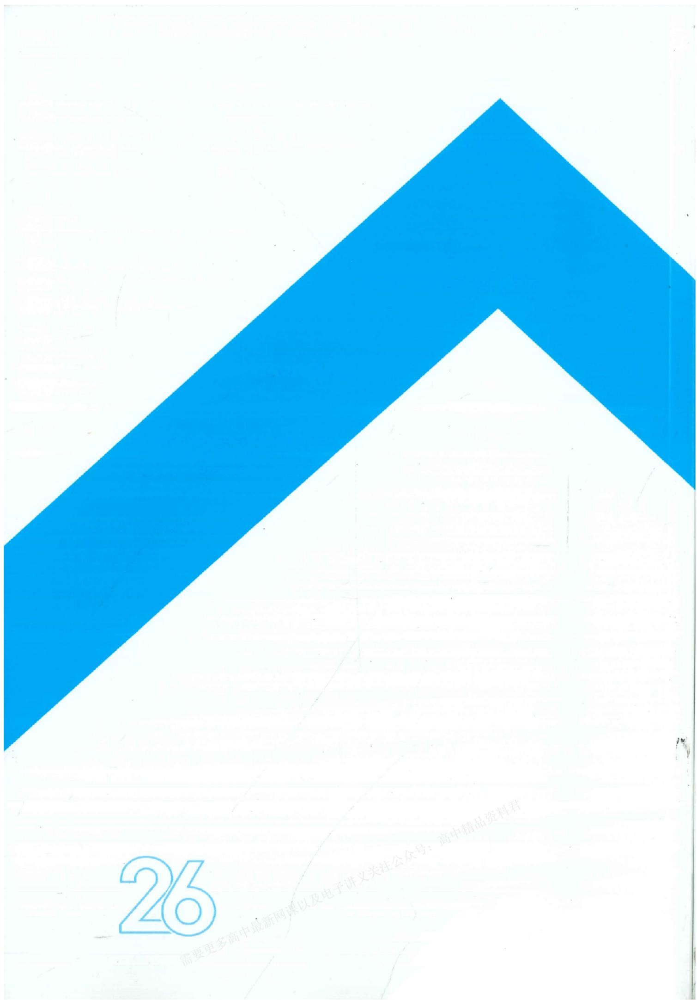

text_image

26
需要更多高中最新网课以及电子讲文关注公众号：高中精品资料君

# 详细参考答案

# 第一单元 集合与常用逻辑用语

# 第01课时 集合

# 必备知识·逐点梳理

# 一、1. 确定性 互异性 无序性

微判断 (1)√ (2)×

2. 属于 不属于 $\in \notin$

微判断 √

3. 列举法 描述法 图示法

微思考 列举法： $\{-1,1\}$ （也可以是 $\{1,-1\}$ ）.

描述法： $\{x\mid x^2 -1 = 0,x\in \mathbf{R}\}$ （也可以是 $\{x\mid x$ 为方程 $x^{2} - 1 = 0$ 的实数解）。

图示法：-1,1

4. N $N^{*}$ (或 $N_{+}$ ) Z Q R

二、 $A \subseteq B$ 或 $B \supseteq A$ $A \subsetneq B$ 或 $B \not\supseteq A$ $A = B$

微思考 (1) 不是. $\{x \mid y = x^2\}$ 表示函数 $y = x^2$ 的自变量的取值集合, 即 $\mathbf{R}; \{y \mid y = x^2\}$ 表示函数 $y = x^2$ 的函数值的集合, 即 $\{y \mid y \geqslant 0\}; \{(x, y) \mid y = x^2\}$ 表示二次函数 $y = x^2$ 图象上的点组成的集合.

(2)能. $0 \in \{0\}, 0 \notin \emptyset, 0 \notin \{\emptyset\}, \emptyset \in \{\emptyset\}, \emptyset \subseteq \{\emptyset\}, \emptyset \subseteq \{0\}, \{\emptyset\} \neq \{0\}$ .

三、 $\{x\mid x\in A$ 或 $x\in B\}$ $\{x\mid x\in A,$ 且 $x\in B\}$ $\{x\mid x\in U,$ 且 $x\notin A\}$

# 关键考点·核心突破

# 考点一

例1 C 解析 因为 $-1 \in A$ ，所以 $x - 2 = -1$ 或 $x^2 - x - 1 = -1$ ，解得 $x = 0$ 或 $x = 1$ .

当 x=0 时， $A=\{1,-2,-1\}$ ，成立；

当 x=1 时， $A=\{1,-1,-1\}$ ，不满足集合中元素的互异性，不成立。故选 C.

例 2 A 解析 因为集合 A 中只有一个元素，

所以当 $a \neq 0$ 时， $\Delta = a^{2} - 4a = 0$ ，解得 a = 4；

当 a=0 时, 集合 A 中无元素.

故选A.

# 随堂加练

1. B 解析 因为集合 $A = \{1,2,3\}, B = \{4,5\}, C = \{x + y \mid x \in A, y \in B\}$ , 所以 $C = \{5,6,7,8\}$ , 即 $C$ 中元素的个数为 4. 故选 B

2.C 解析 因为 $\{a^2,0, - 1\} = \{a,b,0\}$ ，所以① $\left\{ \begin{array}{l}a^{2} = a,\\ b = -1 \end{array} \right.$ 或

② $\left\{\begin{aligned}a^{2}&=b,\\ a&=-1.\end{aligned}\right.$

由①得 $\left\{\begin{aligned}a=0,\\ b=-1\end{aligned}\right.$ 或 $\left\{\begin{aligned}a=1,\\ b=-1\end{aligned}\right.$ ，其中 $\left\{\begin{aligned}a=0,\\ b=-1\end{aligned}\right.$ 与元素的互异性矛盾，舍去， $\left\{\begin{aligned}a=1,\\ b=-1\end{aligned}\right.$ 符合题意.

由②得 $\left\{\begin{aligned}b&=1,\\ a&=-1,\end{aligned}\right.$ 符合题意.

故 $(ab)^{2025}=(-1)^{2025}=-1$ . 故选 C.

3.-3 解析 因为 $-3 \in A$ ，所以 $-3 = a^{2} + 4a$ 或 -3 = a - 2.

若 $-3 = a^2 + 4a$ ，则 $a = -1$ 或 $a = -3$ .

当 a = -1 时， $a^{2} + 4a = a - 2 = -3$ ，不满足集合中元素的互异性，故舍去；

当 a = -3 时，集合 $A = \{12, -3, -5\}$ ，满足题意。

若-3=a-2，则a=-1，由上述讨论可知，不满足题意，故舍去.

综上所述，a=-3.

# 考点二

例3 (1)A (2)A (3)B 解析 (1)因为 $N = \{x\mid x(x - 2) = 0\} = \{0,2\},M = \{0,1,2\}$ ，所以 $N$ 是 $M$ 的真子集.故选A.

(2)对于集合 $B = \left\{x\mid x = \frac{2k + 1}{3},k\in \mathbf{Z}\right\}$ ，当 $k = 3n(n\in \mathbf{Z})$ 时， $x = \frac{6n + 1}{3} = 2n + \frac{1}{3}$ ；当 $k = 3n + 1(n\in \mathbf{Z})$ 时， $x = \frac{6n + 3}{3} = 2n + 1$ ；当 $k = 3n + 2(n\in \mathbf{Z})$ 时， $x = 2n + \frac{5}{3}$ .故 $A\subseteq B.$ 故选A.

(3) 因为 $A \subseteq B$ , 所以若 $a - 2 = 0$ , 则 $a = 2$ , 此时 $A = \{0, -2\}$ , $B = \{1, 0, 2\}$ , 不符合题意; 若 $2a - 2 = 0$ , 则 $a = 1$ , 此时 $A = \{0, -1\}$ , $B = \{1, -1, 0\}$ , 符合题意.

综上所述，a=1. 故选 B.

# 随堂加练

1. A 解析 由题意知, $A = \left\{x \mid x = \frac{a}{2} + \frac{1}{6}, a \in \mathbf{Z}\right\} = \left\{x \mid x =$

$$
\frac {3 a + 1}{6}, a \in \mathbf {Z} \}, B = \left\{x \mid x = \frac {b}{2} - \frac {1}{3}, b \in \mathbf {Z} \right\} = \left\{x \mid x = \right.
$$

$$
\frac {3 b - 2}{6}, b \in \mathbf {Z} \bigg \}, C = \left\{x \mid x = c + \frac {1}{6}, c \in \mathbf {Z} \right\} = \left\{x \mid x = \right.
$$

$\frac{3 \times 2c + 1}{6}, c \in \mathbf{Z}\}$ , 故集合 $A, B$ 均是由被 3 除余 1 的数除以 6 得到的数组成的集合, 集合 $C$ 是由被 6 除余 1 的数除以 6 得到的数组成的集合, 所以 $A = B \supseteq C$ . 故选 A.

2. ABD 解析 由元素的概念及集合间的基本关系易判断 A, B, D 正确. 故选 ABD.

3.[2,+∞) 解析 因为 $B\subseteq A$ ，所以利用数轴法(如图)，可知 $a\geqslant2$ 。故实数a的取值范围为 $[2,+\infty)$ 。

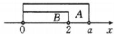

# 考点三

例4 解析 $A \cup B = \{x \mid -1 < x < 2\} \cup \{x \mid 1 < x < 3\} = \{x \mid -1 < x < 3\}, A \cap B = \{x \mid -1 < x < 2\} \cap \{x \mid 1 < x < 3\} = \{x \mid 1 < x < 2\}$ .

因为 $\mathbb{C}_U B = \{x \mid x \leqslant 1 \text{ 或 } x \geqslant 3\}$ ,

所以 $A \cap (\mathbb{C}_U B) = \{x \mid -1 < x < 2\} \cap \{x \mid x \leqslant 1 \text{ 或 } x \geqslant 3\} = \{x \mid -1 < x \leqslant 1\}$ .

例5（6,9] 解析 由 $A \cap B = A$ ，可知 $A \subseteq B$ ，则 $\left\{ \begin{array}{l} 2a + 1 \geqslant 3, \\ 3a - 5 \leqslant 22, \\ 2a + 1 < 3a - 5, \end{array} \right.$ 解得 $6 < a \leqslant 9$ ，故实数 $a$ 的取值范围为(6,9].

例6 BCD 解析 因为 $\mathbb{C}_{\mathbb{R}}B = \{x|x\leqslant 1$ 或 $x\geqslant 2\}$ ，所以 $A\cup (\mathbb{C}_{\mathbb{R}}B) = \{x|x < a\} \cup \{x|x\leqslant 1$ 或 $x\geqslant 2\} = \mathbf{R}$ ，得 $a\geqslant 2.$ 故选BCD.

# 随堂加练

1. A 解析 因为 $A=\{x\mid-\sqrt[3]{5}<x<\sqrt[3]{5}\}, B=\{-3,-1,0,2,3\}$ ，且注意到 $1<\sqrt[3]{5}<2$ ，
所以 $A \cap B = \{-1, 0\}$ . 故选 A.

2. A 解析 因为 $A=\{x\mid-3<x<1\}$ ， $B=\{x\mid0\leqslant x\leqslant2\}$ ，所以 $A\cap B=\{x\mid0\leqslant x<1\}$ ，

所以 $\mathbb{C}_{A}(A\cap B)=\{x\mid-3<x<0\}=(-3,0)$ ，即图中阴影部分表示的集合为 $(-3,0)$ 。故选 A.

3. D 解析 因为 $A \cup B = A$ ，所以 $B \subseteq A$ ，即 $m \in A$ ，得 $m^2 \geqslant 4$ ，解得 $m \geqslant 2$ 或 $m \leqslant -2$ 。故选 D.

# 深挖教材01 集合的新定义问题

母题剖析 解析 (1) 由题意得, $C \times D = \{(a,1),(a,2),(a,3)\}$ .

(2)由题意得, $A=\{1,2\},B=\{2\}$ .

(3)12.

# 子题探究

1.4 解析 $A=\{0,2\}, B=\{-1,1\}$ .

当 $x=0, y=\pm1$ 时，z=0；

当 x=2, y=-1 时, z=-2;

当 x=2, y=1 时, z=6.

故 $A\otimes B=\{0,-2,6\}$ ,

故集合 $A \otimes B$ 中所有元素之和为 $0 + (-2) + 6 = 4$ .

2. 解析 (1) 由题意知, $S - A$ 是高三 (18) 班全体男生组成的集合, $\mathbb{C}_sA$ 是高三 (18) 班全体男生组成的集合.

(2)阴影部分如图所示：

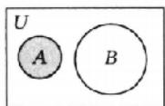

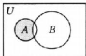

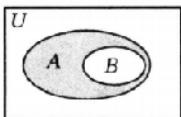

(3) 若 $A - B = \emptyset$ ，则 $A \subseteq B$ .

# 深挖教材 02 容斥原理

母题剖析 解析 如图，

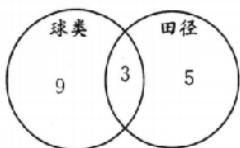

根据容斥定理可知,这个班参赛的同学人数为 $9+3+5=17$ .

# 子题探究

1.9 解析 根据题意画出 Venn 图（如图），其中 A 为参加了数学活动的同学组成的集合，B 为参加了物理活动的同学组成的集合，U 为高一(1)班全体同学组成的集合，所以由容斥定理可得这个

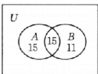

班既没有参加数学活动,也没有参加物理活动的同学人数为 $50-(30+26-15)=9$ .

2.44 解析 记 A 是参加测量的同学组成的集合, B 是参加计算的同学组成的集合, C 是参加绘图的同学组成的集合, x 为三项工作都参加的同学人数, 则由已知可得 Venn 图(如图).

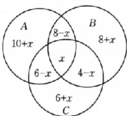

text_image

A
10+x
8-x
x
6-x
B
8+x
4-x
6+x
C

由容斥原理可得 card(A ∪ B ∪

$$
\begin{array}{l} C) = 1 0 + x + 8 - x + x + 8 + x + 6 - x + 4 - x + 6 + x = \\ 4 2 + x. \end{array}
$$

因为 $2 \leqslant x \leqslant 4$ ，所以这支测绘队至少有 44 人。

# 第02课时 常用逻辑用语

# 必备知识·逐点梳理

一、充分 必要 充分不必要 必要不充分 充要 既不充分也不必要

微思考 (1) 充分条件, 充分不必要条件.

(2) 必要条件, 必要不充分条件.

(3) 充要条件, 充要条件.

二、1. ∀

2. ∃

3. $\forall x\in M,p(x)$

4. $\exists x\in M,p(x)$

三、 $\exists x\in M,\neg p(x)\quad\forall x\in M,\neg p(x)$

# 关键考点·核心突破

# 考点一

例1 A 解析 由不等式的性质得, 当 a > 1 时, 一定有 $a^{2} > 1$ ; 当 $a^{2} > 1$ 时, 有 a > 1 或 a < -1, 不能得到 a > 1.

故“a>1”是“ $a^{2}>1$ ”的充分不必要条件. 故选 A.

例2 C 解析 根据立方的性质和指数函数的性质, 得“ $a^3 = b^3$ ”和“ $3^a = 3^b$ ”成立的条件都为“当且仅当 $a = b$ ”, 所以二者互为充要条件. 故选C.

# 随堂加练

1. AB 解析 对于 A, 因为在三角形中大边对大角, 小边对小角, 反之也成立, 所以当 $\angle BAC > \angle ABC$ 时, 有 BC > AC, 当 BC > AC 时, 有 $\angle BAC > \angle ABC$ , 所以 p 是 q 的充要条件.
对于 B, 由 $a^{2}<1$ , 得 -1<a<1, 则 a<2 一定成立, 而当 a<2 时, 若 a=-2, 则 $a^{2}<1$ 不成立, 所以 p 是 q 的充分不必要条件.

对于 C, 由 $\frac{b}{a}<1$ 可知, 当 a>0 时, b<a; 当 a<0 时, b>a. 而当 b<a 时, 若 a>0, 则 $\frac{b}{a}<1$ , 若 a<0, 则 $\frac{b}{a}>1$ . 故 p 是 q 的既不充分也不必要条件.

对于D, 当 m=0 时, 关于 x 的方程 $mx^{2}+2x+1=0$ 只有一个实根, 若关于 x 的方程 $mx^{2}+2x+1=0$ 有两个实数解, 则 $\left\{\begin{aligned}m&\neq0,\\ \Delta&=4-4m>0,\end{aligned}\right.$ 得 m<1 且 $m\neq0$ , 所以 p 是 q 的必要不充分条件.

故选 AB.

2. C 解析 因为 $A = \{x \mid x - 2 > 0\} = \{x \mid x > 2\}, B = \{x \mid x < 0\}$ , 所以 $A \cup B = \{x \mid x > 2$ 或 $x < 0\}$ .

因为 $C = \{x\mid x^2 -2x > 0\} = \{x\mid x > 2$ 或 $x <   0\}$

所以“ $x \in A \cup B$ ”是“ $x \in C$ ”的充要条件. 故选 C.

# 考点二

例3 (1) $[3, +\infty)$ (2) $(0, +\infty)$ 解析 (1) 因为“ $x \in A$ ”是“ $x \in B$ ”的必要不充分条件，所以 $B$ 是 $A$ 的真子集，画出数轴（如图），易得 $a \geqslant 3$ 。故实数 $a$ 的取值范围是 $[3, +\infty)$ 。

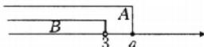

(2)对于命题 p，由 4x-3<1，得 x<1.

对于命题 q，由 $x-(2a+1)<0$ ，得 $x<2a+1$ 。

因为 p 是 q 的充分不必要条件, 所以 $2a + 1 > 1$ , 解得 a > 0.

故实数 a 的取值范围是 $(0, +\infty)$ .

例 4 D 解析 当 b=1 时, $B=\{x \mid a-1<x<a+1\}$ ,

因为“b=1”是“A∩B≠∅”的充分条件，所以 $-1\leqslant a-1<1$ 或 $-1<a+1\leqslant1$ ，解得 $-2<a<2$ 。

故选 D.

# 随堂加练

1. ABC 解析 由 $x - 1 < a$ 得 $x < a + 1$ ，因为“不等式 $x - 1 < a$ 成立”的必要条件是“ $x < 1$ ”，所以 $a + 1 \leqslant 1$ ，解得 $a \leqslant 0$ 。故选ABC.

2. $\{-1,0,1\}$ 解析 依题意, $A=\{x \mid x^{2}-4=0\}=\{2,-2\}$ .

当 $a = 0$ 时， $B = \emptyset$ ，满足“ $x \in A$ ”是“ $x \in B$ ”的必要不充分条件。

当 $a \neq 0$ 时， $B = \left\{x \mid x = \frac{2}{a}\right\}$ ，

因为“ $x \in A$ ”是“ $x \in B$ ”的必要不充分条件，所以 $\frac{2}{a} = 2$ 或

$$
\frac {2}{a} = - 2,
$$

解得 a=1 或 a=-1.

综上所述，a 的所有可能取值构成的集合为 $\{-1,0,1\}$ .

3. 解析 若选择①, 即“ $x \in P$ ”是“ $x \in S$ ”的充分不必要条件, 则 $P \subsetneq S$ 且 $S \neq \varnothing$ ,

所以 $\left\{\begin{aligned}1-m&\leqslant1,\\ 1+m&\geqslant4,\\ 1-m&\leqslant1+m,\end{aligned}\right.$ 解得 $m\geqslant3,$

当 $m = 3$ 时， $S = \{x \mid -2 \leqslant x \leqslant 4\}$ ， $P \subsetneq S$ 成立。

因此实数 m 的取值范围是 $[3, +\infty)$ .

若选择②，即“ $x \in P$ ”是“ $x \in S$ ”的必要不充分条件，则 $S \subsetneq P$ .

当 $S \neq \emptyset$ 时，有 $\left\{ \begin{array}{l} 1 - m \geqslant 1, \\ 1 + m \leqslant 4, \\ 1 - m \leqslant 1 + m, \end{array} \right.$ 解得 $m = 0$ ，当 $m = 0$ 时， $S =$

$\{1\}, S \subseteq P$ 成立；当 $S = \emptyset$ 时，有 $1 - m > 1 + m$ ，即 $m < 0$ .

因此实数 m 的取值范围是 $(-∞,0]$ .

若选择③，即“ $x \in P$ ”是“ $x \in S$ ”的充要条件，则P=S，即 $\left\{\begin{aligned}&1-m=1,\\ &1+m=4,\end{aligned}\right.$ 无解，

故不存在实数 m，使得“ $x \in P$ ”是“ $x \in S$ ”的充要条件。

# 考点三

例5 解析 (1)其否定为“ $\exists a \in \mathbb{R}$ , 一元二次方程 $x^{2} - ax - 1 = 0$ 无实根”.

(2)其否定为“存在一个正方形,它不是平行四边形”.  
(3)其否定为“ $\forall m \in \mathbb{N}, \sqrt{m^2 + 1} \notin \mathbb{N}$ .”   
(4)其否定为“任意的四边形ABCD，其内角和都等于 $360^{\circ}$ ”.

例6 解析 因为命题 $p: \forall x \in \mathbb{R}, |x + 1| > 1$ ，所以该命题的否定为“ $\exists x \in \mathbb{R}, |x + 1| \leqslant 1$ ”.

对于 p 而言, 取 x = -1, 则 $\left|x + 1\right| = 0 < 1$ , 故 p 是假命题, p 的否定是真命题.

因为命题 $q: \exists x > 0, x^3 = x$ ，所以该命题的否定为“ $\forall x > 0, x^3 \neq x$ ”.

对于 q 而言，取 x=1，则 $x^{3}=1^{3}=1=x$ ，故 q 是真命题，q 的否定是假命题.

例7 B 解析 若命题“ $\forall x \in \mathbb{R}, x^2 + 1 > m$ ”是真命题，则 $m < (x^2 + 1)_{\min}$ .

因为 $y=x^{2}+1\geqslant1$ ，所以 m<1，即实数 m 的取值范围是 $(-∞,1)$ 。故选 B.

例8 $\left(-\infty, \frac{3}{4}\right]$ 解析 若命题 $p: \exists x \in \mathbf{R}, x^2 - x + 1 - m < 0$ 为真命题，

则方程 $x^{2}-x+1-m=0$ 的根的判别式 $\Delta=1-4(1-m)>0$ ，解得 $m>\frac{3}{4}$ ，

所以当命题 $p: \exists x \in \mathbf{R}, x^2 - x + 1 - m < 0$ 为假命题时， $m \leqslant \frac{3}{4}$ ，

所以实数 m 的取值范围为 $\left(-\infty, \frac{3}{4}\right]$ .

# 随堂加练

1. C 解析 对于 A, 任意两个等腰三角形不一定相似, 故 A 为假命题; 对于 B, 不是所有的梯形都是等腰梯形, 故 B 为假命题; 对于 C, 因为 $\forall x \in \mathbb{R}, |x| \geqslant -x$ , 所以 $x + |x| \geqslant 0$ , 故 C 为真命题; 对于 D, $\forall x \in \mathbb{R}, x^2 - x + 1 = \left(x - \frac{1}{2}\right)^2 + \frac{3}{4} \geqslant \frac{3}{4} > 0$ , 故 D 为假命题. 故选 C.

2. 解析 命题“ $\exists x \in \mathbb{R}, x^2 + x - a = 0$ ”为假命题等价于方程

$x^{2} + x - a = 0$ 无实根，

则 $\Delta=1+4a<0$ , 解得 $a<-\frac{1}{4}$

即实数 a 的取值范围为 $\left(-\infty, -\frac{1}{4}\right)$ .

# 第二单元 一元二次函数、方程和不等式

# 第03课时 等式性质与不等式性质

# 必备知识·逐点梳理

一、微思考 有.(1)构造函数法:构造函数,利用函数的单调性比较大小.

(2)赋值法和排除法:可以多次取特殊值,根据特殊值比较大小,从而得出结论.

二、a=c
三、b<a b>a a>c a<c ac>bc ac<bc a+c>b+d
ac>bd

微判断 (1)√ (2)× (3)× (4)×

# 关键考点·核心突破

# 考点一

例1 (1)A (2)> 解析 (1)作差可得 $M - N = (2a + 1)\cdot$ $(a - 3) - [(a - 6)(2a + 7) + 45] = -6 <   0$ ，即 $M <   N$

故选 A.

(2)(法一:作差法)作差可得 $b-a=\frac{\ln4}{4}-\frac{\ln3}{3}=\frac{1}{12}(3\ln4-4\ln3)=\frac{1}{12}(\ln64-\ln81)<0$ ，所以 a>b.

(法二:作商法)易知 a>0, b>0, 则 $\frac{b}{a}=\frac{3\ln4}{4\ln3}=\frac{\ln64}{\ln81}=\log_{81}64=\log_{9}8<1$ , 所以 a>b.

(法三:构造函数法)令 $f(x)=\frac{\ln x}{x}(x>0)$ ,

则 $a=f(3)$ , $b=f(4)$ .

由 $f'(x)=\frac{1-\ln x}{x^{2}}$ ，得当 x>e 时， $f'(x)<0$ ，

所以 $f(x)$ 在 $(e, +\infty)$ 上单调递减，则 $f(3) > f(4)$ ，即 a > b.

# 随堂加练

1. C 解析 作差可得 $M - N = a + b - 2\sqrt{ab} = (\sqrt{a})^2 - 2\sqrt{a} \cdot \sqrt{b} + (\sqrt{b})^2 = (\sqrt{a} - \sqrt{b})^2 \geqslant 0$

即 $M \geqslant N$ ，当且仅当 a = b 时，等号成立。故选 C.

2. C 解析 易知 $x > 0, y > 0$ ，因为 $\frac{x}{y} = \frac{\sqrt{c + 1} - \sqrt{c}}{\sqrt{c} - \sqrt{c - 1}} = \frac{\frac{1}{\sqrt{c + 1} + \sqrt{c}}}{\frac{1}{\sqrt{c} + \sqrt{c - 1}}} = \frac{\sqrt{c} + \sqrt{c - 1}}{\sqrt{c + 1} + \sqrt{c}} < 1$ ，所以 $x < y$ . 故选 C.

3. M > N 解析 （法一：作差法） $M - N = \frac{\pi^{2024} + 1}{\pi^{2025} + 1} - \frac{\pi^{2025} + 1}{\pi^{2026} + 1} = \frac{(\pi^{2024} + 1)(\pi^{2026} + 1) - (\pi^{2025} + 1)^{2}}{(\pi^{2025} + 1)(\pi^{2026} + 1)} = \frac{\pi^{2024} + \pi^{2026} - 2\pi^{2025}}{(\pi^{2025} + 1)(\pi^{2026} + 1)} = \frac{\pi^{2024}(\pi - 1)^{2}}{(\pi^{2025} + 1)(\pi^{2026} + 1)} > 0$ ，所以 M > N.

（法二：构造函数法）令 $f(x) = \frac{\pi^x + 1}{\pi^{x + 1} + 1} = \frac{\frac{1}{\pi}(\pi^{x + 1} + 1) + 1 - \frac{1}{\pi}}{\pi^{x + 1} + 1} = \frac{1}{\pi} + \frac{1 - \frac{1}{\pi}}{\pi^{x + 1} + 1},$

因为 $f(x)$ 是 R 上的减函数，所以 $f(2024) > f(2025)$ ，即 M > N.

# 考点二

例2 B 解析 对于A, 当 $c = 0$ 时, $ac^2 = bc^2$ , 所以A错误;

对于 B, 若 a > b > 0, 则 $a^{2} - b^{2} = (a + b)(a - b) > 0$ , 所以 $a^{2} > b^{2}$ , 所以 B 正确;

对于 C, 若 a<b<0, 则 $a^{2}-ab=a(a-b)>0$ , 所以 $a^{2}>ab$ , 所以 C 错误;

对于 D, 若 a < b < 0, 则 $\frac{1}{a} - \frac{1}{b} = \frac{b - a}{ab} > 0$ , 所以 $\frac{1}{a} > \frac{1}{b}$ , 所以 D 错误.

故选B.

例3 C 解析 若 $a < b < 0$ ，则 $a^2 > b^2$ ，A 不成立；若 $\left\{ \begin{array}{l} ab > 0, \\ a < b, \end{array} \right.$ 则 $a^2 b < ab^2$ ，B 不成立；因为 $a, b$ 为非零实数，且 $a < b$ ，所以 $\frac{1}{ab^2} - \frac{1}{a^2 b} = \frac{a - b}{a^2 b^2} < 0$ ，即 $\frac{1}{ab^2} < \frac{1}{a^2 b}$ ，C 成立；若 $a = 1, b = 2$ ，则 $\frac{b}{a} = 2, \frac{a}{b} = \frac{1}{2}$ ，即 $\frac{b}{a} > \frac{a}{b}$ ，D 不成立。故选 C.

# 随堂加练

1. C 解析 对于选项 A, 当 c=0 时, $ac^{2}=bc^{2}$ , 故 A 错误;

对于选项 B, 由不等式的性质知, $\frac{a}{c^{2}} > \frac{b}{c^{2}}$ 两边同时乘以 $c^{2} (c^{2} > 0)$ , 可得 a > b, 故 B 错误;

对于选项 C, 若 a < b < c < 0, 则 $a + c < 0, b - a > 0, (b - a)c < 0, a(a + c) > 0$ ,

故 $\frac{b}{a} -\frac{b + c}{a + c} = \frac{b(a + c) - a(b + c)}{a(a + c)} = \frac{(b - a)c}{a(a + c)} < 0,$ 即 $\frac{b}{a} <$

$\frac{b+c}{a+c}$ ，故C正确；

对于选项 D, 取 a = -1, b = -2, 可得 $a^{2} < b^{2}$ , 故 D 错误.

故选C.

2. ABC 解析 对于 A, $\because a > b > c, \therefore a - c > b - c > 0,$

$$
\therefore \frac {1}{a - c} <   \frac {1}{b - c},
$$

又 $a > b > c, a + b + c = 0, \therefore a > 0, c < 0$ ，由不等式的性质可知 $\frac{c}{a - c} > \frac{c}{b - c}$ ，A 正确.

对于 B, $\because a > b > c, a + b + c = 0, \therefore a > 0, c < 0, a - b > 0,$

$$
\therefore b + c = - a <   0,
$$

$\therefore a-b>b+c$ , 即 $a-c>2b$ , B 正确.

对于 C, $\because a-b>0, a+b=-c>0,$

$\therefore a^{2}-b^{2}=(a+b)(a-b)>0$ , 即 $a^{2}>b^{2}$ , C 正确.

对于 $\mathrm{D},ab + bc = b(a + c) = -b^2\leqslant 0,\mathrm{D}$ 错误.

故选 ABC.

# 考点三

例4 解析 由 $4 < 2a < 6, -2 < b < -1$ ，得 $4 + (-2) < 2a + b < 6 + (-1)$ ，即 $2a + b$ 的取值范围是(2,5).

由 4<2a<6,1<-b<2, 得 $4+1<2a-b<6+2$ , 即 2a-b 的取值范围是 (5,8).

由 2<a<3,1<-b<2,得 2<-ab<6,

所以 ab 的取值范围是 $(-6,-2)$ .

易知 $\frac{1}{2} < -\frac{1}{b} < 1$ ，而 $2 < a < 3$ ，则 $1 < -\frac{a}{b} < 3$ ，所以 $\frac{a}{b}$ 的取值范围是 $(-3, -1)$ .

例5 (3,8) 解析 设 $z = 2x - 3y = a(x + y) + b(x - y)$ ,

则 $\left\{ \begin{array}{l} a + b = 2, \\ a - b = -3, \end{array} \right.$ 解得 $\left\{ \begin{array}{l} a = -\frac{1}{2}, \\ b = \frac{5}{2}, \end{array} \right.$ 即 $z = -\frac{1}{2}(x + y) + \frac{5}{2}(x - y)$ ,

又 $-1 < x + y < 4$ ，且 $2 < x - y < 3, \therefore -2 < -\frac{1}{2}(x + y) < \frac{1}{2}$ ，且 $5 < \frac{5}{2}(x - y) < \frac{15}{2}$ ，

$\therefore 3<-\frac{1}{2}(x+y)+\frac{5}{2}(x-y)<8$ ，即 z=2x-3y 的取值范围是(3,8).

# 随堂加练

1. $(-60,30)\left(\frac{2}{3},8\right)$ 解析 因为 15<b<36，所以 -72<-2b<-30。又 12<a<60，所以 12-72<a-2b<60-30，即 -60<a-2b<30。因为 12<a<60，所以 24<2a<120。又 15<b<36，所以 $\frac{1}{36}<\frac{1}{b}<\frac{1}{15}$ ，所以 $\frac{24}{36}<\frac{2a}{b}<\frac{120}{15}$ ，即 $\frac{2}{3}<\frac{2a}{b}<8$ 。故 a-2b 的取值范围为 $(-60,30),\frac{2a}{b}$ 的取值范围为 $\left(\frac{2}{3},8\right)$ 。

2.(-1,9) 解析 设 $8x + y = m(x - y) + n(2x + y)$ ,

则 $\left\{ \begin{array}{l} m + 2n = 8, \\ -m + n = 1, \end{array} \right.$ 解得 $\left\{ \begin{array}{l} m = 2, \\ n = 3, \end{array} \right.$

$$
\therefore 8 x + y = 2 (x - y) + 3 (2 x + y).
$$

又-4<2(x-y)<0,3<3(2x+y)<9,

$$
\therefore 8 x + y \in (- 1, 9).
$$

# 第04课时 基本不等式

# 必备知识·逐点梳理

$$
- 、 1. a > 0, b > 0
$$

$$
2. a = b
$$

$$
3. \frac {a + b}{2} \sqrt {a b}
$$

微思考 可借助平面图形中线段长度的关系直观表示. 如图, $AB$ 为半圆 $O$ 的直径, $D$ 为半圆上一点 (异于 $A, B$ 两点), $AC = a$ , $CB = b$ , $CD \perp AB$ , 则 $OD = \frac{a + b}{2}$ , $CD = \sqrt{ab}$ .

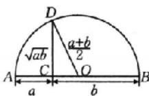

由图易得 $\sqrt{ab} \leqslant \frac{a + b}{2}$ , 当且仅当 $a = b$ 时, 等号成立.

由此推广: 若 a > 0, b > 0, 则 $\frac{2}{\frac{1}{a} + \frac{1}{b}} \leqslant \sqrt{ab} \leqslant \frac{a + b}{2} \leqslant \sqrt{\frac{a^{2} + b^{2}}{2}}$

(基本不等式链), 当且仅当 a=b 时, 等号成立. (详情见深挖教材 03 基本不等式链)

二、1.2ab

2.2

3. $\left(\frac{a+b}{2}\right)^{2}$

4. $\left(\frac{a+b}{2}\right)^{2}$

三、1.2 $\sqrt{P}$

2. $\frac{S^{2}}{4}$

# 关键考点·核心突破

# 考点一

例1 (1)C (2)3 解析 (1)因为 $x > 0$ ，所以由基本不等式得 $f(x) = 4x + \frac{9}{x} \geqslant 2\sqrt{4x \cdot \frac{9}{x}} - 12$ ，当且仅当 $4x = \frac{9}{x}$ 即 $x = \frac{3}{2}$ 时，等号成立，即 $f(x)_{\min} - 12.$ 故选C.

(2)由已知，得 $12 = 4x + 3y \geqslant 2\sqrt{4x \cdot 3y}$ ，解得 $xy \leqslant 3$ （当且仅

当 $4x = 3y$ ，即 $x = \frac{3}{2}, y = 2$ 时取等号），即 $xy$ 的最大值为3.

例2 (1)4 (2) $\frac{1}{3}$ 解析 (1) $x + \frac{1}{x - 2} = x - 2 + \frac{1}{x - 2} + 2,$ 因为 $x > 2$ ，所以 $x - 2 > 0, \frac{1}{x - 2} > 0,$

则由基本不等式可得 $x + \frac{1}{x - 2} = x - 2 + \frac{1}{x - 2} + 2 \geqslant 2\sqrt{(x - 2) \cdot \frac{1}{x - 2}} + 2 = 4,$

当且仅当 $x-2=\frac{1}{x-2}$ ，即 x=3 时，等号成立，所以 $x+\frac{1}{x-2}$ 的最小值是 4.

(2)(法一:基本不等式法) $y=x(2-3x)=\frac{1}{3}\cdot3x(2-3x)$ ,
因为 $0 < x < \frac{2}{3}$ ，所以 0 < 3x < 2，所以 2 - 3x > 0，

则由基本不等式可得 $y=x(2-3x)=\frac{1}{3}\cdot3x(2-3x)\leqslant\frac{1}{3}\cdot\left(\frac{3x+2-3x}{2}\right)^{2}=\frac{1}{3}$ ,

当且仅当 3x=2-3x，即 $x=\frac{1}{3}$ 时，等号成立，所以 $y=x(2-3x)$ 的最大值为 $\frac{1}{3}$ .

(法二:二次函数法) $y=x(2-3x)=-3x^{2}+2x=-3\left(x^{2}-\frac{2}{3}x+\frac{1}{9}\right)+\frac{1}{3}=-3\left(x-\frac{1}{3}\right)^{2}+\frac{1}{3}$ ,

因为 $0 < x < \frac{2}{3}$ ，所以当 $x = \frac{1}{3}$ 时，y 有最大值，最大值为 $\frac{1}{3}$ .

例3 $\frac{1}{4}$ 4 解析 因为 $a + b = 1$ ，且 $a, b$ 为正数，所以 $ab \leqslant \left(\frac{a + b}{2}\right)^2 = \frac{1}{4}$ ，当且仅当 $a = b = \frac{1}{2}$ 时，等号成立，所以 $ab$ 的最大值为 $\frac{1}{4}$ .

$$
\begin{array}{l} \frac {1}{a} + \frac {1}{b} = (a + b) \left(\frac {1}{a} + \frac {1}{b}\right) = 2 + \frac {b}{a} + \frac {a}{b} \geqslant 2 + \\ 2 \sqrt {\frac {b}{a} \cdot \frac {a}{b}} = 4, \end{array}
$$

当且仅当 $\frac{b}{a} = \frac{a}{b}$ ，即 $a = b = \frac{1}{2}$ 时，等号成立。故 $\frac{1}{a} + \frac{1}{b}$ 的最小值为4.

例4 $\frac{12}{25}$ 5 解析 由已知可得 $\frac{3}{5x} + \frac{1}{5y} = 1$ ，则 $\frac{3}{5x} + \frac{1}{5y} \geqslant 2\sqrt{\frac{3}{25xy}}$ ，当且仅当 $\frac{3}{5x} = \frac{1}{5y}$ ，即 $\left\{ \begin{array}{l} x = \frac{6}{5}, \\ y = \frac{2}{5} \end{array} \right.$ 时，等号成立，所以 $2\sqrt{\frac{3}{25xy}} \leqslant 1$ ，即 $xy \geqslant \frac{12}{25}$ ，即 $xy$ 的最小值为 $\frac{12}{25}$ .

由 $\frac{3}{5x} +\frac{1}{5y} = 1$ ，得 $3x + 4y = \left(\frac{3}{5x} +\frac{1}{5y}\right)(3x + 4y) = \frac{9}{5} +\frac{4}{5}+$ $\frac{12y}{5x} +\frac{3x}{5y}\geqslant \frac{13}{5} +\frac{12}{5} = 5$ ，当且仅当 $\frac{12y}{5x} = \frac{3x}{5y}$ 即 $x = 1,y = \frac{1}{2}$ 时，等号成立，所以 $3x + 4y$ 的最小值为5.

例56 解析（法一：换元消元法）由已知得 $9 - (x + 3y) = xy = \frac{1}{3} \cdot x \cdot 3y \leqslant \frac{1}{3} \cdot \left(\frac{x + 3y}{2}\right)^2$ ，当且仅当 $x = 3y$ ，即 $x = 3, y = 1$ 时取等号，即 $(x + 3y)^2 + 12(x + 3y) - 108 \geqslant 0.$ 令 $x +$ $3y = t$ ，则 $t > 0$ ，且 $t^2 + 12t - 108 \geqslant 0$ ，得 $t \geqslant 6$ ，即 $x + 3y$ 的最小值为6.

(法二:代入消元法)由 $x+3y+xy=9$ , 得 $x=\frac{9-3y}{1+y}$ ,

$$
\begin{array}{l} = \frac {9 + 3 y ^ {2}}{1 + y} = \frac {3 (1 + y) ^ {2} - 6 (1 + y) + 1 2}{1 + y} \\ = 3 (1 + y) + \frac {1 2}{1 + y} - 6 \\ \geqslant 2 \sqrt {3 (1 + y) \cdot \frac {1 2}{1 + y}} - 6 = 1 2 - 6 = 6, \\ \end{array}
$$

所以 $x + 3y = \frac{9 - 3y}{1 + y} +3y = \frac{9 - 3y + 3y(1 + y)}{1 + y}$

当且仅当 $3(1+y)=\frac{12}{1+y}$ ，即 y=1, x=3 时取等号，所以 $x+3y$ 的最小值为 6.

# 随堂加练

1. C 解析 因为正数 $x, y$ 满足 $x + 2y = 2$ ,

所以 $xy = \frac{1}{2} x\cdot (2y)\leqslant \frac{1}{2}\left(\frac{x + 2y}{2}\right)^2 = \frac{1}{2},$

当且仅当 x=2y，即 $x=1, y=\frac{1}{2}$ 时取等号，所以 xy 的最大值为 $\frac{1}{2}$ . 故选 C.

2.A 解析 因为 $x > 0, xy + y = 4$ ，所以 $y = \frac{4}{x + 1} > 0$ ，所以 $z = 3x + \frac{4}{x + 1} + 2 = 3(x + 1) - 3 + \frac{4}{x + 1} + 2 = 3(x + 1) + \frac{4}{x + 1} - 1 \geqslant 2\sqrt{3(x + 1) \cdot \frac{4}{x + 1}} - 1 = 4\sqrt{3} - 1,$

当且仅当 $3(x+1)=\frac{4}{x+1}$ ，即 $x=\frac{2\sqrt{3}}{3}-1$ 时，等号成立。故选 A.

3. ABD 解析 对于 A, $\because x > 0, y > 0, x + 2y = 1$ ,

$\therefore x \cdot 2y \leqslant \left(\frac{x + 2y}{2}\right)^2 = \left(\frac{1}{2}\right)^2 = \frac{1}{4}$ , 即 $xy \leqslant \frac{1}{8}$ ,

当且仅当 $\left\{\begin{aligned}x=2y,\\ x+2y=1,\end{aligned}\right.$ 即 $x=\frac{1}{2},y=\frac{1}{4}$ 时取“=”，∴A正确.

对于 B, $x^{2} + 4y^{2} = (x + 2y)^{2} - 4xy = 1 - 4xy$ ，由 A 项知 $xy \leqslant \frac{1}{8}$ ,

$$
\therefore - 4 x y \geqslant - \frac {1}{2},
$$

$\therefore x^{2} + 4y^{2} = 1 - 4xy \geqslant 1 - \frac{1}{2} = \frac{1}{2}, \therefore B$ 正确.

对于 C, $(\sqrt{x} + \sqrt{2y})^{2} = x + 2y + 2\sqrt{x \cdot 2y} = 1 + 2\sqrt{x \cdot 2y} \leqslant 1 + x + 2y = 1 + 1 = 2,$

$\therefore\sqrt{x}+\sqrt{2y}\leqslant\sqrt{2},\therefore C$ 错误.

对于 D, $\left(\frac{1}{x}+\frac{3}{y}\right)(x+2y)=1+\frac{2y}{x}+\frac{3x}{y}+6=7+\frac{2y}{x}+\frac{3x}{y}\geqslant7+2\sqrt{6}$

当且仅当 $\frac{2y}{x}=\frac{3x}{y}$ ，即 $\left\{\begin{aligned}x&=\frac{\sqrt{6}-1}{5},\\ y&=\frac{6-\sqrt{6}}{10}\end{aligned}\right.$ 时，等号成立，即 $\frac{1}{x}+\frac{3}{y}$ 的

最小值为 $7+2\sqrt{6}$ ，∴D 正确.

故选 ABD.

4.4 解析 $\because a > 0, b > 0, \therefore a + b > 0$ , 又 $ab = 1, \therefore \frac{1}{2a} + \frac{1}{2b} +$

$$
\frac {8}{a + b} = \frac {a b}{2 a} + \frac {a b}{2 b} + \frac {8}{a + b} = \frac {a + b}{2} + \frac {8}{a + b} \geqslant 2 \sqrt {\frac {a + b}{2} \cdot \frac {8}{a + b}} =
$$

4, 当且仅当 $a + b = 4$ , 且 $ab = 1$ , 即 $a = 2 - \sqrt{3}, b = 2 + \sqrt{3}$ 或 $a = 2 + \sqrt{3}, b = 2 - \sqrt{3}$ 时, 等号成立.

故 $\frac{1}{2a}+\frac{1}{2b}+\frac{8}{a+b}$ 的最小值为4.

5.2 解析 根据题意可得 $y = \frac{1 - x^2}{2x} = \frac{1}{2x} - \frac{x}{2}$ ，由 $x > 0, y = \frac{1}{2x} - \frac{x}{2} > 0$ ，解得 $0 < x < 1$ ，

所以 $3x^{2} + 4y^{2} = 3x^{2} + 4\left(\frac{1}{2x} - \frac{x}{2}\right)^{2} = 4x^{2} + \frac{1}{x^{2}} - 2 \geqslant$

$2\sqrt{4x^{2}\cdot\frac{1}{x^{2}}}-2=2$ ，当且仅当 $4x^{2}=\frac{1}{x^{2}}$ ，即 $x=\frac{\sqrt{2}}{2}$ 时，等号成立。故 $3x^{2}+4y^{2}$ 的最小值为2。

6. 解析 (1) 因为 $x > \frac{5}{4}$ , 所以 $4x - 5 > 0$ ,

所以 $y=4x-2+\frac{1}{4x-5}=4x-5+\frac{1}{4x-5}+3\geqslant2+3=5,$

当且仅当 $4x - 5 = \frac{1}{4x - 5}$ 即 $x = \frac{3}{2}$ 时，等号成立.

故当 $x=\frac{3}{2}$ 时， $y_{\min}=5.$

(2) 因为 $x < \frac{5}{4}$ ，所以 4x - 5 < 0，

所以 $y = 4x - 2 + \frac{1}{4x - 5} = -\left(5 - 4x + \frac{1}{5 - 4x}\right) + 3 \leqslant -2 + 3 = 1,$

当且仅当 $5-4x=\frac{1}{5-4x}$ ，即 x=1 时，等号成立。

故当 x=1 时， $y_{\max}=1$ .

(3) 当 $x \geqslant 2$ 时, 易知 $y = 4x - 2 + \frac{1}{4x - 5}$ 为增函数, 所以 $y_{\min} = 4 \times 2 - 2 + \frac{1}{4 \times 2 - 5} = \frac{19}{3}$ .

# 考点二

例6 解析 不妨设提价前的价格为1.

方案甲:两次提价后的价格为 $(1+p\%)(1+q\%)=1+p\%+q\%+0.01pq\%$ .

方案乙:两次提价后的价格为 $(1+q\%)(1+p\%)=1+p\%+q\%+0.01pq\%$ .

方案丙： $\left(1 + \frac{p + q}{2}\% \right)\left(1 + \frac{p + q}{2}\%\right) = 1 + p\% +q\% +$ $0.01\times \left(\frac{p + q}{2}\right)^{2}\% .$

因为 $p > q > 0$ ，所以由均值不等式得 $p + q \geqslant 2\sqrt{pq}$ ，当且仅当 $p = q$ 时，等号成立，所以 $\left(\frac{p + q}{2}\right)^2 \geqslant pq.$

因为 $p \neq q$ ，所以 $\left(\frac{p + q}{2}\right)^2 > pq$ .

故方案丙提价最多，方案甲、乙提价少，且提价一样。

随堂加练 88 6760 解析 设画面的高为 $x \mathrm{~cm}$ , 宽为 $y \mathrm{~cm}$ , 依题意有 $xy = 4840, x > 0, y > 0$ ,

则所需纸张面积 $S=(x+16)(y+10)=xy+16y+10x+160$ ，即 $S=5\ 000+16y+10x$ .

$$
\because x > 0, y > 0, x y = 4 8 4 0,
$$

$\therefore 16y + 10x \geqslant 2\sqrt{160xy} = 2\sqrt{160 \times 4840} = 1760$ ，即 $S \geqslant 6760$ ，

当且仅当 16y=10x，即 x=88, y=55 时，等号成立.

故当画面的高为 88 cm，宽为 55 cm 时，所需纸张的面积最小，最小值为 6760 cm $^{2}$ .

# 深挖教材 03 基本不等式链

母题剖析 解析 （法一：直角模型）分别以 $\frac{a + b}{2}, \frac{a - b}{2}$ 为直角边作直角三角形 $ABC$ ，其中 $AB = \frac{a + b}{2}, AC = \frac{a - b}{2}$ ，再分别以 $\frac{a + b}{2}, \frac{a - b}{2}$ 为斜边和直角边作直角三角形 $ABD$ ，其中 $BD = \frac{a - b}{2}$ ，再过点 $D$ 作 $AC$ 的垂线交 $CA$ 的延长线于点 $E$ ，如图1. 根据勾股定理可得 $BC = \sqrt{\frac{a^2 + b^2}{2}}, AD = \sqrt{ab}$ ，

再由 $\triangle ADE \sim \triangle BAD$ ，得到 $DE = \frac{2ab}{a + b} = \frac{2}{\frac{1}{a} + \frac{1}{b}}$

从而 $DE < AD < AB < BC$ ，即 $\frac{2}{\frac{1}{a} + \frac{1}{b}} < \sqrt{ab} < \frac{a + b}{2} < \sqrt{\frac{a^2 + b^2}{2}}$

当 $a = b$ 时， $\frac{2}{\frac{1}{a} + \frac{1}{b}} = \sqrt{ab} = \frac{a + b}{2} = \sqrt{\frac{a^2 + b^2}{2}}.$

综上，结论成立。

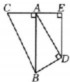  
图1

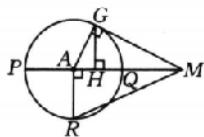  
图2

(法二:切割线模型)如图2,PQ为圆A的直径,MG与圆A相切于点G,过点G作GH⊥PQ于点H,R为圆A上一点,且RA⊥PQ.设MP=a,MQ=b,a>b>0,则AR= $\frac{a-b}{2}$ ,AM= $\frac{a+b}{2}$ .

由圆的切割线定理 $MG^{2}=MQ\cdot MP$ ，可得 $MG=\sqrt{ab}$ ，

由射影定理 $MG^2 = HM\cdot AM$ ，可得 $HM = \frac{2}{\frac{1}{a} + \frac{1}{b}}$

由勾股定理可得 $RM = \sqrt{AM^2 + AR^2} = \sqrt{\frac{a^2 + b^2}{2}}$

从而 $HM < MG < AM < RM$ ，即 $\frac{2}{\frac{1}{a} + \frac{1}{b}} < \sqrt{ab} < \frac{a + b}{2} < \sqrt{\frac{a^2 + b^2}{2}}$

当 $a = b$ 时， $\frac{2}{\frac{1}{a} + \frac{1}{b}} = \sqrt{ab} = \frac{a + b}{2} = \sqrt{\frac{a^2 + b^2}{2}}.$

综上，结论成立.

子题探究 ACD 解析 对于 A, 因为 $\sqrt{ab} \leqslant \frac{a + b}{2} = \frac{1}{2}$ ，当且仅当 $a = b = \frac{1}{2}$ 时，等号成立，所以 A 正确；

对于B，由 $a + b = 1$ ，可知 $(a + 2b) + (2a + b) = 3(a - b) = 3$ ，则由基本不等式得 $\frac{2}{\frac{1}{a + 2b} + \frac{1}{2a + b}}\leqslant \sqrt{(a + 2b)(2a + b)}\leqslant$

$\frac{(a+2b)+(2a+b)}{2}=\frac{3}{2}$ ，即 $\frac{1}{a+2b}+\frac{1}{2a+b}\geqslant\frac{4}{3}$ ，当且仅当 $a+2b=2a+b$ ，即 $a=b=\frac{1}{2}$ 时，等号成立，所以B错误；

对于 C，因为 $\frac{a+b}{2}\leqslant\sqrt{\frac{a^{2}+b^{2}}{2}}$ ，所以 $a^{2}+b^{2}\geqslant\frac{(a+b)^{2}}{2}=\frac{1}{2}$ ，
当且仅当 $a=b=\frac{1}{2}$ 时，等号成立，所以 C 正确；

对于 D, 因为 $\frac{\sqrt{a} + \sqrt{b}}{2} \leqslant \sqrt{\frac{(\sqrt{a})^{2} + (\sqrt{b})^{2}}{2}}$ ，所以 $\sqrt{a} + \sqrt{b} \leqslant 2 \cdot \sqrt{\frac{a+b}{2}} = \sqrt{2}$ ，当且仅当 $a = b = \frac{1}{2}$ 时，等号成立，所以 D 正确。故选 ACD.

# 第 05 课时 一元二次方程、不等式

# 必备知识·逐点梳理

一、 $\{x\mid x<x_{1}$ 或 $x>x_{2}\}$ R $\{x\mid x_{1}<x<x_{2}\}$

微判断 (1)√ (2)√ (3)×

二、1. $f(x)g(x)>0(<0)$

2. $f(x)g(x)\geqslant 0(\leqslant 0)$ 且 $g(x)\neq 0$

三、1. $(-∞,-a)∪(a,+∞)$

2. $(-a,a)$

# 关键考点·核心突破

例1 解析 (1) 方程 $x^{2} - 2x - 3 = 0$ 的解为 $x_{1} = -1, x_{2} = 3$ , 故不等式的解集为 $\{x \mid -1 < x < 3\}$ .

(2)原不等式等价于 $2x^{2}-x-3\leqslant0$ ，即 $(2x-3)(x+1)\leqslant0$ ，所以 $-1\leqslant x\leqslant\frac{3}{2}$ .

故原不等式的解集为 $\left\{x\mid -1\leqslant x\leqslant \frac{3}{2}\right\}$

(3)原不等式等价于 $\left\{\begin{aligned}&(-2x+5)(x-2)\leqslant0,\\ &x-2\neq0,\end{aligned}\right.$

即 $\left\{ \begin{array}{l}(2x - 5)(x - 2)\geqslant 0,\\ x - 2\neq 0, \end{array} \right.$ 所以 $x\geqslant \frac{5}{2}$ 或 $x <   2$

故原不等式的解集为 $\left\{x\mid x\geqslant \frac{5}{2}\text{或} x <   2\right\} .$

随堂加练 ABD 解析 因为方程 $x^{2} + x - 2 = 0$ 的解为 $x_{1} = 1, x_{2} = -2$ ，所以不等式 $x^{2} + x - 2 > 0$ 的解集为 $\{x \mid x < -2 \text{ 或 } x > 1\}$ ，故 A 正确.

因为 $\frac{2x + 1}{x - 2} - 1 \leqslant 0$ ，即 $\frac{x + 3}{x - 2} \leqslant 0$ ，即 $(x + 3)(x - 2) \leqslant 0 (x - 2 \neq$

0), 解得 $-3 \leqslant x < 2$ ，所以不等式的解集为 $\{x \mid -3 \leqslant x < 2\}$ ，故 B 正确.

由 $|x-2|\geqslant1$ ，可得 $x-2\leqslant-1$ 或 $x-2\geqslant1$ ，解得 $x\leqslant1$ 或 $x\geqslant3$ ，所以不等式的解集为 $\{x|x\leqslant1$ 或 $x\geqslant3\}$ ，故C错误.

由 $|x-1|<1$ ，可得-1<x-1<1，解得0<x<2，由 $\frac{x+4}{x-5}<0$ ，可得-4<x<5，因此“ $|x-1|<1$ ”是“ $\frac{x+4}{x-5}<0$ ”的充分不必要条件，故D正确.

故选 ABD.

# 考点二

例2 解析 (1)一元二次方程 $x^{2} + ax + 1 = 0$ 的根的判别式 $\Delta = a^2 -4$

①当 $\Delta=a^{2}-4\leqslant0$ ，即 $-2\leqslant a\leqslant2$ 时，原不等式无解.

②当 $\Delta=a^{2}-4>0$ ，即 a>2 或 a<-2 时，方程 $x^{2}+ax+1=0$ 的两个根为 $x_{1}=\frac{-a+\sqrt{a^{2}-4}}{2}$ ， $x_{2}=\frac{-a-\sqrt{a^{2}-4}}{2}$ ，则原不

等式的解集为 $\left\{x\mid \frac{-a - \sqrt{a^2 - 4}}{2} < x < \frac{-a + \sqrt{a^2 - 4}}{2}\right\} .$

综上所述，当 $-2\leqslant a\leqslant2$ 时，原不等式的解集为 $\varnothing$ ;

当 $a > 2$ 或 $a < -2$ 时，原不等式的解集为 $\left\{x\mid \frac{-a - \sqrt{a^2 - 4}}{2} < x < \frac{-a + \sqrt{a^2 - 4}}{2}\right\} .$

(2) 若 a=0，则原不等式等价于 $-x+1<0$ ，解得 x>1。

若 a<0，则原不等式等价于 $\left(x-\frac{1}{a}\right)(x-1)>0$ ，解得 $x<\frac{1}{a}$ 或 x>1.

若 a>0，则原不等式等价于 $\left(x-\frac{1}{a}\right)(x-1)<0.$

①当 a=1 时， $\frac{1}{a}=1,\left(x-\frac{1}{a}\right)(x-1)<0$ 无解；

②当 $a > 1$ 时， $\frac{1}{a} < 1$ ，由 $\left(x - \frac{1}{a}\right)(x - 1) < 0$ ，得 $\frac{1}{a} < x < 1$

③当 0 < a < 1 时， $\frac{1}{a} > 1$ ，由 $\left(x - \frac{1}{a}\right)(x - 1) < 0$ ，得 1 < x < $\frac{1}{a}$ .

综上所述，当 $a < 0$ 时，原不等式的解集为 $\{x\mid x < \frac{1}{a}$ 或 $x > 1\}$ 当 $a = 0$ 时，原不等式的解集为 $\{x|x > 1\}$

当 0 < a < 1 时，原不等式的解集为 $\left\{x \mid 1 < x < \frac{1}{a}\right\}$ ;

当 a=1 时，原不等式的解集为 $\varnothing$ ;

当 $a > 1$ 时，原不等式的解集为 $\left\{x\mid \frac{1}{a} < x < 1\right\}$

(3)原不等式等价于 $(ax-1)(x-3)>0.$

当 a<0 时，不等式的解集为 $\left\{x\left|\frac{1}{a}<x<3\right.\right\}$ ;

当 a=0 时，不等式的解集为 $\{x|x<3\}$ ;

当 $0 < a < \frac{1}{3}$ 时，不等式的解集为 $\left\{x \mid x < 3 \text{ 或 } x > \frac{1}{a}\right\}$ ;

当 $a=\frac{1}{3}$ 时，不等式的解集为 $\{x \mid x \neq 3\}$ ;

当 $a > \frac{1}{3}$ 时，不等式的解集为 $\left\{x\mid x > 3\text{或} x <   \frac{1}{a}\right\} .$

随堂加练 解析 (1) 若 $a = 0$ ，则不等式化为 $-4x + 4 \geqslant 0$ ，即 $-4x \geqslant -4$ ，得 $x \leqslant 1$ .

若 $a \neq 0$ ，则将 $ax^2 - (a + 4)x + 4 \geqslant 0$ 化为 $(ax - 4)(x - 1) \geqslant 0$ .

①当 a<0 时，二次函数 $y=(ax-4)(x-1)$ 的图象开口向下，方程 $(ax-4)(x-1)=0$ 的两个根为 $x_{1}=1$ 和 $x_{2}=\frac{4}{a}$ ，且 $\frac{4}{a}<1$ ，则不等式的解集为 $\left\{x\mid\frac{4}{a}\leqslant x\leqslant1\right\}$ .

②当 a>0 时，二次函数 $y=(ax-4)(x-1)$ 的图象开口向上，
方程 $(ax-4)(x-1)=0$ 的两个根为 $x_{1}=1$ 和 $x_{2}=\frac{4}{a}$ .

当 $\frac{4}{a}=1$ ，即a=4时，不等式为 $(4x-4)(x-1)\geqslant0$ ，即 $(x-1)^{2}\geqslant0$ ，此时不等式的解集为R.

当 $\frac{4}{a}>1$ ，即0<a<4时，不等式的解集为 $\left\{x\mid x\leqslant1\text{或}x\geqslant\frac{4}{a}\right\}$ .

当 $\frac{4}{a} < 1$ ，即 $a > 4$ 时，不等式的解集为 $\left\{x\mid x\leqslant \frac{4}{a}\text{或} x\geqslant 1\right\}$

综上，当 $a < 0$ 时，不等式的解集为 $\left\{x\mid \frac{4}{a}\leqslant x\leqslant 1\right\}$

当 a=0 时，不等式的解集为 $\{x \mid x \leqslant 1\}$ ;

当 $0 < a < 4$ 时，不等式的解集为 $\left\{x \mid x \leqslant 1 \text{ 或 } x \geqslant \frac{4}{a}\right\}$

当 a=4 时，不等式的解集为 R;

当 $a > 4$ 时，不等式的解集为 $\left\{x\mid x\leqslant \frac{4}{a}\text{或} x\geqslant 1\right\}$

(2) $\frac{ax-1}{x-2}>1$ 等价于 $(x-2)[(a-1)x+1]>0.$

若 $a = 1$ ，则 $x - 2 > 0$ ，解得 $x > 2$ ，此时原不等式的解集为 $(2, + \infty)$

若 $a \neq 1$ ，则令 $(x - 2)[(a - 1)x + 1] = 0$ ，得 $x_{1} = 2, x_{2} = \frac{1}{1 - a}$ ，

当 $2 = \frac{1}{1 - a}$ ，即 $a = \frac{1}{2}$ 时， $(x - 2)\left(-\frac{1}{2} x + 1\right) > 0$ ，原不等式的解集为 $\varnothing$

当 $\frac{1}{1-a}<2$ 且a-1>0,即a>1时,原不等式的解集为 $(-∞,\frac{1}{1-a})∪(2,+∞)$ ;

当 $\frac{1}{1 - a} > 2$ 且 $a - 1 < 0$ , 即 $\frac{1}{2} < a < 1$ 时, 原不等式的解集为 $\left(2, \frac{1}{1 - a}\right)$ ;

当 $\frac{1}{1 - a} < 2$ 且 $a - 1 < 0$ ，即 $a < \frac{1}{2}$ 时，原不等式的解集为 $\left(\frac{1}{1 - a}, 2\right)$ .

综上，当 $a > 1$ 时，原不等式的解集为 $\left(-\infty, \frac{1}{1 - a}\right) \cup (2, +\infty)$ ;

当 a=1 时，原不等式的解集为 $(2,+\infty)$ ;

当 $\frac{1}{2}<a<1$ 时，原不等式的解集为 $\left(2,\frac{1}{1-a}\right)$ ;

当 $a = \frac{1}{2}$ 时，原不等式的解集为 $\varnothing$ ；

当 $a < \frac{1}{2}$ 时，原不等式的解集为 $\left(\frac{1}{1 - a}, 2\right)$ .

# 考点三

例3 AD 解析 由题意知 $a < 0$ ，所以A正确；

由题意可得-3,-1是方程 $ax^{2}-bx+c=0$ 的两个根，所以 $(-3)+(-1)=\frac{b}{a}$ ，
所以 $\left\{\begin{aligned}&b=-4a,\\ &c=3a,\end{aligned}\right.$ 得b>0,c<0，所以B不 $(-3)\times(-1)=\frac{c}{a},$

正确；

因为-1是方程 $ax^{2}-bx+c=0$ 的根，所以将x=-1代入方程得 $a+b+c=0$ ，所以C不正确；

把 $b = -4a, c = 3a$ 代入不等式 $ax^2 + cx + b < 0$ ，可得 $ax^2 + 3ax - 4a < 0$ ，因为 $a < 0$ ，所以 $x^2 + 3x - 4 > 0$ ，即 $(x + 4)(x - 1) > 0$ ，此时不等式的解集为 $\{x | x > 1 \text{ 或 } x < -4\}$ ，所以 D 正确。故选 AD.

随堂加练 ABD 解析 由 $ax^2 + bx + c \geqslant 0$ 的解集为 $\{x \mid x \leqslant 3$ 或 $x \geqslant 4\}$ , 得 $ax^2 + bx + c = a(x - 3)(x - 4) = a(x^2 - 7x + 12)$ , 故 $a > 0, b = -7a, c = 12a$ , 故 $\Lambda$ 正确;

$a+b+c=6a>0$ , 故 D 正确;

$bx + c < 0$ ，即 $-7ax + 12a < 0$ ，解得 $x > \frac{12}{7}$ ，故B正确；

$cx^{2}+bx+a<0$ ，即 $12ax^{2}-7ax+a<0$ ，解得 $\frac{1}{4}<x<\frac{1}{3}$ ，故C错误。故选ABD.

# 考点四

例4 C 解析 当 $a - 2 = 0$ ，即 $a = 2$ 时，不等式为 $-4 < 0$ ，对一切 $x \in \mathbb{R}$ 恒成立；

当 $a \neq 2$ 时， $\left\{ \begin{array}{l} a - 2 < 0, \\ 4(a - 2)^2 + 16(a - 2) < 0, \end{array} \right.$ 解得 $-2 < a < 2$ .

综上所述，实数 $a$ 的取值范围是 $(-2, 2]$ . 故选C.

例5 (1) $(-\infty, 0) \cup \left(0, \frac{6}{7}\right)$ (2) $\left(\frac{1 - \sqrt{3}}{2}, \frac{1 + \sqrt{3}}{2}\right)$

解析 (1)(法一:单调性法)由已知得 $m\left(x - \frac{1}{2}\right)^2 + \frac{3}{4} m - 6 < 0 (m \neq 0)$ 在 $x \in [1,3]$ 上恒成立.

令 $g(x) = m\left(x - \frac{1}{2}\right)^2 +\frac{3}{4} m - 6(m\neq 0),x\in [1,3].$

当 $m > 0$ 时， $g(x)$ 在 $[1,3]$ 上单调递增，所以 $g(x)_{\max} = g(3) = 7m - 6 < 0$ ，解得 $m < \frac{6}{7}$ ，则 $0 < m < \frac{6}{7}$ .

当 $m < 0$ 时， $g(x)$ 在 $[1,3]$ 上单调递减，所以 $g(x)_{\max} = g(1) = m - 6 < 0$ ，即 $m < 6$ ，所以 $m < 0$ .

综上所述， $m$ 的取值范围是 $(-\infty,0)\cup\left(0,\frac{6}{7}\right)$ .

(法二: 分离参数法) 因为 $m(x^{2}-x+1)-6<0$ , 所以 m $<\frac{6}{x^{2}-x+1}$ .

又因为函数 $y = \frac{6}{x^2 - x + 1} = \frac{6}{\left(x - \frac{1}{2}\right)^2 + \frac{3}{4}}$ 在[1,3]上的最小值为 $\frac{6}{7}$ ，所以只需 $m < \frac{6}{7}$ .

因为 $m \neq 0$ ，所以 $m$ 的取值范围是 $(- \infty, 0) \cup \left(0, \frac{6}{7}\right)$ .

(2)利用主元法，设 $g(m) = mx^2 -mx - 1 = (x^2 -x)m - 1$ ，其图象是一条直线，当 $m\in [1,2]$ 时，图象为一条线段，则 $\left\{ \begin{array}{l}g(1) <   0,\\ g(2) <   0, \end{array} \right.$ 即 $\left\{ \begin{array}{ll}x^{2} - x - 1 <   0,\\ 2x^{2} - 2x - 1 <   0, \end{array} \right.$ 解得 $\frac{1 - \sqrt{3}}{2} <  x <   \frac{1 + \sqrt{3}}{2}$ 故实数 $x$ 的取值范围为 $\left(\frac{1 - \sqrt{3}}{2},\frac{1 + \sqrt{3}}{2}\right)$

例6 A 解析（法一：分离参数法）不等式 $x^{2} - ax + 7 > 0$ 在(2,7)上有实数解，等价于不等式 $a < x + \frac{7}{x}$ 在(2,7)上有实数解.

因为函数 $f(x) = x + \frac{7}{x}$ 在 $(2, \sqrt{7})$ 上单调递减，在 $(\sqrt{7}, 7)$ 上单调递增，且 $f(2) = 2 + \frac{7}{2} = \frac{11}{2}, f(7) = 7 + \frac{7}{7} = 8,$

所以 $f(x)_{\max} < f(7) = 8$ ，则 $a < 8$ ，即实数 $a$ 的取值范围是 $(- \infty, 8)$ .

(法二:最值转化法)若不等式 $x^{2}-ax+7>0$ 在(2,7)上无解,
则 $\left\{\begin{aligned}4-2a+7&\leqslant0,\\ 49-7a+7&\leqslant0,\end{aligned}\right.$ 解得 $a\geqslant8$ ，因此当不等式 $x^{2}-ax+7>0$ 在(2,7)上有解时，a<8，即实数a的取值范围是 $(-∞,8)$ .

故选A.

随堂加练 解析 (1) 不存在. 当 $m = 0$ 时, $-2x + 1 < 0$ 对任意的 $x \in \mathbb{R}$ 不恒成立, 不满足;

当 $m < 0$ 时， $\Delta = 4 - 4m(1 - m) = 4m^2 - 4m + 4 < 0$ 无解.

故不存在实数 $m$ ，使得不等式对任意的 $x \in \mathbb{R}$ 恒成立.

(2) 令 $f(x) = mx^2 - 2x - m + 1$ .

当 $m > 0$ 时， $\left\{ \begin{array}{l}f(0) = -m + 1 <   0,\\ f(1) = m - 2 - m + 1 <   0, \end{array} \right.$ 解得 $m > 1$

当 $m = 0$ 时， $-2x + 1 <   0$ 在[0,1]上不恒成立；

当 $m < 0$ 时，因为 $f(x)$ 图象的对称轴为直线 $x = \frac{1}{m}$ ，图象开口向下，所以只需 $f(0) = -m + 1 < 0$ ，解得 $m > 1$ ，矛盾.

综上，实数 m 的取值范围为 $(1, +\infty)$ .

(3) 利用主元法, 设 $g(m) = (x^2 - 1)m - (2x - 1)$ .

若当 $m \in [-2, 2]$ 时， $g(m) < 0$ 恒成立，

则 $\left\{ \begin{array}{l} g(2) < 0, \\ g(-2) < 0, \end{array} \right.$ 即 $\left\{ \begin{array}{l} 2x^2 - 2x - 1 < 0, \\ -2x^2 - 2x + 3 < 0, \end{array} \right.$

解得 $\frac{-1+\sqrt{7}}{2}<x<\frac{1+\sqrt{3}}{2}$ ,

所以实数 x 的取值范围为 $\left(\frac{-1+\sqrt{7}}{2},\frac{1+\sqrt{3}}{2}\right)$ .

(4) 因为 $x \in [2,3]$ , 所以不等式可整理为 $m < \frac{2x - 1}{x^2 - 1}$ , 即 $m < \left(\frac{2x - 1}{x^2 - 1}\right)_{\max}$ ,

设 $2x - 1 = t, t \in [3,5]$ ，则 $x^{2} - 1 = \frac{t^{2} + 2t - 3}{4}$ ，

所以 $m < \left(\frac{2x - 1}{x^2 - 1}\right)_{\max} = \left(\frac{4t}{t^2 + 2t - 3}\right)_{\max} = \left(\frac{4}{t - \frac{3}{t} + 2}\right)_{\max}$ .

因为函数 $y = t$ 和函数 $y = -\frac{3}{t}$ 在[3,5]上均为增函数，所以函数 $y = t - \frac{3}{t} + 2$ 在[3,5]上为增函数，则函数 $y = \frac{4}{t - \frac{3}{t} + 2}$ 在

[3,5]上为减函数，

所以 $m<\left(\frac{4}{t-\frac{3}{t}+2}\right)_{\max}=\frac{4}{3-\frac{3}{3}+2}=1$ . 故实数 m 的取值范围为 $(-∞,1)$ .

# 强化课01 一元二次方程根的分布情况

典例 解析 由题意设 $f(x) = (m - 1)x^2 + 2(m + 1)x - m$ ，则 $\Delta = 4(m + 1)^2 + 4m(m - 1) = 8\left(m + \frac{1}{4}\right)^2 + \frac{7}{2} > 0$ .

(1)两个根都大于0，应满足 $\left\{\begin{aligned}\Delta&>0,\\-\frac{m+1}{m-1}&>0,\\ \frac{-m}{m-1}&>0,\end{aligned}\right.$ 解得0<m<1，所以

实数 m 的取值范围为 $(0,1)$ .

(2)一个根大于-1,另一个根小于-1,应满足 $(m-1)f(-1)<0$ ,即 $(m-1)(-2m-3)<0$ ,解得m>1或 $m<-\frac{3}{2}$ ,

所以实数 m 的取值范围为 $\left(-\infty, -\frac{3}{2}\right) \cup (1, +\infty)$ .

(3)一个根在区间(1,2)内，另一个根在区间(-1,0)内，应满足 $\left\{\begin{aligned}f(1)f(2)<0,\\ f(-1)f(0)<0,\end{aligned}\right.$ 即 $\left\{\begin{aligned}(2m+1)\cdot m<0,\\ (-2m-3)(-m)<0,\end{aligned}\right.$ 解得 $-\frac{1}{2}<m<0,$

所以实数 m 的取值范围为 $\left(-\frac{1}{2},0\right)$ .

(4)一个根在区间 $(-1,1)$ 内，另一个根不在区间 $(-1,1)$ 内，应满足 $f(-1)f(1)\leqslant0$ ，即 $(-2m-3)(2m+1)\leqslant0$ ，

所以 $m \geqslant -\frac{1}{2}$ 或 $m \leqslant -\frac{3}{2}$ .

又因为 $m-1 \neq 0$ ，所以 $m \neq 1$ 。

故实数 $m$ 的取值范围为 $\left(-\infty, -\frac{3}{2}\right] \cup \left[-\frac{1}{2}, 1\right) \cup (1, +\infty)$ .

(5)一个根小于1,另一个根大于2,

应满足 $\left\{ \begin{array}{l} (m - 1)f(1) < 0, \\ (m - 1)f(2) < 0, \end{array} \right.$ 即 $\left\{ \begin{array}{l} (m - 1)(2m + 1) < 0, \\ (m - 1)\cdot m < 0, \end{array} \right.$

解得 0 < m < 1，所以实数 m 的取值范围为 $(0, 1)$ .

(6) 两个根都在区间 $[-1, 3)$ 上，应满足 $\left\{ \begin{array}{l} \Delta > 0, \\ -1 < -\frac{m+1}{m-1} < 3, \\ (m-1)f(-1) \geqslant 0, \\ (m-1)f(3) > 0, \end{array} \right.$ 解得 $-\frac{3}{2} \leqslant m < \frac{3}{14}$ ，所以实数 $m$ 的取值范围为 $\left[-\frac{3}{2}, \frac{3}{14}\right)$ .

(7)两个根都小于1，应满足 \( \left\{\begin{aligned}\Delta&>0,\\-\frac{m+1}{m-1}<1,&\text{解得}m>1\text{或}\\(m-1)f(1)&>0,\end{aligned}\right. \) 或 \( m<-\frac{1}{2} \) ，所以实数m的取值范围为 \( \left(-\infty,-\frac{1}{2}\right)\cup(1,+\infty) \) .

(8) 在区间 $(1, 2)$ 内有解，应满足 $\left\{\begin{aligned}\Delta&>0,\\ 1&<-\frac{m+1}{m-1}<2,\\ (m-1)f(1)&>0,\\ (m-1)f(2)&>0\end{aligned}\right.$ 或

$f(1)f(2) < 0$ 或 $\left\{ \begin{array}{l} f(1) = 0, \\ 1 < -\frac{m + 1}{m - 1} < \frac{3}{2} \end{array} \right.$ 或 $\left\{ \begin{array}{l} f(2) = 0, \\ \frac{3}{2} < -\frac{m + 1}{m - 1} < 2, \end{array} \right.$ 解得 $-\frac{1}{2} < m < 0$ ，所以实数 $m$ 的取值范围为 $\left(-\frac{1}{2}, 0\right)$ .

强化训练 解析 由题意设 $f(x) = x^{2} + (m - 3)x + m, \Delta = (m - 3)^{2} - 4m = (m - 5)^{2} - 16$ .

(1)有两个正根,应满足 $\left\{\begin{aligned}\Delta&\geqslant0,\\3-m&>0,\end{aligned}\right.$ 解得 $0<m\leqslant1$ ,所以m的取值范围为 $(0,1]$ .

(2)一个根大于1,另一个根小于1,应满足 $\left\{\begin{aligned}f(1)&=2m-2<0,\\ \Delta&>0,\end{aligned}\right.$ 解得 m<1，所以 m 的取值范围为 $(-∞,1)$ .

(3)一个根在区间 $(-2,0)$ 内，另一个根在区间 $(0,4)$ 内，应满足 $\left\{\begin{aligned}f(-2)&>0,\\ f(0)&<0,\\ f(4)&>0,\end{aligned}\right.$

解得 $-\frac{4}{5}<m<0$ ，所以m的取值范围为 $\left(-\frac{4}{5},0\right)$ .

(4)一个根小于2,另一个根大于4,应满足 $\left\{\begin{aligned}f(2)&<0,\\ f(4)&<0,\end{aligned}\right.$ 解得 $m<-\frac{4}{5}$ ，所以m的取值范围为 $\left(-\infty,-\frac{4}{5}\right)$ .

(5)两个根都在区间(0,2)内，应满足 $\left\{\begin{aligned}f(2)&>0,\\ f(0)&>0,\\ 0&<-\frac{m-3}{2}<2,\\ \Delta&\geqslant0,\end{aligned}\right.$

解得 $\frac{2}{3}<m\leqslant1$ ，所以m的取值范围为 $\left(\frac{2}{3},1\right]$ .

# 第三单元 函数

# 第06课时 函数的概念及其表示

# 必备知识·逐点梳理

一、实数集 任意一个数 $x$ 唯一 $x$ 定义 对应关系微思考 (1) 在函数定义中, 集合 $B$ 不一定是函数的值域, 它包含了函数的值域, 即值域是集合 $B$ 的子集.

(2)定义域与值域都相同的两个函数不一定是同一个函数,如函数 y=x 和函数 $y=2x+1$ , 二者的定义域均为 R, 值域也均为 R, 但两个函数不同. 值域与对应关系都相同的两个函数不一定相等. 如函数 $y=x^{2}, x\in[0,2)$ 和函数 $y=x^{2}, x\in(-1,2)$ , 两函数的解析式相同, 值域也相同, 但定义域不同, 所以不是相等函数.

二、微思考（1）并不是所有的函数都能用解析法表示，如某地一年中每天的最高气温是日期的函数，该函数就不能用解析法表示；同样，并不是所有的函数都能用图象法表示，如狄利克雷函数 $D(x) = \begin{cases} 1, & x \text{为有理数}, \\ 0, & x \text{为无理数} \end{cases}$ 不能用图象法表示；列表法在理论上适用于所有函数，但对于自变量有无限个取值的函数，列表法只能表示函数的一个概况或片段.

(2) 直线 $x = a$ ( $a$ 是常数) 与函数 $y = f(x)$ 的图象的交点个数是 1 或 0. 若设 $f(x)$ 的定义域为 $D$ , 则当 $a \in D$ 时, 有 1 个交点; 当 $a \notin D$ 时, 有 0 个交点.

直线 $y = a$ ( $a$ 是常数) 与函数 $y = f(x)$ 的图象的交点个数不确定.

若设 $f(x)$ 的值域为 $D$ ，则当 $a \in D$ 时，至少有1个交点；当 $a \notin D$ 时，有0个交点.

# 三、对应关系不同 并集 并集

# 关键考点·核心突破

# 考点一

例1 (1)D (2)BD 解析 (1)由函数的概念知,一个 $x$ 对应一个 $y$ , 所以 (1)(4)是函数图象, (2)(3)不是函数图象. 故选 D.

(2)两函数是同一个函数应满足定义域相同,对应关系完全一致这两个条件,只有B,D满足.故选BD.

# 随堂加练

1. C 解析 对于①, 定义域为 $\{x \mid 0 \leqslant x \leqslant 1\}$ , 不符合题意; 对于④, 集合 M 中有的元素在集合 N 中对应两个值, 不符合函数定义; ②③符合题意. 故选 C.

2. 解析 ①不是. $f_{1}(x)$ 与 $f_{3}(x)$ 的定义域为 $\{x \in \mathbb{R} | x \neq 0\}$ , $f_{2}(x)$ 的定义域为 $\mathbb{R}$ .

②不是. $f_{1}(x)$ 的定义域为 $\mathbf{R}, f_{2}(x)$ 的定义域为 $\{x \in \mathbf{R} | x \geqslant 0\}$ , $f_{3}(x)$ 的定义域为 $\{x \in \mathbf{R} | x \neq 0\}$ .

③是同一个函数. $x$ 与 $y$ 的对应关系完全一致且定义域相同，它们是同一个函数的不同表示方法.

# 考点二

例2 $\left(\frac{3}{5},1\right)\cup (1, + \infty)$ 解析 由题意可知 $\left\{ \begin{array}{l}5x - 3 > 0,\\ x - 1\neq 0, \end{array} \right.$ 解得 $x > \frac{3}{5}$ 且 $x\neq 1$ ，则函数的定义域为 $\left(\frac{3}{5},1\right)\cup (1, + \infty).$

例3 (1) $[-1, 2]$ (2) $[-1, 11]$ (3) $[-10, 2]$

解析 (1) 因为 $y = f(x)$ 的定义域是 $[-1, 5]$ , 所以 $2x + 1 \in [-1, 5]$ , 解得 $x \in [-1, 2]$ ,

则函数 $y=f(2x+1)$ 的定义域为 $[-1,2]$ .

(2) 因为 $y = f(2x + 1)$ 的定义域是 $[-1, 5]$ , 所以 $2x + 1 \in [-1, 11]$ , 则函数 $y = f(x)$ 的定义域为 $[-1, 11]$ .

(3)由(2)可知函数 $y=f(x)$ 的定义域为 $[-1,11]$ ，所以 $-1 \leqslant 1 - x \leqslant 11$ ，解得 $x \in [-10,2]$ ，

则函数 $y=f(1-x)$ 的定义域为 $[-10,2]$ .

例4 [0,2] 解析 因为函数 $f(x)$ 的定义域为 $\mathbf{R}$ , 所以 $2x^{2} + 2ax + a \geqslant 0$ 对 $\forall x \in \mathbf{R}$ 恒成立, 因此 $\Delta = (2a)^{2} - 8a \leqslant 0$ , 解得 $0 \leqslant a \leqslant 2$ .

# 随堂加练

1.B 解析 要使函数有意义,则 x 需要满足 $\left\{\begin{aligned}-x^{2}+2x+3&\geqslant0,\\x+1&>0,\\lg(x+1)&\neq0,\end{aligned}\right.$ 解得-1<x<0或0<x≤3，所以函数的定义域为 $(-1,0)\cup(0,3]$ .故选B.

2. $[-1,1) \cup (1,2025]$ $[-2,1) \cup (1,2024]$ 解析 要使函数 $f(x + 1)$ 有意义，则 $0 \leqslant x + 1 \leqslant 2026$ ，解得 $-1 \leqslant x \leqslant 2025$ ，故函数 $f(x + 1)$ 的定义域为 $[-1,2025]$ ，所以函数 $g(x)$ 有意义的条件是 $\left\{ \begin{array}{l} -1 \leqslant x \leqslant 2025, \\ x - 1 \neq 0, \end{array} \right.$ 解得 $-1 \leqslant x < 1$ 或 $1 < x \leqslant 2025$ ，故函数 $g(x)$ 的定义域为 $[-1,1) \cup (1,2025]$ . 由函数 $f(x - 1)$ 的定义域为 $[0,2026]$ ，得函数 $y = f(x)$ 的定义域为 $[-1,2025]$ ，则 $\left\{ \begin{array}{l} -1 \leqslant x + 1 \leqslant 2025, \\ x - 1 \neq 0, \end{array} \right.$ 解得 $-2 \leqslant x < 1$ 或 $1 < x \leqslant 2024$ ，所以函数 $g(x)$ 的定义域为 $[-2,1) \cup (1,2024]$ .

3. $\left(\frac{1}{4}, +\infty\right)$ 解析 由条件知, $ax^2 + x + 1 > 0$ 在 $\mathbb{R}$ 上恒成立, 当 $a = 0$ 时, $x + 1 > 0$ , 解得 $x > -1$ , 不满足条件, 故 $\left\{ \begin{array}{l} a > 0, \\ \Delta = 1^2 - 4a < 0, \end{array} \right.$ 解得 $a > \frac{1}{4}$ , 所以实数 $a$ 的取值范围为 $\left(\frac{1}{4}, +\infty\right)$ .

# 考点三

例5 (1) $x^{2} + 4x(x\in \mathbf{R})$ (2) $2x - \frac{1}{x} -\frac{1}{3} (x\neq 0)$

解析 (1)(法一:换元法)令 $2x-1=t(t\in\mathbb{R})$ ，则 $x=\frac{t+1}{2}$

所以 $f(t) = 4\left(\frac{t + 1}{2}\right)^2 + 4 \cdot \frac{t + 1}{2} - 3 = t^2 + 4t (t \in \mathbf{R})$

所以 $f(x)=x^{2}+4x(x\in\mathbb{R})$ .

(法二:配凑法)因为 $f(2x-1)=4x^{2}+4x-3=(2x-1)\cdot(2x+3)=(2x-1)^{2}+4(2x-1)$ ,

所以 $f(x)=x^{2}+4x(x\in\mathbb{R})$ .

(法三:待定系数法)因为 $f(x)$ 是二次函数,所以设 $f(x)=ax^{2}+bx+c(a\neq0)$ ,

则 $f(2x-1)=a(2x-1)^{2}+b(2x-1)+c=4ax^{2}+(2b-4a)x+a-b+c.$

因为 $f(2x-1)=4x^{2}+4x-3$ ,

所以 $\left\{\begin{aligned}4a&=4,\\ 2b-4a&=4,\\ a-b+c&=-3,\end{aligned}\right.$ 解得 $\left\{\begin{aligned}a&=1,\\ b&=4,\\ c&=0,\end{aligned}\right.$ 所以 $f(x)=x^{2}+4x(x\in\mathbb{R})$ .

(2)(构造方程组法)已知 $2f(x)+f\left(\frac{1}{x}\right)=3x-1$ ，①

以 $\frac{1}{x}$ 代替①中的 $x(x \neq 0)$ ，得 $2f\left(\frac{1}{x}\right) + f(x) = \frac{3}{x} - 1$ ，②

由①×2-②，得 $3f(x)=6x-\frac{3}{x}-1$ ，故 $f(x)=2x-\frac{1}{x}-\frac{1}{3}(x\neq0)$ .

随堂加练 解析 (1) 设 $1 - \sin x = t, t \in [0, 2]$ , 则 $\sin x = 1 - t$ .

因为 $f(1-\sin x)=\cos^{2}x=1-\sin^{2}x$

所以 $f(t) = 1 - (1 - t)^2 = 2t - t^2, t \in [0,2]$ ,

即 $f(x) = 2x - x^2 (0\leqslant x\leqslant 2)$

(2) 因为 $x + 2\sqrt{x} = (\sqrt{x})^2 + 2\sqrt{x} + 1 - 1 = (\sqrt{x} + 1)^2 - 1,$

所以 $f(\sqrt{x} + 1) = (\sqrt{x} + 1)^2 - 1(\sqrt{x} + 1 \geqslant 1)$ ，即 $f(x) = x^2 - 1 (x \geqslant 1)$ .

(3) 因为 $f(x)$ 是一次函数，可设 $f(x)=ax+b(a\neq0)$ ，所以 $3[a(x+1)+b]-2[a(x-1)+b]=2x+17$ ，

即 $ax+5a+b=2x+17$ ，所以 $\left\{\begin{aligned}a&=2,\\ 5a+b&=17,\end{aligned}\right.$ 解得 $\left\{\begin{aligned}a&=2,\\ b&=7,\end{aligned}\right.$ 所以 $f(x)=2x+7$ .

(4) 因为 $f(x)+2f\left(\frac{2026}{x}\right)=3x$ ，①

所以 $f\left(\frac{2026}{x}\right)+2f(x)=\frac{3\times2026}{x}$ ，②

由①-2×②，得-3f(x)=3x- $\frac{3\times2\times2026}{x}$ ，

所以 $f(x)=-x+\frac{4052}{x}(x\neq0)$ .

# 考点四

例60 解析 因为 $f(x) = \begin{cases} 2 - x, & x \geqslant 1, \\ x^2, & x < 1, \end{cases}$ 所以 $f(2) = 2 - 2 = 0$ ，所以 $f(f(2)) = f(0) = 0^2 = 0$ .

例7 $\sqrt{3}$ 解析 因为 $f(x) = \begin{cases} \sqrt{x}, & x > 0, \\ 1, & x \leqslant 0, \end{cases}$ 所以 $f(3) = \sqrt{3}$ .

例8 -3 解析 因为 $f(x) = \begin{cases} 2x, & x > 0, \\ x + 1, & x \leqslant 0, \end{cases}$

所以 $f(1)=2$ .

又 $f(a) + f(1) = 0$ ，所以 $f(a) = -2.$ 因为 $y = 2x > 0$ 在 $x > 0$ 上恒成立，所以 $a\leqslant 0$ ，故 $f(a) = a + 1 = -2$ ，则 $a = -3.$

例9 $(- \infty, -1)$ 解析 当 $a \geqslant 0$ 时, $\frac{1}{2} a - 1 > a$ ,

解得 a<-2(舍去);

当 $a < 0$ 时， $\frac{1}{a} > a$ ，得 $a^2 > 1$ ，解得 $a < -1$ 或 $a > 1$ （舍去）.

综上，实数 a 的取值范围为 $(-∞,-1)$ .

# 随堂加练

1. C 解析 由题意得 $f\left(\frac{1}{3}\right) = 9$ ，则 $f\left(f\left(\frac{1}{3}\right)\right) = f(9) = 3$ . 故选C.

2. BCD 解析 对于 A, 因为 $f(\sqrt{3}) = -(\sqrt{3})^{2} + 3 = 0$ , 所以 $f(f(\sqrt{3})) = f(0) = 2$ , 所以 A 错误. 对于 B, 当 a < 1 时, 由 $f(a) = -1$ , 得 $a + 2 = -1$ , 解得 a = -3; 当 $a \geqslant 1$ 时, 由 $f(a) = -1$ , 得 $-a^{2} + 3 = -1$ , 解得 a = 2 或 a = -2 (舍去). 综上, a = 2 或 a = -3, 所以 B 正确. 对于 C, 当 x < 1 时, 由 $f(x) < 2$ , 得 $x + 2 < 2$ , 解得 x < 0; 当 $x \geqslant 1$ 时, 由 $f(x) < 2$ , 得 $-x^{2} + 3 < 2$ , 解得 x > 1. 综上, $f(x) < 2$ 的解集为 $(-∞, 0) ∪ (1, +∞)$ , 所以 C 正确. 对于 D, 当 x < 1 时, $x + 2 < 3$ ; 当 $x \geqslant 1$ 时, $-x^{2} + 3 \leqslant 2$ . 故 $f(x)$ 的值域为 $(-∞, 3)$ . 因为 $∀x ∈ R, a > f(x)$ , 所以 $a \geqslant 3$ , 所以 D 正确. 故选 BCD.

3.2 解析 因为 $f(x)=\left\{\begin{aligned}f(x-2),&x>0,\\ -x^{2}+2,&x\leqslant0,\end{aligned}\right.$

所以 $f(2026)=f(2024)=f(2022)=\cdots=f(2)=f(0)$ .

又 $f(0)=-0^{2}+2=2$ ,

所以 $f(2026)=2.$

# 考点五

例10 解析 (1)(配方法) 因为函数 $y = \sqrt{-x^2 + x + 2} = \sqrt{-\left(x - \frac{1}{2}\right)^2 + \frac{9}{4}}$ ,

所以 $0 \leqslant y \leqslant \frac{3}{2}$ , 所以函数的值域为 $\left[0, \frac{3}{2}\right]$ .

(2)(判别式法)由 $y=\frac{2x}{x^{2}+x+1}$ 得 $yx^{2}+(y-2)x+y=0.$

由题意知该方程有解，则

①当 y=0 时，方程可化为 -2x=0，解得 x=0，该方程有解，符合题意；

②当 $y \neq 0$ 时，要使方程有解，则 $\Delta = (y - 2)^{2} - 4y^{2} \geqslant 0$ ，解得 $-2 \leqslant y \leqslant \frac{2}{3}$ ，且 $y \neq 0$ 。

综上所述，函数的值域是 $\left[-2,\frac{2}{3}\right]$ .

(3)(基本不等式法)由 $y=x+\frac{1}{x}+1(x\neq0)$ ，得 y-1=x + $\frac{1}{x}$ .

因为 $\left|x+\frac{1}{x}\right|=\left|x\right|+\frac{1}{\left|x\right|}\geqslant2\sqrt{\left|x\right|\cdot\frac{1}{\left|x\right|}}=2$ ，当且仅当 $x=\pm1$ 时等号成立，

所以 $|y - 1|\geqslant 2$ ，即 $y\leqslant -1$ 或 $y\geqslant 3$

故函数的值域为 $(-∞,-1]∪[3,+∞)$ .

(4)(反解法与分离常数法)

(法一:反解法) $x=\frac{4-6y}{5y-3}$ ，所以 $y\neq\frac{3}{5}$

所以函数的值域为 $\left\{y\mid y\neq\frac{3}{5}\right\}$ .

(法二: 分离常数法) $y = \frac{\frac{3}{5}(5x + 6) + \frac{2}{5}}{5x + 6} = \frac{3}{5} + \frac{\frac{2}{5}}{5x + 6} \neq \frac{3}{5}$ , 故函数的值域为 $\left\{y \mid y \neq \frac{3}{5}\right\}$ .

(5)(换元法)令 $t=\sqrt{1-2x}\geqslant0$ ，则 $x=\frac{1-t^{2}}{2}$

所以 $y=-\frac{1}{2}t^{2}+t+\frac{1}{2}=-\frac{1}{2}(t-1)^{2}+1(t\geqslant0)$ ,

故当 t=1 时，y 取得最大值，最大值为 1，没有最小值，故函数的值域为 $(-∞,1]$ .

(6)(单调性法)函数 $y=\log_{\frac{1}{2}}x,y=\frac{1}{2^{x}}$ 均在 $[1,2]$ 上单调递减，所以 $y=\log_{\frac{1}{2}}x+\frac{1}{2^{x}}$ 在 $[1,2]$ 上单调递减，

所以 $\log_{\frac{1}{2}} 2 + \frac{1}{2^2} \leqslant y \leqslant \log_{\frac{1}{2}} 1 + \frac{1}{2}$ , 即 $-\frac{3}{4} \leqslant y \leqslant \frac{1}{2}$ ,

所以函数的值域为 $\left[-\frac{3}{4},\frac{1}{2}\right]$ .

(7)(数形结合法)由题意可得,函数可看成定点(2,3)与动点 $(\cos x,\sin x)$ 连线的斜率.

又因为动点 $(\cos x,\sin x)$ 在单位圆上，所以问题可转化为求定点(2,3)与单位圆上点的连线的斜率.

设过点(2,3)的直线方程为 $y-3=k(x-2)$ ，所以 $kx-y-2k+3=0$ 。

当直线与圆相切时， $1=\frac{|-2k+3|}{\sqrt{k^{2}+1}}$ ，解得 $k=\frac{6\pm2\sqrt{3}}{3}$

所以函数的值域为 $\left[\frac{6-2\sqrt{3}}{3},\frac{6+2\sqrt{3}}{3}\right]$ .

# 随堂加练

1. ACD 解析 (配方法) $y = x^{2} - 2x + 3 = (x - 1)^{2} + 2$ ,

由 $x \in [0,3)$ , 再结合函数的图象(如图1), 可得函数的值域为[2,6), 故A正确.

(分离常数法) $y=\frac{2x+1}{x-3}=\frac{2(x-3)+7}{x-3}=2+\frac{7}{x-3}$ ，显然 $\frac{7}{x-3}\neq0,\therefore y\neq2$ ，故函数的值域为 $(-∞,2)∪(2,+∞)$ 。故B错误。

(换元法)设 $t=\sqrt{x-1}\geqslant0$ ，则 $x=t^{2}+1$ ，

$$
\therefore y = 2 (t ^ {2} + 1) - t = 2 \left(t - \frac {1}{4}\right) ^ {2} + \frac {1 5}{8}.
$$

由 $t \geqslant 0$ ，再结合函数的图象（如图2），

可得函数的值域为 $\left[\frac{15}{8},+\infty\right)$ ，故C正确.

(单调性法)函数的定义域为 $[1,+\infty)$ ,

$\because y = \sqrt{x + 1}$ 与 $y = \sqrt{x - 1}$ 在 $[1, +\infty)$ 上均单调递增，

$\therefore y=\sqrt{x+1}+\sqrt{x-1}$ 在 $[1,+\infty)$ 上为增函数，

∴当 x=1 时，y 取得最小值， $y_{\min}=\sqrt{2}$ ，即函数的值域为 $[\sqrt{2},+\infty)$ ，故 D 正确。故选 ACD.

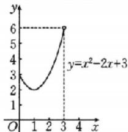

line

| x | y |
|---|---|
| 0 | 3 |
| 1 | 2 |
| 2 | 2 |
| 3 | 6 |
| 4 | 6 |

图1

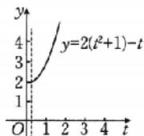  
图2

2. $\left[-\frac{1}{3},1\right]$ $(-∞,-3]∪[1,+∞)$ 解析（基本不等式

法) 因为 $y=\frac{x+1}{(x+1)^{2}-(x+1)+1}$ ，所以当 $x+1=0$ 时，y=0；

当 $x + 1 \neq 0$ 时, $y = \frac{1}{x + 1 + \frac{1}{x + 1} - 1}$ , 由基本不等式的性质可

知， $x+1+\frac{1}{x+1}\geqslant2$ 或 $x+1+\frac{1}{x+1}\leqslant-2$ ，则 $y\in\left[-\frac{1}{3},0\right)$ $\cup(0,1]$ .

综上， $y=\frac{x+1}{x^{2}+x+1}$ 的值域为 $\left[-\frac{1}{3},1\right]$ .

(判别式法)由题意可知函数的定义域为 $\{x\mid x\neq-1\}$ ，由 $y=\frac{x^{2}+x+1}{x+1}$ ，得 $x^{2}+(1-y)x+1-y=0$ 。因为当 $x\neq-1$ 时，上式成立，所以 $\Delta\geqslant0$ ，即 $(1-y)^{2}-4(1-y)\geqslant0$ ，解得 $y\leqslant-3$ 或 $y\geqslant1$ 。故 $y=\frac{x^{2}+x+1}{x+1}$ 的值域为 $(-∞,-3]∪[1,+∞)$ 。

3. $[3 - \sqrt{5}, 5]$ 解析 $f(x) = 2x - 3 - \sqrt{-x^2 + 6x - 8} = 2x - 3 - \sqrt{1 - (x - 3)^2}$ ,

由 $-x^{2}+6x-8\geqslant0$ ，解得 $2\leqslant x\leqslant4$ .

令 $t = 2x - 3 - \sqrt{1 - (x - 3)^2}$ 即 $\sqrt{1 - (x - 3)^2} = 2x - 3 - t.$

将求函数 $f(x) = 2x - 3 - \sqrt{-x^2 + 6x - 8}$ 的值域转化为求曲线 $y = \sqrt{1 - (x - 3)^2}$ 与直线 $y = 2x - 3 - t$ 有交点时 $t$ 的取值范围.

在同一坐标系中作出函数 $y =$

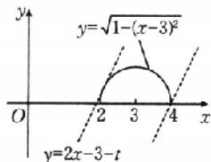

text_image

y
y=√(1-(x-3)²)
O 2 3 4 x
y=2x-3-t

$\sqrt{1-(x-3)^{2}}$ 与 y=2x-3-t 的图象，如图所示.

由图象知，当直线 $y = 2x - 3 - t$ 与半圆 $(x - 3)^2 + y^2 = 1$ 相切时， $t$ 的值最小，

此时 $\frac{|3 - t|}{\sqrt{1 + 4}} = 1$ ，解得 $t = 3\pm \sqrt{5}$ ，由图象知 $t = 3 - \sqrt{5}$

当直线 y=2x-3-t 过点(4,0)时，t 的值最大，此时 t=5.

故 $t \in [3 - \sqrt{5}, 5]$ , 即 $f(x)$ 的值域是 $[3 - \sqrt{5}, 5]$ .

# 第07课时 函数的单调性与最值

# 必备知识·逐点梳理

$$
- 1. f (x _ {1}) <   f (x _ {2}) \quad f (x _ {1}) > f (x _ {2})
$$

微思考（1）不能.例如函数 $f(x) = x^{2}$ ，取 $D = \mathbf{R},A = [0,$ $+\infty),A\subseteq D.\forall x_1,x_2\in A$ ，当 $x_{1} <   x_{2}$ 时，都有 $f(x_{1})<$ $f(x_{2})$ ，但函数 $f(x) = x^2$ 在 $D$ 上不具有单调性.

(2)并非所有的函数都具有单调性.如狄利克雷函数 $D(x) = \left\{ \begin{array}{ll}1,x & \text{为有理数，}\\ 0,x & \text{为无理数，} \end{array} \right.$ 它不具有单调性.

# 2. 单调递增 单调递减

微判断 (1)× (2)×

$$
\text { 二、 } f (x) \leqslant M \quad f (x _ {0}) = M \quad f (x) \geqslant M \quad f (x _ {0}) = M
$$

# 关键考点·核心突破

# 考点一

例1 解析 任取 $x_{1}, x_{2} \in [2, +\infty)$ ，且 $x_{1} < x_{2}$ ，

则 $f(x_{1}) - f(x_{2}) = x_{1} + \frac{4}{x_{1}} -\left(x_{2} + \frac{4}{x_{2}}\right) = (x_{1} - x_{2}) +$

$$
\frac {4 (x _ {2} - x _ {1})}{x _ {1} x _ {2}} = (x _ {1} - x _ {2}) \left(1 - \frac {4}{x _ {1} x _ {2}}\right).
$$

因为 $2 \leqslant x_{1} < x_{2}$ , 所以 $x_{1} - x_{2} < 0, \frac{4}{x_{1}x_{2}} < 1$ ,

所以 $(x_{1} - x_{2})\left(1 - \frac{4}{x_{1}x_{2}}\right) < 0,$

所以 $f(x_{1}) - f(x_{2}) < 0$ ，即 $f(x_{1}) < f(x_{2})$

所以函数 $f(x)$ 在区间 $[2, +\infty)$ 上单调递增.

例 2 C 解析 对于 A, $y=\ln x$ 在 $(0,+\infty)$ 上单调递增，所以 $f(x)=-\ln x$ 在 $(0,+\infty)$ 上单调递减，故 A 错误；

对于 $B, y = 2^x$ 在 $(0, +\infty)$ 上单调递增，

所以 $f(x)=\frac{1}{2^{x}}$ 在 $(0,+\infty)$ 上单调递减，故 B 错误；

对于 $\mathbf{C}, y = \frac{1}{x}$ 在 $(0, +\infty)$ 上单调递减，

所以 $f(x) = -\frac{1}{x}$ 在 $(0, +\infty)$ 上单调递增，故C正确；

对于 $\mathrm{D}, f(x) = 3^{|x - 1|}$ 在 $(0, +\infty)$ 上不是单调的，故D错误. 故选C.

# 随堂加练

1.[2, +∞) (−∞, −3] 解析 令 $u = x^{2} + x - 6$ ，则 $y = \sqrt{x^{2} + x - 6}$ 可以看作是由 $y = \sqrt{u}$ 与 $u = x^{2} + x - 6$ 复合而成的函数。令 $u = x^{2} + x - 6 \geqslant 0$ ，解得 $x \leqslant -3$ 或 $x \geqslant 2$ 。易知 $u = x^{2} + x - 6$ 在 $(-∞, -3]$ 上单调递减，在 $[2, +∞)$ 上单调递增，而 $y = \sqrt{u}$ 在 $[0, +∞)$ 上单调递增，所以 $y = \sqrt{x^{2} + x - 6}$ 的单调递减区间为 $(-∞, -3]$ ，单调递增区间为 $[2, +∞)$ 。

2. 解析 设 $-1 < x_{1} < x_{2} < 1$

则 $f(x_{1}) - f(x_{2}) = a\left(\frac{x_{1}}{x_{1} + 1} -\frac{x_{2}}{x_{2} + 1}\right) = \frac{a(x_1 - x_2)}{(x_1 + 1)(x_2 + 1)}.$

因为 $-1 < x_{1} < x_{2} < 1$ ，所以 $x_{1} + 1 > 0, x_{2} + 1 > 0, x_{1} - x_{2} < 0$

故当 a>0 时， $f(x_{1})-f(x_{2})<0$ ，即 $f(x_{1})<f(x_{2})$ ，函数 $f(x)$ 在 $(-1,1)$ 上单调递增；

当 $a < 0$ 时， $f(x_{1}) - f(x_{2}) > 0$ ，即 $f(x_{1}) > f(x_{2})$ ，函数 $f(x)$ 在 $(-1, 1)$ 上单调递减。

# 考点二

例3 B 解析 $\because$ 函数 $y = f(x)$ 的图象关于直线 $x = 1$ 对称，且对任意 $x_{1}, x_{2} \in (-\infty, 1]$ ，当 $x_{1} \neq x_{2}$ 时，都有 $\frac{f(x_{1}) - f(x_{2})}{x_{1} - x_{2}} < 0$

$\therefore y = f(x)$ 在 $(- \infty, 1]$ 上单调递减，在 $[1, +\infty)$ 上单调递增.

又 $f(0) = f(2),\therefore f(3) > f(0) > f\left(\frac{3}{2}\right)$ 故选B.

例4 D 解析 因为函数 $f(x)$ 是定义在区间 $[0, +\infty)$ 上的增函数，且 $f(2x - 1) < f\left(\frac{1}{3}\right)$ ，所以 $0 \leqslant 2x - 1 < \frac{1}{3}$ ，解得 $\frac{1}{2} \leqslant x < \frac{2}{3}$ .

故选D.

例5 C 解析 由 $y = x$ 在[1,4]上单调递增，且 $y = \frac{2}{x}$ 在[1,4]上单调递减，可得 $f(x) = x - \frac{2}{x} + 1$ 在[1,4]上单调递增，所以最大值为 $f(4) = \frac{9}{2}$ .

例6 $\left[-\frac{3}{4},0\right]$ 解析 因为函数 $f(x) = -mx^2 +3x + 1$ 在区间 $(-2, + \infty)$ 上是增函数，所以当 $m = 0$ 时， $f(x) = 3x + 1$ 在 $\mathbf{R}$ 上单调递增. 当 $m\neq 0$ 时，若 $-m > 0$ ，则 $f(x)$ 在 $\left(\frac{3}{2m}, + \infty\right)$ 上单调递增，由 $(-2, + \infty)\subseteq \left(\frac{3}{2m}, + \infty\right)$ ，可得 $\frac{3}{2m}\leqslant$ -2，解得 $-\frac{3}{4}\leqslant m <   0$ ；若 $-m <   0$ ，则 $f(x)$ 在 $\left(\frac{3}{2m}, + \infty\right)$ 上单调递减，则 $f(x)$ 在 $(-2, + \infty)$ 上不可能单调递增. 故实数 $m$ 的取值范围是 $\left[-\frac{3}{4},0\right].$

# 随堂加练

1. D 解析 $\because$ 当 $x_{1} \neq x_{2}$ 且 $x_{1}, x_{2} \in (1, +\infty)$ 时， $[f(x_{2}) - f(x_{1})] \cdot (x_{2} - x_{1}) < 0$ 恒成立，

$\therefore f(x)$ 在 $(1, +\infty)$ 上单调递减. 又 $f(x)$ 的图象关于直线 $x = 1$ 对称， $\therefore a = f\left(-\frac{1}{2}\right) = f\left(\frac{5}{2}\right)$ .

$\because 2<\frac{5}{2}<e,\therefore f(2)>f\left(\frac{5}{2}\right)>f(e)$ ，即b>a>c.故选D.

2. A 解析 因为 $f(x)$ 是定义在 $[-1, 1]$ 上的减函数，

且 $f(2a-3)<f(a-2)$ ,

所以 $\left\{\begin{aligned}-1&\leqslant2a-3\leqslant1,\\ -1&\leqslant a-2\leqslant1,\\ 2a&-3>a-2,\end{aligned}\right.$ 解得 $1<a\leqslant2$ ，所以实数a的取值范围是(1,2].故选A.

3.11 解析 因为 $y = 3^x$ 在 $\mathbf{R}$ 上是增函数, $y = \log_2(x + 2)$ 在 $[-1, 2]$ 上单调递增, 所以 $f(x)$ 在 $[-1, 2]$ 上单调递增, 故 $f(x)$ 在 $[-1, 2]$ 上的最大值为 $f(2) = 3^2 + \log_24 = 11$ .

4. -3 $[-3, +\infty)$ 解析 函数 $f(x)$ 图象的对称轴为直线 $x = \frac{1 - a}{4}$ ，由 $\frac{1 - a}{4} = 1$ ，得 a = -3.

因为函数 $f(x)$ 图象的对称轴为直线 $x=\frac{1-a}{4}$ ，且函数 $f(x)$ 在区间 $[1,+\infty)$ 上单调递增，所以 $\frac{1-a}{4}\leqslant1$ ，解得 $a\geqslant-3$ ，所以实数 a 的取值范围为 $[-3,+\infty)$ .

# 深挖教材 04 对勾函数与飘带函数

母题剖析 解析 (1) 设 $y = f(x), x_1 < x_2$ ，且 $x_1 \neq 0, x_2 \neq 0$ ，则 $f(x_1) - f(x_2) = (x_1 - x_2)(1 - \frac{9}{x_1 x_2})$ .

①当 $x_{1}, x_{2} \in [3, +\infty)$ 时，

$$
x _ {1} - x _ {2} <   0, x _ {1} \cdot x _ {2} > 9,
$$

所以 $f(x_{1})-f(x_{2})<0$ ，即 $f(x_{1})<f(x_{2})$

所以 $y=f(x)$ 在区间 $[3,+\infty)$ 上单调递增；

②当 $x_{1}, x_{2} \in (0,3)$ 时，

$$
x _ {1} - x _ {2} <   0, 0 <   x _ {1} \cdot x _ {2} <   9,
$$

所以 $f(x_{1})-f(x_{2})>0$ ，即 $f(x_{1})>f(x_{2})$ ，

所以 $y=f(x)$ 在区间 $(0,3)$ 上单调递减.

故函数 $y=x+\frac{9}{x}$ 在区间 $(0,3)$ 上单调递减，在区间 $[3,+\infty)$ 上单调递增.

(2) 设 $y = f(x), x_1 < x_2$ ，且 $x_1 \neq 0, x_2 \neq 0$ ，则 $f(x_1) - f(x_2) = (x_1 - x_2) \cdot \left(1 - \frac{k}{x_1 x_2}\right)$ .

①当 $x_{1}, x_{2} \in [\sqrt{k}, +\infty)$ 时，

$$
x _ {1} - x _ {2} <   0, x _ {1} \cdot x _ {2} > k,
$$

所以 $f(x_{1})-f(x_{2})<0$ ，即 $f(x_{1})<f(x_{2})$ ，

所以 $y=f(x)$ 在区间 $\left[\sqrt{k},+\infty\right)$ 上单调递增；

②当 $x_{1}, x_{2} \in (0, \sqrt{k})$ 时，

$$
x _ {1} - x _ {2} <   0, 0 <   x _ {1} \cdot x _ {2} <   k,
$$

所以 $f(x_{1})-f(x_{2})>0$ ，即 $f(x_{1})>f(x_{2})$ ，

所以 $y=f(x)$ 在区间 $(0,\sqrt{k})$ 上单调递减.

故函数 $y=x+\frac{k}{x}(k>0)$ 在区间 $(0,\sqrt{k})$ 上单调递减，在区间 $[\sqrt{k},+\infty)$ 上单调递增.

(3) 设 $y = f(x), x_1 < x_2$ ，且 $x_1 \neq 0, x_2 \neq 0$ ，则 $f(x_1) - f(x_2) = (x_1 - x_2) \left(1 + \frac{1}{x_1 x_2}\right)$ .

①当 $x_{1}, x_{2} \in (0, +\infty)$ 时， $x_{1}x_{2} > 0$

因为 $x_{1}<x_{2}$ ，所以 $f(x_{1})<f(x_{2})$ ，

所以 $y=f(x)$ 在 $(0,+\infty)$ 上单调递增.

②当 $x_{1}, x_{2} \in (-\infty, 0)$ 时， $x_{1}x_{2} > 0$ ，

因为 $x_{1}<x_{2}$ ，所以 $f(x_{1})<f(x_{2})$ ，

所以 $y=f(x)$ 在 $(-∞,0)$ 上单调递增.

因此函数 $y=x-\frac{1}{x}$ 在 $(-∞,0),(0,+∞)$ 上都单调递增.

# 子题探究

1. BCD 解析 当 a > 0 时， $f(x) = x - \frac{a}{x}$ 的定义域为 $(-∞, 0) ∪ (0, +∞)$ ， $f(x)$ 在 $(-∞, 0)$ ， $(0, +∞)$ 上单调递增，故 A 错误；

当 a > 0 时，由飘带函数的性质可知， $f(x)$ 的值域为 R，故 D 正确；

当 $a = -4$ 时， $f(x) = x + \frac{4}{x}$ ，其图象如图所示，由图象知 $f(x)$ 的单调递增区间为 $(- \infty, -2)$ ， $(2, +\infty)$ ，值域为 $(- \infty, -4] \cup [4, +\infty)$ ，故 B、C 正确。故选 BCD.

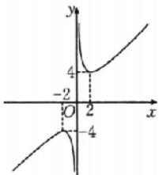

line

| Point | x | y |
|---|---|---|
| -2 | 0 | 4 |
| 0 | 2 | -4 |
| 2 | 2 | 4 |

2. $\left[30, \frac{109}{2}\right] \left[-\frac{11}{2}, \frac{91}{2}\right]$ 解析 易知函数 $f(x) = 25x + \frac{9}{x}$ 在 $\left[\frac{1}{2}, 2\right]$ 上为“对勾函数”的一部分，解方程 $25x = \frac{9}{x}$ ，得 $x = \frac{3}{5}$ （负根舍去），所以 $f(x)$ 在 $\left[\frac{1}{2}, \frac{3}{5}\right]$ 上单调递减，在 $\left[\frac{3}{5}, 2\right]$ 上单调递增，所以 $f(x)_{\min} = f\left(\frac{3}{5}\right) = 30.$

又 $f\left(\frac{1}{2}\right) = \frac{61}{2}, f(2) = \frac{109}{2}$ ,

所以 $f(x)_{\max} = f(2) = \frac{109}{2}$

所以函数 $f(x) = 25x + \frac{9}{x}$ 在 $\left[\frac{1}{2}, 2\right]$ 上的值域为 $\left[30, \frac{109}{2}\right]$ . 易知函数 $g(x) = 25x - \frac{9}{x}$ 在 $\left[\frac{1}{2}, 2\right]$ 上为“飘带函数”的一部分，且 $g(x)$ 在 $\left[\frac{1}{2}, 2\right]$ 上单调递增，所以 $g(x)_{\min} =$

$$
g \left(\frac {1}{2}\right) = - \frac {1 1}{2}, g (x) _ {\max} = g (2) = \frac {9 1}{2},
$$

所以函数 $g(x)=25x-\frac{9}{x}$ 在 $\left[\frac{1}{2},2\right]$ 上的值域为 $\left[-\frac{11}{2},\frac{91}{2}\right]$ .

# 第08课时 函数的奇偶性、周期性

# 必备知识·逐点梳理

一、 $f(-x)=f(x)$ y 轴 $f(-x)=-f(x)$ 原点

微判断 (1)× (2)×

二、1. $f(x+T)=f(x)$

2. 最小 最小的正数

# 关键考点·核心突破

# 考点一

例1 解析 (1)函数的定义域为 $\{x \mid x \neq 0\}$ , 关于原点对称, 并且对于定义域内的任意一个 $x$ 都有 $f(-x) = (-x)^3 - \frac{1}{-x} = -\left(x^3 - \frac{1}{x}\right) = -f(x)$ , 所以 $f(x)$ 为奇函数.

(2) $f(x)$ 的定义域为 $\{-1,1\}$ ，关于原点对称.

又 $f(-1)=f(1)=0, f(-1)=-f(1)=0,$

所以 $f(x)$ 既是奇函数又是偶函数.

(3) 因为 $f(x)=x^{2}-|x|+1, x\in[-1,4]$ 的定义域不关于原点对称，所以 $f(x)$ 是非奇非偶函数.

(4)(法一:定义法)当 x>0 时, $f(x)=-x^{2}+2x+1,-x<0$ , $f(-x)=(-x)^{2}+2(-x)-1=x^{2}-2x-1=-f(x)$ ;
当 x<0 时， $f(x)=x^{2}+2x-1,-x>0,f(-x)=-(-x)^{2}+2(-x)+1=-x^{2}-2x+1=-f(x).$

所以 $f(x)$ 为奇函数.

(法二:图象法)作出函数 $f(x)$ 的大致图象,如图所示.

由奇函数的图象关于原点对称的特征知函数 $f(x)$ 为奇函数.

(5) $f(x)$ 的定义域为 $(-1,1)$ ，关于原点对称.

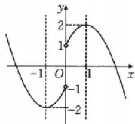

line

| x | y |
|---|---|
| -1 | -2 |
| 0 | 1 |
| 1 | 2 |
| 1 | -1 |

因为 $f(x)=(x-1)\sqrt{\frac{1+x}{1-x}}=$ $-\sqrt{(1-x)(1+x)}$ ,

所以 $f(-x)=-\sqrt{(1+x)(1-x)}=f(x)$ ，所以 $f(x)$ 是偶函数.

# 随堂加练

1.B 解析 对于 A, 设 $f(x)=\frac{\mathrm{e}^{x}-x^{2}}{x^{2}+1}$ ，函数的定义域为 R，

$f(-1)=\frac{e^{-1}-1}{2},f(1)=\frac{e-1}{2}$ ，则 $f(-1)\neq f(1)$ ，故A错误；

对于 B, 设 $g(x)=\frac{\cos x+x^{2}}{x^{2}+1}$ ，函数的定义域为 R，且 $g(-x)=\frac{\cos(-x)+(-x)^{2}}{(-x)^{2}+1}=\frac{\cos x+x^{2}}{x^{2}+1}=g(x)$ ，则 $g(x)$ 为偶函数，故 B 正确；

对于 C, 设 $h(x)=\frac{e^{x}-x}{x+1}$ ，函数的定义域为 $\{x \mid x \neq -1\}$ ，不关于原点对称，则 $h(x)$ 不是偶函数，故 C 错误；

对于 D, 设 $\varphi(x)=\frac{\sin x+4x}{e^{|x|}}$ ，函数的定义域为 R，
因为 $\varphi(1)=\frac{\sin 1+4}{e},\varphi(-1)=\frac{-\sin 1-4}{e}$

所以 $\varphi(1) \neq \varphi(-1)$ , 则 $\varphi(x)$ 不是偶函数, 故 D 错误.

故选 B.

2. AC 解析 对于 A, 由正弦函数的性质可知, $y = \sin x$ 为奇函数; 对于 B, 由余弦函数的性质可知, $y = \cos x$ 为偶函数; 对于 C, 由幂函数的性质可知, $y = x^3$ 为奇函数; 对于 D, 由指数函数的性质可知, $y = 2^x$ 为非奇非偶函数. 故选 AC.

# 考点二

例2-6 解析 因为 $f(x)$ 是定义域为 $\mathbf{R}$ 的奇函数，

所以 $f(x)+f(-x)=0$ . 又 $f(2)=2\times3=6$ ,

所以 $f(-2)=-f(2)=-6.$

例 3 D 解析 依题意得, 当 x<0 时, -x>0,

则 $f(x)=-f(-x)=-(e^{-x}-1)=-e^{-x}+1$ . 故选 D.

例4 (1)(-2,2) (2)(-1,3) $\left(\frac{1}{2},2\right)$ 解析 (1) $\because f(x)$

为 R 上的偶函数，∴ $f(-2)=f(2)=0$ .

又 $f(x)$ 在 $(-\infty, 0]$ 上是减函数， $\therefore f(x)$ 在 $[0, +\infty)$ 上是增函数，

∴当-2<x<2时， $f(x)<0,\therefore f(x)<0$ 的解集为 $(-2,2)$ .

(2) $\because f(x)$ 为偶函数, $\therefore f(x)=f(|x|)$ ,

∴ $f(x-1)<f(2)$ ，即 $f(|x-1|)<f(2)$ .

又 $f(x)$ 在区间 $[0, +\infty)$ 上单调递增，所以 $|x-1| < 2$ ，

解得-1<x<3，

∴满足 $f(x-1)<f(2)$ 的 x 的取值范围是 $(-1,3)$ .

$\because f(x)$ 为奇函数， $\therefore f(-x)=-f(x)$ ,

$\therefore f(x - 1) + f(x) > 0 \Rightarrow f(x - 1) > -f(x) = f(-x)$ .

又 $f(x)$ 在区间 $(-2, 2)$ 上单调递增，

$\therefore \left\{ \begin{array}{l} -2 < x - 1 < 2, \\ -2 < -x < 2, \\ x - 1 > -x, \end{array} \right.$ 解得 $\frac{1}{2} < x < 2,$

∴满足 $f(x-1)+f(x)>0$ 的 x 的取值范围是 $\left(\frac{1}{2},2\right)$ .

例50 解析 由 $f(x) = x^{2} + ax + 1$ ，可得 $f(-x) = x^2 - ax + 1.$

因为 $f(x)$ 为偶函数，所以 $f(-x)=f(x)$ ，即 $x^{2}-ax+1=x^{2}+ax+1$ ，

所以 2ax=0，故 a=0。

例60 解析 因为 $f(x)$ 是奇函数，所以 $f(-x) + f(x) = 0$ ，即 $x^{3} + a + (-x)^{3} + a = 0$ ，故 $a = 0$

# 随堂加练

1.B 解析 由定义在 $\mathbf{R}$ 上的奇函数 $f(x)$ 在 $(-\infty,0)$ 上单调递减，

可得 $f(x)$ 在 $(0, +\infty)$ 上是减函数.

又 $f(-3) = -f(3) = 0$

所以不等式 $xf(x) > 0$ ，等价于 $\left\{ \begin{array}{l}x > 0,\\ f(x) > 0 \end{array} \right.$ 或 $\left\{ \begin{array}{l}x <   0,\\ f(x) <   0, \end{array} \right.$

所以当 $x > 0$ 时， $f(x) > 0 = f(3)$ ，解得 $0 < x < 3$ ；

当 x<0 时， $f(x)<0=f(-3)$ ，解得 -3<x<0。

综上， $xf(x)>0$ 的解集为 $(-3,0)\cup(0,3)$ .

故选B.

2. B 解析 （法一）由 $\frac{2x - 1}{2x + 1} > 0$ ，得 $x > \frac{1}{2}$ 或 $x < -\frac{1}{2}$ .

因为 $f(x)$ 是偶函数，所以 $f(-x)=f(x)$ ，

则 $(-x + a)\ln \frac{-2x - 1}{-2x + 1} = (x + a)\ln \frac{2x - 1}{2x + 1},$

即 $(-x + a)\ln \left(\frac{2x - 1}{2x + 1}\right)^{-1} = (x + a)\ln \frac{2x - 1}{2x + 1},$

则 $(x - a)\ln \frac{2x - 1}{2x + 1} = (x + a)\ln \frac{2x - 1}{2x + 1},$

所以 $x - a = x + a$ ，解得 $a = 0$

(法二)因为 $f(x)$ 为偶函数，所以 $f(-1)=f(1)$ ，

即 $(-1+a)\ln3=(1+a)\ln\frac{1}{3}$ ，解得a=0.

(法三)令 $g(x)=\ln\frac{2x-1}{2x+1}$ ，则 $g(-x)=-g(x)$ ，

所以 $g(x)$ 为奇函数.

若 $f(x) = (x + a)\cdot \ln \frac{2x - 1}{2x + 1}$ 为偶函数，则 $h(x) = x + a$ 为奇函数，故 $a = 0$

故选 B.

3.2 $-x^{2} - 3x$ 解析 因为 $f(x)$ 是定义在 $(-\infty, +\infty)$ 上的奇函数，所以 $f(-x) = -f(x)$ ，

则 $f(-2)=-f(2)=-4+6=2.$

令 x<0，则 -x>0，

故 $f(-x) = (-x)^2 + 3x = x^2 + 3x = -f(x)$ ,

故当 x<0 时， $f(x)=-x^{2}-3x$ .

又 $f(0) = 0$ ，故 $x = 0$ 时也成立，

所以当 $x \leqslant 0$ 时， $f(x) = -x^2 - 3x$ .

# 考点三

例7 (1)0 (2)339 解析 (1)因为 $f(x + 2) = -\frac{1}{f(x)}$ ，则 $f(x + 4) = -\frac{1}{f(x + 2)} = f(x)$ ，所以函数 $f(x)$ 是周期为4的周期函数，

则 $f(2026)=f(506\times4+2)=f(2)=2^{2}-4=0.$

(2) 因为 $f(x+6)=f(x)$ ，所以函数 $f(x)$ 是周期为 6 的周期函数，

当 $-1\leqslant x<3$ 时， $f(x)=x$ ，所以 $f(5)=f(-1)=-1$ ， $f(6)=f(0)=0,f(1)=1,f(2)=2;$

当 $-3\leqslant x<-1$ 时， $f(x)=-(x+2)^{2}$ ，所以 $f(3)=f(-3)=-1,f(4)=f(-2)=0.$

故 $f(1)+f(2)+f(3)+f(4)+f(5)+f(6)=1.$

所以 $f(1)+f(2)+f(3)+\cdots+f(2026)=337[f(1)+f(2)+f(3)+f(4)+f(5)+f(6)]+f(1)+f(2)+f(3)+f(4)=337+1+2-1+0=339.$

# 随堂加练

1. C 解析 因为 $f(x)$ 是定义域为 R 的偶函数，

所以 $f(-x)=f(x)$ ,

故 $f(2 + x) = f(-x) = f(x)$ ，所以 $f(x)$ 的一个周期为2，

故 $f\left(\frac{9}{2}\right)=f\left(\frac{9}{2}-4\right)=f\left(\frac{1}{2}\right)=f\left(-\frac{1}{2}\right)=\frac{1}{2}$ .

故选 C.

2. C 解析 因为 $f(x)$ 的周期为 3, $f(-1)=1$ , 所以 $f(2)=f(-1+3)=f(-1)=1$ .

又 $f(0)=-2$ ，所以 $f(3)=f(0+3)=f(0)=-2$ 。

因为函数 $f(x)$ 在 R 上的图象关于 y 轴对称，

所以 $f(x)$ 为偶函数，故 $f(1)=f(-1)=1$ ，

则 $f(1)+f(2)+f(3)=0.$

故 $f(1)+f(2)+f(3)+\cdots+f(2026)=675\times[f(1)+$

$f(2)+f(3)]+f(1)=0+f(1)=1.$

故选C.

# 强化课02 函数的对称性

# 类型一

典例1 (1) $x = 1$ (2) $(-1, 1)$ 解析 (1)因为函数 $f(x + 1)$ 为偶函数，所以 $f(x + 1) = f(-x + 1)$ ，可得函数 $f(x)$ 的图象关于直线 $x = 1$ 对称，故函数 $f(x)$ 的图象的对称轴方程为 $x = 1$ .

(2) $\because f(x+2)$ 是偶函数, $\therefore f(x+2)$ 的图象关于直线x=0对称,

∴ $f(x)$ 的图象关于直线 x=2 对称.

又 $f(x)$ 在 $[2, +\infty)$ 上单调递减，

∴ $f(x)$ 在 $(-∞,2]$ 上单调递增.

又 $-x^{2},-1\in(-\infty,2],f(-x^{2})>f(-1),\therefore-x^{2}>-1$ ，即 $x^{2}<1,\therefore-1<x<1,$

∴原不等式的解集为 $(-1,1)$ .

# 强化训练

1. D 解析 因为 $f(x+1)$ 是偶函数, 所以其图象的对称轴为直线 x=0,

所以 $f(x)$ 图象的对称轴为直线 x=1.

又二次函数 $f(x)=-x^{2}+bx+c$ 的图象开口向下，

根据自变量与对称轴的距离可得 $f(-1)<f(2)<f(1)$ .
故选 D.

2. D 解析 由 $f(x) = f(4 - x)$ 可知 $y = f(x)$ 的图象关于直线 $x = 2$ 对称， $y = |x - 2|$ 的图象也关于直线 $x = 2$ 对称，所以 $x_{1} + x_{2} + x_{3} + x_{4} = 4 \times 2 = 8$ .

故选 D.

# 类型二

典例2 (1)D (2)见解析 解析 (1)因为 $f(x + 1)$ 为奇函数，所以 $f(x)$ 的图象关于点(1,0)对称.

因为 $f(x)$ 在 $[1, +\infty)$ 上单调递减，所以 $f(x)$ 在 R 上单调递减，

所以 $x^{2}-x>2-2x$ ，即 $x^{2}+x-2>0$ ，解得 x<-2 或 x>1，
所以 x 的取值范围为 $(-∞,-2)∪(1,+∞)$ . 故选 D.

(2)因为定义域为 $\mathbf{R}$ 的函数 $f(x)$ 的图象关于点(1,0)对称，且当 $x \geqslant 1$ 时， $f(x) = x^2 + mx + n$ ，若 $f(-1) = -7$ ，则 $f(3) = -f(-1) = 7$ ，所以 $f(3) = 3^2 + 3m + n = 7$ ，即 $3m + n = -2$ .

# 强化训练

1. ABC 解析 对于 A, $f(x)=\frac{2x-1}{x+2}=\frac{2(x+2)-5}{x+2}=2-\frac{5}{x+2}$ ，其图象可以由 $y=-\frac{5}{x}$ 的图象向左平移 2 个单位长度，再向上平移 2 个单位长度得到，且 $y=-\frac{5}{x}$ 的图象关于原点对称，故 $f(x)=\frac{2x-1}{x+2}$ 的图象关于点 $(-2,2)$ 中心对称，A 正确；

对于 B，因为 $f(2x-1)$ 为奇函数，所以 $f(2x-1) = -f(-2x-1)$ ，所以 $f(x-1) = -f(-x-1)$ ，所以 $f(x) = -f(-x-2)$ ，所以函数 $f(x)$ 的图象关于点 $(-1,0)$ 中心对称，B 正确；

对于 C, 将函数 $y = f(x)$ 的图象向右平移 1 个单位长度, 再向上平移 1 个单位长度得到函数 $y = f(x - 1) + 1$ 的图象, 由于 $y = f(x)$ 的图象过定点 $(0, 1)$ , 故函数 $y = f(x - 1) + 1$ 的图象过定点 $(1, 2)$ , C 正确;

对于 D, 函数 $y=\frac{x-1}{x-b}=\frac{(x-b)+b-1}{x-b}=1+\frac{b-1}{x-b}$ 的图象关于点 $(3,c)$ 中心对称，所以 $\left\{\begin{aligned}3-b=0,\\ c=1,\end{aligned}\right.$ 解得 $\left\{\begin{aligned}b=3,\\ c=1,\end{aligned}\right.$ 所以 $b+c=4,D$ 不正确.

故选 ABC.

2. 解析 因为函数 $y=f(x)$ 的图象关于点 $(2,0)$ 对称，

所以 $f(-x)=-f(4+x)$ .

又 $f(-x) = f(2 + x)$ ，所以 $f(x + 2) + f(x + 4) = 0$

所以 $f(x) - f(x + 4) = 0$ ，即 $f(x) - f(x - 4)$

所以函数 $f(x)$ 的一个周期为 4，所以 $f(2026)=f(2)=0$ .

# 类型三

典例3 A 解析 设 $P(x_0, y_0)$ 为 $y = f(x + 2)$ 图象上任意一

点，则 $y_{0}=f(x_{0}+2)=f(4-(2-x_{0}))$ ,

所以点 $Q(2 - x_0, y_0)$ 在函数 $y = f(4 - x)$ 的图象上.

而点 $P(x_0, y_0)$ 与点 $Q(2 - x_0, y_0)$ 关于直线 $x = 1$ 对称，所以函数 $y = f(x + 2)$ 与 $y = f(4 - x)$ 的图象关于直线 $x = 1$ 对称。故选A.

强化训练 C 解析 与 $f(x) = \mathrm{e}^x$ 的图象关于直线 $x = 1$ 对称的是 $f(2 - x) = \mathrm{e}^{2 - x}$ ，即 $y = \mathrm{e}^{2 - x}$ 的图象。故选 C.

# 类型四

典例4 (1)-1 (2)1 解析 (1)因为 $f(x)$ 是定义在 $\mathbf{R}$ 上的偶函数，所以 $f(x) = f(-x)$ . 因为 $f(2 + x) = f(2 - x)$ ，

所以用 $x + 2$ 代换 $x$ ，得 $f(x + 4) = f(-x)$ ，即 $f(x + 4) = f(x)$ ，所以 $f(x)$ 的周期为4，

所以 $f(2026)=f(2)=f(-2)=-2+1=-1.$

(2) 因为 $f(x)$ 是定义在 R 上的奇函数，所以 $f(x) = -f(-x)$ .

因为 $f(x+4)+f(-x)=0$ ，即 $f(x+4)=-f(-x)=f(x)$ ，所以 $f(x)$ 的周期为 4，

故 $f(2026) = f(2) = -f(-2) = -(-2 + 1) = 1.$

# 强化训练

1. B 解析 $\because f(x)$ 是 $\mathbf{R}$ 上的奇函数， $\therefore f(-x) = -f(x)$ .

$$
\because f (x + 2) = - f (x), \therefore f (x + 4) = - f (x + 2) = f (x),
$$

∴函数 $f(x)$ 是周期为 4 的周期函数，

$$
\begin{array}{l} \therefore f (6) = f (2) = - f (0) = f (0), f (- 7) = f (1), f \left(\frac {1 1}{2}\right) = \\ f \left(\frac {3}{2}\right) = - f \left(- \frac {1}{2}\right) = f \left(\frac {1}{2}\right). \end{array}
$$

又当 $x \in [0,1]$ 时， $f(x)$ 单调递增， $\therefore f(0) < f\left(\frac{1}{2}\right) < f(1)$ ，即 $f(6) < f\left(\frac{11}{2}\right) < f(-7)$ .

故选 B.

2. 解析 因为 $f(x)$ 为定义在 $\mathbb{R}$ 上的奇函数, 所以 $f(-x) = -f(x)$ .

因为 $f(x+2)$ 是偶函数，所以函数 $f(x)$ 的图象关于直线 x=2 对称，

所以 $f(-x + 2) = f(x + 2)$ ，以 $x - 2$ 代换 $x$ ，得 $f(-x + 4) = f(x)$ ，

所以 $f(x + 4) = f(-(-x) + 4) = f(-x) = -f(x)$

所以 $f(x+8)=-f(x+4)=f(x)$ ，所以 $f(x)$ 的周期为 8，

所以 $f(-2\ 025)+f(2\ 026)=-f(2\ 025)+f(2\ 026)=-f(1)+f(2)=-1+2=1.$

# 强化课03 函数性质的综合应用

# 类型一

典例1 (1) ABC (2) (-3, 1) 解析 (1) 根据题意可得 $f(x)$ 是 $\mathbf{R}$ 上的奇函数，且函数 $f(x)$ 在 $(0, +\infty)$ 上单调递增，由 $f(-1) = f(2) = 1$ 可得 $f(1) = f(-2) = -1$ . 由 $f(x)$ 在 $(-\infty, 0)$ 上单调递增，得 $f\left(-\frac{3}{2}\right) > f(-2) = -1$ ，故 $\Lambda$ 正确；由 $f(-1) = 1, f(1) = -1$ ，得 $f(-1) > f(1)$ ，故 $\mathrm{B}$ 正确；由函数 $f(x)$ 在 $(0, +\infty)$ 上单调递增，得 $f(3) > f(2) = 1$ ，故 $\mathrm{C}$ 正确；由函数 $f(x)$ 在 $(0, +\infty)$ 上单调递增，得 $f\left(\frac{1}{2}\right) < f(1) = -1$ ，故 $\mathrm{D}$ 错误. 故选ABC.

(2)由 $f(-x) = -f(x)$ ，得 $a = 0$

$$
\text {   即   } f (x) = - \frac {x}{| x | + 1} = \left\{ \begin{array}{l l} - \frac {x}{x + 1}, & x \geqslant 0, \\ - \frac {x}{- x + 1}, & x <   0. \end{array} \right.
$$

当 $x \geqslant 0$ 时， $f(x) = -1 + \frac{1}{x + 1}$ 在 $[0, +\infty)$ 上单调递减.

又 $f(x)$ 为奇函数，故 $f(x)$ 在 $\mathbf{R}$ 上单调递减.

由 $f(x)$ 为奇函数，可将不等式 $f(x^{2}) + f(2x - 3) > 0$ 化为 $f(x^{2}) > f(3 - 2x)$ ，得 $x^{2} < 3 - 2x$ ，解得 -3 < x < 1，所以原不等式的解集为 $(-3, 1)$ .

# 强化训练

1. $f(-\pi) > f(3) > f(-2)$ 解析 因为 $f(x)$ 是 $\mathbf{R}$ 上的偶函数，所以 $f(-2) = f(2), f(-\pi) = f(\pi)$ .

又 $f(x)$ 在 $[0, +\infty)$ 上单调递增，且 $2 < 3 < \pi$

所以 $f(\pi) > f(3) > f(2)$ ，即 $f(-\pi) > f(3) > f(-2)$ .

2. $(-2,0) \cup (0,2)$ 解析 由题意知 $f(x)$ 在 $(0, +\infty)$ 上是增函数且 $f(2) = 0$ ，所以当 $x \in (0,2)$ 时， $f(x) < f(2) = 0$ ；当 $x \in (2, +\infty)$ 时， $f(x) > f(2) = 0$ 。又因为 $f(x)$ 是奇函数，所以当 $x \in (-2,0)$ 时， $-x \in (0,2), f(-x) < f(2) = 0$ ，所以 $f(x) = -f(-x) > -f(2) = 0$ ；

当 $x \in (-\infty, -2)$ 时， $-x \in (2, +\infty), f(-x) > f(2) = 0$

所以 $f(x)=-f(-x)<-f(2)=0.$

故 $x, f(x), \frac{f(x)}{x}$ 的符号随 $x$ 的变化情况如表所示：

<table><tr><td></td><td> $(-\infty,-2)$ </td><td> $(-2,0)$ </td><td> $(0,2)$ </td><td> $(2,+\infty)$ </td></tr><tr><td>x</td><td>-</td><td>-</td><td>+</td><td>+</td></tr><tr><td>f(x)</td><td>-</td><td>+</td><td>-</td><td>+</td></tr><tr><td> $\frac{f(x)}{x}$ </td><td>+</td><td>-</td><td>-</td><td>+</td></tr></table>

由表可知，不等式 $\frac{f(x)}{x} < 0$ 的解集为 $(-2,0) \cup (0,2)$ .

# 类型二

典例2 (1)A (2)ABD 解析 (1)依题意,函数 $f(x)$ 是奇函数,

又 $f(x)$ 的周期为 4，且 $f(-2) = -2$ ，

则 $f(2026)=f(506\times4+2)=f(2)=-f(-2)=2.$

故选 A.

(2) 因为 $f(2x+1)$ 是偶函数，所以 $f(-2x+1)=f(1+2x)$ ,

即 $f(1-x)=f(1+x)$ ，即函数 $f(x)$ 的图象关于直线 x=1 对称，则 $f(x)=f(2-x)$ .

因为 $f(x-1)$ 是奇函数，所以 $f(-x-1)=-f(x-1)$ ，

则 $f(-x-2)=-f(x)=-f(2-x)$ ,

即 $f(x - 2) = -f(2 + x)$ ，则 $f(x) = -f(x + 4)$ ，

即 $f(x+8)=-f(x+4)=f(x)$ ，即函数的周期是8，

则 $f(x)=f(x-16)$ 成立，故 A 正确；

令 $x = 0$ ，由 $f(-x - 1) = -f(x - 1)$ ，得 $f(-1) = -f(-1)$

得 $f(-1)=0, f(3)=0$ ，则 $f(19)=f(3)=0$ ，故 B 正确；

$f(2026)=f(8\times253+2)=f(2)\neq f(3)$ ，故C错误；

$f(2025)=f(8\times253+1)=f(1)$ ，故D正确.

故选 ABD.

# 强化训练

1. CD 解析 因为 $f(x+1)$ 是偶函数, 所以 $f(-x+1)=f(x+1)$ , 从而 $f(-x)=f(x+2)$ .

因为 $f(x-1)$ 是偶函数，所以 $f(-x-1)=f(x-1)$ ，从而 $f(-x)=f(x-2)$ ，

所以 $f(x+2)=f(-x)=f(x-2)$ ，即 $f(x+4)=f(x)$ ，所以 $f(x)$ 是以 4 为周期的周期函数.

因为 $f(-x-1)=f(x-1)$ ,

所以 $f(-x-1+4)=f(x-1+4)$ ,

即 $f(-x + 3) = f(x - 3)$ ，所以 $f(x + 3)$ 是偶函数。故选CD.

2.4 解析 因为 $y = f(x - 1)$ 的图象关于点(1,0)对称，

所以函数 $y=f(x)$ 的图象关于原点对称，

即函数 $f(x)$ 是 R 上的奇函数, 所以 $f(0)=0$ .

又因为 $f(x + 2) = -f(x)$ ，所以 $f(x + 4) = -f(x + 2) = f(x)$ ，故 $f(x)$ 的周期为4，

所以 $f(2\ 024)=f(0)=0, f(2\ 025)=f(506\times4+1)=$ $f(1)=4, f(2\ 026)=f(2)=-f(0)=0,$

所以 $f(2024)+f(2025)+f(2026)=4.$

# 类型三

典例3 (1)C (2)BC 解析 (1) $\because f(4 - x) = f(2 - (x - 2)) = f(x - 2) = -f(2 - x) = -f(x)$ ,

$\therefore f(4-x)+f(x)=0$ ，故 $f(x)$ 的图象关于点 $(2,0)$ 中心对称，故A错误.

$\because f(2-x)=f(x),\therefore f(x)$ 的图象关于直线 x=1 轴对称，故 B 错误.

根据题意可得， $f(x)$ 在 $(0,1)$ 上单调递增.

$\because f(x)$ 的图象关于直线 x=1 轴对称，关于点 $(2,0)$ 中心对称， $\therefore f(x)$ 在 $(2,3)$ 上单调递减，故 C 正确.

又 $\because f(x) = f(2 - x) = -f(x - 2),\therefore f(x + 2) = -f(x),$

$\therefore f(x+4)=-f(x+2)=f(x),\therefore f(x)$ 的周期为4,

则 $f\left(-\frac{7}{2}\right)=f\left(\frac{1}{2}\right)<f\left(\frac{2}{3}\right)$ ，故 D 错误.

故选C.

(2)对于A，因为 $f(-x) + f(x) = 0$ ，且 $f(1 - x) = f(1 + x)$ 所以 $f(1 - (1 + x)) = f(1 + (1 + x))$ ，即 $f(x + 2) = -f(x)$ A错误.

对于 B, 因为 $f(x+2)=-f(x)$ ,

所以 $f(x+4)=-f(x+2)=f(x)$ .

因为 $f(-x)+f(x)=0$ ，所以 $f(-(2+x))+f(2+x)=0$ ，

即 $f(2+x)=-f(-2-x)=-f(2-x)$ ，即 $f(2+x)+f(2-x)=0$ ，

故函数 $y=f(x)$ 的图象关于点 $(2,0)$ 对称，B 正确.

对于 C, 因为 $f(1-x)=f(1+x)$ ，所以函数 $y=f(x+1)$ 是偶函数，C 正确.

对于 D, 因为 $f(1-x)=f(1+x)$ ,

所以 $f(1-(x-1))=f(1+(x-1))$ ，即 $f(2-x)=f(x)\neq f(x-1)$ ，D 错误.

故选 BC.

# 强化训练

1. B 解析 构造函数 $g(x)=xf(x)$ ，该函数的定义域为 R，

所以 $g(-x)=-xf(-x)=-xf(x)=-g(x)$ ,

所以函数 $g(x)$ 为奇函数, 故函数 $g(x)$ 图象的对称中心为坐标原点.

对于 A, 函数 $y=(x-1)f(x-1)$ 的图象由函数 $g(x)$ 的图象向右平移 1 个单位长度得到, 故函数 $y=(x-1)f(x-1)$ 图象的对称中心为 $(1,0)$ ;

对于 B, 函数 $y=(x+1)f(x+1)$ 的图象由函数 $g(x)$ 的图象向左平移 1 个单位长度得到, 故函数 $y=(x+1)f(x+1)$ 图象的对称中心为 $(-1,0)$ ;

对于 C, 函数 $y = xf(x) + 1$ 的图象由函数 $g(x)$ 的图象向上平移 1 个单位长度得到, 故函数 $y = xf(x) + 1$ 图象的对称中心为 $(0,1)$ ;

对于 D, 函数 $y = xf(x) - 1$ 的图象由函数 $g(x)$ 的图象向下平移 1 个单位长度得到, 故函数 $y = xf(x) - 1$ 图象的对称中心为 $(0, -1)$ .

故选B.

2. 解析 因为 $f(x)$ 的图象关于点 $(1,0)$ 对称，

所以 $f(-x)=-f(2+x)$ .

又 $f(x)$ 为 R 上的偶函数，所以 $f(x)=f(-x)$ ，

所以 $f(x+2)=-f(-x)=-f(x)$ ,

所以 $f(x+4)=-f(x+2)=f(x)$ ,

所以 $f(x)$ 是周期为4的周期函数，

所以 $f(3)=f(-1)=f(1)=2-2=0.$

又 $f(0)=1, f(2)=-f(0)=-1,$

所以 $f(0)+f(1)+f(2)+\cdots+f(2026)=506[f(0)+$

$f(1) + f(2) + f(3)] + f(2024) + f(2025) + f(2026) =$

$506 \times (1 + 0 - 1 + 0) + f(0) + f(1) + f(2) = 0.$

# 类型四

典例 4 (1) A (2) ABD 解析 (1) 因为 $f(x+2)=-f(x)$ ，所以 $f(x)$ 的周期为 4.

又 $f(x+1)$ 为偶函数，所以 $f(x)$ 的图象关于直线 x=1 对称，则 $f(2026)=f(2)=f(0)=0$ 。故选 A.

(2) 因为 $f(x)$ 为 R 上的奇函数，且 $g(x)=f(x+1)$ 为偶函数，所以 $f(x)$ 的图象关于点 $(0,0)$ 中心对称，且 $f(x)$ 的图象关于直线 x=1 对称，

所以直线 x = -1 也是对称轴，所以 $f(x)$ 的图象关于直线 x = -1 对称，所以 $f(x) = f(2 - x)$ ，A, D 正确；

易知 $f(x) = f(2 - x) = -f(-x)$ ，故 $f(2 + x) = -f(x)$ ，

所以 $f(4+x)=-f(2+x)=f(x)$ ，所以 $f(x)$ 是周期为 4 的周期函数，则 $g(2025)=f(2026)=f(2)=f(0)=0$ ，B 正确；不能说明 $g(x)$ 的最小正周期为 4，C 错误。

故选 ABD.

# 强化训练

1. ABD 解析 因为 $f(x+2)=-f(x)$ ，所以 $f(x+4)=-f(x+2)=f(x)$ ，所以 $f(x)$ 的周期为 4，即 $f(x)$ 是周期函数，故 A 正确.

因为 $f(x+2)=-f(x)$ ，所以 $f(-x+2)=-f(-x)$ 。又因为 $f(x)$ 为奇函数，所以 $f(2-x)=f(x)$ ，所以函数 $f(x)$ 的图象关于直线 x=1 对称，故 B 正确。

因为 $f(x)$ 是定义在 R 上的奇函数，所以 $f(0)=0$ ，因为 $f(x)$ 在 $[-1,0]$ 上为增函数，且 $f(x)$ 为奇函数，所以 $f(x)$ 在 $[0,1]$ 上为增函数.

因为 $f(x)$ 的图象关于直线 x=1 对称，所以 $f(x)$ 在 $[1,2]$ 上为减函数，故 C 错误.

因为 $f(x+2)=-f(x)$ ，令 x=0，得 $f(2)=-f(0)=f(0)$ ，故 D 正确。故选 ABD.

2. ABC 解析 对于 A, 因为 $f(x+1)=f(x-3)$ ，所以 $f(x+3+1)=f(x+3-3)$ ，则 $f(x+4)=f(x)$ ，即 $f(x)$ 的周期为 4，故 A 正确；

对于 B, 由 $f(1+x)=f(3-x)$ 知, $f(x)$ 的图象关于直线 x=2 对称, 故 B 正确;

对于 C, 当 $0 \leqslant x \leqslant 2$ 时, $f(x) = x^{2} - x$ 在 $\left(0, \frac{1}{2}\right)$ 上单调递减, 在 $\left(\frac{1}{2}, 2\right)$ 上单调递增,

根据对称性可知，函数 $f(x)$ 在 $\left(0, \frac{1}{2}\right), \left(2, \frac{7}{2}\right)$ 上单调递减，在 $\left(\frac{1}{2}, 2\right), \left(\frac{7}{2}, 4\right)$ 上单调递增，则函数 $f(x)$ 在 $[0, 4]$ 上的最大值为 $f(2) = 4 - 2 = 2$ ，故 C 正确；

对于 D, 根据周期性以及单调性可知, 函数 $f(x)$ 在 $\left(6, \frac{15}{2}\right)$ 上单调递减, 在 $\left(\frac{15}{2}, 8\right)$ 上单调递增, 则函数 $f(x)$ 在 [6, 8] 上的最小值为 $f\left(\frac{15}{2}\right) = f\left(4 + \frac{7}{2}\right) = f\left(\frac{7}{2}\right) = f\left(\frac{1}{2}\right) = \frac{1}{4} - \frac{1}{2} = -\frac{1}{4}$ , 故 D 错误.

故选ABC.

# 第09课时 二次函数与幂函数

# 必备知识·逐点梳理

一、1. (1) $ax^{2}+bx+c(a\neq0)$ (2) $(m,n)$ (3)零点

2. 偶减增增减

二、1. $y=x^{a}$

3.(2)(1,1) (0,0) (3)(1,1) (4)奇函数 偶函数

# 关键考点·核心突破

# 考点一

例 1 (1) B (2) A 解析 (1) 根据幂函数 $y = x^{n}$ 的性质, 在第一象限内的图象情况为:

当 n>0 时，n 越大， $y=x^{n}$ 的递增速度越快，所以曲线 $C_{1}$ 对应的 n=2, $C_{2}$ 对应的 $n=\frac{1}{2}$ ;

当 n<0 时， $|n|$ 越大，曲线越陡峭，所以曲线 $C_{3}$ 对应的 $n=-\frac{1}{2}, C_{4}$ 对应的 n=-2. 故选 B.

(2) 设 $f(x) = x^{\alpha}$ ，由已知得 $\left(\frac{\sqrt{3}}{3}\right)^{\alpha} = \sqrt{3}$ ，解得 $\alpha = -1$ ，

因此 $f(x) = x^{-1}$ ，易知该函数为奇函数.故选A.

# 随堂加练

1. D 解析 当 m=0 时， $y=x^{-2}$ ，由幂函数的性质得， $y=x^{-2}$ 在 $(0,+\infty)$ 上单调递减；

当 m=2 时， $y=x^{4}$ ，由幂函数的性质得，该函数的图象关于 y 轴对称， $y=x^{4}$ 在 $(0,+\infty)$ 上单调递增；

当 m=3 时， $y=x^{10}$ ，由幂函数的性质得，该函数的图象关于 y 轴对称， $y=x^{10}$ 在 $(0,+\infty)$ 上单调递增.

故选D.

2. $(-∞,1]$ 解析 设 $f(x)=x^{\alpha}$ ，则 $(-8)^{\alpha}=-2$ ，解得 $\alpha=\frac{1}{3}$

所以 $f(x) = x^{\frac{1}{3}}$ ，则 $f(x)$ 在 $\mathbf{R}$ 上单调递增，且为奇函数，所以 $f(a + 1)\leqslant -f(a - 3)$ 等价于 $f(a + 1)\leqslant f(3 - a)$

则 $a + 1 \leqslant 3 - a$ ，解得 $a \leqslant 1$

所以实数 a 的取值范围是 $(-∞,1]$ .

# 考点二

例2 $f(x) = -4x^{2} + 4x + 7$ 解析（法一：利用一般式）设 $f(x) = ax^{2} + bx + c(a\neq 0).$

由题意得 $\left\{\begin{aligned}&4a+2b+c=-1,\\&a-b+c=-1,\\&\frac{4ac-b^{2}}{4a}=8,\end{aligned}\right.$ 解得 $\left\{\begin{aligned}a=-4,\\b=4,\\c=7,\end{aligned}\right.$

所以所求二次函数的解析式为 $f(x)=-4x^{2}+4x+7$ .

(法二:利用顶点式)设 $f(x)=a(x-m)^{2}+n(a\neq0)$ .

因为 $f(2)=f(-1)=-1$ ，所以抛物线的对称轴为直线 $x=\frac{2+(-1)}{2}=\frac{1}{2}$ ，所以 $m=\frac{1}{2}$ .

又函数的最大值为8，所以n=8，

所以 $f(x)=a\left(x-\frac{1}{2}\right)^{2}+8.$

因为 $f(2) = -1$ ，所以 $a\left(2 - \frac{1}{2}\right)^2 + 8 = -1$ ，解得 $a = -4$

所以 $f(x)=-4\left(x-\frac{1}{2}\right)^{2}+8=-4x^{2}+4x+7.$

(法三:利用零点式)由 $f(x)+1=0$ 的两根分别为 $x_{1}=2$ , $x_{2}=-1$ , 可设 $f(x)+1=a(x-2)(x+1)(a\neq0)$ ,

即 $f(x)=ax^{2}-ax-2a-1.$

又函数 $f(x)$ 的最大值为8，所以 $\frac{4a(-2a - 1) - a^2}{4a} = 8,$

解得 a = -4 或 a = 0 (舍去),

所以所求二次函数的解析式为 $f(x)=-4x^{2}+4x+7$ .

随堂加练 $f(x)=\frac{1}{2}x^{2}+2x+1$ 7 解析 设 $f(x)=ax^{2}+bx+c(a\neq0)$ .

由 $f(x - 2) = f(-x - 2)$ ，得 $4a - b = 0$ 。①

设 $f(x)$ 的图象与 $\pmb{x}$ 轴交点的横坐标为 $x_{1}, x_{2}$ ,

由 $|x_{1}-x_{2}|=\frac{\sqrt{b^{2}-4ac}}{|a|}=2\sqrt{2}$ ，得 $b^{2}-4ac=8a^{2}$ 。②

由已知得 $c = 1$ ③

由①②③解得 $b=2, a=\frac{1}{2}, c=1$ ，所以 $f(x)=\frac{1}{2}x^{2}+2x+1$ ，

所以 $f(2) = \frac{1}{2} \times 2^2 + 2 \times 2 + 1 = 2 + 4 + 1 = 7.$

# 考点三

例 3 ACD 解析 由题意得 a<0，对称轴为直线 $x=-\frac{b}{2a}=$ 1, 则 b = -2a > 0, 故 A 正确;

当 x=-1 时， $y=a-b+c<0$ ，则 $a+c<b$ ，故 C 正确；

当 x=0 时，y=c>0，则 abc<0，故 D 正确；

当 x=1 时， $y=a+b+c>0$ ，故 B 错误。故选 ACD.

例4 解析 (1) 函数 $f(x) = x^{2} + ax + 3 - a$ 图象的对称轴为直线 $x = -\frac{a}{2}$ .

因为 $f(x)$ 在区间 $[-1,3]$ 上是单调函数，所以 $-\frac{a}{2} \geqslant 3$ 或 $-\frac{a}{2} \leqslant -1$ ，解得 $a \leqslant -6$ 或 $a \geqslant 2$ ，

所以实数 a 的取值范围是 $(-∞, -6] ∪ [2, +∞)$ .

(2) 当 $-\frac{a}{2} \leqslant 0$ ，即 $a \geqslant 0$ 时， $f(x)$ 在区间 $[0, 2]$ 上单调递增，所以 $m(a) = f(0) = 3 - a$ ;

当 $0 < -\frac{a}{2} < 2$ ，即 $-4 < a < 0$ 时，

$f(x)$ 在区间 $\left[0, -\frac{a}{2}\right]$ 上单调递减，在 $\left[-\frac{a}{2}, 2\right]$ 上单调递增，所以 $m(a) = f\left(-\frac{a}{2}\right) = -\frac{1}{4} a^2 - a + 3$

当 $-\frac{a}{2}\geqslant2$ ，即 $a\leqslant-4$ 时， $f(x)$ 在区间 $[0,2]$ 上单调递减，所以 $m(a)=f(2)=a+7$ .

综上， $m(a)=\left\{\begin{aligned}&a+7,a\leqslant-4,\\&-\frac{1}{4}a^{2}-a+3,-4<a<0,\\&3-a,a\geqslant0.\end{aligned}\right.$

例5 解析 (1) 设 $h(x) = f(x) - g(x) = 6x^2 + 12x - 4 - k$ ，问题转化为 $x \in [-3, 3]$ 时， $h(x) \leqslant 0$ 恒成立，故 $h(x)_{\max} \leqslant 0$ 。由二次函数的性质可知 $h(x)_{\max} = h(3) = 86 - k$ 。

由 $86 - k \leqslant 0$ ，得 $k \geqslant 86$ ，即 $k$ 的取值范围为 $[86, +\infty)$ .

(2)由题意，存在 $x \in [-3, 3]$ ，使 $f(x) \leqslant g(x)$ 成立，即 $h(x) = f(x) - g(x) = 6x^2 + 12x - 4 - k \leqslant 0$ 在 $x \in [-3, 3]$ 上有解，故 $h(x)_{\min} \leqslant 0$ 。

由二次函数的性质可知 $h(x)_{\min}=h(-1)=-10-k$ .

由 $-10 - k \leqslant 0$ ，得 $k \geqslant -10$ ，即 $k$ 的取值范围为 $[-10, +\infty)$ .

(3)对任意的 $x_{1}, x_{2} \in [-3, 3]$ , 都有 $f(x_{1}) \leqslant g(x_{2})$ ,

所以 $f(x)_{\max} \leqslant g(x)_{\min}, x \in [-3, 3]$ .

由二次函数的性质可得 $f(x)_{\max} - f(3) = 120 - k, g(x)_{\min} = g(-1) = 2$ ，故 $120 - k \leqslant 2$

得 $k \geqslant 118$ ，即 $k$ 的取值范围为 $[118, +\infty)$ .

# 随堂加练

1. A 解析 对于 $\Lambda$ ，二次函数 $y = ax^2 + bx$ 的图象开口向上，

则 a>0，其对称轴 $x=\frac{b}{2a}>0$ ，则 $\frac{b}{a}<0$ ，即幂函数 $y=x^{\frac{b}{a}}$ (x>0) 为减函数，符合题意；

对于 B，二次函数 $y=ax^{2}+bx$ 的图象开口向下，则 a<0，其对称轴 $x=-\frac{b}{2a}>0$ ，则 $\frac{b}{a}<0$ ，即幂函数 $y=x^{\frac{b}{a}}(x>0)$ 为减函数，不符合题意；

对于 C, 二次函数 $y=ax^{2}+bx$ 的图象开口向上, 则 a>0, 其对称轴 $x=-\frac{b}{2a}=-1$ , 则 $\frac{b}{a}=2$ , 即幂函数 $y=x^{\frac{b}{a}}(x>0)$ 为增函数, 且其增加得越来越快, 不符合题意;

对于 D，二次函数 $y=ax^{2}+bx$ 的图象开口向下，则 a<0，其对称轴 $x=-\frac{b}{2a}>-\frac{1}{2}$ ，则 $0<\frac{b}{a}<1$ ，即幂函数 $y=x^{\frac{b}{a}}(x>0)$ 为增函数，且其增加得越来越慢，不符合题意。故选 A.

2. CD 解析 易知 $f(x) = -x^{3} + m$ 在 R 上是减函数. 依题设, 函数 $g(x) = x^{2} - kx + m$ 在 $[-1, 1]$ 上单调递减, 且函数 $g(x)$ 图象的对称轴为直线 $x = \frac{k}{2}$ , 所以 $\frac{k}{2} \geqslant 1$ , 则 $k \geqslant 2$ . 故 k 的取值可以是 2, 3. 故选 CD.

3.B 解析 因为 $f(x) > 0$ 的解集为 $(-1,3)$ ，所以 $-2x^{2} + bx + c = 0$ 的两个根分别为 $-1,3$ ，

所以 $\left\{\begin{aligned}-\frac{c}{2}&=-1\times3,\\ \frac{b}{2}&=-1+3,\end{aligned}\right.$ 解得 $\left\{\begin{aligned}b&=4,\\ c&=6.\end{aligned}\right.$

令 $g(x)=f(x)+m$ ，则 $g(x)=-2x^{2}+4x+6+m=-2(x-1)^{2}+8+m.$

由 $x \in [-1, 0]$ 可得 $g(x)_{\min} = g(-1) = m$ .

又 $g(x) \geqslant 4$ 在 $[-1,0]$ 上恒成立，所以 $m \geqslant 4$ .

故选 B.

4. 解析 ① 当 a=0 时， $f(x)=-2x$ 在 $[0,1]$ 上单调递减，所以 $f(x)_{\min}=f(1)=-2$ .

②当 a>0 时， $f(x)=ax^{2}-2x$ 的图象开口向上，且对称轴为直线 $x=\frac{1}{a}$ .

当 $\frac{1}{a}<1$ ，即a>1时， $f(x)=ax^{2}-2x$ 图象的对称轴在 $[0,1]$ 内，

所以 $f(x)$ 在 $\left[0, \frac{1}{a}\right]$ 上单调递减，在 $\left[\frac{1}{a}, 1\right]$ 上单调递增，

所以 $f(x)_{\min}=f\left(\frac{1}{a}\right)=\frac{1}{a}-\frac{2}{a}=-\frac{1}{a}.$

当 $\frac{1}{a} \geqslant 1$ ，即 $0 < a \leqslant 1$ 时， $f(x)$ 在 $[0, 1]$ 上单调递减，

所以 $f(x)_{\min}=f(1)=a-2.$

③当 a<0 时， $f(x)=ax^{2}-2x$ 的图象开口向下，且对称轴为直线 $x=\frac{1}{a}$ ，在 $[0,1]$ 的左侧，

所以 $f(x)=ax^{2}-2x$ 在 $[0,1]$ 上单调递减，所以 $f(x)_{\min}=f(1)=a-2$ .

综上所述， $f(x)_{\min}=\left\{\begin{aligned}&a-2,a\leqslant1,\\&-\frac{1}{a},a>1.\end{aligned}\right.$

# 第10课时 指数与指数函数

# 必备知识·逐点梳理

一、1.(1)a (2) $|a|$

2.(3)没有意义

3. $a^{r+s}$ $a^{rs}$ $a^{r}b^{r}$

微思考 等式 $(\sqrt[n]{a})^n = a$ 一定成立，例如 $(\sqrt[3]{-2})^3 = -2$ ， $(\sqrt[4]{2})^4 = 2$ ；等式 $\sqrt[n]{a^n} = a$ 不一定成立，例如 $\sqrt[3]{(-2)^3} = -2$ ， $\sqrt[4]{(-2)^4} = 2.$

二、R $(0,+\infty)$ $(0,1)$ $0<y<1$ $y>1$ $y>1$ $0<y<1$

减增

# 关键考点·核心突破

# 考点一

例1 (1)79 (2) $\frac{a}{b}$ (3) $\frac{2\sqrt{2}}{3}$ (4)47 解析 (1) $\left(\frac{1}{4}\right)^{-2}+$ $27^{-\frac{1}{3}}-(\sqrt{3}-1)^0+256^{\frac{3}{4}}-3^{-1}$ $=(2^{-2})^{-2}+(3^3)^{-\frac{1}{3}}-1+(4^4)^{\frac{3}{4}}-3^{-1}=16+3^{-1}-1+4^3-$ $3^{-1}=79.$

(2) 原式 $= \frac{(a^3b^2a^{\frac{1}{3}}b^{\frac{2}{3}})^{\frac{1}{2}}}{ab^2a^{-\frac{1}{3}}b^{\frac{1}{3}}} = \frac{(a^{\frac{10}{3}}b^{\frac{8}{3}})^{\frac{1}{2}}}{a^{\frac{2}{3}}b^{\frac{7}{3}}} = \frac{a^{\frac{5}{3}}b^{\frac{4}{3}}}{a^{\frac{2}{3}}b^{\frac{7}{3}}} = \frac{a}{b}$ .

(3)由题意可得， $10^{\frac{3m-2n}{2}}=\left[(10^{m})^{3}\div(10^{n})^{2}\right]^{\frac{1}{2}}=(2^{3}\div3^{2})^{\frac{1}{2}}=\frac{2\sqrt{2}}{3}.$

(4)由 $a^{\frac{1}{2}}+a^{-\frac{1}{2}}=3$ ，两边平方，得 $a+a^{-1}=7$ ，再平方得 $a^{2}+a^{-2}=47$ .

随堂加练 BC 解析 对于 A, $\sqrt[12]{(-3)^{4}} = \sqrt[12]{3^{4}} = 3^{\frac{4}{12}} = 3^{\frac{1}{5}} = \sqrt[3]{3} \neq \sqrt[3]{-3}$ ，所以 A 错误；

对于 B, $(a^{\frac{2}{3}}b^{\frac{1}{2}})(-3a^{\frac{1}{2}}b^{\frac{1}{3}})\div\left(\frac{1}{3}a^{\frac{1}{6}}b^{\frac{5}{6}}\right)=-9a^{\frac{2}{3}+\frac{1}{2}-\frac{1}{6}}$ $b^{\frac{1}{2}+\frac{1}{3}-\frac{5}{6}}=-9a(a>0,b>0)$ ，所以 B 正确；

对于 C, $\sqrt[4]{9x^{8}y^{4}}=9^{\frac{1}{4}}(x^{3})^{\frac{1}{4}}(y^{4})^{\frac{1}{4}}=\sqrt{3}x^{2}\cdot|y|=-\sqrt{3}x^{2}y$ 所以 C 正确；

对于 D, 因为 $(x + x^{-1})^{2} = x^{2} + 2 + x^{-2} = 4$ ,

所以 $x + x^{-1} = \pm 2$ ，所以 D 错误。

故选 BC.

# 考点二

例2 (1)D (2)(0,1) 解析 (1)由 $f(x) = a^{x - b}$ 的图象可以观察出，函数 $f(x) = a^{x - b}$ 在定义域上单调递减，所以 $0 < a < 1$ . 又函数 $f(x) = a^{x - b}$ 的图象是由 $y = a^x$ 的图象向左平移得到的，所以 $b < 0$ . 故选D.

(2)作出函数 $y=|2^{x}-1|$ 的图象与直线 y=b，如图所示。由图象可得实数 b 的取值范围是 $(0,1)$ 。

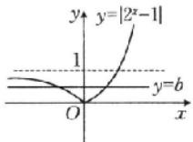

# 随堂加练

1. BD 解析 观察图象得, 函数 $f(x)=a^{x}-b$ 是减函数, 因此 0<a<1.

设图象与 y 轴交点的纵坐标为 $y_{0}$ ，则 $0 < y_{0} < 1$ .

当 $x = 0$ 时， $y = 1 - b$ ，于是得 $0 < 1 - b < 1$ ，解得 $0 < b < 1$ .

故 0<a<1,0<b<1. 故选 BD.

2. $(-∞,0]$ 解析 函数 $y=|3^{x}-1|$ 的图象是由函数 $y=3^{x}$ 的图象向下平移 1 个单位长度后，再把位于 x 轴下方的图象沿 x 轴翻折到 x 轴上方得到的，函数图象如图所示.

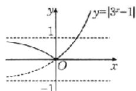

由图象知，函数 $y=|3^{x}-1|$ 在 $(-∞,0]$ 上单调递减，所以实

数 k 的取值范围为 $(-∞,0]$ .

# 考点三

例3 C 解析 因为函数 $y = 1.01^x$ 在 $\mathbf{R}$ 上是增函数，函数 $y = 0.75^x$ 在 $\mathbf{R}$ 上是减函数，且 $3.5 > 2.7$ ，所以 $1.01^{3.5} > 1.01^{2.7} > 1 = 0.75^0 > 0.75^{0.1}$ ，即 $c > b > a$ . 故选C.

例4 (1)-3或1 (2) $(- \infty, 0] \cup [1, 2]$ 解析 (1)因为 $2^{x^2 + 1} = \left(\frac{1}{4}\right)^{x - 2}$ , 所以 $2^{x^2 + 1} = (2^{-2})^{x - 2}$ , 则 $2^{x^2 + 1} = 2^{4 - 2x}$ , 即 $x^2 + 1 = 4 - 2x$ , 解得 $x = -3$ 或 $x = 1$ .

(2) 因为 $y=4^{x}-3\cdot2^{x}+3$ 的值域为 [1,7]，所以 $1\leqslant4^{x}-3\cdot2^{x}+3\leqslant7$ ，且 $2^{x}>0$ ，所以 $0<2^{x}\leqslant1$ 或 $2\leqslant2^{x}\leqslant4$ ，即 $x\leqslant0$ 或 $1\leqslant x\leqslant2$ ，所以 x 的取值范围是 $(-∞,0]∪[1,2]$ .

例5 (1)D (2)AC 解析 (1)函数 $y = 2^{x}$ 在 $\mathbf{R}$ 上单调递增，而函数 $f(x) = 2^{x(x - a)}$ 在区间(0,1)上单调递减，

则函数 $y=x(x-a)=\left(x-\frac{a}{2}\right)^{2}-\frac{a^{2}}{4}$ 在区间 $(0,1)$ 上单调递减，因此 $\frac{a}{2}\geqslant1$ ，解得 $a\geqslant2$ ，

所以 a 的取值范围是 $[2, +\infty)$ . 故选 D.

(2)对于A,B,由 $f(-x)=\frac{3^{-x}-1}{3^{-x}+1}=-\frac{3^{x}-1}{3^{x}+1}=-f(x)$ ，可得函数 $f(x)$ 为奇函数，则函数 $f(x)$ 的图象关于原点对称，所以A正确，B错误；

对于 C, 设 $y = \frac{3^{x} - 1}{3^{x} + 1}$ ，可得 $3^{x} = \frac{1 + y}{1 - y}$ ，所以 $\frac{1 + y}{1 - y} > 0$ ，即 $\frac{1 + y}{y - 1} < 0$ ，解得 -1 < y < 1，即函数 $f(x)$ 的值域为 $(-1, 1)$ ，所以 C 正确；

对于 D, 由 $\forall x_{1}, x_{2} \in \mathbb{R}$ , 且 $x_{1} \neq x_{2}, \frac{f(x_{1}) - f(x_{2})}{x_{1} - x_{2}} < 0$ , 可得函数 $f(x)$ 为减函数, 而 $f(x) = \frac{3^{x} - 1}{3^{x} + 1} = 1 - \frac{2}{3^{x} + 1}$ 为增函数, 所以 D 错误.

故选 AC.

# 随堂加练

1. D 解析 由 $y = 1.01^x$ 在 $\mathbf{R}$ 上单调递增，得 $a = 1.01^{0.5} < b = 1.01^{0.6}$ . 由 $y = x^{0.5}$ 在 $[0, +\infty)$ 上单调递增，得 $a = 1.01^{0.5} > c = 0.6^{0.5}$ ，所以 $b > a > c$ . 故选 D.

2.B 解析 将 $2^{x^2 + 1} \leqslant \left(\frac{1}{4}\right)^{x - 2}$ 化为 $x^2 + 1 \leqslant -2(x - 2)$ , 即 $x^2 + 2x - 3 \leqslant 0$ , 解得 $x \in [-3, 1]$ , 所以 $2^{-3} \leqslant 2^x \leqslant 2^1$ , 所以函数 $y = 2^x$ 的值域是 $\left[\frac{1}{8}, 2\right]$ . 故选 B.

3. ABC 解析 因为 $e^{x}>0$ ，所以 $e^{x}+1>0$ ，所以函数 $f(x)$ 的定义域为 R，故 A 正确；

因为 $f(x) = \frac{\mathrm{e}^x - 1}{\mathrm{e}^x + 1} = 1 - \frac{2}{\mathrm{e}^x + 1}, \mathrm{e}^x > 0 \Rightarrow \mathrm{e}^x + 1 > 1 \Rightarrow 0 < \frac{1}{\mathrm{e}^x + 1} < 1 \Rightarrow -2 < -\frac{2}{\mathrm{e}^x + 1} < 0 \Rightarrow -1 < 1 - \frac{2}{\mathrm{e}^x + 1} < 1,$

所以函数 $f(x)$ 的值域为 $(-1, 1)$ ，故B正确；

因为 $f(-x)=\frac{e^{-x}-1}{e^{-x}+1}=\frac{\frac{1}{e^{x}}-1}{\frac{1}{e^{x}}+1}=\frac{1-e^{x}}{1+e^{x}}=-f(x)$ ，所以函数

$f(x)$ 是奇函数，故C正确；

因为函数 $y = \mathrm{e}^{x} + 1$ 是增函数，所以 $y = \mathrm{e}^{x} + 1 > 1$ ，所以函数$y=\frac{2}{\mathrm{e}^{x}+1}$ 是减函数，所以函数 $y=-\frac{2}{\mathrm{e}^{x}+1}$ 是增函数，故 $f(x)=\frac{\mathrm{e}^{x}-1}{\mathrm{e}^{x}+1}=1-\frac{2}{\mathrm{e}^{x}+1}$ 是增函数，故D不正确.

故选 ABC.

4. 解析 令 $t = |2x - m|$ , 则 $t = |2x - m|$ 在区间 $\left(\frac{m}{2}, +\infty\right)$ 上单调递增, 在区间 $\left(-\infty, \frac{m}{2}\right]$ 上单调递减. 而 $y = 2^r$ 为 $\mathbf{R}$ 上的增函数, 所以要使函数 $f(x) = 2^{|2x - m|}$ 在 $[2, +\infty)$ 上单调递增, 则 $\frac{m}{2} \leqslant 2$ , 即 $m \leqslant 4$ , 所以 $m$ 的取值范围是 $(- \infty, 4]$ .

# 第11课时 对数与对数函数

# 必备知识·逐点梳理

$$
-, x = \log_ {a} N a N
$$

二、1.0 1 N

2. (1) $\log_{a}M + \log_{a}N$ (2) $\log_{a}M - \log_{a}N$ (3) $n \log_{a}M$

微判断 (1)× (2)×

三、 $(0,+\infty)$ (1,0) y>0 y<0 y<0 y>0 增减

四、 $y = x$

# 关键考点·核心突破

# 考点一

例1 (1)2 (2) $\frac{5}{2}$ (3)11 (4) $\frac{2 - a}{a + b}$ 解析 (1)原式 $= \log_535 - \log_5\frac{1}{50} -\log_514 + \log_{\frac{1}{2}}(\sqrt{2})^2$ $= \log_5\frac{35}{\frac{1}{50}\times 14} +\log_{\frac{1}{2}}2 = \log_5125 - 1 = \log_55^3 -1 = 3 - 1 = 2.$

(2) 原式= $2\left(\frac{1}{2}\log_{2}3+\frac{1}{3}\log_{2}3\right)\left(\log_{3}2+\frac{1}{2}\log_{3}2\right)$

$$
= 2 \times \frac {5}{6} \log_ {2} 3 \times \frac {3}{2} \log_ {3} 2 = \frac {5}{2}.
$$

(3) 原式 $= 3 + 2\log_{5}25 + (0.5^{3})^{-\frac{2}{3}} = 3 + 4 + 4 = 11.$

(4) 因为 $a=\log_{14}7, b=\log_{14}5$ ，所以 $a+b=\log_{14}35$ .

又 $\log_{14}28 = \log_{14}\frac{14^2}{7} = 2 - \log_{14}7 = 2 - a$ ，所以 $\log_{35}28 = \frac{\log_{14}28}{\log_{14}35} = \frac{2 - a}{a + b}$

# 随堂加练

1. AD 解析 对于 A, 原式 $=\frac{\lg 3}{\lg 5} \times \frac{\lg 2}{\lg 3} \times \frac{\lg 5}{\lg 2} = 1$ ;
对于 B, 原式 $=\frac{1}{2}\lg 2+\frac{1}{2}\lg 5=\frac{1}{2}\lg(2\times5)=\frac{1}{2}$ ;
对于 C, 原式 $=2\log_{\sqrt{a}}a=2\times2=4;$ 对于 D, 原式 $=3-8^{\frac{1}{3}}=3-2=1$ . 故选 AD.

2. $\sqrt{6}$ 解析 因为 $2^{a} = 3^{b} = m$ ，所以 $a = \log_{2}m, b = \log_{3}m, m > 0.$ 又 $\frac{1}{a} + \frac{1}{b} = 2$ ，所以 $\frac{1}{a} + \frac{1}{b} = \frac{1}{\log_2m} + \frac{1}{\log_3m} = \log_m 2 + \log_m 3 = \log_m (2 \times 3) = 2$ ，所以 $m^2 = 6$ ，所以 $m = \sqrt{6}$ .

# 考点二

例2 C 解析 由图象过点(1,0)知B不正确，由 $f(3) > 1$ 知A不正确，由图象为曲线知D不正确.故选C.

例3 A 解析 由图易得 $a > 1, \therefore 0 < a^{-1} < 1$ ; 取特殊点 $x = 0 \Rightarrow -1 < f(0) = \log_a b < 0$ , 则 $-1 = \log_a \frac{1}{a} < \log_a b < \log_a 1 = 0$ ,

即 $0 < a^{-1} < b < 1$ . 故选 A.

# 随堂加练

1. C 解析 对于 A, 由指数函数的图象, 可得 a > 1, 则 $0 < \frac{1}{a} < 1$ , 即函数 $g(x)$ 在 $(0, +\infty)$ 上单调递减, 故 A 错误;

对于 B, 由指数函数的图象, 可得 0 < a < 1, 则 $\frac{1}{a} > 1$ , 即函数 $g(x)$ 在 $(0, +\infty)$ 上单调递增, 故 B 错误;

对于 C, 由指数函数的图象, 可得 a > 1, 则 $0 < \frac{1}{a} < 1$ , 即函数 $g(x)$ 在 $(0, +\infty)$ 上单调递减, 故 C 正确;

对于 D, 由函数 $g(x)$ 的图象过点 $(1,0)$ 可知 D 错误. 故选 C.

2. D 解析 由函数 $y=a^{x}$ 的图象可得 a>1.

当 a>1 时，函数 $y=\log_{a}x$ 的图象经过定点 $(1,0)$ ，且为增函数.

因为 $y=\log_{a}x$ 与 $y=\log_{a}(-x)$ 的图象关于 y 轴对称，

所以 $y=\log_{a}(-x)$ 的图象经过定点 $(-1,0)$ ，且为减函数。

而 $f(x)=\log_{a}(-x+1)$ 的图象可以看作由 $y=\log_{a}(-x)$ 的图象向右平移 1 个单位长度得到，

所以 $f(x)=\log_{a}(-x+1)$ 的图象经过定点 $(0,0)$ ，且为减函数。故选 D.

# 考点三

例4 A 解析 $a = 1 + \log_43, b = 1 + \log_53, c = 1 + \log_63$ ，因为 $\log_43 > \log_53 > \log_63$ ，所以 $a > b > c$ 。故选A.

例 5 解析 (1) $3x^{2}+2x-1=2x^{2}-1$ , 解得 x=0 或 x=-2.

当 x=0 时， $2x^{2}-1=-1$ ，不符合要求，舍去；

当 x=-2 时， $2x^{2}-1=7$ ，满足要求。

故方程 $\log_{(2x^{2}-1)}(3x^{2}+2x-1)=1$ 的解集为 $\{x|x=-2\}$ .

(2) 因为函数 $y=\log_{3}x$ 为定义域上的增函数，

且 $\log_3\frac{1}{3} = -1$ ，所以 $\left\{ \begin{array}{l}x + 1 > 0,\\ x + 1 > \frac{1}{3}, \end{array} \right.$ 解得 $x > -\frac{2}{3}$

所以不等式 $\log_3(x + 1) > -1$ 的解集为 $\left\{x\mid x > -\frac{2}{3}\right\}$

(3) 因为函数 $y=\log_{\frac{1}{2}}x$ 为定义域上的减函数，

且 $\log_{\frac{1}{2}}x > \log_{\frac{1}{2}}(3x - 2)$

$$
x <   3 x - 2,
$$

所以 $\langle x>0,$ 所以x>1,

$$
\left. 3 x - 2 > 0, \right.
$$

所以不等式 $\log_{\frac{1}{2}}x > \log_{\frac{1}{2}}(3x - 2)$ 的解集为 $\{x \mid x > 1\}$ .

例6 (1)D (2)A 解析 (1) $\because f(x)=\ln(2+2x)+\ln(3-3x)=\ln(6-6x^{2}),\therefore\left\{\begin{aligned}&2+2x>0,\\ &3-3x>0,\end{aligned}\right.$ 解得 -1<x<1，则 $f(x)$ 的定义域为 $(-1,1)$ ，关于原点对称.

$\because f(-x)=\ln(6-6x^{2})=f(x),\therefore$ 函数 $f(x)$ 为偶函数.

$\because f(x)=\ln(1-x^{2})+\ln6$ ，内层函数 $u=1-x^{2}$ 在 $(0,1)$ 上为减函数，外层函数 $y=\ln u$ 为增函数，∴函数 $f(x)$ 在 $(0,1)$ 上为减函数。故选D.

(2) 令函数 $g(x)=x^{2}-2ax+1+a=(x-a)^{2}+1+a-a^{2}$ ，其图象的对称轴为直线 x=a，

要使函数 $f(x)$ 在 $(-\infty, 1]$ 上单调递减，则有 $\left\{ \begin{array}{l} g(1) > 0, \\ a \geqslant 1, \end{array} \right.$ 即 $\left\{ \begin{array}{l} 2 - a > 0, \\ a \geqslant 1, \end{array} \right.$ 解得 $1 \leqslant a < 2$ ，即 $a \in [1, 2)$ . 故选 A.

# 随堂加练

1. D 解析 因为 $\log_{2}0.3<\log_{2}1=0$ ，所以 a<0。

因为 $\log_{\frac{1}{2}}0.4 = -\log_20.4 = \log_2\frac{5}{2} >\log_22 = 1$ ，所以 $b > 1$

因为 $0<0.4^{0.3}<0.4^{0}=1$ ，所以 0<c<1。所以 a<c<b。故选 D。

2. A 解析 函数 $f(x)$ 的定义域为 $\{x \mid x \neq \pm 3\}$ ,

$f(x) = \ln |x + 3| + \ln |x - 3| = \ln |x^2 -9|$

令 $g(x) = |x^2 - 9|$ ，则 $f(x) = \ln g(x)$ ，函数 $g(x)$ 的单调区间由图象（图略）可知，

$g(x)$ 在 $(-∞,-3)$ ， $(0,3)$ 上单调递减，在 $(-3,0)$ ， $(3,+∞)$ 上单调递增.

由复合函数的单调性可得 $f(x)$ 在 $(-∞,-3)$ ， $(0,3)$ 上单调递减，在 $(-3,0)$ ， $(3,+∞)$ 上单调递增.

由 $f(-x) = \ln |(-x)^2 - 9| = \ln |x^2 - 9| = f(x)$ 得 $f(x)$ 为偶函数.

故选 A.

3. $\left(0, \frac{3}{4}\right)$ 解析 设 $u(x) = 3 - 2ax (a > 0$ , 且 $a \neq 1$ ), 则 $u(x)$ 是减函数, 要使函数 $f(x) = \log_a (3 - 2ax)$ 在 $[1, 2]$ 上单调递增, 只需 $y = \log_a u$ 为减函数, 且满足 $u(x) = 3 - 2ax > 0$ 在 $x \in [1, 2]$ 上恒成立,

所以 $\left\{ \begin{array}{l} 0 < a < 1, \\ u(x)_{\min} = u(2) = 3 - 4a > 0, \end{array} \right.$ 解得 $0 < a < \frac{3}{4}$ , 所以实数 $a$ 的取值范围为 $\left(0, \frac{3}{4}\right)$ .

4. $\left(0, \frac{\sqrt{2}}{2}\right) \cup (1, +\infty)$ 解析 因为 $\log_{a} \frac{1}{2} < 2$

所以 $\log_{a}\frac{1}{2}<\log_{a}a^{2}$ .

当 0 < a < 1 时，对数函数为减函数，所以 $\frac{1}{2} > a^{2}$ ，

可得 $0 < a < \frac{\sqrt{2}}{2}$ ;

当 a>1 时，对数函数为增函数，所以 $\frac{1}{2}<a^{2}$ ，可得 a>1.

综上所述， $a$ 的取值范围是 $\left(0, \frac{\sqrt{2}}{2}\right) \cup (1, +\infty)$ .

# 强化课 04 指、对、幂比较大小

# 类型一

典例 1 (1) B (2) C 解析 (1) 因为 $y = 4.2^{x}$ 在 R 上单调递增，且 -0.3 < 0 < 0.3，所以 $0 < 4.2^{-0.3} < 4.2^{0} < 4.2^{0.3}$ ，

所以 $0<4.2^{-0.3}<1<4.2^{0.3}$ ，即 0<a<1<b。因为 $y=\log_{4.2}x$ 在 $(0,+\infty)$ 上单调递增，且 0<0.2<1，所以 $\log_{4.2}0.2<\log_{4.2}1=0$ ，即 c<0。故 b>a>c。故选 B。

(2) 因为函数 $y = \left(\frac{4}{3}\right)^x$ 在 $\mathbf{R}$ 上为增函数，所以 $\left(\frac{4}{3}\right)^{\frac{2}{3}} < \left(\frac{4}{3}\right)^{\frac{3}{4}}$ ，即 $a < b$ .

又因为函数 $y=x^{\frac{3}{4}}$ 为 $(0,+\infty)$ 上的增函数，所以 $\left(\frac{4}{3}\right)^{\frac{3}{4}}<\left(\frac{3}{2}\right)^{\frac{3}{4}}$ ，即 b<c。故 c>b>a。故选 C.

强化训练 A 解析 由题意得 $a = \left(-\frac{2}{3}\right)^{\frac{2}{3}} = \left(\frac{2}{3}\right)^{\frac{2}{3}}, b =$

$\left(-\frac{1}{3}\right)^{\frac{2}{3}} = \left(\frac{1}{3}\right)^{\frac{2}{3}}$ ，由于 $y = x^{\frac{2}{3}}$ 在 $(0, + \infty)$ 上单调递增，故

$1 = 1^{\frac{2}{3}} > a = \left(\frac{2}{3}\right)^{\frac{2}{3}} > b = \left(\frac{1}{3}\right)^{\frac{2}{3}}$ 又 $y = \log_{\frac{2}{3}}x$ 在 $(0, +\infty)$

上单调递减，故 $c = \log_{\frac{2}{3}}\frac{1}{3} >\log_{\frac{2}{3}}\frac{2}{3} = 1.$ 故 $c > a > b$

故选 A.

# 类型二

典例 2 (1) C (2) A 解析 (1) 因为 $1 = \log_{5} 5 > \log_{5} 3 >$

$$
\log_ {5} \sqrt {5} = \log_ {5} 5 ^ {\frac {1}{2}} = \frac {1}{2}, \text {即} \frac {1}{2} <   a <   1, b = 2 ^ {\frac {1}{2}} > 2 ^ {0} = 1, c =
$$

$7^{-0.5} = \left(\frac{1}{7}\right)^{\frac{1}{2}} < \left(\frac{1}{4}\right)^{\frac{1}{2}} = \frac{1}{2}$ , 即 $0 < c < \frac{1}{2}$ , 所以 $b > a > c$ .

故选 C.

(2) 因为 $\log_{5}1<\log_{5}2<\log_{5}\sqrt{5}$ ，所以 $0<a<\frac{1}{2}$ .

因为 $b = \frac{1}{\log_{0.1}0.7} = \log_{0.7}0.1 > \log_{0.7}0.7 = 1$ ，所以 $b > 1$

因为 $0.7^{1}<0.7^{0.3}<0.7^{0}$ ，所以 0.7<c<1。故 a<c<b。

故选 A.

# 强化训练

1. A 解析 $\because 2026^{0.9} > 2026^{0} = 1, 0 < 0.9^{2026} < 0.9^{0} = 1,$

$$
\log_ {2 0 2 6} 0. 9 <   \log_ {2 0 2 6} 1 = 0,
$$

$\therefore a>b>c.$ 故选 A.

2. B 解析 由题意可得 $a = 2^{0.2} > 2^0 = 1, b = 1 - 2\lg 2 = 1 - \lg 4$ ，且 $0 < \lg 4 < 1$ ，则 $0 < b < 1$ .

因为 $\log_{3}10 > \log_{3}9 = 2$ ，所以 $c = 2 - \log_{3}10 < 0$ 。故 a > b > c。
故选 B.

# 第12课时 函数的图象

# 必备知识·逐点梳理

# 一、1. 定义域

# 2. 解析式

# 3. 性质

二、1. $f(x) + k$ $f(x + h)$ $f(x - h)$ $f(x) - k$

微思考 不能, $y=\lg(2x)$ 的图象向左平移1个单位长度应得到函数 $y=\lg[2(x+1)]$ , 即 $y=\lg(2x+2)$ 的图象; 不能, 函数 $y=2^{-x+1}$ 的图象向右平移1个单位长度应得到函数 $y=2^{-(x-1)+1}$ , 即 $y=2^{-x+2}$ 的图象.

2.(1) $f(ax)$ (2) $af(x)$

3.(1) $-f(x)$ (2) $f(-x)$ (3) $-f(-x)$

4.(1) $|f(x)|$ (2) $f(|x|)$

微判断 (1)× (2)× (3)×

# 关键考点·核心突破

# 考点一

例1 解析 (1) 将函数 $y = \log_2 x (x > 0)$ 的图象向左平移 1 个单位长度, 再将在 $x$ 轴下方的部分沿 $x$ 轴翻折上去即可, 如图所示.

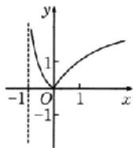

(2) 函数 $y=\left\{\begin{aligned}x^{2}-2x-1,x&\geqslant0,\\ x^{2}+2x-1,x&<0\end{aligned}\right.$ 的图象如图所示.

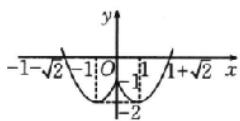

(3)作出函数 $y = \left(\frac{1}{2}\right)^x$ 的图象，保留 $y = \left(\frac{1}{2}\right)^x$ 的图象中 $x \geqslant 0$ 的部分，加上 $y = \left(\frac{1}{2}\right)^x$ 的图象中 $x \geqslant 0$ 的部分关于 $y$

轴对称的部分, 即得到 $y=\left(\frac{1}{2}\right)^{|x|}$ 的图象, 如图中实线部分所示.

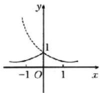

(4) $\because y=\frac{2x-1}{x-1}=2+\frac{1}{x-1},\therefore$ 函数 $y=\frac{2x-1}{x-1}$ 的图象可由 $y=\frac{1}{x}$ 的图象向右平移1个单位长度，再向上平移2个单位长度得到，如图所示.

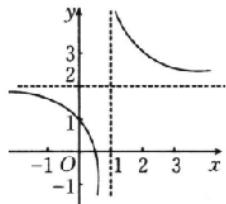

line

| x | y |
|---|---|
| -1 | 0 |
| 0 | 0 |
| 1 | 0 |
| 2 | 0 |
| 3 | 0 |

随堂加练 解析 (1)根据绝对值的意义,可将函数解析式化为分段函数 $y=\left\{\begin{aligned}&1,x\geqslant1,\\ &2x-1,x<1,\end{aligned}\right.$ 其图象如图①所示.

(2)函数解析式可化为 $y=\left\{\begin{aligned}x^{2}-4x+3,x&\leqslant1\text{ 或 }x\geqslant3,\\ -x^{2}+4x-3,1<x<3,\end{aligned}\right.$ 其图象如图②中实线部分所示.  
(3)作出 $y=\left(\frac{1}{2}\right)^{x}$ 的图象，保留 $y=\left(\frac{1}{2}\right)^{x}$ 的图象中 $x\geqslant0$ 的部分，加上 $y=\left(\frac{1}{2}\right)^{x}$ 的图象中 $x\geqslant0$ 的部分关于y轴的对称部分，即得 $y=\left(\frac{1}{2}\right)^{|x|}$ 的图象，再向左平移2个单位长度，即得 $y=\left(\frac{1}{2}\right)^{|x+2|}$ 的图象，如图③所示.

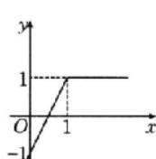  
图①

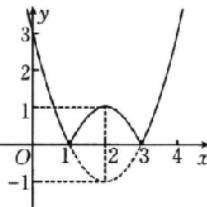

line

| Point | x | y |
|---|---|---|
| 0 | 0 | 3 |
| 1 | 1 | 1 |
| 2 | 2 | -1 |
| 3 | 3 | 1 |

图②

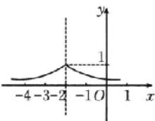  
图③

# 考点二

例2 B 解析 $f(-x) = -(-x)^2 + (\mathrm{e}^{-x} - \mathrm{e}^x)\sin (-x) = -x^2 + (\mathrm{e}^x - \mathrm{e}^{-x})\sin x = f(x)$ .

又函数的定义域为 $[-2.8,2.8]$ ，所以该函数为偶函数，可排除A,C.

又 $f(1) = -1 + \left(\mathrm{e} - \frac{1}{\mathrm{e}}\right)\sin 1 > -1 + \left(\mathrm{e} - \frac{1}{\mathrm{e}}\right)\sin \frac{\pi}{6} = \frac{\mathrm{e}}{2} -$ $1 - \frac{1}{2\mathrm{e}} >\frac{1}{4} -\frac{1}{2\mathrm{e}} >0$ ，所以可排除D.故选B.

例3 D 解析 由函数图象可知， $f(x)$ 的图象关于 $y$ 轴对称，故该函数为偶函数，且由图象可知 $f(-2) = f(2) < 0$ 。由 $\frac{5\sin(-x)}{(-x)^2 + 1} = \frac{5\sin x}{x^2 + 1}$ ，且定义域为 $\mathbf{R}$ ，可知选项B中的函数为奇函数，排除B；当 $x > 0$ 时， $\frac{5(e^x - e^{-x})}{x^2 + 2} > 0, \frac{5(e^x + e^{-x})}{x^2 - 2} > 0$ ，即选项A，C中的函数在 $(0, +\infty)$ 上的函数值为正，排除A，C。故选D.

例4 C 解析 $y = f(x)$ 的图象 $\xrightarrow{\text{向左平移} 1 \text{个单位长度}} y =$

$f(x+1)$ 的图象 $\xrightarrow{关于x轴对称(翻转)}y=-f(x+1)$ 的图象.故选C.

# 随堂加练

1.D 解析 函数 $f(x) = \frac{|x^2 - 1|}{x}$ 的定义域为 $\{x \mid x \neq 0\}$ ，且 $f(-x) = \frac{|(-x)^2 - 1|}{-x} = -\frac{|x^2 - 1|}{x} = -f(x)$ ，所以函数 $f(x)$ 为奇函数，A 错误；

当 x<0 时， $f(x)=\frac{|x^{2}-1|}{x}\leqslant0$ ，C 错误；

当 $x > 1$ 时， $f(x) = \frac{|x^2 - 1|}{x} = \frac{x^2 - 1}{x} = x - \frac{1}{x}$ ，则 $f(x)$ 单调递增，B错误. 故选D.

2.D 解析 对于 A, $y=f(x)+g(x)-\frac{1}{4}=x^{2}+\sin x$ ，该函数为非奇非偶函数，与函数图象不符，排除 A；

对于 B, $y=f(x)-g(x)-\frac{1}{4}=x^{2}-\sin x$ ，该函数为非奇非偶函数，与函数图象不符，排除 B；

对于 C, $y = f(x)g(x) = \left(x^{2} + \frac{1}{4}\right)\sin x$ ，则 $y' = 2x\sin x + \left(x^{2} + \frac{1}{4}\right)\cos x$ ，当 $x \in \left(0, \frac{\pi}{4}\right)$ 时， $\sin x > 0, \cos x > 0$ ，所以 $y' > 0$ ，则 $y = \left(x^{2} + \frac{1}{4}\right)\sin x$ 在 $\left(0, \frac{\pi}{4}\right)$ 上单调递增，与图象不符，排除 C. 故选 D.

3.B 解析 由图可知, 图2可以看作是图1先向右平移1个单位长度, 再把横坐标缩短为原来的 $\frac{1}{2}$ 得到的, 则 $y=f(x)$ 的图象先向右平移1个单位长度得到 $f(x-1)$ 的图象, 再把横坐标缩短为原来的 $\frac{1}{2}$ 得到 $y=f(2x-1)$ 的图象.

故选 B.

# 考点三

例5 (1)B (2)BC (3) $\left(\frac{1}{2},1\right)$ 解析 (1)把函数 $f(x)=\ln|x-a|$ 的图象向左平移 2 个单位长度，得到函数 $g(x)=\ln|x+2-a|$ 的图象，则函数 $g(x)$ 在 $(a-2,+\infty)$ 上单调递增。又因为所得函数在 $(0,+\infty)$ 上单调递增，所以 $a-2\leqslant0$ ，即 $a\leqslant2$ ，所以 a 的最大值为 2。故选 B.

(2) 函数 $f(x)=\max\{-x,x-3,-x^{2}+4x-2\}$ 的图象如图所示.

由 $\left\{ \begin{array}{l} y = x - 3, \\ y = 1 \end{array} \right.$ 得 $\left\{ \begin{array}{l} x = 4, \\ y = 1 \end{array} \right.$

所以 $A(4,1)$

由 $\left\{\begin{aligned}y&=-x,\\ y&=1\end{aligned}\right.$ 得 $\left\{\begin{aligned}x&=-1,\\ y&=1\end{aligned}\right.$

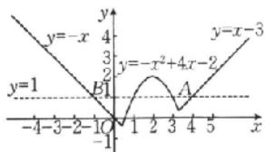

line

| x | y = -x | y = -x^2 + 4x - 2 |
|---|---|---|
| -4 | 0 | 0 |
| -3 | -1 | 0 |
| -2 | 0 | 0 |
| -1 | 0 | 0 |
| 0 | 0 | 0 |
| 1 | 0 | 1 |
| 2 | 0 | 1 |
| 3 | 0 | 1 |
| 4 | 0 | 1 |
| 5 | 0 | 1 |
| 6 | 0 | 1 |
| 7 | 0 | 1 |
| 8 | 0 | 1 |
| 9 | 0 | 1 |
| 10 | 0 | 1 |
| 11 | 0 | 1 |
| 12 | 0 | 1 |
| 13 | 0 | 1 |
| 14 | 0 | 1 |
| 15 | 0 | 1 |
| 16 | 0 | 1 |
| 17 | 0 | 1 |
| 18 | 0 | 1 |
| 19 | 0 | 1 |
| 20 | 0 | 1 |
| 21 | 0 | 1 |
| 22 | 0 | 1 |
| 23 | 0 | 1 |
| 24 | 0 | 1 |
| 25 | 0 | 1 |
| 26 | 0 | 1 |
| 27 | 0 | 1 |
| 28 | 0 | 1 |
| 29 | 0 | 1 |
| 30 | 0 | 1 |
| 31 | -1 | -1 |
| 32 | -2 | -2 |
| 33 | -3 | -3 |
| 34 | -4 | -4 |
| 35 | -5 | -5 |
| 36 | -6 | -6 |
| 37 | -7 | -7 |
| 38 | -8 | -8 |
| 39 | -9 | -9 |
| 40 | -10 | -10 |
| 41 | -11 | -11 |
| 42 | -12 | -12 |
| 43 | -13 | -13 |
| 44 | -14 | -14 |
| 45 | -15 | -15 |
| 46 | -16 | -16 |
| 47 | -17 | -17 |
| 48 | -18 | -18 |
| 49 | -19 | -19 |
| 50 | -20 | -20 |
| 51 | -21 | -21 |
| 52 | -22 | -22 |
| 53 | -23 | -23 |
| 54 | -24 | -24 |
| 55 | -25 | -25 |
| 56 | -26 | -26 |
| 57 | -27 | -27 |
| 58 | -28 | -28 |
| 59 | -29 | -29 |
| 60 | -30 | -30 |
| 61 | -31 | -31 |
| 62 | -32 | -32 |
| 63 | -33 | -33 |
| 64 | -34 | -34 |
| 65 | -35 | -35 |
| 66 | -36 | -36 |
| 67 | -37 | -37 |
| 68 | -38 | -38 |
| 69 | -39 | -39 |
| 70 | -40 | -40 |
| 71 | -41 | -41 |
| 72 | -42 | -42 |
| 73 | -43 | -43 |
| 74 | -44 | -44 |
| 75 | -45 | -45 |
| 76 | -46 | -46 |
| 77 | -47 | -47 |
| 78 | -48 | -48 |
| 79 | -49 | -49 |
| 80 | -50 | -50 |
| 81 | -51 | -51 |
| 82 | -52 | -52 |
| 83 | -53 | -53 |
| 84 | -54 | -54 |
| 85 | -55 | -55 |
| 86 | -56 | -56 |
| 87 | -57 | -57 |
| 88 | -58 | -58 |
| 89 | -59 | -59 |
| 90 | -60 | -60 |
| 91 | -61 | -61 |
| 92 | -62 | -62 |
| 93 | -63 | -63 |
| 94 | -64 | -64 |
| 95 | -65 | -65 |
| 96 | -66 | -66 |
| 97 | -67 | -67 |
| 98 | -68 | -68 |
| 99 | -69 | -69 |
| 100 | -70 | -70 |

The chart displays two sets of functions: one for y = x and another for y = x^2 + y^2 + x^2 + y^2 + x^2 + y^2 + x^2 + y^2 + x^2 + y^2 + x^2 + y^2 + x^2 + y^2 + x^2 + y^2 + x^2 + y^2 + x^2 + y^2 + x^2 + y^2 + x^2 + y^2 + x^2 + y^2 + x^2 / y^2 + y^2 + x^2 + y^2 + x^2 + y^2 + x^2 + y^2 + x^2 + y^2 + x^2 + y^2 + x^2 + y^2 + x^2 + y^2 + x^2 + y^2 + x^2 + y^2 + x^2 + y^2 + x^2 + y^2 + x^2 +y^2 / y^2 + y^2 + x^2 + y^2 + x^2 + y^2 + x^2 + y^2 + x^2 + y^2 + x^2 + y^2 + x^2 + y^2 + x^2 + y^2 + x^2 + y^2 + x^2 + y^2 + x^2 + y^2 + x^2 + y^2 +x^2 / y^2 + y^2 + x^2 + y^2 + x^2 + y^2 + x^2 + y^2 + x^2 + y^2 + x^2 + y^2 + x^2 + y^2 + x^2 + y^2 + x^2 + y^2 + x^2 + y^<ecel><nl>

所以 $B(-1,1)$ ,

由 $-x^{2}+4x-2=1$ ，得x=1或x=3。

由图象可知，当-1<m<1或3<m<4时， $f(m)<1$ ，因此选项B,C符合题意.故选BC.

(3)先作出函数 $f(x) = |x - 2| + 1$ 的图象，如图所示。当直线 $g(x) = kx$ 与直线 $AB$ 平行时，斜率为1，当直线 $g(x) = kx$ 过点 $A(2,1)$ 时，斜率为 $\frac{1}{2}$ ，故当 $f(x) = g(x)$ 有两个不相等的实数根时，实数 $k$ 的取值范围为 $\left(\frac{1}{2}, 1\right)$ 。

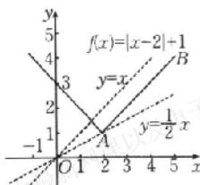

line

| Point | x | y |
|---|---|---|
| A | 0 | 0 |
| B | 3 | 4 |
| C | 5 | 2 |
| D | 1 | -1 |
| E | 2 | 0 |
| F | 4 | 1 |
| G | 6 | 3 |
| H | 8 | 5 |
| I | 1 | 0 |
| J | 2 | -1 |
| K | 3 | -2 |
| L | 4 | -3 |
| M | 6 | -4 |
| N | 8 | -5 |
| O | 1 | -6 |
The chart is a Cartesian coordinate system with x and y axes. The function is defined by the equation f(x) = |x - 2| + 1. The points are labeled for each of the lines.

# 随堂加练

1. C 解析 画出 $y = \max \{2^x, 2x - 3, 6 - x\}$ 的图象，如图中实线部分所示。由图可知， $y$ 的最小值为 4。故选 C.

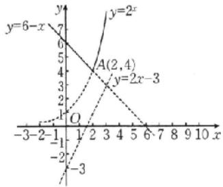

line

| Point | x | y |
|---|---|---|
| A(2,4) | 2 | 4 |
| B(2,-3) | 3 | 3 |
| y=6-x | 7 | 7 |
| y=2x | 5 | 2 |
| y=-3 | 6 | -3 |
| y=-1 | 7 | -2 |
| y=-2 | 8 | -1 |
| y=-3 | 9 | 0 |
| y=-4 | 10 | 1 |
The chart displays a piecewise linear function with two distinct lines: one solid and one dashed. The x-axis ranges from -3 to 10 and the y-axis ranges from -3 to 7. The function is defined by the equations y=6-x and y=2x. The points are explicitly labeled on the curves.

2.C 解析 作出函数 $f(x)$ 的图象，如图所示.

当 $x \in (-1,0)$ 时，由 $xf(x) > 0$ 得 $x \in (-1,0)$ ;

当 $x \in (0,3)$ 时，由 $xf(x) > 0$ 得 $x \in (1,3)$ .

所以原不等式的解集为 $(-1,0)\cup(1,3)$ .故选C.

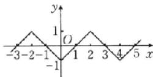

3. A 解析 当 $x \leqslant -1$ 时, $f(x) = 1 - 3^{x + 1}$ 在 $(- \infty, -1]$ 上单调递减, $f(x) \in [0,1)$ ;

当 $-1<x\leqslant0$ 时， $f(x)=3^{x+1}-1$ 在 $(-1,0]$ 上单调递增， $f(x)\in(0,2]$ ;

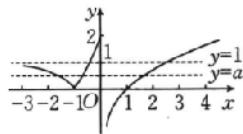

当 x>0 时， $f(x)=\ln x$ 在 $(0,+\infty)$ 上单调递增， $f(x)\in\mathbb{R}$ 作出函数 $f(x)$ 的图象，如图所示.

由 $y=f(x)$ 的图象与直线 y=a 有三个交点，结合函数图象可得 $a\in(0,1)$ . 故选 A.

# 第13课时 函数的零点与方程的解

# 必备知识·逐点梳理

一、1. $f(x)=0$

2. 零点 $x$ 轴

3. $f(a)f(b) <   0\quad (a,b)\quad f(c) = 0$

微判断 (1)× (2)× (3)×

二、 $f(a)f(b)<0$ 一分为二零点

微思考 不是. 二分法的使用需要满足以下两个条件: 一是函数在给定区间内是连续不断的; 二是函数在给定区间两端的函数值异号.

# 关键考点·核心突破

# 考点一

题组 (1)B (2)B (3)B (4)1.56 解析 (1)函数 $f(x)$ 在 $(0, +\infty)$ 上单调递增，则 $f(x) = 0$ 在 $(0, +\infty)$ 上只有一个根，且 $f(1) = -1, f(2) = 1$ ，所以 $f(1)f(2) < 0$ ，故 $f(x)$ 的零点所在的区间为 $(1, 2)$ . 故选 B.

(2)作出函数 $y = 2x$ 与 $y = 3 - \lg x$ 的图象，如图，由图可知方程 $2x = 3 - \lg x$ 的近似解所在的区间为(1,2).故选B.

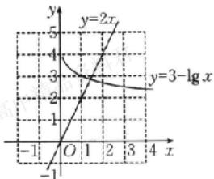

line

| x | y=2x |
|---|---|
| -1 | -1 |
| 0 | 0 |
| 1 | 1 |
| 2 | 2 |
| 3 | 3 |
| 4 | 4 |

(3) 观察图象与 x 轴的交点, 若交点附近的函数图象是连续的, 且在交点两侧的函数值符号相异, 则可用二分法求零点, 而 B 不能用二分法求零点. 故选 B.

(4) 注意到 $f(1.5562) \approx -0.029, f(1.5625) \approx 0.003$ ，显然 $f(1.5562)f(1.5625) < 0$ ，又 $\left|1.5562 - 1.5625\right| =$

0.006 3<0.01, 所以近似解可取 1.56.

# 考点二

例1 B 解析 由题意, 函数 $f(x) = \begin{cases} x^2 + x - 6, & x \leqslant 0, \\ \log_3(x + 2) - 2, & x > 0. \end{cases}$

当 $x \leqslant 0$ 时，令 $x^{2} + x - 6 = 0$ ，解得 $x = -3$ 或 $x = 2$ （舍去）；当 $x > 0$ 时，令 $\log_3(x + 2) - 2 = 0$ ，即 $\log_3(x + 2) = 2$ ，解得 $x = 7$

故函数 $f(x)$ 有 2 个零点. 故选 B.

例2 B 解析 函数 $f(x) = x^{\frac{1}{2}} - \left(\frac{1}{2}\right)^x$ 的零点，即令 $f(x) = 0$ ，得 $x^{\frac{1}{2}} = \left(\frac{1}{2}\right)^x$ ，在平面直角坐标系中分别画出幂函数 $y = x^{\frac{1}{2}}$ 和指数函数 $y = \left(\frac{1}{2}\right)^x$ 的图象（图略），可得交点只有一个，所以零点只有一个。故选B.

# 随堂加练

1. B 解析 （法一：直接法）由 $f(x)=0$ 得

$$
\left\{ \begin{array}{l l} x \leqslant 0, \\ x ^ {2} + x - 2 = 0 \end{array} \text {或} \left\{ \begin{array}{l l} x > 0, \\ - 1 + \ln x = 0, \end{array} \right. \right.
$$

解得 $x = -2$ 或 $x = \mathrm{e}$ . 因此函数 $f(x)$ 共有 2 个零点.

(法二:图象法)作出函数 $f(x)$ 的图象如图所示,由图象知函数 $f(x)$ 共有 2 个零点.故选 B.

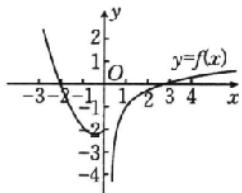

line

| x | y = f(x) |
|---|---|
| -3 | 0 |
| -2 | 1 |
| -1 | 2 |
| 0 | 3 |
| 1 | 4 |
| 2 | 5 |
| 3 | 6 |
| 4 | 7 |
| 5 | 8 |
| 6 | 9 |
| 7 | 10 |
| 8 | 11 |
| 9 | 12 |
| 10 | 13 |
| 11 | 14 |
| 12 | 15 |
| 13 | 16 |
| 14 | 17 |
| 15 | 18 |
| 16 | 19 |
| 17 | 20 |
| 18 | 21 |
| 19 | 22 |
| 20 | 23 |
| 21 | 24 |
| 22 | 25 |
| 23 | 26 |
| 24 | 27 |
| 25 | 28 |
| 26 | 29 |
| 27 | 30 |
| 28 | 31 |
| 29 | 32 |
| 30 | 33 |
| 31 | 34 |
| 32 | 35 |
| 33 | 36 |
| 34 | 37 |
| 35 | 38 |
| 36 | 39 |
| 37 | 40 |
| 38 | 41 |
| 39 | 42 |
| 40 | 43 |
| 41 | 44 |
| 42 | 45 |
| 43 | 46 |
| 44 | 47 |
| 45 | 48 |
| 46 | 49 |
| 47 | 50 |
| 48 | 51 |
| 49 | 52 |
| 50 | 53 |
| 51 | 54 |
| 52 | 55 |
| 53 | 56 |
| 54 | 57 |
| 55 | 58 |
| 56 | 59 |
| 57 | 60 |
| 58 | 61 |
| 59 | 62 |
| 60 | 63 |
| 61 | 64 |
| 62 | 65 |
| 63 | 66 |
| 64 | 67 |
| 65 | 68 |
| 66 | 69 |
| 67 | 70 |
| 68 | 71 |
| 69 | 72 |
| 70 | 73 |
| 71 | 74 |
| 72 | 75 |
| 73 | 76 |
| 74 | 77 |
| 75 | 78 |
| 76 | 79 |
| 77 | 80 |
| 78 | 81 |
| 79 | 82 |
| 80 | 83 |
| 81 | 84 |
| 82 | 85 |
| 83 | 86 |
| 84 | 87 |
| 85 | 88 |
| 86 | 89 |
| 87 | 90 |
| 88 | 91 |
| 89 | 92 |
| 90 | 93 |
| 91 | 94 |
| 92 | 95 |
| 93 | 96 |
| 94 | 97 |
| 95 | 98 |
| 96 | 99 |
| 97 | 100 |
| Note: The y-axis values are estimated based on the formula y = f(x). The x-axis values are labeled as 'x'. The y-axis values are explicitly labeled as 'y'.

2. B 解析 分别作出函数 $y=f(x)$ 与 $y=\log_{3}|x|$ 的图象，如图所示，

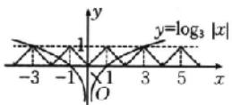

由图可知， $y=f(x)$ 与 $y=\log_{3}|x|$ 的图象有4个交点，故函数 $y=f(x)-\log_{3}|x|$ 有4个零点。故选B.

3.2 解析 $f(x) = \left(\frac{1}{2}\right)^{|x|} - |\log_2 x|$ 的零点的个数，即 $\left(\frac{1}{2}\right)^{|x|} = |\log_2 x|$ 的根的个数，即 $y = \left(\frac{1}{2}\right)^{|x|}$ 与 $y = |\log_2 x|$ 的图象的交点个数，画出大致图象，如图所示，由图象可知交点有2个，即函数 $f(x)$ 的零点有2个.

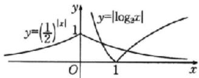

# 考点三

例3 $\{-4\} \cup (-3, +\infty)$ 解析作出函数 $f(x)$ 的图象，如图，方程 $f(x) = k (k < 0)$ 的实数解的个数等于直线 $y = k$ 与 $y = f(x)$ 图象的交点个数.当 $x \leqslant 0$ 时， $f(x) = x^2 + 2x - 3 = (x + 1)^2 - 4$ ，函数在

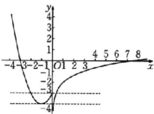

line

| x | y |
|---|---|
| -4 | 4 |
| -3 | 2 |
| -2 | 0 |
| -1 | -2 |
| 0 | -4 |
| 1 | -2 |
| 2 | -1 |
| 3 | 0 |
| 4 | 1 |
| 5 | 2 |
| 6 | 3 |
| 7 | 4 |
| 8 | 5 |

$(- \infty, -1)$ 上单调递减，在 $[-1, 0]$ 上单调递增， $f(x)_{\min} = f(-1) = -4, f(0) = -3$ ；

当 $x > 0$ 时， $f(x) = -2 + \ln x$ ，函数在 $(0, +\infty)$ 上单调递增。由方程 $f(x) = k$ 的实数解的个数为2，结合图象易得 $k > -3$ 或 $k = -4$ ，

即实数 k 的取值范围是 $\{-4\}\cup(-3,+\infty)$ .

例4 $\left[-\frac{1}{2}, 1\right]$ 解析（法一：图象法）因为函数 $f(x) = x^2 - 2^x + k$ 在区间 $[-1, 0]$ 上有零点，

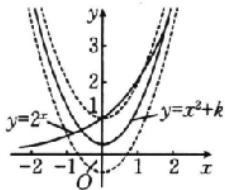

line

| x    | y=2^x | y=x²+k |
| ---- | ----- | ------ |
| -2   | 0     | 0      |
| -1   | 1     | 1      |
| 0    | 0     | 1      |
| 1    | 1     | 2      |
| 2    | 2     | 3      |

所以关于 $x$ 的方程 $x^{2} - 2^{x} + k = 0$ 在区间 $[-1,0]$ 上有解，即函数 $y = x^{2} + k$ 与 $y = 2^{x}$ 的图象在区间 $[-1,0]$ 上有交点，

在同一平面直角坐标系中作出函数 $y=x^{2}+k, y=2^{x}$ 的图象，如图所示.

由图象知，当 $y=x^{2}+k$ 的图象过点 $(0,1)$ 时，k=1；

当 $y=x^{2}+k$ 的图象过点 $\left(-1,\frac{1}{2}\right)$ 时， $k=-\frac{1}{2}$ .

故实数 k 的取值范围是 $\left[-\frac{1}{2},1\right]$ .

(法二:定理法)易知函数 $y=x^{2}$ 和函数 $y=-2^{x}$ 在区间 $[-1,0]$ 上单调递减，从而函数 $f(x)$ 在区间 $[-1,0]$ 上单调递减.

又函数 $f(x)$ 在区间 $[-1,0]$ 上有零点，所以 $f(-1)f(0) = \left(\frac{1}{2} + k\right) \cdot (-1 + k) \leqslant 0$ ，解得 $-\frac{1}{2} \leqslant k \leqslant 1$ .

故实数 k 的取值范围是 $\left[-\frac{1}{2},1\right]$ .

# 随堂加练

1. B 解析 作出函数 $g(x) = \begin{cases} 2^x + 2, & x < 1, \\ 9 - 2x, & x \geqslant 1 \end{cases}$ 的图象，如图所示，令 $f(x) = 0$ ，得 $g(x) = a$ ，则当直线 $y = a$ 与函数 $g(x)$ 的图象恰有两个交点时，数形结合可得 $a$ 的取值范围是(2,4). 故选 B.

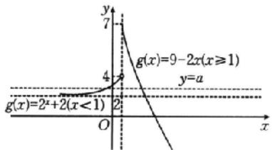

line

| Point | x-axis label | y-axis label |
|---|---|---|
| 1 | 2^x + 2(x < 1) | 4 |
| 2 | 2^x + 2(x < 1) | 2 |
| 3 | 2^x + 2(x < 1) | 7 |
| 4 | 2^x + 2(x < 1) | 4 |
| 5 | 2^x + 2(x < 1) | 2 |
| 6 | 2^x + 2(x < 1) | 0 |
| 7 | 2^x + 2(x < 1) | 0 |
| 8 | 2^x + 2(x < 1) | 0 |
| 9 | 2^x + 2(x < 1) | 0 |
| 10 | 2^x + 2(x < 1) | 0 |
| 11 | 2^x + 2(x < 1) | 0 |
| 12 | 2^x + 2(x < 1) | 0 |
| 13 | 2^x + 2(x < 1) | 0 |
| 14 | 2^x + 2(x < 1) | 0 |
| 15 | 2^x + 2(x < 1) | 0 |
| 16 | 2^x + 2(x < 1) | 0 |
| 17 | 2^x + 2(x < 1) | 0 |
| 18 | 2^x + 2(x < 1) | 0 |
| 19 | 2^x + 2(x < 1) | 0 |
| 20 | 2^x + 2(x < 1) | 0 |
| 21 | 2^x + 2(x < 1) | 0 |
| 22 | 2^x + 2(x < 1) | 0 |
| 23 | 2^x + 2(x < 1) | 0 |
| 24 | 2^x + 2(x < 1) | 0 |
| 25 | 2^x + 2(x < 1) | 0 |
| 26 | 2^x + 2(x < 1) | 0 |
| 27 | 2^x + 2(x < 1) | 0 |
| 28 | 2^x + 2(x < 1) | 0 |
| 29 | 2^x + 2(x < 1) | 0 |
| 30 | 2^x + 2(x < 1) | 0 |
| Note: The x-axis is labeled as 'g(x)' and the y-axis is labeled as 'y'. The chart contains a series of lines connecting points to the origin. The labels above the lines are 'g(x)' and 'y'.

2. 解析 因为 -1, 1 是函数的零点，所以 $\left\{\begin{aligned}-1+a-b+c=0,\\1+a+b+c=0,\end{aligned}\right.$ 所以 $\left\{\begin{aligned}b=-1,\\a=-c,\end{aligned}\right.$ 所以 $f(x)=x^{3}-cx^{2}-x+c.$

又因为 $x_0$ 是函数 $f(x)$ 的零点，且 $x_0 \in (2,3)$ ，

所以 $f(2)f(3)<0$ ，即 $(c-2)(c-3)<0$ ，解得 2<c<3。

因此，实数 c 的取值范围是 $(2,3)$ .

# 强化课05 函数与方程的综合应用

# 类型一

典例1 BD 解析 作出函数 $f(x)$ 的图象，如图所示，由图象可知，若方程 $f(x) = m$ 有4个不同的解，则 $0 < m < 1$ ，故A错误；

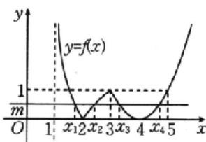

line

| x | y = f(x) |
|---|---|
| 1 | 0 |
| x₁ | 0 |
| x₂ | 0 |
| x₃ | 1 |
| 4 | 0 |
| x₄ | 1 |
| 5 | >1 |

当 $0 < m < 1$ 时，方程 $f(x) = m$ 有4个不同的解，且 $x_{1} < x_{2} < x_{3}$

所以 $1 < x_{1} < 2 < x_{2} < 3$ ，且 $-\log_{2}(x_{1} - 1) = \log_{2}(x_{2} - 1)$ ，则 $\frac{1}{x_1 - 1} = x_2 - 1$ ，整理得 $(x_{1} - 1)(x_{2} - 1) = 1$ ，所以 $x_{1} + x_{2} = x_{1}x_{2}$ ，故B正确；

又 $3 < x_{3} < 4 < x_{4} < 5$ ，且 $x_{3}, x_{4}$ 关于直线 $x = 4$ 对称，所以 $x_{3} + x_{4} = 8$ ，故C错误；

由 $x_{1} + x_{2} = x_{1}x_{2}$ 得 $\frac{1}{x_1} +\frac{1}{x_2} = 1$ ，又 $x_{3} + x_{4} = 8$ ，所以 $\left(\frac{1}{x_1} +\right.$

$\left.\frac{1}{x_{2}}\right)(x_{3}+x_{4})=8$ , 故 D 正确.

故选 BD.

强化训练 A 解析 如图, 作出函数 $f(x)$ 的图象, 由函数 $g(x) = f(x) + b$ 有四个不同的零点, 知直线 $y = -b$ 与 $y = f(x)$ 的图象有四个不同的交点, 则 $0 < -b \leqslant 1$ , 即 $-1 \leqslant b < 0$ , 故 A 错误;

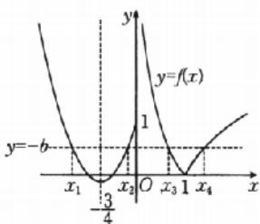

line

| x | y = f(x) |
|---|---|
| x₁ | -b |
| x₂ | 1 |
| x₃ | 0 |
| x₄ | b |

这四个交点的横坐标依次为 $x_{1}, x_{2}, x_{3}, x_{4}$ ，因为抛物线 $y = 2x^{2} + 3x + 1$ 的对称轴为直线 $x = -\frac{3}{4}$ ，所以 $x_{1} + x_{2} = -\frac{3}{2}$ ，故 D 正确；

因为 $-\log_{2}x_{3}=\log_{2}x_{4}$ ，即 $\log_{2}x_{3}+\log_{2}x_{4}=\log_{2}(x_{3}x_{4})=0$ ，所以 $x_{3}x_{4}=1$ ，故B正确；

$f(x_{3}) = -\log_{2}x_{3}\in (0,1]$ ，即 $-1\leqslant \log_2x_3 <   0$ ，所以 $\frac{1}{2}\leqslant x_3<$ 1，故C正确.故选A.

# 类型二

典例2 (1)B (2) $\left[1,\frac{5}{4}\right)$ 解析 (1)令 $t=f(x),g(x)=0$ ，则 $f(t)-2t+1=0$ ，即 $f(t)=2t-1$ 分别作出函数 $y=f(t)$ 和直线 y=2t-1 的图象，如图 1 所示.

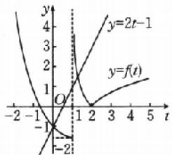

line

| t    | y=f(t) | y=2t-1 |
| ---- | ------ | ------ |
| -2   | -1     | -1     |
| 0    | 0      | 0      |
| 1    | 1      | 1      |
| 2    | 0      | 0      |
| 3    | 1      | 1      |
| 4    | 2      | 2      |
| 5    | 3      | 3      |

图 1

由图1可得它们有两个交点，交点的横坐标分别设为 $t_1, t_2$ ，则 $t_1 = 0, 1 < t_2 < 2$ .

对于 $t=f(x)$ ，分别作出函数 $y=f(x)$ 和直线 y=t 的图象，如图 2 所示。

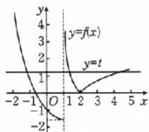

line

| x   | y=f(x) | y=t  |
| --- | ------ | ---- |
| -2  | 4      | -2   |
| -1  | 3      | -1   |
| 0   | 2      | 0    |
| 1   | 1      | 1    |
| 2   | 0      | 2    |
| 3   | -1     | 3    |
| 4   | -2     | 4    |
| 5   | -3     | 5    |

图2

由图2可得，当 $f(x)=t_{1}=0$ 时，函数 $y=f(x)$ 的图象与x轴有两个交点，即方程 $f(x)=0$ 有两个不相等的根；

当 $t_{2}=f(x)$ 时，函数 $y=f(x)$ 的图象与直线 $y=t_{2}$ 有三个交点，即方程 $t_{2}=f(x)$ 有三个不相等的根.

综上可得， $g(x)=0$ 的实根个数为 5，即函数 $g(x)=f(f(x))-2f(x)+1$ 的零点个数是 5。故选 B.

(2) 令 $f(x) = t (t < 1)$ ，则原方程化为 $g(t) = a$ ，易知方程 $f(x) = t$ 在 $t \in (-\infty, 1)$ 上有 2 个不同的解，则原方程有 4 个不同的实数根等价于函数 $y = g(t) (t < 1)$ 与 $y = a$ 的图象有 2 个不同的交点，作出函数 $y = g(t) (t < 1)$ 的图象，如图，由图象可

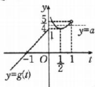

知，当 $1 \leqslant a < \frac{5}{4}$ 时，函数 $y = g(t)(t < 1)$ 与 $y = a$ 的图象有2个不同的交点，即实数 $a$ 的取值范围是 $\left[1, \frac{5}{4}\right)$ .

# 强化训练

1.5 解析 由 $2[f(x)]^2 - 3f(x) + 1 = 0$

得 $f(x)=\frac{1}{2}$ 或 $f(x)=1$ ，作出函数 $y=f(x)$ 的图象，如图.

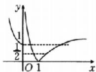

由图象知，直线 $y = \frac{1}{2}$ 与 $y = f(x)$ 的图

象有2个交点，直线 $y = 1$ 与 $y = f(x)$ 的图象有3个交点.因此，函数 $y = 2[f(x)]^2 -3f(x) + 1$ 的零点有5个.

2.(0,1] 解析 作出函数 $f(x)$ 的图象，如图所示.

因为 $\left[f(x)\right]^{2}-(2m+1)f(x)+m^{2}+m=0$ 有7个不同的实数解，

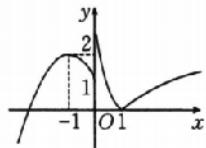

设 $f(x) = t$ ，则方程 $t^2 - (2m + 1)t +$

$m^{2}+m=0$ 有 2 个不相等的实根分别为 $t_{1}=m, t_{2}=m+1$ ，且 $0<t_{1}<1\leqslant t_{2}<2$ 或 $1\leqslant t_{1}<2, t_{2}=2$ .

当 $1 \leqslant t_{1} < 2, t_{2} = 2$ 时， $m = 1$ ，满足题意；当 $0 < t_{1} < 1 \leqslant t_{2} < 2$ 时， $0 < m < 1 \leqslant m + 1 < 2$ ，解得 $m \in (0,1)$ .

综上， $m$ 的取值范围为 $(0,1]$ .

# 第14课时 函数的模型及其应用

# 关键考点·核心突破

# 考点一

例1 (1) AD (2) B 解析 (1) 当 $t = 1$ 时, $y = 4$ , 即 $\left(\frac{1}{2}\right)^{1 - a} = 4$ , 解得 $a = 3$ , 且 $k = 4$ ,

所以 $y=\left\{\begin{aligned}&4t,0\leqslant t<1,\\&\left(\frac{1}{2}\right)^{t-3},t\geqslant1,\end{aligned}\right.$ 故 A 正确；

当 4t=0.125，即 $t=\frac{1}{32}$ 时，药物刚好起效，

当 $\left(\frac{1}{2}\right)^{t-3}=0.125$ ，即t=6时，药物刚好失效，

故药物的有效时间长度为 $6 - \frac{1}{32} = 5 \frac{31}{32}$ (时)，

药物的有效时间长度不到6个小时，故B错误，D正确；

注射该药物 $\frac{1}{8}$ 小时后每毫升血液中的含药量为 $4\times\frac{1}{8}=0.5$ (微克)，故C错误.故选AD.

(2)由题图可知,函数在 $(0,+\infty)$ 上单调递减,且散点分布在一条曲线附近,函数 $y=a\cdot\left(\frac{1}{4}\right)^{x}+b$ 的图象为一条曲线,且当a>0时,该函数单调递减,符合题意.故选B.

随堂加练 A 解析 当点 P 在 AB 上时, $y=\frac{1}{2}\times x\times1=\frac{1}{2}x,0\leqslant x\leqslant1;$

当点 P 在 BC 上时， $y = S_{正方形ABCD} - S_{\triangle ADM} - S_{\triangle ABP} - S_{\triangle PCM} = \frac{1}{4}x + \frac{3}{4}, 1 < x \leqslant 2;$

当点 P 在 CM 上时， $y=\frac{1}{2}\times\left(\frac{5}{2}-x\right)\times1=-\frac{1}{2}x+\frac{5}{4},2<x\leqslant\frac{5}{2}.$

综上， $y=f(x)=\left\{\begin{aligned}&\frac{1}{2}x,0\leqslant x\leqslant1,\\&-\frac{1}{4}x+\frac{3}{4},1<x\leqslant2,\\&-\frac{1}{2}x+\frac{5}{4},2<x\leqslant\frac{5}{2}.\end{aligned}\right.$

结合选项图象,故选 A.

# 考点二

例2 $0\mathrm{dB}\sim 120\mathrm{dB}$ $60~\mathrm{dB}$ 解析依题意， $10\lg \frac{1}{10^{-12}} = 10\times$ $\lg 10^{12} = 120(\mathrm{dB}),10\lg \frac{10^{-12}}{10^{-12}} = 10\lg 1 = 0(\mathrm{dB}).$

因此，人类听觉的声强级范围为 0 dB\~120 dB.

又当 $I=10^{-6}$ 时， $L_{I}=10\lg\frac{10^{-6}}{10^{-12}}=10\times\lg10^{6}=60(\mathrm{dB})$ ，所以其声强级为 60 dB.

例3 ACD 解析 燃油汽车 $L_{p_1} = 20 \times \lg \frac{p_1}{p_0} \in [60,90]$ ，所以 $\frac{p_1}{p_0} = 10^{\frac{L_{p_1}}{20}}, L_{p_1} \in [60,90]$ ，①

同理 $\frac{p_{2}}{p_{0}}=10^{\frac{L_{p_{2}}}{20}},L_{p_{2}}\in[50,60],$ ②

$$
\frac {p _ {3}}{p _ {0}} = 1 0 ^ {\frac {L _ {p _ {3}}}{2 0}} = 1 0 ^ {2} = 1 0 0. \quad ③
$$

对于 A, 由题表知 $L_{p_{1}} \geqslant L_{p_{2}}$ , 所以 A 正确;

对于 B，由②÷③得， $\frac{p_{2}}{p_{3}}=10^{\frac{L_{p_{2}}-L_{p_{3}}}{20}}\in\left[10^{\frac{1}{2}},10\right]$ ，所以 $\frac{p_{2}}{p_{3}}\leqslant$ 10,所以B错误;

对于 $C, \frac{p_{3}}{p_{0}} = 10^{\frac{L_{p_{3}}}{20}} = 10^{2} = 100$ ，所以 C 正确；

对于D，由①÷②得， $\frac{p_{1}}{p_{2}}=10^{\frac{L_{p_{1}}-L_{p_{2}}}{20}}\in[10^{0},10^{2}]$ ，所以 $\frac{p_{1}}{p_{2}}\in[1,100]$ ， $p_{1}\leqslant100p_{2}$ ，所以D正确。故选ACD.

随堂加练 65.61 解析 当 t=0 时， $P=P_{0}\cdot e^{-k\cdot0}=P_{0}$ ，当 t=5 时， $\frac{P_{0}\cdot e^{-5k}}{P_{0}}=90\%$ ，即 $e^{-5k}=0.9$ ，

所以 $k=-\frac{1}{5}\ln0.9.$

当 t=20 时， $\frac{P_{0}\cdot e^{-20k}}{P_{0}}=e^{-20k}=e^{4\ln0.9}=0.9^{4}=0.6561$

即 20 h 后，还剩 65.61% 的污染物。

# 考点三

例4 解析 (1) 因为函数 $y = k \cdot a^x (k > 0, a > 1)$ 刻画的是增长速度越来越快的变化规律，符合表中数据的变化规律，而 $y = ax + b (a > 0)$ 刻画的是增长速度不变的规律， $y = p\sqrt{x} + q (p > 0)$ 和 $y = \log_a x + b (a > 1)$ 刻画的是增长速度越来越慢的变化规律，所以 $y = k \cdot a^x (k > 0, a > 1)$ 更合适，则 $\left\{\begin{aligned}&k\cdot a^{0}=4,\\ &k\cdot a^{2}=25,\end{aligned}\right.$ 解得 $\left\{\begin{aligned}&a=\frac{5}{2},\\ &k=4,\end{aligned}\right.$ 所以 $y=4\cdot\left(\frac{5}{2}\right)^{x},x\in\mathbb{N}.$

(2)设约经过 $x$ 个月，此生物能覆盖整个池塘，则 $4 \cdot \left(\frac{5}{2}\right)^x \geqslant 8000$ ，解得 $x \geqslant \log_{\frac{5}{2}} 2000 = \frac{\lg 2000}{\lg \frac{5}{2}} = \frac{3 + \lg 2}{1 - 2 \lg 2} \approx 8.294.$

故约经过9个月，此生物能覆盖整个池塘。

随堂加练 解析 （1）该项目的门票收入为 50x 万元，财政补贴收入为 10x 万元，共 60x 万元收入，

则利润 $W(x) = \begin{cases} 60x - 300 - 25, & 0 < x \leqslant 5, \\ 60x - 300 - (x^2 + 20x - 100), & 5 < x \leqslant 20, \\ 60x - 300 - (61x + \frac{900}{x} - 565), & x > 20, \end{cases}$

化简得 $W(x) = \begin{cases} 60x - 325, & 0 < x \leqslant 5, \\ -x^2 + 40x - 200, & 5 < x \leqslant 20, \\ -x - \frac{900}{x} + 265, & x > 20. \end{cases}$

(2) 当 $0 < x \leqslant 5$ 时， $W(x)$ 单调递增， $W(x)_{\max} = W(5) = -25$ ; 当 $5 < x \leqslant 20$ 时，对应二次函数的图象开口向下，对称轴为直线 $x = -\frac{40}{2 \times (-1)} = 20$ ,

则 $W(x)_{\max} = W(20) = 200$

当 $x > 20$ 时， $\because x + \frac{900}{x}\geqslant 60$ ，当且仅当 $x = \frac{900}{x}$ 即 $x = 30$ 时，等号成立，

$$
\therefore W (x) _ {\max} = W (3 0) = - 3 0 - \frac {9 0 0}{3 0} + 2 6 5 = 2 0 5.
$$

综上，当2026年的游客人数为30万时，利润最大，最大利润为205万元.

# 第四单元 一元函数的导数及其应用

# 第 15 课时 导数的概念及其意义、导数的运算

# 必备知识·逐点梳理

一、1. $f^{\prime}(x_0)$ 或 $y^{\prime}|_{x = x_0}$

二、斜率 $y-f(x_{0})=f'(x_{0})(x-x_{0})$

微判断 (1) $\times$ (2) $\times$

三、0 a cos x -sin x $a^{x}\ln a$ $e^{x}$

微判断 ×

四、 $f'(x) \pm g'(x)$ $f'(x)g(x) + f(x)g'(x)$ $cf'(x)$

微判断 √

五、1. $f(g(x))$

2. $y_{u}^{\prime}\cdot u_{x}^{\prime}$

# 关键考点·核心突破

# 考点一

题组 (1)ABD (2)3 2 (3)5 -5 5 解析 (1)对于 A, 当 $1 \leqslant t \leqslant 3$ 时, 该质点的平均速度是 $\frac{s(3) - s(1)}{3 - 1} = \frac{19 - 3}{2} = 8$ , A 正确;

对于 B, $\lim_{\Delta t \to 0} \frac{2 \times (4 + \Delta t)^{2} + 1 - 2 \times 4^{2} - 1}{\Delta t} = \lim_{\Delta t \to 0} \frac{16 \Delta t + 2 \Delta t^{2}}{\Delta t} = \lim_{\Delta t \to 0} (16 + 2 \Delta t) = 16$ , B 正确；

对于 C, 当 t=5 时, $s(5)=2\times5^{2}+1=51$ , C 错误;

对于 D, $\lim_{\Delta t\to0}\frac{2\times(5+\Delta t)^{2}+1-2\times5^{2}-1}{\Delta t}=\lim_{\Delta t\to0}\frac{20\Delta t+2\Delta t^{2}}{\Delta t}=$ $\lim_{\Delta t\to0}(20+2\Delta t)=20$ , D 正确.

故选 ABD.

(2) 函数 $f(x)=x^{2}-1$ 在区间 $[1,2]$ 上的平均变化率为 $\frac{2^{2}-1-1^{2}+1}{2-1}=3.$ $f'(1)=\lim_{\Delta x\to0}\frac{f(1+\Delta x)-f(1)}{\Delta x}=$ $\lim_{\Delta x\to0}\frac{(1+\Delta x)^{2}-1-(1^{2}-1)}{\Delta x}=\lim_{\Delta x\to0}(2+\Delta x)=2.$

(3) $\lim_{\Delta x \to 0} \frac{f(1 + \Delta x) - f(1)}{\Delta x} = \lim_{\Delta x \to 0} \frac{3(1 + \Delta x)^2 - (1 + \Delta x) - 2}{\Delta x} = \lim_{\Delta x \to 0} (5 + 3\Delta x) = 5.$

$\lim_{\Delta x \to 0} \frac{f(1 - \Delta x) - f(1)}{\Delta x} = -\lim_{\Delta x \to 0} \frac{3(1 - \Delta x)^2 - (1 - \Delta x) - 2}{-\Delta x} = -\lim_{\Delta x \to 0} (5 - 3\Delta x) = -5.$

$\lim_{x\to 1}\frac{f(x) - f(1)}{x - 1} = \lim_{x\to 1}\frac{3x^2 - x - 2}{x - 1} -\lim_{x\to 1}\frac{3(x^2 - 1) - (x - 1)}{x - 1} =$ $\lim_{x\to 1}[3(x + 1) - 1] = 5.$

# 考点二

例1 (1) 见解析 (2) $-\frac{1}{\mathrm{e}} - \frac{2}{\mathrm{e}} + \frac{1}{x}$ 解析 (1) ① 因为 $y = (x + 1)^{2025}$ , 所以 $y' = 2026(x + 1)^{2025}(x + 1)' = 2026(x + 1)^{2025}$ .

② 因为 $y = \frac{x}{\sqrt{2x + 1}}$ ，所以 $y' =$

$$
\begin{array}{r l} \frac {x ^ {\prime} \cdot \sqrt {2 x + 1} - (\sqrt {2 x + 1}) ^ {\prime} x}{(\sqrt {2 x + 1}) ^ {2}} & = \frac {\sqrt {2 x + 1} - x (2 x + 1) ^ {- \frac {1}{2}}}{2 x + 1} \\ & = \frac {x + 1}{(2 x + 1) \sqrt {2 x + 1}}. \end{array}
$$

③因为 $y=(2x-3)\sin(2x+5)$ ，所以 $y'=(2x-3)'\sin(2x+5)+(2x-3)[\sin(2x+5)]'=2\sin(2x+5)+(4x-6)\cdot\cos(2x+5)$ .

④因为 $y=(3x+1)^{2}\ln(3x)$ ，所以 $y'=[(3x+1)^{2}]'\ln(3x)+(3x+1)^{2}[\ln(3x)]'=6(3x+1)\ln(3x)+\frac{(3x+1)^{2}}{x}$ .

⑤因为 $y=3^{x}e^{-3x}$ ，所以 $y'=(3^{x})'e^{-3x}+3^{x}(e^{-3x})'=3^{x}e^{-3x}\ln3-3^{x+1}e^{-3x}=3^{x}e^{-3x}(\ln3-3)$ .

(2) 因为 $f(x)=2xf'(e)+\ln x$ ，所以 $f'(x)=2f'(e)+\frac{1}{x}$ ，令 x=e，得 $f'(e)=2f'(e)+\frac{1}{e}$ ，解得 $f'(e)=-\frac{1}{e}$ ，则 $f'(x)=-\frac{2}{e}+\frac{1}{x}$ .

随堂加练 BD 解析 对于 A, $f'(x) = \sin x + x \cos x + \sin x$ , 故 A 不正确;

对于 B, $f'(x)=\ln x+1$ , 则 $f'(x_{0})=\ln x_{0}+1=2$ , 解得 $x_{0}=e$ , 故 B 正确;

对于 C, $f'(x)=6xe^{x}+3x^{2}e^{x}$ ，则 $f'(1)=6e+3e=9e$ ，故 C 不正确；

对于 D, $f'(x)=2x+3f'(2)+\frac{1}{x}$ ，则 $f'(2)=4+3f'(2)+\frac{1}{2}$ ，解得 $f'(2)=-\frac{9}{4}$ ，故 D 正确.

故选 BD.

# 考点三

例2 (1) $15x - y - 24 = 0$ (2) $15x - y - 24 = 0$ 或 $6x - y - 6 = 0$

(3)(2,6)或 $(-2,-22)$ 15x-y-24=0或 $15x-y+8=0$

解析 (1) 因为 $f'(x) = 3x^2 + 3$ ，所以 $f'(2) = 15$ .

又 $f(2)=6$ ，所以曲线 $f(x)$ 在点 $(2, f(2))$ 处的切线方程为 y-6=15(x-2)，即 15x-y-24=0.

(2)设切点坐标为 $(x_{0},x_{0}^{3}+3x_{0}-8)$ ,

因为 $f'(x_{0})=3x_{0}^{2}+3$ ，所以切线方程为 $y-6=(3x_{0}^{2}+3)(x-2)$ .

又切线过点 $(x_{0},x_{0}^{3}+3x_{0}-8)$ ，所以 $x_{0}^{5}+3x_{0}-8-6=(3x_{0}^{2}+3)\cdot(x_{0}-2)$ ，

整理得 $(x_{0}-2)^{2}(x_{0}+1)=0$ ，解得 $x_{0}=2$ 或 $x_{0}=-1$ ，

所以经过点 $(2,f(2))$ 的曲线 $f(x)$ 的切线方程为15x-y-24=0或6x-y-6=0.

(3)设切点 P 的坐标为 $(x_{0}, y_{0})$ ，由曲线 $f(x) = x^{3} + 3x - 8$ ，

可得 $f'(x_{0})=3x_{0}^{2}+3=15$ ，解得 $x_{0}=2$ 或 $x_{0}=-2$ ，则 $y_{0}=6$ 或 $y_{0}=-22$ ，

即切点为 $P(2,6)$ 或 $P(-2,-22)$ ，所以切线方程为 $y-6=15(x-2)$ 或 $y+22=15(x+2)$ ，

即 15x-y-24=0 或 $15x-y+8=0$ .

例3 $(\mathrm{e} - 1)x - y - 1 = 0$ 解析 因为 $f(x) = \mathrm{e}^x - x - 1$

所以 $f'(x)=\mathrm{e}^{x}-1$ ，可得 $f(1)=\mathrm{e}-2, f'(1)=\mathrm{e}-1$

即切点坐标为 $(1,e-2)$ ，切线斜率k=e-1，

所以切线方程为 $y-(e-2)=(e-1)(x-1)$ ，即 $(e-1)x-y-1=0$ .

例4 $-\frac{1}{4}$ 解析 $\because y = \mathrm{e}^{2ax}, \therefore y' = \mathrm{e}^{2ax} \cdot (2ax)' = 2a \cdot \mathrm{e}^{2ax}$ .

又曲线 $y=e^{2ax}$ 在点 $(0,1)$ 处的切线方程为 $x+2y-2=0$ ，

∴在点(0,1)处的切线斜率 $k=y'\big|_{x=0}=2ae^{0}=2a=-\frac{1}{2}$ ,

$$
\therefore a = - \frac {1}{4}.
$$

例5 $(- \infty, -4) \cup (0, +\infty)$ 解析 $\because y = (x + a)e^{x}$ ,

$$
\therefore y ^ {\prime} = (x + 1 + a) \mathrm{e} ^ {x}.
$$

设切点为 $(x_0, y_0)$ ，则 $y_0 = (x_0 + a)e^{x_0}$ ，切线斜率 $k = (x_0 + 1 + a)e^{x_0}$ ，

切线方程为 $y - (x_0 + a)\mathrm{e}^{x_0} = (x_0 + 1 + a)\mathrm{e}^{x_0}(x - x_0)$

∵切线过原点，∴ $-(x_{0}+a)e^{x_{0}}=(x_{0}+1+a)e^{x_{0}}(-x_{0})$

整理得 $x_{0}^{2}+ax_{0}-a=0.$

∵切线有两条，∴ $\Delta=a^{2}+4a>0$ ，解得a<-4或a>0，

∴a 的取值范围是 $(-∞,-4)∪(0,+∞)$ .

# 随堂加练

1. $y = 3x + 1$ 解析 $f^{\prime}(x) = \frac{(e^{x} + 2\cos x)(1 + x^{2}) - (e^{x} + 2\sin x)\cdot 2x}{(1 + x^{2})^{2}},$

则 $f'(0)=\frac{(e^{0}+2\cos0)(1+0)-(e^{0}+2\sin0)\times0}{(1+0)^{2}}=3$ ，故该切线方程为 y-1=3x，即 $y=3x+1$ ，所以曲线 $y=f(x)$ 在点 $(0,1)$ 处的切线方程为 $y=3x+1$ 。

2.3 解析 设切点坐标为 $(x_{0},y_{0})$ ，且 $x_{0}>0$ ，由 $y^{\prime}=x-\frac{3}{x}$ ，得切线斜率 $k=x_{0}-\frac{3}{x_{0}}=2$ ，所以 $x_{0}=3$ ，故切点的横坐标为3.

3.-1 1 解析 因为 $f(x) = x - x^3\mathrm{e}^{ax + b},x\in \mathbb{R},$

所以 $f'(x)=1-(3x^{2}+ax^{3})\mathrm{e}^{ax+b}$

因为曲线 $f(x)$ 在点 $(1, f(1))$ 处的切线方程为 $y = -x + 1$ ，所以 $f(1) = -1 + 1 = 0$ ， $f'(1) = -1$ ，则 $\left\{\begin{aligned}1-1^{3}\times\mathrm{e}^{a+b}&=0,\\ 1-(3+a)\mathrm{e}^{a+b}&=-1,\end{aligned}\right.$ 解得 $\left\{\begin{aligned}a&=-1,\\ b&=1.\end{aligned}\right.$

4. $(-∞,-2]$ 解析 $f'(x)=1+\frac{1}{x^{2}}+\frac{a}{x}(x>0)$ ，依题意得 $f'(x)=1+\frac{1}{x^{2}}+\frac{a}{x}=0$ 有解，即 $-a=x+\frac{1}{x}$ 有解.

$\because x>0,\therefore x+\frac{1}{x}\geqslant2$ , 当且仅当 x=1 时取等号, $\therefore -a\geqslant2$ , 即 $a\leqslant-2$ . 故实数 a 的取值范围是 $(-∞,-2]$ .

# 深挖教材 05 曲线的公切线

母题剖析 0 或 $\frac{1}{2}$ 解析 $y = x + \ln x$ 的导数为 $y' = 1 + \frac{1}{x}$ ,

曲线 $y = x + \ln x$ 在 $x = 1$ 处的切线斜率 $k = 1 + \frac{1}{1} = 2$

则曲线 $y=x+\ln x$ 在 x=1 处的切线方程为 y-1=2x-2，即 y=2x-1.

由切线与曲线 $y=ax^{2}+(2a+3)x+1$ 只有一个公共点，

联立 $\left\{\begin{aligned}y&=ax^{2}+(2a+3)x+1,\\ y&=2x-1,\end{aligned}\right.$

得方程 $ax^{2}+(2a+1)x+2=0$ 有且只有一个解.

当 a=0 时，上式变为 $x+2=0$ ，则 x=-2，方程有且只有一个解，符合题意；

当 $a \neq 0$ 时，则 $\Delta = (2a + 1)^{2} - 8a = 0$

整理得 $4a^{2}-4a+1=0$ ，解得 $a=\frac{1}{2}$ .

综上，所求实数 $a$ 的值为0或 $\frac{1}{2}$

# 子题探究

1. $y = \mathrm{e}x - 1$ 或 $y = x$ 解析直线 $l$ 与曲线 $y = e^x - 1$ 相切，设切点为 $(a, e^a - 1), y' = e^x$ ，则切线的斜率为 $\epsilon^a$ ，所以切线方程为 $y - e^a + 1 = e^a (x - a)$ ，即 $y = e^a x - ae^a + e^a - 1$ .

直线 l 与 $y=\ln x+1$ 相切，设切点为 $(b,\ln b+1)$ ， $y'=\frac{1}{x}$ ，则切线的斜率为 $\frac{1}{b}$ ，所以切线方程为 $y-\ln b-1=\frac{1}{b}(x-b)$ ，即 $y=\frac{1}{b}x+\ln b$ 。

由直线 l 是曲线 $y=e^{x}-1$ 与 $y=\ln x+1$ 的公共切线，可得 $\left\{\begin{aligned}\frac{1}{b}&=e^{a},\\ \ln b&=-ae^{a}+e^{a}-1,\end{aligned}\right.$ 解得 $\left\{\begin{aligned}a=1,\\ b=\frac{1}{e}\end{aligned}\right.$ 或 $\left\{\begin{aligned}a=0,\\ b=1,\end{aligned}\right.$ 所以 l 的方程为
y=ex-1 或 y=x.

2. ln 2 解析 由 $y = \mathrm{e}^x + x$ 得 $y' = \mathrm{e}^x + 1, y'|_{x=0} = \mathrm{e}^0 + 1 = 2$ ，故曲线 $y = \mathrm{e}^x + x$ 在(0,1)处的切线方程为 $y = 2x + 1$ .

由 $y=\ln(x+1)+a$ 得 $y'=\frac{1}{x+1}$ .

设切线与曲线 $y=\ln(x+1)+a$ 相切的切点为 $(x_{0},\ln(x_{0}+1)+a)$ ,

根据题意得 $y'=\frac{1}{x_{0}+1}=2$ ，解得 $x_{0}=-\frac{1}{2}$ ，

则切点为 $\left(-\frac{1}{2},a+\ln\frac{1}{2}\right)$ ,

切线方程为 $y=2\left(x+\frac{1}{2}\right)+a+\ln\frac{1}{2}=2x+1+a-\ln2$ 因为两切线重合，所以 $a-\ln2=0$ ，解得 $a=\ln2$ 。

3. $1 - \ln 2$ 解析 曲线 $y = \ln x + 2$ 的切线方程为 $y = \frac{1}{x_1} \cdot x + \ln x_1 + 1$ (设切点的横坐标为 $x_1$ ),

曲线 $y=\ln(x+1)$ 的切线方程为 $y=\frac{1}{x_{2}+1}x+\ln(x_{2}+1)-\frac{x_{2}}{x_{2}+1}$ (设切点的横坐标为 $x_{2}$ )，

所以 $\left\{\begin{aligned}\frac{1}{x_{1}}&=\frac{1}{x_{2}+1},\\ \ln x_{1}+1&=\ln(x_{2}+1)-\frac{x_{2}}{x_{2}+1},\end{aligned}\right.$

解得 $x_{1} = \frac{1}{2}, x_{2} = -\frac{1}{2}$ , 所以 $b = \ln x_{1} + 1 = 1 - \ln 2$ .

# 第16课时 导数与函数的单调性

# 必备知识·逐点梳理

一、单调递增 单调递减 常数函数

微判断 (1)× (2)× (3)× (4)√

二、定义域 零点

# 关键考点·核心突破

# 考点一

题组 解析 (1) 因为 $f(x) = (x + 1)e^x$ ，定义域为 $\mathbf{R}$ ，

所以 $f'(x)=\mathrm{e}^{x}+(x+1)\mathrm{e}^{x}=(x+2)\mathrm{e}^{x}$

令 $f'(x)>0$ , 得 x>-2 ; 令 $f'(x)<0$ , 得 x<-2 .

故函数 $f(x)$ 的单调递增区间为 $(-2, +\infty)$ ，单调递减区间为 $(-∞, -2)$ .

(2) $f'(x) = \frac{(2 + \cos x)\cos x - \sin x(-\sin x)}{(2 + \cos x)^2} =$

$$
\frac {2 \cos x + 1}{(2 + \cos x) ^ {2}}.
$$

令 $f^{\prime}(x) > 0$ ，得 $\cos x > -\frac{1}{2}$ 即 $2k\pi -\frac{2\pi}{3} < x < 2k\pi +\frac{2\pi}{3}$ $(k\in \mathbf{Z})$

令 $f^{\prime}(x) < 0$ ，得 $\cos x < -\frac{1}{2}$ 即 $2k\pi + \frac{2\pi}{3} < x < 2k\pi + \frac{4\pi}{3}$ $(k \in \mathbf{Z})$

故 $f(x)$ 的单调递增区间为 $\left(2k\pi -\frac{2\pi}{3},2k\pi +\frac{2\pi}{3}\right)(k\in \mathbf{Z})$ ，单调递减区间为 $\left(2k\pi +\frac{2\pi}{3},2k\pi +\frac{4\pi}{3}\right)(k\in \mathbf{Z}).$

(3) 因为 $f(x)=1-(3x-x^{2})\cdot e^{x}$ ，所以 $f'(x)=(x^{2}-x-3)e^{x}$ .

令 $f^{\prime}(x) > 0$ ，得 $x <   \frac{1 - \sqrt{13}}{2}$ 或 $x > \frac{1 + \sqrt{13}}{2};$

令 $f^{\prime}(x) < 0$ ，得 $\frac{1 - \sqrt{13}}{2} < x < \frac{1 + \sqrt{13}}{2}$

故 $f(x)$ 的单调递增区间为 $\left(-\infty, \frac{1 - \sqrt{13}}{2}\right)$ 和 $\left(\frac{1 + \sqrt{13}}{2}, +\infty\right)$ , 单调递减区间为 $\left(\frac{1 - \sqrt{13}}{2}, \frac{1 + \sqrt{13}}{2}\right)$ .

(4)由题意可知,函数 $f(x)$ 的定义域为 R,

$$
f ^ {\prime} (x) = x ^ {2} + x - 2 = (x - 1) (x + 2).
$$

令 $f'(x)=0$ ，解得 x=1 或 x=-2。

x=1 和 x=-2 把函数 $f(x)$ 的定义域划分成三个区间， $f'(x)$ 在各区间上的正负以及 $f(x)$ 的单调性如表所示：

<table><tr><td>x</td><td>(-∞,-2)</td><td>-2</td><td>(-2,1)</td><td>1</td><td>(1,+∞)</td></tr><tr><td>f&#x27;(x)</td><td>+</td><td>0</td><td>-</td><td>0</td><td>+</td></tr><tr><td>f(x)</td><td>单调递增</td><td> $\frac{13}{3}$ </td><td>单调递减</td><td> $-\frac{1}{6}$ </td><td>单调递增</td></tr></table>

故 $f(x)$ 的单调递增区间为 $(- \infty, -2)$ 和 $(1, +\infty)$ ，单调递减区间为 $(-2, 1)$ .

(5) 因为 $f(x)=x-\ln x-\frac{e^{x}}{x}$ ，所以 $f'(x)=1-\frac{1}{x}-\frac{(x-1)e^{x}}{x^{2}}=\frac{(x-1)(x-e^{x})}{x^{2}}(x>0)$ .

令 $g(x)=x-e^{x}$ ，则 $g'(x)=1-e^{x}$ ，可得 $g(x)$ 在 $(0,+\infty)$ 上单调递减，所以 $g(x)<g(0)=-1<0$ .

故当 $x \in (0,1)$ 时， $f'(x) > 0$ ；当 $x \in (1, +\infty)$ 时， $f'(x) < 0$ 。故 $f(x)$ 在 $(0,1)$ 上单调递增，在 $(1, +\infty)$ 上单调递减。

# 考点二

例1 解析 $f(x)$ 的定义域为 $\mathbf{R}, f'(x) = 2a\mathrm{e}^{2x} + (a - 2)\mathrm{e}^x - 1 = (a\mathrm{e}^x - 1)(2\mathrm{e}^x + 1)$ .

若 $a \leqslant 0$ ，则 $f'(x) < 0$ ，所以 $f(x)$ 在 $\mathbb{R}$ 上单调递减。

若 $a > 0$ ，则令 $f^{\prime}(x) = 0$ ，得 $x = -\ln a$

当 $x \in (-\infty, -\ln a)$ 时， $f'(x) < 0$ ；

当 $x \in (-\ln a, +\infty)$ 时， $f'(x) > 0$ .

故 $f(x)$ 在 $(- \infty, -\ln a)$ 上单调递减，在 $(- \ln a, +\infty)$ 上单调递增.

综上所述，当 $a \leqslant 0$ 时， $f(x)$ 在 $\mathbf{R}$ 上单调递减；

当 $a > 0$ 时， $f(x)$ 在 $(- \infty, -\ln a)$ 上单调递减，在 $(- \ln a, +\infty)$ 上单调递增.

例2 解析 $f(x)$ 的定义域为 $(0, +\infty), f'(x) = a - \frac{1}{x}$

$$
= \frac {a x - 1}{x}.
$$

若 $a \leqslant 0$ ，则 $f'(x) = \frac{ax - 1}{x} < 0$ ，故 $f(x)$ 在 $(0, +\infty)$ 上单调递减；

若 $a > 0$ ，则当 $x\in \left(\frac{1}{a}, + \infty\right)$ 时， $f^{\prime}(x) > 0,f(x)$ 单调递增，

当 $x \in \left(0, \frac{1}{a}\right)$ 时， $f'(x) < 0, f(x)$ 单调递减.

综上所述，当 $a \leqslant 0$ 时， $f(x)$ 的单调递减区间为 $(0, +\infty)$ ；当 $a > 0$ 时， $f(x)$ 的单调递减区间为 $\left(0, \frac{1}{a}\right)$ ，单调递增区间为 $\left(\frac{1}{a}, +\infty\right)$ .

随堂加练 解析 因为 $f(x) = a(\mathrm{e}^x + a) - x$ ，定义域为 R，

所以 $f'(x)=ae^{x}-1$ .

当 $a \leqslant 0$ 时，由 $\mathrm{e}^x > 0$ ，得 $a\mathrm{e}^x < 0$ ，则 $f'(x) = a\mathrm{e}^x - 1 < 0$ 恒成立，

所以 $f(x)$ 在 R 上单调递减.

当 $a > 0$ 时，令 $f^{\prime}(x) = ae^{x} - 1 = 0$ ，解得 $x = -\ln a$

当 $x < -\ln a$ 时， $f'(x) < 0$ ，则 $f(x)$ 在 $(-∞, -\ln a)$ 上单调递减；

当 $x > -\ln a$ 时， $f'(x) > 0$ ，则 $f(x)$ 在 $(- \ln a, +\infty)$ 上单调递增.

综上，当 $a \leqslant 0$ 时， $f(x)$ 在 $\mathbf{R}$ 上单调递减；

当 $a > 0$ 时， $f(x)$ 在 $(- \infty, -\ln a)$ 上单调递减，在 $(- \ln a, +\infty)$ 上单调递增.

# 考点三

例3 BC 解析 在区间 $(-2,1)$ 上，当 $x \in \left(-2, -\frac{3}{2}\right)$ 时， $f'(x) < 0$ ；当 $x \in \left(-\frac{3}{2}, 1\right)$ 时， $f'(x) > 0$ 。故 $f(x)$ 在区间 $\left(-2, -\frac{3}{2}\right)$ 上单调递减，在区间 $\left(-\frac{3}{2}, 1\right)$ 上单调递增，A 错误。

在区间(2,3)上， $f'(x)<0$ ，所以 $f(x)$ 单调递减，B正确.

在区间(3,5)上，当 $x \in (3,4)$ 时， $f'(x) < 0$ ；当 $x \in (4,5)$ 时， $f'(x) > 0$ 。故 $f(x)$ 在区间(3,4)上单调递减，在区间(4,5)上单调递增，C正确，D错误。

故选 BC.

例4 (1) $f(0) < f\left(-\frac{1}{2}\right) < f\left(\frac{3}{5}\right)$ (2) $(- \infty, -4) \cup (2,$

$+\infty)$ 解析 (1) 因为 $f(x)$ 的定义域为 $\mathbf{R}$ , 且函数 $f(-x) = (-x)^2 - \cos(-x) = x^2 - \cos x = f(x)$ ,

所以 $f(x)$ 为偶函数，所以 $f\left(\frac{1}{2}\right)=f\left(-\frac{1}{2}\right)$ .

又 $f'(x) = 2x + \sin x$ ，当 $0 < x < \frac{\pi}{2}$ 时， $f'(x) = 2x + \sin x > 0$ ，

所以函数在 $\left(0,\frac{\pi}{2}\right)$ 上单调递增，

所以 $f(0) < f\left(\frac{1}{2}\right) < f\left(\frac{3}{5}\right)$ ，即 $f(0) < f\left(-\frac{1}{2}\right) < f\left(\frac{3}{5}\right)$ .

(2) $f(x)$ 的定义域为 R，因为 $f'(x) = -\ln 2 - 3x^2 < 0$ ，所以 $f(x)$ 在 R 上单调递减，

所以不等式 $f(3-x^{2})>f(2x-5)$ 等价于 $3-x^{2}<2x-5$ ，解得 x<-4 或 x>2，

所以不等式 $f(3 - x^2) > f(2x - 5)$ 的解集为 $(- \infty, -4) \cup$

$$
(2, + \infty).
$$

例5 (1) $[-3, +\infty)$ (2) $(-10, +\infty)$ 解析 (1) $f'(x) = 2 + \frac{1}{x} + \frac{a}{x^2} (x > 0)$ , 因为函数 $f(x)$ 在区间[1,2]上单调递增, 所以 $f'(x) \geqslant 0$ 在[1,2]上恒成立,

即 $2 + \frac{1}{x} +\frac{a}{x^2}\geqslant 0$ 在[1,2]上恒成立，

所以 $a \geqslant -2x^{2} - x$ 在 $[1, 2]$ 上恒成立，

所以 $a \geqslant (-2x^2 - x)_{\max}, x \in [1, 2]$ ,

又 $(-2x^{2}-x)_{\max}=-3$ ，所以 $a\geqslant-3$ .

故实数 a 的取值范围是 $[-3, +\infty)$ .

(2) $f(x)$ 在[1,2]上存在单调递增区间，即 $f'(x)>0$ 在[1,2]上有解，

即 $a > -2x^{2} - x$ 在 $[1, 2]$ 上有解，所以 $a > (-2x^{2} - x)_{\min}$ ，

又 $(-2x^{2}-x)_{\min}=-10$ ，所以a>-10，

所以实数 a 的取值范围是 $(-10, +\infty)$ .

# 随堂加练

1. D 解析 由题意, 得 $f'(x)=3-2\sin x$ .

因为 $-1\leqslant\sin x\leqslant1$ ，所以 $f'(x)>0$ 恒成立，所以函数 $f(x)$ 是增函数.

因为 $\sqrt{2} > 1$ ，所以 $3\sqrt{2} > 3$ 。又 $\log_24 < \log_27 < \log_28$ ，即 $2 < \log_27 < 3$ ，所以 $2 < \log_27 < 3\sqrt{2}$ ，

所以 $f(2) < f(\log_{2}7) < f(3\sqrt{2})$ ，即 b < c < a。故选 D.

2. D 解析 由图象可得, 当 x<4 时, $f'(x)>0$ , 当 x>4 时, $f'(x)<0$ .

结合图象可得，当 $1 < x < 4$ 时， $f'(x) > 0, f(x) > 0$

即 $f(x) \cdot f'(x) > 0;$

当 x>6 时， $f'(x)<0$ ， $f(x)<0$ ，即 $f(x)\cdot f'(x)>0$ 。

故 $f(x) \cdot f'(x) > 0$ 的解集为 $(1,4) \cup (6, +\infty)$ .

故选D.

3. C 解析 因为函数 $f(x) = ae^x - \ln x$ ，

所以 $f'(x)=ae^{x}-\frac{1}{x}$ .

因为函数 $f(x) = ae^{x} - \ln x$ 在(1,2)上单调递增，所以 $f^{\prime}(x)\geqslant 0$ 在(1,2)上恒成立，即 $ae^{x} - \frac{1}{x}\geqslant 0$ 在(1,2)上恒成立，易知 $a > 0$ ，则 $0 <   \frac{1}{a}\leqslant xe^{x}$ 在(1,2)上恒成立.

设 $g(x) = x\mathrm{e}^x$ ，则 $g^{\prime}(x) = (x + 1)\mathrm{e}^{x}$ ，当 $x\in (1,2)$ 时， $g^{\prime}(x) > 0,g(x)$ 单调递增，所以在(1,2)上， $g(x) > g(1) = \mathrm{e},$ 所以 $\frac{1}{a}\leqslant \mathrm{e}$ ，即 $a\geqslant \frac{1}{\mathrm{e}} = \mathrm{e}^{-1}$ 故选C.

# 第17课时 导数与函数的极值、最值

# 必备知识·逐点梳理

一、大小大小

微思考 当 $f'(x_{0})=0$ 时， $f(x)$ 不一定在 $x=x_{0}$ 处取到极值，例如，函数 $f(x)=x^{3}$ ; 但当 $f(x)$ 在 $x=x_{0}$ 处取到极值时，由极值的定义可知必有 $f'(x_{0})=0$ .

# 二、1. 连续不断

2.(1)极值 (2)最大 最小

微判断 (1)√ (2)× (3)×

# 关键考点·核心突破

# 考点一

例 1 BC 解析 由图象知, 当 $x \in (-2, -1)$ 时, $f'(x) < 0$ , 即 $f(x)$ 在 $(-2, -1)$ 上单调递减;

当 $x \in (-1, 2)$ 时， $f'(x) > 0$ ，即 $f(x)$ 在 $(-1, 2)$ 上单调递增.

故当 x=-1 时， $f(x)$ 取得极小值，故 A 错误，B 正确.

当 $x \in (2,4)$ 时， $f'(x) < 0$ ，即 $f(x)$ 在 $(2,4)$ 上单调递减，故 C 正确，D 错误.

故选BC.

例 2 解析 (1) 由 $y=2x^{3}-3x^{2}, x \in R$ ，可得 $y' = 6x^{2} - 6x$ .

令 $y' > 0$ ，可得 x < 0 或 x > 1，令 $y' < 0$ ，可得 0 < x < 1，

所以函数的单调递增区间为 $(-∞,0),(1,+∞)$ ，单调递减区间为 $(0,1)$ ，

则极大值点为 x=0，极小值点为 x=1。

(2) $y=x+\sqrt{x}$ 的定义域为 $[0,+\infty)$ , $y'=1+\frac{1}{2}x^{-\frac{1}{2}}=1+\frac{1}{2\sqrt{x}}>0$ ,

故函数的单调递增区间为 $[0,+\infty)$ ，无极值点.

(3) $y=x-\ln x$ 的定义域为 $(0,+\infty),y'=1-\frac{1}{x}=\frac{x-1}{x},$

当 0 < x < 1 时， $y' < 0$ ，当 x > 1 时， $y' > 0$ ，

故函数的单调递减区间为 $(0,1)$ ，单调递增区间为 $(1,+\infty)$ ，则x=1为极小值点，无极大值点.

(4) $y=\frac{1}{x}+4x^{2}$ 的定义域为 $(-∞,0)∪(0,+∞)$ ,

$$
y ^ {\prime} = - \frac {1}{x ^ {2}} + 8 x = \frac {8 x ^ {3} - 1}{x ^ {2}} = \frac {(2 x - 1) (4 x ^ {2} + 2 x + 1)}{x ^ {2}}.
$$

由 $4x^{2} + 2x + 1 = 4\left(x + \frac{1}{4}\right)^{2} + \frac{3}{4} >0$ 知，

当 $x < \frac{1}{2}$ 且 $x \neq 0$ 时， $y' < 0$ ，当 $x > \frac{1}{2}$ 时， $y' > 0$ ，

所以函数的单调递减区间为 $(-∞,0)$ ， $\left(0,\frac{1}{2}\right)$ ，单调递增区间为 $\left(\frac{1}{2},+\infty\right)$ ，

因为 x=0 两侧的导函数值同号，所以 $x=\frac{1}{2}$ 为极小值点，无极大值点。

例3 解析 因为 $f(x) = (1 + 2x)\ln (1 + x) - x$ ，

所以 $f'(x)=2\ln(1+x)+\frac{1+2x}{1+x}-1=2\ln(1+x)-\frac{1}{1+x}+1.$

因为 $y = 2\ln (1 + x), y = -\frac{1}{1 + x} + 1$ 在 $(-1, +\infty)$ 上均为增函数，

所以 $f'(x)$ 在 $(-1, +\infty)$ 上为增函数，而 $f'(0) = 0$ ，

故当-1<x<0时， $f'(x)<0$ ，当x>0时， $f'(x)>0$ .

故 $f(x)$ 在 x=0 处取得极小值且极小值为 $f(0)=0$ ，无极大值.

例42 解析 由题意得， $f^{\prime}(x) = (x - c)^{2} + 2x(x - c) =$ $(x - c)\cdot (3x - c)$ ，则 $f^{\prime}(2) = (2 - c)(6 - c) = 0$ ，所以 $c = 2$ 或 $c = 6.$

若 $c = 2$ ，则 $f^{\prime}(x) = (x - 2)(3x - 2)$ ，当 $x\in \left(-\infty ,\frac{2}{3}\right)$ 时， $f^{\prime}(x) > 0,f(x)$ 单调递增；当 $x\in \left(\frac{2}{3},2\right)$ 时， $f^{\prime}(x) <   0,f(x)$ 单调递减；当 $x\in (2, + \infty)$ 时， $f^{\prime}(x) > 0,f(x)$ 单调递增.故函数 $f(x)$ 在 $x = 2$ 处有极小值，满足题意

若 c=6，则 $f'(x)=(x-6)(3x-6)$ ，当 $x\in(-\infty,2)$ 时， $f'(x)>0,f(x)$ 单调递增；当 $x\in(2,6)$ 时， $f'(x)<0,f(x)$ 单调递减；当 $x\in(6,+\infty)$ 时， $f'(x)>0,f(x)$ 单调递增。故函数 $f(x)$ 在 x=2 处有极大值，不符合题意。

综上，c=2.

例5 BCD 解析 函数 $f(x) = a\ln x + \frac{b}{x} + \frac{c}{x^2}$ 的定义域为 $(0, +\infty)$ ，

求导得 $f^{\prime}(x) = \frac{a}{x} -\frac{b}{x^{2}} -\frac{2c}{x^{3}} = \frac{ax^{2} - bx - 2c}{x^{3}}.$

因为函数 $f(x)$ 既有极大值也有极小值，所以函数 $f'(x)$ 在 $(0, +\infty)$ 上有两个变号零点，而 $a \neq 0$

因此方程 $ax^2 - bx - 2c = 0$ 有两个不等的正根 $x_1, x_2$ ，于是 $\Delta = b^2 + 8ac > 0$ ， $x_1 + x_2 = \frac{b}{a} > 0$ ，即 $b^2 + 8ac > 0, ab > 0, ac < 0$ ，显然 $a^2bc < x_1x_2 = -\frac{2c}{a} > 0$

0, 即 bc<0, A 错误, B, C, D 正确.

故选BCD.

# 随堂加练

1. D 解析 由题图知，当 $x \in (-\infty, -3)$ 时， $y > 0, x - 1 < 0$ 则 $f'(x) < 0, f(x)$ 单调递减；

当 $x \in (-3, 1)$ 时， $y < 0, x - 1 < 0$ ，则 $f'(x) > 0, f(x)$ 单调递增；

当 $x \in (1,3)$ 时， $y > 0, x - 1 > 0$ ，则 $f'(x) > 0, f(x)$ 单调递增；

当 $x \in (3, +\infty)$ 时， $y < 0, x - 1 > 0$ ，则 $f'(x) < 0, f(x)$ 单调递减.

故函数 $f(x)$ 的极小值为 $f(-3)$ ，极大值为 $f(3)$ .

故选 D.

2. $5\mathrm{e}^{-3}$ 解析 因为 $f(x) = (x^{2} + ax - 1)\mathrm{e}^{x - 1}$

所以 $f'(x)=\mathrm{e}^{x-1}[x^{2}+(a+2)x+a-1]$ ,

因为 1 是函数 $f(x)$ 的极值点, 所以 $f'(1)=0$ ,

即 $2a+2=0$ ，解得 a=-1，

此时 $f'(x)=\mathrm{e}^{x-1}(x^{2}+x-2)=\mathrm{e}^{x-1}(x+2)(x-1)$ .

令 $f'(x) > 0$ ，可得 $x < -2$ 或 $x > 1$ ；令 $f'(x) < 0$ ，可得 $-2 < x < 1$ .

故 $f(x)$ 的极大值点为-2，

且 $f(x)$ 的极大值为 $f(-2) = (4 + 2 - 1)\mathrm{e}^{-3} = 5\mathrm{e}^{-3}$

3. $\left(\frac{1}{2}, +\infty\right)$ 解析 由 $f(x) = \mathrm{e}^{x} - ax^{2} - 2ax$

得 $f'(x)=\mathrm{e}^{x}-2ax-2a.$

因为函数 $f(x) = \mathrm{e}^{x} - ax^{2} - 2ax$ 有两个极值点，

所以 $f'(x)=\mathrm{e}^{x}-2ax-2a$ 有两个变号零点，当 a=0 时，不符合题意.

令 $f^{\prime}(x) = 0$ ，得 $\frac{1}{2a} = \frac{x + 1}{\mathrm{e}^x}$ 设 $g(x) = \frac{x + 1}{\mathrm{e}^x},y = \frac{1}{2a},$

则 $g'(x)=-\frac{x}{\mathrm{e}^{x}}$ .

令 $g'(x)=0$ ，即 $-\frac{x}{e^{x}}=0$ ，解得 x=0。

当 x>0 时， $g'(x)<0$ ; 当 x<0 时， $g'(x)>0$ .

故 $g(x)$ 在 $(- \infty, 0)$ 上单调递增，在 $(0, +\infty)$ 上单调递减.

又当 $x > -1$ 时， $g(x) > 0$ ，所以分别作出函数 $g(x) = \frac{x + 1}{e^x}$ 与 $y = \frac{1}{2a}$ 的图象，如图所示，

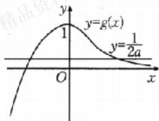

line

| x    | y=g(x) | y=1/2a |
| ---- | ------ | ------ |
| 0    | 1      | -      |
| >0   | -      | -      |

由图可知， $0 < \frac{1}{2a} < 1$ ，解得 $a > \frac{1}{2}$

所以实数 $a$ 的取值范围为 $\left(\frac{1}{2}, +\infty\right)$ .

# 考点二

例6 $\frac{5}{2} - 1$ 解析 对 $f(x)$ 求导得 $f'(x) = 3x^2 + x - 2$ .

令 $f'(x)=0$ , 得 $x_{1}=-1, x_{2}=\frac{2}{3}$ .

因为 $x_{1}$ 和 $x_{2}$ 都在区间 $[-2, 1]$ 内，所以可列表如下：

<table><tr><td>x</td><td>[-2,-1)</td><td>-1</td><td>(-1,2/3)</td><td>2/3</td><td>(2/3,1]</td></tr><tr><td>f&#x27;(x)</td><td>+</td><td>0</td><td>-</td><td>0</td><td>+</td></tr><tr><td>f(x)</td><td>单调递增</td><td>5/2</td><td>单调递减</td><td>5/27</td><td>单调递增</td></tr></table>

又 $f(-2) = -1, f(1) = \frac{1}{2}$ , 将它们与极值比较可得, 函数 $f(x)$ 在 $[-2, 1]$ 上的最大值为 $\frac{5}{2}$ , 最小值为 $-1$ .

例7 B 解析 因为函数 $f(x)$ 的定义域为 $(0, +\infty)$ ,

所以依题可知， $f(1)=-2,f'(1)=0.$

又 $f^{\prime}(x) = \frac{a}{x} -\frac{b}{x^{2}}$ ，所以 $b = -2,a - b = 0,$

则 a = -2，所以 $f'(x) = -\frac{2}{x} + \frac{2}{x^{2}}$ ，

因此函数 $f(x)$ 在 $(0,1)$ 上单调递增，在 $(1,+\infty)$ 上单调递减，当 x=1 时， $f(x)$ 取得最大值，满足题意，即 $f'(2)=-1+\frac{1}{2}=-\frac{1}{2}$ .

故选 B.

# 随堂加练

1. D 解析 $f'(x) = -\sin x + \sin x + (x + 1)\cos x = (x + 1) \cdot \cos x,$

所以在区间 $\left(0, \frac{\pi}{2}\right)$ 和 $\left(\frac{3\pi}{2}, 2\pi\right)$ 上， $f'(x) > 0, f(x)$ 单调递增；在区间 $\left(\frac{\pi}{2}, \frac{3\pi}{2}\right)$ 上， $f'(x) < 0, f(x)$ 单调递减.

又 $f(0) = f(2\pi) = 2, f\left(\frac{\pi}{2}\right) = \frac{\pi}{2} + 2, f\left(\frac{3\pi}{2}\right) = -\left(\frac{3\pi}{2} + 1\right) + 1 = -\frac{3\pi}{2},$

所以 $f(x)$ 在区间 $[0,2\pi]$ 上的最小值为 $-\frac{3\pi}{2}$ ，最大值为 $\frac{\pi}{2}+2$ .

故选 D.

2. C 解析 由题意得, $f'(x)=x^{2}+2x=x(x+2)$ .

当 x<-2 或 x>0 时， $f'(x)>0$ ;
当-2<x<0 时， $f'(x)<0$ .

故 $f(x)$ 在 $(-∞, -2)$ , $(0, +∞)$ 上单调递增，在 $(-2, 0)$ 上单调递减，

所以函数 $f(x)$ 的极小值为 $f(0) = -\frac{2}{3}$ .

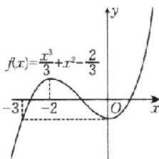

line

| x | f(x) |
|---|---|
| -3 | 0 |
| -2 | (peak) |
| 0 | 0 |
| 1 | (trough) |

令 $\frac{1}{3} x^3 + x^2 - \frac{2}{3} = -\frac{2}{3}$ , 解得 $x = 0$ 或 $x = -3$ ,

作函数 $f(x)$ 的图象如图所示，结合图象可知 $\left\{ \begin{array}{l} -3 \leqslant a < 0, \\ a + 5 > 0, \end{array} \right.$

解得 $a \in [-3,0)$ . 故选 C.

3. 解析 (1) $f(x)$ 的定义域为 $(0, +\infty)$ ,

当 $a = -1$ 时， $f(x) = -x + \ln x$ ，则 $f'(x) = -1 + \frac{1}{x}$

$$
= \frac {1 - x}{x}.
$$

令 $f'(x)=0$ ，得 x=1。

当 0 < x < 1 时， $f'(x) > 0$ ; 当 x > 1 时， $f'(x) < 0$ .

故函数 $f(x)$ 在 $(0,1)$ 上单调递增，在 $(1, +\infty)$ 上单调递减，且 $f(x)_{\max} = f(1) = -1$

所以当 $a = -1$ 时，函数 $f(x)$ 在 $(0, +\infty)$ 上的最大值为-1.

(2) $f'(x)=a+\frac{1}{x}$ ，当 $x\in(0,e]$ 时， $\frac{1}{x}\in\left[\frac{1}{e},+\infty\right)$ .

①若 $a \geqslant -\frac{1}{e}$ ，则 $f'(x) \geqslant 0$ ，从而 $f(x)$ 在 $(0, e]$ 上单调递增，所以 $f(x)_{\max} = f(e) = ae + 1 \geqslant 0$ ，不合题意.  
②若 $a < -\frac{1}{e}$ , 则令 $f'(x) > 0$ , 得 $a + \frac{1}{x} > 0$ , 结合 $x \in (0, e]$ , 解得 $0 < x < -\frac{1}{a}$ ; 令 $f'(x) < 0$ , 得 $a + \frac{1}{x} < 0$ , 结合 $x \in (0, e]$ , 解得 $-\frac{1}{a} < x \leqslant e$ .

故 $f(x)$ 在 $\left(0, -\frac{1}{a}\right)$ 上单调递增，在 $\left(-\frac{1}{a}, e\right]$ 上单调递减，所以 $f(x)_{\max} = f\left(-\frac{1}{a}\right) = -1 + \ln \left(-\frac{1}{a}\right)$ .

令 $-1 + \ln \left(-\frac{1}{a}\right) = -3$ ，得 $\ln \left(-\frac{1}{a}\right) = -2$ ，所以 $a = -\mathrm{e}^2$

因为 $-\mathrm{e}^2 < -\frac{1}{\mathrm{e}}$ ，所以 $a = -\mathrm{e}^2$

故实数 a 的值为 $-e^{2}$ .

# 考点三

例8 解析 (1) 因为瓶子的半径为 $r$ ，所以每瓶饮料的利润是 $y = f(r) = 0.2 \times \frac{4}{3} \pi r^3 - 0.8 \pi r^2 = 0.8 \pi \left(\frac{r^3}{3} - r^2\right), 0 < r \leqslant 6.$

令 $f^{\prime}(r) = 0.8\pi (r^{2} - 2r) = 0$ ，解得 $r = 2(r = 0$ 舍去），

所以当 $r \in (0,2)$ 时， $f'(r) < 0$ ；当 $r \in (2,6]$ 时， $f'(r) > 0$ .

当 $2<r\leqslant6$ 时， $f'(r)>0$ ，它表示 $f(r)$ 在区间 $(2,6]$ 上单调递增，即半径越大，利润越高；

当 0<r<2 时， $f'(r)<0$ ，它表示 $f(r)$ 在区间 $(0,2)$ 上单调递减，即半径越大，利润越低。

又 $f(6)=28.8\pi>0$ ,

所以当瓶子的半径为 $6 \, cm$ 时，每瓶饮料的利润最大.

(2)由(1)可知， $f(r)$ 在区间(2,6]上单调递增，在区间(0,2)上单调递减，

所以当 r=2 时， $f(r)$ 有最小值，最小值为 $f(2)=-\frac{16}{15}\pi<0$

故当瓶子的半径为 2 cm 时, 每瓶饮料的利润最小, 并且是亏损的.

随堂加练 解析 设该容器底面矩形的短边的长为 $x\mathrm{m}$ ，则另一边的长为 $x + 0.5\mathrm{m}$ ，

此容器的高 $y=\frac{14.8}{4}-x-(x+0.5)=3.2-2x$

于是，此容器的容积 $V(x)=x(x+0.5)(3.2-2x)=-2x^{3}+2.2x^{2}+1.6x$ ，其中 0<x<1.6，

则 $V'(x) = -6x^{2} + 4.4x + 1.6$ ，令 $V'(x) = 0$ ，得 $x_{1} = 1$ ， $x_{2}=-\frac{4}{15}$ （舍去）.

当 $x \in (0,1)$ 时， $V'(x) > 0$ ，函数 $V(x)$ 单调递增；

当 $x \in (1, 1.6)$ 时， $V'(x) < 0$ ，函数 $V(x)$ 单调递减。

故当 x=1 时，函数 $V(x)$ 有最大值，最大值为 $V(1)=1\times(1+0.5)\times(3.2-2\times1)=1.8(m^{3})$ ，

即当高为 1.2 m 时，长方体容器的容积最大，最大容积为 $1.8 \, m^{3}$ .

# 强化课06 函数中的构造问题

# 类型一

典例1 A 解析 由 $2^{x} - 2^{y} < 3^{-x} - 3^{-y}$

得 $2^{x} - 3^{-x} < 2^{y} - 3^{-y}$ , 即 $2^{x} - \left(\frac{1}{3}\right)^{x} < 2^{y} - \left(\frac{1}{3}\right)^{y}$ .

设 $f(x) = 2^{x} - \left(\frac{1}{3}\right)^{x}$ , 则 $f(x) < f(y)$ .

由指数函数的性质易知 $f(x)$ 在 R 上单调递增，则 x<y，得 y-x>0，所以 $y-x+1>1$ ，所以 $\ln(y-x+1)>0$ 。故选 A.

强化训练 A 解析 设 $f(x) = \frac{\ln x + 1}{x}$ ，则 $f'(x) = -\frac{\ln x}{x^2}$ .

令 $f'(x)>0$ , 得 0<x<1; 令 $f'(x)<0$ , 得 x>1.

故 $f(x)$ 在 $(0,1)$ 上单调递增，在 $(1, +\infty)$ 上单调递减.

由题意可知 $a=f(e)$ , $b=f(3)$ , $c=f(5)$ ，因为 e<3<5，

所以 $f(e)>f(3)>f(5)$ . 故选 A.

# 类型二

典例2 $(- \infty, -1) \cup (1, +\infty)$ 解析 构造 $F(x) = \frac{f(x)}{x}$ ,

则 $F'(x)=\frac{f'(x)\cdot x-f(x)}{x^{2}}.$

当 x<0 时， $xf'(x)-f(x)>0$ ，可以推出当 x<0 时， $F'(x)>0, F(x)$ 在 $(-∞,0)$ 上单调递增.

因为 $f(x)$ 为偶函数，所以 $F(x)$ 为奇函数，

所以 $F(x)$ 在 $(0, +\infty)$ 上也单调递增.

根据 $f(1)=0$ 可得 $F(1)=0$ ，根据函数的单调性、奇偶性可得函数图象（图略），根据图象可知 $f(x)>0$ 的解集为 $(-∞, -1)∪(1,+∞)$ .

典例3 B 解析 设 $g(x) = \frac{f(x)}{\mathrm{e}^x}$ ，则 $g'(x)$

$$
= \frac {f ^ {\prime} (x) - f (x)}{\mathrm{e} ^ {x}}.
$$

因为 $f(x)<f'(x)$ ，即 $f'(x)-f(x)>0$ ，

所以 $g'(x)>0$ ，则 $g(x)$ 为增函数，

则 $\frac{f(2025)}{\mathbf{e}^{2025}} < \frac{f(2026)}{\mathbf{e}^{2026}}$ ，即 $\mathbf{e}f(2025) < f(2026)$ . 故选 B.

典例4 CD 解析 令 $g(x) = \frac{f(x)}{\sin x}, x \in \left(0, \frac{\pi}{2}\right)$ ,

则 $g'(x)=\frac{f'(x)\sin x-f(x)\cos x}{\sin^{2}x}.$

由 $x \in \left(0, \frac{\pi}{2}\right)$ , 且恒有 $f'(x) \sin x - f(x) \cos x < 0$ ,

得 $g^{\prime}(x) < 0$ ，即函数 $g(x)$ 在 $\left(0, \frac{\pi}{2}\right)$ 上单调递减.

由 $\frac{\pi}{6} < \frac{\pi}{3}$ , 得 $g\left(\frac{\pi}{6}\right) > g\left(\frac{\pi}{3}\right)$ , 即 $\frac{f\left(\frac{\pi}{6}\right)}{\sin \frac{\pi}{6}} > \frac{f\left(\frac{\pi}{3}\right)}{\sin \frac{\pi}{3}}$ ,

可得 $\sqrt{3}f\left(\frac{\pi}{6}\right)>f\left(\frac{\pi}{3}\right)$ .

又由 $\frac{\pi}{6} < \frac{\pi}{4}$ , 得 $g\left(\frac{\pi}{6}\right) > g\left(\frac{\pi}{4}\right)$ , 即 $\frac{f\left(\frac{\pi}{6}\right)}{\sin \frac{\pi}{6}} > \frac{f\left(\frac{\pi}{4}\right)}{\sin \frac{\pi}{4}}$ , 可得 $\sqrt{2} f\left(\frac{\pi}{6}\right) > f\left(\frac{\pi}{4}\right)$ . 故选 CD.

# 强化训练

1. D 解析 设 $g(x) = \frac{f(x)}{x}, x \neq 0$ .

因为 $f(x)$ 是定义在 R 上的偶函数，所以 $f(-x)=f(x)$ .

因为 $g(-x) = \frac{f(-x)}{-x} = -\frac{f(x)}{x} = -g(x)$ ，所以 $g(x)$ 为奇函数，

所以 $g(-2)=-g(2)$ .

因为 $f(-2)=0$ ，所以 $g(-2)=g(2)=0$ 。

当 x>0 时， $g'(x)=\frac{xf'(x)-f(x)}{x^{2}}<0,$

所以 $g(x)$ 在 $(0, +\infty)$ 上单调递减，

此时不等式 $\frac{f(x)}{x}>0$ 的解集是(0,2).

因为 $g(x)$ 为奇函数, 图象关于原点对称,

所以 $g(x)$ 在 $(-\infty, 0)$ 上单调递减，

所以当 $x < 0$ 时，不等式 $\frac{f(x)}{x} > 0$ 的解集是 $(- \infty, -2)$ .

综上所述，不等式 $\frac{f(x)}{x} > 0$ 的解集是 $(- \infty, -2) \cup (0, 2)$ .

故选D.

2.A 解析 构造函数 $F(x) = \frac{f(x) + 1}{\mathrm{e}^x}$

则 $F^{\prime}$ （x） = $\frac{f^{\prime}(x)\cdot\mathrm{e}^{x}-[f(x)+1]\cdot\mathrm{e}^{x}}{\mathrm{e}^{2x}}$

$$
= \frac {f ^ {\prime} (x) - f (x) - 1}{\mathrm{e} ^ {x}}.
$$

因为 $f'(x)-f(x)<1$ ，所以 $F'(x)<0$ 恒成立，

故 $F(x) = \frac{f(x) + 1}{\mathrm{e}^x}$ 在 $\mathbf{R}$ 上单调递减， $f(x) + 1 > 2026\mathrm{e}^x$ 可变形为 $\frac{f(x) + 1}{\mathrm{e}^x} > 2026.$

又 $f(0) = 2025$ ，所以 $F(0) = \frac{f(0) + 1}{\mathrm{e}^0} = 2026,$

解 $F(x) > F(0)$ , 得 $x < 0$ . 故选 A.

3. $\left(\frac{\pi}{3}, \frac{\pi}{2}\right)$ 解析 令 $\varphi(x) = f(x) \cdot \cos x, x \in \left(-\frac{\pi}{2}, \right.$

$\frac{\pi}{2}$ ，则 $\varphi'(x)=f'(x)\cos x-f(x)\sin x.$

依题意知， $\varphi'(x)<0,\therefore\varphi(x)$ 是减函数.

$$
\because x \in \left(- \frac {\pi}{2}, \frac {\pi}{2}\right), \therefore \cos x > 0,
$$

故 $2f(x) < \frac{f\left(\frac{\pi}{3}\right)}{\cos x}$ 可化为 $f(x)\cdot \cos x < \frac{1}{2} f\left(\frac{\pi}{3}\right)$

即 $\varphi (x) <   \varphi \left(\frac{\pi}{3}\right)$ ，故 $\frac{\pi}{3} <  x <   \frac{\pi}{2}$

∴原不等式的解集为 $\left(\frac{\pi}{3},\frac{\pi}{2}\right)$ .

# 类型三

典例 5 A 解析 （法一）由 $e^{a} + a > b + \ln b$ ，可得 $e^{a} + a > e^{\ln b} + \ln b$ .

令 $f(x)=\mathrm{e}^{x}+x$ ，则 $f(a)>f(\ln b)$ .

因为 $f(x)$ 在 R 上是增函数, 所以 $a > \ln b$ .

(法二)由 $e^{a}+a>b+\ln b$ ，可得 $e^{a}+\ln e^{a}>b+\ln b$ .

令 $g(x)=x+\ln x$ ，则 $g(e^{a})>g(b)$ .

因为 $g(x)$ 在 $(0, +\infty)$ 上是增函数，所以 $e^{a} > b$ ，即 $a > \ln b$ 。故选 A.

强化训练 解析 由 $\mathrm{e}^x\geqslant (a - 1)x + \ln (ax),x > 0,$

可得 $\mathrm{e}^x + x \geqslant ax + \ln (ax)$ ，即 $\mathrm{e}^x + x \geqslant \mathrm{e}^{\ln (ax)} + \ln (ax)$ .

令 $f(x) = \mathrm{e}^{x} + x$ ，则 $f(x)\geqslant f(\ln (ax))$

因为 $f(x)$ 在 $\mathbf{R}$ 上是增函数，所以 $x \geqslant \ln (ax)$ ，即 $a \leqslant \frac{\mathrm{e}^x}{x}$ .

令 $h(x) = \frac{\mathrm{e}^x}{x} (x > 0)$ ，则 $h'(x) = \frac{(x - 1)\mathrm{e}^x}{x^2}$ .

当 $x \in (0,1)$ 时， $h'(x) < 0, h(x)$ 单调递减；

当 $x \in (1, +\infty)$ 时， $h'(x) > 0, h(x)$ 单调递增.

故 $h(x)_{\min} = h(1) = \mathrm{e}$ ，即 $a \leqslant \mathrm{e}$ ，所以 $a$ 的最大值是 $\mathbf{e}$ .

# 第18课时 导数的综合应用

# 关键考点·核心突破

# 考点一

例1 解析（法一：最值法） $f(x)$ 的定义域为 $(0, +\infty)$ ，因为 $f(x) \geqslant 0$ 恒成立，

$$
\begin{array}{r l} & {\text {所以} f (x) _ {\min} \geqslant 0, f ^ {\prime} (x) = x - (2 a + 1) + \frac {2 a}{x} =} \\ & {\frac {x ^ {2} - (2 a + 1) x + 2 a}{x} = \frac {(x - 1) (x - 2 a)}{x}.} \end{array}
$$

当 $a \leqslant 0$ 时，由 $f'(x) > 0$ ，得 $x > 1$ ；由 $f'(x) < 0$ ，得 $0 < x < 1.$ 故 $f(x)$ 在 $(1, +\infty)$ 上单调递增，在 $(0,1)$ 上单调递减，

所以 $f(x)_{\min} = f(1) = -\frac{1}{2} - 2a$

由 $-\frac{1}{2}-2a\geqslant0$ ，可得 $a\leqslant-\frac{1}{4}$ .

当 $a > 0$ 时，注意到 $f(1) = -\frac{1}{2} - 2a < 0$ ，不符合题意.

故 $a \leqslant -\frac{1}{4}$ , 即实数 $a$ 的取值范围为 $\left(-\infty, -\frac{1}{4}\right]$ .

(法二: 分离参数法) 由 $f(x) \geqslant 0$ , 可得 $\frac{1}{2} x^2 - x - 2a (x - \ln x) \geqslant 0$ .

构造函数 $h(x)=x-\ln x, x>0$ ，则 $h'(x)=1-\frac{1}{x}=\frac{x-1}{x}$ .

令 $h'(x)>0$ , 得 x>1 ; 令 $h'(x)<0$ , 得 0<x<1.

故 $h(x)_{\min} = h(1) = 1 > 0$ ，所以 $x - \ln x > 0$

所以原不等式等价于 $2a \leqslant \frac{\frac{1}{2}x^2 - x}{x - \ln x}$ .

设 $g(x)=\frac{\frac{1}{2}x^{2}-x}{x-\ln x},x>0,$

则 $g'(x)=\frac{(x-1)\left(\frac{1}{2}x+1-\ln x\right)}{(x-\ln x)^{2}}$ .

设 $\varphi(x)=\frac{1}{2}x+1-\ln x,x>0$ , 则 $\varphi'(x)=\frac{x-2}{2x}$

令 $\varphi'(x)>0$ , 得 x>2 ; 令 $\varphi'(x)<0$ , 得 0<x<2.

易知 $\varphi(x)$ 在 $(0,2)$ 上单调递减，在 $(2,+\infty)$ 上单调递增，所以 $\varphi(x)\geqslant\varphi(2)=2-\ln2>0$ ，

所以当 $x > 1$ 时， $g'(x) > 0$ ；当 $0 < x < 1$ 时， $g'(x) < 0$ .

故 $g(x)$ 在 $(0,1)$ 上单调递减，在 $(1, +\infty)$ 上单调递增，

则 $g(x)\geqslant g(1) = -\frac{1}{2}.$

因为 $f(x)\geqslant 0$ 恒成立，所以 $2a\leqslant -\frac{1}{2}$ ，得 $a\leqslant -\frac{1}{4}$

故实数 a 的取值范围为 $\left(-\infty, -\frac{1}{4}\right]$ .

随堂加练 解析 (1) 由 $f(x) = x \ln x$ ，得 $f'(x) = 1 + \ln x$ .

令 $f'(x)>0$ , 得 $x>\frac{1}{e}$ ; 令 $f'(x)<0$ , 得 $0<x<\frac{1}{e}$ .

故 $f(x)$ 在 $\left(0, \frac{1}{\mathrm{e}}\right)$ 上单调递减，在 $\left(\frac{1}{\mathrm{e}}, +\infty\right)$ 上单调递增，

所以 $f(x)$ 在 $x = \frac{1}{\mathrm{e}}$ 处取得极小值，极小值为 $f\left(\frac{1}{\mathrm{e}}\right) = -\frac{1}{\mathrm{e}}$

无极大值.

(2)由 $f(x)\leqslant \frac{-x^2 + mx - 3}{2}$ 得 $m\geqslant \frac{2x\ln x + x^2 + 3}{x},$

问题转化为 $m \geqslant \left(\frac{2x\ln x + x^2 + 3}{x}\right)_{\min}$ .

设 $g(x) = \frac{2x\ln x + x^2 + 3}{x} = 2\ln x + x + \frac{3}{x} (x > 0)$ ,

则 $g^{\prime}(x) = \frac{2}{x} +1 - \frac{3}{x^{2}} = \frac{x^{2} + 2x - 3}{x^{2}} = \frac{(x + 3)(x - 1)}{x^{2}}.$

令 $g^{\prime}(x) > 0$ ，得 $x > 1$ ；令 $g^{\prime}(x) < 0$ ，得 $0 < x < 1$

故 $g(x)$ 在 $(0,1)$ 上单调递减，在 $(1, +\infty)$ 上单调递增，所以 $g(x)_{\min} = g(1) = 4$ ，则 $m \geqslant 4$

故实数 $m$ 的最小值为4.

# 考点二

例2 解析 当 $a \leqslant 2$ ，且 $x > 1$ 时， $\mathrm{e}^{x - 1} - f(x) = \mathrm{e}^{x - 1} - a(x - 1) + \ln x - 1 \geqslant \mathrm{e}^{x - 1} - 2x + 1 + \ln x.$

令 $g(x) = \mathrm{e}^{x - 1} - 2x + 1 + \ln x(x > 1)$ ，下证 $g(x) > 0$ 在(1， $+\infty)$ 上恒成立即可.

$g^{\prime}(x) = \mathrm{e}^{x - 1} - 2 + \frac{1}{x}$ , 再令 $h(x) = g^{\prime}(x)$ , 则 $h^{\prime}(x) = \mathrm{e}^{x - 1} - \frac{1}{x^{2}}$ ,

显然 $h'(x)$ 在 $(1,+\infty)$ 上单调递增，则 $h'(x)>h'(1)=\mathrm{e}^{0}-1=0$ ,

即 $h(x)$ 在 $(1,+\infty)$ 上单调递增，即 $g'(x)$ 在 $(1,+\infty)$ 上单调递增，

故 $g'(x) > g'(1) = e^{0} - 2 + 1 = 0$ ，所以 $g(x)$ 在 $(1, +\infty)$ 上单调递增，

故 $g(x) > g(1) = \mathrm{e}^0 - 2 + 1 + \ln 1 = 0$ ，问题得证.

随堂加练 解析 (1) 因为 $f(x) = a(\mathrm{e}^x + a) - x$ ，定义域为 $\mathbf{R}$ ，所以 $f'(x) = ae^x - 1$ .

当 $a > 0$ 时，令 $f^{\prime}(x) = ae^{x} - 1 = 0$ ，解得 $x = -\ln a$

当 $x<-\ln a$ 时， $f'(x)<0$ ，则 $f(x)$ 在 $(-∞,-\ln a)$ 上单调递减；

当 $x > -\ln a$ 时， $f'(x) > 0$ ，则 $f(x)$ 在 $(- \ln a, +\infty)$ 上单调递增.

故 $f(x)_{\min} = f(-\ln a) = a(\mathrm{e}^{-\ln a} + a) + \ln a = 1 + a^2 +\ln a.$

要证 $f(x) > 2\ln a + \frac{3}{2}$ ，即证 $1 + a^2 + \ln a > 2\ln a + \frac{3}{2}$ ，即证 $a^2 - \frac{1}{2} - \ln a > 0$ 恒成立.

设 $g(a) = a^2 -\frac{1}{2} -\ln a(a > 0)$ ，则 $\mathbf{g}^{\prime}(a) = 2a - \frac{1}{a} = \frac{2a^{2} - 1}{a}.$

令 $g^{\prime}(a) < 0$ ，得 $0 < a < \frac{\sqrt{2}}{2}$ ；令 $g^{\prime}(a) > 0$ ，得 $a > \frac{\sqrt{2}}{2}$

故 $g(a)$ 在 $\left(0, \frac{\sqrt{2}}{2}\right)$ 上单调递减，在 $\left(\frac{\sqrt{2}}{2}, +\infty\right)$ 上单调递增，

所以 $g(a)_{\min} = g\left(\frac{\sqrt{2}}{2}\right) = \left(\frac{\sqrt{2}}{2}\right)^2 - \frac{1}{2} - \ln \frac{\sqrt{2}}{2} = \ln \sqrt{2} > 0,$

则 $g(a)>0$ 恒成立.

故当 $a > 0$ 时， $f(x) > 2\ln a + \frac{3}{2}$ 恒成立，证毕.

# 考点三

例3 解析 (1) 由 $f(x) = \mathrm{e}^{x} - ax + 2a$ ，定义域为 $\mathbf{R}$ ，得 $f'(x) = \mathrm{e}^{x} - a$ .

当 $a \leqslant 0$ 时， $f'(x) > 0$ ，则 $f(x)$ 在 $\mathbf{R}$ 上单调递增.

当 a>0 时，令 $f'(x)=0$ ，得 $x=\ln a$ 。

当 $x < \ln a$ 时， $f'(x) < 0, f(x)$ 单调递减；当 $x > \ln a$ 时， $f'(x) > 0, f(x)$ 单调递增.

综上所述，当 $a \leqslant 0$ 时， $f(x)$ 在 $\mathbf{R}$ 上单调递增；当 $a > 0$ 时， $f(x)$ 在 $(- \infty, \ln a)$ 上单调递减，在 $(\ln a, +\infty)$ 上单调递增.

(2) 令 $f(x) = 0$ , 得 $e^x = a(x - 2)$ .

当 a=0 时， $e^{x}=a(x-2)$ 无解，所以 $f(x)$ 无零点.

当 $a \neq 0$ 时, $\frac{1}{a} = \frac{x - 2}{\mathrm{e}^x}$ , 令 $\varphi(x) = \frac{x - 2}{\mathrm{e}^x}, x \in \mathbb{R}$ ,

则 $\varphi'(x)=\frac{3-x}{e^{x}}.$

当 $x \in (-\infty, 3)$ 时， $\varphi'(x) > 0$ ；当 $x \in (3, +\infty)$ 时， $\varphi'(x) < 0$ 。

故 $\varphi (x)$ 在 $(-\infty ,3)$ 上单调递增，在(3， $+\infty)$ 上单调递减，且 $\varphi (x)_{\mathrm{max}} = \varphi (3)$

$$
= \frac {1}{\mathrm{e} ^ {3}}.
$$

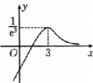

又当 $x \to +\infty$ 时， $\varphi(x) \to 0$ ，当 $x \to -\infty$ 时， $\varphi(x) \to -\infty$

所以 $\varphi(x)$ 的大致图象如图所示.

当 $\frac{1}{a}>\frac{1}{e^{3}}$ ，即0<a< $e^{3}$ 时， $f(x)$ 无零点；

当 $\frac{1}{a}=\frac{1}{e^{3}}$ ，即 $a=e^{3}$ 时， $f(x)$ 只有一个零点；

当 $0 < \frac{1}{a} < \frac{1}{\mathrm{e}^3}$ , 即 $a > \mathrm{e}^3$ 时, $f(x)$ 有两个零点;

当 $\frac{1}{a}<0$ ，即a<0时， $f(x)$ 只有一个零点.

综上所述，当 $a \in [0, \mathbf{e}^3)$ 时， $f(x)$ 无零点；当 $a \in (-\infty, 0) \cup \{\mathbf{e}^3\}$ 时， $f(x)$ 只有一个零点；当 $a \in (\mathbf{e}^3, +\infty)$ 时， $f(x)$ 有两个零点.

随堂加练 解析 (1) 当 $a = 1$ 时, $f(x) = \mathrm{e}^{x} - (x + 2)$ , 则 $f'(x) = \mathrm{e}^{x} - 1$ .

令 $f'(x)<0$ ，解得 x<0；令 $f'(x)>0$ ，解得 x>0。

故 $f(x)$ 在 $(- \infty, 0)$ 上单调递减，在 $(0, +\infty)$ 上单调递增.

(2)(法一:最值法)当 $a\leqslant0$ 时, $f'(x)=e^{x}-a>0$ 恒成立,

$f(x)$ 在 $(-\infty, +\infty)$ 上单调递增，不符合题意.

当 $a > 0$ 时，令 $f^{\prime}(x) = 0$ ，解得 $x = \ln a$

当 $x \in (-\infty, \ln a)$ 时， $f'(x) < 0, f(x)$ 单调递减；当 $x \in (\ln a, +\infty)$ 时， $f'(x) > 0, f(x)$ 单调递增.

故 $f(x)$ 的极小值（也是最小值）为 $f(\ln a)=a-a(\ln a+2)=-a(1+\ln a)$ .

又当 $x \to -\infty$ 时， $f(x) \to +\infty$ ，当 $x \to +\infty$ 时， $f(x) \to +\infty$ ，所以要使 $f(x)$ 有两个零点，只要 $f(\ln a) < 0$ ，则 $1 + \ln a > 0$ ，可得 $a > \frac{1}{e}$ .

综上，若 $f(x)$ 有两个零点，则实数 a 的取值范围是 $\left(\frac{1}{\mathrm{e}}, +\infty\right)$ .

(法二:分离参数法)若 $f(x)$ 有两个零点, 即 $\mathrm{e}^{x}-a(x+2)=0$ 有两个解, 显然 x=-2 不成立, 即 $a=\frac{\mathrm{e}^{x}}{x+2}(x\neq-2)$ 有两个解.

令 $h(x)=\frac{e^{x}}{x+2}(x\neq-2)$ ，则 $h'(x)=\frac{e^{x}(x+2)-e^{x}}{(x+2)^{2}}=\frac{e^{x}(x+1)}{(x+2)^{2}}$ .

令 $h'(x)>0$ ，解得 x>-1；令 $h'(x)<0$ ，解得 x<-2 或 -2<x<-1。

故函数 $h(x)$ 在 $(- \infty, -2)$ 和 $(-2, -1)$ 上单调递减，在 $(-1, +\infty)$ 上单调递增，且当 $x < -2$ 时， $h(x) < 0$ ，而当 $x \to (-2)^{+}$ （从右侧趋近于-2）时， $h(x) \to +\infty$ ，当 $x \to +\infty$ 时，

$h(x)\rightarrow+\infty$ , 所以当 $a=\frac{e^{x}}{x+2}(x\neq-2)$ 有两个解时, 有 a>h(-1)= $\frac{1}{e}$ ,

所以满足条件的 a 的取值范围是 $\left(\frac{1}{e}, +\infty\right)$ .

# 第五单元 三角函数、解三角形

# 第19课时 任意角、弧度制和三角函数的概念

# 必备知识·逐点梳理

# 一、1. 端点

2. 正角 负角 零角 象限角

3. $-\alpha$

微判断 (1)× (2)× (3)√ (4)√

# 二、1. 半径长

2. $|\alpha |r$

# 关键考点·核心突破

# 考点一

例1 (1) $\{\alpha_{1} | k \cdot 180^{\circ} + 45^{\circ} \leqslant \alpha_{1} \leqslant k \cdot 180^{\circ} + 90^{\circ}, k \in \mathbf{Z}\} \quad \{\alpha_{2} | k \cdot 360^{\circ} - 150^{\circ} \leqslant \alpha_{2} \leqslant k \cdot 360^{\circ} + 120^{\circ}, k \in \mathbf{Z}\}$ (2)二、四第一、二象限或 $y$ 轴的非负半轴上一四 (3)见解析

解析 (1)这是对顶角区域的表示问题,结合图象可知终边落在阴影部分的角的集合可表示为 $\{\alpha|k\cdot360^{\circ}+45^{\circ}\leqslant\alpha\leqslant k\cdot360^{\circ}+90^{\circ}$ 或 $k\cdot360^{\circ}+225^{\circ}\leqslant\alpha\leqslant k\cdot360^{\circ}+270^{\circ},k\in\mathbf{Z}\}=\{\alpha|k\cdot180^{\circ}+45^{\circ}\leqslant\alpha\leqslant k\cdot180^{\circ}+90^{\circ},k\in\mathbf{Z}\}$ .

在 $-180^{\circ}\sim180^{\circ}$ 的范围内，阴影部分为 $-150^{\circ}\sim120^{\circ}$ ，终边落在阴影部分的角的集合可表示为 $\{\alpha|k\cdot360^{\circ}-150^{\circ}\leqslant\alpha\leqslant k\cdot360^{\circ}+120^{\circ},k\in\mathbf{Z}\}$ .

(2) 因为 $\alpha$ 为第三象限角，所以 $\pi + 2k\pi < \alpha < \frac{3\pi}{2} + 2k\pi, k \in \mathbf{Z}$ ，

所以 $\frac{\pi}{2} + k\pi < \frac{\alpha}{2} < \frac{3\pi}{4} + k\pi, k \in \mathbf{Z}$ .

当 $k = 2n$ 时， $\frac{\pi}{2} +2n\pi <\frac{\alpha}{2} < \frac{3\pi}{4} +2n\pi ,n\in \mathbf{Z},$ 终边在第二象限；

当 $k = 2n + 1$ 时， $\frac{3\pi}{2} +2n\pi <\frac{\alpha}{2} < \frac{7\pi}{4} +2n\pi ,n\in \mathbf{Z},$ 终边在第四象限.

故 $\frac{\alpha}{2}$ 的终边在第二或第四象限.

由上可知 $2\pi + 4k\pi < 2\alpha < 3\pi + 4k\pi, k \in \mathbf{Z}$ ,

所以 $2\alpha$ 的终边在第一或第二象限，也可能在 y 轴的非负半轴上.

因为 $\pi +\pi +2k\pi <  \pi +\alpha <  \pi +\frac{3\pi}{2} +2k\pi ,k\in \mathbf{Z},$ 即 $(2k + 2)\pi <$ $\pi +\alpha <  \frac{\pi}{2} +(2k + 2)\pi ,k\in \mathbf{Z},$

所以 $\pi+\alpha$ 是第一象限角.

因为 $-\frac{3\pi}{2} - 2k\pi < -\alpha < -\pi - 2k\pi, k \in \mathbf{Z}$ ,

所以 $-\frac{\pi}{2} - 2k\pi < \pi - a < -2k\pi, k \in \mathbf{Z}$ ,

所以 $\pi-\alpha$ 是第四象限角.

(3)① $\alpha_{1}=-570^{\circ}=-570\times\frac{\pi}{180}=-\frac{19\pi}{6}=-2\times2\pi+\frac{5\pi}{6}$ ，在第二象限；

$a_{2} = 750^{\circ} = 750 \times \frac{\pi}{180} = \frac{25\pi}{6} = 2 \times 2\pi + \frac{\pi}{6}$ , 在第一象限.

故 $\alpha_{1}$ 是第二象限角， $\alpha_{2}$ 是第一象限角.

② $\beta_{1}=\frac{3\pi}{5}=\frac{3}{5}\times180^{\circ}=108^{\circ}$ ，与 $\beta_{1}$ 终边重合的角是 $k\cdot360^{\circ}+108^{\circ}(k\in\mathbf{Z})$ .

所以 $-720^{\circ} < k \cdot 360^{\circ} + 108^{\circ} < 0^{\circ} (k \in \mathbf{Z})$ ，解得 $k = -2$ 或 $k = -1$ ，

所以在 $-720^{\circ}\sim0^{\circ}$ 范围内与 $\beta_{1}$ 终边重合的角是 $-612^{\circ}$ 和 $-252^{\circ}$ .

$\beta_{2} = -\frac{\pi}{3} = -60^{\circ}$ ，与 $\beta_{2}$ 终边重合的角是 $k\cdot 360^{\circ}-$ $60^{\circ}(k\in \mathbf{Z})$

所以 $-720^{\circ}<k\cdot360^{\circ}-60^{\circ}<0^{\circ}(k\in\mathbf{Z})$ ，解得k=-1或k=0，
所以在 $-720^{\circ}\sim0^{\circ}$ 范围内与 $\beta_{2}$ 终边重合的角是 $-420^{\circ}$ .

# 随堂加练

1.C 解析 因为角 $\alpha$ 的终边与 $2026^{\circ}$ 角的终边相同，而 $2026^{\circ} = 5 \times 360^{\circ} + 226^{\circ}$ ，与角 $226^{\circ}$ 的终边相同，是第三象限角，所以 $180^{\circ} + k \cdot 360^{\circ} < \alpha < 270^{\circ} + k \cdot 360^{\circ}, k \in \mathbf{Z}$ .

对于 A, 可得 $-270^{\circ}-k\cdot360^{\circ}<-\alpha<-180^{\circ}-k\cdot360^{\circ}, k\in Z$ , 此时 $-\alpha$ 的终边在第二象限, 所以 $-\alpha$ 是第二象限角, A 错误.

对于 B, 可得 $90^{\circ} + k \cdot 180^{\circ} < \frac{\alpha}{2} < 135^{\circ} + k \cdot 180^{\circ}, k \in Z$ . 当 k 为偶数时, $\frac{\alpha}{2}$ 的终边在第二象限; 当 k 为奇数时, $\frac{\alpha}{2}$ 的终边在第四象限. 故 $\frac{\alpha}{2}$ 是第二或第四象限角, B 错误.

对于 C, 可得 $90^{\circ} + (k+1) \cdot 360^{\circ} < 270^{\circ} + \alpha < 180^{\circ} + (k+1) \cdot 360^{\circ}, k \in \mathbf{Z}$ , 所以 $270^{\circ} + \alpha$ 的终边在第二象限, 所以 $270^{\circ} + \alpha$ 是第二象限角, C 正确.

对于 D, 可得 $(2k+1) \cdot 360^{\circ} < 2\alpha < 180^{\circ} + (2k+1) \cdot 360^{\circ}, k \in \mathbf{Z}$ ，所以 $2\alpha$ 是第一或第二象限角或终边在 y 轴的非负半轴上，D 错误。故选 C.

2. 二 $134^{\circ} - 226^{\circ}$ 解析 因为 $-2026^{\circ} = -6 \times 360^{\circ} + 134^{\circ}$ , 所以 $-2026^{\circ}$ 角的终边与 $134^{\circ}$ 角的终边相同,

所以 $-2\ 026^{\circ}$ 角是第二象限角，与 $-2\ 026^{\circ}$ 角终边相同的最小正角是 $134^{\circ}$ .

又 $134^{\circ} - 360^{\circ} = -226^{\circ}$ ，故与 $-2026^{\circ}$ 角终边相同的最大负角是 $-226^{\circ}$

# 考点二

例 2 解析 (1) 因为 $\alpha=\frac{\pi}{3}$ , R=10 cm,

所以 $l=|\alpha|R=\frac{\pi}{3}\times10=\frac{10\pi}{3}$ (cm).

(2)(法一)由题意知 $2R+l=16$ ,

所以 $l=16-2R(0<R<8)$ ,

则 $S=\frac{1}{2}lR=\frac{1}{2}(16-2R)R=-R^{2}+8R=-(R-4)^{2}+16,$

当 $R=4\ cm$ 时， $S_{max}=16\ cm^{2}$ ，此时 $l=16-2\times4=8\ (cm)$ ，

则 $\alpha=\frac{l}{R}=2(\text{rad})$ ,

所以当扇形的圆心角为2弧度时,这个扇形的面积最大.

(法二)由题意知 $2R+l=16$ ,

$$
S = \frac {1}{2} l R = \frac {1}{4} l \cdot 2 R \leqslant \frac {1}{4} \cdot \left(\frac {l + 2 R}{2}\right) ^ {2} = 1 6,
$$

当且仅当 l=2R，即 R=4 cm 时，S 取得最大值，最大值为 $16 \, cm^{2}$ .

此时扇形的圆心角 $\alpha=\frac{l}{R}=2\ rad.$

(3)由题意知, $l=\alpha R=\frac{\pi}{3}\times2=\frac{2\pi}{3}$ (cm),

所以 $S_{弓形}=\frac{1}{2}\times\frac{2\pi}{3}\times2-\frac{1}{2}\times2^{2}\times\sin\frac{\pi}{3}=\frac{2\pi}{3}-\sqrt{3}(cm^{2})$ .

# 随堂加练

1.B 解析 如图，设该扇面书画的外弧半径为 R，弧长为 $l_{2}=48$ ，内弧半径为 r，弧长为 $l_{1}=18$ ，且 $120^{\circ}=\frac{2\pi}{3}$ ，则 $l_{1}=\frac{2\pi}{3}r=18, l_{2}=\frac{2\pi}{3}R=48$ ，解得 $r=\frac{27}{\pi}, R=\frac{72}{\pi}$ ，

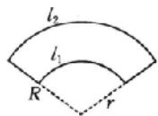

所以扇面书画的面积约为 $\frac{1}{2}l_{2}R-\frac{1}{2}l_{1}r=\frac{1}{2}\times48\times\frac{72}{\pi}-\frac{1}{2}\times18\times\frac{27}{\pi}=\frac{1485}{\pi}\approx495.$

故选B.

2.B 解析 由题意, 得“弓”所在的弧长 $l=\frac{\pi}{4}+\frac{\pi}{4}+\frac{\pi}{8}=\frac{5\pi}{8}$ , $R=1.25=\frac{5}{4}$ ，所以其所对的圆心角 $\alpha=\frac{l}{R}=\frac{\frac{5\pi}{8}}{\frac{5}{4}}=\frac{\pi}{2}$ ，所以
双手之间的距离 $d=\sqrt{R^{2}+R^{2}}=\sqrt{2}\times1.25\approx1.768$ . 故选 B.
考点三

例3 $\frac{5}{13} -\frac{12}{13}$ 解析 $r = |OP| = \sqrt{(-12)^2 + 5^2} = 13$ ，其中 $O$ 为坐标原点，所以 $\sin \theta = \frac{5}{13},\cos \theta = -\frac{12}{13}.$

例4 A 解析 易知 $\sin \theta$ 在第一、二象限为正，第三、四象限为负； $\cos \theta$ 在第一、四象限为正，第二、三象限为负。因为 $\sin \theta \cos \theta > 0$ ，所以 $\theta$ 在第一、三象限。故选A.

# 随堂加练

1. D 解析 在角 $\theta$ 的终边所在的直线 $y = -2x$ 上任取一点 $P(a, -2a)(a \neq 0)$ , 则 $|OP| = \sqrt{5} |a|$ . 由三角函数的定义, 知 $\sin \theta = \frac{-2a}{\sqrt{5} |a|}, \cos \theta = \frac{a}{\sqrt{5} |a|}$ , 故 $2\sin \theta \cos \theta = 2 \cdot \frac{-2a}{\sqrt{5} |a|} \cdot \frac{a}{\sqrt{5} |a|} = -\frac{4}{5}$ . 故选 D.

2.B 解析 因为 $\sin \alpha \cos \alpha < 0$ ，所以 $\alpha$ 是第二或第四象限角。当 $\alpha$ 是第二象限角时， $\cos \alpha < 0, \sin \alpha > 0$ ，则 $\cos \alpha - \sin \alpha < 0$ ，符合题意；当 $\alpha$ 是第四象限角时， $\cos \alpha > 0, \sin \alpha < 0$ ，则 $\cos \alpha - \sin \alpha > 0$ ，不符合题意。故 $\alpha$ 是第二象限角。故选 B.

3.4 $\frac{4}{5}$ 解析 因为角 $\alpha$ 的终边经过点 $P(-3, b)$ , 且 $\cos \alpha = \frac{-3}{\sqrt{(-3)^2 + b^2}} = -\frac{3}{5}$ , 解得 $b = 4$ (负值已舍去), 所以 $\sin \alpha = \frac{4}{\sqrt{(-3)^2 + 4^2}} = \frac{4}{5}$ .

# 第20课时 同角三角函数的基本关系及诱导公式

# 必备知识·逐点梳理

一、微判断 (1)× (2)×

二、 $-\sin\alpha$ $-\cos\alpha$ $\tan\alpha$ $-\sin\alpha$ $\cos\alpha$ $-\tan\alpha$ $\sin\alpha$ $-\cos\alpha$ $\cos\alpha$ $\sin\alpha$ $\cos\alpha$ $-\sin\alpha$

# 关键考点·核心突破

# 考点一

例1 解析 (1) 由 $\sin^2\alpha + \cos^2\alpha = 1$ ，得 $\cos^2\alpha = 1 - \sin^2\alpha = 1 - \left(-\frac{\sqrt{3}}{2}\right)^2 = \frac{1}{4}$ .

$\because \alpha$ 为第四象限角， $\therefore \cos \alpha = \frac{1}{2}, \therefore \tan \alpha = \frac{\sin \alpha}{\cos \alpha} = -\sqrt{3}.$

(2) $\because\tan\alpha=-\frac{3}{4}<0,\alpha$ 为第四象限角，

$$
\therefore \cos \alpha = \frac {4}{5}, \sin \alpha = - \frac {3}{5}.
$$

(3) $\because\frac{\pi}{4}<\alpha<\frac{\pi}{2},\therefore\sin\alpha>\cos\alpha,$

$$
\begin{array}{r l} \therefore \cos \alpha - \sin \alpha & = - \sqrt {(\cos \alpha - \sin \alpha) ^ {2}} \\ - \sqrt {1 - 2 \sin \alpha \cos \alpha} & = - \frac {1}{2}. \end{array}
$$

例2 (1) C (2) $-\frac{\sqrt{5}}{5}$ 解析 (1) $\frac{\sin \theta(1 + 2\sin \theta\cos \theta)}{\sin \theta + \cos \theta} = \frac{\sin \theta(\sin^2\theta + \cos^2\theta + 2\sin \theta\cos \theta)}{\sin \theta + \cos \theta} = \sin \theta(\sin \theta + \cos \theta) = \frac{\sin \theta(\sin \theta + \cos \theta)}{\sin^2\theta + \cos^2\theta} = \frac{\tan^2\theta + \tan \theta}{1 + \tan^2\theta} = \frac{2}{5}$ .

故选C.

(2) 因为 $\theta \in \left(0, \frac{\pi}{2}\right)$ , 所以 $\sin \theta > 0, \cos \theta > 0$ .

又因为 $\tan \theta = \frac{\sin\theta}{\cos\theta} = \frac{1}{2}$ 所以 $\cos \theta = 2\sin \theta$

所以 $\cos^2\theta +\sin^2\theta = 4\sin^2\theta +\sin^2\theta = 5\sin^2\theta = 1,$

解得 $\sin\theta=\frac{\sqrt{5}}{5}$ 或 $\sin\theta=-\frac{\sqrt{5}}{5}$ (舍去),

所以 $\sin \theta -\cos \theta = \sin \theta -2\sin \theta = -\sin \theta = -\frac{\sqrt{5}}{5}.$

# 随堂加练

1. ABD 解析 $\because \sin\theta - \cos\theta = \frac{1}{5}$ ，①

$$
\therefore (\sin \theta - \cos \theta) ^ {2} = 1 - 2 \sin \theta \cos \theta = \frac {1}{2 5},
$$

$$
\therefore 2 \sin \theta \cos \theta = \frac {2 4}{2 5}.
$$

$\because\theta\in(0,\pi),\therefore\sin\theta>0,\therefore\cos\theta>0,\therefore\theta\in\left(0,\frac{\pi}{2}\right)$ ，故A正确；

$\because (\sin\theta+\cos\theta)^{2}=1+2\sin\theta\cos\theta=\frac{49}{25}$ ，且由A可知 $\sin\theta+\cos\theta>0$ ，

$$
\therefore \sin \theta + \cos \theta = \frac {7}{5}, \quad ②
$$

故D正确；

由①②，得 $\sin\theta=\frac{4}{5},\cos\theta=\frac{3}{5}$ ，故 B 正确；

$\tan\theta=\frac{\sin\theta}{\cos\theta}=\frac{4}{3}$ ，故C错误.

故选 ABD.

2. 解析 (1) 因为 $\frac{\sin \alpha - \cos \alpha}{\sin \alpha + \cos \alpha} = 3$ ，所以 $\frac{\sin \alpha - \cos \alpha}{\sin \alpha + \cos \alpha} = \frac{\tan \alpha - 1}{\tan \alpha + 1} = 3,$

所以 $\tan\alpha-1=3\tan\alpha+3$ ，解得 $\tan\alpha=-2$ 。

(2) $\sin^{2}\alpha-\cos^{2}\alpha=\frac{\sin^{2}\alpha-\cos^{2}\alpha}{\sin^{2}\alpha+\cos^{2}\alpha}=\frac{\tan^{2}\alpha-1}{\tan^{2}\alpha+1}=\frac{3}{5}.$

# 考点二

例3 解析 (1) 原式 $= \frac{\cos \alpha \cos \alpha \tan^2 \alpha}{\sin \alpha \sin \alpha (-\sin \alpha)} = \frac{\cos^2 \alpha \cdot \frac{\sin^2 \alpha}{\cos^2 \alpha}}{-\sin^3 \alpha} = -\frac{1}{\sin \alpha}$ .

(2)由已知，可得 $\cos (\pi +\alpha) = -\cos \alpha = -\frac{3}{5},\therefore \cos \alpha = \frac{3}{5},$

$$
\begin{array}{l} \therefore \sin \left(\frac {3 \pi}{2} - \alpha\right) = - \cos \alpha = - \frac {3}{5}, \sin \left(\frac {3 \pi}{2} + \alpha\right) = - \cos \alpha \\ = - \frac {3}{5}. \end{array}
$$

(3) $\because0<x<\frac{\pi}{2},\therefore-\frac{\pi}{6}<\frac{\pi}{3}-x<\frac{\pi}{3}.$

又 $\sin\left(\frac{\pi}{3}-x\right)=\frac{1}{3}>0,\therefore0<\frac{\pi}{3}-x<\frac{\pi}{3},$

$$
\therefore \cos \left(\frac {\pi}{3} - x\right) = \sqrt {1 - \sin^ {2} \left(\frac {\pi}{3} - x\right)} = \frac {2 \sqrt {2}}{3},
$$

$$
\therefore \sin \left(\frac {\pi}{6} + x\right) = \sin \left[ \frac {\pi}{2} - \left(\frac {\pi}{3} - x\right) \right] = \cos \left(\frac {\pi}{3} - x\right) = \frac {2 \sqrt {2}}{3},
$$

$$
\begin{array}{l} \cos \left(\frac {2 \pi}{3} + x\right) = \cos \left[ \pi - \left(\frac {\pi}{3} - x\right) \right] = - \cos \left(\frac {\pi}{3} - x\right) = \\ - \frac {2 \sqrt {2}}{3}. \end{array}
$$

# 随堂加练

1.2 解析 因为 $\cos \alpha = -\frac{\sqrt{5}}{5}$ ，且 $\alpha$ 是第三象限角，

所以 $\sin \alpha = -\sqrt{1 - \cos^2\alpha} = -\sqrt{1 - \left(-\frac{\sqrt{5}}{5}\right)^2} = -\frac{2\sqrt{5}}{5},$

所以 $\tan\alpha=\frac{\sin\alpha}{\cos\alpha}=2,$

故原式 $= \frac{-\sin\alpha - \cos\alpha + \cos\alpha + 2\sin\alpha}{\sin\alpha - \cos\alpha} = \frac{\sin\alpha}{\sin\alpha - \cos\alpha} =$

$$
\frac {\tan \alpha}{\tan \alpha - 1} = 2.
$$

2. $-\frac{5}{13} - \frac{12}{13}$ 解析 $\cos \left(\frac{\pi}{3} - \alpha\right) = \cos \left[\frac{\pi}{2} - \left(\alpha + \frac{\pi}{6}\right)\right] = \sin \left(\alpha + \frac{\pi}{6}\right) = -\frac{5}{13}$ .

$$
\because \alpha \in \left(\frac {\pi}{2}, \pi\right), \therefore \alpha + \frac {\pi}{6} \in \left(\frac {2 \pi}{3}, \frac {7 \pi}{6}\right),
$$

$$
\therefore \cos \left(\alpha + \frac {\pi}{6}\right) = - \sqrt {1 - \sin^ {2} \left(\alpha + \frac {\pi}{6}\right)} = - \frac {1 2}{1 3},
$$

$$
\therefore \sin \left(\alpha + \frac {2 \pi}{3}\right) = \sin \left(\alpha + \frac {\pi}{6} + \frac {\pi}{2}\right) = \cos \left(\alpha + \frac {\pi}{6}\right) = - \frac {1 2}{1 3}.
$$

# 第21课时 两角和与差的正弦、余弦和正切公式

# 必备知识·逐点梳理

一、1. $\cos\alpha\cos\beta+\sin\alpha\sin\beta$

2. cos αcos β−sin αsin β

3. sin αcos β-cos αsin β

4. sin αcos β+cos αsin β

微判断 (1)√ (2)√ (3)×

# 关键考点·核心突破

# 考点一

例1 $\frac{63}{65} -\frac{56}{65}$ 解析 因为 $\sin \alpha = \frac{12}{13},\cos \beta = -\frac{3}{5},\alpha ,\beta$ 均为第二象限角，

所以 $\cos\alpha=-\sqrt{1-\left(\frac{12}{13}\right)^{2}}=-\frac{5}{13},\sin\beta=$ $\sqrt{1-\left(-\frac{3}{5}\right)^{2}}=\frac{4}{5},$

所以 $\cos(\alpha-\beta)=\cos\alpha\cos\beta+\sin\alpha\sin\beta=\frac{63}{65}$ ,

$$
\sin (\alpha + \beta) = \sin \alpha \cos \beta + \cos \alpha \sin \beta = - \frac {5 6}{6 5}.
$$

例2 B 解析 因为 $\frac{\cos\alpha}{\cos\alpha - \sin\alpha} = \sqrt{3}$

所以 $\frac{1}{1 - \tan\alpha} = \sqrt{3}$ ，解得 $\tan \alpha = 1 - \frac{\sqrt{3}}{3}$

所以 $\tan\left(\alpha+\frac{\pi}{4}\right)=\frac{\tan\alpha+1}{1-\tan\alpha}=2\sqrt{3}-1$ ，故选 B.

# 随堂加练

1. 解析 (1) $\cos \frac{\pi}{12} = \cos \left(\frac{\pi}{3} - \frac{\pi}{4}\right) = \cos \frac{\pi}{3} \cos \frac{\pi}{4} + \sin \frac{\pi}{3} \sin \frac{\pi}{4} = \frac{1}{2} \times \frac{\sqrt{2}}{2} + \frac{\sqrt{3}}{2} \times \frac{\sqrt{2}}{2} = \frac{\sqrt{2} + \sqrt{6}}{4}$ .

(2) $\sin \frac{5\pi}{12} = \cos \left(\frac{\pi}{2} - \frac{5\pi}{12}\right) = \cos \frac{\pi}{12} = \frac{\sqrt{2} + \sqrt{6}}{4}$ .

(3) $\cos \left(-\frac{31\pi}{12}\right) = \cos \left(-3\pi + \frac{5\pi}{12}\right) = -\cos \frac{5\pi}{12} = -\cos \left(\frac{\pi}{6} + \frac{\pi}{4}\right) = -\left(\cos \frac{\pi}{6} \cos \frac{\pi}{4} - \sin \frac{\pi}{6} \sin \frac{\pi}{4}\right) = \frac{\sqrt{2} - \sqrt{6}}{4}$ .

(4) $\cos \left(-\frac{11\pi}{12}\right) = \cos \frac{11\pi}{12} = \cos \left(\pi - \frac{\pi}{12}\right) = -\cos \frac{\pi}{12} = -\frac{\sqrt{2} + \sqrt{6}}{4}$ .

(5) $\tan \frac{\pi}{12} = \tan \left(\frac{\pi}{3} - \frac{\pi}{4}\right) = \frac{\tan \frac{\pi}{3} - \tan \frac{\pi}{4}}{1 + \tan \frac{\pi}{3} \cdot \tan \frac{\pi}{4}} = \frac{\sqrt{3} - 1}{1 + \sqrt{3}} = 2 - \sqrt{3}$ .

(6) $\tan \left(-\frac{7\pi}{12}\right) = -\tan \frac{7\pi}{12} = -\tan \left(\frac{\pi}{3} + \frac{\pi}{4}\right) = -\frac{\tan \frac{\pi}{3} + \tan \frac{\pi}{4}}{1 - \tan \frac{\pi}{3} \cdot \tan \frac{\pi}{4}} = 2 + \sqrt{3}$ .

2. $-\frac{2\sqrt{2}}{3}$ 解析 由题意, 得 $\tan (\alpha + \beta) = \frac{\tan \alpha + \tan \beta}{1 - \tan \alpha \tan \beta} = \frac{4}{1 - (\sqrt{2} + 1)} = -2\sqrt{2}$ .

因为 $\alpha \in \left(2k\pi, 2k\pi + \frac{\pi}{2}\right), \beta \in \left(2m\pi + \pi, 2m\pi + \frac{3\pi}{2}\right), k, m \in \mathbf{Z}$ ,

所以 $\alpha +\beta \in ((2m + 2k)\pi +\pi ,(2m + 2k)\pi +2\pi),k,m\in \mathbf{Z}.$

又因为 $\tan(\alpha+\beta)=-2\sqrt{2}<0,$

所以 $\alpha +\beta \in ((2m + 2k)\pi +\frac{3\pi}{2},(2m + 2k)\pi +2\pi),k,m\in \mathbf{Z},$

则 $\sin (\alpha +\beta) <   0.\tan (\alpha +\beta) = \frac{\sin(\alpha + \beta)}{\cos(\alpha + \beta)} = -2\sqrt{2},$

联立 $\sin^{2}(\alpha+\beta)+\cos^{2}(\alpha+\beta)=1$

解得 $\sin(\alpha+\beta)=-\frac{2\sqrt{2}}{3}.$

# 考点二

例3 解析 (1) $\frac{1 + \tan 15^{\circ}}{1 - \tan 15^{\circ}} = \frac{\tan 45^{\circ} + \tan 15^{\circ}}{1 - \tan 45^{\circ} \tan 15^{\circ}} = \tan (45^{\circ} + 15^{\circ}) = \tan 60^{\circ} = \sqrt{3}$ .

(2) $\frac{1 - \tan 75^\circ}{1 + \tan 75^\circ} = \frac{\tan 45^\circ - \tan 75^\circ}{1 + \tan 45^\circ \tan 75^\circ} = \tan (45^\circ - 75^\circ) = \tan (-30^\circ) = -\tan 30^\circ = -\frac{\sqrt{3}}{3}$ .

(3) $\sin 35^{\circ} \cos 25^{\circ} + \sin 55^{\circ} \cos 65^{\circ} = \sin 35^{\circ} \cos 25^{\circ} +$

$\cos 35^{\circ}\sin 25^{\circ} = \sin (35^{\circ} + 25^{\circ}) = \sin 60^{\circ} = \frac{\sqrt{3}}{2}.$

(4) $\cos 28^{\circ} \cos 73^{\circ} + \cos 62^{\circ} \cos 17^{\circ} = \cos 28^{\circ} \cos 73^{\circ} + \sin 28^{\circ} \sin 73^{\circ} = \cos (73^{\circ} - 28^{\circ}) = \cos 45^{\circ} = \frac{\sqrt{2}}{2}.$

例4 解析 (1) $\sin x - \sqrt{3} \cos x = 2\left(\frac{1}{2} \sin x - \frac{\sqrt{3}}{2} \cos x\right)$ $= 2 \sin \left(x - \frac{\pi}{3}\right)$ .

(2) $\frac{3}{2} \cos x - \frac{\sqrt{3}}{2} \sin x = \sqrt{3} \left( \frac{\sqrt{3}}{2} \cos x - \frac{1}{2} \sin x \right) = \sqrt{3} \sin \left( \frac{\pi}{3} - x \right)$ .

(3) $\sqrt{3}\sin\frac{x}{2}+\cos\frac{x}{2}=2\left(\frac{\sqrt{3}}{2}\sin\frac{x}{2}+\frac{1}{2}\cos\frac{x}{2}\right)=2\sin\left(\frac{x}{2}+\frac{\pi}{6}\right).$

(4) $\frac{\sqrt{2}}{4}\sin \left(\frac{\pi}{4} -x\right) + \frac{\sqrt{6}}{4}\cos \left(\frac{\pi}{4} -x\right) = \frac{\sqrt{2}}{2}\left[\frac{1}{2}\sin \left(\frac{\pi}{4} -x\right) + \frac{\sqrt{3}}{2}\cos \left(\frac{\pi}{4} -x\right)\right] = \frac{\sqrt{2}}{2}\sin \left(\frac{7\pi}{12} -x\right).$

# 随堂加练

1. A 解析 因为 $\cos(\alpha+\beta)=m$ ，所以 $\cos\alpha\cos\beta-\sin\alpha\sin\beta=m$ .

又 $\tan \alpha \tan \beta = 2$ ，所以 $\sin \alpha \sin \beta = 2\cos \alpha \cos \beta$

故 $\cos \alpha \cos \beta - 2\cos \alpha \cos \beta = m$ ，即 $\cos \alpha \cos \beta = -m$

所以 $\sin\alpha\sin\beta=-2m$ ，故 $\cos(\alpha-\beta)=\cos\alpha\cos\beta+\sin\alpha\cdot\sin\beta=-3m.$

故选A.

2. C 解析 （法一：公式逆用法）由已知，得 $\sin\alpha\cos\beta+\cos\alpha\sin\beta+\cos\alpha\cos\beta-\sin\alpha\sin\beta=2(\cos\alpha-\sin\alpha)\sin\beta,$ 即 $\sin\alpha\cos\beta-\cos\alpha\sin\beta+\cos\alpha\cos\beta+\sin\alpha\sin\beta=0,$ 即 $\sin(\alpha-\beta)+\cos(\alpha-\beta)=0,$

所以 $\tan(\alpha-\beta)=-1.$

(法二:辅助角公式法) $\sin(\alpha+\beta)+\cos(\alpha+\beta)=\sqrt{2}\sin\left(\alpha+\beta+\frac{\pi}{4}\right)=\sqrt{2}\sin\left[\left(\alpha+\frac{\pi}{4}\right)+\beta\right]=\sqrt{2}\sin\left(\alpha+\frac{\pi}{4}\right)\cos\beta+\sqrt{2}\cos\left(\alpha+\frac{\pi}{4}\right)\sin\beta=2\sqrt{2}\cos\left(\alpha+\frac{\pi}{4}\right)\sin\beta,$

所以 $\sqrt{2}\sin \left(\alpha +\frac{\pi}{4}\right)\cos \beta = \sqrt{2}\cos \left(\alpha +\frac{\pi}{4}\right)\sin \beta ,$

即 $\sin\left(\alpha+\frac{\pi}{4}\right)\cos\beta-\cos\left(\alpha+\frac{\pi}{4}\right)\sin\beta=0,$

即 $\sin\left(\alpha+\frac{\pi}{4}-\beta\right)=0,$

所以 $\sin\left(\alpha-\beta+\frac{\pi}{4}\right)=\sin(\alpha-\beta)\cos\frac{\pi}{4}+\cos(\alpha-\beta)\sin\frac{\pi}{4}=$ $\frac{\sqrt{2}}{2}\sin(\alpha-\beta)+\frac{\sqrt{2}}{2}\cos(\alpha-\beta)=0$ ，所以 $\sin(\alpha-\beta)=-\cos(\alpha-\beta)$ ，

即 $\tan(\alpha-\beta)=-1$ 。

故选C.

# 考点三

例5 (1) $\frac{1}{3}$ (2) $\frac{3}{22}$ 解析 (1) 由于 $0 < a < \frac{\pi}{2} < \beta < \pi$ , $\cos \beta = -\frac{1}{3}$ ,

故 $\sin \beta = \sqrt{1 - \left(-\frac{1}{3}\right)^2} = \frac{2\sqrt{2}}{3}$ .

由于 $\frac{\pi}{2} < \alpha + \beta < \frac{3\pi}{2}, \sin (\alpha + \beta) = \frac{7}{9}$ ,

故 $\cos (\alpha +\beta) = -\sqrt{1 - \left(\frac{7}{9}\right)^2} = -\frac{4\sqrt{2}}{9},$

则 $\sin \alpha = \sin (\alpha +\beta -\beta) = \sin (\alpha +\beta)\cos \beta -\cos (\alpha +\beta)\sin \beta$

$$
= \frac {7}{9} \times \left(- \frac {1}{3}\right) - \left(- \frac {4 \sqrt {2}}{9}\right) \times \frac {2 \sqrt {2}}{3} = \frac {1}{3}.
$$

(2) $\because\frac{\pi}{4}+\alpha=(\alpha+\beta)-\left(\beta-\frac{\pi}{4}\right)$ ,

$$
\therefore \tan \left(\frac {\pi}{4} + \alpha\right) = \tan \left[ (\alpha + \beta) - \left(\beta - \frac {\pi}{4}\right) \right] =
$$

$$
\frac {\tan (\alpha + \beta) - \tan \left(\beta - \frac {\pi}{4}\right)}{1 + \tan (\alpha + \beta) \tan \left(\beta - \frac {\pi}{4}\right)} = \frac {\frac {2}{5} - \frac {1}{4}}{1 + \frac {2}{5} \times \frac {1}{4}} = \frac {3}{2 2}.
$$

# 随堂加练

1. B 解析 因为 $2\alpha = (\alpha + \beta) + (\alpha - \beta)$ ,

所以 $\tan 2\alpha = \tan \left[(\alpha + \beta) + (\alpha - \beta)\right] =$

$$
\frac {\tan (\alpha + \beta) + \tan (\alpha - \beta)}{1 - \tan (\alpha + \beta) \tan (\alpha - \beta)} = \frac {\frac {1}{2} + \frac {1}{3}}{1 - \frac {1}{2} \times \frac {1}{3}} = 1.
$$

又 $\tan (\pi - 2\alpha) = -\tan 2\alpha$ ，所以 $\tan (\pi - 2\alpha) = -1$ .

故选B.

2. $\frac{4}{5} -\frac{\sqrt{2}}{2}$ 解析 因为 $0 < \alpha < \frac{\pi}{2}$ , 且 $\tan \alpha = \frac{4}{3}$ ,

所以 $\sin\alpha=\frac{4}{5},\cos\alpha=\frac{3}{5}.$

由 $0 < \alpha < \frac{\pi}{2} < \beta < \pi$ ，得 $0 < \beta - \alpha < \pi$ .

又因为 $\cos (\beta -\alpha) = \frac{\sqrt{2}}{10}$ ，所以 $\sin (\beta -\alpha) = \frac{7\sqrt{2}}{10}$

所以 $\cos \beta = \cos [(\beta -\alpha) + \alpha ] = \cos (\beta -\alpha)\cos \alpha -\sin (\beta -$

$$
\alpha) \sin \alpha = \frac {\sqrt {2}}{1 0} \times \frac {3}{5} - \frac {7 \sqrt {2}}{1 0} \times \frac {4}{5} = - \frac {\sqrt {2}}{2}.
$$

# 第22课时 简单的三角恒等变换

# 必备知识·逐点梳理

一、1.2sin αcos α

2. $\cos^2\alpha -\sin^2\alpha$ $2\cos^2\alpha -1$ $1 - 2\sin^2\alpha$

二、± ±

# 关键考点·核心突破

# 考点一

例 1 (1) C (2) $\frac{\cos 2x}{2}$ 解析 (1) 原式 =

$$
\sqrt {(\sin 2 0 ^ {\circ} - \cos 2 0 ^ {\circ}) ^ {2}} + \sqrt {\frac {1 - (1 - 2 \sin^ {2} 2 0 ^ {\circ})}{2}} = | \sin 2 0 ^ {\circ} -
$$

$$
\cos 2 0 ^ {\circ} \mid + \sqrt {\sin^ {2} 2 0 ^ {\circ}} = \cos 2 0 ^ {\circ} - \sin 2 0 ^ {\circ} + \sin 2 0 ^ {\circ} = \cos 2 0 ^ {\circ}.
$$

$$
\text {(2)} \quad \text {原式} = \frac {\frac {1}{2} (4 \cos^ {4} x - 4 \cos^ {2} x + 1)}{2 \cdot \frac {\sin \left(\frac {\pi}{4} - x\right)}{\cos \left(\frac {\pi}{4} - x\right)} \cos^ {2} \left(\frac {\pi}{4} - x\right)} =
$$

$$
\frac {(2 \cos^ {2} x - 1) ^ {2}}{4 \cdot \sin \left(\frac {\pi}{4} - x\right) \cos \left(\frac {\pi}{4} - x\right)} = \frac {(2 \cos^ {2} x - 1) ^ {2}}{2 \cdot \sin \left(\frac {\pi}{2} - 2 x\right)} =
$$

$$
\frac {\cos^ {2} 2 x}{2 \cos 2 x} = \frac {\cos 2 x}{2}.
$$

# 随堂加练

1.1 解析 $\frac{2\cos^2\frac{\theta}{2} - \sin\theta - 1}{\sqrt{2}\sin\left(\frac{\pi}{4} - \theta\right)} = \frac{\cos\theta - \sin\theta}{\sqrt{2}\left(\sin\frac{\pi}{4}\cos\theta - \cos\frac{\pi}{4}\sin\theta\right)}$

$$
= \frac {\cos \theta - \sin \theta}{\sqrt {2} \left(\frac {\sqrt {2}}{2} \cos \theta - \frac {\sqrt {2}}{2} \sin \theta\right)} = 1.
$$

2. $\frac{2}{\sin\alpha}$ 解析 原式 $= \left(\frac{\cos\frac{\alpha}{2}}{\sin\frac{\alpha}{2}} -\frac{\sin\frac{\alpha}{2}}{\cos\frac{\alpha}{2}}\right)\cdot \left(1 + \frac{\sin\alpha}{\cos\alpha}\right.$

$$
\frac {\sin \frac {\alpha}{2}}{\cos \frac {\alpha}{2}}) = \frac {\cos^ {2} \frac {\alpha}{2} - \sin^ {2} \frac {\alpha}{2}}{\sin \frac {\alpha}{2} \cdot \cos \frac {\alpha}{2}} \cdot \frac {\cos \alpha \cdot \cos \frac {\alpha}{2} + \sin \alpha \cdot \sin \frac {\alpha}{2}}{\cos \alpha \cdot \cos \frac {\alpha}{2}} =
$$

$$
\frac {\cos \alpha}{\frac {1}{2} \sin \alpha} \cdot \frac {\cos \frac {\alpha}{2}}{\cos \alpha \cdot \cos \frac {\alpha}{2}} = \frac {2}{\sin \alpha}.
$$

# 考点二

例2 (1) $\frac{1}{4}$ (2) $\frac{\sqrt{3}}{2}$ (3) $\sqrt{3}$ 解析 (1) 原式 $= \frac{2\sin 18^{\circ}\cos 18^{\circ}\cos 36^{\circ}}{2\cos 18^{\circ}} = \frac{2\sin 36^{\circ}\cos 36^{\circ}}{4\cos 18^{\circ}} = \frac{\sin 72^{\circ}}{4\cos 18^{\circ}} = \frac{1}{4}.$

(2) 原式 $= \cos^2\frac{\pi}{12} - \sin^2\frac{\pi}{12} = \cos \frac{\pi}{6} = \frac{\sqrt{3}}{2}$ .

(3) 原式= $\frac{2\cos(30^{\circ}-20^{\circ})-\sin20^{\circ}}{\cos20^{\circ}}$

$$
= \frac {2 \cos 3 0 ^ {\circ} \cos 2 0 ^ {\circ} + 2 \sin 3 0 ^ {\circ} \sin 2 0 ^ {\circ} - \sin 2 0 ^ {\circ}}{\cos 2 0 ^ {\circ}}
$$

$$
= \frac {\sqrt {3} \cos 2 0 ^ {\circ} + \sin 2 0 ^ {\circ} - \sin 2 0 ^ {\circ}}{\cos 2 0 ^ {\circ}} = \sqrt {3}.
$$

例3 B 解析 因为 $\sin (\alpha -\beta) = \sin \alpha \cos \beta -\cos \alpha \sin \beta = \frac{1}{3},$ $\cos \alpha \sin \beta = \frac{1}{6}$ ，所以 $\sin \alpha \cos \beta = \frac{1}{2}$

所以 $\sin (\alpha +\beta) = \sin \alpha \cos \beta +\cos \alpha \sin \beta = \frac{2}{3},$

所以 $\cos(2\alpha+2\beta)=\cos2(\alpha+\beta)=1-2\sin^{2}(\alpha+\beta)=1-2\times\left(\frac{2}{3}\right)^{2}=\frac{1}{9}$ . 故选 B.

例4 $\frac{1}{7} \frac{\pi}{3}$ 解析 因为 $\cos \alpha = \frac{2\sqrt{7}}{7}$ , 所以 $\cos 2\alpha = 2\cos^2\alpha - 1 = \frac{1}{7}$ .

又因为 $\alpha, \beta$ 均为锐角， $\sin \beta = \frac{3\sqrt{3}}{14}$ ，所以 $\sin \alpha = \frac{\sqrt{21}}{7}$ ， $\cos \beta = \frac{13}{14}$ ，

因此 $\sin 2\alpha = 2\sin \alpha \cos \alpha = \frac{4\sqrt{3}}{7}$

所以 $\sin (2\alpha -\beta) = \sin 2\alpha \cos \beta -\cos 2\alpha \sin \beta = \frac{\sqrt{3}}{2}.$

因为 $\alpha$ 为锐角，所以 $0 < 2\alpha < \pi$ 又 $\cos 2\alpha > 0$ ，所以 $0 < 2\alpha < \frac{\pi}{2}$

因为 $\beta$ 为锐角，所以 $-\frac{\pi}{2} < 2\alpha - \beta < \frac{\pi}{2}$ .

又 $\sin (2\alpha -\beta) = \frac{\sqrt{3}}{2}$ 所以 $2\alpha -\beta = \frac{\pi}{3}$

# 随堂加练

1.D 解析 因为 $\cos \alpha = \frac{1 + \sqrt{5}}{4}$ , 且 $\cos \alpha = 1 - 2\sin^2\frac{\alpha}{2}$ , 所以 $2\sin^2\frac{\alpha}{2} = 1 - \cos \alpha = \frac{3 - \sqrt{5}}{4}$ , 即 $\sin^2\frac{\alpha}{2} = \frac{3 - \sqrt{5}}{8} = \frac{(\sqrt{5})^2 + 1^2 - 2\sqrt{5}}{16} = \frac{(\sqrt{5} - 1)^2}{16}$ .

因为 $\alpha$ 为锐角，所以 $\sin\frac{\alpha}{2}>0$ ，所以 $\sin\frac{\alpha}{2}=\frac{-1+\sqrt{5}}{4}$ 。故选 D.

2. 2 解析 原式 $= \frac{\cos 10^{\circ} - \sqrt{3}\sin 10^{\circ}}{2\sin 10^{\circ} \cdot \cos 10^{\circ}} = \frac{2\left(\frac{1}{2}\cos 10^{\circ} - \frac{\sqrt{3}}{2}\sin 10^{\circ}\right)}{\sin 20^{\circ}} = \frac{2\sin (30^{\circ} - 10^{\circ})}{\sin 20^{\circ}} = 2.$

3. $-\frac{3\pi}{4}$ 解析 因为 $\tan \alpha = \tan [(\alpha - \beta) + \beta] = \frac{\tan (\alpha - \beta) + \tan \beta}{1 - \tan (\alpha - \beta)\tan \beta} = \frac{\frac{1}{2} - \frac{1}{7}}{1 + \frac{1}{2} \times \frac{1}{7}} = \frac{1}{3} > 0$ ，所以 $0 < \alpha < \frac{\pi}{2}$ ，所以 $0 < 2\alpha < \pi$ 。

又因为 $\tan 2\alpha=\frac{2\tan\alpha}{1-\tan^{2}\alpha}=\frac{2\times\frac{1}{3}}{1-\left(\frac{1}{3}\right)^{2}}=\frac{3}{4}>0$ ，所以 $0<2\alpha<\frac{\pi}{2}$ ，

所以 $\tan(2\alpha-\beta)=\frac{\tan2\alpha-\tan\beta}{1+\tan2\alpha\tan\beta}=\frac{\frac{3}{4}+\frac{1}{7}}{1-\frac{3}{4}\times\frac{1}{7}}=1.$

因为 $\tan\beta=-\frac{1}{7}<0$ ，所以 $\frac{\pi}{2}<\beta<\pi$ ，则 $-\pi<2\alpha-\beta<0$ ，所以 $2\alpha-\beta=-\frac{3\pi}{4}$

# 考点三

例5 解析 (1)由已知得 $3\sin \alpha = 1 - 2\sin^2{\frac{\alpha}{2}} = \cos \alpha$

则 $\tan\alpha=\frac{1}{3}$ ,

所以 $\sin 2\alpha +\cos 2\alpha = 2\sin \alpha \cos \alpha +\cos^2\alpha -\sin^2\alpha =$ $\frac{2\sin\alpha\cos\alpha}{\cos^2\alpha + \sin^2\alpha} +\frac{\cos^2\alpha - \sin^2\alpha}{\cos^2\alpha + \sin^2\alpha} = \frac{2\tan\alpha}{1 + \tan^2\alpha} +\frac{1 - \tan^2\alpha}{1 + \tan^2\alpha} = \frac{7}{5}.$

(2)由已知得 $(\tan\beta-1)(2\tan\beta+1)=0,\beta\in\left(\frac{\pi}{2},\pi\right)$ ,

则 $\tan\beta=-\frac{1}{2}$ ，故 $\beta\in\left(\frac{5\pi}{6},\pi\right)$ .

又 $\tan \alpha = \frac{1}{3}$ 且 $\alpha \in (0, \pi)$ ，所以 $\alpha \in \left(0, \frac{\pi}{6}\right)$ ，

则 $\alpha-\beta\in\left(-\pi,-\frac{2\pi}{3}\right)$ .

而 $\tan(\alpha-\beta)=\frac{\tan\alpha-\tan\beta}{1+\tan\alpha\tan\beta}=1$ ，故 $\alpha-\beta=-\frac{3\pi}{4}$ .

$$
\begin{array}{l} \frac {\pi}{4} \Big) \cos \Big (x - \frac {\pi}{4} \Big) = \cos \Big (2 x - \frac {\pi}{3} \Big) - \sin \Big (2 x - \frac {\pi}{2} \Big) = \\ \frac {1}{2} \cos 2 x + \frac {\sqrt {3}}{2} \sin 2 x + \cos 2 x = \sqrt {3} \sin \left(2 x + \frac {\pi}{3}\right), \\ \end{array}
$$

随堂加练 解析 (1) 因为 $f(x) = \cos \left(2x - \frac{\pi}{3}\right) - 2\sin \left(x - \right.$

所以 $f\left(\frac{\pi}{3}\right)=\sqrt{3}\sin\pi=0.$

(2)由(1)，知 $f(\alpha) = \sqrt{3}\sin \left(2\alpha +\frac{\pi}{3}\right) = \frac{\sqrt{3}}{3},$

所以 $\sin\left(2\alpha+\frac{\pi}{3}\right)=\frac{1}{3}.$

因为 $0 < \alpha < \frac{\pi}{2}$ , 所以 $\frac{\pi}{3} < 2\alpha + \frac{\pi}{3} < \frac{4\pi}{3}$ .

又因为 $\sin \left(2\alpha +\frac{\pi}{3}\right) = \frac{1}{3} <  \frac{\sqrt{3}}{2}$ 所以 $\cos \left(2\alpha +\frac{\pi}{3}\right) = -\frac{2\sqrt{2}}{3},$ 所以 $\sin 2\alpha = \sin \left[\left(2\alpha +\frac{\pi}{3}\right) - \frac{\pi}{3}\right] = \sin \left(2\alpha +\frac{\pi}{3}\right)\times \frac{1}{2}-$ $\cos \left(2\alpha +\frac{\pi}{3}\right)\times \frac{\sqrt{3}}{2} = \frac{1 + 2\sqrt{6}}{6}.$

# 考点四

例6 解析 (1)由积化和差公式, 得 $\cos 15^{\circ}\cos 75^{\circ}=\frac{1}{2}\left[\cos(15^{\circ}+75^{\circ})+\cos(15^{\circ}-75^{\circ})\right]=\frac{1}{2}\left(\cos 90^{\circ}+\cos 60^{\circ}\right)=\frac{1}{4}$ .

(2)由积化和差公式，得 $\sin 20^{\circ}\sin 40^{\circ}\sin 80^{\circ} = -\frac{1}{2} [\cos (20^{\circ} + 40^{\circ}) - \cos (20^{\circ} - 40^{\circ})]\sin 80^{\circ}$ $= -\frac{1}{4}\sin 80^{\circ} + \frac{1}{2}\sin 80^{\circ}\cos 20^{\circ}$ $= -\frac{1}{4}\sin 80^{\circ} + \frac{1}{2}\times \frac{1}{2} (\sin 100^{\circ} + \sin 60^{\circ})$ $= -\frac{1}{4}\sin 80^{\circ} + \frac{1}{4}\sin 80^{\circ} + \frac{\sqrt{3}}{8} = \frac{\sqrt{3}}{8}.$

(3)由和差化积公式, 得 $\sin 15^{\circ} + \sin 105^{\circ} = 2\sin \frac{15^{\circ} + 105^{\circ}}{2}$ $\cos \frac{15^{\circ} - 105^{\circ}}{2} = 2\sin 60^{\circ}\cos(-45^{\circ}) = \frac{\sqrt{6}}{2}$ .

(4) 由和差化积公式, 得 $\sin 20^{\circ} + \sin 40^{\circ} - \sin 80^{\circ} = 2\sin 30^{\circ}\cos 10^{\circ} - \cos 10^{\circ} = \cos 10^{\circ} - \cos 10^{\circ} = 0$ .

(5)由和差化积公式, 得 $\cos 40^{\circ} + \cos 60^{\circ} + \cos 80^{\circ} + \cos 160^{\circ} = (\cos 40^{\circ} + \cos 80^{\circ}) + \frac{1}{2} - \cos 20^{\circ} = 2\cos 60^{\circ}\cos 20^{\circ} + \frac{1}{2} - \cos 20^{\circ} = \cos 20^{\circ} + \frac{1}{2} - \cos 20^{\circ} = \frac{1}{2}.$

# 随堂加练

1.B 解析 由积化和差公式, 可得 $\cos \alpha \sin \beta = \frac{1}{2} [\sin (\alpha + \beta) - \sin (\alpha - \beta)]$ , 即 $\frac{1}{6} = \frac{1}{2} [\sin (\alpha + \beta) - \frac{1}{3}]$ , 解得 $\sin (\alpha + \beta) = \frac{2}{3}$ ,

所以 $\cos(2\alpha+2\beta)=1-2\sin^{2}(\alpha+\beta)=1-2\times\frac{4}{9}=\frac{1}{9}$ . 故选 B.

2. $-\frac{24}{7}$ 解析 由和差化积公式，得 $\cos \alpha + \cos \beta = 2\cos \frac{\alpha + \beta}{2} \cdot \cos \frac{\alpha - \beta}{2} = \frac{4}{5}$ ，

$$
\sin \alpha - \sin \beta = 2 \cos \frac {\alpha + \beta}{2} \sin \frac {\alpha - \beta}{2} = - \frac {3}{5},
$$

所以 $\tan\frac{\alpha-\beta}{2}=-\frac{3}{4}$ ,

所以 $\tan(\alpha-\beta)=\tan\left(2\cdot\frac{\alpha-\beta}{2}\right)=\frac{2\tan\frac{\alpha-\beta}{2}}{1-\tan^{2}\frac{\alpha-\beta}{2}}=-\frac{24}{7}.$

# 深挖教材 06 万能公式

母题剖析 解析 由二倍角公式, 得 $\sin \alpha = 2\sin \frac{\alpha}{2} \cos \frac{\alpha}{2} =$

$$
\frac {2 \sin \frac {\alpha}{2} \cos \frac {\alpha}{2}}{\cos^ {2} \frac {\alpha}{2} + \sin^ {2} \frac {\alpha}{2}} = \frac {2 \tan \frac {\alpha}{2}}{1 + \tan^ {2} \frac {\alpha}{2}} = \frac {2 t}{1 + t ^ {2}},
$$

$$
\tan \alpha = \frac {2 \tan \frac {\alpha}{2}}{1 - \tan^ {2} \frac {\alpha}{2}} = \frac {2 t}{1 - t ^ {2}}.
$$

再由同角三角函数间的关系，得 $\cos \alpha = \frac{\sin \alpha}{\tan \alpha} = \frac{\frac{2t}{1 + t^2}}{\frac{2t}{1 - t^2}} = \frac{1 - t^2}{1 + t^2}$ .

# 子题探究

1. $-\frac{\sqrt{2}}{2}$ 解析 因为 $\cos (\pi +\theta) = -\frac{1}{3}$ 即 $-\cos \theta = -\frac{1}{3},$

所以 $\cos\theta=\frac{1}{3}.$

由万能公式得 $\cos\theta=\frac{1-\tan^{2}\frac{\theta}{2}}{1+\tan^{2}\frac{\theta}{2}}=\frac{1}{3}$ ，解得 $\tan^{2}\frac{\theta}{2}=\frac{1}{2}$ .

又 $\theta$ 是第四象限角，所以 $\frac{\theta}{2}$ 为第二或第四象限角，

所以 $\tan \frac{\theta}{2} < 0$ ，则 $\tan \frac{\theta}{2} = -\frac{\sqrt{2}}{2}$ .

2. $\frac{3 - \sqrt{5}}{2}$ 解析 由万能公式，得 $\cos 2\theta = \frac{1 - \tan^2\theta}{1 + \tan^2\theta} = \frac{\sqrt{5}}{3},$

解得 $\tan^{2}\theta=\frac{3-\sqrt{5}}{3+\sqrt{5}}=\frac{(3-\sqrt{5})^{2}}{4}$ .

由 $\theta \in \left(0, \frac{\pi}{4}\right)$ , 得 $\tan \theta = \frac{3 - \sqrt{5}}{2}$ .

# 第 23 课时 三角函数的图象与性质

# 必备知识·逐点梳理

二、 $[-1,1]$ $[-1,1]$ $2\pi$ $\pi$ 奇函数 偶函数 $[2k\pi-\pi, 2k\pi]$ $[2k\pi, 2k\pi+\pi]$ $(k\pi,0)$ $x=k\pi$

微思考 不能, 应该说函数 $y = \tan x$ 在区间 $\left(k\pi - \frac{\pi}{2}, k\pi + \frac{\pi}{2}\right) (k \in \mathbf{Z})$ 内为增函数, 这些区间是不连续的.

# 关键考点·核心突破

# 考点一

题组1 解析 (1)由 $\sin x + \frac{\sqrt{3}}{2} \geqslant 0$ ，得 $\sin x \geqslant -\frac{\sqrt{3}}{2}$ ，

所以 $2k\pi - \frac{\pi}{3} \leqslant x \leqslant 2k\pi + \frac{4\pi}{3}, k \in \mathbf{Z}$ ,

所以函数的定义域为 $\left\{x\mid 2k\pi -\frac{\pi}{3}\leqslant x\leqslant 2k\pi +\frac{4\pi}{3},k\in \mathbf{Z}\right\} .$

(2) 由 $2x + \frac{\pi}{6} \neq k\pi + \frac{\pi}{2} (k \in \mathbf{Z})$ ，得 $x \neq \frac{k\pi}{2} + \frac{\pi}{6} (k \in \mathbf{Z})$

所以函数的定义域为 $\left\{x\mid x\neq \frac{k\pi}{2} +\frac{\pi}{6},k\in \mathbf{Z}\right\} .$

(3)要使函数有意义,必须使 $\sin x - \cos x \geqslant 0$ . 在同一坐标系

中画出 $y = \sin x$ 和 $y = \cos x$ 在 $[0, 2\pi]$ 上的图象，如图所示。在 $[0, 2\pi]$ 内，满足 $\sin x = \cos x$ 的 $x$ 的值为 $\frac{\pi}{4}, \frac{5\pi}{4}$ ，再结合正弦、余弦函数的周

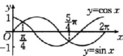

期是 $2\pi$ ，所以函数的定义域为 $\{x\mid 2k\pi +\frac{\pi}{4}\leqslant x\leqslant 2k\pi +\frac{5\pi}{4},k$ $\in \mathbf{Z}\} .$

(4)要使函数有意义，则 $\left\{\begin{aligned}\sin x&>0,\\ \cos x-\frac{1}{2}&\geqslant0,\end{aligned}\right.$ 即 $\left\{\begin{aligned}\sin x&>0,\\ \cos x&\geqslant\frac{1}{2},\end{aligned}\right.$

解得 $\left\{\begin{aligned}&2k\pi<x<\pi+2k\pi,\\&-\frac{\pi}{3}+2k\pi\leqslant x\leqslant\frac{\pi}{3}+2k\pi\end{aligned}\right.$ $(k\in\mathbb{Z})$ ，所以 $2k\pi<x\leqslant\frac{\pi}{3}+$

$2k\pi, k \in \mathbf{Z}$ , 所以函数的定义域为 $\left\{x \mid 2k\pi < x \leqslant \frac{\pi}{3} + 2k\pi, k \in \mathbf{Z}\right\}$ .

# 考点二

题组2 解析 (1) $\because -1 \leqslant \cos x \leqslant 1$

$$
\therefore \cos \left(4 x - \frac {\pi}{3}\right) \in [ - 1, 1 ],
$$

$$
\therefore 3 \cos \left(4 x - \frac {\pi}{3}\right) \in [ - 3, 3 ],
$$

$$
\therefore y = 2 - 3 \cos \left(4 x - \frac {\pi}{3}\right) \in [ - 1, 5 ],
$$

故 $y = 2 - 3\cos \left(4x - \frac{\pi}{3}\right)$ 的值域为 $[-1,5]$ .

(2) 令 $y = f(x)$ ，则 $f(x) = 4\sin x\cos x - 4\sqrt{3}\cos^2 x + 2\sqrt{3}$

$$
= 2 \sin 2 x - 2 \sqrt {3} (2 \cos^ {2} x - 1) = 2 \sin 2 x - 2 \sqrt {3} \cos 2 x
$$

$$
= 4 \left(\frac {1}{2} \sin 2 x - \frac {\sqrt {3}}{2} \cos 2 x\right) = 4 \sin \left(2 x - \frac {\pi}{3}\right).
$$

$$
\because 0 \leqslant x \leqslant \frac {2 \pi}{3}, \therefore - \frac {\pi}{3} \leqslant 2 x - \frac {\pi}{3} \leqslant \pi ,
$$

$$
\therefore \sin \left(- \frac {\pi}{3}\right) \leqslant \sin \left(2 x - \frac {\pi}{3}\right) \leqslant \sin \frac {\pi}{2},
$$

因此 $-2\sqrt{3} \leqslant f(x) \leqslant 4$ ，故所求的值域为 $[-2\sqrt{3}, 4]$ .

(3)由题意,得 $y=\cos2x-2\cos x+1=2\cos^{2}x-1-2\cos x+1=2\cos^{2}x-2\cos x.$

令 $t = \cos x, \because x \in \left[\frac{\pi}{3}, \frac{7\pi}{6}\right]$ , 则 $t \in \left[-1, \frac{1}{2}\right]$ ,

$$
\therefore y = 2 t ^ {2} - 2 t = 2 \left(t - \frac {1}{2}\right) ^ {2} - \frac {1}{2},
$$

∴当 $t=\frac{1}{2}$ 时，y 有最小值，最小值为 $-\frac{1}{2}$ ，当 t=-1 时，y 有最大值，最大值为 4，

∴函数的值域为 $\left[-\frac{1}{2},4\right]$ .

(4) 设 $t = \sin x - \cos x$ ，则 $t^2 = \sin^2 x + \cos^2 x - 2\sin x\cos x$

则 $\sin x\cos x = \frac{1 - t^2}{2}$ 且 $-\sqrt{2}\leqslant t\leqslant \sqrt{2}$

$$
\therefore y = - \frac {t ^ {2}}{2} + t + \frac {1}{2} = - \frac {1}{2} (t - 1) ^ {2} + 1.
$$

当 t=1 时， $y_{max}=1$ ;

当 $t = -\sqrt{2}$ 时， $y_{\min} = -\frac{1}{2} - \sqrt{2}$ .

故函数的值域为 $\left[-\frac{1}{2} -\sqrt{2},1\right]$ (5) $\because y=\frac{3\sin x+1}{\sin x-2}=\frac{3(\sin x-2)+7}{\sin x-2}=3+\frac{7}{\sin x-2},$

且 $-1 \leqslant \sin x \leqslant 1, \therefore -3 \leqslant \sin x - 2 \leqslant -1,$

$$
\therefore - 1 \leqslant \frac {1}{\sin x - 2} \leqslant - \frac {1}{3}, \therefore - 7 \leqslant \frac {7}{\sin x - 2} \leqslant - \frac {7}{3},
$$

$$
\therefore - 4 \leqslant 3 + \frac {7}{\sin x - 2} \leqslant \frac {2}{3},
$$

$$
\therefore y = \frac {3 \sin x + 1}{\sin x - 2} \in \left[ - 4, \frac {2}{3} \right],
$$

故 $y = \frac{3\sin x + 1}{\sin x - 2}$ 的值域为 $\left[-4, \frac{2}{3}\right]$ .

# 考点三

例1 解析 (1)①因为 $y = 2\sin \left(2x - \frac{\pi}{6}\right)$ ，所以 $T = \frac{2\pi}{2} = \pi$ ，即 $y = 2\sin \left(2x - \frac{\pi}{6}\right)$ 的最小正周期为 $\pi$ .

②画图(图略)，知 $y=|\cos x|$ 的最小正周期是 $y=\cos x$ 的最小正周期的一半，所以 $y=3\left|\cos\left(\frac{1}{2}x-\frac{\pi}{6}\right)\right|$ 的最小正周期是 $y=3\cos\left(\frac{1}{2}x-\frac{\pi}{6}\right)$ 的最小正周期的一半，即 $T=\frac{1}{2}\times\frac{2\pi}{\frac{1}{2}}=2\pi.$

③画出 $y = |\tan x|$ 的图象，如图所示：

line

| x | y |
|---|---|
| -π/2 | -π/2 |
| -π | 0 |
| 0 | 0 |
| π/2 | 0 |
| π | 3π/2 |

由图象易知 $T = \pi$

④令 $y = f(x)$ ，则 $f(x) = \cos 2x + \sqrt{3} \sin 2x = 2\sin \left(2x + \frac{\pi}{6}\right)$ ,

所以 $f(x)$ 的最小正周期为 $\frac{2\pi}{2} = \pi$ .

(2)①因为 $f(x)$ 的定义域为 R, $f(x)=\cos 2x$ , 则 $f(-x)=\cos(-2x)=\cos 2x=f(x)$ ,

所以 $f(x)$ 是偶函数.

② $f(x)=\cos\left(\frac{\pi}{2}+2x\right)\cos(\pi+x)=(-\sin 2x)(-\cos x)=$ $\cos x \sin 2x (x \in \mathbb{R})$ .

因为 $f(-x)=\cos(-x)\sin(-2x)=-\cos x\sin 2x=-f(x)$ ,

所以 $f(x)$ 是奇函数.

③由 $\cos 2x \neq 0$ ，得 $2x \neq k\pi + \frac{\pi}{2}$ ， $k \in Z$ ，解得 $x \neq \frac{k\pi}{2} + \frac{\pi}{4}$ ， $k \in Z$ ，

所以 $f(x)$ 的定义域为 $\left\{x\middle |x\in \mathbf{R},\text{且} x\neq \frac{k\pi}{2} +\frac{\pi}{4},k\in \mathbf{Z}\right\}$

所以 $f(x)$ 的定义域关于原点对称.

因为 $f(-x) = \frac{6\cos^4(-x) + 5\sin^2(-x) - 4}{\cos(-2x)} = \frac{6\cos^4x + 5\sin^2x - 4}{\cos 2x} = f(x)$ ，所以 $f(x)$ 是偶函数.

④因为 $f(x)=\sin(2x-3)+\sin(2x+3)=2\cos3\sin2x$ $(x\in\mathbb{R})$ ,

所以 $f(-x)=2\cos3\sin(-2x)=-2\cos3\sin2x=-f(x)$ ，
所以 $f(x)$ 是奇函数.

(3)①令 $2x - \frac{\pi}{3} = k\pi (k\in \mathbf{Z})$ ，则 $x = \frac{\pi}{6} +\frac{k\pi}{2} (k\in \mathbf{Z})$

所以函数 $f(x) = 2\sin \left(2x - \frac{\pi}{3}\right)$ 的图象的对称中心为 $\left(\frac{\pi}{6} + \frac{k\pi}{2}, 0\right)(k \in \mathbf{Z})$ .

令 $2x - \frac{\pi}{3} = \frac{\pi}{2} + k\pi (k \in \mathbf{Z})$ ，则 $x = \frac{5\pi}{12} + \frac{k\pi}{2} (k \in \mathbf{Z})$

所以函数 $f(x)=2\sin\left(2x-\frac{\pi}{3}\right)$ 的图象的对称轴方程为 $x=\frac{5\pi}{12}+\frac{k\pi}{2}(k\in\mathbf{Z})$ .

② $f(x)=\cos\left(-2x+\frac{\pi}{6}\right)=\cos\left[-\left(2x-\frac{\pi}{6}\right)\right]=\cos\left(2x-\frac{\pi}{6}\right).$

令 $2x - \frac{\pi}{6} = \frac{\pi}{2} + k\pi (k \in \mathbf{Z})$ ，则 $x = \frac{\pi}{3} + \frac{k\pi}{2} (k \in \mathbf{Z})$

所以函数 $f(x) = \cos \left(-2x + \frac{\pi}{6}\right)$ 的图象的对称中心为 $\left(\frac{\pi}{3} + \frac{k\pi}{2}, 0\right)(k \in \mathbf{Z})$ .

令 $2x - \frac{\pi}{6} = k\pi (k\in \mathbf{Z})$ ，则 $x = \frac{\pi}{12} +\frac{k\pi}{2} (k\in \mathbf{Z}),$

所以函数 $f(x) = \cos \left(-2x + \frac{\pi}{6}\right)$ 的图象的对称轴方程为 $x = \frac{\pi}{12} + \frac{k\pi}{2} (k \in \mathbf{Z})$ .

③令 $\frac{x}{2} +\frac{\pi}{3} = \frac{k\pi}{2} (k\in \mathbf{Z})$ ，则 $x = -\frac{2\pi}{3} +k\pi (k\in \mathbf{Z})$

所以函数 $f(x) = \tan \left( \frac{x}{2} + \frac{\pi}{3} \right)$ 的图象的对称中心为 $\left( -\frac{2\pi}{3} + k\pi, 0 \right) (k \in \mathbf{Z})$ .

由正切函数的图象可知, 函数 $f(x)=\tan\left(\frac{x}{2}+\frac{\pi}{3}\right)$ 的图象无对称轴.

# 随堂加练

1. A 解析 由函数的最小正周期 T 满足 $\frac{2\pi}{3}<T<\pi$ ，得 $\frac{2\pi}{3}<\frac{2\pi}{\omega}<\pi$ ，解得 $2<\omega<3$ .

因为函数的图象关于点 $\left(\frac{3\pi}{2},2\right)$ 对称，

所以 $\frac{3\pi}{2}\omega +\frac{\pi}{4} = k\pi ,k\in \mathbf{Z},$ 且 $b = 2$

所以 $\omega=-\frac{1}{6}+\frac{2}{3}k,k\in Z$ ，所以 $\omega=\frac{5}{2}$

所以 $f(x) = \sin \left(\frac{5}{2} x + \frac{\pi}{4}\right) + 2,$

所以 $f\left(\frac{\pi}{2}\right)=\sin\left(\frac{5\pi}{4}+\frac{\pi}{4}\right)+2=1.$ 故选 A.

2. AD 解析 $f(x) = \sin x (\sin x - \cos x) = \sin^2 x - \sin x \cos x = \frac{1 - \cos 2x}{2} - \frac{1}{2} \sin 2x = -\frac{\sqrt{2}}{2} \sin \left(2x + \frac{\pi}{4}\right) + \frac{1}{2}$ ，所以 $T = \frac{2\pi}{2} = \pi$ ，故 A 正确；

当 $x = -\frac{\pi}{8}$ 时， $2x + \frac{\pi}{4} = 0$ ，此时 $\sin\left(2x + \frac{\pi}{4}\right) = 0$ ，则函数的图象关于点 $\left(-\frac{\pi}{8}, \frac{1}{2}\right)$ 对称，故 B 错误；

当 $x = \frac{\pi}{8}$ 时， $2x + \frac{\pi}{4} = \frac{\pi}{2}$ ，此时 $\sin \left(2x + \frac{\pi}{4}\right) = 1$ ，则函数的图象关于直线 $x = \frac{\pi}{8}$ 对称，故C错误；

当 $x = \frac{5\pi}{8}$ 时， $2x + \frac{\pi}{4} = \frac{3\pi}{2}$ ，此时 $\sin \left(2x + \frac{\pi}{4}\right) = -1$ ，则函数的图象关于直线 $x = \frac{5\pi}{8}$ 对称，故D正确.

故选 AD.

3. $\frac{\pi}{6}$ 解析 因为函数 $f(x)$ 为偶函数，所以 $\theta + \frac{\pi}{3} = k\pi + \frac{\pi}{2}$ ( $k \in \mathbb{Z}$ )，解得 $\theta = k\pi + \frac{\pi}{6}$ ( $k \in \mathbb{Z}$ ). 又 $\theta \in \left[-\frac{\pi}{2}, \frac{\pi}{2}\right]$ ，所以 $\theta = \frac{\pi}{6}$ ，经检验，符合题意.

4. $\sqrt{3}$ 解析 函数 $f(x) = 2\sin (\omega x + \varphi)\left(\omega >0,|\varphi| < \frac{\pi}{2}\right)$ 的最小正周期为 $\pi$ ，其图象关于直线 $x = \frac{\pi}{6}$ 对称，

则 $\left\{\begin{aligned}\frac{2\pi}{\omega}&=\pi,\\\frac{\pi}{6}\omega+\varphi=\frac{\pi}{2}+k\pi,k&\in\mathbf{Z}.\end{aligned}\right.$

$\because|\varphi|<\frac{\pi}{2},\therefore\omega=2,\varphi=\frac{\pi}{6}$ ，故 $f(x)=2\sin\left(2x+\frac{\pi}{6}\right)$

则 $f\left(\frac{\pi}{4}\right) = 2\sin \left(2\times \frac{\pi}{4} +\frac{\pi}{6}\right) = \sqrt{3}.$

考点四

例2 解析 (1) 对于函数 $y = \sqrt{3} \sin \left( \frac{2\pi}{5} x - \frac{\pi}{3} \right)$ ,

令 $2k\pi - \frac{\pi}{2} \leqslant \frac{2\pi}{5} x - \frac{\pi}{3} \leqslant 2k\pi + \frac{\pi}{2}, k \in \mathbf{Z}$ ,

解得 $5k - \frac{5}{12} \leqslant x \leqslant 5k + \frac{25}{12}, k \in \mathbf{Z}$ ,

故函数的单调递增区间为 $\left[5k - \frac{5}{12}, 5k + \frac{25}{12}\right], k \in \mathbf{Z}$ ;

令 $2k\pi + \frac{\pi}{2} \leqslant \frac{2\pi}{5} x - \frac{\pi}{3} \leqslant 2k\pi + \frac{3\pi}{2}, k \in \mathbf{Z}$ ,

解得 $5k + \frac{25}{12} \leqslant x \leqslant 5k + \frac{55}{12}, k \in \mathbf{Z}$ ,

故函数的单调递减区间为 $\left[5k + \frac{25}{12}, 5k + \frac{55}{12}\right], k \in \mathbf{Z}$ .

(2)对于函数 $y=\frac{1}{2}\cos\left(3x+\frac{\pi}{4}\right)$ ,

令 $2k\pi - \pi \leqslant 3x + \frac{\pi}{4} \leqslant 2k\pi, k \in \mathbf{Z}$ ,

解得 $\frac{2}{3} k\pi -\frac{5\pi}{12}\leqslant x\leqslant \frac{2}{3} k\pi -\frac{\pi}{12},k\in \mathbf{Z},$

故函数的单调递增区间为 $\left[\frac{2}{3} k\pi -\frac{5\pi}{12},\frac{2}{3} k\pi -\frac{\pi}{12}\right],k\in \mathbf{Z};$

令 $2k\pi \leqslant 3x + \frac{\pi}{4} \leqslant 2k\pi + \pi, k \in \mathbf{Z}$ ,

解得 $\frac{2}{3} k\pi -\frac{\pi}{12}\leqslant x\leqslant \frac{2}{3} k\pi +\frac{\pi}{4},k\in \mathbf{Z},$

故函数的单调递减区间为 $\left[\frac{2}{3} k\pi -\frac{\pi}{12},\frac{2}{3} k\pi +\frac{\pi}{4}\right],k\in \mathbf{Z}.$

(3)由 $-\frac{\pi}{2}+k\pi<2x+\frac{\pi}{3}<\frac{\pi}{2}+k\pi,k\in\mathbf{Z}$ ，得 $-\frac{5\pi}{12}+\frac{k\pi}{2}<x<\frac{\pi}{12}+\frac{k\pi}{2},k\in\mathbf{Z}$

所以函数的单调递增区间为 $\left(-\frac{5\pi}{12} +\frac{k\pi}{2},\frac{\pi}{12} +\frac{k\pi}{2}\right),k\in \mathbf{Z},$ 无单调递减区间.

例3 (1) $\frac{\pi}{4}$ (2) A 解析 (1) $\because f(x) = \cos x - \sin x = \sqrt{2} \cos \left(x + \frac{\pi}{4}\right)$ , $\therefore$ 由 $2k\pi \leqslant x + \frac{\pi}{4} \leqslant \pi + 2k\pi (k \in \mathbf{Z})$ , 得 $-\frac{\pi}{4} + 2k\pi \leqslant x \leqslant \frac{3\pi}{4} + 2k\pi, k \in \mathbf{Z}$ ,

因此 $[-a, a] \subseteq \left[-\frac{\pi}{4}, \frac{3\pi}{4}\right], \therefore \left\{ \begin{array}{l} -a < a, \\ -a \geqslant -\frac{\pi}{4}, \\ a \leqslant \frac{3\pi}{4}, \end{array} \right.$

$\therefore 0 < a \leqslant \frac{\pi}{4}, \therefore a$ 的最大值为 $\frac{\pi}{4}$ .

(2)由题意,可得 $\frac{\pi}{2}+2k\pi\leqslant\frac{\pi}{2}\omega+\frac{\pi}{4}<\pi\omega+\frac{\pi}{4}\leqslant\frac{3\pi}{2}+2k\pi,k\in Z,\therefore\frac{1}{2}+4k\leqslant\omega\leqslant\frac{5}{4}+2k,k\in Z.$

$\because \left\{ \begin{array}{l} \omega > 0, \\ \frac{2\pi}{\omega} \geqslant 2 \left( \pi - \frac{\pi}{2} \right), \end{array} \right.$ 解得 $0 < \omega \leqslant 2, \therefore \frac{1}{2} \leqslant \omega \leqslant \frac{5}{4},$

$\therefore \omega$ 的取值范围是 $\left[\frac{1}{2}, \frac{5}{4}\right]$ . 故选A.

随堂加练

1. C 解析 依题意可知 $f(x) = \cos^2 x - \sin^2 x = \cos 2x$ .

对于 A, 因为 $x \in \left(-\frac{\pi}{2}, -\frac{\pi}{6}\right)$ ，所以 $2x \in \left(-\pi, -\frac{\pi}{3}\right)$ ，所以函数 $f(x) = \cos 2x$ 在 $\left(-\frac{\pi}{2}, -\frac{\pi}{6}\right)$ 上单调递增，所以 A 不正确；

对于B，因为 $x\in \left(-\frac{\pi}{4},\frac{\pi}{12}\right)$ ，所以 $2x\in \left(-\frac{\pi}{2},\frac{\pi}{6}\right)$

所以函数 $f(x) = \cos 2x$ 在 $\left(-\frac{\pi}{4},\frac{\pi}{12}\right)$ 上不单调，所以B不正确；

对于 C, 因为 $x \in \left(0, \frac{\pi}{3}\right)$ ，所以 $2x \in \left(0, \frac{2\pi}{3}\right)$ ，

所以函数 $f(x)=\cos 2x$ 在 $\left(0,\frac{\pi}{3}\right)$ 上单调递减，所以 C 正确；

对于 D, 因为 $x \in \left( \frac{\pi}{4}, \frac{7\pi}{12} \right)$ ，所以 $2x \in \left( \frac{\pi}{2}, \frac{7\pi}{6} \right)$ ，

所以函数 $f(x) = \cos 2x$ 在 $\left(\frac{\pi}{4},\frac{7\pi}{12}\right)$ 上不单调，所以D不正确.故选C.

2. $\left[\frac{1}{2},\frac{7}{3}\right]$ 解析 令 $\frac{\pi}{2} + 2k\pi \leqslant \omega x + \frac{\pi}{3} \leqslant \frac{3\pi}{2} + 2k\pi (k \in \mathbf{Z})$ 则 $\frac{\pi}{6\omega} + \frac{2k\pi}{\omega} \leqslant x \leqslant \frac{7\pi}{6\omega} + \frac{2k\pi}{\omega}, k \in \mathbf{Z}$ .

因为函数 $f(x) = \sin \left( \omega x + \frac{\pi}{3} \right) (\omega > 0)$ 在区间 $\left[ \frac{\pi}{3}, \frac{\pi}{2} \right]$ 上单调递减，

所以 $\left\{\begin{aligned}\frac{\pi}{6\omega}+\frac{2k\pi}{\omega}&\leqslant\frac{\pi}{3},\\ \frac{7\pi}{6\omega}+\frac{2k\pi}{\omega}&\geqslant\frac{\pi}{2},\end{aligned}\right.$ 解得 $\frac{1}{2}+6k\leqslant\omega\leqslant\frac{7}{3}+4k,k\in Z.$

又因为 $\left\{\begin{aligned}\frac{1}{2}+6k&\leqslant\frac{7}{3}+4k,\\ \omega>0,\end{aligned}\right.$ ，所以 $0\leqslant k\leqslant\frac{11}{12}$ ，即k=0，

所以 $\frac{1}{2} \leqslant \omega \leqslant \frac{7}{3}$ , 所以 $\omega$ 的取值范围是 $\left[\frac{1}{2}, \frac{7}{3}\right]$ .

# 第24课时 函数 $y = A\sin (\omega x + \varphi)$ 的

# 性质与图象及其简单应用

必备知识·逐点梳理

二、 $|\varphi|$ $\frac{1}{\omega}$ A $\frac{1}{\omega}$ $\frac{|\varphi|}{\omega}$ A

微思考 两种变换都是针对 $x$ 而言的，即 $x$ 本身加减多少，而不是 $\omega x$ 加减多少。先平移变换（左右平移）再周期变换（伸缩变换），平移的量是 $|\varphi|$ 个单位长度，而先周期变换（伸缩变换）再平移变换（左右平移），平移的量是 $\left|\frac{\varphi}{\omega}\right|$ 个单位长度。

关键考点·核心突破

考点一

例 1 解析 令 $X=3x-\frac{\pi}{6}$ ，则 $x=\frac{1}{3}\left(X+\frac{\pi}{6}\right)$ .

列表如下：

<table><tr><td>X</td><td>0</td><td> $\frac{\pi}{2}$ </td><td> $\pi$ </td><td> $\frac{3\pi}{2}$ </td><td> $2\pi$ </td></tr><tr><td>x</td><td> $\frac{\pi}{18}$ </td><td> $\frac{2\pi}{9}$ </td><td> $\frac{7\pi}{18}$ </td><td> $\frac{5\pi}{9}$ </td><td> $\frac{13\pi}{18}$ </td></tr><tr><td>y</td><td>0</td><td>2</td><td>0</td><td>-2</td><td>0</td></tr></table>

画出简图：

line

| x | y |
|---|---|
| 0 | 0 |
| π/18 | 2 |
| 9 | 2 |
| 5π/9 | -2 |
| 13π/18 | -2 |
y = 2sin(3x - π/6)

例2 C 解析 因为函数 $y = \sin x$ 的最小正周期为 $T = 2\pi$ ，

line

| x       | y=sin(x) | y=2sin(3x-π/6) |
|---------|----------|----------------|
| 0       | 0        | 0              |
| π/3     | 2        | 1              |
| π       | 0        | -1             |
| 2π      | 2        | 0              |
| 2π      | 0        | 1              |

函数 $y=2\sin\left(3x-\frac{\pi}{6}\right)$ 的最小
正周期为 $T=\frac{2\pi}{3}$ ,

所以在 $x \in [0, 2\pi]$ 上函数 $y = 2\sin \left(3x - \frac{\pi}{6}\right)$ 有三个周期的图象.

在坐标系中结合五点法画出两函数图象,如图所示.

由图可知，两函数图象有6个交点.故选C.

随堂加练 解析 先列表,再作图如下:

<table><tr><td> $2x+\frac{\pi}{3}$ </td><td>0</td><td> $\frac{\pi}{2}$ </td><td> $\pi$ </td><td> $\frac{3\pi}{2}$ </td><td> $2\pi$ </td></tr><tr><td> $x$ </td><td> $-\frac{\pi}{6}$ </td><td> $\frac{\pi}{12}$ </td><td> $\frac{\pi}{3}$ </td><td> $\frac{7\pi}{12}$ </td><td> $\frac{5\pi}{6}$ </td></tr><tr><td> $y$ </td><td>1</td><td>3</td><td>1</td><td>-1</td><td>1</td></tr></table>

line

| x | y |
|---|---|
| -π/6 | 1 |
| 0 | 2 |
| π/12 | 3 |
| π/2 | 2 |
| π/3 | 1 |
| 3π/12 | -1 |
| 5π/2 | -2 |
| 7π/3 | -3 |
| 9π/6 | -4 |

# 考点二

例3 解析 先把 $y = \sin x$ 的图象向左平移 $\frac{\pi}{3}$ 个单位长度，得到 $y = \sin \left( x + \frac{\pi}{3} \right)$ 的图象；然后把 $y = \sin \left( x + \frac{\pi}{3} \right)$ 的图象上各点的横坐标缩短到原来的 $\frac{1}{2}$ （纵坐标不变），得到 $y = \sin \left( 2x + \frac{\pi}{3} \right)$ 的图象；最后将 $y = \sin \left( 2x + \frac{\pi}{3} \right)$ 图象上各点的纵坐标都伸长到原来的2倍（横坐标不变），得到 $y = 2\sin \left( 2x + \frac{\pi}{3} \right)$ 的图象.

$$
\begin{array}{l} y = 2 \sin \left(2 x + \frac {\pi}{3}\right) = 2 \sin \left(2 x - \frac {\pi}{6} + \frac {\pi}{2}\right) = 2 \cos \left(2 x - \frac {\pi}{6}\right) = \\ 2 \cos 2 \left(x - \frac {\pi}{1 2}\right), \end{array}
$$

先把 $y = \cos x$ 的图象上各点的横坐标缩短到原来的 $\frac{1}{2}$ （纵坐标不变），得到 $y = \cos 2x$ 的图象；然后将 $y = \cos x$ 图象上各点的纵坐标都伸长到原来的2倍（横坐标不变），得到 $y = 2\cos 2x$ 的图象；最后将 $y = 2\cos 2x$ 的图象向右平移 $\frac{\pi}{12}$ 个单位长度，得到 $y = 2\cos 2\left(x - \frac{\pi}{12}\right)$ 的图象，即 $y = 2\cos \left(2x - \frac{\pi}{6}\right)$ 的图象，也即 $y = 2\sin \left(2x + \frac{\pi}{3}\right)$ 的图象.

例4 C 解析 由题意知，曲线 $C$ 为 $y = \sin \left[\omega \left(x + \frac{\pi}{2}\right) + \frac{\pi}{3}\right] = \sin \left(\omega x + \frac{\omega\pi}{2} +\frac{\pi}{3}\right)$ 又 $C$ 关于 $y$ 轴对称，则 $\frac{\omega\pi}{2} +\frac{\pi}{3} =$ $\frac{\pi}{2} +k\pi ,k\in \mathbf{Z},$ 解得 $\omega = \frac{1}{3} +2k,k\in \mathbf{Z}.$ 又 $\omega >0$ ，所以当 $k = 0$ 时， $\omega$ 有最小值，最小值为 $\frac{1}{3}$

故选 C.

# 随堂加练

1. B 解析 先将函数 $y = \sin \left( x - \frac{\pi}{4} \right)$ 的图象向左平移 $\frac{\pi}{3}$ 个单位长度，

得到 $y=\sin\left(x+\frac{\pi}{3}-\frac{\pi}{4}\right)=\sin\left(x+\frac{\pi}{12}\right)$ 的图象，再将图象上所有点的横坐标伸长到原来的 2 倍，纵坐标不变，得到 $y=\sin\left(\frac{x}{2}+\frac{\pi}{12}\right)$ 的图象，即为 $y=f(x)$ 的图象，所以 $f(x)=\sin\left(\frac{x}{2}+\frac{\pi}{12}\right)$ .

故选B.

2. $\frac{5\pi}{12}$ 解析 函数 $f(x)$ 的图象向左平移 $\varphi$ 个单位长度，

得到函数 $g(x) = \sin \left[2(x + \varphi) - \frac{\pi}{3}\right] = \sin \left(2x + 2\varphi -\frac{\pi}{3}\right)$ 的图象.

因为函数 $g(x)$ 是偶函数，

所以 $2\varphi - \frac{\pi}{3} = \frac{\pi}{2} + k\pi, k \in \mathbf{Z}$ ,

则 $\varphi = \frac{5\pi}{12} +\frac{k\pi}{2},k\in \mathbf{Z},$

因为 $\varphi \in \left(0, \frac{\pi}{2}\right)$ , 所以 $\varphi = \frac{5\pi}{12}$ .

# 考点三

例5 A 解析 由已知，可得函数 $y = A \sin (\omega x + \varphi)$ 的图象经

过点 $\left(-\frac{\pi}{12},2\right)$ 和点 $\left(\frac{5\pi}{12},-2\right)$ ,

则 $A = 2, T = \pi$ ，所以 $\omega = 2$ ，则函数的解析式为 $y = 2\sin (2x + \varphi)$ ，将 $\left(-\frac{\pi}{12}, 2\right)$ 代入，得 $-\frac{\pi}{6} + \varphi = \frac{\pi}{2} + 2k\pi, k \in \mathbf{Z}$ ，

所以 $\varphi = \frac{2\pi}{3} + 2k\pi, k \in \mathbf{Z}$ , 当 $k = 0$ 时, $\varphi = \frac{2\pi}{3}$ .

此时 $y=2\sin\left(2x+\frac{2\pi}{3}\right)$ . 故选 A.

# 随堂加练

1. BD 解析 由题图可知, $f(x)_{\max}=2$ ,

所以 A=2. 又 $f(0)=2\sin\varphi=-1$ ，所以 $\sin\varphi=-\frac{1}{2}$ .

又 $|\varphi|<\frac{\pi}{2}$ ，所以 $\varphi=-\frac{\pi}{6}$ ，所以 $f\left(\frac{7\pi}{12}\right)=2\sin\left(\frac{7\pi}{12}\omega-\frac{\pi}{6}\right)=0$ ，

由五点作图法可知 $\frac{7\pi}{12}\omega -\frac{\pi}{6} = \pi$ ，解得 $\omega = 2$

所以 $f(x)=2\sin\left(2x-\frac{\pi}{6}\right)$ ,

所以 $g(x) = f\left(x + \frac{\pi}{6}\right) = 2\sin \left[2\left(x + \frac{\pi}{6}\right) - \frac{\pi}{6}\right] =$ $2\sin \left(2x + \frac{\pi}{6}\right) = 2\cos \left[\frac{\pi}{2} -\left(2x + \frac{\pi}{6}\right)\right] = 2\cos \left(\frac{\pi}{3} -2x\right) =$ $2\cos \left(2x - \frac{\pi}{3}\right).$ 故选BD.

2. $-\sqrt{3}$ 解析 观察题中图象可知, $f(x)$ 的最小正周期 $T = \frac{4}{3} \times \left(\frac{13\pi}{12} - \frac{\pi}{3}\right) = \pi$ , 所以 $\omega = 2$ .

又因为 $f\left(\frac{13\pi}{12}\right) = 2\cos \left(2\times \frac{13\pi}{12} +\varphi\right) = 2$ ，所以 $\varphi = -\frac{\pi}{6} +$ $2k\pi ,k\in \mathbf{Z},$ 所以 $f(x) = 2\cos \left(2x - \frac{\pi}{6}\right),$

所以 $f\left(\frac{\pi}{2}\right) = 2\cos \left(2\times \frac{\pi}{2} -\frac{\pi}{6}\right) = 2\cos \frac{5\pi}{6} = -\sqrt{3}.$

# 考点四

例6 BCD 解析 由题意, 角速度 $\omega = \frac{2\pi}{60} = \frac{\pi}{30}$ (弧度/秒).

由水轮的半径为2米，且轴心O距离水面1米，可知半径 $OP_{0}$ 与水面所成的角为 $\frac{\pi}{6}$ ，点P再次进入水中用时为 $\frac{\pi+2\times\frac{\pi}{6}}{\frac{\pi}{30}}=40$ （秒），故A错误.

当水轮转动50秒时，半径 $OP_{0}$ 转动了 $50\times\frac{\pi}{30}=\frac{5\pi}{3}$ （弧度），而 $\frac{5\pi}{3}-\frac{\pi}{6}=\frac{3\pi}{2}$ ，点P正好处于最低点，故B正确.

建立如图所示的平面直角坐标系，设点 P 距离水面的高度 $H = A \sin(\omega t + \varphi) + B (A > 0, \omega > 0)$ .

由 $\left\{ \begin{array}{l} H_{\max} = A + B = 3, \\ H_{\min} = -A + B = -1, \end{array} \right.$ 解得 $\left\{ \begin{array}{l} A = 2, \\ B = 1. \end{array} \right.$

又角速度 $\omega = \frac{2\pi}{60} = \frac{\pi}{30}$ （弧度/秒），当 $t = 0$

时， $\angle xOP_0 = \frac{\pi}{6}$ ，所以 $\omega = \frac{\pi}{30},\varphi = -\frac{\pi}{6},$

所以点 P 距离水面的高度 $H=2\sin\left(\frac{\pi}{30}t-\frac{\pi}{6}\right)+1$ ，当水轮转动 150 秒时，将 t=150 代入，得 H=2，所以此时点 P 距离水

面 2 米, 故 C 正确.

将 $H = 1 + \sqrt{3}$ 代入 $H = 2\sin \left(\frac{\pi}{30} t - \frac{\pi}{6}\right) + 1$ ，得 $\frac{\pi}{30} t - \frac{\pi}{6} = 2k\pi +\frac{\pi}{3}$ 或 $\frac{\pi}{30} t - \frac{\pi}{6} = 2k\pi +\frac{2\pi}{3} (k\in \mathbf{N})$

解得 $t=60k+15$ 或 $t=60k+25(k\in\mathbf{N})$ ，所以点 P 第二次到达距水面 $(1+\sqrt{3})$ 米时用时 25 秒，故 D 正确.

故选 BCD.

例7 C 解析 因为 $y = \cos \left(2x + \frac{\pi}{6}\right)$ 的图象向左平移 $\frac{\pi}{6}$ 个单位长度，所得图象的解析式为 $y = \cos \left[2\left(x + \frac{\pi}{6}\right) + \frac{\pi}{6}\right] =$

line

| Point | x | y |
|---|---|---|
| -3π/4 | -3π/4 | |
| f(x) | 0 | |
| 3π/4 | 3π/4 | |
| 7π/4 | 7π/4 | |
| y = (1/2)x - 1/2

$\cos \left(2x + \frac{\pi}{2}\right) = -\sin 2x$ ，所以 $f(x) = -\sin 2x$

而 $y = \frac{1}{2} x - \frac{1}{2}$ 显然过 $\left(0, -\frac{1}{2}\right)$ 与(1,0)两点，作出 $f(x)$ 与 $y = \frac{1}{2} x - \frac{1}{2}$ 的大致图象，如图所示.

考虑 $2x = -\frac{3\pi}{2}, 2x = \frac{3\pi}{2}, 2x = \frac{7\pi}{2}$ , 即 $x = -\frac{3\pi}{4}, x = \frac{3\pi}{4}, x = \frac{7\pi}{4}$ 处的 $f(x)$ 与 $y = \frac{1}{2} x - \frac{1}{2}$ 的大小关系.

当 $x = -\frac{3\pi}{4}$ 时， $f\left(-\frac{3\pi}{4}\right) = -\sin \left(-\frac{3\pi}{2}\right) = -1, y = \frac{1}{2} \times \left(-\frac{3\pi}{4}\right) - \frac{1}{2} = -\frac{3\pi + 4}{8} < -1;$

当 $x = \frac{3\pi}{4}$ 时， $f\left(\frac{3\pi}{4}\right) = -\sin \frac{3\pi}{2} = 1, y = \frac{1}{2} \times \frac{3\pi}{4} - \frac{1}{2} = \frac{3\pi - 4}{8} < 1;$

当 $x = \frac{7\pi}{4}$ 时， $f\left(\frac{7\pi}{4}\right) = -\sin \frac{7\pi}{2} = 1, y = \frac{1}{2} \times \frac{7\pi}{4} - \frac{1}{2} = \frac{7\pi - 4}{8} > 1.$

故由图可知， $f(x)$ 的图象与直线 $y = \frac{1}{2} x - \frac{1}{2}$ 的交点个数为3.

故选C.

# 随堂加练

1. $70 - 60\cos \frac{\pi}{15} t$ 10 解析 如图，以摩

天轮所在面为坐标平面，摩天轮的中心点为原点 $O, x$ 轴和 $y$ 轴分别平行和垂直于地面，建立直角坐标系，点 $P$ 的初始位置在最低点，设点 $P$ 从最低点沿逆时

针方向匀速转动，OP 在时间 t（单位：min）内所转过的角度为 $\frac{2\pi}{30} \cdot t = \frac{\pi}{15} t$ ，可得 OP 与 Ox 的夹角为 $-\frac{\pi}{2} + \frac{\pi}{15} t$ ，于是，点 P 的纵坐标 $y = 60 \sin \left( -\frac{\pi}{2} + \frac{\pi}{15} t \right) = -60 \cos \frac{\pi}{15} t$ .

因此点 P 离地面的高度 $h=70+y=70-60\cos\frac{\pi}{15}t(m)$ .

根据题意，令 $70 - 60\cos \frac{\pi}{15} t \geqslant 100$ ，可得 $\cos \frac{\pi}{15} t \leqslant -\frac{1}{2}$

因为 $0 \leqslant t \leqslant 30$ ，所以 $\frac{2\pi}{3} \leqslant \frac{\pi}{15} t \leqslant \frac{4\pi}{3}$ ，解得 $10 \leqslant t \leqslant 20$

因此在摩天轮转动的一圈内，点 P 距离地面不低于 100 m 的时间为 10 min.

2. $-\frac{\sqrt{3}}{2}$ 解析 设 $A\left(x_{1},\frac{1}{2}\right),B\left(x_{2},\frac{1}{2}\right)$ ，由 $|AB|=\frac{\pi}{6}$ 可得 $x_{2}-x_{1}=\frac{\pi}{6}.$

由 $\sin x = \frac{1}{2}$ 可知， $x = \frac{\pi}{6} + 2k\pi$ 或 $x = \frac{5\pi}{6} + 2k\pi, k \in \mathbf{Z}$ . 由题图可知， $\omega x_{2} + \varphi - (\omega x_{1} + \varphi) = \frac{5}{6}\pi - \frac{\pi}{6} = \frac{2\pi}{3}$ ，即 $\omega(x_{2} - x_{1}) = \frac{2\pi}{3}$ ，所以 $\omega = 4$ .

因为 $f\left(\frac{2\pi}{3}\right) = \sin \left(\frac{8\pi}{3} +\varphi\right) = 0$ ，所以 $\frac{8\pi}{3} +\varphi = k\pi (k\in \mathbf{Z})$

即 $\varphi = -\frac{8}{3}\pi + k\pi, k \in \mathbf{Z}$ ,

所以 $f(x) = \sin \left(4x - \frac{8}{3}\pi + k\pi\right) = \sin \left(4x - \frac{2}{3}\pi + k\pi\right)$ ,

所以 $f(x) = \sin \left(4x - \frac{2}{3}\pi\right)$ 或 $f(x) = -\sin \left(4x - \frac{2}{3}\pi\right)$ .

又因为 $f(0) < 0$ ，所以 $f(x) = \sin \left(4x - \frac{2}{3}\pi\right)$ ，

所以 $f(\pi) = \sin \left(4\pi -\frac{2}{3}\pi\right) = -\frac{\sqrt{3}}{2}.$

# 强化课07 三角函数中有关 $\omega$ 的范围问题类型一

典例1 (1) $\left(0, \frac{3\pi}{8}\right]$ (2) $\left(0, \frac{3\pi}{8}\right]$ (3) $\left(0, \frac{3\pi}{8}\right] \cup \left[\frac{3\pi}{4}, \frac{7\pi}{8}\right]$

解析 (1) 令 $t = \omega x - \frac{\pi}{4} \in \left(-\frac{\pi}{4}, 2\omega - \frac{\pi}{4}\right)$ , 函数 $f(x) = 2\sin \left(\omega x - \frac{\pi}{4}\right)$ 在区间 $(0, 2)$ 上单调递增, 即转化为 $y = \sin t$ 在区间 $\left(-\frac{\pi}{4}, 2\omega - \frac{\pi}{4}\right)$ 上单调递增, 故可得 $2\omega - \frac{\pi}{4} \leqslant \frac{\pi}{2}$ , 解得 $\omega \leqslant \frac{3\pi}{8}$ . 又 $\left\{ \begin{array}{l} \omega > 0, \\ \frac{\pi}{\omega} \geqslant 2 - 0, \end{array} \right.$ 所以 $\omega$ 的取值范围是 $\left(0, \frac{3\pi}{8}\right]$ .

(2)根据正弦函数的单调性,可得 $-\frac{\pi}{2}+2k\pi\leqslant\omega x-\frac{\pi}{4}\leqslant\frac{\pi}{2}+2k\pi(k\in\mathbf{Z})$ ,

所以 $\frac{-\frac{\pi}{4} + 2k\pi}{\omega}\leqslant x\leqslant \frac{\frac{3\pi}{4} + 2k\pi}{\omega}$ ，解得 $\left\{ \begin{array}{l} - \frac{\pi}{4} +2k\pi \\ \frac{\omega}{\frac{3\pi}{4} + 2k\pi}\\ \frac{\omega}{\omega}\geqslant 2, \end{array} \right.$ ，整理

可得 $-\frac{\pi}{4} + 2k\pi \leqslant \omega \leqslant \frac{3\pi}{8} + k\pi (k \in \mathbf{Z})$

又 $\left\{\begin{aligned}\omega&>0,\\\frac{\pi}{\omega}&\geqslant2-1,\end{aligned}\right.$ 所以 $0<\omega\leqslant\pi.$ 由 $-\frac{\pi}{4}+2k\pi\leqslant\frac{3\pi}{8}+k\pi,$ 得 $k\leqslant\frac{5}{8},$ 故 $k=0,0<\omega\leqslant\frac{3\pi}{8}.$ 故 $\omega$ 的取值范围是 $\left(0,\frac{3\pi}{8}\right].$

(3)由题意,函数 $f(x)$ 的最小正周期 $T=\frac{2\pi}{\omega}$ .

由函数 $f(x)$ 在区间 $(1,2)$ 上单调，可得 $2 - 1 \leqslant \frac{\pi}{\omega}$ ，则 $0 < \omega \leqslant \pi$

因为 $x \in (1,2)$ , 所以 $\omega x - \frac{\pi}{4} \in \left( \omega - \frac{\pi}{4}, 2\omega - \frac{\pi}{4} \right)$ .

又 $0 < \omega \leqslant \pi$ ，所以 $-\frac{\pi}{4} < \omega - \frac{\pi}{4} \leqslant \frac{3\pi}{4}$

因为函数 $f(x)$ 在区间 $(1,2)$ 上单调，所以 $\left\{ \begin{array}{l} \omega - \frac{\pi}{4} < \frac{\pi}{2}, \\ 2\omega - \frac{\pi}{4} \leqslant \frac{\pi}{2} \end{array} \right.$ 或 $\left\{ \begin{array}{l} \omega - \frac{\pi}{4} \geqslant \frac{\pi}{2}, \\ 2\omega - \frac{\pi}{4} \leqslant \frac{3\pi}{2}, \end{array} \right.$ 解得 $0 < \omega \leqslant \frac{3\pi}{8}$ 或 $\frac{3\pi}{4} \leqslant \omega \leqslant \frac{7\pi}{8}$ ，所以 $\omega$ 的取值范围是 $\left(0, \frac{3\pi}{8}\right] \cup \left[\frac{3\pi}{4}, \frac{7\pi}{8}\right]$ .

强化训练 $\left[\frac{1}{3},\frac{7}{6}\right]$ 解析令 $2k\pi \leqslant \omega x - \frac{\pi}{6}\leqslant 2k\pi +\pi (k\in$ $\mathbf{Z})$ ，得 $\frac{2k\pi + \frac{\pi}{6}}{\omega}\leqslant x\leqslant \frac{2k\pi + \frac{7\pi}{6}}{\omega} (k\in \mathbf{Z}).$

因为函数 $f(x)$ 在 $\left(\frac{\pi}{2},\pi\right)$ 上单调递减，所以 $\left\{ \begin{array}{l}2k\pi +\frac{\pi}{6}\\ \frac{\omega}{\omega}\leqslant \frac{\pi}{2},\\ \frac{2k\pi + \frac{7\pi}{6}}{\omega}\geqslant \pi , \end{array} \right.$ 其中 $k\in \mathbf{Z},$

解得 $4k + \frac{1}{3} \leqslant \omega \leqslant 2k + \frac{7}{6} (k \in \mathbf{Z})$ . 又因为函数 $f(x)$ 在 $\left(\frac{\pi}{2}, \pi\right)$ 上单调递减，所以 $T \geqslant \pi \Rightarrow \omega \leqslant 2$ .

又 $\omega > 0$ ，所以 $k = 0$ ，则 $\frac{1}{3} \leqslant \omega \leqslant \frac{7}{6}$ .

# 类型二

典例2 (1) $\left(\frac{1}{6}, \frac{7}{6}\right]$ (2) $\left(\frac{1}{6}, +\infty\right)$ (3) $\left(\frac{1}{6}, \frac{1}{2}\right) \cup \left(\frac{7}{6}, \frac{13}{6}\right]$ 解析 (1) 令 $t = \omega x + \frac{\pi}{3} \in \left(\frac{\pi}{3}, \pi \omega + \frac{\pi}{3}\right)$ , 因为函数 $f(x)$ 的图象在区间 $(0, \pi)$ 上恰含有 1 条对称轴, 即 $y = \sin t$ 的图象在区间 $\left(\frac{\pi}{3}, \pi \omega + \frac{\pi}{3}\right)$ 上恰含有 1 条对称轴, 所以 $\frac{\pi}{2} < \pi \omega + \frac{\pi}{3} \leqslant \frac{3\pi}{2}$ , 解得 $\frac{1}{6} < \omega \leqslant \frac{7}{6}$ . 故 $\omega$ 的取值范围是 $\left(\frac{1}{6}, \frac{7}{6}\right]$ .

(2) 令 $t = \omega x + \frac{\pi}{3} \in \left(\frac{\pi}{3}, \pi \omega + \frac{\pi}{3}\right)$ , 因为函数 $f(x) = \sin \left(\omega x + \frac{\pi}{3}\right) (\omega > 0)$ 在 $(0, \pi)$ 上有最值点, 即 $y = \sin t$ 在区间 $\left(\frac{\pi}{3}, \pi \omega + \frac{\pi}{3}\right)$ 上有最值点, 则有 $\pi \omega + \frac{\pi}{3} > \frac{\pi}{2}$ , 解得 $\omega > \frac{1}{6}$ . 故 $\omega$ 的取值范围是 $\left(\frac{1}{6}, +\infty\right)$ .

(3)令 $\omega x + \frac{\pi}{3} = \frac{\pi}{2} + k\pi, k \in Z$ ，即 $x = \frac{k\pi + \frac{\pi}{6}}{\omega} (k \in \mathbf{Z})$ ，因为函数 $f(x)$ 的图象在区间 $\left(\frac{\pi}{3}, \pi\right)$ 上恰含有 1 条对称轴，所以 $\left\{\begin{aligned}\frac{\pi}{3}<\frac{k\pi+\frac{\pi}{6}}{\omega}<\pi,\\\frac{(k-1)\pi+\frac{\pi}{6}}{\omega}\leqslant\frac{\pi}{3},&(k\in\mathbf{Z}),\\ \frac{(k+1)\pi+\frac{\pi}{6}}{\omega}\geqslant\pi\end{aligned}\right.$ $\left\{\begin{aligned}k+\frac{1}{6}<\omega<3k+\frac{1}{2},\\ \omega\geqslant3k-\frac{5}{2},\\ \omega\leqslant k+\frac{7}{6}\end{aligned}\right.$ $(k\in\mathbf{Z}).$

又 $\omega > 0$ ，要使上述不等式组有解，则需 $\left\{ \begin{array}{l} k + \frac{1}{6} < 3k + \frac{1}{2}, \\ 3k - \frac{5}{2} \leqslant k + \frac{7}{6}, \\ 3k + \frac{1}{2} > 0, \\ k + \frac{7}{6} > 0 \end{array} \right.$ ( $k \in \mathbf{Z}$ )

解得 $-\frac{1}{6}<k\leqslant\frac{11}{6}(k\in\mathbf{Z})$ ，故k=0,1.

当 $k = 0$ 时， $\frac{1}{6} <  \omega <  \frac{1}{2}$ ，当 $k = 1$ 时， $\frac{7}{6} <  \omega \leqslant \frac{13}{6}$

故 $\omega$ 的取值范围是 $\left(\frac{1}{6},\frac{1}{2}\right)\cup\left(\frac{7}{6},\frac{13}{6}\right]$ .

# 强化训练

1. $\left(\frac{8}{3}, 4\right]$ 解析 因为 $f(x)$ 在区间 $\left(-\frac{\pi}{4}, \frac{\pi}{3}\right)$ 上恰有一个最大值点和一个最小值点，

所以 $\frac{\pi}{3} -\left(-\frac{\pi}{4}\right) > \frac{T}{2} = \frac{\pi}{\omega}$ , 所以 $\omega > \frac{12}{7}$ . 令 $t = \omega x + \frac{\pi}{6}$ , 当 $x \in \left(-\frac{\pi}{4}, \frac{\pi}{3}\right)$ 时, $t \in \left(-\frac{\pi}{4} \omega + \frac{\pi}{6}, \frac{\pi}{3} \omega + \frac{\pi}{6}\right)$ ,

于是 $f(x) = 2\sin \left(\omega x + \frac{\pi}{6}\right)$ 在区间 $\left(-\frac{\pi}{4},\frac{\pi}{3}\right)$ 上的最值点个数等价于 $g(t) = 2\sin t$ 在 $\left(-\frac{\pi}{4}\omega +\frac{\pi}{6},\frac{\pi}{3}\omega +\frac{\pi}{6}\right)$ 上的最值点个数.由 $\omega >\frac{12}{7}$ 知， $-\frac{\pi}{4}\omega +\frac{\pi}{6} < 0,\frac{\pi}{3}\omega +\frac{\pi}{6} >0.$

因为 $g(t)$ 在 $\left(-\frac{\pi}{4}\omega+\frac{\pi}{6},\frac{\pi}{3}\omega+\frac{\pi}{6}\right)$ 上恰有一个最大值点和一个最小值点，

所以 $\left\{\begin{aligned}-\frac{\pi}{2}&\leqslant-\frac{\pi}{4}+\frac{\pi}{6}<0,\\ \frac{3\pi}{2}&<\frac{\pi}{3}\omega+\frac{\pi}{6}\leqslant\frac{5\pi}{2},\end{aligned}\right.$ 无解，或

$\left\{ \begin{array}{l} -\frac{3\pi}{2} \leqslant -\frac{\pi}{4}\omega + \frac{\pi}{6} < -\frac{\pi}{2}, \\ \frac{\pi}{2} < \frac{\pi}{3}\omega + \frac{\pi}{6} \leqslant \frac{3\pi}{2}, \end{array} \right.$ 解得 $\frac{8}{3} < \omega \leqslant 4$ ，所以实数 $\omega$ 的取值范围为 $\left(\frac{8}{3}, 4\right]$ .

2. $\left(0,\frac{1}{3}\right]\cup\left[\frac{2}{3},\frac{5}{6}\right]$ 解析 由题意可知, $f(0)=\frac{1}{2}$ ,且0< $\varphi<\pi$ ,则 $\varphi=\frac{\pi}{3}$ .

又 $f(x)$ 在区间 $(\pi, 2\pi)$ 上没有极值点，所以 $\frac{T}{2} = \frac{\pi}{\omega} \geqslant \pi$ ，即 $0 < \omega \leqslant 1$ .

$f(x)=\cos\left(\omega x+\frac{\pi}{3}\right)$ ，令 $\omega x+\frac{\pi}{3}=k\pi, k\in Z$ ，即 $x=\frac{k\pi}{\omega}-\frac{\pi}{3\omega}, k\in Z$

所以当 $x = \frac{k\pi}{\omega} -\frac{\pi}{3\omega},k\in \mathbf{Z}$ 时，函数 $f(x) = \cos \left(\omega x + \frac{\pi}{3}\right)$ 取到极值.

因为 $f(x)$ 在区间 $(\pi, 2\pi)$ 内没有极值点，所以 $\left\{ \begin{array}{l} \frac{k\pi}{\omega} - \frac{\pi}{3\omega} \leqslant \pi, \\ \frac{(k+1)\pi}{\omega} - \frac{\pi}{3\omega} \geqslant 2\pi, \end{array} \right.$ $k \in \mathbf{Z}$ ，解得 $k - \frac{1}{3} \leqslant \omega \leqslant \frac{k}{2} + \frac{1}{3}, k \in \mathbf{Z}$ .

又 $0 < \omega \leqslant 1$ ，所以 $k = 0$ 或 $k = 1$ . 当 $k = 0$ 时， $-\frac{1}{3} \leqslant \omega \leqslant \frac{1}{3}$ ，所以 $0 < \omega \leqslant \frac{1}{3}$ ，当 $k = 1$ 时， $\frac{2}{3} \leqslant \omega \leqslant \frac{5}{6}$ ，可得 $\omega \in \left(0, \frac{1}{3}\right] \cup \left[\frac{2}{3}, \frac{5}{6}\right]$ .

# 类型三

典例3 (1) $\left(\frac{2}{3},\frac{5}{3}\right]$ (2) $\left(\frac{2}{3}, + \infty\right)$ (3) $\left(\frac{2}{3},\frac{5}{3}\right]U$

$\left[2, \frac{8}{3}\right]$ 解析 (1) 令 $t = \omega x + \frac{\pi}{3} \in \left(\frac{\pi}{3}, \pi \omega + \frac{\pi}{3}\right)$ , 因为函数 $f(x)$ 在区间 $(0, \pi)$ 上恰有 1 个零点, 即 $y = \sin t$ 在区间 $\left(\frac{\pi}{3}, \pi \omega + \frac{\pi}{3}\right)$ 上只有 1 个零点, 故可得 $\pi < \pi \omega + \frac{\pi}{3} \leqslant 2\pi$ , 解得 $\frac{2}{3} < \omega \leqslant \frac{5}{3}$ .

故 $\omega$ 的取值范围是 $\left(\frac{2}{3}, \frac{5}{3}\right]$ .

(2)令 $t = \omega x + \frac{\pi}{3}\in \left(\frac{\pi}{3},\pi \omega +\frac{\pi}{3}\right)$ ，因为函数 $f(x) =$ $\sin \left(\omega x + \frac{\pi}{3}\right)(\omega >0)$ 在 $(0,\pi)$ 上有零点，即 $y = \sin t$ 在区间 $\left(\frac{\pi}{3},\pi \omega +\frac{\pi}{3}\right)$ 上有零点，则有 $\pi \omega +\frac{\pi}{3} >\pi$ ，解得 $\omega >\frac{2}{3}$ 故 $\omega$ 的取值范围是 $\left(\frac{2}{3}, + \infty\right)$

(3)令 $f(x) = 0$ ，得 $\omega x + \frac{\pi}{3} = k\pi ,k\in \mathbf{Z}$ 即 $x = \frac{k\pi - \frac{\pi}{3}}{\omega} (k\in$ Z).因为函数 $f(x)$ 在区间 $\left(\frac{\pi}{3},\pi\right)$ 上恰有1个零点，所以

$$
\left\{ \begin{array}{l} \frac {\pi}{3} <   \frac {k \pi - \frac {\pi}{3}}{\omega} <   \pi , \\ \frac {(k - 1) \pi - \frac {\pi}{3}}{\omega} \leqslant \frac {\pi}{3}, k \in \mathbf {Z} \Rightarrow \left\{ \begin{array}{l l} k - \frac {1}{3} <   \omega <   3 k - 1, \\ \omega \geqslant 3 k - 4, & k \in \mathbf {Z}. \\ \omega \leqslant k + \frac {2}{3}, \end{array} \right. \\ \frac {(k + 1) \pi - \frac {\pi}{3}}{\omega} \geqslant \pi , \end{array} \right.
$$

又 $\omega > 0$ ，要使上述不等式组有解，则需 $\left\{ \begin{array}{l} k - \frac{1}{3} < 3k - 1, \\ 3k - 4 \leqslant k + \frac{2}{3}, \\ k + \frac{2}{3} > 0, \\ 3k - 1 > 0, \end{array} \right.$ ， $k \in \mathbf{Z}$ ，

解得 $\frac{1}{3} < k \leqslant \frac{7}{3} (k \in \mathbf{Z})$ ，故 $k = 1, 2$ . 当 $k = 1$ 时， $\frac{2}{3} < \omega \leqslant \frac{5}{3}$ ，当 $k = 2$ 时， $2 \leqslant \omega \leqslant \frac{8}{3}$ .

故 $\omega$ 的取值范围是 $\left(\frac{2}{3},\frac{5}{3}\right]\cup\left[2,\frac{8}{3}\right]$ .

# 强化训练

1.[2,3) 解析 因为 $0 \leqslant x \leqslant 2\pi$ ，所以 $0 \leqslant \omega x \leqslant 2\omega\pi$ ，令 $f(x) = \cos \omega x - 1 = 0$ ，

则 $\cos\omega x=1$ 在区间 $[0,2\pi]$ 上有 3 个根，令 $t=\omega x$ ，则 $\cos t=1$ 有 3 个根，其中 $t\in[0,2\omega\pi]$ 。

如图，结合余弦函数 $y=\cos t$ 的图象可得 $4\pi\leqslant2\omega\pi<6\pi$ ，故

$$
2 \leqslant \omega <   3.
$$

2. 解析 由题意, 得 $g(x) = \cos \left( x + \frac{2\pi}{3} \right), h(x) = \cos \left( \frac{1}{\omega} x + \frac{2\pi}{3} \right), h(x)$ 在区间 $\left( \frac{\pi}{2}, \frac{3\pi}{2} \right)$ 上没有零点,

则 $\frac{3\pi}{2} - \frac{\pi}{2} \leqslant \frac{T}{2}$ , 即 $2\pi \omega \geqslant 2\pi$ , 所以 $\omega \geqslant 1$ .

又 $x \in \left(\frac{\pi}{2}, \frac{3\pi}{2}\right)$ ，所以 $\frac{\pi}{2\omega} + \frac{2\pi}{3} < \frac{1}{\omega} x + \frac{2\pi}{3} < \frac{3\pi}{2\omega} + \frac{2\pi}{3}$ ，

而 $\frac{1}{\omega} \leqslant 1$ ，故 $\frac{2\pi}{3} < \frac{\pi}{2\omega} + \frac{2\pi}{3} \leqslant \frac{7\pi}{6}, \frac{2\pi}{3} < \frac{3\pi}{2\omega} + \frac{2\pi}{3} \leqslant \frac{13\pi}{6}$ .

因为 $h(x)$ 在区间 $\left(\frac{\pi}{2},\frac{3\pi}{2}\right)$ 上没有零点，所以 $\frac{3\pi}{2\omega} +\frac{2\pi}{3}\leqslant \frac{3\pi}{2}$ 解得 $\omega \geqslant \frac{9}{5}$ ，故 $\omega$ 的取值范围是 $\left[\frac{9}{5}, + \infty\right)$

# 类型四

典例4 C 解析 当 $\omega < 0$ 时，不能满足在区间 $(0, \pi)$ 内极值点的个数比零点的个数多，所以 $\omega > 0$ 。函数 $f(x) = \sin\left(\omega x + \frac{\pi}{3}\right)$ 在区间 $(0, \pi)$ 内恰有三个极值点、两个零点，则有 $\omega x + \frac{\pi}{3} \in \left(\frac{\pi}{3}, \omega \pi + \frac{\pi}{3}\right)$ ，所以 $\frac{5\pi}{2} < \omega \pi + \frac{\pi}{3} \leqslant 3\pi$ ，解得 $\frac{13}{6} < \omega \leqslant \frac{8}{3}$ 。故选C.

强化训练 解析 因为 $f(x) = \cos (\omega x + \varphi)(\omega > 0, 0 < \varphi < \pi)$ ，所以最小正周期 $T = \frac{2\pi}{\omega}$ ，

所以 $f(T)=\cos\left(\omega\cdot\frac{2\pi}{\omega}+\varphi\right)=\cos(2\pi+\varphi)=\cos\varphi=\frac{\sqrt{3}}{2}.$

又因为 $0 < \varphi < \pi$ ，所以 $\varphi = \frac{\pi}{6}$ ，即 $f(x) = \cos\left(\omega x + \frac{\pi}{6}\right)$ .

又因为 $x = \frac{\pi}{9}$ 为 $f(x)$ 的零点，所以 $\frac{\pi}{9}\omega +\frac{\pi}{6} = \frac{\pi}{2} +k\pi ,k\in \mathbf{Z},$ 解得 $\omega = 3 + 9k,k\in \mathbf{Z}$ ，因为 $\omega >0$ ，所以当 $k = 0$ 时， $\omega_{\mathrm{min}} = 3.$

# 第 25 课时 正弦定理与余弦定理

# 必备知识·逐点梳理

$-b^{2}+c^{2}-2bc\cos A \quad c^{2}+a^{2}-2ca\cos B \quad a^{2}+b^{2}-2ab\cos C$ (1) $2R\sin B$ $2R\sin C$ (3) $\sin A:\sin B:\sin C$

微判断 (1)× (2)√ (3)×

二、一解 两解 一解 一解 无解

三、 $\frac{1}{2}ac\sin B$ $\frac{1}{2}bc\sin A$

# 关键考点·核心突破

# 考点一

题组 1 (1) D (2) 见解析 解析 (1) 对于 A, ∵ a=7, b=14, A=30°,

∴由正弦定理 $\frac{a}{\sin A}=\frac{b}{\sin B}$ ，得 $\sin B=\frac{b\sin A}{a}=\frac{14\times\frac{1}{2}}{7}=1$ ，
又 B 为三角形的内角，

$\therefore B=90^{\circ}$ ，故只有一解，本选项不合题意。

对于 B, $\because a=30, b=25, A=150^{\circ}$ ,

∴由正弦定理 $\frac{a}{\sin A} = \frac{b}{\sin B}$ ，得 $\sin B = \frac{b \sin A}{a} = \frac{25 \times \sin 150^{\circ}}{30} = \frac{5}{12}$ .

又 A 为钝角，∴ B 为锐角，故 B 的度数只有一解，本选项不合题意.

对于 C, $\because a=72, b=50, A=135^{\circ}, \therefore$ 由正弦定理 $\frac{a}{\sin A}=\frac{b}{\sin B}$ ，得 $\sin B=\frac{b\sin A}{a}=\frac{50\times\sin135^{\circ}}{72}=\frac{25\sqrt{2}}{72}$ 。又 A 为钝角，∴ B 为锐角，

故 B 的度数只有一解, 本选项不合题意.

对于 D, $\because a=30, b=40, A=26^{\circ}$ ,

∴ 由正弦定理 $\frac{a}{\sin A} = \frac{b}{\sin B}$ ，得 $\sin B = \frac{b \sin A}{a} = \frac{40 \sin 26^{\circ}}{30} = \frac{4 \sin 26^{\circ}}{3}$ .

$\because a<b,\therefore A<B,$ 即 $26^{\circ}<B<180^{\circ}$ , 则满足题意的 B 有两解,本选项符合题意.

故选D.

(2)由正弦定理，得 $\frac{a}{\sin A} = \frac{b}{\sin B}$ ，即 $\frac{\sqrt{2}}{\sin 45^\circ} = \frac{1}{\sin B}$ ，解得 $\sin B = \frac{1}{2}$ ，又 $b < a, \therefore B < A, \therefore B \in (0^\circ, 45^\circ), \therefore B = 30^\circ, C = 180^\circ - 45^\circ - 30^\circ = 105^\circ$ .

(法一:正弦定理) $\sin105^{\circ}=\sin(45^{\circ}+60^{\circ})=\sin45^{\circ}\cos60^{\circ}+\cos45^{\circ}\sin60^{\circ}=\frac{\sqrt{2}+\sqrt{6}}{4}$ ,

由正弦定理，得 $\frac{a}{\sin A} = \frac{c}{\sin C}$ 即 $\frac{\sqrt{2}}{\sin 45^\circ} = \frac{c}{\frac{\sqrt{2} + \sqrt{6}}{4}}$ ，解得 $c$ $= \frac{\sqrt{2} + \sqrt{6}}{2}.$

(法二:余弦定理)由余弦定理 $a^{2}=b^{2}+c^{2}-2bc\cos A$ ,

得 $2=1+c^{2}-\sqrt{2}c$ ，即 $c^{2}-\sqrt{2}c-1=0$ ，

解得 $c=\frac{\sqrt{2}+\sqrt{6}}{2}$ 或 $c=\frac{\sqrt{2}-\sqrt{6}}{2}$ (舍去).

故 $B = 30^{\circ}, C = 105^{\circ}, c = \frac{\sqrt{2} + \sqrt{6}}{2}$ .

题组 2 (1) $\frac{3\sqrt{2}+\sqrt{6}}{3}$ (2) $\frac{\sqrt{7}}{2}$ (3) 见解析

解析 (1) 在 $\triangle ABC$ 中, 因为 $A + B + C = \pi$ , $A = \frac{\pi}{3}$ , $B = \frac{\pi}{4}$ , 所以 $C = \frac{5\pi}{12}$ ,

$\sin C = \sin \left( \frac{\pi}{4} + \frac{\pi}{6} \right) = \sin \frac{\pi}{4} \cos \frac{\pi}{6} + \cos \frac{\pi}{4} \sin \frac{\pi}{6}$ $= \frac{\sqrt{2} + \sqrt{6}}{4},$

由正弦定理 $\frac{BC}{\sin A}=\frac{AB}{\sin C},BC=2,A=\frac{\pi}{3},$

得 $AB=\frac{BC\sin C}{\sin A}=\frac{3\sqrt{2}+\sqrt{6}}{3}$ .

(2) 因为 $B = \frac{\pi}{3}$ , $b^{2} = \frac{9}{4}ac$ ，则由正弦定理，得 $\sin A \sin C = \frac{4}{9} \sin^{2} B = \frac{1}{3}$ .

由余弦定理，可得 $b^{2}=a^{2}+c^{2}-ac=\frac{9}{4}ac$ ，即 $a^{2}+c^{2}=\frac{13}{4}ac$ ，根据正弦定理，得 $\sin^{2}A+\sin^{2}C=\frac{13}{4}\sin A\sin C=\frac{13}{12}$ ，所以 $(\sin A+\sin C)^{2}=\sin^{2}A+\sin^{2}C+2\sin A\sin C=\frac{7}{4}$ .

因为 A, C 为三角形的内角，则 $\sin A + \sin C > 0$ ，所以 $\sin A -$

$$
\sin C = \frac {\sqrt {7}}{2}.
$$

(3)①设 $a = 2t, c = 3t, t > 0$ ，则根据余弦定理，得 $b^2 = a^2 + c^2 - 2ac\cos B$ ，即 $25 = 4t^2 + 9t^2 - 2 \times 2t \times 3t \times \frac{9}{16}$ ，

解得 $t = 2$ （负数舍去），则 $a = 4, c = 6$ .

②(法一:正弦定理)因为 B 为三角形的内角,所以 $\sin B = \sqrt{1 - \cos^{2} B} = \frac{5\sqrt{7}}{16}$ ,

再根据正弦定理，得 $\frac{a}{\sin A} = \frac{b}{\sin B}$ 即 $\frac{4}{\sin A} = \frac{5}{\frac{5\sqrt{7}}{16}}$ 解得

$$
\sin A = \frac {\sqrt {7}}{4}.
$$

(法二:余弦定理)由余弦定理,得 $\cos A=\frac{b^{2}+c^{2}-a^{2}}{2bc}=\frac{3}{4}$ .

因为 $A \in (0, \pi)$ , 所以 $\sin A = \frac{\sqrt{7}}{4}$ .

③由②知 $\sin A = \frac{\sqrt{7}}{4},\cos A = \frac{3}{4}$ 所以 $\sin 2A = 2\sin A\cos A =$ $\frac{3\sqrt{7}}{8}$ ，则 $\cos 2A = 2\cos^2 A - 1 = \frac{1}{8}.$

因为 B 为三角形的内角，所以 $\sin B = \sqrt{1 - \cos^{2} B} = \frac{5\sqrt{7}}{16}$ ，
所以 $\cos(B-2A)=\cos B\cos 2A+\sin B\sin 2A=\frac{57}{64}.$

# 考点二

例1 解析 由 $\frac{\sin A + \sin C}{\sin B} = \frac{b + c}{a}$ 及正弦定理，得 $\frac{a + c}{b} = \frac{b + c}{a}$ ，即 $a^2 + ac = b^2 + bc$

$$
\therefore a ^ {2} - b ^ {2} + a c - b c = 0, \therefore (a - b) (a + b + c) = 0, \therefore a = b.
$$

若选①,则△ABC为等边三角形.推理如下:

由 $a(\sin A - \sin B) = (c - b)(\sin C + \sin B)$ 及正弦定理，得 $a(a - b) = (c - b)(c + b)$ ，即 $a^2 + b^2 - c^2 = ab$

∴由余弦定理得 $\cos C=\frac{a^{2}+b^{2}-c^{2}}{2ab}=\frac{1}{2}$ .

又 $C \in (0, \pi), \therefore C = \frac{\pi}{3}, \therefore \triangle ABC$ 为等边三角形.

若选②, 则 $\triangle ABC$ 为等腰直角三角形. 推理如下:

$$
\begin{array}{l} \because b \cos A + a \cos B = b \cdot \frac {b ^ {2} + c ^ {2} - a ^ {2}}{2 b c} + a \cdot \frac {a ^ {2} + c ^ {2} - b ^ {2}}{2 a c} = \frac {2 c ^ {2}}{2 c} = \\ c = c \sin C, \end{array}
$$

$\therefore \sin C = 1, \therefore C = \frac{\pi}{2}, \therefore \triangle ABC$ 为等腰直角三角形.

随堂加练 D 解析 因为 $a - b = c\cos B - c\cos A$

所以由正弦定理得， $\sin A - \sin B = \sin C\cos B - \sin C\cos A.$ 在 $\triangle ABC$ 中， $\sin A = \sin (B + C) = \sin B\cos C + \sin C\cos B,$ $\sin B = \sin (A + C) = \sin A\cos C + \sin C\cos A$

所以 $\sin B\cos C + \cos B\sin C - \sin A\cos C - \cos A\sin C =$ $\sin C\cos B - \sin C\cos A,$

整理得 $\sin B\cos C - \sin A\cos C = 0$

所以 $(\sin B-\sin A)\cos C=0,$

所以 $\sin B=\sin A$ 或 $\cos C=0.$

因为 $A, B, C \in (0, \pi)$ ，所以 $A = B$ 或 $C = \frac{\pi}{2}$ ，

即 $\triangle ABC$ 的形状一定是等腰三角形或直角三角形或等腰直角三角形.

故选D.

# 考点三

例2 解析 (1)由题意,得 $2\sin B\cos B=\frac{\sqrt{3}}{7}b\cos B$ ,因为A为钝角,

则 $\cos B \neq 0$ ，则 $2\sin B = \frac{\sqrt{3}}{7} b$ ，则 $\frac{b}{\sin B} = \frac{2}{\frac{\sqrt{3}}{7}} = \frac{a}{\sin A} = \frac{7}{\sin A}$ ，

解得 $\sin A=\frac{\sqrt{3}}{2}$ .

因为 A 为钝角, 所以 $A=\frac{2\pi}{3}$ .

(2)选择①b=7，则 $\sin B=\frac{\sqrt{3}}{14}b=\frac{\sqrt{3}}{2}$

因为 $A = \frac{2\pi}{3}$ ，所以 $B$ 为锐角，则 $B = \frac{\pi}{3}$ ，此时 $A + B = \pi$ ，不合题意，舍弃；

选择② $\cos B = \frac{13}{14}$ 因为 $B$ 为三角形的内角，所以 $\sin B = \frac{3\sqrt{3}}{14}$ 则代入 $2\sin B = \frac{\sqrt{3}}{7} b$ 得 $2\times \frac{3\sqrt{3}}{14} = \frac{\sqrt{3}}{7} b$ ，解得 $b = 3$

$\sin C = \sin (A + B) = \sin \left(\frac{2\pi}{3} + B\right) = \sin \frac{2\pi}{3}\cos B + \cos \frac{2\pi}{3}\sin B$ $= \frac{\sqrt{3}}{2}\times \frac{13}{14} +\left(-\frac{1}{2}\right)\times \frac{3\sqrt{3}}{14} = \frac{5\sqrt{3}}{14},$

则 $S_{\triangle ABC} = \frac{1}{2} ab\sin C = \frac{15\sqrt{3}}{4}$

选择③ $c\sin A=\frac{5}{2}\sqrt{3}$ ，则有 $c\times\frac{\sqrt{3}}{2}=\frac{5}{2}\sqrt{3}$ ，解得c=5，

则由正弦定理，得 $\frac{a}{\sin A} = \frac{c}{\sin C}$ 即 $\frac{7}{\frac{\sqrt{3}}{2}} = \frac{5}{\sin C}$ 解得 $\sin C = \frac{5\sqrt{3}}{14}$ .

因为 C 为三角形的内角, 所以 $\cos C = \frac{11}{14}$ ,

则 $\sin B = \sin (A + C) = \sin \left(\frac{2\pi}{3} + C\right) = \sin \frac{2\pi}{3}\cos C +$ $\cos \frac{2\pi}{3}\sin C = \frac{\sqrt{3}}{2}\times \frac{11}{14} +\left(-\frac{1}{2}\right)\times \frac{5\sqrt{3}}{14} = \frac{3\sqrt{3}}{14},$ 则 $S_{\triangle ABC} =$ $\frac{1}{2} ac\sin B = \frac{1}{2}\times 7\times 5\times \frac{3\sqrt{3}}{14} = \frac{15\sqrt{3}}{4}.$

随堂加练 解析 (1)由余弦定理,有 $a^2 + b^2 - c^2 = 2ab\cos C$ , 对比已知 $a^2 + b^2 - c^2 = \sqrt{2}ab$ ,

可得 $\cos C = \frac{a^2 + b^2 - c^2}{2ab} = \frac{\sqrt{2}ab}{2ab} = \frac{\sqrt{2}}{2}$ .

因为 $C \in (0, \pi)$ , 所以 $C = \frac{\pi}{4}$ , 从而 $\sin C = \frac{\sqrt{2}}{2}$ .

又因为 $\sin C = \sqrt{2}\cos B$ ，即 $\cos B = \frac{1}{2}$ ，注意到 $B\in (0,\pi),$

所以 $B=\frac{\pi}{3}$ .

(2)由(1)可得 $B=\frac{\pi}{3},C=\frac{\pi}{4}$ ,

从而 $A = \pi -\frac{\pi}{3} -\frac{\pi}{4} = \frac{5\pi}{12},$

而 $\sin A = \sin \frac{5\pi}{12} = \sin \left(\frac{\pi}{4} +\frac{\pi}{6}\right) = \frac{\sqrt{2}}{2}\times \frac{\sqrt{3}}{2} +\frac{\sqrt{2}}{2}\times \frac{1}{2}$

$$
= \frac {\sqrt {6} + \sqrt {2}}{4},
$$

由正弦定理，有 $\frac{a}{\sin \frac{5\pi}{12}} = \frac{b}{\sin \frac{\pi}{3}} = \frac{c}{\sin \frac{\pi}{4}}$ ，从而 $a = \frac{\sqrt{6} + \sqrt{2}}{4}$

$$
\sqrt {2} c = \frac {\sqrt {3} + 1}{2} c, b = \frac {\sqrt {3}}{2} \cdot \sqrt {2} c = \frac {\sqrt {6}}{2} c.
$$

由三角形的面积公式可知， $\triangle ABC$ 的面积可表示为 $S_{\triangle ABC} = \frac{1}{2} ab\sin C = \frac{1}{2} \cdot \frac{\sqrt{3} + 1}{2} c \cdot \frac{\sqrt{6}}{2} c \cdot \frac{\sqrt{2}}{2} = \frac{3 + \sqrt{3}}{8} c^2.$

由 $\triangle ABC$ 的面积为 $3 + \sqrt{3}$ ，可得 $\frac{3 + \sqrt{3}}{8} c^2 = 3 + \sqrt{3}$

所以 $c = 2\sqrt{2}$

例3 解析 (1) 由 $\sin A + \sqrt{3}\cos A = 2$ ，且 $\sin^2 A + \cos^2 A = 1$ ，消去 $\sin A$ ，得到 $4\cos^2 A - 4\sqrt{3}\cos A + 3 = 0 \Leftrightarrow (2\cos A - \sqrt{3})^2 = 0$ ，解得 $\cos A = \frac{\sqrt{3}}{2}$ .

又 $A \in (0, \pi)$ , 所以 $A = \frac{\pi}{6}$ .

(2) 由题设条件和正弦定理, 得 $\sqrt{2} b \sin C = c \sin 2B \Leftrightarrow \sqrt{2} \sin B \sin C = 2 \sin C \sin B \cos B$ .

又 $B, C \in (0, \pi)$ , 则 $\sin B \sin C \neq 0$ , 进而 $\cos B = \frac{\sqrt{2}}{2}$ , 得到 $B = \frac{\pi}{4}$ ,

于是 $C=\pi-A-B=\frac{7\pi}{12}$ ,

$\sin C = \sin (\pi - A - B) = \sin (A + B) = \sin A \cos B + \sin B \cos A = \frac{\sqrt{2} + \sqrt{6}}{4}$ .

由正弦定理，可得 $\frac{a}{\sin A} = \frac{b}{\sin B} = \frac{c}{\sin C}$ ，即 $\frac{2}{\sin \frac{\pi}{6}} = \frac{b}{\sin \frac{\pi}{4}} = \frac{c}{\sin \frac{7\pi}{12}}$

解得 $b=2\sqrt{2}$ , $c=\sqrt{6}+\sqrt{2}$ ，故 $\triangle ABC$ 的周长为 $2+\sqrt{6}+3\sqrt{2}$ .

随堂加练 解析 (1) 因为 $\sin C\sin(A-B)=\sin B\sin(C-A)$ , 所以 $\sin C\sin A\cos B-\sin C\sin B\cos A=\sin B\sin C\cdot\cos A-\sin B\sin A\cos C,$

所以 $ac \cdot \frac{a^{2} + c^{2} - b^{2}}{2ac} - 2bc \cdot \frac{b^{2} + c^{2} - a^{2}}{2bc} = -ab \cdot \frac{a^{2} + b^{2} - c^{2}}{2ab}$ ,

即 $\frac{a^{2}+c^{2}-b^{2}}{2}-(b^{2}+c^{2}-a^{2})=-\frac{a^{2}+b^{2}-c^{2}}{2}$ ，所以 $2a^{2}=b^{2}+c^{2}$ .

(2) 因为 $a = 5, \cos A = \frac{25}{31}$ , 所以由 (1) 得 $b^2 + c^2 = 50$ ,

由余弦定理，可得 $a^2 = b^2 + c^2 - 2bc\cos A$

则 $50 - \frac{50}{31} bc = 25$ ，所以 $bc = \frac{31}{2}$

故 $(b+c)^{2}=b^{2}+c^{2}+2bc=50+31=81$ ，所以 $b+c=9$ ，

所以 $\triangle ABC$ 的周长为 $a+b+c=14$ .

例4 解析 因为 $\frac{\sqrt{3}}{3} b\sin C + c\cos B = a$

所以 $\frac{\sqrt{3}}{3}\sin B\sin C+\sin C\cos B=\sin A,$

所以 $\frac{\sqrt{3}}{3}\sin B\sin C+\sin C\cos B=\sin(B+C)$ ,

所以 $\frac{\sqrt{3}}{3}\sin B\sin C + \sin C\cos B = \sin B\cos C + \cos B\sin C,$

所以 $\frac{\sqrt{3}}{3}\sin B\sin C=\sin B\cos C.$

因为 $\sin B \neq 0$ ，所以 $\frac{\sqrt{3}}{3}\sin C = \cos C$ ，

又易知 $\cos C \neq 0$ ，所以 $\tan C = \sqrt{3}$ .

因为 $0 < C < \pi$ ，所以 $C = \frac{\pi}{3}$ .

(1) 因为 $a = 2, b = \sqrt{3}, C = \frac{\pi}{3}$ ,

所以 $S_{\triangle ABC} = \frac{1}{2} ab\sin C = \frac{1}{2}\times 2\times \sqrt{3}\times \sin \frac{\pi}{3} = \frac{3}{2}.$

(2)在 $\triangle ABC$ 中， $c=2,C=\frac{\pi}{3}$ ，由余弦定理，得 $4=a^{2}+b^{2}-ab$ ，

所以 $(a + b)^2 - 4 = 3ab \leqslant 3 \cdot \left(\frac{a + b}{2}\right)^2$

即 $(a+b)^{2}-4\leqslant\frac{3}{4}(a+b)^{2}$ ，即 $(a+b)^{2}\leqslant16$ ，所以 $0<a+b\leqslant4$ ，当且仅当a=b时，等号成立.

又 $a + b > c = 2$ ，所以 $2 < a + b \leqslant 4$ ，所以 $4 < a + b + c \leqslant 6$ ，故 $\triangle ABC$ 周长的取值范围是(4,6].

(3) 因为 $\frac{a}{\sin A} = \frac{b}{\sin B} = \frac{c}{\sin C} = \frac{2}{\sin \frac{\pi}{3}}$ ,

所以 $a=\frac{4\sqrt{3}}{3}\sin A, b=\frac{4\sqrt{3}}{3}\sin B,$

所以 $\triangle ABC$ 的周长为 $a + b + c = \frac{4\sqrt{3}}{3}\sin A + \frac{4\sqrt{3}}{3}\sin B + 2 =$ $\frac{4\sqrt{3}}{3}\sin A + \frac{4\sqrt{3}}{3}\sin \left(\frac{2\pi}{3} -A\right) + 2$

$$
= \frac {4 \sqrt {3}}{3} \left(\frac {3}{2} \sin A + \frac {\sqrt {3}}{2} \cos A\right) + 2 = 4 \sin \left(A + \frac {\pi}{6}\right) + 2.
$$

因为 $\triangle ABC$ 为锐角三角形，所以 $\left\{ \begin{array}{l}0 < A < \frac{\pi}{2},\\ 0 < \frac{2\pi}{3} -A < \frac{\pi}{2}, \end{array} \right.$

解得 $\frac{\pi}{6}<A<\frac{\pi}{2}$ ，所以 $\frac{\pi}{3}<A+\frac{\pi}{6}<\frac{2\pi}{3}$ ，所以 $\frac{\sqrt{3}}{2}<\sin(A+\frac{\pi}{6})\leqslant1$ ，所以 $2\sqrt{3}+2<4\sin(A+\frac{\pi}{6})+2\leqslant6$ ，

所以 $\triangle ABC$ 的周长的取值范围为 $(2\sqrt{3}+2,6]$ .

随堂加练 解析 (1) 记 $\triangle ABC$ 的内角 $A, B, C$ 的对边分别为 $a, b, c$ , 则由正弦定理和已知条件, 得 $\frac{a - b + c}{c} = \frac{b}{a + b - c}$ , 化简得 $b^2 + c^2 - a^2 = bc$ . 由余弦定理, 得 $\cos A = \frac{b^2 + c^2 - a^2}{2bc} = \frac{1}{2}$ , 因为 $0 < A < \pi$ , 所以 $A = \frac{\pi}{3}$ .

(2) 记 $\triangle ABC$ 的外接圆的半径为 R，由正弦定理，得 $\frac{a}{\sin A} = 2R$ ，得 $a = 2R \sin A = 2 \sin \frac{\pi}{3} = \sqrt{3}$ .

由余弦定理，得 $a^2 = 3 = b^2 + c^2 - bc \geqslant 2bc - bc = bc$ ，即 $bc \leqslant 3$ （当且仅当 $b = c = \sqrt{3}$ 时取等号），

故 $S = \frac{1}{2} bc\sin A\leqslant \frac{1}{2}\times 3\times \frac{\sqrt{3}}{2} = \frac{3\sqrt{3}}{4}$ （当且仅当 $b = c = \sqrt{3}$ 时取等号），

即 $\triangle ABC$ 的面积S的最大值为 $\frac{3\sqrt{3}}{4}$ .

# 第26课时 解三角形的综合应用

# 关键考点·核心突破

# 考点一

例1 解析 (1) 因为 $D$ 为 $BC$ 的中点，

所以 $S_{\triangle ABC}=2S_{\triangle ADC}=2\times\frac{1}{2}\times AD\times DC\sin\angle ADC=2\times$ $\frac{1}{2}\times1\times DC\times\frac{\sqrt{3}}{2}=\sqrt{3}$ ，解得 DC=2，所以 BD=DC=2, a=4.

因为 $\angle ADC = \frac{\pi}{3}$ , 所以 $\angle ADB = \frac{2\pi}{3}$ .

在 $\triangle ABD$ 中，由余弦定理，得 $c^{2}=AD^{2}+BD^{2}-2AD\cdot BD\cos\angle ADB=7$ ，所以 $c=\sqrt{7}$ .

(法一:余弦定理)在 $\triangle ADC$ 中,由余弦定理,得 $b^{2}=AD^{2}+DC^{2}-2AD\cdot DC\cdot\cos\angle ADC=1+4-2=3$ ,所以 $b=\sqrt{3}$ .在 $\triangle ABC$ 中,由余弦定理,得 $\cos B=\frac{c^{2}+a^{2}-b^{2}}{2ac}=\frac{7+16-3}{2\times4\times\sqrt{7}}=\frac{5\sqrt{7}}{14}$ ,所以 $\sin B=\sqrt{1-\cos^{2}B}=\frac{\sqrt{21}}{14}$ ,所以 $\tan B=\frac{\sin B}{\cos B}=\frac{\sqrt{3}}{5}$ .

（法二：正弦定理）在 $\triangle ABD$ 中，由正弦定理，得 $\frac{c}{\sin\angle ADB} = \frac{AD}{\sin B}$ ,

所以 $\sin B = \frac{AD\sin\angle ADB}{c} = \frac{\sqrt{21}}{14}$ 所以 $\cos B = \sqrt{1 - \sin^2B} = \frac{5\sqrt{7}}{14}$ 所以 $\tan B = \frac{\sin B}{\cos B} = \frac{\sqrt{3}}{5}$ .

(2)(法一:向量法)如图,

因为 $S_{\triangle ABC}=\frac{1}{2}bc\sin\angle BAC=\sqrt{3}$ ,

所以 $\sin\angle BAC=\frac{2\sqrt{3}}{bc}$ .

由题意，得 $\overrightarrow{AD}=\frac{1}{2}(\overrightarrow{AB}+\overrightarrow{AC}),|\overrightarrow{AD}|=1,$

所以 $4=b^{2}+c^{2}+2bc\cos\angle BAC.$

又因为 $b^{2} + c^{2} = 8$ ，所以 $\cos \angle BAC = -\frac{2}{bc}$

因为 $\sin^{2}\angle BAC+\cos^{2}\angle BAC=1$

所以 bc=4，结合 $b^{2}+c^{2}=8$ ，解得 b=c=2。

(法二:余弦定理)因为 D 为 BC 的中点,所以 BD=DC.

因为 $\angle ADB + \angle ADC = \pi$ ，所以 $\cos \angle ADB + \cos \angle ADC = 0$

则在 $\triangle ABD$ 与 $\triangle ADC$ 中，由余弦定理，

得 $\frac{AD^{2}+BD^{2}-c^{2}}{2AD\cdot BD}+\frac{AD^{2}+DC^{2}-b^{2}}{2AD\cdot DC}=0,$

即 $1 + BD^{2} - c^{2} = -(1 + BD^{2} - b^{2})$

所以 $2BD^{2}=b^{2}+c^{2}-2=6$ ，所以 $BD=\sqrt{3}$ ，所以 $a=2\sqrt{3}$ .

在 $\triangle ABC$ 中，由余弦定理，得 $\cos\angle BAC=\frac{b^{2}+c^{2}-a^{2}}{2bc}=$ $\frac{8-12}{2bc}=-\frac{2}{bc}$

所以 $S_{\triangle ABC} = \frac{1}{2} bc\sin \angle BAC = \frac{1}{2} bc\sqrt{1 - \cos^2\angle BAC} =$

$\frac{1}{2} bc\sqrt{1 - \left(-\frac{2}{bc}\right)^2} = \frac{1}{2}\sqrt{b^2c^2 - 4} = \sqrt{3},$

解得 bc=4，则由 $\left\{\begin{aligned}bc&=4,\\ b^{2}&+c^{2}=8,\end{aligned}\right.$ 解得 b=c=2.

# 随堂加练

1.2 解析 （法一：等面积法）如图，令 BC = a, AC = b, AB = c,

因为 $a=\sqrt{6}$ , c=2, $\angle BAC=60^{\circ}$ , $a^{2}=b^{2}+c^{2}-2bc\cos\angle BAC$ , 所以 $b=1+\sqrt{3}$ .

因为 $S_{\triangle ABC}=S_{\triangle ABD}+S_{\triangle ACD}$ ,

所以 $\frac{1}{2}bc\sin60^{\circ}=\frac{1}{2}c\cdot AD\cdot\sin30^{\circ}+\frac{1}{2}b\cdot AD\cdot\sin30^{\circ}$ ，所以 AD=2.

(法二: 向量法) 如图, 在 $\triangle ABC$ 中, 由余弦定理, 可得 AC = $1 + \sqrt{3}$ .

因为 $\frac{S_{\triangle ABD}}{S_{\triangle ACD}}=\frac{BD}{DC}=\frac{AB}{AC}$ ，所以 $\frac{BD}{DC}=\frac{2}{1+\sqrt{3}}$

所以 $\overrightarrow{AD}=\frac{1+\sqrt{3}}{3+\sqrt{3}}\overrightarrow{AB}+\frac{2}{3+\sqrt{3}}\overrightarrow{AC}$ ，两边平方，得 $|\overrightarrow{AD}|=2$ ，
所以 AD=2.

2. 解析 (1) $\because A + B = 3C, \therefore \pi - C = 3C$ , 即 $C = \frac{\pi}{4}$ ,

又 $2\sin(A-C)=\sin B=\sin(A+C)$ ,

∴2sin Acos C-2cos Asin C=sin Acos C+cos Asin C,

∴ $\sin A \cos C = 3 \cos A \sin C, \therefore \sin A = 3 \cos A,$ 即 $\tan A = 3,$

$$
\therefore 0 <   A <   \frac {\pi}{2}, \therefore \sin A = \frac {3}{\sqrt {1 0}} = \frac {3 \sqrt {1 0}}{1 0}.
$$

(2)由(1)知, $\cos A=\frac{1}{\sqrt{10}}=\frac{\sqrt{10}}{10}.$

由 $\sin B = \sin (A + C) = \sin A\cos C + \cos A\sin C = \frac{\sqrt{2}}{2}\times \left(\frac{3\sqrt{10}}{10} +\frac{\sqrt{10}}{10}\right) = \frac{2\sqrt{5}}{5}.$

设 A, B, C 所对的边分别为 a, b, c，则 c = 5，

由正弦定理 $\frac{c}{\sin C}=\frac{b}{\sin B}$ ，可得 $b=2\sqrt{10}$ ，

$$
\begin{array}{l} \therefore \frac {1}{2} c \cdot h = \frac {1}{2} c \cdot b \cdot \sin A, \therefore h = b \cdot \sin A = 2 \sqrt {1 0} \times \\ \frac {3 \sqrt {1 0}}{1 0} = 6. \end{array}
$$

# 考点二

例 2 解析 (1) 在 $\triangle BEC$ 中, 由正弦定理, 知 $\frac{BE}{\sin\angle BCE} = \frac{CE}{\sin B}$ .

因为 $B=\frac{2\pi}{3}$ , BE=1, $CE=\sqrt{7}$ ,

所以 $\sin\angle BCE=\frac{BE\cdot\sin B}{CE}=\frac{\sqrt{21}}{14}.$

(2) 因为 $\angle CED = B = \frac{2\pi}{3}$ ，所以 $\angle DEA = \angle BCE$ ，

所以 $\cos\angle DEA=\sqrt{1-\sin^{2}\angle DEA}=\sqrt{1-\sin^{2}\angle BCE}=$ $\sqrt{1-\frac{3}{28}}=\frac{5\sqrt{7}}{14}.$

因为 $A=\frac{\pi}{2}$ ，所以 $\triangle AED$ 为直角三角形.

又 AE=5，所以 $DE=\frac{AE}{\cos\angle DEA}=\frac{5}{\frac{5\sqrt{7}}{14}}=2\sqrt{7}$ .

在 $\triangle CED$ 中， $CD^{2} = CE^{2} + DE^{2} - 2CE\cdot DE\cdot \cos \angle CED =$

$$
7 + 2 8 - 2 \times \sqrt {7} \times 2 \sqrt {7} \times \left(- \frac {1}{2}\right) = 4 9,
$$

所以 $CD = 7$

随堂加练 解析 (1) 在 $\triangle ABC$ 中, $BC = 4$ , $\angle ABC = \frac{\pi}{3}$ ,

$\therefore S_{\triangle ABC}=\frac{1}{2}AB\cdot BC\cdot\sin\angle ABC=3\sqrt{3}$ ，解得AB=3.

在 $\triangle ABC$ 中，由余弦定理，得 $AC^{2}=AB^{2}+BC^{2}-2AB\cdot BC\cdot\cos\angle ABC=13$ ，

$$
\therefore A C = \sqrt {1 3}.
$$

(2) 设 $\angle ACD = \alpha$ ，则 $\angle ACB = \angle ACD + \frac{\pi}{3} = \alpha + \frac{\pi}{3}$ .

在 Rt△ACD 中， $AD=3\sqrt{3}$ ，易知 $AC=\frac{AD}{\sin\alpha}=\frac{3\sqrt{3}}{\sin\alpha}$ .

在 $\triangle ABC$ 中， $\angle BAC = \pi - \angle ACB - \angle ABC = \frac{\pi}{3} - \alpha$ ，

由正弦定理，得 $\frac{BC}{\sin\angle BAC}=\frac{AC}{\sin\angle ABC}$ ，

即 $\frac{4}{\sin\left(\frac{\pi}{3}-\alpha\right)}=\frac{3\sqrt{3}}{\frac{\sqrt{3}}{2}\sin\alpha},$

$$
\therefore 2 \sin \alpha = 3 \sin \left(\frac {\pi}{3} - \alpha\right) = \frac {3 \sqrt {3}}{2} \cos \alpha - \frac {3}{2} \sin \alpha ,
$$

可得 $\tan\alpha=\frac{3\sqrt{3}}{7}$ ，即 $\tan\angle ACD=\frac{3\sqrt{3}}{7}$ .

# 考点三

例 3 解析 (1) 因为 $2\sin C = 3\sin A$ ，则 $2c = 2(a + 2) = 3a$ ，

则 a=4，故 b=5, c=6, $\cos C=\frac{a^{2}+b^{2}-c^{2}}{2ab}=\frac{1}{8}$ ,

所以 C 为锐角，则 $\sin C = \sqrt{1 - \cos^{2}C} = \frac{3\sqrt{7}}{8}$ .

因此， $S_{\triangle ABC}=\frac{1}{2}ab\sin C=\frac{15\sqrt{7}}{4}.$

(2) 存在. 显然 $c > b > a$ , 若 $\triangle ABC$ 为钝角三角形, 则 $C$ 为钝角.

由余弦定理，可得 $\cos C = \frac{a^{2} + b^{2} - c^{2}}{2ab} = \frac{a^{2} + (a + 1)^{2} - (a + 2)^{2}}{2a(a + 1)} = \frac{a^{2} - 2a - 3}{2a(a + 1)} < 0$ ，解得 -1 < a < 3，则 0 < a < 3.

由三角形的三边关系,可得 $a+a+1>a+2$ ,即a>1,

因为 $a \in Z$ ，所以 a = 2。

随堂加练 解析 (1) $\because c = 2b\cos B$ ，则由正弦定理，可得 $\sin C = 2\sin B\cos B, \therefore \sin 2B = \sin \frac{2\pi}{3} = \frac{\sqrt{3}}{2}$ .

$$
\because C = \frac {2 \pi}{3}, \therefore B \in \left(0, \frac {\pi}{3}\right), 2 B \in \left(0, \frac {2 \pi}{3}\right),
$$

∴2B= $\frac{\pi}{3}$ ，解得 $B=\frac{\pi}{6}$ .

(2)若选择①:由正弦定理并结合(1),

可得 $\frac{c}{b} = \frac{\sin C}{\sin B} = \frac{\frac{\sqrt{3}}{2}}{\frac{1}{2}} = \sqrt{3}$

与 $c=\sqrt{2}b$ 矛盾，故这样的 $\triangle ABC$ 不存在.

若选择②:由(1),可得 $A=\frac{\pi}{6}$ ,

设 $\triangle ABC$ 的外接圆半径为R，

则由正弦定理，可得 $a=b=2R\sin\frac{\pi}{6}=R, c=2R\sin\frac{2\pi}{3}=\sqrt{3}R$ ,

则周长 $a+b+c=2R+\sqrt{3}R=4+2\sqrt{3}$ ，解得 R=2，则 a=2， $c=2\sqrt{3}$ ，

由余弦定理,可得边 BC 上的中线的长度为

$$
\sqrt {(2 \sqrt {3}) ^ {2} + 1 ^ {2} - 2 \times 2 \sqrt {3} \times 1 \times \cos \frac {\pi}{6}} = \sqrt {7}.
$$

若选择③:由(1)可得 $A=\frac{\pi}{6}$ ，即 a=b，

则 $S_{\triangle ABC} = \frac{1}{2} ab\sin C = \frac{1}{2} a^2 \times \frac{\sqrt{3}}{2} = \frac{3\sqrt{3}}{4}$ , 解得 $a = \sqrt{3}$ ,

则由余弦定理,可得 BC 边上的中线的长度为

$$
\sqrt {b ^ {2} + \left(\frac {a}{2}\right) ^ {2} - 2 \times b \times \frac {a}{2} \times \cos \frac {2 \pi}{3}} = \frac {\sqrt {2 1}}{2}.
$$

# 第27课时 解三角形的实际应用

# 必备知识·逐点梳理

# 一、上方 下方

# 三、1. 正北方向顺时针旋转 $\alpha$

# 2. 正北方向逆时针旋转 $\alpha$

# 四、1. 坡面与水平面

# 2. 水平长度

# 关键考点·核心突破

# 考点一

例 1 (1)C (2)B 解析 (1)因为 $\frac{AB}{\sin\angle ACB}=\frac{AC}{\sin\angle ABC}$ ,

所以 $AC=\frac{AB\cdot\sin\angle ABC}{\sin\angle ACB}=\frac{m\sin\beta}{\sin(\alpha+\beta)}$ . 故选 C.

(2) 在 $\triangle ACD$ 中， $\angle ADC = 90^{\circ} + 15^{\circ} = 105^{\circ}$ ， $\angle ACD = 90^{\circ} - 60^{\circ} = 30^{\circ}$ ， $\angle CAD = 180^{\circ} - 105^{\circ} - 30^{\circ} = 45^{\circ}$ ，

由正弦定理，得 $\frac{CD}{\sin 45^\circ} = \frac{AC}{\sin 105^\circ}, AC = \frac{CD \times \sin 105^\circ}{\sin 45^\circ} = \frac{20 \times (\sin 60^\circ \cos 45^\circ + \cos 60^\circ \sin 45^\circ)}{\sin 45^\circ} = 10(\sqrt{3} + 1)$ （海里）.

在 $\triangle BCD$ 中， $\angle BDC=45^{\circ}$ ， $\angle BCD=90^{\circ}$ ，

所以 $\angle CBD=45^{\circ}$ , 所以 $BC=CD=20$ (海里).

由余弦定理，得 $AB = \sqrt{AC^{2} + BC^{2} - 2AC \cdot BC \cdot \cos 60^{\circ}} = 10\sqrt{6}$ （海里）。故选 B.

随堂加练 D 解析 在 $\triangle ACD$ 中， $\angle ACD = 30^{\circ}$ ， $\angle ADC = 120^{\circ}$ .

又 $\angle ADB=75^{\circ}$ , 所以 $\angle BDC=45^{\circ}$ , $\angle CAD=30^{\circ}$ , $\angle ACD=\angle CAD=30^{\circ}$ ,

所以 $AD=CD=10\sqrt{3}$ (km).

在 $\triangle BCD$ 中， $\angle CBD=180^{\circ}-(30^{\circ}+45^{\circ}+45^{\circ})=60^{\circ}$

由正弦定理，得 $BD=\frac{CD\sin\angle BCD}{\sin\angle CBD}=\frac{10\sqrt{3}\sin75^{\circ}}{\sin60^{\circ}}=5\sqrt{2}+5\sqrt{6}(km)$ .

在 $\triangle ABD$ 中，由余弦定理，得 $AB^{2}=AD^{2}+BD^{2}-2AD\cdot BD\cdot\cos\angle ADB=(10\sqrt{3})^{2}+(5\sqrt{2}+5\sqrt{6})^{2}-2\times10\sqrt{3}\times(5\sqrt{2}+5\sqrt{6})\cos75^{\circ}=500$ ，所以 $AB=10\sqrt{5}$ (km)，

即基站 A, B 之间的距离为 $10\sqrt{5}$ km. 故选 D.

# 考点二

例 2 (1) A (2) D 解析 (1) 在 $\triangle ABP$ 中， $\angle APB = 45^{\circ} - 30^{\circ} = 15^{\circ}$ ,

所以 $\sin\angle APB=\sin15^{\circ}=\frac{\sqrt{2}}{2}\times\frac{\sqrt{3}}{2}-\frac{\sqrt{2}}{2}\times\frac{1}{2}=\frac{\sqrt{6}-\sqrt{2}}{4}$

由正弦定理，得 $PB=\frac{AB\sin30^{\circ}}{\sin\angle APB}=\frac{60\times\frac{1}{2}}{\frac{\sqrt{6}-\sqrt{2}}{4}}=30(\sqrt{6}+\sqrt{2})m,$

所以该树的高度为 $30(\sqrt{6}+\sqrt{2})\sin45^{\circ}=(30\sqrt{3}+30)\mathrm{m}$ . 故选 A.

(2)如图,设点P在地面上的投影为点O,

则 $\angle PAO = 30^{\circ},\angle PBO = 45^{\circ},\angle PCO = 60^{\circ}.$

设山高 $PO = h$ ，则 $AO = \sqrt{3} h, BO = h$

$$
C O = \frac {\sqrt {3} h}{3}.
$$

在 $\triangle AOC$ 中， $\cos\angle ABO=-\cos\angle CBO$ ，由余弦定理，可得

$$
\frac {a ^ {2} + h ^ {2} - 3 h ^ {2}}{2 a h} = - \frac {b ^ {2} + h ^ {2} - \frac {h ^ {2}}{3}}{2 b h},
$$

整理，得 $h^2 = \frac{3ab(a + b)}{2(3b - a)}$ ，所以 $h = \frac{1}{2}\sqrt{\frac{6ab(a + b)}{3b - a}}.$ 故选D.

随堂加练 B 解析 在 Rt△ABC 中, AC = 2AB = 74 m, 在 △MCA 中, ∠MCA = 105°, ∠MAC = 45°,

则 $\angle AMC = 180^{\circ} - \angle MCA - \angle MAC = 30^{\circ}.$

由正弦定理, 得 $\frac{MC}{\sin\angle MAC} = \frac{AC}{\sin\angle AMC}$ ,

即 $\frac{MC}{\sin45^{\circ}}=\frac{74}{\sin30^{\circ}}$ ，解得 $MC=74\sqrt{2}$ m，

在 Rt△MNC 中， $MN=74\sqrt{2}\times\frac{\sqrt{2}}{2}=74(m)$ . 故选 B.

# 考点三

例3 (1)D (2)见解析 解析 (1)由题可知, $\angle CAB = \angle CBA = 40^{\circ}$ ,

又 $\angle BCD=60^{\circ}$ , 所以 $\angle CBD=30^{\circ}$ ,

所以 $\angle DBA=10^{\circ}$ ,因此灯塔A在灯塔B南偏西80°方向.故选D.

(2)如图,过点 P 作 $PP^{\prime} \perp BC$ ,交 BC 于点 $P^{\prime}$ ,连接 $AP^{\prime}$ ,

text_image

Geometric diagram showing triangle ABC with points M, P, B and auxiliary lines, set against a brick wall background

则 $\tan\theta=\frac{PP'}{AP'}$ . 设 $CP'=x$ ,

则 $PP' = CP' \tan 30^{\circ} = \frac{\sqrt{3}}{3}x.$

在 Rt△ABC 中, AB=15 m, AC=25 m,

所以 BC=20 m，则 $\cos\angle BCA=\frac{4}{5}$ ，

可得 $AP' = \sqrt{625 + x^2 - 2 \times 25x \times \frac{4}{5}} = \sqrt{x^2 - 40x + 625}$ ,

所以 $\tan\theta=\frac{\frac{\sqrt{3}}{3}x}{\sqrt{x^{2}-40x+625}}=\frac{\frac{\sqrt{3}}{3}}{\sqrt{1-\frac{40}{x}+\frac{625}{x^{2}}}}$

$$
= \frac {\frac {\sqrt {3}}{3}}{\sqrt {\left(\frac {2 5}{x} - \frac {4}{5}\right) ^ {2} + \frac {9}{2 5}}},
$$

当 $\frac{25}{x} = \frac{4}{5}$ ，即 $x = \frac{125}{4}$ 时， $\tan \theta$ 取得最大值，最大值为 $\frac{\frac{\sqrt{3}}{3}}{\frac{3}{5}}$

$$
= \frac {5 \sqrt {3}}{9}.
$$

随堂加练 A 解析 如图, 由题意, $\angle OAC = \angle OBC = 90^{\circ}$ , 所以 $\angle AOB + \angle ACB = 180^{\circ}$ ,

切线 AC=99.9 cm, BC=100.2 cm, 由切线长定理可知, AC=BC, 不妨取 AC=BC=100 cm.

又 AB=180 cm，由余弦定理，

得 $\cos\angle ACB=\frac{AC^{2}+BC^{2}-AB^{2}}{2AC\cdot BC}=$

$$
\frac {1 0 0 ^ {2} + 1 0 0 ^ {2} - 1 8 0 ^ {2}}{2 \times 1 0 0 \times 1 0 0} = - 0. 6 2, \cos \angle A O B = \cos (1 8 0 ^ {\circ} -
$$

$$
\angle A C B) = - \cos \angle A C B = 0. 6 2.
$$

故选A.

# 第六单元 平面向量与复数

# 第 28 课时 平面向量的概念及其线性运算

# 必备知识·逐点梳理

# 一、1. 方向 长度 模

2.0

3.1 个单位长度

4. 相反 平行

5.相同

6. 相反

微判断 (1)× (2)× (3)√ (4)√ (5)× (6)√

(7)√ (8)×

# 二、相同 相反

三、微思考 若将条件 $a \neq 0$ 去掉，则 $a = 0$ ，显然 $a$ 与 $b$ 共线；当 $a = 0$ 时，不存在实数 $\lambda$ ，使得 $b = \lambda a$ ，但此时向量 $a$ 与 $b$ 共线；当 $a = 0$ 时，若 $b = 0$ ，则对于任意实数 $\lambda$ ，都有 $b = \lambda a$ ，与有唯一一个实数 $\lambda$ ，使得 $b = \lambda a$ 矛盾。

# 关键考点·核心突破

# 考点一

例1 (1)ABD (2)①a和d,e和b ②a和d,b和e ③a,c,d 解析 (1)对于A,由相等向量的定义知,A正确;

对于 B, 因为 $\overrightarrow{AB} = \overrightarrow{DC}$ , 所以 $AB \parallel DC$ 且 AB = DC, 则四边形 ABCD 是平行四边形, 故 B 正确;

对于 C, 若 b=0, 则由 $a \parallel b, b \parallel c$ , 无法得到 $a \parallel c$ , 故 C 错误; 对于 D, 由单位向量和共线向量的定义可知, 与非零向量 a 共线的单位向量为 $\pm \frac{a}{|a|}$ , 故 D 正确. 故选 ABD.

(2)①因为 $a / / d, e / / b$ ，所以 $a$ 和 $d, e$ 和 $b$ 是共线向量。② $a$ 和 $d, b$ 和 $e$ 是方向相反的向量。③由勾股定理可得，模相等的向量有 $a, c, d$ .

# 随堂加练

1. B 解析 由 $\frac{a}{|a|} = \frac{b}{|b|}$ 表示单位向量相等，得 $a, b$ 同向，但不能确定它们的模是否相等，即不能推出 $a = b$ ；由 $a = b$ 表示 $a, b$ 同向且模相等，得 $\frac{a}{|a|} = \frac{b}{|b|}$ . 故“ $\frac{a}{|a|} = \frac{b}{|b|}$ ”是“ $a = b$ ”的必要不充分条件. 故选 B.

2. ① $\overrightarrow{BE}, \overrightarrow{CD}$ ② $\overrightarrow{EA}, \overrightarrow{DB}$ ③ $\overrightarrow{DA}, \overrightarrow{CF}, \overrightarrow{FC}$ 解析 ①方向相同且模相等的向量为相等向量, 故与 $\overrightarrow{AF}$ 相等的向量为 $\overrightarrow{BE}, \overrightarrow{CD}$ .

②方向相反且模相等的向量为相反向量，故与 $\overrightarrow{AE}$ 相反的向量为 $\overrightarrow{EA},\overrightarrow{DB}$ .

③与 $\overrightarrow{AD}$ 的模相等的向量为 $\overrightarrow{DA}, \overrightarrow{CF}, \overrightarrow{FC}$ .

# 考点二

例2BC解析根据平面向量的加、减法运算法则易知选项B,C正确.故选BC.

例3 B 解析 如图, 因为 $\overrightarrow{CD} = \overrightarrow{CA} + \overrightarrow{AD} = \overrightarrow{CA} + \frac{1}{2}\overrightarrow{DB} = \overrightarrow{CA} + \frac{1}{2} (\overrightarrow{CB} - \overrightarrow{CD}) = \overrightarrow{CA} + \frac{1}{2}\overrightarrow{CB} - \frac{1}{2}\overrightarrow{CD}$ ,

所以 $\frac{1}{2}\overrightarrow{CB} = \frac{3}{2}\overrightarrow{CD} -\overrightarrow{CA}$ 即 $\overrightarrow{CB} = 3\overrightarrow{CD} -2\overrightarrow{CA} = 3n - 2m.$ 故选B

# 随堂加练

1. D 解析 由已知，得 $\overrightarrow{OA} = \overrightarrow{OM} + \frac{1}{2}\overrightarrow{CA}, \overrightarrow{OB} = \overrightarrow{OM} + \frac{1}{2}\overrightarrow{DB}$

$$
\overrightarrow {O C} = \overrightarrow {O M} + \frac {1}{2} \overrightarrow {A C}, \overrightarrow {O D} = \overrightarrow {O M} + \frac {1}{2} \overrightarrow {B D},
$$

因为 $\overrightarrow{CA} = -\overrightarrow{AC}, \overrightarrow{DB} = -\overrightarrow{BD}$ ，所以 $\overrightarrow{OA} + \overrightarrow{OB} + \overrightarrow{OC} + \overrightarrow{OD} = 4\overrightarrow{OM}$ 。故选 D.

2. D 解析 因为在平行四边形 ABCD 中，E 是 BC 的中点， $AF = 2FE, \overrightarrow{AD} = b, \overrightarrow{AB} = a$ ,

所以 $\overrightarrow{BF} = \overrightarrow{BE} -\overrightarrow{FE} = \overrightarrow{BE} -\frac{1}{3}\overrightarrow{AE} = \overrightarrow{BE} -\frac{1}{3} (\overrightarrow{AB} +\overrightarrow{BE}) =$ $-\frac{1}{3}\overrightarrow{AB} +\frac{2}{3}\overrightarrow{BE} = -\frac{1}{3}\overrightarrow{AB} +\frac{2}{3}\times \frac{1}{2}\overrightarrow{BC} = -\frac{1}{3}\overrightarrow{AB}+$ $\frac{1}{3}\overrightarrow{BC} = -\frac{1}{3}\overrightarrow{AB} +\frac{1}{3}\overrightarrow{AD} = -\frac{1}{3}\pmb {a} + \frac{1}{3}\pmb {b}.$ 故选D.

# 考点三

例4 解析 (1) 若 $m + n = 1$ ，则 $\overrightarrow{OP} = m\overrightarrow{OA} + (1 - m)\overrightarrow{OB}$ ，由 $\overrightarrow{OP} = [m + (1 - m)]\overrightarrow{OP}$ ，

得 $m\overrightarrow{OP}+(1-m)\overrightarrow{OP}=m\overrightarrow{OA}+(1-m)\overrightarrow{OB}$ ,

即 $m(\overrightarrow{OP}-\overrightarrow{OA})=(1-m)(\overrightarrow{OB}-\overrightarrow{OP})$ ,

所以 $m\overrightarrow{AP}=(1-m)\overrightarrow{PB}$ ，即 $\overrightarrow{AP},\overrightarrow{BP}$ 共线，

又 $\overrightarrow{AP}, \overrightarrow{BP}$ 有公共点 P，所以 A, P, B 三点共线.

(2)若 $A, P, B$ 三点共线，则存在实数 $\lambda$ ，使得 $\overrightarrow{AP} = \lambda \overrightarrow{PB}$ ，变形得 $\overrightarrow{OP} - \overrightarrow{OA} = \lambda (\overrightarrow{OB} - \overrightarrow{OP})$ ，即 $(1 + \lambda) \overrightarrow{OP} = \lambda \overrightarrow{OB} + \overrightarrow{OA}$ ，所以 $\overrightarrow{OP} = \frac{\lambda \overrightarrow{OB} + \overrightarrow{OA}}{1 + \lambda} = \frac{\lambda \overrightarrow{OB}}{1 + \lambda} + \frac{\overrightarrow{OA}}{1 + \lambda}$ ，又 $\overrightarrow{OP} = m\overrightarrow{OA} + n\overrightarrow{OB}, \frac{\lambda}{1 + \lambda} + \frac{1}{1 + \lambda} = 1$ ，所以 $m + n = 1$ 。

随堂加练 解析 $\because\overrightarrow{BC}=2e_{1}+8e_{2},\overrightarrow{CD}=3(e_{1}-e_{2})$

$$
\therefore \overrightarrow {B D} = \overrightarrow {B C} + \overrightarrow {C D} = 5 e _ {1} + 5 e _ {2}.
$$

又 $\overrightarrow{AB} = e_1 + e_2, \therefore \overrightarrow{AB} = \frac{1}{5}\overrightarrow{BD}, \therefore \overrightarrow{AB} // \overrightarrow{BD}$ .

又 $\overrightarrow{AB}$ 与 $\overrightarrow{BD}$ 有公共点 B, ∴ A, B, D 三点共线.

例56-8 解析 因为 $\overrightarrow{AB} = 2e_1 + ke_2, \overrightarrow{CB} = e_1 + 3e_2$ ，且 $A, B, C$ 三点共线，所以 $\overrightarrow{AB} = \lambda \overrightarrow{CB}, \lambda \in \mathbb{R}$ ，

则 $2e_{1} + ke_{2} = \lambda e_{1} + 3\lambda e_{2}$ ，又 $e_1, e_2$ 不共线，所以 $\left\{ \begin{array}{l} \lambda = 2, \\ k = 3\lambda, \end{array} \right.$ 解得 $k = 6$ .

因为 $\overrightarrow{CB} = e_1 + 3e_2, \overrightarrow{CD} = 2e_1 - e_2$ ，所以 $\overrightarrow{BD} = \overrightarrow{CD} - \overrightarrow{CB} = 2e_1 - e_2 - (e_1 + 3e_2) = e_1 - 4e_2$

又 $A, B, D$ 三点共线，所以 $\overrightarrow{AB} = \mu \overrightarrow{BD}, \mu \in \mathbb{R}$ ，即 $2e_1 + ke_2 = \mu e_1 - 4\mu e_2$ ，因此 $\left\{ \begin{array}{l} \mu = 2, \\ k = -4\mu, \end{array} \right.$ 解得 $k = -8$ .

# 随堂加练

1. C 解析 因为 $\overrightarrow{AB} = -2a + 8b, \overrightarrow{BC} = 3a - 3b, \overrightarrow{CD} = a + 5b$ ，所以 $\overrightarrow{AD} = \overrightarrow{AB} + \overrightarrow{BC} + \overrightarrow{CD} = 2a + 10b, \overrightarrow{AC} = \overrightarrow{AB} + \overrightarrow{BC} = a + 5b, \overrightarrow{BD} = \overrightarrow{BC} + \overrightarrow{CD} = 4a + 2b.$

若 $B, C, D$ 三点共线，则 $\overrightarrow{BC} = \lambda \overrightarrow{BD}$ ，即 $\left\{ \begin{array}{l} 3 = 4\lambda, \\ -3 = 2\lambda, \end{array} \right.$ 无解，故 $\Lambda$

错误；

若 A, B, C 三点共线，则 $\overrightarrow{AB} = \mu \overrightarrow{AC}$ ，即 $\left\{\begin{aligned}-2 &= \mu, \\8 &= 5\mu,\end{aligned}\right.$ 无解，故 B 错误；

若 A, C, D 三点共线，则 $\overrightarrow{AC}=m\overrightarrow{AD}$ ，即 $\left\{\begin{aligned}1=2m,\\ 5=10m,\end{aligned}\right.$ 解得 m= $\frac{1}{2}$ ，故 C 正确；

若 A, B, D 三点共线，则 $\overrightarrow{AB} = n\overrightarrow{AD}$ ，即 $\left\{\begin{aligned}-2 &= 2n, \\8 &= 10n,\end{aligned}\right.$ 无解，故 D 错误.

故选 C.

2. $\frac{1}{4}$ 解析 因为 $\overrightarrow{AN} = \frac{1}{2}\overrightarrow{NC}$ , 所以 $\overrightarrow{AC} = 3\overrightarrow{AN}$ .

因为 $\overrightarrow{AP}=m\overrightarrow{AB}+\frac{1}{4}\overrightarrow{AC}=m\overrightarrow{AB}+\frac{3}{4}\overrightarrow{AN}$ ，且 B,P,N 三点共线，

所以 $m+\frac{3}{4}=1$ ，解得 $m=\frac{1}{4}$ .

# 第29课时 平面向量的基本定理及其坐标表示

# 必备知识·逐点梳理

一、不共线向量 $\lambda_{1}e_{1}+\lambda_{2}e_{2}$

微判断 (1)× (2)×

二、1. $(x_{1}+x_{2},y_{1}+y_{2})$ $(x_{1}-x_{2},y_{1}-y_{2})$ $(\lambda x_{1},\lambda y_{1})$

2. $(x_{2}-x_{1},y_{2}-y_{1})$

三、 $x_{1}y_{2}=x_{2}y_{1}$

# 关键考点·核心突破

# 考点一

例1 B 解析 因为向量 $e_1, e_2$ 是平面内的一个基底，所以向量 $e_1, e_2$ 为平面内不共线的向量.

对于 A, 设 $e_{1} + e_{2} = \lambda (e_{1} - e_{2})$ ，可得 $\left\{\begin{aligned}1 &= \lambda, \\ 1 &= -\lambda,\end{aligned}\right.$ 此时方程组无解，

所以向量 $e_{1} + e_{2}$ 和 $e_{1} - e_{2}$ 不共线，可以作为平面的一个基底。

对于 B, 设 $3e_{1}-2e_{2}=\lambda(4e_{2}-6e_{1})$ ，可得 $\left\{\begin{aligned}&3=-6\lambda,\\ &-2=4\lambda,\end{aligned}\right.$ 解得 $\lambda=-\frac{1}{2}$ ,

所以向量 $3e_{1}-2e_{2}$ 和 $4e_{2}-6e_{1}$ 为共线向量，不能作为平面的一个基底.

对于 C, 设 $e_{1} + 3e_{2} = \lambda (e_{2} + 3e_{1})$ ，可得 $\left\{\begin{aligned}1 &= 3\lambda, \\ 3 &= \lambda,\end{aligned}\right.$ 此时方程组无解，

所以向量 $e_{1}+3e_{2}$ 和 $e_{2}+3e_{1}$ 不共线，可以作为平面的一个基底。

对于 D, 设 $e_{2}=\lambda(e_{1}+e_{2})$ , 可得 $\left\{\begin{aligned}0&=\lambda,\\ 1&=\lambda,\end{aligned}\right.$ 此时方程组无解,

所以向量 $e_{2}$ 和 $e_{1} + e_{2}$ 不共线，可以作为平面的一个基底。

故选 B.

例2 $\frac{4}{3}$ 解析 因为 $CE = \frac{1}{2} DE$ ，所以 $\overrightarrow{CE} = \frac{1}{3}\overrightarrow{BA}$ ，则 $\overrightarrow{BE} = \overrightarrow{BC} +\overrightarrow{CE} = \frac{1}{3}\overrightarrow{BA} +\overrightarrow{BC}$ ，可得 $\lambda = \frac{1}{3},\mu = 1$ ，所以 $\lambda +$ $\mu = \frac{4}{3}$ .

# 随堂加练

1. ACD 解析 由题意, 得 $\overrightarrow{AE} = \overrightarrow{AB} + \overrightarrow{BE} = \overrightarrow{AB} + \frac{2}{3}\overrightarrow{BC} =$

$\overrightarrow{AB} + \frac{2}{3} (\overrightarrow{AC} - \overrightarrow{AB}) = \frac{1}{3}\overrightarrow{AB} + \frac{2}{3}\overrightarrow{AC}$ , 故选项 A 正确.

由 $\overrightarrow{AF}$ 与 $\overrightarrow{AE}$ 共线，可得 $\overrightarrow{AF} = \lambda \overrightarrow{AE} = \lambda \left(\frac{1}{3}\overrightarrow{AB} +\frac{2}{3}\overrightarrow{AC}\right) =$ $\frac{\lambda}{3}\overrightarrow{AB} +\frac{2\lambda}{3}\overrightarrow{AC}.$

由 C, F, D 三点共线，得 $\overrightarrow{AF} = t\overrightarrow{AD} + (1 - t)\overrightarrow{AC} = \frac{t}{2}\overrightarrow{AB} + (1 - t)\overrightarrow{AC}.$

由平面向量基本定理，可得 $\left\{\begin{aligned}\frac{\lambda}{3}&=\frac{t}{2},\\ \frac{2\lambda}{3}&=1-t,\end{aligned}\right.$ 解得 $\left\{\begin{aligned}\lambda&=\frac{3}{4},\\ t&=\frac{1}{2},\end{aligned}\right.$

所以 $\overrightarrow{AF}=\frac{1}{4}\overrightarrow{AB}+\frac{1}{2}\overrightarrow{AC},\overrightarrow{AF}=\frac{3}{4}\overrightarrow{AE}$ ，即 $4\overrightarrow{AF}=3\overrightarrow{AE}$ ，故选项 C，D 正确.

由 $C, F, D$ 三点共线，得 $\overrightarrow{CF} = k\overrightarrow{DF}$ ，即 $\overrightarrow{AF} - \overrightarrow{AC} = k(\overrightarrow{AF} - \overrightarrow{AD})$ ，化简为 $(1 - k)\overrightarrow{AF} = \overrightarrow{AC} - k\overrightarrow{AD}$ ，

由选项 C 可得 $(1-k)\left(\frac{1}{4}\overrightarrow{AB}+\frac{1}{2}\overrightarrow{AC}\right)=\overrightarrow{AC}-\frac{k}{2}\overrightarrow{AB}$ ,

由平面向量基本定理，得 $\left\{\begin{aligned}\frac{1-k}{4}&=-\frac{k}{2},\\ \frac{1-k}{2}&=1,\end{aligned}\right.$ 解得k=-1，

所以 $\overrightarrow{CF} = -\overrightarrow{DF}$ ，即 $DF = CF$ ，故选项B错误.故选ACD

2. $\frac{1}{3}$ 解析 设 $\overrightarrow{AE} = \mu \overrightarrow{AB} (0 \leqslant \mu \leqslant 1)$ . 因为 $D$ 为 $BC$ 的中点, 所以 $\overrightarrow{AD} = \frac{1}{2} (\overrightarrow{AB} + \overrightarrow{AC})$ ,

所以 $\overrightarrow{ED} = \overrightarrow{AD} -\overrightarrow{AE} = \frac{1}{2} (\overrightarrow{AB} +\overrightarrow{AC}) - \mu \overrightarrow{AB} = \left(\frac{1}{2} -\right.$ $\mu)\overrightarrow{AB} +\frac{1}{2}\overrightarrow{AC}.$

因为 $\overrightarrow{ED}=\lambda\overrightarrow{AB}+3\lambda\overrightarrow{AC}(0<\lambda<1)$ ,

所以 $\left\{\begin{aligned}\frac{1}{2}-\mu&=\lambda,\\ \frac{1}{2}&=3\lambda,\end{aligned}\right.$ 解得 $\left\{\begin{aligned}\lambda&=\frac{1}{6},\\ \mu&=\frac{1}{3},\end{aligned}\right.$

所以 $\overrightarrow{AE}=\frac{1}{3}\overrightarrow{AB}$ ，所以 $\frac{|\overrightarrow{AE}|}{|\overrightarrow{AB}|}=\frac{1}{3}$ ，即 $\frac{AE}{AB}=\frac{1}{3}$ .

# 考点二

例3 (1)D (2)B 解析 (1)因为 $a - 2b + 3c = 0$ ，所以 $c = -\frac{1}{3} (a - 2b) = -\frac{1}{3} (5 + 4 \times 2, -2 + 2 \times 3) = \left(-\frac{13}{3}, -\frac{4}{3}\right)$ .

故选D.

(2)在正方形ABCD中，以点A为原点，AB,AD所在直线分别为x,y轴建立平面直角坐标系，如图所示.

令 AB=2，则 $A(0,0)$ ， $B(2,0)$ ， $C(2,2)$ ， $D(0,2), M(2,1), \overrightarrow{AC} = (2,2), \overrightarrow{AM} = (2,$

1), $\overrightarrow{BD} = (-2, 2)$ ,

所以 $\lambda \overrightarrow{AM} +\mu \overrightarrow{BD} = (2\lambda -2\mu ,\lambda +2\mu)$ ，因为 $\overrightarrow{AC} = \lambda \overrightarrow{AM} +\mu \overrightarrow{BD}$

所以 $\left\{ \begin{array}{l} 2\lambda - 2\mu = 2, \\ \lambda + 2\mu = 2, \end{array} \right.$ 解得 $\left\{ \begin{array}{l} \lambda = \frac{4}{3}, \\ \mu = \frac{1}{3}, \end{array} \right.$ 所以 $\lambda + \mu = \frac{5}{3}$ . 故选 B.

# 随堂加练

1.A 解析 设 $C(x,y)$ ，则 $\overrightarrow{AC} = (x,y) - (-1,2) = (2,1)$ ，故

$\left\{\begin{aligned}x+1=2,\\ y-2=1,\end{aligned}\right.$ 解得 $\left\{\begin{aligned}x=1,\\ y=3,\end{aligned}\right.$ 所以 C(1,3). 又因为 B(3,1), 所以 $\overrightarrow{BC}=(1,3)-(3,1)=(-2,2)$ . 故选 A.

2.D 解析 建立平面直角坐标系如图

所示，设正方形网格的边长为1，则 $A(1,0),B(2,1),C(0,4),D(7,1)$ 所以 $\pmb {a} = (1,1),\pmb {b} = (-2,3),\pmb {c} =$ $(7, - 3)$

设向量 $c = ma + nb$ ，则 $c = ma + nb = (m - 2n, m + 3n) = (7, -3)$

则 $\left\{ \begin{array}{l} m - 2n = 7, \\ m + 3n = -3, \end{array} \right.$ 解得 $\left\{ \begin{array}{l} m = 3, \\ n = -2, \end{array} \right.$ 所以 $c = 3a - 2b$ . 故选 D.

# 考点三

例4 (5,-7), (-10,13), $\left(-\frac{5}{2},3\right)$ 解析 由题意得 $\overrightarrow{BA} = (3, -4)$ , 设 $C(x_1,y_1), D(x_2,y_2), E(x_3,y_3)$ , 则 $\overrightarrow{BC} = (x_1 + 4,y_1 - 5), \overrightarrow{AD} = (x_2 + 1,y_2 - 1), \overrightarrow{AE} = (x_3 + 1,y_3 - 1)$ . 由 $\overrightarrow{BC} = 3\overrightarrow{BA}$ , 得 $\left\{ \begin{array}{l} x_1 + 4 = 9, \\ y_1 - 5 = -12, \end{array} \right.$ 解得 $\left\{ \begin{array}{l} x_1 = 5, \\ y_1 = -7. \end{array} \right.$ 由 $\overrightarrow{AD} = 3\overrightarrow{AB}$ , 得 $\left\{ \begin{array}{l} x_2 + 1 = -9, \\ y_2 - 1 = 12, \end{array} \right.$ 解得 $\left\{ \begin{array}{l} x_2 = -10, \\ y_2 = 13. \end{array} \right.$ 由 $\overrightarrow{AE} = \frac{1}{2}\overrightarrow{AB}$ , 得 $\left\{ \begin{array}{l} x_3 + 1 = -\frac{3}{2}, \\ y_3 - 1 = 2, \end{array} \right.$ 解得 $\left\{ \begin{array}{l} x_3 = -\frac{5}{2}, \\ y_3 = 3. \end{array} \right.$ 故点 $C, D, E$ 的坐标分别为 (5,-7), (-10,13), $\left(-\frac{5}{2},3\right)$ .

例5 15 解析 $\because a//b, \therefore 2k = 5 \times 6$ , 解得 $k = 15$ .

# 随堂加练

1. A 解析 $a + 2b = (4, 2 + 2x)$ , 则 $1 \cdot (2x + 2) = 4 \cdot x$ , 解得 $x = 1$ , 所以 $b = (1, 1), |b| = \sqrt{2}$ . 故选 A.

2. 解析 $\because$ 在梯形 $ABCD$ 中, $CD = 2AB$ , $AB // CD$ ,

$$
\therefore \overrightarrow {D C} = 2 \overrightarrow {A B},
$$

设点 D 的坐标为 $(x, y)$ ，则 $\overrightarrow{DC} = (4 - x, 2 - y)$ ，

$$
\text { 又 } \overrightarrow {A B} = (1, - 1),
$$

$$
\therefore (4 - x, 2 - y) = 2 (1, - 1), \text {即} \left\{ \begin{array}{l l} 4 - x = 2, \\ 2 - y = - 2, \end{array} \right. \therefore \left\{ \begin{array}{l l} x = 2, \\ y = 4, \end{array} \right. \therefore \text {点}
$$

$$
D \text { 的   坐   标   为 } (2, 4).
$$

# 第30课时 平面向量的数量积及其应用

# 必备知识·逐点梳理

$$
- \angle A O B [ 0, \pi ] \theta = 0 \text {或} \theta = \pi \theta = \frac {\pi}{2}
$$

$$
\text {二、} | a | | b | \cos \theta \quad | a | | b | \cos \theta \quad 0
$$

微判断 (1) $\times$ (2) $\times$

三、投影 投影向量 $|a|\cos\theta e$

四、 $b \cdot a \quad a \cdot c + b \cdot c \quad a \cdot (\lambda b)$

五、 $x_{1}x_{2} + y_{1}y_{2} = 0$

# 关键考点·核心突破

# 考点一

例1 解析 (1) 因为 $a / / b$ ，所以 $a$ 与 $b$ 的夹角为 0 或 $\pi$ ，又 $|a| = 2, |b| = 4$

所以当 a 与 b 的夹角为 0 时， $a \cdot b = |a| \cdot |b| \cos 0 = 8$ ;
当 a 与 b 的夹角为 $\pi$ 时， $a \cdot b = |a| \cdot |b| \cos \pi = -8.$

(2) 因为 $a \perp b$ ，所以 a 与 b 的夹角为 $\frac{\pi}{2}$ ，

所以 $a \cdot b = |a| \cdot |b| \cos \frac{\pi}{2} = 0.$

(3) 因为 a 与 b 的夹角为 $\frac{2\pi}{3}$ ,

所以 $a \cdot b = |a| \cdot |b| \cos \frac{2\pi}{3} = -4.$

例2 B 解析（法一：基底法）以 $\overrightarrow{AB},\overrightarrow{AD}$ 为一个基底，可知 $|\overrightarrow{AB}| = |\overrightarrow{AD}| = 2,\overrightarrow{AB}\cdot \overrightarrow{AD} = 0,$

则 $\overrightarrow{EC} = \overrightarrow{EB} + \overrightarrow{BC} = \frac{1}{2}\overrightarrow{AB} + \overrightarrow{AD}, \overrightarrow{ED} = \overrightarrow{EA} + \overrightarrow{AD} = -\frac{1}{2}\overrightarrow{AB} + \overrightarrow{AD},$

所以 $\overrightarrow{EC} \cdot \overrightarrow{ED} = \left( \frac{1}{2} \overrightarrow{AB} + \overrightarrow{AD} \right) \cdot \left( -\frac{1}{2} \overrightarrow{AB} + \overrightarrow{AD} \right) = -\frac{1}{4} \overrightarrow{AB}^{2} + \overrightarrow{AD}^{2} = -1 + 4 = 3.$

(法二:坐标法)如图,以A为坐标原点建立平面直角坐标系,则 $E(1,0),C(2,2)$ , $D(0,2)$ ,可得 $\overrightarrow{EC}=(1,2),\overrightarrow{ED}=(-1,2)$ ,

所以 $\overrightarrow{EC} \cdot \overrightarrow{ED} = -1 + 4 = 3.$

故选B.

# 随堂加练

1.4 解析 因为向量 $a=(-2,3)$ , $b=(1,2)$ ，所以 $a \cdot b = 4$ .

2.11 解析 设 a 与 b 的夹角为 $\theta$ ，因为 a 与 b 的夹角的余弦值为 $\frac{1}{3}$ ，即 $\cos \theta = \frac{1}{3}$ ，且 $|a| = 1, |b| = 3$ ，

所以 $a \cdot b = |a| \cdot |b| \cos \theta = 1$ ,

所以 $(2a+b)\cdot b=2a\cdot b+b^{2}=2a\cdot b+|b|^{2}=11.$

# 考点二

例3 B 解析 因为 $(b - 2a) \perp b$ ，所以 $(b - 2a) \cdot b = 0$ ，即 $b^2 = 2a \cdot b$ ，又因为 $|a| = 1, |a + 2b| = 2$

所以 $1+4a \cdot b + 4b^{2} = 1 + 6b^{2} = 4$ ，则 $|b| = \frac{\sqrt{2}}{2}$ 。故选 B.

随堂加练 $\sqrt{3}$ 解析 因为 $|a - b| = \sqrt{3}, |a + b| = |2a - b|$ ，所以 $a^2 + b^2 - 2a \cdot b = 3, a^2 + b^2 + 2a \cdot b = 4a^2 + b^2 - 4a \cdot b$ ，所以 $b^2 = 3$ ，则 $|b| = \sqrt{3}$ .

例 4 B 解析 因为 $a=(3,1)$ , $b=(2,2)$ ,

所以 $a+b=(5,3)$ , $a-b=(1,-1)$ ,

则 $|a+b|=\sqrt{34}$ ， $|a-b|=\sqrt{2}$ ， $(a+b)\cdot(a-b)=2$ ，

所以 $\cos(a+b,a-b)=\frac{(a+b)\cdot(a-b)}{|a+b||a-b|}=\frac{\sqrt{17}}{17}$ . 故选 B.

随堂加练 D 解析 因为向量 $\left|a\right|=\left|b\right|=1,\left|c\right|=\sqrt{2}$ ，且 $a+b+c=0$ ，所以 $-c=a+b$ ，

所以 $c^{2}=a^{2}+b^{2}+2a\cdot b$ ，即 $2=1+1+2\times1\times1\times\cos\langle a,b\rangle$ ，解得 $\cos\langle a,b\rangle=0$ ，所以 $a\perp b$ 。

又 $a-c=2a+b, b-c=a+2b,$

所以 $(a-c)\cdot(b-c)=(2a+b)\cdot(a+2b)=2a^{2}+2b^{2}+5a\cdot b=2+2+0=4$

$$
\vert \boldsymbol {a} - \boldsymbol {c} \vert = \vert \boldsymbol {b} - \boldsymbol {c} \vert = \sqrt {4 \boldsymbol {a} ^ {2} + 4 \boldsymbol {a} \cdot \boldsymbol {b} + \boldsymbol {b} ^ {2}} = \sqrt {4 + 0 + 1} = \sqrt {5},
$$

所以 $\cos\langle\boldsymbol{a}-c,\boldsymbol{b}-c\rangle=\frac{(\boldsymbol{a}-c)\cdot(\boldsymbol{b}-c)}{|\boldsymbol{a}-c||\boldsymbol{b}-c|}=\frac{4}{\sqrt{5}\times\sqrt{5}}=\frac{4}{5}$ . 故选 D.

例 5 D 解析 因为 $b \perp (b - 4a)$ ，所以 $b \cdot (b - 4a) = 0$ ，

所以 $b^{2}-4a\cdot b=0$ ，即 $4+x^{2}-4x=0$ ，解得x=2。故选D.

随堂加练 C 解析 对于 A, 当 $a \perp b$ 时, $a \cdot b = 0$ ,

所以 $x \cdot (x + 1) + 2x = 0$ ，解得 x = 0 或 x = -3，即必要性不成立，故 A 错误；

对于 C, 当 x=0 时, $a=(1,0)$ , $b=(0,2)$ , 故 $a \cdot b=0$ ,

所以 $a \perp b$ ，即充分性成立，故 C 正确；

对于 B, 当 $a \parallel b$ 时, $2(x+1)=x^{2}$ , 解得 $x=1\pm\sqrt{3}$ , 即必要性不成立, 故 B 错误;

对于 D, 当 $x = -1 + \sqrt{3}$ 时, 不满足 $2(x + 1) = x^{2}$ , 所以 a // b 不成立, 即充分性不成立, 故 D 错误.

故选C.

例6 ① $-\frac{3}{2} b$ ② $-\frac{1}{6} a$ 解析 ①因为 $|b| = 1$ ，所以 $b$ 为单位向量.

所以向量 a 在向量 b 上的投影向量为 $\left|a\right|\cos120^{\circ}\cdot\frac{b}{\left|b\right|}=3\times\left(-\frac{1}{2}\right)\cdot b=-\frac{3}{2}b.$

②因为 $|a|=3$ ，所以 $\frac{a}{|a|}=\frac{1}{3}a$ ，

所以向量 b 在向量 a 上的投影向量为 $\left|b\right|\cos120^{\circ}\cdot\frac{a}{\left|a\right|}=1\times\left(-\frac{1}{2}\right)\cdot\frac{1}{3}a=-\frac{1}{6}a.$

随堂加练 ACD 解析 对于选项 A, 若 m=1, 则 $a=(1,-1)$ , 因为 $b=(-2,1)$ , 所以 $a-b=(3,-2)$ , 故 $|a-b|=\sqrt{13}$ , 故选项 A 正确.

对于选项 B, 若 $a \perp b$ , 则 -2m - 1 = 0, 解得 $m = -\frac{1}{2}$ , 故选项 B 错误.

对于选项 C，当 a 与 b 的夹角为锐角时，由 $\cos\langle a,b\rangle=\frac{a\cdot b}{|a||b|}>0$ ，得 $a\cdot b>0$ ，即 -2m-1>0，得 $m<-\frac{1}{2}$ ;

当 $m < -\frac{1}{2}$ 时，可得 $\cos \langle a, b \rangle = \frac{a \cdot b}{|a||b|} > 0$

而 $\langle a,b\rangle\in[0,\pi]$ ,

又当 $a / / b$ 时， $m - 2 = 0$ ，得 $m = 2$ ，此时 $a = (2, -1)$ ， $b = (-2, 1)$ ， $a, b$ 反向共线，

所以 $\langle a,b\rangle\in\left(0,\frac{\pi}{2}\right)$ ，即“ $m<-\frac{1}{2}$ ”可以得出“a与b的夹角为锐角”。故选项C正确。

对于选项 D, 当 m = -1 时, $a = (-1, -1)$ , $b = (-2, 1)$ , 则 b 在 a 上的投影向量的坐标为 $\frac{a \cdot b}{|a|} \cdot \frac{a}{|a|} = \left(-\frac{1}{2}, -\frac{1}{2}\right)$ , 故选项 D 正确.

故选 ACD.

# 强化课 08 平面向量的综合应用

# 类型一

典例 1 （1）ACD （2）D 解析 （1）对于 A，由题意，可得 $\overrightarrow{PA} \cdot \overrightarrow{PB} - \overrightarrow{PB} \cdot \overrightarrow{PC} = \overrightarrow{PB} \cdot (\overrightarrow{PA} - \overrightarrow{PC}) = \overrightarrow{PB} \cdot \overrightarrow{CA} = 0,$ 所以 $PB \perp AC$ ，同理可得 $PA \perp BC, PC \perp AB$ ，故 P 为 $\triangle ABC$ 的垂心，故 A 正确；

对于 B, 如图, 设 $\overrightarrow{AE} = \frac{\overrightarrow{AB}}{|\overrightarrow{AB}|}, \overrightarrow{AF} = \frac{\overrightarrow{AC}}{|\overrightarrow{AC}|}$ ,

则 $|\overrightarrow{AE}| = |\overrightarrow{AF}| = 1$

以 AE, AF 为邻边作平行四边形 AEQF，则平行四边形 AEQF 为菱形，

则 $\overrightarrow{AQ}=\overrightarrow{AE}+\overrightarrow{AF}=\frac{\overrightarrow{AB}}{|\overrightarrow{AB}|}+\frac{\overrightarrow{AC}}{|\overrightarrow{AC}|}$

所以 $\overrightarrow{AP}=\lambda\left(\frac{\overrightarrow{AB}}{|\overrightarrow{AB}|}+\frac{\overrightarrow{AC}}{|\overrightarrow{AC}|}\right)-\lambda\overrightarrow{AQ},$

又因为 AQ 平分 $\angle BAC$ ，所以 AP 必经过 $\triangle ABC$ 的内心，故

B 错误；

对于 C, 因为 $\left|\overrightarrow{OA}\right|=\left|\overrightarrow{OB}\right|=\left|\overrightarrow{OC}\right|$ ，所以 O 到 $\triangle ABC$ 的三个顶点距离相等，所以 O 为 $\triangle ABC$ 的外心，故 C 正确；

对于 D, 记 AB, BC, CA 的中点分别为 D, E, F, 由题意, $\overrightarrow{NA} + \overrightarrow{NB} = 2\overrightarrow{ND} = -\overrightarrow{NC}$ , 则 NC = 2ND, 同理可得 NA = 2NE, NB = 2NF, 则 N 是 $\triangle ABC$ 的重心, 故 D 正确. 故选 ACD.

(2) 因为 $\left|\overrightarrow{PB}\right|=\left|\overrightarrow{PC}\right|=3$ ，所以点 P 位于线段 BC 的垂直平分线上，如图，设线段 BC 的中点为 D，由 $\overrightarrow{AB}+2\overrightarrow{PB}+2\overrightarrow{PC}=0$ ，得 $\overrightarrow{AB}=-2(\overrightarrow{PB}+\overrightarrow{PC})=-4\overrightarrow{PD}=4\overrightarrow{DP}$ ，

所以 $AB \perp BC, |\overrightarrow{DP}| = 1,$

所以 $BC = 2BD = 2 \times \sqrt{3^2 - 1^2} = 4\sqrt{2}$ ,

所以 $S_{\triangle ABC}=\frac{1}{2}BC\cdot AB=\frac{1}{2}\times4\sqrt{2}\times4=8\sqrt{2}.$

故选D.

# 强化训练

1. A 解析 $\frac{\overrightarrow{AB}}{|\overrightarrow{AB}|}$ , $\frac{\overrightarrow{AC}}{|\overrightarrow{AC}|}$ 分别表示 $\overrightarrow{AB}, \overrightarrow{AC}$ 方向上的单位向量，

$\frac{\overrightarrow{AB}}{|\overrightarrow{AB}|}+\frac{\overrightarrow{AC}}{|\overrightarrow{AC}|}$ 在 $\angle A$ 的平分线上，因为 $\left(\frac{\overrightarrow{AB}}{|\overrightarrow{AB}|}+\frac{\overrightarrow{AC}}{|\overrightarrow{AC}|}\right)\cdot\overrightarrow{BC}=0$ ，所以 $|\overrightarrow{AB}|=|\overrightarrow{AC}|$ ，

又 $\frac{\overrightarrow{AB}}{|\overrightarrow{AB}|} \cdot \frac{\overrightarrow{AC}}{|\overrightarrow{AC}|} = \frac{1}{2}$ , 所以 $\cos \langle \overrightarrow{AB}, \overrightarrow{AC} \rangle = \frac{\overrightarrow{AB}}{|\overrightarrow{AB}|} \cdot \frac{\overrightarrow{AC}}{|\overrightarrow{AC}|} = \frac{1}{2}$ , 则 $\overrightarrow{AB}$ 与 $\overrightarrow{AC}$ 的夹角为 $60^{\circ}$ , 即 $\angle BAC = 60^{\circ}$ , 可得 $\triangle ABC$ 是等边三角形. 故选 A.

2.1:2 解析 如图, 取 AB 的中点 D, 连接

$PA, PB, PC, PD,$ 则 $\overrightarrow{PA} +\overrightarrow{PB} = 2\overrightarrow{PD}$ ，又 $\overrightarrow{PA} +\overrightarrow{PB} +2\overrightarrow{PC} = 0$ ，所以 $2\overrightarrow{PD} +2\overrightarrow{PC} = 0,$

故 C, D, P 三点共线，且满足 $\overrightarrow{CP} = \frac{1}{2} \overrightarrow{CD}$ ，所以 P 为 CD 的中点，从而 $S_{\triangle PAB} : S_{\triangle ABC} = 1 : 2$ .

# 类型二

典例2 D 解析 如图，因为 $\overrightarrow{AP} = x\overrightarrow{AB} + y\overrightarrow{AC},\overrightarrow{AC} = 3\overrightarrow{AE}$ ，所以 $\overrightarrow{AP} = x\overrightarrow{AB} + 3y\overrightarrow{AE}$

由向量共线定理的推论，可知 $x + 3y = 1$ 则 $\left(\frac{1}{x} +\frac{3}{y}\right)(x + 3y) = 1 + \frac{3y}{x} +\frac{3x}{y} +9\geqslant$

$$
1 0 + 2 \sqrt {\frac {3 y}{x} \cdot \frac {3 x}{y}} = 1 6,
$$

当且仅当 $\frac{3y}{x} = \frac{3x}{y}$ 即 $x = y = \frac{1}{4}$ 时，等号成立，故 $\frac{1}{x} +\frac{3}{y}$ 的最小值为16.故选D.

典例3 $-\frac{5}{18}$ 解析（法一：基底法）因为 $CE = \frac{1}{2} DE$ ，即 $\overrightarrow{CE} = \frac{1}{3}\overrightarrow{BA}$

所以 $\overrightarrow{BE}=\overrightarrow{BC}+\overrightarrow{CE}=\frac{1}{3}\overrightarrow{BA}+\overrightarrow{BC}.$

由题意可知， $|\overrightarrow{BC}| = |\overrightarrow{BA}| = 1, \overrightarrow{BA} \cdot \overrightarrow{BC} = 0,$

因为 $F$ 为线段 $BE$ 上的动点，设 $\overrightarrow{BF} = k\overrightarrow{BE} = \frac{1}{3} k\overrightarrow{BA} + k\overrightarrow{BC}, k \in [0,1]$ ，

所以 $\overrightarrow{AF}=\overrightarrow{AB}+\overrightarrow{BF}=\overrightarrow{AB}+k\overrightarrow{BE}=\left(\frac{1}{3}k-1\right)\overrightarrow{BA}+k\overrightarrow{BC}.$

又因为 $G$ 为 $AF$ 的中点，所以 $\overrightarrow{DG} = \overrightarrow{DA} +\overrightarrow{AG} = -\overrightarrow{BC}+$ $\frac{1}{2}\overrightarrow{AF} = \frac{1}{2}\left(\frac{1}{3} k - 1\right)\overrightarrow{BA} +\left(\frac{1}{2} k - 1\right)\overrightarrow{BC},$

可得 $\overrightarrow{AF} \cdot \overrightarrow{DG} = \left[\left(\frac{1}{3} k - 1\right) \overrightarrow{BA} + k \overrightarrow{BC}\right] \cdot \left[\frac{1}{2} \left(\frac{1}{3} k - 1\right) \overrightarrow{BA} + \left(\frac{1}{2} k - 1\right) \overrightarrow{BC}\right] = \frac{1}{2} \left(\frac{1}{3} k - 1\right)^2 + k \left(\frac{1}{2} k - 1\right) = \frac{5}{9} \left(k - \frac{6}{5}\right)^2 - \frac{3}{10},$

又因为 $k \in [0,1]$ , 所以当 $k = 1$ 时, $\overrightarrow{AF} \cdot \overrightarrow{DG}$ 的最小值为 $-\frac{5}{18}$ .

(法二:坐标法)以 B 为坐标原点建立平面直角坐标系,如图所示,

则 $A(-1,0)$ , $B(0,0)$ , $C(0,1)$ , $D(-1,1)$ , $E\left(-\frac{1}{3},1\right)$ ,

因为点 $F$ 在线段 $BE:y = -3x,x\in \left[-\frac{1}{3},\right.$

$0\Big]$ 上，设 $F(a, - 3a),a\in \left[-\frac{1}{3},0\right]$ ，且 $G$ 为 $AF$ 的中点，则 $G\left(\frac{a - 1}{2}, - \frac{3}{2} a\right),$

所以 $\overrightarrow{AF} = (a + 1, -3a),\overrightarrow{DG} = \left(\frac{a + 1}{2}, - \frac{3}{2} a - 1\right)$

则 $\overrightarrow{AF} \cdot \overrightarrow{DG} = \frac{(a + 1)^2}{2} + (-3a)\left(-\frac{3}{2} a - 1\right) = 5(a + \frac{2}{5})^2 - \frac{3}{10}$ ,

又 $a \in \left[-\frac{1}{3}, 0\right]$ , 所以当 $a = -\frac{1}{3}$ 时, $\overrightarrow{AF} \cdot \overrightarrow{DG}$ 的最小值为 $-\frac{5}{18}$ .

典例4 A 解析 $a, b$ 是单位向量， $a \cdot b = 0$ ，设 $a = (1, 0)$ ， $b = (0, 1), c = (x, y)$ ，则 $|c - a - b| = |(x - 1, y - 1)| = \sqrt{(x - 1)^2 + (y - 1)^2} = 1$ ，所以 $(x - 1)^2 + (y - 1)^2 = 1, |c|$ 表示以(1, 1)为圆心，1为半径的圆上的点到原点的距离，故 $\sqrt{1^2 + 1^2} - 1 \leqslant |c| \leqslant \sqrt{1^2 + 1^2} + 1$ ，所以 $\sqrt{2} - 1 \leqslant |c| \leqslant \sqrt{2} + 1$ .

故选 A.

# 强化训练

1. C 解析 依题意, 作 $\overrightarrow{OA} = a$ , $\overrightarrow{OB} = b$ , 使

$\angle AOB=\frac{\pi}{3}$ ，如图所示，

显然对 $\forall t \in R, tb$ 的终点的轨迹是线段 OB 确定的直线 l，

于是 $|a+tb|=|a-(-tb)|$ 为点A与直线l上的点的距离，过点A作线段 $AD\perp l$ 于点D，

所以 $|a+tb|_{\min}=AD=|\overrightarrow{OA}|\sin\frac{\pi}{3}=\sqrt{3}$ . 故选 C.

2.D 解析 依题意,建立平面直角坐标系,如图所示,则 $C(0,0)$ , $A(3,0)$ , $B(0,4)$ .

因为 PC=1，所以点 P 在以 C 为圆心，1 为半径的圆上运动，

设 $P(\cos \theta, \sin \theta), \theta \in [0, 2\pi]$ ,

则 $\overrightarrow{PA}=(3-\cos\theta,-\sin\theta)$ ,

$\overrightarrow{PB} = (-\cos \theta, 4 - \sin \theta)$ ,

所以 $\overrightarrow{PA} \cdot \overrightarrow{PB} = (3 - \cos \theta) \cdot (-\cos \theta) + (-\sin \theta)$

$(4-\sin\theta)=\cos^{2}\theta-3\cos\theta-4\sin\theta+\sin^{2}\theta=1-3\cos\theta-$

text_image

y
5
4
B
3
2
1
P
A
x
-2
C
1
2
3
4
5
-1
-2

$4\sin\theta=1-5\sin(\theta+\varphi)$ ，其中 $\sin\varphi=\frac{3}{5}$ ， $\cos\varphi=\frac{4}{5}$ .

因为 $-1 \leqslant \sin (\theta + \varphi) \leqslant 1$ ，所以 $-4 \leqslant 1 - 5\sin (\theta + \varphi) \leqslant 6$

即 $\overrightarrow{PA} \cdot \overrightarrow{PB} \in [-4, 6]$ . 故选 D.

3. 解析 如图, 连接 AO, 因为 $\overrightarrow{BO}=2\overrightarrow{OC}$ , 所

以 $\overrightarrow{BO}=\frac{2}{3}\overrightarrow{BC}$ ，所以 $\overrightarrow{AO}=\overrightarrow{AB}+\overrightarrow{BO}=$

$$
\overrightarrow {A B} + \frac {2}{3} \overrightarrow {B C} = \overrightarrow {A B} + \frac {2}{3} (\overrightarrow {A C} - \overrightarrow {A B}) =
$$

$$
\frac {1}{3} \overrightarrow {A B} + \frac {2}{3} \overrightarrow {A C},
$$

又 $\overrightarrow{AB} = m\overrightarrow{AM},\overrightarrow{AC} = n\overrightarrow{AN}$ ，所以 $\overrightarrow{AO} = \frac{m}{3}\overrightarrow{AM} +\frac{2n}{3}\overrightarrow{AN}.$

因为 M, O, N 三点共线，所以 $\frac{m}{3} + \frac{2n}{3} = 1$ ,

由图可知， $m > 0, n > 0$ ，所以 $\frac{1}{m} + \frac{1}{n} = \left(\frac{1}{m} + \frac{1}{n}\right)\left(\frac{m}{3} + \right.$

$$
\left. \frac {2 n}{3}\right) = \frac {1}{3} \left(3 + \frac {m}{n} + \frac {2 n}{m}\right) \geqslant \frac {1}{3} \left(3 + 2 \sqrt {\frac {m}{n} \cdot \frac {2 n}{m}}\right) = \frac {3 + 2 \sqrt {2}}{3},
$$

当且仅当 $\frac{m}{n}=\frac{2n}{m}$ ，即 $n=\frac{6-3\sqrt{2}}{2}$ ， $m=3\sqrt{2}-3$ 时取等号，

所以 $\frac{1}{m}+\frac{1}{n}$ 的最小值为 $\frac{3+2\sqrt{2}}{3}$ .

# 第31课时 复数

# 必备知识·逐点梳理

一、1.a b  
2. = ≠ =   
3. a=c 且 b=d   
4. $a = c, b = -d$   
5. $|z|$ $|a + bi|$

微思考 不对. 两个实数可以比较大小, 但两个虚数只能判断它们是否相等, 不能比较大小.

三、1.(1) $(a+c)+(b+d)i$ (2) $(a-c)+(b-d)i$

(3) $(ac-bd)+(ad+bc)i$

# 关键考点·核心突破

# 考点一

例1 解析 由题可知, 复数 $z$ 的实部为 $m^2 - 2m - 3$ , 虚部为 $m^2 - 3m - 4$ , 在复平面内对应的点的坐标为 $(m^2 - 2m - 3, m^2 - 3m - 4)$ .

(1) 因为复数 z 为实数, 所以 $m^{2}-3m-4=0$ , 解得 m=4 或 m=-1.  
(2) 因为复数 $z$ 为纯虚数，则 $\left\{ \begin{array}{l} m^2 - 2m - 3 = 0, \\ m^2 - 3m - 4 \neq 0, \end{array} \right.$ 解得 $m = 3$

所以 $|m+i|=|3+i|=\sqrt{3^{2}+1^{2}}=\sqrt{10}$ .

(3) 因为复数 $z$ 的实部和虚部相等, 所以 $m^2 - 2m - 3 = m^2 - 3m - 4$ , 解得 $m = -1$ . 由 (1) 可知, 此时复数 $z$ 为实数, $\overline{z} = z = 0$ .  
(4) 因为复数 $z$ 对应的点位于复平面的第三象限, 所以 $\left\{ \begin{array}{l} m^2 - 2m - 3 < 0 \\ m^2 - 3m - 4 < 0 \end{array} \right.$ , 解得 $-1 < m < 3$ , 故实数 $m$ 的取值范围是 $(-1, 3)$ .

# 随堂加练

1. C 解析 若 z = -1 - i，则 $\left|z\right| = \sqrt{(-1)^{2} + (-1)^{2}} = \sqrt{2}$ . 故选 C.  
2. D 解析 z 在复平面内对应的点是 $(-1, \sqrt{3})$ ，根据复数的几何意义，得 $z = -1 + \sqrt{3}i$ ，

由共轭复数的定义可知， $\overline{z}=-1-\sqrt{3}i$ . 故选 D.

3. A 解析 $\overline{z} = 1 + 2\mathrm{i}, z + a\overline{z} + b = 1 - 2\mathrm{i} + a(1 + 2\mathrm{i}) + b = (1 + a + b) + (2a - 2)\mathrm{i}$ .

由 $z + a\overline{z} +b = 0$ ，得 $\left\{ \begin{array}{l}1 + a + b = 0,\\ 2a - 2 = 0, \end{array} \right.$ 解得 $\left\{ \begin{array}{l}a = 1,\\ b = -2. \end{array} \right.$

故选A.

# 考点二

例2 (1)C (2)AC 解析 (1)因为 $\frac{z}{z - 1} = \frac{z - 1 + 1}{z - 1} = 1+$ $\frac{1}{z - 1} = 1 + \mathrm{i}$ ，所以 $z = 1 + \frac{1}{\mathrm{i}} = 1 - \mathrm{i}$ 故选C.

(2) 设 $z_{1} = a + b\mathrm{i}(a, b \in \mathbb{R})$

由 $z_{1}, z_{2}$ 互为共轭复数，得 $z_{2} = a - bi$

则 $z_{1} \cdot z_{2} = a^{2} + b^{2} \in \mathbb{R}$ , 故 A 正确;

当 $z_{1} = 2 + 2\mathrm{i},z_{2} = 1 - \mathrm{i}$ 时， $z_{1}\cdot z_{2} = 4\in \mathbf{R},$

此时 $z_{1}, z_{2}$ 不是共轭复数，故 B 错误；

由 $z_{1}, z_{2}$ 互为共轭复数，得 $|z_{1}| = |z_{2}|$ ，

则 $\frac{|z_{1}|}{|z_{2}|}=1$ ，即 $\left|\frac{z_{1}}{z_{2}}\right|=1$ ，故C正确；

当 $z_{1} = 2 + \mathrm{i}, z_{2} = 1 - 2\mathrm{i}$ 时， $|z_{1}| = |z_{2}|$ ，即 $\left|\frac{z_1}{z_2}\right| = 1$ ，此时 $z_{1}, z_{2}$ 不是共轭复数，故D错误。故选AC.

# 随堂加练

1. A 解析 由 $z = 5 + \mathrm{i}$ , 得 $\overline{z} = 5 - \mathrm{i}, z + \overline{z} = 10$ , 则 $\mathrm{i}(\overline{z} + z) = 10\mathrm{i}$ . 故选 A.

2. A 解析 因为 $z = \frac{1 - \mathrm{i}}{2 + 2\mathrm{i}} = \frac{(1 - \mathrm{i})(1 - \mathrm{i})}{2(1 + \mathrm{i})(1 - \mathrm{i})} = \frac{-2\mathrm{i}}{4} = -\frac{1}{2}\mathrm{i},$

所以 $\overline{z} = \frac{1}{2}\mathrm{i}$ ，则 $z - \overline{z} = -\frac{1}{2}\mathrm{i} - \frac{1}{2}\mathrm{i} = -\mathrm{i}$ 故选A.

3. C 解析 由题意可得 $2+i^{2}+2i^{3}=1-2i$ ,

则 $|2 + \mathrm{i}^2 + 2\mathrm{i}^3| = |1 - 2\mathrm{i}| = \sqrt{5}$ . 故选 C.

# 考点三

例3 (1)A (2)ABC 解析 (1)因为 $(1 + 3\mathrm{i})(3 - \mathrm{i}) = 3+$ $8\mathrm{i} - 3\mathrm{i}^2 = 6 + 8\mathrm{i}$ ，则所求复数对应的点为(6,8)，位于第一象限.故选A.

(2) 满足 $|z - 1 + \mathrm{i}| = 3$ 的复数 $z$ 在复平面内对应点的轨迹是以 $(1, -1)$ 为圆心，3为半径的圆，如图，

由图可知,虚部最大的复数 $z=1+2i$ , 即复数 z 虚部的最大值为 2, 故 A 正确;

实部最小的复数 z = -2 - i，实部最大的复

数 z=4-i，所以实部的取值范围是 $[-2,4]$ ，故 B 正确；

$|z+1+i|$ 表示复数 z 在复平面内对应的点到点 $(-1,-1)$ 的距离，

所以 $|z+1+i|$ 的最小值为3-2=1，故C正确；

由图可知,复数 z 在复平面内对应的点位于第一、二、三、四象限,故 D 错误.

故选 ABC.

# 随堂加练

1. B 解析 $z=\frac{a+i}{1-i}=\frac{(a+i)(1+i)}{(1-i)(1+i)}=\frac{(a-1)+(a+1)i}{2}$ ，复数 z 对应的点 $\left(\frac{a-1}{2},\frac{a+1}{2}\right)$ 满足 $x+y=0$ ，则 $\frac{a-1}{2}+\frac{a+1}{2}=0$ ，解得 a=0。故选 B.

2. 解析 设 $z = a + bi (a, b \in \mathbb{R})$ ，由 $|z - 2i| = 1$ 的几何意义知， $z$ 在复平面内对应的点 $(a, b)$ 的轨迹是以 $(0, 2)$ 为圆心，1 为半径的圆，即 $a^2 + (b - 2)^2 = 1$ ，因为 $|z|$ 的几何意义为点 $(a, b)$ 到坐标原点 $(0, 0)$ 的距离，所以 $|z|_{\max} = \sqrt{(0 - 0)^2 + (2 - 0)^2} + 1 = 3$ .

# 第七单元 数列

# 第32课时 数列的概念

# 必备知识·逐点梳理

一、确定的顺序 每一个数 序号 n $a_{1} + a_{2} + \cdots + a_{n}$

二、 $(n,a_{n})$ 公式

三、 $a_{n+1}>a_{n}\quad a_{n+1}<a_{n}$

微判断 (1)× (2)√

# 关键考点·核心突破

# 考点一

题组 (1)B (2)B (3)见解析 解析 (1)交点个数依次构成数列 1,3,6,10,…, 即 $\frac{2\times 1}{2},\frac{2\times 3}{2},\frac{3\times 4}{2},\frac{4\times 5}{2},\cdots$ ，由此猜想此数列的通项公式 $a_{n} = \frac{n(n + 1)}{2} (n\in \mathbf{N}^{*})$ ，所以 $a_{9} = \frac{10\times 9}{2} = 45.$ 故选 B.

(2)

  
图1

  
图2

  
图 3

观察图形的变化可知：

在图1中，第一次操作后，涂黑的正方形的面积为 $\frac{8}{9}$ ;

在图2中，第二次操作后，涂黑的正方形的面积为 $\left(\frac{8}{9}\right)^2$

在图 3 中, 第三次操作后, 涂黑的正方形的面积为 $\left(\frac{8}{9}\right)^{3}$ ;

依此类推, 可得第 n 次操作后, 涂黑的正方形的面积为 $\left(\frac{8}{9}\right)^{n}$ .

故前 n 次操作共抠除图形的面积为 $1-\left(\frac{8}{9}\right)^{n}$ .

故选B.

(3)①该数列的分子成公差为2的等差数列，分母成公比为2的等比数列，则 $a_{n}=\frac{2n+1}{2^{n}}(n\in\mathbf{N}^{*})$ .

②该数列是正负交错的摆动数列，且被开方次数依次递增，故 $a_{n} = (-1)^{n + 1}n^{\frac{1}{n}}(n\in \mathbf{N}^{*})$

③9, 99, 999, …的一个通项公式为 $b_{n}=10^{n}-1$ ，故 6, 66, 666, …的一个通项公式为 $a_{n}=\frac{6}{9}(10^{n}-1)=\frac{2}{3}(10^{n}-1)(n\in\mathbf{N}^{*})$ .

④1,-1,1,-1,1,…的一个通项公式为 $b_{n}=(-1)^{n+1}$ ，故2，0,2,0,2,…的一个通项公式为 $a_{n}=(-1)^{n+1}+1(n\in\mathbf{N}^{*})$ .

# 考点二

例1 解析 (1) 当 $n = 1$ 时, $a_1 = S_1 = 3^1 + 1 = 4$ ; 当 $n \geqslant 2$ 时,

$$
a _ {n} = S _ {n} - S _ {n - 1} = (3 ^ {n} + 1) - (3 ^ {n - 1} + 1) = 3 ^ {n} - 3 ^ {n - 1} = 2 \cdot 3 ^ {n - 1}.
$$

综上, $a_{n}=\begin{cases}4,n=1,\\2\cdot3^{n-1},n\geqslant2,n\in\mathbf{N}^{*}\end{cases}$

(2) 当 $n = 1$ 时, $a_1 = S_1 = 3^1 - 1 = 2$ ; 当 $n \geqslant 2$ 时, $a_n = S_n - S_{n-1} = (3^n - 1) - (3^{n-1} - 1) = 3^n - 3^{n-1} = 2 \cdot 3^{n-1}$ .

又 $a_1 = 2$ 也满足上式，所以 $a_n = 2 \cdot 3^{n-1} (n \in \mathbb{N}^*)$ .

(3) 当 n=1 时, $a_{1}=3^{1}=3$ .

因为 $a_{1}+2a_{2}+3a_{3}+\cdots+na_{n}=3^{n}$ ，①

$$
a _ {1} + 2 a _ {2} + 3 a _ {3} + \dots + (n - 1) a _ {n - 1} = 3 ^ {n - 1} (n \geqslant 2), \tag {②}
$$

由①一②得 $na_{n} = 3^{n} - 3^{n - 1} = 2\cdot 3^{n - 1}$

所以 $a_{n} = \frac{2\cdot 3^{n - 1}}{n}$ 显然当 $n = 1$ 时，不满足上式.

故 $a_{n} = \left\{ \begin{array}{l}3,n = 1,\\ \frac{2\cdot 3^{n - 1}}{n},n\geqslant 2,n\in \mathbf{N}^{*}. \end{array} \right.$

(4)由题意可得 $a_{n + 1} = S_{n + 1} - S_n = S_ns_{n + 1}$ ，两边同时除以 $S_{n}S_{n + 1}$ ，得 $\frac{1}{S_{n + 1}} -\frac{1}{S_n} = -1.$

故数列 $\left\{\frac{1}{S_n}\right\}$ 是以-1为首项，-1为公差的等差数列，则 $\frac{1}{S_n} = -1 - (n - 1) = -n$ ，所以 $S_{n} = -\frac{1}{n}$

当 $n \geqslant 2$ 时, $a_{n} = S_{n} - S_{n-1} = -\frac{1}{n} + \frac{1}{n-1} = \frac{1}{n(n-1)}$ .

故 $a_{n} = \left\{ \begin{array}{l} -1, n = 1, \\ \frac{1}{n(n - 1)}, n \geqslant 2, n \in \mathbb{N}^{*}. \end{array} \right.$

# 随堂加练

1. $a_{n} = n^{2}$ 解析 因为 $\sqrt{a_1} +\sqrt{a_2} +\dots +\sqrt{a_n} = \frac{n(n + 1)}{2},$

所以 $\sqrt{a_{1}}+\sqrt{a_{2}}+\cdots+\sqrt{a_{n-1}}=\frac{n(n-1)}{2}(n\geqslant2)$ ,

两式相减，得 $\sqrt{a_n} = \frac{n(n + 1)}{2} -\frac{n(n - 1)}{2} = n(n\geqslant 2),$

所以 $a_{n}=n^{2}(n\geqslant2)$ .

又当 $n = 1$ 时， $\sqrt{a_1} = \frac{1\times 2}{2} = 1$ ，即 $a_1 = 1$ ，满足 $a_{n} = n^{2}$

所以 $a_{n} = n^{2}(n\in \mathbf{N}^{*})$

2. $\left\{ \begin{array}{l}3, n = 1, \\ \frac{18}{(5 - 3n)(8 - 3n)}, n \geqslant 2, n \in \mathbf{N}^{*} \end{array} \right.$ 解析 当 $n \geqslant 2$ 时，由

$2a_{n}=S_{n}\cdot S_{n-1}$ 可得 $2S_{n}-2S_{n-1}=S_{n}S_{n-1}$ ，即 $\frac{1}{S_{n}}-\frac{1}{S_{n-1}}=-\frac{1}{2}$ .

因为 $\frac{1}{S_1} = \frac{1}{a_1} = \frac{1}{3}$ ，所以数列 $\left\{\frac{1}{S_n}\right\}$ 是首项为 $\frac{1}{3}$ ，公差为 $-\frac{1}{2}$ 的等差数列，

所以 $\frac{1}{S_n} = \frac{1}{3} -\frac{1}{2} (n - 1) = -\frac{1}{2} n + \frac{5}{6} = \frac{5 - 3n}{6}$ 所以 $S_{n} = \frac{6}{5 - 3n}.$

当 $n \geqslant 2$ 时， $a_n = S_n - S_{n-1} = \frac{18}{(5-3n)(8-3n)}$ ，又因为 $a_1 = 3$ ，不满足上式，

所以 $a_{n} = \left\{ \begin{array}{l}3,n = 1,\\ \frac{18}{(5 - 3n)(8 - 3n)},n\geqslant 2,n\in \mathbf{N}^{*}. \end{array} \right.$

3. 解析 当 n=1 时, $a_{1}=S_{1}=3+b$ .

当 $n \geqslant 2$ 时， $a_n = S_n - S_{n-1} = 2 \cdot 3^{n-1}$ .

当 $b = -1$ 时， $a_1 = 2$ 满足 $a_n = 2 \cdot 3^{n-1}$ ，

所以 $a_{n} = 2\cdot 3^{n - 1},n\in \mathbf{N}^{*}$

当 $b \neq -1$ 时， $a_1 = 3 + b$ 不满足 $a_n = 2 \cdot 3^{n-1}$ ，

所以 $a_{n}=\left\{\begin{aligned}&3+b,n=1,\\ &2\cdot3^{n-1},n\geqslant2,n\in\mathbf{N}^{*}\end{aligned}\right.$

综上所述，当 $b = -1$ 时， $a_{n} = 2 \cdot 3^{n-1} (n \in \mathbb{N}^{*})$ ；

当 $b \neq -1$ 时， $a_{n} = \begin{cases} 3 + b, & n = 1, \\ 2 \cdot 3^{n-1}, & n \geqslant 2, & n \in \mathbb{N}^{*}. \end{cases}$

# 考点三

例2 解析 (1) $\because a_{n+1} - a_n = \frac{1}{n(n+1)} = \frac{1}{n} - \frac{1}{n+1}$ ,∴当 $n\geqslant2$ 时， $a_{n}-a_{n-1}=\frac{1}{n-1}-\frac{1}{n},a_{n-1}-a_{n-2}=\frac{1}{n-2}-\frac{1}{n-1},\cdots,a_{2}-a_{1}=1-\frac{1}{2}$ ，以上各式相加，得 $a_{n}-a_{1}=1-\frac{1}{n}$ ， $\therefore a_{n}=4-\frac{1}{n}$ ，当n=1时， $a_{1}=3$ 满足上式， $\therefore a_{n}=4-\frac{1}{n}(n\in N^{*})$ .

(2) $\because a_{n+1}=\frac{n}{n+1}a_{n},a_{1}=2,\therefore a_{n}\neq0,\therefore\frac{a_{n+1}}{a_{n}}=\frac{n}{n+1},$

$$
\begin{array}{l} \therefore a _ {n} = \frac {a _ {n}}{a _ {n - 1}} \cdot \frac {a _ {n - 1}}{a _ {n - 2}} \cdot \frac {a _ {n - 2}}{a _ {n - 3}} \cdot \dots \cdot \frac {a _ {3}}{a _ {2}} \cdot \frac {a _ {2}}{a _ {1}} \cdot a _ {1} = \frac {n - 1}{n} \cdot \frac {n - 2}{n - 1} \\ \frac {n - 3}{n - 2} \cdot \dots \cdot \frac {1}{2} \cdot 2 = \frac {2}{n} (n \geqslant 2). \\ \end{array}
$$

∵当 n=1 时， $a_{1}=2$ 满足上式，∴ $a_{n}=\frac{2}{n}(n\in\mathbb{N}^{*})$ .

随堂加练 解析 (1) 由题意得 $a_{2} - a_{1} = 2, a_{3} - a_{2} = 3, \cdots, a_{n} - a_{n-1} = n (n \geqslant 2)$ ,

以上各式相加，得 $a_{n}-a_{1}=2+3+\cdots+n=\frac{(n-1)(2+n)}{2}=\frac{n^{2}+n-2}{2}$ .

$\because a_{1} = 1, \therefore a_{n} = \frac{n^{2} + n}{2} (n \geqslant 2). \because$ 当 $n = 1$ 时， $a_{1} = 1$ 也满足上式， $\therefore a_{n} = \frac{n^{2} + n}{2} (n \in \mathbb{N}^{*})$ .

(2) $\because(n+1)a_{n+1}=2(n+2)a_{n},\therefore\frac{a_{n+1}}{a_{n}}=\frac{2(n+2)}{n+1},$

则 $a_{n} = a_{1}\cdot \frac{a_{2}}{a_{1}}\cdot \frac{a_{3}}{a_{2}}\cdot \frac{a_{4}}{a_{3}}\cdot \dots \cdot \frac{a_{n}}{a_{n - 1}} = 2^{n - 1}\cdot a_1\cdot \left(\frac{3}{2}\times \right.$ $\frac{4}{3}\times \frac{5}{4}\times \dots \times \frac{n + 1}{n}) = (n + 1)\cdot 2^{n - 1}(n\geqslant 2).$

∵当n=1时, $a_{1}=2$ 满足上式,

$$
\therefore a _ {n} = (n + 1) \cdot 2 ^ {n - 1} (n \in \mathbf {N} ^ {*}).
$$

考点四

例3 -3 -6 解析 由题意知， $a_1 = 2, a_2 = \frac{1 + 2}{1 - 2} = -3$

$$
a _ {3} = \frac {1 - 3}{1 + 3} = - \frac {1}{2}, a _ {4} = \frac {1 - \frac {1}{2}}{1 + \frac {1}{2}} = \frac {1}{3}, a _ {5} = \frac {1 + \frac {1}{3}}{1 - \frac {1}{3}} = 2, a _ {6} =
$$

$\frac{1+2}{1-2}=-3,\cdots,$ 因此数列 $\{a_{n}\}$ 是周期为4的周期数列，所以 $a_{2026}=a_{2}=-3,T_{2026}=(a_{1}\cdot a_{2}\cdot a_{3}\cdot a_{4})^{506}\cdot a_{1}\cdot a_{2}=-6.$

例4 解析 (1) 由 $a_{n} = n^{2} + kn$ ，令 $f(n) = n^{2} + kn = \left(n + \frac{k}{2}\right)^{2} - \frac{k^{2}}{4}$ ，其图象的对称轴为直线 $n = -\frac{k}{2}$ .

因为不等式 $a_{n} \geqslant a_{6}$ 恒成立，所以 $\frac{11}{2} \leqslant -\frac{k}{2} \leqslant \frac{13}{2}$ ，所以 $-13 \leqslant k \leqslant -11$ ，即实数 $k$ 的取值范围为 $[-13, -11]$ .

(2) 因为数列 $\{a_{n}\}$ 仅第 7 项最小，所以 $\frac{13}{2} < -\frac{k}{2} < \frac{15}{2}$ ,

解得-15<k<-13，即实数k的取值范围为 $(-15,-13)$ .

随堂加练

1.1 解析 因为 $a_{n} + a_{n+4} = 0$ ，所以 $a_{n+4} = -a_{n}$

所以 $a_{n + 8} = -a_{n + 4} = a_n$

所以 $\{a_{n}\}$ 是以8为周期的周期数列.

又 $a_{1}=a_{2}=1$ ，所以 $a_{2026}=a_{2}=1$ 。

2.3,-1 解析 $a_{n}=\frac{2n-19}{2n-21}=\frac{2n-21+2}{2n-21}=1+\frac{2}{2n-21}.$

当 $n \geqslant 11$ 时, $\frac{2}{2n - 21} > 0$ , 数列单调递减; 当 $1 \leqslant n \leqslant 10$ 时,

$\frac{2}{2n-21}<0$ , 数列单调递减.

故数列 $\{a_{n}\}$ 的前20项中的最大项与最小项分别为第11项、第10项，且 $a_{11}=3,a_{10}=-1$ .

# 第33课时 等差数列

# 必备知识·逐点梳理

一、同一个常数 $a_1 + (n - 1)d$ A $a + b$ $na_{1} + \frac{n(n - 1)}{2} d$

微判断 (1)× (2)√ (3)× (4)×

二、1. $(n-m)d$

2. $a_{k} + a_{l} = a_{m} + a_{n}$

3. md

# 关键考点·核心突破

考点一

题组1 解析 (1)设等差数列 $\{a_{n}\}$ 的公差为 $d$

则 $\left\{\begin{aligned}a_{3}&=a_{1}+2d=16,\\ S_{20}&=20a_{1}+190d=20,\end{aligned}\right.$ 解得 $\left\{\begin{aligned}a_{1}&=20,\\ d&=-2,\end{aligned}\right.$

所以 $S_{10}=10a_{1}+45d=200-90=110.$

(2)由 $S_{9} = \frac{9(a_{1} + a_{9})}{2}$ , 且 $a_{1} + a_{9} = a_{3} + a_{7} = 37$ ,

得 $S_{9}=\frac{9\times37}{2}=\frac{333}{2}.$

(3)由题意知, $\frac{4(a_{1}+a_{4})}{2}=\frac{9(a_{1}+a_{9})}{2}$ ，且 $a_{1}=1$ ,

则 $4a_{4}=5+9a_{9}$ .

设等差数列 $\{a_{n}\}$ 的公差为 $d$ ，则 $4 + 12d = 5 + 9 + 72d$ ，可得 $d = -\frac{1}{6}$

所以 $S_{n} = na_{1} + \frac{n(n - 1)}{2} d = n - \frac{n(n - 1)}{12} = \frac{13n - n^{2}}{12}$ .

(4)由 $S_{n + 2} - S_n = a_{n + 1} + a_{n + 2} = 24$ ，且 $a_1 = 1,d = 2,$ 得 $2a_{1} + (2n + 1)d = 4n + 4 = 24$ ，可得 $n = 5$

题组2 (1)D (2)C (3)95 (4)2 解析 (1)设等差数列 $\{a_{n}\}$ 的公差为 $d$ ，根据等差数列的求和公式，得 $S_{9} = 9a_{1} + \frac{9 \times 8}{2} d = 1$ ，即 $9a_{1} + 36d = 1$

故 $a_3 + a_7 = a_1 + 2d + a_1 + 6d = 2a_1 + 8d = \frac{2}{9}(9a_1 + 36d) = \frac{2}{9}$ . 故选 D.

(2) 在等差数列 $\{a_{n}\}$ 中， $a_{2} + a_{6} = 2a_{4} = 10$ ，所以 $a_{4} = 5$ 。又 $a_{4}a_{8} = 5a_{8} = 45$ ，所以 $a_{8} = 9$ ，

则 $d=\frac{a_{8}-a_{4}}{8-4}=1, a_{1}=a_{4}-3d=5-3=2$ ，则 $S_{5}=5a_{1}+\frac{5\times4}{2}d=10+10=20.$ 故选 C.

(3) 因为数列 $\{a_{n}\}$ 为等差数列，所以由题意得 $\left\{\begin{aligned}&a_{1}+2d+a_{1}+3d=7,\\ &3(a_{1}+d)+a_{1}+4d=5,\end{aligned}\right.$ 解得 $\left\{\begin{aligned}&a_{1}=-4,\\ &d=3,\end{aligned}\right.$

则 $S_{10}=10a_{1}+\frac{10\times9}{2}d=10\times(-4)+45\times3=95.$

(4) 因为 $2S_{3}=3S_{2}+6$ ，所以 $2(a_{1}+a_{2}+a_{3})=3(a_{1}+a_{2})+6$ ，化简得 3d=6，解得 d=2。

考点二

例 1 解析 设等差数列 $\{a_{n}\}$ 的首项为 $a_{1}$ ，公差为 d.

因为 $S_{n} = na_{1} + \frac{n(n - 1)}{2} d = \frac{d}{2} n^{2} + \left(a_{1} - \frac{d}{2}\right)n$ ，所以 $\frac{S_n}{n} = \frac{d}{2} n + a_1 - \frac{d}{2}$ ，

所以 $\frac{S_n}{n} -\frac{S_{n - 1}}{n - 1} = \frac{d}{2} n + a_1 - \frac{d}{2} -\left[\frac{d}{2} (n - 1) + a_1 - \frac{d}{2}\right] = \frac{d}{2}$ $n\geqslant 2$ ，

所以 $\left\{\frac{S_n}{n}\right\}$ 是以 $a_1$ 为首项， $\frac{d}{2}$ 为公差的等差数列.

例2 C 解析 因为 $\{a_{n}\}$ 为等差数列，设其首项为 $a_{1}$ ，公差为 $d$ ，则 $S_{n} = na_{1} + \frac{n(n - 1)}{2} d$

所以 $\frac{S_n}{n} = \frac{d}{2} n + a_1 - \frac{d}{2}$ ，所以 $\frac{S_n}{n} - \frac{S_{n-1}}{n-1} = \frac{d}{2} n + a_1 - \frac{d}{2} - \left[\frac{d}{2}(n-1) + a_1 - \frac{d}{2}\right] = \frac{d}{2} (n \geqslant 2)$ ，

因此 $\left\{\frac{S_n}{n}\right\}$ 为等差数列，则甲是乙的充分条件.

反之， $\left\{\frac{S_n}{n}\right\}$ 为等差数列，

即 $\frac{S_{n + 1}}{n + 1} -\frac{S_n}{n} = \frac{nS_{n + 1} - (n + 1)S_n}{n(n + 1)} = \frac{na_{n + 1} - S_n}{n(n + 1)}$ 为常数，设为

$$
t, \text {即} \frac {n a _ {n + 1} - S _ {n}}{n (n + 1)} = t,
$$

则 $S_{n}=na_{n+1}-t\cdot n(n+1)$ ,

则 $S_{n - 1} = (n - 1)a_n - t\cdot n(n - 1)(n\geqslant 2),$

两式相减，得 $a_{n} = na_{n + 1} - (n - 1)a_{n} - 2tn$

即 $a_{n + 1} - a_n = 2t$ ，当 $n = 1$ 时也成立.

因此 $\{a_{n}\}$ 为等差数列，则甲是乙的必要条件.

故甲是乙的充要条件.

故选C.

随堂加练 解析 (1) 设数列 $\{\sqrt{S_n}\}$ 的公差为 $d(d$ 为常数).

$\because \{\sqrt{S_n}\}$ 是等差数列，∴当 $n \geqslant 2$ 时， $\sqrt{S_n} - \sqrt{S_{n-1}} = d$

$$
\begin{array}{l} \therefore d = \sqrt {S _ {2}} - \sqrt {S _ {1}} = \sqrt {a _ {1} + a _ {2}} - \sqrt {a _ {1}} = \sqrt {a _ {1} + 3 a _ {1}} - \\ \sqrt {a _ {1}} = \sqrt {a _ {1}}, \end{array}
$$

$$
\therefore \sqrt {S _ {n}} = \sqrt {a _ {1}} + (n - 1) \sqrt {a _ {1}} = n \sqrt {a _ {1}}, \therefore S _ {n} = n ^ {2} a _ {1}. \tag {①}
$$

当 $n \geqslant 2$ 时， $S_{n-1} = (n - 1)^2 a_1$ ，②

由①②得， $a_{n} = S_{n} - S_{n - 1} = n^{2}a_{1} - (n - 1)^{2}a_{1} = (2n - 1)a_{1},$ ，③

经检验，当 $n = 1$ 时，也满足③， $\therefore a_{n} = (2n - 1)a_{1},n\in \mathbf{N}^{*}$

当 $n \geqslant 2$ 时， $a_{n} - a_{n-1} = (2n-1)a_{1} - (2n-3)a_{1} = 2a_{1}$ （常数）， $\therefore \{a_{n}\}$ 是等差数列.

(2)由已知条件得, $b_{n}=S_{1}\cdot S_{2}\cdot S_{3}\cdot\cdots\cdot S_{n-1}\cdot S_{n}$ ，④

则 $b_{n - 1} = S_1\cdot S_2\cdot S_3\cdot \dots \cdot S_{n - 1}(n\geqslant 2).$ ⑤

由④⑤得， $\frac{b_{n}}{b_{n-1}}=S_{n}$ . ⑥

又 $\frac{2}{S_n} +\frac{1}{b_n} = 2$ ，⑦

由⑥⑦得， $b_{n}-b_{n-1}=\frac{1}{2}$ .

令 $n = 1$ ，由 $S_{1} = b_{1}$ ，得 $b_{1} = \frac{3}{2},\therefore$ 数列 $\{b_n\}$ 是以 $\frac{3}{2}$ 为首项， $\frac{1}{2}$ 为公差的等差数列.

# 考点三

例3 (1)B (2)AC 解析 (1)由 $S_{10} - S_5 = a_6 + a_7 + a_8 + a_9 + a_{10} = 5a_8 = 0$ ，得 $a_8 = 0$

则等差数列 $\{a_{n}\}$ 的公差 $d=\frac{a_{8}-a_{5}}{3}=-\frac{1}{3}$ ,

故 $a_1 = a_5 - 4d = 1 - 4 \times \left(-\frac{1}{3}\right) = \frac{7}{3}$ . 故选 B.

(2) 因为 $a_1 > 0, S_4 = S_{12}$ , 所以 $\frac{4(a_1 + a_4)}{2} = \frac{12(a_1 + a_{12})}{2}$ ,

即 $a_1 + a_4 = 3(a_1 + a_{12})$ ，则 $d = -\frac{2}{15} a_1 < 0$ ，故A正确.

$a_{7} + a_{9} = 2a_{1} + 14d = -d > 0$ ，故B错误.

由 $a_7 + a_9 > 0$ ，得 $a_8 > 0$ ，则 $a_9 = a_1 + 8d = \frac{1}{2} d < 0.$

因为 $d < 0, a_{1} > 0$ ，所以数列 $\{a_{n}\}$ 为递减数列，且当 $n \leqslant 8$ 时， $a_{n} > 0$ ，当 $n \geqslant 9$ 时， $a_{n} < 0$ ，所以 $S_{n}$ 的最大值为 $S_{8}$ ，故 C 正确。

$$
S _ {n} = \frac {d}{2} n ^ {2} + \left(a _ {1} - \frac {d}{2}\right) n = - \frac {a _ {1}}{1 5} n ^ {2} + \frac {1 6 a _ {1}}{1 5} n,
$$

令 $S_{n} < 0$ ，解得 $n > 16$ ，所以使 $S_{n} < 0$ 的 $n$ 的最小值为17.故D错误.故选AC.

例4 (1)B (2) $\frac{20}{11}$ $\frac{19}{8}$ 解析 (1)由 $\{a_{n}\}$ 是等差数列，得 $S_{3}, S_{6} - S_{3}, S_{9} - S_{6}$ 为等差数列，即 $2(S_{6} - S_{3}) = S_{3} + (S_{9} - S_{6})$ ，得到 $S_{9} - S_{6} = 2S_{6} - 3S_{3} = 45.$ 故选B.

(2) 因为等差数列 $\{a_{n}\},\{b_{n}\}$ 的前 n 项和分别是 $S_{n}, T_{n}$ ，所以

若 $\frac{S_n}{T_n} = \frac{3n + 7}{2n}$ 则 $\frac{a_5}{b_6} = \frac{\frac{a_1 + a_{11}}{2}}{\frac{b_1 + b_{11}}{2}} = \frac{\frac{11(a_1 + a_{11})}{2}}{\frac{11(b_1 + b_{11})}{2}} = \frac{S_{11}}{T_{11}} =$

$\frac{33 + 7}{22} = \frac{20}{11}$ 若 $\frac{a_n}{b_n} = \frac{3n + 7}{2n}$ 则 $\frac{S_7}{T_7} = \frac{7a_4}{7b_4} = \frac{a_4}{b_4} = \frac{19}{8}$ .

# 随堂加练

1. AD 解析 因为 $S_{3}=S_{16}$ ，所以 $a_{4}+a_{5}+\cdots+a_{16}=0$ ，

又数列 $\{a_{n}\}$ 为等差数列，所以 $a_{4}+a_{16}=a_{5}+a_{15}=\cdots=2a_{10}$ ，可得 $13a_{10}=0$ ，即 $a_{10}=0$ 。

由 $a_1 > 0$ ，可知当 $n \leqslant 9$ 时， $a_n > 0$ ；当 $n \geqslant 11$ 时， $a_n < 0$ .

对于 A, 由 $a_{10}=0$ 可知 $S_{9}=S_{10}$ ，所以当 n=9 或 n=10 时， $S_{n}$ 取得最大值，故 A 正确.

对于 B, $S_{19}=19a_{10}=0$ ,故 B 错误.

对于 C, 由 $a_{n}$ 的符号可知, 当 $n \leqslant 9$ 时, $\{S_{n}\}$ 单调递增, 则 $S_{n} > S_{1} = a_{1} > 0$ ;

当 $n \geqslant 10$ 时， $\{S_n\}$ 单调递减，且 $S_{19} = 0$ ，则当 $n \leqslant 18$ 时， $S_n > 0$ ，当 $n \geqslant 20$ 时， $S_n < 0$ .

故使 $S_{n} < 0$ 成立的 $\pmb{n}$ 的最小值为20，故C错误.

对于 D, 因为 $a_{9}>0, a_{11}<0$ , 所以 $a_{9}a_{11}<0$ , 故 D 正确.

故选 AD.

2. A 解析 因为数列 $\{a_{n}\}, \{b_{n}\}$ 均为等差数列，所以 $a_{7} + a_{8} + a_{9} = 3a_{8} = \frac{1}{5} \times 15a_{8} = \frac{1}{5} S_{15}$ ，且 $b_{6} + b_{10} = b_{1} + b_{15}$ .

由 $T_{15} = \frac{15(b_1 + b_{15})}{2}$ ，可得 $b_{6} + b_{10} = \frac{2}{15} T_{15}$

因此 $\frac{a_7 + a_3 + a_9}{b_6 + b_{10}} = \frac{\frac{1}{5} S_{15}}{\frac{2}{15} T_{15}} = \frac{3}{2} \cdot \frac{S_{15}}{T_{15}} = \frac{3}{2} \times \frac{4}{3} = 2.$ 故选A.

3. A 解析 由等差数列的性质可知, $S_{3}, S_{6}-S_{3}, S_{9}-S_{6}, S_{12}-S_{9}$ 成等差数列.

$\because \frac{S_3}{S_6} = \frac{1}{3}$ 即 $S_{6} = 3S_{3}, (S_{5} - S_{3}) - S_{3} = S_{3}$

$$
\therefore S _ {9} - S _ {6} = 3 S _ {3}, S _ {1 2} - S _ {9} = 4 S _ {3},
$$

$\therefore S_{9} = 6S_{3}, S_{12} = 10S_{3}, \therefore \frac{S_{6}}{S_{12}} = \frac{3S_{3}}{10S_{3}} = \frac{3}{10}$ . 故选 A.

# 第34课时 等比数列

# 必备知识·逐点梳理

一、同一个常数 $G$ ab

微判断 (1)× (2)× (3)× (4)× (5)×

三、3.等比

4. $q^{k}$

# 5. 递增 递减 常

# 关键考点·核心突破

# 考点一

题组1 解析 (1) 因为 $a_1 = 3, q = 2, n = 6$ , 所以 $S_6 = \frac{a_1(1 - q^5)}{1 - q} = \frac{3 \times (1 - 2^6)}{1 - 2} = 189$ .

(2) 因为 $a_1 = -2.7, q = -\frac{1}{3}$ , 且 $a_n = \frac{1}{90}$ ,

所以 $S_{n}=\frac{a_{1}-a_{n}q}{1-q}=\frac{-2.7-\frac{1}{90}\times\left(-\frac{1}{3}\right)}{1-\left(-\frac{1}{3}\right)}=-\frac{91}{45}.$

(3)设等比数列 $\{a_{n}\}$ 的公比为q，由 $a_{1}=-1,a_{4}=64$ ，

可得 $a_1q^3 = -1 \times q^3 = 64$

即 $q^{3}=-64$ ，解得 q=-4，

所以 $S_{4}=\frac{a_{1}(1-q^{4})}{1-q}=\frac{-1\times[1-(-4)^{4}]}{1-(-4)}=51.$

(4)设等比数列 $\{a_{n}\}$ 的公比为 $q$ ，因为 $a_3 = \frac{3}{2}, S_3 = \frac{9}{2}$

所以当 q=1 时，可得 $a_{n}=a_{1}=a_{3}=\frac{3}{2}$ ，此时 $S_{3}=\frac{9}{2}$ ，满足题意；

当 $q \neq 1$ 时，可得 $\left\{\begin{aligned}a_{3}&=a_{1}q^{2}=\frac{3}{2},\\ S_{3}&=\frac{a_{1}(1-q^{3})}{1-q}=\frac{9}{2},\end{aligned}\right.$ 解得 $a_{1}=6,q=-\frac{1}{2}.$

综上所述， $a_{1}=\frac{3}{2},q=1$ 或 $a_{1}=6,q=-\frac{1}{2}$ .

题组2 (1)C (2)C (3)见解析 解析 (1)由题知 $1+q+q^{2}+q^{3}+q^{4}=5(1+q+q^{2})-4$ ,

即 $q^{3}+q^{4}=4q+4q^{2}$ ，即 $q^{3}+q^{2}-4q-4=0$ ，

即 $(q-2)(q+1)(q+2)=0.$

由题意知 q>0，所以 q=2，所以 $S_{4}=1+2+4+8=15$ 。故选 C.

(2) 当 $n \geqslant 2, n \in \mathbf{N}^*$ 时，因为 $a_{n+1} = 2S_n + 2, a_n = 2S_{n-1} + 2$ ，所以 $a_{n+1} - a_n = 2a_n$ ，即 $a_{n+1} = 3a_n$ .

当 n=1 时， $a_{2}=2a_{1}+2=6=3a_{1}$ ，所以数列 $\{a_{n}\}$ 是首项为 2，公比为 3 的等比数列，

则 $a_{4}=a_{1}q^{3}=54$ . 故选 C.

(3)①因为 $2S_{n}=3a_{n+1}-3$ ，则 $2S_{n-1}=3a_{n}-3$ ，

所以 $2a_{n}=3a_{n+1}-3a_{n}(n\geqslant2)$ ，即 $5a_{n}=3a_{n+1}$ ，故等比数列的公比 $q=\frac{5}{3}$ ，

故 $2a_{1} = 3a_{2} - 3 = 3a_{1}\times \frac{5}{3} -3 = 5a_{1} - 3$ ，故 $a_1 = 1$ ，故 $a_{n} =$ $\left(\frac{5}{3}\right)^{n - 1}(n\in \mathbf{N}^{*})$

②由等比数列的求和公式，得 $S_{n} = \frac{1\times\left[1 - \left(\frac{5}{3}\right)^{n}\right]}{1 - \frac{5}{3}} =$ $\frac{3}{2}\times \left(\frac{5}{3}\right)^{n} - \frac{3}{2},$

所以数列 $\{S_{n}\}$ 的前n项和 $T_{n}=S_{1}+S_{2}+S_{3}+\cdots+S_{n}=\frac{3}{2}\left[\frac{5}{3}+\left(\frac{5}{3}\right)^{2}+\left(\frac{5}{3}\right)^{3}+\cdots+\left(\frac{5}{3}\right)^{n}\right]-\frac{3}{2}n=\frac{3}{2}$

$$
\frac {\frac {5}{3} \times \left[ 1 - \left(\frac {5}{3}\right) ^ {n} \right]}{1 - \frac {5}{3}} - \frac {3}{2} n = \frac {1 5}{4} \times \left(\frac {5}{3}\right) ^ {n} - \frac {3}{2} n - \frac {1 5}{4}.
$$

# 考点二

例1 解析 (1) 因为 $2a_{n+1} = 6a_n + 2n - 1 (n \in \mathbb{N}^*)$ ,

所以 $a_{n+1}=3a_{n}+n-\frac{1}{2}$ ,

所以 $\frac{a_{n + 1} + \frac{n + 1}{2}}{a_n + \frac{n}{2}} = \frac{3a_n + n - \frac{1}{2} + \frac{n + 1}{2}}{a_n + \frac{n}{2}} = \frac{3a_n + \frac{3}{2}n}{a_n + \frac{n}{2}} = 3.$

因为 $a_1 + \frac{1}{2} = 1 + \frac{1}{2} = \frac{3}{2}$ ，所以数列 $\left\{a_n + \frac{n}{2}\right\}$ 是首项为 $\frac{3}{2}$ ，公比为3的等比数列.

(2)由(1)得, $a_{n}+\frac{n}{2}=\frac{3}{2}\times3^{n-1}=\frac{1}{2}\times3^{n}$ ，所以 $a_{n}=\frac{1}{2}\times3^{n}-\frac{n}{2}(n\in\mathbf{N}^{*})$ .

随堂加练 解析 (1) 由 $a_1 = 2, a_n = 2a_{n-1} - n + 2 (n \geqslant 2, n \in \mathbf{N}^*)$ ,

得 $a_{2}=2a_{1}-2+2=4, a_{3}=2a_{2}-3+2=7.$

$$
\because a _ {n} - n = 2 a _ {n - 1} - 2 n + 2 = 2 \left[ a _ {n - 1} - (n - 1) \right], a _ {1} - 1 = 1,
$$

$\therefore \frac{a_{n} - n}{a_{n - 1} - (n - 1)} = 2(n\geqslant 2,n\in \mathbf{N}^{*}),\therefore \{a_{n} - n\}$ 是首项为1，公比为2的等比数列.

(2)由(1)知, $a_{n}-n=1\times2^{n-1},\therefore a_{n}=2^{n-1}+n(n\in\mathbf{N}^{*})$ .

# 考点三

例 2 (1)-2 (2)15 解析 (1) $\because\{a_{n}\}$ 为等比数列，

$$
\therefore a _ {4} a _ {5} = a _ {3} a _ {6}, \therefore a _ {2} = 1.
$$

又 $a_{2}a_{9}a_{10} = a_{7}a_{7}a_{7},\therefore 1\times (-8) = a_{7}^{3},\therefore a_{7} = -2.$

(2) 因为 $\{a_{n}\}$ 是等比数列，所以 $a_{5}a_{6}=a_{4}a_{7}$

则 $a_5a_6 + a_4a_7 = 2a_5a_6 = 16$ ，解得 $a_5a_6 = 8$

所以 $\log_{2}a_{1}+\log_{2}a_{2}+\cdots+\log_{2}a_{10}=\log_{2}(a_{1}\cdot a_{2}\cdot\cdots\cdot a_{10})=\log_{2}(a_{5}a_{6})^{5}=5\log_{2}(a_{5}a_{6})=5\log_{2}8=15.$

例3 (1)C (2)2 解析 (1)设等比数列 $\{a_{n}\}$ 的公比为 $q$ ，因为 $S_{4} = -5, S_{6} = 21S_{2}$ ，所以 $q \neq -1$ ，否则 $S_{4} = 0$

从而 $S_{2}, S_{4} - S_{2}, S_{6} - S_{4}, S_{8} - S_{5}$ 成等比数列，

所以 $(-5-S_{2})^{2}=S_{2}(21S_{2}+5)$ ，解得 $S_{2}=-1$ 或 $S_{2}=\frac{5}{4}$ .

当 $S_{2}=-1$ 时， $S_{2}, S_{4}-S_{2}, S_{6}-S_{4}, S_{8}-S_{6}$ ，即 -1, -4, -16, $S_{8}+21$ ,

易知 $S_{8}+21=-64$ ，即 $S_{8}=-85$ ;

当 $S_{2}=\frac{5}{4}$ 时， $S_{4}=a_{1}+a_{2}+a_{3}+a_{4}=(a_{1}+a_{2})(1+q^{2})=$

$$
(1 + q ^ {2}) S _ {2} > 0,
$$

与 $S_{4}=-5$ 矛盾，舍去.

故选C.

(2)由题意,得 $\left\{\begin{aligned}S_{奇}&+S_{偶}=-240,\\ S_{奇}&-S_{偶}=80,\end{aligned}\right.$ 解得 $\left\{\begin{aligned}S_{奇}&=-80,\\ S_{偶}&=-160,\end{aligned}\right.$

所以 $q=\frac{S_{偶}}{S_{奇}}=\frac{-160}{-80}=2.$

# 随堂加练

1. B 解析 因为 $a_{1}, a_{17}$ 是方程 $x^{2}-14x+9=0$ 的两根，所以 $a_{1}a_{17}=9, a_{1}+a_{17}=14$ ，所以 $a_{1}>0, a_{17}>0$ .

又数列 $\{a_{n}\}$ 为等比数列，所以 $a_1a_{17} = a_2a_{16} = a_9^2 = 9$ ，且 $a_9 > 0$

所以 $a_{9}=3$ ，因此 $\frac{a_{2}a_{16}}{a_{9}}=a_{9}=3$ 。故选 B.

2. A 解析 （法一：基本量法）设数列 $\{a_{n}\}$ 的公比为 $q$ ，因为 $S_{2} = 4, S_{4} = 6$ ，则易知公比 $q \neq \pm 1$ ，所以由等比数列的前 $n$ 项

和公式，得 $\left\{\begin{aligned}S_{2}&=\frac{a_{1}(1-q^{2})}{1-q}=a_{1}(1+q)=4,\\ S_{4}&=\frac{a_{1}(1-q^{4})}{1-q}=a_{1}(1+q)(1+q^{2})=6,\end{aligned}\right.$ 两式相

除，得 $q^2 = \frac{1}{2}$ 所以 $\left\{ \begin{array}{l}a_{1} = 4(2 - \sqrt{2}),\\ q = \frac{\sqrt{2}}{2} \end{array} \right.$ 或 $\left\{ \begin{array}{l}a_1 = 4(2 + \sqrt{2}),\\ q = -\frac{\sqrt{2}}{2}, \end{array} \right.$

所以 $S_{6}=\frac{a_{1}(1-q^{5})}{1-q}=7.$

(法二:性质法)易知 $S_{2}, S_{4}-S_{2}, S_{6}-S_{4}$ 构成等比数列, 由等比中项的性质得 $S_{2}(S_{6}-S_{4})=(S_{4}-S_{2})^{2}$ , 即 $4(S_{6}-6)=2^{2}$ , 所以 $S_{6}=7$ . 故选 A.

# 强化课09 构造法求数列通项

# 类型一

典例1 解析 (1) 设 $a_{n} + \lambda = 4(a_{n-1} + \lambda)$ , 整理得 $a_{n} = 4a_{n-1} + 3\lambda$ , 由对应项的系数相等, 可得 $\lambda = \frac{1}{3}$ , 从而原式可变形为 $a_{n} + \frac{1}{3} = 4\left(a_{n-1} + \frac{1}{3}\right)$ .

又 $a_1 + \frac{1}{3} = \frac{1}{2} +\frac{1}{3} = \frac{5}{6}$ ，所以数列 $\left\{a_n + \frac{1}{3}\right\}$ 是以 $\frac{5}{6}$ 为首项，4为公比的等比数列，

则 $a_{n} + \frac{1}{3} = \frac{5}{6}\cdot 4^{n - 1}$ ，即 $a_{n} = \frac{5}{6}\cdot 4^{n - 1} - \frac{1}{3} (n\in \mathbf{N}^{*})$

(2) 设 $a_{n} + \lambda n + \mu = 4[a_{n-1} + \lambda (n-1) + \mu]$ , 整理得 $a_{n} = 4a_{n-1} + 3\lambda n + 3\mu - 4\lambda$ .

由对应项的系数相等，可得 $\lambda = 1, \mu = \frac{5}{3}$ ，从而原式可变形为 $a_{n} + n + \frac{5}{3} = 4\left[a_{n-1} + (n - 1) + \frac{5}{3}\right]$ . 又 $a_{1} + 1 + \frac{5}{3} = \frac{1}{2} + 1 + \frac{5}{3} = \frac{19}{6}$ ，所以数列 $\left\{a_{n} + n + \frac{5}{3}\right\}$ 是以 $\frac{19}{6}$ 为首项，4 为公比的等比数列，所以 $a_{n} + n + \frac{5}{3} = \frac{19}{6} \cdot 4^{n-1}$ ，即 $a_{n} = \frac{19}{6} \cdot 4^{n-1} - n - \frac{5}{3} (n \in \mathbf{N}^{*})$ .

(3) 将 $a_{n} = 4a_{n-1} + 4^{n}$ 两边同时除以 $4^{n}$ , 可得 $\frac{a_{n}}{4^{n}} = \frac{a_{n-1}}{4^{n-1}} + 1$ , 即 $\frac{a_{n}}{4^{n}} - \frac{a_{n-1}}{4^{n-1}} = 1$ , 又 $\frac{a_{1}}{4} = \frac{1}{8}$ , 则数列 $\left\{\frac{a_{n}}{4^{n}}\right\}$ 是以 $\frac{1}{8}$ 为首项, 1 为公差的等差数列, 所以 $\frac{a_{n}}{4^{n}} = \frac{1}{8} + n - 1$ ,

整理可得 $a_{n} = \left(n - \frac{7}{8}\right) \cdot 4^{n}(n \in \mathbf{N}^{*})$

# 强化训练

1. $4^{2025} - 1$ 解析 因为 $a_{n} = 4a_{n - 1} + 3(n\geqslant 2)$ ，所以 $a_{n} + 1 = 4(a_{n - 1} + 1)(n\geqslant 2)$ ，当 $n = 1$ 时， $a_1$ 符合上式，

所以 $\{a_{n} + 1\}$ 是以1为首项，4为公比的等比数列，则 $a_{n} + 1 = 4^{n - 1}$

所以 $a_{n} = 4^{n - 1} - 1(n\in \mathbf{N}^{*})$ ，所以 $a_{2025} = 4^{2025} - 1.$

2.3· $\left(\frac{1}{2}\right)^{n-1}+4n-6$ 解析 设 $a_{n}+pn+q=\frac{1}{2}[a_{n-1}+p(n-1)+q]$ ，则 $a_{n}=\frac{1}{2}a_{n-1}-\frac{1}{2}pn-\frac{1}{2}p-\frac{1}{2}q$

与原式比较，由对应项的系数相等，得 $\left\{\begin{aligned}-\frac{1}{2}p&=2,\\-\frac{1}{2}p-\frac{1}{2}q&=-1,\end{aligned}\right.$

解得 $\left\{\begin{aligned}p&=-4,\\ q&=6.\end{aligned}\right.$

因为 $a_{1}-4+6=3$ ，所以 $\{a_{n}-4n+6\}$ 是以 3 为首项， $\frac{1}{2}$ 为公比的等比数列，

所以 $a_{n} - 4n + 6 = 3 \cdot \left(\frac{1}{2}\right)^{n - 1}$ , 所以 $a_{n} = 3 \cdot \left(\frac{1}{2}\right)^{n - 1} + 4n - 6 (n \in \mathbf{N}^{*})$ .

3. $4 \cdot 3^{n-1} - 5 \cdot 2^{n-1}$ 解析 （法一）原递推式可化为 $a_{n+1} + \lambda \cdot 3^n = 2(a_n + \lambda \cdot 3^{n-1})$ 。①

比较系数得 $\lambda = -4,$ ①式即 $a_{n+1} - 4 \cdot 3^{n} = 2 (a_{n} - 4 \cdot 3^{n-1})$ ，则数列 $\{a_{n} - 4 \cdot 3^{n-1}\}$ 是首项为 $a_{1} - 4 \times 3^{1-1} = -5$ ，公比为 2 的等比数列，

所以 $a_{n} - 4\cdot 3^{n - 1} = -5\cdot 2^{n - 1}$ ，即 $a_{n} = 4\cdot 3^{n - 1} - 5\cdot 2^{n - 1}(n$ $\in \mathbf{N}^{\bullet})$

(法二) 将 $a_{n+1}=2a_{n}+4\cdot3^{n-1}$ 的两边同时除以 $3^{n+1}$ ，得 $\frac{a_{n+1}}{3^{n+1}}=\frac{2}{3}\cdot\frac{a_{n}}{3^{n}}+\frac{4}{3^{2}}$ .

设 $b_{n}=\frac{a_{n}}{3^{n}}$ ，则 $b_{n+1}=\frac{2}{3}b_{n}+\frac{4}{9}$ .

设 $b_{n+1} + k = \frac{2}{3}(b_n + k)$ ，比较系数得 $k = -\frac{4}{3}$ ，则 $\frac{b_{n+1} - \frac{4}{3}}{b_n - \frac{4}{3}} = \frac{2}{3}$ ，

所以 $\left\{b_{n} - \frac{4}{3}\right\}$ 是以 $-\frac{5}{3}$ 为首项， $\frac{2}{3}$ 为公比的等比数列，

所以 $b_{n}-\frac{4}{3}=\left(-\frac{5}{3}\right)\cdot\left(\frac{2}{3}\right)^{n-1}$

则 $b_{n} = \frac{4}{3} -\frac{5}{3}\cdot \left(\frac{2}{3}\right)^{n - 1}$ ，所以 $a_{n} = 3^{n}\cdot b_{n} = 4\cdot 3^{n - 1} - 5\cdot$ $2^{n - 1}(n\in \mathbf{N}^{*})$

# 类型二

典例2 $\frac{1}{4} \cdot (-1)^{n-1} + \frac{1}{4} \cdot 5^{n-1}$ 解析 因为 $a_{n+1} = 4a_n + 5a_{n-1}$ ,

所以 $a_{n+1} + a_{n} = 5(a_{n} + a_{n-1})$ .

又 $a_1 + a_2 = \frac{3}{2}$ ，所以数列 $\{a_{n+1} + a_n\}$ 是以 $\frac{3}{2}$ 为首项，5为公比的等比数列，

所以 $a_{n + 1} + a_n = \frac{3}{2}\cdot 5^{n - 1}$ ，即 $a_{n + 1} = -a_n + \frac{3}{2}\cdot 5^{n - 1}$

两边同时除以 $5^{n + 1}$ ，可得 $\frac{a_{n + 1}}{5^{n + 1}} = -\frac{1}{5} \cdot \frac{a_n}{5^n} + \frac{3}{50}$ .

设 $b_{n}=\frac{a_{n}}{5^{n}}$ ，则 $b_{1}=\frac{a_{1}}{5}=\frac{1}{10},b_{n+1}=-\frac{1}{5}b_{n}+\frac{3}{50}.$

设 $b_{n+1}+\lambda=-\frac{1}{5}(b_n+\lambda)$ ，整理得 $b_{n+1}=-\frac{1}{5}b_n-\frac{6}{5}\lambda$ ，由对应项的系数相等可得 $\lambda=-\frac{1}{20}$ ，又 $b_1-\frac{1}{20}=\frac{a_1}{5}-\frac{1}{20}=\frac{1}{10}-\frac{1}{20}=\frac{1}{20}$

故数列 $\left\{b_{n} - \frac{1}{20}\right\}$ 是以 $\frac{1}{20}$ 为首项， $-\frac{1}{5}$ 为公比的等比数列，

所以 $b_{n} - \frac{1}{20} = \frac{1}{20}\cdot \left(-\frac{1}{5}\right)^{n - 1},$

即 $b_{n} = \frac{1}{20} + \frac{1}{20} \cdot \left(-\frac{1}{5}\right)^{n-1}$ ,

所以 $a_{n} = \frac{1}{4}\cdot (-1)^{n - 1} + \frac{1}{4}\cdot 5^{n - 1}(n\in \mathbf{N}^{*}).$

强化训练 $\frac{7}{4} \cdot 3^{n-1} + \frac{13}{4} \cdot (-1)^{n-1}$ 解析 因为 $a_n = 2a_{n-1} + 3a_{n-2} (n \geqslant 3)$ , 所以 $a_n + a_{n-1} = 3(a_{n-1} + a_{n-2})$ .

又 $a_1 + a_2 = 7$ ，所以 $\{a_n + a_{n - 1}\}$ 是首项为7，公比为3的等比数列，则 $a_{n} + a_{n - 1} = 7\cdot 3^{n - 2},n\geqslant 2.$ ①

因为 $a_{n} - 3a_{n - 1} = -(a_{n - 1} - 3a_{n - 2})(n\geqslant 3),a_{2} - 3a_{1} = -13,$ 所以 $\{a_n - 3a_{n - 1}\}$ 是首项为一13，公比为一1的等比数列，

则 $a_{n} - 3a_{n - 1} = (-13)\cdot (-1)^{n - 2},n\geqslant 2.$ ②

由①×3+②得， $4a_{n}=7\cdot3^{n-1}+13\cdot(-1)^{n-1}$

所以 $a_{n} = \frac{7}{4}\cdot 3^{n - 1} + \frac{13}{4}\cdot (-1)^{n - 1},n\geqslant 2.$

当 n=1 时， $a_{1}=5$ 也满足上式，

故 $a_{n} = \frac{7}{4}\cdot 3^{n - 1} + \frac{13}{4}\cdot (-1)^{n - 1}(n\in \mathbf{N}^{*})$

# 类型三

典例3 $\frac{1}{3\cdot 2^n - 4}$ 解析 将 $a_{n} = \frac{a_{n - 1}}{4a_{n - 1} + 2}$ 两边取倒数，得

$$
\frac {1}{a _ {n}} = \frac {2}{a _ {n - 1}} + 4, \text { 设 } b _ {n} = \frac {1}{a _ {n}}, \text { 则 } b _ {1} = \frac {1}{a _ {1}} = 2, b _ {n} = 2 b _ {n - 1} + 4.
$$

设 $b_{n}+\lambda=2(b_{n-1}+\lambda)$ ，整理得 $b_{n}=2b_{n-1}+\lambda$ ，由对应项的系数相等，可得 $\lambda=4$ ，又 $b_{1}+4=6$ ，

所以数列 $\{b_{n}+4\}$ 是以6为首项，2为公比的等比数列，

所以 $b_{n} + 4 = 6\cdot 2^{n - 1}$ ，即 $b_{n} = 3\cdot 2^{n} - 4(n\in \mathbf{N}^{*})$

所以 $a_{n}=\frac{1}{3\cdot2^{n}-4}(n\in\mathbf{N}^{*})$ .

强化训练 $\frac{2}{3^n - 1}$ 解析 因为 $a_{n+1} = \frac{a_n}{a_n + 3}$ , 所以 $\frac{1}{a_{n+1}} = \frac{3}{a_n} + 1$ , 设 $\frac{1}{a_{n+1}} + t = 3\left(\frac{1}{a_n} + t\right)$ ,

则 3t-t=1，解得 $t=\frac{1}{2}$ ，所以 $\frac{1}{a_{n+1}}+\frac{1}{2}=3\left(\frac{1}{a_{n}}+\frac{1}{2}\right)$ .

又 $\frac{1}{a_{1}}+\frac{1}{2}=1+\frac{1}{2}=\frac{3}{2}$ ,

所以数列 $\left\{\frac{1}{a_n} +\frac{1}{2}\right\}$ 是以 $\frac{3}{2}$ 为首项，3为公比的等比数列，

所以 $\frac{1}{a_n} +\frac{1}{2} = \frac{3}{2}\cdot 3^{n - 1} = \frac{3^n}{2},$

所以 $a_{n}=\frac{2}{3^{n}-1}(n\in\mathbf{N}^{*})$ .

# 第 35 课时 数列求和(一)

# 关键考点·核心突破

# 考点一

例1 解析 (1) 因为 $\{a_{n}\}$ 是首项 $a_{1} = 19$ ，公差 $d = -2$ 的等差数列，

所以 $a_{n} = 19 - 2(n - 1) = -2n + 21(n\in \mathbf{N}^{*})$

$$
S _ {n} = 1 9 n + \frac {n (n - 1)}{2} \cdot (- 2) = - n ^ {2} + 2 0 n.
$$

(2)由题意, $b_{n}-a_{n}=3^{n-1}$ ，所以 $b_{n}=3^{n-1}-2n+21(n\in\mathbf{N}^{*})$

$$
T _ {n} = S _ {n} + (1 + 3 + \dots + 3 ^ {n - 1}) = - n ^ {2} + 2 0 n + \frac {3 ^ {n} - 1}{2}.
$$

随堂加练 解析 (1) 设等差数列 $\{a_{n}\}$ 的公差为 $d$ ，则 $\left\{ \begin{array}{l} a_{1} + d = 5, \\ 2a_{1} + 7d = 20, \end{array} \right.$ 解得 $\left\{ \begin{array}{l} a_{1} = 3, \\ d = 2, \end{array} \right.$

所以数列 $\{a_{n}\}$ 的通项公式为 $a_{n} = a_{1} + (n - 1)d = 2n + 1$ $(n\in \mathbf{N}^{*})$

(2) $b_{n}=a_{n}+\frac{1}{2^{a_{n}}}=2n+1+\frac{1}{2^{2n+1}}.$

因为数列 $\left\{\frac{1}{2^{2n - 1}}\right\}$ 是首项为 $\frac{1}{8}$ ，公比为 $\frac{1}{4}$ 的等比数列，

所以 $S_{n}=\frac{n(2n+4)}{2}+\frac{\frac{1}{8}\left[1-\left(\frac{1}{4}\right)^{n}\right]}{1-\frac{1}{4}}=n^{2}+2n+\frac{1}{6}-$

$$
\frac {\left(\frac {1}{4}\right) ^ {n}}{6} = n ^ {2} + 2 n + \frac {1}{6} - \frac {1}{3 \times 2 ^ {2 n + 1}}.
$$

# 考点二

例2 解析 (1) 在数列 $\{a_{n}\}$ 中, $4S_{n} = 5a_{n} - 2$ , 当 $n \geqslant 2$ 时, $4S_{n-1} = 5a_{n-1} - 2$ , 两式相减, 得 $a_{n} = 5a_{n-1}$ ,

而 $a_1 = S_1 = \frac{5}{4} a_1 - \frac{1}{2}$ , 解得 $a_1 = 2$ , 所以 $\{a_n\}$ 是首项为 2, 公比为 5 的等比数列, 且 $a_n = 2 \times 5^{n-1} (n \in \mathbb{N}^*)$ .

(2) 由 (1) 知, $b_n = (-1)^n \cdot \log_5 \frac{a_{2n+2}}{2} = (-1)^n$ .

$$
\log_ {5} \frac {2 \times 5 ^ {2 n + 1}}{2} = (- 1) ^ {n} \cdot (2 n + 1),
$$

所以 $T_{100}=(b_{1}+b_{2})+(b_{3}+b_{4})+\cdots+(b_{99}+b_{100})=(-3+5)+(-7+9)+\cdots+(-199+201)=2\times50=100.$

随堂加练 解析 (1) 由 $2a_{n}a_{n+1} + a_{n+1} - a_{n} = 0$ ，得 $\frac{1}{a_{n+1}} - \frac{1}{a_n} = 2$ .

又 $\frac{1}{a_1} = 2$ ，所以数列 $\left\{\frac{1}{a_n}\right\}$ 是首项为2，公差为2的等差数列，则 $\frac{1}{a_n} = 2n$ ，所以数列 $\{a_{n}\}$ 的通项公式为 $a_{n} = \frac{1}{2n} (n\in \mathbf{N}^{*})$

(2) $b_{n}=\frac{\cos(n+1)\pi}{a_{n}}+2=2n\cos(n+1)\pi+2.$

当 n 为奇数时， $\cos(n+1)\pi=1$ ;

当 n 为偶数时， $\cos(n+1)\pi=-1$ .

当 n 为奇数时， $S_{n}=b_{1}+b_{2}+\cdots+b_{n}=(2+2)+(-4+2)+$

(6+2)+(-8+2)+…+(2n+2)=(2-4)+(6-8)+…+

$[2(n - 2) - 2(n - 1)] + 2n + 2n = -2 \cdot \frac{n - 1}{2} + 4n = 3n + 1;$

当 n 为偶数时， $S_{n}=b_{1}+b_{2}+\cdots+b_{n}=(2+2)+(-4+2)+(6+2)+(-8+2)+\cdots+(-2n+2)=(2-4)+(6-8)+\cdots+$

$$
[ 2 (n - 1) - 2 n ] + 2 n = - 2 \times \frac {n}{2} + 2 n = n.
$$

故 $S_{n} = \left\{ \begin{array}{ll}3n + 1,n & \text{为奇数，}\\ n,n & \text{为偶数.} \end{array} \right.$

# 深挖教材 07 倒序相加法

母题剖析 解析 对于等差数列 $\{a_{n}\}$ ,

$$
S _ {n} = a _ {1} + a _ {2} + \dots + a _ {n}, \quad ①
$$

$$
S _ {n} = a _ {n} + a _ {n - 1} + \dots + a _ {1}, \quad ②
$$

由①+②，得 $2S_{n}=(a_{1}+a_{n})+(a_{2}+a_{n-1})+\cdots+(a_{n}+a_{1})$ .

因为 $a_{1}+a_{n}=a_{2}+a_{n-1}=\cdots=a_{n}+a_{1}$

所以 $2S_{n}=(a_{1}+a_{n})+(a_{2}+a_{n-1})+\cdots+(a_{n}+a_{1})=n(a_{1}+a_{n})$

即 $S_{n}=\frac{n(a_{1}+a_{n})}{2}.$

子题探究 解析 (1) $f(x)+f(1-x)=1+\ln\frac{1-x}{x}+1+\ln\frac{x}{1-x}=2.$

(2)由题意知，当 $n \geqslant 2$ 时， $a_n = f\left(\frac{1}{n}\right) + f\left(\frac{2}{n}\right) + f\left(\frac{3}{n}\right)$

$$
+ \dots + f \left(\frac {n - 1}{n}\right),
$$

$$
a _ {n} = f \left(\frac {n - 1}{n}\right) + f \left(\frac {n - 2}{n}\right) + \dots + f \left(\frac {1}{n}\right),
$$

两式相加，得 $2a_{n} = \left[f\left(\frac{1}{n}\right) + f\left(\frac{n - 1}{n}\right)\right] + \left[f\left(\frac{2}{n}\right) + \right.$

$$
\left. f \left(\frac {n - 2}{n}\right) \right] + \dots + \left[ f \left(\frac {n - 1}{n}\right) + f \left(\frac {1}{n}\right) \right] = 2 (n - 1),
$$

所以 $a_{n} = n - 1$ ，又 $a_1 = 1$ 不符合 $a_{n} = n - 1$

所以 $a_{n}=\begin{cases}1,n=1,\\n-1,n\geqslant2,n\in\mathbb{N}^{*}\end{cases}$

# 第 36 课时 数列求和(二)

# 关键考点·核心突破

考点一

例1 解析 (1) 设 $a_1 = a$ ，由题意可得 $\left\{ \begin{array}{l} 10a + 45d = 100, \\ ad = 2, \end{array} \right.$

解得 $\left\{\begin{aligned}a=1,\\ d=2\end{aligned}\right.$ 或 $\left\{\begin{aligned}a=9,\\ d=\frac{2}{9}.\end{aligned}\right.$

当 $\left\{ \begin{array}{l} a = 1, \\ d = 2 \end{array} \right.$ 时， $a_{n} = 2n - 1 (n \in \mathbf{N}^{*}), b_{n} = 2^{n-1} (n \in \mathbf{N}^{*})$ ；

当 $\left\{\begin{aligned}a=9,\\ d=\frac{2}{9}\end{aligned}\right.$ 时， $a_{n}=\frac{1}{9}(2n+79)(n\in\mathbf{N}^{*}),b_{n}=9\cdot\left(\frac{2}{9}\right)^{n-1}(n$

$\in N^{*}$ .

(2) 当 $d > 1$ 时，由 (1) 知 $a_{n} = 2n - 1 (n \in \mathbf{N}^{*})$ ， $b_{n} = 2^{n-1} (n \in \mathbf{N}^{*})$

$$
\therefore c _ {n} = \frac {a _ {n}}{b _ {n}} = \frac {2 n - 1}{2 ^ {n - 1}} (n \in \mathbf {N} ^ {*}),
$$

$$
\therefore T _ {n} = 1 + 3 \times \frac {1}{2} + 5 \times \frac {1}{2 ^ {2}} + 7 \times \frac {1}{2 ^ {3}} + 9 \times \frac {1}{2 ^ {4}} + \dots + (2 n - 1) \cdot
$$

$$
\frac {1}{2 ^ {n - 1}},
$$

$$
\therefore \frac {1}{2} T _ {n} = 1 \times \frac {1}{2} + 3 \times \frac {1}{2 ^ {2}} + 5 \times \frac {1}{2 ^ {3}} + 7 \times \frac {1}{2 ^ {4}} + \dots + (2 n - 3) \cdot
$$

$$
\frac {1}{2 ^ {n - 1}} + (2 n - 1) \cdot \frac {1}{2 ^ {n}},
$$

$$
\therefore \frac {1}{2} T _ {n} = 2 + \frac {1}{2} + \frac {1}{2 ^ {2}} + \frac {1}{2 ^ {3}} + \frac {1}{2 ^ {4}} + \dots + \frac {1}{2 ^ {n - 2}} - (2 n - 1) \cdot \frac {1}{2 ^ {n}} =
$$

$$
3 - \frac {2 n + 3}{2 ^ {n}},
$$

$$
\therefore T _ {n} = 6 - \frac {2 n + 3}{2 ^ {n - 1}}.
$$

随堂加练 解析 (1) 当 $n = 1$ 时, $4S_{1} = 4a_{1} = 3a_{1} + 4$ , 解得 $a_{1} = 4$ .

当 $n \geqslant 2$ 时， $4S_{n-1} = 3a_{n-1} + 4$ ，所以 $4S_{n} - 4S_{n-1} = 4a_{n} = 3a_{n} - 3a_{n-1}$ ，即 $a_{n} = -3a_{n-1}$ ，

而 $a_1 = 4 \neq 0$ ，故 $a_n \neq 0$ ，故 $\frac{a_n}{a_{n-1}} = -3$

所以数列 $\{a_{n}\}$ 是以4为首项，-3为公比的等比数列，

所以 $a_{n} = 4\cdot (-3)^{n - 1}(n\in \mathbf{N}^{*})$

(2) 因为 $b_n = (-1)^{n-1} \cdot n \cdot 4 \cdot (-3)^{n-1} = 4n \cdot 3^{n-1} (n \in \mathbf{N}^*)$ ,

所以 $T_{n}=b_{1}+b_{2}+b_{3}+\cdots+b_{n}=4\cdot3^{0}+8\cdot3^{1}+12\cdot3^{2}$

$$
+ \dots + 4 n \cdot 3 ^ {n - 1},
$$

$$
3 T _ {n} = 4 \cdot 3 ^ {1} + 8 \cdot 3 ^ {2} + 1 2 \cdot 3 ^ {3} + \dots + 4 n \cdot 3 ^ {n},
$$

所以 $-2T_{n} = 4 + 4\cdot 3^{1} + 4\cdot 3^{2} + \dots +4\cdot 3^{n - 1} - 4n\cdot 3^{n}$

$$
= 4 + 4 \cdot \frac {3 (1 - 3 ^ {n - 1})}{1 - 3} - 4 n \cdot 3 ^ {n}
$$

$$
= 4 + 2 \times 3 \cdot (3 ^ {n - 1} - 1) - 4 n \cdot 3 ^ {n}
$$

$$
= (2 - 4 n) \cdot 3 ^ {n} - 2,
$$

所以 $T_{n}=(2n-1)\cdot3^{n}+1.$

考点二

例2 解析 (1)设数列 $\{a_{n}\}$ 的公比为 $q$ ，由 $a_{3}^{2} = 9a_{2}a_{6}$ 得 $a_{3}^{2} = 9a_{4}^{2}$ ，所以 $q^{2} = \frac{1}{9}$ .

由条件可知， $q > 0$ ，故 $q = \frac{1}{3}$

由 $2a_{1} + 3a_{2} = 1$ ，得 $2a_{1} + 3a_{1}q = 1$ ，所以 $a_1 = \frac{1}{3}$

故数列 $\{a_{n}\}$ 的通项公式为 $a_{n} = \frac{1}{3^{n}} (n\in \mathbf{N}^{*})$

(2) $b_{n}=\log_{3}a_{1}+\log_{3}a_{2}+\cdots+\log_{3}a_{n}=-(1+2+\cdots+n)$

$$
= - \frac {n (n + 1)}{2},
$$

故 $\frac{1}{b_n} = -\frac{2}{n(n + 1)} = -2\left(\frac{1}{n} -\frac{1}{n + 1}\right).$

因为 $\frac{1}{b_1} +\frac{1}{b_2} +\dots +\frac{1}{b_n} = -2\left[\left(1 - \frac{1}{2}\right) + \left(\frac{1}{2} -\frac{1}{3}\right) + \dots +\right.$

$$
\left(\frac {1}{n} - \frac {1}{n + 1}\right) ] = - \frac {2 n}{n + 1},
$$

所以数列 $\left\{\frac{1}{b_n}\right\}$ 的前 $n$ 项和为 $-\frac{2n}{n + 1}$ .

随堂加练 解析 (1) $\because a_{1} = 1, \therefore S_{1} = a_{1} = 1, \therefore \frac{S_{1}}{a_{1}} = 1,$

又 $\left\{\frac{S_n}{a_n}\right\}$ 是公差为 $\frac{1}{3}$ 的等差数列， $\therefore \frac{S_n}{a_n} = 1 + \frac{1}{3}(n - 1) = \frac{n + 2}{3},$

$$
\therefore S _ {n} = \frac {(n + 2) a _ {n}}{3},
$$

∴当 $n\geqslant2$ 时, $S_{n-1}=\frac{(n+1)a_{n-1}}{3}$ ,

$$
\therefore a _ {n} = S _ {n} - S _ {n - 1} = \frac {(n + 2) a _ {n}}{3} - \frac {(n + 1) a _ {n - 1}}{3},
$$

整理得 $(n - 1)a_{n} = (n + 1)a_{n - 1}$ ，即 $\frac{a_n}{a_{n - 1}} = \frac{n + 1}{n - 1},$

$$
\therefore a _ {n} = a _ {1} \cdot \frac {a _ {2}}{a _ {1}} \cdot \frac {a _ {3}}{a _ {2}} \cdot \dots \cdot \frac {a _ {n - 1}}{a _ {n - 2}} \cdot \frac {a _ {n}}{a _ {n - 1}} = 1 \times \frac {3}{1} \times \frac {4}{2} \times \dots .
$$

$$
\frac {n}{n - 2} \cdot \frac {n + 1}{n - 1} = \frac {n (n + 1)}{2},
$$

显然对于 $n = 1$ 也成立，

$\therefore \{a_{n}\}$ 的通项公式为 $a_{n} = \frac{n(n + 1)}{2} (n\in \mathbf{N}^{*})$

(2) $\because\frac{1}{a_{n}}=\frac{2}{n(n+1)}=2\left(\frac{1}{n}-\frac{1}{n+1}\right),\therefore\frac{1}{a_{1}}+\frac{1}{a_{2}}+\cdots+\frac{1}{a_{n}}=$

$$
2 \left[ \left(1 - \frac {1}{2}\right) + \left(\frac {1}{2} - \frac {1}{3}\right) + \dots + \left(\frac {1}{n} - \frac {1}{n + 1}\right) \right] = 2 (1 -
$$

$$
\left. \frac {1}{n + 1}\right) <   2.
$$

# 第37课时 数列中的综合问题

# 关键考点·核心突破

考点一

例1 解析 (1) 设等差数列 $\{a_{n}\}$ 的公差为 $d(d \neq 0)$ .

由 $a_2 = 6, a_1, a_3, a_7$ 成等比数列，

得 $\left\{\begin{aligned}a_{1}(a_{1}+6d)&=(a_{1}+2d)^{2},\\ a_{1}+d&=6,\end{aligned}\right.$

解得 $\left\{ \begin{array}{l} a_{1} = 4, \\ d = 2 \end{array} \right.$ 或 $\left\{ \begin{array}{l} a_{1} = 6, \\ d = 0 \end{array} \right.$ （舍去）， $\therefore a_{n} = 2n + 2 (n \in \mathbb{N}^{*})$

(2)由 $b_{n}=n\cdot2^{2n}=n\cdot4^{n}(n\in\mathbf{N}^{*})$ ,

得 $S_{n}=1\times4+2\times4^{2}+3\times4^{3}+\cdots+(n-1)\cdot4^{n-1}+$ $n \cdot 4^{n}$ ，①

$4S_{n}=1\times4^{2}+2\times4^{3}+3\times4^{4}+\cdots+(n-1)\cdot4^{n}+$ $n \cdot 4^{n+1}$ , ②

由①-②，得 $-3S_{n}=4+4^{2}+4^{3}+\cdots+4^{n}-n\cdot4^{n+1}=\frac{4(1-4^{n})}{1-4}-n\cdot4^{n+1}$

$$
\therefore S _ {n} = \frac {4}{9} (1 - 4 ^ {n}) + \frac {n \cdot 4 ^ {n + 1}}{3} = \frac {3 n - 1}{9} \cdot 4 ^ {n + 1} + \frac {4}{9}.
$$

随堂加练 解析 (1) 设等比数列 $\{a_{n}\}$ 的公比为 $q(q > 0)$ ,

由题意，得 $\left\{ \begin{array}{l}a_{4} = a_{1}q^{3} = 81,\\ a_{1}q + a_{1}q^{2} = 3(a_{1} + a_{1}q), \end{array} \right.$ 解得 $\left\{ \begin{array}{l}a_1 = 3,\\ q = 3, \end{array} \right.$

$$
\therefore a _ {n} = a _ {1} q ^ {n - 1} = 3 ^ {n} (n \in \mathbf {N} ^ {*}).
$$

(2)由(1)得 $b_{n}=\log_{3}3^{2n-1}=2n-1(n\in\mathbf{N}^{*})$ ,

$$
\therefore S _ {n} = \frac {n (b _ {1} + b _ {n})}{2} = \frac {n [ 1 + (2 n - 1) ]}{2} = n ^ {2},
$$

$$
\therefore c _ {n} = \frac {1}{4 n ^ {2} - 1} = \frac {1}{2} \left(\frac {1}{2 n - 1} - \frac {1}{2 n + 1}\right),
$$

$$
\begin{array}{r l} & \therefore T _ {n} = \frac {1}{2} \left[ \left(1 - \frac {1}{3}\right) + \left(\frac {1}{3} - \frac {1}{5}\right) + \dots + \left(\frac {1}{2 n - 1} - \frac {1}{2 n + 1}\right) \right] = \frac {n}{2 n + 1}. \end{array}
$$

# 考点二

例2 A 解析 因为 $f(-x) = -\frac{1}{3} x^3 - 4x = -f(x)$ ，所以 $f(x)$ 是奇函数.

因为 $f(a_{1}+2)=100, f(a_{2026}+2)=-100$ ,

所以 $f(a_{1}+2)=-f(a_{2026}+2)$ ,

所以 $a_{1}+2+a_{2026}+2=0$ ，所以 $a_{1}+a_{2026}=-4$ ，

所以 $S_{2026}=\frac{2026(a_{1}+a_{2026})}{2}=-4052.$

故选A.

例3 解析 (1) 由题意, 数列 $\{a_{n}\}$ 满足 $a_{n+1} = \frac{3a_{n}}{2a_{n} + 1}$ , 可得 $\frac{1}{a_{n+1}} = \frac{2a_{n} + 1}{3a_{n}} = \frac{1}{3} \cdot \frac{1}{a_{n}} + \frac{2}{3}$ ,

所以 $\frac{1}{a_{n + 1}} - 1 = \frac{1}{3} \cdot \frac{1}{a_n} + \frac{2}{3} - 1 = \frac{1}{3}\left(\frac{1}{a_n} - 1\right)$ ，即

$$
\frac {\frac {1}{a _ {n + 1}} - 1}{\frac {1}{a _ {n}} - 1} = \frac {1}{3}.
$$

又 $a_1 = \frac{3}{5}$ , 所以 $\frac{1}{a_1} - 1 = \frac{2}{3}$ ,

所以数列 $\left\{\frac{1}{a_n} - 1\right\}$ 是首项为 $\frac{2}{3}$ ，公比为 $\frac{1}{3}$ 的等比数列。

(2)由(1)可得 $\frac{1}{a_n} - 1 = \frac{2}{3} \times \left(\frac{1}{3}\right)^{n-1} = 2 \cdot \left(\frac{1}{3}\right)^n,$

所以 $\frac{1}{a_{n}}=2\cdot\left(\frac{1}{3}\right)^{n}+1.$

设数列 $\left\{\frac{1}{a_n}\right\}$ 的前 $n$ 项和为 $S_{n}$

则 $S_{n}=\frac{1}{a_{1}}+\frac{1}{a_{2}}+\frac{1}{a_{3}}+\cdots+\frac{1}{a_{n}}=2\left(\frac{1}{3}+\frac{1}{3^{2}}+\frac{1}{3^{2}}+\cdots+\right.$

$$
\left. \frac {1}{3 ^ {n}}\right) + n = 2 \times \frac {\frac {1}{3} \left[ 1 - \left(\frac {1}{3}\right) ^ {n} \right]}{1 - \frac {1}{3}} + n = n + 1 - \frac {1}{3 ^ {n}}.
$$

若 $S_{n}<100$ ，则 $n+1-\frac{1}{3^{n}}<100$ .

因为函数 $y=x+1-\frac{1}{3^{x}}$ 在 R 上单调递增，

所以满足 $S_{n}<100$ 的最大整数 n 的值为 99.

# 随堂加练

1. A 解析 因为函数 $f(x)$ 是 R 上的奇函数且是严格增函数，所以 $f(0)=0$ ，且当 x>0 时， $f(x)>0$ ，当 x<0 时， $f(x)<0$ .

因为数列 $\{a_{n}\}$ 是等差数列， $a_{1013}>0$ ，所以 $f(a_{1013})>0$ 。

由 $a_1 + a_{2025} = 2a_{1013} > 0$ ，得 $a_1 > -a_{2025}$

则 $f(a_{1}) > f(-a_{2025}) = -f(a_{2025})$ ，所以 $f(a_{1}) + f(a_{2025}) > 0.$

同理，可得 $f(a_{2})+f(a_{2024})>0, f(a_{3})+f(a_{2023})>0,\cdots,$

故 $f(a_{1})+f(a_{2})+f(a_{3})+\cdots+f(a_{2024})+f(a_{2025})$

$$
= \left[ f \left(a _ {1}\right) + f \left(a _ {2 0 2 5}\right) \right] + \left[ f \left(a _ {2}\right) + f \left(a _ {2 0 2 4}\right) \right] + \dots +
$$

$$
[ f (a _ {1 0 1 2}) + f (a _ {1 0 1 4}) ] + f (a _ {1 0 1 3}) > 0.
$$

故选 A.

2.D 解析 当 $n$ 为正奇数时， $-a <   2 + \frac{1}{n}$

即 $a > -\left(2 + \frac{1}{n}\right)$ 恒成立.

因为 $0 < \frac{1}{n} \leqslant 1$ ，所以 $2 < 2 + \frac{1}{n} \leqslant 3$ ，

所以 $-3\leqslant-\left(2+\frac{1}{n}\right)<-2,$

所以 $a \geqslant -2.$

当 n 为正偶数时， $a<2-\frac{1}{n}$ 恒成立.

因为 $0 < \frac{1}{n} \leqslant \frac{1}{2}$ , 所以 $-\frac{1}{2} \leqslant -\frac{1}{n} < 0$ ,

所以 $\frac{3}{2} \leqslant 2 - \frac{1}{n} < 2$ ，所以 $a < \frac{3}{2}$ .

综上所述， $-2 \leqslant a < \frac{3}{2}$ ,

即实数 a 的取值范围是 $\left[-2, \frac{3}{2}\right)$ .

故选D.

# 考点三

例4D解析设 $OD_{1} = DC_{1} = CB_{1} = BA_{1} = 1$ ，则 $CC_1 = k_1$ $BB_{1} = k_{2},AA_{1} = k_{3}$

依题意，有 $k_{3}-0.2=k_{1},k_{3}-0.1=k_{2}$

且 $\frac{DD_1 + CC_1 + BB_1 + AA_1}{OD_1 + DC_1 + CB_1 + BA_1} = 0.725,$

所以 $\frac{0.5 + 3k_3 - 0.3}{4} = 0.725$ ，解得 $k_{3} = 0.9.$ 故选D.

随堂加练 48 384 解析 设前 3 项的公差为 d，后 7 项的公比为 q 且 q > 0，

则 $q^{4}=\frac{a_{9}}{a_{5}}=\frac{192}{12}=16$ ，可得 q=2，

则 $a_{3} = 1 + 2d = \frac{a_{5}}{q^{2}}$ ，即 $1 + 2d = 3$ ，可得 $d = 1$

故 $a_{3} = 3, a_{7} = a_{3}q^{4} = 48$

故 $a_{1}+a_{2}+\cdots+a_{s}=1+2+3+3\times2+\cdots+3\times2^{6}=3+$

$$
\frac {3 \times (1 - 2 ^ {7})}{1 - 2} = 3 8 4.
$$

# 强化课10 子数列问题

# 类型一

典例1 解析 (1) 设等差数列 $\{a_{n}\}$ 的公差为 $d$ .

因为 $a_{3}=10, a_{5}-2a_{2}=6$ ,

则 $\left\{ \begin{array}{l}a_{1} + 2d = 10,\\ (a_{1} + 4d) - 2(a_{1} + d) = 6, \end{array} \right.$

解得 $\left\{\begin{aligned}a_{1}&=2,\\ d&=4,\end{aligned}\right.$

所以 $a_{n}=2+4(n-1)=4n-2(n\in\mathbf{N}^{*})$ .

(2)由(1)可得, $b_{n}=\left\{\begin{aligned}&2^{n-1},n\text{为奇数},\\ &2n-3,n\text{为偶数},\end{aligned}\right.$

$$
\begin{array}{l} \text { 则 } T _ {2 n} = (b _ {1} + b _ {3} + \dots + b _ {2 n - 1}) + (b _ {2} + b _ {4} + \dots + b _ {2 n}) \\ = (1 + 2 ^ {2} + \dots + 2 ^ {2 n - 2}) + [ 1 + 5 + \dots + (4 n - 3) ] \\ = \frac {1 - 4 ^ {n}}{1 - 4} + \frac {n (4 n - 2)}{2} = 2 n ^ {2} - n + \frac {4 ^ {n} - 1}{3}. \\ \end{array}
$$

强化训练 解析 (1) 设等差数列 $\{a_{n}\}$ 的公差为 $d$ .

因为 $b_{n}=\begin{cases}a_{n}-6,n=2k-1,\\2a_{n},n=2k,\end{cases}$ ， $k\in N^{*}$

所以 $b_{1} = a_{1} - 6, b_{2} = 2a_{2} = 2a_{1} + 2d, b_{3} = a_{3} - 6 = a_{1} + 2d - 6,$

则 $\left\{\begin{aligned}S_{4}&=4a_{1}+6d=32,\\ T_{3}&=4a_{1}+4d-12=16,\end{aligned}\right.$ 解得 $a_{1}=5,d=2,$

则 $a_{n}=a_{1}+(n-1)d=2n+3,$

所以数列 $\{a_{n}\}$ 的通项公式为 $a_{n}=2n+3(n\in\mathbf{N}^{*})$ .

(2) 由 (1) 知, $S_{n} = \frac{n(5 + 2n + 3)}{2} = n^{2} + 4n$ , $b_{n} =$

$$
\left\{ \begin{array}{l} 2 n - 3, n = 2 k - 1, \\ 4 n + 6, n = 2 k, \end{array} \right. k \in \mathbf {N} ^ {*}.
$$

当 n 为偶数时， $b_{n-1} + b_n = 2(n-1) - 3 + 4n + 6 = 6n + 1$

$$
T _ {n} = \frac {1 3 + (6 n + 1)}{2} \cdot \frac {n}{2} = \frac {3}{2} n ^ {2} + \frac {7}{2} n,
$$

当 n>5 时， $T_{n}-S_{n}=\left(\frac{3}{2}n^{2}+\frac{7}{2}n\right)-\left(n^{2}+4n\right)=\frac{1}{2}n(n-1)>0$ ，因此 $T_{n}>S_{n}$ .

当 n 为奇数时， $T_{n}=T_{n+1}-b_{n+1}=\frac{3}{2}(n+1)^{2}+\frac{7}{2}(n+1)-$

$$
[ 4 (n + 1) + 6 ] = \frac {3}{2} n ^ {2} + \frac {5}{2} n - 5,
$$

当 $n > 5$ 时， $T_{n} - S_{n} = \left(\frac{3}{2} n^{2} + \frac{5}{2} n - 5\right) - (n^{2} + 4n) = \frac{1}{2}(n + 2)(n - 5) > 0$ ，因此 $T_{n} > S_{n}$ .

故当 n>5 时， $T_{n}>S_{n}$

# 类型二

典例 2 1472 解析 将 2,6,10,…,190 及 2,8,14,…,200 这两个等差数列的公共项按从小到大的顺序组成一个新数列，2,14,26,38,50,…,182 是这两个数列的公共项，共有 $\frac{182-2}{12}+1=16$ 项，也是等差数列，它们的和为 $\frac{2+182}{2}\times16=1472$ .

强化训练 $2^{4051}$ 解析 数列 $\{2^{n}\}$ 中的项为 2, 4, 8, 16, 32, 64, 128, 256, …,

经检验，数列 $\{2^n\}$ 中的奇数项都是数列 $\{3n - 1\}$ 中的项，

即 2,8,32,128,…可以写成 3n-1 的形式，观察归纳可得 $a_{n}=2^{2n-1}$ ，

所以 $a_{2026}=2^{2\times2026-1}=2^{4051}$

# 类型三

典例3 解析 (1) 设 $\{a_{n}\}$ 的公差为 $d, \{b_{n}\}$ 的公比为 $q$ ,

由题意知， $a_{n} = a_{1} + (n - 1)d = 3 + nd - d,b_{n} = 3q^{n - 1},$

故 $a_{2} = 3 + d, b_{2} = 3q, a_{7} = 3 + 6d, b_{3} = 3q^{2}$

所以 $3+d=3q-2,3+6d=3q^{2}$ ,

消去 d，得 $q^{2}-6q+9=0$ ，

所以 q=3, d=4，所以 $a_{n}=4n-1(n\in\mathbf{N}^{*})$ , $b_{n}=3^{n}(n\in\mathbf{N}^{*})$ .

(2)由 $a_{20}=79$ ，令 $3^{n}\leqslant79$ ，解得 $n\leqslant3$ ，

且 $b_{1}=3,b_{2}=9,b_{3}=27,$

所以 $\{a_{n}\}$ 的前20项中只有两项与 $\{b_{n}\}$ 相同，即3和27.

因为 $a_{21}=83, a_{22}=87$ 均不在数列 $\{b_{n}\}$ 中，

所以 $\{c_{n}\}$ 的前20项和为 $a_{2}+\cdots+a_{22}-27=\frac{7+87}{2}\times21-27=960.$

强化训练 解析 (1) 对任意的 $n \in \mathbb{N}^*$ , 因为 $S_{n+1}^2 - S_n^2 = 8n$ ,

所以当 $n \geqslant 2$ 时， $S_{n}^{2} = (S_{n}^{2} - S_{n-1}^{2}) + \cdots + (S_{2}^{2} - S_{1}^{2}) + S_{1}^{2} = 8(n-1) + \cdots + 8 \times 1 + 1 = 8[1 + 2 + 3 + \cdots + (n-1)] + 1 = 8 \times$

$$
\frac {n (n - 1)}{2} + 1 = (2 n - 1) ^ {2}.
$$

因为 $a_{n}>0$ ，所以 $S_{n}>0$ ，故 $S_{n}=2n-1$ 。

当 n=1 时， $S_{1}=a_{1}=1$ 满足 $S_{n}=2n-1$ ，

所以 $S_{n}=2n-1, n\in N^{*}$ .

(2) 因为 $S_{n}=2n-1, n \in N^{*}$ ,

所以当 $n \geqslant 2$ 时, $a_{n} = S_{n} - S_{n-1} = (2n - 1) - [2(n - 1) - 1] = 2$ ,

所以 $a_{n}=\left\{\begin{aligned}&1,n=1,\\ &2,n\geqslant2,n\in\mathbf{N}^{*}\end{aligned}\right.$

所以数列 $\{b_n\}$ 的前20项为1,1,2,1,2,2,1,2,2,2,1,2,2,2,2,1,2,2,2,2,

所以 $\{b_n\}$ 的前20项是由6个1与14个2组成的.

故 $T_{20}=6\times1+14\times2=34.$

# 第八单元 立体几何

# 第38课时 基本立体图形、简单几何体的表面积和体积

# 必备知识·逐点梳理

一、1. 平行 全等 平行 相似 平行且相等 一点 一点
平行四边形 三角形 梯形

微思考 不一定. 如图所示, 此几何体有两个面互相平行, 其余各面都是平行四边形, 很明显这个几何体不是棱柱, 因此, 有两个面互相平行, 其余各面都是平行四边形的几何体不一定是棱柱.

2. 垂直 一点 矩形 等腰三角形 矩形 扇形 一点 等腰梯形 圆 扇环

# 二、1. 斜二测画法

2.(1)垂直 (2)平行于坐标轴 不变 一半

三、 $2\pi rl$ $\pi rl$ $\pi(r_{1}+r_{2})l$

四、 $S_{底}h$ $4\pi R^{2}$

微思考

flowchart

关键考点·核心突破

# 考点一

例 1 C 解析 对于 A, 有两个面平行, 其余各面都是四边形的几何体不一定是棱柱, 可能是棱台或组合图形, 故 A 错误; 对于 B, 有一个面是多边形, 其余各面是有公共顶点的三角形的几何体才是棱锥, 故 B 错误;

对于 C, 根据棱柱的定义知, 有两个面平行, 其余各面都是四边形, 并且每相邻两个四边形的公共边都互相平行的几何体是棱柱, 故 C 正确;

对于 D, 用一个平行于底面的平面去截棱锥, 底面与截面之间的部分形成的几何体才是棱台, 故 D 错误. 故选 C.

例 2 C 解析 由题意得 $O'C'=OC=3, A'B'=AB=2.$

由 $A^{\prime}B^{\prime}//O^{\prime}C^{\prime}$ 可得 $AB//OC.$

因为 $O'A'=A'B'=2$ ,

所以 $OB=2O'B'=2\times\sqrt{2^{2}+2^{2}}=4\sqrt{2}$ .

结合斜二测画法的规则,将直观图即直角梯形 $O'A'B'C'$ 还原成平面图形,如图所示,

由勾股定理可得 $AO=\sqrt{(4\sqrt{2})^{2}+2^{2}}=6$ ,

$$
B C = \sqrt {(4 \sqrt {2}) ^ {2} + 3 ^ {2}} = \sqrt {4 1},
$$

所以满足题意的平面图形的周长是 $2+6+3+\sqrt{41}=11+\sqrt{41}$ . 故选 C.

例3 D 解析 如图，将正四棱锥的部分侧面展开，则 $AE + EF + FD$ 的最小值为 $AD$ 。在 $\triangle OAD$ 中， $OA = OD = 4, \angle AOD = 90^\circ$ ，则 $AD = \sqrt{2}OA = 4\sqrt{2}$ 。故选D.

# 随堂加练

1. AD 解析 若底面是菱形, 且有一个顶点处的三条棱两两垂直, 则该四棱柱的底面为正方形, 且侧棱垂直于底面, 所以该四棱柱为正四棱柱, 故 A 正确; 棱台是由棱锥被平行于棱锥底面的平面所截而得的, 而有两个面平行且相似, 其余各面都是梯形的多面体有可能不是棱台, 因为它的侧棱延长后不一定交于一点, 故 B 错误; 当棱锥的各个侧面的共顶点的角之和是 $360^{\circ}$ 时, 各侧面构成平面图形, 故这个棱锥不可能为六棱锥, 故 C 错误; 若每个侧面都是长方形, 则说明侧棱与底面垂直, 又底面也是长方形, 符合长方体的定义, 故 D 正确. 故选 AD.

2. C 解析 如图, 记 $A'B'$ 与 $y'$ 轴的交点为 $D$ , 因为 $O'C' \perp x'$ 轴, $A'B' \perp x'$ 轴, 所以 $O'C' // B'D$ .

又 $B^{\prime}C^{\prime}//y^{\prime}$ 轴，所以四边形 $O^{\prime}DB^{\prime}C^{\prime}$ 为平行四边形，所以 $O^{\prime}C^{\prime}=B^{\prime}D=2$ .

由题意可知 $\angle A^{\prime}O^{\prime}D = \frac{\pi}{4}$

因为 $A^{\prime}B^{\prime}\perp x^{\prime}$ 轴， $O^{\prime}A^{\prime}=2$ ，

所以 $A^{\prime}D=2$ ，所以 $A^{\prime}B^{\prime}=4$ ，

则 $S_{四边形O'A'B'C'}=\frac{1}{2}\times(2+4)\times2=6,$

所以 $S_{四边形OABC}=2\sqrt{2}S_{四边形O'A'B'C'}=12\sqrt{2}.$

故选C.

3.5π 解析 如图, 把圆柱的侧面展开图再延展一倍, 所以铁丝的最短长度为 AB 的长,

此时 $AB=\sqrt{(3\pi)^{2}+(4\pi)^{2}}=5\pi.$

# 考点二

例 4 (1) D (2) C 解析 (1) 由题意可知所得几何体为圆柱体, 其底面半径 r=6, 高 h=6, 则侧面积 $S=2\pi rh=72\pi$ . 故选 D.

(2)三棱锥如图所示,AB=AC=AD=2, $CE=\sqrt{5}$ ,

由题意得 $\triangle ABC, \triangle ACD$ 都是等腰直角三角形，则 $BC = CD = 2\sqrt{2}, BE =$

$\sqrt{BC^{2}-CE^{2}}=\sqrt{3}$ ，则 $BD=2\sqrt{3}$ ， $AE=\sqrt{AB^{2}-BE^{2}}=1$ ，
则该三棱锥的表面积为 $S_{\triangle ABC} + S_{\triangle ACD} + S_{\triangle ABD} + S_{\triangle BCD} = \frac{1}{2} \times 2 \times 2 + \frac{1}{2} \times 2 \times 2 + \frac{1}{2} \times 2\sqrt{3} \times 1 + \frac{1}{2} \times 2\sqrt{3} \times \sqrt{5} = 4 +$

$\sqrt{3}+\sqrt{15}$ . 故选 C.

例5 (1)B (2)C (3) $\frac{\sqrt{6}}{4}$ 解析 (1)设圆柱的底面半径为 $r$ ，则圆锥的母线长为 $\sqrt{r^2 + 3}$ ，因为它们的侧面积相等，所以 $2\pi r \times \sqrt{3} = \pi r \times \sqrt{3 + r^2}$ ，即 $2\sqrt{3} = \sqrt{3 + r^2}$ ，解得 $r = 3$ ，故圆锥的体积为 $\frac{1}{3}\pi \times 9 \times \sqrt{3} = 3\sqrt{3}\pi.$ 故选B.

(2)用一个完全相同的五面体 HIJ-LMN (顶点与五面体 ABC-DEF ——对应)与该五面体相嵌,使得 D,E,F 分别与 L,M,N 重合,因为 AD//BE//CF,且两两之间的距离为 1,AD=1,BE=2,CF=3,所以形成的新组合体为一个三棱柱.

该三棱柱的直截面(与侧棱垂直的截面)是边长为1的等边三角形,侧棱长为 $1+3=2+2=3+1=4$ , $V_{正面体ABC-DEF}=\frac{1}{2}V_{五面体ABC-HIJ}=\frac{1}{2}\times\frac{1}{2}\times1\times1\times\frac{\sqrt{3}}{2}\times4=\frac{\sqrt{3}}{2}$ .故选C.

(3) 由题可得两个圆台的高分别为 $h_{甲} = \sqrt{[2(r_{2} - r_{1})]^{2} - (r_{2} - r_{1})^{2}} = \sqrt{3}(r_{2} - r_{1})$ ,

$$
h _ {\text {乙}} = \sqrt {[ 3 (r _ {2} - r _ {1}) ] ^ {2} - (r _ {2} - r _ {1}) ^ {2}} = 2 \sqrt {2} (r _ {2} - r _ {1}),
$$

所以 $\frac{V_{甲}}{V_{乙}} = \frac{\frac{1}{3}(S_{下} + S_{上} + \sqrt{S_{下} S_{上}})h_{甲}}{\frac{1}{3}(S_{下} + S_{上} + \sqrt{S_{下} S_{上}})h_{乙}} = \frac{h_{甲}}{h_{乙}} =$

$$
\frac {\sqrt {3} (r _ {2} - r _ {1})}{2 \sqrt {2} (r _ {2} - r _ {1})} = \frac {\sqrt {6}}{4}.
$$

# 随堂加练

1.D 解析 细沙在上面的圆锥内时的体积 $V = \frac{1}{3} \times \pi \times 4^2 \times 8 = \frac{128\pi}{3}$ , 圆锥形沙堆的底面半径为 8, 设其高为 $h_1$ , 则 $\frac{1}{3} \times \pi \times 8^2 \cdot h_1 = \frac{128\pi}{3}$ , 得 $h_1 = 2$ , 所以下部圆锥形沙堆的母线长 $l = \sqrt{8^2 + 2^2} = 2\sqrt{17}$ , 故此沙堆的侧面积 $S = \pi \times 8 \times 2\sqrt{17} = 16\sqrt{17}\pi$ . 故选 D.

2. $\frac{7\sqrt{6}}{6}$ 解析 如图, 过点 $A_{1}$ 作 $A_{1}M \perp AC$ , 垂足为 M,

易知 $A_{1}M$ 为正四棱台 ABCD- $A_{1}B_{1}C_{1}D_{1}$ 的高.

因为 $AB = 2, A_{1}B_{1} = 1, AA_{1} = \sqrt{2}$ ,

所以 $A_{1}O_{1} = \frac{1}{2} A_{1}C_{1} = \frac{1}{2}\times \sqrt{2} A_{1}B_{1} = \frac{\sqrt{2}}{2},$

$$
A O = \frac {1}{2} A C = \frac {1}{2} \times \sqrt {2} A B = \sqrt {2},
$$

故 $AM = AO - A_{1}O_{1} = \frac{\sqrt{2}}{2}$

则 $A_{1}M = \sqrt{AA_{1}^{2} - AM^{2}} = \sqrt{2 - \frac{1}{2}} = \frac{\sqrt{6}}{2}$

所以所求棱台的体积 $V=\frac{1}{3}\times(4+1+\sqrt{4\times1})\times\frac{\sqrt{6}}{2}=\frac{7\sqrt{6}}{6}$ .

3. 解析 如图, 分别过点 A, B 作 EF 的垂线, 垂足分别为 G, H, 连接 DG, CH,

则原几何体分割为两个三棱锥和一个直三棱柱.

依题意，三棱锥 $E - ADG$ 的高 $EG = \frac{1}{2}$ ，直

三棱柱 AGD-BHC 的高 AB=1，

则 $AG = \sqrt{AE^2 - EG^2} = \sqrt{1^2 - \left(\frac{1}{2}\right)^2} = \frac{\sqrt{3}}{2}$ .

取 AD 的中点 M，连接 MG，则 $MG=\frac{\sqrt{2}}{2}$ ，

所以 $S_{\triangle AGD}=\frac{1}{2}\times1\times\frac{\sqrt{2}}{2}=\frac{\sqrt{2}}{4}$ ,

所以 $V_{多面体} = V_{三棱锥E-ADG} + V_{三棱锥F-BHC} + V_{三棱柱AGD-BHC} =$

$2V_{\text{三棱锥}E-ADG} + V_{\text{三棱柱}AGD-BHC} = \frac{1}{3} \times \frac{\sqrt{2}}{4} \times \frac{1}{2} \times 2 + \frac{\sqrt{2}}{4} \times 1 = \frac{\sqrt{2}}{3}$ .

# 强化课11 与球有关的切、接问题

# 类型一

典例1 C 解析 设圆柱 $O_{1}O_{2}$ 的底面半径为 $r$ ，球 $O$ 的半径为 $R$ ，则 $R^{2}=r^{2}+16$ 。因为球 $O$ 的表面积是圆柱 $O_{1}O_{2}$ 侧面积的 2 倍，所以 $4\pi R^{2}=2\pi r\times8\times2$ ，可得 $R^{2}=8r$ ，所以 $r^{2}+16=8r$ ，所以 $r=4$ ，则 $R=4\sqrt{2}$ 。故选 C.

典例2 A 解析 如图,延长SO交球O于点D,设△ABC的外心为E,连接AE,AD,

由正弦定理得 $2AE=\frac{2\sqrt{3}}{\sin60^{\circ}}=4$ ,

所以 $AE = 2$

易知 $SE \perp$ 平面 $ABC$ , 由勾股定理可知, 三棱

锥 S-ABC 的高 $SE=\sqrt{SA^{2}-AE^{2}}=\sqrt{(2\sqrt{5})^{2}-2^{2}}=4.$ 因为 A 是以 SD 为直径的球 O 上一点，

所以 $\angle SAD=90^{\circ}$ .

由射影定理可知，球 O 的直径 $2R = SD = \frac{SA^{2}}{SE} = 5$ ，

因此球 O 的表面积为 $4\pi R^{2}=\pi\times(2R)^{2}=25\pi$ . 故选 A.

典例 3 A 解析 如图所示, 设该正三棱台上、下底面所在圆面的半径分别为 $r_{1}, r_{2}$ ,

则 $2r_{1} = \frac{3\sqrt{3}}{\sin 60^{\circ}}, 2r_{2} = \frac{4\sqrt{3}}{\sin 60^{\circ}},$

解得 $r_1 = 3, r_2 = 4$ ，设该球的球心到上、下底面的距离分别为 $d_1, d_2$ ，球的半径为 $R$ ，所以 $d_1 = \sqrt{R^2 - 9}, d_2 = \sqrt{R^2 - 16}$ ，故 $|d_1 - d_2| = 1$ 或 $d_1 + d_2 = 1$

即 $|\sqrt{R^2 - 9} - \sqrt{R^2 - 16}| = 1$ 或 $\sqrt{R^2 - 9} + \sqrt{R^2 - 16} = 1$ 解得 $R^2 = 25$ ，符合题意，所以球的表面积 $S = 4\pi R^2 = 100\pi$

故选A.

典例4 $9\pi$ 解析 如图，设正四棱柱和正四棱锥的高都为 $h$

则其外接球的半径 $R = \frac{1}{2}\sqrt{h^2 + 2^2 + 2^2} = \frac{1}{2}\sqrt{h^2 + 8} = h + \frac{1}{2} h = \frac{3}{2} h$ ，解得 $h = 1$ ，所

以 $R=\frac{3}{2}$ ，故球的表面积 $S=4\pi R^{2}=9\pi$ .

# 强化训练

1.D 解析 因为 $\angle ABC = \frac{\pi}{2}$ ，所以可以将直三棱柱 $ABC - A_{1}B_{1}C_{1}$ 补成长方体 $ABCD - A_{1}B_{1}C_{1}D_{1}$ ，如图，

则该直三棱柱的外接球就是长方体的外接球,外接球的直径等于长方体的体对角线长.

设外接球的半径为 R，则 $4\pi R^{2}=16\pi$ ，解得 R=2。设该直三棱柱的高为 h，则 $4R^{2}=2^{2}+2^{2}+h^{2}$ ，即 $16=8+h^{2}$ ，解得 $h=2\sqrt{2}$ ，所以该直三棱柱的高为 $2\sqrt{2}$ 。

故选D.

2.B 解析 设外接球的半径为 R，球心为 O，圆台较小底面圆的圆心为 $O_{1}$ ，则 $OO_{1}^{2} + 1^{2} = R^{2}$ ，而 $OO_{1} = \sqrt{5} + 2 - R$ ，故 $R^{2} = 1 + (\sqrt{5} + 2 - R)^{2}$ ，解得 $R = \sqrt{5}$ ，所以此组合体外接球的表面积 $S = 4\pi R^{2} = 20\pi$ .

故选B.

3. B 解析 因为 $PA = PC = \sqrt{2}, AC = 2$ ，所以 $PA \perp PC$ .

又 AB⊥平面 PAC，所以可把三棱锥 P-ABC 放在如图所示的长方体中，

此长方体的长、宽、高分别为 $\sqrt{2},\sqrt{2},4\sqrt{2}$ ，则三棱锥 $P - ABC$ 的外接球即长方体的外接球，长方体的体

对角线即长方体外接球的直径，易得长方体的体对角线的长为6，则外接球的半径R=3，所以三棱锥P-ABC外接球的表面积 $S=4\pi R^{2}=36\pi$ .

故选 B.

# 类型二

典例5 $\frac{\sqrt{2}}{3}\pi$ 解析（法一）易知圆锥内半径最大的球为该圆锥的内切球，球与圆锥内切时的轴截面如图所示，其中 $BC = 2, AB = AC = 3$ ，且 $M$ 为 $BC$ 边上的中点.设内切圆的圆心为 $O$

由于 $AM=\sqrt{3^{2}-1^{2}}=2\sqrt{2}$ ，故 $S_{\triangle ABC}=\frac{1}{2}\times2\times2\sqrt{2}=2\sqrt{2}$ .

设内切圆的半径为 r，则 $S_{\triangle ABC} = S_{\triangle AOB} + S_{\triangle BOC} + S_{\triangle AOC} = \frac{1}{2} AB \cdot r + \frac{1}{2} BC \cdot r + \frac{1}{2} AC \cdot r = \frac{1}{2} \times (3 + 2 + 3) \cdot r = 2\sqrt{2}$ ,

解得 $r=\frac{\sqrt{2}}{2}$ ，故其体积 $V=\frac{4}{3}\pi r^{3}=\frac{\sqrt{2}}{3}\pi$ .

(法二:相似法)因为圆锥内半径最大的球为该圆锥的内切球(如图).

圆锥的母线为 AC=3，底面半径为 BM=1，则其高 $AM=2\sqrt{2}$ .

设该内切球与母线 AC 切于点 D，则 OD = OM = r.

由 $\triangle AOD\sim\triangle ACM$ ，得 $\frac{OD}{OA}=\frac{CM}{CA}$ .

故 $OD=r=\frac{CM\cdot OA}{CA}=\frac{1\times(2\sqrt{2}-r)}{3}$ ,

所以 $r=\frac{\sqrt{2}}{2}$ ，则 $V=\frac{4}{3}\pi r^{3}=\frac{\sqrt{2}}{3}\pi.$

典例6 $\frac{2\sqrt{3}}{3}$ 解析如图所示，设 $S_{\triangle PBC} = 12,S_{\triangle PAC} = 16,S_{\triangle PAB} = 20$ ，设 $P$ 在底面ABC的射影为 $H$ ，过点 $H$ 分别作 $HD\bot BC$ 于点 $D,HE\bot AB$ 于点 $E,HF\bot$

AC 于点 F，连接 PH, PD, PE, PF，则 $PD \perp BC, PE \perp AB, PF \perp AC.$

依题意可得，H 为 $\triangle ABC$ 的内心，

则 Rt△PDH≌Rt△PFH≌Rt△PEH,

故 $PD = PF = PE$

因为 $S_{\triangle PBC} = \frac{1}{2} BC \cdot PD, S_{\triangle PAC} = \frac{1}{2} AC \cdot PF, S_{\triangle PAB} =$

$\frac{1}{2}AB\cdot PE$ ，所以 $S_{\triangle PBC}:S_{\triangle PAC}:S_{\triangle PAB}=BC:AC:AB=$

12:16:20=3:4:5,所以 $\angle ACB=90^{\circ}$

设 BC=3x, AC=4x, AB=5x,

由 $S_{\triangle ABC} = \frac{1}{2} BC\cdot AC = 24$ ，可得 $x = 2$ ，即 $BC = 6,AC = 8,$ $AB = 10.$ 由 $S_{\triangle PBC} = \frac{1}{2} BC\cdot PD = \frac{1}{2}\times 6PD = 12,$ 得 $PD = 4.$

设△ABC 内切圆的半径为 r，则 $\frac{1}{2}(BC+AC+AB)r=S_{\triangle ABC}$ ，解得 r=2，故 HD=2，则 $PH=\sqrt{PD^{2}-HD^{2}}=2\sqrt{3}$ ，所以 $V_{三棱锥P-ABC}=\frac{1}{3}S_{\triangle ABC}\cdot PH=16\sqrt{3}$ .

设三棱锥内切球的半径为 R，则 $V_{\text{三棱锥}P-ABC} = \frac{1}{3}(S_{\triangle PBC} + S_{\triangle PAC} + S_{\triangle PAB} + S_{\triangle ABC}) \cdot R = 16\sqrt{3}$ ，解得 $R = \frac{2\sqrt{3}}{3}$ .

# 强化训练

1.C 解析 球与三棱锥的四个面均相切时球的体积最大，

设此时球的半径为 R，则 $V_{三棱锥P-ABC} = \frac{1}{3} \cdot R \cdot (S_{\triangle ABC} + S_{\triangle PAB} + S_{\triangle PAC} + S_{PHC})$ ,

即 $\frac{1}{3} \times \frac{1}{2} \times 1 \times 1 \times 1 = \frac{1}{3} \times R \times \left( \frac{1}{2} \times 1 \times 1 + \frac{1}{2} \times 1 \times 1 + \frac{1}{2} \times 1 \times \sqrt{2} + \frac{1}{2} \times 1 \times \sqrt{2} \right)$ , 解得 $R = \frac{\sqrt{2} - 1}{2}$ ,

所以球的体积 V 的最大值为 $\frac{4}{3}\pi \times \left(\frac{\sqrt{2}-1}{2}\right)^{3} = \frac{5\sqrt{2}-7}{6}\pi.$ 故选 C.

2. $\frac{32\pi}{81}$ 解析（法一：等体积法）如图，延长 $AH$ 交 $BC$ 于点 $E$ ，可知 $E$ 为 $BC$ 的中点，连接 $PE$ ，则 $AE \perp BC, PE \perp BC.$

设 O 为球心，球的半径为 r，由 $V_{三棱锥P-ABC} = V_{三棱锥O-PAC} + V_{三棱锥O-PAB} + V_{三棱锥O-ABC}$

得 $\frac{1}{3}S_{\triangle ABC}\cdot h=\frac{1}{3}S_{\triangle PAC}\cdot r+\frac{1}{3}S_{\triangle PBC}\cdot r+\frac{1}{3}S_{\triangle PAB}\cdot r+\frac{1}{3}S_{\triangle ABC}\cdot r,$

可得 $\frac{1}{3} \times 4\sqrt{3} \times 2 = 3 \times \frac{1}{3} \times \left( \frac{1}{2} \times 4 \times \frac{4\sqrt{3}}{3} \right) r + \frac{1}{3} \times 4\sqrt{3} r,$

解得 $r=\frac{2}{3}$ ，所以这个球的体积 $V=\frac{4}{3}\pi r^{3}=\frac{32\pi}{81}$ .

(法二:截面法)如图所示,设O为球心,球的半径为r,

因为 $\triangle POF\sim\triangle PEH$ ，所以 $\frac{OF}{EH}=\frac{PO}{PE}$

即 $\frac{r}{\frac{2\sqrt{3}}{3}} = \frac{2 - r}{\frac{4\sqrt{3}}{3}}$ ，解得 $r = \frac{2}{3}$

所以这个球的体积 $V=\frac{4}{3}\pi r^{3}=\frac{32\pi}{81}$ .

# 第39课时 空间中点、直线、平面之间的位置关系

# 必备知识·逐点梳理

一、一条直线 不共线 两个点 $l \subset \alpha$ 有且只有一条 $P \in l$ 平行 $a // c$

二、外 相交 平行

微判断 (1)× (2)√ (3)× (4)×

四、对应平行 互补

# 关键考点·核心突破

# 考点一

例 1 解析 (1) 如图所示, 连接 $B_{1}D_{1}$ .

因为 EF 是 $\triangle D_{1}B_{1}C_{1}$ 的中位线，

所以 $EF \parallel B_{1}D_{1}$ .

在正方体 $ABCD-A_{1}B_{1}C_{1}D_{1}$ 中， $B_{1}D_{1}//BD$ ，所以 $EF//BD$ ，

所以 EF, BD 确定一个平面, 即 D, B, F, E 四点共面.

(2) 在正方体 $ABCD-A_{1}B_{1}C_{1}D_{1}$ 中，设 $A_{1}, C, C_{1}$ 三点确定的平面为 $\alpha$ ，平面 BDEF 为 $\beta$ .

因为 $Q \in A_{1}C_{1}$ ，所以 $Q \in \alpha$ .

又 $Q \in EF$ ，所以 $Q \in \beta$ ，所以 $Q$ 是 $\alpha$ 与 $\beta$ 的公共点。

同理，P 是 $\alpha$ 与 $\beta$ 的公共点，所以 $\alpha \cap \beta = PQ$ .

又 $A_{1}C\cap \beta = R$ ，所以 $R\in A_1C,R\in \alpha$ ，且 $R\in \beta$

则 $R \in PQ$ ，故 P, Q, R 三点共线.

(3) 因为 $EF \parallel BD$ 且 EF < BD，所以 DE 与 BF 相交.

设交点为 M，则由 $M \in DE, DE \subset$ 平面 $D_{1}DCC_{1}$ ,

得 $M \in$ 平面 $D_{1}DCC_{1}$ ，同理， $M \in$ 平面 $B_{1}BCC_{1}$ .

又平面 $D_{1}DCC_{1}\cap$ 平面 $B_{1}BCC_{1}=CC_{1}$ ，所以 $M\in CC_{1}$ ，

所以 DE, BF, $CC_{1}$ 三线交于一点.

随堂加练 解析 (1) 如图, 连接 $EF, GH$ , 因为 $E, F$ 分别是 $AB, AD$ 的中点, 所以 $EF // BD$ .

又因为 $CG=\frac{1}{3}BC, CH=\frac{1}{3}DC,$

所以 GH//BD, 所以 EF//GH,

所以 E, F, G, H 四点共面.

(2)由题意得 FH 与直线 AC 不平行,但共面,

设 $FH \cap AC = M$ ，所以 $M \in$ 平面 EFHG, $M \in$ 平面 ABC.

因为平面 $EFHG \cap$ 平面 ABC = EG，所以 $M \in EG$ ，

所以 FH, EG, AC 三线共点.

# 考点二

例 2 (1) D (2) CD 解析 (1) 根据条件作出示意图, 易得以下三种情况.

text_image

Three geometric diagrams showing triangle ABC and its reflection ABD on a plane, with labeled vertices.

由图可知直线 AB 与 CD 有相交、平行、异面三种情况. 故选 D.

(2) 因为点 A 在平面 $CDD_{1}C_{1}$ 外，点 M 在平面 $CDD_{2}C_{1}$ 内，直线 $CC_{1}$ 在平面 $CDD_{1}C_{1}$ 内， $CC_{1}$ 不过点 M，所以直线 AM 与 $CC_{1}$ 是异面直线，故 A 错误；取 $DD_{1}$ 的中点 E，连接 AE（图略），则 BN // AE，但 AE 与 AM 相交，所以 AM 与 BN 不平行，故 B 错误；因为点 $B_{1}$ 与直线 BN 都在平面 $BCC_{1}B_{1}$ 内，点 M 在平面 $BCC_{1}B_{1}$ 外，BN 不过点 $B_{1}$ ，所以 BN 与 $MB_{1}$ 是异面直线，故 C 正确；同理 D 正确。故选 CD.

# 随堂加练

1. C 解析 连接 EH, FG, 如图.

$$
\because B E = 2 A E, D H = 2 H A, \therefore \frac {A E}{B E} = \frac {A H}{D H} = \frac {1}{2},
$$

∴EH∥BD，且 $EH=\frac{1}{3}BD$ .

又 $CF = 2FB, CG = 2GD, \therefore \frac{CF}{BF} = \frac{CG}{GD} = 2,$

∴ $FG \parallel BD$ ，且 $FG = \frac{2}{3} BD$ ，

∴EH//FG，且 $EH \neq FG$ ，∴四边形 EFGH 为平面四边形，故直线 $EF, HG$ 一定共面，故B错误；若直线 $EF$ 与 $HG$ 平行，则四边形 $EFGH$ 为平行四边形，可得 $EH = GF$ ，与 $EH\neq FG$ 矛盾，故A错误；由 $EH / / FG$ ，且 $EH\neq FG,EH=$ $\frac{1}{3} BD,FG = \frac{2}{3} BD$ ，可得直线 $EF,HG$ 一定相交，设交点为 $O,$ 则 $O\in EF$ ，又 $EF\subset$ 平面ABC，可得 $O\in$ 平面ABC，同理， $O\in$ 平面ACD，而平面 $ABC\cap$ 平面 $ACD = AC,\therefore O\in AC$ ，即直线 $EF,HG$ 一定相交，且交点一定在直线 $AC$ 上，故C正确，D错误.故选C.

2.B 解析 连接 $D_{1}B_{1}, AC$ ，如图，则 $D_{1}E =$

$$
\sqrt {D _ {1} B _ {1} ^ {2} + B _ {1} E ^ {2}} \quad = \quad \sqrt {1 7}, \quad A F \quad =
$$

$$
\sqrt {A C ^ {2} + C F ^ {2}} = 2 \sqrt {3} \neq D _ {1} E.
$$

如图，取 BC 的中点 M，连接 AM, MF, $AD_{1}$ , $D_{1}F$ ，则 $AD_{1} \parallel MF$ ，故 A, M, F, $D_{1}$ 四点共面.

点 E 在平面 $AMFD_{1}$ 外，故直线 $D_{1}E$ 经过平面 $AMFD_{1}$ 内一点和平面外一点，故直线 $D_{1}E$ 和平面内直线 AF 异面。故选 B.

# 考点三

例3 $\frac{7}{8}$ 解析 连接 $ND$ ，取 $ND$ 的中点 $E$ ，连接 $ME, EC$ ，如图，则 $ME \parallel AN$ ， $\therefore \angle EMC$ 是异面直线 $AN, CM$ 所成的角（或其补角）.

$$
\because A N = D N = M C = 2 \sqrt {2}, \therefore E M = E N = \sqrt {2}.
$$

又∵EN⊥NC,∴EC= $\sqrt{EN^{2}+NC^{2}}=\sqrt{3}$ ,

$$
\therefore \cos \angle E M C = \frac {E M ^ {2} + M C ^ {2} - E C ^ {2}}{2 E M \cdot M C} = \frac {2 + 8 - 3}{2 \times \sqrt {2} \times 2 \sqrt {2}} = \frac {7}{8},
$$

∴异面直线 AN, CM 所成角的余弦值为 $\frac{7}{8}$ .

例 4 D 解析 如图, 连接 $BC_{1}, PC_{1}$ , 因为 $AD_{1} // BC_{1}$ , 所以 $\angle PBC_{1}$ 为直线 PB 与 $AD_{1}$ 所成的角(或其补角).

因为 $BB_{1}\perp$ 平面 $A_{1}B_{1}C_{1}D_{1}$ ，所以 $BB_{1}\perp$ $PC_{1}$ .又 $PC_1\bot B_1D_1,BB_1\cap B_1D_1 = B_1$ 且 $BB_{1}\subset$ 平面 $PBB_{1},B_{1}D_{1}\subset$ 平面 $PBB_{1}$

所以 $PC_{1} \perp$ 平面 $PBB_{1}$ . 又因为 $PB \subset$ 平面 $PBB_{1}$ ，所以 $PC_{1} \perp PB$ .

设该正方体的棱长为2，则 $BC_{1} = 2\sqrt{2}, PC_{1} = \frac{1}{2} D_{1}B_{1} = \sqrt{2}$

则 $\sin \angle PBC_{1} = \frac{PC_{1}}{BC_{1}} = \frac{1}{2}$ 又因为 $\angle PBC_{1} \in \left(0, \frac{\pi}{2}\right)$ ，所以 $\angle PBC_{1} = \frac{\pi}{6}$ . 故选D.

# 随堂加练

1. C 解析 连接 $AO_{2}$ ，设 $AO_{2}$ 的延长线交下底面圆周上的点为 E，连接 CE，易知 $\angle CAE$ （或其补角）为异面直线 AC 与 BD 所成的角，连接 CD（图略）。在 $\triangle BCD$ 中， $\angle BCD = 90^{\circ}$ ，BD = 2， $\angle CBD = 30^{\circ}$ ，得 $BC = \sqrt{3}$ ，CD = 1。

$$
\begin{array}{r l} & \text { 又 } A B = D E = A E = B D = 2, A C = \sqrt {A B ^ {2} + B C ^ {2}} = \sqrt {7}, C E = \\ & \sqrt {D C ^ {2} + D E ^ {2}} = \sqrt {5}, \end{array}
$$

所以 $\cos\angle CAE=\frac{AC^{2}+AE^{2}-CE^{2}}{2AC\cdot AE}=\frac{7+4-5}{2\times\sqrt{7}\times2}=\frac{3\sqrt{7}}{14}$

即异面直线 $AC$ 与 $BD$ 所成角的余弦值为 $\frac{3\sqrt{7}}{14}$ . 故选C.

2.D 解析 设 $AB = 2$ ，取 $A_{1}B_{1}$ 的中点 $F$

连接 $C_{1}F, DF, DE$ ，则 $B_{1}F = \frac{1}{2} A_{1} B_{1}$ .

因为 D, E 分别为 AC, BC 的中点, 所以 $DE \parallel AB, DE = \frac{1}{2} AB.$

因为 $A_{1}B_{1}//AB, A_{1}B_{1}=AB$ ，所以 $DE//B_{1}F, B_{1}F=DE$ ，所以四边形 $DEB_{1}F$ 为平行四边形，所以 $DF//B_{1}E$ ，

所以 $\angle C_{1}DF$ 为异面直线 $C_1D$ 与 $B_{1}E$ 所成的角或其补角.

因为 $AB \perp BC, AB = BC = AA_{1} = 2, D, E$ 分别为 AC, BC 的中点，

所以 $DF = B_{1}E = \sqrt{1^{2} + 2^{2}} = \sqrt{5}$ ， $C_{1}F = \sqrt{1^{2} + 2^{2}} = \sqrt{5}$ ， $C_{1}D=\sqrt{(\sqrt{2})^{2}+2^{2}}=\sqrt{6}$

所以 $\cos\angle C_{1}DF=\frac{\frac{1}{2}C_{1}D}{DF}=\frac{\frac{\sqrt{6}}{2}}{\sqrt{5}}=\frac{\sqrt{30}}{10}$ . 故选 D.

# 第 40 课时 空间直线、平面的平行

一、1. 没有公共点

2. 外 内 $a \not\subset \alpha, b \subset \alpha, a \parallel b$ $a \parallel \alpha$ 交线 $a \parallel \alpha, a \subset \beta, \alpha \cap \beta = b$

微判断 (1)× (2)× (3)× (4)×

二、2. 相交直线 $a \subset \beta, b \subset \beta, a \cap b = P, a // \alpha, b // \alpha$ 平行

$\alpha//\beta,a\subset\alpha$ 相交 交线 $\alpha//\beta,\gamma\cap\alpha=a,\gamma\cap\beta=b$

微判断 (1)× (2)× (3)√ (4)√

# 关键考点·核心突破

# 考点一

例 1 解析 (1) 如图, 连接 OE,

因为 O, E 分别是 AC, PC 的中点，所以 OE // PA.

又 OE⊂平面 BDE, PA∉平面 BDE, 所以 PA∥平面 BDE.

(2)如图,取PD的中点G,连接AG,EG,

则由中位线定理可知 $EG // CD$ ，且 $EG = \frac{1}{2} CD$

又 $AB \parallel CD, AB = CD, F$ 为 AB 的中点，
所以 $EG \parallel AF$ ，且 EG = AF，

所以四边形AGEF为平行四边形，所以 $EF / / AG$

又 $AG \subset$ 平面 PAD, $EF \not\subset$ 平面 PAD, 所以 $EF \parallel$ 平面 PAD.

例 2 解析 连接 AC, 交 BD 于点 O, 连接 OM, 如图,

因为四边形 ABCD 是平行四边形, 所以 O 为 AC 的中点.

又 M 是 PC 的中点, 所以 OM//PA.

因为 $OM \subset$ 平面 $BDM, PA \subset$ 平面 $BDM$ , 所以 $PA //$ 平面 $BDM$ .

又因为 $PA \subset$ 平面 $PAHG$ , 平面 $PAHG \cap$ 平面 $BDM = HG$ , 所以 $AP // HG$ .

随堂加练 解析 (1) 取 $PB$ 的中点 $G$ , 连接 $FG, EG$ ,

因为 F 为 PC 的中点, 所以 FG // BC, FG = $\frac{1}{2}BC$ .

又因为四边形 ABCD 为长方形, 所以 BC // AD, 且 BC = AD. 因为 E 为 AD 的中点,

所以 $DE \parallel FG, DE = FG$ ，所以四边形 $DEGF$ 为平行四边形，所以 $DF \parallel EG$ .

因为 $DF \subset$ 平面 $PBE, EG \subset$ 平面 $PBE$ , 所以 $DF \parallel$ 平面 $PBE$ .

(2)由(1)知 $DF / /$ 平面PBE，又 $DF\subset$ 平面PDC，平面 $PDC\cap$ 平面 $PBE = l$ ，所以 $DF / / l$

# 考点二

例3 解析 (1) $\because CF \parallel AE, CF \not\subset$ 平面 $ADE, AE \subset$ 平面 $ADE$ ,

∴CF//平面 ADE.

∵ BF // 平面 ADE, BF ∩ CF = F, BF ⊂ 平面 BCF, CF ⊂ 平面 BCF,

∴平面 ADE//平面 BCF.

(2)∵平面 ADE//平面 BCF,

又平面 $ADE \cap$ 平面 $ABCD = AD$ , 平面 $BCF \cap$ 平面 $ABCD = BC$ ,

$\therefore AD//BC.$

随堂加练 解析 (1) 因为 $E, F$ 分别是棱 $PA, PB$ 的中点，所以 $EF \parallel AB$ .

因为四边形 ABCD 为菱形, 所以 AB//CD, 所以 EF//CD.

又 $CD \subset$ 平面 $PCD, EF \subset$ 平面 $PCD$ , 所以 $EF \parallel$ 平面 $PCD$ .

又 O 是 BD 的中点, 所以 FO//PD.

因为 $PD \subset$ 平面 PCD, $FO \not\subset$ 平面 PCD, 所以 FO // 平面 PCD.

因为 $FO \cap EF = F, FO \subset$ 平面 OEF, $EF \subset$ 平面 OEF,

所以平面 OEF // 平面 PCD.

(2)由(1)可知平面 OEF // 平面 PCD，又平面 ABCD ∩ 平面 OEF = l，平面 ABCD ∩ 平面 PCD = CD，所以 CD // l.

因为四边形 ABCD 为菱形, 所以 AB//CD, 故 AB//l.

# 考点三

例4 解析 (1)如图所示,取 $D_{1}$ 为线段

$A_{1}C_{1}$ 的中点，此时 $\frac{A_{1}D_{1}}{D_{1}C_{1}}=1$ ，连接 $A_{1}B$ ，

交 $AB_{1}$ 于点 O，连接 $OD_{1}$ .

由棱柱的性质,知四边形 $A_{1}ABB_{1}$ 为平行四边形,所以 O 为 $A_{1}B$ 的中点.

在 $\triangle A_{1}BC_{1}$ 中，O, $D_{1}$ 分别为 $A_{1}B,A_{1}C_{1}$ 的中点，所以 $OD_{1}//BC_{1}$ .

又因为 $OD_{1} \subset$ 平面 $AB_{1}D_{1}, BC_{1} \not\subset$ 平面 $AB_{1}D_{1}$ ,

所以 $BC_{1}$ // 平面 $AB_{1}D_{1}$ .

故当 $\frac{A_{1}D_{1}}{D_{1}C_{1}}=1$ 时, $BC_{1}//$ 平面 $AB_{1}D_{1}$ .

(2)由已知得，平面 $BC_{1}D / /$ 平面 $AB_{1}D_{1}$ ，且平面 $A_{1}BC_{1}\cap$ 平面 $BDC_{1} = BC_{1}$ ，平面 $A_{1}BC_{1}\cap$ 平面 $AB_{1}D_{1} = D_{1}O$ ，因此 $BC_{1} / / D_{1}O$

同理， $AD_{1}//DC_{1}$ ，所以 $\frac{A_{1}D_{1}}{D_{1}C_{1}}=\frac{A_{1}O}{OB},\frac{A_{1}D_{1}}{D_{1}C_{1}}=\frac{DC}{AD}.$

又因为 $\frac{A_{1}O}{OB}=1$ ，所以 $\frac{DC}{AD}=1$ ，即 $\frac{AD}{DC}=1$ 。

随堂加练 解析 (1) 如图, 连接 PR, QR.

因为平面 $ABB_{1}A_{1} \parallel$ 平面 $CDD_{1}C_{1}$ ，且平面 $ABB_{1}A_{1} \cap$ 平面 PQC = RQ，平面 $CDD_{1}C_{1} \cap$ 平面 PQC = PC，

所以 $RQ \parallel PC$ ，根据空间等角定理可知， $\triangle ARQ \sim \triangle DPC$ ，则 $\frac{AR}{DP} = \frac{AQ}{DC}$ .

text_image

Geometric diagram of a cube with labeled vertices and internal points, used for spatial geometry problems.

又 $DC = a, DP = \frac{1}{2} a, AQ = \frac{1}{2} a$ ，所以 $\frac{AR}{\frac{1}{2}a} = \frac{\frac{1}{2}a}{a}$ ，

即 $AR=\frac{1}{4}a, A_{1}R=\frac{3}{4}a$ ，故 $\frac{AR}{A_{1}R}=\frac{1}{3}$ .

(2) 取 $AA_{1}$ 的中点 E，则 R 为 AE 的中点，连接 BE，则 BE //RQ，

因为 $RQ \subset$ 平面 $PCQ, BE \subset$ 平面 $PCQ$ ,

所以 BE//平面 PCQ.

又 $BM \parallel$ 平面 $PCQ, BM \subset$ 平面 $BME, BE \subset$ 平面 $BME$ , 且 $BM \cap BE = B$ ,

所以平面 BME//平面 PCQ，

设 $DD_{1} \cap$ 平面 BME = F，连接 EF, FM,

因为平面 $BME \parallel$ 平面 $PCQ$ , 平面 $BME \cap$ 平面 $CDD_{1}C_{1} = FM$ , 平面 $PCQ \cap$ 平面 $CDD_{1}C_{1} = PC$ , 所以 $FM \parallel PC$ ,

又CM//PF，所以四边形CPFM为平行四边形，

同理,四边形 PREF 也是平行四边形,

所以 $CM = PF = ER = \frac{1}{4} a$ ，所以 $\lambda = \frac{CM}{CC_1} = \frac{\frac{1}{4}a}{a} = \frac{1}{4}.$

# 第 41 课时 空间直线、平面的垂直

# 必备知识·逐点梳理

# 一、1. 任意

2. 两条相交直线 平行

二、1. 射影 $90^{\circ}$

三、1. 两个半平面

2.∠AOB

3. $0^{\circ} \leqslant \theta \leqslant 180^{\circ}$

四、1. 直二面角

2. 垂线 $l \subset \beta$ 交线 $l \subset \beta$

微判断 (1)× (2)√ (3)× (4)× (5)√ (6)×

# 关键考点·核心突破

# 考点一

例 1 解析 (1) 取 BC 的中点 O，连接 AO, PO(图略)，

因为 AB=AC, PB=PC, 所以 $AO \perp BC$ , $PO \perp BC$ .

又因为 $PO \subset$ 平面 $PAO, AO \subset$ 平面 $PAO, PO \cap AO = O$ , 所以 $BC \perp$ 平面 $PAO$ .

因为 $PA \subset$ 平面 PAO，所以 $PA \perp BC$ 。

(2) 连接 $AE, DE$ (图略), 因为 $E$ 为 $BC$ 的中点, $DB = DC$ , 所以 $DE \perp BC$ .

因为 DA=DB=DC, $\angle ADB=\angle ADC=60^{\circ}$ ,

所以 $\triangle ACD\cong\triangle ABD$ ，

所以 AC=AB，从而 $AE \perp BC$ .

又 $AE \cap DE = E, AE \subset$ 平面 ADE, DE $\subset$ 平面 ADE,

所以 BC⊥平面 ADE.

又 $AD \subset$ 平面 ADE, 所以 $BC \perp DA$ .

随堂加练 解析 (1) 在四棱锥 $P - ABCD$ 中, 因为 $PA \perp$ 底面 $ABCD, CD \subset$ 平面 $ABCD$ , 所以 $PA \perp CD$ .

因为 $AC \perp CD, PA \cap AC = A, PA \subset$ 平面 PAC, $AC \subset$ 平面 PAC, 所以 $CD \perp$ 平面 PAC.

又 $AE \subset$ 平面 PAC，所以 $CD \perp AE$ .

(2)由 PA=AB=BC, $\angle ABC=60^{\circ}$ , 得 $\triangle ABC$ 是等边三角形, 所以 AC=PA.

因为 E 是 PC 的中点, 所以 $AE \perp PC$ .

由(1)知 $AE \perp CD$ ，且 $PC \cap CD = C, PC \subset$ 平面 PCD， $CD \subset$ 平面 PCD，所以 $AE \perp$ 平面 PCD.

又 $PD \subset$ 平面 PCD，所以 $AE \perp PD$ .

因为 $PA \perp$ 底面ABCD，且 $AB \subset$ 平面ABCD，所以 $PA \perp AB$ 。又 $AB \perp AD, PA \cap AD = A, PA \subset$ 平面PAD， $AD \subset$ 平面PAD，

所以 $AB \perp$ 平面 PAD.

而 $PD \subset$ 平面 PAD，所以 $AB \perp PD$ .

又 $AB \cap AE = A, AB \subset$ 平面 ABE, $AE \subset$ 平面 ABE, 所以 PD⊥平面 ABE.

# 考点二

例2 解析 (1) 因为 $A_{1}C \perp$ 平面 $ABC, BC \subset$ 平面 $ABC$ , 所以 $A_{1}C \perp BC$ .

又因为 $\angle ACB=90^{\circ}$ , 所以 $AC \perp BC$ .

因为 $A_{1}C \subset$ 平面 $ACC_{1}A_{1}, AC \subset$ 平面 $ACC_{1}A_{1}, A_{1}C \cap AC = C$ , 所以 $BC \perp$ 平面 $ACC_{1}A_{1}$ .

又因为 $BC \subset$ 平面 $BB_{1}C_{1}C$ ,

所以平面 $ACC_{1}A_{1} \perp$ 平面 $BB_{1}C_{1}C$ .

(2)如图,过点 $A_{1}$ 作 $A_{1}O\perp CC_{1}$ 于点O.

由(1)知平面 $ACC_{1}A_{1}\perp$ 平面 $BB_{1}C_{1}C$ ，且平面 $ACC_{1}A_{1}\cap$ 平面 $BB_{1}C_{1}C=CC_{1}, A_{1}O\subset$ 平面 $ACC_{1}A_{1}$ ，

所以 $A_{1}O \perp$ 平面 $BB_{1}C_{1}C$

所以四棱锥 $A_{1}-BB_{1}C_{1}C$ 的高为 $A_{1}O$ .

因为 $A_{1}C \perp$ 平面 $ABC, AC \subset$ 平面 $ABC, BC \subset$ 平面 $ABC$ ,

所以 $A_{1}C \perp BC, A_{1}C \perp AC.$

在 Rt△ABC 与 Rt△A₁BC 中，

因为 $A_{1}B=AB, BC=BC$ ，所以 $Rt\triangle ABC \cong Rt\triangle A_{1}BC$ ，

所以 $A_{1}C=AC$ . 设 $A_{1}C=AC=x$ , 则 $A_{1}C_{1}=x$ ,

所以 O 为 $CC_{1}$ 的中点，则 $OC_{1}=\frac{1}{2}AA_{1}=1$ .

又因为 $A_{1}C \perp AC$ ，所以 $A_{1}C^{2} + AC^{2} = AA_{1}^{2}$

即 $x^{2} + x^{2} = 2^{2}$ ，解得 $x = \sqrt{2}$

所以 $A_{1}O = \sqrt{A_{2}C_{1}^{2} - OC_{1}^{2}} = \sqrt{(\sqrt{2})^{2} - 1^{2}} = 1,$

所以四棱锥 $A_{1} - BB_{1}C_{1}C$ 的高为1.

随堂加练 解析 (1)∵平面PAD⊥平面ABCD,平面PAD∩平面ABCD=AD,且PA⊂平面PAD,PA⊥AD,∴PA⊥平面ABCD.

(2)∵AB//CD, CD=2AB, E 是 CD 的中点, ∴AB//DE, 且 AB=DE,

∴四边形ABED是平行四边形，∴AD//BE.

∵BE∉平面PAD,AD⊂平面PAD,∴BE∥平面PAD.

∵E,F分别是CD,PC的中点,∴EF//PD.

∵EF∠平面PAD,PD⊂平面PAD,∴EF∥平面PAD.

$\because BE\cap EF=E,BE\subset$ 平面 BEF, $EF\subset$ 平面 BEF,

∴平面 BEF//平面 PAD.

(3)∵AB⊥AD,∴平行四边形ABED是矩形,∴BE⊥CD,AD⊥CD.

由(1)知 $PA \perp$ 平面 ABCD，且 $CD \subset$ 平面 ABCD，∴ $PA \perp CD$ .

$\because PA\cap AD=A,$ 且 $PA\subset$ 平面PAD, $AD\subset$ 平面PAD,

∴CD⊥平面 PAD. 又∵PD⊂平面 PAD, ∴CD⊥PD.

∵E,F分别是CD,PC的中点,∴PD∥EF,∴CD⊥EF.

又∵ $BE\cap EF=E$ ，且 $BE\subset$ 平面BEF， $EF\subset$ 平面BEF，
∴CD⊥平面 BEF.

∵CD⊂平面PCD,∴平面BEF⊥平面PCD.

# 考点三

例3 解析 (1) 因为 $PA = PD, E$ 为 $AD$ 的中点, 所以 $PE \perp AD$ .

因为底面 ABCD 为矩形, 所以 BC//AD, 所以 $PE \perp BC$ .

(2) 因为底面 ABCD 为矩形, 所以 $AB \perp AD$ .

又因为平面 $PAD \perp$ 平面 $ABCD$ ，平面 $PAD \cap$ 平面 $ABCD = AD, AB \subset$ 平面 $ABCD$ ，所以 $AB \perp$ 平面 $PAD$ .

因为 $PD \subset$ 平面 PAD，所以 $AB \perp PD$ .

又因为 $PA \perp PD$ ，且 $PA \cap AB = A, PA \subset$ 平面 $PAB, AB \subset$ 平面 $PAB$ ，

所以 $PD \perp$ 平面 PAB.

因为 $PD \subset$ 平面 PCD，所以平面 $PAB \perp$ 平面 PCD.

(3)如图,取PC的中点G,连接FG,DG.

因为 F, G 分别为 PB, PC 的中点，

所以 $FG \parallel BC, FG = \frac{1}{2} BC.$

因为四边形ABCD为矩形，且 $E$ 为AD的中点，

所以 $DE \parallel BC, DE = \frac{1}{2} BC$ ，所以 $DE \parallel FG, DE = FG$ ，

所以四边形 DEFG 为平行四边形, 所以 EF // DG.

又因为 $EF \not\subset$ 平面 PCD, $DG \subset$ 平面 PCD,

所以 EF//平面 PCD.

随堂加练 解析 （1）因为四边形 ABCD 是矩形，所以 AB//CD.

又 $AB \subset$ 平面 $PDC, CD \subset$ 平面 $PDC$ , 所以 $AB \parallel$ 平面 $PDC$ .

因为 $AB \subset$ 平面 ABE，平面 $ABE \cap$ 平面 PDC = EF，所以 $AB \parallel EF$ .

(2) 因为四边形 ABCD 是矩形, 所以 $AB \perp AD$ .

因为 $AF \perp EF$ ，且 $AB \parallel EF$ ，所以 $AB \perp AF$ 。

又 $AB \perp AD$ ，且点 E 在棱 PC 上（异于点 P, C），

所以点 F 异于点 P, D, 所以 $AF \cap AD = A$ .

又 $AF \subset$ 平面 PAD, $AD \subset$ 平面 PAD, 所以 $AB \perp$ 平面 PAD.

又 $AB \subset$ 平面ABCD，所以平面PAD⊥平面ABCD.

# 第42课时 空间向量的概念与运算

# 必备知识·逐点梳理

一、1.1

2. 互相平行或重合

3. 平行

二、1. $a = \lambda b$

3. $p = xa + yb + zc$ 基底

三、1. $(\lambda a_{1},\lambda a_{2},\lambda a_{3}),\lambda \in \mathbb{R}$

# 关键考点·核心突破

# 考点一

例1 解析 (1) 因为 $P$ 是 $C_1D_1$ 的中点，

所以 $\overrightarrow{AP}=\overrightarrow{AA_{1}}+\overrightarrow{A_{1}D_{1}}+\overrightarrow{D_{1}P}=a+\overrightarrow{AD}+\frac{1}{2}\overrightarrow{D_{1}C_{1}}=a+c+$

$$
\frac {1}{2} \overrightarrow {A B} = a + c + \frac {1}{2} b.
$$

(2) 因为 N 是 BC 的中点，所以 $\overrightarrow{A_{1}N} = \overrightarrow{A_{1}A} + \overrightarrow{AB} + \overrightarrow{BN} = -a + b + \frac{1}{2}\overrightarrow{BC} = -a + b + \frac{1}{2}\overrightarrow{AD} = -a + b + \frac{1}{2}c.$

(3) 因为 $M$ 是 $AA_{1}$ 的中点, 所以 $\overrightarrow{MP} = \overrightarrow{MA} + \overrightarrow{AP} = \frac{1}{2}\overrightarrow{A_{1}A} + \overrightarrow{AP} = -\frac{1}{2}a + (a + c + \frac{1}{2}b) = \frac{1}{2}a + \frac{1}{2}b + c.$

又 $\overrightarrow{NC_1} = \overrightarrow{NC} +\overrightarrow{CC_1} = \frac{1}{2}\overrightarrow{BC} +\overrightarrow{AA_1} = \frac{1}{2}\overrightarrow{AD} +\overrightarrow{AA_1} = \frac{1}{2}\pmb {c} + \pmb {a},$

所以 $\overrightarrow{MP} +\overrightarrow{NC_1} = \left(\frac{1}{2}\pmb {a} + \frac{1}{2}\pmb {b} + \pmb {c}\right) + \left(\pmb {a} + \frac{1}{2}\pmb {c}\right) = \frac{3}{2}\pmb {a}+$ $\frac{1}{2}\pmb {b} + \frac{3}{2}\pmb {c}.$

随堂加练 C 解析 $\overrightarrow{C_1M} = \overrightarrow{C_1C} +\overrightarrow{CM} = \overrightarrow{C_1C} +\frac{1}{2} (\overrightarrow{CB} +$

$\overrightarrow{CD}) = \overrightarrow{A_1A} + \frac{1}{2}\overrightarrow{DA} + \frac{1}{2}\overrightarrow{BA} = -\frac{1}{2} a - \frac{1}{2} b - c.$ 故选C.

# 考点二

例2 (1)B (2)B 解析 (1)因为 $a = (1,2, - y), b = (x,1,$ 2)，所以 $a + 2b = (1 + 2x,4,4 - y), 2a - b = (2 - x,3, - 2y - 2)$

因为 $(a + 2b) / / (2a - b)$ ，所以 $\frac{1 + 2x}{2 - x} = \frac{4}{3} = \frac{4 - y}{-2y - 2}$ ，

解得 $x = \frac{1}{2}, y = -4$ . 故选 B.

(2)由 $\overrightarrow{BD} = 6\overrightarrow{PA} -4\overrightarrow{PB} +\lambda \overrightarrow{PC}$ ，即 $\overrightarrow{PD} -\overrightarrow{PB} = 6\overrightarrow{PA} -4\overrightarrow{PB}+$ $\lambda \overrightarrow{PC}$ ，整理得 $\overrightarrow{PD} = 6\overrightarrow{PA} -3\overrightarrow{PB} +\lambda \overrightarrow{PC}.$

由 A, B, C, D 四点共面，且其中任意三点均不共线，可得 6—

$3+\lambda=1$ , 解得 $\lambda=-2$ . 故选 B.

# 随堂加练

1. A 解析 因为 $A(1,1,-2), B(1,2,-3), C(-1,3,0)$ , $D(x,y,z)(x,y,z \in \mathbb{R})$ ,

所以 $\overrightarrow{AB}=(0,1,-1),\overrightarrow{AC}=(-2,2,2),\overrightarrow{AD}=(x-1,y-1,z+2)$ .

因为 A, B, C, D 四点共面，所以存在实数 $\lambda, \mu$ 使得 $\overrightarrow{AD} = \lambda \overrightarrow{AB} + \mu \overrightarrow{AC}$ ，即 $(x - 1, y - 1, z + 2) = \lambda (0, 1, -1) + \mu (-2, 2, 2)$ ,

所以 $\left\{\begin{aligned}x-1&=-2\mu,\\ y-1&=\lambda+2\mu,\end{aligned}\right.$ 解得 $2x+y+z=1$ . 故选 A. $z+2=-\lambda+2\mu,$

2. CD 解析 由 $|a| - |b| = |a + b|$ ，可知向量 $a, b$ 的方向相反，此时向量 $a, b$ 共线；反之，当向量 $a, b$ 同向时，不能得到 $|a| - |b| = |a + b|$ ，所以 A 不正确。

若 $\overrightarrow{AB}, \overrightarrow{CD}$ 共线，则 $AB \parallel CD$ 或 A, B, C, D 四点共线，所以 B 不正确.

由 A, B, C 三点不共线，对空间任意一点 O，若 $\overrightarrow{OP} = \frac{3}{4}\overrightarrow{OA} + \frac{1}{8}\overrightarrow{OB} + \frac{1}{8}\overrightarrow{OC}$ ，其中 $\frac{3}{4} + \frac{1}{8} + \frac{1}{8} = 1$ ，可得 P, A, B,

C 四点共面, 所以 C 正确.

若 P, A, B, C 为空间中的四点，且 $\overrightarrow{PA} = \lambda \overrightarrow{PB} + \mu \overrightarrow{PC} (\overrightarrow{PB}, \overrightarrow{PC}$ 不共线），当 $\lambda + \mu = 1$ ，即 $\mu = 1 - \lambda$ 时，可得 $\overrightarrow{PA} - \overrightarrow{PC} = \lambda (\overrightarrow{PB} - \overrightarrow{PC})$ ，即 $\overrightarrow{CA} = \lambda \overrightarrow{CB}$ ，所以 A, B, C 三点共线，反之也成立，即 $\lambda + \mu = 1$ 是 A, B, C 三点共线的充要条件，所以 D 正确.

故选CD.

# 考点三

例3 解析 (1)如图所示, 设 $\overrightarrow{AB}=a,\overrightarrow{AD}=b,\overrightarrow{AA_{1}}=c$ , 则 $|a|=|b|=1,|c|=2.$

因为 $a \cdot b = 0, a \cdot c = b \cdot c = 2 \times 1 \times \cos 120^{\circ} = -1$ ，且 $\overrightarrow{AC_{1}} = \overrightarrow{AB} + \overrightarrow{BC} + \overrightarrow{CC_{1}} = a + b + c$ ,

所以 $|\overrightarrow{AC_1}|^2 = (a + b + c)^2 = a^2 + b^2 + c^2 + 2a \cdot b + 2a \cdot c + 2b \cdot c = 1 + 1 + 2^2 - 2 - 2 = 2,$

所以 $|\overrightarrow{AC_1}| = \sqrt{2}$ ，即线段 $AC_{1}$ 的长为 $\sqrt{2}$

(2) 因为 $\overrightarrow{AC_{1}} = a + b + c, \overrightarrow{A_{1}D} = b - c,$

所以 $\overrightarrow{AC_{1}}\cdot\overrightarrow{A_{1}D}=(a+b+c)\cdot(b-c)=a\cdot b-a\cdot c+b^{2}-b\cdot c+b\cdot c-c^{2}=1+1^{2}-2^{2}=-2.$

又 $|\overrightarrow{A_1D}|^2 = (b - c)^2 = b^2 + c^2 - 2b \cdot c = 1 + 4 + 2 = 7$ 所以 $|\overrightarrow{A_1D}| = \sqrt{7}$

所以 $\cos \langle \overrightarrow{AC_1},\overrightarrow{A_1D}\rangle = \frac{\overrightarrow{AC_1}\cdot\overrightarrow{A_1D}}{|\overrightarrow{AC_1}||\overrightarrow{A_1D}|} = \frac{-2}{\sqrt{2}\times\sqrt{7}} = -\frac{\sqrt{14}}{7},$

所以异面直线 $AC_{1}$ 与 $A_{1}D$ 所成角的余弦值为 $\frac{\sqrt{14}}{7}$ .

(3) 因为 $\overrightarrow{AA_{1}} = c, \overrightarrow{BD} = b - a,$

所以 $\overrightarrow{AA_{1}}\cdot\overrightarrow{BD}=c\cdot(b-a)=c\cdot b-c\cdot a=-1-(-1)=0,$ 所以 $\overrightarrow{AA_{1}}\perp\overrightarrow{BD}$ ，即 $AA_{1}\perp BD.$

# 随堂加练

1. $\frac{5}{12}$ 解析 因为 $\overrightarrow{AB_1} = \overrightarrow{AB} +\overrightarrow{AA_1},\overrightarrow{AD_1} = \overrightarrow{AD} +\overrightarrow{AA_1},$

所以 $(\overrightarrow{AB}+\overrightarrow{AA_{1}})\cdot\overrightarrow{BC}-(\overrightarrow{AD}+\overrightarrow{AA_{1}})\cdot\overrightarrow{DC}=5,$

即 $\overrightarrow{AB} \cdot \overrightarrow{BC} + \overrightarrow{AA_{1}} \cdot \overrightarrow{BC} - \overrightarrow{AD} \cdot \overrightarrow{DC} - \overrightarrow{AA_{1}} \cdot \overrightarrow{DC} = 5.$

因为底面 ABCD 为平行四边形, 所以 $\overrightarrow{AB} \cdot \overrightarrow{BC} = \overrightarrow{AD} \cdot \overrightarrow{DC}$ , 所以 $\overrightarrow{AA_{1}} \cdot \overrightarrow{BC} - \overrightarrow{AA_{1}} \cdot \overrightarrow{DC} = 5$ ,

所以 $\overrightarrow{AA_1} \cdot \overrightarrow{BD} = \overrightarrow{AA_1} \cdot (\overrightarrow{AD} - \overrightarrow{AB}) = \overrightarrow{AA_1} \cdot \overrightarrow{AD} - \overrightarrow{AA_1} \cdot \overrightarrow{AB} = \overrightarrow{AA_1} \cdot \overrightarrow{BC} - \overrightarrow{AA_1} \cdot \overrightarrow{DC} = 5,$

所以 $\cos\langle\overrightarrow{AA_{1}},\overrightarrow{BD}\rangle=\frac{\overrightarrow{AA_{1}}\cdot\overrightarrow{BD}}{|\overrightarrow{AA_{1}}||\overrightarrow{BD}|}=\frac{5}{3\times4}=\frac{5}{12}$

故异面直线 $AA_{1}$ 与 BD 的夹角的余弦值为 $\frac{5}{12}$ .

2. 解析 (1) 因为 $A(-1,2,1), B(-1,5,4), C(1,3,4)$ ,

所以 $\overrightarrow{AB}=(0,3,3),\overrightarrow{BC}=(2,-2,0)$ .

因为 $\overrightarrow{AB} \cdot \overrightarrow{BC} = 0 \times 2 + 3 \times (-2) + 3 \times 0 = -6, |\overrightarrow{AB}| = 3\sqrt{2}, |\overrightarrow{BC}| = 2\sqrt{2}$ ,

所以 $\cos\langle\overrightarrow{AB},\overrightarrow{BC}\rangle=\frac{\overrightarrow{AB}\cdot\overrightarrow{BC}}{|\overrightarrow{AB}||\overrightarrow{BC}|}=\frac{-6}{3\sqrt{2}\times2\sqrt{2}}=-\frac{1}{2}$

又 $\langle \overrightarrow{AB},\overrightarrow{BC}\rangle \in [0,\pi ]$

故 $\langle\overrightarrow{AB},\overrightarrow{BC}\rangle=\frac{2\pi}{3}.$

(2) 因为 $\overrightarrow{AC}=(2,1,3),\overrightarrow{AB}=(0,3,3)$ ,

所以 $\overrightarrow{AC} \cdot \overrightarrow{AB} = 0 + 1 \times 3 + 3 \times 3 = 12.$

且 $|\overrightarrow{AB}| = 3\sqrt{2}, |\overrightarrow{AC}| = \sqrt{14}$

所以 $\cos\langle\overrightarrow{AC},\overrightarrow{AB}\rangle=\frac{\overrightarrow{AC}\cdot\overrightarrow{AB}}{|\overrightarrow{AC}||\overrightarrow{AB}|}=\frac{12}{\sqrt{14}\times3\sqrt{2}}=\frac{2\sqrt{7}}{7}$

所以 $\overrightarrow{AC}$ 在 $\overrightarrow{AB}$ 上的投影向量为 $\left|\overrightarrow{AC}\right|\cos\left\langle\overrightarrow{AC},\overrightarrow{AB}\right\rangle$

$$
\frac {\overrightarrow {A B}}{| \overrightarrow {A B} |} = \sqrt {1 4} \times \frac {2 \sqrt {7}}{7} \cdot \frac {\overrightarrow {A B}}{3 \sqrt {2}} = \frac {2}{3} \overrightarrow {A B} = (0, 2, 2).
$$

# 第43课时 利用空间向量研究直线、平面的位置关系

# 必备知识·逐点梳理

一、1. 平行或重合 无穷 平行

微判断 (1)√ (2)√ (3)× (4)×

# 关键考点·核心突破

# 考点一

例1 解析 在直三棱柱 $ABC - A_{1}B_{1}C_{1}$ 中， $AA_{1} \perp$ 平面 $A_{1}B_{1}C_{1}$ ，且 $AC \perp AB$ 则 $A_{1}C_{1} \perp A_{1}B_{1}$ .

以点 $A_{1}$ 为坐标原点， $A_{1}A, A_{1}B_{1}, A_{1}C_{1}$ 所在直线分别为 $x, y, z$ 轴建立如图所示的空间直角坐标系，则 $A(2, 0, 0), C(2, 0, 2), A_{1}(0, 0, 0), D(0, 1,$

text_image

z
C₁
C
F
A
D
B₁
A
E
B
x
y

0), $\therefore E(1,0,0), F\left(1, \frac{1}{2}, 1\right)$ , 则 $\overrightarrow{EF} = \left(0, \frac{1}{2}, 1\right)$ , 易知平面 $ABC$ 的一个法向量为 $m = (1,0,0)$ , 则 $\overrightarrow{EF} \cdot m = 0$ , 故 $\overrightarrow{EF} \perp m$ .

∵EF∉平面ABC,∴EF//平面ABC.

例2 解析 如图，以点 $D$ 为坐标原点，分别以 $\overrightarrow{DA}, \overrightarrow{DC}, \overrightarrow{DD_1}$ 的方向为 $x, y, z$ 轴的正方向，建立空间直角坐标系，则 $D(0,$

$0,0),A(a,0,0),B(a,a,0),M\left(\frac{a}{2},0,\right.$

$a), N(a, \frac{a}{2}, a), E(0, \frac{a}{2}, a), F(\frac{a}{2},$

$$
\left. a, a\right),
$$

text_image

z
D₁ E C₁
M N F
A₁ B₁
C
y
A D B
T

所以 $\overrightarrow{AM} = \left(-\frac{a}{2},0,a\right),\overrightarrow{MN} = \left(\frac{a}{2},\frac{a}{2},0\right),\overrightarrow{DE} = \left(0,\frac{a}{2},\right.$

$$
a), \overrightarrow {E F} = \left(\frac {a}{2}, \frac {a}{2}, 0\right).
$$

设 $n_1 = (x_1, y_1, z_1)$ 是平面AMN的一个法向量，

$$
\text {则} \left\{ \begin{array}{l l} n _ {1} \cdot \overrightarrow {A M} = - \frac {a}{2} x _ {1} + a z _ {1} = 0, \\ n _ {1} \cdot \overrightarrow {M N} = \frac {a}{2} x _ {1} + \frac {a}{2} y _ {1} = 0, \end{array} \right.
$$

取 $z_{1} = 1$ ，得 $x_{1} = 2, y_{1} = -2$ ，则 $\pmb{n}_{1} = (2, -2, 1)$

设 $n_2 = (x_2, y_2, z_2)$ 是平面BDEF的一个法向量，

$$
\text {则} \left\{ \begin{array}{l l} n _ {2} \cdot \overrightarrow {E F} = \frac {a}{2} x _ {2} + \frac {a}{2} y _ {2} = 0, \\ n _ {2} \cdot \overrightarrow {D E} = \frac {a}{2} y _ {2} + a z _ {2} = 0, \end{array} \right.
$$

取 $z_{2} = 1$ ，得 $y_{2} = -2, x_{2} = 2$ ，则 $\pmb{n}_{2} = (2, -2, 1) = \pmb{n}_{1}$

又平面 AMN 与平面 BDEF 不重合，

故平面 AMN//平面 BDEF.

随堂加练 解析 建立空间直角坐标系如图所示，

则 $D(0,0,0)$ , $A(2,0,0)$ , $C(0,2,0)$ , $C_{1}(0,2,$

2), $E(2,2,1)$ , $F(0,0,1)$ , $B_{1}(2,2,2)$ ,

所以 $\overrightarrow{FC_{1}}=(0,2,1),\overrightarrow{DA}=(2,0,0),\overrightarrow{AE}=(0,2,1),\overrightarrow{C_{1}B_{1}}=(2,0,0)$ .

(1) 设 $n_1 = (x_1, y_1, z_1)$ 是平面 ADE 的一个法向量，

$$
\text { 则 } \left\{ \begin{array}{l} {\pmb {n} _ {1} \bullet \overrightarrow {D A} = 2 x _ {1} = 0,} \\ {\pmb {n} _ {1} \bullet \overrightarrow {A E} = 2 y _ {1} + z _ {1} = 0,} \end{array} \right.
$$

令 $z_{1}=2$ ，则 $n_{1}=(0,-1,2)$ .

因为 $\overrightarrow{FC_{1}}\cdot n_{1}=-2+2=0$ ，所以 $\overrightarrow{FC_{1}}\perp n_{1}$

又因为 $FC_{1} \not\subset$ 平面 ADE，所以 $FC_{1} \parallel$ 平面 ADE.

(2) 设 $n_2 = (x_2, y_2, z_2)$ 是平面 $B_1C_1F$ 的一个法向量，

$$
\text {则} \left\{ \begin{array}{l l} \pmb {n} _ {2} \cdot \overrightarrow {F C _ {1}} = 2 y _ {2} + z _ {2} = 0, \\ \pmb {n} _ {2} \cdot \overrightarrow {C _ {1} B _ {1}} = 2 x _ {2} = 0, \end{array} \right.
$$

令 $z_{2}=2$ ，则 $\boldsymbol{n}_{2}=(0,-1,2)$ .

因为 $n_{1}=n_{2}$ ，且平面 ADE 与平面 $B_{1}C_{1}F$ 不重合，所以平面 ADE// 平面 $B_{1}C_{1}F$ .

# 考点二

例3 解析 以 $A$ 为坐标原点, $AB, AD, AP$ 所在直线分别为 $x$ 轴、 $y$ 轴、 $z$ 轴建立如图所示的空间直角坐标系. 设 $PA = AB = BC = 1$ , 则 $P(0,0,1), B(1,0,0)$ .

(1) 因为 $\angle ABC = 60^{\circ}$ ，所以 $\triangle ABC$ 为正三角形，所以 $C\left(\frac{1}{2}, \frac{\sqrt{3}}{2}, 0\right)$ ， $E\left(\frac{1}{4}, \frac{\sqrt{3}}{4}, \frac{1}{2}\right)$ .

设 $D(0,y,0)$ ，由 $AC\bot CD$ ，得 $\overrightarrow{AC}\cdot \overrightarrow{CD} = 0$ ，即 $y = \frac{2\sqrt{3}}{3}$

则 $D\left(0, \frac{2\sqrt{3}}{3}, 0\right)$ , 所以 $\overrightarrow{CD} = \left(-\frac{1}{2}, \frac{\sqrt{3}}{6}, 0\right)$ .

又因为 $\overrightarrow{AE} = \left(\frac{1}{4},\frac{\sqrt{3}}{4},\frac{1}{2}\right)$ 所以 $\overrightarrow{AE}\cdot \overrightarrow{CD} = -\frac{1}{2}\times \frac{1}{4} +$ $\frac{\sqrt{3}}{6}\times \frac{\sqrt{3}}{4} = 0$ ，所以 $\overrightarrow{AE}\bot \overrightarrow{CD}$ ，即 $AE\bot CD.$

(2)(法一)由(1)知, $D\left(0,\frac{2\sqrt{3}}{3},0\right),P(0,0,1)$ ,

所以 $\overrightarrow{PD} = \left(0, \frac{2\sqrt{3}}{3}, -1\right)$ .

又因为 $\overrightarrow{AE} \cdot \overrightarrow{PD} = \frac{\sqrt{3}}{4} \times \frac{2\sqrt{3}}{3} + \frac{1}{2} \times (-1) = 0,$

所以 $\overrightarrow{PD} \perp \overrightarrow{AE}$ ，即 $PD \perp AE$ .

因为 $\overrightarrow{AB}=(1,0,0)$ ，所以 $\overrightarrow{PD}\cdot\overrightarrow{AB}=0$ ，所以 $PD\perp AB$ 。

又因为 $AB \cap AE = A, AB \subset$ 平面 ABE, $AE \subset$ 平面 ABE,

所以 $PD \perp$ 平面 ABE.

(法二)由(1)知, $\overrightarrow{AB}=(1,0,0),\overrightarrow{AE}=\left(\frac{1}{4},\frac{\sqrt{3}}{4},\frac{1}{2}\right)$ ,

设平面 ABE 的一个法向量为 $n=(x,y,z)$ ,

则 $\left\{\begin{aligned}n\cdot\overrightarrow{AB}&=x=0,\\ n\cdot\overrightarrow{AE}&=\frac{1}{4}x+\frac{\sqrt{3}}{4}y+\frac{1}{2}z=0,\end{aligned}\right.$

令 y=2，则 $n=(0,2,-\sqrt{3})$ .

因为 $\overrightarrow{PD}=\left(0,\frac{2\sqrt{3}}{3},-1\right)$ ，所以 $\overrightarrow{PD}=\frac{\sqrt{3}}{3}n$ ，

所以 $\overrightarrow{PD}//n$ ，所以 $\overrightarrow{PD}\perp$ 平面 ABE，即 $PD\perp$ 平面 ABE.

例4 解析 (1) 如图, 作 $OE \parallel BC$ , 则易证 $OE, OD, OP$ 两两垂直, 以 $O$ 为坐标原点, 分别以射线 $OE, OD, OP$ 为 $x$ 轴、 $y$ 轴、 $z$ 轴的正半轴建立空间直角坐标系,

则 $O(0,0,0)$ , $A(0,-3,0)$ , $B(4,2,0)$ , $C(-4,2,0), P(0,0,4)$ ,

所以 $\overrightarrow{AP}=(0,3,4)$ , $\overrightarrow{BC}=(-8,0,0)$ , 所以 $\overrightarrow{AP}\cdot\overrightarrow{BC}=(0,3,4)\cdot(-8,0,0)=0$ ,

所以 $\overrightarrow{AP} \perp \overrightarrow{BC}$ ，即 $AP \perp BC$ .

(2)由(1)知 $|\overrightarrow{AP}|=5$ ，又 $|\overrightarrow{AM}|=3$ ，且点M在线段AP上，

所以 $\overrightarrow{AM}=\frac{3}{5}\overrightarrow{AP}=\left(0,\frac{9}{5},\frac{12}{5}\right)$ .

又 $\overrightarrow{BA} = (-4, -5, 0)$ ,

所以 $\overrightarrow{BM} = \overrightarrow{BA} +\overrightarrow{AM} = \left(-4, - \frac{16}{5},\frac{12}{5}\right),$

则 $\overrightarrow{AP} \cdot \overrightarrow{BM} = (0,3,4) \cdot \left(-4, -\frac{16}{5}, \frac{12}{5}\right) = 0,$

所以 $\overrightarrow{AP} \perp \overrightarrow{BM}$ , 即 $AP \perp BM$ .

由(1)知 $AP \perp BC$ ，因为 $BC \cap BM = B, BC \subset$ 平面 $BMC, BM \subset$ 平面 $BMC$ ，

所以 $AP \perp$ 平面 BMC，所以 $AM \perp$ 平面 BMC.

又 $AM \subset$ 平面 AMC，故平面 $AMC \perp$ 平面 BMC.

随堂加练 解析 (1) 取 BC 的中点 O, 连接 PO.

因为平面 $PBC \perp$ 底面 ABCD，易知 $\triangle PBC$ 为等边三角形，所以 $PO \perp BC$ ，即 $PO \perp$ 底面 ABCD.

以 BC 的中点 O 为坐标原点，BC 所在直线为 x 轴，过点 O 与 AB 平行的直线为 y 轴，OP 所在直线为 z 轴，建立如图所示的空间直角坐标系.

不妨设 $CD = 1$ ，则 $AB = BC = 2, PO = \sqrt{3}$

所以 $A(1, -2, 0), B(1, 0, 0), D(-1, -1, 0), P(0, 0, \sqrt{3})$

所以 $\overrightarrow{BD}=(-2,-1,0),\overrightarrow{PA}=(1,-2,-\sqrt{3})$ .

因为 $\overrightarrow{BD} \cdot \overrightarrow{PA} = (-2) \times 1 + (-1) \times (-2) + 0 \times (-\sqrt{3}) = 0$

所以 $\overrightarrow{PA} \perp \overrightarrow{BD}$ ，所以 $PA \perp BD$ 。

(2)取 $PA$ 的中点 $M$ , 连接 $DM$ , 则 $M\left(\frac{1}{2}, -1, \frac{\sqrt{3}}{2}\right)$ .

因为 $\overrightarrow{DM}=\left(\frac{3}{2},0,\frac{\sqrt{3}}{2}\right),\overrightarrow{PB}=(1,0,-\sqrt{3})$ ，所以 $\overrightarrow{DM}\cdot\overrightarrow{PB}=$ $\frac{3}{2}\times1+0\times0+\frac{\sqrt{3}}{2}\times(-\sqrt{3})=0,$

所以 $\overrightarrow{DM} \perp \overrightarrow{PB}$ ，即 $DM \perp PB$ .

因为 $\overrightarrow{DM} \cdot \overrightarrow{PA} - \frac{3}{2} \times 1 + 0 \times (-2) + \frac{\sqrt{3}}{2} \times (-\sqrt{3}) = 0$

所以 $\overrightarrow{DM} \perp \overrightarrow{PA}$ , 即 $DM \mid PA$ .

又因为 $PA \cap PB = P, PA \subset$ 平面 $PAB, PB \subset$ 平面 $PAB$ , 所以 $DM \perp$ 平面 $PAB$ .

因为 DM⊂平面 PAD, 所以平面 PAD⊥平面 PAB.

# 考点三

例5 解析（1）以 $B$ 为坐标原点， $BA, BC, BB_{1}$ 所在直线分别为 $x$ 轴、 $y$ 轴、 $z$ 轴建立如图所示的空间直角坐标系，则 $B(0,0,0), D(0,2,2), B_{1}(0,0,4), E(0,0,3), F(0,1,4)$ .

设 BA=a，则 $A(a,0,0)$ , $G\left(\frac{a}{2},1,4\right)$ .

因为 $\overrightarrow{BA} = (a,0,0),\overrightarrow{BD} = (0,2,2),\overrightarrow{B_1D} = (0,$ $2, - 2)$ ，所以 $\overrightarrow{B_1D}\cdot \overrightarrow{BA} = 0,\overrightarrow{B_1D}\cdot \overrightarrow{BD} = 0,$

所以 $\overrightarrow{B_1D} \perp \overrightarrow{BA}, \overrightarrow{B_1D} \perp \overrightarrow{BD}$ ,

即 $B_{1}D \perp BA, B_{1}D \perp BD.$

又 $BA \cap BD = B, BA, BD \subset$ 平面 $ABD$ ,

所以 $B_{1}D \perp$ 平面 ABD.

因为 $B_{1}D \subset$ 平面 $A_{1}B_{1}D$ ，所以平面 $A_{1}B_{1}D \perp$ 平面ABD.

(2)(法一)因为 $\overrightarrow{EG} = \left(\frac{a}{2}, 1, 1\right), \overrightarrow{EF} = (0, 1, 1), \overrightarrow{B_1D} = (0,$

2,-2),所以 $\overrightarrow{B_1D}\cdot \overrightarrow{EG} = 0,\overrightarrow{B_1D}\cdot \overrightarrow{EF} = 0,$

所以 $B_{1}D \perp EG, B_{1}D \perp EF.$

因为 $EG \cap EF = E, EG \subset$ 平面 EGF, $EF \subset$ 平面 EGF,

所以 $B_{1}D \perp$ 平面 EGF.

又由(1)知 $B_{1}D \perp$ 平面ABD，所以平面EGF//平面ABD.

(法二) 因为 $\overrightarrow{GF}=\left(-\frac{a}{2},0,0\right)$ ,

所以 $\overrightarrow{GF} = -\frac{1}{2}\overrightarrow{BA}$ ，所以 $GF \parallel BA$ .

又 $GF \not\subset$ 平面 ABD, $AB \subset$ 平面 ABD,

所以 GF//平面 ABD, 同理 EF//平面 ABD.

又 $GF \cap EF = F, GF \subset$ 平面 EGF, $EF \subset$ 平面 EGF,

所以平面 EGF// 平面 ABD.

随堂加练 解析 (1) 因为 $PA \perp$ 平面 $ABCD$ , 且 $AB, AD \subset$ 平面 $ABCD$ , 所以 $AB \perp PA, AD \perp PA$ .

又因为 $AB \perp AD$ ，所以 AB, AD, AP 两两互相垂直.

依题意,以 A 为原点,AB,AD,AP 所在直线分别为 x,y,z 轴建立如图所示的空间直角坐标系,

则 $B(1,0,0)$ , $C(2,2,0)$ , $D(0,2,0)$ , $P(0,0,2)$ ，所以 $\overrightarrow{AB}=(1,0,0)$ 为平面 PAD 的一个法向量.

由 E 为棱 PC 的中点, 得 $E(1,1,1)$ , 则 $\overrightarrow{BE}=(0,1,1)$ .

又 $\overrightarrow{BE} \cdot \overrightarrow{AB} = (0,1,1) \cdot (1,0,0) = 0$ ，所以 $BE \perp AB$ .

又 BE ∉ 平面 PAD，所以 BE // 平面 PAD.

(2)由(1)知平面 PAD 的一个法向量为 $\overrightarrow{AB}=(1,0,0)$ , $\overrightarrow{PD}=(0,2,-2)$ , $\overrightarrow{DC}=(2,0,0)$ .

设平面 PCD 的一个法向量为 $n=(x,y,z)$ ,

则 $\left\{ \begin{array}{l} n \cdot \overrightarrow{PD} = 0, \\ n \cdot \overrightarrow{DC} = 0, \end{array} \right.$ 即 $\left\{ \begin{array}{l} 2y - 2z = 0, \\ 2x = 0, \end{array} \right.$

令 y=1，则 $n=(0,1,1)$ .

又 $\boldsymbol{n} \cdot \overrightarrow{AB} = (0,1,1) \cdot (1,0,0) = 0$ ，所以 $n \perp \overrightarrow{AB}$ ，

所以平面 $PCD \perp$ 平面 PAD.

# 第 44 课时 利用空间向量研究距离问题

# 必备知识·逐点梳理

微判断 (1)√ (2)√ (3)√ (4)×

# 关键考点·核心突破

考点一

例1 $\frac{\sqrt{145}}{5}$ 解析 如图，以 $A$ 为原点， $AB, AD, AE$ 所在直线分别为 $x, y, z$ 轴建立空间直角坐标系，则 $B(2,0,0), D(0,3,0), F(2,2,1)$ .

(法一) $\overrightarrow{BF}=(0,2,1),\overrightarrow{DF}=(2,-1,1),\therefore$ 点D到直线BF的距离 $d=\sqrt{|\overrightarrow{DF}|^{2}-\left(\frac{\overrightarrow{DF}\cdot\overrightarrow{BF}}{|\overrightarrow{BF}|}\right)^{2}}=\sqrt{6-\left(\frac{-1}{\sqrt{5}}\right)^{2}}=\frac{\sqrt{145}}{5}.$

(法二) $\overrightarrow{BF}=(0,2,1),\overrightarrow{DF}=(2,-1,1),\cos\langle\overrightarrow{BF},\overrightarrow{DF}\rangle=$ $\frac{\overrightarrow{BF}\cdot\overrightarrow{DF}}{|\overrightarrow{BF}||\overrightarrow{DF}|}=\frac{-1}{\sqrt{5}\times\sqrt{6}}=\frac{-1}{\sqrt{30}}$

$$
\therefore \sin \langle \overrightarrow {B F}, \overrightarrow {D F} \rangle = \sqrt {1 - \cos^ {2} \langle \overrightarrow {B F} , \overrightarrow {D F} \rangle} = \frac {\sqrt {2 9}}{\sqrt {3 0}},
$$

∴点 D 到直线 BF 的距离为 $\left|\overrightarrow{DF}\right| \cdot \sin\left\langle\overrightarrow{BF}, \overrightarrow{DF}\right\rangle = \sqrt{6} \times \frac{\sqrt{29}}{\sqrt{30}} = \frac{\sqrt{29}}{\sqrt{5}} = \frac{\sqrt{145}}{5}$ .

随堂加练 解析 建立如图所示的空间直角坐标系，

则 $A_{1}(1,0,1)$ , $B_{1}(1,1,1)$ , $E\left(0,0,\frac{1}{2}\right)$ , $F\left(1,1,\frac{1}{2}\right),C_{1}(0,1,1),A(1,0,0).$

text_image

z
D₁ C₁
A₁ E B
F
C
y
A D B
x

(1) 设 $u_{1}$ 是直线 $B_{1}E$ 的单位向量. 因为

$\overrightarrow{B_{1}E}=\left(-1,-1,-\frac{1}{2}\right),u_{1}=\frac{\overrightarrow{B_{1}E}}{|\overrightarrow{B_{1}E}|}=\left(-\frac{2}{3},-\frac{2}{3},-\frac{1}{3}\right),$ $\overrightarrow{A_{1}B_{1}}=(0,1,0)$ ，所以 $\overrightarrow{A_{1}B_{1}}\cdot u_{1}=-\frac{2}{3}.$

所以点 $A_{1}$ 到直线 $B_{1}E$ 的距离为 $\sqrt{A_1B_1^2 - (A_1B_1\cdot u_1)^2} = \sqrt{1 - \frac{4}{9}} = \frac{\sqrt{5}}{3}$ .

(2) 因为 $\overrightarrow{AE} = \left(-1, 0, \frac{1}{2}\right)$ , $\overrightarrow{FC_{1}} = \left(-1, 0, \frac{1}{2}\right)$ ，所以 $\overrightarrow{AE} // \overrightarrow{FC_{1}}$ ，即 $AE // FC_{1}$ ,

所以点 $F$ 到直线 $AE$ 的距离即为直线 $FC_{1}$ 到直线 $AE$ 的距离. 设 $\pmb{u}_{2}$ 是直线 $AE$ 的单位向量. 因为 $\pmb{u}_{2} = \frac{\overrightarrow{AE}}{|\overrightarrow{AE}|} = \left(-\frac{2\sqrt{5}}{5}, 0, \frac{\sqrt{5}}{5}\right), \overrightarrow{AF} = \left(0, 1, \frac{1}{2}\right)$ , 则 $\overrightarrow{AF}^{2} = \frac{5}{4}, \overrightarrow{AF} \cdot \pmb{u}_{2} = \frac{\sqrt{5}}{10}$ ,

所以直线 $FC_{1}$ 到直线 AE 的距离为 $\sqrt{\frac{5}{4}-\left(\frac{\sqrt{5}}{10}\right)^{2}}=\frac{\sqrt{30}}{5}$ .

# 考点二

例2 解析 建立如图所示的空间直角坐标

系，则 $A_{1}(1,0,1),B_{1}(1,1,1),E\left(0,0,\frac{1}{2}\right)$

$$
F \Big (1, 1, \frac {1}{2} \Big), C _ {1} (0, 1, 1), A (1, 0, 0).
$$

text_image

D₁
z
C₁
A₁
E
B₁
F
C
A
D
y
B
x

(1)设平面 $AB_{1}E$ 的一个法向量为 n=

$(x,y,z)$ ，易得 $\overrightarrow{AB_1} = (0,1,1),\overrightarrow{AE} = \left(-1,0,\frac{1}{2}\right),\overrightarrow{AA_1} = (0,$ $0,1)$

$$
\text { 由 } \left\{ \begin{array}{l l} \pmb {n} \cdot \overrightarrow {A B _ {1}} = y + z = 0, \\ \pmb {n} \cdot \overrightarrow {A E} = - x + \frac {1}{2} z = 0, \end{array} \right.
$$

令 z=2，则 $n=(1,-2,2)$ .

设点 $A_{1}$ 到平面 $AB_{1}E$ 的距离为 $d$ ，则 $d = \frac{|\overrightarrow{AA_1} \cdot n|}{|n|} = \frac{2}{3}$ ，即点 $A_{1}$ 到平面 $AB_{1}E$ 的距离为 $\frac{2}{3}$ .

(2) 因为 $AE \parallel FC_{1}, AE \subset$ 平面 $AB_{1}E, FC_{1} \not\subset$ 平面 $AB_{1}E$ ，所以 $FC_{1} \parallel$ 平面 $AB_{1}E$ ，

所以直线 $FC_{1}$ 到平面 $AB_{1}E$ 的距离等于点 $C_{1}$ 到平面 $AB_{1}E$ 的距离.

又 $\overrightarrow{C_1B_1} = (1,0,0)$ ，由(1)得平面 $AB_{1}E$ 的一个法向量为 $\pmb {n} = (1, - 2,2)$

所以点 $C_1$ 到平面 $AB_{1}E$ 的距离为 $\frac{|\overrightarrow{C_1B_1}\cdot\boldsymbol{n}|}{|\boldsymbol{n}|} = \frac{1}{3}$ ，所以直线 $FC_{1}$ 到平面 $AB_{1}E$ 的距离为 $\frac{1}{3}$ .

随堂加练 解析 (1) 建立如图所示的空间直角坐标系, 则 $A(1,0,0), D_{1}(0,0,1), A_{1}(1,0,1), B(1,1,0), C(0,1,0), E\left(0, \frac{1}{2}, 1\right), B_{1}(1,1,1), C_{1}(0,1,1)$ ,

text_image

z
D₁ E C₁
A₁ B₁
A D C y
B
x

所以 $\overrightarrow{A_{1}B}=(0,1,-1),\overrightarrow{BE}=(-1,$ $-\frac{1}{2},1),\overrightarrow{A_{1}B_{1}}=(0,1,0)$ ,

设 $\boldsymbol{m}=(x_{1},y_{1},z_{1})$ 是平面 $A_{1}BE$ 的一个法向量，
则 $\left\{\begin{aligned}&m\cdot\overrightarrow{A_{1}B}=y_{1}-z_{1}=0,\\ &m\cdot\overrightarrow{BE}=-x_{1}-\frac{1}{2}y_{1}+z_{1}=0,\end{aligned}\right.$

令 $y_{1} = 2$ ，则 $\pmb {m} = (1,2,2)$ ，所以点 $B_{1}$ 到平面 $A_{1}BE$ 的距离为 $\frac{|m\cdot\overrightarrow{A_1B_1}|}{|m|} = \frac{2}{\sqrt{1 + 4 + 4}} = \frac{2}{3}.$

(2)由正方体的性质易得 $D_{1}C / / A_{1}B$ ，又 $D_{1}C\subset$ 平面 $A_{1}BE$ $A_{1}B\subset$ 平面 $A_{1}BE$

故 $D_{1}C // \text{平面 } A_{1}BE$ ，所以点 $D_{1}$ 到平面 $A_{1}BE$ 的距离为直线 $D_{1}C$ 到平面 $A_{1}BE$ 的距离，而 $\overrightarrow{A_1D_1} = (-1,0,0)$ ，则直线 $D_{1}C$ 到平面 $A_{1}BE$ 的距离为 $\left|\frac{\boldsymbol{m} \cdot \overrightarrow{A_1D_1}}{|\boldsymbol{m}|}\right| = \frac{1}{\sqrt{1 + 4 + 4}} = \frac{1}{3}$ .

(3)如图，连接 $AC_{1}, AD_{1}, AC.$ 由正方体的性质得 $A_{1}D \perp AD_{1}$ ，又 $C_{1}D_{1} \perp$ 平面 $ADD_{1}A_{1}, A_{2}D \subset$ 平面 $ADD_{1}A_{1}$ ，则 $C_{1}D_{1} \perp A_{1}D$

又 $AD_{1} \cap C_{1}D_{1} = D_{1}, AD_{1} \subset$ 平面 $AD_{1}C_{1}, C_{1}D_{1} \subset$ 平面 $AD_{1}C_{1}$ , 故 $A_{1}D \perp$ 平面 $AD_{1}C_{1}$ , 而 $AC_{1} \subset$ 平面 $AD_{1}C_{1}$ ,

所以 $A_{1}D \perp AC_{1}$ ，同理可证 $BD \perp AC_{1}$ ，又 $A_{1}D \cap BD = D$ ， $A_{1}D \subset$ 平面 $A_{1}BD, BD \subset$ 平面 $A_{1}BD$ ，则 $AC_{1} \perp$ 平面 $A_{1}BD$ ，同理可证 $AC_{1} \perp$ 平面 $B_{1}CD_{1}$ ，所以平面 $A_{1}BD //$ 平面 $B_{1}CD_{1}$ ，故平面 $A_{1}DB$ 与平面 $D_{1}CB_{1}$ 的距离等价于点 $A_{1}$ 与平面 $D_{1}CB_{1}$ 的距离.

由(1)可知 $\overrightarrow{AC_{1}}=(-1,1,1),\overrightarrow{A_{1}D_{1}}=(-1,0,0)$ ,

则点 $A_{1}$ 到平面 $D_{1}CB_{1}$ 的距离为 $\frac{|\overrightarrow{AC_1} \cdot \overrightarrow{A_1 D_1}|}{|\overrightarrow{AC_1}|} = \frac{1}{\sqrt{1 + 1 + 1}} = \frac{\sqrt{3}}{3}$ ,

即平面 $A_{1}DB$ 与平面 $D_{1}CB_{1}$ 的距离为 $\frac{\sqrt{3}}{3}$ .

# 考点三

例3 $\frac{\sqrt{3}}{3}$ 解析 以 $A$ 为原点， $AB, AD$ ， $AA_{1}$ 所在直线分别为 $x$ 轴、 $y$ 轴、 $z$ 轴，建立空间直角坐标系，如图所示，则 $A(0,0,0), C(1,1,0), D(0,1,0), C_{1}(1,1,1)$ .

因为点 M 在 AC 上，点 N 在 $C_{1}D$ 上，
所以设 $M(m,m,0)$ , $N(n,1,n)$ ,

text_image

A₁
B₁
C₁
D₁
A
M
C
B
x
y
z
N

所以 $\overrightarrow{AC}=(1,1,0),\overrightarrow{DC_{1}}=(1,0,1),\overrightarrow{MN}=(n-m,1-m,n)$ .
因为 MN 是异面直线 AC 与 $C_{1}D$ 的公垂线段，

所以 $\overrightarrow{AC} \cdot \overrightarrow{MN} = 0, \overrightarrow{DC_{1}} \cdot \overrightarrow{MN} = 0$ ，即 $\left\{\begin{aligned} n - m + 1 - m &= 0, \\ n - m + n &= 0, \end{aligned}\right.$ 解得 $\left\{\begin{aligned} m &= \frac{2}{3}, \\ n &= \frac{1}{3}, \end{aligned}\right.$ 所以 $M\left(\frac{2}{3}, \frac{2}{3}, 0\right), N\left(\frac{1}{3}, 1, \frac{1}{3}\right)$ ,

所以异面直线 $AC$ 与 $C_1D$ 间的距离为 $|MN| = \sqrt{\left(\frac{2}{3} - \frac{1}{3}\right)^2 + \left(\frac{2}{3} - 1\right)^2 + \left(0 - \frac{1}{3}\right)^2} = \frac{\sqrt{3}}{3}$ .

随堂加练 解析 因为 $PD \perp$ 平面 ABCD，
所以 $PD \perp AD, PD \perp CD.$

因为底面 ABCD 为矩形, 所以 $AD \perp CD$ ,
所以 DA, DC, DP 两两垂直，

建立如图所示的空间直角坐标系.

因为 $PD = DC = 4, DA = 3, M$ 为 $PC$ 的

中点，所以 $\overrightarrow{AP} = (-3,0,4),\overrightarrow{BM} = (-3, - 2,2),\overrightarrow{AB} = (0,$ $4,0)$

设 $PA$ 与 $BM$ 的公垂线的方向向量为 $\pmb {m} = (x,y,z)$ 则 $\left\{ \begin{array}{ll}\pmb {m}\cdot \overrightarrow{AP} = -3x + 4z = 0,\\ \pmb {m}\cdot \overrightarrow{BM} = -3x - 2y + 2z = 0, \end{array} \right.$

令 x=4，则 $m=(4,-3,3)$ ，所以异面直线 PA 与 BM 之间的距离为 $\frac{|m\cdot\overrightarrow{AB}|}{|m|}=\frac{12}{\sqrt{34}}=\frac{6\sqrt{34}}{17}$ .

# 第45课时 利用空间向量研究夹角问题

# 必备知识·逐点梳理

$$
-, (0, \pi) \left(0, \frac {\pi}{2} \right] \cos \beta = \frac {a \cdot b}{| a | | b |}
$$

$$
\text {二、1.} \left[ 0, \frac {\pi}{2} \right]
$$

2. |cos(u,n)

三、2. $|\cos \langle n_1,n_2\rangle |$

微判断 (1)× (2)× (3)√ (4)√

四、1. $\langle\overrightarrow{AB},\overrightarrow{CD}\rangle$

2. $|\cos \langle n_1, n_2 \rangle|$

# 关键考点·核心突破

# 考点一

例1 解析 (1)由题意知, $AB,AD,AP$ 为两两垂直的三条直线，

如图，以 A 为坐标原点，AB, AD, AP 所在直线分别为 x, y, z 轴，建立空间直角坐标系，则 $A(0,0,0)$ , $B(4,0,0)$ ,

$C(4,5,0),D(0,5,0),P(0,0,3)$ ，则 $\overrightarrow{PB} = (4,0, - 3),\overrightarrow{CD} =$ $(-4,0,0)$

所以 $|\cos \langle \overrightarrow{PB},\overrightarrow{CD}\rangle | - \frac{|\overrightarrow{PB}\cdot\overrightarrow{CD}|}{|\overrightarrow{PB}||\overrightarrow{CD}|} =$

$\frac{16}{\sqrt{4^{2}+(-3)^{2}}\times\sqrt{(-4)^{2}}}=\frac{4}{5}$ ，所以异面直线PB与CD所

成角的余弦值为 $\frac{4}{5}$ .

(2) 因为 $\overrightarrow{AD} = (0, 5, 0)$ , $\overrightarrow{PC} = (4, 5, -3)$ ，所以 $|\cos\langle\overrightarrow{AD}, \overrightarrow{PC}\rangle| = \frac{|\overrightarrow{AD} \cdot \overrightarrow{PC}|}{|\overrightarrow{AD}| |\overrightarrow{PC}|} = \frac{25}{5 \times 5\sqrt{2}} = \frac{\sqrt{2}}{2}$ ，所以异面直线 AD 与 PC 所成角的余弦值为 $\frac{\sqrt{2}}{2}$ .

(3) 因为 $\overrightarrow{PC}=(4,5,-3),\overrightarrow{BD}=(-4,5,0)$ ,

所以 $|\cos \langle \overrightarrow{PC},\overrightarrow{BD}\rangle | = \frac{|\overrightarrow{PC}\cdot\overrightarrow{BD}|}{|\overrightarrow{PC}|\cdot|\overrightarrow{BD}|} = \frac{-16 + 25}{5\sqrt{2}\times\sqrt{41}} = \frac{9\sqrt{82}}{410},$

所以异面直线 $PC$ 与 $BD$ 所成角的余弦值为 $\frac{9\sqrt{82}}{410}$ .

# 随堂加练

1. $\frac{1}{4}$ 解析 设等边三角形的边长为2.取 $BC$ 的中点 $O$ ，连接 $OA,OD.$

因为 $\triangle ABC$ 和 $\triangle BCD$ 所在平面互相垂直，所以OA,OC,OD两两互相垂直，以O为坐标原点，OD,OC,OA所在直线分别为 $x$ 轴、 $y$ 轴、 $z$ 轴建立如图所示的空间直角坐标系.

则 $A(0,0,\sqrt{3}),B(0,-1,0),C(0,1,0),D(\sqrt{3},0,0)$

所以 $\overrightarrow{AB}=(0,-1,-\sqrt{3}),\overrightarrow{CD}=(\sqrt{3},-1,0)$ .

设异面直线 AB 和 CD 所成的角为 $\theta$ ，

则 $\cos\theta=|\cos\langle\overrightarrow{AB},\overrightarrow{CD}\rangle|=\frac{|\overrightarrow{AB}\cdot\overrightarrow{CD}|}{|\overrightarrow{AB}|\overrightarrow{CD}|}=\frac{1}{2\times2}=\frac{1}{4}$

所以异面直线 AB 和 CD 所成角的余弦值为 $\frac{1}{4}$ .

2. $\frac{1}{3}$ 解析 以 $D$ 为坐标原点， $DA, DC, DD_{1}$ 所在直线分别为 $x$ 轴、 $y$ 轴、 $z$ 轴，建立空间直角坐标系（图略），由正方体的棱长为 2，得 $D(0,0,0), A_{1}(2,0,2), D_{1}(0,0,2), E(0,2,1), A(2,0,0)$ ，

$$
\therefore \overrightarrow {D _ {1} E} = (0, 2, - 1), \overrightarrow {A _ {1} A} = (0, 0, - 2), \overrightarrow {A D} = (- 2, 0, 0),
$$

$$
\therefore \overrightarrow {A _ {1} F} = \overrightarrow {A _ {1} A} + \overrightarrow {A F} = \overrightarrow {A _ {1} A} + \lambda \overrightarrow {A D} = (- 2 \lambda , 0, - 2),
$$

$$
\therefore | \cos \langle \overrightarrow {A _ {1} F}, \overrightarrow {D _ {1} E} \rangle | = \frac {| \overrightarrow {A _ {1} F} \cdot \overrightarrow {D _ {1} E} |}{| \overrightarrow {A _ {1} F} | | \overrightarrow {D _ {1} E} |} = \frac {2}{2 \sqrt {\lambda^ {2} + 1} \times \sqrt {5}} =
$$

$\frac{3\sqrt{2}}{10}$ ，解得 $\lambda=\frac{1}{3}$ 或 $\lambda=-\frac{1}{3}$ （舍去）.

# 考点二

例2 解析 (1)如图1,在四边形ABCD中,作 $DE\perp AB$ 于点E, $CF\perp AB$ 于点F.

因为 $CD \parallel AB, AD = CD = CB = 1, AB = 2,$ 所以四边形 ABCD 为等腰梯形，

  
图1

所以 $AE = BF = \frac{1}{2}$ ，故 $DE = \frac{\sqrt{3}}{2}$ ， $BD = \sqrt{DE^{2} + BE^{2}} = \sqrt{3}$ ，所以 $AD^{2} + BD^{2} = AB^{2}$ ，所以 $AD \perp BD$ 。因为 $PD \perp$ 平面 ABCD， $BD \subset$ 平面 ABCD，所以 $PD \perp BD$ 。又 $PD \cap AD = D$ ， $PD \subset$ 平面 PAD， $AD \subset$ 平面 PAD，所以 $BD \perp$ 平面 PAD。

又 $PA \subset$ 平面 PAD, 所以 $BD \perp PA$ .

(2)如图2，以点D为坐标原点建立空间直角坐标系，则 $D(0,0,0),A(1,0,0),B(0,\sqrt{3},0),P(0,0,\sqrt{3})$ ，则 $\overrightarrow{AP}=(-1,0,\sqrt{3}),\overrightarrow{BP}=(0,-\sqrt{3},\sqrt{3}),\overrightarrow{DP}=(0,0,\sqrt{3})$ .

设平面 PAB 的一个法向量为 $n=(x,y)$ ,

$z)$ ，则 $\left\{ \begin{array}{l} n \cdot \overrightarrow{AP} = -x + \sqrt{3} z = 0, \\ n \cdot \overrightarrow{BP} = -\sqrt{3} y + \sqrt{3} z = 0, \end{array} \right.$ 令 $x =$

text_image

z
P
D
C
A
B
x
y
及电子

图2

$\sqrt{3}$ ，则 $n=(\sqrt{3},1,1)$ ，则 $\cos(n,\overrightarrow{DP})=\frac{n\cdot\overrightarrow{DP}}{|n||\overrightarrow{DP}|}=\frac{\sqrt{5}}{5}$

所以 PD 与平面 PAB 所成角的正弦值为 $\frac{\sqrt{5}}{5}$ .

随堂加练 解析 (1)∵ PA⊥底面 ABCD, AB⊥AD, BC //AD,

$$
\therefore B C \perp A B, P A \perp B C.
$$

又 $AB \cap PA = A, AB, PA \subset$ 平面 PAB,

$$
\therefore B C \perp \text { 平面 } P A B.
$$

$\because BC \subset$ 平面 PBC, $\therefore$ 平面 PBC⊥平面 PAB.

(2)根据题意,建立如图所示的空间直角坐标系.

又 PA = AB = BC = 1, AD = 2, E 为棱 PD 的中点, F 是线段 PC 上一动点,

则 $A(0,0,0)$ , $B(1,0,0)$ , $C(1,1,0)$ , $P(0,$

$0,1),D(0,2,0),E\left(0,1,\frac{1}{2}\right)$ ，则 $\overrightarrow{PC} = (1,1, - 1).$

设 $F(x,y,z)$ ，则 $\overrightarrow{PF} = (x,y,z - 1)$ .设 $\overrightarrow{PF} = \lambda \overrightarrow{PC}(0\leqslant \lambda \leqslant 1)$ 得 $F(\lambda ,\lambda ,1 - \lambda)$ ，故 $\overrightarrow{BF} = (\lambda -1,\lambda ,1 - \lambda)$ ，又 $\overrightarrow{PA} = (0,0,$ -1)是平面ABCD的一个法向量，设直线 $BF$ 与平面ABCD所成角为 $\theta$ ，则 $\sin \theta = |\cos \langle \overrightarrow{BF}, \overrightarrow{PA} \rangle| = \frac{|\overrightarrow{BF} \cdot \overrightarrow{PA}|}{|\overrightarrow{BF}| \cdot |\overrightarrow{PA}|} =$ $\frac{|1-\lambda|}{\sqrt{(\lambda-1)^{2}+\lambda^{2}+(1-\lambda)^{2}}}=\frac{2}{3}$ ，得 $\lambda=\frac{1}{3}$ 或 $\lambda=-1$ （舍去），则

$F\left(\frac{1}{3}, \frac{1}{3}, \frac{2}{3}\right), \overrightarrow{AF} = \left(\frac{1}{3}, \frac{1}{3}, \frac{2}{3}\right), \overrightarrow{AC} = (1, 1, 0), \overrightarrow{AE} = (0,$

$1, \frac{1}{2}$ . 设平面 $ACE$ 的一个法向量为 $n = (x, y, z)$ , 则

$\left\{ \begin{array}{l} \overrightarrow{AC} \cdot n = x + y = 0, \\ \overrightarrow{AE} \cdot n = y + \frac{1}{2} z = 0, \end{array} \right.$ 取 $z = 2$ ，则 $n = (1, -1, 2)$ ，所以点 $F$

到平面 ACE 的距离 $d=\frac{|\overrightarrow{AF}\cdot n|}{|n|}=\frac{2\sqrt{6}}{9}$ .

# 考点三

例3 解析 (1) 由 $AB = 8, AD = 5\sqrt{3}, \overrightarrow{AE} = \frac{2}{5}\overrightarrow{AD}, \overrightarrow{AF} = \frac{1}{2}\overrightarrow{AB}$ , 得 $AE = 2\sqrt{3}, AF = 4$ , 又 $\angle BAD = 30^\circ$ ,

在 $\triangle AEF$ 中，由余弦定理得

$$
E F = \sqrt {A E ^ {2} + A F ^ {2} - 2 A E \cdot A F \cos \angle B A D}
$$

$$
= \sqrt {1 2 + 1 6 - 2 \times 2 \sqrt {3} \times 4 \times \frac {\sqrt {3}}{2}} = 2,
$$

所以 $AE^{2}+EF^{2}=AF^{2}$ ，则 $AE\perp EF$ ，即 $EF\perp AD$ ，

所以 $EF \perp PE, EF \perp DE.$

又 $PE \cap DE = E, PE \subset$ 平面 PDE, $DE \subset$ 平面 PDE,

所以 $EF \perp$ 平面 $PDE$ . 又 $PD \subset$ 平面 $PDE$ , 所以 $EF \perp PD$ .

(2)如图,连接CE,由 $\angle ADC=90^{\circ},ED=3\sqrt{3},CD=3,$

得 $CE^{2}=ED^{2}+CD^{2}=36.$

在 $\triangle PEC$ 中， $PC=4\sqrt{3}$ ， $PE=2\sqrt{3}$ ，EC=6，得 $EC^{2}+PE^{2}=PC^{2}$ ，所以 $PE\perp EC$ 。

由(1)知 $PE \perp EF$ ，又 $EC \cap EF = E, EC \subset$ 平面 ABCD， $EF \subset$ 平面 ABCD，所以 $PE \perp$ 平面 ABCD.

又 $ED \subset$ 平面 ABCD，所以 $PE \perp ED$ ，

则 PE, EF, ED 两两垂直, 建立如图所示的空间直角坐标系,

则 $E(0,0,0)$ , $P(0,0,2\sqrt{3})$ , $D(0,3\sqrt{3})$ ,

0), $C(3,3\sqrt{3},0)$ , $F(2,0,0)$ , $A(0,$

$$
- 2 \sqrt {3}, 0),
$$

由 $\overrightarrow{AF} = \frac{1}{2}\overrightarrow{AB}$ ，得 $F$ 是 $AB$ 的中点，则 $B(4,2\sqrt{3},0)$

所以 $\overrightarrow{PC}=(3,3\sqrt{3},-2\sqrt{3}),\overrightarrow{PD}=(0,3\sqrt{3},-2\sqrt{3}),\overrightarrow{PB}=(4,2\sqrt{3},-2\sqrt{3}),\overrightarrow{PF}=(2,0,-2\sqrt{3})$ .

设平面 PCD 和平面 PBF 的一个法向量分别为 $\boldsymbol{n}=(x_{1},y_{1},z_{1}),\boldsymbol{m}=(x_{2},y_{2},z_{2})$ ,

则 $\left\{ \begin{array}{l} n \cdot \overrightarrow{PC} = 3x_1 + 3\sqrt{3}y_1 - 2\sqrt{3}z_1 = 0, \\ n \cdot \overrightarrow{PD} = 3\sqrt{3}y_1 - 2\sqrt{3}z_1 = 0, \end{array} \right.$

$$
\left\{ \begin{array}{l} m \cdot \overrightarrow {P B} = 4 x _ {2} + 2 \sqrt {3} y _ {2} - 2 \sqrt {3} z _ {2} = 0, \\ m \cdot \overrightarrow {P F} = 2 x _ {2} - 2 \sqrt {3} z _ {2} = 0, \end{array} \right.
$$

令 $y_{1} = 2, x_{2} = \sqrt{3}$ , 得 $\pmb{n} = (0, 2, 3), \pmb{m} = (\sqrt{3}, -1, 1)$ ,

所以 $|\cos (m,n)| = \frac{|m\cdot n|}{|m||n|} = \frac{1}{\sqrt{5}\times\sqrt{13}} = \frac{\sqrt{65}}{65}.$

设平面 PCD 和平面 PBF 所成的角为 $\theta$ ，则 $\sin \theta = \sqrt{1 - \cos^{2} \theta} = \frac{8\sqrt{65}}{65}$ ,

即平面 PCD 和平面 PBF 所成角的正弦值为 $\frac{8\sqrt{65}}{65}$ .

随堂加练 解析 (1) 如图, 取 $CB_{1}$ 的中点 $P$ , 连接 $NP, MP$ , 由 $N$ 是 $B_{1}C_{1}$ 的中点, 得 $NP \parallel CC_{1}$ , 且 $NP = \frac{1}{2} CC_{1}$ ,

由 M 是 $DD_{1}$ 的中点，得 $D_{1}M=\frac{1}{2}DD_{1}=\frac{1}{2}CC_{1}$ ，且 $D_{1}M//CC_{1}//DD_{1}$ ，

则有 $D_{1}M \parallel NP, D_{1}M = NP$ ，故四边形 $D_{1}MPN$ 是平行四边形，故 $D_{1}N \parallel MP$ .

又 $MP \subset$ 平面 $CB_{1}M, D_{1}N \not\subset$ 平面 $CB_{1}M$ , 故 $D_{1}N //$ 平面 $CB_{1}M$ .

(2)以 A 为原点, AB, AD, $AA_{1}$ 所在直线分别为 x, y, z 轴建立如图所示的空间直角坐标系,

则 $A(0,0,0)$ , $B(2,0,0)$ , $B_{1}(2,0,2)$ , $M(0,1,1)$ , $C(1,1,0)$ , $C_{1}(1,1,2)$ ,

则 $\overrightarrow{CB_1} = (1, - 1,2),\overrightarrow{CM} = (-1,0,1),$ $\overrightarrow{BB_1} = (0,0,2).$

text_image

z
A₁
D₁
N
C₁
B₁
M
P
A
D
y
B
C
x

设平面 $CB_{1}M$ 与平面 $BB_{1}C_{1}C$ 的一个法向量分别为 $\pmb {m} = (x_1, y_1, z_1), \pmb{n} = (x_2, y_2, z_2)$ ，

则 $\left\{\begin{aligned}m\cdot\overrightarrow{CB_{1}}&=x_{1}-y_{1}+2z_{1}=0,\\ m\cdot\overrightarrow{CM}&=-x_{1}+z_{1}=0,\end{aligned}\right.$

$$
\left\{ \begin{array}{l} \boldsymbol {n} \cdot \overrightarrow {C B _ {1}} = x _ {2} - y _ {2} + 2 z _ {2} = 0, \\ \boldsymbol {n} \cdot \overrightarrow {B B _ {1}} = 2 z _ {2} = 0, \end{array} \right.
$$

取 $x_{1} = x_{2} = 1$ ，则 $\pmb {m} = (1,3,1),\pmb {n} = (1,1,0)$

则 $\cos \langle m, n \rangle = \frac{m \cdot n}{|m||n|} = \frac{1 + 3}{\sqrt{1 + 9 + 1} \times \sqrt{1 + 1}} = \frac{2\sqrt{22}}{11}$ ,

故平面 $CB_{1}M$ 与平面 $BB_{1}C_{1}C$ 的夹角的余弦值为 $\frac{2\sqrt{22}}{11}$ .

(3) 由 $\overrightarrow{BB_1} = (0,0,2)$ , 平面 $CB_1M$ 的一个法向量为 $m = (1,3,1)$ ,

得 $\frac{|\overrightarrow{BB_1} \cdot m|}{|m|} = \frac{2}{\sqrt{1 + 9 + 1}} = \frac{2\sqrt{11}}{11}$ ,

即点 B 到平面 $CB_{1}M$ 的距离为 $\frac{2\sqrt{11}}{11}$ .

# 深挖教材 08 立体几何中的探索性问题

母题剖析 解析 (1) 因为 $PA \perp$ 平面ABCD, 所以 $PB$ 与平面ABCD 所成的角为 $\angle PBA$ ，所以 $\angle PBA = 45^{\circ}$ ，所以 AB = PA = 1.

由 $\angle ABC = \angle BAD = 90^{\circ}$ ，得 $AC = \sqrt{AB^{2} + BC^{2}} = \sqrt{2}$

取 AD 的中点 N，连接 CN，则 CN = ND = 1，且 $\angle CND = 90^{\circ}$ ，所以 $CD = \sqrt{2}$ ，则 $AC^{2} + CD^{2} = 4 = AD^{2}$ ，所以 $AC \perp CD$ 。

因为 $PA \perp$ 平面 ABCD, CD ⊂ 平面 ABCD, 所以 $PA \perp CD$ ,

又 $PA \cap AC = A, PA \subset$ 平面 $PAC, AC \subset$ 平面 $PAC$ , 所以 $CD \perp$ 平面 $PAC$ .

又 $CD \subset$ 平面 PCD，所以平面 $PAC \perp$ 平面 PCD.

(2)以 A 为坐标原点, AB, AD, AP 所在直线分别为 x 轴、y 轴、z 轴建立如图所示的空间直角坐标系,

则 $P(0,0,1)$ , $C(1,1,0)$ , $D(0,2,0)$ ,

假设在棱 PD 上存在一点 E，使 CE//平面 PAB，

text_image

z
P
E
A
N
B
C
D y
x

可设 $E(0,y,z)$ ，则 $\overrightarrow{PE}=(0,y,z-1),\overrightarrow{PD}=(0,2,-1)$ .

由 $\overrightarrow{PE}//\overrightarrow{PD}$ ，得 $y\cdot(-1)-2(z-1)=0$ ，①

又 $\overrightarrow{AD} = (0,2,0)$ 是平面 $PAB$ 的一个法向量，且 $\overrightarrow{CE} = (-1, y - 1, z), CE //$ 平面 $PAB$

所以 $\overrightarrow{CE} \perp \overrightarrow{AD}$ ，即 $(-1, y-1, z) \cdot (0, 2, 0) = 0$ ，所以 y = 1。

将 $y = 1$ 代入①，得 $z = \frac{1}{2}$ 所以 $E$ 是 $PD$ 的中点，

故存在点 E 使 CE//平面 PAB，此时 E 为 PD 的中点.

子题探究 解析 (1) $\because \triangle ABC$ 是等边三角形, $O$ 是 $AC$ 的中点, $\therefore AC \perp OB$ .

∵平面 $ABB_{1}A_{1}\perp$ 平面 ABC，平面 $ABB_{1}A_{1}\cap$ 平面 ABC = AB, $A_{1}B\perp AB, A_{1}B\subset$ 平面 $ABB_{1}A_{1}$ ,

$\therefore A_{1}B \perp$ 平面 ABC.

∵AC⊂平面ABC,∴A₁B⊥AC.

$\because AC\perp OB,A_{1}B\cap OB=B,A_{1}B\subset\text{平面}A_{1}BO,OB\subset\text{平面}A_{1}BO,$

$\therefore AC \perp$ 平面 $A_{1}BO.$

(2) 存在, 当 $P$ 为线段 $CC_{1}$ 的中点时,

$\frac{CP}{CC_{1}}=\frac{1}{2}$ ，满足题意。理由如下：

由(1)得 $A_{1}B\perp$ 平面ABC, $OB\perp AC$ ,以O为坐标原点,OA,OB所在直线分别为x轴、y轴,过点O作 $Oz//A_{1}B$ ,以

Oz 所在直线为 z 轴，建立如图所示的空间直角坐标系，

text_image

z
A₁
C₁
B₁
P
O
C
A
B
x
y

则 $O(0,0,0),B(0,\sqrt{3},0),C(-1,0,0),A(1,0,0),A_{1}(0,\sqrt{3},2\sqrt{3})$ ，则 $\overrightarrow{OB} = (0,\sqrt{3},0),\overrightarrow{AA_1} = (-1,\sqrt{3},2\sqrt{3})$

假设在线段 $CC_{1}$ 上存在点 $P$ 满足题意，可设 $\overrightarrow{CP} = t\overrightarrow{CC_1} = t\overrightarrow{AA_1} = (-t,\sqrt{3} t,2\sqrt{3} t),0\leqslant t\leqslant 1,$

则 $\overrightarrow{OP}=\overrightarrow{OC}+\overrightarrow{CP}=(-1-t,\sqrt{3}t,2\sqrt{3}t)$ ,

易知平面 $A_{1}OB$ 的一个法向量为 $\pmb {n} = (1,0,0)$ ，设平面 $POB$ 的一个法向量为 $\pmb {m} = (x,y,z)$

则 $\left\{\begin{aligned}m\cdot\overrightarrow{OB}&=\sqrt{3}y=0,\\ m\cdot\overrightarrow{OP}&=(-1-t)x+\sqrt{3}ty+2\sqrt{3}tz=0,\end{aligned}\right.$

取 $x = 2\sqrt{3} t$ ，则 $\pmb {m} = (2\sqrt{3} t,0,t + 1)$

由假设得 $|\cos (n,m)| = \frac{|n\cdot m|}{|n||m|} = \frac{2\sqrt{3}t}{\sqrt{12t^2 + (t + 1)^2}} = \frac{2\sqrt{7}}{7},$

解得 $t = \frac{1}{2}$ 或 $t = -\frac{1}{4}$ （舍去）， $\therefore \frac{CP}{CC_1} = \frac{1}{2}$ ，

∴线段 $CC_{1}$ 上存在点 P，使得平面 POB 与平面 $A_{1}OB$ 夹角的余弦值为 $\frac{2\sqrt{7}}{7}$ ，此时 $\frac{CP}{CC_{1}} = \frac{1}{2}$ .

# 强化课12 立体几何中的截面、交线问题

# 类型一

典例 1 解析 取 $CC_{1}$ 的中点 G，连接 BG，则 $D_{1}E//BG$ ，

取 CG 的中点 N，连接 FN，则 $FN \parallel BG$ ，所以 $FN \parallel D_{1}E$ 。

延长 $D_{1}E$ , DA 交于点 H, 连接 FH 交 AB于点 $M$ ，连接 $ME$ ，则平面 $D_{1}EF$ 截该正方体所得的截面图形为多边形 $D_{1}EMFN.$ 由题知 $A$ 为 $HD$ 的中点， $A_{1}E = AE = 2$ $C_1N = 3,CN = 1$ ，则 $AH = AD = 4,D_{1}E = \sqrt{4^{2} + 2^{2}} = 2\sqrt{5},$ $D_{1}N = \sqrt{4^{2} + 3^{2}} = 5,FN = \sqrt{1^{2} + 2^{2}} = \sqrt{5}.$

取 $AD$ 的中点 $Q$ , 连接 $QF$ , 则 $AM \parallel FQ$ , 所以 $\frac{AM}{FQ} = \frac{AH}{HQ}$ , 所以 $AM = \frac{AH}{HQ} \cdot FQ = \frac{4}{6} \times 4 = \frac{8}{3}$ , 则 $MB = \frac{4}{3}$ ,

则 $ME = \sqrt{AE^2 + AM^2} = \sqrt{4 + \left(\frac{8}{3}\right)^2} = \frac{10}{3}, MF = \sqrt{MB^2 + BF^2} = \sqrt{\left(\frac{4}{3}\right)^2 + 4} = \frac{2\sqrt{13}}{3},$

所以截面图形的周长为 $D_{1}E + EM + MF + FN + ND_{1} = 2\sqrt{5} + \frac{10}{3} + \frac{2\sqrt{13}}{3} + \sqrt{5} + 5 = \frac{2\sqrt{13} + 9\sqrt{5} + 25}{3}$ .

典例 2 $\left[\frac{8\pi}{9},\frac{3\pi}{2}\right]$ 解析 因为 $AB^{2}+BC^{2}=AC^{2}$ ，所以 $AB\perp BC$ 。又因为 $SA\perp$ 平面 ABC，所以三棱锥 S-ABC 的外接球球 O 的半径 $R=\frac{\sqrt{2+2+2}}{2}=\frac{\sqrt{6}}{2}$ 。取 AC 的中点

D, 连接 BD, 则 BD 必过点 G, 如图所示.

因为 $AB = BC = \sqrt{2}$ ，所以 $DG = \frac{1}{3} BD = \frac{1}{3}$ 因为 $OD = \frac{\sqrt{2}}{2}$ 所以 $OG^2 = \left(\frac{\sqrt{2}}{2}\right)^2 +\left(\frac{1}{3}\right)^2 = \frac{11}{18},$

则过点 G 的平面截球 O 所得截面圆的最小半径 $r = \sqrt{\left(\frac{\sqrt{6}}{2}\right)^{2} - \frac{11}{18}} = \frac{2\sqrt{2}}{3}$ ，过点 G 的平面截球 O 所得截面圆的最大半径为球半径 $R = \frac{\sqrt{6}}{2}$ ，故截面面积的最小值为 $\frac{8\pi}{9}$ ，最大值为 $\frac{3\pi}{2}$ .

故截面面积的取值范围是 $\left[\frac{8\pi}{9},\frac{3\pi}{2}\right]$ .

# 强化训练

1. BCD 解析 如图, 建立空间直角坐标系, 延长 AE 与 z 轴交于点 P, 连接 PF 并延长与 y 轴交于点 M,

则平面 $\alpha$ 由平面 AEF 扩展为平面 APM. 由此模型可知截面不可能为三角形, 故 A 错误. 当点 F 与点 $C_{1}$ 重合时, 平面 $\alpha$ 截正方体的截面为边长为 $\sqrt{5}$ 的菱形, 易得截面面积为 $2\sqrt{6}$ , 故 B 正确. 当 F 为 $CC_{1}$ 的中点时，易知平面 $\alpha$ 截正方体的截面为五边形，故 D 正确. $D(0,0,0), A(2,0,0), P(0,0,4)$ ，设点 M 的坐标为 $(0,t,0)(t\in[2,4])$ ，

text_image

z
P
E
D₁
C₁
A₁
B₁
F
D
C
M
y
x
A
R
B

$\overrightarrow{DA} = (2,0,0), \overrightarrow{AM} = (-2,t,0), \overrightarrow{PA} = (2,0,-4)$ ，则可知点

P 到直线 AM 的距离 $d = \sqrt{|\overrightarrow{PA}|^{2} - \left|\frac{\overrightarrow{PA} \cdot \overrightarrow{AM}}{|\overrightarrow{AM}|}\right|^{2}}$ $=\sqrt{\frac{20t^{2}+64}{4+t^{2}}}$ ,

$S_{\triangle APM}=\frac{1}{2}\sqrt{t^{2}+4}\cdot d=\sqrt{5t^{2}+16},S_{\triangle PAD}=\frac{1}{2}\times2\times4=4.$ 设点 D 到平面 $\alpha$ 的距离为 h，利用等体积法得 $V_{三棱锥D-APM}=V_{三棱锥M-PAD}$ ，即 $\frac{1}{3}\cdot S_{\triangle APM}\cdot h=\frac{1}{3}\cdot S_{\triangle PAD}\cdot t$ ，

可得 $h=\frac{4t}{\sqrt{5t^{2}+16}}=\frac{4}{\sqrt{5+\frac{16}{t^{2}}}}$ ，因为 $h=\frac{4}{\sqrt{5+\frac{16}{t^{2}}}}$ , $t\in[2,4]$

在定义域内单调递增，所以当 $t = 4$ 时， $h$ 取得最大值，最大值为 $\frac{2\sqrt{6}}{3}$ ，故C正确.

故选 BCD.

2. $\left[\pi, \frac{7\pi}{3}\right]$ 解析 正三棱柱 $ABC - A_{1}B_{1}C_{1}$ 的外接球的球心 $O$ 为上、下底面的外接圆圆心的连线 $O_{1}O_{2}$ 的中点，连接 $AO_{2}, AO, OD$ ，如图所示. 设外接球的半径为 $R$ ，下底面外接圆的半径为 $r$ ，则 $r = AO_{2} = \frac{2\sqrt{3}}{3}$ ，则

$R^2 = r^2 + 1 = \frac{7}{3}$ .

①当过点 D 的平面过球心时，截得的截面圆最大，截面圆的半径即为球的半径，所以截面圆最大的面积为 $\pi R^{2}=\frac{7\pi}{3}$ ;  
②当过点 D 的平面垂直 OD 时，截面圆的面积最小， $OD^{2}=OA^{2}-AD^{2}=\frac{7}{3}-1=\frac{4}{3}$ ，

截面圆的半径为 $\sqrt{R^{2}-OD^{2}}=\sqrt{\frac{7}{3}-\frac{4}{3}}=1$ ，所以截面圆最小的面积为 $\pi\cdot1^{2}=\pi$ 。

综上，截面面积的取值范围为 $\left[\pi,\frac{7\pi}{3}\right]$ .

# 类型二

典例3 $\frac{\sqrt{7}}{2}$ 解析 如图1，因为 $\triangle ABC$ 是正三角形， $\triangle ACD$ 是直角三角形且 $AD = CD, AB = BD = 2$ ，所以 $AB = AC = BC = BD = 2, AD = CD = \sqrt{2}$ ，所以 $\triangle BCD$ 与 $\triangle BAD$ 全等，且都为等腰三角形.

在 $\triangle ABD$ 中，过顶点A作边BD上的高，垂足为E，连接CE，取AD的中点O，连接OB，如图2所示.因为AB=BD=2, $AD=\sqrt{2}$ ，所以 $OB\perp AD,OB=\frac{\sqrt{14}}{2}$ ,

所以由等面积法得 $\frac{1}{2}AD\cdot OB=\frac{1}{2}BD\cdot AE$ ，即 $\frac{1}{2}\times\sqrt{2}\times\frac{\sqrt{14}}{2}=\frac{1}{2}\times2\cdot AE$

解得 $AE = \frac{\sqrt{7}}{2}$ ，所以 $DE = \sqrt{AD^2 - AE^2} = \frac{1}{2}$ 。在 $\triangle BCD$ 中，过顶点 $C$ 作边 $BD$ 上的高，垂足为 $F$ ，取 $CD$ 的中点 $M$ ，连接 $MB$ ，如图3所示，同在 $\triangle ABD$ 中的情况，可得 $CF = \frac{\sqrt{7}}{2}, DF = \frac{1}{2}$ ，所以点 $E, F$ 重合，即 $BD \perp AE(F), BD \perp CE(F)$ ，因为 $AE \cap CE = E, AE \subset$ 平面 $ACE, CE \subset$ 平面 $ACE$ ，所以 $BD \perp$ 平面 ACE, 平面 $\alpha$ 即为平面 ACE, 平面 $\alpha$ 与侧面 CBD 的交线为线段 CF, 长度为 $\frac{\sqrt{7}}{2}$ .

  
图1

  
图2

  
图3

典例4 $\frac{\sqrt{2}\pi}{2}$ 解析 如图，设 $B_{1}C_{1}$ 的中点为 $E$ ，球面与棱 $BB_{1}, CC_{1}$ 的交点分别为 $P, Q,$

连接 $DB, D_{1}B_{1}, D_{1}P, D_{1}Q, D_{1}E, EP, EQ$ .

由 $\angle BAD = 60^{\circ}, AB = AD$ ，知 $\triangle ABD$ 为等边三角形，所以 $D_{1}B_{1} = DB = 2$ ，所以 $\triangle D_{1}B_{1}C_{1}$ 为等边三角形，则 $D_{1}E = \sqrt{3}$ 且 $D_{1}E \perp$ 平面 $BCC_{1}B_{1}$ ，所以 $E$ 为球面截侧面 $BCC_{1}B_{1}$ 所得截面圆的圆心，设截面圆的半径为 $r$ ，则 $r = \sqrt{R_{\text{球}}^{2} - D_{1}E^{2}} = \sqrt{5 - 3} = \sqrt{2}$ .

可得 $EP = EQ = \sqrt{2}$ ，所以球面与侧面 $BCC_{1}B_{1}$ 的交线为以 E 为圆心的 $\widehat{PQ}$ .

又 $D_{1}P = \sqrt{5}$ ，所以 $B_{1}P = \sqrt{D_{1}P^{2} - D_{1}B_{1}^{2}} = 1$ ，同理 $C_1Q = 1$ 所以 $P,Q$ 分别为 $BB_{1},CC_{1}$ 的中点，所以 $\angle PEQ = \frac{\pi}{2}$ 故 $\widehat{PQ}$ 的长为 $\frac{\pi}{2}\times \sqrt{2} = \frac{\sqrt{2}\pi}{2}.$

# 强化训练

1. $\sqrt{5}$ 解析 如图所示，

要使 $PQ \parallel$ 平面 $SBC_{1}$ ，作 $PE \parallel C_{1}S$ 交 $C_{1}D_{1}$ 于点 E，

$SC_{1}\subset$ 平面 $SBC_{1}$ , PE ∉ 平面 $SBC_{1}$ , 则 PE // 平面 $SBC_{1}$ .

因为正方体 $ABCD-A_{1}B_{1}C_{1}D_{1}$ 的棱长为 2，

所以 $D_{1}E=\frac{1}{4}C_{1}D_{1}=\frac{1}{2}.$

连接 BD, PS, 取 BD 的中点 O, 连接 PO,

则四边形 PSBO 为平行四边形，则 PO//SB，

又 $SB \subset$ 平面 $SBC_{1}, PO \not\subset$ 平面 $SBC_{1}$ ，则 $PO \parallel$ 平面 $SBC_{1}$ .

又 $PO \cap PE = P, PO \subset$ 平面 POE, PE $\subset$ 平面 POE,

所以平面 POE//平面 $SBC_{1}$ .

设平面 $POE \cap$ 平面 $DCC_{1}D_{1}=EF$ ，则 $DF=\frac{3}{4}DC=\frac{3}{2}$ .

连接 OF, EF，则四边形 PEFO 为平行四边形，Q 的轨迹为线段 EF, $EF = \sqrt{(DF - D_{1}E)^{2} + D_{1}D^{2}} = \sqrt{1^{2} + 2^{2}} = \sqrt{5}$ .

2. 解析 设球 O 的半径为 r，则 AB = BC = 2r，
而 $S_{四边形ABCD} = AB \cdot BC = 4r^{2} = 8$ ,

所以 $r=\sqrt{2}$ .

如图，连接 $PO_{2}, O_{1}P$ ，作 $OH \perp O_{2}P$ 于点 $H$ 易知 $O_{1}O_{2} \perp AB$ .

因为 P 为 CD 的中点, 所以 AP = BP.

又 $O_{2}$ 为AB的中点，所以 $O_{2}P\perp AB$ .

又 $O_{1}O_{2}\cap O_{2}P = O_{2},O_{1}O_{2}\subset$ 平面 $O_{1}O_{2}P,O_{2}P\subset$ 平面 $O_1O_2P$ ，所以 $AB\bot$ 平面 $O_{1}O_{2}P$

又 $OH \subset$ 平面 $O_{1}O_{2}P$ ，所以 $AB \perp OH$ .

因为 $OH \perp O_{2}P$ ，且 $AB \cap PO_{2} = O_{2}$ ， $AB \subset$ 平面 ABP， $PO_{2} \subset$ 平面 ABP，所以 $OH \perp$ 平面 ABP.

因为 $O_{1}O_{2} = 2r = 2\sqrt{2}, O_{1}P = \sqrt{2}, O_{1}O_{2}\perp O_{1}P,$

所以 $O_{2}P = \sqrt{O_{1}O_{2}^{2} + O_{1}P^{2}} = \sqrt{(2\sqrt{2})^{2} + (\sqrt{2})^{2}} = \sqrt{10}$

所以 $\sin \angle O_1O_2P = \frac{O_1P}{O_2P} = \frac{\sqrt{2}}{\sqrt{10}} = \frac{\sqrt{5}}{5},$

所以 $OH = OO_{2} \cdot \sin \angle O_{1}O_{2}P = \sqrt{2} \times \frac{\sqrt{5}}{5} = \frac{\sqrt{10}}{5}$ . 易知平面 PAB 与球 O 的交线为一个圆, 其半径 $r_{1} = \sqrt{r^{2} - OH^{2}} = \sqrt{(\sqrt{2})^{2} - \left(\frac{\sqrt{10}}{5}\right)^{2}} = \frac{2\sqrt{10}}{5}$ , 故交线长 $l = 2\pi r_{1} = 2\pi \times \frac{2\sqrt{10}}{5} = \frac{4\sqrt{10}}{5}\pi$ .

# 强化课13 立体几何中的动态、轨迹问题

# 类型一

典例 1 ABC 解析 当 AB = x = 1 时, 此时矩形 ABCD 为正方形, 则 AC ⊥ BD,

将 $\triangle BAD$ 沿直线BD翻折，当平面ABD⊥平面BCD时，由OC⊥BD, OC⊂平面BCD, 平面ABD∩平面BCD=BD, 得OC⊥平面ABD,

又 $AB \subset$ 平面 ABD，所以 $AB \perp OC$ ，故 A 正确；

因为 $OC \perp BD, OA \perp BD$ ，且 $OA \cap OC = O, OA \subset$ 平面 OAC， $OC \subset$ 平面 OAC，所以 $BD \perp$ 平面 OAC，又 $AC \subset$ 平面 OAC，所以 $AC \perp BD$ ，故 B 正确；

在矩形 ABCD 中， $AB \perp AD, AC = \sqrt{1 + x^{2}}$ ，所以将 $\triangle BAD$ 沿直线 BD 翻折时，总有 $AB \perp AD$ ，取 $x = \frac{1}{2}$ ，当将 $\triangle BAD$ 沿直线 BD 翻折到 $AC = \frac{\sqrt{3}}{2}$ 时，有 $AB^{2} + AC^{2} = BC^{2}$ ，

即 $AB \perp AC$ ，且 $AC \cap AD = A, AC \subset$ 平面 ACD， $AD \subset$ 平面 ACD，

则此时满足 $AB \perp$ 平面 ACD，故 C 正确；

若 $AC \perp$ 平面 ABD，又 $AO \subset$ 平面 ABD，则 $AC \perp AO$ ，

所以在 $\triangle AOC$ 中，OC为斜边，这与OC=OA相矛盾，故D不正确.

故选 ABC.

随堂加练 ABD 解析 连接 $A_{1}C_{1}, A_{1}D, C_{1}D, AB_{1}$

对于 A, 任意给定的点 P, 可在 $\triangle ABB_{1}$ 内作 $PQ \parallel AB_{1}$ , 交 AB 于点 Q, 又在正四棱柱 ABCD-A₁B₁C₁D₁ 中,

$DC_{1}//AB_{1}$ ，则 $PQ}//DC_{1}$ ，

又 $DC_{1}\subset$ 平面 $A_{1}C_{1}D,PQ\subset$ 平面 $A_{1}C_{1}D$

则 $PQ \parallel$ 平面 $A_{1}C_{1}D$ ，则对任意给定的点 P，存在点 Q，使得 $PQ \parallel$ 平面 $A_{1}C_{1}D$ ，故 A 正确。

对于 B，对任意给定的点 Q，可在 $\triangle ABB_{1}$ 内作 $PQ \parallel AB_{1}$ ，交 $BB_{1}$ 于点 P，又在正四棱柱 ABCD- $A_{1}B_{1}C_{1}D_{1}$ 中， $DC_{1} \parallel AB_{1}$ ，则 $PQ \parallel DC_{1}$ ，又 $DC_{1} \subset$ 平面 $A_{1}C_{1}D$ ， $PQ \not\subset$ 平面 $A_{1}C_{1}D$ ，则 $PQ \parallel$ 平面 $A_{1}C_{1}D$ ，则对任意给定的点 Q，存在点 P，使得 $PQ \parallel$ 平面 $A_{1}C_{1}D$ ，故 B 正确.

以 D 为原点, DA, DC, $DD_{1}$ 所在直线分别为 x, y, z 轴建立如图所示的空间直角坐标系,

则 $C(0,1,0)$ , $D_{1}(0,0,2)$ ,

设 $P(1,1,m)(0\leqslant m\leqslant 2),Q(1,t,0)(0\leqslant t\leqslant$ 1)，则 $\overrightarrow{CP} = (1,0,m),\overrightarrow{D_1Q} = (1,t, - 2).$

对于 C，由 $\overrightarrow{CP} \cdot \overrightarrow{D_{1}Q} = (1, 0, m) \cdot (1, t, -2) = 1 - 2m = 0$ ，可得 $m = \frac{1}{2}$ ，则当 $m \neq \frac{1}{2}$

时， $\overrightarrow{CP} \cdot \overrightarrow{D_1Q} \neq 0$ ，即 $CP \perp D_1Q$ 不成立，则对任意给定的点 $P$ ，不一定存在点 $Q$ ，使得 $CP \perp D_1Q$ ，故 C 错误.

对于 D, 由 $\overrightarrow{CP} \cdot \overrightarrow{D_2Q} = (1,0,m) \cdot (1,t,-2) = 1 - 2m = 0$ , 可

得 $m=\frac{1}{2}$ ，则对任意 $0\leqslant t\leqslant1$ ，当 $m=\frac{1}{2}$ 时，均有 $\overrightarrow{CP}\cdot\overrightarrow{D_{1}Q}=0$ ，即 $CP\perp D_{1}Q$ ；则对任意给定的点 Q，存在点 P，使得 $CP\perp D_{1}Q$ ，故 D 正确。
故选 ABD.

# 类型二

典例2 A 解析 如图，以 $DA, DC, DE$ 所在直线分别为 $x$ 轴、 $y$ 轴、 $z$ 轴建立空间直角坐标系.

设 $P(m,1,0)(0 \leqslant m \leqslant 1)$ , $Q(0,0,n)(0 \leqslant n \leqslant 1)$ , $M(x,y,z)$ .

text_image

z
E
F
Q
M
D
C
y
A
x
B
P

由中点坐标公式易得 $x=\frac{m}{2}, y=\frac{1}{2}, z=\frac{n}{2}$ ，即 m=2x, n=2z. ①

因为 $|PQ| = \sqrt{m^2 + n^2 + 1} = \sqrt{2}$ ，所以 $m^2 + n^2 = 1$ ，②

把①代入②得， $4x^{2}+4z^{2}=1$ ，即 $x^{2}+z^{2}=\frac{1}{4}$ .

因为 $0 \leqslant m \leqslant 1, 0 \leqslant n \leqslant 1$ ，所以 $0 \leqslant x \leqslant \frac{1}{2}, 0 \leqslant z \leqslant \frac{1}{2}$ ，

所以 $PQ$ 的中点 $M$ 的轨迹方程为

$$
\left\{ \begin{array}{l} x ^ {2} + z ^ {2} = \frac {1}{4} \left(0 \leqslant x \leqslant \frac {1}{2}, 0 \leqslant z \leqslant \frac {1}{2}\right), \\ y = \frac {1}{2}. \end{array} \right.
$$

轨迹 s 为在垂直于 y 轴且到原点距离为 $\frac{1}{2}$ 的平面内，半径为 $\frac{1}{2}$ 的四分之一圆周.

所以 s 的长度为 $\frac{1}{4} \times 2\pi \times \frac{1}{2} = \frac{\pi}{4}$ . 故选 A.

强化训练 $\pi$ 解析 如图1所示，连接 $BD$ ，因为 $ABCD - A_{1}B_{1}C_{1}D_{1}$ 是正方体，所以 $AC\bot BD,DD_{1}\bot$ 平面ABCD.又 $AC\subset$ 平面ABCD，所以 $AC\bot DD_1$ .因为 $DD_{1}\cap BD = D,DD_{1}\subset$ 平面 $BDD_{1},BD\subset$ 平面 $BDD_{1}$ ，所以 $AC\bot$ 平面 $BDD_{1}$

  
图 1

因为 $BD_{1} \subset$ 平面 $BDD_{1}$ ，所以 $BD_{1} \perp AC$ 。同理 $BD_{1} \perp B_{1}C$ 。因为 $AC \cap B_{1}C = C, AC \subset$ 平面 $ACB_{1}, B_{1}C \subset$ 平面 $ACB_{1}$ ，所以 $BD_{1} \perp$ 平面 $ACB_{1}$ 。

因为正方体 $ABCD-A_{1}B_{1}C_{1}D_{1}$ 的棱长为 $2\sqrt{3}$ ，所以 $AC=B_{1}C=AB_{1}=2\sqrt{6}, BD_{1}=6.$

又 E, F 为体对角线 $BD_{1}$ 的两个三等分点，所以 BF = EF = $D_{1}E = 2$ .

设点 B 到平面 $ACB_{1}$ 的距离为 d，则 $V_{三棱锥B-ACB_{1}} = V_{三棱锥B_{1}-ABC}$ ,

所以 $\frac{1}{3} S_{\triangle ACB_1} \cdot d = \frac{1}{3} S_{\triangle ABC} \cdot BB_1$ ，解得 $d = 2$ ，即 $d = BF$ ，所以 $F \in$ 平面 $ACB_1$ ，即 $BF \perp$ 平面 $ACB_1$ 。

因为三棱锥 $B-ACB_{1}$ 的底面三角形 $ACB_{1}$ 为正三角形，且 $BB_{1}=BC=BA$ ，

所以三棱锥 $B-ACB_{1}$ 为正三棱锥，所以点 F 为 $\triangle ACB_{1}$ 的中心.

因为 $P \in$ 平面 $ACB_{1}$ ，所以 $PF \subset$ 平面 $ACB_{1}$ ，则 $EF \perp PF$ 。

又 $\triangle PEF$ 的面积为2,所以 $\frac{1}{2}EF\cdot PF=2$ ,解得 $PF=2$ ,

则点 P 的轨迹是以点 F 为圆心，2 为半径的圆周且在 $\triangle ACB_{1}$ 内部的部分，

如图2所示，点P的轨迹为 $\widehat{MN},\widehat{QR},\widehat{ST}$ ，且三段弧长相等。在

$\triangle FNB_{1}$ 中， $FN = 2,FB_{1} = 2\sqrt{6}\times \frac{\sqrt{3}}{2}\times \frac{2}{3} =$ $2\sqrt{2},\angle NB_{1}F = \frac{\pi}{6}$ ，由正弦定理得 $\frac{NF}{\sin\frac{\pi}{6}} =$

  
图2

$\frac{B_{1}F}{\sin\angle B_{1}NF}$ ，得 $\sin\angle B_{1}NF=\frac{\sqrt{2}}{2}$ ，由图 2 可

知， $\angle B_{1}NF \in \left(\frac{\pi}{2}, \pi\right)$ ，所以 $\angle B_{1}NF = \frac{3\pi}{4}$ ，则 $\angle NFB_{1} = \frac{\pi}{12}$ ，所以 $\angle NFM = 2\angle NFB_{1} = \frac{\pi}{6}$ ，所以 $\widehat{MN}$ 的长 $l = 2 \times \frac{\pi}{6} = \frac{\pi}{3}$ ，则点 $P$ 的轨迹的长度为 $3 \times \frac{\pi}{3} = \pi$ 。

# 类型三

典例 3 (1) A (2) 见解析 解析 (1) 如图, 取 AB 的中点 E, 连接 CE, DE.

设 $AB = 2x$ （ $0 < x < 1$ ），则 $CE = DE = \sqrt{1 - x^2}$ .

当平面 $ABC \perp$ 平面 ABD 时，四面体 ABCD 的体积最大，此时，四面体 ABCD 的体积 $V = \frac{1}{3} \times \frac{1}{2} \times 2x \times \sqrt{1 - x^{2}} \times \sqrt{1 - x^{2}} = \frac{1}{3}x - \frac{1}{3}x^{3}$ ,

所以 $V'=\frac{1}{3}-x^{2}$ . 令 $V'=0$ , 得 $x=\frac{\sqrt{3}}{3}$ .

当 $x \in \left(0, \frac{\sqrt{3}}{3}\right)$ 时， $V$ 单调递增；当 $x \in \left(\frac{\sqrt{3}}{3}, 1\right)$ 时， $V$ 单调递减.

故当 $x = \frac{\sqrt{3}}{3}$ 时， $V$ 取得最大值， $V_{\max} = \frac{1}{3} \times \frac{\sqrt{3}}{3} - \frac{1}{3} \times \left(\frac{\sqrt{3}}{3}\right)^3 = \frac{2\sqrt{3}}{27}$ . 故选A.

(2)如图,取 $A_{1}D_{1}$ 的中点N, $A_{1}B_{1}$ 的中点M,连接AM,AN,MN,NE, $B_{1}D_{1}$ .
在正方体 $ABCD-A_{1}B_{1}C_{1}D_{1}$ 中，E,N 分别为 $B_{1}C_{1}, A_{1}D_{1}$ 的中点，
所以 $EN//A_{1}B_{1}//AB, EN=A_{1}B_{1}=AB,$ 所以四边形 ABEN 为平行四边形，所以 AN//BE.

又 $AN \subset$ 平面 $BEF, BE \subset$ 平面 $BEF$ , 所以 $AN //$ 平面 $BEF$ . 因为 $E, F$ 分别为 $B_{1}C_{1}, C_{1}D_{1}$ 的中点, 所以 $EF // B_{1}D_{1}$ . 同理可知 $MN // B_{1}D_{1}$ , 所以 $MN // EF$ .

又 $MN \not\subset$ 平面 $BEF, EF \subset$ 平面 $BEF$ , 所以 $MN //$ 平面 $BEF$ . 又 $AN \cap MN = N, AN \subset$ 平面 $AMN, MN \subset$ 平面 $AMN$ , 所以平面 $AMN //$ 平面 $BEF$ .

因为 P 是底面 $A_{1}B_{1}C_{1}D_{1}$ 上一点，且 AP // 平面 BEF，所以 $P \in MN$ .

在等腰 $\triangle AMN$ 中，当AP的长度最大时，P在点M或点N处，

即 $AP_{\max}=AM=AN=\sqrt{1^{2}+\left(\frac{1}{2}\right)^{2}}=\frac{\sqrt{5}}{2}$ ;

当 AP 的长度最小时，P 为 MN 的中点， $MN=\frac{\sqrt{2}}{2}$ ，

所以 $AP = \sqrt{AM^2 - \left(\frac{MN}{2}\right)^2} = \sqrt{\left(\frac{\sqrt{5}}{2}\right)^2 - \left(\frac{\sqrt{2}}{4}\right)^2} - \frac{3\sqrt{2}}{4}$ ,

即 $AP_{\min}=\frac{3\sqrt{2}}{4}$ .

强化训练 解析 因为在三棱锥 P-ABC 中, PA, AB, AC 两两垂直, 所以 $AB \perp$ 平面 PAC, 则 BD 与平面 PAC 所成的角为 $\angle ADB, \tan \angle ADB = \frac{AB}{AD} = \frac{3}{AD}$ ,

当 AD 取得最小值时， $\angle ADB$ 取得最大值.

在等腰直角 $\triangle PAC$ 中，当 $D$ 为 $PC$ 的中点时， $AD$ 取得最小值.

以 A 为坐标原点, AB, AC, AP 所在直线分别为 x 轴、y 轴、z 轴, 建立如图所示的空间直角坐标系,

则 $A(0,0,0),B(3,0,0),C(0,2,0),P(0,$ $0,2),D(0,1,1)$ ，则 $\overrightarrow{AD} = (0,1,1),\overrightarrow{PC} =$ (0,2,-2), $\overrightarrow{BC}=(-3,2,0)$ .

设平面 $PBC$ 的一个法向量为 $\pmb {n} = (x,y,z)$ ，则 $\left\{ \begin{array}{ll}\pmb {n}\cdot \overrightarrow{PC} = 0,\\ \pmb {n}\cdot \overrightarrow{BC} = 0, \end{array} \right.$ 即 $\left\{ \begin{array}{l} 2y - 2z = 0, \\ -3x + 2y = 0, \end{array} \right.$ 令 $y = 3$ ，得 $\pmb{n} = (2,3,3)$

所以 $\cos(n,\overrightarrow{AD})=\frac{n\cdot\overrightarrow{AD}}{|n||\overrightarrow{AD}|}=\frac{3+3}{\sqrt{22}\times\sqrt{2}}=\frac{3\sqrt{11}}{11}$ ,

所以 $AD$ 与平面 $PBC$ 所成角的正弦值为 $\frac{3\sqrt{11}}{11}$ .

# 第九单元 解析几何

# 第46课时 直线的方程

# 必备知识·逐点梳理

一、1. $x$ 轴正方向 向上

2. $[0,\pi)$

微思考 任何一条直线都有倾斜角. 当直线与 $x$ 轴平行或重合时, 倾斜角为 $0^{\circ}$ ; 当直线与 $x$ 轴垂直时, 倾斜角为 $90^{\circ}$ ; 其他情况下, 直线的倾斜角在 $0^{\circ}$ 到 $180^{\circ}$ 之间. 倾斜角是反映直线倾斜程度的重要概念.

二、1. 正切值 $\tan \alpha$

微判断 (1)× (2)×

三、1. 平行或重合

2. 垂直

# 关键考点·核心突破

# 考点一

题组 (1)C (2)① $\left[0,\frac{\pi}{6}\right]\cup\left[\frac{5\pi}{6},\pi\right)$ ② $\left[0,\frac{\pi}{6}\right]\cup\left[\frac{5\pi}{6},\pi\right)$

③ $[0,\pi)$ (3)① $\left[-4,\frac{3}{4}\right]$ ② $(-∞,-1]∪[1,+∞)$

(4)12 解析 (1)由题图可知, $k_{1}<0,k_{2}<0,k_{3}>0$ ,且 $k_{1}<k_{2}$ .故选C.

(2)①已知直线方程为 $x\cos\alpha+\sqrt{3}y-2=0$ ，直线的倾斜角为 $\theta$ ，

则 $\tan \theta = -\frac{\cos \alpha}{\sqrt{3}} = -\frac{\sqrt{3}}{3}\cos \alpha \in \left[-\frac{\sqrt{3}}{3},\frac{\sqrt{3}}{3}\right],$

即 $\theta\in\left[0,\frac{\pi}{6}\right]\cup\left[\frac{5\pi}{6},\pi\right)$ .

②已知直线方程为 $x\sin\alpha+\sqrt{3}y-2=0$ ，直线的倾斜角为 $\theta$ ，

则 $\tan \theta = -\frac{\sin \alpha}{\sqrt{3}} = -\frac{\sqrt{3}}{3}\sin \alpha \in \left[-\frac{\sqrt{3}}{3},\frac{\sqrt{3}}{3}\right],$

即 $\theta \in \left[0, \frac{\pi}{6}\right] \cup \left[\frac{5\pi}{6}, \pi\right)$ .

③已知直线方程为 $x\sin \alpha +\sqrt{3} y\cos \alpha -2 = 0$ ，直线的倾斜角为 $\theta .$ 当 $\cos \alpha = 0$ 时， $\theta = \frac{\pi}{2}$ ；当 $\cos \alpha \neq 0$ 时， $\tan \theta =$

$-\frac{\sin \alpha}{\sqrt{3} \cos \alpha} = -\frac{\sqrt{3}}{3} \tan \alpha \in \mathbb{R}$ , 此时 $\theta \in \left[0, \frac{\pi}{2}\right) \cup \left(\frac{\pi}{2}, \pi\right)$ . 综上可知, $\theta \in [0, \pi)$ .

(3)①由 $P(1,3)$ , $N(5,6)$ ，得直线 PN 的斜率 $k_{PN}=\frac{6-3}{5-1}=\frac{3}{4}$ .

由 $P(1,3), M(2,-1)$ , 得直线 $PM$ 的斜率 $k_{PM} = \frac{3 + 1}{1 - 2} = -4$ .

如图， $k_{PM} \leqslant k \leqslant k_{PN}$ ，即 $-4 \leqslant k \leqslant \frac{3}{4}$ ，所以直线 l 的斜率 k 的取值范围是 $\left[-4, \frac{3}{4}\right]$ .

②如图，由题意可知 $k_{PA} = \frac{4 - 0}{-3 - 1} = -1$ $k_{PB} = \frac{2 - 0}{3 - 1} = 1.$

若直线 l 与线段 AB 有公共点，则直线 l 的斜率 k 的取值范围是 $(-∞, -1]∪[1, +∞)$ .

(4)由题意,三点中任意两点所在直线的斜率相等,得 $\frac{3-(-3)}{4-2}=\frac{\frac{k}{2}-3}{5-4}$ ,解得k=12.

# 考点二

例1 解析 (1) 因为直线的斜率 $k = 2$ ，且经过点 $A(1,3)$ ，所以由直线的点斜式可得 $y - 3 = 2(x - 1)$ ，整理可得 $2x - y + 1 = 0$ ，所以直线的一般式方程为 $2x - y + 1 = 0$ .

(2)由直线的斜率 $k=\sqrt{3}$ ，且在y轴上的截距为4，得直线的斜截式为 $y=\sqrt{3}x+4$ ，整理可得直线的一般式方程为 $\sqrt{3}x-y+4=0$ .

(3)由直线的两点式可得 $\frac{y-(-3)}{-5-(-3)}=\frac{x-2}{-1-2}$ ，整理得直线的一般式方程为2x-3y-13=0.

(4)当截距为0时，设直线方程为 $y = kx$ ，将点(1,2)的坐标代入，解得 $k = 2$ ，则直线方程为 $y = 2x$ ，即 $2x - y = 0$ ；当截距不为0时，设直线方程为 $\frac{x}{a} + \frac{y}{a} = 1$ ，将点(1,2)的坐标代入，解得 $a = 3$ ，则直线方程为 $x + y - 3 = 0$ 。综上，直线方程为 $2x - y = 0$ 或 $x + y - 3 = 0$ 。

(5)因为直线 l 的一个方向向量为 $n=(2,3)$ ，所以直线 l 的斜率 $k=\frac{3}{2}$ ，故直线 l 的方程为 $y-3=\frac{3}{2}(x+4)$ ，即 $3x-2y+18=0$ 。

随堂加练 解析 (1) 因为直线 $l$ 过点 $P(3,1)$ 且垂直于 $x$ 轴，所以直线 $l$ 的方程为 $x = 3$ .

(2) 因为直线 l 过点 $P(3,1)$ 且垂直于 y 轴，所以直线 l 的方程为 y=1.

(3)由题可知 $\sin\alpha=\frac{4}{5}$ ，则 $\tan\alpha=\pm\frac{4}{3}$ 。因为直线 l 经过点 $P(3,1)$ ，所以直线 l 的方程为 $y-1=\pm\frac{4}{3}(x-3)$ ，即 $y=\pm\frac{4}{3}(x-3)+1$ ，整理得 $4x-3y-9=0$ 或 $4x+3y-15=0$ 。

(4)(法一:截距式)①当截距为0时,直线l过点(0,0),(3,1),则直线l的斜率 $k=\frac{1-0}{3-0}=\frac{1}{3}$ ,

因此直线 l 的方程为 $y=\frac{1}{3}x$ ，即 x-3y=0。

②当截距不为0时，可设直线l的方程为 $\frac{x}{a}-\frac{y}{a}=1$ .

因为直线 l 过点 $P(3,1)$ ，所以 $\frac{3}{a}-\frac{1}{a}=1$ ，所以 a=2，所以直线 l 的方程为 x-y-2=0。

综上可知，直线 l 的方程为 x-3y=0 或 x-y-2=0.

(法二:点斜式)由题意可知所求直线的斜率存在,

则可设直线方程为 $y-1=k(x-3)$ ，且 $k\neq0$ 。

令 x=0，得 $y=-3k+1$ 。令 y=0，得 $x=-\frac{1}{k}+3$ 。

于是 $-3k + 1 - \frac{1}{k} + 3 = 0$ ，解得 $k = \frac{1}{3}$ 或 $k = 1$ .

故直线 l 的方程为 $y-1=\frac{1}{3}(x-3)$ 或 $y-1=(x-3)$ ,

即 $x - 3y = 0$ 或 $x - y - 2 = 0$ .

(5)因为直线 l 的一个方向向量 $v=(-3,2)$ ，所以直线的斜率 $k=-\frac{2}{3}$ ，则直线的方程为 $y-1=-\frac{2}{3}(x-3)$ ，即 $2x+3y-9=0$ .

# 考点三

例2 解析 设直线 $l: \frac{x}{a} + \frac{y}{b} = 1 (a > 0, b > 0)$ , 因为直线 $l$ 经过点 $P(4,1)$ , 所以 $\frac{4}{a} + \frac{1}{b} = 1$ .

(1) 因为 $\frac{4}{a} + \frac{1}{b} = 1 \geqslant 2\sqrt{\frac{4}{a} \cdot \frac{1}{b}} = \frac{4}{\sqrt{ab}}$ ,

所以 $ab \geqslant 16$ ，则 $S_{\triangle AOB} = \frac{1}{2} ab \geqslant 8$

当且仅当 a=8, b=2 时，等号成立.

故当 $a = 8, b = 2$ 时， $\triangle AOB$ 的面积最小，

此时直线 l 的方程为 $\frac{x}{8} + \frac{y}{2} = 1$ ，即 $x + 4y - 8 = 0$ .

(2) 因为 $\frac{4}{a} + \frac{1}{b} = 1, a > 0, b > 0,$

所以 $|OA| + |OB| = a + b = (a + b)\left(\frac{4}{a} + \frac{1}{b}\right) = 5 + \frac{a}{b} + \frac{4b}{a} \geqslant 9$ ，当且仅当 $a = 6, b = 3$ 时，等号成立。故当 $|OA| + |OB|$ 取得最小值时，直线 $l$ 的方程为 $\frac{x}{6} + \frac{y}{3} = 1$ ，即 $x + 2y - 6 = 0$ 。

(3)由题意可知 $A(a,0)$ , $B(0,b)$ ,

因为 $\frac{4}{a}+\frac{1}{b}=1,a>0,b>0,$

所以 $|PA| \cdot |PB| = |\overrightarrow{PA}| \cdot |\overrightarrow{PB}| = -\overrightarrow{PA} \cdot \overrightarrow{PB} = -(a -$

$4, -1) \cdot (-4, b - 1) = 4a + b - 17 = (4a + b)\left(\frac{4}{a} + \frac{1}{b}\right) -$

$17 = \frac{4b}{a} +\frac{4a}{b}\geqslant 2\sqrt{\frac{4b}{a}\cdot\frac{4a}{b}} = 8$ ，当且仅当 $a = b = 5$ 时，等号成立，此时直线 $l$ 的方程为 $\frac{x}{5} +\frac{y}{5} = 1$ ，即 $x + y - 5 = 0$

随堂加练 解析 (1) 由 $(a + 1)x + y - 5 - 2a = 0$ ，得 $a(x - 2) + x + y - 5 = 0$ ，则 $\left\{ \begin{array}{l} x - 2 = 0, \\ x + y - 5 = 0, \end{array} \right.$ 解得 $\left\{ \begin{array}{l} x = 2, \\ y = 3, \end{array} \right.$ 不论 $a$ 为何值，直线 $l$ 恒过点(2,3).

(2)由 $(a+1)x+y-5-2a=0$ 得，当x=0时， $y_{B}=5+2a$ ，当y=0时， $x_{A}=\frac{5+2a}{a+1}$ 。由 $\left\{\begin{aligned}y_{B}&=5+2a>0,\\ x_{A}&=\frac{5+2a}{a+1}>0,\end{aligned}\right.$ 得a>-1，

$$
\therefore S _ {\triangle A O B} = \frac {1}{2} \cdot (5 + 2 a) \cdot \frac {5 + 2 a}{a + 1} = \frac {1}{2} \left[ 4 (a + 1) + \frac {9}{a + 1} + \right.
$$

$$
1 2 \biggr ] \geqslant \frac {1}{2} \left[ 2 \sqrt {4 (a + 1) \cdot \frac {9}{a + 1}} + 1 2 \right] = 1 2,
$$

当且仅当 $4(a + 1) = \frac{9}{a + 1}$ ，即 $a = \frac{1}{2}\left(a = -\frac{5}{2}\right)$ 舍去）时取等号，

$$
\therefore A (4, 0), B (0, 6),
$$

∴△AOB 的周长为 $\left|OA\right| + \left|OB\right| + \left|AB\right| = 4 + 6 + \sqrt{4^{2} + 6^{2}} = 10 + 2\sqrt{13}$ ，直线 l 的方程为 $3x + 2y - 12 = 0$ .

(3) 直线 l 在两坐标轴上的截距均为正整数，即 $5 + 2a, \frac{5 + 2a}{a + 1}$ 均为正整数，而 a 也为正整数. $\because \frac{5 + 2a}{a + 1} = 2 + \frac{3}{a + 1}, \therefore a = 2,$ ∴ 直线 l 的方程为 $3x + y - 9 = 0$ .

# 第47课时 两直线的位置关系

# 必备知识·逐点梳理

一、1. -1 $A_{1}A_{2}+B_{1}B_{2}=0$ $b_{1}\neq b_{2}$ $b_{1}=b_{2}$

微判断 (1)× (2)× (3)√ (4)√

# 关键考点·核心突破

# 考点一

例1 解析 (1) 若 $l_{1}$ 与 $l_{2}$ 平行, 则 $-\frac{1}{m} = -\frac{m - 2}{3}$ 且 $-\frac{6}{m} \neq -\frac{2m}{3}$ , 解得 $m = -1$ .

(2) 若 $l_{1}$ 与 $l_{2}$ 重合，则 $-\frac{1}{m} = -\frac{m-2}{3}$ 且 $-\frac{6}{m} = -\frac{2m}{3}$ ，解得 m = 3.  
(3) 当 $m = 0$ 时, 显然 $l_{1}$ 与 $l_{2}$ 相交; 当 $m \neq 0$ 时, 由 $-\frac{1}{m} \neq -\frac{m - 2}{3}$ , 解得 $m \neq -1$ 且 $m \neq 3$ . 故 $m \in (-\infty, -1) \cup (-1, 3) \cup (3, +\infty)$ .  
(4) 当 m=0 时，显然 $l_{1}$ 与 $l_{2}$ 不垂直；

当 $m \neq 0$ 时，由 $\left(-\frac{1}{m}\right) \cdot \left(-\frac{m - 2}{3}\right) = -1$ ，解得 $m = \frac{1}{2}$ .

# 随堂加练

1.B 解析 因为直线 $l_{1}: x + ay - 1 = 0$ 与直线 $l_{2}: ax + y + 1 = 0$ 平行，所以 $1 \times 1 = a \cdot a$ ，所以 $a = 1$ 或 $a = -1$ . 当 $a = -1$ 时，直线 $l_{1}: x - y - 1 = 0$ 与直线 $l_{2}: -x + y + 1 = 0$ 重合，舍去，故 $a = 1$ .

故选B.

2. A 解析 若 $l_{1} \perp l_{2}$ , 则 $2m - 1 = 0$ , 解得 $m = \frac{1}{2}$ .

故选A.

# 考点二

题组 (1) $x + 2y - 2 = 0$ (2) $2x + y - 5 = 0$ 或 $4x + y - 9 = 0$

(3) $\frac{7\sqrt{10}}{20}$ (4)9 解析 (1)联立 $\left\{\begin{aligned}&3x+4y-2=0,\\ &2x+y+2=0,\end{aligned}\right.$ 解得 $\left\{\begin{aligned}x&=-2,\\ y&=2,\end{aligned}\right.$ 即 $l_{1}$ 与 $l_{2}$ 的交点为 $(-2,2)$ .

设所求直线方程为 $x+2y+C=0$ ,

因为所求直线过点 $(-2,2)$ ，所以 $-2+4+C=0$ ，解得C=-2，

所以所求直线方程为 $x+2y-2=0$ .

(2)当直线 l 的斜率不存在时, 此时方程为 x=2, A(2,3), B(4,-5)到直线 l 的距离不等, 舍去; 当直线 l 的斜率存在时, 设直线 l 的方程为 $y-1=k(x-2)$ , 则 $\frac{|1-3|}{\sqrt{1+k^{2}}}=\frac{|2k+6|}{\sqrt{1+k^{2}}}$ , 解得 k=-2 或 k=-4, 故直线 l 的方程为 $y-1=-2(x-2)$ 或 $y-1=-4(x-2)$ , 即 $2x+y-5=0$ 或 $4x+y-9=0$ .

(3)由直线平行可得 3a-6=0，解得 a=2，因此直线方程为

$6x + 2y + 1 = 0$ ，即 $3x + y + \frac{1}{2} = 0$ ，则所求距离是

$$
\frac {\left| \frac {1}{2} + 3 \right|}{\sqrt {3 ^ {2} + 1 ^ {2}}} = \frac {7 \sqrt {1 0}}{2 0}.
$$

(4)如图，由 $l_{1}:x - 4y + 5 = 0,l_{2}$ $2x + y - 8 = 0$ ，联立得交点 $C(3,2)$ 由 $l_{1}:x - 4y + 5 = 0,l_{4}:2x + y+$ $1 = 0$ ，联立得交点 $B(-1,1)$ .由 $l_{2}$ $2x + y - 8 = 0,l_3:x - 4y + 14 = 0,$ 联立得交点 $D(2,4)$ .由点 $D$ 到 $l_{1}$

text_image

A
D
x-4y+14=0
C
x-4y+5=0
B
O
2x+y-8=0
2x+y+1=0
x
y

$x - 4y + 5 = 0$ 的距离 $d = \frac{|2 - 4\times 4 + 5|}{\sqrt{1^2 + (-4)^2}} = \frac{9\sqrt{17}}{17},$

$$
\vert B C \vert = \sqrt {(3 + 1) ^ {2} + (1 - 2) ^ {2}} = \sqrt {1 7},
$$

得 $S_{平行四边形ABCD}=|BC|\cdot d=\sqrt{17}\times\frac{9\sqrt{17}}{17}=9.$

# 考点三

例2 $2x + 3y - 2 = 0$ 解析设对称的直线上的一点的坐标为 $(x,y)$ ，则其关于点 $(-1,2)$ 对称的点的坐标为 $(-2 - x,4-$ y).因为点 $(-2 - x,4 - y)$ 在直线 $2x + 3y - 6 = 0$ 上，所以 $2(-2 - x) + 3(4 - y) - 6 = 0$ ，即 $2x + 3y - 2 = 0.$

例 3 (1)(2,6) (2)x-2y+3=0 解析 (1)设点 A' 的坐标

为 $(x,y)$ . 由题意可知 $\left\{ \begin{array}{l} \frac{y - 4}{x + 4} = \frac{1}{3}, \\ 3 \cdot \frac{x - 4}{2} + \frac{y + 4}{2} - 2 = 0, \end{array} \right.$ 解得 $\left\{ \begin{array}{l} x = 2, \\ y = 6, \end{array} \right.$

所以点 $A'$ 的坐标为(2,6).

(2) 设 $P(x, y)$ 为所求直线上任意一点，点 P 关于 $x - y + 2 = 0$ 的对称点为 $P'(x_0, y_0)$ ,

由 $\left\{\begin{aligned}\frac{x+x_{0}}{2}-\frac{y+y_{0}}{2}+2=0,\\x-x_{0}&=-(y-y_{0}),\end{aligned}\right.$ 得 $\left\{\begin{aligned}x_{0}&=y-2,\\ y_{0}&=x+2.\end{aligned}\right.$

因为点 $P'(x_{0}, y_{0})$ 在直线 2x-y+3=0 上，所以 $2(y-2)-(x+2)+3=0$ ，即 x-2y+3=0。

随堂加练 解析 (1) 设 $P'(x, y)$ , 由已知条件得

$$
\left\{ \begin{array}{l} \frac {y + 2}{x + 1} \cdot \frac {2}{3} = - 1, \\ 2 \cdot \frac {x - 1}{2} - 3 \cdot \frac {y - 2}{2} + 1 = 0, \end{array} \right.
$$

解得 $\left\{\begin{aligned}x&=-\frac{33}{13},\\ y&=\frac{4}{13},\end{aligned}\right.$ 所以 $P^{\prime}\left(-\frac{33}{13},\frac{4}{13}\right).$

(2)在直线 m 上取一点 $M(2,0)$ ，则 $M(2,0)$ 关于直线 l 的对称点 $M'$ 必在直线 $m'$ 上.

设对称点 $M'(a,b)$ ，则 $\left\{\begin{aligned}&2\cdot\frac{a+2}{2}-3\cdot\frac{b+0}{2}+1=0,\\&\frac{b-0}{a-2}\cdot\frac{2}{3}=-1,\end{aligned}\right.$

解得 $\left\{\begin{aligned}a&=\frac{6}{13},\\ b&=\frac{30}{13},\end{aligned}\right.$ 所以 $M'\left(\frac{6}{13},\frac{30}{13}\right).$

设直线 m 与直线 l 的交点为 N，联立 $\left\{\begin{aligned}&2x-3y+1=0,\\ &3x-2y-6=0,\end{aligned}\right.$ 得 N(4,3). 又直线 $m'$ 经点 N(4,3)，

所以由两点式得到直线 m 的方程为 $9x - 46y + 102 = 0$ .

(3)设对称的直线 $l'$ 上的一点的坐标为 $(x,y)$ ,

则其关于点 $P(-1,-2)$ 对称的点的坐标为 $(-2-x,-4-y)$ .

因为点 $(-2 - x, -4 - y)$ 在直线 $2x - 3y + 1 = 0$ 上，

所以 $2(-2-x)-3(-4-y)+1=0$ ，即 2x-3y-9=0。

# 深挖教材 09 直线系方程

母题剖析 解析 方程 $ax + (1 - 2a)y + 3a - 1 = 0$ 可变形为 $(x - 2y + 3)a + y - 1 = 0$

由 $\left\{\begin{aligned}x-2y+3&=0,\\ y-1&=0,\end{aligned}\right.$ 解得 $\left\{\begin{aligned}x&=-1,\\ y&=1.\end{aligned}\right.$

因为 a 与 1-2a 不可能同时为 0，

所以方程 $ax+(1-2a)y+3a-1=0$ 总表示一条直线，且恒过一定点 $(-1,1)$ .

子题探究 解析 (1)(法一:利用平行直线系方程)设所求直线 $l$ 的方程为 $2x - y + m = 0 (m \neq -1)$ , 解直线 $l_{1}$ 与直线 $l_{2}$ 的方程组成的方程组得到交点 $P(1,3)$ , 代入 $l$ 的方程, 得 $m = 1$ , 所以直线 $l$ 的方程为 $2x - y + 1 = 0$ .

(法二:利用两直线交点的直线系方程)因为 $l_{2}$ 与 $l_{3}$ 不平行,所以设所求直线l的方程为 $x+y-4+\lambda(x-y+2)=0$ ,即 $(1+\lambda)x+(1-\lambda)y+2\lambda-4=0$ . 因为 $l//l_{3}$ ,所以 $-(1+\lambda)=2(1-\lambda)$ ,解得 $\lambda=3$ ,所以直线l的方程为 $2x-y+1=0$ .

(2)(法一:利用垂直直线系方程)设所求直线 l 的方程为 $x + 2y + m = 0$ ，解直线 $l_{1}$ 与直线 $l_{2}$ 的方程组成的方程组得到交点 $P(1,3)$ ，代入直线 l 的方程，得 m = -7，所以直线 l 的方程为 $x + 2y - 7 = 0$ 。

(法二:利用两直线交点的直线系方程)因为 $l_{2}$ 与 $l_{3}$ 不垂直,所以设所求直线l的方程为 $x+y-4+\lambda_{1}(x-y+2)=0$ ,即 $(1+\lambda_{1})x+(1-\lambda_{1})y+2\lambda_{1}-4=0$ ,因为 $l\perp l_{3}$ ,所以 $2(1+\lambda_{1})-(1-\lambda_{1})=0$ ,

解得 $\lambda_1 = -\frac{1}{3}$ ，所以直线 $l$ 的方程为 $x + 2y - 7 = 0$ .

(3)设直线 $l$ 的方程为 $x + y - 4 + \lambda_{2}(x - y + 2) = 0$ ，即 $(1 + \lambda_{2})\cdot x + (1 - \lambda_{2})y + 2\lambda_{2} - 4 = 0.$ 当 $A,B$ 在直线 $l$ 的同侧时，直线 $l$ 与直线 $AB$ 平行，由两点式可得直线 $AB$ 的方程为 $3x - 4y + 13 = 0$ ，则 $-4(1 + \lambda_2) = 3(1 - \lambda_2)$ ，解得 $\lambda_{2} = -7$ ，所以直线 $l$ 的方程为 $3x - 4y + 9 = 0.$ 当 $A,B$ 在直线 $l$ 的异侧时，直线 $l$ 过 $AB$ 的中点 $M(1,4)$ ，代入 $(1 + \lambda_2)x + (1 - \lambda_2)y + 2\lambda_2 - 4 = 0,$ 解得 $\lambda_{2} = 1$ ，所以直线 $l$ 的方程为 $x = 1.$ 综上，直线 $l$ 的方程为 $3x - 4y + 9 = 0$ 或 $x = 1.$

# 第48课时 圆的方程

# 必备知识·逐点梳理

一、定点 定长 $(a,b)$ $D^{2}+E^{2}-4F>0$

微判断 (1)√ (2)× (3)√

二、(1) $(x_{0}-a)^{2}+(y_{0}-b)^{2}>r^{2}$ (2) $(x_{0}-a)^{2}+(y_{0}-b)^{2}=r^{2}$

(3) $(x_0 - a)^2 + (y_0 - b)^2 < r^2$

# 关键考点·核心突破

# 考点一

题组1 解析 (1) 因为圆心为 $C(-8,3)$ , 且经过点 $M(-5,-1)$ , 所以半径为 $MC = \sqrt{(-5 + 8)^2 + (-1 - 3)^2} = 5$ , 故圆的方程为 $(x + 8)^2 + (y - 3)^2 = 25$ .

(2)设圆的方程为 $(x-a)^{2}+(y-b)^{2}=r^{2}(r>0)$ ,

因为圆心坐标为 $(a,b)$ ，且在直线y=3x-5上，

所以 b=3a-5，①

又圆过点 $M(1,-4)$ , $N(3,-2)$ ,

所以 $(1-a)^{2}+(-4-b)^{2}=r^{2}$ ，②

$(3 - a)^{2} + (-2 - b)^{2} = r^{2}$ ，③

联立①②③，得 a=1, b=-2, r=2,

所以圆的方程为 $(x-1)^{2}+(y+2)^{2}=4$ .

(3)由题意,圆与两坐标轴都相切,且圆心在直线 $2x-3y+5=0$ 上,可设圆心为 $C\left(a,\frac{2a+5}{3}\right)$ ,则 $\left|a\right|=\left|\frac{2a+5}{3}\right|$ ,解得 a=5

或 a = -1.

若 a=5，则圆心为 $C(5,5)$ ，半径 r=5，圆的方程为 $(x-5)^{2}+(y-5)^{2}=25$ ;

若 $a = -1$ ，则圆心为 $C(-1,1)$ ，半径 $r = 1$ ，圆的方程为 $(x + 1)^2 +(y - 1)^2 = 1.$

故圆的方程为 $(x-5)^{2}+(y-5)^{2}=25$ 或 $(x+1)^{2}+(y-1)^{2}=1$ .

(4) 设圆的方程为 $x^{2} + y^{2} + Dx + Ey + F = 0 (D^{2} + E^{2} - 4F > 0)$ ,

因为圆经过点 $E(0,1), F(-3,2), G(1,4)$

则 $\left\{\begin{aligned}1+E+F=0,\\ 9+4-3D+2E+F=0,\\ 1+16+D+4E+F=0,\end{aligned}\right.$ 解得 $\left\{\begin{aligned}D=2,\\ E=-6,\\ F=5,\end{aligned}\right.$

所以圆的方程为 $x^{2}+y^{2}+2x-6y+5=0$ .

(5)(法一)由题意,设圆心 $C(x_{C},y_{C})$ , 半径为 r, 则 $x_{C}=\frac{2+4}{2}=3,y_{C}=\frac{3+9}{2}=6,r=\sqrt{(3-2)^{2}+(6-3)^{2}}=\sqrt{10}$ ,

故圆的方程为 $(x-3)^{2}+(y-6)^{2}=10.$

(法二)由题意,圆的方程为 $(x-2)(x-4)+(y-3)(y-9)=0$ ,整理可得 $(x-3)^{2}+(y-6)^{2}=10$ .

题组2 (1) $(x - 1)^{2} + (y + 1)^{2} = 5$ (2) $(x - 2)^{2} + (y - 3)^{2} = 13\left(\text{或} (x - 2)^{2} + (y - 1)^{2} = 5 \text{或}\left(x - \frac{4}{3}\right)^{2} + \left(y - \frac{7}{3}\right)^{2} = \frac{65}{9} \text{或}\left(x - \frac{8}{5}\right)^{2} + (y - 1)^{2} = \frac{169}{25}\right)$ 解析 (1)因为点 $M$ 在直线 $2x + y - 1 = 0$ 上，所以设点 $M(a, 1 - 2a)$ . 又因为点(3,0)和(0,1)均在 $\odot M$ 上，所以点 $M$ 到两点的距离相等且为半径 $R$ 所以 $\sqrt{(a - 3)^2 + (1 - 2a)^2} = \sqrt{a^2 + (-2a)^2} = R$ ，即 $a^2 - 6a + 9 + 4a^2 - 4a + 1 = 5a^2$ ，解得 $a = 1$ ，所以 $M(1, -1)$ ， $R = \sqrt{5}$ ，

所以 $\odot M$ 的方程为 $(x - 1)^2 + (y + 1)^2 = 5$ .

(2)依题意设圆的方程为 $x^{2}+y^{2}+Dx+Ey+F=0$ .

若过点 $(0,0)$ ， $(-1,1)$ ， $(4,0)$ ，

则 $\left\{\begin{aligned}F=0,\\ 1+1-D+E+F=0,\\ 16+4D+F=0,\end{aligned}\right.$ 解得 $\left\{\begin{aligned}F=0,\\ D=-4,\\ E=-6,\end{aligned}\right.$

所以圆的方程为 $x^{2}+y^{2}-4x-6y=0$ ，即 $(x-2)^{2}+(y-3)^{2}=13$ .

若过点 $(0,0),(4,0),(4,2)$ ，则 $\left\{\begin{aligned}F&=0,\\ 16+4D+F&=0,\\ 16+4+4D+2E+F&=0,\end{aligned}\right.$

解得 $\left\{\begin{aligned}F&=0,\\ D&=-4,\\ E&=-2,\end{aligned}\right.$

所以圆的方程为 $x^{2}+y^{2}-4x-2y=0$ ，即 $(x-2)^{2}+(y-1)^{2}=5$ .

若过点 $(0,0),(-1,1),(4,2)$ ，则 $\left\{\begin{aligned}F&=0,\\ 1&+1-D+E+F=0,\\ 16&+4+4D+2E+F=0,\end{aligned}\right.$

解得 $\left\{\begin{aligned}F&=0,\\ D&=-\frac{8}{3},\\ E&=-\frac{14}{3},\end{aligned}\right.$

所以圆的方程为 $x^{2}+y^{2}-\frac{8}{3}x-\frac{14}{3}y=0$ ，即 $\left(x-\frac{4}{3}\right)^{2}+\left(y-\frac{7}{3}\right)^{2}=\frac{65}{9}$ .

若过点 $(-1,1),(4,0),(4,2)$ ，则 $\left\{\begin{aligned}1+1-D+E+F=0,\\ 16+4D+F=0,\\ 16+4+4D+2E+F=0,\end{aligned}\right.$

解得 $\left\{\begin{aligned}F&=-\frac{16}{5},\\ D&=-\frac{16}{5},\\ E&=-2,\end{aligned}\right.$

所以圆的方程为 $x^{2} + y^{2} - \frac{16}{5} x - 2y - \frac{16}{5} = 0$ ，即 $\left(x - \frac{8}{5}\right)^2 + (y - 1)^2 = \frac{169}{25}$ .

# 考点二

例1 $(1)x^{2} + y^{2} = a^{2}$ (2） $\left(x - \frac{3}{2}\right)^2 +\left(y - \frac{3}{2}\right)^2 = 1$

(3) $x^{2}+y^{2}+2x-3=0$ (4) $(x-a)^{2}+(y-b)^{2}=r^{2}$ 解析 (1)如图,设线段AB的中点为 $M(x,y)$ ,当点M运动时,它到原点O的距离为定长,即Rt△AOB的斜边上的中线长为定长.

因为 $|AB|=2a$ ，即点 $M\in\{M||OM|=a\}$ ，所以点M的轨迹方程为 $x^{2}+y^{2}=a^{2}$ .

(2)如图,设点M的坐标是 $(x,y)$ ,点A的坐标是 $(x_{0},y_{0})$ ,因为点B的坐标是(4,3),且M是线段AB的中点,所以 $x=\frac{x_{0}+4}{2}$ , $y=\frac{y_{0}+3}{2}$ ,则有 $x_{0}=2x-4$ , $y_{0}=2y-3$ .①

因为点 A 在圆 $(x+1)^{2}+y^{2}=4$ 上运动，所以点 A 的坐标满足方程，即 $(x_{0}+1)^{2}+y_{0}^{2}=4$ ，②

把①代入②，得 $(2x-4+1)^{2}+(2y-3)^{2}=$ 4, 整理得 $\left(x-\frac{3}{2}\right)^{2}+\left(y-\frac{3}{2}\right)^{2}=1.$

(3)如图,设点M的坐标为 $(x,y)$ ,根据题设有 $M\in\left\{M\left|\frac{|MO|}{|MA|}=\frac{1}{2}\right.\right\}$ ,根据已知条件得 $\sqrt{(x-3)^{2}+y^{2}}=2\sqrt{x^{2}+y^{2}}$ ,

化简整理得点 M 的轨迹方程为 $x^{2} + y^{2} + 2x - 3 = 0$ .

(4) 因为点 $P$ 的坐标 $(x, y)$ 满足 $\left\{ \begin{array}{l} x = a + r\cos \theta, \\ y = b + r\sin \theta, \end{array} \right.$ 其中 $\theta$ 为参数，所以 $\left\{ \begin{array}{l} x - a = r\cos \theta, \\ y - b = r\sin \theta, \end{array} \right.$ 可得 $(x - a)^2 + (y - b)^2 = (r\cos \theta)^2 + (r\sin \theta)^2 = r^2$ ，所以点 $P$ 的轨迹方程为 $(x - a)^2 + (y - b)^2 = r^2$ .

随堂加练 解析 (1) 设动点 $P$ 的坐标为 $(x, y)$ , 因为 $M(1, 0), N(2, 0)$ , 且 $|PN| = \sqrt{2} |PM|$ ,

所以 $\sqrt{(x-2)^{2}+y^{2}}=\sqrt{2}\cdot\sqrt{(x-1)^{2}+y^{2}}$ ，整理得 $x^{2}+y^{2}=2$ ，所以动点 P 的轨迹 C 的方程为 $x^{2}+y^{2}=2$ 。

(2)设点 Q 的坐标为 $(m,n)$ ，点 A 的坐标为 $(x_{A},y_{A})$ ，

因为 Q 是线段 AB 上靠近点 B 的三等分点，所以 $\overrightarrow{AQ}=2\overrightarrow{QB}$ ，即 $(m-x_{A},n-y_{A})=2(6-m,-n)$ ，

解得 $\left\{ \begin{array}{l} x_A = 3m - 12, \\ y_A = 3n, \end{array} \right.$ 又点 $A$ 在轨迹 $C$ 上运动，所以由(1)有 $(3m - 12)^2 + (3n)^2 = 2$ ，化简得 $(m - 4)^2 + n^2 = \frac{2}{9}$

即点 Q 的轨迹方程为 $(x-4)^{2}+y^{2}=\frac{2}{9}$ .

# 考点三

例 2 2 4 解析 设圆心为 A，半径为 r，把圆的方程化为标准方程，得 $(x - 1)^2 +(y - 1)^2 = 1$ ，则圆心 $A(1,1)$ ，圆的半径 $r = 1$

则圆心 A 到直线 $3x + 4y + 8 = 0$ 的距离 $d = \frac{|3 + 4 + 8|}{\sqrt{3^{2} + 4^{2}}} = 3$ ，所以点 P 到直线 $3x + 4y + 8 = 0$ 的距离的最小值为 3 - 1 = 2，最大值为 $3 + 1 = 4$ 。

例3 解析 将圆的一般方程化为标准方程, 得 $(x-2)^{2}+(y-1)^{2}=9$ .

(1) 因为 $(-2-2)^{2}+(1-1)^{2}=16>9$ ，所以点 $(-2,1)$ 在圆的外部，则 $\frac{y-1}{x+2}$ 表示圆上的点与点 $(-2,1)$ 连线的斜率，

设 $\frac{y - 1}{x + 2} = k$ ，则直线 $kx - y + 2k + 1 = 0(x\neq -2)$ 与圆 $x^{2}+$ $y^{2} - 4x - 2y - 4 = 0$ 有公共点，

所以圆心(2,1)到 $kx - y + 2k + 1 = 0 (x \neq -2)$ 的距离 $d = \frac{|4k|}{\sqrt{k^2 + 1}} \leqslant 3$ ，解得 $-\frac{3\sqrt{7}}{7} \leqslant k \leqslant \frac{3\sqrt{7}}{7}$ ，即 $\frac{y - 1}{x + 2}$ 的取值范围为 $\left[-\frac{3\sqrt{7}}{7}, \frac{3\sqrt{7}}{7}\right]$ .

(2)设 $x - y = m$ ，则直线 $x - y - m = 0$ 与圆 $x^{2} + y^{2} - 4x-$ $2y - 4 = 0$ 有公共点，所以圆心(2,1)到直线 $x - y - m = 0$ 的距离 $d = \frac{|1 - m|}{\sqrt{2}}\leqslant 3$ ，解得 $-3\sqrt{2} +1\leqslant m\leqslant 3\sqrt{2} +1$ ，即 $x - y$ 的取值范围为 $[-3\sqrt{2} +1,3\sqrt{2} +1]$

(3)由(1)知点 $(-2,1)$ 在圆 $x^{2}+y^{2}-4x-2y-4=0$ 的外部，则 $(x+2)^{2}+(y-1)^{2}$ 表示圆上的点与点 $(-2,1)$ 的距离的平方.

因为圆心(2,1)到点(-2,1)的距离为4，圆的半径为3，所以 $(4-3)^{2}\leqslant(x+2)^{2}+(y-1)^{2}\leqslant(4+3)^{2}$ ，即 $(x+2)^{2}+(y-1)^{2}$ 的取值范围为[1,49].

# 随堂加练

1. $5\sqrt{2} - 4$ 解析 $P$ 是 $x$ 轴上任意一点，则 $|PM|$ 的最小值为 $|PC_1| - 1$ ，同理， $|PN|$ 的最小值为 $|PC_2| - 3$ ，则 $|PM| + |PN|$ 的最小值为 $|PC_1| + |PC_2| - 4$ 。作 $C_1$ 关于 $x$ 轴的对称点 $C_1'(2, -3)$ （图略），则 $|PC_1| + |PC_2| = |PC_1'| + |PC_2| \geqslant |C_1'C_2| = 5\sqrt{2}$ ，即 $|PC_1| + |PC_2| - 4 \geqslant 5\sqrt{2} - 4$ ，所以 $|PM| + |PN|$ 的最小值为 $5\sqrt{2} - 4$ 。

2.12 解析 由题意, 得 $\overrightarrow{PA} = (2 - x, -y), \overrightarrow{PB} = (-2 - x, -y)$ , 所以 $\overrightarrow{PA} \cdot \overrightarrow{PB} = x^2 + y^2 - 4$ ,

由于点 $P(x,y)$ 是圆上的点，故其坐标满足方程 $x^{2} + (y - 3)^{2} = 1$ ，故 $x^{2} = -(y - 3)^{2} + 1$

所以 $\overrightarrow{PA} \cdot \overrightarrow{PB} = -(y - 3)^2 + 1 + y^2 - 4 = 6y - 12.$ 因为 $2 \leqslant y \leqslant 4$ ，所以当 $y = 4$ 时， $\overrightarrow{PA} \cdot \overrightarrow{PB}$ 取得最大值，最大值为 $6 \times 4 - 12 = 12$ .

# 第49课时 直线与圆、圆与圆的位置关系

# 必备知识·逐点梳理

$$
- <   = > > = <
$$

微思考 某直线所过定点 A 在圆上时, 直线与圆相交或相切; 某直线所过定点 A 在圆内时, 直线与圆相交.

二、 $d > r_{1} + r_{2}$ 无实数解 $d = r_{1} + r_{2}$ 一组实数解一组实数解无实数解

微判断 (1)× (2)× (3)× (4)×

# 关键考点·核心突破

考点一

例1 解析（法一：代数法）联立直线的方程与圆的方程

得 $\left\{\begin{aligned}y&=x+b,\\ x^{2}&+y^{2}=2,\end{aligned}\right.$

从方程组中消去 y，整理得 $2x^{2}+2bx+b^{2}-2=0$ ，① $\Delta=(2b)^{2}-4\times2(b^{2}-2)=-4(b+2)(b-2)$ .

(1)当且仅当-2<b<2时, $\Delta>0$ ,方程①有两个不相等的实数解,

此时直线与圆有两个公共点，直线与圆相交.

(2)当且仅当 $b = 2$ 或 $b = -2$ 时， $\Delta = 0$ ，方程①有两个相等的实数解，

此时直线与圆只有一个公共点，直线与圆相切。

(3) 当且仅当 $b < -2$ 或 $b > 2$ 时, $\Delta < 0$ , 方程①没有实数解, 此时直线与圆没有公共点, 直线与圆相离.

(法二:几何法)由题意可知,圆的半径 $r=\sqrt{2}$ ,

圆心(0,0)到直线 $y=x+b$ 的距离 $d=\frac{|b|}{\sqrt{2}}$ .

(1) 当且仅当 $d < r$ ，即 $\frac{|b|}{\sqrt{2}} < \sqrt{2}, -2 < b < 2$ 时，直线与圆相交.

(2) 当且仅当 $d = r$ ，即 $\frac{|b|}{\sqrt{2}} = \sqrt{2}, b = 2$ 或 $b = -2$ 时，圆与直线相切.

(3) 当且仅当 $d > r$ ，即 $\frac{|b|}{\sqrt{2}} > \sqrt{2}, b < -2$ 或 $b > 2$ 时，圆与直线相离.

例2 ABD 解析 圆心 $C(0,0)$ 到直线 $l$ 的距离 $d = \frac{r^2}{\sqrt{a^2 + b^2}}.$

若点 $A(a, b)$ 在圆 $C$ 上，则 $a^2 + b^2 = r^2$ ，所以 $d = \frac{r^2}{\sqrt{a^2 + b^2}} = r$ ，则直线 $l$ 与圆 $C$ 相切，故 A 正确；

若点 $A(a,b)$ 在圆 $C$ 内，则 $a^2 + b^2 < r^2$ ，所以 $d = \frac{r^2}{\sqrt{a^2 + b^2}} > r$ ，则直线 $l$ 与圆 $C$ 相离，故 B 正确；

若点 $A(a,b)$ 在圆 $C$ 外，则 $a^2 + b^2 > r^2$ ，所以 $d = \frac{r^2}{\sqrt{a^2 + b^2}} < r$ ，则直线 $l$ 与圆 $C$ 相交，故 $C$ 错误；

若点 $A(a,b)$ 在直线 $l$ 上，则 $a^2 + b^2 - r^2 = 0$ ，即 $a^2 + b^2 = r^2$ 所以 $d = \frac{r^2}{\sqrt{a^2 + b^2}} = r$ ，则直线 $l$ 与圆 $C$ 相切，故 D 正确.

故选 ABD.

例3 $\sqrt{14}$ 解析 圆的标准方程是 $(x - 2)^2 + (y + 2)^2 = 4$ ，圆心坐标为 $(2, -2)$ ，圆的半径为 $2$

圆心到直线的距离 $d = \frac{|2 + 2 - 5|}{\sqrt{1^2 + (-1)^2}} = \frac{\sqrt{2}}{2}$

所以弦长 $|AB|=2\times\sqrt{2^{2}-\left(\frac{\sqrt{2}}{2}\right)^{2}}=\sqrt{14}$ .

例4 $2(2, -2, \frac{1}{2}, -\frac{1}{2}$ 中任意一个皆可）解析设圆心 $C$ 到直线 $AB$ 的距离为 $d$ ，由弦长公式得 $|AB| = 2\sqrt{4 - d^2}$

所以 $S_{\triangle ABC} = \frac{1}{2}\times d\times 2\sqrt{4 - d^2} = \frac{8}{5}$ ，解得 $d = \frac{4\sqrt{5}}{5}$ 或 $d$ $= \frac{2\sqrt{5}}{5}$

因为 $d = \frac{|1 + 1|}{\sqrt{1 + m^2}} = \frac{2}{\sqrt{1 + m^2}}$ ，所以 $\frac{2}{\sqrt{1 + m^2}} = \frac{4\sqrt{5}}{5}$ 或 $\frac{2}{\sqrt{1 + m^2}} = \frac{2\sqrt{5}}{5}$ ，解得 $m = \pm 2$ 或 $m = \pm \frac{1}{2}$ .

例 5 解析 由题意得圆心 C(1,2)，半径 r=2.

(1) 因为 $(\sqrt{2}+1-1)^{2}+(2-\sqrt{2}-2)^{2}=4$ ，所以点 P 在圆 C 上。
又 $k_{PC}=\frac{2-\sqrt{2}-2}{\sqrt{2}+1-1}=-1$ ，所以切线的斜率 $k=-\frac{1}{k_{PC}}=1$ ，

所以过点 P 的圆 C 的切线方程是 $y-(2-\sqrt{2})=x-(\sqrt{2}+1)$ ，即 $x-y+1-2\sqrt{2}=0$ .

(2) 因为 $(3-1)^{2}+(1-2)^{2}=5>4$ ，所以点 M 在圆 C 外部.

当过点 M 的直线的斜率不存在时，直线方程为 x=3，即 x-3=0.

又点 $C(1,2)$ 到直线 x-3=0 的距离 d=3-1=2=r，即此时满足题意，所以直线 x=3 是圆 C 的切线。

当切线的斜率存在时，设切线方程为 $y-1=k(x-3)$ ，即 $kx-y+1-3k=0$ ，

则圆心 C 到切线的距离 $d=\frac{|k-2+1-3k|}{\sqrt{k^{2}+1}}=r=2$ ，解得 k= $\frac{3}{4}$ ，所以切线方程为 $y-1=\frac{3}{4}(x-3)$ ，即 3x-4y-5=0。

综上可得，过点 M 的圆 C 的切线方程为 x-3=0 或 3x-4y-5=0.

因为 $|MC|=\sqrt{(3-1)^{2}+(1-2)^{2}}=\sqrt{5}$ ，所以过点M的圆C的切线长为 $\sqrt{|MC|^{2}-r^{2}}=\sqrt{5-4}=1$ 。

# 随堂加练

1.C 解析 方程 $ax + by - a + 2b = 0$ 可化为 $a(x - 1) + b(y + 2) = 0$ ，令 $x - 1 = 0, y + 2 = 0$ ，则 $x = 1, y = -2$ ，所以直线过定点 $(1, -2)$ . 设 $P(1, -2)$ ，将 $x^2 + y^2 + 4y - 1 = 0$ 化为标准式，得 $x^2 + (y + 2)^2 = 5$ ，则圆心 $C(0, -2)$ ，半径 $r = \sqrt{5}$ ， $|PC| = 1$ . 当 $PC \perp AB$ 时， $|AB|$ 取得最小值，此时 $|AB| = 2\sqrt{r^2 - |PC|^2} = 2 \times \sqrt{5 - 1} = 4$ . 故选 C.

2. B 解析 由 $x^{2} + y^{2} - 4x - 1 = 0$ ，即 $(x - 2)^{2} + y^{2} = 5$ ，可得圆心为 $(2,0)$ ，半径 $r = \sqrt{5}$ .

设圆心为 $C, P(0, -2)$ .

过点 $P(0,-2)$ 作圆 C 的切线，设切点为 A, B,

因为 $\left|PC\right|=\sqrt{2^{2}+(-2)^{2}}=2\sqrt{2}$

所以 $|PA| = \sqrt{|PC|^2 - r^2} = \sqrt{3}$ ,

可得 $\sin \angle APC = \frac{\sqrt{5}}{2\sqrt{2}} = \frac{\sqrt{10}}{4},\cos \angle APC = \frac{\sqrt{3}}{2\sqrt{2}} = \frac{\sqrt{6}}{4},$

则 $\sin\angle APB=\sin2\angle APC=2\sin\angle APC\cos\angle APC=2\times$

$$
\frac {\sqrt {1 0}}{4} \times \frac {\sqrt {6}}{4} = \frac {\sqrt {1 5}}{4},
$$

$\cos \angle APB = \cos 2\angle APC = \cos^2\angle APC - \sin^2\angle APC =$

$\left(\frac{\sqrt{6}}{4}\right)^2 - \left(\frac{\sqrt{10}}{4}\right)^2 = -\frac{1}{4} < 0$ ，即 $\angle APB$ 为钝角，所以

$\sin \alpha = \sin (\pi - \angle APB) = \sin \angle APB = \frac{\sqrt{15}}{4}$ . 故选 B.

# 考点二

题组 解析 (1) 圆 $x^{2} + y^{2} + 4x - 6y + 12 = 0$ 的标准方程为 $(x + 2)^{2} + (y - 3)^{2} = 1$ ，设圆心为 $C_{1}$ ，则 $C_{1}(-2,3)$ ，半径 $r = 1$ 。圆 $x^{2} + y^{2} - 2x - 14y + k = 0$ 的标准方程是 $(x - 1)^{2} + (y - 7)^{2} = 50 - k$ ，显然 $k < 50$ ，设圆心为 $C_{2}$ ，则 $C_{2}(1,7)$ ，半径 $R = \sqrt{50 - k}$ ，则 $|C_{1}C_{2}| = \sqrt{(-2 - 1)^{2} + (3 - 7)^{2}} = 5$ 。

①外离： $\sqrt{50-k}+1<5$ ，解得34<k<50.  
②外切： $\sqrt{50-k}+1=5$ ，解得k=34.  
③相交： $\left|\sqrt{50-k}-1\right|<5<\sqrt{50-k}+1$ ，解得14<k<34.  
④内切： $\left|\sqrt{50-k}-1\right|=5$ ，解得k=14.

⑤内含： $\left|\sqrt{50-k}-1\right|>5$ ，解得k<14。

故当 34<k<50 时，两圆外离；当 k=34 时，两圆外切；当 14<k<34 时，两圆相交；当 k=14 时，两圆内切；当 k<14 时，两圆内含。

(2)①两圆的标准方程分别为 $C_{1}:(x-1)^{2}+(y+5)^{2}=50$ , $C_{2}:(x+1)^{2}+(y+1)^{2}=10$ ,

则圆 $C_{1}$ 的圆心为 $(1,-5)$ ，半径 $r_{1}=5\sqrt{2}$ ，圆 $C_{2}$ 的圆心为 $(-1,-1)$ ，半径 $r_{2}=\sqrt{10}$ .

又 $\left|C_{1}C_{2}\right|=2\sqrt{5},r_{1}+r_{2}=5\sqrt{2}+\sqrt{10},\left|r_{1}-r_{2}\right|=5\sqrt{2}-\sqrt{10}$ ，所以 $\left|r_{1}-r_{2}\right|<\left|C_{1}C_{2}\right|<r_{1}+r_{2}$ ，所以两圆相交，

所以两圆有两条公切线.

②将两圆的方程相减，得公共弦所在直线方程为 $x - 2y + 4 = 0$ 圆心 $C_1$ 到直线 $x - 2y + 4 = 0$ 的距离 $d = \frac{|1 - 2\times(-5) + 4|}{\sqrt{1 + (-2)^2}} = 3\sqrt{5}$ ，设公共弦长为 $2l$ ，由勾股定理得 $r_1^2 = d^2 + l^2$ ，即 $50 = 45 + l^2$ ，解得 $l = \sqrt{5}$ ，所以公共弦长 $2l = 2\sqrt{5}$ .  
③由圆 $C_{1}$ 的圆心坐标为 $(1,-5)$ ，圆 $C_{2}$ 的圆心坐标为 $(-1,-1)$ ，可知 $k_{C_{1}C_{2}}=\frac{-5-(-1)}{1-(-1)}=-2$ ，则 $k_{AB}=\frac{1}{2}$ ， $C_{1}C_{2}$ 的中点坐标为 $(0,-3)$ ，因此线段 $C_{1}C_{2}$ 的垂直平分线所在直线的方程为 $y+3=\frac{1}{2}x$ ，即 x-2y-6=0。  
④设所求的圆的方程为 $x^{2} + y^{2} - 2x + 10y - 24 + \lambda (x^{2} + y^{2} + 2x + 2y - 8) = 0(\lambda \neq -1)$ ，整理可得 $(1 + \lambda)x^{2} + (1 + \lambda)y^{2} + (2\lambda - 2)x + (2\lambda + 10)y - 8\lambda - 24 = 0$ ，因此该圆的圆心坐标为 $\left(\frac{1 - \lambda}{1 + \lambda}, -\frac{\lambda + 5}{1 + \lambda}\right)$ . 因为圆心在直线 $x + y = 0$ 上，所以 $\frac{1 - \lambda}{1 + \lambda} + \left(-\frac{\lambda + 5}{1 + \lambda}\right) = 0$ ，解得 $\lambda = -2$ ，因此所求的圆的方程为 $x^{2} + y^{2} + 6x - 6y + 8 = 0$ .

# 第50课时 椭圆

# 必备知识·逐点梳理

一、1. 常数 焦点 焦距

二、微思考 当 $\frac{x_{0}^{2}}{a^{2}}+\frac{y_{0}^{2}}{b^{2}}<1$ 时，点P在椭圆内；当 $\frac{x_{0}^{2}}{a^{2}}+\frac{y_{0}^{2}}{b^{2}}=1$ 时，点P在椭圆上；当 $\frac{x_{0}^{2}}{a^{2}}+\frac{y_{0}^{2}}{b^{2}}>1$ 时，点P在椭圆外.

三、 $-a \leqslant x \leqslant a$ ，且 $-b \leqslant y \leqslant b$ $-b \leqslant x \leqslant b$ ，且 $-a \leqslant y \leqslant a$

$A_{1}(-a,0), A_{2}(a,0), B_{1}(0,-b), B_{2}(0,b) \quad A_{1}(0,-a)$ ,

$A_{2}(0,a),B_{1}(-b,0),B_{2}(b,0)$ $F_{1}(-c,0),F_{2}(c,0)$

$F_{1}(0, - c), F_{2}(0, c)$

微思考 在解答值域、最值范围或是否存在等问题时,常使用范围这个性质.

# 关键考点·核心突破

# 考点一

题组1 (1) $\frac{x^2}{16} +\frac{y^2}{25} = 1$ (2) $\frac{x^2}{4} +y^2 = 1$ (3) $\frac{x^2}{25} +\frac{y^2}{\frac{100}{9}} = 1$

$(x \neq \pm 5) \quad (4) \frac{x^{2}}{25} + \frac{y^{2}}{9} = 1$ 解析 (1) 由 $M(x, y)$ 满足 $\sqrt{x^{2} + (y - 3)^{2}} + \sqrt{x^{2} + (y + 3)^{2}} = 10$ 可知，动点 $M(x, y)$ 到定点 $(0, 3), (0, -3)$ 的距离之和为 10，且 $10 > 6$ ，

所以动点的轨迹为椭圆.

由 2a=10,2c=6，可得 $b^{2}=a^{2}-c^{2}=25-9=16$

焦点 $(0,3),(0,-3)$ 在y轴上，所以点M的轨迹方程为 $\frac{x^{2}}{16}+\frac{y^{2}}{25}=1.$

(2)设点 M 的坐标为 $(x, y)$ ，点 P 的坐标为 $(x_{0}, y_{0})$ ，

则点 D 的坐标为 $(x_{0},0)$ ，由点 M 是线段 PD 的中点，得 $x=x_{0}, y=\frac{y_{0}}{2}$ .

因为点 $P(x_{0}, y_{0})$ 在圆 $x^{2} + y^{2} = 4$ 上，所以 $x_{0}^{2} + y_{0}^{2} = 4$ ，①

把 $x_0 = x, y_0 = 2y$ 代入方程①，得点 $M$ 的轨迹方程为 $x^2 + 4y^2 = 4$ ，即 $\frac{x^2}{4} + y^2 = 1$ .

(3)设点 M 的坐标为 $(x,y)$ ，因为点 A 的坐标是 $(-5,0)$ ，所以直线 AM 的斜率 $k_{AM}=\frac{y}{x+5}(x\neq-5)$ ，

同理，直线 BM 的斜率 $k_{BM}=\frac{y}{x-5}(x\neq5)$ .

由已知得 $\frac{y}{x + 5} \cdot \frac{y}{x - 5} = -\frac{4}{9} (x \neq \pm 5)$ ,

整理得点 M 的轨迹方程为 $\frac{x^{2}}{25} + \frac{y^{2}}{\frac{100}{9}} = 1 (x \neq \pm 5)$ .

(4)如图,设 d 是点 M 到直线 $l: x = \frac{25}{4}$ 的距离,根据题意,动点 M 的轨迹就是集合 $P = \left\{ M \left| \frac{|MF|}{d} = \frac{4}{5} \right. \right\}$ .

由此得， $\frac{\sqrt{(x-4)^{2}+y^{2}}}{\left|\frac{25}{4}-x\right|}=\frac{4}{5}$ ，化简得 $9x^{2}+25y^{2}=225$ ，即动点M的轨迹方程为 $\frac{x^{2}}{25}+\frac{y^{2}}{9}=1$ 。

题组2 (1)A (2)B 解析 (1)设点 $M(x,y)$ ，则 $P(x,y_0)$ ， $P'(x,0)$ ，因为 $M$ 为 $PP'$ 的中点，所以 $y_0 = 2y$ ，即 $P(x,2y)$ .

又点 P 在曲线 $x^{2}+y^{2}=16(y>0)$ 上，所以 $x^{2}+4y^{2}=16(y>0)$

0), 即 $\frac{x^2}{16} + \frac{y^2}{4} = 1 (y > 0)$ , 即点 $M$ 的轨迹方程为 $\frac{x^2}{16} + \frac{y^2}{4} = 1 (y > 0)$ . 故选 A.

(2) 因为 $\overrightarrow{PF_{1}} \cdot \overrightarrow{PF_{2}} = 0$ ，所以 $\angle FP_{1}F_{2} = 90^{\circ}$ ，由椭圆方程可知， $c^{2} = 5 - 1 = 4$ ，得 c = 2，

所以 $|PF_{1}|^{2}+|PF_{2}|^{2}=|F_{1}F_{2}|^{2}=4^{2}=16.$

又 $\left|PF_{1}\right|+\left|PF_{2}\right|=2a=2\sqrt{5}$ ，两边平方得 $\left|PF_{1}\right|^{2}+\left|PF_{2}\right|^{2}+2\left|PF_{1}\right|\left|PF_{2}\right|=16+2\left|PF_{1}\right|\left|PF_{2}\right|=20,$

所以 $|PF_{1}| \cdot |PF_{2}| = 2$ . 故选 B.

# 考点二

例1 解析 (1)依题意得, $c = 4, 2a = 10$ , 所以 $a = 5$ , 则 $b = \sqrt{a^2 - c^2} = 3$ , 所以椭圆方程是 $\frac{x^2}{25} + \frac{y^2}{9} = 1$ .

(2) 若焦点在 x 轴上，则 a=6, b=2，此时椭圆方程是 $\frac{x^{2}}{36}+\frac{y^{2}}{4}=1$ ;

若焦点在 $y$ 轴上，则 $a = 18, b = 6$

此时椭圆方程是 $\frac{y^{2}}{324}+\frac{x^{2}}{36}=1.$

综上可得，所求椭圆方程为 $\frac{x^2}{36} +\frac{y^2}{4} = 1$ 或 $\frac{y^2}{324} +\frac{x^2}{36} = 1.$

(3)设椭圆方程为 $mx^{2}+ny^{2}=1(m>0,n>0,$ 且 $m\neq n)$ ,

依题意可得 $\left\{\begin{aligned}&3m+5n=1,\\ &\frac{9}{4}m+\frac{25}{4}n=1,\end{aligned}\right.$ 解得 $\left\{\begin{aligned}&m=\frac{1}{6},\\ &n=\frac{1}{10},\end{aligned}\right.$

所以椭圆方程是 $\frac{y^{2}}{10}+\frac{x^{2}}{6}=1.$

(4) 若焦点在 $x$ 轴上, 则 $a = 2$ , 因为离心率 $e = \frac{c}{a} = \frac{\sqrt{3}}{2}$ , 所以 $c = \sqrt{3}$ , 则 $b = \sqrt{a^2 - c^2} = 1$ , 所以椭圆方程为 $\frac{x^2}{4} + y^2 = 1$ ;

若焦点在 $y$ 轴上，则 $b = 2$ ，因为离心率 $e = \frac{c}{a} = \frac{\sqrt{3}}{2}, c^2 = a^2 - b^2$ ，解得 $a^2 = 16$ ，所以椭圆方程为 $\frac{y^2}{16} + \frac{x^2}{4} = 1.$

综上可得，所求椭圆方程为 $\frac{x^{2}}{4}+y^{2}=1$ 或 $\frac{y^{2}}{16}+\frac{x^{2}}{4}=1$ .

# 随堂加练

1. $\frac{x^2}{4} +\frac{y^2}{3} = 1$ 解析 由题知 $c = 1$ ，①

因为椭圆经过点 $P\left(1,\frac{3}{2}\right)$ ，所以 $\frac{1}{a^{2}}+\frac{\frac{9}{4}}{b^{2}}=1$ ，②

又 $a^2 - b^2 = c^2$ ，③

联立①②③，解得 $a^2 = 4, b^2 = 3$

所以椭圆的标准方程为 $\frac{x^{2}}{4}+\frac{y^{2}}{3}=1.$

2. $\frac{x^2}{25} + \frac{y^2}{16} = 1$ 解析 由圆 $B$ 方程知其圆心为 $B(3,0)$ ，半径 $r_1 = 10$ . 设圆 $M$ 半径为 $r_2$ ，则 $|MA| = r_2$

由题意可知 $|MB| = r_1 - r_2 = 10 - r_2$ ，即 $|MA| + |MB| = 10$ 又 $|AB| = 6$ ，所以 $|MA| + |MB| > |AB|$

所以动圆圆心 M 的轨迹是以 A, B 为焦点且 a=5, c=3 的椭圆，所以 $b^{2}=a^{2}-c^{2}=16$ .

故动圆圆心 M 的轨迹方程为 $\frac{x^{2}}{25} + \frac{y^{2}}{16} = 1$ .

# 考点三

例2 解析 (1) 因为 $\angle F_{1}PF_{2}$ 为直角, 所以 $\triangle F_{1}PF_{2}$ 为等腰直角三角形, 所以 $b = c$ ,

所以 $a = \sqrt{b^2 + c^2} = \sqrt{2c^2} = \sqrt{2}c$ ，所以离心率 $e = \frac{c}{a} = \frac{c}{\sqrt{2}c} = \frac{\sqrt{2}}{2}$

（2）因为 $\angle F_{1}PF_{2}$ 为钝角，所以 $\cos \angle F_{1}PF_{2} = \frac{|PF_{1}|^{2} + |PF_{2}|^{2} - |F_{1}F_{2}|^{2}}{2|PF_{1}||PF_{2}|} < 0,$

所以 $|PF_{1}|^{2}+|PF_{2}|^{2}-|F_{1}F_{2}|^{2}<0$ ，所以 $(|PF_{1}|+|PF_{2}|)^{2}-2|PF_{1}||PF_{2}|-|F_{1}F_{2}|^{2}<0$

所以 $4a^{2} - 2a^{2} - 4c^{2} < 0$ ，得 $a^2 < 2c^2$ ，即 $a < \sqrt{2} c$

所以 $\frac{c}{a} >\frac{\sqrt{2}}{2}$ ，即 $e > \frac{\sqrt{2}}{2}$ 因为 $\frac{\sqrt{2}}{2} <  e <   1$ ，所以离心率的取值范围为 $\left(\frac{\sqrt{2}}{2},1\right)$

例3 A 解析 由 $e_2 = \sqrt{3} e_1$ ，得 $e_2^2 = 3e_1^2$ ，则 $\frac{4 - 1}{4} = 3 \cdot \frac{a^2 - 1}{a^2}$ ，因为 $a > 1$ ，所以 $a = \frac{2\sqrt{3}}{3}$ . 故选A.

例4 ①②⑤ 解析 依题意知， $a = 4, b = 2, c = 2\sqrt{3}$ ，当 $P$ 为短轴顶点时， $(S_{\triangle PF_1F_2})_{\max} = \frac{1}{2} \cdot 2c \cdot b = 4\sqrt{3}$ ，故①正确.

由椭圆的性质知 $|PF_{1}|$ 的取值范围是 $[a-c,a+c]$ ,

即 $[4 - 2\sqrt{3}, 4 + 2\sqrt{3}]$ ，故②正确.

因为 $\sin \angle F_{2}BO = \frac{c}{a} = \frac{\sqrt{3}}{2}$ ，所以 $\angle F_{2}BO = \frac{\pi}{3}$ ，所以

$\angle F_{1}BF_{2} = \frac{2\pi}{3}$ 即 $\angle F_{1}PF_{2}$ 的最大值为 $\frac{2\pi}{3}$ ，最小值为0，所以存在点 $P$ ，使 $PF_{1} \perp PF_{2}$ ，故③错误.

设 $P(x_0,y_0)$ ，则 $\vert PB\vert = \sqrt{x_0^2 + (y_0 - 2)^2}$

又 $\frac{x_0^2}{16} +\frac{y_0^2}{4} = 1$ ，所以 $x_0^2 = 16 - 4y_0^2$ ，所以 $|PB| =$

$$
\begin{array}{l l} \sqrt {1 6 - 4 y _ {0} ^ {2} + (y _ {0} - 2) ^ {2}} & = \sqrt {- 3 y _ {0} ^ {2} - 4 y _ {0} + 2 0} \\ \sqrt {- 3 \left(y _ {0} + \frac {2}{3}\right) ^ {2} + \frac {6 4}{3}}. \end{array} \quad =
$$

又 $-2\leqslant y_{0}\leqslant2$ ，所以当 $y_{0}=-\frac{2}{3}$ 时， $|PB|_{\max}=\sqrt{\frac{64}{3}}=\frac{8\sqrt{3}}{3}$ ，故④错误.

因为 $|PF_{1}|+|PF_{2}|=2a=8$ ，所以 $|PM|+|PF_{1}|=|PM|-|PF_{2}|+8$ ，又 $F_{2}(2\sqrt{3},0)$ ，所以 $|MF_{2}|=2$ ，

因为 $-|MF_{2}|\leqslant|PM|-|PF_{2}|\leqslant|MF_{2}|$ （当且仅当P,M, $F_{2}$ 三点共线时，等号成立），所以 $6\leqslant|PM|+|PF_{1}|\leqslant10$ ，故⑤正确.

# 随堂加练

1. A 解析 设 $P(x_{1}, y_{1})$ ，则 $Q(-x_{1}, y_{1})$ .

由 $k_{AP} \cdot k_{AQ} = \frac{1}{4}$ , 得 $k_{AP} \cdot k_{AQ} = \frac{y_1}{x_1 + a} \cdot \frac{y_1}{-x_1 + a} = \frac{y_1^2}{-x_1^2 + a^2} = \frac{1}{4}$ .

由 $\frac{x_{1}^{2}}{a^{2}}+\frac{y_{1}^{2}}{b^{2}}=1$ ，得 $y_{1}^{2}=\frac{b^{2}(a^{2}-x_{1}^{2})}{a^{2}}$

所以 $\frac{\frac{b^2(a^2 - x_1^2)}{a^2}}{-x_1^2 + a^2} = \frac{1}{4}$ , 即 $\frac{b^2}{a^2} = \frac{1}{4}$ ,

所以椭圆 C 的离心率 $e=\frac{c}{a}=\sqrt{1-\frac{b^{2}}{a^{2}}}=\frac{\sqrt{3}}{2}$ .

故选A.

2.C 解析 $B$ 点坐标为 $(0,b)$ ，设 $P(x_0,y_0)$ ，因为 $\frac{x_0^2}{a^2} +\frac{y_0^2}{b^2} = 1,a^2 = b^2 +c^2,$

所以 $|PB|^{2}=x_{0}^{2}+(y_{0}-b)^{2}=a^{2}\left(1-\frac{y_{0}^{2}}{b^{2}}\right)+(y_{0}-b)^{2}=$ $-\frac{c^{2}}{b^{2}}\left(y_{0}+\frac{b^{3}}{c^{2}}\right)^{2}+\frac{b^{4}}{c^{2}}+a^{2}+b^{2}.$

因为 $-b \leqslant y_0 \leqslant b$ ，所以当 $-\frac{b^3}{c^2} \leqslant -b$ ，即 $b^2 \geqslant c^2$ 时， $|PB|_{\max}^2 = 4b^2$ ，即 $|PB|_{\max} = 2b$ ，符合题意。

由 $b^{2} \geqslant c^{2}$ 可得 $a^{2} \geqslant 2c^{2}$ , 即 $0 < e \leqslant \frac{\sqrt{2}}{2}$ .

当 $-\frac{b^{3}}{c^{2}}>-b$ ，即 $b^{2}<c^{2}$ 时，

$|PB|_{\max}^{2}=\frac{b^{4}}{c^{2}}+a^{2}+b^{2}\leqslant4b^{2}$ ，化简得 $|c^{2}-b^{2}|\leqslant0$ ，显然不成立.
故选 C.

3. A 解析 设点 $P(x, y)$ , 则根据点 $P$ 在椭圆 $\frac{x^2}{5} + y^2 = 1$ 上可得 $x^2 = 5 - 5y^2$ . 易知点 $B(0, 1)$ , 所以根据两点间的距离公式得 $|PB|^2 = x^2 + (y - 1)^2 = 5 - 5y^2 + (y - 1)^2 = -4y^2 - 2y + 6 = \frac{25}{4} - \left(2y + \frac{1}{2}\right)^2$ . 当 $2y + \frac{1}{2} = 0$ , 即 $y = -\frac{1}{4}$ (满足 $|y| \leqslant 1$ ) 时, $|PB|^2$ 取得最大值, 最大值为 $\frac{25}{4}$ ,

所以 $|PB|_{\max}=\frac{5}{2}$ .

故选A.

# 第51课时 双曲线

# 必备知识·逐点梳理

一、1. 定点

二、坐标轴 原点 $(-a,0)$ $(a,0)$ $(0,-a)$ $(0,a)$ $a^{2}+b^{2}$ $2a$ $2b$

微判断 (1)√ (2)× (3)√ (4)×

# 关键考点·核心突破

考点一

题组 解析 (1)①由题意可知 $|MA| - |MB| = 6 < |AB| = 8$ ，由双曲线的定义可知，动点 $M$ 的轨迹为双曲线。由 $2a = 6, 2c = 8$ ，得 $a = 3, c = 4, b^2 = c^2 - a^2 = 7$ ，焦点 $(-4,0), (4,0)$ 在 $x$ 轴上，所以点 $M$ 的轨迹方程为 $\frac{x^2}{9} - \frac{y^2}{7} = 1$ 。

②设 d 是点 M 到直线 l 的距离, 根据题意, 动点 M 的轨迹就是点的集合 P =

$\left\{M \mid \frac{|MF|}{d} = \frac{4}{3}\right\}$ , 则 $\frac{\sqrt{(x - 4)^2 + y^2}}{\left|x - \frac{9}{4}\right|} = \frac{1}{x - \frac{9}{4}}$ .

$\frac{4}{3}$ . 将上式两边平方，并化简，得 $7x^{2} - 9y^{2} = 63$ ，即 $\frac{x^2}{9} - \frac{y^2}{7} = 1$ .

故点 M 的轨迹是焦点在 x 轴上，实轴长为 6、虚轴长为 $2\sqrt{7}$ 的双曲线，其方程为 $\frac{x^{2}}{9}-\frac{y^{2}}{7}=1$ .

③设点 $M(x,y)$ ，而点 $A(-3,0)$ ， $B(3,0)$ ，因为直线 MA，MB 的斜率存在，即 $x \neq \pm 3$ ，所以 $\frac{y}{x+3} \cdot \frac{y}{x-3} = 4$ ，即 $x^{2} - \frac{y^{2}}{4} = 9$ ，整理得 $\frac{x^{2}}{9} - \frac{y^{2}}{36} = 1$ ，所以动点 M 的轨迹方程为 $\frac{x^{2}}{9} - \frac{y^{2}}{36} = 1$ （ $x \neq \pm 3$ ）.

(2)①由 $\frac{x^{2}}{9}-\frac{y^{2}}{16}=1$ ，得a=3,b=4,c=5。由于 $|PF_{1}|=7<a+c=8$ ，因此点P在双曲线的左支上，因此 $|PF_{2}|-|PF_{1}|=6$ ，结合 $|PF_{1}|=7$ ，可知 $|PF_{2}|=13$ 。

②由双曲线定义和余弦定理得 $|PF_{1}| - |PF_{2}| = \pm 6$ ， $|F_{1}F_{2}|^{2}=|PF_{1}|^{2}+|PF_{2}|^{2}-2|PF_{1}||PF_{2}|\cdot\cos60^{\circ}$ 所以 $10^{2}=(|PF_{1}|-|PF_{2}|)^{2}+|PF_{1}||PF_{2}|$ 所以 $\left|PF_{1}\right|\left|PF_{2}\right|=64,$

所以 $S_{\triangle F_{1}PF_{2}}=\frac{1}{2}|PF_{1}||PF_{2}|\cdot\sin\angle F_{1}PF_{2}=16\sqrt{3}.$

③因为 $|PM| + |PF_2| = |PM| + |PF_1| - 6$ ，所以要求 $|PM| + |PF_2|$ 的最小值，只需求 $|PM| + |PF_1|$ 的最小值，易知 $|PM| + |PF_1|\geqslant |MF_1|$ （当且仅当 $P,M,F_{1}$ 三点共线时，等号成立).又 $F_{1}(-5,0),M(4,1)$ ，所以 $|MF_1| = \sqrt{82}$ ，所以 $|PM| + |PF_2|$ 的最小值为 $\sqrt{82} -6.$

考点二

例 1 解析 (1)由题意得, 双曲线的焦点在 x 轴上, 根据双曲线的定义, 得 a=3, c=5, 则 $b=\sqrt{c^{2}-a^{2}}=4$ , 所以双曲线的标准方程为 $\frac{x^{2}}{9}-\frac{y^{2}}{16}=1$ .

(2)设双曲线的标准方程为 $\frac{x^{2}}{a^{2}}-\frac{y^{2}}{b^{2}}=1$ 或 $\frac{y^{2}}{a^{2}}-\frac{x^{2}}{b^{2}}=1(a>0,b>0)$ .

由题知 $2b=12,\frac{c}{a}=\frac{5}{4}$ ，由 $c^{2}=a^{2}+b^{2}$ ，得 b=6, c=10, a=8，
所以双曲线的标准方程为 $\frac{x^{2}}{64}-\frac{y^{2}}{36}=1$ 或 $\frac{y^{2}}{64}-\frac{x^{2}}{36}=1.$

(3)由题意得,双曲线的焦点在x轴上,且 $c=2\sqrt{2}$ .

设双曲线的标准方程为 $\frac{x^{2}}{a^{2}}-\frac{y^{2}}{b^{2}}=1(a>0,b>0)$ ，则 $a^{2}+b^{2}=c^{2}=8$ ，把 $(3,\sqrt{10})$ 的坐标代入双曲线的标准方程，得 $\frac{9}{a^{2}}-\frac{10}{b^{2}}=1$ ，解得 $a^{2}=3,b^{2}=5$ ，所以双曲线的标准方程为 $\frac{x^{2}}{3}-\frac{y^{2}}{5}=1$ 。

(4)设与双曲线 $\frac{x^2}{2} - y^2 = 1$ 有公共渐近线的双曲线的方程为 $\frac{x^2}{2} - y^2 = k$ ，将点 $M(2, -2)$ 的坐标代入，得 $k = \frac{2^2}{2} - (-2)^2 = -2$ ，所以双曲线的方程为 $\frac{x^2}{2} - y^2 = -2$ ，即 $\frac{y^2}{2} - \frac{x^2}{4} = 1$ .

# 随堂加练

1. C 解析 设动圆 M 的半径为 r，由动圆 M 同时与圆 $C_{1}$ 和圆 $C_{2}$ 外切，

得 $|MC_{1}|=1+r,|MC_{2}|=3+r$ ，则 $|MC_{2}|-|MC_{1}|=2<6$ ，所以动圆圆心M的轨迹是以点 $C_{1}(-3,0)$ 和 $C_{2}(3,0)$ 为焦点的双曲线的左支，且2a=2，解得a=1。

又 $c = 3$ ，则 $b^{2} = c^{2} - a^{2} = 8$ ，所以动圆圆心 $M$ 的轨迹方程为 $x^{2} - \frac{y^{2}}{8} = 1(x\leqslant -1)$ .故选C.

2. $\frac{x^2}{2} -\frac{y^2}{2} = 1$ 解析令双曲线 $C$ 的实半轴长、虚半轴长分别为 $a,b$ ，显然双曲线 $C$ 的中心为原点，焦点在 $x$ 轴上，其半焦距 $c = 2$ ，由双曲线 $C$ 的离心率为 $\sqrt{2}$ ，得 $\frac{c}{a} = \sqrt{2}$ ，解得 $a = \sqrt{2}$ 则 $b = \sqrt{c^2 - a^2} = \sqrt{2}$ ，所以双曲线 $C$ 的方程为 $\frac{x^2}{2} -\frac{y^2}{2} = 1.$

# 考点三

例2 (1) A (2) $\frac{3\sqrt{5}}{5}$ 解析 (1) 因为 $|PF_{1}| = 3|PF_{2}|$ ，由双曲线的定义可得 $|PF_{1}| - |PF_{2}| = 2|PF_{2}| = 2a$ ，所以 $|PF_{2}| = a, |PF_{1}| = 3a$ .

因为 $\angle F_{1}PF_{2} = 60^{\circ}$ ，由余弦定理可得 $4c^{2} = 9a^{2} + a^{2} - 2\times$ $3a\cdot a\cdot \cos 60^{\circ},$

整理可得 $4c^{2} = 7a^{2}$ ，所以 $e^2 = \frac{c^2}{a^2} = \frac{7}{4}$ 即 $e = \frac{\sqrt{7}}{2}$ 故选A.

(2)如图，设 $\left|AF_{2}\right|=2m$ ，则 $\left|BF_{2}\right|=3m=$ $\left|BF_{1}\right|,\left|AF_{1}\right|=2a+2m,$

在 Rt△ABF₁ 中， $9m^{2}+(2a+2m)^{2}=25m^{2}$ ，则 $(a+3m)(a-m)=0$ ，故 a=m 或 a=-3m（舍去），

所以 $|AF_{1}| = 4a, |AF_{2}| = 2a, |BF_{2}| =$ $|BF_{1}| = 3a$ ，则 $|AB| = 5a$ ，

故 $\cos\angle F_{1}AF_{2}=\frac{|AF_{1}|}{|AB|}=\frac{4a}{5a}=\frac{4}{5}.$

在 $\triangle AF_{1}F_{2}$ 中， $\cos \angle F_{1}AF_{2} = \frac{16a^{2} + 4a^{2} - 4c^{2}}{2\times 4a\times 2a} = \frac{4}{5}$ ，整理得 $5c^{2} = 9a^{2}$ ，故 $e = \frac{c}{a} = \frac{3\sqrt{5}}{5}$ .

例3 (1)-3 (2)见解析 解析 (1)(法一)依题意得 $m < 0$ ，双曲线的方程可表示为 $y^{2} - \frac{x^{2}}{-m} = 1$ ，此时双曲线的渐近线的斜率为 $\pm \frac{1}{\sqrt{-m}} = \pm \frac{\sqrt{3}}{3}$ ，解得 $m = -3$ 。

(法二)依题意得 m<0，令 $y^{2}-\frac{x^{2}}{-m}=0$ ，

得 $y=\pm\frac{1}{\sqrt{-m}}x=\pm\frac{\sqrt{3}}{3}x$ ，解得 m=-3.

(2)(法一)由题意可知,若双曲线的焦点在x轴上,则可设 $\frac{x^{2}}{a^{2}}-\frac{y^{2}}{b^{2}}=1(a>0,b>0)$ ,则 $\frac{1}{a^{2}}-\frac{3}{b^{2}}=1$ 且 $\frac{b}{a}=2$ ,联立解得 $a=\frac{1}{2},b=1$ ,则双曲线的方程为 $4x^{2}-y^{2}=1$ ;若双曲线的焦点在y轴上,则可设 $\frac{y^{2}}{a^{2}}-\frac{x^{2}}{b^{2}}=1(a>0,b>0)$ ,则 $\frac{3}{a^{2}}-\frac{1}{b^{2}}=1$ ,且 $\frac{a}{b}=2$ ,此时无解.综上,双曲线的方程为 $4x^{2}-y^{2}=1$ .

(法二)由题可设双曲线方程为 $4x^{2}-y^{2}=\lambda(\lambda\neq0)$ ，因为双曲线经过点 $(1,\sqrt{3})$ ，所以 $\lambda=4\times1^{2}-(\sqrt{3})^{2}=1$ ，所以双曲线方程为 $4x^{2}-y^{2}=1$ 。

# 随堂加练

1. BD 解析 对于选项 A, 由定义可得 $|PF_1| - |PF_2| = 2a$ , 因为 $|PF_1| = 2|PF_2|$ , 所以 $|PF_1| = 4a, |PF_2| = 2a$ .

又因为 $\angle F_{1}PF_{2} = 90^{\circ}$

所以 $\triangle PF_{1}F_{2}$ 的面积为 $\frac{1}{2}\left|PF_{1}\right|\left|PF_{2}\right|=\frac{1}{2}\times4a\times2a=4a^{2}$ ，故A错误；

对于选项 B, 由勾股定理得 $(2a)^{2}+(4a)^{2}=(2c)^{2}$ ，即 $5a^{2}=c^{2}$ ，所以 $e=\frac{c}{a}=\sqrt{\frac{c^{2}}{a^{2}}}=\sqrt{5}$ ，故 B 正确；

对于选项 C, 因为 $b^{2}=c^{2}-a^{2}=4a^{2}$ , 所以 $\frac{b^{2}}{a^{2}}=4$ , 即 $\frac{b}{a}=2$ , 所以双曲线的渐近线方程为 $2x\pm y=0$ , 故 C 错误;

对于选项D，由双曲线C的焦距为 $2\sqrt{5}$ 得 $c=\sqrt{5}$ ，从而 $a^{2}=1$ ， $b^{2}=4$ ，所以双曲线C的方程为 $x^{2}-\frac{y^{2}}{4}=1$ ，故D正确.

故选 BD.

2. 解析 由 $e = \sqrt{5}$ , 得 $\frac{c^2}{a^2} = \frac{a^2 + b^2}{a^2} = 1 + \frac{b^2}{a^2} = 5$ , 解得 $\frac{b}{a} = 2$ , 所以双曲线的渐近线方程为 $y = \pm 2x$ .

当渐近线方程为 y = -2x 时，圆心(2,3)到该渐近线的距离 $d = \frac{|2 \times 2 + 3|}{\sqrt{2^{2} + 1}} = \frac{7\sqrt{5}}{5} > 1$ ，不合题意；

当渐近线方程为 y=2x 时，圆心(2,3)到该渐近线的距离 $d=\frac{|2\times2-3|}{\sqrt{2^{2}+1}}=\frac{\sqrt{5}}{5}$ ，符合题意.

故弦长 $|AB|=2\sqrt{r^{2}-d^{2}}=2\times\sqrt{1-\frac{1}{5}}=\frac{4\sqrt{5}}{5}$ .

# 强化课14 离心率的范围问题

# 类型一

典例1 C 解析 不妨设 $|PF_1| = m, |PF_2| = n (m > n)$ ，椭圆的长半轴长为 $a_1$ ，双曲线的实半轴长为 $a_2$ ，两曲线的半焦距均为 $c$ ，由椭圆及双曲线的定义得 $m + n = 2a_1, m - n = 2a_2$ ，于是 $m = a_1 + a_2, n = a_1 - a_2$ ，又在 $\triangle PF_1F_2$ 中，由余弦定理得 $m^2 + n^2 - 2mn\cos 60^\circ = 4c^2$ ，即 $(a_1 + a_2)^2 + (a_1 - a_2)^2 - (a_1 +$

$a_{2})(a_{1} - a_{2}) = 4c^{2}$ ，则 $a_1^2 +3a_2^2 = 4c^2$ ，得 $\frac{1}{e_1^2} +\frac{3}{e_2^2} = 4$ ，由基本不等式得 $4 = \frac{1}{e_1^2} +\frac{3}{e_2^2}\geqslant 2\sqrt{\frac{3}{e_1^2e_2^2}}$ ，即 $e_1e_2\geqslant \frac{\sqrt{3}}{2}$ 当且仅当 $e_1 = \frac{\sqrt{2}}{2},e_2 = \frac{\sqrt{6}}{2}$ 时，等号成立，所以椭圆与双曲线离心率之积的最小值为 $\frac{\sqrt{3}}{2}$ .故选C.

# 强化训练

1. A 解析 $\triangle MF_{1}F_{2}$ 的面积为 $\frac{1}{2}|F_{1}F_{2}| \cdot |y_{M}|$ ，因为 $\triangle MF_{1}F_{2}$ 的内切圆半径为 $\frac{c}{2}$ ，所以 $\triangle MF_{1}F_{2}$ 的面积可表示为 $\frac{1}{2}(2a + 2c) \cdot \frac{c}{2}$ ，所以 $\frac{1}{2} \cdot 2c \cdot |y_{M}| = \frac{1}{2}(2a + 2c) \cdot \frac{c}{2}$ ，解得 $|y_{M}| = \frac{a + c}{2}$ .

因为 $|y_M| \leqslant b$ ，所以 $\frac{a + c}{2} \leqslant b$ ，两边平方得 $\left(\frac{a + c}{2}\right)^2 \leqslant b^2$ .

又因为 $b^{2} = a^{2} - c^{2}$ ，所以 $\left(\frac{a + c}{2}\right)^2\leqslant a^2 -c^2$ ，即 $5c^{2} + 2ac-$ $3a^{2}\leqslant 0$

因为 $e = \frac{c}{a}$ ，不等式两边同时除以 $a^2$ ，所以 $5e^{2} + 2e - 3\leqslant 0,$ 解得 $-1\leqslant e\leqslant \frac{3}{5}$

又椭圆 C 的离心率 $e \in (0,1)$ ，所以椭圆 C 的离心率的取值范围是 $\left(0, \frac{3}{5}\right]$ 。故选 A.

2. $\left(1, \frac{\sqrt{6}}{2}\right]$ 解析 由右焦点为 $F(2\sqrt{6}, 0)$ ，点 $A$ 的坐标为 $(0, 1)$ ，可得 $|AF| = \sqrt{24 + 1} = 5$ 。因为 $\triangle APF$ 的周长不小于 18，所以 $|PA| + |PF|$ 的最小值不小于 13。设 $F_2$ 为双曲线的左焦点，可得 $|PF| = |PF_2| + 2a$ ，故 $|PA| + |PF| = |PA| + |PF_2| + 2a$ ，当 $A, P, F_2$ 三点共线时， $|PA| + |PF_2| + 2a$ 取得最小值，最小值为 $|AF_2| + 2a$ ，即 $5 + 2a$ ，所以 $5 + 2a \geqslant 13$ ，即 $a \geqslant 4$ 。因为 $c = 2\sqrt{6}$ ，所以 $e = \frac{c}{a} = \frac{2\sqrt{6}}{a} \leqslant \frac{\sqrt{6}}{2}$ 。又 $e > 1$ ，所以 $1 < e \leqslant \frac{\sqrt{6}}{2}$ 。

# 类型二

典例2 D 解析 因为 $|PF_1| = 4|PF_2|$ , $|PF_1| + |PF_2| = 2a$ , 所以 $4|PF_2| + |PF_2| = 2a$ , 故 $|PF_2| = \frac{2a}{5}$ , $|PF_1| = \frac{8a}{5}$ .

因为 $|PF_{1}|\in[a-c,a+c]$ ，所以 $a-c\leqslant\frac{8a}{5}\leqslant a+c$ ，即 $1-e\leqslant\frac{8}{5}\leqslant1+e$ ，解得 $e\geqslant\frac{3}{5}$ .

又因为椭圆的离心率 $e \in (0,1)$ ，所以 $e \in \left[\frac{3}{5}, 1\right)$ .

故选D.

# 强化训练

1. B 解析 由题意得 $\left\{\begin{aligned}|PF_{1}|+|PF_{2}|=2a,\\ |PF_{1}|-|PF_{2}|=4b,\end{aligned}\right.$

则 $|PF_{1}| = a + 2b, |PF_{2}| = a - 2b$ ,

由 $|PF_{1}| = a + 2b \leqslant a + c, |PF_{2}| = a - 2b \geqslant a - c$ , 得 $2b \leqslant c$ ,

即 $4b^{2} = 4(a^{2} - c^{2})\leqslant c^{2}$ ，得 $\frac{c}{a}\geqslant \frac{2\sqrt{5}}{5}$ 又 $e\in (0,1)$

所以 M 的离心率的取值范围为 $\left[\frac{2\sqrt{5}}{5},1\right)$ .

故选 B.

2.B 解析 如图,由题意可知 $|AE|=$

$|BE|$ ，即 $\triangle ABE$ 为等腰三角形，

∵△ABE 是锐角三角形，

$\therefore \angle AEB < 90^{\circ}, \therefore \angle AEF < 45^{\circ}.$

将 $x = -c$ 代入 $\frac{x^2}{a^2} -\frac{y^2}{b^2} = 1$ ，可得 $y =$

$\pm\frac{b^{2}}{a}$ ，故在 Rt△AFE 中， $|AF|=\frac{b^{2}}{a}$ ， $|FE|=a+c$ ，

$\because \angle AEF < 45^{\circ}, \therefore |AF| < |FE|, \therefore \frac{b^{2}}{a} < a + c$ ，化简整理得

$2a^{2} - c^{2} + ac > 0, \therefore e^{2} - e - 2 < 0, \therefore -1 < e < 2.$

又 $e > 1, \therefore 1 < e < 2$ . 故选 B.

text_image

y
A
F
O
E
x
B

# 类型三

典例 3 A 解析 如图, 设椭圆的标准

方程为 $\frac{x^{2}}{a^{2}}+\frac{y^{2}}{b^{2}}=1(a>b>0)$ ,

由题意得 $A_{2}(a,0)$ , $B_{1}(0,b)$ , $B_{2}(0,-b)$ , $F_{2}(c,0)$ ,

则 $\overrightarrow{B_2A_2} = (a,b),\overrightarrow{F_2B_1} = (-c,b).$

因为 $\angle B_{1}PA_{2}$ 为向量 $\overrightarrow{B_2A_2}$ 与 $\overrightarrow{F_2B_1}$ 的夹角，

且 $\angle B_{1}PA_{2}$ 为钝角，

所以 $\overrightarrow{B_{2}A_{2}}\cdot\overrightarrow{F_{2}B_{1}}<0$ , 所以 $b^{2}-ac<0$

又 $b^{2}=a^{2}-c^{2}$ ,

所以 $a^2 - ac - c^2 < 0$ ，两边同时除以 $a^2$ ，得 $1 - e - e^2 < 0$

解得 $e < \frac{-1 - \sqrt{5}}{2}$ 或 $e > \frac{-1 + \sqrt{5}}{2}$ .

因为 $e \in (0,1)$ ，所以 $\frac{-1 + \sqrt{5}}{2} < e < 1$ 。故选A.

# 强化训练

1.D 解析 如图, 设准线与 x 轴的交点为 Q, 因为线段 $PF_{1}$ 的中垂线过点 $F_{2}$ , 所以 $\left|F_{1}F_{2}\right|=\left|PF_{2}\right|=2c$ .

又 $|QF_{2}|=\frac{a^{2}}{c}-c$ ，且 $|PF_{2}|\geqslant|QF_{2}|$ ，所

以 $2c \geqslant \frac{a^2}{c} - c$ ，即 $3c^2 \geqslant a^2$ ，故 $e^2 \geqslant \frac{1}{3}$ ，解得 $e \geqslant \frac{\sqrt{3}}{3}$ 或 $e \leqslant -\frac{\sqrt{3}}{3}$ .

又 0 < e < 1，所以 $\frac{\sqrt{3}}{3} \leqslant e < 1$ 。故选 D.

2. 解析 依题意得直线 $AB: \frac{x}{a} + \frac{y}{b} = 1$ ，即 $bx + ay - ab = 0$

又 $a > 2$ ，所以 $d_{1} = \frac{|2b - ab|}{\sqrt{a^{2} + b^{2}}} = \frac{b(a - 2)}{\sqrt{a^{2} + b^{2}}}, d_{2} = \frac{| - 2b - ab|}{\sqrt{a^{2} + b^{2}}} = \frac{b(a + 2)}{\sqrt{a^{2} + b^{2}}},$

所以 $d_{1} + d_{2} = \frac{b(a - 2)}{\sqrt{a^{2} + b^{2}}} +\frac{b(a + 2)}{\sqrt{a^{2} + b^{2}}} = \frac{2ab}{c}\geqslant \frac{4}{5} c,$

所以 $5\sqrt{c^2 - a^2} \cdot a \geqslant 2c^2$

即 $25(c^{2} - a^{2})\cdot a^{2}\geqslant 4c^{4}$ ，即 $4e^{4} - 25e^{2} + 25\leqslant 0$ ，解得 $\frac{\sqrt{5}}{2}\leqslant$ $e\leqslant \sqrt{5}$

又 $e > 1$ ，所以 $e\in \left[\frac{\sqrt{5}}{2},\sqrt{5}\right]$

# 第52课时 抛物线

# 必备知识·逐点梳理

# 一、相等 焦点 准线

微判断 ×

# 二、 $\left(\frac{p}{2},0\right)\quad\left(0,\frac{p}{2}\right)-\frac{p}{2}$

微判断 (1)× (2)√ (3)√ (4)√ (5)√

# 关键考点·核心突破

# 考点一

例1 (1) D (2) $4\sqrt{2}$ (3) 4 解析 (1) 由 $5\sqrt{(x - 1)^2 + (y - 2)^2} = |3x + 4y + 12|$ 得 $\sqrt{(x - 1)^2 + (y - 2)^2} = \frac{|3x + 4y + 12|}{5},$

等式左边表示点 $(x,y)$ 和点 $(1,2)$ 之间的距离，等式的右边表示点 $(x,y)$ 到直线 $3x+4y+12=0$ 的距离，整个等式表示的意义是点 $(x,y)$ 到点 $(1,2)$ 的距离和到直线 $3x+4y+12=0$ 的距离相等，且点 $(1,2)$ 不在直线 $3x+4y+12=0$ 上，所以其轨迹为抛物线。故选D.

(2)由 $y^{2}=4x$ 知抛物线的准线方程为x=-1，设点 $P(x_{0},y_{0})$ ，由题意得 $x_{0}+1=9$ ，解得 $x_{0}=8$ ，代入抛物线方程 $y^{2}=4x$ ，得 $y_{0}^{2}=32$ ，解得 $y_{0}=\pm4\sqrt{2}$ ，则点P到x轴的距离为 $4\sqrt{2}$ .

(3)如图，过点 $B$ 作 $BQ$ 垂直于准线，交准线于点 $Q$ ，交抛物线于点 $P_{1}$ ，连接 $P_{1}F$ 则 $\left|P_{1}Q\right| = \left|P_{1}F\right|$ 又 $F(1,0)$ ，所以 $\left|PB\right| + \left|PF\right|\geqslant \left|P_{1}B\right| + \left|P_{1}Q\right| =$ $|BQ| = 4$ ，即 $|PB| + |PF|$ 的最小值为4.

text_image

y
Q
P
B(3,2)
O
F
x
y²=4x

# 随堂加练

1. D 解析 因为抛物线 $C: y^{2} = 8x$ 的焦点为 $F(2,0)$ ，准线方程为 $x = -2$ ，点 $M$ 在 $C$ 上，所以 $M$ 到准线 $x = -2$ 的距离为 $|MF|$ . 又 $M$ 到直线 $x = -3$ 的距离为 5，所以 $|MF| + 1 = 5$ ，故 $|MF| = 4$ . 故选 D.

2.B 解析 直线 $l: x = 1$ 为抛物线 $y^{2} = -4x$ 的准线，点 $P$ 到准线的距离等于点 $P$ 到焦点 $F$ 的距离，过焦点 $F$ 作直线 $x + y - 4 = 0$ 的垂线，如图所示，当点 $P$ 为所作直线与抛物线的交点时， $d_{1} + d_{2}$ 的值最小，为点 $F$ 到直线 $x + y - 4 = 0$ 的距离. $\because F(-1,0), \therefore (d_{1} + d_{2})_{\min} = \frac{|-1 + 0 - 4|}{\sqrt{2}} = \frac{5\sqrt{2}}{2}$ . 故选 B.

line

| Point | x | y |
|---|---|---|
| F | -1 | 1 |
| P | 0 | 2 |
| o | 1 | 3 |
| o | 2 | 4 |
| o | 3 | 5 |
| o | 4 | 6 |
| o | 5 | 7 |
| o | 6 | 8 |
| o | 7 | 9 |
| o | 8 | 10 |
| o | 9 | 11 |
| o | 10 | 12 |
| o | 11 | 13 |
| o | 12 | 14 |
| o | 13 | 15 |
| o | 14 | 16 |
| o | 15 | 17 |
| o | 16 | 18 |
| o | 17 | 19 |
| o | 18 | 20 |
| o | 19 | 21 |
| o | 20 | 22 |
| o | 21 | 23 |
| o | 22 | 24 |
| o | 23 | 25 |
| o | 24 | 26 |
| o | 25 | 27 |
| o | 26 | 28 |
| o | 27 | 29 |
| o | 28 | 30 |
| o | 29 | 31 |
| o | 30 | 32 |
| o | 31 | 33 |
| o | 32 | 34 |
| o | 33 | 35 |
| o | 34 | 36 |
| o | 35 | 37 |
| o | 36 | 38 |
| o | 37 | 39 |
| o | 38 | 40 |
| o | 39 | 41 |
| o | 40 | 42 |
| o | 41 | 43 |
| o | 42 | 44 |
| o | 43 | 45 |
| o | 44 | 46 |
| o | 45 | 47 |
| o | 46 | 48 |
| o | 47 | 49 |
| o | 48 | 50 |
| o | 49 | 51 |
| o | 50 | 52 |
| o | 51 | 53 |
| o | 52 | 54 |
| o | 53 | 55 |
| o | 54 | 56 |
| o | 55 | 57 |
| o | 56 | 58 |
| o | 57 | 59 |
| o | 58 | 60 |
| o | 59 | 61 |
| o | 60 | 62 |
| o | 61 | 63 |
| o | 62 | 64 |
| o | 63 | 65 |
| o | 64 | 66 |
| o | 65 | 67 |
| o | 66 | 68 |
| o | 67 | 69 |
| o | 68 | 70 |
| o | 69 | 71 |
| o | 70 | 72 |
| o | 71 | 73 |
| o | 72 | 74 |
| o | 73 | 75 |
| o | 74 | 76 |
| o | 75 | 77 |
| o | 76 | 78 |
| o | 77 | 79 |
| o | 78 | 80 |
| o | 79 | 81 |
| o | 80 | 82 |
| o | 81 | 83 |
| o | 82 | 84 |
| o | 83 | 85 |
| o | 84 | 86 |
| o | 85 | 87 |
| o | 86 | 88 |
| o | 87 | 89 |
| o | 88 | 90 |
| o | 89 | 91 |
| o | 90 | 92 |
| o | 91 | 93 |
| o | 92 | 94 |
| o | 93 | 95 |
| o | 94 | 96 |
| o | 95 | 97 |
| o | 96 | 98 |
| o | 97 | 99 |
| o | 98 | nan |
| x = -4, x = -3, x = -2, x = -1, x = -1, x = -1, x = -1, x = -1, x = -1, x = -1, x = -1, x = -1, x = -1, x = -1, x = -1, x = -1, x = -1, x = -1, x = -1, x = -1, x = -1, x = -1, x = -1, x = -0. The chart displays a line graph of a piecewise curve with labeled vertices at (x=-4, y=0), (x=-3, y=0), (x=-2, y=1), (x=-1, y=2), (x=0, y=3), (x=1, y=4), (x=2, y=5), (x=3, y=6), (x=4, y=7), (x=5, y=8), (x=6, y=9), (x=7, y=10), (x=8, y=11), (x=9, y=12), (x=10, y=13), (x=11, y=14), (x=12, y=15), (x=13, y=16), (x=14, y=17), (x=15, y=18), (x=16, y=19), (x=17, y=20), (x=18, y=21), (x=19, y=22), (x=20, y=23), (x=21, y=24), (x=22, y=25), (x=23, y=26), (x=24, y=27), (x=25, y=28), (x=26, y=29), (x=27, y=30), (x=28, y=31), (x=29, y=32), (x=30, y=33), (x=31, y=34), (x=32, y=35), (x=33, y=36), (x=34, y=37), (x=35, y=38), (x=36, y=39), (x=37, y=40), (x=38, y=41), (x=39, y=42), (x=40, y=43), (x=41, y=44), (x=42, y=45), (x=43, y=46), (x=44, y=47), (x=45, y=48), (x=46, y=49), (x=47, y=50), (x=48, y=51), (x=49, y=52), (x=50, y=53), (x=51, y=54), (x=52, y=55), (x=53, y=56), (x=54, y=57), (x=55, y=58), (x=56, y=59), (x=57, y=60), (x=58, y=61), (x=59, y=62), (x=60, y=63), (x=61, y=64), (x=62, y=65), (x=63, y=66), (x=64, y=67), (x=65, y=68), (x=66, y=69), (x=67, y=70), (x=68, y=71), (x=69, y=72), (x=70, y=73), (x=71, y=74), (x=72, y=75), (x=73, y=76), (x=74, y=77), (x=75, y=78), (x=76, y=79), (x=77, y=80), (x=78, y=81) for the line graph; the line graph is a straight line passing through the origin. The graph is divided into two parts: one side representing the line segment and one vertical line representing the line segment. The line segment is a curved line connecting the lines to the left and right edges of the graph. The line segment extends downward from the left to the right along the x-axis. The line segment extends upward along the x-axis from the left to the right along the x-axis. The line segment extends upward along the x-axis from the left to the right along the x-axis. The line segment extends downward along the x-axis from the left to the right along the x-axis. The line segment extends upward along the x-axis from the left to the right along the x-axis. The line segment extends upward along the x-axis from the left to the right along the x-axis. The line segment extends upward along the x-axis from the left to the right along the x-axis. The line segment extends upward along the x-axis from the left to the right along the x-axis. The line segment extends upward along the x-axis from the left to the right along the x-axis. The line segment extends downward along the x-axis from the left to the right along the x-axis. The line segment extends upward along the x-axis from the left to the right along the x-axis. The line segment extends upward along the x axis from the left to the right along the x-axis. The line segment extends upward along the x-axis from the left to the right along the x-axis. The line segment extends upward along the x-axis from the left to the right along the x-axis. The line segment extends upward along the x-axis from the left to the right along the x-axis. The line segment extends upward along the x-axis from the left to the right along the x-axis. The line segment extends upward along the x axis from the left to the right along the x-axis. The line segment extends upward along the x-axis from the left to the right along the x-axis. The line segment extends upward along the x-axis from the left to the right along the x-axis. The line segment extends downward along the x-axis from the left to the right along the x-axis. The line segment extends upward along the x-axis from the left to the right along the x-axis. The line segment extends upward along the x-axes from left to right along both axes.

# 考点二

例2 解析 (1)由顶点在原点,准线方程为 y=2, 可知抛物线的焦点在 y 轴负半轴上, 设抛物线的标准方程为 $x^{2}=-2py$ (p>0), 且 $\frac{p}{2}=2$ , 得 p=4, 故抛物线的标准方程为 $x^{2}=-8y$ .

(2)由顶点在原点，且过点 $(-3,1)$ ，可知抛物线的焦点可能在 $y$ 轴正半轴或 $x$ 轴负半轴上，则设抛物线的标准方程为 $x^{2} = 2py(p > 0)$ 或 $y^{2} = -2p'x(p' > 0)$ ，分别将 $(-3,1)$ 代入，求得 $p = \frac{9}{2}, p' = \frac{1}{6}$ ，故抛物线的标准方程为 $x^{2} = 9y$ 或 $y^{2} = -\frac{1}{3} x$ .

(3)由于直线 3x-4y-12=0 与 x 轴的交点为 $(4,0)$ ，由题意可知抛物线的焦点为 $(4,0)$ ，设抛物线的标准方程为 $y^{2}=2px$

$(p > 0)$ , 则 $\frac{p}{2} = 4$ , 得 $p = 8$ , 故抛物线的标准方程为 $y^{2} = 16x$ . (4) 设抛物线方程为 $y^{2} = 2px (p > 0)$ , 焦点为 $\left(\frac{p}{2}, 0\right)$ , 准线方程为 $x = -\frac{p}{2}$ , 由题意知, 抛物线的焦点在 $x$ 轴上, 且抛物线上一点 $A(3, m)$ 到焦点的距离为 6, 则 $3 - \left(-\frac{p}{2}\right) = 6$ , 得 $p = 6$ , 故抛物线的标准方程为 $y^{2} = 12x$ .

例3 解析 (1) 设 $P(x, y)$ , 则 $|y| = \sqrt{x^2 + \left(y - \frac{1}{2}\right)^2}$ , 两边平方并化简得 $y = x^2 + \frac{1}{4}$ ,

故动点 P 的轨迹方程为 $y=x^{2}+\frac{1}{4}$ .

(2)抛物线 $C: y^{2} = 2px (p > 0)$ 的焦点 $F\left(\frac{p}{2}, 0\right)$ ，准线方程为 $x = -\frac{p}{2}$ ,

由题意知，该抛物线的焦点到准线的距离为 $\frac{p}{2}-\left(-\frac{p}{2}\right)=p=2$ ，所以该抛物线的方程为 $y^{2}=4x$ 。

# 随堂加练

1. A 解析 因为圆 $O: x^{2} + y^{2} = 4$ 与 $y$ 轴交于 $A, B$ 两点（ $A$ 在 $B$ 的上方），所以 $A(0,2), B(0,-2)$ .

又因为过点 B 作圆 O 的切线 l，所以切线 l 的方程为 y = -2。因为动点 P 到 A 的距离等于 P 到 l 的距离，所以动点 P 的轨迹为抛物线，且其焦点为 $(0, 2)$ ，准线方程为 y = -2，所以动点 P 的轨迹方程为 $x^{2} = 8y$ 。

故选A.

2.B 解析 由题可知,抛物线 C 开口向上,设其方程为 $x^{2}=2py(p>0)$ ,

则抛物线 C 的焦点为 $\left(0, \frac{p}{2}\right)$ ，准线方程为 $y = -\frac{p}{2}$ ，所以 $\frac{\frac{p}{2} + (-9)}{2} = -\frac{p}{2}$ ，解得 p = 6，

所以抛物线 C 的方程为 $x^{2}=12y$ .

故选 B.

# 考点三

例4 (1)B (2) $\frac{4}{5}$ 解析 (1)由题意得, 抛物线的焦点坐标为 $\left(\frac{p}{2}, 0\right)$ , 且焦点到直线 $x - y + 1 = 0$ 的距离 $d = \frac{\left|\frac{p}{2} - 0 + 1\right|}{\sqrt{1 + 1}} = \sqrt{2}$ ,

解得 p=2 或 p=-6(舍去). 故选 B.

(2) 圆 $(x-1)^{2}+y^{2}=25$ 的圆心为 $F(1,0)$ ，故 $\frac{p}{2}=1$ ，即 p=2，
由 $\left\{\begin{aligned}(x-1)^{2}+y^{2}&=25,\\ y^{2}&=4x\end{aligned}\right.$ 可得 $x^{2}+2x-24=0$ ，解得x=4或
x=-6(舍去)，

故 $A(4, \pm 4)$ , 则直线 $AF: y = \pm \frac{4}{3} (x - 1)$ , 即 $4x - 3y - 4 = 0$ 或 $4x + 3y - 4 = 0$ ,

故原点到直线 AF 的距离 $d=\frac{|-4|}{5}=\frac{4}{5}$ .

# 随堂加练

1. B 解析 由题意得, $F(1,0)$ ,则 $|AF|=|BF|=2$ ,即点 A 到准线 x = -1 的距离为 2，所以点 A 的横坐标为 $-1 + 2 = 1$ ，

不妨设点 A 在 x 轴上方，代入得 A(1,2)，

所以 $|AB|=\sqrt{(3-1)^{2}+(0-2)^{2}}=2\sqrt{2}$ .

故选 B.

2. $x = -\frac{3}{2}$ 解析 抛物线 $C: y^2 = 2px (p > 0)$ 的焦点为 $F\left(\frac{p}{2}, 0\right), \because P$ 为 $C$ 上一点, $PF$ 与 $x$ 轴垂直, $\therefore P$ 的横坐标为 $\frac{p}{2}$ , 代入抛物线方程求得 $P$ 的纵坐标为 $\pm p$ , 不妨设 $P\left(\frac{p}{2}, p\right)$ .

∵Q为x轴上一点，且 $PQ\perp OP,\therefore Q$ 在F的右侧.

又 $|FQ|=6,\therefore Q\left(6+\frac{p}{2},0\right),\therefore\overrightarrow{PQ}=(6,-p)$ .

$$
\because P Q \perp O P, \therefore \overrightarrow {P Q} \cdot \overrightarrow {O P} = 6 \cdot \frac {p}{2} - p ^ {2} = 0.
$$

$\because p>0,\therefore p=3,\therefore C$ 的准线方程为 $x=-\frac{3}{2}$ .

# 第53课时 直线与圆锥曲线的位置关系

# 必备知识·逐点梳理

# 一、1. 相交 相切 相离

2.(1)相交 相切 相离 (2)渐近线 对称轴

微判断 (1)√ (2)× (3)√ (4)√ (5)× (6)×

二、 $\sqrt{1+k^{2}} \cdot |x_{1}-x_{2}|$ $\sqrt{1+k^{2}} \cdot \sqrt{(x_{1}+x_{2})^{2}-4x_{1}x_{2}}$

$$
\sqrt {1 + \frac {1}{k ^ {2}}} \cdot | y _ {1} - y _ {2} | \quad \sqrt {1 + \frac {1}{k ^ {2}}} \cdot \sqrt {(y _ {1} + y _ {2}) ^ {2} - 4 y _ {1} y _ {2}}
$$

# 关键考点·核心突破

# 考点一

例1 解析 (1)依题意,联立方程 $\left\{\begin{aligned}y&=x+k,\\ 9x^{2}&+16y^{2}=144,\end{aligned}\right.$ 消去y并

整理得 $25x^{2}+32kx+16k^{2}-144=0$ ,

所以 $\Delta=(32k)^{2}-4\times25\cdot(16k^{2}-144)=-576k^{2}+14400.$

要使直线 $l: y = x + k$ 与椭圆 $9x^{2} + 16y^{2} = 144$ 有两个公共点，则 $\Delta > 0$ ，即 $-576k^{2} + 14400 > 0$ ，解得 -5 < k < 5。

要使直线 $l: y = x + k$ 与椭圆 $9x^{2} + 16y^{2} = 144$ 有且仅有一个公共点，

则 $\Delta=0$ ，即 $-576k^{2}+14\ 400=0$ ，解得 $k=\pm5$ ，

所以当 $k=\pm5$ 时，直线和椭圆有且仅有一个公共点.

要使直线 $l: y = x + k$ 与椭圆 $9x^{2} + 16y^{2} = 144$ 无公共点，

则 $\Delta<0$ , 即 $-576k^{2}+14400<0$ , 解得 k<-5 或 k>5 .

综上，当-5<k<5时，直线和椭圆有两个公共点；

当 $k=\pm5$ 时，直线和椭圆有且仅有一个公共点；

当 k<-5 或 k>5 时，直线和椭圆无公共点。

(2)依题意,联立方程 $\left\{\begin{aligned}y&=kx+1,\\ \frac{x^{2}}{3}&-\frac{y^{2}}{4}=1,\end{aligned}\right.$ 消去 y 并整理得 $(4-3k^{2})$

$$
\cdot x ^ {2} - 6 k x - 1 5 = 0,
$$

要使直线 l 与双曲线有两个公共点，

则 $\left\{ \begin{array}{l} 4 - 3k^2 \neq 0, \\ \Delta = 36k^2 + 60(4 - 3k^2) > 0, \end{array} \right.$

整理得 $\left\{\begin{aligned}4-3k^{2}\neq0,\\ 5-3k^{2}>0,\end{aligned}\right.$ 解得 $-\frac{\sqrt{15}}{3}<k<\frac{\sqrt{15}}{3}$ 且 $k\neq\pm\frac{2\sqrt{3}}{3}.$

要使直线 l 与双曲线仅有一个公共点，当 $4-3k^{2}=0$ ，即 $k=\pm\frac{2\sqrt{3}}{3}$ 时，直线 l 与双曲线的渐近线平行，即直线与双曲线相

交，有且只有一个公共点，满足题意；当 $4 - 3k^2 \neq 0$ 时，因为直线 $l$ 与双曲线仅有一个公共点，所以 $\Delta = 0$ ，即 $5 - 3k^2 = 0$ ，解得 $k = \pm \frac{\sqrt{15}}{3}$ .

要使直线 l 与双曲线无公共点，则 $\left\{\begin{aligned}4-3k^{2}\neq0,\\ 5-3k^{2}<0,\end{aligned}\right.$ 解得 $k>\frac{\sqrt{15}}{3}$ 或 $k<-\frac{\sqrt{15}}{3}$ .

综上，当 $-\frac{\sqrt{15}}{3}<k<\frac{\sqrt{15}}{3}$ 且 $k\neq\pm\frac{2\sqrt{3}}{3}$ 时，直线与双曲线有两个公共点；

当 $k=\pm\frac{2\sqrt{3}}{3}$ 或 $k=\pm\frac{\sqrt{15}}{3}$ 时，直线与双曲线有且仅有一个公共点；

当 $k > \frac{\sqrt{15}}{3}$ 或 $k < -\frac{\sqrt{15}}{3}$ 时，直线与双曲线无公共点.

(3)依题意，联立方程 $\left\{\begin{aligned}y&=kx+k-2,\\ y^{2}&=4x,\end{aligned}\right.$ 消去y并整理得 $k^{2}x^{2}+2(k^{2}-2k-2)x+(k-2)^{2}=0.$

当 k=0 时，方程化为一次方程 $-4x+4=0$ ，

该方程只有一个解，为 $x = 1$ ，原方程组只有一组解，为 $\left\{ \begin{array}{l} x = 1, \\ y = -2, \end{array} \right.$

所以直线 y = -2 与抛物线只有一个公共点.

当 $k \neq 0$ 时，二次方程的判别式 $\Delta = 4(k^{2} - 2k - 2)^{2} - 4k^{2}(k - 2)^{2} = -16(k^{2} - 2k - 1)$ .

当 $\Delta >0$ 时， $k^{2}-2k-1<0$ ，解得 $1-\sqrt{2}<k<0$ 或 $0<k<1+\sqrt{2}$ ，

所以当 $1-\sqrt{2}<k<0$ 或 $0<k<1+\sqrt{2}$ 时，直线与抛物线有两个公共点；

当 $\Delta=0$ 时， $k=1\pm\sqrt{2}$ ，此时直线与抛物线相切，只有一个公共点；

当 $\Delta<0$ 时， $k<1-\sqrt{2}$ 或 $k>1+\sqrt{2}$ ，此时直线与抛物线无公共点.

综上，当 $1-\sqrt{2}<k<0$ 或 $0<k<1+\sqrt{2}$ 时，直线与抛物线有两个公共点；

当 k=0 或 $k=1\pm\sqrt{2}$ 时，直线与抛物线仅有一个公共点；

当 $k<1-\sqrt{2}$ 或 $k>1+\sqrt{2}$ 时，直线与抛物线无公共点.

# 随堂加练

1. A 解析 对于直线 $l:(m+2)x-(m+4)y+2-m=0$ ，整理得 $m(x-y-1)+2(x-2y+1)=0$ ，

令 $\left\{\begin{aligned}x-y-1=0,\\ x-2y+1=0,\end{aligned}\right.$ 解得 $\left\{\begin{aligned}x=3,\\ y=2,\end{aligned}\right.$ 故直线l过定点A(3,2).

因为 $\frac{3^{2}}{25}+\frac{2^{2}}{9}=\frac{181}{225}<1$ ，所以点A(3,2)在椭圆C的内部，所以直线l与椭圆C相交。故选A.

2. C 解析 将 $y=2x+m$ 代入 $4x^{2}-y^{2}=1$ ，得 $m^{2}+4mx+1=0$ 。当 m=0 时，方程无解；当 $m\neq0$ 时， $x=\frac{1+m^{2}}{-4m}$ 。故至多有一个交点。故选 C.

3.C 解析 因为抛物线 $x^{2} = 2my$ 的对称轴为 $y$ 轴，所以若一条直线与抛物线 $x^{2} = 2my$ 有且仅有一个公共点，则该直线与抛物线相切或者该直线与 $x$ 轴垂直。又因为直线 $y = kx + b$ 存在斜率，所以直线与 $x$ 轴不垂直，所以“直线 $y = kx + b$ 与抛物线 $x^{2} = 2my$ 有且仅有一个公共点”等价于“直线 $y = kx + b$ 与抛物线 $x^{2} = 2my$ 相切”，则 $p$ 是 $q$ 的充要条件。故选C.

# 考点二

例2 $\frac{48\sqrt{10}}{37}$ 解析 联立方程得 $\left\{\begin{array}{l}3x - y + 2 = 0,\\ \frac{x^2}{16} +\frac{y^2}{4} = 1, \end{array}\right.$ 消去 $y$ 并整理得 $37x^{2} + 48x = 0$ ，由根与系数的关系得 $x_{1} + x_{2} = -\frac{48}{37},$ $x_{1}x_{2} = 0,$ 又直线的斜率 $k = 3$ ，所以 $|MN| = \sqrt{1 + k^2}\cdot |x_1 - x_2| =$ $\sqrt{1 + k^2}\cdot \sqrt{(x_1 + x_2)^2 - 4x_1x_2} = \frac{48\sqrt{10}}{37}.$

例3 解析 (1)由题意得 $\left\{ \begin{array}{l} b = 3, \\ \frac{9}{a^2} + \frac{9}{b^2} = 1, \end{array} \right.$ 解得 $\left\{ \begin{array}{l} b^2 = 9, \\ a^2 = 12, \end{array} \right.$ 所以 $e = \sqrt{1 - \frac{b^2}{a^2}} = \sqrt{1 - \frac{9}{12}} = \frac{1}{2}$ .

(2) $k_{AP}=\frac{3-\frac{3}{2}}{0-3}=-\frac{1}{2}$ ，则直线AP的方程为 $y=-\frac{1}{2}x+3$ ，
即 $x+2y-6=0,\left|AP\right|=\sqrt{(0-3)^{2}+\left(3-\frac{3}{2}\right)^{2}}=\frac{3\sqrt{5}}{2}.$

由(1)知 $C:\frac{x^{2}}{12}+\frac{y^{2}}{9}=1$ ,

设点 $B$ 到直线 $AP$ 的距离为 $d$ ，则 $d = \frac{2 \times 9}{\frac{3\sqrt{5}}{2}} = \frac{12\sqrt{5}}{5}$ 。设 $B(x_0, y_0)$ ，则 $\left\{ \begin{array}{l} \frac{|x_0 + 2y_0 - 6|}{\sqrt{5}} = \frac{12\sqrt{5}}{5}, \\ \frac{x_0^2}{12} + \frac{y_0^2}{9} = 1, \end{array} \right.$ 解得 $\left\{ \begin{array}{l} x_0 = -3, \\ y_0 = -\frac{3}{2} \text{或} \left\{ \begin{array}{l} x_0 = 0, \\ y_0 = -3, \end{array} \right. \end{array} \right.$

即 $B(0,-3)$ 或 $B\left(-3,-\frac{3}{2}\right)$ .

当 $B(0, -3)$ 时， $k_{l} = \frac{3}{2}$ ，直线 $l$ 的方程为 $y = \frac{3}{2} x - 3$

即 3x-2y-6=0;

当 $B\left(-3, - \frac{3}{2}\right)$ 时， $k_{l} = \frac{1}{2}$ ，直线 $l$ 的方程为 $y = \frac{1}{2} x$

即 $x - 2y = 0$

综上，直线 l 的方程为 3x-2y-6=0 或 x-2y=0.

例4 $x + 2y - 8 = 0$ 解析（法一：韦达定理法）由题意可知 $l$ 的斜率必存在，设 $l$ 的斜率为 $k$ ，则直线 $l$ 的方程为 $y - 2 = k(x - 4)$ ，代入椭圆的方程并化简得 $(1 + 4k^2)x^2 + (16k - 32k^2)x + 64k^2 - 64k - 20 = 0,$

设 $A(x_{1},y_{1}),B(x_{2},y_{2}),\because \Delta >0,\therefore x_{1} + x_{2} = \frac{32k^{2} - 16k}{1 + 4k^{2}} =$ 8,解得 $k = -\frac{1}{2}$

故直线 l 的方程为 $x+2y-8=0$ .

(法二:点差法)由题知 M 在椭圆内,设直线 l 与椭圆相交于点 $A(x_{1},y_{1}), B(x_{2},y_{2})$ , 易知直线 l 的斜率存在, 设斜率为 k,

∵点A,B在椭圆上,∴ $\left\{\begin{aligned}x_{1}^{2}+4y_{1}^{2}&=36,\\ x_{2}^{2}+4y_{2}^{2}&=36,\end{aligned}\right.$ ①
②

由①-②得 $x_{1}^{2} - x_{2}^{2} + 4(y_{1}^{2} - y_{2}^{2}) = 0$ ，即 $\frac{x_1 + x_2}{y_1 + y_2} + \frac{4(y_1 - y_2)}{x_1 - x_2} = 0$ ，化简得 $\frac{8}{4} + 4k = 0$ ，解得 $k = -\frac{1}{2}$

∴直线 l 的方程为 $y-2=-\frac{1}{2}(x-4)$ ，整理得 $x+2y-8=0$ 。

例5 D 解析 设 $A(x_{1},y_{1}),B(x_{2},y_{2}),O$ 为坐标原点，则 $AB$ 的中点 $M\left(\frac{x_1 + x_2}{2},\frac{y_1 + y_2}{2}\right)$ ，可得 $k_{AB} = \frac{y_1 - y_2}{x_1 - x_2},k_{OM} =$ $\frac{\frac{y_1 + y_2}{2}}{\frac{x_1 + x_2}{2}} = \frac{y_1 + y_2}{x_1 + x_2},$

因为 A, B 在双曲线上，则 $\left\{\begin{aligned}x_{1}^{2}-\frac{y_{1}^{2}}{9}&=1,\\ x_{2}^{2}-\frac{y_{2}^{2}}{9}&=1,\end{aligned}\right.$ 两式相减得 $(x_{1}^{2}-x_{2}^{2})-\frac{y_{1}^{2}-y_{2}^{2}}{9}=0$ ，所以 $k_{AB}\cdot k_{OM}=\frac{y_{1}^{2}-\dot{y}_{2}^{2}}{x_{1}^{2}-x_{2}^{2}}=9.$

对于选项 A, 可得 $k_{OM}=1, k_{AB}=9$ , 则 AB: y=9x-8, 联立方程得 $\left\{\begin{aligned}y &= 9x - 8, \\ x^{2} &= \frac{y^{2}}{9} = 1,\end{aligned}\right.$

消去 y 得 $72x^{2}-2\cdot72x+73=0$ ，此时 $\Delta=(-2\times72)^{2}-4\times72\times73=-288<0$ ，

所以直线 AB 与双曲线没有交点，故 A 错误；

对于选项B,可得 $k_{OM}=-2,k_{AB}=-\frac{9}{2}$ ，则AB: $y=-\frac{9}{2}x-\frac{5}{2}$ ，联立方程得 $\left\{\begin{aligned}y&=-\frac{9}{2}x-\frac{5}{2},\\ x^{2}&-\frac{y^{2}}{9}=1,\end{aligned}\right.$

消去 y 得 $45x^{2}+2\cdot45x+61=0$ ，此时 $\Delta=(2\times45)^{2}-4\times45\times61=-2880<0$ ，

所以直线 AB 与双曲线没有交点，故 B 错误；

对于选项 C, 可得 $k_{OM}=3, k_{AB}=3$ , 则 AB: y=3x, 由双曲线方程可得 a=1, b=3, 则 AB: y=3x 为双曲线的渐近线, 所以直线 AB 与双曲线没有交点, 故 C 错误;

对于选项 D, $k_{GM}=4$ , $k_{AB}=\frac{9}{4}$ , 则 AB: $y=\frac{9}{4}x-\frac{7}{4}$ , 联立方程得 $\left\{\begin{aligned}y&=\frac{9}{4}x-\frac{7}{4},\\ x^{2}-\frac{y^{2}}{9}&=1,\end{aligned}\right.$ 消去 y 得 $63x^{2}+126x-193=0$ , 此时 $\Delta=$

$126^{2}+4\times63\times193>0$ ，故直线AB与双曲线有两个交点，故D正确.

故选 D.

# 随堂加练

1. 解析 (1) 由 $\left\{ \begin{array}{l} 2b = 2\sqrt{3}, \\ a - c = 1, \\ a^2 - c^2 = b^2, \end{array} \right.$ 得 $\left\{ \begin{array}{l} b = \sqrt{3}, \\ a = 2, \\ c = 1, \end{array} \right.$ 所以椭圆 $C$ 的标准方

程为 $\frac{x^{2}}{4}+\frac{y^{2}}{3}=1.$

(2)由题意知，直线的斜率存在且不为 $0, F_{1}(-1,0), B(2,0)$ ，设直线 $l$ 的方程为 $x = my - 1, M(x_{1},y_{1}), N(x_{2},y_{2})$

由 $\left\{\begin{aligned}\frac{x^{2}}{4}+\frac{y^{2}}{3}&=1,\\ x&=my-1,\end{aligned}\right.$ 得 $(3m^{2}+4)y^{2}-6my-9=0,$

即 $y_{1}+y_{2}=\frac{6m}{3m^{2}+4},y_{1}y_{2}=\frac{-9}{3m^{2}+4}.$

又 $S_{\triangle BMN} = \frac{1}{2}|BF_1|\cdot |y_1| + \frac{1}{2}|BF_1|\cdot |y_2| = \frac{1}{2}|BF_1|\cdot$

$$
\left| y _ {1} - y _ {2} \right| = \frac {1}{2} \mid B F _ {1} \mid \cdot \sqrt {\left(y _ {1} + y _ {2}\right) ^ {2} - 4 y _ {1} y _ {2}} =
$$

$\frac{18\sqrt{m^2 + 1}}{3m^2 + 4} = \frac{18\sqrt{2}}{7}$ , 解得 $m = \pm 1$ , 所以直线 $l$ 的方程为 $x - y + 1 = 0$ 或 $x + y + 1 = 0$ .

2. 解析 (1) 因为离心率 $e = \frac{c}{a} = \frac{\sqrt{2}}{2}$ ，所以 $a = \sqrt{2} c$ .

因为 $a^{2}=b^{2}+c^{2}$ ，所以 b=c。

因为四边形 $MF_{1}NF_{2}$ 的面积为 32，所以 2bc=32，所以 b=c=4, $a=4\sqrt{2}$ ,

故椭圆 C 的标准方程为 $\frac{x^{2}}{32} + \frac{y^{2}}{16} = 1$ .

(2)由题意得,直线 l 的斜率存在.

设 $A(x_{1},y_{1}),B(x_{2},y_{2})$ ，则 $\left\{ \begin{array}{l} \frac{x_1^2}{32} +\frac{y_1^2}{16} = 1,\\ \frac{x_2^2}{32} +\frac{y_2^2}{16} = 1, \end{array} \right.$

两式相减得 $\frac{x_{1}^{2}-x_{2}^{2}}{32}+\frac{y_{1}^{2}-y_{2}^{2}}{16}=0,$

所以 $\frac{y_1 - y_2}{x_1 - x_2} = -\frac{1}{2} \cdot \frac{x_1 + x_2}{y_1 + y_2}$ .

因为 AB 的中点坐标为 $(-2,1)$ ，所以 $\frac{y_{1}-y_{2}}{x_{1}-x_{2}}=1$ ，所以直线 l 的斜率为 1，故直线 l 的方程为 $y-1=x+2$ ，即 $x-y+3=0$ 。

# 强化课15 圆锥曲线中的常见结论及应用类型一

典例1 C 解析 已知椭圆的离心率为 $\frac{1}{3}$ ，故可设 $a = 3m$ ， $c = m$ ，得 $b^2 = a^2 - c^2 = 8m^2 (m > 0)$ ，

则椭圆 C 的方程为 $\frac{x^{2}}{9m^{2}} + \frac{y^{2}}{8m^{2}} = 1$ . 因为 $\cos \angle F_{1}PF_{2} = \frac{15}{17}$ ,

所以 $\cos\frac{\angle F_{1}PF_{2}}{2}=\sqrt{\frac{1+\cos\angle F_{1}PF_{2}}{2}}=\frac{4}{\sqrt{17}}$ ,

所以 $\tan\frac{\angle F_{1}PF_{2}}{2}=\frac{1}{4}.$

在 $\triangle F_{1}PF_{2}$ 中，根据椭圆的定义及焦点三角形的面积公式，

得 $S_{\triangle F_1PF_2} = b^2\tan \frac{\angle F_1PF_2}{2} = 8m^2\cdot \frac{1}{4} = 2m^2 = 2$ ，解得 $m = 1$ 则 $C$ 的方程为 $\frac{x^2}{9} +\frac{y^2}{8} = 1.$ 故选C.

强化训练 D 解析 设双曲线 $C_{2}$ 的方程为 $\frac{x^{2}}{a_{2}^{2}} - \frac{y^{2}}{b_{2}^{2}} = 1 (a_{2} > 0, b_{2} > 0)$ ，则 $a_{2}^{2} + b_{2}^{2} = c_{2}^{2} = c_{1}^{2} = 4 - 1 = 3$ .

在椭圆 $C_1$ 中， $a_1 = 2, b_1 = 1$ ，又四边形 $AF_1BF_2$ 为矩形，

所以 $\triangle AF_{1}F_{2}$ 的面积为 $b_{1}^{2}\tan 45^{\circ} = \frac{b_{2}^{2}}{\tan 45^{\circ}}$ ，即 $b_{2}^{2} = b_{1}^{2} = 1$ ，所以 $a_{2}^{2} = c_{2}^{2} - b_{2}^{2} = 3 - 1 = 2$ .

故双曲线 $C_2$ 的离心率 $e = \frac{c_2}{a_2} = \sqrt{\frac{3}{2}} = \frac{\sqrt{6}}{2}$ . 故选 D.

典例2 D 解析 由椭圆中的结论，可得 $k_{MA} \cdot k_{MB} = -\frac{b^2}{a^2}$ ，因为椭圆的离心率的取值范围是 $\left(\frac{\sqrt{3}}{3}, \frac{\sqrt{2}}{2}\right)$ ，

即 $\frac{\sqrt{3}}{3} < e < \frac{\sqrt{2}}{2} \Leftrightarrow \frac{\sqrt{3}}{3} < \frac{c}{a} < \frac{\sqrt{2}}{2} \Leftrightarrow \frac{1}{3} < \left(\frac{c}{a}\right)^2 < \frac{1}{2}$ ,

所以 $\frac{1}{3} < \frac{a^2 - b^2}{a^2} < \frac{1}{2} \Rightarrow -\frac{2}{3} < -\frac{b^2}{a^2} < -\frac{1}{2}$ ,

即 $-\frac{2}{3}<k_{MA}\cdot k_{MB}<-\frac{1}{2}.$

故选D.

强化训练 A 解析 如图, $\because \overrightarrow{BA} \cdot \overrightarrow{BP} = 0, \therefore BA \perp BP$ , 令 $k_{AB} = k$ ,

$$
\because \angle A D O = \angle A O D, \therefore k _ {A P} = - k _ {A B} = - k.
$$

又 $BA \perp BP, \therefore k_{PB} = -\frac{1}{k}$ .

依题意, $k_{PB}\cdot k_{PA}=\frac{b^{2}}{a^{2}}$ ,

$$
\therefore - \frac {1}{k} \cdot (- k) = \frac {b ^ {2}}{a ^ {2}}, \therefore \frac {b ^ {2}}{a ^ {2}} = 1, \text {即} e = \frac {c}{a} = \sqrt {1 + \frac {b ^ {2}}{a ^ {2}}} = \sqrt {2}.
$$

故选A.

典例3 $\frac{\sqrt{35}}{5}$ 解析 设 $P(x_0, y_0)$ 处的切线方程为 $\frac{xx_0}{a^2} - \frac{yy_0}{b^2} = 1$ ，则切线 $l$ 的斜率 $k = \frac{b^2x_0}{a^2y_0}$ ，因为 $k \cdot k_{OP} = \frac{2}{5}$ ，所以 $\frac{b^2x_0}{a^2y_0} \cdot \frac{y_0}{x_0} = \frac{2}{5}$ ，即 $\frac{b^2}{a^2} = \frac{2}{5}$ ，所以双曲线 $C$ 的离心率为 $\sqrt{1 + \frac{b^2}{a^2}} = \frac{\sqrt{35}}{5}$ .

强化训练 $(-1,-1)$ 解析 设 $P(x_{0},y_{0}), A(x_{1},y_{1})$ ， $B(x_{2},y_{2})$ ，则 PA, PB 的方程分别为 $\frac{x_{1}x}{4}-y_{1}y=1, \frac{x_{2}x}{4}-y_{2}y=1$ ，因为点 P 在两条直线上，所以 $\frac{x_{1}x_{0}}{4}-y_{1}y_{0}=1, \frac{x_{2}x_{0}}{4}-y_{2}y_{0}=1$ ，

即点 A, B 都在直线 $\frac{x_{0}x}{4}-y_{0}y=1$ 上，即直线 AB 的方程为 $\frac{x_{0}x}{4}-y_{0}y=1$ .

又 $y_0 = \frac{x_0}{4} + 1$ ，代入整理得 $\frac{x_0}{4}(x - y) - (y + 1) = 0$ ，

联立方程得 $\left\{\begin{aligned}x-y=0,\\-(y+1)=0,\end{aligned}\right.$ 解得 $\left\{\begin{aligned}x=-1,\\ y=-1,\end{aligned}\right.$

即直线 AB 过定点 $(-1,-1)$ .

# 类型二

典例4 (1)D (2)A (3)D 解析 (1)因为 $p = 2$ ，所以 $\frac{1}{|AF|} +\frac{1}{|BF|} = \frac{2}{p} = 1$ ，所以 $2|AF| + |BF| = (2|AF|+$ $|BF|)\cdot \left(\frac{1}{|AF|} +\frac{1}{|BF|}\right) = 3 + \frac{2|AF|}{|BF|} +\frac{|BF|}{|AF|}\geqslant 3+$ $2\sqrt{\frac{2|AF|}{|BF|}\cdot\frac{|BF|}{|AF|}} = 3 + 2\sqrt{2},$

当且仅当 $\frac{2|AF|}{|BF|}=\frac{|BF|}{|AF|}$ ，即 $|BF|=\sqrt{2}|AF|=\sqrt{2}+1$ 时，等号成立，因此， $2|AF|+|BF|$ 的最小值为 $3+2\sqrt{2}$ .

故选D.

(2)如图,不妨令直线AB的倾斜角为 $\alpha,\alpha\in$

$$
\left(0, \frac {\pi}{2}\right),
$$

$\because\overrightarrow{AB}=3\overrightarrow{FB},\therefore F$ 为 AB 上靠近点 B 的三等分点，

令 $|BF|=t$ ，则 $|AF|=2t$ ，由 $\frac{1}{|BF|}+\frac{1}{|AF|}=$

$\frac{2}{p}$ , 得 $\frac{1}{t} + \frac{1}{2t} = \frac{2}{p} \Rightarrow t = \frac{3}{4} p, \therefore |AB| = 3t = \frac{9}{4} p,$

又 $|AB|=\frac{2p}{\sin^{2}\alpha},\therefore\frac{2p}{\sin^{2}\alpha}=\frac{9}{4}p$ ，则 $\sin\alpha=\frac{2\sqrt{2}}{3}$

又 $S_{\triangle OAB} = \frac{\sqrt{2}}{3}|AB|$ , $\therefore \frac{p^2}{2\sin\alpha} = \frac{\sqrt{2}}{3}|AB|$ , 即 $\frac{p^2}{\frac{4\sqrt{2}}{3}} = \frac{\sqrt{2}}{3} \cdot \frac{9}{4} p$ ,

解得 $p=2,\therefore|AB|=\frac{9}{2}.$

故选A.

(3)由 $2p = 3$ ，及 $\vert AB\vert = \frac{2p}{\sin^2\alpha}$ 得 $\vert AB\vert = \frac{2p}{\sin^2\alpha} = \frac{3}{\sin^230^\circ} = 12,$

原点到直线 AB 的距离 $d = |OF| \cdot \sin 30^{\circ} = \frac{3}{8}$ ，故 $S_{\triangle AOB} = \frac{1}{2}|AB| \cdot d = \frac{1}{2} \times 12 \times \frac{3}{8} = \frac{9}{4}$ 。故选 D.

# 强化训练

1. C 解析 设 $A(x_{1},y_{1}),B(x_{2},y_{2})$ ，所以 $k_{AB} = \frac{y_1 - y_2}{x_1 - x_2} = \frac{y_1 - y_2}{\frac{y_1^2 - y_2^2}{2p}} = \frac{2p}{y_1 + y_2}$ 因为线段 $AB$ 中点的纵坐标为 $\sqrt{3}$ ，所以 $y_{1} + y_{2} = 2\sqrt{3}$ 又直线 $AB$ 的倾斜角为 $\frac{\pi}{3}$ 所以 $k_{AB} = \sqrt{3}$ 即 $\frac{2p}{2\sqrt{3}} = \sqrt{3}$ ，得 $p = 3$ ，所以抛物线 $C$ 的方程为 $y^{2} = 6x$ ，所以 $|AB| = \frac{2p}{\sin^{2}\theta} = \frac{6}{\sin^{2}\frac{\pi}{3}} = 8.$ 故选C.

2.C 解析 设直线 $AB$ 的倾斜角为 $\alpha$ ，不妨令 $A$ 在 $x$ 轴上方，如图，

则 $|AF| = \frac{p}{1 - \cos\alpha} = \frac{3}{1 - \cos\alpha}, |BF| = \frac{p}{1 + \cos\alpha} = \frac{3}{1 + \cos\alpha}$ ，由 $|AF| = 3|BF|$ ，得

$\frac{3}{1 - \cos\alpha} = 3\cdot \frac{3}{1 + \cos\alpha}$ 解得 $\cos \alpha = \frac{1}{2}$ ，因为 $\alpha \in (0,\pi)$ 所以 $\alpha = \frac{\pi}{3}$ ，由抛物线的定义，得 $|AA^{\prime}| = |AF| = \frac{3}{1 - \cos\frac{\pi}{3}} =$

6, $|BB'|=|BF|=\frac{3}{1+\cos\frac{\pi}{3}}=2$ ,所以 $|A^{\prime}B^{\prime}|=(|AF|+$

$|BF|$ $\sin\alpha=8\sin\frac{\pi}{3}=4\sqrt{3}$ ，则 $S_{四边形AA'B'B}=\frac{1}{2}(|AA'|+|BB'|)\cdot|A'B'|=\frac{1}{2}\times(6+2)\times4\sqrt{3}=16\sqrt{3}$ . 故选C.

3. $\frac{16}{3}$ 解析 如图, 直线 $l$ 的倾斜角 $\alpha =$

$60^{\circ}$ , 由 $|AF| = \frac{p}{1 - \cos \alpha} = 4$ ,

得 $p = 4(1 - \cos \alpha) = 2$ ，所以 $|AB| =$

$$
\frac {2 p}{\sin^ {2} \alpha} = \frac {4}{\frac {3}{4}} = \frac {1 6}{3}.
$$

text_image

y
A
α
O
F
x
B

# 第54课时 圆锥曲线中的综合问题

# 关键考点·核心突破

# 考点一

例1 解析 (1) 由题意得 $b = c = \frac{2}{\sqrt{2}} = \sqrt{2}$ ，则 $a = \sqrt{b^2 + c^2} = 2$ ，

所以椭圆 E 的方程为 $\frac{x^{2}}{4} + \frac{y^{2}}{2} = 1$ ，离心率 $e = \frac{\sqrt{2}}{2}$ .

(2)如图，设 $AB:y = kx + t(k\neq 0,t>\sqrt{2}),A(x_1,y_1),B(x_2,y_2)$

联立方程得 $\left\{\begin{aligned}\frac{x^{2}}{4}+\frac{y^{2}}{2}&=1,\\ y=kx+t,\end{aligned}\right.$ 化简并整理得 $(1+2k^{2})x^{2}+4ktx+2t^{2}-4=0,$

由题意， $\Delta=16k^{2}t^{2}-8(2k^{2}+1)(t^{2}-2)=8(4k^{2}+2-t^{2})>0$ ，
即 k, t 应满足 $4k^{2}+2-t^{2}>0$ ,

所以 $x_{1}+x_{2}=\frac{-4kt}{1+2k^{2}},x_{1}x_{2}=\frac{2t^{2}-4}{2k^{2}+1}.$

若直线 BD 的斜率为 0，由椭圆的对称性可设 $D(-x_{2}, y_{2})$ ，

所以 $AD:y = \frac{y_1 - y_2}{x_1 + x_2} (x - x_1) + y_1$ ，令 $x = 0$ ，得 $y_{C} =$

$$
\frac {x _ {1} y _ {2} + x _ {2} y _ {1}}{x _ {1} + x _ {2}} \quad = \quad \frac {x _ {1} (k x _ {2} + t) + x _ {2} (k x _ {1} + t)}{x _ {1} + x _ {2}} \quad =
$$

$$
\frac {2 k x _ {1} x _ {2} + t (x _ {1} + x _ {2})}{x _ {1} + x _ {2}} = \frac {4 k (t ^ {2} - 2)}{- 4 k t} + t = \frac {2}{t} = 1,
$$

所以 t=2，

此时 $k$ 应满足 $\left\{ \begin{array}{l} 4k^2 + 2 - t^2 = 4k^2 - 2 > 0, \\ k \neq 0, \end{array} \right.$ 即 $k$ 应满足 $k < -\frac{\sqrt{2}}{2}$ 或 $k > \frac{\sqrt{2}}{2}$ .

综上所述，t=2 满足题意，此时 $k<-\frac{\sqrt{2}}{2}$ 或 $k>\frac{\sqrt{2}}{2}$ .

随堂加练 解析 (1) 如图, 由题意得

$\left\{\begin{aligned}a+c=3,\\ a-c=1,\end{aligned}\right.$ 解得 $\left\{\begin{aligned}a=2,\\ c=1,\end{aligned}\right.$ 所以 $b=\sqrt{2^{2}-1^{2}}$

$= \sqrt{3}$ ，所以椭圆的方程为 $\frac{x^2}{4} +\frac{y^2}{3} = 1$ ，离心率 $e = \frac{c}{a} = \frac{1}{2}$

text_image

y
Q
P
A₁ O F A₂ x

(2)由题意得, 直线 $A_{2}P$ 的斜率存在, 由椭圆的方程为 $\frac{x^{2}}{4} + \frac{y^{2}}{3} = 1$ 可得 $A_{2}(2,0) (k \neq 0)$ ,

设直线 $A_{2}P$ 的方程为 $y=k(x-2)$ ,

联立方程得 $\left\{\begin{aligned}\frac{x^{2}}{4}+\frac{y^{2}}{3}&=1,\\ y=k(x-2),\end{aligned}\right.$ 消去 y 整理得 $(3+4k^{2})x^{2}-16k^{2}x+16k^{2}-12=0,$

由根与系数的关系得 $x_{A_2} \cdot x_P = \frac{16k^2 - 12}{3 + 4k^2}$ , 所以 $x_P = \frac{8k^2 - 6}{3 + 4k^2}$ ,

所以 $P\left(\frac{8k^{2}-6}{3+4k^{2}},\frac{-12k}{3+4k^{2}}\right)$ , $Q(0,-2k)$ ,

所以 $S_{\triangle A_2QA_1} = \frac{1}{2}\times 4\cdot |y_Q|, S_{\triangle A_2PF} = \frac{1}{2}\times 1\cdot |y_P|$ , $S_{\triangle A_1A_2P} = \frac{1}{2}\times 4\cdot |y_P|$ , 且 $S_{\triangle A_1PQ} = 2S_{\triangle A_2PF}$ ,

所以 $S_{\triangle A_{2}QA_{1}}=S_{\triangle A_{1}PQ}+S_{\triangle A_{1}A_{2}P}=2S_{\triangle A_{2}PF}+S_{\triangle A_{1}A_{2}P}$

所以 $2|y_{Q}| = 3|y_{P}|$ ，即 $2| - 2k| = 3\left| - \frac{12k}{3 + 4k^2}\right|$ ，

解得 $k=\pm\frac{\sqrt{6}}{2}(k=0$ 舍去），所以直线 $A_{2}P$ 的方程为 $y=\pm\frac{\sqrt{6}}{2}(x-2)$ .

例2 解析 (1) 设 $F(c,0)$ , 由题设得 $c = 1$ 且 $\frac{b^2}{a} = \frac{3}{2}$ , 故

$\frac{a^{2}-1}{a}=\frac{3}{2}$ ，解得 a=2，则 $b=\sqrt{3}$ ，

故椭圆 C 的方程为 $\frac{x^{2}}{4} + \frac{y^{2}}{3} = 1$ .

(2)如图, 直线 AB 的斜率必定存在, 设 $AB: y = k(x - 4)$ , $A(x_{1}, y_{1})$ , $B(x_{2}, y_{2})$ ,

由 $\left\{\begin{aligned}3x^{2}+4y^{2}&=12,\\ y=k(x-4),\end{aligned}\right.$ 可得 $(3+4k^{2})x^{2}-32k^{2}x+64k^{2}-12=0,$

故 $\Delta=1\ 024k^{4}-4(3+4k^{2})(64k^{2}-12)>0$ , 得 $-\frac{1}{2}<k<\frac{1}{2}$

又 $x_{1} + x_{2} = \frac{32k^{2}}{3 + 4k^{2}}, x_{1}x_{2} = \frac{64k^{2} - 12}{3 + 4k^{2}}$

而 $N\left(\frac{5}{2},0\right)$ ，故直线 $BN:y = \frac{y_2}{x_2 - \frac{5}{2}}\left(x - \frac{5}{2}\right)$ ，则 $y_{Q} =$

$$
\frac {- \frac {3}{2} y _ {2}}{x _ {2} - \frac {5}{2}} = \frac {- 3 y _ {2}}{2 x _ {2} - 5},
$$

所以 $y_{1}-y_{Q}=y_{1}+\frac{3y_{2}}{2x_{2}-5}=\frac{y_{1}(2x_{2}-5)+3y_{2}}{2x_{2}-5}$

$$
= \frac {k (x _ {1} - 4) (2 x _ {2} - 5) + 3 k (x _ {2} - 4)}{2 x _ {2} - 5}
$$

$$
= k \cdot \frac {2 x _ {1} x _ {2} - 5 (x _ {1} + x _ {2}) + 8}{2 x _ {2} - 5}
$$

$$
= k \cdot \frac {2 \cdot \frac {6 4 k ^ {2} - 1 2}{3 + 4 k ^ {2}} - 5 \cdot \frac {3 2 k ^ {2}}{3 + 4 k ^ {2}} + 8}{2 x _ {2} - 5}
$$

$$
= k \cdot \frac {\frac {1 2 8 k ^ {2} - 2 4 - 1 6 0 k ^ {2} + 2 4 + 3 2 k ^ {2}}{3 + 4 k ^ {2}}}{2 x _ {2} - 5} = 0,
$$

故 $y_{1}=y_{Q}$ ，即 $AQ\perp y$ 轴.

随堂加练 解析 (1)依题意得 $e = \frac{c}{a} = \frac{\sqrt{5}}{3}$ ，则 $c = \frac{\sqrt{5}}{3} a$

又 $A, C$ 分别为椭圆的上、下顶点， $|AC| = 4$ ，所以 $2b = 4$ ，即 $b = 2$ ，所以 $a^2 - c^2 = b^2 = 4$ ，即 $a^2 - \frac{5}{9} a^2 = \frac{4}{9} a^2 = 4$ ，则 $a^2 = 9$ 所以椭圆 E 的方程为 $\frac{x^{2}}{9} + \frac{y^{2}}{4} = 1$ .

(2)如图,因为椭圆E的方程为 $\frac{x^{2}}{9}+\frac{y^{2}}{4}=1$ ,所以A(0,2),C(0,-2),

$B(-3,0), D(3,0).$

因为 P 为第一象限内 E 上的动点，

text_image

y
A
P
B
O
D
N
x
y=-2 C
M

所以设 $P(m,n)(0<m<3,0<n<2)$ ，则 $\frac{m^{2}}{9}+\frac{n^{2}}{4}=1$ .

易得 $k_{BC}=\frac{0+2}{-3-0}=-\frac{2}{3}$ ，则直线 BC 的方程为 $y=-\frac{2}{3}x-2$ ，

$k_{PD}=\frac{n-0}{m-3}=\frac{n}{m-3}$ ，则直线 PD 的方程为 $y=\frac{n}{m-3}(x-3)$ ，

联立方程得 $\left\{\begin{aligned}y&=-\frac{2}{3}x-2,\\ y&=\frac{n}{m-3}(x-3),\end{aligned}\right.$ 解得 $\left\{\begin{aligned}x&=\frac{3(3n-2m+6)}{3n+2m-6},\\ y&=\frac{-12n}{3n+2m-6},\end{aligned}\right.$

即 $M\left(\frac{3(3n - 2m + 6)}{3n + 2m - 6}, \frac{-12n}{3n + 2m - 6}\right)$ .

而 $k_{PA} = \frac{n - 2}{m - 0} = \frac{n - 2}{m}$ 则直线 $PA$ 的方程为 $y = \frac{n - 2}{m} x + 2$

令 $y = -2$ ，则 $-2 = \frac{n - 2}{m} x + 2$ ，解得 $x = \frac{-4m}{n - 2}$

即 $N\left(\frac{-4m}{n-2},-2\right)$ .

又 $\frac{m^2}{9} +\frac{n^2}{4} = 1$ ，所以 $m^2 = 9 - \frac{9n^2}{4},8m^2 = 72 - 18n^2,$

所以 $k_{MN}=\frac{\frac{-12n}{3n+2m-6}+2}{\frac{3(3n-2m+6)}{3n+2m-6}-\frac{-4m}{n-2}}$

$$
= \frac {(- 6 n + 4 m - 1 2) (n - 2)}{(9 n - 6 m + 1 8) (n - 2) + 4 m (3 n + 2 m - 6)}
$$

$$
= \frac {- 6 n ^ {2} + 4 m n - 8 m + 2 4}{9 n ^ {2} + 8 m ^ {2} + 6 m n - 1 2 m - 3 6}
$$

$$
= \frac {- 6 n ^ {2} + 4 m n - 8 m + 2 4}{9 n ^ {2} + 7 2 - 1 8 n ^ {2} + 6 m n - 1 2 m - 3 6}
$$

$$
= \frac {- 6 n ^ {2} + 4 m n - 8 m + 2 4}{- 9 n ^ {2} + 6 m n - 1 2 m + 3 6} = \frac {2 (- 3 n ^ {2} + 2 m n - 4 m + 1 2)}{3 (- 3 n ^ {2} + 2 m n - 4 m + 1 2)} = \frac {2}{3},
$$

又 $k_{CD} = \frac{0 + 2}{3 - 0} = \frac{2}{3}$ 所以 $k_{MN} = k_{CD}$

显然 MN 与 CD 不重合, 所以 MN//CD.

# 考点二

例3 解析 (1)由题意可得 $\left\{ \begin{array}{l} b = 2, \\ a^2 = b^2 + c^2, \\ e = \frac{c}{a} = \frac{\sqrt{5}}{3}, \end{array} \right.$ 解得 $\left\{ \begin{array}{l} a = 3, \\ b = 2, \\ c = \sqrt{5}, \end{array} \right.$ 所以椭

圆 C 的方程为 $\frac{y^{2}}{9} + \frac{x^{2}}{4} = 1$ .

(2)由题意可知直线 PQ 的斜率存在,如图,

设 $PQ: y = k(x + 2) + 3, P(x_{1}, y_{1}), Q(x_{2}, y_{2})$ ,

联立方程得 $\left\{\begin{aligned}y&=k(x+2)+3,\\ \frac{y^{2}}{9}&+\frac{x^{2}}{4}=1,\end{aligned}\right.$ 消去 y 得

$(4k^{2} + 9)x^{2} + 8k(2k + 3)x + 16(k^{2} + 3k) = 0,$

则 $\Delta = 64k^2 (2k + 3)^2 - 64(4k^2 + 9)(k^2 + 3k) = -1728k > 0$ ，解得 $k < 0$

可得 $x_{1} + x_{2} = -\frac{8k(2k + 3)}{4k^{2} + 9}, x_{1}x_{2} = \frac{16(k^{2} + 3k)}{4k^{2} + 9}$

因为 $A(-2,0)$ ，所以直线 $AP:y = \frac{y_1}{x_1 + 2} (x + 2)$

令 $x = 0$ ，解得 $y = \frac{2y_1}{x_1 + 2}$ 即 $M\left(0,\frac{2y_1}{x_1 + 2}\right)$ ，同理可得 $N\left(0,\frac{2y_2}{x_2 + 2}\right)$

则 $\frac{\frac{2y_1}{x_1 + 2} + \frac{2y_2}{x_2 + 2}}{2} = \frac{k(x_1 + 2) + 3}{x_1 + 2} + \frac{k(x_2 + 2) + 3}{x_2 + 2}$

$$
= \frac {\left[ k x _ {1} + (2 k + 3) \right] \left(x _ {2} + 2\right) + \left[ k x _ {2} + (2 k + 3) \right] \left(x _ {1} + 2\right)}{\left(x _ {1} + 2\right) \left(x _ {2} + 2\right)}
$$

$$
= \frac {2 k x _ {1} x _ {2} + (4 k + 3) \left(x _ {1} + x _ {2}\right) + 4 (2 k + 3)}{x _ {1} x _ {2} + 2 \left(x _ {1} + x _ {2}\right) + 4}
$$

$$
= \frac {\frac {3 2 k (k ^ {2} + 3 k)}{4 k ^ {2} + 9} - \frac {8 k (4 k + 3) (2 k + 3)}{4 k ^ {2} + 9} + 4 (2 k + 3)}{\frac {1 6 (k ^ {2} + 3 k)}{4 k ^ {2} + 9} - \frac {1 6 k (2 k + 3)}{4 k ^ {2} + 9} + 4}
$$

$$
= \frac {1 0 8}{3 6} = 3,
$$

所以线段 MN 的中点是定点 $(0,3)$ .

随堂加练 解析 (1) 设双曲线 $C$ 的方程为 $\frac{x^2}{a^2} - \frac{y^2}{b^2} = 1 (a > 0, b > 0)$ , 由焦点坐标可知 $c = 2\sqrt{5}$ ,

则由 $e = \frac{c}{a} = \sqrt{5}$ 可得 $a = 2$ ，则 $b = \sqrt{c^2 - a^2} = 4$ ，故双曲线 $C$ 的方程为 $\frac{x^2}{4} -\frac{y^2}{16} = 1.$

(2)由(1)可得 $A_{1}(-2,0)$ , $A_{2}(2,0)$ ，设 $M(x_{1},y_{1})$ , $N(x_{2},y_{2})$ ,

如图, 显然直线 MN 的斜率不为 0, 所以设直线 MN 的方程为 x=my-4,

且 $-\frac{1}{2} < m < \frac{1}{2}$

text_image

M
-4-2 O 2 x
A₁ A₂
P
N
y

与 $\frac{x^{2}}{4}-\frac{y^{2}}{16}=1$ 联立，可得 $(4m^{2}-1)y^{2}-32my+48=0$ ，且 $\Delta=64(4m^{2}+3)>0$ ，

则 $y_{1} + y_{2} = \frac{32m}{4m^{2} - 1}, y_{1}y_{2} = \frac{48}{4m^{2} - 1}.$

直线 $MA_{1}$ 的方程为 $y = \frac{y_1}{x_1 + 2} (x + 2)$

直线 $NA_{2}$ 的方程为 $y=\frac{y_{2}}{x_{2}-2}(x-2)$ ,

联立直线 $MA_{1}$ 与直线 $NA_{2}$ 的方程可得，

$$
\frac {x + 2}{x - 2} = \frac {y _ {2} (x _ {1} + 2)}{y _ {1} (x _ {2} - 2)} = \frac {y _ {2} (m y _ {1} - 2)}{y _ {1} (m y _ {2} - 6)} = \frac {m y _ {1} y _ {2} - 2 (y _ {1} + y _ {2}) + 2 y _ {1}}{m y _ {1} y _ {2} - 6 y _ {1}} =
$$

$$
\frac {m \cdot \frac {4 8}{4 m ^ {2} - 1} - 2 \cdot \frac {3 2 m}{4 m ^ {2} - 1} + 2 y _ {1}}{m \cdot \frac {4 8}{4 m ^ {2} - 1} - 6 y _ {1}} = \frac {\frac {- 1 6 m}{4 m ^ {2} - 1} + 2 y _ {1}}{\frac {4 8 m}{4 m ^ {2} - 1} - 6 y _ {1}} = - \frac {1}{3},
$$

由 $\frac{x+2}{x-2}=-\frac{1}{3}$ 可得x=-1，即 $x_{P}=-1$ ，据此可得点P在定直线x=-1上运动.

例4 解析 (1) 设 $F_{1}(-c,0), F_{2}(c,0), c > 0$ ，且 $c^{2} = a^{2} - b^{2}$ ，因为 $\overrightarrow{MF_{1}} = (-c - 2, -1), \overrightarrow{MF_{2}} = (c - 2, -1)$ ，又 $\overrightarrow{MF_{1}} \cdot \overrightarrow{MF_{2}} = -1$

所以 $(-c-2)(c-2)+1=-1$ ，解得 $c=\sqrt{6}$ .

又点 $M(2,1)$ 在 $C$ 上，所以 $\frac{4}{a^2} +\frac{1}{b^2} = 1,$ ①

又 $a^2 - b^2 = 6$ ，②

联立①②，解得 $a^{2}=8,b^{2}=2$ ，

所以椭圆 C 的标准方程为 $\frac{x^{2}}{8} + \frac{y^{2}}{2} = 1$ .

(2)如图,设直线 MA 的方程为 y-1=k(x-2), 直线 MB 的方程为 y-1=-k(x-2),

由 $\left\{\begin{aligned}\frac{x^{2}}{8}+\frac{y^{2}}{2}&=1,\\ y-1=k(x-2),\end{aligned}\right.$ 消去 y 得 (1+

$4k^{2})x^{2}-8k(2k-1)x+16k^{2}-16k-4=0,$

所以 $x_{A}+2=\frac{8k(2k-1)}{1+4k^{2}}$ ，得到 $x_{A}=\frac{8k^{2}-8k-2}{1+4k^{2}}$ ，

所以 $y_{A}=k\left(\frac{8k^{2}-8k-2}{1+4k^{2}}-2\right)+1=\frac{-4k^{2}-4k+1}{1+4k^{2}}$ ,

同理可得 $x_{B} = \frac{8k^{2} + 8k - 2}{1 + 4k^{2}},y_{B} = \frac{-4k^{2} + 4k + 1}{1 + 4k^{2}}$

所以 $k_{AB}=\frac{y_{B}-y_{A}}{x_{B}-x_{A}}=\frac{\frac{-4k^{2}+4k+1}{1+4k^{2}}-\frac{-4k^{2}-4k+1}{1+4k^{2}}}{\frac{8k^{2}+8k-2}{1+4k^{2}}-\frac{8k^{2}-8k-2}{1+4k^{2}}}=\frac{1}{2}$

即直线 AB 的斜率为定值, 定值为 $\frac{1}{2}$ .

随堂加练 解析 (1) 设点 $M$ 的坐标为 $(x, y)$ ,

则 $\frac{|x - 1|}{\sqrt{(x - 2)^2 + y^2}} = \frac{\sqrt{2}}{2},$

即 $2(x - 1)^{2} = (x - 2)^{2} + y^{2}$ ，化简得 $x^{2} - y^{2} = 2$ ，所以曲线 $C$ 的标准方程为 $\frac{x^2}{2} -\frac{y^2}{2} = 1.$

(2)如图,当直线 l 的斜率不为 0 时,设其方程为 $x=my+2$ .

由于直线与曲线 C 的交点有两个, 故直线不能与渐近线平行, 渐近线的斜率为 $\pm1$ , 则 $m \neq \pm1$ .

代入 $\frac{x^{2}}{2}-\frac{y^{2}}{2}=1$ ，整理得 $(m^{2}-1)y^{2}+4my+2=0,\Delta>0,$

设 $A(x_{1},y_{1}),B(x_{2},y_{2}),P(t,0),$

则 $y_{1}+y_{2}=-\frac{4m}{m^{2}-1},y_{1}y_{2}=\frac{2}{m^{2}-1},$

所以 $\overrightarrow{PA} \cdot \overrightarrow{PB} = (x_{1} - t)(x_{2} - t) + y_{1}y_{2}$

$$
\begin{array}{l} = (m y _ {1} + 2 - t) (m y _ {2} + 2 - t) + y _ {1} y _ {2} \\ = (m ^ {2} + 1) y _ {1} y _ {2} + m (2 - t) \left(y _ {1} + y _ {2}\right) + (2 - t) ^ {2} \\ \end{array}
$$

$$
\begin{array}{l} = (m y _ {1} + 2 - t) (m y _ {2} + 2 - t) + y _ {1} y _ {2} \\ = (m ^ {2} + 1) y _ {1} y _ {2} + m (2 - t) \left(y _ {1} + y _ {2}\right) + (2 - t) ^ {2} \\ = (m ^ {2} + 1) \cdot \frac {2}{m ^ {2} - 1} - m (2 - t) \cdot \frac {4 m}{m ^ {2} - 1} + (2 - t) ^ {2} \\ = \frac {(4 t - 6) m ^ {2} + 2}{m ^ {2} - 1} + (2 - t) ^ {2}. \\ \end{array}
$$

若上式为定值，则必须有 $4t - 6 = -2$ ，即 $t = 1$ ，得 $\frac{(4t - 6)m^2 + 2}{m^2 - 1} +(2 - t)^2 = -2 + 1 = -1$ ，故存在点 $P(1,0)$ 满足 $\overrightarrow{PA} \cdot \overrightarrow{PB} = -1$ .

当直线 l 的斜率为 0 时， $A(-\sqrt{2},0)$ ， $B(\sqrt{2},0)$ ，此时点 $P(1,0)$ 也满足 $\overrightarrow{PA} \cdot \overrightarrow{PB} = -1$ ，故存在点 $P(1,0)$ 满足 $\overrightarrow{PA} \cdot \overrightarrow{PB} = -1$ 。

综上，在 x 轴上存在点 $P(1,0)$ ，使得 $\overrightarrow{PA} \cdot \overrightarrow{PB}$ 为定值，定值为 -1.

# 考点三

例5 解析 (1) 设 $A(x_{A}, y_{A}), B(x_{B}, y_{B})$

由 $\left\{\begin{aligned}x-2y+1=0,\\ y^{2}=2px,\end{aligned}\right.$ 可得 $y^{2}-4py+2p=0$ ，所以 $y_{A}+y_{B}=4p$ ， $y_{A}y_{B}=2p$ ,

所以 $|AB| = \sqrt{(x_A - x_B)^2 + (y_A - y_B)^2} = \sqrt{5} |y_A - y_B| = \sqrt{5} \cdot \sqrt{(y_A + y_B)^2 - 4y_Ay_B} = 4\sqrt{15}$ ,

即 $2p^{2}-p-6=0$ ，又 p>0，所以 p=2。

(2) 因为 $F(1,0)$ ，显然直线 MN 的斜率不可能为零，

设直线 $MN: x = my + n, M(x_{1}, y_{1}), N(x_{2}, y_{2})$ ,

由 $\left\{ \begin{array}{l} y^{2} = 4x, \\ x = my + n, \end{array} \right.$ 可得 $y^{2} - 4my - 4n = 0, \Delta = 16m^{2} + 16n > 0$ ，所以 $y_{1} + y_{2} = 4m, y_{1}y_{2} = -4n, m^{2} + n > 0$ .

因为 $\overrightarrow{FM} \cdot \overrightarrow{FN} = 0$ ，所以 $(x_{1} - 1)(x_{2} - 1) + y_{1}y_{2} = 0$ ，

即 $(my_{1}+n-1)(my_{2}+n-1)+y_{1}y_{2}=0,$

得 $(m^2 + 1)y_1y_2 + m(n - 1)(y_1 + y_2) + (n - 1)^2 = 0,$

将 $y_{1}+y_{2}=4m, y_{1}y_{2}=-4n$ 代入，

得 $4m^{2} = n^{2} - 6n + 1,4(m^{2} + n) = (n - 1)^{2} > 0,$

所以 $n \neq 1$ ，且 $n^2 - 6n + 1 \geqslant 0$ ，解得 $n \geqslant 3 + 2\sqrt{2}$ 或 $n \leqslant 3 - 2\sqrt{2}$ .

设点 $F$ 到直线 $MN$ 的距离为 $d$ ，所以 $d = \frac{|n - 1|}{\sqrt{1 + m^2}}$

则 $|MN| = \sqrt{(x_1 - x_2)^2 + (y_1 - y_2)^2} = \sqrt{1 + m^2} |y_1 - y_2| =$

$$
\begin{array}{l} \sqrt {1 + m ^ {2}} \cdot \sqrt {1 6 m ^ {2} + 1 6 n} = \sqrt {1 + m ^ {2}} \cdot \sqrt {4 (n ^ {2} - 6 n + 1) + 1 6 n} \\ = 2 \sqrt {1 + m ^ {2}} | n - 1 |, \\ \end{array}
$$

所以 $\triangle MFN$ 的面积 $S = \frac{1}{2} \cdot |MN| \cdot d = \frac{1}{2} \cdot \frac{|n - 1|}{\sqrt{1 + m^2}}$

$$
2 \sqrt {1 + m ^ {2}} | n - 1 | = (n - 1) ^ {2},
$$

而 $n \geqslant 3 + 2\sqrt{2}$ 或 $n \leqslant 3 - 2\sqrt{2}$ ，所以当 $n = 3 - 2\sqrt{2}$ 时， $\triangle MFN$ 的面积 $S_{\min} = (2 - 2\sqrt{2})^2 = 12 - 8\sqrt{2}$ .

随堂加练 解析 (1)焦点 $F\left(0, \frac{p}{2}\right)$ 到圆 $M: x^2 + (y + 4)^2 = 1$ 的最短距离为 $\frac{p}{2} + 4 - 1 = 4$ ，所以 $p = 2$ .

(2)抛物线 C 的方程为 $y=\frac{1}{4}x^{2}$ ，设 $A(x_{1},y_{1}), B(x_{2},y_{2})$ ， $P(x_{0},y_{0})$ ，对 $y=\frac{1}{4}x^{2}$ 求导，得 $y'=\frac{x}{2}$ ，

所以直线 $PA: y = \frac{1}{2} x_1(x - x_1) + y_1 = \frac{1}{2} x_1x - \frac{1}{4} x_1^2 = \frac{1}{2} x_1x - y_1$ ，同理可得直线 $PB: y = \frac{1}{2} x_2x - y_2$ ，且 $x_0^2 = -y_0^2 - 8y_0 - 15$ .

因为 $l_{PA}, l_{PB}$ 都过点 $P(x_{0}, y_{0})$ ，所以 $\left\{\begin{aligned}y_{0}&=\frac{1}{2}x_{1}x_{0}-y_{1},\\ y_{0}&=\frac{1}{2}x_{2}x_{0}-y_{2},\end{aligned}\right.$ 则直线 AB: $y_{0}=\frac{1}{2}x_{0}x-y$ ，即 $y=\frac{1}{2}x_{0}x-y_{0}$ ，

联立方程得 $\left\{\begin{aligned}y&=\frac{1}{2}x_{0}x-y_{0},\\ x^{2}&=4y,\end{aligned}\right.$ 得 $x^{2}-2x_{0}x+4y_{0}=0,\Delta=4x_{0}^{2}-16y_{0},$

所以 $|AB| = \sqrt{1 + \frac{x_0^2}{4}}\cdot \sqrt{4x_0^2 - 16y_0} = \sqrt{4 + x_0^2}$ $\sqrt{x_0^2 - 4y_0}$ ，点 $P$ 到直线 $AB$ 的距离 $d = \frac{|x_0^2 - 4y_0|}{\sqrt{x_0^2 + 4}}$

所以 $S_{\triangle PAB} = \frac{1}{2}|AB|\cdot d = \frac{1}{2}|x_0^2 -4y_0|\cdot \sqrt{x_0^2 - 4y_0} =$ $\frac{1}{2} (x_0^2 -4y_0)^{\frac{3}{2}} = \frac{1}{2} (-y_0^2 -12y_0 - 15)^{\frac{3}{2}}$ ，而 $y_{0}\in [-5, - 3]$

故当 $y_{0}=-5$ 时， $S_{\triangle PAB}$ 最大，最大值为 $20\sqrt{5}$ .

例6 解析 (1) 因为椭圆的离心率 $e = \frac{1}{2}$ ,

所以 $a=2c, b=\sqrt{3}c$ ，其中 c 为半焦距，

所以 $A(-2c,0)$ , $B(0,-\sqrt{3}c)$ , $C\left(0,-\frac{\sqrt{3}c}{2}\right)$ ,

故 $S_{\triangle ABC} = \frac{1}{2}\cdot 2c\cdot \frac{\sqrt{3}}{2} c = \frac{3\sqrt{3}}{2},$

得 $c=\sqrt{3}$ ，所以 $a=2\sqrt{3}, b=3$ ，故椭圆的方程为 $\frac{x^{2}}{12}+\frac{y^{2}}{9}=1$ .

(2)如图,若过点 $\left(0,-\frac{3}{2}\right)$ 的动直线的斜率存在,则可设该直线方程为y=kx $-\frac{3}{2}$ ,

设 $P(x_{1},y_{1}), Q(x_{2},y_{2}), T(0,t)$ ,

由 $\left\{\begin{aligned}3x^{2}+4y^{2}=36,\\ y=kx-\frac{3}{2},\end{aligned}\right.$ 可得 $(3+4k^{2})x^{2}-12kx-27=0,$

故 $\Delta=144k^{2}+108(3+4k^{2})=324+576k^{2}>0$ 且 $x_{1}+x_{2}=$

$$
\frac {1 2 k}{3 + 4 k ^ {2}}, x _ {1} x _ {2} = - \frac {2 7}{3 + 4 k ^ {2}},
$$

而 $\overrightarrow{TP} = (x_1, y_1 - t), \overrightarrow{TQ} = (x_2, y_2 - t)$ ,

故 $\overrightarrow{TP} \cdot \overrightarrow{TQ} = x_{1}x_{2} + (y_{1} - t)(y_{2} - t) = x_{1}x_{2} + \left(kx_{1} - \frac{3}{2} -\right.$

$$
\begin{array}{l} t) \left(k x _ {2} - \frac {3}{2} - t\right) \\ = (1 + k ^ {2}) x _ {1} x _ {2} - k \left(\frac {3}{2} + t\right) \left(x _ {1} + x _ {2}\right) + \left(\frac {3}{2} + t\right) ^ {2} \\ = (1 + k ^ {2}) \cdot \left(- \frac {2 7}{3 + 4 k ^ {2}}\right) - k \left(\frac {3}{2} + t\right) \cdot \frac {1 2 k}{3 + 4 k ^ {2}} + \left(\frac {3}{2} + t\right) ^ {2} \\ = \frac {- 2 7 k ^ {2} - 2 7 - 1 8 k ^ {2} - 1 2 k ^ {2} t + 3 \left(\frac {3}{2} + t\right) ^ {2} + (3 + 2 t) ^ {2} k ^ {2}}{3 + 4 k ^ {2}} \\ = \frac {\left[ (3 + 2 t) ^ {2} - 1 2 t - 4 5 \right] k ^ {2} + 3 \left(\frac {3}{2} + t\right) ^ {2} - 2 7}{3 + 4 k ^ {2}}, \\ \end{array}
$$

因为 $\overrightarrow{TP} \cdot \overrightarrow{TQ} \leqslant 0$ 恒成立，所以 $\left\{ \begin{array}{l} (3 + 2t)^2 - 12t - 45 \leqslant 0, \\ 3\left(\frac{3}{2} + t\right)^2 - 27 \leqslant 0, \end{array} \right.$

解得 $-3\leqslant t\leqslant\frac{3}{2}$ .

若过点 $\left(0, -\frac{3}{2}\right)$ 的动直线的斜率不存在，

则 $P(0,3),Q(0, - 3)$ 或 $P(0, - 3),Q(0,3)$

此时 $-3 \leqslant t \leqslant 3$ .

综上，存在 $T(0,t)\left(-3\leqslant t\leqslant \frac{3}{2}\right)$ ，使得 $\overrightarrow{TP}\cdot \overrightarrow{TQ}\leqslant 0$ 恒成立.

随堂加练 解析 (1)由题意得,抛物线 C 的焦点 $F\left(0,\frac{p}{2}\right)$ ,
则直线 $l: y = \sqrt{15}x + \frac{p}{2}$ ,

圆 D 的圆心为 $(0, -3)$ ，半径 r=1，则 $\frac{\left|3+\frac{p}{2}\right|}{\sqrt{15+1}}=1$ ，解得 p=2 或 p=-14（舍去），

∴抛物线 C 的方程为 $x^{2}=4y$ .

(2)如图,设 $A(x_{1},y_{1}),B(x_{2},y_{2})$ , 对于函数 $y=\frac{x^{2}}{4}$ , 求导得 $y'=\frac{x}{2}$ ,

∴切线 MA 的斜率 $k_{1}=\frac{x_{1}}{2}$ ，∴切线 MA 的方程为 $y-y_{1}=\frac{x_{1}}{2}(x-x_{1})$ ,

text_image

y
B
A
O
x
M

即 $y=\frac{x_{1}x}{2}-\frac{x_{1}^{2}}{2}+y_{1}=\frac{x_{1}x}{2}-2y_{1}+y_{1}=\frac{x_{1}x}{2}-y_{1}$ ，即 $x_{1}x=2y+2y_{1}$ ，

同理可得切线 $MB$ 的方程为 $x_{2}x = 2y + 2y_{2}$

又点 $M(x_0, -2)$ 在两切线上， $\therefore \left\{ \begin{array}{l} x_1 x_0 = 2y_1 - 4, \\ x_2 x_0 = 2y_2 - 4, \end{array} \right.$ 直线 $AB$ 的方程为 $x_0 x - 2y + 4 = 0$ .

联立方程得 $\left\{ \begin{array}{l} x^2 = 4y, \\ x_0x - 2y + 4 = 0, \end{array} \right.$ 得 $x^{2} - 2x_{0}x - 8 = 0,$ $\therefore \left\{ \begin{array}{l} x_{1} + x_{2} = 2x_{0}, \\ x_{1}x_{2} = -8, \end{array} \right.$

且 $|AB| = \sqrt{1 + \frac{x_0^2}{4}} \cdot \sqrt{(x_1 + x_2)^2 + 32} = \sqrt{4 + x_0^2} \cdot \sqrt{x_0^2 + 8}$ ,

又点 $M(x_0, -2)$ 到直线 $AB$ 的距离 $d = \frac{|x_0^2 + 8|}{\sqrt{x_0^2 + 4}}$

$$
\begin{array}{r l} & {\therefore S _ {\triangle M A B} = \frac {1}{2} \cdot \frac {| x _ {0} ^ {2} + 8 |}{\sqrt {4 + x _ {0} ^ {2}}} \cdot \sqrt {4 + x _ {0} ^ {2}} \cdot \sqrt {x _ {0} ^ {2} + 8} = \frac {1}{2} (x _ {0} ^ {2} +} \\ & {8) ^ {\frac {3}{2}}.} \end{array}
$$

$$
\because x _ {0} \in [ - 1, 1 ], \therefore 8 \leqslant x _ {0} ^ {2} + 8 \leqslant 9, \therefore 8 \sqrt {2} \leqslant S _ {\triangle M A B} \leqslant \frac {2 7}{2},
$$

即 $\triangle MAB$ 面积的取值范围是 $\left[8\sqrt{2}, \frac{27}{2}\right]$ .

# 第十单元 统计与成对数据的统计分析   第55课时 随机抽样与统计图表

# 必备知识·逐点梳理

# 一、总体 个体 样本 样本容量

# 二、抽签法 随机数法

# 三、分层随机抽样 层

微思考 共同点: 抽样过程中每个个体被抽到的可能性相等且每次抽出个体后不再放回, 即不放回抽样. 联系: 在分层随机抽样中, 各层抽样采用的都是简单随机抽样. 适用范围: 当总体个数较少时, 采用简单随机抽样; 当总体由差异明显的几部分组成时, 采用分层随机抽样.

# 四、1. 条形图 扇形图 折线图 频率分布直方图

# 2.(1)极差 (2)组距 组数 (3)数据

# 关键考点·核心突破

# 考点一

题组 (1)BD (2)B (3)A (4)01 解析 (1)对于 A, 平面直角坐标系中有无数个点, 这与简单随机抽样要求总体中的个体数有限不相符, 所以 A 中的抽样方法不是简单随机抽样, 故 A 错误; 对于 B, 一次性抽取 20 瓶等同于逐个抽取, 所以是简单随机抽样, 故 B 正确; 对于 C, 挑选的 50 名战士是最优秀的, 所以不符合简单随机抽样的等可能性, 故 C 中的抽样方法不是简单随机抽样, 故 C 错误; 对于 D, 易知 D 中的抽样方法是简单随机抽样, 故 D 正确.

故选 BD.

(2)设白色围棋棋子的数目为 n，由已知可得 $\frac{5}{20} = \frac{100}{n + 100}$ ，解得 n = 300，即白色围棋棋子大约有 300 颗.

故选B.

(3)在抽样过程中,个体a每一次被抽中的概率是相等的.因为总体容量为10,所以个体a“第一次被抽到”的可能性与“第二次被抽到”的可能性均为 $\frac{1}{10}$ .故选A.

(4)从随机数表第1行的第5列和第6列数字开始,从左到右依次选取两个数字,得65,72,08,02,63,14,07,02,43,69,97,28,01,98,…,去掉不在编号范围内的65,72,63,43,69,97,28,98,再去掉一个重复的02,得前5个个体的编号为08,02,14,07,01,故选出来的第5个个体的编号为01.

# 考点二

例 1 12 10 解析 由题意得,男成员应抽取 $21 \times \frac{48}{48 + 36} = 12$ (人),45 岁以上成员应抽取 $28 \times \frac{12 + 18}{48 + 36} = 10$ (人).

例 2 A 解析 设该高中的总人数为 m，由题意知，高一、高二、高三的学生人数分别为 $\frac{m}{6}$ ， $\frac{m}{3}$ ， $\frac{m}{2}$ ，所以估计该高中学生的平均

身高为 $\frac{\frac{m}{6} \cdot \overline{x} + \frac{m}{3} \cdot \overline{y} + \frac{m}{2} \cdot \overline{z}}{m} = \frac{1}{6}\overline{x} + \frac{1}{3}\overline{y} + \frac{1}{2}\overline{z}$ . 故选 A.

# 随堂加练

1. A 解析 由题意得甲车间被抽取的人数为 $\frac{54}{54 + 42} \times 16 = 9$ ，乙车间被抽取的人数为 $\frac{42}{54 + 42} \times 16 = 7$ . 故选 A.

2.167.9 解析 $\frac{20\times170+15\times165}{20+15}\approx167.9(\text{cm})$ ，即该中学所有学生的平均身高约为167.9 cm.

# 考点三

例 3 (1) AC (2) CD 解析 (1) 对于 A, 根据图表知, 大学生使用购物类 APP 的占比为 25.7%, 所以 A 正确;

对于 B, 根据图表知, 大学生使用 APP 的目的是学习与生活需要的占比为 $34.3\% + 14.0\% = 48.3\%$ , 所以 B 错误;

对于 C, 根据图表知, 使用 APP 的偏好情况中 7 个占比数字的极差是 25.7% - 2.7% = 23%, 所以 C 正确;

对于 D, 根据图表知, 使用 APP 的目的中 6 个占比数字从小到大分别为 0.6%, 8.4%, 14.0%, 16.3%, 26.4%, 34.3%, 又 $6 \times 40\% = 2.4$ , 所以 40% 分位数是 14.0%, 所以 D 错误. 故选 AC.

(2)东北地区通电的村、通宽带互联网的村、有电子商务配送站点的村的占比均高于中部地区，但通天然气的村的占比低于中部地区，故A错误；

西部地区通电的村、通宽带互联网的村、有电子商务配送站点的村的占比均低于其他三个地区，但通天然气的村的占比高于其他三个地区，故 B 错误；

中部地区除通天然气的村的占比低于西部地区，其他三项数据均不低于西部地区，故相较于西部地区的发展，中部地区的发展情况较好，故C正确；

东部地区除通天然气的村的占比低于西部地区,其他三项数据均不低于其他三个地区,故相较于中部、西部、东北地区的发展,东部地区的发展情况较好,故D正确.故选CD.

# 随堂加练

1. AC 解析 对于 A, 从折线图能看出世界人口的变化情况, 所以 A 正确;

对于 B, 从条形图中可得到 2050 年非洲人口大约达到 18 亿, 所以 B 错误;

对于 C, 从扇形图中可看出 2050 年亚洲人口比其他各洲人口的总和还要多, 所以 C 正确;

对于 D, 由这三幅统计图并不能得出从 1957 年到 2050 年中哪个洲的人口增长速度最慢, 所以 D 错误. 故选 AC.

2. ABD 解析 因为乘坐公交的调查人数为 60，所占比例为 25%，所以调查的总人数为 $60 \div 25\% = 240$ ，故 A 正确；

家人接送的学生所占的比例为 $\frac{240-84-60-36}{240}=\frac{1}{4}$ ，故 $2000\times\frac{1}{4}=500$ ，故B正确；

扇形图中 B 的占比为 $\frac{84}{240} \times 100\% = 35\%$ , 故 C 错误;

$$
\frac {8 4 + 3 6}{2 4 0} \times 1 0 0 \% = 5 0 \%, \text {故D正确.故选ABD.}
$$

# 考点四

例4 解析 (1)由频率分布直方图可知, $5 \times (0.07 + x + 0.04 + 0.02 + 0.01) = 1$ ,解得x=0.06,

故身高在 170 cm 及以上的学生人数为 $100 \times 5 \times (0.06 + 0.04 + 0.02) = 60$ .

(2)由题意可知，A组人数为 $100\times5\times0.06=30$ ，B组人数为 $100\times5\times0.04=20$ ，C组人数为 $100\times5\times0.02=10$ 。

A组抽取的人数为 $30 \times \frac{6}{30 + 20 + 10} - 3$

B组抽取的人数为 $20 \times \frac{6}{30 + 20 + 10} = 2$ ,

C 组抽取的人数为 $10 \times \frac{6}{30 + 20 + 10} = 1$ .

随堂加练 解析 (1)频率分布表如表所示.

<table><tr><td>分组</td><td>频数</td><td>频率</td></tr><tr><td>[41,51)</td><td>2</td><td> $\frac{1}{15}$ </td></tr><tr><td>[51,61)</td><td>1</td><td> $\frac{1}{30}$ </td></tr><tr><td>[61,71)</td><td>4</td><td> $\frac{2}{15}$ </td></tr><tr><td>[71,81)</td><td>6</td><td> $\frac{1}{5}$ </td></tr><tr><td>[81,91)</td><td>10</td><td> $\frac{1}{3}$ </td></tr><tr><td>[91,101)</td><td>5</td><td> $\frac{1}{6}$ </td></tr><tr><td>[101,111]</td><td>2</td><td> $\frac{1}{15}$ </td></tr></table>

(2)作出频率分布直方图,如图所示.

bar

| 空气污染指数 | 频率/组距 |
| :--- | :--- |
| 41 | 0 |
| 51 | 0 |
| 61 | 0 |
| 71 | 0 |
| 81 | 0 |
| 91 | 0 |
| 101 | 0 |
| 111 | 0 |

(3)答对下述两条中的一条即可.

评价一:该市一个月中空气污染指数有2天处于优的水平,占当月天数的 $\frac{1}{15}$ ,有26天处于良的水平,占当月天数的 $\frac{13}{15}$ ,处于优或良的天数共有28天,占当月天数的 $\frac{14}{15}$ ,说明该市空气质量基本良好.

评价二:轻度污染有2天,占当月天数的 $\frac{1}{15}$ ,污染指数在80以上的接近轻度污染的天数有15天,加上处于轻度污染的天数,共有17天,占当月天数的 $\frac{17}{30}$ ,超过50%,说明该市空气质量有待进一步改善.

# 第56课时 用样本估计总体

# 必备知识·逐点梳理

一、 $p\%$ 大于或等于

二、1. 平均数 中位数 众数

2. 最多 平均数

微判断 (1) $\times$ (2) $\times$

三、微思考 若样本方差、标准差越大，则说明样本数据越分散，否则说明越集中.

# 关键考点·核心突破

考点一

例1 87.5 63 解析 根据题意,男生数据从小到大排列为35,38,44,46,46,54,55,56,57,58,58,58,63,66,70,73,75,85,90,94. 因为 $20 \times 90\% = 18$ ，所以男生的第90百分位数为

$$
\frac {1}{2} \times (8 5 + 9 0) = 8 7. 5.
$$

女生数据从小到大排列为 51,52,55,58,63,63,65,69,69,70,74,76,77,77,83,83,89,100. 因为 $18 \times 25\% = 4.5$ ，所以女生的下四分位数为 63.

随堂加练 解析 (1)由题意可得共有20个数字,因为 $20\times0.25=5$ ,而这组数的第5个数为55,第6个数为60,所以第一四分位数为 $\frac{55+60}{2}=57.5$ .因为 $20\times40\%=8$ ,而这组数的第8个数为75,第9个数为85,所以第40百分位数为 $\frac{75+85}{2}=80$ .
(2)由题意可得130分排序在第17位,设130分的百分位数是a,因为 $\frac{16}{20}\times100\%=80\%$ , $\frac{17}{20}\times100\%=85\%$ ,所以130分的百分位数 $a\in(80,85)$ ,即为80到85中的任何一个数.

考点二

例 2 D 解析 A 样本数据: 82, 84, 84, 86, 86, 86, 88, 88, 88, 88.

B样本数据:84,86,86,88,88,88,90,90,90,90.

众数分别为 88,90, 不相等, A 错误.

平均数分别为 86,88, 不相等, B 错误.

中位数分别为 86,88, 不相等, C 错误.

A 样本的方差 $s^{2}=4$ ，标准差 s=2，

B样本的方差 $s^{2}=4$ ，标准差s=2，D正确.

故选D.

例 3 C 解析 对于 A, 根据频数分布表可知 $6+12+18=$ 36<50,

所以亩产量的中位数不小于1050 kg，故A错误；

对于 B, 亩产量不低于 1 100 kg 的频数为 24 + 10 = 34, 所以亩产量低于 1 100 kg 的稻田占比为 $\frac{100 - 34}{100} \times 100\% = 66\%$ , 故 B 错误;

对于 C, 稻田亩产量的极差最大为 1200-900=300, 最小为 1150-950=200, 故 C 正确;

对于 D, 由频数分布表可得, 平均值为 $\frac{1}{100} \times (6 \times 925 + 12 \times 975 + 18 \times 1025 + 30 \times 1075 + 24 \times 1125 + 10 \times 1175) = 1067$ , 故 D 错误.

故选C.

随堂加练

1. BD 解析 取 $x_{1}=1, x_{2}=x_{3}=x_{4}=x_{5}=2, x_{6}=9$ ，则 $x_{2}, x_{3}, x_{4}, x_{5}$ 的平均数等于 2，标准差为 $0, x_{1}, x_{2}, \cdots, x_{6}$ 的平均数为 3，标准差为 $\sqrt{\frac{22}{3}}=\frac{\sqrt{66}}{3}$ ，故 A, C 不正确；

根据中位数的定义，将 $x_{1}, x_{2}, \cdots, x_{6}$ 按从小到大的顺序排列，中位数是中间两个数的算术平均数，由于 $x_{1}$ 是最小值， $x_{6}$ 是最大值，故 $x_{2}, x_{3}, x_{4}, x_{5}$ 的中位数是将 $x_{2}, x_{3}, x_{4}, x_{5}$ 按从小到大的顺序排列后中间两个数的算术平均数，与 $x_{1}, x_{2}, \cdots, x_{6}$ 的中位数相等，故B正确；

根据极差的定义，知 $x_{2}, x_{3}, x_{4}, x_{5}$ 的极差不大于 $x_{1}, x_{2}, \cdots, x_{6}$ 的极差，故 D 正确.

故选 BD.

2. ABD 解析 小组 A 打分的分值的平均数为 $\frac{1}{9} \times (43 + 47 + 46 + 48 + 50 + 47 + 54 + 50 + 47) = 48$ ，故 A 正确；

将小组 B 打分的分值从小到大排列为 36, 55, 58, 62, 66, 68, 68, 70, 75, 所以中位数为 66, 故 B 正确;

小组 A 打分的分值的极差为 54-43=11，小组 B 打分的分值的极差为 75-36=39，故 C 错误；

小组 A 打分的分值相对更集中, 所以小组 A 打分的分值的方差小于小组 B 打分的分值的方差, 故 D 正确.

故选 ABD.

例4 D 解析 由 $10 \times (2a + 3a + 7a + 6a + 2a) = 1$ 可得 $a = 0.005$ ，故A错误；

前三个矩形的面积和为 $10 \times (2a + 3a + 7a) = 0.6$ ，所以这 20 名学生考试成绩的第 60 百分位数为 80，故 B 错误；

估计这20名学生考试成绩的众数为75，故C错误；

估计总体中成绩落在[60,70)内的学生人数为 $3a\times10\times1000=150$ ，故D正确.故选D.

随堂加练 ABC 解析 根据题图得,成绩出现在[70,80)内的频率最大,故 A 正确;

考生考试成绩的第 80 百分位数为 $80 + \frac{0.05}{0.15} \times 10 \approx 83.3$ ，故 B 正确；

根据频率分布直方图估计考试的平均分为 $45 \times 0.1 + 55 \times 0.15 + 65 \times 0.2 + 75 \times 0.3 + 85 \times 0.15 + 95 \times 0.1 = 70.5$ ，故 C 正确；

0.1+0.15+0.2=0.45<0.5,0.1+0.15+0.2+0.3=0.75>

0.5, 所以考生考试成绩的中位数为 $70 + \frac{0.5 - 0.45}{0.3} \times 10 \approx$ 71.67, 故 D 错误. 故选 ABC.

# 考点三

例 5 解析 (1) $\overline{x} = \frac{545 + 533 + 551 + 522 + 575 + 544 + 541 + 568 + 596 + 548}{10} = 552.3,$

$$
\begin{array}{l} \overline {{y}} = \frac {5 3 6 + 5 2 7 + 5 4 3 + 5 3 0 + 5 6 0 + 5 3 3 + 5 2 2 + 5 5 0 + 5 7 6 + 5 3 6}{1 0} = \\ 5 4 1. 3, \end{array}
$$

$$
\overline {{{z}}} = \overline {{{x}}} - \overline {{{y}}} = 5 5 2. 3 - 5 4 1. 3 = 1 1.
$$

$z_{i}=x_{i}-y_{i}(i=1,2,\cdots,10)$ 的值分别为9,6,8,-8,15,11,19,18,20,12,

故 $s^2 = \frac{1}{10} [(9 - 11)^2 +(6 - 11)^2 +(8 - 11)^2 +(-8 - 11)^2 +$

$$
\begin{array}{l} (1 5 - 1 1) ^ {2} + (1 1 - 1 1) ^ {2} + (1 9 - 1 1) ^ {2} + (1 8 - 1 1) ^ {2} + (2 0 - \\ 1 1) ^ {2} + (1 2 - 1 1) ^ {2} ] = 6 1. \end{array}
$$

(2)由(1)知 $\overline{z}=11,2\sqrt{\frac{s^{2}}{10}}=2\sqrt{6.1}=\sqrt{24.4}<5,$ 故 $\overline{z}>2\sqrt{\frac{s^{2}}{10}}$ ,

所以认为甲工艺处理后的橡胶产品的伸缩率较乙工艺处理后的橡胶产品的伸缩率有显著提高.

随堂加练 解析 (1) 这 10 棵 A 品种桃树的产量从小到大排列为 30, 40, 50, 50, 60, 60, 70, 70, 80, 90,

这10棵A品种桃树产量的极差为 $90 - 30 = 60$ ，中位数为 $\frac{60 + 60}{2} = 60.$

这10棵B品种桃树产量从小到大排列为20,40,50,50,60,60,70,80,80,80,

这10棵B品种桃树产量的极差为 $80 - 20 = 60$ ，中位数为 $\frac{60 + 60}{2} = 60.$

(2) $\overline{x}=\frac{1}{10}\times(30+40+50+50+60+60+60+70+70+80+90)=60,$

$$
\overline {{{y}}} = \frac {1}{1 0} \times (2 0 + 4 0 + 5 0 + 5 0 + 6 0 + 6 0 + 7 0 + 8 0 + 8 0 + 8 0) = 5 9,
$$

$$
s _ {1} ^ {2} = \frac {1}{1 0} \times [ (3 0 - 6 0) ^ {2} + (4 0 - 6 0) ^ {2} + (5 0 - 6 0) ^ {2} + (5 0 - 6 0) ^ {2} +
$$

$$
(6 0 - 6 0) ^ {2} + (6 0 - 6 0) ^ {2} + (7 0 - 6 0) ^ {2} + (7 0 - 6 0) ^ {2} + (8 0 - 6 0) ^ {2} + (9 0 - 6 0) ^ {2} ] = 3 0 0,
$$

$$
s _ {2} ^ {2} = \frac {1}{1 0} \times [ (2 0 - 5 9) ^ {2} + (4 0 - 5 9) ^ {2} + (5 0 - 5 9) ^ {2} + (5 0 - 5 9) ^ {2} +
$$

$$
\begin{array}{r l} & (6 0 - 5 9) ^ {2} + (6 0 - 5 9) ^ {2} + (7 0 - 5 9) ^ {2} + (8 0 - 5 9) ^ {2} + (8 0 - \\ & 5 9) ^ {2} + (8 0 - 5 9) ^ {2} ] = 3 4 9. \end{array}
$$

(3)由(1)可知这两个品种的极差和中位数都相等,由(2)可知 $\overline{x}>\overline{y},s_{1}^{2}<s_{2}^{2}$ ,

则 A 品种桃树的平均产量高, 波动小, 所以应该选种 A 品种桃树.

# 第57课时 一元线性回归模型及其应用

# 必备知识·逐点梳理

# 一、1. 有关系

2. 正相关 负相关

3. 一条直线

微判断 (1)√ (2)√

二、2.(1)正 (2)负 (3)强 (4)弱

三、微判断 (1)× (2)√

四、1. 以横轴为对称轴的水平带状区域内

2. $\sum_{i=1}^{n}(y_i - \hat{y}_i)^2$

3. 大 小

# 关键考点·核心突破

# 考点一

例1A解析由给出的四组数据的散点图可以看出：

图1和图3是正相关，样本相关系数大于0，即 $r_1 > 0, r_3 > 0$

图 2 和图 4 是负相关, 样本相关系数小于 0, 即 $r_{2}<0, r_{4}<0$ .

因为图1和图2的点相对来说更集中，所以相关性更强，且 $r_1$ 趋近于 $1, r_2$ 趋近于-1，即 $r_2 < r_4 < 0 < r_3 < r_1$ ，故选A.

例 2 C 解析 根据散点的集中程度可知,花萼长度和花瓣长度有相关性,A选项错误;

散点的分布是从左下到右上，从而花萼长度和花瓣长度呈现正相关性，B选项错误；

把 x=7 代入 $\hat{y}=0.7501x+0.6105$ ，可得 $\hat{y}=5.8612$ ，C 选项正确；

由于 $r = 0.8642$ 是全部数据的样本相关系数，故取出来一部分数据，其相关性可能变强，也可能变弱，即取出的数据的样本相关系数不一定是0.8642，D选项错误.

故选 C.

# 随堂加练

1. A 解析 观察 4 幅图可知, A 图的散点分布比较集中, 且大体接近某一条直线, 线性回归模型拟合效果比较好, 呈现明显的正相关, $|r|$ 的值相比于其他 3 幅图更接近 1. 故选 A.

2.C 解析 共8个点且离群点 $P$ 的横坐标较小而纵坐标相对过大，去掉离群点后回归方程的斜率更大，故C正确；去掉离群点后，相关性更强，拟合效果也更好，且还是正相关，故D错误；由题易知 $r_1 < r_2, R_1^2 < R_2^2$ ，故A,B错误.故选C.

# 考点二

例3 解析 (1)由已知数据得 $\overline{x} = \frac{1}{5} \times (1 + 2 + 3 + 4 + 5) = 3$

$$
\overline {{{y}}} = \frac {1}{5} \times 7 1 0 = 1 4 2,
$$

$$
\sum_ {i = 1} ^ {5} (x _ {i} - \overline {{{{x}}}}) ^ {2} = (- 2) ^ {2} + (- 1) ^ {2} + 0 + 1 + 2 ^ {2} = 1 0,
$$

$$
\begin{array}{l} \sum_ {i = 1} ^ {5} (x _ {i} - \overline {{x}}) (y _ {i} - \overline {{y}}) = \sum_ {i = 1} ^ {5} x _ {i} y _ {i} - 5 \overline {{x}} \overline {{y}} = 2 6 0 0 - 5 \times 3 \times 1 4 2 \\ = 4 7 0, \end{array}
$$

所以 $r \approx \frac{470}{3.16 \times 149.89} \approx 0.99.$

因为 $y$ 与 $x$ 的样本相关系数近似为0.99，接近1，说明 $y$ 与 $x$ 的线性相关程度相当高，所以可以用经验回归模型拟合 $y$ 与 $x$ 的关系.

(2)由(1)得 $\hat{b}=\frac{\sum_{i=1}^{5}(x_{i}-\overline{x})(y_{i}-\overline{y})}{\sum_{i=1}^{5}(x_{i}-\overline{x})^{2}}=\frac{470}{10}=47$ ，则 $\hat{a}=\overline{y}-$

$\dot{b}\overline{x}=142-47\times3=1$ ，故所求经验回归方程为 $\hat{y}=47x+1$ .

将2026年对应的年份编号 $x = 7$ 代入经验回归方程，得 $\hat{y} = 47\times 7 + 1 = 330$ ，故预测2026年该市新能源汽车充电站的数量为330.

随堂加练 解析 (1) 由题意得, $\bar{t} = \frac{1 + 2 + 3 + 4}{4} = 2.5$ , $\overline{y} = \frac{1}{4} \times (5.2 + 5.3 + 5.7 + 5.8) = 5.5$ ,

则 $\sum_{i=1}^{4}(t_i - \overline{t})(y_i - \overline{y}) = (-1.5) \times (-0.3) + (-0.5) \times (-0.2) + 0.5 \times 0.2 + 1.5 \times 0.3 = 1.1,$

$$
\sum_ {i = 1} ^ {4} (t _ {i} - \overline {{t}}) ^ {2} = (- 1. 5) ^ {2} + (- 0. 5) ^ {2} + 0. 5 ^ {2} + 1. 5 ^ {2} = 5,
$$

$$
\sum_ {i = 1} ^ {4} (y _ {i} - \overline {{y}}) ^ {2} = (- 0. 3) ^ {2} + (- 0. 2) ^ {2} + 0. 2 ^ {2} + 0. 3 ^ {2} = 0. 2 6,
$$

$$
\therefore r = \frac {\sum_ {i = 1} ^ {4} (t _ {i} - \overline {{t}}) (y _ {i} - \overline {{y}})}{\sqrt {\sum_ {i = 1} ^ {4} (t _ {i} - \overline {{t}}) ^ {2} \sum_ {i = 1} ^ {4} (y _ {i} - \overline {{y}}) ^ {2}}} = \frac {1 . 1}{\sqrt {1 . 3}} \approx \frac {1 . 1}{1 . 1 4} \approx 0. 9 6 >
$$

0.75,

∴订单数量 y 与月份 t 的线性相关性较强.

(2) $\because b=\frac{\sum_{i=1}^{4}(t_{i}-\overline{t})(y_{i}-\overline{y})}{\sum_{i=1}^{4}(t_{i}-\overline{t})^{2}}=\frac{1.1}{5}=0.22,$

$$
\therefore \hat {a} = \overline {{y}} - \hat {b} \bar {t} = 5. 5 - 0. 2 2 \times 2. 5 = 4. 9 5,
$$

∴经验回归方程为 $\hat{y}=0.22t+4.95$ .

令 t=5，则 $\hat{y}=0.22\times5+4.95=6.05$ ，即该企业5月份接到的订单数量预计为6.05万件。

例4 (1)D (2) $2\ln2+2$ 解析 (1)对 $y=a\mathrm{e}^{bx+1}(a>0)$ 两边同时取对数，得 $\ln y=\ln(a\mathrm{e}^{bx+1})=\ln a+bx+1$ ，令 $z=\ln y$ ，则 $z=bx+\ln a+1$ ，所以 $\left\{\begin{aligned}b&=2,\\ a&=\ln a+1,\end{aligned}\right.$ 解得 $\left\{\begin{aligned}b&=2,\\ a&=1,\end{aligned}\right.$ 则 $\frac{b}{a}=2.$ 故选D.

(2)由 $z=\ln y$ ，得 $\ln y=\ln(2e^{2x+1})$ ，即 $z=\ln 2+\ln e^{2x+1}=\ln 2+2x+1$ ，则 m=2, $n=\ln 2+1$ ，所以 mn=2 $\ln 2+2$ 。

随堂加练 解析 (1)由散点图可知, $y=a+\frac{b}{x}$ 适宜作为非原料成本y与生产该产品的数量x的经验回归方程.

(2) 令 $u = \frac{1}{x}$ ，则 $y = a + ba, b = \frac{\sum_{i=1}^{8} u_i y_i - 8\overline{u}\overline{y}}{\sum_{i=1}^{8} u_i^2 - 8\overline{u}^2} =$

$$
\frac {1 8 3 . 4 - 8 \times 0 . 3 4 \times \frac {3 6 0}{8}}{1 . 5 3 - 8 \times 0 . 1 1 5} = \frac {6 1}{0 . 6 1} = 1 0 0, \dot {a} = \overline {{y}} - b \overline {{u}} = \frac {3 6 0}{8} - 1 0 0 \times 0. 3 4 = 1 1,
$$

所以 $\hat{y}=11+100u=11+\frac{100}{x}.$

(3) 当 x=10 时， $\hat{y}=11+\frac{100}{10}=21$ ，故预测生产该产品 10 000 件时每件产品的非原料成本为 21 元.

# 考点三

例 5 (1) C (2) ACD 解析 (1) 由题意可知, $\overline{x}=$

$$
\frac {2 1 + 2 3 + 2 5 + 2 7}{4} = 2 4, \overline {{y}} = \frac {1 5 + 1 8 + 1 9 + 2 0}{4} = 1 8,
$$

将(24,18)代入 $\hat{y}=0.8x+\hat{a}$ ，即 $18=0.8\times24+\hat{a}$ ，解得 $\hat{a}=-1.2$ ，所以 $\hat{y}=0.8x-1.2$ 。

当 x=30 时， $\hat{y}=0.8\times30-1.2=22.8$ ，所以该数据的残差为 23.6-22.8=0.8。故选 C.

(2)由题图知,海拔越高,大气压强越低,所以大气压强与海拔负相关,故A正确;

经验回归方程得到的数据为估计值,而非精确值,故 B 错误;

当 x=11 时， $\hat{y}_{1}=-4.0\times11+68.5=24.5$ ，所以样本点（11，22.6）的残差为 22.6-24.5=-1.9，故 C 正确；

随着海拔的增加,大气压强越来越小,但不可能为负数,因此方程 $y_{2}=132.9e^{-0.163x}$ 的拟合效果更好,故 D 正确.

故选 ACD.

随堂加练 解析 (1) 令 $t = \sqrt{x}$ , 则 $\hat{y} = \hat{b} t + \hat{a}$ . 由参考数据得

$$
\hat {b} = \frac {\sum_ {i = 1} ^ {7} t _ {i} y _ {i} - 7 \overline {{t}} \overline {{y}}}{\sum_ {i = 1} ^ {7} t _ {i} ^ {2} - 7 \overline {{t}} ^ {2}} = \frac {7 6 1 . 7 5 - 7 \times 2 . 5 \times 3 8 . 9}{4 7 . 5 5 - 7 \times 2 . 5 ^ {2}} = \frac {8 1}{3 . 8} \approx 2 1. 3,
$$

则 $\hat{a}=\overline{y}-\hat{b}\bar{t}=38.9-\frac{81}{3.8}\times2.5\approx-14.4,$

所以模型②中 y 关于 x 的经验回归方程为 $\hat{y}=21.3\sqrt{x}-14.4$ .

(2) 由表格中的数据得, $182.4 > 79.2$ , 即 $\frac{182.4}{\sum_{i=1}^{7}(y_i - \overline{y})^2} > \frac{79.2}{\sum_{i=1}^{7}(y_i - \overline{y})^2}$ ,

所以模型①的决定系数 $R^{2}$ 更小,说明回归模型②刻画的拟合效果更好.

当 x=25 时，模型②的年收益增量的预测值 $\hat{y}=21.3\times\sqrt{25}-14.4=21.3\times5-14.4=92.1$ ，所以预测服务人员增加25人时的年收益增量为92.1万元。

# 第 58 课时 列联表与独立性检验

# 必备知识·逐点梳理

# 二、1.(1)交叉分类频数

2.(1)是否独立

微判断 (1)√ (2)× (3)√ (4)× (5)×

# 关键考点·核心突破

# 考点一

例 1 (1) B (2) D 解析 (1) 由图乙可知, 样本中大部分男生、女生都愿意选择该门课, 则样本中愿意选该门课的人数较多, A 错误;

由图甲可知，在愿意和不愿意的人中，都是男生占比较大，

所以可以确定样本中男生人数多于女生人数，B正确，C，D错误.

故选 B.

(2)依题意得 $\frac{10+c}{105}=\frac{2}{7}$ ，解得c=20，由 $10+b+20+30=105$ ，解得b=45，所以A,B,C错误.

补全 $2 \times 2$ 列联表，如表所示：

<table><tr><td></td><td>优秀</td><td>非优秀</td><td>合计</td></tr><tr><td>甲班</td><td>10</td><td>45</td><td>55</td></tr><tr><td>乙班</td><td>20</td><td>30</td><td>50</td></tr><tr><td>合计</td><td>30</td><td>75</td><td>105</td></tr></table>

甲班的优秀率为 $\frac{10}{55} = \frac{2}{11}$ ，乙班的优秀率为 $\frac{20}{50} = \frac{2}{5}$ ，因为 $\frac{2}{11} < \frac{2}{5}$ ，所以成绩与班级有关，故D正确。故选D。

# 随堂加练

1. C 解析 由题意,作出等高堆积条形图对应的 $2 \times 2$ 列联表,如表所示:

<table><tr><td></td><td>35岁以上</td><td>35岁以下</td><td>合计</td></tr><tr><td>男性</td><td>a</td><td>c</td><td>a+c</td></tr><tr><td>女性</td><td>b</td><td>d</td><td>b+d</td></tr><tr><td>合计</td><td>a+b</td><td>c+d</td><td>a+b+c+d</td></tr></table>

根据第1个等高堆积条形图可知，35岁以上的男性比35岁以上的女性多，即a>b；35岁以下的男性比35岁以下的女性多，即c>d。

根据第2个等高堆积条形图可知，男性中35岁以上的比35岁以下的多，即a>c；女性中35岁以上的比35岁以下的多，即b>d.

男性人数为 $a+c$ ，女性人数为 $b+d$ ，因为 a>b, c>d，所以 $a+c>b+d$ ，所以 A 正确；

35 岁以上的女性人数为 b, 35 岁以下的女性人数为 d, 因为 b > d, 所以 B 正确;  
35岁以下的男性人数为c,35岁以上的女性人数为b,无法从图中直接判断b与c的大小关系,所以C不一定正确;  
35岁以上的人数为 $a+b$ ,35岁以下的人数为 $c+d$ ,因为a>c,b>d,所以 $a+b>c+d$ ,所以D正确.

故选C.

2.22 10 解析 在全班48人中随机抽取1人，抽到喜爱打篮球的学生的概率为 $\frac{2}{3}$ ，故喜爱打篮球的学生共有 $48 \times \frac{2}{3} = 32$ （人）。因为喜爱打篮球的女生有10人，所以喜爱打篮球的男生有22人，即 $a = 22$ 。结合题意可知不喜爱打篮球的女生有 $48 - 32 - 6 = 10$ （人），即 $d = 10$ 。

# 考点二

例2 解析 (1)试验组的样本平均数为 $\frac{1}{20} \times (7.8 + 9.2 + 11.4 + 12.4 + 13.2 + 15.5 + 16.5 + 18.0 + 18.8 + 19.2 + 19.8 + 20.2 + 21.6 + 22.8 + 23.6 + 23.9 + 25.1 + 28.2 + 32.3 + 36.5) = \frac{396}{20} = 19.8.$

(2)①依题意, 可知这 40 只小白鼠体重的中位数是将两组数据合在一起, 从小到大排序后的第 20 位与第 21 位数据的平均数,

由原数据可得第11位数据为18.8，后续依次为19.2,19.8,20.2,20.2,21.3,21.6,22.5,22.8,23.2,23.6,…,

故第20位数据为23.2，第21位数据为23.6，

所以 $m=\frac{23.2+23.6}{2}=23.4.$

故列联表为

<table><tr><td></td><td> $<m$ </td><td> $\geqslant m$ </td><td>合计</td></tr><tr><td>对照组</td><td>6</td><td>14</td><td>20</td></tr><tr><td>试验组</td><td>14</td><td>6</td><td>20</td></tr><tr><td>合计</td><td>20</td><td>20</td><td>40</td></tr></table>

②由①可得， $K^{2}=\frac{40\times(6\times6-14\times14)^{2}}{20\times20\times20\times20}=6.400>3.841$

所以能有95%的把握认为小白鼠在高浓度臭氧环境中与在正

常环境中体重的增加量有差异.

随堂加练 解析 (1)由题意知,在 A 组中抽取的人数为 $16 \times \frac{75}{120} = 10$ , 在 B 组中抽取的人数为 $16 \times \frac{45}{120} = 6$ .

(2)零假设为 $H_0$ ：对“绿色消费”意义的认知情况与年龄无关.由题意得， $\chi^2 = \frac{200\times(75\times 55 - 25\times 45)^2}{100\times 100\times 120\times 80} = 18.75 > 10.828 = x_{0.001}$ ，故依据小概率值 $\alpha = 0.001$ 的独立性检验，推断 $H_0$ 不成立，即认为对“绿色消费”意义的认知情况与年龄有关.

# 考点三

例3 解析 (1)由表可知日均锻炼时长不小于1小时的人数占比为 $\frac{179 + 43 + 28}{580} = \frac{25}{58}$ , 则估计该地区29000名学生中日均体育锻炼时长不小于1小时的人数为 $29000 \times \frac{25}{58} = 12500$ .

(2) 因为 $\frac{1}{580} \times \left( \frac{0.5}{2} \times 139 + \frac{0.5 + 1}{2} \times 191 + \frac{1 + 1.5}{2} \times 179 + \frac{1.5 + 2}{2} \times 43 + \frac{2 + 2.5}{2} \times 28 \right) \approx 0.9$ ,

所以估计该地区初中学生日均体育锻炼的时长为0.9小时.

(3)由题可得列联表如下：

<table><tr><td></td><td>[1,2)</td><td>其他</td><td>合计</td></tr><tr><td>优秀</td><td>45</td><td>50</td><td>95</td></tr><tr><td>不优秀</td><td>177</td><td>308</td><td>485</td></tr><tr><td>合计</td><td>222</td><td>358</td><td>580</td></tr></table>

零假设为 $H_{0}$ ：该地区成绩优秀与日均体育锻炼时长不小于1小时且小于2小时无关。

其中 $\alpha = 0.05, \chi^2 = \frac{580 \times (45 \times 308 - 50 \times 177)^2}{95 \times 485 \times 222 \times 358} \approx 3.976 > 3.841$ ，则零假设不成立，

即有 95% 的把握认为学业成绩优秀与日均体育锻炼时长不小于 1 小时且小于 2 小时有关.

随堂加练 解析 (1)由题中频率分布直方图可知 B 运营商测评得分在区间 [40, 70] 内的频率为 $(0.008 + 0.016 + 0.026) \times 10 = 0.5$ ，故 B 运营商测评得分的中位数为 70.

由题中频率分布直方图可知 B 运营商测评得分的均值为 $45 \times 0.08 + 55 \times 0.16 + 65 \times 0.26 + 75 \times 0.3 + 85 \times 0.16 + 95 \times 0.04 = 69.2$ .

(2)零假设为 $H_{0}$ :测评得分优秀与运营商无关.

由题中频率分布表可知 A 运营商测评得分优秀的有 $100 \times (0.24 + 0.03 + 0.02) = 29$ (个)，非优秀的有 $100 \times (0.18 + 0.23 + 0.3) = 71$ (个). 由题中频率分布直方图可知 B 运营商测评得分优秀的有 $(0.03 + 0.016 + 0.004) \times 10 \times 100 = 50$ (个)，非优秀的有 $(0.008 + 0.016 + 0.026) \times 10 \times 100 = 50$ (个).

故可得列联表如表所示：

<table><tr><td rowspan="2">运营商</td><td colspan="2">测评得分</td><td rowspan="2">合计</td></tr><tr><td>优秀</td><td>非优秀</td></tr><tr><td>A</td><td>29</td><td>71</td><td>100</td></tr><tr><td>B</td><td>50</td><td>50</td><td>100</td></tr><tr><td>合计</td><td>79</td><td>121</td><td>200</td></tr></table>

则 $\chi^{2}=\frac{200\times(29\times50-71\times50)^{2}}{100\times100\times79\times121}\approx9.227$ ，因为 9.227>6.635=x\_{0.01}，所以依据小概率值 $\alpha=0.01$ 的独立性检验，我们推断 $H_{0}$ 不成立，即认为测评得分优秀与运营商有关。

# 第十一单元 计数原理与概率、随机

# 变量及其分布

# 第59课时 计数原理

必备知识·逐点梳理

1. $m_{1} + m_{2} + \cdots + m_{n}$

2. $m_{1} \cdot m_{2} \cdot \cdots \cdot m_{n}$

微判断 (1)× (2)√ (3)√ (4)√

关键考点·核心突破

考点一

题组 1 (1)9 (2)68 66 (3)9 (4)10 $\frac{k(k-1)}{2}$

解析 (1)由题意,选择第1种方法完成工作,共有5种选法;选择第2种方法完成工作,共有4种选法.所以符合题意的选法共有 $5+4=9$ (种).

(2) 当所有频道播放的节目互不相同时, 一台电视机选看的节目可分为 3 类:

第一类，选看中央台频道的节目，有12个不同的节目；

第二类，选看本地台频道的节目，有10个不同的节目；

第三类,选看其他省市频道的节目,有46个不同的节目.

根据分类加法计数原理,一台电视机共可以选看 $12+10+46=68$ 个不同的节目.

因为有 3 个频道正在转播同一场球赛, 即这 3 个频道转播的节目只有 1 个,

而其余频道(共有 $(12+10+46-3)$ 个)正在播放互不相同的节目，

所以一台电视机共可以选看 $1+(12+10+46-3)=66$ 个不同的节目.

(3) 对子集 A 分类讨论：

当 $A=\{1,2\}$ 时，B 可以为 $\{1,2,3,4\},\{1,2,4\},\{1,2,3\},\{1,2\}$ ，共 4 种情况；

当 $A=\{1,2,3\}$ 时，B 可以为 $\{1,2,4\},\{1,2\}$ ，共 2 种情况；

当 $A=\{1,2,4\}$ 时，B可以为 $\{1,2,3\},\{1,2\}$ ，共2种情况；

当 $A=\{1,2,3,4\}$ 时，B 可以为 $\{1,2\}$ ，有 1 种情况.

根据分类加法计数原理可知,共有 $4+2+2+1=9$ 种结果,即符合此条件的“理想配集”有9个.

(4) 因为焦点在 $x$ 轴上, 所以 $m > n$ . 若 $m \in \{1, 2, 3, 4, 5\}, n \in \{1, 2, 3, 4, 5, 6, 7\}$ , 以 $m$ 的值为标准分类, 由分类加法计数原理, 可分为四类: 第一类, 当 $m = 5$ 时, $n$ 有 4 种选择; 第二类, 当 $m = 4$ 时, $n$ 有 3 种选择; 第三类, 当 $m = 3$ 时, $n$ 有 2 种选择; 第四类, 当 $m = 2$ 时, $n$ 有 1 种选择. 故符合条件的椭圆共有 $4 + 3 + 2 + 1 = 10$ 个.

因为 $m \in \{1, 2, \cdots, k\}, n \in \{1, 2, \cdots, k\} (k \in \mathbf{N}^{*})$ ，且 m > n，则当 m = k 时， $n = 1, 2, \cdots, k - 1$ ;

当 m=k-1 时， $n=1,2,\cdots,k-2;$

...;

当 m=3 时, n=1,2;

当 m=2 时, n=1.

故共有 $1+2+\cdots+(k-1)=\frac{k(k-1)}{2}$ 个椭圆.

考点二

题组 2 (1)120 (2)45 (3)10 000 1 110 000 (4)43

2400 解析 (1)要得到一种搭配方法,需分三步进行,

第一步,选上衣,有5种选法;

第二步，选裤子，有6种选法；

第三步，选鞋子，有4种选法.

根据分步乘法计数原理可得,共有 $5 \times 6 \times 4 = 120$ 种不同的搭

配方法.

(2)根据多项式的乘法法则， $(a_{1} + a_{2} + a_{3})(b_{1} + b_{2} + b_{3})(c_{1}+$ $c_{2} + c_{3} + c_{4} + c_{5})$ 展开后每一项均是从 $a_1 + a_2 + a_3,b_1 + b_2+$ $b_{3},c_{1} + c_{2} + c_{3} + c_{4} + c_{5}$ 中各取1项相乘得到的，

所以展开后的项数为 $3 \times 3 \times 5 = 45$ .

(3) 设置 1 个 4 位密码要分 4 步进行, 每一步确定一位数字, 每一位上都可以从 0\~9 这 10 个数字中任取 1 个, 有 10 种取法. 根据分步乘法计数原理, 4 位密码的个数是 $10 \times 10 \times 10 \times 10 = 10000$ . 设置的密码为 4\~6 位, 每位均为 0\~9 这 10 个数字中的 1 个, 这样的密码共有 3 类. 其中 4 位密码、5 位密码、6 位密码的个数分别为 $10^{4}, 10^{5}, 10^{6}$ .

根据分类加法计数原理,设置由数字0\~9组成的4\~6位密码的个数是 $10^{4}+10^{5}+10^{6}=1\ 110\ 000$ .

故满足条件的密码有 1 110 000 个.

(4)若从三个袋子中取1个小球,有 $20+15+8=43$ 种不同的取法.若从每个袋子中各取1个小球,有 $20\times15\times8=2400$ 种不同的取法.

考点三

例1 解析 (1) 因为每名旅客只能住 1 个房间, 而每个房间可以容纳多名旅客, 所以完成这件事需以旅客为主, 每名旅客都有 3 种住店方法, 则共有 $3^{5} = 243$ 种不同的住店方法.

(2)每个冠军只能有一个人获得,而每人可获得多个冠军,所以每项比赛的冠军有5种情况,则共有 $5^{3}=125$ 种可能的情况.

例 2 解析 (1) 用 0, 1, 2, 3, 4, 5 可以组成 $5 \times 5 \times 4 \times 3 \times 2 = 600$ 个无重复数字的五位数.

若五位数的个位为0，则这样的五位数有 $5\times4\times3\times2=120$ （个）；若五位数的个位为5，则这样的五位数有 $4\times4\times3\times2=96$ （个）。因此能被5整除的五位数有 $120+96=216$ （个）。

(2)依题意,当0在个位时,组成的五位偶数的个数为 $5\times4\times3\times2=120$ ;当2在个位时,组成的五位偶数的个数为 $4\times4\times3\times2=96$ ;同理,当4在个位时,个数也为96.因此组成的五位偶数的个数为 $120+96\times2=312$ .

当万位数字为5，个位数字为0时，有 $4\times3\times2=24$ （个）；当万位数字为5，个位数字为2时，有 $4\times3\times2=24$ （个）；当万位数字为5，个位数字为4时，有 $4\times3\times2=24$ （个）；当万位数字为4，个位数字为0时，有 $4\times3\times2=24$ （个）；当万位数字为4，个位数字为2时，有 $4\times3\times2=24$ （个）。由分类加法计数原理知，共有 $24+24+24+24+24=120$ （个）。因此大于40000的五位偶数有120个。

(3) 小于 2026 的正整数: 一位数有 5 个; 两位数有 $5 \times 5 = 25$ (个); 三位数有 $5 \times 5 \times 4 = 100$ (个); 1 为千位时的四位数有 $5 \times 4 \times 3 = 60$ (个), 2 为千位时的四位数有 2013, 2014, 2015, 3 个. 因此小于 2026 的正整数共有 $5 + 25 + 100 + 60 + 3 = 193$ (个).

(4)不妨假设三位“渐升数”是 $abc$ ，当 $a=1$ 时，若 $b=2$ ，则有3个，若 $b=3$ ，则有2个，若 $b=4$ ，则有1个，故共有 $3+2+1=6$ （个）；当 $a=2$ 时，若 $b=3$ ，则有2个，若 $b=4$ ，则有1个，共有 $2+1=3$ （个）；当 $a=3$ 时，若 $b=4$ ，则只有1个。按照分类加法计数原理，三位“渐升数”共有 $6+3+1=10$ （个）。

例 3 解析 对于图 1: 首先对①进行涂色, 有 5 种方法, 其次对②进行涂色, 有 4 种方法, 然后对③进行涂色, 有 3 种方法, 最后对④进行涂色, 有 3 种方法.

由分步乘法计数原理可得涂色方法的种数为 $5 \times 4 \times 3 \times 3 = 180$ .

对于图 2: 首先对①进行涂色, 有 5 种方法, 其次对②进行涂色, 有 4 种方法, 然后对③进行涂色, 有 3 种方法, 最后对④进

行涂色，有4种方法.

由分步乘法计数原理可得涂色方法的种数为 $5 \times 4 \times 3 \times 4 = 240$ .

对于图 3: 首先对①进行涂色, 有 5 种方法, 其次对③进行涂色, 有 4 种方法, 然后对②进行涂色, 有 4 种方法, 最后对④进行涂色, 有 4 种方法.

由分步乘法计数原理可得涂色方法的种数为 $5 \times 4 \times 4 \times 4 = 320$ .

# 随堂加练

1. 解析 (1) 每人都可以从这三个数学竞赛项目中选报一项, 各有 3 种不同的报名方法. 根据分步乘法计数原理, 可得不同的报名方法种数为 $3^{6} = 729$ .

(2)每项限报1人,但每人参加的项目不限,因此每一个项目都可以从这6人中选出1人参加.根据分步乘法计数原理,可得不同的报名方法种数为 $6^{3}=216$ .

(3)每项限报1人,且每人至多参加一项,因此可由项目选人,第一个项目有6种选法,第二个项目有5种选法,第三个项目有4种选法.根据分步乘法计数原理,可得不同的报名方法种数为 $6\times5\times4=120$ .

2. 解析 (1) 分 3 步: 先选百位数字, 有 5 种选法; 再选十位数字, 有 5 种选法; 最后选个位数字, 有 4 种选法. 由分步乘法计数原理知所求的三位数共有 $5 \times 5 \times 4 = 100$ (个).

(2)分3步:先选个位数字,由于组成的三位数是奇数,因此有3种选法;再选百位数字,有4种选法;最后选十位数字,有4种选法.由分步乘法计数原理知所求的三位数共有 $3\times4\times4=48$ (个).

(3) 分 4 类: 当千位数字为 3 或 4 时, 后面三个数位上可随便选择, 此时共有 $2 \times 5 \times 4 \times 3 = 120$ (个); 当千位数字为 5, 百位数字为 0, 1, 2, 3 之一时, 共有 $4 \times 4 \times 3 = 48$ (个); 当千位数字为 5, 百位数字为 4, 十位数字为 0, 1 之一时, 共有 $2 \times 3 = 6$ (个); 5420 也满足条件.

故所求的四位数共有 $120+48+6+1=175$ (个).

(4) 分 4 类: 十位上的数为 0 时, 共有 $5 \times 4 = 20$ (个); 十位上的数为 1 时, 共有 $4 \times 3 = 12$ (个); 十位上的数为 2 时, 共有 $3 \times 2 = 6$ (个); 十位上的数为 3 时, 共有 $2 \times 1 = 2$ (个). 故共有 $20 + 12 + 6 + 2 = 40$ 个, 其中偶数为 102, 104, 204, 302, 304, 402, 502, 504, 214, 312, 314, 412, 512, 514, 324, 524, 534, 共有 17 个.

3. 解析 (1) 由题意知, 四棱锥 $S-ABCD$ 的顶点 $S, A, B$ 所涂颜色互不相同, 则 $A, C$ 颜色相同, 且 $B, D$ 颜色相同, 所以共有 $5 \times 4 \times 3 \times 1 \times 1 = 60$ 种不同的涂色方法.

(2)由题意知,四棱锥S-ABCD的顶点S,A,B所涂颜色互不相同,则A,C可以颜色相同,B,D可以颜色相同,并且两组中必有一组颜色相同,所以先从两组中选出一组涂同一颜色,有2种选法(如:B,D颜色相同);再从5种颜色中,选出4种颜色涂在S,A,B,C四个顶点上,最后D涂B的颜色,有 $5\times4\times3\times2\times1=120$ 种不同的涂色方法.因此共有 $2\times120=240$ 种不同的涂色方法.

# 第 60 课时 排列与组合

# 必备知识·逐点梳理

# 一、一定的顺序

微思考 元素之间与顺序有关的为排列,与顺序无关的为组合.

# 二、1. 不同排列 $A_{n}^{m}$

2. 不同组合 $C_{n}^{m}$

$$
\text { 三 } \cdot (1) n \cdot (n - 1) \cdot (n - 2) \cdot \dots \cdot (n - m + 1) \quad (3) 1 \quad n!
$$

$$
(4) \mathrm{C} _ {n} ^ {m} + \mathrm{C} _ {n} ^ {m - 1}
$$

# 关键考点·核心突破

# 考点一

例1 解析 (1)从7人中选5人排列，

排法共有 $A_{7}^{5}=7\times6\times5\times4\times3=2\ 520$ (种).

(2)分两步完成,先选3人站前排,有 $A_{7}^{3}$ 种排法,余下4人站后排,有 $A_{4}^{4}$ 种排法,故排法共有 $A_{7}^{3}A_{4}^{4}=5040$ (种).  
(3)(法一:特殊元素优先法)先排甲,有5种方法,其余6人有 $A_{6}^{6}$ 种排列方法,故排法共有 $5\times A_{6}^{6}=3\ 600$ (种).

(法二:特殊位置优先法)首尾位置可安排另6人中的2人,有 $A_{6}^{2}$ 种排法,其他有 $A_{5}^{5}$ 种排法,故排法共有 $A_{6}^{2}A_{5}^{5}=3600$ (种).

(法二:特殊位置优先法)首尾位置可安排另6人中的2人,有 $A_{6}^{2}$ 种排法,其他有 $A_{5}^{5}$ 种排法,故排法共有 $A_{6}^{2}A_{5}^{5}=3600$ (种).

(4)(捆绑法)将女生看作一个整体与3名男生一起全排列,有 $A_{4}^{4}$ 种排法,再将女生全排列,有 $A_{4}^{4}$ 种排法,故排法共有 $A_{4}^{4}A_{4}^{4}=576$ (种).

(5)(插空法)先排女生,有 $A_{4}^{4}$ 种排法,再在女生之间及首尾5个空位中任选3个空位安排男生,有 $A_{5}^{3}$ 种排法,故排法共有 $A_{4}^{4}A_{5}^{3}=1\ 440$ (种).

(6)(间接法)7人的全排列有 $A_{7}^{7}$ 种,其中不符合条件的情况:甲在最左端时,有 $A_{5}^{6}$ 种,乙在最右端时,有 $A_{5}^{6}$ 种,其中都包含了甲在最左端,同时乙在最右端的情形,有 $A_{5}^{5}$ 种.故排法共有 $A_{7}^{2}-2A_{6}^{6}+A_{5}^{5}=3720$ (种).

(7)(定序问题)7名学生站成一排,有 $A_{7}^{2}$ 种排法,其中3名男生的排法有 $A_{3}^{3}$ 种,由于男生顺序已定,女生顺序不定,故排法共有 $\frac{A_{7}^{2}}{A_{3}^{3}}=840$ (种).

(5)(插空法)先排女生,有 $A_{4}^{4}$ 种排法,再在女生之间及首尾5个空位中任选3个空位安排男生,有 $A_{5}^{3}$ 种排法,故排法共有 $A_{4}^{4}A_{5}^{3}=1\ 440$ (种).

(6)(间接法)7人的全排列有 $A_{7}^{7}$ 种,其中不符合条件的情况:甲在最左端时,有 $A_{6}^{6}$ 种,乙在最右端时,有 $A_{5}^{6}$ 种,其中都包含了甲在最左端,同时乙在最右端的情形,有 $A_{5}^{5}$ 种.故排法共有 $A_{7}^{2}-2A_{6}^{6}+A_{5}^{5}=3\ 720$ (种).

(7)(定序问题)7名学生站成一排,有 $A_{7}^{7}$ 种排法,其中3名男生的排法有 $A_{3}^{3}$ 种,由于男生顺序已定,女生顺序不定,故排法共有 $\frac{A_{7}^{7}}{A_{3}^{3}}=840$ (种).

随堂加练 CD 解析 对于 A, 若 A, B 相邻且 A 在 B 的左边, 则共有 $A_{4}^{4}=24$ 种不同的排法, 故 A 错误;

对于 B, 若若 A, B, C 三人从左到右按由高到矮的顺序站, 则共有 $\frac{A_5^5}{A_3^3} = 20$ 种不同的排法, 故 B 错误;

对于 C, 若 A 站在最中间, 则共有 $A_{4}^{4}=24$ 种不同的排法, 故 C 正确;

对于 D, 若 A, B, C 中有且仅有两个相邻, 则共有 $A_{3}^{2}A_{2}^{2}A_{3}^{2}=72$ 种不同的排法, 故 D 正确.

故选 CD.

# 考点二

例2 解析 (1)从余下的11人中选取4人,共有 $C_{11}^{4}=330$ 种不同的选法.

(2)从余下的11人中选取5人，共有 $C_{11}^{5}=462$ 种不同的选法.

(3)从7名男生中选取2人，有 $C_{7}^{2}$ 种选法，再从余下的5名女生中选取3人，有 $C_{5}^{3}$ 种选法，共有 $C_{7}^{2}\cdot C_{5}^{3}=210$ 种不同的选法.

(4)(法一:直接法)若选取5名女生,有 $C_{5}^{5}$ 种选法,若选取1名男生4名女生,有 $C_{7}^{1}\cdot C_{5}^{4}$ 种选法,若选取2名男生3名女生,有 $C_{7}^{2}\cdot C_{5}^{3}$ 种选法,若选取3名男生2名女生,有 $C_{7}^{3}\cdot C_{5}^{2}$ 种选法,共有 $C_{5}^{5}+C_{7}^{1}\cdot C_{5}^{4}+C_{7}^{2}\cdot C_{5}^{3}+C_{7}^{3}\cdot C_{5}^{2}=596$ 种不同的选法. (法二:间接法)注意到“至少有2名女生”的反面是“只有1名女生或没有女生”,

故可用间接法进行选取，所以有 $\mathrm{C}_{12}^{5} - \mathrm{C}_{5}^{1}\mathrm{C}_{7}^{4} - \mathrm{C}_{7}^{5} = 596$ 种不同的选法.

(5)至多有2名男生被选中有5名女生、1名男生4名女生和2名男生3名女生三种情况，则至多有2名男生被选中共有 $\mathrm{C}_{5}^{5}+\mathrm{C}_{7}^{1}\cdot\mathrm{C}_{5}^{4}+\mathrm{C}_{7}^{2}\cdot\mathrm{C}_{5}^{3}=246$ 种不同的选法.

(6)第一步,选1名男生、1名女生分别担任体育委员和班长两个职务,有 $C_{7}^{1}C_{5}^{1}$ 种选法;

(5)至多有2名男生被选中有5名女生、1名男生4名女生和2名男生3名女生三种情况，则至多有2名男生被选中共有 $C_{5}^{5}+C_{7}^{1}\cdot C_{5}^{4}+C_{7}^{2}\cdot C_{5}^{3}=246$ 种不同的选法.
(6)第一步,选1名男生、1名女生分别担任体育委员和班长两个职务,有 $C_{7}^{1}C_{5}^{1}$ 种选法;

第二步，选2名男生、1名女生补足5人有 $C_{5}^{2}C_{4}^{1}$ 种选法；

第三步，为这3人安排职务有 $A_{3}^{3}$ 种选法.

由分步乘法计数原理，得共有 $\mathrm{C}_7^1\mathrm{C}_5^1\mathrm{C}_6^2\mathrm{C}_4^1\Lambda_3^3 = 12600$ 种选法.

随堂加练 64 解析 ① 当从 8 门课中选修 2 门时, 不同的选课方案共有 $C_{4}^{1}C_{4}^{1}=16$ (种).

②当从8门课中选修3门时，

若体育类选修1门，艺术类选修2门，则不同的选课方案共有 $C_{4}^{1}C_{4}^{2}=24$ （种）；

若体育类选修2门，艺术类选修1门，则不同的选课方案共有 $C_{4}^{2}C_{4}^{1}=24$ （种）.

综上所述，不同的选课方案共有 $16+24+24=64$ （种）.

# 考点三

例3 解析 (1)先从6本书中选1本,有 $C_{6}^{1}$ 种分配方法;再从剩余的5本书中选择2本,有 $C_{5}^{2}$ 种分配方法;剩余的就是3本书,有 $C_{3}^{3}$ 种分配方法.因此总共有 $C_{6}^{1}C_{5}^{2}C_{3}^{3}=60$ 种不同的分配方法.

(2)由(1)可知分组后共有60种方法,再分别分给甲、乙、丙的方法有 $C_{5}^{1}C_{5}^{2}C_{3}^{3}A_{3}^{3}=360$ (种).

(3)(整体均分问题)从6本书中选择2本书,有 $C_{6}^{2}$ 种分配方法;再从剩余的4本书中选择2本书,有 $C_{4}^{2}$ 种分配方法;剩余的就是2本书,有 $C_{2}^{2}$ 种分配方法.因此有 $C_{6}^{2}C_{4}^{2}C_{2}^{2}=90$ 种分配方法.但是,该过程有重复.假如6本书分别为A,B,C,D,E,F,若三个步骤分别选出的是(AB),(CD),(EF),则所有情况为(AB,CD,EF),(AB,EF,CD),(CD,AB,EF),(CD,EF,AB),(EF,AB,CD),(EF,CD,AB).所以分配方法共有 $\frac{C_{6}^{2}C_{4}^{2}C_{2}^{2}}{A_{3}^{3}}=15$ (种).

(4)由(3)可知,共有15种分配方法,再分别分给甲、乙、丙三人,则分配方法有 $\frac{C_{6}^{2}C_{4}^{2}C_{2}^{2}}{A_{3}^{3}}\times A_{3}^{3}=90$ (种).

(5)(部分均分问题)从6本书中选4本书的方法有 $C_{6}^{1}$ 种,从剩余的2本书中选1本书的方法有 $C_{2}^{1}$ 种.因为在最后2本书的选择中发生重复了,所以分配方法总共有 $\frac{C_{6}^{4}C_{2}^{1}}{A_{2}^{2}}=15$ (种).

(6)由(5)可知,共有15种分配方法,再分别分给甲、乙、丙三人即可,所以分配方法有 $\frac{C_{6}^{4}C_{2}^{1}}{A_{2}^{2}}\times A_{3}^{3}=90$ (种).

# 随堂加练

1. C 解析 先从 6 名同学中选 1 名安排到甲场馆, 有 $C_{6}^{1}$ 种选法, 再从剩余的 5 名同学中选 2 名安排到乙场馆, 有 $C_{5}^{2}$ 种选法, 最后将剩下的 3 名同学安排到丙场馆, 有 $C_{3}^{3}$ 种选法. 由分步乘法计数原理知, 共有 $C_{6}^{1}C_{5}^{2}C_{3}^{3}=60$ 种不同的安排方法. 故选 C.

2.90 解析 甲、乙、丙3家公司承包了6项工程，每家公司承包2项，则不同的承包方案种数为 $\frac{C_6^2 C_4^2 C_2^2}{A_3^3} \times A_3^3 = 90.$

3.54 解析 由题意可知,三个学年内将四门选修课程全部修完,且每学年最多选修两门,

则四门学科可按2,1,1和2,2,0两种情况分成三组.

若按2,1,1分成三组，有 $\frac{C_{4}^{2}C_{2}^{1}C_{1}^{1}}{A_{2}^{2}}=6$ 种分组方法；

若按 2,2,0 分成三组，有 $\frac{C_{4}^{2}C_{2}^{2}}{A_{2}^{2}}=3$ 种分组方法.

因此每位学生共有 $(6+3)A_{3}^{3}=54$ 种不同的选修方式.

# 第 61 课时 二项式定理

# 必备知识·逐点梳理

$$
C _ {n} ^ {0} a ^ {n} + C _ {n} ^ {1} a ^ {n - 1} b ^ {1} + \dots + C _ {n} ^ {n} b ^ {n}
$$

$$
2. a ^ {n - k} b ^ {k} \quad k + 1
$$

微判断 (1)× (2)√ (3)√ (4)×

# 关键考点·核心突破

# 考点一

题组1 解析 (1) 设 $\left(2x - \frac{1}{\sqrt{x}}\right)^9$ 的展开式的通项为 $T_{r+1}$ ,

则 $T_{r + 1} = \mathrm{C}_9^r\cdot (2x)^{9 - r}\cdot \left(-x^{-\frac{1}{2}}\right)^r = \mathrm{C}_9^r\cdot 2^{9 - r}\cdot (-1)^r$ · $x^{9 - r - \frac{1}{2} r}$ ，当 $r = 6$ 时， $T_{7} = \mathrm{C}_{9}^{6}\times 2^{3} = 672.$

故 $\left(2x-\frac{1}{\sqrt{x}}\right)^{9}$ 的展开式中的常数项为672.

(2) 设 $\left(x^{2}+\frac{1}{ax}\right)^{6}$ 的展开式的通项为 $T_{r+1}$ ，则 $T_{r+1}=C_{6}^{r}\cdot(x^{2})^{5-r}\cdot\left(\frac{1}{a}x^{-1}\right)^{r}=C_{6}^{r}\cdot\left(\frac{1}{a}\right)^{r}\cdot x^{12-3r}$

当 $r = 3$ 时， $T_{4} = \mathrm{C}_{6}^{3} \cdot \left(\frac{1}{a}\right)^{3} \cdot x^{3} = \frac{5}{2} x^{3}$ ，即 $\mathrm{C}_{6}^{3} \cdot \left(\frac{1}{a}\right)^{3} = \frac{5}{2}$ ，则 $a = 2$ .

(3) 设 $(1 + \sqrt[3]{x})^{6}$ , $\left(1 + \frac{1}{\sqrt[4]{x}}\right)^{10}$ 的展开式的通项分别为 $T_{r+1}$ , $H_{m+1}$ ，则 $T_{r+1}=C_{5}^{r}x^{\frac{r}{3}}$ , $H_{m+1}=C_{10}^{m}x^{-\frac{m}{4}}$ .

当 $r = m = 0$ 时， $T_{1} \cdot H_{1} = 1$ ，当 $r = 3, m = 4$ 时， $T_{4} \cdot H_{5} = 4200$ ，当 $r = 6, m = 8$ 时， $T_{7} \cdot H_{9} = 45$ .

故 $(1+\sqrt[3]{x})^{6}\left(1+\frac{1}{\sqrt[4]{x}}\right)^{10}$ 的展开式中的常数项为 $1+4200+45=4246$ .

(4) $\because(x^{2}+x+y)^{5}=[(x^{2}+x)+y]^{5},\therefore$ 设其展开式的通项为 $T_{r+1}=C_{5}^{r}(x^{2}+x)^{5-r}\cdot y^{r},0\leqslant r\leqslant5,r\in\mathbb{N}.$

令 $r = 2$ ，得 $(x^{2} + x)^{3}$ 的展开式的通项为 $\mathrm{C}_3^m (x^2)^{3 - m}\cdot x^m =$ $\mathrm{C}_3^m x^{6 - m},0\leqslant m\leqslant 3,m\in \mathbf{N}$ ，再令 $6 - m = 5$ ，得 $m = 1,\therefore$ 在 $(x^{2}+$ $x + y)^{5}$ 的展开式中， $x^{5}y^{2}$ 的系数为 $\mathrm{C}_5^2\mathrm{C}_3^1 = 10\times 3 = 30.$

题组2 解析 (1) 因为 $\left(\frac{x^{2}}{3}+\frac{3}{x^{2}}\right)^{6}$ 的展开式的通项为 $T_{r+1}=C_{6}^{r}\left(\frac{x^{2}}{3}\right)^{6-r}\left(\frac{3}{x^{2}}\right)^{r}=3^{2r-6}C_{6}^{r}x^{12-4r}, r=0,1,\cdots,6,$

令 12-4r=0，可得 r=3，所以常数项为 $3^{0}C_{6}^{3}=20$ 。

(2) $(x-\sqrt{x})^{4}$ 的展开式的通项为 $T_{r+1}=C_{4}^{r}x^{4-r}(-\sqrt{x})^{r}=C_{4}^{r}(-1)^{r}x^{\frac{8-r}{2}},r=0,1,2,3,4,$ 令 $\frac{8-r}{2}\in Z$ ，解得r=0,2,4，故a=3.

(3) 因为 $\left(1-\frac{y}{x}\right)(x+y)^{8}=(x+y)^{8}-\frac{y}{x}(x+y)^{8}$ ，所以 $\left(1-\frac{y}{x}\right)(x+y)^{8}$ 的展开式中含 $x^{2}y^{6}$ 的项为 $C_{8}^{5}x^{2}y^{6}-\frac{y}{x}C_{8}^{5}x^{3}y^{5}=-28x^{2}y^{6}$ ，故 $\left(1-\frac{y}{x}\right)(x+y)^{8}$ 的展开式中 $x^{2}y^{6}$ 的系数为 -28.

(4) $\left(\frac{x}{2}+\frac{1}{x}+\sqrt{2}\right)^{5}=\left[\left(\frac{x}{2}+\frac{1}{x}\right)+\sqrt{2}\right]^{5}$ 的展开式的第 $k+1$ 项为 $T_{k+1}=C_{5}^{k}\left(\frac{x}{2}+\frac{1}{x}\right)^{5-k}2^{\frac{k}{2}}$ , $\left(\frac{x}{2}+\frac{1}{x}\right)^{5-k}$ 的展开式的第 r+1 项为 $T'_{r+1}=C_{5-k}^{r}x^{5-2r-k}2^{k+r-5}(0\leqslant r\leqslant5-k)$ . 令 5-2r-k=0, 则 $k+2r=5$ , 可得 $\left\{\begin{aligned}k&=1,\\ r&=2\end{aligned}\right.$ 或 $\left\{\begin{aligned}k&=3,\\ r&=1\end{aligned}\right.$ 或 $\left\{\begin{aligned}k&=5,\\ r&=0.\end{aligned}\right.$ 当 $\left\{\begin{aligned}k&=1,\\ r&=2\end{aligned}\right.$ 时, $T_{2}=C_{5}^{1}C_{4}^{2}\times2^{-2}\times2^{\frac{1}{2}}=\frac{15\sqrt{2}}{2}$ ; 当 $\left\{\begin{aligned}k&=3,\\ r&=1\end{aligned}\right.$ 时, $T_{4}=$

$$
\mathrm{C} _ {5} ^ {3} \mathrm{C} _ {2} ^ {1} \times 2 ^ {- 1} \times 2 ^ {\frac {3}{2}} = 2 0 \sqrt {2}; \text {当} \left\{ \begin{array}{l l} k = 5, \\ r = 0 \end{array} \right. \text {时}, T _ {6} = \mathrm{C} _ {5} ^ {5} 2 ^ {\frac {5}{2}} = 4 \sqrt {2}.
$$

综上， $\left(\frac{x}{2} +\frac{1}{x} +\sqrt{2}\right)^5$ 的展开式中的常数项为 $\frac{15\sqrt{2}}{2} +$ $20\sqrt{2} +4\sqrt{2} = \frac{63\sqrt{2}}{2}.$

# 考点二

例1 解析 (1) 取 $x = 1$ ，得 $a_0 + a_1 + a_2 + a_3 + a_4 + a_5 + a_6 + a_7 = (3 - 1)^7 = 2^7 = 128$ .

(2) $a_{0}+a_{1}+a_{2}+a_{3}+a_{4}+a_{5}+a_{6}+a_{7}=128,$

取 $x = -1$ ，得 $a_0 - a_1 + a_2 - a_3 + a_4 - a_5 + a_6 - a_7 = (-3 - 1)^7 = -4^7 = -16384,$

两式相加，得 $a_0 + a_2 + a_4 + a_6 = -8128.$

(3)根据(2)知, $a_{1}+a_{3}+a_{5}+a_{7}=2^{7}-(a_{0}+a_{2}+a_{4}+a_{6})=$ 128+8 128=8 256.   
(4) $(3x-1)^{7}$ 的展开式的通项为 $T_{r+1}=C_{7}^{r}(3x)^{7-r}(-1)^{r}$ .

当 r 为偶数时，对应系数为正；当 r 为奇数时，对应系数为负.

$$
\begin{array}{r l} & {\text {故} | a _ {0} | + | a _ {1} | + | a _ {2} | + | a _ {3} | + | a _ {4} | + | a _ {5} | + | a _ {6} | + | a _ {7} | =} \\ & {(a _ {1} + a _ {3} + a _ {5} + a _ {7}) - (a _ {0} + a _ {2} + a _ {4} + a _ {5}) = 8 2 5 6 -} \\ & {(- 8 1 2 8) = 1 6 3 8 4.} \end{array}
$$

(5) 对原式两边求导得, $21(3x-1)^{6}=a_{1}+2a_{2}x+3a_{3}x^{2}+\cdots+7a_{7}x^{6}$ ,

令 x=1，得 $a_{1}+2a_{2}+3a_{3}+\cdots+7a_{7}=21\times2^{6}=1\ 344.$

随堂加练 ACD 解析 对于 A, 令 x=0, 得 $a_{0}=2^{2.026}$ , 故 A 正确;

对于 B, $\left|a_{0}\right|+\left|a_{1}\right|+\left|a_{2}\right|+\cdots+\left|a_{2026}\right|=a_{0}-a_{1}+a_{2}-\cdots+a_{2026}$ ，令 x=-1，得 $a_{0}-a_{1}+a_{2}-\cdots+a_{2026}=5^{2025}$ ，故 B 错误；

对于 C, 令 $x = \frac{1}{2}$ ，得 $a_{0} + \frac{a_{1}}{2} + \frac{a_{2}}{2^{2}} + \frac{a_{3}}{2^{3}} + \cdots + \frac{a_{2026}}{2^{2025}} = \left(\frac{1}{2}\right)^{2026}$ ,

所以 $\frac{a_1}{2} +\frac{a_2}{2^2} +\frac{a_3}{2^3} +\dots +\frac{a_{2026}}{2^{2025}} = \left(\frac{1}{2}\right)^{2026} - 2^{2026}$ ，故C正确；

对于D，对展开式的两边求导，得 $-3\times 2026(2 - 3x)^{2025} = a_{1} + 2a_{2}x + 3a_{3}x^{2} + \dots +2025a_{2025}x^{2024} + 2026a_{2026}x^{2025},$

令 x=1，得 $a_{1}+2a_{2}+3a_{3}+\cdots+2025a_{2025}+2026a_{2026}=6078$ ，故 D 正确.

故选 ACD.

例2 解析 (1)由题意得,二项式系数最大的项为第11项,即 $T_{11}=C_{20}^{10}(3x)^{10}(-2y)^{10}=C_{20}^{10}\times3^{10}\times2^{10}x^{10}y^{10}$ .

(2)设系数绝对值最大的项是第 $r+1$ 项,于是

$$
\left\{ \begin{array}{l} C _ {2 0} ^ {r} \cdot 3 ^ {2 0 - r} \cdot 2 ^ {r} \geqslant C _ {2 0} ^ {r + 1} \cdot 3 ^ {1 9 - r} \cdot 2 ^ {r + 1}, \\ C _ {2 0} ^ {r} \cdot 3 ^ {2 0 - r} \cdot 2 ^ {r} \geqslant C _ {2 0} ^ {r - 1} \cdot 3 ^ {2 1 - r} \cdot 2 ^ {r - 1}, \end{array} \right.
$$

化简得 $\left\{ \begin{array}{l}3(r + 1)\geqslant 2(20 - r),\\ 2(21 - r)\geqslant 3r, \end{array} \right.$

解得 $\frac{37}{5} \leqslant r \leqslant \frac{42}{5}$ ,

因为 $r \in \mathbb{N}$ , 所以 $r = 8$ , 即 $T_{9} = C_{20}^{8} \times 3^{12} \times 2^{8} x^{12} y^{8}$ 是系数绝对值最大的项.

(3)由于系数为正的项为奇数项,故可设第 $2k-1(k\in\mathbf{N}^{*})$ 项的系数最大,

所以 $\left\{\begin{aligned}C_{20}^{2k-2}\cdot3^{22-2k}\cdot2^{2k-2}&\geqslant C_{20}^{2k-4}\cdot3^{24-2k}\cdot2^{2k-4},\\ C_{20}^{2k-2}\cdot3^{22-2k}\cdot2^{2k-2}&\geqslant C_{20}^{2k}\cdot3^{20-2k}\cdot2^{2k},\end{aligned}\right.$

化简得 $\left\{ \begin{array}{l} 10k^2 + 143k - 1077 \leqslant 0, \\ 10k^2 + 163k - 924 \geqslant 0, \end{array} \right.$

解得 k=5，即第9项的系数最大， $T_{9}=C_{20}^{3}\times3^{12}\times2^{8}x^{12}y^{8}$

随堂加练 D 解析 因为 $\left(2x + \frac{1}{\sqrt{x}}\right)^n$ 的二项展开式中二项式系数之和为 64，所以 $2^n = 64$ ，则 $n = 6$

所以二项式为 $\left(2x + \frac{1}{\sqrt{x}}\right)^6$ ，其二项展开式的通项为 $T_{k+1} = C_6^k (2x)^{6-k}\left(\frac{1}{\sqrt{x}}\right)^k = C_6^k 2^{6-k}x^{6-\frac{3}{2} k}$ .

令 x=1，可得二项展开式中各项系数之和为 $3^{6}$ ，故 A 错误；

第4项的二项式系数最大，此时 $k = 3$ ，则二项展开式中二项式系数最大的项为 $T_{4} = C_{6}^{3}2^{6 - 3}x^{5 - \frac{3}{2}\times 3} = 160x^{\frac{3}{2}}$ ，故B错误；

令 $6 - \frac{3}{2} k = 0$ ，得 $k = 4$ ，所以二项展开式中的常数项为 $\mathrm{C}_{6}^{4}2^{6 - 4}x^{6 - \frac{3}{2}\times 4} = 60$ ，故C错误；

令第 $k + 1$ 项的系数最大，则 $\left\{ \begin{array}{l} \mathrm{C}_6^k 2^{6 - k} \geqslant \mathrm{C}_6^{k - 1} 2^{6 - k + 1}, \\ \mathrm{C}_6^k 2^{6 - k} \geqslant \mathrm{C}_6^{k + 1} 2^{6 - k - 1}, \end{array} \right.$ 解得 $\frac{4}{3} \leqslant k \leqslant \frac{7}{3}$ ，因为 $k \in \mathbf{N}$ ，所以 $k = 2$

所以二项展开式中系数最大的项为 $T_{3}=C_{6}^{2}2^{4}x^{3}=240x^{3}$ ，故 D 正确.

故选D.

# 考点三

例3 (1)D (2)D 解析 (1)因为 $a \in \mathbf{Z}$ , 且 $0 \leqslant a \leqslant 13$ ,

所以 $51^{2026} + a = (52 - 1)^{2026} + a = C_{2026}^{0} 52^{2026} - C_{2026}^{1} 52^{2025} + C_{2026}^{2} 52^{2024} - \cdots - C_{2026}^{2025} 52 + C_{2026}^{2026} + a$ ，因为 $51^{2026} + a$ 能被 13 整除，所以 $C_{2026}^{2026} + a = 1 + a$ 能被 13 整除，所以 a = 12。故选 D.
(2) $1.05^{6}=(1+0.05)^{6}=C_{6}^{0}+C_{6}^{1}\times0.05+C_{6}^{2}\times0.05^{2}+C_{6}^{3}\times0.05^{3}+\cdots+C_{6}^{6}\times0.05^{6}=1+0.3+0.0375+0.0025+\cdots+0.05^{6}\approx1.34$ 。故选D.

# 随堂加练

1. C 解析 $11^{n} + C_{n}^{1} \cdot 11^{n-1} + C_{n}^{2} \cdot 11^{n-2} + \cdots + C_{n}^{n-1} \cdot 11 - 1 = C_{n}^{0} \cdot 11^{n} + C_{n}^{1} \cdot 11^{n-1} + C_{n}^{2} \cdot 11^{n-2} + \cdots + C_{n}^{n-1} \cdot 11 + C_{n}^{n} - 2 = (11 + 1)^{n} - 2 = 12^{n} - 2 = (13 - 1)^{n} - 2 = C_{n}^{0} \cdot 13^{n} - C_{n}^{1} \cdot 13^{n-1} + \cdots + (-1)^{n-1} \cdot C_{n}^{n-1} \cdot 13 + (-1)^{n} \cdot C_{n}^{n-2},$

因为 n 为奇数，所以上式 $=C_{n}^{0} \cdot 13^{n} - C_{n}^{1} \cdot 13^{n-1} + \cdots + (-1)^{n-1} \cdot C_{n}^{n-1} \cdot 13 - 3 = [C_{n}^{0} \cdot 13^{n} - C_{n}^{1} \cdot 13^{n-1} + \cdots + (-1)^{n-1} \cdot C_{n}^{n-1} \cdot 13 - 13] + 10,$

所以 $11^{n} + C_{n}^{1} \cdot 11^{n-1} + C_{n}^{2} \cdot 11^{n-2} + \cdots + C_{n}^{n-1} \cdot 11 - 1$ 除以 13 的余数是 10.
故选 C.

2. B 解析 $0.99^{6}=(1-0.01)^{5}=C_{6}^{0}\times1-C_{6}^{1}\times0.01+C_{6}^{2}\times0.01^{2}-C_{6}^{3}\times0.01^{3}+\cdots+C_{6}^{6}\times0.01^{6}=1-0.06+0.0015-0.00002+\cdots+0.01^{5}\approx0.941.$

故选B.

# 第62课时 随机事件与概率

# 必备知识·逐点梳理

二、 $A \subseteq B$ $A = B$ A与B中至少有一个发生 $A \cap B$ 或AB $A \cap B = \varnothing$ ，且 $A \cup B = \Omega$

$$
\text { 三、1. } [ 0, 1 ]
$$

$$
2. 1 \quad 0
$$

$$
3. P (A) + P (B)
$$

$$
4. 1 - P (B)
$$

$$
5. \leqslant
$$

微思考 两个互斥事件的概率之和小于或等于1, 只有当两个互斥事件为对立事件时, 其概率之和等于1.

# 五、1. 稳定于

微思考 随机事件 A 发生的频率是随机的,而概率是客观存在的确定的常数,但在大量随机试验中,事件 A 发生的频率稳定在事件 A 发生的概率附近.

# 关键考点·核心突破

# 考点一

题组 解析 (1)①试验的样本空间 $\Omega = \{(1,1),(1,2),(1,3),$

(1,4),(1,5),(1,6),(2,1),(2,2),(2,3),(2,4),(2,5),(2,

6), (3,1), (3,2), (3,3), (3,4), (3,5), (3,6), (4,1), (4,2),

(4,3),(4,4),(4,5),(4,6),(5,1),(5,2),(5,3),(5,4),(5,

5), (5,6), (6,1), (6,2), (6,3), (6,4), (6,5), (6,6)}.

②“出现点数之和大于8”包含以下10个样本点：

(3,6),(4,5),(4,6),(5,4),(5,5),(5,6),(6,3),(6,4),(6,5),(6,6).

③“出现点数相等”包含以下6个样本点：

(1,1),(2,2),(3,3),(4,4),(5,5),(6,6).

④“出现点数之和等于7”包含以下6个样本点：

(1,6),(2,5),(3,4),(4,3),(5,2),(6,1).

(2)①由于点数之和最小为2,最大为12,故“点数之和在2\~12范围内”是必然事件,其概率是1.

②由于点数最大是6,和最大是12,故“点数之和为13”是不可能事件,其概率是0.

③由①可知，点数之和为7是有可能的，所以“点数之和为7”是随机事件。由(1)可知样本空间的样本点个数为36，“点数之和为7”包含6个样本点，因此 $P=\frac{6}{36}=\frac{1}{6}$ 。

(3)用 m 表示第一次摸出球的编号, 用 n 表示第二次摸出球的编号, 则样本点可用 $(m,n)$ , $m,n\in\{1,2,3,4\}$ 表示.

①若第一次摸出的球不放回，则 $m \neq n$ ，此时的样本空间可表示为 $\Omega = \{(1,2),(1,3),(1,4),(2,1),(2,3),(2,4),(3,1),(3,2),(3,4),(4,1),(4,2),(4,3)\}$ ，共有12个样本点。

②若第一次摸出的球放回，则 $m, n$ 可以相同。此时试验的样本空间可表示为 $\Omega = \{(m, n) | m, n \in \{1, 2, 3, 4\}\}$ ，共有16个样本点。

# 考点二

例1 解析 (1) 正确. 由题意知 $C_1 = \{1\}, C_2 = \{2\}$ , 因为 $C_1 \cap C_2 = \{1\} \cap \{2\} = \emptyset$ , 所以 $C_1$ 与 $C_2$ 互斥.

(2) 错误. 由题意知 $C_2 = \{2\}$ , $C_3 = \{3\}$ , 因为 $\left\{ \begin{array}{l} C_2 \cap C_3 = \{2\} \cap \{3\} = \varnothing, \\ C_2 \cup C_3 = \{2,3\} \neq \Omega, \end{array} \right.$ 所以 $C_2$ 与 $C_3$ 不为对立事件.

(3) 正确. 由题意知 $C_{3} = \{3\}, D_{2} = \{3,4,5,6\}$ , 故 $C_{3} \subseteq D_{2}$ .

(4) 正确. 由题意知 $D_{2} = \{3, 4, 5, 6\}, D_{3} = \{5, 6\}$ , 故 $D_{3} \subseteq D_{2}$ .

(5) 正确. 由题意知 $D_{1} = \{1,2\}, D_{2} = \{3,4,5,6\}$ , 故 $\left\{ \begin{array}{l} D_{1} \cap D_{2} = \{1,2\} \cap \{3,4,5,6\} = \varnothing, \\ D_{1} \cup D_{2} = \{1,2\} \cup \{3,4,5,6\} = \{1,2,3,4,5,6\} = \Omega. \end{array} \right.$

(6) 正确. 由题意知 $D_{3} = \{5, 6\}, C_{5} = \{5\}, C_{6} = \{6\}$ , 故 $C_{5} \cup C_{6} = \{5\} \cup \{6\} = \{5, 6\} = D_{3}$ .

(7) 正确. 由题意知 $C_1 = \{1\}, C_3 = \{3\}, C_5 = \{5\}, E = \{1, 3, 5\}$ , 所以 $C_1 \cup C_3 \cup C_5 = \{1\} \cup \{3\} \cup \{5\} = \{1, 3, 5\} = E$ .

(8) 正确. 由题意知 $E = \{1,3,5\}, F = \{2,4,6\}$ , 所以 $\left\{ \begin{array}{l} E \cap F = \{1,3,5\} \cap \{2,4,6\} = \varnothing, \\ E \cup F = \{1,3,5\} \cup \{2,4,6\} = \{1,2,3,4,5,6\} = \Omega, \end{array} \right.$ 所以 $E$ 与

F 为对立事件.

(9) 正确. 由题意知 $D_{2} = \{3, 4, 5, 6\}, D_{3} = \{5, 6\}$ , 所以 $D_{2} \cup D_{3} = \{3, 4, 5, 6\} \cup \{5, 6\} = \{3, 4, 5, 6\} = D_{2}$ .

(10) 正确. 由题意知 $D_{2} = \{3, 4, 5, 6\}, D_{3} = \{5, 6\}$ , 所以 $D_{2} \cap D_{3} = \{3, 4, 5, 6\} \cap \{5, 6\} = \{5, 6\} = D_{3}$ .

例 2 解析 (1) 由于事件 A, B 互斥, 且事件 $C = A \cup B$ ,

故 $P(C) = P(A \cup B) = P(A) + P(B) = \frac{1}{4} + \frac{1}{4} = \frac{1}{2}$ .

(2)由于事件 D 与事件 C 是对立事件, 故 $P(D)=1-P(C)=1-\frac{1}{2}=\frac{1}{2}$ .

例3 解析 用 $x$ 表示命中的环数.

(1) $P(x=10)=\frac{200}{1000}=\frac{1}{5}.$   
(2) $P(x>8)=P(x=9 \text{ 或 } x=10)=P(x=9)+P(x=10)=\frac{300}{1000}+\frac{200}{1000}=\frac{1}{2}.$   
(3) $P(x<9)=P(x=6)+P(x=7)+P(x=8)=\frac{100}{1000}+\frac{150}{1000}+\frac{250}{1000}=\frac{1}{2}.$   
(4) $P(x \leqslant 5) = 1 - P(x \geqslant 6) = 1 - 1 = 0.$

# 随堂加练

1. B 解析 对于 A, “至少有 1 个红球” 可能为 “1 个红球、1 个白球”, “至少有 1 个白球” 也可能为 “1 个白球、1 个红球”, 故两事件可能同时发生, 所以不是互斥事件, 故 A 错误; 对于 B, 恰有 1 个红球, 则另 1 个必是白球, 与 “都是白球” 是互斥事件, 而任取两球可能都是红球, 故两事件不是对立事件, 故 B 正确; 对于 C, “至少有 1 个红球” 为 “都是红球” 或 “1 红 1 白”, 与 “都是白球” 显然是对立事件, 故 C 错误; 对于 D, “至多有 1 个红球” 为 “都是白球” 或 “1 红 1 白”, 与 “都是红球” 是对立事件, 故 D 错误.

故选 B.

2. ABC 解析 用频率估计概率得 $P(M)=\frac{550}{1000}=0.55$ , $P(N)=\frac{260}{1000}=0.26, P(H)=\frac{1000-550-260}{1000}=0.19$ ，故
A,B,C 正确；

$P(N \cup H)$ 表示事件 N 发生或事件 H 发生的概率，且 N 与 H 互斥，
故 $P(N \cup H)=P(N)+P(H)=0.26+0.19=0.45$ ，故 D 错误。故选 ABC.

3. $\frac{8}{15} \frac{14}{15}$ 解析 由于“取得2个红球”与“取得2个绿球”是互斥事件，取得2个同色球，只需两个互斥事件有一个发生即可，因而取得2个同色球的概率 $P = \frac{7}{15} + \frac{1}{15} = \frac{8}{15}$ . 由于事件 $A$ “至少取得1个红球”与事件 $B$ “取得2个绿球”是对立事件，故至少取得1个红球的概率 $P(A) = 1 - P(B) = 1 - \frac{1}{15} = \frac{14}{15}$ .

# 考点三

例4 解析 (1)用 $a_1, a_2$ 分别表示2个白球，用 $b_1, b_2, b_3$ 分别表示3个黑球，采取有放回的抽取方式，则从中依次摸出2个球，样本空间 $\Omega = \{a_1 a_1, a_1 a_2, a_1 b_1, a_1 b_2, a_1 b_3, a_2 a_1, a_2 a_2, a_2 b_1, a_2 b_2, a_2 b_3, b_1 a_1, b_1 a_2, b_1 b_1, b_1 b_2, b_1 b_3, b_2 a_1, b_2 a_2, b_2 b_1, b_2 b_2, b_2 b_3, b_3 a_1, b_3 a_2, b_3 b_1, b_3 b_2, b_3 b_3\}$ ，每个样本点都是等可能发生的， $n(\Omega) = 25$ 。

设事件 A=“2 个球的颜色不同”，则 $A=\{a_{1}b_{1},a_{1}b_{2},a_{1}b_{3},a_{2}b_{1},a_{2}b_{2},a_{2}b_{3},b_{1}a_{1},b_{1}a_{2},b_{2}a_{1},b_{2}a_{2},b_{3}a_{1},b_{3}a_{2}\}$ ， $n(A)=12$ ，

所以 $P(A)=\frac{n(A)}{n(\Omega)}=\frac{12}{25}.$

(2)用 $a_1, a_2$ 分别表示2个白球，用 $b_1, b_2, b_3$ 分别表示3个黑球，采取不放回的抽取方式，则从中依次摸出2个球，样本空间 $\Omega = \{a_{1}a_{2},a_{1}b_{1},a_{1}b_{2},a_{1}b_{3},a_{2}a_{1},a_{2}b_{1},a_{2}b_{2},a_{2}b_{3},b_{1}a_{1},$ $b_{1}a_{2},b_{1}b_{2},b_{1}b_{3},b_{2}a_{1},b_{2}a_{2},b_{2}b_{1},b_{2}b_{3},b_{3}a_{1},b_{3}a_{2},b_{3}b_{1},$ $b_{3}b_{2}\}$ ，每个样本点都是等可能发生的， $n(\Omega) = 20.$

设事件 $B =$ “2个球的颜色不同”，则 $B = \{a_{1}b_{1},a_{1}b_{2},a_{1}b_{3},$ $a_2b_1,a_2b_2,a_2b_3,b_1a_1,b_1a_2,b_2a_1,b_2a_2,b_3a_1,b_3a_2\}$ ， $n(B) = 12$

所以 $P(B)=\frac{n(B)}{n(\Omega)}=\frac{12}{20}=\frac{3}{5}.$

例5 B 解析 根据题意易知基本事件总数显然是 $\mathrm{A}_4^4$ ，而丙不在排头，且甲或乙在排尾的排法共有 $\mathrm{C}_2^1\mathrm{C}_2^1\mathrm{A}_2^2 = 8$ （种）.故所求概率 $P = \frac{8}{24} = \frac{1}{3}$

故选B.

# 随堂加练

1. C 解析 记印有“琮琮”“宸宸”“莲莲”图案的卡片分别为 A, B, C，则样本点有 (A, A), (A, B), (A, C), (B, A), (B, B), (B, C), (C, A), (C, B), (C, C)，共 9 个，其中一张为“琮琮”，一张为“宸宸”的样本点有 (A, B), (B, A)，共 2 个，所以所求的概率 $P = \frac{2}{9}$ .

故选C.

2. $\frac{8}{15}$ 解析 从中取 2 个球一共有 $C_6^2$ 种取法, 其中恰好是 1 个红球和 1 个黄球有 $C_4^1 C_2^1$ 种取法, 所以概率 $P = \frac{C_4^1 C_2^1}{C_6^2} = \frac{8}{15}$ .

# 第63课时 事件的相互独立性、条件概率与全概率公式

# 必备知识·逐点梳理

一、1. $P(A)P(B)$

二、2. $P(A)P(B|A)$

微判断 (1)× (2)√ (3)√

三、两两互斥 $\sum_{i=1}^{n}P(A_{i})\cdot P(B|A_{i})$

# 关键考点·核心突破

# 考点一

题组1 解析 (1)①记红球、黄球、蓝球的号码分别为 1,2,3，所以样本空间 $\Omega_{1} = \{(1,1),(1,2),(1,3),(2,1),(2,2),(2,3),(3,1),(3,2),(3,3)\}$ .

又 $A = \{(1,1),(1,2),(1,3)\} ,B = \{(1,2),(2,2),(3,2)\} ,$

所以 $P(A)=\frac{3}{9}=\frac{1}{3}, P(B)=\frac{3}{9}=\frac{1}{3}.$

又 $A \cap B = \{(1,2)\}$ , 所以 $P(A \cap B) = \frac{1}{9}$ ,

从而 $P(A \cap B) = P(A)P(B)$ .

因此，A, B 为相互独立事件。

②记红球、黄球、蓝球的号码分别为1,2,3,

所以样本空间 $\Omega_{2}=\{(1,2),(1,3),(2,1),(2,3),(3,1),(3,2)\}$ .

又 $A = \{(1,2),(1,3)\} ,B = \{(1,2),(3,2)\}$

所以 $P(A)=\frac{2}{6}=\frac{1}{3}, P(B)=\frac{2}{6}=\frac{1}{3}.$

又 $A \cap B = \{(1,2)\}$ , 所以 $P(A \cap B) = \frac{1}{6}$ ,

此时 $P(A \cap B) \neq P(A)P(B)$ ,

因此，A，B不是相互独立事件.

(2)①记“甲译出密码”为事件A，“乙译出密码”为事件B，

则 $P(A)=\frac{1}{3}, P(B)=\frac{1}{4}$ ，所以 $P(AB)=P(A)\cdot P(B)=\frac{1}{3}\times\frac{1}{4}=\frac{1}{12}$ ，则两人都成功破译的概率为 $\frac{1}{12}$ .

②记“密码被成功破译”为事件 C，由①知 $P(A)=\frac{1}{3}, P(B)=\frac{1}{4}$ ，则事件 A 的对立事件的概率 $P(\overline{A})=1-\frac{1}{3}=\frac{2}{3}$ ，事件 B 的对立事件的概率 $P(\overline{B})=1-\frac{1}{4}=\frac{3}{4}$ ，则甲、乙两人都没有成功破译密码的概率 $P(\overline{A}\overline{B})=P(\overline{A})\cdot P(\overline{B})=\frac{2}{3}\times\frac{3}{4}=\frac{1}{2}$ ，

所以 $P(C)=1-P(\overline{A}\overline{B})=1-\frac{1}{2}=\frac{1}{2}$ ,

则密码被成功破译的概率为 $\frac{1}{2}$ .

题组2 (1)B (2)见解析 解析 (1)设甲、乙、丙、丁事件发生的概率分别为 $P(A), P(B), P(C), P(D)$ ，

则 $P(A)=P(B)=\frac{1}{6}, P(C)=\frac{5}{6\times6}=\frac{5}{36}, P(D)=\frac{6}{6\times6}=\frac{1}{6}.$

对于 A, $P(AC)=0$ ;

对于 B, $P(AD)=\frac{1}{6\times6}=\frac{1}{36}$ ;

对于 C, $P(BC)=\frac{1}{6\times6}=\frac{1}{36}$ ;

对于 D, $P(CD)=0$ .

若两事件 X, Y 相互独立，则 $P(XY) = P(X)P(Y)$ ，因此 B 正确。

故选B.

(2)①甲连胜四场的概率为 $\frac{1}{16}$ .

②根据赛制,至少需要进行四场比赛,至多需要进行五场比赛.比赛四场结束,共有三种情况:

甲连胜四场，其概率为 $\frac{1}{16}$ ;

乙连胜四场,其概率为 $\frac{1}{16}$ ;

丙上场后连胜三场，其概率为 $\frac{1}{8}$ .

所以需要进行第五场比赛的概率为 $1-\frac{1}{16}-\frac{1}{16}-\frac{1}{8}=\frac{3}{4}$ .

③丙最终获胜有两种情况：

比赛四场结束且丙最终获胜,其概率为 $\frac{1}{8}$ ;

比赛五场结束且丙最终获胜，则从第二场开始的四场比赛按照丙的胜、负、轮空结果有三种情况，分别为胜胜负胜、胜负空胜、负空胜胜，概率分别为 $\frac{1}{16},\frac{1}{8},\frac{1}{8}$ .因此丙最终获胜的概率为 $\frac{1}{8}+\frac{1}{16}+\frac{1}{8}+\frac{1}{8}=\frac{7}{16}$ .

# 考点二

例 1 $\frac{5}{12}$ 解析 $P(A)=\frac{2}{6}=\frac{1}{3}$ ，同时抛掷红、蓝两枚质地均匀的骰子，基本事件有 $6\times6=36$ （种），

“蓝色骰子掷出的点数为3或6”且“红、蓝两枚骰子掷出的点数之和大于8”的事件为（红6，蓝3）、（红3，蓝6）、（红4，蓝6）、（红5，蓝6）、（红6，蓝6），共5种，所以 $P(AB)=\frac{5}{36}$ ，

所以 $P(B|A)=\frac{P(AB)}{P(A)}=\frac{\frac{5}{36}}{\frac{1}{3}}=\frac{5}{12}.$

例2 $\frac{3}{5} \frac{1}{2}$ 解析 设“甲、乙选到A”为事件 $M$ ，“乙选到B”为事件 $N$ ，则甲选到A的概率 $P(M) = \frac{\mathrm{C}_4^2}{\mathrm{C}_5^3} = \frac{3}{5}$ ；乙选了A活动，他再选择B活动的概率 $P(N|M) = \frac{P(MN)}{P(M)} = \frac{\frac{\mathrm{C}_3^1}{\mathrm{C}_5^3}}{\frac{\mathrm{C}_4^2}{\mathrm{C}_5^3}} = \frac{1}{2}$ .

# 随堂加练

1. A 解析 根据题意,在该地的中学生中随机调查一位同学,设“选出的同学爱好滑冰”为事件 A,“选出的同学爱好滑雪”为事件 B,

由于该地中学生中有60%的同学爱好滑冰，50%的同学爱好滑雪，70%的同学爱好滑冰或爱好滑雪，则 $P(B)=0.5$ ，同时爱好两个项目的占该地中学生总人数的 $50\%+60\%-70\%=40\%$ ，则 $P(AB)=0.4$ ，

所以 $P(A|B)=\frac{P(AB)}{P(B)}=\frac{0.4}{0.5}=0.8.$

故选A.

2.C 解析 设该射击运动员“第一次击中9环”为事件A，“第二次击中9环”为事件B，由题意得 $P(A)=0.6, P(B|A)=0.8$ 。因为 $P(B|A)=\frac{P(AB)}{P(A)}$ ，所以该射击运动员两次均击中9环的概率 $P(AB)=P(A)P(B|A)=0.6\times0.8=0.48$ 。

故选C.

# 考点三

例3 (1)0.0485 (2) $\frac{1}{2}$ 解析 (1)记事件 $D$ 表示“选取的这个人患了流感”，记事件 $E$ 表示“此人来自A地区”，记事件 $F$ 表示“此人来自B地区”，记事件 $G$ 表示“此人来自C地区”，则 $\Omega = E\cup F\cup G$ ，且 $E,F,G$ 彼此互斥.

由题意可得 $P(E) = \frac{5}{20} = 0.25, P(F) = \frac{7}{20} = 0.35, P(G) = \frac{8}{20} = 0.4, P(D|E) = 0.06, P(D|F) = 0.05, P(D|G) = 0.04.$

由全概率公式可得 $P(D) = P(E)\cdot P(D|E) + P(F)\cdot P(D|$ $F) + P(G)\cdot P(D|G) = 0.25\times 0.06 + 0.35\times 0.05 + 0.4\times$ $0.04 = 0.0485.$

(2)用事件 $A_{1}, A_{2}$ 分别表示“居民所遇到的一位同学是甲班的与乙班的”，事件 $B$ 表示“居民所遇到的一位同学是女生”，则 $\Omega = A_{1} \cup A_{2}$ ，且 $A_{1}, A_{2}$ 互斥， $B \subseteq \Omega$

由题意可知 $P(A_{1})=\frac{5}{8}$ ， $P(A_{2})=\frac{3}{8}$ ，且 $P(B|A_{1})=\frac{3}{5}$ ， $P(B|A_{2})=\frac{1}{3}$ ,

由全概率公式可知 $P(B) = P(A_{1})P(B|A_{1}) + P(A_{2})P(B|$ $A_{2}) = \frac{5}{8}\times \frac{3}{5} +\frac{3}{8}\times \frac{1}{3} = \frac{1}{2}.$

随堂加练 解析 （1）设“第一次取出的球为黑球”为事件 A，“取到甲袋、乙袋、丙袋”分别为事件 $B_{1}, B_{2}, B_{3}$ ，则 $P(B_{1}) = P(B_{2}) = P(B_{3}) = \frac{1}{3}$ .

由全概率公式可得， $P(A) = P(A|B_1)P(B_1) + P(A|B_2)P(B_2) +$ $P(A|B_3)\cdot P(B_3) = \frac{3}{7}\times \frac{1}{3} +\frac{4}{7}\times \frac{1}{3} +\frac{1}{2}\times \frac{1}{3} = \frac{1}{2}.$

(2)设“第二次取出的球是白球”为事件 $C$ ，由全概率公式可得， $P(AC) = P(AC|B_1)P(B_1) + P(AC|B_2)P(B_2) + P(AC|B_3)P(B_3) = \frac{3}{7}\times \frac{4}{6}\times \frac{1}{3} +\frac{4}{7}\times \frac{3}{6}\times \frac{1}{3} +\frac{1}{2}\times \frac{5}{9}\times \frac{1}{3} =$ $\frac{107}{378}$ 所以 $P(C|A) = \frac{P(AC)}{P(A)} = \frac{\frac{107}{378}}{\frac{1}{2}} = \frac{107}{189}.$

# 第64课时 离散型随机变量及其分布列、数字特征

# 必备知识·逐点梳理

一、唯一

三、1.≥

2.1

微判断 (1)× (2)√ (3)√

四、1. $x_{1}p_{1}+x_{2}p_{2}+\cdots+x_{n}p_{n}$ 平均水平

2. 标准差 偏离程度

微思考 随机变量的均值、方差是一个常数，样本的均值、方差是一个随机变量，随观测次数的增加或样本容量的增加，样本的均值、方差趋于随机变量的均值、方差.

五、1. $aE(X) + b$

2. $a^{2}D(X)$

3. $E(X_{1}) + E(X_{2})$

4. $E(X^{2}) - (E(X))^{2}$

5. $E(X_{1})\cdot E(X_{2})$

# 关键考点·核心突破

# 考点一

例1 (1)D (2)C 解析 (1)因为 $P(X = n) = \frac{a}{n(n + 1)} (n = 1,2,3,4)$ ，所以 $\frac{a}{2} +\frac{a}{6} +\frac{a}{12} +\frac{a}{20} = 1$ ，所以 $a = \frac{5}{4}$

所以 $P\left(\frac{5}{4}<X<\frac{13}{4}\right)=P(X=2)+P(X=3)=\frac{5}{4}\times\frac{1}{6}+\frac{5}{4}\times\frac{1}{12}=\frac{5}{16}.$

故选D.

(2)由分布列的性质知 $\left\{\begin{aligned}0&\leqslant2-3q\leqslant\frac{2}{3},\\ 0&\leqslant q^{2}\leqslant\frac{2}{3},\\ \frac{1}{3}&+2-3q+q^{2}=1,\end{aligned}\right.$

解得 $q=\frac{3}{2}-\frac{\sqrt{33}}{6}$ .

故选C.

# 随堂加练

1.C 解析 由随机变量 X 的分布列得 $P(|X|=1)=$

$$
P (X = - 1) + P (X = 1) = a + c = 1 - \frac {1}{3} = \frac {2}{3}.
$$

故选C.

2. $\frac{8}{7} \frac{3}{7}$ 解析 由已知得随机变量 $X$ 的分布列为

<table><tr><td>X</td><td>1</td><td>2</td><td>3</td></tr><tr><td>P</td><td> $\frac{k}{2}$ </td><td> $\frac{k}{4}$ </td><td> $\frac{k}{8}$ </td></tr></table>

所以 $\frac{k}{2}+\frac{k}{4}+\frac{k}{8}=1$ ，所以 $k=\frac{8}{7}$ 。

所以随机变量 X 的分布列为

<table><tr><td>X</td><td>1</td><td>2</td><td>3</td></tr><tr><td>P</td><td> $\frac{4}{7}$ </td><td> $\frac{2}{7}$ </td><td> $\frac{1}{7}$ </td></tr></table>

所以 $P(X \geqslant 2) = P(X = 2) + P(X = 3) = \frac{2}{7} + \frac{1}{7} = \frac{3}{7}.$

# 考点二

例2 (1)ABD (2)ACD 解析 (1)由分布列的性质得 $\frac{1}{3} + 4m = 1$ ，解得 $m = \frac{1}{6}$ ，故A正确；

$E(X)=-1\times\frac{1}{3}+0\times\frac{1}{6}+1\times\frac{1}{2}=\frac{1}{6}$ ，故 B 正确；

$E(2X-1)=2E(X)-1=-\frac{2}{3}$ ，故C不正确；

$$
D (X) = \frac {1}{3} \times \left(- 1 - \frac {1}{6}\right) ^ {2} + \frac {1}{6} \times \left(0 - \frac {1}{6}\right) ^ {2} + \frac {1}{2} \times (1 -
$$

$\left.\frac{1}{6}\right)^{2}=\frac{29}{36}$ ，故D正确。故选ABD。

(2) 因为 $q + 0.4 + 0.1 + 0.2 + 0.2 = 1$ ，所以 q = 0.1，故 A 正确；

$$
\begin{array}{l} E (X) = 0 \times 0. 1 + 1 \times 0. 4 + 2 \times 0. 1 + 3 \times 0. 2 + 4 \times 0. 2 = 2, \\ D (X) = (0 - 2) ^ {2} \times 0. 1 + (1 - 2) ^ {2} \times 0. 4 + (2 - 2) ^ {2} \times 0. 1 + (3 - \\ \end{array}
$$

$2)^{2}\times0.2+(4-2)^{2}\times0.2=1.8$ ，故C正确，B错误；

因为 $Y=2X+1$ ，所以 $E(Y)=2E(X)+1=5, D(Y)=4D(X)=7.2$ ，故 D 正确.

故选 ACD.

# 随堂加练

1.D 解析 由题意知 $\frac{a}{3} +\frac{1}{3} +\frac{2a - 1}{3} = 1$ ，解得 $a = 1$ ，所以 $E(\xi) = 0 + \frac{m}{3} +\frac{1}{3} = \frac{m + 1}{3},$

所以 $D(\xi) = \left(0 - \frac{m + 1}{3}\right)^2 \times \frac{1}{3} + \left(m - \frac{m + 1}{3}\right)^2 \times \frac{1}{3} + \left(1 - \frac{m + 1}{3}\right)^2 \times \frac{1}{3} = \frac{2}{9}(m^2 - m + 1) = \frac{2}{9}\left[\left(m - \frac{1}{2}\right)^2 + \frac{3}{4}\right]$ .

由二次函数的性质可知， $D(\xi)$ 在 $\left(0, \frac{1}{2}\right)$ 上单调递减，在 $\left(\frac{1}{2}, 1\right)$ 上单调递增，所以当 $m = \frac{1}{2}$ 时， $D(\xi)$ 有最小值，最小值为 $\frac{1}{6}$ .

故选D.

2. $\frac{1}{18}$ $\frac{1}{3}$ 解析 由题意知 $\left\{\begin{aligned}&m+n+\frac{1}{4}=1,\\ &n-m=\frac{7}{12},\end{aligned}\right.$ 解得 $\left\{\begin{aligned}&m=\frac{1}{12},\\ &n=\frac{2}{3},\end{aligned}\right.$ 所以 $mn=\frac{1}{18},P(X\leqslant0)=m+\frac{1}{4}=\frac{1}{3}.$

# 考点三

例 3 解析 随机变量 X 的所有可能取值为 0,1,2,3,

$$
P (X = 0) = \left(1 - \frac {3}{4}\right) \times \left(1 - \frac {2}{3}\right) \times \left(1 - \frac {1}{2}\right) = \frac {1}{2 4},
$$

$$
P (X = 1) = \frac {1}{4} \times \frac {1}{3} \times \frac {1}{2} + \frac {1}{4} \times \frac {2}{3} \times \frac {1}{2} + \frac {3}{4} \times \frac {1}{3} \times \frac {1}{2} = \frac {1}{4},
$$

$$
P (X = 2) = \frac {1}{4} \times \frac {2}{3} \times \frac {1}{2} + \frac {3}{4} \times \frac {1}{3} \times \frac {1}{2} + \frac {3}{4} \times \frac {2}{3} \times \frac {1}{2} = \frac {1 1}{2 4},
$$

$$
P (X = 3) = \frac {3}{4} \times \frac {2}{3} \times \frac {1}{2} = \frac {1}{4},
$$

所以随机变量 $X$ 的分布列为

<table><tr><td>X</td><td>0</td><td>1</td><td>2</td><td>3</td></tr><tr><td>P</td><td> $\frac{1}{24}$ </td><td> $\frac{1}{4}$ </td><td> $\frac{11}{24}$ </td><td> $\frac{1}{4}$ </td></tr></table>

随堂加练 解析 (1) 当 $X = 2$ 时, 有 $\mathbf{C}_n^2$ 种坐法.

因为 $C_{n}^{2}=6$ ，即 $\frac{n(n-1)}{2}=6$ ，也即 $n^{2}-n-12=0$ ，

解得 n=4 或 n=-3(舍去)，所以 n=4。

(2)由题意可知 $X$ 的所有可能取值是0,2,3,4，所以 $P(X = 0) = \frac{1}{\mathrm{A}_4^4} = \frac{1}{24}, P(X = 2) = \frac{\mathrm{C}_4^2 \times 1}{\mathrm{A}_4^4} = \frac{1}{4}, P(X = 3) = \frac{\mathrm{C}_4^3 \times 2}{\mathrm{A}_4^4} = \frac{1}{3}, P(X = 4) = 1 - \frac{1}{24} - \frac{1}{4} - \frac{1}{3} = \frac{3}{8},$

所以 $X$ 的分布列为

<table><tr><td>X</td><td>0</td><td>2</td><td>3</td><td>4</td></tr><tr><td>P</td><td> $\frac{1}{24}$ </td><td> $\frac{1}{4}$ </td><td> $\frac{1}{3}$ </td><td> $\frac{3}{8}$ </td></tr></table>

# 考点四

例 4 A 解析 由题意得, 随机变量 $\xi$ 的所有可能取值为 0, 1, 2,

则 $P(\xi=0)=\frac{C_{7}^{2}}{C_{10}^{2}}=\frac{7}{15}, P(\xi=1)=\frac{C_{7}^{1}C_{3}^{1}}{C_{10}^{2}}=\frac{7}{15}, P(\xi=2)=\frac{C_{3}^{2}}{C_{10}^{2}}=\frac{1}{15},$

所以 $E(\xi)=0\times\frac{7}{15}+1\times\frac{7}{15}+2\times\frac{1}{15}=\frac{3}{5}$ ，故选 A.

例5 解析 依题意， $X$ 的所有可能取值为0,1,2，

则 $P(X=0)=\frac{C_{20}^{0}C_{20}^{2}}{C_{40}^{2}}=\frac{19}{78},P(X=1)=\frac{C_{20}^{1}C_{20}^{1}}{C_{40}^{2}}=\frac{20}{39},P(X=2)=\frac{C_{20}^{2}C_{20}^{0}}{C_{40}^{2}}=\frac{19}{78},$

所以 X 的分布列为

<table><tr><td>X</td><td>0</td><td>1</td><td>2</td></tr><tr><td>P</td><td> $\frac{19}{78}$ </td><td> $\frac{20}{39}$ </td><td> $\frac{19}{78}$ </td></tr></table>

故 $E(X) = 0 \times \frac{19}{78} + 1 \times \frac{20}{39} + 2 \times \frac{19}{78} = 1$ ，所以 $D(X) = \frac{19}{78} \times (0 - 1)^2 + \frac{20}{39} \times (1 - 1)^2 + \frac{19}{78} \times (2 - 1)^2 = \frac{19}{39}$ .

# 随堂加练

1. BD 解析 由题可知随机变量 $\xi$ 的所有可能取值为 $1,2,3,$

则 $P(\xi=1)=\frac{3}{5}, P(\xi=2)=\frac{2}{5}\times\frac{3}{4}=\frac{3}{10}, P(\xi=3)=\frac{2}{5}\times\frac{1}{4}=\frac{1}{10}.$

对于 A, 抽取 2 次后停止取球的概率 $P(\xi=2)=\frac{3}{10}$ ，故 A 错误；

对于 B, 停止取球时, 取出的白球个数不少于黑球的概率 $P(\xi=1)+P(\xi=2)=\frac{3}{5}+\frac{3}{10}=\frac{9}{10}$ ，故 B 正确；

对于 C, 取球次数 $\xi$ 的期望 $E(\xi)=1\times\frac{3}{5}+2\times\frac{3}{10}+3\times\frac{1}{10}=\frac{3}{2}$ ，故 C 错误；

对于D，取球次数 $\xi$ 的方差 $D(\xi) = \left(1 - \frac{3}{2}\right)^2 \times \frac{3}{5} + \left(2 - \frac{3}{2}\right)^2 \times \frac{3}{10} + \left(3 - \frac{3}{2}\right)^2 \times \frac{1}{10} = \frac{9}{20}$ ，故D正确.

故选 BD.

2. 解析 (1) 设“这 4 人中恰有 2 人给出‘非常满意’的评价”为事件 $C$ , 由表中数据可知, 游客在 $\Lambda$ 景点给出“非常满意”评价的概率为 $\frac{50}{100} = \frac{1}{2}$ , 游客在 $B$ 景点给出“非常满意”评价的概率为 $\frac{35}{80} = \frac{7}{16}$ , 则 $P(C) = \left(\frac{1}{2}\right)^2 \times \left(1 - \frac{7}{16}\right)^2 + C_2^1 \times \frac{1}{2} \times \left(1 - \frac{1}{2}\right) C_2^1 \times \frac{7}{16} \times \left(1 - \frac{7}{16}\right) + \left(1 - \frac{1}{2}\right)^2 \times \left(\frac{7}{16}\right)^2 = \frac{191}{512}$ .

(2)设一位游客对 A 景点的满意度评分为 X, 一位游客对 B 景点的满意度评分为 Y,

由数表中数据得 $X$ 的分布列为

<table><tr><td>X</td><td>4</td><td>3</td><td>2</td><td>1</td></tr><tr><td>P</td><td> $\frac{1}{2}$ </td><td> $\frac{3}{10}$ </td><td> $\frac{1}{20}$ </td><td> $\frac{3}{20}$ </td></tr></table>

Y的分布列为

<table><tr><td>Y</td><td>4</td><td>3</td><td>2</td><td>1</td></tr><tr><td>P</td><td> $\frac{7}{16}$ </td><td> $\frac{3}{8}$ </td><td> $\frac{7}{80}$ </td><td> $\frac{1}{10}$ </td></tr></table>

则 $E(X)=4\times\frac{1}{2}+3\times\frac{3}{10}+2\times\frac{1}{20}+1\times\frac{3}{20}=3.15,$

$$
\begin{array}{l} D (X) = 0. 8 5 ^ {2} \times \frac {1}{2} + (- 0. 1 5) ^ {2} \times \frac {3}{1 0} + (- 1. 1 5) ^ {2} \times \frac {1}{2 0} + \\ (- 2. 1 5) ^ {2} \times \frac {3}{2 0} = 1. 1 2 7 5, \\ \end{array}
$$

$$
E (Y) = 4 \times \frac {7}{1 6} + 3 \times \frac {3}{8} + 2 \times \frac {7}{8 0} + 1 \times \frac {1}{1 0} = 3. 1 5,
$$

$$
\begin{array}{l} D (Y) = 0. 8 5 ^ {2} \times \frac {7}{1 6} + (- 0. 1 5) ^ {2} \times \frac {3}{8} + (- 1. 1 5) ^ {2} \times \frac {7}{8 0} + \\ (- 2. 1 5) ^ {2} \times \frac {1}{1 0} = 0. 9 0 2 5, \\ \end{array}
$$

显然 $E(X)=E(Y)$ , $D(X)>D(Y)$ ,

所以选择 B 景点.

# 第 65 课时 二项分布、超几何分布、正态分布

# 必备知识·逐点梳理

# 一、1. 两个 $n$ 重伯努利试验

2. $X \sim B(n, p)$

微思考 二者是不同的,二项分布公式有它的实际意义,且两者形式也是有区别的.

3.(1)p p(1-p) (2)np np(1-p)

三、1. $X \sim N(\mu, \sigma^2)$

2.(1) $x=\mu$ (2) $x=\mu$

4. $\mu$ $\sigma^2$

微判断 (1)√ (2)× (3)× (4)√

# 关键考点·核心突破

# 考点一

例 1 解析 (1)由题意可知,每个坑需要补种的概率 $P=C_{3}^{0}\times$

$$
\left(\frac {1}{2}\right) ^ {3} + \mathrm{C} _ {3} ^ {1} \times \frac {1}{2} \times \left(\frac {1}{2}\right) ^ {2} = \frac {1}{2},
$$

则每个坑不需要补种的概率为 $1 - \frac{1}{2} = \frac{1}{2}$

(2) 易知 X 的所有可能取值为 0, 1, 2, 3, 4，且 $X \sim B\left(4, \frac{1}{2}\right)$ ，因此 $P(X=0)=C_{4}^{0} \times \left(\frac{1}{2}\right)^{0} \times \left(\frac{1}{2}\right)^{4} = \frac{1}{16}, P(X=1)=C_{4}^{1} \times \left(\frac{1}{2}\right)^{1} \times \left(\frac{1}{2}\right)^{3} = \frac{1}{4}, P(X=2)=C_{4}^{2} \times \left(\frac{1}{2}\right)^{2} \times \left(\frac{1}{2}\right)^{2} = \frac{3}{8}, P(X=3)=C_{4}^{3} \times \left(\frac{1}{2}\right)^{3} \times \left(\frac{1}{2}\right)^{1} = \frac{1}{4}, P(X=4)=C_{4}^{4} \times \left(\frac{1}{2}\right)^{4} \times \left(\frac{1}{2}\right)^{0} = \frac{1}{16},$

所以 $X$ 的分布列为

<table><tr><td>X</td><td>0</td><td>1</td><td>2</td><td>3</td><td>4</td></tr><tr><td>P</td><td> $\frac{1}{16}$ </td><td> $\frac{1}{4}$ </td><td> $\frac{3}{8}$ </td><td> $\frac{1}{4}$ </td><td> $\frac{1}{16}$ </td></tr></table>

所以 $E(X)=4\times\frac{1}{2}=2.$

随堂加练 解析 (1)依题意知,“该运动员在每个项目上能打破世界纪录”为独立事件,并且每个事件发生的概率相同.设“该运动员至少能打破2项世界纪录”为事件A,

则 $P(A) = \mathrm{C}_3^2\left(\frac{2}{3}\right)^2\times \left(1 - \frac{2}{3}\right) + \mathrm{C}_3^3\left(\frac{2}{3}\right)^3 = \frac{20}{27}.$

(2)由(1)可知 $X \sim B\left(3, \frac{2}{3}\right)$ ,

则 $P(X=0)=C_{3}^{0}\times\left(1-\frac{2}{3}\right)^{3}=\frac{1}{27}$ ,

$$
P (X = 1) = \mathrm{C} _ {3} ^ {1} \times \frac {2}{3} \times \left(1 - \frac {2}{3}\right) ^ {2} = \frac {2}{9},
$$

$$
P (X = 2) = C _ {3} ^ {2} \times \left(\frac {2}{3}\right) ^ {2} \times \left(1 - \frac {2}{3}\right) = \frac {4}{9},
$$

$$
P (X = 3) = \mathrm{C} _ {3} ^ {3} \times \left(\frac {2}{3}\right) ^ {3} = \frac {8}{2 7},
$$

所以 $X$ 的分布列为

<table><tr><td>X</td><td>0</td><td>1</td><td>2</td><td>3</td></tr><tr><td>P</td><td> $\frac{1}{27}$ </td><td> $\frac{2}{9}$ </td><td> $\frac{4}{9}$ </td><td> $\frac{8}{27}$ </td></tr></table>

所以 $E(X)=0\times\frac{1}{27}+1\times\frac{2}{9}+2\times\frac{4}{9}+3\times\frac{8}{27}=2.$

# 考点二

例2 解析 (1)由已知，得 $P(A) = \frac{C_2^2C_3^2 + C_3^2C_3^2}{C_3^4} = \frac{6}{35}$ ，

所以事件 A 发生的概率为 $\frac{6}{35}$ .

(2) 因为随机变量 X 服从超几何分布, X 的所有可能取值为 1, 2, 3, 4,

所以 $P(X=k)=\frac{C_{5}^{k}C_{3}^{4-k}}{C_{8}^{4}}(k=1,2,3,4)$ ,

故 $P(X = 1) = \frac{\mathrm{C}_5^1\mathrm{C}_3^3}{\mathrm{C}_8^4} = \frac{1}{14}, P(X = 2) = \frac{\mathrm{C}_5^2\mathrm{C}_3^2}{\mathrm{C}_8^4} = \frac{3}{7}, P(X = 3) =$

$$
\frac {\mathrm{C} _ {5} ^ {3} \mathrm{C} _ {3} ^ {1}}{\mathrm{C} _ {8} ^ {4}} = \frac {3}{7}, P (X = 4) = \frac {\mathrm{C} _ {5} ^ {4} \mathrm{C} _ {3} ^ {0}}{\mathrm{C} _ {8} ^ {4}} = \frac {1}{1 4},
$$

所以随机变量 X 的分布列为

<table><tr><td>X</td><td>1</td><td>2</td><td>3</td><td>4</td></tr><tr><td>P</td><td> $\frac{1}{14}$ </td><td> $\frac{3}{7}$ </td><td> $\frac{3}{7}$ </td><td> $\frac{1}{14}$ </td></tr></table>

所以 $E(X)=1\times\frac{1}{14}+2\times\frac{3}{7}+3\times\frac{3}{7}+4\times\frac{1}{14}=\frac{5}{2}$

随堂加练 解析 (1)由题可知,这8家乡村民宿中普通型民宿的房间不低于10间的有6家,品质型民宿和普通型民宿的房间均不低于10间的有4家.

记“这3家中普通型民宿的房间均不低于10间”为事件A，“这3家中品质型民宿的房间均不低于10间”为事件B，则 $P(A)=\frac{C_{6}^{3}}{C_{8}^{3}}=\frac{5}{14},P(AB)=\frac{C_{4}^{3}}{C_{8}^{3}}=\frac{1}{14}$ ，所以 $P(B\mid A)=\frac{P(AB)}{P(A)}=\frac{1}{5}$ .

(2)这8家乡村民宿中普通型民宿的房间不低于15间的有3家,故X的所有可能取值为0,1,2,3.

$$
P (X = 0) = \frac {\mathrm{C} _ {3} ^ {0} \mathrm{C} _ {5} ^ {4}}{\mathrm{C} _ {8} ^ {4}} = \frac {5}{7 0} = \frac {1}{1 4}, P (X = 1) = \frac {\mathrm{C} _ {3} ^ {1} \mathrm{C} _ {5} ^ {3}}{\mathrm{C} _ {8} ^ {4}} = \frac {3 0}{7 0} = \frac {3}{7},
$$

$$
P (X = 2) = \frac {\mathrm{C} _ {3} ^ {2} \mathrm{C} _ {5} ^ {2}}{\mathrm{C} _ {8} ^ {4}} = \frac {3 0}{7 0} = \frac {3}{7}, P (X = 3) = \frac {\mathrm{C} _ {3} ^ {3} \mathrm{C} _ {5} ^ {1}}{\mathrm{C} _ {3} ^ {4}} = \frac {5}{7 0} = \frac {1}{1 4},
$$

所以 $X$ 的分布列为

<table><tr><td>X</td><td>0</td><td>1</td><td>2</td><td>3</td></tr><tr><td>P</td><td> $\frac{1}{14}$ </td><td> $\frac{3}{7}$ </td><td> $\frac{3}{7}$ </td><td> $\frac{1}{14}$ </td></tr></table>

所以 $E(X)=0\times\frac{1}{14}+1\times\frac{3}{7}+2\times\frac{3}{7}+3\times\frac{1}{14}=\frac{3}{2}.$

# 考点三

例3 (1)BC (2)0.14 (3)见解析 解析 (1)依题可知， $\overline{x} = 2.1, s^2 = 0.01$ ，所以 $Y \sim N(2.1, 0.1^2)$ ，

故 $P(Y>2)=P(Y>2.1-0.1)=P(Y<2.1+0.1)\approx$ 0.841 3>0.5, C 正确, D 错误;

因为 $X \sim N(1.8, 0.1^{2})$ ，所以 $P(X > 2) = P(X > 1.8 + 2 \times 0.1)$ ，

因为 $P(X<1.8+0.1)\approx0.8413$ ，所以 $P(X>1.8+0.1)\approx1-0.8413=0.1587<0.2$ ，而 $P(X>2)=P(X>1.8+2\times0.1)<P(X>1.8+0.1)<0.2$ ，B 正确，A 错误。

故选 BC.

(2) 因为 $X \sim N(2, \sigma^{2})$ ，所以 $P(X < 2) = P(X > 2) = 0.5$ ，因此 $P(X > 2.5) = P(X > 2) - P(2 < X \leqslant 2.5) = 0.5 - 0.36 = 0.14.$

(3)由题意可得 $\mu = 70, \sigma = 5$ ，则 $65 = \mu - \sigma, 80 = \mu + 2\sigma$

所以 $P(65<X<80)=P(\mu-\sigma<X<\mu+2\sigma)$

$$
\begin{array}{l} = \frac {P (\mu - \sigma <   X <   \mu + \sigma) + P (\mu - 2 \sigma <   X <   \mu + 2 \sigma)}{2} \\ \approx \frac {0 . 6 8 2 7 + 0 . 9 5 4 5}{2} = 0. 8 1 8 6. \\ \end{array}
$$

例4 解析 (1) $\overline{x} = 6 \times 0.02 + 7 \times 0.10 + 8 \times 0.20 + 9 \times 0.38 + 10 \times 0.18 + 11 \times 0.08 + 12 \times 0.04 = 9$

$$
\begin{array}{l} s ^ {2} = (- 3) ^ {2} \times 0. 0 2 + (- 2) ^ {2} \times 0. 1 0 + (- 1) ^ {2} \times 0. 2 0 + 1 ^ {2} \times \\ 0. 1 8 + 2 ^ {2} \times 0. 0 8 + 3 ^ {2} \times 0. 0 4 = 1. 6 4. \end{array}
$$

(2)①由题意并结合(1)可知, $\mu=9,\sigma^{2}=1.64\approx1.28^{2}$ ,

$$
\therefore X \sim N (9, 1. 2 8 ^ {2}),
$$

$$
\therefore P (X \leqslant 1 0) = P \left(Y \leqslant \frac {1 0 - 9}{1 . 2 8}\right) \approx P (Y \leqslant 0. 7 8) \approx 0. 7 8 2 3.
$$

②由①可知， $P(X>10)=1-P(X\leqslant10)\approx0.2177$

$$
\therefore Z \sim B (2 0, 0. 2 1 7 7),
$$

$$
\begin{array}{r l} & {\therefore P (Z \geqslant 1) = 1 - P (Z = 0) = 1 - (1 - 0. 2 1 7 7) ^ {2 0} \approx 1 - 0. 0 0 7 4} \\ & {\approx 0. 9 9 3, E (Z) \approx 2 0 \times 0. 2 1 7 7 \approx 4. 3 5.} \end{array}
$$

随堂加练 解析 (1) 结合题中频率分布表可以得到 $m = 54$

$$
n = 0. 3 5 2, a = \frac {0 . 1 9 0}{5} = 0. 0 3 8.
$$

(2)抽取的1000件产品质量指标值的样本平均数 $\overline{x}=5\times$

0.002+10×0.054+15×0.106+20×0.149+25×0.352+30×0.190+35×0.1+40×0.047=25.

(3) 因为 $\sqrt{52.6} \approx 7.25$ ，由(2)知 $Z \sim N(25, 52.6)$ ，从而 $P(10.50 < Z < 39.50) = P(25 - 2 \times 7.25 < Z < 25 + 2 \times 7.25) \approx 0.9545$ .

设 Y 为随机抽取 20 件产品质量指标值位于 (10.50, 39.50) 之外的件数，依题意知 $Y \sim B(20, 0.0455)$ ，则 $E(Y) = 20 \times 0.0455 = 0.91$ ，所以 $E(X) = -100 \times E(Y) + 10 \times 20 \times 0.9545 = 99.9$ 。

# 强化课16 概率与统计的综合问题

# 类型一

典例 1 解析 （1）因为该校共有 15 000 人，其中女生有 4 500 人，所以女生占总人数的比例为 $\frac{3}{10}$ .

又因为采用按比例分配的分层随机抽样的方法收集300位学生的样本数据，

所以女生样本数据应收集 $\frac{3}{10}\times300=90$ （个）.

(2)由频率分布直方图可知,学生每周平均体育运动时间不低于4个小时的频率为 $(0.150+0.125+0.075+0.025)\times2=0.75$ ,

故估计该校学生每周平均体育运动时间不低于4个小时的概率为0.75.

(3)由(2)可知,运动时间不低于4个小时的概率为 $\frac{3}{4}$ ,

则 $X \sim B\left(4, \frac{3}{4}\right)$ ,

所以 $P(X=0)=C_{4}^{0}\times\left(\frac{3}{4}\right)^{0}\times\left(\frac{1}{4}\right)^{4}=\frac{1}{256},P(X=1)=$

$$
\mathrm{C} _ {4} ^ {1} \times \left(\frac {3}{4}\right) ^ {1} \times \left(\frac {1}{4}\right) ^ {3} = \frac {3}{6 4}, P (X = 2) = \mathrm{C} _ {4} ^ {2} \times \left(\frac {3}{4}\right) ^ {2} \times
$$

$$
\left(\frac {1}{4}\right) ^ {2} = \frac {2 7}{1 2 8}, P (X = 3) = C _ {4} ^ {3} \times \left(\frac {3}{4}\right) ^ {3} \times \left(\frac {1}{4}\right) ^ {1} = \frac {2 7}{6 4}, P (X =
$$

$$
4) = \mathrm{C} _ {4} ^ {4} \times \left(\frac {1}{4}\right) ^ {0} \times \left(\frac {3}{4}\right) ^ {4} = \frac {8 1}{2 5 6},
$$

则 $X$ 的分布列为

<table><tr><td>X</td><td>0</td><td>1</td><td>2</td><td>3</td><td>4</td></tr><tr><td>P</td><td> $\frac{1}{256}$ </td><td> $\frac{3}{64}$ </td><td> $\frac{27}{128}$ </td><td> $\frac{27}{64}$ </td><td> $\frac{81}{256}$ </td></tr></table>

所以 $E(X)=4\times\frac{3}{4}=3.$

强化训练 解析 (1)由频率分布直方图可知,

$10 \times (0.01 + 0.018 + 0.022 + 0.025 + 0.020 + a) = 1$ , 解得 a = 0.005.

设“该学生每天平均运动时间不低于20分钟”为事件A，“该学生是‘运动族’”为事件B，则 $P(A)=0.72, P(AB)=0.25$ ，所以在该学生每天平均运动时间不低于20分钟的条件下是“运动族”的概率 $P(B|A)=\frac{P(AB)}{P(A)}=\frac{0.25}{0.72}=\frac{25}{72}$ .

(2)由题意可知,样本中共有“运动族”学生25人,运动时间在40\~50分钟之间的学生有20人,所以X=0,1,2,且 $P(X=0)=\frac{C_{5}^{2}}{C_{25}^{2}}=\frac{1}{30},P(X=1)=\frac{C_{5}^{1}C_{20}^{1}}{C_{25}^{2}}=\frac{1}{3},P(X=2)=\frac{C_{20}^{2}}{C_{25}^{2}}=\frac{19}{30},$

则 $X$ 的分布列为

<table><tr><td>X</td><td>0</td><td>1</td><td>2</td></tr><tr><td>P</td><td> $\frac{1}{30}$ </td><td> $\frac{1}{3}$ </td><td> $\frac{19}{30}$ </td></tr></table>

所以 $E(X)=0\times\frac{1}{30}+1\times\frac{1}{3}+2\times\frac{19}{30}=\frac{8}{5}.$

# 类型二

典例2 解析 (1)由题意得 $\bar{b} = \frac{\sum_{i=1}^{100}(x_i - \overline{x})(y_i - \overline{y})}{\sum_{i=1}^{100}(x_i - \overline{x})^2} = 1.2,$

所以 $\frac{\sum_{i=1}^{100}(x_i - \overline{x})(y_i - \overline{y})}{121} = 1.2,$

所以 $\sum_{i=1}^{100}(x_i - \overline{x})(y_i - \overline{y}) = 121 \times 1.2$

所以 $r=\frac{\sum_{i=1}^{100}(x_{i}-\overline{x})(y_{i}-\overline{y})}{\sqrt{\sum_{i=1}^{100}(x_{i}-\overline{x})^{2}}\sqrt{\sum_{i=1}^{100}(y_{i}-\overline{y})^{2}}}=\frac{121\times1.2}{\sqrt{121}\times\sqrt{225}}=$

$$
\frac {1 2 1 \times 1 . 2}{1 1 \times 1 5} = 0. 8 8.
$$

因为 $0.75 \leqslant 0.88 \leqslant 1$ ，所以 $y$ 与 $x$ 的线性相关性很强，

所以使用该批设备的技工人员所产生的效益与技工年龄的相关性强.

(2)设增加的生产成本为 $\xi$ ，则 $\xi$ 的所有可能取值为0,2,3,5，

$$
P (\xi = 0) = (1 - 0. 0 2) \times (1 - 0. 0 3) = 0. 9 5 0 6,
$$

$$
P (\xi = 2) = 0. 0 2 \times (1 - 0. 0 3) = 0. 0 1 9 4,
$$

$$
P (\xi = 3) = (1 - 0. 0 2) \times 0. 0 3 = 0. 0 2 9 4,
$$

$$
P (\xi = 5) = 0. 0 2 \times 0. 0 3 = 0. 0 0 0 6,
$$

所以 $E(\xi)=0\times0.9506+2\times0.0194+3\times0.0294+5\times0.0006=0.13$ (万元)，

所以这批设备增加的生产成本的数学期望为 0.13 万元.

强化训练 解析 (1) 由题意得 $\overline{x} = \frac{600}{8} = 75, \overline{y} = \frac{592}{8} = 74$ , 则

$$
\hat {b} = \frac {\sum_ {i = 1} ^ {8} x _ {i} y _ {i} - 8 \overline {{x}} \overline {{y}}}{\sum_ {i = 1} ^ {8} (x _ {i} - \overline {{x}}) ^ {2}} = \frac {4 3 8 3 7 . 2 - 8 \times 7 5 \times 7 4}{9 3 . 8} = - 6,
$$

所以 $\hat{a}=\overline{y}-\hat{b}\overline{x}=74+6\times75=524$ ，所以 $\hat{y}=-6x+524$ 。

(2)由(1)得,当x=84时,y=20,所以2025年顾客对该市航空公司投诉的次数约为20.

(3)由题意知 $X \sim B\left(4, \frac{1}{2}\right)$ , X 的所有可能取值为 0, 1, 2, 3, 4,

$$
P (X = 0) = C _ {4} ^ {0} \times \left(\frac {1}{2}\right) ^ {4} = \frac {1}{1 6}, P (X = 1) = C _ {4} ^ {1} \times \frac {1}{2} \times \left(\frac {1}{2}\right) ^ {3} =
$$

$$
\frac {1}{4}, P (X = 2) = \mathrm{C} _ {4} ^ {2} \times \left(\frac {1}{2}\right) ^ {2} \times \left(\frac {1}{2}\right) ^ {2} = \frac {3}{8}, P (X = 3) = \mathrm{C} _ {4} ^ {3} \times
$$

$$
\left(\frac {1}{2}\right) ^ {3} \times \frac {1}{2} = \frac {1}{4}, P (X = 4) = C _ {4} ^ {4} \times \left(\frac {1}{2}\right) ^ {4} = \frac {1}{1 6},
$$

所以 X 的分布列为

<table><tr><td>X</td><td>0</td><td>1</td><td>2</td><td>3</td><td>4</td></tr><tr><td>P</td><td> $\frac{1}{16}$ </td><td> $\frac{1}{4}$ </td><td> $\frac{3}{8}$ </td><td> $\frac{1}{4}$ </td><td> $\frac{1}{16}$ </td></tr></table>

所以 $E(X)=4\times\frac{1}{2}=2.$

# 类型三

典例 3 解析 (1) 零假设为 $H_{0}$ : 喜欢哪种机型与性别无关.

由表中数据可得 $\chi^{2}=\frac{50\times(20\times15-5\times10)^{2}}{25\times25\times30\times20}\approx8.333>$

6.635=x\_{0.01}，根据小概率值α=0.01的独立性检验可知零假设不成立，即可以认为喜欢哪种机型与性别有关，且此推断犯错误的概率不大于0.01。

(2)由题意知,324:216:108=3:2:1,

所以 12 人中青年人有 6 人，中年人有 4 人，老年人有 2 人，则 X 的所有可能取值为 0,1,2,3，

$$
P (X = 0) = \frac {C _ {6} ^ {0} C _ {6} ^ {3}}{C _ {1 2} ^ {3}} = \frac {1}{1 1},
$$

$$
P (X = 1) = \frac {C _ {6} ^ {1} C _ {6} ^ {2}}{C _ {1 2} ^ {3}} = \frac {9}{2 2},
$$

$$
P (X = 2) = \frac {C _ {6} ^ {2} C _ {6} ^ {1}}{C _ {1 2} ^ {3}} = \frac {9}{2 2},
$$

$$
P (X = 3) = \frac {C _ {6} ^ {3} C _ {6} ^ {0}}{C _ {1 2} ^ {3}} = \frac {1}{1 1},
$$

则 $X$ 的分布列为

<table><tr><td>X</td><td>0</td><td>1</td><td>2</td><td>3</td></tr><tr><td>P</td><td> $\frac{1}{11}$ </td><td> $\frac{9}{22}$ </td><td> $\frac{9}{22}$ </td><td> $\frac{1}{11}$ </td></tr></table>

所以 $E(X)=0\times\frac{1}{11}+1\times\frac{9}{22}+2\times\frac{9}{22}+3\times\frac{1}{11}=\frac{3}{2}.$

强化训练 解析 (1)由题意可得选择物理类的总人数为300,其中选择生物学学科的人数为180,不选择生物学学科的人数为120;选择历史类的总人数为200,其中选择生物学学科的人数为80,不选择生物学学科的人数为120,据此完善 $2\times2$ 列联表如表所示:

<table><tr><td rowspan="2">科类</td><td colspan="2">生物学学科选法</td><td rowspan="2">合计</td></tr><tr><td>选</td><td>不选</td></tr><tr><td>物理类</td><td>180</td><td>120</td><td>300</td></tr><tr><td>历史类</td><td>80</td><td>120</td><td>200</td></tr><tr><td>合计</td><td>260</td><td>240</td><td>500</td></tr></table>

零假设为 $H_{0}$ : 两类学生对生物学学科的选法没有差异.

由表中数据可得 $\chi^{2}=\frac{500\times(180\times120-120\times80)^{2}}{300\times200\times260\times240}=\frac{250}{13}\approx$ 19.231>10.828= $x_{c,001}$

根据小概率值 $\alpha=0.001$ 的独立性检验可知零假设不成立，即可以认为两类学生对生物学学科的选法存在差异，且此推断犯错误的概率不大于 0.001。

(2)记“学生选择物理类”为事件 M，“学生选择历史类”为事件 N，“同时选择地理和化学”为事件 C，

则 $P(M)=\frac{3}{5}$ ,

$$
P (N) = 1 - P (M) = \frac {2}{5},
$$

$$
P (C \mid M) = \frac {1}{5},
$$

$$
P (C \mid N) = \frac {1}{1 0},
$$

故 $P(C) = P(M)P(C|M) + P(N)P(C|N) = \frac{3}{5}\times \frac{1}{5} +\frac{2}{5}\times$ $\frac{1}{10} = \frac{4}{25}.$

由题意可得 $X \sim B\left(100, \frac{4}{25}\right)$ ,

则随机变量 X 的均值 $E(X)=100\times\frac{4}{25}=16$ .

# 详细参考答案

# 第一单元 集合与常用逻辑用语课时作业01 集合

1. B 解析 当 $a, b$ 均为正数时，代数式 $\frac{|a|}{a} + \frac{|b|}{b} + \frac{|ab|}{ab} = \frac{a}{a} + \frac{b}{b} + \frac{ab}{ab} = 3;$

当 $a, b$ 为一正一负时，代数式 $\frac{|a|}{a} + \frac{|b|}{b} + \frac{|ab|}{ab} = \frac{-a}{a} + \frac{b}{b} + \frac{-ab}{ab} = -1$ 或 $\frac{|a|}{a} + \frac{|b|}{b} + \frac{|ab|}{ab} = \frac{a}{a} + \frac{-b}{b} + \frac{-ab}{ab} = -1;$

当 $a, b$ 均为负数时，代数式 $\frac{|a|}{a} + \frac{|b|}{b} + \frac{|ab|}{ab} = \frac{-a}{a} + \frac{-b}{b} + \frac{ab}{ab} = -1.$

综上，集合 $M=\{-1,3\}$ .

故选B.

2.C 解析 $\because$ 集合 $U = \{-2, -1, 0, 1, 2\}, M = \{-2, 2\}$ ,

$$
\therefore \mathbb {C} _ {U} M = \{- 1, 0, 1 \}.
$$

又 $N = \{x\mid -1\leqslant x\leqslant 1,x\in \mathbf{N}\} = \{0,1\} ,\therefore (\mathbb{C}_U M)\cap N = \{0,1\}$ 故选C.

3. A 解析 集合 $A = \{x \mid 1 < x < 2\}, B = \{x \mid x \leqslant a\}$ , 若 $A \subseteq B$ , 则 $a \geqslant 2$ . 故实数 $a$ 的取值范围是 $[2, +\infty)$ .

故选A.

4.B 解析 由题意知 $M = \left\{x\mid x = (2m + 1) - \frac{2}{3},m\in \mathbf{Z}\right\}$

$$
P = \left\{x \mid x = (p + 1) - \frac {2}{3}, p \in \mathbf {Z} \right\},
$$

因为 $2m + 1$ 为奇数， $p + 1$ 为整数， $N = \left\{x \mid x = n - \frac{2}{3}, n \in \mathbf{Z}\right\}$ ，所以 $M \subsetneq N = P$ 。故选 B.

5. ACD 解析 由 $x^{2} - 2x - 3 < 0$

解得-1<x<3，所以 $A=\{x\mid-1<x<3\}$ .

由 2x-4<0, 解得 x<2, 所以 $B=\{x \mid x<2\}$ .

对于 A, $A \cap B = \{x \mid -1 < x < 2\}$ ，故 A 正确；

对于 B, $A \cup B = \{x \mid x < 3\}$ ，故 B 错误；

对于 C, $C_{R}B=\{x \mid x \geqslant 2\}$ , $A \cup (C_{R}B)=\{x \mid x > -1\}$ , 故 C 正确;

对于 D, 由选项 C 可知 $\mathbb{C}_{R}B=\{x\mid x\geqslant2\}$ ，则 $A\cap(\mathbb{C}_{R}B)=\{x\mid2\leqslant x<3\}$ ，故 D 正确.

故选 ACD.

6. ABD 解析 由题意可得 $A = \{1,4\}$ . 因为 $A \cup B = A$ , 所以 $B \subseteq A$ , 所以 $B = \emptyset$ 或 $B = \{1\}$ 或 $B = \{4\}$ 或 $B = \{1,4\}$ .

若 $B = \emptyset$ ，则 $a = 0$

若 $B = \{1\}$ ，则 $a = 1$

若 $B = \{4\}$ ，则 $a = \frac{1}{4}$

若 $B = \{1,4\}$ ，则 $ax - 1 = 0$ 无解.

综上，实数 $a$ 的值可以是 $0,1,\frac{1}{4}$

故选 ABD.

7.2 解析 当 $x = 1, y = 1, 2, 4$ 时， $x - y$ 分别为 $0, -1, -3$ ，均不能满足 $x - y \in A$ .

当 $x = 2, y = 1$ 时，满足 $x - y = 1 \in A$ ；当 $x = 2, y = 2$ 时， $x - y = 0$ ，不满足 $x - y \in A$ ；当 $x = 2, y = 4$ 时， $x - y = -2$ ，不满足 $x - y \in A$ .

当 $x = 4, y = 2$ 时，满足 $x - y = 2 \in A$ ；当 $x = 4, y = 1$ 时， $x - y = 3$ ，不满足 $x - y \in A$ ；当 $x = 4, y = 4$ 时， $x - y = 0$ ，不满足 $x - y \in A$ .

综上， $B=\{(2,1),(4,2)\}$ . 故集合 B 中元素的个数为 2.

8. $\left(-\infty,\frac{2}{3}\right)\cup[2,+\infty)$ 解析 由 $A\cap B=B$ ，得 $B\subseteq A$ .

当 $B = \emptyset$ 时， $\frac{1}{2} a > 2a - 1$ ，解得 $a <   \frac{2}{3}$

当 $B \neq \emptyset$ 时， $1 \leqslant \frac{1}{2} a \leqslant 2a - 1$ ，解得 $a \geqslant 2$ .

综上，实数 $a$ 的取值范围是 $\left(-\infty, \frac{2}{3}\right) \cup [2, +\infty)$ .

9. $\left\{1,2,\frac{1}{2}\right\}$ （答案不唯一）解析 根据“可倒数集”的定义，若 $1\in S$ ，则 $\frac{1}{1}\in S$ ，若 $2\in S$ ，则 $\frac{1}{2}\in S$ ，若 $\frac{1}{2}\in S$ ，则 $2\in S$ ，所以“可倒数集”可以是 $\left\{1,2,\frac{1}{2}\right\}$

10. 解析 (1) 由 $9 - \frac{x}{3} \geqslant 8$ , 得 $x \leqslant 3$ , 所以 $A = \{x \mid x \leqslant 3\}$ .

若 $a = 2$ ，则 $B = \{x\mid 0\leqslant x\leqslant 3\}$

故 $A \cap B = \{x \mid x \leqslant 3\} \cap \{x \mid 0 \leqslant x \leqslant 3\} = \{x \mid 0 \leqslant x \leqslant 3\}$ ,

$$
\mathbb {C} _ {A} B = \{x \mid x <   0 \}.
$$

(2) 若 $A \cap B = B$ ，则 $B \subseteq A$ .

由(1)知 $A=\{x \mid x \leqslant 3\}$ .

当 $B=\varnothing$ 时，2a-1<2-a，解得 a<1；

当 $B \neq \emptyset$ 时， $\left\{ \begin{array}{l} 2a - 1 \geqslant 2 - a, \\ 2a - 1 \leqslant 3, \end{array} \right.$ 解得 $1 \leqslant a \leqslant 2$ .

综上，实数 $a$ 的取值范围是 $(- \infty, 2]$ .

11. 解析 (1) 因为 $A = \{x \mid x^2 - x - 6 \leqslant 0\}$ ,

由 $(x-3)(x+2)\leqslant0$ ，解得 $-2\leqslant x\leqslant3$ ，所以 $A=[-2,3]$ .

当 $a = 2$ 时， $B = (0,6)$ ，所以 $\mathbb{C}_U B = (-\infty,0] \cup [6, +\infty)$ .

故 $A \cap (\mathbb{C}_U B) = [-2, 0]$ .

(2) 因为 $B \subseteq A$ , 所以当 $B = \emptyset$ 时, $a - 2 \geqslant 3a$ , 解得 $a \leqslant -1$ ;

当 $B \neq \emptyset$ 时， $\left\{ \begin{array}{l} a - 2 \geqslant -2, \\ 3a \leqslant 3, \\ a - 2 < 3a, \end{array} \right.$ 解得 $0 \leqslant a \leqslant 1$ .

综上，实数 $a$ 的取值范围为 $(- \infty, -1] \cup [0, 1]$ .

12. ABD 解析 注意到集合 $A = \{a, b\}$ , 集合 $B = \{ab, a + b\}$ , 则必有 $a \neq b$ .

对于 A, B, 若成立, 则必有 $a + b = a$ 或 $a + b = b$ , 此时解得 b = 0 或 a = 0, 符合题意, 故 A, B 正确;

对于 C, 若成立, 则必有 $a + b = a$ 或 $a + b = b$ , 此时解得 b = 0 或 a = 0, 则 ab = 0, 与元素的互异性矛盾, 故 C 错误;

对于 D, 若成立, 则必有 b=ab, 当 b=0 时, $A=\{a,0\}$ , $B=\{0,a\}$ , 不符合题意, 则 $b\neq0$ , 解得 a=1, 符合题意, 故 D 正确.

故选 ABD.

13. $\{0,3,5,6\}$ 解析 因为集合 $A = \{0,2,4,5\}$ , 集合 $B = \{2,3,4,6\}$ ,

所以 $A \cap B = \{2, 4\}, A \cup B = \{0, 2, 3, 4, 5, 6\}$ ,

所以阴影部分表示的集合为 $\mathbb{C}_{(A\cup B)}(A\cap B) = \{0,3,5,6\}$ .

14. 解析 (1) 由题意得 $A = \left\{x \mid \frac{1}{3} < x < 4, x \in \mathbb{N}\right\} = \{1, 2, 3\}$ .

当 $a = \frac{1}{2}$ 时， $B = \left\{x\mid \frac{1}{2} x - 1\geqslant 0\right\} = \{x\mid x\geqslant 2\}$

所以 $A \cap B = \{2, 3\}$ .

(2)选择①, 因为 $A \cup B = B$ , 所以 $A \subseteq B$ .

当 $a = 0$ 时， $B = \emptyset$ ，不满足 $A \subseteq B$ ，舍去；

当 $a > 0$ 时， $B = \left\{x \mid x \geqslant \frac{1}{a}\right\}$ ，要使 $A \subseteq B$

则 $\frac{1}{a}\leqslant1$ , 解得 $a\geqslant1$ ;

当 $a < 0$ 时， $B = \left\{x \mid x \leqslant \frac{1}{a}\right\}$ ，此时 $\frac{1}{a} < 0, A \cap B = \varnothing$ ，舍去。

故实数 a 的取值范围为 $[1, +\infty)$ .

选择②, $A\cap B=\varnothing.$

当 a=0 时， $B=\varnothing$ ，满足 $A\cap B=\varnothing$ ;

当 $a > 0$ 时， $B = \left\{x \mid x \geqslant \frac{1}{a}\right\}$ ，要使 $A \cap B = \varnothing$ ，则 $\frac{1}{a} > 3$ ，解

得 $0 < a < \frac{1}{3}$ ;

当 $a < 0$ 时， $B = \left\{x \mid x \leqslant \frac{1}{a}\right\}$ ，此时 $\frac{1}{a} < 0$ ，满足 $A \cap B = \varnothing$ .

故实数 a 的取值范围为 $\left(-\infty, \frac{1}{3}\right)$ .

选择③, $A\cap(\mathbb{C}_{\mathbb{R}}B)\neq\varnothing.$

当 $a = 0$ 时， $B = \emptyset, A \cap (\mathbb{C}_{\mathbb{R}} B) = A \neq \emptyset$ ，满足题意；

当 $a > 0$ 时， $B = \left\{x \mid x \geqslant \frac{1}{a}\right\}, \mathbb{C}_{\mathbb{R}} B = \left\{x \mid x < \frac{1}{a}\right\}$ ，

要使 $A \cap (\mathbb{C}_{\mathbb{R}} B) \neq \emptyset$ ，则 $\frac{1}{a} > 1$ ，解得 $0 < a < 1$ ；

当 $a < 0$ 时， $B = \left\{x \mid x \leqslant \frac{1}{a}\right\}, \mathbb{C}_{\mathbb{R}} B = \left\{x \mid x > \frac{1}{a}\right\}$ ，

此时 $A \cap (\mathbb{C}_{\mathbb{R}} B) = A \neq \emptyset$ ，满足题意。

故实数 a 的取值范围为 $(-∞,1)$ .

# 课时作业 02 常用逻辑用语

1.D 解析 因为全称量词命题的否定为存在量词命题,所以命题 $p:\forall x,y\in\mathbb{R},(x+y)^{3}>x^{3}+y^{3}$ 的否定为“ $\exists x,y\in\mathbb{R},(x+y)^{3}\leqslant x^{3}+y^{3}$ ”.故选 D.

2. B 解析 由题意知，“工欲善其事，必先利其器”指工匠要想把活做好，一定要先把工具整治得锐利精良.

从逻辑的角度理解,如果工匠把活做好了,说明肯定是有锐利精良的工具,即必要性成立;

反过来,如果有锐利精良的工具,那么不一定能把活做好,即充分性不成立.

故“利其器”是“善其事”的必要不充分条件。

故选 B.

3. B 解析 若 $2 - x \geqslant 0$ ，则 $x \leqslant 2$ ；若 $-1 \leqslant x - 1 \leqslant 1$ ，则 $0 \leqslant x \leqslant 2$ .

故“ $2 - x\geqslant 0$ ”是“ $-1\leqslant x - 1\leqslant 1$ ”的必要不充分条件.

故选 B.

4.D 解析 因为“ $x \in A$ ”是“ $x \in B$ ”的充分不必要条件，所以 $A \subsetneq B$ ，所以 $a \geqslant 2$ ，即实数 a 的取值范围是 $[2, +\infty)$ .

故选 D.

5. ABD 解析 对于 A, 根据全称量词命题与存在量词命题的关系, 可得命题“ $\exists x \in \mathbb{R}, x^2 + x + 1 < 0$ ”的否定为“ $\forall x \in \mathbb{R}, x^2 + x + 1 \geqslant 0$ ”, 所以 A 正确.

对于 B, 由 a > 1 且 b > 1, 可得 ab > 1, 即充分性成立;

若 $a = \frac{1}{2}, b = 4$ ，则 $ab > 1$ ，但“ $a > 1$ 且 $b > 1$ ”不成立，即必要性不成立.

故“a>1 且 b>1”是“ab>1”的充分不必要条件，所以 B 正确。

对于 C, 由 $x^{2}-3x+2\neq0$ , 可得 $x\neq1$ 且 $x\neq2$ ,

所以“ $x \neq 1$ ”是“ $x^{2} - 3x + 2 \neq 0$ ”的必要不充分条件，所以 C 不正确。

对于 D, 根据充分条件、必要条件的关系, 可得 q 是 p 的必要不充分条件, 所以 D 正确.

故选 ABD.

6. BCD 解析 令 $A = \{x \mid x < k - 2$ 或 $x > k\}$ , $B = \{x \mid -2 < x < 3\}$ ,

因为“x<k-2 或 x>k”是“-2<x<3”的必要不充分条件，所以 $B \subseteq A$ ，则 $k \leqslant -2$ 或 $k-2 \geqslant 3$ ，解得 $k \leqslant -2$ 或 $k \geqslant 5$ 。故选 BCD.

7. $\exists x \in \mathbb{R}, 2x + 1 \leqslant 0$ 解析 命题“ $\forall x \in \mathbb{R}, 2x + 1 > 0$ ”的否定是“ $\exists x \in \mathbb{R}, 2x + 1 \leqslant 0$ ”.

8. $\left[3, \frac{25}{8}\right]$ 解析 由 $\forall x \in [1, 2], a \geqslant x + 1$ , 得 $a \geqslant 3$ . 因为 $p$ 的否定是假命题, 所以 $p$ 是真命题, 可得 $a \geqslant 3$ . 因为 $\exists x \in \mathbb{R}, 2x^2 + 5x + a = 0$ , 所以方程 $2x^2 + 5x + a = 0$ 有实数根, 则 $\Delta = 25 - 8a \geqslant 0$ , 解得 $a \leqslant \frac{25}{8}$ . 又 $q$ 是真命题, 所以 $a \leqslant \frac{25}{8}$ .

故实数 a 的取值范围是 $\left[3, \frac{25}{8}\right]$ .

9. $\frac{1}{2}\left[0, \frac{1}{2}\right)$ 解析 当“ $x \in A$ ”是“ $x \in B$ ”的充要条件时， $A = B$ ，即 2 为方程 $bx = 1$ 的根，且 $b > 0$ ，

所以 $\left\{\begin{aligned}2b=1,\\ b>0,\end{aligned}\right.$ 解得 $b=\frac{1}{2}.$

若“ $x \in B$ ”是“ $x \in A$ ”的充分不必要条件，则 $B \subseteq A$ .

当 b=0 时， $B=\varnothing$ ，此时 $B\subseteq A$ ，符合题意；

当 $b > 0$ 时， $B = \left\{x \mid x > \frac{1}{b}\right\}$ ，因为 $B \subseteq A$ ，所以 $\frac{1}{b} > 2$ ，解得 $0 < b < \frac{1}{2}$ ；

当 $b < 0$ 时， $B = \left\{x \mid x < \frac{1}{b}\right\}$ ，此时集合 $B$ 不可能是集合 $A$ 的真子集.

综上所述,实数 b 的取值范围是 $\left[0,\frac{1}{2}\right)$ .

10. 解析 观察式子可知,从 1 开始由小到大连续 k 个奇数的和为 $k^{2}$ ,

故可得命题为 $\forall k\in N^{*},1+3+5+\cdots+(2k-1)=k^{2}$

其否定形式为 $\exists k\in N^{*},1+3+5+\cdots+(2k-1)\neq k^{2}$

11. 解析 (1) 不存在. 理由如下: 若存在实数 $m$ , 使得“ $x \in A$ ”是“ $x \in B$ ”的充要条件, 则 $A = B$ .

故 $\left\{ \begin{array}{l} 1 - m = -3, \\ 3m - 2 = 4, \end{array} \right.$ 该方程组无解，故不存在实数 $m$ ，使得“ $x \in A$ ”是“ $x \in B$ ”的充要条件.

(2) 因为 $m > 1$ ，所以 $3m - 2 > 1 > 1 - m$ ，故 $B \neq \emptyset$ .

选择①: 由题意知 $A \subseteq B$ , 故 $\left\{ \begin{array}{l} -3 \geqslant 1 - m, \\ 4 \leqslant 3m - 2, \end{array} \right.$ 解得 $\left\{ \begin{array}{l} m \geqslant 4, \\ m \geqslant 2, \end{array} \right.$ 故 $m \geqslant 4$ , 即 $m$ 的取值范围为 $[4, +\infty)$ .

选择②：由题意知 $B \subseteq A$ ，故 $\left\{ \begin{array}{l} -3 \leqslant 1 - m, \\ 4 \geqslant 3m - 2, \end{array} \right.$ 解得 $\left\{ \begin{array}{l} m \leqslant 4, \\ m \leqslant 2, \end{array} \right.$ 故$m \leqslant 2$ , 又 m > 1, 故 m 的取值范围为 $(1, 2]$ .

12. CD 解析 已知关于 x 的不等式 $ax^{2}-2ax+1>0$ 对 $\forall x \in R$ 恒成立，

则当 a=0 时，不等式为 1>0，满足题意；

当 $a \neq 0$ 时，必有 a > 0 且 $\Delta = (-2a)^{2} - 4a \times 1 < 0$ ，解得 0 < a < 1.

故 a 的取值集合为 $\{a \mid 0 \leqslant a < 1\}$ .

故 $\{a\mid0\leqslant a<1\}$ 是“关于x的不等式 $ax^{2}-2ax+1>0$ 对 $\forall x\in R$ 恒成立”的必要不充分条件对应的集合的真子集，结合选项知C,D满足条件.

故选 CD.

13. $\left(-\infty,-\frac{1}{2}\right]$ 解析 因为集合 $A=\{x\mid y=\ln(2x^{2}-x-$

6) $\}=\{x\mid2x^{2}-x-6>0\}=\left\{x\mid x>2\text{或}x<-\frac{3}{2}\right\},$

$$
\begin{array}{l} B = \{x \mid 9 ^ {x + m} - 2 7 > 0 \} = \{x \mid 3 ^ {2 x + 2 m} > 3 ^ {3} \} = \left\{x \mid x > \frac {1}{2} (3 - \\ 2 m) \right\}, \end{array}
$$

且“ $x \in A$ ”是“ $x \in B$ ”的必要不充分条件，

所以 $B \subseteq A$ ，即 $\frac{1}{2} (3 - 2m) \geqslant 2$ ，解得 $m \leqslant -\frac{1}{2}$ ，

所以实数 m 的取值范围为 $\left(-\infty, -\frac{1}{2}\right]$ .

14. 解析 由命题 $p$ 为假命题, 可知 $p$ 的否定“ $\forall x \in \mathbb{R}, ax^2 + 2x - 1 \neq 0$ ”为真命题.

若 $a = 0, \forall x \in \mathbb{R}, 2x - 1 \neq 0$ ，显然不成立；

若 $a \neq 0$ ，只需 $\Delta = 4 + 4a < 0$ ，解得 a < -1。

故 $A = \{a\mid a <   - 1\} .$

选择①: 因为“ $x \in A$ ”是“ $x \in B$ ”的必要不充分条件，

所以 $B \subsetneqq A.$

若 $B = \emptyset$ ，则 $3m\geqslant m + 2$ ，解得 $m\geqslant 1$ ，满足要求；

若 $B \neq \emptyset$ ，则 $3m < m + 2$ ，且 $m + 2 \leqslant -1$ ，解得 $m \leqslant -3$ .

故 $m \in (-\infty, -3] \cup [1, +\infty)$ .

选择②: 因为“ $x \in B$ ”是“ $x \in C_{R}A$ ”的充分条件, 所以 $B \subseteq C_{R}A$ , 而 $C_{R}A = \{a \mid a \geqslant -1\}$ .

若 $B = \emptyset$ ，则 $3m\geqslant m + 2$ ，解得 $m\geqslant 1$ ，满足要求；

若 $B \neq \emptyset$ ，则 $3m < m + 2$ ，且 $3m \geqslant -1$ ，解得 $-\frac{1}{3} \leqslant m < 1$ .

故 $m \in \left[-\frac{1}{3}, +\infty\right)$ .

选择③: $B \cap (\mathbb{C}_{\mathbb{R}} A) = \varnothing.$

若 $B = \emptyset$ ，则 $3m\geqslant m + 2$ ，解得 $m\geqslant 1$ ，满足要求；

若 $B \neq \emptyset$ ，则 $3m < m + 2$ ，且 $m + 2 \leqslant -1$ ，解得 $m \leqslant -3$ .

故 $m \in (-\infty, -3] \cup [1, +\infty)$ .

# 第二单元 一元二次函数、方程和不等式

# 课时作业03 等式性质与不等式性质

1. A 解析 （法一：特殊值法）令 $a = 1, b = -2$ ，则 $a^2 = 1, -ab = 2, b^2 = 4$ ，从而 $a^2 < -ab < b^2$ .

(法二:作差法)由 $a+b<0$ ,且a>0,可得b<0,且a<-b.因为 $a^{2}-(-ab)=a(a+b)<0$ ,所以 $0<a^{2}<-ab$ .又0<a<-b,所以 $0<-ab<(-b)^{2}$ ,所以 $0<a^{2}<-ab<b^{2}$ .

故选A.

2. A 解析 平流层是指距地表 10 km 到 50 km 的大气层，若 x 能表示平流层高度，则 10 < x < 50，所以 -20 < x - 30 <

20, 即 $\left|x-30\right|<20.$

故选 A.

3.B 解析 根据题意得, $M=\frac{a+b+c}{3}$ , $N=\frac{a+b}{2}$ ,P=

$$
\frac {N + c}{2} = \frac {\frac {a + b}{2} + c}{2} = \frac {a + b + 2 c}{4}.
$$

对于 A, N - P = $\frac{a + b}{2} - \frac{a + b + 2c}{4} = \frac{a + b - 2c}{4}$ ,

$$
\because a > b > c, \therefore a - c > 0, b - c > 0, \therefore a + b - 2 c > 0,
$$

$\therefore N-P=\frac{a+b-2c}{4}>0,\therefore N>P,$ 故 A 错误；

对于 B, M - P = $\frac{a + b + c}{3} - \frac{a + b + 2c}{4} = \frac{a + b - 2c}{12}$ ,

$$
\because a > b > c, \therefore a - c > 0, b - c > 0, \therefore a + b - 2 c > 0,
$$

$\therefore M-P=\frac{a+b-2c}{12}>0,\therefore M>P,$ 故 B 正确；

对于 C, M - N = $\frac{a + b + c}{3} - \frac{a + b}{2} = \frac{-a - b + 2c}{6}$ ,

$$
\because a > b > c, \therefore c - a <   0, c - b <   0, \therefore 2 c - a - b <   0,
$$

$\therefore M-N=\frac{-a-b+2c}{6}<0,\therefore M<N,$ 故 C 错误；

对于 D, $\because M>P, N>P, \therefore M+N>2P$ , 故 D 错误.
故选 B.

4. B 解析 因为 $1 \leqslant a \leqslant 2, 3 \leqslant b \leqslant 5$ ,

所以 $4 \leqslant a + b \leqslant 7, -2 \leqslant -a \leqslant -1, 1 \leqslant b - a \leqslant 4,$

所以 $a+b$ 的取值范围为 $[4,7]$ ，b-a 的取值范围为 $[1,4]$ ，故 A 正确，B 错误；

因为 $1 \leqslant a \leqslant 2, 3 \leqslant b \leqslant 5,$

所以 $3 \leqslant ab \leqslant 10, \frac{1}{5} \leqslant \frac{1}{b} \leqslant \frac{1}{3}, \frac{1}{5} \leqslant \frac{a}{b} \leqslant \frac{2}{3}$ ,

所以 $ab$ 的取值范围为 $[3,10],\frac{a}{b}$ 的取值范围为 $\left[\frac{1}{5},\frac{2}{3}\right]$ ，故C正确，D正确.

故选 B.

5. ABD 解析 对于 A, 因为 a > b > 0, 所以 $\frac{1}{a} < \frac{1}{b}$ , 故 A 正确.

对于 B, 因为 $c^{2} \geqslant 0$ , 当 $c^{2} = 0$ 时, 由 a > b 可得 $ac^{2} = bc^{2}$ .

当 $c^2 > 0$ 时，由 $a > b$ 可得 $ac^2 > bc^2$

所以若 a > b，则 $ac^{2} \geq bc^{2}$ ，故 B 正确.

对于 C, 当 a=1, b=-1 时, 满足 a>0>b, 但是 $a^{2}=-ab=$ 1, 故 C 错误.

对于 D, 因为 c > a > b > 0, 所以 $(a - b)c > 0$ , 即 ac > bc,

所以 $ac - ab > bc - ab$ ，即 $a(c - b) > b(c - a)$ .

因为 $c - a > 0, c - b > 0$ ，所以 $\frac{a}{c - a} > \frac{b}{c - b}$ ，故D正确.

故选 ABD.

6. BC 解析 因为 $a < b < c$ ，且 $a + b + c = 0$ ，所以 $a < 0 < c, b$ 与 0 的大小关系未知。当 $b = 0$ 时， $ab = b^2$ ，故 A 错误；

因为 a<b,c>0，所以 ac<bc，故 B 正确；

因为 a<0<c，所以 $\frac{1}{a}<\frac{1}{c}$ ，故 C 正确；

因为 $a < b$ ，所以 $-a > -b$ ，所以 $c - a > c - b > 0$ ，所以 $\frac{c - a}{c - b} >$

1, 故 D 错误.

故选 BC.

7. ①④ ②④ 解析 由 b > a > 0，可得 $\frac{b}{a} > 1$ .

由 b<a<0，可得 $\frac{b}{a}>1$ .

故能使 $\frac{b}{a}>1$ 成立的是①④.

若 $\frac{1}{a} < \frac{1}{b}$ ，则 $\frac{1}{a} - \frac{1}{b} < 0$ ，即 $\frac{b - a}{ab} < 0$ .

由 $a > b > 0$ ，可得 $\frac{b - a}{ab} < 0.$

由 b<a<0，可得 $\frac{b-a}{ab}<0.$

故能使 $\frac{1}{a}<\frac{1}{b}$ 成立的是②④.

8. $(-12,1)\quad\left(\frac{1}{25},\frac{\sqrt{3}}{4}\right)$ 解析 因为 1<a<3，所以 2<2a<6.

因为 2<b<5，所以 -15<-3b<-6，

所以 $-12 < 2a - 3b + 1 < 1$ ，即 $2a - 3b + 1 \in (-12, 1)$ .

因为 1 < a < 3，所以 $1 < \sqrt{a} < \sqrt{3}$ .

因为 2<b<5，所以 $4<b^{2}<25$ ，所以 $\frac{1}{25}<\frac{1}{b^{2}}<\frac{1}{4}$ ，

所以 $\frac{1}{25} < \frac{\sqrt{a}}{b^2} < \frac{\sqrt{3}}{4}$ , 即 $\frac{\sqrt{a}}{b^2} \in \left( \frac{1}{25}, \frac{\sqrt{3}}{4} \right)$ .

9. $a = -1, b = 2$ (答案不唯一) 解析 容易发现, 若将①式转化为②式, 需使 $(a + b)ab < 0$ ,

即 $a+b$ 与 ab 异号，显然应使 $a+b>0, ab<0$ .

当 $a < 0, b > 0$ 时，需使 $a + b > 0$ ，则 $|a| < |b|$ ，可取 $a = -1$ ， $b = 2$

当 $a > 0, b < 0$ 时，需使 $a + b > 0$ ，则 $|a| > |b|$ ，可取 $a = 2$ ， $b = -1$ .

故取任意异号的两数，且满足正数的绝对值大于负数的绝对值即可.

故 a = -1, b = 2 (答案不唯一).

10. 解析 (1) $\because a > b > 0, \therefore \frac{a^2 - b^2}{a^2 + b^2} > 0, \frac{a - b}{a + b} > 0,$

$$
\therefore \frac {\frac {a ^ {2} - b ^ {2}}{a ^ {2} + b ^ {2}}}{\frac {a - b}{a + b}} = \frac {(a + b) ^ {2}}{a ^ {2} + b ^ {2}} = 1 + \frac {2 a b}{a ^ {2} + b ^ {2}} > 1,
$$

$$
\therefore \frac {a ^ {2} - b ^ {2}}{a ^ {2} + b ^ {2}} > \frac {a - b}{a + b}.
$$

(2) $\because c<d<0,\therefore-c>-d>0.$

又 $a > b > 0$

$$
\therefore a - c > b - d > 0, b - a <   0, c - d <   0.
$$

又 e<0,

$$
\therefore \frac {e}{a - c} - \frac {e}{b - d} = \frac {e (b - d) - e (a - c)}{(a - c) (b - d)} = \frac {e (b - d - a + c)}{(a - c) (b - d)} =
$$

$$
\frac {e (b - a + c - d)}{(a - c) (b - d)} > 0,
$$

$$
\therefore \frac {e}{a - c} > \frac {e}{b - d}.
$$

11. 解析 (1) 由 $-3 \leqslant a + b \leqslant 2, -1 \leqslant a - b \leqslant 4$ , 得 $-4 \leqslant (a + b) + (a - b) \leqslant 6$ ,

$$
\therefore - 2 \leqslant \frac {1}{2} [ (a + b) + (a - b) ] \leqslant 3, \text {即} - 2 \leqslant a \leqslant 3,
$$

故实数 a 的取值范围为 $[-2,3]$ .

(2) 设 $3a - 2b = m(a + b) + n(a - b) = (m + n)a + (m - n)b$ ,

则 $\left\{ \begin{array}{l} m + n = 3, \\ m - n = -2, \end{array} \right.$ 解得 $\left\{ \begin{array}{l} m = \frac{1}{2}, \\ n = \frac{5}{2}, \end{array} \right.$

$$
\therefore 3 a - 2 b = \frac {1}{2} (a + b) + \frac {5}{2} (a - b).
$$

$$
\because - 3 \leqslant a + b \leqslant 2, - 1 \leqslant a - b \leqslant 4,
$$

$$
\therefore - \frac {3}{2} \leqslant \frac {1}{2} (a + b) \leqslant 1, - \frac {5}{2} \leqslant \frac {5}{2} (a - b) \leqslant 1 0,
$$

$$
\therefore - 4 \leqslant 3 a - 2 b \leqslant 1 1,
$$

即 3a-2b 的取值范围为 $[-4,11]$ .

12.D 解析 设 $f(x) = mx + n$ ，则 $96.5 \leqslant f(96) \leqslant 97.4$

94. $5 \leqslant f(81) \leqslant 95.4, f(89) = 89m + n = \frac{8}{15}(96m + n) +$

$$
\frac {7}{1 5} (8 1 m + n),
$$

$$
\therefore \frac {8}{1 5} \times 9 6. 5 + \frac {7}{1 5} \times 9 4. 5 \leqslant f (8 9) \leqslant \frac {8}{1 5} \times 9 7. 4 + \frac {7}{1 5} \times 9 5. 4,
$$

即 $95.6 \leqslant f(89) \leqslant 96.5.$

∴赋分为96或97.故选D.

13.(0,2] 解析 原计划税收为 $2400m \times 8\%$ , 税率降低 x 个百分点后的税收为 $m(1 + 2x\%) \times 2400 \times (8 - x)\%$ , 依题意可得 $m(1 + 2x\%) \times 2400 \times (8 - x)\% \geqslant 2400m \times 8\% \times 78\%$ , 整理得 $x^{2} + 42x - 88 \leqslant 0$ , 即 $(x + 44)(x - 2) \leqslant 0$ . 因为 x > 0, 所以 x 的取值范围为 (0,2].

14. 解析 (1) 因为甲有一半的时间以 $m \mathrm{~m} / \mathrm{s}$ 的速度行走, 另一半的时间以 $n \mathrm{~m} / \mathrm{s}$ 的速度行走,

所以 $\frac{1}{2} t_1 \cdot m + \frac{1}{2} t_1 \cdot n = s$ ，则 $t_1 = \frac{2s}{m + n}$ .

因为乙有一半的路程以 m m/s 的速度行走，另一半的路程以 n m/s 的速度行走，

所以 $t_{2}=\frac{\frac{1}{2}s}{m}+\frac{\frac{1}{2}s}{n}=\frac{s}{2}\left(\frac{1}{m}+\frac{1}{n}\right)=\frac{s(m+n)}{2mn}.$

(2) $t_{1}-t_{2}=\frac{2s}{m+n}-\frac{s(m+n)}{2mn}=\frac{s[4mn-(m+n)^{2}]}{2mn(m+n)}$

$$
= - \frac {s (m ^ {2} + 2 m n + n ^ {2} - 4 m n)}{2 m n (m + n)} = - \frac {s (m - n) ^ {2}}{2 m n (m + n)},
$$

因为 $m \neq n$ ，所以 $(m - n)^{2} > 0$ 。

因为 s>0, mn>0, $m+n>0$ ,

所以 $-\frac{s(m-n)^{2}}{2mn(m+n)}<0$ ，所以 $t_{1}<t_{2}$ ，所以甲先到达B地。

# 课时作业 04 基本不等式

1. D 解析 由题意得 $x + y = 6 \geqslant 2\sqrt{xy}$ ，解得 $xy \leqslant 9$ ，当且仅当 x = y = 3 时，等号成立。故选 D.

2. B 解析 因为 x>0，所以 $y=x+\frac{4}{x}\geqslant2\sqrt{x\cdot\frac{4}{x}}=4$ ，当且仅当 $x=\frac{4}{x}$ ，即 x=2 时取等号，所以当 x>0 时，函数 $y=x+\frac{4}{x}$ 有最小值，最小值为 4。故选 B.

3. B 解析 $3x(2-x) \leqslant 3 \times \frac{1}{4}[x+(2-x)]^{2} = 3$ ，当且仅当 x = 2 - x，即 x = 1 时取等号，所以当 0 < x < 2 时， $3x(2-x)$ 的最大值是 3。故选 B.

4.C 解析 由题意知,体积 $V=4\ m^{3}$ , 高 h=1 m, 所以底面积 $S=4\ m^{2}$ . 设总造价是 y 元, 底面矩形的一条边长是 x m, 且 x>0, 则另一条边长是 $\frac{4}{x}\ m$ , 所以 $y-20\times4+10\times(2x+$ $\left.\frac{8}{x}\right)\geqslant80+20\sqrt{2x\cdot\frac{8}{x}}=160$ ，当且仅当 $2x=\frac{8}{x}$ ，即x=2
时取等号. 故该容器的最低总造价为 160 元. 故选 C.

5. AC 解析 对于 A, 因为 x > 1, 所以 x - 1 > 0,

则 $2x + \frac{1}{x - 1} = 2(x - 1) + \frac{1}{x - 1} + 2 \geqslant 2\sqrt{2(x - 1) \cdot \frac{1}{x - 1}} + 2 = 2\sqrt{2} + 2,$

当且仅当 $2(x-1)=\frac{1}{x-1}$ ，即 $x=1+\frac{\sqrt{2}}{2}$ 时，等号成立，故 A 正确.

对于 B, 因为 $\frac{x^{2}+5}{\sqrt{x^{2}+4}}=\frac{x^{2}+4+1}{\sqrt{x^{2}+4}}=\sqrt{x^{2}+4}+\frac{1}{\sqrt{x^{2}+4}}\geqslant2$ ，等号成立的条件是 $x^{2}=-3$ ，显然不成立，所以等号不成立，不能使用基本不等式，即最小值不是 2。令 $t=\sqrt{x^{2}+4}\geqslant2$ ，则 $y=t+\frac{1}{t}$ 在 $[2,+\infty)$ 上单调递增，所以当 t=2 时，y 取得最小值，最小值是 $\frac{5}{2}$ ，故 B 错误。

对于 C, 因为 0 < x < 10, 所以 10 - x > 0, 则 $\sqrt{x(10 - x)} \leqslant \frac{x + (10 - x)}{2} = 5$ ,

当且仅当 x=10-x，即 x=5 时，等号成立，故 C 正确.

对于 D, 由 $x+2y=3xy$ , 得 $\frac{1}{3y}+\frac{2}{3x}=1$ ,

故 $2x + y = (2x + y) \times 1 = (2x + y)\left(\frac{1}{3y} + \frac{2}{3x}\right) = \frac{2x}{3y} + \frac{2y}{3x} + \frac{1}{3} + \frac{4}{3} \geqslant 2\sqrt{\frac{2x}{3y} \cdot \frac{2y}{3x}} + \frac{5}{3} = 3,$

当且仅当 $\frac{2x}{3y}=\frac{2y}{3x}$ ，即x=y=1时，等号成立，故D错误.
故选 AC.

6. AD 解析 正实数 a, b 满足 $2a + b = 1$ ,

由基本不等式可得 $2ab \leqslant \left(\frac{2a + b}{2}\right)^2 = \frac{1}{4}$ , 即 $ab \leqslant \frac{1}{8}$ , 当且仅当 $a = \frac{1}{4}, b = \frac{1}{2}$ 时取等号, 所以 $ab$ 的最大值为 $\frac{1}{8}$ , 故 A 正确;

由 $2a + b = 1$ ，得 $b = 1 - 2a$ ，所以 $\left\{ \begin{array}{l}1 - 2a > 0,\\ a > 0, \end{array} \right.$ 即 $0 <   a <   \frac{1}{2},$ $a + b + ab = a + (1 - 2a) + a(1 - 2a) = -2a^2 +1$ ，无最大值，故B错误；

由 $2a + b = a + (a + b) = 1$ ，得 $\frac{1}{a} +\frac{a}{a + b} = \frac{1}{a} +\frac{1}{a + b} -1$ ，所以 $\frac{1}{a} +\frac{a}{a + b} = \left(\frac{1}{a} +\frac{1}{a + b}\right)\cdot [a + (a + b)] - 1 = \frac{a + b}{a}\cdot$ $\frac{a}{a + b} +1\geqslant 3,$

当且仅当 $\frac{a+b}{a}=\frac{a}{a+b}$ ，即b=0时，等号成立，又b=0与b>0矛盾，所以 $\frac{1}{a}+\frac{a}{a+b}$ 无最小值，故C错误；

$$
4 a ^ {2} + b ^ {2} = (2 a + b) ^ {2} - 4 a b = 1 - 4 a b \geqslant 1 - 4 \times \frac {1}{8} = \frac {1}{2},
$$

当且仅当 $2a=b=\frac{1}{2}$ ，即 $a=\frac{1}{4}$ ， $b=\frac{1}{2}$ 时等号成立，故 D 正确.

故选 AD.

7.4(答案不唯一, 满足 a>3 即可) 解析 因为 x>a, 所以

$x - a > 0$ ，则 $x + \frac{4}{x - a} = x - a + \frac{4}{x - a} + a \geqslant 2\sqrt{(x - a) \cdot \frac{4}{x - a}} + a = a + 4,$

当且仅当 $x - a = \frac{4}{x - a}$ 即 $x = a + 2$ 时，等号成立，

所以 $x + \frac{4}{x - a}$ 的最小值为 $a + 4$ 。由 $a + 4 > 7$ ，得 $a > 3$ 。

8. $9+4\sqrt{2}$ 解析 因为 $a+2b=1$ ,

所以 $\frac{1}{b} +\frac{8}{a + b} = \left(\frac{1}{b} +\frac{8}{a + b}\right)[(a + b) + b] = \frac{a + b}{b} +\frac{8b}{a + b} +$ $9\geqslant 2\sqrt{\frac{a + b}{b}\cdot\frac{8b}{a + b}} +9 = 4\sqrt{2} +9,$

当且仅当 $\frac{a + b}{b} = \frac{8b}{a + b}$ 即 $b = \frac{2\sqrt{2} - 1}{7}, a = \frac{9 - 4\sqrt{2}}{7}$ 时取等号，所以 $\frac{1}{b} + \frac{8}{a + b}$ 的最小值为 $9 + 4\sqrt{2}$ .

9.7 解析 （法一：消元法）因为 $xy + x - 2y = 4$ ，所以 $(y + 1)x = 4 + 2y$ ，解得 $x = \frac{2y + 2 + 2}{y + 1} = 2 + \frac{2}{y + 1}$ ，

故 $2x + y = 4 + \frac{4}{y + 1} +(y + 1) - 1\geqslant 3 + 2\sqrt{\frac{4}{y + 1}(y + 1)} = 7,$ 当且仅当 $\frac{4}{y + 1} = y + 1$ ，即 $y = 1,x = 3$ 时，等号成立.

(法二:配凑法)因为 $xy + x - 2y = 4$ ，所以 $(x - 2)(y + 1) = 2$ ，且 $y + 1 > 0$ ，故 x - 2 > 0，

故 $2x + y = 2(x - 2) + (y + 1) + 3 \geqslant 2\sqrt{2(x - 2)(y + 1)} + 3 = 7,$ 当且仅当 $2(x - 2) = y + 1$ ，即 $y = 1, x = 3$ 时，等号成立.

10. 解析 (1) 因为 $xy = 2x + 8y \geqslant 2\sqrt{2x \cdot 8y}$ ,

即 $xy \geqslant 8\sqrt{xy}$ ，即 $xy \geqslant 64$

当且仅当 $2x = 8y$ ，即 $x = 16, y = 4$ 时，等号成立，

所以 $xy$ 的最小值为64.

(2)由 $2x+8y=xy$ ，得 $\frac{8}{x}+\frac{2}{y}=1$ ，

则 $x + y = \left(\frac{8}{x} +\frac{2}{y}\right)(x + y) = 10 + \frac{2x}{y} +\frac{8y}{x}\geqslant 10+$ $2\sqrt{\frac{2x}{y}\cdot\frac{8y}{x}} = 18,$

当且仅当 $\frac{2x}{y} = \frac{8y}{x}$ 即 $x = 12, y = 6$ 时，等号成立，所以 $x + y$ 的最小值为18.

11. 解析 (1) 因为正数 $x, y$ 满足 $x + 2y = 1$ ,

所以 $x + 2y = 1 \geqslant 2\sqrt{2xy}$ ，解得 $xy \leqslant \frac{1}{8}$ ，

当且仅当 $x = 2y$ ，即 $x = \frac{1}{2}, y = \frac{1}{4}$ 时，等号成立，故 $xy$ 的最大值为 $\frac{1}{8}$ .

(2)要使 $\frac{1}{x}+\frac{2}{y}\geqslant3^{a}$ 恒成立，只需 $\left(\frac{1}{x}+\frac{2}{y}\right)_{\min}\geqslant3^{a}$ ，因为正数x,y满足 $x+2y=1$ ，

所以 $\frac{1}{x} +\frac{2}{y} = \left(\frac{1}{x} +\frac{2}{y}\right)(x + 2y) = 1 + 4 + \frac{2y}{x} +\frac{2x}{y}\geqslant 5+$ $2\sqrt{\frac{2y}{x}\cdot\frac{2x}{y}} = 9,$

当且仅当 $\frac{2y}{x}=\frac{2x}{y}$ ，即 $x=y=\frac{1}{3}$ 时，等号成立，
故 $9\geqslant3^{a}$ ，解得 $a\leqslant2$ ，

所以实数 a 的取值范围是 $(-∞,2]$ .

12. ABD 解析 对于 A, 小明上山和下山所用时间之和为 $\frac{L}{v_{1}} + \frac{L}{v_{2}} = \frac{L(v_{1} + v_{2})}{v_{1}v_{2}}$ ，故 A 正确；

对于 B, 小刚上山和下山所用时间之和为 $\frac{2L}{\frac{v_{1}+v_{2}}{2}}=\frac{4L}{v_{1}+v_{2}}$ ,
故 B 正确；

对于 C, D, 因为 $v_{1} \neq v_{2}$ ，所以 $\frac{L(v_{1} + v_{2})}{v_{1}v_{2}} > \frac{2L\sqrt{v_{1}v_{2}}}{v_{1}v_{2}} = \frac{2L}{\sqrt{v_{1}v_{2}}}, \frac{4L}{v_{1} + v_{2}} < \frac{4L}{2\sqrt{v_{1}v_{2}}} = \frac{2L}{\sqrt{v_{1}v_{2}}}$ ,

所以 $\frac{L(v_{1}+v_{2})}{v_{1}v_{2}}>\frac{4L}{v_{1}+v_{2}}$ ，所以小刚上山和下山所用时间之和比小明上山和下山所用时间之和少，故C错误，D正确。故选ABD.

13.9 解析 由 x>y>0，得 2x-y>0, $x+2y>0$ .

令 $a=2x-y, b=x+2y$ ，则 $a+2b=4x+3y.$

由 $4x+3y=1$ ，得 $a+2b=1$ ，

故 $\frac{1}{2x-y}+\frac{2}{x+2y}=\left(\frac{1}{a}+\frac{2}{b}\right)(a+2b)=5+\frac{2b}{a}+\frac{2a}{b}\geqslant5+$ $2\sqrt{\frac{2b}{a}\cdot\frac{2a}{b}}=9,$

当且仅当 $\frac{2b}{a} = \frac{2a}{b}$ 即 $a = b = \frac{1}{3}$ 时取等号，也就是当 $2x - y = \frac{1}{3}, x + 2y = \frac{1}{3}$ ，即 $x = \frac{1}{5}, y = \frac{1}{15}$ 时，等号成立，故 $\frac{1}{2x - y} + \frac{2}{x + 2y}$ 的最小值为9.

14. 解析 (1) 从上一辆车恰好通过路口开始, 下一辆车通过路口用时 $\frac{kx^{2}+5}{1000x}\mathrm{h}$ ,

则每小时通过的汽车有 $\frac{1\ 000x}{kx^{2}+5}$ 辆.

因为当车速为 $60 \, km/h$ 时，安全车距为 $40 \, m$ ，

所以 $k \times 60^{2} = 40$ ，解得 $k = \frac{1}{90}$ ，

所以某路口同一车道的车流量 y（单位：辆/分钟）关于车速 x 的函数为 $y=\frac{1000x}{kx^{2}+5}\cdot\frac{1}{60}=\frac{1500x}{x^{2}+450}(y\in\mathbb{N})$ .

$$
y = \frac {1 5 0 0 x}{x ^ {2} + 4 5 0} = \frac {1 5 0 0}{x + \frac {4 5 0}{x}} \leqslant \frac {1 5 0 0}{2 \sqrt {x \cdot \frac {4 5 0}{x}}} = 2 5 \sqrt {2},
$$

当且仅当 $x=\frac{450}{x}$ ，即 $x=15\sqrt{2}$ 时，等号成立，故规定车速为 $15\sqrt{2}$ km/h，可以使得高速公路上的车流量最大。这种规定显然不行，因为没有达到高速公路提速的目的。

# 课时作业05 一元二次方程、不等式

1. D 解析 解不等式 $x^{2}-2x-3<0$ ，得 -1<x<3，即 A=(-1,3)，

解不等式 $\frac{x+3}{x-2}<0$ ，得-3<x<2，即 $B=(-3,2)$ ，

所以 $A \cap B = (-1, 2)$ .

故选 D.

2. A 解析 结合图象易知, 不等式 $ax^{2} + bx + c > 0$ 的解集是 $(-2, 1)$ . 故选 A.

3. D 解析 对于 A, 由 $3x^{2}-7x-10 \leqslant 0$ , 得 $-1 \leqslant x \leqslant \frac{10}{3}$ , 故 A 不满足条件;

对于 B, 由 $-x^{2}+6x-9\leqslant0$ , 得 $x^{2}-6x+9=(x-3)^{2}\geqslant0$ , 该不等式的解集为 R, 故 B 不满足条件;

对于 C, 由 $-2x^{2} + x < -3$ , 得 $2x^{2} - x - 3 > 0$ , 解得 x < -1 或 $x > \frac{3}{2}$ , 故 C 不满足条件;

对于 D, 因为 $x^{2}-4x+7=(x-2)^{2}+3>0$ , 所以不等式 $x^{2}-4x+7\leqslant0$ 的解集为空集, 故 D 满足条件.

故选D.

4.B 解析 由题意可知 $-\frac{1}{2}, \frac{1}{3}$ 是方程 $x^{2} + px + q = 0$ 的两个实根，

则 $\left\{\begin{aligned}-\frac{1}{2}+\frac{1}{3}&=-p,\\-\frac{1}{2}\times\frac{1}{3}&=q,\end{aligned}\right.$ 解得 $\left\{\begin{aligned}p&=\frac{1}{6},\\ q&=-\frac{1}{6},\end{aligned}\right.$

则不等式 $qx^{2}+px+1>0$ ，即 $-\frac{1}{6}x^{2}+\frac{1}{6}x+1>0$ ，

即 $x^{2}-x-6<0$ ，解得 -2<x<3，

所以不等式 $qx^{2} + px + 1 > 0$ 的解集为 $(-2, 3)$ .

故选 B.

5. ABD 解析 对于 A, ∵ 关于 x 的不等式 $ax^{2} + bx + c > 0$ 的解集是 $(-∞, -2) ∪ (3, +∞)$ ,

$\therefore a>0$ , 故 A 正确;

对于 B, C, 已知 -2 和 3 是关于 x 的方程 $ax^{2} + bx + c = 0$ 的两根，

由根与系数的关系得 $\left\{\begin{aligned}-2+3&=-\frac{b}{a},\\ -2\times3&=\frac{c}{a},\end{aligned}\right.$ 则 $\left\{\begin{aligned}b&=-a,\\ c&=-6a,\end{aligned}\right.$

不等式 $bx+c>0$ ，即 -ax-6a>0，解得 x<-6，

且 $a+b+c=-6a<0$ ，故 B 正确，C 错误；

对于 D, 不等式 $cx^{2}-bx+a<0$ , 即 $-6ax^{2}+ax+a<0$ , 即 $6x^{2}-x-1>0$ , 解得 $x<-\frac{1}{3}$ 或 $x>\frac{1}{2}$ , 故 D 正确.

故选 ABD.

6. ABC 解析 根据题意, 易知 $a \neq 0$ .

当 a>0 时，函数 $y=a(x-a)(x+1)$ 的图象开口向上，故不等式的解集为 $(-∞,-1)∪(a,+∞)$ .

当 a<0 时，函数 $y=a(x-a)(x+1)$ 的图象开口向下。

若 a = -1，则不等式的解集为 $\varnothing$ ;

若-1<a<0，则不等式的解集为 $(-1,a)$ ;

若 a<-1，则不等式的解集为 $(a,-1)$ .

故选 ABC.

7. $[-2,6]$ 解析 因为 $x^{2} - 4x + 4a \geqslant a^{2}$ 在 $[1,6]$ 上有解，所以 $a^{2} - 4a \leqslant (x^{2} - 4x)_{\max}$ ，其中 $x \in [1,6]$ .

设 $y=x^{2}-4x(1\leqslant x\leqslant6)$ ，则当 x=6 时， $y_{\max}=36-24=12$ ，所以 $a^{2}-4a\leqslant12$ ，解得 $-2\leqslant a\leqslant6$ ，

所以实数 a 的取值范围为 $[-2,6]$ .

8. $(-2,3)$ 解析 依题意得 $c=-3\times2=-6,-b=-3+4=1$ ，即 b=-1，

因此不等式 $x^{2}+bx+c<0$ 为 $x^{2}-x-6<0$ ，解得 -2<x<3，

所以原不等式的解集为 $(-2,3)$ .

9.5(答案不唯一) 解析 若 $a^{2}-4=0$ ，则 $a=\pm2$ .

当 a=2 时，不等式 $(a^{2}-4)x^{2}+(a+2)x+1\geqslant0$ 可化为 $4x+1\geqslant0$ ，解得 $x\geqslant-\frac{1}{4}$ ，

此时不等式的解集为 $\left\{x\mid x\geqslant -\frac{1}{4}\right\}$ ，不符合题意.

当 $a = -2$ 时，不等式 $(a^2 - 4)x^2 - (a + 2)x + 1 \geqslant 0$ 可化为

$1 \geqslant 0$

此时不等式的解集为 R, 符合题意.

若 $a^2 - 4 \neq 0$ ，则由不等式 $(a^2 - 4)x^2 + (a + 2)x + 1 \geqslant 0$ 的解集为 $\mathbf{R}$ ，

可得 $\left\{\begin{aligned}a^{2}-4&>0,\\ \Delta=(a+2)^{2}-4(a^{2}-4)&\leqslant0,\end{aligned}\right.$

即 $\left\{\begin{aligned}a&>2\text{或}a<-2,\\ a&\geqslant\frac{10}{3}\text{或}a\leqslant-2,\end{aligned}\right.$ 解得 $a\geqslant\frac{10}{3}$ 或a<-2.

综上可知，实数 $a$ 的取值范围是 $\left\{a\mid a\geqslant \frac{10}{3}\text{或} a\leqslant -2\right\}$

所以满足条件的实数 a 的值可以为 5(答案不唯一, 在取值范围内即可).

10. 解析 (1) 由 $\frac{3 - 2x}{x + 2} > 2$ ，得 $\frac{3 - 2x}{x + 2} - 2 = \frac{-4x - 1}{x + 2} > 0$

所以 $(-4x-1)(x+2)>0$ ,

解得-2<x<- $\frac{1}{4}$ ，

故不等式的解集为 $\left(-2,-\frac{1}{4}\right)$ .

(2) 原不等式等价于 $(x-a)\left(x-\frac{1}{a}\right)\geqslant0.$

当 $0 < a < 1$ 时， $a < \frac{1}{a}$ ，不等式的解集为 $(- \infty, a] \cup \left[\frac{1}{a}, +\infty\right)$ ；当 $a = 1$ 时，不等式为 $(x - 1)^2 \geqslant 0$ ，解集为 $\mathbf{R}$ ；

当 $a > 1$ 时， $a > \frac{1}{a}$ ，不等式的解集为 $\left(-\infty, \frac{1}{a}\right] \cup [a, +\infty)$ .

11. 解析 (1) 选择①, 因为 $x > 1$ , 所以 $x - 1 > 0$ ,

则 $x + \frac{1}{x - 1} = x - 1 + \frac{1}{x - 1} + 1 \geqslant 2\sqrt{(x - 1) \cdot \frac{1}{x - 1}} + 1 = 3,$

当且仅当 $x-1=\frac{1}{x-1}$ ，即 x=2 时，等号成立，故 a=3。

选择②，由题意知-3和1是方程 $(1 - a)x^{2} - 4x + 6 = 0$ 的两个根，且 $1 - a < 0$

所以 $\left\{\begin{aligned}-2&=\frac{4}{1-a},\\ -3&=\frac{6}{1-a},\end{aligned}\right.$ 解得a=3.

故不等式 $2x^{2} + (2 - a)x - a > 0$ ，即 $2x^{2} - x - 3 > 0$ ，解得 $x <   - 1$ 或 $x > \frac{3}{2}$

故不等式的解集为 $(-∞,-1)∪\left(\frac{3}{2},+∞\right)$ .

(2)由(1)知,a=3,

则不等式 $ax^2 + bx + 3 \geqslant 0$ ，即 $3x^2 + bx + 3 \geqslant 0$

因为不等式的解集为 R, 所以 $b^{2}-4\times3\times3\leqslant0$ ,

解得 $-6 \leqslant b \leqslant 6$ ，

故实数 b 的取值范围为 $[-6,6]$ .

12. A 解析 由 $\frac{1}{x} < a (a > 0)$ , 得 $\frac{ax - 1}{x} > 0$ , 即 $x(ax - 1) > 0$ , 解得 $x > \frac{1}{a}$ 或 $x < 0$ .

由 $-b<\frac{1}{x}(b>0)$ ，得 $\frac{bx+1}{x}>0$ ，即 $x(bx+1)>0$ ，解得x>0或 $x<-\frac{1}{b}$ .

故不等式 $-b < \frac{1}{x} < a$ 的解集是 $\left\{x \mid x < -\frac{1}{b}\right.$ 或 $x > \frac{1}{a}\}$ . 故选A.

13.9 解析 设堤坝在第 $n$ 天会发生危险，由题意得 $5000\sqrt{n(n + 24)} - 4000n > 128000 - 80000,$

整理得 $n^2 + 24n - 256 > 0$ ，解得 $n > 8$ 或 $n < -32$ （舍去）.

由 $n \in \mathbf{N}, n \leqslant 10$ ，可得 $n$ 的最小值为9，所以堤坝在第9天会有危险。

14. 解析 (1) 不等式 $y \geqslant -2 \Leftrightarrow ax^2 + (1 - a)x + a \geqslant 0$ .

当 a=0 时， $ax^{2}+(1-a)x+a\geqslant0$ ，解得 $x\geqslant0$ ，即不等式 $y\geqslant-2$ 仅对 $x\geqslant0$ 成立，不满足题意；

当 $a \neq 0$ 时，要使 $ax^2 + (1 - a)x + a \geqslant 0$ 对一切实数 $x$ 恒成立，

则 $\left\{ \begin{array}{l} a > 0, \\ \Delta = (1 - a)^2 - 4a^2 \leqslant 0, \end{array} \right.$ 即 $\left\{ \begin{array}{l} a > 0, \\ (3a - 1)(a + 1) \geqslant 0, \end{array} \right.$

解得 $a \geqslant \frac{1}{3}$ .

综上，实数 $a$ 的取值范围为 $\left[\frac{1}{3}, +\infty\right)$ .

(2) 当 $a = 0$ 时, $ax^2 + (1 - a)x - 1 < 0$ , 即 $x - 1 < 0$ , 解得 $x < 1$ .

当 $a \neq 0$ 时， $ax^2 + (1 - a)x - 1 < 0$ ，即 $(ax + 1)(x - 1) < 0$ .

①若 a>0，则 $(ax+1)(x-1)<0$ 的解集为 $\left(-\frac{1}{a},1\right)$ .

②若 $a < 0$ ，则当 $-\frac{1}{a} = 1$ ，即 $a = -1$ 时， $(ax + 1)(x - 1) < 0$ ，即 $(x - 1)^2 > 0$ ，解得 $x \neq 1$

当 $a < -1$ 时， $-\frac{1}{a} < 1$ ，则 $(ax + 1)(x - 1) < 0$ 的解集为 $\left(-\infty, -\frac{1}{a}\right) \cup (1, +\infty)$ ;

当-1<a<0时， $-\frac{1}{a}>1$ ，则 $(ax+1)(x-1)<0$ 的解集为 $(-∞,1)∪\left(-\frac{1}{a},+\infty\right)$ .

综上，当 $a > 0$ 时，不等式的解集为 $\left(-\frac{1}{a}, 1\right)$ ；

当 a=0 时，不等式的解集为 $(-∞,1)$ ;

当-1<a<0时，不等式的解集为 $(-∞,1)∪\left(-\frac{1}{a},+∞\right)$ ;

当 a = -1 时，不等式的解集为 $(-∞, 1) ∪ (1, +∞)$ ;

当 $a < -1$ 时，不等式的解集为 $\left(-\infty, -\frac{1}{a}\right) \cup (1, +\infty)$ .

# 强化作业01 一元二次方程根的分布情况

1. D 解析 因为关于 $x$ 的方程 $mx^2 + (2m + 1)x + m = 0$ 有两个不相等的实根，所以 $m \neq 0$ ，且 $\Delta > 0$ ，即 $(2m + 1)^2 - 4m^2 = 4m + 1 > 0$ ，且 $m \neq 0$ ，解得 $m > -\frac{1}{4}$ ，且 $m \neq 0$ 。故选D.

2. C 解析 令 $f(x) = x^{2} + (m - 2)x + 5 - m$ ，

由题意可知 $\left\{\begin{aligned}\Delta&>0,\\\frac{2-m}{2}&>2,\end{aligned}\right.$ 则 $\left\{\begin{aligned}(m-2)^{2}-4\times(5-m)&>0,\\m&<-2,\\4+(m-2)\times2+5-m&>0,\end{aligned}\right.$

解得 $\left\{\begin{aligned}m&>4\text{或}m<-4,\\ m&<-2,\\ m&>-5,\end{aligned}\right.$ 所以-5<m<-4，即 $m\in(-5,-4)$ .

故选 C.

3.C 解析 依题意并结合函数 $f(x)$ 的图象（图略）可知 $\left\{ \begin{array}{l}m\neq 2,\\ f(-1)\cdot f(0) <   0, \end{array} \right.$ 即 $\left\{ \begin{array}{ll}(2m - 1)(2m + 1) <   0,\\ (4m - 1)(8m - 7) <   0, \end{array} \right.$ 解得 $\frac{1}{4} <$ $m <   \frac{1}{2}$ 故选C.

4.D 解析 当 m=0 时，函数 $f(x)=-x-1$ 有一个零点 x=-1，满足条件.
当 $m \neq 0$ 时，函数 $f(x)=2mx^{2}-x-1$ 在区间 $(-2,2)$ 上恰有一个零点，需满足① $f(-2) \cdot f(2) < 0$ 或
② $\left\{\begin{aligned}f(-2)=0,\\ -2<\frac{1}{4m}<0\end{aligned}\right.$ 或③ $\left\{\begin{aligned}f(2)=0,\\ 0<\frac{1}{4m}<2\end{aligned}\right.$ 或④ $\left\{\begin{aligned}\Delta=0,\\ -2<\frac{1}{4m}<2.\end{aligned}\right.$

解①得 $-\frac{1}{8}<m<0$ 或 $0<m<\frac{3}{8}$ ; ②无解; 解③得 $m=\frac{3}{8}$ ;
④无解. 综上， $-\frac{1}{8}<m\leqslant\frac{3}{8}$ . 故选 D.

5.C 解析 设 $f(x)=x^{2}-6x+a$ ，其图象开口向上，对称轴是直线 x=3，大致图象如图所示。
若关于 x 的一元二次不等式 $x^{2}-6x+a \leqslant 0$ 的解集中有且仅有 3 个整数元素，

line

| x | y |
|---|---|
| 1 | 2 |
| 3 | 0 |
| 5 | 3 |

则 $\left\{\begin{aligned}f(2)\leqslant0,\\ f(1)>0,\end{aligned}\right.$ 即 $\left\{\begin{aligned}2^{2}-6\times2+a\leqslant0,\\ 1^{2}-6\times1+a>0,\end{aligned}\right.$ 解得 $5<a\leqslant8.$

又 $a \in \mathbf{Z}$ , 所以 $a = 6,7,8$ .

则所有符合条件的 a 的值之和是 $6+7+8=21$ . 故选 C.

6. $\left[-1+2\sqrt{2},2\right)$ 解析 设 $f(x)=x^{2}-(m-1)x+2-m$ ，则 $\left\{\begin{aligned}\Delta=(m-1)^{2}-4(2-m)\geqslant0,\\ \frac{m-1}{2}>0,\end{aligned}\right.$ 解得 $-1+2\sqrt{2}\leqslant m<2.$ $f(0)=2-m>0,$

7. $\left(-\infty,-\frac{12}{5}\right]\cup(3,+\infty)$ 解析 由题意知 $k\neq0$ ,
设方程 $kx^{2}+3kx+k-3=0$ 的两根分别为 $x_{1}, x_{2}$ ，且 $x_{1}<0, x_{2}<0,$

则 $\left\{ \begin{array}{l} x_{1} + x_{2} < 0, \\ x_{1}x_{2} > 0, \end{array} \right.$ 所以 $\left\{ \begin{array}{l} \Delta = 9k^{2} - 4k(k - 3) \geqslant 0, \\ -\frac{3k}{k} < 0, \\ \frac{k - 3}{k} > 0. \end{array} \right.$

又 $k \neq 0$ ，所以 $k \leqslant -\frac{12}{5}$ 或 $k > 3$ .

8. $\left(\frac{5}{2},+\infty\right)$ 解析 设 $f(x)=x^{2}-2ax+4$ ,

由题意得 $\left\{\begin{aligned}\Delta&=4a^{2}-16>0,\\ f(1)&=1-2a+4<0,\\ f(2)&=4-4a+4<0,\end{aligned}\right.$ 解得 $a>\frac{5}{2}.$

9. $(-∞,-2)$ 解析 设 $f(x)=x^{2}-a^{2}x-a+1$ 依题意有 $\left\{\begin{aligned}f(0)&=-a+1>0,\\ f(1)&=1-a^{2}-a+1<0,\end{aligned}\right.$ 解得 a<-2.

10.(0,1) 解析 设 $f(x)=x^{2}-(2a+1)x+a(a+1)$ ,

由题意知 $\left\{\begin{aligned}f(0)>0,\\ f(1)<0,\end{aligned}\right.$ 即 $\left\{\begin{aligned}a(a+1)>0,\\ -2a+a(a+1)<0,\\ 9-3(2a+1)+a(a+1)>0,\end{aligned}\right.$ 所以 $\left\{\begin{aligned}a>0\text{或}a<-1,\\ 0<a<1,\quad&解得0<a<1.\\ a>3\text{或}a<2,\end{aligned}\right.$

11. $\left(-\frac{2}{11},0\right)$ 解析 由于方程 $ax^{2}+(a+2)x+9a=0$ 有两个不相等的实数根，故 $a\neq0,ax^{2}+(a+2)x+9a=0$ 可化为 $x^{2}+\left(1+\frac{2}{a}\right)x+9=0$ ，令 $f(x)=x^{2}+\left(1+\frac{2}{a}\right)x+9$ ，则 $f(1)=1+\left(1+\frac{2}{a}\right)\times1+9<0$ ，解得 $-\frac{2}{11}<a<0$ 。

12. 解析 (1) 令 $f(x) = x^2 + 2mx + 2m + 1$ ，依题意知，函数 $f(x)$ 的图象与 $x$ 轴的交点的横坐标分别在区间 $(-1, 0)$ 和 $(1, 2)$ 内，如图1，

得 $\left\{\begin{aligned}f(0)=2m+1<0,\\ f(-1)=2>0,\\ f(1)=4m+2<0,\\ f(2)=6m+5>0,\end{aligned}\right.$ 即 $\left\{\begin{aligned}m&<-\frac{1}{2},\\ m&\in\mathbb{R},\\ m&<-\frac{1}{2},\\ m&>\frac{5}{6},\end{aligned}\right.$

解得 $-\frac{5}{6}<m<-\frac{1}{2}.$

故实数 m 的取值范围为 $\left(-\frac{5}{6}, -\frac{1}{2}\right)$ .

(2)依题意知,函数 $f(x)=x^{2}+2mx+2m+1$ 的图象与 x 轴的两个交点的横坐标均在区间 $(0,1)$ 内,如图 2,

得 $\left\{\begin{aligned}f(0)&>0,\\ f(1)&>0,\\ \Delta&>0,\\ 0&<-m<1,\end{aligned}\right.$

即 $\left\{\begin{aligned}m&>-\frac{1}{2},\\ m&>-\frac{1}{2},\\ m&>1+\sqrt{2}\text{或}m<1-\sqrt{2},\\ -1<m<0,\end{aligned}\right.$

解得 $-\frac{1}{2}<m<1-\sqrt{2}$ .

故实数 m 的取值范围为 $\left(-\frac{1}{2},1-\sqrt{2}\right)$ .

# 第三单元 函数

# 课时作业06 函数的概念及其表示

1. D 解析 对于 A, 函数 y = x - 1 的定义域是 R, 函数 $y = \frac{x^{2} - 1}{x + 1}$ 的定义域是 $(-∞, -1) ∪ (-1, +∞)$ , 故 A 不是同一个函数;

对于 B, $y = x^{0}$ 的定义域是 $(-∞, 0) ∪ (0, +∞)$ ，函数 y = 1 的定义域是 R，故 B 不是同一个函数；
对于 C, $f(x)=x^{2}$ 和 $g(x)=(x+1)^{2}$ 的对应法则不同，故 C 不是同一个函数；

对于 D, $f(x)=\frac{(\sqrt{x})^{2}}{x}$ 和 $g(x)=\frac{x}{(\sqrt{x})^{2}}$ 的定义域都是 $(0,+\infty)$ ，并且对应法则相同，故 D 是同一个函数.

故选D.

2.B 解析 平移直线 x=t，只有 B 选项的图象满足其图象和直线 x=t 至多有一个交点.

故选 B.

3.C 解析 由题意得 $f(f(-6)) = f(f(-4)) = f(f(-2)) = f(f(0)) = f(f(2)) = f(2^2 - 3 \times 2 + 4) = f(2) = 2^2 - 3 \times 2 + 4 = 2$ . 故选 C.

4. D 解析 由题意得 $\left\{ \begin{array}{l}3 - x\geqslant 0,\\ x - 1 > 0, \end{array} \right.$ 解得 $\left\{ \begin{array}{l}x\leqslant 3,\\ x > 1, \end{array} \right.$ 所以函数 $f(x) =$ $\sqrt{3 - x} +\lg (x - 1)$ 的定义域为(1,3].

故选D.

5. BD 解析 对于 A, 因为 $f(x)=\left\{\begin{aligned}x+2,x&\leqslant-1,\\ x^{2},&-1<x<2,\end{aligned}\right.$

所以 $f(x)$ 的定义域为 $(-∞,-1]∪(-1,2)=(-∞,2)$ ，所以 A 错误.

对于 B, 当 $x \leqslant -1$ 时, $x + 2 \leqslant 1$ , 当 -1 < x < 2 时, $0 \leqslant x^{2} < 4$ ,

所以 $f(x)$ 的值域为 $(-∞,1]∪[0,4)=(-∞,4)$ ，所以 B 正确.

对于 C, 因为 $f(x)=\left\{\begin{aligned}x+2,x&\leqslant-1,\\ x^{2},&-1<x<2,\end{aligned}\right.$ 所以 $f(1)=1^{2}=1$ , 所以 C 错误.

对于 D, 当 $x \leqslant -1$ 时, 由 $f(x) = 3$ , 得 $x + 2 = 3$ , 解得 x = 1 (舍去);

当-1<x<2时，由 $f(x)=3$ ，得 $x^{2}=3$ ，解得 $x=\sqrt{3}$ 或 $x=-\sqrt{3}$ （舍去）.

综上， $x=\sqrt{3}$ ，所以D正确。

故选 BD.

6. ACD 解析 对于 $f(x + 1)$ ，令 $t = x + 1$ ，则 $x = t - 1 \in [-2, 2)$ ，则 $t \in [-1, 3)$ ，所以 $f(t)$ ，即 $f(x)$ 的定义域为 $[-1, 3)$ ，故 A 正确；

$f(x)$ 的定义域为 $\{x \mid x \neq 0\}$ ， $g(x)$ 的定义域为 R，不是同一个函数，故 B 不正确；

因为 $x^{2} + 3 \geqslant 3$ ，所以 $0 < \frac{1}{x^2 + 3} \leqslant \frac{1}{3}$ ，即函数 $y = \frac{1}{x^2 + 3}$ 的值域为 $\left(0, \frac{1}{3}\right]$ ，故 C 正确；

由 $2f(x) - f(-x) = x + 1$ 可得 $2f(-x) - f(x) = -x + 1$

所以由 $\left\{ \begin{array}{l} 2f(x) - f(-x) = x + 1, \\ 2f(-x) - f(x) = -x + 1, \end{array} \right.$ 可得 $f(x) = \frac{x}{3} + 1$ ，故D正确.

故选 ACD.

7. $x^{2} - 1(x\geqslant 0)$ 解析令 $t = \sqrt{x}$ ，则 $t\geqslant 0,x = t^2$ ，所以 $f(t) = t^2 -1(t\geqslant 0)$ ，即 $f(x) = x^{2} - 1(x\geqslant 0)$

8.3 2 3 4 解析 由表格知 $f(f(1)) = f(2) = 3$ , $f(g(2)) = f(1) = 2$ , $g(f(3)) = g(4) = 3$ , $g(g(4)) = g(3) = 4$ .

9.0(答案不唯一,满足 $a\in(-\infty,1)$ 即可) 解析 若a<0,则 $f(0)=1,f(1)=2,f(1)=2f(0)$ 成立;

若 $0 \leqslant a < 1$ ，则 $f(0) = 1, f(1) = 2, f(1) = 2f(0)$ 成立；

若 $a \geqslant 1$ ，则 $f(0) = 1, f(1) = 0, f(1) = 2f(0)$ 不成立.

综上所述，实数 $a$ 的取值范围是 $(- \infty, 1)$ .

10. 解析 (1) 因为 $\frac{3}{2} > 1$ ，所以 $f\left(\frac{3}{2}\right) = -2 \times \frac{3}{2} + 8 = 5$ .

因为 $0 < \frac{1}{\pi} < 1$ ，所以 $f\left(\frac{1}{\pi}\right) = \frac{1}{\pi} + 5 = \frac{5\pi + 1}{\pi}$ .

因为-1<0，所以 $f(-1)=-3+5=2$ .

(2) 函数的图象如图所示.

在函数 $y = 3x + 5$ 的图象上截取 $x \leqslant 0$ 的部分，在函数 $y = x + 5$ 的图象上截取 $0 < x \leqslant 1$ 的部分，在函数 $y = -2x + 8$ 的图象上截取 $x > 1$ 的部分。图中实线组成的图形就是函数 $f(x)$ 的图象。

line

| Point | x | y |
|---|---|---|
| 1 | 1 | 6 |
| 2 | -1 | 2 |
| 3 | 2 | 0 |
| 4 | 3 | 0 |
| 5 | 4 | 0 |
| 6 | 5 | 0 |
The chart displays a line graph with two linear functions: y=3x+5 and y=x+5. The x-axis ranges from -2 to 5 and the y-axis ranges from 0 to 6. There is no explicit label for the data series.

(3)由函数图象可知,当x=1时,f(x)取得最大值,最大值为6.

11. 解析 (1) $\because$ 函数 $f(x) = \frac{x^2}{x^2 + 1}, \therefore f\left(\frac{1}{3}\right) + f(3) =$

$$
\frac {\left(\frac {1}{3}\right) ^ {2}}{\left(\frac {1}{3}\right) ^ {2} + 1} + \frac {3 ^ {2}}{3 ^ {2} + 1} = \frac {1}{3 ^ {2} + 1} + \frac {3 ^ {2}}{3 ^ {2} + 1} = 1,
$$

$$
f \left(\frac {1}{2}\right) + f (2) = \frac {\left(\frac {1}{2}\right) ^ {2}}{\left(\frac {1}{2}\right) ^ {2} + 1} + \frac {2 ^ {2}}{2 ^ {2} + 1} = \frac {1}{2 ^ {2} + 1} + \frac {2 ^ {2}}{2 ^ {2} + 1} = 1.
$$

(2)由 $f(x) = \frac{x^2}{x^2 + 1}$ , 得 $f\left(\frac{1}{x}\right) = \frac{\left(\frac{1}{x}\right)^2}{\left(\frac{1}{x}\right)^2 + 1} = \frac{1}{x^2 + 1}$ ,

$$
\therefore f (x) + f \left(\frac {1}{x}\right) = 1.
$$

(3)由(2)知 $f(x) + f\left(\frac{1}{x}\right) = 1$ ，且 $f(1) = \frac{1^2}{1^2 + 1} = \frac{1}{2}$

$$
\therefore f \left(\frac {1}{2 0 2 6}\right) + f \left(\frac {1}{2 0 2 5}\right) + \dots + f \left(\frac {1}{2}\right) + f (1) + f (2)
$$

$$
+ \dots + f (2 0 2 5) + f (2 0 2 6) = 2 0 2 5 \left[ f \left(\frac {1}{2}\right) + f (2) \right] +
$$

$$
f (1) = 2 0 2 5 \times 1 + \frac {1}{2} = \frac {4 0 5 1}{2}.
$$

12. ABD 解析 因为 $[g(x)]^2 - [f(x)]^2 = [g(x) + f(x)] \cdot [g(x) - f(x)] = e^x \cdot e^{-x} = 1$ ，所以 A 正确；

因为 $\left[g(x)\right]^{2}+\left[f(x)\right]^{2}=\frac{e^{2x}+e^{-2x}}{2},\quad g(2x)=\frac{e^{2x}+e^{-2x}}{2}$ ，所以B正确；

因为 $2f(x)g(x)=\frac{e^{2x}-e^{-2x}}{2}, g(2x)=\frac{e^{2x}+e^{-2x}}{2}$ ，所以 C 不正确；

因为 $f(2x)=\frac{e^{2x}-e^{-2x}}{2}$ ， $2f(x)g(x)=\frac{e^{2x}-e^{-2x}}{2}$ ，所以 D 正确.

故选 ABD.

13. $\left[\frac{2\sqrt{3}}{3},+\infty\right)\quad\left[0,\frac{2\sqrt{3}}{3}\right]$ 解析 若函数 $f(x)$ 的定义域为 R,

则对方程 $mx^{2} - (m - 2)x + m - 1 = 0$ ，有 $m > 0$ 且 $\Delta = (m - 2)^{2} - 4m(m - 1)\leqslant 0$

解得 $m \geqslant \frac{2\sqrt{3}}{3}$ , 所以实数 $m$ 的取值范围是 $\left[\frac{2\sqrt{3}}{3}, +\infty\right)$ .

当 $m = 0$ 时， $f(x) = \sqrt{mx^2 - (m - 2)x + m - 1} = \sqrt{2x - 1}$ ，值域是 $[0, +\infty)$ ，满足条件。

令 $g(x) = mx^2 -(m - 2)x + m - 1, g(x) \geqslant 0,$

当 $m < 0$ 时， $g(x)$ 的图象开口向下，故 $f(x)$ 的值域不会是 $[0, +\infty)$ ，不满足条件。

当 m>0 时， $g(x)$ 的图象开口向上，

只需方程 $mx^{2} - (m - 2)x + m - 1 = 0$ 中的 $\Delta \geqslant 0$

即 $(m - 2)^{2} - 4m(m - 1)\geqslant 0$ ，解得 $-\frac{2\sqrt{3}}{3}\leqslant m\leqslant \frac{2\sqrt{3}}{3}.$

又 $m > 0$ ，所以 $0 < m \leqslant \frac{2\sqrt{3}}{3}$

故实数 $m$ 的取值范围是 $\left[0, \frac{2\sqrt{3}}{3}\right]$ .

14. 解析 $f(x) = \frac{2^x + 3}{2^x + 1} = \frac{2^x + 1 + 2}{2^x + 1} = 1 + \frac{2}{2^x + 1},$

因为 $2^{x} > 0$ ，所以 $1 + 2^{x} > 1$ ，则 $0 < \frac{1}{2^{x} + 1} < 1$ ，所以 $0 <$

$\frac{2}{2^{x}+1}<2,$ 则 $1<1+\frac{2}{2^{x}+1}<3,$ 即 $1<f(x)<3.$

当 $1 < f(x) < 2$ 时， $[f(x)] = 1$ ;

当 $2 \leqslant f(x) < 3$ 时， $[f(x)] = 2.$

综上，函数 $y=[f(x)]$ 的值域为 $\{1,2\}$ .

# 课时作业07 函数的单调性与最值

1. B 解析 $y = -x^{2} + 1$ 在区间 $(0,1)$ 上单调递减，故 A 不符合题意；

$y=\sqrt{x}$ 在 $[0,+\infty)$ 上单调递增，所以在区间 $(0,1)$ 上单调递增，故 B 符合题意；

$y=\frac{1}{x}$ 在 $(0,+\infty)$ 上单调递减，所以在区间 $(0,1)$ 上单调递减，故 C 不符合题意；

y=3-x 在区间(0,1)上单调递减，故 D 不符合题意.

故选 B.

2.B 解析 $\because y = |x - 2| = \begin{cases} x - 2, & x \geqslant 2, \\ -x + 2, & x < 2, \end{cases}$

∴函数 $y=|x-2|$ 的单调递减区间是 $(-∞,2]$ ，单调递增区间为 $[2,+∞)$ ，

$\therefore f(x) = -|x - 2|$ 的单调递减区间是 $[2, +\infty)$ . 故选 B.

3. A 解析 因为 $y = x^{2} + 1$ 在 $(0, +\infty)$ 上单调递增，且 y > 1，所以 $f(x) = \frac{1}{x^{2} + 1}$ 在区间 $[1, 2]$ 上单调递减，所以函数 $f(x) = \frac{1}{x^{2} + 1}$ 在区间 $[1, 2]$ 上的最大值与最小值分别是 $f(1) = \frac{1}{1^{2} + 1} = \frac{1}{2}$ ， $f(2) = \frac{1}{2^{2} + 1} = \frac{1}{5}$ 。故选 A.

4. A 解析 因为对任意 $x \in (0, \pi), f(x) - f(-x) = 0$ ，所以 $f(-2) = f(2)$ . 因为当 $x_1, x_2 > 0$ 时，有 $\frac{f(x_1) - f(x_2)}{x_1 - x_2} > 0$ 所以函数 $f(x)$ 在区间 $(0, \pi)$ 上单调递增. 因为 $\sqrt{2} < 2 < 3$ ，所以 $f(\sqrt{2}) < f(2) < f(3)$ ，即 $f(\sqrt{2}) < f(-2) < f(3)$ ，所以 $a < b < c$ . 故选 A.

5. ABC 解析 由 $4 - (x + 1)^2 \geqslant 0$ ，得 $-3 \leqslant x \leqslant 1$

即函数 $y=\sqrt{4-(x+1)^{2}}$ 的定义域为 $[-3,1]$ .

令 $t=4-(x+1)^{2}$ ，则 $t=4-(x+1)^{2}$ 的图象是开口向下，对称轴为直线 x=-1 的抛物线，

所以函数 $t=4-(x+1)^{2}$ 在 $[-3,-1]$ 上单调递增，在 $[-1,1]$ 上单调递减.

又 $y=\sqrt{t}$ 单调递增，所以 $y=\sqrt{4-(x+1)^{2}}$ 在 $[-3,-1]$ 上单调递增，在 $[-1,1]$ 上单调递减，故 A, B 正确.

$$
y _ {\max} = \sqrt {4 - (- 1 + 1) ^ {2}} = 2,
$$

当 x=-3 时， $y=\sqrt{4-(-3+1)^{2}}=0$ ，

当 x=1 时， $y=\sqrt{4-(1+1)^{2}}=0$ ，则 $y_{\min}=0$ ，故 C 正确，D 错误。

故选 ABC.

6. ABD 解析 $f(x) = -x^2 + 2|x| +$

$$
1 = \left\{ \begin{array}{l} - x ^ {2} + 2 x + 1, x \geqslant 0, \\ - x ^ {2} - 2 x + 1, x <   0, \end{array} \right.
$$

作出函数 $f(x)$ 的图象如图所示.

由图象可知 $f(x)$ 在 $(-∞, -1]$ 上单调递增，在 $[-1, 0]$ 上单调递减，故 A，B 正确；

line

| x | y |
|---|---|
| -3 | 0 |
| -2 | 1 |
| -1 | 2 |
| 0 | 1 |
| 1 | 2 |
| 2 | 1 |
| 3 | 0 |

由图象可知，当 x=-1 或 x=1 时，函数 $y=f(x)$ 取得最大值，函数 $f(x)$ 没有最小值，故 C 错误，D 正确.
故选 ABD.

7. $[-1, 1]$ 解析 要使函数 $f(x)$ 有意义，则 $-x^{2} + 2x + 3 \geqslant 0$ ，解得 $-1 \leqslant x \leqslant 3$ .

令 $y=-x^{2}+2x+3=-(x-1)^{2}+4$ ，根据复合函数的单调性可知，

函数 $f(x)$ 的单调递增区间为 $[-1,1]$ .

8. $\left(-\infty,\frac{1}{2}\right)$ 解析 函数 $y=2^{x}$ 与 $y=-2^{-x}$ 在 R 上均是增函数，故 $f(x)$ 在 R 上是增函数，

所以 $f(3x-1)<f(1-x)$ 等价于 3x-1<1-x，解得 $x<\frac{1}{2}$ .

9. $f(x)=(x-1)^{2}$ (答案不唯一) 解析 由题意知, 令 $f(x)=(x-1)^{2}$ ,

满足 $f(x) < f(4)$ 对任意的 $x \in (0, 4)$ 都成立，

但函数 $f(x)$ 在 $(0,1)$ 上单调递减，在 $(1,4)$ 上单调递增，

所以函数 $f(x)=(x-1)^{2}$ 可以说明命题 p 为假命题.

10. 解析 (1) 定义域为 $\{x \mid x \neq 0\}$ ，因为 $f(x) = \frac{x + 2}{x} = 1 + \frac{2}{x}$ ，所以值域为 $\{y \mid y \neq 1\}$ .

(2) 设 $0 < x_{1} < x_{2}$ , 则 $f(x_{1}) - f(x_{2}) = \left(1 + \frac{2}{x_{1}}\right) - \left(1 + \frac{2}{x_{2}}\right) = \frac{2}{x_{1}} - \frac{2}{x_{2}} = \frac{2(x_{2} - x_{1})}{x_{1}x_{2}}$ .

因为 $0 < x_{1} < x_{2}$ , 所以 $x_{1}x_{2} > 0, x_{2} - x_{1} > 0$ ,

所以 $f(x_{1})-f(x_{2})>0$ ，即 $f(x_{1})>f(x_{2})$ ，

所以函数 $f(x)$ 在 $(0, +\infty)$ 上单调递减，

所以函数 $f(x)$ 在 $[2,8]$ 上的最大值为 $f(2)=2$ ，最小值为 $f(8)=\frac{5}{4}$ .

11. 解析 (1) 当 $a = \frac{1}{2}$ 时, $f(x) = x + \frac{1}{2x} + 2$ , 任取 $1 \leqslant x_1 < x_2$ ,

则 $f(x_{1}) - f(x_{2}) = (x_{1} - x_{2}) + \left(\frac{1}{2x_{1}} -\frac{1}{2x_{2}}\right) =$ $\frac{(x_1 - x_2)(2x_1x_2 - 1)}{2x_1x_2}.$

因为 $1 \leqslant x_{1} < x_{2}$ , 所以 $x_{1}x_{2} > 1$ , 所以 $2x_{1}x_{2} - 1 > 0$ .

又 $x_{1} - x_{2} < 0$ ，所以 $f(x_{1}) - f(x_{2}) < 0$ ，即 $f(x_{1}) < f(x_{2})$ 所以 $f(x)$ 在 $[1, +\infty)$ 上单调递增，

所以 $f(x)$ 在 $[1, +\infty)$ 上的最小值为 $f(1)=\frac{7}{2}$ .

(2)在区间 $[1, +\infty)$ 上， $f(x) = \frac{x^2 + 2x + a}{x} > 0$ 恒成立，即 $x^2 + 2x + a > 0$ 恒成立.

设 $g(x) = x^{2} + 2x + a(x\geqslant 1)$ ，则 $g(x)_{\min} > 0$

又 $g(x)=(x+1)^{2}+a-1$ ，其图象的对称轴为直线 x=-1，且开口向上，

所以 $g(x)$ 在 $[1, +\infty)$ 上单调递增，

所以 $g(x)$ 在 $[1, +\infty)$ 上的最小值为 $g(1)=3+a$ .

由 $3+a>0$ ，得 a>-3，所以实数 a 的取值范围是 $(-3, +\infty)$ .

12. A 解析 不妨令 $x_{1} < x_{2}$ , 则 $x_{1} - x_{2} < 0$ . 因为 $\frac{f(x_1) - f(x_2)}{x_1 - x_2} > -1$ , 所以 $f(x_{1}) - f(x_{2}) < -(x_{1} - x_{2})$ , 所以 $f(x_{1}) + x_{1} < f(x_{2}) + x_{2}$ .

令 $g(x) = f(x) + x$ ，则 $g(x_{1}) < g(x_{2})$ .又 $x_{1} < x_{2}$ ，所以 $g(x) = f(x) + x$ 是增函数.故选A.

13. $(- \infty, 0]$ (2,4] 解析 若对任意的 $x_{1}, x_{2} \in \mathbb{R}$ , 且 $x_{1} \neq x_{2}$ 都有 $\frac{f(x_{2}) - f(x_{1})}{x_{2} - x_{1}} < 0$ , 则 $f(x)$ 在 $\mathbb{R}$ 上是减函数.

因为 $f(x) = ax - x^2 = -\left(x - \frac{a}{2}\right)^2 +\frac{a^2}{4},x\geqslant 0,$

所以 $\frac{a}{2} \leqslant 0$ ，解得 $a \leqslant 0$ ，所以实数 $a$ 的取值范围为 $(- \infty, 0]$ .

若 $f(x)$ 在 $[-1, t)$ 上的值域为 $[0, 4]$ ,

则当 $a > 0$ 时， $f\left(\frac{a}{2}\right) = \frac{a^2}{2} - \frac{a^2}{4} = 4$ ，解得 $a = 4$ 或 $a = -4$

(舍去)，则 $f(x)=\left\{\begin{aligned}&4x-x^{2},x\geqslant0,\\ &-2x,x<0,\end{aligned}\right.$

所以 $f(-1) = 2, f(0) = f(4) = 0, f(2) = 4$ ，所以 $2 < t \leqslant 4$ .

当 $a \leqslant 0$ 时， $f(x)$ 在 $[-1, t)$ 上单调递减，则 $f(x)$ 在 $[-1, t)$ 上的最大值为 $f(-1) = 2$ ，不符合题意。

综上，实数 t 的取值范围为 $(2,4]$ .

14. 解析 (1) 因为 $f(-1) = 0$ ，所以 $b = a + 1$ .

由 $f(x)\geqslant 0$ 恒成立，知 $a > 0$ 且在方程 $ax^{2} + bx + 1 = 0$ 中， $\Delta = b^{2} - 4a = (a + 1)^{2} - 4a = (a - 1)^{2}\leqslant 0,$

所以 a=1, b=2，则 $f(x)=x^{2}+2x+1$ ,

所以 $F(x)=\left\{\begin{aligned}(x+1)^{2},&x\geqslant0,\\-(x+1)^{2},&x<0.\end{aligned}\right.$

(2)由(1)可知 $f(x) = x^{2} + 2x + 1$ ，所以 $g(x) = f(x) - kx = x^2 +(2 - k)x + 1.$

由 $g(x)$ 在 $[-2, 2]$ 上是单调函数，知 $-\frac{2 - k}{2} \leqslant -2$ 或 $-\frac{2 - k}{2} \geqslant 2$ ，解得 $k \leqslant -2$ 或 $k \geqslant 6$ .

故实数 k 的取值范围为 $(-∞, -2] ∪ [6, +∞)$ .

15. 解析 (1) 令 $x = y = 0$ ，则 $f(0) = 2f(0) + 1$ ，解得 $f(0) = -1$ .

任取 $x_{1}, x_{2} \in \mathbb{R}, x_{1} < x_{2}$ , 则 $f(x_{1}) - f(x_{2}) = f(x_{1}) - f((x_{2} - x_{1}) + x_{1}) = f(x_{1}) - [f(x_{2} - x_{1}) + f(x_{1}) + 1] = -f(x_{2} - x_{1}) - 1$ .

$\because x_{2}>x_{1},\therefore x_{2}-x_{1}>0,$ 可得 $f(x_{2}-x_{1})>-1,$ 则 $-f(x_{2}-x_{1})<1,$ 即 $-f(x_{2}-x_{1})-1<0,$

$$
\therefore f \left(x _ {1}\right) - f \left(x _ {2}\right) <   0, \therefore f \left(x _ {1}\right) <   f \left(x _ {2}\right),
$$

∴ $f(x)$ 是 R 上的增函数.

(2)由 $f(1)=1$ ，得 $f(2)=3$ ，则 $f(3)=5$ 。

$f(x^{2} + 5x) + f(1 - 4x) > 4$ ，即 $f(x^{2} + 5x) + f(1 - 4x) + 1 > 5,$

则 $f(x^{2}+x+1)>f(3)$ .

由(1)知 $f(x)$ 是 R 上的增函数，

$\therefore x^{2}+x+1>3$ , 解得 x<-2 或 x>1,

∴原不等式的解集为 $(-∞,-2)∪(1,+∞)$ .

# 课时作业08 函数的奇偶性、周期性

1. C 解析 对于 A, 由指数函数的性质可得函数 $y = e^{x}$ 为非奇非偶函数, 所以 A 不符合题意.

对于B,函数 $f(x)=x-\frac{1}{x}$ 的定义域为 $(-∞,0)∪(0,+∞)$ ，定义域关于原点对称，且 $f(-x)=-x-\frac{1}{-x}=-x+\frac{1}{x}=-f(x)$ ，所以 $f(x)$ 为奇函数，所以B不符合题意.

对于 C, 函数 $f(x)=|x^{3}|$ 的定义域为 R, 定义域关于原点对称, 且满足 $f(-x)=|-x^{3}|=|x^{3}|=f(x)$ , 所以 $f(x)$ 为偶函数. 当 $x\in(0,+\infty)$ 时, $f(x)=x^{3}$ , 在区间 $(0,+\infty)$ 上单调递增, 所以 C 符合题意.

对于 D, 函数 $y = \cos x$ 在区间 $(0, +\infty)$ 上不是增函数, 所以 D 不符合题意.

故选C.

2.B 解析 因为 $f(x)$ 是定义在 R 上的奇函数，所以 $f(0)=0$ .
又 $f(x+2)=f(x)$ ，所以 $f(x)$ 是周期为 2 的周期函数，所以 $f(2\ 026)=f(0)=0.$ 故选 B.

3. D 解析 $\because f(x)$ 对于任意 $x \in \mathbb{R}$ 都有 $f(x + 2) = f(x)$ , $\therefore f(x)$ 的周期为 2.

$\because$ 偶函数 $f(x)$ 在区间 $[0,1]$ 上单调递增， $f(-6.5) = f(-0.5) = f(0.5), f(-1) = f(1)$ ，

∴ $f(0) < f(0.5) < f(1)$ ，即 $f(0) < f(-6.5) < f(-1)$ .

故选D.

4. A 解析 $\because$ 函数 $f(x)$ 是奇函数, $\therefore f(-x) = -f(x)$ .

$\because$ 当 $x > 0$ 时， $f(x) = x^3 + x + 1, \therefore$ 当 $x < 0$ 时， $-x > 0, f(-x) = (-x)^3 - x + 1 = -x^3 - x + 1,$

$\therefore -f(x)=-x^{3}-x+1,\therefore f(x)=x^{3}+x-1,$ 即当 x<0
时， $f(x)=x^{3}+x-1.$

故选A.

5: ACD 解析 因为函数 $f(x)$ 满足 $f(x+1)=-f(x)$ ，所以 $f(x+2)=-f(x+1)=f(x)$ ，

故函数 $f(x)$ 是周期函数, 周期为 2, 故 A 正确.

由奇函数的性质, 得函数 $f(x)$ 在区间 $(-1,0)$ 与在 $(0,1)$ 上的单调性相同, 由函数的周期性, 得函数 $f(x)$ 在 $(0,1)$ 上的单调性与在 $(2,3)$ 上的单调性相同. 因为当 $x \in (2,3)$ 时, $f(x) =$

$|2x-5|=\begin{cases}5-2x,2<x<\frac{5}{2},\\2x-5,\frac{5}{2}\leqslant x<3,\end{cases}$ 易知 $f(x)$ 在 $(2,3)$ 上不单调，

故 B 错误.

由函数的奇偶性、周期性可得 $f(-1) = -f(1)$ ， $f(-1) = f(1)$ ，解得 $f(-1) = f(1) = 0$ ，故 C 正确。

由函数的周期性，得 $f(2023.5) = f(1.5) = f(-0.5) = -f(0.5) = -f(0.5 + 2) = -f(2.5) = 0$ ，故D正确.

故选 ACD.

6. ABD 解析 对于 A, 当 x 为有理数时, -x 为有理数, 则 $D(-x)=D(x)=1$ ; 当 x 为无理数时, -x 为无理数, 则 $D(-x)=D(x)=0$ .

故当 $x \in R$ 时， $D(-x) = D(x)$ ，所以 $D(x)$ 是偶函数，故 A 正确.

对于 B, $\forall r \in Q$ 且 $r \neq 0$ ,

当 x 是有理数时， $x + r$ 是有理数， $D(x + r) = D(x) = 1$ ;

当 x 是无理数时， $x + r$ 是无理数， $D(x + r) = D(x) = 0$ .

故 $\forall x\in\mathbb{R},D(x+r)=D(x)$ ，故 B 正确.

对于 C, $D(D(x))=1$ 是偶函数, 不是奇函数, 故 C 错误.

对于 D, 当 $x=\sqrt{2}$ , $y=\sqrt{3}$ 时, $x+y=\sqrt{2}+\sqrt{3}$ 是无理数, 则 $D(x+y)=0$ , $D(x)+D(y)=0+0=0$ , 满足 $D(x+y)=D(x)+D(y)$ , 故 D 正确.

故选 ABD.

7.1 解析 $f(x) = (x + 1)(x - a) = x^2 + (1 - a)x - a$ ，定义域为 $\mathbb{R}$ ，由题意得 $f(-x) = f(x)$ ，

即 $(-x)^{2}+(1-a)(-x)-a=x^{2}+(1-a)x-a$ ，故 $2(1-a)x=0$ ，解得a=1。

8. $f(x) = \sin \frac{2\pi}{3} x$ （答案不唯一）解析因为所求函数是最小正周期为3的奇函数，所以可考虑三角函数中的正弦型函数，即 $f(x) = A\sin \omega x + b(A\neq 0)$ ，满足 $f(-x) = -A\sin \omega x+$ $b = -f(x)$ .根据最小正周期 $T = \frac{2\pi}{\omega} = 3$ ，可得 $\omega = \frac{2\pi}{3}$

令 $A = 1, b = 0$ ，所以 $f(x) = \sin \frac{2\pi}{3} x$ （答案不唯一）.

9. $(- \infty, -3) \cup (1, +\infty)$ 解析 函数 $f(x) = 2^{-x} - 2^{x} - x$ 的定义域为 $\mathbf{R}$ ，又 $f(-x) = 2^{-( - x)} - 2^{-x} - (-x) = -(2^{-x} - 2^{x} - x) = -f(x)$ ，所以 $f(x)$ 为奇函数.

又 $y=2^{-x}, y=-2^{x}, y=-x$ 均在定义域 R 上单调递减，所以 $f(x)$ 在 R 上单调递减，

所以 $f(x^{2}-3)+f(2x)<0$ ，即 $f(x^{2}-3)<-f(2x)=f(-2x)$ ，

所以 $x^{2}-3>-2x$ ，解得 x<-3 或 x>1，

所以 $f(x^{2}-3)+f(2x)<0$ 的解集为 $(-∞,-3)∪(1,+∞)$ .

10. 解析 (1) 由 $f(x + 2) = -f(x)$ ,

得 $f(x+4)=f((x+2)+2)=-f(x+2)=f(x)$ ,

所以 $f(x)$ 是以 4 为周期的周期函数.

又 $4 - \pi \in (0,1), f(x)$ 为奇函数，

所以 $f(\pi)=f(\pi-4)=-f(4-\pi)=\pi-4.$

(2)由 $f(x)$ 是奇函数且 $f(x+2)=-f(x)$ ,

得 $f((x - 1) + 2) = -f(x - 1) = f(-(x - 1))$

即 $f(1+x)=f(1-x)$ ,

故函数 $y=f(x)$ 的图象关于直线 x=1 对称.

又当 $0 \leqslant x \leqslant 1$ 时， $f(x) = x$ ，且

$f(x)$ 的图象关于原点对称，则

$f(x)$ 在 $[-4,4]$ 上的图象如图所示.

当 $-4 \leqslant x \leqslant 4$ 时，设 $f(x)$ 的图象与x轴所围成图形的面积为S，

则 $S=4S_{\triangle OAB}=4\times\left(\frac{1}{2}\times2\times1\right)=4.$

11. 解析 (1) 设 $x < 0$ , 则 $-x > 0$ ,

所以 $f(-x)=-(-x)^{2}+2(-x)=-x^{2}-2x.$

又 $f(x)$ 为奇函数，所以 $f(-x) = -f(x)$ ，

所以当 x<0 时， $f(x)=x^{2}+2x=x^{2}+mx$ ，

所以 m=2.

(2)要使 $f(x)$ 在 $[-1,a-2]$ 上单调递

增, 结合 $f(x)$ 的图象(如图所示)

知 $\left\{\begin{aligned}a-2&>-1,\\ a-2&\leqslant1,\end{aligned}\right.$

所以 $1 < a \leqslant 3$ ，

故实数 a 的取值范围是 $(1,3]$ .

12.D 解析 因为对于任意不等实数 $x_{1}, x_{2} \in [0, +\infty)$ 都满足 $\frac{f(x_1) - f(x_2)}{x_1 - x_2} > 0$

所以当 $x_{1}<x_{2}$ 时， $f(x_{1})<f(x_{2})$ ；当 $x_{1}>x_{2}$ 时， $f(x_{1})>f(x_{2})$ .

故 $f(x)$ 在区间 $[0, +\infty)$ 上单调递增.

因为 $f(x)$ 是定义在 R 上的偶函数，所以 $f(x)=f(-x)=f(|x|)$ ，所以不等式 $f(2x)>f(x-2)$ 等价于 $f(|2x|)>f(|x-2|)$ .

又 $|2x|\geqslant0,|x-2|\geqslant0$ ，由 $f(x)$ 在区间 $[0,+\infty)$ 上单调递增，可得 $|2x|>|x-2|$ ，即 $(2x)^{2}>(x-2)^{2}$ ，解得x<-2或 $x>\frac{2}{3}$ .

故选D.

13. $2\sqrt{2}$ 解析 因为函数 $y=f(x)+e^{x}$ 为偶函数，

所以 $f(-x)+\mathrm{e}^{-x}=f(x)+\mathrm{e}^{x}$ ,

即 $f(x)-f(-x)=\mathrm{e}^{-x}-\mathrm{e}^{x}$ . ①

又因为函数 $y=f(x)-3e^{x}$ 为奇函数，

所以 $f(-x)-3e^{-x}=-f(x)+3e^{x}$ ,

即 $f(x)+f(-x)=3e^{x}+3e^{-x}.$ ②

联立①②，可得 $f(x)=\mathrm{e}^{x}+2\mathrm{e}^{-x}$

由基本不等式得 $f(x) = \mathrm{e}^{x} + 2\mathrm{e}^{-x}\geqslant 2\sqrt{\mathrm{e}^{x}\cdot 2\mathrm{e}^{-x}} = 2\sqrt{2},$

当且仅当 $e^{x}=2e^{-x}$ ，即 $x=\frac{1}{2}\ln2$ 时，等号成立，

故函数 $f(x)$ 的最小值为 $2\sqrt{2}$ .

14. 解析 (1) 因为 $f(x + 2) = -f(x)$ ，所以 $f(x + 2 + 2) = -f(x + 2) = f(x)$ ，

所以 $f(x)$ 是以 4 为周期的周期函数.

(2) 当 $x \in [-2,0]$ 时， $0 \leqslant -x \leqslant 2$ ，所以 $f(-x) = 2(-x) - (-x)^{2} = -2x - x^{2}$ .

因为函数 $f(x)$ 是定义在 R 上的奇函数，

所以 $f(x)=-f(-x)=-(-2x-x^{2})=x^{2}+2x.$

当 $x \in [2,4]$ 时， $f(x) = f(x - 4) = (x - 4)^{2} + 2(x - 4) = x^{2} - 6x + 8.$

(3) 易知 $f(0)=0, f(1)=1, f(2)=0, f(3)=-1$ ,

则 $f(0)+f(1)+f(2)+f(3)=0.$

因为函数 $f(x)$ 的周期为 4，所以 $f(0)+f(1)+f(2)+\cdots+f(2026)=506\times[f(0)+f(1)+f(2)+f(3)]+f(0)+f(1)+f(2)=1.$

# 强化作业02 函数的对称性

1. B 解析 对于 A, 由正切函数的图象性质可知 $y = \tan x$ 的图象关于原点对称, 但没有对称轴, 不符合题意;

对于 B, 由反比例函数的图象性质可知 $y=\frac{1}{x}$ 的图象关于原点和直线 $y=\pm x$ 对称, 符合题意;

对于 C, 由二次函数的图象性质可知 $y = x^{2}$ 的图象关于 y 轴对称, 但没有对称中心, 不符合题意;

对于 D, 由 $\ln |-x|=\ln |x|$ , 即 $y=\ln |x|$ 的图象关于 y 轴对称, 但没有对称中心, 不符合题意.

故选 B.

2.B 解析 函数 $y = 2^{ix}$ 的图象关于 $y$ 轴对称，

将函数 $y=2^{|x|}$ 的图象向右平移 2 个单位长度可得函数 $y=2^{|x-2|}$ 的图象，

所以函数 $y=2^{|x-2|}$ 的图象关于直线 x=2 对称，故 a=2。故选 B.

3. C 解析 设函数 $y=3^{x}$ 与 $y=3^{2-x}$ 的图象关于直线 x=a 对称，

因为函数 $y=3^{x}$ 的图象关于直线 x=a 对称的图象的函数解析式为 $y=3^{2a-x}$ ,

所以 $3^{2a-x}=3^{2-x}$ ，解得 a=1。故选 C.

4. A 解析 由已知可得 $f(2 - x) = 2^{2 - x} + \frac{4}{2^{2 - x}} = \frac{4}{2^x} + 4 \cdot \frac{2^x}{4} = \frac{4}{2^x} + 2^x = f(x)$ ，所以 $f(x)$ 的图象关于直线 $x = 1$ 对称，故 A 正确；

因为 $f(2-x)=2^{x}+\frac{4}{2^{x}}$ ，所以 $f(2-x)\neq-f(x)$ ，故 B 错误；

因为 $f(-x)=2^{-x}+\frac{4}{2^{-x}}=4\cdot2^{x}+\frac{1}{2^{x}}$ ，所以 $f(-x)\neq f(x)$ ，故 C 错误；

因为 $f(-x)=4\cdot2^{x}+\frac{1}{2^{x}}$ ，所以 $f(-x)\neq-f(x)$ ，故 D 错误。故选 A.

5.D 解析 因为函数 $f(x)$ 在 $[3,+\infty)$ 上单调递减，且 $f(x)$ 的图象关于直线 x=3 对称，

所以函数 $f(x)$ 在 $(-∞,3)$ 上单调递增.

因为 0<0.2<2<3，所以 $f(0)<f(0.2)<f(2)$ ，

即 c<a<b. 故选 D.

6. BCD 解析 因为 $f(0)-f(1-0)=-\frac{2}{3}-\frac{7}{6}=-\frac{11}{6}\neq\frac{1}{4}$ ，所以 A 错误；

因为 $f(x) + f(1 - x) = \frac{1}{4^x + 2} + (2x - 1)^3 + \frac{1}{4^{1 - x} + 2} + (1 - 2x)^3 = \frac{1}{4^x + 2} + \frac{1}{4^{1 - x} + 2} = \frac{1}{4^x + 2} + \frac{4^x}{2(2 + 4^x)} = \frac{4^x + 2}{2(2 + 4^x)} = \frac{1}{2}$ , 所以 $f(x)$ 的图象关于点 $\left(\frac{1}{2}, \frac{1}{4}\right)$ 对称, 故 C 正确;

由 C 中结论可知 $f(x)+f(1-x)=\frac{1}{2}$ ，所以 $f(2026)+f(2025)+f(-2024)+f(-2025)=[f(2026)+f(-2025)]+[f(2025)+f(-2024)]=\frac{1}{2}+\frac{1}{2}=1$ ，故 B 正确；

$f(x)$ 的图象与 $f(1-x)$ 的图象关于直线 $x=\frac{1}{2}$ 对称，故 D 正确.

故选 BCD.

7. AC 解析 因为 $f(x-1)=f(3-x)$ ，所以直线 x=1 是函数 $f(x)$ 的图象的对称轴，故 A 正确.

因为 $f(x+1)$ 的图象关于点 $(-1,0)$ 对称，所以函数 $f(x)$ 的图象关于点 $(0,0)$ 对称.

又因为函数 $f(x)$ 图象的对称轴为直线 x=1，所以 $f(x)$ 的周期 T=4，故 B 错误.

直线 x=1 是函数 $f(x)$ 图象的对称轴，且函数 $f(x)$ 在 $[1,2]$ 上单调递减，所以函数 $f(x)$ 在 $[0,1]$ 上单调递增.

又 $f(x)$ 的周期 T=4，所以函数 $f(x)$ 在 [4,5] 上单调递增，故 C 正确.

因为 $f(x)$ 的周期 T=4，所以 $f(4)=f(0)=0$ ，则 $f(5)>f(4)=0$ ，故 D 错误。

故选 AC.

8. $y = \mathrm{e}^{4 - x} \quad y = -\mathrm{e}^{2 - x}$ 解析 与函数 $f(x) = \mathrm{e}^x$ 的图象关于直线 $x = 2$ 对称的图象的函数解析式是 $y = f(4 - x) = \mathrm{e}^{4 - x}$ ，即 $y = \mathrm{e}^{4 - x}$ .

与函数 $f(x) = \mathrm{e}^x$ 的图象关于点(1,0)对称的图象的函数解析式是 $y = -f(2 - x) = -\mathrm{e}^{2 - x}$ ，即 $y = -\mathrm{e}^{2 - x}$ .

9. $f(x) = 2\sin \frac{\pi}{2} x$ （答案不唯一）解析由条件①②③可知函数图象的对称轴为直线 $x = 1$ ，且该函数是定义域为 $\mathbf{R}$ 的奇函数，可写出满足条件的函数 $f(x) = 2\sin \frac{\pi}{2} x.$ （答案不唯一）

10.0 解析 由 $f(x + 1)$ 为奇函数， $f(x + 2)$ 为偶函数，

得 $f(x+1)=-f(-x+1)$ , $f(x+2)=f(-x+2)$ ,

故 $f(x + 2) = -f(-x - 1 + 1) = -f(-x)$

则 $-f(-x)=f(-x+2)$ ，即 $f(x)=-f(x+2)$ ，

所以 $f(x+2)=-f(x)$ ，所以 $f(x+4)=-f(x+2)=f(x)$ ，故函数 $f(x)$ 的周期为 4，

故 $f(985)=f(4\times246+1)=f(1)$ .

由 $f(x + 1) = -f(-x + 1)$ ，得 $f(1) = -f(1)$ ，即 $f(1) = 0$

故 $f(985) = f(1) = 0.$

11. 解析 (1) 由定义域为 $\mathbf{R}$ 的函数 $f(x)$ 的图象关于点 $\left(\frac{1}{2}, \frac{1}{2}\right)$ 对称, 得 $\forall x \in \mathbf{R}, f(1 - x) + f(x) = 1$ ,

则 $\left\{\begin{aligned}f\left(\frac{1}{2}\right)=\frac{1}{2},\\ f(0)+f(1)=1,\end{aligned}\right.$ 即 $\left\{\begin{aligned}\frac{b}{2+a}+1=\frac{1}{2},\\ \frac{b}{1+a}+1+\frac{b}{4+a}+1=1,\end{aligned}\right.$

解得 $\left\{\begin{aligned}a=2,\\ b=-2.\end{aligned}\right.$

(2)由(1)知 $f(x) = \frac{-2}{4^x + 2} +1 = \frac{4^x}{4^x + 2},$

因此 $f(1 - x) + f(x) = \frac{4^{1 - x}}{4^{1 - x} + 2} +\frac{4^x}{4^x + 2} = \frac{4}{4 + 2\cdot 4^x} +$ $\frac{4^x}{4^x + 2} = 1.$

令 $S = f\left(\frac{1}{2026}\right) + f\left(\frac{2}{2026}\right) + \dots +f\left(\frac{2025}{2026}\right),$

则 $S=f\left(\frac{2025}{2026}\right)+f\left(\frac{2024}{2026}\right)+\cdots+f\left(\frac{1}{2026}\right)$ ,

因此 $2S=\left[f\left(\frac{1}{2026}\right)+f\left(\frac{2025}{2026}\right)\right]+\left[f\left(\frac{2}{2026}\right)+f\left(\frac{2024}{2026}\right)\right]+\cdots+\left[f\left(\frac{2025}{2026}\right)+f\left(\frac{1}{2026}\right)\right]=2025,$

所以 $S=\frac{2025}{2}$ ，即 $f\left(\frac{1}{2026}\right)+f\left(\frac{2}{2026}\right)+\cdots+f\left(\frac{2025}{2026}\right)=\frac{2025}{2}$ .

# 强化作业 03 函数性质的综合应用

1.D 解析 由 $f(x) + f(x + 2) = 0$

得 $f(x+2)=-f(x)$ ，则 $f(x+4)=-f(x+2)=f(x)$ ，

所以4是 $f(x)$ 的一个周期，

故 $f(2023.5) = f(3.5) = f(-0.5) = f(0.5) = 1-$

0.5 $^{2}$ =0.75.

故选D.

2. B 解析 $\because f(x)=f(2-x)$ ,

∴ $f(x)$ 的图象关于直线 x=1 对称.

$\because f(x)$ 在区间 $[1,2]$ 上单调递减，

∴ $f(x)$ 在区间 $[0,1]$ 上单调递增.

又∵ $f(x)$ 是偶函数，∴ $f(x)=f(-x)$ ，

$\therefore f(2-x)=f(-x)$ ,

∴ $f(x)$ 是周期为 2 的函数，

∴ $f(x)$ 在区间 $[-2, -1]$ 上也单调递增.

故选 B.

3.B 解析 根据题意, 函数 $f(x)$ 满足 $f(-x)+f(x)=0$ , $f(2-x)=f(x)$ ,

则 $f(2-x)=-f(-x)$ ,

变形可得 $f(x + 2) = -f(x)$ ，则 $f(x + 4) = f(x)$ ，

所以函数 $f(x)$ 是周期为4的周期函数，

则 $f(5.5)=f(1.5)$ , $f(-5.3)=f(-5.3+8)=f(2.7)$ .

易得 $f(x)$ 图象的对称轴为直线 x=1.

因为 $f(x)$ 在 $(-1,1)$ 上单调递增，

所以 $f(x)$ 在 $(1,3)$ 上单调递减.

因为 $1 < 1.5 < 2 < 2.7 < 3$ ，所以 $f(1.5) > f(2) > f(2.7)$

即 $f(-5.3)<f(2)<f(5.5)$ .

故选B.

4. C 解析 因为函数 $f(x)$ 的图象关于原点对称，

所以 $f(x)$ 为奇函数.

又因为 $f(x+1)+f(3-x)=0$ ,

所以 $f(x + 1) = -f(3 - x) = f(x - 3)$

所以函数 $f(x)$ 的周期为4，则 $f(2025) = f(1)$

因为 $f(-1)=-f(1)$ ,所以由 $\frac{f(2025)-1}{2}=f(-1)$ 可得 $f(1)=\frac{1}{3}$ .

而 $f(1) = -f(3) = \log_{\frac{1}{2}}(3 - 1) - m = \frac{1}{3},$

解得 $m = -\frac{4}{3}$ .

故选 C.

5. C 解析 因为函数 $f(x)=2^{x}+2^{-x}$ 的定义域为 R,

且 $f(-x)=2^{-x}+2^{x}=f(x)$ ,

所以函数 $f(x)=2^{x}+2^{-x}$ 为偶函数，图象关于 y 轴对称.

函数 $f(x-1)$ 的图象由函数 $f(x)$ 的图象向右平移 1 个单位长度得到，

故函数 $f(x-1)$ 的图象关于直线 x=1 对称.

又函数 $y = \sin \frac{\pi}{2} x$ 的图象关于直线 $x = 1$ 对称，

所以函数 $f(x - 1) + \sin \frac{\pi}{2} x$ 的图象关于直线 $x = 1$ 对称.

故选C.

6. A 解析 由题意可知, $f(x)$ 为偶函数,且图象经过点(-1,-3),

所以点 $(1,-3)$ 也在函数 $f(x)$ 的图象上，即 $f(1)=-3$ .

因为 $0 \leqslant a < b$ ，所以 b - a > 0。

当 $0 \leqslant a < b$ 时，不等式 $\frac{f(b) - f(a)}{b - a} < 0$ 恒成立，

所以 $f(b)-f(a)<0$ ，即 $f(b)<f(a)$ ，

所以函数 $f(x)$ 在 $[0, +\infty)$ 上单调递减.

因为 $f(x-1)+3<0$ ，所以 $f(x-1)<-3$ ，

即 $f(x-1)<f(1)$ .

因为 $f(x)$ 为偶函数且在 $[0, +\infty)$ 上单调递减，

所以 $\left|x-1\right|>1$ ，解得 x>2 或 x<0。

故选 A.

7. AD 解析 根据题意知 $f(x+1)=-f(x)$ ,

则 $f(x+2)=-f(x+1)=f(x)$ ,

所以 $f(x)$ 是周期为 2 的周期函数，

则 $f(2)=f(0)$ ，故 D 正确；

因为 $f(x+2)=f(x)$ ，且函数 $f(x)$ 为偶函数，

所以 $f(x+2)=f(-x)$ ，则函数 $f(x)$ 的图象关于直线 x=1

对称，故 A 正确；

因为 $f(x)$ 在 $[-1,0]$ 上单调递增，且函数 $f(x)$ 为偶函数，

所以函数 $f(x)$ 在 $[0,1]$ 上单调递减，故 B 错误；

又 $f(x)$ 是周期为 2 的周期函数，

所以函数 $f(x)$ 在 $[1,2]$ 上单调递增，故 C 错误.

故选 AD.

8. ACD 解析 因为 $f(x+1)$ 为奇函数，

所以 $f(-x+1)=-f(x+1)$ ,

所以 $f(-0+1)=-f(0+1)$ ,

所以 $f(1)=0$ ，故 A 正确。

因为当 $x \in [0,1)$ 时， $f(x) = -\cos \frac{\pi x}{2}$ ，

所以 $f(0)=-\cos0=-1.$

因为 $f(-x+1)=-f(x+1)$ ,

所以 $f(2)=-f(0)=1$ ，故 $f(2)\neq f(0)$ ，

所以 2 不是 $f(x)$ 的周期, 故 B 错误.

因为 $f(x+1)$ 为奇函数，

所以函数 $f(x+1)$ 的图象关于原点对称，

所以 $f(x)$ 的图象关于点 $(1,0)$ 中心对称，故 C 正确.

由 $f(-x+1)=-f(x+1)$ , $f(x)-f(-x)=0$ ,

可得 $f(x+2)=-f(-x-1+1)=-f(-x)=-f(x)$ ,

所以 $f(x + 4) = f(x + 2 + 2) = -f(x + 2) = f(x)$

所以函数 $f(x)$ 是周期为 4 的周期函数，

所以 $f\left(\frac{2023}{2}\right)=f\left(4\times253-\frac{1}{2}\right)=f\left(-\frac{1}{2}\right)=f\left(\frac{1}{2}\right)$ .

又当 $x \in [0,1)$ 时， $f(x) = -\cos \frac{\pi x}{2}$ ，

所以 $f\left(\frac{2023}{2}\right)=-\cos\frac{\pi}{4}=-\frac{\sqrt{2}}{2}$ ，故 D 正确.

故选 ACD.

9. $f(x)=\tan x, x \neq \frac{\pi}{2}+k\pi (k \in \mathbf{Z})$ (答案不唯一)

10.1 解析 因为函数 $y = f(x + 1)$ 是定义在 $\mathbf{R}$ 上的偶函数，

所以 $f(x)$ 的图象关于直线 x=1 对称，则 $f(1-x)=f(x+1)$ .

又 $f(x + 3) + f(1 - x) = 2$

所以 $f(x+3)+f(x+1)=2$ ,

即 $f(x+2)=-f(x)+2,$

则 $f(x + 4) = -f(x + 2) + 2 = f(x)$

所以函数 $f(x)$ 的一个周期为4.

由 $f(x+3)+f(1-x)=2$ ，得 $2f(2)=2$ ，故 $f(2)=1$ 。

由 $f(x + 2) + f(x) = 2$ ，得 $f(2) + f(0) = 2$ ，解得 $f(2) = f(0) = 1$

所以 $f(4)=f(0)=1$ .

11. $\left[0,\frac{1}{6}\right)$ 解析 因为 $f(x)$ 是定义在 $[-1,1]$ 上的偶函数，

且在 $[-1,0]$ 上单调递减，

所以 $f(x)$ 在 $[0,1]$ 上单调递增，

所以 $-1 \leqslant 2a \leqslant 1, -1 \leqslant 4a - 1 \leqslant 1, |2a| < |4a - 1|$ ,

所以 $0 \leqslant a < \frac{1}{6}$ .

12.-6 解析 因为 $f(x + 1)$ 为奇函数，所以 $f(x + 1) = -f(-x + 1)$ .

令 x=0，则 $f(1)=-f(1)$ ，故 $f(1)=0$ ，则 $a+b=0$ 。

令 x = -1，则 $f(0) = -f(2) = -8a - 2b$ .

又因为 $f(x+2)$ 为偶函数，所以 $f(x+2)=f(-x+2)$ .

令 x=1，则 $f(3)=f(1)=0$ ; 令 x=2，则 $f(4)=f(0)$ .

因为 $f(3)+f(4)=6$ ，即 $f(0)+f(3)=f(0)=6$ ，

所以-8a-2b=6.

联立 $\left\{\begin{aligned}-8a-2b=6,\\ a+b=0,\end{aligned}\right.$ 解得 $\left\{\begin{aligned}a=-1,\\ b=1,\end{aligned}\right.$

所以当 $x \in [1,2]$ 时， $f(x) = -x^3 + x$

又因为 $f(x+2)=f(-x+2)=f(-(x-1)+1)=-f((x-1)+1)=-f(x)$ ,

即 $f(x + 2) = -f(x)$ ，所以 $f(x + 4) = -f(x + 2)$ $= f(x)$

所以函数 $f(x)$ 是以4为周期的函数，

故 $f(2026)=f(506\times4+2)=f(2)=-2^{3}+2=-6.$

# 课时作业 09 二次函数与幂函数

1. D 解析 当 $\alpha = -2$ 时, $f(x) = x^{-2}$ 为偶函数, 图象在第一和第二象限, 不经过第三象限, A 不符合题意;

当 $\alpha=2$ 时， $f(x)=x^{2}$ 为偶函数，图象过原点，分布在第一和第二象限，不经过第三象限，B 不符合题意；

当 $\alpha=\frac{1}{2}$ 时， $f(x)=x^{\frac{1}{2}}, x\in[0,+\infty)$ ，图象过原点，分布在第一象限，不经过第三象限，C 不符合题意；

当 $\alpha=\frac{1}{3}$ 时， $f(x)=x^{\frac{1}{3}},x\in\mathbb{R}$ ，为奇函数，图象经过原点和第一、三象限，D 符合题意.

故选 D.

2. C 解析 令 $m^{2}-2m-2=1$ ，解得 m=-1 或 m=3。

当 $m = -1$ 时， $f(x) = x^{-3}$ 的图象不经过原点；

当 m=3 时， $f(x)=x$ 的图象经过原点.

故 m 的值为 3. 故选 C.

3. B 解析 对于 A, 二次函数的图象开口向下, 所以 a < 0, 此时 $g(x) = x^{a}$ 在 $(0, +\infty)$ 上单调递减, 与图中符合;

对于 B, 二次函数的图象开口向上, 所以 a > 0, 此时 $g(x) = x^{a}$ 在 $(0, +\infty)$ 上单调递增, 与图中不符合;

对于 C, 二次函数的图象开口向上, 所以 a > 0, 此时 $g(x) = x^{a}$ 在 $(0, +\infty)$ 上单调递增, 与图中符合;

对于 D, 二次函数的图象开口向上, 所以 a > 0, 此时 $g(x) = x^{a}$ 在 $(0, +\infty)$ 上单调递增, 与图中符合.

故选 B.

4. D 解析 $f(x) = -x^{2} + 2x + 5 = -(x - 1)^{2} + 6,$

$f(x)$ 的图象开口向下，对称轴为直线 x=1，画出 $f(x)$ 的图象如图所示.

由于 $f(x)$ 在区间 $[0, m]$ 上的值域为 $[5, 6]$ ，由图可知，m 的取值范围是 $[1, 2]$ .

故选D.

5. AB 解析 对于 A, a < 0, b < 0, c < 0, $\therefore abc < 0$ , 符合题意; 对于 B, a < 0, b > 0, c > 0, $\therefore abc < 0$ , 符合题意;

对于 C, a > 0, b > 0, c > 0, ∴ abc > 0, 不符合题意;

对于 D, a > 0, b < 0, c < 0, $\therefore abc > 0$ , 不符合题意.

故选 AB.

6. ABD 解析 因为幂函数 $f(x)=(m^{2}-5m+7)x^{m^{2}-6}$ 在 $(0,+\infty)$ 上单调递增，

所以 $\left\{ \begin{array}{l} m^2 - 5m + 7 = 1, \\ m^2 - 6 > 0, \end{array} \right.$ 解得 $m = 3$ ，所以 $f(x) = x^3$

所以 $f(-x)=(-x)^{3}=-x^{3}=-f(x)$ ，故 $f(x)=x^{3}$ 为奇函数，则函数图象关于原点对称，

所以 $f(x)$ 在 $(-∞,0)$ 上单调递增. 故选 ABD.

7. $f(x) = x^{3}$ （答案不唯一）解析因为 $f(x) = x^3$ 的定义域为 $\mathbf{R}$ ，定义域关于原点对称， $f(-x) = (-x)^{3} = -x^{3} = -f(x)$ ，所以 $f(x)$ 是奇函数.

因为 3>0，所以 $f(x)=x^{3}$ 为 $(0,+\infty)$ 上的增函数，

所以 $f(2)=2^{3}=8>3.$

故 $f(x)=x^{3}$ 符合题意.

8. $y = \frac{1}{2} x^2 + x - \frac{3}{2}$ 或 $y = -\frac{1}{2} x^2 - x + \frac{3}{2}$ 解析 因为二次函数的图象过点 $(-3,0), (1,0)$ ，所以可设二次函数为 $y = a(x+3)(x-1) (a \neq 0)$ ，

展开得 $y = ax^{2} + 2ax - 3a$ ，图象顶点的纵坐标为 $\frac{-12a^{2} - 4a^{2}}{4a} = -4a$ .

因为二次函数图象的顶点到 x 轴的距离为 2，

所以 $|-4a|=2$ ，即 $a=\pm\frac{1}{2}$ ，

所以二次函数的表达式为 $y=\frac{1}{2}x^{2}+x-\frac{3}{2}$ 或 $y=-\frac{1}{2}x^{2}-x+\frac{3}{2}$ .

9.3 解析 因为二次函数 $f(x) = ax^{2} + 2x + c (x \in \mathbb{R})$ 的值域为 $[1, +\infty)$ ，则 $a > 0$ ，

所以 $f(x)_{\min}=\frac{4ac-4}{4a}=\frac{ac-1}{a}=1$ ,

即 $ac - 1 = a$ ，可得 $a = \frac{1}{c - 1} >0$ ，则 $c > 1$

所以 $\frac{1}{a} +\frac{4}{c} = c + \frac{4}{c} -1\geqslant 2\sqrt{c\cdot\frac{4}{c}} -1 = 3,$

当且仅当 c=2 时，等号成立，

因此 $\frac{1}{a}+\frac{4}{c}$ 的最小值为3.

10. 解析 (1) 由幂函数的定义可得 $m^2 + 4m + 4 = 1$ ，即 $m^2 + 4m + 3 = 0$ ，解得 $m = -1$ 或 $m = -3$ .

因为 $f(x)$ 在 $(0, +\infty)$ 上单调递减，所以 $m + 2 < 0$ ，即 m < -2，则 m = -3。

(2) 设 $g(x)=x^{3}$ ，则 $g(x)$ 是增函数.

由(1)可知 $(2a-1)^{-m}<(a+3)^{-m}$ ，即 $(2a-1)^{3}<(a+3)^{3}$ ，

则 $2a-1<a+3$ ，解得 a<4，

即 a 的取值范围为 $(-∞,4)$ .

11. 解析 (1) 因为函数 $y = f(x + 1)$ 是偶函数，

所以 $f(x)$ 的图象关于直线 x=1 对称.

又因为 $f(x)$ 的最小值为 1，

所以可设 $f(x)=m(x-1)^{2}+1$ .

因为 $f(0)=3$ ，所以 m=2，

所以 $f(x)=2(x-1)^{2}+1=2x^{2}-4x+3.$

(2)要使 $f(x)$ 在区间 $[2a, a+1]$ 上单调，

则 $\left\{ \begin{array}{l} 2a < a + 1, \\ 2a \geqslant 1 \end{array} \right.$ 或 $\left\{ \begin{array}{l} 2a < a + 1, \\ a + 1 \leqslant 1, \end{array} \right.$ 解得 $\frac{1}{2} \leqslant a < 1$ 或 $a \leqslant 0$ ,

所以实数 $a$ 的取值范围为 $(- \infty, 0] \cup \left[\frac{1}{2}, 1\right)$ .

12. B 解析 因为对任意 $x_{1}, x_{2} \in (0, +\infty)$ , 且 $x_{1} \neq x_{2}$ , 满足 $\frac{f(x_{1}) - f(x_{2})}{x_{1} - x_{2}} < 0$ , 所以 $f(x)$ 在 $(0, +\infty)$ 上单调递减.

由 $f(x)=(m^{2}-m-1)x^{m^{2}+m-3}$ 是幂函数，可得 $m^{2}-m-1=1$ ，解得 m=2 或 m=-1。

当 m=2 时， $f(x)=x^{3}$ ，函数 $f(x)$ 在 $(0,+\infty)$ 上单调递增，不符合题意；

当 m=-1 时， $f(x)=x^{-3}$ ，函数 $f(x)$ 在 $(0,+\infty)$ 上单调递减，符合题意。

故 $m = -1, f(x) = x^{-3}$ , 故 $f(x)$ 为奇函数.

因为 a<0<b, |a|<|b|，所以 0<-a<b，

所以 $f(-a) > f(b)$ ，所以 $-f(a) > f(b)$ ，

所以 $f(a)+f(b)<0$ . 故选 B.

13. $\frac{1}{3}$ 或-5 解析 显然 $a \neq 0, f(x) = a(x + 1)^2 - a + 1$ .

当 a>0 时， $f(x)$ 在 $[-2,3]$ 上的最大值为 $f(3)=15a+1$ ，由 $15a+1=6$ ，解得 $a=\frac{1}{3}$ ，符合题意；

当 a<0 时， $f(x)$ 在 $[-2,3]$ 上的最大值为 $f(-1)=1-a$ ，由 1-a=6，解得 a=-5，符合题意.

故 a 的值为 $\frac{1}{3}$ 或 -5.

14. 解析 (1) 条件①: 因为 $f(x) = ax^2 + bx + c (a \neq 0)$ ,

所以 $f(x+1)-f(x)=a(x+1)^{2}+b(x+1)+c-(ax^{2}+bx+c)=2ax+a+b=2x-2,$

即 $2(a-1)x+a+b+2=0$ 对任意的 x 恒成立，

所以 $\left\{\begin{aligned}a-1&=0,\\ a+b&=2=0,\end{aligned}\right.$ 解得 $\left\{\begin{aligned}a&=1,\\ b&=-3.\end{aligned}\right.$

条件②: 因为不等式 $f(x)<0$ 的解集为 $\{x\mid1<x<2\}$ ,

所以 $\left\{\begin{aligned}a&>0,\\ 1+2&=-\frac{b}{a},\\ 1\times2&=\frac{c}{a},\end{aligned}\right.$ 解得 $\left\{\begin{aligned}b&=-3a,\\ c&=2a.\end{aligned}\right.$

条件③: 函数 $y=f(x)$ 的图象过点 $(3,2)$ ，所以 $9a+3b+c=2$ 。

若选择条件①②，则 $a = 1, b = -3, c = 2$ ，此时 $f(x) = x^2 -$

3x+2.

若选择条件①③，则 $a = 1, b = -3, c = 2$ ，此时 $f(x) = x^2 - 3x + 2$ .

若选择条件②③，则 $a = 1, b = -3, c = 2$ ，此时 $f(x) = x^2 - 3x + 2$ .

(2)由(1)知 $g(x)=x^{2}-(m+3)x+2$ ，其图象的对称轴为直线 $x=\frac{m+3}{2}$ .

①当 $\frac{m + 3}{2} \leqslant 1$ ，即 $m \leqslant -1$ 时， $g(x)_{\min} = g(1) = 3 - (m +$

3)=3, 解得 m=-3;

②当 $\frac{m+3}{2}\geqslant2$ ，即 $m\geqslant1$ 时， $g(x)_{\min}=g(2)=6-(2m+6)=$

3, 解得 $m = -\frac{3}{2}$ (舍去);

③当 $1 < \frac{m + 3}{2} < 2$ ，即 $-1 < m < 1$ 时，

$g(x)_{\min}=g\left(\frac{m+3}{2}\right)=-\frac{(m+3)^{2}}{4}+2=3$ ，无解.

综上所述，实数 $m$ 的值为-3.

# 课时作业10 指数与指数函数

1. B 解析 对于 A, 根据分数指数幂的运算法则可得 $a^{\frac{4}{3}} \cdot a^{\frac{3}{4}} = a^{\frac{4}{3} + \frac{3}{4}} = a^{\frac{25}{12}}$ . 当 a = 1 时, $a^{\frac{25}{12}} = a$ ; 当 $a \neq 1$ 时, $a^{\frac{25}{12}} \neq a$ . 故 A 错误.

对于 B, 由于 $m^{8}=2$ , 故 $m=\pm\sqrt[8]{2}$ , 故 B 正确.

对于 C, $a + a^{-1} = 3$ , 即 a > 0 且 $(a^{\frac{1}{2}} + a^{-\frac{1}{2}})^{2} = a + a^{-1} + 2 = 3 + 2 = 5$ , 所以 $a^{\frac{1}{2}} + a^{-\frac{1}{2}} = \sqrt{5}$ , 故 C 错误.

对于 D, $\sqrt[4]{(2-\pi)^{4}}=|2-\pi|=\pi-2$ , 故 D 错误.
故选 B.

2.B 解析 函数 $y = \sqrt{3^x - 1}$ 的值域为 $[0, +\infty)$ ; 函数 $y = \left(\frac{1}{3}\right)^x$ 的值域为 $(0, +\infty)$ ; 函数 $y = \sqrt{1 - \left(\frac{1}{3}\right)^x}$ 的值域为 $[0, 1)$ ; 函数 $y = 3^{\frac{1}{x}}$ 的值域为 $(0, 1) \cup (1, +\infty)$ .

故选B.

3. D 解析 对于 A, B, a > 1，则 $0 < 1 - \frac{1}{a} < 1$ ，所以图象与 y 轴的交点的纵坐标应在 $(0, 1)$ 之间，显然 A, B 的图象均不正确；

对于 C, D, 0 < a < 1，则 $1 - \frac{1}{a} < 0$ ，所以图象与 y 轴的交点的纵坐标应小于 0，所以 D 符合。故选 D.

4. D 解析 因为 $b = 1, 2^0 = 1, c = \left(\frac{1}{3}\right)^{-0.9} = 3^{0.9}$ ，且 $y = 3^x$ 为 R 上的增函数， $1.2 > 0.9 > 0$ ，

所以 $3^{1.2}>3^{0.9}>3^{0}=1$ ，即 a>c>b。故选 D.

5. ABD 解析 令 $u = x^2 + 4x + 3 = (x + 2)^2 - 1$ ，则 $u \in [-1, +\infty)$ .

对于 A, $f(x)$ 的定义域与 $u = x^{2} + 4x + 3$ 的定义域相同，均为 R，故 A 正确；

对于 B, 因为 $y=\left(\frac{1}{2}\right)^{u}, u\in[-1,+\infty)$ 的值域为 $(0,2]$ ,

所以函数 $f(x)$ 的值域为 $(0,2]$ ，故B正确；

对于 C, D, 因为 $u = x^{2} + 4x + 3$ 在 $[-2, +\infty)$ 上单调递增，且 $y = \left(\frac{1}{2}\right)^{u}, u \in [-1, +\infty)$ 在定义域上单调递减，

所以由复合函数的单调性法则，可知函数 $f(x)$ 在 $[-2,$ $+\infty)$ 上单调递减,所以C错误,D正确.
故选 ABD.

CD 解析 画出函数 $f(x) = |2^x - 1|$ 的图象, 如图所示.

由图知 $1-2^{a}=2^{b}-1$ ，则 $2^{a}+2^{b}=2$ ，故 A 错误，C 正确；

由基本不等式可得 $2 = 2^{a} + 2^{b} > 2\sqrt{2^{a} \cdot 2^{b}} = 2\sqrt{2^{a+b}}$ ,

所以 $2^{a-b}<1$ ，则 $a+b<0$ ，故 B 错误，D 正确。
故选 CD.

7.81 解析 原式 $= \left(\frac{1}{2}\right)^{3 \times \left(-\frac{1}{3}\right)} - 1 + 2^{2 \times \frac{3}{2}} + (2^{\frac{1}{2}} \times 3^{\frac{1}{3}})^6 = 2 - 1 + 8 + 2^3 \times 3^2 = 81.$

8. $\frac{1}{2^{|x|}}$ (答案不唯一) 解析 比如 $f(x) = \frac{1}{2^{|x|}}$ , 若 $xy > 0$ , 则 $f(x + y) = \frac{1}{2^{|x + y|}}, f(x)f(y) = \frac{1}{2^{|x|}} \cdot \frac{1}{2^{|y|}} = \frac{1}{2^{|x + y|}}$ , 故 $f(x + y) = f(x)f(y)$ .

又 $f(-x) = \frac{1}{2^{| - x|}} = \frac{1}{2^{|x|}} = f(x)$ ，所以 $f(x) = f(-x)$ 成立，且 $f(x)$ 在 $(0, +\infty)$ 上单调递减.

9. $\left[-\frac{2}{3},0\right)$ 解析 $\because f(x)=3^{x}+m-1$ 是定义在 $[-1,1]$ 上的“倒戈函数”，

∴存在 $x_{0}\in[-1,1]$ 满足 $f(-x_{0})=-f(x_{0})$ ,

$$
\therefore 3 ^ {- x _ {0}} + m - 1 = - 3 ^ {x _ {0}} - m + 1,
$$

$$
\therefore 2 m = - 3 ^ {- x _ {0}} - 3 ^ {x _ {0}} + 2.
$$

构造函数 $y=-3^{-x}-3^{x}+2, x\in[-1,1]$ ,

令 $t = 3^{x}, t \in \left[\frac{1}{3}, 3\right]$ ,

则函数 $y = -\frac{1}{t} - t + 2 = 2 - \left(t + \frac{1}{t}\right)$ 在 $\left[\frac{1}{3}, 1\right)$ 上单调递增，在(1,3]上单调递减，

∴当t=1时,函数取得最大值,最大值为0,

当 $t=\frac{1}{3}$ 或 t=3 时，函数取得最小值，最小值为 $-\frac{4}{3}$ ，

$$
\therefore y \in \left[ - \frac {4}{3}, 0 \right].
$$

又 $m \neq 0, \therefore -\frac{4}{3} \leqslant 2m < 0, \therefore -\frac{2}{3} \leqslant m < 0.$

10. 解析 (1) 因为 $f(x) = 2^x$ ,

所以 $g(x) = f(2x) - f(x + 2) = 2^{2x} - 2^{x + 2}$ .

因为 $f(x)$ 的定义域是 $[0,3]$ ,

所以 $\left\{ \begin{array}{l} 0 \leqslant 2x \leqslant 3, \\ 0 \leqslant x + 2 \leqslant 3, \end{array} \right.$ 解得 $0 \leqslant x \leqslant 1$

即 $g(x)$ 的定义域为 [0,1].

(2) $g(x)=2^{2x}-2^{x+2}=(2^{x})^{2}-4\times2^{x}=(2^{x}-2)^{2}-4.$

因为 $x \in [0,1]$ ，所以 $2^{x} \in [1,2]$ ，

所以当 $2^{x} = 2$ ，即 $x = 1$ 时， $g(x)$ 取得最小值，最小值为-4；当 $2^{x} = 1$ ，即 $x = 0$ 时， $g(x)$ 取得最大值，最大值为-3.

11. 解析 (1) 由 $f(x)$ 是 $\mathbf{R}$ 上的奇函数, 得 $f(0) = 1 + k = 0$ , 解得 $k = -1$ ,

此时 $f(x)=2^{x}-2^{-x}$ 是奇函数，故 k=-1.

(2) 因为 $f(x) = 2^x - 2^{-x} = 2^x - \frac{1}{2^x}$ 在定义域上是增函数，所

$$
\text { 以 } \left\{ \begin{array}{l} f (1) = n, \\ f (m) = \frac {1 5}{4}, \end{array} \right.
$$

即 $n=2-\frac{1}{2}=\frac{3}{2},2^{m}-\frac{1}{2^{m}}=\frac{15}{4}$ ,

则 $2^{m} = 4$ 或 $2^{m} = -\frac{1}{4}$ (舍去)，所以 $m = 2$

所以 $m+n=2+\frac{3}{2}=\frac{7}{2}$ .

12. ACD 解析 函数 $f(x) = \frac{1}{4^x + 2}$ 的定义域为 $\mathbf{R}$ ，所以 $\mathbf{A}$ 正确；因为 $y = 4^x$ 在定义域上单调递增，所以函数 $f(x) = \frac{1}{4^x + 2}$ 在定义域上单调递减，所以函数 $f(x)$ 的值域为（0， $\frac{1}{2}$ ），所以方程 $f(x) = x$ 只有一个实根，所以 B 错误，C 正确；因为 $f(x + 1) + f(-x) = \frac{1}{4^{x+1} + 2} + \frac{1}{4^{-x} + 2} = \frac{1}{4 \cdot 4^x + 2} + \frac{4^x}{2 \cdot 4^x + 1} = \frac{1}{2}$ ，所以 $f(x)$ 的图象关于点 $\left(\frac{1}{2}, \frac{1}{4}\right)$ 对称，所以 D 正确.

故选 ACD.

13. $b > c > a$ 解析 已知 $\alpha \in \left(\frac{\pi}{4},\frac{\pi}{2}\right)$ ，则 $0 <   \cos \alpha <$ $\sin \alpha <  1.$

因为 $y=(\cos\alpha)^{x}$ 在 $(0,1)$ 上单调递减，

所以 $c=(\cos\alpha)^{\cos\alpha}>(\cos\alpha)^{\sin\alpha}=a.$

因为幂函数 $y=x^{\cos\alpha}$ 在 $(0,1)$ 上单调递增，

所以 $c=(\cos\alpha)^{\cos\alpha}<(\sin\alpha)^{\cos\alpha}=b.$

故 $b > c > a$

14. 解析 (1) 当 $a = -2$ 时, $f(x) = 4^x - 2 \times 2^x - 2 = (2^x - 1)^2 - 3$ .

令 $2^{x} = t$ ，由 $x\in (0, + \infty)$ ，可得 $t\in (1, + \infty)$

令 $g(t)=(t-1)^{2}-3$ ，有 $g(t)>-3$ ，

所以函数 $f(x)$ 在 $(0, +\infty)$ 上的值域为 $(-3, +\infty)$ ,

故函数 $f(x)$ 在 $(0, +\infty)$ 上不是有界函数.

(2)由题意知，当 $x \in (-\infty, 0)$ 时， $-2 \leqslant 4^x + a \cdot 2^x - 2 \leqslant 2$

即 $0 \leqslant 4^{x} + a \cdot 2^{x} \leqslant 4$ ，必有 $a + 2^{x} \geqslant 0$ 且 $a \leqslant \frac{4}{2^{x}} - 2^{x}$ 恒成立。令 $2^{x} = k$ ，由 $x \in (-\infty, 0)$ 可得 $k \in (0, 1)$ 。

由 $a + 2^{x}\geqslant 0$ 恒成立，可得 $a\geqslant 0$

令 $h(k) = \frac{4}{k} - k (0 < k < 1)$ ，可知函数 $h(k)$ 为减函数，

则 $h(k)>h(1)=4-1=3.$

由 $a \leqslant \frac{4}{2^x} - 2^x$ 恒成立，可得 $a \leqslant 3$

故若函数 $f(x)$ 在 $(-\infty, 0)$ 上是以2为上界的有界函数，则实数 $a$ 的取值范围为[0,3].

# 课时作业11 对数与对数函数

1. C 解析 $\because$ 函数 $f(x) = (a^2 - 3a + 3)\log_a x$ 是对数函数， $\therefore a^2 - 3a + 3 = 1, a > 0$ 且 $a \neq 1$

解得 a=1(舍去) 或 $a=2,\therefore a=2$ . 故选 C.

2. A 解析 依题意可将指数函数 $y = a^{-x}$ 化为 $y = \left(\frac{1}{a}\right)^x$ ，由 $a > 1$ 可知 $0 < \frac{1}{a} < 1$ .

由指数函数的图象性质可得 $y=\left(\frac{1}{a}\right)^{x}$ 在定义域上单调递减，且图象过定点(0,1)，故排除 B、D.

由对数函数的图象性质可得 $y=\log_{a}x$ 在定义域上单调递增，且图象过定点(1,0)，排除 C. 故选 A.

3. C 解析 函数 $y = \sqrt{\log_{0.5}(4x - 3)}$ 的定义域满足 $\left\{\begin{aligned}&4x-3>0,\\ &\log_{0.5}(4x-3)\geqslant0,\end{aligned}\right.$ 解得 $\frac{3}{4}<x\leqslant1,$

故函数的定义域为 $\left(\frac{3}{4},1\right]$ . 故选 C.

4.B 解析 依题意, 函数 $f(x)=\log_{a}x(a>0$ , 且 $a\neq1$ 的反函数为 $y=a^{x}$ , 函数 $y=a^{x}$ 的图象过点(1,3), 则 a=3,

所以 $f(x)=\log_{3}x$ ，故 $f(\log_{2}8)=\log_{3}(\log_{2}8)=\log_{3}3=1$ 。故选 B.

5. ABD 解析 由题意可知 $\left\{ \begin{array}{l} x + 2 > 0, \\ 4 - x > 0, \end{array} \right.$ 解得 $-2 < x < 4$

所以 $f(x)$ 的定义域为 $(-2,4)$ ，故 A 正确.

函数 $f(x)=\ln(x+2)+\ln(4-x)=\ln[(x+2)(4-x)]=\ln(-x^{2}+2x+8)(-2<x<4)$ .

令 $t=-x^{2}+2x+8$ ，则函数 $t=-x^{2}+2x+8=-(x-1)^{2}+9$ 在 $(-2,1)$ 上单调递增，在 $(1,4)$ 上单调递减.

又 $y=\ln t$ 是增函数，

所以 $f(x)$ 在 $(-2,1)$ 上单调递增，在 $(1,4)$ 上单调递减，故 B 正确，C 错误.

又 $t=-x^{2}+2x+8=-(x-1)^{2}+9$ 的图象关于直线 x=1 对称，

所以 $f(x)$ 的图象关于直线 x=1 对称，故 D 正确.

故选 ABD.

6. AD 解析 由题意可得 $a = \lg 2, b = \lg 5$

所以 $a+b=\lg2+\lg5=\lg10=1$ ，故 A 正确；

$5a = 5\lg 2 = \lg 2^{5} = \lg 32, 2b = 2\lg 5 = \lg 5^{2} = \lg 25,$

所以 $5a > 2b$ ，故 B 不正确；

因为 $5^{a} \cdot 2^{a} = 10^{a} = 2, 2^{b} \cdot 2^{a} = 2^{a+b} = 2,$

所以 $5^{a} \cdot 2^{a} = 2^{b} \cdot 2^{a}$ ，所以 $5^{a} = 2^{b}$ ，故 C 不正确；

$2^{a}+2^{b}>2\sqrt{2^{a}\cdot2^{b}}=2\sqrt{2^{a+b}}=2\sqrt{2}$ ，故D正确.

故选 AD.

7.2 解析 原式 $= 2\lg 5 + 2\lg 2 - 3\log_23\times \log_32 + 3 = 2(\lg 5+$ $\lg 2) - 3 + 3 = 2.$

8. $\log_{\frac{1}{2}}x$ （答案不唯一） 解析 对于函数 $f(x) = \log_{\frac{1}{2}}x$ $f(x) + f(y) = \log_{\frac{1}{2}}x + \log_{\frac{1}{2}}y = \log_{\frac{1}{2}}(xy) = f(xy),$

且当 $x > y$ 时， $f(x) < f(y)$ ，所以函数 $f(x) = \log_{\frac{1}{2}} x$ 满足题意.

9. $(2,\sqrt{5}]$ 解析 因为 $f(x)=\log_{3}(x+m)$ 是 $[-2,2]$ 上的局部奇函数，

所以 $x + m > 0$ 在 $[-2,2]$ 上恒成立，所以 $m - 2 > 0$ ，即 $m > 2$ 由局部奇函数的定义可知，存在 $x \in [-2,2]$ ，

使得 $\log_{3}(-x+m)=-\log_{3}(x+m)$ ,

即 $\log_{3}(-x+m)+\log_{3}(x+m)=\log_{3}(m^{2}-x^{2})=0,$

所以存在 $x \in [-2, 2]$ , 使得 $m^2 - x^2 = 1$ , 即 $m^2 = x^2 + 1$ .

又因为 $x \in [-2, 2]$ ，所以 $x^{2} + 1 \in [1, 5]$ ，

所以 $m^{2}\in[1,5]$ ，即 $m\in[-\sqrt{5},-1]\cup[1,\sqrt{5}]$ .

综上， $2<m\leqslant\sqrt{5}$ ，即实数m的取值范围是 $(2,\sqrt{5}]$ .

10. 解析 (1) 由 $f(2) = 2$ ，得 $\log_a 2 + \log_a (4 - 2) = 2$ ，解得 $a = 2$ ，

所以 $f(x)=\log_{2}x+\log_{2}(4-x)$ .

由 $\left\{ \begin{array}{l} x > 0, \\ 4 - x > 0, \end{array} \right.$ 解得 $0 < x < 4$ ，故 $f(x)$ 的定义域为 $(0,4)$ .

(2)由(1)知 $f(x) = \log_2x + \log_2(4 - x) = \log_2[x(4 - x)] = \log_2[-(x - 2)^2 +4].$

设 $t(x) = -(x - 2)^{2} + 4, x \in \left[1, \frac{7}{2}\right]$ ,

则当 $x = 2$ 时， $t(x)_{\max} = 4$ ；当 $x = 1$ 时， $t(x) = 3$ ；当 $x = \frac{7}{2}$

时， $t(x) = \frac{7}{4}$

故当 $x \in \left[1, \frac{7}{2}\right]$ 时， $t(x) \in \left[\frac{7}{4}, 4\right]$ ，

即 $f(x)_{\max} = \log_24 = 2, f(x)_{\min} = \log_2\frac{7}{4} = \log_27 - 2,$

故 $f(x)$ 在 $\left[1, \frac{7}{2}\right]$ 上的值域为 $[\log_2 7 - 2, 2]$ .

11. 解析 (1) 令 $\log_2 x = t$ ，则 $g(t) = t^2 - t - 2, t \in \mathbb{R}$ .

由 $f(x)\leqslant 0$ ，得 $g(t)\leqslant 0$ ，即 $t^2 -t - 2\leqslant 0$ ，解得 $-1\leqslant t\leqslant 2$

即 $-1 \leqslant \log_2 x \leqslant 2$ ，所以 $\frac{1}{2} \leqslant x \leqslant 4$ ，即 $x$ 的取值范围为 $\left[\frac{1}{2}, 4\right]$ .

(2) 当 $\frac{1}{4} \leqslant x \leqslant 8$ 时， $-2 \leqslant t \leqslant 3$ .

因为 $g(t) = t^2 - t - 2 = \left(t - \frac{1}{2}\right)^2 - \frac{9}{4}$ ，所以当 $t = \frac{1}{2}$ 时，

$g(t)_{\min}=-\frac{9}{4}$ ; 当 t=-2 或 t=3 时, $g(t)_{\max}=4$ .

故函数 $g(t)$ 的值域为 $\left[-\frac{9}{4}, 4\right]$ ，即 $f(x) \in \left[-\frac{9}{4}, 4\right]$ .

12. ACD 解析 $f(\ln 2) = \ln (\mathrm{e}^{2\ln 2} + 1) - \ln 2 = \ln \frac{5}{2}$ , A 正确；

因为 $f(x) = \ln (\mathrm{e}^{2x} + 1) - x = \ln (\mathrm{e}^{2x} + 1) - \ln \mathrm{e}^x =$

$\ln \frac{\mathrm{e}^{2x} + 1}{\mathrm{e}^x} = \ln (\mathrm{e}^x + \mathrm{e}^{-x})$ ，且 $x \in \mathbb{R}$ ，所以 $f(-x) = f(x)$ ，所

以 $f(x)$ 为偶函数，B错误；

当 $x > 0$ 时， $y = \mathrm{e}^x + \mathrm{e}^{-x}$ 在 $(0, +\infty)$ 上单调递增，

因此 $y=\ln(e^{x}+e^{-x})$ 在 $(0,+\infty)$ 上单调递增，C 正确；

因为 $f(x)$ 在 $(0, +\infty)$ 上单调递增， $f(x)$ 为偶函数，

所以 $f(x)$ 在 $(-∞,0]$ 上单调递减，所以 $f(x)$ 的最小值为 $f(0)=\ln2$ , D 正确.

故选 ACD.

13.(0,1) 解析 由题意知,在(0,

10)上，函数 $y = |\lg x|$ 的图象和

直线 y=c 有两个不同的交点（如图），所以 ab=1.

又 $a < b < 10$ ，所以 $0 < c < \lg 10 = 1$

所以 $abc$ 的取值范围是 $(0,1)$ .

14. 解析 (1) 当 $a = \frac{1}{2}$ 时, $f(x) = \log_{\frac{1}{2}}\left(\frac{1}{2} x^2 - x\right)$ .

由 $\frac{1}{2} x^2 - x > 0$ ，得 $x^2 - 2x > 0$ ，解得 $x < 0$ 或 $x > 2$

所以函数 $f(x)$ 的定义域为 $(- \infty, 0) \cup (2, +\infty)$ .

令 $t = \frac{1}{2} x^2 - x$ ，则 $t = \frac{1}{2} x^2 - x = \frac{1}{2}(x - 1)^2 - \frac{1}{2}$ 在 $(- \infty, \infty)$

0)上单调递减，在 $(2, + \infty)$ 上单调递增.

又 $y=\log_{\frac{1}{2}}t$ 是减函数，

根据复合函数的单调性可得, 函数 $f(x)$ 的单调递增区间为 $(-∞,0)$ , 单调递减区间为 $(2,+∞)$ .

(2)令 $g(x)=ax^{2}-x(a>0$ 且 $a\neq1)$ ，则函数 $g(x)$ 的图象为开口向上，对称轴为直线 $x=\frac{1}{2a}$ 的抛物线.

①当 $0 < a < 1$ 时，要使函数 $f(x)$ 在区间[2,4]上是增函数，则 $g(x) = ax^2 - x$ 在[2,4]上单调递减，且 $g(x)_{\min} > 0$

即 $\left\{\begin{aligned}\frac{1}{2a}&\geqslant4,\\ g(4)&=16a-4>0,\end{aligned}\right.$ 此不等式组无解.

②当 $a > 1$ 时，要使函数 $f(x)$ 在区间[2,4]上是增函数，则 $g(x) = ax^2 - x$ 在[2,4]上单调递增，且 $g(x)_{\min} > 0$

即 $\left\{\begin{aligned}\frac{1}{2a}&\leqslant2,\\ g(2)&=4a-2>0,\end{aligned}\right.$ 解得 $a>\frac{1}{2}$ ，所以a>1.

故实数 a 的取值范围为 $(1, +\infty)$ .

# 强化作业 04 指、对、幂比较大小

1. D 解析 因为函数 $y = \left(\frac{1}{2}\right)^x$ 为减函数，所以 $0 < a = \left(\frac{1}{2}\right)^{\frac{1}{3}} < \left(\frac{1}{2}\right)^0 = 1$ .

因为函数 $y = \left(\frac{5}{3}\right)^x$ 为增函数，所以 $b = \left(\frac{5}{3}\right)^{\frac{1}{2}} > \left(\frac{5}{3}\right)^0 = 1$ .

因为函数 $y = \log_{\frac{2}{3}} x$ 为减函数，所以 $c = \log_{\frac{2}{3}} \frac{5}{2} < \log_{\frac{2}{3}} 1 = 0$ .

因此 $b > a > c$ ，故选D.

2. C 解析 $a = \log_5 2 < \log_5 \sqrt{5} = \frac{1}{2} = \log_8 2\sqrt{2} < \log_8 3 = b$ ，即 $a < c < b$ .

故选C.

3. B 解析 因为 $a = \log_{0.3} 0.2 > \log_{0.3} 0.3 = 1, b = \log_3 2 < \log_3 3 = 1, c = \log_{30} 20 < \log_{30} 30 = 1$ ，所以 $a > b$ .

又 $b - c = \log_32 - \log_{30}20 = \frac{\lg 2}{\lg 3} -\frac{1 + \lg 2}{1 + \lg 3} = \frac{\lg 2 - \lg 3}{\lg 3(1 + \lg 3)} <$ 0，所以 $b <   c$

所以 $b < c < a$ . 故选 B.

4. A 解析 因为 $3^{x} = 4^{y} = 10$ ，所以 $x = \log_3 10 > \log_3 9 = 2, 1 = \log_4 4 < y = \log_4 10 < \log_4 16 = 2$ ，即 $1 < y < 2$

所以 $x > y > 1$ ，则 $z = \log_x y < \log_x x = 1$ ，所以 $x > y > z.$

故选A.

5. D 解析 $c = \sin \frac{\pi}{6} = \frac{1}{2}$ , 因为函数 $y = \log_3 x, y = \log_4 x$ 在 $(0, +\infty)$ 上单调递增，

所以 $a = \log_32 > \log_3\sqrt{3} = \frac{1}{2}, b = \log_43 > \log_42 = \frac{1}{2}$ .

$$
a - b = \frac {\ln 2}{\ln 3} - \frac {\ln 3}{\ln 4} = \frac {\ln 2 \times \ln 4 - (\ln 3) ^ {2}}{\ln 3 \times \ln 4}.
$$

因为 $\ln 2 > 0, \ln 4 > 0$ ，所以 $\ln 2 + \ln 4 > 2\sqrt{\ln 2 \times \ln 4} \Rightarrow \ln 2 \times$

$$
\ln 4 <   \frac {1}{4} \times (\ln 8) ^ {2} <   \frac {1}{4} \times (\ln 9) ^ {2} = (\ln 3) ^ {2},
$$

故 a < b.

综上， $b > a > c$ 故选D.

6. A 解析 由 $\log_4 m = \frac{9}{20}$ , 得 $m = 4^{\frac{9}{20}} = 2^{\frac{9}{10}} < 2$ .

由 $\log_{12}n = \frac{1}{4}$ ，得 $n = 12^{\frac{1}{4}}$

$$
\frac {m}{n} = \frac {4 ^ {\frac {9}{2 0}}}{1 2 ^ {\frac {1}{4}}} = \frac {4 ^ {\frac {1}{2 0} \times 9}}{1 2 ^ {\frac {1}{2 0} \times 5}} = \left(\frac {4 ^ {9}}{1 2 ^ {5}}\right) ^ {\frac {1}{2 0}} = \left(\frac {4 ^ {9}}{3 ^ {5} \times 4 ^ {5}}\right) ^ {\frac {1}{2 0}} = \left(\frac {4 ^ {4}}{3 ^ {5}}\right) ^ {\frac {1}{2 0}} =
$$

$\left(\frac{256}{243}\right)^{\frac{1}{20}}>1$ , 因此 2>m>n.

由 $0.9^{b}=0.8$ ，得 $p=\log_{0.9}0.8>\log_{0.9}0.81-2$ ，所以 p>m>n。故选 A.

7. D 解析 令 $f(x) = (18 - x)\ln x, x \geqslant 8$ ，则 $f'(x) = -\ln x + \frac{18}{x} - 1$ .

$f^{\prime}(x) = -\ln x + \frac{18}{x} - 1$ 在 $[8, +\infty)$ 上单调递减，且

$$
f ^ {\prime} (8) = - \ln 8 + \frac {9}{4} - 1 = \frac {5}{4} - \ln 8 <   \frac {5}{4} - \ln e ^ {2} = \frac {5}{4} - 2 <   0,
$$

所以 $f^{\prime}(x) = -\ln x + \frac{18}{x} - 1 < 0$ 在 $[8, +\infty)$ 上恒成立，

故 $f(x)=(18-x)\ln x$ 在 $[8,+\infty)$ 上单调递减，所以 $f(8)>f(9)>f(10)$ ,

即 $10\ln 8 > 9\ln 9 > 8\ln 10$ ，即 $\ln 8^{10} > \ln 9^{9} > \ln 10^{8}$ ，所以 $8^{10} > 9^{9} > 10^{8}$ ，即 a > b > c。故选 D.

8. D 解析 $\because 3a=6\log_{3}2=\log_{3}64<\log_{3}81=4,3b=3\log_{2}3=\log_{2}27>\log_{2}16=4,3c=4,\therefore 3a<3c<3b$ ，即 b>c>a。故选 D.

9. ABD 解析 因为 $a = 16^{0.3} = (2^4)^{0.3} = 2^{1.2}$ , $b = 9^{0.6} = (3^2)^{0.6} = 3^{1.2}$ , 所以 $3^{1.2} > 2^{1.2} > 2^1 = 2$ , 即 $b > a > 2$ .

因为 $c=\log_{\sqrt{2}}\sqrt{3}=\log_{2}3<\log_{2}4=2$ ，所以 b>a>c。故选 ABD.

10. AD 解析 $a=\log_{2}5=\frac{1}{2}\log_{2}5=\log_{2}\sqrt{5}, b=\frac{1}{2}\log_{\sqrt{2}}3=\log_{2}3$ ，所以根据对数函数 $y=\log_{2}x$ 的图象与单调性知 $\log_{2}2<\log_{2}\sqrt{5}<\log_{2}3<\log_{2}4$ ，即 1<a<b<2.

又 $c=e^{ln2}=2$ ，所以 a<b<c。故选 AD。

11. ABC 解析 设 $\frac{1}{a} = 2^b = \log_2 c =$

t, 作出函数 $y = \frac{1}{x}$ , $y = 2^{x}$ , $y = \log_{2} x$ 的图象, 如图所示. 设函数 $y = 2^{x}$ 与函数 $y = \frac{1}{x}$ 图象的交点

text_image

y
y=1/x y=2^x
y=t y=log₂x
A y=t
B y=t
O x

为点 A，函数 $y=\log_{2}x$ 与函数 $y=\frac{1}{x}$ 图象的交点为点 B.

①当直线 y=t 在点 A 的上方时，由图象可得 a<b<c，A 满足条件；  
②当直线 y=t 在点 A 的下方，且在点 B 的上方时，由图象可得 b<a<c，B 满足条件；  
③当直线 y=t 在点 B 的下方，且在 x 轴的上方时，由图象可得 b<c<a，C 满足条件。故选 ABC.

12. AB 解析 设 $\ln a = e^{b} = 1 - c = t$ ,
t>0，则 $a=e^{t}, b=\ln t, c=1-t,$

在同一直角坐标系中分别画出函数 $y=e^{x},y=\ln x,y=1-x$ 的图象，

当 0 < t < 1 时，a > c > b，当 t = 1 时，a > c = b，当 t > 1 时，a > b > c。故选 AB。

text_image

y=e^x
y=ln x
1
O
1
x
y=1-x

13. $c > a > b$ 解析 $\because 1 > a = \sin 2 > \sin \frac{3\pi}{4} = \frac{\sqrt{2}}{2}, b =$

$$
\left(\frac {1}{2}\right) ^ {\frac {1}{2}} = \frac {\sqrt {2}}{2}, c = \log_ {\frac {1}{2}} \frac {1}{3} > \log_ {\frac {1}{2}} \frac {1}{2} = 1, \therefore c > a > b.
$$

14. $\log_b\frac{b}{a} < \log_b a < \log_a b$ 解析 因为 $a^2 > b > a > 1$ ，所以 $1 < \frac{b}{a} < a$ .

因为 $y=\log_{b}x$ 在 $(0,+\infty)$ 上单调递增，所以 $\log_{b}\frac{b}{a}<\log_{b}a.$

因为 $0 < \log_b a < \log_b b = 1$ ，所以 $\log_a b = \frac{1}{\log_b a} > 1.$

故 $\log_b\frac{b}{a} <  \log_b a <   \log_a b.$

15. $a < b < c$ 解析 由题意，知 $a, b, c \in (0,1)$ .

因为 $\frac{a}{b} = \frac{\log_53}{\log_85} = \frac{\lg 3}{\lg 5} \cdot \frac{\lg 8}{\lg 5} < \frac{1}{(\lg 5)^2} \cdot \left(\frac{\lg 3 + \lg 8}{2}\right)^2 = \left(\frac{\lg 3 + \lg 8}{2\lg 5}\right)^2 = \left(\frac{\lg 24}{\lg 25}\right)^2 < 1$ ，所以 $a < b$ .

由 $b = \log_35$ ，得 $8^{b} = 5$

由 $5^{5} < 8^{4}$ , 得 $(8^{b})^{5} < 8^{4}$ , 所以 $5b < 4$ , 可得 $b < \frac{4}{5}$ .

由 $c=\log_{13}8$ ，得 $13^{c}=8$ .

由 $13^{4}<8^{5}$ ，得 $13^{4}<13^{5c}$ ，所以 5c>4，可得 $c>\frac{4}{5}$ .

综上所述，a, b, c 的大小关系是 a < b < c.

16. $b > c > a$ 解析 $\because 0 < \frac{2025}{2026} < 1$ ，指数函数 $y = \left(\frac{2025}{2026}\right)^x$ 在 $\mathbf{R}$ 上单调递减，

$$
\begin{array}{l} {\therefore \left(\frac {2 0 2 5}{2 0 2 6}\right) ^ {0} > \left(\frac {2 0 2 5}{2 0 2 6}\right) ^ {\frac {2 0 2 5}{2 0 2 6}} > \left(\frac {2 0 2 5}{2 0 2 6}\right) ^ {1}, \text {即} \frac {2 0 2 5}{2 0 2 6} <  } \\ {\left(\frac {2 0 2 5}{2 0 2 6}\right) ^ {\frac {2 0 2 5}{2 0 2 6}} <   1,} \end{array}
$$

$$
\begin{array}{l} {\therefore \left(\frac {2 0 2 5}{2 0 2 6}\right) ^ {\frac {2 0 2 5}{2 0 2 6}} > \left(\frac {2 0 2 5}{2 0 2 6}\right) ^ {\left(\frac {2 0 2 5}{2 0 2 6}\right) ^ {\frac {2 0 2 5}{2 0 2 5}}} > \left(\frac {2 0 2 5}{2 0 2 6}\right) ^ {1}, \text {即} b >} \\ {c > a.} \end{array}
$$

17. $a < c < b$ 解析 设 $0 < x_{1} < x_{2}$ ，因为 $\frac{x_2f(x_1) - x_1f(x_2)}{x_1 - x_2} < 0$ ，则 $x_{2}f(x_{1}) - x_{1}f(x_{2}) > 0$ ，即 $\frac{f(x_1)}{x_1} > \frac{f(x_2)}{x_2}$ ，

所以函数 $g(x)=\frac{f(x)}{x}$ 在 $(0,+\infty)$ 上单调递减.

因为 $f(x)$ 是定义在 $\mathbf{R}$ 上的奇函数，所以 $g(-x) = \frac{f(-x)}{-x} = \frac{-f(x)}{-x} = \frac{f(x)}{x} = g(x)$ ，

所以 $g(x)$ 是定义在 $(-\infty, 0) \cup (0, +\infty)$ 上的偶函数，

因此 $a = \frac{f(4.1^{0.2})}{4.1^{0.2}} = g(4.1^{0.2}) <   g(1),b = \frac{f(0.4^{2.1})}{0.4^{2.1}} =$

$$
g (0. 4 ^ {2. 1}) > g (0. 4 ^ {2}) > g (0. 5), c = \frac {f (\log_ {0 . 2} 4 . 1)}{\log_ {0 . 2} 4 . 1} =
$$

$g(\log_{0.2}4.1)=g(-\log_{5}4.1)=g(\log_{5}4.1)\in(g(1),$ $g(0.5))$ ，即 a<c<b.

# 课时作业12 函数的图象

1. A 解析 将函数 $y = 2x$ 的图象向右平移 2 个单位长度得到 $y = 2(x - 2)$ 的图象，再向下平移 3 个单位长度得到 $y = 2(x - 2) - 3$ 的图象。故选 A.

2.C 解析 函数 $f(x) = 1 - \frac{1}{x + 1}$ 的图象是由函数 $y = -\frac{1}{x}$ 的图象先向左平移1个单位长度，再向上平移1个单位长度得到的.

因为函数 $y=-\frac{1}{x}$ 的图象关于原点中心对称，所以 $f(x)=1-\frac{1}{x+1}$ 的图象关于 $(-1,1)$ 中心对称，所以 C 正确。故选 C.

3. A 解析 由图可知, 函数图象对应的函数为偶函数, 故排除 C;

由图可知，函数的定义域不是实数集，故排除B；

由图可知，当 $x \to +\infty$ 时， $y \to -\infty$ ，而对于D，当 $x \to +\infty$ 时， $y \to 0$ ，故排除D.故选A.

4.C 解析 由题图知, 将与 $f(x)$ 的图象关于 y 轴对称的函数的图象向下平移 1 个单位长度即得题图 2.

将 $f(x)$ 的图象关于 $y$ 轴对称后可得函数 $y = f(-x)$ 的图象，

再向下平移1个单位长度，可得 $y = f(-x) - 1$ 的图象，所以题图2所表示的函数是 $y = f(-x) - 1.$ 故选C.

5. BCD 解析 $y=\frac{1}{x-1}$ 的图象是由 $y=\frac{1}{x}$ 的图象向右平移 1 个单位长度得到的，故 A 错误；

$y=1+\frac{1}{x}$ 的图象是由 $y=\frac{1}{x}$ 的图象向上平移1个单位长度得到的，故B正确；

函数 $y=f(x)$ 的图象与函数 $y=f(-x)$ 的图象关于 y 轴对称，故 C 正确；

$y=\frac{1-x}{1+x}=\frac{-(x+1)+2}{1+x}=\frac{2}{x+1}-1$ ，故 $y=\frac{1-x}{1+x}$ 的图象是由 $y=\frac{2}{x}$ 的图象向左平移1个单位长度，再向下平移1个单位长度得到的，故D正确.故选BCD.

6. BCD 解析 由图知 $f(0)=\frac{-b}{c^{2}}>0$ ，所以 b<0，B 正确。

当 x=-c 时，函数 $f(x)$ 无意义，由图知 -c<0，所以 c>0，C 正确。

令 $f(x)=0$ ，解得 $x=\frac{b}{a}$ ，由图知 $\frac{b}{a}<0$ 。又因为 b<0，所以 a>0，A 错误。

综上， $a > 0,b <   0,c > 0$ ，所以 $abc <   0,\mathrm{D}$ 正确.

故选 BCD.

7.1 解析 因为 $f(x) = \frac{ax - 2}{x - 1} = \frac{a(x - 1) + a - 2}{x - 1} = a + \frac{a - 2}{x - 1}$ ，所以函数 $f(x)$ 的图象关于点(1, a)对称，结合已知条件得 $a = 1$ .

8.1 解析 由题图可知不等式-2<f(x+t)<4,

即 $f(3)<f(x+t)<f(0)$ .

又 $y=f(x)$ 在 R 上单调递减，

所以 $0 < x + t < 3$ ，不等式的解集为 $(-t, 3 - t)$ 。依题意，得 t = 1。

9.(3,1) 解析 令 $4 - x = 1$ ，则 $x = 3$ ，所以函数 $f(4 - x)$ 的图象一定经过点(3,1).

10. 解析 (1) $f(x) = \left\{ \begin{array}{l} x(x - a), x \geqslant 0, \\ -x(x - a), x < 0, \end{array} \right.$ 其图象如图所示.

(2)由图知, $f(x)$ 的单调递增区间是 $(-∞,0),\left(\frac{a}{2},+∞\right)$ ;单调递减区间是 $\left(0,\frac{a}{2}\right)$ .

text_image

y
O
a
x
x=a/2

(3)由图象知，当 $\frac{a}{2}>1$ ，即a>2时， $f(x)_{\min}=f(1)=1-a$ ；当 $0<\frac{a}{2}\leqslant1$ ，即 $0<a\leqslant2$ 时， $f(x)_{\min}=f\left(\frac{a}{2}\right)=-\frac{a^{2}}{4}$ .

综上， $f(x)_{\min}=\left\{\begin{aligned}-\frac{a^{2}}{4},&0<a\leqslant2,\\1-a,a&>2.\end{aligned}\right.$

11. 解析 (1) 由题意得 $f(x) = \left\{ \begin{array}{l} x^2, x \leqslant 0, \\ \frac{1}{x} - 1, x > 0, \end{array} \right.$ 其图象如图所示.

line

| x   | y (实线) | y (虚线) |
| --- | -------- | -------- |
| -5  | 4        | 4        |
| 0   | 2        | 2        |
| 5   | 0        | 0        |

(2)由题意可得 $\left\{\begin{aligned}x&\leqslant0,\\ x^{2}&\geqslant2\end{aligned}\right.$ 或 $\left\{\begin{aligned}x&>0,\\ \frac{1-x}{x}&\geqslant2,\end{aligned}\right.$

解得 $x \leqslant -\sqrt{2}$ 或 $0 < x \leqslant \frac{1}{3}$ ,

所以实数 $x$ 的取值范围为 $(- \infty, -\sqrt{2}] \cup \left(0, \frac{1}{3}\right]$ .

12.B 解析 因为 $f(x) = 2 - \frac{1}{2^x + 1}, g(x) = \frac{m \cdot 2^x}{2^x + 2} =$

$$
\frac {m \cdot 2 ^ {x - 1}}{2 ^ {x - 1} + 1} = \frac {m (2 ^ {x - 1} + 1) - m}{2 ^ {x - 1} + 1} = m - \frac {m}{2 ^ {x - 1} + 1},
$$

而将函数 $y=f(x)$ 的图象平移后能与函数 $y=g(x)$ 的图象重合，所以 m=1，经检验，符合题意。故选 B.

13. $4 + \sqrt{2}$ 解析 作出函数 $f(x) = x(|x| - 2) = \begin{cases} x(x - 2), & x \geqslant 0, \\ x(-x - 2), & x < 0 \end{cases}$ 的图

象，如图所示.

当 $x \geqslant 0$ 时，令 $x(x - 2) = 3$ ，得 $x_{1} = -1$ （舍去）， $x_{2} = 3$ ;

当 $x < 0$ 时，令 $x(-x - 2) = -1$

line

| x | y |
|---|---|
| -3 | -1 |
| -2 | 0 |
| -1 | 1 |
| 0 | 0 |
| 1 | -1 |
| 2 | 0 |
| 3 | 1 |

得 $x_{3}=-1-\sqrt{2},x_{4}=-1+\sqrt{2}$ (舍去).

结合图象可得 $(n - m)_{\max} = x_2 - x_3 = 3 - (-1 - \sqrt{2}) = 4 + \sqrt{2}$ .

14. 解析 (1) 当 $x \leqslant 0$ 时, $0 < 2^x \leqslant 1$ , 则 $f(x) = |2^x - 2| = 2 - 2^x \in [1, 2)$ ,

作出函数 $f(x)$ 的图象, 如图所示.

line

| x | y |
|---|---|
| -5 | 1 |
| -4 | 1 |
| -3 | 1 |
| -2 | 1 |
| -1O | 1 |
| 0 | 2 |
| 1 | 3 |
| 2 | 4 |
| 3 | 5 |
| 4 | 6 |
| 5 | 7 |

(2)由 $f(x)-m=0$ 可得 $m=f(x)$ ,

则方程 $f(x)-m=0$ 的根的个数为直线 y=m 与函数 $y=f(x)$ 图象的交点个数，如图所示.

line

| x | y = f(x) | y = m |
|---|---|---|
| -5 | 4 | 1 |
| -4 | 3.5 | 1 |
| -3 | 3 | 1 |
| -2 | 2.5 | 1 |
| -1 | 2 | 1 |
| 0 | 1.5 | 1 |
| 1 | 1 | 1 |
| 2 | 0.8 | 1 |
| 3 | 0.6 | 1 |
| 4 | 0.4 | 1 |
| 5 | 0.2 | 1 |

当 $m \leqslant 0$ 时，方程 $f(x) - m = 0$ 无实根；

当 0<m<1 或 $m \geqslant 2$ 时，方程 $f(x)-m=0$ 只有一个实根；当 $1 \leqslant m < 2$ 时，方程 $f(x)-m=0$ 有两个不相等的实根.

# 课时作业 13 函数的零点与方程的解

1. C 解析 由题意知,利用二分法求函数的零点时,该函数的零点必须是变号零点,所以根据这个条件可知,不宜用二分法求函数零点的是选项 C. 故选 C.

2. B 解析 由题意知, $f(x)=x^{3}-\left(\frac{1}{2}\right)^{x-2}$ ,则 $f(0)=-4$ , $f(1)=-1,f(2)=7$ .

因为 $f(x)$ 在 R 上连续且在 R 上单调递增，且 $f(1) \cdot f(2) < 0$ ，

所以 $f(x)$ 在 $(1,2)$ 上有唯一零点. 故选 B.

3. B 解析 易知 $f(x)$ 在 $[0,1]$ 上单调递增，

由表格得 $f(0.5625) \cdot f(0.625) < 0$ ,

且 $|0.625-0.5625|=0.0625<0.1$

∴函数零点在 $(0.5625,0.625)$ 内，

∴由选项可知，函数 $f(x)$ 的零点的一个近似值为 0.57.

故选B.

4. A 解析 第一次用“调日法”后得 $\frac{11}{5}<\sqrt{5}<\frac{23}{10}$ ，不符合题意；

第二次用“调日法”后得 $\frac{11}{5}<\sqrt{5}<\frac{34}{15}$ ，不符合题意；

第三次用“调日法”后得 $\frac{11}{5}<\sqrt{5}<\frac{9}{4}$ ，不符合题意；

第四次用“调日法”后得 $\frac{20}{9}<\sqrt{5}<\frac{9}{4}$ ，不符合题意；

第五次用“调日法”后得 $\frac{29}{13} < \sqrt{5} < \frac{9}{4}$ ，且 $\left|\frac{29}{13} - \sqrt{5}\right| < 0.01$

符合题意,即用“调日法”得到 $\sqrt{5}$ 的近似分数与实际值误差小于0.01的次数为五.

故选A.

5. BCD 解析 对于 A, $\because x^{2}-2x-8=0$ 的解为 x=-2 或 x=4,

∴ $f(x)$ 在区间 $(-1,3)$ 内没有零点，故 A 错误；

对于 B, $\because f(x)=(x+1)^{\frac{3}{2}}-2$ 在 $[-1,+\infty)$ 上为增函数，且 $f(-1)=-2<0, f(3)=8-2=6>0,$

即 $f(-1)f(3)<0,\therefore f(x)$ 在区间 $(-1,3)$ 内存在唯一零点，故 B 正确；

对于 C, $\because f(x)=2^{x-1}-1$ 在 R 上为增函数，

且 $f(-1) = -\frac{3}{4} < 0, f(3) = 3 > 0$ ，即 $f(-1)f(3) < 0$

∴ $f(x)$ 在区间 $(-1,3)$ 内存在唯一零点，故 C 正确；

对于 D, $\because f(x)=1-\ln(x+2)$ 在 $(-2,+\infty)$ 上为减函数，

且 $f(-1)=1>0, f(3)=1-\ln5<0$ , 即 $f(-1)f(3)<0$

∴ $f(x)$ 在区间 $(-1,3)$ 内存在唯一零点，故 D 正确.

故选 BCD.

6. BC 解析 作出函数 $f(x) = \left\{ \begin{array}{l} 4 - x^2, x \leqslant 2, \\ \log_3(x - 1), x > 2 \end{array} \right.$ 的图象，如图所示.

设与 $y=4-x^{2}(x\leqslant2)$ 的图象相切的直线为 l，且切点为 $P(x_{0},4-x_{0}^{2}),x_{0}\leqslant2.$ 因为 $y=4-x^{2}(x\leqslant2)$ 的导函数 $y'=-2x$ ，

text_image

y
P
y=f(x)
O
2 3 x
l

所以切线 l 的斜率 $k' = -2x_{0}$ ,

则切线方程为 $y-4+x_{0}^{2}=-2x_{0}(x-x_{0})$ .

因为 $g(x)=kx-3k$ 的图象过定点(3,0)，且在切线 l 上，

将(3,0)代入切线方程，解得 $x_{0}=3-\sqrt{5}$ 或 $x_{0}=3+\sqrt{5}$ （舍去），所以切线l的斜率 $k^{\prime}=2\sqrt{5}-6$ .

因为函数 $f(x)$ 与 $\pmb{g}(x)$ 的图象有三个交点，所以实数 $k$ 的取值范围为 $(2\sqrt{5} -6,0)$

故选 BC.

7.(1,2) 解析 令 $f(x)=x^{3}+x-5$ ，则 $f(2)=8+2-5=5>0$ ， $f(3)=27+3-5=25>0$ ， $f(1)=1+1-5=-3<0$ .

由 $f(1)f(2)<0$ 知根所在的区间为 $(1,2)$ .

8. $x^{3} - x$ （答案不唯一）解析由于 $f(x) = x^{3} + ax^{2} + bx + c$ 为奇函数，故 $a = c = 0.$ 因为 $f(x) = x^3 +bx = x(x^2 +b)$ 有三个不同的零点，所以 $b <   0$ ，所以 $f(x) = x^3 -x$ 满足题意.

9.3 解析 由题意得， $f(x)=|x^{2}-2x|-|\log_{2}x|=0$ ，即 $|x^{2}-2x|=|\log_{2}x|$ ,

即函数 $f(x)=|x^{2}-2x|-|\log_{2}x|$ 的零点的个数为函数 $y=|x^{2}-2x|$ 与函数 $y=|\log_{2}x|$ 的图象的交点的个数.

在同一直角坐标系中画出两个函数的图象,如图所示.

由图可知，两个函数的图象有3个交点，

故函数 $f(x) = |x^2 - 2x| - |\log_2 x|$ 的零点的个数是3.

10. 解析 (1) 因为 2,3 为方程 $x^{2} + bx + c = 0$ 的两根, 所以 $\left\{ \begin{array}{l} -b = 2 + 3, \\ c = 2 \times 3, \end{array} \right.$ 所以 $\left\{ \begin{array}{l} b = -5, \\ c = 6. \end{array} \right.$

(2)由(1)知 $f(x)=x^{2}-5x+6$ ,

所以 $g(x)=x^{2}+(m-5)x+6.$

依题意 $\left\{\begin{aligned}g(1)&>0,\\ g(2)&<0,\\ g(4)&>0,\end{aligned}\right.$ 解得 $-\frac{1}{2}<m<0,$

故实数 m 的取值范围是 $\left(-\frac{1}{2},0\right)$ .

11. 解析 (1) 由 $f(x^2)f(\sqrt{x}) + 2g(x) = 0$ ，得 $(3 - 4\log_2 x) \cdot (3 - \log_2 x) + 2\log_2 x = 0$ .

令 $t = \log_2x$ ，因为 $x\in [1,4]$ ，所以 $t\in [0,2]$ ，则原式可转化为 $(3 - 4t)(3 - t) + 2t = 0$ ，化简为 $4t^{2} - 13t + 9 = 0$

解得 t=1 或 $t=\frac{9}{4}$ (舍去)，所以 $\log_{2}x=1$ ，所以 x=2，

即函数 $y = f(x^{2})f(\sqrt{x}) + 2g(x)$ 在[1,4]上的零点为2.

(2) $h(x)=(4-2\log_{2}x)\log_{2}x-k=-2(\log_{2}x-1)^{2}+2-k,$

令 $t = \log_2x$ ，因为 $x\in [1,4]$ ，所以 $t\in [0,2]$

令 $h(x) = 0$ ，得 $k = -2(t - 1)^{2} + 2.$

因为 $t \in [0,2]$ , 所以 $-2(t-1)^{2} + 2 \in [0,2]$ ,

即实数 k 的取值范围为 $[0,2]$ .

12. BCD 解析 作出函数 $f(x)=\left\{\begin{aligned}-x^{2}-2x,x&\leqslant0,\\|\log_{2}x|,x&>0\end{aligned}\right.$ 的

图象,如图所示.

由图可知， $x_{1} + x_{2} = -2$

$$
- 2 <   x _ {1} <   - 1 <   x _ {2} <   0.
$$

line

| x | y |
|---|---|
| -2 | -1 |
| -1 | 1 |
| 0 | -1 |
| 1 | 0 |
| 2 | 1 |
| 3 | -1 |
| 4 | 1 |

当 $y = 1$ 时，由 $\left|\log_2x\right| = 1$ ，得 $x = \frac{1}{2}$ 或 $x = 2$

所以 $\frac{1}{2} < x_3 < 1 < x_4 < 2.$

由 $f(x_{3}) = f(x_{4})$ ，得 $\left|\log_2x_3\right| = \left|\log_2x_4\right|$

即 $\log_2x_3 + \log_2x_4 = 0$ ，所以 $x_{3}x_{4} = 1$

则 $x_{1}x_{2}x_{3}x_{4} = x_{1}x_{2} = x_{1}(-2 - x_{1}) = -(x_{1} + 1)^{2} + 1\in$

(0,1). 故选 BCD.

13. $(2,4]\cup(5,+\infty)$ 解析 作出函数 y=x-5,y= $x^{2}-6x+8$ 的图象，如图所示，

依题意 $f(x)$ $\left\{ \begin{array}{l}x - 5,x\geqslant \lambda ,\\ x^{2} - 6x + 8,x <   \lambda \end{array} \right.$ 有2个零点，

line

| x | y = x² - 6x + 8 | y = x - 5 |
|---|---|---|
| 0 | 0 | 0 |
| 2 | -1.5 | 0 |
| 4 | -3.0 | 0 |
| 5 | -1.5 | 1 |
The chart displays a line intersecting the x-axis at x=2 and x=5, with the y-axis labeled as 'y'. The curve is symmetric about the x-axis, showing a parabola shape.

由图象可得实数 $\lambda$ 的取值范围是 $(2,4]\cup(5,+\infty)$ .

14. 解析 由题意知，当 $x < 0$ 时， $f(x)$

$$
= \left\{ \begin{array}{l} \frac {2}{x - 1} + 2, x \in (- 1, 0), \\ | x + 3 | - 1, x \in (- \infty , - 1 ], \end{array} \right.
$$

作出函数 $f(x)$ 的图象，如图所示.

line

| x | y |
|---|---|
| -4 | 0 |
| -3 | -1 |
| -2 | 1 |
| -1 | -1 |
| 0 | 0 |
| 1 | -1 |
| 2 | 1 |
| 3 | 0 |
| 4 | -1 |
| 5 | -2 |

设函数 $y=f(x)$ 的图象与直线 $y=\frac{1}{\pi}$ 的交点的横坐标从左到右依次为 $x_{1}, x_{2}, x_{3}, x_{4}, x_{5}$ ,

由图象的对称性可知， $x_{1}+x_{2}=-6,x_{4}+x_{5}=6,x_{1}+$ $x_{2}+x_{4}+x_{5}=0$ ，令 $\frac{2}{x-1}+2=\frac{1}{\pi}$ ，解得 $x_{3}=\frac{1}{1-2\pi}$

所以函数 $F(x) = f(x) - \frac{1}{\pi}$ 的所有零点之和为 $\frac{1}{1 - 2\pi}$ .

# 强化作业 05 函数与方程的综合应用

1. A 解析 令 $f(x) = -x^2 + ax + 4$ ,

则 $f(x)$ 有两个零点, 其中一个大于 2, 另一个小于 -1.

由二次函数的图象可知， $\left\{\begin{aligned}f(2)&>0,\\ f(-1)&>0,\end{aligned}\right.$

即 $\left\{\begin{aligned}-2^{2}+a\cdot2+4&>0,\\-(-1)^{2}+a\cdot(-1)+4&>0,\end{aligned}\right.$ 解得 0<a<3.

故选A.

2. B 解析 令 $t = 3^{x} > 0$ ，则 $9^{x} = t^{2}$ .

由 $9^{x} + (a + 4)\cdot 3^{x} + 4 = 0$ ，得 $t^2 +(a + 4)t + 4 = 0,$

则问题转化为关于 t 的二次方程 $t^{2}+(a+4)t+4=0$ 在 t>0 时有实数根.

由 $t^2 + (a + 4)t + 4 = 0(t > 0)$ ，得 $-(a + 4) = t + \frac{4}{t}$ .

由基本不等式得 $-(a+4)=t+\frac{4}{t}\geqslant2\sqrt{t\cdot\frac{4}{t}}=4$ ，当且仅当t=2时，等号成立，

所以 $-(a+4)\geqslant4$ ，解得 $a\leqslant-8$ 。

因此实数 a 的取值范围是 $(-∞, -8]$ .

故选 B.

3. D 解析 由 $f(x) = (\ln x)^2 - t \ln x = \ln x (\ln x - t) = 0$ ，得 $x = 1$ 或 $x = e^t$ .

依题意可得 $0 < e^{t} < 8$ ，且 $e^{t} \neq 1$ ，

所以 $t<3\ln2$ ，且 $t\neq0$ 。

因此实数 t 的取值范围为 $(-∞,0)∪(0,3ln2)$ .

故选D.

4. C 解析 $f(x)$ 的图象如图所示.

由 $F(x)=f(x)[2f(x)-m]=0,$

得 $f(x)=0$ 或 $2f(x)-m=0$ .

当 $f(x)=0$ 时， $f(x)$ 有 3 个零点.

当 $2f(x)-m=0$ 时， $f(x)=\frac{m}{2}$

line

| x    | f(x) |
| ---- | ---- |
| 0    | 0    |
| 2    | 8    |
| 2    | 0    |

则 $y = f(x)$ 的图象与直线 $y = \frac{m}{2}$ 有4个交点，

所以 $0 < \frac{m}{2} < 1$ ，解得 0 < m < 2。

故选 C.

5. B 解析 令 $t=f(x)$ ，则 $y=f(t)-2=0$ ，

解方程 $f(t)=2$ .

当 $t \leqslant 0$ 时，由 $t^{2} + t = 2$ ，得 t = -2 或 t = 1（舍去）；

当 t>0 时，由 $\log_{2}(t+1)=2$ ，得 t=3。

故 $f(t)=2$ 的两根为 $t_{1}=-2, t_{2}=3$ ,

即由 $f(f(x))=2$ 得 $f(x)=-2$ 或 $f(x)=3$ .

若 $f(x)=-2$ ，则当 $x\leqslant0$ 时， $x^{2}+x=-2$ ，无解；

当 x>0 时， $\log_{2}(x+1)=-2$ ，无解.

若 $f(x)=3$ ，则当 $x\leqslant0$ 时， $x^{2}+x=3$ ，

解得 $x=\frac{-1-\sqrt{13}}{2}$ (正值已舍去);

当 x>0 时， $\log_{2}(x+1)=3$ ，解得 x=7。

故 $y=f(f(x))-2$ 的零点个数为 2. 故选 B.

6. A 解析 令 $t=2^{x}(t>0)$ ，则 $t=2^{x}$ 是增函数。令 $y=t+\frac{1}{t}$

由对勾函数的性质知 $y=t+\frac{1}{t}$ 在 $(0,1)$ 上单调递减，在 $(1,+\infty)$ 上单调递增，

所以当 t=1 时， $y_{\min}=2$ ，此时 x=0，

因此 $f(x)$ 有唯一零点，则零点为 x=0，

$f(0) = -ma^{2} + a - 1 = 0$ ，当 $m = 0$ 时， $a = 1$ 有解；当 $m\neq 0$ 时， $\Delta = 1 - 4m\geqslant 0$ ，解得 $m\leqslant \frac{1}{4}$ 且 $m\neq 0$

综上, $m\leqslant\frac{1}{4}$ .故选A.

7. AB 解析 设 $t=x^{2}-2x$ ，方程化为关于 t 的二次方程 $t^{2}+2t+k=0$ 。 (\*)

当 k>1 时，方程 (\*) 无实根，故原方程无实根.

当 $k = 1$ 时，可得 $t = -1$ ，则 $x^{2} - 2x = -1$ ，原方程有两个相等的实根，即 $x = 1$

当 k<1 时，方程 (\*) 有两个不同的实根，设为 $t_{1}, t_{2} (t_{1}<t_{2})$ ,

由 $t_1 + t_2 = -2$ 可知， $t_1 < -1, t_2 > -1$ .

因为 $t = x^{2} - 2x = (x - 1)^{2} - 1 \geqslant -1$ ，所以 $x^{2} - 2x = t_{1}$ 无实根， $x^{2} - 2x = t_{2}$ 有两个不同的实根。

综上可知，A，B正确，C，D错误.

故选 AB.

8. ACD 解析 由方程 $f(g(x)) = x$ 有实数解可得 $g(f(g(x))) = g(x)$ ，再用 $x$ 替代 $g(x)$ ，即 $x = g(f(x))$ 有实数解.

对于 A, $x = x^{2} + 2x$ , 即 $x^{2} + x = 0$ , 方程有实数解, 故 A 正确; 对于 B, $x = x + 1$ , 即 0 = 1, 方程无实数解, 故 B 错误;

对于 C, 若 $e^{\cos x}=x$ , 令 $h(x)=e^{\cos x}-x$ ,

因为 $h(0)=\mathrm{e}>0, h\left(\frac{\pi}{2}\right)=1-\frac{\pi}{2}<0,$

所以由函数零点存在定理可知, $h(x)$ 在 $\left(0,\frac{\pi}{2}\right)$ 上存在零点,所以方程有实数解,故C正确;

对于 D, 若 $\ln(|x|+1)=x$ , 则 x=0 为方程的解,

所以方程有实数解,故 D 正确.故选 ACD.

9. ABD 解析 如图所示, 在同一直角坐标系内作出函数 $f(x)=\left\{\begin{aligned}&|\log_{2}x|,0<x\leqslant2,\\ &x^{2}-6x+9,x>2\end{aligned}\right.$ 和 y=k 的

line

| x | y |
|---|---|
| 0 | 3 |
| x₁ | 1 |
| x₂ | 0 |
| x₃ | 1 |
| x₄ | 0 |
| 5 | 3 |
| 6 | 4 |
y=k

图象.

对于 A, 由图象知, 要使得方程 $f(x)=k$ 有四个不同的实数根, 只需 0<k<1, 所以 A 正确.

对于 B, 因为 $f\left(\frac{1}{2}\right)=\left|\log_{2}\frac{1}{2}\right|=1$ , $f(2)=\left|\log_{2}2\right|=1$ , $f(4)=4^{2}-6\times4+9=1$ , 且函数 $y=x^{2}-6x+9$ 的图象关于直线 x=3 对称,

由图象得 $\frac{1}{2}<x_{1}<1<x_{2}<2<x_{3}<3<x_{4}<4$ ，且 $-\log_{2}x_{1}=\log_{2}x_{2},x_{3}+x_{4}=6$

所以 $\log_{2}x_{2}+\log_{2}x_{1}=\log_{2}(x_{1}x_{2})=0$ ，可得 $x_{1}x_{2}=1$ ，则 $x_{1}=\frac{1}{x_{2}}$

所以 $2x_{1}+x_{2}=\frac{2}{x_{2}}+x_{2}$ ，其中 $1<x_{2}<2$ .

令 $g(x) = x + \frac{2}{x}$ ，则 $g(x) \geqslant 2\sqrt{x \cdot \frac{2}{x}} = 2\sqrt{2}$ ，当且仅当 $x = \sqrt{2}$ 时，取等号，

所以 $2x_{1}+x_{2}\geqslant2\sqrt{2}$ ，所以 B 正确。

对于 C, 由上可知 $x_{1}x_{2}=1, x_{3}+x_{4}=6$ ,

故 $x_{1}x_{2} + x_{3} + x_{4} = 7$ ，所以C不正确.

对于 D, 由 $x_{1}x_{2}=1$ , 可得 $x_{1}+2x_{2}=\frac{1}{x_{2}}+2x_{2}(1<x_{2}<2)$ .

令 $h(x)=2x+\frac{1}{x}(1<x<2)$ ，可得函数 $h(x)$ 在 $(1,2)$ 上单调递增，

所以 $h(x)>h(1)=3, h(x)<h(2)=\frac{9}{2}$ ，即 $3<x_{1}+2x_{2}<\frac{9}{2}$ ，所以 D 正确。故选 ABD.

10. AC 解析 对于 A, 若 m < -1，则 $f(x) = \begin{cases}(x-1)^{2}-4, & x \leqslant m, \\ \ln(x-1), & x > 1.\end{cases}$ 当 $x \leqslant m$ 时， $f(x)$ 无零点；当 x = 2 时， $f(x) = 0$ 。故 $f(x)$ 只有一个零点，故 A 正确。

对于 B, 当 m=2 时, $f(x)=\left\{\begin{aligned}(x-1)^{2}-4, &x \leqslant 2, \\ \ln(x-1), &x > 2.\end{aligned}\right.$ 当 $x \leqslant 2$ 时， $f(-1)=0$ ; 当 x>2 时， $f(x)$ 无零点.

故当 m > -1 时， $f(x)$ 可能只有一个零点，故 B 错误.

对于C, 当 $m = 2$ 时, 由 $2[f(x)]^2 + 5f(x) = 0$ 可得 $f(x) = 0$ 或 $f(x) = -\frac{5}{2}$ , 而 $f(x)$ 的图象如图1所示.

  
图1

  
图 2

由图象知 $f(x)=0$ 或 $f(x)=-\frac{5}{2}$ 各有 1 个根，故原方程有两个实根，故 C 正确.

对于 D, 当 m=1 时, 由 $\left[f(x)\right]^{2}+8f(x)-1=0$ 可得 $f(x)=-4\pm\sqrt{17}$ .

又 $-4+\sqrt{17}>0>-4>-4-\sqrt{17}$ ，且 $f(x)$ 的图象如图2所示，

故此方程有三个实根，故D错误.

故选 AC.

11. $(-\infty, -\sqrt{2} - 1] \cup (0, \sqrt{2} - 1]$ 解析 依题意得，关于 $x$ 的方程 $ax^2 + (a^2 - 1)x + a = 0$ 有正实数解.

当 a=0 时，方程的解为 x=0，不符合题意，故 $a\neq0$ ，即该方程是关于 x 的一元二次方程，且有正实数解。

令该方程的两根分别为 $x_{1}, x_{2}$ , 注意到 $x_{1}x_{2} = 1$ ,

所以 $\left\{\begin{aligned}\Delta=(a^{2}-1)^{2}-4a^{2}&\geqslant0,\\ -\frac{a^{2}-1}{2a}&>0,\end{aligned}\right.$

解得 $a \leqslant -\sqrt{2} - 1$ 或 $0 < a \leqslant \sqrt{2} - 1$ .

12.4 解析 若 $x \leqslant 0$ ，则 $f(x) = -x^2 - 2x$ ，与 $f(x)$ 图象关于原点对称的图象的函数解析式为 $g(x) = x^2 - 2x (x \geqslant 0)$ .

在同一直角坐标系中画出 $g(x) = x^2 - 2x (x \geqslant 0)$ 和 $f(x) = x - \frac{1}{x} (x > 0)$ 的图象，

此时有两个“优美点” $(x_0, f(x_0))$ ，满足 $f(x_0) + f(-x_0) = 0$ ，如图1.

若 x>0，则 $f(x)=x-\frac{1}{x}$ ，与 $f(x)$ 图象关于原点对称的图象的函数解析式为 $g(x)=x-\frac{1}{x}(x<0)$ .

在同一直角坐标系中画出 $g(x) = x - \frac{1}{x} (x < 0)$ 和 $f(x) = -x^{2} - 2x(x\leqslant 0)$ 的图象，

此时有两个“优美点” $(x_0, f(x_0))$ ，满足 $f(x_0) + f(-x_0) = 0$ ，如图2.

  
图 1

  
图2

综上可知，满足题意的“优美点”有4个.

13. 2 $(-2,0)$ 解析 当 a=1 时， $f(x)=\left\{\begin{aligned}&|x-1|,x\geqslant0,\\&-x^{2}+x,x<0,\end{aligned}\right.$ 令 $f(x)=0$ ，解得 x=1.

令 $y = f(f(x)) = 0$ ，则 $f(x) = 1$ ，故 $x = 0$ 或 $x = 2$ ，此时 $y = f(f(x))$ 有2个零点.

设 $t = f(x)$ ，当 $x\geqslant 0$ 时， $f(x) = |x - 1|$ ，此时 $t\geqslant 0$

由 $f(t)=0$ 得 t=1，即 $f(x)=|x-1|=1$ ，解得 x=0 或 x=2，

所以 $y=f(f(x))$ 在 $[0,+\infty)$ 上有 2 个零点.

当 x<0 时，若 $a\geqslant0$ ，则 $f(x)=-x^{2}+ax$ ，其图象的对称轴为直线 $x=\frac{a}{2}$ ，

函数 $y=f(x)$ 的大致图象如图 1 所图，

  
图1

此时 $f(x) = -x^{2} + ax < 0$ ，即 $t < 0$ ，则 $f(t) < 0$

所以 $f(t)=0$ 无解，则 $t=f(x)$ 无零点， $y=f(f(x))$ 无零点。

综上，此时 $y=f(f(x))$ 只有两个零点，不符合题意.

若 a<0，此时 $f(x)$ 的大致图象如图 2 所示，

text_image

y
1
a/a/2 O 1 2 x
y=a

图2

令 $-t^{2}+at=0$ ，解得t=a<0.

显然 $f(x)=a$ 在 $(-∞,0)$ 上存在唯一负数解，

要使 $y=f(f(x))$ 恰有 3 个零点，

只需 $y=f(f(x))$ 在 $(0,+\infty)$ 上除 x=0 或 x=2 外不能再有其他解，

即 $f(x)=1$ 不能再有除 x=0 或 x=2 外的其他解，

故 $f\left(\frac{a}{2}\right)\in (0,1)$ ，即 $0 < -\frac{a^2}{4} +\frac{a^2}{2} < 1$ ，解得 $-2 < a < 2$ 所以 $a\in (-2,0)$

# 课时作业14 函数的模型及其应用

1. B 解析 由题中表格可知函数在 $(0, +\infty)$ 上是增函数，且 $y$ 的变化随 $x$ 的增大而增大，且增大得越来越快，分析选项可知 B 符合.

故选 B.

2. C 解析 在注射期间，血液中的药物含量呈线性增加，则第一段图象为线段，且单调递增，故排除 A, D；停止注射后，血液中的药物含量呈指数衰减，故排除 B；能反映血液中药物含量 Q 随时间 t 变化的图象是 C。故选 C.

3. A 解析 由题意可得 $20 = 200(1 - \mathrm{e}^{-5k})$ ，则 $\mathrm{e}^{-5k} = \frac{9}{10} = 0.9$ ，两边取以 $\mathbf{e}$ 为底的对数并整理得 $k = \frac{\ln 0.9}{-5} \approx 0.021$ . 故选A.

4. B 解析 设人交谈时的声强为 $x_{1}$ W/m $^{2}$ ，则火箭发射时的声强为 $10^{9}x_{1}$ W/m $^{2}$ ，

则 $50=10\lg\frac{x_{1}}{10^{-12}}$ ，解得 $x_{1}=10^{-7}$ ，

则火箭发射时的声强为 $10^{9} \times 10^{-7} = 10^{2} \, (\text{W/m}^{2})$ ,

将其代入 $d(x)=10\lg\frac{x}{10^{-12}}$ 中，得 $d(10^{2})=10\lg\frac{10^{2}}{10^{-12}}=140(\text{dB})$ ,

故火箭发射时的声强级约为 140 dB. 故选 B.

5. BD 解析 甲同学在公园休息的时间是 10 min, 所以只走了 50 min, A 错误; 由题中图象知, B 正确;

甲同学从家到公园所用的时间比从公园到乙同学家所用的时间长，而距离相等，所以甲同学从家到公园的速度比从公园到乙同学家的速度慢，C错误；

当 $0 \leqslant x \leqslant 30$ 时，设 $y = kx (k \neq 0)$ ，则 2 = 30k，解得 $k = \frac{1}{15}$ ，故 $y = \frac{1}{15}x$ ，D 正确。故选 BD.

6. BD 解析 当 $n_{A}=1$ 时, $P_{A}=0$ , 故 A 错误.

又 $n_{\mathrm{A}} \cdot n_{\mathrm{B}} = 10^{10}$ 且 $n_{\mathrm{A}}, n_{\mathrm{B}} \in \mathbf{N}^{*}$ , 所以 $n_{\mathrm{A}} \leqslant 10^{10}$ ,

所以 $P_{A} \leqslant \lg 10^{10} = 10$ ，故 B 正确。

若 $P_{A}=1$ ，则 $n_{A}=10$ ；若 $P_{A}=2$ ，则 $n_{A}=100$ ，故 C 错误。

设 B 种菌的个数为 $n_{B}=5\times10^{4}$ ，所以 $n_{A}=\frac{10^{10}}{5\times10^{4}}=2\times10^{5}$ ，则 $P_{A}=\lg n_{A}=5+\lg 2$ .

又 $\lg 2 \approx 0.3$ ，所以 $5 < P_{A} < 5.5$ ，故 D 正确。故选 BD.

7.② 解析 在同一平面直角坐标系中作出函数 $y = 0.2x, y = \log_5 x, y = 1.02^x$ 的图

line

| x | y=0.2x (y=3) | y=1.02x (y=3) | y=log5x (y=3) |
|---|---|---|---|
| 0 | 0 | 0 | 0 |
| 5 | 1 | 1 | 1 |
| 100 | 2 | 2 | 2 |

象,如图所示.观察图象可知,在区间[5,100]上,函数y=0.2x,y=1.02 $^{x}$ 的图象都有一部分在直线y=3的上方,只有函数 $y=\log_{5}x$ 的图象始终在直线y=3和y=0.2x的下方,所以按模型 $y=\log_{5}x$ 进行奖励符合商场的要求.

8. $\frac{1}{4} a^2$ 解析 令 $t = \sqrt{A} (t\geqslant 0)$ ，则 $A = t^2$ ，所以 $D = at - t^2 = -\left(t - \frac{1}{2} a\right)^2 +\frac{1}{4} a^2$ ，所以当 $t = \frac{1}{2} a$ ，即 $A = \frac{1}{4} a^2$ 时， $D$ 取得最大值.

9. 解析 (1) 由题意得 $y = 0.2x + \frac{80}{x + 5} (x > 0)$ .

要满足题意，则 $y \leqslant 7.2$ ，即 $0.2x + \frac{80}{x+5} \leqslant 7.2$ ，

解得 $11 \leqslant x \leqslant 20$ .

即设备占地面积 x 的取值范围为 $[11,20]$ .

(2) $y=0.2x+\frac{80}{x+5}=\frac{x+5}{5}+\frac{80}{x+5}-1\geqslant2\sqrt{\frac{x+5}{5}\cdot\frac{80}{x+5}}-1=2\sqrt{16}-1=7,$

当且仅当 $\frac{x+5}{5}=\frac{80}{x+5}$ ，即x=15时，等号成立.

故当设备占地面积为 15 平方米时，y 的值最小.

10. 解析 (1) 当 $x \in [0, 16]$ 时, 设函数 $f(x) = b(x - 12)^2 + 84 (b < 0)$ , 因为 $f(16) = b(16 - 12)^2 + 84 = 80$ ,

所以 $b=-\frac{1}{4}$ ，所以 $f(x)=-\frac{1}{4}(x-12)^{2}+84$ ;

当 $x \in [16, 40]$ 时， $f(x) = \log_{0.8}(x + a) + 80$

由 $f(16)=\log_{0.8}(16+a)+80=80$ ，解得 a=-15，

所以 $f(x)=\log_{0.8}(x-15)+80.$

综上， $f(x) = \left\{ \begin{array}{ll} - \frac{1}{4} (x - 12)^2 +84,x\in [0,16],\\ \log_{0.8}(x - 15) + 80,x\in (16,40]. \end{array} \right.$

(2) 当 $x \in [0, 16]$ 时，令 $f(x) = -\frac{1}{4}(x - 12)^2 + 84 \leqslant 68$

即 $(x-12)^{2}\geqslant64$ ，解得 $x\leqslant4$ 或 $x\geqslant20$ （舍去），

所以 $x \in [0,4]$ ;

当 $x \in (16,40]$ 时，令 $f(x)=\log_{0.8}(x-15)+80 \leqslant 68$

得 $x \geqslant 15 + 0.8^{-12} \approx 29.6$ ,

所以 $x \in [30, 40]$ .

所以学生处于“欠佳听课状态”的时长为 $4-0+40-30=$ 14(分钟).

11.D 解析 由题意,设至少循环 $n(n \in \mathbf{N}^{*})$ 次才能达到排放标准,则 $15 \geqslant 450 \cdot \left(1 - \frac{1}{3}\right)^{n}$ , 即 $\frac{1}{30} \geqslant \left(\frac{2}{3}\right)^{n}$ , 两边同时取对数, 可得 $\lg \frac{1}{30} \geqslant n \lg \frac{2}{3}$ , 所以 $n \geqslant \frac{\lg \frac{1}{30}}{\lg \frac{2}{3}} = \frac{-\lg 3 - 1}{\lg 2 - \lg 3} \approx \frac{-1.4771}{0.3010 - 0.4771} \approx 8.4$ , 所以至少要进行9次循环. 故选D.

12.462 解析 由题意得, $f(60)=\frac{kP}{1+\lg 61}\approx\frac{kP}{2.79}=\frac{1}{6}P$ ,所以 $k\approx\frac{2.79}{5}=0.465$ ,

所以 $f(100)=\frac{0.465\times400}{1+\lg101}=\frac{186}{1+\lg100+\lg1.01}\approx\frac{186}{3}=62,$

所以该学生在高考中可能取得的总分约为 $400+62=462$ .

# 第四单元 一元函数的导数及其应用

# 课时作业15 导数的概念及其意义、导数的运算

1. D 解析 对于 A, 因为 $\cos 3$ 是常数, 所以 $(\cos 3)' = 0$ , 故 A 错误;

对于 B, 由复合函数的求导法则, 可得 $\left(\mathrm{e}^{3x}\right)'=\mathrm{e}^{3x}\cdot(3x)'=3\mathrm{e}^{3x}$ , 故 B 错误;

对于 C, $\left(\frac{1}{x}\right)'=(x^{-1})'=-x^{-2}=-\frac{1}{x^{2}}$ ，故 C 错误；

对于 D, 由求导法则得 $(\log_{2}x)'=\frac{1}{x\ln2}$ ，故 D 正确。故选 D.

2. B 解析 $f'(x)=\cos x+2$ ，则 $\lim_{\Delta x\to0}\frac{f(\pi+\Delta x)-f(\pi)}{2\Delta x}=$ $\frac{1}{2}f'(\pi)=\frac{1}{2}\cos\pi+1=-\frac{1}{2}+1=\frac{1}{2}.$ 故选 B.

3. A 解析 由图可知， $f'(3) < \frac{f(5) - f(3)}{5 - 3} < f'(5)$ ，即 $2f'(3) < f(5) - f(3) < 2f'(5)$ 。故选 A.

4. B 解析 由题意可知 $f(1) = 0$ ，所以切点为(1,0). 易知 $f'(x) = \frac{1}{2\sqrt{x}} + \frac{1}{x^2}$ ，则 $f'(1) = \frac{3}{2}$ . 所以切线方程为 $y = \frac{3}{2}(x - 1)$ ，即 $3x - 2y - 3 = 0$ . 故选 B.

5. ABD 解析 直线 y=2x 的斜率为 2.

对于 A, $y' = 2e^{x}$ ，令 $2e^{x} = 2$ ，得 x = 0，当 x = 0 时，y = 0。因为点(0,0)在直线 y=2x 上，所以直线 y=2x 与曲线 $y=2e^{x}-2$ 相切.

对于 B, $y' = 2\cos x$ , 令 $2\cos x = 2$ , 得 $x = 2k\pi (k \in \mathbf{Z})$ , 当 $x = 2k\pi (k \in \mathbf{Z})$ 时, y = 0. 因为点 $(0, 0)$ 在直线 y = 2x 上, 所以直线 y = 2x 与曲线 $y = 2\sin x$ 相切.

对于 $C, y' = 3 - \frac{1}{x^2}$ , 令 $3 - \frac{1}{x^2} = 2$ , 得 $x = \pm 1$ . 当 $x = 1$ 时, $y = 4$ ; 当 $x = -1$ 时, $y = -4$ . 因为点 $(1,4), (-1,-4)$ 都不在直线 $y = 2x$ 上, 所以直线 $y = 2x$ 与曲线 $y = 3x + \frac{1}{x}$ 不相切.

对于 D, $y' = 3x^{2} - 1$ , 令 $3x^{2} - 1 = 2$ , 得 $x = \pm 1$ . 当 x = 1 时, y = -2; 当 x = -1 时, y = -2. 其中点 $(-1, -2)$ 在直线 y = 2x 上, 所以直线 y = 2x 与曲线 $y = x^{3} - x - 2$ 相切. 故选 ABD.

6. ABC 解析 对于 A, 由 $f(x) = \sin x + \cos x$ , 得 $f'(x) = \cos x - \sin x$ , 则 $f''(x) = -\sin x - \cos x = -(\sin x + \cos x)$ . 因为 $x \in \left(0, \frac{\pi}{2}\right)$ , 所以 $f''(x) = -(\sin x + \cos x) < 0$ , 所以此函数是凸函数.

对于 B, 由 $f(x) = \ln x - 2x$ , 得 $f'(x) = \frac{1}{x} - 2$ , 则 $f''(x) = -\frac{1}{x^2}$ . 因为 $x \in \left(0, \frac{\pi}{2}\right)$ , 所以 $f''(x) = -\frac{1}{x^2} < 0$ , 所以此函数是凸函数.

对于 C, 由 $f(x) = -x^{3} + 2x - 1$ , 得 $f'(x) = -3x^{2} + 2$ , 则 $f''(x) = -6x$ . 因为 $x \in \left(0, \frac{\pi}{2}\right)$ , 所以 $f''(x) = -6x < 0$ , 所以此函数是凸函数.

对于 D, 由 $f(x) = -xe^{-x}$ , 得 $f'(x) = -e^{-x} + xe^{-x}$ , 则 $f''(x) = e^{-x} + e^{-x} - xe^{-x} = (2 - x)e^{-x}$ . 因为 $x \in \left(0, \frac{\pi}{2}\right)$ , 所以 $f''(x) = (2 - x)e^{-x} > 0$ , 所以此函数不是凸函数. 故选 ABC.

7.1 解析 $\because f(x) = f'(2) \cdot x^2 - 3x, \therefore f'(x) = 2f'(2) \cdot x - 3, \therefore f'(2) = 4f'(2) - 3$ ，解得 $f'(2) = 1$ .

8. $-\frac{1}{4}$ 解析 由函数 $y = \mathrm{e}^{2ax}$ , 得 $y' = 2a\mathrm{e}^{2ax}$ , 则 $y'|_{x=0} = 2a$ . 因为直线 $2x - y + 3 = 0$ 的斜率为 2, 所以 $2a = -\frac{1}{2}$ , 解得 $a = -\frac{1}{4}$ .

9. $y = x^3 + x$ (答案不唯一) 解析 $y = \sin x$ 的导函数为 $y' = \cos x$ ，且曲线 $y = \sin x$ 过原点， $\therefore$ 曲线 $y = \sin x$ 在原点 (0,0) 处的切线的斜率 $k = \cos 0 = 1$ ，

∴曲线 $y=\sin x$ 在原点 $(0,0)$ 处的切线方程为 y=x.

所求曲线只需满足过点(0,0)且在 x=0 处的导数值为 1，如 $y=x^{3}+x$ .

$\because y^{\prime}=3x^{2}+1,\therefore$ 曲线 $y=x^{3}+x$ 在原点处的切线的斜率为 1.

又曲线 $y=x^{3}+x$ 过原点，∴曲线 $y=x^{3}+x$ 在原点 $(0,0)$ 处的切线方程为 y=x.

10. 解析 (1) 函数 $f(x) = x^3 - x^2 + x + 2$ 的导函数为 $f'(x) = 3x^2 - 2x + 1$ ,

可得曲线 $f(x)$ 在点 $(1, f(1))$ 处的切线的斜率 $f'(1) = 3 - 2 + 1 = 2$ ,

又 $f(1) = 3$ ，所以切点为 $(1,3)$ ，所以曲线 $f(x)$ 在点 $(1, f(1))$ 处的切线方程为 $y - 3 = 2(x - 1)$ ，即 $2x - y + 1 = 0$

(2)设切点为 $(m,n)$ ，可得 $n=m^{3}-m^{2}+m+2$ .

由 $f(x)$ 的导函数为 $f'(x)=3x^{2}-2x+1$ ,

可得曲线 $f(x)$ 在点 $(m, n)$ 处的切线的斜率为 $f'(m) = 3m^{2} - 2m + 1$ ,

所以切线的方程为 $y-(m^{3}-m^{2}+m+2)=(3m^{2}-2m+1)\cdot(x-m)$ .

由切线经过点 $(1,3)$ ，

可得 $3 - (m^3 - m^2 + m + 2) = (3m^2 - 2m + 1)(1 - m)$ ，

整理得 $m(m - 1)^2 = 0$ ，解得 $m = 0$ 或 $m = 1$

所以切线的方程为 y-2=x 或 y-3=2(x-1)，

即 $y = x + 2$ 或 $y = 2x + 1$ .

11. 解析 (1) 由题意知 $f'(x) = 1 - \frac{a}{\mathrm{e}^x}$ ，因为曲线 $y = f(x)$ 在点(1, $f(1)$ ) 处的切线平行于 $x$ 轴，所以 $f'(1) = 1 - \frac{a}{\mathrm{e}} = 0$ ，解得 $a = c$ .

(2) 当 $a = 1$ 时, $f(x) = x - 1 + \frac{1}{\mathrm{e}^x}$ , 则 $f'(x) = 1 - \frac{1}{\mathrm{e}^x}$ .

设切点为 $(x_{0},y_{0})$ ,

则 $f(x_{0})=x_{0}-1+\frac{1}{\mathrm{e}^{x_{0}}}=kx_{0}-1,$ ①

$$
f ^ {\prime} (x _ {0}) = 1 - \frac {1}{\mathrm{e} ^ {x _ {0}}} = k, \quad ②
$$

由①+②得 $x_0 = kx_0 - 1 + k$ ，即 $(k - 1)(x_0 + 1) = 0.$

若 k=1，则②式无解，

所以 $x_0 = -1, k = 1 - \mathrm{e}$ ,

所以直线 l 的方程为 $y=(1-\mathrm{e})x-1$ .

12. AD 解析 设直线 $y = 3x + m$ 与曲线 $y = x^3 (x > 0)$ 相切于点 $(a, a^3)$ ，与曲线 $y = -x^2 + nx - 6 (x > 0)$ 相切于点 $(b, 3b + m)$ .

对于函数 $y=x^{3}(x>0)$ , $y'=3x^{2}$ ，则 $3a^{2}=3(a>0)$ ，解得 a=1，所以 $1^{3}=3+m$ ，解得 m=-2。

对于函数 $y = -x^{2} + nx - 6 (x > 0)$ , $y' = -2x + n$ , 则 $-2b + n = 3 (b > 0)$ . 又 $-b^{2} + nb - 6 = 3b - 2$ , 所以 $-b^{2} + b (3 + 2b) - 6 = 3b - 2$ . 又 b > 0, 所以 b = 2, n = 7. 故选 AD.

13.-3 解析 由题意知 $f'(x) = \frac{a}{x}, g'(x) = 2x - 3.$

令 $f'(x)=\frac{a}{x}=1$ ，则 $x=a,\therefore$ 切点为 $(a,a\ln a)$ .

令 $g'(x)=2x-3=1$ ，则 x=2，∴切点为 $(2,-2-b)$ .

将点 $(2,-2-b)$ 代入切线方程 $y-a\ln a=x-a$ ,

可得 $-2 - b - a\ln a = 2 - a$ ，则 $b = a - a\ln a - 4.$

令 $h(x)=x-x\ln x-4, x>0$ ，则 $h'(x)=1-\ln x-1=-\ln x.$

当 0 < x < 1 时， $h'(x) > 0$ ; 当 x > 1 时， $h'(x) < 0$ .

故 $h(x)$ 在 $(0,1)$ 上单调递增，在 $(1, +\infty)$ 上单调递减，

$\therefore h(x)_{\max}=h(1)=-3$ , 即 b 的最大值为 -3.

14. 解析 设公切线 $l$ 与 $f(x)$ 的图象相切于点 $P(a, b)$ ，与曲线 $g(x)$ 相切于点 $Q(m, n)$ ，

则 $b = \mathbf{e}^{a}$ ， ①

$$
n = \ln m + 2. \quad ②
$$

又 $f^{\prime}(x) = \mathrm{e}^{x}, g^{\prime}(x) = \frac{1}{x}, \therefore f^{\prime}(a) = \mathrm{e}^{a}, g^{\prime}(m) = \frac{1}{m}$ .

∵过点P,Q的直线l的斜率 $k_{PQ}=\frac{n-b}{m-a},\therefore\frac{n-b}{m-a}=e^{a}=\frac{1}{m}.$ ③

由①②③整理得 $(1+\ln m)\left(1-\frac{1}{m}\right)-0$ ，

解得 $m=\frac{1}{e}$ 或 m=1.

当 $m=\frac{1}{e}$ 时, n=1, 直线 l 与曲线 $g(x)$ 的切点为 $\left(\frac{1}{e},1\right)$ , $g'\left(\frac{1}{e}\right)=e$ , 此时切线方程为 $y-1=e\left(x-\frac{1}{e}\right)$ , 即 y=ex.
当 m=1 时, n=2, 直线 l 与曲线 $g(x)$ 的切点为 $(1,2)$ , $g'(1)=1$ , 此时切线方程为 y-2=x-1, 即 $y=x+1$ .
故直线 l 的方程为 y = ex 或 y = x + 1.

# 课时作业16 导数与函数的单调性

1.D 解析 根据导函数的图象可得, 当 x<0 时, $f'(x)<0$ , 则 $f(x)$ 在 $(-∞,0)$ 上单调递减;

当 0 < x < 2 时， $f'(x) > 0$ ，则 $f(x)$ 在 $(0, 2)$ 上单调递增；

当 x>2 时， $f'(x)<0$ ，则 $f(x)$ 在 $(2,+\infty)$ 上单调递减。故选 D.

2. B 解析 对于 A, $y = \sin x$ 是正弦函数，在 $(0, +\infty)$ 上不是单调函数，不符合题意；

对于 B, $y = x e^{x}$ ，其导函数为 $y' = e^{x} + x e^{x} = (x + 1)e^{x}$ ，当 x > 0 时， $y' > 0$ 恒成立，则该函数在 $(0, +\infty)$ 上单调递增，符合题意；

对于 C, $y = x^{3} - x$ , 其导函数为 $y' = 3x^{2} - 1$ , 当 $0 < x < \frac{\sqrt{3}}{3}$ 时， $y^{\prime}<0$ ，则该函数在 $\left(0,\frac{\sqrt{3}}{3}\right)$ 上单调递减，不符合题意；

对于 D, $y=\ln x-x$ ，其导函数为 $y'=\frac{1}{x}-1$ ，当 x>1 时， $y'<0$ ，则该函数在 $(1,+\infty)$ 上单调递减，不符合题意.

故选B.

3. A 解析 因为 $f(x)=\ln x+x^{2}-ax$ 在 $(0,+\infty)$ 上单调递增，所以 $f'(x)=\frac{1}{x}+2x-a\geqslant0$ 对任意的 x>0 恒成立，即 $a\leqslant2x+\frac{1}{x}(x>0)$ . 当 x>0 时，由基本不等式可得 $2x+\frac{1}{x}\geqslant2\sqrt{2x\cdot\frac{1}{x}}=2\sqrt{2}$ ，当且仅当 $x=\frac{\sqrt{2}}{2}$ 时，等号成立，所以 $a\leqslant2\sqrt{2}$ . 因为 $\{a\mid a\leqslant2\}\subsetneqq\{a\mid a\leqslant2\sqrt{2}\}$ ，所以“ $a\leqslant2$ ”是 “ $f(x)=\ln x+x^{2}-ax$ 在 $(0,+\infty)$ 上单调递增”的充分不必要条件. 故选 A.

4. B 解析 $f'(x)=\frac{1}{x}-\frac{2}{3}ax-2=\frac{3-2ax^{2}-6x}{3x}(x>0)$ ,

由题意可知，存在 x>0，使 $f'(x)<0$ ，即 $3-2ax^{2}-6x<0$ ，

则 $2a > \frac{3 - 6x}{x^2} (x > 0)$ ，所以 $2a > \left(\frac{3 - 6x}{x^2}\right)_{\min}$

因为 $\frac{3-6x}{x^{2}}=3\left(\frac{1}{x}-1\right)^{2}-3(x>0)$ ,

则当 x=1 时， $3\left(\frac{1}{x}-1\right)^{2}-3$ 取得最小值，最小值为 -3，所以 2a>-3，解得 $a>-\frac{3}{2}$ . 故选 B.

5. AC 解析 对于 A, $y=\frac{f(x)}{\ln x}=\frac{1}{\ln x}$ ，当 $x\in(1,+\infty)$ , $y=\ln x$ 为增函数，则 $y=\frac{1}{\ln x}$ 为减函数，所以 $f(x)=1$ 为 P 函数，故 A 符合题意.

对于 B, $y=\frac{f(x)}{\ln x}=\frac{x}{\ln x}$ ，求导得 $y'=\frac{\ln x-1}{(\ln x)^2}$ ，令 $y'=0$ ，则 x=e。当 $x\in(1,e)$ 时， $y'<0$ ，即 $y=\frac{x}{\ln x}$ 在 $(1,e)$ 上单调递减；当 $x\in(e,+\infty)$ 时， $y'>0$ ，即 $y=\frac{x}{\ln x}$ 在 $(e,+\infty)$ 上单调递增。故 $f(x)=x$ 不是 P 函数，故 B 不符合题意。

对于 C, $y=\frac{f(x)}{\ln x}=\frac{1}{x\ln x}$ ，求导得 $y'=\frac{-(\ln x+1)}{(x\ln x)^{2}}$ ，当 $x\in(1,+\infty)$ 时， $y'<0$ ，所以 $y=\frac{1}{x\ln x}$ 在 $(1,+\infty)$ 上单调递减，所以 $f(x)=\frac{1}{x}$ 为 P 函数，故 C 符合题意.

对于 D, $y=\frac{f(x)}{\ln x}=\frac{\sqrt{x}}{\ln x}$ ，求导得 $y'=\frac{\ln x-2}{2\sqrt{x}(\ln x)^{2}}$ ，令 $y'=0$ ，得 $x=e^{2}$ 。当 $x\in(1,e^{2})$ 时， $y'<0$ ，即 $y=\frac{\sqrt{x}}{\ln x}$ 在 $(1,e^{2})$ 上单调递减；当 $x\in(e^{2},+\infty)$ 时， $y'>0$ ，即 $y=\frac{\sqrt{x}}{\ln x}$ 在 $(e^{2},+\infty)$ 上单调递增。故 $f(x)=\sqrt{x}$ 不是 P 函数，故 D 不符合题意。故选 AC.

6. BD 解析 依题意知, $f'(x)=3ax^{2}+6x-1$ 有两个不相等的零点,故 $\left\{\begin{aligned}a&\neq0,\\ \Delta&=36+12a>0,\end{aligned}\right.$ 解得a>-3且 $a\neq0$ .故选BD.

7. $(1,+\infty)$ $(0,1)$ 解析 函数的定义域为 $(0,+\infty)$ , $y'=\frac{6x-\frac{6}{x}=\frac{6x^{2}-6}{x}}{x}$ .
令 $y' > 0$ ，得 x > 1，故其单调递增区间为 $(1, +\infty)$ ;
令 $y' < 0$ ，得 0 < x < 1，故其单调递减区间为 $(0,1)$ .

8. $\left[0,\frac{1}{2}\right]\cup\left[2,+\infty\right)$ 解析 由 $f(x)$ 的图象特征可得，在 $\left(-\infty,\frac{1}{2}\right]$ 和 $\left[2,+\infty\right)$ 上， $f'(x)\geqslant0$ ，在 $\left(\frac{1}{2},2\right)$ 上， $f'(x)<0$ ，
所以 $xf'(x)\geqslant0$ ，即 $\left\{\begin{aligned}x\geqslant0,\\ f'(x)\geqslant0\end{aligned}\right.$ 或 $\left\{\begin{aligned}x\leqslant0,\\ f'(x)\leqslant0,\end{aligned}\right.$ 解得 $0\leqslant x\leqslant\frac{1}{2}$ 或 $x\geqslant2$ ，
所以 $xf'(x)\geqslant0$ 的解集为 $\left[0,\frac{1}{2}\right]\cup\left[2,+\infty\right)$ .

9. $(-10,-3)$ 解析 $g'(x)=2+\frac{1}{x}+\frac{a}{x^{2}}=\frac{2x^{2}+x+a}{x^{2}}$ ,

∵函数 $g(x)$ 在区间 $[1,2]$ 上不单调，

$\therefore g'(x)=0$ 在区间 $(1,2)$ 上有解，

则 $a = -2x^{2} - x = -2\left(x + \frac{1}{4}\right)^{2} + \frac{1}{8}$ 在(1,2)上有解，

易知函数 $y=-2x^{2}-x$ 在 $(1,2)$ 上是减函数，

$\therefore y=-2x^{2}-x$ 的值域为 $(-10,-3)$ ,

因此实数 a 的取值范围是 $(-10, -3)$ .

10. 解析 (1) 因为 $a = 1$

所以 $f(x)=\mathrm{e}^{x}-x$ ，则 $f'(x)=\mathrm{e}^{x}-1$ ，

所以 $f'(1)=\mathrm{e}-1, f(1)=\mathrm{e}-1,$

所以曲线 $y=f(x)$ 在点 $(1,f(1))$ 处的切线方程是 $y=(e-1)=(e-1)(x-1)$ ，即 $y=(e-1)x$ 。

(2) 因为 $f(x) = a \mathrm{e}^{x} - x, a \in \mathbb{R}, x \in \mathbb{R}$ ,

所以 $f'(x)=ae^{x}-1.$

当 $a \leqslant 0$ 时， $f'(x) = ae^x - 1 < 0$ ，则 $f(x)$ 在 $\mathbf{R}$ 上单调递减.

当 a>0 时，令 $f'(x)=0$ ，得 $x=-\ln a$ ，

当 $x < -\ln a$ 时， $f'(x) < 0$ ，当 $x > -\ln a$ 时， $f'(x) > 0$ .

故 $f(x)$ 在 $(- \infty, -\ln a)$ 上单调递减，在 $(- \ln a, +\infty)$ 上单调递增.

综上，当 $a \leqslant 0$ 时， $f(x)$ 在 $\mathbb{R}$ 上单调递减；当 $a > 0$ 时， $f(x)$ 在 $(- \infty, -\ln a)$ 上单调递减，在 $(- \ln a, +\infty)$ 上单调递增.

11. 解析 由题意知 $f'(x) = \frac{2a\left(x - \frac{1}{a}\right)\left(x - \frac{1}{2}\right)}{x}$ ，因为 $a > 0$ ，

所以 $\frac{1}{a}>0.$

①若 0 < a < 2，则 $\frac{1}{a} > \frac{1}{2}$ . 当 $0 < x < \frac{1}{2}$ 或 $x > \frac{1}{a}$ 时， $f'(x) > 0$ ; 当 $\frac{1}{2} < x < \frac{1}{a}$ 时， $f'(x) < 0$ . 故函数 $f(x)$ 在 $(0, \frac{1}{2})$ 和 $(\frac{1}{a}, +\infty)$ 上单调递增，在 $(\frac{1}{2}, \frac{1}{a})$ 上单调递减.

②若 a=2，则 $\frac{1}{a}=\frac{1}{2}$ ，对任意的 $x>0, f'(x)\geqslant0$ 恒成立，所以函数 $f(x)$ 在 $(0,+\infty)$ 上单调递增.

③若 a>2，则 $\frac{1}{a}<\frac{1}{2}$ . 当 $0<x<\frac{1}{a}$ 或 $x>\frac{1}{2}$ 时， $f'(x)>0$ ; 当 $\frac{1}{a}<x<\frac{1}{2}$ 时， $f'(x)<0$ . 故函数 $f(x)$ 在 $\left(0,\frac{1}{a}\right)$ 和 $\left(\frac{1}{2},+\infty\right)$ 上单调递增，在 $\left(\frac{1}{a},\frac{1}{2}\right)$ 上单调递减.

综上所述，当 $0 < a < 2$ 时，函数 $f(x)$ 在 $\left(0, \frac{1}{2}\right)$ 和 $\left(\frac{1}{a}, +\infty\right)$ 上单调递增，在 $\left(\frac{1}{2}, \frac{1}{a}\right)$ 上单调递减；当 $a = 2$ 时，函数 $f(x)$ 在 $(0, +\infty)$ 上单调递增；当 $a > 2$ 时，函数 $f(x)$ 在 $\left(0, \frac{1}{a}\right)$ 和 $\left(\frac{1}{2}, +\infty\right)$ 上单调递增，在 $\left(\frac{1}{a}, \frac{1}{2}\right)$ 上单调递减.

12. AD 解析 设 $f(x) = \frac{\ln x}{x} (x > 0)$ ，则 $f'(x) = \frac{1 - \ln x}{x^2}$ ，

所以当 0 < x < e 时， $f'(x) > 0$ ，函数 $f(x)$ 单调递增；当 x > e 时， $f'(x) < 0$ ，函数 $f(x)$ 单调递减。

因为 $\frac{3}{2} < 2 < \mathrm{e}$ ，所以 $f\left(\frac{3}{2}\right) < f(2)$ ，即 $2\ln \frac{3}{2} < \frac{3}{2}\ln 2$ ，故A符合题意；

因为 $\sqrt{2}<\sqrt{3}<e$ ，所以 $f(\sqrt{2})<f(\sqrt{3})$ ，即 $\sqrt{2}\ln\sqrt{3}>\sqrt{3}\ln\sqrt{2}$ ，故B不符合题意；

因为 e<4<5，所以 $f(4)>f(5)$ ，即 $5\ln4>4\ln5$ ，故 C 不符合题意；

因为 $e<\pi$ ，所以 $f(e)>f(\pi)$ ，即 $\pi>\mathrm{e}\ln\pi$ ，故 D 符合题意。故选 AD.

13. $(-1,1)\quad f(x)=\frac{1}{3}x^{3}-x$ （答案不唯一） 解析 由 $\frac{f'(x)}{x^{2}-1}>0$ , 可得 $\left\{\begin{aligned}f'(x)>0,\\ x^{2}-1>0\end{aligned}\right.$ 或 $\left\{\begin{aligned}f'(x)<0,\\ x^{2}-1<0,\end{aligned}\right.$

所以当 $x < -1$ 或 $x > 1$ 时， $f'(x) > 0$ ，当 $-1 < x < 1$ 时， $f'(x) < 0$ ，所以 $f(x)$ 的单调递减区间为 $(-1, 1)$ .

满足条件的一个函数可以是 $f(x) = \frac{1}{3} x^3 - x$ .

14. 解析 (1) 由题意知, 函数 $f(x)$ 的定义域为 $(0, +\infty)$ ,

当 $a = -2$ 时， $f'(x) = 2x - \frac{2}{x} = \frac{2(x + 1)(x - 1)}{x}$ .

由 $f'(x)<0$ , 得 0<x<1,

故函数 $f(x)$ 的单调递减区间是 $(0,1)$ .

(2)由题意得, $g'(x)=2x+\frac{a}{x}-\frac{2}{x^{2}}.$

因为函数 $g(x)$ 在 $[1, +\infty)$ 上单调，

所以当 $g(x)$ 在 $[1, +\infty)$ 上单调递增时， $g'(x) \geqslant 0$ 在 $[1, +\infty)$ 上恒成立，

即 $a \geqslant \frac{2}{x} - 2x^2$ 在 $[1, +\infty)$ 上恒成立.

设 $\varphi (x) = \frac{2}{x} - 2x^2$ ，因为 $\varphi (x)$ 在 $[1, +\infty)$ 上单调递减，所

以在 $[1, +\infty)$ 上， $\varphi(x)_{\max} = \varphi(1) = 0$ ，所以 $a \geqslant 0$ .

当 $g(x)$ 在 $[1, +\infty)$ 上单调递减时， $g'(x) \leqslant 0$ 在 $[1, +\infty)$ 上恒成立，易知其不可能成立.

综上，实数 $a$ 的取值范围为 $[0, +\infty)$

# 课时作业17 导数与函数的极值、最值

1. A 解析 $f'(x) = 3x^2 - 6x - 9 = 3(x - 3)(x + 1) (-2 < x < 2)$ . 由 $f'(x) > 0$ , 得 $-2 < x < -1$ ; 由 $f'(x) < 0$ , 得 $-1 < x < 2$ . 故函数 $f(x) = x^3 - 3x^2 - 9x (-2 < x < 2)$ 在 $(-2, -1)$ 上单调递增, 在 $(-1, 2)$ 上单调递减, 所以函数 $f(x) = x^3 - 3x^2 - 9x (-2 < x < 2)$ 在 $x = -1$ 处取得极大值, 极大值为 5, 无极小值. 故选 A.

2. C 解析 由题意及图得, $f(x)$ 在 $(-∞,3)$ 上单调递增,在 $(3,+∞)$ 上单调递减,

所以 $f(x)$ 有一个极大值，没有极小值，

故 A, B, D 错误, C 正确. 故选 C.

3. A 解析 由已知得 $f'(x) = -(x + 1)e^x$ ，令 $f'(x) = 0$ ，得 $x = -1$ . 当 $x < -1$ 时， $f'(x) > 0$ ; 当 $x > -1$ 时， $f'(x) < 0$ . 故 $f(x)$ 在 $(-\infty, -1)$ 上单调递增，在 $(-1, +\infty)$ 上单调递减，因此 $f(x)_{\text{极大值}} = f(-1) = \frac{1}{e}$ . 故选 A.

4.B 解析 $f^{\prime}(x) = \ln x$ ，令 $f^{\prime}(x) = \ln x = 0$ ，得 $x = 1$ . 当 $x > 1$ 时， $f^{\prime}(x) > 0, f(x)$ 在 $(1, +\infty)$ 上单调递增；当 $0 < x < 1$ 时， $f^{\prime}(x) < 0, f(x)$ 在 $(0, 1)$ 上单调递减. 故 $f(x)$ 在 $x = 1$ 处取得极小值，也是 $f(x)$ 在 $\left[\frac{1}{2}, 4\right]$ 上的最小值，故 $f(x)_{\min} = f(1) = -1$ . 故选 B.

5. BD 解析 对于 A, 函数 $y = x - \frac{1}{x}$ , 则 $y' = 1 + \frac{1}{x^{2}} > 0$ , 所以函数 $y = x - \frac{1}{x}$ 在 $(-∞, 0)$ , $(0, +∞)$ 上单调递增, 没有极值点;

对于B，函数 $y = 2^{|x|} = \left\{ \begin{array}{ll}2^{x}, & x\geqslant 0,\\ 2^{-x}, & x <   0, \end{array} \right.$ 则当 $x <   0$ 时，函数 $y =$ $2^{|x|}$ 单调递减，当 $x > 0$ 时，函数 $y = 2^{|x|}$ 单调递增，所以函数 $y = 2^{|x|}$ 在 $x = 0$ 处取得极小值；

对于 C, 函数 $y = -2x^{3} - x$ , 则 $y' = -6x^{2} - 1 < 0$ , 所以函数 $y = -2x^{3} - x$ 在 R 上单调递减, 没有极值点;

对于 D, 函数 $y = x \ln x$ , 则 $y' = \ln x + 1$ , 当 $x \in \left(0, \frac{1}{\mathrm{e}}\right)$ 时, $y' < 0$ , 函数单调递减, 当 $x \in \left(\frac{1}{\mathrm{e}}, +\infty\right)$ 时, $y' > 0$ , 函数单调递增, 所以当 $x = \frac{1}{\mathrm{e}}$ 时, 函数取得极小值. 故选 BD.

6. AC 解析 $f'(x)=x^{2}-4(0\leqslant x\leqslant3)$ , $f'(1)=-3$ , $f(1)=\frac{1}{3}$ ,

则函数 $f(x)$ 的图象在点 $(1, f(1))$ 处的切线方程为 $y - \frac{1}{3} = -3(x - 1)$ ，即 $y = -3x + \frac{10}{3}$ ，故A正确.

令 $f'(x)=0$ ，则 x=2 或 x=-2（舍去），则当 0<x<2 时， $f'(x)<0$ ， $f(x)$ 在 (0,2) 上单调递减；当 2<x<3 时， $f'(x)>0$ ， $f(x)$ 在 (2,3) 上单调递增.

又 $f(0) = 4, f(2) = -\frac{4}{3}, f(3) = 1$ ，所以函数 $f(x)$ 在区间 $[0,3]$ 上的最大值为 4，故 B 错误，C 正确.

令 $f(x) = -\frac{4}{3}$ , 得 $\frac{1}{3} x^3 - 4x + 4 = -\frac{4}{3}$ , 即 $\frac{1}{3} x^3 - 4x + \frac{16}{3} = 0$ .

令 $g(x) = \frac{1}{3} x^3 - 4x + \frac{16}{3}$ , 由上面分析知, 当 $0 < x < 2$ 时, $g'(x) < 0$ , $g(x)$ 在 $(0,2)$ 上单调递减, 当 $2 < x < 3$ 时, $g'(x) > 0$ , $g(x)$ 在 $(2,3)$ 上单调递增.

故当 $x = 2$ 时， $g(x)$ 取得极小值，也为最小值。又 $g(2) = 0$ ，故方程 $f(x) = -\frac{4}{3}$ 在区间 $[0,3]$ 上只有一个解，故D错误。故选AC.

7. $f(x) = \sin x$ （答案不唯一，满足条件即可）解析 根据题意，函数可以为 $f(x) = \sin x$ ，当 $x = \frac{\pi}{2} + 2k\pi (k \in \mathbf{Z})$ 时， $f(x) = \sin x$ 取得极大值；当 $x = -\frac{\pi}{2} + 2k\pi (k \in \mathbf{Z})$ 时， $f(x) = \sin x$ 取得极小值.

又 $f(-x) = \sin (-x) = -\sin x = -f(x)$ ，所以 $f(x)$ 是奇函数.

8. $\left(-\frac{1}{e},0\right)$ 解析 $\because f(x)=x\ln x+m\mathrm{e}^{x}(x>0)$ ,

$$
\therefore f ^ {\prime} (x) = \ln x + 1 + m e ^ {x} (x > 0).
$$

令 $f'(x)=0$ ，得 $-m=\frac{\ln x+1}{e^{x}}$ .

设 $g(x) = \frac{\ln x + 1}{\mathrm{e}^x}$ , 则 $g'(x) = \frac{\frac{1}{x} - \ln x - 1}{\mathrm{e}^x} (x > 0)$ .

令 $h(x) = \frac{1}{x} -\ln x - 1$ ，则 $h^{\prime}(x) = -\frac{1}{x^{2}} -\frac{1}{x} < 0(x > 0),$

∴ $h(x)$ 在 $(0,+\infty)$ 上单调递减，且 $h(1)=0$ ，

∴当 $x \in (0,1)$ 时， $h(x) > 0$ ，即 $g'(x) > 0, g(x)$ 在 $(0,1)$ 上单调递增，

当 $x \in (1, +\infty)$ 时， $h(x) < 0$ ，即 $g'(x) < 0$ ， $g(x)$ 在 $(1, +\infty)$ 上单调递减，故 $g(x)_{\max} = g(1) = \frac{1}{e}$ .

当 $x \to 0$ 时， $g(x) \to -\infty$ ，当 $x \to +\infty$ 时， $g(x) \to 0$ .

若 $f(x)$ 有两个极值点，则只要直线 y = -m 和 g(x) 的图象在 $(0, +\infty)$ 上有两个交点，只需 $0 < -m < \frac{1}{e}$ ，即 $-\frac{1}{e} < m < 0$ .

故实数 m 的取值范围是 $\left(-\frac{1}{e},0\right)$ .

9.4 解析 设商场每日销售该商品所获得的利润为 $f(x)=(x-3)\cdot\left[\frac{2}{x-3}+10(x-6)^{2}\right]=2+10(x-3)(x-6)^{2}(3<x<6)$ ,

$$
\text { 则 } f ^ {\prime} (x) = 1 0 \left[ (x - 6) ^ {2} + 2 (x - 3) (x - 6) \right] = 3 0 (x - 4) (x - 6).
$$

令 $f'(x)=0$ ，得 x=4 或 x=6（舍去），

故当 $x \in (3,4)$ 时， $f'(x) > 0$ ，当 $x \in (4,6)$ 时， $f'(x) < 0$

则函数 $f(x)$ 在 $(3,4)$ 上单调递增，在 $(4,6)$ 上单调递减，

∴当 x=4 时，函数 $f(x)$ 取得最大值，最大值为 $f(4)=42$ .

故当销售价格为 4 元/千克时,商场每日销售该商品所获得的利润最大.

10. 解析 (1) $f'(x)=\frac{1}{x}+2x+a$ ，则 $f'(2)=\frac{1}{2}+2\times2+a=\frac{9}{2}+a.$

由题意可得 $\left(\frac{9}{2}+a\right)\times\left(-\frac{2}{3}\right)=-1$ ，解得a=-3。

(2)由于 a=-3，故 $f(x)=\ln x+x^{2}-3x+2$

则 $f'(x)=\frac{1}{x}+2x-3=\frac{2x^{2}-3x+1}{x}=\frac{(2x-1)(x-1)}{x}$ $(x>0)$ ,

所以当 $0 < x < \frac{1}{2}$ 时， $f'(x) > 0$ ; 当 $\frac{1}{2} < x < 1$ 时， $f'(x) < 0$ ; 当 x > 1 时， $f'(x) > 0$ .

故 $f(x)$ 的单调递增区间为 $\left(0, \frac{1}{2}\right), (1, +\infty)$ ，单调递减区间为 $\left(\frac{1}{2}, 1\right)$ .

故 $f(x)$ 有极大值，极大值为 $f\left(\frac{1}{2}\right) = \ln \frac{1}{2} +\left(\frac{1}{2}\right)^2 -3\times$ $\frac{1}{2} +2 = \frac{3}{4} -\ln 2;f(x)$ 有极小值，极小值为 $f(1) = \ln 1+$ $1^{2} - 3\times 1 + 2 = 0.$

11. 解析 $f'(x)=(x+1-a)e^{x}$

(1) 当 a = 2 时， $f'(x) = (x - 1)e^{x}$ ，且 $f(0) = -2$ ， $f'(0) = -1$ ，

所以所求的切线方程为 $y+2=-x$ ，即 $x+y+2=0$ 。

(2)令 $f'(x)=0$ ，得 x=a-1。

①若 $a-1 \leqslant 1$ ，则 $a \leqslant 2$ 。

当 $x \in [1,2]$ 时， $f'(x) \geqslant 0$ ，则 $f(x)$ 在 $[1,2]$ 上单调递增，

所以 $f(x)_{\min}=f(1)=(1-a)e.$

②若 $a-1 \geqslant 2$ ，则 $a \geqslant 3$ .

当 $x \in [1,2]$ 时， $f'(x) \leqslant 0$ ，则 $f(x)$ 在 $[1,2]$ 上单调递减，所以 $f(x)_{\min} = f(2) = (2 - a)e^{2}$ .

③若 1<a-1<2，则 2<a<3.

$f'(x)$ , $f(x)$ 随 x 的变化情况如表所示:

<table><tr><td>x</td><td>[1,a-1)</td><td>a-1</td><td>(a-1,2]</td></tr><tr><td>f&#x27;(x)</td><td>-</td><td>0</td><td>+</td></tr><tr><td>f(x)</td><td>单调递减</td><td>极小值</td><td>单调递增</td></tr></table>

所以 $f(x)$ 的单调递减区间为 $[1, a-1)$ ，单调递增区间为 $(a-1, 2]$ ，

所以 $f(x)_{\min}=f(a-1)=-e^{a-1}$

综上可知，当 $a \leqslant 2$ 时， $f(x)_{\min} = (1 - a)e$ ；当 $a \geqslant 3$ 时， $f(x)_{\min} = (2 - a)e^2$ ；当 $2 < a < 3$ 时， $f(x)_{\min} = -e^{a - 1}$ .

12. ACD 解析 对于 A, 由 $f(x) = ax^3 + bx^2 + 4$ , 可得 $f'(x) = 3ax^2 + 2bx$ , 则 $f''(x) = 6ax + 2b$ .

因为点(1,2)是函数 $f(x)$ 图象的对称中心，结合题设中“拐点”的定义可知，

$f''(1)=6a+2b=0$ 且 $f(1)=a+b+4=2$ ，解得 a=1，b=-3，所以 A 正确。

对于 B, 由 a=1, b=-3, 可知 $f(x)=x^{3}-3x^{2}+4$ , 则 $f'(x)=3x^{2}-6x$ .

令 $f'(x)=0$ ，可得 x=0 或 x=2。

当 $x \in (-\infty, 0)$ 时， $f'(x) > 0, f(x)$ 单调递增；

当 $x \in (0,2)$ 时， $f'(x) < 0, f(x)$ 单调递减；

当 $x \in (2, +\infty)$ 时， $f'(x) > 0, f(x)$ 单调递增.

因为 $f(-1)=0, f(0)=4, f(2)=0$ ，所以函数 $f(x)$ 只有两个零点，所以 B 错误.

对于 C, 因为点 $(1,2)$ 是函数 $f(x)$ 图象的对称中心,

所以 $f(1+x)+f(1-x)=2f(1)=2\times2=4.$

令 $S = f\left(\frac{1}{2026}\right) + f\left(\frac{2}{2026}\right) + f\left(\frac{3}{2026}\right) + \cdots +$

$$
f \left(\frac {2 0 2 5}{2 0 2 6}\right) + f (1) + f \left(\frac {2 0 2 7}{2 0 2 6}\right) + \dots + f \left(\frac {4 0 5 1}{2 0 2 6}\right),
$$

则 $S=f\left(\frac{4051}{2026}\right)+\cdots+f\left(\frac{2028}{2026}\right)+f\left(\frac{2027}{2026}\right)+f(1)$

$$
f \left(\frac {2 0 2 5}{2 0 2 6}\right) + \dots + f \left(\frac {1}{2 0 2 6}\right),
$$

所以 $2S = \left[f\left(\frac{1}{2026}\right) + f\left(\frac{4051}{2026}\right)\right] + \left[f\left(\frac{2}{2026}\right) + \right.\right.$

$$
f \left(\frac {4 0 5 0}{2 0 2 6}\right) ] + \dots + \left[ f \left(\frac {4 0 5 1}{2 0 2 6}\right) + f \left(\frac {1}{2 0 2 6}\right) \right] = 4 \times 4 0 5 1,
$$

所以 $S=2\times4\ 051$ ,

即 $f\left(\frac{1}{2026}\right) + f\left(\frac{2}{2026}\right) + f\left(\frac{3}{2026}\right) + \dots + f\left(\frac{2025}{2026}\right) +$

$$
f (1) + f \left(\frac {2 0 2 7}{2 0 2 6}\right) + f \left(\frac {2 0 2 8}{2 0 2 6}\right) + \dots + f \left(\frac {4 0 5 1}{2 0 2 6}\right) = 2 \times
$$

4 051, 所以 C 正确.

对于 D，设切点为 $(c,d)$ ，由 $f(x)=x^{3}-3x^{2}+4$ ，得 $f'(x)=3x^{2}-6x$ ，则切线的斜率 $k=f'(c)=3c^{2}-6c$ ，所以切线方程为 $y-d=(3c^{2}-6c)(x-c)$ ，

即 $y-(c^{3}-3c^{2}+4)=(3c^{2}-6c)(x-c)$ .

因为切线经过点 $(2,m)$ ，所以 $m-(c^{3}-3c^{2}+4)=(3c^{2}-6c)(2-c)$ ，

化简得 $m = -2c^3 + 9c^2 - 12c + 4.$

由题意可知关于 $c$ 的方程 $m = -2c^3 + 9c^2 - 12c + 4$ 有3个不相等的根.

令 $g(x) = -2x^{3} + 9x^{2} - 12x + 4$ ，则 $g^{\prime}(x) = -6x^{2} + 18x - 12,$ 由 $g^{\prime}(x) = 0$ ，得 $x = 1$ 或 $x = 2.$

当 $x < 1$ 或 $x > 2$ 时， $g'(x) < 0$ ；当 $1 < x < 2$ 时， $g'(x) > 0$ .

故 $g(x)$ 在 $(- \infty, 1)$ 和 $(2, +\infty)$ 上单调递减，在 $(1, 2)$ 上单调递增，

所以 $g(x)$ 的极小值为 $g(1) = -2 + 9 - 12 + 4 = -1$

极大值为 $g(2)=-16+36-24+4=0$ ,

所以 $g(x)$ 的大致图象如图所示.

由图象可知当 $-1 < m < 0$ 时，直线 $y = m$ 与 $g(x)$ 的图象有3个交点，

所以当 $-1 < m < 0$ 时，关于 $c$ 的方程 $m = -2c^3 + 9c^2 - 12c + 4$ 有3个不相等的根，

所以当 $-1 < m < 0$ 时，过点 $(2, m)$ 可以作三条直线与 $y = f(x)$ 的图象相切，所以 D 正确，

故选 ACD.

13. $[-2, 1)$ 解析 由于 $f'(x) = -x^2 + 1$ ，易知函数 $f(x)$ 在 $(- \infty, -1)$ 和 $(1, +\infty)$ 上单调递减，在 $(-1, 1)$ 上单调递增，故若函数 $f(x)$ 在 $(a, 10 - a^2)$ 上存在最大值，

则 $\left\{\begin{aligned}a&<1,\\ 10-a^{2}&>1,\quad 即-2\leqslant a<1.\\ f(1)&\geqslant f(a),\end{aligned}\right.$

故实数 a 的取值范围是 $[-2,1)$ .

14. 解析 (1) $\because f(x) = \ln x - ax, x \in (0, e]$ ,

$$
\therefore f ^ {\prime} (x) = \frac {1 - a x}{x}.
$$

由 $f^{\prime}(1) = 0$ ，得 $a = 1,\therefore f^{\prime}(x) = \frac{1 - x}{x},$

∴当 $x\in(0,1)$ 时， $f'(x)>0$ ;当 $x\in(1,e]$ 时， $f'(x)<0$ .

故 $f(x)$ 的单调递增区间是 $(0,1)$ ，单调递减区间是 $(1,e]$ ，

$f(x)$ 的极大值为 $f(1) = -1$ ，也即 $f(x)$ 的最大值为 $f(1) = -1.$

(2) 存在. $\because f(x) = \ln x - ax, \therefore f'(x) = \frac{1 - ax}{x}$ .

①当 $a \leqslant 0$ 时， $f(x)$ 在 $(0, e]$ 上单调递增，

∴ $f(x)$ 的最大值是 $f(e)=1-ae=-3$ ,

解得 $a=\frac{4}{e}>0$ ，舍去。

②当 $a > 0$ 时，由 $f^{\prime}(x) = \frac{1 - ax}{x} = 0$ ，得 $x = \frac{1}{a}$

当 $0 < \frac{1}{a} < e$ ，即 $a > \frac{1}{e}$ 时，

若 $x \in \left(0, \frac{1}{a}\right)$ ，则 $f'(x) > 0$ ；若 $x \in \left(\frac{1}{a}, e\right]$ ，则 $f'(x) < 0$ 。故 $f(x)$ 在 $\left(0, \frac{1}{a}\right)$ 上单调递增，在 $\left(\frac{1}{a}, e\right]$ 上单调递减。

又 $f(x)$ 在 $(0, \mathrm{e}]$ 上的最大值为-3，

$$
\therefore f (x) _ {\max} = f \left(\frac {1}{a}\right) = - 1 - \ln a = - 3,
$$

$\therefore a=e^{2}$ ，符合题意.

当 $\mathrm{e}\leqslant \frac{1}{a}$ ，即 $0 < a\leqslant \frac{1}{\mathrm{e}}$ 时， $f(x)$ 在 $(0,\mathrm{e}]$ 上单调递增，

$$
\therefore f (x) _ {\max} = f (\mathrm{e}) = 1 - a \mathrm{e} = - 3,
$$

解得 $a = \frac{4}{\mathrm{e}} >\frac{1}{\mathrm{e}}$ ，舍去.

综上，存在符合题意的 $a$ 值，此时 $a = \mathrm{e}^2$

# 强化作业06 函数中的构造问题

1. D 解析 设 $f(x)=x-\ln x$ ，则 $f'(x)=\frac{x-1}{x}$ ，令 $f'(x)>0$ ，得 x>1，令 $f'(x)<0$ ，得 0<x<1，

$\therefore f(x)$ 在 $(0,1)$ 上单调递减，在 $(1, +\infty)$ 上单调递增，且 $f(x) \geqslant f(1) = 1$

由条件可知 $f(a)=f(4)>f(b)=$ $f(3)>f(c)=f(2)$ ,

且 $a - 4 = \ln \frac{a}{4} < 0, b - 3 = \ln \frac{b}{3} < 0, c -$

$2=\ln\frac{c}{2}<0$ , 故有 $0<a<4,0<b<3,0<c<2$ ,

如图所示，作出函数的大致图象，可知 $a, b, c < 1$ ，由 $f(a) > f(b) > f(c)$ ，得 $a < b < c$ 。

故选D.

2.B 解析 由题意得 $\log_2m + 2m = 2^{n + 1} + n = 2\times 2^n +n =$ $\log_22^n +2\times 2^n$

令 $g(x) = \log_2x + 2x(x > 0)$ ，则 $g'(x) = \frac{1}{x\ln 2} + 2 > 0$ ，所以 $g(x)$ 在 $(0, +\infty)$ 上单调递增.

因为 $g(m) = g(2^n)$ ，所以 $m = 2^n$ ，所以 $\frac{m}{2^n} = 1$ 。故选B.

3.B 解析 令 $g(x) = f(x) - 2x$ ，则 $g'(x) = f'(x) - 2 < 0$ ，则 $g(x)$ 在 $\mathbf{R}$ 上是减函数.

又 $f(m) - f(1 - 2m)\geqslant 6m - 2$ 等价于 $f(m) - 2m\geqslant f(1-$ $2m) - 2(1 - 2m)$ ，即 $g(m)\geqslant g(1 - 2m)$ ，所以由单调性得 $m\leqslant 1 - 2m$ ，解得 $m\leqslant \frac{1}{3}$ .故选B.

4.B 解析 设 $F(x) = \frac{f(x)}{\mathrm{e}^x}$ ，则 $F'(x) =$

$$
\frac {f ^ {\prime} (x) \cdot \mathrm{e} ^ {x} - f (x) \cdot \mathrm{e} ^ {x}}{(\mathrm{e} ^ {x}) ^ {2}} = \frac {f ^ {\prime} (x) - f (x)}{\mathrm{e} ^ {x}} <   0,
$$

∴ $F(x)$ 为减函数.

由 $f(2) = 2$ ，得 $F(2) = \frac{f(2)}{\mathrm{e}^2} = \frac{2}{\mathrm{e}^2}$

$\because f(x) > 2\mathrm{e}^{x - 2}$ 等价于 $\frac{f(x)}{\mathrm{e}^x} >\frac{2}{\mathrm{e}^2}$ ，即 $F(x) > F(2)$

∴x<2，即所求不等式的解集为 $(-∞,2)$ .故选B.

5.C 解析 由题意可知, 函数 $f(x)$ 在 R 上是减函数, $f(x)+f'(x)<0,f'(x)-f(x)>0.$

构造函数 $h(x) = \mathrm{e}^{x}f(x)$ ，该函数的定义域为 $\mathbf{R}$ ，

则 $h^{\prime}(x) = \mathrm{e}^{x}f(x) + f^{\prime}(x)\mathrm{e}^{x} = \mathrm{e}^{x}[f(x) + f^{\prime}(x)] <   0,$

所以 $h(x)$ 在 $\mathbf{R}$ 上是减函数，

所以 $h(2)<h(1)$ ，所以 $e^{2}f(2)<ef(1)$ ，

即 $ef(2)<f(1)$ ，故 A, B 错误.

构造函数 $g(x) = \frac{f(x)}{\mathrm{e}^x}$ ，该函数的定义域为 $\mathbf{R}$ ，

则 $g^{\prime}(x) = \frac{f^{\prime}(x)\cdot\mathrm{e}^{x} - \mathrm{e}^{x}\cdot f(x)}{(\mathrm{e}^{x})^{2}} = \frac{f^{\prime}(x) - f(x)}{\mathrm{e}^{x}} >0,$

所以 $g(x)$ 在 R 上是增函数，

所以 $g(2) > g(1)$ ，所以 $\frac{f(2)}{e^{2}} > \frac{f(1)}{e}$ ，

即 $f(2) > \mathrm{ef}(1)$ ，故D错误，C正确.故选C

6. C 解析 令 x=0，则 $2f(0)+0>0$ ，所以 $f(0)>0$ ，故 A 错误.

令 $g(x) = x^2 f(x)$ ，则 $g'(x) = 2xf(x) + x^2 f'(x)$ .

当 x>0 时，由 $2f(x)+xf'(x)>0$ ，

得 $g^{\prime}(x) = 2xf(x) + x^{2}f^{\prime}(x) > 0$

则 $g(x)$ 在 $(0, +\infty)$ 上单调递增.

又因为偶函数 $f(x)$ 的定义域为 $\mathbf{R}$ ，

所以 $g(x) = x^2 f(x)$ 为偶函数，

所以 $g(-3)=g(3)>g(1)$ , $g(2)>g(1)=g(-1)$ ,

即 $9f(-3)>f(1)$ , $4f(2)>f(-1)$ , 故 B 错误, C 正确.

由题意,不妨假设 $f(x)=c>0$ (c 为常数) 符合题意,

此时 $f(1)=f(2)=c$ ，故 D 错误，故选 C.

7. AC 解析 设函数 $g(x)=xf(x)$ , $x\in[0,+\infty)$ ,

则 $g'(x)=f(x)+xf'(x)$ .

因为 $f(x) + xf'(x) < 0$ 恒成立，所以 $g'(x) < 0$

所以 $g(x)$ 是减函数，所以 $g(2) > g(3) > g(5)$ ，

即 $2f(2)>3f(3)>5f(5)$ ，故 A, C 正确，B, D 错误.

故选 AC.

8. CD 解析 根据题意, 令 $g(x)=\frac{f(x)}{\cos x}, x \in \left(0, \frac{\pi}{2}\right)$ ,

则 $g'(x)=\frac{f'(x)\cos x+f(x)\sin x}{\cos^{2}x}.$

又 $x \in \left(0, \frac{\pi}{2}\right)$ , 且 $f'(x) \cos x + f(x) \sin x < 0$ 恒成立,

所以 $g'(x)<0$ ，即函数 $g(x)$ 在 $\left(0,\frac{\pi}{2}\right)$ 上是减函数.

由 $\frac{\pi}{6} < \frac{\pi}{3}$ , 得 $g\left(\frac{\pi}{6}\right) > g\left(\frac{\pi}{3}\right)$ , 即 $\frac{f\left(\frac{\pi}{6}\right)}{\cos \frac{\pi}{6}} > \frac{f\left(\frac{\pi}{3}\right)}{\cos \frac{\pi}{3}}$ ,

所以 $f\left(\frac{\pi}{6}\right) > \sqrt{3}f\left(\frac{\pi}{3}\right)$ ，故 C 正确.

又由 $\frac{\pi}{6} < \frac{\pi}{4}$ , 得 $g\left(\frac{\pi}{6}\right) > g\left(\frac{\pi}{4}\right)$ , 即 $\frac{f\left(\frac{\pi}{6}\right)}{\cos \frac{\pi}{6}} > \frac{f\left(\frac{\pi}{4}\right)}{\cos \frac{\pi}{4}}$ ,

所以 $\sqrt{2}f\left(\frac{\pi}{6}\right)>\sqrt{3}f\left(\frac{\pi}{4}\right)$ ，故D正确.故选CD.

9. $(2,+\infty)$ 解析 令 $g(x)=f(x)-x^{2}-3x$ ，则 $g'(x)=f'(x)-2x-3<0$ 在 R 上恒成立，所以 $g(x)$ 是减函数.

又 $f(2x - 3) < 2x(2x - 3)$ ，所以 $g(2x - 3) = f(2x - 3) - (2x - 3)^2 - 3(2x - 3) < 0.$

因为 $g(1)=f(1)-1^{2}-3\times1=0$ ，所以 $g(2x-3)<g(1)$ ，

所以 2x-3>1, 解得 x>2,

所以不等式 $f(2x-3)<2x(2x-3)$ 的解集为 $(2,+\infty)$ .

10. $\left(\frac{\pi}{6},\frac{\pi}{2}\right)$ 解析 $\because f(x)<f'(x)\tan x,x\in\left(0,\frac{\pi}{2}\right)$ ,

$$
\therefore f ^ {\prime} (x) \sin x - f (x) \cos x > 0, x \in \left(0, \frac {\pi}{2}\right).
$$

令 $g(x) = \frac{f(x)}{\sin x}, x \in \left(0, \frac{\pi}{2}\right)$ ,

则 $g^{\prime}(x) = \frac{f^{\prime}(x)\sin x - f(x)\cos x}{\sin^{2}x} >0,$

∴ $g(x)$ 在 $\left(0,\frac{\pi}{2}\right)$ 上为增函数.

由 $f(x) > \sin x$ ，得 $\frac{f(x)}{\sin x} > 1 = \frac{f\left(\frac{\pi}{6}\right)}{\sin\frac{\pi}{6}}$

即 $g(x) > g\left(\frac{\pi}{6}\right), \therefore x > \frac{\pi}{6}.$

又 $0 < x < \frac{\pi}{2}, \therefore \frac{\pi}{6} < x < \frac{\pi}{2}$ ,

∴不等式的解集为 $\left(\frac{\pi}{6},\frac{\pi}{2}\right)$ .

11. $\left[\frac{1}{2\mathrm{e}}, +\infty\right)$ 解析 不等式 $2a\mathrm{e}^{2x} - \ln x + \ln a \geqslant 0$ 恒成立等价于 $2a\mathrm{e}^{2x} \geqslant \ln \frac{x}{a} (x > 0)$ 恒成立，

即 $2x\mathrm{e}^{2x}\geqslant \frac{x}{a}\ln \frac{x}{a} (x > 0)$ 恒成立，

即 $\mathrm{e}^{2x}\ln \mathrm{e}^{2x}\geqslant \frac{x}{a}\ln \frac{x}{a} (x > 0)$ 恒成立.

当 $x \leqslant a$ 时，上述不等式恒成立.

当 $x > a$ 时，可得 $2x + \ln 2x \geqslant \ln \frac{x}{a} + \ln \left(\ln \frac{x}{a}\right)$ .

设 $f(x) = x + \ln x (x > 0)$ ，易得 $f(x)$ 在 $(0, +\infty)$ 上单调递增，

则 $2x + \ln 2x\geqslant \ln \frac{x}{a} +\ln \left(\ln \frac{x}{a}\right)(x > a)$ ，即 $f(2x)\geqslant$ $f\left(\ln \frac{x}{a}\right),$

得 $2x \geqslant \ln \frac{x}{a}$ , 即 $a \geqslant \frac{x}{\mathrm{e}^{2x}}$ 在 $(0, +\infty)$ 上恒成立.

令 $g(x) = \frac{x}{\mathrm{e}^{2x}}$ ，则 $g^{\prime}(x) = \frac{1 - 2x}{\mathrm{e}^{2x}}$

当 $0 < x < \frac{1}{2}$ 时， $g'(x) > 0, g(x)$ 单调递增，

当 $x > \frac{1}{2}$ 时， $g'(x) < 0, g(x)$ 单调递减，

易得 $g(x)_{\max}=g\left(\frac{1}{2}\right)=\frac{1}{2e}$ .

当 $a \leqslant \frac{1}{2}$ 时，只需 $a \geqslant \frac{1}{2e}$ 即可，即 $\frac{1}{2e} \leqslant a \leqslant \frac{1}{2}$ ;

当 $a > \frac{1}{2}$ 时，只需 $a \geqslant g(a) = \frac{a}{\mathrm{e}^{2a}}$ ，整理可得 $\mathrm{e}^{2a} \geqslant 1$ ，显然恒成立，所以 $a > \frac{1}{2}$ .

综上可得, $a\geqslant\frac{1}{2e}$ ,即a的取值范围是 $\left[\frac{1}{2e},+\infty\right)$ .

12. 解析 不等式 $f(x) \geqslant e^{x}(x^{a} - x)$ 等价于 $e^{-x} + x \geqslant x^{a} - a\ln x$ ，等价于 $e^{-x} - \ln e^{-x} \geqslant x^{a} - \ln x^{a}$ .

设 $k(t)=t-\ln t$ ，即 $k(\mathrm{e}^{-x})\geqslant k(x^{a})$ 。①

因为 $k'(t)=1-\frac{1}{t}=\frac{t-1}{t}$ ,

所以当 $t \in (0,1)$ 时， $k'(t) < 0, k(t)$ 在 $(0,1)$ 上单调递减，当 $t$

$\in(1,+\infty)$ 时， $k'(t)>0,k(t)$ 在 $(1,+\infty)$ 上单调递增.

因为 $x \in (1, +\infty)$ ，所以 $0 < e^{-x} < e^{-1} < 1$ .

当 a<0 时， $0<x^{a}<1$ ，且 $k(t)$ 在 $(0,1)$ 上单调递减，

则①式等价于 $\mathrm{e}^{-x}\leqslant x^a$ ，即 $-a\leqslant \frac{x}{\ln x}$

令 $h(x) = \frac{x}{\ln x} (x > 1)$ ，则 $h'(x) = \frac{\ln x - 1}{(\ln x)^2}$ .

当 $x \in (1, e)$ 时， $h'(x) < 0, h(x)$ 单调递减，

当 $x \in (\mathrm{e}, +\infty)$ 时， $h'(x) > 0, h(x)$ 单调递增，

$h(x)_{\min} = h(e) = e$ ，则 $-a\leqslant e$ ，所以 $a\geqslant -e.$

又 a<0，所以 $-e \leqslant a<0$ ，

即实数 a 的取值范围为 $[-e,0)$ .

# 课时作业 18 导数的综合应用

1. 解析 (1) 函数 $f(x)$ 的定义域为 $(0, +\infty)$ , 且 $f'(x) = \frac{1}{x} - 2a = \frac{1 - 2ax}{x}$ .

当 $a \leqslant 0$ 时， $f'(x) = \frac{1 - 2ax}{x} > 0$ ，所以 $f(x)$ 在 $(0, +\infty)$ 上单调递增.

当 $a > 0$ 时，令 $f^{\prime}(x) = \frac{1 - 2ax}{x} = 0$ ，解得 $x = \frac{1}{2a}$

当 $x \in \left(0, \frac{1}{2a}\right)$ 时， $f'(x) > 0$ ；当 $x \in \left(\frac{1}{2a}, +\infty\right)$ 时， $f'(x) < 0$ .

故 $f(x)$ 在 $\left(0, \frac{1}{2a}\right)$ 上单调递增，在 $\left(\frac{1}{2a}, +\infty\right)$ 上单调递减.

综上，当 $a \leqslant 0$ 时， $f(x)$ 在 $(0, +\infty)$ 上单调递增；当 $a > 0$ 时， $f(x)$ 在 $\left(0, \frac{1}{2a}\right)$ 上单调递增，在 $\left(\frac{1}{2a}, +\infty\right)$ 上单调递减.

(2) 若 $f(x) \leqslant 0$ 恒成立，则 $\ln x - 2ax \leqslant 0$ 恒成立.

因为 $x > 0$ ，所以 $2a \geqslant \frac{\ln x}{x}$ 恒成立.

令 $g(x) = \frac{\ln x}{x}$ , 只需 $2a \geqslant g(x)_{\max}$ 即可.

又 $g^{\prime}(x) = \frac{1 - \ln x}{x^{2}}$ ，令 $g^{\prime}(x) = 0$ ，得 $x = e$

所以当 $x \in (0, e)$ 时， $g'(x) > 0, g(x)$ 单调递增；

当 $x \in (e, +\infty)$ 时， $g'(x) < 0, g(x)$ 单调递减.

故 $g(x)_{\max} = g(\mathrm{e}) = \frac{1}{\mathrm{e}}$ ，则 $2a\geqslant \frac{1}{\mathrm{e}}$

解得 $a \geqslant \frac{1}{2\mathrm{e}}$ ，即实数 $a$ 的取值范围是 $\left[\frac{1}{2\mathrm{e}}, +\infty\right)$ .

2. 解析 (1) 函数 $f(x)$ 的定义域为 $(0, +\infty)$ , $f'(x) = \frac{a}{x} + 2x = \frac{a + 2x^2}{x}$ .

①当 $a \geqslant 0$ 时， $f'(x) > 0$ ，所以 $f(x)$ 在 $(0, +\infty)$ 上单调递增.

②当 $a < 0$ 时，令 $f'(x) = 0$ ，解得 $x = \sqrt{-\frac{a}{2}}$

当 $0 < x < \sqrt{-\frac{a}{2}}$ 时， $f'(x) < 0, f(x)$ 在 $\left(0, \sqrt{-\frac{a}{2}}\right)$ 上单调递减；当 $x > \sqrt{-\frac{a}{2}}$ 时， $f'(x) > 0, f(x)$ 在 $\left(\sqrt{-\frac{a}{2}}, +\infty\right)$ 上单调递增.

综上，当 $a \geqslant 0$ 时，函数 $f(x)$ 在 $(0, +\infty)$ 上单调递增；当 $a < 0$ 时，函数 $f(x)$ 在 $\left(0, \sqrt{-\frac{a}{2}}\right)$ 上单调递减，在 $\left(\sqrt{-\frac{a}{2}}, +\infty\right)$ 上单调递增.

(2) 当 $a = 1$ 时, $f(x) = \ln x + x^2$ , 要证明 $f(x) \leqslant x^2 + x - 1$ , 即证 $\ln x \leqslant x - 1$ , 即证 $\ln x - x + 1 \leqslant 0$ .

设 $g(x) = \ln x - x + 1$ ，则 $g^{\prime}(x) = \frac{1 - x}{x}$ .令 $g^{\prime}(x) = 0$ ，得 $x = 1.$

当 $x \in (0,1)$ 时， $g'(x) > 0, g(x)$ 单调递增；当 $x \in (1, +\infty)$ 时， $g'(x) < 0, g(x)$ 单调递减.

故 $g(x)$ 在 x=1 处取得极大值，且极大值为最大值，

故 $g(x)\leqslant g(1) = 0$ ，即 $\ln x - x + 1\leqslant 0$

$f(x)\leqslant x^{2} + x - 1$ 得证.

(3)由(2)知 $\ln x \leqslant x - 1$ (当且仅当 x = 1 时, 等号成立).

令 $x = 1 + \frac{1}{n^2}$ ，则 $\ln \left(1 + \frac{1}{n^2}\right) < \frac{1}{n^2}$ ，

所以 $\ln\left(1+\frac{1}{2^{2}}\right)+\ln\left(1+\frac{1}{3^{2}}\right)+\cdots+\ln\left(1+\frac{1}{n^{2}}\right)<\frac{1}{2^{2}}+\frac{1}{3^{2}}+$

$$
\dots + \frac {1}{n ^ {2}} <   \frac {1}{1 \times 2} + \frac {1}{2 \times 3} + \dots + \frac {1}{n (n - 1)} = \frac {1}{1} - \frac {1}{2} + \frac {1}{2} - \frac {1}{3} +
$$

$$
\dots + \frac {1}{n - 1} - \frac {1}{n} = 1 - \frac {1}{n} <   1 = \ln e,
$$

即 $\ln\left[\left(1+\frac{1}{2^{2}}\right)\left(1+\frac{1}{3^{2}}\right)\left(1+\frac{1}{4^{2}}\right)\cdot\cdots\cdot\left(1+\frac{1}{n^{2}}\right)\right]<\ln e,$

所以 $\left(1+\frac{1}{2^{2}}\right)\left(1+\frac{1}{3^{2}}\right)\left(1+\frac{1}{4^{2}}\right)\cdot\cdots\cdot\left(1+\frac{1}{n^{2}}\right)<e.$

3. 解析 (1) 由题意可得 $f'(x) = (x^2 - 1)e^x - a$ .

因为曲线 $y=f(x)$ 在点 $(0,f(0))$ 处的切线方程为 $y=-2x+b$ ,

所以 $\left\{ \begin{array}{l} f'(0) = -1 - a = -2, \\ f(0) = 1 = b, \end{array} \right.$ 解得 $\left\{ \begin{array}{l} a = 1, \\ b = 1. \end{array} \right.$

(2)由(1)知 $f(x)=(x-1)^{2}e^{x}-x$ ,

所以 $f(x)=\mathrm{e}^{x}\left[(x-1)^{2}-\frac{x}{\mathrm{e}^{x}}\right]$ .

令 $g(x) = (x - 1)^2 -\frac{x}{\mathrm{e}^x}$ ，则 $f(x)$ 的零点个数就是 $\pmb {g}(x)$ 的零点个数.

因为 $g'(x)=(x-1)\left(2+\frac{1}{\mathrm{e}^{x}}\right)$ ，所以当 x<1 时， $g'(x)<0$ ， $g(x)$ 单调递减；当 x>1 时， $g'(x)>0$ ， $g(x)$ 单调递增.

又 $g(0) = 1 > 0, g(1) = -\frac{1}{e} < 0, g(2) = 1 - \frac{2}{e^2} > 0,$

所以 $g(0)g(1)<0, g(1)g(2)<0.$

由零点存在定理可得， $\exists x_{1} \in (0,1)$ ，使得 $g(x_{1}) = 0$ ， $\exists x_{2} \in (1,2)$ ，使得 $g(x_{2}) = 0$ ，故函数 $f(x)$ 有两个零点。

4. 解析 (1) 由题意可知, $x > 0$ , $f'(x) = \frac{1}{x} - \frac{a}{x^2} - 1 = \frac{-x^2 + x - a}{x^2}$ .

对于方程 $-x^{2}+x-a=0,\Delta=1-4a.$

当 $\Delta=1-4a\leqslant0$ , 即 $a\geqslant\frac{1}{4}$ 时, $f'(x)\leqslant0$

∴ $f(x)$ 在 $(0, +\infty)$ 上单调递减.

当 $0 < a < \frac{1}{4}$ 时，方程 $-x^{2} + x - a = 0$ 的两根分别为 $\frac{1 - \sqrt{1 - 4a}}{2}, \frac{1 + \sqrt{1 - 4a}}{2}$ ，且 $0 < \frac{1 - \sqrt{1 - 4a}}{2} < \frac{1 + \sqrt{1 - 4a}}{2}$ .

当 $\frac{1-\sqrt{1-4a}}{2}<x<\frac{1+\sqrt{1-4a}}{2}$ 时， $f'(x)>0$ ，函数 $f(x)$ 单调递增；当 $0<x<\frac{1-\sqrt{1-4a}}{2},x>\frac{1+\sqrt{1-4a}}{2}$ 时， $f'(x)<0$ ，函数 $f(x)$ 单调递减.

当 $a \leqslant 0$ 时， $\frac{1 - \sqrt{1 - 4a}}{2} < 0, \frac{1 + \sqrt{1 - 4a}}{2} > 0.$

当 $0 < x < \frac{1 + \sqrt{1 - 4a}}{2}$ 时， $f'(x) > 0, f(x)$ 单调递增；

当 $x > \frac{1 + \sqrt{1 - 4a}}{2}$ 时， $f'(x) < 0, f(x)$ 单调递减.

综上，当 $a \leqslant 0$ 时， $f(x)$ 在 $\left(0, \frac{1 + \sqrt{1 - 4a}}{2}\right)$ 上单调递增，在 $\left(\frac{1 + \sqrt{1 - 4a}}{2}, +\infty\right)$ 上单调递减；

当 $0 < a < \frac{1}{4}$ 时， $f(x)$ 在 $\left(\frac{1 - \sqrt{1 - 4a}}{2}, \frac{1 + \sqrt{1 - 4a}}{2}\right)$ 上单调递增，在 $\left(0, \frac{1 - \sqrt{1 - 4a}}{2}\right), \left(\frac{1 + \sqrt{1 - 4a}}{2}, +\infty\right)$ 上单调递减；

当 $a \geqslant \frac{1}{4}$ 时， $f(x)$ 在 $(0, +\infty)$ 上单调递减.

(2) 原式等价于 $(x-1)a > x \ln x + 2x - 1$ ，即存在 x > 1，使 $a > \frac{x \ln x + 2x - 1}{x - 1}$ 成立.

设 $g(x) = \frac{x\ln x + 2x - 1}{x - 1} (x > 1)$ ，则 $g'(x) = \frac{x - \ln x - 2}{(x - 1)^2}$ .

设 $h(x)=x-\ln x-2$ ，则 $h'(x)=1-\frac{1}{x}=\frac{x-1}{x}>0$ ，

∴ $h(x)$ 在 $(1,+\infty)$ 上单调递增.

$h(3) = 3 - \ln 3 - 2 = 1 - \ln 3 <   0,h(4) = 4 - \ln 4 - 2 = 2-$

$2\ln 2 > 0$ ，根据零点存在定理，可知 $h(x)$ 在 $(1, +\infty)$ 上有唯一零点.

设该零点为 $x_0$ ，则 $x_0 \in (3,4)$ ，且 $h(x_0) = x_0 - \ln x_0 - 2 = 0$ 即 $x_0 - 2 = \ln x_0$

$$
\therefore g (x) _ {\min} = \frac {x _ {0} \ln x _ {0} + 2 x _ {0} - 1}{x _ {0} - 1} = x _ {0} + 1.
$$

由题意可知 $a > x_0 + 1$ ，又 $x_0 \in (3,4), a \in \mathbf{Z}$

∴a 的最小值为 5.

# 第五单元 三角函数、解三角形

# 课时作业 19 任意角、弧度制和三角函数的概念

1. C 解析 对于 A, B, $2k\pi + 45^{\circ} (k \in \mathbf{Z})$ , $k \cdot 360^{\circ} + \frac{9\pi}{4} (k \in \mathbf{Z})$

中角度和弧度混用，故 A, B 错误；

对于 C, 因为 $\frac{9\pi}{4}=2\pi+\frac{\pi}{4}$ 与 $-315^{\circ}$ 是终边相同的角，

所以与角 $\frac{9\pi}{4}$ 的终边相同的角可表示为 $k\cdot360^{\circ}-315^{\circ}(k\in Z)$ ，故C正确；

对于 $\mathrm{D}, k\pi + \frac{5\pi}{4} (k \in \mathbf{Z})$ ，不妨取 $k = 0$ ，则表示的角为 $\frac{5\pi}{4}$ ，与角 $\frac{9\pi}{4}$ 的终边不相同，故 D 错误。故选 C.

2. C 解析 由 $\theta$ 是第二象限角可得 $\frac{\theta}{2}$ 为第一或第三象限角， $2\theta$ 为第三或第四象限角或是终边在 $y$ 轴负半轴上的角，所以 $\tan \frac{\theta}{2} > 0.$ 故选 C.

3.B 解析 由题意,角 $\alpha,\beta$ 的终边与单位圆分别交于点 $\left(\frac{12}{13},\frac{5}{13}\right)$ 和 $\left(-\frac{3}{5},\frac{4}{5}\right)$ . 由三角函数的定义,可得 $\sin\alpha=\frac{5}{13}$ ,

$$
\cos \beta = - \frac {3}{5},
$$

所以 $\sin\alpha\cos\beta=\frac{5}{13}\times\left(-\frac{3}{5}\right)=-\frac{3}{13}$ . 故选 B.

4. C 解析 因为角 $\alpha$ 为第四象限角，所以 $\left\{\begin{aligned}&2a+3>0,\\ &a-1<0,\end{aligned}\right.$

解得 $-\frac{3}{2}<a<1$ . 故选 C.

5. BC 解析 对于 A, 因为 $-\frac{7\pi}{6} = \frac{5\pi}{6} - 2\pi$ 且 $\frac{5\pi}{6}$ 为第二象限角，所以 $-\frac{7\pi}{6}$ 为第二象限角，故 A 错误；

对于 B, 角 $\alpha$ 的终边在直线 y = x 上, 根据终边相同的角的表示可知 $\alpha = k\pi + \frac{\pi}{4} (k \in \mathbb{Z})$ , 故 B 正确;

对于 C，由三角函数的定义可得 $\cos\alpha=\frac{-3}{\sqrt{3^{2}+4^{2}}}=-\frac{3}{5}$ ，故 C 正确；

对于 D, 取 $\alpha = \frac{\pi}{6}$ , 则角 $\alpha$ 为锐角, $2\alpha = \frac{\pi}{3}$ 也为锐角, 故 D 错误. 故选 BC.

6. ACD 解析 角 $\theta$ 的终边经过点 $(-2, -\sqrt{3})$ ，则 $\sin \theta = -\frac{\sqrt{21}}{7}$ ，故 A 正确；

因为角 $\theta$ 的终边经过点 $(-2, -\sqrt{3})$ ，且 $\theta$ 与 $\alpha$ 的终边关于 x 轴对称，所以 $\alpha$ 的终边经过点 $(-2, \sqrt{3})$ ，所以 $\alpha$ 为第二象限角，不一定为钝角，所以 $\cos \alpha = -\frac{2\sqrt{7}}{7}$ ，故 B 错误，C 正确；

因为 $\tan\theta=\frac{\sqrt{3}}{2}>0,\sin\alpha=\frac{\sqrt{21}}{7}>0$ ，所以点 $(\tan\theta,\sin\alpha)$ 在第一象限，故 D 正确。故选 ACD.

7. $\frac{3\pi}{4}$ （答案不唯一） 解析 终边在直线 $y = -x$ 上的角的集合为 $\left\{\theta \mid \theta = \frac{3\pi}{4} + k\pi, k \in \mathbf{Z}\right\}$ ，取 $k = 0$ ，得 $\theta = \frac{3\pi}{4}$ ，

所以终边在直线 y = -x 上的一个角 $\alpha$ 可以是 $\frac{3\pi}{4}$ .

8.4 解析 设扇形的半径为 r cm, 弧长为 l cm,

则 $2r+l=8(0<r<4)$ ,

所以 $S=\frac{1}{2}rl=\frac{1}{2}r\times(8-2r)=-r^{2}+4r=-(r-2)^{2}+4,$

当 r=2 时，扇形的面积最大，最大面积为 $4 \, cm^{2}$ .

9. $\{\alpha | 30^{\circ} + k \cdot 180^{\circ} \leqslant \alpha < 105^{\circ} + k \cdot 180^{\circ}, k \in \mathbf{Z}\}$ 解析 $30^{\circ}$ 角的终边所在直线上的角的集合为 $S_{1} = \{\alpha | \alpha = 30^{\circ} + k \cdot 180^{\circ}, k \in \mathbf{Z}\}$ ,

$180^{\circ}-75^{\circ}=105^{\circ}$ 角的终边所在直线上的角的集合为 $S_{2}=\left\{a\mid_{\alpha}=105^{\circ}+k\cdot180^{\circ},k\in\mathbf{Z}\right\}$ ,

因此，终边在题图中阴影部分内的角 $\alpha$ 的取值范围为 $\{\alpha | 30^{\circ} + k \cdot 180^{\circ} \leqslant \alpha < 105^{\circ} + k \cdot 180^{\circ}, k \in \mathbf{Z}\}$ .

10. 解析 (1) 由 $\frac{1}{|\sin \alpha|} = -\frac{1}{\sin \alpha}$ , 得 $\sin \alpha < 0$ ,

由 $\lg(\cos\alpha)$ 有意义, 可知 $\cos\alpha>0$ ,

所以 $\alpha$ 是第四象限角.

(2) 因为 $\left|OM\right|=1$ ，所以 $\left(\frac{3}{5}\right)^{2}+m^{2}=1$ ，解得 $m=\pm\frac{4}{5}$ .

又 $\alpha$ 为第四象限角, 所以 m<0,

所以 $m=-\frac{4}{5}$ , $\sin a=\frac{m}{|OM|}=-\frac{4}{5}$ .

11. 解析 由题意得, 点 P 的坐标为 $(a, -2a)$ , 点 Q 的坐标为

(2a,a),

所以 $\sin \alpha = \frac{-2a}{\sqrt{a^2 + (-2a)^2}} = -\frac{2}{\sqrt{5}},\cos \alpha =$

$$
\frac {a}{\sqrt {a ^ {2} + (- 2 a) ^ {2}}} = \frac {1}{\sqrt {5}}, \tan \alpha = \frac {- 2 a}{a} = - 2, \sin \beta =
$$

$$
\frac {a}{\sqrt {(2 a) ^ {2} + a ^ {2}}} = \frac {1}{\sqrt {5}}, \cos \beta = \frac {2 a}{\sqrt {(2 a) ^ {2} + a ^ {2}}} = \frac {2}{\sqrt {5}}, \tan \beta =
$$

$$
\frac {a}{2 a} = \frac {1}{2},
$$

故 $\sin \alpha \cdot \cos \alpha + \sin \beta \cdot \cos \beta + \tan \alpha \cdot \tan \beta = -\frac{2}{\sqrt{5}} \times \frac{1}{\sqrt{5}} +$

$$
\frac {1}{\sqrt {5}} \times \frac {2}{\sqrt {5}} + (- 2) \times \frac {1}{2} = - 1.
$$

12.B 解析 设 $\angle AOB = \theta$ ，扇形OAB的半径为 $r$ ，扇形OCD的半径为 $r_1$

依题意，有 $\frac{\frac{1}{2}\theta r^2 - \frac{1}{2}\theta r_1^2}{\frac{1}{2}\theta r^2} = \frac{\sqrt{5} - 1}{2}$ ，即 $\frac{r^2 - r_1^2}{r^2} = \frac{\sqrt{5} - 1}{2}$ ，所以

$$
\frac {r _ {1} ^ {2}}{r ^ {2}} = \frac {3 - \sqrt {5}}{2} = \frac {6 - 2 \sqrt {5}}{4} = \left(\frac {\sqrt {5} - 1}{2}\right) ^ {2},
$$

所以 $\frac{r_{1}}{r}=\frac{\sqrt{5}-1}{2}$ . 故选 B.

13. $\frac{5\pi}{12}$ (答案不唯一) 解析 因为 $P(\cos \theta, \sin \theta)$ 与

$Q\left(\cos\left(\theta+\frac{\pi}{6}\right),\sin\left(\theta+\frac{\pi}{6}\right)\right)$ 关于 y 轴对称，所以 $\theta,\theta+\frac{\pi}{6}$ 关于 y 轴对称， $\theta+\frac{\pi}{6}+\theta=\pi+2k\pi,k\in\mathbf{Z}$ ，则 $\theta=k\pi+\frac{5\pi}{12},k\in\mathbf{Z}$ .

当 $k = 0$ 时， $\theta = \frac{5\pi}{12}$ （满足 $\theta = k\pi +\frac{5\pi}{12},k\in \mathbf{Z}$ 即可）

14. 解析 (1) 因为角 $\alpha$ 的终边与单位圆相交于 $B$ , 且点 $B$ 的横坐标为 $-\frac{4}{5}, B$ 在 $x$ 轴上方, 所以 $B\left(-\frac{4}{5}, \frac{3}{5}\right)$ .

由三角函数的定义, 可得 $\sin \alpha = \frac{3}{5}$ .

(2) 当 $\triangle AOB$ 为等边三角形时， $\angle AOB = \frac{\pi}{3}$ ,

所以与角 $\alpha$ 终边相同的角 $\beta$ 的集合为 $\left\{\beta \mid \beta = \frac{\pi}{3} + 2k\pi, k \in \mathbf{Z}\right\}$ .

(3) 因为扇形的圆心角为 $\alpha$ ，所以

$$
S _ {\mathrm{扇形} A O B} = \frac {1}{2} \alpha \times 1 ^ {2} = \frac {\alpha}{2}.
$$

过点 B 作 $BH \perp OA$ 于点 H，则 $BH = \sin \alpha \times 1 = \sin \alpha$ ,

text_image

y
B
O H A x

所以 $S_{\triangle AOB} = \frac{1}{2}\times 1\times \sin \alpha = \frac{1}{2}\sin \alpha .$

故 $S = S_{\text{扇形}AOB} - S_{\triangle AOB} = \frac{\alpha}{2} - \frac{1}{2}\sin \alpha = \frac{\alpha - \sin \alpha}{2}$ .

# 课时作业20 同角三角函数的基本关系及诱导公式

1. C 解析 $\sin 390^{\circ} = \sin (360^{\circ} + 30^{\circ}) = \sin 30^{\circ} = \frac{1}{2}$ . 故选 C.

2. D 解析 由角 $\alpha$ 的终边在第四象限，得 $\sin \alpha < 0, \cos \alpha > 0$ 故原式 $= \frac{\cos \alpha}{|\cos \alpha|} + \frac{2\sin \alpha}{|\sin \alpha|} = \frac{\cos \alpha}{\cos \alpha} + \frac{2\sin \alpha}{-\sin \alpha} = 1 - 2 = -1.$ 故选D.

3. C 解析 由 $\cos\left(\frac{\pi}{2}+\alpha\right)=\frac{1}{2}$ , 得 $-\sin \alpha=\frac{1}{2}$ , 即 $\sin \alpha=-\frac{1}{2}$ . 因为 $\alpha \in\left(-\frac{\pi}{2},0\right)$ , 则 $\cos \alpha=\sqrt{1-\sin^2 \alpha}=\frac{\sqrt{3}}{2}$ , 所以 $\tan \alpha=\frac{\sin \alpha}{\cos \alpha}=-\frac{\sqrt{3}}{3}$ . 故选 C.

4. C 解析 $\sin\left(\frac{5\pi}{6}+\theta\right)=\sin\left(\frac{\pi}{3}+\theta+\frac{\pi}{2}\right)=\cos\left(\frac{\pi}{3}+\theta\right)$ ,

$$
\because - \frac {\pi}{2} <   \theta <   \frac {\pi}{6}, \therefore - \frac {\pi}{6} <   \frac {\pi}{3} + \theta <   \frac {\pi}{2}.
$$

又 $\sin \left(\frac{\pi}{3} +\theta\right) = \frac{1}{4} >0,\therefore \cos \left(\frac{\pi}{3} +\theta\right) = \sqrt{1 - \left(\frac{1}{4}\right)^2} =$ $\frac{\sqrt{15}}{4}$ ，即 $\sin \left(\frac{5\pi}{6} +\theta\right) = \frac{\sqrt{15}}{4}.$ 故选C.

5.D 解析 因为 $\alpha +\beta = \frac{\pi}{2}$ 所以 $\beta = \frac{\pi}{2} -\alpha$

所以 $\sin\beta=\sin\left(\frac{\pi}{2}-\alpha\right)=\cos\alpha=\pm\frac{\sqrt{15}}{4}$ ，故 D 符合题意.

$\cos(\pi+\beta)=-\cos\left(\frac{\pi}{2}-\alpha\right)=-\sin\alpha=-\frac{1}{4}$ ，故 B 不符合题意.

若 $\tan \beta = \frac{\sqrt{15}}{5}$ ，则 $\sin \beta = \frac{\sqrt{15}}{5} \cos \beta.$ 又 $\sin^2\beta + \cos^2\beta = 1$

$\therefore \sin \beta = \pm \frac{\sqrt{6}}{4}$ ，故 C 不符合题意.

若 $\tan\beta=\frac{\sqrt{15}}{15}$ ，则 $\sqrt{15}\sin\beta=\cos\beta.$

又 $\sin^{2}\beta+\cos^{2}\beta=1,\therefore\sin\beta=\pm\frac{1}{4}$ ，故 A 不符合题意。故选 D.

6. C 解析 $\sin\left(\frac{5\pi}{2}-0.1\right)=\cos0.1=1-\frac{0.1^{2}}{2!}+\frac{0.1^{4}}{4!}-$

$$
\begin{array}{l} \frac {0 . 1 ^ {6}}{6 !} + \dots = 1 - 0. 0 0 5 + \frac {0 . 0 0 0 1}{4 \times 3 \times 2 \times 1} - \frac {0 . 0 0 0 0 0 1}{6 \times 5 \times 4 \times 3 \times 2 \times 1} \\ + \dots \approx 0. 9 9 5 0 0 4. \end{array}
$$

故选C.

7. ABC 解析 在 $\triangle ABC$ 中, $A+B+C=\pi$ ,

则 $\sin(A+B)=\sin(\pi-C)=\sin C$ ，故 A 正确；

$\sin\frac{B+C}{2}=\sin\left(\frac{\pi}{2}-\frac{A}{2}\right)=\cos\frac{A}{2}$ ，故 B 正确；

$\tan(A+B)=\tan(\pi-C)=-\tan C\left(C\neq\frac{\pi}{2}\right)$ ，故C正确；

$\cos (A + B) = \cos (\pi - C) = -\cos C$ ，故D错误.故选ABC.

8. AD 解析 因为 $\sin\theta+\cos\theta=\frac{1}{5}$ ，①

所以 $(\sin\theta+\cos\theta)^{2}=1+2\sin\theta\cos\theta=\frac{1}{25}$ ,

则 $2\sin\theta\cos\theta=-\frac{24}{25}.$

又由 $\theta \in (0, \pi)$ ，知 $\sin \theta > 0$ ，从而可得 $\cos \theta < 0$

所以 $\theta\in\left(\frac{\pi}{2},\pi\right)$ ，故 A 正确.

由上可知 $(\sin \theta - \cos \theta)^2 = 1 - 2\sin \theta \cos \theta = \frac{49}{25}$

且 $\sin \theta -\cos \theta >0$ ，所以 $\sin \theta -\cos \theta = \frac{7}{5}$ ②

故D正确.

由①②可得， $\sin\theta=\frac{4}{5}$ ， $\cos\theta=-\frac{3}{5}$ ，故B错误.

由上可知 $\tan\theta=\frac{\sin\theta}{\cos\theta}=-\frac{4}{3}$ ，故 C 错误。故选 AD.

9. $-\frac{1}{5}$ 解析 由 $\sin \alpha = 2\cos \alpha$ ，得 $\tan \alpha = 2$

$$
\begin{array}{r l} & {\text {则} \cos^ {2} \alpha + \sin \alpha \cos \alpha - \sin^ {2} \alpha = \frac {\cos^ {2} \alpha + \sin \alpha \cos \alpha - \sin^ {2} \alpha}{\sin^ {2} \alpha + \cos^ {2} \alpha} =} \\ & {\frac {1 + \tan \alpha - \tan^ {2} \alpha}{\tan^ {2} \alpha + 1} = \frac {1 + 2 - 4}{4 + 1} = - \frac {1}{5}.} \end{array}
$$

$$
\begin{array}{l} \frac {\cos^ {2} \theta + \cos \theta - 2}{2 \cos^ {2} \theta + \cos \theta + 2}, \text {且} \cos \frac {1 7 \pi}{3} = \cos \left(6 \pi - \frac {\pi}{3}\right) = \cos \frac {\pi}{3} = \\ \frac {1}{2}, \text {所以} f \Big (\frac {1 7 \pi}{3} \Big) = \frac {\frac {1}{4} + \frac {1}{2} - 2}{\frac {1}{2} + \frac {1}{2} + 2} = - \frac {5}{1 2}. \\ \end{array}
$$

10. $-\frac{5}{12}$ 解析 因为 $f(\theta) = \frac{2\cos^2\theta + \sin^2\theta + \cos\theta - 3}{2 + 2\cos^2\theta + \cos\theta} =$

11. $\frac{7}{5}$ 解析 因为 $\sin \theta - 2\cos \theta = -\frac{2}{5}$ , 所以 $(2\cos \theta - \frac{2}{5})^2 + \cos^2 \theta = 1$ , 所以 $5\cos^2 \theta - \frac{8}{5}\cos \theta - \frac{21}{25} = 0$ ,

即 $\left(\cos \theta -\frac{3}{5}\right)\left(5\cos \theta +\frac{7}{5}\right) = 0,$

解得 $\cos\theta=\frac{3}{5}$ 或 $\cos\theta=-\frac{7}{25}$ .

又因为 $\theta$ 为第一象限角，所以 $\cos \theta = \frac{3}{5}$ ，所以 $\sin \theta = \frac{4}{5}$

所以 $\sin\theta+\cos\theta=\frac{7}{5}$ .

12. 解析 由 $\sin (3\pi + \theta) = \frac{1}{3}$ , 可得 $\sin \theta = -\frac{1}{3}$ ,

$$
\begin{array}{l} \frac {\cos (\theta - 2 \pi)}{\sin \left(\theta - \frac {3 \pi}{2}\right) \cos (\theta - \pi) - \sin \left(\frac {3 \pi}{2} + \theta\right)} = \frac {- \cos \theta}{\cos \theta (- \cos \theta - 1)} + \\ \frac {\cos \theta}{- \cos^ {2} \theta + \cos \theta} = \frac {1}{1 + \cos \theta} + \frac {1}{1 - \cos \theta} = \\ \frac {2}{(1 + \cos \theta) (1 - \cos \theta)} = \frac {2}{1 - \cos^ {2} \theta} = \frac {2}{\sin^ {2} \theta} = 1 8. \\ \end{array}
$$

所以 $\frac{\cos(\pi + \theta)}{\cos\theta[\cos(\pi - \theta) - 1]}$ +

13. 解析 (1) 因为角 $\alpha$ 的顶点与坐标原点重合, 始边与 $x$ 轴的非负半轴重合, 终边过点 $P(1,2)$ ,

由三角函数的定义, 可得 $\tan \alpha = 2$ .

(2)(法一:齐次化法)由(1)知 $\tan\alpha=2$ ,

则 $\frac{2\sin(\pi + \alpha) + \cos(2\pi + \alpha)}{\cos\left(-\frac{\pi}{2} + \alpha\right) + \sin\left(\frac{\pi}{2} + \alpha\right)} = \frac{-2\sin\alpha + \cos\alpha}{\sin\alpha + \cos\alpha}$

$$
= \frac {- 2 \tan \alpha + 1}{\tan \alpha + 1} = \frac {- 2 \times 2 + 1}{2 + 1} = - 1.
$$

(法二:定义法)由角 $\alpha$ 的终边过点 $P(1,2)$ ，可得 $r=\sqrt{5}$ ，则 $\sin\alpha=\frac{2}{\sqrt{5}},\cos\alpha=\frac{1}{\sqrt{5}}$ ,

所以 $\frac{2\sin(\pi + \alpha) + \cos(2\pi + \alpha)}{\cos\left(-\frac{\pi}{2} + \alpha\right) + \sin\left(\frac{\pi}{2} + \alpha\right)} = \frac{-2\sin\alpha + \cos\alpha}{\sin\alpha + \cos\alpha}$

$$
= - 1.
$$

14. B 解析 $(\sin \alpha + \cos \alpha)^{2} = \sin^{2} \alpha + \cos^{2} \alpha + 2 \sin \alpha \cos \alpha = 1 + 2 \sin \alpha \cos \alpha,$

由 $\sin\alpha+\cos\alpha=\sin\alpha\cos\alpha=m$ ，则 $m^{2}=1+2m$ ，解得 $m=1\pm\sqrt{2}$

由三角函数的值域可知， $\sin\alpha+\cos\alpha=1+\sqrt{2}$ 不成立，故$m=1-\sqrt{2}$ . 故选 B.

15. $-\frac{24}{175}$ 解析 $\because \sin (\pi + x) - \sin \left(\frac{\pi}{2} - x\right) = -\frac{1}{5},$

$$
\therefore \sin x + \cos x = \frac {1}{5},
$$

两边平方得 $\sin^{2}x + 2\sin x\cos x + \cos^{2}x = \frac{1}{25}$ ,

整理得 $2\sin x\cos x = -\frac{24}{25}$

$$
\therefore (\sin x - \cos x) ^ {2} = 1 - 2 \sin x \cos x = \frac {4 9}{2 5}.
$$

由 $-\pi<x<0$ 知， $\sin x<0$ .

又 $\sin x\cos x = -\frac{12}{25} < 0, \therefore \cos x > 0,$

$$
\therefore \sin x - \cos x <   0, \therefore \sin x - \cos x = - \frac {7}{5},
$$

$$
\therefore \frac {\sin 2 x + 2 \sin^ {2} x}{1 - \tan x} = \frac {2 \sin x (\cos x + \sin x)}{1 - \frac {\sin x}{\cos x}}
$$

$$
= \frac {2 \sin x \cos x (\cos x + \sin x)}{\cos x - \sin x} = \frac {- \frac {2 4}{2 5} \times \frac {1}{5}}{\frac {7}{5}} = - \frac {2 4}{1 7 5}.
$$

16. 解析 (1) 选①, 由 $4 \sin (2025 \pi + \alpha) = 3 \cos (2026 \pi + \alpha)$ ,

得 $-4\sin \alpha = 3\cos \alpha$ ，则 $\tan \alpha = -\frac{3}{4}$

所以 $\frac{4\sin\alpha + 5\cos\alpha}{\cos\alpha - \sin\alpha} = \frac{4\tan\alpha + 5}{1 - \tan\alpha} = \frac{-3 + 5}{1 + \frac{3}{4}} = \frac{8}{7}$ .

选②, 因为 $\alpha$ 是第四象限角, 所以 $\sin \alpha < 0, \cos \alpha > 0$ .

又 $\sin \alpha + \cos \alpha = \frac{1}{5}$ , 所以 $\left(\frac{1}{5} - \cos \alpha\right)^2 + \cos^2 \alpha = 1$ , 可得

$\cos\alpha=\frac{4}{5},\sin\alpha=-\frac{3}{5}$ ，则 $\tan\alpha=-\frac{3}{4}$

所以 $\frac{4\sin\alpha + 5\cos\alpha}{\cos\alpha - \sin\alpha} = \frac{4\tan\alpha + 5}{1 - \tan\alpha} = \frac{-3 + 5}{1 + \frac{3}{4}} = \frac{8}{7}$ .

选③，因为 $\alpha$ 是第四象限角，所以 $\sin\alpha<0,\cos\alpha>0.$

又因为 $\alpha, \beta$ 的终边关于 x 轴对称，所以 $\sin \alpha = -\sin \beta, \cos \alpha = \cos \beta.$

因为 $4\sin\beta=3\cos\beta$ ，所以 $-4\sin\alpha=3\cos\alpha$ ，即 $\tan\alpha=-\frac{3}{4}$ ，

所以 $\frac{4\sin\alpha + 5\cos\alpha}{\cos\alpha - \sin\alpha} = \frac{4\tan\alpha + 5}{1 - \tan\alpha} = \frac{-3 + 5}{1 + \frac{3}{4}} = \frac{8}{7}$ .

(2)由上可知选择①②③都可得 $\tan\alpha=-\frac{3}{4}$ ,

所以 $\sin^2\alpha + 3\sin \alpha \cos \alpha + 1 = \frac{\sin^2\alpha + 3\sin \alpha \cos \alpha}{\sin^2\alpha + \cos^2\alpha} + 1 =$

$$
\frac {\tan^ {2} \alpha + 3 \tan \alpha}{\tan^ {2} \alpha + 1} + 1 = \frac {\frac {9}{1 6} - \frac {9}{4}}{\frac {9}{1 6} + 1} + 1 = - \frac {2}{2 5}.
$$

# 课时作业 21 两角和与差的正弦、余弦和正切公式

1. B 解析 $\tan105^{\circ}=\tan(60^{\circ}+45^{\circ})=\frac{\tan60^{\circ}+\tan45^{\circ}}{1-\tan60^{\circ}\cdot\tan45^{\circ}}=$

$\frac{\sqrt{3} + 1}{1 - \sqrt{3}} = \frac{(\sqrt{3} + 1)^2}{(1 - \sqrt{3})(1 + \sqrt{3})} = \frac{4 + 2\sqrt{3}}{-2} = -2 - \sqrt{3}$ . 故选 B.

2. D 解析 $\cos 50^{\circ}\cos 160^{\circ}-\cos 40^{\circ}\sin 160^{\circ}=\cos 50^{\circ}\cos 160^{\circ}-$

$$
\begin{array}{l} \sin 5 0 ^ {\circ} \sin 1 6 0 ^ {\circ} = \cos (5 0 ^ {\circ} + 1 6 0 ^ {\circ}) = \cos (1 8 0 ^ {\circ} + 3 0 ^ {\circ}) = \\ - \cos 3 0 ^ {\circ} = - \frac {\sqrt {3}}{2}. \text {   故选   } D. \\ \end{array}
$$

3. C 解析 $\frac{1-\tan15^{\circ}}{1+\tan15^{\circ}}=\frac{\tan45^{\circ}-\tan15^{\circ}}{1+\tan45^{\circ}\tan15^{\circ}}=\tan(45^{\circ}-15^{\circ})=\tan30^{\circ}=\frac{\sqrt{3}}{3}$ . 故选 C.

4. A 解析 由三角函数的定义, 得 $\sin \alpha = \cos 47^{\circ}, \cos \alpha = \sin 47^{\circ}$ ,

$$
\begin{array}{l} \mathrm{则} \sin (\alpha - 1 3 ^ {\circ}) = \sin \alpha \cos 1 3 ^ {\circ} - \cos \alpha \sin 1 3 ^ {\circ} \\ = \cos 4 7 ^ {\circ} \cos 1 3 ^ {\circ} - \sin 4 7 ^ {\circ} \sin 1 3 ^ {\circ} \\ = \cos (4 7 ^ {\circ} + 1 3 ^ {\circ}) = \cos 6 0 ^ {\circ} = \frac {1}{2}. \text {   故选   } A. \\ \end{array}
$$

5. BC 解析 对于 A, $\sin 15^{\circ} \cos 15^{\circ} = \frac{1}{2} \sin 30^{\circ} = \frac{1}{4}$ ，故 A 错误；

$$
\begin{array}{r l} & {\text {对于} \mathrm{B}, \sin 7 5 ^ {\circ} \cos 1 5 ^ {\circ} + \cos 7 5 ^ {\circ} \sin 1 5 ^ {\circ} = \sin (7 5 ^ {\circ} + 1 5 ^ {\circ}) =} \\ & {\sin 9 0 ^ {\circ} = 1, \text {故} \mathrm{B} \text {正确};} \end{array}
$$

$$
\begin{array}{l} \text {对于C,cos105°cos75° - sin105°sin75° = cos(105° + 75°) =} \\ \cos 1 8 0 ^ {\circ} = - 1, \text {故C正确；} \end{array}
$$

$$
\text {   对于   } D, \sqrt {3} \sin 1 5 ^ {\circ} + \cos 1 5 ^ {\circ} = 2 \sin (1 5 ^ {\circ} + 3 0 ^ {\circ}) = 2 \sin 4 5 ^ {\circ} = \sqrt {2}, \text {   故   } D \text {   错误.   故选   } B C.
$$

6. BD 解析 由已知可得 $\left\{ \begin{array}{l} \sin \gamma = \sin \alpha - \sin \beta, \\ \cos \gamma = \cos \beta - \cos \alpha, \end{array} \right.$

$$
\begin{array}{l} {\text {所以} 1 = \sin^ {2} \gamma + \cos^ {2} \gamma = (\sin \alpha - \sin \beta) ^ {2} + (\cos \beta - \cos \alpha) ^ {2} =} \\ {2 - 2 (\cos \beta \cos \alpha + \sin \beta \sin \alpha) = 2 - 2 \cos (\beta - \alpha),} \end{array}
$$

所以 $\cos(\beta-\alpha)=\frac{1}{2}$ ，故 A 错误，B 正确.

因为 $\alpha, \beta, \gamma \in \left(0, \frac{\pi}{2}\right)$ , 所以 $-\frac{\pi}{2} < \beta - \alpha < \frac{\pi}{2}$ .

因为 $\sin \gamma = \sin \alpha -\sin \beta >0$ ，函数 $y = \sin x$ 在 $\left(0,\frac{\pi}{2}\right)$ 上单调递增，所以 $\alpha >\beta$ ，则 $-\frac{\pi}{2} <  \beta -\alpha <  0$ ，故 $\beta -\alpha = -\frac{\pi}{3}$ ，故C错误，D正确.故选BD.

7. $-\frac{1}{2}$ 解析 由已知得 $\cos \alpha = \frac{1}{2}$ , 则 $\sin \alpha = -\frac{\sqrt{3}}{2}$ ,

所以 $\cos\left(\alpha-\frac{\pi}{3}\right)=\frac{1}{2}\cos\alpha+\frac{\sqrt{3}}{2}\sin\alpha=-\frac{1}{2}.$

8. $\left(0, \frac{\pi}{4}\right)$ (答案不唯一) 解析 由 $(1 + \tan \alpha)(1 + \tan \beta) = 2$ ,

$$
\text {得} 1 + \tan \beta + \tan \alpha + \tan \alpha \tan \beta = 2,
$$

$$
\text {所以} \tan \beta + \tan \alpha = 1 - \tan \alpha \tan \beta ,
$$

所以 $\frac{\tan\beta + \tan\alpha}{1 - \tan\alpha\tan\beta} = 1$ ，所以 $\tan (\alpha +\beta) = 1$

所以 $\alpha +\beta = k\pi +\frac{\pi}{4},k\in \mathbf{Z},$

所以 $\alpha$ 可以为 0, $\beta$ 可以为 $\frac{\pi}{4}$ (答案不唯一).

9.1 解析 原式 $= -\sin 40^{\circ}\left(\frac{\sin 10^{\circ}}{\cos 10^{\circ}} - \sqrt{3}\right)$

$$
\begin{array}{l} = - \sin 4 0 ^ {\circ} \cdot \frac {\sin 1 0 ^ {\circ} - \sqrt {3} \cos 1 0 ^ {\circ}}{\cos 1 0 ^ {\circ}} \\ = - \sin 4 0 ^ {\circ} \cdot \frac {2 \sin (- 5 0 ^ {\circ})}{\cos 1 0 ^ {\circ}} \\ \end{array}
$$

$$
= \frac {2 \sin 4 0 ^ {\circ} \sin 5 0 ^ {\circ}}{\cos 1 0 ^ {\circ}}
$$

$$
= \frac {2 \sin 4 0 ^ {\circ} \cos 4 0 ^ {\circ}}{\cos 1 0 ^ {\circ}}
$$

$$
= \frac {\sin 8 0 ^ {\circ}}{\cos 1 0 ^ {\circ}} = 1.
$$

10. 解析 (1) 因为 $\alpha, \beta \in \left(0, \frac{\pi}{2}\right)$ , 所以 $-\frac{\pi}{2} < \alpha - \beta < \frac{\pi}{2}$ .

又因为 $\tan (\alpha -\beta) = \frac{\sin(\alpha - \beta)}{\cos(\alpha - \beta)} = -\frac{1}{3} < 0,$

所以 $-\frac{\pi}{2} < \alpha - \beta < 0.$

因为 $\sin^{2}(\alpha-\beta)+\cos^{2}(\alpha-\beta)=1$

所以 $\sin (\alpha -\beta) = -\frac{\sqrt{10}}{10}.$

(2)由(1)可得, $\cos(\alpha-\beta)=\frac{3\sqrt{10}}{10}$ .

因为 $\alpha$ 为锐角，且 $\sin \alpha = \frac{3}{5}$ ，所以 $\cos \alpha = \frac{4}{5}$

$$
\begin{array}{l} \text {所以} \cos \beta = \cos [ \alpha - (\alpha - \beta) ] = \cos \alpha \cos (\alpha - \beta) + \\ \sin \alpha \sin (\alpha - \beta) = \frac {4}{5} \times \frac {3 \sqrt {1 0}}{1 0} + \frac {3}{5} \times \left(- \frac {\sqrt {1 0}}{1 0}\right) = \frac {9 \sqrt {1 0}}{5 0}. \\ \end{array}
$$

11. 解析 (1) 选①, $\tan (\pi + \alpha) = \tan \alpha = \frac{\sin \alpha}{\cos \alpha} = 3$ ,

因为 $\sin^2\alpha +\cos^2\alpha = 1,0 <   \alpha <  \frac{\pi}{2},$

所以 $\sin \alpha = \frac{3\sqrt{10}}{10},\cos \alpha = \frac{\sqrt{10}}{10},$

所以 $\sin \left(\alpha -\frac{\pi}{4}\right) = \sin \alpha \cos \frac{\pi}{4} -\cos \alpha \sin \frac{\pi}{4} = \frac{3\sqrt{10}}{10}\times$ $\frac{\sqrt{2}}{2} -\frac{\sqrt{10}}{10}\times \frac{\sqrt{2}}{2} = \frac{\sqrt{5}}{5}.$

选②, $\sin(\pi-\alpha)-2\sin\left(\frac{\pi}{2}-\alpha\right)=\cos(-\alpha)$ ，化简得 $\sin\alpha=3\cos\alpha$ ,

因为 $\sin^2\alpha +\cos^2\alpha = 1,0 <   \alpha <  \frac{\pi}{2},$

所以 $\sin \alpha = \frac{3\sqrt{10}}{10},\cos \alpha = \frac{\sqrt{10}}{10},$

所以 $\sin \left(\alpha -\frac{\pi}{4}\right) = \sin \alpha \cos \frac{\pi}{4} -\cos \alpha \sin \frac{\pi}{4} = \frac{3\sqrt{10}}{10}\times$ $\frac{\sqrt{2}}{2} -\frac{\sqrt{10}}{10}\times \frac{\sqrt{2}}{2} = \frac{\sqrt{5}}{5}.$

选③, $3\sin\left(\frac{\pi}{2}+\alpha\right)=\cos\left(\frac{3\pi}{2}+\alpha\right)$ ,

化简得 $3\cos \alpha = \sin \alpha$

因为 $\sin^2\alpha +\cos^2\alpha = 1,0 <   \alpha <  \frac{\pi}{2},$

所以 $\sin \alpha = \frac{3\sqrt{10}}{10},\cos \alpha = \frac{\sqrt{10}}{10},$

所以 $\sin\left(\alpha-\frac{\pi}{4}\right)=\sin\alpha\cos\frac{\pi}{4}-\cos\alpha\sin\frac{\pi}{4}=\frac{3\sqrt{10}}{10}\times\frac{\sqrt{2}}{2}-\frac{\sqrt{10}}{10}\times\frac{\sqrt{2}}{2}=\frac{\sqrt{5}}{5}.$

(2) 因为 $0 < \beta < \alpha < \frac{\pi}{2}$ , 所以 $0 < \alpha + \beta < \pi$ .

又因为 $\cos (\alpha +\beta) = -\frac{\sqrt{5}}{5}$ 所以 $\frac{\pi}{2} <  \alpha +\beta <  \pi ,$

所以 $\sin (\alpha +\beta) = \sqrt{1 - \cos^2(\alpha + \beta)} = \frac{2\sqrt{5}}{5},$

所以 $\sin \beta = \sin [(\alpha +\beta) - \alpha ] = \sin (\alpha +\beta)\cos \alpha -\cos (\alpha +\beta)\cdot$

$\sin \alpha = \frac{2\sqrt{5}}{5} \times \frac{\sqrt{10}}{10} - \left(-\frac{\sqrt{5}}{5}\right) \times \frac{3\sqrt{10}}{10} = \frac{\sqrt{2}}{2}$ .

又因为 $0 < \beta < \frac{\pi}{2}$ ，所以 $\beta = \frac{\pi}{4}$ .

12.D 解析 由题意得, $\sin\alpha\cos\beta-\cos\alpha\sin\beta=\sin(\alpha-\beta)=\frac{3\sqrt{3}}{14}$ .

$$
\because 0 <   \beta <   \alpha <   \frac {\pi}{2}, \therefore 0 <   \alpha - \beta <   \frac {\pi}{2}, \therefore \cos (\alpha - \beta) = \frac {1 3}{1 4}.
$$

$$
\text {又} \because \cos \alpha = \frac {1}{7}, \therefore \sin \alpha = \frac {4 \sqrt {3}}{7},
$$

$$
\therefore \sin \beta = \sin [ \alpha - (\alpha - \beta) ] = \sin \alpha \cos (\alpha - \beta) - \cos \alpha \sin (\alpha -
$$

$$
\beta) = \frac {4 \sqrt {3}}{7} \times \frac {1 3}{1 4} - \frac {1}{7} \times \frac {3 \sqrt {3}}{1 4} = \frac {\sqrt {3}}{2},
$$

$\therefore\beta=\frac{\pi}{3}$ . 故选 D.

13. $-\frac{2\pi}{3}$ 解析 由 $\tan \alpha + \tan \beta + \sqrt{3} \tan \alpha \tan \beta = \sqrt{3}$ 得 $\tan (\alpha + \beta) = \frac{\tan \alpha + \tan \beta}{1 - \tan \alpha \tan \beta} = \sqrt{3}$ .

又 $\alpha, \beta \in \left(-\frac{\pi}{2}, 0\right)$ , 则 $\alpha + \beta \in (-\pi, 0)$ , 所以 $\alpha + \beta = -\frac{2\pi}{3}$ .

14. 解析 (1) 因为 $\cos\left(\frac{\pi}{4}-\alpha\right)=\frac{3}{5}$ , 所以 $\cos\frac{\pi}{4}\cos\alpha+\sin\frac{\pi}{4}\cdot\sin\alpha=\frac{3}{5}$ , 即 $\cos\alpha+\sin\alpha=\frac{3\sqrt{2}}{5}$ ,

所以 $(\cos\alpha+\sin\alpha)^{2}=\frac{18}{25}$ ,

则 $1 + 2\sin \alpha \cos \alpha = \frac{18}{25}$ ，即 $1 + \sin 2\alpha = \frac{18}{25}$

所以 $\sin 2\alpha = -\frac{7}{25}.$

(2) 因为 $\alpha\in\left(\frac{\pi}{4},\frac{3\pi}{4}\right)$ ，所以 $\frac{\pi}{4}-\alpha\in\left(-\frac{\pi}{2},0\right)$ .

又因为 $\cos\left(\frac{\pi}{4}-\alpha\right)=\frac{3}{5}$ ，所以 $\sin\left(\frac{\pi}{4}-\alpha\right)=-\frac{4}{5}$ .

因为 $\sin\left(\frac{5\pi}{4}+\beta\right)=-\frac{12}{13}$ ,

所以 $\sin\left(\frac{\pi}{4}+\beta\right)=-\sin\left(\frac{5\pi}{4}+\beta\right)=\frac{12}{13}.$

又 $\beta \in \left(0, \frac{\pi}{4}\right)$ ，则 $\frac{\pi}{4} + \beta \in \left(\frac{\pi}{4}, \frac{\pi}{2}\right)$ ，

所以 $\cos\left(\frac{\pi}{4}+\beta\right)=\frac{5}{13}.$

故 $\cos (\alpha +\beta) = \cos \left[\left(\frac{\pi}{4} +\beta\right) - \left(\frac{\pi}{4} -\alpha\right)\right] = \cos \left(\frac{\pi}{4} +\right.$

$$
\beta) \cdot \cos \left(\frac {\pi}{4} - \alpha\right) + \sin \left(\frac {\pi}{4} + \beta\right) \sin \left(\frac {\pi}{4} - \alpha\right) = \frac {5}{1 3} \times \frac {3}{5} +
$$

$$
\frac {1 2}{1 3} \times \left(- \frac {4}{5}\right) = - \frac {3 3}{6 5}.
$$

# 课时作业22 简单的三角恒等变换

1. A 解析 因为 $\alpha$ 为第二象限角, $\sin \alpha = \frac{5}{13}$ ,

所以 $\cos\alpha=-\sqrt{1-\sin^{2}\alpha}=-\sqrt{1-\left(\frac{5}{13}\right)^{2}}=-\frac{12}{13},$

所以 $\sin 2\alpha = 2\sin \alpha \cos \alpha = 2 \times \frac{5}{13} \times \left(-\frac{12}{13}\right) = -\frac{120}{169}$ . 故选 A.

2. A 解析 原式 $= \frac{1}{2} \times \frac{2\tan 22.5^{\circ}}{1 - \tan^{2}22.5^{\circ}} = \frac{1}{2}\tan 45^{\circ} = \frac{1}{2}$ . 故选A.

3. D 解析 因为 $x \in \left(-\frac{\pi}{2}, 0\right), \cos (\pi - x) = -\frac{4}{5}$ , 所以 $\cos x = \frac{4}{5}$ , 则 $\sin x = -\sqrt{1 - \cos^2 x} = -\frac{3}{5}$ . 由同角三角函数的关系得 $\tan x = \frac{\sin x}{\cos x} = -\frac{3}{4}$ , 因此 $\tan 2x = \frac{2\tan x}{1 - \tan^2 x} = \frac{2\times\left(-\frac{3}{4}\right)}{1 - \left(-\frac{3}{4}\right)^2} = -\frac{24}{7}$ . 故选 D.

4. A 解析 $\cos\left(2\alpha-\frac{4\pi}{3}\right)=\cos\left(-\pi+2\alpha-\frac{\pi}{3}\right)=-\cos\left(2\alpha-\frac{\pi}{3}\right)=-\cos\left(\frac{\pi}{3}-2\alpha\right)=-\left[1-2\sin^{2}\left(\frac{\pi}{6}-\alpha\right)\right]=-\left(1-2\times\frac{2}{9}\right)=-\frac{5}{9}$ . 故选 A.

5. BD 解析 对于 A, $\cos(-15^{\circ})=\cos15^{\circ}=\cos(45^{\circ}-30^{\circ})=\cos45^{\circ}\cos30^{\circ}+\sin45^{\circ}\sin30^{\circ}=\frac{\sqrt{6}+\sqrt{2}}{4}$ ，所以 A 错误；

对于 B, $\sin 15^{\circ}\sin 30^{\circ}\sin 75^{\circ}=\sin 15^{\circ}\sin 30^{\circ}\cos 15^{\circ}=\frac{1}{2}\sin 15^{\circ}\cdot\cos 15^{\circ}=\frac{1}{4}\sin 30^{\circ}=\frac{1}{8}$ ，所以 B 正确；

对于 $C, \cos(\alpha - 35^{\circ}) \cos(25^{\circ} + \alpha) + \sin(\alpha - 35^{\circ}) \cdot \sin(25^{\circ} +$

$$
_ {a}) = \cos [ (a - 3 5 ^ {\circ}) - (2 5 ^ {\circ} + a) ] = \cos (- 6 0 ^ {\circ}) = \cos 6 0 ^ {\circ} = \frac {1}{2},
$$

所以 C 错误；

对于 D, $2\sin18^{\circ}\cos36^{\circ}=2\cos72^{\circ}\cos36^{\circ}=2\times\frac{\sin144^{\circ}}{2\sin72^{\circ}}\times\frac{\sin72^{\circ}}{2\sin36^{\circ}}=\frac{\sin36^{\circ}}{2\sin36^{\circ}}=\frac{1}{2}$ ，所以 D 正确。故选 BD.

6. BC 解析 由题意得, $\sin(\alpha+\beta)=\sin\alpha\cos\beta+\cos\alpha\sin\beta=\frac{7\sqrt{2}}{10}$ ，①

$$
\sin (\alpha - \beta) = \sin \alpha \cos \beta - \cos \alpha \sin \beta = \frac {\sqrt {2}}{1 0}. \tag {②}
$$

①+②得， $2\sin\alpha\cos\beta=\frac{4\sqrt{2}}{5}$ ，即 $\sin\alpha\cos\beta=\frac{2\sqrt{2}}{5}$ ，③

①一②得， $2\cos\alpha\sin\beta=\frac{3\sqrt{2}}{5}$ ，即 $\cos\alpha\sin\beta=\frac{3\sqrt{2}}{10}$ . ④

③×④得， $\sin\alpha\cos\alpha\sin\beta\cos\beta=\frac{6}{25}=\frac{1}{4}\sin2\alpha\sin2\beta,$

即 $\sin 2\alpha\sin 2\beta=\frac{24}{25}$ ,

③÷④得， $\frac{\tan\alpha}{\tan\beta}=\frac{4}{3}$ ，故A,D错误，B,C正确.

故选 BC.

7.4sin $\alpha$ 解析 $\frac{2\sin(\pi-\alpha)+\sin2\alpha}{\cos^{2}\frac{\alpha}{2}}=\frac{2\sin\alpha+2\sin\alpha\cos\alpha}{\frac{1}{2}(1+\cos\alpha)}=$

$$
\frac {2 \sin \alpha (1 + \cos \alpha)}{\frac {1}{2} (1 + \cos \alpha)} = 4 \sin \alpha .
$$

8. $\frac{1}{8}$ 解析 原式= $\frac{2\sin20^{\circ}\cos20^{\circ}\cos40^{\circ}\cos80^{\circ}}{2\sin20^{\circ}}$

$$
= \frac {2 \sin 4 0 ^ {\circ} \cos 4 0 ^ {\circ} \cos 8 0 ^ {\circ}}{4 \sin 2 0 ^ {\circ}} = \frac {2 \sin 8 0 ^ {\circ} \cos 8 0 ^ {\circ}}{8 \sin 2 0 ^ {\circ}}
$$

$$
= \frac {\sin 1 6 0 ^ {\circ}}{8 \sin 2 0 ^ {\circ}} = \frac {\sin 2 0 ^ {\circ}}{8 \sin 2 0 ^ {\circ}} = \frac {1}{8}.
$$

9.1 1 解析 $\cos 2\alpha = 2\cos\left(\alpha - \frac{\pi}{4}\right)$ ,

得 $\cos^2\alpha -\sin^2\alpha = 2\left(\cos \alpha \cos \frac{\pi}{4} -\sin \alpha \sin \frac{\pi}{4}\right),$

即 $(\cos \alpha + \sin \alpha)(\cos \alpha - \sin \alpha) = \sqrt{2} (\cos \alpha - \sin \alpha)$ .

当 $\sin \alpha = \cos \alpha$ 时， $\alpha = \frac{\pi}{4}$ ，此时 $\sin \alpha + \cos \alpha = \sqrt{2}$ ；

当 $\sin\alpha\neq\cos\alpha$ 时， $\sin\alpha+\cos\alpha=\sqrt{2}$ .

对 $\sin \alpha + \cos \alpha = \sqrt{2}$ 两边平方，得 $\sin^2\alpha + \cos^2\alpha + 2\sin \alpha \cos \alpha = 2$

化简得 $2\sin \alpha \cos \alpha = 1$ ，即 $\sin 2\alpha = 1$

由 $2\sin \alpha \cos \alpha = 1$

得 $\frac{2\sin\alpha\cos\alpha}{\sin^2\alpha + \cos^2\alpha} = 1$ ，即 $\frac{2\tan\alpha}{\tan^2\alpha + 1} = 1$

整理得 $\tan^2\alpha - 2\tan \alpha + 1 = 0$ ，解得 $\tan \alpha = 1$ .

10. 解析 (1) 由 $\frac{\pi}{4} < \theta < \frac{\pi}{2}$ , 得 $\frac{\pi}{2} < 2\theta < \pi$ , 所以 $\sin 2\theta = \sqrt{1 - \cos^2 2\theta} = \frac{3}{5}$ ,

所以 $\sin 4\theta = 2\sin 2\theta \cos 2\theta = 2\times \frac{3}{5}\times \left(-\frac{4}{5}\right) = -\frac{24}{25},$

$$
\cos 4 \theta = 2 \cos^ {2} 2 \theta - 1 = 2 \times \left(- \frac {4}{5}\right) ^ {2} - 1 = \frac {3 2}{2 5} - 1 = \frac {7}{2 5}.
$$

(2) 由 $0 < \beta < \frac{\pi}{4} < \alpha < \frac{\pi}{2}$ , 得 $0 < 2\beta < \frac{\pi}{2}$ ,

则 $-\frac{\pi}{2} < -2\beta < 0$ ，所以 $-\frac{\pi}{4} < \alpha - 2\beta < \frac{\pi}{2}$ .

因为 $\sin(\alpha-2\beta)=\frac{4\sqrt{3}}{7}>0,$

所以 $\cos(\alpha-2\beta)=\sqrt{1-\left(\frac{4\sqrt{3}}{7}\right)^{2}}=\sqrt{1-\frac{48}{49}}=\frac{1}{7}.$

由 $0 < \beta < \frac{\pi}{4} < \alpha < \frac{\pi}{2}$ , 得 $\frac{\pi}{2} < 2\alpha < \pi, -\frac{\pi}{4} < -\beta < 0,$

则 $\frac{\pi}{4} < 2\alpha - \beta < \pi.$

因为 $\cos(2\alpha-\beta)=-\frac{11}{14}$ ,

所以 $\sin(2\alpha-\beta)=\sqrt{1-\left(-\frac{11}{14}\right)^{2}}=\frac{5\sqrt{3}}{14}.$

因为 $\frac{\pi}{4} < \alpha + \beta < \frac{3\pi}{4}$ ,

所以 $\cos(\alpha+\beta)=\cos[(2\alpha-\beta)-(\alpha-2\beta)]$

$$
= \cos (2 \alpha - \beta) \cos (\alpha - 2 \beta) + \sin (2 \alpha - \beta) \sin (\alpha - 2 \beta)
$$

$$
= - \frac {1 1}{1 4} \times \frac {1}{7} + \frac {5 \sqrt {3}}{1 4} \times \frac {4 \sqrt {3}}{7} = \frac {1}{2},
$$

故 $\alpha +\beta = \frac{\pi}{3}.$

11. 解析 (1) $f(\pi) = 2\cos \left( \pi - \frac{\pi}{6} \right) = -2\cos \frac{\pi}{6} = -2 \times \frac{\sqrt{3}}{2} = -\sqrt{3}$ .

(2) 因为 $f\left(\alpha + \frac{2\pi}{3}\right) = 2\cos \left(\alpha + \frac{\pi}{2}\right) = -2\sin \alpha = \frac{6}{5}$ ,

所以 $\sin \alpha = -\frac{3}{5}$ . 又 $\alpha \in \left(-\frac{\pi}{2}, 0\right)$ ,

所以 $\cos \alpha = \sqrt{1 - \sin^2\alpha} = \sqrt{1 - \left(-\frac{3}{5}\right)^2} = \frac{4}{5},$

所以 $\sin 2\alpha = 2\sin \alpha \cos \alpha = 2\times \left(-\frac{3}{5}\right)\times \frac{4}{5} = -\frac{24}{25},$

$$
\cos 2 \alpha = 2 \cos^ {2} \alpha - 1 = 2 \times \left(\frac {4}{5}\right) ^ {2} - 1 = \frac {7}{2 5},
$$

所以 $f(2\alpha) = 2\cos \left(2\alpha -\frac{\pi}{6}\right) = 2\cos 2\alpha \cos \frac{\pi}{6} +2\sin 2\alpha \sin \frac{\pi}{6} =$

$$
2 \times \frac {7}{2 5} \times \frac {\sqrt {3}}{2} + 2 \times \left(- \frac {2 4}{2 5}\right) \times \frac {1}{2} = \frac {7 \sqrt {3} - 2 4}{2 5}.
$$

12. A 解析 将 $\pi = 4\sin 52^{\circ}$ 代入 $\frac{1 - 2\cos^{2}7^{\circ}}{\pi\sqrt{16 - \pi^{2}}},$

则 $\frac{1 - 2\cos^27^\circ}{\pi\sqrt{16 - \pi^2}} = \frac{-\cos 14^\circ}{4\sin 52^\circ\sqrt{16 - 16\sin^252^\circ}}$

$$
= \frac {- \cos 1 4 ^ {\circ}}{1 6 \sin 5 2 ^ {\circ} \cos 5 2 ^ {\circ}} = - \frac {\cos 1 4 ^ {\circ}}{8 \sin 1 0 4 ^ {\circ}}
$$

$= -\frac{\cos 14^{\circ}}{8\sin(90^{\circ} + 14^{\circ})} = -\frac{\cos 14^{\circ}}{8\cos 14^{\circ}} = -\frac{1}{8}$ . 故选 A.

13. ①③(或①④) 解析 条件①: $0 < \theta < \frac{\pi}{4}$ , 则 $0 < 2\theta < \frac{\pi}{2}$ , 所以 $\tan 2\theta > 0$ , 满足题意.

条件②: $\frac{\pi}{4}<\theta<\frac{\pi}{2}$ ，则 $\frac{\pi}{2}<2\theta<\pi$ ，所以 $\tan2\theta<0$ ，不满足题意.

条件③: $\frac{\sin 2\theta}{1+\cos 2\theta}=\frac{2\sin\theta\cos\theta}{2\cos^{2}\theta}=\frac{\cos\theta-\sin\theta}{\cos\theta+\sin\theta}$ ，即 $\tan\theta=\frac{1-\tan\theta}{1+\tan\theta}$ ，解得 $\tan\theta=\sqrt{2}-1$ 或 $\tan\theta=-\sqrt{2}-1$ （舍去），可得 $\tan 2\theta=\frac{2\tan\theta}{1-\tan^{2}\theta}=1>0$ ，满足题意.

条件④:由 $\tan\theta=\frac{2\cos\theta}{5+\sin\theta}$ ，可得 $\sin^{2}\theta+5\sin\theta=2\cos^{2}\theta$ ，即 $3\sin^{2}\theta+5\sin\theta-2=0$ ，解得 $\sin\theta=\frac{1}{3}$ 或 $\sin\theta=-2$ （舍去）.

故 $\cos \theta = \sqrt{1 - \sin^2\theta} = \frac{2\sqrt{2}}{3}$ 则 $\tan \theta = \frac{\sqrt{2}}{4}$ 所以 $\tan 2\theta = \frac{2\tan\theta}{1 - \tan^2\theta} = \frac{4\sqrt{2}}{7} >0$ 满足题意.

条件⑤:由 $\cos\left(\theta+\frac{\pi}{4}\right)=-\frac{\sqrt{2}}{10}$ ，可得 $\cos\theta-\sin\theta=-\frac{1}{5}$ ，结合 $\sin^{2}\theta+\cos^{2}\theta=1$ ，解得 $\sin\theta=\frac{4}{5}$ 或 $\sin\theta=-\frac{3}{5}$ （舍去），则 $\cos\theta=\frac{3}{5}$ 或 $\cos\theta=-\frac{4}{5}$ （舍去），所以 $\tan\theta=\frac{4}{3}$ ，所以 $\tan2\theta=\frac{2\tan\theta}{1-\tan^{2}\theta}=-\frac{24}{7}<0$ ，不满足题意。故满足题意的一组序号为①③或①④。

14. 解析 (1) 由题意知 $3\sin \alpha = 1 - 2\sin^2 \frac{\alpha}{2} = \cos \alpha$ ，则 $\tan \alpha = \frac{1}{3}$ .

又 $\sin 2\alpha + \cos 2\alpha = 2\sin \alpha \cos \alpha + \cos^2 \alpha - \sin^2 \alpha = \frac{2\tan \alpha}{1 + \tan^2\alpha} + \frac{1 - \tan^2\alpha}{1 + \tan^2\alpha} = \frac{7}{5}$ .

(2)由题意知 $(\tan\beta-1)(2\tan\beta+1)=0$ ，解得 $\tan\beta=1$ 或 $\tan\beta=-\frac{1}{2}$ .

因为 $\beta \in \left(\frac{\pi}{2},\pi\right)$ ，所以 $\tan \beta = -\frac{1}{2}$ 故 $\beta \in \left(\frac{5\pi}{6},\pi\right)$

因为 $\tan \alpha = \frac{1}{3}$ 且 $\alpha \in (0, \pi)$ ，所以 $\alpha \in \left(0, \frac{\pi}{6}\right)$ ，

则 $\alpha -\beta \in \left(-\pi , - \frac{2\pi}{3}\right).$

而 $\tan (\alpha -\beta) = \frac{\tan\alpha - \tan\beta}{1 + \tan\alpha\tan\beta} = 1$ ，故 $\alpha -\beta = -\frac{3\pi}{4}$

# 课时作业23 三角函数的图象与性质

1. B 解析 由题意, 得 $2\sin \frac{\pi}{2} x - 1 \geqslant 0$ , 则 $\frac{\pi}{2} x \in \left[\frac{\pi}{6} + 2k\pi, \frac{5\pi}{6} + 2k\pi\right] (k \in \mathbf{Z})$ , 所以 $x \in \left[\frac{1}{3} + 4k, \frac{5}{3} + 4k\right] (k \in \mathbf{Z})$ . 故选 B.

2. A 解析 因为函数 $y = \sqrt{3}\cos \left(2\omega x - \frac{\pi}{3}\right) (\omega > 0)$ 图象的两对称中心间的最小距离为 $\frac{\pi}{2}$ ，所以 $\frac{T}{2} = \frac{\pi}{2}$ ，则 $T = \pi$ ，所以 $T = \frac{2\pi}{2\omega} = \pi$ ，解得 $\omega = 1$ . 故选 A.

3.B 解析 因为 $x \in \left[0, \frac{\pi}{2}\right]$ , 所以 $2x - \frac{\pi}{4} \in \left[-\frac{\pi}{4}, \frac{3\pi}{4}\right]$ . 由正弦函数的图象可知, 函数 $f(x) = \sin \left(2x - \frac{\pi}{4}\right)$ 在区间 $\left[0, \frac{\pi}{2}\right]$ 上的最小值是 $f(0) = \sin \left(-\frac{\pi}{4}\right) = -\frac{\sqrt{2}}{2}$ . 故选 B.

4. D 解析 由 $2\sin \left(2x + \frac{\pi}{3}\right) - 1 = 0$ 得 $\sin \left(2x + \frac{\pi}{3}\right) = \frac{1}{2}, x \in [0, 4\pi)$ . 分别画出 $y_{1} = \sin \left(2x + \frac{\pi}{3}\right)$ 和 $y_{2} = \frac{1}{2}$ 在 $x \in [0, 4\pi)$ 上的图象，如图.

由图可知两函数图象有8个交点，故方程 $2\sin \left(2x + \frac{\pi}{3}\right) - 1 = 0$ 在区间 $[0,4\pi)$ 上的解的个数为8.故选D.

5. BD 解析 $f(x) = 4\cos^2 x = 2\cos 2x + 2$ ，该函数的定义域为 R.

因为 $f(-x)=2\cos(-2x)+2=2\cos2x+2=f(x)$ ,

所以函数 $f(x)$ 为偶函数，故 A 错误.

函数 $f(x)$ 的最小正周期 $T=\frac{2\pi}{2}=\pi$ ，故 B 正确.

因为 $f\left(\frac{\pi}{4}\right)=2\cos\left(2\times\frac{\pi}{4}\right)+2=2$ ，所以 $f\left(\frac{\pi}{4}\right)$ 既不是函数 $f(x)$ 的最大值，也不是该函数的最小值，故C错误.

因为 $-1 \leqslant \cos 2x \leqslant 1$ ，所以 $f(x) = 2\cos 2x + 2 \in [0,4]$ ，故 D 正确。故选 BD.

6. AB 解析 由 $-\frac{\pi}{2} + 2k\pi \leqslant 2x + \frac{\pi}{6} \leqslant \frac{\pi}{2} + 2k\pi, k \in \mathbf{Z}$ ,

得 $-\frac{\pi}{3}+k\pi\leqslant x\leqslant\frac{\pi}{6}+k\pi,k\in\mathbf{Z}.$

取 $k = 0$ ，可得 $f(x)$ 在区间 $\left[-\frac{\pi}{3},\frac{\pi}{6}\right]$ 上单调递增.

又函数 $f(x) = \sin \left(2x + \frac{\pi}{6}\right)$ 在区间 $[-a,0]$ 上单调递增，

$\therefore -\frac{\pi}{3} \leqslant -a < 0$ ，即 $0 < a \leqslant \frac{\pi}{3}$ ，

∴实数 a 的值可能为 $\frac{\pi}{8}, \frac{\pi}{4}$ . 故选 AB.

7. $\cos \frac{2\pi}{3} x$ （答案不唯一） 解析 $f(x) = \cos \frac{2\pi}{3} x$ 为偶函数，且 $T = \frac{2\pi}{\frac{2\pi}{3}} = 3.$

8.6 $\sqrt{3}$ 解析 依题意可得 $f(x) = \sin \left[\frac{\pi}{3} (x + 1)\right] -$

$\sqrt{3}\cos\left[\frac{\pi}{3}(x+1)\right]=2\sin\frac{\pi}{3}x$ ，其最小正周期 $T=\frac{2\pi}{\frac{\pi}{3}}=6$ ，且

$$
\begin{array}{l} f (1) + f (2) + \dots + f (6) = 0, \text {   故   } f (1) + f (2) + \dots + \\ f (2 0 2 6) = f (1) + f (2) + f (3) + f (4) = \sqrt {3} + \sqrt {3} + 0 - \\ \sqrt {3} = \sqrt {3}. \\ \end{array}
$$

9. $c < a < b$ 解析 $f(x) = 2\sin \left(x + \frac{\pi}{3} + 2\pi\right) = 2\sin \left(x + \frac{\pi}{3}\right)$ ,

$$
a = f \left(\frac {\pi}{7}\right) = 2 \sin \frac {1 0 \pi}{2 1}, b = f \left(\frac {\pi}{6}\right) = 2 \sin \frac {\pi}{2},
$$

$$
c = f \left(\frac {\pi}{3}\right) = 2 \sin \frac {2 \pi}{3} = 2 \sin \frac {\pi}{3}.
$$

因为 $y = \sin x$ 在 $\left[0, \frac{\pi}{2}\right]$ 上单调递增，且 $\frac{\pi}{3} < \frac{10\pi}{21} < \frac{\pi}{2}$ ，

所以 $\sin\frac{\pi}{3}<\sin\frac{10\pi}{21}<\sin\frac{\pi}{2}$ ，即 c<a<b.

10. 解析 (1) $f(x)=\sin\left(\frac{\pi}{2}-x\right)\sin x-\sqrt{3}\cos^{2}x$

$$
\begin{array}{l} = \sin x \cos x - \sqrt {3} \cos^ {2} x \\ = \frac {1}{2} \sin 2 x - \sqrt {3} \cdot \frac {1 + \cos 2 x}{2} \\ = \sin \left(2 x - \frac {\pi}{3}\right) - \frac {\sqrt {3}}{2}, \\ \end{array}
$$

则 $f(x)$ 的最小正周期 $T = \frac{2\pi}{2} = \pi$

当 $2x - \frac{\pi}{3} = \frac{\pi}{2} + 2k\pi, k \in \mathbf{Z}$ , 即 $x = \frac{5\pi}{12} + k\pi, k \in \mathbf{Z}$ 时, $f(x)$

取得最大值, 最大值为 $1 - \frac{\sqrt{3}}{2}$ .

(2) 当 $x \in \left[\frac{\pi}{6}, \frac{2\pi}{3}\right]$ 时, $2x - \frac{\pi}{3} \in [0, \pi]$ ,

则当 $2x - \frac{\pi}{3} \in \left[0, \frac{\pi}{2}\right]$ ，即 $x \in \left[\frac{\pi}{6}, \frac{5\pi}{12}\right]$ 时， $f(x)$ 为增函数；

当 $2x - \frac{\pi}{3}\in \left[\frac{\pi}{2},\pi \right]$ ，即 $x\in \left[\frac{5\pi}{12},\frac{2\pi}{3}\right]$ 时， $f(x)$ 为减函数.

故 $f(x)$ 在 $\left[\frac{\pi}{6},\frac{5\pi}{12}\right]$ 上单调递增，在 $\left[\frac{5\pi}{12},\frac{2\pi}{3}\right]$ 上单调递减.

11. 解析 (1) $f(x)$ 的最小正周期 $T = \pi$ .

令 $2x - \frac{\pi}{3} = k\pi, k \in \mathbf{Z}$ , 得 $x = \frac{\pi}{6} + \frac{k\pi}{2}, k \in \mathbf{Z}$ ,

故函数 $f(x)$ 图象的对称中心为 $\left(\frac{\pi}{6} +\frac{k\pi}{2},\frac{\sqrt{3}}{2}\right)(k\in \mathbf{Z})$

(2) 因为 $f(x_0) \leqslant \sqrt{3}$ ，所以 $\sin \left(2x_0 - \frac{\pi}{3}\right) + \frac{\sqrt{3}}{2} \leqslant \sqrt{3}$ ，

即 $\sin\left(2x_{0}-\frac{\pi}{3}\right)\leqslant\frac{\sqrt{3}}{2}$ ,

所以 $-\frac{4\pi}{3} + 2k\pi \leqslant 2x_0 - \frac{\pi}{3} \leqslant \frac{\pi}{3} + 2k\pi, k \in \mathbf{Z}$ ,

即 $-\frac{\pi}{2} + k\pi \leqslant x_0 \leqslant \frac{\pi}{3} + k\pi, k \in \mathbf{Z},$

即 $x_0$ 的取值范围为 $\left[-\frac{\pi}{2} + k\pi, \frac{\pi}{3} + k\pi\right](k \in \mathbf{Z})$ .

12. ABD 解析 函数 $f(x) = \sin |x| + |\sin x|$ 的定义域为 $\mathbf{R}$ ，且 $f(-x) = \sin |-x| + |\sin (-x)| - \sin |x| + |\sin x| = f(x)$ ，

所以 $f(x)$ 是偶函数，故 A 正确.

$y=\sin\left|x\right|\leqslant1$ ，当 $x=k\pi+\frac{\pi}{2}(k\in\mathbf{Z})$ 时取得等号；

$y = |\sin x|\leqslant 1$ ，当 $x = k\pi +\frac{\pi}{2} (k\in \mathbf{Z})$ 时取得等号.

故 $f(x) = \sin |x| + |\sin x|\leqslant 2$ ，当 $x = k\pi +\frac{\pi}{2} (k\in \mathbf{Z})$ 时取得等号，即 $f(x)$ 的最大值为2，故B正确.

由 $f(x)$ 是偶函数且 $f(0) = 0$ ，可得 $f(x)$ 在区间 $[- \pi, \pi]$ 上的零点个数必为奇数，故C不正确.

当 $x \in \left(\frac{\pi}{2}, \pi\right)$ 时， $f(x) = \sin x + \sin x = 2\sin x$ 且 $f(x)$ 单调递减，故 D 正确。故选 ABD.

13. $\frac{9}{16}$ 解析 $\because \sin x + \cos y = \frac{1}{4}, \sin x \in [-1, 1]$ ,

$$
\therefore \cos y = \frac {1}{4} - \sin x, \therefore \cos y \in \left[ - \frac {3}{4}, \frac {5}{4} \right].
$$

又 $\cos y\in [-1,1],\therefore \cos y\in \left[-\frac{3}{4},1\right].$

$$
\begin{array}{l} \because \sin x - \sin^ {2} y = \frac {1}{4} - \cos y - (1 - \cos^ {2} y) = \cos^ {2} y - \cos y - \\ \frac {3}{4} = \left(\cos y - \frac {1}{2}\right) ^ {2} - 1. \end{array}
$$

又 $\cos y\in \left[-\frac{3}{4},1\right]$ ，由二次函数的性质知，当 $\cos y =$ $-\frac{3}{4}$ 时， $\sin x - \sin^2 y$ 取得最大值，

$$
\therefore (\sin x - \sin^ {2} y) _ {\max} = \left(- \frac {3}{4} - \frac {1}{2}\right) ^ {2} - 1 = \frac {9}{1 6}.
$$

14. 解析 (1) $f(x)=a\sin\left(2x-\frac{\pi}{6}\right)-2\cos^{2}\left(x+\frac{\pi}{6}\right)$

$$
\begin{array}{l} = a \sin \left(2 x - \frac {\pi}{6}\right) - \cos \left(2 x + \frac {\pi}{3}\right) - 1 \\ = a \sin \left(2 x - \frac {\pi}{6}\right) - \cos \left(2 x - \frac {\pi}{6} + \frac {\pi}{2}\right) - 1 \\ = a \sin \left(2 x - \frac {\pi}{6}\right) + \sin \left(2 x - \frac {\pi}{6}\right) - 1 \\ = (a + 1) \sin \left(2 x - \frac {\pi}{6}\right) - 1. \\ \end{array}
$$

选①, $f(x)$ 的最大值为1,则 $a+1=2$ ,解得a=1,

所以 $f(x)=2\sin\left(2x-\frac{\pi}{6}\right)-1$ ，函数 $f(x)$ 的最小正周期 $T=\frac{2\pi}{2}=\pi.$

选②, $f(x)$ 的图象与直线y=-3的两个相邻交点的距离等于 $\pi$ ,且 $f(x)$ 的最小正周期 $T=\pi$ ,

所以 $-(a+1)-1=-3$ ，解得a=1，

所以 $f(x)=2\sin\left(2x-\frac{\pi}{6}\right)-1$ ，最小正周期为 $\pi$ .

选③, $f(x)$ 的图象过点 $\left(\frac{\pi}{6},0\right)$ ，则 $f\left(\frac{\pi}{6}\right)=(a+1)\sin\frac{\pi}{6}-1=0$ ，解得a=1，

所以 $f(x)=2\sin\left(2x-\frac{\pi}{6}\right)-1$ ，最小正周期 $T=\frac{2\pi}{2}=\pi$ .

(2) 令 $f(x) = 1$ , 得 $\sin \left(2x - \frac{\pi}{6}\right) = 1$ ,

解得 $2x - \frac{\pi}{6} = \frac{\pi}{2} + 2k\pi, k \in \mathbf{Z}$ , 即 $x = \frac{\pi}{3} + k\pi, k \in \mathbf{Z}$ .

因为关于 x 的方程 $f(x)=1$ 在区间 $[0,m]$ 上有两个不同的解，所以 $x=\frac{\pi}{3}$ 或 $x=\frac{4\pi}{3}$ ，

所以实数 m 的取值范围是 $\left[\frac{4\pi}{3}, \frac{7\pi}{3}\right)$ .

# 课时作业24 函数 $y = A\sin (\omega x + \varphi)$ 的性质与图象及其简单应用

1. C 解析 由题图可得 $\frac{T}{2} = \frac{5\pi}{6} - \frac{\pi}{3} = \frac{\pi}{2}, \therefore T = \pi = \frac{2\pi}{\omega}$ ,

$\therefore\omega=2$ , 则 $f(x)=\sin(2x+\varphi)$ .

又 $f\left(\frac{\pi}{3}\right) = \sin \left(\frac{2\pi}{3} +\varphi\right) = 1$ ，且 $-\frac{\pi}{2} <  \varphi <  \frac{\pi}{2},$

则 $\frac{\pi}{6} < \varphi + \frac{2\pi}{3} < \frac{7\pi}{6}, \therefore \varphi + \frac{2\pi}{3} = \frac{\pi}{2}$ , 解得 $\varphi = -\frac{\pi}{6}$ . 故选 C.

2. C 解析 将 $y=\sin x$ 的图象每一点的横坐标变为原来的 4 倍，纵坐标不变得到 $y=\sin\frac{1}{4}x$ 的图象，

再向右平移 $\frac{\pi}{2}$ 个单位长度得到 $y = \sin \frac{1}{4} (x - \frac{\pi}{2}) = \sin \left(\frac{x}{4} - \frac{\pi}{8}\right)$ 的图象，故A，B错误；

将 $y=\sin x$ 的图象先向右平移 $\frac{\pi}{8}$ 个单位长度得到 $y=\sin\left(x-\frac{\pi}{8}\right)$ 的图象，

再把每一点的横坐标变为原来的4倍，纵坐标不变得到 $y = \sin \left(\frac{x}{4} - \frac{\pi}{8}\right)$ 的图象，故C正确，D错误.故选C.

3.B 解析 由图象知, $A=1,\frac{T}{4}=\frac{7\pi}{12}-\frac{\pi}{3}=\frac{\pi}{4}$ ,则 $T=\pi$ .

又 $T=\frac{2\pi}{\omega}$ ，所以 $\omega=2$ 。

当 $x = \frac{\pi}{3}$ 时， $f\left(\frac{\pi}{3}\right) = \cos \left(2 \times \frac{\pi}{3} + \varphi\right) = 0$ ，则 $\frac{2\pi}{3} + \varphi = k\pi + \frac{\pi}{2}, k \in \mathbf{Z}$ ，解得 $\varphi = k\pi - \frac{\pi}{6}, k \in \mathbf{Z}$ . 由 $|\varphi| < \frac{\pi}{2}$ ，得 $\varphi = -\frac{\pi}{6}$ ，

所以 $f(x) = \cos \left(2x - \frac{\pi}{6}\right) = \cos \left(\frac{\pi}{6} - 2x\right) = \sin \left[\frac{\pi}{2} - \left(\frac{\pi}{6} - 2x\right)\right] = \sin \left(2x + \frac{\pi}{3}\right)$ .

要得到函数 $g(x)=\sin 2x$ 的图象，只需将函数 $f(x)$ 的图象向右平移 $\frac{\pi}{6}$ 个单位长度。故选 B.

4.B 解析 由已知得 $\left|f\left(\frac{\pi}{4\omega}\right)\right| = \left|\sin \left(\frac{\pi}{4} +\varphi\right)\right| = 1$ ，又 $0< \varphi < \pi ,\therefore \frac{\pi}{4} +\varphi = \frac{\pi}{2}$ 即 $\varphi = \frac{\pi}{4}$

$\because f(x)$ 的图象关于直线 $x=\frac{\pi}{8}$ 对称，

$$
\therefore \frac {\omega \pi}{8} + \frac {\pi}{4} = \frac {\pi}{2} + k \pi , k \in \mathbf {Z},
$$

则 $\omega=2+8k>0, k\in Z,$

∴当k=0时, $\omega$ 的最小值为2.故选B.

5. ABC 解析 由题知 $T = 2 \times (0.0225 - 0.0125) = 0.02$ ，则 $\omega = \frac{2\pi}{T} = \frac{2\pi}{0.02} = 100\pi.$

又 A=10，所以 $i=10\sin(100\pi t+\varphi)$ .

当 t=0 时， $10\sin\varphi=5\sqrt{2}$ ，则 $\sin\varphi=\frac{\sqrt{2}}{2}$ .

又 $|\varphi| \leqslant \frac{\pi}{2}$ , 则 $\varphi = \frac{\pi}{4}$ , 因此 $i = 10\sin \left(100\pi t + \frac{\pi}{4}\right)$ ,

所以当 $t=\frac{3}{80}$ 时， $i=10\sin\left(100\pi\times\frac{3}{80}+\frac{\pi}{4}\right)=10\sin4\pi=0;$

当 $t = \frac{9}{80}$ 时， $i = 10\sin \left(100\pi \times \frac{9}{80} + \frac{\pi}{4}\right) = 10\sin \frac{23\pi}{2} = -10.$

故 A, B, C 正确, D 错误.

故选ABC.

6. BCD 解析 由图可得 $T = 2 \times \left(\frac{5\pi}{6} - \frac{\pi}{3}\right) = \pi$ ，又 $\omega > 0$ ，所以 $\omega = \frac{2\pi}{T} = 2$ 。因为 $f\left(\frac{\pi}{3}\right) = 1$ ，所以 $\sin \left(2 \times \frac{\pi}{3} + \varphi\right) = 1$ ，故 $2 \times \frac{\pi}{3} + \varphi = 2k\pi + \frac{\pi}{2}, k \in \mathbf{Z}$ ，即 $\varphi = -\frac{\pi}{6} + 2k\pi, k \in \mathbf{Z}$ 。

又 $|\varphi| < \frac{\pi}{2}$ , 所以 $\varphi = -\frac{\pi}{6}$ , 故 $f(x) = \sin \left(2x - \frac{\pi}{6}\right)$ , 故 A 错误. 若 $x \in \left[-\frac{5\pi}{12}, -\frac{\pi}{6}\right]$ , 则 $2x - \frac{\pi}{6} \in \left[-\pi, -\frac{\pi}{2}\right]$ , 所以 $f(x) = \sin \left(2x - \frac{\pi}{6}\right)$ 在区间 $\left[-\frac{5\pi}{12}, -\frac{\pi}{6}\right]$ 上单调递减, 故 B 正确. 将 $f(x)$ 的图象向左平移 $\frac{\pi}{12}$ 个单位长度后所得图象对应的函数解析式为 $y = \sin 2x$ , 该函数为奇函数, 其图象关于原点对称, 故 C 正确. 若 $x \in [0, 2\pi]$ , 则 $2x - \frac{\pi}{6} \in \left[-\frac{\pi}{6}, \frac{23\pi}{6}\right]$ , 由 $\sin \left(2x - \frac{\pi}{6}\right) = \frac{1}{2}$ , 得 $2x - \frac{\pi}{6} = \frac{\pi}{6}$ 或 $2x - \frac{\pi}{6} = \frac{5\pi}{6}$ 或 $2x - \frac{\pi}{6} = \frac{13\pi}{6}$ 或 $2x - \frac{\pi}{6} = \frac{17\pi}{6}$ , 解得 $x = \frac{\pi}{6}$ 或 $x = \frac{\pi}{2}$ 或 $x = \frac{7\pi}{6}$ 或 $x = \frac{3\pi}{2}$ , 故有 4 个实数根, 故 D 正确.

故选 BCD.

7. $\frac{\pi}{6}$ 解析 将函数 $f(x)$ 的图象向左平移 $\varphi$ 个单位长度，得到函数 $g(x) = \sin \left[2(x + \varphi) - \frac{\pi}{3}\right]$ 的图象.

因为函数 $g(x)$ 是奇函数，所以 $g(0) = \sin \left(2\varphi -\frac{\pi}{3}\right) = 0$

则 $2\varphi - \frac{\pi}{3} = k\pi, k \in \mathbf{Z}$ , 则 $\varphi = \frac{\pi}{6} + \frac{k\pi}{2}, k \in \mathbf{Z}$ .

因为 $0 < \varphi < \frac{\pi}{2}$ , 所以 $\varphi = \frac{\pi}{6}$ .

8. $\frac{1}{2}\sin (\pi x) + 1$ （答案不唯一） 解析 $f(x) = \frac{1}{2}\sin (\pi x) + 1$ 的定义域为 $\mathbf{R}$ ，最小正周期 $T = \frac{2\pi}{\pi} = 2$

$$
\begin{array}{l} f (- x) + f (x) = \frac {1}{2} \sin (- \pi x) + 1 + \frac {1}{2} \sin (\pi x) + 1 = \\ - \frac {1}{2} \sin (\pi x) + 1 + \frac {1}{2} \sin (\pi x) + 1 = 2. \end{array}
$$

因为 $-1 \leqslant \sin (\pi x) \leqslant 1$ ，所以 $\frac{1}{2} \leqslant f(x) \leqslant \frac{3}{2}$ ，

所以 $f(x)$ 无零点.

综上, $f(x)=\frac{1}{2}\sin(\pi x)+1$ 符合题意.

9. $\frac{\pi}{6}$ 8104 解析 $f(x) = 4\sin (\omega x + \varphi)\sin \left(\omega x + \varphi +\frac{\pi}{2}\right) =$ $2\sin (2\omega x + 2\varphi).$

由题图可知 $f(0)=\sqrt{3}$ ，即 $\sin2\varphi=\frac{\sqrt{3}}{2}$ .

由于点 $(0,\sqrt{3})$ 在单调递增的区间内，故 $2\varphi=\frac{\pi}{3}+2k\pi,k\in Z$ ，解得 $\varphi=\frac{\pi}{6}+k\pi,k\in Z$ 。

因为 $|\varphi| < \frac{\pi}{2}$ , 所以 $\varphi = \frac{\pi}{6}$ .

由图象过点 $\left(\frac{5\pi}{12},0\right)$ ，得 $\frac{5\pi}{6}\omega+\frac{\pi}{3}=2\pi$ ，解得 $\omega=2$ 。

故 $f(x)=2\sin\left(4x+\frac{\pi}{3}\right)$ .

令 $4x + \frac{\pi}{3} = \frac{\pi}{2} + k\pi, k \in \mathbf{Z}$ , 解得 $x = \frac{\pi}{24} + \frac{k\pi}{4}, k \in \mathbf{Z}$ .

令 $0 \leqslant \frac{\pi}{24} + \frac{k\pi}{4} \leqslant 2026\pi, k \in \mathbf{Z}$ , 则 $-\frac{1}{6} \leqslant k \leqslant 8104 - \frac{1}{6}, k \in \mathbf{Z}$ . 故 $f(x)$ 在 $[0, 2026\pi]$ 内有 8104 条对称轴.

10. 解析 (1) 由题图可知 $y = f(x)$ 的最大值为 1, 最小值为 -1, 故 $A = 1$ .

又 $\frac{T}{4} = \frac{2\pi}{3} -\frac{5\pi}{12} = \frac{\pi}{4}$ 所以 $T = \pi$ ，则 $\omega = \frac{2\pi}{T} = \frac{2\pi}{\pi} = 2.$

将点 $\left(\frac{2\pi}{3},-1\right)$ 代入 $f(x)=\sin(2x+\varphi)$ ,

得 $f\left(\frac{2\pi}{3}\right) = \sin \left(\frac{4\pi}{3} +\varphi\right) = -1,$

所以 $\frac{4\pi}{3} +\varphi = \frac{3\pi}{2} +2k\pi (k\in \mathbf{Z})$ ，解得 $\varphi = \frac{\pi}{6} +2k\pi (k\in \mathbf{Z}).$

因为 $|\varphi| < \frac{\pi}{2}$ , 所以 $\varphi = \frac{\pi}{6}$ ,

所以 $f(x)$ 的最小正周期为 $\pi, f(x)=\sin\left(2x+\frac{\pi}{6}\right)$ .

(2) 将 $y = f(x)$ 的图象向右平移 $\frac{\pi}{6}$ 个单位长度得到函数 $g(x)=\sin\left[2\left(x-\frac{\pi}{6}\right)+\frac{\pi}{6}\right]=\sin\left(2x-\frac{\pi}{6}\right)$ 的图象.

因为 $x \in \left[0, \frac{\pi}{2}\right]$ , 所以 $2x - \frac{\pi}{6} \in \left[-\frac{\pi}{6}, \frac{5\pi}{6}\right]$ ,

所以当 $2x-\frac{\pi}{6}=-\frac{\pi}{6}$ ，即 x=0 时， $g(x)_{\min}=-\frac{1}{2}$ ;

当 $2x - \frac{\pi}{6} = \frac{\pi}{2}$ 即 $x = \frac{\pi}{3}$ 时， $g(x)_{\max} = 1$

故函数 $g(x)$ 在区间 $\left[0, \frac{\pi}{2}\right]$ 上的最大值为 1，最小值为 $-\frac{1}{2}$ .

11. 解析 (1) 由题意知 $g(x) = 2\sin (x + \varphi)$ .

根据函数 $y = g(x)$ 的图象关于直线 $x = \frac{\pi}{6}$ 对称，

得 $\frac{\pi}{6} +\varphi = \frac{\pi}{2} +k\pi (k\in \mathbf{Z})$ ，即 $\varphi = \frac{\pi}{3} +k\pi (k\in \mathbf{Z}).$

又 $0 < \varphi < \frac{\pi}{2}$ , 所以 $\varphi = \frac{\pi}{3}$ , 则 $g(x) = 2\sin \left( x + \frac{\pi}{3} \right)$ ,

则 $h(x)=f(x)g(x)=4\sin x\sin\left(x+\frac{\pi}{3}\right)=4\sin x\left(\frac{1}{2}\sin x+\frac{\sqrt{3}}{2}\cos x\right)=2\sin^{2}x+2\sqrt{3}\sin x\cos x=1-\cos 2x+\sqrt{3}\sin 2x=2\sin\left(2x-\frac{\pi}{6}\right)+1,$

则函数 $y=h(x)$ 的最小正周期 $T=\frac{2\pi}{2}=\pi$ ,

令 $-\frac{\pi}{2} + 2k\pi \leqslant 2x - \frac{\pi}{6} \leqslant \frac{\pi}{2} + 2k\pi (k \in \mathbf{Z})$ ，得 $-\frac{\pi}{6} + k\pi \leqslant x \leqslant \frac{\pi}{3} + k\pi (k \in \mathbf{Z})$ ，

故函数 $y = h(x)$ 的单调递增区间是 $\left[-\frac{\pi}{6} + k\pi, \frac{\pi}{3} + k\pi\right]$ ( $k \in \mathbf{Z}$ ).

(2)列表如下：

<table><tr><td>x</td><td> $-\frac{\pi}{2}$ </td><td> $-\frac{5\pi}{12}$ </td><td> $-\frac{\pi}{6}$ </td><td> $\frac{\pi}{12}$ </td><td> $\frac{\pi}{3}$ </td><td> $\frac{\pi}{2}$ </td></tr><tr><td> $2x-\frac{\pi}{6}$ </td><td> $-\frac{7\pi}{6}$ </td><td> $-\pi$ </td><td> $-\frac{\pi}{2}$ </td><td>0</td><td> $\frac{\pi}{2}$ </td><td> $\frac{5\pi}{6}$ </td></tr><tr><td> $\sin(2x-\frac{\pi}{6})$ </td><td> $\frac{1}{2}$ </td><td>0</td><td>-1</td><td>0</td><td>1</td><td> $\frac{1}{2}$ </td></tr><tr><td>h(x)</td><td>2</td><td>1</td><td>-1</td><td>1</td><td>3</td><td>2</td></tr></table>

故 $y = h(x)$ 在区间 $\left[-\frac{\pi}{2}, \frac{\pi}{2}\right]$ 上的大致图象如图所示，

line

| x | y |
|---|---|
| -π/2 | 1.5 |
| -π/3 | -0.8 |
| -π/4 | -1.2 |
| -π/5 | -0.5 |
| -π/6 | 0.5 |
| -π/7 | 1.8 |
| -π/8 | 2.9 |
| -π/9 | 3.0 |
| -π/10 | 2.0 |

12. ACD 解析 将函数 $f(x) = \sin \left( \omega x - \frac{\pi}{6} \right) (0 < \omega < 6)$ 的图象向右平移 $\frac{\pi}{6}$ 个单位长度后得到 $g(x) = \sin \left[ \omega \left( x - \frac{\pi}{6} \right) - \frac{\pi}{6} \right] = \sin \left( \omega x - \frac{\omega \pi}{6} - \frac{\pi}{6} \right)$ 的图象，所以 $g(x)$ 的最小正周期为 $T = \frac{2\pi}{\omega}$ . 又 $\left( 0, \frac{\pi}{\omega} \right)$ 是 $g(x)$ 的一个单调递增区间，所以 $g(0) = -1$ ，即 $-\frac{\omega\pi}{6} - \frac{\pi}{6} = 2k\pi - \frac{\pi}{2}, k \in \mathbf{Z}$ ，解得 $\omega = -12k + 2, k \in \mathbf{Z}$ . 因为 $0 < \omega < 6$ ，所以 $\omega = 2$ ，故 $f(x) = \sin \left( 2x - \frac{\pi}{6} \right), f(x)$ 的最小正周期 $T = \frac{2\pi}{2} = \pi$ ，故 A 正确.

令 $2k\pi - \frac{\pi}{2} \leqslant 2x - \frac{\pi}{6} \leqslant 2k\pi + \frac{\pi}{2}, k \in \mathbf{Z}$ , 解得 $k\pi - \frac{\pi}{6} \leqslant x \leqslant k\pi + \frac{\pi}{3}, k \in \mathbf{Z}$ , 即 $f(x)$ 的单调递增区间为 $\left[k\pi - \frac{\pi}{6}, k\pi + \frac{\pi}{3}\right], k \in \mathbf{Z}$ , 所以 $f(x)$ 在 $\left(\frac{5\pi}{6}, \frac{4\pi}{3}\right)$ 上单调递增, 故 B 错误. $g(x) = \sin \left(2x - \frac{2\pi}{6} - \frac{\pi}{6}\right) = \sin \left(2x - \frac{\pi}{2}\right) = -\cos 2x$ , 所以 $F(x) = \sin \left(2x - \frac{\pi}{6}\right) - \cos 2x = \sin 2x\cos \frac{\pi}{6} - \cos 2x\sin \frac{\pi}{6} - \cos 2x = \frac{\sqrt{3}}{2}\sin 2x - \frac{3}{2}\cos 2x = \sqrt{3}\sin \left(2x - \frac{\pi}{3}\right)$ , 所以函数 $F(x)$ 的最大值为 $\sqrt{3}$ , 故 C 正确. 当 $x \in [0, 2\pi]$ 时, $2x - \frac{\pi}{6} \in \left[-\frac{\pi}{6}, \frac{23\pi}{6}\right]$ , 令 $f(x) = \sin \left(2x - \frac{\pi}{6}\right) = -\frac{1}{2}$ , 则 $2x - \frac{\pi}{6} = -\frac{\pi}{6}$ 或 $2x - \frac{\pi}{6} = \frac{7\pi}{6}$ 或 $2x - \frac{\pi}{6} = \frac{11\pi}{6}$ 或 $2x - \frac{\pi}{6} = \frac{19\pi}{6}$ 或 $2x - \frac{\pi}{6} = \frac{23\pi}{6}$ , 即方程 $f(x) = -\frac{1}{2}$ 在 $[0, 2\pi]$ 上有 5 个实数根, 故 D 正确. 故选 ACD.

13. $\frac{\sqrt{3}}{2}$ 解析 将函数 $f(x)$ 的图象上每个点的横坐标扩大为原来的2倍（纵坐标不变），得到 $y = \sin \left(2x - \frac{\pi}{6}\right)$ 的图象，

再向左移动 $\frac{\pi}{4}$ 个单位长度，得到 $g(x) = \sin \left[2\left(x + \frac{\pi}{4}\right) - \frac{\pi}{6}\right] = \sin \left(2x + \frac{\pi}{3}\right)$ 的图象.若 $x\in \left(\frac{\pi}{3},\frac{5\pi}{6}\right)$ ，则 $2x + \frac{\pi}{3}\in$ $(\pi ,2\pi)$ ，且直线 $x = \frac{3\pi}{2}$ 为 $y = \sin x$ 的对称轴.

又因为 $g(x_{1}) = g(x_{2})$ ，则 $\left(2x_1 + \frac{\pi}{3}\right) + \left(2x_2 + \frac{\pi}{3}\right) = 3\pi,$ 可得 $x_{1} + x_{2} = \frac{7\pi}{6}$ 所以 $g(x_{1} + x_{2}) = g\left(\frac{7\pi}{6}\right) = \sin \left(\frac{7\pi}{3} +\right.$ $\frac{\pi}{3}\Big) = \sin \frac{2\pi}{3} = \frac{\sqrt{3}}{2}.$

14. 解析 (1) $f(x)=2\sin \omega x \cos \varphi+2\sin \varphi-4\sin^{2}\frac{\omega x}{2} \sin \varphi$

$$
\begin{array}{l} = 2 \sin \omega x \cos \varphi + 2 \sin \varphi - \sin \varphi (2 - 2 \cos \omega x) \\ = 2 \sin \omega x \cos \varphi + 2 \cos \omega x \sin \varphi \\ = 2 \sin (\omega x + \varphi), \\ \end{array}
$$

由于其图象的一条对称轴与相邻对称中心的横坐标相差 $\frac{\pi}{4}$ ，故 $T = 4\times \frac{\pi}{4} = \frac{2\pi}{\omega}$ 所以 $\omega = 2$ ，故 $f(x) = 2\sin (2x + \varphi)$

若选①, 将函数 $f(x)$ 的图象向左平移 $\frac{\pi}{3}$ 个单位长度后得到的图象对应的函数为 $y = 2\sin \left[2\left(x + \frac{\pi}{3}\right) + \varphi\right]$ ,

由题意知该函数为偶函数，故 $\frac{2\pi}{3} +\varphi = \frac{\pi}{2} +k\pi ,k\in \mathbf{Z},$ 即 $\varphi = -\frac{\pi}{6} +k\pi ,k\in \mathbf{Z}.$

由于 $|\varphi| < \pi$ 且 $f(0) < 0$ ，即 $\sin \varphi < 0$ ，故 $\varphi = -\frac{\pi}{6}$ ，

故 $f(x) = 2\sin \left(2x - \frac{\pi}{6}\right)$ .

若选②，函数 $f(x)$ 的图象的一个对称中心为 $\left(\frac{\pi}{12}, 0\right)$ 且 $f\left(\frac{\pi}{6}\right) > 0$ ，则 $\frac{\pi}{6} + \varphi = k\pi$ ，所以 $\varphi = -\frac{\pi}{6} + k\pi, k \in \mathbf{Z}$ .

由于 $|\varphi| < \pi$ 且 $f\left(\frac{\pi}{6}\right) > 0$ ，即 $\sin \left(\frac{\pi}{3} + \varphi\right) > 0$ ，故 $\varphi = -\frac{\pi}{6}$ ，故 $f(x) = 2\sin \left(2x - \frac{\pi}{6}\right)$ .

(2)由题意可得 $g(x) = 2\sin \left(2tx - \frac{\pi}{6}\right), x \in \left[0, \frac{\pi}{3}\right]$ ，所以 $2tx - \frac{\pi}{6} \in \left[-\frac{\pi}{6}, \frac{2\pi t}{3} - \frac{\pi}{6}\right]$ .

由于 $y = g(x)$ 在区间 $\left[0, \frac{\pi}{3}\right]$ 上恰有3个零点，故 $2\pi \leqslant \frac{2\pi t}{3} - \frac{\pi}{6} < 3\pi$ ，解得 $\frac{13}{4} \leqslant t < \frac{19}{4}$ .

故 $t$ 的取值范围为 $\left[\frac{13}{4},\frac{19}{4}\right)$

# 强化作业07 三角函数中有关 $\omega$ 的范围问题

1.B 解析 因为 $f(x)$ 在区间 $\left[\frac{\pi}{6},\frac{2\pi}{3}\right]$ 上单调，

且 $f\left(\frac{\pi}{3}\right) = -f\left(\frac{\pi}{2}\right)$

所以 $\frac{\pi}{2} \leqslant \frac{T}{2}$ , 且 $f\left(\frac{5\pi}{12}\right) = 0$ .

又因为 $f(0) = f\left(\frac{\pi}{3}\right)$ ，且 $\frac{\pi}{3} < \frac{T}{2}$ ，所以直线 $x=\frac{\pi}{6}$ 为 $f(x)$ 图象的一条对称轴.

又 $\frac{5\pi}{12}-\frac{\pi}{6}=\frac{\pi}{4}<\frac{T}{2},T=\frac{2\pi}{\omega}$ ，所以 $\frac{\pi}{4}=\frac{T}{4}$ ，故 $\omega=2$ 。故选B.

2. A 解析 因为 $f(x) = \sin \left( \omega x + \frac{\pi}{3} \right) + \sin \omega x = \frac{1}{2} \sin \omega x + \frac{\sqrt{3}}{2} \cos \omega x + \sin \omega x = \frac{3}{2} \sin \omega x + \frac{\sqrt{3}}{2} \cos \omega x = \sqrt{3} \sin \left( \omega x + \frac{\pi}{6} \right), f(x_1) = 0, f(x_2) = \sqrt{3}$ ，且 $|x_1 - x_2| = \pi,$

所以函数 $f(x)$ 的最小正周期 $T$ 满足 $\frac{2k + 1}{4} T = \pi (k\in \mathbf{N})$

则 $T = \frac{4\pi}{2k + 1} (k\in \mathbf{N})$ ，所以 $\omega = \frac{2\pi}{T} = \frac{2k + 1}{2} (k\in \mathbf{N}).$

又 $\omega>0$ ，所以当 k=0 时， $\omega$ 取得最小值，最小值为 $\frac{1}{2}$ 。故选 A.

3. B 解析 因为函数 $f(x) = \cos \left( \omega x + \frac{\pi}{3} \right) - 1 (\omega > 0)$ ,

将 $f(x)$ 的图象向右平移 $\frac{\pi}{3}$ 个单位长度，

可得函数 $y = \cos \left( \omega x - \frac{\omega \pi}{3} + \frac{\pi}{3} \right) - 1$ 的图象.

因为所得函数图象的一个对称中心为 $\left(-\frac{\pi}{4}, -1\right)$

所以 $\omega \cdot \left(-\frac{\pi}{4}\right) - \frac{\omega\pi}{3} +\frac{\pi}{3} = k\pi +\frac{\pi}{2},k\in \mathbf{Z},$

解得 $\omega=-\frac{12}{7}k-\frac{2}{7},k\in Z.$

因为 $\omega > 0$ ，所以 $\omega$ 的最小值为 $\frac{10}{7}$ 。故选 B.

4.C 解析 $f(x) = 2\sin \frac{\omega x}{2}\left(\cos \frac{\omega x}{2} -\sqrt{3}\sin \frac{\omega x}{2}\right) = 2\sin \frac{\omega x}{2}\cdot$

$$
\cos \frac {\omega x}{2} - 2 \sqrt {3} \sin^ {2} \frac {\omega x}{2} = \sin \omega x - \sqrt {3} (1 - \cos \omega x) = \sin \omega x +
$$

$$
\sqrt {3} \cos \omega x - \sqrt {3} = 2 \sin \left(\omega x + \frac {\pi}{3}\right) - \sqrt {3},
$$

则 $g(x) = f\left(x - \frac{\pi}{2\omega}\right) = 2\sin \left[\omega \left(x - \frac{\pi}{2\omega}\right) + \frac{\pi}{3}\right] - \sqrt{3} =$ $-2\cos \left(\omega x + \frac{\pi}{3}\right) - \sqrt{3}.$

因为 $\omega > 0$

所以当 $x \in (0, \pi)$ 时， $\omega x + \frac{\pi}{3} \in \left(\frac{\pi}{3}, \omega \pi + \frac{\pi}{3}\right)$ .

又因为 $g(x)$ 在 $(0,\pi)$ 上有 3 个极值点，所以由余弦函数的性质可得 $3\pi<\omega\pi+\frac{\pi}{3}\leqslant4\pi$ ，解得 $\frac{8}{3}<\omega\leqslant\frac{11}{3}$ 。故选 C.

5.C 解析 由已知得函数 $g(x) = \sin (\omega x + \varphi),\omega >0,\varphi \in [0,2\pi ]$

由 $g(x)$ 的图象过点 $\left(0, \frac{\sqrt{3}}{2}\right)$ 以及点在图象上的位置，知 $\sin \varphi = \frac{\sqrt{3}}{2}$ ，即 $\varphi = \frac{2\pi}{3}$ .

$$
\because 0 \leqslant x \leqslant 2 \pi , \omega > 0, \therefore \frac {2 \pi}{3} \leqslant \omega x + \frac {2 \pi}{3} \leqslant 2 \pi \omega + \frac {2 \pi}{3}.
$$

由 $g(x)$ 在 $[0,2\pi]$ 上恰有一个最大值和一个最小值，

得 $\frac{5\pi}{2}\leqslant2\pi\omega+\frac{2\pi}{3}<\frac{7\pi}{2},\therefore\frac{11}{12}\leqslant\omega<\frac{17}{12}.$ 故选C.

6. D 解析 由方程 $|f(x)| = \left|2\sin \left(\omega x + \frac{\pi}{6}\right)\right| = 1,$

可得 $\sin\left(\omega x+\frac{\pi}{6}\right)=\pm\frac{1}{2}$ ,

所以 $\omega x + \frac{\pi}{6} = k\pi \pm \frac{\pi}{6} (k\in \mathbf{Z})$

因为 $\omega>0$ ，

所以当 $x \in (0, 2\pi)$ 时， $\omega x + \frac{\pi}{6} \in \left(\frac{\pi}{6}, 2\omega \pi + \frac{\pi}{6}\right)$ ，

所以 $\omega x + \frac{\pi}{6}$ 的可能取值为 $\frac{5\pi}{6}, \frac{7\pi}{6}, \frac{11\pi}{6}, \frac{13\pi}{6}, \frac{17\pi}{6}, \frac{19\pi}{6}, \cdots,$

因为原方程在区间 $(0,2\pi)$ 上恰有5个实根，

所以 $\frac{17\pi}{6} < 2\omega \pi + \frac{\pi}{6} \leqslant \frac{19\pi}{6}$ ,

解得 $\frac{4}{3} < \omega \leqslant \frac{3}{2}$ , 即 $\omega$ 的取值范围是 $\left(\frac{4}{3}, \frac{3}{2}\right]$ . 故选 D.

7. BD 解析 因为直线 $x=\frac{\pi}{4}$ 是曲线 $y=\sin\left(\omega x-\frac{\pi}{4}\right)(\omega>0)$ 的一条对称轴，

所以 $\frac{\pi}{4}\omega-\frac{\pi}{4}=k\pi+\frac{\pi}{2},k\in\mathbf{Z},$

解得 $\omega=4k+3, k\in Z.$

当 $x \in \left[0, \frac{\pi}{12}\right]$ 时， $\omega x - \frac{\pi}{4} \in \left[-\frac{\pi}{4}, \frac{\omega}{12}\pi - \frac{\pi}{4}\right]$ .

因为 $f(x)$ 在 $\left[0, \frac{\pi}{12}\right]$ 上不单调，

所以 $\frac{\omega}{12}\pi -\frac{\pi}{4} >\frac{\pi}{2}$ ，解得 $\omega >9$ .故选BD.

8. CD 解析 因为 $f(x)=1-2\cos^{2}\left(\omega x+\frac{\pi}{3}\right)$

$$
= - \cos \left(2 \omega x + \frac {2 \pi}{3}\right) = \sin \left(2 \omega x + \frac {\pi}{6}\right),
$$

所以周期 $T=\frac{2\pi}{2\omega}=\frac{\pi}{\omega}$ .

对于 A, 由条件知, 周期为 $2\pi$ , 所以 $\frac{\pi}{\omega}=2\pi$ ,

解得 $\omega=\frac{1}{2}$ ，故 A 错误；

对于 B, 将函数 $f(x)$ 的图象向右平移 $\frac{\pi}{6}$ 个单位长度后得到函数 $y = \sin\left(2\omega x - \frac{\omega\pi}{3} + \frac{\pi}{6}\right)$ 的图象，

若该图象关于 $y$ 轴对称，则 $-\frac{\omega\pi}{3} + \frac{\pi}{6} = \frac{\pi}{2} + k\pi (k \in \mathbf{Z})$ ，解得 $\omega = -1 - 3k (k \in \mathbf{Z})$

故对任意整数 $k, \omega \notin (0,2)$ ，故B错误；

对于 C, 由条件得 $7\pi \leqslant 2\omega \cdot 2\pi + \frac{\pi}{6} < 8\pi$ ,

解得 $\frac{41}{24}\leqslant\omega<\frac{47}{24}$ ，故C正确；

对于 D, 由条件得 $\left\{\begin{aligned}-\frac{\pi\omega}{3}+\frac{\pi}{6}&\geqslant-\frac{\pi}{2},\\ \frac{\pi\omega}{2}+\frac{\pi}{6}&\leqslant\frac{\pi}{2},\end{aligned}\right.$ 解得 $\omega\leqslant\frac{2}{3}$ ，又 $\omega>0$ ，

所以 $0 < \omega \leqslant \frac{2}{3}$ , 故 D 正确. 故选 CD.

9.1或3或5或7（写出其中一个即可）解析 由函数 $f(x) = \cos \omega x$ 的图象关于点 $\left(\frac{\pi}{2},0\right)$ 对称，

得 $\cos\left(\omega\cdot\frac{\pi}{2}\right)=0$ ，解得 $\omega\cdot\frac{\pi}{2}-\frac{\pi}{2}+k\pi,k\in Z$ ，所以 $\omega=1+2k,k\in Z$ 。当 $x\in\left[0,\frac{\pi}{8}\right]$ 时， $\omega x\in\left[0,\frac{\omega\pi}{8}\right]$ ，因为 $f(x)$ 在区间 $\left[0, \frac{\pi}{8}\right]$ 上单调，所以 $\frac{\pi}{8} \omega \leqslant \pi$ ，解得 $0 < \omega \leqslant 8$ ，所以 $\omega = 1$ 或 $\omega = 3$ 或 $\omega = 5$ 或 $\omega = 7$ .

10. $\left(0,\frac{1}{4}\right]$ 解析 $\because f(x)$ 在区间 $\left(\frac{\pi}{2},\pi\right)$ 上单调递增，

$$
\therefore \pi - \frac {\pi}{2} \leqslant \frac {T}{2}, \therefore \frac {\pi}{2} \leqslant \frac {\pi}{\omega},
$$

$$
\therefore 0 <   \omega \leqslant 2.
$$

当 $x \in \left(\frac{\pi}{2}, \pi\right)$ 时， $\omega x + \frac{\pi}{4} \in \left(\frac{\omega}{2}\pi + \frac{\pi}{4}, \omega \pi + \frac{\pi}{4}\right)$ ，

又 $f(x)$ 在 $\left(\frac{\pi}{2},\pi\right)$ 上单调递增，

$$
\therefore \left\{ \begin{array}{l l} \frac {\omega}{2} \pi + \frac {\pi}{4} \geqslant - \frac {\pi}{2} + 2 k \pi , \\ \omega \pi + \frac {\pi}{4} \leqslant \frac {\pi}{2} + 2 k \pi , \end{array} \right. k \in \mathbf {Z},
$$

解得 $4k - \frac{3}{2} \leqslant \omega \leqslant 2k + \frac{1}{4}, k \in \mathbf{Z}$ .

又 $0 < \omega \leqslant 2$ ，故 $0 < \omega \leqslant \frac{1}{4}$

# 课时作业25 正弦定理与余弦定理

1.D 解析 由正弦定理可得 $a\sin B = b\sin A$ ，则 $\sin B = \frac{b\sin A}{a} = \frac{\sqrt{3}\sin\frac{\pi}{4}}{\sqrt{2}} = \frac{\sqrt{3}}{2}$ ，因为 $B \in (0, \pi), b > a$ ，所以 $B = \frac{\pi}{3}$ 或 $B = \frac{2\pi}{3}$ . 故选 D.

2.C 解析 令内角 $A, B, C$ 的对边分别为 $a, b, c$ , 由正弦定理, 得 $a:b:c=3:5:7$ , 设 $a=3k (k>0)$ , 则 $b=5k, c=7k$ , 所以 $C$ 最大. 由余弦定理, 得 $\cos C=\frac{a^2+b^2-c^2}{2ab}=\frac{9k^2+25k^2-49k^2}{2\cdot3k\cdot5k}=-\frac{1}{2}$ . 因为 $0^\circ < C < 180^\circ$ , 所以 $C=120^\circ$ . 故选 C.

3. C 解析 因为 $\tan A = \sqrt{3}, A \in (0, \pi)$ ，所以 $A = \frac{\pi}{3}$ 。由 $S_{\triangle ABC} = \frac{1}{2}bc \sin A = \frac{1}{2} \times 2c \cdot c \cdot \frac{\sqrt{3}}{2} = 2\sqrt{3}$ ，解得 c = 2，则 b = 2c = 4。由余弦定理，得 $a^{2} = 16 + 4 - 2 \times 4 \times 2 \times \frac{1}{2} = 12$ ，解得 $a = 2\sqrt{3}$ 。故选 C.

4.B 解析 由 $(a + b + c)(b + c - a) = 3bc$ ，得 $(b + c)^2 - a^2 = 3bc$ ，整理得 $b^2 + c^2 - a^2 = bc$ ，则 $\cos A = \frac{b^2 + c^2 - a^2}{2bc} = \frac{1}{2}$ . 因为 $A \in (0, \pi)$ ，所以 $A = \frac{\pi}{3}$ . 又由 $\sin A = 2\sin B\cos C$ ，得 $a = 2b \cdot \frac{a^2 + b^2 - c^2}{2ab}$ ，化简得 $b = c$ ，所以 $\triangle ABC$ 为等边三角形. 故选B.

5. BD 解析 根据余弦定理可知 $a^{2}+c^{2}-b^{2}=2ac\cos B$ ，代入 $(a^{2}+c^{2}-b^{2})\tan B=\sqrt{3}ac$ ，

可得 $2ac\cos B \cdot \frac{\sin B}{\cos B} = \sqrt{3} ac$ ，即 $\sin B = \frac{\sqrt{3}}{2}$ .

因为 $0 < B < \pi$ ，所以 $B = \frac{\pi}{3}$ 或 $B = \frac{2\pi}{3}$ 。故选 BD.

6. BC 解析 对于 A, 若 $a \cos A = b \cos B$ ,

则由正弦定理得 $\sin A\cos A=\sin B\cos B$

即 $\sin 2A = \sin 2B$ ，则 2A = 2B 或 $2A + 2B = 180^{\circ}$ ，即 A = B 或 $A + B = 90^{\circ}$ ，则 $\triangle ABC$ 为等腰三角形或直角三角形，故 A

错误；

对于 B, 若 $b \cos C + c \cos B = b$ , 则由正弦定理得 $\sin B \cos C + \sin C \cos B = \sin B$ , 即 $\sin (B + C) = \sin A = \sin B$ , 所以 A = B, 则 $\triangle ABC$ 是等腰三角形, 故 B 正确;

对于 C, 若 $\frac{a}{\cos A} = \frac{b}{\cos B} = \frac{c}{\cos C}$ ，则由正弦定理得 $\frac{\sin A}{\cos A} = \frac{\sin B}{\cos B} = \frac{\sin C}{\cos C}$ ，则 $\tan A = \tan B = \tan C$ ，即 A = B = C，即 $\triangle ABC$ 是等边三角形，故 C 正确；

对于 D，由于 $B=60^{\circ}, b^{2}=ac$ ，由余弦定理可得 $b^{2}=ac=a^{2}+c^{2}-ac$ ，可得 $(a-c)^{2}=0$ ，解得 a=c，故 $\triangle ABC$ 是等边三角形，故 D 错误。故选 BC.

7. $\frac{\pi}{3}$ 解析 因为 $\frac{2\cos A}{bc} = \frac{\cos B}{ab} + \frac{\cos C}{ac}$ ,

所以 $2a \cdot \cos A = c \cdot \cos B + b \cdot \cos C.$

由正弦定理得 $2\sin A\cos A=\sin C\cos B+\sin B\cos C$ ,

即 $2\sin A\cos A=\sin(B+C)=\sin A.$

因为 $\sin A > 0$ ，所以 $\cos A = \frac{1}{2}$ .

又 $0 < A < \pi$ ，所以 $A = \frac{\pi}{3}$ .

8.21 解析 由题意画出 $\triangle ABC$ (图略), 且 $AB = \frac{13}{2}$ 千米, $BC = 7$ 千米, $AC = \frac{15}{2}$ 千米.

在 $\triangle ABC$ 中，由余弦定理得， $\cos B=\frac{AB^{2}+BC^{2}-AC^{2}}{2AB\cdot BC}=\frac{\left(\frac{13}{2}\right)^{2}+7^{2}-\left(\frac{15}{2}\right)^{2}}{2\times\frac{13}{2}\times7}=\frac{5}{13}$ ，

所以 $\sin B=\sqrt{1-\cos^{2}B}=\frac{12}{13}$ ,

则该沙田的面积 $S=\frac{1}{2}AB\cdot BC\cdot \sin B=\frac{1}{2}\times\frac{13}{2}\times7\times\frac{12}{13}=21$ (平方千米).

9.4 解析 因为 $\cos C = \frac{3}{4}$ , 所以 $\sin C = \frac{\sqrt{7}}{4}$ ,

所以 $\frac{1}{2}ab\sin C=\frac{\sqrt{7}}{8}ab=3\sqrt{7}$ ，所以ab=24.

因为 $a+b+c=14$ ，所以 $a+b=14-c$ ，

所以 $a^{2}+b^{2}+2ab=196-28c+c^{2}$ ，所以 $a^{2}+b^{2}-c^{2}=148-28c$ .

由余弦定理可得 $c^2 = a^2 + b^2 - 2ab\cos C$ ，即 $c^2 = a^2 + b^2 - 36$ ，所以 $a^2 + b^2 - c^2 = 36$ ，则 $148 - 28c = 36$ ，解得 $c = 4$ 。

10. 解析 (1) 因为 $c = \sqrt{3} a \sin C - c \cos A$

所以 $\sin C=\sqrt{3}\sin A\sin C-\sin C\cos A.$

又 $\sin C\neq 0$ ，所以 $1 = \sqrt{3}\sin A - \cos A$

即 $\sin\left(A-\frac{\pi}{6}\right)=\frac{1}{2}.$

又 $A \in (0, \pi)$ , 所以 $A = \frac{\pi}{3}$ .

(2) 因为 $a=\sqrt{7}, b+c=\sqrt{19}, A=\frac{\pi}{3}$ ,

所以由余弦定理得 $a^2 = b^2 + c^2 - 2bc\cos A$ ，即 $7 = b^2 + c^2 - bc$ ，

即 $7 = (b + c)^2 - 3bc$ ，解得 $bc = 4$

所以 $S=\frac{1}{2}bc\sin A=\sqrt{3}$ .

11. 解析 (1) 因为 $\cos^2\left(\frac{\pi}{2} + A\right) + \cos A = \frac{5}{4}$ ,

所以 $\sin^{2}A + \cos A = \frac{5}{4}$ ，即 $1 - \cos^{2}A + \cos A = \frac{5}{4}$

解得 $\cos A=\frac{1}{2}$ .

又 $0 < A < \pi$ ，所以 $A = \frac{\pi}{3}$ .

(2) 因为 $A=\frac{\pi}{3}$ ，所以 $\cos A=\frac{b^{2}+c^{2}-a^{2}}{2bc}=\frac{1}{2}$

即 $b^{2}+c^{2}-a^{2}=bc.$ ①

又 $b-c=\frac{\sqrt{3}}{3}a$ ，②

将②代入①，得 $b^{2}+c^{2}-3(b-c)^{2}=bc$ ，

即 $2b^{2}+2c^{2}-5bc=0$ ，其中 b>c，

解得 b=2c，所以 $a=\sqrt{3}c$ ，

所以 $b^{2}=a^{2}+c^{2}$ ，即 $\triangle ABC$ 是直角三角形。

12. B 解析 在 $\triangle ABC$ 中， $\angle B=45^{\circ}, c=4$ .

若添加条件①,则由余弦定理可得 $b^{2}=a^{2}+c^{2}-2ac\cos B=10$ ,解得 $b=\sqrt{10}$ ,即 $\triangle ABC$ 存在且唯一;

若添加条件②，则由余弦定理可得 $b^{2}=a^{2}+c^{2}-2ac\cos B$ ，则 $a^{2}-4\sqrt{2}a-4=0$ ，解得 $a=2(\sqrt{2}+\sqrt{3})$ ，即△ABC存在且唯一；

若添加条件③,则由 $-\frac{4}{5}<-\frac{\sqrt{2}}{2}$ ,得 $C>135^{\circ}$ ,则 $B+C>45^{\circ}+135^{\circ}=180^{\circ}$ ,显然 $\triangle ABC$ 不存在.

故可以选择的条件的序号为①②. 故选 B.

13.0 解析 由正弦定理可得 $a^2 = \frac{c^2 - b^2}{2\sin C - 1}$ , 整理得 $a^2 + c^2 - b^2 = 2a^2\sin C$ .

因为 $A \in (0, \pi)$ , $\sin A > 0$ ,

所以 $\cos B = \frac{a^{2} + c^{2} - b^{2}}{2ac} = \frac{2a^{2}\sin C}{2ac} = \frac{a\sin C}{c} = \frac{\sin A\sin C}{\sin C} = \sin A.$

由诱导公式可得 $\cos B = \sin A = \cos\left(\frac{\pi}{2} - A\right)$ .

若 $A \in \left(0, \frac{\pi}{2}\right)$ , 则 $\frac{\pi}{2} - A \in \left(0, \frac{\pi}{2}\right)$ .

又 $B \in (0, \pi)$ , 所以 $B = \frac{\pi}{2} - A$ ,

则 $A+B=\frac{\pi}{2}$ ，则 $C=\frac{\pi}{2}$ ，

所以 $\triangle ABC$ 为直角三角形,不满足题意;

若 $A \in \left(\frac{\pi}{2}, \pi\right)$ , 则 $\frac{\pi}{2} - A \in \left(-\frac{\pi}{2}, 0\right)$ .

又 $\cos B=\cos\left(\frac{\pi}{2}-A\right),B\in(0,\pi)$ ,

所以 $\frac{\pi}{2} - A = -B$ ，即 $A - B = \frac{\pi}{2}$ ，

所以 $\cos(A-B)=\cos\frac{\pi}{2}=0.$

14. 解析 (1) 由 $2\sin \left(2C - \frac{\pi}{3}\right) = \sqrt{3}$ , 得 $\sin \left(2C - \frac{\pi}{3}\right) = \frac{\sqrt{3}}{2}$ .

因为 $\triangle ABC$ 为锐角三角形,所以 $C\in\left(0,\frac{\pi}{2}\right)$ ,

则 $2C-\frac{\pi}{3}\in\left(-\frac{\pi}{3},\frac{2\pi}{3}\right)$ ,

所以 $2C - \frac{\pi}{3} = \frac{\pi}{3}$ ，解得 $C = \frac{\pi}{3}$ .

由正弦定理得 $\frac{a}{\sin A} = \frac{c}{\sin C}$ ，即 $\frac{2\sqrt{2}}{\sin A} = \frac{2\sqrt{3}}{\sin \frac{\pi}{3}}$

得 $\sin A=\frac{\sqrt{2}}{2}.$

因为 $A \in \left(0, \frac{\pi}{2}\right)$ , 所以 $A = \frac{\pi}{4}$ .

(2)由(1)可知 $C=\frac{\pi}{3}$ ,

在锐角 $\triangle ABC$ 中， $c = 2\sqrt{3}, C = \frac{\pi}{3}$ ，则由余弦定理得 $c^2 = a^2 + b^2 - 2ab\cos C$

即 $12=a^{2}+b^{2}-2ab\cos\frac{\pi}{3}=a^{2}+b^{2}-ab\geqslant2ab-ab=ab$ ，当且仅当 a=b 时取等号，所以 ab 的最大值为 12，

所以 $\frac{1}{2}ab\sin C \leqslant \frac{1}{2} \times 12 \times \frac{\sqrt{3}}{2} = 3\sqrt{3}$ ，当且仅当 a = b 时取等号，

所以 $\triangle ABC$ 面积的最大值为 $3\sqrt{3}$ .

# 课时作业26 解三角形的综合应用

1. 解析 (1) 因为 $\sin A = 2\sin B$ ，所以 $a = 2b$ .

因为 a=4，所以 b=2。

又 $c = \sqrt{6}$ ，所以 $\cos C = \frac{a^2 + b^2 - c^2}{2ab} = \frac{7}{8}.$

因为 $C \in (0, \pi)$ ，所以 $\sin C = \frac{\sqrt{15}}{8}$ ，

故 $\triangle ABC$ 的面积 $S=\frac{1}{2}ab\sin C=\frac{\sqrt{15}}{2}$ .

(2) 因为 $\cos A = \frac{b^{2} + c^{2} - a^{2}}{2bc} = \frac{\sqrt{5}}{5}$ ，所以 $\frac{4 + c^{2} - 16}{4c} = \frac{\sqrt{5}}{5}$ ，解得 $c = 2\sqrt{5}$ （负根已舍去），

所以 $a^{2}+b^{2}=c^{2}$ ，则 C 为直角，故 $\triangle ABC$ 为直角三角形.

2. 解析 (1) 因为 $\sqrt{3}(c - a\cos B) = b\sin A$ ，由正弦定理得 $\sqrt{3} (\sin C - \sin A\cos B) = \sin B\sin A$ ，即 $\sqrt{3}\sin C - \sqrt{3}\sin A\cos B = \sin B\sin A$

则 $\sqrt{3}\sin(A+B)=\sin B\sin A+\sqrt{3}\sin A\cos B,$

所以 $\sqrt{3}(\sin A\cos B + \cos A\sin B) = \sin B\sin A + \sqrt{3}\sin A\cos B,$

即 $\sqrt{3}\cos A\sin B=\sin B\sin A.$

因为 $\sin B \neq 0$ ，所以 $\sqrt{3}\cos A = \sin A$ ，

可得 $\tan A=\frac{\sin A}{\cos A}=\sqrt{3}$ . 因为 $A\in(0,\pi)$ ，所以 $A=\frac{\pi}{3}$ .

(2) 因为 $a=\sqrt{2}$ , $A=\frac{\pi}{3}$ ，则 $B+C=\frac{2\pi}{3}$ ，所以 $C=\frac{2\pi}{3}-B,0<B<\frac{2\pi}{3}$ .

由正弦定理可得， $\frac{b}{\sin B} = \frac{c}{\sin C} = \frac{a}{\sin A} = \frac{\sqrt{2}}{\sin\frac{\pi}{3}} = \frac{\sqrt{2}}{\frac{\sqrt{3}}{2}} = \frac{2\sqrt{6}}{3},$

所以 $b+c=\frac{2\sqrt{6}}{3}\sin B+\frac{2\sqrt{6}}{3}\sin C=\frac{2\sqrt{6}}{3}(\sin B+\sin C)=$

$\frac{2\sqrt{6}}{3}\left[\sin B + \sin \left(\frac{2\pi}{3} -B\right)\right] = \frac{2\sqrt{6}}{3}\left(\sin B + \frac{\sqrt{3}}{2}\cos B + \right.$

$\frac{1}{2}\sin B = \frac{2\sqrt{6}}{3}\left(\frac{3}{2}\sin B + \frac{\sqrt{3}}{2}\cos B\right) - \frac{2\sqrt{6}}{3}\times \sqrt{3}\times \left(\frac{\sqrt{3}}{2}\sin B + \right.$

$$
\left. \frac {1}{2} \cos B\right) = 2 \sqrt {2} \sin \left(B + \frac {\pi}{6}\right).
$$

因为 $0 < B < \frac{2\pi}{3}$ , 所以 $\frac{\pi}{6} < B + \frac{\pi}{6} < \frac{5\pi}{6}$ ,

则 $\frac{1}{2} < \sin \left(B + \frac{\pi}{6}\right) \leqslant 1$

所以 $\sqrt{2} < 2\sqrt{2}\sin \left(B + \frac{\pi}{6}\right) \leqslant 2\sqrt{2}$ ,

当且仅当 $\sin\left(B+\frac{\pi}{6}\right)=1$ ，即 $B=\frac{\pi}{3}$ 时， $b+c$ 取得最大值，所以 $b+c$ 的取值范围为 $(\sqrt{2},2\sqrt{2}]$ .

3. 解析 (1) 因为 $AB = 1, BC = 2, B = \frac{\pi}{3}$ ,

由余弦定理可得 $AC = \sqrt{AB^{2} + BC^{2} - 2AB \cdot BC \cos B} = \sqrt{1 + 4 - 2 \times 1 \times 2 \times \frac{1}{2}} = \sqrt{3}.$

(2)由余弦定理可得 $AC^{2}=AB^{2}+BC^{2}-2AB\cdot BC\cos\alpha=1+4-2\times1\times2\cos\alpha=5-4\cos\alpha.$

因为 $\triangle ACD$ 为正三角形，

所以 $S_{\triangle ACD}=\frac{\sqrt{3}}{4}AC^{2}=\frac{5\sqrt{3}}{4}-\sqrt{3}\cos\alpha.$

又 $S_{\triangle ABC} = \frac{1}{2} AB\cdot BC\sin \alpha = \frac{1}{2}\times 1\times 2\sin \alpha = \sin \alpha ,$

所以 $S_{\text{四边形}ABCD} = S_{\triangle ABC} + S_{\triangle ACD} = \sin \alpha - \sqrt{3} \cos \alpha + \frac{5\sqrt{3}}{4} =$

$$
2 \sin \left(\alpha - \frac {\pi}{3}\right) + \frac {5 \sqrt {3}}{4}.
$$

因为 $\alpha \in (0, \pi)$ ，所以 $\alpha - \frac{\pi}{3} \in \left(-\frac{\pi}{3}, \frac{2\pi}{3}\right)$ ，

所以 $\sin \left( \alpha - \frac{\pi}{3} \right) \in \left( -\frac{\sqrt{3}}{2}, 1 \right]$ ,

所以 $S_{四边形ABCD} \in \left( \frac{\sqrt{3}}{4}, 2 + \frac{5\sqrt{3}}{4} \right]$ ,

故四边形 ABCD 面积的最大值为 $2+\frac{5\sqrt{3}}{4}$ .

4. 解析 (1) $\because (a + c)(a - c) = b(b + c), \therefore b^2 + c^2 - a^2 = -bc.$

由余弦定理可得 $\cos A=\frac{b^{2}+c^{2}-a^{2}}{2bc}=-\frac{1}{2}$ .

$$
\because 0 <   A <   \pi , \therefore A = \frac {2 \pi}{3}.
$$

(2)选①:由余弦定理得 $a^{2}=c^{2}+b^{2}-2bc\cos A=9+16+12=37$ ,

$$
\therefore a = \sqrt {3 7}.
$$

由 $\triangle ABC$ 的面积 $S = \frac{1}{2} bc\sin A = \frac{1}{2} a\cdot AD$ 得，

$$
A D = \frac {b c \sin A}{a} = \frac {1 2 \times \frac {\sqrt {3}}{2}}{\sqrt {3 7}} = \frac {6 \sqrt {1 1 1}}{3 7}.
$$

选②:∵AD是△ABC的中线，

$$
\therefore \overrightarrow {A D} = \frac {1}{2} (\overrightarrow {A C} + \overrightarrow {A B}),
$$

$$
\therefore | \overrightarrow {A D} | ^ {2} = \frac {1}{4} (| \overrightarrow {A C} | ^ {2} + | \overrightarrow {A B} | ^ {2} + 2 \overrightarrow {A C} \cdot \overrightarrow {A B}).
$$

$$
\because b = 3, c = 4, A = \frac {2 \pi}{3},
$$

$$
\therefore | \overrightarrow {A D} | ^ {2} = \frac {1}{4} (b ^ {2} + c ^ {2} + 2 b \cdot c \cdot \cos A) = \frac {1}{4} [ 9 + 1 6 + 2 \times
$$

$$
3 \times 4 \times \left(- \frac {1}{2}\right) ] = \frac {1 3}{4},
$$

$$
\therefore | \overrightarrow {A D} | = \frac {\sqrt {1 3}}{2}.
$$

选③：∵ $S_{\triangle ABC}=S_{\triangle ABD}+S_{\triangle ADC}$ ,

$$
\therefore \frac {1}{2} b c \sin A = \frac {1}{2} c \cdot A D \sin \angle B A D + \frac {1}{2} b \cdot A D \sin \angle C A D,
$$

即 $\frac{1}{2} \times 3 \times 4 \cdot \sin \frac{2\pi}{3} = \frac{1}{2} \times 4AD \cdot \sin \frac{\pi}{3} + \frac{1}{2} \times 3AD$

$$
\sin \frac {\pi}{3},
$$

解得 $AD=\frac{12}{7}$ .

# 课时作业 27 解三角形的实际应用

1. A 解析 如图, 在 $\triangle ABC$ 中,

由已知可得 $\angle ACB=45^{\circ}$ ，

由正弦定理得 $\frac{AC}{\sin60^{\circ}}=\frac{2}{\sin45^{\circ}}$ ,

所以 $AC=2\sqrt{2}\times\frac{\sqrt{3}}{2}=\sqrt{6}$ (km). 故选 A.

2. A 解析 设山顶为 A，塔底为 C，塔顶为 D，过点 A 作 CD 的垂线，交 CD 的延长线于点 B（图略），则易得 $AB = \frac{BC}{\tan 60^{\circ}}$

$$
B D = A B \cdot \tan 3 0 ^ {\circ} = \frac {B C}{\tan 6 0 ^ {\circ}} \cdot \tan 3 0 ^ {\circ} = \frac {2 0 0}{\sqrt {3}} \times \frac {\sqrt {3}}{3} = \frac {2 0 0}{3} (\mathrm{m}),
$$

所以 $CD = BC - BD = 200 - \frac{200}{3} = \frac{400}{3} (\mathrm{m})$ 故选A.

3. B 解析 依题意, 过点 C 作 $CD \perp BA$ ,

交 BA 的延长线于点 D，如图，

则 $AB = 5\sqrt{3} - 5, AC = 5\sqrt{2},$ $\angle ACD = 45^{\circ}$

在 Rt△ADC 中，AD = DC = 5，在 Rt△BDC 中， $BD = 5\sqrt{3}$ ，DC = 5，所以 $\tan\angle BCD = \frac{BD}{DC} = \sqrt{3}$ 。又 $\angle BCD \in \left(0, \frac{\pi}{2}\right)$ ，所

以 $\angle BCD=\frac{\pi}{3}$ ，则乙船的目标方向线（由观测点看目标的视线）的方向是南偏西 $60^{\circ}$ 。故选B.

4. A 解析 因为 AB=1, CD=3, $\angle AEB=30^{\circ}$ , $\angle CED=60^{\circ}$ , $\angle AEC=150^{\circ}$ ,

所以 AE=2AB=2, $CE=\frac{CD}{\sin60^{\circ}}=\frac{3}{\frac{\sqrt{3}}{2}}=2\sqrt{3}$ .

在 $\triangle ACE$ 中，由余弦定理得 $AC^{2}=AE^{2}+CE^{2}-2\cdot AE\cdot$

$$
C E \cdot \cos \angle A E C = 4 + 1 2 - 2 \times 2 \times 2 \sqrt {3} \times \left(- \frac {\sqrt {3}}{2}\right) = 2 8,
$$

所以 $AC=2\sqrt{7}$ ，即两山顶 A，C 间的距离为 $2\sqrt{7}$ km。故选 A.

5. AC 解析 如图, 由题意可知 $\angle ADB = 60^{\circ}, \angle BAD = 75^{\circ}, \angle CAD = 30^{\circ}, AB = 12\sqrt{6}$ n mile, $AC = 8\sqrt{3}$ n mile,

所以 $B=180^{\circ}-60^{\circ}-75^{\circ}=45^{\circ}$

在 $\triangle ABD$ 中，由正弦定理得 $\frac{AD}{\sin B}$

$$
= \frac {A B}{\sin \angle A D B},
$$

text_image

北
D
C
A
B

所以 $AD=\frac{AB\cdot\sin B}{\sin\angle ADB}=\frac{12\sqrt{6}\times\frac{\sqrt{2}}{2}}{\frac{\sqrt{3}}{2}}=24(\text{n mile})$ ，故 A 正确.

在 $\triangle ACD$ 中，由余弦定理得

$$
C D = \sqrt {A C ^ {2} + A D ^ {2} - 2 A C \cdot A D \cos \angle C A D}
$$

$$
= \sqrt {(8 \sqrt {3}) ^ {2} + 2 4 ^ {2} - 2 \times 8 \sqrt {3} \times 2 4 \times \frac {\sqrt {3}}{2}} = 8 \sqrt {3} (\mathrm{n mile}), \text {   故   B   错误.   }
$$

由 B 项知 CD = AC，所以 $\angle CDA = \angle CAD = 30^{\circ}$

所以灯塔 C 在 D 处的南偏西 $30^{\circ}$ 方向，故 C 正确.

由 $\angle ADB=60^{\circ}$ , 得 $D$ 处在灯塔 $B$ 的北偏西 $60^{\circ}$ 方向, 故 $D$ 错误. 故选 $AC$ .

6. ABD 解析 对于 A, 已知 $CD = 100 \, m$ , $\angle ACB = \frac{\pi}{6}$ , $\angle BCD$ , $\angle BDC$ , 在 $\triangle BCD$ 中, 由正弦定理求得 CB, 从而求得 AB, 故 A 正确;

对于 B, 已知 $CD = 100 \, m, \angle ACB = \frac{\pi}{6}, \angle ACD, \angle ADC$ , 在 $\triangle ACD$ 中, 由正弦定理求得 AC, 从而求得 AB, 故 B 正确;

对于 C, 已知 $CD = 100 \, m, \angle ACB = \frac{\pi}{6}, \angle BCD, \angle ACD$ 四个条件, 无法通过解三角形求得 AB, 故 C 错误;

对于 D, 由 $\angle ACB, \angle BCD$ 借助直角三角形和余弦定理, 用 AB 表示出 CB, BD, AC, AD, 然后结合 $\angle ADC$ 在 $\triangle ADC$ 中利用余弦定理列方程, 解方程求得 AB, 故 D 正确. 故选 ABD.

7. $100\sqrt{2}$ 解析 设坡底需加长 $x \mathrm{~m}$ , 由正弦定理得 $\frac{100}{\sin 30^{\circ}} = \frac{x}{\sin 45^{\circ}}$ , 解得 $x = 100\sqrt{2}$ .

8. $30^{\circ}$ 解析 如图所示， $\angle CAB = 60^{\circ} - \theta$ ， $\angle B = 120^{\circ}$ ，设甲船追上乙船时乙船行驶的距离为 x，则 BC = x, AC = $\sqrt{3}x$ .

在 $\triangle ABC$ 中，根据正弦定理 $\frac{BC}{\sin\angle CAB}=$

$\frac{AC}{\sin B}$ ，即 $\frac{x}{\sin(60^{\circ}-\theta)}=\frac{\sqrt{3}x}{\sin120^{\circ}}$

得 $\sin(60^{\circ}-\theta)=\frac{1}{2}$ .

又 $60^{\circ}-\theta$ 为锐角，所以 $60^{\circ}-\theta=30^{\circ}$ ，得 $\theta=30^{\circ}$ .

9.24 $\sqrt{2}$ 解析 根据题意可知，在 $\triangle ABD$ 中，

由 $\angle DAB + \angle ABD + \angle ADB = 180^{\circ}$ ，可得 $\angle ADB = 45^{\circ}$

利用正弦定理可得 $\frac{AB}{\sin\angle ADB}=\frac{AD}{\sin\angle ABD}$ ,

即 $AD=\frac{\sin\angle ABD}{\sin\angle ADB}\cdot AB=\frac{\sin60^{\circ}}{\sin45^{\circ}}\times48=24\sqrt{6}$ (米).

又在点 A 处测得塔顶 C 的仰角为 $30^{\circ}$ ，即 $\angle CAD = 30^{\circ}$ ，

所以 $CD = AD \cdot \tan 30^{\circ} = 24\sqrt{6} \times \frac{\sqrt{3}}{3} = 24\sqrt{2}$ （米），

即塔高 CD 为 $24\sqrt{2}$ 米.

10. 解析 （1）根据题意知塑胶球场的周长为 $2\pi r + 2CD = 200(m)$ ,

将 $\pi\approx3.14,r=15.3$ 代入可求得 $CD\approx51.96(m)$ .

(2)设“飞机楼”的高度 AB=h，

由 $\beta=45^{\circ}$ 可得 AB=DB=h.

在 Rt△ABC 中， $\tan\alpha=\frac{AB}{CB}=\frac{h}{CD+h}$ .

由 $\alpha=15^{\circ}$ 可得 $\tan\alpha=\tan(45^{\circ}-30^{\circ})=\frac{1-\frac{\sqrt{3}}{3}}{1+\frac{\sqrt{3}}{3}}=2-\sqrt{3}$

即 $\frac{h}{CD + h} = 2 - \sqrt{3}$ 所以 $h = \frac{2 - \sqrt{3}}{\sqrt{3} - 1} CD$ ，代入数据可得 $h\approx$

19.02 m, 所以“飞机楼”的高度 AB 约为 19.02 m.

11.B 解析 设球的半径为 $R$

$AB = \sqrt{3} R$ ，则 $AC = \frac{R}{\tan 10^{\circ}}$

$$
B C = \frac {R}{\tan 1 0 ^ {\circ}} - \sqrt {3} R = 1 0 0,
$$

所以 $R = \frac{100}{\frac{1}{\tan 10^{\circ}} - \sqrt{3}} = \frac{100 \sin 10^{\circ}}{\cos 10^{\circ} - \sqrt{3} \sin 10^{\circ}} =$

$$
\begin{array}{l} \frac {1 0 0 \sin 1 0 ^ {\circ}}{2 \sin (3 0 ^ {\circ} - 1 0 ^ {\circ})} = \frac {5 0 \sin 1 0 ^ {\circ}}{\sin 2 0 ^ {\circ}} = \frac {5 0 \sin 1 0 ^ {\circ}}{2 \sin 1 0 ^ {\circ} \cos 1 0 ^ {\circ}} = \frac {2 5}{\cos 1 0 ^ {\circ}} \\ \approx \frac {2 5}{0 . 9 8 5}, \\ \end{array}
$$

所以 $2R \approx \frac{50}{0.985} \approx 50.76(m)$ . 故选 B.

12.7500 解析 由题意可知甲地的日影长为 $\frac{8}{\frac{8}{3}} = 3$ （尺），从而

得到乙地的日影长为1.5尺，

则甲、乙两地之间的距离约为 $(3-1.5)\times10\times500=7\ 500$ （千米）.

13. $-\frac{16}{65}$ 解析 如图, 过点 $D$ 作 $DM \parallel AC$

交 $BE$ 于点 $N$ , 交 $CF$ 于点 $M$ , 则 $DF = \sqrt{MF^2 + DM^2} = \sqrt{30^2 + 180^2} = \sqrt{33300(m)}$ ,

$$
\begin{array}{l} D E = \sqrt {D N ^ {2} + E N ^ {2}} = \sqrt {6 0 ^ {2} + 8 0 ^ {2}} = \\ 1 0 0 (\mathrm{m}), \end{array}
$$

$$
E F = \sqrt {(B E - F C) ^ {2} + B C ^ {2}} = \sqrt {5 0 ^ {2} + 1 2 0 ^ {2}} = 1 3 0 (\mathrm{m}).
$$

在 $\triangle DEF$ 中，由余弦定理得 $\cos \angle DEF = \frac{DE^2 + EF^2 - DF^2}{2DE\cdot EF} = \frac{100^2 + 130^2 - 33300}{2\times 100\times 130} = -\frac{16}{65}.$

# 第六单元 平面向量与复数

# 课时作业 28 平面向量的概念及其线性运算

1. D 解析 根据向量运算公式可知, $10(a+b)-(a-b)=9a+11b$ .

故选D.

2. A 解析 如图, $\overrightarrow{AD} = \overrightarrow{AB} + \overrightarrow{BD}$

$$
\begin{array}{l} = \overrightarrow {A B} + \frac {1}{3} \overrightarrow {B C} \\ = \overrightarrow {A B} + \frac {1}{3} (\overrightarrow {A C} - \overrightarrow {A B}) \\ = \frac {2}{3} \overrightarrow {A B} + \frac {1}{3} \overrightarrow {A C} \\ = \frac {2}{3} a + \frac {1}{3} b. \\ \end{array}
$$

故选 A.

3. A 解析 因为六边形 ABCDEF 为正六边形, 所以 $\overrightarrow{AF} - \overrightarrow{ED} + \overrightarrow{EF} + 2\overrightarrow{AB} = \overrightarrow{CD} + \overrightarrow{DE} + \overrightarrow{EF} + 2\overrightarrow{AB} = \overrightarrow{CF} + 2\overrightarrow{AB} = 0$ . 故选 A.

4. A 解析 因为 $\overrightarrow{AC} = \overrightarrow{AB} + \overrightarrow{AD}$ ，所以四边形 ABCD 为平行四边形，

又 $|\overrightarrow{AB} +\overrightarrow{AD}| = |\overrightarrow{AB} -\overrightarrow{AD} |$ ，所以 $|\overrightarrow{AC}| = |\overrightarrow{DB} |$ ，即对角线相等，所以四边形ABCD为矩形.故选A.

5. ABC 解析 对于 A, $\overrightarrow{QC}-\overrightarrow{QP}+\overrightarrow{CQ}=-\overrightarrow{QP}=\overrightarrow{PQ}$ ，故 A 正确；

对于 B, $\overrightarrow{AB} + (\overrightarrow{PA} + \overrightarrow{BQ}) = \overrightarrow{AQ} + \overrightarrow{PA} = \overrightarrow{PQ}$ ，故 B 正确；

对于 C, $(\overrightarrow{AB} + \overrightarrow{PC}) + (\overrightarrow{BA} - \overrightarrow{QC}) = \overrightarrow{PC} + \overrightarrow{CQ} = \overrightarrow{PQ}$ ，故 C 正确；

对于 D, $\overrightarrow{PA} + \overrightarrow{AB} - \overrightarrow{BQ} = \overrightarrow{PB} - \overrightarrow{BQ}$ ，故 D 不正确.

故选 ABC.

6. CD 解析 对于 A, 因为共线向量所在直线可以平行, 所以 A 错误;

对于 B, M, N, P 三点的连线可以形成三角形, 所以 B 错误;

对于 C, 因为 $\left|\lambda\right|>1,\left|a\right|>0$ , 所以 $\left|\lambda\right|\left|a\right|>\left|a\right|$ ,

即 $\left|\lambda a\right|>\left|a\right|$ ，所以 C 正确；

对于 D, 根据平面向量基本定理, 可以判断该选项正确, 所以 D 正确.

故选 CD.

7. $\frac{1}{3}$ 解析 因为 $b - ta$ 与 $\frac{1}{2} a - \frac{3}{2} b$ 共线，

所以存在 $\lambda \in \mathbb{R}$ , 使得 $b - ta = \lambda \left( \frac{1}{2} a - \frac{3}{2} b \right) = \frac{\lambda}{2} a - \frac{3\lambda}{2} b$ ,

又 a, b 是两个不共线的向量，所以 $\left\{\begin{aligned}-t&=\frac{\lambda}{2},\\1&=-\frac{3\lambda}{2},\end{aligned}\right.$ 解得 $t=\frac{1}{3}$ .

8.2026 0 解析 当单位向量 $e_1, e_2, \cdots, e_{2026}$ 的方向相同时， $|e_1 + e_2 + \cdots + e_{2026}|$ 取得最大值，最大值为 $|e_1| + |e_2| + \cdots + |e_{2026}| = 2026$ ；

当单位向量 $e_{1}, e_{2}, \cdots, e_{2026}$ 首尾相连时， $e_{1} + e_{2} + \cdots + e_{2026} = 0$ ，所以 $|e_{1} + e_{2} + \cdots + e_{2026}|$ 的最小值为 0.

9. $\frac{8}{25}$ 解析 由题意, 可得 $\overrightarrow{AG} = \overrightarrow{AB} + \overrightarrow{BG} = \overrightarrow{AB} + \frac{1}{2}\overrightarrow{BH} = \overrightarrow{AB} + \frac{1}{2} (\overrightarrow{BC} + \overrightarrow{CH}) = \overrightarrow{AB} + \frac{1}{2}\overrightarrow{BC} + \frac{1}{4}\overrightarrow{CE}$ . 因为四边形 $EFGH$ 是平行四边形, 所以 $\overrightarrow{AG} = -\overrightarrow{CE}$ , 所以 $\overrightarrow{AG} = \overrightarrow{AB} + \frac{1}{2}\overrightarrow{AD} - \frac{1}{4}\overrightarrow{AG}$ , 所以 $\overrightarrow{AG} = \frac{4}{5}\overrightarrow{AB} + \frac{2}{5}\overrightarrow{AD}$ . 因为 $\overrightarrow{AG} = x\overrightarrow{AB} + y\overrightarrow{AD}$ , 所以 $x = \frac{4}{5}, y = \frac{2}{5}$ , 则 $xy = \frac{4}{5} \times \frac{2}{5} = \frac{8}{25}$ .

10. 解析 (1) 由题意, 得 $\overrightarrow{BC} = \overrightarrow{AC} - \overrightarrow{AB} = b - a$ ,

$$
\overrightarrow {A D} = \overrightarrow {A B} + \overrightarrow {B D} = \overrightarrow {A B} + \frac {1}{4} \overrightarrow {B C} = \overrightarrow {A B} + \frac {1}{4} (\overrightarrow {A C} - \overrightarrow {A B}) = a +
$$

$$
\frac {1}{4} (\boldsymbol {b} - \boldsymbol {a}) = \frac {3}{4} \boldsymbol {a} + \frac {1}{4} \boldsymbol {b},
$$

$$
\overrightarrow {B E} = \overrightarrow {B A} + \overrightarrow {A E} = - \overrightarrow {A B} + \frac {1}{3} \overrightarrow {A C} = - a + \frac {1}{3} b.
$$

(2) 因为 $\overrightarrow{BE} = -a + \frac{1}{3} b, \overrightarrow{BF} = \overrightarrow{BA} + \overrightarrow{AF} = -\overrightarrow{AB} +$

$$
\frac {2}{3} \overrightarrow {A D} = - a + \frac {2}{3} \left(\frac {3}{4} a + \frac {1}{4} b\right) = - \frac {1}{2} a + \frac {1}{6} b = \frac {1}{2} (- a +
$$

$$
\left. \frac {1}{3} \boldsymbol {b}\right),
$$

所以 $\overrightarrow{BF} = \frac{1}{2}\overrightarrow{BE}$ ，所以 $\overrightarrow{BF}$ 与 $\overrightarrow{BE}$ 共线.

又 $\overrightarrow{BF}$ 与 $\overrightarrow{BE}$ 有公共点 $B$ ，所以 $B,E,F$ 三点共线.

11. 解析 (1) 因为 $\overrightarrow{AB} = a + b, \overrightarrow{BC} = 2a + 8b, \overrightarrow{CD} = 3(a - b)$ ,

所以 $\overrightarrow{BD} = \overrightarrow{BC} +\overrightarrow{CD} = 2a + 8b + 3(a - b) = 2a + 8b + 3a-$ $3b = 5(a + b) = 5\overrightarrow{AB},$

所以 $\overrightarrow{AB},\overrightarrow{BD}$ 共线，

又它们有公共点 B，所以 A, B, D 三点共线.

(2) 因为 $ka + b$ 与 $a + kb$ 反向共线，

所以存在实数 $\lambda (\lambda < 0)$ ，使 $k\pmb {a} + \pmb {b} = \lambda (\pmb {a} + k\pmb {b})$

即 $ka + b = \lambda a + \lambda kb$ ，所以 $(k - \lambda)a = (\lambda k - 1)b.$

因为 a, b 是不共线的两个非零向量，

所以 $\left\{ \begin{array}{l} k - \lambda = 0, \\ \lambda k - 1 = 0, \end{array} \right.$ 所以 $k^2 - 1 = 0$ ，所以 $k = \pm 1$

因为 $\lambda<0$ ，所以 k=-1。

12. B 解析 如图, $\because \overrightarrow{PA} + \overrightarrow{PB} + \overrightarrow{PC} = 2\overrightarrow{AB} = 2(\overrightarrow{AP} + \overrightarrow{PB})$ ,

$$
\therefore 3 \overrightarrow {A P} = \overrightarrow {B C},
$$

∴ $\overrightarrow{AP} \parallel \overrightarrow{BC}$ 并且方向一样.

设 $AP$ 与 $BC$ 的距离为 $h$

则 $S_{\triangle PAB} = \frac{1}{2} |\overrightarrow{AP}| \cdot h, S_{\triangle ABC} = \frac{1}{2} |\overrightarrow{BC}| \cdot h,$

又 $|\overrightarrow{BC}| = 3|\overrightarrow{AP}|$

$\therefore S_{\triangle PAB} = \frac{1}{3} S_{\triangle ABC}$ 即 $S_{1} = 3S_{2}$ . 故选B.

13. $\frac{25}{2}$ 解析 如图, 过点 $P$ 分别作 $AB, AC$ 的垂线交 $AB, AC$ 于点 $E, F$ ,

因为 $\overrightarrow{AP}=\frac{4\overrightarrow{AB}}{|\overrightarrow{AB}|}+\frac{\overrightarrow{AC}}{|\overrightarrow{AC}|}=\overrightarrow{AE}+\overrightarrow{AF}$

所以 $\overrightarrow{AE} = \frac{4\overrightarrow{AB}}{|\overrightarrow{AB}|},\overrightarrow{AF} = \frac{\overrightarrow{AC}}{|\overrightarrow{AC}|},$

则 $|\overrightarrow{AE}| = 4, |\overrightarrow{AF}| = 1$ ，所以 $PE = 1, BE = 1$ ，所以 $AB = 5$

故 $\triangle ABC$ 的面积 $S=\frac{1}{2}\times5\times5=\frac{25}{2}$ .

14. 解析 (1) 因为 $BC = 4BD$

所以 $\overrightarrow{BD} = \frac{1}{4}\overrightarrow{BC} = \frac{1}{4} (\overrightarrow{AC} -\overrightarrow{AB}) = \frac{1}{4}\overrightarrow{AC} -\frac{1}{4}\overrightarrow{AB},$

则 $\overrightarrow{AD} = \overrightarrow{AB} +\overrightarrow{BD} = \overrightarrow{AB} +\frac{1}{4}\overrightarrow{AC} -\frac{1}{4}\overrightarrow{AB} = \frac{3}{4}\overrightarrow{AB} +\frac{1}{4}\overrightarrow{AC}.$

因为 AC=3CE，所以 $\overrightarrow{AE}=\frac{2}{3}\overrightarrow{AC}$ ，

所以 $\overrightarrow{BE}=\overrightarrow{AE}-\overrightarrow{AB}=\frac{2}{3}\overrightarrow{AC}-\overrightarrow{AB}.$

(2) 因为 A, M, D 三点共线，所以存在实数 $\lambda$ ，使得 $\overrightarrow{AM} = \lambda \overrightarrow{AD} = \frac{3\lambda}{4} \overrightarrow{AB} + \frac{\lambda}{4} \overrightarrow{AC}$ .

因为 $\overrightarrow{AM}=m\overrightarrow{AB}+n\overrightarrow{AC}$ ，所以 $\left\{\begin{aligned}&m=\frac{3\lambda}{4},\\ &n=\frac{\lambda}{4},\end{aligned}\right.$ 即 m=3n.

因为 $B, M, E$ 三点共线，

所以 $\overrightarrow{AM} = k\overrightarrow{AB} + (1 - k)\overrightarrow{AE} = k\overrightarrow{AB} + \frac{2(1 - k)}{3}\overrightarrow{AC},$

则 $\left\{\begin{aligned}m=k,\\n=\frac{2(1-k)}{3}\cdot\end{aligned}\right.$

因为 $m = 3n$ ，所以 $k = 3 \times \frac{2}{3} (1 - k)$ ，解得 $k = \frac{2}{3}$

从而 $m = \frac{2}{3}, n = \frac{2}{9}$ , 故 $m + n = \frac{8}{9}$ .

# 课时作业29 平面向量的基本定理及其坐标表示

1. D 解析 因为 $a = (1, 2), b = (-2, m)$ ，且 $a // b$ ，所以 $m = -4$ ，则 $b = (-2, -4)$ ，所以 $2a + 3b = (-4, -8)$ . 故选 D.

2. A 解析 因为 $\overrightarrow{AB} = (4, -4), \overrightarrow{BC} = (-3, m)$ ，所以 $\overrightarrow{AC} = \overrightarrow{AB} + \overrightarrow{BC} = (1, m - 4)$ . 又 $A, C, D$ 三点共线，所以存在实数 $\lambda$ ，使得 $\overrightarrow{AC} = \lambda \overrightarrow{AD}$ ，则 $\left\{ \begin{array}{l} 1 = -\lambda, \\ m - 4 = \lambda m, \end{array} \right.$ 解得 $\left\{ \begin{array}{l} \lambda = -1, \\ m = 2. \end{array} \right.$ 故选 A.

3.C 解析 $\because a$ 与 $b$ 的方向相反， $\therefore a = \lambda b (\lambda < 0)$ .

设 $\boldsymbol{a}=(x,y)$ ，则 $(x,y)=\lambda(-2,3)$ ，于是 $\left\{\begin{aligned}x&=-2\lambda,\\ y&=3\lambda,\end{aligned}\right.$

由 $|a|=2\sqrt{13}$ ，得 $x^{2}+y^{2}=52$ ，即 $4\lambda^{2}+9\lambda^{2}=13\lambda^{2}=52$ ， $\therefore \lambda^{2}=4.$

又 $\lambda<0,\therefore\lambda=-2$ , 则 $a=(4,-6)$ . 故选 C.

4. A 解析 如图, 连接 AF, AE.

因为 G 为 EF 的中点， $\overrightarrow{BE}=\overrightarrow{EC},\overrightarrow{CF}=2\overrightarrow{FD}$

所以 $\overrightarrow{AG}=\frac{1}{2}\overrightarrow{AE}+\frac{1}{2}\overrightarrow{AF}=\frac{1}{2}\left(\overrightarrow{AB}+\right.$

$$
\frac {1}{2} \overrightarrow {A D}) + \frac {1}{2} \left(\frac {1}{3} \overrightarrow {A B} + \overrightarrow {A D}\right) = \frac {2}{3} \overrightarrow {A B} + \frac {3}{4} \overrightarrow {A D}.
$$

因为 $\overrightarrow{AG} = \lambda \overrightarrow{AB} + \mu \overrightarrow{AD}$ ，所以 $\lambda = \frac{2}{3}, \mu = \frac{3}{4}$ ，所以 $\lambda \mu = \frac{2}{3} \times \frac{3}{4} = \frac{1}{2}$ 。故选 A.

5. AB 解析 用 $e_1, e_2$ 能表示向量 $a = (3, 2)$ , 有两种可能: 要么 $e_1 // e_2 // a$ , 要么 $e_1, e_2$ 不共线. A 选项中, 满足 $e_1 // e_2 // a$ , 故 A 正确; B 选项中, $(-1) \times (-2) \neq 2 \times 5$ , $e_1, e_2$ 不共线, 能构成一个基底, 所以能表示平面内包括 $a$ 的任意向量, 故 B 正确; C, D 选项中, $e_1 // e_2$ , 但都不与 $a$ 平行, 所以无法用 $e_1$ , $e_2$ 表示 $a$ , 故 C, D 不正确. 故选 AB.

6. ABC 解析 （法一：基本定理法）对于 B, C，因为 $\overrightarrow{AE} = \overrightarrow{AB} + \overrightarrow{BE} = \overrightarrow{AB} + \frac{1}{3}\overrightarrow{BD} = \overrightarrow{AB} + \frac{1}{3} (\overrightarrow{AD} - \overrightarrow{AB}) = \frac{2}{3}\overrightarrow{AB} + \frac{1}{3}\overrightarrow{AD}$ ,

即 $\overrightarrow{AE}=\frac{2}{3}\overrightarrow{AB}+\frac{1}{3}\overrightarrow{AD}$ ，同理， $\overrightarrow{AF}=\frac{1}{3}\overrightarrow{AB}+\frac{2}{3}\overrightarrow{AD}$ ，故 B, C 正确；

对于 A, 因为 $\overrightarrow{AE}=\frac{2}{3}\overrightarrow{AB}+\frac{1}{3}\overrightarrow{AD},\overrightarrow{AF}=\frac{1}{3}\overrightarrow{AB}+\frac{2}{3}\overrightarrow{AD}$ ,

所以 $\overrightarrow{AE} + \overrightarrow{AF} = \overrightarrow{AB} + \overrightarrow{AD} = \overrightarrow{AC}$ ，故 A 正确；

对于 D, 易知 $\triangle ADE \sim \triangle QBE$ , 则 $\frac{AE}{QE} = \frac{DE}{BE} = 2$ , 所以 $\overrightarrow{AQ} = \frac{3}{2}\overrightarrow{AE}$ ,

所以 $\overrightarrow{FQ} = \overrightarrow{FA} +\overrightarrow{AQ} = -\overrightarrow{AF} +\frac{3}{2}\overrightarrow{AE} = -\left(\frac{1}{3}\overrightarrow{AB} +\right.$ $\frac{2}{3}\overrightarrow{AD}) + \frac{3}{2}\left(\frac{2}{3}\overrightarrow{AB} +\frac{1}{3}\overrightarrow{AD}\right) = \frac{2}{3}\overrightarrow{AB} -\frac{1}{6}\overrightarrow{AD},$ 故D错误.

(法二:建系法)建立如图所示的平面直角坐标系,不妨设正方形的边长为2,

设 $Q(x,0)$ ，则根据题意可得 $A(0,2)$ $D(2,2),C(2,0),E\left(\frac{2}{3},\frac{2}{3}\right),F\left(\frac{4}{3},$

$\left.\frac{4}{3}\right),B(0,0)$ ,

text_image

y
A
D
E
F
B
Q
C
x

则 $\overrightarrow{AF} = \left(\frac{4}{3}, -\frac{2}{3}\right),\overrightarrow{AC} = (2, - 2),\overrightarrow{AQ} = (x, - 2),\overrightarrow{AE} =$ $\left(\frac{2}{3}, - \frac{4}{3}\right),\overrightarrow{AB} = (0, - 2),\overrightarrow{AD} = (2,0).$

因为 $\overrightarrow{AE} // \overrightarrow{AQ}$ ,

所以 $-\frac{4}{3}x=-2\times\frac{2}{3}$ ，解得x=1，故 $Q(1,0)$ .

对于 A, $\overrightarrow{AE} + \overrightarrow{AF} = \left( \frac{2}{3}, -\frac{4}{3} \right) + \left( \frac{4}{3}, -\frac{2}{3} \right) = (2, -2) =$

$\overrightarrow{AC}$ , 故 A 正确; 对于 B, $\frac{2}{3} \overrightarrow{AB} + \frac{1}{3} \overrightarrow{AD} = \frac{2}{3}(0, -2) + \frac{1}{3}(2,$

$0) = \left(\frac{2}{3}, -\frac{4}{3}\right) = \overrightarrow{AE}$ , 故 B 正确; 对于 C, $\frac{1}{3} \overrightarrow{AB} + \frac{2}{3} \overrightarrow{AD} = \frac{1}{3}(0, -2) + \frac{2}{3}(2, 0) = \left(\frac{4}{3}, -\frac{2}{3}\right) = \overrightarrow{AF}$ , 故 C 正确; 对于

D, $\frac{2}{3}\overrightarrow{AB}+\frac{1}{6}\overrightarrow{AD}=\frac{2}{3}(0,-2)+\frac{1}{6}(2,0)=\left(\frac{1}{3},-\frac{4}{3}\right)$ , $\overrightarrow{FQ}=\left(-\frac{1}{3},-\frac{4}{3}\right)$ ，故D错误.

故选ABC.

7. $\left(\frac{3}{5},-\frac{4}{5}\right)$ 和 $\left(-\frac{3}{5},\frac{4}{5}\right)$ 解析 由 $\overrightarrow{P_{1}P}=-2\overrightarrow{PP_{2}}$

得 $\overrightarrow{P_1P} + 2\overrightarrow{PP_2} = 0$ ，即 $\overrightarrow{P_1P_2} + \overrightarrow{PP_2} = 0, \overrightarrow{P_1P_2} = \overrightarrow{P_2P}$

所以 $\overrightarrow{OP_2} -\overrightarrow{OP_1} = \overrightarrow{OP} -\overrightarrow{OP_2}$ ，则 $\overrightarrow{OP} = 2\overrightarrow{OP_2} -\overrightarrow{OP_1} = 2(2,$ $-1) - (1,2) = (3, - 4),|\overrightarrow{OP}| = \sqrt{3^2 + (-4)^2} = 5,$

故与 $\overrightarrow{OP}$ 同向的单位向量为 $\frac{\overrightarrow{OP}}{|\overrightarrow{OP}|} = \left( \frac{3}{5}, -\frac{4}{5} \right)$ ，反向的单位向量为 $\left( -\frac{3}{5}, \frac{4}{5} \right)$ .

8.6 解析 向量 $a=(-1,4)$ , $b=(3,-2\lambda)$ ，则 $2a+b=(1,8-2\lambda)$ ,

由 $a / / (2a + b)$ ，得 $4 = -8 + 2\lambda$ ，解得 $\lambda = 6$

9. $-\frac{1}{2}$ $\frac{1}{2}$ 解析 设 $AF = mAD, BF = nBE$

根据向量共线定理，得 $\overrightarrow{AF} = n\overrightarrow{AE} + (1 - n)\overrightarrow{AB}$

因为 $3\overrightarrow{AE}=\overrightarrow{AC}$ ，所以 $\overrightarrow{AF}=\frac{n}{3}\overrightarrow{AC}+(1-n)\overrightarrow{AB}$ .

又因为 $\overrightarrow{AD}=\frac{1}{2}(\overrightarrow{AB}+\overrightarrow{AC})$ ,

所以 $\frac{n}{3}\overrightarrow{AC} + (1 - n)\overrightarrow{AB} = \frac{m}{2} (\overrightarrow{AB} +\overrightarrow{AC})$

得 $\left\{\begin{aligned}\frac{n}{3}&=\frac{m}{2},\\1-n&=\frac{m}{2},\end{aligned}\right.$ 解得 $\left\{\begin{aligned}m&=\frac{1}{2},\\n&=\frac{3}{4},\end{aligned}\right.$

代入 $\overrightarrow{BF} = n\overrightarrow{BE} = n(\overrightarrow{AE} -\overrightarrow{AB}) = \frac{3}{4}\left(\frac{1}{3}\overrightarrow{AC} -\overrightarrow{AB}\right) =$ $\frac{1}{4}\overrightarrow{AC} -\frac{3}{4}\overrightarrow{AB}$ ，得 $\lambda = -\frac{3}{4},\mu = \frac{1}{4},$

则 $\lambda +\mu = -\frac{1}{2},\frac{AF}{AD} = \frac{1}{2}.$

10. 解析 (1)依题意, $\overrightarrow{BC}=\overrightarrow{AC}-\overrightarrow{AB}=b-a$ ,

$$
\begin{array}{l} \overrightarrow {M N} = \overrightarrow {B N} - \overrightarrow {B M} = \frac {1}{2} \overrightarrow {B C} + \frac {2}{3} \overrightarrow {A B} = \frac {1}{2} (\boldsymbol {b} - \boldsymbol {a}) + \frac {2 \boldsymbol {a}}{3} = \frac {1}{2} \boldsymbol {b} + \\ \frac {1}{6} \boldsymbol {a}. \end{array}
$$

(2) 连接 AN (图略), 因为 $\overrightarrow{AM} + \overrightarrow{AN} = \frac{1}{3} \overrightarrow{AB} + \overrightarrow{AC} + \overrightarrow{CN} = \frac{1}{3} \overrightarrow{AB} + \overrightarrow{AC} - \frac{1}{2} \overrightarrow{BC} = \frac{1}{3} a + b - \frac{1}{2}(b - a) = \frac{5}{6} a + \frac{1}{2} b,$

且 $\overrightarrow{AP} = \frac{5}{12}\pmb {a} + \frac{1}{4}\pmb {b}$ ，所以 $\overrightarrow{AP} = \frac{1}{2}\overrightarrow{AM} +\frac{1}{2}\overrightarrow{AN},$

故 $M, P, N$ 三点共线，且 $P$ 是 $MN$ 的中点.

11. 解析 (1) $\overrightarrow{AE} = \overrightarrow{AB} + \overrightarrow{BE} = (2e_1 + e_2) + (-e_1 + \lambda e_2) = e_1 + (1 + \lambda)e_2.$

因为 A, E, C 三点共线，

所以存在实数 $k$ ，使得 $\overrightarrow{AE} = k\overrightarrow{EC}$

即 $e_{1}+(1+\lambda)e_{2}=k(-2e_{1}+e_{2})$ .

得 $(1+2k)e_{1}=(k-1-\lambda)e_{2}$ .

因为 $e_1, e_2$ 是平面内两个不共线的非零向量，

所以 $\left\{ \begin{array}{l} 1 + 2k = 0, \\ k - 1 - \lambda = 0, \end{array} \right.$ 解得 $\left\{ \begin{array}{l} k = -\frac{1}{2}, \\ \lambda = -\frac{3}{2}. \end{array} \right.$

(2) $\overrightarrow{BC} = \overrightarrow{BE} +\overrightarrow{EC} = -e_1 - \frac{3}{2} e_2 - 2e_1 + e_2 = -3e_1-$ $\frac{1}{2} e_2 = (-6, - 3) + (-1,1) = (-7, - 2).$

(3) 因为 A, B, C, D 四点按逆时针顺序连线能构成平行四边形, 所以 $\overrightarrow{AD} = \overrightarrow{BC}$ .

设 $A(x,y)$ ，则 $\overrightarrow{AD}=(3-x,5-y)$ .

因为 $\overrightarrow{BC}=(-7,-2)$ ,

所以 $\left\{ \begin{array}{l}3 - x = -7,\\ 5 - y = -2, \end{array} \right.$ 解得 $\left\{ \begin{array}{l}x = 10,\\ y = 7, \end{array} \right.$

即点 A 的坐标为 $(10,7)$ .

12. B 解析 以 D 为坐标原点, 建立如图所示的平面直角坐标系.

不妨设 AD=2，则 $A(-1,\sqrt{3})$ ， $B(5,$

$5\sqrt{3})$ , $D(0,0)$ , $E(9,\sqrt{3})$ , $C(0,4\sqrt{3})$

所以 $\overrightarrow{AB}=(6,4\sqrt{3})$ , $\overrightarrow{CE}=(9,-3\sqrt{3})$ , $\overrightarrow{DE}=(9,\sqrt{3})$ . 设 $\overrightarrow{AB}=x\overrightarrow{CE}+y\overrightarrow{DE}$ ,

则 $\left\{ \begin{array}{l}6 = 9x + 9y,\\ 4\sqrt{3} = -3\sqrt{3} x + \sqrt{3} y, \end{array} \right.$

解得 $\left\{\begin{aligned}x&=-\frac{5}{6},\\ y&=\frac{3}{2},\end{aligned}\right.$ 所以 $\overrightarrow{AB}=-\frac{5}{6}\overrightarrow{CE}+\frac{3}{2}\overrightarrow{DE}.$ 故选B.

text_image

y
B
C
A
D
E
x

13. $m + 4n = 1$ 16 解析 $F$ 为 $BE$ 上一点，可设 $\overrightarrow{EF} = \lambda \overrightarrow{EB} (\lambda \in \mathbf{R})$

因为 $\overrightarrow{AE}=\frac{1}{3}\overrightarrow{ED}$ ，所以 $\overrightarrow{AE}=\frac{1}{4}\overrightarrow{AD}$ ，

所以 $\overrightarrow{AF} = \overrightarrow{AE} +\overrightarrow{EF} = \frac{1}{4}\overrightarrow{AD} +\lambda \overrightarrow{EB} = \frac{1}{4}\overrightarrow{AD} +\lambda (\overrightarrow{AB} -\overrightarrow{AE})$

$$
= \frac {1}{4} \overrightarrow {A D} + \lambda \left(\overrightarrow {A B} - \frac {1}{4} \overrightarrow {A D}\right)
$$

$$
= \frac {1 - \lambda}{4} \overrightarrow {A D} + \lambda \overrightarrow {A B}.
$$

因为 $\overrightarrow{AF}=m\overrightarrow{AB}+n\overrightarrow{AD}(m>0,n>0)$ ，所以 $m=\lambda,n=\frac{1-\lambda}{4}$ ,

所以 $m + 4n = 1$ ，因为 $m > 0, n > 0$ ，所以 $m + 4n \geqslant 2\sqrt{4mn}$

所以 $mn \leqslant \frac{1}{16}$ ，当且仅当 $m = \frac{1}{2}$ ， $n = \frac{1}{8}$ 时，等号成立，

又 $\frac{4n + m}{mn} = \frac{1}{mn}$ 所以 $\frac{4n + m}{mn} = \frac{1}{mn} \geqslant 16$

当且仅当 $m = \frac{1}{2}, n = \frac{1}{8}$ 时，等号成立.

14. 解析 (1) 由 $\overrightarrow{AB} = a, \overrightarrow{AC} = b, \overrightarrow{BE} = 2\overrightarrow{EC}, \overrightarrow{AC} = 3\overrightarrow{AD}$ ,

可得 $\overrightarrow{BD}=\overrightarrow{AD}-\overrightarrow{AB}=\frac{1}{3}\overrightarrow{AC}-\overrightarrow{AB}=\frac{1}{3}b-a$

$$
\begin{array}{r l} & {\overrightarrow {A E} = \overrightarrow {A B} + \overrightarrow {B E} = \overrightarrow {A B} + \frac {2}{3} \overrightarrow {B C} = \overrightarrow {A B} + \frac {2}{3} (\overrightarrow {A C} - \overrightarrow {A B}) =} \\ & {\frac {1}{3} \overrightarrow {A B} + \frac {2}{3} \overrightarrow {A C} = \frac {1}{3} a + \frac {2}{3} b.} \end{array}
$$

(2) 因为 A, O, E 三点共线，所以存在实数 $\lambda$ ,

使得 $\overrightarrow{AO} = \lambda \overrightarrow{AE} = \lambda \left(\frac{1}{3} a + \frac{2}{3} b\right) = \frac{\lambda}{3} a + \frac{2\lambda}{3} b,$

因为 B, O, D 三点共线, 所以存在实数 $\mu$ ,

使得 $\overrightarrow{BO}=\mu\overrightarrow{BD}$ ，所以 $\overrightarrow{AO}-\overrightarrow{AB}=\mu\overrightarrow{BD}$ ，

可得 $\overrightarrow{AO} = \overrightarrow{AB} +\mu \overrightarrow{BD} = a + \mu \left(-a + \frac{1}{3} b\right) = (1 - \mu)a+$

$\frac{\mu}{3} b$ ，所以 $\frac{\lambda}{3} a + \frac{2\lambda}{3} b = (1 - \mu)a + \frac{\mu}{3} b$ ，因为 $a,b$ 不共线，所

以 $\left\{\begin{aligned}\frac{\lambda}{3}&=1-\mu,\\ \frac{2\lambda}{3}&=\frac{\mu}{3},\end{aligned}\right.$ 解得 $\left\{\begin{aligned}\lambda&=\frac{3}{7},\\ \mu&=\frac{6}{7},\end{aligned}\right.$

所以 $\overrightarrow{AO}=\frac{3}{7}\overrightarrow{AE},\overrightarrow{BO}=\frac{6}{7}\overrightarrow{BD},$

所以 $\frac{AO}{OE}=\frac{3}{4},\frac{BO}{OD}=6.$

# 课时作业30 平面向量的数量积及其应用

1. D 解析 由 $a \perp (a - b)$ , 得 $a \cdot (a - b) = a^2 - a \cdot b = |a|^2 - |a||b|\cos \langle a, b \rangle = 0$ ,

则 $1-1 \times \sqrt{2} \cos(a, b) = 0$ ，得 $\cos(a, b) = \frac{\sqrt{2}}{2}$ ，因为 $0^{\circ} \leqslant (a, b) \leqslant 180^{\circ}$ ，所以 $(a, b) = 45^{\circ}$ 。故选 D.

2. B 解析 因为 $a=(-2,k)$ , $b=(2,4)$ , $a \perp b$ , 所以 $a \cdot b = -2 \times 2 + 4k = 0$ , 解得 k = 1,

所以 $a-b=(-2-2,1-4)=(-4,-3)$ ，因此 $|a-b|= \sqrt{(-4)^{2}+(-3)^{2}}=5$ 。故选 B.

3. D 解析 由题意, 得 $|a - 2b|^2 = 9$ , 即 $a^2 + 4b^2 - 4a \cdot b = 9$ , 即 $13 - 4a \cdot b = 9$ , 所以 $a \cdot b = 1$ , 所以 $a \cdot (a + b) = a^2 + a \cdot b = 1 + 1 = 2$ . 故选 D.

4. D 解析 依题意得 $a = (\lambda + 1, 2), b = (1, -\lambda), a \cdot b = 0$ ，则 $\lambda + 1 - 2\lambda = 0$ ，解得 $\lambda = 1$

所以 $a=(2,2)$ , $b=(1,-1)$ , $a+b=(3,1)$ ，则向量 $c=(1,2)$ 在向量 $a+b$ 上的投影向量的坐标为 $\frac{c\cdot(a+b)}{|a+b|}\cdot\frac{a+b}{|a+b|}=\left(\frac{3}{2},\frac{1}{2}\right)$ . 故选 D.

5. BC 解析 对于 A, 若 $a \cdot c = b \cdot c$ ,

则 $|a||c|\cos\langle a,c\rangle=|b||c|\cos\langle b,c\rangle,$

则 $|a|\cos\langle a,c\rangle=|b|\cos\langle b,c\rangle$

但 $\cos \langle a, c \rangle$ 与 $\cos \langle b, c \rangle$ 不一定相同，

所以得不到 $|a|=|b|$ ，无法得到a=b，故A错误；

对于 B, 若 $\left|a+b\right|=\left|a-b\right|$ ,

两边平方得 $a^2 + 2a \cdot b + b^2 = a^2 - 2a \cdot b + b^2$

即 $a \cdot b = 0$ ，所以 $a \perp b$ ，故 B 正确；

对于 C, 若 $a \parallel c, b \parallel c$ , 则 $a \parallel b$ 显然成立, 故 C 正确;

对于 $\mathrm{D},\pmb {a}\cdot \pmb {b} = |\pmb {a}|||\pmb {b}|\cos \langle \pmb {a},\pmb {b}\rangle ,$

$|a \cdot b| = |a||b||\cos\langle a, b\rangle|$ ,

若 $a / / b$ ，则 $\cos \langle a,b\rangle = \pm 1$ ，若 $\cos \langle a,b\rangle = -1$ ，则原式不成立，故D错误.

故选BC.

6. AD 解析 对于 A, $\left|a\right|=\sqrt{1^{2}+3^{2}}=\sqrt{10}$ ，故 A 正确；

对于 B, $2a - b = (2, 6) - (-2, 1) = (4, 5)$ ，则 $(2a - b) \cdot b = (4, 5) \cdot (-2, 1) = -8 + 5 = -3 \neq 0$ ，所以 2a - b 与 b 不垂直，故 B 错误；

对于 C, $\cos\langle a,b\rangle=\frac{a\cdot b}{|a||b|}=\frac{1}{5\sqrt{2}}=\frac{\sqrt{2}}{10}>0$ ，故 a 与 b 的夹角为锐角，故 C 错误；

对于 D, a 在 b 上的投影向量的模为 $\frac{|a \cdot b|}{|b|} = \frac{|(1,3) \cdot (-2,1)|}{\sqrt{4+1}} = \frac{\sqrt{5}}{5}$ ，故 D 正确.

故选 AD.

7.(1,-1)(答案不唯一) 解析 由题意可知 $a - b = (5,5)$ . 设 $c = (x,y)$ , 则 $(a - b) \cdot c = 5x + 5y = 0$ .

取 x=1，则 y=-1，所以与 a-b 垂直的非零向量可以为 c=(1,-1)。(答案不唯一)

8. $\frac{2\pi}{3}$ 解析 由平面向量 $a, b$ 的夹角为 $\frac{\pi}{3}$ , 且 $|a| = 1, |b| = 2$ ,

可得 $(2a - b) \cdot b = 2a \cdot b - b^2 = 2 \times 1 \times 2\cos \frac{\pi}{3} - 4 = -2,$

且 $|2a - b| = \sqrt{4a^2 + b^2 - 4a \cdot b} = 2.$

设向量 $2a - b$ 与 $\pmb{b}$ 的夹角为 $\theta$

则 $\cos \theta = \frac{(2a - b) \cdot b}{|2a - b||b|} = \frac{-2}{2 \times 2} = -\frac{1}{2}$ ,

因为 $\theta \in [0, \pi]$ ，所以 $\theta = \frac{2\pi}{3}$ ，即 $2a - b$ 与 $b$ 的夹角为 $\frac{2\pi}{3}$ .

9. ①④ 解析 对于①，由 $|\overrightarrow{G}| = |\overrightarrow{F_1} + \overrightarrow{F_2}|$ 为定值，

将 $|\overrightarrow{G}|^2 = |\overrightarrow{F_1}|^2 + |\overrightarrow{F_2}|^2 + 2|\overrightarrow{F_1}|\cdot |\overrightarrow{F_2}|\cdot \cos \theta = 2|\overrightarrow{F_1}|^2\cdot (1 + \cos \theta),$

即 $|\overrightarrow{F_1}|^2 = \frac{|\overrightarrow{G}|^2}{2(1 + \cos\theta)}.$

由题意知，当 $\theta \in (0,\pi)$ 时， $y = \cos \theta$ 单调递减，所以 $|\overrightarrow{F_1}|^2$ 单调递增，

即 $\theta$ 越大就越费力, $\theta$ 越小就越省力, ① 正确.

对于②，由题意知， $\theta$ 的取值范围是 $(0,\pi)$ ，②错误.

对于③，当 $\theta = \frac{\pi}{2}$ 时， $|\overrightarrow{F_1}|^2 = \frac{|\overrightarrow{G}|^2}{2}$ ，所以 $|\overrightarrow{F_1}| = \frac{\sqrt{2}}{2} |\overrightarrow{G}|$ ，③错误。

对于④，当 $\theta = \frac{2\pi}{3}$ 时， $|\overrightarrow{F_1}|^2 = |\overrightarrow{G}|^2$ ，所以 $|\overrightarrow{F_1}| = |\overrightarrow{G} |$ ，④正确.

综上，正确结论的序号是①④.

10. 解析 (1) 设 $d = \lambda a (\lambda < 0)$ , 则 $d = \lambda a = (\lambda, 2\lambda)$ ,

由 $|d|=2\sqrt{5}$ 可得 $\sqrt{\lambda^{2}+(2\lambda)^{2}}=2\sqrt{5}$ ，解得 $\lambda=-2$ ，

所以 $d=(-2,-4)$ .

(2) $a+kc=(1+3k,2+3k),a-2b=(3,0)$ ,

由题意得 $3(1+3k)=0$ ，解得 $k=-\frac{1}{3}$ ，

所以 $a+kc=(0,1)$ ,

所以 $a + kc$ 在向量 a 上的投影向量的模为 $\frac{\left|\left(a+kc\right)\cdot a\right|}{\left|a\right|}=\frac{2\sqrt{5}}{5}.$

11. 解析 (1) 设向量 $a$ 与 $b$ 的夹角为 $\theta$ ,

$\because a \cdot (b - a) = a \cdot b - a^2 = 2, \therefore a \cdot b = 4,$

$$
\therefore \cos \theta = \frac {\boldsymbol {a} \cdot \boldsymbol {b}}{| \boldsymbol {a} | | \boldsymbol {b} |} = \frac {\sqrt {2}}{2}, \because \theta \in [ 0, \pi ], \therefore \theta = \frac {\pi}{4}.
$$

(2)由 $|ta-b|=2\sqrt{2}$ ，得 $8=t^{2}|a|^{2}-2ta\cdot b+|b|^{2}=2t^{2}-8t+16,\therefore2t^{2}-8t+8=0$ ，解得t=2.

12. CD 解析 对于 A, $\overrightarrow{AC}-\overrightarrow{AE}=\overrightarrow{EC}$ ，显然由题图可得 $\overrightarrow{EC}$ 与 $\overrightarrow{BF}$ 为相反向量，故 A 错误；

对于 B, 如图 1, 易得 $\left|\overrightarrow{AE}\right|=\left|\overrightarrow{AC}\right|$ , 直线 AD 平分 $\angle EAC$ , 且 $\triangle ACE$ 为正三角形,

根据平行四边形法则，有 $\overrightarrow{AC} +\overrightarrow{AE} = 2\overrightarrow{AH},\overrightarrow{AH}$ 与 $\overrightarrow{AD}$ 共线

  
图1

且方向相同，

易知 $\triangle EDH, \triangle AEH$ 均为含 $\frac{\pi}{6}$ 角的直角三角形，

故 $|\overrightarrow{EH}| = \sqrt{3} |\overrightarrow{DH}|, |\overrightarrow{AH}| = \sqrt{3} |\overrightarrow{EH}| = 3|\overrightarrow{DH}|$ ,

则 $|\overrightarrow{AD}| = 4|\overrightarrow{DH}|$ ，故 $\frac{2|\overrightarrow{AH}|}{|\overrightarrow{AD}|} = \frac{3}{2}$ ，

故 $\overrightarrow{AC}+\overrightarrow{AE}=\frac{3}{2}\overrightarrow{AD}$ ，故 B 错误；

对于 C, 如图 2, 因为 $\angle BCD = \angle ABC = \frac{2\pi}{3}$ , $|\overrightarrow{AB}| = |\overrightarrow{BC}| = |\overrightarrow{DC}|$ ,

所以 $\angle BDC = \angle DBC = \frac{\pi}{6}$ ，则

$$
\angle A B D = \frac {\pi}{2},
$$

  
图2

又 $AD \parallel BC$ ，所以 $\angle DAB = \frac{\pi}{3}, |\overrightarrow{AD}| = 2|\overrightarrow{AB}|$ ，则 $\overrightarrow{AD}$ ·

$\overrightarrow{AB}=|\overrightarrow{AD}||\overrightarrow{AB}|\cos\frac{\pi}{3}=2|\overrightarrow{AB}|^{2}\times\frac{1}{2}=|\overrightarrow{AB}|^{2}$ ，故C正确；

对于 D, 如图 3, 连接 AE, CE, 作 CG 垂直于 AB 所在的直线, 垂足为 G, 连接 BG, 记 $\overrightarrow{AB}=m$ ,

由 C 选项可知 $EA \perp AB$ ，所以 $\overrightarrow{EC}$ 在 $\overrightarrow{AB}$ 上的投影向量为 $\overrightarrow{AG}$ ，

  
图3

易知在 Rt△BCG 中，∠CBG= $\frac{\pi}{3}$ ，BC=m，

所以 $BG=\frac{1}{2}m$ ，所以 $\left|\overrightarrow{AG}\right|=\frac{3}{2}m$ ，故 $\overrightarrow{AG}=\frac{3}{2}\overrightarrow{AB}$ ，故 D 正确。故选 CD.

13. $-\frac{2}{21}$ 解析 由 $\overrightarrow{OA}\cdot\overrightarrow{OB}=1\times2\times\cos\langle\overrightarrow{OA},\overrightarrow{OB}\rangle=$ $2\cos\langle\overrightarrow{OA},\overrightarrow{OB}\rangle=-1$ , 得 $\cos\langle\overrightarrow{OA},\overrightarrow{OB}\rangle=-\frac{1}{2}$ ,

因为 $0 \leqslant \langle \overrightarrow{OA}, \overrightarrow{OB} \rangle \leqslant \pi$ ，所以 $\langle \overrightarrow{OA}, \overrightarrow{OB} \rangle = \frac{2\pi}{3}$ ，

则 $|\overrightarrow{AB}| = \sqrt{1^2 + 2^2 - 2 \times 1 \times 2 \times \cos \frac{2\pi}{3}} = \sqrt{7}$ ,

$$
S _ {\triangle O A B} = \frac {1}{2} \times \sqrt {7} \times | \overrightarrow {O D} | = \frac {1}{2} \times 1 \times 2 \times \sin \frac {2 \pi}{3},
$$

则 $|\overrightarrow{OD}| = \frac{\sqrt{3}}{\sqrt{7}}.$

因为 $\overrightarrow{OE} = \frac{1}{2}\overrightarrow{ED}$ 所以 $|\overrightarrow{OE}| = \frac{\sqrt{3}}{\sqrt{7}}\times \frac{1}{3} = \frac{1}{\sqrt{21}},|\overrightarrow{ED}| =$

$\frac{\sqrt{3}}{\sqrt{7}} \times \frac{2}{3} = \frac{2}{\sqrt{21}}, |\overrightarrow{DA}| = \sqrt{1^2 - \left(\frac{\sqrt{3}}{\sqrt{7}}\right)^2} = \frac{2}{\sqrt{7}}$ ，则 $|\overrightarrow{EA}| =$

$$
\sqrt {\left(\frac {2}{\sqrt {7}}\right) ^ {2} + \left(\frac {2}{\sqrt {2 1}}\right) ^ {2}} = \frac {4}{\sqrt {2 1}},
$$

所以 $\cos\angle OEA=\frac{\left(\frac{1}{\sqrt{21}}\right)^{2}+\left(\frac{4}{\sqrt{21}}\right)^{2}-1^{2}}{2\times\frac{1}{\sqrt{21}}\times\frac{4}{\sqrt{21}}}=-\frac{1}{2}$

所以 $\overrightarrow{EO} \cdot \overrightarrow{EA} = \frac{1}{\sqrt{21}} \times \frac{4}{\sqrt{21}} \times \left(-\frac{1}{2}\right) = -\frac{2}{21}.$

14. 解析 (1) 因为 $\overrightarrow{BP} = \frac{1}{3}\overrightarrow{BC}$ ,

所以 $\overrightarrow{AP}=\overrightarrow{AB}+\overrightarrow{BP}=\overrightarrow{AB}+\frac{1}{3}\overrightarrow{BC}=\overrightarrow{AB}+\frac{1}{3}(\overrightarrow{AC}-\overrightarrow{AB})=$

$\frac{2}{3}\overrightarrow{AB}+\frac{1}{3}\overrightarrow{AC}.$ 又 A, O, P 三点共线，

所以有 $\lambda \in \mathbb{R}$ , 使得 $\overrightarrow{AO} = \lambda \overrightarrow{AP} = \frac{2\lambda}{3} \overrightarrow{AB} + \frac{\lambda}{3} \overrightarrow{AC}$ .

又 $\overrightarrow{AB} = \frac{5}{2}\overrightarrow{AQ}$ ，则 $\overrightarrow{AO} = \frac{5\lambda}{3}\overrightarrow{AQ} +\frac{\lambda}{3}\overrightarrow{AC}$ ，而 $C,O,Q$ 三点共线，于是 $\frac{5\lambda}{3} +\frac{\lambda}{3} = 1$ ，解得 $\lambda = \frac{1}{2}$

所以 $\overrightarrow{AO}=\frac{1}{3}\overrightarrow{AB}+\frac{1}{6}\overrightarrow{AC}.$

(2)由(1)知， $\overrightarrow{AP}=\frac{1}{3}\overrightarrow{AC}+\frac{2}{3}\overrightarrow{AB}$ ，而 $\overrightarrow{CQ}=\overrightarrow{AQ}-\overrightarrow{AC}$

设 $\overrightarrow{AQ} = t\overrightarrow{AB} (0\leqslant t\leqslant 1)$ ，则 $\overrightarrow{CQ} = t\overrightarrow{AB} -\overrightarrow{AC},$

由 $\overrightarrow{AP} \perp \overrightarrow{CQ}$ ，得 $\overrightarrow{AP} \cdot \overrightarrow{CQ} = 0$ ，

即 $\left(\frac{1}{3}\overrightarrow{AC}+\frac{2}{3}\overrightarrow{AB}\right)\cdot\left(t\overrightarrow{AB}-\overrightarrow{AC}\right)=0,$

整理得 $\frac{t}{3}\overrightarrow{AC} \cdot \overrightarrow{AB} - \frac{1}{3} |\overrightarrow{AC}|^2 + \frac{2}{3} t |\overrightarrow{AB}|^2 - \frac{2}{3}\overrightarrow{AC} \cdot \overrightarrow{AB} = 0,$

即 $\frac{t-2}{3}\times6\cos\angle BAC-3+\frac{8}{3}t=0,$

于是 $\cos\angle BAC=\frac{3-\frac{8}{3}t}{2(t-2)}=\frac{-\frac{8}{3}(t-2)-\frac{7}{3}}{2(t-2)}=-\frac{4}{3}-\frac{7}{6(t-2)}$ ，显然函数 $y=-\frac{4}{3}-\frac{7}{6(t-2)}$ 在 $[0,1]$ 上单调递增，

因此 $\cos\angle BAC=-\frac{4}{3}-\frac{7}{6(t-2)}\in\left[-\frac{3}{4},-\frac{1}{6}\right]$ ,

所以 $\cos\angle BAC$ 的取值范围为 $\left[-\frac{3}{4}, -\frac{1}{6}\right]$ .

# 强化作业 08 平面向量的综合应用

1. B 解析 因为 $\overrightarrow{AC}=(1,2),\overrightarrow{BD}=(-4,2)$ ,

所以 $\overrightarrow{AC} \cdot \overrightarrow{BD} = 1 \times (-4) + 2 \times 2 = 0$ ，则 $AC \perp BD$ ，

又 $|\overrightarrow{AC}|=\sqrt{5},|\overrightarrow{BD}|=2\sqrt{5}$ ,

所以四边形 ABCD 的面积 $S=\frac{1}{2}\left|\overrightarrow{AC}\right|\left|\overrightarrow{BD}\right|=\frac{1}{2}\times\sqrt{5}\times2\sqrt{5}=5$ . 故选 B.

2.C 解析 因为 AB = AC = 10，所以 $\triangle ABC$ 是等腰三角形，以 BC 的中点 O 为坐标原点，BC 所在直线为 x 轴，建立平面直角坐标系，如图，

则 $C(6,0)$ , $A(0,8)$ , $D(3,4)$ .

设 $M(x,0), -6 \leqslant x \leqslant 6,$

则 $\overrightarrow{MD}=(3-x,4),\overrightarrow{MC}=(6-x,0)$ ,

所以 $\overrightarrow{MD} \cdot \overrightarrow{MC} = (3 - x, 4) \cdot (6 - x, 0) = x^{2} - 9x + 18,$

故当 $x=\frac{9}{2}$ 时， $\overrightarrow{MD}\cdot\overrightarrow{MC}$ 取得最小值，最小值为 $-\frac{9}{4}$ .

故选 C.

3. B 解析 在 $\triangle ABC$ 中， $|\overrightarrow{OB} - \overrightarrow{OC}| = |\overrightarrow{OB} + \overrightarrow{OC} - 2\overrightarrow{OA}|$ ，

即 $\left|\overrightarrow{CB}\right|=\left|\left(\overrightarrow{OB}-\overrightarrow{OA}\right)+\left(\overrightarrow{OC}-\overrightarrow{OA}\right)\right|$

即 $|\overrightarrow{AB} -\overrightarrow{AC}| = |\overrightarrow{AB} +\overrightarrow{AC} |$

所以 $(\overrightarrow{AB}-\overrightarrow{AC})^{2}=(\overrightarrow{AB}+\overrightarrow{AC})^{2}$ ,

即 $|\overrightarrow{AB}|^2 - 2\overrightarrow{AB} \cdot \overrightarrow{AC} + |\overrightarrow{AC}|^2 = |\overrightarrow{AB}|^2 + 2\overrightarrow{AB} \cdot \overrightarrow{AC} +$

$|\overrightarrow{AC}|^{2}$ ，化简得 $\overrightarrow{AB}\cdot\overrightarrow{AC}=0.$

因为 $\overrightarrow{AB}$ 与 $\overrightarrow{AC}$ 均为非零向量，

所以 $\overrightarrow{AB} \perp \overrightarrow{AC}$ ,

即 $\angle BAC = 90^{\circ}$ ，所以 $\triangle ABC$ 是直角三角形.故选B

4. C 解析 依题意, $a \cdot e = |a||e|\cos\langle a, e\rangle = |a|\cos\langle a, e\rangle$ ,

$$
\because \frac {1}{2} \leqslant | a | \cos \langle a, e \rangle \leqslant 1,
$$

$\therefore \cos \langle a, e \rangle > 0$ ，则 $\frac{1}{2\cos \langle a, e \rangle} \leqslant |a| \leqslant \frac{1}{\cos \langle a, e \rangle}$ ，

又 $0 < \cos (a, e) \leqslant 1, \therefore |a| \geqslant \frac{1}{2}$ . 故选 C.

5.B 解析 已知 $a, b$ 是单位向量，

由 $|xa+b|\geqslant\frac{\sqrt{3}}{2}$ ，得 $(xa+b)^{2}\geqslant\frac{3}{4}$ ，则 $x^{2}+2(a\cdot b)x+\frac{1}{4}\geqslant0.$

依题意, 不等式 $x^{2}+2(a\cdot b)x+\frac{1}{4}\geqslant0$ 对任意实数 x 恒成立, 则 $\Delta=4(a\cdot b)^{2}-1\leqslant0$ , 解得 $-\frac{1}{2}\leqslant a\cdot b\leqslant\frac{1}{2}$ ,

而 $\cos \langle a, b \rangle = \frac{a \cdot b}{|a||b|} = a \cdot b,$

则 $-\frac{1}{2} \leqslant \cos \langle a, b \rangle \leqslant \frac{1}{2}$ .

又 $0 \leqslant (a, b) \leqslant \pi$ ，函数 $y = \cos x$ 在 $[0, \pi]$ 上单调递减，

所以 $\frac{\pi}{3}\leqslant(a,b)\leqslant\frac{2\pi}{3}$ ,

所以向量 a, b 的夹角的取值范围为 $\left[\frac{\pi}{3}, \frac{2\pi}{3}\right]$ . 故选 B.

6. ABD 解析 对于 A, $\overrightarrow{AD} = \frac{1}{2} (\overrightarrow{AB} + \overrightarrow{AC})$ ,

即 $\frac{1}{2}\overrightarrow{AD} -\frac{1}{2}\overrightarrow{AB} = \frac{1}{2}\overrightarrow{AC} -\frac{1}{2}\overrightarrow{AD}$ 即 $\overrightarrow{BD} = \overrightarrow{DC}$

故 D 是边 BC 的中点, 故 A 正确;

对于 B, $\overrightarrow{AD} \cdot \overrightarrow{BC} = \frac{1}{3} \left( \frac{\overrightarrow{AB} \cdot \overrightarrow{BC}}{|\overrightarrow{AB}| \cos B} + \frac{\overrightarrow{AC} \cdot \overrightarrow{BC}}{|\overrightarrow{AC}| \cos C} \right) =$

$\frac{1}{3}(-|\overrightarrow{BC}|+|\overrightarrow{BC}|)=0,$ 即 $AD \perp BC,$

故直线 AD 过 $\triangle ABC$ 的垂心，故 B 正确；

对于C, $\overrightarrow{AD}=2\overrightarrow{AB}-\overrightarrow{AC}$ ,

即 $\overrightarrow{AD}-\overrightarrow{AB}=\overrightarrow{AB}-\overrightarrow{AC}$ ,

即 $\overrightarrow{BD}=\overrightarrow{CB}$ ,

故点 D 在边 CB 的延长线上，故 C 错误；

对于 D, $\overrightarrow{AD}=x\overrightarrow{AB}+y\overrightarrow{AC}$ ，且 $x+y=\frac{1}{2}$ ,

设 $\overrightarrow{AM}=2\overrightarrow{AD}$ ,

则 $\overrightarrow{AM}=2\overrightarrow{AD}=2x\overrightarrow{AB}+2y\overrightarrow{AC}$ ，且 $2x+2y=1$ ，

故 M, B, C 三点共线，且 $\left|\overrightarrow{AM}\right|=2\left|\overrightarrow{AD}\right|$ ,

即 $\triangle BCD$ 的面积是 $\triangle ABC$ 面积的一半，故D正确.故选ABD.

7. ACD 解析 分别以 AB, AD 所在直线为 x, y 轴建立如图所示的平面直角坐标系，则 $B(2,0)$ , $D(0,2)$ .

设 $P(2\cos \theta, 2\sin \theta), \theta \in \left[0, \frac{\pi}{2}\right]$ ,

则 $\overrightarrow{AB}=(2,0)$ , $\overrightarrow{AD}=(0,2)$ , $\overrightarrow{AP}=(2\cos\theta,2\sin\theta)$ ,

所以 $\overrightarrow{AP}=\overrightarrow{AB}\cos\theta+\overrightarrow{AD}\sin\theta,\overrightarrow{PB}=(2-2\cos\theta,-2\sin\theta)$ ， $\overrightarrow{PD}=(-2\cos\theta,2-2\sin\theta)$ .

由条件知 $x = \cos \theta, y = \sin \theta$ ，则 $x + y = \sqrt{2} \sin \left( \theta + \frac{\pi}{4} \right) \in$

$[1,\sqrt{2}]$ ，故 A 正确，B 错误；

$$
\overrightarrow {A P} \cdot \overrightarrow {A D} = 4 \sin \theta \in [ 0, 4 ], \overrightarrow {P B} \cdot \overrightarrow {P D} = 4 - 4 \sqrt {2} \sin \left(\theta + \frac {\pi}{4}\right) \in
$$

$$
[ 4 - 4 \sqrt {2}, 0 ], \text {   故   } C, D \text {   正确.   故选   } A C D.
$$

8.4 解析 （法一）由题意得 $|a| = 1, |b| = 2$

$$
\boldsymbol {a} \cdot \boldsymbol {b} = \sin \theta - \sqrt {3} \cos \theta = 2 \sin \left(\theta - \frac {\pi}{3}\right),
$$

$$
\begin{array}{l} \text {所以} \vert 2 a - b \vert^ {2} = 4 \vert a \vert^ {2} + \vert b \vert^ {2} - 4 a \cdot b \\ = 4 \times 1 ^ {2} + 2 ^ {2} - 8 \sin \left(\theta - \frac {\pi}{3}\right) \\ = 8 - 8 \sin \left(\theta - \frac {\pi}{3}\right). \\ \end{array}
$$

所以 $|2a-b|^{2}$ 的最大值为 $8-8\times(-1)=16$ ,

故 $|2a-b|$ 的最大值为4（此时 $\theta=2k\pi-\frac{\pi}{6},k\in Z$ ）.

(法二) 因为 $\boldsymbol{a}=(\cos\theta,\sin\theta),\boldsymbol{b}=(-\sqrt{3},1)$ ,

所以 $2a - b = (2\cos \theta + \sqrt{3}, 2\sin \theta - 1)$ ,

所以 $|2a - b| = \sqrt{(2\cos\theta + \sqrt{3})^2 + (2\sin\theta - 1)^2}$

$$
\begin{array}{l} = \sqrt {8 - 4 (\sin \theta - \sqrt {3} \cos \theta)} \\ = \sqrt {8 - 8 \sin \left(\theta - \frac {\pi}{3}\right)}. \\ \end{array}
$$

故 $|2a-b|$ 的最大值为 $\sqrt{8-8\times(-1)}=4$ （此时 $\theta=2k\pi-\frac{\pi}{6},k\in\mathbf{Z}$ ）.

(法三)由题意得 $|2a-b|\leqslant2|a|+|b|=2\times1+2=4$ ，当且仅当向量a,b方向相反时不等式取等号，故 $|2a-b|$ 的最大值为4.

9. $\frac{1}{16}$ 解析 $\because \lambda, \mu$ 为正实数， $\overrightarrow{AD} = \frac{1}{3}\overrightarrow{DC}$ ，

$$
\therefore \overrightarrow {A C} = 4 \overrightarrow {A D},
$$

$$
\therefore \overrightarrow {A P} = \lambda \overrightarrow {A B} + 4 \mu \overrightarrow {A D}.
$$

又 $P, B, D$ 三点共线， $\therefore \lambda + 4\mu = 1$

$$
\therefore \lambda \mu = \frac {1}{4} \cdot \lambda \cdot 4 \mu \leqslant \frac {1}{4} \left(\frac {\lambda + 4 \mu}{2}\right) ^ {2} = \frac {1}{1 6},
$$

当且仅当 $\lambda=\frac{1}{2},\mu=\frac{1}{8}$ 时取等号，

故 $\lambda\mu$ 的最大值为 $\frac{1}{16}$ .

10. $2\sqrt{3}$ 解析 设 a 与 b 的夹角为 $\theta$ ,

$$
\because a \cdot b = | a | = | b | = 2,
$$

$$
\therefore \boldsymbol {a} \cdot \boldsymbol {b} = | \boldsymbol {a} | | \boldsymbol {b} | \cdot \cos \theta = 2 \times 2 \times \cos \theta = 2,
$$

$$
\therefore \cos \theta = \frac {1}{2}.
$$

又 $\theta \in [0,\pi ],\therefore \theta = \frac{\pi}{3}.$

不妨设 $\boldsymbol{a}=(2,0)$ , $\boldsymbol{b}=(1,\sqrt{3})$ ,

再设 $e = (\cos \alpha, \sin \alpha)$ ,

则 $|a \cdot e + b \cdot e| = |(a + b) \cdot e|$

$$
= \left| (3, \sqrt {3}) \cdot (\cos \alpha , \sin \alpha) \right|
$$

$= |3\cos \alpha +\sqrt{3}\sin \alpha | = \left|2\sqrt{3}\sin \left(\alpha +\frac{\pi}{3}\right)\right|\leqslant 2\sqrt{3},$ 当且仅当

$\alpha=k\pi+\frac{\pi}{6},k\in\mathbf{Z}$ 时取等号，

即 $|a \cdot e + b \cdot e| \leqslant 2\sqrt{3}$ ,

$\therefore |a \cdot e + b \cdot e|$ 的最大值为 $2\sqrt{3}$ .

11. 解析 (1) 以 $O$ 为原点, $\overrightarrow{OA}$ 所在的直线为 $x$ 轴, 过点 $O$ 且垂直于 $x$ 轴的直线为 $y$ 轴建立平面直角坐标系, 如图所示.

因为向量 $\overrightarrow{OA}, \overrightarrow{OB}$ 为单位向量且 $\angle AOB = \frac{2\pi}{3}$ ，所以 A(1,0)， $B\left(-\frac{1}{2}, \frac{\sqrt{3}}{2}\right)$ .

设 $P(x,y)$ ，其中 $y > 0$ ，可得 $\overrightarrow{OA} = (1,0),\overrightarrow{OB} = \left(-\frac{1}{2},\right.$ $\frac{\sqrt{3}}{2}\Big),\overrightarrow{OP} = (x,y),$

又因为 $\overrightarrow{OP} \cdot \overrightarrow{OB} = 0$ ，所以 $-\frac{1}{2}x + \frac{\sqrt{3}}{2}y = 0$ ，即 $x - \sqrt{3}y = 0$ 。由 $|\overrightarrow{OP}| = \sqrt{3}$ ，可得 $x^{2} + y^{2} = 3$ ，

联立得 $\left\{\begin{aligned}x-\sqrt{3}y=0,\\ x^{2}+y^{2}=3,\end{aligned}\right.$ 解得 $x=\frac{3}{2},y=\frac{\sqrt{3}}{2}.$

由 $\overrightarrow{OP}=m\overrightarrow{OA}+n\overrightarrow{OB}$ ,

可得 $\left(\frac{3}{2},\frac{\sqrt{3}}{2}\right)=m(1,0)+n\left(-\frac{1}{2},\frac{\sqrt{3}}{2}\right)$ ,

所以 $\left\{\begin{aligned}\frac{3}{2}&=m-\frac{1}{2}n,\\ \frac{\sqrt{3}}{2}&=\frac{\sqrt{3}}{2}n,\end{aligned}\right.$ 解得 m=2,n=1.

(2) 因为 $\left|\overrightarrow{OP}\right|=\sqrt{3}$ 且 $\angle AOP=\alpha$ ,

则 $P(\sqrt{3}\cos\alpha,\sqrt{3}\sin\alpha)$ ,

所以 $\overrightarrow{OP} = (\sqrt{3}\cos \alpha, \sqrt{3}\sin \alpha)$ ，其中 $\alpha \in \left(0, \frac{2\pi}{3}\right)$ .

又因为 $\overrightarrow{OP}=m\overrightarrow{OA}+n\overrightarrow{OB}$ ,

所以 $(\sqrt{3}\cos \alpha ,\sqrt{3}\sin \alpha) = m(1,0) + n\left(-\frac{1}{2},\frac{\sqrt{3}}{2}\right),$

$$
\text {则} \left\{ \begin{array}{l} m - \frac {1}{2} n = \sqrt {3} \cos \alpha , \\ \frac {\sqrt {3}}{2} n = \sqrt {3} \sin \alpha , \end{array} \right.
$$

解得 $m=\sqrt{3}\cos\alpha+\sin\alpha,n=2\sin\alpha,$

所以 $m+n=\sqrt{3}\cos\alpha+3\sin\alpha=2\sqrt{3}\sin\left(\alpha+\frac{\pi}{6}\right)$ .

因为 $\alpha \in \left(0, \frac{2\pi}{3}\right)$ ，所以 $\alpha + \frac{\pi}{6} \in \left(\frac{\pi}{6}, \frac{5\pi}{6}\right)$ ，

所以 $\sin\left(\alpha+\frac{\pi}{6}\right)\in\left(\frac{1}{2},1\right]$ .

当 $\alpha+\frac{\pi}{6}=\frac{\pi}{2}$ ，即 $\alpha=\frac{\pi}{3}$ 时， $\sin\left(\alpha+\frac{\pi}{6}\right)=1,m+n$ 取得最大值，最大值为 $2\sqrt{3}$ ，

所以 $m+n$ 的取值范围为 $(\sqrt{3},2\sqrt{3}]$ .

# 课时作业31 复数

1. B 解析 因为 $a+3\mathrm{i}=(b+\mathrm{i})\mathrm{i}=-1+bi$ ，所以 a=-1, b=3。故选 B.

2. A 解析 因为 $z - \mathrm{i} = \frac{3 + \mathrm{i}}{1 + \mathrm{i}} = \frac{(3 + \mathrm{i})(1 - \mathrm{i})}{(1 + \mathrm{i})(1 - \mathrm{i})} = \frac{4 - 2\mathrm{i}}{2} = 2 - \mathrm{i}$ , 所以 $z = 2$ , 所以复数 $z$ 的共轭复数为 2. 故选 A.

3. C 解析 $z=\frac{2+4i}{1+i}=\frac{(2+4i)(1-i)}{(1+i)(1-i)}=\frac{2+4+2i}{2}=3+i$ ，则 $|z|=\sqrt{10}$ 。故选 C.

4. D 解析 $\because z=(2+a\mathrm{i})\mathrm{i}=-a+2\mathrm{i}$ ，“等部复数”的实部和虚部相等，复数 z 为“等部复数”， $\therefore -a=2$ ，即 a=-2，

∴z=2+2i,∴ $\overline{z}=2-2i$ ,即 $\overline{z}+a i=2-4i$ ,

∴复数 $\overline{z}+ai$ 在复平面内对应的点是(2,-4)，位于第四象

限. 故选 D.

5. AD 解析 对于 A, 由虚数的运算性质, 可得 $i + i^{2} + i^{3} + i^{4} = i - 1 - i + 1 = 0$ , 故 A 正确;

对于 B, 虚数不能比较大小, 故 B 不正确;

对于 C, 当 z=i 时, $|z|^{2}=1$ , $z^{2}=-1$ , 此时 $|z|^{2}\neq z^{2}$ , 故 C 不正确;

对于 D, 根据复数的概念, 可得复数 -2-i 的虚部为 -1, 故 D 正确. 故选 AD.

6. BC 解析 对于 A, 若 $z(2-i)=i^{2026}$ , $z=\frac{i^{2026}}{2-i}=\frac{-(2+i)}{(2-i)(2+i)}=\frac{-2-i}{5}=-\frac{2}{5}-\frac{1}{5}i$ , 则 z 的实部为 $-\frac{2}{5}$ , 故 A 错误;

对于 B, 设 $z = a + bi (a, b \in \mathbb{R})$ ，若复数 z 满足 $\frac{1}{z} = \frac{a - bi}{(a + bi)(a - bi)} = \frac{a}{a^{2} + b^{2}} - \frac{b}{a^{2} + b^{2}} i \in \mathbb{R}$ ,

则 $-\frac{b}{a^2 + b^2} = 0$ ，可得 $b = 0$ ，则 $z \in \mathbb{R}$ ，故B正确；

对于 C, 设 $z=a+bi(a,b\in\mathbb{R})$ ,

则 $z \cdot \overline{z} = (a + bi)(a - bi) = a^2 + b^2, |\overline{z}|^2 = a^2 + b^2,$

所以对任意复数 z，恒有 $z \cdot \overline{z} = |\overline{z}|^{2}$ 成立，故 C 正确；

对于 D, 设 $z_{1} = -1 + i, z_{2} = 2 + 2i$ ,

则 $z_{1}z_{2} = (-1 + \mathrm{i})(2 + 2\mathrm{i}) = -4\in \mathbf{R}$ ，但 $z_{1}\neq \overline{z}_{2}$ ，故D错误.故选BC.

7. $-1 + \mathrm{i}$ 解析 由题意得 $\frac{2}{1 - \mathrm{i}} = 1 + \mathrm{i},\because$ 复数 $z$ 与 $\frac{2}{1 - \mathrm{i}}$ 在复平面内对应的点关于虚轴对称， $\therefore z = -1 + \mathrm{i}$

8. $3 + 2\mathrm{i}$ （答案不唯一）解析设 $z = a + bi(a,b\in \mathbf{R})$ ，则 $z^2 = a^2 -b^2 +2ab\mathrm{i}$ ，依题意可得 $a^2 -b^2 = 5,ab\neq 0.$ 故可取 $a = 3,$ $b = 2,z = 3 + 2\mathrm{i}.$

9.5 $-3 + 4\mathrm{i}$ 解析 因为 $z = \frac{1 - a\mathrm{i}}{1 + \mathrm{i}} = \frac{(1 - a\mathrm{i})(1 - \mathrm{i})}{(1 + \mathrm{i})(1 - \mathrm{i})} = \frac{1 - a - (a + 1)\mathrm{i}}{2}$ 的实部为-3，

所以 $\frac{1 - a}{2} = -3$ ，解得 $a = 7$ ，所以 $z = -3 - 4\mathrm{i}$ ，故 $|z| = \sqrt{(-3)^2 + (-4)^2} = 5$ ，且共轭复数 $\overline{z} = -3 + 4\mathrm{i}$ .

10. 解析 (1) 因为 $\overrightarrow{AO} = -\overrightarrow{OA}$ , 所以 $\overrightarrow{AO}$ 所表示的复数为 $-3 - 2\mathrm{i}$ , 因为 $\overrightarrow{BC} = \overrightarrow{AO}$ , 所以 $\overrightarrow{BC}$ 所表示的复数为 $-3 - 2\mathrm{i}$ .

(2) 因为 $\overrightarrow{CA} = \overrightarrow{OA} - \overrightarrow{OC}$ ,

所以 $\overrightarrow{CA}$ 所表示的复数为 $(3+2i)-(-2+4i)=5-2i$ .

(3) 因为 $\overrightarrow{OB} = \overrightarrow{OA} + \overrightarrow{OC}$ ，所以 $\overrightarrow{OB}$ 所表示的复数为 $(3 + 2\mathrm{i}) + (-2 + 4\mathrm{i}) = 1 + 6\mathrm{i}$ ,

所以点 B 对应的复数为 $1+6i$ .

11. 解析 (1) 若复数 $z$ 在复平面内对应的点在虚轴上, 则 $m^2 - m - 2 = 0$ , 即 $m = -1$ 或 $m = 2$ , 此时 $z = 6\mathrm{i}$ 或 $z = 0$ .

(2)若复数 z 在复平面内对应的点在实轴的负半轴上，
则 $\left\{\begin{aligned}m^{2}-m-2<0,\\ m^{2}-3m+2=0,\end{aligned}\right.$ 解得m=1，即z=-2。

(3) 若复数 $z$ 在复平面内对应的点在直线 $y = x$ 上, 则 $m^2 - m - 2 = m^2 - 3m + 2$ , 得 $m = 2$ , 即复数 $z = 0$ .

12. AD 解析 对于 A, $\frac{1}{i} + \frac{1}{i^{2}} + \frac{1}{i^{3}} + \frac{1}{i^{4}} = -i - 1 + i + 1 = 0$ , 故 A 正确;

对于 B, 两个虚数不能比较大小, 故 B 不正确;

对于 C，因为 $z=(1+2\mathrm{i})^{2}=1+4\mathrm{i}-4=-3+4\mathrm{i}$ ，所以复数 z 在复平面内对应的点位于第二象限，故 C 不正确；

对于 D, 因为 $\left|z-2i\right|=3$ , 所以 z 在复平面内对应的点的轨迹是圆心为 $(0,2)$ , 半径为 3 的圆, 故 D 正确.

故选 AD.

13.18 解析 设 $z = a + bi(a, b \in \mathbb{R})$

则 $|z - 1 + \mathrm{i}| = 2\sqrt{2}$ 的几何意义为 $z$ 在复平面内所对应的点 $(a,b)$ 到点(1，-1)的距离为 $2\sqrt{2}$

所以 z 在复平面内所对应的点 $(a, b)$ 的轨迹是以 $(1, -1)$ 为圆心， $2\sqrt{2}$ 为半径的圆，

而 $z \cdot \overline{z} = a^2 + b^2$ 可看作该圆上的点 $(a, b)$ 到原点的距离的平方，所以 $(z \cdot \overline{z})_{\max} = (\sqrt{2} + 2\sqrt{2})^2 = 18.$

14. 解析 (1) $z$ 在复平面内对应的点为 $(m - 1, m + 1)$ ,

因为点 $(m - 1, m + 1)$ 位于第二象限，

所以 $\left\{ \begin{array}{l} m - 1 < 0, \\ m + 1 > 0, \end{array} \right.$ 解得 $-1 < m < 1$ .

故 $m$ 的取值范围为 $(-1, 1)$ .

(2) 因为 $z$ 为纯虚数, 所以 $\left\{ \begin{array}{l} m - 1 = 0, \\ m + 1 \neq 0, \end{array} \right.$ 解得 $m = 1$ ,

所以 z=2i，所以 $z^{3}=(2i)^{3}=-8i, z^{2}-z=-4-2i$ 所以 $\overrightarrow{OA}=(0,-8),\overrightarrow{OB}=(-4,-2).$

故 $\overrightarrow{OA}$ 在 $\overrightarrow{OB}$ 上的投影向量的坐标为 $|\overrightarrow{OA}| \cos \langle \overrightarrow{OA}, \overrightarrow{OB} \rangle$ .

$\frac{\overrightarrow{OB}}{|\overrightarrow{OB}|} = \frac{\overrightarrow{OA} \cdot \overrightarrow{OB}}{|\overrightarrow{OB}|^2}\overrightarrow{OB} = \frac{16}{20} (-4, -2) = \left(-\frac{16}{5}, -\frac{8}{5}\right).$

# 第七单元 数列

# 课时作业32 数列的概念

1. A 解析 （法一）数列 $\{a_{n}\}$ 为 $\frac{1}{2}, \frac{6}{2}, \frac{11}{2}, \frac{16}{2}, \frac{21}{2}, \cdots$ ，故其通项公式为 $a_{n} = \frac{5n - 4}{2} (n \in \mathbf{N}^{*})$ .

(法二) 当 n=2 时, $a_{2}=3$ , 而选项 B, C, D 都不符合题意. 故选 A.

2. D 解析 因为当 $n \geqslant 2$ 时, $a_{n} = S_{n} - S_{n-1} = \frac{n}{n+1} - \frac{n-1}{n} = \frac{1}{n(n+1)}$ , 所以 $\frac{1}{a_5} = 5 \times (5+1) = 30$ . 故选 D.

3.C 解析 由已知得 $a_2 = 1 + (-1)^2 = 2$

所以 $2a_{3} = 2 + (-1)^{3}$ ，解得 $a_3 = \frac{1}{2}$ ，所以 $\frac{1}{2} a_4 = \frac{1}{2} +$ $(-1)^4$ ，解得 $a_4 = 3$

所以 $3a_{5} = 3 + (-1)^{5}$ ，解得 $a_5 = \frac{2}{3}$ 所以 $\frac{a_3}{a_5} = \frac{1}{2}\times \frac{3}{2} = \frac{3}{4}$ 故选C.

4. B 解析 由题意知 $a_{n} \cdot a_{n+2} = a_{n+1} (n \in \mathbb{N}^{*})$ ,

由 $a_1 = 1, a_2 = 2$ ，得 $a_3 = 2$

由 $a_2 = 2, a_3 = 2$ ，得 $a_4 = 1$

由 $a_{3} = 2, a_{4} = 1$ ，得 $a_{5} = \frac{1}{2}$ ，

由 $a_1 = 1, a_5 = \frac{1}{2}$ , 得 $a_6 = \frac{1}{2}$ ,

由 $a_5 = \frac{1}{2}, a_6 = \frac{1}{2}$ , 得 $a_7 = 1$ ,

由 $a_5 = \frac{1}{2}, a_7 = 1$ ，得 $a_8 = 2$ .

由此可得数列 $\{a_{n}\}$ 是周期为6的数列，所以 $a_{2026} = a_4 = 1.$ 故选B.

5. ABD 解析 对于 A, $a_{n+1} - a_{n} = \frac{n+1}{n+2} - \frac{n}{n+1} =$

$$
\frac {(n + 1) ^ {2} - n (n + 2)}{(n + 2) (n + 1)} = \frac {1}{(n + 2) (n + 1)} > 0,
$$

所以 $a_{n+1} > a_{n}$ ，所以 $a_{n} = \frac{n}{n+1}$ 为递增数列，故 A 正确；

对于 $\mathrm{B}, a_{n+1} - a_n = 2(n+1) - 1 - 2n + 1 = 2$ ，所以 $a_{n+1} > a_n$ ，所以 $a_n = 2n - 1$ 为递增数列，故 B 正确；

对于 C, 因为 $a_{n}=n^{2}-3n$ , 所以 $a_{1}=-2, a_{2}=-2$ , 则 $a_{n}=n^{2}-3n$ 不单调, 故 C 错误;

对于 $D, a_{n+1} - a_n = 2^{n+1} - 2^n = 2^n > 0$ ，所以 $a_{n+1} > a_n$ ，所以 $a_n = 2^n$ 为递增数列，故 D 正确.

故选 ABD.

6. BCD 解析 假设第 $n$ 项为 $\{a_{n}\}$ 的最大项，则 $\left\{ \begin{array}{l} a_{n} \geqslant a_{n-1}, \\ a_{n} \geqslant a_{n+1}, \end{array} \right.$

即 \( \left\{\begin{aligned}(n+2)\cdot\left(\frac{6}{7}\right)^{n}&\geqslant(n+1)\cdot\left(\frac{6}{7}\right)^{n-1},\\(n+2)\cdot\left(\frac{6}{7}\right)^{n}&\geqslant(n+3)\cdot\left(\frac{6}{7}\right)^{n+1},\end{aligned}\right. \)  所以 \( \left\{\begin{aligned}n&\leqslant5,\\ n&\geqslant4,\end{aligned}\right. \)

又 $n \in \mathbb{N}^*$ ，所以 $n = 4$ 或 $n = 5$ ，故在数列 $\{a_n\}$ 中， $a_4$ 与 $a_5$ 均为最大项，且 $a_4 = a_5 = \frac{6^5}{7^4}$ ，当 $n \geqslant 5$ 时，数列 $\{a_n\}$ 是递减数列。故选 BCD.

7. $a_{n} = \left(-\frac{1}{2}\right)^{n - 1}$ 解析 当 $n = 1$ 时， $a_1 = S_1 = \frac{1}{3} a_1 + \frac{2}{3}$ ，所以 $a_1 = 1$ ；

当 $n \geqslant 2$ 时， $a_{n} = S_{n} - S_{n-1} = \frac{1}{3} a_{n} - \frac{1}{3} a_{n-1}$ ，所以 $\frac{a_n}{a_{n-1}} = -\frac{1}{2}$ .

故数列 $\{a_{n}\}$ 是以1为首项， $-\frac{1}{2}$ 为公比的等比数列，

故 $a_{n} = \left(-\frac{1}{2}\right)^{n - 1}(n\in \mathbf{N}^{*})$

8.840 解析 由题意得, 大衍数列的奇数项依次为 $\frac{1^{2}-1}{2}$ , $\frac{3^{2}-1}{2}$ , $\frac{5^{2}-1}{2}$ , $\cdots$ , 易知大衍数列的第 41 项为 $\frac{41^{2}-1}{2}=840$ .

9. $a_{n} = n \cdot 2^{n}$ 解析 由题意知 $a_{n+1} = 2\left(1 + \frac{1}{n}\right)a_{n}$ , 则 $\frac{a_{n+1}}{a_{n}} = 2\left(1 + \frac{1}{n}\right) = \frac{2(n+1)}{n}$ , 故 $a_{n} = a_{1} \cdot \frac{a_{2}}{a_{1}} \cdot \frac{a_{3}}{a_{2}} \cdot \cdots \cdot \frac{a_{n}}{a_{n-1}} = 2 \times \frac{2 \times 2}{1} \times \frac{2 \times 3}{2} \times \cdots \times \frac{2n}{n-1} = 2^{n} \cdot n = n \cdot 2^{n}, n \geqslant 2$ , 又 $a_{1} = 2$ 也符合上式, 所以 $a_{n} = n \cdot 2^{n} (n \in \mathbf{N}^{*})$ .

10. 解析 (1) $\because a_{n+1} = a_n + \ln\left(1 + \frac{1}{n}\right), \therefore a_{n+1} - a_n = \ln \frac{n+1}{n} = \ln(n+1) - \ln n.$

当 $n \geqslant 2$ 时， $a_{n} = a_{1} + (a_{2} - a_{1}) + \cdots + (a_{n} - a_{n-1}) = 1 - \ln 1 + \ln 2 - \cdots - \ln (n-1) + \ln n = 1 + \ln n.$

又 $a_1 = 1$ 也满足 $a_{n} = 1 + \ln n, \therefore a_{n} = 1 + \ln n (n \in \mathbb{N}^{*})$ .

(2)由已知可得 $\frac{a_{n+1}}{a_{n}}=2^{n}$ ,

当 $n \geqslant 2$ 时， $a_{n} = a_{1} \cdot \frac{a_{2}}{a_{1}} \cdot \dots \cdot \frac{a_{n}}{a_{n-1}} = 1 \times 2^{1} \times \dots \times 2^{n-1} = 1 \times 2^{1+2+\cdots+(n-1)} = 2^{\frac{n(n-1)}{2}}$ .

又 $a_1 = 1$ 也满足 $a_{n} = 2^{\frac{n(n - 1)}{2}},\therefore a_{n} = 2^{\frac{n(n - 1)}{2}}(n\in \mathbf{N}^{*})$

(3) $\because\frac{a_{1}}{2}+\frac{a_{2}}{2^{2}}+\cdots+\frac{a_{n}}{2^{n}}=n$ ，当 $n\geqslant2$ 时， $\frac{a_{1}}{2}+\frac{a_{2}}{2^{2}}+\cdots+$

$$
\frac {a _ {n - 1}}{2 ^ {n - 1}} = n - 1,
$$

∴两式相减得 $\frac{a_{n}}{2^{n}}=1(n\geqslant2)$ ，即 $a_{n}=2^{n}(n\geqslant2)$ .

又当 n=1 时， $\frac{a_{1}}{2}=1$ ，

$\therefore a_{1}=2$ ，满足 $a_{n}=2^{n}$ ， $\therefore a_{n}=2^{n}(n\in\mathbf{N}^{*})$ .

(4) 因为 $S_{n}=2n^{2}+n+3(n\in\mathbb{N}^{*})$ ，所以当 n=1 时， $a_{1}=S_{1}=2\times1^{2}+1+3=6$ ;

当 $n \geqslant 2$ 时， $a_n = S_n - S_{n-1} = 2n^2 + n + 3 - [2(n-1)^2 + (n-1) + 3] = 4n - 1$ .

经检验，当 $n = 1$ 时，不符合上式，所以 $a_{n} = \left\{ \begin{array}{ll}6,n = 1,\\ 4n - 1,n\geqslant 2,n\in \mathbf{N}^{*}. \end{array} \right.$

(5) $\because a_{1}a_{2}a_{3}\cdots a_{n}=2^{\frac{n^{2}+n}{2}}$ ，当 $n\geqslant2$ 时， $a_{1}a_{2}a_{3}\cdots a_{n-1}=2^{\frac{(n-1)^{2}+(n-1)}{2}}=2^{\frac{n^{2}-n}{2}}$

∴两式相除得 $a_{n}=2^{n}(n\geqslant2)$ ，当n=1时， $a_{1}=2$ ，满足上式，
∴ $a_{n}=2^{n}(n\in\mathbf{N}^{*})$ .

11. 解析 (1) 由 $S_{n} = \frac{1}{2} a_{n}^{2} + \frac{1}{2} a_{n} (n \in \mathbb{N}^{*})$ ，可得 $a_{1} = \frac{1}{2} a_{1}^{2} + \frac{1}{2} a_{1}$ ，解得 $a_{1} = 1$ 或 $a_{1} = 0$ （舍去），

所以 $S_{2}=a_{1}+a_{2}=\frac{1}{2}a_{2}^{2}+\frac{1}{2}a_{2}$ ,

解得 $a_{2}=2$ (负值已舍去). 同理可得 $a_{3}=3, a_{4}=4$ .

(2) 因为 $S_{n}=\frac{1}{2}a_{n}^{2}+\frac{a_{n}}{2}$ ，①

所以当 $n \geqslant 2$ 时， $S_{n-1} = \frac{1}{2} a_{n-1}^2 + \frac{a_{n-1}}{2}$ . ②

由①-②，得 $a_{n} = \frac{1}{2} (a_{n} - a_{n - 1}) + \frac{1}{2} (a_{n}^{2} - a_{n - 1}^{2})$

所以 $(a_{n} - a_{n - 1} - 1)(a_{n} + a_{n - 1}) = 0.$

因为 $a_{n}+a_{n-1}\neq0$ ，所以 $a_{n}-a_{n-1}=1$ 。

又由(1)知 $a_1 = 1$ ，所以数列 $\{a_n\}$ 是首项为1，公差为1的等差数列，所以 $a_{n} = n(n\in \mathbf{N}^{*})$

12. C 解析 因为正项数列 $\{b_{n} + 1\}$ 为“对奇数列”，

所以 $b_{n+1}+1=2(b_{n}+1)-1$ ,

则 $b_{n+1}=2b_{n}$ ，即数列 $\{b_{n}\}$ 是首项为 2，公比为 2 的等比数列，

所以 $b_{n}=2\cdot2^{n-1}=2^{n}(n\in\mathbf{N}^{*})$ ，故 $b_{2026}=2^{2026}$ .
故选 C.

13. $n-3$ (答案不唯一) 解析 由 $\forall n \in \mathbf{N}^*$ , $a_{n+1} > a_n$ 可知数列 $\{a_n\}$ 是递增数列. 又 $S_n \geqslant S_3$ , 所以 $a_4 \geqslant 0$ , 且 $a_3 \leqslant 0$ (等号不同时成立), 因此满足条件的数列 $\{a_n\}$ 的通项公式可以为 $a_n = n - 3 (n \in \mathbf{N}^*)$ .

14. 解析 (1) 当 n=1 时, $a_{1}=S_{1}=2$ ;

当 $n \geqslant 2$ 时， $a_n = S_n - S_{n-1} = n(n+1) - (n-1)n = 2n$ .

因为 $a_{1}=2$ 满足该式，所以数列 $\{a_{n}\}$ 的通项公式为 $a_{n}=2n(n\in\mathbf{N}^{*})$ .

(2) 因为 $a_{n}=\frac{b_{1}}{3+1}+\frac{b_{2}}{3^{2}+1}+\frac{b_{3}}{3^{3}+1}+\cdots+\frac{b_{n}}{3^{n}+1}$ ，①

所以 $a_{n+1}=\frac{b_{1}}{3+1}+\frac{b_{2}}{3^{2}+1}+\frac{b_{3}}{3^{3}+1}+\cdots+\frac{b_{n}}{3^{n}+1}+\frac{b_{n+1}}{3^{n+1}+1}$ ，②

由②-①，得 $\frac{b_{n+1}}{3^{n+1}+1}=a_{n+1}-a_{n}=2$ ，所以 $b_{n-1}=2(3^{n+1}+$

1), $a_{1}=\frac{b_{1}}{4}$ ，则 $b_{1}=8$ ，所以 $b_{n}=2(3^{n}+1)(n\in\mathbf{N}^{*})$ .

# 课时作业33 等差数列

1. A 解析 设等差数列 $\{a_{n}\}$ 的公差为 $d$

因为 $\left\{ \begin{array}{l} S_{4} = 0, \\ a_{5} = 5, \end{array} \right.$ 所以 $\left\{ \begin{array}{l} 4a_{1} + \frac{4 \times 3}{2} d = 0, \\ a_{1} + 4d = 5, \end{array} \right.$ 解得 $\left\{ \begin{array}{l} a_{1} = -3, \\ d = 2, \end{array} \right.$

所以 $a_{n} = a_{1} + (n - 1)d = -3 + 2(n - 1) = 2n - 5(n\in \mathbf{N}^{*})$

$S_{n} = na_{1} + \frac{n(n - 1)}{2} d = n^{2} - 4n.$ 故选A.

2. C 解析 因为 $d = \frac{a_3 - a_1}{2} = 2$ ，所以 $S_n = na_1 + \frac{n(n - 1)}{2} d = n + n(n - 1) = 64$ ，解得 $n = 8$ （负值已舍去）。故选 C.

3. C 解析 由 $a_1 + a_4 + a_7 = 39$ ，得 $3a_4 = 39$ ，解得 $a_4 = 13$ . 由 $a_3 + a_6 + a_9 = 27$ ，得 $3a_6 = 27$ ，解得 $a_6 = 9$ .

故 $S_{9} = \frac{9(a_{1} + a_{9})}{2} = \frac{9(a_{4} + a_{6})}{2} = \frac{9 \times (13 + 9)}{2} = 9 \times 11 = 99.$

故选 C.

4.C 解析 （法一）设每层的环数为 $n(n \in \mathbf{N}^{*})$ ，则上层由内向外每环的扇面形石板的块数依次为 $a_{1}, a_{2}, \cdots, a_{n}$ ，中层由内向外每环的扇面形石板的块数依次为 $a_{n+1}, a_{n+2}, \cdots, a_{2n}$ ，下层由内向外每环的扇面形石板的块数依次为 $a_{2n+1}, a_{2n+2}, \cdots, a_{3n}$ 。由题意知 $(a_{2n+1} + a_{2n+2} + \cdots + a_{3n}) - (a_{n+1} + a_{n+2} + \cdots + a_{2n}) = 729$ ，由等差数列的性质知 $a_{2n+1} - a_{n+1} = a_{2n+2} - a_{n+2} = \cdots = a_{3n} - a_{2n} = 9n$ ，所以 $9n^{2} = 729$ ，得 n = 9，则数列 $\{a_{n}\}$ 共有 $9 \times 3 = 27$ 项，故三层共有扇面形石板（不含天心石）的块数为数列 $\{a_{n}\}$ 的前 27 项和，即 $27 \times 9 + \frac{27 \times 26}{2} \times 9 = 3402$ 。故选 C.

(法二)设每层的环数为 $n(n \in \mathbb{N}^*)$ ，设数列 $\{a_n\}$ 的前 $n$ 项和为 $S_n$ ，由等差数列的性质知， $S_n, S_{2n} - S_n, S_{3n} - S_{2n}$ 成等差数列，且 $(S_{3n} - S_{2n}) - (S_{2n} - S_n) = 9n^2$ ，则 $9n^2 = 729$ ，解得 $n = 9$ ，则数列 $\{a_n\}$ 共有 $9 \times 3 = 27$ 项，故三层共有扇面形石板（不含天心石）的块数为数列 $\{a_n\}$ 的前 27 项和，即 $27 \times 9 + \frac{27 \times 26}{2} \times 9 = 3402$ . 故选 C.

5. BC 解析 设 $\{a_{n}\}$ 的公差为 d，前 n 项和为 $S_{n}$ ，因为 $a_{1} + a_{3} + a_{5} = 3a_{3} = 66, a_{2} + a_{4} + a_{6} = 3a_{4} = 57$ ，所以 $a_{3} = 22, a_{4} = 19$ ，所以 d = -3，故 A 错误；因为 $a_{1} = a_{3} - 2d = 28$ ，所以 $a_{n} = 28 - 3 (n - 1) = 31 - 3n$ ，故 B 正确； $S_{n} = \frac{(28 + 31 - 3n)n}{2} = \frac{59n - 3n^{2}}{2}$ ，故 C 正确；当 n > 10 时， $a_{n} < 0$ ，所以 $\{|a_{n}|\}$ 的前 50 项和为 $-S_{50} + 2S_{10} = \frac{3 \times 50^{2} - 59 \times 50}{2} + 2 \times \frac{590 - 3 \times 10^{2}}{2} = 2565$ ，故 D 错误。故选 BC.

6. ABD 解析 由 $S_{5} < S_{6}$ , 得 $a_{1} + a_{2} + a_{3} + a_{4} + a_{5} < a_{1} + a_{2} + a_{3} + a_{4} + a_{5} + a_{6}$ , 即 $a_{6} > 0$ .

同理，由 $S_{7}>S_{8}$ ，得 $a_{8}<0$ 。

又 $S_{6}=S_{7}$ ，所以 $a_{1}+a_{2}+\cdots+a_{6}=a_{1}+a_{2}+\cdots+a_{6}+a_{7}$ ，所以 $a_{7}=0$ ，所以 B 正确。

因为 $d=a_{7}-a_{6}<0$ ，所以 A 正确。

若 $S_{9} > S_{5}$ ，则 $a_6 + a_7 + a_8 + a_9 > 0$ ，可得 $2(a_{7} + a_{8}) > 0$ ，与 $a_7 = 0,a_8 <   0$ 矛盾，所以C错误.

因为 $S_{5}<S_{6}, S_{6}=S_{7}>S_{8}$ ，所以结合等差数列前 n 项和的函数特性可知 D 正确.

故选 ABD.

7. $-n$ (答案不唯一) 解析 因为 $2a_{n+1} = a_n + a_{n+2}$ , 所以数列 $\{a_n\}$ 为等差数列.

因为 $a_{n + 1} < a_n$ ，所以数列 $\{a_n\}$ 为递减数列.

故可取 $a_{n} = -n$ （答案不唯一）

8.16 解析 设等差数列 $\{a_{n}\}$ 的首项为 $a_1$ ，公差为 $d$

则 $\left\{\begin{aligned}(a_{1}+d)(a_{1}+4d)+a_{1}+7d=0,\\9a_{1}+\frac{9\times8}{2}d=27,\end{aligned}\right.$ 解得 $\left\{\begin{aligned}a_{1}&=-5,\\ d&=2,\end{aligned}\right.$

所以 $S_{8}=8a_{1}+\frac{8\times7}{2}d=8\times(-5)+56=16.$

9. $\frac{5}{9}$ 解析 设这三个数分别为 $a - d, a, a + d$

由已知条件得 $\left\{\begin{aligned}(a-d)+a+(a+d)=3,\\ (a-d)^{2}+a^{2}+(a+d)^{2}&=\frac{35}{9},\end{aligned}\right.$

解得 $\left\{\begin{aligned}a&=1,\\ d&=\pm\frac{2}{3},\end{aligned}\right.$

所以这三个数分别为 $\frac{1}{3}, 1, \frac{5}{3}$ 或 $\frac{5}{3}, 1, \frac{1}{3}$ .

故它们的积为 $\frac{5}{9}$ .

10. 解析 (1) 当 $n = 1$ 时, $2a_{1} = a_{1}^{2} + 1 - 4$ , 即 $a_{1}^{2} - 2a_{1} - 3 = 0$ , 所以 $a_{1} = 3(a_{1} = -1$ 舍去).

当 $n \geqslant 2$ 时， $2S_{n-1} = a_{n-1}^2 + n - 5$ . 又 $2S_n = a_n^2 + n - 4$ ，所以两式相减得 $2a_n = a_n^2 - a_{n-1}^2 + 1$ ，即 $a_n^2 - 2a_n + 1 = a_{n-1}^2$ ，即 $(a_n - 1)^2 = a_{n-1}^2$

因此 $a_{n} - 1 = a_{n - 1}$ 或 $a_{n} - 1 = -a_{n - 1}$

若 $a_{n} - 1 = -a_{n - 1}$ ，则 $a_{n} + a_{n - 1} = 1$ ，而 $a_1 = 3$ ，所以 $a_2 = -2$

这与数列 $\{a_{n}\}$ 的各项均为正数矛盾，所以 $a_{n} - 1 = a_{n - 1}$ ，即 $a_{n} - a_{n - 1} = 1$

因此数列 $\{a_{n}\}$ 为等差数列.

(2)由(1)知 $a_{1}=3$ ，数列 $\{a_{n}\}$ 的公差d=1，

所以数列 $\{a_{n}\}$ 的通项公式为 $a_{n} = 3 + (n - 1)\times 1 = n+$ $2(n\in \mathbf{N}^{*})$

11. 解析 (1) 设等差数列 $\{a_{n}\}$ 的公差为 $d$

$$
\because S _ {n} = \frac {(a _ {1} + a _ {n}) n}{2}, \therefore \frac {S _ {n}}{n} = \frac {a _ {1} + a _ {n}}{2},
$$

$$
\therefore \frac {S _ {n + 1}}{n + 1} - \frac {S _ {n}}{n} = \frac {a _ {1} + a _ {n + 1}}{2} - \frac {a _ {1} + a _ {n}}{2} = \frac {d}{2},
$$

$\therefore\left\{\frac{S_{n}}{n}\right\}$ 是等差数列.

(2) $\because S_{1}=2,S_{4}=14,$

∴数列 $\left\{\frac{S_{n}}{n}\right\}$ 的首项为2，第4项为 $\frac{7}{2}$ ，

∴数列 $\left\{\frac{S_{n}}{n}\right\}$ 的公差为 $\frac{\frac{7}{2}-2}{3}=\frac{1}{2}$ ,

$$
\therefore T _ {n} = 2 n + \frac {1}{4} n (n - 1) = \frac {1}{4} n ^ {2} + \frac {7}{4} n.
$$

12. A 解析 设等差数列 $\{a_{n}\}$ 的公差为 $d$

则 $\left\{\begin{aligned}a_{1}-2(a_{1}+d)=6,\\ 3a_{1}+\frac{3\times(3-1)}{2}d=-27,\end{aligned}\right.$ 解得 $\left\{\begin{aligned}a_{1}&=-12,\\ d&=3,\end{aligned}\right.$

则 $a_{n} = 3n - 15(n\in \mathbf{N}^{*})$ ，所以 $S_{n} = \frac{n(-12 + 3n - 15)}{2} =$ $\frac{3}{2} n^2 -\frac{27}{2} n = \frac{3}{2}\left(n - \frac{9}{2}\right)^2 -\frac{243}{8}.$

由于 $n \in \mathbb{N}^*$ ，故当 $n$ 取4或5时， $S_n$ 取得最小值。故选A.

13.51 解析 设自上而下各层的塔数构成数列 $\{a_{n}\}$ ，依题意可知， $a_{5},a_{6},\cdots$ 成等差数列，且公差为2。由 $a_{5}=5$ ，得 $a_{n}=5+(n-5)\times2=2n-5(n\geqslant5)$ ，则 $1+3+3+5+5+\cdots+$

2n-5=108, 解得 n=12(负值已舍去),

故最下面三层的塔数之和为 $a_{10} + a_{11} + a_{12} = 3a_{11} = 3 \times (2 \times 11 - 5) = 51$ .

14. 解析 (1) 当 $n = 1$ 时, $a_1 = -2 + 25 = 23$ ;

当 $n \geqslant 2$ 时， $a_n = S_n - S_{n-1} = -2n^2 + 25n + 2(n-1)^2 - 25(n-1) = 27 - 4n$ .

又 $a_1 = 27 - 4 = 23$ ，符合上式，所以 $a_{n} = 27 - 4n(n\in \mathbf{N}^{*})$

(2)由(1)得 $a_{n}=27-4n(n\in\mathbf{N}^{*})$ ,

当 $1 \leqslant n \leqslant 6$ 时， $T_{n} = -2n^{2} + 25n$ ;

当 $n \geqslant 7$ 时， $T_n = 2T_6 - (-2n^2 + 25n) = 2 \times (-2 \times 36 + 25 \times 6) + 2n^2 - 25n = 2n^2 - 25n + 156.$

故 $T_{n} = \left\{ \begin{array}{l} -2n^{2} + 25n,1\leqslant n\leqslant 6,\\ 2n^{2} - 25n + 156,n\geqslant 7 \end{array} (n\in \mathbf{N}^{*})\right.$

# 课时作业34 等比数列

1. D 解析 因为 $a_{1} \cdot a_{3} = a_{2}^{2} = 4$ ，所以 $a_{2} = \pm 2$ .

当 $a_{2}=-2$ 时， $a_{3}^{2}=a_{2}\cdot a_{4}<0$ 无意义，所以 $a_{2}=2$ ，所以 $q^{2}=\frac{a_{4}}{a_{2}}=2$ ，所以 $a_{6}=a_{4}\cdot q^{2}=4\times2=8$ 。故选 D.

2. B 解析 设正项等比数列 $\{a_{n}\}$ 的公比为 $q(q>0)$ .

由 $a_3 = \frac{a_4}{a_2} = q^2$ ，得 $a_2 = q, a_1 = 1$

所以 $S_{3}=a_{1}+a_{2}+a_{3}=1+q+q^{2}=7$ ，解得 $q=2(q=-3$ 舍去），

所以 $a_{5}=a_{1}q^{4}=1\times2^{4}=16$ . 故选 B.

3. C 解析 设 $\{a_{n}\}$ 的公比为 $q$ .

$\because 4a_{5}, a_{3}, 2a_{4}$ 成等差数列， $\therefore 2a_{3}=4a_{5}+2a_{4}$

$\therefore 2a_{1}q^{2} = 4a_{1}q^{4} + 2a_{1}q^{3}$ ，即 $2q^{2} + q - 1 = 0$ ，解得 $q = \frac{1}{2}$ 或 $q = -1.$

又 $a_{n} > 0, \therefore q = \frac{1}{2}, \therefore S_{6} = \frac{a_{1}(1 - q^{6})}{1 - q} = \frac{1 \times \left[1 - \left(\frac{1}{2}\right)^{6}\right]}{1 - \frac{1}{2}} =$

$\frac{63}{32}$ . 故选 C.

4. D 解析 设第 $n(n \in \mathbf{N}^*)$ 天走 $a_n$ 里，其中 $1 \leqslant n \leqslant 6$

由题意可知，数列 $\{a_{n}\}$ 是公比为 $\frac{1}{2}$ 的等比数列，所以 $\frac{a_1\left[1 - \left(\frac{1}{2}\right)^6\right]}{1 - \frac{1}{2}} = \frac{63}{32} a_1 = 378,$ 解得 $a_1 = 192$

所以此人后三天所走的里程数为 $a_{4} + a_{5} + a_{6} = \frac{192 \times \frac{1}{8} \times \left(1 - \frac{1}{2^{3}}\right)}{1 - \frac{1}{2}} = 42.$

故选D.

5. AD 解析 对于 A, 由 $\frac{a_n a_{n+1}}{a_{n-1} a_n} = q^2 (n \geqslant 2)$ 知数列 $\{a_n a_{n+1}\}$ 是公比为 $q^2$ 的等比数列；

对于 B, 当 q = -1 时, 数列 $\{a_{n} + a_{n+1}\}$ 的项中有 0, 故不是等比数列;

对于 C, 当 q=1 时, 数列 $\{a_{n}-a_{n+1}\}$ 的项中有 0, 故不是等比数列;

对于 D, $\frac{\frac{1}{a_{n+1}}}{\frac{1}{a_{n}}} = \frac{a_{n}}{a_{n+1}} = \frac{1}{q}$ ，所以数列 $\left\{\frac{1}{a_{n}}\right\}$ 是公比为 $\frac{1}{q}$ 的等比

数列.

故选 AD.

6. BCD 解析 由 $S_{2} = \frac{3}{2}$ , 得 $a_{1}(1 + q) = \frac{3}{2}$ .

由 $\frac{S_{6}}{S_{3}}=\frac{9}{8}$ ，得 $\frac{1-q^{6}}{1-q^{3}}=\frac{9}{8}$ ，得 $1+q^{3}=\frac{9}{8}$ ，解得 $q=\frac{1}{2}$ ，故B正确.

将 $q=\frac{1}{2}$ 代入 $a_{1}(1+q)=\frac{3}{2}$ ，得 $a_{1}=1$ ，故 A 错误.

$a_{7}=a_{1}q^{6}=\left(\frac{1}{2}\right)^{6}=\frac{1}{64}$ ，故C正确.

$S_{5} = \frac{a_{1}(1 - q^{5})}{1 - q} = \frac{1 - \frac{1}{32}}{1 - \frac{1}{2}} = \frac{31}{16}$ 故D正确.

故选 BCD.

7. $\left(-\frac{1}{2}\right)^{n - 1}$ （答案不唯一）解析依题意知， $\{a_{n}\}$ 是等比数列，设其公比为 $q$ ，因为 $a_{n}a_{n + 1} <   0$ ，所以 $q <   0.$ 因为 $|a_n|>$ $|a_{n + 1}| = |a_n\cdot q| = |a_n|\cdot |q|$ ，所以 $0 <   |q| <   1$ ，所以 $a_{n} =$ $\left(-\frac{1}{2}\right)^{n - 1}(n\in \mathbf{N}^{*})$ 符合题意.

8. $\frac{1}{2} \frac{45}{4}$ 解析 由题意知, 数列 $\{a_{n}\}$ 是各项均为正数的等比数列,

由 $a_1 = 6, a_2 + 2a_3 = 6$ ，可得 $a_1q + 2a_1q^2 = 6q + 12q^2 = 6$

即 $2q^{2}+q-1=0$ ，解得 $q=\frac{1}{2}$ 或 q=-1（舍去）.

由等比数列的前 n 项和公式，可得 $S_{4} = \frac{6 \times \left[1 - \left(\frac{1}{2}\right)^{4}\right]}{1 - \frac{1}{2}} = \frac{45}{4}.$

9.64 解析 依题意得 $a_1 = 1, a_5 = 16$ ，所以 $a_1a_5 = a_2a_4 = a_3^2 = 16$ ，所以 $a_3 = 4$ 或 $a_3 = -4$ （舍去），所以 $a_2a_3a_4 = a_3^3 = 64$ .

10. 解析 (1) 依题意, $\left\{ \begin{array}{l} a_{2} + a_{3} + a_{4} = 39, \\ 2(a_{3} + 6) = a_{2} + a_{4}, \end{array} \right.$ 解得 $a_{3} = 9$ , 则 $a_{2} + a_{4} = 30$ , 即 $a_{3}\left(\frac{1}{q} + q\right) = 30$ , 解得 $q = 3$ 或 $q = \frac{1}{3}$ .

因为 $q > 1$ ，所以 $q = 3$ ，则 $a_1 = \frac{a_3}{q^2} = 1$

所以 $S_{n}=\frac{1\times(3^{n}-1)}{3-1}=\frac{3^{n}-1}{2}.$

(2) 存在. 由 (1) 知 $S_{n} = \frac{3^{n} - 1}{2}$ , 假设存在常数 $\lambda$ , 使得数列 $\{S_{n} + \lambda\}$ 为等比数列,

则 $(S_{2}+\lambda)^{2}=(S_{1}+\lambda)(S_{3}+\lambda)$ ，即 $(4+\lambda)^{2}=(1+\lambda)(13+\lambda)$ ，解得 $\lambda=\frac{1}{2}$ ，

此时 $S_{n} + \frac{1}{2} = \frac{3^{n}}{2}$ 则 $\frac{S_{n + 1} + \frac{1}{2}}{S_n + \frac{1}{2}} = \frac{\frac{1}{2}\times 3^{n + 1}}{\frac{1}{2}\times 3^n} = 3$ ，所以数列 $\left\{S_n + \frac{1}{2}\right\}$ 是等比数列，

所以存在 $\lambda=\frac{1}{2}$ ，使得数列 $\{S_{n}+\lambda\}$ 为等比数列。

11. 解析 (1) $\because$ 等比数列 $\{a_{n}\}$ 的公比为 2，且 $a_{2}, a_{3} + 2, a_{4}$ 成等差数列，

$$
\begin{array}{r l} & {\therefore 2 (a _ {3} + 2) = a _ {2} + a _ {4}, \therefore 2 (4 a _ {1} + 2) = 2 a _ {1} + 8 a _ {1}, \text {解得}} \\ & {a _ {1} = 2,} \end{array}
$$

$$
\therefore a _ {n} = 2 \times 2 ^ {n - 1} = 2 ^ {n}, n \in \mathbf {N} ^ {*}.
$$

(2)由(1)知 $b_{n}=\log_{2}2^{n}+2^{n}=n+2^{n}$ ,

$$
\begin{array}{l} \therefore T _ {n} = (1 + 2 + \dots + n) + (2 + 2 ^ {2} + \dots + 2 ^ {n}) = \frac {n (n + 1)}{2} + \\ 2 ^ {n + 1} - 2. \end{array}
$$

12. BD 解析 若 q<0，则 $a_{6}<0, a_{7}>0$ ，所以 $a_{5}a_{7}<0$ ，与 $a_{6}a_{7}>1$ 矛盾；

若 $q \geqslant 1$ ，则因为 $a_1 > 1$ ，所以 $a_6 > 1, a_7 > 1$ ，则 $\frac{a_6 - 1}{a_7 - 1} > 0$ ，与 $\frac{a_6 - 1}{a_7 - 1} < 0$ 矛盾。

因此 0 < q < 1，故 A 错误.

因为 $\frac{a_{6}-1}{a_{7}-1}<0$ ，所以 $a_{6}>1>a_{7}>0$ ，因此 $a_{6}a_{8}=a_{7}^{2}\in(0,1)$ ，故B正确.

因为 $a_{n} > 0$ ，所以 $S_{n}$ 单调递增，即 $S_{n}$ 的最大值不为 $S_{7}$ ，故C错误.

因为当 $n \geqslant 7$ 时， $a_n \in (0,1)$ ，当 $1 \leqslant n \leqslant 6$ 时， $a_n \in (1, +\infty)$ ，所以 $T_n$ 的最大值为 $T_6$ ，故 D 正确.

故选BD.

13. $-\frac{1}{3}$ 解析 由 $\frac{S_{10}}{S_5} = \frac{242}{243}, a_1 = -1$ 知，公比 $q \neq 1$ ， $\frac{S_{10} - S_5}{S_5} = -\frac{1}{243}$ .

由等比数列前 n 项和的性质知 $S_{5}, S_{10} - S_{5}, S_{15} - S_{10}$ 成等比数列，且公比为 $q^{5}$ ，故 $q^{5} = -\frac{1}{243}$ ，所以 $q = -\frac{1}{3}$ .

14. 解析 (1) 设公比为 $q$ ，由题意得 $a_1 + a_2 = 2a_3$ ，所以 $a_1(1 + q - 2q^2) = 0$ .

又因为 $a_1 \neq 0$ ，所以 $q = -\frac{1}{2}$ 或 $q = 1$ （舍去）.

因为 $a_1 + a_3 = 5$ ，所以 $a_1(1 + q^2) = 5$ ，所以 $a_1 = 4$

所以 $a_{n} = 4\cdot \left(-\frac{1}{2}\right)^{n - 1}(n\in \mathbf{N}^{*})$

$$
(2) S _ {n} = \frac {4 \left[ 1 - \left(- \frac {1}{2}\right) ^ {n} \right]}{1 - \left(- \frac {1}{2}\right)} = \frac {8}{3} \left[ 1 - \left(- \frac {1}{2}\right) ^ {n} \right].
$$

因为 $S_{k} > \frac{23}{8}$ 所以 $\frac{8}{3}\left[1 - \left(-\frac{1}{2}\right)^{k}\right] > \frac{23}{8},$

所以 $\frac{5}{64} < -\left(-\frac{1}{2}\right)^k$

显然， $k$ 为奇数，即 $\left(\frac{1}{2}\right)^k >\frac{5}{64} >\frac{4}{64} = \left(\frac{1}{2}\right)^4,$

解得 k<4，所以满足条件的最大正整数 k 的值为 3.

# 强化作业09 构造法求数列通项

1. B 解析 $a_{n+1} = \frac{a_n}{a_n + 1}$ , 两边同时取倒数,

得 $\frac{1}{a_{n + 1}} = \frac{1}{a_n} +1$ ，则 $\frac{1}{a_{n + 1}} -\frac{1}{a_n} = 1,$

故数列 $\left\{\frac{1}{a_n}\right\}$ 是首项为2，公差为1的等差数列，

则 $\frac{1}{a_n} = n + 1$ ，所以 $a_{n} = \frac{1}{n + 1} (n\in \mathbf{N}^{*})$

故 $a_{1000}=\frac{1}{1001}$ . 故选 B.

2.D 解析 由 $a_1 = 3, a_{n+1} = a_n^2$ 知 $a_n > 0$ ,

对 $a_{n + 1} = a_n^2$ 两边取以3为底的对数，得 $\log_3a_{n + 1} = 2\log_3a_n$ 则数列 $\{\log_3a_n\}$ 是以 $\log_3a_1 = 1$ 为首项，2为公比的等比数列，

则 $\log_3a_n = 1\times 2^{n - 1} = 2^{n - 1}$ ，即 $a_{n} = 3^{2^{n - 1}}(n\in \mathbf{N}^{*})$ .故选D.

3.C 解析 $2a_{n + 1}a_n = (n + 1)a_n - na_{n + 1}$ ，显然 $a_{n}\neq 0$

两边同时除以 $a_{n + 1}a_n$ ，得 $\frac{n + 1}{a_{n + 1}} -\frac{n}{a_n} = 2.$

又 $\frac{1}{a_1} = 1$ ，所以数列 $\left\{\frac{n}{a_n}\right\}$ 是以1为首项，2为公差的等差数列，

所以 $\frac{n}{a_n} = 1 + 2(n - 1) = 2n - 1,$

所以 $a_{n} = \frac{n}{2n - 1} (n\in \mathbf{N}^{*})$ .故选C.

4.B 解析 因为 $a_{2k + 2} = a_{2k + 1} + 1 = 2a_{2k} - 1 + 1 = 2a_{2k}$

所以 $\{a_{2k}\}$ 是首项为 $a_2 = a_1 + 1 = 2$ ，公比为2的等比数列，所以 $a_{2024} = a_2\cdot 2^{1011} = 2^{1012}$

则 $a_{2025}=2a_{2024}-1=2^{1013}-1$ . 故选 B.

5. AB 解析 对于 A, 由 $a_1 = 2, a_{n+1} = a_n + n + 1$ 得 $a_2 = a_1 + 2 = 4$ , 则 $a_3 = a_2 + 3 = 7$ , 故 A 正确;

对于 B, 由 $a_{1}=1, a_{n+1}=3a_{n}+2$ , 得 $a_{n+1}+1=3(a_{n}+1)$ ,

所以数列 $\{a_{n} + 1\}$ 是以 $a_1 + 1 = 2$ 为首项，3为公比的等比数列，

则 $a_{n} + 1 = 2 \times 3^{n - 1}$ , 即 $a_{n} = 2 \times 3^{n - 1} - 1 (n \in \mathbf{N}^{*})$ , 所以 $a_{4} = 2 \times 3^{3} - 1 = 53$ , 故 B 正确;

对于 C, 由 $S_{n}=3^{n}+\frac{1}{2}$ ，得 $a_{1}=S_{1}=\frac{7}{2}$ ， $a_{2}=S_{2}-S_{1}=6$ ， $a_{3}=S_{3}-S_{2}=18,$

显然 $a_2^2 \neq a_1 a_3$ ，所以数列 $\{a_n\}$ 不是等比数列，故 C 错误；

对于D，由 $a_{n + 1} = \frac{2a_n}{2 + a_n}$ ，可得 $\frac{1}{a_{n + 1}} -\frac{1}{a_n} = \frac{1}{2},$

所以数列 $\left\{\frac{1}{a_n}\right\}$ 是以1为首项， $\frac{1}{2}$ 为公差的等差数列，

所以 $\frac{1}{a_n} = 1 + \frac{1}{2} (n - 1) = \frac{n + 1}{2}$ ，则 $\frac{1}{a_5} = \frac{5 + 1}{2} = 3$ ，即 $a_5 = \frac{1}{3}$ ，

故D错误.故选AB.

6. ABD 解析 由题意知, 数列 $\{a_{n}\}$ 的前 $n$ 项和为 $S_{n}, a_{2} = 3$ , 且 $a_{n+1} = 3S_{n} + 2$ , 则 $a_{2} = 3S_{1} + 2 = 3a_{1} + 2$ , 所以 $a_{1} = \frac{1}{3}$ , 故 A 正确.

因为 $a_{n+1}=3S_{n}+2$ ，①

所以当 $n \geqslant 2$ 时， $a_n = 3S_{n-1} + 2$ ，②

由①一②，得 $a_{n + 1} - a_n = 3a_n$ ，即 $a_{n + 1} = 4a_n$

当 n=1 时， $a_{1}=\frac{1}{3}$ ，不满足 $a_{2}=4a_{1}$ ，

故数列 $\{a_{n}\}$ 不是等比数列，故C错误.

当 $n \geqslant 2$ 时， $a_{n+1} = 4a_n$ ，则 $a_3 = 4a_2 = 12, a_4 = 4a_3 = 48$

故 $S_{4}=\frac{1}{3}+3+12+48=\frac{190}{3}$ ，故 B 正确.

由 $a_{n + 1} = 3S_n + 2$ ，得 $S_{n + 1} - S_n = 3S_n + 2$ ，所以 $S_{n + 1} = 4S_n + 2.$

令 $S_{n + 1} + \lambda = 4(S_n + \lambda)$ ，则 $S_{n + 1} = 4S_n + 3\lambda$

所以 $3\lambda=2$ ，即 $\lambda=\frac{2}{3}$ ，

所以 $S_{n + 1} + \frac{2}{3} = 4\left(S_n + \frac{2}{3}\right)$ 即 $\frac{S_{n + 1} + \frac{2}{3}}{S_n + \frac{2}{3}} = 4,$

故 $\left\{S_n + \frac{2}{3}\right\}$ 是首项为 $S_{1} + \frac{2}{3} = a_{1} + \frac{2}{3} = 1$ ，公比为4的等

比数列, 故 D 正确. 故选 ABD.

7. $\frac{4^n - 1}{3}$ 解析 由 $a_{n + 1}^2 + a_{n + 1}a_n - 6a_n^2 = 0$

得 $(a_{n + 1} - 2a_n)(a_{n + 1} + 3a_n) = 0.$

又 $\{a_{n}\}$ 是正项数列，所以 $a_{n + 1} - 2a_{n} = 0$ ，即 $\frac{a_{n + 1}}{a_n} = 2$

则数列 $\{a_{n}\}$ 是以1为首项，2为公比的等比数列，

所以 $a_{n}=2^{n-1}(n\in\mathbf{N}^{*})$ ,

则 $a_{n}^{2} = (2^{n - 1})^{2} = 2^{2(n - 1)} = 4^{n - 1}$ ，所以 $a_1^2 = 1, \frac{a_{n + 1}^2}{a_n^2} = \frac{4^n}{4^{n - 1}} = 4,$

可得数列 $\{a_{n}^{2}\}$ 是以1为首项，4为公比的等比数列，

所以 $a_1^2 + a_2^2 + a_3^2 + \cdots + a_n^2 = \frac{1 \times (1 - 4^n)}{1 - 4} = \frac{4^n - 1}{3}$ .

8.2n 解析 $\because2S_{n}=(n+1)a_{n}$ ,

$$
\therefore 2 S _ {n - 1} = n a _ {n - 1} (n \geqslant 2),
$$

两式相减，得 $2a_{n} = (n + 1)a_{n} - na_{n - 1}$

即 $(n - 1)a_{n} = na_{n - 1}$ ，即 $\frac{a_n}{n} = \frac{a_{n - 1}}{n - 1} (n\geqslant 2),$

∴数列 $\left\{\frac{a_{n}}{n}\right\}$ 为常数列， $\therefore\frac{a_{n}}{n}=\frac{a_{1}}{1}=2$ ，

$$
\therefore a _ {n} = 2 n (n \in \mathbf {N} ^ {*}).
$$

9. 解析 (1) 由 $a_{n+1} = \sqrt{a_n^2 + 1}$ , 得 $a_{n+1}^2 - a_n^2 = 1$ ,

可知数列 $\{a_n^2\}$ 是首项为1，公差为1的等差数列，

所以 $a_{n}^{2}=1+(n-1)\cdot1=n$ ，又因为 $a_{n}>0$ ，所以 $a_{n}=\sqrt{n}(n\in\mathbf{N}^{*})$ .

(2)由(1)知 $c_{n} = \frac{1}{a_{n + 1} + a_{n}} = \frac{1}{\sqrt{n + 1} + \sqrt{n}} = \sqrt{n + 1} -\sqrt{n}$

所以 $S_{n}=c_{1}+c_{2}+\cdots+c_{n}=(\sqrt{2}-1)+(\sqrt{3}-\sqrt{2})+\cdots+(\sqrt{n+1}-\sqrt{n})=\sqrt{n+1}-1.$

10. 解析 (1) 因为 $3S_{n} = a_{n + 1} - 2^{n + 2} + 2$ ，①

所以当 $n \geqslant 2$ 时， $3S_{n-1} = a_n - 2^{n+1} + 2$ ，②

由①-②，得 $3a_{n} = a_{n + 1} - a_{n} - 2^{n + 1}(n\geqslant 2)$

即 $a_{n + 1} = 4a_n + 2^{n - 1}(n\geqslant 2).$

在①中，令 n=1 ，得 $a_{2}=3a_{1}+2^{3}-2=12=4a_{1}+2^{2}$ ，也符合上式，

所以 $a_{n+1}=4a_{n}+2^{n+1}$ .

(2) 因为 $a_{n+1}=4a_{n}+2^{n+1}$ ,

所以 $a_{n + 1} + 2^{n + 1} = 4(a_n + 2^n)$ ，且 $a_1 + 2 = 4\neq 0$

所以数列 $\{a_{n} + 2^{n}\}$ 是以4为首项，4为公比的等比数列，所以 $a_{n} + 2^{n} = 4^{n}$ ，故 $a_{n} = 4^{n} - 2^{n} (n \in \mathbf{N}^{*})$

# 课时作业 35 数列求和(一)

1. 解析 (1) 因为 $a_{n+1} = 2a_n$ ，所以 $\frac{a_{n+1}}{a_n} = 2$ .

又 $a_1 = 2$ ，所以 $\{a_n\}$ 是首项、公比都为2的等比数列，

所以 $a_{n}=2\times2^{n-1}=2^{n}(n\in\mathbf{N}^{*})$ .

当 $n \geqslant 2$ 时，由 $S_{n} = n^{2} + n$ ，得 $S_{n - 1} = (n - 1)^{2} + n - 1 = n^{2} - n$ ，所以 $b_{n} = S_{n} - S_{n - 1} = 2n$

当 n=1 时， $b_{1}=S_{1}=1^{2}+1=2$ ，符合上式，所以 $b_{n}=2n(n\in\mathbf{N}^{*})$ .

(2)由(1)得 $c_{n}=a_{n}+b_{n}=2^{n}+2n$ ,

$$
\text { 则 } T _ {n} = 2 ^ {1} + 2 + 2 ^ {2} + 4 + \dots + 2 ^ {n} + 2 n
$$

$$
= (2 ^ {1} + 2 ^ {2} + \dots + 2 ^ {n}) + (2 + 4 + \dots + 2 n)
$$

$$
= \frac {2 \times (1 - 2 ^ {n})}{1 - 2} + \frac {n (2 + 2 n)}{2}
$$

$$
= 2 \times (2 ^ {n} - 1) + n (n + 1)
$$

$$
= 2 ^ {n + 1} + n ^ {2} + n - 2.
$$

故数列 $\{c_{n}\}$ 的前n项和 $T_{n}=2^{n+1}+n^{2}+n-2.$

2. 解析 (1) 由 $2S_{n} = 2a_{n}^{2} + a_{n} - 1$ ，得 $2S_{n-1} = 2a_{n-1}^{2} + a_{n-1} - 1$ ( $n \geqslant 2$ )

两式相减，得 $2a_{n} = 2a_{n}^{2} - 2a_{n - 1}^{2} + a_{n} - a_{n - 1}$

即 $(a_{n} + a_{n - 1})(2a_{n} - 2a_{n - 1} - 1) = 0.$

因为 $a_{n} > 0$ ，所以 $2a_{n} - 2a_{n - 1} - 1 = 0$ ，即 $a_{n} - a_{n - 1} = \frac{1}{2} (n\geqslant$

2)，故 $\{a_{n}\}$ 是首项为1，公差为 $\frac{1}{2}$ 的等差数列，

所以 $a_{n}=\frac{1}{2}(n+1)(n\in\mathbf{N}^{*})$ .

(2)由(1)知 $b_{n}=(-1)^{n-1}a_{n}=(-1)^{n-1}\cdot\frac{1}{2}(n+1)$ ,

所以 $b_{2n-1} + b_{2n} = -\frac{1}{2}$ .

记 $c_{n} = b_{2n - 1} + b_{2n}$ ，则 $c_{n} = -\frac{1}{2}$

所以 $b_{1}+b_{2}+\cdots+b_{100}=c_{1}+c_{2}+\cdots+c_{50}=(-\frac{1}{2})\times$ 50=-25.

3. 解析 (1) 设等差数列 $\{a_{n}\}$ 的公差为 $d(d \neq 0)$ ,

由题意可知 $\left\{ \begin{array}{l}a_{1} + 3d = 5,\\ a_{3}^{2} = a_{1}\cdot a_{7}, \end{array} \right.$ 即 $\left\{ \begin{array}{l}a_1 + 3d = 5,\\ (a_1 + 2d)^2 = a_1\cdot (a_1 + 6d), \end{array} \right.$

解得 $\left\{\begin{aligned}a_{1}&=2,\\ d&=1,\end{aligned}\right.$

所以 $a_{n}=n+1(n\in\mathbf{N}^{*})$ .

(2)由(1)可知, $b_{n}=a_{n}\cos\frac{\pi a_{n}}{2}=(n+1)\cos\frac{(n+1)\pi}{2}$ ,

对于任意 $k \in \mathbb{N}^*$ ，有 $b_{4k-3} = -4k + 2, b_{4k-2} = 0, b_{4k-1} = 4k, b_{4k} = 0$

所以 $b_{4k - 3} + b_{4k - 2} + b_{4k - 1} + b_{4k} = 2,$

故数列 $\{b_{n}\}$ 的前2026项和为 $(b_{1}+b_{2}+b_{3}+b_{4})+(b_{5}+b_{6}+b_{7}+b_{8})+\cdots+(b_{2021}+b_{2022}+b_{2023}+b_{2024})+b_{2025}+b_{2026}=506\times2-2026=-1014.$

4. 解析 (1) 设等差数列 $\{a_{n}\}$ 的首项为 $a_{1}$ , 公差为 $d$ .

若选择条件① $S_{7}=a_{4}+12$ ，

则由题可得 $\left\{ \begin{array}{l}a_{1} + d = 0,\\ 7a_{1} + 21d = a_{1} + 3d + 12, \end{array} \right.$ 解得 $\left\{ \begin{array}{l}a_1 = -1,\\ d = 1, \end{array} \right.$

$$
\therefore a _ {n} = - 1 + (n - 1) \times 1 = n - 2 (n \in \mathbf {N} ^ {*}).
$$

若选择条件② $a_{1}+a_{4}+a_{7}=6$ ，

则由题可得 $\left\{\begin{aligned}a_{1}+d&=0,\\ 3(a_{1}+3d)&=6,\end{aligned}\right.$ 解得 $\left\{\begin{aligned}a_{1}&=-1,\\ d&=1,\end{aligned}\right.$

$$
\therefore a _ {n} = - 1 + (n - 1) \times 1 = n - 2 (n \in \mathbf {N} ^ {*}).
$$

(2)由(1)知, $a_{n}=n-2$ ,则 $b_{n}=a_{n}+2^{a_{n}+2}=n-2+2^{n}$ ,

$$
\therefore T _ {n} = - 1 + 2 ^ {1} + 0 + 2 ^ {2} + \dots + n - 2 + 2 ^ {n} = (- 1 + 0 + 1
$$

$$
+ \dots + n - 2) + (2 ^ {1} + 2 ^ {2} + \dots + 2 ^ {n}) = \frac {n (- 1 + n - 2)}{2} +
$$

$$
\frac {2 (1 - 2 ^ {n})}{1 - 2} = \frac {n ^ {2} - 3 n}{2} + 2 ^ {n + 1} - 2.
$$

# 课时作业 36 数列求和(二)

1. 解析 (1) 由 $a_{n+1}^2 - 2a_n a_{n+1} - 3a_n^2 = 0$ ，得 $(a_{n+1} + a_n)(a_{n+1} - 3a_n) = 0$ .

因为 $a_{n} > 0$ ，所以 $a_{n + 1} - 3a_{n} = 0$ ，即 $a_{n + 1} = 3a_{n}$

因为 $a_{1}=3$ ，所以数列 $\{a_{n}\}$ 是以 3 为首项，3 为公比的等比数列。

所以 $a_{n}=3\times3^{n-1}=3^{n}(n\in\mathbf{N}^{*})$ .

(2)由(1)得 $a_{n}\cdot\log_{3}a_{n}=3^{n}\cdot\log_{3}3^{n}=n\cdot3^{n}$

所以 $S_{n}=1\times3^{1}+2\times3^{2}+3\times3^{3}+\cdots+(n-1)\cdot3^{n-1}+$

$$
n \cdot 3 ^ {n},
$$

所以 $3S_{n}=1\times3^{2}+2\times3^{3}+3\times3^{4}+\cdots+(n-1)\cdot3^{n}+$ $n \cdot 3^{n+1}$ ,

$$
\begin{array}{r l} & {\text {所以} - 2 S _ {n} = 3 + 3 ^ {2} + 3 ^ {3} + 3 ^ {4} + \dots + 3 ^ {n} - n \cdot 3 ^ {n + 1} =} \\ & {\frac {3 (1 - 3 ^ {n})}{1 - 3} - n \cdot 3 ^ {n + 1} = - \frac {3}{2} + \frac {1}{2} \times 3 ^ {n + 1} - n \cdot 3 ^ {n + 1},} \end{array}
$$

所以 $S_{n}=\frac{3}{4}-\frac{3^{n-1}}{4}+\frac{n\cdot3^{n+1}}{2}=\frac{(2n-1)3^{n+1}}{4}+\frac{3}{4}.$

2. 解析 (1) 由题意, 当 $n = 1$ 时, $a_{2} = 2S_{1} + 2 = 2a_{1} + 2 = 4$ .

当 $n \geqslant 2$ 时， $(n - 1)a_n = 2S_{n-1} + 2.$

又 $na_{n + 1} = 2S_n + 2(n\in \mathbf{N}^*)$

所以当 $n \geqslant 2$ 时， $na_{n+1} - (n-1)a_n = 2a_n$ ，即 $\frac{a_{n+1}}{n+1} = \frac{a_n}{n}$ .

这表明从第二项起，数列 $\left\{\frac{a_n}{n}\right\}$ 是以 $\frac{a_2}{2} = 2$ 为首项的常数列，即 $\frac{a_n}{n} = 2 (n \geqslant 2)$ ，

所以数列 $\{a_{n}\}$ 的通项公式为 $a_{n} = \begin{cases} 1, & n = 1, \\ 2n, & n \geqslant 2, (n \in \mathbf{N}^{*}) . \end{cases}$

(2)由(1)可得, $b_{1}=\frac{1}{a_{1}a_{2}}=\frac{1}{4},T_{1}=b_{1}=\frac{1}{4}<\frac{3}{8}.$

当 $n \geqslant 2$ 时， $b_n = \frac{1}{a_n a_{n+1}} = \frac{1}{4n(n+1)} = \frac{1}{4}\left(\frac{1}{n} - \frac{1}{n+1}\right)$ ，

所以 $T_{n}=b_{1}+b_{2}+\cdots+b_{n}=\frac{1}{4}+\frac{1}{4}\left(\frac{1}{2}-\frac{1}{3}+\frac{1}{3}-\frac{1}{4}\right)$

$$
\left. + \dots + \frac {1}{n} - \frac {1}{n + 1}\right) = \frac {1}{4} + \frac {1}{8} - \frac {1}{4 (n + 1)} <   \frac {3}{8}.
$$

综上所述，对任意的 $n \in \mathbf{N}^*$ ，都有 $T_n < \frac{3}{8}$ .

3. 解析 (1) 由 $na_{n+1} = 2S_n + n$ ，①

得当 $n = 1$ 时， $a_{2} = 2S_{1} + 1 = 2a_{1} + 1 = 3$

当 $n \geqslant 2$ 时， $(n - 1)a_n = 2S_{n-1} + n - 1$ ，②

由①-②，得 $na_{n+1}-(n-1)a_n=2a_n+1$

即 $na_{n + 1} = (n + 1)a_n + 1$

所以 $n(a_{n + 1} + 1) = (n + 1)(a_n + 1)$ ，所以 $\frac{a_{n + 1} + 1}{n + 1} = \frac{a_n + 1}{n}$ ， $n \geqslant 2$

当 n=1 时， $\frac{a_{2}+1}{2}=2=\frac{a_{1}+1}{1}$ ，符合上式，

所以数列 $\left\{\frac{a_n + 1}{n}\right\}$ 为常数列.

(2)由(1)得 $\frac{a_n + 1}{n} = \frac{a_1 + 1}{1} = 2$ ，所以 $a_{n} = 2n - 1(n\in \mathbf{N}^{*})$

则 $T_{n} = \frac{a_{1}}{3^{a_{1}}} +\frac{a_{2}}{3^{a_{2}}} +\frac{a_{3}}{3^{a_{3}}} +\dots +\frac{a_{n}}{3^{a_{n}}} = \frac{1}{3^{1}} +\frac{3}{3^{3}} +\frac{5}{3^{5}} +\dots$

$$
+ \frac {2 n - 1}{3 ^ {2 n - 1}},
$$

则 $\frac{1}{9} T_n = \frac{1}{3^3} +\frac{3}{3^5} +\frac{5}{3^7} +\dots +\frac{2n - 1}{3^{2n + 1}},$

两式相减，得 $\frac{8}{9} T_{n} = \frac{1}{3} +\frac{2}{3^{3}} +\frac{2}{3^{5}} +\dots +\frac{2}{3^{2n - 1}} -\frac{2n - 1}{3^{2n + 1}} =$

$$
\frac {1}{3} + 2 \times \frac {\frac {1}{3 ^ {3}} \left[ 1 - \frac {1}{3 ^ {2 (n - 1)}} \right]}{1 - \frac {1}{3 ^ {2}}} - \frac {2 n - 1}{3 ^ {2 n + 1}} = \frac {1}{3} + 2 \times \left(\frac {1}{2 4} - \right.
$$

$$
\left. \frac {1}{8 \cdot 3 ^ {2 n - 1}}\right) - \frac {2 n - 1}{3 ^ {2 n + 1}},
$$

所以 $T_{n}=\frac{15}{32}-\frac{1}{32\cdot3^{2n-3}}-\frac{2n-1}{8\cdot3^{2n-1}}$

4. 解析 (1) 设数列 $\{a_{n}\}$ 的公差为 $d$ , 数列 $\{b_{n}\}$ 的首项为 $b_{1}$ , 由题知, $a_{n} = 2 + (n - 1)d$ , $b_{n} = b_{1} \cdot 2^{n - 1}$ .

$\because S_{1} = a_{1}\cdot b_{1} = 2\cdot b_{1} = 1\times 2^{2} = 4$ ，解得 $b_{1} = 2,\therefore b_{n} = 2^{n}$

又 $S_{2} = 2\times 2^{3} = 16$ ，即 $a_1b_1 + a_2b_2 = 4 + (2 + d)\times 4 = 16$ ，解得 $d = 1,\therefore a_n = 2 + (n - 1)\times 1 = n + 1.$

故数列 $\{a_{n}\}$ 的通项公式为 $a_{n} = n + 1(n\in \mathbf{N}^{*})$ ，数列 $\{b_n\}$ 的通项公式为 $b_{n} = 2^{n}(n\in \mathbf{N}^{*})$

(2) 选条件①: $\because c_{n} = \frac{a_{n}}{b_{n}} = \frac{n+1}{2^{n}}$ , 则 $T_{n} = \frac{2}{2} + \frac{3}{2^{2}} + \frac{4}{2^{3}} + \cdots + \frac{n+1}{2^{n}}$ ,

故 $\frac{1}{2}T_{n}=\frac{2}{2^{2}}+\frac{3}{2^{3}}+\frac{4}{2^{4}}+\cdots+\frac{n+1}{2^{n+1}}$

两式相减，得 $\frac{1}{2} T_n = \frac{2}{2} +\frac{1}{2^2} +\frac{1}{2^3} +\frac{1}{2^4} +\dots +\frac{1}{2^n} -\frac{n + 1}{2^{n + 1}} =$

$$
1 + \frac {\frac {1}{4} \times \left(1 - \frac {1}{2 ^ {n - 1}}\right)}{1 - \frac {1}{2}} - \frac {n + 1}{2 ^ {n + 1}} = \frac {3}{2} - \frac {n + 3}{2 ^ {n + 1}},
$$

$$
\therefore T _ {n} = 3 - \frac {n + 3}{2 ^ {n}}.
$$

选条件②: $\because c_{n}=\frac{1}{a_{n}\cdot\log_{2}b_{n}}=\frac{1}{n\cdot(n+1)}=\frac{1}{n}-\frac{1}{n+1}$ ,

$$
\therefore T _ {n} = 1 - \frac {1}{2} + \frac {1}{2} - \frac {1}{3} + \frac {1}{3} - \frac {1}{4} + \dots + \frac {1}{n} - \frac {1}{n + 1} = 1 -
$$

$$
\frac {1}{n + 1} = \frac {n}{n + 1}.
$$

选条件③: $\because c_{n}=a_{n}+b_{n}=n+1+2^{n}$ ,

$$
\therefore T _ {n} = 2 + 3 + 4 + \dots + (n + 1) + 2 ^ {1} + 2 ^ {2} + \dots + 2 ^ {n} =
$$

$$
\frac {(2 + n + 1) n}{2} + \frac {2 \times (1 - 2 ^ {n})}{1 - 2} = \frac {n ^ {2}}{2} + \frac {3}{2} n + 2 ^ {n + 1} - 2.
$$

# 课时作业37 数列中的综合问题

1. A 解析 设等比数列 $\{a_{n}\}$ 的公比为 $q(q > 0), a_{1} \neq 0$ ，由题意可得 $\left\{ \begin{array}{l} a_{1}(1 + q + q^{2} + q^{3}) = 15, \\ 4a_{3} = 4a_{1} + a_{5}, \end{array} \right.$ 即 $\left\{ \begin{array}{l} a_{1}(1 + q + q^{2} + q^{3}) = 15, \\ 4q^{2} = 4 + q^{4}, \end{array} \right.$

解得 $q^{2}=2$ ，即 $q=\sqrt{2}, a_{1}=5\sqrt{2}-5.$ 故选 A.

2. D 解析 因为数列 $\{a_{n}\},\{b_{n}\}$ 都是正项等比数列，所以数列 $\{\lg a_{n}\}$ 与 $\{\lg b_{n}\}$ 为等差数列。因为 $\frac{S_{n}}{T_{n}}=\frac{n+1}{2n}$ ，所以 $\frac{S_{5}}{T_{5}}=\frac{\lg(a_{1}\cdot a_{2}\cdot\cdots\cdot a_{5})}{\lg(b_{1}\cdot b_{2}\cdot\cdots\cdot b_{5})}=\frac{\lg a_{3}^{5}}{\lg b_{3}^{5}}=\log_{b_{3}}a_{3}=\frac{3}{5}$ ，则 $\log_{a_{3}}b_{3}=\frac{5}{3}$ 。故选 D.

3.B 解析 设从最底层开始的第 $n$ 层的正方体的棱长为 $a_{n}$ ，则由题意得数列 $\{a_{n}\}$ 为以8为首项， $\frac{\sqrt{2}}{2}$ 为公比的等比数列，所以其通项公式为 $a_{n} = 8 \times \left(\frac{\sqrt{2}}{2}\right)^{n-1} = 2^{3} \times (2^{-\frac{1}{2}})^{n-1} = 2^{-\frac{n}{2} + \frac{7}{2}} (n \in \mathbb{N}^{*})$ .

令 $a_{n} = 1$ ，得 $n = 7$ ，故该塔形几何体中正方体的个数为7.故选B.

4.C 解析 因为对于任意 $n \in \mathbb{N}^*$ ，都有 $a_n > a_{n+1}$

所以 $\left\{\begin{aligned}0<a<1,\\ \frac{1}{3}-a<0,\\ a>\left(\frac{1}{3}-a\right)\times9+2,\end{aligned}\right.$ 解得 $\frac{1}{2}<a<1$ .故选C.

5. BC 解析 对于 A, 当 $n \geqslant 2$ 时, $a_{n} = S_{n} - S_{n-1} = 2n^{2} + 1 - 2(n-1)^{2} - 1 = 4n - 2$ , 则 $a_{2} = 6, a_{3} = 10$ ,

因为 $a_1 = S_1 = 3$ ，且 $a_3 - a_2 \neq a_2 - a_1$ ，所以 $\{a_n\}$ 不是等差数列，故A错误.

对于 B, $a_{1}=S_{1}=-\frac{1}{2}$ ，当 $n\geqslant2$ 时， $a_{n}=S_{n}-S_{n-1}=\left(\frac{1}{2}\right)^{n}-1-\left(\frac{1}{2}\right)^{n-1}+1=-\left(\frac{1}{2}\right)^{n}$ ， $a_{1}$ 满足上式，所以 $a_{n}=-\left(\frac{1}{2}\right)^{n}$ ，则 $\{a_{n}\}$ 是等比数列，故 B 正确.

对于 C, 若 $\{a_{n}\}$ 是等差数列，则 $S_{199}=\frac{199(a_{1}+a_{199})}{2}=$ $\frac{199\times2a_{100}}{2}=199a_{100}$ ，故C正确.

对于 D, 若 $a_{n}=1$ , 则 $S_{n}=n, S_{99} \cdot S_{101}=99 \times 101=9\ 999$ , 而 $S_{100}^{2}=100^{2}=10\ 000>9\ 999$ , 故 D 错误.

故选 BC.

6. ABD 解析 显然 $\triangle A_{n}B_{n}C_{n}$ 是正三角形，因此 $M_{n}=\frac{\sqrt{3}}{4}a_{n}^{2}$ ，故 A 正确；

由中位线的性质易得 $a_{n} = \frac{1}{2} a_{n - 1}(n\geqslant 2)$ ，即 $\{a_n\}$ 是等比数列，且公比为 $\frac{1}{2}$ ，因此 $a_4^2 = a_3a_5$ ，故B正确；

$$
a _ {1} = \frac {1}{2} A B = 1, a _ {1} + a _ {2} + \dots + a _ {n} = \frac {1 - \left(\frac {1}{2}\right) ^ {n}}{1 - \frac {1}{2}} = 2 - 2 ^ {1 - n}, \text {故C}
$$

错误；

因为 $M_{1}=\frac{\sqrt{3}}{4}\times1^{2}=\frac{\sqrt{3}}{4},\{a_{n}\}$ 是等比数列，且公比为 $\frac{1}{2}$ ，所以 $\{M_{n}\}$ 也是等比数列，且公比是 $\frac{1}{4}$ ，则 $M_{1}+M_{2}+\cdots+M_{n}=\frac{\sqrt{3}}{4}\times\left[1-\left(\frac{1}{4}\right)^{n}\right]=\frac{\sqrt{3}}{3}\left(1-\frac{1}{4^{n}}\right)<\frac{\sqrt{3}}{3}$ ，故 D 正确.

故选 ABD.

7. $\frac{9^n - 1}{4}$ 解析 $S_{1} = a_{1} = 1$ ，则 $\lg S_{1} = \lg 1 = 0.$

因为 $\{\lg S_n\}$ 是公差为 $\lg 3$ 的等差数列，

所以 $\lg S_{n} = (n - 1)\lg 3 = \lg 3^{n - 1}$ ，则 $S_{n} = 3^{n - 1}$

当 $n \geqslant 2$ 时， $a_{n} = S_{n} - S_{n-1} = 3^{n-1} - 3^{n-2} = 2 \times 3^{n-2}$ ，则 $a_{2} = 2$ .

当 $n \geqslant 2$ 时， $\frac{a_{n+1}}{a_n} = \frac{2 \times 3^{n-1}}{2 \times 3^{n-2}} = 3,$

所以数列 $\{a_{n}\}$ 自第二项起构成公比为3的等比数列，

所以 $a_{2}+a_{4}+\cdots+a_{2n}=\frac{2(1-9^{n})}{1-9}=\frac{9^{n}-1}{4}$ .

8.18 解析 因为 $S_{3} - S_{2} = a_{3}$ , 所以由 $S_{2} + a_{2} = S_{3} - 3$ , 得 $a_{3} - a_{2} = 3$ , 且公比 $q \neq 1$ , 则 $a_{1} = \frac{3}{q(q - 1)}$ . 因为 $\{a_{n}\}$ 的各项均为正数, 所以 $q > 1$ .

故 $a_4 + 3a_2 = a_1q^3 +3a_1q = a_1q(q^2 +3) = \frac{3}{q(q - 1)} q(q^2 +$ $3) = \frac{3(q^2 + 3)}{q - 1} = 3\left(q - 1 + \frac{4}{q - 1} +2\right)\geqslant 18,$ 当且仅当 $q - 1 =$ 2，即 $q = 3$ 时， $a_4 + 3a_2$ 取得最小值，最小值为18.

9. $\left(\frac{1}{2}\right)^{n}$ （答案不唯一） 解析 由数列 $\{S_{n}\}$ 是递增数列可知，数列 $\{a_{n}\}$ 从第二项起，各项都大于零，结合数列 $\{a_{n}\}$ 为递减

数列, 考虑 $\{a_{n}\}$ 为公比在 0 到 1 之间的等比数列, 显然, $a_{n} = \left(\frac{1}{2}\right)^{n}$ 符合条件.

10. 解析 (1) 因为数列 $\{a_{n}\}$ 的通项公式为 $a_{n}=(-1)^{n}(2n-1)$ , 所以 $a_{1}=-1, a_{2}=3, a_{3}=-5, a_{4}=7$ .

(2)由 $a_{n} = (-1)^{n}(2n - 1)$

可得当 n 为奇数时， $a_{n} + a_{n+1} = (-1)^{n}(2n-1) + (-1)^{n+1}$ $(2n+1)=2,$

所以 $S_{2026}=(a_{1}+a_{2})+(a_{3}+a_{4})+\cdots+(a_{2025}+a_{2026})=$ $2+2+\cdots+2=2\times1013=2026.$

11. 解析 (1) 因为 $S_{n} = \frac{n^{2}}{2} + \frac{3n}{2}$ , ①

所以当 $n \geqslant 2$ 时， $S_{n-1} = \frac{(n-1)^2}{2} + \frac{3(n-1)}{2}$ ，②

由 ① - ②，得 $a_{n} = S_{n} - S_{n-1} = \frac{n^{2}}{2} + \frac{3n}{2} - \frac{(n-1)^{2}}{2} - \frac{3(n-1)}{2} = n+1.$

又因为当 $n = 1$ 时， $a_1 = S_1 = 2$ 满足 $a_n = n + 1$ ，所以 $a_n = n + 1, n \in \mathbb{N}^*$ .

(2) 由 (1) 知 $b_n = n + 3 - (n + 1) + \frac{1}{(n + 3)(n + 1)} = 2 + \frac{1}{2}\left(\frac{1}{n + 1} - \frac{1}{n + 3}\right)$ ,

所以 $T_{n}=b_{1}+b_{2}+b_{3}+\cdots+b_{n}$

$$
= 2 n + \frac {1}{2} \left(\frac {1}{2} - \frac {1}{4} + \frac {1}{3} - \frac {1}{5} + \dots + \frac {1}{n + 1} - \frac {1}{n + 3}\right)
$$

$$
= 2 n + \frac {1}{2} \left(\frac {1}{2} + \frac {1}{3} - \frac {1}{n + 2} - \frac {1}{n + 3}\right)
$$

$$
= 2 n + \frac {5}{1 2} - \frac {1}{2} \left(\frac {1}{n + 2} + \frac {1}{n + 3}\right) <   2 n + \frac {5}{1 2}.
$$

12.C 解析 由题意知,所得新数列为 $1 \cdot n, \frac{1}{2} \cdot n, \frac{1}{3} \cdot$

$$
n, \dots , \frac {1}{n} \cdot n,
$$

所以 $a_{1}a_{2}+a_{2}a_{3}+a_{3}a_{4}+\cdots+a_{n-1}a_{n}=n^{2}\left[\frac{1}{1\times2}+\frac{1}{2\times3}+\right.$

$$
\frac {1}{3 \times 4} + \dots + \frac {1}{(n - 1) \times n} ] = n ^ {2} \left[ \left(1 - \frac {1}{2}\right) + \left(\frac {1}{2} - \frac {1}{3}\right) + \right.
$$

$$
\left(\frac {1}{3} - \frac {1}{4}\right) + \dots + \left(\frac {1}{n - 1} - \frac {1}{n}\right) ] = n ^ {2} \left(1 - \frac {1}{n}\right) = n (n - 1).
$$

故选C.

13. $\left[\frac{1}{8},+\infty\right)$ 解析 由 $a_{2}a_{3}a_{4}=64$ ，得 $a_{3}^{3}=64$ ，解得 $a_{3}=4$ 。

设 $\{a_{n}\}$ 的公比为 $q$ ，则 $q^{3} = \frac{a_{6}}{a_{3}} = 8,$

解得 q=2，则 $a_{1}=1$ ，

所以 $a_{n} = 2^{n - 1}, b_{n} = \log_{2}a_{n + 1} = n$

则原不等式等价于 $4\lambda \geqslant n[1 - (n + 4)\lambda]$

即 $\lambda \geqslant \frac{n}{n^2 + 4n + 4}$ .

$$
\text {又} \frac {n}{n ^ {2} + 4 n + 4} = \frac {1}{n + \frac {4}{n} + 4} \leqslant \frac {1}{2 \sqrt {n \cdot \frac {4}{n}} + 4} = \frac {1}{8},
$$

当且仅当 n=2 时，等号成立，故 $\lambda\geqslant\frac{1}{8}$ .

故 $\lambda$ 的取值范围为 $\left[\frac{1}{8}, +\infty\right)$ .

14. 解析 (1) $\because S_{n} = n - a_{n}, \therefore S_{n-1} = (n-1) - a_{n-1} (n \geqslant 2)$ ,

两式作差，得 $2a_{n} = a_{n - 1} + 1(n\geqslant 2),\therefore a_{n} - 1 = \frac{1}{2} (a_{n - 1} - 1)$ $n\geqslant 2)$

当 $n = 1$ 时， $S_{1} = 1 - a_{1}, \therefore a_{1} - 1 = -\frac{1}{2}$ ，

$\therefore \{a_{n} - 1\}$ 是首项为 $-\frac{1}{2}$ ，公比为 $\frac{1}{2}$ 的等比数列，

故 $a_{n} = 1 - \left(\frac{1}{2}\right)^{n}(n\in \mathbf{N}^{*})$

(2) $\because2b_{n}=(n-2)(a_{n}-1),\therefore b_{n}=(2-n)\left(\frac{1}{2}\right)^{n+1},$

$$
\therefore T _ {n} = b _ {1} + b _ {2} + \dots + b _ {n} = 1 \times \left(\frac {1}{2}\right) ^ {2} + 0 \times \left(\frac {1}{2}\right) ^ {3} +
$$

$$
(- 1) \times \left(\frac {1}{2}\right) ^ {4} + \dots + (2 - n) \left(\frac {1}{2}\right) ^ {n + 1}, \quad ①
$$

$$
\frac {1}{2} T _ {n} = 1 \times \left(\frac {1}{2}\right) ^ {3} + 0 \times \left(\frac {1}{2}\right) ^ {4} + (- 1) \times \left(\frac {1}{2}\right) ^ {5} + \dots
$$

$$
+ (2 - n) \left(\frac {1}{2}\right) ^ {n + 2}, \quad ②
$$

由①-②得 $\frac{1}{2} T_n = 1 \times \left(\frac{1}{2}\right)^2 - \left[\left(\frac{1}{2}\right)^3 + \left(\frac{1}{2}\right)^4 + \cdots + \right.$

$$
\left(\frac {1}{2}\right) ^ {n + 1} \Big ] - (2 - n) \left(\frac {1}{2}\right) ^ {n + 2},
$$

化简得 $T_{n}=\frac{n}{2^{n+1}}$ .

$\because T_{n} \geqslant \lambda b_{n}$ 恒成立， $\therefore \frac{n}{2^{n+1}} \geqslant \lambda (2 - n) \frac{1}{2^{n+1}}$ ，即 $n \geqslant \lambda (2 - n)$ .

当 n=1 时， $\lambda\leqslant1$ ; 当 n=2 时， $\lambda\in R$ ;

当 $n \geqslant 3$ 时， $\lambda \geqslant \frac{n}{2 - n} = -\frac{(n - 2) + 2}{n - 2} = -\left(1 + \frac{2}{n - 2}\right)$ ，

而 $-\left(1 + \frac{2}{n - 2}\right) < -1, \therefore \lambda \geqslant -1.$

综上所述， $-1 \leqslant \lambda \leqslant 1$ ，即 $\lambda$ 的取值范围为 $[-1, 1]$ .

# 强化作业10 子数列问题

1. 解析 (1) 设等差数列 $\{a_{n}\}$ 的公差为 $d(d > 0)$ ,

$\because a_{2}$ 与 $a_{8}$ 的等差中项为 8，且 $a_{2} + a_{8} = 2a_{5}$ ，

$$
\therefore a _ {5} = 8.
$$

$$
\because a _ {3} a _ {7} = (a _ {5} - 2 d) (a _ {5} + 2 d) = (8 - 2 d) (8 + 2 d) = 2 8,
$$

$\therefore d=3$ （负值已舍去），

$$
\therefore a _ {n} = a _ {5} + (n - 5) d = 8 + 3 (n - 5) = 3 n - 7 (n \in \mathbf {N} ^ {*}).
$$

(2)由(1)得 $a_{3^{n}-1}=3^{n}-7$ ，即 $b_{n}=3^{n}-7$ ，

$$
\therefore S _ {n} = (3 + 3 ^ {2} + 3 ^ {3} + \dots + 3 ^ {n - 1} + 3 ^ {n}) - 7 n = \frac {3 (1 - 3 ^ {n})}{1 - 3} - 7 n =
$$

$$
\frac {3 ^ {n + 1} - 3}{2} - 7 n.
$$

2. 解析 (1) 依题意, 数列 $\{a_{n}\}$ 满足 $a_{1} = 1$ ,

$$
a _ {n + 1} = \left\{ \begin{array}{l l} \frac {1}{2} a _ {n} + n, n = 2 k - 1, \\ a _ {n} - 2 n, n = 2 k, \end{array} \right. k \in \mathbf {N} ^ {*},
$$

所以 $a_{2}=\frac{1}{2}a_{1}+1=\frac{3}{2},a_{3}=a_{2}-4=-\frac{5}{2}.$

(2)由 $b_{n}=a_{2n}-2$ ，得 $a_{2n}=b_{n}+2$ ，

所以 $b_{n + 1} = a_{2n + 2} - 2 = a_{2n + 1 + 1} - 2$

$$
= \frac {1}{2} a _ {2 n + 1} + 2 n + 1 - 2 = \frac {1}{2} a _ {2 n + 1} + 2 n - 1
$$

$$
= \frac {1}{2} (a _ {2 n} - 4 n) + 2 n - 1
$$

$$
= \frac {1}{2} a _ {2 n} - 1 = \frac {1}{2} (b _ {n} + 2) - 1 = \frac {1}{2} b _ {n},
$$

所以数列 $\{b_n\}$ 是首项为 $b_{1} = a_{2} - 2 = \frac{3}{2} -2 = -\frac{1}{2}$ ，公比为 $\frac{1}{2}$ 的等比数列，所以 $b_{n} = -\frac{1}{2^{n}} (n\in \mathbf{N}^{*})$

(3)由(2)知 $a_{2n} = 2 - \frac{1}{2^n}$

$$
a _ {2 n + 1} = a _ {2 n} - 4 n = 2 - \frac {1}{2 ^ {n}} - 4 n,
$$

所以 $a_5 = 2 - \frac{1}{2^2} -8,a_7 = 2 - \frac{1}{2^3} -12,a_9 = 2 - \frac{1}{2^4} -16,$

所以 $a_1 + a_3 + a_5 + a_7 + a_9 = 1 + \left(-\frac{5}{2}\right) + \left(2 - \frac{1}{2^2} -8\right) +$

$$
\left(2 - \frac {1}{2 ^ {3}} - 1 2\right) + \left(2 - \frac {1}{2 ^ {4}} - 1 6\right) = - \frac {5 1 1}{1 6}.
$$

3. 解析 (1) 由题意, 可得 $6a_{3} = 8a_{1} + a_{5}$ ,

所以 $6q^{2}=8+q^{4}$ ，解得 $q^{2}=4$ 或 $q^{2}=2$ 。

又 q 为正整数, 所以 q=2.

又 $a_1 = 2$ ，所以 $a_n = 2^n (n \in \mathbf{N}^*)$

由 $2n^{2} - (3 + b_{n})n + \frac{3}{2} b_{n} = 0,$

得 $b_{n}=2n(n\in\mathbf{N}^{*})$ .

(2) 因为 $b_{1}=2$ ，所以在 $a_{1}$ 与 $a_{2}$ 之间插入 2 个 2；

$b_{2} = 4$ ，所以在 $a_2$ 与 $a_3$ 之间插入4个2；

$b_{3} = 6$ ，所以在 $a_3$ 与 $a_4$ 之间插入6个2；

• • • • • •

故 $\{c_{n}\}$ 的前100项由90个2及 $a_{1},a_{2},a_{3},\cdots,a_{9},a_{10}$ 构成，

故 $T_{100} = (a_{1} + a_{2} + \dots + a_{10}) + 2 \times 90 = \frac{2 \times (1 - 2^{10})}{1 - 2} +$

180=2 226.

4. 解析 (1) 由 $2S_{n} - na_{n} = n$ ，得 $2S_{n+1} - (n+1)a_{n+1} = n+1$ ，将上述两式相减，得 $2a_{n+1} - (n+1)a_{n+1} + na_{n} = 1$

即 $na_{n} - (n - 1)a_{n + 1} = 1$

$$
\therefore a _ {n + 1} = \frac {n a _ {n} - 1}{n - 1} (n \geqslant 2).
$$

$$
\begin{array}{l} \therefore \frac {a _ {n + 1} - 1}{n} - \frac {a _ {n} - 1}{n - 1} = \frac {\frac {n a _ {n} - 1}{n - 1} - 1}{n} - \frac {a _ {n} - 1}{n - 1} = \frac {a _ {n} - 1}{n - 1} - \frac {a _ {n} - 1}{n - 1} = \\ 0 (n \geqslant 2), \end{array}
$$

∴数列 $\left\{\frac{a_{n}-1}{n-1}\right\}(n\geqslant2)$ 是常数列.

(2)由(1)可知，当 $n \geqslant 2$ 时， $\frac{a_n - 1}{n - 1} = \frac{a_2 - 1}{2 - 1} = 2,$

$$
\therefore a _ {n} = 2 n - 1 (n \geqslant 2).
$$

经检验，当 $n = 1$ 时， $a_{n} = 2n - 1$ 也适用，

$$
\therefore a _ {n} = 2 n - 1 (n \in \mathbf {N} ^ {*}).
$$

(3)由(2)知 $a_{n} = 2n - 1, \therefore$ 数列 $\{a_{n}\}$ 是以1为首项，2为公差的等差数列.

又数列 $\{b_{n}\}$ 是以1为首项，3为公差的等差数列，

∴这两个数列的公共项所构成的新数列 $\{c_{n}\}$ 是以1为首项，6为公差的等差数列，

∴ $\{c_{n}\}$ 的前n项和为 $n\times1+\frac{n(n-1)}{2}\times6=3n^{2}-2n.$

# 第八单元 立体几何

# 课时作业 38 基本立体图形、简单几何体的表面积和体积

1.D 解析 因为正三角形 $ABC$ 的边长为 $a$ , 所以其面积 $S = \frac{\sqrt{3}}{4} a^2$ . 又因为直观图的面积 $S'$ 与原图形的面积之比为 $\frac{\sqrt{2}}{4}$ , 即$\frac{S^{\prime}}{S} = \frac{\sqrt{2}}{4}$ 所以 $S^{\prime} = \frac{\sqrt{2}}{4}\times \frac{\sqrt{3}}{4} a^{2} = \frac{\sqrt{6}}{16} a^{2}$ 故选D.

2.B 解析 设圆台的上底面半径为 $r'$ ，下底面半径为 $r$ ，母线为 $l$ ，则圆台的侧面积 $S = \pi (r' + r) l = 6\pi$ ，可得 $r' + r = 3$ 。又因为圆台的高 $h$ 为 $\sqrt{3}$ ，所以 $r - r' = \sqrt{2^2 - (\sqrt{3})^2} = 1$ ，故 $r' = 1, r = 2$ ，

所以圆台的体积 $V_{圆台}=\frac{1}{3}\pi h(r'^{2}+r'r+r^{2})=\frac{1}{3}\pi\times\sqrt{3}\times(1+2+4)=\frac{7\sqrt{3}\pi}{3}$ . 故选 B.

3.D 解析 如图, 点 O 为正方形 ABCD 的中心, 连接 EO, BD, 过点 E 作 $EG \perp BC$ 于点 G. 由棱长为 2, 可得 $\triangle EBC$ 的 BC 边上的高 $EG = \sqrt{2^{2} - 1^{2}} = \sqrt{3}$ , 则 $EO = \sqrt{(\sqrt{3})^{2} - 1^{2}} = \sqrt{2}$ , 则正八面体的表面积 $S = 8 \times \frac{EG \cdot BC}{2} = 8 \times \frac{\sqrt{3} \times 2}{2} =$

text_image

Geometric diagram of a polyhedron with labeled vertices and internal points, used in spatial geometry problems.

$8\sqrt{3}$ ，正八面体的体积 $V = 2 \times \frac{AB \cdot BC \cdot EO}{3} = 2 \times \frac{2 \times 2 \times \sqrt{2}}{3} = \frac{8\sqrt{2}}{3}$ ，所以此正八面体的表面积与体积的比值为 $\frac{3\sqrt{6}}{2}$ 。故选 D.

4.C 解析 设圆台的上底面半径为 r，则下底面半径为 2r，设圆台的母线为 l，则圆锥的底面半径为 2r，圆锥的母线为 2l，圆锥的侧面积记为 $S_{1}$ ，则 $S_{1}=\frac{1}{2}\cdot2\pi\cdot2r\cdot2l=4\pi rl=1$ ，即 $\pi rl=\frac{1}{4}$ ，截去的小圆锥的侧面积记为 $S_{2}$ ，则 $S_{2}=\frac{1}{2}\cdot2\pi r\cdot l=\pi rl=\frac{1}{4}$ ，故圆台的侧面积为 $S_{1}-S_{2}=1-\frac{1}{4}=\frac{3}{4}$ 。故选 C.

5. AC 解析 如图, 在正四棱锥 S-ABCD 中, O 为正方形 ABCD 的中心, H 为 AB 的中点, 则 SH⊥AB.

设底面边长为 2a 米. 则 OH = AH = a 米,

在 Rt△SOH 中，结合∠SHO=30°，可得 $SH=\frac{2\sqrt{3}}{3}a$ 米.

在 Rt△SAH 中， $a^{2}+\left(\frac{2\sqrt{3}}{3}a\right)^{2}=21$ ，解得 a=3，

所以正四棱锥的底面边长为6米，侧面积为 $\frac{1}{2}\times6\times2\sqrt{3}\times4=24\sqrt{3}$ （平方米）。故选AC.

6. BCD 解析 圆台的轴截面如图 1 所示，对于 A，过点 A 作 $AE \perp CD$ 于点 E，因此

$$
O _ {1} O _ {2} = A E = \sqrt {A D ^ {2} - D E ^ {2}} =
$$

$\sqrt{16-\left(\frac{4-2}{2}\right)^{2}}=\sqrt{15}$ (cm)，所以 A 错误；

对于 B, 由圆台的体积公式可得该圆台的体

积为 $\frac{1}{3}(4\pi+\pi+\sqrt{4\pi\cdot\pi})\times\sqrt{15}=\frac{7\sqrt{15}\pi}{3}(cm^{3})$ ，所以B正确；

对于 C，由梯形的面积公式可得该圆台的轴截面面积为 $\frac{(4+2)\times\sqrt{15}}{2}=3\sqrt{15}(\mathrm{cm}^{2})$ ，所以 C 正确；

对于 D, 把圆台补成圆锥, 圆锥的顶点为 O, 圆锥的侧面展开

图如图2所示，因为 $CD = 2AB = 4\mathrm{cm}$ 所以 $OD = OC = 2AD = 8(\mathrm{cm}),OP =$

$$
O A + A P = O A + \frac {1}{2} A D = 6 (\mathrm{cm}),
$$

所以 $\angle DOF = \frac{2\pi \cdot 2}{8} = \frac{\pi}{2}$ ，因此

  
图2

$\angle DOC = \frac{\pi}{4}$ ，由余弦定理可知 $PC = \sqrt{64 + 36 - 2 \times 8 \times 6 \times \frac{\sqrt{2}}{2}} = \sqrt{100 - 48\sqrt{2}}$ (cm)，所以所经过的最短路程为 $\sqrt{100 - 48\sqrt{2}}$ cm，所以 D 正确.

故选 BCD.

7.2 $\sqrt{26}\pi$ 解析 该麦门冬的表面积是其中一个圆锥侧面积的2倍，由题图可知圆锥的底面半径 $r = 1$ ，母线 $l = \sqrt{26}$ ，所以 $S_{\text{表}} = 2\times \pi rl = 2\times \pi \times 1\times \sqrt{26} = 2\sqrt{26}\pi .$

8. $\frac{9}{\pi}$ 解析 设圆柱底面圆的半径为 $r$ ，由正方体的表面积与圆柱的侧面积相等得 $2\pi r = 6$ ，解得 $r = \frac{3}{\pi}$ ，故圆柱的体积为 $\pi \times \left(\frac{3}{\pi}\right)^2 \times 1 = \frac{9}{\pi}$ .

9. $12\sqrt{3} - \frac{\pi}{2}$ 解析 正六棱柱的体积为 $6 \times \frac{\sqrt{3}}{4} \times 2^2 \times 2 = 12\sqrt{3} (\mathrm{cm}^3)$ , 圆柱的体积为 $\pi \times \left(\frac{1}{2}\right)^2 \times 2 = \frac{\pi}{2} (\mathrm{cm}^3)$ , 故所求几何体的体积为 $\left(12\sqrt{3} - \frac{\pi}{2}\right) \mathrm{cm}^3$ .

10. 解析 (1) 如图, 正四棱台的侧面是 4 个全等的等腰梯形, 分别取 $B_{1}C_{1}, BC$ 的中点 $M, N$ , 连接 $O_{1}M, ON, MN$ , 过点 $M$ 作 $MH \perp ON$ 于点 $H$ ,

则 $O_{1}O=MH=30\ cm, O_{1}M=10\ cm,$ ON=20 cm, HN=10 cm,

所以 $MN=\sqrt{MH^{2}+HN^{2}}=\sqrt{30^{2}+10^{2}}=10\sqrt{10}(cm)$ ,

所以四棱台 $ABCD-A_{1}B_{1}C_{1}D_{1}$ 的表面积 $S=20^{2}+40^{2}+4\times\frac{1}{2}\times(20+40)\times10\sqrt{10}=2\ 000+1\ 200\sqrt{10}\ (\mathrm{cm}^{2})$ .

(2)若要将这块石料最大限度地打磨成一个圆台,则圆台 $OO_{1}$ 的上、下底面圆分别为正四棱台的上、下底面内切圆,高为正四棱台的高,

则圆台 $OO_{1}$ 上底面圆的半径为 10 cm，下底面圆的半径为 20 cm，高 $O_{1}O=30\ cm$ ，

则圆台 $OO_{1}$ 的体积 $V=\frac{1}{3}\pi\times(10^{2}+20^{2}+10\times20)\times30=7\ 000\pi(\mathrm{cm}^{3})$ .

11. 解析 (1) 记球心为 $O, BC$ 的中点为 $E$ , 连接 $AO, OE, AE$ ,

由球的性质知 BC 是 $\triangle ABC$ 所在小圆的直径.

又四边形 $BB_{1}C_{1}C$ 是一个边长为 4 的正方形，因此 OE=AE=2，

所以挖掉的直三棱柱的体积 $V = S_{\triangle ABC} \cdot BB_{1} = \frac{1}{2} \times 4 \times 2 \times 4 = 16.$

(2)由(1)知 $AC=\sqrt{AE^{2}+EC^{2}}=2\sqrt{2}$ ，球的半径 $R=AO=\sqrt{AE^{2}+OE^{2}}=2\sqrt{2}$ ，

则 $S_{\text{四边形}ACC_1A_1} = S_{\text{四边形}ABB_1A_1} = 2\sqrt{2} \times 4 = 8\sqrt{2}$ ,

$$
S _ {\triangle A B C} = \frac {1}{2} \times 4 \times 2 = 4, S _ {\text {正方形BOC} _ {1} B _ {1}} = 4 \times 4 = 1 6,
$$

$$
S _ {\mathrm{半球表面积}} = 2 \pi \times (2 \sqrt {2}) ^ {2} + \pi \times (2 \sqrt {2}) ^ {2} = 2 4 \pi ,
$$

所以剩余几何体的表面积为 $S = S_{半球表面积} - S_{正方形BCC_{1}B_{1}} + 2S_{四边形ACC_{1}A_{1}} + 2S_{\triangle ABC} = 24\pi - 16 + 2 \times 8\sqrt{2} + 2 \times 4 = 24\pi + 16\sqrt{2} - 8.$

12.D 解析 此几何体为一个大的半圆柱中间挖去一个小的同轴半圆柱, $S_{\text{表}} = \frac{1}{2} \times 2\pi \times (2^2 - 1^2) + \frac{1}{2}(2\pi \times 2 + 2\pi \times 1) \times 2 + 1 \times 2 \times 2 = 9\pi + 4$ . 故选 D.

13. $\frac{1}{2}$ 解析 由题意知酒杯下部分(半球)的表面积为 $2\pi R^2$ ，由酒杯内壁的表面积为 $\frac{14}{3}\pi R^2$ ，得圆柱的侧面积为 $\frac{14}{3}\pi R^2 - 2\pi R^2 = \frac{8}{3}\pi R^2$ .

设酒杯上部分(圆柱)的高为 h，

则 $2\pi R \times h = \frac{8}{3}\pi R^{2}$ ，解得 $h = \frac{4}{3}R$ ，酒杯下部分（半球）的体积 $V_{2} = \frac{1}{2} \times \frac{4}{3}\pi \times R^{3} = \frac{2}{3}\pi R^{3}$ ，酒杯上部分（圆柱）的体积 $V_{1} = \pi R^{2} \times \frac{4}{3}R = \frac{4}{3}\pi R^{3}$ ，

所以 $\frac{V_{2}}{V_{1}}=\frac{\frac{2}{3}\pi R^{3}}{\frac{4}{3}\pi R^{3}}=\frac{1}{2}.$

# 强化作业11 与球有关的切、接问题

1. A 解析 设正方体 $ABCD-A_{1}B_{1}C_{1}D_{1}$ 的中心为 O,

则易得 $OM = ON = OP = OQ = \sqrt{2}$ ，即四面体MNPQ外接球的半径为 $\sqrt{2}$ 。故选A.

2. A 解析 $AB = \sqrt{AC^{2} + BC^{2}} = \sqrt{3}$ .

因为 $PB \perp$ 平面 ABC，且 $AB \subset$ 平面 ABC，所以 $PB \perp AB$ .

设 $PB = h$ ，则由 $PA = 2PB$

可得 $\sqrt{3+h^{2}}=2h$ ，解得 h=1。

可将三棱锥 P-ABC 补形为如图所示的长方体，

则三棱锥 P-ABC 的外接球为长方体的外接球.

设外接球的半径为R，

则 $2R=\sqrt{1^{2}+(\sqrt{2})^{2}+1^{2}}=2$ ，解得 R=1，

所以三棱锥 P-ABC 外接球的体积 $V=\frac{4\pi}{3}R^{3}=\frac{4\pi}{3}$ . 故选 A.

3. C 解析 过圆锥的旋转轴作轴截面, 得 $\triangle ABC$ 及其内切圆 $\odot O_{1}$ 和外接圆 $\odot O_{2}$ , 且两圆同圆心, 即 $\triangle ABC$ 的内心与外心重合, 易得 $\triangle ABC$ 为正三角形.

由题意得 $\odot O_{1}$ 的半径为1，

∴△ABC 的边长为 $2\sqrt{3}$ ,

∴圆锥的底面半径为 $\sqrt{3}$ ，高为3，

$$
\therefore V = \frac {1}{3} \times \pi \times 3 \times 3 = 3 \pi . \text {   故选   } C.
$$

4. C 解析 根据已知可得球的半径为 1，故三棱柱的高为 2，底面三角形内切圆的半径为 1，即底面三角形的高为 3，边长为 $2\sqrt{3}$ ，所以这个三棱柱的表面积为 $3 \times 2\sqrt{3} \times 2 + 2 \times \frac{1}{2} \times 2\sqrt{3} \times 3 = 18\sqrt{3}$ 。故选 C.

5. C 解析 （法一）设 $AB=2AA_{1}=2BC=2x$

则由长方体的体积公式, 得 $2x \cdot x \cdot x = 16$ , 解得 x = 2,

所以 $AB=2AA_{1}=2BC=4, AC=2\sqrt{5}.$

由题可知,四边形 $ADD_{1}A_{1}$ 为正方形,所以 $AE \perp DE$ ,

所以 $\triangle EAD$ 外接圆的圆心为AD的中点，记为点M，如图.

又 $\triangle ACD$ 是直角三角形,同理, $\triangle ACD$ 外接圆的圆心为AC的中点,记为点N.

过点 M, N 分别作平面 ADE 与平面 ACD 的垂线，两条垂线的交点为 AC 的中点 N，所以三棱锥 E-ACD 的外接球的球心是 AC 的中点 N.

又 $AC=2\sqrt{5}$ ,

所以外接球的半径 $R=\frac{1}{2}AC=\sqrt{5}$ ,

所以外接球的表面积为 $4\pi R^{2}=20\pi$ .

(法二)设 $AB=2AA_{1}=2BC=2x$ ,

则由长方体的体积公式, 得 $2x \cdot x \cdot x = 16$ , 解得 x = 2,

所以 $AC=2\sqrt{5}$ .

由题意得,四边形 $ADD_{1}A_{1}$ 为正方形,
所以 $AE \perp DE, AE = DE.$

如图, 将三棱锥 E-ACD 补充为正四棱柱 $EAFD - E_{1}BF_{1}C$ ,

则三棱锥 E-ACD 的外接球即正四棱柱 $EAFD-E_{1}BF_{1}C$ 的外接球，可知 AC 为外接球的直径，

所以外接球的半径 $R=\frac{1}{2}AC=\sqrt{5}$ ,

所以外接球的表面积为 $4\pi R^{2}=20\pi$ . 故选 C.

6.D 解析 在 $\triangle ABC$ 中, $AB = AC$ , $D$ 是 $BC$ 的中点, 则 $AD \perp BC$ , $C'D = DB = \sqrt{2}$ , $AD = \sqrt{AB^2 - BD^2} = 1$ .

当 $C^{\prime}D \perp BD$ ，即 $C^{\prime}D \perp$ 平面 ABD 时，三棱锥 $C^{\prime}-ABD$ 的体积最大，此时 $C^{\prime}D, DB, DA$ 两两垂直，可把三棱锥 $C^{\prime}-ABD$ 补形为一个长方体，且长方体长、宽、高分别为 $\sqrt{2}, 1, \sqrt{2}$ ，

所以三棱锥的外接球半径 $R=\frac{\sqrt{BD^{2}+AD^{2}+C'D^{2}}}{2}=\frac{\sqrt{5}}{2}$ ,

所以外接球的表面积 $S=4\pi R^{2}=5\pi$

故选D.

7. BC 解析 如图, 设球 O 的半径为 R.
当球 O 是正方体的外接球时, 恰好经过正方体的每个顶点, 所求的球 O 的半径最大, 若半径变得更大, 球 O 会包含正方体, 球面和棱没有交点.

正方体的外接球的直径 $2R'$ 为体对角线长 $AC_{1}=\sqrt{4^{2}+4^{2}+4^{2}}=4\sqrt{3}$ ,

即 $2R' = 4\sqrt{3}$ ，解得 $R' = 2\sqrt{3}$ ，

故 $R_{\mathrm{max}} = 2\sqrt{3}$

text_image

D₁
C₁
A₁
B₁
N
G
M
O
H
D
C
A
B

分别取侧棱 $AA_{1}, BB_{1}, CC_{1}, DD_{1}$ 的中点 M, H, G, N，连接 MH, HG, NG, MN, MG，显然四边形 MNGH 是边长为 4 的正方形，且 O 为正方形 MNGH 的对角线 MG 的中点，则 $MG = 4\sqrt{2}$ .

当球 O 的一个大圆恰好是四边形 MNGH 的外接圆时，球 O 的半径最小，即 $R_{\min}=2\sqrt{2}$ .

综上， $R \in [2\sqrt{2}, 2\sqrt{3}]$ . 故选 BC.

8. BCD 解析 三棱锥 P-ABC 的外接球为以 AB, AC, AP 为邻边的长方体的外接球，

$$
\therefore 2 R = \sqrt {6 ^ {2} + 2 ^ {2} + (2 \sqrt {3}) ^ {2}} = 2 \sqrt {1 3},
$$

$$
\therefore R = \sqrt {1 3}.
$$

取 BC 的中点 $O_{r}$ ,

$\therefore O_{1}$ 为 $\triangle ABC$ 的外接圆圆心，

$\therefore OO_{1} \perp$ 平面 ABC, 如图.

在 Rt△OBO₁ 中， $OO_{1}=\sqrt{OB^{2}-BO_{1}^{2}}=\sqrt{13-4}=3.$

当 OD 与截面垂直时, 截面的面积最小,

$$
\because O D = \sqrt {O O _ {1} ^ {2} + O _ {1} D ^ {2}} = \sqrt {3 ^ {2} + (\sqrt {3}) ^ {2}} = 2 \sqrt {3},
$$

此时截面圆的半径为 $r=\sqrt{R^{2}-OD^{2}}=1$ ，

∴截面面积为 $\pi r^{2}=\pi$ .

当截面过球心时，截面圆的面积最大，最大面积为 $\pi R^{2}=13\pi$ . 故截面面积的取值范围是 $[\pi,13\pi]$ . 故选 BCD.

9. $\frac{3}{2} \frac{3}{2}$ 解析 设圆柱内切球的半径为 $R$ ，则由题设可得圆柱 $O_1O_2$ 的底面圆的半径为 $R$ ，高为 $2R$ ，所以 $\frac{V_1}{V_2} = \frac{\pi R^2 \cdot 2R}{\frac{4}{3}\pi R^3} = \frac{3}{2}, S_1, S_2 = \frac{2\pi R \cdot 2R + 2\pi R^2}{4\pi R^2} = \frac{3}{2}$ .

10. $2\sqrt{3}$ 28π 解析 设 $PB = x, PB_{1} = y$ 因为在直三棱柱 $ABC - A_{1}B_{1}C_{1}$ 中， $AC \perp$

$BC, AC = \sqrt{7}, BC = 3,$ 所以 $AB = 4$ $AC_{1} = \sqrt{7 + (x + y)^{2}}, PC_{1} = \sqrt{9 + y^{2}},$ $PA = \sqrt{16 + x^{2}}.$

因为 $PA \perp PC_{1}$ ，所以 $7 + (x + y)^{2} = 9 + y^{2} + 16 + x^{2}$ ，整理得 xy = 9，

所以 $S_{\triangle APC_{1}} = \frac{1}{2} \cdot PA \cdot PC_{1} = \frac{1}{2} \cdot \sqrt{9 + y^{2}}$

$$
\sqrt {1 6 + x ^ {2}} = \frac {1}{2} \sqrt {1 4 4 + x ^ {2} y ^ {2} + 9 x ^ {2} + 1 6 y ^ {2}} \geqslant \frac {1}{2}.
$$

$$
\sqrt {1 4 4 + x ^ {2} y ^ {2} + 2 \sqrt {9 x ^ {2} \cdot 1 6 y ^ {2}}} = \frac {2 1}{2},
$$

当且仅当 $\left\{\begin{aligned}9x^{2}&=16y^{2},\\ xy&=9,\end{aligned}\right.$ 即 $x=2\sqrt{3},y=\frac{3\sqrt{3}}{2}$ 时，等号成立.

此时 $PC = \sqrt{21}$ , $PA = 2\sqrt{7}$ ，所以 $AC^{2} + PC^{2} = PA^{2}$ ，所以 $PC \perp AC$ .

因为 $PB \perp AB$ ，所以 PA 是三棱锥 P-ABC 的外接球的直径，

所以外接球的半径为 $\sqrt{7}$ ，表面积为 $4\pi\times7=28\pi$ .

11. $\frac{\pi}{6}$ 解析 平面 $ACD_{1}$ 截球 $O$ 的截面

为 $\triangle ACD_{1}$ 的内切圆,如图.

因为正方体的棱长为1，所以 $AC = CD_{1} = AD_{1} = \sqrt{2}$ ，所以内切圆的半径 $r =$

$\frac{\sqrt{6}}{6}$ ，所以 $S=\pi r^{2}=\pi\times\frac{6}{36}=\frac{\pi}{6}$ .

12. 解析 易知半径最大的球为圆锥的内切球, 球与圆锥内切时的轴截面如图所示,

其中 BC=2, AB=AC=3，且 M 为 BC 的中点。设内切圆的圆心为 O，半径为 r，且与 $\triangle ABC$ 内切于点 M, N, P。由于 $AM=\sqrt{3^{2}-1^{2}}=2\sqrt{2}$ ，故 $S_{\triangle ABC}=\frac{1}{2}\times2\times2\sqrt{2}=2\sqrt{2}$ 。

因为 $S_{\triangle ABC}=S_{\triangle AOB}+S_{\triangle BCC}+S_{\triangle AOC}=\frac{1}{2}AB\cdot r+\frac{1}{2}BC\cdot r+\frac{1}{2}AC\cdot r=\frac{1}{2}\times(3+2+3)\times r=2\sqrt{2}$ ，解得 $r=\frac{\sqrt{2}}{2}$ ，故所

求体积 $V=\frac{4}{3}\pi r^{3}=\frac{\sqrt{2}}{3}\pi.$

# 课时作业39 空间中点、直线、平面之间的位置关系

1. D 解析 对于 A, 不共线的三点确定一个平面, 故 A 错误; 对于 B, 经过一条直线和这条直线外一点可以确定一个平面, 故 B 错误;

对于 C, 空间四边形不是平面图形, 故 C 错误;

对于 D, 由基本事实(公理)推论可知, 经过两条相交直线, 有且只有一个平面, 故 D 正确.

故选D.

2. C 解析 若 $\alpha/\beta, a\subset\alpha, b\subset\beta$ ，则直线 a, b 没有交点，故 a 与 b 平行或异面，故 A, B 错误，C 正确；若 $\alpha\cap\beta=b, a\subset\alpha$ ，当 a//b 时，a 与 $\beta$ 平行，故 D 错误。故选 C.

3.D 解析 如图所示, 因为 $A_{1}E \cap$ 平面 $AA_{1}B_{1}B = A_{1}, B_{1}D \subset$ 平面 $AA_{1}B_{1}B, A_{1} \notin B_{1}D$ ,

所以 $B_{1}D$ 与 $A_{1}E$ 是异面直线， $B_{1}D = \sqrt{BB_{1}^{2} + \frac{1}{4} AB^{2}}$ , $A_{1}E = \sqrt{AA_{1}^{2} + \frac{1}{4} AC^{2}}$ .

因为 $AA_{1}=BB_{1}, AB\neq AC$ ，所以 $B_{1}D\neq A_{1}E$ 。故选 D.

4. A 解析 由题意知 $EH \parallel FG$ , 又 $FG \subset$ 平面 $ADC, EH \subset$ 平面 $ADC$ , 所以 $EH \parallel$ 平面 $ADC$ , 所以 $EH \parallel AC$ , 同理 $HG \parallel BD$ . 因为 $AC \perp BD$ , 所以 $EH \perp HG$ . 记 $EG$ 与 $AC$ 所成的角为 $\theta$ , 则 $\sin \theta = \sin \angle GEH = \frac{HG}{EG} = \frac{HG}{\sqrt{HG^2 + EH^2}} = \frac{\sqrt{2}}{\sqrt{7}} = \frac{\sqrt{14}}{7}$ . 故选 A.

5. ABD 解析 由 $A \in l, A \in \alpha, B \in l, B \in \alpha$ 及基本事实2，可得 $l \subset \alpha$ ，故A选项正确；由 $A \in \alpha, A \in \beta, B \in \alpha, B \in \beta$ 及基本事实3，可得 $\alpha \cap \beta = AB$ ，故B选项正确；由 $l \not\subset \alpha, A \in l$ 可得 $A \notin \alpha$ 或 $A \in \alpha$ ，故C选项错误；由 $A \in l, l \subset \alpha$ 可得 $A \in \alpha$ ，故D选项正确。故选ABD.

6. AB 解析 $\because O \in AC, AC \subset$ 平面 $ACC_{1}A_{1}, \therefore O \in$ 平面 $ACC_{1}A_{1}.$

$\because O\in BD,BD\subset$ 平面 $C_{1}BD,\therefore O\in$ 平面 $C_{1}BD,$

$\therefore O$ 是平面 $ACC_{1}A_{1}$ 和平面 $C_1BD$ 的公共点，同理可得，点 $M$ 和点 $C_1$ 都是平面 $ACC_{1}A_{1}$ 和平面 $C_1BD$ 的公共点，∴点 $C_1, M, O$ 在平面 $C_1BD$ 与平面 $ACC_{1}A_{1}$ 的交线上，即 $C_1, M, O$ 三点共线，故 A, B 正确。根据异面直线的判定定理可得 $BB_{1}$ 与 $C_1O$ 为异面直线，故 $C_1, O, B_{1}, B$ 四点不共面，故 C 不正确。根据异面直线的判定定理可得 $DD_{1}$ 与 $MO$ 为异面直线，故 $D_{1}, D, O, M$ 四点不共面，故 D 不正确。

故选 AB.

7. $P \in l$ 解析 $\because m \subset_{\alpha}, n \subset \beta, m \cap n = P, \therefore P \in_{\alpha}$ 且 $P \in \beta$ . 又 $\alpha \cap \beta = l, \therefore$ 点 $P$ 在直线 $l$ 上, 即 $P \in l$ .

8.4 解析 因为 $AB / / CD$ ，所以由题图可以看出 $EF$ 平行于正方体左、右2个侧面，与另外4个面相交.

9. $\frac{\sqrt{130}}{13}$ 解析 如图，取 $A_{1}B_{1}$ 的中点 $E$ ，连接

$DE,EC_{1}$

在 $\triangle A_{1}BB_{1}$ 中，D为 $B_{1}B$ 的中点，

所以 DE 为 $\triangle A_{1}BB_{1}$ 的中位线，

所以 $DE \parallel A_{1}B$ ,

所以 $\angle EDC_{1}$ 或其补角为 $A_{1}B$ 与 $C_1D$ 所成的角.

在 $\triangle EDC_{1}$ 中， $ED=\sqrt{10}, DC_{1}=\sqrt{13}, EC_{1}=\sqrt{3}$ ，

所以 $\cos\angle EDC_{1}=\frac{ED^{2}+DC_{1}^{2}-EC_{1}^{2}}{2ED\cdot DC_{1}}=\frac{\sqrt{130}}{13}$

所以 $A_{1}B$ 与 $C_1D$ 所成角的余弦值为 $\frac{\sqrt{130}}{13}$ .

10. 解析 (1) 由已知得 $FG = GA, FH = HD$

可得 $GH \parallel \frac{1}{2} AD.$

又 $BC \perp \frac{1}{2} AD$ ，所以 $GH // BC, GH = BC$

所以四边形 BCHG 为平行四边形.

(2)共面.理由如下：

因为 $BE \perp \frac{1}{2} AF, G$ 是 $FA$ 的中点，

所以 BE//FG, BE=FG, 所以四边形 BEFG 为平行四边形, 所以 EF//BG.

由(1)知 BG//CH，所以 EF//CH，所以 EF 与 CH 共面.

又 $D \in FH$ ，所以 $C, D, F, E$ 四点共面.

11. 解析 (1) 假设 AE 与 PB 共面, 设该平面为 $\alpha$ .

因为 $A \in \alpha, B \in \alpha, E \in \alpha,$

所以平面 $\alpha$ 为平面 ABE，所以 $P \in$ 平面 ABE，

这与 $P \notin$ 平面 ABE 矛盾，

所以 AE 与 PB 是异面直线.

(2) 取 BC 的中点 F，连接 EF, AF.

因为 E 是 PC 的中点, 所以 $EF \parallel PB$ , 所以 $\angle AEF$ (或其补角) 是异面直线 AE 与 PB 所成的角.

因为 $\angle BAC = 60^{\circ}, PA = AB = AC = 2,$ PA⊥平面 ABC,

所以 $AF=\sqrt{3}$ , $AE=\sqrt{2}$ , $EF=\sqrt{2}$ ,

$$
\cos \angle A E F = \frac {A E ^ {2} + E F ^ {2} - A F ^ {2}}{2 A E \cdot E F} = \frac {1}{4},
$$

故异面直线 AE 与 PB 所成角的余弦值为 $\frac{1}{4}$ .

12.D 解析 如图所示,把三棱柱补形为四棱柱 $ABDC-A_{1}B_{1}D_{1}C_{1}$ ，连接 $BD_{1}$ ， $A_{1}D_{1}$ ，则 $BD_{1}//AC_{1}$ ，则 $\angle A_{1}BD_{1}$ 是异面直线 $A_{1}B$ 与 $AC_{1}$ 所成的角。设 AB=a，在 $\triangle A_{1}BD_{1}$ 中， $A_{1}B=a, BD_{1}=\sqrt{3}a, A_{1}D_{1}=\sqrt{2}a$ ，所以 $A_{1}B^{2}+A_{1}D_{1}^{2}=BD_{1}^{2}$ ，即 $A_{1}B\perp A_{1}D_{1}$ ，

所以 $\sin\angle A_{1}BD_{1}=\frac{\sqrt{6}}{3}$ . 故选 D.

13. $\frac{13\sqrt{33}}{165}$ 解析 如图, 把此六面体补成正方体, 连接 $AH, AC$ , 由题可知 $AH//BG$ ,

所以 $\angle AHC$ 是异面直线 $BG$ 与 $CH$ 所成的角或其补角.在 $\triangle AHC$ 中, $AH=\sqrt{3^{2}+4^{2}}=5$ ,

$$
C H = \sqrt {1 ^ {2} + 4 ^ {2} + 4 ^ {2}} = \sqrt {3 3}, A C = 4 \sqrt {2},
$$

则 $\cos\angle AHC=\frac{AH^{2}+CH^{2}-AC^{2}}{2AH\cdot CH}=\frac{25+33-32}{2\times5\times\sqrt{33}}=\frac{13\sqrt{33}}{165}.$

14. 解析 （1）由勾股定理可知 $PO = \sqrt{PA^{2} - OA^{2}} = \sqrt{4 - 1} = \sqrt{3}$ ,

所以圆锥的体积为 $\frac{1}{3}\times\pi\times1^{2}\times\sqrt{3}=\frac{\sqrt{3}\pi}{3}$ .

(2) 过 E 作 EF // BD 交 AB 于点 F，连接 PF，则 $\angle PEF$ 是异面直线 PE 与 BD 所成的角或其补角，如图所示.

因为线段 AB 和线段 CD 都是底面圆的直径，且 $AB \perp CD$ ，

所以 $\angle BFE = \angle DBO = \frac{\pi}{4}$ ，即 $\angle OFE = \frac{3\pi}{4}$ .

而 $\angle COE = \frac{\pi}{3}$ 所以 $\angle FOE = \frac{\pi}{6}$

因此 $\angle OEF = \frac{\pi}{12}$

在 $\triangle OEF$ 中，由正弦定理可得 $\frac{OF}{\sin\frac{\pi}{12}}=\frac{OE}{\sin\frac{3\pi}{4}}=\frac{EF}{\sin\frac{\pi}{6}}$ ，即

$\frac{OF}{\sin\left(\frac{\pi}{3}-\frac{\pi}{4}\right)}=\frac{1}{\frac{\sqrt{2}}{2}}=\frac{EF}{\frac{1}{2}}$ ，解得 $EF=\frac{\sqrt{2}}{2}$ ， $OF=\sqrt{2}\times\left(\frac{\sqrt{2}}{2}\times\right.$

$\left.\frac{\sqrt{3}}{2}-\frac{\sqrt{2}}{2}\times\frac{1}{2}\right)=\frac{\sqrt{3}-1}{2}$ ，所以 $PF=\sqrt{PO^{2}+OF^{2}}=\sqrt{3+\frac{4-2\sqrt{3}}{4}}=\sqrt{4-\frac{\sqrt{3}}{2}}$ .

由余弦定理可知 $\cos\angle PEF=\frac{PE^{2}+EF^{2}-PF^{2}}{2PE\cdot EF}=$

$\frac{4 + \frac{1}{2} - \frac{8 - \sqrt{3}}{2}}{2\times 2\times\frac{\sqrt{2}}{2}} = \frac{\sqrt{2} + \sqrt{6}}{8},$

故异面直线 $PE$ 与 $BD$ 所成角的余弦值为 $\frac{\sqrt{2} + \sqrt{6}}{8}$ .

# 课时作业 40 空间直线、平面的平行

1. C 解析 垂直于同一条直线的两条直线不一定平行,也可能相交或异面.本题可以以正方体为例证明.故选 C.

2. B 解析 A 选项中, 由正方体的性质可知 $BM // B_1 N$ , 所以直线 $BM$ 与平面 $CNQ$ 不平行, 故 A 错误.

B选项中，因为 $NQ \parallel AC$ ，所以平面CNQ为平面ACNQ，而 $BM \parallel AQ, BM \not\subset$ 平面CNQ，AQ⊂平面CNQ，所以直线BM与平面CNQ平行，故B正确.

C 选项中, 因为 NQ//BC, 所以平面 CNQ 为平面 BCNQ, 则直线 BM 与平面 CNQ 相交于点 B, 故 C 错误.

D选项中，假设直线BM与平面CNQ平行，过点M作CQ的平行线交 $A_{1}B_{1}$ 于点D，则点D是在 $A_{1}B_{1}$ 上靠近点 $B_{1}$ 的四等分点。由MD//CQ，MD⊂平面CNQ，CQ⊂平面CNQ，可得MD//平面CNQ。又BM与平面CNQ平行，MD∩BM=M，MD⊂平面BDM，BM⊂平面BDM，则平面BDM//平面CNQ，而平面 $ABB_{1}A_{1}$ 与平面BDM及平面CNQ分别交于BD及QN，则BD与QN平行，显然BD与QN不平行，假设错误，所以直线BM与平面CNQ不平行，故D错误。故选B.

3. A 解析 $\because AF//C_{1}E,\therefore A,F,C_{1},E$ 四点共面.

∵平面 $ABB_{1}A_{1} \parallel$ 平面 $CDD_{1}C_{1}$ ，平面 $ABB_{1}A_{1} \cap$ 平面 $AEC_{1}F = AE$ ，平面 $CDD_{1}C_{1} \cap$ 平面 $AEC_{1}F = C_{1}F$ ，∴ $AE \parallel C_{1}F$ ，∴ 四边形 $AEC_{1}F$ 为平行四边形。故选 A.

4. D 解析 如图, 连接 AE, BE.

由已知以及重心的性质可得, $\frac{AM}{ME}=\frac{2}{1}$ ,

$$
\frac {B N}{N E} = \frac {2}{1}.
$$

所以 $\frac{EM}{EA}=\frac{EN}{EB}=\frac{1}{3}$ ，所以MN//AB.

text_image

Geometric diagram of a tetrahedron with labeled vertices and internal points, used for spatial geometry problems.

因为 $M \in$ 平面 ACD, $N \notin$ 平面 ACD, 所以 MN 与平面 ACD

不平行，故 A 错误；

因为 $N \in$ 平面 BCD, $M \notin$ 平面 BCD, 所以 MN 与平面 BCD 不平行, 故 B 错误;

因为 $MN \subset$ 平面 ABE，所以 MN 与平面 ABE 不平行，故 C 错误；

因为 $MN \subset$ 平面 $ABD, AB \subset$ 平面 $ABD$ , 所以 $MN \parallel$ 平面 $ABD$ , 故 D 正确. 故选 D.

5. AB 解析 对于 A, 若 $m \parallel \alpha, n \subset \alpha$ , 则 m 与 n 可能平行或异面, 所以 A 不正确; 对于 B, 若 $m \parallel \alpha, n \parallel \alpha$ , 则 m 与 n 可能平行、相交或异面, 所以 B 不正确; 对于 C, 若 $\alpha \parallel \beta, m \parallel \alpha$ , 可得 $m \parallel \beta$ 或者 $m \subset \beta$ , 所以 C 正确; 对于 D, 若 $m \parallel n, m \subset \alpha$ , 可得 $n \parallel \alpha$ 或 $n \subset \alpha$ , 所以 D 正确. 故选 AB.

6. BCD 解析 如图所示, 连接 $A_{1}B$ , $D_{1}C, BD, BD_{1}$ ,

根据题意，由 $\frac{A_1E}{EB_1} = \frac{BF}{FB_1} = 2$ 可得，

$EF \parallel A_{1}B$ ，且 $\frac{EF}{A_{1}B} = \frac{B_{1}F}{BB_{1}} = \frac{B_{1}E}{A_{1}B_{1}}$

$$
= \frac {1}{3}.
$$

同理可得 $GH \parallel CD_{1}, FG \parallel BC$ ，且 $\frac{GH}{CD_{1}} = \frac{1}{3}$ .

由 $GH \parallel CD_{1}, CD_{1} \cap BD_{1} = D_{1}$ ，得 $BD_{1}$ 不可能平行于 GH，即 A 错误.

易知 BD 与 EF 不平行, 且不相交, 由异面直线定义可知, BD 与 EF 异面, 即 B 正确.

在长方体 $ABCD-A_{1}B_{1}C_{1}D_{1}$ 中， $A_{1}B\parallel CD_{1}, A_{1}B=CD_{1}$ ，所以 $EF\parallel GH, EF=GH$ ，即四边形 EFGH 为平行四边形，

所以 $EH \parallel FG$ ，又 $BC \parallel FG$ ，所以 $EH \parallel BC, EH \not\subset$ 平面 $ABCD, BC \subset$ 平面 $ABCD$ ，

所以 EH//平面 ABCD, 即 C 正确.

由 $EF \parallel A_{1}B, EF \not\subset$ 平面 $A_{1}BCD_{1}, A_{1}B \subset$ 平面 $A_{1}BCD_{1}$ ，所以 $EF \parallel$ 平面 $A_{1}BCD_{1}$ .

又 $BC \parallel FG, FG \not\subset$ 平面 $A_{1}BCD_{1}, BC \subset$ 平面 $A_{1}BCD_{1}$ , 所以 $FG \parallel$ 平面 $A_{1}BCD_{1}$ .

又 $EF \cap FG = F$ ，且 $FG \subset$ 平面 EFGH， $EF \subset$ 平面 EFGH，
所以平面 $EFGH \parallel$ 平面 $A_{1}BCD_{1}$ ，即 D 正确.

故选 BCD.

7. 矩形 解析 因为 $CD \parallel$ 平面 $EFGH, CD \subset$ 平面 $BCD$ , 平面 $EFGH \cap$ 平面 $BCD = EF$ ,

所以 CD//EF.

同理 HG//CD, 所以 EF//HG.

同理 $HE \parallel GF$

所以四边形 EFGH 为平行四边形.

又因为 $CD \perp AB$ ，所以 $HE \perp EF$ ，

所以平行四边形 EFGH 为矩形.

8.9 解析 因为平面 $\alpha //$ 平面 $\beta$ , 平面 $\alpha \cap$ 平面 $PBD = AC$ , 平面 $\beta \cap$ 平面 $PBD = BD$ , 所以 $AC // BD$ , 所以 $\triangle PAC \sim \triangle PBD$ , 故 $\frac{AC}{BD} = \frac{PA}{PB} = \frac{PA}{PA + AB}$ , 得 $\frac{AC}{12} = \frac{6}{6 + 2} = \frac{3}{4}$ , 得 $AC = 9$ .

9. $\frac{1}{2}$ 解析 如图, 连接 $AC$ 交 $BE$ 于点 $G$ , 连接 $FG$ , 因为 $PA//$ 平面 $EBF$ , $PA \subset$ 平面 $PAC$ , 平面 $PAC \cap$ 平面 $BEF =$

FG, 所以 PA//FG, 所以 $\frac{PF}{FC} = \frac{AG}{GC}$ .

又因为 AD//BC, E 为 AD 的中点，

所以 $\frac{AG}{GC}=\frac{AE}{BC}=\frac{1}{2}$ ，所以 $\frac{PF}{FC}=\frac{1}{2}$ .

10. 解析 (1) 如图, 连接 AC, BD.

设 AC 与 BD 相交于点 O，连接 OQ，因为四边形 ABCD 是正方形，所以 O 为 BD 的中点.

又 Q 为 EB 的中点, 所以 $OQ \parallel ED \parallel FC$ , $OQ = \frac{1}{2}ED = FC$ ,

text_image

Geometric diagram of a polyhedron with labeled vertices and internal points, used for spatial geometry problems.

即四边形 OQFC 为平行四边形，则 FQ//OC.

而 $FQ \not\subset$ 平面 ABCD, OC ⊆ 平面 ABCD,
所以 FQ//平面 ABCD.

(2) 取 ED 的中点 H, 连接 AH, CH, HF.

因为 EH=HD=FC，且 ED//FC，

所以四边形 HDCF, EHCF 都为平行四边形,

所以 $EF \parallel HC, HF \parallel CD \parallel AB, HF = CD = AB,$

所以四边形 AHFB 为平行四边形, 所以 AH//BF.

而 P 为 ED 上靠近点 D 的四等分点，则 P 为 HD 的中点.

又 N 为 CD 的中点, 所以 PN//HC,

因此 $EF//PN.$

又 $EF \subset$ 平面 $EBF, PN \subset$ 平面 $EBF$ , 所以 $PN //$ 平面 $EBF$ . 显然 $PM // AH // BF$ , 又 $BF \subset$ 平面 $EBF, PM \subset$ 平面 $EBF$ , 则 $PM //$ 平面 $EBF$ .

而 $PM \cap PN = P, PM \subset$ 平面 PMN, $PN \subset$ 平面 PMN,

所以平面 PMN//平面 EBF.

11. 解析 (1) 如图, 连接 $CP$ 并延长, 与 $DA$ 的延长线交于点 $M$ , 连接 $MD_{1}$ .

因为四边形 ABCD 为正方形, 所以 BC//AD,

故 $\triangle PBC \sim \triangle PDM$ ，所以 $\frac{CP}{PM} = \frac{BP}{PD} = \frac{2}{3}$ .

又因为 $\frac{CQ}{QD_{1}}=\frac{BP}{PD}=\frac{2}{3}$ ,

所以 $\frac{CQ}{QD_{1}}=\frac{CP}{PM}=\frac{2}{3}$ ,

所以 $PQ \parallel MD_{1}$ .

因为 $MD_{1} \subset$ 平面 $A_{1}D_{1}DA, PQ \not\subset$ 平面 $A_{1}D_{1}DA,$

所以 PQ//平面 $A_{1}D_{1}DA$ .

(2) 当 $\frac{AR}{AB}$ 的值为 $\frac{3}{5}$ 时, 能使平面 $PQR \parallel$ 平面 $A_{1}D_{1}DA$ , 证明如下.

如图，因为 $\frac{AR}{AB}=\frac{3}{5}$ ，即 $\frac{BR}{RA}=\frac{2}{3}$ ，故 $\frac{BR}{RA}=\frac{BP}{PD}$ ，所以PR//DA.

又 $DA \subset$ 平面 $A_{1}D_{1}DA, PR \subset$ 平面 $A_{1}D_{1}DA$ ,

所以 PR//平面 $A_{1}D_{1}DA$ .

又 $PQ \parallel$ 平面 $A_{1}D_{1}DA, PQ \cap PR = P, PQ \subset$ 平面 $PQR, PR \subset$ 平面 $PQR$ ,

所以平面 PQR// 平面 $A_{1}D_{1}DA$ .

12. AD 解析 根据棱柱的特征(有两个面互相平行,其余各面都是四边形,并且每相邻两个四边形的公共边都互相平行),结合题中图形易知 A 正确.

由题图可知水面 EFGH 的边 EF 的长度保持不变,但邻边的长却随倾斜程度而改变,可知 B 错误.

因为 $A_{1}C_{1}//AC, AC \subset$ 平面 ABCD, $A_{1}C_{1} \subset$ 平面 ABCD, 所以 $A_{1}C_{1}//$ 平面 ABCD, 当平面 EFGH 不平行于平面 ABCD 时, $A_{1}C_{1}$ 不平行于水面所在平面, 故 C 错误.

当容器倾斜至题图3所示时，因为水的体积是不变的，所以棱柱AEH-BFG的体积V为定值.

又 $V = S_{\triangle AEH} \cdot AB$ ，高 AB 不变，所以 $S_{\triangle AEH}$ 也不变，

即 $AE \cdot AH$ 为定值，故 D 正确.

故选 AD.

13. $\frac{45}{2}$ 解析 如图,取AC的中点G,
连接 SG,BG. 易知 $SG \perp AC, BG \perp AC, SG \cap BG = G$ ,

故 $AC \perp$ 平面 SGB，所以 $AC \perp SB$ . 因为 $SB \parallel$ 平面 DEFH, $SB \subset$ 平面

text_image

Geometric diagram of a pyramid with labeled vertices and internal points, used for spatial geometry problems.

SAB, 平面 $SAB \cap$ 平面 DEFH = HD，则 SB // HD。同理 SB // FE。又因为 D, E 分别为 AB, BC 的中点，则 H, F 也分别为 AS, SC 的中点，从而得 $HF \parallel \frac{1}{2} AC \parallel DE$ ，所以四边形 DEFH 为平行四边形。因为 $AC \perp SB, SB \parallel HD, DE \parallel AC$ ，所以 $DE \perp HD$ ，所以四边形 DEFH 为矩形，其面积 S =

$$
H F \cdot H D = \left(\frac {1}{2} A C\right) \cdot \left(\frac {1}{2} S B\right) = \frac {4 5}{2}.
$$

14. 解析 (1) 取 $AP$ 的中点为 $E$ , 连接 $EM, EB$ (图略),

在 $\triangle PAD$ 中，M为PD的中点，E为AP的中点，

所以 $EM \parallel AD, EM = \frac{1}{2} AD.$

在平行四边形ABCD中， $N$ 为BC的中点，

所以 $BN \parallel AD, BN = \frac{1}{2} AD,$

所以 $BN \parallel ME, BN = ME$ ，所以四边形 $BNME$ 为平行四边形，

所以 MN//BE.

又因为 $MN \not\subset$ 平面 PAB, $BE \subset$ 平面 PAB,

所以 MN//平面 PAB.

(2) M 为 PD 上靠近 P 点的三等分点. 理由如下: 如图, 连接 AN, BD, 相交于 O, 连接 OM.

因为 $PB \parallel$ 平面 $AMN, PB \subset$ 平面 $PBD$ , 平面 $PBD \cap$ 平面 $AMN = OM$ ,

所以 $PB // OM, \frac{PM}{MD} = \frac{OB}{OD} = \frac{BN}{AD} = \frac{1}{2}$ ,

即 M 为 PD 上靠近 P 点的三等分点.

text_image

Geometric diagram of a pyramid with labeled vertices and internal points, used for spatial geometry problems.

# 课时作业41 空间直线、平面的垂直

1. B 解析 由于过点 P 且垂直于平面 $\alpha$ 的直线必平行于平面 $\beta$ 内垂直于交线的直线，故直线平行于平面 $\beta$ ，因此 A 是真命题；过点 P 且垂直于直线 l 的直线有可能垂直于平面 $\alpha$ ，不一定在平面 $\alpha$ 内，因此 B 是假命题；根据面面垂直的性质定理知，选项 C, D 是真命题。故选 B.

2. C 解析 因为 $PA \perp$ 平面 ABCD, CD ⊂ 平面 ABCD, 所以 $PA \perp CD$ .

由四边形 ABCD 为矩形得 $CD \perp AD$ . 因为 $PA \cap AD = A$ , 且 $PA \subset$ 平面 PAD, $AD \subset$ 平面 PAD, 所以 $CD \perp$ 平面 PAD. 又 $CD \subset$ 平面 PCD, 所以平面 $PCD \perp$ 平面 PAD. 故选 C.

3. A 解析 由 $AC \perp AB, AC \perp BC_{1}$ , 且 $AB \cap BC_{1} = B, AB, BC_{1} \subset$ 平面 $ABC_{1}$ , 得 $AC \perp$ 平面 $ABC_{1}$ . 因为 $AC \subset$ 平面 $ABC$ , 所以平面 $ABC_{1} \perp$ 平面 $ABC$ , 所以 $C_{1}$ 在平面 $ABC$ 上的射影 $H$ 必在两平面的交线 $AB$ 上. 故选 A.

4. B 解析 因为 $PA \perp$ 平面 $ABC, BC \subset$ 平面 $ABC$ , 所以 $PA \perp BC$ . 又 $AB \perp BC, PA \cap AB = A, PA \subset$ 平面 $PAB, AB \subset$ 平面 $PAB$ , 所以 $BC \perp$ 平面 $PAB$ .

又 $AN \subset$ 平面 PAB，所以 $BC \perp AN$ ，又因为 $AN \perp PB, BC \cap PB = B, PB \subset$ 平面 PBC， $BC \subset$ 平面 PBC，所以 $AN \perp$ 平面 PBC.

又 $AN \subset$ 平面 $ANS, AN \subset$ 平面 $PAB$ , 所以平面 $ANS \perp$ 平面 $PBC$ , 平面 $PAB \perp$ 平面 $PBC$ , 所以 A, C 正确, D 显然正确. 故选 B.

5. BD 解析 对于 A, 显然 AB 与 CE 不垂直, 所以直线 AB 与平面 CDE 不垂直.

对于 B, 因为 $AB \perp CE, AB \perp ED$ , 且 $CE \cap ED = E, CE \subset$ 平面 CDE, $ED \subset$ 平面 CDE, 所以 $AB \perp$ 平面 CDE.

对于 C, 显然 AB 与 CE 不垂直, 所以直线 AB 与平面 CDE 不垂直.

对于 D, 因为 $ED \perp AC, ED \perp BC$ , 且 $AC \cap BC = C, AC \subset$ 平面 ABC, $BC \subset$ 平面 ABC, 所以 $ED \perp$ 平面 ABC.

因为 $AB \subset$ 平面 ABC，所以 $ED \perp AB$ ，同理 $CE \perp AB$ 。

因为 $ED \cap CE = E, ED \subset$ 平面 CDE, $CE \subset$ 平面 CDE, 所以 AB ⊥ 平面 CDE.

故选 BD.

6. ABD 解析 对于 A, PA 垂直于以 AB 为直径的圆所在的平面，且 BC ⊆ 底面圆面，则 PA ⊥ BC。又由圆的性质可知 AC ⊥ BC，且 PA ∩ AC = A，PA ⊂ 平面 PAC，AC ⊂ 平面 PAC，则 BC ⊥ 平面 PAC，所以 A 正确。

对于 B, 由 A 项可知 $BC \perp AE$ , 由题意可知 $AE \perp PC$ , 且 $BC \cap PC = C, BC \subset$ 平面 PCB, $PC \subset$ 平面 PCB,

所以 $AE \perp$ 平面 PCB. 而 $EF \subset$ 平面 PCB, 所以 $AE \perp EF$ , 所以 B 正确.

对于 C, 由 B 项可知 $AE \perp$ 平面 PCB, 因而 AC 与平面 PCB 不垂直,

所以 $AC \perp PB$ 不成立, 所以 C 错误.

对于 D, 由 B 项可知, $AE \perp$ 平面 PCB, $AE \subset$ 平面 AEF, 由面面垂直的判定定理可得平面 $AEF \perp$ 平面 PBC, 所以 D 正确.

故选 ABD.

7. 平行 解析 由题意可知, 直线 a 与直线 b 不平行, 过 a 上一点 A 作直线 $b' \parallel b$ , 如图所示,

则 a 与 $b'$ 确定一个平面 $\gamma$ .

由 $a \perp \alpha, a \subset \gamma$ ，得 $\gamma \perp \alpha$

由 $b \perp \beta, b' // b$ ，得 $b' \perp \beta$ .

又 $b^{\prime}\subset\gamma$ ，所以 $\gamma\perp\beta$

由 $\alpha\cap\beta=m$ , 得 $m\perp\gamma$

由 $c \perp b$ ，得 $c \perp b'$

又 $c \perp a, a \cap b' = A, a, b' \subset \gamma$ ，所以 $c \perp \gamma$

又 $c \not\subset \alpha, c \not\subset \beta$ ，所以 $c // m$ .

8. $A_{1}C_{1}\bot B_{1}D_{1}$ （答案不唯一，只要使得 $A_{1}C\bot B_{1}D_{1}$ 即可）

解析 连接 $A_{1}C_{1}$ ，如图所示。因为 $CC_{1} \perp$ 平面 $A_{1}B_{1}C_{1}D_{1}, B_{1}D_{2} \subset$ 平面 $A_{1}B_{1}C_{1}D_{1}$ ，所以 $B_{1}D_{1} \perp CC_{1}$ 。若 $A_{1}C_{1} \perp B_{1}D_{1}$ ，又 $A_{1}C_{1} \cap CC_{1} = C_{1}, CC_{1} \subset$ 平面 $A_{1}CC_{1}, A_{1}C_{1} \subset$ 平面 $A_{1}CC_{1}$ ，所以 $B_{1}D_{1} \perp$ 平面 $A_{1}CC_{1}$ 。因为 $A_{1}C \subset$ 平面 $A_{1}CC_{1}$ ，所以 $A_{1}C \perp B_{1}D_{1}$ 。

9. ②④ 解析 对于①, 由 $A, N, C$ 三点共线, $M$ 为 $AP$ 的中点, 可得直线 $CA, PM$ 为相交直线, 所以 $CM, PN$ 为相交直线, 故①错误.

对于②，设正方体的棱长为2，则 $AC=2\sqrt{2},AP=\sqrt{5},AM=\frac{\sqrt{5}}{2},AN=\sqrt{2}$ ，

$$
C M ^ {2} = A M ^ {2} + A C ^ {2} - 2 A M \cdot A C \cdot \cos \angle P A C = \frac {5}{4} + 8 -
$$

$$
2 \sqrt {1 0} \cos \angle P A C = \frac {3 7}{4} - 2 \sqrt {1 0} \cos \angle P A C,
$$

$$
P N ^ {2} = A N ^ {2} + A P ^ {2} - 2 A N \cdot A P \cdot \cos \angle P A C = 2 + 5 -
$$

$$
2 \sqrt {1 0} \cos \angle P A C = 7 - 2 \sqrt {1 0} \cos \angle P A C,
$$

所以 $CM^{2}-PN^{2}=\frac{37}{4}-7=\frac{9}{4}>0$ ，即 CM>PN，故②正确.

对于③，如图，在 $C_{1}D_{1}$ 上取一点K，连接KP,KC, $A_{1}C_{1}$ ，使得 $PK//A_{1}C_{1}$ ，由 $A_{1}C_{1}//AC$ ，可得 $PK//AC$ ，

则截面 PKCA 为过 P, A, C 三点的正方体的截面，由正方体的性质可得 AP = CK，则过 P, A, C 三点的正方体的截面是等腰梯形，故③错误.

对于④,由正方体的性质可得 $AC \perp BD, B_{1}B \perp$ 平面 ABCD.
由 $AC \subset$ 平面 ABCD，可得 $B_{1}B \perp AC$ .

因为 $BD \cap B_{1}B = B, BD \subset$ 平面 $BDD_{1}B_{1}, B_{1}B \subset$ 平面 $BDD_{1}B_{1}$ , 所以 $AC \perp$ 平面 $BDD_{1}B_{1}$ . 又 $AC \subset$ 平面 $PAN$ , 所以平面 $PAN \perp$ 平面 $BDD_{1}B_{1}$ , 故④正确. 故结论正确的是②④.

10. 解析 (1) 因为 $AD = AB, \angle BAD = 90^{\circ}$ ,

所以 $\angle ABD=\angle ADB=45^{\circ}$

又因为 AD//BC，所以 $\angle DBC = 45^{\circ}$ .

又 $\angle BCD=45^{\circ}$ , 所以 $\angle BDC=90^{\circ}$ , 即 $BD \perp CD$ .

因为平面 $PBD \perp$ 平面 BCD，平面 $PBD \cap$ 平面 BCD = BD， $CD \subset$ 平面 BCD，

所以 CD⊥平面 PBD.

(2)由 $CD \perp$ 平面 PBD, 得 $CD \perp BP$ .

又 $BP \perp PD, PD \cap CD = D, CD \subset$ 平面 PCD, $PD \subset$ 平面 PCD,

所以 $BP \perp$ 平面 PCD.

又 $BP \subset$ 平面 PBC，所以平面 $PBC \perp$ 平面 PCD.

11. 解析 (1) $\because$ 三棱柱 $ABC - A_{1}B_{1}C_{1}$ 为直三棱柱，

$\therefore AB \perp BB_{1}.$

又 $AB \perp BC, BC \cap BB_{1} = B, BC \subset$ 平面 $BB_{1}C_{1}C, BB_{1} \subset$ 平面 $BB_{1}C_{1}C$ ,

∴AB⊥平面BB\_{1}C\_{1}C.

$\because B_{1}C\subset$ 平面 $BB_{1}C_{1}C,\therefore B_{1}C\perp AB.$

设 BC=t，则 $BB_{1}=\sqrt{2}t,\tan\angle BB_{1}C=\frac{\sqrt{2}}{2},CD=\frac{1}{2}CC_{1}=$

$$
\frac {\sqrt {2} t}{2}, \tan \angle C B D = \frac {C D}{B C} = \frac {\sqrt {2}}{2}, \therefore \angle B B _ {1} C = \angle C B D.
$$

$$
\because \angle B B _ {1} C + \angle B _ {1} C B = 9 0 ^ {\circ}, \therefore \angle C B D + \angle B _ {1} C B = 9 0 ^ {\circ},
$$

故 $B_{1}C \perp BD.$

$\because B_{1}C\perp AB,B_{1}C\perp BD,AB\subset\text{平面}ABD,BD\subset\text{平面}ABD,\text{且}AB\cap BD=B,\therefore B_{1}C\perp\text{平面}ABD.$

又 $B_{1}C \subset$ 平面 $AB_{1}C, \therefore$ 平面 $AB_{1}C \perp$ 平面 ABD.

(2)由 $BC^{2}+CD^{2}=BD^{2}$ ，得 $t^{2}+\frac{t^{2}}{2}=3$ ，解得 $t=\sqrt{2}$ ，

$$
\therefore S _ {\triangle B B _ {1} D} = \frac {1}{2} B B _ {1} \cdot B C = \sqrt {2}.
$$

由(1)知 $AB \perp$ 平面 $BB_{1}C_{1}C, \therefore V_{三棱锥A-BB_{1}D} = \frac{1}{3} S_{\triangle BB_{1}D}$

$$
A B = \frac {\sqrt {6}}{3},
$$

$$
\therefore V _ {\mathrm{三棱锥} B _ {1} - A B D} = V _ {\mathrm{三棱锥} A - B B _ {1} D} = \frac {\sqrt {6}}{3}.
$$

12. D 解析 不妨设 $PD = CD = BC = 2$ 则 $DE = BE = \sqrt{3}, BD = 2\sqrt{2}$

所以 $\cos\angle BED=\frac{DE^{2}+BE^{2}-BD^{2}}{2DE\cdot BE}$

$= -\frac{1}{3} < 0$ ，即 $\angle BED$ 为钝角，所以 $A^{\prime}$

△BDE 为钝角三角形，则四面体 E-BCD 不是鳖臑.

因为 $PD \perp$ 底面 ABCD，所以 $PD \perp BC$ .

又因为 ABCD 为正方形，

所以 $CD \perp BC$ ，且 $PD \cap CD = D, PD \subset$ 平面 PCD， $CD \subset$ 平面 PCD，

所以 BC⊥平面 PCD.

因为 $PC \subset$ 平面 PCD, $DF \subset$ 平面 PCD, 所以 $BC \perp DF$ , $BC \perp PC$ .

又因为 PD=DC，且 F 为线段 PC 的中点，

所以 $PC \perp DF$ .

因为 $PC \cap BC = C, PC \subset$ 平面 PBC, $BC \subset$ 平面 PBC, 所以 $DF \perp$ 平面 PBC.

因为 $BF \subset$ 平面 PBC，所以 $DF \perp BF$ ，

即可得 $CD \perp BC, BC \perp PC, PC \perp DF, DF \perp BF,$

所以 $\triangle BCD, \triangle FBC, \triangle CDF, \triangle BDF$ 均为直角三角形，则四面体 F-BCD 是整腰.

故选 D.

13.(0,1] 解析 因为 $C_{1}C \perp$ 平面 ABCD， $ED \subset$ 平面 ABCD，所以 $C_{1}C \perp ED$ .

由 $EC_{1} \perp ED, EC_{1} \cap C_{1}C = C_{1}, EC_{1} \subset$ 平面 $ECC_{1}, C_{1}C \subset$ 平面 $ECC_{1}$ , 可得 $ED \perp$ 平面 $ECC_{1}$ .

因为 $EC \subset$ 平面 $ECC_{1}$ ，所以 $ED \perp EC$ 。

在矩形 ABCD 中，设 $AE=a,0\leqslant a\leqslant2$ ，则 BE=2-a.

由 $\angle DEA + \angle CEB = 90^{\circ}$ ，可得 $\tan \angle DEA\cdot \tan \angle CEB =$ $\frac{AD}{AE}\cdot \frac{CB}{BE} = \frac{t^2}{a(2 - a)} = 1$ ，即 $t^2 = a(2 - a) = -(a - 1)^2 +1.$

当 a=1 时， $t^{2}$ 取得最大值 1，即 t 的最大值为 1；

当 a=0 或 a=2 时， $t^{2}$ 取得最小值，最小值为 0.

但 t>0，所以 t 的取值范围是 $(0,1]$ .

14. 解析 (1) 在菱形 $ABCD$ 中, $\angle DAB = 60^{\circ}$ , $G$ 为 $AD$ 的中点, 所以 $BG \perp AD$ .

又平面 PAD ⊥ 平面 ABCD，平面 PAD ∩ 平面 ABCD = AD, BG ⊂ 平面 ABCD,

所以 $BG \perp$ 平面 PAD.

(2)如图,连接PG,因为 $\triangle PAD$ 为正三角形,G为线段AD的中点,

所以 $PG \perp AD.$

由(1)知 $BG \perp AD$ ，且 $PG \cap BG = G$ ， $A \subseteq B$ ， $B \subset$ 平面 PGB， $BG \subset$ 平面 PGB，所以 $AD \perp$ 平面 PGB。因为 $PB \subset$ 平面 PGB，所以 $AD \perp PB$ 。

(3)能, 当 F 为线段 PC 的中点时, 平面 DEF⊥平面 ABCD. 取线段 PC 的中点 F, 连接 DE, EF, DF.

因为 E, F 分别是 BC, PC 的中点, 所以 FE // PB.

在菱形 ABCD 中, GB//DE.

因为 $FE \subset$ 平面 DEF, DE $\subset$ 平面 DEF, $EF \cap DE = E$ , PB $\subset$ 平面 PGB, GB $\subset$ 平面 PGB, PB $\cap$ GB = B,

所以平面 DEF // 平面 PGB.

因为平面 $PAD \perp$ 平面 ABCD，平面 $PAD \cap$ 平面 ABCD = AD, PG ⊂ 平面 PAD, PG ⊥ AD,

所以 PG⊥平面 ABCD.

又 $PG \subset$ 平面 PGB，所以平面 $PGB \perp$ 平面 ABCD，

所以平面 DEF⊥平面 ABCD.

# 课时作业 42 空间向量的概念与运算

1. B 解析 在空间四边形 ABCD 中，

$$
\overrightarrow {A B} \cdot \overrightarrow {C D} + \overrightarrow {A C} \cdot \overrightarrow {D B} + \overrightarrow {A D} \cdot \overrightarrow {B C}
$$

$$
= \overrightarrow {A B} \cdot \overrightarrow {C D} + (\overrightarrow {A B} + \overrightarrow {B C}) \cdot (\overrightarrow {A B} - \overrightarrow {A D}) + \overrightarrow {A D} \cdot \overrightarrow {B C}
$$

$$
= \overrightarrow {A B} \cdot \overrightarrow {C D} + \overrightarrow {A B} \cdot \overrightarrow {A B} + \overrightarrow {A B} \cdot \overrightarrow {B C} - \overrightarrow {A B} \cdot \overrightarrow {A D}
$$

$$
= \overrightarrow {A B} \cdot (\overrightarrow {B C} + \overrightarrow {C D}) + \overrightarrow {A B} \cdot (\overrightarrow {A B} - \overrightarrow {A D})
$$

$$
= \overrightarrow {A B} \cdot \overrightarrow {B D} + \overrightarrow {A B} \cdot \overrightarrow {D B} - 0. \text {故选B.}
$$

2. B 解析 取 AC 的中点为 M，连接 ME, MF，图略，则 $\overrightarrow{ME} = \frac{1}{2}\overrightarrow{AB} = \left(-\frac{3}{2},\frac{5}{2},1\right),\overrightarrow{MF} = \frac{1}{2}\overrightarrow{CD} = \left(-\frac{7}{2}, - \frac{1}{2}, - 2\right)$ ，所以 $\overrightarrow{EF} = \overrightarrow{MF} -\overrightarrow{ME} = (-2, - 3, - 3).$ 故选B.

3.D 解析 因为 a, b, c 共面，所以 $c = xa + yb$ ，即 $(m, 10, 1) = x(-3, 2, 1) + y(2, 2, -1) = (-3x + 2y, 2x + 2y, x - y)$ ，所以 $\left\{\begin{aligned}-3x + 2y &= m, \\2x + 2y &= 10, \\x - y &= 1,\end{aligned}\right.$ 解得 $\left\{\begin{aligned}x &= 3, \\y &= 2, \\m &= -5.\end{aligned}\right.$ 故选 D.

4.C 解析 由题知,在直三棱柱 ABC- $A_{1}B_{1}C_{1}$ 中, $BB_{1}\perp$ 平面 ABC, $CC_{1}\perp$ 平面 ABC.

因为 $BC \subset$ 平面 ABC, $AB \subset$ 平面 ABC, 所以 $BB_{1} \perp BC, CC_{1} \perp AB$ .

因为 $\overrightarrow{AB_{1}}=\overrightarrow{BB_{1}}-\overrightarrow{BA},\overrightarrow{BC_{1}}=\overrightarrow{BC}+\overrightarrow{CC_{1}}$

所以 $\overrightarrow{AB_1} \cdot \overrightarrow{BC_1} = \overrightarrow{BB_1} \cdot \overrightarrow{BC} + \overrightarrow{BB_1} \cdot \overrightarrow{CC_1} - \overrightarrow{BA} \cdot \overrightarrow{BC} - \overrightarrow{BA} \cdot \overrightarrow{CC_1} = 2.$

因为 $\left|\overrightarrow{AB_{1}}\right|=\sqrt{5},\left|\overrightarrow{BC_{1}}\right|=\sqrt{2}$ ，所以 $\cos\left\langle\overrightarrow{AB_{1}},\overrightarrow{BC_{1}}\right\rangle=\frac{\overrightarrow{AB_{1}}\cdot\overrightarrow{BC_{1}}}{\left|\overrightarrow{AB_{1}}\right|\left|\overrightarrow{BC_{1}}\right|}=\frac{\sqrt{10}}{5}$ ，所以异面直线 $AB_{1}$ 与 $BC_{1}$ 所成角的余弦值为 $\frac{\sqrt{10}}{5}$ 。故选 C.

5. ACD 解析 对于 A, 因为有两个向量共线, 所以这三个向量一定共面, A 正确; 对于 B, 若 $a \cdot b < 0$ , 则 $\langle a, b \rangle$ 是钝角或是 $180^{\circ}$ , B 错误; 对于 C, 因为 $\{a, b, c\}$ 是空间中的一个基底, 所以 a, b, c 不共面, 假设 $a + b, b + c, c + a$ 共面, 则 $a + b = \lambda (b + c) + \mu (c + a)$ , 即 $\left\{\begin{aligned}\mu &= 1, \\ \lambda &= 1, \\ \lambda &= \mu = 0,\end{aligned}\right.$ 矛盾, 所以 $a + b, b + c, c + a$ 不共面, 所以 $\{a + b, b + c, c + a\}$ 也是空间的一个基底, C 正确; 对于 D, 因为 $\overrightarrow{OP} = \frac{1}{6} \overrightarrow{OA} + \frac{1}{3} \overrightarrow{OB} + \frac{1}{2} \overrightarrow{OC}$ , 且 $\frac{1}{6} + \frac{1}{3} + \frac{1}{2} = 1$ , 所以 P, A, B, C 四点共面, D 正确. 故选 ACD.

6. BC 解析 对于 A, $a \cdot c = -16 - 10 + 6 = -20 \neq 0$ ,

故 a, c 不垂直，故 A 错误；

对于 B, 设 $d = ma + nb$ , 则 $m(2, -2, 1) + n(3, 0, 4) = (1, -4, -2)$ ,

所以 $\left\{\begin{aligned}&2m+3n=1,\\ &-2m=-4,\\ &m+4n=-2,\end{aligned}\right.$ 解得 $\left\{\begin{aligned}m=2,\\ n=-1,\end{aligned}\right.$ 即2a-b=d，故B正确；

对于 C, $\cos\langle a,b\rangle=\frac{a\cdot b}{|a||b|}=\frac{10}{3\times5}=\frac{2}{3}$ ，故 C 正确；

对于 D, 向量 a 在向量 b 上的投影向量为 $\left|a\right|\cos(a,b)\frac{b}{|b|}=3\times\frac{2}{3}\times\frac{1}{5}(3,0,4)=\left(\frac{6}{5},0,\frac{8}{5}\right)$ ，故 D 错误.

故选BC.

7. $\frac{1}{2} a + \frac{1}{4} b + \frac{1}{4} c$ 解析 连接 $OD$ (图略), 则 $\overrightarrow{OE} = \overrightarrow{OA} + \overrightarrow{AE} = a + \frac{1}{2}\overrightarrow{AD} = a + \frac{1}{2} (\overrightarrow{OD} -\overrightarrow{OA}) = \frac{1}{2} a + \frac{1}{2}\overrightarrow{OD} = \frac{1}{2} a+$ $\frac{1}{2}\times \frac{1}{2} (\overrightarrow{OB} +\overrightarrow{OC}) = \frac{1}{2} a + \frac{1}{4} b + \frac{1}{4} c.$

8. $10\sqrt{6}$ 解析 依题意， $\left|F_1\right| = \left|F_2\right| = \left|F_3\right|$ 且 $\left|F_1 + F_2 + F_3\right|$ $= 60$

所以 $|\mathbf{F}_1 + \mathbf{F}_2 + \mathbf{F}_3|^2 = |\mathbf{F}_1|^2 +|\mathbf{F}_2|^2 +|\mathbf{F}_3|^2 +2\mathbf{F}_1\cdot \mathbf{F}_2+$ $2\mathbf{F}_2\cdot \mathbf{F}_3 + 2\mathbf{F}_3\cdot \mathbf{F}_1 = 3600,$

即 $3|\mathbf{F}_1|^2 + 3 \times 2|\mathbf{F}_1|^2 \times \frac{1}{2} = 3600$ ，解得 $|\mathbf{F}_1| = 10\sqrt{6}$ .

9. $\frac{2}{5} \frac{\sqrt{6}}{2}$ 解析 如图，以 $A$ 为坐标原点， $AB, AD, AA_{1}$ 所在的直线分别为 $x$ 轴、 $y$ 轴、 $z$ 轴建立空间直角坐标系.

∵正方体的棱长为1,∴A(0,0,0),E(0,

$\frac{1}{2}, 1), F(1,0, \frac{1}{2}), \therefore \overrightarrow{AE} = (0, \frac{1}{2}, 1), \overrightarrow{AF} = (1,0, \frac{1}{2})$

$\overrightarrow{EF} = \left(1, -\frac{1}{2}, -\frac{1}{2}\right), \therefore \cos \langle \overrightarrow{AE}, \overrightarrow{AF} \rangle = \frac{\overrightarrow{AE} \cdot \overrightarrow{AF}}{|\overrightarrow{AE}| |\overrightarrow{AF}|} = \frac{2}{5},$

$\therefore \cos \angle EAF = \frac{2}{5}, EF = |\overrightarrow{EF}| = \frac{\sqrt{6}}{2}.$

10. 解析 因为 $\overrightarrow{AM} = k\overrightarrow{AC_1}, \overrightarrow{BN} = k\overrightarrow{BC}$ ,

所以 $\overrightarrow{MN} = \overrightarrow{MA} +\overrightarrow{AB} +\overrightarrow{BN} = k\overrightarrow{C_1A} +\overrightarrow{AB} +k\overrightarrow{BC} =$ $k(\overrightarrow{C_1A} +\overrightarrow{BC}) + \overrightarrow{AB} = k(\overrightarrow{C_1A} +\overrightarrow{B_1C_1}) + \overrightarrow{AB} = k\overrightarrow{B_1A}+$ $\overrightarrow{AB} = \overrightarrow{AB} -k\overrightarrow{AB_1} = \overrightarrow{AB} -k(\overrightarrow{AA_1} +\overrightarrow{AB}) = (1 - k)\overrightarrow{AB}-$ $k\overrightarrow{AA_1}$

所以由共面向量定理知向量 $\overrightarrow{MN}$ 与向量 $\overrightarrow{AB},\overrightarrow{AA_1}$ 共面.

11. 解析 (1) $2a+b=(2,-6,4)+(-2,1,1)=(0,-5,5)$ ，故 $|2a+b|=5\sqrt{2}$ .

(2) 令 $\overrightarrow{AE} = t\overrightarrow{AB} (t \in \mathbb{R})$ ，所以 $\overrightarrow{OE} = \overrightarrow{OA} + \overrightarrow{AE} = \overrightarrow{OA} + t\overrightarrow{AB} = (-3, -1, 4) + t(1, -1, -2) = (-3 + t, -1 - t, 4 - 2t)$ .

若 $\overrightarrow{OE} \perp \boldsymbol{b}$ , 则 $\overrightarrow{OE} \cdot \boldsymbol{b} = 0$ , 所以 $-2(-3 + t) + (-1 - t) + (4 - 2t) = 0$ , 解得 $t = \frac{9}{5}$ .

故存在点 $E$ ，使得 $\overrightarrow{OE} \perp b$ ，此时点 $E$ 的坐标为 $\left(-\frac{6}{5}, -\frac{14}{5}, \frac{2}{5}\right)$ .

12. CD 解析 ∵ 在平行六面体 $ABCD-A_{1}B_{1}C_{1}D_{1}$ 中，以顶点 A 为端点的三条棱长均为 6，且两两夹角都是 $60^{\circ}$ ，

$\therefore \overrightarrow{AA_1} \cdot \overrightarrow{AB} = \overrightarrow{AA_1} \cdot \overrightarrow{AD} = \overrightarrow{AD} \cdot \overrightarrow{AB} = 6 \times 6 \times \cos 60^\circ = 18.$

对于 A, $\because (\overrightarrow{AA_1} +\overrightarrow{AB} +\overrightarrow{AD})^2 = \overrightarrow{AA_1}^2 +\overrightarrow{AB^2} +\overrightarrow{AD^2} +2\overrightarrow{AA_1}\cdot$ $\overrightarrow{AB} +2\overrightarrow{AB}\cdot \overrightarrow{AD} +2\overrightarrow{AA_1}\cdot \overrightarrow{AD} = 36 + 36 + 36 + 3\times 2\times 18 =$ $216,\therefore |\overrightarrow{AC_1}| = |\overrightarrow{AA_1} +\overrightarrow{AB} +\overrightarrow{AD}| = \sqrt{216} = 6\sqrt{6}$ ，故A正确；

对于 B, $\because \overrightarrow{AC_{1}} \cdot \overrightarrow{DB} = (\overrightarrow{AA_{1}} + \overrightarrow{AB} + \overrightarrow{AD}) \cdot (\overrightarrow{AB} - \overrightarrow{AD}) = \overrightarrow{AA_{1}} \cdot \overrightarrow{AB} - \overrightarrow{AA_{1}} \cdot \overrightarrow{AD} + \overrightarrow{AB^{2}} - \overrightarrow{AB} \cdot \overrightarrow{AD} + \overrightarrow{AB} \cdot \overrightarrow{AD} - \overrightarrow{AD^{2}} = 0,$

$\therefore \overrightarrow{AC_1} \perp \overrightarrow{BD}$ , 即 $AC_1 \perp BD$ , 故 B 正确; 对于 C, 如图, 连接 $A_1D, B_1C$ , 由题意可知 $\triangle AA_1D$ 是等边三角形, 则 $\angle AA_1D = 60^\circ$ , $\because \overrightarrow{B_1C} = \overrightarrow{A_1D}$ , 且向量 $\overrightarrow{A_1D}$ 与 $\overrightarrow{AA_1}$ 的夹角是 $120^\circ$ , $\therefore$ 向量 $\overrightarrow{B_1C}$ 与 $\overrightarrow{AA_1}$ 的夹角是 $120^\circ$ , 故 C 错误;

对于 D, $\because \overrightarrow{BD_{1}} = \overrightarrow{AD} + \overrightarrow{AA_{1}} - \overrightarrow{AB}, \overrightarrow{AC} = \overrightarrow{AB} + \overrightarrow{AD}, \therefore \overrightarrow{BD_{1}} \cdot$

$\overrightarrow{AC} = (\overrightarrow{AD} + \overrightarrow{AA_1} - \overrightarrow{AB}) \cdot (\overrightarrow{AB} + \overrightarrow{AD}) = \overrightarrow{AD} \cdot \overrightarrow{AB} + \overrightarrow{AD^2} + \overrightarrow{AA_1} \cdot \overrightarrow{AB} + \overrightarrow{AA_1} \cdot \overrightarrow{AD} - \overrightarrow{AB^2} - \overrightarrow{AB} \cdot \overrightarrow{AD} = 36, |\overrightarrow{BD_1}| =$

$\sqrt{(\overrightarrow{AD} + \overrightarrow{AA_1} - \overrightarrow{AB})^2} = 6\sqrt{2}, |\overrightarrow{AC}| = \sqrt{(\overrightarrow{AB} + \overrightarrow{AD})^2} = 6\sqrt{3}$

$\therefore \cos \langle \overrightarrow{BD_1},\overrightarrow{AC}\rangle = \frac{\overrightarrow{BD_1}\cdot\overrightarrow{AC}}{|\overrightarrow{BD_1}||\overrightarrow{AC}|} = \frac{\sqrt{6}}{6}$ 故D错误.

故选CD.

13. $\left(\frac{4}{3},\frac{4}{3},\frac{8}{3}\right)$ 解析 因为 $\overrightarrow{OP}=(1,1,2)$ ，点 Q 在直线 OP 上运动，所以设 $\overrightarrow{OQ}=\lambda\overrightarrow{OP}=(\lambda,\lambda,2\lambda)$ .

又因为 $\overrightarrow{OA}=(1,2,3)$ , $\overrightarrow{OB}=(2,1,2)$ ，所以 $\overrightarrow{QA}=\overrightarrow{OA}-\overrightarrow{OQ}=(1-\lambda,2-\lambda,3-2\lambda)$ , $\overrightarrow{QB}=\overrightarrow{OB}-\overrightarrow{OQ}=(2-\lambda,1-\lambda,2-2\lambda)$ ,

则 $\overrightarrow{QA} \cdot \overrightarrow{QB} = (1 - \lambda)(2 - \lambda) + (2 - \lambda)(1 - \lambda) + (3 - 2\lambda) \cdot (2 - 2\lambda) = 6\lambda^{2} - 16\lambda + 10 = 6\left(\lambda - \frac{4}{3}\right)^{2} - \frac{2}{3}$ ,

当 $\lambda=\frac{4}{3}$ 时， $\overrightarrow{QA}\cdot\overrightarrow{QB}$ 取得最小值，

此时 $\overrightarrow{OQ}$ 的坐标为 $\left(\frac{4}{3},\frac{4}{3},\frac{8}{3}\right)$ .

14. 解析 (1) 如图, 以点 $C$ 为坐标原点, $CA$ , $CB, CC_1$ 所在的直线分别为 $x$ 轴、 $y$ 轴、 $z$ 轴, 建立空间直角坐标系.

由题意得 $B(0,1,0)$ , $N(1,0,1)$ ,

所以 $\left|\overrightarrow{BN}\right|=\sqrt{(1-0)^{2}+(0-1)^{2}+(1-0)^{2}}=\sqrt{3}.$

(2)由题意得 $A_{1}(1,0,2)$ ， $B(0,1,0)$ ， $C(0,$

$0,0),B_{1}(0,1,2)$ ，则 $\overrightarrow{BA_1} = (1, - 1,2),\overrightarrow{CB_1} = (0,1,2),$

所以 $\overrightarrow{BA_{1}}\cdot\overrightarrow{CB_{1}}=3,\left|\overrightarrow{BA_{1}}\right|=\sqrt{6},\left|\overrightarrow{CB_{1}}\right|=\sqrt{5}$

故 $\cos\langle\overrightarrow{BA_{1}},\overrightarrow{CB_{1}}\rangle=\frac{\overrightarrow{BA_{1}}\cdot\overrightarrow{CB_{1}}}{|\overrightarrow{BA_{1}}||\overrightarrow{CB_{1}}|}=\frac{\sqrt{30}}{10}.$

(3)由题意得 $C_1(0,0,2),M\left(\frac{1}{2},\frac{1}{2},2\right),\overrightarrow{A_1B} = (-1,1,$

$$
- 2), \overrightarrow {C _ {1} M} = \left(\frac {1}{2}, \frac {1}{2}, 0\right),
$$

所以 $\overrightarrow{A_{1}B}\cdot\overrightarrow{C_{1}M}=0,$

所以 $\overrightarrow{A_{1}B}\perp\overrightarrow{C_{1}M}$ ，即 $A_{1}B\perp C_{1}M$ .

# 课时作业 43 利用空间向量研究直线、平面的位置关系

1. B 解析 由题意可知符合条件的点 P 应满足 $\overrightarrow{PA} \cdot n = 0$ .
对于 A, $\overrightarrow{PA} = (2, -1, 2) - (1, -1, 1) = (1, 0, 1)$ , $\overrightarrow{PA} \cdot n = 3 \times 1 + 1 \times 0 + 2 \times 1 = 5 \neq 0$ , 故该点不在平面 $\alpha$ 内;

对于 B, $\overrightarrow{PA} = \left(1, -4, \frac{1}{2}\right)$ , $\overrightarrow{PA} \cdot n = 0$ , 故该点在平面 $\alpha$ 内;

对于 C, $\overrightarrow{PA} = \left(1, 2, \frac{1}{2}\right)$ , $\overrightarrow{PA} \cdot n = 6 \neq 0$ , 故该点不在平面 a 内;

对于 D, $\overrightarrow{PA} = \left(3, -4, \frac{7}{2}\right)$ , $\overrightarrow{PA} \cdot n = 12 \neq 0$ , 故该点不在平面 $\alpha$ 内.

故选 B.

2. C 解析 因为 n 是直线 l 的方向向量, m 是平面 $\alpha$ 的法向量, $l \perp \alpha$ , 所以 m // n,

所以 $\frac{2}{6}=\frac{-4x}{12}=\frac{1}{-3y}$ ，解得x=-1,y=-1，所以 $x+y=-2$ 。故选C。

3. B 解析 设 AB=2，则 A(2,0,0)，E(2,2,1)，F(1,0,2)， $\overrightarrow{AE}=(0,2,1)$ ， $\overrightarrow{AF}=(-1,0,2)$ ，设平面 AEF 的一个法向量为 $n=(x,y,z)$ ，

则 $\left\{\begin{aligned}n\cdot\overrightarrow{AE}&=2y+z=0,\\ n\cdot\overrightarrow{AF}&=-x+2z=0,\end{aligned}\right.$ 取 y=1，得 $n=(-4,1,-2)$ .

故选 B.

4.C 解析 以点 D 为原点, DA, DC, $DD_{1}$ 所在直线分别为 x 轴、y 轴、z 轴建立如图所示的空间直角坐标系.

设 AB=2，则 $B_{1}(2,2,2)$ ， $E(2,1,0)$ ，

$F(1,2,0)$ , $B(2,2,0)$ , $A_{1}(2,0,2)$ ,

$C_1(0,2,2), D(0,0,0), D_1(0,0,2)$ ,

$\overrightarrow{EF} = (-1, 1, 0), \overrightarrow{EB_1} = (0, 1, 2)$ ,

text_image

z
D₁
C₁
A₁
B₁
D
C
y
A
E
B
F
x

$\overrightarrow{BD_{1}}=(-2,-2,2),\overrightarrow{DB}=(2,2,0),\overrightarrow{A_{1}C_{1}}=(-2,2,0),\overrightarrow{DA_{1}}=(2,0,2).$

设平面 $B_{1}EF$ 的一个法向量为 $\pmb {m} = (x,y,z)$ ，则 $\left\{ \begin{array}{ll}\pmb {m}\cdot \overrightarrow{EF} = -x + y = 0,\\ \pmb {m}\cdot \overrightarrow{EB_1} = y + 2z = 0, \end{array} \right.$ 取 $x = 2$ ，则 $\pmb {m} = (2,2, - 1).$

因为 $\overrightarrow{BD_{1}}$ 与 m 不平行, 所以 $BD_{1}$ 与平面 $B_{1}EF$ 不垂直, A 错误;

因为 $\overrightarrow{DB}$ 与 m 不平行, 所以 BD 与平面 $B_{1}EF$ 不垂直, B 错误;

因为 $\overrightarrow{A_1C_1}\cdot m = 0$ ，且直线 $A_{1}C_{1}$ 在平面 $B_{1}EF$ 外，

所以 $A_{1}C_{1}$ // 平面 $B_{1}EF$ , C 正确；

因为 $\overrightarrow{DA_{1}} \cdot m = 2 \neq 0$ ，所以 $A_{1}D$ 与平面 $B_{1}EF$ 不平行，D 错误.

故选 C.

5. CD 解析 直线 l 的一个方向向量为 $a=(1,-1,2)$ ，直线 m 的一个方向向量为 $b=(1,2,1)$ ， $a \cdot b = (1,-1,2) \cdot (1,2,1) = 1$ ，则 l 与 m 不垂直，所以 A 错误；

直线 l 的一个方向向量为 $a=(0,1,-1)$ ，平面 $\alpha$ 的一个法向量为 $n=(1,-1,-1)$ ， $a\cdot n=(0,1,-1)\cdot(1,-1,-1)=0$ ，则 $l/\alpha$ 或 $l\subset\alpha$ ，所以 B 错误；

两个不同平面 $\alpha, \beta$ 的一个法向量分别为 $n_{1} = (2, -1, 0)$ ， $n_{2} = (-4, 2, 0)$ ，则 $n_{1} = -\frac{1}{2} n_{2}$ ，则 $\alpha // \beta$ ，所以 C 正确；

平面 $\alpha$ 经过 $A(1,0,-1)$ , $B(0,1,0)$ , $C(-1,2,0)$ 三点，向量 $n=(1,u,t)$ 是平面 $\alpha$ 的一个法向量，

可得 $\left\{\begin{aligned}n\cdot\overrightarrow{AB}&=-1+u+t=0,\\ n\cdot\overrightarrow{BC}&=-1+u=0,\end{aligned}\right.$ 则 $u+t=1$ ，所以 D 正确.

故选 CD.

6. BCD 解析 根据空间直角坐标系, 可知 $D(0,0,0)$ , $A(2,0,0)$ , $B(2,2,0)$ , $C(0,2,0)$ , $A_{1}(2,0,2)$ , $B_{1}(2,2,2)$ , $C_{1}(0,2,2)$ , $D_{1}(0,0,2)$ , 因为 E 为 $BB_{1}$ 的中点, F 为 $A_{1}D_{1}$ 的中点, 所以 $E(2,2,1)$ , $F(1,0,2)$ .

对于 A, $DB_{1}=|\overrightarrow{DB_{1}}|=\sqrt{2^{2}+2^{2}+2^{2}}=2\sqrt{3}$ ，故 A 错误；

对于 B, 因为 $\overrightarrow{AE}=(0,2,1)$ , $\overrightarrow{AC_{1}}=(-2,2,2)$ ,

所以 $|\overrightarrow{AE}| = \sqrt{5}, |\overrightarrow{AC_1}| = 2\sqrt{3}$ ,

故 $\cos\langle\overrightarrow{AE},\overrightarrow{AC_{1}}\rangle=\frac{\overrightarrow{AE}\cdot\overrightarrow{AC_{1}}}{|\overrightarrow{AE}||\overrightarrow{AC_{1}}|}=\frac{4+2}{\sqrt{5}\times2\sqrt{3}}=\frac{\sqrt{15}}{5}$ ，故 B 正确；

对于 C, 设平面 AEF 的一个法向量为 $\boldsymbol{n}=(x,y,z)$ ，因为 $\overrightarrow{AE}=(0,2,1),\overrightarrow{AF}=(-1,0,2)$ ,

所以 $\left\{\begin{aligned}n\cdot\overrightarrow{AE}&=2y+z=0,\\ n\cdot\overrightarrow{AF}&=-x+2z=0,\end{aligned}\right.$ 令 x=4，可得 y=-1,z=2，故 $n=(4,-1,2)$ ，故 C 正确；

对于 D，由于 $\overrightarrow{A_{1}D}=(-2,0,-2)$ ， $\overrightarrow{BD_{1}}=(-2,-2,2)$ ，故 $\overrightarrow{A_{1}D}\cdot\overrightarrow{BD_{1}}=0$ ，故 $A_{1}D\perp BD_{1}$ ，故 D 正确。故选 BCD.

7. $\frac{53}{7}$ 解析 因为 $\overrightarrow{AB} \perp \overrightarrow{BC}$ , 所以 $\overrightarrow{AB} \cdot \overrightarrow{BC} = 3 + 5 - 2z = 0$ , 所以 $z = 4$ , 所以 $\overrightarrow{BC} = (3,1,4)$ .

又因为 $BP \perp$ 平面 ABC, AB, BC ⊆ 平面 ABC,

所以 $BP \perp AB, BP \perp BC$

所以 $\left\{\begin{aligned}\overrightarrow{BP} & \cdot \overrightarrow{AB}=x-1+5y+6=0,\\ \overrightarrow{BP} & \cdot \overrightarrow{BC}=3x-3+y-12=0,\end{aligned}\right.$

解得 $\left\{\begin{aligned}x&=\frac{40}{7},\\ y&=-\frac{15}{7},\end{aligned}\right.$ 因此 $x+y+z=\frac{53}{7}.$

8.(2,1,3)(答案不唯一) 解析 根据题意,在空间直角坐标系中,A(3,0,0),C(0,3,0),B(3,3,0),D₁(0,0,3),C₁(0,3,3).

由于点 M 在棱 $C_{1}C$ 上，且 $CM=2MC_{1}$ ，因此 $M(0,3,2)$ ，

则 $\overrightarrow{D_{1}B}=(3,3,-3),\overrightarrow{D_{1}M}=(0,3,-1)$ .

设平面 $MD_{1}B$ 的一个法向量为 $\boldsymbol{n}=(x,y,z)$ ,

则有 $\left\{\begin{aligned}\overrightarrow{D_{1}B}\cdot n&=3x+3y-3z=0,\\\overrightarrow{D_{1}M}\cdot n&=3y-z=0,\end{aligned}\right.$

令 y=1，可得 x=2, z=3，则 $n=(2,1,3)$ ,

故平面 $MD_{1}B$ 的一个法向量为 $(2,1,3)$ .

9.15 解析 如图, 取 $B_{1}C_{1}$ 的中点 P, 连接 MP,

以 $\overrightarrow{MC}, \overrightarrow{MA}, \overrightarrow{MP}$ 的方向分别为 x, y, z 轴的正方向建立空间直角坐标系.

因为底面边长为1，侧棱长为2，

text_image

A₁
B₁
P
C₁
y
A
M
B
C
x
N
z

所以 $A\left(0,\frac{\sqrt{3}}{2},0\right)$ , $B_{1}\left(-\frac{1}{2},0,2\right)$ ,

$$
C \left(\frac {1}{2}, 0, 0\right), C _ {1} \left(\frac {1}{2}, 0, 2\right), M (0, 0, 0).
$$

设 $N\left(\frac{1}{2},0,t\right)$ ，因为 $\overrightarrow{C_1N} = \lambda \overrightarrow{NC}$ ，所以 $N\left(\frac{1}{2},0,\frac{2}{1 + \lambda}\right)$

所以 $\overrightarrow{AB_1} = \left(-\frac{1}{2}, -\frac{\sqrt{3}}{2}, 2\right), \overrightarrow{MN} = \left(\frac{1}{2}, 0, \frac{2}{1 + \lambda}\right)$ .

又因为 $AB_{1} \perp MN$ ，所以 $\overrightarrow{AB_{1}} \cdot \overrightarrow{MN} = 0$ ，

所以 $-\frac{1}{4}+\frac{4}{1+\lambda}=0$ ，解得 $\lambda=15$ .

10. 解析 以 D 为原点, DA, DC, $DD_{1}$ 所在直线分别为 x 轴、y 轴、z 轴建立空间直角坐标系, 如图所示,

则 $A(3,0,0),B(3,4,0),C(0,4,$ $0),A_{1}(3,0,2),B_{2}(3,4,2),C_{1}(0,$ $4,2),D_{1}(0,0,2)$

text_image

z
D₁ C₁
A₁ B₁
D C y
A B
x

则 $\overrightarrow{A_1C_1} = (-3,4,0),\overrightarrow{A_2B} = (0,4, - 2),\overrightarrow{AC} = (-3,4,0),$ $\overrightarrow{AD_1} = (-3,0,2).$

设平面 $A_{1}C_{1}B$ 的法向量为 $\pmb {n} = (x,y,z)$ ，则 $\left\{ \begin{array}{ll}\pmb {n}\cdot \overrightarrow{A_1C_1} = -3x + 4y = 0,\\ \pmb {n}\cdot \overrightarrow{A_1B} = 4y - 2z = 0, \end{array} \right.$ 取 $x = 4$ ，则 $y = 3,z = 6$

所以平面 $A_{1}C_{1}B$ 的一个法向量为 $\boldsymbol{n}=(4,3,6)$ .

设平面 $ACD_{1}$ 的法向量为 $m = (a, b, c)$ ，则 $\left\{\begin{aligned}&m\cdot\overrightarrow{AC}=-3a+4b=0,\\ &m\cdot\overrightarrow{AD_{1}}=-3a+2c=0,\end{aligned}\right.$ 取 a=4，则 b=3,c=6，

所以平面 $ACD_{1}$ 的一个法向量为 $m=(4,3,6)$ .

因为 $m \parallel n$ ，所以平面 $A_{1}C_{1}B \parallel$ 平面 $ACD_{1}$ .

11. 解析 如图, 以 $C$ 为坐标原点, $CA, CB$ , $CC_{1}$ 所在直线分别为 $x, y, z$ 轴, 建立空间直角坐标系, 则 $C(0,0,0), A(2,0,0), B(0,2,0), A_{1}(2,0,2), E(0,1,2), D(0,0,1)$ ,

所以 $\overrightarrow{CA}=(2,0,0),\overrightarrow{AE}=(-2,1,2)$ , $\overrightarrow{DA_{1}}=(2,0,1),\overrightarrow{DB}=(0,2,-1).$

text_image

z
C₁ E B₁
D A₁
C B y
A x

设平面 $A_{1}BD$ 的法向量为 $m=(x,y,z)$ ,

则 $\left\{ \begin{array}{l} m \cdot \overrightarrow{DA_1} = 0, \\ m \cdot \overrightarrow{DB} = 0, \end{array} \right.$ 即 $\left\{ \begin{array}{l} 2x + z = 0, \\ 2y - z = 0, \end{array} \right.$

令 x = -1,

可得平面 $A_{1}BD$ 的一个法向量 $m=(-1,1,2)$ .

设平面 ACE 的法向量为 $\boldsymbol{n}=(a,b,c)$ ,

则 $\left\{ \begin{array}{l} n \cdot \overrightarrow{CA} = 0, \\ n \cdot \overrightarrow{AE} = 0, \end{array} \right.$ 即 $\left\{ \begin{array}{l} 2a = 0, \\ -2a + b + 2c = 0, \end{array} \right.$ 令 $b = 2$

可得平面 ACE 的一个法向量 $n=(0,2,-1)$ .

因为 $m \cdot n = 0$ ,

所以 $m \perp n$ ,

所以平面 $ACE \perp$ 平面 $A_{1}BD$ .

12.B 解析 如图, 以 D 为坐标原点, DA, DC, $DD_{1}$ 所在直线分别为 x, y, z 轴, 建立空间直角坐标系, 则 $A_{1}(1,0,1)$ , $C(0,\sqrt{3},0)$ , $D_{1}(0,0,1)$ , $A(1,0,0)$ , $B_{1}(1,\sqrt{3},1)$ , $D(0,0,0)$ , $B(1,\sqrt{3},0)$ , $C_{1}(0,\sqrt{3},1)$ .

text_image

z
D₁
C₁
A₁
B₁
P
A
D
C
y
B
x

当 $\overrightarrow{A_1C} = 2\overrightarrow{A_1P}$ 时， $\overrightarrow{A_1P} = \left(-\frac{1}{2},\frac{\sqrt{3}}{2}, - \frac{1}{2}\right),\overrightarrow{DP} = \overrightarrow{DA_1}+$ $\overrightarrow{A_1P} = \left(\frac{1}{2},\frac{\sqrt{3}}{2},\frac{1}{2}\right),$

而 $\overrightarrow{DB_1} = (1,\sqrt{3},1)$ ，所以 $\overrightarrow{DP} = \frac{1}{2}\overrightarrow{DB_1}$

所以 $B_{1}, P, D$ 三点共线，A正确.

设 $\overrightarrow{A_1P} = \lambda \overrightarrow{A_1C},\overrightarrow{A_1C} = (-1,\sqrt{3}, - 1),$

则 $\overrightarrow{AP}=\overrightarrow{AA_{1}}+\overrightarrow{A_{1}P}=\overrightarrow{AA_{1}}+\lambda\overrightarrow{A_{1}C}=(-\lambda,\sqrt{3}\lambda,1-\lambda)$ .

当 $\overrightarrow{AP} \perp \overrightarrow{A_{1}C}$ 时， $\overrightarrow{AP} \cdot \overrightarrow{A_{1}C} = 5\lambda - 1 = 0$ ，

则 $\lambda=\frac{1}{5}$ ，所以 $\overrightarrow{AP}=\left(-\frac{1}{5},\frac{\sqrt{3}}{5},\frac{4}{5}\right),\overrightarrow{D_{1}P}=\overrightarrow{D_{1}A_{1}}+\overrightarrow{A_{1}P}=\left(\frac{4}{5},\frac{\sqrt{3}}{5},-\frac{1}{5}\right)$ ,

所以 $\overrightarrow{AP} \cdot \overrightarrow{D_{1}P} = \left( -\frac{1}{5}, \frac{\sqrt{3}}{5}, \frac{4}{5} \right) \cdot \left( \frac{4}{5}, \frac{\sqrt{3}}{5}, -\frac{1}{5} \right) = -\frac{1}{5} \neq 0,$

所以 $\overrightarrow{AP}$ 与 $\overrightarrow{D_1P}$ 不垂直，B不正确.

当 $\overrightarrow{A_1C} = 3\overrightarrow{A_1P}$ 时， $\overrightarrow{A_1P} = \left(-\frac{1}{3},\frac{\sqrt{3}}{3}, - \frac{1}{3}\right),\overrightarrow{D_1P} =$ $\overrightarrow{A_1P} -\overrightarrow{A_1D_1} = \left(\frac{2}{3},\frac{\sqrt{3}}{3}, - \frac{1}{3}\right),$

又 $\overrightarrow{DB} = (1, \sqrt{3}, 0), \overrightarrow{DC_1} = (0, \sqrt{3}, 1)$ ,

所以 $\overrightarrow{D_{1}P}=\frac{2}{3}\overrightarrow{DB}-\frac{1}{3}\overrightarrow{DC_{1}}$

所以 $\overrightarrow{D_1P},\overrightarrow{DB},\overrightarrow{DC_1}$ 共面，

又 $D_{1}P$ 于平面 $BDC_{1}$ ，所以 $D_{1}P / /$ 平面 $BDC_{1},C$ 正确.

当 $\overrightarrow{A_1C} = 5\overrightarrow{A_1P}$ 时， $\overrightarrow{A_1P} = \left(-\frac{1}{5},\frac{\sqrt{3}}{5}, - \frac{1}{5}\right)$ ，从而 $\overrightarrow{AP} =$ $\left(-\frac{1}{5},\frac{\sqrt{3}}{5},\frac{4}{5}\right),$

因为 $\overrightarrow{AD_1} \cdot \overrightarrow{A_1C} = (-1,0,1) \cdot (-1,\sqrt{3}, -1) = 0$

$\overrightarrow{AP} \cdot \overrightarrow{A_1C} = \left(-\frac{1}{5}, \frac{\sqrt{3}}{5}, \frac{4}{5}\right) \cdot (-1, \sqrt{3}, -1) = 0,$

所以 $A_{1}C \perp AP, A_{1}C \perp AD_{1}$ ，又 $AD_{1} \cap AP = A, AD_{1}, AP$

⊂平面 $D_{1}AP$ ，所以 $A_{1}C \perp$ 平面 $D_{1}AP$ ，D 正确.

故选B.

13. $\frac{3\sqrt{2}}{2}$ 解析 以 $D$ 为坐标原点， $DA$ ， $DC, DD_{1}$ 所在直线分别为 $x, y, z$ 轴建立如图所示的空间直角坐标系，

则 $A(2,0,0), E(1,2,0), F(0,2,1)$ $A_{1}(2,0,2)$ ，设点 $P(x,2,z)$ ，其中x， $z\in[0,2]$ .

设平面 AEF 的一个法向量为 $\boldsymbol{n}=(x_{1},y_{1},z_{1})$ ，由 $\overrightarrow{EA}=(1,-2,0),\overrightarrow{EF}=(-1,0,1)$ ，

得 $\left\{\begin{aligned}n\cdot\overrightarrow{EA}&=x_{1}-2y_{1}=0,\\ n\cdot\overrightarrow{EF}&=-x_{1}+z_{1}=0,\end{aligned}\right.$ 取 $x_{1}=2$ ，可得 $n=(2,1,2)$

因为 $\overrightarrow{A_{1}P}=(x-2,2,z-2)$ , $A_{1}P \parallel$ 平面 AEF, 所以 $\overrightarrow{A_{1}P}$ .

$$
\boldsymbol {n} = 2 (x - 2) + 2 + 2 (z - 2) = 0,
$$

所以 $x + z - 3 = 0$ ，即 $z = 3 - x$

所以 $|\overrightarrow{A_1P}| = \sqrt{(x - 2)^2 + 4 + (z - 2)^2}$

$$
= \sqrt {(x - 2) ^ {2} + 4 + (1 - x) ^ {2}} = \sqrt {2 x ^ {2} - 6 x + 9}
$$

$$
= \sqrt {2 \left(x - \frac {3}{2}\right) ^ {2} + \frac {9}{2}} \geqslant \frac {3 \sqrt {2}}{2},
$$

当且仅当 $x=\frac{3}{2}$ 时，线段 $A_{1}P$ 的长度取得最小值，最小值为 $\frac{3\sqrt{2}}{2}$ .

14. 解析 (1) 如图, 连接 $BD$ , 设 $AC$ 交 $BD$ 于点 $O$ , 则 $AC \perp BD$ , 连接 $SO$ , 由题意知 $SO \perp$ 平面 $ABCD$ .

以 O 为坐标原点，OB, OC, OS 所在直线分别为 x 轴、y 轴、z 轴建立空间直角坐标系.

text_image

S
z
A
E
P
D
B
C
x
y

设底面边长为 a，则 $SO=\frac{\sqrt{6}}{2}a$ ，

所以 $S\left(0,0,\frac{\sqrt{6}}{2}a\right)$ , $D\left(-\frac{\sqrt{2}}{2}a,0,0\right)$ , B

$$
\left(\frac {\sqrt {2}}{2} a, 0, 0\right), C \left(0, \frac {\sqrt {2}}{2} a, 0\right),
$$

所以 $\overrightarrow{OC} = \left(0, \frac{\sqrt{2}}{2} a, 0\right), \overrightarrow{SD} = \left(-\frac{\sqrt{2}}{2} a, 0, -\frac{\sqrt{6}}{2} a\right)$ ,

则 $\overrightarrow{OC} \cdot \overrightarrow{SD} = 0,$

故 $OC \perp SD$ ，所以 $AC \perp SD$ 。

(2)侧棱 SC 上存在一点 E，使得 BE//平面 PAC.

由已知条件知 $\overrightarrow{DS}$ 是平面PAC的一个法向量，

且 $\overrightarrow{DS} = \left(\frac{\sqrt{2}}{2} a,0,\frac{\sqrt{6}}{2} a\right),\overrightarrow{CS} = \left(0, - \frac{\sqrt{2}}{2} a,\frac{\sqrt{6}}{2} a\right),$

$$
\overrightarrow {B C} = \left(- \frac {\sqrt {2}}{2} a, \frac {\sqrt {2}}{2} a, 0\right).
$$

设 $\overrightarrow{CE} = t\overrightarrow{CS} (0 < t \leqslant 1)$ ,

则 $\overrightarrow{BE} = \overrightarrow{BC} +\overrightarrow{CE} = \overrightarrow{BC} +t\overrightarrow{CS} = \left(-\frac{\sqrt{2}}{2} a,\frac{\sqrt{2}}{2} a(1 - \right.$

$$
t), \frac {\sqrt {6}}{2} a t).
$$

又因为 $\overrightarrow{BE} \cdot \overrightarrow{DS} = 0$ ,

所以 $\frac{\sqrt{2}}{2} a\cdot \left(-\frac{\sqrt{2}}{2} a\right) + \frac{\sqrt{6}}{2} a\cdot \frac{\sqrt{6}}{2} at = 0$ ，所以 $t = \frac{1}{3}$

即当 $SE:EC = 2:1$ 时， $\overrightarrow{BE}\perp \overrightarrow{DS}.$

而 BE ∉ 平面 PAC，故 BE // 平面 PAC.

# 课时作业44 利用空间向量研究距离问题

1. D 解析 因为 $\overrightarrow{AP}=(1,-1,1)$ , $n=(-1,-2,2)$ ,

所以 $\overrightarrow{AP} \cdot \boldsymbol{n} = -1 + 2 + 2 = 3, |\boldsymbol{n}| = \sqrt{1 + 4 + 4} = 3,$

则点 P 到平面 $\alpha$ 的距离 $d=\frac{|\overrightarrow{AP}\cdot n|}{|n|}=1$ . 故选 D.

2.B 解析 以 D 为原点, DA, DC, $DD_{1}$ 所在直线分别为 x, y, z 轴, 建立如图所示的空间直角坐标系,

则 $\overrightarrow{D_{1}B_{1}}=(1,1,0),\overrightarrow{A_{1}B}=(0,1,-1)$ .

设 $\boldsymbol{n}=(x,y,z)$ 与 $\overrightarrow{D_{1}B_{1}}$ 和 $\overrightarrow{A_{1}B}$ 都垂直，
则 $\left\{\begin{aligned}\overrightarrow{D_{1}B_{1}}\cdot n=0,\\ \overrightarrow{A_{1}B}\cdot n=0,\end{aligned}\right.$ 即 $\left\{\begin{aligned}x+y=0,\\ y-z=0,\end{aligned}\right.$

取 y=1，则 $n=(1,-1,-1)$ .

又因为 $\overrightarrow{D_1A_1} = (1,0,0)$ ，所以异面直线 $D_{1}B_{1}$ 和 $A_{1}B$ 间的距离 $d = \frac{|\overrightarrow{D_1A_1}\cdot\boldsymbol{n}|}{|\boldsymbol{n}|} = \frac{\sqrt{3}}{3}$ 故选B.

3.B 解析 以 D 为原点, DA, DC, $DD_{1}$ 所在直线分别为 x, y, z 轴建立空间直角坐标系, 如图,

则点 P 的坐标为 $\left(1,0,\frac{1}{2}\right)$ .

设点 Q 的坐标为 $(\lambda, \lambda, \lambda) (0 \leqslant \lambda \leqslant 1)$ ,

则 $|PQ| = \sqrt{(\lambda - 1)^2 + \lambda^2 + \left(\lambda - \frac{1}{2}\right)^2} = \sqrt{3\lambda^2 - 3\lambda + \frac{5}{4}} =$

$$
\sqrt {3 \left(\lambda - \frac {1}{2}\right) ^ {2} + \frac {1}{2}} \geqslant \frac {\sqrt {2}}{2},
$$

当且仅当 $\lambda=\frac{1}{2}$ 时取等号，即 $|PQ|$ 的最小值为 $\frac{\sqrt{2}}{2}$ . 故选 B.

4. A 解析 如图, 以 D 为原点, DA, DC, $DD_{1}$ 所在直线分别为 x, y, z 轴建立空间直角坐标系,

则 $B(1,1,0)$ , $D_{1}(0,0,1)$ , $A_{1}(1,0,1)$ , $B_{1}(1,1,1)$ .

因为 O 为正方形 $ADD_{1}A_{1}$ 的中心，

所以 $O\left(\frac{1}{2},0,\frac{1}{2}\right)$ ,

且 $\overrightarrow{A_1B_1} = (0,1,0),\overrightarrow{OB} = \left(\frac{1}{2},1, - \frac{1}{2}\right),\overrightarrow{D_1B} = (1,1, - 1).$

设平面 $OD_{1}B$ 的一个法向量为 $\boldsymbol{n}=(x,y,z)$ ,

则 $\left\{ \begin{array}{l} \overrightarrow{OB} \cdot n = 0, \\ \overrightarrow{D_1B} \cdot n = 0, \end{array} \right.$ 即 $\left\{ \begin{array}{l} \frac{1}{2} x + y - \frac{1}{2} z = 0, \\ x + y - z = 0. \end{array} \right.$

取 x=1，解得 $n=(1,0,1)$ ，有 $\overrightarrow{A_{1}B_{1}}\cdot n=0$ ，且 $A_{1}B_{1}\not\subset$ 平面 $OD_{1}B$ ，则直线 $A_{1}B_{1}//$ 平面 $OD_{1}B$ .

设直线 $A_{1}B_{1}$ 到平面 $OD_{1}B$ 的距离为 d，取直线 $A_{1}B_{1}$ 上一点 $B_{1}$ ，与平面 $OD_{1}B$ 上一点 B，则 $\overrightarrow{BB_{1}}=(0,0,1)$ ，

故 $d=\frac{|\overrightarrow{BB_{1}}\cdot n|}{|n|}=\frac{\sqrt{2}}{2}$ . 故选 A.

5. A 解析 如图, 取 $B_{1}C_{1}$ 的中点 G, 连接 PG, CG, DP, 则 PG // CD,

所以点 Q 到平面 PEF 的距离即点 Q 到平面 PGCD 的距离，与 EF 的长度无关，B 错误.

又 $A_{1}B_{1}$ //平面PGCD，

所以点 $A_{1}$ 到平面PGCD的距离即点 $Q$ 到平面PGCD的距离，即点 $Q$ 到平面PEF的距离，与点 $Q$ 的位置无关，D错误.

以 D 为原点，DA, DC, $DD_{1}$ 所在直线分别为 x, y, z 轴建立空间直角坐标系，则 $C(0, a, 0)$ , $D(0, 0, 0)$ , $A_{1}(a, 0, a)$ ,

$P\left(\frac{a}{2},0,a\right)$ ，所以 $\overrightarrow{DC}=(0,a,0)$ ,

$$
\overrightarrow {D A _ {1}} = (a, 0, a), \overrightarrow {D P} = \left(\frac {a}{2}, 0, a\right).
$$

设平面 PGCD 的一个法向量为 $n = (x, y, z)$ ，则

$$
\left\{ \begin{array}{l l} n \cdot \overrightarrow {D P} = 0, \\ n \cdot \overrightarrow {D C} = 0, \end{array} \right. \text {即} \left\{ \begin{array}{l l} \frac {a}{2} x + a z = 0, \\ a y = 0. \end{array} \right.
$$

令 z=1，得 $n=(-2,0,1)$ .

设点 $Q$ 到平面PEF的距离为 $d$ ，则 $d = \frac{|\overrightarrow{DA_1} \cdot n|}{|n|} = \frac{| - 2a + a|}{\sqrt{5}} = \frac{\sqrt{5}}{5} a, A$ 正确，C错误.故选A.

6. BC 解析 如图，以 $D_{1}$ 为坐标原点， $\overrightarrow{D_{1}A_{1}},\overrightarrow{D_{1}C_{1}},\overrightarrow{D_{1}D}$ 的方向分别为 x 轴，y 轴，z 轴的正方向，建立空间直角坐标系，则 $A_{1}(2,0,0),B(2,2,2),P(2,\lambda,2)(0\leqslant\lambda\leqslant2),D(0,0,2),C_{1}(0,2,0)$ ,

故 $\overrightarrow{A_1C_1} = (-2,2,0),\overrightarrow{A_1D} = (-2,0,2),$ $\overrightarrow{A_1P} = (0,\lambda ,2).$

设平面 $A_{1}C_{1}D$ 的一个法向量为 $\pmb {n} = (x,y,z)$

则 $\left\{ \begin{array}{l} n \cdot \overrightarrow{A_1C_1} = -2x + 2y = 0, \\ n \cdot \overrightarrow{A_1D} = -2x + 2z = 0, \end{array} \right.$ 取 $x = 1$ ，则 $n = (1,1,1)$

所以点 P 到平面 $A_{1}C_{1}D$ 的距离 $d=\frac{|\overrightarrow{A_{1}P}\cdot n|}{|n|}=\frac{|\lambda+2|}{\sqrt{3}}$ .

因为 $0 \leqslant \lambda \leqslant 2$ ，所以 $d \in \left[\frac{2\sqrt{3}}{3}, \frac{4\sqrt{3}}{3}\right]$ ，而 $(2\sqrt{2})^2 - \left(\frac{4\sqrt{3}}{3}\right)^2 = \frac{8}{3} > 0$ ，即 B, C 选项符合题意。故选 BC.

7. ABC 解析 连接 $AD_{1}, AE, ED_{1}, FC_{1}, C_{1}B, BF$ ，以 D 为原点， $\overrightarrow{DA}, \overrightarrow{DC}, \overrightarrow{DD_{1}}$ 的方向分别为 x 轴，y 轴，z 轴的正方向，建立如图所示的空间直角坐标系。由题意知， $A(1,0,0), B(1,1,0)$

text_image

z
D₁
C₁
A₁
F
B₁
D
E
A
B
C y
x

$E\left(0,\frac{1}{2},0\right),C_{1}(0,1,1),D_{1}(0,0,1),$

$F\left(1,\frac{1}{2},1\right)$ ，则 $\overrightarrow{FE}=(-1,0,-1),\overrightarrow{ED_{1}}=\left(0,-\frac{1}{2},1\right)$ ， $\overrightarrow{AD_{1}}=(-1,0,1),\overrightarrow{AE}=\left(-1,\frac{1}{2},0\right).$

设平面 $AED_{1}$ 的一个法向量为 $n=(x,y,z)$ ,

则 $\left\{\begin{aligned}\overrightarrow{AD_{1}}\cdot n&=-x+z=0,\\\overrightarrow{AE}\cdot n&=-x+\frac{1}{2}y=0,\end{aligned}\right.$ 令 x=1，则 $\boldsymbol{n}=(1,2,1)$ . 点 F 到点 E 的距离 $\left|\overrightarrow{FE}\right|=\sqrt{(-1)^{2}+(-1)^{2}}=\sqrt{2}$ ，故 A 正确.

点 $F$ 到直线 $ED_{1}$ 的距离为 $\sqrt{|\overrightarrow{FE}|^{2} - \left(\frac{\overrightarrow{FE} \cdot \overrightarrow{ED_{1}}}{|\overrightarrow{ED_{1}}|}\right)^{2}} = \sqrt{2 - \left(-\frac{2\sqrt{5}}{5}\right)^{2}} = \frac{\sqrt{30}}{5}$ , 故 B 正确.

点 $F$ 到平面 $AED_{1}$ 的距离 $d = \frac{|\overrightarrow{FE} \cdot n|}{|n|} = \frac{2}{\sqrt{6}} = \frac{\sqrt{6}}{3}$ , 故 C 正确.

由正方体的性质可知，平面 $BFC_{1}$ //平面 $AED_{1}$ ，

平面 $BFC_{1}$ 到平面 $AED_{1}$ 的距离即为点 $F$ 到平面 $AED_{1}$ 的距离，即 $\frac{\sqrt{6}}{3}$ ，故D错误.故选ABC.

8. $\frac{\sqrt{34}}{2}$ 解析 以 $D$ 为原点， $DA, DC, DD_1$ 所在直线分别为 $x$ 轴、 $y$ 轴、 $z$ 轴建立如图所示的空间直角坐标系，

则 $D(0,0,0),B(2,2,0),E(1,2,2\sqrt{2}),$ $F(0,1,2\sqrt{2})$ ，所以 $\overrightarrow{DF} = (0,1,2\sqrt{2}),\overrightarrow{EF} =$ $(-1, - 1,0),\overrightarrow{DB} = (2,2,0).$

因为 $\overrightarrow{EF} = -\frac{1}{2}\overrightarrow{DB}$ 所以 $EF / / DB$ ，所以直线 $BD$ 与 $EF$ 之间的距离 $d$ 即点 $D$ 到直线 $EF$ 的距离.设 $\langle \overrightarrow{DF},\overrightarrow{EF}\rangle = \theta$ ，则cos $\theta = \frac{\overrightarrow{DF}\cdot\overrightarrow{EF}}{|\overrightarrow{DF}||\overrightarrow{EF}|} = -\frac{\sqrt{2}}{6}$ 所以 $\sin \theta = \frac{\sqrt{34}}{6}$

所以所求距离 $d = |\overrightarrow{DF} |\sin \theta = 3\times \frac{\sqrt{34}}{6} = \frac{\sqrt{34}}{2}.$

9. $\frac{13}{5}$ 解析 如图，以 $A$ 为坐标原点，AB, AD, AP 所在直线分别为 $x, y, z$ 轴建立空间直角坐标系，

则 $P(0,0,1),B(3,0,0),D(0,4,0)$ ，所以 $\overrightarrow{PB} = (3,0, - 1),\overrightarrow{BD} = (-3,4,0).$

设 $\langle \overrightarrow{PB},\overrightarrow{BD}\rangle = \varphi$ ，则 $\cos \varphi = \frac{\overrightarrow{BD}\cdot\overrightarrow{PB}}{|\overrightarrow{BD}||\overrightarrow{PB}|} = -\frac{9\sqrt{10}}{50},$

所以 $\sin\varphi=\frac{13\sqrt{10}}{50}$ ,

所以点 $P$ 到 $BD$ 的距离 $d = |\overrightarrow{PB}| \cdot \sin \varphi = \frac{13}{5}$ .

10. $\frac{\sqrt{5}}{3}$ 解析 以 $D$ 为坐标原点， $DB$ ， $DC, DD_1$ 所在直线分别为 $x, y, z$ 轴建立如图所示的空间直角坐标系，则 $D(0,0,0), B(1,0,0), C_1(0,1,2), E(1,-1,\frac{1}{2})$

text_image

z
D₁ C₁
A₁ B₁
E D C y
A B x

$$
\therefore \overrightarrow {D C _ {1}} = (0, 1, 2), \overrightarrow {D E} = \left(1, - 1, \frac {1}{2}\right), \overrightarrow {D B} = (1, 0, 0).
$$

设平面 $EDC_{1}$ 的一个法向量为 $n=(x,y,z)$ ,

则 $\left\{\begin{aligned}\overrightarrow{DE}\cdot n&=x-y+\frac{1}{2}z=0,\\ \overrightarrow{DC_{1}}\cdot n&=y+2z=0,\end{aligned}\right.$

令 z=1，得 $x=-\frac{5}{2}$ ，y=-2，∴ $n=\left(-\frac{5}{2},-2,1\right)$ .

∴点 B 到平面 $EDC_{1}$ 的距离 $d=\frac{|n\cdot\overrightarrow{DB}|}{|n|}=\frac{\frac{5}{2}}{\frac{3\sqrt{5}}{2}}=\frac{\sqrt{5}}{3}$ .

11. 解析 如图, 取 $CD$ 的中点 $O$ , 连接 $OB, OM$ , 因为 $\triangle BCD$ 与 $\triangle MCD$ 均为正三角形, 所以 $OB \perp CD, OM \perp CD$ , 又平面 $MCD \perp$ 平面 $BCD$ , 平面 $MCD \cap$ 平面 $BCD = CD, OM \subset$ 平面 $MCD$ , 所以 $MO \perp$ 平面 $BCD$ .

以 O 为坐标原点，直线 OC, BO, OM 分别为 x

轴，y 轴，z 轴，建立空间直角坐标系.

因为 $\triangle BCD$ 与 $\triangle MCD$ 都是边长为2的正三角形，

所以 OB=OM= $\sqrt{3}$ ,

则 $O(0,0,0)$ , $C(1,0,0)$ , $M(0,0,\sqrt{3})$ , $B(0,-\sqrt{3},0)$ , $A(0,-\sqrt{3},2\sqrt{3})$ ,

所以 $\overrightarrow{BC}=(1,\sqrt{3},0),\overrightarrow{BM}=(0,\sqrt{3},\sqrt{3})$ .

设平面 MBC 的一个法向量为 $\boldsymbol{n}=(x,y,z)$ ,

则 $\left\{ \begin{array}{l} n \cdot \overrightarrow{BC} = 0, \\ n \cdot \overrightarrow{BM} = 0, \end{array} \right.$ 即 $\left\{ \begin{array}{l} x + \sqrt{3}y = 0, \\ \sqrt{3}y + \sqrt{3}z = 0, \end{array} \right.$

取 $x=\sqrt{3}$ ，则 $n=(\sqrt{3},-1,1)$ .

又 $\overrightarrow{BA}=(0,0,2\sqrt{3})$ ,

所以所求的距离 $d=\frac{|\overrightarrow{BA}\cdot n|}{|n|}=\frac{2\sqrt{15}}{5}$ .

12. 解析 (1) 因为四边形 $A_{1}ACC_{1}$ 为菱形, 所以 $A_{1}C \perp AC_{1}$ .

又因为 $A_{1}C=\sqrt{3}AC_{1}$ ，所以 $\angle ACC_{1}=60^{\circ}$ ，即 $\triangle ACC_{1}$ 为等边三角形。

因为 $AC_{1}=CC_{1}, M$ 为线段 AC 的中点，所以 $AC \perp C_{1}M$ .

因为 AB=BC, M 为线段 AC 的中点, 所以 $AC \perp BM$ .

因为 $C_{1}M \cap BM = M, C_{1}M \subset$ 平面 $BMC_{1}, BM \subset$ 平面 $BMC_{1}$ ，所以 $AC \perp$ 平面 $BMC_{1}$ .

因为 $AC \parallel A_{1}C_{1}$ ，所以 $A_{1}C_{1} \perp$ 平面 $BMC_{1}$ .

又 $A_{1}C_{1}\subset$ 平面 $A_{1}BC_{1}$ ,

所以平面 $BMC_{1} \perp$ 平面 $A_{1}BC_{1}$ .

(2) 因为平面 $A_{1}ACC_{1} \perp$ 平面 ABC，交线是 AC，且 $C_{1}M \perp AC$ ，所以 $C_{1}M \perp$ 平面 ABC.

以 M 为原点，MB, MC, $MC_{1}$ 所在直线分别为 x, y, z 轴建立空间直角坐标系，如图所示，则 $C(0,1,0)$ , $B(\sqrt{3})$

$0,0),C_{1}(0,0,\sqrt{3}),A_{1}(0,-2,\sqrt{3})$

则 $\overrightarrow{A_{1}C_{1}}=(0,2,0)$ , $\overrightarrow{BC_{1}}=(-\sqrt{3},0,\sqrt{3})$ , $\overrightarrow{CC_{1}}=(0,-1,\sqrt{3})$ .

设平面 $A_{1}BC_{1}$ 的一个法向量为 $n=(x,y,z)$ ,

则 $\left\{\begin{aligned}n\cdot\overrightarrow{A_{1}C_{1}}=2y=0,\\ n\cdot\overrightarrow{BC_{1}}=-\sqrt{3}x+\sqrt{3}z=0,\end{aligned}\right.$

令 x=1，则 $n=(1,0,1)$ ,

所以点 C 到平面 $A_{1}BC_{1}$ 的距离 $d=\frac{|\overrightarrow{CC_{1}}\cdot n|}{|n|}=\frac{\sqrt{3}}{\sqrt{2}}=\frac{\sqrt{6}}{2}$ .

13. ABD 解析 依题意, $S(\sqrt{3},0,3),A(\sqrt{3},0,0),C(0,-1,$

0), $E\left(\frac{\sqrt{3}}{2}, \frac{1}{2}, \frac{3}{2}\right)$ .

因为 $SD=\frac{1}{3}SC$ ，所以 $D\left(\frac{2\sqrt{3}}{3},-\frac{1}{3},2\right)$ .

$\overrightarrow{CE} = \left(\frac{\sqrt{3}}{2}, \frac{3}{2}, \frac{3}{2}\right)$ , 即 $\overrightarrow{CE} = \sqrt{3}\left(\frac{1}{2}, \frac{\sqrt{3}}{2}, \frac{\sqrt{3}}{2}\right)$ , 故 A 正确.

$$
\overrightarrow {C D} = \left(\frac {2 \sqrt {3}}{3}, \frac {2}{3}, 2\right), \overrightarrow {A C} = (- \sqrt {3}, - 1, 0), \overrightarrow {A E} = \left(- \frac {\sqrt {3}}{2}, \frac {1}{2}, \right.
$$

$\frac{3}{2}$ ，故点 D 到直线 CE 的距离 d =

$\sqrt{\overrightarrow{CD}^{2}-\left(\frac{\overrightarrow{CD}\cdot\overrightarrow{CE}}{|\overrightarrow{CE}|}\right)^{2}}=\frac{8\sqrt{7}}{21}$ ，故B正确.

设 $n=(x,y,z)$ 为平面 ACE 的一个法向量，

则 $\left\{ \begin{array}{l} \overrightarrow{AC} \cdot n = 0, \\ \overrightarrow{AE} \cdot n = 0, \end{array} \right.$ 即 $\left\{ \begin{array}{l} -\sqrt{3} x - y = 0, \\ -\frac{\sqrt{3}}{2} x + \frac{1}{2} y + \frac{3}{2} z = 0, \end{array} \right.$

令 y=3，则 $n=(-\sqrt{3},3,-2)$ ，故 C 错误.

$\overrightarrow{CD}=\left(\frac{2\sqrt{3}}{3},\frac{2}{3},2\right)$ ，故点D到平面ACE的距离为 $\frac{|\overrightarrow{CD}\cdot n|}{|n|}=1$ ，故D正确.

故选 ABD.

14. $\frac{8}{3}$ 解析 如图，以 $D$ 为原点， $DA$

DC, $DD_{1}$ 所在直线分别为 x 轴、y 轴、z 轴建立空间直角坐标系，

则 $A(4,0,0)$ , $M(2,0,4)$ , $B(4,4,0)$ ,

$E(0,2,4), F(2,4,4), N(4,2,4)$ ，从而

$\overrightarrow{EF} = (2,2,0), \overrightarrow{MN} = (2,2,0), \overrightarrow{AM} = (-2,0,4), \overrightarrow{BF} = (-2,0,4)$

所以 $\overrightarrow{EF}=\overrightarrow{MN},\overrightarrow{AM}=\overrightarrow{BF}$ ，所以 $EF//MN,AM//BF$ ，所以平面 $AMN//平面 EFBD.$

设 $n = (x,y,z)$ 是平面EFBD的一个法向量，

从而 $\left\{\begin{aligned}n\cdot\overrightarrow{EF}&=2x+2y=0,\\ n\cdot\overrightarrow{BF}&=-2x+4z=0,\end{aligned}\right.$ 取 z=1，得 $n=(2,-2,1)$ .

因为 $\overrightarrow{AB}=(0,4,0)$ ，所以点 A 到平面 EFBD 的距离为 $\frac{|n\cdot\overrightarrow{AB}|}{|n|}=\frac{8}{3}$ ,

即平面 AMN 与平面 EFBD 之间的距离为 $\frac{8}{3}$ .

15. 解析 （1）以 D 为原点，DA, DC, $DD_{1}$ 所在直线分别为 x, y, z 轴建立如图所示的空间直角坐标系，

则 $A(1,0,0)$ , $D_{1}(0,0,1)$ , $C(0,1,0)$ ,

$$
M \left(1, 1, \frac {1}{2}\right), N \left(\frac {1}{2}, 1, 1\right),
$$

所以 $\overrightarrow{AD_{1}}=(-1,0,1),\overrightarrow{MN}=(-\frac{1}{2},0,\frac{1}{2})$ ，所以 $\overrightarrow{MN}=\frac{1}{2}\overrightarrow{AD_{1}}.$

因为直线 MN 与 $AD_{1}$ 不重合, 所以 $MN \parallel AD_{1}$ .

又因为 $MN \not\subset$ 平面 $ACD_{1}, AD_{1} \subset$ 平面 $ACD_{1}$ ,

所以 MN//平面 $ACD_{1}$ .

故直线 MN 到平面 $ACD_{1}$ 的距离等于点 M 到平面 $ACD_{1}$ 的距离. 又 $\overrightarrow{AC}=(-1,1,0),\overrightarrow{AD_{1}}=(-1,0,1)$ ,

设平面 $ACD_{1}$ 的一个法向量为 $m=(x,y,z)$ ,

则 $\left\{\begin{aligned}m\cdot\overrightarrow{AD_{1}}&=0,\\ m\cdot\overrightarrow{AC}&=0,\end{aligned}\right.$ 即 $\left\{\begin{aligned}-x+z&=0,\\ -x+y&=0,\end{aligned}\right.$

令 x=1，得 $m=(1,1,1)$ .

因为 $\overrightarrow{AM}=\left(0,1,\frac{1}{2}\right),|m|=\sqrt{3}$ ,

所以点 M 到平面 $ACD_{1}$ 的距离为 $\frac{|m \cdot \overrightarrow{AM}|}{|m|} = \frac{1 + \frac{1}{2}}{\sqrt{3}} = \frac{\sqrt{3}}{2}$ ，即直线 MN 到平面 $ACD_{1}$ 的距离为 $\frac{\sqrt{3}}{2}$ .

(2) 连接 $A_{1}C_{1}$ ，因为 G, N 分别为 $A_{1}B_{1}, B_{1}C_{1}$ 的中点，所以 $GN \parallel A_{1}C_{1}$ .

又因为 $A_{1}C_{1}//AC$ ，所以 GN//AC。

因为 $GN \not\subset$ 平面 $ACD_{1}, AC \subset$ 平面 $ACD_{1}$ , 所以 $GN \not\parallel$ 平面 $ACD_{1}$ .

同理可得 $MN / /$ 平面 $ACD_{1}$

因为 $MN \cap GN = N, MN \subset$ 平面 MNG, $GN \subset$ 平面 MNG,

所以平面 MNG// 平面 $ACD_{1}$ ,

所以平面 MNG 与平面 $ACD_{1}$ 的距离即直线 MN 到平面 $ACD_{1}$ 的距离，由(1)知两平面间的距离为 $\frac{\sqrt{3}}{2}$ .

# 课时作业45 利用空间向量研究夹角问题

1. B 解析 因为 $\cos\langle m,n\rangle=\frac{\sqrt{3}}{2}$ ，所以 $\langle m,n\rangle=30^{\circ}$ ，所以直线 l 与 $\alpha$ 所成的角为 $60^{\circ}$ 。故选 B.

2.D 解析 建立如图所示的空间直角坐标系 $D - xyz$

设 DA=1，则 $A(1,0,0)$ , $C(0,1,0)$ , $E\left(0,\frac{1}{2},\right.$

1），则 $\overrightarrow{AC} = (-1,1,0),\overrightarrow{DE} = \left(0,\frac{1}{2},1\right).$

设异面直线 DE 与 AC 所成的角为 $\theta$ ，

则 $\cos\theta=|\cos\langle\overrightarrow{AC},\overrightarrow{DE}\rangle|=\frac{\sqrt{10}}{10}$ . 故选 D.

3. A 解析 设平面 ABC 的一个法向量为 $n=(x,y,z)$ ，则 $\left\{\begin{aligned}&n\cdot\overrightarrow{AB}=x-y=0,\\ &n\cdot\overrightarrow{BC}=-2x+z=0,\end{aligned}\right.$ 令 x=1，得 $n=(1,1,2)$ .

设平面 $\alpha$ 与平面 $ABC$ 的夹角为 $\theta$ ，则 $\cos \theta = |\cos \langle m, n \rangle| = \frac{|m \cdot n|}{|m||n|} = \frac{1}{\sqrt{2} \times \sqrt{6}} = \frac{\sqrt{3}}{6}, \sin \theta = \sqrt{1 - \cos^2 \theta} = \frac{\sqrt{33}}{6}$ ，

所以平面 $\alpha$ 与平面 ABC 的夹角的正弦值为 $\frac{\sqrt{33}}{6}$ . 故选 A.

4.B 解析 如图, 以 A 为原点, AB, AD, AP 所在直线分别为 x 轴、y 轴、z 轴, 建立空间直角坐标系,

则 $B(1,0,0)$ , $C(1,1,0)$ , $D(0,1,0)$ , $P(0,0,2)$ ,

所以 $\overrightarrow{PD}=(0,1,-2),\overrightarrow{DC}=(1,0,0)$ , $\overrightarrow{PB}=(1,0,-2).$

text_image

z
P
A
D
y
B
C
x

设平面 PCD 的一个法向量为 $\boldsymbol{n}=(x,y,z)$ ,

则 $\left\{ \begin{array}{l} \overrightarrow{PD} \cdot n = y - 2z = 0, \\ \overrightarrow{DC} \cdot n = x = 0, \end{array} \right.$

令 z=1，得 $n=(0,2,1)$ .

设直线 PB 与平面 PCD 所成的角为 $\theta$ ，

则直线 $PB$ 与平面 $PCD$ 所成的角的正弦值为 $\sin \theta = |\cos \langle \overrightarrow{PB}, n\rangle| = \frac{|\overrightarrow{PB} \cdot n|}{|\overrightarrow{PB}| |n|} = \frac{| -2|}{\sqrt{5} \times \sqrt{5}} = \frac{2}{5}$ . 故选 B.

5. AC 解析 设 OA=1，则 $SO=\sqrt{3}$ ，SA=2， $OB=\sqrt{3}$ ， $SB=\sqrt{6}$ 。以 O 为坐标原点，分别以直线 OA，OS 为 x 轴、z 轴，在平面 $\alpha$ 内过点 O 且垂直于 OA 的直线为 y 轴，建立如图所示

的空间直角坐标系，则 $S(0,0,\sqrt{3}),A(1,0,0)$ 设 $B(m,n,0)$ 且 $m^2 +n^2 = 3$ ，则 $\overrightarrow{SA} = (1,0, - \sqrt{3}),\overrightarrow{SB} = (m,n, - \sqrt{3})$ $\overrightarrow{OB} = (m,n,0),\overrightarrow{SO} = (0,0, - \sqrt{3})$ .若SA与SB所成的角为 $\frac{\pi}{3}$ ，则 $|\cos \langle \overrightarrow{SA},\overrightarrow{SB}\rangle | = \frac{|\overrightarrow{SA}\cdot\overrightarrow{SB}|}{|\overrightarrow{SA}||\overrightarrow{SB}|} = \frac{|m + 3|}{2\sqrt{6}} = \cos \frac{\pi}{3} = \frac{1}{2},$

解得 $m = -3 \pm \sqrt{6}$ . 当 $m = -3 - \sqrt{6}$ 时, $m^2 > 3$ , 不符合题意; 当 $m = -3 + \sqrt{6}$ 时, $n^2 = 6\sqrt{6} - 12 > 0$ , 方程 $m^2 + n^2 = 3$ 有解, 故 A 正确. 若 SA 与 OB 所成的角为 $\frac{\pi}{6}$ , 则 $|\cos (\overrightarrow{SA}, \overrightarrow{OB})| =$

$\frac{|\overrightarrow{SA}\cdot\overrightarrow{OB}|}{|\overrightarrow{SA}||\overrightarrow{OB}|}=\frac{|m|}{2\sqrt{3}}=\cos\frac{\pi}{6}=\frac{\sqrt{3}}{2}$ ，得 $m^{2}=9>3$ ，不符合题意，故B错误。设平面SAB的一个法向量为 $p=(x_{1},y_{1},z_{1})$ ，则 $\left\{\begin{aligned}p\cdot\overrightarrow{SA}&=x_{1}-\sqrt{3}z_{1}=0,\\ p\cdot\overrightarrow{SB}&=mx_{1}+ny_{1}-\sqrt{3}z_{1}=0,\end{aligned}\right.$ 令 $z_{1}=1$ ，则 $p=\left(\sqrt{3},\right.$

$\frac{\sqrt{3}-\sqrt{3}m}{n},1)$ .若SO与平面SAB所成的角为 $\frac{\pi}{6}$ ，则 $|\cos (\overrightarrow{SO},\pmb {p})| = \frac{|\overrightarrow{SO}\cdot\pmb{p}|}{|\overrightarrow{SO}||\pmb{p}|} = \frac{\sqrt{3}}{\sqrt{3}\times\sqrt{4 + \frac{3(1 - m)^2}{n^2}}} = \sin \frac{\pi}{6} =$

$\frac{1}{2}$ , 解得 $m = 1, n = \pm \sqrt{2}$ , 故 C 正确. 设平面 SOB 的一个法向量为 $q = (x_{2}, y_{2}, z_{2})$ , 则 $\left\{ \begin{array}{l} q \cdot \overrightarrow{SO} = -\sqrt{3} z_{2} = 0, \\ q \cdot \overrightarrow{OB} = mx_{2} + ny_{2} = 0, \end{array} \right.$ 令 $x_{2} = 1$ ,

则 $q = \left(1, -\frac{m}{n}, 0\right)$ . 若平面 SOB 与平面 SAB 的夹角为 $\frac{\pi}{2}$ , 则 $p \cdot q = 0$ , 即 $\sqrt{3} - \frac{\sqrt{3} - \sqrt{3} m}{n} \cdot \frac{m}{n} = 0$ , 得 $m^2 + n^2 = m$ , 又 $m^2 + n^2 = 3$ , 得 $m = 3, m^2 = 9 > 3$ , 不符合题意, 故 D 错误. 故选 AC.

6. AB 解析 连接 $AB_{1}, B_{1}C$ ，由题可知，平面 $B_{1}EF$ 即平面 $B_{1}AC$ .

以 C 为坐标原点，CA, CB, $CC_{1}$ 所在直线分别为 x, y, z 轴建立如图所示的空间直角坐标系，

设 AC=1，由题可知 $A(1,0,0)$ ， $C(0,0,0)$ ， $B_{1}(0,1,1)$ ， $B(0,1,0)$ ， $C_{1}(0,0,1)$ .

text_image

A₁
B₁
C₁
x
A
E
E
C
D
B
y
z

取 AB 的中点 D，连接 CD，则 $D\left(\frac{1}{2}, \frac{1}{2}, 0\right)$ .

由题可知 $CD \perp$ 平面 $A_{1}ABB_{1}$ ，

即 $\overrightarrow{CD}=\left(\frac{1}{2},\frac{1}{2},0\right)$ 为平面 $A_{1}ABB_{1}$ 的一个法向量.

又 $\overrightarrow{CA}=(1,0,0),\overrightarrow{CB_{1}}=(0,1,1)$ ,

设平面 $B_{1}AC$ 的一个法向量为 $n=(x,y,z)$ ,

则 $\left\{\begin{aligned}n\cdot&\overrightarrow{CA}=x=0,\\ n\cdot&\overrightarrow{CB_{1}}=y+z=0,\end{aligned}\right.$

令 y=1，则 $n=(0,1,-1)$ .

对于 A, 因为 $\overrightarrow{BC_{1}}=(0,-1,1)$ ，所以 $\overrightarrow{BC_{1}}//n$ ，

故 $BC_{1} \perp$ 平面 $B_{1}EF$ ，故A正确.

对于 B, 若 EF 为定长, 由于点 $B_{1}$ 到直线 EF 的距离即点 $B_{1}$ 到直线 AC 的距离, 也为定值, 于是 $\triangle B_{1}EF$ 的面积为定值, 又点 $A_{1}$ 到平面 $B_{1}EF$ 的距离即点 $A_{1}$ 到平面 $B_{1}AC$ 的距离, 为定值, 则三棱锥 $A_{1}-B_{1}EF$ 的体积为定值, 故 B 正确.

对于 C, 因为 $\overrightarrow{BB_{1}}=(0,0,1)$ ，所以直线 $BB_{1}$ 与平面 $B_{1}EF$ 所成的角的正弦值为 $\frac{|\overrightarrow{BB_{1}}\cdot n|}{|\overrightarrow{BB_{1}}||n|}=\frac{1}{1\times\sqrt{2}}=\frac{\sqrt{2}}{2}$ ，故直线 $BB_{1}$ 与平面 $B_{1}EF$ 所成的角为 $\frac{\pi}{4}$ ，故 C 错误.

对于 D, $\overrightarrow{CD} \cdot n = \frac{1}{2} \neq 0$ , 故平面 $A_{1}ABB_{1}$ 与平面 $B_{1}EF$ 不垂直, 故 D 错误.

故选 AB.

7.30° 解析 设直线 l 与平面 a 所成的角为 $\theta$ ，则 $\sin \theta = |\cos 120^{\circ}| = \frac{1}{2}$ 。又因为 $0^{\circ} \leqslant \theta \leqslant 90^{\circ}$ ，所以 $\theta = 30^{\circ}$ 。

8. $\frac{\sqrt{6}}{3}$ 解析 如图，以 $D$ 为坐标原点， $DA, DC, DD_{1}$ 所在直线分别为 $x$ 轴、 $y$ 轴、 $z$ 轴建立空间直角坐标系，设正方体的棱长为 1，则 $A(1,0,0), B(1,1,0), C_{1}(0,1,1)$ ，

text_image

D₁
z
C₁
A
B₁
D
C y
A
B
x

易证 $\overrightarrow{AC_{1}}$ 是平面 $A_{1}BD$ 的一个法向量.

因为 $\overrightarrow{AC_{1}}=(-1,1,1)$ ， $\overrightarrow{BC_{1}}=(-1,0,1)$ ，则 $\cos\langle\overrightarrow{AC_{1}}$ ， $\overrightarrow{BC_{1}}\rangle=\frac{1+1}{\sqrt{3}\times\sqrt{2}}=\frac{\sqrt{6}}{3}$ ，

所以直线 $BC_{1}$ 与平面 $A_{1}BD$ 所成的角的正弦值为 $\frac{\sqrt{6}}{3}$ .

9. $\frac{\sqrt{15}}{5}$ 解析 取 $BC$ 的中点 $O$ , 连接 $AO$ , $DO$ , 以 $O$ 为原点, $OD, OC, OA$ 所在直线分别为 $x, y, z$ 轴建立如图所示的空间直角坐标系.

设 $BC = 1$ ，则 $A\left(0,0,\frac{\sqrt{3}}{2}\right),B\left(0, - \frac{1}{2},0\right)$

$C\left(0, \frac{1}{2}, 0\right), D\left(\frac{\sqrt{3}}{2}, 0, 0\right)$ , 所以 $\overrightarrow{BA} = \left(0, \frac{1}{2}, \frac{\sqrt{3}}{2}\right), \overrightarrow{BD} = \left(\frac{\sqrt{3}}{2}, \frac{1}{2}, 0\right), \overrightarrow{CD} = \left(\frac{\sqrt{3}}{2}, -\frac{1}{2}, 0\right)$ .

设平面 ABD 的法向量为 $\boldsymbol{n}=(x,y,z)$ ,

则 $\left\{\begin{aligned}\boldsymbol{n} & \cdot \overrightarrow{BA}=0, \\ \boldsymbol{n} & \cdot \overrightarrow{BD}=0,\end{aligned}\right.$ 所以 $\left\{\begin{aligned}\frac{1}{2}y+\frac{\sqrt{3}}{2}z=0, \\ \frac{\sqrt{3}}{2}x+\frac{1}{2}y=0,\end{aligned}\right.$ 令 x=1，则 $n=(1,-\sqrt{3},1)$ ,

所以 $|\cos \langle n, \overrightarrow{CD} \rangle| = \frac{\sqrt{15}}{5}$ , 因此直线 $CD$ 与平面 $ABD$ 所成的角的正弦值为 $\frac{\sqrt{15}}{5}$ .

10. 解析 (1) 因为 $AA_{1} \perp$ 底面 $ABC, BC \subset$ 底面 $ABC$ , 所以 $AA_{1} \perp BC$ .

又 AB=AC, D 是 BC 的中点, 所以 $BC \perp AD$ .

因为 $AA_{1} \cap AD = A, AA_{1}, AD \subset$ 平面 $A_{1}AD$ ,

所以 $BC \perp$ 平面 $A_{1}AD$ .

(2) 因为 $\angle BAC = 90^{\circ}, AB = AC, BC = 4$ ,

所以 $AB = AC = 2\sqrt{2}$ , $S_{\triangle ABC} = \frac{1}{2} AB \cdot AC = 4$ .

因为三棱柱 $ABC - A_{1}B_{1}C_{1}$ 的体积是 $8\sqrt{3}$

所以 $S_{\triangle ABC} \cdot AA_{1} = 4AA_{1} = 8\sqrt{3}$ ，解得 $AA_{1} = 2\sqrt{3}$ .

以 $A$ 为原点， $AB$ 所在直线为 $x$ 轴， $AC$ 所在直线为 $y$ 轴， $AA_{1}$ 所在直线为 $z$ 轴，建立如图所示的空间直角坐标系，

则 $D(\sqrt{2},\sqrt{2},0)$ , $A(0,0,0)$ , $B_{1}(2\sqrt{2}$ , $0,2\sqrt{3})$ , $A_{1}(0,0,2\sqrt{3})$ ,

所以 $\overrightarrow{A_{1}D}=(\sqrt{2},\sqrt{2},-2\sqrt{3}),\overrightarrow{AB_{1}}=(2\sqrt{2},0,2\sqrt{3})$ .

text_image

z
A₁
B₁
C₁
A
x
B
D
C
y

设异面直线 $A_{1}D$ 和 $AB_{1}$ 所成的角为 $\theta$ ，则 $\cos\theta=\frac{|\overrightarrow{AB_{1}}\cdot\overrightarrow{A_{1}D}|}{|\overrightarrow{AB_{1}}|\cdot|\overrightarrow{A_{1}D}|}=\frac{\sqrt{5}}{5}.$

11. 解析 (1) 由 $AB$ 是圆的直径, 得 $AC \perp BC$ .

由 PA 垂直于圆所在的平面, 得 $PA \perp$ 平面 ABC.
由 BC⊂平面 ABC，得 $PA \perp BC$ .

又 $PA \cap AC = A, PA \subset$ 平面 PAC, $AC \subset$ 平面 PAC, 所以 BC ⊥ 平面 PAC.

又因为 $BC \subset$ 平面 PBC，

根据面面垂直的判定定理,得平面 PAC⊥平面 PBC.

(2) 过点 C 作 $CM \parallel AP$ ，由 (1) 知 $CM \perp$ 平面 ABC.

如图，以 C 为坐标原点，分别以直线 CB, CA, CM 为 x, y, z 轴，建立空间直角坐标系.

在 Rt△ABC 中, AB=2, AC=1, 所以 BC= $\sqrt{3}$ .

又 PA=1，所以 $A(0,1,0)$ ， $B(\sqrt{3},0,0)$ ， $P(0,1,1)$ ，

故 $\overrightarrow{CB}=(\sqrt{3},0,0),\overrightarrow{CP}=(0,1,1),\overrightarrow{AB}=(\sqrt{3},-1,0),\overrightarrow{AP}=(0,0,1)$ .

设平面 PBC 的一个法向量为 $\boldsymbol{n}_{1}=(x_{1},y_{1},z_{1})$ ,

则 $\left\{\begin{aligned}n_{1}\cdot\overrightarrow{CB}&=\sqrt{3}x_{1}=0,\\ n_{1}\cdot\overrightarrow{CP}&=y_{1}+z_{1}=0,\end{aligned}\right.$

令 $y_{1}=1$ ，则 $n_{1}=(0,1,-1)$ .

设平面 $APB$ 的一个法向量为 $\pmb{n}_2 = (x_2, y_2, z_2)$ ，则 $\left\{ \begin{array}{l} \pmb{n}_2 \cdot \overrightarrow{AB} = \sqrt{3} x_2 - y_2 = 0, \\ \pmb{n}_2 \cdot \overrightarrow{AP} = z_2 = 0, \end{array} \right.$ 令 $x_2 = 1$ ，则 $\pmb{n}_2 = (1, \sqrt{3}, 0)$ .

于是 $|\cos \langle n_1, n_2 \rangle| = \frac{|n_1 \cdot n_2|}{|n_1||n_2|} = \frac{\sqrt{6}}{4}$ ,

故平面 PBC 与平面 APB 所成的角的余弦值为 $\frac{\sqrt{6}}{4}$ .

12. BCD 解析 以 D 为原点，分别以 DA, DC, $DD_{1}$ 所在直线为 x, y, z 轴，建立如图所示的空间直角坐标系，

则 $D(0,0,0)$ , $A(2,0,0)$ , $A_{1}(2,0,2)$ , $F(0,2,1)$ , $D_{1}(0,0,2)$ , $C(0,2,0)$ , $E(1,2,0)$ .

text_image

z
D
A₁
B₁
C₁
F
D
C
y
A
E
B
x

对于 A, 因为 $\overrightarrow{AD_{1}}=(-2,0,2),\overrightarrow{AF}=$

$(-2,2,1)$ , 所以 $\overrightarrow{AD_1} \cdot \overrightarrow{AF} = 4 + 0 + 2 = 6 \neq 0$ , 所以 $AD_1$ 与 $AF$ 不垂直, 故 A 错误.

对于 $\mathrm{B},\overrightarrow{CD_1} = (0, - 2,2),\overrightarrow{AE} = (-1,2,0),\overrightarrow{AF} = (-2,2,1).$

设平面 AEF 的一个法向量为 $\boldsymbol{n} = (x, y, z)$ ，则 $\left\{\begin{aligned}&n\cdot\overrightarrow{AE}=-x+2y=0,\\ &n\cdot\overrightarrow{AF}=-2x+2y+z=0,\end{aligned}\right.$ 令 x=2，则 $n=(2,1,2)$ .

设 $D_{1}C$ 与平面 $AEF$ 所成的角为 $\theta$ ，则 $\sin \theta = |\cos \langle \overrightarrow{CD_1}, n\rangle| = \frac{|\overrightarrow{CD_1} \cdot n|}{|\overrightarrow{CD_1}| \cdot |n|} = \frac{\sqrt{2}}{6}$ ，故 B 正确。

对于 C, 易得平面 CEF 的一个法向量为 $m=(0,1,0)$ ,

则 $\cos\langle m,n\rangle=\frac{m\cdot n}{|m|\cdot|n|}=\frac{1}{3}$ ,

所以钝二面角 A-EF-C 的余弦值为 $\frac{1}{3}$ ，故 C 正确。

对于 D, 因为 E, F 分别是棱 BC, $CC_{1}$ 的中点, 所以 EF // $BC_{1}$ .

因为 $AD_{1}//BC_{1}$ ，即 $EF\parallel AD_{1}$ ，所以平面 AEF 截正方体所得的截面为四边形 $EFD_{1}A$ 。

因为正方体的棱长为 2，所以 $AD_{1}=2\sqrt{2}$ ， $EF=\sqrt{2}$ ， $AE=D_{1}F=\sqrt{5}$ ，

所以平面 AEF 截正方体所得截面的周长为 $2\sqrt{5} + 3\sqrt{2}$ ，故 D 正确.

故选 BCD.

13. $\frac{2\sqrt{15}}{15}$ 解析 如图，以 $D$ 为坐标原点， $DA$ 所在直线为 $x$ 轴， $DC$ 所在直线为 $y$ 轴， $DD_{1}$ 所在直线为 $z$ 轴，建立空间直角坐标系.

text_image

z
E
F
Q
N
D₁
A₁
B₁
C₁
M
D
x
A
P
B
C
y

因为 $A_{1}F = B_{1}F = 2\sqrt{2}$ , AB = $AA_{1} = 2AD = 4$ ,

所以 $P(2,2,0)$ , $Q(0,3,5)$ , $M(2,4,2)$ , $N(2,1,5)$ ,

所以 $\overrightarrow{PQ}=(-2,1,5),\overrightarrow{MN}=(0,-3,3)$ ,

所以 $\cos\langle\overrightarrow{PQ},\overrightarrow{MN}\rangle=\frac{\overrightarrow{PQ}\cdot\overrightarrow{MN}}{|\overrightarrow{PQ}|\cdot|\overrightarrow{MN}|}=\frac{12}{\sqrt{30}\times3\sqrt{2}}=\frac{2\sqrt{15}}{15}.$

因为异面直线 PQ 与 MN 所成的角为锐角, 所以异面直线 PQ 与 MN 所成角的余弦值是 $\frac{2\sqrt{15}}{15}$ .

14. 解析 (1) 如图, 连接 $BD$ 交 $AC$ 于点 $O$ , 因为四边形 $ABCD$ 是菱形, 所以 $O$ 为 $BD$ 的中点. 连接 $OF$ . 因为 $F$ 为 $PD$ 的中点, 所以 $OF$ 为 $\triangle PBD$ 的中位线, 所以 $OF // PB$ .

因为 $OF \subset$ 平面 $AFC, PB \not\subset$ 平面 $AFC$ , 所以 $PB //$ 平面 $AFC$ .

(2) 过 O 作 $\overrightarrow{Oz} // \overrightarrow{AP}$ ，以 O 为原点， $\overrightarrow{OB}$ ， $\overrightarrow{OC}$ ， $\overrightarrow{Oz}$ 分别为 x 轴、y 轴、z 轴的正方向建立空间直角坐标系.

text_image

3D geometric diagram of a pyramid with labeled vertices and coordinate axes (x, y, z)

若选条件① $\angle ABC=\frac{\pi}{3}$ .

在菱形 ABCD 中， $AC \perp BD$ .

因为 AB = AP = 2，所以 OB = OD = $2\sin \frac{\pi}{3} = \sqrt{3}$ ，OA = OC = $2\cos \frac{\pi}{3} = 1$ ，所以 O(0,0,0)，A(0,-1,0)，C(0,1,0)，

$$
F \left(- \frac {\sqrt {3}}{2}, - \frac {1}{2}, 1\right),
$$

所以 $\overrightarrow{AF}=\left(-\frac{\sqrt{3}}{2},\frac{1}{2},1\right),\overrightarrow{AC}=(0,2,0)$ .

设平面 ACF 的一个法向量为 $\boldsymbol{n}=(x,y,z)$ ,

则 $\left\{\begin{aligned}n\cdot\overrightarrow{AF}&=-\frac{\sqrt{3}}{2}x+\frac{1}{2}y+z=0,\\ n\cdot\overrightarrow{AC}&=2y=0,\end{aligned}\right.$

令 $x = 2$ ，则 $\pmb {n} = (2,0,\sqrt{3})$

显然 $m=(0,0,1)$ 为平面 ACD 的一个法向量.

设平面 ACF 与平面 ACD 的夹角为 $\theta$ ，

则 $\cos \theta = |\cos \langle m, n \rangle| = \frac{|m \cdot n|}{|m||n|} = \frac{\sqrt{21}}{7}$ .

若选条件② $BD=\sqrt{3}AC.$

在菱形ABCD中， $BD = \sqrt{3} AC$ ，所以 $OB = \sqrt{3} OC$

所以 $BC = \sqrt{OB^2 + OC^2} = 2OC.$

因为 $AB = AP = 2$ ，则 $BC = 2$ ，所以 $OA = OC = 1, OB = OD = \sqrt{3}$ ，所以 $O(0,0,0), A(0,-1,0), C(0,1,0)$

$$
F \left(- \frac {\sqrt {3}}{2}, - \frac {1}{2}, 1\right),
$$

所以 $\overrightarrow{AF} = \left(-\frac{\sqrt{3}}{2},\frac{1}{2},1\right),\overrightarrow{AC} = (0,2,0).$

设平面 ACF 的一个法向量为 $n=(x,y,z)$ ,

$$
\text {则} \left\{ \begin{array}{l l} n \cdot \overrightarrow {A C} = 2 y = 0, \\ n \cdot \overrightarrow {A F} = - \frac {\sqrt {3}}{2} x + \frac {1}{2} y + z = 0, \end{array} \right.
$$

令 x=2，则 $n=(2,0,\sqrt{3})$ .

显然 $m=(0,0,1)$ 为平面 ACD 的一个法向量.

设平面 ACF 与平面 ACD 的夹角为 $\theta$ ，

则 $\cos \theta = |\cos (m,n)| = \frac{|m\cdot n|}{|m||n|} = \frac{\sqrt{21}}{7}.$

若选条件③PC与平面ABCD所成的角为 $\frac{\pi}{4}$ .

因为 $PA \perp$ 平面ABCD，所以 $\angle PCA$ 为PC与平面ABCD所成的角，即 $\angle PCA = \frac{\pi}{4}$ .

在 Rt△PAC 中，由∠PCA= $\frac{\pi}{4}$ ，可得 PA=CA=2，

所以 OA=OC=1, OB=OD= $\sqrt{3}$ ,

所以 $O(0,0,0), A(0,-1,0), C(0,1,0), F\left(-\frac{\sqrt{3}}{2}, -\frac{1}{2}, 1\right)$ ,

所以 $\overrightarrow{AF}=\left(-\frac{\sqrt{3}}{2},\frac{1}{2},1\right),\overrightarrow{AC}=(0,2,0)$ .

设平面 ACF 的一个法向量为 $\boldsymbol{n}=(x,y,z)$ ,

$$
\text {则} \left\{ \begin{array}{l l} n \cdot \overrightarrow {A C} = 2 y = 0, \\ n \cdot \overrightarrow {A F} = - \frac {\sqrt {3}}{2} x + \frac {1}{2} y + z = 0, \end{array} \right.
$$

令 x=2，则 $n=(2,0,\sqrt{3})$ .

显然 $m=(0,0,1)$ 为平面 ACD 的一个法向量.

设平面 ACF 与平面 ACD 的夹角为 $\theta$ ，

则 $\cos \theta = |\cos \langle m, n\rangle| = \frac{|m \cdot n|}{|m||n|} = \frac{\sqrt{21}}{7}$ .

# 强化作业 12 立体几何中的截面、交线问题

1. A 解析 如图, 连接 $BD, BC_{1}, C_{1}D$ , $AC, A_{1}C$ .

因为 $AA_{1} \perp$ 平面 ABCD, $BD \subset$ 平面 ABCD,

所以 $AA_{1} \perp BD.$

又四边形 ABCD 为正方形，所以 AC ⊥ BD.

又 $AA_{1} \cap AC = A, AA_{1} \subset$ 平面 $AA_{1}C, AC \subset$ 平面 $AA_{1}C$ ，所以 $BD \perp$ 平面 $AA_{1}C$ .

因为 $A_{1}C \subset$ 平面 $AA_{1}C$ ，所以 $BD \perp A_{1}C$ 。

同理,可证明 $BC_{1} \perp A_{1}C$ .

因为 $BC_{1} \cap BD = B, BC_{1} \subset$ 平面 $BC_{1}D, BD \subset$ 平面 $BC_{1}D$ ，所以 $A_{1}C \perp$ 平面 $BC_{1}D$ ，

故平面 $\alpha$ 即平面 $BC_{1}D$ ，

则 $\alpha$ 截该正方体所得截面的形状为三角形. 故选A.

2.D 解析 如图, 连接 AF, 过点 E 作 EP // AF 交 $B_{1}C_{1}$ 干点 P, 连接 FP, AE, 即可得到截面 AFPE.

因为 E 为 $BB_{1}$ 的中点， $EP \parallel AF$ ，

所以 $B_{1}P=\frac{1}{2}A_{1}F=1.$

因为 AB=2, $AD=AA_{1}=4$ ,

所以 $AF = 2\sqrt{5}$ ，所以 $EP = \frac{1}{2} AF = \sqrt{5}, AE = 2\sqrt{2}, FP = \sqrt{5}$

所以截面 AFPE 的周长为 $2\sqrt{5} + \sqrt{5} + 2\sqrt{2} + \sqrt{5} = 4\sqrt{5} + 2\sqrt{2}$ . 故选 D.

3.B 解析 如图, 在三棱锥 $P-ABC$ 中, 过点 $E$ 分别作 $EF \parallel AB, EH \parallel PC$ ,

再分别过点 $H, F$ 作 $HG \parallel AB, FG \parallel PC$ , 可得 $E, F, G, H$ 四

点共面.

因为 $AB \not\subset$ 平面 $EFGH, EF \subset$ 平面 $EFGH$ , 所以 $AB //$ 平面 $EFGH$ .

同理可证，PC//平面 EFGH，

所以截面为平行四边形 EFGH.

由 E 为线段 AP 上更靠近 P 的三等分点，

得 $EF=\frac{1}{3}AB, EH=\frac{2}{3}PC,$

因为 $AB + 2PC = 9$ ，所以平行四边形EFGH的周长为 $2(EF + EH) = \frac{2}{3} (AB + 2PC) = 6.$ 故选B.

4. D 解析 如图, 面积最大的截面四边形为等腰梯形 MNCA,

其中 $MN=\sqrt{2}$ , $AC=2\sqrt{2}$ , AM=CN= $\sqrt{5}$ , 高 $h=\frac{3\sqrt{2}}{2}$ ,

故其面积为 $\frac{1}{2}\times(\sqrt{2}+2\sqrt{2})\times\frac{3\sqrt{2}}{2}=\frac{9}{2}.$

故选D.

5. C 解析 截面图形应为圆面中挖去一个正方形, 且圆的半径是 2 , 则截面圆的面积为 $4\pi$ .

设正四棱锥的底面正方形边长为 a，则 $2a^{2}=16$ ，

所以 $a=2\sqrt{2}$ ,

正四棱锥的底面正方形的面积为 $(2\sqrt{2})^{2}=8$ .

由圆锥中截面的性质,可得圆面中挖去的正方形与正四棱锥的底面正方形相似.

设圆面中挖去的正方形的面积为 $S'$ ，正四棱锥的底面正方形的面积为 S，则 $\frac{S'}{S} = \frac{S'}{8} = \frac{1}{4}$ ，从而 $S' = 2$ ，

所以截面图形的面积为 $4\pi-2$ . 故选 C.

6. B 解析 如图, 在 AB 上取点 Q, 且 BQ=3AQ, 取 CD 的中点 P,

连接 QM, BP, NP, $B_{1}Q$ .

在 $DD_{1}$ 上取点 R，且 $D_{1}R=3DR$ ，

连接 NR, MR.

因为 $\frac{AQ}{CP}=\frac{AM}{BC}=\frac{1}{2},\angle QAM=\angle PCB,$

所以 $\triangle QAM\sim\triangle PCB$ ，所以 $\angle AQM=\angle BPC$ 。

又 $AB \parallel CD$ ，所以 $\angle ABP = \angle BPC$ ，

所以 $\angle ABP = \angle AQM$ ，所以 QM//BP.

因为 N, P 分别为 $C_{1}D_{1}$ , CD 的中点，

所以 $PN \parallel CC_{1}$ ，且 $PN = CC_{1}$ .

根据正方体的性质，可知 $BB_{1} / / CC_{1}$ ，且 $BB_{1} = CC_{1}$ ，所以 $PN / / BB_{1}$ ，且 $PN = BB_{1}$

所以四边形 $BPNB_{1}$ 是平行四边形，

所以 $B_{1}N//BP$ ，所以 $B_{1}N//QM$ 。同理可得 $NR//B_{1}Q$ 。

故五边形 $QMRNB_{1}$ 即所求正方体的截面. 故选 B.

7. BD 解析 由正方体的对称性可知, 截面的形状不可能为三角形和五边形, 如图, 截面的形状只可能为四边形和六边形. 故选 BD.

8. BCD 解析 如图 1, 以 D 为坐标原点, DA, DC, $DD_{1}$ 所在直线分别为 x, y, z 轴, 建立空间直角坐标系, 则 A(2, 0, 0), $C_{1}(0, 2, 2)$ , M(2, 1, 0), N(0, 2, 1), D(0, 0, 0), $B_{1}(2, 2, 2)$ ,

text_image

z
D₁ C₁
A₁ B N
D C y
A M B
r

图1

所以 $\overrightarrow{AC_{1}}=(-2,2,2)$ , $\overrightarrow{MN}=(-2,1,1)$ , $\overrightarrow{DB_{1}}=(2,2,2)$ .

因为 $\frac{-2}{-2}\neq\frac{2}{1}$ ，所以 $AC_{1}$ 与MN不平行，故A不正确.

因为 $\overrightarrow{DB_1} \cdot \overrightarrow{MN} = 2 \times (-2) + 2 \times 1 + 2 \times 1 = 0$ ，所以 $\overrightarrow{DB_1} \perp \overrightarrow{MN}$ ，即 $B_1D \perp MN$ ，故 B 正确。

如图2,取 $BB_{1}$ 的中点P,BP的中点Q,连接AP,MQ,NQ,

由正方体的性质可知，AP//DN.

因为 M, Q 分别为 AB, BP 的中点, 所以 AP // MQ, 所以 DN // MQ, 平面 MND 截正方体所得截面为梯形 DMQN.

因为正方体的棱长为 2，

  
图2

所以 $DM = DN = \sqrt{5},MQ = \frac{\sqrt{5}}{2},QN = \frac{\sqrt{17}}{2},$

所以平面 MND 截此正方体所得截面的周长为 $\frac{5\sqrt{5} + \sqrt{17}}{2}$ ，故 C 正确.

由上面分析可知， $DN \parallel MQ, DN \subset$ 平面 $B_{1}DN, MQ \not\subset$ 平面 $B_{1}DN$ ，

所以 $MQ \parallel$ 平面 $B_{1}DN$ , 即点 $M$ 到平面 $B_{1}DN$ 的距离等于点 $Q$ 到平面 $B_{1}DN$ 的距离, 如图3,

  
图 3

$V_{\text{三棱锥}B_1 - MND}$ $= V_{\text{三棱锥}M - B_1ND}$ $= V_{\text{三棱锥}D - B_1NQ}$ , 而

$V_{\text{三棱锥}D-B_1NQ} = \frac{1}{3} S_{\triangle B_1NQ} \cdot DC = \frac{1}{3} \times$

$\frac{1}{2} \times \frac{3}{2} \times 2 \times 2 = 1,$

所以三棱锥 $B_{1}-MND$ 的体积为 1，故 D 正确。故选 BCD.

9.130 解析 由题意得 $(R - h)^2 + 250^2 = R^2$

则 $2Rh = h^{2} + 250^{2}$ ，则 $S = 2\pi Rh = \pi h^{2} + 250^{2}\pi = 250\ 000$ ，

所以 $h^{2}=\frac{250\ 000-250^{2}\pi}{\pi}=250^{2}\times\left(\frac{4}{\pi}-1\right)$ ,

所以 $h=250\times\sqrt{\frac{4}{\pi}-1}\approx250\times0.52=130.$

10. $3\sqrt{2} + \sqrt{14}$ 解析 由题意可知过 $A, M, C_1$ 三点的平面截该三棱柱所得截面的周长即 $\triangle AMC_1$ 的周长.

因为直三棱柱 $ABC - A_{1}B_{1}C_{1}$ 的各侧面均为矩形，所以 $AC_{1} = \sqrt{AC^{2} + CC_{1}^{2}}$ $= \sqrt{14}$

直三棱柱 $ABC-A_{1}B_{1}C_{1}$ 的侧面部分展开图如图所示，

在矩形 $ACC_{1}A_{1}$ 中， $AM+MC_{1}\geqslant\sqrt{(2+1)^{2}+3^{2}}=3\sqrt{2}$

所以过 A, M, $C_{1}$ 三点的平面截该三棱柱所得截面的最小周长为 $3\sqrt{2} + \sqrt{14}$ .

# 强化作业 13 立体几何中的动态、轨迹问题

1. B 解析 如图, 连接 $A_{1}C$ .

因为 $BC_{1} \perp A_{1}Q, BC_{1} \perp A_{1}B_{1}, A_{1}Q \cap A_{1}B_{1} = A_{1}, A_{1}Q \subset$ 平面 $A_{1}B_{1}Q, A_{1}B_{1} \subset$ 平面 $A_{1}B_{1}Q$ ,

所以 $BC_{1} \perp$ 平面 $A_{1}B_{1}Q$ .

又 $B_{1}Q \subset$ 平面 $A_{1}B_{1}Q$ ，所以 $BC_{1} \perp B_{1}Q$ .

又 $BC_{1}\perp B_{1}C$

所以点 Q 在线段 $B_{1}C$ 上. 故选 B.

2. B 解析 直线 BP 与下底面 ABCD 所成的角等于直线 BP 与上底面 $A_{1}B_{1}C_{1}D_{1}$ 所成的角，连接 $B_{1}P$ ，如图.

因为 $BB_{1} \perp$ 平面 $A_{1}B_{1}C_{1}D_{1}, PB_{1} \subset$ 平面 $A_{1}B_{1}C_{1}D_{1}$ ,

所以 $BB_{1} \perp PB_{1}$ ,

故 $\angle BPB_{1}$ 为直线BP与上底面 $A_{1}B_{1}C_{1}D_{1}$ 所成的角，则 $\angle BPB_{1}=60^{\circ}$ .

因为 $BB_{1}=1$ ，所以 $PB_{1}=\frac{BB_{1}}{\tan60^{\circ}}=\frac{\sqrt{3}}{3}$ ，

故点 P 的轨迹长度为以 $B_{1}$ 为圆心， $\frac{\sqrt{3}}{3}$ 为半径的圆的周长的四分之一，

故轨迹长度为 $\frac{1}{4}\times2\pi\times\frac{\sqrt{3}}{3}=\frac{\sqrt{3}\pi}{6}$ . 故选 B.

3. B 解析 如图, 取 $B_{1}C_{1}$ 的中点 D, $BB_{1}$ 的中点 E, 连接 MD, DE, ME.

由 $MD \parallel A_{1}B_{2} \parallel AB, DE \parallel BC_{1}, MD \subset$ 平面 $ABC_{1}, AB \subset$ 平面 $ABC_{1}$ , 得 $MD \parallel$ 平面 $ABC_{1}$ .

同理可得 $DE \parallel$ 平面 $ABC_{1}$ .

又 $MD \cap DE = D, MD \subset$ 平面 MDE, $DE \subset$ 平面 MDE,

所以平面 MDE// 平面 $ABC_{1}$ .

又 $MN \parallel$ 平面 $ABC_{1}$ ,

故点 N 的轨迹为线段 DE.

由 $DE = \frac{1}{2} BC_{1} = 2$ ，可得 $BC_{1} = 4.$ 故选B.

4. D 解析 如图, 在侧棱 $AA_{1}$ 上取一点 R, 使得 $AR = 2RA_{1}$ , 连接 PR, BR,

过点 A 作 $AN \perp BR$ 交 BR 于点 M，交 $BB_{1}$ 于点 N，连接 AC, CN, BD.

由 $PR \parallel AD$ ，可知 $PR \perp AN$ ，

$BR \subset$ 平面 $BPR, PR \subset$ 平面 $BPR, BR \cap PR = R,$

从而 $AN \perp$ 平面 BPR, $BP \subset$ 平面 BPR,
所以 $BP \perp AN$ .

又 BP 在平面 ABCD 内的射影 $BD \perp AC$ ，所以 $BP \perp AC, AN \subset$ 平面 ACN, AC ⊂ 平面 ACN, $AN \cap AC = A$ ,

则 $BP \perp$ 平面 ACN, CN⊂平面 ACN,

所以 $BP \perp CN$ ，所以动点 Q 的轨迹为线段 CN.

在 Rt△ABN, Rt△RAB 中, ∠BAN = ∠ARB,

所以 Rt△ABN∽Rt△RAB，则 $\frac{BN}{AB}=\frac{AB}{RA}$ ，得 $BN=\frac{1}{2}$ ，

易得 $CN = \sqrt{BN^2 + BC^2} = \frac{\sqrt{5}}{2}$ . 故选 D.

5. C 解析 取 $A_{1}D_{1}$ 的中点 $M$ , 连接 $AM, B_{1}M, AB_{1}, EM, FM$ , 如图所示, 在正方体 $ABCD - A_{1}B_{1}C_{1}D_{1}$ 中, $AD \parallel B_{1}C_{1}$ 且 $AD = B_{1}C_{1}$ .

因为 E, F 分别是棱 $AD, B_{1}C_{1}$ 的中点，所以 $AE \parallel B_{1}F$ 且 $AE = B_{1}F$ ,

所以四边形 $AB_{1}FE$ 为平行四边形，则 $AB_{1}//EF$ .

因为 $AB_{1} \not\subset$ 平面 BEF, $EF \subset$ 平面 BEF,
所以 $AB_{1} \parallel$ 平面 BEF.

同理可证 AM//平面 BEF.

text_image

D₁
M
A₁
P
E
A
B
C
F
B₁
C₁

因为 $AB_{1} \cap AM = A, AB_{1} \subset$ 平面 $AB_{1}M, AM \subset$ 平面 $AB_{1}M$ ，所以平面 $AB_{1}M \parallel$ 平面 BEF.

因为 $AM \subset$ 平面 $AA_{1}D_{1}D$ ，

若 $P \in AM$ ，则 $B_{1}P \subset$ 平面 $AB_{1}M$ ，

所以 $B_{1}P \parallel$ 平面 BEF，

所以点 P 在侧面 $AA_{1}D_{1}D$ 内的轨迹为线段 AM，

由勾股定理可得 $AM=\sqrt{AA_{1}^{2}+A_{1}M^{2}}=\frac{\sqrt{5}}{2}$ . 故选 C.

6.D 解析 如图, 连接 AC, BD 交于点 O, 连接 OB', 因为四边形 ABCD 为菱形, $\angle ABC = 60^{\circ}$ ,

所以 $AC \perp BD, OB' \perp AC, \triangle ABC, \triangle ACD, \triangle AB'C$ 均为正三角形，

所以 $\angle B^{\prime}OD$ 为二面角 $B^{\prime}-AC-D$ 的平面角，于是 $\angle B^{\prime}OD=60^{\circ}$ .

又因为 $OB' = OD$ ，所以 $\triangle B'OD$ 为正三角形，

所以 $B^{\prime}D=OB^{\prime}=OD=2\times\frac{\sqrt{3}}{2}=\sqrt{3}$ .

取 OC 的中点 P，取 CD 的中点 Q，连接 EP, EQ, PQ，则 $PQ \parallel OD, EP \parallel OB'$ ,

所以 $AC \perp EP, AC \perp PQ, EP \cap PQ = P$ ，所以 $AC \perp$ 平面 EPQ，

所以在三棱锥 $B^{\prime}-ACD$ 的表面上，满足 $AC\perp EF$ 的点F的轨迹为 $\triangle EPQ$ .

因为 $EP=\frac{1}{2}OB'$ , $PQ=\frac{1}{2}OD$ , $EQ=\frac{1}{2}B'D$ ,

所以 $\triangle EPQ$ 的周长为 $3 \times \frac{\sqrt{3}}{2} = \frac{3\sqrt{3}}{2}$ ,

所以点 F 的轨迹长度为 $\frac{3\sqrt{3}}{2}$ . 故选 D.

7. ACD 解析 设球的半径为 r，正方体的棱长为 a，则该球的表面积为 $4\pi r^{2}=12\pi$ ，所以半径 $r=\sqrt{3}$ ，

且正方体的棱长满足 $(2r)^{2}=3a^{2}=12$ ，故a=2.

对于 A, 由题意可知, 平面 ABCD // 平面 $A_{1}B_{1}C_{1}D_{1}$ , 且 PA // 平面 $A_{1}B_{1}C_{1}D_{1}$ ,

故 $PA \subset$ 平面ABCD，则点P的轨迹为正方形ABCD的外接圆，故有无数个点P满足，故A正确.

对于 B, 易知 $AC_{1} \perp$ 平面 $CB_{1}D_{1}$ ，且平面 $PAA_{1} \perp$ 平面 $CB_{1}D_{1}, PA \subset$ 平面 $PAA_{1}$ ，故点 P 的轨迹为矩形 $AA_{1}C_{1}C$ 的外接圆，其周长为 $2\pi r = 2\sqrt{3}\pi$ ，故 B 错误.

对于 C，因为 $PA \parallel$ 平面 $A_{1}B_{1}CD$ ，设过 PA 且与平面 $A_{1}B_{1}CD$ 平行的平面为 $\alpha$ ，则点 P 的轨迹为 $\alpha$ 与外接球的交线，为一个圆，其半径为 $\frac{a}{2}=1$ ，周长为 $2\pi$ ，故 C 正确.

对于 D, 若平面 PAD⊥平面 PBC, 则点 P 在以四边形 ABCD 为轴截面的某个圆柱面上, 该圆柱面与球面的交线为曲线, 故有无数个点 P 满足, 故 D 正确. 故选 ACD.

8. BCD 解析 如图, 建立空间直角坐标系, 则点 $D(0,1,0)$ , $C_{1}(1,1,1)$ ,

且直线 AM 与 AB 的夹角为 $\frac{\pi}{4}$ .

当点 M 在侧面 $AA_{1}D_{1}D$ 上时， $AB \perp AM$ ，不合题意。

text_image

z
A₁
B₁
C₁
D₁
N
A
M
B
C
x
y
D

当点 M 在底面 $A_{1}B_{1}C_{1}D_{1}$ 和侧面 $CC_{1}D_{1}D$ (不包含边界) 上时，点 M 到直线 AB 的距离大于 AB 的长，此时，AM 与 AB 的夹角大于 $\frac{\pi}{4}$ .

当点 M 在侧面 $AA_{1}B_{1}B$ 和底面 ABCD 上时，可知线段 $AB_{1}, AC$ 满足题意.

当点 M 在侧面 $BCC_{1}B_{1}$ 上时，由 $AB \perp BM$ ，可知 BM = AB，
此时弧 $\widehat{B_{1}C}$ 为所求.

故点 M 的轨迹为线段 AC, $AB_{1}$ , 弧 $\widehat{B_{1}C}$ ,

显然线段 $AC, AB_{1}$ ，弧 $\widehat{B_{1}C}$ 不共面，∴ A 错误.

对于 B, 点 M 的轨迹长度为 $\frac{\pi}{2} + 2\sqrt{2}$ , ∴ B 正确.

对于C，若点M在线段AC上，则 $C_{1}M$ 的最小值为1，同理，若点M在线段 $AB_{1}$ 上，则 $C_{1}M$ 的最小值也为1，若点M在弧 $\widehat{B_{1}C}$ 上，则 $C_{1}M$ 的最小值为 $C_{1}B-1=\sqrt{2}-1,\therefore C$ 正确.对于D，点 $M(1,y,z)(0\leqslant y\leqslant1,0\leqslant z\leqslant1)$ ，且 $y^{2}+z^{2}=1$ .

由题意，设点 $N(\lambda, \lambda, \lambda), \lambda \in [0,1]$ ，则 $\frac{\sqrt{3}}{3} AN + MN = \lambda + \sqrt{(1 - \lambda)^2 + (y - \lambda)^2 + (z - \lambda)^2} \geqslant \lambda + \sqrt{(1 - \lambda)^2} = \lambda + (1 - \lambda) = 1$

当且仅当 $y = z = \lambda$ ，且 $y^{2} + z^{2} = 1$ ，即 $y = z = \lambda = \frac{\sqrt{2}}{2}$ 时，等号成立，∴ D 正确。故选 BCD.

9. $\frac{\pi}{2}$ 解析 如图, 当 $AP = \sqrt{2}$ 时, 点 $P$ 的轨迹是在平面 $A'B'C'D'$ 内半径为 1 , 圆心角为 $\frac{\pi}{2}$ 的弧, 所以点 $P$ 在正方体的表面 $A'B'C'D'$ 上运动的轨迹长度为 $\frac{\pi}{2}$ .

10. $\frac{\sqrt{2}}{2}$ 解析 如图,取 $BB_{1}$ 的中点 E, BC 的中点 F, 连接 $A_{1}M, AE, EF, AF$ .

因为 $A_{1}D_{1}\perp$ 平面 $ABB_{1}A_{1}, AE\subset$ 平面 $ABB_{1}A_{1}$ ，所以 $A_{1}D_{1}\perp AE$ 。

又 $A_{1}M \perp AE, A_{1}D_{1} \cap A_{1}M = A_{1}, A_{1}D_{1}$

⊂平面 $A_{1}D_{1}M, A_{1}M \subset$ 平面 $A_{1}D_{1}M,$

所以 $AE \perp$ 平面 $A_{1}D_{1}M$ .

又 $D_{1}M \subset$ 平面 $A_{1}D_{1}M$ ，所以 $D_{1}M \perp AE$ .

同理 $D_{1}M \perp AF$ .

又 $AE \cap AF = A, AE \subset$ 平面 AEF, AF $\subset$ 平面 AEF,

所以 $D_{1}M \perp$ 平面 AEF，

所以点 P 的轨迹为线段 EF，EF 的长为

$$
\sqrt {\left(\frac {1}{2}\right) ^ {2} + \left(\frac {1}{2}\right) ^ {2}} = \frac {\sqrt {2}}{2}.
$$

# 第九单元 解析几何

# 课时作业46 直线的方程

1. D 解析 因为直线 $x + y - 2026 = 0$ 的斜率为 -1，且倾斜角的范围是 $[0, \pi)$ ，所以其倾斜角为 $\frac{3\pi}{4}$ 。故选 D.

2. A 解析 设直线 $l_{1}, l_{2}, l_{3}$ 的倾斜角分别为 $\alpha_{1}, \alpha_{2}, \alpha_{3}$ ，则由题图知， $0^{\circ} < \alpha_{3} < \alpha_{2} < 90^{\circ} < \alpha_{1} < 180^{\circ}$ ，所以 $\tan \alpha_{1} < 0$ ， $\tan \alpha_{2} > \tan \alpha_{3} > 0$ ，即 $k_{1} < 0, k_{2} > k_{3} > 0$ 。故选 A.

3. C 解析 由 $y = -\frac{a}{b} x - \frac{c}{b}, ab > 0, ac < 0$ ，知直线 $l$ 的斜率 $k = -\frac{a}{b} < 0$ ，在 $y$ 轴上的截距 $-\frac{c}{b} > 0$ ，所以此直线必不经过第三象限。故选 C.

4. A 解析 由题意得, 直线 l 过点 $(3,0)$ 和点 $(2,-1)$ ,

∴其斜率 $k=\frac{-1-0}{2-3}=1$ ，∴直线 l 的方程为 y=x-3，

即 $x - y - 3 = 0$

故选A.

5. BC 解析 对于 A, 直线方程 $y = kx + 2$ , 不能表示斜率不存在时的直线, 所以 A 错误; 对于 B, 根据直线方程 $y = kx + 2$ , 可得直线方程表示过定点 $(0, 2)$ , 且斜率为 k 的直线, 所以 B 正确; 对于 C, 易知当以原点和定点 $(0, 2)$ 的连线为直线与直线 $y = kx + 2$ 垂直时, 该直线到原点的距离最远, 此时 k = 0, 所以 C 正确; 对于 D, 易知直线在 y 轴上的截距为 2, 在 x 轴上的截距为 $-\frac{2}{k}$ , 当直线在两坐标轴上的截距相等时, $-\frac{2}{k} = 2$ , 解得 k = -1, 所以 D 错误. 故选 BC.

6. CD 解析 对于 A, 直线 AC 的斜率为 $\frac{5-2}{4-3}=3$ , 故 A 错误; 对于 B, 直线 AB 的斜率为 $\frac{2-3}{3+2}=-\frac{1}{5}<0$ , 所以直线 AB 的倾斜角为钝角, 故 B 错误;

对于 C, 设 BC 的中点为 $D(x_{0}, y_{0})$ , 则 $x_{0} = \frac{-2 + 4}{2} = 1, y_{0} = \frac{3 + 5}{2} = 4$ , 即点 $D(1, 4)$ , 故 C 正确;

对于 D, BC 上的中线 AD 所在直线的方程为 $\frac{y-2}{4-2} = \frac{x-3}{1-3}$ ，整理得 $x + y - 5 = 0$ ，故 D 正确。故选 CD.

7. -1 或 2 解析 因为直线 $l: mx + 2y + 6 = 0$ ，直线 $l$ 的一个方向向量为 $(-2, m)$ ，且向量 $a = (1 - m, 1)$ 是直线 $l$ 的一个方向向量，

所以 $-2-m(1-m)=0$ ，解得m=-1或m=2。

8. $x - \sqrt{3} y + 1 = 0$ （答案不唯一） 解析 由题意得，直线的斜率 $k = \tan 30^{\circ} = \frac{\sqrt{3}}{3}$

又直线不经过坐标原点，即一般式方程中的常数项非零，所以符合题意的一个直线方程为 $x - \sqrt{3}y + 1 = 0$ .

9. $2x + 3y = 0$ 或 $x + y - 1 = 0$ 解析由题知，若在 $x$ 轴、 $y$ 轴上的截距均为0，即直线过原点，且直线过点(3，-2)，则直线方程为 $y = -\frac{2}{3} x$ ，即 $2x + 3y = 0$

若截距不为0，设在x轴、y轴上的截距均为a，则直线方程为 $\frac{x}{a}+\frac{y}{a}=1$ .

又直线过点 $(3,-2)$ ，则 $\frac{3}{a}+\frac{-2}{a}=1$ ，解得a=1，所以直线方程为 $x+y-1=0$ 。

综上，所求的直线方程为 $2x + 3y = 0$ 或 $x + y - 1 = 0$

10. 解析 (1) 因为 $\sin \alpha = \frac{3}{5}$ , 所以直线的斜率 $k = \tan \alpha = \pm \frac{3}{4}$ ,

则所求的直线方程为 $y-2=\pm\frac{3}{4}(x-1)$ ,

即 $3x-4y+5=0$ 或 $3x+4y-11=0$ .

(2)依题意得,直线的横截距、纵截距均不为0,

可设直线方程为 $\frac{x}{m}+\frac{y}{8-m}=1.$

代入点 $A(1,3)$ 的坐标，可得 $\frac{1}{m} + \frac{3}{8 - m} = 1$ ，

解得 m=2 或 m=4，

所以所求的直线方程为 $\frac{x}{2}+\frac{y}{6}=1$ 或 $\frac{x}{4}+\frac{y}{4}=1$ ,

即所求的直线方程为 $3x + y - 6 = 0$ 或 $x + y - 4 = 0$ .

(3) 直线的斜率 $k=\frac{4-8}{2-(-2)}=-1$ ,

则所求的直线方程为 $y-4=-(x-2)$ ，即 $x+y-6=0$ 。

11. 解析 (1) 当 $k = 0$ 时, 方程 $x - ky + 2 + k = 0$ 可化为 $x = -2$ , 该直线不经过第一象限;

当 $k \neq 0$ 时，直线方程 $x - ky + 2 + k = 0$ 可化为 $y = \frac{1}{k} x + \frac{2}{k} + 1$

要使直线不经过第一象限，则 $\left\{ \begin{array}{l} \frac{1}{k} < 0, \\ \frac{2}{k} + 1 \leqslant 0, \end{array} \right.$ 解得 $-2 \leqslant k < 0$ .

综上，k 的取值范围为 $[-2,0]$ .

(2)由题意,可得 k>0, 由 $x-ky+2+k=0$ , 令 y=0, 得 x=-2-k; 令 x=0, 得 $y=\frac{2+k}{k}$ .

故 $S = \frac{1}{2} |OA||OB| = \frac{1}{2}\cdot (2 + k)\cdot \frac{2 + k}{k} = \frac{1}{2}\left(k + \frac{4}{k} +\right.$ $4)\geqslant \frac{1}{2}\left(2\sqrt{k\cdot\frac{4}{k}} +4\right) = 4,$

当且仅当 $k=\frac{4}{k}$ ，即 k=2 时取等号，此时 $S_{\min}=4$ ，直线 l 的方程为 $x-2y+4=0$ 。

12. A 解析 如图，

text_image

y
3
2
P
-4 -3 -2 -1 O 1 2 3 4 x
-1
B
-2
-3
A

依题意, $k_{PA}=\frac{-3-1}{2-1}=-4,k_{PB}=\frac{-2-1}{-3-1}=\frac{3}{4}$ ，要想直线l过点 $P(1,1)$ 且与线段AB相交，则 $k\geqslant\frac{3}{4}$ 或 $k\leqslant-4$ 。故选A.

13. $2x + y - 6 = 0$ 解析 直线 $kx - y + 4 - k = 0$ 可变形为 $k(x - 1) - y + 4 = 0$ ，所以直线过定点 $P(1,4)$ .令 $x = 0$ ，得 $y = 4 - k$ ，所以直线与 $y$ 轴的交点为 $A(0,4 - k)$ .令 $y = 0$ 得 $x = 1 - \frac{4}{k}$ ，所以直线与 $x$ 轴的交点为 $B\left(1 - \frac{4}{k},0\right)$ .由 $\left\{ \begin{array}{ll}4 - k > 0,\\ 1 - \frac{4}{k} >0, \end{array} \right.$ 得 $k <   0$ ，所以 $4 - k + 1 - \frac{4}{k} = 5 + (-k) +$

$\left(-\frac{4}{k}\right) \geqslant 5 + 2\sqrt{(-k) \cdot \left(-\frac{4}{k}\right)} = 5 + 4 = 9$ ，当且仅当 $-k = -\frac{4}{k}$ ，即 $k = -2$ 时取等号，此时直线的方程为 $2x + y - 6 = 0$ 。

14. 解析 因为 $|AB|=|AC|$ ， $\angle BAC=120^{\circ}$ ，所以 $\triangle ABC$ 是等腰三角形，且 $\angle ABC=\angle ACB=30^{\circ}$ .

由 $\sqrt{3}x-y-1=0$ 可知，该直线的斜率为 $\sqrt{3}$ ，所以该直线的倾斜角为 $60^{\circ}$ .

当过点 $A(0,2)$ 的直线的斜率不存在时，该直线方程为 x=0，

与直线 $\sqrt{3}x-y-1=0$ 的夹角为 $30^{\circ}$ ，符合题意。不妨设 $B(0,-1)$ 。如图，当过点 $A(0,2)$ 的直线的斜率存在时，设斜率为k。

text_image

y
A
C
O
B
x

因为 $\angle CAB=120^{\circ}$ , 所以直线 $AC$ 的倾斜角为 $30^{\circ}$ , 所以 $k=\frac{\sqrt{3}}{3}$ , 直线方程为 $y=\frac{\sqrt{3}}{3}x+2$ , 所以边 $AB, AC$ 所在直线的方程分别是 $x=0, y=\frac{\sqrt{3}}{3}x+2$ .

# 课时作业47 两直线的位置关系

1. C 解析 易知直线 $l_{1}$ 的斜率存在，且直线 $l_{1}$ 的斜率 $k_{1}=\frac{(a-1)-4}{2-a}=\frac{a-5}{2-a}$ ，直线 $l_{2}$ 的斜率 $k_{2}=-2$ ，所以 $\frac{a-5}{2-a}=-2$ ，解得 a=-1，经检验，符合题意。故选 C.

2. D 解析 因为 $ax - 4y + 2 = 0$ 与直线 $2x + 5y + c = 0$ 垂直，所以 2a - 20 = 0，即 a = 10。因为垂足为 $(1, b)$ ，所以 $\left\{\begin{aligned}10 \times 1 - 4b + 2 &= 0, \\ 2 \times 1 + 5b + c &= 0,\end{aligned}\right.$ 解得 $\left\{\begin{aligned}b &= 3, \\ c &= -17,\end{aligned}\right.$ 故 $a + b + c = -4$ 。故选 D.

3.B 解析 直线 $3x + 4y + c_{1} = 0$ 和 $3x + 4y + c_{2} = 0$ 之间的距离为 $\frac{|c_1 - c_2|}{\sqrt{3^2 + 4^2}} = \frac{|c_1 - c_2|}{5}$ ，所以 $\frac{|c_1 - c_2|}{5} = \frac{2\sqrt{5}}{5}$ ，解得 $|c_1 - c_2| = 2\sqrt{5}$ . 故选B.

4.C 解析 设 $A(x,y)$ ，因为点 $A$ 与点 $B$ 关于直线 $x + y + 2 = 0$ 对称，所以线段 $AB$ 的中点在此直线上，且直线 $AB$ 与直线 $x + y + 2 = 0$ 垂直，

则 $\left\{ \begin{array}{l} \frac{x + 2}{2} + \frac{y + 1}{2} + 2 = 0, \\ \frac{y - 1}{x - 2} = 1, \end{array} \right.$ 解得 $\left\{ \begin{array}{l} x = -3, \\ y = -4, \end{array} \right.$ 即点 $A$ 的坐标为 $(-3, -4)$ . 故选 C.

5. AC 解析 由条件可知, 直线 l 平行于直线 AB 或过线段 AB 的中点.

当直线 $l \parallel AB$ 时，因为直线 $AB$ 的斜率为 $\frac{3 - (-5)}{2 - 4} = -4$ 所以直线 $l$ 的方程是 $y - 2 = -4(x - 1)$ ，即 $4x + y - 6 = 0$ ；当直线 $l$ 经过线段 $AB$ 的中点 $(3, -1)$ 时，

$l$ 的斜率为 $\frac{2 - (-1)}{1 - 3} = -\frac{3}{2}$ , 此时直线 $l$ 的方程是 $y - 2 = -\frac{3}{2}(x - 1)$ , 即 $3x + 2y - 7 = 0$ .

故选 AC.

6. ACD 解析 因为 $(m + 2)x - (m + 1)y + 2m + 5 = 0$ ，所以 $2x - y + 5 + m(x - y + 2) = 0$ ，所以 $\left\{ \begin{array}{l} 2x - y + 5 = 0, \\ x - y + 2 = 0, \end{array} \right.$ 解得 $\left\{ \begin{array}{l} x = -3, \\ y = -1, \end{array} \right.$ 所以直线 $l_2$ 过定点 $(-3, -1)$ ，故 A 正确.

当 m=1 时，直线 $l_{2}:3x-2y+7=0$ ，则 $k_{2}=\frac{3}{2}$ 。又因为 $l_{1}:4x-3y+4=0$ ，所以 $k_{1}=\frac{4}{3}$ ，故 $k_{1}k_{2}=2$ ，所以两直线不垂直，故 B 错误。

当 m=2 时，直线 $l_{2}:4x-3y+9=0$ ，而 $l_{1}:4x-3y+4=0$ ，所以两直线的斜率相等，且在 y 轴上的截距不相等，所以两直线平行，此时两直线之间的距离 $d=\frac{|9-4|}{\sqrt{3^{2}+4^{2}}}=1$ ，故 C,D 正确。故选 ACD.

7. $y = x + 2$ （答案不唯一）解析 直线 $l: x + 2y - 1 = 0$ 的斜率为 $-\frac{1}{2}$ ，故所求直线方程的斜率不是 $-\frac{1}{2}$ 或斜率不存在即可。可设过点 $P$ 且与直线 $l$ 相交的一条直线的方程为 $y = x + 2$ 。

8.-4 解析 因为直线 $l_{1}$ 与直线 $l_{2}$ 相互平行，

所以 $\left\{\begin{aligned}(m-2)(m+2)&=-3m,\\ m-2&\neq-m,\end{aligned}\right.$ 即 $\left\{\begin{aligned}m^{2}+3m-4&=0,\\ 2m-2&\neq0,\end{aligned}\right.$ 解得 m=-4.

9. $x - y - 1 = 0$ 解析（法一：常规法）由 $\left\{ \begin{array}{l}2x - y - 3 = 0,\\ 4x - 3y - 5 = 0, \end{array} \right.$ 解得 $\left\{ \begin{array}{ll}x = 2,\\ y = 1, \end{array} \right.$ 即点 $P$ 的坐标为(2,1).因为直线 $l$ 与直线 $x + y-$ $2 = 0$ 垂直，所以直线 $l$ 的斜率为1，由点斜式，得 $l$ 的方程为 $y - 1 = 1\cdot (x - 2)$ ，即 $x - y - 1 = 0$

(法二:直线系法)可设直线 l 的方程为 $2x-y-3+\lambda(4x-3y-5)=0$ (其中 $\lambda$ 为常数), 即 $(2+4\lambda)x-(1+3\lambda)y-5\lambda-3=0$ . 因为直线 l 与直线 $x+y-2=0$ 垂直, 所以 $\frac{2+4\lambda}{1+3\lambda}(-1)=-1$ , 解得 $\lambda=-1$ , 故直线 l 的方程为 x-y-1=0.

10. 解析 （1）由题意，得 $\frac{|3a-24-2|}{\sqrt{3^{2}+(-4)^{2}}} = 4$ ，化简得 $|3a-26|=20$ ，

解得 a=2 或 $a=\frac{46}{3}$ .

(2) 设点 $P(-3b, b)$ ，由题意得 $\left|OP\right| = \sqrt{9b^{2} + b^{2}} = \sqrt{10b^{2}}$ ,

点 P 到直线 $x + 3y - 2 = 0$ 的距离为 $\frac{|-3b + 3b - 2|}{\sqrt{10}} = \frac{\sqrt{10}}{5}$ ,

所以 $\sqrt{10b^{2}}=\frac{\sqrt{10}}{5}$ ，解得 $b=\pm\frac{1}{5}$ ，

即点 P 的坐标为 $\left(\frac{3}{5}, -\frac{1}{5}\right)$ 或 $\left(-\frac{3}{5}, \frac{1}{5}\right)$ .

11. 解析 (1) 设点 $B(x_0, y_0)$ , 由 $AB$ 的中点在 $2x - y - 5 = 0$ 上, 可得 $2 \cdot \frac{x_0 + 5}{2} - \frac{y_0 + 1}{2} - 5 = 0$ , 即 $2x_0 - y_0 - 1 = 0$ .

联立 $\left\{ \begin{array}{l} 2x_0 - y_0 - 1 = 0, \\ x_0 - 2y_0 - 5 = 0, \end{array} \right.$ 解得 $\left\{ \begin{array}{l} x_0 = -1, \\ y_0 = -3, \end{array} \right.$ 即 $B(-1, -3)$ .

(2)设点 A 关于直线 x-2y-5=0 的对称点为 $A'(x', y')$ ,

则 $\left\{\begin{aligned}\frac{y^{\prime}-1}{x^{\prime}-5}\times\frac{1}{2}&=-1,\\ \frac{x^{\prime}+5}{2}-2\cdot\frac{y^{\prime}+1}{2}-5&=0,\end{aligned}\right.$

解得 $\left\{\begin{aligned}x^{\prime}&=\frac{29}{5},\\ y^{\prime}&=-\frac{3}{5},\end{aligned}\right.$ 即 $A^{\prime}\left(\frac{29}{5},-\frac{3}{5}\right)$ ,

∴BC所在直线的方程为 $y+3=\frac{-\frac{3}{5}+3}{\frac{29}{5}+1}(x+1)$ ,

即 6x-17y-45=0.

12. ABD 解析 因为直线 $l_{1}:3x+y=4, l_{2}:x-y=0, l_{3}:2x-3my=4$ 不能构成三角形，

所以存在 $l_{1}//l_{3}, l_{2}//l_{3}, l_{3}$ 经过 $l_{1}$ 与 $l_{2}$ 的交点这三种情况. 当 $l_{1}//l_{3}$ 时， $-3=\frac{2}{3m}$ ，解得 $m=-\frac{2}{9}$ ;

当 $l_{2}//l_{3}$ 时， $1=\frac{2}{3m}$ ，解得 $m=\frac{2}{3}$ ;

当 $l_{3}$ 经过 $l_{1}$ 与 $l_{2}$ 的交点时，联立 $\left\{ \begin{array}{l}3x + y = 4,\\ x - y = 0, \end{array} \right.$ 解得

$\left\{\begin{aligned}x=1,\\ y=1,\end{aligned}\right.$ 代入 $l_{3}$ ，得 $2\times1-3m\times1=4$ ，解得 $m=-\frac{2}{3}$ .

综上所述， $m = -\frac{2}{9}$ 或 $m = \frac{2}{3}$ 或 $m = -\frac{2}{3}$

故选 ABD.

13.5 解析 如图, 作点 O 关于直线 $x + y = 3$ 的对称点 $A(x_{0}, y_{0})$ , 连接 AB, 交直线于点 C, 此时总路程最短.

由题知，点 $A(x_0, y_0)$ 满足 $\left\{ \begin{array}{l} \frac{x_0}{2} + \frac{y_0}{2} = 3, \\ \frac{y_0 - 0}{x_0 - 0} = 1, \end{array} \right.$ 解得 $\left\{ \begin{array}{l} x_0 = 3, \\ y_0 = 3, \end{array} \right.$ 即 $A(3,3)$ .

text_image

y
C
A
B O x
x+y-3=0

因为 $|OC|+|BC|=|AC|+|BC|=|AB|$ ,

所以“将军饮马”的最短总路程为 $|AB| = \sqrt{(-1 - 3)^2 + (0 - 3)^2} = 5$ .

14. 解析 (1) 因为 $l_{1}, l_{2}$ 不重合, 且垂直于同一条直线, 所以 $l_{1} // l_{2}$ ,

所以 $\left\{\begin{aligned}a(a-1)=2\times1,\\ 3a\neq2(a+1),\end{aligned}\right.$ 解得 a=-1.

(2)由 a=0，可知直线 $l_{2}:2x-y+3=0$ ，其斜率为 2.

因为直线 l 与 $l_{2}$ 垂直，所以直线 l 的斜率为 $-\frac{1}{2}$ .

选条件①:

由直线 l 过坐标原点, 得直线 l 的方程为 $y = -\frac{1}{2}x$ , 即 $x + 2y = 0$ .

选条件②：

由题意，设直线 l 的方程为 $x+2y+c=0$ ，

令 $x = 0$ ，得 $y = -\frac{c}{2}$ .由 $-\frac{c}{2} = 2$ ，得 $c = -4$

所以直线 l 的方程为 $x+2y-4=0$ .

选条件③:

由题意，设直线 l 的方程为 $x+2y+d=0$ ，

令 $x = 0$ ，得 $y = -\frac{d}{2}$ ，令 $y = 0$ ，得 $x = -d$

所以 $\frac{1}{2} \cdot \left| -\frac{d}{2} \right| \times |-d| = 1$ ，解得 $d = \pm 2$

所以直线 l 的方程为 $x + 2y \pm 2 = 0$ .

# 课时作业48 圆的方程

1. D 解析 以点 $(-2,3)$ 为圆心，4 为半径的圆的标准方程为 $(x + 2)^2 + (y - 3)^2 = 16$ ，即 $x^2 + y^2 + 4x - 6y - 3 = 0$ ，所以 $D = 4, E = -6, F = -3$ . 故选 D.

2. A 解析 圆 $C: (x - 1)^2 + (y - 1)^2 = 2$ 的圆心为 $C(1,1)$ ，半径 $r = \sqrt{2}$ .

因为 $|PC| = \sqrt{(a-1)^2 + (10-1)^2} = \sqrt{(a-1)^2 + 81} > \sqrt{2}$ ，所以点 $P(a, 10)$ 在圆外。故选 A.

3. D 解析 由题意, 可设圆 C 的标准方程为 $(x+2)^{2}+(y-1)^{2}=r^{2}$ .

因为点 $A(2, -2)$ 在圆上，所以 $r^2 = (2 + 2)^2 + (-2 - 1)^2 = 25$ ，所以圆 $C$ 的标准方程为 $(x + 2)^2 +(y - 1)^2 = 25.$ 故选D.

4. B 解析 由题意得, 直线 $ax + by - 1 = 0$ 过圆心 (1,2), 所以 $a + 2b = 1$ ,

所以 $ab=\frac{1}{2}\times2ab\leqslant\frac{1}{2}\left(\frac{a+2b}{2}\right)^{2}=\frac{1}{8}$ （当且仅当 a=2b，即 $a=\frac{1}{2}, b=\frac{1}{4}$ 时取“=”）.

又 $a > 0, b > 0$ ，所以 $ab \in \left(0, \frac{1}{8}\right]$ . 故选 B.

5. ABC 解析 圆 $M:(x-4)^{2}+(y+3)^{2}=25$ 的圆心为 $(4,-3)$ ，半径为 5，故 A, C 正确；

由 $(1-4)^{2}+(0+3)^{2}=18<25$ ，得点 $(1,0)$ 在圆内，故B正确；由 $(-3-4)^{2}+(1+3)^{2}=65>25$ ，得点 $(-3,1)$ 在圆外，故D错误。故选ABC.

6. ABD 解析 由实数 $x, y$ 满足方程 $x^{2} + y^{2} - 4x - 2y + 4 = 0$ ，可得点 $(x, y)$ 在圆 $(x - 2)^{2} + (y - 1)^{2} = 1$ 上，如图。因为 $\frac{y}{x}$ 表示点 $(x, y)$ 与坐标原点连线的斜率，所以设过坐标原点的圆的切线方程为 $y = kx$ ，则 $\frac{|2k - 1|}{\sqrt{k^2 + 1}} =$

text_image

y
3
2
B
1
C
A
-1 O 1 2 3 4 x
-1

1, 解得 k=0 或 $k=\frac{4}{3}$ ，则 $\frac{y}{x}\in\left[0,\frac{4}{3}\right]$ ，所以 $\left(\frac{y}{x}\right)_{\max}=\frac{4}{3}$ ， $\left(\frac{y}{x}\right)_{\min}=0$ ，故A，B正确.

$x^{2}+y^{2}$ 表示圆上的点 $(x,y)$ 到坐标原点的距离的平方，圆上的点 $(x,y)$ 到坐标原点的距离的最大值为 $|OC|+1$ ，所以 $x^{2}+y^{2}$ 的最大值为 $(|OC|+1)^{2}$ 。又 $|OC|=\sqrt{2^{2}+1^{2}}$ ，所以 $x^{2}+y^{2}$ 的最大值为 $6+2\sqrt{5}$ ，故 C 错误。

因为 $x^{2} + y^{2} - 4x - 2y + 4 = 0$ 可化为 $(x - 2)^{2} + (y - 1)^{2} = 1$ ，所以可设 $x = 2 + \cos \theta ,y = 1 + \sin \theta ,\theta$ 为参数，所以 $x+$ $y = 2 + \cos \theta +1 + \sin \theta = 3 + \sqrt{2}\sin \left(\theta +\frac{\pi}{4}\right)$ ，所以当 $\theta = \frac{\pi}{4},$

即 $x = 2 + \frac{\sqrt{2}}{2}, y = 1 + \frac{\sqrt{2}}{2}$ 时， $x + y$ 取得最大值，最大值为 $3 + \sqrt{2}$ ，故D正确。故选ABD.

7. $\sqrt{10}$ 解析 由圆的一般方程，得圆心 $C$ 的坐标为 $\left(-\frac{D}{2}, -1\right)$ ，代入直线方程 $x - 2y + 1 = 0$ 中，得 $\left(-\frac{D}{2}\right) - 2 \times (-1) + 1 = 0$ ，解得 $D = 6$ ，则半径 $r = \frac{1}{2} \times \sqrt{6^2 + 2^2} = \sqrt{10}$ .

8. $x^{2} + y^{2} - 4x - 2y - 20 = 0$ 解析 设圆的方程为 $x^{2} + y^{2} + Dx + Ey + F = 0.$

将点 A, C, D 的坐标分别代入，可得 $\left\{\begin{aligned}&20-2D+4E+F=0,\\ &10-D-3E+F=0,\\ &20+2D-4E+F=0,\end{aligned}\right.$

解得 $\left\{\begin{aligned}D&=-4,\\ E&=-2,\end{aligned}\right.$ 则可得圆的方程为 $x^{2}+y^{2}-4x-2y-20=0.$ $F = -20,$

将 $B(2,6)$ 的坐标代入方程，也成立.故圆的方程为 $x^{2} + y^{2} - 4x - 2y - 20 = 0.$

9.(1,2) 解析 由题意知,圆的圆心坐标为 $(m,2m)$ ,圆心在直线 $x+y-3=0$ 上.将圆心坐标 $(m,2m)$ 代入 $x+y-3=0$ 中,得 $m+2m-3=0$ ,解得m=1,所以圆心坐标为(1,2).

10. 解析 (1) 设圆的方程为 $(x - m)^2 + y^2 = r^2$ ，由题意得 $\left\{ \begin{array}{l} (3 - m)^2 + 4 = r^2, \\ (2 - m)^2 + 3 = r^2, \end{array} \right.$ 解得 $\left\{ \begin{array}{l} m = 3, \\ r = 2, \end{array} \right.$ 所以圆的方程为 $(x - 3)^2 + y^2 = 4$ .

(2) 联立 $\left\{\begin{aligned}2x+y+1=0,\\ x-2y+3=0,\end{aligned}\right.$ 解得 $\left\{\begin{aligned}x=-1,\\ y=1,\end{aligned}\right.$ 所以交点为 $(-1,$

1)，则圆的半径为 $\sqrt{(-1 + 2)^2 + (1 - 1)^2} = 1$ ，所以圆的方程为 $(x + 2)^2 +(y - 1)^2 = 1.$

11. 解析 (1) 由题知, 点 $M$ 在圆 $x^{2} + y^{2} = 4$ 上运动, 定点

$N(4,0)$ . 设 $P(x,y)$ , $M(x_{0},y_{0})$ .

因为 P 为线段 MN 的中点，

所以 $\left\{\begin{aligned}x&=\frac{x_{0}+4}{2},\\ y&=\frac{y_{0}}{2},\end{aligned}\right.$ 即 $\left\{\begin{aligned}x_{0}&=2x-4,\\ y_{0}&=2y.\end{aligned}\right.$

因为点 M 在圆 $x^{2}+y^{2}=4$ 上，即 $x_{0}^{2}+y_{0}^{2}=4$ ，

所以 $(2x-4)^{2}+(2y)^{2}=4$ ，化简得 $(x-2)^{2}+y^{2}=1$ ，

所以点 P 的轨迹方程为 $(x-2)^{2}+y^{2}=1$ .

(2)由题知，两定点 $A(4,4),B(1,1)$ ，动点 $P$ 满足 $\vert PA\vert = 2\vert PB\vert$ ，即 $\vert PA\vert^2 = 4\vert PB\vert^2.$

设 $P(x,y)$ ，则 $\left|PA\right|^2 = (4 - x)^2 +(4 - y)^2$ ， $\left|PB\right|^2 = (1-$ $x)^2 +(1 - y)^2.$

因为 $|PA|^{2}=4|PB|^{2}$ ，所以 $(4-x)^{2}+(4-y)^{2}=4[(1-x)^{2}+(1-y)^{2}]$ ，化简得 $x^{2}+y^{2}=8$ ，

所以点 P 的轨迹方程为 $x^{2} + y^{2} = 8$ .

12. AB 解析 因为圆 M 与直线 $x + y + 2 = 0$ 相切于点 A(0, -2),

所以直线 AM 与直线 $x + y + 2 = 0$ 垂直，所以直线 AM 的斜率为 1，则点 M 在直线 y = x - 2 上，即 x - y - 2 = 0 上，故 A 正确.

设 $M(a, a - 2)$ ，则圆 $M$ 的半径 $r = |AM| = \sqrt{a^2 + (a - 2 + 2)^2} = \sqrt{2}|a|$ . 因为圆 $M$ 被 $x$ 轴截得的弦长为 2，所以 $2\sqrt{r^2 - (a - 2)^2} = 2\sqrt{a^2 + 4a - 4} = 2$ ，解得 $a = -5$ 或 $a = 1$ .

当 a = -5 时，圆 M 的面积最大，最大面积为 $\pi r^{2} = 50\pi$ ，故 B 正确。

当 $a = 1$ 时，圆 $M$ 的半径最小，最小半径为 $\sqrt{2}$ ，故C错误.

满足条件的所有圆 M 的半径之积为 $5\sqrt{2} \times \sqrt{2} = 10$ ，故 D 错误。

故选AB.

13. $x^{2} + y^{2} = 25$ （答案不唯一）解析 边长分别为6,8,10的 $\triangle ABC$ 为直角三角形，且外接圆的半径为5.若斜边的中点与坐标原点重合，则圆心为 $(0,0)$ ，所以其外接圆的方程可以为 $x^{2} + y^{2} = 25$

若直角顶点与坐标原点重合，边长为6的直角边落在 $x$ 轴的正半轴，则圆心为 $(3, \pm 4)$ ，所以其外接圆的方程可以为 $(x - 3)^2 + (y \pm 4)^2 = 25$ ；

若直角顶点与坐标原点重合，边长为6的直角边落在 $x$ 轴的负半轴，则圆心为 $(-3, \pm 4)$ ，所以其外接圆的方程可以为 $(x + 3)^2 + (y \pm 4)^2 = 25$ ；

若直角顶点与坐标原点重合，边长为8的直角边落在x轴的正半轴，则圆心为 $(4,\pm3)$ ，所以其外接圆的方程可以为 $(x-4)^{2}+(y\pm3)^{2}=25$ ;

若直角顶点与坐标原点重合，边长为8的直角边落在 $x$ 轴的负半轴，则圆心为 $(-4, \pm 3)$ ，所以其外接圆的方程可以为 $(x + 4)^2 + (y \pm 3)^2 = 25$ .

14. 解析 (1) 由 $A(4,0), B(0,4)$ , 得直线 $AB$ 的斜率 $k_{AB} = \frac{0 - 4}{4 - 0} = -1$ , 线段 $AB$ 的中点为 $D(2,2)$ ,

所以 $k_{CD} = 1$ ，直线 $CD$ 的方程为 $y - 2 = x - 2$ ，即 $y = x$

联立 $\left\{ \begin{array}{l}x + y - 6 = 0,\\ y = x, \end{array} \right.$ 解得 $\left\{ \begin{array}{l}x = 3,\\ y = 3, \end{array} \right.$ 即 $C(3,3)$

所以半径 $r = |AC| = \sqrt{(4 - 3)^2 + (0 - 3)^2} = \sqrt{10}$

所以圆 C 的方程为 $(x-3)^{2}+(y-3)^{2}=10$ .

(2)由 $l_{1}$ 恰好平分圆C的圆周，得 $l_{1}$ 经过圆心C(3,3).

设点 $M$ 关于直线 $y = -x$ 的对称点为 $N(x,y)$

则直线 $MN$ 与直线 $y = -x$ 垂直，且线段 $MN$ 的中点 $\left(\frac{x + 4}{2},\frac{y + 1}{2}\right)$ 在 $y = -x$ 上，

所以 $\left\{\begin{aligned}\frac{y-1}{x-4}\times(-1)=-1,\\ \frac{y+1}{2}=-\frac{x+4}{2},\end{aligned}\right.$ 解得 $\left\{\begin{aligned}x&=-1,\\ y&=-4,\end{aligned}\right.$ 即 $N(-1,-4)$ ,

所以直线 CN 为直线 $l_{1}$ ，且 $k_{l_{1}} = k_{CN} = \frac{3 - (-4)}{3 - (-1)} = \frac{7}{4}$ ，

所以直线 $l_{1}$ 的方程为 $y-3=\frac{7}{4}(x-3)$ ，即 7x-4y-9=0。

# 课时作业49 直线与圆、圆与圆的位置关系

1. A 解析 若直线 $y = kx + 2$ 与圆 $x^{2} + y^{2} = 1$ 相切，则圆心 $(0,0)$ 到直线 $kx - y + 2 = 0$ 的距离 $d = \frac{|2|}{\sqrt{k^{2} + 1}} = 1$ ，即 $k^{2} + 1 = 4$ ，所以 $k^{2} = 3$ ，即 $k = \pm \sqrt{3}$ ，所以“ $k = \sqrt{3}$ ”是“直线 $y = kx + 2$ 与圆 $x^{2} + y^{2} = 1$ 相切”的充分不必要条件。
故选 A.

2.C 解析 由已知得, 圆心为(2,3), 半径 r=1. 因为圆心(2,3)在直线 $x-y+1=0$ 上, 所以圆 $(x-2)^{2}+(y-3)^{2}=1$ 被直线 $y=x+1$ 所截得的弦长为 2.
故选 C.

3.B 解析 由题意得 $C_1(-1,0), C_2(2,-3), r_1 = \sqrt{2}, r_2 = \sqrt{13 - m}$ , 所以 $|C_1C_2| = \sqrt{(-1 - 2)^2 + 3^2} = 3\sqrt{2}$ . 根据两圆内切, 得 $|C_1C_2| = \sqrt{13 - m} - \sqrt{2} = 3\sqrt{2}$ , 解得 $m = -19$ . 故选 B.

4. C 解析 圆 $C_1: x^2 + y^2 - 2x + m = 0$ 化为标准方程为 $(x - 1)^2 + y^2 = 1 - m$ ，即圆心 $C_1(1, 0)$ ，半径为 $\sqrt{1 - m}$ .

由圆 $C_{2}:(x+3)^{2}+(y+3)^{2}=4$ 知其圆心为 $C_{2}(-3,-3)$ ，半径为 2.

由两圆外切，得 $2 + \sqrt{1 - m} = \sqrt{(1 + 3)^{2} + (0 + 3)^{2}}$ ，解得 m = -8.

因为圆心 $C_{1}(1,0)$ 到直线 $5x+12y+8=0$ 的距离 $d=\frac{|5+8|}{\sqrt{5^{2}+12^{2}}}=1$ ,

所以点 P 到直线 $5x + 12y + 8 = 0$ 的距离的最大值为 $1 + 3 = 4$ . 故选 C.

5. AB 解析 $kx - y - k = 0$ 变形为 $y = k(x - 1)$ ，故该直线过定点 $(1,0)$ ，A 正确； $x^{2} + y^{2} - 4x - 2y + 1 = 0$ 变形为 $(x - 2)^{2} + (y - 1)^{2} = 4$ ，圆心坐标为 $(2,1)$ ，B 正确；

易知定点(1,0)在圆 M 内，所以直线 l 与圆 M 必相交，故不存在实数 k，使得直线 l 与圆 M 相切，C 错误；

若 k=1，则直线 l 的方程为 x-y-1=0，因为圆心 $(2,1)$ 在直线 l: x-y-1=0 上，所以圆 M 被直线 l 截得的弦长为 4, D 错误.

故选 AB.

6. AC 解析 圆 $O_{1}: (x - 1)^{2} + y^{2} = 4$ 的圆心 $O_{1}(1,0)$ ，半径 $r_{1} = 2$ ，若 $m = 4$ ，则 $O_{2}: (x - 5)^{2} + y^{2} = 16$ ，则圆心 $O_{2}(5,0)$ ，半径 $r_{2} = 4$ ，所以 $|O_{1}O_{2}| = 4, r_{1} + r_{2} = 6, |r_{1} - r_{2}| = 2$ ，所以 $|r_{1} - r_{2}| < |O_{1}O_{2}| < r_{1} + r_{2}$ ，则圆 $O_{1}$ 与圆 $O_{2}$ 相交，故 A 正确，B 错误；

若直线 x-y=0 与圆 $O_{2}$ 相交，则圆心 $O_{2}(5,0)$ 到直线 x-y=0 的距离 $d'=\frac{|5-0|}{\sqrt{2}}<2\sqrt{m}$ ，解得 $m>\frac{25}{8}$ ，故 C 正确；

若直线 $x - y = 0$ 与圆 $O_{1}$ 相交于 $M, N$ 两点，且圆心 $O_{1}(1, 0)$ 到直线 $x - y = 0$ 的距离 $d = \frac{|1 - 0|}{\sqrt{2}} = \frac{\sqrt{2}}{2}$ ，则弦长 $|MN| = 2\sqrt{r_1^2 - d^2} = 2 \times \sqrt{4 - \left(\frac{\sqrt{2}}{2}\right)^2} = \sqrt{14}$ ，故D错误.

故选 AC.

7. $(x-2)^{2}+y^{2}=1$ （答案不唯一，满足与直线x=1,y=1和圆 $x^{2}+y^{2}=1$ 都相切即可）解析 设圆的方程为 $(x-a)^{2}+(y-b)^{2}=r^{2}$ ，因为所求圆和直线x=1,y=1相切，所以 $r=|a-1|=|b-1|$ 。由所求圆和圆 $x^{2}+y^{2}=1$ 相切，得 $\sqrt{a^{2}+b^{2}}=r+1$ 或 $\sqrt{a^{2}+b^{2}}=|r-1|$ 。若a=2，则b=0,r=1，此时所求圆的方程为 $(x-2)^{2}+y^{2}=1$ 。

8. $\pm 2\sqrt{2}$ 解析 根据圆与圆的位置关系可知，当且仅当两圆外切时，两圆恰有三条公切线，所以圆心距等于两圆的半径之和. 易知圆 $(x - a)^2 + (y - 1)^2 = 4$ 的圆心 $C_1(a,1)$ ，半径 $r_1 = 2$ 圆 $x^2 + y^2 = 1$ 的圆心 $C_2(0,0)$ ，半径 $r_2 = 1$ 故可得 $|C_1C_2| = \sqrt{a^2 + 1} = r_1 + r_2 = 2 + 1$ ，解得 $a = \pm 2\sqrt{2}$ .

9. $6\sqrt{10}$ 解析 圆的方程 $x^{2} + y^{2} - 2x - 6y = 0$ 化为标准方程为 $(x - 1)^{2} + (y - 3)^{2} = 10$ ，则圆心为(1,3)，半径 $r = \sqrt{10}$ 。由题意知，最长弦为过点 $E$ 的直径，最短弦为过点 $E$ 且和这条直径垂直的弦，即 $AC \perp BD$ ，且 $|AC| = 2\sqrt{10}$ ，圆心和点 $E$ 之间的距离为 1，故 $|BD| = 2 \times \sqrt{(\sqrt{10})^2 - 1^2} = 6$ ，所以四边形 $ABCD$ 的面积 $S = \frac{1}{2} |AC||BD| = \frac{1}{2} \times 2\sqrt{10} \times 6 = 6\sqrt{10}$ 。

10. 解析 两圆的标准方程分别为 $(x - 1)^2 + (y - 3)^2 = 11$ 和 $(x - 5)^2 + (y - 6)^2 = 61 - m (m < 61)$ ,

则圆心分别为(1,3)，(5,6)，半径分别为 $\sqrt{11}$ 和 $\sqrt{61 - m}$

(1) 当两圆外切时， $\sqrt{(5-1)^{2}+(6-3)^{2}}=\sqrt{11}+\sqrt{61-m}$ ，解得 $m=25+10\sqrt{11}$ .

(2)两圆的公共弦所在直线的方程为 $(x^{2}+y^{2}-2x-6y-1)-(x^{2}+y^{2}-10x-12y+45)=0$ ，即 $4x+3y-23=0$ ，

所以公共弦的长为 $2 \times \sqrt{(\sqrt{11})^{2} - \left(\frac{|4 + 3 \times 3 - 23|}{\sqrt{4^{2} + 3^{2}}}\right)^{2}} = 2\sqrt{7}$ .

11. 解析 (1) 由题意可知, 圆 C 的圆心为 $(2,0)$ , 半径 r=2.

①当直线 l 的斜率不存在时，l 的方程为 x=4，此时直线与圆相切，符合题意；
②当直线 l 的斜率存在时，设斜率为 k，

则直线 l 的方程为 $y-1=k(x-4)$ ，即 $kx-y+1-4k=0$ ，

若直线 l 与圆相切，则圆心到直线的距离 $d=\frac{|1-2k|}{\sqrt{k^{2}+1}}=2$ ，
解得 $k=-\frac{3}{4}$ ,

∴ l 的方程为 $-\frac{3}{4}x - y + 4 = 0$ ，即 l 的方程为 $3x + 4y - 16 = 0$ .

综上，当直线 l 与圆 C 相切时，所求直线 l 的方程为 x=4 或 $3x+4y-16=0$ .

(2)由题意可知,直线l的斜率一定存在,设斜率为k,

∴直线 l 的方程为 $y-1=k(x-4)$ ,

即 $kx - y + 1 - 4k = 0.$

设圆心到直线 l 的距离为 d，则 $d=\frac{|1-2k|}{\sqrt{k^{2}+1}}$ .

由垂径定理，可得 $d^2 +\left(\frac{|AB|}{2}\right)^2 = 4$ ，即 $\frac{(2k - 1)^2}{k^2 + 1} +3 = 4,$

整理得 $3k^{2}-4k=0$ ，解得 k=0 或 $k=\frac{4}{3}$ ，

则直线 l 的方程为 y=1 或 4x-3y-13=0.

12. ABC 解析 对于 A, 直线 l 的方程可化为 $(2x+y-7)m+(x+y-4)=0$ , 令 $\left\{\begin{aligned}&2x+y-7=0,\\&x+y-4=0,\end{aligned}\right.$ 解得 $\left\{\begin{aligned}&x=3,\\&y=1,\end{aligned}\right.$ 所以直线过定点 P(3,1), 故 A 正确;

对于 B，因为 $(3-1)^{2}+(1-2)^{2}=5<25$ ，即点 $P(3,1)$ 在圆 C 内，当直线 l 过圆心 C 时，圆被直线截得的弦长最长，此时 $2m+1+2(m+1)-7m-4=0$ ，解得 $m=-\frac{1}{3}$ ，故 B 正确；

对于 C, 当直线 $l \perp CP$ 时, 圆被直线截得的弦长最短, 直线 l 的斜率 $k = -\frac{2m+1}{m+1} (m \neq -1)$ , $k_{CP} = \frac{1-2}{3-1} = -\frac{1}{2}$ , 由 $-\frac{2m+1}{m+1} \times \left(-\frac{1}{2}\right) = -1$ , 解得 $m = -\frac{3}{4}$ , 故 C 正确;

对于 D, 此时直线 l 的方程是 2x-y-5=0, 圆心 C(1,2) 到直线 2x-y-5=0 的距离 $d=\frac{|2-2-5|}{\sqrt{5}}=\sqrt{5}$ , 可得最短弦长为 $2\sqrt{r^{2}-d^{2}}=2\times\sqrt{25-5}=4\sqrt{5}$ , 故 D 错误.

故选 ABC.

13. $2\sqrt{2}$ 解析 圆 $C: x^2 + y^2 - 2x - 2y + 1 = 0$ 的标准方程为 $(x - 1)^2 + (y - 1)^2 = 1$ ，所以圆心 $C(1,1)$ ，半径 $r = 1$ .

如图，连接 $PC$ ，则 $S_{\text{四边形} PACB} = 2S_{\triangle PAC} = 2 \times \frac{1}{2} \cdot |AP| \cdot |AC|$

$$
= | A P |.
$$

text_image

y
B
C
A
O
x
P
3x+4y+8=0

因为 $|AP|^{2}=|PC|^{2}-|CA|^{2}=|PC|^{2}-1$ ，所以当 $|PC|$ 取最小值时， $|AP|$ 取最小值.

$|PC|$ 的最小值为点 C 到直线 $3x + 4y + 8 = 0$ 的距离，该距离为 $\frac{|3 \times 1 + 4 \times 1 + 8|}{\sqrt{3^{2} + 4^{2}}} = 3$ ，所以 $|AP|$ 的最小值是 $\sqrt{3^{2} - 1} = 2\sqrt{2}$ ，

即四边形 PACB 的面积的最小值为 $2\sqrt{2}$ .

14. 解析 (1) 直线 $l_{1}: ax + y = 0$ 过定点 $A(0,0)$ .

直线 $l_{2}: x - ay + 2a - 2 = 0$ ，整理可得 $x - 2 + (2 - y)a = 0$ ，则直线 $l_{2}$ 过定点 $B(2, 2)$ .

由 $a \cdot 1 + 1 \cdot (-a) = 0$ ，得直线 $l_1$ 与直线 $l_2$ 相互垂直，故点 $P$ 的轨迹是以 $AB$ 为直径的圆.

因为 $AB$ 的中点坐标为 $(1,1), |AB| = \sqrt{4 + 4} = 2\sqrt{2}$

所以点 P 的轨迹方程为 $(x-1)^{2}+(y-1)^{2}=2$ .

(2) 曲线 E 的方程与圆 $C: x^{2} + (y + 1)^{2} = 1$ 的方程相减，可得公共弦所在直线的方程为 $2x - 1 + 4y + 1 = 0$ ，

即公共弦所在直线的方程为 $x+2y=0$ .

因为圆 C 的圆心 $(0, -1)$ 到直线 $x + 2y = 0$ 的距离 d = $\frac{|-2|}{\sqrt{1+4}} = \frac{2\sqrt{5}}{5}$ ,

所以公共弦的长为 $2 \times \sqrt{1 - \frac{4}{5}} = \frac{2\sqrt{5}}{5}$ .

# 课时作业50 椭圆

1.B 解析 当方程 $\frac{x^2}{k - 1} +\frac{y^2}{5 - k} = 1$ 表示椭圆时，必有

$\left\{ \begin{array}{l} k - 1 > 0, \\ 5 - k > 0, \\ k - 1 \neq 5 - k, \end{array} \right.$ 所以 $1 < k < 5$ 且 $k \neq 3$ .

当 $1 < k < 5$ 时，该方程不一定表示椭圆，例如当 $k = 3$ 时，方程变为 $x^{2} + y^{2} = 2$ ，它表示一个圆，

即“1<k<5”是“方程 $\frac{x^{2}}{k-1}+\frac{y^{2}}{5-k}=1$ 表示椭圆”的必要不充分条件.故选B.

2.D 解析 由题意, 得 $2a = 4b$ , 所以 $\frac{b}{a} = \frac{1}{2}$ ,

所以 $e = \frac{c}{a} = \sqrt{1 - \frac{b^2}{a^2}} = \sqrt{1 - \left(\frac{1}{2}\right)^2} = \frac{\sqrt{3}}{2}$ . 故选 D.

3.C 解析 由椭圆 $C: \frac{x^2}{m + 3} + \frac{y^2}{m - 1} = 1$ ，可得 $a^2 = m + 3, b^2 = m - 1$ .

因为 P 是椭圆 C 短轴的一个端点，且 $\angle F_{1}PF_{2}=90^{\circ}$ ，可得 $\left|PF_{1}\right|^{2}+\left|PF_{2}\right|^{2}=\left|F_{1}F_{2}\right|^{2}$ ，即 $2a^{2}=4c^{2}=4(a^{2}-b^{2})$ ，所以 $a^{2}=2b^{2}$ ，即 $m+3=2(m-1)$ ，解得 m=5，所以 $a=2\sqrt{2}$ ，故椭圆 C 的长轴长是 $4\sqrt{2}$ 。故选 C。

4.C 解析 由题意, $O(0,0)$ , $F(-1,0)$ . 设 $P(x,y)$ ,则 $\overrightarrow{OP}=(x,y),\overrightarrow{FP}=(x+1,y)$ ,所以 $\overrightarrow{OP}\cdot\overrightarrow{FP}=x(x+1)+y^{2}=x^{2}+y^{2}+x.$

又 $\frac{x^{2}}{4}+\frac{y^{2}}{3}=1$ ，所以 $y^{2}=3-\frac{3}{4}x^{2}$ ，所以 $\overrightarrow{OP}\cdot\overrightarrow{FP}=\frac{1}{4}x^{2}+x+3=\frac{1}{4}(x+2)^{2}+2.$

因为 $-2\leqslant x\leqslant2$ ，所以当x=2时， $\overrightarrow{OP}\cdot\overrightarrow{FP}$ 取得最大值，最大值为6.故选C.

5. AC 解析 曲线 C 的方程化为 $\frac{y^{2}}{\frac{1}{1-m}} + \frac{x^{2}}{\frac{1}{m}} = 1$ ，因为曲线 C

为焦点在 y 轴上的椭圆，所以 $\frac{1}{1-m} > \frac{1}{m} > 0$ ，即 $\frac{1}{2} < m < 1$ ，故 A 正确.

C 的离心率 $e=\sqrt{\frac{\frac{1}{1-m}-\frac{1}{m}}{\frac{1}{1-m}}}=\sqrt{\frac{2m-1}{m}}$ ，故 B 错误.

C 的短轴长 $2b=2\sqrt{\frac{1}{m}}$ ，因为 $\frac{1}{2}<m<1$ ，所以 $2<2b<2\sqrt{2}$ ，故 C 正确.

C 的焦距 $2c=2\sqrt{\frac{1}{1-m}-\frac{1}{m}}$ ，当 $m=\frac{2}{3}$ 时， $2c=\sqrt{6}$ ，当 $m=\frac{3}{4}$ 时， $2c=\frac{4\sqrt{6}}{3}>\sqrt{6}$ ，故 D 错误.

故选 AC.

6. AD 解析 由椭圆方程, 可得 $a = 5, b = 3$ , 则 $c = \sqrt{a^2 - b^2} = 4$ .

对于 A, 根据椭圆的定义, 可得 $\left|PF_{1}\right| + \left|PF_{2}\right| = 2a = 10$ , 故 A 正确;

对于 B, 根据椭圆性质可知, 当 P 是椭圆的左顶点时, 点 P 到点 $F_{1}$ 的距离最小, 最小值为 a - c = 1, 故 B 错误;

对于 C, 根据椭圆性质可知, 当 P 是椭圆的上顶点或下顶点时, $\triangle PF_{1}F_{2}$ 的面积最大, 最大值为 $\frac{1}{2} \times 2c \times b = 12$ , 故 C 错误;

对于D,根据椭圆性质可知,当P是椭圆的右顶点时,点P到点 $F_{1}$ 的距离最大,最大值为 $a+c=9$ ,故D正确.

故选 AD.

7. $\frac{y^2}{25} + \frac{x^2}{16} = 1$ 解析 依题意，设椭圆方程为 $\frac{y^2}{a^2} + \frac{x^2}{b^2} = 1 (a > b > 0)$ ，则 $\left\{ \begin{array}{l} 2a = 10, \\ 2c = 6, \\ c^2 = a^2 - b^2, \end{array} \right.$ 解得 $\left\{ \begin{array}{l} a = 5, \\ c = 3, \\ b = 4, \end{array} \right.$ 所以椭圆方程为 $\frac{y^2}{25} + \frac{x^2}{16} = 1$ .

8. $\frac{x^2}{9} +\frac{y^2}{8} = 1$ （答案不唯一）解析椭圆方程形如 $\frac{x^2}{9m} +\frac{y^2}{8m} =$ $1(m > 0)$ 或 $\frac{y^2}{9m} +\frac{x^2}{8m} = 1(m > 0)$ 即可.

9.2 解析 因为椭圆 C 的长轴长为 2a=4，所以 a=2。又因为离心率 $e=\frac{c}{a}=\frac{\sqrt{3}}{2}$ ，所以 $c=\sqrt{3}$ ，所以 $b=\sqrt{a^{2}-c^{2}}=1$ ，所以椭圆 C 的短轴长为 2b=2。

10. 解析 (1) 设 $M(x, y), d$ 是点 $M$ 到直线 $l$ 的距离，则 $\frac{|MF_1|}{d} = \frac{3}{5}$ ，即 $\frac{\sqrt{(x - 3)^2 + y^2}}{\left|x - \frac{25}{3}\right|} = \frac{3}{5}$ ，化简得 $16x^2 + 25y^2 = 400$ 。

所以动点 M 的轨迹方程为 $\frac{x^{2}}{25} + \frac{y^{2}}{16} = 1$ .

(2)由(1)知,动点M的轨迹是以 $F_{1},F_{2}$ 为焦点的椭圆,所以 $\left|PF_{1}\right|+\left|PF_{2}\right|=10.$

在 $\triangle PF_{1}F_{2}$ 中，由余弦定理得 $|PF_{1}|^{2} + |PF_{2}|^{2} - 2|PF_{1}| \cdot |PF_{2}|\cos 60^{\circ} = |F_{1}F_{2}|^{2}$ ，

所以 $(|PF_{1}| + |PF_{2}|)^{2} - 3|PF_{1}||PF_{2}| = |F_{1}F_{2}|^{2}$

整理得 $\left|PF_{1}\right|\left|PF_{2}\right|=\frac{64}{3}$ ,

所以 $S_{\triangle PF_{1}F_{2}}=\frac{1}{2}\left|PF_{1}\right|\left|PF_{2}\right|\sin60^{\circ}=\frac{1}{2}\times\frac{64}{3}\times\frac{\sqrt{3}}{2}=\frac{16\sqrt{3}}{3}.$

11. 解析 (1) 由题意可知, $a = 2, b = 1$ , 则 $c = \sqrt{3}$ ,

所以 $\left|PF_{1}\right|+\left|PF_{2}\right|=2a=4$ ，所以 $\left|PF_{1}\right|\cdot\left|PF_{2}\right|\leqslant\left(\frac{\left|PF_{1}\right|+\left|PF_{2}\right|}{2}\right)^{2}=4$ ，当且仅当 $\left|PF_{1}\right|=\left|PF_{2}\right|=2$ 时取等号，所以 $\left|PF_{1}\right|\cdot\left|PF_{2}\right|$ 的最大值是4.

(2) 设 $C(x_{0}, y_{0})$ . 由题意可知, $B(0, -1)$ , $F_{1}(-\sqrt{3}, 0)$ .

由 $\overrightarrow{BF_1} = \lambda \overrightarrow{CF_1}$ ，得 $x_0 = \frac{\sqrt{3}(1 - \lambda)}{\lambda}, y_0 = -\frac{1}{\lambda}$ .

又因为 $\frac{x_{0}^{2}}{4}+y_{0}^{2}=1$ ，所以 $\lambda^{2}+6\lambda-7=0$ ，解得 $\lambda=-7$ 或 $\lambda=1$ .

又因为点 C 异于点 B，所以 $\lambda=1$ 舍去，所以 $\lambda=-7$ .

(3) 因为 $\left|PF_{1}\right| + \left|PB\right| = 4 - \left|PF_{2}\right| + \left|PB\right| \leqslant 4 + \left|BF_{2}\right|$ ,

所以 $|PF_{1}|+|PB|+|BF_{1}|\leqslant4+|BF_{2}|+|BF_{1}|=8,$

所以当点 P 位于直线 $BF_{2}$ 与椭圆的交点处时， $\triangle PBF_{1}$ 的周长最大，最大值为 8.

12. BCD 解析 由题意, 对 A, B 两个顶点的位置进行分类讨论.

(1) 若 B 为右顶点, A 为上或下顶点,

则由 F 为左焦点， $|AF|=3,|BF|=5,$

可得 $\left\{\begin{aligned}a=3,\\ a+c=5,\end{aligned}\right.$ 解得 $\left\{\begin{aligned}a=3,\\ c=2.\end{aligned}\right.$

又因为 $b^{2}=a^{2}-c^{2}=5$ ,

所以椭圆 E 的方程为 $\frac{x^{2}}{9} + \frac{y^{2}}{5} = 1$ .

(2) 若 B 为右顶点, A 为左顶点,

则由 F 为左焦点， $|AF|=3,|BF|=5,$

可得 $\left\{\begin{aligned}a-c=3,\\ a+c=5,\end{aligned}\right.$ 解得 $\left\{\begin{aligned}a=4,\\ c=1.\end{aligned}\right.$

又因为 $b^{2}=a^{2}-c^{2}=15$ ，

所以椭圆 E 的方程为 $\frac{x^{2}}{16} + \frac{y^{2}}{15} = 1$ .

(3) 若 B 为左顶点, A 为上或下顶点,

则由 F 为左焦点， $|AF|=3,|BF|=5,$

可得 $\left\{\begin{aligned}a&=3,\\ a&-c=5.\end{aligned}\right.$

又因为 c>0，所以方程无解，即不存在此情形。

(4) 若 B 为左顶点, A 为右顶点,

则由 F 为左焦点， $|AF|=3,|BF|=5,$

可得 $\left\{\begin{aligned}a+c=3,\\ a-c=5.\end{aligned}\right.$

又因为 a>0, c>0，所以方程无解，即不存在此情形。

(5) 若 B 为上或下顶点，A 为左顶点，

则由 F 为左焦点， $|AF|=3,|BF|=5,$

可得 $\left\{\begin{aligned}a=5,\\ a-c=3,\end{aligned}\right.$ 解得 $\left\{\begin{aligned}a=5,\\ c=2.\end{aligned}\right.$

又因为 $b^{2}=a^{2}-c^{2}=21$ ，

所以椭圆 E 的方程为 $\frac{x^{2}}{25} + \frac{y^{2}}{21} = 1$ .

(6) 若 B 为上或下顶点, A 为右顶点,

则由 F 为左焦点， $|AF|=3,|BF|=5,$

可得 $\left\{\begin{aligned}a=5,\\ a+c=3.\end{aligned}\right.$

又因为 a>0, c>0，所以方程无解，即不存在此情形。

综上所述，椭圆方程为 $\frac{x^{2}}{9}+\frac{y^{2}}{5}=1$ 或 $\frac{x^{2}}{16}+\frac{y^{2}}{15}=1$ 或 $\frac{x^{2}}{25}+\frac{y^{2}}{21}=1$ .

故选 BCD.

13. $\frac{\sqrt{5} - 1}{2}$ 解析 设左顶点 $A(-a,0)$ , 上顶点 $B(0,b)$ , 则直线 $AB$ 的方程为 $bx - ay + ab = 0$ . 因为以长轴与短轴的四个端点构成的菱形的内切圆经过两个焦点, 所以原点到直线 $AB$ 的距离为 $\frac{ab}{\sqrt{a^2 + b^2}} = c$ , 即 $a^2b^2 = a^2c^2 + b^2c^2$ , 即 $(a^2 - c^2)b^2 = a^2c^2$ , 即 $b^4 = (ac)^2$ , 所以 $b^2 = ac$ , 即 $a^2 - c^2 = ac$ , 两边同时除以 $a^2$ , 得 $1 - e^2 = e$ . 又因为 $0 < e < 1$ , 所以 $e = \frac{\sqrt{5} - 1}{2}$ .

14. 解析 (1) 由题意得, $A(-a,0)$ , 直线 $EF_{2}$ 的方程为 $x + y = c$ .

因为点 A 到直线 $EF_{2}$ 的距离为 $\frac{\sqrt{6}}{2}b$ ，即 $\frac{|-a-c|}{\sqrt{1^{2}+1^{2}}}=\frac{\sqrt{6}}{2}b$ ，

所以 $a+c=\sqrt{3}b$ ，即 $(a+c)^{2}=3b^{2}$ .

又 $b^{2}=a^{2}-c^{2}$ ，所以 $(a+c)^{2}=3(a^{2}-c^{2})$ ，所以 $2c^{2}+ac-a^{2}=0$ ，即 $2e^{2}+e-1=0$ ，解得 $e=\frac{1}{2}$ 或e=-1（舍去），

所以椭圆 C 的离心率为 $\frac{1}{2}$ .

(2)由(1)知，离心率 $e=\frac{c}{a}=\frac{1}{2}$ ，即a=2c. ①

因为 $\angle F_{1}PF_{2} = 60^{\circ},\triangle PF_{1}F_{2}$ 的面积为 $\sqrt{3}$

所以 $\frac{1}{2} |PF_1||PF_2|\sin 60^\circ = \sqrt{3}$

所以 $|PF_{1}||PF_{2}|=4.$

由方程组 $\left\{ \begin{array}{l} |PF_1| + |PF_2| = 2a, \\ |PF_1|^2 + |PF_2|^2 - 2|PF_1||PF_2| \cos 60^\circ = 4c^2, \end{array} \right.$

得 $a^{2}-c^{2}=3.$ ②

联立①②，得 a=2, c=1，所以 $b^{2}=a^{2}-c^{2}=3$ ，

所以椭圆 C 的标准方程为 $\frac{x^{2}}{4} + \frac{y^{2}}{3} = 1$ .

# 课时作业51 双曲线

1.B 解析 若方程 $\frac{x^2}{2-k}-\frac{y^2}{2+k}=1$ 表示双曲线, 则 $(2-k)\cdot(2+k)>0$ , 即 $-2<k<2$ . 由 $-2<k<2$ 能推出 $-2<k<3$ , 必要性成立; 由 $-2<k<3$ 不能推出 $-2<k<2$ , 充分性不成立. 故“ $-2<k<3$ ”是“方程 $\frac{x^2}{2-k}-\frac{y^2}{2+k}=1$ 表示双曲线”的必要不充分条件. 故选 B.

2. D 解析 设双曲线的方程为 $\frac{x^{2}}{2m}-\frac{y^{2}}{m}=1(m\neq0)$ .

$$
\because 2 a = 4, \therefore a ^ {2} = 4.
$$

当 m>0 时,2m=4,解得 m=2;

当 m<0 时，-m=4，解得 m=-4。

故所求双曲线的标准方程为 $\frac{x^{2}}{4}-\frac{y^{2}}{2}=1$ 或 $\frac{y^{2}}{4}-\frac{x^{2}}{8}=1$ .

故选D.

3. C 解析 由已知, 可得 $\frac{c}{a}=2$ , 则 c=2a, 故 $b=\sqrt{c^{2}-a^{2}}=\sqrt{3}a$ , 所以双曲线的渐近线方程为 $y=\pm\frac{a}{b}x=\pm\frac{\sqrt{3}}{3}x$ .
故选 C.

4.B 解析 设双曲线 C 的半焦距为 $c(c>0)$ ，由题意可知， $\left|PF_{1}\right|=3\left|PF_{2}\right|$ ，则 $\left|PF_{1}\right|-\left|PF_{2}\right|=2\left|PF_{2}\right|=2a$ 可得 $\left|PF_{1}\right|=3\left|PF_{2}\right|=3a.$

因为 $PF_{1} \perp PF_{2}$ , 则 $|PF_{1}|^{2} + |PF_{2}|^{2} = |F_{1}F_{2}|^{2}$ , 即 $9a^{2} + a^{2} = 4c^{2}$ , 整理得 $\frac{c^{2}}{a^{2}} = \frac{5}{2}$ , 所以双曲线的离心率 $e = \frac{c}{a} = \sqrt{\frac{c^{2}}{a^{2}}} = \frac{\sqrt{10}}{2}$ . 故选 B.

5. BC 解析 对于 A, 当 1 < t < 3 时, 取 t = 2, 方程为 $x^{2} + y^{2} = 1$ , 该方程表示圆, 所以 A 错误;
对于 B, 若 C 为椭圆, 且焦点在 y 轴上, 则 t - 1 > 3 - t > 0, 即 2 < t < 3, 所以 B 正确;

对于 C, 当 t=2 时, 方程为 $x^{2}+y^{2}=1$ , 该方程表示圆, 所以 C 正确;

对于 D, 若 C 为双曲线, 可得 $(3-t)(t-1)<0$ , 解得 t>3 或 t<1, 所以 D 错误.
故选 BC.

6. CD 解析 双曲线 $C: \frac{y^{2}}{3}-x^{2}=1$ 的焦点在 y 轴上, $a=\sqrt{3}$ , b=1, $c=\sqrt{a^{2}+b^{2}}=2$ .

对于 A, $\left|\left|PF_{1}\right|-\left|PF_{2}\right|\right|=2a=2\sqrt{3}$ ，但并不确定点 P 在双曲线的哪支上，故 A 错误；

对于 B, 焦点在 y 轴上的双曲线 C 的渐近线方程为 $y = \pm \sqrt{3} x$ , 故 B 错误;

对于 $C, e = \frac{c}{a} = \frac{2}{\sqrt{3}} = \frac{2\sqrt{3}}{3}$ ，故 C 正确；

对于 D，因为 O 为 $F_{1}F_{2}$ 的中点，所以 $\left|\overrightarrow{PF_{1}}+\overrightarrow{PF_{2}}\right|=\left|2\overrightarrow{PO}\right|=2\left|\overrightarrow{PO}\right|\geqslant2a=2\sqrt{3}$ ，故 D 正确.
故选 CD.

7. $x^{2} - \frac{y^{2}}{4} = 1$ （答案不唯一）解析因为双曲线的焦点在 $x$ 轴上，所以双曲线的标准方程为 $\frac{x^2}{a^2} -\frac{y^2}{b^2} = 1(a > 0,b > 0).$

因为双曲线的离心率为 $\sqrt{5}$ ，所以 $\frac{c}{a} = \sqrt{5}$ 。又 $a^2 + b^2 = c^2$ ，所以 $b = 2a$ ，所以可取 $a = 1, b = 2$ ，此时双曲线的一个标准方程为 $x^2 - \frac{y^2}{4} = 1$ 。

8. $\frac{x^2}{4} -\frac{y^2}{5} = 1$ 解析 由椭圆方程 $\frac{x^2}{12} +\frac{y^2}{3} = 1$ ，可得焦点坐标分别为(3,0)，(-3,0).设双曲线的半焦距为 $c$ ，则 $c = 3$

因为双曲线的离心率为 $\frac{3}{2}$ ，所以 $e=\frac{c}{a}=\frac{3}{a}=\frac{3}{2}$ ，

故 $a = 2$ ，所以 $b = \sqrt{c^2 - a^2} = \sqrt{5}$

所以双曲线的标准方程为 $\frac{x^{2}}{4}-\frac{y^{2}}{5}=1.$

9.2 解析 由题意知, 右顶点为 $(a,0)$ , 一条渐近线的方程为 $y=\frac{b}{a}x$ , 即 bx-ay=0.

由题意知， $\frac{|ab|}{\sqrt{b^{2}+a^{2}}}=\frac{b}{2}$ ，即 $\frac{a}{c}=\frac{1}{2}$ ，所以 $e=\frac{c}{a}=2$ .

10. 解析 (1) 设双曲线的标准方程为 $\frac{x^2}{a^2} - \frac{y^2}{b^2} = 1$ 或 $\frac{y^2}{a^2} - \frac{x^2}{b^2} = 1$ ( $a > 0, b > 0$ ).

由题知 $2b=12,\frac{c}{a}=\frac{5}{4},c^{2}=a^{2}+b^{2}$ ,

所以 b=6, c=10, a=8,

所以双曲线的标准方程为 $\frac{x^{2}}{64}-\frac{y^{2}}{36}=1$ 或 $\frac{y^{2}}{64}-\frac{x^{2}}{36}=1$ .

(2) 当焦点在 $x$ 轴上时, 由 $\frac{b}{a} = \frac{3}{2}$ 且 $a = 3$ , 得 $b = \frac{9}{2}$ ,

所以所求双曲线的标准方程为 $\frac{x^{2}}{9}-\frac{y^{2}}{\frac{81}{4}}=1$ ;

当焦点在 $y$ 轴上时，由 $\frac{a}{b} = \frac{3}{2}$ 且 $a = 3$ ，得 $b = 2$

所以所求双曲线的标准方程为 $\frac{y^{2}}{9}-\frac{x^{2}}{4}=1$ .

综上，双曲线的标准方程为 $\frac{x^{2}}{9}-\frac{y^{2}}{\frac{81}{4}}=1$ 或 $\frac{y^{2}}{9}-\frac{x^{2}}{4}=1$ .

(3)设与双曲线 $\frac{x^2}{2} - y^2 = 1$ 有公共渐近线的双曲线方程为 $\frac{x^2}{2} - y^2 = k (k \neq 0)$ , 将点 $(2, -2)$ 的坐标代入, 得 $k = \frac{2^2}{2} - (-2)^2 = -2$ ,

所以双曲线的方程为 $\frac{x^{2}}{2}-y^{2}=-2$ ，即双曲线的标准方程为 $\frac{y^{2}}{2}-\frac{x^{2}}{4}=1$ .

11. 解析 (1) 因为双曲线 $C: x^2 - \frac{y^2}{b^2} = 1 (b > 0)$ 的渐近线方程为 $y = \pm bx$ ，而它的一条渐近线的方程为 $y = 2x$ ，所以 $b = 2$ ，

所以双曲线 C 的标准方程为 $x^{2}-\frac{y^{2}}{4}=1$ .

(2) 因为 $PF_{1} \perp PF_{2}$ ,

所以 $S_{\triangle PF_{1}F_{2}}=\frac{1}{2}|PF_{1}|\cdot|PF_{2}|$ .

又因为 $\triangle PF_{1}F_{2}$ 的面积为9，

所以 $\left|PF_{1}\right|\cdot\left|PF_{2}\right|=18.$

因为 $\left|\left|PF_{1}\right|-\left|PF_{2}\right|\right|=2a=2,$

所以 $\left|PF_{1}\right|^{2}-2\left|PF_{1}\right|\cdot\left|PF_{2}\right|+\left|PF_{2}\right|^{2}=4,$

所以 $\left|PF_{1}\right|^{2}+\left|PF_{2}\right|^{2}=40.$

又因为 $|PF_{1}|^{2}+|PF_{2}|^{2}=|F_{1}F_{2}|^{2}=4c^{2}$

所以 $c^{2}=10.$

由 $a^2 + b^2 = c^2$ ，得 $1 + b^2 = 10$ ，所以 $b = 3$ .

12. BC 解析 设点 $P(x_{P}, y_{P})$ . 因为双曲线 $C: \frac{x^{2}}{16} - \frac{y^{2}}{9} = 1$ , 所以 $c = \sqrt{16 + 9} = 5$ . 又 $S_{\triangle PF_1F_2} = \frac{1}{2} \times 2c \cdot |y_P| = \frac{1}{2} \times 10 \cdot |y_P| = 20$ , 所以 $|y_P| = 4$ , 故 A 错误.

因为 $|y_{P}| = 4$ ，所以 $\frac{x_P^2}{16} -\frac{4^2}{9} = 1$ ，解得 $|x_{P}| = \frac{20}{3}$

由双曲线的对称性，不妨取点 $P$ 的坐标为 $\left(\frac{20}{3}, 4\right)$ ，得 $|PF_2| = \sqrt{\left(\frac{20}{3} - 5\right)^2 + 4^2} = \frac{13}{3}$ . 由双曲线的定义得 $|PF_1| = |PF_2| + 2a = \frac{13}{3} + 8 = \frac{37}{3}$ ，所以 $|PF_1| + |PF_2| = \frac{37}{3} + \frac{13}{3} = \frac{50}{3}$ ，故 B 正确.

在 $\triangle PF_{1}F_{2}$ 中， $|PF_{1}| = \frac{37}{3} > 2c = 10 > |PF_{2}| = \frac{13}{3}$ ，且 $\cos \angle PF_{2}F_{1} = \frac{|PF_{2}|^{2} + |F_{1}F_{2}|^{2} - |PF_{1}|^{2}}{2|PF_{2}| \cdot |F_{1}F_{2}|} = -\frac{5}{13} < 0$ ，则 $\angle PF_{2}F_{1}$ 为钝角，所以 $\triangle PF_{1}F_{2}$ 为钝角三角形，故 C 正确。由余弦定理，得 $\cos \angle F_{1}PF_{2} = \frac{|PF_{1}|^{2} + |PF_{2}|^{2} - |F_{1}F_{2}|^{2}}{2|PF_{1}| \cdot |PF_{2}|} = \frac{319}{481} \neq \frac{1}{2}$ ，所以 $\angle F_{1}PF_{2} \neq \frac{\pi}{3}$ ，故 D 错误。故选 BC。

13. $y = \pm \frac{\sqrt{6}}{3} x$ 解析如图，由双曲线的定义知 $|MF_2| = 2a + |MF_1|$ ， $|NF_2| = 2a + |NF_1|$

所以 $|MF_{2}|+|NF_{2}|=4a+|MF_{1}|+|NF_{1}|=4a+|MN|$ .

因为 $|MF_{2}|$ ， $|MN|$ ， $|NF_{2}|$ 成等差数列，

所以 $|MF_{2}|+|NF_{2}|=2|MN|$ ,

即 $4a + |MN| = 2|MN|$ ，解得 $|MN| = 4a$

令 $|MF_{1}|=x$ ，在 $\triangle MNF_{2}$ 中， $MF_{2}\perp MN$ ，

所以 $\left|MF_{2}\right|^{2}+\left|MN\right|^{2}=\left|NF_{2}\right|^{2}$

即 $(2a+x)^{2}+(4a)^{2}=(6a-x)^{2}$ ,

解得 $x = a$ ，即 $\vert MF_1\vert = a,\vert MF_2\vert = 3a.$

在 Rt△F₁MF₂ 中， $a^{2}+(3a)^{2}=(2c)^{2}$ ，即 $2c^{2}=5a^{2}$ .

因为 $c^2 = a^2 + b^2$ ，所以 $2b^2 = 3a^2$ ，即 $\frac{a}{b} = \frac{\sqrt{6}}{3}$ ，

故该双曲线的渐近线方程为 $y=\pm\frac{a}{b}x=\pm\frac{\sqrt{6}}{3}x$ .

14. 解析 (1) 由题可设所求双曲线的方程为 $\frac{x^2}{4} - \frac{y^2}{3} = \lambda (\lambda \neq 0)$ .

text_image

N
F₁
M
O
x
F₂

①当 $\lambda>0$ 时，方程为 $\frac{x^{2}}{4\lambda}-\frac{y^{2}}{3\lambda}=1$ .

令 $4\lambda = \left(\frac{6}{2}\right)^2$ ，得 $\lambda = \frac{9}{4}$ ，即双曲线的标准方程为 $\frac{x^2}{9} - \frac{y^2}{27} = 1.$

②当 $\lambda<0$ 时，方程为 $\frac{y^{2}}{-3\lambda}-\frac{x^{2}}{-4\lambda}=1.$

令 $-3\lambda=\left(\frac{6}{2}\right)^{2}$ ，得 $\lambda=-3$ ，即双曲线的标准方程为 $\frac{y^{2}}{9}-\frac{x^{2}}{12}=1$ 。

综上，双曲线的标准方程为 $\frac{y^2}{9} -\frac{x^2}{12} = 1$ 或 $\frac{x^2}{9} -\frac{y^2}{\frac{27}{4}} = 1.$

(2)设点 $P$ 的坐标为 $(x_0, y_0)(x_0 \geqslant 2)$ , 则 $\frac{x_0^2}{4} - \frac{y_0^2}{3} = 1$ .

因为 $|PA| = \sqrt{(x_0 - 4)^2 + y_0^2}$

$$
= \sqrt {x _ {0} ^ {2} + y _ {0} ^ {2} - 8 x _ {0} + 1 6}
$$

$$
= \sqrt {x _ {0} ^ {2} + 3 \left(\frac {x _ {0} ^ {2}}{4} - 1\right) - 8 x _ {0} + 1 6}
$$

$$
= \sqrt {\frac {7}{4} x _ {0} ^ {2} - 8 x _ {0} + 1 3} = \sqrt {\frac {7}{4} \left(x _ {0} - \frac {1 6}{7}\right) ^ {2} + \frac {2 7}{7}},
$$

所以当 $x_0 = \frac{16}{7}$ 时， $|PA|$ 取得最小值，最小值为 $\frac{3\sqrt{21}}{7}$ .

# 强化作业 14 离心率的范围问题

1.D 解析 由题意,设椭圆的上顶点为 B,若椭圆上存在点 A,使得 $\angle F_{1}AF_{2}=\frac{\pi}{3}$ , 则只需 $\angle F_{1}BF_{2}\geqslant\frac{\pi}{3}$ . 当 $\angle F_{1}BF_{2}=\frac{\pi}{3}$ 时, $\triangle F_{1}BF_{2}$ 为正三角形, 此时 a=2c, 故当 $\angle F_{1}BF_{2}\geqslant\frac{\pi}{3}$ 时, $a\leqslant2c$ , 即 $\frac{1}{2}\leqslant\frac{c}{a}$ . 又 0<e<1, 故离心率 $e\in\left[\frac{1}{2},1\right)$ . 故选 D.

2.B 解析 设 $P(x_0,y_0)$ ，则 $\mathbf{Q}\left(\frac{a^2 + b^2}{a},y_0\right).$

∵四边形 $QPF_{1}F_{2}$ 为平行四边形，

$$
\therefore | P Q | = | F _ {1} F _ {2} |, \therefore \frac {a ^ {2} + b ^ {2}}{a} - x _ {0} = 2 c,
$$

即 $x_0 = \frac{a^2 + b^2}{a} - 2c = \frac{2a^2 - c^2 - 2ac}{a} \in (-a, a)$ ,

$$
\therefore - 1 <   \frac {2 a ^ {2} - c ^ {2} - 2 a c}{a ^ {2}} <   1, \therefore - 1 <   2 - e ^ {2} - 2 e <   1,
$$

解得 $\sqrt{2}-1<e<1$ . 故选 B.

3. A 解析 因为过点 $F_{2}$ 的直线 l 的倾斜角为 $\frac{\pi}{4}$ ，所以直线 l 的斜率 k=1。因为直线 l 与双曲线的右支交于不同的两点，如图，由图知 $\frac{b}{a}<1$ ，

所以 $e=\frac{c}{a}=\sqrt{1+\left(\frac{b}{a}\right)^{2}}<\sqrt{2}.$

又 $e > 1$ ，所以 $1 < e < \sqrt{2}$ 故选A.

text_image

y
y=b/a x
O
F₂
x
l₁

4. C 解析 如图, $\triangle POA \cong \triangle POB$ ,

$$
\vert O B \vert = \vert O A \vert = b, \angle A P B = \frac {\pi}{3},
$$

$$
\therefore \angle O P B = \frac {\pi}{6}.
$$

text_image

y
A
P
O
x
B

又 $OB \perp BP, \therefore |OP| = 2b.$

$$
\because | O P | \geqslant a, \therefore 2 b \geqslant a,
$$

即 $4(c^{2} - a^{2})\geqslant a^{2}$ ，即 $4c^{2}\geqslant 5a^{2}$

$\therefore e\geqslant\frac{\sqrt{5}}{2},\therefore$ 双曲线 $C_{2}$ 的离心率的最小值为 $\frac{\sqrt{5}}{2}$ . 故选 C.

5. AD 解析 由题意, 点 A 关于原点的对称点为 B, F 为椭圆的右焦点, 设左焦点为 $F_{1}$ , 如图.

$$
\because | O A | = | O B |, | O F | = \left| O F _ {1} \right|,
$$

∴四边形 $AF_{1}BF$ 为平行四边形.

又∵ $AF\perp BF,\therefore$ 四边形 $AF_{1}BF$ 为矩形，

$$
\therefore | A B | = \left| F _ {1} F \right| = 2 c.
$$

$$
\because \angle A B F = \alpha ,
$$

$$
\therefore | A F | = 2 c \sin \alpha , | B F | = | A F _ {1} | = 2 c \cos \alpha .
$$

由椭圆的定义，得 $2a=2c\sin\alpha+2c\cos\alpha$

$$
\therefore e = \frac {c}{a} = \frac {1}{\sin \alpha + \cos \alpha} = \frac {1}{\sqrt {2} \sin \left(\alpha + \frac {\pi}{4}\right)}.
$$

$$
\because \alpha \in \left(\frac {\pi}{1 2}, \frac {\pi}{3}\right), \therefore \alpha + \frac {\pi}{4} \in \left(\frac {\pi}{3}, \frac {7 \pi}{1 2}\right),
$$

$\therefore \sin \left( \alpha + \frac{\pi}{4} \right) \in \left( \frac{\sqrt{3}}{2}, 1 \right], \therefore e \in \left[ \frac{\sqrt{2}}{2}, \frac{\sqrt{6}}{3} \right)$ . 故选 AD.

6. ACD 解析 对于 A, 因为双曲线 C 的渐近线 l 与圆 F 交于 A, B 两点, 所以过点 O 且与圆 F 相切的直线与双曲线 C 没有公共点, 故 A 正确.

对于 B，过点 F 作 $FD \perp l$ （图略），垂足为 D，易知 $|FD| = b$ 。因为圆 F 与直线 l 相交，所以 b < a。又 $c^{2} = a^{2} + b^{2}$ ，所以 $c^{2} < 2a^{2}$ ，即 $e^{2} < 2$ 。因为 e > 1，所以双曲线 C 的离心率的取值范围是 $(1, \sqrt{2})$ ，故 B 错误。

对于C, 若 $\overrightarrow{FA} \cdot \overrightarrow{FB} > 0$ , 则 $0 < \angle AFB < \frac{\pi}{2}$ , 故 $0 < \angle AFD < \frac{\pi}{4}$ , 故 $\frac{\sqrt{2}}{2} < \cos \angle AFD < 1$ , 所以 $\frac{\sqrt{2}}{2} < \frac{|FD|}{|FA|} < 1$ , 即 $\frac{\sqrt{2}}{2} < \frac{b}{a} < 1$ , 得 $\frac{3}{2} < e^2 < 2$ , 所以 $e \in \left(\frac{\sqrt{6}}{2}, \sqrt{2}\right)$ , 故 C 正确.

对于 D, 因为 $\overrightarrow{OA} = \overrightarrow{AB}$ , 所以 A 为线段 OB 的中点.

设 $|AD|=m$ ，则 $|OA|=2m,|OD|=3m.$

在 Rt $\triangle AFD$ 和 Rt $\triangle OFD$ 中，由勾股定理得 $\left\{\begin{aligned}b^{2}+m^{2}&=a^{2},\\ b^{2}+9m^{2}&=c^{2},\end{aligned}\right.$ 消去 $m^{2}$ ，得 $c^{2}=9a^{2}-8b^{2}$ ，即 $17a^{2}=9c^{2}$ ，所以 $e=\frac{\sqrt{17}}{3}$ ，故 D 正确。故选 ACD。

7. $\left(1,\frac{1+\sqrt{5}}{2}\right]$ 解析 设 $P(x,y)$ ，因为 $\frac{x^{2}}{a^{2}}-\frac{y^{2}}{b^{2}}=1$ ，

所以 $x^{2}=a^{2}+\frac{a^{2}}{b^{2}}y^{2}$ ,

则 $|PB|^{2}=x^{2}+(y-b)^{2}=a^{2}+\frac{a^{2}}{b^{2}}y^{2}+y^{2}-2by+b^{2}=\frac{c^{2}}{b^{2}}y^{2}-2by+c^{2}$ ,

所以当 $y = \frac{b^3}{c^2}$ 时， $|PB|^2$ 取得最小值，最小值为 $\frac{4 \cdot \frac{c^2}{b^2} \cdot c^2 - 4b^2}{4 \cdot \frac{c^2}{b^2}} = \frac{c^4 - b^4}{c^2}.$

依题意，得 $|PB|^{2}\geqslant b^{2}$ 恒成立，

所以 $\frac{c^4 - b^4}{c^2} \geqslant b^2$ ，即 $\frac{c^4 - (c^2 - a^2)^2}{c^2} \geqslant c^2 - a^2$

化简整理，得 $c^4 - 3a^2c^2 + a^4 \leqslant 0$ ，即 $e^4 - 3e^2 + 1 \leqslant 0$ .

又 $e > 1$ ，所以 $1 < e^{2} \leqslant \frac{3 + \sqrt{5}}{2}$

解得 $1 < e \leqslant \frac{1 + \sqrt{5}}{2}$ ，则双曲线 C 的离心率的取值范围是 $\left(1, \frac{1 + \sqrt{5}}{2}\right]$ .

8. 解析 由题意, 得双曲线 $E: \frac{x^2}{a^2} - \frac{y^2}{b^2} = 1 (a > 0, b > 0)$ 的右顶点为 $A(a, 0)$ , 渐近线方程为 $y = \pm \frac{b}{a} x$ , 即 $bx \pm ay = 0$ .

$$
\because \overrightarrow {P A} \cdot \overrightarrow {P B} = 0, \therefore P A \perp P B,
$$

∴P 为以 AB 为直径的圆与双曲线的渐近线的交点，圆心为 AB 的中点 $(2a,0)$ ，半径 r=a。

依题意，渐近线与该圆有公共点，故 $\frac{2ab}{\sqrt{a^2 + b^2}} \leqslant a$

即 $3b^{2}\leqslant a^{2}$ ，即 $3(c^{2} - a^{2})\leqslant a^{2}$ ，即 $3c^{2}\leqslant 4a^{2}$

$\therefore 1 < e \leqslant \frac{2\sqrt{3}}{3}$ , 则双曲线 $E$ 的离心率的取值范围是 $(1, \frac{2\sqrt{3}}{3}]$ .

# 课时作业 52 抛物线

1. C 解析 因为点(1,4)在抛物线 $y=ax^{2}$ 上，所以 $4=a\cdot1^{2}$ ，则 a=4，所以抛物线的标准方程是 $x^{2}=\frac{1}{4}y$ ，则抛物线的焦点坐标为 $F\left(0,\frac{1}{16}\right)$ 。故选 C.

2. D 解析 由题可知, 抛物线的准线为 $y = -\frac{p}{2}$ , 可得 $1 + \frac{p}{2} = 2$ , 解得 p = 2, 所以该抛物线的焦点到其准线的距离为 p = 2. 故选 D.

3. C 解析 因为点 $A(x_{0},2)$ 在抛物线上， $|AF|=3|OF|$

所以 $x_{0}+\frac{p}{2}=\frac{3p}{2}$ ，所以 $x_{0}=p$ ，所以 $A(p,2)$ ，所以 $4=2p^{2}$ ，解得 $p=\sqrt{2}$ 。故选 C.

4.B 解析 设 $A(x_0,6)$ . 因为 $\triangle OAB$ 是正三角形, 由抛物线的对称性可知, $|x_0| = 2\sqrt{3}$ , 则 $12 = 12p$ , 解得 $p = 1$ , 所以点 $A$ 到抛物线 $C$ 的焦点的距离为 $6 + \frac{p}{2} = \frac{13}{2}$ . 故选 B.

5. BD 解析 点 $A\left(\frac{a}{2}, 1\right) (a > 0), B(a, b) (b > 0)$ 在抛物线 $C$ 上，则 $\left\{ \begin{array}{l} 1^2 = \frac{a^2}{2}, \\ b^2 = a^2, \end{array} \right.$ 解得 $\left\{ \begin{array}{l} a = \sqrt{2}, \\ b = \sqrt{2}, \end{array} \right.$ 所以抛物线 $C: y^2 = \sqrt{2} x,$ $A\left(\frac{\sqrt{2}}{2}, 1\right), B(\sqrt{2}, \sqrt{2})$ ，所以抛物线 $C$ 的准线方程为 $x = -\frac{\sqrt{2}}{4}$ ，故 A 错误，B 正确；

$\overrightarrow{OA} \cdot \overrightarrow{OB} = \frac{\sqrt{2}}{2} \times \sqrt{2} + 1 \times \sqrt{2} = 1 + \sqrt{2}$ ，故 C 错误；

因为抛物线 C 的焦点 $F\left(\frac{\sqrt{2}}{4},0\right)$ ,

所以 $|AF|=x_{A}+\frac{\sqrt{2}}{4}=\frac{\sqrt{2}}{2}+\frac{\sqrt{2}}{4}=\frac{3\sqrt{2}}{4},|BF|=x_{B}+\frac{\sqrt{2}}{4}=$

$$
\sqrt {2} + \frac {\sqrt {2}}{4} = \frac {5 \sqrt {2}}{4},
$$

则 $\frac{1}{|AF|}+\frac{1}{|BF|}=\frac{2\sqrt{2}}{3}+\frac{2\sqrt{2}}{5}=\frac{16\sqrt{2}}{15}$ ，故D正确。故选BD.

6. ABD 解析 由抛物线的光学性质可知, 直线 PQ 过抛物线的焦点 $F(1,0)$ . 因为 MP 是水平的, 所以 $P\left(\frac{1}{4},1\right)$ . 因此 $k_{PQ}=k_{PF}=\frac{1-0}{\frac{1}{4}-1}=-\frac{4}{3}$ , 故 B 正确.

易知直线 $PQ$ 的方程为 $y = -\frac{4}{3} (x - 1)$ ，联立直线 $PQ$ 的方程和抛物线的方程，得 $\left\{ \begin{array}{l} y = -\frac{4}{3} (x - 1), \\ y^2 = 4x, \end{array} \right.$ 消去 $y$ ，可得 $4x^2 - 17x + 4 = 0$ 。由根与系数的关系可知 $x_1 + x_2 = \frac{17}{4}, x_1x_2 = 1$ ，故 A 正确。

由 $x_{1} = \frac{1}{4}$ ，可得 $x_{2} = 4$ ，所以点 $Q$ 的坐标为(4，-4)，利用抛物线的定义可知， $|PQ| = |PF| + |QF| = x_1 + x_2 + p = \frac{17}{4} + 2 = \frac{25}{4}$ 故C错误.

因为 $l_{1}$ 与 $l_{2}$ 平行，所以 $l_{1}$ 与 $l_{2}$ 之间的距离 $d = |y_{1} - y_{2}| = 5$ ，故 D 正确。故选 ABD.

7. $x^{2} = 16y$ （答案不唯一）解析设抛物线的标准方程为 $x^{2} = 2py(p > 0)$ .由已知可得，焦点到准线的距离 $p > 4$ ，可取 $p = 8$ ，则抛物线的标准方程为 $x^{2} = 16y$

8. $\frac{11}{3}$ 解析 以抛物线的顶点为坐标原点，对称轴为 $y$ 轴，建立如图所示的平面直角坐标系，

依题意,可得 $A\left(\frac{9}{2},3\right)$ .

设抛物线的标准方程为 $x^{2}=2py(p>0)$ ，则 $\frac{81}{4}=6p$ ，解得 $p=\frac{27}{8}$ ，

所以抛物线的标准方程为 $x^{2}=\frac{27}{4}y$ .

可设 $B\left(\frac{3}{2},t\right)$ ，代入抛物线方程，得 $\frac{9}{4} = \frac{27}{4} t$ ，解得 $t = \frac{1}{3}$ 所以该杯盏的高度为 $3 - \frac{1}{3} +1 = \frac{11}{3} (\mathrm{cm})$

9.3 解析 设 $A(x_{1},y_{1}),B(x_{2},y_{2})$ ，联立直线方程和抛物线的方程，得 $\left\{ \begin{array}{l}y = \sqrt{3}(x - 1),\\ y^2 = 4x, \end{array} \right.$ 整理，得 $3x^{2} - 10x + 3 = 0$ ，解得 $x_{1} = 3,x_{2} = \frac{1}{3}$ 因为抛物线的焦点 $F(1,0)$ ，可知直线过抛物线的焦点 $F$ ，且 $A$ 在第一象限，所以 $\frac{|AF|}{|BF|} = \frac{x_1 + \frac{p}{2}}{x_2 + \frac{p}{2}} = 3.$

10. 解析 (1) 由题意知, 动点 $M$ 到点 $F(2,0)$ 的距离与它到直线 $x = -2$ 的距离相等,

所以动点 M 的轨迹为以 $F(2,0)$ 为焦点，以直线 x=-2 为准线的抛物线.

因此动点 M 的轨迹方程为 $y^{2}=8x$ .

(2) 设 $M\left(\frac{m^{2}}{8}, m\right)$ .

由两点间的距离公式，得 $|MA| = \sqrt{\left(\frac{m^2}{8} - 6\right)^2 + m^2} = \sqrt{\frac{m^4}{64} - \frac{m^2}{2} + 36} = \sqrt{\frac{1}{64}(m^2 - 16)^2 + 32}$ .

当 $m^2 = 16$ ，即 $m = \pm 4$ 时， $\left|MA\right|_{\min} = 4\sqrt{2}$

即当 $M(2,4)$ 或 $M(2,-4)$ 时，点 M 与点 A 的距离最小，最小值为 $4\sqrt{2}$ .

11. 解析 (1) 因为抛物线 $C: y^{2} = 2px$ 过点 $M(-2, -4)$ , 所以 $(-4)^{2} = -4p$ , 解得 $p = -4$ ,

故抛物线 C 的方程为 $y^{2}=-8x$ ，其准线方程为 x=2。

(2) 抛物线 C 的方程为 $y^{2} = -8x$ ，焦点为 $F(-2,0)$ .

直线 AB 的斜率为 $\tan60^{\circ}=\sqrt{3}$ ，则直线 AB 的方程为 $y=\sqrt{3}(x+2)$ .

联立 $\left\{ \begin{array}{l} y = \sqrt{3}(x + 2), \\ y^2 = -8x, \end{array} \right.$ 消去 $y$ ，整理得 $3x^{2} + 20x + 12 = 0, \Delta = 256 > 0.$

设 $A(x_{1},y_{1}), B(x_{2},y_{2})$ ，则 $x_{1}+x_{2}=-\frac{20}{3}$ .

由抛物线的定义，可得 $|AB|=|AF|+|BF|=2-x_{1}+(2-x_{2})=4-(x_{1}+x_{2})=4+\frac{20}{3}=\frac{32}{3}$ .

12. ACD 解析 对于 A, 如图, 过点 A 作 x 轴的垂线, 垂足为 H, 则 $\angle AFH = \frac{\pi}{3}$ , 所以 $|FH| = |AF| \cos \angle AFH = 4$ , 所以 $x_{A} = \frac{p}{2} + 4$ . 由抛物线的定义, 可得 $x_{A} = 8 - \frac{p}{2}$ , 所以 $8 - \frac{p}{2} = \frac{p}{2} + 4$ , 解得 p = 4, 故 A 正确.

text_image

y
A
F
O
B
H
x

对于 B, 由 A 得抛物线 C 的方程为 $y^{2}=8x, F(2,0)$ ，直线 AB 的方程为 $y=\sqrt{3}(x-2)$ ，联立直线方程与抛物线 C 的方程并化简，得 $3x^{2}-20x+12=0$ ，解得 x=6 或 $x=\frac{2}{3}$ ，所以 $x_{B}=\frac{2}{3}$ ，故 $|BF|=\frac{2}{3}+2=\frac{8}{3}$ ，故 $|AF|=3|BF|$ ，故 B 错误.

对于 C，由 $\left|AF\right|=8,\left|BF\right|=\frac{8}{3}$ ，得 $\frac{1}{\left|AF\right|}+\frac{1}{\left|BF\right|}=\frac{1}{2}$ ，故 C 正确.

对于D，由上可知 $x_{A} = 6, x_{B} = \frac{2}{3}$ ，可得 $y_{A} = 4\sqrt{3}, y_{B} = -\frac{4\sqrt{3}}{3}$ ，故 $S_{\triangle AOB} = \frac{1}{2}|OF|(y_A - y_B) = 4\sqrt{3} - (-\frac{4\sqrt{3}}{3}) = \frac{16\sqrt{3}}{3}$ ，故D正确.

故选 ACD.

13.12 解析 因为抛物线的焦点到准线的距离为 2, 所以 p = 2, 所以抛物线的方程为 $y^{2} = 4x$ .

如图， $|PF|=|QF|=1$ ，

因为 $9|AP| + 4|BQ| = 9(|AF| - |PF|) + 4(|BF| - |QF|) = 9|AF| + 4|BF| - 13$ ，设 $A(x_{1},y_{1}),B(x_{2},y_{2})$ ，所以 $|AF| = x_1 + \frac{p}{2} = x_1 + 1,$

text_image

y
l
A
P
F
O
Q
B
x

$$
\vert B F \vert = x _ {2} + \frac {p}{2} = x _ {2} + 1,
$$

所以 $9|AP|+4|BQ|=9x_{1}+4x_{2}$ .

当直线 l 与 x 轴平行时，显然不符合题意，故可设 $l: x = my + 1$ .

因为直线所过的定点 $F(1,0)$ 在抛物线内部，所以直线 $l$ 必然与抛物线有两个交点，同样与圆也有两个交点.

联立 $\left\{\begin{aligned}y^{2}&=4x,\\ x&=my+1,\end{aligned}\right.$ 整理，得 $x^{2}-(2+4m^{2})x+1=0$

$$
\Delta = (2 + 4 m ^ {2}) ^ {2} - 4 = 1 6 m ^ {4} + 1 6 m ^ {2} \geqslant 0,
$$

所以 $x_{1}x_{2} = 1$ ，所以 $9|AP| + 4|BQ| = 9x_{1} + 4x_{2}\geqslant$

$2\sqrt{36x_{1}x_{2}}=12$ ，当且仅当 $9x_{1}=4x_{2}$ ，即 $x_{1}=\frac{2}{3},x_{2}=\frac{3}{2}$

时取等号,所以 $9|AP|+4|BQ|$ 的最小值为 12.

14. 解析 (1) 圆 $x^{2} + y^{2} - 2y - 3 = 0$ ，即 $x^{2} + (y - 1)^{2} = 4$ ，圆心 $C(0,1)$ ，半径为 2，

则 C 到准线的距离 $d=\sqrt{2^{2}-(\sqrt{3})^{2}}=1$ ,

所以准线方程为 $x=-\frac{p}{2}=-1$ ，可得 p=2。

(2)由(1)知,抛物线的标准方程为 $y^{2}=4x$ .

设直线 AB 的方程为 $x=my+4, A\left(\frac{y_{1}^{2}}{4}, y_{1}\right), B\left(\frac{y_{2}^{2}}{4}, y_{2}\right)$ ,

联立 $\left\{\begin{aligned}x&=my+4,\\ y^{2}&=4x,\end{aligned}\right.$ 消去x，得 $y^{2}-4my-16=0$ ，

则 $\Delta=16m^{2}+64>0$ , 可得 $y_{1}\cdot y_{2}=-16$

因为 $\overrightarrow{OA}=\left(\frac{y_{1}^{2}}{4},y_{1}\right),\overrightarrow{OB}=\left(\frac{y_{2}^{2}}{4},y_{2}\right)$ ,

所以 $\overrightarrow{OA} \cdot \overrightarrow{OB} = \frac{(y_{1}y_{2})^{2}}{16} + y_{1}y_{2} = \frac{(-16)^{2}}{16} + (-16) = 0,$

所以 $\overrightarrow{OA} \perp \overrightarrow{OB}$ ，即以线段 AB 为直径的圆过原点 O.

# 课时作业53 直线与圆锥曲线的位置关系

1. C 解析 由直线 $l: kx + y + 1 = 0$ ，得直线 $l$ 过定点 $(0, -1)$ 。因为 $\frac{0}{16} + \frac{1}{4} < 1$ ，所以该点在椭圆 $C: \frac{x^2}{16} + \frac{y^2}{4} = 1$ 内部，所以直线 $l$ 与椭圆 $C$ 相交。故选 C.

2.D 解析 设 $A(x_{1},y_{1}),B(x_{2},y_{2})$ ，且 $x_{1}\neq x_{2}$ ，代入双曲线

方程得 $\left\{\begin{aligned}x_{1}^{2}-\frac{y_{1}^{2}}{2}&=1,\\ x_{2}^{2}-\frac{y_{2}^{2}}{2}&=1,\end{aligned}\right.$ 两式相减，得 $x_{1}^{2}-x_{2}^{2}-\frac{y_{1}^{2}}{2}+\frac{y_{2}^{2}}{2}&=0$ ，即

$$
(x _ {1} + x _ {2}) (x _ {1} - x _ {2}) = \frac {(y _ {1} + y _ {2}) (y _ {1} - y _ {2})}{2}.
$$

若 $P$ 是线段 $AB$ 的中点，则 $x_{1} + x_{2} = 2, y_{1} + y_{2} = 2$ ，所以 $\frac{y_1 - y_2}{x_1 - x_2} = 2$ ，即直线 $AB$ 的斜率为 2，所以直线 $AB$ 的方程为 $y - 1 = 2(x - 1)$ ，即 $2x - y - 1 = 0$ .

联立 $\left\{\begin{aligned}x^{2}-\frac{y^{2}}{2}&=1,\\ 2x-y-1&=0,\end{aligned}\right.$ 消去 y，整理，得 $2x^{2}-4x+3=0,\Delta=$

$16-4\times2\times3=-8<0$ , 方程无解, 所以直线 l 不存在.

故选 D.

3. D 解析 由题意可知, 焦点 $F(0,1)$ , 准线方程为 y = -1.

设 $M(x_{1},y_{1}), N(x_{2},y_{2}), l_{MN}: y=kx+1,$

则 $\left|MF\right|=y_{1}+1=5,\therefore y_{1}=4,$ 则 $x_{1}=\pm4.$

由抛物线的对称性,不妨设 M 在第一象限,则 $M(4,4)$ .

联立 $\left\{ \begin{array}{l} y = kx + 1, \\ 4y = x^2, \end{array} \right.$ 整理，得 $x^{2} - 4kx - 4 = 0, \therefore x_{1}x_{2} = -4$ ，即 $x_{2} = -1$

$\therefore\frac{S_{\triangle MOF}}{S_{\triangle NOF}}=\frac{\frac{1}{2}OF\cdot|x_{1}|}{\frac{1}{2}OF\cdot|x_{2}|}=4,$ 即 $S_{\triangle MOF}:S_{\triangle NOF}=4:1.$

故选D.

4.D 解析 显然直线 $y = \sqrt{3} x$ 与 $F_{1}F_{2}$ 交于原点 $O$ ，由双曲线的对称性知，四边形 $AF_{1}BF_{2}$ 是矩形，则 $|AB| = |F_{1}F_{2}|$ . 设 $A(x_{1},y_{1}), B(x_{2},y_{2}), x_{1} < x_{2}$ ，而 $F_{1}(-c,0), F_{2}(c,0)$ ，

由 $\left\{\begin{aligned}y&=\sqrt{3}x,\\ \frac{x^{2}}{a^{2}}-\frac{y^{2}}{b^{2}}&=1,\end{aligned}\right.$ 得 $(b^{2}-3a^{2})x^{2}=a^{2}b^{2},$

解得 $x_{1} = -\frac{ab}{\sqrt{b^{2} - 3a^{2}}}, x_{2} = \frac{ab}{\sqrt{b^{2} - 3a^{2}}}$ ,

则 $|AB| = \sqrt{1 + (\sqrt{3})^2} \cdot |x_1 - x_2| = \frac{4ab}{\sqrt{b^2 - 3a^2}}$ .

又 $\left|F_{1}F_{2}\right|=2c,c=\sqrt{a^{2}+b^{2}}$ ，所以 $\frac{4ab}{\sqrt{b^{2}-3a^{2}}}=2c$ ，

化简得 $b^4 - 6a^2 b^2 - 3a^4 = 0$ ，即 $\left(\frac{b^2}{a^2}\right)^2 - 6 \cdot \frac{b^2}{a^2} - 3 = 0$

解得 $\frac{b^2}{a^2} = 3 + 2\sqrt{3}$ （负值已舍去），所以双曲线 $C$ 的离心率 $e = \frac{c}{a} = \sqrt{\frac{c^2}{a^2}} = \sqrt{1 + \frac{b^2}{a^2}} = \sqrt{4 + 2\sqrt{3}} = \sqrt{3} + 1.$

故选D.

5. ABD 解析 由双曲线 $C: \frac{x^2}{4} - \frac{y^2}{3} = 1$ 可知, $a^2 = 4, b^2 = 3$ , 所以 $a = 2, b = \sqrt{3}$ , 则 $c = \sqrt{a^2 + b^2} = \sqrt{7}$ , 所以 $e = \frac{c}{a} = \frac{\sqrt{7}}{2}$ , 所以 A 正确.

双曲线 C 的渐近线方程为 $y=\pm\frac{b}{a}x=\pm\frac{\sqrt{3}}{2}x$ ，所以 B 正确.

因为直线 $y=\frac{\sqrt{3}}{2}x-1$ 与渐近线平行，且过点 $(0,-1)$ ，所以与 C 只有一个公共点，所以 C 错误.

因为 $\frac{x^2}{4} -\frac{y^2}{3} = 1$ ，当 $x = \sqrt{7}$ 时，双曲线的通径长为 $\frac{2b^2}{a} =$ $\frac{2\times 3}{2} = 3$ ，过右焦点的直线 $l$ 与 $C$ 的交点分别为 $A,B$ ，当 $|AB| = 4 > 3$ 时，若点 $A,B$ 均在双曲线的右支上，则有两条直线使得 $|AB| = 4.$ 又因为双曲线的实轴长 $2a = 4$ ，所以当点 $A,B$ 为双曲线的顶点时，也满足 $|AB| = 4.$ 综上，当 $|AB| = 4$ 时，这样的直线有3条，所以D正确.

故选 ABD.

6. CD 解析 对于 A, 由题知 $a^{2}=6, b^{2}=1$ , 所以 $c^{2}=6-1=5$ ,
故焦距为 $2c=2\sqrt{5}$ ，故 A 错误；

对于 B, 当 Q 为 MN 的中点时, 设 $M(x_{1}, y_{1}), N(x_{2}, y_{2})$ ,

$Q(x_{0},y_{0})$ ，则 $\left\{\begin{aligned}\frac{x_{1}^{2}}{6}+y_{1}^{2}&=1,\\ \frac{x_{2}^{2}}{6}+y_{2}^{2}&=1,\end{aligned}\right.$ 所以 $\frac{y_{1}-y_{2}}{x_{1}-x_{2}}=-\frac{2}{3}$ ，即 $k_{MN}=$

$-\frac{2}{3}$ ，故 B 错误；

对于 C, 椭圆的离心率为 $e=\frac{c}{a}=\frac{\sqrt{5}}{\sqrt{6}}=\frac{\sqrt{30}}{6}$ ，故 C 正确；

对于 D, $\angle F_{1}PF_{2}=90^{\circ}$ ，则 $\left\{\begin{aligned}|PF_{1}|+|PF_{2}|&=2\sqrt{6},\\ |PF_{1}|^{2}+|PF_{2}|^{2}&=|F_{1}F_{2}|^{2},\end{aligned}\right.$ 即

$$
\left\{ \begin{array}{l l} | P F _ {1} | + | P F _ {2} | = 2 \sqrt {6}, \\ (| P F _ {1} | + | P F _ {2} |) ^ {2} - 2 | P F _ {1} | | P F _ {2} | = 2 0, \end{array} \right. \text {解得} | P F _ {1} | .
$$

$|PF_{2}|=2$ ，所以 $\triangle F_{1}PF_{2}$ 的面积 $S=\frac{1}{2}|PF_{1}||PF_{2}|=1$ ，故D正确.

故选CD.

7. $\left[\sqrt{3},+\infty\right)$ 解析 直线 $l:y=k(x+\sqrt{3})$ 过定点 $(- \sqrt{3},0)$ .

因为直线 $l: y = k(x + \sqrt{3})$ 与椭圆 $C: \frac{x^{2}}{a^{2}} + y^{2} = 1 (a > 1)$ 总有公共点，所以点 $(- \sqrt{3}, 0)$ 在椭圆内部或椭圆上，

则 $\frac{(-\sqrt{3})^2}{a^2} + 0^2 \leqslant 1$ ，解得 $a^2 \geqslant 3$ .

因为 $a > 1$ ，所以 $a \geqslant \sqrt{3}$ ，即实数 $a$ 的取值范围是 $[\sqrt{3}, +\infty)$ .

8. $\frac{x^2}{3} - y^2 = 1$ $\left(-\infty, -\frac{\sqrt{3}}{3}\right) \cup \left(\frac{\sqrt{3}}{3}, +\infty\right)$ 解析 根据题意，可得双曲线的渐近线方程为 $y = \pm \frac{\sqrt{3}}{3} x$ .

设双曲线的方程为 $\frac{x^{2}}{3}-y^{2}=\lambda(\lambda\neq0)$ .

因为双曲线过点 $(3,\sqrt{2})$ ，所以 $\frac{3^{2}}{3}-(\sqrt{2})^{2}=\lambda$ ，解得 $\lambda=1$ ，

所以双曲线的方程为 $\frac{x^{2}}{3}-y^{2}=1$ .

设直线 $y=k(x-2)$ 与双曲线 C 交于点 $A(x_{1},y_{1}), B(x_{2},y_{2})$ .

由 $\left\{\begin{aligned}y&=k(x-2),\\ \frac{x^{2}}{3}-y^{2}&=1,\end{aligned}\right.$ 整理得 $(1-3k^{2})x^{2}+12k^{2}x-3-12k^{2}=0,$

则 $\left\{\begin{aligned}1-3k^{2}\neq0,\\ \Delta>0,\\ x_{1}x_{2}>0,\end{aligned}\right.$ 即 $\left\{\begin{aligned}k^{2}\neq\frac{1}{3},\\ 12^{2}\cdot k^{4}+4\times(3+12k^{2})(1-3k^{2})>0,\\ \frac{-3-12k^{2}}{1-3k^{2}}>0,\end{aligned}\right.$ 解

得 $k^2 > \frac{1}{3}$ , 所以 $k \in \left(-\infty, -\frac{\sqrt{3}}{3}\right) \cup \left(\frac{\sqrt{3}}{3}, +\infty\right)$ .

9.2 解析 由题意知, 抛物线 $x^{2}=4y$ 的焦点 $F(0,1)$ .

设 $A(x_{1},y_{1}), B(x_{2},y_{2})$ ，直线 AB: y=kx+1，

联立 $\left\{ \begin{array}{l} y = kx + 1, \\ x^2 = 4y, \end{array} \right.$ 消去 $x$ ，可得 $y^{2} - (2 + 4k^{2})y + 1 = 0$

$$
\Delta = (2 + 4 k ^ {2}) ^ {2} - 4 = 1 6 k ^ {4} + 1 6 k ^ {2} \geqslant 0,
$$

由根与系数的关系，得 $y_{1} + y_{2} = 2 + 4k^{2}, y_{1}y_{2} = 1$ .

$$
\text { 因为 } | A B | = | A F | + | F B | = y _ {1} + y _ {2} + 2 = 2 + 4 k ^ {2} + 2 = 4,
$$

所以 $k^{2}=0$ ，即 k=0，所以直线 AB:y=1，

所以点 O 到直线 AB 的距离为 $\left|OF\right|=1$ ，

所以 $S_{\triangle OAB}=\frac{1}{2}|OF|\cdot|AB|=\frac{1}{2}\times1\times4=2.$

10. 解析 (1) 联立 $\left\{ \begin{array}{l} y = k(x - 1), \\ x^2 - y^2 = 4, \end{array} \right.$ 整理得 $(1 - k^2)x^2 + 2k^2x - k^2 - 4 = 0.$ (\*)

因为直线 l 与双曲线 C 有两个公共点，

所以 $\left\{ \begin{array}{l} 1 - k^2 \neq 0, \\ \Delta = 4k^4 + 4(1 - k^2)(k^2 + 4) > 0, \end{array} \right.$

整理，得 $\left\{ \begin{array}{l} 1 - k^2 \neq 0, \\ \Delta = 4(4 - 3k^2) > 0, \end{array} \right.$ 解得 $-\frac{2\sqrt{3}}{3} < k < -1$ 或 $-1 < k < 1$ 或 $1 < k < \frac{2\sqrt{3}}{3}$ ，

所以 $k$ 的取值范围为 $\left\{k\mid -\frac{2\sqrt{3}}{3} < k < -1 \text{或} -1 < k < 1 \text{或} 1 < k < \frac{2\sqrt{3}}{3}\right\}$ .

(2) 当 $1 - k^{2} = 0$ ，即 $k = \pm 1$ 时，直线 l 与双曲线的渐近线平行.

方程 $(*)$ 化为2x-5=0，故方程 $(*)$ 有唯一实数解，即直线与双曲线相交，有且只有一个公共点，满足题意.

当 $1-k^{2}\neq0$ 时，因为直线 l 与双曲线 C 仅有一个公共点，所以 $\Delta=4(4-3k^{2})=0$ ，解得 $k=\pm\frac{2\sqrt{3}}{3}$ .

综上所述， $k=\pm1$ 或 $k=\pm\frac{2\sqrt{3}}{3}$ .

(3) 因为直线 l 与双曲线 C 没有公共点，

所以 $\left\{\begin{aligned}1-k^{2}&\neq0,\\ \Delta&=4(4-3k^{2})<0,\end{aligned}\right.$

解得 $k > \frac{2\sqrt{3}}{3}$ 或 $k < -\frac{2\sqrt{3}}{3}$ ,

所以 $k$ 的取值范围为 $\left\{k\mid k < -\frac{2\sqrt{3}}{3}\text{或} k > \frac{2\sqrt{3}}{3}\right\}$

11. 解析 (1) 由题知 $c = 1, A(-a,0), B(a,0), P(0,b)$ .

由 $\triangle PAB$ 的面积为 $\sqrt{2}$ ，得 $\frac{1}{2}\cdot2a\cdot b=\sqrt{2}$ ，解得 $ab=\sqrt{2}$ .

又 $a^2 = b^2 + c^2$ ，代入可得 $a^2 = 2, b^2 = 1$

所以椭圆 C 的方程为 $\frac{x^{2}}{2} + y^{2} = 1$ .

(2)联立 $\left\{\begin{aligned}y=kx+m,\\ \frac{x^{2}}{2}+y^{2}=1,\end{aligned}\right.$ 得 $(2k^{2}+1)x^{2}+4kmx+2m^{2}-2=0,$

设 $M(x_{1},y_{1}),N(x_{2},y_{2})$ ，则 $\Delta = 16k^2 m^2 -8(2k^2 +1)$

$$
\begin{array}{l} (m ^ {2} - 1) = 8 (2 k ^ {2} - m ^ {2} + 1) > 0, x _ {1} + x _ {2} = \frac {- 4 k m}{2 k ^ {2} + 1}, x _ {1} x _ {2} \\ = \frac {2 m ^ {2} - 2}{2 k ^ {2} + 1}. \\ \end{array}
$$

由题知 $k_{MQ} + k_{NQ} = 0$ ，即 $\frac{y_1}{x_1 - 2} +\frac{y_2}{x_2 - 2} = \frac{kx_1 + m}{x_1 - 2} +$ $\frac{kx_2 + m}{x_2 - 2} = \frac{2kx_1x_2 + (m - 2k)(x_1 + x_2) - 4m}{(x_1 - 2)(x_2 - 2)} = 0,$

即 $2kx_{1}x_{2}+(m-2k)(x_{1}+x_{2})-4m=0$ ，解得 k=-m，满足 $\Delta>0$ ，

所以直线 l 的方程为 $y=k(x-1)$ ，故直线 l 过定点 $(1,0)$ .

12. B 解析 直线 $y = kx + 1$ 过定点 $(0, 1)$ ，且点 $(0, 1)$ 在椭圆上.

设直线与椭圆的另外一个交点为 $(x,y)$ ，所以 $\frac{x^{2}}{4}+y^{2}=1$ ，则 $x^{2}=4-4y^{2}$ .

弦长为 $\sqrt{x^2 + (y - 1)^2} = \sqrt{4 - 4y^2 + (y - 1)^2} = \sqrt{-3y^2 - 2y + 5} = \sqrt{-3\left(y + \frac{1}{3}\right)^2 + \frac{16}{3}}$

当 $y=-\frac{1}{3}$ 时，弦长最大，最大弦长为 $\frac{4\sqrt{3}}{3}$ . 故选 B.

13.18 解析 因为 $e = \frac{c}{a} = \frac{2\sqrt{3}}{3}$ , 所以 $\frac{c^2}{a^2} = \frac{a^2 + b^2}{a^2} = 1 + \frac{b^2}{a^2} = \frac{4}{3}$ , 所以 $\frac{b^2}{a^2} = \frac{1}{3}$ , 则其中一条渐近线的方程为 $y = \frac{\sqrt{3}}{3} x$ .

不妨设 $a = \sqrt{3} m, b = m$ ，则 $c = 2m$ ，所以双曲线的方程为 $\frac{x^2}{3m^2} - \frac{y^2}{m^2} = 1$ .

设 $A(x_{1},y_{1}),B(x_{2},y_{2})$ ，所以 $AB:x = 2m - \frac{y}{\sqrt{3}}.$

联立 $\left\{\begin{aligned}\frac{x^{2}}{3m^{2}}-\frac{y^{2}}{m^{2}}=1,\\ x=2m-\frac{y}{\sqrt{3}},\end{aligned}\right.$ 得 $8y^{2}+4\sqrt{3}my-3m^{2}=0,$

所以 $y_{1} = \frac{3m - \sqrt{3}m}{4}, y_{2} = \frac{-3m - \sqrt{3}m}{4}$ ,

所以 $\frac{|AF_2|}{|BF_2|} = \frac{|y_1|}{|y_2|} = \frac{3 - \sqrt{3}}{3 + \sqrt{3}}$ ，所以 $|BF_2| = \frac{3 + \sqrt{3}}{2}$ ，

所以 $|AB|=|AF_{2}|+|BF_{2}|=3=\sqrt{1+\frac{1}{3}}|y_{1}-y_{2}|=$

$\sqrt{1+\frac{1}{3}}\cdot\frac{3m}{2}$ ，所以 $m=\sqrt{3}$ ，所以a=3，

所以 $AF_{1} + BF_{1} + AB = 2(AF_{2} + BF_{2}) + 4a = 18.$

14. 解析 (1) 因为 $|OM| = |OF_1| = |OF_2|$ ，所以 $\angle F_1MF_2 = 90^\circ$ ，所以 $|MF_1|^2 + |MF_2|^2 = (2c)^2$

即 $\left(\left|MF_{1}\right|-\left|MF_{2}\right|\right)^{2}+2\left|MF_{1}\right|\cdot\left|MF_{2}\right|=4a^{2}+2\left|MF_{1}\right|\cdot\left|MF_{2}\right|=4c^{2}$

所以 $\left|MF_{1}\right|\cdot\left|MF_{2}\right|=2b^{2}$

所以 $\triangle MF_{1}F_{2}$ 的面积 $S = \frac{1}{2}|MF_{1}| \cdot |MF_{2}| = b^{2} = 3.$

又 $C$ 的离心率为 $\frac{c}{a} = \sqrt{1 + \frac{b^2}{a^2}} = 2$ ，所以 $a^2 = 1$

所以双曲线 C 的方程为 $x^{2}-\frac{y^{2}}{3}=1$ .

(2)①根据题意知， $F_{2}(2,0)$ ，则直线 $l:y=m(x-2)$ .

由 $\left\{\begin{aligned}x^{2}-\frac{y^{2}}{3}&=1,\\ y=m(x-2),\end{aligned}\right.$ 得 $(3-m^{2})x^{2}+4m^{2}x-4m^{2}-3=0.$

由 $\left\{ \begin{array}{l}3 - m^2\neq 0,\\ \Delta = 16m^4 +4(3 - m^2)(4m^2 +3) > 0, \end{array} \right.$ 得 $m^2\neq 3$

设 $M(x_{1},y_{1}),N(x_{2},y_{2})$ ，则 $x_{1} + x_{2} = \frac{4m^{2}}{m^{2} - 3},x_{1}x_{2} = \frac{4m^{2} + 3}{m^{2} - 3}.$

因为直线 l 与双曲线 C 的右支相交于 M, N 两个不同的点，

所以 $\left\{ \begin{array}{l}x_{1} + x_{2} > 0,\\ x_{1}x_{2} > 0, \end{array} \right.$ 即 $\left\{ \begin{array}{l}\frac{4m^2}{m^2 - 3} >0,\\ \frac{4m^2 + 3}{m^2 - 3} >0, \end{array} \right.$

所以 $m^{2}>3$ ，解得 $m\in(-\infty,-\sqrt{3})\cup(\sqrt{3},+\infty)$ .

②假设存在实数 m，使 $\angle MON$ 为锐角，

则 $\overrightarrow{OM} \cdot \overrightarrow{ON} > 0$ ，即 $x_{1}x_{2} + y_{1}y_{2} > 0$ .

因为 $y_{1}y_{2}=(mx_{1}-2m)(mx_{2}-2m)=$

$m^2 x_1x_2 - 2m^2 (x_1 + x_2) + 4m^2,$

所以 $(1+m^{2})x_{1}x_{2}-2m^{2}(x_{1}+x_{2})+4m^{2}>0.$

text_image

y
M
F₂
F₁ O x
l
N

由①得 $(1 + m^2)(4m^2 + 3) - 8m^4 +$

$4m^{2}\cdot(m^{2}-3)>0$ , 即 $3-5m^{2}>0$ , 解得 $m^{2}<\frac{3}{5}$ .

由于 $m^2 < \frac{3}{5}$ 与 $m^2 > 3$ 矛盾，故不存在符合题意的实数 $m$ .

# 强化作业15 圆锥曲线中的常见结论及应用

1. C 解析 由抛物线焦点弦的性质，

可得 $\left\{\begin{aligned}\frac{1}{|MF|}+\frac{1}{|NF|}&=\frac{2}{p}=\frac{1}{2},\\ |MF|=2|NF|,\end{aligned}\right.$ 解得 $\left\{\begin{aligned}|MF|=6,\\ |NF|=3,\end{aligned}\right.$

所以 $|MN|=|MF|+|NF|=9$ . 故选 C.

2.B 解析 如图,由对称性知 $MN$ 与 $F_{1}F_{2}$ 互相平分,

∴四边形 $MF_{2}NF_{1}$ 为平行四边形.

$$
\because \left| F _ {1} F _ {2} \right| = | M N |,
$$

∴四边形 $MF_{2}NF_{1}$ 为矩形，

$$
\therefore S _ {\triangle N F _ {1} F _ {2}} = 4 a ^ {2}.
$$

又 $S_{\triangle NF_1F_2} = \frac{b^2}{\tan\frac{\pi}{4}} = 4a^2$ ，即 $b^{2} = 4a^{2}$

text_image

y
N
F₁ O F₂ x
M

$\therefore c^{2} - a^{2} = 4a^{2}$ ，即 $c^2 = 5a^2$ ， $\therefore e = \frac{c}{a} = \sqrt{5}$ 故选B.

3.B 解析 $\because \angle F_{1}AF_{2} = 90^{\circ},\therefore \triangle F_{1}AF_{2}$ 为等腰直角三角形，

$$
\therefore b = c, \therefore a ^ {2} = 2 b ^ {2} = 2 c ^ {2},
$$

$$
\therefore \frac {b ^ {2}}{a ^ {2}} = \frac {1}{2}, \text {且} \angle A F _ {2} O = 4 5 ^ {\circ}, \therefore k _ {M A} = - 1.
$$

又 $k_{MA} \cdot k_{MB} = -\frac{b^2}{a^2} = -\frac{1}{2}, \therefore k_{MB} = \frac{1}{2}$ . 故选 B.

4. A 解析 如图, 设直线 $l_{1}$ 的倾斜角为 $\theta, \theta \in \left(0, \frac{\pi}{2}\right)$ , 则直线 $l_{2}$ 的倾斜角为 $\frac{\pi}{2} + \theta$ .

text_image

y
A
l₁
E
F
θ
O
x
B
l₂
D

由抛物线焦点弦的弦长公式知 $\left|AB\right|=\frac{2p}{\sin^{2}\theta}=\frac{4}{\sin^{2}\theta},\left|DE\right|=$ $\frac{2p}{\sin^{2}\left(\frac{\pi}{2}+\theta\right)}=\frac{4}{\cos^{2}\theta},$

$$
\therefore | A B | + | D E | = \frac {4}{\sin^ {2} \theta} + \frac {4}{\cos^ {2} \theta} = \frac {4}{\sin^ {2} \theta \cos^ {2} \theta} = \frac {1 6}{\sin^ {2} 2 \theta} \geqslant 1 6,
$$

当且仅当 $\sin 2\theta=1$ ，即 $\theta=\frac{\pi}{4}$ 时，等号成立，

即 $|AB|+|DE|$ 的最小值为16.故选A.

5. C 解析 如图, 不妨令直线 l 的倾斜角为 $\theta$ ,

则 $S_{\triangle ABO} = \frac{p^2}{2\sin\theta} = \frac{9}{2\sin\theta} = 3\sqrt{3}$

$$
\therefore \sin \theta = \frac {\sqrt {3}}{2}, \text {   取   } \theta = 6 0 ^ {\circ},
$$

$$
\therefore | A F | = \frac {p}{1 - \cos \theta} = 6, | B F | =
$$

$$
\frac {p}{1 + \cos \theta} = 2,
$$

$$
\begin{array}{l} \therefore | A B | = 8, | A A ^ {\prime} | = 6, | B B ^ {\prime} | = 2, | A ^ {\prime} B ^ {\prime} | = | A B | \sin \theta = \\ 4 \sqrt {3}, \end{array}
$$

$$
\therefore S _ {\mathrm{四边形} A B B ^ {\prime} A ^ {\prime}} = \frac {1}{2} (| B B ^ {\prime} | + | A A ^ {\prime} |) \cdot | A ^ {\prime} B ^ {\prime} | = \frac {1}{2} \times (2 +
$$

6)×4√3=16√3.故选C.

6. D 解析 由已知, 可得 $F(1,0)$ .

设 $M(x_{1},y_{1}),N(x_{2},y_{2}),A(3,t)$

则切线 AM, AN 的方程分别为 $\frac{x_{1}x}{3} + \frac{y_{1}y}{2} = 1$ , $\frac{x_{2}x}{3} + \frac{y_{2}y}{2} = 1$ .

因为切线 AM, AN 过点 A(3, t),

所以 $x_{1}+\frac{ty_{1}}{2}=1, x_{2}+\frac{ty_{2}}{2}=1,$

所以直线 MN 的方程为 $x + \frac{t y}{2} = 1$ .

text_image

A'
y
A
θ
O
F
x
B'
B

因为 $F(1,0)$ ，所以 $1+\frac{t\times0}{2}=1$ ，

所以点 $F(1,0)$ 在直线 $MN$ 上，所以 $M,N,F$ 三点共线，

所以 $|MF| + |NF| - |MN| = 0$ . 故选 D.

7. BD 解析 设 $P(x_{0}, y_{0})$ ，则 $\frac{x_{0}^{2}}{a^{2}} + \frac{y_{0}^{2}}{b^{2}} = 1$ .

因为 $e=\frac{c}{a}=\frac{1}{2}$ ，所以 a=2c，所以 $a^{2}=\frac{4}{3}b^{2}$ ，

所以 $k_{PA_1} \cdot k_{PA_2} = -\frac{b^2}{a^2} = -\frac{3}{4}$ , 所以 A 错误.

若 $PF_{1} \perp PF_{2}$ ，则 $\triangle PF_{1}F_{2}$ 的面积为 $b^{2}\tan\frac{\pi}{4}=b^{2}$ ，所以 B 正确.

若 $C$ 上存在四个点 $P$ ，使得 $PF_{1} \perp PF_{2}$

即 C 上存在四个点 P，使得 $\triangle PF_{1}F_{2}$ 的面积为 $b^{2}$ ，

则 $\frac{1}{2} \times 2c \cdot b > b^2$ ，所以 $c > b$ ，所以 $c^2 > a^2 - c^2$ ，所以 $e^2 > \frac{1}{2}$ ，

故 $e \in \left(\frac{\sqrt{2}}{2}, 1\right)$ , 所以 C 错误.

若 $|PF_{1}|\leqslant2b$ 恒成立，则 $a+c\leqslant2b$ ，

所以 $a^2 + c^2 + 2ac \leqslant 4b^2 = 4(a^2 - c^2)$ ,

所以 $5e^{2}+2e-3\leqslant0$ ，故 $0<e\leqslant\frac{3}{5}$ ，所以 D 正确。故选 BD.

8. BCD 解析 如图, 取 AB 的中点 C,

过点 C 作 $CD \perp GH$ ，垂足为 D.

当线段 AB 为通径时， $|AB|$ 的最小值为 2p=4，故 A 不正确.

∵直线 y=-1 为准线，

text_image

y
B F C A
O x
G M D H

$$
\therefore | C D | = \frac {1}{2} (| A H | + | B G |) =
$$

$\frac{1}{2} |AB|$ ，故以 $AB$ 为直径的圆与准线 $y = -1$ 相切，故 B 正确.

$$
\because | B F | = | B G |, \therefore \angle B F G = \angle B G F.
$$

又 $BG \parallel FM, \therefore \angle BGF = \angle MFG, \therefore \angle BFG = \angle MFG,$

同理, 可得 $\angle AFH = \angle MFH$ .

又 $\angle BFG + \angle MFG + \angle MFH + \angle AFH = 180^{\circ}$

$\therefore \angle MFG + \angle MFH = 90^{\circ}, \therefore FG \perp FH$ ，即 $\angle HFG = 90^{\circ}$ ，故 C 正确。

设 $A(x_{1},y_{1}),B(x_{2},y_{2})$ ，由题意知，直线 $AB$ 的斜率存在，

∴设直线 AB:y=kx+1.

由 $\left\{\begin{aligned}y=kx+1,\\ x^{2}=4y,\end{aligned}\right.$ 得 $x^{2}-4kx-4=0,$

$$
\therefore x _ {1} + x _ {2} = 4 k, x _ {1} x _ {2} = - 4,
$$

$$
\therefore k _ {A M} + k _ {B M} = \frac {y _ {1} + 1}{x _ {1}} + \frac {y _ {2} + 1}{x _ {2}} = \frac {k x _ {1} + 2}{x _ {1}} + \frac {k x _ {2} + 2}{x _ {2}} = 2 k +
$$

$$
\frac {2 (x _ {1} + x _ {2})}{x _ {1} x _ {2}} = 2 k + 2 \cdot \frac {4 k}{- 4} = 0,
$$

$\therefore\angle AMO=\angle BMO$ , 故 D 正确. 故选 BCD.

9. $y^{2}=4x$ 或 $y^{2}=16x$ 解析 因为以 MF 为直径的圆与 y 轴相切，

所以该圆与 $y$ 轴相切于点 $A(0,2)$ ，如图，故圆心的纵坐标为2，则点 $M$ 的纵坐标为4.

又 $|MF|=x_{M}+\frac{p}{2}=5,$

所以 $x_{M} = 5 - \frac{p}{2}$ 即 $M\left(5 - \frac{p}{2},4\right)$

代入抛物线的方程得 $p^{2}-10p+16=0$ ，解得 p=2 或 p=8，
所以抛物线 C 的方程为 $y^{2}=4x$ 或 $y^{2}=16x$ .

10. 解析 设 $P(x_0, y_0)$ , 且 $A(x_1, y_1)$ 是切线与渐近线在第一象限的交点, $B(x_2, y_2)$ 是切线与渐近线在第四象限的交点, 则在点 $P(x_0, y_0)$ 处的切线方程为 $x_0 x - \frac{y_0 y}{b^2} = 1$ .

因为双曲线的渐近线方程为 $y = \pm bx$

联立 $\left\{\begin{aligned}x_{0}x-\frac{y_{0}y}{b^{2}}=1,\\ y=bx,\end{aligned}\right.$ 解得 $\left\{\begin{aligned}x=\frac{b}{bx_{0}-y_{0}},\\ y=\frac{b^{2}}{bx_{0}-y_{0}},\end{aligned}\right.$

所以 $A\left(\frac{b}{bx_{0}-y_{0}},\frac{b^{2}}{bx_{0}-y_{0}}\right)$ ,

同理，可得 $B\left(\frac{b}{bx_0 + y_0}, \frac{-b^2}{bx_0 + y_0}\right)$ ，

则 $|AB|=\sqrt{\left(\frac{b}{bx_{0}-y_{0}}-\frac{b}{bx_{0}+y_{0}}\right)^{2}+\left(\frac{b^{2}}{bx_{0}-y_{0}}+\frac{b^{2}}{bx_{0}+y_{0}}\right)^{2}}$

$$
= 2 \sqrt {(b ^ {2} + 1) x _ {0} ^ {2} - 1}.
$$

又因为 $x_{0} \geqslant 1$ ，所以 $\left|AB\right| \geqslant 2\sqrt{(b^{2}+1)-1} = 2b$ ，

当且仅当 $x_{0}=1$ 时取等号，即 $\left|AB\right|_{\min}=2b$ .

# 课时作业54 圆锥曲线中的综合问题

1. 解析 (1) 因为椭圆 $C$ 的离心率 $e = \frac{\sqrt{2}}{2}$ ,

则 $\frac{\sqrt{2}}{2} = \frac{c}{a} = \sqrt{1 - \frac{b^2}{a^2}}$ ，即 $\frac{b^2}{a^2} = \frac{1}{2}$ ，

所以 $a = \sqrt{2} b$ ，则椭圆的方程为 $\frac{x^2}{2b^2} +\frac{y^2}{b^2} = 1.$

将点(4,1)的坐标代入方程，得 $b^{2}=9$ ，

故所求方程为 $\frac{x^{2}}{18}+\frac{y^{2}}{9}=1.$

(2)由题意可得,点 $(0,-1)$ 在椭圆C内,故直线l的斜率存在.

设直线 l 的方程为 y=kx-1.

由 $\left\{\begin{aligned}\frac{x^{2}}{18}+\frac{y^{2}}{9}&=1,\\ y=kx-1,\end{aligned}\right.$

text_image

y
M
Q
O
x
P
l

得 $(2k^{2}+1)x^{2}-4kx-16=0,\Delta=16k^{2}+64(2k^{2}+1)=144k^{2}+64>0.$

设 $P(x_{1},y_{1}),Q(x_{2},y_{2})$

则 $x_{1} + x_{2} = \frac{4k}{2k^{2} + 1}, x_{1}x_{2} = \frac{-16}{2k^{2} + 1}$

所以 | PQ | = $\sqrt{(k^{2}+1)[(x_{1}+x_{2})^{2}-4x_{1}x_{2}]}$

$$
= \frac {4 \sqrt {(k ^ {2} + 1) (9 k ^ {2} + 4)}}{2 k ^ {2} + 1}.
$$

因为点 $M(0,3)$ 到直线 $l$ 的距离 $d = \frac{4}{\sqrt{k^2 + 1}}$

所以 $S_{\triangle MPQ} = \frac{1}{2}|PQ|\cdot d = \frac{8\sqrt{9k^2 + 4}}{2k^2 + 1}.$

令 $t = 2k^2 + 1 (t \geqslant 1)$ ，则 $k^2 = \frac{t - 1}{2}$ ，

所以 $S_{\triangle MPQ} = 8\sqrt{\frac{\frac{9(t - 1)}{2} + 4}{t^2}} = 8\sqrt{\frac{81}{8} - \frac{1}{2}\left(\frac{1}{t} - \frac{9}{2}\right)^2}$ .

因为 $0 < \frac{1}{t} \leqslant 1$ ，所以当 $\frac{1}{t} - 1 (k - 0)$ 时， $(S_{\triangle MPQ})_{\max} = 16.$

2. 解析 （1）设动圆的半径为 r，由题意得圆 $F_{2}$ 的圆心为 $F_{2}(\sqrt{3},0)$ ，半径 R=4，所以 $\left|MF_{1}\right|=r,\left|MF_{2}\right|=R-r$ ，

则 $\left|MF_{1}\right|+\left|MF_{2}\right|=4>2\sqrt{3}=\left|F_{1}F_{2}\right|$ ，所以动点M的轨迹C是以 $F_{1},F_{2}$ 为焦点，长轴长为4的椭圆.

因此轨迹 C 的方程为 $\frac{x^{2}}{4} + y^{2} = 1$ .

(2)①设 $P(x_{1},y_{1}), T(4,m)$ .

由(1)知， $A(-2,0)$ ， $B(2,0)$ .

则 $k_{AP} = \frac{y_{1}}{x_{1} + 2}, k_{AQ} = k_{AT} =$ $\frac{m-0}{4-(-2)} = \frac{m}{6}.$

设直线 $BP$ 的斜率是 $k_{BP}$ ，则 $k_{BP} = k_{BT}$ ，即 $\frac{y_1}{x_1 - 2} = \frac{m}{2}$ ，于是 $m = \frac{2y_1}{x_1 - 2}$ ，所以 $k_{AP} \cdot k_{AQ} = \frac{y_1}{x_1 + 2} \cdot \frac{m}{6} = \frac{y_1}{x_1 + 2} \times \frac{y_1}{3(x_1 - 2)} = \frac{y_1^2}{3(x_1^2 - 4)}$ .

又 $\frac{x_{1}^{2}}{4}+y_{1}^{2}=1$ ，所以 $y_{1}^{2}=\frac{1}{4}(4-x_{1}^{2})$ ，

因此 $k_{AP} \cdot k_{AQ} = \frac{\frac{1}{4}(4 - x_1^2)}{3(x_1^2 - 4)} = -\frac{1}{12}$ , 为定值.

②设直线 PQ 的方程为 $x=ty+n, Q(x_{2},y_{2})$ .

由 $\left\{\begin{aligned}x&=ty+n,\\ \frac{x^{2}}{4}+y^{2}&=1,\end{aligned}\right.$ 消去x，得 $(t^{2}+4)y^{2}+2tny+n^{2}-4=0,\Delta=$

$4t^{2}n^{2}-4(t^{2}+4)(n^{2}-4)=16(t^{2}-n^{2}+4)>0$ ，即 $t^{2}-n^{2}+$

4>0, 所以 $\left\{\begin{aligned}y_{1}+y_{2}&=-\frac{2tn}{t^{2}+4},\\ y_{1}y_{2}&=\frac{n^{2}-4}{t^{2}+4}\end{aligned}\right.$

由①可知， $k_{AP} \cdot k_{AQ} = -\frac{1}{12}$

即 $\frac{y_1}{x_1 + 2} \cdot \frac{y_2}{x_2 + 2} = \frac{y_1 y_2}{(ty_1 + n + 2)(ty_2 + n + 2)} = -\frac{1}{12}$ ,

化简得 $\frac{n^{2}-4}{4n^{2}+16n+16}=-\frac{1}{12}$ ，即 $n^{2}+n-2=0$ ，解得n=1或n=-2（舍去）.

当 n=1 时，符合题意，所以直线 PQ 的方程为 $x=ty+1$ ，因此直线 PQ 经过定点 $(1,0)$ .

3. 解析 (1) 设 $P(x, y)$ , $D(0, y_{D})$ ,

则 $\frac{x^{2}}{4}+\frac{y^{2}}{8}=1,$ ①

$$
x ^ {2} + (y - y _ {D}) ^ {2} = 4. \quad ②
$$

由①②，可得 $\frac{y^{2}}{2}=(y-y_{D})^{2}$ .

因为 $y > 0$ ，所以 $\frac{y}{\sqrt{2}} = |y - y_D|$ ，即 $\frac{y}{|y - y_D|} = \sqrt{2}$

因为 $\frac{|PC|}{|PD|}=\frac{y}{|y-y_{D}|}=\sqrt{2}$ ，所以 $|PC|=2\sqrt{2}$ .

(2)如图,设直线l的方程为x=my-1,P(x\_{1},y\_{1}),Q(x\_{2},y\_{2}),M(x\_{0},y\_{0}).

联立方程，得 $\left\{\begin{aligned}x&=my-1,\\ \frac{x^{2}}{4}&+\frac{y^{2}}{8}=1,\end{aligned}\right.$

整理，得 $(2m^{2} + 1)y^{2} - 4my - 6 = 0$ $\Delta = 16m^2 +24(2m^2 +1) > 0,$

则 $y_{1} + y_{2} = \frac{4m}{2m^{2} + 1}, y_{1}y_{2} = -\frac{6}{2m^{2} + 1}.$

text_image

Mathematical diagram showing an ellipse and coordinate axes with labeled points A, B, M, P, Q, and origin O.

直线 $AP$ 的方程为 $y = \frac{y_1}{x_1 + 2} (x + 2)$ ，直线 $BQ$ 的方程为 $y = \frac{y_2}{x_2 - 2} \cdot (x - 2)$ ，

联立方程，得 $\left\{\begin{aligned}y&=\frac{y_{1}}{x_{1}+2}(x+2),\\ y&=\frac{y_{2}}{x_{2}-2}(x-2),\end{aligned}\right.$

解得 $x_0 = \frac{2y_1x_2 - 4y_1 + 2x_1y_2 + 4y_2}{(x_1 + 2)y_2 - (x_2 - 2)y_1}.$

因为 $(x_{1}+2)y_{2}-(x_{2}-2)y_{1}=x_{1}y_{2}+2y_{2}-x_{2}y_{1}+2y_{1}=$

$$
(m y _ {1} - 1) y _ {2} + 2 y _ {2} - (m y _ {2} - 1) y _ {1} + 2 y _ {1} = 3 y _ {1} + y _ {2},
$$

$$
2 y _ {1} x _ {2} - 4 y _ {1} + 2 x _ {1} y _ {2} + 4 y _ {2} = 2 y _ {1} (m y _ {2} - 1) - 4 y _ {1} + 2 (m y _ {1} -
$$

$$
y _ {2} + 4 y _ {2} = 4 m y _ {1} y _ {2} - 6 y _ {1} + 2 y _ {2},
$$

所以 $x_{0}=\frac{4my_{1}y_{2}-6y_{1}+2y_{2}}{3y_{1}+y_{2}}$ .

由 $y_{1} + y_{2} = \frac{4m}{2m^{2} + 1}, y_{1}y_{2} = -\frac{6}{2m^{2} + 1}$ ,

得 $2my_{1}y_{2}=-3(y_{1}+y_{2})$ ,

所以 $x_0 = \frac{4my_1y_2 - 6y_1 + 2y_2}{3y_1 + y_2} = \frac{-6(y_1 + y_2) - 6y_1 + 2y_2}{3y_1 + y_2} =$

$$
\frac {- 1 2 y _ {1} - 4 y _ {2}}{3 y _ {1} + y _ {2}} = - 4,
$$

故点 M 在定直线 x = -4 上.

4. 解析 (1) 由题意可知, $\left\{ \begin{array}{l} a^{2} = b^{2} + c^{2}, \\ \frac{c}{a} = \frac{\sqrt{3}}{2}, \\ \frac{4}{a^{2}} + \frac{1}{b^{2}} = 1, \end{array} \right.$ 解得 $\left\{ \begin{array}{l} a = 2\sqrt{2}, \\ b = \sqrt{2}, \end{array} \right.$

所以椭圆 C 的标准方程为 $\frac{x^{2}}{8} + \frac{y^{2}}{2} = 1$ .

(2) 点 A(2,1) 关于 y 轴的对称点为 B(-2,1).

直线 OA 的斜率 $k_{OA}=\frac{1-0}{2-0}=\frac{1}{2}$ .

因为直线 l 与 OA 平行, 所以设直线 l 的方程为 $y=\frac{1}{2}x+t(t\neq0)$ .

text_image

y
Q
l
B
N
A
O
P
x
M

由 $\left\{\begin{aligned}y&=\frac{1}{2}x+t,\\ \frac{x^{2}}{8}&+\frac{y^{2}}{2}=1,\end{aligned}\right.$ 消去 y，得 $x^{2}+2tx+2t^{2}-4=0.$

由 $\Delta=4t^{2}-4(2t^{2}-4)=16-4t^{2}>0$ , 得 -2<t<2, 且 $t\neq0$

设 $M(x_{1},y_{1}),N(x_{2},y_{2})$ ，则 $x_{1} + x_{2} = -2t,x_{1}x_{2} = 2t^{2} - 4.$

直线 AM 的方程为 $y-1=\frac{y_{1}-1}{x_{1}-2}(x-2)$ ,

令 x=0，得点 P 的纵坐标 $y_{P}=\frac{x_{1}-2y_{1}}{x_{1}-2}$ .

同理，可得点 $Q$ 的纵坐标 $y_{Q} = \frac{x_{2} - 2y_{2}}{x_{2} - 2}$

因为 $y_{P} + y_{Q} = \frac{x_{1} - 2y_{1}}{x_{1} - 2} + \frac{x_{2} - 2y_{2}}{x_{2} - 2}$

$$
= \frac {(x _ {1} - 2 y _ {1}) (x _ {2} - 2) + (x _ {2} - 2 y _ {2}) (x _ {1} - 2)}{(x _ {1} - 2) (x _ {2} - 2)}
$$

$$
= \frac {- 2 t (x _ {1} + x _ {2} - 4)}{x _ {1} x _ {2} - 2 (x _ {1} + x _ {2}) + 4} = \frac {4 t ^ {2} + 8 t}{2 t ^ {2} + 4 t} = 2,
$$

所以线段 PQ 的中点坐标为 $(0,1)$ .

又线段 AB 的中点坐标也为 $(0,1)$ ，所以线段 AB, PQ 互相垂直且平分，所以四边形 APBQ 为菱形.

# 第十单元 统计与成对数据的统计分析课时作业55 随机抽样与统计图表

1. A 解析 ①总体和样本量都很小，用简单随机抽样；②③总体由差异明显的几部分构成，用分层随机抽样。故选 A.

2. C 解析 设北面共有 x 人，则由题意可得 $\frac{x}{400+200+x}=\frac{10}{60}$ ，解得 x=120，所以北面共有 120 人。故选 C.

3. D 解析 根据题意,抽取的样本容量为 $(3500+4500+2000)\times10\%=1000$ ,其中小学生、初中生、高中生抽取人数分别为350,450,200,根据题图2知抽取的小学生、初中生、高中生中,近视的人数分别为 $350\times10\%=35,450\times30\%=135,200\times50\%=100$ ,所以估计该地区中小学生的平均近视率为 $\frac{35+135+100}{1000}\times100\%=27\%$ .故选D.

4. C 解析 2023 年 4 月的原油产量同比增长率最高, 故 A 错误;

2022年9月至2022年12月的原油产量的同比增长率呈逐月下降趋势，但均大于0，则原油产量依然可能会增加，故B错误；

2023年8月的原油产量同比增长率为负数，

说明 2023 年 8 月的原油产量低于 2022 年 8 月的原油产量，故 C 正确；

因为 $\frac{3.9+4+3.6+3.6+3+(-0.2)+1.4+2.5+2.9}{9}\approx$

2.7>2.5,

所以 2023 年 3 月至 2023 年 11 月的原油产量同比增长率的平均数超过 2.5%，故 D 错误.

故选 C.

5. ABC 解析 博士毕业生选择在北京就业的比例达到 52.1%，超过一半，A 正确；

留在北京就业的人数中，博士生接近一半，而本科生与硕士生则明显低于一半，所以超过一半的毕业生选择在北京以外的单位就业，B正确；

到四川省就业的硕士毕业生人数为 $2527 \times 3.2\% \approx 81$ ，而到四川省就业的博士毕业生人数为 $1467 \times 3.7\% \approx 54$ ，故硕士毕业生人数更多，C 正确；

由题图可知,到浙江省就业的本科生、硕士生、博士生的比例均低于6%,所以到浙江省就业的毕业生人数占毕业生总人数的比例小于6%,D错误.

故选 ABC.

6. ABD 解析 用按比例分配的分层随机抽样的方法抽取选物理、化学、生物学组合的学生为 $25 \times \frac{600}{600 + 400 + 250} = 12$ (人)，故 A 正确；

用按比例分配的分层随机抽样的方法抽取选思想政治、历史、地理组合的学生为 $25 \times \frac{250}{600 + 400 + 250} = 5$ （人），故 B 正确；

根据按比例分配的分层随机抽样的特征知,每位同学被选中的概率相等,均为 $\frac{25}{600+400+250}=\frac{1}{50}$ ,故C错误;

由 C 可知, 每位同学被选中的概率均为 $\frac{1}{50}$ , 故 D 正确.

故选 ABD.

7.23 解析 因为重复的号码只能算作一个,所以抽取样本的号码依次是 24,36,38,07,35,23,18,05,20,15,则抽取样本的第 6 个号码为 23.

8.20 20.5 解析 因为 A, B, C 三层的个体数之比为 5:3:

2, 总体中每个个体被抽到的概率相等, 所以应从 C 中抽取 $100 \times \frac{2}{5 + 3 + 2} = 20$ 个个体. 样本的平均数为 $\frac{5}{5 + 3 + 2} \times 15 + \frac{3}{5 + 3 + 2} \times 30 + \frac{2}{5 + 3 + 2} \times 20 = 20.5$ .

9. 解析 (1) 依题意, 样本中成绩不低于 50 的频率为 $(0.01 + 0.02 + 0.04 + 0.02) \times 10 = 0.9$ ,

所以成绩低于50的频率为0.1，

所以估计总体中成绩低于50的人数为 $500\times0.1=50$ .

(2)样本中成绩不低于70的频率为 $(0.04+0.02)\times10=0.6$ ，所以样本中成绩不低于70的人数为 $0.6\times100=60$ 。

因为从样本中成绩不低于70的学生中随机抽取1人,该学生为男生的概率为 $\frac{1}{2}$ ,

所以样本中成绩不低于70的男同学有30人.

又因为从样本中的男同学中随机抽取1人，该同学成绩不低于70的概率为 $\frac{1}{2}$ ，

所以样本中有男同学60人，进而有女同学40人，

所以估计总体中男同学和女同学人数的比例为 3:2.

# 课时作业 56 用样本估计总体

1. B 解析 鞋店经理最关心的是哪个鞋号的鞋的销量最大。由表可知，鞋号为37的鞋的销量最大，共销售了16双，所以这组数据最重要的是众数。故选B.

2. C 解析 将 6 名学生该日在校体育锻炼时长记录从小到大排列为 45, 51, 59, 62, 66, 70，因为 $80\% \times 6 = 4.8$ ，所以该组数据的 80% 分位数为 66。故选 C.

3.D 解析 因为一组数据 $x_{1}, x_{2}, x_{3}, x_{4}, x_{5}$ 的平均数为 2，方差为 $\frac{1}{2}$ ，所以另一组数据 $3x_{1} - 2, 3x_{2} - 2, 3x_{3} - 2, 3x_{4} - 2, 3x_{5} - 2$ 的平均数为 $3 \times 2 - 2 = 4$ ，方差为 $3^{2} \times \frac{1}{2} = \frac{9}{2}$ . 故选 D.

4.D 解析 将 A, B 两家企业 10 天内已处理的废水的某项指标值的检测结果从小到大排列.

A 企业:43,63,65,72,73,75,78,81,86,98.

B企业:37,58,61,65,68,68,71,77,82,94.

A 企业该指标值的极差为 98-43=55，

B企业该指标值的极差为94-37=57，故A错误；

A 企业该指标值的中位数为 $\frac{73+75}{2}=74$ ,

B企业该指标值的中位数为 $\frac{68 + 68}{2} = 68$ ，故B错误；

A 企业该指标值的平均数为 $\frac{43+63+65+72+73+75+78+81+86+98}{10}=73.4,$

B 企业该指标值的平均数为 $\frac{37+58+61+65+68+68+71+77+82+94}{10}=68.1$ ，故C错误；

由上可知，B企业该指标值的众数与中位数都为68，故D正确.故选D.

5. ACD 解析 将成绩按从小到大的顺序排列为 84, 91, 95, 95, 98, 100.

对于 A,95 出现两次,其他数据只出现一次,所以众数为 95,故 A 正确;

对于 B, 中位数为第 3, 4 个数据的平均数, 为 $\frac{95 + 95}{2} = 95$ , 故 B 错误;

对于 C, 平均数为 $\frac{84+91+95+95+98+100}{6}=\frac{563}{6}\approx93.8>$ 93, 故 C 正确;

对于 D, 因为 $6 \times 25\% = 1.5$ , 所以 25% 分位数是第二个数, 为 91, 故 D 正确. 故选 ACD.

6. BCD 解析 乙同学体温的极差为 36.5 - 36.3 = 0.2，故 A 错误；

从题中折线图可以看出,乙同学的体温比甲同学的体温更稳定,故 B 正确;

乙同学的体温从低到高依次为 $36.3^{\circ}C$ , $36.3^{\circ}C$ , $36.4^{\circ}C$ , $36.4^{\circ}C$ , $36.4^{\circ}C$ , $36.5^{\circ}C$ , $36.5^{\circ}C$ , 故众数为 36.4, 中位数和平均数都是 36.4, 故 C 正确;

甲同学的体温从低到高依次为 $36.2^{\circ}C$ , $36.2^{\circ}C$ , $36.4^{\circ}C$ , $36.4^{\circ}C$ , $36.5^{\circ}C$ , $36.5^{\circ}C$ , $36.6^{\circ}C$ , 由 $70\% \times 7 = 4.9$ , 可知数据的第 70 百分位数为第 5 项数据 36.5, 故 D 正确. 故选 BCD.

7.40 解析 根据题意,设今年计划招聘的硕士生为 x 人,博士生为 y 人,

由现有研究员300人，其中本科生有 $300\times20\%=60$ （人），硕士生有 $300\times40\%=120$ （人），得 $\left\{\begin{aligned}\frac{60}{300+x+y}&=0.15,\\ \frac{120+x}{300+x+y}&=0.4,\end{aligned}\right.$ 解得

$x = 40,$ 故该研究院今年计划招聘的硕士生人数为40. $y = 60.$

8. $\frac{59}{4}$ 解析 由题意得 $m - 2 = 10$ ，所以 $m = 12$ ，所以该组数据的平均数 $\overline{x} = \frac{2 + 4 + 8 + 12}{4} = \frac{13}{2}$ ，

由方差的计算公式可知， $s^2 = \frac{1}{4}\times \left[\left(2 - \frac{13}{2}\right)^2 +\left(4-\right.\right.$ $\frac{13}{2})^2 +\left(8 - \frac{13}{2}\right)^2 +\left(12 - \frac{13}{2}\right)^2 ] = \frac{59}{4}.$

9.7.8 解析 依题意, 这组数据一共有 5 个数, 中位数为 8, 则从小到大排列, 8 的前面有 2 个数, 后面也有 2 个数.

因为唯一的众数为9，所以有两个9，其余数字均只出现一次，则最大数字为9，又极差为3，所以最小数字为6，所以这组数据为6,7,8,9,9，所以平均数为 $\frac{6+7+8+9+9}{5}=7.8$ .

10. 解析 (1) $\overline{x}_{\text{甲}} = \frac{1}{8} \times (82 + 81 + 79 + 78 + 95 + 88 + 93 + 84) = 85,$

$$
\overline {{{x}}} _ {z} = \frac {1}{8} \times (9 2 + 9 5 + 8 0 + 7 5 + 8 3 + 8 0 + 9 0 + 8 5) = 8 5,
$$

$$
s _ {\text {甲}} ^ {2} = \frac {1}{8} \times [ (8 2 - 8 5) ^ {2} + (8 1 - 8 5) ^ {2} + (7 9 - 8 5) ^ {2} + (7 8 -
$$

$$
\begin{array}{l} 8 5) ^ {2} + (9 5 - 8 5) ^ {2} + (8 8 - 8 5) ^ {2} + (9 3 - 8 5) ^ {2} + (8 4 - \\ 8 5) ^ {2} ] = 3 5. 5, \end{array}
$$

$$
s _ {Z} ^ {2} = \frac {1}{8} \times [ (9 2 - 8 5) ^ {2} + (9 5 - 8 5) ^ {2} + (8 0 - 8 5) ^ {2} + (7 5 -
$$

$$
\begin{array}{l} 8 5) ^ {2} + (8 3 - 8 5) ^ {2} + (8 0 - 8 5) ^ {2} + (9 0 - 8 5) ^ {2} + (8 5 - \\ 8 5) ^ {2} ] = 4 1. \end{array}
$$

(2)由(1)知， $\overline{x}_{甲}=\overline{x}_{乙},s_{甲}^{2}<s_{乙}^{2}$ ，甲的成绩较稳定，

所以派甲参赛比较合适.

11. 解析 (1) 填表如下.

<table><tr><td>成绩</td><td>[50,60)</td><td>[60,70)</td><td>[70,80)</td><td>[80,90)</td><td>[90,100]</td></tr><tr><td>频数</td><td>50</td><td>150</td><td>350</td><td>350</td><td>100</td></tr></table>

(2) 平均数为 $55 \times 0.05 + 65 \times 0.15 + 75 \times 0.35 + 85 \times 0.35 + 95 \times 0.1 = 78$ ,

方差为 $(55-78)^{2}\times0.05+(65-78)^{2}\times0.15+(75-78)^{2}\times0.35+(85-78)^{2}\times0.35+(95-78)^{2}\times0.1=101.$

(3) 因为进入复赛的选手成绩至少为 $80 + \frac{350 - (380 - 100)}{350} \times 10 = 82$ (分),

所以初赛成绩为82分及以上的选手均可进入复赛。（说明：回答82分以上，或82分及以上均可）.

12.D 解析 因为垫球数在区间[5,25)内的人数占总人数的 $(0.01 + 0.01 + 0.04 + 0.06)\times 5\times 100\% = 60\%$

垫球数在区间[5,30)内的人数占总人数的(0.01+0.01+0.04+0.06+0.05)×5×100%=85%，

所以第 75 百分位数位于区间 $[25,30)$ 内，且 $25+5\times\frac{0.75-0.6}{0.85-0.6}=28$ ，

所以估计垫球数的样本数据的第 75 百分位数是 28. 故选 D.

13.82.5 解析 因为 $(0.01 + 0.01 + m + 0.02 + 0.02) \times 10 = 1$ ，所以 $m = 0.04$ ，又 $0.1 + 0.1 + 0.4 = 0.6, 0.1 + 0.1 + 0.4 + 0.2 = 0.8$ ，所以第65百分位数位于区间[80,90)内。设第65百分位数为 $a$ ，则 $0.1 + 0.1 + 0.4 + (a - 80) \times 0.02 = 0.65$ ，解得 $a = 82.5$ 。

14. 解析 (1) 由题中频率分布直方图知, $(0.01 + m + 0.04 + 0.02) \times 10 = 1$ , 解得 $m = 0.03$ .

设此次竞赛活动学生成绩的中位数为 $x_0$ ，因为数据落在[60,80)内的频率为0.4，落在[60,90)内的频率为0.8，所以 $80 < x_0 < 90$ ，由 $(x_0 - 80) \times 0.04 = 0.5 - 0.4$ ，得 $x_0 = 82.5$ ，所以估计此次竞赛活动学生成绩的中位数为82.5。

(2)由题中频率分布直方图及(1)知, $\overline{x}=65\times0.1+75\times0.3+85\times0.4+95\times0.2=82$ ,

此次竞赛活动学生成绩不低于82的频率为 $0.2+\frac{90-82}{10}\times0.4=0.52$ ，

则获奖的学生有 $500 \times 0.52 = 260$ (名)，

所以估计此次竞赛活动成绩的平均数为 82, 在参赛的 500 名学生中有 260 名学生获奖.

# 课时作业57 一元线性回归模型及其应用

1.D 解析 根据经验回归方程的定义,可得两个变量 x 与 y 之间的经验回归方程是反映 x 与 y 之间的真实关系的一种最佳拟合.故选 D.

2.B 解析 因为 2009 年之前与 2010 年之后投资额变化较大，故为预测该地 2026 年的环境保护建设投资额，应用 2010 年至 2021 年的数据建立回归模型更可靠，所以 A 错误，B 正确；随年份的增长，投资额总体上在增长，所以投资额与年份正相关，样本相关系数 r>0，故 C、D 错误。故选 B.

3. A 解析 由题干表格可知 $\overline{x} = 10, \overline{y} = 40$ ，根据经验回归直线必过点 $(\overline{x}, \overline{y})$ ，得 $\hat{a} = 40 + 20 = 60$ ，所以经验回归方程为 $\hat{y} = -2x + 60$ ，因此当 $x = -4$ 时， $\hat{y} = 68$ 。故选 A.

4.C 解析 由经验回归方程可得变量 $x$ 与 $y$ 负相关，且由样本相关系数 $\vert r\vert = 0.9923$ ，可知相关性很强，故A正确；

由表中数据可得 $\overline{x}=\frac{1}{5}\times(90+95+100+105+110)=100$ $\overline{y}=\frac{1}{5}\times(11+10+8+6+5)=8$ ，则经验回归直线过点(100，

8)，故 $8=-0.32\times100+\hat{a}$ ，解得 $\hat{a}=40$ ，故B正确；

当 x=85 时， $\hat{y}=-0.32\times85+40=12.8$ ，故 C 错误；

对应点 $(105,6)$ 的残差为 $6-(-0.32\times105-40)=-0.4$ ，故D正确.

故选C.

5. AC 解析 去掉 $E(5,6)$ 后，变量 x 与变量 y 的相关性变强，故 A 正确；

由散点的分布是从左上到右下，得变量 x 和变量 y 负相关，所以样本相关系数 r 变小，残差平方和变小，决定系数 $R^{2}$ 变大，故 C 正确，B, D 错误.

故选 AC.

6. AB 解析 依题意, 得 $\overline{x} = \frac{140 + 150 + 170 + 180 + 195}{5} = 167, \overline{y} = \frac{23 + a + 26 + 28 + 28}{5} = \frac{a + 105}{5}$ ,

由 $\frac{a+105}{5}=0.1\times167+9.1$ ，解得a=24，故A正确；

因为在经验回归方程 $\hat{y}=0.1x+9.1$ 中 x 的系数为正数，所以 y 与 x 正相关，且样本相关系数为正数，故 B 正确，C 错误；

当 x=220 时，y 的值约为 31.1，故 D 错误.

故选AB.

7. $r_2 < r_4 < r_3 < r_1$ 解析 根据散点图可知，图①③成正相关，图②④成负相关，

$$
\therefore r _ {1} > 0, r _ {2} <   0, r _ {3} > 0, r _ {4} <   0.
$$

又图①②的散点图近似在一条直线上，∴图①②中两变量的线性相关程度比较高.

图③④的散点图比较分散,故图③④中两变量的线性相关程度比较低.

故 $r_2 < r_4 < r_3 < r_1$

8.75 解析 由条件知，当 $x_{2} = 8.4$ 时， $\hat{y}_2 = 83 - 1.4 = 81.6$

代入 $\hat{y}=-16x+a$ ，解得 $a=81.6+16\times8.4=216$ ，于是 $\hat{y}=-16x+216$ ，

又 $\overline{x}=8.5$ ，所以 $\overline{y}=80$ ，即 $\frac{84+83+78+m}{4}=80$ ，解得 m=75。

9. 解析 (1) 因为 $\overline{x} = \frac{3 + 4 + 5 + 6 + 7}{5} = 5$

$$
\overline {{{y}}} = \frac {4 5 + 5 0 + 6 0 + 6 5 + 7 0}{5} = 5 8,
$$

所以 $\sum_{i=1}^{5}(x_i - \overline{x})(y_i - \overline{y}) = 65, \sum_{i=1}^{5}(x_i - \overline{x})^2 = 10, \sum_{i=1}^{5}(y_i - \overline{y})^2 = 430$ , 所以 $\sum_{i=1}^{5}(x_i - \overline{x})^2 \sum_{i=1}^{5}(y_i - \overline{y})^2 = 4300$ ,

所以 $r = \frac{\sum_{i=1}^{5}(x_i - \overline{x})(y_i - \overline{y})}{\sqrt{\sum_{i=1}^{5}(x_i - \overline{x})^2\sum_{i=1}^{5}(y_i - \overline{y})^2}} \approx \frac{65}{65.6} \approx 0.99,$

由此可以认为发布的视频个数与收到的点赞个数之和的相关性很强.

(2)由(1)知， $\sum_{i=1}^{5}(x_{i}-\overline{x})(y_{i}-\overline{y})=65,\sum_{i=1}^{5}(x_{i}-\overline{x})^{2}=10,$

所以 $\hat{b}=\frac{\sum_{i=1}^{5}(x_{i}-\overline{x})(y_{i}-\overline{y})}{\sum_{i=1}^{5}(x_{i}-\overline{x})^{2}}=\frac{65}{10}=6.5.$

因为 $\hat{a}=\overline{y}-\hat{b}\overline{x}=58-6.5\times5=25.5,$

所以 y 关于 x 的经验回归方程为 $\hat{y}=6.5x+25.5$ .

10. BC 解析 设 $t = x^{2}$ ，则 $\hat{y} = 6t + \hat{a}$ ，由已知，得 $\bar{t} = \frac{1}{5} \times (1 +$

$$
4 + 9 + 1 6 + 2 5) = 1 1, \overline {{y}} = \frac {1}{5} \times (2 + 1 7 + 3 6 + 9 3 + 1 4 2) = 5 8,
$$

所以 $\hat{a}=58-6\times11=-8$ ，故 A 错误，B 正确；

在 $\hat{y} = 6x^{2} - 8$ 中，令 $x = 4$ ，得 $\hat{y}_4 = 6\times 4^2 -8 = 88$ ，所以此回归模型在第4周的残差为 $y_{4} - \hat{y}_{4} = 93 - 88 = 5$ ，故C正确；

在 $\hat{y}=6x^{2}-8$ 中，令 x=6，得 $\hat{y}_{6}=6\times6^{2}-8=208$ ，故 D 错误。故选 BC.

11.65.5 解析 因为 $\overline{x} = \frac{4 + 2 + 3 + 5}{4} = 3.5, \overline{y} =$

$$
\frac {4 9 + 2 6 + 3 9 + 5 4}{4} = 4 2, \sum_ {i = 1} ^ {4} (x _ {i} - \overline {{{x}}}) (y _ {i} - \overline {{{y}}}) = (4 - 3. 5) \times
$$

$$
(4 9 - 4 2) + (2 - 3. 5) \times (2 6 - 4 2) + (3 - 3. 5) \times (3 9 - 4 2) +
$$

$$
(5 - 3. 5) \times (5 4 - 4 2) = 4 7, \sum_ {i = 1} ^ {4} (x _ {i} - \overline {{{x}}}) ^ {2} = (4 - 3. 5) ^ {2} + (2 -
$$

$$
3. 5) ^ {2} + (3 - 3. 5) ^ {2} + (5 - 3. 5) ^ {2} = 5, \text {   所以   } b =
$$

$$
\frac {\sum_ {i = 1} ^ {4} (x _ {i} - \overline {{x}}) (y _ {i} - \overline {{y}})}{\sum_ {i = 1} ^ {4} (x _ {i} - \overline {{x}}) ^ {2}} = \frac {4 7}{5} = 9. 4,
$$

因为数据的样本中心点在经验回归直线上，所以 $\hat{a}=42-9.4\times3.5=9.1$ ，

所以经验回归方程为 $\hat{y}=9.4x+9.1$ .

因为当 x=6 时， $\hat{y}=9.4\times6+9.1=65.5$ ，所以当广告费投入 6 万元时，销售额为 65.5 万元。

12. $y = e^{2.15 - 0.18x}$ 解析 因为回归模型为 $y = c_{1}e^{c_{2}x}$ ,

且 $c_{2} = -0.18$ ，所以 $y = c_{1}\mathrm{e}^{-0.18x}$

两边同时取对数，可得 $\ln y = \ln (c_1\mathrm{e}^{-0.18x}) = \ln c_1 - 0.18x.$

令 $u=\ln y$ ，则 $u=\ln c_{1}-0.18x$ ，

又因为 $\overline{x}=10,\overline{u}=0.35,$

所以 $\ln c_{1}=0.35+0.18\times10=2.15$ ，即 $c_{1}=e^{2.15}$

所以 $y=e^{2.15}\cdot e^{-0.18x}=e^{2.15-0.18x}$

# 课时作业58 列联表与独立性检验

1. C 解析 根据题意, 可得 c=120-73-25=22, a=74-22=52, b=73-52=21,

$\therefore a-b-c=52-21-22=9.$ 故选 C.

2. D 解析 观察等高堆积条形图发现, 若 $\frac{x_{1}}{x_{1}+y_{1}}$ 与 $\frac{x_{2}}{x_{2}+y_{2}}$ 相差越大, 则两个分类变量之间关系越强. 故选 D.

3.A 解析 因为零假设 $H_0$ 成立的可能性不足 $1\%$ ，所以 $\chi^2 >6.635$ ，由选项知 $\chi^2$ 的值可以为7.879.故选A.

4. C 解析 根据题意, 不妨设 a=4m, b=m, c=3m, d=2m,

于是 $\chi^{2}=\frac{n(ad-bc)^{2}}{(a+b)(c+d)(a+c)(b+d)}=$

$\frac{10m \cdot (5m^2)^2}{5m \cdot 5m \cdot 7m \cdot 3m} = \frac{10m}{21}$ , 依据小概率值 $\alpha = 0.05$ 的独立性检验认为喜欢短视频和性别不独立, 可知 $\frac{10m}{21} \geqslant 3.841$ , 解得 $m \geqslant 8.0661$ , 因为 $m \in \mathbf{N}^*$ , 所以 $m$ 的最小值为9. 故选C.

5. AD 解析 从 200 人中抽取一人, 此人为肺气肿患者的概率为 0.1,

故肺气肿患者共有 $200 \times 0.1 = 20$ (人)，

由于吸烟并患肺气肿的人数为15，

故不吸烟但患肺气肿的人数为5，故A正确，B错误.

列联表如下：

<table><tr><td></td><td>患肺气肿</td><td>不患肺气肿</td><td>合计</td></tr><tr><td>吸烟</td><td>15</td><td>60</td><td>75</td></tr><tr><td>不吸烟</td><td>5</td><td>120</td><td>125</td></tr><tr><td>合计</td><td>20</td><td>180</td><td>200</td></tr></table>

则 $\chi^{2}=\frac{200\times(15\times120-60\times5)^{2}}{20\times180\times75\times125}-\frac{40}{3}\approx13.33$ ，故 C 错误.

由于 $13.33 > 10.828$ ，故依据小概率值 $\alpha = 0.001$ 的独立性检

验,可以认为吸烟与肺气肿有关系,故D正确.

故选 AD.

6. ABD 解析 由题意知, 经常锻炼的人数是不经常锻炼的人数的 2 倍, 故经常锻炼的人数为 200, 不经常锻炼的人数为 100,

故男生中经常锻炼的人数为 $200 \times 0.5 = 100$ ，不经常锻炼的人数为 $100 \times 0.6 = 60$ ，故男生中经常锻炼的人数比不经常锻炼的人数多，故 A 正确。

女生中经常锻炼的人数为 $200 \times 0.5 = 100$ ，不经常锻炼的人数为 $100 \times 0.4 = 40$ ，故从参与调查的学生中任取 1 人，已知该学生为女生，则该学生经常锻炼的概率为 $\frac{100}{100 + 40} = \frac{5}{7}$ ，故 B 正确。

由题意结合男、女生中经常锻炼和不经常锻炼的人数，可得

<table><tr><td></td><td>经常锻炼</td><td>不经常锻炼</td><td>合计</td></tr><tr><td>男</td><td>100</td><td>60</td><td>160</td></tr><tr><td>女</td><td>100</td><td>40</td><td>140</td></tr><tr><td>合计</td><td>200</td><td>100</td><td>300</td></tr></table>

则 $\chi^{2}=\frac{300\times(100\times40-60\times100)^{2}}{140\times160\times200\times100}\approx2.679<2.706=x_{0.1}$

故依据小概率值 $\alpha=0.1$ 的独立性检验,不能认为性别因素影响学生体育锻炼的经常性,故 C 错误.

由题意可得

<table><tr><td></td><td>经常锻炼</td><td>不经常锻炼</td><td>合计</td></tr><tr><td>男</td><td>200</td><td>120</td><td>320</td></tr><tr><td>女</td><td>200</td><td>80</td><td>280</td></tr><tr><td>合计</td><td>400</td><td>200</td><td>600</td></tr></table>

则 $\chi^{2}=\frac{600\times(200\times80-200\times120)^{2}}{400\times200\times320\times280}\approx5.357>3.841$ $=x_{0.05}$

故依据小概率值 $\alpha=0.05$ 的独立性检验，认为性别因素影响学生体育锻炼的经常性，该推断犯错误的概率不超过 0.05，故 D 正确.

故选 ABD.

7. 有关 解析 因为 $\chi^{2}=20.87>6.635$ ，所以至少有 99% 的把握认为打鼾与患心脏病有关。

8.0.538 支持 解析 由题表中数据可知, $a = 29, b = 7, c = 33, d = 5, n = a + b + c + d = 74$ ,

根据 $\chi^{2}=\frac{n(ad-bc)^{2}}{(a+c)(c+d)(b+d)(a+b)}$ ,

计算可知 $\chi^2 = \frac{74\times(145 - 231)^2}{(29 + 33)\times(33 + 5)\times(7 + 5)\times(29 + 7)}\approx$ $0.538 <   3.841 = x_{0.05}$

所以依据小概率值 $\alpha=0.05$ 的独立性检验，不能认为学生在注意力的稳定性上与性别有关，

即该实验支持该年龄段的学生在注意力的稳定性上对于性别没有显著差异.

9. 解析 (1) 补全表格如下:

<table><tr><td rowspan="2">年龄</td><td colspan="2">是否回老家情况</td><td rowspan="2">合计</td></tr><tr><td>回老家</td><td>不回老家</td></tr><tr><td>50周岁及以下</td><td>5</td><td>55</td><td>60</td></tr><tr><td>50周岁以上</td><td>15</td><td>25</td><td>40</td></tr><tr><td>合计</td><td>20</td><td>80</td><td>100</td></tr></table>

该社区中 50 周岁以上的居民今年回老家祭祖的概率为 $\frac{15}{40} = \frac{3}{8}$ .

(2) 因为 $\chi^{2}=\frac{100\times(5\times25-15\times55)^{2}}{20\times80\times60\times40}=\frac{1225}{96}\approx12.760>10.828,$

所以依据小概率值 $\alpha=0.001$ 的独立性检验, 可以认为是否回老家祭祖与年龄有关.

# 第十一单元 计数原理与概率、随机变量及其分布

# 课时作业59 计数原理

1.C 解析 分两类情况讨论：

第一类, 直线 a 分别与直线 b 上的 7 个点可以确定 7 个不同的平面;

第二类, 直线 b 分别与直线 a 上的 4 个点可以确定 4 个不同的平面.

根据分类加法计数原理知,共可以确定 $7+4=11$ 个不同的平面.

故选 C.

2.C 解析 其中各位数字之和等于6的三位数可分为以下情形：

①由1,1,4三个数字组成的三位数为114,141,411,共3个；  
②由1,2,3三个数字组成的三位数为123,132,213,231,312,321,共6个；  
③由2,2,2三个数字可以组成1个三位数，即222.  
故这样的三位数共有 $3+6+1=10$ (个). 故选 C.

3. B 解析 每名乘客都有 3 种选法, 故总的方法数为 $3^{6}$ . 故选 B.

4. C 解析 将四个区域标记为 A, B, C, D, 如图所示.

第一步，涂A有4种涂法，第二步，涂B有3种涂法，第三步，涂C有2种涂法，第四步，涂D有2种涂法.根据分步乘法计数原理可知，一共有 $4\times3\times2\times2=48$ 种着色方法.故

<table><tr><td colspan="2">A</td></tr><tr><td>B</td><td>C</td></tr><tr><td colspan="2">D</td></tr></table>

5. ABC 解析 对于 A, 根据分类加法计数原理可知, 共有 $5 + 2 + 7 = 14$ 种不同的选法, 故 A 正确.

对于 B, 根据分步乘法计数原理可知, 共有 $5 \times 2 \times 7 = 70$ 种不同的选法, 故 B 正确.

对于 C, 可分为三类: 第一类是 1 幅选自国画, 1 幅选自油画, 有 $5 \times 2 = 10$ 种不同的选法; 第二类是 1 幅选自国画, 1 幅选自水彩画, 有 $5 \times 7 = 35$ 种不同的选法; 第三类是 1 幅选自油画, 1 幅选自水彩画, 有 $2 \times 7 = 14$ 种不同的选法. 故共有 $10 + 35 + 14 = 59$ 种不同的选法, 故 C 正确.

对于 D, 可以分两个步骤完成: 第一步, 从 3 幅画中选 1 幅挂在左边墙上, 有 3 种选法; 第二步, 从剩下的 2 幅画中选 1 幅挂在右边墙上, 有 2 种选法. 根据分步乘法计数原理知, 不同挂法的种数是 $3 \times 2 = 6$ , 故 D 错误. 故选 ABC.

6. AD 解析 对于 A, B, 第 1 位同学有 3 种报法, 第 2 位同学有 3 种报法, 后面的 2 位同学也分别有 3 种报法, 根据分步乘法计数原理知共有 $3^{4}$ 种报名方法, A 正确, B 错误;

对于 C, D, 若每个社团限报一个人, 则第 1 个社团有 4 种选择, 第 2 个社团有 4 种选择, 第 3 个社团也有 4 种选择, 根据分步乘法计数原理知共有 $4^{3}$ 种报名方法, D 正确, C 错误. 故选 AD.

7.36 解析 第一步, 先选出文娱委员. 因为甲、乙不能担任, 所以从剩下的 3 人中选 1 人担任文娱委员, 有 3 种选法.

第二步，从剩下的4人中选学习委员和体育委员，先选学习委

员有4种选法，再选体育委员有3种选法.

由分步乘法计数原理可得, 不同的选法共有 $3 \times 4 \times 3 = 36$ (种).

8.52 解析 在 8 个数中任取 2 个不同的数共可组成 $8 \times 7 = 56$ 个对数值，但在这 56 个数值中， $\log_2 4 = \log_3 9, \log_4 2 = \log_9 3, \log_2 3 = \log_4 9, \log_3 2 = \log_9 4$ ，重复了 4 个数值，即满足条件的对数值共有 $56 - 4 = 52$ （个）.

9.30 解析 1,2 的栽种方案有 $3 \times 2 = 6$ 种，已用两种颜色，第三种颜色可能在 3,4,5.

(1)若第三种颜色在3或5,则有如下两种情况:

①若 3,5 的颜色相同，则 4 的颜色有两种可能，栽种方案有 2 种；

②若3,5的颜色不相同，则4的颜色必和1或2的颜色相同，栽种方案有2种.

故栽种方案共有 $2+2=4$ 种.

(2)若第三种颜色在4,则3的颜色必和1的颜色相同,5的颜色必和2的颜色相同,栽种方案共有1种.

综上所述，总的栽种方案有 $6 \times (4 + 1) = 30$ （种）.

10. 解析 (1) 书架上不同的书共有 $4 + 5 + 6 = 15$ (本),

所以从中任取1本书，共有15种不同的取法.

(2)由题知从4本不同的语文书中任取1本,有4种取法;

从 5 本不同的数学书中任取 1 本，有 5 种取法；

从6本不同的英语书中任取1本，有6种取法.

根据分步乘法计数原理知，有 $4 \times 5 \times 6 = 120$ 种取法，

所以从中任取3本书，其中包括语文书、数学书、英语书各1本，有120种不同的取法.

11. 解析 ①从高一和高二的学生中各选1人作为中心发言人，有 $50 \times 42 = 2100$ 种选法；

②从高二和高三的学生中各选1人作为中心发言人，有 $42\times30=1\ 260$ 种选法；

③从高一和高三的学生中各选1人作为中心发言人，有 $50\times30=1\ 500$ 种选法.

故共有 $2100+1260+1500=4860$ 种选法.

12. AC 解析 若有 1 个断点, 则 1, 5 中断开 1 个, 有 2 种情况.

若有2个断点，则1,5都断开，有1种情况；1,5中断开1个，2,3,4中断开1个，有 $2\times3=6$ 种情况。共有 $1+6=7$ 种情况。

若有3个断点，则2,3,4都断开，有1种情况；1,5都断开，2,3,4中断开1个，有3种情况；1,5中断开1个，2,3,4中断开2个，有 $2\times3=6$ 种情况.共有 $1+3+6=10$ 种情况.

若有4个断点，则1,5都断开，2,3,4中断开2个，有3种情况；1,5中断开1个，2,3,4都断开，有2种情况.共有 $3+2=$ 5种情况.

若有 5 个断点,有 1 种情况.

综上所述，至多三个断点的情况有 $2+7+10=19$ （种），故 A 正确，B 错误；所有的情况共有 $2+7+10+5+1=25$ （种），故 C 正确，D 错误。

故选 AC.

13.24 解析 梯形的上、下底平行且不相等，如图.

若以 AB 为底边，则可构成 2 个梯形，根据对称性可知此类梯形有 $2 \times 8 = 16$ （个）；

若以 AC 为底边，则可构成 1 个梯形，此类梯形共有 $1 \times 8 = 8$ （个）.

故梯形的个数是 $16+8=24$ .

14. 解析 $\because A_{1} \cup A_{2} = A, \therefore$ 对 $A_{1}$ 分以下几种情况讨论：

若 $A_{1} = \emptyset$ ，则必有 $A_{2} = \{a_{1}, a_{2}, a_{3}\}$ ，有1种分拆；

若 $A_{1} = \{a_{1}\}$ ，则 $A_{2} = \{a_{2},a_{3}\}$ 或 $A_{2} = \{a_{1},a_{2},a_{3}\}$ ，共有2

种分拆，同理当 $A_{1} = \{a_{2}\}$ 或 $A_{1} = \{a_{3}\}$ 时，各有2种分拆；

若 $A_{1} = \{a_{1}, a_{2}\}$ ，则 $A_{2} = \{a_{3}\}$ 或 $A_{2} = \{a_{1}, a_{3}\}$ 或 $A_{2} = \{a_{2}, a_{3}\}$ 或 $A_{2} = \{a_{1}, a_{2}, a_{3}\}$ ，共有4种分拆，同理当 $A_{1} = \{a_{1}, a_{3}\}$ 或 $A_{1} = \{a_{2}, a_{3}\}$ 时，各有4种分拆；

若 $A_{1} = \{a_{1}, a_{2}, a_{3}\}$ ，则 $A_{2} = \emptyset$ 或 $A_{2} = \{a_{1}\}$ 或 $A_{2} = \{a_{2}\}$ 或 $A_{2} = \{a_{3}\}$ 或 $A_{2} = \{a_{1}, a_{2}\}$ 或 $A_{2} = \{a_{1}, a_{3}\}$ 或 $A_{2} = \{a_{2}, a_{3}\}$ 或 $A_{2} = \{a_{1}, a_{2}, a_{3}\}$ ，共有8种分拆.

综上所述，共有 $1+2\times3+4\times3+8=27$ 种不同的分拆.

# 课时作业60 排列与组合

1. C 解析 先把 6,1,8,9 排列，然后选两个空档插入 3，总个数为 $A_{4}^{4}C_{5}^{2}=240$ 。故选 C.

2. C 解析 甲、乙有且仅有1人入选、丙没有入选的情况有 $C_{2}^{1}C_{8}^{2}=56$ （种）；甲、乙2人都入选、丙没有入选的情况有 $C_{8}^{1}=8$ 种。故甲、乙两人中至少有1人入选，而丙没有入选的不同选法的种数为 $56+8=64$ 。故选C。

3. C 解析 首先确定相同的读物, 共有 $C_{6}^{1}$ 种情况, 然后两人各自的另外 1 种读物相当于在剩余的 5 种读物里选出两种进行排列, 共有 $A_{5}^{2}$ 种. 根据分步乘法计数原理得, 共有 $C_{6}^{1} \cdot A_{5}^{2} = 120$ 种选法. 故选 C.

4.C 解析 四个篮球分成三组有 $C_{4}^{2}$ 种分法，三组篮球进行全排列有 $A_{3}^{3}$ 种分法，标号为 1,2 的两个篮球分给同一个小朋友有 $A_{3}^{3}$ 种分法，所以有 $C_{4}^{2}A_{3}^{3}-A_{3}^{3}=36-6=30$ 种分法。故选 C.

5. BCD 解析 对于 A, 所有不同的分派方案有 $3^{4}$ 种, 所以 A 错误;

对于 B, 若每个小区至少分派 1 名工作人员, 先把 4 名工作人员分成 3 组 (2 人, 1 人, 1 人) 再分配, 则所有不同的分派方案有 $\frac{C_4^2 C_2^1 C_1^1}{A_2^2} A_3^3 = 36$ (种), 所以 B 正确;

对于 C，若每个小区至少分派 1 名工作人员，且甲必须到 A 小区，则 A 小区可以只有甲，也可以有甲和另外一名工作人员，则所有不同的分派方案有 $C_{1}^{1}C_{3}^{2}C_{1}^{1}A_{2}^{2}+C_{1}^{1}A_{3}^{3}=12$ （种），所以 C 正确；

对于 D, 若 C 小区最多分派 1 名工作人员, 则 C 小区有只有 1 名工作人员和没有工作人员两种情况, 则所有不同的分派方案有 $C_{4}^{1} \times 2^{3} + 2^{4} = 48$ (种), 所以 D 正确.
故选 BCD.

6. ACD 解析 对于 A, 若 A, B 不相邻, 则共有 $A_{3}^{3}A_{4}^{2}=72$ 种排法, 故 A 正确;

对于 B, 若 A 不站在最左边, B 不站在最右边, 则利用间接法可知有 $A_{5}^{5}-2A_{4}^{4}+A_{3}^{3}=78$ 种排法, 故 B 错误;

对于 C, 若 A 在 B 的右边, 则有 $\frac{A_{5}^{5}}{A_{2}^{2}} = 60$ 种排法, 故 C 正确; 对于 D, 若 A, B 两人站在一起, 则有 $A_{2}^{2}A_{4}^{4} = 48$ 种排法, 故 D 正确. 故选 ACD.

7.360 解析 根据先选后排的方法，即先从6人中选出3人成一组，再从剩下的3人中选出2人成一组，最后1人自成一组，然后再进行全排列，则共有 $C_{6}^{3}C_{3}^{2}A_{3}^{3}=360$ 种不同的分法.

8.240 解析 先从除甲、乙外的 4 人中选 1 人去巴黎游览，有 4 种情况，然后从剩下的 5 人中按照一定顺序选出 3 人有 $A_{5}^{3}$ 种情况，所以共有 $4A_{5}^{3}=240$ 种方案.

9.20 解析 对于取下6盏不同的花灯，可先对6盏不同的花灯进行全排列，共有 $A_{6}^{6}$ 种排法。因为花灯每次只能取1盏，且只能从下往上取，且每串花灯的先后顺序已经固定，所以除去重复的排列顺序，所以共有 $\frac{A_{6}^{6}}{A_{3}^{3}A_{3}^{3}}-20$ 种不同的取法。

10. 解析 (1) 第一步, 排列甲、乙两名同学, 有 $\mathbf{A}_{2}^{2}$ 种排列方法; 第二步, 把有限制条件 (相邻) 的同学甲、乙看作整体和其他三名同学一起全排列, 其排列方法有 $\mathbf{A}_{4}^{4}$ 种.

由分步乘法计数原理知，满足条件的排列方法有 $A_{2}^{2}A_{4}^{4}=48$ (种).

(2)除了甲、乙,剩下的三名同学和一个空位之间形成5个间隔,让甲、乙插入5个间隔,有 $\Lambda_{5}^{2}$ 种排列方法,然后将三名同学和一个空位全排列得到 $\Lambda_{4}^{4}$ ,最后结果是有 $A_{5}^{2}A_{4}^{4}=480$ 种排列方法.

11. 解析 (1) 从口袋内的 5 个球中取出 3 个球, 取法种数是 $\mathrm{C}_5^3 = 10$ .

(2)从口袋内取出的3个球中有1个是黑球,于是需要从4个白球中取出2个球,取法种数是 $C_{4}^{2}C_{1}^{1}=6$ .

(3)由于所取出的3个球中不含黑球,也就是要从4个白球中取出3个球,故取法种数是 $C_{4}^{3}=4$ .

12. BD 解析 5 个数组成无重复数字的三位数的个数为 $A_{5}^{3}=60$ ，故 A 错误.

当该三位数是奇数时，其个位数是1,3,5，奇数的个数为 $3A_{4}^{2}=36$ ，故B正确.

“凸数”分为3类：十位数为5的“凸数”有 $A_{4}^{2}=12$ 个，十位数为4的“凸数”有 $A_{3}^{2}=6$ 个，十位数为3的“凸数”有 $A_{2}^{2}=2$ 个。故共有20个“凸数”，故C错误，D正确。故选BD。

13.240 解析 先将 3 位相邻的男生捆绑在一起记为 A, 另外 1 位男生记为 B,

则甲，乙，A，B排成一排，甲不在最左边，A，B不相邻，则不同的排法种数为 $A_{4}^{3}(A_{2}^{2}A_{3}^{2}-A_{2}^{2})=24\times10=240.$

14. 解析 (1) 根据题意知, 每个盒子里有且只有 1 个小球, 所求的放法种数为 $A_{4}^{4} = 24$ .

(2)先将4个小球分为3组，各组的球数分别为2,1,1，然后分配给4个盒子中的3个盒子.由分步乘法计数原理可知，所求的放法种数为 $C_{4}^{2}A_{4}^{3}=144$ .

(3)若编号为1的盒子中放入编号为1的小球，则其他3个球均未放入相应编号的盒子，那么编号为2,3,4的盒子中放入的小球编号可以依次为3,4,2或4,2,3，因此所求的放法种数为 $2\times4=8$ .

(4) 按两步进行, 空盒编号有 4 种情况, 然后将 4 个完全相同的小球放入其他 3 个盒子, 没有空盒, 则只需要在 4 个完全相同的小球所形成的 3 个空 (不包括两端) 中插入 2 块板. 由分步乘法计数原理可知, 所求的放法种数为 $4C_{3}^{2} = 12$ .

# 课时作业61 二项式定理

1. C 解析 $\left(2x^{2}-\frac{1}{x}\right)^{5}$ 的展开式的通项为 $T_{k+1}=C_{5}^{k}(2x^{2})^{5-k}\cdot\left(-\frac{1}{x}\right)^{k}=C_{5}^{k}2^{5-k}(-1)^{k}x^{10-3k}$ ，令 $10-3k=4$ ，得 k=2，所以 $x^{4}$ 的系数是 $C_{5}^{2}\times2^{3}\times(-1)^{2}=80$ 。故选 C.

2.B 解析 因为 $\left(x - \frac{a}{x}\right)^n$ 的展开式共有七项，所以 $n = 6$ ，且展开式的通项为 $T_{r + 1} = C_6^r x^{6 - r}(-ax^{-1})^r = C_6^r (-a)^r x^{5 - 2r}$ 令 $6 - 2r = 0$ ，解得 $r = 3.$ 因为常数项为20，所以 $T_{4} = C_{6}^{3}(-a)^{3} = 20$ ，解得 $a = -1.$ 故选B.

3. D 解析 在 $(1 + x)^8$ 的展开式中，含 $x^2$ 的项为 $\mathrm{C}_8^2 x^2 = 28x^2$ ，在 $(1 + y)^4$ 的展开式中，含 $y^2$ 的项为 $\mathrm{C}_4^2 y^2 = 6y^2$ ，所以 $x^2 y^2$ 的系数为 $28 \times 6 = 168.$ 故选D.

4.C 解析 $(y + x^{2} - x)^{5}$ 的展开式的通项为 $C_5^r (x^2 - x)^r y^{5 - r} = C_5^r C_r^n x^{2(r - n)}\cdot (-1)^n x^n y^{5 - r} = (-1)^n C_5^r C_r^n x^{2r - n}y^{5 - r}$ . 由题意，可得 $\left\{ \begin{array}{l}2r - n = 5,\\ 5 - r = 2, \end{array} \right.$ 解得

$\left\{\begin{aligned}r=3,\\ n=1,\end{aligned}\right.$ 所以 $x^{5}y^{2}$ 的系数为 -30.

故选C.

5. AC 解析 $(1+2x)^{8}$ 的展开式的通项为 $T_{k+1}=C_{8}^{k}(2x)^{k}=2^{k}C_{8}^{k}x^{k}$ . 因为 n=8，所以二项式系数最大的项为 $T_{5}, T_{5}=C_{8}^{4}(2x)^{4}=1120x^{4}$ ，A 正确；令 k=0，得常数项为 1，B 错误；第 6 项为 $T_{6}=2^{5}C_{8}^{5}x^{5}=1792x^{5}$ ，第 7 项为 $T_{7}=2^{6}C_{8}^{6}x^{6}=1792x^{6}$ ，故第 6 项与第 7 项的系数相等，C 正确；含 $x^{3}$ 的项为 $T_{4}=C_{8}^{3}(2x)^{3}=448x^{3}$ ，其系数为 448，D 错误。故选 AC.

6. ABC 解析 因为第 5 项和第 6 项的二项式系数相等, 所以 n=9, A 正确;

令 $x = 1$ ，则 $\left(1 - \frac{1}{2}\right)^9 = \frac{1}{512},\mathrm{B}$ 正确；

$\left(x^{2}-\frac{1}{2x}\right)^{9}$ 的展开式的通项为 $T_{r+1}=\mathrm{C}_{9}^{r}(x^{2})^{9-r}\left(-\frac{1}{2x}\right)^{r}=\mathrm{C}_{9}^{r}(-1)^{r}\cdot2^{-r}\cdot x^{18-3r}$ , 令 $18-3r=0$ , 则 $r=6$ , 所以常数项为 $T_{7}=\frac{21}{16}, C$ 正确;

二项式系数之和为 $2^{9}=512$ , D 错误. 故选 ABC.

7.28x 和 $x^{-4}$ 解析 由题意，得 $\left(\sqrt[3]{x} + \frac{1}{\sqrt{x}}\right)^{8}$ 的展开式的通项为 $T_{k+1} = C_{8}^{k}(\sqrt[3]{x})^{8-k}\left(\frac{1}{\sqrt{x}}\right)^{k} = C_{8}^{k}x^{\frac{16-5k}{6}} (0 \leqslant k \leqslant 8, k \in \mathbb{N})$ .
由 $\frac{16-5k}{6}\in Z$ ，得k=2或k=8，

所以 $T_{2+1}=C_{8}^{2}x^{\frac{16-10}{6}}=28x, T_{8+1}=C_{8}^{8}x^{\frac{16-40}{6}}=x^{-4}$

故有理项是 28x 和 $x^{-4}$ .

8. -1320 解析 因为 $(1 - 2x)^n$ 的展开式中第3项与第10项的二项式系数相等，所以 $C_n^2 = C_n^9$ ，即 $n = 2 + 9 = 11$ ，其展开式的通项为 $T_{r+1} = C_{11}^r (-2x)^r = (-2)^r C_{11}^r \cdot x^r$ ，令 $r = 3$ ，可得 $T_4 = (-2)^3 C_{11}^3 \cdot x^3 = -1320x^3$ ，即展开式中含 $x^3$ 的项的系数为-1320.

9.15 解析 不妨设 $f(x) = (x - 1)^4 = a_4x^4 + a_3x^3 + a_2x^2 + a_1x + a_0$ ，

令 x=0，得 $f(0)=a_{0}=(0-1)^{4}=1$ ，

令 $x = -1$ ，得 $f(-1) = a_4 - a_3 + a_2 - a_1 + a_0 = (-1 - 1)^4 = 16,$

所以 $a_{4}-a_{3}+a_{2}-a_{1}=15.$

10. 解析 由题设知， $T_{r+1}=2^{n-r}C_{n}^{r}x^{n-\frac{3}{2}r}$

(1)由展开式中的第2项与第3项的二项式系数之比是 $\frac{C_{n}^{1}}{C_{n}^{2}}=\frac{2}{5}$ ，解得n=6.

(2) $T_{r+1}=2^{6-r}C_{6}^{r}x^{6-\frac{3}{2}r}$ ，令 $6-\frac{3}{2}r=-3$ ，得r=6，所以展开式中 $\frac{1}{x^{3}}$ 的系数为 $2^{6-5}\times C_{6}^{5}=1$ .

(3) $C_{6}^{0}2^{6}+C_{6}^{1}2^{5}+C_{6}^{2}2^{4}+C_{6}^{3}2^{3}+C_{6}^{4}2^{2}+C_{6}^{5}2^{1}+C_{6}^{6}2^{0}=(2+1)^{6}=3^{6}=729.$

11. 解析 (1) 令 $x = 1$ , 得展开式中的各项系数之和为 $(1 + 3)^n = 2^{2n}$ .

因为展开式中二项式系数之和为 $2^{n}$

所以 $\frac{2^{2n}}{2^{n}}=32$ ，解得n=5。

因为 n=5，所以展开式共有 6 项，

所以二项式系数最大的项为第三项和第四项，

即 $T_{3} = \mathbf{C}_{5}^{2}(x^{\frac{2}{3}})^{3}(3x^{2})^{2} = 90x^{6}$

$$
T _ {4} = C _ {5} ^ {3} (x ^ {\frac {2}{3}}) ^ {2} (3 x ^ {2}) ^ {3} = 2 7 0 x ^ {\frac {2 2}{3}}.
$$

(2)设展开式中第 $k+1$ 项的系数最大，

由 $T_{k + 1} = \mathrm{C}_5^k (x^{\frac{2}{3}})^{5 - k}(3x^2)^k = 3^k\mathrm{C}_5^k x^{\frac{10 + 4k}{3}},$

得 $\left\{ \begin{array}{l}3^{k}\mathrm{C}_{5}^{k}\geqslant 3^{k - 1}\mathrm{C}_{5}^{k - 1},\\ 3^{k}\mathrm{C}_{5}^{k}\geqslant 3^{k + 1}\mathrm{C}_{5}^{k + 1}, \end{array} \right.$

解得 $\frac{7}{2} \leqslant k \leqslant \frac{9}{2}$ , 因为 $k \in \mathbb{N}$ , 所以 $k = 4$ ,

即展开式中系数最大的项为 $T_{5}=3^{4}\times C_{5}^{4}x^{\frac{10+4\times4}{3}}=405x^{\frac{26}{3}}$

12. ABD 解析 根据二项式系数的性质, 结合杨辉三角即可得 $C_{n}^{m}=C_{n}^{n-m}, C_{n+1}^{r}=C_{n}^{r-1}+C_{n}^{v}$ 成立, 故 A, B 正确.

第1条斜线上的数为 $C_{0}^{0}$ ; 第2条斜线上的数为 $C_{1}^{0}$ ; 第3条斜线上的数为 $C_{2}^{0}, C_{1}^{1}$ ; 第4条斜线上的数为 $C_{3}^{0}, C_{2}^{1}$ ; 第5条斜线上的数为 $C_{4}^{0}, C_{3}^{1}, C_{2}^{2}$ ; 第6条斜线上的数为 $C_{5}^{0}, C_{4}^{1}, C_{3}^{2}$ ; 第7条斜线上的数为 $C_{6}^{0}, C_{5}^{1}, C_{4}^{2}, C_{3}^{3}$ ; …

由此归纳得到，第 $2n(n \in \mathbb{N}^{*})$ 条斜线上的数依次为 $C_{2n-1}^{0}$ ， $C_{2n-2}^{1}$ ， $C_{2n-3}^{2}$ ， $\cdots$ ， $C_{n}^{n-1}$ ，

第 $(2n+1)(n\in\mathbb{N})$ 条斜线上的数依次为 $C_{2n}^{0},C_{2n-1}^{1},C_{2n-2}^{2},\cdots,C_{n}^{n}$ ，所以第9条斜线上的各数为 $C_{8}^{0},C_{7}^{1},C_{6}^{2},C_{5}^{3},C_{4}^{4}$ ，其和为 $C_{8}^{0}+C_{7}^{1}+C_{6}^{2}+C_{5}^{3}+C_{4}^{4}=1+7+15+10+1=34$ ，故C错误.

在第 $n(n \geqslant 5)$ 条斜线上，各数从左往右先增大后减小，故 D 正确。

故选 ABD.

13.1(答案不唯一) 解析 由题意可知, $99^{2025}+a=(100-1)^{2025}+a$ ,

将 $(100-1)^{2025}$ 利用二项式定理展开，得 $(100-1)^{2025}=C_{2025}^{0}100^{2025}\times(-1)^{0}+C_{2025}^{1}100^{2024}\times(-1)^{1}+\cdots+C_{2025}^{2024}100^{1}\times(-1)^{2024}+C_{2025}^{2025}100^{0}\times(-1)^{2025}$

显然 $C_{2025}^{0}100^{2025}\times(-1)^{0}+C_{2025}^{1}100^{2024}\times(-1)^{1}+\cdots+C_{2025}^{2024}100^{1}\times(-1)^{2024}$ 能被 100 整除，

所以只需 $C_{2025}^{2025}100^{0}(-1)^{2025}+a=-1+a$ 是 100 的整数倍即可，

所以 $-1+a=100n(n\in\mathbf{Z})$ ，得 $a=100n+1(n\in\mathbf{Z})$

不妨取 n=0，得 a=1。

14. 解析 (1) 选①:

因为只有第5项的二项式系数最大，

所以展开式中共有9项，即 $n+1=9$ ，解得n=8。

选②：

因为第4项与第6项的二项式系数相等，

所以 $C_{n}^{3}=C_{n}^{5}$ ，解得 n=8。

选③：

因为奇数项的二项式系数的和为128，

所以 $2^{n-1}=128$ ，解得 n=8。

由上可知 $(2x-1)^{8}=a_{0}+a_{1}x+a_{2}x^{2}+\cdots+a_{8}x^{8}$

令 $x=\frac{1}{2}$ ,

则 $\left(2\times\frac{1}{2}-1\right)^{8}=a_{0}+\frac{a_{1}}{2}+\frac{a_{2}}{2^{2}}+\cdots+\frac{a^{8}}{2^{8}}$

即 $a_{0}+\frac{a_{1}}{2}+\frac{a_{2}}{2^{2}}+\cdots+\frac{a^{8}}{2^{8}}=0.$

令 $x = 0$ ，得 $a_0 = 1$

所以 $\frac{a_{1}}{2}+\frac{a_{2}}{2^{2}}+\cdots+\frac{a^{8}}{2^{8}}=-a_{0}=-1.$

(2)由(1)可知，n=8，则 $(2x-1)^{8}=a_{0}+a_{1}x+a_{2}x^{2}+\cdots+a_{8}x^{8}$

两边求导得 $16(2x-1)^{7}=a_{1}+2a_{2}x+3a_{3}x^{2}+\cdots+8a_{8}x^{7}$

令 x=1,

则 $16=a_{1}+2a_{2}+3a_{3}+\cdots+8a_{8}$

即 $a_{1}+2a_{2}+3a_{3}+\cdots+8a_{8}=16.$

# 课时作业 62 随机事件与概率

1. C 解析 设 $A = \{1,3\}, B = \{1,5\}$ , 则 $A \cap B = \{1\}, A \cup B = \{1,3,5\}$ , 所以 $A \neq B, A \cap B$ 表示向上的点数是 1, $A \cup B$ 表示向上的点数是 1 或 3 或 5. 故选 C.

2.D 解析 从数据可知,在随机抽取的10瓶水中,净含量在547.5 mL\~552.5 mL之间的瓶数为7,频率为 $\frac{7}{10}=0.7$ ,以样本频率估计概率,可知该批纯净水中每瓶净含量在547.5 mL\~552.5 mL范围内的概率约为0.7.故选D.

3. A 解析 从编号为 1,2,3,4 的 4 个球中任取 2 个球，有 (1,2)，(1,3)，(1,4)，(2,3)，(2,4)，(3,4)，共 6 种情况，其中这 2 个球的编号之和为偶数的有 (1,3)，(2,4)，共 2 种情况，

故这2个球的编号之和为偶数的概率为 $\frac{2}{6}=\frac{1}{3}$ . 故选A.

4.C 解析 当不给两枚骰子标记号时，出现点数和为6的结果有(1,5)，(2,4)，(3,3)，共3种情况，故A错误；当给两枚骰子标记号时，出现点数和为7的结果有(1,6)，(2,5)，(3,4)，(4,3)，(5,2)，(6,1)，共6种情况，故B错误；

由 B 得，出现点数和为 7 的情况有 6 种，投掷两枚骰子的所有可能的情况有 $6 \times 6 = 36$ 种，故出现点数和为 7 的概率为 $\frac{6}{36} = \frac{1}{6}$ ，故 C 正确；

当给两枚骰子标记号时，出现点数和为6的结果有(1,5)，(2,4)，(3,3)，(4,2)，(5,1)，共5种情况，故出现点数和为6的概率为 $\frac{5}{36}$ ，且 $\frac{5}{36}<\frac{1}{6}$ ，故D错误。故选C.

5. CD 解析 对于 A, 事件 A 与 B 可能同时发生, 所以 A 错误;

对于 B, 事件 C 的对立事件为甲、乙都不中奖, 所以 B 错误; 对于 C, 事件 $A \cap B$ 表示甲、乙都中奖, 事件 $\overline{C}$ 表示甲、乙都不中奖, 所以不可能同时发生, 所以 $A \cap B$ 与 $\overline{C}$ 为互斥事件, 所以 C 正确;

对于 D, 事件 $\overline{A} \cap \overline{B}$ 表示甲、乙都不中奖, 事件 C 表示甲、乙两人中至少有一人中奖, 所以 $\overline{A} \cap \overline{B}$ 与 C 为对立事件, 所以 D 正确.

故选 CD.

6. BD 解析 “所需时间小于 50 分钟”与“所需时间为 60 分钟”是互斥而不对立事件, 所以 A 错误; 线路一所需的平均时间为 $30 \times 0.5 + 40 \times 0.2 + 50 \times 0.2 + 60 \times 0.1 = 39$ (分钟), 线路二所需的平均时间为 $30 \times 0.3 + 40 \times 0.5 + 50 \times 0.1 + 60 \times 0.1 = 40$ (分钟), 所以线路一所需的平均时间比线路二少, 所以 B 正确; 线路一所需时间不超过 40 分钟的概率为 0.7, 线路二所需时间不超过 40 分钟的概率为 0.8, 小张应该选线路二, 所以 C 错误; 若所需时间之和大于 100 分钟, 则线路一、线路二的时间可以为 (50, 60), (60, 50) 和 (60, 60) 三种情况, 概率为 $0.2 \times 0.1 + 0.1 \times 0.1 + 0.1 \times 0.1 = 0.04$ , 所以 D 正确. 故选 BD.

7. $\frac{3}{5}$ 解析 从题表中可以看出, 空气质量为优的概率为 $\frac{1}{10}$ , 空气质量为良的概率为 $\frac{1}{6} + \frac{1}{3} = \frac{1}{2}$ , 所以空气质量状况达到良或优的概率为 $\frac{1}{10} + \frac{1}{2} = \frac{3}{5}$ .

8. $\frac{7}{15}$ 解析 恰好有2辆共享自行车被租用的概率P=

$$
\frac {\mathrm{C} _ {8} ^ {2} \mathrm{C} _ {2} ^ {1}}{\mathrm{C} _ {1 0} ^ {3}} = \frac {2 8 \times 2}{1 2 0} = \frac {7}{1 5}.
$$

9. ②④ 解析 因为事件 H 为“选择一门文科学科”，包含“选择思想政治学科”“选择历史学科”“选择地理学科”，事件 G 为“选择思想政治学科”，所以事件 G 包含于事件 H，故事件 G，H 可以同时发生，不是互斥事件，故①错误；

事件 F 为“选择一门理科学科”，事件 H 为“选择一门文科学科”，不能同时发生，且必有一个事件发生，故 F 和 H 是互斥事件也是对立事件，故②正确；

由题意可知， $P(F)=\frac{2}{5}$ ， $P(G)=\frac{1}{5}$ ，所以 $P(F)+P(G)=\frac{3}{5}\neq1$ ，故③错误；

事件 E 为“选择生物学学科”，事件 H 为“选择一门文科学科”，不能同时发生，故 E 和 H 是互斥事件，所以 $P(E \cup H) = P(E) + P(H)$ ，故④正确。

综上，正确结论的序号是②④.

10. 解析 记“无人排队等候”为事件 A，“1 人排队等候”为事件 B，“2 人排队等候”为事件 C，“3 人排队等候”为事件 D，“4 人排队等候”为事件 E，“4 人以上排队等候”为事件 F，则事件 A, B, C, D, E, F 彼此互斥.

(1) 记“至多有 2 人排队等候”为事件 G，则 $G = A + B + C$ ，所以 $P(G) = P(A + B + C) = P(A) + P(B) + P(C) = 0.1 + 0.16 + 0.3 = 0.56$ .

(2)(法一)记“至少有3人排队等候”为事件H，则 $H=D+E+F$ ，

所以 $P(H)=P(D+E+F)=P(D)+P(E)+P(F)=0.3+0.1+0.04=0.44.$

(法二)记“至少有3人排队等候”为事件H，则其对立事件为事件G，所以 $P(H)=1-P(G)=0.44$ .

11. 解析 (1) 记 3 颗地球静止轨道卫星分别为 1, 2, 3, 3 颗倾斜地球同步轨道卫星分别为 a, b, c，则所有的选择为 (1, 2), (1, 3), (1, a), (1, b), (1, c), (2, 3), (2, a), (2, b), (2, c), (3, a), (3, b), (3, c), (a, b), (a, c), (b, c)，共有 15 种情况.

记恰好选择了地球静止轨道卫星和倾斜地球同步轨道卫星各一颗为事件 $A$

则 A 包含 $(1, a)$ , $(1, b)$ , $(1, c)$ , $(2, a)$ , $(2, b)$ , $(2, c)$ , $(3, a)$ , $(3, b)$ , $(3, c)$ , 共有 9 种情况，

所以 $P(A)=\frac{9}{15}=\frac{3}{5}.$

(2) 记至少选择了一颗倾斜地球同步轨道卫星为事件 B，则 B 包含 $(1, a)$ ， $(1, b)$ ， $(1, c)$ ， $(2, a)$ ， $(2, b)$ ， $(2, c)$ ， $(3, a)$ ， $(3, b)$ ， $(3, c)$ ， $(a, b)$ ， $(a, c)$ ， $(b, c)$ ，共有 12 种情况，

所以 $P(B)=\frac{12}{15}=\frac{4}{5}.$

12. BD 解析 对于 A, 当 mn<0 时, 曲线 C 表示双曲线, 则当 m>0, n<0 时, 有 $C_{3}^{1}C_{2}^{1}=6$ 种情况; 当 m<0, n>0 时, 有 $C_{2}^{1}C_{3}^{1}=6$ 种情况.

故曲线 C 表示双曲线的概率为 $\frac{6+6}{C_{6}^{1}C_{5}^{1}}=\frac{1}{3}$ ，故 A 不正确.

对于 B, 当 m > 0, n > 0, 且 $m \neq n$ 时, 曲线 C 表示椭圆, 有 $A_{3}^{2} = 6$ 种情况,

所以曲线 C 表示椭圆的概率为 $\frac{6}{C_{6}^{1}C_{6}^{1}}=\frac{1}{6}$ ，故 B 正确。

对于C，当 $m = n > 0$ 时，曲线 $C$ 表示圆，有3种情况，

所以曲线 C 表示圆的概率为 $\frac{3}{C_{6}^{1}C_{6}^{1}}=\frac{1}{12}$ ，故 C 不正确.

对于 D, 当 m=0, n>0 或 m>0, n=0 时, 曲线 C 表示两条直线.

当 $m = 0, n > 0$ 时，有3种情况；当 $m > 0, n = 0$ 时，有3种情况。故曲线 $C$ 表示两条直线共有 $3 + 3 = 6$ 种情况，

所以曲线 C 表示两条直线的概率为 $\frac{6}{C_{6}^{1}C_{5}^{1}}=\frac{1}{6}$ ，故 D 正确。故选 BD.

13. $\frac{7}{2000}$ 解析 由题意，设该验证码为 $a_1a_2a_3a_4$ ，则 $a_1 = 2$ $2 < a_{2} < a_{3} < a_{4}$

$\therefore a_{2}, a_{3}, a_{4}$ 从3,4,5,6,7,8,9中选，选出3个数，让其按照从小到大的顺序排列，有 $\mathrm{C}_{2}^{3}=35$ 种排法.

又四位验证码共有 $10 \times 10 \times 10 \times 10 = 10\ 000$ 种排法，

∴它是首位为2的递增型验证码的概率为 $\frac{35}{10\ 000}=\frac{7}{2\ 000}$ .

14. 解析 (1) 从中任取 1 个球, 记事件 $A, B, C$ 分别为取到黑球、黄球、绿球.

因为 A, B, C 为互斥事件，

根据已知，得 $\left\{\begin{aligned}P(A)+P(B)+P(C)=1,\\ P(A)+P(B)=\frac{5}{9},\\ P(B)+P(C)=\frac{2}{3},\end{aligned}\right.$ 解得 $\left\{\begin{aligned}P(A)=\frac{1}{3},\\ P(B)=\frac{2}{9},\\ P(C)=\frac{4}{9},\end{aligned}\right.$

所以从中任取1个球，取到黑球、黄球、绿球的概率分别是 $\frac{1}{3},\frac{2}{9},\frac{4}{9}$

(2)由(1)知黑球、黄球、绿球的个数分别为3,2,4，从中任取2个球，则取到的2个球同色的情况：2个黑球，共有3种情况；2个黄球，只有1种情况；2个绿球，共有6种情况.

又从9个球中取出2个球的情况共有36种，

所以任取2个球，取到的2个球颜色相同的概率为 $\frac{3+6+1}{36}=\frac{5}{18}$

所以取到的2个球颜色不相同的概率是 $1-\frac{5}{18}=\frac{13}{18}$ .

# 课时作业63 事件的相互独立性、条件概率与全概率公式

1. C 解析 $\because P(A) = 1 - P(\overline{A}) = 1 - \frac{2}{3} = \frac{1}{3}$ ,

$$
\therefore P (A) P (B) = \frac {1}{9},
$$

$$
\therefore P (A B) = P (A) P (B) \neq 0,
$$

∴事件 A 与 B 相互独立. 故选 C.

2.B 解析 由题意知，A 去甲城市的概率为 0.6，B 去甲城市的概率为 0.2，

则 A 去乙城市的概率为 0.4, B 去乙城市的概率为 0.8,

所以 A, B 去同一城市上大学的概率 $P_{1}=0.6\times0.2+0.4\times0.8=0.44$ ,

则 A, B 不去同一城市上大学的概率 $P = 1 - P_{1} = 1 - 0.44 = 0.56$ .

故选B.

3.D 解析 设“某天接纳顾客量超过1万人次”为事件 $A$ ，“随后一天的接纳顾客量超过1万人次”为事件 $B$ ，则 $P(A) = \frac{9}{20}, P(AB) = \frac{7}{20}$ ，所以 $P(B|A) = \frac{P(AB)}{P(A)} = \frac{\frac{7}{20}}{\frac{9}{20}} = \frac{7}{9}$ . 故

选D.

4.C 解析 设“买到的电子产品是甲厂产品”为事件 A，“买到的电子产品是乙厂产品”为事件 B，则 $P(A)=0.8, P(B)=$

0.2. 记“从该地市场上买到一个合格的电子产品”为事件 C，则 $P(C|A)=0.75, P(C|B)=0.8$ ，所以 $P(C)=P(A)P(C|A)+P(B)\cdot P(C|B)=0.8\times0.75+0.2\times0.8=0.76$ 。故选 C。

5. BD 解析 由题意知, $A_{1},A_{2},A_{3}$ 是两两互斥的事件,故 D 正确;

$$
P (A _ {1}) = \frac {5}{1 0} = \frac {1}{2}, P (A _ {2}) = \frac {2}{1 0} = \frac {1}{5}, P (A _ {3}) = \frac {3}{1 0},
$$

$$
P (B \mid A _ {1}) = \frac {5}{1 1}, P (B \mid A _ {2}) = \frac {4}{1 1}, P (B \mid A _ {3}) = \frac {4}{1 1},
$$

则 $P(B) = P(A_{1})P(B|A_{1}) + P(A_{2})P(B|A_{2})+$ $P(A_{3})P(B|A_{3})=\frac{1}{2}\times\frac{5}{11}+\frac{1}{5}\times\frac{4}{11}-\frac{3}{10}\times\frac{4}{11}=\frac{9}{22}$ ，由此可知B正确，A,C不正确.

故选 BD.

6. AD 解析 由已知，三人都选择长跑的概率为 $\frac{1}{3} \times \frac{1}{3} \times \frac{1}{3} = \frac{1}{27}$ ，故 A 正确。三人都不选择长跑的概率为 $\frac{2}{3} \times \frac{2}{3} \times \frac{2}{3} = \frac{8}{27}$ ，故 B 错误。至少有两人选择跳绳的概率为 $\frac{1}{3} \times \frac{1}{3} \times \frac{1}{3} + C_3^2 \times \frac{1}{3} \times \frac{1}{3} \times \frac{2}{3} = \frac{7}{27}$ ，故 C 错误。记“至少有两人选择跳远”为事件 A，则 $P(A) = \frac{1}{3} \times \frac{1}{3} \times \frac{1}{3} + C_3^2 \times \frac{1}{3} \times \frac{1}{3} \times \frac{2}{3} = \frac{7}{27}$ 。记“丙同学选择跳远”为事件 B，则 $P(AB) = \frac{1}{3} \left( \frac{1}{3} \times \frac{1}{3} + C_2^1 \times \frac{2}{3} \times \frac{1}{3} \right) = \frac{5}{27}$ 。故在至少有两人选择跳远的前提下，丙同学选择跳远的概率 $P(B|A) = \frac{P(AB)}{P(A)} = \frac{5}{7}$ ，故 D 正确。故选 AD。

7. $\frac{2}{5}$ 解析 这3人中至少有2人在各自规定的时间内完成任务，即在各自规定的时间内3人中恰有2人完成任务或3人都完成任务，其概率 $P = \frac{2}{5} \times \frac{2}{3} \times \left(1 - \frac{1}{4}\right) + \frac{2}{5} \times \left(1 - \frac{2}{3}\right) \times \frac{1}{4} + \left(1 - \frac{2}{5}\right) \times \frac{2}{3} \times \frac{1}{4} + \frac{2}{5} \times \frac{2}{3} \times \frac{1}{4} = \frac{2}{5}$ .

8. $\frac{3}{5}$ 解析 设“该运动员在200米比赛中站上领奖台”为事件A，“在100米比赛中站上领奖台”为事件B，

则 $P(\overline{A}) = \frac{3}{10}, P(\overline{B}) = \frac{1}{2}, P(\overline{A} \cap \overline{B}) = \frac{1}{10}$ ,

所以 $P(B)=1-P(\overline{B})=\frac{1}{2}$ ,

则 $P(\overline{A} \cup \overline{B}) = P(\overline{A}) + P(\overline{B}) - P(\overline{A} \cap \overline{B})$

$$
= \frac {3}{1 0} + \frac {1}{2} - \frac {1}{1 0} = \frac {7}{1 0},
$$

则 $P(AB)=1-P(\overline{A}\cup\overline{B})=\frac{3}{10}$ ,

故 $P(A|B) = \frac{P(AB)}{P(B)} = \frac{\frac{3}{10}}{\frac{1}{2}} = \frac{3}{5}$ .

9.0.053 $\frac{18}{53}$ 解析 设“任取一件产品来自甲厂、乙厂、丙厂”分别为事件 $A_{1}, A_{2}, A_{3}$ ，则 $A_{1}, A_{2}, A_{3}$ 彼此互斥，且 $A_{1} \cup A_{2} \cup A_{3} = \Omega$

$$
P (A _ {1}) = \frac {3 0 0 0}{3 0 0 0 + 3 0 0 0 + 4 0 0 0} = \frac {3}{1 0},
$$

$$
P (A _ {2}) = \frac {3 0 0 0}{3 0 0 0 + 3 0 0 0 + 4 0 0 0} = \frac {3}{1 0},
$$

$$
P (A _ {3}) = \frac {4 0 0 0}{3 0 0 0 + 3 0 0 0 + 4 0 0 0} = \frac {2}{5}.
$$

设“任取一件产品，取到的是次品”为事件 B，则 $P(B|A_{1})=6\%$ , $P(B|A_{2})=5\%$ , $P(B|A_{3})=5\%$ , 故 $P(B)=P(BA_{1})+P(BA_{2})+P(BA_{3})=P(A_{1})P(B|A_{1})+P(A_{2})P(B|A_{2})+$

$$
P (A _ {3}) P (B \mid A _ {3}) = \frac {3}{1 0} \times 6 \% + \frac {3}{1 0} \times 5 \% + \frac {2}{5} \times 5 \% = \frac {5 3}{1 0 0 0} =
$$

0.053, 所以 $P(A_{1}|B) = \frac{P(BA_{1})}{P(B)} = \frac{\frac{3}{10} \times 6\%}{0.053} = \frac{18}{53}$ .

10. 解析 (1) 设“甲、乙、丙三名学生笔试合格”分别为事件 $A_{1}$ , $A_{2}, A_{3}$ , 则 $A_{1}, A_{2}, A_{3}$ 相互独立, 记事件 $E$ 表示“恰有一人通过笔试”,

则 $P(E) = P(A_{1}\overline{A}_{2}\overline{A}_{3}) + P(\overline{A}_{1}A_{2}\overline{A}_{3}) + P(\overline{A}_{1}\overline{A}_{2}A_{3})$

$$
\begin{array}{l} = 0. 6 \times 0. 5 \times 0. 6 + 0. 4 \times 0. 5 \times 0. 6 + 0. 4 \times 0. 5 \times 0. 4 \\ = 0. 3 8, \end{array}
$$

故恰有一人通过笔试的概率为 0.38.

(2)设“甲、乙、丙三名学生两次考试合格”分别为事件 A, B, C,

则 $P(A)=0.6\times0.6=0.36, P(B)=0.5\times0.6=0.3,$ $P(C)=0.4\times0.75=0.3.$

记事件 F 表示“甲、乙、丙三名学生中至少有一人被该高校预录取”，

则 $\overline{F}$ 表示“甲、乙、丙三名学生均没有被该高校预录取”.

因为 $\overline{F}=\overline{A}\overline{B}\overline{C}$ ,

所以 $P(F)=1-P(\overline{F})=1-P(\overline{A})P(\overline{B})P(\overline{C})$

$$
= 1 - 0. 6 4 \times 0. 7 \times 0. 7 = 0. 6 8 6 4.
$$

故经过两次考试后，甲、乙、丙三名学生中至少有一人被该高校预录取的概率为0.6864.

11. 解析 (1)该款芯片生产在进入第四道工序前的次品率 $P = 1 - \left(1 - \frac{1}{10}\right) \times \left(1 - \frac{1}{9}\right) \times \left(1 - \frac{1}{8}\right) = \frac{3}{10}$ .

(2)设“该款芯片智能自动检测合格”为事件A,“该款芯片人工抽检合格”为事件B,

则 $P(A)=\frac{9}{10}, P(AB)=1-\frac{3}{10}=\frac{7}{10}$ ,

故工人在流水线进行人工抽检时，抽检一个芯片恰为合格品

的概率 $P(B|A)=\frac{P(AB)}{P(A)}=\frac{\frac{7}{10}}{\frac{9}{10}}=\frac{7}{9}$ .

12. BC 解析 记“车床加工的零件是次品”为事件 A，“零件是第 i(i=1,2,3) 台车床加工的”为事件 $B_{i}$ ，则 $P(A \mid B_{1}) = 8\%$ , $P(A \mid B_{2}) = 3\%$ , $P(A \mid B_{3}) = 2\%$ , $P(B_{1}) = 10\%$ , $P(B_{2}) = 40\%$ , $P(B_{3}) = 50\%$ .

对于 A, 任取一个零件是第 1 台车床生产出来的次品的概率为 $P(AB_1) = P(A|B_1)P(B_1) = 8\% \times 10\% = 0.008$ , 故 A 错误;

对于 B, 任取一个零件, 该零件是次品的概率为 $P(A) = P(AB_1) + P(AB_2) + P(AB_3) = P(A \mid B_1)P(B_1) + P(A \mid B_2)P(B_2) + P(A \mid B_3)P(B_3) = 8\% \times 10\% + 3\% \times 40\% + 2\% \times 50\% = 0.03$ , 故 B 正确;

对于 C，如果该零件是第 3 台车床加工出来的，那么它不是次品的概率为 $P(\overline{A}|B_{3})=1-P(A|B_{3})=1-2\%=0.98$ ，故 C 正确；

对于 D, 如果该零件是次品, 那么它不是第 3 台车床加工出

来的概率为 $1 - P(B_{3} \mid A) = 1 - \frac{P(AB_{3})}{P(A)} = 1 - \frac{P(A \mid B_{3})P(B_{3})}{P(A)} = 1 - \frac{2\% \times 50\%}{0.03} = \frac{2}{3}$ , 故 D 错误.

故选 BC.

13.0.7 解析 设事件 $A_{1}, A_{2}$ 分别表示“小明拿的那个球为打足气的和没有打足气的”，事件 $B$ 表示“投篮命中”，则由题意可得 $P(A_{1}) = \frac{7}{10} = 0.7, P(A_{2}) = \frac{3}{10} = 0.3$ .

因为小明用打足气的篮球投篮，命中率为0.9，所以 $P(B|A_{1})=0.9$ ，

则 $P(A_{1})P(B|A_{1})=0.7\times0.9=0.63.$

又小明任意拿一个篮球投篮，命中的概率为0.72，

所以 $P(B)=P(A_{1})P(B|A_{1})+P(A_{2})P(B|A_{2})=0.72,$

则 $P(A_{2})P(B|A_{2})=0.09$ ，所以 $P(B|A_{2})=\frac{0.09}{0.3}=0.3$ ，故小明用没有打足气的篮球投篮，能命中的概率为0.3，

故小明用没有打足气的篮球投篮，不能命中的概率为1—0.3=0.7.

14. 解析 (1) 依题意, 记事件 $A_{i}$ 表示“第 $i (i = 1,2)$ 次从第一个盒子里取出红球”, 事件 $B$ 表示“两次取出的球中有红球”,

则 $P(B)=1-P(\overline{B})=1-\frac{3}{5}\times\frac{2}{4}=1-\frac{3}{10}=\frac{7}{10}$ ,

$$
P \left(A _ {2} \mid B\right) = \frac {P \left(A _ {2} B\right)}{P (B)} = \frac {P \left(A _ {1} A _ {2}\right) + P \left(\overline {{A _ {1}}} A _ {2}\right)}{P (B)}
$$

$$
= \frac {\frac {2}{5} \times \frac {1}{4} + \frac {3}{5} \times \frac {2}{4}}{\frac {7}{1 0}} = \frac {4}{7}.
$$

故在取出的2个球中有红球的条件下,第二次取出的是红球的概率是 $\frac{4}{7}$ .

(2)记事件 $C_1$ 表示“从第一个盒子里取出红球”，事件 $C_2$ 表示“从第一个盒子里取出白球”，事件 $D$ 表示“从第二个盒子里取出红球”，

则 $P(D)=P(C_{1})P(D|C_{1})+P(C_{2})P(D|C_{2})=\frac{2}{5}\times\frac{5}{7}+\frac{3}{5}\times\frac{4}{7}=\frac{22}{35}.$

故从第二个盒子里取出的球是红球的概率是 $\frac{22}{35}$ .

# 课时作业64 离散型随机变量及其分布列、数字特征

1. C 解析 X 的所有可能取值为 $1+2=3,1+3=4,1+4=2+3=5,1+5=4+2=6,2+5=3+4=7,3+5=8,4+5=9$ ，共有 7 个。故选 C.

2. A 解析 由题意, 得 $\frac{3}{5} + a + \frac{1}{10} = 1$ , 解得 $a = \frac{3}{10}$ , 故 $E(X) = 1 \times \frac{3}{5} + 2 \times \frac{3}{10} + 3 \times \frac{1}{10} = \frac{3}{2}$ . 故选 A.

3.B 解析 由题意, 可知 $\left\{\begin{aligned}E(Y)&=2E(X)+b=4+b,\\ D(Y)&=4D(X)=32,\end{aligned}\right.$

所以 $E(X)=2, D(X)=8.$ 故选 B.

4. B 解析 设 A 品牌设备的使用年限为 X，

则 $E(X)=2\times0.4+3\times0.3+4\times0.2+5\times0.1=3$ ,
更换为 A 品牌设备后年均可增加的收益为 $(3 \times 100 - 60) \div 3 = 80$ （万元）.

设 B 品牌设备的使用年限为 Y，

则 $E(Y) = 2\times 0.1 + 3\times 0.3 + 4\times 0.4 + 5\times 0.2 = 3.7,$

更换为 B 品牌设备后年均可增加的收益为 $(3.7 \times 100 - 90) \div 3.7 \approx 75.7$ (万元).

因为 80>75.7，所以应更换为 A 品牌设备。

故选B.

5. BCD 解析 根据分布列可知, $m+n=1-\frac{1}{4}-\frac{1}{12}=\frac{2}{3}$ . ①

因为 $Y=12X+7$ ，所以 $E(Y)=12E(X)+7=34$ ，解得 $E(X)=\frac{9}{4}$ .

又由分布列，可得 $E(X)=1\times\frac{1}{4}+2m+3n+4\times\frac{1}{12}=\frac{9}{4}$ ，整理得 $2m+3n=\frac{5}{3}$ . ②

联立①②，解得 $m = \frac{1}{3}, n = \frac{1}{3}$ . 故选 BCD.

6. AC 解析 依题意, 得 $\left\{\begin{aligned}a+b+\frac{1}{2}&=1,\\ -1\times a+0\times\frac{1}{2}+2\times b&=0,\end{aligned}\right.$

解得 $\left\{\begin{aligned}a&=\frac{1}{3},\\ b&=\frac{1}{6},\end{aligned}\right.$

所以 $\xi$ 的分布列为

<table><tr><td>ξ</td><td>-1</td><td>0</td><td>2</td></tr><tr><td>P</td><td> $\frac{1}{3}$ </td><td> $\frac{1}{2}$ </td><td> $\frac{1}{6}$ </td></tr></table>

则 $D(\xi) = \frac{1}{3}\times (-1 - 0)^{2} + \frac{1}{2}\times (0 - 0)^{2} + \frac{1}{6}\times (2 - 0)^{2} =$

1, 故 A 正确；

$D(2\xi+1)=2^{2}\times D(\xi)=4$ ，故C正确；

因为 $|\xi|$ 的分布列为

<table><tr><td> $|\xi|$ </td><td>0</td><td>1</td><td>2</td></tr><tr><td>P</td><td> $\frac{1}{2}$ </td><td> $\frac{1}{3}$ </td><td> $\frac{1}{6}$ </td></tr></table>

所以 $E(|\xi|) = 0\times \frac{1}{2} +1\times \frac{1}{3} +2\times \frac{1}{6} = \frac{2}{3},$

则 $D(|\xi|) = \frac{1}{2}\times \left(0 - \frac{2}{3}\right)^2 +\frac{1}{3}\times \left(1 - \frac{2}{3}\right)^2 +\frac{1}{6}\times \left(2-\frac{2}{3}\right)^2 = \frac{5}{9}$ ，故B错误；

$D(3|\xi | - 2) = 3^{2}\times D(|\xi |) = 5$ ，故 $\mathbf{D}$ 错误.

故选 AC.

7. $\frac{\sqrt{2}}{2}$ 解析 由离散型随机变量分布列的性质，

得 $\left\{\begin{aligned}\frac{1}{2}+1-q+q-q^{2}&=1,\\0&\leqslant1-q\leqslant\frac{1}{2},\\0&\leqslant q-q^{2}\leqslant\frac{1}{2},\end{aligned}\right.$ 解得 $q=\frac{\sqrt{2}}{2}.$

8. $\frac{4}{9}$ $\frac{25}{12}$ 解析 因为 $P(X = 2) = \left(1 - \frac{3}{4}\right)\times \frac{2}{3}\times \frac{2}{3} +$ $\frac{3}{4}\times \left(1 - \frac{2}{3}\right)\times \frac{2}{3} +\frac{3}{4}\times \frac{2}{3}\times \left(1 - \frac{2}{3}\right) = \frac{4}{9},$

$$
P (X = 0) = \left(1 - \frac {3}{4}\right) \times \left(1 - \frac {2}{3}\right) \times \left(1 - \frac {2}{3}\right) = \frac {1}{3 6},
$$

$$
P (X = 1) = \frac {3}{4} \times \left(1 - \frac {2}{3}\right) \times \left(1 - \frac {2}{3}\right) + \left(1 - \frac {3}{4}\right) \times \frac {2}{3} \times
$$

$$
\left(1 - \frac {2}{3}\right) + \left(1 - \frac {3}{4}\right) \times \left(1 - \frac {2}{3}\right) \times \frac {2}{3} = \frac {7}{3 6},
$$

$$
P (X = 3) = \frac {3}{4} \times \frac {2}{3} \times \frac {2}{3} = \frac {1}{3},
$$

所以 $E(X)=0\times\frac{1}{36}+1\times\frac{7}{36}+2\times\frac{4}{9}+3\times\frac{1}{3}=\frac{25}{12}.$

9. $\left(0,\frac{1}{2}\right)$ 解析 由题意知, $P(X=1)=p,P(X=2)=p(1-p),P(X=3)=(1-p)^{2}$ ,

所以 $E(X)=p+2p(1-p)+3(1-p)^{2}>1.75$ ，解得 $p>\frac{5}{2}$

或 $p < \frac{1}{2}$ . 又 $p \in (0,1)$ , 所以 $p \in \left(0, \frac{1}{2}\right)$ .

10. 解析 (1) 设“小王的该银行卡被锁定”为事件 $A$ , 则

$$
P (A) = \frac {9}{1 0} \times \frac {8}{9} \times \frac {7}{8} = \frac {7}{1 0}.
$$

(2)由题意知，X的所有可能取值为1,2,3，

则 $P(X=1)=\frac{1}{10}, P(X=2)=\frac{9}{10}\times\frac{1}{9}=\frac{1}{10}, P(X=3)=\frac{9}{10}\times\frac{8}{9}\times1=\frac{4}{5}$ ,

所以 $X$ 的分布列为

<table><tr><td>X</td><td>1</td><td>2</td><td>3</td></tr><tr><td>P</td><td> $\frac{1}{10}$ </td><td> $\frac{1}{10}$ </td><td> $\frac{4}{5}$ </td></tr></table>

所以 $E(X)=1\times\frac{1}{10}+2\times\frac{1}{10}+3\times\frac{4}{5}=\frac{27}{10}$ ,

$$
\begin{array}{l} D (X) = \left(1 - \frac {2 7}{1 0}\right) ^ {2} \times \frac {1}{1 0} + \left(2 - \frac {2 7}{1 0}\right) ^ {2} \times \frac {1}{1 0} + \left(3 - \frac {2 7}{1 0}\right) ^ {2} \times \\ \frac {4}{5} = \frac {4 1}{1 0 0}. \end{array}
$$

11. 解析 (1) 由对 A 餐厅分数的频率分布直方图, 得对 A 餐厅评价的“满意度指数”为 4 的频率为 $(0.020 + 0.020) \times 10 = 0.4$ , 所以对 A 餐厅评价的“满意度指数”为 4 的人数为 $200 \times 0.4 = 80$ .

(2)设“对A餐厅评价的‘满意度指数’比对B餐厅评价的‘满意度指数’低”为事件C.

记“对A餐厅评价的‘满意度指数’为3”为事件 $A_{1}$ ，“对A餐厅评价的‘满意度指数’为4”为事件 $A_{2}$ ，“对B餐厅评价的‘满意度指数’为4”为事件 $B_{1}$ ，“对B餐厅评价的‘满意度指数’为5”为事件 $B_{2}$ 。

故 $P(A_{1}) = (0.003 + 0.005 + 0.012)\times 10 = 0.2,P(A_{2}) =$ $(0.020 + 0.020)\times 10 = 0.4,$

由频率估计概率得 $P(B_{1})=\frac{30+80}{200}=0.55, P(B_{2})=\frac{70}{200}=$

0.35, 所以 $P(C) = P(A_{1}B_{1} + A_{1}B_{2} + A_{2}B_{2}) = P(A_{1}) \cdot P(B_{1}) + P(A_{1}) \cdot P(B_{2}) + P(A_{2}) \cdot P(B_{2}) = 0.2 \times 0.55 + 0.2 \times 0.35 + 0.4 \times 0.35 = 0.32$ ,

所以该学生对 A 餐厅评价的“满意度指数”比对 B 餐厅评价的“满意度指数”低的概率为 0.32.

(3)设对 A 餐厅评价的“满意度指数”为 X，对 B 餐厅评价的“满意度指数”为 Y，

则随机变量 X 的所有可能取值为 3, 4, 5，且 $P(X=3)=0.2, P(X=4)=0.4, P(X=5)=0.4$ ，所以对 A 餐厅评价的“满意度指数”X 的分布列为

<table><tr><td>X</td><td>3</td><td>4</td><td>5</td></tr><tr><td>P</td><td>0.2</td><td>0.4</td><td>0.4</td></tr></table>

所以 $E(X)=3\times0.2+4\times0.4+5\times0.4=4.2.$

随机变量 Y 的所有可能取值为 3, 4, 5，且 $P(Y=3)=0.1$ ， $P(Y=4)=0.55$ ， $P(Y=5)=0.35$ ，所以对 B 餐厅评价的“满意度指数”Y 的分布列为

<table><tr><td>Y</td><td>3</td><td>4</td><td>5</td></tr><tr><td>P</td><td>0.1</td><td>0.55</td><td>0.35</td></tr></table>

所以 $E(Y)=3\times0.1+4\times0.55+5\times0.35=4.25.$

因为 $E(X) < E(Y)$ ，所以从期望的角度看，会选择 B 餐厅用餐。

12. AC 解析 由随机变量 $\xi$ 的分布列，

得 $\left\{\begin{aligned}0&\leqslant b-a\leqslant1,\\ 0&\leqslant b\leqslant1,\\ 0&\leqslant a\leqslant1,\\ b-a+b+a&=1,\end{aligned}\right.$ 解得 $b=0.5,0\leqslant a\leqslant0.5,$

所以 $E(\xi)=0.5+2a,0\leqslant a\leqslant0.5.$

故当 a 在 $\left(0, \frac{1}{2}\right)$ 上增大时， $E(\xi)$ 增大.

$$
D (\xi) = (- 2 a - 0. 5) ^ {2} (0. 5 - a) + (0. 5 - 2 a) ^ {2} \times 0. 5 +
$$

$$
(1. 5 - 2 a) ^ {2} a = - 4 a ^ {2} + 2 a + \frac {1}{4} = - 4 \left(a - \frac {1}{4}\right) ^ {2} + \frac {1}{2},
$$

所以当 $a \in \left(0, \frac{1}{4}\right)$ 时， $D(\xi)$ 单调递增；当 $a \in \left(\frac{1}{4}, \frac{1}{2}\right)$ 时， $D(\xi)$ 单调递减.

故当 $a$ 在 $\left(0, \frac{1}{2}\right)$ 上增大时， $D(\xi)$ 先增大再减小。故选AC.

13. $\frac{6}{5} \frac{27}{50}$ 解析 由题意可知, 随机变量 $\xi$ 的所有可能取值为 $0,1,2$ ,

则 $P(\xi=0)=\frac{C_{2}^{2}}{C_{5}^{2}}=\frac{1}{10}$ ,

$$
P (\xi = 1) = \frac {\mathrm{C} _ {2} ^ {1} \mathrm{C} _ {3} ^ {1}}{\mathrm{C} _ {5} ^ {2}} = \frac {3}{5},
$$

$$
P (\xi = 2) = \frac {\mathrm{C} _ {3} ^ {2}}{\mathrm{C} _ {5} ^ {2}} = \frac {3}{1 0},
$$

所以 $E(\xi)=0\times\frac{1}{10}+1\times\frac{3}{5}+2\times\frac{3}{10}=\frac{6}{5}.$

记事件 $A_{i}$ 为“第一次取到的白球有 $i(i = 0,1,2)$ 个”，则 $P(A_0) = \frac{1}{10},P(A_1) = \frac{3}{5},P(A_2) = \frac{3}{10}.$

记事件 B 为“第二次取到 1 个白球 1 个红球”，

则 $P(B|A_{0})=\frac{C_{2}^{1}C_{3}^{1}}{C_{5}^{2}}=\frac{3}{5}$ ,

$$
P (B \mid A _ {1}) = \frac {\mathrm{C} _ {2} ^ {1} \mathrm{C} _ {3} ^ {1}}{\mathrm{C} _ {5} ^ {2}} = \frac {3}{5},
$$

$$
P (B \mid A _ {2}) = \frac {\mathrm{C} _ {4} ^ {1} \mathrm{C} _ {1} ^ {1}}{\mathrm{C} _ {5} ^ {2}} = \frac {2}{5}.
$$

由全概率公式, 可得 $P(B)=\sum_{i=0}^{2}P(A_{i})\cdot P(B|A_{i})=\frac{1}{10}\times\frac{3}{5}+\frac{3}{5}\times\frac{3}{5}+\frac{3}{10}\times\frac{2}{5}=\frac{27}{50}.$

14. 解析 (1) 设员工所获得的奖励金额为 $X$

$$
① P (X = 1 0 0 0) = \frac {\mathrm{C} _ {3} ^ {1} \mathrm{C} _ {4} ^ {2}}{\mathrm{C} _ {4} ^ {2}} = \frac {1}{2},
$$

∴员工所获得的奖励金额为1000元的概率为 $\frac{1}{2}$ .

②X的所有可能取值为400,1000,

$$
P (X = 4 0 0) = \frac {\mathrm{C} _ {3} ^ {2}}{\mathrm{C} _ {4} ^ {2}} = \frac {1}{2},
$$

∴X 的分布列为

<table><tr><td>X</td><td>400</td><td>1 000</td></tr><tr><td>P</td><td> $\frac{1}{2}$ </td><td> $\frac{1}{2}$ </td></tr></table>

∴员工所获得的奖励金额的均值 $E(X)=400\times\frac{1}{2}+1000\times\frac{1}{2}=700$ (元).

(2)根据公司预算,每个员工的平均奖励金额为1000元,

∴先寻找均值为1000元的可能方案.

对于面值由800元和200元组成的情况，

如果选择(200,200,200,800)的方案，

那么 1 000 元是面值之和的最大值，

其均值不可能为 1 000 元, 故排除.

如果选择(800,800,800,200)的方案，

那么 1 000 元是面值之和的最小值，

其均值不可能为 1 000 元, 故排除.

因此可能的方案是(800,800,200,200)，记为方案1.

同理，对于面值由600元和400元组成的情况，

排除(600,600,600,400)和(400,400,400,600)的方案，

∴可能的方案是(400,400,600,600)，记为方案2.

对于方案1，设员工所获得的奖励金额为 $X_{1}, X_{1}$ 的所有可能取值为400, 1000, 1600,

则 $P(X_{1}=400)=\frac{C_{2}^{2}}{C_{4}^{2}}=\frac{1}{6}$ ,

$$
P (X _ {1} = 1 0 0 0) = \frac {\mathrm{C} _ {2} ^ {1} \mathrm{C} _ {2} ^ {1}}{\mathrm{C} _ {4} ^ {2}} = \frac {2}{3},
$$

$$
P (X _ {1} = 1 6 0 0) = \frac {\mathrm{C} _ {2} ^ {2}}{\mathrm{C} _ {4} ^ {2}} = \frac {1}{6},
$$

$$
\therefore E (X _ {1}) = 4 0 0 \times \frac {1}{6} + 1 0 0 0 \times \frac {2}{3} + 1 6 0 0 \times \frac {1}{6} = 1 0 0 0,
$$

$$
D (X _ {1}) = (4 0 0 - 1 0 0 0) ^ {2} \times \frac {1}{6} + (1 0 0 0 - 1 0 0 0) ^ {2} \times \frac {2}{3} +
$$

$$
(1 6 0 0 - 1 0 0 0) ^ {2} \times \frac {1}{6} = 1 2 0 0 0 0.
$$

对于方案2，设员工所获得的奖励金额为 $X_{2}, X_{2}$ 的所有可能取值为800, 1000, 1200,

则 $P(X_{2}=800)=\frac{C_{2}^{2}}{C_{4}^{2}}=\frac{1}{6}$ ,

$$
P (X _ {2} = 1 0 0 0) = \frac {\mathrm{C} _ {2} ^ {1} \mathrm{C} _ {2} ^ {1}}{\mathrm{C} _ {4} ^ {2}} = \frac {2}{3},
$$

$$
P (X _ {2} = 1 2 0 0) = \frac {\mathrm{C} _ {2} ^ {2}}{\mathrm{C} _ {4} ^ {2}} = \frac {1}{6},
$$

$$
\therefore E (X _ {2}) = 8 0 0 \times \frac {1}{6} + 1 0 0 0 \times \frac {2}{3} + 1 2 0 0 \times \frac {1}{6} = 1 0 0 0,
$$

$$
D \left(X _ {2}\right) = \frac {1}{6} \times (8 0 0 - 1 0 0 0) ^ {2} + \frac {2}{3} \times (1 0 0 0 - 1 0 0 0) ^ {2} +
$$

$$
\frac {1}{6} \times (1 2 0 0 - 1 0 0 0) ^ {2} = \frac {4 0 0 0 0}{3}.
$$

∵两种方案的奖励金额都符合预算要求,但方案2的方差比方案1小,

∴应选择方案2.

# 课时作业 65 二项分布、超几何分布、正态分布

1.D 解析 因为随机变量 $X \sim B(2, p)$ ，所以 $P(X = 0) =$

$C_{2}^{0}(1-p)^{2}=\frac{4}{9}$ ，解得 $p=\frac{1}{3}$ 或 $p=\frac{5}{3}$ （舍去），所以 $Y\sim B\left(4,\frac{1}{3}\right)$ ，所以 $D(Y)=4\times\frac{1}{3}\times\left(1-\frac{1}{3}\right)=\frac{8}{9}$ 。故选D.

2. A 解析 甲以 2:1 获胜指前两局甲胜一局, 第三局甲胜, 则概率为 $C_{2}^{1} \times \frac{1}{3} \times \left(\frac{2}{3}\right)^{2} = \frac{8}{27}$ . 故选 A.

3.B 解析 由题意可知， $\mu = 72,\sigma = 8,P(80 <   X\leqslant 88) =$ $P(\mu +\sigma < X\leqslant \mu +2\sigma) = \frac{1}{2} [P(\mu -2\sigma \leqslant X\leqslant \mu +2\sigma) - P(\mu-$ $\sigma \leqslant X\leqslant \mu +\sigma)]\approx \frac{1}{2}\times (0.9545 - 0.6827) = 0.1359,$

则数学成绩位于(80,88]的人数约为 $0.1359 \times 20000 = 2718$ . 故选 B.

4.D 解析 由题意得 $\xi$ 的所有可能取值为 $0,1,2$ ，则 $P(\xi = 0) = \frac{C_2^2}{C_5^2} = \frac{1}{10}, P(\xi = 1) = \frac{C_2^1 C_3^1}{C_5^2} = \frac{3}{5}, P(\xi = 2) = \frac{C_3^2}{C_5^2} = \frac{3}{10}$ ，所以 $E(\xi) = 0 \times \frac{1}{10} + 1 \times \frac{3}{5} + 2 \times \frac{3}{10} = \frac{6}{5}$ . 故选 D.

5. BD 解析 由正态分布的对称性可知 $P(\xi \leqslant 7) = P(\xi \geqslant 9) = 0.2$

故 $P(7<\xi<9)=1-0.2\times2=0.6$ ，故 A 错误；

$X \sim B(3,0.6)$ ，故 $E(X)=3 \times 0.6=1.8$ ，故 B 正确；

$$
E (\xi) = 8, E (5 X) = 5 E (X) = 5 \times 1. 8 = 9,
$$

故 $E(\xi) < E(5X)$ ，故 C 错误；

因为 $X \sim B(3,0.6)$ ,

所以 $P(X=0)=C_{3}^{0}\times0.6^{0}\times0.4^{3}=0.064$

故 $P(X \geqslant 1) = 1 - 0.064 = 0.936 > 0.9$ ，故 D 正确。故选 BD.

6. AD 解析 对于 A, 从中任取 3 个球, 恰有 2 个白球的概率是 $\frac{C_{4}^{1}C_{2}^{2}}{C_{6}^{3}}=\frac{4}{20}=\frac{1}{5}$ , 故 A 正确;

对于 B, 易知 X 服从二项分布, 即 $X \sim B\left(6, \frac{2}{3}\right)$ ,

所以 $E(X)=6\times\frac{2}{3}=4$ ，故 B 错误；

对于 C, 第一次取到红球后, 第二次取球时, 袋子中还有 3 个红球和 2 个白球, 再次取到红球的概率为 $\frac{3}{5}$ , 故 C 错误;

对于 D, 有放回地取球, 每次取到白球的概率为 $\frac{1}{3}$ , 没有取到白球的概率为 $\frac{2}{3}$ , 所以取球三次没有取到白球的概率为 $\left(\frac{2}{3}\right)^{3} = \frac{8}{27}$ , 所以至少有一次取到白球的概率为 $1 - \frac{8}{27} = \frac{19}{27}$ , 故 D 正确. 故选 AD.

7. $\frac{11}{16}$ 解析 由题意, 可知一位选手获得了 4 次“猜羊”机会, 则猜对的次数 $X \sim B\left(4, \frac{1}{2}\right)$ . 因为至少猜对 2 次才能获奖, 所以该选手获奖的概率 $P = 1 - P(X = 0) - P(X = 1) = 1 - C_4^0 \times \left(\frac{1}{2}\right)^4 - C_4^1 \times \frac{1}{2} \times \left(\frac{1}{2}\right)^3 = 1 - \frac{1}{16} - \frac{4}{16} = \frac{11}{16}$ .

8. $\frac{9}{10} \frac{6}{5}$ 解析 有黄球的概率是 $\frac{\mathrm{C}_2^2\mathrm{C}_3^1 + \mathrm{C}_2^1\mathrm{C}_3^2}{\mathrm{C}_5^3} = \frac{9}{10}$ . 若 $\xi$ 表示取到黄球的个数，则 $\xi$ 的所有可能取值为 $0, 1, 2, P(\xi = 0) = \frac{\mathrm{C}_3^3}{\mathrm{C}_5^3} = \frac{1}{10}, P(\xi = 1) = \frac{\mathrm{C}_2^1\mathrm{C}_3^2}{\mathrm{C}_5^3} = \frac{6}{10}, P(\xi = 2) = \frac{\mathrm{C}_2^2\mathrm{C}_3^1}{\mathrm{C}_5^3} = \frac{3}{10}$ ,

所以 $E(\xi)=0\times\frac{1}{10}+1\times\frac{6}{10}+2\times\frac{3}{10}=\frac{6}{5}.$

9.0.82 解析 因为 $X \sim N(9, 2^2)$ ，所以根据参考数据，可得 $P(7 < X < 13) = P(\mu - \sigma < X < \mu + 2\sigma) = \frac{1}{2} \times (0.6827 + 0.9545) \approx 0.82$ .

10. 解析 (1) 记“再经过 4 回合比赛甲获胜”为事件 $A$ , 可知甲在第 4 回合胜, 前 3 回合胜 2 回合,

所以 $P(A)=\frac{3}{4}\times C_{3}^{2}\times\left(\frac{3}{4}\right)^{2}\times\frac{1}{4}=\frac{81}{256}.$

(2) 易知 X 的所有可能取值为 0, 1, 2, 3, 4，且 $X \sim B(4, \frac{3}{4})$ ,

则 $P(X=0)=C_{4}^{0}\times\left(\frac{1}{4}\right)^{4}=\frac{1}{256}$ ,

$$
P (X = 1) = C _ {4} ^ {1} \times \frac {3}{4} \times \left(\frac {1}{4}\right) ^ {3} = \frac {3}{6 4},
$$

$$
P (X = 2) = \mathrm{C} _ {4} ^ {2} \times \left(\frac {3}{4}\right) ^ {2} \times \left(\frac {1}{4}\right) ^ {2} = \frac {2 7}{1 2 8},
$$

$$
P (X = 3) = \mathrm{C} _ {4} ^ {3} \times \left(\frac {3}{4}\right) ^ {3} \times \frac {1}{4} = \frac {2 7}{6 4},
$$

$$
P (X = 4) = \mathrm{C} _ {4} ^ {4} \times \left(\frac {3}{4}\right) ^ {4} = \frac {8 1}{2 5 6},
$$

所以 X 的分布列为

<table><tr><td>X</td><td>0</td><td>1</td><td>2</td><td>3</td><td>4</td></tr><tr><td>P</td><td> $\frac{1}{256}$ </td><td> $\frac{3}{64}$ </td><td> $\frac{27}{128}$ </td><td> $\frac{27}{64}$ </td><td> $\frac{81}{256}$ </td></tr></table>

所以数学期望 $E(X)=4\times\frac{3}{4}=3.$

11. 解析 (1) 乙正确完成 2 个程序或者 3 个程序即闯关成功，记“乙闯关成功”为事件 $A$ ，

则 $P(A)=C_{3}^{2}\times\left(\frac{3}{5}\right)^{2}\times\frac{2}{5}+\left(\frac{3}{5}\right)^{3}=\frac{81}{125}.$

(2)由题意,知随机变量X的所有可能取值为0,1,2,3,

则 $P(X=0)=\frac{C_{4}^{5}}{C_{10}^{3}}=\frac{1}{30}, P(X=1)=\frac{C_{6}^{1}C_{4}^{2}}{C_{10}^{3}}=\frac{3}{10}, P(X=$

$$
2) = \frac {\mathrm{C} _ {6} ^ {2} \mathrm{C} _ {4} ^ {1}}{\mathrm{C} _ {1 0} ^ {3}} = \frac {1}{2}, P (X = 3) = \frac {\mathrm{C} _ {6} ^ {3}}{\mathrm{C} _ {1 0} ^ {3}} = \frac {1}{6},
$$

故 $X$ 的分布列为

<table><tr><td>X</td><td>0</td><td>1</td><td>2</td><td>3</td></tr><tr><td>P</td><td> $\frac{1}{30}$ </td><td> $\frac{3}{10}$ </td><td> $\frac{1}{2}$ </td><td> $\frac{1}{6}$ </td></tr></table>

所以 $E(X)=0\times\frac{1}{30}+1\times\frac{3}{10}+2\times\frac{1}{2}+3\times\frac{1}{6}=\frac{9}{5}$

因为甲闯关成功的概率为 $\frac{1}{2}+\frac{1}{6}=\frac{2}{3}$ ，且 $\frac{81}{125}<\frac{2}{3}$ ，所以甲闯关成功的可能性更大.

12. BCD 解析 由条件可知 $X \sim N(30, 6^{2})$ , $Y \sim N(34, 2^{2})$ .

对于 A, 根据对称性可知 $P(Y>32)>0.5>P(X>32)$ ，故 A 错误；

对于 B, $P(X \leqslant 36) = P(X \leqslant \mu + \sigma)$ , $P(Y \leqslant 36) = P(Y \leqslant \mu + \sigma)$ ，所以 $P(X \leqslant 36) = P(Y \leqslant 36)$ ，故 B 正确；

对于 C, $P(X \leqslant 34) > 0.5 = P(Y \leqslant 34)$ ，故 C 正确；

对于 D, $P(X \leqslant 40) < P(X \leqslant 42) = P(X \leqslant \mu + 2\sigma)$ , $P(Y \leqslant 40) = P(Y \leqslant \mu + 3\sigma)$ ，所以 $P(X \leqslant 40) < P(Y \leqslant 40)$ ，故 D 正确。故选 BCD.

13. $\frac{2}{17} \frac{9}{7}$ 解析 记“抽取的 3 人全是男志愿者”为事件 $A$ ，“抽取的 3 人中至少有一名男志愿者”为事件 $B$ ，则

$P(AB)=P(A)=\frac{C_{4}^{3}}{C_{7}^{3}}=\frac{4}{35},P(B)=1-\frac{C_{3}^{3}}{C_{7}^{3}}=\frac{34}{35}$ ，故 $P(A|B)=\frac{P(AB)}{P(B)}=\frac{\frac{4}{35}}{\frac{34}{35}}=\frac{2}{17}$ ，即在“抽取的3人中至少有一名男志愿者”的前提下，“抽取的3人全是男志愿者”的概率是 $\frac{2}{17}$ .

由题意, 可知 X 服从超几何分布, 则 $E(X)=3\times\frac{3}{7}=\frac{9}{7}$ .

14. 解析 (1) 由频率分布直方图得, 样本中获一等奖的有 6 人, 获二等奖的有 8 人, 获三等奖的有 16 人, 所以共有 30 人获奖, 70 人没有获奖.

设“抽取的2名学生中恰有1名学生获奖”为事件A，则 $P(A)=\frac{C_{70}^{1}C_{30}^{1}}{C_{100}^{2}}=\frac{14}{33}$ ，即抽取的2名学生中恰有1名学生获奖的概率为 $\frac{14}{33}$ .

(2)由频率分布直方图,得样本平均数的估计值 $\mu=35\times0.006\times10+45\times0.012\times10+55\times0.018\times10+65\times0.034\times10+75\times0.016\times10+85\times0.008\times10+95\times0.006\times10=64$ ,

则所有参赛学生的成绩 X 近似服从正态分布 $N(64,15^{2})$ .

①因为 $\mu + \sigma = 79$ ，所以 $P(X > 79) \approx \frac{1 - 0.6827}{2} = 0.15865$ .

故参赛学生中成绩超过79分的学生数为0.15865×10000≈1587.

②由 $\mu=64$ ，得 $P(X>64)=\frac{1}{2}$ ，

即从所有参赛学生中随机抽取1名学生,该生竞赛成绩在64分以上的概率为 $\frac{1}{2}$ ,

所以随机变量 $\xi$ 服从二项分布 $\xi \sim B\left(3, \frac{1}{2}\right)$ ,

所以 $P(\xi=0)=C_{3}^{0}\times\left(\frac{1}{2}\right)^{3}=\frac{1}{8}, P(\xi=1)=C_{3}^{1}\times\left(\frac{1}{2}\right)^{3}=\frac{3}{8}, P(\xi=2)=C_{3}^{2}\times\left(\frac{1}{2}\right)^{3}=\frac{3}{8}, P(\xi=3)=C_{3}^{3}\times\left(\frac{1}{2}\right)^{3}=\frac{1}{8}.$

所以随机变量 $\xi$ 的分布列为

<table><tr><td>ξ</td><td>0</td><td>1</td><td>2</td><td>3</td></tr><tr><td>P</td><td> $\frac{1}{8}$ </td><td> $\frac{3}{8}$ </td><td> $\frac{3}{8}$ </td><td> $\frac{1}{8}$ </td></tr></table>

所以 $E(\xi)=0\times\frac{1}{8}+1\times\frac{3}{8}+2\times\frac{3}{8}+3\times\frac{1}{8}=\frac{3}{2}.$

# 强化作业 16 概率与统计的综合问题

1. 解析 (1) $2 \times 2$ 列联表为

<table><tr><td></td><td>喜欢足球</td><td>不喜欢足球</td><td>合计</td></tr><tr><td>男生</td><td>60</td><td>40</td><td>100</td></tr><tr><td>女生</td><td>30</td><td>70</td><td>100</td></tr><tr><td>合计</td><td>90</td><td>110</td><td>200</td></tr></table>

零假设为 $H_{0}$ : 该校学生喜欢足球与性别无关.

由表中数据，得 $\chi^{2}=\frac{200\times(60\times70-40\times30)^{2}}{100\times100\times90\times110}\approx18.182>$ 10.828= $x_{0.001}$ .

根据小概率值 $\alpha=0.001$ 的独立性检验，可知零假设不成立，即该校学生喜欢足球与性别有关，且此推断犯错误的概率不大于 0.001。

(2)3人进球总次数 $\xi$ 的所有可能取值为0,1,2,3,

则 $P(\xi = 0) = \left(\frac{1}{3}\right)^2\times \frac{1}{2} = \frac{1}{18},$

$$
P (\xi = 1) = \mathrm{C} _ {2} ^ {1} \times \frac {2}{3} \times \frac {1}{3} \times \frac {1}{2} + \frac {1}{2} \times \left(\frac {1}{3}\right) ^ {2} = \frac {5}{1 8},
$$

$$
P (\xi = 2) = \mathrm{C} _ {2} ^ {1} \times \frac {2}{3} \times \frac {1}{3} \times \frac {1}{2} + \left(\frac {2}{3}\right) ^ {2} \times \frac {1}{2} = \frac {4}{9},
$$

$$
P (\xi = 3) = \left(\frac {2}{3}\right) ^ {2} \times \frac {1}{2} = \frac {2}{9},
$$

∴ξ的分布列为

<table><tr><td>ξ</td><td>0</td><td>1</td><td>2</td><td>3</td></tr><tr><td>P</td><td> $\frac{1}{18}$ </td><td> $\frac{5}{18}$ </td><td> $\frac{4}{9}$ </td><td> $\frac{2}{9}$ </td></tr></table>

∴ $\xi$ 的数学期望 $E(\xi)=0\times\frac{1}{18}+1\times\frac{5}{18}+2\times\frac{4}{9}+3\times\frac{2}{9}=\frac{11}{6}$ .

2. 解析 (1) $r=\frac{\sum_{i=1}^{10}(x_{i}-\overline{x})(y_{i}-\overline{y})}{\sqrt{\sum_{i=1}^{10}(x_{i}-\overline{x})^{2}\sum_{i=1}^{10}(y_{i}-\overline{y})^{2}}}$

$$
\begin{array}{l} = \frac {\sum_ {i = 1} ^ {1 0} x _ {i} y _ {i} - 1 0 \overline {{x}} \overline {{y}}}{\sqrt {\left(\sum_ {i = 1} ^ {1 0} x _ {i} ^ {2} - 1 0 \overline {{x}} ^ {2}\right) \left(\sum_ {i = 1} ^ {1 0} y _ {i} ^ {2} - 1 0 \overline {{y}} ^ {2}\right)}} \\ \approx \frac {3 5 7 . 3 - 1 0 \times 3 4 . 0 2}{\sqrt {(3 5 3 . 6 - 1 0 \times 3 3 . 6 2) \times (3 6 1 . 7 - 1 0 \times 3 4 . 4 2)}} \\ = \frac {1 7 . 1}{\sqrt {3 0 4 . 5}} \approx 0. 9 8, \\ \end{array}
$$

故该地区汛期遥测雨量 y 与人工测雨量 x 具有线性相关关系.

(2)依题意得，“Ⅰ类误差”有5组，“Ⅱ类误差”有3组，“Ⅲ类误差”有2组.

若从“I类误差”和“Ⅱ类误差”数据组中随机抽取3组，抽到“I类误差”的组数X的所有可能取值为0,1,2,3,

则 $P(X=0)=\frac{C_{3}^{3}}{C_{3}^{2}}=\frac{1}{56}, P(X=1)=\frac{C_{5}^{1}C_{3}^{2}}{C_{8}^{3}}=\frac{15}{56}$

$$
P (X = 2) = \frac {\mathrm{C} _ {5} ^ {2} \mathrm{C} _ {3} ^ {1}}{\mathrm{C} _ {8} ^ {3}} = \frac {1 5}{2 8}, P (X = 3) = \frac {\mathrm{C} _ {5} ^ {3} \mathrm{C} _ {3} ^ {0}}{\mathrm{C} _ {8} ^ {3}} = \frac {5}{2 8},
$$

∴X 的分布列为

<table><tr><td>X</td><td>0</td><td>1</td><td>2</td><td>3</td></tr><tr><td>P</td><td> $\frac{1}{56}$ </td><td> $\frac{15}{56}$ </td><td> $\frac{15}{28}$ </td><td> $\frac{5}{28}$ </td></tr></table>

∴X 的数学期望 $E(X)=0\times\frac{1}{56}+1\times\frac{15}{56}+2\times\frac{15}{28}+3\times\frac{5}{28}=\frac{15}{8}$

3. 解析 (1) 由题意得成绩小于 60 分的人数为 $200 \times [(0.0025 + 0.0075 + 0.01) \times 20] = 200 \times 0.4 = 80$ .

由题意,得 $2 \times 2$ 列联表为

<table><tr><td></td><td>成绩小于60分</td><td>成绩不小于60分</td><td>合计</td></tr><tr><td>男</td><td>40</td><td>80</td><td>120</td></tr><tr><td>女</td><td>40</td><td>40</td><td>80</td></tr><tr><td>合计</td><td>80</td><td>120</td><td>200</td></tr></table>

零假设为 $H_{0}$ : 高中数学学习中抽象思维与性别无关.

由表中数据得 $\chi^{2}=\frac{200\times(40\times40-40\times80)^{2}}{80\times120\times80\times120}=\frac{50}{9}\approx5.556>3.841=x_{0.05}.$

根据小概率值 $\alpha=0.05$ 的独立性检验，可知零假设不成立，即高中数学学习中抽象思维与性别有关，且此推断犯错误的概率不大于 0.05.

(2)由(1)知,200人中不及格的人数为80,及格人数为120,∴用按比例分配的分层随机抽样的方法随机抽取的10名学生中不及格的有4人,及格的有6人.

由题意知，X 的所有可能取值为 0,1,2，

则 $P(X=0)=\frac{C_{6}^{0}C_{4}^{2}}{C_{10}^{2}}=\frac{2}{15}$ ,

$$
P (X = 1) = \frac {C _ {6} ^ {1} C _ {4} ^ {1}}{C _ {1 0} ^ {2}} = \frac {8}{1 5},
$$

$$
P (X = 2) = \frac {C _ {6} ^ {2} C _ {4} ^ {0}}{C _ {1 0} ^ {2}} = \frac {1}{3},
$$

∴X的分布列为

<table><tr><td>X</td><td>0</td><td>1</td><td>2</td></tr><tr><td>P</td><td> $\frac{2}{15}$ </td><td> $\frac{8}{15}$ </td><td> $\frac{1}{3}$ </td></tr></table>

$$
\therefore E (X) = 0 \times \frac {2}{1 5} + 1 \times \frac {8}{1 5} + 2 \times \frac {1}{3} = \frac {6}{5}.
$$

4. 解析 (1) 种子密度的平均值为 $(0.7 \times 0.5 + 0.9 \times 0.6 + 1.1 \times 0.9 + 1.3 \times 1.4 + 1.5 \times 1.1 + 1.7 \times 0.5) \times 0.2 = 1.24(\mathrm{g/cm}^3)$ .

(2)由频率分布直方图,知优种占比为 $(1.4+1.1+0.5)\times0.2=\frac{3}{5}$ ,

任选一粒种子萌发的概率 $p=\frac{3}{5}\times\frac{4}{5}+\left(1-\frac{3}{5}\right)\times\frac{3}{5}$ $=\frac{18}{25}.$

因为这批种子的总数远大于2，所以 $X\sim B(2,p)$ ，

则 $P(X = 0) = C_2^0 p^0 (1 - p)^2 = \frac{7}{25} \times \frac{7}{25} = \frac{49}{625}$ ,

$$
P (X = 1) = \mathrm{C} _ {2} ^ {1} p (1 - p) = 2 \times \frac {1 8}{2 5} \times \frac {7}{2 5} = \frac {2 5 2}{6 2 5},
$$

$$
P (X = 2) = \mathrm{C} _ {2} ^ {2} p ^ {2} (1 - p) ^ {0} = \frac {1 8}{2 5} \times \frac {1 8}{2 5} = \frac {3 2 4}{6 2 5},
$$

所以 X 的分布列为

<table><tr><td>X</td><td>0</td><td>1</td><td>2</td></tr><tr><td>P</td><td> $\frac{49}{625}$ </td><td> $\frac{252}{625}$ </td><td> $\frac{324}{625}$ </td></tr></table>

所以数学期望 $E(X)=2p=2\times\frac{18}{25}=\frac{36}{25}$ .

(3)因为该品种种子的密度 $\rho\sim N(1.3,0.01)$ ,

所以 $\mu=1.3,\sigma^{2}=0.01,$

即 $\sigma=0.1$ ,

所以 $P(\rho \geqslant 1.2) = P(\rho \geqslant 1.3 - 0.1) \approx 0.5 + \frac{0.6827}{2} = 0.84135,$

所以 20 000 粒种子中约有优种 $20\ 000 \times 0.84135 = 16\ 827$ （粒），

即估计其中优种的数目为 16827.

