# 课时作业

# 数学

flowchart

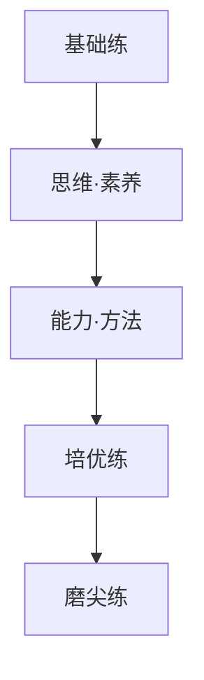

# 26

# 第一单元 集合与常用逻辑用语

课时作业01 集合 1

课时作业 02 常用逻辑用语 …… 3

# 第二单元 一元二次函数、方程和不等式

课时作业 03 等式性质与不等式性质 …… 5

课时作业 04 基本不等式 …… 7

课时作业 05 一元二次方程、不等式 9

强化作业01 一元二次方程根的分布情况 …… 11

# 第三单元 函数

课时作业 06 函数的概念及其表示 …… 12

课时作业07 函数的单调性与最值 14

课时作业 08 函数的奇偶性、周期性 …… 16

强化作业02 函数的对称性 18

强化作业 03 函数性质的综合应用 …… 19

课时作业 09 二次函数与幂函数 …… 20

课时作业 10 指数与指数函数 …… 22

课时作业 11 对数与对数函数 …… 24

强化作业 04 指、对、幂比较大小 26

课时作业 12 函数的图象 …… 27

课时作业 13 函数的零点与方程的解 …… 29

强化作业05 函数与方程的综合应用 31

课时作业 14 函数的模型及其应用 …… 32

# 第四单元 一元函数的导数及其应用

课时作业 15 导数的概念及其意义、导数的运算 …… 34

课时作业 16 导数与函数的单调性 …… 36

课时作业 17 导数与函数的极值、最值 …… 38

强化作业 06 函数中的构造问题 40

课时作业 18 导数的综合应用 …… 41

# 第五单元 三角函数、解三角形

课时作业 19 任意角、弧度制和三角函数的概念 …… 42

课时作业 20 同角三角函数的基本关系及诱导公式 …… 44

课时作业21 两角和与差的正弦、余弦和正切公式 46

课时作业22 简单的三角恒等变换 48

课时作业 23 三角函数的图象与性质 …… 50

课时作业 24 函数 $y=A\sin(\omega x+\varphi)$ 的性质与图象及其简单应用 …… 52

强化作业07 三角函数中有关 $\omega$ 的范围问题 54

课时作业 25 正弦定理与余弦定理 55

课时作业26 解三角形的综合应用 57

课时作业 27 解三角形的实际应用 …… 58

# 第六单元 平面向量与复数

课时作业 28 平面向量的概念及其线性运算 …… 60

课时作业 29 平面向量的基本定理及其坐标表示 …… 62

课时作业 30 平面向量的数量积及其应用 …… 64

强化作业 08 平面向量的综合应用 …… 66

课时作业 31 复数 …… 67

# 目录

# 精心设计

# 科学 分层

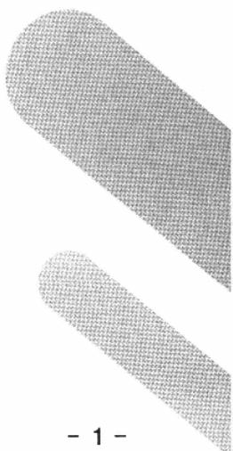

natural_image

Two abstract geometric shapes with textured surfaces, no text or symbols present

# 精心设计

# 科学 分层

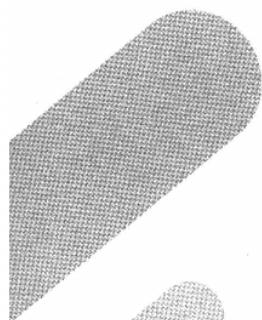

natural_image

Abstract geometric shape with a textured, curved form and a small circular element at the bottom right (no text or symbols)

# 第七单元 数列

课时作业 32 数列的概念 …… 69

课时作业 33 等差数列 …… 71

课时作业 34 等比数列 73

强化作业 09 构造法求数列通项 75

课时作业 35 数列求和(一) 76

课时作业 36 数列求和(二) 77

课时作业 37 数列中的综合问题 …… 78

强化作业 10 子数列问题 80

# 第八单元 立体几何

课时作业38 基本立体图形、简单几何体的表面积和体积 81

强化作业11 与球有关的切、接问题 83

课时作业39 空间中点、直线、平面之间的位置关系 84

课时作业40 空间直线、平面的平行 86

课时作业41 空间直线、平面的垂直 88

课时作业42 空间向量的概念与运算 90

课时作业 43 利用空间向量研究直线、平面的位置关系 92

课时作业 44 利用空间向量研究距离问题 94

课时作业 45 利用空间向量研究夹角问题 96

强化作业 12 立体几何中的截面、交线问题 98

强化作业 13 立体几何中的动态、轨迹问题 99

# 第九单元 解析几何

课时作业 46 直线的方程 100

课时作业 47 两直线的位置关系 …… 102

课时作业 48 圆的方程 …… 104

课时作业 49 直线与圆、圆与圆的位置关系 106

课时作业 50 椭圆 108

课时作业 51 双曲线 110

强化作业 14 离心率的范围问题 …… 112

课时作业 52 抛物线 113

课时作业 53 直线与圆锥曲线的位置关系 …… 115

强化作业 15 圆锥曲线中的常见结论及应用 …… 117

课时作业 54 圆锥曲线中的综合问题 …… 118

# 第十单元 统计与成对数据的统计分析

课时作业 55 随机抽样与统计图表 …… 119

课时作业56 用样本估计总体 121

课时作业 57 一元线性回归模型及其应用 …… 123

课时作业58 列联表与独立性检验 125

# 第十一单元 计数原理与概率、随机变量及其分布

课时作业 59 计数原理 …… 127

课时作业 60 排列与组合 …… 129

课时作业61 二项式定理 131

课时作业 62 随机事件与概率 …… 133

课时作业63 事件的相互独立性、条件概率与全概率公式 …… 135

课时作业 64 离散型随机变量及其分布列、数字特征 …… 137

课时作业 65 二项分布、超几何分布、正态分布 …… 139

强化作业16 概率与统计的综合问题 141

# 课时作业01 集合

对应答案分册第116页

# 基础巩固练

# 一、单项选择题(每小题5分,共20分)

1. 教材 溯源题 已知非零实数 a, b，代数式 $\frac{|a|}{a} + \frac{|b|}{b} + \frac{|ab|}{ab}$ 的值组成集合 M，则下列结论正确的是()。

A. $0 \in M$

B. $-1\in M$

C. $3 \notin M$

D. $-1\notin M$

2.(2025·天津高三模拟)已知集合 $U=\{-2,-1,0,1,2\}$ ， $M=\{-2,2\}$ ， $N=\{x\mid-1\leqslant x\leqslant1,x\in\mathbf{N}\}$ ，则 $(\mathbb{C}_{U}M)\cap N=(\quad)$ .

A. $\{-1,0,1\}$

B. $[-1,1]$

C. $\{0,1\}$

D. $[0,1]$

3. 设集合 $A = \{x \mid 1 < x < 2\}$ , $B = \{x \mid x \leqslant a\}$ , 若 $A \subseteq B$ , 则实数 $a$ 的取值范围是 ( ).

A. $[2,+\infty)$

B. $(2,+\infty)$

C. $[1,+\infty)$

D. $(1,+\infty)$

4. 已知集合 $M = \left\{x \mid x = 2m + \frac{1}{3}, m \in \mathbf{Z}\right\}, N = \left\{x \mid x = n - \frac{2}{3}, n \in \mathbf{Z}\right\}, P = \left\{x \mid x = p + \frac{1}{3}, p \in \mathbf{Z}\right\}$ , 则 $M, N, P$ 的关系为（ ）.

A. $M = N \not\subseteq P$

B. $M \subsetneq N = P$

C. $M \subsetneq N \subsetneq P$

D. $N \subsetneq P \subsetneq M$

# 二、多项选择题(每小题6分,共12分)

5. 已知集合 $A = \{x \mid x^2 - 2x - 3 < 0\}$ ，集合 $B = \{x \mid 2x - 4 < 0\}$ ，则下列关系式正确的是（ ）.

A. $A \cap B = \{x \mid -1 < x < 2\}$

B. $A \cup B = \{x \mid x \leqslant 3\}$

C. $A \cup (\mathbb{C}_{\mathbb{R}} B) = \{x \mid x > -1\}$

D. $A \cap (\mathbb{C}_{\mathbb{R}} B) = \{x \mid 2 \leqslant x < 3\}$

6. 设 $A = \{x \mid x^2 - 5x + 4 = 0\}$ , $B = \{x \mid ax - 1 = 0\}$ , 若 $A \cup B = A$ , 则实数 $a$ 的值可以是 ( ).

A.0

B. $\frac{1}{4}$

C. 4

D. 1

# 三、填空题(每小题5分,共15分)

7.(2025·江苏南京高三模拟)已知集合 $A=\{1,2,4\}$ ， $B=\{(x,y)\mid x\in A,y\in A,x-y\in A\}$ ，则集合B中元素的个数为\_\_\_\_.

8. 已知集合 $A = [1, +\infty), B = \left\{x \mid \frac{1}{2}a \leqslant x \leqslant 2a - 1\right\}$ , 若 $A \cap B = B$ , 则实数 $a$ 的取值范围是 \_\_\_\_.

9. 结论 开放题 对于一个集合 S，若当 $a \in S$ 时，有 $\frac{1}{a} \in S$ ，则称这样的数集为“可倒数集”。试写出一个“可倒数集”：\_\_\_\_。

# 四、解答题(每小题10分,共20分)

10. 已知 $a$ 为实数, $A = \left\{x \mid 9 - \frac{x}{3} \geqslant 8\right\}$ , $B = \{x \mid 2 - a \leqslant x \leqslant 2a - 1\}$ .

(1) 若 $a = 2$ , 求 $A \cap B, \mathbb{C}_A B$ ;

(2) 若 $A \cap B = B$ ，求实数 a 的取值范围.

11. 已知 $A = \{x \mid x^2 - x - 6 \leqslant 0\}$ , $B = \{x \mid a - 2 < x < 3a\}$ , 全集 $U = \mathbf{R}$ .

(1) 若 a=2，求 $A \cap (\mathbb{C}_{L^{\prime}} B)$ ;   
(2) 若 $B \subseteq A$ , 求实数 $a$ 的取值范围.

14.(10 分) 结构 不良题。已知集合 $A=\{x \mid 3x^{2}-13x+4<0, x \in N\}$ , $B=\{x \mid ax-1 \geqslant 0\}$ .

(1) 当 $a=\frac{1}{2}$ 时, 求 $A \cap B$ .  
(2)若\_\_\_\_，求实数 $a$ 的取值范围.

请从① $A\cup B=B$ ，② $A\cap B=\varnothing$ ，③ $A\cap(\mathbb{C}_{\mathbb{R}}B)\neq\varnothing$ 这三个条件中选一个填入(2)中的横线处，并完成第(2)问的解答.

# 综合 提升练

12.(6分)名师原创题(多选题)设集合 $A=\{a,b\}$ ，集合 $B=\{ab,a+b\}$ ，其中 $a,b\in R$ ，则集合 $A\cup B$ 的结果可能是().

A. $\{a,b\}$

B. $\{ab,a+b\}$

C. $\{a,b,ab\}$

D. $\{a,a+b,ab\}$

13.(5分)已知集合 $A=\{0,2,4,5\}$ ，集合 $B=\{2,3,4,6\}$ ，则如图所示的阴影部分表示的集合为\_\_\_\_。

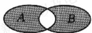

<table><tr><td>题号</td><td>1</td><td>2</td><td>3</td><td>4</td><td>5</td><td>6</td><td>12</td></tr><tr><td>答案</td><td></td><td></td><td></td><td></td><td></td><td></td><td></td></tr></table>

# 基础巩固练]

# 一、单项选择题(每小题5分,共20分)

1. 数学 文化题 数学符号的使用对数学的发展影响深远，“=”作为等号使用首次出现在《砺智石》一书中，用来表达等式关系，英国某位数学家首次使用“>”和“<”表示不等式，则命题 $p: \forall x, y \in \mathbb{R}, (x + y)^3 > x^3 + y^3$ 的否定为（ ）.

A. $\forall x, y \in \mathbf{R}, (x + y)^3 < x^3 + y^3$   
B. $\exists x, y \in \mathbf{R}, (x + y)^3 > x^3 + y^3$   
C. $\exists x, y \in \mathbf{R}, (x + y)^3 < x^3 + y^3$   
D. $\exists x,y\in\mathbf{R},(x+y)^{3}\leqslant x^{3}+y^{3}$

2.“工欲善其事，必先利其器”是一句出自《论语·卫灵公》的名言，此名言中的“利其器”是“善其事”的( ).

A. 充分不必要条件  
B. 必要不充分条件  
C. 充要条件

D. 既不充分也不必要条件

3. 高考 改编题 设 $x \in R$ ，则“ $2 - x \geqslant 0$ ”是“ $-1 \leqslant x - 1 \leqslant 1$ ”的（）.

A. 充分不必要条件  
B. 必要不充分条件  
C. 充要条件

D. 既不充分也不必要条件

4.(2025·山东济南高三模拟)已知 $A=\{x\mid1<x<2\}$ ， $B=\{x\mid x<a\}$ ，若“ $x\in A$ ”是“ $x\in B$ ”的充分不必要条件，则实数a的取值范围是().

A. $(-∞,1]$   
C. $(-∞,2]$

B. $[1,+\infty)$

D. $[2,+\infty)$

# 二、多项选择题(每小题6分,共12分)

5. 下列说法正确的是( ).

A. 命题“ $\exists x \in \mathbf{R}, x^2 + x + 1 < 0$ ”的否定是“ $\forall x \in \mathbf{R}, x^2 + x + 1 \geqslant 0$ ”  
B. 已知 $a, b \in \mathbf{R}$ , 则“ $a > 1$ 且 $b > 1$ ”是“ $ab > 1$ ”的充分不必要条件  
C. “ $x \neq 1$ ”是“ $x^{2} - 3x + 2 \neq 0$ ”的充要条件   
D. 若 p 是 q 的充分不必要条件, 则 q 是 p 的必要不充分条件

6. 若“x<k-2 或 x>k”是“-2<x<3”的必要不充分条件，则实数 k 的值可以是（ ）.

A. 3

B.-3

C. 5

D.-5

# 三、填空题(每小题5分,共15分)

7. 教材 溯源题 命题“ $\forall x \in \mathbf{R}, 2x + 1 > 0$ ”的否定是“\_\_\_\_”.  
8. 已知命题 $p$ 为“ $\forall x \in [1,2], a \geqslant x + 1$ ”，命题 $q$ 为“ $\exists x \in \mathbb{R}, 2x^2 + 5x + a = 0$ ”，若 $p$ 的否定是假命题， $q$ 是真命题，则实数 $a$ 的取值范围是 \_\_\_\_.  
9. 已知集合 $A = \{x \mid x > 2\}$ , $B = \{x \mid bx > 1\}$ , 其中 $b$ 为实数. 若“ $x \in A$ ”是“ $x \in B$ ”的充要条件, 则 $b =$ \_\_\_\_; 若“ $x \in B$ ”是“ $x \in A$ ”的充分不必要条件, 则实数 $b$ 的取值范围是 \_\_\_\_.

# 四、解答题(每小题10分,共20分)

10. 教材 溯源题 根据下述事实, 写出一个含有全称量词或存在量词的真命题, 并写出它的否定形式.

$$
\begin{array}{l} 1 = 1 ^ {2}, \\ 1 + 3 = 2 ^ {2}, \\ 1 + 3 + 5 = 3 ^ {2}, \\ 1 + 3 + 5 + 7 = 4 ^ {2}, \\ 1 + 3 + 5 + 7 + 9 = 5 ^ {2}, \\ \bullet \quad \bullet \quad \bullet \quad \bullet \quad \bullet \\ \end{array}
$$

11. 结构不良题已知集合 $A = \{x \mid -3 \leqslant x \leqslant 4\}$ , $B = \{x \mid 1 - m \leqslant x \leqslant 3m - 2, m > 1\}$ .

(1)是否存在实数 m，使得“ $x \in A$ ”是“ $x \in B$ ”的充要条件？若存在，求出实数 m 的值；若不存在，请说明理由.  
(2) 是否存在实数 m，使得“ $x \in A$ ”是“ $x \in B$ ”的 \_\_\_\_？

请在①充分不必要条件，②必要不充分条件这两个条件中任选一个补充在横线上.若问题中的实数 $m$ 存在，求出 $m$ 的取值范围；若问题中的实数 $m$ 不存在，请说明理由.

14.(10分)结构不良题.已知命题 $p: \exists x \in \mathbf{R}, ax^2 + 2x - 1 = 0$ 为假命题. 设实数 $a$ 的取值集合为 $A$ , 集合 $B = \{x \mid 3m < x < m + 2\}$ , 若 \_\_\_\_, 求实数 $m$ 的取值范围.

在①“ $x \in A$ ”是“ $x \in B$ ”的必要不充分条件，②“ $x \in B$ ”是“ $x \in \mathbb{C}_{\mathbb{R}} A$ ”的充分条件，③ $B \cap (\mathbb{C}_{\mathbb{R}} A) = \emptyset$ 这三个条件中任选一个，补充到本题的横线处，并按照你的选择求解.

# 综合 提升练

12.(6分)(多选题)“关于x的不等式 $ax^{2}-2ax+1>0$ 对 $\forall x\in R$ 恒成立”的必要不充分条件有().

A. $0 \leqslant a < 1$

B. 0 < a < 1

C. $-1 \leqslant a < 1$

D. $-1 < a < 2$

13.(5分)(2025·浙江杭州高三模拟)已知集合 $A=\{x\mid y=\ln(2x^{2}-x-6)\}$ ， $B=\{x\mid9^{x+m}-27>0\}$ ，若“ $x\in A$ ”是“ $x\in B$ ”的必要不充分条件，则实数m的取值范围为\_\_\_\_。

<table><tr><td>题号</td><td>1</td><td>2</td><td>3</td><td>4</td><td>5</td><td>6</td><td>12</td></tr><tr><td>答案</td><td></td><td></td><td></td><td></td><td></td><td></td><td></td></tr></table>

# 课时作业03 等式性质与不等式性质

对应答案分册第118页

# 基础巩固练

# 一、单项选择题(每小题5分,共20分)

1. 题多法已知 $a + b < 0$ ，且 a > 0，则（）.

A. $a^2 < -ab < b^2$

B. $b^{2} < -ab < a^{2}$

C. $a^2 < b^2 < -ab$

D. $-ab<b^{2}<a^{2}$

2. 现实 情境题 地球表面被很厚的大气层包围, 大气层的厚度大约在 1000 km 以上, 按大气层的温度垂直结构分层, 可分为对流层、平流层、中间层、暖层和散逸层. 平流层是指距地表 10 km 到 50 km 的大气层, 在下述不等式中, x (单位: km) 能表示平流层高度的是().

A. $|x-30|<20$

B. $|x+30|<20$

C. $|x+10|<50$

D. $|x - 10| <   50$

3. 设 $a, b, c$ 的平均数为 $M, a$ 与 $b$ 的平均数为 $N, N$ 与 $c$ 的平均数为 $P$ . 若 $a > b > c$ , 则 ( ).

A. N < P

B. $P < M$

C. N < M

D. $M + N <   2P$

4. 已知 $1 \leqslant a \leqslant 2, 3 \leqslant b \leqslant 5$ ，则下列结论错误的是（ ）.

A. $a + b$ 的取值范围为 [4,7]  
B. $b - a$ 的取值范围为[2,3]  
C. ab 的取值范围为 $[3,10]$   
D. $\frac{a}{b}$ 的取值范围为 $\left[\frac{1}{5}, \frac{2}{3}\right]$

# 二、多项选择题(每小题6分,共12分)

5. 对于实数 a, b, c，下列说法正确的为（）.

A. 若 $a > b > 0$ ，则 $\frac{1}{a} < \frac{1}{b}$   
B. 若 $a > b$ ，则 $ac^2 \geqslant bc^2$   
C. 若 $a > 0 > b$ ，则 $a^2 < -ab$   
D. 若 $c > a > b > 0$ ，则 $\frac{a}{c - a} > \frac{b}{c - b}$

6. 若实数 a, b 满足 a < b < c，且 $a + b + c = 0$ ，则下列结论正确的是（）.

A. $ab < b^{2}$

B. ac < bc

C. $\frac{1}{a}<\frac{1}{c}$

D. $\frac{c - a}{c - b} < 1$

# 三、填空题(每小题5分,共15分)

7. 已知 $a, b \in \mathbb{R}$ , 则下列四个条件中能使 $\frac{b}{a} > 1$ 成立的是 \_\_\_\_, 能使 $\frac{1}{a} < \frac{1}{b}$ 成立的是 \_\_\_\_. (填上所有正确答案的序号)

①b>a>0;②a>b>0;③b<0<a;④b<a<0.

8. 已知 1 < a < 3, 2 < b < 5，则 $2a - 3b + 1$ 的取值范围为 \_\_\_\_, $\frac{\sqrt{a}}{b^{2}}$ 的取值范围为 \_\_\_\_.

9. 结论 开放题 已知 a, b 同时满足下列条件：

$$
① a + b > a b; ② \frac {1}{a + b} > \frac {1}{a b}.
$$

请写出一组 a, b 的值: \_\_\_\_.

# 四、解答题(每小题10分,共20分)

10.(1)设 a > b > 0，比较 $\frac{a^{2} - b^{2}}{a^{2} + b^{2}}$ 与 $\frac{a - b}{a + b}$ 的大小.

(2) 已知 $a > b > 0, c < d < 0, e < 0$ ，求证： $\frac{e}{a - c} > \frac{e}{b - d}$ .

11. 已知实数 $a, b$ 满足 $-3 \leqslant a + b \leqslant 2, -1 \leqslant a - b \leqslant 4$ .

(1)求实数a的取值范围；  
(2) 求 3a-2b 的取值范围.

# 综合 提升练

12.(5分)现实 情境题 新高考改革后,生物学、化学、思想政治、地理采取赋分制度:原始分排名在前5%但不在前3%的学生赋分95\~97.若原始分的最大值为a,最小值为b,令 $f(x)$ 为满足 $f(a)=97,f(b)=95$ 的一次函数.对于原始分为 $x(b\leqslant x\leqslant a,a,b$ 均为小数点后一位的数)的学生,将 $f(x)$ 的值四舍五入得到该学生的赋分.已知小赵的原始分为96,赋分为97;小叶的原始分为81,赋分为95.若小林的原始分为89,则他的赋分为().

A. 95

B. 96

C. 97

D. 96 或 97

13.(5分)现实情境题某部门原计划以2400元/吨的价格收购某种农副产品m吨,按规定,农户纳税为每收入100元纳税8元(称作税率为8个百分点,即8%).根据市场规律,当税率降低 $x(x>0)$ 个百分点时,收购量增加2x个百分点,为使得税率调低后,此项税收不低于原计划的78%,则x的取值范围为\_\_\_\_.

14.(10分)教材溯源题甲、乙两人同时从A地出发沿同一路线走到B地,且从A地到B地的路程为s m,所用时间分别为 $t_{1}$ s, $t_{2}$ s.甲有一半的时间以m m/s的速度行走,另一半的时间以n m/s的速度行走;乙有一半的路程以m m/s的速度行走,另一半的路程以n m/s的速度行走,且 $m\neq n$ .

(1)请用含 m, n, s 的代数式表示甲、乙两人所用的时间 $t_{1}$ 和 $t_{2}$ ;  
(2) 比较 $t_{1}$ 与 $t_{2}$ 的大小，并判断甲、乙两人谁先到达 B 地.

<table><tr><td>题号</td><td>1</td><td>2</td><td>3</td><td>4</td><td>5</td><td>6</td><td>12</td></tr><tr><td>答案</td><td></td><td></td><td></td><td></td><td></td><td></td><td></td></tr></table>

# 基础巩固练]

# 一、单项选择题(每小题5分,共20分)

1. 若 $x > 0, y > 0$ ，且 $x + y = 6$ ，则 $xy$ 的最大值是（ ）.

A. 5

B. 6

C. 7

D. 9

2. 若 x > 0，则函数 $y = x + \frac{4}{x}$ 的（）.

A. 最大值为 8

B. 最小值为 4

C. 最大值为 -2

D. 最小值为 2

3. 已知 0 < x < 2，则 $3x(2 - x)$ 的最大值是（）.

A.-3

B. 3

C. 1

D. 6

4. 现实 情境题 现要制作一个容积为 $4 \, m^{3}$ ，高为 $1 \, m$ 的无盖长方体容器（忽略容器壁的厚度）。已知该容器的底面造价是每平方米 20 元，侧面造价是每平方米 10 元，则该容器的最低总造价为（）.

A. 80 元

B. 120 元

C. 160 元

D. 240 元

# 二、多项选择题(每小题6分,共12分)

5. 下列说法正确的是( ).

A. 当 $x > 1$ 时, $2x + \frac{1}{x - 1}$ 的最小值是 $2\sqrt{2} + 2$

B. $\frac{x^2 + 5}{\sqrt{x^2 + 4}}$ 的最小值是2

C. 当 $0 < x < 10$ 时, $\sqrt{x(10 - x)}$ 的最大值是5

D. 若 $x, y$ 为正实数，且 $x + 2y = 3xy$ ，则 $2x + y$ 的最大值是3

6. 若正实数 $a, b$ 满足 $2a + b = 1$ ，则下列说法正确的是（ ）.

A. ab 的最大值为 $\frac{1}{8}$

B. $a + b + ab$ 的最大值为1

C. $\frac{1}{a} + \frac{a}{a + b}$ 的最小值为3

D. $4a^{2} + b^{2}$ 的最小值为 $\frac{1}{2}$

# 三、填空题(每小题5分,共15分)

7. 结论 开放题已知 x > a，若 $x + \frac{4}{x - a}$ 的最小值大于 7，写出一个满足条件的 a 的值：\_\_\_\_。

8. 已知 a > 0, b > 0，且 $a + 2b = 1$ ，则 $\frac{1}{b} + \frac{8}{a + b}$ 的最小值为 \_\_\_\_.

9. 题 多法已知 x > 0, y > 0，且 $xy + x - 2y = 4$ ，则 $2x + y$ 的最小值是 \_\_\_\_.

# 四、解答题(每小题10分,共20分)

10. 已知 $x > 0, y > 0$ ，且 $2x + 8y = xy$ ，求：

(1) $xy$ 的最小值；

(2) $x+y$ 的最小值.

11. 已知正数 $x, y$ 满足 $x + 2y = 1$ .

(1) 当 x, y 取何值时, xy 有最大值?  
(2) 若 $\frac{1}{x} + \frac{2}{y} \geqslant 3^a$ 恒成立, 求实数 $a$ 的取值范围.

14.(10分)教材 溯源题.为了安全起见,在高速公路的同一车道上行驶的前、后两辆汽车之间的距离不得小于 $kx^{2}$ (单位:m),其中x(单位:km/h)是车速,k为比例系数.经测定,当车速为60 km/h时,安全车距为40 m.假设汽车的平均车长为5 m.

(1)写出在安全许可的情况下,某路口同一车道的车流量 y(单位:辆/分钟)关于车速 x 的函数.  
(2)如果只考虑车流量,那么规定怎样的车速可以使得高速公路上的车流量最大?这种规定可行吗?

# 综合 提升练

12.(6分)现实情境题。(多选题)小明和小刚相约登山,若小明上山的速度为 $v_{1}$ ,下山(原路返回)的速度为 $v_{2}(v_{1}\neq v_{2})$ ,小刚上山和下山的速度都是 $\frac{v_{1}+v_{2}}{2}$ ,设上山的路程为L,若两人途中的休息时间忽略不计,则().

A. 小明上山和下山所用时间之和为 $\frac{L(v_1 + v_2)}{v_1v_2}$   
B. 小刚上山和下山所用时间之和为 $\frac{4L}{v_1 + v_2}$   
C. 小明上山和下山所用时间之和比小刚上山和下山所用时间之和少  
D. 小刚上山和下山所用时间之和比小明上山和下山所用时间之和少

13.(5分)已知 x>y>0，且 $4x+3y=1$ ，则 $\frac{1}{2x-y}+\frac{2}{x+2y}$ 的最小值为 \_\_\_\_.

<table><tr><td>题号</td><td>1</td><td>2</td><td>3</td><td>4</td><td>5</td><td>6</td><td>12</td></tr><tr><td>答案</td><td></td><td></td><td></td><td></td><td></td><td></td><td></td></tr></table>

# 课时作业 05 一元二次方程、不等式

对应答案分册第121页

# 基础巩固练

# 一、单项选择题(每小题5分,共20分)

1. 已知不等式 $x^{2} - 2x - 3 < 0$ 的解集为 $A$ , 不等式 $\frac{x + 3}{x - 2} < 0$ 的解集为 $B$ , 则 $A \cap B = (\quad)$ .

A. $[-3,3]$

B. $(-3,3)$

C. $[-1,2]$

D. $(-1,2)$

2. 经典高考题已知二次函数 $y=ax^{2}+bx+c$ 的图象如图所示，则不等式 $ax^{2}+bx+c>0$ 的解集是().

A. $(-2,1)$

B. $(-∞,-2)∪(1,+∞)$

C. $[-2,1]$

D. $(-∞,-2]∪[1,+∞)$

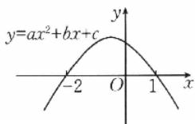

3.教材 溯源题 在下面四个不等式中,解集为空集的是().

A. $3x^{2} - 7x - 10 \leqslant 0$   
B. $-x^{2}+6x-9\leq0$   
C. $-2x^{2}+x<-3$   
D. $x^{2} - 4x + 7\leqslant 0$

4. 若关于 $x$ 的不等式 $x^{2} + px + q < 0$ 的解集为 $\left(-\frac{1}{2}, \frac{1}{3}\right)$ , 则不等式 $qx^{2} + px + 1 > 0$ 的解集为 ( ).

A. $(-3,2)$

B. $(-2,3)$

C. $\left(-\frac{1}{3},\frac{1}{2}\right)$

D. R

# 二、多项选择题(每小题6分,共12分)

5. 已知关于 $x$ 的不等式 $ax^2 + bx + c > 0$ 的解集是 $(- \infty, -2) \cup (3, +\infty)$ , 则下列选项正确的是 ( ).

A. a > 0   
B. 不等式 $bx + c > 0$ 的解集是 $(-∞, -6)$   
C. $a + b + c > 0$   
D. 不等式 $cx^{2}-bx+a<0$ 的解集是 $\left(-\infty,-\frac{1}{3}\right)\cup\left(\frac{1}{2},+\infty\right)$

6. 对于给定的实数 a，关于实数 x 的一元二次不等式 $a(x-a)(x+1)>0$ 的解集可能为（）.

A. ∅

B. $(-1,a)$

C. $(a,-1)$

D. $(a,+\infty)$

# 三、填空题(每小题5分,共15分)

7. 若关于 $x$ 的不等式 $x^{2} - 4x + 4a \geqslant a^{2}$ 在[1,6]上有解，则实数 $a$ 的取值范围为 \_\_\_\_.  
8. 甲、乙两人解关于 $x$ 的不等式 $x^{2} + bx + c < 0$ . 甲写错了常数 $b$ , 得到的解集为 $(-3, 2)$ ; 乙写错了常数 $c$ , 得到的解集为 $(-3, 4)$ . 原不等式的解集为 \_\_\_\_.  
9. 结论 开放题 “ $\forall x\in R,(a^{2}-4)x^{2}+(a+2)x+1\geqslant0$ ” 为真命题，写出一个满足条件的实数 a 的值：\_\_\_\_。

# 四、解答题(每小题10分,共20分)

10. 求下列关于 x 的不等式的解集.

(1) $\frac{3-2x}{x+2}>2;$

(2) $x^{2}-\left(a+\frac{1}{a}\right)x+1\geqslant0(a>0).$

11. 结构 不良题 已知 \_\_\_\_.

① $x+\frac{1}{x-1}(x>1)$ 的最小值是a；

②不等式 $(1-a)x^{2}-4x+6>0$ 的解集是 $\{x\mid-3<x<1\}$ .

从上述条件①和②中任选一个，补充在上面的横线处作为已知，并作答：

(1) 解不等式 $2x^{2}+(2-a)x-a>0$ ;

(2) 若 $ax^2 + bx + 3 \geqslant 0$ 的解集为 $\mathbf{R}$ , 求实数 $b$ 的取值范围.

# 综合 提升练]

12.(5分)(2025·江苏南京高三模拟)当a>0,b>0
时,不等式 $-b<\frac{1}{x}<a$ 的解集是().

A. $\left\{x\mid x <   - \frac{1}{b}\text{或} x > \frac{1}{a}\right\}$   
B. $\left\{x\mid -\frac{1}{a} <  x <   \frac{1}{b}\right\}$   
C. $\{x\mid x <   - \frac{1}{a}$ 或 $x > \frac{1}{b}\}$   
D. $\left\{x\mid -\frac{1}{b} < x < 0\right.$ 或 $0 <   x <   \frac{1}{a}$

13.（5分）教材 溯源题。设某水库的最大蓄水量为 $128000\mathrm{m}^3$ ，原有水量为 $80000\mathrm{m}^3$ ，泄水闸每天泄水量为 $4000\mathrm{m}^3$ ，在洪水暴发时，预测注入水库的水量 $S_{n}$ （单位： $\mathrm{m}^3$ ）与天数 $n(n\in \mathbf{N},n\leqslant 10)$ 的函数关系是 $S_{n} = 5000\sqrt{n(n + 24)}$ .若洪水暴发的第一天就打开泄水闸，则堤坝在第 天会发生危险。（当水库蓄水量超过最大蓄水量时，堤坝会发生危险）

14.(10分)(2025·四川遂宁高三模拟)设 $y=ax^{2}+(1-a)x+a-2(a\in\mathbb{R})$ .

(1)若不等式 $y \geqslant -2$ 对一切实数 $x$ 恒成立，求实数 $a$ 的取值范围；  
(2) 解关于 x 的不等式 $ax^{2}+(1-a)x-1<0$ .

<table><tr><td>题号</td><td>1</td><td>2</td><td>3</td><td>4</td><td>5</td><td>6</td><td>12</td></tr><tr><td>答案</td><td></td><td></td><td></td><td></td><td></td><td></td><td></td></tr></table>

# 强化作业01 一元二次方程根的分布情况

对应答案分册第122页

# 一、单项选择题(每小题5分,共25分)

1. 已知关于 x 的方程 $mx^{2}+(2m+1)x+m=0$ 有两个不相等的实根，则实数 m 的取值范围是（）.

A. $\left(-\frac{1}{4},+\infty\right)$

B. $(-∞,-\frac{1}{4})$

C. $\left[-\frac{1}{4},+\infty\right)$

D. $\left(-\frac{1}{4},0\right)\cup(0,+\infty)$

2. 已知关于 $x$ 的方程 $x^{2} + (m - 2)x + 5 - m = 0$ 有两个不相等的实数根，且两个实数根都大于2，则实数 $m$ 的取值范围是（ ）.

A. $(-5,-4)\cup(4,+\infty)$

B. $(-5,+\infty)$

C. $(-5,-4)$

D. $(-4,-2)\cup(4,+\infty)$

3. 若函数 $f(x) = (m - 2)x^2 + mx + 2m + 1$ 的两个零点分别在区间 $(-1,0)$ 和区间 $(1,2)$ 内，则实数 $m$ 的取值范围是（ ）.

A. $\left(-\frac{1}{2},\frac{1}{4}\right)$

B. $\left(-\frac{1}{4},\frac{1}{2}\right)$

C. $\left(\frac{1}{4},\frac{1}{2}\right)$

D. $\left[-\frac{1}{4},\frac{1}{2}\right]$

4. 已知函数 $f(x) = 2mx^{2} - x - 1$ 在区间 $(-2, 2)$ 上恰有一个零点，则实数 $m$ 的取值范围是（ ）.

A. $\left(-\frac{1}{8},0\right)\cup\left(0,\frac{3}{8}\right]$

B. $\left(-\frac{3}{8},\frac{1}{8}\right)$

C. $\left[-\frac{3}{8},\frac{1}{8}\right)$

D. $\left(-\frac{1}{8},\frac{3}{8}\right]$

5. 已知 $a \in \mathbf{Z}$ , 关于 $x$ 的一元二次不等式 $x^2 - 6x + a \leqslant 0$ 的解集中有且仅有 3 个整数元素, 则所有符合条件的 $a$ 的值之和是 ( ).

A. 13

B. 18

C. 21

D. 26

# 二、填空题(每小题5分,共30分)

6. 若关于 x 的方程 $x^{2}-(m-1)x+2-m=0$ 的两根都是正数，则实数 m 的取值范围是 \_\_\_\_.

7. 若关于 x 的一元二次方程 $kx^{2}+3kx+k-3=0$ 的两根都是负数，则实数 k 的取值范围为 \_\_\_\_.

8. 若关于 x 的一元二次方程 $x^{2}-2ax+4=0$ 有两个实根，且一个实根小于 1，另一个实根大于 2，则实数 a 的取值范围是 \_\_\_\_.

9. 已知关于 $x$ 的方程 $x^{2} - a^{2}x - a + 1 = 0$ 的两根 $x_{1}, x_{2}$ 满足 $0 < x_{1} < 1, x_{2} > 1$ ，则实数 $a$ 的取值范围是 \_\_\_\_.

10. 已知关于 $x$ 的方程 $x^{2} - (2a + 1)x + a(a + 1) = 0$ 的两根分别在区间 $(0,1)$ , $(1,3)$ 内, 则实数 $a$ 的取值范围为 \_\_\_\_.

11. 若关于 $x$ 的方程 $ax^2 + (a + 2)x + 9a = 0$ 有两个不相等的实数根 $x_1, x_2$ ，且 $x_1 < 1 < x_2$ ，则实数 $a$ 的取值范围是 \_\_\_\_.

# 三、解答题(共10分)

12. 已知关于 $x$ 的一元二次方程 $x^{2} + 2mx + 2m + 1 = 0$ .

(1)若方程有两个不相等的实数根,其中一根在区间 $(-1,0)$ 内,另一根在区间 $(1,2)$ 内,求实数m的取值范围;

(2)若方程的两个不相等的实数根均在区间(0,1)内，求实数 $m$ 的取值范围.

<table><tr><td>题号</td><td>1</td><td>2</td><td>3</td><td>4</td><td>5</td></tr><tr><td>答案</td><td></td><td></td><td></td><td></td><td></td></tr></table>

# 课时作业06 函数的概念及其表示

对应答案分册第 123 页

# 基础巩固练

# 一、单项选择题(每小题5分,共20分)

1. 在下列各组函数中, 表示同一个函数的是().

A. $y = x - 1$ 和 $y = \frac{x^2 - 1}{x + 1}$   
B. $y = x^{0}$ 和 $y = 1$   
C. $f(x) = x^{2}$ 和 $g(x) = (x + 1)^{2}$   
D. $f(x) = \frac{(\sqrt{x})^2}{x}$ 和 $g(x) = \frac{x}{(\sqrt{x})^2}$

2. 教材 溯源题 下列图象中, 可以表示函数 $y = f(x)$ 的是().

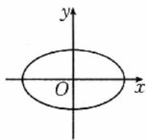  
A

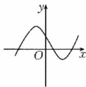  
B

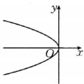  
C

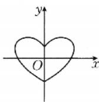  
D

3. 已知函数 $f(x) = \begin{cases} f(x + 2), & x \leqslant 0, \\ x^2 - 3x + 4, & x > 0, \end{cases}$ 则 $f(f(-6)) = (\quad)$ .

A. 6

B. 4

C. 2

D. 0

4. 函数 $f(x) = \sqrt{3 - x} + \lg (x - 1)$ 的定义域为（ ）.

A. $[3,+\infty)$

B. $(-∞,1)$

C. $[1,3]$

D. $(1,3]$

# 二、多项选择题(每小题6分,共12分)

5. 已知函数 $f(x) = \begin{cases} x + 2, & x \leqslant -1, \\ x^2, & -1 < x < 2, \end{cases}$ 下列关于函数 $f(x)$ 的说法正确的是（ ）.

A. $f(x)$ 的定义域为 $\mathbf{R}$   
B. $f(x)$ 的值域为 $(-∞,4)$   
C. $f(1)=3$   
D. 若 $f(x) = 3$ ，则 $x$ 的值是 $\sqrt{3}$

6. 下列说法正确的是( ).

A. 若函数 $f(x + 1)$ 的定义域为 $[-2, 2)$ ，则函数 $f(x)$ 的定义域为 $[-1, 3)$   
B. $f(x)=\frac{x^{2}}{x}$ 和 $g(x)=x$ 表示同一个函数  
C. 函数 $y=\frac{1}{x^{2}+3}$ 的值域为 $\left(0,\frac{1}{3}\right]$   
D. 定义在 $\mathbf{R}$ 上的函数 $f(x)$ 满足 $2f(x) - f(-x) = x + 1$ ，则 $f(x) = \frac{x}{3} + 1$

# 三、填空题(每小题5分,共15分)

7. 已知 $f(\sqrt{x}) = x - 1$ ，则 $f(x) =$ \_\_\_\_.  
8. 教材 洞源题 如果函数 $f(x)$ 与 $g(x)$ 分别由下表给出，那么 $f(f(1))=$ \_\_\_\_， $f(g(2))=$ \_\_\_\_， $g(f(3))=$ \_\_\_\_， $g(g(4))=$ \_\_\_\_.

<table><tr><td>x</td><td>1</td><td>2</td><td>3</td><td>4</td></tr><tr><td>f(x)</td><td>2</td><td>3</td><td>4</td><td>1</td></tr><tr><td>g(x)</td><td>2</td><td>1</td><td>4</td><td>3</td></tr></table>

9. 结论 开放题 设函数 $f(x) = \begin{cases} 1 - x, & x \leqslant a, \\ 2^x, & x > a, \end{cases}$ 若 $f(1) = 2f(0)$ ，则实数 $a$ 的值可以为 \_\_\_\_。（写出满足题意的一个数值即可）

# 四、解答题(每小题10分,共20分)

10. 已知函数 $f(x) = \begin{cases} 3x + 5, & x \leqslant 0, \\ x + 5, & 0 < x \leqslant 1, \\ -2x + 8, & x > 1. \end{cases}$

(1) 求 $f\left(\frac{3}{2}\right)$ , $f\left(\frac{1}{\pi}\right)$ , $f(-1)$ 的值；  
(2)画出这个函数的图象；  
(3) 求 $f(x)$ 的最大值.

11. 已知函数 $f(x) = \frac{x^2}{x^2 + 1}$ .

(1) 求 $f\left(\frac{1}{3}\right)+f(3)$ , $f\left(\frac{1}{2}\right)+f(2)$ 的值;  
(2) 探索 $f(x)+f\left(\frac{1}{x}\right)$ 的值；  
(3)利用(2)的结论求 $f\left(\frac{1}{2026}\right)+f\left(\frac{1}{2025}\right)+\cdots+$

$$
f \left(\frac {1}{2}\right) + f (1) + f (2) + \dots + f (2 0 2 5) + f (2 0 2 6)
$$

的值.

# 综合 提升练

12.（6分）（多选题）设 $f(x) = \frac{\mathrm{e}^x - \mathrm{e}^{-x}}{2}, g(x) = \frac{\mathrm{e}^x + \mathrm{e}^{-x}}{2}$ ，则下列结论正确的是（ ）.

A. $\left[g(x)\right]^{2}-\left[f(x)\right]^{2}=1$   
B. $[g(x)]^2 + [f(x)]^2 = g(2x)$   
C. $g(2x)=2f(x)g(x)$   
D. $f(2x)=2f(x)g(x)$

13.(5分)已知函数 $f(x)=\sqrt{mx^{2}-(m-2)x+m-1}$ .
若函数 $f(x)$ 的定义域为 R，则实数 m 的取值范围是 \_\_\_\_；若函数 $f(x)$ 的值域是 $[0,+\infty)$ ，则实数 m 的取值范围是 \_\_\_\_。

14.（10分）数学文化题高斯是德国著名的数学家，是近代数学奠基者之一，享有“数学王子”的称号，用其名字命名的“高斯函数”：设 $x \in \mathbb{R}$ ，用 $[x]$ 表示不超过 $x$ 的最大整数，则 $y = [x]$ 称为高斯函数。例如： $[-2.1] = -3, [3.1] = 3$ 。已知函数 $f(x) = \frac{2^x + 3}{2^x + 1}$ ，求函数 $y = [f(x)]$ 的值域。

<table><tr><td>题号</td><td>1</td><td>2</td><td>3</td><td>4</td><td>5</td><td>6</td><td>12</td></tr><tr><td>答案</td><td></td><td></td><td></td><td></td><td></td><td></td><td></td></tr></table>

# 课时作业07 函数的单调性与最值

对应答案分册第 125 页

# 基础巩固练

# 一、单项选择题(每小题5分,共20分)

1. 下列函数中，在区间(0,1)上单调递增的是()。

$$
\mathrm{A.} y = - x ^ {2} + 1
$$

$$
\mathrm{B.} y = \sqrt {x}
$$

$$
\mathrm{C.} y = \frac {1}{x}
$$

$$
\mathrm{D.} y = 3 - x
$$

2. 函数 $f(x) = -|x - 2|$ 的单调递减区间为().

$$
\mathrm{A.} (- \infty , 2 ]
$$

$$
[ 2, + \infty)
$$

$$
\mathrm{C.} [ 0, 2 ]
$$

$$
D. [ 0, + \infty)
$$

3. 函数 $f(x)=\frac{1}{x^{2}+1}$ 在区间 $[1,2]$ 上的最大值与最小值分别是().

$$
\mathrm{A.} \frac {1}{2}, \frac {1}{5}
$$

$$
\mathrm{B.} 5, 2
$$

$$
\mathrm{C.} 2, 1
$$

$$
\mathrm{D.} 1, \frac {1}{2}
$$

4. 已知定义在 $\mathbf{R}$ 上的函数 $f(x)$ , 对任意 $x \in (0, \pi)$ , 有 $f(x) - f(-x) = 0$ , 且当 $x_1, x_2 > 0$ 时, 有 $\frac{f(x_1) - f(x_2)}{x_1 - x_2} > 0$ . 设 $a = f(\sqrt{2}), b = f(-2), c = f(3)$ , 则 ( ).

$$
\mathrm{A.} a <   b <   c
$$

$$
\mathrm{B.} b <   c <   a
$$

$$
\mathrm{C.} a <   c <   b
$$

$$
\mathrm{D.} c <   b <   a
$$

# 二、多项选择题(每小题6分,共12分)

5. 已知函数 $y = \sqrt{4 - (x + 1)^2}$ ，则下列说法正确的是()。

A. 在区间 $[-1,0]$ 上单调递减  
B. 单调递增区间为 $[-3, -1]$   
C. 最大值为 2  
D. 没有最小值

6. 已知函数 $f(x) = -x^2 + 2|x| + 1$ ，则下列说法正确的是（ ）.

A. 函数 $f(x)$ 在 $(-∞, -1]$ 上单调递增  
B. 函数 $f(x)$ 在 $[-1,0]$ 上单调递减  
C. 当 x=0 时, 函数 $f(x)$ 取得最小值  
D. 当 $x = -1$ 或 $x = 1$ 时, 函数 $f(x)$ 取得最大值

# 三、填空题(每小题5分,共15分)

7. 函数 $f(x)=\sqrt{-x^{2}+2x+3}$ 的单调递增区间为 \_\_\_\_.  
8. 已知函数 $f(x) = 2^x - 2^{-x}$ ，则关于 $x$ 的不等式 $f(3x - 1) < f(1 - x)$ 的解集为 \_\_\_\_.

9. 结论 开放题 已知命题 $p$ : 若 $f(x) < f(4)$ 对任意的 $x \in (0,4)$ 都成立, 则 $f(x)$ 在 $(0,4)$ 上单调递增. 能说明命题 $p$ 为假命题的一个函数可以为 \_\_\_\_.

# 四、解答题(每小题10分,共20分)

10. 已知函数 $f(x)=\frac{x+2}{x}$ .

(1) 写出函数 $f(x)$ 的定义域和值域；  
(2) 证明函数 $f(x)$ 在 $(0, +\infty)$ 上单调递减，并求 $f(x)$ 在[2,8]上的最大值和最小值.

11. 已知 $f(x) = \frac{x^2 + 2x + a}{x}, x \in [1, +\infty)$ .

(1) 当 $a = \frac{1}{2}$ 时, 求函数 $f(x)$ 的最小值;  
(2)若对任意 $x \in [1, +\infty), f(x) > 0$ 恒成立，试求实数 $a$ 的取值范围.

# 综合 提升练

12.(5分)已知函数 $y=f(x)$ 的定义域为 R，对任意的 $x_{1}, x_{2}$ 且 $x_{1} \neq x_{2}$ ，都有 $\frac{f(x_{1}) - f(x_{2})}{x_{1} - x_{2}} > -1$ ，则下列说法正确的是()。

A. $y=f(x)+x$ 是增函数  
B. $y=f(x)+x$ 是减函数  
C. $y=f(x)$ 是增函数  
D. $y=f(x)$ 是减函数

13.(5分)已知函数 $f(x)=\left\{\begin{aligned}&ax-x^{2},x\geqslant0,\\ &-2x,x<0.\end{aligned}\right.$ 若对任意的 $x_{1},x_{2}\in R$ ，且 $x_{1}\neq x_{2}$ 都有 $\frac{f(x_{2})-f(x_{1})}{x_{2}-x_{1}}<0$ ，则实数 a 的取值范围为 \_\_\_\_；若 $f(x)$ 在 $[-1,t)$ 上的值域为 $[0,4]$ ，则实数 t 的取值范围为 \_\_\_\_。

14.(10分)设函数 $f(x)=ax^{2}+bx+1(a,b\in\mathbb{R})$ , $F(x)=\left\{\begin{aligned}&f(x),x\geqslant0,\\ &-f(x),x<0.\end{aligned}\right.$

(1) 若 $f(-1)=0$ ，且对任意实数 x 均有 $f(x)\geqslant0$ 成立，求 $F(x)$ 的解析式；  
(2)在(1)的条件下,当 $x\in[-2,2]$ 时, $g(x)=f(x)-kx$ 是单调函数,求实数k的取值范围.

15.(10分)教材 改编题(苏教必修① $P_{125}T_{15}$ 改编)已知定义在R上的函数 $f(x)$ 满足:当x>0时, $f(x)>-1$ ;对任意 $x,y\in R$ ,都有 $f(x+y)=f(x)+f(y)+1$ .

(1) 求 $f(0)$ 的值，并证明 $f(x)$ 是 R 上的增函数；  
(2) 若 $f(1)=1$ ，解关于 x 的不等式 $f(x^{2}+5x)+f(1-4x)>4$ .

<table><tr><td>题号</td><td>1</td><td>2</td><td>3</td><td>4</td><td>5</td><td>6</td><td>12</td></tr><tr><td>答案</td><td></td><td></td><td></td><td></td><td></td><td></td><td></td></tr></table>

# 基础巩固练]

# 一、单项选择题(每小题5分,共20分)

1. 下列函数中，是偶函数且在区间 $(0, +\infty)$ 上单调递增的是（ ）.

A. $y = \mathrm{e}^{x}$

B. $y = x - \frac{1}{x}$

C. $y = |x^3|$

D. $y = \cos x$

2. 已知定义在 $\mathbf{R}$ 上的奇函数 $f(x)$ 满足 $f(x + 2) = f(x)$ ，则 $f(2026)$ 等于（ ）.

A.-1

B. 0

C. 1

D. 2

3. 已知偶函数 $f(x)$ 对于任意 $x \in \mathbb{R}$ 都有 $f(x + 2) = f(x)$ ，且 $f(x)$ 在区间[0,1]上单调递增，则 $f(-6.5), f(-1), f(0)$ 的大小关系是（ ）.

A. $f(-1) < f(0) < f(-6.5)$   
B. $f(-6.5) < f(0) < f(-1)$   
C. $f(-1) < f(-6, 5) < f(0)$   
D. $f(0) < f(-6, 5) < f(-1)$

4. 教材 潮源题。若函数 $f(x)$ 是奇函数，且当 x > 0 时， $f(x) = x^{3} + x + 1$ ，则当 x < 0 时， $f(x)$ 的解析式为（）.

A. $f(x)=x^{3}+x-1$

B. $f(x) = -x^{3} - x - 1$

C. $f(x) = x^{3} - x + 1$

D. $f(x) = -x^{3} - x + 1$

# 二、多项选择题(每小题6分,共12分)

5. 已知定义在 $\mathbf{R}$ 上的奇函数 $f(x)$ 满足 $f(x + 1) = -f(x)$ ，且当 $x \in (2,3)$ 时， $f(x) = |2x - 5|$ ，则下列结论正确的是（ ）.

A. 函数 $f(x)$ 的一个周期为 2  
B. 函数 $f(x)$ 在区间 $(-1,0)$ 上单调递增  
C. $f(1)=0$   
D. $f(2023.5)=0$

6. 数学 文化题 德国著名数学家狄利克雷在数学领域成就显著, 狄利克雷函数就以其名命名, 其解析式为 $D(x) = \begin{cases} 1, & x \text{ 为有理数,} \\ 0, & x \text{ 为无理数,} \end{cases}$ 则下列说法正确的是( ).

A. $D(x)$ 是偶函数  
B. $D(x)$ 的周期是任意非零有理数  
C. $D(D(x))$ 是奇函数  
D. $\exists x,y\in\mathbf{R},D(x+y)=D(x)+D(y)$

# 三、填空题(每小题5分,共15分)

7. 教材 溯源题 若函数 $f(x)=(x+1)(x-a)$ 是偶函数，则 a= \_\_\_\_.  
8. 结论 开放题。写出一个最小正周期为 3 的奇函数：\_\_\_\_。  
9. 已知 $f(x)=2^{-x}-2^{x}-x$ ，则 $f(x^{2}-3)+f(2x)<0$ 的解集为 \_\_\_\_.

# 四、解答题(每小题10分,共20分)

10. 设 $f(x)$ 是 R 上的奇函数, $f(x+2) = -f(x)$ , 当 $0 \leqslant x \leqslant 1$ 时, $f(x) = x$ .

(1) 求 $f(\pi)$ 的值；  
(2) 当 $-4 \leqslant x \leqslant 4$ 时，求 $f(x)$ 的图象与 x 轴所围成图形的面积.

11. 已知函数 $f(x) = \begin{cases} -x^2 + 2x, & x > 0, \\ 0, & x = 0, \\ x^2 + mx, & x < 0 \end{cases}$ 是奇函数.

(1)求实数 m 的值；  
(2) 若函数 $f(x)$ 在区间 $[-1, a - 2]$ 上单调递增，求实数 $a$ 的取值范围.

# 综合 提升练

12.(5分)已知定义在R上的偶函数 $f(x)$ ，若对于任意不等实数 $x_{1},x_{2}\in[0,+\infty)$ 都满足 $\frac{f(x_{1})-f(x_{2})}{x_{1}-x_{2}}>0$ ，则不等式 $f(2x)>f(x-2)$ 的解集为().

A. $(-∞,-2)$   
B. $(-2,+\infty)$   
C. $\left(-2,\frac{2}{3}\right)$   
D. $(- \infty, -2) \cup \left( \frac{2}{3}, +\infty \right)$

13.(5分)模块融合题已知函数 $f(x)$ 的定义域为R, $y=f(x)+e^{x}$ 是偶函数, $y=f(x)-3e^{x}$ 是奇函数,则 $f(x)$ 的最小值为\_\_\_\_.

14. (10 分) 设 $f(x)$ 是定义在 $\mathbf{R}$ 上的奇函数, 且对任意实数 $x$ , 恒有 $f(x + 2) = -f(x)$ , 当 $x \in [0, 2]$ 时, $f(x) = 2x - x^2$ .

(1) 求证: $f(x)$ 是周期函数.  
(2) 当 $x \in [2,4]$ 时，求 $f(x)$ 的解析式.  
(3) 计算 $f(0)+f(1)+f(2)+\cdots+f(2026)$ .

<table><tr><td>题号</td><td>1</td><td>2</td><td>3</td><td>4</td><td>5</td><td>6</td><td>12</td></tr><tr><td>答案</td><td></td><td></td><td></td><td></td><td></td><td></td><td></td></tr></table>

# 一、单项选择题(每小题5分,共25分)

1. 下列函数的图象中, 既是轴对称图形又是中心对称图形的是().

A. $y=\tan x$

B. $y=\frac{1}{x}$

C. $y = x^{2}$

D. $y=\ln|x|$

2. 已知函数 $f(x) = 2^{|x - a|}$ 的图象关于直线 $x = 2$ 对称，则 $a = (\quad)$ .

A.1

B. 2

C. 0

D.-2

3. 函数 $y=3^{x}$ 与 $y=3^{2-x}$ 的图象关于().

A. 直线 $x=\frac{1}{4}$ 对称

B. 直线 $x=\frac{1}{2}$ 对称

C. 直线 x=1 对称

D. 直线 x=2 对称

4. 已知函数 $f(x) = 2^x + \frac{4}{2^x} (x \in \mathbb{R})$ ，则 $f(x)$ 的图象关于（ ）.

A. 直线 x=1 对称

B. 点(1,0)对称

C. 直线 x=0 对称

D. 原点对称

5. 已知函数 $f(x)$ 在 $[3, +\infty)$ 上单调递减，且 $f(x)$ 的图象关于直线 $x = 3$ 对称，则 $a = f(0.2), b = f(2), c = f(0)$ 的大小关系是（ ）.

A. $a > b > c$

B. b>c>a

C. c > b > a

D. b > a > c

# 二、多项选择题(每小题6分,共12分)

6. 已知函数 $f(x)=\frac{1}{4^{x}+2}+(2x-1)^{3}$ ，则（）.

A. $f(x) - f(1 - x) = \frac{1}{4}$   
B. $f(2026) + f(2025) + f(-2024) + f(-2025) = 1$   
C. $f(x)$ 的图象关于点 $\left(\frac{1}{2}, \frac{1}{4}\right)$ 对称  
D. $f(x)$ 的图象与 $f(1-x)$ 的图象关于直线 $x=\frac{1}{2}$ 对称

7. 已知 $f(x)$ 是定义在 $\mathbb{R}$ 上的函数, $f(x + 1)$ 的图象关于点 $(-1,0)$ 对称, 恒有 $f(x - 1) = f(3 - x)$ , 且 $f(x)$ 在 [1,2] 上单调递减, 则下列说法正确的是 ( ).

A. 直线 $x = 1$ 是函数 $f(x)$ 的图象的对称轴

B. 周期 T=2  
C. 函数 $f(x)$ 在 $[4,5]$ 上单调递增  
D. $f(5)=0$

# 三、填空题(每小题5分,共15分)

8. 原创题 与函数 $f(x) = \mathrm{e}^{x}$ 的图象关于直线 $x = 2$ 对称的图象的函数解析式是 \_\_\_\_，关于点 (1,0) 对称的图象的函数解析式是 \_\_\_\_。  
9. 结论 开放题 写出一个同时符合条件①②③的函数：\_\_\_\_。

① $f(x)$ 是定义域为R的奇函数；② $f(1+x)=f(1-x)$ ；③ $f(1)=2$ .

10. (2025·贵州贵阳高三模拟) 若函数 $f(x)$ 的定义域为 $\mathbf{R}$ ，且 $f(x + 1)$ 为奇函数， $f(x + 2)$ 为偶函数，则 $f(985) =$ \_\_\_\_.

# 四、解答题(共10分)

11.(10分)已知函数 $f(x)=\frac{b}{4^{x}+a}+1$ 的定义域为 R，
其图象关于点 $\left(\frac{1}{2},\frac{1}{2}\right)$ 对称.

(1)求实数a,b的值；  
(2) 求 $f\left(\frac{1}{2026}\right)+f\left(\frac{2}{2026}\right)+\cdots+f\left(\frac{2025}{2026}\right)$ 的值.

<table><tr><td>题号</td><td>1</td><td>2</td><td>3</td><td>4</td><td>5</td><td>6</td><td>7</td></tr><tr><td>答案</td><td></td><td></td><td></td><td></td><td></td><td></td><td></td></tr></table>

# 强化作业03 函数性质的综合应用

对应答案分册第128页

# 一、单项选择题(每小题5分,共30分)

1. 已知 $f(x)$ 是 $\mathbf{R}$ 上的偶函数，且 $f(x) + f(x + 2) = 0$ ，当 $0 \leqslant x \leqslant 1$ 时， $f(x) = 1 - x^2$ ，则 $f(2023.5) = (\quad)$ .

A.-0.75

B.-0.25

C. 0.25

D. 0.75

2. 定义在 $\mathbf{R}$ 上的函数 $f(x)$ 是偶函数，且 $f(x) = f(2 - x)$ ，若 $f(x)$ 在区间 $[1, 2]$ 上单调递减，则函数 $f(x)$ ( ).

A. 在区间 $[0,1]$ 上单调递增，在区间 $[-2,-1]$ 上单调递减  
B. 在区间 $[0,1]$ 上单调递增，在区间 $[-2,-1]$ 上单调递增  
C. 在区间 $[0,1]$ 上单调递减，在区间 $[-2,-1]$ 上单调递减  
D. 在区间 $[0,1]$ 上单调递减，在区间 $[-2,-1]$ 上单调递增

3. 已知定义在 $\mathbf{R}$ 上的函数 $f(x)$ 满足 $f(-x) + f(x) = 0, f(2 - x) = f(x)$ ，且 $f(x)$ 在 $(-1, 1)$ 上单调递增，则（ ）.

A. $f(-5,3) < f(5,5) < f(2)$

B. $f(-5,3) < f(2) < f(5,5)$

C. $f(2) < f(-5.3) < f(5.5)$

D. $f(5,5) < f(2) < f(-5,3)$

4. 已知函数 $f(x)$ 的图象关于原点对称，且满足 $f(x + 1) + f(3 - x) = 0$ ，且当 $x \in (2, 4)$ 时， $f(x) = -\log_{\frac{1}{2}}(x - 1) + m$ ，若 $\frac{f(2025) - 1}{2} = f(-1)$ ，则 $m = (\quad)$ .

A. $\frac{4}{3}$

B. $\frac{3}{4}$

C. $-\frac{4}{3}$

D. $-\frac{3}{4}$

5. 已知函数 $f(x)=2^{x}+2^{-x}$ ，则下列函数的图象关于直线 x=1 对称的是（）.

A. $f(x - 1) + \cos \frac{\pi}{2} x$

B. $f(x+1)+\sin\frac{\pi}{2}x$

C. $f(x-1)+\sin\frac{\pi}{2}x$

D. $f(x+1)+\cos\frac{\pi}{2}x$

6. 已知偶函数 $f(x)$ 的图象经过点 $(-1, -3)$ ，且当 $0 \leqslant a < b$ 时，不等式 $\frac{f(b) - f(a)}{b - a} < 0$ 恒成立，则使得 $f(x - 1) + 3 < 0$ 成立的 $x$ 的取值范围为（ ）.

A. $(-∞,0)∪(2,+∞)$

B. $(-∞,0)$

C. $(2,+\infty)$

D. $(0,2)$

# 二、多项选择题(每小题6分,共12分)

7. 定义在 $\mathbf{R}$ 上的偶函数 $f(x)$ 满足 $f(x + 1) = -f(x)$ ，且在 $[-1,0]$ 上单调递增，则下列关于 $f(x)$ 的结论正确的是（ ）.

A. $f(x)$ 的图象关于直线 x=1 对称

B. $f(x)$ 在 $[0,1]$ 上单调递增

C. $f(x)$ 在 $[1,2]$ 上单调递减

D. $f(2)=f(0)$

8. 已知函数 $f(x)$ 满足 $f(x + 1)$ 为奇函数, $f(x) - f(-x) = 0$ , 当 $x \in [0,1)$ 时, $f(x) = -\cos \frac{\pi x}{2}$ , 则下列结论正确的是 ( ).

A. $f(1)=0$

B. $f(x)$ 的周期为 2

C. $f(x)$ 的图象关于点 $(1,0)$ 中心对称

D. $f\left(\frac{2023}{2}\right) = -\frac{\sqrt{2}}{2}$

# 三、填空题(每小题5分,共20分)

9. 结论 开放题 写出一个同时满足以下三个条件的函数解析式：\_\_\_\_。

①定义域不是 R, 值域是 R; ②奇函数; ③周期函数.

10. 已知函数 $y = f(x + 1)$ 是定义在 $\mathbf{R}$ 上的偶函数，且 $f(x + 3) + f(1 - x) = 2$ ，则 $f(4) =$ \_\_\_\_.  
11. 已知 $f(x)$ 为定义在 $[-1, 1]$ 上的偶函数，且在 $[-1, 0]$ 上单调递减，则满足不等式 $f(2a) < f(4a - 1)$ 的 $a$ 的取值范围是 \_\_\_\_.  
12. 设函数 $f(x)$ 的定义域为 R, $f(x+1)$ 为奇函数， $f(x+2)$ 为偶函数，当 $x \in [1,2]$ 时， $f(x) = ax^{3} + bx$ . 若 $f(3) + f(4) = 6$ ，则 $f(2026) =$ \_\_\_\_.

<table><tr><td>题号</td><td>1</td><td>2</td><td>3</td><td>4</td><td>5</td><td>6</td><td>7</td><td>8</td></tr><tr><td>答案</td><td></td><td></td><td></td><td></td><td></td><td></td><td></td><td></td></tr></table>

# 基础巩固练]

# 一、单项选择题(每小题5分,共20分)

1. 若幂函数 $f(x) = x^{\alpha}$ 的图象经过第三象限，则 $\alpha$ 的值可以是（ ）.

A.-2

B. 2

C. $\frac{1}{2}$

D. $\frac{1}{3}$

2. 已知幂函数 $f(x)=(m^{2}-2m-2)x^{m-2}$ 的图象经过原点，则 m 的值为（）.

A.-1

B. 1

C. 3

D. 2

3. 函数 $f(x) = ax^2 + 2x + 1$ 与 $g(x) = x^a$ 在同一直角坐标系中的图象不可能为（ ）.

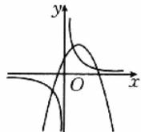  
A

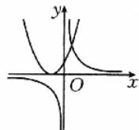  
B

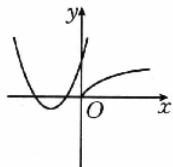  
C

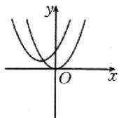  
D

4. 已知函数 $f(x) = -x^2 + 2x + 5$ 在区间 $[0, m]$ 上的值域为 $[5, 6]$ ，则实数 $m$ 的取值范围是（ ）.

A. $(0,1]$

B. $[1,3]$

C. $(0,2]$

D. $[1,2]$

# 二、多项选择题(每小题6分,共12分)

5. 设 $abc < 0$ ，则函数 $y = ax^2 + bx + c$ 的图象可能是（ ）.

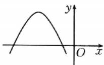  
A

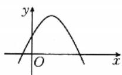  
B

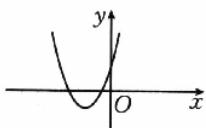  
C

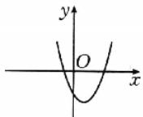  
D

6. 幂函数 $f(x) = (m^2 - 5m + 7)x^{m^2 - 6}$ 在 $(0, +\infty)$ 上单调递增，则下列说法正确的是（ ）.

A. $m = 3$   
B. 函数 $f(x)$ 在 $(- \infty, 0)$ 上单调递增

C. 函数 $f(x)$ 是偶函数  
D. 函数 $f(x)$ 的图象关于原点对称

# 三、填空题(每小题5分,共15分)

7. 结论 开放题 已知幂函数 $f(x)$ 满足以下条件：

① $f(x)$ 是奇函数；② $f(x)$ 在 $(0,+\infty)$ 是增函数；  
③ $f(2)>3.$

写出一个满足条件①②③的函数 $f(x)$ 的解析式：

8. 已知某二次函数的图象过点 $(-3,0), (1,0)$ ，且顶点到 $x$ 轴的距离等于 2，则该二次函数的表达式为 \_\_\_\_.  
9. 模块 融合题 已知二次函数 $f(x)=ax^{2}+2x+c(x \in \mathbb{R})$ 的值域为 $[1,+\infty)$ ，则 $\frac{1}{a}+\frac{4}{c}$ 的最小值为 \_\_\_\_.

# 四、解答题(每小题10分,共20分)

10. 已知幂函数 $f(x)=(m^{2}+4m+4)x^{m+2}$ 在 $(0,+\infty)$ 上单调递减.

(1) 求 $m$ 的值；  
(2) 若 $(2a-1)^{-m}<(a+3)^{-m}$ ，求 a 的取值范围.

11. 已知二次函数 $f(x)$ 的最小值为 1，函数 $y = f(x + 1)$ 是偶函数，且 $f(0) = 3$ .

(1) 求 $f(x)$ 的解析式；  
(2)若函数 $f(x)$ 在区间 $[2a, a + 1]$ 上单调，求实数 $a$ 的取值范围.

# 综合 提升练

12.(5分)函数 $f(x)=(m^{2}-m-1)x^{m^{2}+m-3}$ 是幂函数, 对任意 $x_{1}, x_{2} \in (0, +\infty)$ , 且 $x_{1} \neq x_{2}$ , 满足 $\frac{f(x_{1})-f(x_{2})}{x_{1}-x_{2}} < 0$ . 若 $a, b \in R$ , 且 a < 0 < b, $|a| < |b|$ , 则 $f(a) + f(b)$ 的值().

A. 恒大于 0

B. 恒小于 0

C. 等于 0

D. 无法判断

13.(5分)若二次函数 $f(x)=ax^{2}+2ax+1$ 在区间 $[-2,3]$ 上的最大值为6，则 a 的值为 \_\_\_\_.

14.(10分)结构不良题给出三个条件:①对任意的 $x\in\mathbb{R}$ 都有 $f(x+1)-f(x)=2x-2$ ; ②不等式 $f(x)<0$ 的解集为 $\{x\mid1<x<2\}$ ; ③函数 $y=f(x)$ 的图象过点(3,2). 请你在上述三个条件中任选两个补充到下面的问题中,并求解.

已知二次函数 $f(x) = ax^2 + bx + c$ ，且满足 \_\_\_\_.

(1) 求函数 $f(x)$ 的解析式；  
(2) 设 $g(x) = f(x) - mx$ ，若函数 $g(x)$ 在区间[1,2]上的最小值为3，求实数 $m$ 的值.

<table><tr><td>题号</td><td>1</td><td>2</td><td>3</td><td>4</td><td>5</td><td>6</td><td>12</td></tr><tr><td>答案</td><td></td><td></td><td></td><td></td><td></td><td></td><td></td></tr></table>

# 基础巩固练]

# 一、单项选择题(每小题5分,共20分)

1. 下列结论正确的是( ).

A. 若 $a > 0$ ，则 $a^{\frac{4}{3}} \cdot a^{\frac{3}{4}} = a$   
B. 若 $m^8 = 2$ ，则 $m = \pm \sqrt[8]{2}$   
C. 若 $a + a^{-1} = 3$ ，则 $a^{\frac{1}{2}} + a^{-\frac{1}{2}} = \pm \sqrt{5}$   
D. $\sqrt[4]{(2 - \pi)^{4}} = 2 - \pi$

2. 下列函数中, 值域是 $(0, +\infty)$ 的为().

A. $y = \sqrt{3^x - 1}$

B. $y=\left(\frac{1}{3}\right)^{x}$

C. $y=\sqrt{1-\left(\frac{1}{3}\right)^{x}}$

D. $y = 3^{\frac{1}{x}}$

3. 函数 $y = a^x - \frac{1}{a} (a > 0$ ，且 $a \neq 1)$ 的图象可能是（ ）.

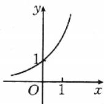  
A

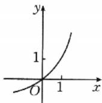  
B

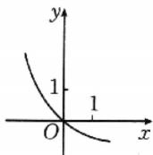  
C

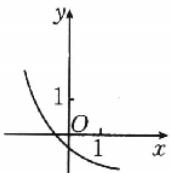  
D

4. 已知 $a = 3^{1.2}, b = 1.2^0, c = \left(\frac{1}{3}\right)^{-0.9}$ , 则 $a, b, c$ 的大小关系是( ).

A. a<c<b

B. c<b<a

C. c<a<b

D. b<c<a

# 二、多项选择题(每小题6分,共12分)

5. 已知函数 $f(x) = \left(\frac{1}{2}\right)^{x^2 + 4x + 3}$ ，则（ ）.

A. 函数 $f(x)$ 的定义域为 $\mathbf{R}$   
B. 函数 $f(x)$ 的值域为 $(0,2]$   
C. 函数 $f(x)$ 在 $[-2, +\infty)$ 上单调递增  
D. 函数 $f(x)$ 在 $[-2, +\infty)$ 上单调递减

6. 已知函数 $f(x) = |2^x - 1|$ ，实数 $a, b$ 满足 $f(a) = f(b) (a < b)$ ，则（ ）.

A. $2^{a} + 2^{b} > 2$

B. $\exists a, b \in R$ , 使得 $0 < a + b < 1$   
C. $2^{a} + 2^{b} = 2$   
D. $a + b < 0$

# 三、填空题(每小题5分,共15分)

7. $0.125^{-\frac{1}{3}} - \left(\frac{9}{8}\right)^{0} + [(-2)^{2}]^{\frac{3}{2}} + (\sqrt{2} \times \sqrt[3]{3})^{6} =$   
8. 结论 开放题 写出一个同时满足下列三个条件的函数: $f(x)=$ \_\_\_\_.

①若 $xy > 0$ ，则 $f(x + y) = f(x)f(y)$ ；② $f(x) = f(-x)$ ；③ $f(x)$ 在 $(0, + \infty)$ 上单调递减.

9. 数学 新定义 对于函数 $f(x)$ ，若在定义域上存在实数 $x_0$ 满足 $f(-x_0) = -f(x_0)$ ，则称函数 $f(x)$ 为“倒戈函数”。设 $f(x) = 3^x + m - 1 (m \in \mathbb{R}, m \neq 0)$ 是在 $[-1, 1]$ 上的“倒戈函数”，则实数 $m$ 的取值范围是 \_\_\_\_。

# 四、解答题(每小题10分,共20分)

10. 已知函数 $f(x) = 2^x$ 的定义域是[0,3], 设 $g(x) = f(2x) - f(x + 2)$ .

(1) 求 $g(x)$ 的解析式及定义域；  
(2) 求函数 $g(x)$ 的最大值和最小值.

11. 已知函数 $f(x) = 2^x + k \cdot 2^{-x} (k$ 为常数) 是 $\mathbf{R}$ 上的奇函数.

(1)求实数 k 的值；  
(2)若函数 $y = f(x)$ 在区间 $[1, m]$ 上的值域为 $[n, \frac{15}{4}]$ , 求 $m + n$ 的值.

# 综合 提升练]

12.(6分)(多选题)关于函数 $f(x)=\frac{1}{4^{x}+2}$ 的性质,下列说法正确的是().

A. 函数 $f(x)$ 的定义域为 $\mathbf{R}$   
B. 函数 $f(x)$ 的值域为 $(0, +\infty)$   
C. 方程 $f(x) = x$ 有且只有一个实根  
D. 函数 $f(x)$ 的图象是中心对称图形

13.(5分)(2025·广东深圳高三模拟)已知 $\alpha\in\left(\frac{\pi}{4},\frac{\pi}{2}\right)$ , $a=(\cos\alpha)^{\sin\alpha}$ , $b=(\sin\alpha)^{\cos\alpha}$ , $c=(\cos\alpha)^{\cos\alpha}$ , 则 a, b, c 的大小关系是 \_\_\_\_. (从大到小排列)

14.(10分)数学新定义定义在D上的函数 $f(x)$ ，如果满足对任意 $x\in D$ ，存在常数M>0，使得 $-M\leqslant f(x)\leqslant M$ 成立，则称 $f(x)$ 是D上的有界函数，其中M称为函数 $f(x)$ 的上界.已知 $f(x)=4^{x}+a\cdot2^{x}-2$ .

(1) 当 a = -2 时，求函数 $f(x)$ 在 $(0, +\infty)$ 上的值域，并判断函数 $f(x)$ 在 $(0, +\infty)$ 上是否为有界函数，请说明理由；  
(2) 若函数 $f(x)$ 在 $(- \infty, 0)$ 上是以 2 为上界的有界函数，求实数 $a$ 的取值范围.

<table><tr><td>题号</td><td>1</td><td>2</td><td>3</td><td>4</td><td>5</td><td>6</td><td>12</td></tr><tr><td>答案</td><td></td><td></td><td></td><td></td><td></td><td></td><td></td></tr></table>

# 课时作业11 对数与对数函数

对应答案分册第132页

# 基础巩固练

# 一、单项选择题(每小题5分,共20分)

1. 若函数 $f(x)=(a^{2}-3a+3)\log_{a}x$ 是对数函数，则 a 的值是().

A.1或2

B. 1

C. 2

D. 3

2. 教材 溯源题 当 a > 1 时，在同一直角坐标系中，函数 $y = a^{-x}$ 与 $y = \log_{a} x$ 的图象是().

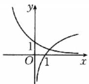  
A

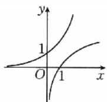  
B

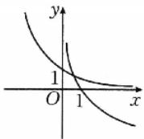  
C

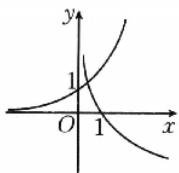  
D

3. 函数 $y=\sqrt{\log_{0.5}(4x-3)}$ 的定义域为().

A. $[1, +\infty)$

B. $\left[\frac{3}{4},1\right]$

C. $\left(\frac{3}{4},1\right]$

D. $\left(0,\frac{3}{4}\right]$

4. 若函数 $f(x)=\log_{a}x$ (a>0, 且 $a\neq1$ ) 的反函数的图象过点(1,3)，则 $f(\log_{2}8)=(\quad)$ .

A.-1

B.1

C. 2

D. 3

# 二、多项选择题(每小题6分,共12分)

5. 已知函数 $f(x) = \ln (x + 2) + \ln (4 - x)$ ，则下列说法正确的是（ ）.

A. $f(x)$ 的定义域为 $(-2,4)$   
B. $f(x)$ 在区间 $(-2,1)$ 上单调递增  
C. $f(x)$ 在区间 $(1, +\infty)$ 上单调递减  
D. $f(x)$ 的图象关于直线 x=1 对称

6. 若 $10^{a}=2,10^{b}=5$ ，则下列结论正确的是()。

A. $a + b = 1$

B. 5a<2b

C. $5^{a}<2^{b}$

D. $2^{a} + 2^{b} > 2\sqrt{2}$

# 三、填空题(每小题5分,共15分)

7. 计算: $\lg 25 + \frac{2}{3} \lg 8 - \log_2 27 \times \log_3 2 + 2^{\log_2 3} =$ \_\_\_\_.

8. 结论 开放题 已知函数 $f(x)$ 满足 $f(xy)=f(x)+f(y)$ ，且当 x>y 时， $f(x)<f(y)$ ，写出一个符合上述条件的函数： $f(x)=$ \_\_\_\_.

9. 数学 新定义 已知函数 $y = f(x)$ ，若在定义域内存在实数 $x$ ，使得 $f(-x) = -f(x)$ ，则称函数 $y = f(x)$ 为定义域上的局部奇函数。若函数 $f(x) = \log_3(x + m)$ 是 $[-2, 2]$ 上的局部奇函数，则实数 $m$ 的取值范围是 \_\_\_\_.

# 四、解答题(每小题10分,共20分)

10. 已知 $f(x)=\log_{a}x+\log_{a}(4-x)(a>0,$ 且 $a\neq1)$ ,
且 $f(2)=2.$

(1) 求 $a$ 的值及 $f(x)$ 的定义域；  
(2) 求 $f(x)$ 在 $\left[1, \frac{7}{2}\right]$ 上的值域.

11. 已知函数 $f(x) = (\log_2 x)^2 - \log_2 x - 2$ .

(1) 若 $f(x) \leqslant 0$ , 求 $x$ 的取值范围;  
(2) 当 $\frac{1}{4} \leqslant x \leqslant 8$ 时, 求函数 $f(x)$ 的值域.

14.(10分)已知函数 $f(x)=\log_{a}(ax^{2}-x)$ .

(1) 若 $a = \frac{1}{2}$ , 求 $f(x)$ 的单调区间;  
(2) 若 $f(x)$ 在区间 $[2,4]$ 上是增函数, 求实数 $a$ 的取值范围.

# 综合 提升练

12.(6分)(多选题)已知函数 $f(x)=\ln(e^{2x}+1)-x$ ，则().

A. $f(\ln 2)=\ln \frac{5}{2}$   
B. $f(x)$ 是奇函数  
C. $f(x)$ 在 $(0, +\infty)$ 上单调递增  
D. $f(x)$ 的最小值为 $\ln 2$

13.(5分)设实数a,b是关于x的方程 $|\lg x|=c$ 的两个不同的实数根,且a<b<10,则abc的取值范围是\_\_\_\_.

<table><tr><td>题号</td><td>1</td><td>2</td><td>3</td><td>4</td><td>5</td><td>6</td><td>12</td></tr><tr><td>答案</td><td></td><td></td><td></td><td></td><td></td><td></td><td></td></tr></table>

# 强化作业 04 指、对、幂比较大小

对应答案分册第133页

# 基础巩固练]

# 一、单项选择题(每小题5分,共40分)

1. 设 $a = \left(\frac{1}{2}\right)^{\frac{1}{3}}, b = \left(\frac{5}{3}\right)^{\frac{1}{2}}, c = \log_{\frac{2}{3}} \frac{5}{2}$ , 则 $a, b, c$ 的大小关系为（ ）.

A. $a > b > c$

B. $c > a > b$

C. b>c>a

D. $b > a > c$

2. 经典 高考题 已知 $a=\log_{5}2, b=\log_{8}3, c=\frac{1}{2}$ ，则下列判断正确的是（）.

A. c<b<a   
B. b<a<c   
C. a<c<b   
D. a<b<c

3. 若 $a = \log_{0.3} 0.2, b = \log_3 2, c = \log_{30} 20$ ，则（ ）.

A. $c < b < a$   
B. b<c<a   
C. $a < b < c$   
D. $a < c < b$

4. 若 $3^{x}=4^{y}=10, z=\log_{x}y$ ，则（）.

A. $x > y > z$   
B. $y > x > z$   
C. $z > x > y$   
D. $x > z > y$

5. 已知 $a = \log_3 2, b = \log_4 3, c = \sin \frac{\pi}{6}$ , 则 $a, b, c$ 的大小关系为 ( ).

A. a > b > c   
B. $a > c > b$   
C. $b > c > a$   
D. $b > a > c$

6. 已知 $\log_4 m = \frac{9}{20}, \log_{12} n = \frac{1}{4}, 0.9^p = 0.8$ ，则正数 $m, n, p$ 的大小关系为（ ）.

A. p > m > n   
B. m > n > p   
C. m > p > n   
D. $p > n > m$

7. 已知 $a = 8^{10}, b = 9^9, c = 10^8$ ，则 $a, b, c$ 的大小关系为（ ）.

A. $b > c > a$   
B. $b > a > c$   
C. a > c > b   
D. a > b > c

8. 设 $a = 2\log_3 2, b = \log_2 3, c = \frac{4}{3}$ , 则 $a, b, c$ 的大小关系为( ).

A. $a > b > c$   
B. $c > b > a$   
C. a > c > b   
D. $b > c > a$

# 二、多项选择题(每小题6分,共24分)

9. 设 $a=16^{0.3}$ , $b=9^{0.6}$ , $c=\log_{\sqrt{2}}\sqrt{3}$ , 则().

A. $a > c$   
B. b > c   
C. a > b   
D. b > a

10. 若 $a = \log_4 5, b = \frac{1}{2} \log_{\sqrt{2}} 3, c = e^{\ln 2}$ , 则 ( ).

A. a < b   
B. b < a   
C. c < b   
D. b<c

11. 已知实数 a, b, c 满足 $\frac{1}{a} = 2^{b} = \log_{2}c$ ，则 a, b, c 的大小关系可能成立的是（）.

A. $c > b > a$   
B. c > a > b   
C. $a > c > b$   
D. $a > b > c$

12. 已知 $a, b, c \in \mathbf{R}$ , 且 $\ln a = \mathrm{e}^b = 1 - c$ , 则下列关系式可能成立的是 ( ).

A. $a > b > c$   
B. $a > c > b$   
C. $c > a > b$   
D. c > b > a

# 三、填空题(每小题5分,共25分)

13. 如果 $a = \sin 2, b = \left(\frac{1}{2}\right)^{\frac{1}{2}}, c = \log_{\frac{1}{2}} \frac{1}{3}$ ，那么 a, b, c 的大小关系为 \_\_\_\_。（用“>”连接）  
14. 若 $a^{2}>b>a>1$ ，则 $\log_{b}\frac{b}{a},\log_{b}a,\log_{a}b$ 的大小关系是 \_\_\_\_。（用“<”连接）  
15. 已知 $5^{5} < 8^{4}, 13^{4} < 8^{5}$ , 设 $a = \log_{5}3, b = \log_{8}5, c = \log_{13}8$ , 则 $a, b, c$ 的大小关系是 \_\_\_\_. (用“<”连接)  
16. 已知 $a = \frac{2025}{2026}$ , $b = \left(\frac{2025}{2026}\right)^{\frac{2025}{2026}}$ , $c = \left(\frac{2025}{2026}\right)^{\left(\frac{2025}{2026}\right)^{\frac{2025}{2026}}}$ , 则 $a, b, c$ 的大小关系是 \_\_\_\_. (用“>”连接)  
17. 已知 $f(x)$ 是定义在 $\mathbf{R}$ 上的奇函数，对任意两个不相等的正数 $x_1, x_2$ ，都有 $\frac{x_2f(x_1) - x_1f(x_2)}{x_1 - x_2} < 0$ ，记 $a = \frac{f(4.1^{0.2})}{4.1^{0.2}}$ , $b = \frac{f(0.4^{2.1})}{0.4^{2.1}}$ , $c = \frac{f(\log_{0.2}4.1)}{\log_{0.2}4.1}$ ，则 $a, b, c$ 的大小关系是 \_\_\_\_。（用“<”连接）

<table><tr><td>题号</td><td>1</td><td>2</td><td>3</td><td>4</td><td>5</td><td>6</td><td>7</td><td>8</td><td>9</td><td>10</td><td>11</td><td>12</td></tr><tr><td>答案</td><td></td><td></td><td></td><td></td><td></td><td></td><td></td><td></td><td></td><td></td><td></td><td></td></tr></table>

# 基础巩固练]

# 一、单项选择题(每小题5分,共20分)

1. 为了得到函数 $y = 2(x - 2) - 3$ 的图象，只需把函数 $y = 2x$ 的图象（ ）.

A. 向右平移 2 个单位长度, 再向下平移 3 个单位长度  
B. 向左平移 2 个单位长度, 再向下平移 3 个单位长度  
C. 向右平移 2 个单位长度, 再向上平移 3 个单位长度  
D. 向左平移 2 个单位长度, 再向上平移 3 个单位长度

2. 函数 $f(x) = 1 - \frac{1}{x + 1}$ 的大致图象为（ ）.

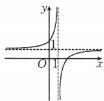

text_image

y
1
O 1 x

A

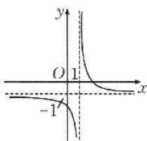

text_image

y
O 1
x
-1

B

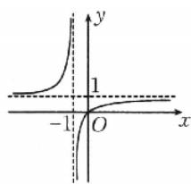

text_image

y
1
-1 O x

C

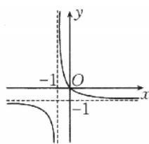

text_image

-1
O
-1
x
y

D

3. 已知函数 $f(x)$ 的部分图象如图所示，则函数 $f(x)$ 的解析式可能为().

A. $f(x) = -\frac{2x^2}{|x| - 1}$   
B. $f(x) = -\frac{2x^2}{|x| + 1}$   
C. $f(x) = -\frac{2x}{|x| - 1}$   
D. $f(x) = -\frac{2|x|}{x^2 - 1}$

4. 已知函数 $f(x)$ 的图象如图 1 所示，则图 2 所表示的函数是（）.

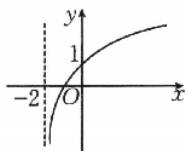  
图1

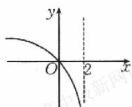  
图2

A. $1 - f(x)$ B. $-f(2 - x)$   
C. $f(-x) = 1$ D. $1 - f(-x)$

# 二、多项选择题(每小题6分,共12分)

5. 下列说法正确的是( ).

A. $y=\frac{1}{x-1}$ 的图象是由 $y=\frac{1}{x}$ 的图象向左平移 1 个单位长度得到的  
B. $y = 1 + \frac{1}{x}$ 的图象是由 $y = \frac{1}{x}$ 的图象向上平移1个单位长度得到的  
C. 函数 $y=f(x)$ 的图象与函数 $y=f(-x)$ 的图象关于 y 轴对称  
D. $y=\frac{1-x}{1+x}$ 的图象是由 $y=\frac{2}{x}$ 的图象向左平移 1 个单位长度，再向下平移 1 个单位长度得到的

6. 函数 $f(x) = \frac{ax - b}{(x + c)^2}$ 的图象如图所示，则下列结论一定成立的是（ ）.

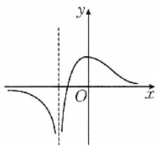

text_image

Graph of a parabola with vertex at origin and vertical asymptote, labeled with x and y axes

A. $a <   0$ B. $b <   0$   
C. $c > 0$ D. $abc <   0$

# 三、填空题(每小题5分,共15分)

7. 若函数 $f(x)=\frac{ax-2}{x-1}$ 的图象关于点(1,1)对称，则实数 a= \_\_\_\_.  
8. 已知函数 $f(x)$ 在 R 上单调且其部分图象如图所示，若关于 x 的不等式 $-2 < f(x + t) < 4$ 的解集为 $(-1, 2)$ ，则实数 t 的值为 \_\_\_\_.

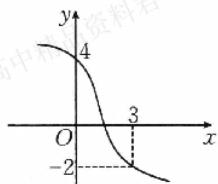

line

| Point | x | y |
|---|---|---|
| 1 | -2 | -2 |
| 2 | 3 | 3 |
| 3 | 4 | 4 |

9. 若函数 $y = f(x)$ 的图象过点(1,1)，则函数 $y = f(4 - x)$ 的图象一定经过点 \_\_\_\_.

# 四、解答题(每小题10分,共20分)

10. 已知函数 $f(x)=|x|(x-a), a>0.$

(1)作出函数 $f(x)$ 的图象；  
(2) 写出函数 $f(x)$ 的单调区间；  
(3) 当 $x \in [0,1]$ 时，由图象写出 $f(x)$ 的最小值.

11. 已知函数 $f(x) = \begin{cases} x^2, & x \leqslant 0, \\ \frac{1 - x}{x}, & x > 0. \end{cases}$

(1)画出函数 $f(x)$ 的图象；  
(2) 当 $f(x) \geqslant 2$ 时, 求实数 x 的取值范围.

# 综合 提升练

12.(5分)数学 新定义(2025·云南昆明高三模拟)若将函数 $y=f(x)$ 的图象平移后能与函数 $y=g(x)$ 的图象重合, 则称函数 $f(x)$ 和 $g(x)$ 互为“平行函数”. 已知 $f(x)=2-\frac{1}{2^{x}+1}, g(x)=\frac{m\cdot2^{x}}{2^{x}+2}$ 互为“平行函数”, 则 m=( ).

A. 2

B. 1

C.-1

D.-2

13.(5分)(2025·内蒙古赤峰高三模拟)若函数 $f(x)=x(|x|-2)$ 在 $[m,n]$ 上的最小值为-1,最大值是3,则n-m的最大值为\_\_\_\_.

14.(10分)已知函数 $f(x)=\left\{\begin{aligned}&|2^{x}-2|,x\leqslant0,\\&\frac{4}{x},x>0.\end{aligned}\right.$

(1)作出函数 $f(x)$ 的图象；  
(2) 讨论方程 $f(x)-m=0$ 根的情况.

<table><tr><td>题号</td><td>1</td><td>2</td><td>3</td><td>4</td><td>5</td><td>6</td><td>12</td></tr><tr><td>答案</td><td></td><td></td><td></td><td></td><td></td><td></td><td></td></tr></table>

# 基础巩固练

# 一、单项选择题(每小题5分,共20分)

1. 下列函数的图象均与 x 轴有交点, 其中不宜用二分法求函数零点的是().

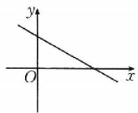  
A

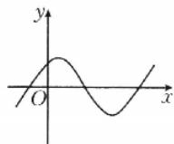  
B

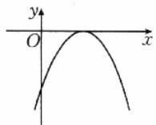  
C

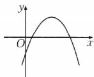  
D

2. 函数 $f(x) = x^3 - \left(\frac{1}{2}\right)^{x - 2}$ 的零点所在的区间为( ).

A. $(0,1)$

B. $(1,2)$

C. $(2,3)$

D. $(3,4)$

3. 已知函数 $f(x) = x - \mathrm{e}^{-x}$ 的部分函数值如表所示，那么函数 $f(x)$ 的零点的一个近似值为（ ）。（精确度为0.1）

<table><tr><td>x</td><td>1</td><td>0.5</td><td>0.75</td><td>0.625</td><td>0.5625</td></tr><tr><td>f(x)</td><td>0.6321</td><td>-0.1065</td><td>0.2776</td><td>0.0897</td><td>-0.007</td></tr></table>

A. 0.55

B. 0.57

C. 0.65

D. 0.7

4. 数学 文化题 我国南北朝数学家何承天发明的“调日法”是程序化寻求精确分数来表示数值的算法, 其理论依据是: 设实数 $x$ 的不足近似值和过剩近似值分别为 $\frac{b}{a}$ 和 $\frac{d}{c} (a, b, c, d \in \mathbf{N}^*)$ , 则 $\frac{b + d}{a + c}$ 是 $x$ 的更为精确的不足近似值或过剩近似值. 我们知道 $\sqrt{5} = 2.236067 \cdots$ , 令 $\frac{11}{5} < \sqrt{5} < \frac{12}{5}$ , 则第一次用“调日法”后得 $\frac{23}{10}$ 是 $\sqrt{5}$ 的更为精确的过剩近似值, 即 $\frac{11}{5} < \sqrt{5} < \frac{23}{10}$ , 若每次都取最简分数, 则用“调日法”得到 $\sqrt{5}$ 的近似分数与实际值误差小于 0.01 的次数为 ( ). ( $\sqrt{5} \approx 2.236$ )

A. 五

B. 四

C. 三

D. 二

# 二、多项选择题(每小题6分,共12分)

5.下列函数在区间 $(-1,3)$ 内存在唯一零点的是().

A. $f(x)=x^{2}-2x-8$

B. $f(x) = (x + 1)^{\frac{3}{2}} - 2$

C. $f(x)=2^{x-1}-1$

D. $f(x)=1-\ln(x+2)$

6. 函数 $f(x) = \begin{cases} 4 - x^2, & x \leqslant 2, \\ \log_3(x - 1), & x > 2, \end{cases}$ $g(x) = kx - 3k$ ，若函数 $f(x)$ 与 $g(x)$ 的图象有三个交点，则实数 $k$ 的取值可以是（ ）.

A.-2

B. $-\sqrt{2}$

C.-1

D. 1

# 三、填空题(每小题5分,共15分)

7. (2025·江西赣州高三模拟)用二分法求方程 $x^{3} + x - 5 = 0$ 的近似解时, 已经将根锁定在区间(1,3)内, 则下一步可断定该根所在的区间为 \_\_\_\_.

8. 结论 开放题 若函数 $f(x)=x^{3}+ax^{2}+bx+c$ 是奇函数，且有三个不同的零点，写出一个符合条件的函数： $f(x)=$ \_\_\_\_.

9. 函数 $f(x)=|x^{2}-2x|-|\log_{2}x|$ 的零点的个数为 \_\_\_\_.

# 四、解答题(每小题10分,共20分)

10. 函数 $f(x)=x^{2}+bx+c$ 的两个零点为 2,3.

(1) 求 b, c 的值;

(2) 若函数 $g(x)=f(x)+mx$ 的两个零点分别在区间 $(1,2)$ ， $(2,4)$ 内，求实数 m 的取值范围.

11. 已知函数 $f(x) = 3 - 2\log_2 x, g(x) = \log_2 x$ .

(1) 求函数 $y = f(x^{2})f(\sqrt{x}) + 2g(x)$ 在 $[1, 4]$ 上的零点；  
(2)若函数 $h(x) = [f(x) + 1]g(x) - k$ 在 $[1,4]$ 上有零点，求实数 $k$ 的取值范围.

14.(10分)已知 $f(x)$ 是定义在 $\mathbf{R}$ 上的奇函数，当 $x\geqslant 0$

时， $f(x) = \left\{ \begin{array}{ll}\frac{2}{x + 1} -2,x\in [0,1),\\ 1 - |x - 3|,x\in [1, + \infty), \end{array} \right.$ 求函数

$F(x)=f(x)-\frac{1}{\pi}$ 的所有零点之和.

# 综合 提升练

12.（6分）（多选题）已知函数 $f(x) = \left\{ \begin{array}{l} - x^2 - 2x, x \leqslant 0, \\ |\log_2x|, x > 0, \end{array} \right.$ 若 $x_1 < x_2 < x_3 < x_4$ ，且 $f(x_1) = f(x_2) = f(x_3) = f(x_4)$ ，则下列结论正确的是（ ）.

A. $x_{1} + x_{2} = -1$

B. $x_{3}x_{4} = 1$

C. $1 < x_{4} < 2$

D. $0 <   x_{1}x_{2}x_{3}x_{4} <   1$

13.(5分)已知函数 $f(x)=\left\{\begin{aligned}x-5,x&\geqslant\lambda,\\ x^{2}-6x+8,x&<\lambda,\end{aligned}\right.$ 若函数 $f(x)$ 恰有2个零点，则实数 $\lambda$ 的取值范围是\_\_\_\_.

<table><tr><td>题号</td><td>1</td><td>2</td><td>3</td><td>4</td><td>5</td><td>6</td><td>12</td></tr><tr><td>答案</td><td></td><td></td><td></td><td></td><td></td><td></td><td></td></tr></table>

# 强化作业05 函数与方程的综合应用

对应答案分册第137页

# 一、单项选择题(每小题5分,共30分)

1. 若关于 $x$ 的方程 $-x^{2} + ax + 4 = 0$ 的一个实根小于-1，另一个实根大于2，则实数 $a$ 的取值范围是（ ）.

A. $(0,3)$

B. $[0,3]$

C. $(-3,0)$

D. $(-\infty, 1) \cup (3, +\infty)$

2. 若关于 $x$ 的方程 $9^{x} + (a + 4) \cdot 3^{x} + 4 = 0$ 有实数解，则实数 $a$ 的取值范围是（ ）.

A. $[0,+\infty)$

B. $(-∞,-8]$

C. $(-∞,-8]∪[0,+∞)$

D. $(-∞,-8)∪(0,+∞)$

3. 若函数 $f(x)=(\ln x)^{2}-\ln x^{t}$ 在 $(0,8)$ 内有 2 个零点，则实数 t 的取值范围为（）.

A. $(-∞,2ln2)$

B. $(-∞,0)∪(0,2ln2)$

C. $(-∞,3ln2)$

D. $(-∞,0)∪(0,3ln2)$

4. 设 $m$ 是不为 0 的实数, 已知函数 $f(x) = \left\{ \begin{array}{l} |3^x - 1|, x \leqslant 2, \\ x^2 - 10x + 24, x > 2, \end{array} \right.$ 若函数 $F(x) = 2[f(x)]^2 - mf(x)$ 有 7 个零点, 则实数 $m$ 的取值范围是 ( ).

A. $(-2,0)\cup(0,16)$

B. $(0,16)$

C. $(0,2)$

D. $(0,2]$

5. 已知函数 $f(x) = \begin{cases} x^2 + x, & x \leqslant 0, \\ \log_2(x + 1), & x > 0, \end{cases}$ 则函数 $y = f(f(x)) - 2$ 的零点个数为（ ）.

A.1

B. 2

C. 3

D. 4

6. 若存在实数 a 使得函数 $f(x)=2^{x}+2^{-x}-ma^{2}+a-3$ 有唯一零点，则实数 m 的取值范围是().

A. $\left(-\infty,\frac{1}{4}\right]$

B. $(-∞,0]$

C. $\left[0,\frac{1}{4}\right]$

D. $\left(0,\frac{1}{4}\right)$

# 二、多项选择题(每小题6分,共24分)

7. 关于 x 的方程 $(x^{2}-2x)^{2}-2(2x-x^{2})+k=0$ ，下列说法正确的是（）.

A. 存在实数 $k$ ，使得方程无实根

B. 存在实数 $k$ ，使得方程恰有 2 个不同的实根

C. 存在实数 k，使得方程恰有 3 个不同的实根

D. 存在实数 k，使得方程恰有 4 个不同的实根

8.(2025·浙江湖州高三模拟)若 $f(x)$ 和 $g(x)$ 都是定义在 R 上的函数,且方程 $f(g(x))=x$ 有实数解,则下列式子中,可以为 $g(f(x))$ 的是().

A. $x^{2} + 2x$

B. $x + 1$

C. $e^{\cos x}$

D. $\ln(|x|+1)$

9. 已知函数 $f(x) = \begin{cases} |\log_2 x|, & 0 < x \leqslant 2, \\ x^2 - 6x + 9, & x > 2, \end{cases}$ 若方程 $f(x) = k$ 有四个不同的实根 $x_1, x_2, x_3, x_4$ 且 $x_1 < x_2 < x_3 < x_4$ ，则下列结论正确的是（ ）.

A. 0<k<1

B. $2x_{1} + x_{2}\geqslant 2\sqrt{2}$

C. $x_{1}x_{2} + x_{3} + x_{4} = 6$

D. $3 < x_{1} + 2x_{2} < \frac{9}{2}$

10. 已知函数 $f(x) = \begin{cases} (x - 1)^2 - 4, & x \leqslant m, \\ \ln (x - 1), & x > m \text{ 且 } x > 1, \end{cases}$ 下列说法正确的是（ ）.

A. 若 $m < -1$ ，则 $f(x)$ 只有一个零点

B. 若 $m > -1$ ，则 $f(x)$ 有两个零点

C. 若 m=2，则方程 $2[f(x)]^{2}+5f(x)=0$ 有两个实根

D. 若 m=1，则方程 $[f(x)]^{2}+8f(x)-m=0$ 有两个实根

# 三、填空题(每小题5分,共15分)

11. 若存在正实数 $x$ ，使得 $ax^2 + (a^2 - 1)x + a = 0$ 成立，则实数 $a$ 的取值范围是 \_\_\_\_.

12. 数学 新定义 对于函数 $y=f(x)$ ，若存在非零常数 $x_{0}$ ，使 $f(x_{0})+f(-x_{0})=0$ ，则称点 $(x_{0},f(x_{0}))$ 是曲线 $f(x)$ 的“优美点”。已知 $f(x)=\left\{\begin{aligned}-x^{2}-2x,x&\leqslant0,\\x-\frac{1}{x},&x>0,\end{aligned}\right.$ 则曲线 $f(x)$ 的“优美点”个数为 \_\_\_\_。

13. 设 $a \in \mathbb{R}$ , 函数 $f(x) = \begin{cases} |x - 1|, & x \geqslant 0, \\ -x^2 + ax, & x < 0, \end{cases}$ 当 $a = 1$ 时, 函数 $y = f(f(x))$ 有 \_\_\_\_ 个零点; 若函数 $y = f(f(x))$ 恰有 3 个零点, 则实数 $a$ 的取值范围为 \_\_\_\_.

<table><tr><td>题号</td><td>1</td><td>2</td><td>3</td><td>4</td><td>5</td><td>6</td><td>7</td><td>8</td><td>9</td><td>10</td></tr><tr><td>答案</td><td></td><td></td><td></td><td></td><td></td><td></td><td></td><td></td><td></td><td></td></tr></table>

# 基础巩固练]

# 一、单项选择题(每小题5分,共20分)

1. 在某种新型材料的研制中, 实验人员获得了下列一组实验数据, 现准备用下列四个函数中的一个近似表示这些数据的规律, 其中最接近的一个是().

<table><tr><td>x</td><td>1.992</td><td>3</td><td>4</td><td>5.15</td><td>6.126</td></tr><tr><td>y</td><td>1.517</td><td>4.0418</td><td>7.5</td><td>12</td><td>18.01</td></tr></table>

A. $y = 2x - 2$

B. $y = \frac{1}{2} (x^2 - 1)$

C. $y=\log_{2}x$

D. $y=\log_{\frac{1}{2}}x$

2.(2025·四川广安高三模拟)在2 h内将某种药物注射进患者的血液中,在注射期间,血液中的药物含量呈线性增加;停止注射后,血液中的药物含量呈指数衰减.下列图象能反映血液中药物含量Q随时间t变化的是().

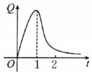  
A

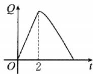  
B

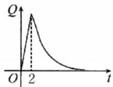  
C

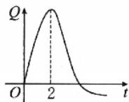  
D

3. 心理学家经常用函数 $L(t) = A(1 - \mathrm{e}^{-kt})$ 测定时间 $t$ （单位：min）内的记忆量 $L$ ，其中 $A$ 表示需要记忆的量， $k$ 表示记忆率。已知一个学生在 $5\mathrm{min}$ 内需要记忆200个单词，而他的记忆量为20个单词，则该学生的记忆率 $k$ 约为（ ）。（ln $0.9 \approx -0.105$ ，ln $0.1 \approx -2.303$ ）

A. 0.021

B. 0.221

C. 0.461

D. 0.661

4. 火箭在发射时会产生巨大的噪声，已知声音的声强级 $d(x)$ （单位：dB）与声强 $x$ （单位： $\mathrm{W / m^2}$ ）满足 $d(x) = 10\lg \frac{x}{10^{-12}}$ 。若人交谈时的声强级约为 $50~\mathrm{dB}$ ，且火箭发射时的声强与人交谈时的声强的比值约为 $10^{9}$ ，则火箭发射时的声强级约为（ ）。

A. 130 dB

B. $140 \mathrm{~dB}$

C. 150 dB

D. 160 dB

# 二、多项选择题(每小题6分,共12分)

5. 甲同学家到乙同学家的途中有一个公园, 甲同学家到公园的距离与乙同学家到公园的距离都是 $2 \mathrm{~km}$ . 该图表示甲同学从家出发到乙同学家经过的路程 $y$ (单位: $\mathrm{km}$ ) 与时间 $x$ (单位: $\min$ ) 的关系, 下列结论正确的是 ( ).

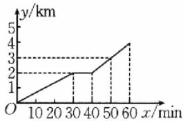

line

| x/min | y/km |
|---|---|
| 10 | 0 |
| 30 | 2 |
| 40 | 2 |
| 50 | 3 |
| 60 | 4 |

A. 甲同学从家出发到乙同学家走了 $60 \mathrm{~min}$   
B. 甲同学从家到公园走了 $30 \mathrm{~min}$   
C. 甲同学从家到公园的速度比从公园到乙同学家的速度快  
D. 当 $0 \leqslant x \leqslant 30$ 时, $y$ 与 $x$ 的关系式为 $y = \frac{1}{15} x$

6. 已知一容器中有 A, B 两种菌，且在任何时刻 A, B 两种菌的个数乘积均为定值 $10^{10}$ . 科学家用 $P_{A} = \lg n_{A}$ 来记录 A 种菌个数的资料，其中 $n_{A}$ 为 A 种菌的个数. 现有以下几种说法，其中正确的是（）.

A. $P_{\mathrm{A}} \geqslant 1$   
B. $P_{\mathrm{A}} \leqslant 10$   
C. 若今天的 $P_{A}$ 值比昨天的 $P_{A}$ 值增加 1，则今天的 A 种菌个数比昨天的 A 种菌个数多 10  
D. 假设科学家将 B 种菌的个数控制为 5 万，则此时 $5 < P_{A} < 5.5$ (注： $\lg 2 \approx 0.3$ )

# 三、填空题(每小题5分,共10分)

7. 某商场为了实现 100 万元的利润目标, 准备制订一个激励销售人员的奖励方案: 在利润达到 5 万元后, 奖金 y (单位: 万元) 随利润 x (单位: 万元) 的增加而增加, 但奖金总数不超过 3 万元, 同时奖金不超过利润的 20%. 现有三个奖励模型: ① y = 0.2x, ② $y = \log_{5}x$ , ③ $y = 1.02^{x}$ , 则符合该商场要求的模型为 \_\_\_\_. (填序号)  
8. 已知某品牌商品的广告效应满足关系式: $D = a\sqrt{A} - A$ (其中 $A$ 为广告费, $a$ 为常数). 商人为了取得最大的广告效应, 投入的广告费应为 \_\_\_\_. (用常数 $a$ 表示)

# 四、解答题(每小题10分,共20分)

9. 某企业决定对污水进行净化再利用，以降低自来水的使用量。经测算，该企业拟安装一种使用寿命为4年的污水净化设备。这种净水设备的购置费（单位：万元）与设备的占地面积 $x$ （单位：平方米）成正比，比例系数为0.2。预计安装后该企业每年需缴纳的水费 $C$ （单位：万元）与设备占地面积 $x$ 之间的函数关系为 $C(x) = \frac{20}{x + 5} (x > 0)$ 。该企业的净水设备购置费与安装后4年需缴水费之和为 $y$ （单位：万元）。

(1)要使 y 不超过 7.2 万元, 求设备占地面积 x 的取值范围;  
(2)当设备占地面积 x 为多少时, y 的值最小?

10. 在一节 40 分钟的网课中, 学生的注意力指数 $y$ 与听课时间 $x$ (单位: 分钟) 之间的变化曲线如图所示. 当 $x \in [0, 16]$ 时, 曲线是二次函数图象的一部分; 当 $x \in [16, 40]$ 时, 曲线是函数 $y = \log_{0.8}(x + a) + 80$ 图象的一部分. 当学生的注意力指数不高于 68 时, 称学生处于“欠佳听课状态”.

(1) 求函数 $y = f(x)$ 的解析式；

(2)在一节40分钟的网课中,学生处于“欠佳听课状态”的时间有多长?(参考数据: $0.8^{12}\approx14.6$ ,精确到1分钟)

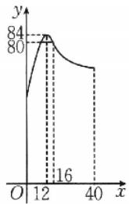

line

| x | y |
|---|---|
| 12 | 84 |
| 40 | 80 |

# 综合 提升练

11.(5分)某地规定氨氮含量允许排放的最高浓度为15 mg/L.某企业的生产废水中的氨氮含量为450 mg/L,现通过循环过滤设备对生产废水中的氨氮进行过滤,每循环一次可使氨氮含量减少 $\frac{1}{3}$ ,要使废水中的氨氮含量达到排放标准,至少要循环的次数为().(参考数据: $\lg2\approx0.3010,\lg3\approx0.4771$ )

A. 3

B. 4

C. 8

D. 9

12.(5分)“百日冲刺”是各个学校针对高三学生进行的高考前的激情教育,它能在短时间内最大限度地激发一个人的潜能,使成绩在原来的基础上有不同程度的提高,以便在高考中取得令人满意的成绩,特别对于成绩在中等偏下的学生来讲,其增加分数的空间尤其大.现有某班主任老师根据历年成绩在中等偏下的学生经历“百日冲刺”之后的成绩变化,构造了一个经过时间 $t(30\leqslant t\leqslant100)$ (单位:天),增加总分数 $f(t)$ (单位:分)的函数模型: $f(t)=\frac{kP}{1+\lg(t+1)}$ ,k为增分转化系数,P为“百日冲刺”前的最后一次模考总分,且 $f(60)=\frac{1}{6}P$ .现有某学生在高考前100天的最后一次模考总分为400分,依据此模型估计此学生在高考中可能取得的总分为\_\_\_\_.(保留到个位, $\lg61\approx1.79$ )

<table><tr><td>题号</td><td>1</td><td>2</td><td>3</td><td>4</td><td>5</td><td>6</td><td>11</td></tr><tr><td>答案</td><td></td><td></td><td></td><td></td><td></td><td></td><td></td></tr></table>

# 课时作业 15 导数的概念及其意义、导数的运算

对应答案分册第139页

# 基础巩固练]

# 一、单项选择题(每小题5分,共20分)

1. 下列导数运算正确的是( ).

A. $(\cos 3)' = -\sin 3$

B. $(e^{3x})' = e^{3x}$

C. $\left(\frac{1}{x}\right)^{\prime}=\frac{1}{x^{2}}$

D. $(\log_2x)' = \frac{1}{x\ln 2}$

2. 已知函数 $f(x) = \sin x + 2x$ ，则

$$
\lim _ {\Delta x \to 0} \frac {f (\pi + \Delta x) - f (\pi)}{2 \Delta x} = (\quad).
$$

A.-1

B. $\frac{1}{2}$

C. 2

D. 4

3. 函数 $y = f(x)$ 的图象如图所示， $f'(x)$ 是函数 $f(x)$ 的导函数，则下列大小关系正确的是()。

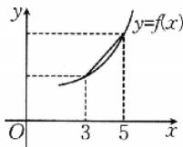

A. $2f^{\prime}(3) <   f(5) - f(3)<$ $2f^{\prime}(5)$   
B. $2f'(3) < 2f'(5) < f(5) - f(3)$   
C. $f(5)-f(3)<2f'(3)<2f'(5)$   
D. $2f^{\prime}(5) <   2f^{\prime}(3) <   f(5) - f(3)$

4. 已知函数 $f(x) = \sqrt{x} - \frac{1}{x}$ ，则曲线 $y = f(x)$ 在点(1, $f(1)$ )处的切线方程为（ ）.

A. $3x + 2y - 3 = 0$   
B. 3x-2y-3=0   
C. 2x-3y-2=0   
D. $2x - 3y + 2 = 0$

# 二、多项选择题(每小题6分,共12分)

5. 在下列四条曲线中, 与直线 y=2x 相切的是().

A. $y = 2\mathrm{e}^{x} - 2$   
B. $y=2\sin x$   
C. $y = 3x + \frac{1}{x}$   
D. $y = x^{3} - x - 2$

6. 数学新定义给出定义: 若函数 $f(x)$ 在 D 上可导, 即 $f'(x)$ 存在, 且导函数 $f'(x)$ 在 D 上也可导, 则称 $f(x)$ 在 D 上存在二阶导函数, 记 $f''(x) = [f'(x)]'$ . 若 $f''(x) < 0$ 在 D 上恒成立, 则称 $f(x)$ 在 D 上为凸函数. 以下四个函数在 $\left(0, \frac{\pi}{2}\right)$ 上是凸函数的是().

A. $f(x)=\sin x+\cos x$   
B. $f(x)=\ln x-2x$   
C. $f(x) = -x^{3} + 2x - 1$   
D. $f(x) = -x\mathrm{e}^{-x}$

# 三、填空题(每小题5分,共15分)

7. 已知函数 $f(x)=f'(2)\cdot x^{2}-3x$ , $f(x)$ 的导函数为 $f'(x)$ ，则 $f'(2)=$ \_\_\_\_.  
8. 设曲线 $y=e^{2ax}$ 在点 $(0,1)$ 处的切线与直线 $2x-y+3=0$ 垂直，则 a= \_\_\_\_.  
9. 结论 开放题。请写出与曲线 $y = \sin x$ 在原点 $(0, 0)$ 处具有相同切线的另一条曲线的方程：\_\_\_\_。

# 四、解答题(每小题10分,共20分)

10. 已知函数 $f(x) = x^3 - x^2 + x + 2$ .

(1)求曲线 $f(x)$ 在点 $(1, f(1))$ 处的切线方程；  
(2)求经过点(1,3)的曲线 $f(x)$ 的切线方程.

11. 已知函数 $f(x) = x - 1 + \frac{a}{\mathrm{e}^x} (a \in \mathbf{R}, \mathrm{e}$ 为自然对数的底数).

(1)若曲线 $y=f(x)$ 在点 $(1,f(1))$ 处的切线平行于 x 轴，求 a 的值；  
(2)若当 $a = 1$ 时，直线 $l:y = kx - 1$ 与曲线 $y = f(x)$ 相切，求直线 $l$ 的方程.

# 综合 提升练

12.(6分)(多选题)若 $m,n\in\mathbb{R}$ ，且直线 $y=3x+m$ 是曲线 $y=x^{3}(x>0)$ 与曲线 $y=-x^{2}+nx-6(x>0)$ 的公切线，则().

A. $m = -2$

B. $m = -1$

C. n=6

D. n=7

13.(5分)已知存在a>0,使得曲线 $f(x)=a\ln x$ 与曲线 $g(x)=x^{2}-3x-b$ 存在相同的切线,且切线的斜率为1,则b的最大值为\_\_\_\_.

14.(10分)已知函数 $f(x)=\mathrm{c}^{x}$ (e为自然对数的底数)，函数 $g(x)=\ln x+2$ ，直线l是 $f(x)$ 与 $g(x)$ 的图象的公切线，求直线l的方程.

<table><tr><td>题号</td><td>1</td><td>2</td><td>3</td><td>4</td><td>5</td><td>6</td><td>12</td></tr><tr><td>答案</td><td></td><td></td><td></td><td></td><td></td><td></td><td></td></tr></table>

# 基础巩固练

# 一、单项选择题(每小题5分,共20分)

1. 已知 $f'(x)$ 是函数 $y = f(x)$ 的导函数，且 $y = f'(x)$ 的图象如图所示，则函数 $y = f(x)$ 的图象可能是（）.

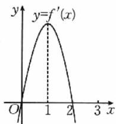

text_image

y=f'(x)
O
1
2
3
x

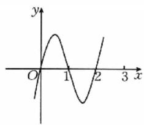

line

| x | y |
|---|---|
| 0 | -1 |
| 0.5 | 0.5 |
| 1 | 1 |
| 1.5 | -1 |
| 2 | 0 |
| 2.5 | 1 |

A

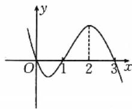

line

| x | y |
|---|---|
| 0 | -1 |
| 1 | 0 |
| 2 | 1 |
| 3 | -1 |

B

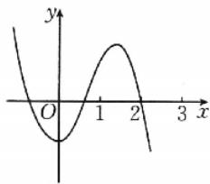

line

| x | y |
|---|---|
| 0 | -2 |
| 1 | 0 |
| 2 | 2 |
| 3 | -2 |

C

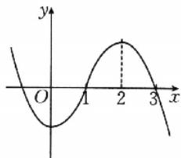

line

| x | y |
|---|---|
| 0 | -2 |
| 1 | -1 |
| 2 | 1 |
| 3 | -1 |

D

2. 下列函数在 $(0, +\infty)$ 上单调递增的是（ ）.

A. $y=\sin x$

B. $y = x e^{x}$

C. $y = x^{3} - x$

D. $y=\ln x-x$

3. 已知 $a \in \mathbb{R}$ , 则“ $a \leqslant 2$ ”是“ $f(x) = \ln x + x^2 - ax$ 在 $(0, +\infty)$ 上单调递增”的（ ）.

A. 充分不必要条件  
B. 必要不充分条件  
C. 充要条件  
D. 既不充分也不必要条件

4. 已知函数 $f(x) = \ln x - \frac{1}{3} ax^2 - 2x$ 存在单调递减区间，则实数 $a$ 的取值范围是（ ）.

A. $(-∞,-\frac{3}{2})$

B. $\left(-\frac{3}{2},+\infty\right)$

C. $\left[-\frac{3}{2},+\infty\right)$

D. $(1, +\infty)$

# 二、多项选择题(每小题6分,共12分)

5. 数学 新定义 若函数 $y = \frac{f(x)}{\ln x}$ 在 $(1, +\infty)$ 上单调递减，则称 $f(x)$ 为 $P$ 函数。下列函数为 $P$ 函数的

是( ).

A. $f(x)=1$

B. $f(x)=x$

C. $f(x)=\frac{1}{x}$

D. $f(x) = \sqrt{x}$

6. 若函数 $f(x)=ax^{3}+3x^{2}-x+1$ 恰好有三个单调区间，则实数 a 的取值可以是（）.

A.-3

B.-1

C. 0

D. 2

# 三、填空题(每小题5分,共15分)

7. 函数 $y=3x^{2}-6\ln x$ 的单调递增区间为 \_\_\_\_，单调递减区间为 \_\_\_\_。  
8. 已知函数 $y = f(x) (x \in \mathbb{R})$ 的图象如图所示，则不等式 $xf'(x) \geqslant 0$ 的解集为 \_\_\_\_.

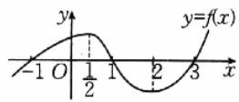

9. 已知函数 $g(x) = 2x + \ln x - \frac{a}{x}$ 在区间[1,2]上不单调，则实数 $a$ 的取值范围是 \_\_\_\_.

# 四、解答题(每小题10分,共20分)

10. 已知函数 $f(x) = a\mathrm{e}^{x} - x, a \in \mathbb{R}$ .

(1) 当 a=1 时, 求曲线 $y=f(x)$ 在点 $(1,f(1))$ 处的切线方程;  
(2)试讨论函数 $f(x)$ 的单调性.

11. 已知函数 $f(x)=\ln x+ax^{2}-(a+2)x+2(a>0)$ ，讨论函数 $f(x)$ 的单调性.

14.(10分)已知函数 $f(x)=x^{2}+a\ln x$ .

(1) 当 $a = -2$ 时, 求函数 $f(x)$ 的单调递减区间;  
(2) 若函数 $g(x) = f(x) + \frac{2}{x}$ 在 $[1, +\infty)$ 上单调，求实数 $a$ 的取值范围.

# 综合 提升练

12.(6分)(多选题)下列不等式成立的是().

A. $2\ln\frac{3}{2}<\frac{3}{2}\ln2$

B. $\sqrt{2} \ln \sqrt{3} < \sqrt{3} \ln \sqrt{2}$

C. $5 \ln 4 < 4 \ln 5$

D. $\pi >\mathrm{eln}\pi$

13.(5分)结论开放题。(2025·云南大理高三模拟)已知奇函数 $f(x)$ 的定义域为R,且 $\frac{f'(x)}{x^2-1}>0$ ,则 $f(x)$ 的单调递减区间为\_\_\_\_,满足以上条件的一个函数是\_\_\_\_.

<table><tr><td>题号</td><td>1</td><td>2</td><td>3</td><td>4</td><td>5</td><td>6</td><td>12</td></tr><tr><td>答案</td><td></td><td></td><td></td><td></td><td></td><td></td><td></td></tr></table>

# 课时作业17 导数与函数的极值、最值

对应答案分册第142页

# 基础巩固练

# 一、单项选择题(每小题5分,共20分)

1. 已知函数 $f(x) = x^3 - 3x^2 - 9x \, (-2 < x < 2)$ ，则（ ）.

A. $f(x)$ 的极大值为 5，无极小值  
B. $f(x)$ 的极小值为 -27，无极大值  
C. $f(x)$ 的极大值为 5, 极小值为 -27  
D. $f(x)$ 的极大值为 5，极小值为 -11

2. 已知函数 $f(x)$ 的导函数 $f'(x)$ 的图象如图所示, 则( ).

A. $f(x)$ 有 2 个极值点  
B. $f(x)$ 在 x=1 处取得极小值  
C. $f(x)$ 有极大值, 没有极小值  
D. $f(x)$ 在 $(-∞,1)$ 上单调递减

3.(2025·重庆高三模拟)已知函数 $f(x)=-xe^{x}$ ，则 $f(x)$ 的极大值是().

A. $\frac{1}{e}$

B. $-\frac{1}{e}$

C. -e

D. e

4.(2025·河北邢台高三模拟)函数 $f(x)=x\ln x-x$ 在 $\left[\frac{1}{2},4\right]$ 上的最小值为().

A. $-\frac{1+\ln2}{2}$

B.-1

C. 0

D. $2 \ln 2 - 2$

# 二、多项选择题(每小题6分,共12分)

5. 在下列函数中, 存在极值点的是().

A. $y = x - \frac{1}{x}$   
B. $y=2^{|x|}$   
C. $y = -2x^{3} - x$   
D. $y = x \ln x$

6. 已知函数 $f(x) = \frac{1}{3} x^3 - 4x + 4 (0 \leqslant x \leqslant 3)$ ，则（ ）.

A. 函数 $f(x)$ 的图象在点 $(1, f(1))$ 处的切线方程为

$$
y = - 3 x + \frac {1 0}{3}
$$

B. 函数 $f(x)$ 在区间 $[0,3]$ 上的最大值为 1  
C. 函数 $f(x)$ 在区间[0,2]上单调递减  
D. 方程 $f(x) = -\frac{4}{3}$ 在区间[0,3]上有两个解

# 三、填空题(每小题5分,共15分)

7. 结论 开放题 写出一个存在极值的奇函数：\_\_\_\_。  
8. 已知函数 $f(x)=x\ln x+me^{x}$ (e 为自然对数的底数) 有两个极值点，则实数 m 的取值范围是 \_\_\_\_.  
9. 现实 情境题 某商场销售某种商品, 经验表明, 该商品每日的销售量 $y$ (单位: 千克) 与销售价格 $x$ (单位: 元/千克) 满足关系式 $y = \frac{2}{x - 3} + 10(x - 6)^2$ , $x \in (3,$

6). 若该商品的成本为 3 元/千克, 则当销售价格为 \_\_\_\_ 元/千克时, 商场每日销售该商品所获得的利润最大.

# 四、解答题(每小题10分,共20分)

10.(2024·九省适应性考试)已知函数 $f(x)=\ln x+x^{2}+ax+2$ 的图象在点(2, $f(2)$ )处的切线与直线 $2x+3y=0$ 垂直.

(1)求实数 a 的值；  
(2) 求函数 $f(x)$ 的单调区间和极值.

11. 教材 溯源题 已知函数 $f(x)=(x-a)\mathrm{e}^{x}$ .

(1) 当 $a = 2$ 时, 求曲线 $y = f(x)$ 在 $x = 0$ 处的切线方程;  
(2) 求函数 $f(x)$ 在区间 $[1, 2]$ 上的最小值.

14.(10分)已知函数 $f(x)=\ln x-ax,x\in(0,e]$ ，其中e为自然对数的底数.

(1) 若 $x = 1$ 为 $f(x)$ 的极值点, 求 $f(x)$ 的单调区间和最大值.  
(2)是否存在实数 $a$ ，使得 $f(x)$ 的最大值是-3？若存在，求出 $a$ 的值；若不存在，请说明理由.

# 综合 提升练

12.(6分)(多选题)数学新定义.定义:设 $f'(x)$ 是 $f(x)$ 的导函数, $f''(x)$ 是函数 $f'(x)$ 的导函数.若方程 $f''(x)=0$ 有实数解 $x_{0}$ ,则称点 $(x_{0},f(x_{0}))$ 为函数 $y=f(x)$ 的“拐点”.经过探究发现:任何一个三次函数都有“拐点”,且“拐点”就是三次函数图象的对称中心.已知函数 $f(x)=ax^{3}+bx^{2}+4(ab\neq0)$ 图象的对称中心为(1,2),则下列说法正确的是().

A. $a = 1, b = -3$

B. 函数 $f(x)$ 有三个零点

C. $f\left(\frac{1}{2026}\right)+f\left(\frac{2}{2026}\right)+f\left(\frac{3}{2026}\right)+\cdots+$

$$
\begin{array}{l} f \left(\frac {2 0 2 5}{2 0 2 6}\right) + f (1) + f \left(\frac {2 0 2 7}{2 0 2 6}\right) + \dots + f \left(\frac {4 0 5 1}{2 0 2 6}\right) = \\ 2 \times 4 0 5 1 \end{array}
$$

D. 若过点 $(2, m)$ 可以作三条直线与 $y = f(x)$ 的图象相切，则实数 $m$ 的取值范围为 $(-1, 0)$

13.(5分)(2025·江苏苏州高三模拟)若函数 $f(x)=-\frac{1}{3}x^{3}+x$ 在 $(a,10-a^{2})$ 上有最大值，则实数a的取值范围是\_\_\_\_.

<table><tr><td>题号</td><td>1</td><td>2</td><td>3</td><td>4</td><td>5</td><td>6</td><td>12</td></tr><tr><td>答案</td><td></td><td></td><td></td><td></td><td></td><td></td><td></td></tr></table>

# 强化作业06 函数中的构造问题

对应答案分册第144页

# 一、单项选择题(每小题5分,共30分)

1. 若实数 $a, b, c$ 满足 $a - 4 = \ln \frac{a}{4} < 0, b - 3 = \ln \frac{b}{3} < 0, c - 2 = \ln \frac{c}{2} < 0$ ，则 $a, b, c$ 的大小关系为（ ）.

A. $a > b > c$

B. $a > c > b$

C. b>c>a

D. c > b > a

2. 已知 $m > 0, n \in \mathbb{R}$ , 若 $\log_2 m + 2m = 6, 2^{n+1} + n = 6$ , 则 $\frac{m}{2^n} = (\quad)$ .

A. $\frac{1}{2}$

B. 1

C. $\sqrt{2}$

D. 2

3. 已知定义在 $\mathbf{R}$ 上的可导函数 $f(x)$ 满足 $f'(x) < 2$ ，若 $f(m) - f(1 - 2m) \geqslant 6m - 2$ ，则实数 $m$ 的取值范围是（ ）.

A. $(- \infty, -1]$

B. $\left(-\infty,\frac{1}{3}\right]$

C. $[-1, +\infty)$

D. $\left[\frac{1}{3},+\infty\right)$

4. 已知定义在 $\mathbf{R}$ 上的函数 $f(x)$ 满足 $f(x) - f'(x) > 0$ ，且有 $f(2) = 2$ ，则 $f(x) > 2\mathrm{e}^{x - 2}$ 的解集为（ ）.

A. $(-∞,1)$

B. $(-∞,2)$

C. $(1, +\infty)$

D. $(2,+\infty)$

5. 已知定义在 $\mathbf{R}$ 上的函数 $f(x)$ 的导函数为 $f'(x)$ ，且 $f(x) < f'(x) < 0$ ，则（ ）.

A. $\mathrm{e}f(2)>f(1)$ , $f(2)>\mathrm{e}f(1)$

B. $\mathrm{ef}(2) > f(1), f(2) < \mathrm{ef}(1)$

C. $\operatorname{ef}(2) < f(1), f(2) > \operatorname{ef}(1)$

D. $\mathrm{ef}(2) < f(1), f(2) < \mathrm{ef}(1)$

6. 已知偶函数 $f(x)$ 的定义域为 $\mathbf{R}$ ，导函数为 $f'(x)$ ，若对任意 $x \in [0, +\infty), 2f(x) + xf'(x) > 0$ 恒成立，则下列结论正确的是（ ）.

A. $f(0) <   0$

B. $9f(-3) < f(1)$

C. $4f(2) > f(-1)$

D. $f(1) <   f(2)$

# 二、多项选择题(每小题6分,共12分)

7. 若定义在 $[0, +\infty)$ 上的函数 $f(x)$ 的导函数为 $f'(x)$ ，且 $f(x) + xf'(x) < 0$ 恒成立，则必有（ ）.

A. $3f(3) < 2f(2)$

B. $3f(3)>2f(2)$

C. $3f(3) > 5f(5)$

D. $3f(3)<5f(5)$

8. 已知定义在 $\left(0, \frac{\pi}{2}\right)$ 上的函数 $f(x), f'(x)$ 是 $f(x)$ 的导函数，且 $f'(x) \cos x + f(x) \sin x < 0$ 恒成立，则（ ）.

A. $f\left(\frac{\pi}{6}\right) > \sqrt{2} f\left(\frac{\pi}{4}\right)$

B. $\sqrt{3} f\left(\frac{\pi}{6}\right) > f\left(\frac{\pi}{3}\right)$

C. $f\left(\frac{\pi}{6}\right) > \sqrt{3} f\left(\frac{\pi}{3}\right)$

D. $\sqrt{2} f\left(\frac{\pi}{6}\right) > \sqrt{3} f\left(\frac{\pi}{4}\right)$

# 三、填空题(每小题5分,共15分)

9. 已知函数 $f(x)$ 是定义在 $\mathbf{R}$ 上的可导函数, 其导函数为 $f'(x)$ , 若 $f(1) = 4$ , 且 $f'(x) - 2x < 3$ 对任意的 $x \in \mathbb{R}$ 恒成立, 则不等式 $f(2x - 3) < 2x (2x - 3)$ 的解集为 \_\_\_\_.

10. 已知函数 $f(x)$ 的定义域为 $\left(0, \frac{\pi}{2}\right)$ , $f'(x)$ 是它的导函数, 恒有 $f(x) < f'(x) \tan x$ 成立, 且 $f\left(\frac{\pi}{6}\right) = \frac{1}{2}$ , 则关于 $x$ 的不等式 $f(x) > \sin x$ 的解集是 \_\_\_\_.

11. 若对于任意实数 $x > 0$ ，不等式 $2a\mathrm{e}^{2x} - \ln x + \ln a \geqslant 0$ 恒成立，则实数 $a$ 的取值范围是 \_\_\_\_.

# 四、解答题(共10分)

12. 已知函数 $f(x) = 1 + a\mathrm{e}^x\ln x$ . 若不等式 $f(x) \geqslant \mathrm{e}^x (x^a - x)(a < 0)$ 对 $x \in (1, +\infty)$ 恒成立求实数 $a$ 的取值范围.

<table><tr><td>题号</td><td>1</td><td>2</td><td>3</td><td>4</td><td>5</td><td>6</td><td>7</td><td>8</td></tr><tr><td>答案</td><td></td><td></td><td></td><td></td><td></td><td></td><td></td><td></td></tr></table>

# 课时作业 18 导数的综合应用

对应答案分册第146页

1.(10 分)(2025·四川广安高三模拟)已知函数 $f(x)=\ln x-2ax(a\in\mathbb{R})$ .

(1) 讨论函数 $f(x)$ 的单调性；  
(2) 若 $f(x) \leqslant 0$ 恒成立, 求实数 a 的取值范围.

2.(10 分)(2025·安徽合肥高三模拟)已知函数 $f(x)=a\ln x+x^{2}$ ，其中 $a\in R$ .

(1) 讨论函数 $f(x)$ 的单调性.  
(2) 当 $a = 1$ 时, 证明: $f(x) \leqslant x^2 + x - 1$ .  
(3)求证:对任意的 $n \in N^{*}$ 且 $n \geqslant 2$ ，都有 $\left(1 + \frac{1}{2^{2}}\right) \cdot \left(1 + \frac{1}{3^{2}}\right)\left(1 + \frac{1}{4^{2}}\right) \cdot \cdots \cdot \left(1 + \frac{1}{n^{2}}\right) < e$ (e 为自然对数的底数).

3.(10分)(2025·浙江杭州高三模拟)已知函数 $f(x)=(x-1)^{2}\mathrm{e}^{x}-ax$ ，且曲线 $y=f(x)$ 在点(0， $f(0)$ )处的切线方程为 $y=-2x+b$ .

(1)求实数 $a, b$ 的值；  
(2) 判断函数 $f(x)$ 的零点个数.

4.(10分)已知函数 $f(x)=\ln x+\frac{a}{x}-x+1-a(a\in\mathbf{R})$ .

(1) 求函数 $f(x)$ 的单调区间；  
(2)若存在 x>1，使 $f(x)+x<\frac{1-x}{x}$ 成立，求整数 a 的最小值.

# 课时作业 19 任意角、弧度制和三角函数的概念

对应答案分册第147页

# 基础巩固练]

# 一、单项选择题(每小题5分,共20分)

1. 下列与角 $\frac{9\pi}{4}$ 的终边相同的角的表达式中, 正确的是( ).

A. $2k\pi + 45^{\circ} (k \in \mathbf{Z})$

B. $k \cdot 360^{\circ} + \frac{9\pi}{4} (k \in \mathbf{Z})$

C. $k \cdot 360^{\circ} - 315^{\circ}(k \in \mathbf{Z})$

D. $k\pi + \frac{5\pi}{4} (k \in \mathbf{Z})$

2. 若 $\theta$ 是第二象限角，则下列选项中，能确定为正值的是（）.

A. $\sin \frac{\theta}{2}$

B. $\cos \frac{\theta}{2}$

C. $\tan \frac{\theta}{2}$

D. $\cos 2\theta$

3. 在平面直角坐标系中，以 $x$ 轴的非负半轴为角的始边，如果角 $\alpha, \beta$ 的终边与单位圆分别交于点 $\left(\frac{12}{13}, \frac{5}{13}\right)$ 和 $\left(-\frac{3}{5}, \frac{4}{5}\right)$ ，那么 $\sin \alpha \cos \beta = (\quad)$ .

A. $-\frac{36}{65}$

B. $-\frac{3}{13}$

C. $\frac{4}{13}$

D. $\frac{48}{65}$

4. 已知点 $P(2a + 3, a - 1)$ 在角 $\alpha$ 的终边上，且角 $\alpha$ 为第四象限角，则实数 $a$ 的取值范围是（ ）.

A. $(1, + \infty)$

B. $(-∞,-\frac{3}{2})$

C. $\left(-\frac{3}{2},1\right)$

D. $(-∞,1)$

# 二、多项选择题(每小题6分,共12分)

5. 下列说法正确的是( ).

A. $-\frac{7\pi}{6}$ 是第三象限角  
B. 角 $\alpha$ 的终边在直线 $y = x$ 上，则 $\alpha = k\pi + \frac{\pi}{4} (k \in \mathbf{Z})$   
C. 若角 $\alpha$ 的终边过点 $P(-3,4)$ , 则 $\cos \alpha = -\frac{3}{5}$   
D. 若角 $\alpha$ 为锐角，则角 $2\alpha$ 为钝角

6. 已知角 $\theta$ 的终边经过点 $(-2, -\sqrt{3})$ ，且 $\theta$ 与 $\alpha$ 的终边关于 $x$ 轴对称，则下列说法正确的是（ ）.

A. $\sin \theta = -\frac{\sqrt{21}}{7}$

B. $\alpha$ 为钝角  
C. $\cos \alpha = -\frac{2\sqrt{7}}{7}$   
D. 点 $(\tan \theta, \sin \alpha)$ 在第一象限

# 三、填空题(每小题5分,共15分)

7. 结论 开放题 终边在直线 y = -x 上的一个角 $\alpha$ 可以是 \_\_\_\_.  
8. 已知扇形的周长为 $8 \, cm$ ，则该扇形面积的最大值为 \_\_\_\_ $cm^{2}$ .  
9. 已知角 $\alpha$ 的终边在图中阴影部分内（实线表示可取，虚线表示不可取），则角 $\alpha$ 的取值范围为 \_\_\_\_.

text_image

75°
30°

# 四、解答题(每小题10分,共20分)

10. 已知 $\frac{1}{|\sin \alpha|} = -\frac{1}{\sin \alpha}$ , 且 $\lg (\cos \alpha)$ 有意义.

(1)试判断角 $\alpha$ 所在的象限；  
(2)若角 $\alpha$ 的终边上有一点 $M\left(\frac{3}{5}, m\right)$ , 且 $|OM| = 1$   
(O 为坐标原点), 求 m 的值及 $\sin \alpha$ 的值.

11. 角 $\alpha$ 终边上的点 $P$ 与 $A(a, 2a) (a > 0)$ 关于 $x$ 轴对称，角 $\beta$ 终边上的点 $Q$ 与 $A$ 关于直线 $y = x$ 对称，求 $\sin \alpha \cdot \cos \alpha + \sin \beta \cdot \cos \beta + \tan \alpha \cdot \tan \beta$ 的值.

14.(10分)如图,在平面直角坐标系xOy中,角 $\alpha$ 的始边与x轴的非负半轴重合且与单位圆相交于点A(1,0),它的终边与单位圆相交于x轴上方的一点B,始边不动,终边在运动.

(1)若点 B 的横坐标为 $-\frac{4}{5}$ ，求 $\sin \alpha$ 的值；  
(2) 若 $\triangle AOB$ 为等边三角形, 写出与角 $\alpha$ 终边相同的角 $\beta$ 的集合;  
(3) 若 $\alpha \in \left(0, \frac{\pi}{2}\right]$ , 请求出弓形 $AB$ 的面积 $S$ 与 $\alpha$ 的函数关系式. (注: 弓形是指在圆中由弦及其所对的劣弧组成的图形)

text_image

y
B
O
A x

# 综合 提升练

12.（5分）数学文化题 中国折叠扇有着深厚的文化底蕴.如图，在半圆 $O$ 中作出两个扇形 $OAB$ 和

$OCD$ ，用扇环形 $ABDC$ （图中阴影部分）制作折叠扇的扇面.记扇环形 $ABDC$ 的面积为 $S_{1}$ ，扇形 $OAB$ 的面积为 $S_{2}$ ，当 $S_{1}$ 与 $S_{2}$ 的比值为 $\frac{\sqrt{5} - 1}{2}$ 时，扇面的形状较为美观，则此时扇形 $OCD$ 的半径与扇形 $OAB$ 的半径之比为（ ）.

A. $\frac{\sqrt{5} + 1}{4}$

B. $\frac{\sqrt{5} - 1}{2}$

C. $3 - \sqrt{5}$

D. $\sqrt{5} - 2$

13.(5分)结论开放题。已知点 $P(\cos\theta,\sin\theta)$ 与点 $Q\left(\cos\left(\theta+\frac{\pi}{6}\right),\sin\left(\theta+\frac{\pi}{6}\right)\right)$ 关于y轴对称，写出一个符合题意的 $\theta$ 的值：\_\_\_\_.

<table><tr><td>题号</td><td>1</td><td>2</td><td>3</td><td>4</td><td>5</td><td>6</td><td>12</td></tr><tr><td>答案</td><td></td><td></td><td></td><td></td><td></td><td></td><td></td></tr></table>

# 课时作业20

# 同角三角函数的基本关系及诱导公式

对应答案分册第148页

# 基础巩固练]

# 一、单项选择题(每小题5分,共30分)

1. $\sin 390^{\circ}$ 的值为（ ）.

A. $\frac{\sqrt{3}}{2}$

B. $\frac{\sqrt{2}}{2}$

C. $\frac{1}{2}$

D. $-\frac{1}{2}$

2. 若角 $\alpha$ 的终边在第四象限，则 $\frac{\cos\alpha}{\sqrt{1 - \sin^2\alpha}} + \frac{2\sin\alpha}{\sqrt{1 - \cos^2\alpha}} = (\quad)$ .

A. 3

B.-3

C. 1

D.-1

3. 若 $\cos\left(\frac{\pi}{2}+\alpha\right)=\frac{1}{2},\alpha\in\left(-\frac{\pi}{2},0\right)$ ，则 $\tan\alpha=(\quad)$ .

A. $-\sqrt{3}$

B. $\sqrt{3}$

C. $-\frac{\sqrt{3}}{3}$

D. $\frac{\sqrt{3}}{3}$

4.(2025·陕西安康高三模拟)已知 $\sin\left(\frac{\pi}{3}+\theta\right)=\frac{1}{4},-\frac{\pi}{2}<\theta<\frac{\pi}{6}$ ，则 $\sin\left(\frac{5\pi}{6}+\theta\right)=(\quad)$ .

A. $-\frac{1}{4}$

B. $-\frac{\sqrt{15}}{4}$

C. $\frac{\sqrt{15}}{4}$

D. $\frac{1}{4}$

5. 数学 新定义 定义: 角 $\theta$ 与 $\varphi$ 都是任意角, 若满足 $\theta + \varphi = \frac{\pi}{2}$ , 则称 $\theta$ 与 $\varphi$ “广义互余”. 已知 $\sin \alpha = \frac{1}{4}$ , 下列角 $\beta$ 中, 可能与角 $\alpha$ “广义互余” 的是().

A. $\tan \beta = \frac{\sqrt{15}}{15}$

B. $\cos (\pi +\beta) = \frac{1}{4}$

C. $\tan\beta=\frac{\sqrt{15}}{5}$

D. $\sin \beta = \frac{\sqrt{15}}{4}$

6. 数学 文化题 数学家泰勒给出如下公式：

$$
\sin x = x - \frac {x ^ {3}}{3 !} + \frac {x ^ {5}}{5 !} - \frac {x ^ {7}}{7 !} + \dots ,
$$

$$
\cos x = 1 - \frac {x ^ {2}}{2 !} + \frac {x ^ {4}}{4 !} - \frac {x ^ {6}}{6 !} + \dots ,
$$

其中 $n! = n \cdot (n-1) \cdot (n-2) \cdot \cdots \cdot 2 \times 1$ . 这些公式被编入计算工具, 计算工具计算足够多的项就可以确保显示值的精确性. 若根据以上公式估算 $\sin\left(\frac{5\pi}{2}-0.1\right)$ 的值, 则以下数值中, 最精确的是().

A. 0.952

B. 0.994

C. 0.995

D. 0.996

# 二、多项选择题(每小题6分,共12分)

7. 在 $\triangle ABC$ 中, 下列结论正确的是( ).

A. $\sin (A + B) = \sin C$

B. $\sin \frac{B + C}{2} = \cos \frac{A}{2}$

C. $\tan (A + B) = -\tan C\left(C\neq \frac{\pi}{2}\right)$

D. $\cos (A + B) = \cos C$

8. 已知 $\theta \in (0, \pi)$ , $\sin \theta + \cos \theta = \frac{1}{5}$ , 则下列结论正确的是( ).

A. $\theta \in \left(\frac{\pi}{2},\pi\right)$

B. $\cos \theta = -\frac{4}{5}$

C. $\tan \theta = -\frac{3}{4}$

D. $\sin \theta -\cos \theta = \frac{7}{5}$

# 三、填空题(每小题5分,共15分)

9. 若 $\sin \alpha = 2\cos \alpha$ ，则 $\cos^2\alpha + \sin \alpha\cos \alpha - \sin^2\alpha =$ \_\_\_\_.

10. 设 $f(\theta)=\frac{2\cos^{2}\theta+\sin^{2}(2\pi-\theta)+\sin\left(\frac{\pi}{2}+\theta\right)-3}{2+2\cos^{2}(\pi+\theta)+\cos(-\theta)}$ 则 $f\left(\frac{17\pi}{3}\right)=$ \_\_\_\_.

11. 已知 $\theta$ 是第一象限角, 若 $\sin \theta - 2\cos \theta = -\frac{2}{5}$ , 则 $\sin \theta + \cos \theta =$ \_\_\_\_.

# 四、解答题(每小题10分,共20分)

12. 已知 $\sin (3\pi + \theta) = \frac{1}{3}$ , 求 $\frac{\cos (\pi + \theta)}{\cos \theta [\cos (\pi - \theta) - 1]} + \frac{\cos (\theta - 2\pi)}{\sin \left(\theta - \frac{3\pi}{2}\right) \cos (\theta - \pi) - \sin \left(\frac{3\pi}{2} + \theta\right)}$ 的值.

13. 已知角 $\alpha$ 的顶点与坐标原点重合，始边与 x 轴的非负半轴重合，终边过点 $P(1,2)$ .

(1) 求 $\tan \alpha$ 的值；

(2)题多法求 $\frac{2\sin(\pi + \alpha) + \cos(2\pi + \alpha)}{\cos\left(-\frac{\pi}{2} + \alpha\right) + \sin\left(\frac{\pi}{2} + \alpha\right)}$ 的值.

# 综合 提升练

14.(5分)已知 $\sin\alpha+\cos\alpha=\sin\alpha\cos\alpha=m$ ，则 m 的值为().

A. $1+\sqrt{2}$

B. $1-\sqrt{2}$

C. $1 \pm \sqrt{2}$

D. 不存在

15. (5 分) 已知 $-\pi < x < 0, \sin (\pi + x) - \sin \left(\frac{\pi}{2} - x\right) = -\frac{1}{5}$ , 则 $\frac{\sin 2x + 2\sin^2 x}{1 - \tan x}$ 的值为 \_\_\_\_.

16.（10分）结构不良题在① $4\sin (2025\pi + \alpha) = 3\cos (2026\pi + \alpha)$ ; ② $\sin \alpha + \cos \alpha = \frac{1}{5}$ ; ③ $\alpha, \beta$ 的终边关于 $x$ 轴对称，并且 $4\sin \beta = 3\cos \beta$ 这三个条件中任选一个，补充在下面的横线上，并回答问题.

已知第四象限角 $\alpha$ 满足 \_\_\_\_ ，求下列各式的值.

(1) $\frac{4\sin\alpha+5\cos\alpha}{\cos\alpha-\sin\alpha};$

(2) $\sin^{2}\alpha+3\sin\alpha\cos\alpha+1.$

<table><tr><td>题号</td><td>1</td><td>2</td><td>3</td><td>4</td><td>5</td><td>6</td><td>7</td><td>8</td><td>14</td></tr><tr><td>答案</td><td></td><td></td><td></td><td></td><td></td><td></td><td></td><td></td><td></td></tr></table>

# 课时作业21 两角和与差的正弦、余弦和正切公式

对应答案分册第149页

# 基础巩固练

# 一、单项选择题(每小题5分,共20分)

1. $\tan 105^{\circ}=(\quad)$ .

A. $2-\sqrt{3}$

B. $-2-\sqrt{3}$

C. $\sqrt{3} - 2$

D. $- \sqrt{3}$

2. $\cos 50^{\circ}\cos 160^{\circ} - \cos 40^{\circ}\sin 160^{\circ} = (\quad)$ .

A. $\frac{\sqrt{3}}{2}$

B. $\frac{1}{2}$

C. $-\frac{1}{2}$

D. $-\frac{\sqrt{3}}{2}$

3. $\frac{1 - \tan 15^{\circ}}{1 + \tan 15^{\circ}}$ 的值为（ ）.

A.1

B. $\sqrt{3}$

C. $\frac{\sqrt{3}}{3}$

D. $\frac{\sqrt{2}}{2}$

4. 已知角 $\alpha$ 的终边经过点 $P(\sin 47^{\circ}, \cos 47^{\circ})$ ，则 $\sin (\alpha - 13^{\circ}) = (\quad)$ .

A. $\frac{1}{2}$

B. $\frac{\sqrt{3}}{2}$

C. $-\frac{1}{2}$

D. $-\frac{\sqrt{3}}{2}$

# 二、多项选择题(每小题6分,共12分)

5. 下列等式成立的有( ).

A. $\sin 15^{\circ}\cos 15^{\circ} = \frac{1}{2}$   
B. $\sin 75^{\circ}\cos 15^{\circ} + \cos 75^{\circ}\sin 15^{\circ} = 1$   
C. $\cos 105^{\circ}\cos 75^{\circ} - \sin 105^{\circ}\sin 75^{\circ} = -1$   
D. $\sqrt{3}\sin 15^{\circ} + \cos 15^{\circ} = 1$

6. 已知 $\alpha, \beta, \gamma \in \left(0, \frac{\pi}{2}\right)$ , $\sin \beta + \sin \gamma = \sin \alpha$ , $\cos \alpha + \cos \gamma = \cos \beta$ , 则下列说法正确的是 ( ).

A. $\cos (\beta -\alpha) = \frac{\sqrt{3}}{2}$   
B. $\cos (\beta -\alpha) = \frac{1}{2}$   
C. $\beta -\alpha = \frac{\pi}{6}$   
D. $\beta -\alpha = -\frac{\pi}{3}$

# 三、填空题(每小题5分,共15分)

7. 已知 $\sin\left(-\frac{\pi}{2}+\alpha\right)=-\frac{1}{2}, \alpha \in\left(-\frac{\pi}{2},0\right)$ , 则 $\cos\left(\alpha-\frac{\pi}{3}\right)$ 的值为 \_\_\_\_.  
8. 结论 开放题 满足等式 $(1+\tan\alpha)(1+\tan\beta)=2$ 的数组 $(\alpha,\beta)$ 有无穷多个，试写出一个这样的数组：\_\_\_\_。  
9. 求值: $\sin 220^{\circ}(\tan 10^{\circ}-\sqrt{3})=$ \_\_\_\_.

# 四、解答题(每小题10分,共20分)

10. 已知 $\alpha, \beta$ 均为锐角，且 $\sin \alpha = \frac{3}{5}, \tan (\alpha - \beta) = -\frac{1}{3}$ .

(1) 求 $\sin (\alpha - \beta)$ 的值；  
(2) 求 $\cos \beta$ 的值.

11. 结构 不良题。在① $\tan (\pi + \alpha) = 3$ ；② $\sin (\pi - \alpha) - 2\sin \left(\frac{\pi}{2} - \alpha\right) = \cos (-\alpha)$ ；③ $3\sin \left(\frac{\pi}{2} + \alpha\right) = \cos \left(\frac{3\pi}{2} + \alpha\right)$ 中任选一个条件，补充在下面的横线上，并解决问题。

已知 $0 < \beta < \alpha < \frac{\pi}{2}$ , \_\_\_\_, $\cos (\alpha + \beta) = -\frac{\sqrt{5}}{5}$ .

(1) 求 $\sin\left(\alpha-\frac{\pi}{4}\right)$ 的值；  
(2) 求 $\beta$ 的值.

# 综合 提升练

12.(5分)数学 新定义 定义运算 $\begin{vmatrix}a & b \\ c & d\end{vmatrix}=ad-bc$ ，若 $\cos\alpha=\frac{1}{7},\left|\begin{matrix}\sin\alpha&\sin\beta\\ \cos\alpha&\cos\beta\end{matrix}\right|=\frac{3\sqrt{3}}{14},0<\beta<\alpha<\frac{\pi}{2}$ ，则 $\beta=(\quad)$ .

A. $\frac{\pi}{12}$

B. $\frac{\pi}{6}$

C. $\frac{\pi}{4}$

D. $\frac{\pi}{3}$

13.(5分)已知 $\alpha,\beta\in\left(-\frac{\pi}{2},0\right)$ ，且 $\tan\alpha+\tan\beta+\sqrt{3}\tan\alpha\tan\beta=\sqrt{3}$ ，则 $\alpha+\beta=$ \_\_\_\_.

14. (10 分) 已知 $\cos\left(\frac{\pi}{4}-\alpha\right)=\frac{3}{5}, \sin\left(\frac{5\pi}{4}+\beta\right)=-\frac{12,\alpha\in\left(\frac{\pi}{4},\frac{3\pi}{4}\right),\beta\in\left(0,\frac{\pi}{4}\right)$ .

(1) 求 $\sin 2\alpha$ 的值；  
(2) 求 $\cos(\alpha + \beta)$ 的值.

<table><tr><td>题号</td><td>1</td><td>2</td><td>3</td><td>4</td><td>5</td><td>6</td><td>12</td></tr><tr><td>答案</td><td></td><td></td><td></td><td></td><td></td><td></td><td></td></tr></table>

# 基础巩固练

# 一、单项选择题(每小题5分,共20分)

1. 若 $\alpha$ 为第二象限角, $\sin \alpha = \frac{5}{13}$ , 则 $\sin 2\alpha = (\quad)$ .

A. $-\frac{120}{169}$

B. $-\frac{60}{169}$

C. $\frac{120}{169}$

D. $\frac{60}{169}$

2. $\frac{\tan 22.5^{\circ}}{1 - \tan^{2}22.5^{\circ}} = (\quad)$ .

A. $\frac{1}{2}$

B. 1

C. $-\frac{1}{2}$

D.-1

3. 已知 $x \in \left(-\frac{\pi}{2}, 0\right), \cos (\pi - x) = -\frac{4}{5}$ , 则 $\tan 2x = (\quad)$ .

A. $\frac{7}{24}$

B. $-\frac{7}{24}$

C. $\frac{24}{7}$

D. $-\frac{24}{7}$

4. 已知 $\sin \left(\frac{\pi}{6} - \alpha\right) = \frac{\sqrt{2}}{3}$ , 则 $\cos \left(2\alpha - \frac{4\pi}{3}\right) = (\quad)$ .

A. $-\frac{5}{9}$

B. $\frac{5}{9}$

C. $-\frac{1}{3}$

D. $\frac{1}{3}$

# 二、多项选择题(每小题6分,共12分)

5. 下列计算结果正确的是( ).

A. $\cos (-15^{\circ}) = \frac{\sqrt{6} - \sqrt{2}}{4}$

B. $\sin 15^{\circ}\sin 30^{\circ}\sin 75^{\circ}=\frac{1}{8}$

C. $\cos (\alpha -35^{\circ})\cos (25^{\circ} + \alpha) + \sin (\alpha -35^{\circ})\sin (25^{\circ}+$ $\alpha) = -\frac{1}{2}$

D. $2\sin18^{\circ}\cos36^{\circ}=\frac{1}{2}$

6. 已知 $\sin (\alpha + \beta) = \frac{7\sqrt{2}}{10}, \sin (\alpha - \beta) = \frac{\sqrt{2}}{10}$ , 则 ( ).

A. $\sin \alpha \cos \beta = \frac{3\sqrt{2}}{5}$

B. $\cos\alpha\sin\beta=\frac{3\sqrt{2}}{10}$

C. $\sin 2\alpha \sin 2\beta = \frac{24}{25}$

D. $\frac{\tan\alpha}{\tan\beta}=\frac{3}{4}$

# 三、填空题(每小题5分,共15分)

7. 化简: $\frac{2\sin(\pi-\alpha)+\sin 2\alpha}{\cos^{2}\frac{\alpha}{2}}=$ \_\_\_\_.  
8. 计算: $\cos 20^{\circ}\cos 40^{\circ}\cos 80^{\circ}=$ \_\_\_\_.  
9. 若 $\cos 2\alpha = 2\cos \left(\alpha + \frac{\pi}{4}\right), \alpha \in (0, \pi)$ ，则 $\sin 2\alpha =$ \_\_\_\_, $\tan \alpha =$ \_\_\_\_.

# 四、解答题(每小题10分,共20分)

10.(1)已知 $\cos 2\theta = -\frac{4}{5}, \frac{\pi}{4} < \theta < \frac{\pi}{2}$ ，求 $\sin 4\theta, \cos 4\theta$ 的值.

(2)已知 $\sin(\alpha-2\beta)=\frac{4\sqrt{3}}{7},\cos(2\alpha-\beta)=-\frac{11}{14}$ ，且 $0<\beta<\frac{\pi}{4}<\alpha<\frac{\pi}{2}$ ，求 $\alpha+\beta$ 的值.

11. 已知函数 $f(x) = 2\cos \left( x - \frac{\pi}{6} \right), x \in \mathbb{R}$ .

(1) 求 $f(\pi)$ 的值；  
(2) 若 $f\left(\alpha + \frac{2\pi}{3}\right) = \frac{6}{5}, \alpha \in \left(-\frac{\pi}{2}, 0\right)$ ，求 $f(2\alpha)$ 的值.

14.(10分)已知 $3\sin\alpha+2\sin^{2}\frac{\alpha}{2}=1$ .

(1) 求 $\sin 2\alpha + \cos 2\alpha$ 的值；  
(2)已知 $\alpha \in (0,\pi),\beta \in \left(\frac{\pi}{2},\pi\right),2\tan^2\beta -\tan \beta -1 =$ 0，求 $\alpha -\beta$ 的值.

# 综合 提升练

12.(5分)数学 文化题 魏晋南北朝时期,祖冲之通过割圆术利用正24576边形,求出圆周率 $\pi$ 约等于 $\frac{355}{113}$ ,和真正的值相比,其误差小于八亿分之一,这个记录在一千年后才被打破.若已知 $\pi$ 的近似值还可以表示成 $4\sin52^{\circ}$ ,则 $\frac{1-2\cos^{2}7^{\circ}}{\pi\sqrt{16-\pi^{2}}}$ 的值为().

A. $-\frac{1}{8}$

B.-8

C. 8

D. $\frac{1}{8}$

13.(5分)对于锐角 $\theta$ ，给出下列条件： $① 0 <   \theta <  \frac{\pi}{4};$ $② \frac{\pi}{4} <  \theta <  \frac{\pi}{2};$ $③ \frac{\sin 2\theta}{1 + \cos 2\theta} = \frac{\cos\theta - \sin\theta}{\cos\theta + \sin\theta};$ $④\tan \theta =$ $\frac{2\cos\theta}{5 + \sin\theta};$ $⑤\cos \left(\theta +\frac{\pi}{4}\right) = -\frac{\sqrt{2}}{10}.$ 能使 $\tan 2\theta >0$ 的条件有\_\_\_\_（要求从 $① ② ,③ ④ ⑤$ 两组中分别选择一个）.

<table><tr><td>题号</td><td>1</td><td>2</td><td>3</td><td>4</td><td>5</td><td>6</td><td>12</td></tr><tr><td>答案</td><td></td><td></td><td></td><td></td><td></td><td></td><td></td></tr></table>

# 基础巩固练

# 一、单项选择题(每小题5分,共20分)

1. 函数 $f(x) = \sqrt{2\sin \frac{\pi}{2}x - 1}$ 的定义域为( ).

A. $\left[\frac{\pi}{3} + 4k\pi, \frac{5\pi}{3} + 4k\pi\right](k \in \mathbf{Z})$   
B. $\left[\frac{1}{3}+4k,\frac{5}{3}+4k\right](k\in\mathbf{Z})$   
C. $\left[\frac{\pi}{6}+4k\pi,\frac{5\pi}{6}+4k\pi\right](k\in\mathbf{Z})$   
D. $\left[\frac{1}{6}+4k,\frac{5}{6}+4k\right](k\in\mathbf{Z})$

2. 若函数 $y=\sqrt{3}\cos\left(2\omega x-\frac{\pi}{3}\right)(\omega>0)$ 图象的两对称中心间的最小距离为 $\frac{\pi}{2}$ ，则 $\omega$ 为（）.

A.1

B. 2

C. 3

D. 4

3. 函数 $f(x) = \sin \left(2x - \frac{\pi}{4}\right)$ 在区间 $\left[0, \frac{\pi}{2}\right]$ 上的最小值是（ ）.

A.-1

B. $-\frac{\sqrt{2}}{2}$

C. $\frac{\sqrt{2}}{2}$

D. 0

4. 方程 $2\sin \left(2x + \frac{\pi}{3}\right) - 1 = 0$ 在区间 $[0, 4\pi)$ 上的解的个数为（ ）.

A. 2

B. 4

C. 6

D. 8

# 二、多项选择题(每小题6分,共12分)

5. 已知函数 $f(x) = 4 \cos^{2} x$ ，则下列说法正确的是（）.

A. $f(x)$ 为奇函数  
B. $f(x)$ 的最小正周期为 $\pi$   
C. $f(x)$ 的图象关于直线 $x=\frac{\pi}{4}$ 对称  
D. $f(x)$ 的值域为 $[0,4]$

6. 已知函数 $f(x) = \sin \left(2x + \frac{\pi}{6}\right)$ 在区间 $[-a, 0]$ 上单调递增，则实数 $a$ 的值可能为（ ）.

A. $\frac{\pi}{8}$

B. $\frac{\pi}{4}$

C. $\frac{3\pi}{8}$

D. $\frac{\pi}{2}$

# 三、填空题(每小题5分,共15分)

7. 结论 开放题 写出一个最小正周期为 3 的偶函数:

$$
f (x) = \underline {{\quad}}.
$$

8. 已知 $f(x)=\sin\left[\frac{\pi}{3}(x+1)\right]-\sqrt{3}\cos\left[\frac{\pi}{3}(x+1)\right]$ ，则 $f(x)$ 的最小正周期为 \_\_\_\_， $f(1)+f(2)+\cdots+f(2026)=$ \_\_\_\_.  
9. 已知函数 $f(x) = 2\sin \left( x + \frac{7\pi}{3} \right)$ ，设 $a = f\left( \frac{\pi}{7} \right)$ ， $b = f\left( \frac{\pi}{6} \right)$ ， $c = f\left( \frac{\pi}{3} \right)$ ，则 $a, b, c$ 的大小关系是 \_\_\_\_.

# 四、解答题(每小题10分,共20分)

10. 已知函数 $f(x) = \sin \left(\frac{\pi}{2} - x\right) \sin x - \sqrt{3} \cos^2 x$ .

(1) 求 $f(x)$ 的最小正周期和最大值；  
(2) 讨论 $f(x)$ 在 $\left[\frac{\pi}{6}, \frac{2\pi}{3}\right]$ 上的单调性.

11. 已知函数 $f(x) = \sin \left(2x - \frac{\pi}{3}\right) + \frac{\sqrt{3}}{2}$ .

(1)求函数 $f(x)$ 的最小正周期及其图象的对称中心；  
(2) 若 $f(x_0) \leqslant \sqrt{3}$ ，求 $x_0$ 的取值范围.

14.(10分)结构不良题。已知函数 $f(x)=a\sin(2x-\frac{\pi}{6})-2\cos^{2}(x+\frac{\pi}{6})(a>0)$ ，且满足\_\_\_\_。

从① $f(x)$ 的最大值为1；② $f(x)$ 的图象与直线y=-3的两个相邻交点的距离等于 $\pi$ ；③ $f(x)$ 的图象过点 $\left(\frac{\pi}{6},0\right)$ 这三个条件中选择一个，补充在上面的横线上并作答.

(1) 求函数 $f(x)$ 的解析式及最小正周期；  
(2)若关于 $x$ 的方程 $f(x) = 1$ 在区间 $[0,m]$ 上有两个不同解，求实数 $m$ 的取值范围.

# 综合 提升练

12.(6分)(多选题)已知函数 $f(x)=\sin|x|+|\sin x|$ ，则下列结论正确的是().

A. $f(x)$ 是偶函数  
B. $f(x)$ 的最大值为2  
C. $f(x)$ 在区间 $[- \pi, \pi]$ 上有4个零点  
D. $f(x)$ 在区间 $\left(\frac{\pi}{2},\pi\right)$ 上单调递减

13.(5分)已知 $\sin x + \cos y = \frac{1}{4}$ ，则 $\sin x - \sin^{2}y$ 的最大值为 \_\_\_\_.

<table><tr><td>题号</td><td>1</td><td>2</td><td>3</td><td>4</td><td>5</td><td>6</td><td>12</td></tr><tr><td>答案</td><td></td><td></td><td></td><td></td><td></td><td></td><td></td></tr></table>

# 课时作业24 函数 $y = A\sin (\omega x + \varphi)$ 的性质与图象及其简单应用

对应答案分册第154页

# 基础巩固练]

# 一、单项选择题(每小题5分,共20分)

1. 函数 $f(x) = \sin (\omega x + \varphi) \left( \omega > 0, |\varphi| < \frac{\pi}{2} \right)$ 的部分图象如图所示，则（ ）.

A. $\omega = 2, \varphi = \frac{\pi}{6}$

B. $\omega = \frac{1}{2},\varphi = \frac{\pi}{6}$

C. $\omega = 2, \varphi = -\frac{\pi}{6}$

D. $\omega = \frac{1}{2},\varphi = -\frac{\pi}{6}$

2. 为了得到函数 $y = \sin \left( \frac{x}{4} - \frac{\pi}{8} \right)$ 的图象，只需将 $y = \sin x$ 的图象（ ）.

A. 每一点的横坐标变为原来的 $\frac{1}{4}$ , 再向右平移 $\frac{\pi}{8}$ 个单位长度  
B. 每一点的横坐标变为原来的 4 倍, 再向右平移 $\frac{\pi}{8}$ 个单位长度  
C. 先向右平移 $\frac{\pi}{8}$ 个单位长度, 再把每一点的横坐标变为原来的 4 倍  
D. 先向右平移 $\frac{\pi}{2}$ 个单位长度, 再把每一点的横坐标变为原来的 $\frac{1}{4}$

3. 函数 $f(x) = A\cos (\omega x + \varphi)$ (其中 $A > 0, \omega > 0, |\varphi| < \frac{\pi}{2}$ ) 的部分图象如图所示, 为了得到函数 $g(x) = \sin 2x$ 的图象, 则只需将函数 $f(x)$ 的图象( ).

A. 向左平移 $\frac{\pi}{12}$ 个单位长度  
B. 向右平移 $\frac{\pi}{6}$ 个单位长度  
C. 向左平移 $\frac{\pi}{3}$ 个单位长度  
D. 向右平移 $\frac{5\pi}{12}$ 个单位长度

line

| x | y |
|---|---|
| 0 | π/3 |
| π/3 | 7π/12 |
| ∞ | -1 |
| ∞ | 0 |

4. 函数 $f(x) = \sin (\omega x + \varphi) (\omega > 0, 0 < \varphi < \pi)$ ，若不等式 $f(x) \leqslant \left| f\left(\frac{\pi}{4\omega}\right) \right|$ 对任意 $x \in \mathbb{R}$ 恒成立，且 $f(x)$ 的图

象关于直线 $x=\frac{\pi}{8}$ 对称，则 $\omega$ 的最小值为().

A. 1

B. 2

C. 3

D. 4

# 二、多项选择题(每小题6分,共12分)

5. 现实 情境题 某次实验中交变电流 i (单位: A) 随时间 t (单位: s) 变化的函数解析式为 $i = A \sin(\omega t + \varphi)$ ，其中 $A > 0, \omega > 0, |\varphi| \leqslant \frac{\pi}{2}$ 且 $t \in [0, +\infty)$ ，其图象如图所示，则下列说法正确的是（）.

A. $\omega=100\pi$   
B. $\varphi = \frac{\pi}{4}$   
C. 当 $t=\frac{3}{80}$ 时, i=0  
D. 当 $t = \frac{9}{80}$ 时, $i = 10$

6. 函数 $f(x)=\sin(\omega x+\varphi)$ ( $\omega >0,|\varphi|<\frac{\pi}{2}$ ) 的部分图象如图所示，则下列结论正确的是().

line

| t       | i     |
| ------- | ----- |
| 0.0125  | 5√2   |
| 0.0225  | 10    |

A. $f(x)=\sin\left(4x-\frac{\pi}{6}\right)$   
B. $f(x)$ 在区间 $\left[-\frac{5\pi}{12}, -\frac{\pi}{6}\right]$ 上单调递减  
C. 将 $f(x)$ 的图象向左平移 $\frac{\pi}{12}$ 个单位长度后所得的图象关于原点对称  
D. $f(x) = \frac{1}{2}$ 在区间 $[0, 2\pi]$ 上有4个实数根

# 三、填空题(每小题5分,共15分)

7. 将函数 $f(x) = \sin \left(2x - \frac{\pi}{3}\right)$ 的图象向左平移 $\varphi \left(0 < \varphi < \frac{\pi}{2}\right)$ 个单位长度，得到函数 $g(x)$ 的图象，若 $g(x)$ 是奇函数，则 $\varphi =$ \_\_\_\_.

8. 结论: 开放题。写出一个同时具有下列性质①②③，且定义域为实数集 R 的函数: $f(x)=$ \_\_\_\_.
①最小正周期为2; ② $f(-x)+f(x)=2$ ; ③无零点.

9. 已知函数 $f(x) = 4\sin (\omega x +$

$$
\varphi) \cdot \sin \left(\omega x + \varphi + \frac {\pi}{2}\right) (\omega > 0,
$$

$|\varphi|<\frac{\pi}{2}$ ，如图，这是 $y=f(x)$

line

| x | y |
|---|---|
| √3 | √3 |
| 5π/12 | 5π/12 |

的部分图象，则 $\varphi =$ \_\_\_\_； $f(x)$ 在区间 $[0,2026\pi ]$ 内有\_\_\_\_条对称轴.

# 四、解答题(每小题10分,共20分)

10. 已知函数 $f(x) = A \sin (\omega x + \varphi) \left( A > 0, \omega > 0, \right.$ $|\varphi| < \frac{\pi}{2}$ 的部分图象如图所示.

(1) 求 $f(x)$ 的最小正周期及解析式；

(2) 将函数 $y = f(x)$ 的图象向右平移 $\frac{\pi}{6}$ 个单位长度得到函数 $y = g(x)$ 的图象，求函数 $g(x)$ 在区间 $\left[0, \frac{\pi}{2}\right]$ 上的最大值和最小值.

11. 把函数 $f(x) = 2\sin x$ 的图象向左平移 $\varphi(0 < \varphi < \frac{\pi}{2})$ 个单位长度，得到函数 $y = g(x)$ 的图象，函数 $y = g(x)$ 的图象关于直线 $x = \frac{\pi}{6}$ 对称，记函数 $h(x) = f(x)g(x)$ .

(1) 求函数 $y = h(x)$ 的最小正周期和单调递增区间；
(2)画出函数 $y = h(x)$ 在区间 $\left[-\frac{\pi}{2}, \frac{\pi}{2}\right]$ 上的大致图象.

# 综合 提升练

12.(6分)(多选题)(2025·山东潍坊高三模拟)将函数 $f(x)=\sin\left(\omega x-\frac{\pi}{6}\right)(0<\omega<6)$ 的图象向右平移 $\frac{\pi}{6}$

个单位长度后得到函数 $g(x)$ 的图象，若 $\left(0, \frac{\pi}{\omega}\right)$ 是 $g(x)$ 的一个单调递增区间，则（ ）.

A. $f(x)$ 的最小正周期为 $\pi$   
B. $f(x)$ 在 $\left(\frac{2\pi}{3}, \frac{4\pi}{3}\right)$ 上单调递增

C. 函数 $F(x)=f(x)+g(x)$ 的最大值为 $\sqrt{3}$

D. 方程 $f(x)=-\frac{1}{2}$ 在 $[0,2\pi]$ 上有 5 个实数根

13.(5分)(2025·四川达州高三模拟)将函数 $f(x)=\sin\left(4x-\frac{\pi}{6}\right)$ 的图象上每个点的横坐标扩大为原来的2倍(纵坐标不变)，再向左移动 $\frac{\pi}{4}$ 个单位长度得到函数 $g(x)$ 的图象，若 $\frac{\pi}{3}<x_{1}<x_{2}<\frac{5\pi}{6}$ ，且 $g(x_{1})=g(x_{2})$ ，则 $g(x_{1}+x_{2})=$ \_\_\_\_。

14.(10分)结构不良题已知函数 $f(x)=2\sin\omega x\cdot\cos\varphi+2\sin\varphi-4\sin^{2}\frac{\omega x}{2}\sin\varphi(\omega>0,|\varphi|<\pi)$ ，其图象的一条对称轴与相邻对称中心的横坐标相差 $\frac{\pi}{4}$ ，\_\_\_\_.

从以下两个条件中任选一个补充在空白横线中. ①函数 $f(x)$ 的图象向左平移 $\frac{\pi}{3}$ 个单位长度后得到的图象关于 $y$ 轴对称且 $f(0) < 0$ ; ②函数 $f(x)$ 的图象的一个对称中心为 $\left(\frac{\pi}{12}, 0\right)$ 且 $f\left(\frac{\pi}{6}\right) > 0$ .

(1) 求函数 $f(x)$ 的解析式；
(2) 将函数 $f(x)$ 图象上所有点的横坐标变为原来的 $\frac{1}{t}(t>0)$ ，纵坐标不变，得到函数 $y=g(x)$ 的图象，若函数 $y=g(x)$ 在区间 $\left[0, \frac{\pi}{3}\right]$ 上恰有 3 个零点，求实数 t 的取值范围.

<table><tr><td>题号</td><td>1</td><td>2</td><td>3</td><td>4</td><td>5</td><td>6</td><td>12</td></tr><tr><td>答案</td><td></td><td></td><td></td><td></td><td></td><td></td><td></td></tr></table>

# 一、单项选择题(每小题5分,共30分)

1. 已知函数 $f(x) = A \sin (\omega x + \varphi) (\omega > 0)$ ，若 $f(x)$ 在区间 $\left[\frac{\pi}{6}, \frac{2\pi}{3}\right]$ 上单调，且 $f(0) = f\left(\frac{\pi}{3}\right) = -f\left(\frac{\pi}{2}\right)$ ，则 $\omega$ 的值为（ ）.

A. 1

B. 2

C. 3

D. 4

2. 已知函数 $f(x) = \sin \left( \omega x + \frac{\pi}{3} \right) + \sin \omega x (\omega > 0)$ , $f(x_1) = 0, f(x_2) = \sqrt{3}$ , 且 $|x_1 - x_2| = \pi$ , 则 $\omega$ 的最小值为 ( ).

A. $\frac{1}{2}$

B. $\frac{2}{3}$

C. 1

D. 2

3. 设函数 $f(x) = \cos \left( \omega x + \frac{\pi}{3} \right) - 1 (\omega > 0)$ ，若将 $f(x)$ 的图象向右平移 $\frac{\pi}{3}$ 个单位长度，所得函数图象的一个对称中心为 $\left( -\frac{\pi}{4}, -1 \right)$ ，则 $\omega$ 的最小值为（ ）.

A. $\frac{2}{7}$

B. $\frac{10}{7}$

C. $\frac{12}{7}$

D. $\frac{22}{7}$

4. 已知将函数 $f(x) = 2\sin \frac{\omega x}{2} \left( \cos \frac{\omega x}{2} - \sqrt{3} \sin \frac{\omega x}{2} \right)$ ( $\omega > 0$ ) 的图象向右平移 $\frac{\pi}{2\omega}$ 个单位长度，得到函数 $g(x)$ 的图象，若 $g(x)$ 在 $(0, \pi)$ 上有 3 个极值点，则 $\omega$ 的取值范围为（ ）.

A. $\left(\frac{5}{3},+\infty\right)$

B. $\left[\frac{8}{3},4\right]$

C. $\left(\frac{8}{3},\frac{11}{3}\right]$

D. $\left(\frac{7}{3},\frac{10}{3}\right]$

5. 将函数 $f(x) = \sin (2\omega x + \varphi) (\omega > 0, \varphi \in [0, 2\pi])$ 图象上所有点的横坐标变为原来的 2 倍，纵坐标不变，得到函数 $g(x)$ 的图象，函数 $g(x)$ 的部分图象如图

line

| x | y |
|---|---|
| 0 | √3/2 |
| ∞ | √3/2 |

所示，且 $g(x)$ 在 $[0,2\pi]$ 上恰有一个最大值和一个最小值（其中最大值为1，最小值为-1），则 $\omega$ 的取值范围是（ ）.

A. $\left(\frac{7}{12},\frac{13}{12}\right]$

B. $\left[\frac{7}{12},\frac{13}{12}\right)$

C. $\left[\frac{11}{12},\frac{17}{12}\right)$

D. $\left(\frac{11}{12},\frac{17}{12}\right]$

6. 已知函数 $f(x) = 2\sin \left( \omega x + \frac{\pi}{6} \right) (\omega > 0)$ ，若方程 $|f(x)| = 1$ 在区间 $(0, 2\pi)$ 上恰有5个实根，则 $\omega$ 的取值范围是（ ）.

A. $\left(\frac{7}{6},\frac{5}{3}\right]$

B. $\left(\frac{5}{3},\frac{13}{6}\right]$

C. $\left(1,\frac{4}{3}\right]$

D. $\left(\frac{4}{3},\frac{3}{2}\right]$

# 二、多项选择题(每小题6分,共12分)

7. 若直线 $x = \frac{\pi}{4}$ 是曲线 $y = \sin \left(\omega x - \frac{\pi}{4}\right)(\omega > 0)$ 的一条对称轴，且函数 $y = \sin \left(\omega x - \frac{\pi}{4}\right)$ 在区间 $\left[0, \frac{\pi}{12}\right]$ 上不单调，则 $\omega$ 的值可能为（ ）.

A. 7

B. 11

C. 13

D. 15

8. (2025·河南郑州高三模拟)已知 $f(x)=1-2\cos^{2}\left(\omega x+\frac{\pi}{3}\right)(\omega>0)$ ，则下列说法正确的是().

A. 若 $f(x_{1}) = 1, f(x_{2}) = -1$ ，且 $|x_{1} - x_{2}|_{\min} = \pi$ ，则 $\omega = 2$

B. 存在 $\omega\in(0,2)$ ，使得 $f(x)$ 的图象向右平移 $\frac{\pi}{6}$ 个单位长度后得到的图象关于 y 轴对称

C. 若 $f(x)$ 在 $[0,2\pi]$ 上恰有 7 个零点，则 $\omega$ 的取值范围为 $\left[\frac{41}{24},\frac{47}{24}\right)$

D. 若 $f(x)$ 在 $\left[-\frac{\pi}{6}, \frac{\pi}{4}\right]$ 上单调递增，则 $\omega$ 的取值范围为 $\left(0, \frac{2}{3}\right]$

# 三、填空题(每小题5分,共10分)

9. 结论 开放题 (2025·陕西安康高三模拟) 已知函数 $f(x) = \cos \omega x (\omega > 0)$ 的图象关于点 $\left(\frac{\pi}{2}, 0\right)$ 对称, 且 $f(x)$ 在区间 $\left[0, \frac{\pi}{8}\right]$ 上单调, 则 $\omega$ 的一个取值是 \_\_\_\_.

10.(2025·江苏南通高三模拟)已知函数 $f(x)=2\sin\left(\omega x+\frac{\pi}{4}\right)(\omega>0)$ ，若 $f(x)$ 在区间 $\left(\frac{\pi}{2},\pi\right)$ 上单调递增，则 $\omega$ 的取值范围是 \_\_\_\_.

<table><tr><td>题号</td><td>1</td><td>2</td><td>3</td><td>4</td><td>5</td><td>6</td><td>7</td><td>8</td></tr><tr><td>答案</td><td></td><td></td><td></td><td></td><td></td><td></td><td></td><td></td></tr></table>

# 基础巩固练

# 一、单项选择题(每小题5分,共20分)

1. 在 $\triangle ABC$ 中, 内角 $A, B, C$ 的对边分别为 $a, b, c$ . 已知 $A = \frac{\pi}{4}, a = \sqrt{2}, b = \sqrt{3}$ , 则 $B$ 的大小为 ( ).

A. $\frac{\pi}{6}$

B. $\frac{\pi}{3}$

C. $\frac{\pi}{6}$ 或 $\frac{5\pi}{6}$

D. $\frac{\pi}{3}$ 或 $\frac{2\pi}{3}$

2. 在 $\triangle ABC$ 中, $\sin A: \sin B: \sin C = 3:5:7$ , 则此三角形中的最大角的大小为( ).

A. $150^{\circ}$

B. $135^{\circ}$

C. $120^{\circ}$

D. $90^{\circ}$

3. 在 $\triangle ABC$ 中，内角 $A, B, C$ 的对边分别为 $a, b, c$ ，若 $\tan A = \sqrt{3}, b = 2c, S_{\triangle ABC} = 2\sqrt{3}$ ，则 $a = (\quad)$ .

A. 13

B. 2

C. $2\sqrt{3}$

D. $3\sqrt{3}$

4. 在 $\triangle ABC$ 中, 内角 $A, B, C$ 的对边分别是 $a, b, c$ , 若 $(a + b + c)(b + c - a) = 3bc$ , 且 $\sin A = 2\sin B \cdot \cos C$ , 则 $\triangle ABC$ 是 ( ).

A. 直角三角形

B. 等边三角形

C. 等腰三角形

D. 等腰直角三角形

# 二、多项选择题(每小题6分,共12分)

5. 在 $\triangle ABC$ 中，内角 $A, B, C$ 的对边分别为 $a, b, c$ ，若 $(a^2 + c^2 - b^2) \tan B = \sqrt{3} ac$ ，则 $B$ 的值为（ ）.

A. $\frac{\pi}{6}$

B. $\frac{\pi}{3}$

C. $\frac{5\pi}{6}$

D. $\frac{2\pi}{3}$

6. 已知 $\triangle ABC$ 的内角 A, B, C 所对的边分别为 a, b, c，下列四个命题中，正确的是（）.

A. 若 $a \cos A = b \cos B$ ，则 $\triangle ABC$ 是等腰三角形

B. 若 $b \cos C + c \cos B = b$ ，则 $\triangle ABC$ 是等腰三角形

C. 若 $\frac{a}{\cos A} = \frac{b}{\cos B} = \frac{c}{\cos C}$ ，则 $\triangle ABC$ 是等边三角形

D. 若 $B=60^{\circ}, b^{2}=ac$ ，则 $\triangle ABC$ 是直角三角形

# 三、填空题(每小题5分,共15分)

7. 已知 $\triangle ABC$ 的内角 A, B, C 所对的边分别为 a, b, c，
且 $\frac{2\cos A}{bc}=\frac{\cos B}{ab}+\frac{\cos C}{ac}$ ，则A=\_\_\_\_。

8. 数学 文化题 我国南宋著名数学家秦九韶在他的著作《数书九章》卷五的“田域类”中写道: 问有沙田一段, 有三斜, 其小斜一十三里, 中斜一十四里, 大斜一十五里. 里法三百步. 欲知为田几何. 意思是已知三角

形沙田的三边长分别为 13 里、14 里、15 里，求三角形沙田的面积。该沙田的面积为 \_\_\_\_ 平方千米。

9. 在 $\triangle ABC$ 中, 内角 $A, B, C$ 所对的边分别是 $a, b, c$ , $\cos C = \frac{3}{4}$ , 且 $\triangle ABC$ 的周长和面积分别是 14 和 $3\sqrt{7}$ , 则 $c =$ \_\_\_\_.

# 四、解答题(每小题10分,共20分)

10. 已知 $\triangle ABC$ 的内角 $A, B, C$ 的对边分别为 $a, b, c$ , 且 $c = \sqrt{3} a \sin C - c \cos A$ .

(1) 求角 A;

(2) 若 $a=\sqrt{7}$ , $b+c=\sqrt{19}$ ，求 $\triangle ABC$ 的面积 S.

11. 已知 $\triangle ABC$ 的内角 $A, B, C$ 的对边分别为 $a, b, c$ ,

且 $\cos^2\left(\frac{\pi}{2} + A\right) + \cos A = \frac{5}{4}$ .

(1) 求 A;   
(2) 若 $b - c = \frac{\sqrt{3}}{3}a$ ，证明：△ABC 是直角三角形.

14.(10分)在锐角△ABC中,角A,B,C所对的边分别

是 $a, b, c$ ，且 $c = 2\sqrt{3}$ ， $2\sin \left(2C - \frac{\pi}{3}\right) = \sqrt{3}$ .

(1) 若 $a=2\sqrt{2}$ ，求 A；  
(2)求 $\triangle ABC$ 面积的最大值.

# 综合 提升练

12.(5分)在 $\triangle ABC$ 中, $\angle B=45^{\circ},c=4$ ,只需添加一个条件,即可使 $\triangle ABC$ 存在且唯一.在条件① $a=3\sqrt{2}$ ,② $b=2\sqrt{5}$ ,③ $\cos C=-\frac{4}{5}$ 中,所有可以选择的条件的序号为().

A. ①

B.①②

C. ②③

D. ①②③

13.(5分)(2025·新疆乌鲁木齐高三模拟)在钝角 $\triangle ABC$ 中， $\sin^{2}A=\frac{\sin^{2}C-\sin^{2}B}{2\sin C-1}$ ，则 $\cos(A-B)=$ \_\_\_\_.

<table><tr><td>题号</td><td>1</td><td>2</td><td>3</td><td>4</td><td>5</td><td>6</td><td>12</td></tr><tr><td>答案</td><td></td><td></td><td></td><td></td><td></td><td></td><td></td></tr></table>

# 课时作业26 解三角形的综合应用

对应答案分册第159页

1.(10分)已知a,b,c分别为 $\triangle ABC$ 内角A,B,C所对的边, $\sin A=2\sin B$ ,且a=4.

(1) 若 $c=\sqrt{6}$ ，求 $\triangle ABC$ 的面积；  
(2) 若 $\cos A = \frac{\sqrt{5}}{5}$ , 证明: $\triangle ABC$ 为直角三角形.

2.(10分)在 $\triangle ABC$ 中,角A,B,C所对的边分别为a,
b,c,且 $\sqrt{3}(c-a\cos B)=b\sin A.$

(1) 求 A;   
(2) 若 $a=\sqrt{2}$ ，求 $b+c$ 的取值范围.

3.(10分)如图,在平面内,四边形ABCD满足点B,D 在AC的两侧, $AB=1,BC=2,\triangle ACD$ 为正三角形,设 $\angle ABC=\alpha$ .

(1) 当 $\alpha=\frac{\pi}{3}$ 时, 求 AC;  
(2) 当 $\alpha$ 变化时, 求四边形 ABCD 面积的最大值.

natural_image

Geometric diagram of quadrilateral ABCD with diagonal AC, no text or labels present

4.(10分)结构不良题在△ABC中,内角A,B,C所对的边分别是a,b,c,已知 $(a+c)(a-c)=b(b+c)$ .

(1) 求 A;   
(2)在①AD 是△ABC 的高；②AD 是△ABC 的中线；③AD 是△ABC 的角平分线这三个条件中任选一个，补充在下面问题中的横线上，并解答.

若 b=3, c=4, D 是 BC 边上的一点，且 \_\_\_\_ ，求线段 AD 的长.

注：如果选择多个条件分别解答，按第一个解答计分.

# 基础巩固练]

# 一、单项选择题(每小题5分,共20分)

1. 分别在相距 2 km 的 A, B 两点处测量目标点 C，若 $\angle CAB = 75^{\circ}, \angle CBA = 60^{\circ}$ ，则 A, C 两点之间的距离为（）.

A. $\sqrt{6}$ km

B. $\sqrt{2}$ km

C. $\sqrt{3} \mathrm{~km}$

D. 2 km

2. 如图，在 200 m 高的山顶上，测得山下一塔顶与塔底的俯角分别是 $30^{\circ}, 60^{\circ}$ ，则塔高为（）.

A. $\frac{400}{3}$ m

B. $\frac{400\sqrt{3}}{3}$ m

C. $\frac{200\sqrt{3}}{3}$ m

D. $\frac{200}{3}$ m

3. 位于灯塔 A 正西方向与灯塔相距 $(5\sqrt{3}-5)$ n mile 的 B 处有一艘甲船需要海上救援，位于灯塔 A 北偏东 $45^{\circ}$ 与灯塔相距 $5\sqrt{2}$ n mile 的 C 处的一艘乙船前往营救，则乙船的目标方向线（由观测点看目标的视线）的方向是南偏西（）.

A. $30^{\circ}$

B. $60^{\circ}$

C. $75^{\circ}$

D. $45^{\circ}$

4. 如图, 某景区欲在两山顶 A, C 之间建缆车, 需要测量两山顶间的距离. 已知山高 AB = 1 km, CD = 3 km, 在水平面上 E 处测得山顶

A 的仰角为 $30^{\circ}$ ，山顶 C 的仰角为 $60^{\circ}$ ， $\angle AEC = 150^{\circ}$ ，则两山顶 A，C 间的距离为（）.

A. $2\sqrt{7}$ km

B. $3\sqrt{3}$ km

C. $4\sqrt{2}$ km

D. $2\sqrt{5}$ km

# 二、多项选择题(每小题6分,共12分)

5. 某货轮在 A 处测得灯塔 B 在北偏东 $75^{\circ}$ 方向，距离为 $12\sqrt{6}$ n mile，测得灯塔 C 在北偏西 $30^{\circ}$ 方向，距离为 $8\sqrt{3}$ n mile。货轮从 A 处向正北方向航行到 D 处时，测得灯塔 B 在南偏东 $60^{\circ}$ 方向，则下列说法正确的是（）.

A. A 处与 D 处之间的距离是 24 n mile

B. 灯塔 C 与 D 处之间的距离是 16 n mile

C. 灯塔 C 在 D 处的南偏西 $30^{\circ}$ 方向

D. D 处在灯塔 B 的北偏西 $30^{\circ}$ 方向

6. 某中学数学兴趣小组对某块碑的高度进行测量，并绘制出测量方案示意图（如图所示），A 为碑的最顶端，B 为基座（即 B 在 A 的正下方），在地面上（与 B 在同一水平面

内)选取 C, D 两点, 测得 CD 的长为 100 m. 小组成员利用测角仪已测得 $\angle ACB = \frac{\pi}{6}$ , 则根据下列各组中的测量数据, 能计算出碑的高度 AB 的是().

A. $\angle BCD, \angle BDC$

B.∠ACD,∠ADC

C. $\angle BCD, \angle ACD$

D.∠BCD,∠ADC

# 三、填空题(每小题5分,共15分)

7. 如图, 某工程中要将一长为 $100 \mathrm{~m}$ , 倾斜角为 $75^{\circ}$ 的斜坡改造成倾斜角为 $30^{\circ}$ 的斜坡, 并保持坡高不变, 则坡底需加长 \_\_\_\_ m.

8. 甲船在 A 处观察到乙船在它北偏东 $60^{\circ}$ 的方向，两船相距 a 海里，乙船正在向北行驶，若甲船的速度是乙船的 $\sqrt{3}$ 倍，则甲船应取北偏东 $\theta$ 方向前进才能尽快追上乙船，此时 $\theta=$ \_\_\_\_.

9. 某校研究性学习小组想要测量某塔的高度, 现选取与塔底 D 在同一个水平面内的两个测量基点 A 与 B, 现测得 $\angle DAB = 75^{\circ}$ , $\angle ABD = 60^{\circ}$ , AB = 48 米, 在点

text_image

Geometric diagram of triangle ABC with point D on side AC and a vertical stack of trees at C and D

A 处测得塔顶 C 的仰角为 $30^{\circ}$ ，则塔高 CD 为 \_\_\_\_ 米.

# 四、解答题(共10分)

10. 小华同学为了估算学校标志建筑——“飞机楼”的高度，他进行了一番估测：“飞机楼”底部中点近似处于球场的中心轴上，“飞机楼”正前方的塑胶球场（球场周长为 200 m）可近似看作两个等大半圆夹一个矩形的形状，估测得圆的半径 r=15.3 m，站在两个半圆圆心（记为点 C, D）处分别测得对“飞机楼”顶点 A 的仰角为 $\alpha=15^{\circ}$ 和 $\beta=45^{\circ}$ .

(1)估算距离 CD;

(2)根据以上数据估算“飞机楼”的高度 AB.（结果保留两位小数，参考数据： $\pi\approx3.14,\sqrt{3}\approx1.732$ ）

text_image

A
α
β
C
D
B

# 综合 提升练

11.（5分）数学文化题。古代数学家刘徽编撰的《重差》是中国最早的一部测

量学著作,也为地图学提供了数学基础.根据刘徽的《重差》测量一个球体建筑的高度,已知点A是球体建筑物与水平地面的接触点(切点),地面上B,C两点与点A在同一条直线上,且在点A的同侧,若在B,C处分别测量球体建筑物的最大仰角为 $60^{\circ}$ 和 $20^{\circ}$ ,且 $BC=100\ m$ ,则该球体建筑物的高度约为( ). $(\cos10^{\circ}\approx0.985)$

A. 45.25 m

B. 50.76 m

C. 56.74 m

D. 58.60 m

12.(5分)数学 文化题 中国最早的天文观测仪器叫“圭表”(如图),最早装置圭表的观测台是西周初年在阳城建立的周公测景(影)台.“圭”就是放在地面上

text_image

表
圭

的土堆，“表”就是直立于圭的杆子，太阳光照射在表上，便在圭上成影。到了周代，使用圭表有了规范，杆子（表）规定为八尺长。用圭表测量太阳照射在竹竿上的影长，可以判断季节的变化，也能用于丈量土地。同一天内，南北两地的日影长短倘使差一寸，它们的距离就相差一千里，所谓“影差一寸，地差千里”（1尺=10寸）。记“表”的顶部为A，太阳光线通过顶部A投影到“圭”上的点为B。同一天内，甲地日影长是乙地日影长的两倍，记甲地中直线AB与地面所成的角为 $\theta$ ，且 $\tan\theta=\frac{8}{3}$ ，则甲、乙两地之间的距离约为千米。

13.(5分)如图所示,工程师为了了解深水港码头海域海底的构造,在海平面内一条直线上的A,B,C三点进行测量.已知AB=60m,BC=120m,于A处测得

text_image

A B C
120 200 150
D F
E

水深AD=120 m，于B处测得水深BE=200 m，于C处测得水深CF=150 m，则 $\cos\angle DEF=$ \_\_\_\_。

<table><tr><td>题号</td><td>1</td><td>2</td><td>3</td><td>4</td><td>5</td><td>6</td><td>11</td></tr><tr><td>答案</td><td></td><td></td><td></td><td></td><td></td><td></td><td></td></tr></table>

# 课时作业28 平面向量的概念及其线性运算

对应答案分册第161页

# 基础巩固练]

# 一、单项选择题(每小题5分,共20分)

1. 教材 溯源题 $10(a+b)-(a-b)=(\quad)$ .

A. $11a + 9b$

B. $11a + 11b$

C. $9a + 9b$

D. $9a + 11b$

2. 在 $\triangle ABC$ 中, $\overrightarrow{BD} = \frac{1}{3}\overrightarrow{BC}$ , 若 $\overrightarrow{AB} = a$ , $\overrightarrow{AC} = b$ , 则 $\overrightarrow{AD} = (\quad)$ .

A. $\frac{2}{3} a + \frac{1}{3} b$

B. $\frac{1}{3} a + \frac{2}{3} b$

C. $\frac{1}{3}a-\frac{2}{3}b$

D. $\frac{2}{3} a - \frac{1}{3} b$

3. 如图，在正六边形 ABCDEF 中， $\overrightarrow{AF}-\overrightarrow{ED}+\overrightarrow{EF}+2\overrightarrow{AB}=(\quad)$ .

A. 0   
B. $\overrightarrow{AB}$   
C. $\overrightarrow{AD}$   
D. $\overrightarrow{CF}$

4. 在四边形 ABCD 中, 若 $\overrightarrow{AC} = \overrightarrow{AB} + \overrightarrow{AD}$ , 且 $|\overrightarrow{AB} + \overrightarrow{AD}| = |\overrightarrow{AB} - \overrightarrow{AD}|$ , 则().

A. 四边形 $ABCD$ 是矩形  
B. 四边形 $ABCD$ 是菱形  
C. 四边形 $ABCD$ 是正方形  
D. 四边形 $ABCD$ 是平行四边形

# 二、多项选择题(每小题6分,共12分)

5. 下列能化简为 $\overrightarrow{PQ}$ 的是().

A. $\overrightarrow{QC} -\overrightarrow{QP} +\overrightarrow{CQ}$   
B. $\overrightarrow{AB} + (\overrightarrow{PA} + \overrightarrow{BQ})$   
C. $(\overrightarrow{AB} +\overrightarrow{PC}) + (\overrightarrow{BA} -\overrightarrow{QC})$   
D. $\overrightarrow{PA} + \overrightarrow{AB} - \overrightarrow{BQ}$

6. 下列说法中, 正确的是().

A. 若 $\overrightarrow{AB}$ 与 $\overrightarrow{CD}$ 是共线向量, 则 $A, B, C, D$ 四点共线  
B. 若 $\overrightarrow{MN} + \overrightarrow{NP} + \overrightarrow{PM} = 0$ ，则 $M, N, P$ 三点共线  
C. 对非零向量 $a$ ，若 $|\lambda| > 1$ ，则 $|\lambda a| > |a|$   
D. 平面内任意一个向量都可以用另外两个不共线的向量表示

# 三、填空题(每小题5分,共15分)

7. 已知 a, b 是两个不共线的向量, b - ta 与 $\frac{1}{2}a - \frac{3}{2}b$ 共线, 则实数 t = \_\_\_\_.  
8. 已知单位向量 $e_{1}, e_{2}, \cdots, e_{2026}$ ，则 $\left|e_{1} + e_{2} + \cdots + e_{2026}\right|$ 的最大值是 \_\_\_\_，最小值是 \_\_\_\_。  
9. 数学 文化题。“赵爽弦图”是由四个全等的直角三角形与一个小正方形拼成的一个大正方形.

如图, 某人仿照“赵爽弦图”, 用四个三角形和一个小的平行四边形拼成一个大平行四边形, 其中 $E, F, G$ , $H$ 分别是 $DF, AG, BH, CE$ 的中点, 若 $\overrightarrow{AG} = x\overrightarrow{AB} + y\overrightarrow{AD}$ , 则 $xy =$ \_\_\_\_.

# 四、解答题(每小题10分,共20分)

10. 如图, 在 $\triangle ABC$ 中, $D$ 为 $BC$ 上靠近点 $B$ 的四等分点, $E, F$ 分别为 $AC, AD$ 的三等分点, 且分别靠近 $A, D$ 两点, 设 $\overrightarrow{AB} = a, \overrightarrow{AC} = b$ .

(1)试用 a, b 表示 $\overrightarrow{BC}, \overrightarrow{AD}, \overrightarrow{BE}$ ;  
(2) 证明: B, E, F 三点共线.

11. 设两个非零向量 a 与 b 不共线.

(1) 若 $\overrightarrow{AB} = a + b, \overrightarrow{BC} = 2a + 8b, \overrightarrow{CD} = 3(a - b)$ ，求证：A, B, D 三点共线.  
(2)试确定实数 k，使 $ka + b$ 和 $a + kb$ 反向共线.

14.(10分)如图,在 $\triangle ABC$ 中,BC=4BD,AC=3CE,BE与AD相交于点M.

(1)用 $\overrightarrow{AB},\overrightarrow{AC}$ 表示 $\overrightarrow{AD},\overrightarrow{BE};$   
(2) 若 $\overrightarrow{AM}=m\overrightarrow{AB}+n\overrightarrow{AC}$ ，求 $m+n$ 的值.

# 综合 提升练]

12.(5分)已知 P 是 $\triangle ABC$ 所在平面上一点, 满足 $\overrightarrow{PA} + \overrightarrow{PB} + \overrightarrow{PC} = 2\overrightarrow{AB}$ , 若 $\triangle ABC$ 的面积是 $S_{1}$ , $\triangle PAB$ 的面积是 $S_{2}$ , 则().

A. $S_{1} = 4S_{2}$

B. $S_{1} = 3S_{2}$

C. $S_{1} = 2S_{2}$

D. $S_{1} = S_{2}$

13.(5分)(2025·广东佛山高三模拟)在等腰直角 $\triangle ABC$ 中， $P$ 是斜边 $BC$ 上一点，若 $\overrightarrow{AP} = \frac{4\overrightarrow{AB}}{|\overrightarrow{AB}|} + \frac{\overrightarrow{AC}}{|\overrightarrow{AC}|}$ ，则 $\triangle ABC$ 的面积为\_\_\_\_.

<table><tr><td>题号</td><td>1</td><td>2</td><td>3</td><td>4</td><td>5</td><td>6</td><td>12</td></tr><tr><td>答案</td><td></td><td></td><td></td><td></td><td></td><td></td><td></td></tr></table>

# 课时作业29 平面向量的基本定理及其坐标表示

对应答案分册第 162 页

# 基础巩固练]

# 一、单项选择题(每小题5分,共20分)

1. 已知平面向量 $a=(1,2)$ , $b=(-2,m)$ ，且 $a \parallel b$ ，则 $2a + 3b = (\quad)$ .

A. $(-2,-4)$

B. $(-3,-6)$

C. $(-5,-10)$

D. $(-4,-8)$

2. 已知向量 $\overrightarrow{AB} = (4, -4), \overrightarrow{BC} = (-3, m), \overrightarrow{AD} = (-1, m)$ ，若 $A, C, D$ 三点共线，则 $m = (\quad)$ .

A. 2

B. $\frac{2}{3}$

C. $-2-\sqrt{6}$

D. $-2+\sqrt{6}$

3. 已知向量 a 与 b 的方向相反, $b=(-2,3)$ , $|a|=2\sqrt{13}$ , 则 $a=(\quad)$ .

A. $(-6,4)$

B. $(-4,6)$

C. $(4,-6)$

D. $(6,-4)$

4. 在如图所示的矩形 ABCD 中，E，F 满足 $\overrightarrow{BE} = \overrightarrow{EC}, \overrightarrow{CF} = 2\overrightarrow{FD}, G$ 为 EF 的中点，若 $\overrightarrow{AG} = \lambda\overrightarrow{AB} + \mu\overrightarrow{AD} (\lambda, \mu \in \mathbb{R})$ ，则 $\lambda\mu$ 的值为（

A. $\frac{1}{2}$

B. $\frac{2}{3}$

C. $\frac{3}{4}$

D. 2

# 二、多项选择题(每小题6分,共12分)

5. 用下列 $e_1, e_2$ 能表示向量 $\pmb{a} = (3, 2)$ 的是（ ）.

A. $e_{1}=(6,4),e_{2}=(9,6)$   
B. $e_{1}=(-1,2),e_{2}=(5,-2)$   
C. $e_1 = (3,5), e_2 = (6,10)$   
D. $e_1 = (2, - 3), e_2 = (-2,3)$

6. 一题多法如图, 在正方形 ABCD 中, Q 为 BC 上一点, AQ 交 BD 于点 E, 且 E, F 为 BD 的两个三等分点, 则().

A. $\overrightarrow{AE} + \overrightarrow{AF} = \overrightarrow{AC}$   
B. $\overrightarrow{AE} = \frac{2}{3}\overrightarrow{AB} +\frac{1}{3}\overrightarrow{AD}$   
C. $\overrightarrow{AF} = \frac{1}{3}\overrightarrow{AB} +\frac{2}{3}\overrightarrow{AD}$   
D. $\overrightarrow{FQ} = \frac{2}{3}\overrightarrow{AB} +\frac{1}{6}\overrightarrow{AD}$

# 三、填空题(每小题5分,共15分)

7. 已知 O 为坐标原点， $\overrightarrow{P_{1}P} = -2\overrightarrow{PP_{2}}$ ，若 $P_{1}(1,2)$ ， $P_{2}(2,-1)$ ，则与 $\overrightarrow{OP}$ 共线的单位向量为 \_\_\_\_.

text_image

Geometric diagram of a square with labeled points A, B, C, D, E, F, Q and intersecting diagonals and segments

8. 已知向量 $a = (-1, 4), b = (3, -2\lambda)$ ，若 $a \parallel (2a + b)$ ，则 $\lambda =$ \_\_\_\_.

9. 如图，在 $\triangle ABC$ 中， $D$ 是 $BC$ 的中点，点 $E$ 在边 $AC$ 上，且满足 $3\overrightarrow{AE} = \overrightarrow{AC}$ ， $BE$ 交 $AD$ 于点 $F$ ，设 $\overrightarrow{BF} = \lambda \overrightarrow{AB} + \mu \overrightarrow{AC} (\lambda, \mu \in \mathbb{R})$ ，则 $\frac{AF}{AD} =$ \_\_\_\_.

# 四、解答题(每小题10分,共20分)

10. 如图，在 $\triangle ABC$ 中， $\overrightarrow{AM} = \frac{1}{3}\overrightarrow{AB}, \overrightarrow{BN} = \frac{1}{2}\overrightarrow{BC}$ . 设 $\overrightarrow{AB} = a, \overrightarrow{AC} = b$ .

(1)用 a, b 表示 $\overrightarrow{BC}, \overrightarrow{MN}$ ;  
(2) 若 $P$ 为 $\triangle ABC$ 内部一点, 且 $\overrightarrow{AP} = \frac{5}{12} a + \frac{1}{4} b$ , 证明 $M, P, N$ 三点共线, 并指明点 $P$ 的具体位置.

11. 已知 $e_1, e_2$ 是平面内两个不共线的非零向量， $\overrightarrow{AB} = 2e_1 + e_2, \overrightarrow{BE} = -e_1 + \lambda e_2, \overrightarrow{EC} = -2e_1 + e_2$ ，且 $A, E, C$ 三点共线.

(1)求实数 $\lambda$ 的值；
(2) 若 $e_{1}=(2,1), e_{2}=(2,-2)$ ，求 $\overrightarrow{BC}$ 的坐标；  
(3)已知 $D(3,5)$ ，在(2)的条件下，若 A, B, C, D 四点按逆时针顺序连线能构成平行四边形，求点 A 的坐标.

# 综合 提升练

12.(5分)数学文化题 古希腊数学家帕波斯在其著作《数学汇编》的第五卷序言中提到了蜂巢,称蜜蜂将它们的蜂巢结构设计为相同并且拼接在一起的正

text_image

Geometric diagram of a hexagonal grid with labeled vertices A, B, C, D, E and connecting lines forming a network structure.

六棱柱结构,从而储存更多的蜂蜜,提升了空间利用率,体现了动物的智慧,得到世人的认可.已知蜂巢结构的平面图形如图所示,则 $\overrightarrow{AB}=(\quad)$ .

A. $-\frac{3}{2}\overrightarrow{CE} + \frac{5}{6}\overrightarrow{DE}$

B. $-\frac{5}{6}\overrightarrow{CE} + \frac{3}{2}\overrightarrow{DE}$

C. $-\frac{2}{3}\overrightarrow{CE} + \frac{5}{6}\overrightarrow{DE}$

D. $-\frac{5}{6}\overrightarrow{CE} + \frac{2}{3}\overrightarrow{DE}$

13.(5 分)模块融合题如图,在平行四边形 ABCD 中,E 为 AD 边

上一点，且满足 $\overrightarrow{AE} = \frac{1}{3}\overrightarrow{ED}, F$ 为 $BE$ 上一点，且满足 $\overrightarrow{AF} = m\overrightarrow{AB} + n\overrightarrow{AD} (m > 0, n > 0)$ ，则 $m, n$ 满足的数量关系为 \_\_\_\_， $\frac{4n + m}{mn}$ 的最小值为 \_\_\_\_。

14.(10分)如图,在 $\triangle ABC$ 中, $\overrightarrow{AB}=a,\overrightarrow{AC}=b,\overrightarrow{BE}=2\overrightarrow{EC},\overrightarrow{AC}=3\overrightarrow{AD}.$

(1)试用向量 a, b 表示 $\overrightarrow{BD}, \overrightarrow{AE}$ ;
(2) 若 AE 交 BD 于点 O，求 $\frac{AO}{OE}$ 及 $\frac{BO}{OD}$ 的值.

<table><tr><td>题号</td><td>1</td><td>2</td><td>3</td><td>4</td><td>5</td><td>6</td><td>12</td></tr><tr><td>答案</td><td></td><td></td><td></td><td></td><td></td><td></td><td></td></tr></table>

# 课时作业 30 平面向量的数量积及其应用

对应答案分册第164页

# 基础巩固练

# 一、单项选择题(每小题5分,共20分)

1. 若向量 a, b 满足 $\left|a\right|=1,\left|b\right|=\sqrt{2}$ ，且 $a \perp (a-b)$ ，则 a 和 b 的夹角的大小为（）.

A. $30^{\circ}$

B. $135^{\circ}$

C. $75^{\circ}$

D. $45^{\circ}$

2. 已知平面向量 $a = (-2, k), b = (2, 4)$ ，若 $a \perp b$ ，则 $|a - b| = (\quad)$ .

A. 6

B. 5

C. $2\sqrt{6}$

D. $2\sqrt{5}$

3. 已知向量 a, b 满足 $\left|a\right|=1, \left|b\right|=\sqrt{3}, \left|a-2b\right|=3$ ，则 $a \cdot (a+b)=()$ .

A.-2

B.-1

C. 1

D. 2

4. 已知向量 $a = (\lambda + 1, 2), b = (1, -\lambda)$ ，若 $a \perp b$ ，则向量 $c = (1, 2)$ 在向量 $a + b$ 上的投影向量的坐标为（ ）.

A. $(3,1)$

B. $(1,3)$

C. $\left(\frac{1}{2},\frac{3}{2}\right)$

D. $\left(\frac{3}{2},\frac{1}{2}\right)$

# 二、多项选择题(每小题6分,共12分)

5. 已知 a, b, c 是平面内三个非零向量，则下列结论正确的是（ ）.

A. 若 $a \cdot c = b \cdot c$ ，则 $a = b$   
B. 若 $|a + b| = |a - b|$ ，则 $a \perp b$   
C. 若 $a \parallel c, b \parallel c$ ，则 $a \parallel b$   
D. 若 $a \parallel b$ ，则 $a \cdot b = |a \cdot b|$

6. 已知平面向量 $\boldsymbol{a}=(1,3)$ , $\boldsymbol{b}=(-2,1)$ , 则().

A. $|\pmb {a}| = \sqrt{10}$   
B. $(2a - b) \perp b$   
C. $a$ 与 $\pmb{b}$ 的夹角为钝角  
D. $a$ 在 $\pmb{b}$ 上的投影向量的模为 $\frac{\sqrt{5}}{5}$

# 三、填空题(每小题5分,共15分)

7. 结论 开放题 已知向量 $a=(2,3)$ , $b=(-3,-2)$ ，写出一个与 a-b 垂直的非零向量: c= \_\_\_\_.  
8. 已知平面向量 a, b 的夹角为 $\frac{\pi}{3}$ ，且 $|a| = 1, |b| = 2$ ，则 2a - b 与 b 的夹角是 \_\_\_\_.

9. 学科融合题。在日常生活中，我们会看到如图所示的情境，两个人共提一个行李包。假设行李包所受重力为 $G$ ，作用在行李包上

的两个拉力为 $\overrightarrow{F_1},\overrightarrow{F_2}$ ，且 $|\overrightarrow{F_1}| = |\overrightarrow{F_2}|,\overrightarrow{F_1}$ 与 $\overrightarrow{F_2}$ 的夹角为 $\theta$ .给出以下结论：

① $\theta$ 越大越就费力, $\theta$ 越小就越省力;  
② $\theta$ 的范围为 $[0,\pi]$ ;  
③当 $\theta=\frac{\pi}{2}$ 时， $|\overrightarrow{F_{1}}|=\overrightarrow{G}|$ ;  
④当 $\theta=\frac{2\pi}{3}$ 时， $|\overrightarrow{F_{1}}|=\overrightarrow{G}|$ .

其中正确结论的序号是\_\_\_\_。

# 四、解答题(每小题10分,共20分)

10. 已知向量 $a = (1,2), b = (-1,1), c = (3,3)$ .

(1) 若 $|\pmb{d}| = 2\sqrt{5}$ , 且 $\pmb{d}$ 与 $\pmb{a}$ 方向相反, 求 $\pmb{d}$ 的坐标;  
(2) 若 $(a + kc) \perp (a - 2b)$ , 求 $a + kc$ 在向量 $a$ 上的投影向量的模.

11. 已知向量 $a, b$ 满足 $|a| = \sqrt{2}, |b| = 4, a \cdot (b - a) = 2$ .

(1) 求向量 a 与 b 的夹角；  
(2) 若 $\left|ta-b\right|=2\sqrt{2}$ ，求实数 t 的值.

13.(5分)已知在 $\triangle OAB$ 中, $|\overrightarrow{OA}|=1,|\overrightarrow{OB}|=2,\overrightarrow{OA}\cdot\overrightarrow{OB}=-1$ ,过点O作OD垂直AB于点D,点E满足 $\overrightarrow{OE}=\frac{1}{2}\overrightarrow{ED}$ ,则 $\overrightarrow{EO}\cdot\overrightarrow{EA}$ 的值为\_\_\_\_.  
14.(10分)已知在 $\triangle ABC$ 中,AB=2,AC=3, $\overrightarrow{BP}=\frac{1}{3}\overrightarrow{BC}$ ,Q是边AB(含端点)上的动点,如图.

(1) 若 $\overrightarrow{AQ} = \frac{2}{5}\overrightarrow{AB}, O$ 为 $AP$ 与 $CQ$ 的交点, 请用 $\overrightarrow{AB}, \overrightarrow{AC}$ 表示 $\overrightarrow{AO}$ ;  
(2) 若点 $Q$ 使得 $\overrightarrow{AP} \perp \overrightarrow{CQ}$ , 求 $\cos \angle BAC$ 的取值范围.

# 综合 提升练

12.(6分)现实 情境题(多选题)(2025·河南郑州高三模拟)蜜蜂的巢房是令人惊叹的神奇天然建筑物.巢房是严格的六角柱状体,它的一端是平整的六角形开口,另一端是封闭的六角菱形的底,由三个相同的菱形组成,巢中被封盖的是自然成熟的蜂蜜.如图,这是一个蜂巢的平面图,即正六边形 ABCDEF,则下列说法正确的是().

A. $\overrightarrow{AC} -\overrightarrow{AE} = \overrightarrow{BF}$

B. $\overrightarrow{AC} +\overrightarrow{AE} = \frac{2}{3}\overrightarrow{AD}$

C. $\overrightarrow{AD} \cdot \overrightarrow{AB} = |\overrightarrow{AB}|^2$

D. $\overrightarrow{EC}$ 在 $\overrightarrow{AB}$ 上的投影向量为 $\frac{3}{2}\overrightarrow{AB}$

<table><tr><td>题号</td><td>1</td><td>2</td><td>3</td><td>4</td><td>5</td><td>6</td><td>12</td></tr><tr><td>答案</td><td></td><td></td><td></td><td></td><td></td><td></td><td></td></tr></table>

# 强化作业08 平面向量的综合应用

对应答案分册第 166 页

# 一、单项选择题(每小题5分,共25分)

1. 已知在四边形 ABCD 中， $\overrightarrow{AC}=(1,2)$ ， $\overrightarrow{BD}=(-4,2)$ ，则四边形 ABCD 的面积 S 等于（）.

A. $\frac{5}{2}$

B. 5

C. 10

D. 20

2. 已知在 $\triangle ABC$ 中, $AB = AC = 10$ , $BC = 12$ , $D$ 为 $AC$ 的中点, $M$ 为边 $BC$ 上一动点, 则 $\overrightarrow{MD} \cdot \overrightarrow{MC}$ 的最小值为 ( ).

A. $-\frac{3}{2}$

B. $-\frac{7}{4}$

C. $-\frac{9}{4}$

D. $-\frac{5}{4}$

3. 若 O 为 $\triangle ABC$ 所在平面内一点，且满足 $|\overrightarrow{OB}-\overrightarrow{OC}|=|\overrightarrow{OB}+\overrightarrow{OC}-2\overrightarrow{OA}|$ ，则 $\triangle ABC$ 的形状为（）.

A. 等腰直角三角形

B. 直角三角形

C. 等腰三角形

D. 等边三角形

4. 已知 $e$ 是单位向量, 向量 $a$ 满足 $\frac{1}{2} \leqslant a \cdot e \leqslant 1$ , 则 $|a|$ 的取值范围是 ( ).

A. $(0, +\infty)$

B. $(0,1]$

C. $\left[\frac{1}{2},+\infty\right)$

D. $\left[\frac{1}{2},1\right]$

5. 已知单位向量 a, b，若对任意实数 x， $|xa + b| \geqslant \frac{\sqrt{3}}{2}$ 恒成立，则向量 a, b 的夹角的取值范围为（）.

A. $\left[\frac{\pi}{4},\frac{3\pi}{4}\right]$

B. $\left[\frac{\pi}{3},\frac{2\pi}{3}\right]$

C. $\left[\frac{\pi}{4},\frac{\pi}{2}\right]$

D. $\left[\frac{\pi}{3},\frac{\pi}{2}\right]$

# 二、多项选择题(每小题6分,共12分)

6. 设 D 是 $\triangle ABC$ 所在平面内一点，则下列说法正确的是()。

A. 若 $\overrightarrow{AD}=\frac{1}{2}(\overrightarrow{AB}+\overrightarrow{AC})$ ，则 D 是边 BC 的中点  
B. 若 $\overrightarrow{AD} = \frac{1}{3} \left( \frac{\overrightarrow{AB}}{|\overrightarrow{AB}| \cos B} + \frac{\overrightarrow{AC}}{|\overrightarrow{AC}| \cos C} \right)$ ，则直线 AD 经过 $\triangle ABC$ 的垂心  
C. 若 $\overrightarrow{AD} = 2\overrightarrow{AB} -\overrightarrow{AC}$ ，则点 $D$ 在边 $BC$ 的延长线上  
D. 若 $\overrightarrow{AD}=x\overrightarrow{AB}+y\overrightarrow{AC}$ ，且 $x+y=\frac{1}{2}$ ，则 $\triangle BCD$ 的面积是 $\triangle ABC$ 面积的一半

7. 如图，在边长为 2 的正方形 ABCD 中，P 为以 A 为圆心，AB 为半径的圆弧 $\widehat{BD}$ （包含点 B, D）上的任意一点，且 $\overrightarrow{AP} = x\overrightarrow{AB} + y\overrightarrow{AD}$ ，则下列结论正确的

是( ).

A. $x + y$ 的最大值为 $\sqrt{2}$   
B. $x + y$ 的最小值为 $\frac{\sqrt{2}}{2}$   
C. $\overrightarrow{AP} \cdot \overrightarrow{AD}$ 的最大值为 4  
D. $\overrightarrow{PB} \cdot \overrightarrow{PD}$ 的最小值为 $4 - 4\sqrt{2}$

# 三、填空题(每小题5分,共15分)

8. 题 多法 已知向量 $\boldsymbol{a} = (\cos \theta, \sin \theta)$ , $\boldsymbol{b} = (-\sqrt{3}$ ,
1), 则 $\left|2a-b\right|$ 的最大值为 \_\_\_\_.  
9. 在 $\triangle ABC$ 中， $D$ 为 $AC$ 上一点且满足 $\overrightarrow{AD}=\frac{1}{3}\overrightarrow{DC}$ ，若 $P$ 为 $BD$ 上一点，且满足 $\overrightarrow{AP}=\lambda\overrightarrow{AB}+\mu\overrightarrow{AC},\lambda,\mu$ 均为正实数，则 $\lambda\mu$ 的最大值为\_\_\_\_。  
10. 已知平面向量 a, b 满足 $a \cdot b = |a| = |b| = 2$ ，若 e 为单位向量，则 $|a \cdot e + b \cdot e|$ 的最大值为 \_\_\_\_.

# 四、解答题(共10分)

11. 如图, 向量 $\overrightarrow{OA}, \overrightarrow{OB}$ 为单位向量, $\angle AOB = \frac{2\pi}{3}$ , 点 $P$ 在 $\angle AOB$ 内部, $\overrightarrow{OP} = m\overrightarrow{OA} + n\overrightarrow{OB}, |\overrightarrow{OP}| = \sqrt{3}$ , $\angle AOP = \alpha$ .

(1) 当 $\overrightarrow{OP} \cdot \overrightarrow{OB} = 0$ 时，求 m, n 的值；  
(2) 求 $m + n$ 的取值范围.

<table><tr><td>题号</td><td>1</td><td>2</td><td>3</td><td>4</td><td>5</td><td>6</td><td>7</td></tr><tr><td>答案</td><td></td><td></td><td></td><td></td><td></td><td></td><td></td></tr></table>

# 课时作业31 复数

对应答案分册第167页

# 基础巩固练]

# 一、单项选择题(每小题5分,共20分)

1. 已知 $a, b \in \mathbf{R}, a + 3\mathrm{i} = (b + \mathrm{i})\mathrm{i}$ (i 为虚数单位), 则( ).

A. a=1, b=-3

B. $a = -1, b = 3$

C. $a = -1, b = -3$

D. $a = 1, b = 3$

2. 已知 i 是虚数单位, 复数 z 满足 $z - i = \frac{3 + i}{1 + i}$ , 则复数 z 的共轭复数为().

A. 2

B.-2

C. 2i

D.-2i

3. 已知 $(1 + \mathrm{i})z = 2 + 4\mathrm{i}$ , 则 $|z| = (\quad)$ .

A. 10

B. 2

C. $\sqrt{10}$

D. 4

4. 数学 新定义 如果一个复数的实部和虚部相等, 那么称这个复数为“等部复数”. 若复数 $z=(2+ai)i$ (其中 $a\in R$ ) 为“等部复数”, 则复数 $\overline{z}+ai$ 在复平面内对应的点在().

A. 第一象限  
B. 第二象限  
C. 第三象限  
D. 第四象限

# 二、多项选择题(每小题6分,共12分)

5. 已知 i 为虚数单位, 则下列结论正确的是().

A. $i + i^{2} + i^{3} + i^{4} = 0$   
B. $3+i>1+i$   
C. 若复数 $z$ 为纯虚数，则 $\vert z\vert^2 = z^2$   
D. 复数-2-i的虚部为-1

6. 下面关于复数的结论正确的是( ).

A. 若 $z(2 - \mathrm{i}) = \mathrm{i}^{2026}$ , 则 $z$ 的实部为 $\frac{1}{5}$   
B. 若复数 $z$ 满足 $\frac{1}{z} \in \mathbf{R}$ , 则 $z \in \mathbf{R}$   
C. 对任意复数 $z$ ，恒有 $z \cdot \overline{z} = |\overline{z}|^2$ 成立  
D. 若复数 $z_{1}, z_{2}$ 满足 $z_{1}z_{2} \in \mathbf{R}$ , 则 $z_{1} = \overline{z}_{2}$

# 三、填空题(每小题5分,共15分)

7. 已知在复平面内，复数 $z$ 与 $\frac{2}{1 - i}$ 在复平面内对应的点关于虚轴对称，则 $z = \underline{\hspace{3cm}}$ .  
8. 结论 开放题。(2025·辽宁辽阳高三模拟)写出一个满足下列两个条件的复数: z= \_\_\_\_.

① $z^{2}$ 的实部为5；②z的虚部不为0.

9. 已知 i 为虚数单位, 若复数 $z = \frac{1 - a\mathrm{i}}{1 + \mathrm{i}} (a \in \mathbf{R})$ 的实部为 -3, 则 $|z| =$ \_\_\_\_, 复数 $z$ 的共轭复数 $\bar{z} =$ \_\_\_\_.

# 四、解答题(每小题10分,共20分)

10. 如图, 在平行四边形 OABC 中, 顶点 O, A, C 分别表示 $0, 3 + 2i, -2 + 4i$ , 试求:

(1) $\overrightarrow{AO},\overrightarrow{BC}$ 所表示的复数；  
(2) $\overrightarrow{CA}$ 所表示的复数；  
(3) 点 B 对应的复数.

text_image

y
B
C
A
O
x

11. 在复平面内，复数 $z = (m^2 - m - 2) + (m^2 - 3m +$

2)i,求出分别满足下列条件的复数z.

(1)在复平面内对应的点在虚轴上；  
(2)在复平面内对应的点在实轴的负半轴上；  
(3)在复平面内对应的点在直线 y=x 上.

14.(10分)已知复数 $z = (m - 1) + (m + 1)\mathrm{i}(m\in \mathbf{R})$

(1) 若 z 在复平面内对应的点位于第二象限, 求 m 的取值范围;  
(2) 若 $z$ 为纯虚数, 设 $z^3, z^2 - z$ 在复平面内对应的点分别为 $A, B, O$ 为坐标原点, 求向量 $\overrightarrow{OA}$ 在向量 $\overrightarrow{OB}$ 上的投影向量的坐标.

# 综合 提升练

12.(6分)(多选题)(2025·江苏苏州高三模拟)已知i为虚数单位,则下列结论正确的是().

A. $\frac{1}{\mathrm{i}} + \frac{1}{\mathrm{i}^2} + \frac{1}{\mathrm{i}^3} + \frac{1}{\mathrm{i}^4} = 0$   
B. 2-i>1-i   
C. 若 $z = (1 + 2\mathrm{i})^2$ ，则复数 $z$ 在复平面内对应的点位于第四象限  
D. 已知复数 $z$ 满足 $|z - 2\mathrm{i}| = 3$ ，则 $z$ 在复平面内对应的点的轨迹为圆

13.(5分)已知复数z满足 $|z-1+i|=2\sqrt{2}$ ， $\overline{z}$ 为z的共轭复数，则 $z\cdot\overline{z}$ 的最大值为\_\_\_\_.

<table><tr><td>题号</td><td>1</td><td>2</td><td>3</td><td>4</td><td>5</td><td>6</td><td>12</td></tr><tr><td>答案</td><td></td><td></td><td></td><td></td><td></td><td></td><td></td></tr></table>

# 课时作业32 数列的概念

对应答案分册第168页

# 基础巩固练

# 一、单项选择题(每小题5分,共20分)

1. 一题多法 若数列 $\{a_{n}\}$ 为 $\frac{1}{2},3,\frac{11}{2},8,\frac{21}{2},\cdots$ ，则此数列的通项公式可能是().

A. $a_{n} = \frac{5n - 4}{2}$

B. $a_{n} = \frac{3n - 2}{2}$

C. $a_{n} = \frac{6n - 5}{2}$

D. $a_{n} = \frac{10n - 9}{2}$

2. 若 $S_{n}$ 为数列 $\{a_{n}\}$ 的前 $n$ 项和，且 $S_{n} = \frac{n}{n + 1}$ ，则 $\frac{1}{a_5} = (\quad)$ .

A. $\frac{5}{6}$

B. $\frac{6}{5}$

C. $\frac{1}{30}$

D. 30

3. 已知在数列 $\{a_{n}\}$ 中， $a_{1}=1, a_{n}a_{n-1}=a_{n-1}+(-1)^{n}$ $(n\geqslant2,n\in\mathbf{N}^{*})$ ，则 $\frac{a_{3}}{a_{5}}$ 的值是().

A. $\frac{15}{16}$

B. $\frac{15}{8}$

C. $\frac{3}{4}$

D. $\frac{3}{8}$

4. 已知在数列 $\{a_{n}\}$ 中， $a_{1}=1, a_{2}=2$ ，且 $a_{n} \cdot a_{n+2} = a_{n+1} (n \in \mathbf{N}^{*})$ ，则 $a_{2026}$ 的值为（）.

A. 2

B.1

C. $\frac{1}{2}$

D. $\frac{1}{4}$

# 二、多项选择题(每小题6分,共12分)

5. 若数列 $\{a_{n}\}$ 为递增数列，则 $\{a_{n}\}$ 的通项公式可以为（ ）.

A. $a_{n} = \frac{n}{n + 1}$

B. $a_{n} = 2n - 1$

C. $a_{n} = n^{2} - 3n$

D. $a_{n} = 2^{n}$

6. 已知数列 $\{a_{n}\}$ 的通项公式为 $a_{n} = (n + 2) \cdot \left(\frac{6}{7}\right)^{n}$ , 则下列说法正确的是（ ）.

A. $a_1$ 是数列 $\{a_n\}$ 的最小项

B. $a_4$ 是数列 $\{a_n\}$ 的最大项

C. $a_{5}$ 是数列 $\{a_{n}\}$ 的最大项

D. 当 $n \geqslant 5$ 时, 数列 $\{a_{n}\}$ 是递减数列

# 三、填空题(每小题5分,共15分)

7. 已知数列 $\{a_{n}\}$ 的前 n 项和 $S_{n}=\frac{1}{3}a_{n}+\frac{2}{3}$ ，则 $\{a_{n}\}$ 的通项公式为 \_\_\_\_.

8. 数学 文化题 大衍数列, 来源于我国的《乾坤谱》, 主要用于解释中国传统文化中的太极衍生原理, 其前 11 项依次是 0, 2, 4, 8, 12, 18, 24, 32, 40, 50, 60, 则大衍数列的第 41 项为 \_\_\_\_.

9. 在数列 $\{a_{n}\}$ 中，若 $a_{1} = 2, a_{n+1} = 2\left(1 + \frac{1}{n}\right)a_{n}$ ，则 $\{a_{n}\}$ 的通项公式为 \_\_\_\_.

# 四、解答题(每小题10分,共20分)

10. 已知数列 $\{a_{n}\}$ 的前 $n$ 项和为 $S_{n}, n \in \mathbf{N}^{*}$ , 按条件求 $\{a_{n}\}$ 的通项公式.

(1) $a_{1}=1,a_{n+1}=a_{n}+\ln\left(1+\frac{1}{n}\right);$

(2) $a_{1}=1,a_{n+1}=2^{n}a_{n};$

(3) $\frac{a_1}{2} + \frac{a_2}{2^2} + \cdots + \frac{a_n}{2^n} = n$ ;

(4) $S_{n}=2n^{2}+n+3;$

(5) $a_{1}a_{2}a_{3}\cdots a_{n}=2^{\frac{n^{2}+n}{2}}$

11. 已知 $S_{n}$ 为正项数列 $\{a_{n}\}$ 的前 $n$ 项和，且满足 $S_{n} = \frac{1}{2} a_{n}^{2} + \frac{1}{2} a_{n} (n \in \mathbf{N}^{*})$ .

(1) 求 $a_{1}, a_{2}, a_{3}, a_{4}$ 的值；  
(2)求数列 $\{a_{n}\}$ 的通项公式.

14.(10分)已知数列 $\{a_{n}\}$ 的前n项和为 $S_{n}$ ，且 $S_{n}=n(n+1)(n\in\mathbf{N}^{*})$ .

(1)求数列 $\{a_{n}\}$ 的通项公式；  
(2) 若数列 $\{b_{n}\}$ 满足 $a_{n}=\frac{b_{1}}{3+1}+\frac{b_{2}}{3^{2}+1}+\frac{b_{3}}{3^{3}+1}+\cdots+\frac{b_{n}}{3^{n}+1}$ ，求数列 $\{b_{n}\}$ 的通项公式.

# 综合 提升练

12.(5分)数学新定义。(2025·天津高三模拟)若数列 $\{a_{n}\}$ 满足 $a_{n+1}=2a_{n}-1$ ，则称 $\{a_{n}\}$ 为“对奇数列”。已知正项数列 $\{b_{n}+1\}$ 为“对奇数列”，且 $b_{1}=2$ ，则 $b_{2026}=(\quad)$ 。

A. $2 \times 3^{2025}$

B. $2^{2025}$

C. $2^{2026}$

D. $2^{2027}$

13.(5分)结论开放题设数列 $\{a_{n}\}$ 的前n项和为 $S_{n}$ ，且 $\forall n\in N^{*},a_{n+1}>a_{n},S_{n}\geqslant S_{3}$ .写出一个满足条件的数列 $\{a_{n}\}$ 的通项公式： $a_{n}=$ \_\_\_\_.

<table><tr><td>题号</td><td>1</td><td>2</td><td>3</td><td>4</td><td>5</td><td>6</td><td>12</td></tr><tr><td>答案</td><td></td><td></td><td></td><td></td><td></td><td></td><td></td></tr></table>

# 基础巩固练

# 一、单项选择题(每小题5分,共20分)

1. 记 $S_{n}$ 为等差数列 $\{a_{n}\}$ 的前 $n$ 项和，已知 $S_{4} = 0, a_{5} = 5$ ，则（ ）.

A. $a_{n} = 2n - 5$

B. $a_{n} = 3n - 10$

C. $S_{n} = 2n^{2} - 8n$

D. $S_{n} = \frac{1}{2} n^{2} - 2n$

2. 已知 $\{a_{n}\}$ 为等差数列，其前 n 项和为 $S_{n}$ ，若 $a_{1}=1$ ， $a_{3}=5, S_{n}=64$ ，则 $n=(\quad)$ .

A. 6

B. 7

C. 8

D. 9

3. 在等差数列 $\{a_{n}\}$ 中，若 $a_1 + a_4 + a_7 = 39, a_3 + a_6 + a_9 = 27$ ，则数列 $\{a_{n}\}$ 的前9项和为（ ）.

A. 297

B. 144

C. 99

D. 66

4. 题 多法 北京天坛的圜丘坛分上、中、下三层. 上层中心有一块圆形石板(称为天心石), 环绕天心石砌的9块扇面形石板构成第一环, 向外每环依次增加9块. 下一层的第一环比上一层的最后一环多9块, 向外每环依次也增加9块. 已知每层环数相同, 且下层比中层多729块, 则三层共有扇面形石板(不含天心石)( ).

A. 3 699 块

B. 3 474 块

C. 3 402 块

D. 3 339 块

# 二、多项选择题(每小题6分,共12分)

5. 已知 $\{a_{n}\}$ 为等差数列， $a_{1} + a_{3} + a_{5} = 66, a_{2} + a_{4} + a_{6} = 57$ ，则下列结论正确的是（）.

A. $\{a_{n}\}$ 的公差为-2

B. $\{a_{n}\}$ 的通项公式为 $a_{n}=31-3n$

C. $\{a_{n}\}$ 的前 $n$ 项和为 $\frac{59n - 3n^2}{2}$

D. $\{|a_{n}|\}$ 的前50项和为2575

6. 设 $\{a_{n}\}$ 是等差数列, $d$ 是其公差, $S_{n}$ 是其前 $n$ 项和, 且 $S_{5} < S_{6}, S_{6} = S_{7} > S_{8}$ , 则下列结论正确的是( ).

A. d<0

B. $a_{7}=0$

C. $S_{9} > S_{5}$

D. 当 n=6 或 n=7 时， $S_{n}$ 取得最大值

# 三、填空题(每小题5分,共15分)

7. 结论 开放题。写出一个同时具有性质①②的数列 $\{a_{n}\}$ 的通项公式： $a_{n} =$ \_\_\_\_.

$$
① 2 a _ {n - 1} = a _ {n} + a _ {n + 2}; ② a _ {n + 1} <   a _ {n}.
$$

8. 已知数列 $\{a_{n}\}(n\in\mathbb{N}^{*})$ 是等差数列， $S_{n}$ 是其前 n 项和。若 $a_{2}a_{5}+a_{8}=0, S_{9}=27$ ，则 $S_{8}=$ \_\_\_\_.

9. 已知三个数成等差数列, 它们的和为 3, 平方和为 $\frac{35}{9}$ , 则这三个数的积为 \_\_\_\_.

# 四、解答题(每小题10分,共20分)

10. 已知数列 $\{a_{n}\}$ 的各项均为正数，其前 n 项和为 $S_{n}$ ，且满足 $2S_{n}=a_{n}^{2}+n-4(n\in\mathbf{N}^{*})$ .

(1) 求证: 数列 $\{a_{n}\}$ 为等差数列.

(2)求数列 $\{a_{n}\}$ 的通项公式.

11. 已知 $S_{n}$ 是等差数列 $\{a_{n}\}$ 的前 $n$ 项和.

(1) 证明: $\left\{\frac{S_n}{n}\right\}$ 是等差数列.   
(2) 设 $T_{n}$ 为数列 $\left\{\frac{S_n}{n}\right\}$ 的前 $n$ 项和, 若 $S_{1} = 2, S_{4} = 14$ , 求 $T_{n}$ .

14.(10分)高考改编题已知等差数列 $\{a_{n}\}$ 的前n项和为 $S_{n}$ ，且 $S_{n}=-2n^{2}+25n$ .

(1)求数列 $\{a_{n}\}$ 的通项公式；  
(2)求数列 $\{|a_{n}|\}$ 的前n项和 $T_{n}$ .

# 综合 提升练]

12.(5分)已知在等差数列 $\{a_{n}\}$ 中, $a_{1}-2a_{2}=6$ , $S_{3}=-27$ ,当 $S_{n}$ 取得最小值时,n的值为().

A. 4 或 5

B.5或6

C. 4

D. 5

13.(5分)现实情境题。一百零八塔,是始建于西夏时期的喇嘛式实心塔群,是中国现存最大且排列最整齐的喇嘛塔群之一.一百零八塔因塔群的塔数而得名,塔群随山势凿石分阶而建,由下而上逐层增高,依山势自上而下,各层的塔数分别为1,3,3,5,5,7,…,该数列从第5项开始成等差数列,则该塔群最下面三层的塔数之和为\_\_\_\_.

<table><tr><td>题号</td><td>1</td><td>2</td><td>3</td><td>4</td><td>5</td><td>6</td><td>12</td></tr><tr><td>答案</td><td></td><td></td><td></td><td></td><td></td><td></td><td></td></tr></table>

# 课时作业34 等比数列

对应答案分册第171页

# 基础巩固练]

# 一、单项选择题(每小题5分,共20分)

1. 若在等比数列 $\{a_{n}\}$ 中， $a_{1}a_{3}=a_{4}=4$ ，则 $a_{6}=(\quad)$ .

A. 6

B.-8或8

C.-8

D. 8

2. 正项等比数列 $\{a_{n}\}$ 的前 n 项和为 $S_{n}$ ，若 $a_{3}=\frac{a_{4}}{a_{2}}$ ， $S_{3}=7$ ，则 $a_{5}=(\quad)$ .

A. 8

B. 16

C. 27

D. 81

3. 已知正项等比数列 $\{a_{n}\}$ 的首项为 1，且 $4a_{5}, a_{3}, 2a_{4}$ 成等差数列，则 $\{a_{n}\}$ 的前 6 项和为（）.

A. 31

B. $\frac{31}{32}$

C. $\frac{63}{32}$

D. 63

4. 数学 文化题（2025·广东揭阳高三模拟）有这样一则故事：“三百七十八里关，初行健步不为难；次日脚痛减一半，如此六日过其关。”其大意是有人要去某关口，路程为378里，第一天健步行走，从第二天起由于脚痛，每天走的路程都为前一天的一半，一共走了六天，才到达目的地。此人后三天所走的里程数为（ ）.

A. 6

B. 12

C. 18

D. 42

# 二、多项选择题(每小题6分,共12分)

5. 设等比数列 $\{a_{n}\}$ 的公比为 q，则下列说法正确的是().

A. 数列 $\{a_{n}a_{n + 1}\}$ 是公比为 $q^{2}$ 的等比数列

B. 数列 $\{a_{n}+a_{n+1}\}$ 是公比为q的等比数列

C. 数列 $\{a_{n}-a_{n+1}\}$ 是公比为q的等比数列

D. 数列 $\left\{\frac{1}{a_n}\right\}$ 是公比为 $\frac{1}{q}$ 的等比数列

6. 已知等比数列 $\{a_{n}\}$ 的前 n 项和为 $S_{n}$ ，公比为 q，若 $S_{2}=\frac{3}{2},\frac{S_{6}}{S_{3}}=\frac{9}{8}$ ，则下列说法正确的是（）.

A. $a_{1} = \frac{1}{2}$

B. $q=\frac{1}{2}$

C. $a_{7} = \frac{1}{64}$

D. $S_{5} = \frac{31}{16}$

# 三、填空题(每小题5分,共15分)

7. 结论 开放题。写出一个同时满足条件①②的等比数列 $\{a_{n}\}$ 的通项公式： $a_{n}=$ \_\_\_\_.

$$
① a _ {n} a _ {n + 1} <   0; ② | a _ {n} | > | a _ {n + 1} |.
$$

8. 已知 $\{a_{n}\}$ 是各项均为正数的等比数列， $S_{n}$ 为其前 n 项和。若 $a_{1}=6, a_{2}+2a_{3}=6$ ，则公比 q= \_\_\_\_， $S_{4}=$ \_\_\_\_。

9. 若在 1 和 16 之间插入三个数, 使这五个数组成正项等比数列, 则中间三个数的积等于 \_\_\_\_.

# 四、解答题(每小题10分,共20分)

10. 设 $S_{n}$ 是等比数列 $\{a_{n}\}$ 的前 $n$ 项和，公比 $q > 1$ ，且 $a_{2} + a_{3} + a_{4} = 39, a_{3} + 6$ 是 $a_{2}$ 与 $a_{4}$ 的等差中项.

(1) 求 $S_{n}$ .

(2)是否存在常数 $\lambda$ ，使得数列 $\{S_{n}+\lambda\}$ 为等比数列？若存在，求 $\lambda$ 的值；若不存在，请说明理由.

11. 已知等比数列 $\{a_{n}\}$ 的公比为 2，且 $a_{2}, a_{3} + 2, a_{4}$ 成等差数列.

(1)求数列 $\{a_{n}\}$ 的通项公式；

(2) 若 $b_n = \log_2 a_n + a_n$ ，求数列 $\{b_n\}$ 的前 $n$ 项和 $T_n$ .

(提示:可将数列 $\{b_{n}\}$ 看成是一个等差数列和一个等比数列的和数列,然后分别求和)

14.(10分)已知公比不为1的等比数列 $\{a_{n}\}$ 满足 $a_{1}+a_{3}=5$ ，且 $a_{1},a_{3},a_{2}$ 构成等差数列.

(1)求 $\{a_{n}\}$ 的通项公式；

(2)记 $S_{n}$ 为 $\{a_{n}\}$ 的前 $n$ 项和，求使 $S_{k} > \frac{23}{8}$ 成立的最大正整数 $k$ 的值.

# 综合 提升练

12.(6分)(多选题)设等比数列 $\{a_{n}\}$ 的公比为q,其前n项和为 $S_{n}$ ,前n项积为 $T_{n}$ ,并且满足 $a_{1}>1,a_{6}a_{7}>1,\frac{a_{6}-1}{a_{7}-1}<0$ ,则下列结论正确的是().

A. $q > 1$

B. $0 < a_{6}a_{8} < 1$

C. $S_{n}$ 的最大值为 $S_{7}$

D. $T_{n}$ 的最大值为 $T_{6}$

13.(5分)已知等比数列 $\{a_{n}\}$ 的首项 $a_{1}=-1$ ，前n项和为 $S_{n}$ ，若 $\frac{S_{10}}{S_{5}}=\frac{242}{243}$ ，则公比q=\_\_\_\_.

<table><tr><td>题号</td><td>1</td><td>2</td><td>3</td><td>4</td><td>5</td><td>6</td><td>12</td></tr><tr><td>答案</td><td></td><td></td><td></td><td></td><td></td><td></td><td></td></tr></table>

# 强化作业 09 构造法求数列通项

对应答案分册第172页

# 一、单项选择题(每小题5分,共20分)

1. 已知数列 $\{a_{n}\}$ 满足 $a_{1}=\frac{1}{2}, a_{n+1}=\frac{a_{n}}{a_{n}+1}$ ，则 $a_{1000}=(\quad)$ .

A. $\frac{1}{1000}$

B. $\frac{1}{1001}$

C. $\frac{1}{1002}$

D. $\frac{1}{1003}$

2. 在数列 $\{a_{n}\}$ 中，若 $a_1 = 3, a_{n+1} = a_n^2$ ，则 $a_{n} = (\quad)$ .

A. $2^{n - 1}$ C. $2^{3^{n - 1}}$

B. $3^{n - 1}$ D. $3^{2^{n - 1}}$

3. 已知在数列 $\{a_{n}\}$ 中， $a_{1}=1,2a_{n+1}a_{n}=(n+1)a_{n}-na_{n+1}$ ，则数列 $\{a_{n}\}$ 的通项公式为().

A. $a_{n} = \frac{1}{2n - 1}$ C. $a_{n} = \frac{n}{2n - 1}$

B. $a_{n} = \frac{1}{2n + 1}$ D. $a_{n} = \frac{n}{2n + 1}$

4. 已知数列 $\{a_{n}\}$ 满足 $a_{1}=1, a_{2k}=a_{2k-1}+1, a_{2k+1}=2a_{2k}-1, k\in\mathbb{N}^{*}$ ，则 $a_{2025}=(\quad)$ .

A. $2^{1013}$ C. $2^{2023}$

B. $2^{1013} - 1$ D. $2^{2023} - 1$

# 二、多项选择题(每小题6分,共12分)

5. 已知数列 $\{a_{n}\}$ 的前 n 项和为 $S_{n}$ ，则下列结论正确的是()。

A. 若 $a_1 = 2, a_{n+1} = a_n + n + 1$ , 则 $a_3 = 7$   
B. 若 $a_1 = 1, a_{n+1} = 3a_n + 2$ , 则 $a_4 = 53$   
C. 若 $S_{n} = 3^{n} + \frac{1}{2}$ , 则数列 $\{a_{n}\}$ 是等比数列  
D. 若 $a_1 = 1, a_{n+1} = \frac{2a_n}{2 + a_n} (n \in \mathbf{N}^*)$ ，则 $a_5 = \frac{1}{5}$

6. 已知数列 $\{a_{n}\}$ 的前 n 项和为 $S_{n}, a_{2}=3$ ，且 $a_{n+1}=3S_{n}+2(n\in\mathbf{N}^{*})$ ，则下列说法正确的是（）.

A. $a_{1} = \frac{1}{3}$ B. $S_{4} = \frac{190}{3}$

C. $\{a_{n}\}$ 是等比数列

D. $\left\{S_{n}+\frac{2}{3}\right\}$ 是等比数列

# 三、填空题(每小题5分,共10分)

7. 若正项数列 $\{a_{n}\}$ 满足 $a_{1}=1, a_{n+1}^{2}+a_{n+1}a_{n}-6a_{n}^{2}=0$ ，则 $a_{1}^{2}+a_{2}^{2}+a_{3}^{2}+\cdots+a_{n}^{2}=$ \_\_\_\_.

8. 已知数列 $\{a_{n}\}$ 的前 n 项和为 $S_{n}, a_{1}=2$ 且 $2S_{n}=(n+1)a_{n}$ ，则 $a_{n}=$ \_\_\_\_.

# 四、解答题(每小题10分,共20分)

9. 已知数列 $\{a_{n}\}$ 满足 $a_{n+1} = \sqrt{a_{n}^{2} + 1}, a_{1} = 1$ .

(1)求数列 $\{a_{n}\}$ 的通项公式；

(2) 若 $c_{n} = \frac{1}{a_{n + 1} + a_{n}}$ , $S_{n}$ 是数列 $\{c_{n}\}$ 的前 $n$ 项和, 求 $S_{n}$ .

10. 已知数列 $\{a_{n}\}$ 的前 $n$ 项和为 $S_{n}, a_{1} = 2, 3S_{n} = a_{n+1} - 2^{n+2} + 2 (n \in \mathbf{N}^{*})$ .

(1) 写出 $a_{n+1}$ 与 $a_n$ 之间的递推关系；  
(2) 求 $\{a_{n}\}$ 的通项公式.

<table><tr><td>题号</td><td>1</td><td>2</td><td>3</td><td>4</td><td>5</td><td>6</td></tr><tr><td>答案</td><td></td><td></td><td></td><td></td><td></td><td></td></tr></table>

# 课时作业35 数列求和（一）

对应答案分册第173页

1.(10分)已知在数列 $\{a_{n}\}$ 中, $a_{1}=2,a_{n+1}=2a_{n}$ ，数列 $\{b_{n}\}$ 的前n项和为 $S_{n}$ ，且 $S_{n}=n^{2}+n$ .

(1)求数列 $\{a_{n}\}$ 以及数列 $\{b_{n}\}$ 的通项公式；  
(2) 设 $c_{n} = a_{n} + b_{n}$ , 求数列 $\{c_{n}\}$ 的前 $n$ 项和 $T_{n}$ .

3.(10分)已知数列 $\{a_{n}\}$ 是公差不为0的等差数列， $a_{4}=5$ ，且 $a_{1},a_{3},a_{7}$ 成等比数列.

(1)求数列 $\{a_{n}\}$ 的通项公式；  
(2) 设 $b_n = a_n \cos \frac{\pi a_n}{2}$ ，求数列 $\{b_n\}$ 的前 2026 项和.

2.(10分)(2025·辽宁沈阳高三模拟)已知数列 $\{a_{n}\}$ 满足 $a_{1}=1,a_{n}>0,S_{n}$ 是数列 $\{a_{n}\}$ 的前n项和,对任意 $n\in N^{*}$ ,有 $2S_{n}=2a_{n}^{2}+a_{n}-1$ .

(1)求数列 $\{a_{n}\}$ 的通项公式；  
(2) 设 $b_n = (-1)^{n-1} a_n$ ，求数列 $\{b_n\}$ 的前 100 项和.

4.(10分)结构不良题(2025·福建漳州高三模拟)已知等差数列 $\{a_{n}\}$ 的前n项和为 $S_{n}, a_{2}=0$ ，且\_\_\_\_.

在① $S_{7}=a_{4}+12$ ，② $a_{1}+a_{4}+a_{7}=6$ 这两个条件中任选一个，补充在上面的横线上，并解答.

(1) 求 $\{a_{n}\}$ 的通项公式；  
(2) 设 $b_n = a_n + 2^{a_n + 2}$ ，求数列 $\{b_n\}$ 的前 $n$ 项和 $T_n$ .

# 课时作业36 数列求和（二）

对应答案分册第173页

1.(10分)已知正项数列 $\{a_{n}\}$ 满足 $a_{n+1}^{2}-2a_{n}a_{n+1}-3a_{n}^{2}=0$ ，且 $a_{1}=3$ .

(1)求数列 $\{a_{n}\}$ 的通项公式；  
(2) 若数列 $\{a_{n} \cdot \log_{3} a_{n}\}$ 的前 $n$ 项和为 $S_{n}$ , 求 $S_{n}$ .

2.(10分)(2025·河北张家口高三模拟)已知数列 $\{a_{n}\}$ 的首项 $a_{1}=1,S_{n}$ 为其前n项和，且 $na_{n+1}=2S_{n}+2(n\in\mathbf{N}^{*})$ .

(1)求数列 $\{a_{n}\}$ 的通项公式；  
(2) 若 $b_n = \frac{1}{a_na_{n+1}}$ ，数列 $\{b_n\}$ 的前 $n$ 项和为 $T_n$ ，求证：

$$
T _ {n} <   \frac {3}{8}.
$$

3.(10分)(2025·山东济宁高三模拟)已知数列 $\{a_{n}\}$ 的前n项和为 $S_{n}$ ，且满足 $a_{1}=1,na_{n+1}=2S_{n}+n(n\in N^{*})$ .

(1) 求证: 数列 $\left\{\frac{a_{n}+1}{n}\right\}$ 为常数列.  
(2) 设 $T_{n} = \frac{a_{1}}{3^{a_{1}}} + \frac{a_{2}}{3^{a_{2}}} + \frac{a_{3}}{3^{a_{3}}} + \cdots + \frac{a_{n}}{3^{a_{n}}}$ , 求 $T_{n}$ .

4.(10分)结构不良题已知数列 $\{a_{n}\}$ 是首项为2的等差数列,数列 $\{b_{n}\}$ 是公比为2的等比数列,且数列 $\{a_{n}\cdot b_{n}\}$ 的前n项和 $S_{n}=n\cdot2^{n+1}(n\in\mathbf{N}^{*})$ .

(1)求数列 $\{a_{n}\},\{b_{n}\}$ 的通项公式；  
(2)设\_\_\_\_，求数列 $\{c_{n}\}$ 的前n项和 $T_{n}$ .  
在① $c_{n}=\frac{a_{n}}{b_{n}}$ ，② $c_{n}=\frac{1}{a_{n}\cdot\log_{2}b_{n}}$ ，③ $c_{n}=a_{n}+b_{n}$ 这三个条件中任选一个填在上面的横线上，并解答.

# 课时作业37 数列中的综合问题

对应答案分册第174页

# 基础巩固练]

# 一、单项选择题(每小题5分,共20分)

1. 已知各项均为正数的等比数列 $\{a_{n}\}$ 的前 4 项和为 15，且 $4a_{1}, 2a_{3}, a_{5}$ 成等差数列，则 $a_{1} = (\quad)$ .

A. $5 \sqrt{2} - 5$

B. $5\sqrt{2}+5$

C. $5\sqrt{2}$

D. 5

2. 设数列 $\{a_{n}\}, \{b_{n}\}$ 都是正项等比数列， $S_{n}, T_{n}$ 分别为数列 $\{\lg a_{n}\}, \{\lg b_{n}\}$ 的前 $n$ 项和，且 $\frac{S_{n}}{T_{n}} = \frac{n + 1}{2n}$ ，则 $\log_{a_3} b_3 = (\quad)$ .

A. $\frac{3}{5}$

B. $\frac{9}{5}$

C. $\frac{5}{9}$

D. $\frac{5}{3}$

3. 现实情境题。有一塔形几何体由若干个正方体构成，构成方式如图所示，上层正方体下底面的四个顶点是下层正方体上底面各边的中点。已知最底层正方体的棱长为8，如果该塔形几何体的最上层正方体的棱长为1,那么该塔形几何体中正方体的个数是().

A. 5

B. 7

C. 10

D. 12

4. 已知数列 $\{a_{n}\}$ 满足 $a_{n} = \begin{cases} \left(\frac{1}{3} - a\right)n + 2, & n > 8, \\ a^{n-7}, & n \leqslant 8 \end{cases}$ ( $n \in \mathbf{N}^{*}$ ), 若对于任意 $n \in \mathbf{N}^{*}$ , 都有 $a_{n} > a_{n+1}$ , 则实数 $a$ 的取值范围是 ( ).

A. $\left(0,\frac{1}{3}\right)$

B. $\left(0,\frac{1}{2}\right)$

C. $\left(\frac{1}{2},1\right)$

D. $\left(\frac{1}{3},\frac{1}{2}\right)$

# 二、多项选择题(每小题6分,共12分)

5. 已知数列 $\{a_{n}\}$ 的前 $n$ 项和为 $S_{n}$ ，则下列说法正确的是（ ）.

A. 若 $S_{n} = 2n^{2} + 1$ ，则 $\{a_{n}\}$ 是等差数列  
B. 若 $S_{n} = \left(\frac{1}{2}\right)^{n} - 1$ ，则 $\{a_{n}\}$ 是等比数列  
C. 若 $\{a_{n}\}$ 是等差数列，则 $S_{199} = 199a_{100}$   
D. 若 $\{a_{n}\}$ 是等比数列，则 $S_{99} \cdot S_{101} > S_{100}^{2}$

6. 现实 情境题。(2025·河北唐山高三模拟)如图, $\triangle ABC$ 是边长为 2 的等边三角形, 连接各边的中点得到 $\triangle A_{1}B_{1}C_{1}$ , 再连接 $\triangle A_{1}B_{1}C_{1}$ 各边的中点得到

$\triangle A_{2}B_{2}C_{2}\dots\dots$ 如此继续下去.设 $\triangle A_{n}B_{n}C_{n}$ 的边长为 $a_{n}$ ，面积为 $M_{n}$ ，则（ ）.

A. $M_{n} = \frac{\sqrt{3}}{4} a_{n}^{2}$

B. $a_4^2 = a_3a_5$

C. $a_1 + a_2 + \dots + a_n = 2 - 2^{2-n}$

D. $M_{1} + M_{2} + \dots +M_{n} <   \frac{\sqrt{3}}{3}$

text_image

A
C₁ A₂ B₁
B₂ C₂
A₁ C

# 三、填空题(每小题5分,共15分)

7. 已知数列 $\{a_{n}\}$ 的前 n 项和为 $S_{n}$ ，且 $a_{1}=1, \{\lg S_{n}\}$ 是公差为 $\lg 3$ 的等差数列，则 $a_{2}+a_{4}+\cdots+a_{2n}=$ \_\_\_\_.  
8. 已知数列 $\{a_{n}\}$ 是各项均为正数的等比数列, $S_{n}$ 是其前 $n$ 项和, 若 $S_{2} + a_{2} = S_{3} - 3$ , 则 $a_{4} + 3a_{2}$ 的最小值为 \_\_\_\_.  
9. 结论 开放题 设数列 $\{a_{n}\}$ 的前 $n$ 项和为 $S_{n}$ , 写出一个同时满足条件 ① ② 的 $\{a_{n}\}$ 的通项公式: $a_{n} =$ \_\_\_\_.

① $\{a_{n}\}$ 是递减数列；② $\{S_{n}\}$ 是递增数列.

# 四、解答题(每小题10分,共20分)

10. 已知数列 $\{a_{n}\}$ 的通项公式为 $a_{n} = (-1)^{n}(2n - 1)$ .

(1) 求 $a_{1}, a_{2}, a_{3}, a_{4}$ ;   
(2)求数列 $\{a_{n}\}$ 的前2026项和 $S_{2026}$ .

11. 已知数列 $\{a_{n}\}$ 的前 $n$ 项和为 $S_{n}$ ，且 $S_{n} = \frac{n^{2}}{2} + \frac{3n}{2}$ .

(1)求数列 $\{a_{n}\}$ 的通项公式；  
(2)若数列 $\{b_n\}$ 满足 $b_{n} = a_{n + 2} - a_{n} + \frac{1}{a_{n + 2}\cdot a_n}$ ，且数列 $\{b_n\}$ 的前 $n$ 项和为 $T_{n}$ ，求证： $T_{n} <   2n + \frac{5}{12}$

14.(10分)(2025·湖南长沙高三联考)已知数列 $\{a_{n}\}$ 的前n项和为 $S_{n}$ ，且 $S_{n}=n-a_{n}$ .

(1)求数列 $\{a_{n}\}$ 的通项公式；  
(2)设数列 $\{b_n\}$ 的前 $n$ 项和为 $T_{n}$ , 且 $2b_{n} = (n - 2) \cdot (a_{n} - 1)$ , 若 $T_{n} \geqslant \lambda b_{n}$ 对于 $n \in \mathbb{N}^{*}$ 恒成立, 求实数 $\lambda$ 的取值范围.

# 综合 提升练

12.(5分)数学文化题。在我国古代数学名著《九章算术》中,有已知长方形面积求一边的算法,其方法的前两步如下:

第一步,构造数列 $1,\frac{1}{2},\frac{1}{3},\frac{1}{4},\cdots,\frac{1}{n}$ ; ①

第二步，将数列①的各项分别乘以 n，得到一个新数列 $a_{1}, a_{2}, a_{3}, \cdots, a_{n}$ .

$$
a _ {1} a _ {2} + a _ {2} a _ {3} + a _ {3} a _ {4} + \dots + a _ {n - 1} a _ {n} = (\quad).
$$

A. $n^{2}$

B. $(n-1)^{2}$

C. $n(n - 1)$

D. $n(n + 1)$

13.(5分)已知数列 $\{a_{n}\}$ 为等比数列, $a_{2}a_{3}a_{4}=64,a_{6}=32$ ,数列 $\{b_{n}\}$ 满足 $b_{n}=\log_{2}a_{n+1}$ ，若不等式 $4\lambda\geqslant b_{n}[1-(n+4)\lambda]$ 对于任意的 $n\in N^{*}$ 恒成立，则实数 $\lambda$ 的取值范围为\_\_\_\_.

<table><tr><td>题号</td><td>1</td><td>2</td><td>3</td><td>4</td><td>5</td><td>6</td><td>12</td></tr><tr><td>答案</td><td></td><td></td><td></td><td></td><td></td><td></td><td></td></tr></table>

# 强化作业 10 子数列问题

对应答案分册第176页

1.(10分)已知等差数列 $\{a_{n}\}$ 的公差为正数, $a_{2}$ 与 $a_{8}$ 的等差中项为8,且 $a_{3}a_{7}=28$ .

(1)求 $\{a_{n}\}$ 的通项公式；  
(2) 若从 $\{a_{n}\}$ 中依次取出第 1 项、第 3 项、第 9 项、…、第 $3^{n-1}$ 项，按照原来的顺序组成一个新数列 $\{b_{n}\}$ ，求数列 $\{b_{n}\}$ 的前 n 项和 $S_{n}$ .

2.（10分）已知数列 $\{a_{n}\}$ 满足 $a_1 = 1, a_{n+1} =$

$$
\left\{ \begin{array}{l} \frac {1}{2} a _ {n} + n, n = 2 k - 1, \\ a _ {n} - 2 n, n = 2 k, \end{array} \right. k \in \mathbf {N} ^ {*}.
$$

(1) 求 $a_{2}, a_{3}$ ;   
(2) 设 $b_{n} = a_{2n} - 2, n \in \mathbf{N}^{*}$ , 证明数列 $\{b_{n}\}$ 是等比数列, 并求其通项公式;  
(3)求数列 $\{a_{n}\}$ 前10项中所有奇数项的和.

3.(10分)设等比数列 $\{a_{n}\}$ 的首项为 $a_{1}=2$ ，公比为 $q(q$ 为正整数)，且满足 $3a_{3}$ 是 $8a_{1}$ 与 $a_{5}$ 的等差中项，数列 $\{b_{n}\}$ 满足 $2n^{2}-(3+b_{n})n+\frac{3}{2}b_{n}=0(n\in\mathbf{N}^{*})$ .

(1)求数列 $\{a_{n}\},\{b_{n}\}$ 的通项公式；  
(2)若对每个正整数 $k$ ，在 $a_{k}$ 与 $a_{k + 1}$ 之间插入 $b_{k}$ 个2，得到一个新数列 $\{c_n\}$ ，设 $T_{n}$ 是数列 $\{c_n\}$ 的前 $n$ 项和，求 $T_{100}$

4.(10分)已知数列 $\{a_{n}\}$ 的前n项和 $S_{n}$ 满足 $2S_{n}-na_{n}=n,n\in N^{*}$ ，且 $a_{2}=3$ .

(1) 求证: 数列 $\left\{\frac{a_{n}-1}{n-1}\right\}(n \geqslant 2)$ 是常数列.  
(2)求数列 $\{a_{n}\}$ 的通项公式.  
(3)若数列 $\{b_n\}$ 的通项公式为 $b_{n} = 3n - 2$ ，将数列 $\{a_{n}\}$ 与 $\{b_{n}\}$ 的公共项按从小到大的顺序排列得到数列 $\{c_n\}$ ，求 $\{c_n\}$ 的前 $n$ 项和.

# 课时作业38 基本立体图形、简单几何体的表面积和体积

对应答案分册第 176 页

# 基础巩固练]

# 一、单项选择题(每小题5分,共20分)

1. 已知正三角形 ABC 的边长为 a，建立如图所示的平面直角坐标系 $xOy$ ，则它的直观图的面积是（）.

A. $\frac{\sqrt{6}}{2} a^{2}$

B. $\frac{\sqrt{6}}{4} a^{2}$

C. $\frac{\sqrt{6}}{8} a^{2}$

D. $\frac{\sqrt{6}}{16}a^{2}$

2. 若一个圆台的高为 $\sqrt{3}$ ，母线长为 2，侧面积为 $6\pi$ ，则该圆台的体积为（）.

A. $\frac{5\sqrt{3}\pi}{3}$

B. $\frac{7\sqrt{3}\pi}{3}$

C. $5 \sqrt{3} \pi$

D. $7\sqrt{3}\pi$

3.(2025·湖南邵阳高三模拟)如图所示,正八面体的棱长为2,则此正八面体的表面积与体积的比值为().

text_image

Geometric diagram of a tetrahedron with labeled vertices A, B, C, D, E, F and solid/dashed edges indicating 3D perspective.

A. $\frac{5\sqrt{6}}{2}$

B. $\frac{\sqrt{6}}{2}$

C. $\frac{\sqrt{6}}{3}$

D. $\frac{3\sqrt{6}}{2}$

4. 某圆锥的侧面积为 1，用一个平行于圆锥底面的平面截该圆锥得到一个圆台，若圆台上底面和下底面的半径之比为 1:2，则该圆台的侧面积为（）.

A. $\frac{1}{2}$

B. $\frac{\sqrt{2}}{2}$

C. $\frac{3}{4}$

D. $\frac{7}{8}$

# 二、多项选择题(每小题6分,共12分)

5. 现实 情境题. 攒尖是我国古代建筑中屋顶的一种结构形式, 宋代称为撮尖, 清代称攒尖. 通常有圆形攒尖、三角攒尖、四角攒尖、八角攒尖, 也有单檐和重檐之分, 多见于亭阁式建筑和园林建筑. 下面以四角攒尖为例, 它的屋顶部分的轮廓可近似看作一个正四棱锥. 已知此正四棱锥的侧面与底面所成的锐二面角为 $\theta$ , 这个角接近 $30^{\circ}$ , 若取 $\theta = 30^{\circ}$ , 侧棱长为 $\sqrt{21}$ 米,

则( ).

A. 正四棱锥的底面边长为 6 米  
B. 正四棱锥的底面边长为 3 米  
C. 正四棱锥的侧面积为 $24\sqrt{3}$ 平方米  
D. 正四棱锥的侧面积为 $12\sqrt{3}$ 平方米

6.(2025·安徽亳州高三模拟)某班级到一工厂参加社会实践劳动,加工出如图所示的圆台 $O_{1}O_{2}$ ,在轴截面ABCD中,AD=CD=2AB=4cm,则下列说法正确的是().

text_image

B
O₂
A
C
O₁
D

A.该圆台的高为 $3\sqrt{15}\mathrm{cm}$   
B. 该圆台的体积为 $\frac{7\sqrt{15}\pi}{3}cm^{3}$

C. 圆台的轴截面面积为 $3\sqrt{15}$ cm $^{2}$

D. 一只小虫从点 C 沿着该圆台的侧面爬行到 AD 的中点, 所经过的最短路程为 $\sqrt{100-48\sqrt{2}}$ cm

# 三、填空题(每小题5分,共15分)

7. 现实 情境题《本草纲日》中记有麦门冬这一药物，书中所提

麦门冬，别名麦冬、寸冬等，临床可用于治疗肺燥干咳、津伤口渴、喉痹咽痛、阴虚痨嗽等。一个麦门冬可近似看作底面拼接在一起的两个圆锥，如图所示，则该麦门冬的表面积为\_\_\_\_。

8. 已知一个正方体与一个圆柱的高度均为 1，且正方体的表面积与圆柱的侧面积相等，则圆柱的体积为 \_\_\_\_.

9. 如图, 六角螺帽毛坯是由一个正六棱柱挖去一个圆柱所构成的. 已知螺帽的底面正六边形边长为 2 cm, 高为 2 cm, 内孔半径为 0.5 cm, 则此六角螺帽毛坯的体积是 \_\_\_\_ c

# 四、解答题(每小题10分,共20分)

10.（2025·北京高三模拟）如图，这是一个正四棱台 $ABCD-A_{1}B_{1}C_{1}D_{1}$ 的石料， $O_{1},O$ 分别是上、下底面的中心，上、下底面的边长分别为20 cm和40 cm，高为30 cm.

(1)求四棱台 $ABCD-A_{1}B_{1}C_{1}D_{1}$ 的表面积；

(2)若要将这块石料最大限度地打磨成一个圆台,求圆台 $OO_{1}$ 的体积.

text_image

D₁ O₁ C₁
A₁ B₁
D O C
A B
O₁ Q
O P

11. 如图, 这是一个半球挖掉一个内接直三棱柱 $ABC - A_{1}B_{1}C_{1}$ (棱柱各顶点均在半球面上) 所剩的几何体, $AB = AC$ , 棱柱侧面 $BB_{1}C_{1}C$ 是一个边长为 4 的正方形.

(1)求挖掉的直三棱柱的体积；

(2)求剩余几何体的表面积.

# 综合 提升练

12.(5 分)数学文化题中国古代数学著作《九章算术》中记载了一种称为“曲池”的几何体,该几何体的上、下底面平行,且均为扇环

形(扇环是指圆环被扇形截得的部分). 现有一个如图所示的曲池, 它的高为 $2, AA_{1}, BB_{1}, CC_{1}, DD_{1}$ 均与曲池的底面垂直, 底面扇环对应的两个圆的半径分别为 1 和 2, 对应的圆心角为 $180^{\circ}$ , 则该几何体的表面积为().

A. $\frac{15\pi}{2}+2$

B. $\frac{15\pi}{2}+4$

C. $7\pi + 2$

D. $9\pi+4$

13.(5分)现实 情境题 唐朝的狩猎景象浮雕银杯如图1所示,其浮雕临摹了国画、漆绘和墓室壁画,体现了古人的智慧与工艺.它的盛酒部分可以近似地看作是半球与圆柱的组合体(假设内壁表面光滑,忽略杯壁厚度),如图2所示.已知半球的半径为R,酒杯内壁的表面积为 $\frac{14}{3}\pi R^{2}$ ,设酒杯上部分(圆柱)的体积为 $V_{1}$ ,下部分(半球)的体积为 $V_{2}$ ,则 $\frac{V_{2}}{V_{1}}=$ \_\_\_\_.

natural_image

Black-and-white photo of a stemmed glass with a textured rim and stem (no text or symbols visible)

图1

natural_image

Simple line drawing of a cylinder with a dashed base line (no text or symbols)

图2

<table><tr><td>题号</td><td>1</td><td>2</td><td>3</td><td>4</td><td>5</td><td>6</td><td>12</td></tr><tr><td>答案</td><td></td><td></td><td></td><td></td><td></td><td></td><td></td></tr></table>

# 强化作业11 与球有关的切、接问题

对应答案分册第178页

# 一、单项选择题(每小题5分,共30分)

1. 若正方体 $ABCD-A_{1}B_{1}C_{1}D_{1}$ 的棱长为 2, M, N, P, Q 分别为棱 $B_{1}B, BC, C_{1}D_{1}, D_{1}A_{1}$ 的中点，则四面体 MNPQ 的外接球的半径为（）.

A. $\sqrt{2}$

B. 2

C. 1

D. $\sqrt{3}$

2. 已知在三棱锥 P-ABC 中， $AC=\sqrt{2}$ ，BC=1， $AC\perp BC$ 且 PA=2PB， $PB\perp$ 平面 ABC，则三棱锥 P-ABC 外接球的体积为（）.

A. $\frac{4\pi}{3}$

B. $4\pi$

C. $\frac{32\pi}{3}$

D. $4\sqrt{3}\pi$

3. 若圆锥的内切球与外接球的球心重合, 且内切球的半径为 1 , 则圆锥的体积为( ).

A. $\pi$

B. $2\pi$

C. $3\pi$

D. $4\pi$

4. 已知一个三棱柱, 其底面是正三角形, 且侧棱与底面垂直, 一个体积为 $\frac{4\pi}{3}$ 的球体与棱柱的所有面均相切, 那么这个三棱柱的表面积是( ).

A. $6 \sqrt{3}$

B. $12\sqrt{3}$

C. $18\sqrt{3}$

D. $24\sqrt{3}$

5. 题 多法 如图, 已知长方体 $ABCD-A_{1}B_{1}C_{1}D_{1}$ 的体积为 16, $AB=2AA_{1}=2BC$ , $AD_{1}$ 与 $A_{1}D$ 相交于点 E, 则三棱锥 E-ACD 的外接球的表面积

text_image

D₁
C₁
A₁
B₁
E
D
A
B
C

A. $12\pi$

B. $16\pi$

C. $20\pi$

D. $36\pi$

6. 如图，在 $\triangle ABC$ 中， $AB = AC = \sqrt{3}$ ， $BC = 2\sqrt{2}$ ， $D$ 是 $BC$ 的中点，以 $AD$ 为折痕把 $\triangle ACD$ 折叠，使

点 C 到达点 $C'$ 的位置，则当三棱锥 $C'-ABD$ 的体积最大时，其外接球的表面积为（）.

A. $\frac{9\pi}{4}$

B. $\frac{5\pi}{2}$

C. $\frac{9\pi}{2}$

D. $5\pi$

# 二、多项选择题(每小题6分,共12分)

7. 高考 改编题 在正方体 $ABCD-A_{1}B_{1}C_{1}D_{1}$ 中，AB=4, O 为 $AC_{1}$ 的中点，若该正方体的棱与球 O 的球面有公共点，则球 O 的半径可以是（）.

A. 2

B. $2\sqrt{2}$

C. 3

D. $3\sqrt{3}$

8. 已知三棱锥 $P - ABC$ 的四个顶点都在球 $O$ 的表面上， $PA \perp$ 平面 $ABC, PA = 6, AB \perp AC, AB = 2, AC = 2\sqrt{3}$ ，点 $D$ 为 $AB$ 的中点，过点 $D$ 作球 $O$ 的截面，则截面的面积可以是（ ）.

A. $\frac{\pi}{2}$

B. $\pi$

C. $9\pi$

D. $13\pi$

# 三、填空题(每小题5分,共15分)

9. 如图，在圆柱 $O_{1}O_{2}$ 内有一个球 $O$ ，该球与圆柱的上、下底面及母线均相切。记圆柱 $O_{1}O_{2}$ 的体积为 $V_{1}$ ，表面积为 $S_{1}$ ，球 $O$ 的体积为 $V_{2}$ ，表面积为 $S_{2}$ ，则

$$
\frac {V _ {1}}{V _ {2}} = \underline {{\quad}}, \frac {S _ {1}}{S _ {2}} = \underline {{\quad}}.
$$

10. 如图，在直三棱柱 $ABC - A_{1}B_{1}C_{1}$ 中， $AC \perp BC, AC = \sqrt{7}, BC = 3$ ，点 $P$ 在棱 $BB_{1}$ 上，且 $PA \perp PC_{1}$ ，则当 $PB =$ \_\_\_\_时， $\triangle APC_{1}$ 的面积取得最小值，

text_image

C₁
B₁
A₁
C
P
B
A

此时三棱锥P-ABC的外接球的表面积为\_\_\_\_。

11. 如图, 已知球 O 是棱长为 1 的正方体 $ABCD-A_{1}B_{1}C_{1}D_{1}$ 的内切球, 则平面 $ACD_{1}$ 截球 O 的截面面积为 \_\_\_\_.

text_image

D₁
C₁
A₁
B₁
D*O
C
A
B

# 四、解答题(共10分)

12. 已知圆锥的底面半径为 1, 母线长为 3, 求该圆锥内半径最大的球的体积.

<table><tr><td>题号</td><td>1</td><td>2</td><td>3</td><td>4</td><td>5</td><td>6</td><td>7</td><td>8</td></tr><tr><td>答案</td><td></td><td></td><td></td><td></td><td></td><td></td><td></td><td></td></tr></table>

# 课时作业39

# 空间中点、直线、平面之间的位置关系

对应答案分册第179页

# 基础巩固练

# 一、单项选择题(每小题5分,共20分)

1. 下列说法正确的是( ).

A. 三点可以确定一个平面  
B. 一条直线和一个点可以确定一个平面  
C. 四边形是平面图形  
D. 两条相交直线可以确定一个平面

2. 已知两条不同的直线 a, b 及两个不同的平面 $\alpha, \beta$ ，则下列说法正确的是（）.

A. 若 $\alpha // \beta, a \subset \alpha, b \subset \beta$ ，则 $a // b$   
B. 若 $\alpha // \beta, a \subset \alpha, b \subset \beta$ , 则 $a$ 与 $b$ 是异面直线  
C. 若 $\alpha // \beta, a \subset \alpha, b \subset \beta$ , 则 $a$ 与 $b$ 平行或异面  
D. 若 $\alpha \cap \beta = b, a \subset \alpha$ ，则 $a$ 与 $\beta$ 一定相交

3. 在直三棱柱 $ABC-A_{1}B_{1}C_{1}$ 中， $AB \perp BC, D, E$ 分别是 AB, AC 的中点，则（）.

A. $B_{1}D$ 与 $A_{1}E$ 相交，且 $B_{1}D = A_{1}E$   
B. $B_{1}D$ 与 $A_{1}E$ 相交，且 $B_{1}D \neq A_{1}E$   
C. $B_{1}D$ 与 $A_{1}E$ 是异面直线，且 $B_{1}D = A_{1}E$   
D. $B_{1}D$ 与 $A_{1}E$ 是异面直线，且 $B_{1}D \neq A_{1}E$

4. 如图，在三棱锥 $D - ABC$ 中， $AC \perp BD$ ，一平面截三棱锥 $D - ABC$ 所得截面为平行四边形 $EFGH$ . 已知 $EF = \sqrt{2}, EH =$

$\sqrt{5}$ ，则异面直线 EG 和 AC 所成角的正弦值是( ).

A. $\frac{\sqrt{14}}{7}$

B. $\frac{\sqrt{7}}{7}$

C. $\frac{\sqrt{35}}{7}$

D. $\frac{\sqrt{2}}{7}$

# 二、多项选择题(每小题6分,共12分)

5. 下列推理正确的是( ).

A. $A \in l, A \in \alpha, B \in l, B \in \alpha \Rightarrow l \subset \alpha$   
B. 若 $\alpha, \beta$ 是两个不同的平面， $A \in \alpha, A \in \beta, B \in \alpha, B$   
C. $l \not\subset \alpha, A \in l \Rightarrow A \notin \alpha$   
D. $A \in l, l \subset \alpha \Rightarrow A \in \alpha$

$$
\in \beta \Rightarrow_ {\alpha} \cap \beta = A B
$$

6. 如图，在正方体 ABCD-A₁B₁C₁D₁ 中，O 是 DB 的中点，直线 A₁C 交平面 C₁BD 于点 M，则下列结论正确的是（）.

text_image

D₁
C₁
A₁
B₁
D
M
C
A
O
B

A. $C_1, M, O$ 三点共线

B. $C_1, M, O, C$ 四点共面  
C. $C_1, O, B_1, B$ 四点共面  
D. $D_{1},D,O,M$ 四点共面

# 三、填空题(每小题5分,共15分)

7. 已知 $\alpha, \beta$ 是不同的平面, $l, m, n$ 是不同的直线, $P$ 为空间中一点. 若 $\alpha \cap \beta = l, m \subset \alpha, n \subset \beta, m \cap n = P$ , 则点 $P$ 与直线 $l$ 的位置关系用符号表示为 \_\_\_\_.

8. 如图, 正方体的底面与正四面体的底面在同一平面 $\alpha$ 上, 且 $AB // CD$ , 则直线 $EF$

与正方体的六个面所在的平面相交的个数为\_\_\_\_.

9. 如图，在正三棱柱 $ABC-A_{1}B_{1}C_{1}$ 中，AB=2, $AA_{1}=6$ , D 为 $B_{1}B$ 的中点，则 $A_{1}B$ 与 $C_{1}D$ 所成角的余弦值为 \_\_\_\_.

# 四、解答题(每小题10分,共20分)

10. 如图, 平面 $ABEF \perp$ 平面 $ABCD$ , 四边形 $ABEF$ 与四边形 $ABCD$ 都是直角梯形, $\angle BAD = \angle FAB = 90^\circ$ , $BC \parallel AD$ 且 $BC = \frac{1}{2} AD$ , $BE \parallel AF$ 且 $BE = \frac{1}{2} AF$ , $G$ , $H$ 分别为 $FA$ , $FD$ 的中点.

(1) 证明: 四边形 BCHG 是平行四边形.  
(2) 判断 C, D, F, E 四点是否共面，并说明理由.

11. 如图，在三棱锥 P-ABC 中，PA ⊥ 平面 ABC， $\angle BAC=60^{\circ}, PA=AB=AC=2, E$ 是 PC 的中点.

(1) 求证: AE 与 PB 是异面直线.

(2)求异面直线 AE 与 PB 所成角的余弦值.

# 综合 提升练

12.(5分)在三棱柱 $ABC-A_{1}B_{1}C_{1}$ 中， $AA_{1}$ 与AC，AB所成的角均为 $60^{\circ}$ ， $\angle BAC=90^{\circ}$ ，且AB=AC= $AA_{1}$ ，则 $A_{1}B$ 与 $AC_{1}$ 所成角的正弦值为( ).

A. 1

B. $\frac{1}{3}$

C. $\frac{\sqrt{3}}{3}$

D. $\frac{\sqrt{6}}{3}$

13.(5分)现实情境题.我国古代大多数城门楼的底座轮廓大致为上、下两面互相平行,且都是矩形的六面体(如图).现从某城楼中抽象出一几何体ABCD-EFGH,其中四边形ABCD是边长为4的正方形,四边形EFGH为矩形,上、下底面与左、右两侧面均垂直,EF=4,FG=2,AE=BF=CG=DH,且平面ABCD与平面EFGH之间的距离为4,则异面直线BG与CH所成角的余弦值为\_\_\_\_.

14.(10分)如图,圆锥的顶点为P,底面圆心为O,线段AB和线段CD都是底面圆的直径,且 $AB\perp CD$ ,已知OA=1,PA=2.

(1)求该圆锥的体积；

(2) $E$ 为劣弧 $\widehat{BC}$ 上一点，且 $\angle COE = \frac{\pi}{3}$ ，求异面直线 $PE$ 与 $BD$ 所成角的余弦值.

<table><tr><td>题号</td><td>1</td><td>2</td><td>3</td><td>4</td><td>5</td><td>6</td><td>12</td></tr><tr><td>答案</td><td></td><td></td><td></td><td></td><td></td><td></td><td></td></tr></table>

# 基础巩固练]

# 一、单项选择题(每小题5分,共20分)

1. 下列关于线、面的四个命题中, 不正确的是().

A. 平行于同一平面的两个平面一定平行  
B. 平行于同一直线的两条直线一定平行  
C. 垂直于同一直线的两条直线一定平行  
D. 垂直于同一平面的两条直线一定平行

2. 在如图所示的正方体或正三棱柱中，M, N, Q 分别是所在棱的中点，则满足直线 BM 与平面 CNQ 平行的是（）.

text_image

C₁ N D₁
B₁ Q A₁
C M D
B A
A

text_image

C₁ N D₁
M Q
B₁ A₁
C D
B A
B

text_image

B₁
M
C₁
N
Q
A₁
B
C
A
C

text_image

A₁
B₁ M C₁
N
Q A
B C
D

3. 如图，在四棱柱 $ABCD - A_{1}B_{1}C_{1}D_{1}$ 中，平面 $ABB_{1}A_{1} //$ 平面 $CDD_{1}C_{1}$ ，且 $AF // C_{1}E$ ，则四边形 $AEC_{1}F$ 的形状是（ ）.

text_image

C₁
D₁
F
A₁
C
B₁
E
D
A
B

A. 平行四边形 B. 矩形  
C.菱形 D.正方形

4. 已知 A, B, C, D 是不共面的四个点, E 是 CD 的中点, M, N 分别是 $\triangle ACD$ , $\triangle BCD$ 的重心, 则下列平面与直线 MN 平行的是().

A. 平面 ACD B. 平面 BCD

C. 平面 ABE D. 平面 ABD

# 二、多项选择题(每小题6分,共12分)

5. 已知 m, n 是两条不同的直线, $\alpha, \beta$ 是两个不同的平面, 则下列说法不正确的是().

A. 若 $m \parallel \alpha, n \subset \alpha$ ，则 $m \parallel n$   
B. 若 $m \parallel \alpha, n \parallel \alpha$ ，则 $m \parallel n$   
C. 若 $\alpha // \beta, m // \alpha$ ，则 $m // \beta$ 或 $m \subset \beta$   
D. 若 $m \parallel n, m \subset \alpha$ ，则 $n \parallel \alpha$ 或 $n \subset \alpha$

6. 如图，在长方体 $ABCD-A_{1}B_{1}C_{1}D_{1}$ 中， $\frac{A_{1}E}{EB_{1}}=\frac{BF}{FB_{1}}=\frac{CG}{GC_{1}}=\frac{D_{1}H}{HC_{1}}=2$ ，则下列说法正确的是（）.

A. $BD_{1} / / GH$   
B. $BD$ 与 $EF$ 异面  
C. EH//平面 ABCD  
D. 平面 $EFGH \parallel$ 平面 $A_{1}BCD_{1}$

# 三、填空题(每小题5分,共15分)

7. 如图所示, CD, AB 均与平面 EFGH 平行, E, F, G, H 分别在 BD, BC, AC, AD 上, 且 CD ⊥ AB, 则四边形 EFGH 的形状为 \_\_\_\_.

8. 如图所示, 平面 $\alpha$ //平面 $\beta$ , 直线 $PA$ 与 $\alpha$ 相交于点 $A$ , 与 $\beta$ 相交于点 $B$ , 直线 $PC$ 与 $\alpha$ 相交于点 $C$ , 与 $\beta$ 相交于点 $D$ , $PA = 6$ , $AB = 2$ , $BD = 12$ , 则 $AC =$ \_\_\_\_.

9. 如图, $P$ 为平行四边形 $ABCD$ 所在平面外一点, $E$ 为 $AD$ 的中点, $F$ 为 $PC$ 上一点, 当 $PA \parallel$ 平面 $EBF$ 时, $\frac{PF}{FC} =$ \_\_\_\_.

# 四、解答题(每小题10分,共20分)

10. 如图, 在几何体 $ABCDEF$ 中, 已知四边形 $ABCD$ 是正方形, $ED \parallel FC$ , $AD = ED = 2FC = 4$ , $M, N, Q$ 分别为 $AD, CD, EB$ 的中点, $P$ 为 $ED$ 上靠近点 $D$ 的四等分点. 证明:

(1)FQ//平面ABCD;   
(2) 平面 PMN//平面 EBF.

text_image

Geometric diagram of a polyhedron with labeled vertices and internal points, used for spatial geometry problems.

11. 如图，在正方体 $ABCD-A_{1}B_{1}C_{1}D_{1}$ 中，P, Q 分别为 BD, $CD_{1}$ 上的点，且 $\frac{CQ}{QD_{1}} = \frac{BP}{PD} = \frac{2}{3}$ .

(1) 求证: PQ//平面 $A_{1}D_{1}DA$ .

(2) 若 R 是 AB 上的点, 当 $\frac{AR}{AB}$ 的值为多少时, 能使平面 $PQR \parallel$ 平面 $A_{1}D_{1}DA$ ? 请给出证明.

# 综合 提升练

12.(6分)现实情境题。(多选题)如图,用透明塑料制成的长方体容器 $ABCD-A_{1}B_{1}C_{1}D_{1}$ ，向其内灌进一些水，固定容器的一边AB在地面上，再将容器倾斜，随着倾斜程度的不同，有下面几个结论，其中正确的是()。

  
图1

  
图2

  
图3

A. 没有水的部分始终呈棱柱形  
B. 水面 EFGH 所在四边形的面积为定值  
C. 随着容器倾斜程度的不同, $A_{1}C_{1}$ 始终与水面所在平面平行  
D. 当容器倾斜至图 3 所示时, $AE \cdot AH$ 为定值

13.(5分)在三棱锥S-ABC中， $\triangle ABC$ 是边长为6的正三角形， $SA = SB = SC = 15$ ，平面DEFH分别与AB，BC，SC，

text_image

S
H
F
A
D
B
E
C

SA 交于点 D, E, F, H. D, E 分别是 AB, BC 的中点, 如果直线 SB // 平面 DEFH, 那么四边形 DEFH 的面积为 \_\_\_\_.

14.（10分）如图所示，在四棱锥 $P - ABCD$ 中，底面ABCD为平行四边形，侧面PAD为正三角形， $M$ 为线段 $PD$ 上一点， $N$ 为 $BC$ 的中点.

(1) 当 M 为 PD 的中点时, 求证: MN // 平面 PAB.  
(2) 当 $PB \parallel$ 平面 $AMN$ 时, 求出点 $M$ 的位置, 并说明理由.

<table><tr><td>题号</td><td>1</td><td>2</td><td>3</td><td>4</td><td>5</td><td>6</td><td>12</td></tr><tr><td>答案</td><td></td><td></td><td></td><td></td><td></td><td></td><td></td></tr></table>

# 课时作业41 空间直线、平面的垂直

对应答案分册第182页

# 基础巩固练

# 一、单项选择题(每小题5分,共20分)

1. 若平面 $\alpha, \beta$ 满足 $\alpha \perp \beta, \alpha \cap \beta = l, P \in \alpha, P \notin l$ ，则下列命题中是假命题的为（ ）.

A. 过点 P 且垂直于平面 $\alpha$ 的直线平行于平面 $\beta$   
B. 过点 P 且垂直于直线 l 的直线在平面 $\alpha$ 内  
C. 过点 $P$ 且垂直于平面 $\beta$ 的直线在平面 $\alpha$ 内  
D. 过点 P 且在平面 $\alpha$ 内垂直于 l 的直线必垂直于平面 $\beta$

2. 如图, $PA$ 垂直于矩形 $ABCD$ 所在的平面, 则图中与平面 $PCD$ 垂直的平面是( ).

A. 平面 ABCD  
B. 平面 PBC  
C. 平面 PAD  
D. 平面 PAB

3. 如图，在斜三棱柱 $ABC-A_{1}B_{1}C_{1}$ 中， $\angle BAC=90^{\circ}$ ， $BC_{1}\perp AC$ ，则 $C_{1}$ 在底面 ABC 上的射影 H 必在（）.

A. 直线 AB 上  
B. 直线 BC 上  
C. 直线 AC 上  
D. $\triangle ABC$ 内部

4. 如图, AC = 2R 为圆 O 的直径, $\angle PCA = 45^{\circ}$ , PA 垂直于圆 O 所在的平面, B 为圆周上不与点 A, C 重合的点, $AS \perp PC$ , 垂足为 S, $AN \perp PB$ , 垂足为 N, 则下列结论不正确的是().

A. 平面 ANS⊥平面 PBC  
B. 平面 $ANS \perp$ 平面 $PAB$   
C. 平面 $PAB \perp$ 平面 PBC  
D. 平面 $ABC \perp$ 平面 PAC

text_image

P
S
A
N O
B
C

# 二、多项选择题(每小题6分,共12分)

5. 如图, 在下列正方体中, 直线 AB 与平面 CDE 垂直的是().

  
A

  
B

  
C

  
D

6. 如图, PA 垂直于以 AB 为直径的圆所在的平面, C 为圆上异于 A, B 的任意一点, $AE \perp PC$ , 垂足为 E, 点 F 是 PB 上一点, 则下列结论正确的是().

A. BC⊥平面 PAC  
B. $AE \perp EF$   
C. $AC \perp PB$   
D. 平面 $AEF \perp$ 平面 $PBC$

# 三、填空题(每小题5分,共15分)

7. 已知三条不同的直线 $a, b, c$ 和两个不同的平面 $\alpha, \beta$ 满足 ① $a \perp \alpha, b \perp \beta$ , ② $\alpha \cap \beta = m$ , ③ $c \perp a, c \perp b, c \not\subset \alpha, c \not\subset \beta$ , 则 $c$ 与 $m$ 的位置关系是 \_\_\_\_. (填“相交”“平行”或“异面”)  
8. 结论 开放题 如图, 对于直四棱柱 $ABCD-A_{1}B_{1}C_{1}D_{1}$ ，要使 $A_{1}C \perp B_{1}D_{1}$ ，则在四边形 $A_{1}B_{1}C_{1}D_{1}$ 中，满足的条件可以是 \_\_\_\_。（只需写出一个正确的条件）  
9. 在正方体 $ABCD - A_{1}B_{1}C_{1}D_{1}$ 中， $N$ 为底面 $ABCD$ 对角线的交点， $P$ 为棱 $A_{1}D_{1}$ 上的动点（不包括两个端点）， $M$ 为线段 $AP$ 的中点，则下列结论正确的是 \_\_\_\_。（填写所有正确结论的序号）

①CM 与 PN 是异面直线；  
②若 P 为棱 $A_{1}D_{1}$ 的中点，则 $|CM|>|PN|$ ;  
③过 P, A, C 三点的正方体的截面一定不是等腰梯形；  
④平面 PAN⊥平面 BDD₁B₁.

# 四、解答题(每小题5分,共20分)

10. 如图，在四边形 $ABCD$ 中， $AD \parallel BC, AD = AB$ ， $\angle BCD = 45^\circ, \angle BAD = 90^\circ$ . 将 $\triangle ABD$ 沿对角线 $BD$ 折起，记折起后点 $A$ 的位置为点 $P$ ，且使平面

PBD⊥平面 BCD.

(1)求证:CD⊥平面PBD.   
(2)求证:平面PBC|平面PCD.

11.(2025·江西九江高三模拟)在直三棱柱 ABC-A₁B₁C₁ 中, AB ⊥ BC, D 为 CC₁ 的中点, BB₁ = √2BC.

(1)证明:平面 $AB_{1}C$ | 平面ABD.  
(2) 若 $AB = BD = \sqrt{3}$ ，求三棱锥 $B_{1} - ABD$ 的体积.

# 综合 提升练

12.(5 分)数学 文化题《九章算术》中将底面是矩形且有一条侧棱与底面垂直的四棱锥称为阳马,将四个面都是直角三角形的四面体称为鳖臑.在如图所示的

text_image

Geometric diagram of a tetrahedron with labeled vertices and internal points, used for spatial geometry problems.

阳马 P-ABCD 中，侧棱 $PD \perp$ 底面 ABCD，且 $PD = CD = BC, E, F$ 分别为线段 PB, PC 的中点，则下列说法正确的是（）.

A. 四面体 E-BCD 和四面体 F-BCD 都是鳖臑  
B. 四面体 E-BCD 和四面体 F-BCD 都不是鳖臑  
C. 四面体 E-BCD 是髂臑, 四面体 F-BCD 不是髂臑  
D. 四面体 E-BCD 不是鳖臑，四面体 F-BCD 是鳖臑

13.(5分)在长方体 $ABCD-A_{1}B_{1}C_{1}D_{1}$ 中,已知AB=2,BC=t,若在线段AB上存在点E,使得 $EC_{1}\perp ED$ ,则实数t的取值范围是\_\_\_\_.  
14.(10分)如图,在四棱锥P-ABCD中,底面ABCD是 $\angle DAB=60^{\circ}$ 且边长为a的菱形,侧面 $\triangle PAD$ 为正三角形,其所在平面垂直于底面ABCD,G为AD的中点.

(1)求证:BG | 平面 PAD.  
(2) 求证: AD | PB.   
(3)若 E 为 BC 边的中点,能否在棱 PC 上找到一点 F,使平面 DEF⊥平面 ABCD?并证明你的结论.

<table><tr><td>题号</td><td>1</td><td>2</td><td>3</td><td>4</td><td>5</td><td>6</td><td>12</td></tr><tr><td>答案</td><td></td><td></td><td></td><td></td><td></td><td></td><td></td></tr></table>

# 课时作业 42 空间向量的概念与运算

对应答案分册第183页

# 基础巩固练]

# 一、单项选择题(每小题5分,共20分)

1. 在空间四边形 ABCD 中， $\overrightarrow{AB} \cdot \overrightarrow{CD} + \overrightarrow{AC} \cdot \overrightarrow{DB} + \overrightarrow{AD} \cdot \overrightarrow{BC}$ 的值为（）.

A.-1

B.0

C.1

D. 2

2. 如图，在空间四边形 ABCD 中，若向量 $\overrightarrow{AB}=(-3,5,2)$ ， $\overrightarrow{CD}=(-7,-1,-4)$ ，E，F 分别为线段 BC，AD 的中点，则 $\overrightarrow{EF}$ 的坐标为（）.

A. $(2,3,3)$   
B. $(-2,-3,-3)$   
C. $(5,-2,1)$   
D. $(-5,2,-1)$

3. 已知向量 $a = (-3, 2, 1), b = (2, 2, -1), c = (m, 10, 1)$ ，若 $a, b, c$ 共面，则 $m = (\quad)$ .

A. 2

B. 3

C.-1

D.-5

4. 已知在直三棱柱 $ABC-A_{1}B_{1}C_{1}$ 中， $\angle ABC=120^{\circ}$ ，AB=2， $BC=CC_{1}=1$ ，则异面直线 $AB_{1}$ 与 $BC_{1}$ 所成角的余弦值为（）.

A. $\frac{\sqrt{3}}{2}$

B. $\frac{\sqrt{15}}{5}$

C. $\frac{\sqrt{10}}{5}$

D. $\frac{\sqrt{3}}{3}$

# 二、多项选择题(每小题6分,共12分)

5. 关于空间向量, 以下说法正确的是().

A. 空间中的三个向量, 若有两个向量共线, 则这三个向量一定共面  
B. 若 $a \cdot b < 0$ ，则 $\langle a, b \rangle$ 是钝角  
C. 设 $\{a, b, c\}$ 是空间中的一个基底，则 $\{a + b, b + c, c + a\}$ 也是空间的一个基底  
D. 若对空间中任意一点 $O$ ，有 $\overrightarrow{OP} = \frac{1}{6}\overrightarrow{OA} + \frac{1}{3}\overrightarrow{OB} + \frac{1}{2}\overrightarrow{OC}$ ，则 $P, A, B, C$ 四点共面

6. 已知空间向量 $a=(2,-2,1)$ , $b=(3,0,4)$ ，则下列说法正确的是().

A. 向量 $c=(-8,5,6)$ 与 a, b 垂直  
B. 向量 $d = (1, -4, -2)$ 与 $a, b$ 共面  
C. a 与 b 夹角的余弦值为 $\frac{2}{3}$   
D. 向量 a 在向量 b 上的投影向量为 $(6,0,8)$

# 三、填空题(每小题5分,共15分)

7. 如图，在四面体 OABC 中， $\overrightarrow{OA}=a,\overrightarrow{OB}=b,\overrightarrow{OC}=c,D$ 为 BC 的中点，E 为 AD 的中点，则 $\overrightarrow{OE}=$ \_\_\_\_。（用 a,b,c 表示）

text_image

O
a
c
b
A
E
B
D
C

8. 学科融合题 如图, 天平的左、右两个秤盘均被 3 根细绳均匀地固定在横梁上, 在其中一个秤盘中放入重量为 $60 \mathrm{~N}$ 的物品, 在另一个秤盘中放入

text_image

F₁
F₂
F₃

重量为 60 N 的砝码, 天平平衡. 3 根细绳通过秤盘分担对物品的拉力(拉力分别为 $F_{1}, F_{2}, F_{3}$ ), 若 3 根细绳两两之间的夹角均为 $\frac{\pi}{3}$ , 不考虑秤盘和细绳本身的重量, 则 $F_{1}$ 的大小为 \_\_\_\_ N.

9. 在棱长为 1 的正方体 $ABCD-A_{1}B_{1}C_{1}D_{1}$ 中, E, F 分别为棱 $A_{1}D_{1}$ , $BB_{1}$ 的中点，则 $\cos\angle EAF=$ \_\_\_\_ , EF= \_\_\_\_.

# 四、解答题(每小题10分,共20分)

10. 如图, 已知斜三棱柱 $ABC - A_{1}B_{1}C_{1}$ , 点 $M, N$ 分别在 $AC_{1}, BC$ 上, 且满足 $\overrightarrow{AM} = k\overrightarrow{AC_{1}}, \overrightarrow{BN} = k\overrightarrow{BC} (0 \leqslant k \leqslant 1)$ . 判断向量 $\overrightarrow{MN}$ 与向量 $\overrightarrow{AB}, \overrightarrow{AA_{1}}$ 是否共面.

text_image

Geometric diagram of a polyhedron with labeled vertices and internal points, used for spatial geometry problems.

11. 已知 $\boldsymbol{a}=(1,-3,2)$ , $\boldsymbol{b}=(-2,1,1)$ ，点 A(-3,-1,4), B(-2,-2,2).

(1) 求 $\left|2a+b\right|$ ;

(2)在直线 AB 上是否存在一点 E, 使得 $\overrightarrow{OE} \perp b?$ (O 为坐标原点)

# 综合 提升练]

12.(6分)(多选题)如图,在平行六面体 $ABCD-A_{1}B_{1}C_{1}D_{1}$ 中,以顶点A为端点的三条棱长均为6,且两两夹角都是 $60^{\circ}$ ,则下列结论不正确的是().

A. $AC_{1}=6\sqrt{6}$

B. $AC_{1} \perp BD$

C. 向量 $\overrightarrow{B_{1}C}$ 与 $\overrightarrow{AA_{1}}$ 的夹角是 $60^{\circ}$

D. 向量 $\overrightarrow{BD_{1}}$ 与 $\overrightarrow{AC}$ 所成角的余弦值为 $\frac{\sqrt{6}}{3}$

13.(5分)已知点O为空间直角坐标系的原点,向量 $\overrightarrow{OA}=(1,2,3),\overrightarrow{OB}=(2,1,2),\overrightarrow{OP}=(1,1,2)$ ，且点Q在直线OP上运动，当 $\overrightarrow{QA}\cdot\overrightarrow{QB}$ 取得最小值时， $\overrightarrow{OQ}$ 的坐标是\_\_\_\_.

14. (10 分) 如图, 已知直三棱柱 $ABC - A_{1}B_{1}C_{1}$ , 在底面 $\triangle ABC$ 中, $CA = CB = 1$ , $\angle BCA = 90^{\circ}$ , 棱 $AA_{1} = 2$ , $M, N$ 分别是 $A_{1}B_{1}, A_{1}A$ 的中点.

(1) 求 $\overrightarrow{BN}$ 的模；

(2) 求 $\cos\langle\overrightarrow{BA_{1}},\overrightarrow{CB_{1}}\rangle$ 的值；

(3) 求证: $A_{1}B \perp C_{1}M$ .

<table><tr><td>题号</td><td>1</td><td>2</td><td>3</td><td>4</td><td>5</td><td>6</td><td>12</td></tr><tr><td>答案</td><td></td><td></td><td></td><td></td><td></td><td></td><td></td></tr></table>

# 课时作业43 利用空间向量研究直线、平面的位置关系

对应答案分册第 185 页

# 基础巩固练

# 一、单项选择题(每小题5分,共20分)

1. 已知平面 $\alpha$ 内有一个点 $A(2, -1, 2), \alpha$ 的一个法向量为 $n = (3, 1, 2)$ ，则在下列点 $P$ 中，在平面 $\alpha$ 内的是（ ）.

A. $(1, - 1,1)$

B. $(1,3,\frac{3}{2})$

C. $(1,-3,\frac{3}{2})$

D. $(-1,3,-\frac{3}{2})$

2. 已知向量 $m=(2,-4x,1)$ 是平面 $\alpha$ 的一个法向量， $n=(6,12,-3y)$ 是直线 l 的一个方向向量，若 $l\perp\alpha$ ，则 $x+y=(\quad)$ .

A.-4

B. 4

C.-2

D. 2

3. 如图，在正方体 $ABCD - A_{1}B_{1}C_{1}D_{1}$ 中，以 $D$ 为原点建立空间直角坐标系， $E$ 为 $BB_{1}$ 的中点， $F$ 为 $A_{1}D_{1}$ 的中点，则在下列向量中，能作为平面 $AEF$ 的法向量的是（ ）.

text_image

z
D₁
C₁
F
A₁
B₁
E
D₂
A
B
C
y
x

A. $(1,-2,4)$

B. $(-4,1,-2)$

C. $(2,-2,1)$

D. $(1,2,-2)$

4. 如图，在正方体 ABCD-A₁B₁C₁D₁ 中，E, F 分别为 AB，BC 的中点，则（ ）.

text_image

Geometric diagram of a cube with labeled vertices and internal points, used for spatial geometry problems.

A. $BD_{1} \perp$ 平面 $B_{1}EF$   
B. $BD \perp$ 平面 $B_{1}EF$   
C. $A_{1}C_{1}$ //平面 $B_{1}EF$   
D. $A_{1}D$ //平面 $B_{1}EF$

# 二、多项选择题(每小题6分,共12分)

5. 以下说法正确的是( ).

A. 若直线 l 的一个方向向量为 $a=(1,-1,2)$ ，直线 m 的一个方向向量为 $b=(1,2,1)$ ，则 $l \perp m$   
B. 若直线 $l$ 的一个方向向量为 $\pmb{a} = (0,1, - 1)$ ，平面 $\alpha$ 的一个法向量为 $\pmb {n} = (1, - 1, - 1)$ ，则 $l\bot \alpha$   
C. 若两个不同平面 $\alpha, \beta$ 的一个法向量分别为 $n_1 = (2, -1, 0), n_2 = (-4, 2, 0)$ ，则 $\alpha // \beta$   
D. 若平面 $\alpha$ 经过 $A(1,0,-1), B(0,1,0), C(-1,2,0)$ 三点，向量 $n = (1, u, t)$ 是平面 $\alpha$ 的一个法向量，则 $u + t = 1$

6. 如图, 在棱长为 2 的正方体 $ABCD-A_{1}B_{1}C_{1}D_{1}$ 中, 以 $D$ 为原点, $DA, DC, DD_{1}$ 所在直线分别为 $x, y, z$ 轴建立空间直角坐标系, $E$ 为 $BB_{1}$ 的中点, $F$ 为

text_image

z
F
D1
C1
A1
B1
D
E
A
B
C
y
x

$A_{1}D_{1}$ 的中点,则下列结论正确的是().

A. $DB_{1} = 3\sqrt{2}$   
B. 向量 $\overrightarrow{AE}$ 与 $\overrightarrow{AC_1}$ 所成角的余弦值为 $\frac{\sqrt{15}}{5}$   
C. 平面 AEF 的一个法向量是 $(4, -1, 2)$   
D. $A_{1}D \perp BD_{1}$

# 三、填空题(每小题5分,共15分)

7. 已知 $\overrightarrow{AB}=(1,5,-2)$ , $\overrightarrow{BC}=(3,1,z)$ , 若 $\overrightarrow{AB}\perp\overrightarrow{BC}$ , $\overrightarrow{BP}=(x-1,y,-3)$ , 且 $BP\perp$ 平面 ABC, 则 $x+y+z=$ \_\_\_\_.

8. 结论 开放题。如图，在棱长为 3 的正方体 $ABCD-A_{1}B_{1}C_{1}D_{1}$ 中，点 $M$ 在棱 $C_{1}C$ 上，且 $CM=2MC_{1}$ 。以 $D$ 为原点， $DA, DC, DD_{1}$ 所在直线分别为 $x$ 轴、 $y$ 轴、 $z$ 轴，建立空间直角坐标系。一个法向量：\_\_\_\_。

text_image

z
D₁
C₁
A₁
B₁
M
D
C
y
A
B
x

9. 已知在正三棱柱 $ABC-A_{1}B_{1}C_{1}$ 中，侧棱长为 2，底面边长为 1，M 为 BC 的中点， $\overrightarrow{C_{1}N}=\lambda\overrightarrow{NC}$ ，且 $AB_{1}\perp MN$ ，则 $\lambda$ 的值为 \_\_\_\_.

# 四、解答题(每小题10分,共20分)

10. 如图，在长方体 $ABCD-A_{1}B_{1}C_{1}D_{1}$ 中，AB=4， $BC=3, CC_{1}=2$ 。求证：平面 $A_{1}C_{1}B \parallel$ 平面 $ACD_{1}$ 。

11. 如图，在直三棱柱 $ABC - A_{1}B_{1}C_{1}$ 中， $C_{1}C = CB = CA = 2, AC \perp BC, D, E$ 分别为棱 $C_{1}C, B_{1}C_{1}$ 的中点。证明：平面 $ACE \perp$ 平面 $A_{1}BD$ .

14.(10分)如图,四棱锥S-ABCD的底面是正方形,每条侧棱的长都是底面边长的 $\sqrt{2}$ 倍,P为侧棱SD上的点.

(1) 求证: $AC \perp SD$ .

(2) 若 $SD \perp$ 平面 $PAC$ , 侧棱 $SC$ 上是否存在一点 $E$ , 使得 $BE //$ 平面 $PAC$ ? 若存在, 求 $SE:EC$ 的值; 若不存在, 试说明理由.

text_image

Geometric diagram of a pyramid with labeled vertices and internal points, used for spatial geometry problems.

# 综合 提升练

12.(5分)如图,在长方体ABCD- $A_{1}B_{1}C_{1}D_{1}$ 中, $AB=\sqrt{3}AD=\sqrt{3}AA_{1}=\sqrt{3}$ ,P为线段 $A_{1}C$ 上的动点,则下列结论不正确的是().

A. 当 $\overrightarrow{A_{1}C}=2\overrightarrow{A_{1}P}$ 时， $B_{1}, P, D$ 三点共线  
B. 当 $\overrightarrow{AP} \perp \overrightarrow{A_1C}$ 时, $\overrightarrow{AP} \perp \overrightarrow{D_1P}$   
C. 当 $\overrightarrow{A_1C} = 3\overrightarrow{A_1P}$ 时， $D_1P //$ 平面 $BDC_1$   
D. 当 $\overrightarrow{A_1C} = 5\overrightarrow{A_1P}$ 时， $A_1C \perp$ 平面 $D_1AP$

13.（5分）如图，正方体 $ABCD - A_{1}B_{1}C_{1}D_{1}$ 的棱长为2， $E,F$ 分别是棱 $BC,CC_{1}$ 的中点，动点 $P$ 在正方形 $BCC_{1}B_{1}$ （包括边界）内运动，若 $A_{1}P \parallel$ 平面AEF，则线段 $A_{1}P$ 长度的最小值

text_image

D₁
C₁
A₁
B₁
P
F
D
C
A
B
E

<table><tr><td>题号</td><td>1</td><td>2</td><td>3</td><td>4</td><td>5</td><td>6</td><td>12</td></tr><tr><td>答案</td><td></td><td></td><td></td><td></td><td></td><td></td><td></td></tr></table>

# 课时作业 44 利用空间向量研究距离问题

对应答案分册第187页

# 基础巩固练

# 一、单项选择题(每小题5分,共25分)

1. 已知平面 $\alpha$ 的一个法向量为 $n = (-1, -2, 2)$ , $A(0, 1, 0)$ 为 $\alpha$ 内一点, 则点 $P(1, 0, 1)$ 到平面 $\alpha$ 的距离为 ( ).

A. 4

B. 3

C. 2

D. 1

2. 如图, 这是一个棱长为 1 的正方体, 则异面直线 $A_{1}B$ 与 $B_{1}D_{1}$ 之间的距离为( ).

text_image

D₁
C₁
A₁
B₁
D
C
A
B

A. $\sqrt{3}$

B. $\frac{\sqrt{3}}{3}$

C. $\frac{1}{2}$

D. $\frac{\sqrt{2}}{2}$

3. 如图, 正方体 $ABCD-A_{1}B_{1}C_{1}D_{1}$ 的棱长为 1, P 是线段 $AA_{1}$ 的中点, Q 是线段 $DB_{1}$ 上的动点 (包括端点), 则 $|PQ|$ 的最小值为().

text_image

D₁
C₁
A₁
B₁
P
Q
D
C
A
B

A. $\frac{1}{2}$

B. $\frac{\sqrt{2}}{2}$

C. $\frac{\sqrt{3}}{2}$

D. 1

4. 如图, 正方体 $ABCD - A_{1}B_{1}C_{1}D_{1}$ 的棱长为 1, O 为正方形 $ADD_{1}A_{1}$ 的中心, 若 $P$ 为平面 $OD_{1}B$ 内的一个动点, 则点 $P$ 到直线 $A_{1}B_{1}$ 的距离的最小值为 ( ).

text_image

D₁
A₁
B₁
O
P
D
C
A
B

A. $\frac{\sqrt{2}}{2}$

B. $\frac{1}{2}$

C. $\frac{\sqrt{6}}{4}$

D. $\frac{\sqrt{3}}{3}$

5. 如图，在棱长为 $a$ 的正方体 $ABCD - A_{1}B_{1}C_{1}D_{1}$ 中， $P$ 为 $A_{1}D_{1}$ 的中点， $Q$ 为 $A_{1}B_{1}$ 上任意一点， $E, F$ 为 $CD$ 上的两个动点，且 $EF$ 的长为定值，则点 $Q$ 到平面 $PEF$ 的距离（ ）.

text_image

D₁
P
A₁
Q
B₁
D
E
F
C
A
B

A. 等于 $\frac{\sqrt{5}}{5} a$   
B. 和 $EF$ 的长度有关  
C. 等于 $\frac{\sqrt{2}}{3} a$   
D. 和点 $Q$ 的位置有关

# 二、多项选择题(每小题6分,共12分)

6. 如图, 在棱长为 2 的正方体 $ABCD - A_{1}B_{1}C_{1}D_{1}$ 中, $P$ 是棱 $AB$ 上一动点, 则点 $P$ 到平面 $A_{1}C_{1}D$ 的距离可能是( ).

text_image

Geometric diagram of a cube with labeled vertices and internal points, showing solid and dashed edges for spatial relationships.

A. $\frac{\sqrt{3}}{3}$

B. $\sqrt{3}$

C. $\frac{4\sqrt{2}}{3}$

D. $2 \sqrt{2}$

7. 如图，在棱长为 1 的正方体 $ABCD-A_{1}B_{1}C_{1}D_{1}$ 中，E, F 分别为 CD, $A_{1}B_{1}$ 的中点，则下列结论正确的是（）.

text_image

D₁
C₁
A₁
F
B₁
D
E
C
A
B

A. 点 F 到点 E 的距离为 $\sqrt{2}$   
B. 点 $F$ 到直线 $ED_{1}$ 的距离为 $\frac{\sqrt{30}}{5}$   
C. 点 $F$ 到平面 $AED_{1}$ 的距离为 $\frac{\sqrt{6}}{3}$   
D. 平面 $BFC_{1}$ 到平面 $AED_{1}$ 的距离为 $\frac{2\sqrt{6}}{3}$

# 三、填空题(每小题5分,共15分)

8. 已知在直四棱柱 $ABCD - A_{1}B_{1}C_{1}D_{1}$ 中，底面 $ABCD$ 为正方形， $AB = 2, CC_{1} = 2\sqrt{2}, E$ 为 $B_{1}C_{1}$ 的中点， $F$ 为 $C_{1}D_{1}$ 的中点，则直线 $BD$ 与 $EF$ 之间的距离为 \_\_\_\_.  
9. 如图, $P$ 为矩形 $ABCD$ 所在平面外一点, $PA \perp$ 平面 $ABCD$ , 若 $AB = 3, AD = 4, PA = 1$ , 则点 $P$ 到 $BD$ 的距离为 \_\_\_\_.

10. 如图，在直四棱柱 $ABCD - A_{1}B_{1}C_{1}D_{1}$ 中， $BD \perp DC, BD = DC = 1$ ，点 $E$ 在棱 $AA_{1}$ 上，且 $AE = \frac{1}{4} AA_{1} = \frac{1}{2}$ ，则点 $B$ 到平面 $EDC_{1}$ 的距离为 \_\_\_\_.

text_image

Geometric diagram of a cube with labeled vertices and internal diagonals, used for spatial geometry problems.

# 四、解答题(每小题10分,共20分)

11. 如图, $\triangle BCD$ 与 $\triangle MCD$ 都是边长为 2 的正三角形, 平面 $MCD \perp$ 平面 $BCD$ , $AB \perp$ 平面 $BCD$ , $AB = 2\sqrt{3}$ , 求点 $A$ 到平面 $MBC$ 的距离.

12. 如图, 边长为 2 的等边三角形 ABC 所在平面与菱形 $A_{1}ACC_{1}$ 所在平面互相垂直, $A_{1}C=\sqrt{3}AC_{1}$ , M 为线段 AC 的中点.

(1) 求证: 平面 $BMC_{1} \perp$ 平面 $A_{1}BC_{1}$ .

(2) 求点 C 到平面 $A_{1}BC_{1}$ 的距离.

# 综合 提升练

13.(6分)(多选题)如图,在三棱锥S-ABC中, $\triangle ABC$ 为等边三角形, $SA\perp$ 平面ABC,SA=3,AB=2,点D在线段SC上,且 $SD=\frac{1}{3}SC,E$ 为线段SB的中

text_image

S
D
E
C
A
O
B
x
y
z

点，以线段 BC 的中点 O 为坐标原点，OA, OB 所在直线分别为 x, y 轴，过点 O 作 SA 的平行线为 z 轴，建立空间直角坐标系，则下列说法正确的是()。

A. 直线 $CE$ 的一个方向向量为 $\left(\frac{1}{2}, \frac{\sqrt{3}}{2}, \frac{\sqrt{3}}{2}\right)$

B. 点 $D$ 到直线 $CE$ 的距离为 $\frac{8\sqrt{7}}{21}$

C. 平面 ACE 的一个法向量为 $(\sqrt{3}, 3, -2)$

D. 点 $D$ 到平面 $ACE$ 的距离为 1

14.(5分)已知正方体 $ABCD - A_{1}B_{1}C_{1}D_{1}$ 的棱长为4， $M, N, E, F$ 分别为 $A_{1}D_{1}, A_{1}B_{1}, C_{1}D_{1}, B_{1}C_{1}$ 的中点，则平面AMN与平面EFBD之间的距离为\_\_\_\_.

15. (10 分) 如图, 正方体 $ABCD - A_{1}B_{1}C_{1}D_{1}$ 的棱长为 $1, M, N$ 分别是 $BB_{1}, B_{1}C_{1}$ 的中点.

(1)求直线 MN 到平面 $ACD_{1}$ 的距离；

(2) 若 $G$ 是 $A_{1}B_{1}$ 的中点, 求平面 $MNG$ 与平面 $ACD_{1}$ 的距离.

text_image

Geometric diagram of a cube with labeled vertices and internal points, used for spatial geometry problems.

<table><tr><td>题号</td><td>1</td><td>2</td><td>3</td><td>4</td><td>5</td><td>6</td><td>7</td><td>13</td></tr><tr><td>答案</td><td></td><td></td><td></td><td></td><td></td><td></td><td></td><td></td></tr></table>

# 课时作业 45 利用空间向量研究夹角问题

对应答案分册第190页

# 基础巩固练]

# 一、单项选择题(每小题5分,共20分)

1. 已知向量 $m, n$ 分别是直线 $l$ 的方向向量和平面 $\alpha$ 的法向量，若 $\cos \langle m, n \rangle = \frac{\sqrt{3}}{2}$ ，则 $l$ 与 $\alpha$ 所成的角为（ ）.

A. $30^{\circ}$

B. $60^{\circ}$

C. $120^{\circ}$

D. $150^{\circ}$

2. 已知在正方体 $ABCD - A_{1}B_{1}C_{1}D_{1}$ 中， $E$ 是 $C_{1}D_{1}$ 的中点，则异面直线 $DE$ 与 $AC$ 所成的角的余弦值为（ ）.

A. $-\frac{\sqrt{10}}{10}$

B. $-\frac{1}{20}$

C. $\frac{1}{20}$

D. $\frac{\sqrt{10}}{10}$

3. 已知在空间直角坐标系 $O - xyz$ 中, $\overrightarrow{AB} = (1, -1, 0), \overrightarrow{BC} = (-2, 0, 1)$ , 平面 $\alpha$ 的一个法向量为 $m = (-1, 0, 1)$ , 则平面 $\alpha$ 与平面 $ABC$ 的夹角的正弦值为 ( ).

A. $\frac{\sqrt{33}}{6}$

B. $\frac{\sqrt{3}}{6}$

C. $\frac{\sqrt{3}}{4}$

D. $\frac{\sqrt{13}}{4}$

4. 已知在四棱锥 $P-ABCD$ 中, $PA \perp$ 底面 $ABCD$ , 底面 $ABCD$ 是边长为 1 的正方形, $AP = 2$ , 则直线 $PB$ 与平面 $PCD$ 所成的角的正弦值为 ( ).

A. $\frac{2\sqrt{5}}{5}$

B. $\frac{2}{5}$

C. $\frac{\sqrt{2}}{3}$

D. $\frac{\sqrt{3}}{3}$

# 二、多项选择题(每小题6分,共12分)

5. 已知 $SO \perp$ 平面 $\alpha$ 于点 $O, A, B$ 是平面 $\alpha$ 上的两个动点，且 $\angle OSA = \frac{\pi}{6}, \angle OSB = \frac{\pi}{4}$ ，则下列说法正确的是（ ）.

A. $SA$ 与 $SB$ 所成的角可能为 $\frac{\pi}{3}$   
B. SA 与 OB 所成的角可能为 $\frac{\pi}{6}$   
C. SO 与平面 SAB 所成的角可能为 $\frac{\pi}{6}$   
D. 平面 SOB 与平面 SAB 的夹角可能为 $\frac{\pi}{2}$

6. 如图, E, F 是直三棱柱 ABC-A₁B₁C₁ 的棱 AC 上的两个不同的动点, AC = BC = CC₁, AC ⊥ BC, 则( ).

A. $BC_{1} \perp$ 平面 $B_{1}EF$

B. 若 $EF$ 为定长, 则三棱锥 $A_{1} - B_{1} EF$ 的体积为定值  
C. 直线 $BB_{1}$ 与平面 $B_{1}EF$ 所成的角为 $\frac{\pi}{3}$   
D. 平面 $A_{1}ABB_{1} \perp$ 平面 $B_{1}EF$

# 三、填空题(每小题5分,共15分)

7. 若直线 l 的方向向量与平面 $\alpha$ 的法向量的夹角等于 $120^{\circ}$ ，则直线 l 与平面 $\alpha$ 所成的角为 \_\_\_\_.  
8. 在正方体 $ABCD-A_{1}B_{1}C_{1}D_{1}$ 中，直线 $BC_{1}$ 与平面 $A_{1}BD$ 所成的角的正弦值为 \_\_\_\_.  
9. 如图, 正三角形 ABC 与正三角形 BCD 所在的平面互相垂直, 则直线 CD 与平面 ABD 所成的角的正弦值为 \_\_\_\_.

text_image

A
B
C
D

# 四、解答题(每小题10分,共20分)

10. 如图，在三棱柱 $ABC - A_{1}B_{1}C_{1}$ 中， $AA_{1} \perp$ 底面 $ABC, AB = AC, D$ 是 $BC$ 的中点.

(1) 求证: $BC \perp$ 平面 $A_{1}AD$ .  
(2) 若 $\angle BAC = 90^{\circ}, BC = 4$ ，三棱柱 $ABC - A_{1}B_{1}C_{1}$ 的体积是 $8\sqrt{3}$ ，求异面直线 $A_{1}D$ 和 $AB_{1}$ 所成的角的余弦值.

text_image

B₁
A₁
C₁
A
B
D
C

11. 如图, $AB$ 是圆的直径, $PA$ 垂直于圆所在的平面, $C$ 是圆上的点.

(1) 求证: 平面 PAC⊥平面 PBC.

(2) 若 AB = 2, AC = 1, PA = 1, 求平面 PBC 与平面 APB 所成的角的余弦值.

# 综合 提升练

12.(6分)(多选题)如图,在棱长为2的正方体 $ABCD-A_{1}B_{1}C_{1}D_{1}$ 中,E,F分别是棱BC, $CC_{1}$ 的中点,则().

text_image

D₁
C₁
A₁
B₁
F
D
C
A
E
B

A. $A_{1}D \perp AF$   
B. $D_{1}C$ 与平面 $AEF$ 所成的角的正弦值为 $\frac{\sqrt{2}}{6}$   
C. 平面 $AEF$ 与平面 $EFC$ 的夹角的余弦值为 $\frac{1}{3}$   
D. 平面 AEF 截正方体所得截面的周长为 $2\sqrt{5} + 3\sqrt{2}$

13.(5分)现实 情境题 手工课可以提高学生的动手能力、反应能力、创造力,使学生在德、智、体、美、劳等方面得到全面发展.某小学生在一次手工课上

text_image

Geometric diagram of a cube with labeled vertices and internal points, used for spatial geometry problems.

制作了一个漂亮的房子模型,它可近似地看成是一个直三棱柱和一个长方体的组合体,其直观图如图所示, $A_{1}F=B_{1}F=2\sqrt{2}$ , $AB=AA_{1}=2AD=4$ ,P,Q,M,N分别是棱AB, $C_{1}E$ , $BB_{1}$ , $A_{1}F$ 的中点,则异面直线PQ与MN所成角的余弦值是\_\_\_\_.

14.(10分)结构不良题如图,在四棱锥P-ABCD中,底面ABCD是菱形,F为PD的中点.

(1) 证明: PB // 平面 AFC.  
(2)请从下面三个条件中任选一个,补充在横线上,并作答.

① $\angle ABC=\frac{\pi}{3}$ ; ② $BD=\sqrt{3}AC$ ; ③ $PC$ 与平面 $ABCD$ 所成的角为 $\frac{\pi}{4}$ .

若 $PA \perp$ 平面 $ABCD, AB = AP = 2$ , 且 \_\_\_\_, 求平面 $ACF$ 与平面 $ACD$ 的夹角的余弦值.

注:如果选择多个条件分别解答,则按第一个解答计分.

text_image

Geometric diagram of a pyramid with labeled vertices P, A, B, C, D, and F, showing solid and dashed edges.

<table><tr><td>题号</td><td>1</td><td>2</td><td>3</td><td>4</td><td>5</td><td>6</td><td>12</td></tr><tr><td>答案</td><td></td><td></td><td></td><td></td><td></td><td></td><td></td></tr></table>

# 强化作业12 立体几何中的截面、交线问题

对应答案分册第192页

# 一、单项选择题(每小题5分,共30分)

1. 在正方体 $ABCD-A_{1}B_{1}C_{1}D_{1}$ 中，过点 B 的平面 $\alpha$ 与直线 $A_{1}C$ 垂直，则 $\alpha$ 截该正方体所得截面的形状为（）.

A. 三角形

B. 四边形

C. 五边形

D.六边形

2. 在长方体 $ABCD-A_{1}B_{1}C_{1}D_{1}$ 中，若 AB=2, $AD=AA_{1}=4$ , E, F 分别为 $BB_{1}, A_{1}D_{1}$ 的中点，过点 A, E, F 作长方体 $ABCD-A_{1}B_{1}C_{1}D_{1}$ 的一个截面，则该截面的周长为（）.

A. $6 \sqrt{2}$

B. $6\sqrt{5}$

C. $2\sqrt{5} + 4\sqrt{2}$

D. $4\sqrt{5} + 2\sqrt{2}$

3. 在三棱锥 $P - ABC$ 中, $AB + 2PC = 9$ , $E$ 为线段 $AP$ 上更靠近 $P$ 的三等分点, 过 $E$ 作平行于 $AB$ , $PC$ 的平面, 则该平面截三棱锥 $P - ABC$ 所得截面的周长为 ( ).

A. 5

B. 6

C. 8

D. 9

4. 已知正方体 $ABCD-A_{1}B_{1}C_{1}D_{1}$ 的棱长为 2, M, N 分别为 $A_{1}B_{1}, B_{1}C_{1}$ 的中点，过 M, N 的平面截该正方体所得的截面为四边形，则该截面的最大面积为（）.

A. $2 \sqrt{2}$

B. $2 \sqrt{5}$

C. $\frac{3\sqrt{10}}{2}$

D. $\frac{9}{2}$

5. 从一个底面圆半径与高均为2的圆柱中挖去一个正四棱锥（以圆柱的上底面为正四棱锥底面的外接圆，下底面圆心为顶点）而得到的几何体如图所

示,用一个平行于底面且距底面为1的平面去截这个几何体,则截面图形的面积为().

A. $4\pi - 4$

B. $4\pi$

C. $4\pi-2$

D. $2\pi-2$

6. 在正方体 $ABCD - A_{1}B_{1}C_{1}D_{1}$ 中， $M, N$ 分别为 $AD$ ， $C_{1}D_{1}$ 的中点，过 $M, N, B_{1}$ 三点的平面截正方体 $ABCD - A_{1}B_{1}C_{1}D_{1}$ 所得截面的形状为（ ）.

A.六边形

B. 五边形

C. 四边形

D. 三角形

# 二、多项选择题(每小题6分,共12分)

7. 如图, M, N 为正方体中所在棱的中点, 过 M, N 两点作正方体的截面, 则截面的形状可能为().

A. 三角形

B. 四边形

C. 五边形

D.六边形

8. 已知正方体 $ABCD-A_{1}B_{1}C_{1}D_{1}$ 的棱长为 2, M, N 分别是 AB, $CC_{1}$ 的中点，则下列说法正确的是().

A. $AC_{1} \parallel MN$

B. $B_{1}D \perp MN$

C. 平面 MND 截此正方体所得截面的周长为 $\frac{5\sqrt{5} + \sqrt{17}}{2}$

D. 三棱锥 $B_{1} - MND$ 的体积为 1

# 三、填空题(每小题5分,共10分)

9. 现实 情境题“中国天眼”（如图1）是世界最大单口径、最灵敏的射电望远镜，其形状可近似地看成一个球冠（球冠是球面被平面所截的一部分，如图2所示，截得的圆叫作球冠的底，垂直于截面的直径被截得的线段叫作球冠的高。若球面的半径是 $R$ ，球冠的高度是 $h$ ，则球冠的面积 $S = 2\pi Rh$ ）。已知天眼的球冠的底的半径约为250米，天眼的反射面总面积（球冠面积）约为25万平方米，则天眼的球冠高度约为 \_\_\_\_ 米。（参考数值： $\sqrt{\frac{4}{\pi} - 1}\approx 0.52$ ）

  
图1

  
图2

10. 如图，在直三棱柱 $ABC-A_{1}B_{1}C_{1}$ 中，AB=1, BC=2, $AC=\sqrt{5}$ , $AA_{1}=3$ , M 为线段 $BB_{1}$ 上的一动点，则过 A, M, $C_{1}$ 三点的平面截该三棱柱所得截面的最小周长为 \_\_\_\_.

text_image

A₁
B₁
C₁
A
M
B
C

<table><tr><td>题号</td><td>1</td><td>2</td><td>3</td><td>4</td><td>5</td><td>6</td><td>7</td><td>8</td></tr><tr><td>答案</td><td></td><td></td><td></td><td></td><td></td><td></td><td></td><td></td></tr></table>

# 强化作业13 立体几何中的动态、轨迹问题

对应答案分册第193页

# 一、单项选择题(每小题5分,共30分)

1. 在正方体 $ABCD-A_{1}B_{1}C_{1}D_{1}$ 中，Q 是正方形 $B_{1}BCC_{1}$ 内的动点，且 $A_{1}Q \perp BC_{1}$ ，则点 Q 的轨迹是（）.

A. 点 $B_{1}$

B. 线段 $B_{1}C$

C. 线段 $B_{1}C_{1}$

D. 平面 $B_{1} B C C_{1}$

2. 如图, 正方体 $ABCD-A_{1}B_{1}C_{1}D_{1}$ 的棱长为 1, P 为正方形 $A_{1}B_{1}C_{1}D_{1}$ 内的动点, 满足直线 BP 与下底面 ABCD 所成的角为 $60^{\circ}$ , 则点 P 的轨迹长度为().

text_image

D₁
C₁
A₁
P
B₁
D
C
A
B

A. $\frac{\sqrt{3}}{3}$

B. $\frac{\sqrt{3}\pi}{6}$

C. $\sqrt{3}$

D. $\frac{\sqrt{3}\pi}{2}$

3. 如图，在三棱柱 $ABC-A_{1}B_{1}C_{1}$ 中，M 为 $A_{1}C_{1}$ 的中点，N 为侧面 $BCC_{1}B_{1}$ 上的一点，且 MN // 平面 $ABC_{1}$ . 若点 N 的轨迹长度为 2，则（）.

A. $AC_{1} = 4$

B. $BC_{1} = 4$

C. $AB_{1}=6$

D. $B_{1}C = 6$

4. 已知四棱柱 $ABCD-A_{1}B_{1}C_{1}D_{1}$ 的底面 ABCD 为正方形，侧棱与底面垂直，P 是侧棱 $DD_{1}$ 上的点，且 DP = 2PD\_{1}, AA\_{1} = 3, AB = 1. 若点 Q 在侧面 $BCC_{1}B_{1}$ （包括其边界）上运动，且总保持 $AQ \perp BP$ ，则动点 Q 的轨迹长度为

A. $\sqrt{3}$

B. $\sqrt{2}$

C. $\frac{2\sqrt{3}}{3}$

D. $\frac{\sqrt{5}}{2}$

5. 如图，已知正方体 $ABCD - A_{1}B_{1}C_{1}D_{1}$ 的棱长为 1, E, F 分别是棱 $AD, B_{1}C_{1}$ 的中点. 若 $P$ 为侧面正方形 $ADD_{1}A_{1}$ 内（含边界）的动点，且 $B_{1}P // \text{平面 } BEF$ 则点 $P$ 的轨迹长度为（ ）.

text_image

D₁
C₁
A₁
B₁
F
D
E
C
A
B

A. $\frac{1}{2}$

B. 1

C. $\frac{\sqrt{5}}{2}$

D. $\frac{\pi}{2}$

6. 已知菱形 ABCD 的边长为 2, $\angle ABC = 60^{\circ}$ , 沿对角线 AC 折叠成三棱锥 $B' - ACD$ , 使得二面角 $B' - AC - D$ 为 $60^{\circ}$ . 设 E 为 $B'C$ 的中点, F 为三棱锥 $B' - ACD$ 表面上的动点, 且总满足 $AC \perp EF$ , 则点 F 的轨迹长度为().

A. $2 \sqrt{3}$

B. $3\sqrt{3}$

C. $\sqrt{3}$

D. $\frac{3\sqrt{3}}{2}$

# 二、多项选择题(每小题6分,共12分)

7. 已知正方体 $ABCD-A_{1}B_{1}C_{1}D_{1}$ 的各顶点均在表面积为 $12\pi$ 的球面上，P 为该球面上一动点，则（）.

A. 存在无数个点 $P$ ，使得 $PA \parallel$ 平面 $A_{1}B_{1}C_{1}D_{1}$   
B. 当平面 $PAA_{1} \perp$ 平面 $CB_{1}D_{1}$ 时，点 P 的轨迹长度为 $2\pi$   
C. 当 $PA \parallel$ 平面 $A_{1}B_{1}CD$ 时，点 $P$ 的轨迹长度为 $2\pi$   
D. 存在无数个点 $P$ , 使得平面 $PAD \perp$ 平面 $PBC$

8. 在棱长为 1 的正方体 $ABCD - A_{1}B_{1}C_{1}D_{1}$ 中， $M$ 为正方体表面上的动点， $N$ 为线段 $AC_{1}$ 上的动点。若直线 $AM$ 与 $AB$ 的夹角为 $\frac{\pi}{4}$ ，则下列说法正确的是（ ）.

A. 点 M 的轨迹确定的图形是平面图形  
B. 点 $M$ 的轨迹长度为 $\frac{\pi}{2} + 2\sqrt{2}$   
C. $C_1M$ 的最小值为 $\sqrt{2} - 1$   
D. 当点 M 在侧面 $BB_{1}C_{1}C$ 上时， $\frac{\sqrt{3}}{3}AN + MN$ 的最小值为 1

# 三、填空题(每小题5分,共10分)

9. 已知正方体 $ABCD-A'B'C'D'$ 的棱长为 1，点 P 在该正方体的表面 $A'B'C'D'$ 上运动，且 $PA=\sqrt{2}$ ，则点 P 的轨迹长度为 \_\_\_\_.  
10. 在棱长为 1 的正方体 $ABCD - A_1B_1C_1D_1$ 中， $M$ 为棱 $AB$ 的中点，动点 $P$ 在侧面 $BCC_1B_1$ 及其边界上运动，总有 $AP \_ D_1M$ ，则动点 $P$ 的轨迹长度为 \_\_\_\_.

<table><tr><td>题号</td><td>1</td><td>2</td><td>3</td><td>4</td><td>5</td><td>6</td><td>7</td><td>8</td></tr><tr><td>答案</td><td></td><td></td><td></td><td></td><td></td><td></td><td></td><td></td></tr></table>

# 课时作业46 直线的方程

对应答案分册第195页

# 基础巩固练

# 一、单项选择题(每小题5分,共20分)

1. 直线 $x + y - 2026 = 0$ 的倾斜角为().

A. $-\frac{\pi}{4}$

B. $\frac{\pi}{4}$

C. $\frac{\pi}{2}$

D. $\frac{3\pi}{4}$

2. 如图, 若直线 $l_{1}, l_{2}, l_{3}$ 的斜率分别为 $k_{1}, k_{2}, k_{3}$ , 则( ).

A. $k_{1} < k_{3} < k_{2}$

B. $k_{3} < k_{1} < k_{2}$

C. $k_{1} < k_{2} < k_{3}$

D. $k_{3} < k_{2} < k_{1}$

text_image

y
l₁
l₂
O
x
l₃

3. 若直线 l 的方程为 $y = -\frac{a}{b}x - \frac{c}{b}, ab > 0, ac < 0$ ，则此直线必不经过（）.

A. 第一象限

B. 第二象限

C. 第三象限

D. 第四象限

4. 已知直线 l 过点 $(2, -1)$ ，且在 x 轴上的截距为 3，则直线 l 的方程为（）.

A. $x - y - 3 = 0$

B. $x - 2y + 6 = 0$

C. $2x + y + 3 = 0$

D. $2x + y - 3 = 0$

# 二、多项选择题(每小题6分,共12分)

5. 关于直线方程 $y = kx + 2$ ，下列表述正确的是()。

A. 是过点 $(0,2)$ 的任意直线的方程  
B. 是过点(0,2)且斜率为 k 的直线方程  
C. 当直线到原点的距离最远时, k=0   
D. 当直线在两坐标轴上的截距相等时, k=1

6. 已知 $\triangle ABC$ 的三个顶点分别为 $A(3,2), B(-2,3)$ , $C(4,5)$ , 则下列说法正确的是 ( ).

A. 直线 $AC$ 的斜率为 $\frac{1}{3}$   
B. 直线 AB 的倾斜角为锐角  
C. BC 的中点坐标为(1,4)  
D. BC 上的中线所在的直线方程为 $x + y - 5 = 0$

# 三、填空题(每小题5分,共15分)

7. 已知直线 $l: mx + 2y + 6 = 0$ ，且向量 $a = (1 - m, 1)$ 是直线 $l$ 的一个方向向量，则实数 $m$ 的值为 \_\_\_\_.

8. 结论 开放题 写出一个同时满足条件①②的直线方程: \_\_\_\_. (用一般式方程表示) ①直线的倾斜角为 $30^{\circ}$ ; ②直线不经过坐标原点.

9. 过点(3,-2)且在 x 轴、y 轴上的截距相等的直线方程为 \_\_\_\_.（提示：注意考虑截距是否为 0）

# 四、解答题(每小题10分,共20分)

10. 根据下列所给的条件求直线方程.

(1) 直线过点 A(1,2)，倾斜角 $\alpha$ 的正弦值为 $\frac{3}{5}$ ;  
(2) 直线过点 A(1,3)，且在两坐标轴上的截距之和为 8；  
(3) 直线过点 A(2,4), B(-2,8).

11. 已知直线 $l: x - ky + 2 + k = 0 (k \in \mathbb{R})$ .

(1)若直线 l 不经过第一象限, 求 k 的取值范围;  
(2)若直线 l 交 x 轴的负半轴于点 A, 交 y 轴的正半轴于点 B, $\triangle AOB$ (O 为坐标原点) 的面积为 S, 求 S 的最小值和此时直线 l 的方程.

# 综合 提升练

12.(5分)设点 $A(2,-3)$ , $B(-3,-2)$ ，若直线l过点 $P(1,1)$ 且与线段AB相交，则直线l的斜率k的取值范围是().

A. $(- \infty, -4] \cup \left[\frac{3}{4}, +\infty\right)$   
B. $\left(-\infty,-\frac{1}{4}\right]\cup\left[\frac{3}{4},+\infty\right)$   
C. $\left[-4,\frac{3}{4}\right]$   
D. $\left[-\frac{3}{4},4\right]$

13.(5分)已知直线 $kx-y+4-k=0$ 在两坐标轴上的截距都是正值, 当截距之和最小时, 直线方程为 \_\_\_\_.

14. (10 分) 在 $\triangle ABC$ 中, $|AB| = |AC|$ , $\angle A = 120^\circ$ , 点 $A(0,2)$ , $BC$ 所在直线的方程为 $\sqrt{3} x - y - 1 = 0$ , 求 $AB, AC$ 所在直线的方程.

<table><tr><td>题号</td><td>1</td><td>2</td><td>3</td><td>4</td><td>5</td><td>6</td><td>12</td></tr><tr><td>答案</td><td></td><td></td><td></td><td></td><td></td><td></td><td></td></tr></table>

# 基础巩固练]

# 一、单项选择题(每小题5分,共20分)

1. 已知直线 $l_{1}$ 经过点 A(2, a-1) 和点 B(a, 4)，且与直线 $l_{2}: 2x + y - 3 = 0$ 平行，则 $a = (\quad)$ .

A.-2

B. 2

C.-1

D. 1

2. 若直线 $ax - 4y + 2 = 0$ 与直线 $2x + 5y + c = 0$ 垂直，且垂足为 $(1, b)$ ，则 $a + b + c = (\quad)$ .

A.-6

B. 4

C.-10

D.-4

3. 已知直线 $3x + 4y + c_{1} = 0$ 和 $3x + 4y + c_{2} = 0$ 间的距离为 $\frac{2\sqrt{5}}{5}$ , 则 $|c_{1} - c_{2}| = (\quad)$ .

A. $2 \sqrt{3}$

B. $2\sqrt{5}$

C. 2

D. 4

4. 已知点 A 与 B(2,1) 关于直线 $x + y + 2 = 0$ 对称，则点 A 的坐标为().

A. $(-1,4)$

B. $(4,5)$

C. $(-3,-4)$

D. $(-4,-3)$

# 二、多项选择题(每小题6分,共12分)

5. 已知直线 $l$ 过点 $P(1,2)$ ，且点 $A(2,3), B(4,-5)$ 到直线 $l$ 的距离相等，则直线 $l$ 的方程可能是（ ）.

A. $4x + y - 6 = 0$   
B. $x + 4y - 6 = 0$   
C. $3x + 2y - 7 = 0$   
D. $2x + 3y - 7 = 0$

6. 已知直线 $l_{1}: 4x - 3y + 4 = 0, l_{2}: (m + 2)x - (m + 1)y + 2m + 5 = 0 (m \in \mathbf{R})$ ，则（ ）.

A. 直线 $l_{2}$ 过定点 $(-3, -1)$   
B. 当 m=1 时， $l_{1} \perp l_{2}$   
C. 当 m=2 时， $l_{1}//l_{2}$   
D. 当 $l_{1} / / l_{2}$ 时，直线 $l_{1}, l_{2}$ 之间的距离为1

# 三、填空题(每小题5分,共15分)

7. 结论 开放题。已知点 $P(0,2)$ ，直线 $l: x + 2y - 1 = 0$ ，则过点 $P$ 且与直线 $l$ 相交的一条直线的方程是 \_\_\_\_.  
8. 已知直线 $l_{1}:(m-2)x-3y-1=0$ 与直线 $l_{2}:mx+(m+2)y+1=0$ 相互平行，则实数 m 的值是 \_\_\_\_.  
9. 题多法已知直线 l 经过直线 2x - y - 3 = 0 和 4x - 3y - 5 = 0 的交点 P，且垂直于直线 $x + y - 2 = 0$ ，则直线 l 的方程为 \_\_\_\_.

# 四、解答题(每小题10分,共20分)

10.(1)已知点 $A(a,6)$ 到直线3x-4y=2的距离d=4，求a的值；  
(2)已知直线 $x + 3y = 0$ 上有一点 $P$ ，且它到原点 $O$ 的距离与到直线 $x + 3y - 2 = 0$ 的距离相等，求点 $P$ 的坐标.

11. 在 $\triangle ABC$ 中, 已知顶点 $A$ 的坐标为 $(5,1), AB$ 上的中线 $CM$ 所在直线的方程为 $2x - y - 5 = 0$ , $\angle B$ 的平分线 $BN$ 所在直线的方程为 $x - 2y - 5 = 0$ .

(1)求顶点 B 的坐标；  
(2) 求直线 BC 的方程.

# 综合 提升练

12.(6分)(多选题)(2025·重庆高三模拟)若直线 $l_{1}$ : $3x+y=4$ , $l_{2}:x-y=0$ , $l_{3}:2x-3my=4$ 不能构成三角形, 则 m 的值为().

A. $\frac{2}{3}$

B. $-\frac{2}{3}$

C. $\frac{2}{9}$

D. $-\frac{2}{9}$

13.(5分)数学 文化题 唐代诗人李颀的《古从军行》的开头两句为“白日登山望烽火,黄昏饮马傍交河”.诗中隐含着一个有趣的数学问题——“将军饮马”问题,即将军在观望烽火之后从山脚下某处出发,先到河边饮马后再回到军营,怎样走才能使总路程最短?在平面直角坐标系中,设军营所在的位置为点B(-1,0),若将军从山脚下的点O(0,0)处出发,河岸线所在直线的方程为 $x+y=3$ ,则“将军饮马”的最短总路程是\_\_\_\_.

14.(10分)结构 不良题 已知直线 $l_{1}:ax+y+a+1=0$ ,
直线 $l_{2}:2x+(a-1)y+3=0.$

(1) 若 $l_{1}, l_{2}$ 不重合，且垂直于同一条直线，求 a 的值.  
(2)给出下列条件:①直线 l 过坐标原点;②直线 l 在 y 轴上的截距为 2;③直线 l 与坐标轴形成的三角形的面积为 1.从这三个条件中选择一个补充在下面的横线上,并作答.

若 $a = 0$ ，直线 $l$ 与 $l_{2}$ 垂直，且 $\underline{\quad}$ ，求直线 $l$ 的方程.

<table><tr><td>题号</td><td>1</td><td>2</td><td>3</td><td>4</td><td>5</td><td>6</td><td>12</td></tr><tr><td>答案</td><td></td><td></td><td></td><td></td><td></td><td></td><td></td></tr></table>

# 基础巩固练

# 一、单项选择题(每小题5分,共20分)

1. 若方程 $x^{2} + y^{2} + Dx + Ey + F = 0$ 表示的曲线是以点 $(-2,3)$ 为圆心，4为半径的圆，则 $D, E, F$ 的值分别为（ ）.

A. 4, -6, 3

B.-4,6,3

C.-4,6,-3

D. 4, -6, -3

2. 点 $P(a, 10)$ 与圆 $C: (x - 1)^2 + (y - 1)^2 = 2$ 的位置关系是（ ）.

A. 点 $P$ 在圆外

B. 点 $P$ 在圆上

C. 点 $P$ 在圆内

D. 与 $a$ 的值有关

3. 已知圆 C 的圆心坐标为 $(-2,1)$ ，并经过点 A(2, -2)，则圆 C 的标准方程为（）.

A. $(x - 2)^{2} + (y - 1)^{2} = 5$   
B. $(x+2)^{2}+(y-1)^{2}=5$   
C. $(x+2)^{2}+(y+1)^{2}=25$   
D. $(x+2)^{2}+(y-1)^{2}=25$

4. 若直线 $l: ax + by - 1 = 0 (a > 0, b > 0)$ 平分圆 $C: x^2 + y^2 - 2x - 4y = 0$ ，则 $ab$ 的取值范围是（ ）.

A. $\left[\frac{1}{8},+\infty\right)$

B. $\left(0,\frac{1}{8}\right]$

C. $\left(0,\frac{1}{4}\right]$

D. $\left[\frac{1}{4},+\infty\right)$

# 二、多项选择题(每小题6分,共12分)

5. 已知圆 M 的标准方程为 $(x-4)^{2}+(y+3)^{2}=25$ ，则下列说法正确的是（）.

A. 圆 M 的圆心为 $(4, -3)$

B. 点(1,0)在圆内

C. 圆 $M$ 的半径为 5

D. 点 $(-3,1)$ 在圆内

6. 已知实数 $x, y$ 满足方程 $x^{2} + y^{2} - 4x - 2y + 4 = 0$ ，则下列说法正确的是（ ）.

A. $\frac{y}{x}$ 的最大值为 $\frac{4}{3}$   
B. $\frac{y}{x}$ 的最小值为0  
C. $x^{2}+y^{2}$ 的最大值为 $\sqrt{5}+1$   
D. $x + y$ 的最大值为 $3 + \sqrt{2}$

# 三、填空题(每小题5分,共15分)

7. 若圆 $C: x^{2} + y^{2} + Dx + 2y = 0$ 的圆心在直线 $x - 2y + 1 = 0$ 上，则圆 $C$ 的半径为 \_\_\_\_.

8. 在平面直角坐标系中，过 $A(-2,4), B(2,6)$ ， $C(-1,-3), D(2,-4)$ 四点的圆的方程为 \_\_\_\_.  
9. 若圆 $(x-m)^{2}+(y-2m)^{2}=r^{2}$ 关于直线 $x+y-3=0$ 对称，则该圆的圆心坐标为 \_\_\_\_.

# 四、解答题(每小题10分,共20分)

10. 求满足下列条件的圆的方程：

(1) 经过点 $A(3,2), B(2,\sqrt{3})$ ，圆心在 $x$ 轴上；  
(2) 经过直线 $2x + y + 1 = 0$ 与 $x - 2y + 3 = 0$ 的交点，圆心为 $C(-2, 1)$ .

11.(1)已知点 M 在圆 $x^{2}+y^{2}=4$ 上运动, 定点 N(4, 0), P 为线段 MN 的中点, 求点 P 的轨迹方程;

(2) 已知两定点 $A(4, 4), B(1, 1)$ , 动点 $P$ 满足 $|PA| = 2|PB|$ , 求点 $P$ 的轨迹方程.

# 综合 提升练

12.(6分)(多选题)已知圆M与直线 $x+y+2=0$ 相切于点A(0,-2)，圆M被x轴所截得的弦长为2，则下列结论正确的是().

A. 圆 M 的圆心在直线 x-y-2=0 上  
B. 圆 $M$ 的面积的最大值为 $50\pi$   
C. 圆 $M$ 的半径的最小值为 1  
D. 满足条件的所有圆 $M$ 的半径之积为 8

13.(5分)结论 开放题 在某数学活动课上,数学教师把一块三边长分别为6,8,10的三角板ABC放在平面直角坐标系中,则△ABC的外接圆的方程可以为\_\_\_\_。(写出一个符合条件的

方程即可）

14.(10分)已知圆 C 过点 A(4,0), B(0,4), 且圆心 C 在直线 $l: x + y - 6 = 0$ 上.

(1)求圆 C 的方程；  
(2) 若从点 $M(4,1)$ 发出的光线经过直线 $y = -x$ 反射, 反射光线 $l_{1}$ 恰好平分圆 $C$ 的圆周, 求反射光线 $l_{1}$ 的一般方程.

<table><tr><td>题号</td><td>1</td><td>2</td><td>3</td><td>4</td><td>5</td><td>6</td><td>12</td></tr><tr><td>答案</td><td></td><td></td><td></td><td></td><td></td><td></td><td></td></tr></table>

# 课时作业 49 直线与圆、圆与圆的位置关系

对应答案分册第199页

# 基础巩固练]

# 一、单项选择题(每小题5分,共20分)

1. “ $k=\sqrt{3}$ ”是“直线 $y=kx+2$ 与圆 $x^{2}+y^{2}=1$ 相切”的( ).

A. 充分不必要条件  
B. 必要不充分条件  
C. 充要条件  
D. 既不充分也不必要条件

2. 圆 $(x-2)^{2}+(y-3)^{2}=1$ 被直线 $y=x+1$ 所截得的弦长为().

A.1

B. $\sqrt{3}$

C. 2

D. 3

3. 若圆 $C_1: (x + 1)^2 + y^2 = 2$ 与圆 $C_2: x^2 + y^2 - 4x + 6y + m = 0$ 内切，则实数 $m = (\quad)$ .

A.-8

B.-19

C.-5

D. 6

4. 已知圆 $C_1: x^2 + y^2 - 2x + m = 0$ 与圆 $C_2: (x + 3)^2 + (y + 3)^2 = 4$ 外切， $P$ 是圆 $C_1$ 上一动点，则点 $P$ 到直线 $5x + 12y + 8 = 0$ 的距离的最大值为（ ）.

A. 2

B. 3

C. 4

D. 5

# 二、多项选择题(每小题6分,共12分)

5. 已知直线 $l: kx - y - k = 0$ 与圆 $M: x^2 + y^2 - 4x - 2y + 1 = 0$ ，则下列说法正确的是（ ）.

A. 直线 l 过定点 $(1,0)$   
B. 圆 M 的圆心坐标为 $(2,1)$   
C. 存在实数 $k$ ，使得直线 $l$ 与圆 $M$ 相切  
D. 若 $k = 1$ ，则圆 $M$ 被直线 $l$ 截得的弦长为2

6. 已知圆 $O_{1}: (x - 1)^{2} + y^{2} = 4$ ，圆 $O_{2}: (x - 5)^{2} + y^{2} = 4m$ ，则下列说法正确的是（ ）.

A. 若 m=4，则圆 $O_{1}$ 与圆 $O_{2}$ 相交  
B. 若 $m = 4$ ，则圆 $O_{1}$ 与圆 $O_{2}$ 外离  
C. 若直线 $x - y = 0$ 与圆 $O_{2}$ 相交，则 $m > \frac{25}{8}$   
D. 若直线 $x - y = 0$ 与圆 $O_{1}$ 相交于 $M, N$ 两点，则

$$
\vert M N \vert = \frac {\sqrt {1 4}}{2}
$$

# 三、填空题(每小题5分,共15分)

7. 结论 开放题 写出一个与直线 x=1, y=1 和圆 $x^{2}+y^{2}=1$ 都相切的圆的方程：\_\_\_\_。  
8. 若圆 $(x-a)^{2}+(y-1)^{2}=4$ 和圆 $x^{2}+y^{2}=1$ 恰有三条公切线，则实数 a= \_\_\_\_.

9. 若在圆 $x^{2}+y^{2}-2x-6y=0$ 内，过点 $E(0,3)$ 的最长弦和最短弦分别为 AC 和 BD，则四边形 ABCD 的面积为 \_\_\_\_.

# 四、解答题(每小题10分,共20分)

10. 已知两圆 $x^{2} + y^{2} - 2x - 6y - 1 = 0$ 和 $x^{2} + y^{2} - 10x - 12y + m = 0$ .

(1) 当 m 取何值时, 两圆外切?  
(2) 当 $m = 45$ 时, 求两圆的公共弦所在直线的方程和公共弦的长.

11. 已知圆 $C: x^{2} + y^{2} - 4x = 0$ ，直线 $l$ 恒过点 $P(4,1)$ .

(1) 若直线 l 与圆 C 相切, 求 l 的方程;  
(2) 当直线 $l$ 与圆 $C$ 相交于 $A, B$ 两点，且 $|AB| = 2\sqrt{3}$ 时，求 $l$ 的方程.

14.(10分)(2025·广东珠海高三模拟)已知直线 $l_{1}$ : $ax+y=0$ , 直线 $l_{2}:x-ay+2a-2=0, a\in R, l_{1}$ 与 $l_{2}$ 交于点P.

(1)设点 P 的轨迹为曲线 E, 求 E 的方程;  
(2)求曲线 E 与圆 $C: x^{2} + (y + 1)^{2} = 1$ 的公共弦的长.

# 综合 提升练]

12.(6分)(多选题)(2025·浙江杭州高三模拟)已知圆 $C:(x-1)^{2}+(y-2)^{2}=25$ ，直线 $l:(2m+1)x+(m+1)y-7m-4=0$ ，则下列说法正确的是().

A. 直线 l 过定点(3,1)  
B. 当圆 $C$ 被直线 $l$ 截得的弦最长时, $m = -\frac{1}{3}$   
C. 当圆 $C$ 被直线 $l$ 截得的弦最短时, $m = -\frac{3}{4}$   
D. 圆 $C$ 被直线 $l$ 截得的最短弦长为 $2 \sqrt{5}$

13.(5分)已知 P 是直线 $3x + 4y + 8 = 0$ 上的动点，PA, PB 是圆 $C: x^{2} + y^{2} - 2x - 2y + 1 = 0$ 的两条切线，A, B 是切点，则四边形 PACB 的面积的最小值是 \_\_\_\_.

<table><tr><td>题号</td><td>1</td><td>2</td><td>3</td><td>4</td><td>5</td><td>6</td><td>12</td></tr><tr><td>答案</td><td></td><td></td><td></td><td></td><td></td><td></td><td></td></tr></table>

# 课时作业 50 椭圆

对应答案分册第200页

# 基础巩固练

# 一、单项选择题(每小题5分,共20分)

1.“1<k<5”是“方程 $\frac{x^{2}}{k-1}+\frac{y^{2}}{5-k}=1$ 表示椭圆”的( ).

A. 充分不必要条件  
B. 必要不充分条件  
C. 充要条件  
D. 既不充分也不必要条件

2. 已知椭圆 $E: \frac{x^2}{a^2} + \frac{y^2}{b^2} = 1 (a > b > 0)$ 的长轴长是短轴长的2倍，则 $E$ 的离心率为（ ）.

A. $\frac{1}{2}$

B. $\frac{\sqrt{2}}{2}$

C. $\frac{\sqrt{2}}{4}$

D. $\frac{\sqrt{3}}{2}$

3. 已知椭圆 $C: \frac{x^2}{m + 3} + \frac{y^2}{m - 1} = 1$ 的左、右焦点分别是 $F_1, F_2, P$ 是椭圆 $C$ 短轴上的一个端点，且 $\angle F_1PF_2 = 90^\circ$ ，则椭圆 $C$ 的长轴长是（ ）.

A. $2\sqrt{2}$

B. 4

C. $4\sqrt{2}$

D. 8

4. 若点 O 和点 F 分别为椭圆 $\frac{x^{2}}{4} + \frac{y^{2}}{3} = 1$ 的中心和左焦点，P 为椭圆上的任意一点，则 $\overrightarrow{OP} \cdot \overrightarrow{FP}$ 的最大值为（）.

A. 2

B. 3

C. 6

D. 8

# 二、多项选择题(每小题6分,共12分)

5. 已知曲线 $C: mx^{2} + (1 - m)y^{2} = 1$ 为焦点在 $y$ 轴上的椭圆，则下列说法正确的是（ ）.

A. $\frac{1}{2}<m<1$   
B. $C$ 的离心率为 $\sqrt{\frac{2m}{1 - m}}$   
C. C 的短轴长的取值范围是 $(2, 2\sqrt{2})$   
D. $m$ 的值越小， $C$ 的焦距就越大

6. 设椭圆 $C: \frac{x^2}{25} + \frac{y^2}{9} = 1$ 的左、右焦点分别为 $F_1, F_2, P$ 是 $C$ 上的动点，则下列结论正确的是（ ）.

A. $|PF_{1}| + |PF_{2}| = 10$   
B. 点 $P$ 到点 $F_{1}$ 的最小距离是 2  
C. $\triangle PF_{1}F_{2}$ 的面积的最大值为6  
D. 点 $P$ 到点 $F_{1}$ 的最大距离是 9

# 三、填空题(每小题5分,共15分)

7. 已知椭圆的焦点在 $y$ 轴上, 其上任意一点到两焦点的距离之和为 10, 焦距为 6, 则此椭圆的标准方程为 \_\_\_\_.  
8. 结论 开放题 写出一个满足以下三个条件的椭圆的方程：\_\_\_\_。

①中心为坐标原点；②焦点在坐标轴上；③离心率为 $\frac{1}{3}$ .

9. 已知椭圆 $C: \frac{x^2}{a^2} + \frac{y^2}{b^2} = 1 (a > b > 0)$ 的长轴长为 4，离心率为 $\frac{\sqrt{3}}{2}$ ，则椭圆 $C$ 的短轴长为 \_\_\_\_.

# 四、解答题(每小题10分,共20分)

10. 动点 M 到定点 $F_{1}(3,0)$ 的距离与 M 到定直线 l: $x=\frac{25}{3}$ 的距离的比值是 $\frac{3}{5}$ .

(1) 求动点 M 的轨迹方程；  
(2) 设点 $F_{2}(-3,0), P$ 为点 $M$ 轨迹上一点，且 $\angle F_{1}PF_{2}=60^{\circ}$ ，求 $\triangle F_{1}PF_{2}$ 的面积.

11. 设 $F_{1}, F_{2}$ 分别是椭圆 $\frac{x^{2}}{4} + y^{2} = 1$ 的左、右焦点， $B$ 为椭圆上的点且坐标为 $(0, -1)$ .

(1) 若 P 是该椭圆上的一个动点，求 $\left|PF_{1}\right| \cdot \left|PF_{2}\right|$ 的最大值；  
(2) 若 C 为椭圆上异于 B 的一点，且 $\overrightarrow{BF_{1}} = \lambda \overrightarrow{CF_{1}}$ ，求 $\lambda$ 的值；  
(3) 设 P 是该椭圆上的一个动点, 求 $\triangle PBF_{1}$ 的周长的最大值.

14.(10分)已知椭圆 $C:\frac{x^{2}}{a^{2}}+\frac{y^{2}}{b^{2}}=1(a>b>0)$ ，焦点 $F_{1}(-c,0)$ ， $F_{2}(c,0)$ ，左顶点为 A，点 E 的坐标为 $(0,c)$ ，点 A 到直线 $EF_{2}$ 的距离为 $\frac{\sqrt{6}}{2}b$ .

(1)求椭圆 C 的离心率；  
(2) 若 P 为椭圆 C 上的一点，且 $\angle F_{1}PF_{2}=60^{\circ}$ ， $\triangle PF_{1}F_{2}$ 的面积为 $\sqrt{3}$ ，求椭圆 C 的标准方程.

# 综合 提升练

12.(6分)(多选题)(2025·江苏南通高三模拟)已知F为椭圆 $E:\frac{x^{2}}{a^{2}}+\frac{y^{2}}{b^{2}}=1(a>b>0)$ 的左焦点，A，B为该椭圆的两个顶点.若 $|AF|=3,|BF|=5$ ，则满足条件的椭圆方程为().

A. $\frac{x^2}{4} + \frac{y^2}{3} = 1$

B. $\frac{x^2}{9} +\frac{y^2}{5} = 1$

C. $\frac{x^2}{16} +\frac{y^2}{15} = 1$

D. $\frac{x^2}{25} +\frac{y^2}{21} = 1$

13.(5分)数学 新定义(2025·广东江门高三模拟)椭圆是特别重要的一类圆锥曲线,是平面解析几何的核心,它集中体现了解析几何的基本思想.而黄金椭圆是一条优美的曲线,生活中许多椭圆形的物品都是黄金椭圆,它完美绝伦,深受人们喜爱.若黄金椭圆以长轴与短轴的四个端点构成的菱形的内切圆经过两个焦点,则黄金椭圆的离心率为\_\_\_\_.

<table><tr><td>题号</td><td>1</td><td>2</td><td>3</td><td>4</td><td>5</td><td>6</td><td>12</td></tr><tr><td>答案</td><td></td><td></td><td></td><td></td><td></td><td></td><td></td></tr></table>

# 基础巩固练]

# 一、单项选择题(每小题5分,共20分)

1. 已知 $k \in \mathbb{R}$ , 则“ $-2 < k < 3$ ”是“方程 $\frac{x^2}{2-k} - \frac{y^2}{2+k} = 1$ 表示双曲线”的（ ）.

A. 充分不必要条件  
B. 必要不充分条件  
C. 充要条件  
D. 既不充分也不必要条件

2. 已知双曲线的渐近线方程为 $y = \pm \frac{\sqrt{2}}{2} x$ ，实轴长为 4，则该双曲线的标准方程为（）.

A. $\frac{x^2}{4} -\frac{y^2}{2} = 1$   
B. $\frac{x^{2}}{4}-\frac{y^{2}}{8}=1$ 或 $\frac{y^{2}}{4}-\frac{x^{2}}{8}=1$   
C. $\frac{x^{2}}{4}-\frac{y^{2}}{8}=1$   
D. $\frac{x^2}{4} -\frac{y^2}{2} = 1$ 或 $\frac{y^2}{4} -\frac{x^2}{8} = 1$

3. 已知双曲线 $\frac{y^{2}}{a^{2}} - \frac{x^{2}}{b^{2}} = 1 (a > 0, b > 0)$ 的离心率为 2，则其渐近线方程为（）.

A. $y = \pm \sqrt{2} x$   
B. $y = \pm \sqrt{3} x$   
C. $y = \pm \frac{\sqrt{3}}{3} x$   
D. $y = \pm 2x$

4. 已知双曲线 $C: \frac{x^2}{a^2} - \frac{y^2}{b^2} = 1 (a > 0, b > 0), F_1, F_2$ 分别为双曲线的左、右焦点，点 $P$ 在双曲线上， $PF_1 \perp PF_2$ ，点 $P$ 到左焦点 $F_1$ 的距离是点 $P$ 到右焦点 $F_2$ 的距离的3倍，则双曲线的离心率为（ ）.

A. $\sqrt{2}$

B. $\frac{\sqrt{10}}{2}$

C. 2

D. $\sqrt{10}$

# 二、多项选择题(每小题6分,共12分)

5. 若方程 $\frac{x^2}{3 - t} + \frac{y^2}{t - 1} = 1$ 所表示的曲线为 $C$ , 则下列说法正确的是 ( ).

A. 若 $1 < t < 3$ ，则 $C$ 为椭圆  
B. 若 $C$ 为椭圆，且焦点在 $y$ 轴上，则 $2 < t < 3$   
C. 曲线 $C$ 可能是圆  
D. 若 C 为双曲线，则 t < 1

6. 已知 $F_{1}, F_{2}$ 为双曲线 $C: \frac{y^{2}}{3} - x^{2} = 1$ 的两个焦点，P 为双曲线 C 上任意一点，则（）.

A. $\left|PF_{1}\right|-\left|PF_{2}\right|=2\sqrt{3}$   
B. 双曲线 C 的渐近线方程为 $y = \pm \frac{\sqrt{3}}{3} x$   
C. 双曲线 $C$ 的离心率为 $\frac{2\sqrt{3}}{3}$   
D. $|\overrightarrow{PF_1} +\overrightarrow{PF_2}| \geqslant 2\sqrt{3}$

# 三、填空题(每小题5分,共15分)

7. 结论 开放题 写出一个同时满足下列条件的双曲线的标准方程：\_\_\_\_。

①焦点在 x 轴上；②离心率为 $\sqrt{5}$ .

8. 与椭圆 $\frac{x^2}{12} + \frac{y^2}{3} = 1$ 有公共焦点，且离心率为 $\frac{3}{2}$ 的双曲线方程为 \_\_\_\_.  
9. 若双曲线 $\frac{x^2}{a^2} - \frac{y^2}{b^2} = 1 (a > 0, b > 0)$ 的右顶点到其中一条渐近线的距离为 $\frac{b}{2}$ ，则双曲线的离心率为 \_\_\_\_.

# 四、解答题(每小题10分,共20分)

10. 求满足下列条件的双曲线的标准方程.

(1)虚轴长为12,离心率为 $\frac{5}{4}$ ;   
(2)顶点间的距离为6,渐近线方程为 $y=\pm\frac{3}{2}x$ ;   
(3)与双曲线 $x^{2} - 2y^{2} = 2$ 有公共渐近线，且过点 $M(2, - 2)$

11. 已知双曲线 $C: x^{2} - \frac{y^{2}}{b^{2}} = 1 (b > 0)$ .

(1)若双曲线 C 的一条渐近线的方程为 y=2x，求双曲线 C 的标准方程；  
(2)设双曲线 C 的左、右焦点分别为 $F_{1}, F_{2}$ ，点 P 在双曲线 C 上，若 $PF_{1} \perp PF_{2}$ ，且 $\triangle PF_{1}F_{2}$ 的面积为 9，求 b 的值.

14.(10分)(2025·安徽合肥高三模拟)已知双曲线C: $\frac{x^{2}}{4}-\frac{y^{2}}{3}=1.$

(1)求与双曲线 C 有共同的渐近线,且实轴长为 6 的双曲线的标准方程;  
(2) 若 P 为双曲线 C 右支上一动点，点 A 的坐标为 $(4,0)$ ，求 $|PA|$ 的最小值.

# 综合 提升练

12.(6分)(多选题)(2025·江苏镇江高三模拟)已知点P在双曲线 $C:\frac{x^{2}}{16}-\frac{y^{2}}{9}=1$ 上, $F_{1},F_{2}$ 分别是双曲线C的左、右焦点,若 $\triangle PF_{1}F_{2}$ 的面积为20,则下列说法正确的是().

A. 点 P 到 x 轴的距离为 $\frac{20}{3}$   
B. $|PF_{1}| + |PF_{2}| = \frac{50}{3}$   
C. $\triangle PF_{1}F_{2}$ 为钝角三角形  
D. $\angle F_{1}PF_{2} = \frac{\pi}{3}$

13.(5分)(2025·安徽安庆高三模拟)已知双曲线 $\frac{y^{2}}{a^{2}}-\frac{x^{2}}{b^{2}}=1(a>0,b>0)$ 的上、下焦点分别为 $F_{1},F_{2}$ ，过焦点 $F_{1}$ 的直线与双曲线上支交于M,N两点，以 $NF_{2}$ 为直径的圆经过点M.若 $|MF_{2}|,|MN|,|NF_{2}|$ 成等差数列，则该双曲线的渐近线方程为\_\_\_\_.

<table><tr><td>题号</td><td>1</td><td>2</td><td>3</td><td>4</td><td>5</td><td>6</td><td>12</td></tr><tr><td>答案</td><td></td><td></td><td></td><td></td><td></td><td></td><td></td></tr></table>

# 课时作业14 离心率的范围问题

对应答案分册第203页

# 一、单项选择题(每小题5分,共20分)

1. 已知椭圆 $\frac{x^2}{a^2} + \frac{y^2}{b^2} = 1 (a > b > 0)$ 的左、右焦点分别为 $F_1, F_2$ ，椭圆上存在点 $A$ ，使得 $\angle F_1AF_2 = \frac{\pi}{3}$ ，则椭圆的离心率的取值范围为（ ）.

A. $\left(0,\frac{1}{2}\right)$

B. $\left(\frac{1}{2},1\right)$

C. $\left(0,\frac{1}{2}\right]$

D. $\left[\frac{1}{2},1\right)$

2. 已知 $F_{1}, F_{2}$ 分别为椭圆 $C: \frac{x^{2}}{a^{2}} + \frac{y^{2}}{b^{2}} = 1 (a > b > 0)$ 的左、右焦点， $P$ 是椭圆 $C$ 上的一点，直线 $l: x = \frac{a^{2} + b^{2}}{a}$ ，且 $PQ \perp l$ ，垂足为 $Q$ . 若四边形 $QPF_{1}F_{2}$ 为平行四边形，则椭圆 $C$ 的离心率的取值范围是（ ）.

A. $\left(\frac{\sqrt{2}}{2},1\right)$

B. $(\sqrt{2}-1,1)$

C. $(0, \sqrt{2} - 1)$

D. $\left(0, \frac{\sqrt{2}}{2}\right)$

3. 已知双曲线 $C: \frac{x^2}{a^2} - \frac{y^2}{b^2} = 1 (a > 0, b > 0)$ 的右焦点为 $F_2$ ，过点 $F_2$ 且倾斜角为 $\frac{\pi}{4}$ 的直线与双曲线右支交于不同的两点，则双曲线离心率的取值范围为（ ）.

A. $(1, \sqrt{2})$

B. $\left(1,\frac{3}{2}\right)$

C. $\left(\frac{\sqrt{6}}{2},+\infty\right)$

D. $\left(\frac{3}{2},+\infty\right)$

4. 已知圆 $C_1: x^2 + y^2 = b^2 (b > 0)$ 与双曲线 $C_2: \frac{x^2}{a^2} - \frac{y^2}{b^2} = 1 (a > 0, b > 0)$ ，若在双曲线 $C_2$ 上存在一点 $P$ ，使得过点 $P$ 所作的圆 $C_1$ 的两条切线（切点分别为 $A, B$ ）满足 $\angle APB = \frac{\pi}{3}$ ，则双曲线 $C_2$ 的离心率的最小值为（ ）.

A. $\sqrt{5}$

B. $\sqrt{3}$

C. $\frac{\sqrt{5}}{2}$

D. $\sqrt{2}$

# 二、多项选择题(每小题6分,共12分)

5. 已知椭圆 $\frac{x^2}{a^2} + \frac{y^2}{b^2} = 1 (a > 0, b > 0)$ 上有一点 $A$ ，它关于原点的对称点为 $B, F$ 为椭圆的右焦点，且满足

$AF \perp BF.$ 设 $\angle ABF = \alpha$ , 且 $\alpha \in \left( \frac{\pi}{12}, \frac{\pi}{3} \right)$ , 则该椭圆的离心率可能是( ).

A. $\frac{\sqrt{2}}{2}$

B. $\frac{\sqrt{3}}{2}$

C. $\frac{1}{2}$

D. $\frac{\sqrt{5}}{3}$

6. 已知 O 为坐标原点，双曲线 $C: \frac{x^{2}}{a^{2}} - \frac{y^{2}}{b^{2}} = 1 (a > 0, b > 0)$ 的右焦点为 F, l 是 C 的一条渐近线，以点 F 为圆心，a 为半径的圆与 l 交于 A, B 两点，则（）.

A. 过点 $O$ 且与圆 $F$ 相切的直线与双曲线 $C$ 没有公共点  
B. 双曲线 C 的离心率的最大值是 $\sqrt{2}$   
C. 若 $\overrightarrow{FA} \cdot \overrightarrow{FB} > 0$ ，则双曲线 C 的离心率的取值范围是 $\left(\frac{\sqrt{6}}{2}, \sqrt{2}\right)$   
D. 若 $\overrightarrow{OA} = \overrightarrow{AB}$ ，则双曲线 C 的离心率为 $\frac{\sqrt{17}}{3}$

# 三、填空题(共5分)

7. 已知双曲线 $C: \frac{x^2}{a^2} - \frac{y^2}{b^2} = 1 (a > 0, b > 0)$ 的离心率为 $e$ ，点 $B$ 的坐标为 $(0, b)$ ，若双曲线 $C$ 上的任意一点 $P$ 都满足 $|PB| \geqslant b$ ，则双曲线 $C$ 的离心率的取值范围是 \_\_\_\_.

# 四、解答题(共10分)

8. 已知双曲线 $E: \frac{x^2}{a^2} - \frac{y^2}{b^2} = 1 (a > 0, b > 0)$ 的右顶点为 $A$ , 点 $B(3a, 0)$ . 若在双曲线 $E$ 的渐近线上存在点 $P$ , 使得 $\overrightarrow{PA} \cdot \overrightarrow{PB} = 0$ , 求双曲线 $E$ 的离心率的取值范围.

<table><tr><td>题号</td><td>1</td><td>2</td><td>3</td><td>4</td><td>5</td><td>6</td></tr><tr><td>答案</td><td></td><td></td><td></td><td></td><td></td><td></td></tr></table>

# 基础巩固练

# 一、单项选择题(每小题5分,共20分)

1. 已知点(1,4)在抛物线 $y=ax^{2}$ 上，则该抛物线的焦点坐标为().

A. $(1,0)$

B. $(0,1)$

C. $\left(0,\frac{1}{16}\right)$

D. $\left(\frac{1}{16},0\right)$

2. 已知抛物线 $x^{2}=2py(p>0)$ 上的一点 $M(x_{0},1)$ 到其焦点的距离为 2，则该抛物线的焦点到其准线的距离为（）.

A. 6

B. 4

C. 3

D. 2

3. 已知抛物线 $C: y^{2} = 2px (p > 0)$ 的顶点为 $O$ ，经过点 $A(x_{0}, 2)$ ，且 $F$ 为抛物线 $C$ 的焦点，若 $|AF| = 3|OF|$ ，则 $p = (\quad)$ .

A. $\frac{1}{2}$

B. 1

C. $\sqrt{2}$

D. 2

4. 设 O 为坐标原点，直线 y=6 与抛物线 $C: x^{2}=2py (p>0)$ 交于 A, B 两点，若 $\triangle OAB$ 为正三角形，则点 A 到抛物线 C 的焦点的距离为（）.

A. $\frac{25}{2}$

B. $\frac{13}{2}$

C. $2 \sqrt{3} + 1$

D. $2 \sqrt{3} + \frac{1}{2}$

# 二、多项选择题(每小题6分,共12分)

5. 在平面直角坐标系中，F 是抛物线 $C: y^{2} = ax (a > 0)$ 的焦点，点 $A\left(\frac{a}{2}, 1\right)$ ， $B(a, b) (b > 0)$ 在抛物线 C 上，则下列结论正确的是（）.

A. 抛物线 C 的准线方程为 $x=\frac{\sqrt{2}}{4}$   
B. $b=\sqrt{2}$   
C. $\overrightarrow{OA} \cdot \overrightarrow{OB} = 2$   
D. $\frac{1}{|AF|} +\frac{1}{|BF|} = \frac{16\sqrt{2}}{15}$

6. 教材 溯源题 如图, 抛物线有如下光学性质: 由其焦点射出的光线经抛物线反射后, 沿平行于抛物线对称轴的方向射出. 已知抛物线 $y^{2}=4x$ 的焦点为 F, 一束平行于 x 轴的光线 $l_{1}$ 从点 M(3,1)

text_image

y
P
l₁
M
O
F
x
Q
l₂
中最新课以及

射入,经过抛物线上的点 $P(x_{1},y_{1})$ 反射后,再经抛物线上另一点 $Q(x_{2},y_{2})$ 反射,沿直线 $l_{2}$ 射出,则下列结论正确的是().

A. $x_{1}x_{2} = 1$   
B. $k_{PQ} = -\frac{4}{3}$   
C. $|PQ| = \frac{25}{2}$   
D. $l_{1}$ 与 $l_{2}$ 之间的距离为5

# 三、填空题(每小题5分,共15分)

7. 结论 开放题 已知抛物线 C 经过第二象限, 且其焦点到准线的距离大于 4, 请写出一个满足条件的抛物线 C 的标准方程: \_\_\_\_.  
8. 现实 情境题 南宋晚期的龙泉窑粉青釉刻花斗笠盏如图 1 所示, 这只杯盏的轴截面如图 2 所示, 其中光滑的曲线是抛物线的一部分. 已知杯盏盛满茶水时茶水的深度为 3 cm, 则该杯盏的高度为 \_\_\_\_ cm.

  
图1

  
图2

9. 若直线 $y=\sqrt{3}(x-1)$ 与抛物线 $y^{2}=4x$ 相交于 A, B 两点，且点 A 在第一象限，F 是抛物线的焦点，则 $\frac{|AF|}{|BF|}=$ \_\_\_\_.

# 四、解答题(每小题10分,共20分)

10. 已知动点 $M$ 与点 $F(2,0)$ 的距离与其到直线 $x = -2$ 的距离相等.

(1) 求动点 M 的轨迹方程；  
(2) 求点 M 与点 A(6,0) 的距离的最小值，并指出此时点 M 的坐标.

11. 已知抛物线 $C: y^{2} = 2px$ 过点 $M(-2, -4)$ .

(1)求抛物线 C 的方程,并求其准线方程;  
(2) 过该抛物线的焦点作倾斜角为 $60^{\circ}$ 的直线, 交抛物线于 A, B 两点, 求线段 AB 的长.

14.(10分)(2025·内蒙古包头高三模拟)抛物线 $y^{2}=2px(p>0)$ 的准线被圆 $x^{2}+y^{2}-2y-3=0$ 截得的弦长为 $2\sqrt{3}$ .

(1) 求 p 的值;  
(2) 过点 $M(4,0)$ 的直线交抛物线于点 A, B，证明：以 AB 为直径的圆过原点 O.

# 综合 提升练]

12.(6分)(多选题)已知O为坐标原点,抛物线 $C:y^{2}=2px(p>0)$ 的焦点为F,经过点F且斜率为 $\sqrt{3}$ 的直线l与抛物线C交于A,B两点(点A在第一象限),若 $|AF|=8$ ,则以下结论正确的是().

A. p=4

B. $|AF|=2|BF|$

C. $\frac{1}{|AF|} +\frac{1}{|BF|} = \frac{1}{2}$

D. $S_{\triangle AOB} = \frac{16\sqrt{3}}{3}$

13.(5分)(2025·山西运城高三模拟)已知抛物线C: $y^{2}=2px(p>0)$ 的焦点F到其准线的距离为2,圆 $M:(x-1)^{2}+y^{2}=1$ ,过点F的直线l与抛物线C和圆M从上到下依次交于A,P,Q,B四点,则 $9|AP|+4|BQ|$ 的最小值为\_\_\_\_.

<table><tr><td>题号</td><td>1</td><td>2</td><td>3</td><td>4</td><td>5</td><td>6</td><td>12</td></tr><tr><td>答案</td><td></td><td></td><td></td><td></td><td></td><td></td><td></td></tr></table>

# 课时作业53 直线与圆锥曲线的位置关系

对应答案分册第206页

# 基础巩固练

# 一、单项选择题(每小题5分,共20分)

1. 已知直线 $l: kx + y + 1 = 0$ ，椭圆 $C: \frac{x^{2}}{16} + \frac{y^{2}}{4} = 1$ ，则直线 l 与椭圆 C 的位置关系是（）.

A. 相离

B. 相切

C. 相交

D. 无法确定

2. 已知双曲线 $x^{2}-\frac{y^{2}}{2}=1$ ，过点 $P(1,1)$ 的直线 l 与该双曲线相交于 A, B 两点，若 P 是线段 AB 的中点，则直线 l 的方程为（）.

A. 2x - y - 1 = 0

B. $2x + y - 1 = 0$

C. $2x - y + 1 = 0$

D.该直线不存在

3. 已知抛物线的方程为 $x^{2}=4y$ ，过其焦点 F 的直线与抛物线交于 M, N 两点，且 $|MF|=5$ ，若 O 为坐标原点，则 $\triangle MOF$ 的面积与 $\triangle NOF$ 的面积之比为（）.

A. 1:5

B. 1:4

C. 5:1

D. 4:1

4. 已知双曲线 $C: \frac{x^{2}}{a^{2}} - \frac{y^{2}}{b^{2}} = 1 (a > 0, b > 0)$ 的左、右焦点分别为 $F_{1}, F_{2}$ ，直线 $y = \sqrt{3}x$ 与 C 交于 A, B 两点，若四边形 $AF_{1}BF_{2}$ 是矩形，则双曲线 C 的离心率 $e = (\quad)$ .

A. $\sqrt{2}$

B. $\sqrt{3}$

C. $\sqrt{2}+1$

D. $\sqrt{3} + 1$

# 二、多项选择题(每小题6分,共12分)

5. 已知双曲线 $C: \frac{x^{2}}{4}-\frac{y^{2}}{3}=1$ ，则（）.

A. C 的离心率为 $\frac{\sqrt{7}}{2}$

B. C 的渐近线方程为 $y = \pm \frac{\sqrt{3}}{2} x$

C. 直线 $y=\frac{\sqrt{3}}{2}x-1$ 与 C 有 2 个公共点

D. 过右焦点的直线 $l$ 与 $C$ 的交点分别为 $A, B$ , 当 $|AB| = 4$ 时, 这样的直线 $l$ 有3条

6. 已知 $P$ 是椭圆 $C: \frac{x^2}{6} + y^2 = 1$ 上的动点, $F_1, F_2$ 为椭圆 $C$ 的两个焦点, 过点 $Q\left(1, \frac{1}{4}\right)$ 的直线与椭圆交于

M,N两点,则().

A. C 的焦距为 $\sqrt{5}$

B. 当 Q 为 MN 的中点时, 直线 MN 的斜率为 -3

C. C 的离心率为 $\frac{\sqrt{30}}{6}$

D. 若 $\angle F_{1}PF_{2} = 90^{\circ}$ , 则 $\triangle F_{1}PF_{2}$ 的面积为 1

# 三、填空题(每小题5分,共15分)

7. 若直线 $l: y = k(x + \sqrt{3})$ 与椭圆 $C: \frac{x^{2}}{a^{2}} + y^{2} = 1 (a > 1)$ 总有公共点，则实数 a 的取值范围是 \_\_\_\_。

8. 已知双曲线 C 过点 $(3, \sqrt{2})$ ，且渐近线方程为 $y = \pm \frac{\sqrt{3}}{3} x$ ，则双曲线 C 的方程为 \_\_\_\_；
若动直线 $y=k(x-2)$ 与双曲线 C 的同一支有两个不同的交点，则实数 k 的取值范围为 \_\_\_\_。

9. 经过抛物线 $x^{2}=4y$ 的焦点的直线与抛物线交于 A, B 两点. 若 $|AB|=4$ , 则 $\triangle OAB$ (O 为坐标原点) 的面积为 \_\_\_\_.

# 四、解答题(每小题10分,共20分)

10. 已知双曲线 $C: x^2 - y^2 = 4$ ，直线 $l: y = k(x - 1)$ ，试确定实数 $k$ 的取值范围，使：

(1) 直线 l 与双曲线有两个公共点；

(2) 直线 l 与双曲线有且只有一个公共点；

(3) 直线 l 与双曲线没有公共点.

11. 已知椭圆 $C: \frac{x^2}{a^2} + \frac{y^2}{b^2} = 1 (a > b > 0)$ 的右焦点为 $F(1,0), A, B$ 分别是椭圆 $C$ 的左、右顶点， $P$ 为椭圆 $C$ 的上顶点， $\triangle PAB$ 的面积为 $\sqrt{2}$ .

(1)求椭圆 C 的方程;

(2)设直线 $l:y = kx + m$ 与椭圆 $C$ 交于不同的两点 $M,N$ ，点 $Q(2,0)$ ，若直线 $MQ$ 的斜率与直线 $NQ$ 的斜率互为相反数，求证：直线 $l$ 过定点.

14.(10分)在平面直角坐标系中,双曲线 $C:\frac{x^{2}}{a^{2}}-\frac{y^{2}}{b^{2}}=1$ $(a>0,b>0)$ 的左、右焦点分别为 $F_{1},F_{2},C$ 的离心率为2,直线l过点 $F_{2}$ ,与C交于M,N两点,当 $|OM|=|OF_{2}|$ 时, $\triangle MF_{1}F_{2}$ 的面积为3.

(1)求双曲线 C 的方程.

(2)已知点 M, N 都在 C 的右支上, 设 l 的斜率为 m.
①求实数 m 的取值范围.

②是否存在实数 $m$ ，使得 $\angle MON$ 为锐角？若存在，求出 $m$ 的取值范围；若不存在，请说明理由.

# 综合 提升练

12.(5分)(2025·黑龙江哈尔滨高三模拟)直线 y = kx + 1，此直线被椭圆 $\frac{x^{2}}{4} + y^{2} = 1$ 截得的弦长的最大值是().

A. 2

B. $\frac{4\sqrt{3}}{3}$

C. 4

D. 不能确定

13.(5分)(2025·四川宜宾高三模拟)已知双曲线C: $\frac{x^2}{a^2} -\frac{y^2}{b^2} = 1(a > 0,b > 0)$ 的左、右焦点分别为 $F_{1},F_{2}$ 离心率为 $\frac{2\sqrt{3}}{3}$ ，过点 $F_{2}$ 作渐近线 $y = \frac{b}{a} x$ 的垂线，交双曲线 $C$ 于 $A,B$ 两点，且点 $A$ 在第一象限.若 $\left|AF_2\right| = \frac{3 - \sqrt{3}}{2}$ 则 $\triangle ABF_{1}$ 的周长为

<table><tr><td>题号</td><td>1</td><td>2</td><td>3</td><td>4</td><td>5</td><td>6</td><td>12</td></tr><tr><td>答案</td><td></td><td></td><td></td><td></td><td></td><td></td><td></td></tr></table>

# 强化作业15 圆锥曲线中的常见结论及应用

对应答案分册第208页

# 一、单项选择题(每小题5分,共30分)

1. 已知过抛物线 $x^{2}=8y$ 的焦点 F 的直线交抛物线于 M, N 两点. 若 $\overrightarrow{MF}=2\overrightarrow{FN}$ ，则 $|MN|=(\quad)$ .

A. 4

B. 8

C. 9

D. 12

2. 已知双曲线 $C: \frac{x^2}{a^2} - \frac{y^2}{b^2} = 1 (a > 0, b > 0)$ 的左、右焦点分别为 $F_1, F_2$ ，直线 $l: y = kx (k \neq 0)$ 与 $C$ 交于 $M, N$ 两点，且 $|F_1F_2| = |MN|$ ，四边形 $MF_2NF_1$ 的面积为 $8a^2$ ，则 $C$ 的离心率是（ ）.

A. $\sqrt{3}$

B. $\sqrt{5}$

C. 3

D. 5

3. 设椭圆 $\frac{x^2}{a^2} + \frac{y^2}{b^2} = 1 (a > b > 0)$ 的左、右焦点分别为 $F_1, F_2$ ，上、下顶点分别为 $A, B$ ，直线 $AF_2$ 与该椭圆交于 $A, M$ 两点。若 $\angle F_1AF_2 = 90^\circ$ ，则直线 $BM$ 的斜率为（ ）.

A. $\frac{1}{3}$

B. $\frac{1}{2}$

C.-1

D. $-\frac{1}{2}$

4. 已知 $F$ 是抛物线 $C: y^2 = 4x$ 的焦点，过点 $F$ 作两条相互垂直的直线 $l_1, l_2$ ，直线 $l_1$ 与 $C$ 交于 $A, B$ 两点，直线 $l_2$ 与 $C$ 交于 $D, E$ 两点，则 $|AB| + |DE|$ 的最小值为（ ）.

A. 16

B. 14

C. 12

D. 10

5. 已知直线 l 过抛物线 $C: y^{2} = 6x$ 的焦点 F，交抛物线于 A, B 两点，O 为坐标原点且 $S_{\triangle ABO} = 3\sqrt{3}$ ，过点 A, B 分别作抛物线 C 的准线的垂线，垂足分别为 $A', B'$ ，则四边形 $ABB'A'$ 的面积为（）.

A. $4\sqrt{3}$

B. $8\sqrt{3}$

C. $16\sqrt{3}$

D. $32 \sqrt{3}$

6. 已知 $F$ 为椭圆 $C: \frac{x^2}{3} + \frac{y^2}{2} = 1$ 的右焦点， $A$ 是直线 $x = 3$ 上的动点，过点 $A$ 作椭圆 $C$ 的切线 $AM, AN$ ，切点分别为 $M, N$ ，则 $|MF| + |NF| - |MN|$ 的值为（ ）.

A. 3

B. 2

C. 1

D. 0

# 二、多项选择题(每小题6分,共12分)

7.(2025·山东济宁高三模拟)设椭圆 $C:\frac{x^{2}}{a^{2}}+\frac{y^{2}}{b^{2}}=1$ $(a>b>0)$ 的左、右焦点分别为 $F_{1},F_{2}$ ，上、下顶点分别为 $A_{1},A_{2},P$ 是C上异于 $A_{1},A_{2}$ 的一点，则下列结论正确的是().

A. 若 C 的离心率为 $\frac{1}{2}$ ，则直线 $PA_{1}$ 与 $PA_{2}$ 的斜率

之积为 $-\frac{4}{3}$

B. 若 $PF_{1} \perp PF_{2}$ , 则 $\triangle PF_{1}F_{2}$ 的面积为 $b^{2}$

C. 若 C 上存在四个点 P 使得 $PF_{1} \perp PF_{2}$ ，则 C 的离心率的取值范围是 $\left(0, \frac{\sqrt{2}}{2}\right)$

D. 若 $\left|PF_{1}\right|\leqslant2b$ 恒成立，则 C 的离心率的取值范围是 $\left(0,\frac{3}{5}\right]$

8. 已知抛物线 $C: x^{2} = 4y$ ，焦点为 $F$ ，过点 $F$ 的直线与抛物线交于 $A, B$ 两点，该抛物线的准线与 $y$ 轴交于点 $M$ ，过点 $A, B$ 分别作准线的垂线，

text_image

y
B F A
O x
G M H

垂足分别为 H, G，如图所示，则下列说法正确的是( ).

A. $|AB|$ 的最小值为2

B. 以 $AB$ 为直径的圆与直线 $y = -1$ 相切

C. $\angle HFG = 90^{\circ}$

D. $\angle AMO = \angle BMO$

# 三、填空题(共5分)

9. 设抛物线 $C: y^{2} = 2px (p > 0)$ 的焦点为 $F$ ，点 $M$ 在 $C$ 上， $|MF| = 5$ 。若以 $MF$ 为直径的圆过点 $A(0, 2)$ ，则 $C$ 的方程为 \_\_\_\_.

# 四、解答题(共10分)

10. 如图, 过双曲线 $C: x^{2} - \frac{y^{2}}{b^{2}} = 1 (b > 0)$ 右支上一点 $P$ 作双曲线的切线 $l$ , 分别交两渐近线于 $A, B$ 两点, 求 $|AB|$ 的最小值.

text_image

y
A
P
O
B
x
l

<table><tr><td>题号</td><td>1</td><td>2</td><td>3</td><td>4</td><td>5</td><td>6</td><td>7</td><td>8</td></tr><tr><td>答案</td><td></td><td></td><td></td><td></td><td></td><td></td><td></td><td></td></tr></table>

# 课时作业54 圆锥曲线中的综合问题

对应答案分册第 209 页

1.(10分)已知椭圆 $C:\frac{x^{2}}{a^{2}}+\frac{y^{2}}{b^{2}}=1(a>b>0)$ 的离心率 $e=\frac{\sqrt{2}}{2}$ ，且点(4,1)在椭圆C上.

(1)求椭圆 C 的方程;

(2)若经过定点 $(0, - 1)$ 的直线 $l$ 与椭圆 $C$ 交于 $P,Q$ 两点，记椭圆的上顶点为 $M$ ，求 $\triangle MPQ$ 的面积的最大值.

2.(10分)(2025·广东梅州高三模拟)已知动圆M经过定点 $F_{1}(-\sqrt{3},0)$ ，且与圆 $F_{2}:(x-\sqrt{3})^{2}+y^{2}=16$ 内切.

(1) 求动圆圆心 M 的轨迹 C 的方程.

(2)设轨迹 C 与 x 轴从左到右的交点分别为 A, B, P 为轨迹 C 上异于 A, B 的动点，设 PB 交直线 x = 4 于点 T，连接 AT，交轨迹 C 于点 Q。直线 AP, AQ 的斜率分别为 $k_{AP}, k_{AQ}$ 。

①求证： $k_{AP} \cdot k_{AQ}$ 为定值.

②证明直线 PQ 经过 x 轴上的定点，并求出该定点的坐标.

3.(10分)(2025·江苏南京高三模拟)已知椭圆E的方程为 $\frac{x^{2}}{4}+\frac{y^{2}}{8}=1$ ，左、右顶点分别为A(-2,0)，B(2,0)，P为椭圆E上的点，且在第一象限，直线l过点P.

(1)若直线 l 分别交 x, y 轴于 C, D 两点，且 $\left|PD\right|=2$ ，求 PC 的长.

(2)若直线 l 过点 $(-1,0)$ ，且交椭圆 E 于另一点 Q （异于点 A, B），记直线 AP 与直线 BQ 交于点 M，试问：点 M 是否在一条定直线上？若是，求出该定直线的方程；若不是，请说明理由.

4.(10分)(2025·北京高三模拟)已知椭圆 $C:\frac{x^{2}}{a^{2}}+\frac{y^{2}}{b^{2}}=1(a>b>0)$ 过点A(2,1)，离心率为 $\frac{\sqrt{3}}{2}$ .

(1) 求椭圆 C 的标准方程.

(2)设点 $A$ 关于 $y$ 轴的对称点为 $B$ , 直线 $l$ 与 $OA$ 平行, 且与椭圆 $C$ 交于 $M, N$ 两点, 直线 $AM, AN$ 分别与 $y$ 轴交于 $P, Q$ 两点. 求证: 四边形 $APBQ$ 为菱形.

# 课时作业 55 随机抽样与统计图表

对应答案分册第211页

# 基础巩固练]

# 一、单项选择题(每小题5分,共20分)

1. 现要完成下列 3 项抽样调查：

①从 10 盒酸奶中抽取 3 盒进行食品卫生检查；  
②某学校有男、女学生各500名，为了了解男、女学生在学习兴趣与业余爱好方面是否存在显著差异，拟从全体学生中抽取100名学生进行调查；  
③某中学共有320名教职工，其中教师240名，行政人员32名，后勤人员48名，为了了解教职工对学校在校务公开方面的意见，拟抽取一个容量为40的样本.

较为合理的抽样方法的选择是( ).

A. ①简单随机抽样，②分层随机抽样，③分层随机抽样   
B. ①简单随机抽样, ②分层随机抽样, ③简单随机抽样   
C. ①分层随机抽样, ②简单随机抽样, ③分层随机抽样   
D. ①分层随机抽样，②抽签法，③简单随机抽样

2. 数学 文化题 我国古代数学名著《九章算术》中有一抽样问题：“今有北乡若干人，西乡四百人，南乡两百人，凡三乡，发役六十人，而北乡需遗十，问北乡人数几何？”其意思为今某地北面有若干人，西面有400人，南面有200人，这三面要征调60人（用按比例分配的分层随机抽样的方法），而北面共征调10人，则北面的人数为( ).

A. 200

B. 100

C. 120

D. 140

3. 已知某地区中小学生人数如图 1 所示,为了了解该地区中小学生的近视情况,卫生部门根据当地中小学生人数,用按比例分配的分层随机抽样的方法抽取了 10% 的学生进行调查,调查数据如图 2 所示,则估计该地区中小学生的平均近视率为().

  
图1

bar

| 年级 | 近视率 (%) |
|---|---|
| 小学 | 10 |
| 初中 | 30 |
| 高中 | 50 |

图2

A. 50%

B. 32%

C. $30\%$

D. $27\%$

4. 在统计学中, 同比增长率一般是指和上年同期相比较的增长率. 如图, 这是某地区 2022 年 2 月至 12 月及 2023 年 3 月至 12 月的原油产量同比增长率, 则下列叙述正确的是().

line

| 月份 | 2023年 (%) | 2022年 (%) |
|---|---|---|
| 1月 | 0 | 0 |
| 2月 | 3.3 | 3.9 |
| 3月 | 3.4 | 4 |
| 4月 | 3.6 | 3.6 |
| 5月 | 2.8 | 3.6 |
| 6月 | 2.5 | 3 |
| 7月 | -0.2 | 2.3 |
| 8月 | -0.2 | 1.4 |
| 9月 | 3.2 | 3 |
| 10月 | 2.5 | 5 |
| 11月 | 2.7 | 2.9 |
| 12月 | 1.7 | 2.5 |

A. 2023 年 3 月至 2023 年 11 月, 原油产量同比增长率最高的月份是 6 月  
B. 2022 年 9 月至 2022 年 12 月的原油产量呈逐月下降趋势  
C. 2023年8月的原油产量低于2022年8月的原油产量  
D. 2023 年 3 月至 2023 年 11 月的原油产量同比增长率的平均数不超过 2.5%

# 二、多项选择题(每小题6分,共12分)

5. 某大学通过专业化、精细化、信息化和国际化的就业指导工作，引导学生把个人职业生涯发展同国家社会需要紧密结合，鼓励学生到祖国最需要的地方建功立业。2024年该校毕业生中，有本科生2971人，硕士生2527人，博士生1467人，毕业生总体充分实现就业，就业地域分布更趋均匀合理，实现毕业生就业率保持高位和就业质量稳步提升。如图，下列说法正确的是（ ）.

bar

| 地区 | 本科生 (%) | 硕士生 (%) | 博士生 (%) |
|---|---|---|---|
| 北京 | 21.9 | 39.6 | 52.1 |
| 广东 | 18.1 | 21.2 | 9.3 |
| 上海 | 17.7 | 15.2 | 11.4 |
| 浙江 | 3.0 | 5.6 | 4.2 |
| 四川 | 7.2 | 3.2 | 3.7 |
| 江苏 | 3.8 | 2.8 | 3.3 |
| 福建 | 1.7 | 1.4 | 3.7 |
| 其他地区 | 26.6 | 11.0 | 12.3 |

A. 博士生中有超过一半的毕业生选择在北京就业  
B. 超过一半的毕业生选择在北京以外的单位就业  
C. 到四川省就业的硕士毕业生人数比到该省就业的博士毕业生人数多  
D. 到浙江省就业的毕业生人数占毕业生总人数的 12.8%

6. 某高中高一学生从物理、化学、生物学、思想政治、历史、地理六科中选三科组合，其中选物理、化学、生物学组合的学生有 600 人，选物理、化学、地理组合的学生有 400 人，选思想政治、历史、地理组合的学生有 250 人，其他组合均无人选。现从高一学生中选取 25 人作样本调研，为保证调研结果相对准确，下列判断正确的是（）.

A. 用按比例分配的分层随机抽样的方法抽取选物理、化学、生物学组合的学生 12 人  
B. 用按比例分配的分层随机抽样的方法抽取选思想政治、历史、地理组合的学生 5 人  
C. 选物理、化学、生物学组合的小张被选中的概率比选物理、化学、地理组合的小王被选中的概率大  
D. 选思想政治、历史、地理组合的小刘被选中的概率为 $\frac{1}{50}$

# 三、填空题(每小题5分,共10分)

7. 某学校为调查学生参加课外体育锻炼的时间, 将该校某班的 40 名学生进行编号, 分别为 00, 01, 02, …, 39, 现从中抽取一个容量为 10 的样本进行调查, 选取方法是从下面的随机数表第 1 行的第 11 列开始向右读取数据, 直到取足样本, 则抽取样本的第 6 个号码为 \_\_\_\_.

<table><tr><td>90</td><td>84</td><td>60</td><td>79</td><td>80</td><td>24</td><td>36</td><td>59</td><td>87</td><td>38</td><td>82</td></tr><tr><td>07</td><td>53</td><td>89</td><td>35</td><td>96</td><td>35</td><td>23</td><td>79</td><td>18</td><td>05</td><td>98</td></tr><tr><td>90</td><td>07</td><td>35</td><td>46</td><td>40</td><td>62</td><td>98</td><td>80</td><td>54</td><td>97</td><td>20</td></tr><tr><td>56</td><td>95</td><td>15</td><td>74</td><td>80</td><td>08</td><td>32</td><td>16</td><td>46</td><td>70</td><td>50</td></tr><tr><td>80</td><td>67</td><td>72</td><td>16</td><td>42</td><td>75</td><td></td><td></td><td></td><td></td><td></td></tr></table>

8. 一个总体分为 A, B, C 三层, 其个体数之比为 $5:3:2$ . 若用按比例分配的分层随机抽样的方法抽取容量为 100 的样本, 则应从 C 中抽取 \_\_\_\_ 个个体; 若 A, B, C 三层的样本的平均数分别为 15, 30, 20, 则样本的平均数为 \_\_\_\_.

# 综合 提升练

9.(10 分)某校高三共有 500 名学生,为了了解学生的体能情况,采用按比例分配的分层随机抽样的方法从中随机抽取了 100 名学生进行体能测试,整理他们的成绩得到如下频率分布直方图.

(1)若高三学生进行全员测试,估计测试成绩低于50的人数.  
(2)已知从样本中的男同学中随机抽取1人,该同学成绩不低于70的概率为 $\frac{1}{2}$ ;从样本中成绩不低于70

的学生中随机抽取1人，该学生为男生的概率也为 $\frac{1}{2}$ 。试估计该校高三学生中男同学和女同学人数的比例。

histogram

| 分数 | 频率/组距 |
|---|---|
| 20-30 | 0.002 |
| 30-40 | 0.003 |
| 40-50 | 0.006 |
| 50-60 | 0.01 |
| 60-70 | 0.02 |
| 70-80 | 0.04 |
| 80-90 | 0.02 |

<table><tr><td>题号</td><td>1</td><td>2</td><td>3</td><td>4</td><td>5</td><td>6</td></tr><tr><td>答案</td><td></td><td></td><td></td><td></td><td></td><td></td></tr></table>

# 基础巩固练

# 一、单项选择题(每小题5分,共20分)

1. 某鞋店试销一款新款女鞋，销售情况如表所示：

<table><tr><td>鞋号</td><td>34</td><td>35</td><td>36</td><td>37</td><td>38</td><td>39</td><td>40</td><td>41</td></tr><tr><td>日销量/双</td><td>2</td><td>5</td><td>9</td><td>16</td><td>9</td><td>5</td><td>3</td><td>2</td></tr></table>

如果你是鞋店经理,那么下列统计量中对你来说最重要的是().

A. 平均数

B. 众数

C. 中位数

D. 极差

2. 为加强学校体育工作,推动青少年文化学习和体育锻炼协调发展,某学校对高一年级6名学生某日在校体育锻炼时长(单位:分钟)进行了统计,记录如下:45,62,51,70,66,59.该组数据的80%分位数为().

A. 51

B. 62

C. 66

D. 64

3. 已知一组数据 $x_{1}, x_{2}, x_{3}, x_{4}, x_{5}$ 的平均数为 2，方差为 $\frac{1}{2}$ ，则另一组数据 $3x_{1} - 2, 3x_{2} - 2, 3x_{3} - 2, 3x_{4} - 2, 3x_{5} - 2$ 的平均数、方差分别为（ ）.

A. $2, \frac{1}{2}$

B. 2,1

C. $4, \frac{3}{2}$

D. $4, \frac{9}{2}$

4. 某地为践行“绿水青山就是金山银山”的人与自然和谐共生的发展理念,对该地企业已处理的废水进行实时监测.下表是对 A,B 两家企业 10 天内已处理的废水的某项指标值的检测结果.下列说法正确的是().

<table><tr><td>A</td><td>43</td><td>72</td><td>73</td><td>98</td><td>63</td><td>86</td><td>65</td><td>75</td><td>81</td><td>78</td></tr><tr><td>B</td><td>82</td><td>68</td><td>71</td><td>37</td><td>61</td><td>65</td><td>58</td><td>68</td><td>77</td><td>94</td></tr></table>

A. A 企业该指标值的极差较大

B. A 企业该指标值的中位数较小

C. B 企业该指标值的平均数较大

D. B 企业该指标值的众数与中位数相等

# 二、多项选择题(每小题6分,共12分)

5. 某中学举办了一场“我爱星辰大海”航天知识竞赛，满分100分，该校高一(1)班代表队6位参赛学生的成绩(单位：分)分别为84,100,91,95,95,98，则关于这6位参赛学生的成绩，下列说法正确的是()。

A. 众数为 95

B. 中位数为 93

C. 平均成绩超过 93 分

D. 25%分位数是91

6. 某班级体温检测员对甲、乙两名同学一周内的体温进行了统计, 其结果如图所示, 则下列说法正确的是().

line

| 星期 | 甲   | 乙   |
| ---- | ---- | ---- |
| 一   | 36.4 | 36.4 |
| 二   | 36.2 | 36.3 |
| 三   | 36.5 | 36.5 |
| 四   | 36.2 | 36.4 |
| 五   | 36.6 | 36.4 |
| 六   | 36.4 | 36.3 |
| 日   | 36.5 | 36.5 |

A. 乙同学体温的极差为 0.4

B.乙同学的体温比甲同学的体温更稳定

C.乙同学体温的众数为36.4，中位数与平均数相等

D. 甲同学体温的第70百分位数为36.5

# 三、填空题(每小题5分,共15分)

7. 某汽车研究院现有 300 名研究员, 他们的学历情况如图所示. 该研究院今年计划招聘一批新研究员, 并决定不再招聘本科生, 且使得招聘后的本科生的比例下降到 15%, 硕士生的比例不

pie

学历情况
| 学历 | 占比 (%) |
|---|---|
| 本科生 | 20 |
| 硕士生 | 40 |
| 博士生 | 40 |

变,则该研究院今年计划招聘的硕士生人数为\_\_\_\_.

8. 已知样本数据 2,4,8,m 的极差为 10, 其中 m>0, 则该组数据的方差为 \_\_\_\_.

9. 某射击运动员连续射击 5 次, 命中的环数 (环数为整数) 形成一组数据, 这组数据的中位数为 8, 唯一的众数为 9, 极差为 3, 则该组数据的平均数为 \_\_\_\_.

# 四、解答题(每小题10分,共20分)

10. 甲、乙两名学生参加数学竞赛培训，现分别从他们在培训期间参加的若干次预赛成绩中随机抽取8次，记录如表所示：

<table><tr><td>甲</td><td>82</td><td>81</td><td>79</td><td>78</td><td>95</td><td>88</td><td>93</td><td>84</td></tr><tr><td>乙</td><td>92</td><td>95</td><td>80</td><td>75</td><td>83</td><td>80</td><td>90</td><td>85</td></tr></table>

(1)求两名学生预赛成绩的平均数和方差；

(2)现要从中选派一人参加数学竞赛,从统计学的角度考虑,你认为选派哪名学生参加合适?请说明理由.

11. 对参加某次数学竞赛的 1000 名选手的初赛成绩（满分: 100 分）作统计, 得到如图所示的频率分布直方图.

histogram

| 成绩/分 | 频率/组距 |
|---|---|
| 50-60 | 0.005 |
| 60-70 | 0.015 |
| 70-80 | 0.035 |
| 80-90 | 0.035 |
| 90-100 | 0.010 |

(1)根据频率分布直方图完成以下表格；

<table><tr><td>成绩</td><td>[50,60)</td><td>[60,70)</td><td>[70,80)</td><td>[80,90)</td><td>[90,100]</td></tr><tr><td>频数</td><td></td><td></td><td></td><td></td><td></td></tr></table>

(2)求参赛选手初赛成绩的平均数及方差(同一组中的数据用该组区间的中点值作代表);

(3)如果从参加初赛的选手中选取380人参加复赛，那么如何确定进入复赛的选手成绩？

# 综合 提升练

12.(5分)某校排球社的同学组织了垫排球比赛,以下为根据排球社50位同学的垫球个数作的频率分布直方图,所有同学的垫球数都在5至40之间.估计垫球数的样本数据的第75百分位数是().

histogram

| 数/个 | 频率/组距 |
|---|---|
| 5-10 | 0.01 |
| 10-15 | 0.01 |
| 15-20 | 0.04 |
| 20-25 | 0.06 |
| 25-30 | 0.05 |
| 30-35 | 0.02 |
| 35-40 | 0.01 |

A. 17.5

B. 18.75

C. 27

D. 28

13.(5分)(2025·重庆高三模拟)某校为了更好地关注青少年的心理健康,对某年级的全体同学进行了一次心

histogram

| 成绩/分 | 频率/组距 |
|---|---|
| 50-60 | 0.01 |
| 60-70 | 0.01 |
| 70-80 | 0.02 |
| 80-90 | 0.02 |
| 90-100 | 0.02 |

理健康测试,测试成绩满分为100分,其中1600名同学的测试成绩的频率分布直方图如图所示,则这1600名同学的测试成绩的第65百分位数为\_\_\_\_.

14.(10分)某学校举办了一场党史竞赛活动,共有500名学生参加了此次竞赛活动.为了了解本次竞赛活动的成绩,从中抽取了50名学生的成绩(成绩均为整数,满分为100分)进行统计,所有学生的成绩都不低于60分,将这50名学生的成绩(单位:分)进行分组,第一组[60,70),第二组[70,80),第三组[80,90),第四组[90,100],得到如图所示的频率分布直方图.

(1) 求图中 m 的值, 并估计此次竞赛活动学生成绩的中位数.

(2)根据频率分布直方图,估计此次竞赛活动成绩的平均数.若对成绩不低于平均数的同学进行奖励,请估计在参赛的500名学生中有多少名学生获奖.

histogram

| 成绩/分 | 频率/组距 |
|---|---|
| 60-70 | 0.01 |
| 70-80 | 0.03 |
| 80-90 | 0.04 |
| 90-100 | 0.02 |

<table><tr><td>题号</td><td>1</td><td>2</td><td>3</td><td>4</td><td>5</td><td>6</td><td>12</td></tr><tr><td>答案</td><td></td><td></td><td></td><td></td><td></td><td></td><td></td></tr></table>

# 课时作业 57 一元线性回归模型及其应用

对应答案分册第212页

# 基础巩固练]

# 一、单项选择题(每小题5分,共20分)

1. 两个变量 x 与 y 之间的经验回归方程().

A. 表示 x 与 y 之间的函数关系  
B. 表示 x 与 y 之间的不确定关系  
C. 反映 x 与 y 之间的真实关系  
D. 是反映 x 与 y 之间的真实关系的一种最佳拟合

2. 下图是某地区 2001 年至 2021 年环境保护建设投资额(单位:万元)的折线图. 根据该折线图, 下列结论正确的是().

line

| 年份 | 投资额/万元 |
| ---- | ----------- |
| 2001 | 19          |
| 2002 | 25          |
| 2003 | 37          |
| 2004 | 42          |
| 2005 | 53          |
| 2006 | 42          |
| 2007 | 40          |
| 2008 | 129         |
| 2009 | 148         |
| 2010 | 173         |
| 2011 | 183         |
| 2012 | 204         |
| 2013 | 230         |
| 2014 | 248         |
| 2015 | 256         |
| 2016 | 271         |
| 2017 | 290         |
| 2018 | 311         |

A. 为预测该地 2026 年的环境保护建设投资额, 应用 2001 年至 2021 年的数据建立回归模型更可靠  
B. 为预测该地 2026 年的环境保护建设投资额, 应用 2010 年至 2021 年的数据建立回归模型更可靠  
C. 投资额与年份负相关  
D. 投资额与年份的样本相关系数 r<0

3. 某单位为了了解办公楼的用电量 $y$ (单位: kW·h) 与气温 $x$ (单位: ℃) 之间的关系, 随机统计了四个工作日的用电量与当天的平均气温, 并制作了如下对照表:

<table><tr><td>气温/°C</td><td>18</td><td>13</td><td>10</td><td>-1</td></tr><tr><td>用电量/kW·h</td><td>24</td><td>34</td><td>38</td><td>64</td></tr></table>

由表中数据,得到经验回归方程 $\hat{y} = -2x + \hat{a}$ , 当气温为 $-4^{\circ}C$ 时, 预测用电量为().

A. $68 \, kW \cdot h$

B. $52 \, kW \cdot h$

C. $12 \, kW \cdot h$

D. 28 kW·h

4. 某市物价局对 5 个商场的同一商品在同一天的销售量及其价格进行调查, 得到该商品的售价 x (单位: 元) 和销售量 y (单位: 件) 之间的一组数据如表所示:

<table><tr><td>价格x/元</td><td>90</td><td>95</td><td>100</td><td>105</td><td>110</td></tr><tr><td>销售量y/件</td><td>11</td><td>10</td><td>8</td><td>6</td><td>5</td></tr></table>

用最小二乘法求得 y 关于 x 的经验回归方程为 $\hat{y} = -0.32x + \hat{a}$ ，样本相关系数 r = -0.9923，则下列说法错误的是（）.

A. 变量 x 与 y 负相关且相关性很强  
B. $\hat{a}=40$   
C. 当 x=85 时，y 的估计值为 15  
D. 对应点(105,6)的残差为-0.4

# 二、多项选择题(每小题6分,共12分)

5.6 对样本数据 $(x,y)$ 构成的散点图如图所示,采用一元线性回归模型建立经验回归方程.若在这6对样本数据中去掉 $E(5,6)$ ,则下列说法正确的是().

scatter

| Point | x | y |
|---|---|---|
| A(1,6) | 0.5 | 0.8 |
| B(2,5) | 0.7 | 0.4 |
| C(3,4) | 0.9 | 0.2 |
| D(4,4) | 1.1 | 0.6 |
| E(5,6) | 1.3 | 0.7 |
| F(6,3) | 1.5 | 0.3 |

A. 变量 x 与变量 y 的相关性变强  
B. 样本相关系数 r 变大  
C. 残差平方和变小   
D. 决定系数 $R^{2}$ 变小

6. 为研究混凝土的抗震强度 $y$ 与抗压强度 $x$ 的关系，某研究部门得到下表的样本数据：

<table><tr><td>x</td><td>140</td><td>150</td><td>170</td><td>180</td><td>195</td></tr><tr><td>y</td><td>23</td><td>a</td><td>26</td><td>28</td><td>28</td></tr></table>

若 y 与 x 线性相关,且经验回归方程为 $\hat{y}=0.1x+9.1$ , 则下列说法正确的是().

A. a=24   
B. y 与 x 正相关  
C. y 与 x 的样本相关系数为负数  
D. 若 x=220，则 y=31.1

# 三、填空题(每小题5分,共10分)

7. 以下是标号分别为①、②、③、④的四幅散点图，它们的样本相关系数分别为 $r_1, r_2, r_3, r_4$ ，那么样本相关系数的大小关系为 \_\_\_\_（按由小到大的顺序排列）.

line

| X | Y |
|---|---|
| 0 | 2 |
| 5 | 6 |
| 10 | 10 |
| 15 | 14 |
| 20 | 18 |
| 25 | 22 |
| 30 | 26 |
| 35 | 32 |

①

line

| X | Y |
|---|---|
| 1 | 35 |
| 2 | 30 |
| 3 | 25 |
| 4 | 20 |
| 5 | 15 |
| 6 | 10 |
| 7 | 5 |

O 5 10 15 20 25 30 35   
②

scatter

| X | Y |
|---|---|
| 1 | 5 |
| 2 | 6 |
| 3 | 7 |
| 4 | 8 |
| 5 | 9 |
| 6 | 10 |
| 7 | 11 |
| 8 | 12 |
| 9 | 13 |
| 10 | 14 |
| 11 | 15 |
| 12 | 16 |
| 13 | 17 |
| 14 | 18 |
| 15 | 19 |
| 16 | 20 |
| 17 | 21 |
| 18 | 22 |
| 19 | 23 |
| 20 | 24 |
| 21 | 25 |
| 22 | 26 |
| 23 | 27 |
| 24 | 28 |
| 25 | 29 |
| 26 | 30 |
| 27 | 31 |
| 28 | 32 |
| 29 | 33 |
| 30 | 34 |
| 31 | 35 |
The chart displays a scatter plot with 'X' and 'Y' as the x and y axes, respectively. The data points are labeled with the corresponding x and y coordinates. There is no additional data series or legend present.

O 5 10 15 20 25 30 35   
③

  
O 5 10 15 20 25 30 35   
④

8. 对于数据组 $(x_{i}, y_{i}) (i=1,2,\cdots,n)$ ，如果由经验回归方程得到的对应自变量 $x_{i}$ 的估计值是 $\hat{y}_{i}$ ，那么将 $y_{i}-\hat{y}_{i}$ 称为对应点 $(x_{i}, y_{i})$ 的残差。某商场为了给一种新商品进行合理定价，将该商品按事先拟定的价格进行试销，得到如表所示的数据：

<table><tr><td>单价x/元</td><td>8.2</td><td>8.4</td><td>8.6</td><td>8.8</td></tr><tr><td>销量y/件</td><td>84</td><td>83</td><td>78</td><td>m</td></tr></table>

根据表中的数据,得到销量 y(单位:件)与单价 x(单位:元)之间的经验回归方程为 $\hat{y} = -16x + a$ , 据计算, 样本点 (8.4, 83) 处的残差为 1.4, 则 m = \_\_\_\_.

# 四、解答题(共10分)

9. 近些年来, 短视频社交软件日益受到追捧, 用户可以通过软件选择歌曲, 拍摄音乐短视频, 创作自己的作品. 某用户对自己发布的视频个数 $x$ 与收到的点赞个数之和 $y$ 之间的关系进行了分析研究, 得到如下数据:

<table><tr><td>x</td><td>3</td><td>4</td><td>5</td><td>6</td><td>7</td></tr><tr><td>y</td><td>45</td><td>50</td><td>60</td><td>65</td><td>70</td></tr></table>

参考公式： $\hat{b} = \frac{\sum_{i=1}^{n}(x_i - \overline{x})(y_i - \overline{y})}{\sum_{i=1}^{n}(x_i - \overline{x})^2} =$

$$
\begin{array}{l} \frac {\sum_ {i = 1} ^ {n} x _ {i} y _ {i} - n \overline {{{x}}} \cdot \overline {{{y}}}}{\sum_ {i = 1} ^ {n} x _ {i} ^ {2} - n \overline {{{x}}} ^ {2}}, \quad \hat {a} \quad = \quad \overline {{{y}}} \quad - \quad \hat {b} \quad \overline {{{x}}}, \quad r \\ = \frac {\sum_ {i = 1} ^ {n} (x _ {i} - \overline {{{{x}}}}) (y _ {i} - \overline {{{{y}}}})}{\sqrt {\sum_ {i = 1} ^ {n} (x _ {i} - \overline {{{{x}}}}) ^ {2} \sum_ {i = 1} ^ {n} (y _ {i} - \overline {{{{y}}}}) ^ {2}}}. \\ \end{array}
$$

参考数据: $\sqrt{0.43}\approx0.656,\sqrt{0.043}\approx0.207.$

(1) 计算 $x, y$ 的样本相关系数 $r$ (计算结果精确到 0.01), 并判断是否可以认为发布的视频个数与收到的点赞个数之和的相关性很强;

(2)请根据上表提供的数据,用最小二乘法求出 y 关于 x 的经验回归方程.

# 综合 提升练

10.(6分)(多选题)针对某疾病,各地医疗机构采取了各种治疗方法,取得了不错的成效,某地开始使用中西医结合的方法后,每周治愈的患者人数如表所示,由表格可得y关于x的经验回归方程为 $\hat{y}=6x^{2}+\hat{a}$ ,则下列说法正确的是().

<table><tr><td>周数(x)</td><td>1</td><td>2</td><td>3</td><td>4</td><td>5</td></tr><tr><td>治愈人数(y)</td><td>2</td><td>17</td><td>36</td><td>93</td><td>142</td></tr></table>

A. $\hat{a} = 4$   
B. $\hat{a} = -8$   
C. 此回归模型在第 4 周的残差为 5  
D. 估计第6周的治愈人数为220

11.(5 分)(2025·山西太原高三模拟)某产品的广告费投入与销售额的统计数据如表所示：

<table><tr><td>广告费x/万元</td><td>4</td><td>2</td><td>3</td><td>5</td></tr><tr><td>销售额y/万元</td><td>49</td><td>26</td><td>39</td><td>54</td></tr></table>

根据上表建立经验回归方程,预测当广告费投入6万元时,销售额为\_\_\_\_万元.

12.（5分）汽车轮胎凹槽深度是影响汽车刹车的因素，汽车行驶会导致轮胎面磨损。某实验室通过实验测得行驶里程与某品牌轮胎凹槽深度的数据，并建立了 $y=c_{1}e^{c_{2}x}$ 的回归模型，通过对实验数据的分析与计算，得到如下结论：① $c_{2}=-0.18$ ；② $\bar{x}=10$ 。令 $u=\ln y$ ，则 $\bar{u}=0.35$ 。经验回归方程应为\_\_\_\_。

<table><tr><td>题号</td><td>1</td><td>2</td><td>3</td><td>4</td><td>5</td><td>6</td><td>10</td></tr><tr><td>答案</td><td></td><td></td><td></td><td></td><td></td><td></td><td></td></tr></table>

对应答案分册第213页

# 基础巩固练

# 一、单项选择题(每小题5分,共20分)

1. 为了了解某大学的学生是否喜欢体育锻炼，用简单随机抽样的方法在校园内调查了 120 位学生，得到如下 $2 \times 2$ 列联表：

<table><tr><td></td><td>男</td><td>女</td><td>合计</td></tr><tr><td>喜欢</td><td>a</td><td>b</td><td>73</td></tr><tr><td>不喜欢</td><td>c</td><td>25</td><td></td></tr><tr><td>合计</td><td>74</td><td></td><td></td></tr></table>

则 $a - b - c = (\quad)$ .

A. 7

B. 8

C. 9

D. 10

2. 观察下列各图, 其中两个分类变量 x, y 之间的关系最强的是().

bar_stacked

| Category | x1 (%) | x2 (%) |
|---|---|---|
| y1 | 0.35 | 0.65 |
| y2 | 0.45 | 0.55 |

A

bar_stacked

| Category | x1 (%) | x2 (%) |
|---|---|---|
| y1 | 0.45 | 0.35 |
| y2 | 0.45 | 0.35 |

B

bar_stacked

| Category | x1 (%) | x2 (%) |
|---|---|---|
| y1 | 0.65 | 0.25 |
| y2 | 0.45 | 0.35 |

C

bar_stacked

| Category | x1 (%) | x2 (%) |
|---|---|---|
| y1 | 0.65 | 0.25 |
| y2 | 0.45 | 0.55 |

D

3. 为了检验某种血清预防感冒的作用, 把 500 名使用血清的人与另外 500 名未使用血清的人在一年内的感冒记录作比较, 提出零假设 $H_{0}$ : 这种血清不能起到预防感冒的作用. 利用 $2 \times 2$ 列联表计算的结果, 认为 $H_{0}$ 成立的可能性不足 $1\%$ , 则 $\chi^{2}$ 的一个可能取值为 ( ).

附： $\chi^{2}=\frac{n(ad-bc)^{2}}{(a+b)(c+d)(a+c)(b+d)}$ ，其中 $n=a+b+c+d$ .

<table><tr><td> $\alpha$ </td><td>0.05</td><td>0.025</td><td>0.010</td><td>0.005</td><td>0.001</td></tr><tr><td> $x_{\alpha}$ </td><td>3.841</td><td>5.024</td><td>6.635</td><td>7.879</td><td>10.828</td></tr></table>

A. 7.879

B. 6.635

C. 5.024

D. 3.841

4. 某高校团委对学生性别和喜欢短视频是否有关联进行了一次调查, 其中被调查的男生、女生人数均为 $5m (m \in \mathbb{N}^{*})$ , 男生中喜欢短视频的人数占男生人数

的 $\frac{4}{5}$ ，女生中喜欢短视频的人数占女生人数的 $\frac{3}{5}$ 。零假设 $H_{0}$ ：喜欢短视频和性别相互独立。若依据小概率值 $\alpha=0.05$ 的独立性检验，认为喜欢短视频和性别不独立，则m的最小值为（）.

A. 7

B. 8

C. 9

D. 10

# 二、多项选择题(每小题6分,共12分)

5. 某研究机构为了探究吸烟与肺气肿是否有关, 调查了 200 人. 统计过程中发现随机从这 200 人中抽取一人, 此人为肺气肿患者的概率为 0.1. 在制定 $2 \times 2$ 列联表时, 由于某些因素缺失了部分数据, 而获得如表所示的 $2 \times 2$ 列联表, 则下列结论正确的是 ( ).

<table><tr><td></td><td>患肺气肿</td><td>不患肺气肿</td><td>合计</td></tr><tr><td>吸烟</td><td>15</td><td></td><td></td></tr><tr><td>不吸烟</td><td></td><td>120</td><td></td></tr><tr><td>合计</td><td></td><td></td><td>200</td></tr></table>

参考公式与临界值表： $\chi^2 = \frac{n(ad - bc)^2}{(a + b)(c + d)(a + c)(b + d)}$ ，其中 $n = a + b + c + d.$

<table><tr><td> $\alpha$ </td><td>0.1</td><td>0.05</td><td>0.01</td><td>0.001</td></tr><tr><td> $x_{\alpha}$ </td><td>2.706</td><td>3.841</td><td>6.635</td><td>10.828</td></tr></table>

A. 不吸烟但患肺气肿的人数为 5

B. 调查的 200 人中患肺气肿的人数为 10

C. $\chi^2$ 的观测值为11.42

D. 依据小概率值 $\alpha=0.001$ 的独立性检验, 认为吸烟与肺气肿有关系

6. 为了有针对性地提高学生体育锻炼的积极性, 某中学需要了解性别因素是否对本校学生体育锻炼的经常性有影响. 随机抽取了 300 名学生, 对他们是否经常锻炼的情况进行了调查, 调查发现经常锻炼的人数是不经常锻炼的人数的 2 倍, 绘制其等高堆积条形图, 如图所示, 则下列说法正确的是().

bar_stacked

| 类别 | 女生 (%) | 男生 (%) |
|---|---|---|
| 经常锻炼 | 0.45 | 0.55 |
| 不经常锻炼 | 0.60 | 0.30 |

附： $\chi^{2}=\frac{n(ad-bc)^{2}}{(a+b)(c+d)(a+c)(b+d)}$ ，其中 $n=a+b+c+d$ .

<table><tr><td> $\alpha$ </td><td>0.1</td><td>0.05</td><td>0.01</td><td>0.005</td><td>0.001</td></tr><tr><td> $x_{\alpha}$ </td><td>2.706</td><td>3.841</td><td>6.635</td><td>7.879</td><td>10.828</td></tr></table>

A. 参与调查的男生中经常锻炼的人数比不经常锻炼的人数多  
B. 从参与调查的学生中任选 1 人, 已知该学生为女生, 则该学生经常锻炼的概率为 $\frac{5}{7}$   
C. 依据小概率值 $\alpha=0.1$ 的独立性检验, 认为性别因素影响学生体育锻炼的经常性, 该推断犯错误的概率不超过 0.1  
D. 假设调查人数为 600, 经常锻炼的人数与不经常锻炼的人数的比例不变, 统计得到的等高堆积条形图也不变, 依据小概率值 $\alpha = 0.05$ 的独立性检验, 认为性别因素影响学生体育锻炼的经常性, 该推断犯错误的概率不超过 0.05

# 三、填空题(每小题5分,共10分)

7. 在独立性检验中, 统计量 $\chi^{2}$ 有两个临界值: 3.841 和 6.635. 当 $\chi^{2} \geqslant 3.841$ 时, 至少有 $95\%$ 的把握说明两个事件有关; 当 $\chi^{2} \geqslant 6.635$ 时, 至少有 $99\%$ 的把握说明两个事件有关; 当 $\chi^{2} < 3.841$ 时, 认为两个事件无关. 在一项打鼾与心脏病是否有关的调查中, 共调查了 200 人, 经计算 $\chi^{2} = 20.87$ . 根据这一数据分析, 我们可认为打鼾与患心脏病之间是 \_\_\_\_ (填“有关”或“无关”) 的.

8. 一项研究同年龄段的男、女生的注意力差别的脑功能实验, 其实验数据如表所示:

<table><tr><td></td><td>注意力稳定</td><td>注意力不稳定</td></tr><tr><td>男生</td><td>29</td><td>7</td></tr><tr><td>女生</td><td>33</td><td>5</td></tr></table>

则 $\chi^{2}=$ \_\_\_\_（精确到小数点后三位），依据小概率值 $\alpha=0.05$ 的独立性检验，该实验 \_\_\_\_（填“支持”或“不支持”）该年龄段的学生在注意力的稳定性上对于性别没有显著差异.

# 综合 提升练

9.(10分)清明节,又称踏青节、行清节、三月节、祭祖节等,是传统的重大春祭节日.扫墓祭祀、缅怀祖先,是中华民族自古以来的优良传统.某社区进行流动人口统计,随机抽取了100人了解他们今年是否回老家祭祖,得到如下不完整的2×2列联表:

<table><tr><td rowspan="2">年龄</td><td colspan="2">是否回老家情况</td><td rowspan="2">合计</td></tr><tr><td>回老家</td><td>不回老家</td></tr><tr><td>50周岁及以下</td><td></td><td>55</td><td></td></tr><tr><td>50周岁以上</td><td>15</td><td></td><td>40</td></tr><tr><td>合计</td><td></td><td></td><td>100</td></tr></table>

(1)根据统计完成以上 $2 \times 2$ 列联表,并根据表中数据估计该社区流动人口中 50 周岁以上的居民今年回老家祭祖的概率;  
(2)依据小概率值 $\alpha=0.001$ 的独立性检验,能否认为是否回老家祭祖与年龄有关?

<table><tr><td>题号</td><td>1</td><td>2</td><td>3</td><td>4</td><td>5</td><td>6</td></tr><tr><td>答案</td><td></td><td></td><td></td><td></td><td></td><td></td></tr></table>

# 课时作业59 计数原理

对应答案分册第214页

# 基础巩固练

# 一、单项选择题(每小题5分,共20分)

1. 已知两条异面直线 a, b 上分别有 4 个点和 7 个点，则这 11 个点可以确定不同的平面的个数为( ).

A. 4

B. 7

C. 11

D. 126

2. 从数字 1, 2, 3, 4 中取出 3 个数字(允许重复)组成三位数, 且各位数字之和等于 6, 则这样的三位数的个数为().

A. 7

B. 9

C. 10

D. 13

3. 已知车上有 6 名乘客, 沿途有 3 个车站, 每名乘客可任选 1 个车站下车, 则乘客不同的下车方法数为().

A. $6^{3}$

B. $3^{6}$

C. 120

D. 20

4. 如图, 用 4 种不同的颜色对四边形中的四个区域进行着色, 要求有公共边的两个区域不能用同一种颜色, 则不同的着色方法的种数为().

A. 72

B. 56

C. 48

D. 36

# 二、多项选择题(每小题6分,共12分)

5. 现有 5 幅不同的国画, 2 幅不同的油画, 7 幅不同的水彩画, 则下列说法正确的是().

A. 从中任选 1 幅画布置房间, 有 14 种不同的选法  
B. 从这些国画、油画、水彩画中各选1幅布置房间，有70种不同的选法  
C. 从这些画中选出 2 幅不同种类的画布置房间, 有 59 种不同的选法  
D. 从甲、乙、丙 3 幅不同的画中选出 2 幅, 分别挂在左、右两边墙上的指定位置, 共有 12 种不同的挂法

6. 若有 4 位同学报名参加三个不同的社团, 则下列说法正确的是().

A. 若每位同学限报其中的一个社团, 则不同的报名方法共有 $3^{4}$ 种  
B. 若每位同学限报其中的一个社团, 则不同的报名方法共有 $4^{3}$ 种  
C. 若每个社团限报一个人, 则不同的报名方法共有 24 种  
D. 若每个社团限报一个人, 则不同的报名方法共有 $4^{3}$ 种

# 三、填空题(每小题5分,共15分)

7. 从班委会 5 名成员中选出 3 名来分别担任班级的学习委员、文娱委员与体育委员, 其中甲、乙两人不能担任文娱委员, 则不同的选法共有 \_\_\_\_ 种. (用数字作答)

8. 从 2,3,4,5,6,7,8,9 这 8 个数中任取 2 个不同的数分别作为一个对数的底数和真数，则可以组成不同的对数值的个数为 \_\_\_\_.

9. 如图, 某城市休闲公园管理人员拟对一块圆环区域进行改造, 封闭式种植鲜花, 该圆环区域被等分为 5 个部分, 每个部分从红、黄、紫三种颜色的鲜花中选取一种进行栽种.

若要求相邻区域不能用同种颜色的鲜花,则总的栽种方案有\_\_\_\_种.

# 四、解答题(每小题10分,共20分)

10. 教材 溯源题 已知书架上层放了 4 本不同的语文书, 中层放了 5 本不同的数学书, 下层放了 6 本不同的英语书.

(1)如果从中任取1本书,那么有多少种不同的取法?  
(2)如果从中任取3本书,其中包括语文书、数学书、英语书各1本,那么有多少种不同的取法?

11. 现有高一学生 50 人, 高二学生 42 人, 高三学生 30 人, 组成冬令营. 若从中推选 2 人作为中心发言人, 要求这 2 人要来自不同的年级, 则有多少种选法?

14.（10分）数学新定义。若集合 $A_{1}, A_{2}$ 满足 $A_{1} \cup A_{2} = A$ ，则称 $(A_{1}, A_{2})$ 为集合 $A$ 的一个分拆，并规定：当且仅当 $A_{1} = A_{2}$ 时， $(A_{1}, A_{2})$ 与 $(A_{2}, A_{1})$ 为集合 $A$ 的同一种分拆。问集合 $A = \{a_{1}, a_{2}, a_{3}\}$ 共有多少种不同的分拆？

# 综合 提升练

12.(6分)(多选题)如图,线路从A到B之间有五个连接点,若连接点断开,可能导致线路不通,现发现A,B之间的线路不通,则下列对于断开情况判断正确的是().

A. 至多三个断点的情况有 19 种

B. 至多三个断点的情况有 22 种

C. 共有 25 种

D. 共有 28 种

13.（5分）数学文化题。如图，中国古代的太极八卦图是以同圆内的圆心为界，画出形状相同的两个阴阳鱼，阳鱼的头部有个阴眼，阴鱼的头部有个阳眼，表示万物都在相互转化，互相渗透，

阴中有阳，阳中有阴，阴阳相合，相生相克，蕴含现代哲学中的矛盾对立统一规律。由八卦模型图可抽象得到正八边形，从该正八边形的8个顶点中任意取出4个构成四边形，则其中梯形的个数为\_\_\_\_。

text_image

天乾
淨兑
風寒
水坎
火离
雷震
山艮
地坤

<table><tr><td>题号</td><td>1</td><td>2</td><td>3</td><td>4</td><td>5</td><td>6</td><td>12</td></tr><tr><td>答案</td><td></td><td></td><td></td><td></td><td></td><td></td><td></td></tr></table>

# 基础巩固练

# 一、单项选择题(每小题5分,共20分)

1. 数学 文化题 黄金分割最早见于古希腊和古埃及. 黄金分割又称黄金率、中外比, 即把一条线段分成长短不等且长为 $a, b (a > b)$ 的两段, 使得长线段长与原线段长的比等于短线段长与长线段长的比, 即 $a: (a + b) = b: a$ , 其比值约为 0.618339…. 小王酷爱数学, 他选了其中的 6, 1, 8, 3, 3, 9 这六个数字组成了手机开机密码, 若两个 3 不相邻, 则小王可以设置的不同密码的个数为 ( ).

A. 180

B. 210

C. 240

D. 360

2. 若从 11 名大学毕业生中选 3 人担任村长助理, 则甲、乙两人中至少有 1 人入选, 而丙没有入选的不同选法的种数为().

A. 49

B. 56

C. 64

D. 84

3. 若甲、乙两位同学从 6 种课外读物(每种读物有若干本)中各自选读 2 种, 则这两人选读的课外读物中恰有 1 种相同的选法共有().

A. 30 种

B. 60 种

C. 120 种

D. 240 种

4. 将标号为 1,2,3,4 的四个篮球分给三位小朋友，每位小朋友至少分到一个篮球，且标号为 1,2 的两个篮球不能分给同一个小朋友，则不同的分法种数为（）.

A. 15

B. 20

C. 30

D. 42

# 二、多项选择题(每小题6分,共12分)

5. 某社区派出甲、乙、丙、丁4名工作人员到A,B,C三个小区开展“反诈防骗”的宣传工作,每名工作人员只能到一个小区开展工作,则下列结论正确的是().

A. 所有不同的分派方案有 $4^{3}$ 种  
B. 若每个小区至少分派 1 名工作人员, 则所有不同的分派方案有 36 种  
C. 若每个小区至少分派 1 名工作人员, 且甲必须到 A 小区, 则所有不同的分派方案有 12 种  
D. 若 C 小区最多分派 1 名工作人员, 则所有不同的分派方案有 48 种

6. 已知 A, B, C, D, E 五个人并排站在一起，则下列说法正确的有( ).

A. 若 A, B 不相邻, 则共有 72 种排法  
B. 若 A 不站在最左边, B 不站在最右边, 则共有 72 种排法

C. 若 A 在 B 的右边, 则共有 60 种排法  
D. 若 A, B 两人站在一起, 则共有 48 种排法

# 三、填空题(每小题5分,共15分)

7. 某届世界大学生夏季运动会期间,需要将 6 名志愿者分到三个场馆,其中一个场馆 1 名志愿者,一个场馆 2 名志愿者,一个场馆 3 名志愿者,则有 \_\_\_\_ 种不同的分法.  
8. 从 6 人中选出 4 人分别到巴黎、伦敦、悉尼、莫斯科四个城市游览, 要求每个城市有一人游览, 每人只能游览一个城市, 且这 6 人中甲、乙两人不去巴黎游览, 则不同的选择方案共有 \_\_\_\_ 种.  
9.“灯笼”是中国传统农业时代的文化产物，兼具生活功能与艺术特色。如图，现有悬挂着的6盏不同的花灯，需要从下往上依次取下，每次取1盏，则不同的取法种数为\_\_\_\_。

# 四、解答题(每小题10分,共20分)

10. 已知甲、乙、丙、丁、戊 5 名同学按下列要求进行排列，分别求满足条件的排列数.

(1) 把 5 名同学排成一排且甲、乙必须相邻；  
(2) 把 5 名同学安排到排成一排的 6 个空位中的 5 个空位上，且甲、乙不相邻.

11. 已知一个口袋内装有大小相同的 4 个白球和 1 个黑球.

(1)若从口袋内取出3个小球,则共有多少种取法?   
(2)若从口袋内取出3个球,使其中含有1个黑球,则有多少种取法?  
(3)若从口袋内取出3个球,使其中不含黑球,则有多少种取法?

# 综合 提升练

12.(6分)数学 新定义(多选题)若一个三位数中十位上的数字比百位上的数字和个位上的数字都大,则称这个数为“凸数”,如231,354等都是“凸数”.用1,2,3,4,5这五个数字组成无重复数字的三位数,则().

A. 组成的三位数的个数为 30  
B. 在组成的三位数中, 奇数的个数为 36  
C. 在组成的三位数中，“凸数”的个数为 24  
D. 在组成的三位数中，“凸数”的个数为 20

13.(5分)有甲、乙2位女生和4位男生共6位同学排成一排,甲同学不能站在最左边,则4位男生中恰有3位相邻的排法有\_\_\_\_种.

14.(10分)将4个编号为1,2,3,4的不同小球全部放入4个编号为1,2,3,4的不同盒子中.

(1)若每个盒子至少放1个小球,则有多少种不同的放法?  
(2)若恰好有1个空盒,则有多少种不同的放法?  
(3)若每个盒子放1个小球，并且恰好有1个小球的编号与盒子的编号相同，则有多少种不同的放法？  
(4)若把已知中的4个不同的小球换成4个完全相同的小球(无编号),其余条件不变,恰有1个空盒,则有多少种不同的放法?

<table><tr><td>题号</td><td>1</td><td>2</td><td>3</td><td>4</td><td>5</td><td>6</td><td>12</td></tr><tr><td>答案</td><td></td><td></td><td></td><td></td><td></td><td></td><td></td></tr></table>

# 课时作业61

# 二项式定理

对应答案分册第 216 页

# 基础巩固练

# 一、单项选择题(每小题5分,共20分)

1. 在 $\left(2x^{2} - \frac{1}{x}\right)^{5}$ 的展开式中， $x^{4}$ 的系数是（ ）.

A. 40

B.-40

C. 80

D.-80

2. 若 $\left(x - \frac{a}{x}\right)^n$ 的展开式共有七项，且常数项为 20，则 $a = (\quad)$ .

A.1

B.-1

C. 2

D.-2

3. 在 $(1 + x)^8 (1 + y)^4$ 的展开式中， $x^2 y^2$ 的系数是（ ）.

A. 56

B. 84

C. 112

D. 168

4. 在 $(y + x^2 - x)^5$ 的展开式中， $x^5 y^2$ 的系数为（ ）.

A.-10

B. 10

C.-30

D. 30

# 二、多项选择题(每小题6分,共12分)

5. 在 $(1 + 2x)^8$ 的展开式中, 下列说法正确的是( ).

A. 二项式系数最大的项为 $1120x^{4}$   
B. 常数项为 2  
C. 第 6 项与第 7 项的系数相等  
D. 含 $x^{3}$ 的项的系数为 480

6. 若 $\left(x^{2} - \frac{1}{2x}\right)^{n}$ 的展开式中的第5项与第6项的二项式系数相等，则下列说法正确的是（ ）.

A. n=9   
B. 展开式中各项系数的和为 $\frac{1}{512}$   
C. 展开式中的常数项为 $\frac{21}{16}$   
D. 展开式中各二项式系数的和为 $-\frac{1}{256}$

# 三、填空题(每小题5分,共15分)

7. 在 $\left(\sqrt[3]{x} + \frac{1}{\sqrt{x}}\right)^8$ 的展开式中，有理项是 \_\_\_\_。（用关于 $x$ 的式子表示）  
8. 已知 $(1 - 2x)^n$ 的展开式中的第3项与第10项的二项式系数相等, 则展开式中含 $x^3$ 的项的系数为 \_\_\_\_.  
9. 若 $(x-1)^{4}=a_{4}x^{4}+a_{3}x^{3}+a_{2}x^{2}+a_{1}x+a_{0}$ ，则 $a_{4}-a_{3}+a_{2}-a_{1}=$ \_\_\_\_.

# 四、解答题(每小题10分,共20分)

10. 已知 $\left(2x + \frac{1}{\sqrt{x}}\right)^n (n \in \mathbf{N}^*)$ 的展开式中的第 2 项与第 3 项的二项式系数之比是 $2:5$ ，按要求完成下列问题：

(1) 求 $n$ 的值；  
(2)求展开式中 $\frac{1}{x^{3}}$ 的系数；  
(3) 求 $C_{6}^{0}2^{6} + C_{6}^{1}2^{5} + C_{6}^{2}2^{4} + C_{6}^{3}2^{3} + C_{6}^{4}2^{2} + C_{6}^{5}2^{1} + C_{6}^{6}2^{0}$ 的值.

11. 已知在 $(x^{\frac{2}{3}} + 3x^{2})^{n}$ 的展开式中，各项系数之和与它的二项式系数之和的比值为32.

(1)求展开式中二项式系数最大的项；  
(2)求展开式中系数最大的项.

13.(5分)结论 开放题 写出一个可以使得 $99^{2025} + a$ 被100整除的正整数a的值：\_\_\_\_.  
14.(10分)结构不良题。在①只有第5项的二项式系数最大,②第4项与第6项的二项式系数相等,③奇数项的二项式系数的和为128这三个条件中任选一个补充在下面的横线上,并解答问题.

已知 $(2x-1)^{n}=a_{0}+a_{1}x+a_{2}x^{2}+\cdots+a_{n}x^{n}(n\in\mathbf{N}^{*})$ ，\_\_\_\_.

(1)求 $\frac{a_{1}}{2}+\frac{a_{2}}{2^{2}}+\cdots+\frac{a_{n}}{2^{n}}$ 的值；  
(2) 求 $a_{1} + 2a_{2} + 3a_{3} + \cdots + na_{n}$ 的值.

# 综合 提升练

12.(6分)数学文化题(多选题)

我国南宋数学家杨辉1261年所著的《详解九章算法》中给出了著名的杨辉三角，由此可见我国古代数学的成就是非常值得中华民族自豪的. 如图, 由杨辉三角的左腰上的各数出发, 引一组平行线, 从上往下每条线上各数之和依次为 $1, 1, 2, 3, 5, 8, 13, \cdots$ . 以下关于杨辉三角的猜想正确的是 ( ).

other

| Row | Column | Value |
|---|---|---|
| 1 | 1 | -1 |
| 2 | 1 | -1 |
| 3 | 2 | -1 |
| 4 | 3 | -1 |
| 5 | 4 | -1 |
| 6 | 5 | -1 |
| 7 | 6 | -1 |
| 8 | 10 | 10 |
| 9 | 15 | 20 |
| 10 | 15 | 5 |
| 11 | 6 | 1 |
The values are integers between -1 and 10. The first row contains all negative integers (e.g., -1), and the last row contains all positive integers (e.g., 1). There is no explicit numerical labels or data series provided in the image.

A. 由“与首末两端等距离的两个二项式系数相等”，猜想 $C_{n}^{m}=C_{n}^{n-m}$   
B. 由“在相邻两行中，除1以外的每个数都等于它肩上的两个数之和”猜想 $C_{n+1}^{r} = C_{n}^{r-1} + C_{n}^{r}$   
C. 第 9 条斜线上的各数之和为 55  
D. 在第 $n(n \geqslant 5)$ 条斜线上, 各数从左往右先增大后减小

<table><tr><td>题号</td><td>1</td><td>2</td><td>3</td><td>4</td><td>5</td><td>6</td><td>12</td></tr><tr><td>答案</td><td></td><td></td><td></td><td></td><td></td><td></td><td></td></tr></table>

# 课时作业62 随机事件与概率

对应答案分册第217页

# 基础巩固练

# 一、单项选择题(每小题5分,共20分)

1. 若掷一枚质地均匀的骰子，“向上的点数是1或3”为事件A，“向上的点数是1或5”为事件B，则（ ）.

A. $A \cup B$ 表示向上的点数是 1 或 3

B. A = B

C. A ∪ B 表示向上的点数是 1 或 3 或 5

D. $A \cap B$ 表示向上的点数是1或5

2. 现有一批瓶装纯净水, 每瓶标注的净含量是 550 mL, 现从中随机抽取 10 瓶, 测得各瓶的净含量(单位: mL)如表所示:

<table><tr><td>542</td><td>548</td><td>549</td><td>551</td><td>549</td><td>550</td><td>551</td><td>555</td><td>550</td><td>557</td></tr></table>

若用频率分布估计总体分布,则该批纯净水中每瓶净含量在 $547.5 \, mL \sim 552.5 \, mL$ 范围内的概率约为().

A. 0.3

B. 0.5

C. 0.6

D. 0.7

3. 从编号为 1, 2, 3, 4 的 4 个球中，任取 2 个球，则这 2 个球的编号之和为偶数的概率是( ).

A. $\frac{1}{3}$

B. $\frac{1}{4}$

C. $\frac{1}{2}$

D. $\frac{2}{3}$

4. 数学 文化题。17 世纪中叶，人们认为在同时掷两枚骰子时，若不给两枚骰子标记号，两枚骰子的点数和为 6 或 7 的可能结果数相同，则出现的概率就应该相同。然而有人发现，多次的试验结果和人们的预想不一致，这个问题最终被伽利略解决。下列说法正确的是（）。

A. 当不给两枚骰子标记号时, 出现点数和为 6 的结果有 5 种

B. 当给两枚骰子标记号时, 出现点数和为 7 的结果有 3 种

C. 当给两枚骰子标记号时, 出现点数和为 7 的概率为 $\frac{1}{6}$

D. 当给两枚骰子标记号时, 出现点数和为 6 的概率比出现点数和为 7 的概率更大

# 二、多项选择题(每小题6分,共12分)

5. 甲、乙两人参加某商场举行的抽奖活动，中奖名额不限，设事件 A 为“甲中奖”，事件 B 为“乙中奖”，事件 C 为“甲、乙两人中至少有一人中奖”，则（）.

A. A 与 B 为互斥事件

B. B 与 C 为对立事件

C. $A \cap B$ 与 $\overline{C}$ 为互斥事件

D. $\overline{A} \cap \overline{B}$ 与 C 为对立事件

6. 小张上班从家到公司开车有两条线路, 所需时间(单位: 分钟)随交通堵塞状况有所变化, 其概率分布如表所示:

<table><tr><td>所需时间/分钟</td><td>30</td><td>40</td><td>50</td><td>60</td></tr><tr><td>线路一</td><td>0.5</td><td>0.2</td><td>0.2</td><td>0.1</td></tr><tr><td>线路二</td><td>0.3</td><td>0.5</td><td>0.1</td><td>0.1</td></tr></table>

下列说法正确的是( ).

A. 任选一条线路，“所需时间小于 50 分钟”与“所需时间为 60 分钟”是对立事件

B. 线路一所需的平均时间比线路二少

C. 如果要求用不超过 40 分钟的时间从家赶到公司，那么小张应该走线路一

D. 若小张上、下班走不同的线路，则所需时间之和大于 100 分钟的概率为 0.04

# 三、填空题(每小题5分,共15分)

7. 某城市某年的空气质量状况如表所示：

<table><tr><td>污染指数T</td><td>30</td><td>60</td><td>100</td></tr><tr><td>概率</td><td> $\frac{1}{10}$ </td><td> $\frac{1}{6}$ </td><td> $\frac{1}{3}$ </td></tr><tr><td>污染指数T</td><td>110</td><td>130</td><td>140</td></tr><tr><td>概率</td><td> $\frac{7}{30}$ </td><td> $\frac{2}{15}$ </td><td> $\frac{1}{30}$ </td></tr></table>

其中当污染指数 $T \leqslant 50$ 时，空气质量状况为优；当 $50 < T \leqslant 100$ 时，空气质量状况为良；当 $100 < T \leqslant 150$ 时，空气质量状况为轻微污染。该城市这一年的空气质量状况达到良或优的概率为 \_\_\_\_。

8. 某学校门口现有 2 辆共享电动单车, 8 辆共享自行车. 现从中一次性随机租用 3 辆, 则恰好有 2 辆共享自行车被租用的概率为 \_\_\_\_.

9. 据某省新高考规则, 每名同学在高一学期结束后, 需要从七门选考科目中选择其中三门作为高考选考科目. 某同学已经选择了物理、化学两门学科, 还需要从生物学、技术这两门理科学科和思想政治、历史、地理这三门文科学科中再选择一门. 设事件 E 为“选择生物学学科”, F 为“选择一门理科学科”, G 为“选择思想政治学科”, H 为“选择一门文科学科”, 现给出以下四个结论:

①G 和 H 是互斥事件但不是对立事件；  
②F 和 H 是互斥事件也是对立事件；  
③ $P(F)+P(G)=1;$   
④ $P(E \cup H) = P(E) + P(H).$

其中,正确结论的序号是\_\_\_\_。(请把你认为正确结论的序号都写上)

# 四、解答题(每小题10分,共20分)

10. 经统计, 在某储蓄所的一个营业窗口排队的人数及相应的概率如表所示:

<table><tr><td>排队人数</td><td>0</td><td>1</td><td>2</td><td>3</td><td>4</td><td>4人以上</td></tr><tr><td>概率</td><td>0.1</td><td>0.16</td><td>0.3</td><td>0.3</td><td>0.1</td><td>0.04</td></tr></table>

(1)求至多有2人排队等候的概率;   
(2)求至少有3人排队等候的概率.

11. 近年来, 我国科技成果斐然, 北斗三号全球卫星导航系统已开通多年, 北斗三号全球卫星导航系统由 24 颗中圆地球轨道卫星、3 颗地球静止轨道卫星和 3 颗倾斜地球同步轨道卫星, 共 30 颗卫星组成. 现从地球静止轨道卫星和倾斜地球同步轨道卫星中任选两颗进行信号分析.

(1)求恰好选择了地球静止轨道卫星和倾斜地球同步轨道卫星各一颗的概率；  
(2) 求至少选择了一颗倾斜地球同步轨道卫星的概率.

# 综合 提升练

12.(6分)(多选题)(2025·吉林长春高三模拟)设m,n∈{-2,-1,0,1,2,3},曲线 $C:mx^{2}+ny^{2}=1$ ,则下列说法正确的是().

A. 曲线 $C$ 表示双曲线的概率为 $\frac{1}{5}$   
B. 曲线 C 表示椭圆的概率为 $\frac{1}{6}$   
C. 曲线 C 表示圆的概率为 $\frac{1}{10}$   
D. 曲线 $C$ 表示两条直线的概率为 $\frac{1}{6}$

13.(5分)通过手机验证码注册某软件时,收到的验证码由四位数字随机组成.如果某人收到的验证码 $a_{1}a_{2}a_{3}a_{4}$ 满足 $a_{1}<a_{2}<a_{3}<a_{4}$ ，那么称该验证码为递增型验证码.若某人收到一个验证码，则它是首位为2的递增型验证码的概率为\_\_\_\_.  
14.(10分)已知袋中有9个大小相同,颜色不全相同的小球,分别为黑球、黄球、绿球,从中任取1个球,取到黑球或黄球的概率是 $\frac{5}{9}$ ,取到黄球或绿球的概率是 $\frac{2}{3}$ .

(1)求从中任取1个球,取到黑球、黄球、绿球的概率;   
(2)求从中任取2个球,取到的2个球颜色不相同的概率.

<table><tr><td>题号</td><td>1</td><td>2</td><td>3</td><td>4</td><td>5</td><td>6</td><td>12</td></tr><tr><td>答案</td><td></td><td></td><td></td><td></td><td></td><td></td><td></td></tr></table>

# 课时作业 63 事件的相互独立性、条件概率与全概率公式

对应答案分册第218页

# 基础巩固练

# 一、单项选择题(每小题5分,共20分)

1. 若 $P(AB)=\frac{1}{9}$ , $P(\overline{A})=\frac{2}{3}$ , $P(B)=\frac{1}{3}$ , 则事件 A 与 B 的关系是().

A. 事件 A 与 B 互斥  
B. 事件 A 与 B 对立  
C. 事件 A 与 B 相互独立  
D. 事件 A 与 B 既互斥又相互独立

2. A, B 两名学生均打算只去甲、乙两个城市中的一个上大学，且两人去哪个城市互不影响。若 A 去甲城市的概率为 0.6，B 去甲城市的概率为 0.2，则 A, B 两人不去同一城市上大学的概率为（）.

A. 0.3

B. 0.56

C. 0.54

D. 0.7

3. 某地摊集中点在销售旺季的某天接纳顾客量超过1万人次的概率是 $\frac{9}{20}$ ，连续两天接纳顾客量超过1万人次的概率是 $\frac{7}{20}$ 。在该地摊集中点在销售旺季的某天接纳顾客量超过1万人次的条件下，随后一天接纳顾客量超过1万人次的概率是()。

A. $\frac{7}{10}$

B. $\frac{9}{10}$

C. $\frac{4}{5}$

D. $\frac{7}{9}$

4. 已知某地市场上售卖的一种电子产品中，甲厂产品占80%，乙厂产品占20%，甲厂产品的合格率是75%，乙厂产品的合格率是80%，则从该地市场上买到一个合格的电子产品的概率是（ ）.

A. 0.75

B. 0.8

C. 0.76

D. 0.95

# 二、多项选择题(每小题6分,共12分)

5. 甲罐中有 5 个红球、2 个白球和 3 个黑球，乙罐中有 4 个红球、3 个白球和 3 个黑球。先从甲罐中随机取出 1 个球放入乙罐，分别以 $A_{1}, A_{2}$ 和 $A_{3}$ 表示从甲罐中取出的球是红球、白球和黑球的事件，再从乙罐中随机取出 1 个球，以 $B$ 表示从乙罐中取出的球是红球的事件。下列结论正确的是（ ）.

A. $P(B) = \frac{2}{5}$   
B. $P(B|A_{1}) = \frac{5}{11}$   
C. 事件 B 与事件 $A_{1}$ 相互独立  
D. $A_{1},A_{2},A_{3}$ 是两两互斥的事件

6. 某校 10 月份举行校运动会, 甲、乙、丙三位同学计划从长跑、跳绳、跳远中任选一项参加, 每人选择各项目的概率均为 $\frac{1}{3}$ , 且每人的选择相互独立, 则 ( ).

A. 三人都选择长跑的概率为 $\frac{1}{27}$   
B. 三人都不选择长跑的概率为 $\frac{2}{3}$   
C. 至少有两人选择跳绳的概率为 $\frac{4}{27}$   
D. 在至少有两人选择跳远的前提下, 丙同学选择跳远的概率为 $\frac{5}{7}$

# 三、填空题(每小题5分,共15分)

7. 公司要求甲、乙、丙 3 人在各自规定的时间内完成布置的任务. 已知甲、乙、丙在各自规定的时间内完成任务的概率分别为 $\frac{2}{5}, \frac{2}{3}, \frac{1}{4}$ , 则这 3 人中至少有 2 人在各自规定的时间内完成任务的概率为 \_\_\_\_.  
8. 某田径运动员准备参加 100 米、200 米两项比赛，根据以往赛事分析，该运动员 100 米比赛未能站上领奖台的概率为 $\frac{1}{2}$ ，200 米比赛未能站上领奖台的概率为 $\frac{3}{10}$ ，两项比赛都未能站上领奖台的概率为 $\frac{1}{10}$ 。若该运动员在 100 米比赛中站上领奖台，则他在 200 米比赛中也站上领奖台的概率是 \_\_\_\_。  
9. 有一批同规格的产品，由甲、乙、丙三家工厂生产，其中甲、乙、丙三家工厂分别生产3000件、3000件、4000件，而且甲、乙、丙三家工厂的次品率依次为6%，5%，5%. 现从这批产品中任取一件，则取到次品的概率为\_\_\_\_；若取到的是次品，则其来自甲工厂的概率为\_\_\_\_。

# 四、解答题(每小题10分,共20分)

10. 甲、乙、丙三名学生一起参加某高校组织的自主招生考试，考试分笔试和面试两部分，笔试和面试均合格者将成为该高校的预录取生，两次考试过程相互独立。已知甲、乙、丙三名学生能通过笔试的概率分别是0.6, 0.5, 0.4，能通过面试的概率分别是0.6, 0.6, 0.75。

(1) 求甲、乙、丙三名学生中恰有一人通过笔试的概率；

(2)求经过两次考试后，甲、乙、丙三名学生中至少有一人被该高校预录取的概率.

11. 某企业使用新技术对某款芯片进行试生产. 在试产初期, 该款芯片的生产有四道工序, 前三道工序的生产互不影响, 第四道是检测评估工序, 包括智能自动检测与人工抽检. 已知该款芯片在生产中, 前三道工序的次品率分别为 $P_{1} = \frac{1}{10}, P_{2} = \frac{1}{9}, P_{3} = \frac{1}{8}$ .

(1)求该款芯片生产在进入第四道工序前的次品率.

(2)如果第四道工序中智能自动检测为次品的芯片会被自动淘汰,合格的芯片会进入流水线并由工人进行人工抽检.在芯片智能自动检测显示合格率为90%的条件下,求工人在流水线进行人工抽检时,抽检一个芯片恰为合格品的概率.

# 综合 提升练

12.(6分)(多选题)有3台车床加工同一型号的零件,第1台车床加工的零件的次品率为8%,第2台车床加工的零件的次品率为3%,第3台车床加工的零件的次品率为2%,3台车床加工出来的零件混放在一起.已知第1,2,3台车床加工的零件数分别占总数的10%,40%,50%,从混放的零件中任取一个零件,则下列结论正确的是().

A.该零件是第1台车床加工出来的次品的概率为0.08  
B.该零件是次品的概率为0.03   
C. 如果该零件是第 3 台车床加工出来的, 那么它不是次品的概率为 0.98  
D. 如果该零件是次品, 那么它不是第 3 台车床加工出来的概率为 $\frac{1}{3}$

13.(5分)如果10个篮球中有7个已打足气,3个没有打足气,篮球除有无打足气外完全相同.已知小明任意拿1个篮球投篮,命中的概率为0.72.若小明用打足气的篮球投篮,命中率为0.9.现小明用没有打足气的篮球投篮,则不能命中的概率为\_\_\_\_.

14.(10分)假设有两个密闭的盒子,第一个盒子里装了3个白球、2个红球,第二个盒子里装了2个白球、4个红球,这些小球除颜色外完全相同.

(1)每次从第一个盒子里随机取出1个球,取出的球不再放回,经过两次取球,求取出的2个球中有红球的条件下,第二次取出的是红球的概率;  
(2)若先从第一个盒子里随机取出1个球放入第二个盒子中,摇匀后,再从第二个盒子里随机取出1个球,求从第二个盒子里取出的球是红球的概率.

<table><tr><td>题号</td><td>1</td><td>2</td><td>3</td><td>4</td><td>5</td><td>6</td><td>12</td></tr><tr><td>答案</td><td></td><td></td><td></td><td></td><td></td><td></td><td></td></tr></table>

# 课时作业64

# 离散型随机变量及其分布列、数字特征

对应答案分册第220页

# 基础巩固练

# 一、单项选择题(每小题5分,共20分)

1. 袋中有大小相同的 5 个球, 分别标有 1, 2, 3, 4, 5 五个号码, 任意抽取 2 个球. 设 2 个球的号码之和为 X, 则 X 的所有可能取值的个数为().

A. 25

B. 10

C. 7

D. 6

2. 已知离散型随机变量 $X$ 的分布列为

<table><tr><td>X</td><td>1</td><td>2</td><td>3</td></tr><tr><td>P</td><td> $\frac{3}{5}$ </td><td>a</td><td> $\frac{1}{10}$ </td></tr></table>

则 X 的均值 $E(X)$ 为().

A. $\frac{3}{2}$

B. 2

C. $\frac{5}{2}$

D. 3

3. 设随机变量 X, Y 满足 $Y = 2X + b$ (b 为非零常数).
若 $E(Y)=4+b, D(Y)=32$ ，则 $E(X)$ 和 $D(X)$ 分别为().

A. 4,8

B. 2,8

C. 2,16

D. $2+b,16$

4. 某企业计划加大技术改革力度,需更换一台设备.现有两种品牌的设备可供选择,A 品牌设备需投入 60 万元,B 品牌设备需投入 90 万元,企业对两种品牌设备的使用年限情况进行了抽样调查:

<table><tr><td>A品牌设备的使用年限</td><td>2</td><td>3</td><td>4</td><td>5</td></tr><tr><td>概率</td><td>0.4</td><td>0.3</td><td>0.2</td><td>0.1</td></tr><tr><td>B品牌设备的使用年限</td><td>2</td><td>3</td><td>4</td><td>5</td></tr><tr><td>概率</td><td>0.1</td><td>0.3</td><td>0.4</td><td>0.2</td></tr></table>

更换设备后,每年估计可增加收益100万元,从年均可增加收益的角度分析应().

A. 不更换设备

B. 更换为 A 设备

C. 更换为 B 设备

D. 更换为 A 或 B 设备均可

# 二、多项选择题(每小题6分,共12分)

5. 已知随机变量 X 和 Y，其中 $Y=12X+7$ ，且 $E(Y)=34$ ，若 X 的分布列如表所示：

<table><tr><td>X</td><td>1</td><td>2</td><td>3</td><td>4</td></tr><tr><td>P</td><td> $\frac{1}{4}$ </td><td>m</td><td>n</td><td> $\frac{1}{12}$ </td></tr></table>

则下列结论正确的是( ).

A. $E(X) = 12$

B. $E(X) = \frac{9}{4}$

C. $m=\frac{1}{3}$

D. $n=\frac{1}{3}$

6. 已知随机变量 $\xi$ 的分布列如表所示, 且满足 $E(\xi)=0$ , 则下列结论正确的是().

<table><tr><td>ξ</td><td>-1</td><td>0</td><td>2</td></tr><tr><td>P</td><td>a</td><td> $\frac{1}{2}$ </td><td>b</td></tr></table>

A. $D(\xi) = 1$

B. $D(|\xi|)=1$

C. $D(2\xi+1)=4$

D. $D(3|\xi | - 2) = 6$

# 三、填空题(每小题5分,共15分)

7. 设 X 是一个离散型随机变量, 其分布列为

<table><tr><td>X</td><td>-1</td><td>0</td><td>1</td></tr><tr><td>P</td><td> $\frac{1}{2}$ </td><td> $1-q$ </td><td> $q-q^{2}$ </td></tr></table>

则 $q =$

8. 某专业资格考试包含甲、乙、丙 3 个科目. 假设小张甲科日合格的概率为 $\frac{3}{4}$ , 乙、丙科目合格的概率均为 $\frac{2}{3}$ , 且 3 个科目是否合格相互独立. 设小张 3 个科目中合格的科目数为 $X$ , 则 $P(X = 2) = \_\_\_\_ , E(X) = \_\_\_\_.$

9. 排球发球考试规则如下: 每位考生最多可发球 3 次, 若发球成功, 则停止发球, 否则一直发到 3 次结束为止. 某考生每次发球成功的概率都为 $p (0 < p < 1)$ , 发球次数为 $X$ . 若 $X$ 的均值 $E(X) > 1.75$ , 则 $p$ 的取值范围为 \_\_\_\_.

# 四、解答题(每小题10分,共20分)

10. 小王去自动取款机取款, 发现自己忘记了 6 位数密码的最后 1 位数字, 他决定从 0\~9 中不重复地随机选择 1 个进行尝试, 直到输对密码, 或者输错三次银行卡被锁定为止.

(1) 求小王的该银行卡被锁定的概率；

(2)设小王尝试输入该银行卡密码的次数为 X, 求 X 的分布列、均值及方差.

11. 某大学为调研学生在 A, B 两家餐厅用餐的满意度，从在 A, B 两家餐厅都用过餐的学生中随机抽取了 200 人，每人分别对这两家餐厅进行评分，满分为 60 分。整理评分数据，将分数分成 6 组：[0, 10)，[10, 20)，[20, 30)，[30, 40)，[40, 50)，[50, 60]。得到 A 餐厅分数的频率分布直方图和 B 餐厅分数的频数分布表：

A餐厅分数的频率分布直方图 B餐厅分数的频数分布表

histogram

| 分数 | 频率/组距 |
|---|---|
| 0-10 | 0.003 |
| 10-20 | 0.005 |
| 20-30 | 0.012 |
| 30-40 | 0.020 |
| 40-50 | 0.020 |
| 50-60 | 0.040 |

<table><tr><td>分数区间</td><td>频数</td></tr><tr><td>[0,10)</td><td>4</td></tr><tr><td>[10,20)</td><td>6</td></tr><tr><td>[20,30)</td><td>10</td></tr><tr><td>[30,40)</td><td>30</td></tr><tr><td>[40,50)</td><td>80</td></tr><tr><td>[50,60]</td><td>70</td></tr></table>

定义学生对餐厅评价的“满意度指数”如表所示：

<table><tr><td>分数</td><td>[0,30)</td><td>[30,50)</td><td>[50,60]</td></tr><tr><td>满意度指数</td><td>3</td><td>4</td><td>5</td></tr></table>

(1)在随机抽取的200人中,求对A餐厅评价的“满意度指数”为4的人数.  
(2)从该校在 A, B 两家餐厅都用过餐的学生中随机抽取 1 人进行调查, 试估计其对 A 餐厅评价的“满意度指数”比对 B 餐厅评价的“满意度指数”低的概率.  
(3)如果根据学生对餐厅评价的“满意度指数”从A，B两家餐厅中选择一家用餐，从期望的角度你会选择哪一家？并说明理由.

# 综合 提升练

12.(6 分)(多选题)已知随机变量 $\xi$ 的分布列如表所示:

<table><tr><td>ξ</td><td>0</td><td>1</td><td>2</td></tr><tr><td>P</td><td>b-a</td><td>b</td><td>a</td></tr></table>

则当 $a$ 在 $\left(0, \frac{1}{2}\right)$ 上增大时，（ ）.

A. $E(\xi)$ 增大

B. $E(\xi)$ 减小

C. $D(\xi)$ 先增大再减小

D. $D(\xi)$ 先减小再增大

13.(5分)袋子中有5个大小相同的球,其中2个红球,3个白球.每次从中任取2个球,然后放入2个红球.设第一次取到白球的个数为 $\xi$ ,则 $\xi$ 的均值 $E(\xi)=$ \_\_\_\_,第二次取到1个白球1个红球的概率为\_\_\_\_.  
14.(10分)某公司为活跃气氛、提升士气,年终拟通过抓阄兑奖的方式对所有员工进行奖励.规定:每位员工从一个装有4个标有面值的阄的袋中一次性随机摸出2个阄,阄上所标的面值之和为该员工获得的奖励金额.

(1)若袋中所装的4个阉中有1个所标的面值为800元,其余3个均为200元,求:

①员工所获得的奖励金额为1000元的概率；  
②员工所获得的奖励金额的分布列及均值.

(2)公司对奖励金额的预算是人均1000元，并规定袋中的4个阉只能由标有面值200元和800元的两种阉或标有面值400元和600元的两种阉组成.为了使员工得到的奖励金额尽可能符合公司的预算且每位员工所获得的奖励金额相对均衡，请对袋中的4个阉的面值给出一个合适的设计，并说明理由.

<table><tr><td>题号</td><td>1</td><td>2</td><td>3</td><td>4</td><td>5</td><td>6</td><td>12</td></tr><tr><td>答案</td><td></td><td></td><td></td><td></td><td></td><td></td><td></td></tr></table>

# 基础巩固练]

# 一、单项选择题(每小题5分,共20分)

1. 设随机变量 $X \sim B(2, p)$ , $Y \sim B(4, p)$ ，若 $P(X = 0) = \frac{4}{9}$ ，则 $D(Y) = (\quad)$ .

A. $\frac{2}{3}$

B. $\frac{4}{3}$

C. $\frac{4}{9}$

D. $\frac{8}{9}$

2. 甲、乙两名选手进行羽毛球单打比赛，若每局比赛甲获胜的概率为 $\frac{2}{3}$ ，乙获胜的概率为 $\frac{1}{3}$ ，且采用三局两胜制，则甲以 $2:1$ 获胜的概率为（ ）.

A. $\frac{8}{27}$

B. $\frac{4}{27}$

C. $\frac{4}{9}$

D. $\frac{2}{9}$

3. 某地区有 20 000 名考生参加了高三第二次调研考试. 经过数据分析, 该次考试中数学成绩 X 近似服从正态分布 $N(72, 8^{2})$ , 则数学成绩位于 $(80, 88]$ 的人数约为(). (参考数据: 若 $X \sim N(\mu, \sigma^{2})$ , 则 $P(\mu - \sigma \leqslant X \leqslant \mu + \sigma) \approx 0.6827$ , $P(\mu - 2\sigma \leqslant X \leqslant \mu + 2\sigma) \approx 0.9545$ , $P(\mu - 3\sigma \leqslant X \leqslant \mu + 3\sigma) \approx 0.9973$ )

A. 455

B. 2718

C. 6 346

D. 9 545

4. 已知 5 件产品中有 2 件次品，3 件正品，检验员从中随机抽取 2 件进行检测，记取到的正品数为 $\xi$ ，则均值 $E(\xi)$ 为（）.

A. $\frac{4}{5}$

B. $\frac{9}{10}$

C. 1

D. $\frac{6}{5}$

# 二、多项选择题(每小题6分,共12分)

5.“50米跑”是《国家学生体质健康标准》测试项目中的一项.某地区高三男生的“50米跑”测试成绩 $\xi$ （单位：秒)服从正态分布 $N(8,\sigma^2)$ ，且 $P(\xi \leqslant 7) = 0.2.$ 从该地区高三男生的“50米跑”测试成绩中随机抽取3个，其中成绩在(7,9)的个数记为 $X$ ，则（ ）.

A. $P(7 < \xi < 9) = 0.8$

B. $E(X) = 1.8$

C. $E(\xi) > E(5X)$

D. $P(X \geqslant 1) > 0.9$

6. 已知一袋中有大小相同的 4 个红球和 2 个白球，则下列说法正确的是（ ）.

A. 从中任取 3 个球, 恰有 2 个白球的概率是 $\frac{1}{5}$   
B. 从中有放回地取球六次, 每次任取 1 个球, 设取到红球的次数为 X, 则 $E(X)=2$   
C. 现从中不放回地取球两次, 每次任取 1 个球, 则在第一次取到红球后, 第二次再次取到红球的概率

为 $\frac{2}{5}$

D. 从中有放回地取球三次, 每次任取 1 个球, 则至少有一次取到白球的概率为 $\frac{19}{27}$

# 三、填空题(每小题5分,共15分)

7. 在某“猜羊”游戏中, 一只羊随机躲在两扇门后, 选手选择其中一扇门并打开, 若这只羊就在该门后, 则为猜对; 否则, 为猜错. 已知一位选手有 4 次“猜羊”机会, 若至少猜对 2 次才能获奖, 则该选手获奖的概率为 \_\_\_\_.  
8. 现有一袋除颜色不同, 其他都相同的小球, 其中有 2 个白球, 2 个黄球, 1 个红球, 从中任意取出 3 个球, 有黄球的概率是 \_\_\_\_; 若 $\xi$ 表示取到黄球的个数, 则 $E(\xi) =$ \_\_\_\_.  
9. 若 $X \sim N(9, 2^2)$ , 则 $P(7 < X < 13) =$ \_\_\_\_ (精确到0.01). (参考数据: 若 $X \sim N(\mu, \sigma^2)$ , 则 $P(|X - \mu| < \sigma) \approx 0.6827$ , $P(|X - \mu| < 2\sigma) \approx 0.9545$ )

# 四、解答题(每小题10分,共20分)

10. 羽毛球比赛的计分规则: 采用 21 分制, 即双方分数先达 21 分者胜, 三局两胜. 每回合中, 取胜的一方加 1 分. 每局中一方先得 21 分且至少领先 2 分即算该局获胜, 否则继续比赛; 若双方打成 29 平后, 一方领先 1 分, 即算该局取胜. 某次羽毛球比赛中, 甲选手在每回合中得分的概率为 $\frac{3}{4}$ , 乙选手在每回合中得分的概率为 $\frac{1}{4}$ .

(1) 在一局比赛中, 若甲、乙两名选手的得分均为 18 分, 求再经过 4 回合比赛甲获胜的概率;  
(2) 在一局比赛中, 记前 4 回合比赛甲选手的得分为 X, 求 X 的分布列及数学期望 $E(X)$ .

11. 为普及空间站相关知识, 某部门组织了空间站模拟编程闯关活动. 该活动由太空发射、自定义漫游、全尺寸太阳能、空间运输等 10 个相互独立的程序题目组成. 规则: 若编写的程序能够正常运行, 则程序正确. 每位参赛者从 10 个不同的题目中随机选择 3 个进行编程, 全部结束后提交评委测试, 若其中 2 个及以上程序正确即闯关成功. 现已知 10 个程序中, 甲只能正确完成其中的 6 个, 乙正确完成每个程序的概率均为 $\frac{3}{5}$ , 每位选手每次编程都互不影响.

(1)求乙闯关成功的概率；  
(2)求甲编写程序正确的个数 $X$ 的分布列和均值，并判断甲和乙谁闯关成功的可能性更大.

# 综合 提升练

12.(6分)(多选题)(2025·福建厦门高三模拟)小明每天7:00从家里出发去学校,有时坐公交车,有时骑自行车.他各记录了50次坐公交车和骑自行车所花的时间,经数据分析得到:坐公交车平均用时30分钟,样本方差为36;骑自行车平均用时34分钟,样本方差为4.假设坐公交车用时X和骑自行车用时Y都服从正态分布,则().

A. $P(X > 32) > P(Y > 32)$   
B. $P(X\leqslant 36) = P(Y\leqslant 36)$   
C. 若小明计划 7:34 前到校，则应选择坐公交车  
D. 若小明计划 7:40 前到校, 则应选择骑自行车

13.(5分)从4名男志愿者,3名女志愿者中随机抽取3人组成志愿者小组去完成某项服务,则在“抽取的3人中至少有1名男志愿者”的前提下,“抽取的3人全是男志愿者”的概率是\_\_\_\_;若用X表示抽取的3人中女志愿者的人数,则 $E(X)=$ \_\_\_\_.

14.(10分)某市为了传承发展中华优秀传统文化,组织该市中学生进行了一次文化知识有奖竞赛.竞赛奖励规则如下:得分在[70,80)内的学生获三等奖,得分在[80,90)内的学生获二等奖,得分在[90,100]内的学生获一等奖,其他学生不得奖.为了解学生对相关知识的掌握情况,随机抽取100名学生的竞赛成绩,并以此为样本绘制了频率分布直方图,如图所示.

histogram

| 成绩/分 | 频率/组距 |
|---|---|
| 30-40 | 0.006 |
| 40-50 | 0.012 |
| 50-60 | 0.018 |
| 60-70 | 0.034 |
| 70-80 | 0.016 |
| 80-90 | 0.008 |
| 90-100 | 0.006 |

(1) 现从该样本中随机抽取 2 名学生的竞赛成绩, 求这 2 名学生中恰有 1 名学生获奖的概率.  
(2)若该市所有参赛学生的成绩 X 近似服从正态分布 $N(\mu, \sigma^{2})$ ，其中 $\sigma \approx 15, \mu$ 为样本平均数的估计值，利用所得正态分布模型解决以下问题：

①若该市共有 10 000 名学生参加了此次竞赛,试估计参赛学生中成绩超过 79 分的学生数(同一组中的数据以该组区间的中点值为代表,结果四舍五入到整数);  
②若从所有参赛学生(参赛学生数大于10 000)中随机抽取3名学生进行访谈,设其中竞赛成绩在64分以上的学生数为 $\xi$ ,求随机变量 $\xi$ 的分布列和期望.

参考数据: 若随机变量 X 服从正态分布 $N(\mu, \sigma^{2})$ ，则 $P(\mu - \sigma \leqslant X \leqslant \mu + \sigma) \approx 0.6827, P(\mu - 2\sigma \leqslant X \leqslant \mu + 2\sigma) \approx 0.9545, P(\mu - 3\sigma \leqslant X \leqslant \mu + 3\sigma) \approx 0.9973.$

<table><tr><td>题号</td><td>1</td><td>2</td><td>3</td><td>4</td><td>5</td><td>6</td><td>12</td></tr><tr><td>答案</td><td></td><td></td><td></td><td></td><td></td><td></td><td></td></tr></table>

1.(10分)某校为了丰富学生的课余生活,组建了足球社团.足球社团为了解学生喜欢足球是否与性别有关,随机抽取了男、女学生各100名进行调查,部分数据如表所示:

<table><tr><td></td><td>喜欢足球</td><td>不喜欢足球</td><td>合计</td></tr><tr><td>男生</td><td></td><td>40</td><td></td></tr><tr><td>女生</td><td>30</td><td></td><td></td></tr><tr><td>合计</td><td></td><td></td><td></td></tr></table>

(1)根据所给数据完成上表,并依据小概率值 $\alpha=0.001$ 的独立性检验,分析该校学生喜欢足球与性别是否有关.  
(2)社团指导老师从喜欢足球的学生中抽取了2名男生和1名女生示范点球射门.已知男生进球的概率为 $\frac{2}{3}$ ,女生进球的概率为 $\frac{1}{2}$ ,每人射门一次,假设每人射门相互独立,求3人进球总次数的分布列和数学期望.

附： $\chi^{2}=\frac{n(ad-bc)^{2}}{(a+b)(c+d)(a+c)(b+d)},n=a+b+c+d.$

<table><tr><td> $\alpha$ </td><td>0.050</td><td>0.010</td><td>0.001</td></tr><tr><td> $x_{\alpha}$ </td><td>3.841</td><td>6.635</td><td>10.828</td></tr></table>

2.(10分)某地区的水文研究人员为了了解汛期人工测雨量x(单位:dm)与遥测雨量y(单位:dm)的关系,统计得到该地区10组雨量数据如表所示:

<table><tr><td>样本号i</td><td>1</td><td>2</td><td>3</td><td>4</td><td>5</td></tr><tr><td>人工测雨量xi</td><td>5.38</td><td>7.99</td><td>6.37</td><td>6.71</td><td>7.53</td></tr><tr><td>遥测雨量yi</td><td>5.43</td><td>8.07</td><td>6.57</td><td>6.14</td><td>7.95</td></tr><tr><td> $|x_i - y_i|$ </td><td>0.05</td><td>0.08</td><td>0.2</td><td>0.57</td><td>0.42</td></tr><tr><td>样本号i</td><td>6</td><td>7</td><td>8</td><td>9</td><td>10</td></tr><tr><td>人工测雨量xi</td><td>5.53</td><td>4.18</td><td>4.04</td><td>6.02</td><td>4.23</td></tr><tr><td>遥测雨量yi</td><td>5.56</td><td>4.27</td><td>4.15</td><td>6.04</td><td>4.49</td></tr><tr><td> $|x_i - y_i|$ </td><td>0.03</td><td>0.09</td><td>0.11</td><td>0.02</td><td>0.26</td></tr></table>

并计算得 $\sum_{i=1}^{10} x_i^2 \approx 353.6, \sum_{i=1}^{10} y_i^2 \approx 361.7, \sum_{i=1}^{10} x_i y_i \approx 357.3, \overline{x}^2 \approx 33.62, \overline{y}^2 \approx 34.42, \overline{x} \overline{y} \approx 34.02.$

(1) 求该地区汛期遥测雨量 $y$ 与人工测雨量 $x$ 的样本相关系数（精确到0.01），并判断它们是否具有线性相关关系.  
(2) 规定: 数组 $(x_{i}, y_{i})$ 满足 $\left|x_{i}-y_{i}\right|<0.1$ 为“Ⅰ类误差”; 满足 $0.1 \leqslant \left|x_{i}-y_{i}\right| < 0.3$ 为“Ⅱ类误差”; 满足 $\left|x_{i}-y_{i}\right| \geqslant 0.3$ 为“Ⅲ类误差”. 为进一步研究, 该地区水文研究人员从“Ⅰ类误差”“Ⅱ类误差”中随机抽取 3 组数据与“Ⅲ类误差”数据进行对比, 记抽到“Ⅰ类误差”的数据的组数为 X, 求 X 的分布列与数学期望.

附：样本相关系数 $r = \frac{\sum_{i=1}^{n}(x_i - \overline{x})(y_i - \overline{y})}{\sqrt{\sum_{i=1}^{n}(x_i - \overline{x})^2\sum_{i=1}^{n}(y_i - \overline{y})^2}},$ $\sqrt{304.5}\approx 17.4.$

3.(10分)某中学为了解高中数学学习中抽象思维与性别的关系,随机抽取了男生120人,女生80人进行测试.根据测试成绩(单位:分),按[0,20),[20,40),[40,60),[60,80),[80,100]分组得到如图所示的频率分布直方图,并且男生的测试成绩不小于60分的有80人.

histogram

| 成绩/分 | 频率/组距 |
|---|---|
| 0-20 | 0.0025 |
| 20-40 | 0.0075 |
| 40-60 | 0.01 |
| 60-80 | 0.025 |
| 80-100 | 0.005 |

(1)填写下面的 $2 \times 2$ 列联表，并依据小概率值 $\alpha = 0.05$ 的独立性检验，分析高中数学学习中抽象思维与性别是否有关.

<table><tr><td></td><td>成绩小于60分</td><td>成绩不小于60分</td><td>合计</td></tr><tr><td>男</td><td></td><td></td><td></td></tr><tr><td>女</td><td></td><td></td><td></td></tr><tr><td>合计</td><td></td><td></td><td></td></tr></table>

(2) 规定: 成绩不小于 60 分 (百分制) 为及格. 按及格和不及格用按比例分配的分层随机抽样的方法, 随机抽取 10 名学生进行座谈, 再在这 10 名学生中选 2 名学生发言, 设及格学生发言的人数为 $X$ , 求 $X$ 的分布列和数学期望.

附： $\chi^{2}=\frac{n(ad-bc)^{2}}{(a+b)(c+d)(a+c)(b+d)},n=a+b+c+d.$

<table><tr><td> $\alpha$ </td><td>0.1</td><td>0.05</td><td>0.01</td></tr><tr><td> $x_{\alpha}$ </td><td>2.706</td><td>3.841</td><td>6.635</td></tr></table>

4.(10分)盐水选种是古代劳动人民的智慧结晶,其原理是借助盐水估测种子的密度,进而判断其优良.现对一批某品种种子的密度(单位: $g/cm^{3}$ )进行测定,认为密度不小于1.2的种子为优种,小于1.2的为良种.自然情况下,优种和良种的萌发率分别为 $\frac{4}{5}$ 和 $\frac{3}{5}$ .

(1)若将这批种子的密度测定结果整理成频率分布直方图,如图所示,据图估计这批种子密度的平均值(同一组中的数据以该组区间的中点值为代表);  
(2)在(1)的条件下,用频率估计概率,从这批种子(总数远大于2)中选取2粒在自然情况下种植,设萌发的种子数为X,各种子的萌发相互独立,求随机变量X的分布列和数学期望;  
(3)若该品种种子的密度 $\rho\sim N(1.3,0.01)$ ，任取该品种种子 20 000 粒，估计其中优种的数目.

附：若随机变量 $X\sim N(\mu ,\sigma^2)$ ，则 $P(\mu -\sigma \leqslant X\leqslant \mu +$ $\sigma)\approx 0.6827,P(\mu -2\sigma \leqslant X\leqslant \mu +2\sigma)\approx 0.9545.$

histogram

| 种子密度/(g/cm³) | 频率/组距 |
|---|---|
| 0.6 | 0.5 |
| 0.8 | 0.6 |
| 1.0 | 0.9 |
| 1.2 | 1.4 |
| 1.4 | 1.1 |
| 1.6 | 0.5 |
| 1.8 | 0.5 |

