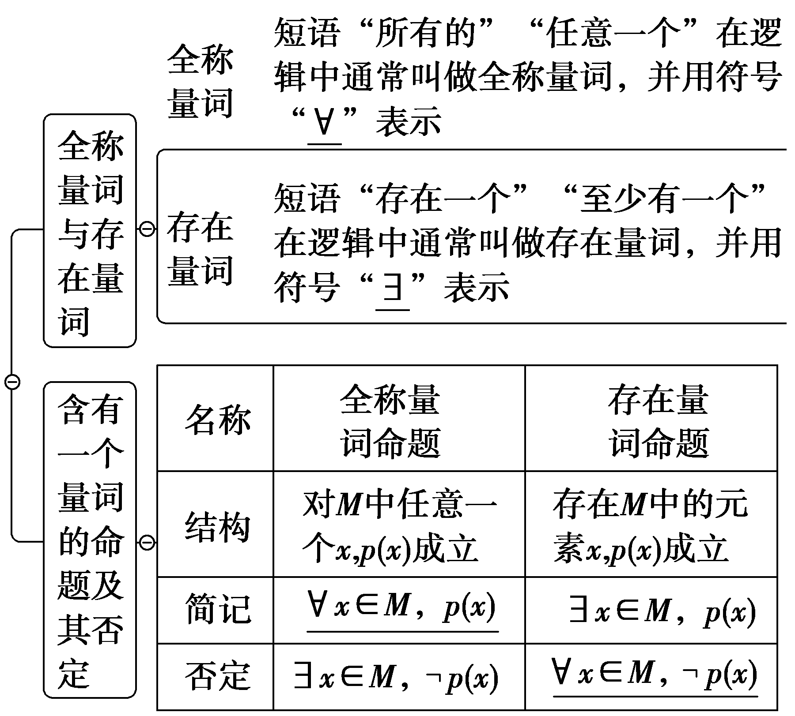
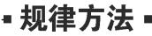

**第二节　常用逻辑用语**

【课标研读】　1.理解充分条件、必要条件与充要条件的意义；理解判定定理与充分条件的关系、性质定理与必要条件的关系、数学定义与充要条件的关系.　2.通过已知的数学实例，理解全称量词与存在量词的意义；能正确地对全称量词命题和存在量词命题进行否定.

1.充分条件、必要条件与充要条件的概念

<table><tr><td colspan="2">
若<em>p</em>⇒<em>q</em>，则<em>p</em>是<em>q</em>的　充分　条件，<em>q</em>是<em>p</em>的　必要　条件
</td></tr><tr><td>
<em>p</em>是<em>q</em>的　充分不必要　条件
</td><td>
<em>p</em>⇒<em>q</em>且<em>q</em>⇏<em>p</em>
</td></tr><tr><td>
<em>p</em>是<em>q</em>的　必要不充分　条件
</td><td>
<em>p</em>⇏<em>q</em>且<em>q</em>⇒<em>p</em>
</td></tr><tr><td>
<em>p</em>是<em>q</em>的　充要　条件
</td><td>
<em>p</em>⇔<em>q</em>
</td></tr><tr><td>
<em>p</em>是<em>q</em>的既不充分也不必要条件
</td><td>
<em>p</em>⇏<em>q</em>且<em>q</em>⇏<em>p</em>
</td></tr></table>

[微提醒]　(1)*A*是*B*的充分不必要条件⇔*A*⇒*B*且*B*⇏*A*.(2)*A*的充分不必要条件是*B*⇔*B*⇒*A*且*A*⇏*B*.

2.全称量词命题与存在量词命题

[微提醒]　(1)含有一个量词的命题的否定规律是“改量词，否结论”.(2)命题*p*和¬*p*的真假性相反，若判断一个命题的真假有困难时，可先判断此命题的否定的真假.

【常用结论】

充分、必要条件与对应集合之间的关系

设*A*＝{*x*｜*p*(*x*)}，*B*＝{*x*｜*q*(*x*)}.

(1)若*p*是*q*的充分条件，则*A*⊆*B*；

(2)若*p*是*q*的充分不必要条件，则*A*⫋*B*；

(3)若*p*是*q*的必要不充分条件，则*B*⫋*A*；

(4)若*p*是*q*的充要条件，则*A*＝*B*；

(5)若*p*是*q*的既不充分又不必要条件，则*A*⊈*B*且*B*⊈*A*.

【自主检测】

1.(多选)下列结论正确的是(　　)

A.*p*是*q*的充分不必要条件等价于*q*是*p*的必要不充分条件

B.“三角形的内角和为180°”是全称量词命题

C.已知集合*A*，*B*，*A*∪*B*＝*A*∩*B*的充要条件是*A*＝*B*

D.命题“∃<em>x</em>∈<strong>R</strong>，sin&lt;text style="superscript"&gt;2&lt;/text&gt; $\frac{x}{2}$ ＋cos&lt;text style="superscript"&gt;2&lt;/text&gt; $\frac{x}{2}＝\frac{1}{2}$ ”是真命题

答案：**ABC**

2.(多选)(链接人教A必修一P34T5)对任意实数*a*，*b*，*c*，给出下列命题，其中假命题是(　　)

A.“*a*＝*b*”是“*ac*＝*bc*”的充要条件

B.“<em>a</em>＞<em>b</em>”是“<em>a</em>2＞<em>b</em>2”的充分条件

C.“*a*＜5”是“*a*＜3”的必要条件

D.“*a*＋5是无理数”是“*a*是无理数”的充分不必要条件

答案：**ABD**

3.(链接人教A必修一P31T3)命题“∀<em>x</em>∈<strong>R</strong>，<em>x</em>2＋<em>x</em>≥0”的否定是(　　)

A.∃&lt;te&lt;te&lt;te<em>x</em>t style="italic"&gt;x&lt;/text&gt;t style="italic"&gt;x&lt;/text&gt;t style="italic"&gt;x&lt;/text&gt;&lt;text style="subscript"&gt;&lt;text style="subscript"&gt;&lt;text style="subscript"&gt;0&lt;/text&gt;&lt;/text&gt;&lt;/text&gt;∈<strong>&lt;text style="bold"&gt;R</strong>&lt;/text&gt;， $x_{0}^{2}$ ＋&lt;te&lt;te&lt;te<em>x</em>t style="italic"&gt;x&lt;/text&gt;t style="italic"&gt;x&lt;/text&gt;t style="italic"&gt;x&lt;/text&gt;&lt;text style="subscript"&gt;&lt;text style="subscript"&gt;&lt;text style="subscript"&gt;0&lt;/text&gt;&lt;/text&gt;&lt;/text&gt;≤0　　	B.∃x0∈<strong>&lt;text style="bold"&gt;R</strong>&lt;/text&gt;， $x_{0}^{2}$ ＋&lt;te&lt;te&lt;te<em>x</em>t style="italic"&gt;x&lt;/text&gt;t style="italic"&gt;x&lt;/text&gt;t style="italic"&gt;x&lt;/text&gt;&lt;text style="subscript"&gt;&lt;text style="subscript"&gt;&lt;text style="subscript"&gt;0&lt;/text&gt;&lt;/text&gt;&lt;/text&gt;＜0

C.∀<em>x</em>∈<strong>R</strong>，<em>x</em>2＋<em>x</em>≤0	D.∀<em>x</em>∈<strong>R</strong>，<em>x</em>2＋<em>x</em>＜0

答案：**B**

解析：由全称量词命题的否定是存在量词命题并且否定结论知选项B正确.

4.若命题“∀<em>x</em>∈<strong>R</strong>，<em>x</em>2＋1＞<em>m</em>”是真命题，则实数<em>m</em>的取值范围是<u>　　</u>.

答案：(－∞，1)

<table><tr><td>
考点一　充分、必要条件的判断自主练透
</td></tr></table>

1.(2024·全国甲卷)设向量<text style="***b***old,italic">a</text> $＝\left(x+1，x\right)$ ，***b*** $＝\left(x，2\right)$ ，则(　　)

A.<em>x</em>＝－3是<em><strong>a</strong></em>⊥<em><strong>b</strong></em>的必要条件

B.<em>x</em>＝－3是<em><strong>a</strong></em>∥<em><strong>b</strong></em>的必要条件

C.<em>x</em>＝0是<em><strong>a</strong></em>⊥<em><strong>b</strong></em>的充分条件

D.<text style="it<text style="***b***old,italic">a</text>lic">x</text>＝－1＋ $\sqrt{3}$ 是<text style="***b***old,italic">a</text>∥b的充分条件

答案：**C**

解析：对于A，当&lt;te&lt;te&lt;te&lt;te&lt;te&lt;te&lt;te&lt;te&lt;te&lt;te&lt;te&lt;text style="it&lt;text style="<em><strong>b</strong></em>old,italic"&gt;a&lt;/text&gt;lic"&gt;x&lt;/text&gt;t style="italic"&gt;x&lt;/text&gt;t style="italic"&gt;x&lt;/text&gt;t style="italic"&gt;x&lt;/text&gt;t style="italic"&gt;x&lt;/text&gt;t style="italic"&gt;x&lt;/text&gt;t style="it&lt;text style="&lt;text style="&lt;text style="&lt;text style="<em><strong>b</strong></em>old,it<em><strong>a</strong></em>lic"&gt;b&lt;/text&gt;old,it<em><strong>a</strong></em>lic"&gt;b&lt;/text&gt;old,it<em><strong>a</strong></em>lic"&gt;b&lt;/text&gt;old,italic"&gt;a&lt;/text&gt;lic"&gt;x&lt;/text&gt;t style="italic"&gt;x&lt;/text&gt;t style="italic"&gt;x&lt;/text&gt;t style="italic"&gt;x&lt;/text&gt;t style="italic"&gt;x&lt;/text&gt;t style="&lt;text style="<em><strong>b</strong></em>old,it<em><strong>a</strong></em>lic"&gt;b&lt;/text&gt;old,italic"&gt;a&lt;/text&gt;⊥b时，则a·b＝0，所以x·(x＋1)＋&lt;text style="superscript"&gt;2&lt;/text&gt;x＝0，解得x＝0或－3，即必要性不成立，故A错误；对于C，当x＝0时，a $＝\left(1，0\right)$ ，&lt;te&lt;te&lt;te&lt;te&lt;te&lt;te&lt;te&lt;te&lt;te&lt;te&lt;te&lt;text style="it&lt;text style="<em><strong>b</strong></em>old,italic"&gt;a&lt;/text&gt;lic"&gt;x&lt;/text&gt;t style="italic"&gt;x&lt;/text&gt;t style="italic"&gt;x&lt;/text&gt;t style="italic"&gt;x&lt;/text&gt;t style="italic"&gt;x&lt;/text&gt;t style="italic"&gt;x&lt;/text&gt;t style="it&lt;text style="&lt;text style="&lt;text style="&lt;text style="<em><strong>b</strong></em>old,it<em><strong>a</strong></em>lic"&gt;b&lt;/text&gt;old,it<em><strong>a</strong></em>lic"&gt;b&lt;/text&gt;old,it<em><strong>a</strong></em>lic"&gt;b&lt;/text&gt;old,italic"&gt;a&lt;/text&gt;lic"&gt;x&lt;/text&gt;t style="italic"&gt;x&lt;/text&gt;t style="italic"&gt;x&lt;/text&gt;t style="italic"&gt;x&lt;/text&gt;t style="italic"&gt;x&lt;/text&gt;t style="<em><strong>b</strong></em>old,it<em><strong>a</strong></em>lic"&gt;b&lt;/text&gt; $＝\left(0，2\right)$ ，故&lt;te&lt;te&lt;te&lt;te&lt;te&lt;te&lt;te&lt;te&lt;te&lt;te&lt;te&lt;text style="it&lt;text style="<em><strong>b</strong></em>old,italic"&gt;a&lt;/text&gt;lic"&gt;x&lt;/text&gt;t style="italic"&gt;x&lt;/text&gt;t style="italic"&gt;x&lt;/text&gt;t style="italic"&gt;x&lt;/text&gt;t style="italic"&gt;x&lt;/text&gt;t style="italic"&gt;x&lt;/text&gt;t style="it&lt;text style="&lt;text style="&lt;text style="&lt;text style="<em><strong>b</strong></em>old,it<em><strong>a</strong></em>lic"&gt;b&lt;/text&gt;old,it<em><strong>a</strong></em>lic"&gt;b&lt;/text&gt;old,it<em><strong>a</strong></em>lic"&gt;b&lt;/text&gt;old,italic"&gt;a&lt;/text&gt;lic"&gt;x&lt;/text&gt;t style="italic"&gt;x&lt;/text&gt;t style="italic"&gt;x&lt;/text&gt;t style="italic"&gt;x&lt;/text&gt;t style="italic"&gt;x&lt;/text&gt;t style="&lt;text style="<em><strong>b</strong></em>old,it<em><strong>a</strong></em>lic"&gt;b&lt;/text&gt;old,italic"&gt;a&lt;/text&gt;·b＝0，所以a⊥b，即充分性成立，故C正确；对于B，当a∥b时，则&lt;text style="superscript"&gt;2&lt;/text&gt;(x＋1)＝x2，解得x＝1± $\sqrt{3}$ ，即必要性不成立，故B错误；对于D，当&lt;te&lt;te&lt;te&lt;te&lt;te&lt;te&lt;te&lt;te&lt;te&lt;te&lt;text style="it&lt;text style="<em><strong>b</strong></em>old,italic"&gt;a&lt;/text&gt;lic"&gt;x&lt;/text&gt;t style="italic"&gt;x&lt;/text&gt;t style="italic"&gt;x&lt;/text&gt;t style="italic"&gt;x&lt;/text&gt;t style="italic"&gt;x&lt;/text&gt;t style="italic"&gt;x&lt;/text&gt;t style="it&lt;text style="&lt;text style="&lt;text style="&lt;text style="<em><strong>b</strong></em>old,it<em><strong>a</strong></em>lic"&gt;b&lt;/text&gt;old,it<em><strong>a</strong></em>lic"&gt;b&lt;/text&gt;old,it<em><strong>a</strong></em>lic"&gt;b&lt;/text&gt;old,italic"&gt;a&lt;/text&gt;lic"&gt;x&lt;/text&gt;t style="italic"&gt;x&lt;/text&gt;t style="italic"&gt;x&lt;/text&gt;t style="italic"&gt;x&lt;/text&gt;t style="italic"&gt;x&lt;/text&gt;＝－1＋ $\sqrt{3}$ 时，不满足&lt;te&lt;te&lt;te&lt;te&lt;text style="it&lt;text style="<em><strong>b</strong></em>old,italic"&gt;a&lt;/text&gt;lic"&gt;x&lt;/text&gt;t style="italic"&gt;x&lt;/text&gt;t style="italic"&gt;x&lt;/text&gt;t style="italic"&gt;x&lt;/text&gt;t style="superscript"&gt;2&lt;/text&gt;(&lt;te&lt;te&lt;te&lt;te&lt;te&lt;te<em>x</em>t style="italic"&gt;x&lt;/text&gt;t style="it&lt;text style="&lt;text style="&lt;text style="&lt;text style="<em><strong>b</strong></em>old,it<em><strong>a</strong></em>lic"&gt;b&lt;/text&gt;old,it<em><strong>a</strong></em>lic"&gt;b&lt;/text&gt;old,it<em><strong>a</strong></em>lic"&gt;b&lt;/text&gt;old,italic"&gt;a&lt;/text&gt;lic"&gt;x&lt;/text&gt;t style="italic"&gt;x&lt;/text&gt;t style="italic"&gt;x&lt;/text&gt;t style="italic"&gt;x&lt;/text&gt;t style="italic"&gt;x&lt;/text&gt;＋1)＝x2，所以&lt;text style="&lt;text style="<em><strong>b</strong></em>old,it<em><strong>a</strong></em>lic"&gt;b&lt;/text&gt;old,italic"&gt;a&lt;/text&gt;∥b不成立，即充分性不成立，故D错误.故选C.

2.(2024·湖南怀化二模)祖暅原理：“幂势既同，则积不容异”.它是中国古代一个涉及几何体体积的问题，意思是两个同高的几何体，如在等高处的截面面积恒相等，则体积相等.设*A*，*B*为两个同高的几何体，*p*：*A*，*B*的体积相等，*q*：*A*，*B*在等高处的截面面积恒相等，根据祖暅原理可知，*p*是*q*的(　　)

A.充分不必要条件

B.必要不充分条件

C.充要条件

D.既不充分也不必要条件

答案：**B**

解析：由*q*⇒*p*，反之不成立.所以*p*是*q*的必要不充分条件.故选B.

3.(2025·江西南昌模拟)已知<te<text style="it*a*lic">x</text>t style="italic">*p*</text>：ln $\left(a－1\right)$ ＞0，<te<text style="it*a*lic">x</text>t style="italic">*q*</text>：∃x＞0， $\frac{x^{2}+1}{x}$ ≤*a*，则<te*x*t style="italic">*p*</text>是*<text style="italic">q*</text>的(　　)

A.充分不必要条件

B.必要不充分条件

C.充要条件

D.既不充分也不必要条件

答案：**A**

解析：由ln $\left(a－1\right)$ ＞0，得 $\left\{\begin{matrix}a－1>0\\a－1>1\end{matrix}\right.$ ⇒<te<te<te<te<te<te<te<te<text style="it<text style="it*a*lic">a</text>lic">x</text>t style="it<text style="it*a*lic">a</text>lic">x</text>t style="italic">x</text>t style="italic">x</text>t style="italic">x</text>t style="italic">x</text>t style="it*a*lic">x</text>t style="it*a*lic">x</text>t style="italic">a</text>＞2，设*<text style="italic"><text style="italic"><text style="italic">p*</text></text></text>：*A* $＝\left\{\left.a\right|ln\left(a－1\right)>0\right\}＝\left\{\left.a\right|a>2\right\}$ ，由∃<te<te<te<te<te<te<te<text style="it<text style="it*a*lic">a</text>lic">x</text>t style="it<text style="it*a*lic">a</text>lic">x</text>t style="italic">x</text>t style="italic">x</text>t style="italic">x</text>t style="italic">x</text>t style="it*a*lic">x</text>t style="it*a*lic">x</text>＞0， $\frac{x^{2}+1}{x}$ ≤<te<te<te<te<te<te<te<te<text style="it<text style="it*a*lic">a</text>lic">x</text>t style="it<text style="it*a*lic">a</text>lic">x</text>t style="italic">x</text>t style="italic">x</text>t style="italic">x</text>t style="italic">x</text>t style="it*a*lic">x</text>t style="it*a*lic">x</text>t style="italic">a</text>的否定为∀x＞0， $\frac{x^{2}+1}{x}$ ＞<te<te<te<te<te<te<te<te<text style="it<text style="it*a*lic">a</text>lic">x</text>t style="it<text style="it*a*lic">a</text>lic">x</text>t style="italic">x</text>t style="italic">x</text>t style="italic">x</text>t style="italic">x</text>t style="it*a*lic">x</text>t style="it*a*lic">x</text>t style="italic">a</text>，令*f* $\left(x\right)＝\frac{x^{2}+1}{x}＝$ <te<te<te<te<te<te<te<text style="it<text style="it*a*lic">a</text>lic">x</text>t style="it<text style="it*a*lic">a</text>lic">x</text>t style="italic">x</text>t style="italic">x</text>t style="italic">x</text>t style="italic">x</text>t style="it*a*lic">x</text>t style="it*a*lic">x</text>＋ $\frac{1}{x}$ ≥2，当且仅当<te<te<te<te<te<te<te<text style="it<text style="it*a*lic">a</text>lic">x</text>t style="it<text style="it*a*lic">a</text>lic">x</text>t style="italic">x</text>t style="italic">x</text>t style="italic">x</text>t style="italic">x</text>t style="it*a*lic">x</text>t style="it*a*lic">x</text> $＝\frac{1}{x}$ 时，又<te<te<te<te<te<te<te<text style="it<text style="it*a*lic">a</text>lic">x</text>t style="it<text style="it*a*lic">a</text>lic">x</text>t style="italic">x</text>t style="italic">x</text>t style="italic">x</text>t style="italic">x</text>t style="it*a*lic">x</text>t style="it*a*lic">x</text>＞0，即x＝1时等号成立，若∀x＞0， $\frac{x^{2}+1}{x}$ ＞<te<te<te<te<te<te<te<te<text style="it<text style="it*a*lic">a</text>lic">x</text>t style="it<text style="it*a*lic">a</text>lic">x</text>t style="italic">x</text>t style="italic">x</text>t style="italic">x</text>t style="italic">x</text>t style="it*a*lic">x</text>t style="it*a*lic">x</text>t style="italic">a</text>，则a＜2，若∃x＞0， $\frac{x^{2}+1}{x}$ ≤<te<te<te<te<te<te<te<te<text style="it<text style="it*a*lic">a</text>lic">x</text>t style="it<text style="it*a*lic">a</text>lic">x</text>t style="italic">x</text>t style="italic">x</text>t style="italic">x</text>t style="italic">x</text>t style="it*a*lic">x</text>t style="it*a*lic">x</text>t style="italic">a</text>，则a≥2，设*<text style="italic"><text style="italic"><text style="italic">q*</text></text></text>：*B* $＝\left\{\left.a\right|a\geq 2\right\}$ ，因为 $\left\{\left.a\right|a\geq 2\right\}$ ⊇ $\left\{\left.a\right|a>2\right\}$ ，所以<te<te<te<te<te<te<te<te<text style="it<text style="it*a*lic">a</text>lic">x</text>t style="it<text style="it*a*lic">a</text>lic">x</text>t style="italic">x</text>t style="italic">x</text>t style="italic">x</text>t style="italic">x</text>t style="it*a*lic">x</text>t style="it*a*lic">x</text>t style="italic">*<text style="italic"><text style="italic">p*</text></text></text>⇒*<text style="italic"><text style="italic"><text style="italic">q*</text></text></text>且q⇏p，所以p是q的充分不必要条件.故选*A*.

判断充分条件、必要条件及充要条件的三种方法

1.定义法：直接判断“若*p*，则*q*”以及“若*q*，则*p*”的真假.适用于定义、定理判断性问题.

2.集合法：即利用集合的包含关系判断.多适用于条件中涉及参数范围的推断问题.

3.传递法：充分条件和必要条件具有传递性，即由<em>p</em>1⇒<em>p</em>2⇒…⇒<em>pn</em>，可得<em>p</em>1⇒<em>pn</em>；充要条件也有传递性.

<table><tr><td>
考点二　充分、必要条件的探求与应用师生共研
</td></tr></table>

(1)命题“∀<em>x</em>∈[1，3]，<em>x</em>2－<em>a</em>≤0”为真命题的一个充分不必要条件是(　　)

A.*a*≥9	B.*a*≤9

C.*a*≥10	D.*a*≤10

(2)(一题多变)已知<em>P</em>＝{<em>x</em>｜<em>x</em>2－8<em>x</em>－20≤0}，非空集合<em>S</em>＝{<em>x</em>｜1－<em>m</em>≤<em>x</em>≤1＋<em>m</em>}.若<em>x</em>∈<em>P</em>是<em>x</em>∈<em>S</em>的必要条件，则实数<em>m</em>的取值范围为<u>　　　　　　</u>.

答案：(1)**C**　(2)[0，3]

解析：(1)命题“∀<em>x</em>∈[1，3]，<em>x</em>2－<em>a</em>≤0”⇒“∀<em>x</em>∈[1，3]，<em>x</em>2≤<em>a</em>”⇒“<em>a</em>≥9”.则“<em>a</em>≥10”是命题“∀<em>x</em>∈[1，3]，<em>x</em>2－<em>a</em>≤0”为真命题的一个充分不必要条件.故选C.

(<te<te<te<te<te<te*x*t style="italic">x</text>t style="italic">x</text>t style="italic">x</text>t style="italic">x</text>t style="italic">x</text>t style="superscript">2</text>)由*x*2－8x－20≤0，得－2≤x≤10，所以*<text style="italic"><text style="italic">P*</text></text>＝{x｜－2≤x≤10}.因为x∈P是x∈*<text style="italic"><text style="italic">S*</text></text>的必要条件，则S⊆P，又S≠⌀，所以 $\left\{\begin{matrix}1－m\geq －2，\\1+m\leq 10，\\1－m\leq 1+m，\end{matrix}\right.$ 解得0≤*<text style="italic">m*</text>≤3，故实数m的取值范围为[0，3].

[变式探究]

1.(变条件)本例(2)中条件“若<em>x</em>∈<em>P</em>是<em>x</em>∈<em>S</em>的必要条件”变为“¬<em>P</em>是¬<em>S</em>的必要不充分条件”，其他条件不变，则实数<em>m</em>的取值范围为<u>　　</u>.

答案：[9，＋∞)

解析：由例题知<te<te*x*t style="italic">x</text>t style="italic">*<text style="italic"><text style="italic"><text style="italic">P*</text></text></text></text>＝{x｜－2≤x≤10}.因为¬P是¬*<text style="italic"><text style="italic"><text style="italic">S*</text></text></text>的必要不充分条件，所以P是S的充分不必要条件，所以P⇒S且S⇏P.所以[－2，10]⫋[1－*<text style="italic"><text style="italic"><text style="italic">m*</text></text></text>，1＋m].所以 $\left\{\begin{matrix}1－m\leq －2，\\1+m>10，\end{matrix}\right.$ 或 $\left\{\begin{matrix}1－m＜－2，\\1+m\geq 10，\end{matrix}\right.$ 所以*<text style="italic"><text style="italic"><text style="italic">m*</text></text></text>≥9，则实数m的取值范围是[9，＋∞).

2.(变设问)本例(2)条件不变，问是否存在实数*m*，使*x*∈*P*是*x*∈*S*的充要条件？并说明理由.

解：不存在*m*，理由如下：由例题知*P*＝{*x*｜－2≤*x*≤10}.

若*x*∈*P*是*x*∈*S*的充要条件，则*P*＝*S*，

所以 $\left\{\begin{matrix}1－m＝－2，\\1+m=10，\end{matrix}\right.$ 所以 $\left\{\begin{matrix}m=3，\\m=9，\end{matrix}\right.$

这样的*m*不存在.

根据充分、必要条件求解参数范围的方法及注意点

1.把充分条件、必要条件或充要条件转化为集合之间的关系，然后根据集合之间的关系列出关于参数的不等式(或不等式组)求解.

2.要注意区间端点值的检验，尤其是利用两个集合之间的关系求解参数的取值范围时，不等式是否能够取等号决定端点值的取舍，处理不当容易出现漏解或增解的现象.

对点练1.若<em>x</em>∈<strong>R</strong>，下列选项中，使“<em>x</em>2＜1”成立的一个必要不充分条件为(　　)

A.－2＜*x*＜1	B.－1＜*x*＜1

C.0＜*x*＜2	D.－1＜*x*＜0

答案：**A**

解析：不等式<em>x</em>2＜1等价于－1＜<em>x</em>＜1，使“<em>x</em>2＜1”成立的一个必要不充分条件，对应的集合为<em>A</em>，则(－1，1)是<em>A</em>的真子集，由此对照各项，可知只有A项符合题意.故选A.

对点练2.已知“(<em>x</em>－<em>m</em>)2＞3(<em>x</em>－<em>m</em>)”是“<em>x</em>2＋3<em>x</em>－4＜0”的必要不充分条件，则实数<em>m</em>的取值范围为<u>　　</u>.

答案：(－∞，－7]∪[1，＋∞)

解析：由(<em>x</em>－<em>m</em>)2＞3(<em>x</em>－<em>m</em>)得<em>x</em>＜<em>m</em>或<em>x</em>＞3＋<em>m</em>，设<em>p</em>：<em>x</em>＜<em>m</em>或<em>x</em>＞3＋<em>m</em>；由<em>x</em>2＋3<em>x</em>－4＜0得－4＜<em>x</em>＜1，设<em>q</em>：－4＜<em>x</em>＜1.因为<em>p</em>是<em>q</em>的必要不充分条件，所以<em>m</em>≥1或<em>m</em>＋3≤－4，可得<em>m</em>≥1或<em>m</em>≤－7.

考点三　全称量词命题与存在量词命题多维探究

角度1　含量词命题的否定

(一题多变)已知命题<te<te<te*x*t style="italic">x</text>t style="italic">x</text>t style="italic">*p*</text>：∀x≥0，ln(1＋x)≥x－ $\frac{x^{2}}{2}$ ，则命题<te<te<te*x*t style="italic">x</text>t style="italic">x</text>t style="italic">*p*</text>的否定为(　　)

A.∀<te<te<te*x*t style="italic">x</text>t style="italic">x</text>t style="italic">x</text>≥0，ln $\left(1+x\right)$ ＜<te<te<te*x*t style="italic">x</text>t style="italic">x</text>t style="italic">x</text>－ $\frac{x^{2}}{2}$ 	B.∃<te<te<te*x*t style="italic">x</text>t style="italic">x</text>t style="italic">x</text>≥0，ln $\left(1+x\right)$ ＜<te<te<te*x*t style="italic">x</text>t style="italic">x</text>t style="italic">x</text>－ $\frac{x^{2}}{2}$

C.∀<te<te<te*x*t style="italic">x</text>t style="italic">x</text>t style="italic">x</text>＜0，ln $\left(1+x\right)$ ＜<te<te<te*x*t style="italic">x</text>t style="italic">x</text>t style="italic">x</text>－ $\frac{x^{2}}{2}$ 	D.∃<te<te<te*x*t style="italic">x</text>t style="italic">x</text>t style="italic">x</text>＜0，ln $\left(1+x\right)$ ＜<te<te<te*x*t style="italic">x</text>t style="italic">x</text>t style="italic">x</text>－ $\frac{x^{2}}{2}$

答案：**B**

解析：根据含有全称量词命题的否定可知，命题<te<te<te<te*x*t style="italic">x</text>t style="italic">x</text>t style="italic">x</text>t style="italic">*p*</text>：∀x≥0，ln $\left(1+x\right)$ ≥<te<te<te*x*t style="italic">x</text>t style="italic">x</text>t style="italic">x</text>－ $\frac{x^{2}}{2}$ ，则命题<te<te<te<te*x*t style="italic">x</text>t style="italic">x</text>t style="italic">x</text>t style="italic">*p*</text>的否定为∃x≥0，ln $\left(1+x\right)$ ＜<te<te<te*x*t style="italic">x</text>t style="italic">x</text>t style="italic">x</text>－ $\frac{x^{2}}{2}$ .故选B.

[变式探究]

(变条件)若将本例中的“∀”改为“∃”，如何选择答案？

解：<te<te<te<te<te<te*x*t style="italic">x</text>t style="italic">x</text>t style="italic">x</text>t style="italic">x</text>t style="italic">x</text>t style="italic">*p*</text>：∃x≥0，ln(1＋x)≥x－ $\frac{x^{2}}{2}$ 的否定为¬<te<te<te<te<te<te*x*t style="italic">x</text>t style="italic">x</text>t style="italic">x</text>t style="italic">x</text>t style="italic">x</text>t style="italic">*p*</text>：∀x≥0，ln(1＋x)＜x－ $\frac{x^{2}}{2}$ .故选A.

角度2　含量词命题的真假判断

(多选)下列命题中的真命题是(　　)

A.∀<em>x</em>∈<strong>R</strong>，3<em>x</em>－1＞0

B.∀<em>x</em>∈<strong>N</strong><em>\*</em>，(<em>x</em>－1)2＞0

C.∃<em>x</em>0∈<strong>R</strong>，lg <em>x</em>0＜1

D.∃<em>x</em>0∈<strong>R</strong>，tan <em>x</em>0＝2

答案：**ACD**

解析：当<em>x</em>∈<strong>N</strong><em>\*</em>时，<em>x</em>－1∈<strong>N</strong>，可得(<em>x</em>－1)2≥0，当且仅当<em>x</em>＝1时取等号，故B不正确；易知A、C、D正确.故选ACD.

角度3　含量词命题的应用

(1)已知命题<em>p</em>：∀<em>x</em>∈<strong>R</strong>，<em>x</em>2－<em>a</em>≥0；命题<em>q</em>：∃<em>x</em>∈<strong>R</strong>，<em>x</em>2＋2<em>ax</em>＋2－<em>a</em>＝0.若命题<em>p</em>，<em>q</em>都是真命题，则实数<em>a</em>的取值范围为<u>　　　　</u>.

(2)已知函数<em>f</em>(<em>x</em>)＝<em>x</em>2－2<em>x</em>＋3，<em>g</em>(<em>x</em>)＝log2<em>x</em>＋<em>m</em>，若对任意<em>x</em>1，<em>x</em>2∈[1，4]，<em>f</em>(<em>x</em>1)＞<em>g</em>(<em>x</em>2)恒成立，则实数<em>m</em>的取值范围是<u>　　　　　　</u>.

答案：(1)(－∞，－2]　(2)(－∞，0)

解析：(1)由命题<em>p</em>为真，得<em>a</em>≤0.由命题<em>q</em>为真，得Δ＝4<em>a</em>2－4(2－<em>a</em>)≥0，即<em>a</em>≤－2或<em>a</em>≥1.综上，实数<em>a</em>的取值范围是(－∞，－2].

(2)<em>f</em>(<em>x</em>)＝<em>x</em>2－2<em>x</em>＋3＝(<em>x</em>－1)2＋2，当<em>x</em>∈[1，4]时，<em>f</em>(<em>x</em>)min＝<em>f</em>(1)＝2，<em>g</em>(<em>x</em>)max＝<em>g</em>(4)＝2＋<em>m</em>.由题知<em>f</em>(<em>x</em>)min＞<em>g</em>(<em>x</em>)max，即2＞2＋<em>m</em>，解得<em>m</em>＜0，故实数<em>m</em>的取值范围是(－∞，0).

含量词命题的解题策略

1.判定全称量词命题是真命题，需证明都成立；要判定存在量词命题是真命题，只要找到一个成立即可.当一个命题的真假不易判定时，可以先判断其否定的真假.

2.由命题真假求参数的范围，一是直接由命题的真假求参数的范围；二是利用等价命题求参数的范围.

3.含有双量词命题的类型

(1)∀<em>x</em>1，<em>x</em>2∈<em>D</em>，<em>f</em>(<em>x</em>1)≤<em>g</em>(<em>x</em>2)恒成立⇔<em>f</em>(<em>x</em>1)max≤<em>g</em>(<em>x</em>2)min.

(2)∀<em>x</em>1∈<em>D</em>1，∃<em>x</em>2∈<em>D</em>2，使得<em>f</em>(<em>x</em>1)≥<em>g</em>(<em>x</em>2)⇔<em>f</em>(<em>x</em>1)min≥<em>g</em>(<em>x</em>2)min.

(3)∃<em>x</em>1∈<em>D</em>1，∃<em>x</em>2∈<em>D</em>2，使得<em>f</em>(<em>x</em>1)＝<em>g</em>(<em>x</em>2)⇔<em>f</em>(<em>x</em>1)的值域与<em>g</em>(<em>x</em>2)的值域的交集非空.

(4)∀<em>x</em>1∈<em>D</em>1，∃<em>x</em>2∈<em>D</em>2，使得<em>f</em>(<em>x</em>1)＝<em>g</em>(<em>x</em>2)⇔<em>f</em>(<em>x</em>1)的值域是<em>g</em>(<em>x</em>2)值域的子集.

对点练3.(多选)下列命题是真命题的是(　　)

A.∀<em>x</em>∈<strong>R</strong>，－<em>x</em>2－1＜0

B.∀<em>n</em>∈<strong>Z</strong>，∃<em>m</em>∈<strong>Z</strong>，<em>nm</em>＝<em>m</em>

C.所有圆的圆心到其切线的距离都等于半径

D.存在实数*x*，使得 $\frac{1}{x^{2}－2x+3}＝\frac{3}{4}$

答案：**ABC**

解析：∀&lt;te&lt;te&lt;te&lt;te&lt;te<em>x</em>t style="italic"&gt;x&lt;/text&gt;t style="italic"&gt;x&lt;/text&gt;t style="italic"&gt;x&lt;/text&gt;t style="italic"&gt;x&lt;/text&gt;t style="italic"&gt;x&lt;/text&gt;∈<strong>R</strong>，－x&lt;text style="superscript"&gt;&lt;text style="superscript"&gt;&lt;text style="superscript"&gt;2&lt;/text&gt;&lt;/text&gt;&lt;/text&gt;≤0，所以－x2－1＜0，故A项是真命题；当<em>&lt;text style="italic"&gt;m</em>&lt;/text&gt;＝0时，<em>nm</em>＝m恒成立，故B项是真命题；任何一个圆的圆心到切线的距离都等于半径，故C项是真命题；因为x2－2x＋3＝(x－1)2＋2≥2，所以 $\frac{1}{x^{2}－2x+3}$ ≤ $\frac{1}{2}＜\frac{3}{4}$ ，故D项是假命题.故选ABC.

对点练4.已知命题<em>p</em>：∃<em>x</em>∈(0，＋∞)，使得<em>x</em>2－λ<em>x</em>＋1＜0成立.若<em>p</em>为假命题，则实数λ的取值范围是(　　)

A.(－∞，2]

B.[2，＋∞)

C.[－2，2]

D.(－∞，－2]∪[2，＋∞)

答案：**A**

解析：因为&lt;te&lt;te&lt;te&lt;te&lt;te&lt;te&lt;te&lt;te<em>x</em>t style="italic"&gt;x&lt;/text&gt;t style="italic"&gt;x&lt;/text&gt;t style="italic"&gt;x&lt;/text&gt;t style="italic"&gt;x&lt;/text&gt;t style="italic"&gt;x&lt;/text&gt;t style="italic"&gt;x&lt;/text&gt;t style="italic"&gt;x&lt;/text&gt;t style="italic"&gt;<em>p</em>&lt;/text&gt;为假命题，所以¬p为真命题，故∀x∈(0，＋∞)，x2－λx＋1≥0，即∀x∈(0，＋∞)，λ≤x＋ $\frac{1}{x}$ .又当&lt;te&lt;te&lt;te&lt;te&lt;te&lt;te&lt;te<em>x</em>t style="italic"&gt;x&lt;/text&gt;t style="italic"&gt;x&lt;/text&gt;t style="italic"&gt;x&lt;/text&gt;t style="italic"&gt;x&lt;/text&gt;t style="italic"&gt;x&lt;/text&gt;t style="italic"&gt;x&lt;/text&gt;t style="italic"&gt;x&lt;/text&gt;∈(0，＋∞)时，x＋ $\frac{1}{x}$ ≥&lt;te&lt;te&lt;te&lt;te&lt;te&lt;te<em>x</em>t style="italic"&gt;x&lt;/text&gt;t style="italic"&gt;x&lt;/text&gt;t style="italic"&gt;x&lt;/text&gt;t style="italic"&gt;x&lt;/text&gt;t style="italic"&gt;x&lt;/text&gt;t style="superscript"&gt;2&lt;/text&gt; $\sqrt{x\cdot \frac{1}{x}}＝$ &lt;te&lt;te&lt;te&lt;te&lt;te&lt;te<em>x</em>t style="italic"&gt;x&lt;/text&gt;t style="italic"&gt;x&lt;/text&gt;t style="italic"&gt;x&lt;/text&gt;t style="italic"&gt;x&lt;/text&gt;t style="italic"&gt;x&lt;/text&gt;t style="superscript"&gt;2&lt;/text&gt;，当且仅当&lt;te<em>x</em>t style="italic"&gt;x&lt;/text&gt;＝1时等号成立，所以实数λ的取值范围是(－∞，2].故选A.

对点练5.已知&lt;te&lt;te&lt;te&lt;te&lt;te&lt;te&lt;te<em>x</em>t style="italic"&gt;x&lt;/text&gt;t style="italic"&gt;x&lt;/text&gt;t style="italic"&gt;x&lt;/text&gt;t style="italic"&gt;x&lt;/text&gt;t style="italic"&gt;x&lt;/text&gt;t style="italic"&gt;x&lt;/text&gt;t style="italic"&gt;<em>f</em>&lt;/text&gt;(x)＝x&lt;text style="subscript"&gt;&lt;text style="subscript"&gt;2&lt;/text&gt;&lt;/text&gt;，<em>&lt;text style="italic"&gt;g</em>&lt;/text&gt;(x) $＝\left(\frac{1}{2}\right)^{x}$ －&lt;te&lt;te&lt;te&lt;te<em>x</em>t style="italic"&gt;x&lt;/text&gt;t style="italic"&gt;x&lt;/text&gt;t style="italic"&gt;x&lt;/text&gt;t style="italic"&gt;<em>m</em>&lt;/text&gt;，若∀&lt;te&lt;te<em>x</em>t style="italic"&gt;x&lt;/text&gt;t style="italic"&gt;x&lt;/text&gt;&lt;text style="subscript"&gt;1&lt;/text&gt;∈[－1，3]，∃x&lt;text style="subscript"&gt;&lt;text style="subscript"&gt;2&lt;/text&gt;&lt;/text&gt;∈[0，2]，<em>&lt;text style="italic"&gt;f</em>&lt;/text&gt;(x1)≥<em>&lt;text style="italic"&gt;g</em>&lt;/text&gt;(x2)，则实数m的取值范围是<u>　　　　</u>.

答案： $\left[\frac{1}{4}，＋\infty \right)$

解析：因为对∀&lt;te&lt;te&lt;te&lt;te&lt;te&lt;te&lt;te&lt;te&lt;te&lt;te&lt;te&lt;te<em>x</em>t style="italic"&gt;x&lt;/text&gt;t style="italic"&gt;x&lt;/text&gt;t style="italic"&gt;x&lt;/text&gt;t style="italic"&gt;x&lt;/text&gt;t style="italic"&gt;x&lt;/text&gt;t style="italic"&gt;x&lt;/text&gt;t style="italic"&gt;x&lt;/text&gt;t style="italic"&gt;x&lt;/text&gt;t style="italic"&gt;x&lt;/text&gt;t style="italic"&gt;x&lt;/text&gt;t style="italic"&gt;x&lt;/text&gt;t style="italic"&gt;x&lt;/text&gt;&lt;text style="subscript"&gt;&lt;text style="subscript"&gt;1&lt;/text&gt;&lt;/text&gt;∈[－1，3]，∃x&lt;text style="subscript"&gt;&lt;text style="subscript"&gt;&lt;text style="superscript"&gt;2&lt;/text&gt;&lt;/text&gt;&lt;/text&gt;∈[0，2]，<em>&lt;text style="italic"&gt;&lt;text style="italic"&gt;&lt;text style="italic"&gt;&lt;text style="italic"&gt;f</em>&lt;/text&gt;&lt;/text&gt;&lt;/text&gt;&lt;/text&gt;(x1)≥<em>&lt;text style="italic"&gt;&lt;text style="italic"&gt;&lt;text style="italic"&gt;&lt;text style="italic"&gt;g</em>&lt;/text&gt;&lt;/text&gt;&lt;/text&gt;&lt;/text&gt;(x2)，所以f(x1)&lt;text style="subscript"&gt;&lt;text style="subscript"&gt;&lt;text style="italic"&gt;&lt;text style="italic"&gt;&lt;text style="italic"&gt;&lt;text style="italic"&gt;&lt;text style="italic"&gt;m&lt;/text&gt;&lt;/text&gt;&lt;/text&gt;&lt;/text&gt;in&lt;/text&gt;&lt;/text&gt;&lt;/text&gt;≥g(x2)min.因为f(x)＝x2，x∈[－1，3]，所以f(x)min＝f(0)＝0.因为g(x) $＝\left(\frac{1}{2}\right)^{x}$ －&lt;te&lt;te<em>x</em>t style="italic"&gt;x&lt;/text&gt;t style="italic"&gt;<em>&lt;text style="italic"&gt;&lt;text style="italic"&gt;&lt;text style="italic"&gt;m</em>&lt;/text&gt;&lt;/text&gt;&lt;/text&gt;&lt;/text&gt;，&lt;te&lt;te&lt;te&lt;te&lt;te&lt;te&lt;te&lt;te&lt;te&lt;te<em>x</em>t style="italic"&gt;x&lt;/text&gt;t style="italic"&gt;x&lt;/text&gt;t style="italic"&gt;x&lt;/text&gt;t style="italic"&gt;x&lt;/text&gt;t style="italic"&gt;x&lt;/text&gt;t style="italic"&gt;x&lt;/text&gt;t style="italic"&gt;x&lt;/text&gt;t style="italic"&gt;x&lt;/text&gt;t style="italic"&gt;x&lt;/text&gt;t style="italic"&gt;x&lt;/text&gt;∈[0，&lt;text style="subscript"&gt;&lt;text style="subscript"&gt;&lt;text style="superscript"&gt;2&lt;/text&gt;&lt;/text&gt;&lt;/text&gt;]，所以<em>&lt;text style="italic"&gt;&lt;text style="italic"&gt;&lt;text style="italic"&gt;&lt;text style="italic"&gt;g</em>&lt;/text&gt;&lt;/text&gt;&lt;/text&gt;&lt;/text&gt;(x)&lt;text style="subscript"&gt;&lt;text style="subscript"&gt;&lt;text style="subscript"&gt;min&lt;/text&gt;&lt;/text&gt;&lt;/text&gt;＝g(2) $＝\frac{1}{4}$ －&lt;te&lt;te<em>x</em>t style="italic"&gt;x&lt;/text&gt;t style="italic"&gt;<em>&lt;text style="italic"&gt;&lt;text style="italic"&gt;&lt;text style="italic"&gt;m</em>&lt;/text&gt;&lt;/text&gt;&lt;/text&gt;&lt;/text&gt;.由0≥ $\frac{1}{4}$ －&lt;te&lt;te<em>x</em>t style="italic"&gt;x&lt;/text&gt;t style="italic"&gt;<em>&lt;text style="italic"&gt;&lt;text style="italic"&gt;&lt;text style="italic"&gt;m</em>&lt;/text&gt;&lt;/text&gt;&lt;/text&gt;&lt;/text&gt;，得m≥ $\frac{1}{4}$ ，即实数&lt;te&lt;te<em>x</em>t style="italic"&gt;x&lt;/text&gt;t style="italic"&gt;<em>&lt;text style="italic"&gt;&lt;text style="italic"&gt;&lt;text style="italic"&gt;m</em>&lt;/text&gt;&lt;/text&gt;&lt;/text&gt;&lt;/text&gt;的取值范围为 $\left[\frac{1}{4}，＋\infty \right)$ .

1.[真题再现]　(2024·新课标Ⅱ卷)已知命题<em>p</em>：∀<em>x</em>∈<strong>R</strong>，｜<em>x</em>＋1｜＞1；命题<em>q</em>：∃<em>x</em>＞0，<em>x</em>3＝<em>x</em>，则(　　)

A.*p*和*q*都是真命题	B.¬*p*和*q*都是真命题

C.*p*和¬*q*都是真命题	D.¬*p*和¬*q*都是真命题

答案：**B**

解析：对于&lt;te&lt;te&lt;te&lt;te<em>x</em>t style="italic"&gt;x&lt;/text&gt;t style="italic"&gt;x&lt;/text&gt;t style="italic"&gt;x&lt;/text&gt;t style="italic"&gt;<em>&lt;text style="italic"&gt;&lt;text style="italic"&gt;p</em>&lt;/text&gt;&lt;/text&gt;&lt;/text&gt;而言，取x＝－1，则有 $\left|x+1\right|＝$ 0＜1，故&lt;te&lt;te&lt;te&lt;te<em>x</em>t style="italic"&gt;x&lt;/text&gt;t style="italic"&gt;x&lt;/text&gt;t style="italic"&gt;x&lt;/text&gt;t style="italic"&gt;<em>&lt;text style="italic"&gt;&lt;text style="italic"&gt;p</em>&lt;/text&gt;&lt;/text&gt;&lt;/text&gt;是假命题，¬p是真命题，对于<em>&lt;text style="italic"&gt;&lt;text style="italic"&gt;&lt;text style="italic"&gt;q</em>&lt;/text&gt;&lt;/text&gt;&lt;/text&gt;而言，取x＝1，则有x&lt;text style="superscript"&gt;3&lt;/text&gt;＝13＝1＝x，故q是真命题，¬q是假命题，综上，¬p和q都是真命题.故选B.

[教材呈现]　(人教A必修一P35T7)写出下列命题的否定，并判断它们的真假：

(1)∀<em>a</em>∈<strong>R</strong>，一元二次方程<em>x</em>2－<em>ax</em>－1＝0有实根；

(2)每个正方形都是平行四边形；

(3)∃<em>m</em>∈<strong>&lt;text style="bold"&gt;N</strong>&lt;/text&gt;， $\sqrt{m^{2}+1}$ ∈<strong>&lt;text style="bold"&gt;N</strong>&lt;/text&gt;；

(4)存在一个四边形*ABCD*，其内角和不等于360°.

点评：该高考试题主要考查全称量词命题、存在量词命题的否定及真假判断，与教材习题角度完全相同.

2.[真题再现]　(2024·天津卷)设<em>a</em>，<em>b</em>∈<strong>R</strong>，则“<em>a</em>3＝<em>b</em>3”是“3<em>a</em>＝3<em>b</em>”的(　　)

A.充分不必要条件

B.必要不充分条件

C.充要条件

D.既不充分也不必要条件

答案：**C**

解析：<em>a</em>3＝<em>b</em>3和3<em>a</em>＝3<em>b</em>都当且仅当<em>a</em>＝<em>b</em>时等号成立，所以二者互为充要条件.故选C.

[教材呈现]　(人教A必修一P22习题T2)在下列各题中，判断*p*是*q*的什么条件(请用“充分不必要条件”“必要不充分条件““充要条件”“既不充分也不必要条件“回答)：

(1)<em>p</em>：三角形是等腰三角形，<em>q</em>：三角形是等边三角形；(2)<em>p</em>：一元二次方程<em>ax</em>2＋<em>bx</em>＋<em>c</em>＝0有实数根，<em>q</em>：<em>b</em>2－4<em>ac</em>≥0(<em>a</em>≠0)；(3)<em>p</em>：<em>a</em>∈<em>P</em>∩<em>Q</em>，<em>q</em>：<em>a</em>∈<em>P</em>；(4)<em>p</em>：<em>a</em>∈<em>P</em>∪<em>Q</em>，<em>q</em>：<em>a</em>∈<em>P</em>；(5)<em>p</em>：<em>x</em>＞<em>y</em>，<em>q</em>：<em>x</em>2＞<em>y</em>2.

点评：该高考试题主要考查利用充分、必要条件的意义判断命题间的充分、必要性，与教材习题角度完全一致，且难度小于教材习题.

**课时测评**2　**常用逻辑用语** $\frac{对应学生}{用书P313}$

(时间：60分钟　满分：85分)

(本栏目内容，在学生用书中以独立形式分册装订！)

(1－10题，每小题5分，共50分)

1.命题“∃<em>x</em>＞0，<em>x</em>2－2｜<em>x</em>｜－2 025＜0”的否定是(　　)

A.∃<em>x</em>＞0，<em>x</em>2－2｜<em>x</em>｜－2 025≥0

B.∃<em>x</em>≤0，<em>x</em>2－2｜<em>x</em>｜－2 025≥0

C.∀<em>x</em>＞0，<em>x</em>2－2｜<em>x</em>｜－2 025≥0

D.∀<em>x</em>≤0，<em>x</em>2－2｜<em>x</em>｜－2 025≥0

答案：**C**

解析：由存在量词命题的否定为全称量词命题知“∃<em>x</em>＞0，<em>x</em>2－2｜<em>x</em>｜－2 025＜0”的否定为“∀<em>x</em>＞0，<em>x</em>2－2｜<em>x</em>｜－2 025≥0”.故选C.

2.设&lt;te<em>x</em>t style="italic"&gt;x&lt;/text&gt;∈<strong>R</strong>，则“1＜x＜2”是“ $\left|x－2\right|$ ＜1”的(　　)

A.充分不必要条件

B.必要不充分条件

C.充要条件

D.既不充分也不必要条件

答案：**A**

解析：由 $\left|x－2\right|$ ＜1可得－1＜<te<te<te<te*x*t style="italic">x</text>t style="italic">x</text>t style="italic">x</text>t style="italic">x</text>－2＜1，解得1＜x＜3，所以由1＜x＜2推得出 $\left|x－2\right|$ ＜1，故充分性成立；由 $\left|x－2\right|$ ＜1推不出1＜<te<te<te<te*x*t style="italic">x</text>t style="italic">x</text>t style="italic">x</text>t style="italic">x</text>＜2，故必要性不成立，所以“1＜x＜2”是“ $\left|x－2\right|$ ＜1”的充分不必要条件.故选A.

3.“*a*＞*b*”的一个充分条件是(　　)

A.e<em>a</em>－<em>b</em>＞2	B.ln $\frac{a}{b}$ ＞0

C.&lt;text style="it<em>a</em>lic"&gt;a&lt;/text&gt;a＞<em>bb</em>	D. $\frac{1}{a}＜\frac{1}{b}$

答案：**A**

解析：由e&lt;text style="it&lt;text style="it&lt;text style="it&lt;text style="it&lt;text style="it&lt;text style="it&lt;text style="it&lt;text style="it&lt;text style="it&lt;text style="it&lt;text style="it&lt;text style="it&lt;text style="it&lt;text style="it&lt;text style="it<em>a</em>lic"&gt;a&lt;/text&gt;lic"&gt;a&lt;/text&gt;lic,superscript"&gt;a&lt;/text&gt;lic"&gt;a&lt;/text&gt;lic"&gt;a&lt;/text&gt;lic,superscript"&gt;a&lt;/text&gt;lic"&gt;a&lt;/text&gt;lic"&gt;a&lt;/text&gt;lic"&gt;a&lt;/text&gt;lic"&gt;a&lt;/text&gt;lic,superscript"&gt;a&lt;/text&gt;lic"&gt;a&lt;/text&gt;lic"&gt;a&lt;/text&gt;lic,superscript"&gt;a&lt;/text&gt;lic,superscript"&gt;a&lt;/text&gt;&lt;text style="superscript"&gt;&lt;text style="superscript"&gt;－&lt;/text&gt;&lt;/text&gt;<em>&lt;text style="italic,superscript"&gt;&lt;text style="italic"&gt;&lt;text style="italic"&gt;&lt;text style="italic,superscript"&gt;&lt;text style="italic"&gt;&lt;text style="italic"&gt;&lt;text style="italic"&gt;&lt;text style="italic"&gt;&lt;text style="italic,superscript"&gt;&lt;text style="italic"&gt;&lt;text style="italic"&gt;&lt;text style="italic,superscript"&gt;&lt;text style="italic"&gt;&lt;text style="italic"&gt;&lt;text style="italic"&gt;b</em>&lt;/text&gt;&lt;/text&gt;&lt;/text&gt;&lt;/text&gt;&lt;/text&gt;&lt;/text&gt;&lt;/text&gt;&lt;/text&gt;&lt;/text&gt;&lt;/text&gt;&lt;/text&gt;&lt;/text&gt;&lt;/text&gt;&lt;/text&gt;&lt;/text&gt;＞2，可知ea－b＞1，a－b＞0，a＞b，故ea－b＞2是a＞b的一个充分条件，故A正确；由ln $\frac{a}{b}$ ＞0，可得 $\frac{a}{b}$ ＞1，不妨取&lt;text style="it&lt;text style="it&lt;text style="it&lt;text style="it&lt;text style="it&lt;text style="it&lt;text style="it&lt;text style="it&lt;text style="it&lt;text style="it&lt;text style="it&lt;text style="it&lt;text style="it&lt;text style="it&lt;text style="it<em>a</em>lic"&gt;a&lt;/text&gt;lic"&gt;a&lt;/text&gt;lic,superscript"&gt;a&lt;/text&gt;lic"&gt;a&lt;/text&gt;lic"&gt;a&lt;/text&gt;lic,superscript"&gt;a&lt;/text&gt;lic"&gt;a&lt;/text&gt;lic"&gt;a&lt;/text&gt;lic"&gt;a&lt;/text&gt;lic"&gt;a&lt;/text&gt;lic,superscript"&gt;a&lt;/text&gt;lic"&gt;a&lt;/text&gt;lic"&gt;a&lt;/text&gt;lic,superscript"&gt;a&lt;/text&gt;lic,superscript"&gt;a&lt;/text&gt;＝&lt;text style="superscript"&gt;&lt;text style="superscript"&gt;－&lt;/text&gt;&lt;/text&gt;2，<em>&lt;text style="italic,superscript"&gt;&lt;text style="italic"&gt;&lt;text style="italic"&gt;&lt;text style="italic,superscript"&gt;&lt;text style="italic"&gt;&lt;text style="italic"&gt;&lt;text style="italic"&gt;&lt;text style="italic"&gt;&lt;text style="italic,superscript"&gt;&lt;text style="italic"&gt;&lt;text style="italic"&gt;&lt;text style="italic,superscript"&gt;&lt;text style="italic"&gt;&lt;text style="italic"&gt;&lt;text style="italic"&gt;b</em>&lt;/text&gt;&lt;/text&gt;&lt;/text&gt;&lt;/text&gt;&lt;/text&gt;&lt;/text&gt;&lt;/text&gt;&lt;/text&gt;&lt;/text&gt;&lt;/text&gt;&lt;/text&gt;&lt;/text&gt;&lt;/text&gt;&lt;/text&gt;&lt;/text&gt;＝－1，推不出a＞b，故B错误；由aa＞bb，比如取a＝－2，b＝－1，满足aa $＝\frac{1}{4}$ ＞&lt;text style="it&lt;text style="it&lt;text style="it&lt;text style="it&lt;text style="it&lt;text style="it&lt;text style="it&lt;text style="it&lt;text style="it&lt;text style="it&lt;text style="it&lt;text style="it&lt;text style="it&lt;text style="it&lt;text style="it<em>a</em>lic"&gt;a&lt;/text&gt;lic"&gt;a&lt;/text&gt;lic,superscript"&gt;a&lt;/text&gt;lic"&gt;a&lt;/text&gt;lic"&gt;a&lt;/text&gt;lic,superscript"&gt;a&lt;/text&gt;lic"&gt;a&lt;/text&gt;lic"&gt;a&lt;/text&gt;lic"&gt;a&lt;/text&gt;lic"&gt;a&lt;/text&gt;lic,superscript"&gt;a&lt;/text&gt;lic"&gt;a&lt;/text&gt;lic"&gt;a&lt;/text&gt;lic,superscript"&gt;a&lt;/text&gt;lic,superscript"&gt;<em>&lt;text style="italic"&gt;&lt;text style="italic"&gt;&lt;text style="italic,superscript"&gt;&lt;text style="italic"&gt;&lt;text style="italic"&gt;&lt;text style="italic"&gt;&lt;text style="italic"&gt;&lt;text style="italic,superscript"&gt;&lt;text style="italic"&gt;&lt;text style="italic"&gt;&lt;text style="italic,superscript"&gt;&lt;text style="italic"&gt;&lt;text style="italic"&gt;&lt;text style="italic"&gt;b</em>&lt;/text&gt;&lt;/text&gt;&lt;/text&gt;&lt;/text&gt;&lt;/text&gt;&lt;/text&gt;&lt;/text&gt;&lt;/text&gt;&lt;/text&gt;&lt;/text&gt;&lt;/text&gt;&lt;/text&gt;&lt;/text&gt;&lt;/text&gt;&lt;/text&gt;b＝&lt;text style="superscript"&gt;&lt;text style="superscript"&gt;－&lt;/text&gt;&lt;/text&gt;1，推不出<em>a</em>＞b，故C错误；由 $\frac{1}{a}＜\frac{1}{b}$ ，比如取&lt;text style="it&lt;text style="it&lt;text style="it&lt;text style="it&lt;text style="it&lt;text style="it&lt;text style="it&lt;text style="it&lt;text style="it&lt;text style="it&lt;text style="it&lt;text style="it&lt;text style="it&lt;text style="it&lt;text style="it<em>a</em>lic"&gt;a&lt;/text&gt;lic"&gt;a&lt;/text&gt;lic,superscript"&gt;a&lt;/text&gt;lic"&gt;a&lt;/text&gt;lic"&gt;a&lt;/text&gt;lic,superscript"&gt;a&lt;/text&gt;lic"&gt;a&lt;/text&gt;lic"&gt;a&lt;/text&gt;lic"&gt;a&lt;/text&gt;lic"&gt;a&lt;/text&gt;lic,superscript"&gt;a&lt;/text&gt;lic"&gt;a&lt;/text&gt;lic"&gt;a&lt;/text&gt;lic,superscript"&gt;a&lt;/text&gt;lic,superscript"&gt;a&lt;/text&gt;＝&lt;text style="superscript"&gt;&lt;text style="superscript"&gt;－&lt;/text&gt;&lt;/text&gt;2，<em>&lt;text style="italic,superscript"&gt;&lt;text style="italic"&gt;&lt;text style="italic"&gt;&lt;text style="italic,superscript"&gt;&lt;text style="italic"&gt;&lt;text style="italic"&gt;&lt;text style="italic"&gt;&lt;text style="italic"&gt;&lt;text style="italic,superscript"&gt;&lt;text style="italic"&gt;&lt;text style="italic"&gt;&lt;text style="italic,superscript"&gt;&lt;text style="italic"&gt;&lt;text style="italic"&gt;&lt;text style="italic"&gt;b</em>&lt;/text&gt;&lt;/text&gt;&lt;/text&gt;&lt;/text&gt;&lt;/text&gt;&lt;/text&gt;&lt;/text&gt;&lt;/text&gt;&lt;/text&gt;&lt;/text&gt;&lt;/text&gt;&lt;/text&gt;&lt;/text&gt;&lt;/text&gt;&lt;/text&gt;＝1，满足 $\frac{1}{a}＜\frac{1}{b}$ ，推不出&lt;text style="it&lt;text style="it&lt;text style="it&lt;text style="it&lt;text style="it&lt;text style="it&lt;text style="it&lt;text style="it&lt;text style="it&lt;text style="it&lt;text style="it&lt;text style="it&lt;text style="it&lt;text style="it&lt;text style="it<em>a</em>lic"&gt;a&lt;/text&gt;lic"&gt;a&lt;/text&gt;lic,superscript"&gt;a&lt;/text&gt;lic"&gt;a&lt;/text&gt;lic"&gt;a&lt;/text&gt;lic,superscript"&gt;a&lt;/text&gt;lic"&gt;a&lt;/text&gt;lic"&gt;a&lt;/text&gt;lic"&gt;a&lt;/text&gt;lic"&gt;a&lt;/text&gt;lic,superscript"&gt;a&lt;/text&gt;lic"&gt;a&lt;/text&gt;lic"&gt;a&lt;/text&gt;lic,superscript"&gt;a&lt;/text&gt;lic,superscript"&gt;a&lt;/text&gt;＞<em>&lt;text style="italic,superscript"&gt;&lt;text style="italic"&gt;&lt;text style="italic"&gt;&lt;text style="italic,superscript"&gt;&lt;text style="italic"&gt;&lt;text style="italic"&gt;&lt;text style="italic"&gt;&lt;text style="italic"&gt;&lt;text style="italic,superscript"&gt;&lt;text style="italic"&gt;&lt;text style="italic"&gt;&lt;text style="italic,superscript"&gt;&lt;text style="italic"&gt;&lt;text style="italic"&gt;&lt;text style="italic"&gt;b</em>&lt;/text&gt;&lt;/text&gt;&lt;/text&gt;&lt;/text&gt;&lt;/text&gt;&lt;/text&gt;&lt;/text&gt;&lt;/text&gt;&lt;/text&gt;&lt;/text&gt;&lt;/text&gt;&lt;/text&gt;&lt;/text&gt;&lt;/text&gt;&lt;/text&gt;，故D错误.

4.已知命题：“∀<em>x</em>∈<strong>R</strong>，方程<em>x</em>2＋4<em>x</em>＋<em>a</em>＝0有解”是真命题，则实数<em>a</em>的取值范围是(　　)

A.*a*＜4	B.*a*≤4

C.*a*＞4	D.*a*≥4

答案：**B**

解析：“∀<em>x</em>∈<strong>R</strong>，方程<em>x</em>2＋4<em>x</em>＋<em>a</em>＝0有解”是真命题，故Δ＝16－4<em>a</em>≥0，解得<em>a</em>≤4.故选B.

5.(&lt;te&lt;text st&lt;text style="it<em>a</em>lic"&gt;y&lt;/text&gt;le="italic"&gt;x&lt;/text&gt;t st<em>y</em>le="superscript"&gt;2&lt;/text&gt;025·江西新余模拟)已知直线&lt;te<em>x</em>t style="italic"&gt;x&lt;/text&gt;－<em>ay</em>＝0交圆<em>C</em>：x2＋y2－2 $\sqrt{3}$ &lt;te&lt;te&lt;text st&lt;text style="it<em>a</em>lic"&gt;y&lt;/text&gt;le="italic"&gt;x&lt;/text&gt;t st<em>y</em>le="italic"&gt;x&lt;/text&gt;t style="italic"&gt;x&lt;/text&gt;－&lt;text style="superscript"&gt;2&lt;/text&gt;y＝0于<em>M</em>，<em>N</em>两点，则“△M<em>C</em>N为正三角形”是“a＝0”的(　　)

A.充分不必要条件

B.必要不充分条件

C.充要条件

D.既不充分也不必要条件

答案：**B**

解析：由&lt;te&lt;te&lt;te&lt;text style="it&lt;text style="it&lt;text style="it&lt;text style="it&lt;text style="it<em>a</em>lic"&gt;a&lt;/text&gt;lic"&gt;a&lt;/text&gt;lic"&gt;a&lt;/text&gt;lic"&gt;a&lt;/text&gt;lic"&gt;x&lt;/text&gt;t st<em>y</em>le="italic"&gt;x&lt;/text&gt;t st<em>y</em>le="italic"&gt;x&lt;/text&gt;t style="italic"&gt;<em>C</em>&lt;/text&gt;：x&lt;text style="supe<em>&lt;text style="italic"&gt;r</em>&lt;/text&gt;script"&gt;&lt;text style="superscript"&gt;2&lt;/text&gt;&lt;/text&gt;＋y2－2 $\sqrt{3}$ &lt;te&lt;te&lt;text style="it&lt;text style="it&lt;text style="it&lt;text style="it&lt;text style="it<em>a</em>lic"&gt;a&lt;/text&gt;lic"&gt;a&lt;/text&gt;lic"&gt;a&lt;/text&gt;lic"&gt;a&lt;/text&gt;lic"&gt;x&lt;/text&gt;t st<em>y</em>le="italic"&gt;x&lt;/text&gt;t st<em>y</em>le="italic"&gt;x&lt;/text&gt;－&lt;text style="supe<em>&lt;text style="italic"&gt;r</em>&lt;/text&gt;script"&gt;&lt;text style="superscript"&gt;2&lt;/text&gt;&lt;/text&gt;y＝0可得其圆心为<em>&lt;text style="italic"&gt;C</em>&lt;/text&gt; $\left(\sqrt{3}，1\right)$ ，半径&lt;te&lt;text style="it&lt;text style="it&lt;text style="it&lt;text style="it&lt;text style="it<em>a</em>lic"&gt;a&lt;/text&gt;lic"&gt;a&lt;/text&gt;lic"&gt;a&lt;/text&gt;lic"&gt;a&lt;/text&gt;lic"&gt;x&lt;/text&gt;t style="italic"&gt;<em>r</em>&lt;/text&gt;＝&lt;te&lt;text st<em>y</em>le="italic"&gt;x&lt;/text&gt;t st<em>y</em>le="superscript"&gt;&lt;text style="superscript"&gt;2&lt;/text&gt;&lt;/text&gt;，圆心到直线<em>x</em>－<em>ay</em>＝0的距离<em>&lt;text style="italic"&gt;d</em>&lt;/text&gt; $＝\frac{\left|\sqrt{3}－a\right|}{\sqrt{1+a^{2}}}$ ，若△M&lt;te&lt;te&lt;te&lt;text style="it&lt;text style="it&lt;text style="it&lt;text style="it&lt;text style="it<em>a</em>lic"&gt;a&lt;/text&gt;lic"&gt;a&lt;/text&gt;lic"&gt;a&lt;/text&gt;lic"&gt;a&lt;/text&gt;lic"&gt;x&lt;/text&gt;t st<em>y</em>le="italic"&gt;x&lt;/text&gt;t st<em>y</em>le="italic"&gt;x&lt;/text&gt;t style="italic"&gt;<em>C</em>&lt;/text&gt;N为正三角形，则有<em>&lt;text style="italic"&gt;d</em>&lt;/text&gt; $＝\frac{\sqrt{3}}{2}$ &lt;te&lt;text style="it&lt;text style="it&lt;text style="it&lt;text style="it&lt;text style="it<em>a</em>lic"&gt;a&lt;/text&gt;lic"&gt;a&lt;/text&gt;lic"&gt;a&lt;/text&gt;lic"&gt;a&lt;/text&gt;lic"&gt;x&lt;/text&gt;t style="italic"&gt;<em>r</em>&lt;/text&gt;，即 $\frac{\left|\sqrt{3}－a\right|}{\sqrt{1+a^{2}}}＝\sqrt{3}$ ，即&lt;text style="it&lt;text style="it&lt;text style="it&lt;text style="it<em>a</em>lic"&gt;a&lt;/text&gt;lic"&gt;a&lt;/text&gt;lic"&gt;a&lt;/text&gt;lic"&gt;a&lt;/text&gt;&lt;te&lt;te<em>x</em>t st<em>y</em>le="italic"&gt;x&lt;/text&gt;t st<em>y</em>le="supe<em>&lt;text style="italic"&gt;r</em>&lt;/text&gt;script"&gt;&lt;text style="superscript"&gt;2&lt;/text&gt;&lt;/text&gt;＋ $\sqrt{3}$ &lt;text style="it&lt;text style="it&lt;text style="it&lt;text style="it<em>a</em>lic"&gt;a&lt;/text&gt;lic"&gt;a&lt;/text&gt;lic"&gt;a&lt;/text&gt;lic"&gt;a&lt;/text&gt;＝0，解得a＝0或a＝－ $\sqrt{3}$ ，故“△M&lt;te&lt;te&lt;te&lt;text style="it&lt;text style="it&lt;text style="it&lt;text style="it&lt;text style="it<em>a</em>lic"&gt;a&lt;/text&gt;lic"&gt;a&lt;/text&gt;lic"&gt;a&lt;/text&gt;lic"&gt;a&lt;/text&gt;lic"&gt;x&lt;/text&gt;t st<em>y</em>le="italic"&gt;x&lt;/text&gt;t st<em>y</em>le="italic"&gt;x&lt;/text&gt;t style="italic"&gt;<em>C</em>&lt;/text&gt;N为正三角形”是“a＝0”的必要不充分条件.故选B.

6.(多选)(2025·湖南常德模拟)下列命题中为真命题的是(　　)

A.“*a*－*b*＝0”的充要条件是“ $\frac{a}{b}＝$ 1”

B.“*a*＞*b*”是“ $\frac{1}{a}＜\frac{1}{b}$ ”的既不充分也不必要条件

C.命题“∃<em>x</em>∈<strong>R</strong>，<em>x</em>2－2<em>x</em>＜0”的否定是“∀<em>x</em>∉<strong>R</strong>，<em>x</em>2－2<em>x</em>≥0”

D.“*a*＞2，*b*＞2”是“*ab*＞4”的充分不必要条件

答案：**BD**

解析：对于A，由 $\frac{a}{b}＝$ 1⇒&lt;te&lt;te&lt;te&lt;te&lt;te&lt;text style="&lt;text style="it&lt;text style="it<em>a</em>lic"&gt;a&lt;/text&gt;lic"&gt;<em>&lt;text style="italic"&gt;b</em>&lt;/text&gt;&lt;/text&gt;old,it<em>a</em>lic,superscript"&gt;x&lt;/text&gt;t style="bold,italic"&gt;x&lt;/text&gt;t style="bold,italic"&gt;x&lt;/text&gt;t style="bold,superscript"&gt;x&lt;/text&gt;t style="bold"&gt;x&lt;/text&gt;t style="it&lt;text style="it&lt;text style="it&lt;text style="it&lt;text style="it&lt;text style="it&lt;text style="it&lt;text style="it&lt;text style="it<em>a</em>lic"&gt;a&lt;/text&gt;lic"&gt;a&lt;/text&gt;lic"&gt;a&lt;/text&gt;lic"&gt;a&lt;/text&gt;lic"&gt;a&lt;/text&gt;lic"&gt;a&lt;/text&gt;lic"&gt;a&lt;/text&gt;lic"&gt;a&lt;/text&gt;lic"&gt;a&lt;/text&gt;<strong>&lt;text style="bold"&gt;－</strong>&lt;/text&gt;<em>&lt;text style="italic"&gt;&lt;text style="italic"&gt;&lt;text style="italic"&gt;&lt;text style="italic"&gt;&lt;text style="italic"&gt;&lt;text style="italic"&gt;&lt;text style="italic"&gt;&lt;text style="italic"&gt;&lt;text style="italic"&gt;b</em>&lt;/text&gt;&lt;/text&gt;&lt;/text&gt;&lt;/text&gt;&lt;/text&gt;&lt;/text&gt;&lt;/text&gt;&lt;/text&gt;&lt;/text&gt;＝0，但a＝b＝0⇏ $\frac{a}{b}＝$ 1，所以“ $\frac{a}{b}＝$ 1”是“&lt;te&lt;te&lt;te&lt;te&lt;te&lt;text style="&lt;text style="it&lt;text style="it<em>a</em>lic"&gt;a&lt;/text&gt;lic"&gt;<em>&lt;text style="italic"&gt;b</em>&lt;/text&gt;&lt;/text&gt;old,it<em>a</em>lic,superscript"&gt;x&lt;/text&gt;t style="bold,italic"&gt;x&lt;/text&gt;t style="bold,italic"&gt;x&lt;/text&gt;t style="bold,superscript"&gt;x&lt;/text&gt;t style="bold"&gt;x&lt;/text&gt;t style="it&lt;text style="it&lt;text style="it&lt;text style="it&lt;text style="it&lt;text style="it&lt;text style="it&lt;text style="it&lt;text style="it<em>a</em>lic"&gt;a&lt;/text&gt;lic"&gt;a&lt;/text&gt;lic"&gt;a&lt;/text&gt;lic"&gt;a&lt;/text&gt;lic"&gt;a&lt;/text&gt;lic"&gt;a&lt;/text&gt;lic"&gt;a&lt;/text&gt;lic"&gt;a&lt;/text&gt;lic"&gt;a&lt;/text&gt;<strong>&lt;text style="bold"&gt;－</strong>&lt;/text&gt;<em>&lt;text style="italic"&gt;&lt;text style="italic"&gt;&lt;text style="italic"&gt;&lt;text style="italic"&gt;&lt;text style="italic"&gt;&lt;text style="italic"&gt;&lt;text style="italic"&gt;&lt;text style="italic"&gt;&lt;text style="italic"&gt;b</em>&lt;/text&gt;&lt;/text&gt;&lt;/text&gt;&lt;/text&gt;&lt;/text&gt;&lt;/text&gt;&lt;/text&gt;&lt;/text&gt;&lt;/text&gt;＝0”的充分不必要条件<strong>.</strong>故A错误；对于B，取a＝&lt;text style="superscript"&gt;2&lt;/text&gt;，b＝－1，满足a＞b，但 $\frac{1}{a}＞\frac{1}{b}$ ，所以&lt;te&lt;te&lt;te&lt;te&lt;te&lt;text style="&lt;text style="it&lt;text style="it<em>a</em>lic"&gt;a&lt;/text&gt;lic"&gt;<em>&lt;text style="italic"&gt;b</em>&lt;/text&gt;&lt;/text&gt;old,it<em>a</em>lic,superscript"&gt;x&lt;/text&gt;t style="bold,italic"&gt;x&lt;/text&gt;t style="bold,italic"&gt;x&lt;/text&gt;t style="bold,superscript"&gt;x&lt;/text&gt;t style="bold"&gt;x&lt;/text&gt;t style="it&lt;text style="it&lt;text style="it&lt;text style="it&lt;text style="it&lt;text style="it&lt;text style="it&lt;text style="it&lt;text style="it<em>a</em>lic"&gt;a&lt;/text&gt;lic"&gt;a&lt;/text&gt;lic"&gt;a&lt;/text&gt;lic"&gt;a&lt;/text&gt;lic"&gt;a&lt;/text&gt;lic"&gt;a&lt;/text&gt;lic"&gt;a&lt;/text&gt;lic"&gt;a&lt;/text&gt;lic"&gt;a&lt;/text&gt;＞<em>&lt;text style="italic"&gt;&lt;text style="italic"&gt;&lt;text style="italic"&gt;&lt;text style="italic"&gt;&lt;text style="italic"&gt;&lt;text style="italic"&gt;&lt;text style="italic"&gt;&lt;text style="italic"&gt;&lt;text style="italic"&gt;b</em>&lt;/text&gt;&lt;/text&gt;&lt;/text&gt;&lt;/text&gt;&lt;/text&gt;&lt;/text&gt;&lt;/text&gt;&lt;/text&gt;&lt;/text&gt;⇏ $\frac{1}{a}＜\frac{1}{b}$ ；同理取&lt;te&lt;te&lt;te&lt;te&lt;te&lt;text style="&lt;text style="it&lt;text style="it<em>a</em>lic"&gt;a&lt;/text&gt;lic"&gt;<em>&lt;text style="italic"&gt;b</em>&lt;/text&gt;&lt;/text&gt;old,it<em>a</em>lic,superscript"&gt;x&lt;/text&gt;t style="bold,italic"&gt;x&lt;/text&gt;t style="bold,italic"&gt;x&lt;/text&gt;t style="bold,superscript"&gt;x&lt;/text&gt;t style="bold"&gt;x&lt;/text&gt;t style="it&lt;text style="it&lt;text style="it&lt;text style="it&lt;text style="it&lt;text style="it&lt;text style="it&lt;text style="it&lt;text style="it<em>a</em>lic"&gt;a&lt;/text&gt;lic"&gt;a&lt;/text&gt;lic"&gt;a&lt;/text&gt;lic"&gt;a&lt;/text&gt;lic"&gt;a&lt;/text&gt;lic"&gt;a&lt;/text&gt;lic"&gt;a&lt;/text&gt;lic"&gt;a&lt;/text&gt;lic"&gt;a&lt;/text&gt;＝<strong>&lt;text style="bold"&gt;－</strong>&lt;/text&gt;1，<em>&lt;text style="italic"&gt;&lt;text style="italic"&gt;&lt;text style="italic"&gt;&lt;text style="italic"&gt;&lt;text style="italic"&gt;&lt;text style="italic"&gt;&lt;text style="italic"&gt;&lt;text style="italic"&gt;&lt;text style="italic"&gt;b</em>&lt;/text&gt;&lt;/text&gt;&lt;/text&gt;&lt;/text&gt;&lt;/text&gt;&lt;/text&gt;&lt;/text&gt;&lt;/text&gt;&lt;/text&gt;＝&lt;text style="superscript"&gt;2&lt;/text&gt;，满足 $\frac{1}{a}＜\frac{1}{b}$ ，但&lt;te&lt;te&lt;te&lt;te&lt;te&lt;text style="&lt;text style="it&lt;text style="it<em>a</em>lic"&gt;a&lt;/text&gt;lic"&gt;<em>&lt;text style="italic"&gt;b</em>&lt;/text&gt;&lt;/text&gt;old,it<em>a</em>lic,superscript"&gt;x&lt;/text&gt;t style="bold,italic"&gt;x&lt;/text&gt;t style="bold,italic"&gt;x&lt;/text&gt;t style="bold,superscript"&gt;x&lt;/text&gt;t style="bold"&gt;x&lt;/text&gt;t style="it&lt;text style="it&lt;text style="it&lt;text style="it&lt;text style="it&lt;text style="it&lt;text style="it&lt;text style="it&lt;text style="it<em>a</em>lic"&gt;a&lt;/text&gt;lic"&gt;a&lt;/text&gt;lic"&gt;a&lt;/text&gt;lic"&gt;a&lt;/text&gt;lic"&gt;a&lt;/text&gt;lic"&gt;a&lt;/text&gt;lic"&gt;a&lt;/text&gt;lic"&gt;a&lt;/text&gt;lic"&gt;a&lt;/text&gt;<strong>＜</strong><em>&lt;text style="italic"&gt;&lt;text style="italic"&gt;&lt;text style="italic"&gt;&lt;text style="italic"&gt;&lt;text style="italic"&gt;&lt;text style="italic"&gt;&lt;text style="italic"&gt;&lt;text style="italic"&gt;&lt;text style="italic"&gt;b</em>&lt;/text&gt;&lt;/text&gt;&lt;/text&gt;&lt;/text&gt;&lt;/text&gt;&lt;/text&gt;&lt;/text&gt;&lt;/text&gt;&lt;/text&gt;，所以 $\frac{1}{a}＜\frac{1}{b}$ ⇏&lt;te&lt;te&lt;te&lt;te&lt;te&lt;text style="&lt;text style="it&lt;text style="it<em>a</em>lic"&gt;a&lt;/text&gt;lic"&gt;<em>&lt;text style="italic"&gt;b</em>&lt;/text&gt;&lt;/text&gt;old,it<em>a</em>lic,superscript"&gt;x&lt;/text&gt;t style="bold,italic"&gt;x&lt;/text&gt;t style="bold,italic"&gt;x&lt;/text&gt;t style="bold,superscript"&gt;x&lt;/text&gt;t style="bold"&gt;x&lt;/text&gt;t style="it&lt;text style="it&lt;text style="it&lt;text style="it&lt;text style="it&lt;text style="it&lt;text style="it&lt;text style="it&lt;text style="it<em>a</em>lic"&gt;a&lt;/text&gt;lic"&gt;a&lt;/text&gt;lic"&gt;a&lt;/text&gt;lic"&gt;a&lt;/text&gt;lic"&gt;a&lt;/text&gt;lic"&gt;a&lt;/text&gt;lic"&gt;a&lt;/text&gt;lic"&gt;a&lt;/text&gt;lic"&gt;a&lt;/text&gt;＞<em>&lt;text style="italic"&gt;&lt;text style="italic"&gt;&lt;text style="italic"&gt;&lt;text style="italic"&gt;&lt;text style="italic"&gt;&lt;text style="italic"&gt;&lt;text style="italic"&gt;&lt;text style="italic"&gt;&lt;text style="italic"&gt;b</em>&lt;/text&gt;&lt;/text&gt;&lt;/text&gt;&lt;/text&gt;&lt;/text&gt;&lt;/text&gt;&lt;/text&gt;&lt;/text&gt;&lt;/text&gt;，所以“a＞b”是“ $\frac{1}{a}＜\frac{1}{b}$ ”的既不充分也不必要条件&lt;text style="&lt;text style="it&lt;text style="it<em>a</em>lic"&gt;a&lt;/text&gt;lic"&gt;<em>&lt;text style="italic"&gt;b</em>&lt;/text&gt;&lt;/text&gt;old"&gt;.&lt;/text&gt;故B正确；对于C，命题“∃&lt;te&lt;te&lt;te&lt;te&lt;text style="bold,it<em>a</em>lic,superscript"&gt;x&lt;/text&gt;t style="bold,italic"&gt;x&lt;/text&gt;t style="bold,italic"&gt;x&lt;/text&gt;t style="bold,superscript"&gt;x&lt;/text&gt;t style="bold"&gt;x&lt;/text&gt;∈<em>&lt;text style="italic"&gt;R</em>&lt;/text&gt;，x&lt;text style="superscript"&gt;2&lt;/text&gt;<strong>&lt;text style="bold"&gt;－</strong>&lt;/text&gt;2x<strong>＜</strong>0”的否定是“∀x∈R，x2－2x≥0”.故C错误；对于D，因为&lt;text style="it&lt;text style="it&lt;text style="it&lt;text style="it&lt;text style="it&lt;text style="it&lt;text style="it&lt;text style="it&lt;text style="it<em>a</em>lic"&gt;a&lt;/text&gt;lic"&gt;a&lt;/text&gt;lic"&gt;a&lt;/text&gt;lic"&gt;a&lt;/text&gt;lic"&gt;a&lt;/text&gt;lic"&gt;a&lt;/text&gt;lic"&gt;a&lt;/text&gt;lic"&gt;a&lt;/text&gt;lic"&gt;a&lt;/text&gt;＞2，<em>&lt;text style="italic"&gt;&lt;text style="italic"&gt;&lt;text style="italic"&gt;&lt;text style="italic"&gt;&lt;text style="italic"&gt;&lt;text style="italic"&gt;&lt;text style="italic"&gt;&lt;text style="italic"&gt;&lt;text style="italic"&gt;b</em>&lt;/text&gt;&lt;/text&gt;&lt;/text&gt;&lt;/text&gt;&lt;/text&gt;&lt;/text&gt;&lt;/text&gt;&lt;/text&gt;&lt;/text&gt;＞2⇒<em>&lt;text style="italic"&gt;&lt;text style="italic"&gt;ab</em>&lt;/text&gt;&lt;/text&gt;＞4，但ab＞4⇏a＞2，b＞2，所以“a＞2，b＞2”是“ab＞4”的充分不必要条件.故D正确.故选BD.

7.(多选)若*a*，*b*＞0，则使“*a*＞*b*”成立的一个充分条件可以是(　　)

A. $\frac{1}{a}＜\frac{1}{b}$ 	B. $\left|a－2\right|＞\left|b－2\right|$

C.&lt;text style="it<em>a</em>lic"&gt;a&lt;/text&gt;2<em>&lt;text style="italic"&gt;b</em>&lt;/text&gt;＋b＞a＋<em>ab</em>2	D.ln $\left(a^{2}+1\right)$ ＞ln $\left(b^{2}+1\right)$

答案：**AD**

解析：对于A，因为&lt;text style="it&lt;text style="it&lt;text style="it&lt;text style="it&lt;text style="it&lt;text style="it&lt;text style="it&lt;text style="it<em>a</em>lic"&gt;a&lt;/text&gt;lic"&gt;a&lt;/text&gt;lic"&gt;a&lt;/text&gt;lic"&gt;a&lt;/text&gt;lic"&gt;a&lt;/text&gt;lic"&gt;a&lt;/text&gt;lic"&gt;a&lt;/text&gt;lic"&gt;a&lt;/text&gt;，<em>&lt;text style="italic"&gt;&lt;text style="italic"&gt;&lt;text style="italic"&gt;&lt;text style="italic"&gt;&lt;text style="italic"&gt;&lt;text style="italic"&gt;&lt;text style="italic"&gt;&lt;text style="italic"&gt;b</em>&lt;/text&gt;&lt;/text&gt;&lt;/text&gt;&lt;/text&gt;&lt;/text&gt;&lt;/text&gt;&lt;/text&gt;&lt;/text&gt;＞0，所以 $\frac{1}{a}＜\frac{1}{b}$ ⇔&lt;text style="it&lt;text style="it&lt;text style="it&lt;text style="it&lt;text style="it&lt;text style="it&lt;text style="it&lt;text style="it<em>a</em>lic"&gt;a&lt;/text&gt;lic"&gt;a&lt;/text&gt;lic"&gt;a&lt;/text&gt;lic"&gt;a&lt;/text&gt;lic"&gt;a&lt;/text&gt;lic"&gt;a&lt;/text&gt;lic"&gt;a&lt;/text&gt;lic"&gt;a&lt;/text&gt;＞<em>&lt;text style="italic"&gt;&lt;text style="italic"&gt;&lt;text style="italic"&gt;&lt;text style="italic"&gt;&lt;text style="italic"&gt;&lt;text style="italic"&gt;&lt;text style="italic"&gt;&lt;text style="italic"&gt;b</em>&lt;/text&gt;&lt;/text&gt;&lt;/text&gt;&lt;/text&gt;&lt;/text&gt;&lt;/text&gt;&lt;/text&gt;&lt;/text&gt;，故A正确；对于B，取a＝1＜&lt;text style="superscript"&gt;&lt;text style="superscript"&gt;&lt;text style="superscript"&gt;2&lt;/text&gt;&lt;/text&gt;&lt;/text&gt;＝b满足 $\left|a－2\right|＞\left|b－2\right|$ ，故B错误；对于C，&lt;text style="it&lt;text style="it&lt;text style="it&lt;text style="it&lt;text style="it&lt;text style="it&lt;text style="it&lt;text style="it<em>a</em>lic"&gt;a&lt;/text&gt;lic"&gt;a&lt;/text&gt;lic"&gt;a&lt;/text&gt;lic"&gt;a&lt;/text&gt;lic"&gt;a&lt;/text&gt;lic"&gt;a&lt;/text&gt;lic"&gt;a&lt;/text&gt;lic"&gt;a&lt;/text&gt;&lt;text style="superscript"&gt;&lt;text style="superscript"&gt;&lt;text style="superscript"&gt;2&lt;/text&gt;&lt;/text&gt;&lt;/text&gt;<em>&lt;text style="italic"&gt;&lt;text style="italic"&gt;&lt;text style="italic"&gt;&lt;text style="italic"&gt;&lt;text style="italic"&gt;&lt;text style="italic"&gt;&lt;text style="italic"&gt;&lt;text style="italic"&gt;b</em>&lt;/text&gt;&lt;/text&gt;&lt;/text&gt;&lt;/text&gt;&lt;/text&gt;&lt;/text&gt;&lt;/text&gt;&lt;/text&gt;＋b＞a＋<em>&lt;text style="italic"&gt;ab</em>&lt;/text&gt;2⇔ $\left(ab－1\right)\left(a－b\right)$ ＞0，当&lt;text style="it&lt;text style="it&lt;text style="it&lt;text style="it&lt;text style="it&lt;text style="it&lt;text style="it&lt;text style="it<em>a</em>lic"&gt;a&lt;/text&gt;lic"&gt;a&lt;/text&gt;lic"&gt;a&lt;/text&gt;lic"&gt;a&lt;/text&gt;lic"&gt;a&lt;/text&gt;lic"&gt;a&lt;/text&gt;lic"&gt;a&lt;/text&gt;lic"&gt;a&lt;/text&gt;<em>&lt;text style="italic"&gt;&lt;text style="italic"&gt;&lt;text style="italic"&gt;&lt;text style="italic"&gt;&lt;text style="italic"&gt;&lt;text style="italic"&gt;&lt;text style="italic"&gt;&lt;text style="italic"&gt;b</em>&lt;/text&gt;&lt;/text&gt;&lt;/text&gt;&lt;/text&gt;&lt;/text&gt;&lt;/text&gt;&lt;/text&gt;&lt;/text&gt;＜1时，a＜b，故C错误；对于D，ln $\left(a^{2}+1\right)$ ＞ln $\left(b^{2}+1\right)$ ⇔&lt;text style="it&lt;text style="it&lt;text style="it&lt;text style="it&lt;text style="it&lt;text style="it&lt;text style="it&lt;text style="it<em>a</em>lic"&gt;a&lt;/text&gt;lic"&gt;a&lt;/text&gt;lic"&gt;a&lt;/text&gt;lic"&gt;a&lt;/text&gt;lic"&gt;a&lt;/text&gt;lic"&gt;a&lt;/text&gt;lic"&gt;a&lt;/text&gt;lic"&gt;a&lt;/text&gt;&lt;text style="superscript"&gt;&lt;text style="superscript"&gt;&lt;text style="superscript"&gt;2&lt;/text&gt;&lt;/text&gt;&lt;/text&gt;＞<em>&lt;text style="italic"&gt;&lt;text style="italic"&gt;&lt;text style="italic"&gt;&lt;text style="italic"&gt;&lt;text style="italic"&gt;&lt;text style="italic"&gt;&lt;text style="italic"&gt;&lt;text style="italic"&gt;b</em>&lt;/text&gt;&lt;/text&gt;&lt;/text&gt;&lt;/text&gt;&lt;/text&gt;&lt;/text&gt;&lt;/text&gt;&lt;/text&gt;2⇔ $\left(a＋b\right)\left(a－b\right)$ ＞0，因为&lt;text style="it&lt;text style="it&lt;text style="it&lt;text style="it&lt;text style="it&lt;text style="it&lt;text style="it&lt;text style="it<em>a</em>lic"&gt;a&lt;/text&gt;lic"&gt;a&lt;/text&gt;lic"&gt;a&lt;/text&gt;lic"&gt;a&lt;/text&gt;lic"&gt;a&lt;/text&gt;lic"&gt;a&lt;/text&gt;lic"&gt;a&lt;/text&gt;lic"&gt;a&lt;/text&gt;，<em>&lt;text style="italic"&gt;&lt;text style="italic"&gt;&lt;text style="italic"&gt;&lt;text style="italic"&gt;&lt;text style="italic"&gt;&lt;text style="italic"&gt;&lt;text style="italic"&gt;&lt;text style="italic"&gt;b</em>&lt;/text&gt;&lt;/text&gt;&lt;/text&gt;&lt;/text&gt;&lt;/text&gt;&lt;/text&gt;&lt;/text&gt;&lt;/text&gt;＞0，所以a＞b，故D正确.故选AD.

8.若“∃&lt;te<em>x</em>t style="italic"&gt;x&lt;/text&gt;∈ $\left[－\frac{\pi }{3}，\frac{\pi }{3}\right]$ ，sin &lt;te<em>x</em>t style="italic"&gt;x&lt;/text&gt;＜<em>&lt;text style="italic"&gt;m</em>&lt;/text&gt;”是假命题，则实数m的最大值为<u>　　</u>.

答案：－ $\frac{\sqrt{3}}{2}$

解析：因为“∃&lt;te&lt;te&lt;te&lt;te&lt;te&lt;te&lt;te&lt;te&lt;te&lt;text st<em>y</em>le="italic"&gt;x&lt;/text&gt;t st<em>y</em>le="italic"&gt;x&lt;/text&gt;t style="italic"&gt;x&lt;/text&gt;t st<em>y</em>le="italic"&gt;x&lt;/text&gt;t style="italic"&gt;x&lt;/text&gt;t style="italic"&gt;x&lt;/text&gt;t style="italic"&gt;x&lt;/text&gt;t style="italic"&gt;x&lt;/text&gt;t style="italic"&gt;x&lt;/text&gt;t style="italic"&gt;x&lt;/text&gt;∈ $\left[－\frac{\pi }{3}，\frac{\pi }{3}\right]$ ，sin &lt;te&lt;te&lt;te&lt;te&lt;te&lt;te&lt;te&lt;te&lt;te&lt;text st<em>y</em>le="italic"&gt;x&lt;/text&gt;t st<em>y</em>le="italic"&gt;x&lt;/text&gt;t style="italic"&gt;x&lt;/text&gt;t st<em>y</em>le="italic"&gt;x&lt;/text&gt;t style="italic"&gt;x&lt;/text&gt;t style="italic"&gt;x&lt;/text&gt;t style="italic"&gt;x&lt;/text&gt;t style="italic"&gt;x&lt;/text&gt;t style="italic"&gt;x&lt;/text&gt;t style="italic"&gt;x&lt;/text&gt;＜<em>&lt;text style="italic"&gt;&lt;text style="italic"&gt;&lt;text style="italic"&gt;&lt;text style="italic"&gt;&lt;text style="italic"&gt;m</em>&lt;/text&gt;&lt;/text&gt;&lt;/text&gt;&lt;/text&gt;&lt;/text&gt;”是假命题，所以“∀x∈ $\left[－\frac{\pi }{3}，\frac{\pi }{3}\right]$ ，&lt;te&lt;te&lt;te&lt;te&lt;te&lt;te&lt;te&lt;te&lt;text st<em>y</em>le="italic"&gt;x&lt;/text&gt;t st<em>y</em>le="italic"&gt;x&lt;/text&gt;t style="italic"&gt;x&lt;/text&gt;t st<em>y</em>le="italic"&gt;x&lt;/text&gt;t style="italic"&gt;x&lt;/text&gt;t style="italic"&gt;x&lt;/text&gt;t style="italic"&gt;x&lt;/text&gt;t style="italic"&gt;x&lt;/text&gt;t style="italic"&gt;<em>&lt;text style="italic"&gt;&lt;text style="italic"&gt;&lt;text style="italic"&gt;&lt;text style="italic"&gt;m</em>&lt;/text&gt;&lt;/text&gt;&lt;/text&gt;&lt;/text&gt;&lt;/text&gt;≤sin &lt;te<em>x</em>t style="italic"&gt;x&lt;/text&gt;”是真命题，即m≤sin x对于∀x∈ $\left[－\frac{\pi }{3}，\frac{\pi }{3}\right]$ 恒成立，所以&lt;te&lt;te&lt;te&lt;te&lt;te&lt;te&lt;te&lt;te&lt;text st<em>y</em>le="italic"&gt;x&lt;/text&gt;t st<em>y</em>le="italic"&gt;x&lt;/text&gt;t style="italic"&gt;x&lt;/text&gt;t st<em>y</em>le="italic"&gt;x&lt;/text&gt;t style="italic"&gt;x&lt;/text&gt;t style="italic"&gt;x&lt;/text&gt;t style="italic"&gt;x&lt;/text&gt;t style="italic"&gt;x&lt;/text&gt;t style="italic"&gt;<em>&lt;text style="italic"&gt;&lt;text style="italic"&gt;&lt;text style="italic"&gt;&lt;text style="italic"&gt;m</em>&lt;/text&gt;&lt;/text&gt;&lt;/text&gt;&lt;/text&gt;&lt;/text&gt;≤(sin &lt;te<em>x</em>t style="italic"&gt;x&lt;/text&gt;)min，因为y＝sin x在 $\left[－\frac{\pi }{3}，\frac{\pi }{3}\right]$ 上单调递增，所以&lt;te&lt;te&lt;te&lt;te&lt;te&lt;te&lt;te&lt;te&lt;te&lt;text st<em>y</em>le="italic"&gt;x&lt;/text&gt;t st<em>y</em>le="italic"&gt;x&lt;/text&gt;t style="italic"&gt;x&lt;/text&gt;t st<em>y</em>le="italic"&gt;x&lt;/text&gt;t style="italic"&gt;x&lt;/text&gt;t style="italic"&gt;x&lt;/text&gt;t style="italic"&gt;x&lt;/text&gt;t style="italic"&gt;x&lt;/text&gt;t style="italic"&gt;x&lt;/text&gt;t style="italic"&gt;x&lt;/text&gt;＝－ $\frac{\pi }{3}$ 时，&lt;te&lt;te&lt;te&lt;text st<em>y</em>le="italic"&gt;x&lt;/text&gt;t st<em>y</em>le="italic"&gt;x&lt;/text&gt;t style="italic"&gt;x&lt;/text&gt;t style="italic"&gt;y&lt;/text&gt;＝sin &lt;te&lt;te&lt;te&lt;te&lt;te&lt;te<em>x</em>t style="italic"&gt;x&lt;/text&gt;t style="italic"&gt;x&lt;/text&gt;t style="italic"&gt;x&lt;/text&gt;t style="italic"&gt;x&lt;/text&gt;t style="italic"&gt;x&lt;/text&gt;t style="italic"&gt;x&lt;/text&gt;最小，其最小值为y＝sin $\left(－\frac{\pi }{3}\right)＝$ －sin $\frac{\pi }{3}＝$ － $\frac{\sqrt{3}}{2}$ ，所以&lt;te&lt;te&lt;te&lt;te&lt;te&lt;te&lt;te&lt;te&lt;text st<em>y</em>le="italic"&gt;x&lt;/text&gt;t st<em>y</em>le="italic"&gt;x&lt;/text&gt;t style="italic"&gt;x&lt;/text&gt;t st<em>y</em>le="italic"&gt;x&lt;/text&gt;t style="italic"&gt;x&lt;/text&gt;t style="italic"&gt;x&lt;/text&gt;t style="italic"&gt;x&lt;/text&gt;t style="italic"&gt;x&lt;/text&gt;t style="italic"&gt;<em>&lt;text style="italic"&gt;&lt;text style="italic"&gt;&lt;text style="italic"&gt;&lt;text style="italic"&gt;m</em>&lt;/text&gt;&lt;/text&gt;&lt;/text&gt;&lt;/text&gt;&lt;/text&gt;≤－ $\frac{\sqrt{3}}{2}$ ，所以实数&lt;te&lt;te&lt;te&lt;te&lt;te&lt;te&lt;te&lt;te&lt;text st<em>y</em>le="italic"&gt;x&lt;/text&gt;t st<em>y</em>le="italic"&gt;x&lt;/text&gt;t style="italic"&gt;x&lt;/text&gt;t st<em>y</em>le="italic"&gt;x&lt;/text&gt;t style="italic"&gt;x&lt;/text&gt;t style="italic"&gt;x&lt;/text&gt;t style="italic"&gt;x&lt;/text&gt;t style="italic"&gt;x&lt;/text&gt;t style="italic"&gt;<em>&lt;text style="italic"&gt;&lt;text style="italic"&gt;&lt;text style="italic"&gt;&lt;text style="italic"&gt;m</em>&lt;/text&gt;&lt;/text&gt;&lt;/text&gt;&lt;/text&gt;&lt;/text&gt;的最大值为－ $\frac{\sqrt{3}}{2}$ .

9.已知<em>p</em>：｜<em>x</em>－1｜＞2，<em>q</em>：<em>x</em>2－2<em>x</em>＋1－<em>a</em>2≥0(<em>a</em>＞0)，若<em>q</em>是<em>p</em>的必要不充分条件，则实数<em>a</em>的取值范围是<u>　　　　</u>.

答案：(0，2]

解析：由题可得&lt;te&lt;te&lt;te&lt;te&lt;te&lt;te&lt;text style="it&lt;text style="it&lt;text style="it<em>a</em>lic"&gt;a&lt;/text&gt;lic"&gt;a&lt;/text&gt;lic"&gt;x&lt;/text&gt;t style="it<em>a</em>lic"&gt;x&lt;/text&gt;t style="it&lt;text style="it&lt;text style="it&lt;text style="it<em>a</em>lic"&gt;a&lt;/text&gt;lic"&gt;a&lt;/text&gt;lic"&gt;a&lt;/text&gt;lic"&gt;x&lt;/text&gt;t style="italic"&gt;x&lt;/text&gt;t style="italic"&gt;x&lt;/text&gt;t style="italic"&gt;x&lt;/text&gt;t style="italic"&gt;<em>p</em>&lt;/text&gt;：x＞3或x＜－1，<em>&lt;text style="italic"&gt;q</em>&lt;/text&gt;：x&lt;text style="superscript"&gt;2&lt;/text&gt;－2x＋1－a2≥0⇔ $\left[x－\left(1－a\right)\right]$ · $\left[x－\left(1+a\right)\right]$ ≥0，因为&lt;te&lt;te&lt;text style="it&lt;text style="it&lt;text style="it<em>a</em>lic"&gt;a&lt;/text&gt;lic"&gt;a&lt;/text&gt;lic"&gt;x&lt;/text&gt;t style="it<em>a</em>lic"&gt;x&lt;/text&gt;t style="it&lt;text style="it&lt;text style="it<em>a</em>lic"&gt;a&lt;/text&gt;lic"&gt;a&lt;/text&gt;lic"&gt;a&lt;/text&gt;＞0，所以1－a＜1＋a，解得&lt;te&lt;te&lt;te<em>x</em>t style="italic"&gt;x&lt;/text&gt;t style="italic"&gt;x&lt;/text&gt;t style="italic"&gt;x&lt;/text&gt;≥1＋a或x≤1－a.因为<em>&lt;text style="italic"&gt;q</em>&lt;/text&gt;是<em>&lt;text style="italic"&gt;p</em>&lt;/text&gt;的必要不充分条件，所以 $\left\{\begin{matrix}1+a\leq \leq 3，\\1－a\geq －1，\\a>0，\end{matrix}\right.$ 解得0＜&lt;te&lt;te&lt;text style="it&lt;text style="it&lt;text style="it<em>a</em>lic"&gt;a&lt;/text&gt;lic"&gt;a&lt;/text&gt;lic"&gt;x&lt;/text&gt;t style="it<em>a</em>lic"&gt;x&lt;/text&gt;t style="it&lt;text style="it&lt;text style="it<em>a</em>lic"&gt;a&lt;/text&gt;lic"&gt;a&lt;/text&gt;lic"&gt;a&lt;/text&gt;≤&lt;te<em>x</em>t style="su<em>p</em>erscript"&gt;2&lt;/text&gt;，所以实数a的取值范围是(0，2].

10.(开放题)写出一个使命题“∃<em>x</em>∈(2，3)，<em>mx</em>2－<em>mx</em>－3＞0”成立的充分不必要条件<u>　　</u>(用<em>m</em>的值或范围作答).

答案：*m*＝1(答案不唯一)

解析：当&lt;te&lt;te&lt;te&lt;te&lt;te&lt;te<em>x</em>t style="italic"&gt;x&lt;/text&gt;t style="italic"&gt;x&lt;/text&gt;t style="italic"&gt;x&lt;/text&gt;t style="italic"&gt;x&lt;/text&gt;t style="italic"&gt;x&lt;/text&gt;t style="italic"&gt;x&lt;/text&gt;∈(&lt;text style="superscript"&gt;&lt;text style="superscript"&gt;2&lt;/text&gt;&lt;/text&gt;，3)时，易知x2－x $＝\left(x－\frac{1}{2}\right)^{2}$ － $\frac{1}{4}$ ∈ $\left(2，6\right)$ .又∃&lt;te&lt;te&lt;te&lt;te&lt;te&lt;te<em>x</em>t style="italic"&gt;x&lt;/text&gt;t style="italic"&gt;x&lt;/text&gt;t style="italic"&gt;x&lt;/text&gt;t style="italic"&gt;x&lt;/text&gt;t style="italic"&gt;x&lt;/text&gt;t style="italic"&gt;x&lt;/text&gt;∈ $\left(2，3\right)$ ，&lt;te&lt;te<em>x</em>t style="italic"&gt;x&lt;/text&gt;t style="italic"&gt;<em>&lt;text style="italic"&gt;&lt;text style="italic"&gt;&lt;text style="italic"&gt;&lt;text style="italic"&gt;&lt;text style="italic"&gt;m</em>&lt;/text&gt;&lt;/text&gt;&lt;/text&gt;&lt;/text&gt;&lt;/text&gt;&lt;/text&gt;&lt;te&lt;te&lt;te&lt;te<em>x</em>t style="italic"&gt;x&lt;/text&gt;t style="italic"&gt;x&lt;/text&gt;t style="italic"&gt;x&lt;/text&gt;t style="italic"&gt;x&lt;/text&gt;&lt;text style="superscript"&gt;&lt;text style="superscript"&gt;2&lt;/text&gt;&lt;/text&gt;－<em>&lt;text style="italic"&gt;&lt;text style="italic"&gt;&lt;text style="italic"&gt;mx</em>&lt;/text&gt;&lt;/text&gt;&lt;/text&gt;－3＞0⇔∃x∈ $\left(2，3\right)$ ，&lt;te&lt;te<em>x</em>t style="italic"&gt;x&lt;/text&gt;t style="italic"&gt;<em>&lt;text style="italic"&gt;&lt;text style="italic"&gt;&lt;text style="italic"&gt;&lt;text style="italic"&gt;&lt;text style="italic"&gt;m</em>&lt;/text&gt;&lt;/text&gt;&lt;/text&gt;&lt;/text&gt;&lt;/text&gt;&lt;/text&gt;＞ $\frac{3}{x^{2}－x}$ ⇔&lt;te&lt;te<em>x</em>t style="italic"&gt;x&lt;/text&gt;t style="italic"&gt;<em>&lt;text style="italic"&gt;&lt;text style="italic"&gt;&lt;text style="italic"&gt;&lt;text style="italic"&gt;&lt;text style="italic"&gt;m</em>&lt;/text&gt;&lt;/text&gt;&lt;/text&gt;&lt;/text&gt;&lt;/text&gt;&lt;/text&gt;＞ $\left(\frac{3}{x^{2}－x}\right)_{min}$ ，&lt;te&lt;te&lt;te&lt;te&lt;te&lt;te<em>x</em>t style="italic"&gt;x&lt;/text&gt;t style="italic"&gt;x&lt;/text&gt;t style="italic"&gt;x&lt;/text&gt;t style="italic"&gt;x&lt;/text&gt;t style="italic"&gt;x&lt;/text&gt;t style="italic"&gt;x&lt;/text&gt;∈ $\left(2，3\right)$ ⇔&lt;te&lt;te<em>x</em>t style="italic"&gt;x&lt;/text&gt;t style="italic"&gt;<em>&lt;text style="italic"&gt;&lt;text style="italic"&gt;&lt;text style="italic"&gt;&lt;text style="italic"&gt;&lt;text style="italic"&gt;m</em>&lt;/text&gt;&lt;/text&gt;&lt;/text&gt;&lt;/text&gt;&lt;/text&gt;&lt;/text&gt;＞ $\frac{1}{2}$ .显然&lt;te&lt;te<em>x</em>t style="italic"&gt;x&lt;/text&gt;t style="italic"&gt;<em>&lt;text style="italic"&gt;&lt;text style="italic"&gt;&lt;text style="italic"&gt;&lt;text style="italic"&gt;&lt;text style="italic"&gt;m</em>&lt;/text&gt;&lt;/text&gt;&lt;/text&gt;&lt;/text&gt;&lt;/text&gt;&lt;/text&gt;＝1⇒m＞ $\frac{1}{2}$ ，&lt;te&lt;te<em>x</em>t style="italic"&gt;x&lt;/text&gt;t style="italic"&gt;<em>&lt;text style="italic"&gt;&lt;text style="italic"&gt;&lt;text style="italic"&gt;&lt;text style="italic"&gt;&lt;text style="italic"&gt;m</em>&lt;/text&gt;&lt;/text&gt;&lt;/text&gt;&lt;/text&gt;&lt;/text&gt;&lt;/text&gt;＞ $\frac{1}{2}$ ⇒/&lt;te&lt;te<em>x</em>t style="italic"&gt;x&lt;/text&gt;t style="italic"&gt;<em>&lt;text style="italic"&gt;&lt;text style="italic"&gt;&lt;text style="italic"&gt;&lt;text style="italic"&gt;&lt;text style="italic"&gt;m</em>&lt;/text&gt;&lt;/text&gt;&lt;/text&gt;&lt;/text&gt;&lt;/text&gt;&lt;/text&gt;＝1，故“m＝1”是命题“∃&lt;te&lt;te&lt;te&lt;te<em>x</em>t style="italic"&gt;x&lt;/text&gt;t style="italic"&gt;x&lt;/text&gt;t style="italic"&gt;x&lt;/text&gt;t style="italic"&gt;x&lt;/text&gt;∈(&lt;text style="superscript"&gt;&lt;text style="superscript"&gt;2&lt;/text&gt;&lt;/text&gt;，3)，<em>&lt;text style="italic"&gt;&lt;text style="italic"&gt;&lt;text style="italic"&gt;mx</em>&lt;/text&gt;&lt;/text&gt;&lt;/text&gt;2－mx－3＞0”成立的充分不必要条件.

(11、12题，每小题5分，共10分)

11.学校开设了多种体育类的校本选修课程，以更好地满足学生加强体育锻炼的需要.该校学生小明选择确定后，有三位同学根据小明的兴趣爱好，对他选择的体育类的校本选修课程进行猜测.甲说：“小明选的不是游泳，选的是武术.”乙说：“小明选的不是武术，选的是体操.”丙说：“小明选的不是武术，也不是排球.”已知这三人中有两个人说的全对，有一个人只说对了一半，则由此推断小明选择的体育类的校本选修课程是(　　)

A.游泳	B.武术

C.体操	D.排球

答案：**C**

解析：若甲说的全对，则小明选的是武术；若乙说的全对，则小明选的是体操，矛盾.若甲说的全对，则小明选的是武术；若丙说的全对，则小明选的不是武术，矛盾.若乙说的全对，则小明选的是体操；若丙说的全对，则小明选的不是武术也不是排球，满足题意，此时甲说的不是游泳正确，是武术错误，所以甲说对了一半，满足题意，所以小明选择的是体操.故选C.

12.(多选)(2025·山西吕梁模拟)下列说法正确的是(　　)

A.命题“∀<em>x</em>＞1，<em>x</em>2＜1”的否定是“∃<em>x</em>≤1，<em>x</em>2≥1”

B.“*a*＞10”是“ $\frac{1}{a}＜\frac{1}{10}$ ”的充分不必要条件

C.若函数*<text style="italic">f*</text> $\left(x\right)$ 的定义域为 $\left[0，2\right]$ ，则函数*<text style="italic">f*</text> $\left(2x\right)$ 的定义域为 $\left[0，1\right]$

D.记*A* $\left(x_{1}，f\left(x_{1}\right)\right)$ ，*B* $\left(x_{2}，f\left(x_{2}\right)\right)\left(x_{1}\ne x_{2}\right)$ 为函数*<text style="italic">f*</text> $\left(x\right)＝\sqrt{x}$ 图象上的任意两点，则*<text style="italic">f*</text> $\left(\frac{x_{1}＋x_{2}}{2}\right)＞\frac{f\left(x_{1}\right)＋f\left(x_{2}\right)}{2}$

答案：**BCD**

解析：对于A，“∀&lt;te&lt;te&lt;te&lt;te&lt;te&lt;te&lt;te&lt;te<em>x</em>t style="italic"&gt;x&lt;/text&gt;t style="italic"&gt;x&lt;/text&gt;t style="italic"&gt;x&lt;/text&gt;t style="italic"&gt;x&lt;/text&gt;t style="it&lt;text style="it&lt;text style="it<em>a</em>lic"&gt;a&lt;/text&gt;lic"&gt;a&lt;/text&gt;lic"&gt;x&lt;/text&gt;t style="italic"&gt;x&lt;/text&gt;t style="italic"&gt;x&lt;/text&gt;t style="italic"&gt;x&lt;/text&gt;＞1，x&lt;text style="superscript"&gt;&lt;text style="subscript"&gt;2&lt;/text&gt;&lt;/text&gt;＜1”的否定为“∃x＞1，x2≥1”，故A错误；对于B，由 $\frac{1}{a}＜\frac{1}{10}$ ，得 $\frac{a－10}{10a}$ ＞0，故&lt;te&lt;te&lt;te&lt;te&lt;te<em>x</em>t style="italic"&gt;x&lt;/text&gt;t style="italic"&gt;x&lt;/text&gt;t style="italic"&gt;x&lt;/text&gt;t style="italic"&gt;x&lt;/text&gt;t style="it&lt;text style="it<em>a</em>lic"&gt;a&lt;/text&gt;lic"&gt;a&lt;/text&gt;＞10或a＜0，因此“a＞10”是“ $\frac{1}{a}＜\frac{1}{10}$ ”的充分不必要条件，故B正确；对于C，&lt;te&lt;te&lt;te&lt;te&lt;te<em>x</em>t style="italic"&gt;x&lt;/text&gt;t style="italic"&gt;x&lt;/text&gt;t style="italic"&gt;x&lt;/text&gt;t style="italic"&gt;x&lt;/text&gt;t style="italic"&gt;<em>&lt;text style="italic"&gt;&lt;text style="italic"&gt;f</em>&lt;/text&gt;&lt;/text&gt;&lt;/text&gt; $\left(x\right)$ 中，0≤&lt;te&lt;te&lt;te&lt;te&lt;te&lt;te&lt;te&lt;te<em>x</em>t style="italic"&gt;x&lt;/text&gt;t style="italic"&gt;x&lt;/text&gt;t style="italic"&gt;x&lt;/text&gt;t style="italic"&gt;x&lt;/text&gt;t style="it&lt;text style="it&lt;text style="it<em>a</em>lic"&gt;a&lt;/text&gt;lic"&gt;a&lt;/text&gt;lic"&gt;x&lt;/text&gt;t style="italic"&gt;x&lt;/text&gt;t style="italic"&gt;x&lt;/text&gt;t style="italic"&gt;x&lt;/text&gt;≤&lt;text style="superscript"&gt;&lt;text style="subscript"&gt;2&lt;/text&gt;&lt;/text&gt;，<em>&lt;text style="italic"&gt;&lt;text style="italic"&gt;&lt;text style="italic"&gt;f</em>&lt;/text&gt;&lt;/text&gt;&lt;/text&gt; $\left(2x\right)$ 中，0≤&lt;te&lt;te&lt;te&lt;te&lt;te&lt;te&lt;te<em>x</em>t style="italic"&gt;x&lt;/text&gt;t style="italic"&gt;x&lt;/text&gt;t style="italic"&gt;x&lt;/text&gt;t style="italic"&gt;x&lt;/text&gt;t style="it&lt;text style="it&lt;text style="it<em>a</em>lic"&gt;a&lt;/text&gt;lic"&gt;a&lt;/text&gt;lic"&gt;x&lt;/text&gt;t style="italic"&gt;x&lt;/text&gt;t style="superscript"&gt;&lt;text style="subscript"&gt;2&lt;/text&gt;&lt;/text&gt;&lt;te<em>x</em>t style="italic"&gt;x&lt;/text&gt;≤2，即0≤x≤1，故C正确；对于D，<em>&lt;text style="italic"&gt;&lt;text style="italic"&gt;&lt;text style="italic"&gt;f</em>&lt;/text&gt;&lt;/text&gt;&lt;/text&gt; $\left(\frac{x_{1}＋x_{2}}{2}\right)＝\sqrt{\frac{x_{1}＋x_{2}}{2}}$ ， $\frac{f(x_{1})＋f\left(x_{2}\right)}{2}＝\frac{\sqrt{x_{1}}＋\sqrt{x_{2}}}{2}$ ，因为 $\left(\sqrt{\frac{x_{1}＋x_{2}}{2}}\right)^{2}$ － $\left(\frac{\sqrt{x_{1}}＋\sqrt{x_{2}}}{2}\right)^{2}＝\frac{x_{1}＋x_{2}}{2}$ － $\frac{x_{1}＋x_{2}+2\sqrt{x_{1}x_{2}}}{4}＝\frac{\left(\sqrt{x_{1}}－\sqrt{x_{2}}\right)^{2}}{4}$ ≥0，因为&lt;te&lt;te&lt;te&lt;te&lt;te&lt;te&lt;te&lt;te<em>x</em>t style="italic"&gt;x&lt;/text&gt;t style="italic"&gt;x&lt;/text&gt;t style="italic"&gt;x&lt;/text&gt;t style="italic"&gt;x&lt;/text&gt;t style="it&lt;text style="it&lt;text style="it<em>a</em>lic"&gt;a&lt;/text&gt;lic"&gt;a&lt;/text&gt;lic"&gt;x&lt;/text&gt;t style="italic"&gt;x&lt;/text&gt;t style="italic"&gt;x&lt;/text&gt;t style="italic"&gt;x&lt;/text&gt;1≠x&lt;text style="superscript"&gt;&lt;text style="subscript"&gt;2&lt;/text&gt;&lt;/text&gt;，所以 $\left(\sqrt{\frac{x_{1}＋x_{2}}{2}}\right)^{2}＞\left(\frac{\sqrt{x_{1}}＋\sqrt{x_{2}}}{2}\right)^{2}$ ＞0，所以 $\sqrt{\frac{x_{1}＋x_{2}}{2}}＞\frac{\sqrt{x_{1}}＋\sqrt{x_{2}}}{2}$ ，所以&lt;te&lt;te&lt;te&lt;te&lt;te<em>x</em>t style="italic"&gt;x&lt;/text&gt;t style="italic"&gt;x&lt;/text&gt;t style="italic"&gt;x&lt;/text&gt;t style="italic"&gt;x&lt;/text&gt;t style="italic"&gt;<em>&lt;text style="italic"&gt;&lt;text style="italic"&gt;f</em>&lt;/text&gt;&lt;/text&gt;&lt;/text&gt; $\left(\frac{x_{1}＋x_{2}}{2}\right)＞\frac{f(x_{1})＋f(x_{2})}{2}$ ，故D正确.故选BCD.

13.(15分)设命题&lt;te&lt;te&lt;te&lt;te&lt;te&lt;te<em>x</em>t style="italic"&gt;x&lt;/text&gt;t style="italic"&gt;x&lt;/text&gt;t style="italic"&gt;x&lt;/text&gt;t style="italic"&gt;x&lt;/text&gt;t style="italic"&gt;x&lt;/text&gt;t style="italic"&gt;p&lt;/text&gt;：对任意x∈[1，4]，不等式x&lt;text style="superscript"&gt;&lt;text style="superscript"&gt;2&lt;/text&gt;&lt;/text&gt;－4x＋2≥<em>&lt;text style="italic"&gt;&lt;text style="italic"&gt;m</em>&lt;/text&gt;&lt;/text&gt;2－3m恒成立；命题<em>q</em>：存在x∈ $\left[0，\frac{1}{2}\right]$ ，使得不等式&lt;te&lt;te&lt;te&lt;te&lt;te<em>x</em>t style="italic"&gt;x&lt;/text&gt;t style="italic"&gt;x&lt;/text&gt;t style="italic"&gt;x&lt;/text&gt;t style="italic"&gt;x&lt;/text&gt;t style="italic"&gt;x&lt;/text&gt;&lt;text style="superscript"&gt;&lt;text style="superscript"&gt;2&lt;/text&gt;&lt;/text&gt;－x＋<em>&lt;text style="italic"&gt;&lt;text style="italic"&gt;m</em>&lt;/text&gt;&lt;/text&gt;－ $\frac{5}{4}$ ≥0成立.

(1)若*p*为真命题，求实数*m*的取值范围；(6分)

(2)若命题*p*，*q*中有且只有一个是真命题，求实数*m*的取值范围.(9分)

解：(1)对任意<em>x</em>∈[1，4]，不等式<em>x</em>2－4<em>x</em>＋2≥<em>m</em>2－3<em>m</em>恒成立，即(<em>x</em>2－4<em>x</em>＋2)min≥<em>m</em>2－3<em>m</em>.

又<em>x</em>2－4<em>x</em>＋2＝(<em>x</em>－2)2－2，当<em>x</em>＝2时，<em>x</em>2－4<em>x</em>＋2取到最小值－2，

所以－2≥<em>m</em>2－3<em>m</em>，所以1≤<em>m</em>≤2，

所以*p*为真命题时，实数*m*的取值范围是[1，2].

(&lt;te&lt;te<em>x</em>t style="italic"&gt;x&lt;/text&gt;t style="superscript"&gt;2&lt;/text&gt;)命题&lt;te&lt;te<em>x</em>t style="italic"&gt;x&lt;/text&gt;t style="italic"&gt;q&lt;/text&gt;：存在x∈ $\left[0，\frac{1}{2}\right]$ ，使得不等式&lt;te&lt;te&lt;te<em>x</em>t style="italic"&gt;x&lt;/text&gt;t style="italic"&gt;x&lt;/text&gt;t style="italic"&gt;x&lt;/text&gt;2－x＋<em>m</em>－ $\frac{5}{4}$ ≥0成立，只需&lt;te&lt;te&lt;te<em>x</em>t style="italic"&gt;x&lt;/text&gt;t style="italic"&gt;x&lt;/text&gt;t style="italic"&gt;x&lt;/text&gt;∈ $\left[0，\frac{1}{2}\right]$ 时， $\left(x^{2}－x＋m－\frac{5}{4}\right)_{max}$ ≥0，

而&lt;te&lt;te&lt;te&lt;te<em>x</em>t style="italic"&gt;x&lt;/text&gt;t style="italic"&gt;x&lt;/text&gt;t style="italic"&gt;x&lt;/text&gt;t style="italic"&gt;x&lt;/text&gt;&lt;text style="superscript"&gt;2&lt;/text&gt;－x＋<em>&lt;text style="italic"&gt;&lt;text style="italic"&gt;&lt;text style="italic"&gt;m</em>&lt;/text&gt;&lt;/text&gt;&lt;/text&gt;－ $\frac{5}{4}＝\left(x－\frac{1}{2}\right)^{2}$ ＋&lt;te&lt;te&lt;te<em>x</em>t style="italic"&gt;x&lt;/text&gt;t style="italic"&gt;x&lt;/text&gt;t style="italic"&gt;<em>&lt;text style="italic"&gt;&lt;text style="italic"&gt;m</em>&lt;/text&gt;&lt;/text&gt;&lt;/text&gt;－ $\frac{3}{2}$ ，所以当&lt;te&lt;te&lt;te&lt;te<em>x</em>t style="italic"&gt;x&lt;/text&gt;t style="italic"&gt;x&lt;/text&gt;t style="italic"&gt;x&lt;/text&gt;t style="italic"&gt;x&lt;/text&gt;＝0时，x&lt;text style="superscript"&gt;2&lt;/text&gt;－x＋<em>&lt;text style="italic"&gt;&lt;text style="italic"&gt;&lt;text style="italic"&gt;m</em>&lt;/text&gt;&lt;/text&gt;&lt;/text&gt;－ $\frac{5}{4}$ 取到最大值&lt;te&lt;te&lt;te<em>x</em>t style="italic"&gt;x&lt;/text&gt;t style="italic"&gt;x&lt;/text&gt;t style="italic"&gt;<em>&lt;text style="italic"&gt;&lt;text style="italic"&gt;m</em>&lt;/text&gt;&lt;/text&gt;&lt;/text&gt;－ $\frac{5}{4}$ ，

所以*<text style="italic"><text style="italic">m*</text></text>－ $\frac{5}{4}$ ≥0，*<text style="italic"><text style="italic">m*</text></text>≥ $\frac{5}{4}$ ，即命题*q*为真命题时，实数*<text style="italic"><text style="italic">m*</text></text>的取值范围是 $\left\{m｜m\geq \frac{5}{4}\right\}$ .

依题意，命题*p*，*q*一真一假，

若*p*为假命题，*q*为真命题，则 $\left\{\begin{matrix}m<1或m>2，\\m\geq \frac{5}{4}，\end{matrix}\right.$ 得*m*＞2；

若*q*为假命题，*p*为真命题，则 $\left\{\begin{matrix}1\leq m\leq 2，\\m＜\frac{5}{4}，\end{matrix}\right.$ 得1≤*m*＜ $\frac{5}{4}$ .

综上，实数*m*的取值范围是 $\left\{m\left|1\leq m＜\frac{5}{4}\right.，或m>2\right\}$ .

(14、15题，每小题5分，共10分)

14.(新角度)(多选)(2025·河南开封模拟)高斯是德国著名的数学家，近代数学奠基者之一.用其名字命名的高斯取整函数为<te*x*t style="italic">f</text> $\left(x\right)＝\left[x\right]$ ， $\left[x\right]$ 表示不超过*x*的最大整数，例如 $\left[－3.5\right]＝$ －4， $\left[2.1\right]＝$ 2.下列命题中正确的有(　　)

A.∃&lt;te<em>x</em>t style="italic"&gt;x&lt;/text&gt;∈<strong>R</strong>，<em>f</em> $\left(x\right)＝$ &lt;te<em>x</em>t style="italic"&gt;x&lt;/text&gt;－1

B.∀<em>x</em>∈<strong>R</strong>，<em>&lt;text style="italic"&gt;n</em>&lt;/text&gt;∈<strong>Z</strong>，<em>&lt;text style="italic"&gt;f</em>&lt;/text&gt; $\left(x＋n\right)＝$ <em>&lt;text style="italic"&gt;f</em>&lt;/text&gt; $\left(x\right)$ ＋<em>&lt;text style="italic"&gt;n</em>&lt;/text&gt;

C.∀<text st*y*le="italic">x</text>，y＞0，*<text style="italic"><text style="italic">f*</text></text> $\left(lgx\right)$ ＋*<text style="italic"><text style="italic">f*</text></text> $\left(lgy\right)＝$ *<text style="italic"><text style="italic">f*</text></text> $\left(lg\left(xy\right)\right)$

D.∃<em>n</em>∈<strong>N</strong><em>\*</em>，<em>&lt;text style="italic"&gt;&lt;text style="italic"&gt;&lt;text style="italic"&gt;f</em>&lt;/text&gt;&lt;/text&gt;&lt;/text&gt; $\left(lg1\right)$ ＋<em>&lt;text style="italic"&gt;&lt;text style="italic"&gt;&lt;text style="italic"&gt;f</em>&lt;/text&gt;&lt;/text&gt;&lt;/text&gt; $\left(lg2\right)$ ＋<em>&lt;text style="italic"&gt;&lt;text style="italic"&gt;&lt;text style="italic"&gt;f</em>&lt;/text&gt;&lt;/text&gt;&lt;/text&gt; $\left(lg3\right)$ ＋…＋<em>&lt;text style="italic"&gt;&lt;text style="italic"&gt;&lt;text style="italic"&gt;f</em>&lt;/text&gt;&lt;/text&gt;&lt;/text&gt; $\left(lgn\right)＝$ 92

答案：**BD**

解析：对于A，当&lt;te&lt;te&lt;te&lt;te&lt;te&lt;te&lt;te&lt;te&lt;te&lt;te&lt;te&lt;te&lt;te&lt;te&lt;text st<em>y</em>le="italic"&gt;x&lt;/text&gt;t style="italic"&gt;x&lt;/text&gt;t style="italic"&gt;x&lt;/text&gt;t style="italic"&gt;x&lt;/text&gt;t style="italic"&gt;x&lt;/text&gt;t style="italic"&gt;x&lt;/text&gt;t style="italic"&gt;x&lt;/text&gt;t style="italic"&gt;x&lt;/text&gt;t style="italic"&gt;x&lt;/text&gt;t style="italic"&gt;x&lt;/text&gt;t style="italic"&gt;x&lt;/text&gt;t style="italic"&gt;x&lt;/text&gt;t style="italic"&gt;x&lt;/text&gt;t style="italic"&gt;x&lt;/text&gt;t style="italic"&gt;x&lt;/text&gt;∈<strong>&lt;text style="bold"&gt;&lt;text style="bold"&gt;&lt;text style="bold"&gt;&lt;text style="bold"&gt;Z</strong>&lt;/text&gt;&lt;/text&gt;&lt;/text&gt;&lt;/text&gt;时，<em>&lt;text style="italic"&gt;&lt;text style="italic"&gt;&lt;text style="italic"&gt;&lt;text style="italic"&gt;&lt;text style="italic"&gt;&lt;text style="italic"&gt;&lt;text style="italic"&gt;&lt;text style="italic"&gt;&lt;text style="italic"&gt;&lt;text style="italic"&gt;&lt;text style="italic"&gt;&lt;text style="italic"&gt;&lt;text style="italic"&gt;&lt;text style="italic"&gt;&lt;text style="italic"&gt;&lt;text style="italic"&gt;&lt;text style="italic"&gt;&lt;text style="italic"&gt;&lt;text style="italic"&gt;&lt;text style="italic"&gt;f</em>&lt;/text&gt;&lt;/text&gt;&lt;/text&gt;&lt;/text&gt;&lt;/text&gt;&lt;/text&gt;&lt;/text&gt;&lt;/text&gt;&lt;/text&gt;&lt;/text&gt;&lt;/text&gt;&lt;/text&gt;&lt;/text&gt;&lt;/text&gt;&lt;/text&gt;&lt;/text&gt;&lt;/text&gt;&lt;/text&gt;&lt;/text&gt;&lt;/text&gt;(x)＝x，当x∉Z时，f(x)∈Z，而x－1∉Z，因此f(x)≠x－1，故A错误；对于B，∀x∈<strong>R</strong>，<em>&lt;text style="italic"&gt;&lt;text style="italic"&gt;&lt;text style="italic"&gt;&lt;text style="italic"&gt;&lt;text style="italic"&gt;&lt;text style="italic"&gt;&lt;text style="italic"&gt;&lt;text style="italic"&gt;&lt;text style="italic"&gt;&lt;text style="italic"&gt;&lt;text style="italic"&gt;&lt;text style="italic"&gt;n</em>&lt;/text&gt;&lt;/text&gt;&lt;/text&gt;&lt;/text&gt;&lt;/text&gt;&lt;/text&gt;&lt;/text&gt;&lt;/text&gt;&lt;/text&gt;&lt;/text&gt;&lt;/text&gt;&lt;/text&gt;∈Z，令f(x)＝<em>&lt;text style="italic"&gt;&lt;text style="italic"&gt;&lt;text style="italic"&gt;&lt;text style="italic"&gt;&lt;text style="italic"&gt;m</em>&lt;/text&gt;&lt;/text&gt;&lt;/text&gt;&lt;/text&gt;&lt;/text&gt;，则m≤x＜m＋1，m＋n≤x＋n＜m＋n＋1，因此f(x＋n)＝m＋n＝f(x)＋n，故B正确；对于C，取x $＝\frac{1}{2}$ ，<em>y</em>＝2，0＜lg 2＜1，则&lt;te&lt;te&lt;te&lt;te&lt;te&lt;te&lt;te&lt;te&lt;te&lt;te&lt;te&lt;te&lt;te&lt;te<em>x</em>t style="italic"&gt;x&lt;/text&gt;t style="italic"&gt;x&lt;/text&gt;t style="italic"&gt;x&lt;/text&gt;t style="italic"&gt;x&lt;/text&gt;t style="italic"&gt;x&lt;/text&gt;t style="italic"&gt;x&lt;/text&gt;t style="italic"&gt;x&lt;/text&gt;t style="italic"&gt;x&lt;/text&gt;t style="italic"&gt;x&lt;/text&gt;t style="italic"&gt;x&lt;/text&gt;t style="italic"&gt;x&lt;/text&gt;t style="italic"&gt;x&lt;/text&gt;t style="italic"&gt;x&lt;/text&gt;t style="italic"&gt;<em>&lt;text style="italic"&gt;&lt;text style="italic"&gt;&lt;text style="italic"&gt;&lt;text style="italic"&gt;&lt;text style="italic"&gt;&lt;text style="italic"&gt;&lt;text style="italic"&gt;&lt;text style="italic"&gt;&lt;text style="italic"&gt;&lt;text style="italic"&gt;&lt;text style="italic"&gt;&lt;text style="italic"&gt;&lt;text style="italic"&gt;&lt;text style="italic"&gt;&lt;text style="italic"&gt;&lt;text style="italic"&gt;&lt;text style="italic"&gt;&lt;text style="italic"&gt;&lt;text style="italic"&gt;f</em>&lt;/text&gt;&lt;/text&gt;&lt;/text&gt;&lt;/text&gt;&lt;/text&gt;&lt;/text&gt;&lt;/text&gt;&lt;/text&gt;&lt;/text&gt;&lt;/text&gt;&lt;/text&gt;&lt;/text&gt;&lt;/text&gt;&lt;/text&gt;&lt;/text&gt;&lt;/text&gt;&lt;/text&gt;&lt;/text&gt;&lt;/text&gt;&lt;/text&gt; $\left(lg\frac{1}{2}\right)＝$ －1，&lt;te&lt;te&lt;te&lt;te&lt;te&lt;te&lt;te&lt;te&lt;te&lt;te&lt;te&lt;te&lt;te&lt;te&lt;text st<em>y</em>le="italic"&gt;x&lt;/text&gt;t style="italic"&gt;x&lt;/text&gt;t style="italic"&gt;x&lt;/text&gt;t style="italic"&gt;x&lt;/text&gt;t style="italic"&gt;x&lt;/text&gt;t style="italic"&gt;x&lt;/text&gt;t style="italic"&gt;x&lt;/text&gt;t style="italic"&gt;x&lt;/text&gt;t style="italic"&gt;x&lt;/text&gt;t style="italic"&gt;x&lt;/text&gt;t style="italic"&gt;x&lt;/text&gt;t style="italic"&gt;x&lt;/text&gt;t style="italic"&gt;x&lt;/text&gt;t style="italic"&gt;x&lt;/text&gt;t style="italic"&gt;<em>&lt;text style="italic"&gt;&lt;text style="italic"&gt;&lt;text style="italic"&gt;&lt;text style="italic"&gt;&lt;text style="italic"&gt;&lt;text style="italic"&gt;&lt;text style="italic"&gt;&lt;text style="italic"&gt;&lt;text style="italic"&gt;&lt;text style="italic"&gt;&lt;text style="italic"&gt;&lt;text style="italic"&gt;&lt;text style="italic"&gt;&lt;text style="italic"&gt;&lt;text style="italic"&gt;&lt;text style="italic"&gt;&lt;text style="italic"&gt;&lt;text style="italic"&gt;&lt;text style="italic"&gt;f</em>&lt;/text&gt;&lt;/text&gt;&lt;/text&gt;&lt;/text&gt;&lt;/text&gt;&lt;/text&gt;&lt;/text&gt;&lt;/text&gt;&lt;/text&gt;&lt;/text&gt;&lt;/text&gt;&lt;/text&gt;&lt;/text&gt;&lt;/text&gt;&lt;/text&gt;&lt;/text&gt;&lt;/text&gt;&lt;/text&gt;&lt;/text&gt;&lt;/text&gt;(lg 2)＝0，f $\left(lg\left(\frac{1}{2}\times 2\right)\right)＝$ &lt;te&lt;te&lt;te&lt;te&lt;te&lt;te&lt;te&lt;te&lt;te&lt;te&lt;te&lt;te&lt;te&lt;te&lt;text st<em>y</em>le="italic"&gt;x&lt;/text&gt;t style="italic"&gt;x&lt;/text&gt;t style="italic"&gt;x&lt;/text&gt;t style="italic"&gt;x&lt;/text&gt;t style="italic"&gt;x&lt;/text&gt;t style="italic"&gt;x&lt;/text&gt;t style="italic"&gt;x&lt;/text&gt;t style="italic"&gt;x&lt;/text&gt;t style="italic"&gt;x&lt;/text&gt;t style="italic"&gt;x&lt;/text&gt;t style="italic"&gt;x&lt;/text&gt;t style="italic"&gt;x&lt;/text&gt;t style="italic"&gt;x&lt;/text&gt;t style="italic"&gt;x&lt;/text&gt;t style="italic"&gt;<em>&lt;text style="italic"&gt;&lt;text style="italic"&gt;&lt;text style="italic"&gt;&lt;text style="italic"&gt;&lt;text style="italic"&gt;&lt;text style="italic"&gt;&lt;text style="italic"&gt;&lt;text style="italic"&gt;&lt;text style="italic"&gt;&lt;text style="italic"&gt;&lt;text style="italic"&gt;&lt;text style="italic"&gt;&lt;text style="italic"&gt;&lt;text style="italic"&gt;&lt;text style="italic"&gt;&lt;text style="italic"&gt;&lt;text style="italic"&gt;&lt;text style="italic"&gt;&lt;text style="italic"&gt;f</em>&lt;/text&gt;&lt;/text&gt;&lt;/text&gt;&lt;/text&gt;&lt;/text&gt;&lt;/text&gt;&lt;/text&gt;&lt;/text&gt;&lt;/text&gt;&lt;/text&gt;&lt;/text&gt;&lt;/text&gt;&lt;/text&gt;&lt;/text&gt;&lt;/text&gt;&lt;/text&gt;&lt;/text&gt;&lt;/text&gt;&lt;/text&gt;&lt;/text&gt;(0)＝0，显然f $\left(lg\frac{1}{2}\right)$ ＋&lt;te&lt;te&lt;te&lt;te&lt;te&lt;te&lt;te&lt;te&lt;te&lt;te&lt;te&lt;te&lt;te&lt;te&lt;text st<em>y</em>le="italic"&gt;x&lt;/text&gt;t style="italic"&gt;x&lt;/text&gt;t style="italic"&gt;x&lt;/text&gt;t style="italic"&gt;x&lt;/text&gt;t style="italic"&gt;x&lt;/text&gt;t style="italic"&gt;x&lt;/text&gt;t style="italic"&gt;x&lt;/text&gt;t style="italic"&gt;x&lt;/text&gt;t style="italic"&gt;x&lt;/text&gt;t style="italic"&gt;x&lt;/text&gt;t style="italic"&gt;x&lt;/text&gt;t style="italic"&gt;x&lt;/text&gt;t style="italic"&gt;x&lt;/text&gt;t style="italic"&gt;x&lt;/text&gt;t style="italic"&gt;<em>&lt;text style="italic"&gt;&lt;text style="italic"&gt;&lt;text style="italic"&gt;&lt;text style="italic"&gt;&lt;text style="italic"&gt;&lt;text style="italic"&gt;&lt;text style="italic"&gt;&lt;text style="italic"&gt;&lt;text style="italic"&gt;&lt;text style="italic"&gt;&lt;text style="italic"&gt;&lt;text style="italic"&gt;&lt;text style="italic"&gt;&lt;text style="italic"&gt;&lt;text style="italic"&gt;&lt;text style="italic"&gt;&lt;text style="italic"&gt;&lt;text style="italic"&gt;&lt;text style="italic"&gt;f</em>&lt;/text&gt;&lt;/text&gt;&lt;/text&gt;&lt;/text&gt;&lt;/text&gt;&lt;/text&gt;&lt;/text&gt;&lt;/text&gt;&lt;/text&gt;&lt;/text&gt;&lt;/text&gt;&lt;/text&gt;&lt;/text&gt;&lt;/text&gt;&lt;/text&gt;&lt;/text&gt;&lt;/text&gt;&lt;/text&gt;&lt;/text&gt;&lt;/text&gt;(lg 2)≠f $\left(lg\left(\frac{1}{2}\times 2\right)\right)$ ，故C错误；对于D，&lt;te&lt;te&lt;te&lt;te&lt;te&lt;te&lt;text st<em>y</em>le="italic"&gt;x&lt;/text&gt;t style="italic"&gt;x&lt;/text&gt;t style="italic"&gt;x&lt;/text&gt;t style="italic"&gt;x&lt;/text&gt;t style="italic"&gt;x&lt;/text&gt;t style="italic"&gt;x&lt;/text&gt;t style="italic"&gt;<em>&lt;text style="italic"&gt;&lt;text style="italic"&gt;&lt;text style="italic"&gt;&lt;text style="italic"&gt;&lt;text style="italic"&gt;&lt;text style="italic"&gt;&lt;text style="italic"&gt;&lt;text style="italic"&gt;&lt;text style="italic"&gt;&lt;text style="italic"&gt;&lt;text style="italic"&gt;n</em>&lt;/text&gt;&lt;/text&gt;&lt;/text&gt;&lt;/text&gt;&lt;/text&gt;&lt;/text&gt;&lt;/text&gt;&lt;/text&gt;&lt;/text&gt;&lt;/text&gt;&lt;/text&gt;&lt;/text&gt;∈<strong>N</strong><em>\*</em>，当1≤n≤9时，&lt;te&lt;te&lt;te&lt;te&lt;te&lt;te&lt;te&lt;te<em>x</em>t style="italic"&gt;x&lt;/text&gt;t style="italic"&gt;x&lt;/text&gt;t style="italic"&gt;x&lt;/text&gt;t style="italic"&gt;x&lt;/text&gt;t style="italic"&gt;x&lt;/text&gt;t style="italic"&gt;x&lt;/text&gt;t style="italic"&gt;x&lt;/text&gt;t style="italic"&gt;<em>&lt;text style="italic"&gt;&lt;text style="italic"&gt;&lt;text style="italic"&gt;&lt;text style="italic"&gt;&lt;text style="italic"&gt;&lt;text style="italic"&gt;&lt;text style="italic"&gt;&lt;text style="italic"&gt;&lt;text style="italic"&gt;&lt;text style="italic"&gt;&lt;text style="italic"&gt;&lt;text style="italic"&gt;&lt;text style="italic"&gt;&lt;text style="italic"&gt;&lt;text style="italic"&gt;&lt;text style="italic"&gt;&lt;text style="italic"&gt;&lt;text style="italic"&gt;&lt;text style="italic"&gt;f</em>&lt;/text&gt;&lt;/text&gt;&lt;/text&gt;&lt;/text&gt;&lt;/text&gt;&lt;/text&gt;&lt;/text&gt;&lt;/text&gt;&lt;/text&gt;&lt;/text&gt;&lt;/text&gt;&lt;/text&gt;&lt;/text&gt;&lt;/text&gt;&lt;/text&gt;&lt;/text&gt;&lt;/text&gt;&lt;/text&gt;&lt;/text&gt;&lt;/text&gt;(lg n)＝0，当10≤n≤99时，f(lg n)＝1，而f(lg 100)＝2，因此f(lg 1)＋f(lg 2)＋f(lg 3)＋…＋f(lg 99)＋f(lg 100)＝92，此时n＝100，故D正确.故选BD.

&lt;te&lt;te&lt;te&lt;text style="it<em>a</em>lic"&gt;x&lt;/text&gt;t style="italic"&gt;x&lt;/text&gt;t style="italic"&gt;x&lt;/text&gt;t style="subscript"&gt;1&lt;/text&gt;5.已知函数&lt;te&lt;te&lt;te&lt;te&lt;te<em>x</em>t style="it<em>a</em>lic,superscript"&gt;x&lt;/text&gt;t style="italic"&gt;x&lt;/text&gt;t style="italic"&gt;x&lt;/text&gt;t style="italic"&gt;x&lt;/text&gt;t style="italic"&gt;<em>f</em>&lt;/text&gt;(x)＝x＋ $\frac{4}{x}$ ，&lt;te&lt;te&lt;te&lt;te&lt;te&lt;te&lt;text style="it<em>a</em>lic"&gt;x&lt;/text&gt;t style="italic"&gt;x&lt;/text&gt;t style="italic"&gt;x&lt;/text&gt;t style="italic"&gt;x&lt;/text&gt;t style="it<em>a</em>lic,superscript"&gt;x&lt;/text&gt;t style="italic"&gt;x&lt;/text&gt;t style="italic"&gt;<em>g</em>&lt;/text&gt;(&lt;te<em>x</em>t style="italic"&gt;x&lt;/text&gt;)＝&lt;text style="subscript"&gt;2&lt;/text&gt;x＋a，若∀x&lt;text style="subscript"&gt;1&lt;/text&gt;∈ $\left[\frac{1}{2}，1\right]$ ，∃&lt;te&lt;te&lt;te&lt;te&lt;te&lt;te&lt;te&lt;text style="it<em>a</em>lic"&gt;x&lt;/text&gt;t style="italic"&gt;x&lt;/text&gt;t style="italic"&gt;x&lt;/text&gt;t style="italic"&gt;x&lt;/text&gt;t style="it<em>a</em>lic,superscript"&gt;x&lt;/text&gt;t style="italic"&gt;x&lt;/text&gt;t style="italic"&gt;x&lt;/text&gt;t style="italic"&gt;x&lt;/text&gt;&lt;text style="subscript"&gt;2&lt;/text&gt;∈[2，3]，使得<em>&lt;text style="italic"&gt;f</em>&lt;/text&gt;(x&lt;text style="subscript"&gt;1&lt;/text&gt;)≤<em>&lt;text style="italic"&gt;g</em>&lt;/text&gt;(x2)，则实数a的取值范围是<u>　　　　　　　　</u>.

答案： $\left[\frac{1}{2}，＋\infty \right)$

解析：依题意知&lt;te&lt;te&lt;te&lt;te&lt;te&lt;te&lt;te&lt;te&lt;text style="it&lt;text style="it&lt;text style="it&lt;text style="it<em>a</em>lic"&gt;a&lt;/text&gt;lic"&gt;a&lt;/text&gt;lic"&gt;a&lt;/text&gt;lic"&gt;x&lt;/text&gt;t style="it<em>a</em>lic,superscript"&gt;x&lt;/text&gt;t style="italic"&gt;x&lt;/text&gt;t style="italic"&gt;x&lt;/text&gt;t style="italic"&gt;x&lt;/text&gt;t style="italic"&gt;x&lt;/text&gt;t style="italic"&gt;x&lt;/text&gt;t style="italic"&gt;x&lt;/text&gt;t style="italic"&gt;<em>&lt;text style="italic"&gt;&lt;text style="italic"&gt;f</em>&lt;/text&gt;&lt;/text&gt;&lt;/text&gt;(x)&lt;text style="subscript"&gt;&lt;text style="subscript"&gt;&lt;text style="subscript"&gt;max&lt;/text&gt;&lt;/text&gt;&lt;/text&gt;≤<em>&lt;text style="italic"&gt;&lt;text style="italic"&gt;&lt;text style="italic"&gt;g</em>&lt;/text&gt;&lt;/text&gt;&lt;/text&gt;(x)max.因为f(x)＝x＋ $\frac{4}{x}$ 在 $\left[\frac{1}{2}，1\right]$ 上单调递减，所以&lt;te&lt;te&lt;te&lt;te&lt;te&lt;te&lt;te&lt;te&lt;text style="it&lt;text style="it&lt;text style="it&lt;text style="it<em>a</em>lic"&gt;a&lt;/text&gt;lic"&gt;a&lt;/text&gt;lic"&gt;a&lt;/text&gt;lic"&gt;x&lt;/text&gt;t style="it<em>a</em>lic,superscript"&gt;x&lt;/text&gt;t style="italic"&gt;x&lt;/text&gt;t style="italic"&gt;x&lt;/text&gt;t style="italic"&gt;x&lt;/text&gt;t style="italic"&gt;x&lt;/text&gt;t style="italic"&gt;x&lt;/text&gt;t style="italic"&gt;x&lt;/text&gt;t style="italic"&gt;<em>&lt;text style="italic"&gt;&lt;text style="italic"&gt;f</em>&lt;/text&gt;&lt;/text&gt;&lt;/text&gt;(x)&lt;text style="subscript"&gt;&lt;text style="subscript"&gt;&lt;text style="subscript"&gt;max&lt;/text&gt;&lt;/text&gt;&lt;/text&gt;＝f $\left(\frac{1}{2}\right)＝\frac{17}{2}$ .又&lt;te&lt;te&lt;te&lt;te&lt;te&lt;te&lt;te&lt;text style="it&lt;text style="it&lt;text style="it&lt;text style="it<em>a</em>lic"&gt;a&lt;/text&gt;lic"&gt;a&lt;/text&gt;lic"&gt;a&lt;/text&gt;lic"&gt;x&lt;/text&gt;t style="it<em>a</em>lic,superscript"&gt;x&lt;/text&gt;t style="italic"&gt;x&lt;/text&gt;t style="italic"&gt;x&lt;/text&gt;t style="italic"&gt;x&lt;/text&gt;t style="italic"&gt;x&lt;/text&gt;t style="italic"&gt;x&lt;/text&gt;t style="italic"&gt;<em>&lt;text style="italic"&gt;&lt;text style="italic"&gt;g</em>&lt;/text&gt;&lt;/text&gt;&lt;/text&gt;(<em>x</em>)＝2x＋a在[2，3]上单调递增，所以g(x)&lt;text style="subscript"&gt;&lt;text style="subscript"&gt;&lt;text style="subscript"&gt;max&lt;/text&gt;&lt;/text&gt;&lt;/text&gt;＝g(3)＝8＋a，因此 $\frac{17}{2}$ ≤8＋&lt;te&lt;text style="it&lt;text style="it&lt;text style="it&lt;text style="it<em>a</em>lic"&gt;a&lt;/text&gt;lic"&gt;a&lt;/text&gt;lic"&gt;a&lt;/text&gt;lic"&gt;x&lt;/text&gt;t style="italic"&gt;a&lt;/text&gt;，则a≥ $\frac{1}{2}$ ，即实数&lt;te&lt;text style="it&lt;text style="it&lt;text style="it&lt;text style="it<em>a</em>lic"&gt;a&lt;/text&gt;lic"&gt;a&lt;/text&gt;lic"&gt;a&lt;/text&gt;lic"&gt;x&lt;/text&gt;t style="italic"&gt;a&lt;/text&gt;的取值范围为 $\left[\frac{1}{2}，＋\infty \right)$ .

