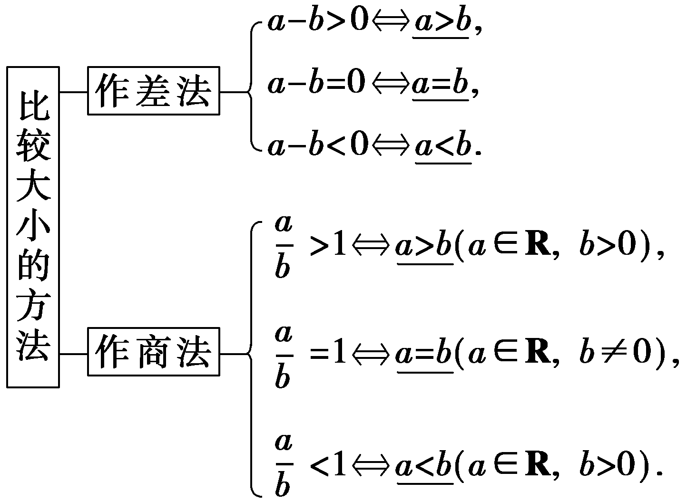

**第三节　等式性质与不等式性质**

【课标研读】　1.梳理等式的性质.　2.会比较两个数(式)的大小.　3.理解不等式的概念，掌握不等式的性质，并能简单应用.

1.两个实数比较大小的方法

2.等式的性质

<table><tr><td>
性质
</td><td>
内容
</td><td>
注意
</td></tr><tr><td>
性质1(对称性)
</td><td>
如果<em>a</em>＝<em>b</em>，那么<em>b</em>＝<em>a</em>
</td><td>
可逆
</td></tr><tr><td>
性质2(传递性)
</td><td>
如果<em>a</em>＝<em>b</em>，<em>b</em>＝<em>c</em>，那么<em>a</em>＝<em>c</em>
</td><td>
单向
</td></tr><tr><td>
性质3

(可加(减)性)
</td><td>
如果<em>a</em>＝<em>b</em>，那么<em>a</em>±<em>c</em>＝<em>b</em>±<em>c</em>
</td><td>
可逆
</td></tr><tr><td>
性质4(可乘性)
</td><td>
如果<em>a</em>＝<em>b</em>，那么<em>ac</em>＝<em>bc</em>
</td><td>
单向
</td></tr><tr><td>
性质5(可除性)
</td><td>
如果<em>a</em>＝<em>b</em>，<em>c</em>≠0，那么
</td><td>
可逆
</td></tr></table>

3.不等式的性质

<table><tr><td>
性质
</td><td>
性质内容
</td><td>
注意
</td></tr><tr><td>
对称性
</td><td>
<em>a</em>＞<em>b</em>⇔<em>b</em>＜<em>a</em>
</td><td>
可逆
</td></tr><tr><td>
传递性
</td><td>
<em>a</em>＞<em>b</em>，<em>b</em>＞<em>c</em>⇒<em>a</em>＞<em>c</em>
</td><td>
同向
</td></tr><tr><td>
可加性
</td><td>
<em>a</em>＞<em>b</em>⇔<em>a</em>＋<em>c</em>＞<em>b</em>＋<em>c</em>
</td><td>
可逆
</td></tr><tr><td>
可乘性
</td><td>
<em>a</em>＞<em>b</em>，<em>c</em>＞0⇒<em>ac</em>＞<em>bc</em>；

<em>a</em>＞<em>b</em>，<em>c</em>＜0⇒<em>ac</em>＜<em>bc</em>
</td><td>
<em>c</em>的符号
</td></tr><tr><td>
同向

可加性
</td><td>
<em>a</em>＞<em>b</em>，<em>c</em>＞<em>d</em>⇒<em>a</em>＋<em>c</em>＞<em>b</em>＋<em>d</em>
</td><td>
同向
</td></tr><tr><td>
同向同正

可乘性
</td><td>
<em>a</em>＞<em>b</em>＞0，<em>c</em>＞<em>d</em>＞0⇒<em>ac</em>＞<em>bd</em>
</td><td>
同向，

同正
</td></tr><tr><td>
可乘方性
</td><td>
<em>a</em>＞<em>b</em>＞0⇒<em>an</em>＞<em>bn</em>(<em>n</em>∈<strong>N</strong>，<em>n</em>≥2)
</td><td>
同正
</td></tr><tr><td>
可开方性
</td><td>
<em>a</em>＞<em>b</em>＞0⇒(<em>n</em>∈<strong>N</strong>，<em>n</em>≥2)
</td><td>
同正
</td></tr></table>

【常用结论】

(1)倒数性质

若<text style="it*a*lic">a*b*</text>＞0，且a＞b⇔ $\frac{1}{a}＜\frac{1}{b}$ ；

若<text style="it*a*lic">a*b*</text>＜0，且a＞b⇔ $\frac{1}{a}＞\frac{1}{b}$ ；

若<text style="itali*c*">a</text>＞*b*＞0，0＜c＜*d*⇒ $\frac{a}{c}＞\frac{b}{d}$ .

(2)有关分数的性质

若*b*＞*a*＞0，*m*＞0，则

① $\frac{a－m}{b－m}＜\frac{a}{b}＜\frac{a＋m}{b＋m}$ (*a*－*m*＞0)(真分数越加越大，越减越小)；

② $\frac{b＋m}{a＋m}＜\frac{b}{a}＜\frac{b－m}{a－m}$ (*a*－*m*＞0)(假分数越加越小，越减越大).

【自主检测】

1.(多选)下列说法正确的是(　　)

A.两个实数*a*，*b*之间，有且只有*a*＞*b*，*a*＝*b*，*a*＜*b*三种关系中的一种

B.若 $\frac{a}{b}$ ＞1，则*a*＞*b*

C.同向不等式具有可加性和可乘性

D.两个数的比值大于1，则分子不一定大于分母

答案：**AD**

2.(链接人教A必修一P38例1)若<em>M</em>＝(<em>x</em>－3)2，<em>N</em>＝(<em>x</em>－2)(<em>x</em>－4)，则有(　　)

A.*M* ＞*N*	B.*M* ≥*N*

C.*M*＜*N*	D.*M*≤*N*

答案：**A**

解析：因为<em>M</em>－<em>N</em>＝(<em>x</em>－3)2－(<em>x</em>－2)(<em>x</em>－4)＝1＞0，所以<em>M</em> ＞<em>N</em>.故选A.

3.(链接人教A必修一P43T8)如果*a*＜*b*＜0，那么下列不等式成立的是(　　)

A. $\frac{1}{a}＜\frac{1}{b}$ 	B.<em>a&lt;text style="italic"&gt;b</em>&lt;/text&gt;＜b2

C.&lt;text style="it<em>a</em>lic"&gt;ab&lt;/text&gt;＞a2	D.－ $\frac{1}{a}$ ＜－ $\frac{1}{b}$

答案：**D**

解析：因为&lt;text style="it&lt;text style="it&lt;text style="it<em>a</em>lic"&gt;a&lt;/text&gt;lic"&gt;a&lt;/text&gt;lic"&gt;a&lt;/text&gt;＜<em>&lt;text style="italic"&gt;&lt;text style="italic"&gt;&lt;text style="italic"&gt;b</em>&lt;/text&gt;&lt;/text&gt;&lt;/text&gt;＜0，由不等式的性质可知，－a＞－b＞0，<em>&lt;text style="italic"&gt;&lt;text style="italic"&gt;ab</em>&lt;/text&gt;&lt;/text&gt;＞0，所以－ $\frac{1}{a}$ ＜－ $\frac{1}{b}$ ，所以 $\frac{1}{a}＞\frac{1}{b}$ ，故A错误，D正确；由&lt;text style="it&lt;text style="it&lt;text style="it<em>a</em>lic"&gt;a&lt;/text&gt;lic"&gt;a&lt;/text&gt;lic"&gt;a&lt;/text&gt;＜<em>&lt;text style="italic"&gt;&lt;text style="italic"&gt;&lt;text style="italic"&gt;b</em>&lt;/text&gt;&lt;/text&gt;&lt;/text&gt;＜0，可得<em>&lt;text style="italic"&gt;&lt;text style="italic"&gt;ab</em>&lt;/text&gt;&lt;/text&gt;＞b&lt;text style="superscript"&gt;2&lt;/text&gt;＞0，a2＞ab＞0，故B、C错误.故选D.

4.实数*x*，*y*满足*x*＞*y*，则下列不等式成立的是(　　)

A. $\frac{y}{x}$ ＜1	B.2&lt;te&lt;text st<em>y</em>le="italic,superscript"&gt;x&lt;/text&gt;t style="superscript"&gt;－&lt;/text&gt;x＜2－y

C.lg(<em>x</em>－<em>y</em>)＞0	D.<em>x</em>2＞<em>y</em>2

答案：**B**

考点一　数(式)的大小比较　　　　自主练透

1.已知<em>p</em>∈<strong>R</strong>，<em>M</em>＝(2<em>p</em>＋1)(<em>p</em>－3)，<em>N</em>＝(<em>p</em>－6)(<em>p</em>＋3)＋10，则<em>M</em>，<em>N</em>的大小关系为(　　)

A.*M*＜*N*	B.*M* ＞*N*

C.*M*≤*N*	D.*M* ≥*N*

答案：**B**

解析：因为<em>M</em>－<em>N</em>＝(2<em>p</em>＋1)(<em>p</em>－3)－[(<em>p</em>－6)(<em>p</em>＋3)＋10]＝<em>p</em>2－2<em>p</em>＋5＝(<em>p</em>－1)2＋4＞0，所以<em>M</em> ＞<em>N</em>.故选B.

2.设*a*，*b*∈[0，＋∞)，*<text style="italic">A*</text> $＝\sqrt{a}$ ＋ $\sqrt{b}$ ，*<text style="italic">B*</text> $＝\sqrt{a＋b}$ ，则*<text style="italic">A*</text>，*<text style="italic">B*</text>的大小关系是(　　)

A.*A*≤*B*	B.*A*≥*B*

C.*A*＜*B*	D.*A*＞*B*

答案：**B**

解析：由题意得，<em>&lt;text style="italic"&gt;&lt;text style="italic"&gt;B</em>&lt;/text&gt;&lt;/text&gt;&lt;text style="superscript"&gt;2&lt;/text&gt;－<em>&lt;text style="italic"&gt;&lt;text style="italic"&gt;A</em>&lt;/text&gt;&lt;/text&gt;2＝－2 $\sqrt{ab}$ ≤0，又<em>&lt;text style="italic"&gt;&lt;text style="italic"&gt;A</em>&lt;/text&gt;&lt;/text&gt;≥0，<em>&lt;text style="italic"&gt;&lt;text style="italic"&gt;B</em>&lt;/text&gt;&lt;/text&gt;≥0，所以A≥B.故选B.

3.若&lt;text style="it<em>a</em>lic"&gt;a&lt;/text&gt; $＝\frac{ln2}{2}$ ，&lt;text style="it<em>a</em>lic"&gt;<em>b</em>&lt;/text&gt; $＝\frac{ln3}{3}$ ，则&lt;text style="it<em>a</em>lic"&gt;a&lt;/text&gt;<u>　　　　</u><em>&lt;text style="italic"&gt;b</em>&lt;/text&gt;.(填“＞”或“＜”)

答案：＜

解析：法一：易知<text style="it*a*lic">a</text>，*<text style="italic">b*</text>都是正数， $\frac{b}{a}＝\frac{2ln3}{3ln2}＝\frac{ln 3^{2}}{ln 2^{3}}＝\frac{ln9}{ln8}＝$ log<text style="su*b*script">8</text>9＞1，故<text style="it*a*lic">a</text>＜*b*.

法二：令<te<te<te<te*x*t style="italic">x</text>t style="italic">x</text>t style="italic">x</text>t style="italic">*f*</text>(x) $＝\frac{lnx}{x}$ ，所以<te<te<te<te*x*t style="italic">x</text>t style="italic">x</text>t style="italic">x</text>t style="italic">*f*</text>' $\left(x\right)＝\frac{1－lnx}{x^{2}}$ ，当<te<te<te*x*t style="italic">x</text>t style="italic">x</text>t style="italic">x</text>∈(e，＋∞)时，*<text style="italic">f*</text>'(x)＜0，所以f(x)在(e，＋∞)上单调递减，

所以<text style="it*a*lic">*f*</text>(4)＜f(3)，即 $\frac{ln4}{4}＝\frac{ln2}{2}＜\frac{ln3}{3}$ ，故*a*＜*b*.

数(式)比较大小的常用方法

1.作差法：(1)作差；(2)变形；(3)定号；(4)得出结论.

2.作商法：(1)作商；(2)变形；(3)判断商与1的大小关系；(4)得出结论.

3.构造函数法：利用函数的单调性比较大小.

考点二　不等式的性质　　　　师生共研

(1)若*a*，*b*，*c*为实数，且*a*＜*b*，*c*＞0，则下列不等关系一定成立的是(　　)

A.<text style="itali*c*">a</text>＋c＜*b*＋*c*	B. $\frac{1}{a}＜\frac{1}{b}$

C.*ac*＞*bc*	D.*b*－*a*＞*c*

(2)(多选)已知实数*a*，*b*，*c*满足*a*＞*b*＞*c*，且*a*＋*b*＋*c*＝0，则下列说法正确的是(　　)

A. $\frac{1}{a－c}＞\frac{1}{b－c}$ 	B.<text style="itali*c*">a</text>－c＞2*b*

C.<em>a</em>2＞<em>b</em>2	D.<em>ab</em>＋<em>bc</em>＞0

答案：(1)**A**　(2)**BC**

解析：(1)对于A，由不等式的性质知，<text style="it<text style="it<text style="it<text style="it<text style="it<text style="it<text style="itali*c*">a</text>li*c*">a</text>lic">a</text>lic">a</text>li*c*">a</text>li<text style="itali*c*">c</text>">a</text>lic">a</text>＜*<text style="italic"><text style="italic"><text style="italic"><text style="italic"><text style="italic"><text style="italic">b*</text></text></text></text></text></text>⇒a＋c＜b＋c，故A正确；对于B，若a＝－2，b＝－1，则 $\frac{1}{a}＞\frac{1}{b}$ ，故B错误；对于C，由不等式的性质知，<text style="it<text style="it<text style="it<text style="it<text style="it<text style="itali*c*">a</text>li*c*">a</text>lic">a</text>lic">a</text>li*c*">a</text>li*c*">c</text>＞0，<text style="it*a*lic">a</text>＜*<text style="italic"><text style="italic"><text style="italic"><text style="italic"><text style="italic"><text style="italic">b*</text></text></text></text></text></text>⇒*ac*＜*bc*，故C错误；对于D，a＜b⇒b－a＞0，又c＞0，所以无法判断b－a与c的大小，故D错误.故选A.

(&lt;text style="supers<em>c</em>ript"&gt;&lt;text style="superscript"&gt;&lt;text style="superscript"&gt;&lt;text style="superscript"&gt;2&lt;/text&gt;&lt;/text&gt;&lt;/text&gt;&lt;/text&gt;)对于A，因为&lt;text style="it&lt;text style="it&lt;text style="it&lt;text style="it&lt;text style="it&lt;text style="it&lt;text style="it&lt;text style="it&lt;text style="it&lt;text style="it&lt;text style="it&lt;text style="it&lt;text style="it&lt;text style="it&lt;text style="it<em>a</em>lic"&gt;a&lt;/text&gt;lic"&gt;a&lt;/text&gt;lic"&gt;a&lt;/text&gt;lic"&gt;a&lt;/text&gt;li<em>c</em>"&gt;a&lt;/text&gt;lic"&gt;a&lt;/text&gt;li<em>c</em>"&gt;a&lt;/text&gt;li<em>c</em>"&gt;a&lt;/text&gt;lic"&gt;a&lt;/text&gt;li<em>c</em>"&gt;a&lt;/text&gt;li<em>c</em>"&gt;a&lt;/text&gt;li<em>c</em>"&gt;a&lt;/text&gt;li<em>c</em>"&gt;a&lt;/text&gt;li&lt;text style="itali<em>c</em>"&gt;c&lt;/text&gt;"&gt;a&lt;/text&gt;li<em>c</em>"&gt;a&lt;/text&gt;＞<em>&lt;text style="italic"&gt;&lt;text style="italic"&gt;&lt;text style="italic"&gt;&lt;text style="italic"&gt;&lt;text style="italic"&gt;&lt;text style="italic"&gt;&lt;text style="italic"&gt;&lt;text style="italic"&gt;&lt;text style="italic"&gt;&lt;text style="italic"&gt;&lt;text style="italic"&gt;&lt;text style="italic"&gt;&lt;text style="italic"&gt;&lt;text style="italic"&gt;&lt;text style="italic"&gt;&lt;text style="italic"&gt;b</em>&lt;/text&gt;&lt;/text&gt;&lt;/text&gt;&lt;/text&gt;&lt;/text&gt;&lt;/text&gt;&lt;/text&gt;&lt;/text&gt;&lt;/text&gt;&lt;/text&gt;&lt;/text&gt;&lt;/text&gt;&lt;/text&gt;&lt;/text&gt;&lt;/text&gt;&lt;/text&gt;＞c，所以a－c＞b－c＞0，所以 $\frac{1}{a－c}＜\frac{1}{b－c}$ ，故A错误；对于B，因为&lt;text style="it&lt;text style="it&lt;text style="it&lt;text style="it&lt;text style="it&lt;text style="it&lt;text style="it&lt;text style="it&lt;text style="it&lt;text style="it&lt;text style="it&lt;text style="it&lt;text style="it&lt;text style="it&lt;text style="it&lt;text style="itali<em>c</em>"&gt;a&lt;/text&gt;lic"&gt;a&lt;/text&gt;lic"&gt;a&lt;/text&gt;lic"&gt;a&lt;/text&gt;lic"&gt;a&lt;/text&gt;li<em>c</em>"&gt;a&lt;/text&gt;lic"&gt;a&lt;/text&gt;li<em>c</em>"&gt;a&lt;/text&gt;li<em>c</em>"&gt;a&lt;/text&gt;lic"&gt;a&lt;/text&gt;li<em>c</em>"&gt;a&lt;/text&gt;li<em>c</em>"&gt;a&lt;/text&gt;li<em>c</em>"&gt;a&lt;/text&gt;li<em>c</em>"&gt;a&lt;/text&gt;li&lt;text style="itali<em>c</em>"&gt;c&lt;/text&gt;"&gt;a&lt;/text&gt;li<em>c</em>"&gt;a&lt;/text&gt;＞<em>&lt;text style="italic"&gt;&lt;text style="italic"&gt;&lt;text style="italic"&gt;&lt;text style="italic"&gt;&lt;text style="italic"&gt;&lt;text style="italic"&gt;&lt;text style="italic"&gt;&lt;text style="italic"&gt;&lt;text style="italic"&gt;&lt;text style="italic"&gt;&lt;text style="italic"&gt;&lt;text style="italic"&gt;&lt;text style="italic"&gt;&lt;text style="italic"&gt;&lt;text style="italic"&gt;&lt;text style="italic"&gt;b</em>&lt;/text&gt;&lt;/text&gt;&lt;/text&gt;&lt;/text&gt;&lt;/text&gt;&lt;/text&gt;&lt;/text&gt;&lt;/text&gt;&lt;/text&gt;&lt;/text&gt;&lt;/text&gt;&lt;/text&gt;&lt;/text&gt;&lt;/text&gt;&lt;/text&gt;&lt;/text&gt;＞c，a＋b＋c＝0，所以a＞0，c＜0，a－b＞0，所以b＋c＝－a＜0，所以a－b＞b＋c，即a－c＞&lt;text style="superscript"&gt;&lt;text style="superscript"&gt;&lt;text style="superscript"&gt;&lt;text style="superscript"&gt;2&lt;/text&gt;&lt;/text&gt;&lt;/text&gt;&lt;/text&gt;b，故B正确；对于C，因为a－b＞0，a＋b＝－c＞0，所以a2－b2＝(a＋b)(a－b)＞0，即a2＞b2，故C正确；对于D，<em>ab</em>＋<em>bc</em>＝b(a＋c)＝－b2≤0，故D错误.故选BC.

判断不等式的常用方法

1.利用不等式的性质逐个验证.

2.利用特殊值法排除错误选项.

3.作差法.

4.构造函数，利用函数的单调性验证.

对点练1.若*a*＞0＞*b*，则(　　)

A.<em>a</em>3＞<em>b</em>3	B.｜<em>a</em>｜＞｜<em>b</em>｜

C. $\frac{1}{a}＜\frac{1}{b}$ 	D.ln(*a*－*b*)＞0

答案：**A**

解析：因为&lt;text style="it&lt;text style="it&lt;text style="it&lt;text style="it&lt;text style="it&lt;text style="it<em>a</em>lic"&gt;a&lt;/text&gt;lic"&gt;a&lt;/text&gt;lic"&gt;a&lt;/text&gt;lic"&gt;a&lt;/text&gt;lic"&gt;a&lt;/text&gt;lic"&gt;a&lt;/text&gt;＞0＞<em>&lt;text style="italic"&gt;&lt;text style="italic"&gt;&lt;text style="italic"&gt;&lt;text style="italic"&gt;&lt;text style="italic"&gt;&lt;text style="italic"&gt;b</em>&lt;/text&gt;&lt;/text&gt;&lt;/text&gt;&lt;/text&gt;&lt;/text&gt;&lt;/text&gt;，所以a&lt;text style="superscript"&gt;&lt;text style="superscript"&gt;&lt;text style="superscript"&gt;3&lt;/text&gt;&lt;/text&gt;&lt;/text&gt;＞0，b3＜0，即a3＞b3，故A正确；取a＝1，b＝－2，则｜a｜＞｜b｜不成立， $\frac{1}{a}＜\frac{1}{b}$ 不成立，故B，C错误；取&lt;text style="it&lt;text style="it&lt;text style="it&lt;text style="it&lt;text style="it&lt;text style="it<em>a</em>lic"&gt;a&lt;/text&gt;lic"&gt;a&lt;/text&gt;lic"&gt;a&lt;/text&gt;lic"&gt;a&lt;/text&gt;lic"&gt;a&lt;/text&gt;lic"&gt;a&lt;/text&gt; $＝\frac{1}{2}$ ，&lt;text style="it&lt;text style="it&lt;text style="it&lt;text style="it&lt;text style="it&lt;text style="it<em>a</em>lic"&gt;a&lt;/text&gt;lic"&gt;a&lt;/text&gt;lic"&gt;a&lt;/text&gt;lic"&gt;a&lt;/text&gt;lic"&gt;a&lt;/text&gt;lic"&gt;<em>&lt;text style="italic"&gt;&lt;text style="italic"&gt;&lt;text style="italic"&gt;&lt;text style="italic"&gt;&lt;text style="italic"&gt;b</em>&lt;/text&gt;&lt;/text&gt;&lt;/text&gt;&lt;/text&gt;&lt;/text&gt;&lt;/text&gt;＝－ $\frac{1}{2}$ ，则ln(&lt;text style="it&lt;text style="it&lt;text style="it&lt;text style="it&lt;text style="it&lt;text style="it<em>a</em>lic"&gt;a&lt;/text&gt;lic"&gt;a&lt;/text&gt;lic"&gt;a&lt;/text&gt;lic"&gt;a&lt;/text&gt;lic"&gt;a&lt;/text&gt;lic"&gt;a&lt;/text&gt;－<em>&lt;text style="italic"&gt;&lt;text style="italic"&gt;&lt;text style="italic"&gt;&lt;text style="italic"&gt;&lt;text style="italic"&gt;&lt;text style="italic"&gt;b</em>&lt;/text&gt;&lt;/text&gt;&lt;/text&gt;&lt;/text&gt;&lt;/text&gt;&lt;/text&gt;)＝ln 1＝0，故D错误.故选A.

对点练2.(多选)若 $\frac{1}{a}＜\frac{1}{b}$ ＜0，则下列不等式正确的是(　　 )

A. $\frac{1}{a＋b}＜\frac{1}{ab}$ 	B.｜*a*｜＋*b*＞0

C.&lt;text style="it<em>a</em>lic"&gt;a&lt;/text&gt;－ $\frac{1}{a}$ ＞&lt;text style="it<em>a</em>lic"&gt;<em>b</em>&lt;/text&gt;－ $\frac{1}{b}$ 	D.ln &lt;text style="it<em>a</em>lic"&gt;a&lt;/text&gt;&lt;text style="superscript"&gt;2&lt;/text&gt;＞ln <em>&lt;text style="italic"&gt;b</em>&lt;/text&gt;2

答案：**AC**

解析：由 $\frac{1}{a}＜\frac{1}{b}$ ＜0，可知&lt;te&lt;text style="it<em>a</em>lic"&gt;x&lt;/text&gt;t st<em>y</em>le="it&lt;text style="it&lt;text style="it&lt;text style="it&lt;text style="it&lt;text style="it&lt;text style="it&lt;text style="it&lt;text style="it&lt;text style="it<em>a</em>lic"&gt;a&lt;/text&gt;lic"&gt;a&lt;/text&gt;lic"&gt;a&lt;/text&gt;lic"&gt;a&lt;/text&gt;lic"&gt;a&lt;/text&gt;lic"&gt;a&lt;/text&gt;lic"&gt;a&lt;/text&gt;lic"&gt;a&lt;/text&gt;lic"&gt;a&lt;/text&gt;lic"&gt;<em>&lt;text style="italic"&gt;&lt;text style="italic"&gt;&lt;text style="italic"&gt;&lt;text style="italic"&gt;&lt;text style="italic"&gt;&lt;text style="italic"&gt;&lt;text style="italic"&gt;&lt;text style="italic"&gt;&lt;text style="italic"&gt;b</em>&lt;/text&gt;&lt;/text&gt;&lt;/text&gt;&lt;/text&gt;&lt;/text&gt;&lt;/text&gt;&lt;/text&gt;&lt;/text&gt;&lt;/text&gt;&lt;/text&gt;＜a＜0.对于A，因为a＋b＜0，<em>ab</em>＞0，所以 $\frac{1}{a＋b}$ ＜0， $\frac{1}{ab}$ ＞0，则 $\frac{1}{a＋b}＜\frac{1}{ab}$ ，故A正确；对于B，因为&lt;te&lt;text style="it<em>a</em>lic"&gt;x&lt;/text&gt;t st<em>y</em>le="it&lt;text style="it&lt;text style="it&lt;text style="it&lt;text style="it&lt;text style="it&lt;text style="it&lt;text style="it&lt;text style="it&lt;text style="it<em>a</em>lic"&gt;a&lt;/text&gt;lic"&gt;a&lt;/text&gt;lic"&gt;a&lt;/text&gt;lic"&gt;a&lt;/text&gt;lic"&gt;a&lt;/text&gt;lic"&gt;a&lt;/text&gt;lic"&gt;a&lt;/text&gt;lic"&gt;a&lt;/text&gt;lic"&gt;a&lt;/text&gt;lic"&gt;<em>&lt;text style="italic"&gt;&lt;text style="italic"&gt;&lt;text style="italic"&gt;&lt;text style="italic"&gt;&lt;text style="italic"&gt;&lt;text style="italic"&gt;&lt;text style="italic"&gt;&lt;text style="italic"&gt;&lt;text style="italic"&gt;b</em>&lt;/text&gt;&lt;/text&gt;&lt;/text&gt;&lt;/text&gt;&lt;/text&gt;&lt;/text&gt;&lt;/text&gt;&lt;/text&gt;&lt;/text&gt;&lt;/text&gt;＜a＜0，所以－b＞－a＞0，故－b＞｜a｜，即｜a｜＋b＜0，故B错误；对于C，因为b＜a＜0，又 $\frac{1}{a}＜\frac{1}{b}$ ＜0，则－ $\frac{1}{a}$ ＞－ $\frac{1}{b}$ ＞0，所以&lt;te&lt;text style="it<em>a</em>lic"&gt;x&lt;/text&gt;t st<em>y</em>le="it&lt;text style="it&lt;text style="it&lt;text style="it&lt;text style="it&lt;text style="it&lt;text style="it&lt;text style="it&lt;text style="it<em>a</em>lic"&gt;a&lt;/text&gt;lic"&gt;a&lt;/text&gt;lic"&gt;a&lt;/text&gt;lic"&gt;a&lt;/text&gt;lic"&gt;a&lt;/text&gt;lic"&gt;a&lt;/text&gt;lic"&gt;a&lt;/text&gt;lic"&gt;a&lt;/text&gt;lic"&gt;a&lt;/text&gt;－ $\frac{1}{a}$ ＞&lt;te&lt;text style="it<em>a</em>lic"&gt;x&lt;/text&gt;t st<em>y</em>le="it&lt;text style="it&lt;text style="it&lt;text style="it&lt;text style="it&lt;text style="it&lt;text style="it&lt;text style="it&lt;text style="it&lt;text style="it<em>a</em>lic"&gt;a&lt;/text&gt;lic"&gt;a&lt;/text&gt;lic"&gt;a&lt;/text&gt;lic"&gt;a&lt;/text&gt;lic"&gt;a&lt;/text&gt;lic"&gt;a&lt;/text&gt;lic"&gt;a&lt;/text&gt;lic"&gt;a&lt;/text&gt;lic"&gt;a&lt;/text&gt;lic"&gt;<em>&lt;text style="italic"&gt;&lt;text style="italic"&gt;&lt;text style="italic"&gt;&lt;text style="italic"&gt;&lt;text style="italic"&gt;&lt;text style="italic"&gt;&lt;text style="italic"&gt;&lt;text style="italic"&gt;&lt;text style="italic"&gt;b</em>&lt;/text&gt;&lt;/text&gt;&lt;/text&gt;&lt;/text&gt;&lt;/text&gt;&lt;/text&gt;&lt;/text&gt;&lt;/text&gt;&lt;/text&gt;&lt;/text&gt;－ $\frac{1}{b}$ ，故C正确；对于D，因为&lt;te&lt;text style="it<em>a</em>lic"&gt;x&lt;/text&gt;t st<em>y</em>le="it&lt;text style="it&lt;text style="it&lt;text style="it&lt;text style="it&lt;text style="it&lt;text style="it&lt;text style="it&lt;text style="it&lt;text style="it<em>a</em>lic"&gt;a&lt;/text&gt;lic"&gt;a&lt;/text&gt;lic"&gt;a&lt;/text&gt;lic"&gt;a&lt;/text&gt;lic"&gt;a&lt;/text&gt;lic"&gt;a&lt;/text&gt;lic"&gt;a&lt;/text&gt;lic"&gt;a&lt;/text&gt;lic"&gt;a&lt;/text&gt;lic"&gt;<em>&lt;text style="italic"&gt;&lt;text style="italic"&gt;&lt;text style="italic"&gt;&lt;text style="italic"&gt;&lt;text style="italic"&gt;&lt;text style="italic"&gt;&lt;text style="italic"&gt;&lt;text style="italic"&gt;&lt;text style="italic"&gt;b</em>&lt;/text&gt;&lt;/text&gt;&lt;/text&gt;&lt;/text&gt;&lt;/text&gt;&lt;/text&gt;&lt;/text&gt;&lt;/text&gt;&lt;/text&gt;&lt;/text&gt;＜a＜0，所以b&lt;text style="superscript"&gt;&lt;text style="superscript"&gt;&lt;text style="superscript"&gt;2&lt;/text&gt;&lt;/text&gt;&lt;/text&gt;＞a2＞0，而y＝ln x在定义域(0，＋∞)上单调递增，所以ln b2＞ln a2，故D错误.故选AC.

考点三　不等式性质的综合应用　　　　师生共研

(1)(一题多变)已知－1＜<em>x</em>＜4，2＜<em>y</em>＜3，则<em>x</em>－<em>y</em>的取值范围是<u>　　　　</u>，3<em>x</em>＋2<em>y</em>的取值范围是<u>　　　　</u>.

(2)已知3＜<em>a</em>＜8，4＜<em>b</em>＜9，则 $\frac{a}{b}$ 的取值范围是<u>　　　　　　　</u>.

答案：(1)(－4，2)　(1，18)　(2)( $\frac{1}{3}$ ，2)

解析：(1)因为－1＜*x*＜4，2＜*y*＜3，所以－3＜－*y*＜－2，所以－4＜*x*－*y*＜2.由－1＜*x*＜4，2＜*y*＜3，得－3＜3*x*＜12，4＜2*y*＜6，所以1＜3*x*＋2*y*＜18.

(2)因为4＜<text style="it*a*lic">b</text>＜9，所以 $\frac{1}{9}＜\frac{1}{b}＜\frac{1}{4}$ ，又3＜*a*＜8，所以 $\frac{1}{9}$ ×3＜ $\frac{a}{b}＜\frac{1}{4}$ ×8，即 $\frac{1}{3}＜\frac{a}{b}$ ＜2.

[变式探究]

(变条件)若将本例(1)中条件改为“－1＜*x*＋*y*＜4，2＜*x*－*y*＜3”，求3*x*＋2*y*的取值范围.

解：设3<te<te<te<te<te<te<te<text st*y*le="italic">x</text>t st*y*le="italic">x</text>t st*y*le="italic">x</text>t st*y*le="italic">x</text>t st*y*le="italic">x</text>t st*y*le="italic">x</text>t st*y*le="italic">x</text>t st*y*le="italic">x</text>＋2y＝*m*(x＋y)＋*n*(x－y)，则 $\left\{\begin{matrix}m＋n=3，\\m－n=2，\end{matrix}\right.$ 所以 $\left\{\begin{matrix}m＝\frac{5}{2}，\\n＝\frac{1}{2}，\end{matrix}\right.$ 即3<te<te<te<te<te<te<te<text st*y*le="italic">x</text>t st*y*le="italic">x</text>t st*y*le="italic">x</text>t st*y*le="italic">x</text>t st*y*le="italic">x</text>t st*y*le="italic">x</text>t st*y*le="italic">x</text>t st*y*le="italic">x</text>＋2y $＝\frac{5}{2}$ (<te<te<te<te<te<te<te<text st*y*le="italic">x</text>t st*y*le="italic">x</text>t st*y*le="italic">x</text>t st*y*le="italic">x</text>t st*y*le="italic">x</text>t st*y*le="italic">x</text>t st*y*le="italic">x</text>t st*y*le="italic">x</text>＋y)＋ $\frac{1}{2}$ (<te<te<te<te<te<te<te<text st*y*le="italic">x</text>t st*y*le="italic">x</text>t st*y*le="italic">x</text>t st*y*le="italic">x</text>t st*y*le="italic">x</text>t st*y*le="italic">x</text>t st*y*le="italic">x</text>t st*y*le="italic">x</text>－y)，又因为－1＜x＋y＜4，2＜x－y＜3，

所以－ $\frac{5}{2}＜\frac{5}{2}$ (<te<text st*y*le="italic">x</text>t st*y*le="italic">x</text>＋y)＜10，1＜ $\frac{1}{2}$ (<te<text st*y*le="italic">x</text>t st*y*le="italic">x</text>－y)＜ $\frac{3}{2}$ ，

所以－ $\frac{3}{2}＜\frac{5}{2}$ (<te<te<te<text st*y*le="italic">x</text>t st*y*le="italic">x</text>t st*y*le="italic">x</text>t st*y*le="italic">x</text>＋y)＋ $\frac{1}{2}$ (<te<te<te<text st*y*le="italic">x</text>t st*y*le="italic">x</text>t st*y*le="italic">x</text>t st*y*le="italic">x</text>－y)＜ $\frac{23}{2}$ ，即－ $\frac{3}{2}$ ＜3<te<te<te<text st*y*le="italic">x</text>t st*y*le="italic">x</text>t st*y*le="italic">x</text>t st*y*le="italic">x</text>＋2y＜ $\frac{23}{2}$ ，所以3<te<te<te<text st*y*le="italic">x</text>t st*y*le="italic">x</text>t st*y*le="italic">x</text>t st*y*le="italic">x</text>＋2y的取值范围为(－ $\frac{3}{2}$ ， $\frac{23}{2}$ ).

根据不等式的性质求取值范围的策略

1.严格运用不等式的性质，注意其成立的条件.

2.同向不等式的两边可以相加，如果在解题过程中多次使用这种转化，就会扩大其取值范围.

3.运用待定系数法建立待求范围式子的整体与已知范围式子的整体的关系，最后一次性运用不等式的性质求得取值范围.

对点练3.已知0＜<em>&lt;text style="italic"&gt;β</em>&lt;/text&gt;＜<em>&lt;text style="italic"&gt;α</em>&lt;/text&gt;＜ $\frac{\pi }{2}$ ，则<em>&lt;text style="italic"&gt;α</em>&lt;/text&gt;－<em>&lt;text style="italic"&gt;β</em>&lt;/text&gt;的取值范围是<u>　　　　</u>.

答案：( 0， $\frac{\pi }{2}$ )

解析：因为0＜*<text style="italic"><text style="italic"><text style="italic"><text style="italic"><text style="italic"><text style="italic">β*</text></text></text></text></text></text>＜ $\frac{\pi }{2}$ ，所以－ $\frac{\pi }{2}$ ＜－*<text style="italic"><text style="italic"><text style="italic"><text style="italic"><text style="italic"><text style="italic">β*</text></text></text></text></text></text>＜0，又0＜*<text style="italic"><text style="italic"><text style="italic"><text style="italic"><text style="italic">α*</text></text></text></text></text>＜ $\frac{\pi }{2}$ ，所以－ $\frac{\pi }{2}$ ＜*<text style="italic"><text style="italic"><text style="italic"><text style="italic"><text style="italic">α*</text></text></text></text></text>－*<text style="italic"><text style="italic"><text style="italic"><text style="italic"><text style="italic"><text style="italic">β*</text></text></text></text></text></text>＜ $\frac{\pi }{2}$ ，又*<text style="italic"><text style="italic"><text style="italic"><text style="italic"><text style="italic"><text style="italic">β*</text></text></text></text></text></text>＜*<text style="italic"><text style="italic"><text style="italic"><text style="italic"><text style="italic">α*</text></text></text></text></text>，所以α－β＞0，即0＜α－β＜ $\frac{\pi }{2}$ ，即*<text style="italic"><text style="italic"><text style="italic"><text style="italic"><text style="italic">α*</text></text></text></text></text>－*<text style="italic"><text style="italic"><text style="italic"><text style="italic"><text style="italic"><text style="italic">β*</text></text></text></text></text></text>的取值范围为(0， $\frac{\pi }{2}$ ).

对点练4.已知&lt;text style="it&lt;text style="itali<em>c</em>"&gt;a&lt;/text&gt;li<em>c</em>"&gt;a&lt;/text&gt;＞<em>&lt;text style="italic"&gt;b</em>&lt;/text&gt;＞c，2a＋b＋c＝0，则 $\frac{c}{a}$ 的取值范围是<u>　　　　</u>.

答案：(－3，－1)

解析：因为<text style="it<text style="it<text style="it<text style="it<text style="it<text style="it<text style="it<text style="it<text style="it<text style="it*a*li<text style="itali<text style="itali*c*">c</text>">c</text>">a</text>li<text style="itali*c*">c</text>">a</text>li*c*">a</text>lic">a</text>li*c*">a</text>li*c*">a</text>li*c*">a</text>li*c*">a</text>li*c*">a</text>li*c*">a</text>＞*<text style="italic"><text style="italic"><text style="italic"><text style="italic"><text style="italic">b*</text></text></text></text></text>＞c，2a＋b＋c＝0，所以a＞0，c＜0，b＝－2a－c.因为a＞b＞c，所以－2a－c＜a，即3a＞－c，解得 $\frac{c}{a}$ ＞－3，将<text style="it<text style="it<text style="it<text style="it<text style="it<text style="it<text style="it<text style="it<text style="it<text style="it*a*li<text style="itali<text style="itali*c*">c</text>">c</text>">a</text>li<text style="itali*c*">c</text>">a</text>li*c*">a</text>lic">a</text>li*c*">a</text>li*c*">a</text>li*c*">a</text>li*c*">a</text>li*c*">a</text>li*c*">*<text style="italic"><text style="italic"><text style="italic"><text style="italic">b*</text></text></text></text></text>＝－2*a*－c代入b＞c中，得－2a－c＞c，即c＜－a，得 $\frac{c}{a}$ ＜－1，所以－3＜ $\frac{c}{a}$ ＜－1，即 $\frac{c}{a}$ 的取值范围为(－3，－1).

**课时测评**3　**等式性质与不等式性质** $\frac{对应学生}{用书P315}$

(时间：50分钟　满分：75分)

(本栏目内容，在学生用书中以独立形式分册装订！)

(1—10题，每小题5分，共50分)

1.已知0＜<em>a</em>1＜1，0＜<em>a</em>2＜1，记<em>M</em>＝<em>a</em>1<em>a</em>2，<em>N</em>＝<em>a</em>1＋<em>a</em>2－1，则<em>M</em>与<em>N</em>的大小关系是(　　)

A.*M*＜*N*	B.*M*＞*N*

C.*M*＝*N*	D.*M*≥*N*

答案：**B**

解析：因为0＜<em>a</em>1＜1，0＜<em>a</em>2＜1，所以－1＜<em>a</em>1－1＜0，－1＜<em>a</em>2－1＜0，所以<em>M</em>－<em>N</em>＝<em>a</em>1<em>a</em>2－(<em>a</em>1＋<em>a</em>2－1)＝<em>a</em>1<em>a</em>2－<em>a</em>1－<em>a</em>2＋1＝<em>a</em>1(<em>a</em>2－1)－(<em>a</em>2－1)＝(<em>a</em>1－1)(<em>a</em>2－1)＞0，所以<em>M</em> ＞<em>N</em>.故选B.

2.若<em>a</em>，<em>b</em>，<em>c</em>∈<strong>R</strong>，且<em>a</em>＞<em>b</em>，则下列不等式中一定成立的是(　　)

A.<em>ac</em>2＞<em>bc</em>2	B. $\frac{1}{a}＜\frac{1}{b}$

C. $\frac{c^{2}}{a－b}$ ＞0	D. $\left(a－b\right)$ <em>c</em>2≥0

答案：**D**

解析：对于A，当&lt;text style="it&lt;text style="it&lt;text style="it&lt;text style="it&lt;text style="it&lt;text style="it&lt;text style="itali&lt;text style="itali<em>c</em>"&gt;c&lt;/text&gt;"&gt;a&lt;/text&gt;lic"&gt;a&lt;/text&gt;lic"&gt;a&lt;/text&gt;li<em>c</em>"&gt;a&lt;/text&gt;lic"&gt;a&lt;/text&gt;lic"&gt;a&lt;/text&gt;lic"&gt;c&lt;/text&gt;＝0时，由a＞<em>&lt;text style="italic"&gt;&lt;text style="italic"&gt;&lt;text style="italic"&gt;&lt;text style="italic"&gt;&lt;text style="italic"&gt;b</em>&lt;/text&gt;&lt;/text&gt;&lt;/text&gt;&lt;/text&gt;&lt;/text&gt;不能推出<em>ac</em>&lt;text style="superscript"&gt;&lt;text style="superscript"&gt;&lt;text style="superscript"&gt;2&lt;/text&gt;&lt;/text&gt;&lt;/text&gt;＞<em>bc</em>2，故A错误；对于B，当a＞0，b＜0时，由a＞b不能推出 $\frac{1}{a}＜\frac{1}{b}$ ，故B错误；对于C，当&lt;text style="it&lt;text style="it&lt;text style="it&lt;text style="it&lt;text style="it&lt;text style="it&lt;text style="itali&lt;text style="itali<em>c</em>"&gt;c&lt;/text&gt;"&gt;a&lt;/text&gt;lic"&gt;a&lt;/text&gt;lic"&gt;a&lt;/text&gt;li<em>c</em>"&gt;a&lt;/text&gt;lic"&gt;a&lt;/text&gt;lic"&gt;a&lt;/text&gt;lic"&gt;c&lt;/text&gt;＝0时，由a＞<em>&lt;text style="italic"&gt;&lt;text style="italic"&gt;&lt;text style="italic"&gt;&lt;text style="italic"&gt;&lt;text style="italic"&gt;b</em>&lt;/text&gt;&lt;/text&gt;&lt;/text&gt;&lt;/text&gt;&lt;/text&gt;不能推出 $\frac{c^{2}}{a－b}$ ＞0，故C错误；对于D，由&lt;text style="it&lt;text style="it&lt;text style="it&lt;text style="it&lt;text style="it&lt;text style="itali&lt;text style="itali<em>c</em>"&gt;c&lt;/text&gt;"&gt;a&lt;/text&gt;lic"&gt;a&lt;/text&gt;lic"&gt;a&lt;/text&gt;li<em>c</em>"&gt;a&lt;/text&gt;lic"&gt;a&lt;/text&gt;lic"&gt;a&lt;/text&gt;＞<em>&lt;text style="italic"&gt;&lt;text style="italic"&gt;&lt;text style="italic"&gt;&lt;text style="italic"&gt;&lt;text style="italic"&gt;b</em>&lt;/text&gt;&lt;/text&gt;&lt;/text&gt;&lt;/text&gt;&lt;/text&gt;⇒a－b＞0，又<em>c</em>&lt;text style="superscript"&gt;&lt;text style="superscript"&gt;&lt;text style="superscript"&gt;2&lt;/text&gt;&lt;/text&gt;&lt;/text&gt;≥0，所以 $\left(a－b\right)$ &lt;text style="it&lt;text style="it&lt;text style="it&lt;text style="it&lt;text style="it&lt;text style="it&lt;text style="itali&lt;text style="itali<em>c</em>"&gt;c&lt;/text&gt;"&gt;a&lt;/text&gt;lic"&gt;a&lt;/text&gt;lic"&gt;a&lt;/text&gt;li<em>c</em>"&gt;a&lt;/text&gt;lic"&gt;a&lt;/text&gt;lic"&gt;a&lt;/text&gt;lic"&gt;c&lt;/text&gt;&lt;text style="superscript"&gt;&lt;text style="superscript"&gt;&lt;text style="superscript"&gt;2&lt;/text&gt;&lt;/text&gt;&lt;/text&gt;≥0，故D正确.故选D.

3.设*a*，*b*，*c*为实数，则下列命题为真命题的是(　　)

A.若*a*＞*b*，则*a*＋*c*＞*b*＋*c*

B.若*a*＞*b*，则*ac*＞*bc*

C.若 $\frac{1}{a}＜\frac{1}{b}$ ，则*a*＞*b*

D.若<em>a</em>2＞<em>b</em>2，则<em>a</em>＞<em>b</em>

答案：**A**

解析：对于A，显然正确；对于B，当&lt;text style="it&lt;text style="it&lt;text style="it&lt;text style="it&lt;text style="it<em>a</em>lic"&gt;a&lt;/text&gt;lic"&gt;a&lt;/text&gt;lic"&gt;a&lt;/text&gt;lic"&gt;a&lt;/text&gt;lic"&gt;c&lt;/text&gt;＜0时，有<em>ac</em>＜<em>&lt;text style="italic"&gt;&lt;text style="italic"&gt;&lt;text style="italic"&gt;&lt;text style="italic"&gt;&lt;text style="italic"&gt;b</em>&lt;/text&gt;&lt;/text&gt;&lt;/text&gt;&lt;/text&gt;c&lt;/text&gt;，故B错误；对于C，当a＜0，b＞0时，满足 $\frac{1}{a}＜\frac{1}{b}$ ，但此时&lt;text style="it&lt;text style="it&lt;text style="it&lt;text style="it<em>a</em>lic"&gt;a&lt;/text&gt;lic"&gt;a&lt;/text&gt;lic"&gt;a&lt;/text&gt;lic"&gt;a&lt;/text&gt;＜<em>&lt;text style="italic"&gt;&lt;text style="italic"&gt;&lt;text style="italic"&gt;&lt;text style="italic"&gt;b</em>&lt;/text&gt;&lt;/text&gt;&lt;/text&gt;&lt;/text&gt;，故C错误；对于D，当a＝－3，b＝&lt;text style="superscript"&gt;2&lt;/text&gt;时，满足a2＞b2，但此时a＜b，故D错误.故选A.

4.“0＜<text style="it*a*lic">a</text>＜*<text style="italic">b*</text>”是“a－ $\frac{1}{a}$ ＜<text style="it*a*lic">*b*</text>－ $\frac{1}{b}$ ”的(　　)

A.充分不必要条件	B.必要不充分条件

C.充分必要条件	D.既不充分也不必要条件

答案：**A**

解析：因为<te<text style="it<text style="it<text style="it<text style="it<text style="it<text style="it<text style="it<text style="it*a*lic">a</text>lic">a</text>lic">a</text>lic">a</text>lic">a</text>lic">a</text>lic">a</text>lic">x</text>t style="italic">y</text>＝x－ $\frac{1}{x}$ 在(－∞，0)和(0，＋∞)上均为增函数，所以当0＜<text style="it<text style="it<text style="it<text style="it<text style="it<text style="it<text style="it*a*lic">a</text>lic">a</text>lic">a</text>lic">a</text>lic">a</text>lic">a</text>lic">a</text>＜*<text style="italic"><text style="italic"><text style="italic"><text style="italic"><text style="italic"><text style="italic"><text style="italic">b*</text></text></text></text></text></text></text>时，a－ $\frac{1}{a}$ ＜<text style="it<text style="it<text style="it<text style="it<text style="it<text style="it<text style="it*a*lic">a</text>lic">a</text>lic">a</text>lic">a</text>lic">a</text>lic">a</text>lic">*<text style="italic"><text style="italic"><text style="italic"><text style="italic"><text style="italic"><text style="italic">b*</text></text></text></text></text></text></text>－ $\frac{1}{b}$ ，充分性成立；当<text style="it<text style="it<text style="it<text style="it<text style="it<text style="it<text style="it*a*lic">a</text>lic">a</text>lic">a</text>lic">a</text>lic">a</text>lic">a</text>lic">a</text>＜*<text style="italic"><text style="italic"><text style="italic"><text style="italic"><text style="italic"><text style="italic"><text style="italic">b*</text></text></text></text></text></text></text>＜0时，a－ $\frac{1}{a}$ ＜<text style="it<text style="it<text style="it<text style="it<text style="it<text style="it<text style="it*a*lic">a</text>lic">a</text>lic">a</text>lic">a</text>lic">a</text>lic">a</text>lic">*<text style="italic"><text style="italic"><text style="italic"><text style="italic"><text style="italic"><text style="italic">b*</text></text></text></text></text></text></text>－ $\frac{1}{b}$ 成立，而<text style="it<text style="it<text style="it<text style="it<text style="it<text style="it<text style="it*a*lic">a</text>lic">a</text>lic">a</text>lic">a</text>lic">a</text>lic">a</text>lic">a</text>－ $\frac{1}{a}$ ＜<text style="it<text style="it<text style="it<text style="it<text style="it<text style="it<text style="it*a*lic">a</text>lic">a</text>lic">a</text>lic">a</text>lic">a</text>lic">a</text>lic">*<text style="italic"><text style="italic"><text style="italic"><text style="italic"><text style="italic"><text style="italic">b*</text></text></text></text></text></text></text>－ $\frac{1}{b}$ 不能推出0＜<text style="it<text style="it<text style="it<text style="it<text style="it<text style="it<text style="it*a*lic">a</text>lic">a</text>lic">a</text>lic">a</text>lic">a</text>lic">a</text>lic">a</text>＜*<text style="italic"><text style="italic"><text style="italic"><text style="italic"><text style="italic"><text style="italic"><text style="italic">b*</text></text></text></text></text></text></text>，必要性不成立，所以“0＜a＜b”是“a－ $\frac{1}{a}$ ＜<text style="it<text style="it<text style="it<text style="it<text style="it<text style="it<text style="it*a*lic">a</text>lic">a</text>lic">a</text>lic">a</text>lic">a</text>lic">a</text>lic">*<text style="italic"><text style="italic"><text style="italic"><text style="italic"><text style="italic"><text style="italic">b*</text></text></text></text></text></text></text>－ $\frac{1}{b}$ ”的充分不必要条件.故选A.

5.十六世纪中叶，英国数学家雷科德在《砺智石》一书中首先把“＝”作为等号使用，后来英国数学家哈利奥特首次使用“＜”和“＞”符号，并逐步被数学界接受，不等号的引入对不等式的发展影响深远.若*a*，*b*，*c*∈R，则下列命题正确的是(　　)

A.若<em>a</em>＞<em>b</em>，则<em>ac</em>2＞<em>bc</em>2

B.若 $\frac{a}{c^{2}}＞\frac{b}{c^{2}}$ ，则*a*＜*b*

C.若<text style="itali*c*">a</text>＜*b*＜c＜0，则 $\frac{b}{a}＜\frac{b＋c}{a＋c}$

D.若<em>a</em>＞<em>b</em>，则<em>a</em>2＞<em>b</em>2

答案：**C**

解析：对于A，当&lt;text style="it&lt;text style="it&lt;text style="it&lt;text style="it&lt;text style="it&lt;text style="it&lt;text style="it&lt;text style="it&lt;text style="it<em>a</em>lic"&gt;a&lt;/text&gt;li<em>c</em>"&gt;a&lt;/text&gt;lic"&gt;a&lt;/text&gt;li<em>c</em>"&gt;a&lt;/text&gt;lic"&gt;a&lt;/text&gt;li<em>c</em>"&gt;a&lt;/text&gt;li<em>c</em>"&gt;a&lt;/text&gt;lic"&gt;a&lt;/text&gt;li<em>c</em>"&gt;c&lt;/text&gt;＝0时不满足，故A错误；对于B，由不等式性质知， $\frac{a}{c^{2}}＞\frac{b}{c^{2}}$ 两边同时乘以&lt;text style="it&lt;text style="it&lt;text style="it&lt;text style="it&lt;text style="it&lt;text style="it&lt;text style="it&lt;text style="it&lt;text style="it<em>a</em>lic"&gt;a&lt;/text&gt;li<em>c</em>"&gt;a&lt;/text&gt;lic"&gt;a&lt;/text&gt;li<em>c</em>"&gt;a&lt;/text&gt;lic"&gt;a&lt;/text&gt;li<em>c</em>"&gt;a&lt;/text&gt;li<em>c</em>"&gt;a&lt;/text&gt;lic"&gt;a&lt;/text&gt;li<em>c</em>"&gt;c&lt;/text&gt;&lt;text style="superscript"&gt;&lt;text style="superscript"&gt;2&lt;/text&gt;&lt;/text&gt;＞0，可得a＞<em>&lt;text style="italic"&gt;&lt;text style="italic"&gt;&lt;text style="italic"&gt;&lt;text style="italic"&gt;&lt;text style="italic"&gt;b</em>&lt;/text&gt;&lt;/text&gt;&lt;/text&gt;&lt;/text&gt;&lt;/text&gt;，故B错误；对于C，若a＜b＜c＜0，则a＋c＜0，b－a＞0，(b－a)c＜0，a(a＋c)＞0，故 $\frac{b}{a}$ － $\frac{b＋c}{a＋c}＝\frac{b\left(a＋c\right)－a\left(b＋c\right)}{a\left(a＋c\right)}＝\frac{\left(b－a\right)c}{a\left(a＋c\right)}$ ＜0，即 $\frac{b}{a}＜\frac{b＋c}{a＋c}$ ，故C正确；对于D，取&lt;text style="it&lt;text style="it&lt;text style="it&lt;text style="it&lt;text style="it&lt;text style="it&lt;text style="it&lt;text style="it<em>a</em>lic"&gt;a&lt;/text&gt;li<em>c</em>"&gt;a&lt;/text&gt;lic"&gt;a&lt;/text&gt;li<em>c</em>"&gt;a&lt;/text&gt;lic"&gt;a&lt;/text&gt;li<em>c</em>"&gt;a&lt;/text&gt;li<em>c</em>"&gt;a&lt;/text&gt;lic"&gt;a&lt;/text&gt;＝－1，<em>&lt;text style="italic"&gt;&lt;text style="italic"&gt;&lt;text style="italic"&gt;&lt;text style="italic"&gt;&lt;text style="italic"&gt;b</em>&lt;/text&gt;&lt;/text&gt;&lt;/text&gt;&lt;/text&gt;&lt;/text&gt;＝－&lt;text style="superscript"&gt;&lt;text style="superscript"&gt;2&lt;/text&gt;&lt;/text&gt;，可得a2＜b2，故D错误.故选C.

6.(多选)若*a*＞0＞*b*＞－*a*，*c*＜*d*＜0，则下列结论正确的是(　　)

A.*ad*＞*bc*	B. $\frac{a}{d}$ ＋ $\frac{b}{c}$ ＜0

C.*a*－*c*＞*b*－*d*	D.*a*(*d*－*c*)＞*b*(*d*－*c*)

答案：**BCD**

解析：因为<text style="it<text style="it<text style="it<text style="it<text style="it<text style="it<text style="it<text style="it<text style="itali<text style="itali*c*">c</text>">a</text>li*c*">a</text>li*c*">a</text>li*c*">a</text>lic">a</text>li<text style="itali<text style="itali*c*">c</text>">c</text>">a</text>li<text style="itali*c*">c</text>">a</text>lic">a</text>li*c*">a</text>＞0＞*<text style="italic"><text style="italic"><text style="italic"><text style="italic"><text style="italic"><text style="italic"><text style="italic"><text style="italic">b*</text></text></text></text></text></text></text></text>，c＜*<text style="italic"><text style="italic"><text style="italic"><text style="italic"><text style="italic"><text style="italic"><text style="italic"><text style="italic"><text style="italic"><text style="italic">d*</text></text></text></text></text></text></text></text></text></text>＜0，所以*<text style="italic">ad*</text>＜0，*<text style="italic">bc*</text>＞0，所以ad＜bc，故A错误；因为0＞b＞－a，所以a＞－b＞0，因为c＜d＜0，所以－c＞－d＞0，所以a(－c)＞(－b)(－d)，所以*ac*＋*bd*＜0，*cd*＞0，所以 $\frac{ac＋bd}{cd}＝\frac{a}{d}$ ＋ $\frac{b}{c}$ ＜0，故B正确；因为<text style="it<text style="it<text style="it<text style="it<text style="it<text style="it<text style="it<text style="it<text style="itali<text style="itali*c*">c</text>">a</text>li*c*">a</text>li*c*">a</text>li*c*">a</text>lic">a</text>li<text style="itali<text style="itali*c*">c</text>">c</text>">a</text>li<text style="itali*c*">c</text>">a</text>lic">a</text>lic">c</text>＜*<text style="italic"><text style="italic"><text style="italic"><text style="italic"><text style="italic"><text style="italic"><text style="italic"><text style="italic"><text style="italic"><text style="italic">d*</text></text></text></text></text></text></text></text></text></text>，所以－c＞－d，因为*a*＞*<text style="italic"><text style="italic"><text style="italic"><text style="italic"><text style="italic"><text style="italic"><text style="italic"><text style="italic">b*</text></text></text></text></text></text></text></text>，所以a＋(－c)＞b＋(－d)，即a－c＞b－d，故C正确；因为a＞0＞b，d－c＞0，所以a(d－c)＞b(d－c)，故D正确.故选BCD.

7.(多选)对于任意实数*a*，*b*，*c*，*d*，下列命题中是真命题的是(　　)

A.若<em>ac</em>2＞<em>bc</em>2，则<em>a</em>＞<em>b</em>

B.若*bc*－*ad*≥0，*bd*＞0，则 $\frac{a＋b}{b}$ ≤ $\frac{c＋d}{d}$

C.若*a*＜*b*＜0，则 $\frac{b}{a}＞\frac{a}{b}$

D.若<text style="it*a*lic">a</text>＞*<text style="italic">b*</text>， $\frac{1}{a}＞\frac{1}{b}$ ，则<text style="it*a*lic">a</text>＞0，*<text style="italic">b*</text>＜0

答案：**ABD**

解析：对于A，若&lt;text style="it&lt;text style="it&lt;text style="it&lt;text style="it&lt;text style="it<em>a</em>lic"&gt;a&lt;/text&gt;lic"&gt;a&lt;/text&gt;lic"&gt;a&lt;/text&gt;lic"&gt;a&lt;/text&gt;li<em>c</em>"&gt;ac&lt;/text&gt;&lt;text style="superscript"&gt;&lt;text style="superscript"&gt;&lt;text style="superscript"&gt;&lt;text style="superscript"&gt;2&lt;/text&gt;&lt;/text&gt;&lt;/text&gt;&lt;/text&gt;＞<em>&lt;text style="italic"&gt;&lt;text style="italic"&gt;&lt;text style="italic"&gt;&lt;text style="italic"&gt;&lt;text style="italic"&gt;b</em>&lt;/text&gt;&lt;/text&gt;&lt;/text&gt;&lt;/text&gt;c&lt;/text&gt;2，则c2＞0，所以a＞b，故A正确；对于B，若<em>bc</em>－<em>ad</em>≥0，<em>bd</em>＞0，则 $\frac{bc－ad}{bd}$ ≥0，化为 $\frac{c}{d}$ ≥ $\frac{a}{b}$ ，可得 $\frac{a＋b}{b}$ ≤ $\frac{c＋d}{d}$ ，故B正确；对于C，若&lt;text style="it&lt;text style="it&lt;text style="it&lt;text style="it<em>a</em>lic"&gt;a&lt;/text&gt;lic"&gt;a&lt;/text&gt;lic"&gt;a&lt;/text&gt;lic"&gt;a&lt;/text&gt;＜<em>&lt;text style="italic"&gt;&lt;text style="italic"&gt;&lt;text style="italic"&gt;&lt;text style="italic"&gt;b</em>&lt;/text&gt;&lt;/text&gt;&lt;/text&gt;&lt;/text&gt;＜0，则a&lt;text style="supers<em>c</em>ript"&gt;&lt;text style="superscript"&gt;&lt;text style="superscript"&gt;&lt;text style="superscript"&gt;2&lt;/text&gt;&lt;/text&gt;&lt;/text&gt;&lt;/text&gt;＞b2＞0，<em>&lt;text style="italic"&gt;ab</em>&lt;/text&gt;＞0，可得 $\frac{b}{a}$ － $\frac{a}{b}＝\frac{b^{2}－a^{2}}{ab}$ ＜0，故 $\frac{b}{a}＜\frac{a}{b}$ ，故C错误；对于D，若&lt;text style="it&lt;text style="it&lt;text style="it&lt;text style="it<em>a</em>lic"&gt;a&lt;/text&gt;lic"&gt;a&lt;/text&gt;lic"&gt;a&lt;/text&gt;lic"&gt;a&lt;/text&gt;＞<em>&lt;text style="italic"&gt;&lt;text style="italic"&gt;&lt;text style="italic"&gt;&lt;text style="italic"&gt;b</em>&lt;/text&gt;&lt;/text&gt;&lt;/text&gt;&lt;/text&gt;， $\frac{1}{a}＞\frac{1}{b}$ ，则 $\frac{1}{a}$ － $\frac{1}{b}＝\frac{b－a}{ab}$ ＞0，所以&lt;text style="it&lt;text style="it&lt;text style="it&lt;text style="it<em>a</em>lic"&gt;a&lt;/text&gt;lic"&gt;a&lt;/text&gt;lic"&gt;a&lt;/text&gt;lic"&gt;a&lt;/text&gt;<em>&lt;text style="italic"&gt;&lt;text style="italic"&gt;&lt;text style="italic"&gt;&lt;text style="italic"&gt;b</em>&lt;/text&gt;&lt;/text&gt;&lt;/text&gt;&lt;/text&gt;＜0，所以a＞0，b＜0，故D正确.故选ABD.

8.(开放题)能够说明“设<em>a</em>，<em>b</em>，<em>c</em>是任意实数.若<em>a</em>2＞<em>b</em>2＞<em>c</em>2，则<em>a</em>＋<em>b</em>＞<em>c</em>”是假命题的一组整数<em>a</em>，<em>b</em>，<em>c</em>的值依次为<u>　　　　　　</u>.

答案：－3，－1，0(答案不唯一)

解析：令<em>a</em>＝－3，<em>b</em>＝－1，<em>c</em>＝0，则<em>a</em>2＞<em>b</em>2＞<em>c</em>2，此时<em>a</em>＋<em>b</em>＝－4＜0，所以<em>a</em>＋<em>b</em>＞<em>c</em>是假命题.

9.若1＜<em>α</em>＜3，－4＜<em>β</em>＜2，则2<em>α</em>＋｜<em>β</em>｜的取值范围是<u>　　　　</u>.

答案：(2，10)

解析：因为－4＜*β*＜2，所以0≤｜*β*｜＜4，又1＜*α*＜3，所以2＜2*α*＜6，所以2＜2*α*＋｜*β*｜＜10.

10.已知<em>a</em>＋<em>b</em>＞0，则 $\frac{a}{b^{2}}$ ＋ $\frac{b}{a^{2}}$ 与 $\frac{1}{a}$ ＋ $\frac{1}{b}$ 的大小关系是<u>　　　　　　　　　</u>.

答案： $\frac{a}{b^{2}}$ ＋ $\frac{b}{a^{2}}$ ≥ $\frac{1}{a}$ ＋ $\frac{1}{b}$

解析： $\frac{a}{b^{2}}$ ＋ $\frac{b}{a^{2}}$ －( $\frac{1}{a}$ ＋ $\frac{1}{b}$ ) $＝\frac{a－b}{b^{2}}$ ＋ $\frac{b－a}{a^{2}}＝$ (&lt;text style="it&lt;text style="it<em>a</em>lic"&gt;a&lt;/text&gt;lic"&gt;a&lt;/text&gt;－<em>&lt;text style="italic"&gt;&lt;text style="italic"&gt;b</em>&lt;/text&gt;&lt;/text&gt;)·( $\frac{1}{b^{2}}$ － $\frac{1}{a^{2}}$ ) $＝\frac{(a＋b)(a－b)^{2}}{a^{2}b^{2}}$ ，因为&lt;text style="it&lt;text style="it<em>a</em>lic"&gt;a&lt;/text&gt;lic"&gt;a&lt;/text&gt;＋<em>&lt;text style="italic"&gt;&lt;text style="italic"&gt;b</em>&lt;/text&gt;&lt;/text&gt;＞0，(a－b)2≥0，所以 $\frac{(a＋b)(a－b)^{2}}{a^{2}b^{2}}$ ≥0.所以 $\frac{a}{b^{2}}$ ＋ $\frac{b}{a^{2}}$ ≥ $\frac{1}{a}$ ＋ $\frac{1}{b}$ .

(11—13题，每小题5分，共15分)

11.(多选)已知实数*x*，*y*满足－1≤*x*＋*y*≤3，4≤2*x*－*y*≤9，则(　　)

A.1≤*x*≤4	B.－2≤*y*≤1

C.2≤4<te<text st*y*le="italic">x</text>t st*y*le="italic">x</text>＋y≤15	D. $\frac{1}{3}$ ≤<te<text st*y*le="italic">x</text>t st*y*le="italic">x</text>－y≤6

答案：**AC**

解析：因为－1≤<te<te<te<te<te<te<te<te<te<te<te<te<te<te<te<text st*y*le="italic">x</text>t st*y*le="italic">x</text>t st*y*le="italic">x</text>t st*y*le="italic">x</text>t st*y*le="italic">x</text>t st*y*le="italic">x</text>t st*y*le="italic">x</text>t st*y*le="italic">x</text>t st*y*le="italic">x</text>t st*y*le="italic">x</text>t st*y*le="italic">x</text>t st*y*le="italic">x</text>t st<text st*y*le="italic">y</text>le="italic">x</text>t style="italic">x</text>t st*y*le="italic">x</text>t st*y*le="italic">x</text>＋y≤3，4≤2x－y≤9，所以3≤3x≤12，所以1≤x≤4，故A正确；因为 $\left\{\begin{matrix}－6\leq －2x－2y\leq 2，\\4\leq 2x－y\leq 9，\end{matrix}\right.$ 所以－2≤－3<te<te<te<te<te<te<te<te<te<te<te<te<te<te<te<text st*y*le="italic">x</text>t st*y*le="italic">x</text>t st*y*le="italic">x</text>t st*y*le="italic">x</text>t st*y*le="italic">x</text>t st*y*le="italic">x</text>t st*y*le="italic">x</text>t st*y*le="italic">x</text>t st*y*le="italic">x</text>t st*y*le="italic">x</text>t st*y*le="italic">x</text>t st*y*le="italic">x</text>t st<text st*y*le="italic">y</text>le="italic">x</text>t style="italic">x</text>t st*y*le="italic">x</text>t style="italic">y</text>≤11，解得－ $\frac{11}{3}$ ≤<te<te<te<te<te<te<te<te<te<te<te<te<te<te<te<text st*y*le="italic">x</text>t st*y*le="italic">x</text>t st*y*le="italic">x</text>t st*y*le="italic">x</text>t st*y*le="italic">x</text>t st*y*le="italic">x</text>t st*y*le="italic">x</text>t st*y*le="italic">x</text>t st*y*le="italic">x</text>t st*y*le="italic">x</text>t st*y*le="italic">x</text>t st*y*le="italic">x</text>t st<text st*y*le="italic">y</text>le="italic">x</text>t style="italic">x</text>t st*y*le="italic">x</text>t style="italic">y</text>≤ $\frac{2}{3}$ ，故B错误；因为4<te<te<te<te<te<te<te<te<te<te<te<te<te<te<te<text st*y*le="italic">x</text>t st*y*le="italic">x</text>t st*y*le="italic">x</text>t st*y*le="italic">x</text>t st*y*le="italic">x</text>t st*y*le="italic">x</text>t st*y*le="italic">x</text>t st*y*le="italic">x</text>t st*y*le="italic">x</text>t st*y*le="italic">x</text>t st*y*le="italic">x</text>t st*y*le="italic">x</text>t st<text st*y*le="italic">y</text>le="italic">x</text>t style="italic">x</text>t st*y*le="italic">x</text>t st*y*le="italic">x</text>＋y＝2(x＋y)＋(2x－y)，－2≤2(x＋y)≤6，4≤2x－y≤9，所以2≤4x＋y≤15，故C正确；因为x－y＝－ $\frac{1}{3}$ (<te<te<te<te<te<te<te<te<te<te<te<te<te<te<te<text st*y*le="italic">x</text>t st*y*le="italic">x</text>t st*y*le="italic">x</text>t st*y*le="italic">x</text>t st*y*le="italic">x</text>t st*y*le="italic">x</text>t st*y*le="italic">x</text>t st*y*le="italic">x</text>t st*y*le="italic">x</text>t st*y*le="italic">x</text>t st*y*le="italic">x</text>t st*y*le="italic">x</text>t st<text st*y*le="italic">y</text>le="italic">x</text>t style="italic">x</text>t st*y*le="italic">x</text>t st*y*le="italic">x</text>＋y)＋ $\frac{2}{3}$ (2<te<te<te<te<te<te<te<te<te<te<te<te<te<te<te<text st*y*le="italic">x</text>t st*y*le="italic">x</text>t st*y*le="italic">x</text>t st*y*le="italic">x</text>t st*y*le="italic">x</text>t st*y*le="italic">x</text>t st*y*le="italic">x</text>t st*y*le="italic">x</text>t st*y*le="italic">x</text>t st*y*le="italic">x</text>t st*y*le="italic">x</text>t st*y*le="italic">x</text>t st<text st*y*le="italic">y</text>le="italic">x</text>t style="italic">x</text>t st*y*le="italic">x</text>t st*y*le="italic">x</text>－y)，－1≤－ $\frac{1}{3}$ (<te<te<te<te<te<te<te<te<te<te<te<te<te<te<te<text st*y*le="italic">x</text>t st*y*le="italic">x</text>t st*y*le="italic">x</text>t st*y*le="italic">x</text>t st*y*le="italic">x</text>t st*y*le="italic">x</text>t st*y*le="italic">x</text>t st*y*le="italic">x</text>t st*y*le="italic">x</text>t st*y*le="italic">x</text>t st*y*le="italic">x</text>t st*y*le="italic">x</text>t st<text st*y*le="italic">y</text>le="italic">x</text>t style="italic">x</text>t st*y*le="italic">x</text>t st*y*le="italic">x</text>＋y)≤ $\frac{1}{3}$ ， $\frac{8}{3}$ ≤ $\frac{2}{3}$ (2<te<te<te<te<te<te<te<te<te<te<te<te<te<te<te<text st*y*le="italic">x</text>t st*y*le="italic">x</text>t st*y*le="italic">x</text>t st*y*le="italic">x</text>t st*y*le="italic">x</text>t st*y*le="italic">x</text>t st*y*le="italic">x</text>t st*y*le="italic">x</text>t st*y*le="italic">x</text>t st*y*le="italic">x</text>t st*y*le="italic">x</text>t st*y*le="italic">x</text>t st<text st*y*le="italic">y</text>le="italic">x</text>t style="italic">x</text>t st*y*le="italic">x</text>t st*y*le="italic">x</text>－y)≤6，所以 $\frac{5}{3}$ ≤<te<te<te<te<te<te<te<te<te<te<te<te<te<te<te<text st*y*le="italic">x</text>t st*y*le="italic">x</text>t st*y*le="italic">x</text>t st*y*le="italic">x</text>t st*y*le="italic">x</text>t st*y*le="italic">x</text>t st*y*le="italic">x</text>t st*y*le="italic">x</text>t st*y*le="italic">x</text>t st*y*le="italic">x</text>t st*y*le="italic">x</text>t st*y*le="italic">x</text>t st<text st*y*le="italic">y</text>le="italic">x</text>t style="italic">x</text>t st*y*le="italic">x</text>t st*y*le="italic">x</text>－y≤ $\frac{19}{3}$ ，故D错误.故选AC.

1&lt;text style="superscript"&gt;2&lt;/text&gt;.(开放题)给出三个不等式：①&lt;text style="it<em>a</em>lic"&gt;a&lt;/text&gt;2＞<em>&lt;text style="italic,superscript"&gt;b</em>&lt;/text&gt;2；②2a＞2b－1；③ $\sqrt{a－b}＞\sqrt{a}$ － $\sqrt{b}$ .能够使以上三个不等式同时成立的一个条件是<u>　　　　</u>.(答案不唯一，写出一个即可)

答案：*a*＞*b*＞0(答案不唯一)

解析：使三个不等式同时成立的一个条件是&lt;text style="it&lt;text style="it<em>a</em>lic"&gt;a&lt;/text&gt;lic"&gt;a&lt;/text&gt;＞<em>&lt;text style="italic"&gt;&lt;text style="italic"&gt;&lt;text style="italic"&gt;b</em>&lt;/text&gt;&lt;/text&gt;&lt;/text&gt;＞0，当a＞b＞0时，①②显然成立，对于③，( $\sqrt{a－b}$ )&lt;text style="superscript"&gt;&lt;text style="superscript"&gt;&lt;text style="superscript"&gt;2&lt;/text&gt;&lt;/text&gt;&lt;/text&gt;－( $\sqrt{a}$ － $\sqrt{b}$ )&lt;text style="superscript"&gt;&lt;text style="superscript"&gt;&lt;text style="superscript"&gt;2&lt;/text&gt;&lt;/text&gt;&lt;/text&gt;＝2 $\sqrt{ab}$ －&lt;text style="superscript"&gt;&lt;text style="superscript"&gt;&lt;text style="superscript"&gt;2&lt;/text&gt;&lt;/text&gt;&lt;/text&gt;&lt;text style="it&lt;text style="it<em>a</em>lic"&gt;a&lt;/text&gt;lic"&gt;<em>&lt;text style="italic"&gt;&lt;text style="italic"&gt;b</em>&lt;/text&gt;&lt;/text&gt;&lt;/text&gt;＝2 $\sqrt{b}(\sqrt{a}$ － $\sqrt{b}$ )，因为&lt;text style="it&lt;text style="it<em>a</em>lic"&gt;a&lt;/text&gt;lic"&gt;a&lt;/text&gt;＞<em>&lt;text style="italic"&gt;&lt;text style="italic"&gt;&lt;text style="italic"&gt;b</em>&lt;/text&gt;&lt;/text&gt;&lt;/text&gt;＞0，所以&lt;text style="superscript"&gt;&lt;text style="superscript"&gt;&lt;text style="superscript"&gt;2&lt;/text&gt;&lt;/text&gt;&lt;/text&gt; $\sqrt{b}(\sqrt{a}$ － $\sqrt{b}$ )＞0，所以( $\sqrt{a－b}$ )&lt;text style="superscript"&gt;&lt;text style="superscript"&gt;&lt;text style="superscript"&gt;2&lt;/text&gt;&lt;/text&gt;&lt;/text&gt;－( $\sqrt{a}$ － $\sqrt{b}$ )&lt;text style="superscript"&gt;&lt;text style="superscript"&gt;&lt;text style="superscript"&gt;2&lt;/text&gt;&lt;/text&gt;&lt;/text&gt;＞0，即 $\sqrt{a－b}＞\sqrt{a}$ － $\sqrt{b}$ .

13.已知<em>&lt;text style="italic"&gt;M</em>&lt;/text&gt; $＝\frac{e^{2 024}+1}{e^{2 025}+1}$ ，<em>&lt;text style="italic"&gt;N</em>&lt;/text&gt; $＝\frac{e^{2 025}+1}{e^{2 026}+1}$ ，则<em>&lt;text style="italic"&gt;M</em>&lt;/text&gt;，<em>&lt;text style="italic"&gt;N</em>&lt;/text&gt;的大小关系为<u>　　　　</u>.

答案：*M*＞*N*

解析：法一：*M*－*N* $＝\frac{e^{2 024}+1}{e^{2 025}+1}$ － $\frac{e^{2 025}+1}{e^{2 026}+1}＝\frac{(e^{2 026}+1)(e^{2 024}+1)-(e^{2 025}+1)^{2}}{(e^{2 025}+1)(e^{2 026}+1)}$

$$
＝\frac{e^{2 026}＋e^{2 024}－2e^{2 025}}{(e^{2 025}+1)(e^{2 026}+1)}＝\frac{e^{2 024}(e－1)^{2}}{(e^{2 025}+1)(e^{2 026}+1)}
$$

＞0.所以*M*＞*N*.

法二：令&lt;te&lt;te<em>x</em>t style="italic"&gt;x&lt;/text&gt;t style="italic"&gt;<em>&lt;text style="italic"&gt;&lt;text style="italic"&gt;f</em>&lt;/text&gt;&lt;/text&gt;&lt;/text&gt;(x) $＝\frac{e^{x}+1}{e^{x+1}+1}＝\frac{\frac{1}{e}(e^{x+1}+1)+1－\frac{1}{e}}{e^{x+1}+1}＝\frac{1}{e}$ ＋ $\frac{1－\frac{1}{e}}{e^{x+1}+1}$ ，显然&lt;te&lt;te<em>x</em>t style="italic"&gt;x&lt;/text&gt;t style="italic"&gt;<em>&lt;text style="italic"&gt;&lt;text style="italic"&gt;f</em>&lt;/text&gt;&lt;/text&gt;&lt;/text&gt;(x)是<strong>R</strong>上的减函数，所以f(2 024)＞f(2 025)，即<em>M</em>＞<em>N</em>.

(14、15题，每小题5分，共10分)

14.已知*a*＞*b*＋1＞1，则下列不等式一定成立的是(　　)

A.｜<text style="it<text style="it*a*lic">a</text>lic">*b*</text>－a｜＞*b*	B.a＋ $\frac{1}{a}$ ＞<text style="it<text style="it*a*lic">a</text>lic">*b*</text>＋ $\frac{1}{b}$

C. $\frac{b+1}{a－1}＜\frac{e^{b}}{lna}$ 	D.<text style="it*a*lic">a</text>＋ln *<text style="italic">b*</text>＜b＋ln a

答案：**C**

解析：取&lt;te&lt;te&lt;te&lt;te&lt;te&lt;te&lt;te&lt;te&lt;te&lt;te&lt;te&lt;te&lt;te&lt;te&lt;te&lt;te&lt;te&lt;te&lt;te&lt;te&lt;te&lt;te&lt;te&lt;te&lt;te&lt;text style="it&lt;text style="it&lt;text style="it<em>a</em>lic"&gt;a&lt;/text&gt;lic"&gt;a&lt;/text&gt;lic"&gt;x&lt;/text&gt;t style="italic"&gt;x&lt;/text&gt;t style="italic"&gt;x&lt;/text&gt;t style="italic"&gt;x&lt;/text&gt;t style="italic"&gt;x&lt;/text&gt;t style="italic"&gt;x&lt;/text&gt;t style="italic"&gt;x&lt;/text&gt;t style="italic"&gt;x&lt;/text&gt;t style="italic"&gt;x&lt;/text&gt;t style="italic,superscript"&gt;x&lt;/text&gt;t style="italic"&gt;x&lt;/text&gt;t style="italic"&gt;x&lt;/text&gt;t style="italic,superscript"&gt;x&lt;/text&gt;t st&lt;text st<em>y</em>le="italic"&gt;y&lt;/text&gt;le="italic"&gt;x&lt;/text&gt;t style="italic"&gt;x&lt;/text&gt;t style="italic,superscript"&gt;x&lt;/text&gt;t st<em>y</em>le="italic"&gt;x&lt;/text&gt;t style="italic"&gt;x&lt;/text&gt;t style="italic,superscript"&gt;x&lt;/text&gt;t st<em>y</em>le="italic"&gt;x&lt;/text&gt;t style="italic,superscript"&gt;x&lt;/text&gt;t style="italic"&gt;x&lt;/text&gt;t style="italic,superscript"&gt;x&lt;/text&gt;t st<em>y</em>le="italic"&gt;x&lt;/text&gt;t style="italic,superscript"&gt;x&lt;/text&gt;t style="it&lt;text style="it&lt;text style="it&lt;text style="it&lt;text style="it&lt;text style="it&lt;text style="it&lt;text style="it<em>a</em>lic"&gt;a&lt;/text&gt;lic"&gt;a&lt;/text&gt;lic"&gt;a&lt;/text&gt;lic"&gt;a&lt;/text&gt;lic"&gt;a&lt;/text&gt;lic"&gt;a&lt;/text&gt;lic"&gt;a&lt;/text&gt;lic"&gt;a&lt;/text&gt;＝10，<em>&lt;text style="italic"&gt;&lt;text style="italic"&gt;&lt;text style="italic"&gt;&lt;text style="italic"&gt;&lt;text style="italic"&gt;&lt;text style="italic"&gt;&lt;text style="italic"&gt;&lt;text style="italic"&gt;&lt;text style="italic"&gt;&lt;text style="italic"&gt;&lt;text style="italic,superscript"&gt;&lt;text style="italic"&gt;b</em>&lt;/text&gt;&lt;/text&gt;&lt;/text&gt;&lt;/text&gt;&lt;/text&gt;&lt;/text&gt;&lt;/text&gt;&lt;/text&gt;&lt;/text&gt;&lt;/text&gt;&lt;/text&gt;&lt;/text&gt;＝8，则｜b－a｜＜b，故A错误；取a＝3，b $＝\frac{1}{3}$ ，则&lt;te&lt;te&lt;te&lt;te&lt;te&lt;te&lt;te&lt;te&lt;te&lt;te&lt;te&lt;te&lt;te&lt;te&lt;te&lt;te&lt;te&lt;te&lt;te&lt;te&lt;te&lt;te&lt;te&lt;te&lt;te&lt;text style="it&lt;text style="it&lt;text style="it<em>a</em>lic"&gt;a&lt;/text&gt;lic"&gt;a&lt;/text&gt;lic"&gt;x&lt;/text&gt;t style="italic"&gt;x&lt;/text&gt;t style="italic"&gt;x&lt;/text&gt;t style="italic"&gt;x&lt;/text&gt;t style="italic"&gt;x&lt;/text&gt;t style="italic"&gt;x&lt;/text&gt;t style="italic"&gt;x&lt;/text&gt;t style="italic"&gt;x&lt;/text&gt;t style="italic"&gt;x&lt;/text&gt;t style="italic,superscript"&gt;x&lt;/text&gt;t style="italic"&gt;x&lt;/text&gt;t style="italic"&gt;x&lt;/text&gt;t style="italic,superscript"&gt;x&lt;/text&gt;t st&lt;text st<em>y</em>le="italic"&gt;y&lt;/text&gt;le="italic"&gt;x&lt;/text&gt;t style="italic"&gt;x&lt;/text&gt;t style="italic,superscript"&gt;x&lt;/text&gt;t st<em>y</em>le="italic"&gt;x&lt;/text&gt;t style="italic"&gt;x&lt;/text&gt;t style="italic,superscript"&gt;x&lt;/text&gt;t st<em>y</em>le="italic"&gt;x&lt;/text&gt;t style="italic,superscript"&gt;x&lt;/text&gt;t style="italic"&gt;x&lt;/text&gt;t style="italic,superscript"&gt;x&lt;/text&gt;t st<em>y</em>le="italic"&gt;x&lt;/text&gt;t style="italic,superscript"&gt;x&lt;/text&gt;t style="it&lt;text style="it&lt;text style="it&lt;text style="it&lt;text style="it&lt;text style="it&lt;text style="it&lt;text style="it<em>a</em>lic"&gt;a&lt;/text&gt;lic"&gt;a&lt;/text&gt;lic"&gt;a&lt;/text&gt;lic"&gt;a&lt;/text&gt;lic"&gt;a&lt;/text&gt;lic"&gt;a&lt;/text&gt;lic"&gt;a&lt;/text&gt;lic"&gt;a&lt;/text&gt;＋ $\frac{1}{a}＝$ &lt;te&lt;te&lt;te&lt;te&lt;te&lt;te&lt;te&lt;te&lt;te&lt;te&lt;te&lt;te&lt;te&lt;te&lt;te&lt;te&lt;te&lt;te&lt;te&lt;te&lt;te&lt;te&lt;te&lt;te&lt;te&lt;text style="it&lt;text style="it&lt;text style="it<em>a</em>lic"&gt;a&lt;/text&gt;lic"&gt;a&lt;/text&gt;lic"&gt;x&lt;/text&gt;t style="italic"&gt;x&lt;/text&gt;t style="italic"&gt;x&lt;/text&gt;t style="italic"&gt;x&lt;/text&gt;t style="italic"&gt;x&lt;/text&gt;t style="italic"&gt;x&lt;/text&gt;t style="italic"&gt;x&lt;/text&gt;t style="italic"&gt;x&lt;/text&gt;t style="italic"&gt;x&lt;/text&gt;t style="italic,superscript"&gt;x&lt;/text&gt;t style="italic"&gt;x&lt;/text&gt;t style="italic"&gt;x&lt;/text&gt;t style="italic,superscript"&gt;x&lt;/text&gt;t st&lt;text st<em>y</em>le="italic"&gt;y&lt;/text&gt;le="italic"&gt;x&lt;/text&gt;t style="italic"&gt;x&lt;/text&gt;t style="italic,superscript"&gt;x&lt;/text&gt;t st<em>y</em>le="italic"&gt;x&lt;/text&gt;t style="italic"&gt;x&lt;/text&gt;t style="italic,superscript"&gt;x&lt;/text&gt;t st<em>y</em>le="italic"&gt;x&lt;/text&gt;t style="italic,superscript"&gt;x&lt;/text&gt;t style="italic"&gt;x&lt;/text&gt;t style="italic,superscript"&gt;x&lt;/text&gt;t st<em>y</em>le="italic"&gt;x&lt;/text&gt;t style="italic,superscript"&gt;x&lt;/text&gt;t style="it&lt;text style="it&lt;text style="it&lt;text style="it&lt;text style="it&lt;text style="it&lt;text style="it&lt;text style="it<em>a</em>lic"&gt;a&lt;/text&gt;lic"&gt;a&lt;/text&gt;lic"&gt;a&lt;/text&gt;lic"&gt;a&lt;/text&gt;lic"&gt;a&lt;/text&gt;lic"&gt;a&lt;/text&gt;lic"&gt;a&lt;/text&gt;lic"&gt;<em>&lt;text style="italic"&gt;&lt;text style="italic"&gt;&lt;text style="italic"&gt;&lt;text style="italic"&gt;&lt;text style="italic"&gt;&lt;text style="italic"&gt;&lt;text style="italic"&gt;&lt;text style="italic"&gt;&lt;text style="italic"&gt;&lt;text style="italic,superscript"&gt;&lt;text style="italic"&gt;b</em>&lt;/text&gt;&lt;/text&gt;&lt;/text&gt;&lt;/text&gt;&lt;/text&gt;&lt;/text&gt;&lt;/text&gt;&lt;/text&gt;&lt;/text&gt;&lt;/text&gt;&lt;/text&gt;&lt;/text&gt;＋ $\frac{1}{b}$ ，故B错误；取&lt;te&lt;te&lt;te&lt;te&lt;te&lt;te&lt;te&lt;te&lt;te&lt;te&lt;te&lt;te&lt;te&lt;te&lt;te&lt;te&lt;te&lt;te&lt;te&lt;te&lt;te&lt;te&lt;te&lt;te&lt;te&lt;text style="it&lt;text style="it&lt;text style="it<em>a</em>lic"&gt;a&lt;/text&gt;lic"&gt;a&lt;/text&gt;lic"&gt;x&lt;/text&gt;t style="italic"&gt;x&lt;/text&gt;t style="italic"&gt;x&lt;/text&gt;t style="italic"&gt;x&lt;/text&gt;t style="italic"&gt;x&lt;/text&gt;t style="italic"&gt;x&lt;/text&gt;t style="italic"&gt;x&lt;/text&gt;t style="italic"&gt;x&lt;/text&gt;t style="italic"&gt;x&lt;/text&gt;t style="italic,superscript"&gt;x&lt;/text&gt;t style="italic"&gt;x&lt;/text&gt;t style="italic"&gt;x&lt;/text&gt;t style="italic,superscript"&gt;x&lt;/text&gt;t st&lt;text st<em>y</em>le="italic"&gt;y&lt;/text&gt;le="italic"&gt;x&lt;/text&gt;t style="italic"&gt;x&lt;/text&gt;t style="italic,superscript"&gt;x&lt;/text&gt;t st<em>y</em>le="italic"&gt;x&lt;/text&gt;t style="italic"&gt;x&lt;/text&gt;t style="italic,superscript"&gt;x&lt;/text&gt;t st<em>y</em>le="italic"&gt;x&lt;/text&gt;t style="italic,superscript"&gt;x&lt;/text&gt;t style="italic"&gt;x&lt;/text&gt;t style="italic,superscript"&gt;x&lt;/text&gt;t st<em>y</em>le="italic"&gt;x&lt;/text&gt;t style="italic,superscript"&gt;x&lt;/text&gt;t style="it&lt;text style="it&lt;text style="it&lt;text style="it&lt;text style="it&lt;text style="it&lt;text style="it&lt;text style="it<em>a</em>lic"&gt;a&lt;/text&gt;lic"&gt;a&lt;/text&gt;lic"&gt;a&lt;/text&gt;lic"&gt;a&lt;/text&gt;lic"&gt;a&lt;/text&gt;lic"&gt;a&lt;/text&gt;lic"&gt;a&lt;/text&gt;lic"&gt;a&lt;/text&gt;＝3，<em>&lt;text style="italic"&gt;&lt;text style="italic"&gt;&lt;text style="italic"&gt;&lt;text style="italic"&gt;&lt;text style="italic"&gt;&lt;text style="italic"&gt;&lt;text style="italic"&gt;&lt;text style="italic"&gt;&lt;text style="italic"&gt;&lt;text style="italic"&gt;&lt;text style="italic,superscript"&gt;&lt;text style="italic"&gt;b</em>&lt;/text&gt;&lt;/text&gt;&lt;/text&gt;&lt;/text&gt;&lt;/text&gt;&lt;/text&gt;&lt;/text&gt;&lt;/text&gt;&lt;/text&gt;&lt;/text&gt;&lt;/text&gt;&lt;/text&gt;＝1，则a＋ln b＝3，b＋ln a＝1＋ln 3＜1＋ln e2＝3，即a＋ln b＞b＋ln a，故D错误；对于C，证明一个不等式：ex≥x＋1，令y＝ex－x－1，则<em>&lt;text style="italic"&gt;&lt;text style="italic"&gt;y'</em>&lt;/text&gt;&lt;/text&gt;＝ex－1，于是x＞0时，y'＞0，y＝ex－x－1单调递增；x＜0时，y'＜0，y＝ex－x－1单调递减，所以x＝0时，y有极小值，也是最小值e0－0－1＝0，于是y＝ex－x－1≥0，当且仅当x＝0时取等号.ex≥x＋1，当x＞－1时，两边同时取以e为底的对数可得，x≥ln(x＋1)，用(x－1)替换x，得到x－1≥ln x，当且仅当x＝1时取等号，因为a＞b＋1＞1，所以eb＞b＋1，ln a＜a－1， $\frac{a－1}{lna}$ ＞1＞ $\frac{b+1}{e^{b}}$ ，即 $\frac{b+1}{a－1}＜\frac{e^{b}}{lna}$ ，故C正确.故选C.

15.(2024·九省适应性测试)以max<em>M</em>表示数集<em>M</em>中最大的数.设0＜<em>a</em>＜<em>b</em>＜<em>c</em>＜1，已知<em>b</em>≥2<em>a</em>或<em>a</em>＋<em>b</em>≤1，则max{<em>b</em>－<em>a</em>，<em>c</em>－<em>b</em>，1－<em>c</em>}的最小值为<u>　　　　</u>.

答案： $\frac{1}{5}$

解析：令<text style="it<text style="it<text style="it<text style="it<text style="it<text style="it<text style="itali<text style="itali*c*">c</text>">a</text>li<text style="itali*c*">c</text>">a</text>lic">a</text>li<text style="itali*c*">c</text>">a</text>lic">a</text>li<text style="itali*c*">c</text>">a</text>lic">*<text style="italic"><text style="italic"><text style="italic"><text style="italic"><text style="italic"><text style="italic"><text style="italic"><text style="italic">b*</text></text></text></text></text></text></text></text></text>－a＝*<text style="italic"><text style="italic"><text style="italic"><text style="italic"><text style="italic"><text style="italic"><text style="italic"><text style="italic"><text style="italic"><text style="italic"><text style="italic">m*</text></text></text></text></text></text></text></text></text></text></text>，c－b＝*<text style="italic"><text style="italic"><text style="italic"><text style="italic"><text style="italic"><text style="italic"><text style="italic"><text style="italic"><text style="italic"><text style="italic"><text style="italic"><text style="italic"><text style="italic">n*</text></text></text></text></text></text></text></text></text></text></text></text></text>，1－c＝*<text style="italic"><text style="italic"><text style="italic"><text style="italic"><text style="italic"><text style="italic"><text style="italic"><text style="italic"><text style="italic"><text style="italic"><text style="italic"><text style="italic"><text style="italic">p*</text></text></text></text></text></text></text></text></text></text></text></text></text>，其中m，n，p＞0，所以 $\left\{\begin{matrix}b=1－n－p，\\a=1－m－n－p，\end{matrix}\right.$ ①若<text style="it<text style="it<text style="it<text style="it<text style="it<text style="it<text style="itali<text style="itali*c*">c</text>">a</text>li<text style="itali*c*">c</text>">a</text>lic">a</text>li<text style="itali*c*">c</text>">a</text>lic">a</text>li<text style="itali*c*">c</text>">a</text>lic">*<text style="italic"><text style="italic"><text style="italic"><text style="italic"><text style="italic"><text style="italic"><text style="italic"><text style="italic">b*</text></text></text></text></text></text></text></text></text>≥2a，则1－*<text style="italic"><text style="italic"><text style="italic"><text style="italic"><text style="italic"><text style="italic"><text style="italic"><text style="italic"><text style="italic"><text style="italic"><text style="italic"><text style="italic"><text style="italic">n*</text></text></text></text></text></text></text></text></text></text></text></text></text>－*<text style="italic"><text style="italic"><text style="italic"><text style="italic"><text style="italic"><text style="italic"><text style="italic"><text style="italic"><text style="italic"><text style="italic"><text style="italic"><text style="italic"><text style="italic">p*</text></text></text></text></text></text></text></text></text></text></text></text></text>≥2(1－*<text style="italic"><text style="italic"><text style="italic"><text style="italic"><text style="italic"><text style="italic"><text style="italic"><text style="italic"><text style="italic"><text style="italic"><text style="italic">m*</text></text></text></text></text></text></text></text></text></text></text>－n－p)，故2m＋n＋p≥1. 令*<text style="italic">M*</text>＝max{b－a，c－b，1－c}＝max{m，n，p}，因此 $\left\{\begin{matrix}2M \geq 2m，\\M \geq n，\\M \geq p，\end{matrix}\right.$ 故4<text style="it<text style="it<text style="it<text style="it<text style="itali<text style="itali*c*">c</text>">a</text>li<text style="itali*c*">c</text>">a</text>lic">a</text>li<text style="itali*c*">c</text>">a</text>lic">*M*</text> ≥2<text style="it*a*li<text style="itali*c*">c</text>">*<text style="italic"><text style="italic"><text style="italic"><text style="italic"><text style="italic"><text style="italic"><text style="italic"><text style="italic"><text style="italic"><text style="italic">m*</text></text></text></text></text></text></text></text></text></text></text>＋*<text style="italic"><text style="italic"><text style="italic"><text style="italic"><text style="italic"><text style="italic"><text style="italic"><text style="italic"><text style="italic"><text style="italic"><text style="italic"><text style="italic"><text style="italic">n*</text></text></text></text></text></text></text></text></text></text></text></text></text>＋*<text style="italic"><text style="italic"><text style="italic"><text style="italic"><text style="italic"><text style="italic"><text style="italic"><text style="italic"><text style="italic"><text style="italic"><text style="italic"><text style="italic"><text style="italic">p*</text></text></text></text></text></text></text></text></text></text></text></text></text>≥1，则*<text style="italic"><text style="italic"><text style="italic">M* </text></text></text>≥ $\frac{1}{4}$ ，当2<text style="it<text style="it<text style="it<text style="it<text style="it<text style="itali<text style="itali*c*">c</text>">a</text>li<text style="itali*c*">c</text>">a</text>lic">a</text>li<text style="itali*c*">c</text>">a</text>lic">a</text>li<text style="itali*c*">c</text>">*<text style="italic"><text style="italic"><text style="italic"><text style="italic"><text style="italic"><text style="italic"><text style="italic"><text style="italic"><text style="italic"><text style="italic">m*</text></text></text></text></text></text></text></text></text></text></text>＝*<text style="italic"><text style="italic"><text style="italic"><text style="italic"><text style="italic"><text style="italic"><text style="italic"><text style="italic"><text style="italic"><text style="italic"><text style="italic"><text style="italic"><text style="italic">n*</text></text></text></text></text></text></text></text></text></text></text></text></text>＝*<text style="italic"><text style="italic"><text style="italic"><text style="italic"><text style="italic"><text style="italic"><text style="italic"><text style="italic"><text style="italic"><text style="italic"><text style="italic"><text style="italic"><text style="italic">p*</text></text></text></text></text></text></text></text></text></text></text></text></text>时，等号成立.②若*a*＋*<text style="italic"><text style="italic"><text style="italic"><text style="italic"><text style="italic"><text style="italic"><text style="italic"><text style="italic"><text style="italic">b*</text></text></text></text></text></text></text></text></text>≤1，则(1－n－p)＋(1－m－n－p)≤1，即m＋2n＋2p≥1，令*<text style="italic">M*</text>＝max{b－a，c－b，1－c}＝max{m，n，p}，则 $\left\{\begin{matrix}M \geq m，\\2M \geq 2n，\\2M \geq 2p，\end{matrix}\right.$ 故5<text style="it<text style="it<text style="it<text style="it<text style="itali<text style="itali*c*">c</text>">a</text>li<text style="itali*c*">c</text>">a</text>lic">a</text>li<text style="itali*c*">c</text>">a</text>lic">*M*</text> ≥<text style="it*a*li<text style="itali*c*">c</text>">*<text style="italic"><text style="italic"><text style="italic"><text style="italic"><text style="italic"><text style="italic"><text style="italic"><text style="italic"><text style="italic"><text style="italic">m*</text></text></text></text></text></text></text></text></text></text></text>＋2*<text style="italic"><text style="italic"><text style="italic"><text style="italic"><text style="italic"><text style="italic"><text style="italic"><text style="italic"><text style="italic"><text style="italic"><text style="italic"><text style="italic"><text style="italic">n*</text></text></text></text></text></text></text></text></text></text></text></text></text>＋2*<text style="italic"><text style="italic"><text style="italic"><text style="italic"><text style="italic"><text style="italic"><text style="italic"><text style="italic"><text style="italic"><text style="italic"><text style="italic"><text style="italic"><text style="italic">p*</text></text></text></text></text></text></text></text></text></text></text></text></text>≥1，则*<text style="italic"><text style="italic"><text style="italic">M* </text></text></text>≥ $\frac{1}{5}$ ，当<text style="it<text style="it<text style="it<text style="it<text style="it<text style="itali<text style="itali*c*">c</text>">a</text>li<text style="itali*c*">c</text>">a</text>lic">a</text>li<text style="itali*c*">c</text>">a</text>lic">a</text>li<text style="itali*c*">c</text>">*<text style="italic"><text style="italic"><text style="italic"><text style="italic"><text style="italic"><text style="italic"><text style="italic"><text style="italic"><text style="italic"><text style="italic">m*</text></text></text></text></text></text></text></text></text></text></text>＝2*<text style="italic"><text style="italic"><text style="italic"><text style="italic"><text style="italic"><text style="italic"><text style="italic"><text style="italic"><text style="italic"><text style="italic"><text style="italic"><text style="italic"><text style="italic">n*</text></text></text></text></text></text></text></text></text></text></text></text></text>＝2*<text style="italic"><text style="italic"><text style="italic"><text style="italic"><text style="italic"><text style="italic"><text style="italic"><text style="italic"><text style="italic"><text style="italic"><text style="italic"><text style="italic"><text style="italic">p*</text></text></text></text></text></text></text></text></text></text></text></text></text>时，等号成立.综上可知m*a*x{*<text style="italic"><text style="italic"><text style="italic"><text style="italic"><text style="italic"><text style="italic"><text style="italic"><text style="italic"><text style="italic">b*</text></text></text></text></text></text></text></text></text>－a，c－b，1－c}的最小值为 $\frac{1}{5}$ .

