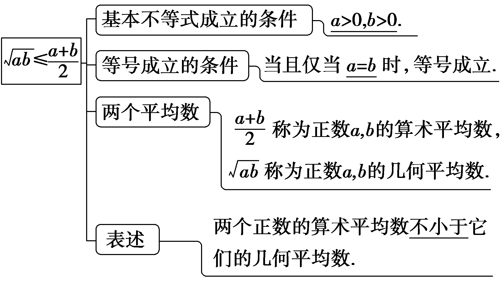
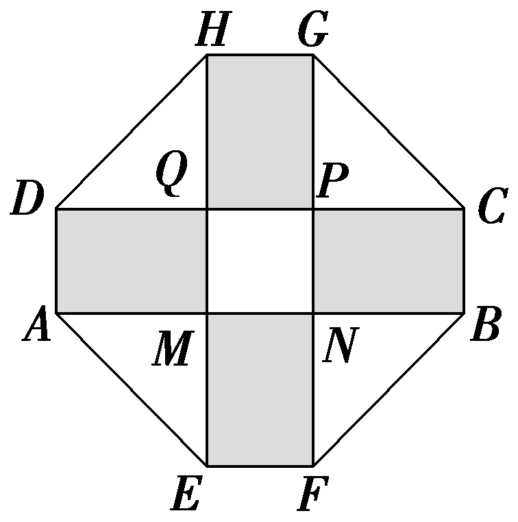
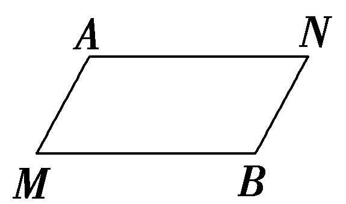

**第四节　基本不等式**

【课标研读】　1.掌握基本不等式 $\sqrt{ab}$ ≤ $\frac{a＋b}{2}$ (*a*＞0，*b*＞0)，并能用基本不等式解决简单的最大值或最小值问题.　2.理解基本不等式在实际问题中的应用.

1.基本不等式： $\sqrt{ab}$ ≤ $\frac{a＋b}{2}$

2.利用基本不等式求最值问题

已知*x*＞0，*y*＞0，则

(1)如果积&lt;te&lt;te&lt;text st<em>y</em>le="italic"&gt;x&lt;/text&gt;t st<em>y</em>le="italic"&gt;x&lt;/text&gt;t style="italic"&gt;xy&lt;/text&gt;是定值<em>P</em>，那么当且仅当x＝y时，和x＋y有<u>最小值</u>2 $\sqrt{P}$ (简记：积定和最小).

(2)如果和&lt;te&lt;text st<em><u>y</u></em>le="italic,underline"&gt;x&lt;/text&gt;t st<em>y</em>le="italic"&gt;x&lt;/text&gt;＋y是定值<em>S</em>，那么当且仅当x<u>＝</u>y时，积<em>xy</em>有<u>最大</u>值 $\frac{S^{2}}{4}$ (简记：和定积<u>最大</u>).

[微提醒]　应用基本不等式求最值要注意：“一正，二定，三相等”.

【常用结论】

几个重要的不等式

$\left.\begin{matrix}(1)a^{2}＋b^{2}\geq 2ab，a，b\in R；\\(2)\frac{b}{a}＋\frac{a}{b}\geq 2，ab>0；\\(3)ab\leq \left(\frac{a＋b}{2}\right)^{2}，a，b\in R；\\(4)\frac{a^{2}＋b^{2}}{2}\geq \left(\frac{a＋b}{2}\right)^{2}，a，b\in R\end{matrix}\right\}$ 当且仅当*a*＝*b*时，等号成立.

【自主检测】

1.(多选)下列说法错误的是(　　)

A.不等式<em>a</em>&lt;text style="superscript"&gt;2&lt;/text&gt;＋<em>b</em>2≥2<em>ab</em>与 $\frac{a＋b}{2}$ ≥ $\sqrt{ab}$ 成立的条件是相同的

B.函数<te<te*x*t style="italic">x</text>t style="italic">y</text>＝x＋ $\frac{1}{x}$ (<te*x*t style="italic">x</text>＞0)的最小值是2

C.函数<te<te*x*t style="italic">x</text>t style="italic">f</text>(x)＝sin x＋ $\frac{4}{sinx}$ 的最小值为4

D.已知<te<text st*y*le="italic">x</text>t st*y*le="italic">x</text>，y均为实数，则“x＞0且y＞0”是“ $\frac{x}{y}$ ＋ $\frac{y}{x}$ ≥2”的充要条件

答案：**ACD**

2.(链接人教A必修一P45例1)设<text style="it*a*lic">a</text>＞0，则9a＋ $\frac{1}{a}$ 的最小值为(　　)

A.4	B.5

C.6	D.7

答案：**C**

3.已知0＜<em>x</em>＜3，则<em>x</em>(3－<em>x</em>)的最大值为<u>　　　　</u>.

答案： $\frac{9}{4}$

解析：因为0＜<te<te<te<te<te*x*t style="italic">x</text>t style="italic">x</text>t style="italic">x</text>t style="italic">x</text>t style="italic">x</text>＜3，所以x(3－x)≤ $\left[\frac{x＋(3－x)}{2}\right]^{2}＝\frac{9}{4}$ .当且仅当<te<te<te<te<te*x*t style="italic">x</text>t style="italic">x</text>t style="italic">x</text>t style="italic">x</text>t style="italic">x</text>＝3－x，即x $＝\frac{3}{2}$ 时，“＝”成立.

4.(链接人教A必修一P46例3)若把总长为20 m的篱笆围成一个矩形场地，则矩形场地的最大面积是<u>　　　　　　　</u>m2.

答案：25

解析：设矩形的一边长为&lt;te&lt;te&lt;te&lt;te&lt;te&lt;text st<em>y</em>le="italic"&gt;x&lt;/text&gt;t style="italic"&gt;x&lt;/text&gt;t style="italic"&gt;x&lt;/text&gt;t style="italic"&gt;x&lt;/text&gt;t st<em>y</em>le="italic"&gt;x&lt;/text&gt;t style="italic"&gt;x &lt;/text&gt;m，面积为<em>y</em> m&lt;text style="superscript"&gt;2&lt;/text&gt;，则另一边长为 $\frac{1}{2}$ × $\left(20－2x\right)＝\left(10－x\right)$ m，其中0＜&lt;te&lt;te&lt;te&lt;te&lt;text st<em>y</em>le="italic"&gt;x&lt;/text&gt;t style="italic"&gt;x&lt;/text&gt;t style="italic"&gt;x&lt;/text&gt;t style="italic"&gt;x&lt;/text&gt;t st<em>y</em>le="italic"&gt;x&lt;/text&gt;＜10，所以y＝x $\left(10－x\right)$ ≤ $\left[\frac{x＋\left(10－x\right)}{2}\right]^{2}＝$ &lt;te&lt;te&lt;te&lt;te&lt;te&lt;text st<em>y</em>le="italic"&gt;x&lt;/text&gt;t style="italic"&gt;x&lt;/text&gt;t style="italic"&gt;x&lt;/text&gt;t style="italic"&gt;x&lt;/text&gt;t st<em>y</em>le="italic"&gt;x&lt;/text&gt;t style="superscript"&gt;2&lt;/text&gt;5，当且仅当x＝10－x，即x＝5时，等号成立，所以ymax＝25，即矩形场地的最大面积是25 m2.

考点一　利用基本不等式求最值　　　　多维探究

角度1　配凑法

(1)已知&lt;te&lt;te<em>x</em>t style="italic"&gt;x&lt;/text&gt;t style="italic"&gt;x&lt;/text&gt;＞ $\frac{5}{4}$ ，则&lt;te&lt;te<em>x</em>t style="italic"&gt;x&lt;/text&gt;t style="italic"&gt;f&lt;/text&gt;(<em>x</em>)＝4x－2＋ $\frac{1}{4x－5}$ 的最小值为<u>　　　　　　　</u>.

(2)已知0＜<em>x</em>＜1，则<em>x</em>(3－2<em>x</em>)的最大值为<u>　　　　　　　</u>.

答案：(1)5　(2) $\frac{9}{8}$

解析：(1)因为<te<te<te<te<te<te*x*t style="italic">x</text>t style="italic">x</text>t style="italic">x</text>t style="italic">x</text>t style="italic">x</text>t style="italic">x</text>＞ $\frac{5}{4}$ ，所以4<te<te<te<te<te<te*x*t style="italic">x</text>t style="italic">x</text>t style="italic">x</text>t style="italic">x</text>t style="italic">x</text>t style="italic">x</text>－5＞0，所以*f*(x)＝4x－2＋ $\frac{1}{4x－5}＝$ 4<te<te<te<te<te<te*x*t style="italic">x</text>t style="italic">x</text>t style="italic">x</text>t style="italic">x</text>t style="italic">x</text>t style="italic">x</text>－5＋ $\frac{1}{4x－5}$ ＋3≥2 $\sqrt{1}$ ＋3＝5，当且仅当4<te<te<te<te<te<te*x*t style="italic">x</text>t style="italic">x</text>t style="italic">x</text>t style="italic">x</text>t style="italic">x</text>t style="italic">x</text>－5 $＝\frac{1}{4x－5}$ ，即<te<te<te<te<te<te*x*t style="italic">x</text>t style="italic">x</text>t style="italic">x</text>t style="italic">x</text>t style="italic">x</text>t style="italic">x</text> $＝\frac{3}{2}$ 时取等号.

(2)<te<te<te<te<te<te*x*t style="italic">x</text>t style="italic">x</text>t style="italic">x</text>t style="italic">x</text>t style="italic">x</text>t style="italic">x</text>(3－2x) $＝\frac{1}{2}$ ·2<te<te<te<te<te<te*x*t style="italic">x</text>t style="italic">x</text>t style="italic">x</text>t style="italic">x</text>t style="italic">x</text>t style="italic">x</text>(3－2x)≤ $\frac{1}{2}$ · $\left(\frac{2x+3－2x}{2}\right)^{2}＝\frac{9}{8}$ ，当且仅当2<te<te<te<te<te<te*x*t style="italic">x</text>t style="italic">x</text>t style="italic">x</text>t style="italic">x</text>t style="italic">x</text>t style="italic">x</text>＝3－2x，即x $＝\frac{3}{4}$ 时取等号.

角度2　常数代换法

(1)(2025·江苏扬州调研)设<te*x*t st<text st*y*le="italic">y</text>le="italic">x</text>＞0，y＞0， $\frac{1}{x}$ ＋2<te*x*t st*y*le="italic">y</text>＝2，则*x*＋ $\frac{1}{y}$ 的最小值为(　　)

A. $\frac{3}{2}$ 	B.2 $\sqrt{2}$

C. $\frac{3}{2}$ ＋ $\sqrt{2}$ 	D.3

(2)(2025·湘豫名校联考)已知正实数<te*x*t st*y*le="italic">x</text>，y满足 $\frac{1}{x}$ ＋ $\frac{1}{y}＝$ 1，则4<te*x*t st*y*le="italic">x</text>y－3x的最小值为(　　)

A.8	B.9

C.10	D.11

答案：(1)**C**　 (2)**B**

解析：(1)因为 $\frac{1}{x}$ ＋2<te<te*x*t st*y*le="italic">x</text>t st*y*le="italic">y</text>＝2，所以 $\frac{1}{2x}$ ＋<te<te*x*t st*y*le="italic">x</text>t st*y*le="italic">y</text>＝1，因为x＞0，y＞0，所以x＋ $\frac{1}{y}＝\left(x＋\frac{1}{y}\right)\left(\frac{1}{2x}＋y\right)＝\frac{1}{2}$ ＋<te*x*t st*y*le="italic">x</text><text st*y*le="italic">y</text>＋ $\frac{1}{2xy}$ ＋1 $＝\frac{3}{2}$ ＋<te*x*t st*y*le="italic">x</text><text st*y*le="italic">y</text>＋ $\frac{1}{2xy}$ ≥ $\frac{3}{2}$ ＋2 $\sqrt{xy\cdot \frac{1}{2xy}}＝\frac{3}{2}$ ＋2× $\frac{\sqrt{2}}{2}＝\frac{3}{2}$ ＋ $\sqrt{2}$ ，当且仅当 $\left\{\begin{matrix}xy＝\frac{1}{2xy}，\\\frac{1}{2x}＋y=1，\end{matrix}\right.$ 即 $\left\{\begin{matrix}x＝\frac{1+\sqrt{2}}{2}，\\y=2－\sqrt{2}\end{matrix}\right.$ 时取等号.故选C.

(2)由<te<te<te<te<te<te<te<te<te*x*t st*y*le="italic">x</text>t st*y*le="italic">x</text>t st*y*le="italic">x</text>t st*y*le="italic">x</text>t style="italic">x</text>t st*y*le="italic">x</text>t style="italic">x</text>t st*y*le="italic">x</text>t st*y*le="italic">x</text>＞0，y＞0，且 $\frac{1}{x}$ ＋ $\frac{1}{y}＝$ 1，可得<te<te<te<te<te<te<te<te<te*x*t st*y*le="italic">x</text>t st*y*le="italic">x</text>t st*y*le="italic">x</text>t st*y*le="italic">x</text>t style="italic">x</text>t st*y*le="italic">x</text>t style="italic">x</text>t st*y*le="italic">x</text>t st*y*le="italic">x</text>y＝x＋y，所以4*<text style="italic"><text style="italic">xy*</text></text>－3x＝4x＋4y－3x＝x＋4y，所以x＋4y＝(x＋4y) $\left(\frac{1}{x}＋\frac{1}{y}\right)＝$ 5＋ $\frac{4y}{x}$ ＋ $\frac{x}{y}$ ≥9，当且仅当 $\frac{4y}{x}＝\frac{x}{y}$ ，即<te<te<te<te<te<te<te<te<te*x*t st*y*le="italic">x</text>t st*y*le="italic">x</text>t st*y*le="italic">x</text>t st*y*le="italic">x</text>t style="italic">x</text>t st*y*le="italic">x</text>t style="italic">x</text>t st*y*le="italic">x</text>t st*y*le="italic">x</text>＝3，y $＝\frac{3}{2}$ 时取等号，所以4<te<te<te<te<te<te<te<te<te*x*t st*y*le="italic">x</text>t st*y*le="italic">x</text>t st*y*le="italic">x</text>t st*y*le="italic">x</text>t style="italic">x</text>t st*y*le="italic">x</text>t style="italic">x</text>t st*y*le="italic">x</text>t st*y*le="italic">x</text>y－3x≥9.故选B.

角度3　消元法

(1)已知正实数<em>a</em>，<em>&lt;text style="italic"&gt;b</em>&lt;/text&gt;满足 $\frac{1}{a}$ ＋<em>&lt;text style="italic"&gt;b</em>&lt;/text&gt;＝1，则 $\frac{2b}{a}$ 的最大值为<u>　　　　</u>.

(2)已知正数<em>x</em>，<em>y</em>满足<em>x</em>2＋2<em>xy</em>－3＝0，则2<em>x</em>＋<em>y</em>的最小值是<u>　　　　</u>.

答案：(1) $\frac{1}{2}$ 　(2)3

解析：(1) 因为正实数<text style="it*a*lic">a</text>，*<text style="italic"><text style="italic"><text style="italic"><text style="italic"><text style="italic"><text style="italic"><text style="italic"><text style="italic"><text style="italic"><text style="italic"><text style="italic">b*</text></text></text></text></text></text></text></text></text></text></text>满足 $\frac{1}{a}$ ＋<text style="it*a*lic">*<text style="italic"><text style="italic"><text style="italic"><text style="italic"><text style="italic"><text style="italic"><text style="italic"><text style="italic"><text style="italic"><text style="italic">b*</text></text></text></text></text></text></text></text></text></text></text>＝1， $\frac{1}{a}＝$ 1－<text style="it*a*lic">*<text style="italic"><text style="italic"><text style="italic"><text style="italic"><text style="italic"><text style="italic"><text style="italic"><text style="italic"><text style="italic"><text style="italic">b*</text></text></text></text></text></text></text></text></text></text></text>＞0，0＜b＜1， $\frac{2b}{a}＝\frac{1}{a}$ <text style="it*a*lic">*·*</text>2*<text style="italic"><text style="italic"><text style="italic"><text style="italic"><text style="italic"><text style="italic"><text style="italic"><text style="italic"><text style="italic"><text style="italic"><text style="italic">b*</text></text></text></text></text></text></text></text></text></text></text>＝(1－b)·2b＝2·b·(1－b)≤2 $\left(\frac{b+1－b}{2}\right)^{2}＝\frac{1}{2}$ ，当且仅当<text style="it*a*lic">*<text style="italic"><text style="italic"><text style="italic"><text style="italic"><text style="italic"><text style="italic"><text style="italic"><text style="italic"><text style="italic"><text style="italic">b*</text></text></text></text></text></text></text></text></text></text></text>＝1－b，即b $＝\frac{1}{2}$ ，<text style="it*a*lic">a</text>＝2时等号成立.

(<te<te<te<te<te*x*t style="italic">x</text>t st*y*le="italic">x</text>t style="italic">x</text>t st<text st*y*le="italic">y</text>le="italic">x</text>t style="superscript">2</text>) 因为*x*2＋2*xy*－3＝0，x＞0，y＞0，所以y $＝\frac{3－x^{2}}{2x}$ ，<te<te<te<te<te*x*t style="italic">x</text>t st*y*le="italic">x</text>t style="italic">x</text>t st<text st*y*le="italic">y</text>le="italic">x</text>t style="italic">x</text>∈(0， $\sqrt{3}$ )，所以<te<te<te<te<te*x*t style="italic">x</text>t st*y*le="italic">x</text>t style="italic">x</text>t st<text st*y*le="italic">y</text>le="italic">x</text>t style="superscript">2</text>*x*＋y＝2x＋ $\frac{3－x^{2}}{2x}＝\frac{3x^{2}+3}{2x}＝\frac{3x}{2}$ ＋ $\frac{3}{2x}$ ≥<te<te<te<te<te*x*t style="italic">x</text>t st*y*le="italic">x</text>t style="italic">x</text>t st<text st*y*le="italic">y</text>le="italic">x</text>t style="superscript">2</text> $\sqrt{\frac{3x}{2}\cdot \frac{3}{2x}}＝$ 3，当且仅当 $\frac{3x}{2}＝\frac{3}{2x}$ ，即<te<te<te<te<te*x*t style="italic">x</text>t st*y*le="italic">x</text>t style="italic">x</text>t st<text st*y*le="italic">y</text>le="italic">x</text>t style="italic">x</text>＝1时取等号.

角度4　换元法

已知正数&lt;te&lt;text st<em>y</em>le="italic"&gt;x&lt;/text&gt;t st<em>y</em>le="italic"&gt;x&lt;/text&gt;，y满足 $\frac{1}{x+2y}$ ＋ $\frac{1}{2x＋y}＝$ 1，则&lt;te&lt;text st<em>y</em>le="italic"&gt;x&lt;/text&gt;t st<em>y</em>le="italic"&gt;x&lt;/text&gt;＋y的最小值为<u>　　　　</u>.

答案： $\frac{4}{3}$

解析：令<te<te<te<te<te<te<te<text st*y*le="italic">x</text>t st*y*le="italic">x</text>t st*y*le="italic">x</text>t st*y*le="italic">x</text>t st*y*le="italic">x</text>t st*y*le="italic">x</text>t st*y*le="italic">x</text>t st*y*le="italic">x</text>＋2y＝*<text style="italic"><text style="italic"><text style="italic">m*</text></text></text>，2x＋y＝*<text style="italic"><text style="italic"><text style="italic">n*</text></text></text>，则 $\frac{1}{m}$ ＋ $\frac{1}{n}＝$ 1，<te<te<te<te<te<te<te<text st*y*le="italic">x</text>t st*y*le="italic">x</text>t st*y*le="italic">x</text>t st*y*le="italic">x</text>t st*y*le="italic">x</text>t st*y*le="italic">x</text>t st*y*le="italic">x</text>t style="italic">*<text style="italic"><text style="italic">m*</text></text></text>＋*<text style="italic"><text style="italic"><text style="italic">n*</text></text></text>＝(<text st*y*le="italic">x</text>＋2y)＋(2x＋y)＝3(x＋y)，所以x＋y $＝\frac{m＋n}{3}＝\frac{1}{3}$ (<te<te<te<te<te<te<te<text st*y*le="italic">x</text>t st*y*le="italic">x</text>t st*y*le="italic">x</text>t st*y*le="italic">x</text>t st*y*le="italic">x</text>t st*y*le="italic">x</text>t st*y*le="italic">x</text>t style="italic">*<text style="italic"><text style="italic">m*</text></text></text>＋*<text style="italic"><text style="italic"><text style="italic">n*</text></text></text>) $\left(\frac{1}{m}＋\frac{1}{n}\right)＝\frac{1}{3}$ × $\left(2+\frac{m}{n}＋\frac{n}{m}\right)$ ≥ $\frac{1}{3}$ (2＋2 $\sqrt{\frac{m}{n}\times \frac{n}{m}}$ ) $＝\frac{4}{3}$ ，当且仅当 $\frac{m}{n}＝\frac{n}{m}$ ，即<te<te<te<te<te<te<te<text st*y*le="italic">x</text>t st*y*le="italic">x</text>t st*y*le="italic">x</text>t st*y*le="italic">x</text>t st*y*le="italic">x</text>t st*y*le="italic">x</text>t st*y*le="italic">x</text>t style="italic">*<text style="italic"><text style="italic">m*</text></text></text>＝2，*<text style="italic"><text style="italic"><text style="italic">n*</text></text></text>＝2时等号成立，此时<text st*y*le="italic">x</text>＝y $＝\frac{2}{3}$ ，故<te<te<te<te<te<te<te<text st*y*le="italic">x</text>t st*y*le="italic">x</text>t st*y*le="italic">x</text>t st*y*le="italic">x</text>t st*y*le="italic">x</text>t st*y*le="italic">x</text>t st*y*le="italic">x</text>t st*y*le="italic">x</text>＋y的最小值为 $\frac{4}{3}$ .

利用基本不等式求最值的方法

1.利用配凑法求最值，主要解决形如“<text style="itali*c*">cx</text>＋*d*＋ $\frac{m}{ax＋b}$ 或<text style="itali*c*">ax</text>(c－*bx*)的最值”问题，配凑成“积为常数”或“和为常数”的形式.

2.常数代换法，主要解决形如“已知<<*t*ext style="italic">t</text>ext st*y*le="italic">x</text>＋y＝t(t为常数)，求 $\frac{a}{x}$ ＋ $\frac{b}{y}$ 的最值”问题，先将 $\frac{a}{x}$ ＋ $\frac{b}{y}$ 转化为 $\left(\frac{a}{x}＋\frac{b}{y}\right)$ *·* $\frac{x＋y}{t}$ ，再用基本不等式求最值.

3.当所求最值的代数式中的变量比较多时，通常考虑利用已知条件消去部分变量后，凑出“和为常数”或“积为常数”的形式，然后利用基本不等式求最值.

注意：角度4中的换元法实质还是配凑法或者常数代换法的拓展，在已知条件或者所求表达式的分母上出现一次二项式时，可尝试使用.

对点练1.(多选)(2024·湖南“一起考”大联考)已知*a*＞0，*b*＞0，*a*＋*b*＝*ab*，则(　　)

A.*a*＋*b*≤4	B.*ab*≥4

C.*a*＋4*b*≤9	D. $\frac{1}{a^{2}}$ ＋ $\frac{2}{b^{2}}$ ≥ $\frac{2}{3}$

答案：**BD**

解析：对于A、B，因为<text style="it<text style="it<text style="it<text style="it<text style="it<text style="it<text style="it<text style="it<text style="it<text style="it*a*lic">a</text>lic">a</text>lic">a</text>lic">a</text>lic">a</text>lic">a</text>lic">a</text>lic">a</text>lic">a</text>lic">a</text>＋*<text style="italic"><text style="italic"><text style="italic"><text style="italic"><text style="italic"><text style="italic"><text style="italic"><text style="italic"><text style="italic"><text style="italic">b*</text></text></text></text></text></text></text></text></text></text>＝*<text style="italic"><text style="italic"><text style="italic"><text style="italic">ab*</text></text></text></text>≤ $\left(\frac{a＋b}{2}\right)^{2}$ ，所以<text style="it<text style="it<text style="it<text style="it<text style="it<text style="it<text style="it<text style="it<text style="it<text style="it*a*lic">a</text>lic">a</text>lic">a</text>lic">a</text>lic">a</text>lic">a</text>lic">a</text>lic">a</text>lic">a</text>lic">a</text>＋*<text style="italic"><text style="italic"><text style="italic"><text style="italic"><text style="italic"><text style="italic"><text style="italic"><text style="italic"><text style="italic"><text style="italic">b*</text></text></text></text></text></text></text></text></text></text>≥4，当且仅当a＝b＝2时等号成立，a＋b＝*<text style="italic"><text style="italic"><text style="italic"><text style="italic">ab*</text></text></text></text>≥2 $\sqrt{ab}$ ，则<text style="it<text style="it<text style="it<text style="it<text style="it<text style="it<text style="it<text style="it<text style="it<text style="it*a*lic">a</text>lic">a</text>lic">a</text>lic">a</text>lic">a</text>lic">a</text>lic">a</text>lic">a</text>lic">a</text>lic">a</text>*<text style="italic"><text style="italic"><text style="italic"><text style="italic"><text style="italic"><text style="italic"><text style="italic"><text style="italic"><text style="italic"><text style="italic">b*</text></text></text></text></text></text></text></text></text></text>≥4，当且仅当a＝b＝2时等号成立，故A错误，B正确；对于C，若a＋b＝*<text style="italic"><text style="italic"><text style="italic"><text style="italic">ab*</text></text></text></text>，则 $\frac{1}{a}$ ＋ $\frac{1}{b}＝$ 1，所以<text style="it<text style="it<text style="it<text style="it<text style="it<text style="it<text style="it<text style="it<text style="it<text style="it*a*lic">a</text>lic">a</text>lic">a</text>lic">a</text>lic">a</text>lic">a</text>lic">a</text>lic">a</text>lic">a</text>lic">a</text>＋4*<text style="italic"><text style="italic"><text style="italic"><text style="italic"><text style="italic"><text style="italic"><text style="italic"><text style="italic"><text style="italic"><text style="italic">b*</text></text></text></text></text></text></text></text></text></text> $＝\left(a+4b\right)\left(\frac{1}{a}＋\frac{1}{b}\right)＝$ 5＋ $\frac{a}{b}$ ＋ $\frac{4b}{a}$ ≥5＋2 $\sqrt{\frac{a}{b}\cdot \frac{4b}{a}}＝$ 9，当且仅当 $\frac{a}{b}＝\frac{4b}{a}$ ，即<text style="it<text style="it<text style="it<text style="it<text style="it<text style="it<text style="it<text style="it<text style="it<text style="it*a*lic">a</text>lic">a</text>lic">a</text>lic">a</text>lic">a</text>lic">a</text>lic">a</text>lic">a</text>lic">a</text>lic">*<text style="italic"><text style="italic"><text style="italic"><text style="italic"><text style="italic"><text style="italic"><text style="italic"><text style="italic"><text style="italic">b*</text></text></text></text></text></text></text></text></text></text> $＝\frac{3}{2}$ ，<text style="it<text style="it<text style="it<text style="it<text style="it<text style="it<text style="it<text style="it<text style="it<text style="it*a*lic">a</text>lic">a</text>lic">a</text>lic">a</text>lic">a</text>lic">a</text>lic">a</text>lic">a</text>lic">a</text>lic">a</text>＝3时等号成立，故C错误；对于D，若a＋*<text style="italic"><text style="italic"><text style="italic"><text style="italic"><text style="italic"><text style="italic"><text style="italic"><text style="italic"><text style="italic"><text style="italic">b*</text></text></text></text></text></text></text></text></text></text>＝*<text style="italic"><text style="italic"><text style="italic"><text style="italic">ab*</text></text></text></text>，则 $\frac{1}{a}$ ＋ $\frac{1}{b}＝$ 1，所以 $\frac{1}{a^{2}}$ ＋ $\frac{2}{b^{2}}＝\left(1－\frac{1}{b}\right)^{2}$ ＋ $\frac{2}{b^{2}}＝\frac{3}{b^{2}}$ － $\frac{2}{b}$ ＋1 $＝3\left(\frac{1}{b}－\frac{1}{3}\right)^{2}$ ＋ $\frac{2}{3}$ ，由<text style="it<text style="it<text style="it<text style="it<text style="it<text style="it<text style="it<text style="it<text style="it<text style="it*a*lic">a</text>lic">a</text>lic">a</text>lic">a</text>lic">a</text>lic">a</text>lic">a</text>lic">a</text>lic">a</text>lic">a</text>＞0，*<text style="italic"><text style="italic"><text style="italic"><text style="italic"><text style="italic"><text style="italic"><text style="italic"><text style="italic"><text style="italic"><text style="italic">b*</text></text></text></text></text></text></text></text></text></text>＞0及 $\frac{1}{a}$ ＋ $\frac{1}{b}＝$ 1，可知0＜ $\frac{1}{b}$ ＜1，则当 $\frac{1}{b}＝\frac{1}{3}$ ，即<text style="it<text style="it<text style="it<text style="it<text style="it<text style="it<text style="it<text style="it<text style="it<text style="it*a*lic">a</text>lic">a</text>lic">a</text>lic">a</text>lic">a</text>lic">a</text>lic">a</text>lic">a</text>lic">a</text>lic">a</text> $＝\frac{3}{2}$ ，<text style="it<text style="it<text style="it<text style="it<text style="it<text style="it<text style="it<text style="it<text style="it<text style="it*a*lic">a</text>lic">a</text>lic">a</text>lic">a</text>lic">a</text>lic">a</text>lic">a</text>lic">a</text>lic">a</text>lic">*<text style="italic"><text style="italic"><text style="italic"><text style="italic"><text style="italic"><text style="italic"><text style="italic"><text style="italic"><text style="italic">b*</text></text></text></text></text></text></text></text></text></text>＝3时， $\frac{1}{a^{2}}$ ＋ $\frac{2}{b^{2}}$ 取得最小值 $\frac{2}{3}$ ，故D正确.故选BD.

对点练2.已知&lt;text style="it<em>a</em>lic"&gt;a&lt;/text&gt;＞1，<em>&lt;text style="italic"&gt;b</em>&lt;/text&gt;＞0，且 $\frac{2}{a－1}$ ＋ $\frac{1}{b}＝$ 1，则2&lt;text style="it<em>a</em>lic"&gt;a&lt;/text&gt;＋<em>&lt;text style="italic"&gt;b</em>&lt;/text&gt;的最小值为<u>　　　　</u>.

答案：11

解析： 因为<text style="it<text style="it<text style="it<text style="it<text style="it*a*lic">a</text>lic">a</text>lic">a</text>lic">a</text>lic">a</text>＞1，*<text style="italic"><text style="italic"><text style="italic"><text style="italic">b*</text></text></text></text>＞0，a－1＞0，所以2a＋b＝2(a－1)＋b＋2＝[2(a－1)＋b] $\left(\frac{2}{a－1}＋\frac{1}{b}\right)$ ＋2＝7＋ $\frac{2(a－1)}{b}$ ＋ $\frac{2b}{a－1}$ ≥7＋2 $\sqrt{\frac{2(a－1)}{b}\cdot \frac{2b}{a－1}}＝$ 11，当且仅当 $\left\{\begin{matrix}\frac{2(a－1)}{b}＝\frac{2b}{a－1}，\\\frac{2}{a－1}＋\frac{1}{b}=1，\end{matrix}\right.$ 即<text style="it<text style="it<text style="it<text style="it<text style="it*a*lic">a</text>lic">a</text>lic">a</text>lic">a</text>lic">a</text>＝4，*<text style="italic"><text style="italic"><text style="italic"><text style="italic">b*</text></text></text></text>＝3时等号成立.

考点二　利用基本不等式求参数的值或范围　　　　师生共研

(1)若对于任意的<text style="it<text style="it*a*lic">a</text>lic">x</text>＞0，不等式 $\frac{x^{2}+3x+1}{x}$ ≥<text style="it*a*lic">a</text>恒成立，则实数a的取值范围为(　　 )

A.[5，＋∞)	B.(5，＋∞)

C.(－∞，5]	D.(－∞，5)

(2)已知&lt;te&lt;text st<em>y</em>le="italic"&gt;x&lt;/text&gt;t st<em>y</em>le="italic"&gt;x&lt;/text&gt;＞0，y＞0，且 $\frac{2}{x}$ ＋ $\frac{1}{y}＝$ 1，若2&lt;te&lt;text st<em>y</em>le="italic"&gt;x&lt;/text&gt;t st<em>y</em>le="italic"&gt;x&lt;/text&gt;＋y＜<em>&lt;text style="italic"&gt;&lt;text style="italic"&gt;m</em>&lt;/text&gt;&lt;/text&gt;2－8m有解，则实数m的取值范围为(　　 )

A.(－∞，－1)∪(9，＋∞)

B.(－∞，－1]∪[9，＋∞)

C.(－9，－1)

D.[－9，1]

答案：(1)**C**　(2)**A**

解析：(1)令&lt;te&lt;te&lt;te&lt;te&lt;te&lt;te&lt;te&lt;te&lt;text style="it<em>a</em>lic"&gt;x&lt;/text&gt;t style="it<em>a</em>lic"&gt;x&lt;/text&gt;t style="italic"&gt;x&lt;/text&gt;t style="italic"&gt;x&lt;/text&gt;t style="italic"&gt;x&lt;/text&gt;t style="italic"&gt;x&lt;/text&gt;t style="it<em>a</em>lic"&gt;x&lt;/text&gt;t style="italic"&gt;x&lt;/text&gt;t style="italic"&gt;<em>&lt;text style="italic"&gt;&lt;text style="italic"&gt;f</em>&lt;/text&gt;&lt;/text&gt;&lt;/text&gt;(x) $＝\frac{x^{2}+3x+1}{x}$ ，&lt;te&lt;te&lt;te&lt;te&lt;te&lt;te&lt;te&lt;text style="it<em>a</em>lic"&gt;x&lt;/text&gt;t style="it<em>a</em>lic"&gt;x&lt;/text&gt;t style="italic"&gt;x&lt;/text&gt;t style="italic"&gt;x&lt;/text&gt;t style="italic"&gt;x&lt;/text&gt;t style="italic"&gt;x&lt;/text&gt;t style="it<em>a</em>lic"&gt;x&lt;/text&gt;t style="italic"&gt;x&lt;/text&gt;＞0，由题意可得a≤<em>&lt;text style="italic"&gt;&lt;text style="italic"&gt;&lt;text style="italic"&gt;f</em>&lt;/text&gt;&lt;/text&gt;&lt;/text&gt;(x)&lt;text style="subscript"&gt;min&lt;/text&gt;，f(x)＝x＋ $\frac{1}{x}$ ＋3≥2 $\sqrt{x\cdot \frac{1}{x}}$ ＋3＝5，当且仅当&lt;te&lt;te&lt;te&lt;te&lt;te&lt;te&lt;te&lt;text style="it<em>a</em>lic"&gt;x&lt;/text&gt;t style="it<em>a</em>lic"&gt;x&lt;/text&gt;t style="italic"&gt;x&lt;/text&gt;t style="italic"&gt;x&lt;/text&gt;t style="italic"&gt;x&lt;/text&gt;t style="italic"&gt;x&lt;/text&gt;t style="it<em>a</em>lic"&gt;x&lt;/text&gt;t style="italic"&gt;x&lt;/text&gt; $＝\frac{1}{x}$ ，即&lt;te&lt;te&lt;te&lt;te&lt;te&lt;te&lt;te&lt;text style="it<em>a</em>lic"&gt;x&lt;/text&gt;t style="it<em>a</em>lic"&gt;x&lt;/text&gt;t style="italic"&gt;x&lt;/text&gt;t style="italic"&gt;x&lt;/text&gt;t style="italic"&gt;x&lt;/text&gt;t style="italic"&gt;x&lt;/text&gt;t style="it<em>a</em>lic"&gt;x&lt;/text&gt;t style="italic"&gt;x&lt;/text&gt;＝1时等号成立，a≤<em>&lt;text style="italic"&gt;&lt;text style="italic"&gt;&lt;text style="italic"&gt;f</em>&lt;/text&gt;&lt;/text&gt;&lt;/text&gt;(x)&lt;text style="subscript"&gt;min&lt;/text&gt;＝5，所以实数a的取值范围为(－∞，5].故选C.

(&lt;text style="superscript"&gt;2&lt;/text&gt;)因为&lt;te&lt;te&lt;te&lt;te&lt;te&lt;text st<em>y</em>le="italic"&gt;x&lt;/text&gt;t st<em>y</em>le="italic"&gt;x&lt;/text&gt;t st<em>y</em>le="italic"&gt;x&lt;/text&gt;t st<em>y</em>le="italic"&gt;x&lt;/text&gt;t st<em>y</em>le="italic"&gt;x&lt;/text&gt;t st<em>y</em>le="italic"&gt;x&lt;/text&gt;＞0，y＞0，且 $\frac{2}{x}$ ＋ $\frac{1}{y}＝$ 1，所以&lt;text style="superscript"&gt;2&lt;/text&gt;&lt;te&lt;te&lt;te&lt;te&lt;te&lt;text st<em>y</em>le="italic"&gt;x&lt;/text&gt;t st<em>y</em>le="italic"&gt;x&lt;/text&gt;t st<em>y</em>le="italic"&gt;x&lt;/text&gt;t st<em>y</em>le="italic"&gt;x&lt;/text&gt;t st<em>y</em>le="italic"&gt;x&lt;/text&gt;t st<em>y</em>le="italic"&gt;x&lt;/text&gt;＋y＝(2x＋y) $\left(\frac{2}{x}＋\frac{1}{y}\right)＝$ 5＋ $\frac{2x}{y}$ ＋ $\frac{2y}{x}$ ≥5＋&lt;text style="superscript"&gt;2&lt;/text&gt; $\sqrt{\frac{2x}{y}\cdot \frac{2y}{x}}＝$ 9，当且仅当 $\frac{2x}{y}＝\frac{2y}{x}$ ，且 $\frac{2}{x}$ ＋ $\frac{1}{y}＝$ 1，即&lt;te&lt;te&lt;te&lt;te&lt;te&lt;text st<em>y</em>le="italic"&gt;x&lt;/text&gt;t st<em>y</em>le="italic"&gt;x&lt;/text&gt;t st<em>y</em>le="italic"&gt;x&lt;/text&gt;t st<em>y</em>le="italic"&gt;x&lt;/text&gt;t st<em>y</em>le="italic"&gt;x&lt;/text&gt;t st<em>y</em>le="italic"&gt;x&lt;/text&gt;＝y＝3时取等号，此时&lt;text style="superscript"&gt;2&lt;/text&gt;x＋y取得最小值9，若2x＋y＜<em>&lt;text style="italic"&gt;&lt;text style="italic"&gt;&lt;text style="italic"&gt;&lt;text style="italic"&gt;&lt;text style="italic"&gt;&lt;text style="italic"&gt;m</em>&lt;/text&gt;&lt;/text&gt;&lt;/text&gt;&lt;/text&gt;&lt;/text&gt;&lt;/text&gt;2－8m有解，则9＜m2－8m，解得m＞9或m＜－1，即实数m的取值范围为(－∞，－1)∪(9，＋∞).故选A.

分离参数是处理此类问题的首选方法，一般转化为基本不等式求最值或转化为求某个函数的最值问题.

对点练3.(&lt;text style="superscript"&gt;2&lt;/text&gt;025·安徽蚌埠模拟)已知<em>a</em>2＋<em>b</em>2＝<em>&lt;text style="italic"&gt;k</em>&lt;/text&gt;，若 $\frac{4}{a^{2}}$ ＋ $\frac{9}{b^{2}+1}$ ≥1恒成立，则<em>&lt;text style="italic"&gt;k</em>&lt;/text&gt;的最大值为(　　 )

A.4	B.5

C.24	D.25

答案：**C**

解析：因为&lt;text style="it&lt;text style="it&lt;text style="it<em>a</em>lic"&gt;a&lt;/text&gt;lic"&gt;a&lt;/text&gt;lic"&gt;a&lt;/text&gt;&lt;text style="superscript"&gt;&lt;text style="superscript"&gt;&lt;text style="superscript"&gt;&lt;text style="superscript"&gt;&lt;text style="superscript"&gt;&lt;text style="superscript"&gt;&lt;text style="superscript"&gt;2&lt;/text&gt;&lt;/text&gt;&lt;/text&gt;&lt;/text&gt;&lt;/text&gt;&lt;/text&gt;&lt;/text&gt;＋<em>&lt;text style="italic"&gt;&lt;text style="italic"&gt;&lt;text style="italic"&gt;b</em>&lt;/text&gt;&lt;/text&gt;&lt;/text&gt;2＝<em>&lt;text style="italic"&gt;&lt;text style="italic"&gt;&lt;text style="italic"&gt;&lt;text style="italic"&gt;&lt;text style="italic"&gt;&lt;text style="italic"&gt;k</em>&lt;/text&gt;&lt;/text&gt;&lt;/text&gt;&lt;/text&gt;&lt;/text&gt;&lt;/text&gt;，所以a2＋(b2＋1)＝k＋1，所以(k＋1) $\left(\frac{4}{a^{2}}＋\frac{9}{b^{2}+1}\right)＝$ [&lt;text style="it&lt;text style="it&lt;text style="it<em>a</em>lic"&gt;a&lt;/text&gt;lic"&gt;a&lt;/text&gt;lic"&gt;a&lt;/text&gt;&lt;text style="superscript"&gt;&lt;text style="superscript"&gt;&lt;text style="superscript"&gt;&lt;text style="superscript"&gt;&lt;text style="superscript"&gt;&lt;text style="superscript"&gt;&lt;text style="superscript"&gt;2&lt;/text&gt;&lt;/text&gt;&lt;/text&gt;&lt;/text&gt;&lt;/text&gt;&lt;/text&gt;&lt;/text&gt;＋(<em>&lt;text style="italic"&gt;&lt;text style="italic"&gt;&lt;text style="italic"&gt;b</em>&lt;/text&gt;&lt;/text&gt;&lt;/text&gt;2＋1)] $\left(\frac{4}{a^{2}}＋\frac{9}{b^{2}+1}\right)＝\frac{4(b^{2}+1)}{a^{2}}$ ＋ $\frac{9a^{2}}{b^{2}+1}$ ＋13≥&lt;text style="superscript"&gt;&lt;text style="superscript"&gt;&lt;text style="superscript"&gt;&lt;text style="superscript"&gt;&lt;text style="superscript"&gt;&lt;text style="superscript"&gt;&lt;text style="superscript"&gt;2&lt;/text&gt;&lt;/text&gt;&lt;/text&gt;&lt;/text&gt;&lt;/text&gt;&lt;/text&gt;&lt;/text&gt; $\sqrt{\frac{4(b^{2}+1)}{a^{2}}\cdot \frac{9a^{2}}{b^{2}+1}}$ ＋13＝&lt;text style="superscript"&gt;&lt;text style="superscript"&gt;&lt;text style="superscript"&gt;&lt;text style="superscript"&gt;&lt;text style="superscript"&gt;&lt;text style="superscript"&gt;&lt;text style="superscript"&gt;2&lt;/text&gt;&lt;/text&gt;&lt;/text&gt;&lt;/text&gt;&lt;/text&gt;&lt;/text&gt;&lt;/text&gt;5，当且仅当 $\frac{4(b^{2}+1)}{a^{2}}＝\frac{9a^{2}}{b^{2}+1}$ ，即3&lt;text style="it&lt;text style="it&lt;text style="it<em>a</em>lic"&gt;a&lt;/text&gt;lic"&gt;a&lt;/text&gt;lic"&gt;a&lt;/text&gt;&lt;text style="superscript"&gt;&lt;text style="superscript"&gt;&lt;text style="superscript"&gt;&lt;text style="superscript"&gt;&lt;text style="superscript"&gt;&lt;text style="superscript"&gt;&lt;text style="superscript"&gt;2&lt;/text&gt;&lt;/text&gt;&lt;/text&gt;&lt;/text&gt;&lt;/text&gt;&lt;/text&gt;&lt;/text&gt;＝2(<em>&lt;text style="italic"&gt;&lt;text style="italic"&gt;&lt;text style="italic"&gt;b</em>&lt;/text&gt;&lt;/text&gt;&lt;/text&gt;2＋1) $＝\frac{6}{5}$ (&lt;text style="it&lt;text style="it&lt;text style="it<em>a</em>lic"&gt;a&lt;/text&gt;lic"&gt;a&lt;/text&gt;lic"&gt;<em>&lt;text style="italic"&gt;&lt;text style="italic"&gt;&lt;text style="italic"&gt;&lt;text style="italic"&gt;&lt;text style="italic"&gt;k</em>&lt;/text&gt;&lt;/text&gt;&lt;/text&gt;&lt;/text&gt;&lt;/text&gt;&lt;/text&gt;＋1)时等号成立，即 $\frac{4}{a^{2}}$ ＋ $\frac{9}{b^{2}+1}$ ≥ $\frac{25}{k+1}$ ，由题意可得 $\frac{25}{k+1}$ ≥1，又&lt;text style="it&lt;text style="it&lt;text style="it<em>a</em>lic"&gt;a&lt;/text&gt;lic"&gt;a&lt;/text&gt;lic"&gt;<em>&lt;text style="italic"&gt;&lt;text style="italic"&gt;&lt;text style="italic"&gt;&lt;text style="italic"&gt;&lt;text style="italic"&gt;k</em>&lt;/text&gt;&lt;/text&gt;&lt;/text&gt;&lt;/text&gt;&lt;/text&gt;&lt;/text&gt;＞0，解得0＜k≤&lt;text style="superscript"&gt;&lt;text style="superscript"&gt;&lt;text style="superscript"&gt;&lt;text style="superscript"&gt;&lt;text style="superscript"&gt;&lt;text style="superscript"&gt;&lt;text style="superscript"&gt;2&lt;/text&gt;&lt;/text&gt;&lt;/text&gt;&lt;/text&gt;&lt;/text&gt;&lt;/text&gt;&lt;/text&gt;4，故k的最大值为24.故选C.

对点练4.若两个正实数<em>x</em>，<em>y</em>满足4<em>x</em>＋<em>y</em>－<em>xy</em>＝0，且不等式<em>xy</em>≥<em>m</em>2－6<em>m</em>恒成立，则实数<em>m</em>的取值范围是<u>　　　　</u>.

答案：[－2，8]

解析：因为正实数&lt;te&lt;te&lt;te<em>x</em>t st&lt;text st<em>y</em>le="italic"&gt;y&lt;/text&gt;le="italic"&gt;x&lt;/text&gt;t st<em>y</em>le="italic"&gt;x&lt;/text&gt;t st<em>y</em>le="italic"&gt;x&lt;/text&gt;，y满足4x＋y－<em>&lt;text style="italic"&gt;&lt;text style="italic"&gt;&lt;text style="italic"&gt;xy</em>&lt;/text&gt;&lt;/text&gt;&lt;/text&gt;＝0，所以xy＝4x＋y≥&lt;text style="superscript"&gt;2&lt;/text&gt; $\sqrt{4xy}＝$ 4 $\sqrt{xy}$ ，即 $\sqrt{xy}$ ≥4⇒&lt;te&lt;te&lt;te<em>x</em>t st&lt;text st<em>y</em>le="italic"&gt;y&lt;/text&gt;le="italic"&gt;x&lt;/text&gt;t st<em>y</em>le="italic"&gt;x&lt;/text&gt;t st<em>y</em>le="italic"&gt;x&lt;/text&gt;y≥16，当且仅当y＝4x时等号成立，由<em>&lt;text style="italic"&gt;&lt;text style="italic"&gt;&lt;text style="italic"&gt;xy</em>&lt;/text&gt;&lt;/text&gt;&lt;/text&gt;≥<em>&lt;text style="italic"&gt;&lt;text style="italic"&gt;&lt;text style="italic"&gt;&lt;text style="italic"&gt;&lt;text style="italic"&gt;m</em>&lt;/text&gt;&lt;/text&gt;&lt;/text&gt;&lt;/text&gt;&lt;/text&gt;&lt;text style="superscript"&gt;2&lt;/text&gt;－6m恒成立，可得16≥m2－6m，解得－2≤m≤8，则实数m的取值范围是[－2，8].

考点三　基本不等式的实际问题　　　　师生共研

(链接人教A必修一P58T9)某小区要建一座八边形的休闲公园，它的主体造型的平面图是由两个相同的矩形<em>ABCD</em>和<em>EFGH</em>构成的面积为200 m2的十字形地域，计划在正方形<em>MNPQ</em>上建一座花坛，造价为4 200元<em>/</em>m2，在四个相同的矩形上(图中阴影部分)铺花岗岩地坪，造价为210元<em>/</em>m2，再在四个空角(图中四个三角形)上铺草坪，造价为80元<em>/</em>m2.设总造价为<em>S</em>(单位：元)，<em>AD</em>长为<em>x</em>(单位：m)，则<em>S</em>的最小值是<u>　　　　</u>，此时<em>x</em>的值是<u>　　　　</u>.

答案：118 000　 $\sqrt{10}$

解析：由题知，&lt;te&lt;te&lt;te&lt;te&lt;te&lt;te&lt;te&lt;te&lt;te<em>x</em>t style="italic"&gt;x&lt;/text&gt;t style="italic"&gt;x&lt;/text&gt;t style="italic"&gt;x&lt;/text&gt;t style="italic"&gt;x&lt;/text&gt;t style="italic"&gt;x&lt;/text&gt;t style="italic"&gt;x&lt;/text&gt;t style="italic"&gt;x&lt;/text&gt;t style="italic"&gt;x&lt;/text&gt;t style="italic"&gt;<em>AM</em>&lt;/text&gt; $＝\frac{200－x^{2}}{4x}$ ，又&lt;te&lt;te&lt;te&lt;te&lt;te&lt;te&lt;te&lt;te&lt;te<em>x</em>t style="italic"&gt;x&lt;/text&gt;t style="italic"&gt;x&lt;/text&gt;t style="italic"&gt;x&lt;/text&gt;t style="italic"&gt;x&lt;/text&gt;t style="italic"&gt;x&lt;/text&gt;t style="italic"&gt;x&lt;/text&gt;t style="italic"&gt;x&lt;/text&gt;t style="italic"&gt;x&lt;/text&gt;t style="italic"&gt;<em>AM</em>&lt;/text&gt;＞0，则0＜x＜10 $\sqrt{2}$ ，&lt;te&lt;te&lt;te&lt;te&lt;te&lt;te&lt;te&lt;te<em>x</em>t style="italic"&gt;x&lt;/text&gt;t style="italic"&gt;x&lt;/text&gt;t style="italic"&gt;x&lt;/text&gt;t style="italic"&gt;x&lt;/text&gt;t style="italic"&gt;x&lt;/text&gt;t style="italic"&gt;x&lt;/text&gt;t style="italic"&gt;x&lt;/text&gt;t style="italic"&gt;<em>S</em>&lt;/text&gt;＝4 &lt;text style="superscript"&gt;&lt;text style="superscript"&gt;&lt;text style="superscript"&gt;&lt;text style="superscript"&gt;&lt;text style="superscript"&gt;2&lt;/text&gt;&lt;/text&gt;&lt;/text&gt;&lt;/text&gt;&lt;/text&gt;00<em>x</em>2＋210×(200－x2)＋80×2× $\left(\frac{200－x^{2}}{4x}\right)^{2}＝$ 4 &lt;te&lt;te&lt;te&lt;te&lt;te&lt;te&lt;te<em>x</em>t style="italic"&gt;x&lt;/text&gt;t style="italic"&gt;x&lt;/text&gt;t style="italic"&gt;x&lt;/text&gt;t style="italic"&gt;x&lt;/text&gt;t style="italic"&gt;x&lt;/text&gt;t style="italic"&gt;x&lt;/text&gt;t style="superscript"&gt;&lt;text style="superscript"&gt;&lt;text style="superscript"&gt;&lt;text style="superscript"&gt;&lt;text style="superscript"&gt;2&lt;/text&gt;&lt;/text&gt;&lt;/text&gt;&lt;/text&gt;&lt;/text&gt;00&lt;te<em>x</em>t style="italic"&gt;x&lt;/text&gt;2＋42 000－210x2＋ $\frac{400 000+10x^{4}－4 000x^{2}}{x^{2}}＝$ 4 000&lt;te&lt;te&lt;te&lt;te&lt;te&lt;te&lt;te&lt;te<em>x</em>t style="italic"&gt;x&lt;/text&gt;t style="italic"&gt;x&lt;/text&gt;t style="italic"&gt;x&lt;/text&gt;t style="italic"&gt;x&lt;/text&gt;t style="italic"&gt;x&lt;/text&gt;t style="italic"&gt;x&lt;/text&gt;t style="italic"&gt;x&lt;/text&gt;t style="italic"&gt;x&lt;/text&gt;&lt;text style="superscript"&gt;&lt;text style="superscript"&gt;&lt;text style="superscript"&gt;&lt;text style="superscript"&gt;&lt;text style="superscript"&gt;2&lt;/text&gt;&lt;/text&gt;&lt;/text&gt;&lt;/text&gt;&lt;/text&gt;＋ $\frac{400 000}{x^{2}}$ ＋38 000≥&lt;te&lt;te&lt;te&lt;te&lt;te&lt;te&lt;te<em>x</em>t style="italic"&gt;x&lt;/text&gt;t style="italic"&gt;x&lt;/text&gt;t style="italic"&gt;x&lt;/text&gt;t style="italic"&gt;x&lt;/text&gt;t style="italic"&gt;x&lt;/text&gt;t style="italic"&gt;x&lt;/text&gt;t style="superscript"&gt;&lt;text style="superscript"&gt;&lt;text style="superscript"&gt;&lt;text style="superscript"&gt;&lt;text style="superscript"&gt;2&lt;/text&gt;&lt;/text&gt;&lt;/text&gt;&lt;/text&gt;&lt;/text&gt; $\sqrt{4 000x^{2}\cdot \frac{400 000}{x^{2}}}$ ＋38 000＝80 000＋38 000＝118 000，当且仅当4 000&lt;te&lt;te&lt;te&lt;te&lt;te&lt;te&lt;te&lt;te<em>x</em>t style="italic"&gt;x&lt;/text&gt;t style="italic"&gt;x&lt;/text&gt;t style="italic"&gt;x&lt;/text&gt;t style="italic"&gt;x&lt;/text&gt;t style="italic"&gt;x&lt;/text&gt;t style="italic"&gt;x&lt;/text&gt;t style="italic"&gt;x&lt;/text&gt;t style="italic"&gt;x&lt;/text&gt;&lt;text style="superscript"&gt;&lt;text style="superscript"&gt;&lt;text style="superscript"&gt;&lt;text style="superscript"&gt;&lt;text style="superscript"&gt;2&lt;/text&gt;&lt;/text&gt;&lt;/text&gt;&lt;/text&gt;&lt;/text&gt; $＝\frac{400 000}{x^{2}}$ ，即 &lt;te&lt;te&lt;te&lt;te&lt;te&lt;te&lt;te&lt;te<em>x</em>t style="italic"&gt;x&lt;/text&gt;t style="italic"&gt;x&lt;/text&gt;t style="italic"&gt;x&lt;/text&gt;t style="italic"&gt;x&lt;/text&gt;t style="italic"&gt;x&lt;/text&gt;t style="italic"&gt;x&lt;/text&gt;t style="italic"&gt;x&lt;/text&gt;t style="italic"&gt;x&lt;/text&gt; $＝\sqrt{10}$ 时等号成立，所以当&lt;te&lt;te&lt;te&lt;te&lt;te&lt;te&lt;te&lt;te<em>x</em>t style="italic"&gt;x&lt;/text&gt;t style="italic"&gt;x&lt;/text&gt;t style="italic"&gt;x&lt;/text&gt;t style="italic"&gt;x&lt;/text&gt;t style="italic"&gt;x&lt;/text&gt;t style="italic"&gt;x&lt;/text&gt;t style="italic"&gt;x&lt;/text&gt;t style="italic"&gt;x&lt;/text&gt; $＝\sqrt{10}$ 时，&lt;te&lt;te&lt;te&lt;te&lt;te&lt;te&lt;te&lt;te<em>x</em>t style="italic"&gt;x&lt;/text&gt;t style="italic"&gt;x&lt;/text&gt;t style="italic"&gt;x&lt;/text&gt;t style="italic"&gt;x&lt;/text&gt;t style="italic"&gt;x&lt;/text&gt;t style="italic"&gt;x&lt;/text&gt;t style="italic"&gt;x&lt;/text&gt;t style="italic"&gt;<em>S</em>&lt;/text&gt;取最小值118 000.

利用基本不等式解决实际应用问题的思路

1.设变量时一般要把求最大值或最小值的变量定义为函数.

2.根据实际问题抽象出函数的解析式后，只需利用基本不等式求得函数的最值.

3.在求函数的最值时，一定要在定义域(使实际问题有意义的自变量的取值范围)内求解.

对点练5.为了美化校园环境，园艺师在花园中规划出一个平行四边形，建成一个小花圃，如图，计划以相距6米的*M*，*N*两点为▱*AMBN*一组相对的顶点，当▱*AMBN*的周长恒为20米时，小花圃占地面积(单位：平方米)最大为(　　)

A.6	B.12

C.18	D.24

答案：**D**

解析：设&lt;te&lt;te&lt;te&lt;text st<em>y</em>le="italic"&gt;x&lt;/text&gt;t st<em>y</em>le="italic"&gt;x&lt;/text&gt;t st<em>y</em>le="italic"&gt;x&lt;/text&gt;t style="italic"&gt;<em>&lt;text style="italic"&gt;&lt;text style="italic"&gt;A</em>&lt;/text&gt;&lt;/text&gt;M&lt;/text&gt;＝x，<em>AN</em>＝y，则由已知可得x＋y＝10，在△<em>MAN</em>中，<em>MN</em>＝6，由余弦定理可得，cos A $＝\frac{x^{2}＋y^{2}－6^{2}}{2xy}＝\frac{(x＋y)^{2}－36}{2xy}$ －1 $＝\frac{32}{xy}$ －1≥ $\frac{32}{\left(\frac{x＋y}{2}\right)^{2}}$ －1 $＝\frac{32}{25}$ －1 $＝\frac{7}{25}$ ，当且仅当&lt;te&lt;te&lt;text st<em>y</em>le="italic"&gt;x&lt;/text&gt;t st<em>y</em>le="italic"&gt;x&lt;/text&gt;t st<em>y</em>le="italic"&gt;x&lt;/text&gt;＝y＝5时等号成立，此时(cos <em>&lt;text style="italic"&gt;&lt;text style="italic"&gt;A</em>&lt;/text&gt;&lt;/text&gt;)min $＝\frac{7}{25}$ ，所以(sin &lt;te&lt;text st<em>y</em>le="italic"&gt;x&lt;/text&gt;t style="italic"&gt;<em>&lt;text style="italic"&gt;A</em>&lt;/text&gt;&lt;/text&gt;)ma&lt;te&lt;text st<em>y</em>le="italic"&gt;x&lt;/text&gt;t st<em>y</em>le="italic"&gt;x&lt;/text&gt; $＝\sqrt{1－\left(\frac{7}{25}\right)^{2}}＝\frac{24}{25}$ ，所以四边形&lt;te&lt;te&lt;te&lt;text st<em>y</em>le="italic"&gt;x&lt;/text&gt;t st<em>y</em>le="italic"&gt;x&lt;/text&gt;t st<em>y</em>le="italic"&gt;x&lt;/text&gt;t style="italic"&gt;<em>&lt;text style="italic"&gt;&lt;text style="italic"&gt;A</em>&lt;/text&gt;&lt;/text&gt;M&lt;/text&gt;BN的最大面积为2× $\frac{1}{2}$ ×5×5× $\frac{24}{25}＝$ 24(平方米)，此时四边形&lt;te&lt;te&lt;te&lt;text st<em>y</em>le="italic"&gt;x&lt;/text&gt;t st<em>y</em>le="italic"&gt;x&lt;/text&gt;t st<em>y</em>le="italic"&gt;x&lt;/text&gt;t style="italic"&gt;<em>&lt;text style="italic"&gt;&lt;text style="italic"&gt;A</em>&lt;/text&gt;&lt;/text&gt;M&lt;/text&gt;BN是边长为5米的菱形.故选D.

1.[真题再现]　(多选)(2022·新高考Ⅱ卷)若<em>x</em>，<em>y</em>满足<em>x</em>2＋<em>y</em>2－<em>xy</em>＝1，则(　　)

A.*x*＋*y*≤1	B.*x*＋*y*≥－2

C.<em>x</em>2＋<em>y</em>2≤2	D.<em>x</em>2＋<em>y</em>2≥1

答案：**BC**

解析：因为&lt;te&lt;te&lt;te&lt;te&lt;te&lt;te&lt;te&lt;te&lt;te&lt;te&lt;te&lt;te&lt;te&lt;te&lt;te&lt;te&lt;te&lt;te&lt;text st<em>y</em>le="italic"&gt;x&lt;/text&gt;t st<em>y</em>le="italic"&gt;x&lt;/text&gt;t st<em>y</em>le="italic"&gt;x&lt;/text&gt;t st<em>y</em>le="italic"&gt;x&lt;/text&gt;t st<em>y</em>le="italic"&gt;x&lt;/text&gt;t st<em>y</em>le="italic"&gt;x&lt;/text&gt;t st<em>y</em>le="italic"&gt;x&lt;/text&gt;t st<em>y</em>le="italic"&gt;x&lt;/text&gt;t st<em>y</em>le="italic"&gt;x&lt;/text&gt;t st<em>y</em>le="italic"&gt;x&lt;/text&gt;t st<em>y</em>le="italic"&gt;x&lt;/text&gt;t st<em>y</em>le="italic"&gt;x&lt;/text&gt;t st<em>y</em>le="italic"&gt;x&lt;/text&gt;t st<em>y</em>le="italic"&gt;x&lt;/text&gt;t st<em>y</em>le="italic"&gt;x&lt;/text&gt;t st<em>y</em>le="italic"&gt;x&lt;/text&gt;t st<em>y</em>le="italic"&gt;x&lt;/text&gt;t st<em>y</em>le="italic"&gt;x&lt;/text&gt;t style="it<em>a</em>lic"&gt;a<em>b</em>&lt;/text&gt;≤( $\frac{a＋b}{2}$ )&lt;te&lt;te&lt;te&lt;te&lt;te&lt;te&lt;te&lt;te&lt;te&lt;te&lt;te&lt;te&lt;te&lt;te&lt;te&lt;te&lt;te&lt;te&lt;text st<em>y</em>le="italic"&gt;x&lt;/text&gt;t st<em>y</em>le="italic"&gt;x&lt;/text&gt;t st<em>y</em>le="italic"&gt;x&lt;/text&gt;t st<em>y</em>le="italic"&gt;x&lt;/text&gt;t st<em>y</em>le="italic"&gt;x&lt;/text&gt;t st<em>y</em>le="italic"&gt;x&lt;/text&gt;t st<em>y</em>le="italic"&gt;x&lt;/text&gt;t st<em>y</em>le="italic"&gt;x&lt;/text&gt;t st<em>y</em>le="italic"&gt;x&lt;/text&gt;t st<em>y</em>le="italic"&gt;x&lt;/text&gt;t st<em>y</em>le="italic"&gt;x&lt;/text&gt;t st<em>y</em>le="italic"&gt;x&lt;/text&gt;t st<em>y</em>le="italic"&gt;x&lt;/text&gt;t st<em>y</em>le="italic"&gt;x&lt;/text&gt;t st<em>y</em>le="italic"&gt;x&lt;/text&gt;t st<em>y</em>le="italic"&gt;x&lt;/text&gt;t st<em>y</em>le="italic"&gt;x&lt;/text&gt;t st<em>y</em>le="italic"&gt;x&lt;/text&gt;t style="superscript"&gt;&lt;text style="superscript"&gt;&lt;text style="superscript"&gt;&lt;text style="superscript"&gt;&lt;text style="superscript"&gt;&lt;text style="superscript"&gt;&lt;text style="superscript"&gt;&lt;text style="superscript"&gt;&lt;text style="superscript"&gt;&lt;text style="superscript"&gt;&lt;text style="superscript"&gt;&lt;text style="superscript"&gt;&lt;text style="superscript"&gt;&lt;text style="superscript"&gt;&lt;text style="superscript"&gt;&lt;text style="superscript"&gt;&lt;text style="superscript"&gt;&lt;text style="superscript"&gt;&lt;text style="superscript"&gt;&lt;text style="superscript"&gt;2&lt;/text&gt;&lt;/text&gt;&lt;/text&gt;&lt;/text&gt;&lt;/text&gt;&lt;/text&gt;&lt;/text&gt;&lt;/text&gt;&lt;/text&gt;&lt;/text&gt;&lt;/text&gt;&lt;/text&gt;&lt;/text&gt;&lt;/text&gt;&lt;/text&gt;&lt;/text&gt;&lt;/text&gt;&lt;/text&gt;&lt;/text&gt;&lt;/text&gt;≤ $\frac{a^{2}＋b^{2}}{2}$ (&lt;te&lt;te&lt;te&lt;te&lt;te&lt;te&lt;te&lt;te&lt;te&lt;te&lt;te&lt;te&lt;te&lt;te&lt;te&lt;te&lt;te&lt;te&lt;text st<em>y</em>le="italic"&gt;x&lt;/text&gt;t st<em>y</em>le="italic"&gt;x&lt;/text&gt;t st<em>y</em>le="italic"&gt;x&lt;/text&gt;t st<em>y</em>le="italic"&gt;x&lt;/text&gt;t st<em>y</em>le="italic"&gt;x&lt;/text&gt;t st<em>y</em>le="italic"&gt;x&lt;/text&gt;t st<em>y</em>le="italic"&gt;x&lt;/text&gt;t st<em>y</em>le="italic"&gt;x&lt;/text&gt;t st<em>y</em>le="italic"&gt;x&lt;/text&gt;t st<em>y</em>le="italic"&gt;x&lt;/text&gt;t st<em>y</em>le="italic"&gt;x&lt;/text&gt;t st<em>y</em>le="italic"&gt;x&lt;/text&gt;t st<em>y</em>le="italic"&gt;x&lt;/text&gt;t st<em>y</em>le="italic"&gt;x&lt;/text&gt;t st<em>y</em>le="italic"&gt;x&lt;/text&gt;t st<em>y</em>le="italic"&gt;x&lt;/text&gt;t st<em>y</em>le="italic"&gt;x&lt;/text&gt;t st<em>y</em>le="italic"&gt;x&lt;/text&gt;t style="italic"&gt;a&lt;/text&gt;，<em>b</em>∈<strong>R</strong>)，由x&lt;text style="superscript"&gt;&lt;text style="superscript"&gt;&lt;text style="superscript"&gt;&lt;text style="superscript"&gt;&lt;text style="superscript"&gt;&lt;text style="superscript"&gt;&lt;text style="superscript"&gt;&lt;text style="superscript"&gt;&lt;text style="superscript"&gt;&lt;text style="superscript"&gt;&lt;text style="superscript"&gt;&lt;text style="superscript"&gt;&lt;text style="superscript"&gt;&lt;text style="superscript"&gt;&lt;text style="superscript"&gt;&lt;text style="superscript"&gt;&lt;text style="superscript"&gt;&lt;text style="superscript"&gt;&lt;text style="superscript"&gt;&lt;text style="superscript"&gt;2&lt;/text&gt;&lt;/text&gt;&lt;/text&gt;&lt;/text&gt;&lt;/text&gt;&lt;/text&gt;&lt;/text&gt;&lt;/text&gt;&lt;/text&gt;&lt;/text&gt;&lt;/text&gt;&lt;/text&gt;&lt;/text&gt;&lt;/text&gt;&lt;/text&gt;&lt;/text&gt;&lt;/text&gt;&lt;/text&gt;&lt;/text&gt;&lt;/text&gt;＋y2－<em>&lt;text style="italic"&gt;&lt;text style="italic"&gt;&lt;text style="italic"&gt;&lt;text style="italic"&gt;xy</em>&lt;/text&gt;&lt;/text&gt;&lt;/text&gt;&lt;/text&gt;＝1可变形为(x＋y)2－1＝3xy≤3( $\frac{x＋y}{2}$ )&lt;te&lt;te&lt;te&lt;te&lt;te&lt;te&lt;te&lt;te&lt;te&lt;te&lt;te&lt;te&lt;te&lt;te&lt;te&lt;te&lt;te&lt;te&lt;text st<em>y</em>le="italic"&gt;x&lt;/text&gt;t st<em>y</em>le="italic"&gt;x&lt;/text&gt;t st<em>y</em>le="italic"&gt;x&lt;/text&gt;t st<em>y</em>le="italic"&gt;x&lt;/text&gt;t st<em>y</em>le="italic"&gt;x&lt;/text&gt;t st<em>y</em>le="italic"&gt;x&lt;/text&gt;t st<em>y</em>le="italic"&gt;x&lt;/text&gt;t st<em>y</em>le="italic"&gt;x&lt;/text&gt;t st<em>y</em>le="italic"&gt;x&lt;/text&gt;t st<em>y</em>le="italic"&gt;x&lt;/text&gt;t st<em>y</em>le="italic"&gt;x&lt;/text&gt;t st<em>y</em>le="italic"&gt;x&lt;/text&gt;t st<em>y</em>le="italic"&gt;x&lt;/text&gt;t st<em>y</em>le="italic"&gt;x&lt;/text&gt;t st<em>y</em>le="italic"&gt;x&lt;/text&gt;t st<em>y</em>le="italic"&gt;x&lt;/text&gt;t st<em>y</em>le="italic"&gt;x&lt;/text&gt;t st<em>y</em>le="italic"&gt;x&lt;/text&gt;t style="superscript"&gt;&lt;text style="superscript"&gt;&lt;text style="superscript"&gt;&lt;text style="superscript"&gt;&lt;text style="superscript"&gt;&lt;text style="superscript"&gt;&lt;text style="superscript"&gt;&lt;text style="superscript"&gt;&lt;text style="superscript"&gt;&lt;text style="superscript"&gt;&lt;text style="superscript"&gt;&lt;text style="superscript"&gt;&lt;text style="superscript"&gt;&lt;text style="superscript"&gt;&lt;text style="superscript"&gt;&lt;text style="superscript"&gt;&lt;text style="superscript"&gt;&lt;text style="superscript"&gt;&lt;text style="superscript"&gt;&lt;text style="superscript"&gt;2&lt;/text&gt;&lt;/text&gt;&lt;/text&gt;&lt;/text&gt;&lt;/text&gt;&lt;/text&gt;&lt;/text&gt;&lt;/text&gt;&lt;/text&gt;&lt;/text&gt;&lt;/text&gt;&lt;/text&gt;&lt;/text&gt;&lt;/text&gt;&lt;/text&gt;&lt;/text&gt;&lt;/text&gt;&lt;/text&gt;&lt;/text&gt;&lt;/text&gt;，解得－2≤x＋y≤2，当且仅当x＝y＝－1时，x＋y＝－2，当且仅当x＝y＝1时，x＋y＝2，故A错误，B正确；由x2＋y2－<em>&lt;text style="italic"&gt;&lt;text style="italic"&gt;&lt;text style="italic"&gt;&lt;text style="italic"&gt;xy</em>&lt;/text&gt;&lt;/text&gt;&lt;/text&gt;&lt;/text&gt;＝1可变形为(x2＋y2)－1＝xy≤ $\frac{x^{2}＋y^{2}}{2}$ ，解得&lt;te&lt;te&lt;te&lt;te&lt;te&lt;te&lt;te&lt;te&lt;te&lt;te&lt;te&lt;te&lt;te&lt;te&lt;te&lt;te&lt;te&lt;text st<em>y</em>le="italic"&gt;x&lt;/text&gt;t st<em>y</em>le="italic"&gt;x&lt;/text&gt;t st<em>y</em>le="italic"&gt;x&lt;/text&gt;t st<em>y</em>le="italic"&gt;x&lt;/text&gt;t st<em>y</em>le="italic"&gt;x&lt;/text&gt;t st<em>y</em>le="italic"&gt;x&lt;/text&gt;t st<em>y</em>le="italic"&gt;x&lt;/text&gt;t st<em>y</em>le="italic"&gt;x&lt;/text&gt;t st<em>y</em>le="italic"&gt;x&lt;/text&gt;t st<em>y</em>le="italic"&gt;x&lt;/text&gt;t st<em>y</em>le="italic"&gt;x&lt;/text&gt;t st<em>y</em>le="italic"&gt;x&lt;/text&gt;t st<em>y</em>le="italic"&gt;x&lt;/text&gt;t st<em>y</em>le="italic"&gt;x&lt;/text&gt;t st<em>y</em>le="italic"&gt;x&lt;/text&gt;t st<em>y</em>le="italic"&gt;x&lt;/text&gt;t st<em>y</em>le="italic"&gt;x&lt;/text&gt;t st<em>y</em>le="italic"&gt;x&lt;/text&gt;&lt;text style="superscript"&gt;&lt;text style="superscript"&gt;&lt;text style="superscript"&gt;&lt;text style="superscript"&gt;&lt;text style="superscript"&gt;&lt;text style="superscript"&gt;&lt;text style="superscript"&gt;&lt;text style="superscript"&gt;&lt;text style="superscript"&gt;&lt;text style="superscript"&gt;&lt;text style="superscript"&gt;&lt;text style="superscript"&gt;&lt;text style="superscript"&gt;&lt;text style="superscript"&gt;&lt;text style="superscript"&gt;&lt;text style="superscript"&gt;&lt;text style="superscript"&gt;&lt;text style="superscript"&gt;&lt;text style="superscript"&gt;&lt;text style="superscript"&gt;2&lt;/text&gt;&lt;/text&gt;&lt;/text&gt;&lt;/text&gt;&lt;/text&gt;&lt;/text&gt;&lt;/text&gt;&lt;/text&gt;&lt;/text&gt;&lt;/text&gt;&lt;/text&gt;&lt;/text&gt;&lt;/text&gt;&lt;/text&gt;&lt;/text&gt;&lt;/text&gt;&lt;/text&gt;&lt;/text&gt;&lt;/text&gt;&lt;/text&gt;＋y2≤2，当且仅当x＝y＝±1时取等号，故C正确；因为x2＋y2－<em>&lt;text style="italic"&gt;&lt;text style="italic"&gt;&lt;text style="italic"&gt;&lt;text style="italic"&gt;xy</em>&lt;/text&gt;&lt;/text&gt;&lt;/text&gt;&lt;/text&gt;＝1变形可得(x－ $\frac{y}{2}$ )&lt;te&lt;te&lt;te&lt;te&lt;te&lt;te&lt;te&lt;te&lt;te&lt;te&lt;te&lt;te&lt;te&lt;te&lt;te&lt;te&lt;te&lt;te&lt;text st<em>y</em>le="italic"&gt;x&lt;/text&gt;t st<em>y</em>le="italic"&gt;x&lt;/text&gt;t st<em>y</em>le="italic"&gt;x&lt;/text&gt;t st<em>y</em>le="italic"&gt;x&lt;/text&gt;t st<em>y</em>le="italic"&gt;x&lt;/text&gt;t st<em>y</em>le="italic"&gt;x&lt;/text&gt;t st<em>y</em>le="italic"&gt;x&lt;/text&gt;t st<em>y</em>le="italic"&gt;x&lt;/text&gt;t st<em>y</em>le="italic"&gt;x&lt;/text&gt;t st<em>y</em>le="italic"&gt;x&lt;/text&gt;t st<em>y</em>le="italic"&gt;x&lt;/text&gt;t st<em>y</em>le="italic"&gt;x&lt;/text&gt;t st<em>y</em>le="italic"&gt;x&lt;/text&gt;t st<em>y</em>le="italic"&gt;x&lt;/text&gt;t st<em>y</em>le="italic"&gt;x&lt;/text&gt;t st<em>y</em>le="italic"&gt;x&lt;/text&gt;t st<em>y</em>le="italic"&gt;x&lt;/text&gt;t st<em>y</em>le="italic"&gt;x&lt;/text&gt;t style="superscript"&gt;&lt;text style="superscript"&gt;&lt;text style="superscript"&gt;&lt;text style="superscript"&gt;&lt;text style="superscript"&gt;&lt;text style="superscript"&gt;&lt;text style="superscript"&gt;&lt;text style="superscript"&gt;&lt;text style="superscript"&gt;&lt;text style="superscript"&gt;&lt;text style="superscript"&gt;&lt;text style="superscript"&gt;&lt;text style="superscript"&gt;&lt;text style="superscript"&gt;&lt;text style="superscript"&gt;&lt;text style="superscript"&gt;&lt;text style="superscript"&gt;&lt;text style="superscript"&gt;&lt;text style="superscript"&gt;&lt;text style="superscript"&gt;2&lt;/text&gt;&lt;/text&gt;&lt;/text&gt;&lt;/text&gt;&lt;/text&gt;&lt;/text&gt;&lt;/text&gt;&lt;/text&gt;&lt;/text&gt;&lt;/text&gt;&lt;/text&gt;&lt;/text&gt;&lt;/text&gt;&lt;/text&gt;&lt;/text&gt;&lt;/text&gt;&lt;/text&gt;&lt;/text&gt;&lt;/text&gt;&lt;/text&gt;＋ $\frac{3}{4}$ &lt;te&lt;te&lt;te&lt;te&lt;te&lt;te&lt;te&lt;te&lt;te&lt;te&lt;te&lt;te&lt;te&lt;te&lt;te&lt;te&lt;te&lt;text st<em>y</em>le="italic"&gt;x&lt;/text&gt;t st<em>y</em>le="italic"&gt;x&lt;/text&gt;t st<em>y</em>le="italic"&gt;x&lt;/text&gt;t st<em>y</em>le="italic"&gt;x&lt;/text&gt;t st<em>y</em>le="italic"&gt;x&lt;/text&gt;t st<em>y</em>le="italic"&gt;x&lt;/text&gt;t st<em>y</em>le="italic"&gt;x&lt;/text&gt;t st<em>y</em>le="italic"&gt;x&lt;/text&gt;t st<em>y</em>le="italic"&gt;x&lt;/text&gt;t st<em>y</em>le="italic"&gt;x&lt;/text&gt;t st<em>y</em>le="italic"&gt;x&lt;/text&gt;t st<em>y</em>le="italic"&gt;x&lt;/text&gt;t st<em>y</em>le="italic"&gt;x&lt;/text&gt;t st<em>y</em>le="italic"&gt;x&lt;/text&gt;t st<em>y</em>le="italic"&gt;x&lt;/text&gt;t st<em>y</em>le="italic"&gt;x&lt;/text&gt;t st<em>y</em>le="italic"&gt;x&lt;/text&gt;t style="italic"&gt;y&lt;/text&gt;&lt;te<em>x</em>t style="superscript"&gt;&lt;text style="superscript"&gt;&lt;text style="superscript"&gt;&lt;text style="superscript"&gt;&lt;text style="superscript"&gt;&lt;text style="superscript"&gt;&lt;text style="superscript"&gt;&lt;text style="superscript"&gt;&lt;text style="superscript"&gt;&lt;text style="superscript"&gt;&lt;text style="superscript"&gt;&lt;text style="superscript"&gt;&lt;text style="superscript"&gt;&lt;text style="superscript"&gt;&lt;text style="superscript"&gt;&lt;text style="superscript"&gt;&lt;text style="superscript"&gt;&lt;text style="superscript"&gt;&lt;text style="superscript"&gt;&lt;text style="superscript"&gt;2&lt;/text&gt;&lt;/text&gt;&lt;/text&gt;&lt;/text&gt;&lt;/text&gt;&lt;/text&gt;&lt;/text&gt;&lt;/text&gt;&lt;/text&gt;&lt;/text&gt;&lt;/text&gt;&lt;/text&gt;&lt;/text&gt;&lt;/text&gt;&lt;/text&gt;&lt;/text&gt;&lt;/text&gt;&lt;/text&gt;&lt;/text&gt;&lt;/text&gt;＝1，设x－ $\frac{y}{2}＝$ cos &lt;te&lt;te&lt;te&lt;te&lt;text st<em>y</em>le="italic"&gt;x&lt;/text&gt;t st<em>y</em>le="italic"&gt;x&lt;/text&gt;t st<em>y</em>le="italic"&gt;x&lt;/text&gt;t st<em>y</em>le="italic"&gt;x&lt;/text&gt;t st<em>y</em>le="italic"&gt;<em>&lt;text style="italic"&gt;&lt;text style="italic"&gt;&lt;text style="italic"&gt;&lt;text style="italic"&gt;&lt;text style="italic"&gt;&lt;text style="italic"&gt;&lt;text style="italic"&gt;&lt;text style="italic"&gt;&lt;text style="italic"&gt;&lt;text style="italic"&gt;θ</em>&lt;/text&gt;&lt;/text&gt;&lt;/text&gt;&lt;/text&gt;&lt;/text&gt;&lt;/text&gt;&lt;/text&gt;&lt;/text&gt;&lt;/text&gt;&lt;/text&gt;&lt;/text&gt;， $\frac{\sqrt{3}}{2}$ &lt;te&lt;te&lt;te&lt;te&lt;te&lt;te&lt;te&lt;te&lt;te&lt;te&lt;te&lt;te&lt;te&lt;te&lt;te&lt;te&lt;te&lt;text st<em>y</em>le="italic"&gt;x&lt;/text&gt;t st<em>y</em>le="italic"&gt;x&lt;/text&gt;t st<em>y</em>le="italic"&gt;x&lt;/text&gt;t st<em>y</em>le="italic"&gt;x&lt;/text&gt;t st<em>y</em>le="italic"&gt;x&lt;/text&gt;t st<em>y</em>le="italic"&gt;x&lt;/text&gt;t st<em>y</em>le="italic"&gt;x&lt;/text&gt;t st<em>y</em>le="italic"&gt;x&lt;/text&gt;t st<em>y</em>le="italic"&gt;x&lt;/text&gt;t st<em>y</em>le="italic"&gt;x&lt;/text&gt;t st<em>y</em>le="italic"&gt;x&lt;/text&gt;t st<em>y</em>le="italic"&gt;x&lt;/text&gt;t st<em>y</em>le="italic"&gt;x&lt;/text&gt;t st<em>y</em>le="italic"&gt;x&lt;/text&gt;t st<em>y</em>le="italic"&gt;x&lt;/text&gt;t st<em>y</em>le="italic"&gt;x&lt;/text&gt;t st<em>y</em>le="italic"&gt;x&lt;/text&gt;t style="italic"&gt;y&lt;/text&gt;＝sin <em>&lt;text style="italic"&gt;&lt;text style="italic"&gt;&lt;text style="italic"&gt;&lt;text style="italic"&gt;&lt;text style="italic"&gt;&lt;text style="italic"&gt;&lt;text style="italic"&gt;&lt;text style="italic"&gt;&lt;text style="italic"&gt;&lt;text style="italic"&gt;&lt;text style="italic"&gt;θ</em>&lt;/text&gt;&lt;/text&gt;&lt;/text&gt;&lt;/text&gt;&lt;/text&gt;&lt;/text&gt;&lt;/text&gt;&lt;/text&gt;&lt;/text&gt;&lt;/text&gt;&lt;/text&gt;，所以<em>x</em>＝cos θ＋ $\frac{1}{\sqrt{3}}$ sin &lt;te&lt;te&lt;te&lt;te&lt;text st<em>y</em>le="italic"&gt;x&lt;/text&gt;t st<em>y</em>le="italic"&gt;x&lt;/text&gt;t st<em>y</em>le="italic"&gt;x&lt;/text&gt;t st<em>y</em>le="italic"&gt;x&lt;/text&gt;t st<em>y</em>le="italic"&gt;<em>&lt;text style="italic"&gt;&lt;text style="italic"&gt;&lt;text style="italic"&gt;&lt;text style="italic"&gt;&lt;text style="italic"&gt;&lt;text style="italic"&gt;&lt;text style="italic"&gt;&lt;text style="italic"&gt;&lt;text style="italic"&gt;&lt;text style="italic"&gt;θ</em>&lt;/text&gt;&lt;/text&gt;&lt;/text&gt;&lt;/text&gt;&lt;/text&gt;&lt;/text&gt;&lt;/text&gt;&lt;/text&gt;&lt;/text&gt;&lt;/text&gt;&lt;/text&gt;，&lt;te&lt;te&lt;te&lt;te&lt;te&lt;te&lt;te&lt;te&lt;te&lt;te&lt;te&lt;te&lt;te<em>x</em>t st<em>y</em>le="italic"&gt;x&lt;/text&gt;t st<em>y</em>le="italic"&gt;x&lt;/text&gt;t st<em>y</em>le="italic"&gt;x&lt;/text&gt;t st<em>y</em>le="italic"&gt;x&lt;/text&gt;t st<em>y</em>le="italic"&gt;x&lt;/text&gt;t st<em>y</em>le="italic"&gt;x&lt;/text&gt;t st<em>y</em>le="italic"&gt;x&lt;/text&gt;t st<em>y</em>le="italic"&gt;x&lt;/text&gt;t st<em>y</em>le="italic"&gt;x&lt;/text&gt;t st<em>y</em>le="italic"&gt;x&lt;/text&gt;t st<em>y</em>le="italic"&gt;x&lt;/text&gt;t st<em>y</em>le="italic"&gt;x&lt;/text&gt;t style="italic"&gt;y&lt;/text&gt; $＝\frac{2}{\sqrt{3}}$ sin &lt;te&lt;te&lt;te&lt;te&lt;text st<em>y</em>le="italic"&gt;x&lt;/text&gt;t st<em>y</em>le="italic"&gt;x&lt;/text&gt;t st<em>y</em>le="italic"&gt;x&lt;/text&gt;t st<em>y</em>le="italic"&gt;x&lt;/text&gt;t st<em>y</em>le="italic"&gt;<em>&lt;text style="italic"&gt;&lt;text style="italic"&gt;&lt;text style="italic"&gt;&lt;text style="italic"&gt;&lt;text style="italic"&gt;&lt;text style="italic"&gt;&lt;text style="italic"&gt;&lt;text style="italic"&gt;&lt;text style="italic"&gt;&lt;text style="italic"&gt;θ</em>&lt;/text&gt;&lt;/text&gt;&lt;/text&gt;&lt;/text&gt;&lt;/text&gt;&lt;/text&gt;&lt;/text&gt;&lt;/text&gt;&lt;/text&gt;&lt;/text&gt;&lt;/text&gt;，因此&lt;te&lt;te&lt;te&lt;te&lt;te&lt;te&lt;te&lt;te&lt;te&lt;te&lt;te&lt;te&lt;te<em>x</em>t st<em>y</em>le="italic"&gt;x&lt;/text&gt;t st<em>y</em>le="italic"&gt;x&lt;/text&gt;t st<em>y</em>le="italic"&gt;x&lt;/text&gt;t st<em>y</em>le="italic"&gt;x&lt;/text&gt;t st<em>y</em>le="italic"&gt;x&lt;/text&gt;t st<em>y</em>le="italic"&gt;x&lt;/text&gt;t st<em>y</em>le="italic"&gt;x&lt;/text&gt;t st<em>y</em>le="italic"&gt;x&lt;/text&gt;t st<em>y</em>le="italic"&gt;x&lt;/text&gt;t st<em>y</em>le="italic"&gt;x&lt;/text&gt;t st<em>y</em>le="italic"&gt;x&lt;/text&gt;t st<em>y</em>le="italic"&gt;x&lt;/text&gt;t st<em>y</em>le="italic"&gt;x&lt;/text&gt;&lt;text style="superscript"&gt;&lt;text style="superscript"&gt;&lt;text style="superscript"&gt;&lt;text style="superscript"&gt;&lt;text style="superscript"&gt;&lt;text style="superscript"&gt;&lt;text style="superscript"&gt;&lt;text style="superscript"&gt;&lt;text style="superscript"&gt;&lt;text style="superscript"&gt;&lt;text style="superscript"&gt;&lt;text style="superscript"&gt;&lt;text style="superscript"&gt;&lt;text style="superscript"&gt;&lt;text style="superscript"&gt;&lt;text style="superscript"&gt;&lt;text style="superscript"&gt;&lt;text style="superscript"&gt;&lt;text style="superscript"&gt;&lt;text style="superscript"&gt;2&lt;/text&gt;&lt;/text&gt;&lt;/text&gt;&lt;/text&gt;&lt;/text&gt;&lt;/text&gt;&lt;/text&gt;&lt;/text&gt;&lt;/text&gt;&lt;/text&gt;&lt;/text&gt;&lt;/text&gt;&lt;/text&gt;&lt;/text&gt;&lt;/text&gt;&lt;/text&gt;&lt;/text&gt;&lt;/text&gt;&lt;/text&gt;&lt;/text&gt;＋y2＝cos2θ＋ $\frac{5}{3}$ sin&lt;te&lt;te&lt;te&lt;te&lt;te&lt;te&lt;te&lt;te&lt;te&lt;te&lt;te&lt;te&lt;te&lt;te&lt;te&lt;te&lt;te&lt;te&lt;text st<em>y</em>le="italic"&gt;x&lt;/text&gt;t st<em>y</em>le="italic"&gt;x&lt;/text&gt;t st<em>y</em>le="italic"&gt;x&lt;/text&gt;t st<em>y</em>le="italic"&gt;x&lt;/text&gt;t st<em>y</em>le="italic"&gt;x&lt;/text&gt;t st<em>y</em>le="italic"&gt;x&lt;/text&gt;t st<em>y</em>le="italic"&gt;x&lt;/text&gt;t st<em>y</em>le="italic"&gt;x&lt;/text&gt;t st<em>y</em>le="italic"&gt;x&lt;/text&gt;t st<em>y</em>le="italic"&gt;x&lt;/text&gt;t st<em>y</em>le="italic"&gt;x&lt;/text&gt;t st<em>y</em>le="italic"&gt;x&lt;/text&gt;t st<em>y</em>le="italic"&gt;x&lt;/text&gt;t st<em>y</em>le="italic"&gt;x&lt;/text&gt;t st<em>y</em>le="italic"&gt;x&lt;/text&gt;t st<em>y</em>le="italic"&gt;x&lt;/text&gt;t st<em>y</em>le="italic"&gt;x&lt;/text&gt;t st<em>y</em>le="italic"&gt;x&lt;/text&gt;t style="superscript"&gt;&lt;text style="superscript"&gt;&lt;text style="superscript"&gt;&lt;text style="superscript"&gt;&lt;text style="superscript"&gt;&lt;text style="superscript"&gt;&lt;text style="superscript"&gt;&lt;text style="superscript"&gt;&lt;text style="superscript"&gt;&lt;text style="superscript"&gt;&lt;text style="superscript"&gt;&lt;text style="superscript"&gt;&lt;text style="superscript"&gt;&lt;text style="superscript"&gt;&lt;text style="superscript"&gt;&lt;text style="superscript"&gt;&lt;text style="superscript"&gt;&lt;text style="superscript"&gt;&lt;text style="superscript"&gt;&lt;text style="superscript"&gt;2&lt;/text&gt;&lt;/text&gt;&lt;/text&gt;&lt;/text&gt;&lt;/text&gt;&lt;/text&gt;&lt;/text&gt;&lt;/text&gt;&lt;/text&gt;&lt;/text&gt;&lt;/text&gt;&lt;/text&gt;&lt;/text&gt;&lt;/text&gt;&lt;/text&gt;&lt;/text&gt;&lt;/text&gt;&lt;/text&gt;&lt;/text&gt;&lt;/text&gt;<em>&lt;text style="italic"&gt;&lt;text style="italic"&gt;&lt;text style="italic"&gt;&lt;text style="italic"&gt;&lt;text style="italic"&gt;&lt;text style="italic"&gt;&lt;text style="italic"&gt;&lt;text style="italic"&gt;&lt;text style="italic"&gt;&lt;text style="italic"&gt;&lt;text style="italic"&gt;θ</em>&lt;/text&gt;&lt;/text&gt;&lt;/text&gt;&lt;/text&gt;&lt;/text&gt;&lt;/text&gt;&lt;/text&gt;&lt;/text&gt;&lt;/text&gt;&lt;/text&gt;&lt;/text&gt;＋ $\frac{2}{\sqrt{3}}$ sin &lt;te&lt;te&lt;te&lt;te&lt;text st<em>y</em>le="italic"&gt;x&lt;/text&gt;t st<em>y</em>le="italic"&gt;x&lt;/text&gt;t st<em>y</em>le="italic"&gt;x&lt;/text&gt;t st<em>y</em>le="italic"&gt;x&lt;/text&gt;t st<em>y</em>le="italic"&gt;<em>&lt;text style="italic"&gt;&lt;text style="italic"&gt;&lt;text style="italic"&gt;&lt;text style="italic"&gt;&lt;text style="italic"&gt;&lt;text style="italic"&gt;&lt;text style="italic"&gt;&lt;text style="italic"&gt;&lt;text style="italic"&gt;&lt;text style="italic"&gt;θ</em>&lt;/text&gt;&lt;/text&gt;&lt;/text&gt;&lt;/text&gt;&lt;/text&gt;&lt;/text&gt;&lt;/text&gt;&lt;/text&gt;&lt;/text&gt;&lt;/text&gt;&lt;/text&gt;cos θ＝1＋ $\frac{1}{\sqrt{3}}$ sin &lt;te&lt;te&lt;te&lt;te&lt;te&lt;te&lt;te&lt;te&lt;te&lt;te&lt;te&lt;te&lt;te&lt;te&lt;te&lt;te&lt;te&lt;te&lt;text st<em>y</em>le="italic"&gt;x&lt;/text&gt;t st<em>y</em>le="italic"&gt;x&lt;/text&gt;t st<em>y</em>le="italic"&gt;x&lt;/text&gt;t st<em>y</em>le="italic"&gt;x&lt;/text&gt;t st<em>y</em>le="italic"&gt;x&lt;/text&gt;t st<em>y</em>le="italic"&gt;x&lt;/text&gt;t st<em>y</em>le="italic"&gt;x&lt;/text&gt;t st<em>y</em>le="italic"&gt;x&lt;/text&gt;t st<em>y</em>le="italic"&gt;x&lt;/text&gt;t st<em>y</em>le="italic"&gt;x&lt;/text&gt;t st<em>y</em>le="italic"&gt;x&lt;/text&gt;t st<em>y</em>le="italic"&gt;x&lt;/text&gt;t st<em>y</em>le="italic"&gt;x&lt;/text&gt;t st<em>y</em>le="italic"&gt;x&lt;/text&gt;t st<em>y</em>le="italic"&gt;x&lt;/text&gt;t st<em>y</em>le="italic"&gt;x&lt;/text&gt;t st<em>y</em>le="italic"&gt;x&lt;/text&gt;t st<em>y</em>le="italic"&gt;x&lt;/text&gt;t style="superscript"&gt;&lt;text style="superscript"&gt;&lt;text style="superscript"&gt;&lt;text style="superscript"&gt;&lt;text style="superscript"&gt;&lt;text style="superscript"&gt;&lt;text style="superscript"&gt;&lt;text style="superscript"&gt;&lt;text style="superscript"&gt;&lt;text style="superscript"&gt;&lt;text style="superscript"&gt;&lt;text style="superscript"&gt;&lt;text style="superscript"&gt;&lt;text style="superscript"&gt;&lt;text style="superscript"&gt;&lt;text style="superscript"&gt;&lt;text style="superscript"&gt;&lt;text style="superscript"&gt;&lt;text style="superscript"&gt;&lt;text style="superscript"&gt;2&lt;/text&gt;&lt;/text&gt;&lt;/text&gt;&lt;/text&gt;&lt;/text&gt;&lt;/text&gt;&lt;/text&gt;&lt;/text&gt;&lt;/text&gt;&lt;/text&gt;&lt;/text&gt;&lt;/text&gt;&lt;/text&gt;&lt;/text&gt;&lt;/text&gt;&lt;/text&gt;&lt;/text&gt;&lt;/text&gt;&lt;/text&gt;&lt;/text&gt;<em>&lt;text style="italic"&gt;&lt;text style="italic"&gt;&lt;text style="italic"&gt;&lt;text style="italic"&gt;&lt;text style="italic"&gt;&lt;text style="italic"&gt;&lt;text style="italic"&gt;&lt;text style="italic"&gt;&lt;text style="italic"&gt;&lt;text style="italic"&gt;&lt;text style="italic"&gt;θ</em>&lt;/text&gt;&lt;/text&gt;&lt;/text&gt;&lt;/text&gt;&lt;/text&gt;&lt;/text&gt;&lt;/text&gt;&lt;/text&gt;&lt;/text&gt;&lt;/text&gt;&lt;/text&gt;－ $\frac{1}{3}$ cos &lt;te&lt;te&lt;te&lt;te&lt;te&lt;te&lt;te&lt;te&lt;te&lt;te&lt;te&lt;te&lt;te&lt;te&lt;te&lt;te&lt;te&lt;te&lt;text st<em>y</em>le="italic"&gt;x&lt;/text&gt;t st<em>y</em>le="italic"&gt;x&lt;/text&gt;t st<em>y</em>le="italic"&gt;x&lt;/text&gt;t st<em>y</em>le="italic"&gt;x&lt;/text&gt;t st<em>y</em>le="italic"&gt;x&lt;/text&gt;t st<em>y</em>le="italic"&gt;x&lt;/text&gt;t st<em>y</em>le="italic"&gt;x&lt;/text&gt;t st<em>y</em>le="italic"&gt;x&lt;/text&gt;t st<em>y</em>le="italic"&gt;x&lt;/text&gt;t st<em>y</em>le="italic"&gt;x&lt;/text&gt;t st<em>y</em>le="italic"&gt;x&lt;/text&gt;t st<em>y</em>le="italic"&gt;x&lt;/text&gt;t st<em>y</em>le="italic"&gt;x&lt;/text&gt;t st<em>y</em>le="italic"&gt;x&lt;/text&gt;t st<em>y</em>le="italic"&gt;x&lt;/text&gt;t st<em>y</em>le="italic"&gt;x&lt;/text&gt;t st<em>y</em>le="italic"&gt;x&lt;/text&gt;t st<em>y</em>le="italic"&gt;x&lt;/text&gt;t style="superscript"&gt;&lt;text style="superscript"&gt;&lt;text style="superscript"&gt;&lt;text style="superscript"&gt;&lt;text style="superscript"&gt;&lt;text style="superscript"&gt;&lt;text style="superscript"&gt;&lt;text style="superscript"&gt;&lt;text style="superscript"&gt;&lt;text style="superscript"&gt;&lt;text style="superscript"&gt;&lt;text style="superscript"&gt;&lt;text style="superscript"&gt;&lt;text style="superscript"&gt;&lt;text style="superscript"&gt;&lt;text style="superscript"&gt;&lt;text style="superscript"&gt;&lt;text style="superscript"&gt;&lt;text style="superscript"&gt;&lt;text style="superscript"&gt;2&lt;/text&gt;&lt;/text&gt;&lt;/text&gt;&lt;/text&gt;&lt;/text&gt;&lt;/text&gt;&lt;/text&gt;&lt;/text&gt;&lt;/text&gt;&lt;/text&gt;&lt;/text&gt;&lt;/text&gt;&lt;/text&gt;&lt;/text&gt;&lt;/text&gt;&lt;/text&gt;&lt;/text&gt;&lt;/text&gt;&lt;/text&gt;&lt;/text&gt;<em>&lt;text style="italic"&gt;&lt;text style="italic"&gt;&lt;text style="italic"&gt;&lt;text style="italic"&gt;&lt;text style="italic"&gt;&lt;text style="italic"&gt;&lt;text style="italic"&gt;&lt;text style="italic"&gt;&lt;text style="italic"&gt;&lt;text style="italic"&gt;&lt;text style="italic"&gt;θ</em>&lt;/text&gt;&lt;/text&gt;&lt;/text&gt;&lt;/text&gt;&lt;/text&gt;&lt;/text&gt;&lt;/text&gt;&lt;/text&gt;&lt;/text&gt;&lt;/text&gt;&lt;/text&gt;＋ $\frac{1}{3}＝\frac{4}{3}$ ＋ $\frac{2}{3}$ sin(&lt;te&lt;te&lt;te&lt;te&lt;te&lt;te&lt;te&lt;te&lt;te&lt;te&lt;te&lt;te&lt;te&lt;te&lt;te&lt;te&lt;te&lt;te&lt;text st<em>y</em>le="italic"&gt;x&lt;/text&gt;t st<em>y</em>le="italic"&gt;x&lt;/text&gt;t st<em>y</em>le="italic"&gt;x&lt;/text&gt;t st<em>y</em>le="italic"&gt;x&lt;/text&gt;t st<em>y</em>le="italic"&gt;x&lt;/text&gt;t st<em>y</em>le="italic"&gt;x&lt;/text&gt;t st<em>y</em>le="italic"&gt;x&lt;/text&gt;t st<em>y</em>le="italic"&gt;x&lt;/text&gt;t st<em>y</em>le="italic"&gt;x&lt;/text&gt;t st<em>y</em>le="italic"&gt;x&lt;/text&gt;t st<em>y</em>le="italic"&gt;x&lt;/text&gt;t st<em>y</em>le="italic"&gt;x&lt;/text&gt;t st<em>y</em>le="italic"&gt;x&lt;/text&gt;t st<em>y</em>le="italic"&gt;x&lt;/text&gt;t st<em>y</em>le="italic"&gt;x&lt;/text&gt;t st<em>y</em>le="italic"&gt;x&lt;/text&gt;t st<em>y</em>le="italic"&gt;x&lt;/text&gt;t st<em>y</em>le="italic"&gt;x&lt;/text&gt;t style="superscript"&gt;&lt;text style="superscript"&gt;&lt;text style="superscript"&gt;&lt;text style="superscript"&gt;&lt;text style="superscript"&gt;&lt;text style="superscript"&gt;&lt;text style="superscript"&gt;&lt;text style="superscript"&gt;&lt;text style="superscript"&gt;&lt;text style="superscript"&gt;&lt;text style="superscript"&gt;&lt;text style="superscript"&gt;&lt;text style="superscript"&gt;&lt;text style="superscript"&gt;&lt;text style="superscript"&gt;&lt;text style="superscript"&gt;&lt;text style="superscript"&gt;&lt;text style="superscript"&gt;&lt;text style="superscript"&gt;&lt;text style="superscript"&gt;2&lt;/text&gt;&lt;/text&gt;&lt;/text&gt;&lt;/text&gt;&lt;/text&gt;&lt;/text&gt;&lt;/text&gt;&lt;/text&gt;&lt;/text&gt;&lt;/text&gt;&lt;/text&gt;&lt;/text&gt;&lt;/text&gt;&lt;/text&gt;&lt;/text&gt;&lt;/text&gt;&lt;/text&gt;&lt;/text&gt;&lt;/text&gt;&lt;/text&gt;<em>&lt;text style="italic"&gt;&lt;text style="italic"&gt;&lt;text style="italic"&gt;&lt;text style="italic"&gt;&lt;text style="italic"&gt;&lt;text style="italic"&gt;&lt;text style="italic"&gt;&lt;text style="italic"&gt;&lt;text style="italic"&gt;&lt;text style="italic"&gt;&lt;text style="italic"&gt;θ</em>&lt;/text&gt;&lt;/text&gt;&lt;/text&gt;&lt;/text&gt;&lt;/text&gt;&lt;/text&gt;&lt;/text&gt;&lt;/text&gt;&lt;/text&gt;&lt;/text&gt;&lt;/text&gt;－ $\frac{\pi }{6}$ )∈［ $\frac{2}{3}$ ，&lt;te&lt;te&lt;te&lt;te&lt;te&lt;te&lt;te&lt;te&lt;te&lt;te&lt;te&lt;te&lt;te&lt;te&lt;te&lt;te&lt;te&lt;te&lt;text st<em>y</em>le="italic"&gt;x&lt;/text&gt;t st<em>y</em>le="italic"&gt;x&lt;/text&gt;t st<em>y</em>le="italic"&gt;x&lt;/text&gt;t st<em>y</em>le="italic"&gt;x&lt;/text&gt;t st<em>y</em>le="italic"&gt;x&lt;/text&gt;t st<em>y</em>le="italic"&gt;x&lt;/text&gt;t st<em>y</em>le="italic"&gt;x&lt;/text&gt;t st<em>y</em>le="italic"&gt;x&lt;/text&gt;t st<em>y</em>le="italic"&gt;x&lt;/text&gt;t st<em>y</em>le="italic"&gt;x&lt;/text&gt;t st<em>y</em>le="italic"&gt;x&lt;/text&gt;t st<em>y</em>le="italic"&gt;x&lt;/text&gt;t st<em>y</em>le="italic"&gt;x&lt;/text&gt;t st<em>y</em>le="italic"&gt;x&lt;/text&gt;t st<em>y</em>le="italic"&gt;x&lt;/text&gt;t st<em>y</em>le="italic"&gt;x&lt;/text&gt;t st<em>y</em>le="italic"&gt;x&lt;/text&gt;t st<em>y</em>le="italic"&gt;x&lt;/text&gt;t style="superscript"&gt;&lt;text style="superscript"&gt;&lt;text style="superscript"&gt;&lt;text style="superscript"&gt;&lt;text style="superscript"&gt;&lt;text style="superscript"&gt;&lt;text style="superscript"&gt;&lt;text style="superscript"&gt;&lt;text style="superscript"&gt;&lt;text style="superscript"&gt;&lt;text style="superscript"&gt;&lt;text style="superscript"&gt;&lt;text style="superscript"&gt;&lt;text style="superscript"&gt;&lt;text style="superscript"&gt;&lt;text style="superscript"&gt;&lt;text style="superscript"&gt;&lt;text style="superscript"&gt;&lt;text style="superscript"&gt;&lt;text style="superscript"&gt;2&lt;/text&gt;&lt;/text&gt;&lt;/text&gt;&lt;/text&gt;&lt;/text&gt;&lt;/text&gt;&lt;/text&gt;&lt;/text&gt;&lt;/text&gt;&lt;/text&gt;&lt;/text&gt;&lt;/text&gt;&lt;/text&gt;&lt;/text&gt;&lt;/text&gt;&lt;/text&gt;&lt;/text&gt;&lt;/text&gt;&lt;/text&gt;&lt;/text&gt;］，所以当x $＝\frac{\sqrt{3}}{3}$ ，&lt;te&lt;te&lt;te&lt;te&lt;te&lt;te&lt;te&lt;te&lt;te&lt;te&lt;te&lt;te&lt;te&lt;te&lt;te&lt;te&lt;te&lt;text st<em>y</em>le="italic"&gt;x&lt;/text&gt;t st<em>y</em>le="italic"&gt;x&lt;/text&gt;t st<em>y</em>le="italic"&gt;x&lt;/text&gt;t st<em>y</em>le="italic"&gt;x&lt;/text&gt;t st<em>y</em>le="italic"&gt;x&lt;/text&gt;t st<em>y</em>le="italic"&gt;x&lt;/text&gt;t st<em>y</em>le="italic"&gt;x&lt;/text&gt;t st<em>y</em>le="italic"&gt;x&lt;/text&gt;t st<em>y</em>le="italic"&gt;x&lt;/text&gt;t st<em>y</em>le="italic"&gt;x&lt;/text&gt;t st<em>y</em>le="italic"&gt;x&lt;/text&gt;t st<em>y</em>le="italic"&gt;x&lt;/text&gt;t st<em>y</em>le="italic"&gt;x&lt;/text&gt;t st<em>y</em>le="italic"&gt;x&lt;/text&gt;t st<em>y</em>le="italic"&gt;x&lt;/text&gt;t st<em>y</em>le="italic"&gt;x&lt;/text&gt;t st<em>y</em>le="italic"&gt;x&lt;/text&gt;t style="italic"&gt;y&lt;/text&gt;＝－ $\frac{\sqrt{3}}{3}$ 时满足等式，但是&lt;te&lt;te&lt;te&lt;te&lt;te&lt;te&lt;te&lt;te&lt;te&lt;te&lt;te&lt;te&lt;te&lt;te&lt;te&lt;te&lt;te&lt;text st<em>y</em>le="italic"&gt;x&lt;/text&gt;t st<em>y</em>le="italic"&gt;x&lt;/text&gt;t st<em>y</em>le="italic"&gt;x&lt;/text&gt;t st<em>y</em>le="italic"&gt;x&lt;/text&gt;t st<em>y</em>le="italic"&gt;x&lt;/text&gt;t st<em>y</em>le="italic"&gt;x&lt;/text&gt;t st<em>y</em>le="italic"&gt;x&lt;/text&gt;t st<em>y</em>le="italic"&gt;x&lt;/text&gt;t st<em>y</em>le="italic"&gt;x&lt;/text&gt;t st<em>y</em>le="italic"&gt;x&lt;/text&gt;t st<em>y</em>le="italic"&gt;x&lt;/text&gt;t st<em>y</em>le="italic"&gt;x&lt;/text&gt;t st<em>y</em>le="italic"&gt;x&lt;/text&gt;t st<em>y</em>le="italic"&gt;x&lt;/text&gt;t st<em>y</em>le="italic"&gt;x&lt;/text&gt;t st<em>y</em>le="italic"&gt;x&lt;/text&gt;t st<em>y</em>le="italic"&gt;x&lt;/text&gt;t st<em>y</em>le="italic"&gt;x&lt;/text&gt;&lt;text style="superscript"&gt;&lt;text style="superscript"&gt;&lt;text style="superscript"&gt;&lt;text style="superscript"&gt;&lt;text style="superscript"&gt;&lt;text style="superscript"&gt;&lt;text style="superscript"&gt;&lt;text style="superscript"&gt;&lt;text style="superscript"&gt;&lt;text style="superscript"&gt;&lt;text style="superscript"&gt;&lt;text style="superscript"&gt;&lt;text style="superscript"&gt;&lt;text style="superscript"&gt;&lt;text style="superscript"&gt;&lt;text style="superscript"&gt;&lt;text style="superscript"&gt;&lt;text style="superscript"&gt;&lt;text style="superscript"&gt;&lt;text style="superscript"&gt;2&lt;/text&gt;&lt;/text&gt;&lt;/text&gt;&lt;/text&gt;&lt;/text&gt;&lt;/text&gt;&lt;/text&gt;&lt;/text&gt;&lt;/text&gt;&lt;/text&gt;&lt;/text&gt;&lt;/text&gt;&lt;/text&gt;&lt;/text&gt;&lt;/text&gt;&lt;/text&gt;&lt;/text&gt;&lt;/text&gt;&lt;/text&gt;&lt;/text&gt;＋y2≥1不成立，故D错误.故选BC.

[教材呈现]　(人教A必修一P58T5)若*a*，*b*＞0，且*ab*＝*a*＋*b*＋3，求*ab*的取值范围.

点评：该高考题与教材习题都是条件求最值问题，都涉及到*x*＋*y*与*xy*的转化及不等关系，通过构造变形采用基本不等式法和换元法求解.体现了高考试题对于同一考点可以变换角度与变换题型进行考查.

2.[真题再现]　(2021·全国乙卷)下列函数中最小值为4的是(　　)

A.&lt;te&lt;te&lt;te<em>x</em>t st<em>y</em>le="italic"&gt;x&lt;/text&gt;t style="italic"&gt;x&lt;/text&gt;t style="italic"&gt;y&lt;/text&gt;＝x2＋2x＋4	B.y＝｜sin x｜＋ $\frac{4}{｜sinx｜}$

C.&lt;te&lt;te<em>x</em>t st<em>y</em>le="italic,superscript"&gt;x&lt;/text&gt;t style="italic"&gt;y&lt;/text&gt;＝2x＋22－<em>x</em>	D.y＝ln x＋ $\frac{4}{lnx}$

答案：**C**

解析：对于A，因为&lt;te&lt;te&lt;te&lt;te&lt;te&lt;te&lt;te&lt;te&lt;te&lt;te&lt;te&lt;te&lt;te&lt;te&lt;te&lt;te&lt;te&lt;te<em>x</em>t st<em>y</em>le="italic"&gt;x&lt;/text&gt;t style="italic"&gt;x&lt;/text&gt;t st<em>y</em>le="italic"&gt;x&lt;/text&gt;t style="italic"&gt;x&lt;/text&gt;t style="italic"&gt;x&lt;/text&gt;t style="italic,superscript"&gt;x&lt;/text&gt;t style="italic,superscript"&gt;x&lt;/text&gt;t style="italic,superscript"&gt;x&lt;/text&gt;t style="italic,superscript"&gt;x&lt;/text&gt;t st&lt;text st<em>y</em>le="italic"&gt;y&lt;/text&gt;le="italic"&gt;x&lt;/text&gt;t style="italic"&gt;x&lt;/text&gt;t style="italic"&gt;x&lt;/text&gt;t st<em>y</em>le="italic"&gt;x&lt;/text&gt;t st&lt;text st&lt;text st<em>y</em>le="italic"&gt;y&lt;/text&gt;le="italic"&gt;y&lt;/text&gt;le="italic"&gt;x&lt;/text&gt;t style="italic"&gt;x&lt;/text&gt;t style="italic"&gt;x&lt;/text&gt;t style="italic"&gt;x&lt;/text&gt;t style="italic"&gt;y&lt;/text&gt;＝x&lt;text style="superscript"&gt;2&lt;/text&gt;＋2x＋4＝(x＋1)2＋3，所以当x＝－1时，y取得最小值，且y&lt;text style="subscript"&gt;min&lt;/text&gt;＝3，所以A不符合题意；对于B，因为y＝｜sin x｜＋ $\frac{4}{｜sinx｜}$ ≥&lt;te&lt;te&lt;te&lt;te&lt;te&lt;te&lt;te&lt;te&lt;te&lt;te&lt;te&lt;te&lt;te&lt;te&lt;te&lt;te&lt;te<em>x</em>t st<em>y</em>le="italic"&gt;x&lt;/text&gt;t style="italic"&gt;x&lt;/text&gt;t st<em>y</em>le="italic"&gt;x&lt;/text&gt;t style="italic"&gt;x&lt;/text&gt;t style="italic"&gt;x&lt;/text&gt;t style="italic,superscript"&gt;x&lt;/text&gt;t style="italic,superscript"&gt;x&lt;/text&gt;t style="italic,superscript"&gt;x&lt;/text&gt;t style="italic,superscript"&gt;x&lt;/text&gt;t st&lt;text st<em>y</em>le="italic"&gt;y&lt;/text&gt;le="italic"&gt;x&lt;/text&gt;t style="italic"&gt;x&lt;/text&gt;t style="italic"&gt;x&lt;/text&gt;t st<em>y</em>le="italic"&gt;x&lt;/text&gt;t st&lt;text st&lt;text st<em>y</em>le="italic"&gt;y&lt;/text&gt;le="italic"&gt;y&lt;/text&gt;le="italic"&gt;x&lt;/text&gt;t style="italic"&gt;x&lt;/text&gt;t style="italic"&gt;x&lt;/text&gt;t style="superscript"&gt;2&lt;/text&gt; $\sqrt{｜sinx｜\cdot \frac{4}{｜sinx｜}}＝$ 4，所以&lt;te&lt;te&lt;te&lt;te&lt;te&lt;te&lt;te&lt;te&lt;te&lt;te&lt;te&lt;te&lt;te&lt;te&lt;te&lt;te&lt;te&lt;te<em>x</em>t st<em>y</em>le="italic"&gt;x&lt;/text&gt;t style="italic"&gt;x&lt;/text&gt;t st<em>y</em>le="italic"&gt;x&lt;/text&gt;t style="italic"&gt;x&lt;/text&gt;t style="italic"&gt;x&lt;/text&gt;t style="italic,superscript"&gt;x&lt;/text&gt;t style="italic,superscript"&gt;x&lt;/text&gt;t style="italic,superscript"&gt;x&lt;/text&gt;t style="italic,superscript"&gt;x&lt;/text&gt;t st&lt;text st<em>y</em>le="italic"&gt;y&lt;/text&gt;le="italic"&gt;x&lt;/text&gt;t style="italic"&gt;x&lt;/text&gt;t style="italic"&gt;x&lt;/text&gt;t st<em>y</em>le="italic"&gt;x&lt;/text&gt;t st&lt;text st&lt;text st<em>y</em>le="italic"&gt;y&lt;/text&gt;le="italic"&gt;y&lt;/text&gt;le="italic"&gt;x&lt;/text&gt;t style="italic"&gt;x&lt;/text&gt;t style="italic"&gt;x&lt;/text&gt;t style="italic"&gt;x&lt;/text&gt;t style="italic"&gt;y&lt;/text&gt;≥4，当且仅当｜sin x｜ $＝\frac{4}{｜sinx｜}$ ，即｜sin &lt;te&lt;te&lt;te&lt;te&lt;te&lt;te&lt;te&lt;te&lt;te&lt;te&lt;te&lt;te&lt;te&lt;te&lt;te&lt;te&lt;te<em>x</em>t st<em>y</em>le="italic"&gt;x&lt;/text&gt;t style="italic"&gt;x&lt;/text&gt;t st<em>y</em>le="italic"&gt;x&lt;/text&gt;t style="italic"&gt;x&lt;/text&gt;t style="italic"&gt;x&lt;/text&gt;t style="italic,superscript"&gt;x&lt;/text&gt;t style="italic,superscript"&gt;x&lt;/text&gt;t style="italic,superscript"&gt;x&lt;/text&gt;t style="italic,superscript"&gt;x&lt;/text&gt;t st&lt;text st<em>y</em>le="italic"&gt;y&lt;/text&gt;le="italic"&gt;x&lt;/text&gt;t style="italic"&gt;x&lt;/text&gt;t style="italic"&gt;x&lt;/text&gt;t st<em>y</em>le="italic"&gt;x&lt;/text&gt;t st&lt;text st&lt;text st<em>y</em>le="italic"&gt;y&lt;/text&gt;le="italic"&gt;y&lt;/text&gt;le="italic"&gt;x&lt;/text&gt;t style="italic"&gt;x&lt;/text&gt;t style="italic"&gt;x&lt;/text&gt;t style="italic"&gt;x&lt;/text&gt;｜＝&lt;text style="superscript"&gt;2&lt;/text&gt;时不等式取等号，但是根据正弦函数的有界性可知｜sin x｜＝2不可能成立，因此可知<em>y</em>＞4，所以B不符合题意；对于C，因为y＝2x＋2&lt;text style="superscript"&gt;2－&lt;/text&gt;x≥2 $\sqrt{2^{x}\cdot 2^{2－x}}＝$ 4，当且仅当&lt;te&lt;te&lt;te&lt;te&lt;te&lt;te&lt;te&lt;te&lt;te&lt;te&lt;te&lt;te&lt;te&lt;te&lt;te&lt;te&lt;te<em>x</em>t st<em>y</em>le="italic"&gt;x&lt;/text&gt;t style="italic"&gt;x&lt;/text&gt;t st<em>y</em>le="italic"&gt;x&lt;/text&gt;t style="italic"&gt;x&lt;/text&gt;t style="italic"&gt;x&lt;/text&gt;t style="italic,superscript"&gt;x&lt;/text&gt;t style="italic,superscript"&gt;x&lt;/text&gt;t style="italic,superscript"&gt;x&lt;/text&gt;t style="italic,superscript"&gt;x&lt;/text&gt;t st&lt;text st<em>y</em>le="italic"&gt;y&lt;/text&gt;le="italic"&gt;x&lt;/text&gt;t style="italic"&gt;x&lt;/text&gt;t style="italic"&gt;x&lt;/text&gt;t st<em>y</em>le="italic"&gt;x&lt;/text&gt;t st&lt;text st&lt;text st<em>y</em>le="italic"&gt;y&lt;/text&gt;le="italic"&gt;y&lt;/text&gt;le="italic"&gt;x&lt;/text&gt;t style="italic"&gt;x&lt;/text&gt;t style="italic"&gt;x&lt;/text&gt;t style="superscript"&gt;2&lt;/text&gt;<em>x</em>＝2&lt;text style="superscript"&gt;2－&lt;/text&gt;x，即x＝2－x，即x＝1时不等式取等号，所以<em>y</em>&lt;text style="subscript"&gt;min&lt;/text&gt;＝4，所以C符合题意；对于D，当0＜x＜1时，ln x＜0，y＝ln x＋ $\frac{4}{lnx}$ ＜0，所以D不符合题意.故选C.

[教材呈现]　(人教A必修一P46T2)已知<te<text st*y*le="italic">x</text>t st*y*le="italic">x</text>，y都是正数，且x≠y，求证：(1) $\frac{x}{y}$ ＋ $\frac{y}{x}$ ＞2；(2) $\frac{2xy}{x＋y}＜\sqrt{xy}$ .

点评：该高考题考查利用基本不等式求最值以及等号成立的条件，与教材习题非常类似.

**课时测评**4　**基本不等式** $\frac{对应学生}{用书P317}$

(时间：60分钟　满分：85分)

(本栏目内容，在学生用书中以独立形式分册装订！)

(1—10题，每小题5分，共50分)

1. $\sqrt{\left(3－a\right)\left(a+6\right)}\left(－6\leq a\leq 3\right)$ 的最大值为(　　)

A.9	B. $\frac{9}{2}$

C.3	D. $\frac{3\sqrt{2}}{2}$

答案：**B**

解析：当－6≤<text style="it<text style="it<text style="it<text style="it<text style="it*a*lic">a</text>lic">a</text>lic">a</text>lic">a</text>lic">a</text>≤3时，3－a≥0，a＋6≥0，由基本不等式得 $\sqrt{\left(3－a\right)\left(a+6\right)}$ ≤ $\frac{3－a＋a+6}{2}＝\frac{9}{2}$ ，当且仅当3－<text style="it<text style="it<text style="it<text style="it<text style="it*a*lic">a</text>lic">a</text>lic">a</text>lic">a</text>lic">a</text>＝a＋6，即a＝－ $\frac{3}{2}$ 时取等号.故选B.

2.设实数<te<te*x*t st*y*le="italic">x</text>t style="italic">x</text>满足x＞0，则函数y＝2＋3x＋ $\frac{4}{x+1}$ 的最小值为(　　)

A.4 $\sqrt{3}$ －1	B.4 $\sqrt{3}$ ＋2

C.4 $\sqrt{2}$ ＋1	D.6

答案：**A**

解析：因为<te<te<te<te<te*x*t st*y*le="italic">x</text>t style="italic">x</text>t style="italic">x</text>t st*y*le="italic">x</text>t style="italic">x</text>＞0，所以x＋1＞0，所以y＝2＋3x＋ $\frac{4}{x+1}＝$ 3 $\left(x+1\right)$ ＋ $\frac{4}{x+1}$ －1≥2 $\sqrt{3\left(x+1\right)\cdot \frac{4}{x+1}}$ －1＝4 $\sqrt{3}$ －1，当且仅当3(<te<te<te<te<te*x*t st*y*le="italic">x</text>t style="italic">x</text>t style="italic">x</text>t st*y*le="italic">x</text>t style="italic">x</text>＋1) $＝\frac{4}{x+1}$ ，即<te<te<te<te<te*x*t st*y*le="italic">x</text>t style="italic">x</text>t style="italic">x</text>t st*y*le="italic">x</text>t style="italic">x</text> $＝\frac{2\sqrt{3}}{3}$ －1时等号成立，所以函数<te<te<te<te*x*t st*y*le="italic">x</text>t style="italic">x</text>t style="italic">x</text>t style="italic">y</text>＝2＋3<te*x*t style="italic">x</text>＋ $\frac{4}{x+1}$ 的最小值为4 $\sqrt{3}$ －1.故选A.

3.若*a*＞0，*b*＞0，2*ab*＋*a*＋2*b*＝3，则*a*＋2*b*的最小值是(　　)

A. $\frac{\sqrt{2}}{2}$ 	B.1

C.2	D. $\frac{3\sqrt{2}}{2}$

答案：**C**

解析：&lt;text style="it&lt;text style="it&lt;text style="it&lt;text style="it&lt;text style="it&lt;text style="it&lt;text style="it&lt;text style="it&lt;text style="it&lt;text style="it<em>a</em>lic"&gt;a&lt;/text&gt;lic"&gt;a&lt;/text&gt;lic"&gt;a&lt;/text&gt;lic"&gt;a&lt;/text&gt;lic"&gt;a&lt;/text&gt;lic"&gt;a&lt;/text&gt;lic"&gt;a&lt;/text&gt;lic"&gt;a&lt;/text&gt;lic"&gt;a&lt;/text&gt;lic"&gt;a&lt;/text&gt;＞0，<em>&lt;text style="italic"&gt;&lt;text style="italic"&gt;&lt;text style="italic"&gt;&lt;text style="italic"&gt;&lt;text style="italic"&gt;&lt;text style="italic"&gt;&lt;text style="italic"&gt;&lt;text style="italic"&gt;&lt;text style="italic"&gt;&lt;text style="italic"&gt;b</em>&lt;/text&gt;&lt;/text&gt;&lt;/text&gt;&lt;/text&gt;&lt;/text&gt;&lt;/text&gt;&lt;/text&gt;&lt;/text&gt;&lt;/text&gt;&lt;/text&gt;＞0，3＝2<em>ab</em>＋a＋2b≤ $\left(\frac{a+2b}{2}\right)^{2}$ ＋(&lt;text style="it&lt;text style="it&lt;text style="it&lt;text style="it&lt;text style="it&lt;text style="it&lt;text style="it&lt;text style="it&lt;text style="it&lt;text style="it<em>a</em>lic"&gt;a&lt;/text&gt;lic"&gt;a&lt;/text&gt;lic"&gt;a&lt;/text&gt;lic"&gt;a&lt;/text&gt;lic"&gt;a&lt;/text&gt;lic"&gt;a&lt;/text&gt;lic"&gt;a&lt;/text&gt;lic"&gt;a&lt;/text&gt;lic"&gt;a&lt;/text&gt;lic"&gt;a&lt;/text&gt;＋2<em>&lt;text style="italic"&gt;&lt;text style="italic"&gt;&lt;text style="italic"&gt;&lt;text style="italic"&gt;&lt;text style="italic"&gt;&lt;text style="italic"&gt;&lt;text style="italic"&gt;&lt;text style="italic"&gt;&lt;text style="italic"&gt;&lt;text style="italic"&gt;b</em>&lt;/text&gt;&lt;/text&gt;&lt;/text&gt;&lt;/text&gt;&lt;/text&gt;&lt;/text&gt;&lt;/text&gt;&lt;/text&gt;&lt;/text&gt;&lt;/text&gt;)，当且仅当a＝2b时取等号，因此(a＋2b)2＋4(a＋2b)－12≥0，即(a＋2b＋6)(a＋2b－2)≥0，解得a＋2b≥2，所以当a＝2b＝1时，a＋2b取得最小值2.故选C.

4.要制作一个容积为4 m3，高为1 m的无盖长方体容器.已知该容器的底面造价是每平方米20元，侧面造价是每平方米10元，则该容器的最低总造价是(　　)

A.80元	B.120元

C.160元	D.240元

答案：**C**

解析：由题意知，体积&lt;te&lt;te&lt;te<em>x</em>t style="italic"&gt;x&lt;/text&gt;t style="italic"&gt;x&lt;/text&gt;t st&lt;text st<em>y</em>le="italic"&gt;y&lt;/text&gt;le="italic"&gt;V&lt;/text&gt;＝4 m3，高<em>h</em>＝1 m，所以底面积<em>S</em>＝4 m2，设底面矩形的一条边长是<em>x</em> m，则另一条边长是 $\frac{4}{x}$  m，设总造价是&lt;te&lt;te&lt;te<em>x</em>t style="italic"&gt;x&lt;/text&gt;t style="italic"&gt;x&lt;/text&gt;t st<em>y</em>le="italic"&gt;y&lt;/text&gt;元，则y＝20×4＋10×( 2x＋ $\frac{8}{x}$ )≥80＋&lt;te&lt;te&lt;te<em>x</em>t style="italic"&gt;x&lt;/text&gt;t style="italic"&gt;x&lt;/text&gt;t st&lt;text st<em>y</em>le="italic"&gt;y&lt;/text&gt;le="superscript"&gt;2&lt;/text&gt;0 $\sqrt{2x\cdot \frac{8}{x}}＝$ 160，当且仅当&lt;te&lt;te&lt;te<em>x</em>t style="italic"&gt;x&lt;/text&gt;t style="italic"&gt;x&lt;/text&gt;t st&lt;text st<em>y</em>le="italic"&gt;y&lt;/text&gt;le="superscript"&gt;2&lt;/text&gt;x $＝\frac{8}{x}$ ，即&lt;te&lt;te<em>x</em>t style="italic"&gt;x&lt;/text&gt;t style="italic"&gt;x&lt;/text&gt;＝&lt;text st&lt;text st<em>y</em>le="italic"&gt;y&lt;/text&gt;le="superscript"&gt;2&lt;/text&gt;时取等号.所以该容器的最低总造价是160元.故选C.

5.设实数<te<te*x*t st<text st*y*le="italic">y</text>le="italic">x</text>t st*y*le="italic">x</text>，y满足x＋y＝1，y＞0，x≠0，则 $\frac{1}{｜x｜}$ ＋ $\frac{2｜x｜}{y}$ 的最小值为(　　)

A.2 $\sqrt{2}$ －1	　B.2 $\sqrt{2}$ ＋1

C. $\sqrt{2}$ －1	D. $\sqrt{2}$ ＋1

答案：**A**

解析：当<te<te<te<text st*y*le="italic">x</text>t style="italic">x</text>t st*y*le="italic">x</text>t style="italic">x</text>＞0时， $\frac{1}{｜x｜}$ ＋ $\frac{2｜x｜}{y}＝\frac{x＋y}{x}$ ＋ $\frac{2x}{y}＝\frac{y}{x}$ ＋ $\frac{2x}{y}$ ＋1≥2 $\sqrt{\frac{y}{x}\cdot \frac{2x}{y}}$ ＋1＝2 $\sqrt{2}$ ＋1，当且仅当 $\frac{y}{x}＝\frac{2x}{y}$ ，即<te<te<te<text st*y*le="italic">x</text>t style="italic">x</text>t st*y*le="italic">x</text>t style="italic">x</text> $＝\sqrt{2}$ －1，<te<te<text st*y*le="italic">x</text>t style="italic">x</text>t style="italic">y</text>＝2－ $\sqrt{2}$ 时等号成立，此时有最小值2 $\sqrt{2}$ ＋1；当<te<te<te<text st*y*le="italic">x</text>t style="italic">x</text>t st*y*le="italic">x</text>t style="italic">x</text>＜0时， $\frac{1}{｜x｜}$ ＋ $\frac{2｜x｜}{y}＝\frac{x＋y}{－x}$ ＋ $\frac{－2x}{y}＝\frac{y}{－x}$ ＋ $\frac{－2x}{y}$ －1≥2 $\sqrt{\frac{y}{－x}\cdot \frac{－2x}{y}}$ －1＝2 $\sqrt{2}$ －1，当且仅当 $\frac{y}{－x}＝\frac{－2x}{y}$ ，即<te<te<te<text st*y*le="italic">x</text>t style="italic">x</text>t st*y*le="italic">x</text>t style="italic">x</text>＝－1－ $\sqrt{2}$ ，<te<te<text st*y*le="italic">x</text>t style="italic">x</text>t style="italic">y</text>＝2＋ $\sqrt{2}$ 时等号成立，此时有最小值2 $\sqrt{2}$ －1.所以 $\frac{1}{｜x｜}$ ＋ $\frac{2｜x｜}{y}$ 的最小值为2 $\sqrt{2}$ －1.故选A.

6.(多选)已知正实数*x*，*y*满足*x*＋*y*＝1，则(　　)

A.&lt;text st<em>y</em>le="italic"&gt;x&lt;/text&gt;2＋y的最小值为 $\frac{3}{4}$

B. $\frac{1}{x}$ ＋ $\frac{4}{y}$ 的最小值为8

C. $\sqrt{x}$ ＋ $\sqrt{y}$ 的最大值为 $\sqrt{2}$

D.log2<em>x</em>＋log4<em>y</em>没有最大值

答案：**AC**

解析：因为&lt;te&lt;te&lt;te&lt;te&lt;te&lt;te&lt;te&lt;te&lt;te&lt;te&lt;te&lt;te&lt;te&lt;te&lt;te&lt;te&lt;te&lt;te&lt;te&lt;te&lt;te&lt;text st<em>y</em>le="italic"&gt;x&lt;/text&gt;t style="italic"&gt;x&lt;/text&gt;t style="italic"&gt;x&lt;/text&gt;t style="italic"&gt;x&lt;/text&gt;t style="italic"&gt;x&lt;/text&gt;t style="italic"&gt;x&lt;/text&gt;t st<em>y</em>le="italic"&gt;x&lt;/text&gt;t style="italic"&gt;x&lt;/text&gt;t st<em>y</em>le="italic"&gt;x&lt;/text&gt;t st<em>y</em>le="italic"&gt;x&lt;/text&gt;t st<em>y</em>le="italic"&gt;x&lt;/text&gt;t st<em>y</em>le="italic"&gt;x&lt;/text&gt;t st<em>y</em>le="italic"&gt;x&lt;/text&gt;t st<em>y</em>le="italic"&gt;x&lt;/text&gt;t style="italic"&gt;x&lt;/text&gt;t style="italic"&gt;x&lt;/text&gt;t style="italic"&gt;x&lt;/text&gt;t st<em>y</em>le="italic"&gt;x&lt;/text&gt;t style="italic"&gt;x&lt;/text&gt;t style="italic"&gt;x&lt;/text&gt;t st&lt;text st<em>y</em>le="italic"&gt;y&lt;/text&gt;le="italic"&gt;x&lt;/text&gt;t st<em>y</em>le="italic"&gt;x&lt;/text&gt;，y为正实数，且x＋y＝1，所以y＝1－x，x∈(0，1).所以x&lt;text style="superscript"&gt;&lt;text style="superscript"&gt;&lt;text style="subscript"&gt;&lt;text style="subscript"&gt;&lt;text style="subscript"&gt;&lt;text style="subscript"&gt;&lt;text style="superscript"&gt;&lt;text style="superscript"&gt;&lt;text style="subscript"&gt;&lt;text style="subscript"&gt;2&lt;/text&gt;&lt;/text&gt;&lt;/text&gt;&lt;/text&gt;&lt;/text&gt;&lt;/text&gt;&lt;/text&gt;&lt;/text&gt;&lt;/text&gt;&lt;/text&gt;＋y＝x2－x＋1 $＝\left(x－\frac{1}{2}\right)^{2}$ ＋ $\frac{3}{4}$ ，当&lt;te&lt;te&lt;te&lt;te&lt;te&lt;te&lt;te&lt;te&lt;te&lt;te&lt;te&lt;te&lt;te&lt;te&lt;te&lt;te&lt;te&lt;te&lt;te&lt;te&lt;te&lt;text st<em>y</em>le="italic"&gt;x&lt;/text&gt;t style="italic"&gt;x&lt;/text&gt;t style="italic"&gt;x&lt;/text&gt;t style="italic"&gt;x&lt;/text&gt;t style="italic"&gt;x&lt;/text&gt;t style="italic"&gt;x&lt;/text&gt;t st<em>y</em>le="italic"&gt;x&lt;/text&gt;t style="italic"&gt;x&lt;/text&gt;t st<em>y</em>le="italic"&gt;x&lt;/text&gt;t st<em>y</em>le="italic"&gt;x&lt;/text&gt;t st<em>y</em>le="italic"&gt;x&lt;/text&gt;t st<em>y</em>le="italic"&gt;x&lt;/text&gt;t st<em>y</em>le="italic"&gt;x&lt;/text&gt;t st<em>y</em>le="italic"&gt;x&lt;/text&gt;t style="italic"&gt;x&lt;/text&gt;t style="italic"&gt;x&lt;/text&gt;t style="italic"&gt;x&lt;/text&gt;t st<em>y</em>le="italic"&gt;x&lt;/text&gt;t style="italic"&gt;x&lt;/text&gt;t style="italic"&gt;x&lt;/text&gt;t st&lt;text st<em>y</em>le="italic"&gt;y&lt;/text&gt;le="italic"&gt;x&lt;/text&gt;t st<em>y</em>le="italic"&gt;x&lt;/text&gt; $＝\frac{1}{2}$ 时，&lt;te&lt;te&lt;te&lt;te&lt;te&lt;te&lt;te&lt;te&lt;te&lt;te&lt;te&lt;te&lt;te&lt;te&lt;te&lt;te&lt;te&lt;te&lt;te&lt;te&lt;te&lt;text st<em>y</em>le="italic"&gt;x&lt;/text&gt;t style="italic"&gt;x&lt;/text&gt;t style="italic"&gt;x&lt;/text&gt;t style="italic"&gt;x&lt;/text&gt;t style="italic"&gt;x&lt;/text&gt;t style="italic"&gt;x&lt;/text&gt;t st<em>y</em>le="italic"&gt;x&lt;/text&gt;t style="italic"&gt;x&lt;/text&gt;t st<em>y</em>le="italic"&gt;x&lt;/text&gt;t st<em>y</em>le="italic"&gt;x&lt;/text&gt;t st<em>y</em>le="italic"&gt;x&lt;/text&gt;t st<em>y</em>le="italic"&gt;x&lt;/text&gt;t st<em>y</em>le="italic"&gt;x&lt;/text&gt;t st<em>y</em>le="italic"&gt;x&lt;/text&gt;t style="italic"&gt;x&lt;/text&gt;t style="italic"&gt;x&lt;/text&gt;t style="italic"&gt;x&lt;/text&gt;t st<em>y</em>le="italic"&gt;x&lt;/text&gt;t style="italic"&gt;x&lt;/text&gt;t style="italic"&gt;x&lt;/text&gt;t st&lt;text st<em>y</em>le="italic"&gt;y&lt;/text&gt;le="italic"&gt;x&lt;/text&gt;t st<em>y</em>le="italic"&gt;x&lt;/text&gt;&lt;text style="superscript"&gt;&lt;text style="superscript"&gt;&lt;text style="subscript"&gt;&lt;text style="subscript"&gt;&lt;text style="subscript"&gt;&lt;text style="subscript"&gt;&lt;text style="superscript"&gt;&lt;text style="superscript"&gt;&lt;text style="subscript"&gt;&lt;text style="subscript"&gt;2&lt;/text&gt;&lt;/text&gt;&lt;/text&gt;&lt;/text&gt;&lt;/text&gt;&lt;/text&gt;&lt;/text&gt;&lt;/text&gt;&lt;/text&gt;&lt;/text&gt;＋y的最小值为 $\frac{3}{4}$ ，故A正确； $\frac{1}{x}$ ＋ $\frac{4}{y}＝\left(\frac{1}{x}＋\frac{4}{y}\right)\left(x＋y\right)＝$ 5＋ $\frac{y}{x}$ ＋ $\frac{4x}{y}$ ≥5＋&lt;te&lt;te&lt;te&lt;te&lt;te&lt;te&lt;te&lt;te&lt;te&lt;te&lt;te&lt;te&lt;te&lt;te&lt;te&lt;te&lt;te&lt;text st<em>y</em>le="italic"&gt;x&lt;/text&gt;t style="italic"&gt;x&lt;/text&gt;t style="italic"&gt;x&lt;/text&gt;t style="italic"&gt;x&lt;/text&gt;t style="italic"&gt;x&lt;/text&gt;t style="italic"&gt;x&lt;/text&gt;t st<em>y</em>le="italic"&gt;x&lt;/text&gt;t style="italic"&gt;x&lt;/text&gt;t st<em>y</em>le="italic"&gt;x&lt;/text&gt;t st<em>y</em>le="italic"&gt;x&lt;/text&gt;t st<em>y</em>le="italic"&gt;x&lt;/text&gt;t st<em>y</em>le="italic"&gt;x&lt;/text&gt;t st<em>y</em>le="italic"&gt;x&lt;/text&gt;t st<em>y</em>le="italic"&gt;x&lt;/text&gt;t style="italic"&gt;x&lt;/text&gt;t style="italic"&gt;x&lt;/text&gt;t style="italic"&gt;x&lt;/text&gt;t st<em>y</em>le="superscript"&gt;&lt;text style="superscript"&gt;&lt;text style="subscript"&gt;&lt;text style="subscript"&gt;&lt;text style="subscript"&gt;&lt;text style="subscript"&gt;&lt;text style="superscript"&gt;&lt;text style="superscript"&gt;&lt;text style="subscript"&gt;&lt;text style="subscript"&gt;2&lt;/text&gt;&lt;/text&gt;&lt;/text&gt;&lt;/text&gt;&lt;/text&gt;&lt;/text&gt;&lt;/text&gt;&lt;/text&gt;&lt;/text&gt;&lt;/text&gt; $\sqrt{\frac{y}{x}\cdot \frac{4x}{y}}＝$ 9，当且仅当&lt;te&lt;te&lt;te&lt;te&lt;te&lt;te&lt;te&lt;te&lt;te&lt;te&lt;te&lt;te&lt;te&lt;te&lt;te&lt;te&lt;te&lt;te&lt;te&lt;te&lt;te&lt;text st<em>y</em>le="italic"&gt;x&lt;/text&gt;t style="italic"&gt;x&lt;/text&gt;t style="italic"&gt;x&lt;/text&gt;t style="italic"&gt;x&lt;/text&gt;t style="italic"&gt;x&lt;/text&gt;t style="italic"&gt;x&lt;/text&gt;t st<em>y</em>le="italic"&gt;x&lt;/text&gt;t style="italic"&gt;x&lt;/text&gt;t st<em>y</em>le="italic"&gt;x&lt;/text&gt;t st<em>y</em>le="italic"&gt;x&lt;/text&gt;t st<em>y</em>le="italic"&gt;x&lt;/text&gt;t st<em>y</em>le="italic"&gt;x&lt;/text&gt;t st<em>y</em>le="italic"&gt;x&lt;/text&gt;t st<em>y</em>le="italic"&gt;x&lt;/text&gt;t style="italic"&gt;x&lt;/text&gt;t style="italic"&gt;x&lt;/text&gt;t style="italic"&gt;x&lt;/text&gt;t st<em>y</em>le="italic"&gt;x&lt;/text&gt;t style="italic"&gt;x&lt;/text&gt;t style="italic"&gt;x&lt;/text&gt;t st&lt;text st<em>y</em>le="italic"&gt;y&lt;/text&gt;le="italic"&gt;x&lt;/text&gt;t st<em>y</em>le="italic"&gt;x&lt;/text&gt; $＝\frac{1}{3}$ ，&lt;te&lt;te&lt;te&lt;te&lt;te&lt;te&lt;te&lt;te&lt;te&lt;te&lt;te&lt;te&lt;te&lt;te&lt;te&lt;te&lt;te&lt;te&lt;te&lt;te&lt;te&lt;text st<em>y</em>le="italic"&gt;x&lt;/text&gt;t style="italic"&gt;x&lt;/text&gt;t style="italic"&gt;x&lt;/text&gt;t style="italic"&gt;x&lt;/text&gt;t style="italic"&gt;x&lt;/text&gt;t style="italic"&gt;x&lt;/text&gt;t st<em>y</em>le="italic"&gt;x&lt;/text&gt;t style="italic"&gt;x&lt;/text&gt;t st<em>y</em>le="italic"&gt;x&lt;/text&gt;t st<em>y</em>le="italic"&gt;x&lt;/text&gt;t st<em>y</em>le="italic"&gt;x&lt;/text&gt;t st<em>y</em>le="italic"&gt;x&lt;/text&gt;t st<em>y</em>le="italic"&gt;x&lt;/text&gt;t st<em>y</em>le="italic"&gt;x&lt;/text&gt;t style="italic"&gt;x&lt;/text&gt;t style="italic"&gt;x&lt;/text&gt;t style="italic"&gt;x&lt;/text&gt;t st<em>y</em>le="italic"&gt;x&lt;/text&gt;t style="italic"&gt;x&lt;/text&gt;t style="italic"&gt;x&lt;/text&gt;t st&lt;text st<em>y</em>le="italic"&gt;y&lt;/text&gt;le="italic"&gt;x&lt;/text&gt;t style="italic"&gt;y&lt;/text&gt; $＝\frac{2}{3}$ 时等号成立，故B错误； $\left(\sqrt{x}＋\sqrt{y}\right)^{2}＝$ &lt;te&lt;te&lt;te&lt;te&lt;te&lt;te&lt;te&lt;te&lt;te&lt;te&lt;te&lt;te&lt;te&lt;te&lt;te&lt;te&lt;te&lt;te&lt;te&lt;te&lt;te&lt;text st<em>y</em>le="italic"&gt;x&lt;/text&gt;t style="italic"&gt;x&lt;/text&gt;t style="italic"&gt;x&lt;/text&gt;t style="italic"&gt;x&lt;/text&gt;t style="italic"&gt;x&lt;/text&gt;t style="italic"&gt;x&lt;/text&gt;t st<em>y</em>le="italic"&gt;x&lt;/text&gt;t style="italic"&gt;x&lt;/text&gt;t st<em>y</em>le="italic"&gt;x&lt;/text&gt;t st<em>y</em>le="italic"&gt;x&lt;/text&gt;t st<em>y</em>le="italic"&gt;x&lt;/text&gt;t st<em>y</em>le="italic"&gt;x&lt;/text&gt;t st<em>y</em>le="italic"&gt;x&lt;/text&gt;t st<em>y</em>le="italic"&gt;x&lt;/text&gt;t style="italic"&gt;x&lt;/text&gt;t style="italic"&gt;x&lt;/text&gt;t style="italic"&gt;x&lt;/text&gt;t st<em>y</em>le="italic"&gt;x&lt;/text&gt;t style="italic"&gt;x&lt;/text&gt;t style="italic"&gt;x&lt;/text&gt;t st&lt;text st<em>y</em>le="italic"&gt;y&lt;/text&gt;le="italic"&gt;x&lt;/text&gt;t st<em>y</em>le="italic"&gt;x&lt;/text&gt;＋y＋&lt;text style="superscript"&gt;&lt;text style="superscript"&gt;&lt;text style="subscript"&gt;&lt;text style="subscript"&gt;&lt;text style="subscript"&gt;&lt;text style="subscript"&gt;&lt;text style="superscript"&gt;&lt;text style="superscript"&gt;&lt;text style="subscript"&gt;&lt;text style="subscript"&gt;2&lt;/text&gt;&lt;/text&gt;&lt;/text&gt;&lt;/text&gt;&lt;/text&gt;&lt;/text&gt;&lt;/text&gt;&lt;/text&gt;&lt;/text&gt;&lt;/text&gt; $\sqrt{xy}＝$ 1＋&lt;te&lt;te&lt;te&lt;te&lt;te&lt;te&lt;te&lt;te&lt;te&lt;te&lt;te&lt;te&lt;te&lt;te&lt;te&lt;te&lt;te&lt;text st<em>y</em>le="italic"&gt;x&lt;/text&gt;t style="italic"&gt;x&lt;/text&gt;t style="italic"&gt;x&lt;/text&gt;t style="italic"&gt;x&lt;/text&gt;t style="italic"&gt;x&lt;/text&gt;t style="italic"&gt;x&lt;/text&gt;t st<em>y</em>le="italic"&gt;x&lt;/text&gt;t style="italic"&gt;x&lt;/text&gt;t st<em>y</em>le="italic"&gt;x&lt;/text&gt;t st<em>y</em>le="italic"&gt;x&lt;/text&gt;t st<em>y</em>le="italic"&gt;x&lt;/text&gt;t st<em>y</em>le="italic"&gt;x&lt;/text&gt;t st<em>y</em>le="italic"&gt;x&lt;/text&gt;t st<em>y</em>le="italic"&gt;x&lt;/text&gt;t style="italic"&gt;x&lt;/text&gt;t style="italic"&gt;x&lt;/text&gt;t style="italic"&gt;x&lt;/text&gt;t st<em>y</em>le="superscript"&gt;&lt;text style="superscript"&gt;&lt;text style="subscript"&gt;&lt;text style="subscript"&gt;&lt;text style="subscript"&gt;&lt;text style="subscript"&gt;&lt;text style="superscript"&gt;&lt;text style="superscript"&gt;&lt;text style="subscript"&gt;&lt;text style="subscript"&gt;2&lt;/text&gt;&lt;/text&gt;&lt;/text&gt;&lt;/text&gt;&lt;/text&gt;&lt;/text&gt;&lt;/text&gt;&lt;/text&gt;&lt;/text&gt;&lt;/text&gt; $\sqrt{xy}$ ≤1＋&lt;te&lt;te&lt;te&lt;te&lt;te&lt;te&lt;te&lt;te&lt;te&lt;te&lt;te&lt;te&lt;te&lt;te&lt;te&lt;te&lt;te&lt;te&lt;te&lt;te&lt;te&lt;text st<em>y</em>le="italic"&gt;x&lt;/text&gt;t style="italic"&gt;x&lt;/text&gt;t style="italic"&gt;x&lt;/text&gt;t style="italic"&gt;x&lt;/text&gt;t style="italic"&gt;x&lt;/text&gt;t style="italic"&gt;x&lt;/text&gt;t st<em>y</em>le="italic"&gt;x&lt;/text&gt;t style="italic"&gt;x&lt;/text&gt;t st<em>y</em>le="italic"&gt;x&lt;/text&gt;t st<em>y</em>le="italic"&gt;x&lt;/text&gt;t st<em>y</em>le="italic"&gt;x&lt;/text&gt;t st<em>y</em>le="italic"&gt;x&lt;/text&gt;t st<em>y</em>le="italic"&gt;x&lt;/text&gt;t st<em>y</em>le="italic"&gt;x&lt;/text&gt;t style="italic"&gt;x&lt;/text&gt;t style="italic"&gt;x&lt;/text&gt;t style="italic"&gt;x&lt;/text&gt;t st<em>y</em>le="italic"&gt;x&lt;/text&gt;t style="italic"&gt;x&lt;/text&gt;t style="italic"&gt;x&lt;/text&gt;t st&lt;text st<em>y</em>le="italic"&gt;y&lt;/text&gt;le="italic"&gt;x&lt;/text&gt;t st<em>y</em>le="italic"&gt;x&lt;/text&gt;＋y＝&lt;text style="superscript"&gt;&lt;text style="superscript"&gt;&lt;text style="subscript"&gt;&lt;text style="subscript"&gt;&lt;text style="subscript"&gt;&lt;text style="subscript"&gt;&lt;text style="superscript"&gt;&lt;text style="superscript"&gt;&lt;text style="subscript"&gt;&lt;text style="subscript"&gt;2&lt;/text&gt;&lt;/text&gt;&lt;/text&gt;&lt;/text&gt;&lt;/text&gt;&lt;/text&gt;&lt;/text&gt;&lt;/text&gt;&lt;/text&gt;&lt;/text&gt;，当且仅当x＝y $＝\frac{1}{2}$ 时等号成立，故 $\sqrt{x}$ ＋ $\sqrt{y}$ ≤ $\sqrt{2}$ ，即 $\sqrt{x}$ ＋ $\sqrt{y}$ 的最大值为 $\sqrt{2}$ ，故C正确；log&lt;te&lt;te&lt;te&lt;te&lt;te&lt;te&lt;te&lt;te&lt;te&lt;te&lt;te&lt;te&lt;te&lt;te&lt;te&lt;te&lt;te&lt;text st<em>y</em>le="italic"&gt;x&lt;/text&gt;t style="italic"&gt;x&lt;/text&gt;t style="italic"&gt;x&lt;/text&gt;t style="italic"&gt;x&lt;/text&gt;t style="italic"&gt;x&lt;/text&gt;t style="italic"&gt;x&lt;/text&gt;t st<em>y</em>le="italic"&gt;x&lt;/text&gt;t style="italic"&gt;x&lt;/text&gt;t st<em>y</em>le="italic"&gt;x&lt;/text&gt;t st<em>y</em>le="italic"&gt;x&lt;/text&gt;t st<em>y</em>le="italic"&gt;x&lt;/text&gt;t st<em>y</em>le="italic"&gt;x&lt;/text&gt;t st<em>y</em>le="italic"&gt;x&lt;/text&gt;t st<em>y</em>le="italic"&gt;x&lt;/text&gt;t style="italic"&gt;x&lt;/text&gt;t style="italic"&gt;x&lt;/text&gt;t style="italic"&gt;x&lt;/text&gt;t st<em>y</em>le="superscript"&gt;&lt;text style="superscript"&gt;&lt;text style="subscript"&gt;&lt;text style="subscript"&gt;&lt;text style="subscript"&gt;&lt;text style="subscript"&gt;&lt;text style="superscript"&gt;&lt;text style="superscript"&gt;&lt;text style="subscript"&gt;&lt;text style="subscript"&gt;2&lt;/text&gt;&lt;/text&gt;&lt;/text&gt;&lt;/text&gt;&lt;/text&gt;&lt;/text&gt;&lt;/text&gt;&lt;/text&gt;&lt;/text&gt;&lt;/text&gt;&lt;te&lt;te&lt;te&lt;te<em>x</em>t style="italic"&gt;x&lt;/text&gt;t style="italic"&gt;x&lt;/text&gt;t st&lt;text st<em>y</em>le="italic"&gt;y&lt;/text&gt;le="italic"&gt;x&lt;/text&gt;t st<em>y</em>le="italic"&gt;x&lt;/text&gt;＋log&lt;text style="subscript"&gt;4&lt;/text&gt;y＝log2x＋log2 $\sqrt{y}＝$ log&lt;te&lt;te&lt;te&lt;te&lt;te&lt;te&lt;te&lt;te&lt;te&lt;te&lt;te&lt;te&lt;te&lt;te&lt;te&lt;te&lt;te&lt;text st<em>y</em>le="italic"&gt;x&lt;/text&gt;t style="italic"&gt;x&lt;/text&gt;t style="italic"&gt;x&lt;/text&gt;t style="italic"&gt;x&lt;/text&gt;t style="italic"&gt;x&lt;/text&gt;t style="italic"&gt;x&lt;/text&gt;t st<em>y</em>le="italic"&gt;x&lt;/text&gt;t style="italic"&gt;x&lt;/text&gt;t st<em>y</em>le="italic"&gt;x&lt;/text&gt;t st<em>y</em>le="italic"&gt;x&lt;/text&gt;t st<em>y</em>le="italic"&gt;x&lt;/text&gt;t st<em>y</em>le="italic"&gt;x&lt;/text&gt;t st<em>y</em>le="italic"&gt;x&lt;/text&gt;t st<em>y</em>le="italic"&gt;x&lt;/text&gt;t style="italic"&gt;x&lt;/text&gt;t style="italic"&gt;x&lt;/text&gt;t style="italic"&gt;x&lt;/text&gt;t st<em>y</em>le="superscript"&gt;&lt;text style="superscript"&gt;&lt;text style="subscript"&gt;&lt;text style="subscript"&gt;&lt;text style="subscript"&gt;&lt;text style="subscript"&gt;&lt;text style="superscript"&gt;&lt;text style="superscript"&gt;&lt;text style="subscript"&gt;&lt;text style="subscript"&gt;2&lt;/text&gt;&lt;/text&gt;&lt;/text&gt;&lt;/text&gt;&lt;/text&gt;&lt;/text&gt;&lt;/text&gt;&lt;/text&gt;&lt;/text&gt;&lt;/text&gt; $\left(x\sqrt{y}\right)$ ，&lt;te&lt;te&lt;te&lt;te&lt;te&lt;te&lt;te&lt;te&lt;te&lt;te&lt;te&lt;te&lt;te&lt;te&lt;te&lt;te&lt;te&lt;te&lt;te&lt;te&lt;te&lt;text st<em>y</em>le="italic"&gt;x&lt;/text&gt;t style="italic"&gt;x&lt;/text&gt;t style="italic"&gt;x&lt;/text&gt;t style="italic"&gt;x&lt;/text&gt;t style="italic"&gt;x&lt;/text&gt;t style="italic"&gt;x&lt;/text&gt;t st<em>y</em>le="italic"&gt;x&lt;/text&gt;t style="italic"&gt;x&lt;/text&gt;t st<em>y</em>le="italic"&gt;x&lt;/text&gt;t st<em>y</em>le="italic"&gt;x&lt;/text&gt;t st<em>y</em>le="italic"&gt;x&lt;/text&gt;t st<em>y</em>le="italic"&gt;x&lt;/text&gt;t st<em>y</em>le="italic"&gt;x&lt;/text&gt;t st<em>y</em>le="italic"&gt;x&lt;/text&gt;t style="italic"&gt;x&lt;/text&gt;t style="italic"&gt;x&lt;/text&gt;t style="italic"&gt;x&lt;/text&gt;t st<em>y</em>le="italic"&gt;x&lt;/text&gt;t style="italic"&gt;x&lt;/text&gt;t style="italic"&gt;x&lt;/text&gt;t st&lt;text st<em>y</em>le="italic"&gt;y&lt;/text&gt;le="italic"&gt;x&lt;/text&gt;t st<em>y</em>le="italic"&gt;x&lt;/text&gt;&lt;text style="superscript"&gt;&lt;text style="superscript"&gt;&lt;text style="subscript"&gt;&lt;text style="subscript"&gt;&lt;text style="subscript"&gt;&lt;text style="subscript"&gt;&lt;text style="superscript"&gt;&lt;text style="superscript"&gt;&lt;text style="subscript"&gt;&lt;text style="subscript"&gt;2&lt;/text&gt;&lt;/text&gt;&lt;/text&gt;&lt;/text&gt;&lt;/text&gt;&lt;/text&gt;&lt;/text&gt;&lt;/text&gt;&lt;/text&gt;&lt;/text&gt;y＝x2 $\left(1－x\right)＝\frac{1}{2}$ &lt;te&lt;te&lt;te&lt;te&lt;te&lt;te&lt;te&lt;te&lt;te&lt;te&lt;te&lt;te&lt;te&lt;te&lt;te&lt;te&lt;te&lt;te&lt;te&lt;te&lt;te&lt;text st<em>y</em>le="italic"&gt;x&lt;/text&gt;t style="italic"&gt;x&lt;/text&gt;t style="italic"&gt;x&lt;/text&gt;t style="italic"&gt;x&lt;/text&gt;t style="italic"&gt;x&lt;/text&gt;t style="italic"&gt;x&lt;/text&gt;t st<em>y</em>le="italic"&gt;x&lt;/text&gt;t style="italic"&gt;x&lt;/text&gt;t st<em>y</em>le="italic"&gt;x&lt;/text&gt;t st<em>y</em>le="italic"&gt;x&lt;/text&gt;t st<em>y</em>le="italic"&gt;x&lt;/text&gt;t st<em>y</em>le="italic"&gt;x&lt;/text&gt;t st<em>y</em>le="italic"&gt;x&lt;/text&gt;t st<em>y</em>le="italic"&gt;x&lt;/text&gt;t style="italic"&gt;x&lt;/text&gt;t style="italic"&gt;x&lt;/text&gt;t style="italic"&gt;x&lt;/text&gt;t st<em>y</em>le="italic"&gt;x&lt;/text&gt;t style="italic"&gt;x&lt;/text&gt;t style="italic"&gt;x&lt;/text&gt;t st&lt;text st<em>y</em>le="italic"&gt;y&lt;/text&gt;le="italic"&gt;x&lt;/text&gt;t st<em>y</em>le="italic"&gt;x&lt;/text&gt;·x· $\left(2－2x\right)$ ≤ $\frac{1}{2}(\frac{x＋x+2－2x}{3}$ )&lt;te&lt;te&lt;te&lt;te&lt;te&lt;text st<em>y</em>le="italic"&gt;x&lt;/text&gt;t style="italic"&gt;x&lt;/text&gt;t style="italic"&gt;x&lt;/text&gt;t style="italic"&gt;x&lt;/text&gt;t style="italic"&gt;x&lt;/text&gt;t style="superscript"&gt;3&lt;/text&gt; $＝\frac{4}{27}$ ，当且仅当&lt;te&lt;te&lt;te&lt;te&lt;te&lt;te&lt;te&lt;te&lt;te&lt;te&lt;te&lt;te&lt;te&lt;te&lt;te&lt;te&lt;te&lt;te&lt;te&lt;te&lt;te&lt;text st<em>y</em>le="italic"&gt;x&lt;/text&gt;t style="italic"&gt;x&lt;/text&gt;t style="italic"&gt;x&lt;/text&gt;t style="italic"&gt;x&lt;/text&gt;t style="italic"&gt;x&lt;/text&gt;t style="italic"&gt;x&lt;/text&gt;t st<em>y</em>le="italic"&gt;x&lt;/text&gt;t style="italic"&gt;x&lt;/text&gt;t st<em>y</em>le="italic"&gt;x&lt;/text&gt;t st<em>y</em>le="italic"&gt;x&lt;/text&gt;t st<em>y</em>le="italic"&gt;x&lt;/text&gt;t st<em>y</em>le="italic"&gt;x&lt;/text&gt;t st<em>y</em>le="italic"&gt;x&lt;/text&gt;t st<em>y</em>le="italic"&gt;x&lt;/text&gt;t style="italic"&gt;x&lt;/text&gt;t style="italic"&gt;x&lt;/text&gt;t style="italic"&gt;x&lt;/text&gt;t st<em>y</em>le="italic"&gt;x&lt;/text&gt;t style="italic"&gt;x&lt;/text&gt;t style="italic"&gt;x&lt;/text&gt;t st&lt;text st<em>y</em>le="italic"&gt;y&lt;/text&gt;le="italic"&gt;x&lt;/text&gt;t st<em>y</em>le="italic"&gt;x&lt;/text&gt;＝&lt;text style="superscript"&gt;&lt;text style="superscript"&gt;&lt;text style="subscript"&gt;&lt;text style="subscript"&gt;&lt;text style="subscript"&gt;&lt;text style="subscript"&gt;&lt;text style="superscript"&gt;&lt;text style="superscript"&gt;&lt;text style="subscript"&gt;&lt;text style="subscript"&gt;2&lt;/text&gt;&lt;/text&gt;&lt;/text&gt;&lt;/text&gt;&lt;/text&gt;&lt;/text&gt;&lt;/text&gt;&lt;/text&gt;&lt;/text&gt;&lt;/text&gt;－2x，即x $＝\frac{2}{3}$ 时等号成立，所以&lt;te&lt;te&lt;te&lt;te&lt;te&lt;te&lt;te&lt;te&lt;te&lt;te&lt;te&lt;te&lt;te&lt;te&lt;te&lt;te&lt;te&lt;te&lt;te&lt;te&lt;te&lt;text st<em>y</em>le="italic"&gt;x&lt;/text&gt;t style="italic"&gt;x&lt;/text&gt;t style="italic"&gt;x&lt;/text&gt;t style="italic"&gt;x&lt;/text&gt;t style="italic"&gt;x&lt;/text&gt;t style="italic"&gt;x&lt;/text&gt;t st<em>y</em>le="italic"&gt;x&lt;/text&gt;t style="italic"&gt;x&lt;/text&gt;t st<em>y</em>le="italic"&gt;x&lt;/text&gt;t st<em>y</em>le="italic"&gt;x&lt;/text&gt;t st<em>y</em>le="italic"&gt;x&lt;/text&gt;t st<em>y</em>le="italic"&gt;x&lt;/text&gt;t st<em>y</em>le="italic"&gt;x&lt;/text&gt;t st<em>y</em>le="italic"&gt;x&lt;/text&gt;t style="italic"&gt;x&lt;/text&gt;t style="italic"&gt;x&lt;/text&gt;t style="italic"&gt;x&lt;/text&gt;t st<em>y</em>le="italic"&gt;x&lt;/text&gt;t style="italic"&gt;x&lt;/text&gt;t style="italic"&gt;x&lt;/text&gt;t st&lt;text st<em>y</em>le="italic"&gt;y&lt;/text&gt;le="italic"&gt;x&lt;/text&gt;t st<em>y</em>le="italic"&gt;x&lt;/text&gt; $\sqrt{y}$ ≤ $\frac{2\sqrt{3}}{9}$ .所以log&lt;te&lt;te&lt;te&lt;te&lt;te&lt;te&lt;te&lt;te&lt;te&lt;te&lt;te&lt;te&lt;te&lt;te&lt;te&lt;te&lt;te&lt;text st<em>y</em>le="italic"&gt;x&lt;/text&gt;t style="italic"&gt;x&lt;/text&gt;t style="italic"&gt;x&lt;/text&gt;t style="italic"&gt;x&lt;/text&gt;t style="italic"&gt;x&lt;/text&gt;t style="italic"&gt;x&lt;/text&gt;t st<em>y</em>le="italic"&gt;x&lt;/text&gt;t style="italic"&gt;x&lt;/text&gt;t st<em>y</em>le="italic"&gt;x&lt;/text&gt;t st<em>y</em>le="italic"&gt;x&lt;/text&gt;t st<em>y</em>le="italic"&gt;x&lt;/text&gt;t st<em>y</em>le="italic"&gt;x&lt;/text&gt;t st<em>y</em>le="italic"&gt;x&lt;/text&gt;t st<em>y</em>le="italic"&gt;x&lt;/text&gt;t style="italic"&gt;x&lt;/text&gt;t style="italic"&gt;x&lt;/text&gt;t style="italic"&gt;x&lt;/text&gt;t st<em>y</em>le="superscript"&gt;&lt;text style="superscript"&gt;&lt;text style="subscript"&gt;&lt;text style="subscript"&gt;&lt;text style="subscript"&gt;&lt;text style="subscript"&gt;&lt;text style="superscript"&gt;&lt;text style="superscript"&gt;&lt;text style="subscript"&gt;&lt;text style="subscript"&gt;2&lt;/text&gt;&lt;/text&gt;&lt;/text&gt;&lt;/text&gt;&lt;/text&gt;&lt;/text&gt;&lt;/text&gt;&lt;/text&gt;&lt;/text&gt;&lt;/text&gt;&lt;te&lt;te&lt;te&lt;te<em>x</em>t style="italic"&gt;x&lt;/text&gt;t style="italic"&gt;x&lt;/text&gt;t st&lt;text st<em>y</em>le="italic"&gt;y&lt;/text&gt;le="italic"&gt;x&lt;/text&gt;t st<em>y</em>le="italic"&gt;x&lt;/text&gt;＋log&lt;text style="subscript"&gt;4&lt;/text&gt;y有最大值log2 $\frac{2\sqrt{3}}{9}$ ，故D错误.故选AC.

7.(多选)设*a*＞0，*b*＞0，则下列不等式中一定成立的是(　　)

A.*a*＋*b*＋ $\frac{1}{\sqrt{ab}}$ ≥2 $\sqrt{2}$ 	B. $\frac{2ab}{a＋b}＞\sqrt{ab}$

C. $\frac{a^{2}＋b^{2}}{\sqrt{ab}}$ ≥<text style="it*a*lic">a</text>＋*<text style="italic">b*	</text>D.(a＋b) $\left(\frac{1}{a}＋\frac{1}{b}\right)$ ≥4

答案：**ACD**

解析：因为<text style="it<text style="it<text style="it<text style="it<text style="it<text style="it<text style="it<text style="it<text style="it<text style="it<text style="it*a*lic">a</text>lic">a</text>lic">a</text>lic">a</text>lic">a</text>lic">a</text>lic">a</text>lic">a</text>lic">a</text>lic">a</text>lic">a</text>＞0，*<text style="italic"><text style="italic"><text style="italic"><text style="italic"><text style="italic"><text style="italic"><text style="italic"><text style="italic"><text style="italic"><text style="italic"><text style="italic">b*</text></text></text></text></text></text></text></text></text></text></text>＞0，所以a＋b＋ $\frac{1}{\sqrt{ab}}$ ≥2 $\sqrt{ab}$ ＋ $\frac{1}{\sqrt{ab}}$ ≥2 $\sqrt{2}$ ，当且仅当<text style="it<text style="it<text style="it<text style="it<text style="it<text style="it<text style="it<text style="it<text style="it<text style="it<text style="it*a*lic">a</text>lic">a</text>lic">a</text>lic">a</text>lic">a</text>lic">a</text>lic">a</text>lic">a</text>lic">a</text>lic">a</text>lic">a</text>＝*<text style="italic"><text style="italic"><text style="italic"><text style="italic"><text style="italic"><text style="italic"><text style="italic"><text style="italic"><text style="italic"><text style="italic"><text style="italic">b*</text></text></text></text></text></text></text></text></text></text></text>且2 $\sqrt{ab}＝\frac{1}{\sqrt{ab}}$ ，即<text style="it<text style="it<text style="it<text style="it<text style="it<text style="it<text style="it<text style="it<text style="it<text style="it<text style="it*a*lic">a</text>lic">a</text>lic">a</text>lic">a</text>lic">a</text>lic">a</text>lic">a</text>lic">a</text>lic">a</text>lic">a</text>lic">a</text>＝*<text style="italic"><text style="italic"><text style="italic"><text style="italic"><text style="italic"><text style="italic"><text style="italic"><text style="italic"><text style="italic"><text style="italic"><text style="italic">b*</text></text></text></text></text></text></text></text></text></text></text> $＝\frac{\sqrt{2}}{2}$ 时取等号，故A正确；因为<text style="it<text style="it<text style="it<text style="it<text style="it<text style="it<text style="it<text style="it<text style="it<text style="it<text style="it*a*lic">a</text>lic">a</text>lic">a</text>lic">a</text>lic">a</text>lic">a</text>lic">a</text>lic">a</text>lic">a</text>lic">a</text>lic">a</text>＋*<text style="italic"><text style="italic"><text style="italic"><text style="italic"><text style="italic"><text style="italic"><text style="italic"><text style="italic"><text style="italic"><text style="italic"><text style="italic">b*</text></text></text></text></text></text></text></text></text></text></text>≥2 $\sqrt{ab}$ ＞0，所以 $\frac{2ab}{a＋b}$ ≤ $\frac{2ab}{2\sqrt{ab}}＝\sqrt{ab}$ ，当且仅当<text style="it<text style="it<text style="it<text style="it<text style="it<text style="it<text style="it<text style="it<text style="it<text style="it<text style="it*a*lic">a</text>lic">a</text>lic">a</text>lic">a</text>lic">a</text>lic">a</text>lic">a</text>lic">a</text>lic">a</text>lic">a</text>lic">a</text>＝*<text style="italic"><text style="italic"><text style="italic"><text style="italic"><text style="italic"><text style="italic"><text style="italic"><text style="italic"><text style="italic"><text style="italic"><text style="italic">b*</text></text></text></text></text></text></text></text></text></text></text>时取等号，故B错误；因为 $\frac{2ab}{a＋b}$ ≤ $\frac{2ab}{2\sqrt{ab}}＝\sqrt{ab}$ ，当且仅当<text style="it<text style="it<text style="it<text style="it<text style="it<text style="it<text style="it<text style="it<text style="it<text style="it<text style="it*a*lic">a</text>lic">a</text>lic">a</text>lic">a</text>lic">a</text>lic">a</text>lic">a</text>lic">a</text>lic">a</text>lic">a</text>lic">a</text>＝*<text style="italic"><text style="italic"><text style="italic"><text style="italic"><text style="italic"><text style="italic"><text style="italic"><text style="italic"><text style="italic"><text style="italic"><text style="italic">b*</text></text></text></text></text></text></text></text></text></text></text>时取等号，所以 $\frac{a^{2}＋b^{2}}{a＋b}＝\frac{(a＋b)^{2}－2ab}{a＋b}＝$ <text style="it<text style="it<text style="it<text style="it<text style="it<text style="it<text style="it<text style="it<text style="it<text style="it<text style="it*a*lic">a</text>lic">a</text>lic">a</text>lic">a</text>lic">a</text>lic">a</text>lic">a</text>lic">a</text>lic">a</text>lic">a</text>lic">a</text>＋*<text style="italic"><text style="italic"><text style="italic"><text style="italic"><text style="italic"><text style="italic"><text style="italic"><text style="italic"><text style="italic"><text style="italic"><text style="italic">b*</text></text></text></text></text></text></text></text></text></text></text>－ $\frac{2ab}{a＋b}$ ≥2 $\sqrt{ab}$ － $\sqrt{ab}＝\sqrt{ab}$ ，当且仅当<text style="it<text style="it<text style="it<text style="it<text style="it<text style="it<text style="it<text style="it<text style="it<text style="it<text style="it*a*lic">a</text>lic">a</text>lic">a</text>lic">a</text>lic">a</text>lic">a</text>lic">a</text>lic">a</text>lic">a</text>lic">a</text>lic">a</text>＝*<text style="italic"><text style="italic"><text style="italic"><text style="italic"><text style="italic"><text style="italic"><text style="italic"><text style="italic"><text style="italic"><text style="italic"><text style="italic">b*</text></text></text></text></text></text></text></text></text></text></text>时取等号，所以 $\frac{a^{2}＋b^{2}}{a＋b}$ ≥ $\sqrt{ab}$ ，即 $\frac{a^{2}＋b^{2}}{\sqrt{ab}}$ ≥<text style="it<text style="it<text style="it<text style="it<text style="it<text style="it<text style="it<text style="it<text style="it<text style="it<text style="it*a*lic">a</text>lic">a</text>lic">a</text>lic">a</text>lic">a</text>lic">a</text>lic">a</text>lic">a</text>lic">a</text>lic">a</text>lic">a</text>＋*<text style="italic"><text style="italic"><text style="italic"><text style="italic"><text style="italic"><text style="italic"><text style="italic"><text style="italic"><text style="italic"><text style="italic"><text style="italic">b*</text></text></text></text></text></text></text></text></text></text></text>，故C正确；因为(a＋b) $\left(\frac{1}{a}＋\frac{1}{b}\right)＝$ 2＋ $\frac{b}{a}$ ＋ $\frac{a}{b}$ ≥2＋2 $\sqrt{\frac{b}{a}\cdot \frac{a}{b}}＝$ 4，当且仅当<text style="it<text style="it<text style="it<text style="it<text style="it<text style="it<text style="it<text style="it<text style="it<text style="it<text style="it*a*lic">a</text>lic">a</text>lic">a</text>lic">a</text>lic">a</text>lic">a</text>lic">a</text>lic">a</text>lic">a</text>lic">a</text>lic">a</text>＝*<text style="italic"><text style="italic"><text style="italic"><text style="italic"><text style="italic"><text style="italic"><text style="italic"><text style="italic"><text style="italic"><text style="italic"><text style="italic">b*</text></text></text></text></text></text></text></text></text></text></text>时取等号，故D正确.故选ACD.

8.函数&lt;te<em>x</em>t style="italic"&gt;y&lt;/text&gt; $＝\frac{x^{2}}{x+1}$ (<em>x</em>＞－1)的最小值为<u>　　　　</u>.

答案：0

解析：因为<te<te<te<te<te*x*t st*y*le="italic">x</text>t st*y*le="italic">x</text>t style="italic">x</text>t style="italic">x</text>t style="italic">y</text> $＝\frac{x^{2}－1+1}{x+1}＝$ <te<te<te<te*x*t st*y*le="italic">x</text>t st*y*le="italic">x</text>t style="italic">x</text>t style="italic">x</text>－1＋ $\frac{1}{x+1}＝$ <te<te<te<te*x*t st*y*le="italic">x</text>t st*y*le="italic">x</text>t style="italic">x</text>t style="italic">x</text>＋1＋ $\frac{1}{x+1}$ －2(<te<te<te<te*x*t st*y*le="italic">x</text>t st*y*le="italic">x</text>t style="italic">x</text>t style="italic">x</text>＞－1)，所以*y*≥2 $\sqrt{1}$ －2＝0，当且仅当<te<te<te<te*x*t st*y*le="italic">x</text>t st*y*le="italic">x</text>t style="italic">x</text>t style="italic">x</text>＝0时等号成立.所以*y* $＝\frac{x^{2}}{x+1}$ (<te<te<te<te*x*t st*y*le="italic">x</text>t st*y*le="italic">x</text>t style="italic">x</text>t style="italic">x</text>＞－1)的最小值为0.

9.(开放题)写出一个关于<em>a</em>与<em>b</em>的等式，使 $\frac{1}{a^{2}}$ ＋ $\frac{9}{b^{2}}$ 是一个变量，且它的最小值为16，则该等式为<u>　　　　</u>.

答案：<em>a</em>2＋<em>b</em>2＝1(答案不唯一)

解析：该等式可为&lt;text style="it<em>a</em>lic"&gt;a&lt;/text&gt;&lt;text style="superscript"&gt;&lt;text style="superscript"&gt;&lt;text style="superscript"&gt;2&lt;/text&gt;&lt;/text&gt;&lt;/text&gt;＋<em>&lt;text style="italic"&gt;b</em>&lt;/text&gt;2＝1，证明如下： $\frac{1}{a^{2}}$ ＋ $\frac{9}{b^{2}}＝\left(\frac{1}{a^{2}}＋\frac{9}{b^{2}}\right)\left(a^{2}＋b^{2}\right)＝$ 1＋9＋ $\frac{9a^{2}}{b^{2}}$ ＋ $\frac{b^{2}}{a^{2}}$ ≥10＋&lt;text style="superscript"&gt;&lt;text style="superscript"&gt;&lt;text style="superscript"&gt;2&lt;/text&gt;&lt;/text&gt;&lt;/text&gt; $\sqrt{\frac{9a^{2}}{b^{2}}\cdot \frac{b^{2}}{a^{2}}}＝$ 16，当且仅当&lt;text style="it<em>a</em>lic"&gt;<em>b</em>&lt;/text&gt;&lt;text style="superscript"&gt;&lt;text style="superscript"&gt;&lt;text style="superscript"&gt;2&lt;/text&gt;&lt;/text&gt;&lt;/text&gt;＝3<em>a</em>2时取等号，所以 $\frac{1}{a^{2}}$ ＋ $\frac{9}{b^{2}}$ 是一个变量，且它的最小值为16.

10.(2025·江苏南京六校联考)函数&lt;te&lt;text style="it&lt;text style="it<em>a</em>lic"&gt;a&lt;/text&gt;lic"&gt;x&lt;/text&gt;t style="it<em>a</em>lic"&gt;y&lt;/text&gt;＝loga(x＋2)－3(a＞0且a≠1)的图象恒过定点<em>&lt;text style="italic"&gt;A</em>&lt;/text&gt;，若点A在直线<em>mx</em>＋<em>ny</em>＋1＝0上，其中<em>mn</em>＞0，则 $\frac{n}{m}$ ＋ $\frac{1}{n}$ 的最小值为<u>　　　　</u>.

答案：5

解析：对于函数&lt;te&lt;te&lt;te&lt;text st<em>y</em>le="italic"&gt;x&lt;/text&gt;t style="italic"&gt;x&lt;/text&gt;t style="italic"&gt;x&lt;/text&gt;t style="it<em>a</em>lic"&gt;y&lt;/text&gt;＝loga(x＋2)－3，令x＋2＝1，可得x＝－1，y＝－3，可知<em>&lt;text style="italic"&gt;A</em>&lt;/text&gt;(－1，－3)，若点A(－1，－3)在直线<em>&lt;text style="italic"&gt;&lt;text style="italic"&gt;&lt;text style="italic"&gt;m</em>&lt;/text&gt;&lt;/text&gt;x&lt;/text&gt;＋<em>&lt;text style="italic"&gt;&lt;text style="italic"&gt;&lt;text style="italic"&gt;n</em>&lt;/text&gt;&lt;/text&gt;y&lt;/text&gt;＋1＝0上，则－m－3n＋1＝0，即m＋3n＝1，则 $\frac{n}{m}$ ＋ $\frac{1}{n}＝\frac{n}{m}$ ＋ $\frac{m+3n}{n}＝\frac{n}{m}$ ＋ $\frac{m}{n}$ ＋3，且<em>&lt;text style="italic"&gt;&lt;text style="italic"&gt;m</em>&lt;/text&gt;&lt;/text&gt;<em>&lt;text style="italic"&gt;&lt;text style="italic"&gt;n</em>&lt;/text&gt;&lt;/text&gt;＞0，则 $\frac{n}{m}$ ， $\frac{m}{n}$ ＞0，可得 $\frac{n}{m}$ ＋ $\frac{1}{n}＝\frac{n}{m}$ ＋ $\frac{m}{n}$ ＋3≥2 $\sqrt{\frac{n}{m}\cdot \frac{m}{n}}$ ＋3＝5，当且仅当 $\frac{n}{m}＝\frac{m}{n}$ ，即<em>&lt;text style="italic"&gt;&lt;text style="italic"&gt;m</em>&lt;/text&gt;&lt;/text&gt;＝<em>&lt;text style="italic"&gt;&lt;text style="italic"&gt;n</em>&lt;/text&gt;&lt;/text&gt; $＝\frac{1}{4}$ 时等号成立，所以 $\frac{n}{m}$ ＋ $\frac{1}{n}$ 的最小值为5.

(11、12题，每小题5分，共10分)

11.(2025 ·江苏苏州3月适应性考试)已知&lt;text style="it<em>a</em>lic"&gt;a&lt;/text&gt;，<em>&lt;text style="italic"&gt;b</em>&lt;/text&gt;∈<strong>R</strong>，a＋b＝4，则 $\frac{1}{a^{2}+1}$ ＋ $\frac{1}{b^{2}+1}$ 的最大值为(　　)

A. $\frac{\sqrt{5}+1}{2}$ 	B. $\frac{\sqrt{5}+2}{2}$

C. $\frac{\sqrt{5}+1}{4}$ 	D. $\frac{\sqrt{5}+2}{4}$

答案：**D**

解析：因为&lt;&lt;&lt;&lt;&lt;text st<em>y</em>le="italic"&gt;t&lt;/text&gt;ext st&lt;text st&lt;text st&lt;text st&lt;text st&lt;text st&lt;text st&lt;text st&lt;text st<em>y</em>le="italic"&gt;y&lt;/text&gt;le="italic"&gt;y&lt;/text&gt;le="italic"&gt;y&lt;/text&gt;le="italic"&gt;y&lt;/text&gt;le="italic"&gt;y&lt;/text&gt;le="italic"&gt;y&lt;/text&gt;le="italic"&gt;y&lt;/text&gt;le="italic"&gt;y&lt;/text&gt;le="italic"&gt;t&lt;/text&gt;ext st<em>y</em>le="italic"&gt;t&lt;/text&gt;ext st&lt;text st<em>y</em>le="italic"&gt;y&lt;/text&gt;le="italic"&gt;t&lt;/text&gt;ext style="it&lt;text style="it<em>a</em>lic"&gt;a&lt;/text&gt;lic"&gt;a&lt;/text&gt;＋<em>&lt;text style="italic"&gt;&lt;text style="italic"&gt;b</em>&lt;/text&gt;&lt;/text&gt;＝4，所以a&lt;text style="superscript"&gt;&lt;text style="superscript"&gt;&lt;text style="superscript"&gt;&lt;text style="superscript"&gt;&lt;text style="superscript"&gt;&lt;text style="superscript"&gt;2&lt;/text&gt;&lt;/text&gt;&lt;/text&gt;&lt;/text&gt;&lt;/text&gt;&lt;/text&gt;＋b2＋2<em>&lt;text style="italic"&gt;&lt;text style="italic"&gt;&lt;text style="italic"&gt;ab</em>&lt;/text&gt;&lt;/text&gt;&lt;/text&gt;＝16≥4ab，所以ab≤4，当且仅当a＝b＝2时等号成立，从而 $\frac{1}{a^{2}+1}$ ＋ $\frac{1}{b^{2}+1}＝\frac{a^{2}+1+b^{2}+1}{\left(a^{2}+1\right)\left(b^{2}+1\right)}＝\frac{a^{2}＋b^{2}+2}{\left(ab\right)^{2}＋a^{2}＋b^{2}+1}＝\frac{18－2ab}{\left(ab\right)^{2}－2ab+17}$ ，令&lt;&lt;&lt;&lt;text st<em>y</em>le="italic"&gt;t&lt;/text&gt;ext st&lt;text st&lt;text st&lt;text st&lt;text st&lt;text st&lt;text st&lt;text st&lt;text st<em>y</em>le="italic"&gt;y&lt;/text&gt;le="italic"&gt;y&lt;/text&gt;le="italic"&gt;y&lt;/text&gt;le="italic"&gt;y&lt;/text&gt;le="italic"&gt;y&lt;/text&gt;le="italic"&gt;y&lt;/text&gt;le="italic"&gt;y&lt;/text&gt;le="italic"&gt;y&lt;/text&gt;le="italic"&gt;t&lt;/text&gt;ext st<em>y</em>le="italic"&gt;t&lt;/text&gt;ext st&lt;text st<em>y</em>le="italic"&gt;y&lt;/text&gt;le="italic"&gt;t&lt;/text&gt;＝&lt;text style="it&lt;text style="it<em>a</em>lic"&gt;a&lt;/text&gt;lic"&gt;a&lt;/text&gt;<em>&lt;text style="italic"&gt;&lt;text style="italic"&gt;b</em>&lt;/text&gt;&lt;/text&gt;≤4，设y $＝\frac{18－2ab}{\left(ab\right)^{2}－2ab+17}＝\frac{18－2t}{t^{2}－2t+17}$ ，显然&lt;&lt;&lt;&lt;text st<em>y</em>le="italic"&gt;t&lt;/text&gt;ext st&lt;text st&lt;text st&lt;text st&lt;text st&lt;text st&lt;text st&lt;text st&lt;text st<em>y</em>le="italic"&gt;y&lt;/text&gt;le="italic"&gt;y&lt;/text&gt;le="italic"&gt;y&lt;/text&gt;le="italic"&gt;y&lt;/text&gt;le="italic"&gt;y&lt;/text&gt;le="italic"&gt;y&lt;/text&gt;le="italic"&gt;y&lt;/text&gt;le="italic"&gt;y&lt;/text&gt;le="italic"&gt;t&lt;/text&gt;ext st<em>y</em>le="italic"&gt;t&lt;/text&gt;ext st<em>y</em>le="italic"&gt;y&lt;/text&gt;＞0，则y<em>t</em>&lt;text style="superscript"&gt;&lt;text style="superscript"&gt;&lt;text style="superscript"&gt;&lt;text style="superscript"&gt;&lt;text style="superscript"&gt;&lt;text style="superscript"&gt;2&lt;/text&gt;&lt;/text&gt;&lt;/text&gt;&lt;/text&gt;&lt;/text&gt;&lt;/text&gt;＋2 $\left(1－y\right)$ &lt;&lt;&lt;&lt;text st<em>y</em>le="italic"&gt;t&lt;/text&gt;ext st&lt;text st&lt;text st&lt;text st&lt;text st&lt;text st&lt;text st&lt;text st&lt;text st<em>y</em>le="italic"&gt;y&lt;/text&gt;le="italic"&gt;y&lt;/text&gt;le="italic"&gt;y&lt;/text&gt;le="italic"&gt;y&lt;/text&gt;le="italic"&gt;y&lt;/text&gt;le="italic"&gt;y&lt;/text&gt;le="italic"&gt;y&lt;/text&gt;le="italic"&gt;y&lt;/text&gt;le="italic"&gt;t&lt;/text&gt;ext st<em>y</em>le="italic"&gt;t&lt;/text&gt;ext st&lt;text st<em>y</em>le="italic"&gt;y&lt;/text&gt;le="italic"&gt;t&lt;/text&gt;＋17y－18＝0，因为关于t的一元二次方程有实数根，所以<em>&lt;text style="italic"&gt;Δ</em>&lt;/text&gt;＝4(1－y)&lt;text style="superscript"&gt;&lt;text style="superscript"&gt;&lt;text style="superscript"&gt;&lt;text style="superscript"&gt;&lt;text style="superscript"&gt;&lt;text style="superscript"&gt;2&lt;/text&gt;&lt;/text&gt;&lt;/text&gt;&lt;/text&gt;&lt;/text&gt;&lt;/text&gt;－4y $\left(17y－18\right)$ ≥0，整理得－64&lt;&lt;&lt;&lt;text st<em>y</em>le="italic"&gt;t&lt;/text&gt;ext st&lt;text st&lt;text st&lt;text st&lt;text st&lt;text st&lt;text st&lt;text st&lt;text st<em>y</em>le="italic"&gt;y&lt;/text&gt;le="italic"&gt;y&lt;/text&gt;le="italic"&gt;y&lt;/text&gt;le="italic"&gt;y&lt;/text&gt;le="italic"&gt;y&lt;/text&gt;le="italic"&gt;y&lt;/text&gt;le="italic"&gt;y&lt;/text&gt;le="italic"&gt;y&lt;/text&gt;le="italic"&gt;t&lt;/text&gt;ext st<em>y</em>le="italic"&gt;t&lt;/text&gt;ext st<em>y</em>le="italic"&gt;y&lt;/text&gt;&lt;<em>t</em>ext style="superscript"&gt;&lt;text style="superscript"&gt;&lt;text style="superscript"&gt;&lt;text style="superscript"&gt;&lt;text style="superscript"&gt;&lt;text style="superscript"&gt;2&lt;/text&gt;&lt;/text&gt;&lt;/text&gt;&lt;/text&gt;&lt;/text&gt;&lt;/text&gt;＋64y＋4≥0，即16y2－16y－1≤0，解得 $\frac{2－\sqrt{5}}{4}$ ≤&lt;&lt;&lt;&lt;text st<em>y</em>le="italic"&gt;t&lt;/text&gt;ext st&lt;text st&lt;text st&lt;text st&lt;text st&lt;text st&lt;text st&lt;text st&lt;text st<em>y</em>le="italic"&gt;y&lt;/text&gt;le="italic"&gt;y&lt;/text&gt;le="italic"&gt;y&lt;/text&gt;le="italic"&gt;y&lt;/text&gt;le="italic"&gt;y&lt;/text&gt;le="italic"&gt;y&lt;/text&gt;le="italic"&gt;y&lt;/text&gt;le="italic"&gt;y&lt;/text&gt;le="italic"&gt;t&lt;/text&gt;ext st<em>y</em>le="italic"&gt;t&lt;/text&gt;ext st<em>y</em>le="italic"&gt;y&lt;/text&gt;≤ $\frac{2+\sqrt{5}}{4}$ ，注意到&lt;&lt;&lt;&lt;text st<em>y</em>le="italic"&gt;t&lt;/text&gt;ext st&lt;text st&lt;text st&lt;text st&lt;text st&lt;text st&lt;text st&lt;text st&lt;text st<em>y</em>le="italic"&gt;y&lt;/text&gt;le="italic"&gt;y&lt;/text&gt;le="italic"&gt;y&lt;/text&gt;le="italic"&gt;y&lt;/text&gt;le="italic"&gt;y&lt;/text&gt;le="italic"&gt;y&lt;/text&gt;le="italic"&gt;y&lt;/text&gt;le="italic"&gt;y&lt;/text&gt;le="italic"&gt;t&lt;/text&gt;ext st<em>y</em>le="italic"&gt;t&lt;/text&gt;ext st<em>y</em>le="italic"&gt;y&lt;/text&gt;＞0，从而0＜y≤ $\frac{2+\sqrt{5}}{4}$ ，当且仅当&lt;&lt;text st<em>y</em>le="italic"&gt;t&lt;/text&gt;ext st&lt;text st&lt;text st&lt;text st&lt;text st&lt;text st&lt;text st&lt;text st&lt;text st<em>y</em>le="italic"&gt;y&lt;/text&gt;le="italic"&gt;y&lt;/text&gt;le="italic"&gt;y&lt;/text&gt;le="italic"&gt;y&lt;/text&gt;le="italic"&gt;y&lt;/text&gt;le="italic"&gt;y&lt;/text&gt;le="italic"&gt;y&lt;/text&gt;le="italic"&gt;y&lt;/text&gt;le="italic"&gt;<em>Δ</em>&lt;/text&gt;＝0时等号成立，即&lt;&lt;<em>t</em>ext st<em>y</em>le="italic"&gt;t&lt;/text&gt;ext st&lt;text st<em>y</em>le="italic"&gt;y&lt;/text&gt;le="italic"&gt;t&lt;/text&gt; $＝\frac{y－1}{y}＝$ 1－ $\frac{4}{\sqrt{5}+2}＝$ 1－4 $\left(\sqrt{5}－2\right)＝$ 9－4 $\sqrt{5}＝\left(\sqrt{5}－2\right)^{2}$ ＜&lt;&lt;&lt;&lt;&lt;text st<em>y</em>le="italic"&gt;t&lt;/text&gt;ext st&lt;text st&lt;text st&lt;text st&lt;text st&lt;text st&lt;text st&lt;text st&lt;text st<em>y</em>le="italic"&gt;y&lt;/text&gt;le="italic"&gt;y&lt;/text&gt;le="italic"&gt;y&lt;/text&gt;le="italic"&gt;y&lt;/text&gt;le="italic"&gt;y&lt;/text&gt;le="italic"&gt;y&lt;/text&gt;le="italic"&gt;y&lt;/text&gt;le="italic"&gt;y&lt;/text&gt;le="italic"&gt;t&lt;/text&gt;ext st<em>y</em>le="italic"&gt;t&lt;/text&gt;ext st&lt;text st<em>y</em>le="italic"&gt;y&lt;/text&gt;le="italic"&gt;t&lt;/text&gt;ext style="superscript"&gt;&lt;text style="superscript"&gt;&lt;text style="superscript"&gt;&lt;text style="superscript"&gt;&lt;text style="superscript"&gt;&lt;text style="superscript"&gt;2&lt;/text&gt;&lt;/text&gt;&lt;/text&gt;&lt;/text&gt;&lt;/text&gt;&lt;/text&gt;2＝4，所以y的最大值，即 $\frac{1}{a^{2}+1}$ ＋ $\frac{1}{b^{2}+1}$ 的最大值为 $\frac{\sqrt{5}+2}{4}$ .故选D.

12.已知&lt;te&lt;text st<em>y</em>le="italic"&gt;x&lt;/text&gt;t st<em>y</em>le="italic"&gt;x&lt;/text&gt;＞0，y≥0，且x＋2y＝1.若 $\frac{1}{2}$ <em>&lt;text style="italic"&gt;&lt;text style="italic"&gt;m</em>&lt;/text&gt;&lt;/text&gt;2－ $\frac{5}{2}$ <em>&lt;text style="italic"&gt;&lt;text style="italic"&gt;m</em>&lt;/text&gt;&lt;/text&gt;≤ $\frac{x+2y+1}{x}$ － $\frac{4}{x＋y}$ 恒成立，则实数<em>&lt;text style="italic"&gt;&lt;text style="italic"&gt;m</em>&lt;/text&gt;&lt;/text&gt;的取值范围为<u>　　　　　　</u>.

答案：[1，4]

解析：因为&lt;te&lt;te&lt;text st<em>y</em>le="italic"&gt;x&lt;/text&gt;t st<em>y</em>le="italic"&gt;x&lt;/text&gt;t st<em>y</em>le="italic"&gt;x&lt;/text&gt;＞0，y≥0，且x＋&lt;text style="superscript"&gt;2&lt;/text&gt;y＝1，所以 $\frac{x+2y+1}{x}$ － $\frac{4}{x＋y}＝\frac{x+2y＋x+2y}{x}$ － $\frac{4(x+2y)}{x＋y}＝\frac{2x+4y}{x}$ － $\frac{4x+8y}{x＋y}＝\frac{4x+4y－2x}{x}$ － $\frac{8x+8y－4x}{x＋y}＝\frac{4x+4y}{x}$ ＋ $\frac{4x}{x＋y}$ －10≥&lt;text style="superscript"&gt;2&lt;/text&gt; $\sqrt{\frac{4x+4y}{x}\cdot \frac{4x}{x＋y}}$ －10＝－&lt;text style="superscript"&gt;2&lt;/text&gt;，当且仅当 $\frac{4x+4y}{x}＝\frac{4x}{x＋y}$ ，即&lt;te&lt;te&lt;text st<em>y</em>le="italic"&gt;x&lt;/text&gt;t st<em>y</em>le="italic"&gt;x&lt;/text&gt;t st<em>y</em>le="italic"&gt;x&lt;/text&gt;＝1，y＝0时等号成立，则 $\frac{1}{2}$ <em>&lt;text style="italic"&gt;&lt;text style="italic"&gt;&lt;text style="italic"&gt;&lt;text style="italic"&gt;&lt;text style="italic"&gt;m</em>&lt;/text&gt;&lt;/text&gt;&lt;/text&gt;&lt;/text&gt;&lt;/text&gt;&lt;text style="superscript"&gt;2&lt;/text&gt;－ $\frac{5}{2}$ <em>&lt;text style="italic"&gt;&lt;text style="italic"&gt;&lt;text style="italic"&gt;&lt;text style="italic"&gt;&lt;text style="italic"&gt;m</em>&lt;/text&gt;&lt;/text&gt;&lt;/text&gt;&lt;/text&gt;&lt;/text&gt;≤－&lt;text style="superscript"&gt;2&lt;/text&gt;，即m2－5m＋4≤0，解得1≤m≤4，则实数m的取值范围为[1，4].

13.(15分)(一题多问)已知*a*＞0，*b*＞0，2*a*＋*b*＝2.

(1)求 $\frac{b}{a}$ ＋ $\frac{1}{b}$ 的最小值；(5分)

(2)求 $\frac{1}{a}$ ＋ $\frac{2}{b+1}$ 的最小值；(5分)

(3)求4<em>a</em>2＋6<em>ab</em>＋<em>b</em>2的最大值.(5分)

解：(1)法一： $\frac{b}{a}$ ＋ $\frac{1}{b}＝\frac{b}{a}$ ＋ $\frac{2}{2b}＝\frac{b}{a}$ ＋ $\frac{2a＋b}{2b}＝\frac{b}{a}$ ＋ $\frac{a}{b}$ ＋ $\frac{1}{2}$ ≥2 $\sqrt{1}$ ＋ $\frac{1}{2}＝\frac{5}{2}$ ，当且仅当 $\frac{b}{a}＝\frac{a}{b}$ ，即*a*＝*b* $＝\frac{2}{3}$ 时取等号，所以 $\left(\frac{b}{a}＋\frac{1}{b}\right)_{min}＝\frac{5}{2}$ .

法二： $\frac{b}{a}$ ＋ $\frac{1}{b}＝\frac{2－2a}{a}$ ＋ $\frac{1}{b}＝\frac{2}{a}$ ＋ $\frac{1}{b}$ －2 $＝\frac{1}{2}(\frac{2}{a}$ ＋ $\frac{1}{b}$ )(2<text style="it*a*lic">a</text>＋*<text style="italic">b*</text>)－2 $＝\frac{1}{2}\left(5+\frac{2b}{a}＋\frac{2a}{b}\right)$ －2≥ $\frac{5+2\sqrt{4}}{2}$ －2 $＝\frac{5}{2}$ ，当且仅当 $\frac{2b}{a}＝\frac{2a}{b}$ ，即<text style="it*a*lic">a</text>＝*<text style="italic">b*</text> $＝\frac{2}{3}$ 时取等号，所以 $\left(\frac{b}{a}＋\frac{1}{b}\right)_{min}＝\frac{5}{2}$ .

(2)因为2<text style="it<text style="it<text style="it*a*lic">a</text>lic">a</text>lic">a</text>＋*<text style="italic"><text style="italic"><text style="italic">b*</text></text></text>＝2，所以2a＋(b＋1)＝3，所以 $\frac{1}{a}$ ＋ $\frac{2}{b+1}＝\frac{1}{3}\left(\frac{1}{a}＋\frac{2}{b+1}\right)$ [2<text style="it<text style="it<text style="it*a*lic">a</text>lic">a</text>lic">a</text>＋(*<text style="italic"><text style="italic"><text style="italic">b*</text></text></text>＋1)] $＝\frac{1}{3}$ (4＋ $\frac{b+1}{a}$ ＋ $\frac{4a}{b+1}$ )≥ $\frac{1}{3}$ (4＋2 $\sqrt{4}$ ) $＝\frac{8}{3}$ ，当且仅当 $\frac{b+1}{a}＝\frac{4a}{b+1}$ ，即<text style="it<text style="it<text style="it*a*lic">a</text>lic">a</text>lic">a</text> $＝\frac{3}{4}$ ，<text style="it<text style="it<text style="it*a*lic">a</text>lic">a</text>lic">*<text style="italic"><text style="italic">b*</text></text></text> $＝\frac{1}{2}$ 时取等号，所以 $\left(\frac{1}{a}＋\frac{2}{b+1}\right)_{min}＝\frac{8}{3}$ .

(3) 由2＝2*a*＋*b*≥2 $\sqrt{2ab}$ 得2*ab*≤1，

所以4<em>a</em>2＋6<em>ab</em>＋<em>b</em>2＝(2<em>a</em>＋<em>b</em>)2＋2<em>ab</em>＝4＋2<em>ab</em>≤5，

当且仅当2*a*＝*b*，2*a*＋*b*＝2，即*b*＝2*a*＝1时取等号，

所以(4<em>a</em>2＋6<em>ab</em>＋<em>b</em>2)max＝5.

(14、15题，每小题5分，共10分)

14.(2025·江西重点中学协作体联考)已知正数&lt;te&lt;text st&lt;text style="it&lt;text style="it<em>a</em>lic"&gt;a&lt;/text&gt;lic"&gt;y&lt;/text&gt;le="italic"&gt;x&lt;/text&gt;t st<em>y</em>le="italic"&gt;x&lt;/text&gt;，y满足x＋y＝6，若不等式a≤ $\frac{x^{2}}{x+1}$ ＋ $\frac{y^{2}}{y+2}$ 恒成立，则实数&lt;text style="it<em>a</em>lic"&gt;a&lt;/text&gt;的取值范围是<u>　　　　</u>.

答案： $\left(－\infty ，4\right]$

解析：因为<*t*ext st*y*le="italic">x</text>＋y＝6，所以t $＝\frac{x^{2}}{x+1}$ ＋ $\frac{y^{2}}{y+2}＝\frac{\left(x+1\right)^{2}－2\left(x+1\right)+1}{x+1}$ ＋ $\frac{\left(y+2\right)^{2}－4\left(y+2\right)+4}{y+2}$

＝<<te<text style="it<text style="it*a*lic">a</text>lic">x</text>t st*y*le="italic">t</text>ext st*y*le="italic">x</text>＋1＋ $\frac{1}{x+1}$ －2＋<<te<text style="it<text style="it*a*lic">a</text>lic">x</text>t st*y*le="italic">t</text>ext style="italic">y</text>＋2＋ $\frac{4}{y+2}$ －4＝3＋ $\frac{1}{x＋1}$ ＋ $\frac{4}{y+2}$ ，所以<te<text style="it<text style="it*a*lic">a</text>lic">x</text>t st*y*le="italic">t</text>＝3＋ $\frac{1}{x+1}$ ＋ $\frac{4}{y+2}＝$ 3＋ $\frac{x+1+y+2}{9}\left(\frac{1}{x+1}＋\frac{4}{y+2}\right)＝\frac{32}{9}$ ＋ $\frac{y+2}{9\left(x+1\right)}$ ＋ $\frac{4\left(x+1\right)}{9\left(y+2\right)}$ ≥ $\frac{32}{9}$ ＋2 $\sqrt{\frac{y+2}{9\left(x+1\right)}\times \frac{4\left(x+1\right)}{9\left(y+2\right)}}＝$ 4，当且仅当<<te<text style="it<text style="it*a*lic">a</text>lic">x</text>t st*y*le="italic">t</text>ext style="italic">y</text>＝4，*x*＝2时等号成立，所以 $\left(\frac{x^{2}}{x+1}＋\frac{y^{2}}{y+2}\right)_{min}＝$ 4，<text style="it*a*lic">a</text>≤4，故实数a的取值范围是 $\left(－\infty ，4\right]$ .

15.(2025·浙江宁波“十校”联考)已知正实数&lt;text style="itali&lt;text style="itali<em>c</em>"&gt;c&lt;/text&gt;"&gt;a&lt;/text&gt;，<em>&lt;text style="italic"&gt;b</em>&lt;/text&gt;，c满足b＋c＝1，则 $\frac{8ab^{2}＋a}{bc}$ ＋ $\frac{18}{a+1}$ 的最小值为<u>　　　　　　　</u>.

答案：16

解析：因为<text style="it<text style="it<text style="it<text style="it*a*lic">a</text>lic">a</text>lic">a</text>li<text style="itali<text style="itali*c*">c</text>">c</text>">*<text style="italic">b*</text></text>＋c＝1，所以 $\frac{8ab^{2}＋a}{bc}$ ＋ $\frac{18}{a+1}＝$ <text style="it<text style="it<text style="it<text style="it*a*lic">a</text>lic">a</text>lic">a</text>li<text style="itali*c*">c</text>">*<text style="italic"><text style="italic"><text style="italic">a·*</text></text></text></text> $\frac{8b^{2}+1}{bc}$ ＋ $\frac{18}{a+1}＝$ <text style="it<text style="it<text style="it<text style="it*a*lic">a</text>lic">a</text>lic">a</text>li<text style="itali*c*">c</text>">*<text style="italic"><text style="italic"><text style="italic">a·*</text></text></text></text> $\frac{8b^{2}＋(b＋c)^{2}}{bc}$ ＋ $\frac{18}{a+1}＝$ <text style="it<text style="it<text style="it<text style="it*a*lic">a</text>lic">a</text>lic">a</text>li<text style="itali*c*">c</text>">*<text style="italic"><text style="italic"><text style="italic">a·*</text></text></text></text> $\frac{9b^{2}+2bc＋c^{2}}{bc}$ ＋ $\frac{18}{a+1}＝$ <text style="it<text style="it<text style="it<text style="it*a*lic">a</text>lic">a</text>lic">a</text>li<text style="itali*c*">c</text>">*<text style="italic"><text style="italic"><text style="italic">a·*</text></text></text></text>( $\frac{9b}{c}$ ＋ $\frac{c}{b}$ ＋2)＋ $\frac{18}{a+1}$ ，由于<text style="it<text style="it<text style="it<text style="it*a*lic">a</text>lic">a</text>lic">a</text>li<text style="itali<text style="itali*c*">c</text>">c</text>">*<text style="italic">b*</text></text>，c为正实数，故由基本不等式得 $\frac{9b}{c}$ ＋ $\frac{c}{b}$ ≥2 $\sqrt{\frac{9b}{c}\cdot \frac{c}{b}}＝$ 6，当且仅当 $\frac{9b}{c}＝\frac{c}{b}$ ，即<text style="it<text style="it<text style="it<text style="it*a*lic">a</text>lic">a</text>lic">a</text>li<text style="itali<text style="itali*c*">c</text>">c</text>">*<text style="italic">b*</text></text> $＝\frac{1}{4}$ ，<text style="it<text style="it<text style="it<text style="it*a*lic">a</text>lic">a</text>lic">a</text>li<text style="itali*c*">c</text>">c</text> $＝\frac{3}{4}$ 时，等号成立，所以<text style="it<text style="it<text style="it<text style="it*a*lic">a</text>lic">a</text>lic">a</text>li<text style="itali*c*">c</text>">*<text style="italic"><text style="italic"><text style="italic">a·*</text></text></text></text>( $\frac{9b}{c}$ ＋ $\frac{c}{b}$ ＋2)＋ $\frac{18}{a+1}$  ≥8<text style="it<text style="it<text style="it*a*lic">a</text>lic">a</text>lic">a</text>＋ $\frac{18}{a+1}＝$ 8(<text style="it<text style="it<text style="it*a*lic">a</text>lic">a</text>lic">a</text>＋1)＋ $\frac{18}{a+1}$ －8≥2 $\sqrt{8(a+1)\cdot \frac{18}{a+1}}$ －8＝16，当且仅当8(<text style="it<text style="it<text style="it*a*lic">a</text>lic">a</text>lic">a</text>＋1) $＝\frac{18}{a+1}$ ，即<text style="it<text style="it<text style="it*a*lic">a</text>lic">a</text>lic">a</text> $＝\frac{1}{2}$ 时等号成立，综上， $\frac{8ab^{2}＋a}{bc}$ ＋ $\frac{18}{a+1}$ 的最小值为16.

