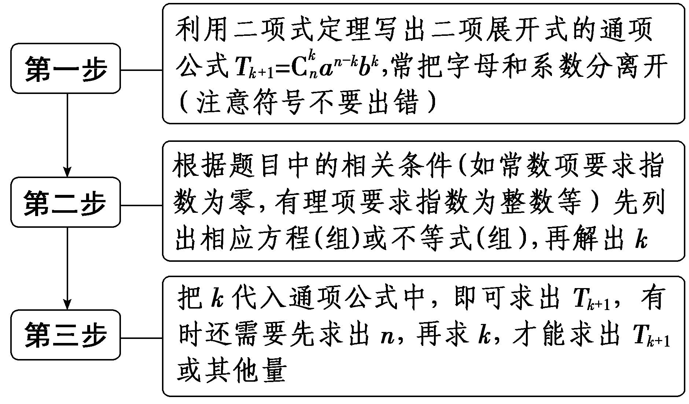
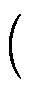

**第二节　二项式定理**

【课标研读】　1.能用多项式运算法则和计数原理证明二项式定理.　2.会用二项式定理解决与二项展开式有关的简单问题.

1.二项式定理

<table><tr><td>
二项式定理
</td><td>
(<em>a</em>＋<em>b</em>)<em>n</em>＝<em>an</em>＋<em>an</em>－1<em>b</em>1＋…＋<em>an</em>－<em>kbk</em>＋…＋<em>bn</em>(<em>n</em>∈<strong>N</strong><em>*</em>)
</td></tr><tr><td>
二项展开

式的通项
</td><td>
<em>Tk</em>＋1＝<em>an</em>－<em>kbk</em>，它表示展开式的第<em>k</em>＋1项
</td></tr><tr><td>
二项式系数
</td><td>
(<em>k</em>＝0，1，…，<em>n</em>)
</td></tr></table>

[微提醒]　二项式系数是指 $C_{n}^{0}$ ， $C_{n}^{1}$ ，…， $C_{n}^{n}$ ，它只与各项的项数有关，而与<text style="it*a*lic">a</text>，*<text style="italic">b*</text>的值无关；项的系数是指该项中除变量外的常数部分，它不仅与各项的项数有关，而且与a，b的值有关.

2.二项式系数的性质

<table><tr><td>
性质
</td><td colspan="2">
性质描述
</td></tr><tr><td>
对称性
</td><td colspan="2">
与首末两端“等距离”的两个二项式系数相等，即＝
</td></tr><tr><td rowspan="2">
增减性
</td><td rowspan="2">
二项式

系数
</td><td colspan="2">
当<em>k</em>＜(<em>n</em>∈<strong>N</strong><em>*</em>)时，是递增的
</td></tr><tr><td colspan="2">
当<em>k</em>＞(<em>n</em>∈<strong>N</strong><em>*</em>)时，是递减的
</td></tr><tr><td rowspan="2">
二项式系

数最大值
</td><td colspan="2">
当<em>n</em>为偶数时，中间的一项取得最大值
</td></tr><tr><td colspan="2">
当<em>n</em>为奇数时，中间的两项与相等，且同时取得最大值
</td></tr></table>

【常用结论】

若二项展开式的通项为<em>T&lt;text style="italic,superscript"&gt;&lt;text style="italic"&gt;&lt;text style="italic"&gt;k</em>&lt;/text&gt;&lt;/text&gt;&lt;/text&gt;＋1＝<em>&lt;text style="italic"&gt;g</em>&lt;/text&gt; $\left(k\right)$ <em>·xh</em>(<em>&lt;text style="italic,superscript"&gt;&lt;text style="italic"&gt;&lt;text style="italic"&gt;k</em>&lt;/text&gt;&lt;/text&gt;&lt;/text&gt;)(k＝0，1，2，…，<em>n</em>)，<em>&lt;text style="italic"&gt;g</em>&lt;/text&gt;(k)≠0，则有以下常见结论：

(1)<em>h</em> $\left(k\right)$ ＝0⇔<em>Tk</em>＋1是常数项.

(2)<em>h</em>(<em>k</em>)是非负整数⇔<em>Tk</em>＋1是整式项.

(3)<em>h</em>(<em>k</em>)是负整数⇔<em>Tk</em>＋1是分式项.

(4)<em>h</em>(<em>k</em>)是整数⇔<em>Tk</em>＋1是有理项.

【自主检测】

1.(多选)下列说法正确的是(　　)

A. $C_{n}^{k}$ <em>an</em>－<em>&lt;text style="italic,superscript"&gt;&lt;text style="italic"&gt;k</em>&lt;/text&gt;&lt;/text&gt;<em>b</em>k是 $\left(a＋b\right)^{n}$ 的展开式中的第<em>&lt;text style="italic,superscript"&gt;&lt;text style="italic"&gt;k</em>&lt;/text&gt;&lt;/text&gt;项

B.(<em>a</em>＋<em>b</em>)<em>n</em>的展开式中每一项的二项式系数与<em>a</em>，<em>b</em>无关

C.通项公式&lt;text style="it&lt;text style="it<em>a</em>lic"&gt;a&lt;/text&gt;lic"&gt;T&lt;/text&gt;&lt;text style="italic,su<em>&lt;text style="italic"&gt;b</em>&lt;/text&gt;script"&gt;<em>&lt;text style="italic,superscript"&gt;k</em>&lt;/text&gt;&lt;/text&gt;＋1＝ $C_{n}^{k}$ &lt;text style="it<em>a</em>lic"&gt;a&lt;/text&gt;<em>n</em>－&lt;text style="italic,su<em>&lt;text style="italic"&gt;b</em>&lt;/text&gt;script"&gt;<em>&lt;text style="italic,superscript"&gt;k</em>&lt;/text&gt;&lt;/text&gt;bk中的a和b不能互换

D.二项式的展开式中的系数最大项与二项式系数最大项是相同的

答案：**BC**

2.(链接人教A选择性必修三P30例2)(1－2<em>x</em>)4展开式中第3项的二项式系数为(　　)

A.6	B.－6

C.24	D.－24

答案：**A**

解析：(1－2<em>x</em>)4展开式中第3项的二项式系数为 $C_{4}^{2}$ ＝6.故选A.

3.(链接人教A选择性必修三P38T5(2)) (2021·北京卷) $\left(x^{3}－\frac{1}{x}\right)^{4}$  的展开式中的常数项是<u>　　　　</u>.

答案：－4

解析：(&lt;te&lt;te<em>x</em>t style="italic"&gt;x&lt;/text&gt;t style="italic"&gt;x&lt;/text&gt;&lt;text style="superscript"&gt;3&lt;/text&gt;－ $\frac{1}{x}$ )&lt;te&lt;te<em>x</em>t style="italic"&gt;x&lt;/text&gt;t style="superscript"&gt;4&lt;/text&gt;的展开式的通项<em>T&lt;text style="italic,superscript"&gt;&lt;text style="italic,superscript"&gt;&lt;text style="italic,superscript"&gt;&lt;text style="italic,superscript"&gt;&lt;text style="italic"&gt;&lt;text style="italic"&gt;k</em>&lt;/text&gt;&lt;/text&gt;&lt;/text&gt;&lt;/text&gt;&lt;/text&gt;&lt;/text&gt;＋1＝ $C_{4}^{k}$ (&lt;te&lt;te<em>x</em>t style="italic"&gt;x&lt;/text&gt;t style="italic"&gt;x&lt;/text&gt;&lt;text style="superscript"&gt;3&lt;/text&gt;)4－<em>&lt;text style="italic,superscript"&gt;&lt;text style="italic,superscript"&gt;&lt;text style="italic,superscript"&gt;&lt;text style="italic,superscript"&gt;&lt;text style="italic"&gt;&lt;text style="italic"&gt;k</em>&lt;/text&gt;&lt;/text&gt;&lt;/text&gt;&lt;/text&gt;&lt;/text&gt;&lt;/text&gt;<em>·</em>(－ $\frac{1}{x}$ )&lt;te&lt;te<em>x</em>t style="italic"&gt;x&lt;/text&gt;t style="italic,subscript"&gt;<em>&lt;text style="italic,superscript"&gt;&lt;text style="italic,superscript"&gt;&lt;text style="italic,superscript"&gt;&lt;text style="italic"&gt;&lt;text style="italic"&gt;k</em>&lt;/text&gt;&lt;/text&gt;&lt;/text&gt;&lt;/text&gt;&lt;/text&gt;&lt;/text&gt;＝(－1)k $C_{4}^{k}$ &lt;te&lt;te<em>x</em>t style="italic"&gt;x&lt;/text&gt;t style="italic"&gt;x&lt;/text&gt;12－4<em>&lt;text style="italic,superscript"&gt;&lt;text style="italic,superscript"&gt;&lt;text style="italic,superscript"&gt;&lt;text style="italic,superscript"&gt;&lt;text style="italic"&gt;&lt;text style="italic"&gt;k</em>&lt;/text&gt;&lt;/text&gt;&lt;/text&gt;&lt;/text&gt;&lt;/text&gt;&lt;/text&gt;，令12－4k＝0，得k＝&lt;text style="superscript"&gt;3&lt;/text&gt;，所以常数项为－ $C_{4}^{3}$ ＝－&lt;te&lt;te<em>x</em>t style="italic"&gt;x&lt;/text&gt;t style="superscript"&gt;4&lt;/text&gt;.

4.若 $\left(x＋\frac{1}{x}\right)^{n}$ 的展开式中二项式系数之和为64，则展开式的常数项为<u>　　　　</u>.

答案：20

解析：因为二项式系数之和为2&lt;te<em>x</em>t style="italic,superscript"&gt;<em>n</em>&lt;/text&gt;＝64，所以n＝6，则<em>&lt;text style="italic"&gt;T</em>&lt;/text&gt;<em>&lt;text style="italic,superscript"&gt;&lt;text style="italic,superscript"&gt;&lt;text style="italic"&gt;&lt;text style="italic"&gt;k</em>&lt;/text&gt;&lt;/text&gt;&lt;/text&gt;&lt;/text&gt;＋1＝ $C_{6}^{k}$ &lt;te<em>x</em>t style="italic"&gt;·x&lt;/text&gt;6－<em>&lt;text style="italic,superscript"&gt;&lt;text style="italic,superscript"&gt;&lt;text style="italic"&gt;&lt;text style="italic"&gt;k</em>&lt;/text&gt;&lt;/text&gt;&lt;/text&gt;&lt;/text&gt;· $\left(\frac{1}{x}\right)^{k}$ ＝ $C_{6}^{k}$ <em>x</em>6－2<em>&lt;text style="italic,superscript"&gt;&lt;text style="italic,superscript"&gt;&lt;text style="italic"&gt;&lt;text style="italic"&gt;k</em>&lt;/text&gt;&lt;/text&gt;&lt;/text&gt;&lt;/text&gt;，当6－2k＝0，即k＝3时为常数项，即常数项为<em>&lt;text style="italic"&gt;T</em>&lt;/text&gt;4＝ $C_{6}^{3}$ ＝20.

考点一　展开式中的通项问题(求特定项或特定项的系数)　　　　多维探究

角度1　(<em>a</em>＋<em>b</em>)<em>n</em>(<em>n</em>∈<strong>N</strong><em>\*</em>)型

(1)在 $\left(\frac{2}{x}＋x^{4}\right)^{n}$ 的展开式中，第2项的系数与第1项的系数之差为320，则该二项展开式中<em>x</em>8的系数为(　　)

A.140	B.280

C.560	D.1 120

(2) $\left(\sqrt{x}＋\frac{1}{\sqrt[3]{x}}\right)^{30}$ 的展开式中，无理项的项数为(　　)

A.27	B.24

C.26	D.25

(3)(2024·天津卷)在 $\left(\frac{3}{x^{3}}＋\frac{x^{3}}{3}\right)^{6}$ 的展开式中，常数项为<u>　　　　</u>.

答案：(1)**C**　(2)**D**　 (3)20

解析：(1)由题意知， $\left(\frac{2}{x}＋x^{4}\right)^{n}$ 展开式的通项为&lt;te&lt;te&lt;te<em>x</em>t style="italic"&gt;x&lt;/text&gt;t style="italic"&gt;x&lt;/text&gt;t style="italic"&gt;<em>T</em>&lt;/text&gt;<em>&lt;text style="italic,superscript"&gt;&lt;text style="italic,superscript"&gt;&lt;text style="italic,subscript"&gt;&lt;text style="italic,superscript"&gt;&lt;text style="italic,superscript"&gt;&lt;text style="italic"&gt;&lt;text style="italic"&gt;k</em>&lt;/text&gt;&lt;/text&gt;&lt;/text&gt;&lt;/text&gt;&lt;/text&gt;&lt;/text&gt;&lt;/text&gt;&lt;text style="subscript"&gt;＋1&lt;/text&gt;＝ $C_{n}^{k}\left(\frac{2}{x}\right)^{n－k}$ &lt;te&lt;te&lt;te<em>x</em>t style="italic"&gt;x&lt;/text&gt;t style="italic"&gt;x&lt;/text&gt;t style="italic"&gt;·&lt;/text&gt; $\left(x^{4}\right)^{k}$ ＝2&lt;te&lt;te&lt;te<em>x</em>t style="italic"&gt;x&lt;/text&gt;t style="italic"&gt;x&lt;/text&gt;t style="italic,superscript"&gt;<em>&lt;text style="italic,superscript"&gt;&lt;text style="italic,superscript"&gt;&lt;text style="italic,superscript"&gt;&lt;text style="italic"&gt;n</em>&lt;/text&gt;&lt;/text&gt;&lt;/text&gt;&lt;/text&gt;&lt;/text&gt;&lt;text style="superscript"&gt;－&lt;/text&gt;<em>&lt;text style="italic,superscript"&gt;&lt;text style="italic,superscript"&gt;&lt;text style="italic,subscript"&gt;&lt;text style="italic,superscript"&gt;&lt;text style="italic,superscript"&gt;&lt;text style="italic"&gt;&lt;text style="italic"&gt;k</em>&lt;/text&gt;&lt;/text&gt;&lt;/text&gt;&lt;/text&gt;&lt;/text&gt;&lt;/text&gt;&lt;/text&gt; $C_{n}^{k}$ &lt;te&lt;te<em>x</em>t style="italic"&gt;x&lt;/text&gt;t style="italic"&gt;x&lt;/text&gt;&lt;text style="superscript"&gt;5&lt;/text&gt;<em>&lt;text style="italic,superscript"&gt;&lt;text style="italic,superscript"&gt;&lt;text style="italic,subscript"&gt;&lt;text style="italic,superscript"&gt;&lt;text style="italic,superscript"&gt;&lt;text style="italic"&gt;&lt;text style="italic"&gt;k</em>&lt;/text&gt;&lt;/text&gt;&lt;/text&gt;&lt;/text&gt;&lt;/text&gt;&lt;/text&gt;&lt;/text&gt;&lt;text style="superscript"&gt;－&lt;/text&gt;<em>&lt;text style="italic,superscript"&gt;&lt;text style="italic,superscript"&gt;&lt;text style="italic,superscript"&gt;&lt;text style="italic,superscript"&gt;&lt;text style="italic"&gt;n</em>&lt;/text&gt;&lt;/text&gt;&lt;/text&gt;&lt;/text&gt;&lt;/text&gt;，又第2项的系数与第1项的系数之差为320，所以2n&lt;text style="superscript"&gt;－1&lt;/text&gt; $C_{n}^{1}$ &lt;te&lt;te&lt;te<em>x</em>t style="italic"&gt;x&lt;/text&gt;t style="italic"&gt;x&lt;/text&gt;t style="superscript"&gt;－&lt;/text&gt;2<em>&lt;text style="italic,superscript"&gt;&lt;text style="italic,superscript"&gt;&lt;text style="italic,superscript"&gt;&lt;text style="italic,superscript"&gt;&lt;text style="italic"&gt;n</em>&lt;/text&gt;&lt;/text&gt;&lt;/text&gt;&lt;/text&gt;&lt;/text&gt; $C_{n}^{0}$ ＝320，即2&lt;te&lt;te&lt;te<em>x</em>t style="italic"&gt;x&lt;/text&gt;t style="italic"&gt;x&lt;/text&gt;t style="italic,superscript"&gt;<em>&lt;text style="italic,superscript"&gt;&lt;text style="italic,superscript"&gt;&lt;text style="italic,superscript"&gt;&lt;text style="italic"&gt;n</em>&lt;/text&gt;&lt;/text&gt;&lt;/text&gt;&lt;/text&gt;&lt;/text&gt;&lt;text style="superscript"&gt;－&lt;/text&gt;1 $\left(n－2\right)$ ＝320，解得&lt;te&lt;te&lt;te<em>x</em>t style="italic"&gt;x&lt;/text&gt;t style="italic"&gt;x&lt;/text&gt;t style="italic,superscript"&gt;<em>&lt;text style="italic,superscript"&gt;&lt;text style="italic,superscript"&gt;&lt;text style="italic,superscript"&gt;&lt;text style="italic"&gt;n</em>&lt;/text&gt;&lt;/text&gt;&lt;/text&gt;&lt;/text&gt;&lt;/text&gt;＝7，所以<em>&lt;text style="italic"&gt;T</em>&lt;/text&gt;<em>&lt;text style="italic,superscript"&gt;&lt;text style="italic,superscript"&gt;&lt;text style="italic,subscript"&gt;&lt;text style="italic,superscript"&gt;&lt;text style="italic,superscript"&gt;&lt;text style="italic"&gt;&lt;text style="italic"&gt;k</em>&lt;/text&gt;&lt;/text&gt;&lt;/text&gt;&lt;/text&gt;&lt;/text&gt;&lt;/text&gt;&lt;/text&gt;&lt;text style="subscript"&gt;＋1&lt;/text&gt;＝27&lt;text style="superscript"&gt;－&lt;/text&gt;k $C_{7}^{k}$ &lt;te&lt;te<em>x</em>t style="italic"&gt;x&lt;/text&gt;t style="italic"&gt;x&lt;/text&gt;&lt;text style="superscript"&gt;5&lt;/text&gt;<em>&lt;text style="italic,superscript"&gt;&lt;text style="italic,superscript"&gt;&lt;text style="italic,subscript"&gt;&lt;text style="italic,superscript"&gt;&lt;text style="italic,superscript"&gt;&lt;text style="italic"&gt;&lt;text style="italic"&gt;k</em>&lt;/text&gt;&lt;/text&gt;&lt;/text&gt;&lt;/text&gt;&lt;/text&gt;&lt;/text&gt;&lt;/text&gt;&lt;text style="superscript"&gt;－&lt;/text&gt;7，令5k－7＝8，解得k＝3，故展开式中x8的系数为27－3 $C_{7}^{3}$ ＝&lt;te&lt;te<em>x</em>t style="italic"&gt;x&lt;/text&gt;t style="superscript"&gt;5&lt;/text&gt;60.故选C.

(2) $\left(\sqrt{x}＋\frac{1}{\sqrt[3]{x}}\right)^{30}$ 展开式的通项为&lt;te<em>x</em>t style="italic"&gt;T&lt;/text&gt;<em>&lt;text style="italic,superscript"&gt;&lt;text style="italic"&gt;&lt;text style="italic"&gt;&lt;text style="italic"&gt;&lt;text style="italic"&gt;k</em>&lt;/text&gt;&lt;/text&gt;&lt;/text&gt;&lt;/text&gt;&lt;/text&gt;＋1＝ $C_{30}^{k}$ &lt;te<em>x</em>t style="italic"&gt;·&lt;/text&gt;( $\sqrt{x}$ )&lt;te<em>x</em>t style="superscript"&gt;30－&lt;/text&gt;<em>&lt;text style="italic,superscript"&gt;&lt;text style="italic"&gt;&lt;text style="italic"&gt;&lt;text style="italic"&gt;&lt;text style="italic"&gt;k</em>&lt;/text&gt;&lt;/text&gt;&lt;/text&gt;&lt;/text&gt;&lt;/text&gt;<em>·</em> $\left(\frac{1}{\sqrt[3]{x}}\right)^{k}$ ＝ $C_{30}^{k}x^{15－\frac{5}{6}k}$ ，&lt;te<em>x</em>t style="italic,subscript"&gt;<em>&lt;text style="italic"&gt;&lt;text style="italic"&gt;&lt;text style="italic"&gt;&lt;text style="italic"&gt;k</em>&lt;/text&gt;&lt;/text&gt;&lt;/text&gt;&lt;/text&gt;&lt;/text&gt;＝0，1，2，…，30，若x的指数15－ $\frac{5}{6}$ &lt;te<em>x</em>t style="italic,subscript"&gt;<em>&lt;text style="italic"&gt;&lt;text style="italic"&gt;&lt;text style="italic"&gt;&lt;text style="italic"&gt;k</em>&lt;/text&gt;&lt;/text&gt;&lt;/text&gt;&lt;/text&gt;&lt;/text&gt;为整数，则k是6的倍数，所以当k＝0，6，12，18，24，30时为有理项，共6项，故无理项的项数为31－6＝25.故选D.

(3)<em>&lt;text style="italic"&gt;T</em>&lt;/text&gt;<em>&lt;text style="italic,superscript"&gt;&lt;text style="italic,superscript"&gt;&lt;text style="italic"&gt;&lt;text style="italic"&gt;k</em>&lt;/text&gt;&lt;/text&gt;&lt;/text&gt;&lt;/text&gt;＋1＝ $C_{6}^{k}\left(\frac{3}{x^{3}}\right)^{6－k}\left(\frac{x^{3}}{3}\right)^{k}$ ＝ $C_{6}^{k}$ <em>&lt;text style="italic"&gt;·</em>&lt;/text&gt;3&lt;text style="superscript"&gt;6－2&lt;/text&gt;<em>&lt;text style="italic,superscript"&gt;&lt;text style="italic,superscript"&gt;&lt;text style="italic"&gt;&lt;text style="italic"&gt;k</em>&lt;/text&gt;&lt;/text&gt;&lt;/text&gt;&lt;/text&gt;<em>&lt;text style="italic"&gt;·x</em>&lt;/text&gt;6k－18.令6k－18＝&lt;text style="superscript"&gt;0&lt;/text&gt;，得k＝3，所以常数项为<em>&lt;text style="italic"&gt;T</em>&lt;/text&gt;4＝ $C_{6}^{3}$ <em>&lt;text style="italic"&gt;·</em>&lt;/text&gt;3&lt;text style="superscript"&gt;0&lt;/text&gt;<em>&lt;text style="italic"&gt;·x</em>&lt;/text&gt;0＝20.

角度2　(<em>a</em>＋<em>b</em>)<em>m</em>(<em>c</em>＋<em>d</em>)<em>n</em>(<em>m</em>，<em>n</em>∈<strong>N</strong><em>\*</em>)型

(1)(2025·安徽蚌埠市第三次质量检测) (1－<em>x</em>＋<em>x</em>2)2·(1＋<em>x</em>)3的展开式中，<em>x</em>4的系数为(　　)

A. 1	B. 2

C. 4	D. 5

(&lt;text st<em>y</em>le="superscript"&gt;2&lt;/text&gt;)(202&lt;te<em>x</em>t style="superscript"&gt;5&lt;/text&gt;·江苏南京六校联考) 已知 $\left(\frac{1}{x}－2y\right)$ (&lt;te&lt;text st<em>y</em>le="italic"&gt;x&lt;/text&gt;t st<em>y</em>le="italic"&gt;<em>m</em>x&lt;/text&gt;－y)5的展开式中x2y4的系数为80，则m的值为<u>　　　　</u>.

答案：(1)**B**　(2)±2

解析：(1)依题意， $(1－x＋x^{2})^{2}$ ＝1＋&lt;te&lt;te&lt;te&lt;te&lt;te&lt;te&lt;te&lt;te&lt;te&lt;te&lt;te&lt;te&lt;te&lt;te<em>x</em>t style="italic"&gt;x&lt;/text&gt;t style="italic"&gt;x&lt;/text&gt;t style="italic"&gt;x&lt;/text&gt;t style="italic"&gt;x&lt;/text&gt;t style="italic"&gt;x&lt;/text&gt;t style="italic"&gt;x&lt;/text&gt;t style="italic"&gt;x&lt;/text&gt;t style="italic"&gt;x&lt;/text&gt;t style="italic"&gt;x&lt;/text&gt;t style="italic"&gt;x&lt;/text&gt;t style="italic"&gt;x&lt;/text&gt;t style="italic"&gt;x&lt;/text&gt;t style="italic"&gt;x&lt;/text&gt;t style="italic"&gt;x&lt;/text&gt;&lt;text style="superscript"&gt;&lt;text style="superscript"&gt;&lt;text style="superscript"&gt;2&lt;/text&gt;&lt;/text&gt;&lt;/text&gt;＋x&lt;text style="superscript"&gt;&lt;text style="superscript"&gt;4&lt;/text&gt;&lt;/text&gt;－2x＋2x2－2x&lt;text style="superscript"&gt;&lt;text style="superscript"&gt;&lt;text style="superscript"&gt;&lt;text style="superscript"&gt;3&lt;/text&gt;&lt;/text&gt;&lt;/text&gt;&lt;/text&gt;＝1－2x＋3x2－2x3＋x4，(1＋x)3＝1＋3x＋3x2＋x3，所以 $(1－x＋x^{2})^{2}$ ·(1＋&lt;te&lt;te&lt;te&lt;te&lt;te&lt;te&lt;te&lt;te&lt;te&lt;te&lt;te&lt;te&lt;te&lt;te<em>x</em>t style="italic"&gt;x&lt;/text&gt;t style="italic"&gt;x&lt;/text&gt;t style="italic"&gt;x&lt;/text&gt;t style="italic"&gt;x&lt;/text&gt;t style="italic"&gt;x&lt;/text&gt;t style="italic"&gt;x&lt;/text&gt;t style="italic"&gt;x&lt;/text&gt;t style="italic"&gt;x&lt;/text&gt;t style="italic"&gt;x&lt;/text&gt;t style="italic"&gt;x&lt;/text&gt;t style="italic"&gt;x&lt;/text&gt;t style="italic"&gt;x&lt;/text&gt;t style="italic"&gt;x&lt;/text&gt;t style="italic"&gt;x&lt;/text&gt;)&lt;text style="superscript"&gt;&lt;text style="superscript"&gt;&lt;text style="superscript"&gt;&lt;text style="superscript"&gt;3&lt;/text&gt;&lt;/text&gt;&lt;/text&gt;&lt;/text&gt;的展开式中，x&lt;text style="superscript"&gt;&lt;text style="superscript"&gt;4&lt;/text&gt;&lt;/text&gt;的系数为－&lt;text style="superscript"&gt;&lt;text style="superscript"&gt;&lt;text style="superscript"&gt;2&lt;/text&gt;&lt;/text&gt;&lt;/text&gt;×1＋3×3－2×3＋1×1＝2.故选B.

(&lt;te&lt;te&lt;te&lt;te&lt;text st<em>y</em>le="italic"&gt;x&lt;/text&gt;t st&lt;text st<em>y</em>le="italic"&gt;y&lt;/text&gt;le="italic"&gt;x&lt;/text&gt;t st&lt;text st<em>y</em>le="italic"&gt;y&lt;/text&gt;le="italic"&gt;x&lt;/text&gt;t st&lt;text st&lt;text st<em>y</em>le="italic"&gt;y&lt;/text&gt;le="italic"&gt;y&lt;/text&gt;le="italic"&gt;x&lt;/text&gt;t st&lt;text st&lt;text st&lt;text st<em>y</em>le="italic"&gt;y&lt;/text&gt;le="italic"&gt;y&lt;/text&gt;le="italic"&gt;y&lt;/text&gt;le="supe&lt;text style="italic,supe&lt;text style="italic,supe&lt;text style="italic,supe<em>r</em>script"&gt;r&lt;/text&gt;script"&gt;r&lt;/text&gt;script"&gt;r&lt;/text&gt;script"&gt;&lt;text style="superscript"&gt;&lt;text style="superscript"&gt;&lt;text style="superscript"&gt;&lt;text style="superscript"&gt;&lt;text style="superscript"&gt;2&lt;/text&gt;&lt;/text&gt;&lt;/text&gt;&lt;/text&gt;&lt;/text&gt;&lt;/text&gt;)由题意可知， $\left(\frac{1}{x}－2y\right)$ (&lt;te&lt;te&lt;te&lt;te&lt;te&lt;te&lt;te&lt;text st<em>y</em>le="italic"&gt;x&lt;/text&gt;t st&lt;text st<em>y</em>le="italic"&gt;y&lt;/text&gt;le="italic"&gt;x&lt;/text&gt;t st&lt;text st<em>y</em>le="italic"&gt;y&lt;/text&gt;le="italic"&gt;x&lt;/text&gt;t st&lt;text st&lt;text st<em>y</em>le="italic"&gt;y&lt;/text&gt;le="italic"&gt;y&lt;/text&gt;le="italic"&gt;x&lt;/text&gt;t st&lt;text st&lt;text st&lt;text st<em>y</em>le="italic"&gt;y&lt;/text&gt;le="italic"&gt;y&lt;/text&gt;le="italic"&gt;y&lt;/text&gt;le="italic"&gt;x&lt;/text&gt;t st&lt;text st<em>y</em>le="italic"&gt;y&lt;/text&gt;le="italic"&gt;x&lt;/text&gt;t style="italic"&gt;x&lt;/text&gt;t st&lt;text st&lt;text st&lt;text st&lt;text st<em>y</em>le="italic"&gt;y&lt;/text&gt;le="italic"&gt;y&lt;/text&gt;le="italic"&gt;y&lt;/text&gt;le="italic"&gt;y&lt;/text&gt;le="italic"&gt;<em>&lt;text style="italic"&gt;&lt;text style="italic"&gt;&lt;text style="italic"&gt;&lt;text style="italic"&gt;&lt;text style="italic"&gt;&lt;text style="italic"&gt;&lt;text style="italic"&gt;&lt;text style="italic"&gt;&lt;text style="italic"&gt;&lt;text style="italic"&gt;m</em>&lt;/text&gt;&lt;/text&gt;&lt;/text&gt;&lt;/text&gt;&lt;/text&gt;&lt;/text&gt;&lt;/text&gt;x&lt;/text&gt;&lt;/text&gt;&lt;/text&gt;&lt;/text&gt;－y)&lt;text style="supe&lt;text style="italic,supe&lt;text style="italic,supe&lt;text style="italic,supe<em>r</em>script"&gt;r&lt;/text&gt;script"&gt;r&lt;/text&gt;script"&gt;r&lt;/text&gt;script"&gt;&lt;text style="superscript"&gt;&lt;text style="superscript"&gt;&lt;text style="superscript"&gt;&lt;text style="superscript"&gt;&lt;text style="superscript"&gt;&lt;text style="superscript"&gt;&lt;text style="superscript"&gt;5&lt;/text&gt;&lt;/text&gt;&lt;/text&gt;&lt;/text&gt;&lt;/text&gt;&lt;/text&gt;&lt;/text&gt;&lt;/text&gt;＝ $\frac{1}{x}$ (&lt;te&lt;te&lt;te&lt;te&lt;te&lt;te&lt;te&lt;text st<em>y</em>le="italic"&gt;x&lt;/text&gt;t st&lt;text st<em>y</em>le="italic"&gt;y&lt;/text&gt;le="italic"&gt;x&lt;/text&gt;t st&lt;text st<em>y</em>le="italic"&gt;y&lt;/text&gt;le="italic"&gt;x&lt;/text&gt;t st&lt;text st&lt;text st<em>y</em>le="italic"&gt;y&lt;/text&gt;le="italic"&gt;y&lt;/text&gt;le="italic"&gt;x&lt;/text&gt;t st&lt;text st&lt;text st&lt;text st<em>y</em>le="italic"&gt;y&lt;/text&gt;le="italic"&gt;y&lt;/text&gt;le="italic"&gt;y&lt;/text&gt;le="italic"&gt;x&lt;/text&gt;t st&lt;text st<em>y</em>le="italic"&gt;y&lt;/text&gt;le="italic"&gt;x&lt;/text&gt;t style="italic"&gt;x&lt;/text&gt;t st&lt;text st&lt;text st&lt;text st&lt;text st<em>y</em>le="italic"&gt;y&lt;/text&gt;le="italic"&gt;y&lt;/text&gt;le="italic"&gt;y&lt;/text&gt;le="italic"&gt;y&lt;/text&gt;le="italic"&gt;<em>&lt;text style="italic"&gt;&lt;text style="italic"&gt;&lt;text style="italic"&gt;&lt;text style="italic"&gt;&lt;text style="italic"&gt;&lt;text style="italic"&gt;&lt;text style="italic"&gt;&lt;text style="italic"&gt;&lt;text style="italic"&gt;&lt;text style="italic"&gt;m</em>&lt;/text&gt;&lt;/text&gt;&lt;/text&gt;&lt;/text&gt;&lt;/text&gt;&lt;/text&gt;&lt;/text&gt;x&lt;/text&gt;&lt;/text&gt;&lt;/text&gt;&lt;/text&gt;－y)&lt;text style="supe&lt;text style="italic,supe&lt;text style="italic,supe&lt;text style="italic,supe<em>r</em>script"&gt;r&lt;/text&gt;script"&gt;r&lt;/text&gt;script"&gt;r&lt;/text&gt;script"&gt;&lt;text style="superscript"&gt;&lt;text style="superscript"&gt;&lt;text style="superscript"&gt;&lt;text style="superscript"&gt;&lt;text style="superscript"&gt;&lt;text style="superscript"&gt;&lt;text style="superscript"&gt;5&lt;/text&gt;&lt;/text&gt;&lt;/text&gt;&lt;/text&gt;&lt;/text&gt;&lt;/text&gt;&lt;/text&gt;&lt;/text&gt;－&lt;text style="superscript"&gt;&lt;text style="superscript"&gt;&lt;text style="superscript"&gt;&lt;text style="superscript"&gt;&lt;text style="superscript"&gt;&lt;text style="superscript"&gt;2&lt;/text&gt;&lt;/text&gt;&lt;/text&gt;&lt;/text&gt;&lt;/text&gt;&lt;/text&gt;y(<em>&lt;text style="italic"&gt;&lt;text style="italic"&gt;&lt;text style="italic"&gt;&lt;text style="italic"&gt;mx</em>&lt;/text&gt;&lt;/text&gt;&lt;/text&gt;&lt;/text&gt;－y)5，在 $\frac{1}{x}$ (&lt;te&lt;te&lt;te&lt;te&lt;te&lt;te&lt;te&lt;text st<em>y</em>le="italic"&gt;x&lt;/text&gt;t st&lt;text st<em>y</em>le="italic"&gt;y&lt;/text&gt;le="italic"&gt;x&lt;/text&gt;t st&lt;text st<em>y</em>le="italic"&gt;y&lt;/text&gt;le="italic"&gt;x&lt;/text&gt;t st&lt;text st&lt;text st<em>y</em>le="italic"&gt;y&lt;/text&gt;le="italic"&gt;y&lt;/text&gt;le="italic"&gt;x&lt;/text&gt;t st&lt;text st&lt;text st&lt;text st<em>y</em>le="italic"&gt;y&lt;/text&gt;le="italic"&gt;y&lt;/text&gt;le="italic"&gt;y&lt;/text&gt;le="italic"&gt;x&lt;/text&gt;t st&lt;text st<em>y</em>le="italic"&gt;y&lt;/text&gt;le="italic"&gt;x&lt;/text&gt;t style="italic"&gt;x&lt;/text&gt;t st&lt;text st&lt;text st&lt;text st&lt;text st<em>y</em>le="italic"&gt;y&lt;/text&gt;le="italic"&gt;y&lt;/text&gt;le="italic"&gt;y&lt;/text&gt;le="italic"&gt;y&lt;/text&gt;le="italic"&gt;<em>&lt;text style="italic"&gt;&lt;text style="italic"&gt;&lt;text style="italic"&gt;&lt;text style="italic"&gt;&lt;text style="italic"&gt;&lt;text style="italic"&gt;&lt;text style="italic"&gt;&lt;text style="italic"&gt;&lt;text style="italic"&gt;&lt;text style="italic"&gt;m</em>&lt;/text&gt;&lt;/text&gt;&lt;/text&gt;&lt;/text&gt;&lt;/text&gt;&lt;/text&gt;&lt;/text&gt;x&lt;/text&gt;&lt;/text&gt;&lt;/text&gt;&lt;/text&gt;－y)&lt;text style="supe&lt;text style="italic,supe&lt;text style="italic,supe&lt;text style="italic,supe<em>r</em>script"&gt;r&lt;/text&gt;script"&gt;r&lt;/text&gt;script"&gt;r&lt;/text&gt;script"&gt;&lt;text style="superscript"&gt;&lt;text style="superscript"&gt;&lt;text style="superscript"&gt;&lt;text style="superscript"&gt;&lt;text style="superscript"&gt;&lt;text style="superscript"&gt;&lt;text style="superscript"&gt;5&lt;/text&gt;&lt;/text&gt;&lt;/text&gt;&lt;/text&gt;&lt;/text&gt;&lt;/text&gt;&lt;/text&gt;&lt;/text&gt;的展开式中，由x－1 $C_{5}^{k}\left(mx\right)^{5－k}\left(－y\right)^{k}$ ＝ $\left(－1\right)^{k}$ &lt;te&lt;te&lt;te&lt;te&lt;te&lt;te&lt;text st<em>y</em>le="italic"&gt;x&lt;/text&gt;t st&lt;text st<em>y</em>le="italic"&gt;y&lt;/text&gt;le="italic"&gt;x&lt;/text&gt;t st&lt;text st<em>y</em>le="italic"&gt;y&lt;/text&gt;le="italic"&gt;x&lt;/text&gt;t st&lt;text st&lt;text st<em>y</em>le="italic"&gt;y&lt;/text&gt;le="italic"&gt;y&lt;/text&gt;le="italic"&gt;x&lt;/text&gt;t st&lt;text st&lt;text st&lt;text st<em>y</em>le="italic"&gt;y&lt;/text&gt;le="italic"&gt;y&lt;/text&gt;le="italic"&gt;y&lt;/text&gt;le="italic"&gt;x&lt;/text&gt;t st&lt;text st<em>y</em>le="italic"&gt;y&lt;/text&gt;le="italic"&gt;x&lt;/text&gt;t style="italic"&gt;<em>&lt;text style="italic"&gt;&lt;text style="italic"&gt;&lt;text style="italic"&gt;&lt;text style="italic"&gt;&lt;text style="italic"&gt;&lt;text style="italic"&gt;m</em>&lt;/text&gt;&lt;/text&gt;&lt;/text&gt;&lt;/text&gt;&lt;/text&gt;&lt;/text&gt;&lt;/text&gt;&lt;te<em>x</em>t st&lt;text st&lt;text st&lt;text st<em>y</em>le="italic"&gt;y&lt;/text&gt;le="italic"&gt;y&lt;/text&gt;le="italic"&gt;y&lt;/text&gt;le="supe&lt;text style="italic,supe&lt;text style="italic,supe&lt;text style="italic,supe<em>r</em>script"&gt;r&lt;/text&gt;script"&gt;r&lt;/text&gt;script"&gt;r&lt;/text&gt;script"&gt;&lt;text style="superscript"&gt;&lt;text style="superscript"&gt;&lt;text style="superscript"&gt;&lt;text style="superscript"&gt;&lt;text style="superscript"&gt;&lt;text style="superscript"&gt;&lt;text style="superscript"&gt;5&lt;/text&gt;&lt;/text&gt;&lt;/text&gt;&lt;/text&gt;&lt;/text&gt;&lt;/text&gt;&lt;/text&gt;&lt;/text&gt;－<em>&lt;text style="italic,superscript"&gt;&lt;text style="italic,superscript"&gt;&lt;text style="italic"&gt;k</em>&lt;/text&gt;&lt;/text&gt;&lt;/text&gt; $C_{5}^{k}$ &lt;te&lt;te&lt;te&lt;te&lt;te&lt;te&lt;text st<em>y</em>le="italic"&gt;x&lt;/text&gt;t st&lt;text st<em>y</em>le="italic"&gt;y&lt;/text&gt;le="italic"&gt;x&lt;/text&gt;t st&lt;text st<em>y</em>le="italic"&gt;y&lt;/text&gt;le="italic"&gt;x&lt;/text&gt;t st&lt;text st&lt;text st<em>y</em>le="italic"&gt;y&lt;/text&gt;le="italic"&gt;y&lt;/text&gt;le="italic"&gt;x&lt;/text&gt;t st&lt;text st&lt;text st&lt;text st<em>y</em>le="italic"&gt;y&lt;/text&gt;le="italic"&gt;y&lt;/text&gt;le="italic"&gt;y&lt;/text&gt;le="italic"&gt;x&lt;/text&gt;t st&lt;text st<em>y</em>le="italic"&gt;y&lt;/text&gt;le="italic"&gt;x&lt;/text&gt;t style="italic"&gt;x&lt;/text&gt;&lt;text style="supe&lt;text style="italic,supe&lt;text style="italic,supe&lt;text style="italic,supe<em>r</em>script"&gt;r&lt;/text&gt;script"&gt;r&lt;/text&gt;script"&gt;r&lt;/text&gt;script"&gt;&lt;text style="superscript"&gt;&lt;text style="superscript"&gt;&lt;text style="superscript"&gt;4&lt;/text&gt;&lt;/text&gt;&lt;/text&gt;－&lt;/text&gt;<em>&lt;text style="italic,superscript"&gt;&lt;text style="italic,superscript"&gt;&lt;text style="italic"&gt;k</em>&lt;/text&gt;&lt;/text&gt;&lt;/text&gt;&lt;text st&lt;text st&lt;text st&lt;text st<em>y</em>le="italic"&gt;y&lt;/text&gt;le="italic"&gt;y&lt;/text&gt;le="italic"&gt;y&lt;/text&gt;le="italic"&gt;y&lt;/text&gt;k，令 $\left\{\begin{matrix}4－k=2，\\k=4，\end{matrix}\right.$ 得&lt;te&lt;te&lt;te&lt;te&lt;te&lt;te&lt;text st<em>y</em>le="italic"&gt;x&lt;/text&gt;t st&lt;text st<em>y</em>le="italic"&gt;y&lt;/text&gt;le="italic"&gt;x&lt;/text&gt;t st&lt;text st<em>y</em>le="italic"&gt;y&lt;/text&gt;le="italic"&gt;x&lt;/text&gt;t st&lt;text st&lt;text st<em>y</em>le="italic"&gt;y&lt;/text&gt;le="italic"&gt;y&lt;/text&gt;le="italic"&gt;x&lt;/text&gt;t st&lt;text st&lt;text st&lt;text st<em>y</em>le="italic"&gt;y&lt;/text&gt;le="italic"&gt;y&lt;/text&gt;le="italic"&gt;y&lt;/text&gt;le="italic"&gt;x&lt;/text&gt;t st&lt;text st<em>y</em>le="italic"&gt;y&lt;/text&gt;le="italic"&gt;x&lt;/text&gt;t style="italic,supe&lt;text style="italic,supe&lt;text style="italic,supe&lt;text style="italic,supe<em>r</em>script"&gt;r&lt;/text&gt;script"&gt;r&lt;/text&gt;script"&gt;r&lt;/text&gt;script"&gt;<em>&lt;text style="italic,superscript"&gt;&lt;text style="italic"&gt;k</em>&lt;/text&gt;&lt;/text&gt;&lt;/text&gt;无解，即 $\frac{1}{x}$ (&lt;te&lt;te&lt;te&lt;te&lt;te&lt;te&lt;te&lt;text st<em>y</em>le="italic"&gt;x&lt;/text&gt;t st&lt;text st<em>y</em>le="italic"&gt;y&lt;/text&gt;le="italic"&gt;x&lt;/text&gt;t st&lt;text st<em>y</em>le="italic"&gt;y&lt;/text&gt;le="italic"&gt;x&lt;/text&gt;t st&lt;text st&lt;text st<em>y</em>le="italic"&gt;y&lt;/text&gt;le="italic"&gt;y&lt;/text&gt;le="italic"&gt;x&lt;/text&gt;t st&lt;text st&lt;text st&lt;text st<em>y</em>le="italic"&gt;y&lt;/text&gt;le="italic"&gt;y&lt;/text&gt;le="italic"&gt;y&lt;/text&gt;le="italic"&gt;x&lt;/text&gt;t st&lt;text st<em>y</em>le="italic"&gt;y&lt;/text&gt;le="italic"&gt;x&lt;/text&gt;t style="italic"&gt;x&lt;/text&gt;t st&lt;text st&lt;text st&lt;text st&lt;text st<em>y</em>le="italic"&gt;y&lt;/text&gt;le="italic"&gt;y&lt;/text&gt;le="italic"&gt;y&lt;/text&gt;le="italic"&gt;y&lt;/text&gt;le="italic"&gt;<em>&lt;text style="italic"&gt;&lt;text style="italic"&gt;&lt;text style="italic"&gt;&lt;text style="italic"&gt;&lt;text style="italic"&gt;&lt;text style="italic"&gt;&lt;text style="italic"&gt;&lt;text style="italic"&gt;&lt;text style="italic"&gt;&lt;text style="italic"&gt;m</em>&lt;/text&gt;&lt;/text&gt;&lt;/text&gt;&lt;/text&gt;&lt;/text&gt;&lt;/text&gt;&lt;/text&gt;x&lt;/text&gt;&lt;/text&gt;&lt;/text&gt;&lt;/text&gt;－y)&lt;text style="supe&lt;text style="italic,supe&lt;text style="italic,supe&lt;text style="italic,supe<em>r</em>script"&gt;r&lt;/text&gt;script"&gt;r&lt;/text&gt;script"&gt;r&lt;/text&gt;script"&gt;&lt;text style="superscript"&gt;&lt;text style="superscript"&gt;&lt;text style="superscript"&gt;&lt;text style="superscript"&gt;&lt;text style="superscript"&gt;&lt;text style="superscript"&gt;&lt;text style="superscript"&gt;5&lt;/text&gt;&lt;/text&gt;&lt;/text&gt;&lt;/text&gt;&lt;/text&gt;&lt;/text&gt;&lt;/text&gt;&lt;/text&gt;的展开式中没有x&lt;text style="superscript"&gt;&lt;text style="superscript"&gt;&lt;text style="superscript"&gt;&lt;text style="superscript"&gt;&lt;text style="superscript"&gt;&lt;text style="superscript"&gt;2&lt;/text&gt;&lt;/text&gt;&lt;/text&gt;&lt;/text&gt;&lt;/text&gt;&lt;/text&gt;y&lt;text style="superscript"&gt;&lt;text style="superscript"&gt;&lt;text style="superscript"&gt;4&lt;/text&gt;&lt;/text&gt;&lt;/text&gt;的项；在2y(<em>&lt;text style="italic"&gt;&lt;text style="italic"&gt;&lt;text style="italic"&gt;&lt;text style="italic"&gt;mx</em>&lt;/text&gt;&lt;/text&gt;&lt;/text&gt;&lt;/text&gt;－y)5的展开式中，由2y $C_{5}^{r}\left(mx\right)^{5－r}\left(－y\right)^{r}$ ＝&lt;te&lt;te&lt;te&lt;te&lt;text st<em>y</em>le="italic"&gt;x&lt;/text&gt;t st&lt;text st<em>y</em>le="italic"&gt;y&lt;/text&gt;le="italic"&gt;x&lt;/text&gt;t st&lt;text st<em>y</em>le="italic"&gt;y&lt;/text&gt;le="italic"&gt;x&lt;/text&gt;t st&lt;text st&lt;text st<em>y</em>le="italic"&gt;y&lt;/text&gt;le="italic"&gt;y&lt;/text&gt;le="italic"&gt;x&lt;/text&gt;t st&lt;text st&lt;text st&lt;text st<em>y</em>le="italic"&gt;y&lt;/text&gt;le="italic"&gt;y&lt;/text&gt;le="italic"&gt;y&lt;/text&gt;le="supe&lt;text style="italic,supe&lt;text style="italic,supe&lt;text style="italic,supe<em>r</em>script"&gt;r&lt;/text&gt;script"&gt;r&lt;/text&gt;script"&gt;r&lt;/text&gt;script"&gt;&lt;text style="superscript"&gt;&lt;text style="superscript"&gt;&lt;text style="superscript"&gt;&lt;text style="superscript"&gt;&lt;text style="superscript"&gt;2&lt;/text&gt;&lt;/text&gt;&lt;/text&gt;&lt;/text&gt;&lt;/text&gt;&lt;/text&gt; $\left(－1\right)^{r}$ &lt;te&lt;te&lt;te&lt;te&lt;te&lt;te&lt;text st<em>y</em>le="italic"&gt;x&lt;/text&gt;t st&lt;text st<em>y</em>le="italic"&gt;y&lt;/text&gt;le="italic"&gt;x&lt;/text&gt;t st&lt;text st<em>y</em>le="italic"&gt;y&lt;/text&gt;le="italic"&gt;x&lt;/text&gt;t st&lt;text st&lt;text st<em>y</em>le="italic"&gt;y&lt;/text&gt;le="italic"&gt;y&lt;/text&gt;le="italic"&gt;x&lt;/text&gt;t st&lt;text st&lt;text st&lt;text st<em>y</em>le="italic"&gt;y&lt;/text&gt;le="italic"&gt;y&lt;/text&gt;le="italic"&gt;y&lt;/text&gt;le="italic"&gt;x&lt;/text&gt;t st&lt;text st<em>y</em>le="italic"&gt;y&lt;/text&gt;le="italic"&gt;x&lt;/text&gt;t style="italic"&gt;<em>&lt;text style="italic"&gt;&lt;text style="italic"&gt;&lt;text style="italic"&gt;&lt;text style="italic"&gt;&lt;text style="italic"&gt;&lt;text style="italic"&gt;m</em>&lt;/text&gt;&lt;/text&gt;&lt;/text&gt;&lt;/text&gt;&lt;/text&gt;&lt;/text&gt;&lt;/text&gt;&lt;te<em>x</em>t st&lt;text st&lt;text st&lt;text st<em>y</em>le="italic"&gt;y&lt;/text&gt;le="italic"&gt;y&lt;/text&gt;le="italic"&gt;y&lt;/text&gt;le="supe&lt;text style="italic,supe&lt;text style="italic,supe&lt;text style="italic,supe<em>r</em>script"&gt;r&lt;/text&gt;script"&gt;r&lt;/text&gt;script"&gt;r&lt;/text&gt;script"&gt;&lt;text style="superscript"&gt;&lt;text style="superscript"&gt;&lt;text style="superscript"&gt;&lt;text style="superscript"&gt;&lt;text style="superscript"&gt;&lt;text style="superscript"&gt;&lt;text style="superscript"&gt;5&lt;/text&gt;&lt;/text&gt;&lt;/text&gt;&lt;/text&gt;&lt;/text&gt;&lt;/text&gt;&lt;/text&gt;&lt;/text&gt;－r $C_{5}^{r}$ &lt;te&lt;te&lt;te&lt;te&lt;te&lt;te&lt;text st<em>y</em>le="italic"&gt;x&lt;/text&gt;t st&lt;text st<em>y</em>le="italic"&gt;y&lt;/text&gt;le="italic"&gt;x&lt;/text&gt;t st&lt;text st<em>y</em>le="italic"&gt;y&lt;/text&gt;le="italic"&gt;x&lt;/text&gt;t st&lt;text st&lt;text st<em>y</em>le="italic"&gt;y&lt;/text&gt;le="italic"&gt;y&lt;/text&gt;le="italic"&gt;x&lt;/text&gt;t st&lt;text st&lt;text st&lt;text st<em>y</em>le="italic"&gt;y&lt;/text&gt;le="italic"&gt;y&lt;/text&gt;le="italic"&gt;y&lt;/text&gt;le="italic"&gt;x&lt;/text&gt;t st&lt;text st<em>y</em>le="italic"&gt;y&lt;/text&gt;le="italic"&gt;x&lt;/text&gt;t style="italic"&gt;x&lt;/text&gt;&lt;text st&lt;text st&lt;text st&lt;text st<em>y</em>le="italic"&gt;y&lt;/text&gt;le="italic"&gt;y&lt;/text&gt;le="italic"&gt;y&lt;/text&gt;le="supe&lt;text style="italic,supe&lt;text style="italic,supe&lt;text style="italic,supe<em>r</em>script"&gt;r&lt;/text&gt;script"&gt;r&lt;/text&gt;script"&gt;r&lt;/text&gt;script"&gt;&lt;text style="superscript"&gt;&lt;text style="superscript"&gt;&lt;text style="superscript"&gt;&lt;text style="superscript"&gt;&lt;text style="superscript"&gt;&lt;text style="superscript"&gt;&lt;text style="superscript"&gt;5&lt;/text&gt;&lt;/text&gt;&lt;/text&gt;&lt;/text&gt;&lt;/text&gt;&lt;/text&gt;&lt;/text&gt;&lt;/text&gt;－r<em>y</em>r＋1，令 $\left\{\begin{matrix}5－r=2，\\r+1=4，\end{matrix}\right.$ 解得&lt;te&lt;te&lt;te&lt;te&lt;text st<em>y</em>le="italic"&gt;x&lt;/text&gt;t st&lt;text st<em>y</em>le="italic"&gt;y&lt;/text&gt;le="italic"&gt;x&lt;/text&gt;t st&lt;text st<em>y</em>le="italic"&gt;y&lt;/text&gt;le="italic"&gt;x&lt;/text&gt;t st&lt;text st&lt;text st<em>y</em>le="italic"&gt;y&lt;/text&gt;le="italic"&gt;y&lt;/text&gt;le="italic"&gt;x&lt;/text&gt;t style="italic,supe&lt;text style="italic,supe&lt;text style="italic,supe<em>r</em>script"&gt;r&lt;/text&gt;script"&gt;r&lt;/text&gt;script"&gt;r&lt;/text&gt;＝3，即&lt;text st&lt;text st&lt;text st&lt;text st<em>y</em>le="italic"&gt;y&lt;/text&gt;le="italic"&gt;y&lt;/text&gt;le="italic"&gt;y&lt;/text&gt;le="superscript"&gt;&lt;text style="superscript"&gt;&lt;text style="superscript"&gt;&lt;text style="superscript"&gt;&lt;text style="superscript"&gt;&lt;text style="superscript"&gt;2&lt;/text&gt;&lt;/text&gt;&lt;/text&gt;&lt;/text&gt;&lt;/text&gt;&lt;/text&gt;&lt;te&lt;te&lt;te<em>x</em>t st&lt;text st<em>y</em>le="italic"&gt;y&lt;/text&gt;le="italic"&gt;x&lt;/text&gt;t style="italic"&gt;x&lt;/text&gt;t st&lt;text st&lt;text st&lt;text st<em>y</em>le="italic"&gt;y&lt;/text&gt;le="italic"&gt;y&lt;/text&gt;le="italic"&gt;y&lt;/text&gt;le="italic"&gt;y&lt;/text&gt;(<em>&lt;text style="italic"&gt;&lt;text style="italic"&gt;&lt;text style="italic"&gt;&lt;text style="italic"&gt;&lt;text style="italic"&gt;&lt;text style="italic"&gt;&lt;text style="italic"&gt;&lt;text style="italic"&gt;&lt;text style="italic"&gt;&lt;text style="italic"&gt;&lt;text style="italic"&gt;m</em>&lt;/text&gt;&lt;/text&gt;&lt;/text&gt;&lt;/text&gt;&lt;/text&gt;&lt;/text&gt;&lt;/text&gt;x&lt;/text&gt;&lt;/text&gt;&lt;/text&gt;&lt;/text&gt;－y)&lt;text style="superscript"&gt;&lt;text style="superscript"&gt;&lt;text style="superscript"&gt;&lt;text style="superscript"&gt;&lt;text style="superscript"&gt;&lt;text style="superscript"&gt;&lt;text style="superscript"&gt;&lt;text style="superscript"&gt;5&lt;/text&gt;&lt;/text&gt;&lt;/text&gt;&lt;/text&gt;&lt;/text&gt;&lt;/text&gt;&lt;/text&gt;&lt;/text&gt;的展开式中x2y&lt;text style="superscript"&gt;&lt;text style="superscript"&gt;&lt;text style="superscript"&gt;4&lt;/text&gt;&lt;/text&gt;&lt;/text&gt;的项的系数为2 $\left(－1\right)^{3}$ &lt;te&lt;te&lt;te&lt;te&lt;te&lt;te&lt;text st<em>y</em>le="italic"&gt;x&lt;/text&gt;t st&lt;text st<em>y</em>le="italic"&gt;y&lt;/text&gt;le="italic"&gt;x&lt;/text&gt;t st&lt;text st<em>y</em>le="italic"&gt;y&lt;/text&gt;le="italic"&gt;x&lt;/text&gt;t st&lt;text st&lt;text st<em>y</em>le="italic"&gt;y&lt;/text&gt;le="italic"&gt;y&lt;/text&gt;le="italic"&gt;x&lt;/text&gt;t st&lt;text st&lt;text st&lt;text st<em>y</em>le="italic"&gt;y&lt;/text&gt;le="italic"&gt;y&lt;/text&gt;le="italic"&gt;y&lt;/text&gt;le="italic"&gt;x&lt;/text&gt;t st&lt;text st<em>y</em>le="italic"&gt;y&lt;/text&gt;le="italic"&gt;x&lt;/text&gt;t style="italic"&gt;<em>&lt;text style="italic"&gt;&lt;text style="italic"&gt;&lt;text style="italic"&gt;&lt;text style="italic"&gt;&lt;text style="italic"&gt;&lt;text style="italic"&gt;m</em>&lt;/text&gt;&lt;/text&gt;&lt;/text&gt;&lt;/text&gt;&lt;/text&gt;&lt;/text&gt;&lt;/text&gt;&lt;te<em>x</em>t st&lt;text st&lt;text st&lt;text st<em>y</em>le="italic"&gt;y&lt;/text&gt;le="italic"&gt;y&lt;/text&gt;le="italic"&gt;y&lt;/text&gt;le="supe&lt;text style="italic,supe&lt;text style="italic,supe&lt;text style="italic,supe<em>r</em>script"&gt;r&lt;/text&gt;script"&gt;r&lt;/text&gt;script"&gt;r&lt;/text&gt;script"&gt;&lt;text style="superscript"&gt;&lt;text style="superscript"&gt;&lt;text style="superscript"&gt;&lt;text style="superscript"&gt;&lt;text style="superscript"&gt;&lt;text style="superscript"&gt;&lt;text style="superscript"&gt;5&lt;/text&gt;&lt;/text&gt;&lt;/text&gt;&lt;/text&gt;&lt;/text&gt;&lt;/text&gt;&lt;/text&gt;&lt;/text&gt;－3 $C_{5}^{3}$ ＝－&lt;te&lt;te&lt;te&lt;te&lt;text st<em>y</em>le="italic"&gt;x&lt;/text&gt;t st&lt;text st<em>y</em>le="italic"&gt;y&lt;/text&gt;le="italic"&gt;x&lt;/text&gt;t st&lt;text st<em>y</em>le="italic"&gt;y&lt;/text&gt;le="italic"&gt;x&lt;/text&gt;t st&lt;text st&lt;text st<em>y</em>le="italic"&gt;y&lt;/text&gt;le="italic"&gt;y&lt;/text&gt;le="italic"&gt;x&lt;/text&gt;t st&lt;text st&lt;text st&lt;text st<em>y</em>le="italic"&gt;y&lt;/text&gt;le="italic"&gt;y&lt;/text&gt;le="italic"&gt;y&lt;/text&gt;le="supe&lt;text style="italic,supe&lt;text style="italic,supe&lt;text style="italic,supe<em>r</em>script"&gt;r&lt;/text&gt;script"&gt;r&lt;/text&gt;script"&gt;r&lt;/text&gt;script"&gt;&lt;text style="superscript"&gt;&lt;text style="superscript"&gt;&lt;text style="superscript"&gt;&lt;text style="superscript"&gt;&lt;text style="superscript"&gt;2&lt;/text&gt;&lt;/text&gt;&lt;/text&gt;&lt;/text&gt;&lt;/text&gt;&lt;/text&gt;0&lt;te&lt;te<em>x</em>t st&lt;text st<em>y</em>le="italic"&gt;y&lt;/text&gt;le="italic"&gt;x&lt;/text&gt;t style="italic"&gt;<em>&lt;text style="italic"&gt;&lt;text style="italic"&gt;&lt;text style="italic"&gt;&lt;text style="italic"&gt;&lt;text style="italic"&gt;&lt;text style="italic"&gt;m</em>&lt;/text&gt;&lt;/text&gt;&lt;/text&gt;&lt;/text&gt;&lt;/text&gt;&lt;/text&gt;&lt;/text&gt;2，所以 $\left(\frac{1}{x}－2y\right)$ (&lt;te&lt;te&lt;te&lt;te&lt;te&lt;te&lt;te&lt;text st<em>y</em>le="italic"&gt;x&lt;/text&gt;t st&lt;text st<em>y</em>le="italic"&gt;y&lt;/text&gt;le="italic"&gt;x&lt;/text&gt;t st&lt;text st<em>y</em>le="italic"&gt;y&lt;/text&gt;le="italic"&gt;x&lt;/text&gt;t st&lt;text st&lt;text st<em>y</em>le="italic"&gt;y&lt;/text&gt;le="italic"&gt;y&lt;/text&gt;le="italic"&gt;x&lt;/text&gt;t st&lt;text st&lt;text st&lt;text st<em>y</em>le="italic"&gt;y&lt;/text&gt;le="italic"&gt;y&lt;/text&gt;le="italic"&gt;y&lt;/text&gt;le="italic"&gt;x&lt;/text&gt;t st&lt;text st<em>y</em>le="italic"&gt;y&lt;/text&gt;le="italic"&gt;x&lt;/text&gt;t style="italic"&gt;x&lt;/text&gt;t st&lt;text st&lt;text st&lt;text st&lt;text st<em>y</em>le="italic"&gt;y&lt;/text&gt;le="italic"&gt;y&lt;/text&gt;le="italic"&gt;y&lt;/text&gt;le="italic"&gt;y&lt;/text&gt;le="italic"&gt;<em>&lt;text style="italic"&gt;&lt;text style="italic"&gt;&lt;text style="italic"&gt;&lt;text style="italic"&gt;&lt;text style="italic"&gt;&lt;text style="italic"&gt;&lt;text style="italic"&gt;&lt;text style="italic"&gt;&lt;text style="italic"&gt;&lt;text style="italic"&gt;m</em>&lt;/text&gt;&lt;/text&gt;&lt;/text&gt;&lt;/text&gt;&lt;/text&gt;&lt;/text&gt;&lt;/text&gt;x&lt;/text&gt;&lt;/text&gt;&lt;/text&gt;&lt;/text&gt;－y)&lt;text style="supe&lt;text style="italic,supe&lt;text style="italic,supe&lt;text style="italic,supe<em>r</em>script"&gt;r&lt;/text&gt;script"&gt;r&lt;/text&gt;script"&gt;r&lt;/text&gt;script"&gt;&lt;text style="superscript"&gt;&lt;text style="superscript"&gt;&lt;text style="superscript"&gt;&lt;text style="superscript"&gt;&lt;text style="superscript"&gt;&lt;text style="superscript"&gt;&lt;text style="superscript"&gt;5&lt;/text&gt;&lt;/text&gt;&lt;/text&gt;&lt;/text&gt;&lt;/text&gt;&lt;/text&gt;&lt;/text&gt;&lt;/text&gt;的展开式中x&lt;text style="superscript"&gt;&lt;text style="superscript"&gt;&lt;text style="superscript"&gt;&lt;text style="superscript"&gt;&lt;text style="superscript"&gt;&lt;text style="superscript"&gt;2&lt;/text&gt;&lt;/text&gt;&lt;/text&gt;&lt;/text&gt;&lt;/text&gt;&lt;/text&gt;y&lt;text style="superscript"&gt;&lt;text style="superscript"&gt;&lt;text style="superscript"&gt;4&lt;/text&gt;&lt;/text&gt;&lt;/text&gt;的系数为20m2，又因为 $\left(\frac{1}{x}－2y\right)$ (&lt;te&lt;te&lt;te&lt;te&lt;te&lt;te&lt;te&lt;text st<em>y</em>le="italic"&gt;x&lt;/text&gt;t st&lt;text st<em>y</em>le="italic"&gt;y&lt;/text&gt;le="italic"&gt;x&lt;/text&gt;t st&lt;text st<em>y</em>le="italic"&gt;y&lt;/text&gt;le="italic"&gt;x&lt;/text&gt;t st&lt;text st&lt;text st<em>y</em>le="italic"&gt;y&lt;/text&gt;le="italic"&gt;y&lt;/text&gt;le="italic"&gt;x&lt;/text&gt;t st&lt;text st&lt;text st&lt;text st<em>y</em>le="italic"&gt;y&lt;/text&gt;le="italic"&gt;y&lt;/text&gt;le="italic"&gt;y&lt;/text&gt;le="italic"&gt;x&lt;/text&gt;t st&lt;text st<em>y</em>le="italic"&gt;y&lt;/text&gt;le="italic"&gt;x&lt;/text&gt;t style="italic"&gt;x&lt;/text&gt;t st&lt;text st&lt;text st&lt;text st&lt;text st<em>y</em>le="italic"&gt;y&lt;/text&gt;le="italic"&gt;y&lt;/text&gt;le="italic"&gt;y&lt;/text&gt;le="italic"&gt;y&lt;/text&gt;le="italic"&gt;<em>&lt;text style="italic"&gt;&lt;text style="italic"&gt;&lt;text style="italic"&gt;&lt;text style="italic"&gt;&lt;text style="italic"&gt;&lt;text style="italic"&gt;&lt;text style="italic"&gt;&lt;text style="italic"&gt;&lt;text style="italic"&gt;&lt;text style="italic"&gt;m</em>&lt;/text&gt;&lt;/text&gt;&lt;/text&gt;&lt;/text&gt;&lt;/text&gt;&lt;/text&gt;&lt;/text&gt;x&lt;/text&gt;&lt;/text&gt;&lt;/text&gt;&lt;/text&gt;－y)&lt;text style="supe&lt;text style="italic,supe&lt;text style="italic,supe&lt;text style="italic,supe<em>r</em>script"&gt;r&lt;/text&gt;script"&gt;r&lt;/text&gt;script"&gt;r&lt;/text&gt;script"&gt;&lt;text style="superscript"&gt;&lt;text style="superscript"&gt;&lt;text style="superscript"&gt;&lt;text style="superscript"&gt;&lt;text style="superscript"&gt;&lt;text style="superscript"&gt;&lt;text style="superscript"&gt;5&lt;/text&gt;&lt;/text&gt;&lt;/text&gt;&lt;/text&gt;&lt;/text&gt;&lt;/text&gt;&lt;/text&gt;&lt;/text&gt;的展开式中x&lt;text style="superscript"&gt;&lt;text style="superscript"&gt;&lt;text style="superscript"&gt;&lt;text style="superscript"&gt;&lt;text style="superscript"&gt;&lt;text style="superscript"&gt;2&lt;/text&gt;&lt;/text&gt;&lt;/text&gt;&lt;/text&gt;&lt;/text&gt;&lt;/text&gt;y&lt;text style="superscript"&gt;&lt;text style="superscript"&gt;&lt;text style="superscript"&gt;4&lt;/text&gt;&lt;/text&gt;&lt;/text&gt;的系数为80，所以20m2＝80，解得m＝±2. 所以m的值为±2.

角度3　(<em>a</em>＋<em>b</em>＋<em>c</em>)<em>n</em>(<em>n</em>∈<strong>N</strong><em>\*</em>)型

(1)(2025·广西桂林模拟)在(<em>x</em>2＋2<em>x</em>＋<em>y</em>)5的展开式中，<em>x</em>5<em>y</em>2的系数为(　　)

A.60	B.30

C.15	D.12

(2) $\left(\frac{x}{2}＋\frac{1}{x}＋\sqrt{2}\right)^{5}$ (<em>x</em>＞0)的展开式中的常数项为<u>　　　　</u>.

答案：(1)**A**　(2) $\frac{63\sqrt{2}}{2}$

解析：(&lt;te&lt;text st<em>y</em>le="italic"&gt;x&lt;/text&gt;t style="superscript"&gt;1&lt;/text&gt;)由(&lt;te&lt;te&lt;te&lt;te&lt;te&lt;te&lt;te&lt;te&lt;te<em>x</em>t style="italic"&gt;x&lt;/text&gt;t style="italic"&gt;x&lt;/text&gt;t style="italic"&gt;x&lt;/text&gt;t style="italic"&gt;x&lt;/text&gt;t st<em>y</em>le="italic"&gt;x&lt;/text&gt;t st&lt;text st<em>y</em>le="italic"&gt;y&lt;/text&gt;le="italic"&gt;x&lt;/text&gt;t style="italic"&gt;x&lt;/text&gt;t st<em>y</em>le="italic"&gt;x&lt;/text&gt;t style="italic"&gt;x&lt;/text&gt;&lt;text style="superscript"&gt;&lt;text style="superscript"&gt;&lt;text style="superscript"&gt;&lt;text style="superscript"&gt;2&lt;/text&gt;&lt;/text&gt;&lt;/text&gt;&lt;/text&gt;＋2x＋y)&lt;text style="superscript"&gt;&lt;text style="superscript"&gt;&lt;text style="superscript"&gt;&lt;text style="superscript"&gt;5&lt;/text&gt;&lt;/text&gt;&lt;/text&gt;&lt;/text&gt;＝[(x2＋2x)＋y]5，由通项公式可得<em>T&lt;text style="italic,superscript"&gt;&lt;text style="italic"&gt;k</em>&lt;/text&gt;&lt;/text&gt;＋1＝ $C_{5}^{k}\left(x^{2}+2x\right)^{5－k}$ &lt;te&lt;te&lt;te&lt;te&lt;te&lt;te&lt;te&lt;te&lt;te&lt;text st<em>y</em>le="italic"&gt;x&lt;/text&gt;t style="italic"&gt;x&lt;/text&gt;t style="italic"&gt;x&lt;/text&gt;t style="italic"&gt;x&lt;/text&gt;t style="italic"&gt;x&lt;/text&gt;t style="italic"&gt;x&lt;/text&gt;t st<em>y</em>le="italic"&gt;x&lt;/text&gt;t st&lt;text st<em>y</em>le="italic"&gt;y&lt;/text&gt;le="italic"&gt;x&lt;/text&gt;t style="italic"&gt;x&lt;/text&gt;t style="italic"&gt;y&lt;/text&gt;<em>&lt;text style="italic,superscript"&gt;&lt;text style="italic"&gt;k</em>&lt;/text&gt;&lt;/text&gt;，因为要求&lt;te<em>x</em>t style="italic"&gt;x&lt;/text&gt;&lt;text style="superscript"&gt;&lt;text style="superscript"&gt;&lt;text style="superscript"&gt;&lt;text style="superscript"&gt;5&lt;/text&gt;&lt;/text&gt;&lt;/text&gt;&lt;/text&gt;y&lt;text style="superscript"&gt;&lt;text style="superscript"&gt;&lt;text style="superscript"&gt;&lt;text style="superscript"&gt;2&lt;/text&gt;&lt;/text&gt;&lt;/text&gt;&lt;/text&gt;的系数，故k＝2，此时(x2＋2x)&lt;text style="superscript"&gt;&lt;text style="superscript"&gt;3&lt;/text&gt;&lt;/text&gt;＝x3·(x＋2)3，其对应x5的系数为 $C_{3}^{1}$ &lt;te&lt;te&lt;te&lt;te&lt;te&lt;te&lt;te&lt;te&lt;te&lt;te&lt;text st<em>y</em>le="italic"&gt;x&lt;/text&gt;t style="italic"&gt;x&lt;/text&gt;t style="italic"&gt;x&lt;/text&gt;t style="italic"&gt;x&lt;/text&gt;t style="italic"&gt;x&lt;/text&gt;t style="italic"&gt;x&lt;/text&gt;t st<em>y</em>le="italic"&gt;x&lt;/text&gt;t st&lt;text st<em>y</em>le="italic"&gt;y&lt;/text&gt;le="italic"&gt;x&lt;/text&gt;t style="italic"&gt;x&lt;/text&gt;t st<em>y</em>le="italic"&gt;x&lt;/text&gt;t style="superscript"&gt;&lt;text style="superscript"&gt;&lt;text style="superscript"&gt;&lt;text style="superscript"&gt;2&lt;/text&gt;&lt;/text&gt;&lt;/text&gt;&lt;/text&gt;1＝6.所以<em>x</em>&lt;text style="superscript"&gt;&lt;text style="superscript"&gt;&lt;text style="superscript"&gt;&lt;text style="superscript"&gt;5&lt;/text&gt;&lt;/text&gt;&lt;/text&gt;&lt;/text&gt;y2的系数为 $C_{5}^{2}$ ×6＝60.故选A.

(2) $\left(\frac{x}{2}＋\frac{1}{x}＋\sqrt{2}\right)^{5}$ (<em>x</em>＞0)可化为 $\left(\frac{\sqrt{x}}{\sqrt{2}}＋\frac{1}{\sqrt{x}}\right)^{10}$ ，因而<em>T&lt;text style="italic"&gt;&lt;text style="italic"&gt;k</em>&lt;/text&gt;&lt;/text&gt;＋1＝ $C_{10}^{k}$ <em>·</em> $\left(\frac{1}{\sqrt{2}}\right)^{10－k}$ <em>·</em> $\left(\sqrt{x}\right)^{10－2k}$ ，令10－2<em>&lt;text style="italic"&gt;&lt;text style="italic"&gt;k</em>&lt;/text&gt;&lt;/text&gt;＝0，解得k＝5，故展开式中的常数项为 $C_{10}^{5}$ <em>·</em> $\left(\frac{1}{\sqrt{2}}\right)^{5}$ ＝ $\frac{63\sqrt{2}}{2}$ .

1.求(<em>a</em>＋<em>b</em>)<em>n</em>(<em>n</em>∈<strong>N</strong>＋)的展开式中的特定项的步骤

2.对于几个多项式积的展开式中的特定项问题，一般都可以根据因式连乘的规律，结合组合思想求解，但要注意适当地运用分类方法，以免重复或遗漏；也可利用排列组合的知识求解.

3.求(<em>a</em>＋<em>b</em>＋<em>c</em>)<em>n</em>(<em>n</em>∈<strong>N</strong><em>\*</em>)型展开式中问题的方法

(1)因式分解法：将三项式利用因式分解变化为两个二项式，然后再用二项式定理求解问题.

(2)逐层展开法：将三项式分成两组，用二项式定理展开，再把其中含二项式的项展开，从而求解问题.

(3)组合知识法：把(<em>a</em>＋<em>b</em>＋<em>c</em>)<em>n</em>看成<em>n</em>个(<em>a</em>＋<em>b</em>＋<em>c</em>)的积，利用组合知识分析项的构成.

对点练1.( $\sqrt[3]{x}$ － $\frac{1}{2x}$ )8的展开式中的中间项为(　　)

A. $\frac{35}{8}$ 	B. $\frac{35}{8}x^{－\frac{8}{3}}$

C.－7	D.－7 $x^{－\frac{4}{3}}$

答案：**B**

解析：由题意得中间项为 $C_{8}^{4}(\sqrt[3]{x}$ )&lt;text style="superscript"&gt;4&lt;/text&gt;·(－ $\frac{1}{2x}$ )&lt;text style="superscript"&gt;4&lt;/text&gt;＝ $\frac{35}{8}x^{－\frac{8}{3}}$ .故选B.

对点练2.在(<te*x*t style="italic">x</text>－ $\frac{1}{2x}$ )<te*x*t style="superscript">6</text>(*x*＋3)的展开式中，常数项为(　　)

A.－ $\frac{15}{2}$ 	B. $\frac{15}{2}$

C.－ $\frac{5}{2}$ 	D. $\frac{5}{2}$

答案：**A**

解析：原式＝&lt;te&lt;te&lt;te&lt;te<em>x</em>t style="italic"&gt;x&lt;/text&gt;t style="italic"&gt;x&lt;/text&gt;t style="italic"&gt;x&lt;/text&gt;t style="italic"&gt;x&lt;/text&gt;(x－ $\frac{1}{2x}$ )&lt;te&lt;te&lt;te<em>x</em>t style="italic"&gt;x&lt;/text&gt;t style="italic"&gt;x&lt;/text&gt;t style="superscript"&gt;&lt;text style="superscript"&gt;6&lt;/text&gt;&lt;/text&gt;＋3(&lt;te<em>x</em>t style="italic"&gt;x&lt;/text&gt;－ $\frac{1}{2x}$ )&lt;te&lt;te&lt;te<em>x</em>t style="italic"&gt;x&lt;/text&gt;t style="italic"&gt;x&lt;/text&gt;t style="superscript"&gt;&lt;text style="superscript"&gt;6&lt;/text&gt;&lt;/text&gt;①，而(&lt;te<em>x</em>t style="italic"&gt;x&lt;/text&gt;－ $\frac{1}{2x}$ )&lt;te&lt;te&lt;te<em>x</em>t style="italic"&gt;x&lt;/text&gt;t style="italic"&gt;x&lt;/text&gt;t style="superscript"&gt;&lt;text style="superscript"&gt;6&lt;/text&gt;&lt;/text&gt;的通项为<em>T&lt;text style="italic,superscript"&gt;&lt;text style="italic,superscript"&gt;&lt;text style="italic"&gt;&lt;text style="italic"&gt;&lt;text style="italic"&gt;&lt;text style="italic"&gt;k</em>&lt;/text&gt;&lt;/text&gt;&lt;/text&gt;&lt;/text&gt;&lt;/text&gt;&lt;/text&gt;＋1＝(－ $\frac{1}{2}$ )&lt;te<em>x</em>t style="italic,subscript"&gt;<em>&lt;text style="italic,superscript"&gt;&lt;text style="italic"&gt;&lt;text style="italic"&gt;&lt;text style="italic"&gt;&lt;text style="italic"&gt;k</em>&lt;/text&gt;&lt;/text&gt;&lt;/text&gt;&lt;/text&gt;&lt;/text&gt;&lt;/text&gt; $C_{6}^{k}$ &lt;te&lt;te&lt;te&lt;te<em>x</em>t style="italic"&gt;x&lt;/text&gt;t style="italic"&gt;x&lt;/text&gt;t style="italic"&gt;x&lt;/text&gt;t style="italic"&gt;x&lt;/text&gt;&lt;text style="superscript"&gt;&lt;text style="superscript"&gt;6&lt;/text&gt;&lt;/text&gt;－2<em>&lt;text style="italic,superscript"&gt;&lt;text style="italic,superscript"&gt;&lt;text style="italic"&gt;&lt;text style="italic"&gt;&lt;text style="italic"&gt;&lt;text style="italic"&gt;k</em>&lt;/text&gt;&lt;/text&gt;&lt;/text&gt;&lt;/text&gt;&lt;/text&gt;&lt;/text&gt;，当6－2k＝－1时，k＝ $\frac{7}{2}$ ∉<strong>Z</strong>，故①式中的前一项不会出现常数项.当&lt;te&lt;te&lt;te<em>x</em>t style="italic"&gt;x&lt;/text&gt;t style="italic"&gt;x&lt;/text&gt;t style="superscript"&gt;&lt;text style="superscript"&gt;6&lt;/text&gt;&lt;/text&gt;－2<em>&lt;text style="italic,superscript"&gt;&lt;text style="italic,superscript"&gt;&lt;text style="italic"&gt;&lt;text style="italic"&gt;&lt;text style="italic"&gt;&lt;text style="italic"&gt;k</em>&lt;/text&gt;&lt;/text&gt;&lt;/text&gt;&lt;/text&gt;&lt;/text&gt;&lt;/text&gt;＝0，即k＝3时，可得①式中的后一项的常数项即为所求，此时原式常数项为3(－ $\frac{1}{2}$ )3 $C_{6}^{3}$ ＝－ $\frac{15}{2}$ .故选A.

对点练3.(<em>x</em>2＋<em>x</em>＋<em>y</em>)5 的展开式中，<em>x</em>5<em>y</em>2的系数为(　　)

A.10	B. 20

C. 30	D. 60

答案：**C**

解析：(&lt;te&lt;te&lt;te&lt;te&lt;te&lt;te&lt;te&lt;text st<em>y</em>le="italic"&gt;x&lt;/text&gt;t st<em>y</em>le="italic"&gt;x&lt;/text&gt;t style="italic"&gt;x&lt;/text&gt;t st<em>y</em>le="italic"&gt;x&lt;/text&gt;t st<em>y</em>le="italic"&gt;x&lt;/text&gt;t style="italic"&gt;x&lt;/text&gt;t st<em>y</em>le="italic"&gt;x&lt;/text&gt;t style="italic"&gt;x&lt;/text&gt;&lt;text style="superscript"&gt;&lt;text style="superscript"&gt;&lt;text style="superscript"&gt;&lt;text style="superscript"&gt;2&lt;/text&gt;&lt;/text&gt;&lt;/text&gt;&lt;/text&gt;＋x＋y)&lt;text style="superscript"&gt;&lt;text style="superscript"&gt;5&lt;/text&gt;&lt;/text&gt;表示5个因式(x2＋x＋y)的连乘积，要得到含x5y2的项，只需先从5个因式中选2个因式中的x2，剩余的3个因式中选1个x，其余因式取y即可，故x5y2的系数为 $C_{5}^{2}C_{3}^{1}C_{2}^{2}$ ＝30.故选C.

考点二　二项式系数与项的系数问题　　　　多维探究

角度1　二项式系数和与各项系数和

(1)在 $\left(x＋\frac{3}{\sqrt{x}}\right)^{n}$ 的展开式中，各项系数和与二项式系数和之比为32∶1，则<em>x</em>2的系数为(　　)

A.50	B.70

C.90	D.120

(2)(多选)已知 $\left(x－2\right)^{8}$ ＝&lt;te&lt;te&lt;te&lt;text style="it<em>a</em>lic"&gt;x&lt;/text&gt;t style="it<em>a</em>lic"&gt;x&lt;/text&gt;t style="it<em>a</em>lic"&gt;x&lt;/text&gt;t style="italic"&gt;a&lt;/text&gt;&lt;text style="superscript"&gt;8&lt;/text&gt;x8＋a&lt;text style="superscript"&gt;7&lt;/text&gt;x7＋…＋a1x＋a0，则(　　)

A.<em>a</em>0＝28

B.<em>a</em>1＋<em>a</em>2＋…＋<em>a</em>8＝1

C.｜<em>a</em>1｜＋｜<em>a</em>2｜＋…＋｜<em>a</em>8｜＝38

D.<em>a</em>1＋2<em>a</em>2＋3<em>a</em>3＋…＋8<em>a</em>8＝－8

答案：(1)**C**　(2)**AD**

解析：(1)令&lt;te&lt;te<em>x</em>t style="italic"&gt;x&lt;/text&gt;t style="italic"&gt;x&lt;/text&gt;＝1，则 $\left(x＋\frac{3}{\sqrt{x}}\right)^{n}$ ＝4&lt;te&lt;te<em>x</em>t style="italic"&gt;x&lt;/text&gt;t style="italic,superscript"&gt;<em>&lt;text style="italic,superscript"&gt;&lt;text style="italic,superscript"&gt;&lt;text style="italic"&gt;n</em>&lt;/text&gt;&lt;/text&gt;&lt;/text&gt;&lt;/text&gt;，所以在 $\left(x＋\frac{3}{\sqrt{x}}\right)^{n}$ 的展开式中，各项系数和为4&lt;te&lt;te<em>x</em>t style="italic"&gt;x&lt;/text&gt;t style="italic,superscript"&gt;<em>&lt;text style="italic,superscript"&gt;&lt;text style="italic,superscript"&gt;&lt;text style="italic"&gt;n</em>&lt;/text&gt;&lt;/text&gt;&lt;/text&gt;&lt;/text&gt;，又二项式系数和为&lt;text style="superscript"&gt;2&lt;/text&gt;n，所以 $\frac{4^{n}}{2^{n}}$ ＝&lt;text style="superscript"&gt;2&lt;/text&gt;&lt;te&lt;te<em>x</em>t style="italic"&gt;x&lt;/text&gt;t style="italic,superscript"&gt;<em>&lt;text style="italic,superscript"&gt;&lt;text style="italic,superscript"&gt;&lt;text style="italic"&gt;n</em>&lt;/text&gt;&lt;/text&gt;&lt;/text&gt;&lt;/text&gt;＝32，解得n＝5.展开式的通项为<em>T&lt;text style="italic,superscript"&gt;&lt;text style="italic,superscript"&gt;&lt;text style="italic"&gt;&lt;text style="italic"&gt;k</em>&lt;/text&gt;&lt;/text&gt;&lt;/text&gt;&lt;/text&gt;＋1＝ $C_{5}^{k}$ &lt;te&lt;te<em>x</em>t style="italic"&gt;x&lt;/text&gt;t style="italic"&gt;x&lt;/text&gt;5－<em>&lt;text style="italic,superscript"&gt;&lt;text style="italic,superscript"&gt;&lt;text style="italic"&gt;&lt;text style="italic"&gt;k</em>&lt;/text&gt;&lt;/text&gt;&lt;/text&gt;&lt;/text&gt;· $\left(\frac{3}{\sqrt{x}}\right)^{k}$ ＝ $C_{5}^{k}$ 3&lt;te&lt;te<em>x</em>t style="italic"&gt;x&lt;/text&gt;t style="italic,subscript"&gt;<em>&lt;text style="italic,superscript"&gt;&lt;text style="italic"&gt;&lt;text style="italic"&gt;k</em>&lt;/text&gt;&lt;/text&gt;&lt;/text&gt;&lt;/text&gt; $x^{5－\frac{3}{2}k}$ ，令&lt;te<em>x</em>t style="superscript"&gt;5－&lt;/text&gt; $\frac{3}{2}$ &lt;te&lt;te<em>x</em>t style="italic"&gt;x&lt;/text&gt;t style="italic,subscript"&gt;<em>&lt;text style="italic,superscript"&gt;&lt;text style="italic"&gt;&lt;text style="italic"&gt;k</em>&lt;/text&gt;&lt;/text&gt;&lt;/text&gt;&lt;/text&gt;＝&lt;text style="superscript"&gt;2&lt;/text&gt;，得k＝2，所以<em>x</em>2的系数为 $C_{5}^{2}$ 3&lt;text style="superscript"&gt;2&lt;/text&gt;＝90.故选C.

(&lt;te&lt;te&lt;te&lt;te&lt;te&lt;te&lt;te&lt;te&lt;te&lt;te&lt;text style="it&lt;text style="it&lt;text style="it&lt;text style="it<em>a</em>lic"&gt;a&lt;/text&gt;lic"&gt;a&lt;/text&gt;lic"&gt;a&lt;/text&gt;lic"&gt;x&lt;/text&gt;t style="italic"&gt;x&lt;/text&gt;t style="it<em>a</em>lic"&gt;x&lt;/text&gt;t style="it<em>a</em>lic"&gt;x&lt;/text&gt;t style="it&lt;text style="it<em>a</em>lic"&gt;a&lt;/text&gt;lic"&gt;x&lt;/text&gt;t style="italic"&gt;x&lt;/text&gt;t style="it<em>a</em>lic"&gt;x&lt;/text&gt;t style="it<em>a</em>lic"&gt;x&lt;/text&gt;t style="it<em>a</em>lic"&gt;x&lt;/text&gt;t style="it&lt;text style="it&lt;text style="it&lt;text style="it&lt;text style="it&lt;text style="it&lt;text style="it&lt;text style="it&lt;text style="it&lt;text style="it&lt;text style="it&lt;text style="it&lt;text style="it&lt;text style="it&lt;text style="it&lt;text style="it&lt;text style="it&lt;text style="it<em>a</em>lic"&gt;a&lt;/text&gt;lic"&gt;a&lt;/text&gt;lic"&gt;a&lt;/text&gt;lic"&gt;a&lt;/text&gt;lic"&gt;a&lt;/text&gt;lic"&gt;a&lt;/text&gt;lic"&gt;a&lt;/text&gt;lic"&gt;a&lt;/text&gt;lic"&gt;a&lt;/text&gt;lic"&gt;a&lt;/text&gt;lic"&gt;a&lt;/text&gt;lic"&gt;a&lt;/text&gt;lic"&gt;a&lt;/text&gt;lic"&gt;a&lt;/text&gt;lic"&gt;a&lt;/text&gt;lic"&gt;a&lt;/text&gt;lic"&gt;a&lt;/text&gt;lic"&gt;x&lt;/text&gt;t style="subscript"&gt;&lt;text style="subscript"&gt;&lt;text style="subscript"&gt;&lt;text style="subscript"&gt;&lt;text style="subscript"&gt;&lt;text style="superscript"&gt;&lt;text style="subscript"&gt;2&lt;/text&gt;&lt;/text&gt;&lt;/text&gt;&lt;/text&gt;&lt;/text&gt;&lt;/text&gt;&lt;/text&gt;)令&lt;te&lt;text style="it&lt;text style="it&lt;text style="it&lt;text style="it&lt;text style="it&lt;text style="it&lt;text style="it<em>a</em>lic"&gt;a&lt;/text&gt;lic"&gt;a&lt;/text&gt;lic"&gt;a&lt;/text&gt;lic"&gt;a&lt;/text&gt;lic"&gt;a&lt;/text&gt;lic"&gt;a&lt;/text&gt;lic"&gt;x&lt;/text&gt;t style="it<em>a</em>lic"&gt;x&lt;/text&gt;＝&lt;text style="subscript"&gt;&lt;text style="subscript"&gt;&lt;text style="subscript"&gt;&lt;text style="subscript"&gt;&lt;text style="subscript"&gt;0&lt;/text&gt;&lt;/text&gt;&lt;/text&gt;&lt;/text&gt;&lt;/text&gt;，则a0＝(－2)&lt;text style="superscript"&gt;&lt;text style="subscript"&gt;&lt;text style="subscript"&gt;&lt;text style="superscript"&gt;&lt;text style="subscript"&gt;&lt;text style="superscript"&gt;&lt;text style="subscript"&gt;&lt;text style="superscript"&gt;&lt;text style="subscript"&gt;&lt;text style="superscript"&gt;&lt;text style="superscript"&gt;&lt;text style="subscript"&gt;&lt;text style="superscript"&gt;&lt;text style="subscript"&gt;&lt;text style="subscript"&gt;8&lt;/text&gt;&lt;/text&gt;&lt;/text&gt;&lt;/text&gt;&lt;/text&gt;&lt;/text&gt;&lt;/text&gt;&lt;/text&gt;&lt;/text&gt;&lt;/text&gt;&lt;/text&gt;&lt;/text&gt;&lt;/text&gt;&lt;/text&gt;&lt;/text&gt;＝28，故A正确；令x＝&lt;text style="subscript"&gt;&lt;text style="subscript"&gt;&lt;text style="subscript"&gt;&lt;text style="subscript"&gt;&lt;text style="subscript"&gt;&lt;text style="subscript"&gt;&lt;text style="subscript"&gt;1&lt;/text&gt;&lt;/text&gt;&lt;/text&gt;&lt;/text&gt;&lt;/text&gt;&lt;/text&gt;&lt;/text&gt;，则a0＋a1＋a2＋…＋a8＝ $\left(1－2\right)^{8}$ ＝&lt;te&lt;te&lt;te&lt;te&lt;te&lt;te&lt;te&lt;te&lt;te&lt;te&lt;text style="it&lt;text style="it&lt;text style="it&lt;text style="it<em>a</em>lic"&gt;a&lt;/text&gt;lic"&gt;a&lt;/text&gt;lic"&gt;a&lt;/text&gt;lic"&gt;x&lt;/text&gt;t style="italic"&gt;x&lt;/text&gt;t style="it<em>a</em>lic"&gt;x&lt;/text&gt;t style="it<em>a</em>lic"&gt;x&lt;/text&gt;t style="it&lt;text style="it<em>a</em>lic"&gt;a&lt;/text&gt;lic"&gt;x&lt;/text&gt;t style="italic"&gt;x&lt;/text&gt;t style="it<em>a</em>lic"&gt;x&lt;/text&gt;t style="it<em>a</em>lic"&gt;x&lt;/text&gt;t style="it<em>a</em>lic"&gt;x&lt;/text&gt;t style="it&lt;text style="it&lt;text style="it&lt;text style="it&lt;text style="it&lt;text style="it&lt;text style="it&lt;text style="it&lt;text style="it&lt;text style="it&lt;text style="it&lt;text style="it&lt;text style="it&lt;text style="it&lt;text style="it&lt;text style="it&lt;text style="it&lt;text style="it<em>a</em>lic"&gt;a&lt;/text&gt;lic"&gt;a&lt;/text&gt;lic"&gt;a&lt;/text&gt;lic"&gt;a&lt;/text&gt;lic"&gt;a&lt;/text&gt;lic"&gt;a&lt;/text&gt;lic"&gt;a&lt;/text&gt;lic"&gt;a&lt;/text&gt;lic"&gt;a&lt;/text&gt;lic"&gt;a&lt;/text&gt;lic"&gt;a&lt;/text&gt;lic"&gt;a&lt;/text&gt;lic"&gt;a&lt;/text&gt;lic"&gt;a&lt;/text&gt;lic"&gt;a&lt;/text&gt;lic"&gt;a&lt;/text&gt;lic"&gt;a&lt;/text&gt;lic"&gt;x&lt;/text&gt;t style="subscript"&gt;&lt;text style="subscript"&gt;&lt;text style="subscript"&gt;&lt;text style="subscript"&gt;&lt;text style="subscript"&gt;&lt;text style="subscript"&gt;&lt;text style="subscript"&gt;1&lt;/text&gt;&lt;/text&gt;&lt;/text&gt;&lt;/text&gt;&lt;/text&gt;&lt;/text&gt;&lt;/text&gt;，所以&lt;te&lt;text style="it&lt;text style="it&lt;text style="it&lt;text style="it&lt;text style="it&lt;text style="it&lt;text style="it<em>a</em>lic"&gt;a&lt;/text&gt;lic"&gt;a&lt;/text&gt;lic"&gt;a&lt;/text&gt;lic"&gt;a&lt;/text&gt;lic"&gt;a&lt;/text&gt;lic"&gt;a&lt;/text&gt;lic"&gt;x&lt;/text&gt;t style="italic"&gt;a&lt;/text&gt;1＋a&lt;text style="subscript"&gt;&lt;text style="subscript"&gt;&lt;text style="subscript"&gt;&lt;text style="subscript"&gt;&lt;text style="subscript"&gt;&lt;text style="superscript"&gt;&lt;text style="subscript"&gt;2&lt;/text&gt;&lt;/text&gt;&lt;/text&gt;&lt;/text&gt;&lt;/text&gt;&lt;/text&gt;&lt;/text&gt;＋…＋a&lt;text style="superscript"&gt;&lt;text style="subscript"&gt;&lt;text style="subscript"&gt;&lt;text style="superscript"&gt;&lt;text style="subscript"&gt;&lt;text style="superscript"&gt;&lt;text style="subscript"&gt;&lt;text style="superscript"&gt;&lt;text style="subscript"&gt;&lt;text style="superscript"&gt;&lt;text style="superscript"&gt;&lt;text style="subscript"&gt;&lt;text style="superscript"&gt;&lt;text style="subscript"&gt;&lt;text style="subscript"&gt;8&lt;/text&gt;&lt;/text&gt;&lt;/text&gt;&lt;/text&gt;&lt;/text&gt;&lt;/text&gt;&lt;/text&gt;&lt;/text&gt;&lt;/text&gt;&lt;/text&gt;&lt;/text&gt;&lt;/text&gt;&lt;/text&gt;&lt;/text&gt;&lt;/text&gt;＝1－28，故B错误；令<em>x</em>＝－1，则a&lt;text style="subscript"&gt;&lt;text style="subscript"&gt;&lt;text style="subscript"&gt;&lt;text style="subscript"&gt;&lt;text style="subscript"&gt;0&lt;/text&gt;&lt;/text&gt;&lt;/text&gt;&lt;/text&gt;&lt;/text&gt;－a1＋a2－a&lt;text style="subscript"&gt;&lt;text style="subscript"&gt;&lt;text style="subscript"&gt;&lt;text style="subscript"&gt;3&lt;/text&gt;&lt;/text&gt;&lt;/text&gt;&lt;/text&gt;＋…＋a8＝38，所以a0＋a2＋a4＋…＋a8＝ $\frac{3^{8}+1}{2}$ ，&lt;te&lt;te&lt;te&lt;te&lt;te&lt;te&lt;te&lt;te&lt;te&lt;te&lt;te&lt;text style="it&lt;text style="it&lt;text style="it&lt;text style="it<em>a</em>lic"&gt;a&lt;/text&gt;lic"&gt;a&lt;/text&gt;lic"&gt;a&lt;/text&gt;lic"&gt;x&lt;/text&gt;t style="italic"&gt;x&lt;/text&gt;t style="it<em>a</em>lic"&gt;x&lt;/text&gt;t style="it<em>a</em>lic"&gt;x&lt;/text&gt;t style="it&lt;text style="it<em>a</em>lic"&gt;a&lt;/text&gt;lic"&gt;x&lt;/text&gt;t style="italic"&gt;x&lt;/text&gt;t style="it<em>a</em>lic"&gt;x&lt;/text&gt;t style="it<em>a</em>lic"&gt;x&lt;/text&gt;t style="it<em>a</em>lic"&gt;x&lt;/text&gt;t style="it&lt;text style="it&lt;text style="it&lt;text style="it&lt;text style="it&lt;text style="it&lt;text style="it&lt;text style="it&lt;text style="it&lt;text style="it&lt;text style="it&lt;text style="it&lt;text style="it&lt;text style="it&lt;text style="it&lt;text style="it&lt;text style="it&lt;text style="it<em>a</em>lic"&gt;a&lt;/text&gt;lic"&gt;a&lt;/text&gt;lic"&gt;a&lt;/text&gt;lic"&gt;a&lt;/text&gt;lic"&gt;a&lt;/text&gt;lic"&gt;a&lt;/text&gt;lic"&gt;a&lt;/text&gt;lic"&gt;a&lt;/text&gt;lic"&gt;a&lt;/text&gt;lic"&gt;a&lt;/text&gt;lic"&gt;a&lt;/text&gt;lic"&gt;a&lt;/text&gt;lic"&gt;a&lt;/text&gt;lic"&gt;a&lt;/text&gt;lic"&gt;a&lt;/text&gt;lic"&gt;a&lt;/text&gt;lic"&gt;a&lt;/text&gt;lic"&gt;x&lt;/text&gt;t style="it&lt;text style="it&lt;text style="it&lt;text style="it&lt;text style="it&lt;text style="it&lt;text style="it<em>a</em>lic"&gt;a&lt;/text&gt;lic"&gt;a&lt;/text&gt;lic"&gt;a&lt;/text&gt;lic"&gt;a&lt;/text&gt;lic"&gt;a&lt;/text&gt;lic"&gt;a&lt;/text&gt;lic"&gt;x&lt;/text&gt;t style="italic"&gt;a&lt;/text&gt;&lt;text style="subscript"&gt;&lt;text style="subscript"&gt;&lt;text style="subscript"&gt;&lt;text style="subscript"&gt;&lt;text style="subscript"&gt;&lt;text style="subscript"&gt;&lt;text style="subscript"&gt;1&lt;/text&gt;&lt;/text&gt;&lt;/text&gt;&lt;/text&gt;&lt;/text&gt;&lt;/text&gt;&lt;/text&gt;＋a&lt;text style="subscript"&gt;&lt;text style="subscript"&gt;&lt;text style="subscript"&gt;&lt;text style="subscript"&gt;3&lt;/text&gt;&lt;/text&gt;&lt;/text&gt;&lt;/text&gt;＋…＋a&lt;text style="subscript"&gt;&lt;text style="superscript"&gt;&lt;text style="superscript"&gt;&lt;text style="superscript"&gt;7&lt;/text&gt;&lt;/text&gt;&lt;/text&gt;&lt;/text&gt;＝ $\frac{1－3^{8}}{2}$ ，&lt;te&lt;te&lt;te&lt;te&lt;te&lt;te&lt;te&lt;te&lt;te&lt;te&lt;te&lt;text style="it&lt;text style="it&lt;text style="it&lt;text style="it<em>a</em>lic"&gt;a&lt;/text&gt;lic"&gt;a&lt;/text&gt;lic"&gt;a&lt;/text&gt;lic"&gt;x&lt;/text&gt;t style="italic"&gt;x&lt;/text&gt;t style="it<em>a</em>lic"&gt;x&lt;/text&gt;t style="it<em>a</em>lic"&gt;x&lt;/text&gt;t style="it&lt;text style="it<em>a</em>lic"&gt;a&lt;/text&gt;lic"&gt;x&lt;/text&gt;t style="italic"&gt;x&lt;/text&gt;t style="it<em>a</em>lic"&gt;x&lt;/text&gt;t style="it<em>a</em>lic"&gt;x&lt;/text&gt;t style="it<em>a</em>lic"&gt;x&lt;/text&gt;t style="it&lt;text style="it&lt;text style="it&lt;text style="it&lt;text style="it&lt;text style="it&lt;text style="it&lt;text style="it&lt;text style="it&lt;text style="it&lt;text style="it&lt;text style="it&lt;text style="it&lt;text style="it&lt;text style="it&lt;text style="it&lt;text style="it&lt;text style="it<em>a</em>lic"&gt;a&lt;/text&gt;lic"&gt;a&lt;/text&gt;lic"&gt;a&lt;/text&gt;lic"&gt;a&lt;/text&gt;lic"&gt;a&lt;/text&gt;lic"&gt;a&lt;/text&gt;lic"&gt;a&lt;/text&gt;lic"&gt;a&lt;/text&gt;lic"&gt;a&lt;/text&gt;lic"&gt;a&lt;/text&gt;lic"&gt;a&lt;/text&gt;lic"&gt;a&lt;/text&gt;lic"&gt;a&lt;/text&gt;lic"&gt;a&lt;/text&gt;lic"&gt;a&lt;/text&gt;lic"&gt;a&lt;/text&gt;lic"&gt;a&lt;/text&gt;lic"&gt;x&lt;/text&gt;t style="it&lt;text style="it&lt;text style="it&lt;text style="it&lt;text style="it&lt;text style="it&lt;text style="it<em>a</em>lic"&gt;a&lt;/text&gt;lic"&gt;a&lt;/text&gt;lic"&gt;a&lt;/text&gt;lic"&gt;a&lt;/text&gt;lic"&gt;a&lt;/text&gt;lic"&gt;a&lt;/text&gt;lic"&gt;x&lt;/text&gt;t style="italic"&gt;a&lt;/text&gt;&lt;text style="subscript"&gt;&lt;text style="subscript"&gt;&lt;text style="subscript"&gt;&lt;text style="subscript"&gt;&lt;text style="subscript"&gt;0&lt;/text&gt;&lt;/text&gt;&lt;/text&gt;&lt;/text&gt;&lt;/text&gt;＝&lt;text style="subscript"&gt;&lt;text style="subscript"&gt;&lt;text style="subscript"&gt;&lt;text style="subscript"&gt;&lt;text style="subscript"&gt;&lt;text style="superscript"&gt;&lt;text style="subscript"&gt;2&lt;/text&gt;&lt;/text&gt;&lt;/text&gt;&lt;/text&gt;&lt;/text&gt;&lt;/text&gt;&lt;/text&gt;&lt;text style="superscript"&gt;&lt;text style="subscript"&gt;&lt;text style="subscript"&gt;&lt;text style="superscript"&gt;&lt;text style="subscript"&gt;&lt;text style="superscript"&gt;&lt;text style="subscript"&gt;&lt;text style="superscript"&gt;&lt;text style="subscript"&gt;&lt;text style="superscript"&gt;&lt;text style="superscript"&gt;&lt;text style="subscript"&gt;&lt;text style="superscript"&gt;&lt;text style="subscript"&gt;&lt;text style="subscript"&gt;8&lt;/text&gt;&lt;/text&gt;&lt;/text&gt;&lt;/text&gt;&lt;/text&gt;&lt;/text&gt;&lt;/text&gt;&lt;/text&gt;&lt;/text&gt;&lt;/text&gt;&lt;/text&gt;&lt;/text&gt;&lt;/text&gt;&lt;/text&gt;&lt;/text&gt;，所以｜a&lt;text style="subscript"&gt;&lt;text style="subscript"&gt;&lt;text style="subscript"&gt;&lt;text style="subscript"&gt;&lt;text style="subscript"&gt;&lt;text style="subscript"&gt;&lt;text style="subscript"&gt;1&lt;/text&gt;&lt;/text&gt;&lt;/text&gt;&lt;/text&gt;&lt;/text&gt;&lt;/text&gt;&lt;/text&gt;｜＋｜a2｜＋｜a&lt;text style="subscript"&gt;&lt;text style="subscript"&gt;&lt;text style="subscript"&gt;&lt;text style="subscript"&gt;3&lt;/text&gt;&lt;/text&gt;&lt;/text&gt;&lt;/text&gt;｜＋…＋｜a8｜＝38－28，故C错误；对 $\left(x－2\right)^{8}$ ＝&lt;te&lt;te&lt;te&lt;te&lt;te&lt;te&lt;te&lt;te&lt;te&lt;te&lt;te&lt;text style="it&lt;text style="it&lt;text style="it&lt;text style="it<em>a</em>lic"&gt;a&lt;/text&gt;lic"&gt;a&lt;/text&gt;lic"&gt;a&lt;/text&gt;lic"&gt;x&lt;/text&gt;t style="italic"&gt;x&lt;/text&gt;t style="it<em>a</em>lic"&gt;x&lt;/text&gt;t style="it<em>a</em>lic"&gt;x&lt;/text&gt;t style="it&lt;text style="it<em>a</em>lic"&gt;a&lt;/text&gt;lic"&gt;x&lt;/text&gt;t style="italic"&gt;x&lt;/text&gt;t style="it<em>a</em>lic"&gt;x&lt;/text&gt;t style="it<em>a</em>lic"&gt;x&lt;/text&gt;t style="it<em>a</em>lic"&gt;x&lt;/text&gt;t style="it&lt;text style="it&lt;text style="it&lt;text style="it&lt;text style="it&lt;text style="it&lt;text style="it&lt;text style="it&lt;text style="it&lt;text style="it&lt;text style="it&lt;text style="it&lt;text style="it&lt;text style="it&lt;text style="it&lt;text style="it&lt;text style="it&lt;text style="it<em>a</em>lic"&gt;a&lt;/text&gt;lic"&gt;a&lt;/text&gt;lic"&gt;a&lt;/text&gt;lic"&gt;a&lt;/text&gt;lic"&gt;a&lt;/text&gt;lic"&gt;a&lt;/text&gt;lic"&gt;a&lt;/text&gt;lic"&gt;a&lt;/text&gt;lic"&gt;a&lt;/text&gt;lic"&gt;a&lt;/text&gt;lic"&gt;a&lt;/text&gt;lic"&gt;a&lt;/text&gt;lic"&gt;a&lt;/text&gt;lic"&gt;a&lt;/text&gt;lic"&gt;a&lt;/text&gt;lic"&gt;a&lt;/text&gt;lic"&gt;a&lt;/text&gt;lic"&gt;x&lt;/text&gt;t style="it&lt;text style="it&lt;text style="it&lt;text style="it&lt;text style="it&lt;text style="it&lt;text style="it<em>a</em>lic"&gt;a&lt;/text&gt;lic"&gt;a&lt;/text&gt;lic"&gt;a&lt;/text&gt;lic"&gt;a&lt;/text&gt;lic"&gt;a&lt;/text&gt;lic"&gt;a&lt;/text&gt;lic"&gt;x&lt;/text&gt;t style="italic"&gt;a&lt;/text&gt;&lt;text style="superscript"&gt;&lt;text style="subscript"&gt;&lt;text style="subscript"&gt;&lt;text style="superscript"&gt;&lt;text style="subscript"&gt;&lt;text style="superscript"&gt;&lt;text style="subscript"&gt;&lt;text style="superscript"&gt;&lt;text style="subscript"&gt;&lt;text style="superscript"&gt;&lt;text style="superscript"&gt;&lt;text style="subscript"&gt;&lt;text style="superscript"&gt;&lt;text style="subscript"&gt;&lt;text style="subscript"&gt;8&lt;/text&gt;&lt;/text&gt;&lt;/text&gt;&lt;/text&gt;&lt;/text&gt;&lt;/text&gt;&lt;/text&gt;&lt;/text&gt;&lt;/text&gt;&lt;/text&gt;&lt;/text&gt;&lt;/text&gt;&lt;/text&gt;&lt;/text&gt;&lt;/text&gt;<em>x</em>8＋a&lt;text style="subscript"&gt;&lt;text style="superscript"&gt;&lt;text style="superscript"&gt;&lt;text style="superscript"&gt;7&lt;/text&gt;&lt;/text&gt;&lt;/text&gt;&lt;/text&gt;x7＋…＋a&lt;text style="subscript"&gt;&lt;text style="subscript"&gt;&lt;text style="subscript"&gt;&lt;text style="subscript"&gt;&lt;text style="subscript"&gt;&lt;text style="subscript"&gt;&lt;text style="subscript"&gt;1&lt;/text&gt;&lt;/text&gt;&lt;/text&gt;&lt;/text&gt;&lt;/text&gt;&lt;/text&gt;&lt;/text&gt;x＋a&lt;text style="subscript"&gt;&lt;text style="subscript"&gt;&lt;text style="subscript"&gt;&lt;text style="subscript"&gt;&lt;text style="subscript"&gt;0&lt;/text&gt;&lt;/text&gt;&lt;/text&gt;&lt;/text&gt;&lt;/text&gt;两边关于x求导得8(x－&lt;text style="subscript"&gt;&lt;text style="subscript"&gt;&lt;text style="subscript"&gt;&lt;text style="subscript"&gt;&lt;text style="subscript"&gt;&lt;text style="superscript"&gt;&lt;text style="subscript"&gt;2&lt;/text&gt;&lt;/text&gt;&lt;/text&gt;&lt;/text&gt;&lt;/text&gt;&lt;/text&gt;&lt;/text&gt;)7＝a1＋2a2x＋&lt;text style="subscript"&gt;&lt;text style="subscript"&gt;&lt;text style="subscript"&gt;&lt;text style="subscript"&gt;3&lt;/text&gt;&lt;/text&gt;&lt;/text&gt;&lt;/text&gt;a3x2＋…＋8a8x7，再令x＝1得a1＋2a2＋3a3＋…＋8a8＝－8，故D正确.故选AD.

角度2　系数与二项式系数的最值

(多选)下列关于 $\left(\frac{1}{x}－2x\right)^{6}$ 的展开式的说法中正确的是(　　)

A.常数项为－160

B.第4项的系数最大

C.第4项的二项式系数最大

D.所有项的系数和为1

答案：**ACD**

解析： $\left(\frac{1}{x}－2x\right)^{6}$ 的展开式的通项为&lt;te&lt;te&lt;te&lt;te&lt;te&lt;te&lt;te&lt;te&lt;te<em>x</em>t style="italic"&gt;x&lt;/text&gt;t style="italic"&gt;x&lt;/text&gt;t style="italic"&gt;x&lt;/text&gt;t style="italic"&gt;x&lt;/text&gt;t style="italic"&gt;x&lt;/text&gt;t style="italic"&gt;x&lt;/text&gt;t style="italic"&gt;x&lt;/text&gt;t style="italic"&gt;x&lt;/text&gt;t style="italic"&gt;<em>&lt;text style="italic"&gt;&lt;text style="italic"&gt;&lt;text style="italic"&gt;T</em>&lt;/text&gt;&lt;/text&gt;&lt;/text&gt;&lt;/text&gt;<em>&lt;text style="italic,superscript"&gt;&lt;text style="italic"&gt;&lt;text style="italic"&gt;&lt;text style="italic"&gt;k</em>&lt;/text&gt;&lt;/text&gt;&lt;/text&gt;&lt;/text&gt;＋&lt;text style="subscript"&gt;1&lt;/text&gt;＝ $C_{6}^{k}$ &lt;te&lt;te&lt;te&lt;te&lt;te&lt;te&lt;te&lt;te&lt;te<em>x</em>t style="italic"&gt;x&lt;/text&gt;t style="italic"&gt;x&lt;/text&gt;t style="italic"&gt;x&lt;/text&gt;t style="italic"&gt;x&lt;/text&gt;t style="italic"&gt;x&lt;/text&gt;t style="italic"&gt;x&lt;/text&gt;t style="italic"&gt;x&lt;/text&gt;t style="italic"&gt;x&lt;/text&gt;t style="italic"&gt;·&lt;/text&gt; $\left(\frac{1}{x}\right)^{6－k}$ &lt;te&lt;te&lt;te&lt;te&lt;te&lt;te&lt;te&lt;te&lt;te<em>x</em>t style="italic"&gt;x&lt;/text&gt;t style="italic"&gt;x&lt;/text&gt;t style="italic"&gt;x&lt;/text&gt;t style="italic"&gt;x&lt;/text&gt;t style="italic"&gt;x&lt;/text&gt;t style="italic"&gt;x&lt;/text&gt;t style="italic"&gt;x&lt;/text&gt;t style="italic"&gt;x&lt;/text&gt;t style="italic"&gt;·&lt;/text&gt; $\left(－2x\right)^{k}$ ＝ $\left(－2\right)^{k}C_{6}^{k}$ &lt;te&lt;te&lt;te&lt;te&lt;te&lt;te&lt;te&lt;te&lt;te<em>x</em>t style="italic"&gt;x&lt;/text&gt;t style="italic"&gt;x&lt;/text&gt;t style="italic"&gt;x&lt;/text&gt;t style="italic"&gt;x&lt;/text&gt;t style="italic"&gt;x&lt;/text&gt;t style="italic"&gt;x&lt;/text&gt;t style="italic"&gt;x&lt;/text&gt;t style="italic"&gt;x&lt;/text&gt;t style="italic"&gt;·&lt;/text&gt;x&lt;text style="superscript"&gt;&lt;text style="superscript"&gt;2&lt;/text&gt;&lt;/text&gt;<em>&lt;text style="italic,superscript"&gt;&lt;text style="italic"&gt;&lt;text style="italic"&gt;&lt;text style="italic"&gt;k</em>&lt;/text&gt;&lt;/text&gt;&lt;/text&gt;&lt;/text&gt;&lt;text style="superscript"&gt;－&lt;text style="superscript"&gt;&lt;text style="superscript"&gt;&lt;text style="superscript"&gt;&lt;text style="superscript"&gt;6&lt;/text&gt;&lt;/text&gt;&lt;/text&gt;&lt;/text&gt;&lt;/text&gt;.对于A，令2k－6＝0，解得k＝3，所以常数项为 $\left(－2\right)^{3}C_{6}^{3}$ ＝－8×&lt;te&lt;te&lt;te&lt;te&lt;te&lt;te&lt;te&lt;te<em>x</em>t style="italic"&gt;x&lt;/text&gt;t style="italic"&gt;x&lt;/text&gt;t style="italic"&gt;x&lt;/text&gt;t style="italic"&gt;x&lt;/text&gt;t style="italic"&gt;x&lt;/text&gt;t style="italic"&gt;x&lt;/text&gt;t style="italic"&gt;x&lt;/text&gt;t style="superscript"&gt;&lt;text style="superscript"&gt;2&lt;/text&gt;&lt;/text&gt;0＝－1&lt;text style="superscript"&gt;&lt;text style="superscript"&gt;&lt;text style="superscript"&gt;6&lt;/text&gt;&lt;/text&gt;&lt;/text&gt;0，故A正确；对于B，由通项公式知，若要系数最大，&lt;te<em>x</em>t style="italic,subscript"&gt;<em>&lt;text style="italic"&gt;&lt;text style="italic"&gt;&lt;text style="italic"&gt;k</em>&lt;/text&gt;&lt;/text&gt;&lt;/text&gt;&lt;/text&gt;所有可能的取值为0，2，4，6，所以<em>&lt;text style="italic"&gt;&lt;text style="italic"&gt;&lt;text style="italic"&gt;&lt;text style="italic"&gt;T</em>&lt;/text&gt;&lt;/text&gt;&lt;/text&gt;&lt;/text&gt;1＝x&lt;text style="superscript"&gt;－6&lt;/text&gt;，T3＝4 $C_{6}^{2}$ &lt;te&lt;te&lt;te&lt;te&lt;te&lt;te&lt;te&lt;te<em>x</em>t style="italic"&gt;x&lt;/text&gt;t style="italic"&gt;x&lt;/text&gt;t style="italic"&gt;x&lt;/text&gt;t style="italic"&gt;x&lt;/text&gt;t style="italic"&gt;x&lt;/text&gt;t style="italic"&gt;x&lt;/text&gt;t style="italic"&gt;x&lt;/text&gt;t style="italic"&gt;x&lt;/text&gt;－&lt;text style="superscript"&gt;&lt;text style="superscript"&gt;2&lt;/text&gt;&lt;/text&gt;＝&lt;text style="superscript"&gt;&lt;text style="superscript"&gt;&lt;text style="superscript"&gt;6&lt;/text&gt;&lt;/text&gt;&lt;/text&gt;0x&lt;text style="superscript"&gt;－2&lt;/text&gt;，<em>&lt;text style="italic"&gt;&lt;text style="italic"&gt;&lt;text style="italic"&gt;&lt;text style="italic"&gt;T</em>&lt;/text&gt;&lt;/text&gt;&lt;/text&gt;&lt;/text&gt;5＝ $\left(－2\right)^{4}C_{6}^{4}$ &lt;te&lt;te&lt;te&lt;te&lt;te&lt;te&lt;te&lt;te<em>x</em>t style="italic"&gt;x&lt;/text&gt;t style="italic"&gt;x&lt;/text&gt;t style="italic"&gt;x&lt;/text&gt;t style="italic"&gt;x&lt;/text&gt;t style="italic"&gt;x&lt;/text&gt;t style="italic"&gt;x&lt;/text&gt;t style="italic"&gt;x&lt;/text&gt;t style="italic"&gt;x&lt;/text&gt;&lt;text style="superscript"&gt;&lt;text style="superscript"&gt;2&lt;/text&gt;&lt;/text&gt;＝240x2，<em>&lt;text style="italic"&gt;&lt;text style="italic"&gt;&lt;text style="italic"&gt;&lt;text style="italic"&gt;T</em>&lt;/text&gt;&lt;/text&gt;&lt;/text&gt;&lt;/text&gt;7＝(&lt;text style="superscript"&gt;－2&lt;/text&gt;)&lt;text style="superscript"&gt;&lt;text style="superscript"&gt;&lt;text style="superscript"&gt;6&lt;/text&gt;&lt;/text&gt;&lt;/text&gt;x6＝64x6，所以展开式第5项的系数最大，故B错误；对于C，展开式共有7项，故第4项的二项式系数最大，故C正确；对于D，令x＝1，则所有项的系数和为(1－2)6＝1，故D正确.故选ACD.

1.项的系数和问题

(1)对形如(<em>ax</em>＋<em>b</em>)<em>n</em>，(<em>ax</em>2＋<em>bx</em>＋<em>c</em>)<em>m</em>(<em>a</em>，<em>b</em>，<em>c</em>∈<strong>R</strong>，<em>n</em>，<em>m</em>∈<strong>N</strong><em>\*</em>) 的式子求其展开式中的各项系数之和，常用赋值法，只需令<em>x</em>＝1即可；对形如(<em>ax</em>＋<em>by</em>)<em>n</em>(<em>a</em>，<em>b</em>∈<strong>R</strong>，<em>n</em>∈<strong>N</strong><em>\*</em>)的式子求其展开式中的各项系数之和，只需令<em>x</em>＝<em>y</em>＝1即可；同理，求系数之差时，只需根据题目要求令<em>x</em>＝1，<em>y</em>＝－1或<em>x</em>＝－1，<em>y</em>＝1即可.

(&lt;te&lt;te&lt;te&lt;text style="it&lt;text style="it&lt;text style="it&lt;text style="it&lt;text style="it&lt;text style="it<em>a</em>lic"&gt;a&lt;/text&gt;lic"&gt;a&lt;/text&gt;lic"&gt;a&lt;/text&gt;lic"&gt;a&lt;/text&gt;lic"&gt;a&lt;/text&gt;lic"&gt;x&lt;/text&gt;t style="italic"&gt;x&lt;/text&gt;t style="it<em>a</em>lic"&gt;x&lt;/text&gt;t style="subscript"&gt;&lt;text style="subscript"&gt;2&lt;/text&gt;&lt;/text&gt;)若&lt;te&lt;te&lt;text style="it<em>a</em>lic"&gt;x&lt;/text&gt;t style="it&lt;text style="it<em>a</em>lic"&gt;a&lt;/text&gt;lic"&gt;x&lt;/text&gt;t style="italic"&gt;<em>&lt;text style="italic"&gt;f</em>&lt;/text&gt;&lt;/text&gt;(x)＝a&lt;text style="subscript"&gt;0&lt;/text&gt;＋a&lt;text style="subscript"&gt;1&lt;/text&gt;x＋a2x2＋…＋a<em>n</em>x<em>n</em> ，则f(x) 展开式中各项系数之和为f(1) ，偶次项系数之和为a0＋a2＋a4＋…＝ $\frac{f(1)＋f(-1)}{2}$  ，奇次项系数之和为&lt;te&lt;te&lt;te&lt;te&lt;text style="it&lt;text style="it&lt;text style="it&lt;text style="it&lt;text style="it&lt;text style="it<em>a</em>lic"&gt;a&lt;/text&gt;lic"&gt;a&lt;/text&gt;lic"&gt;a&lt;/text&gt;lic"&gt;a&lt;/text&gt;lic"&gt;a&lt;/text&gt;lic"&gt;x&lt;/text&gt;t style="italic"&gt;x&lt;/text&gt;t style="it<em>a</em>lic"&gt;x&lt;/text&gt;t style="it<em>a</em>lic"&gt;x&lt;/text&gt;t style="it<em>a</em>lic"&gt;a&lt;/text&gt;&lt;text style="subscript"&gt;1&lt;/text&gt;＋a3＋a5＋…＝ $\frac{f(1)-f(-1)}{2}$  .

2.求二项式系数最大项

(1)如果*n*是偶数，那么中间一项(第 $\frac{n}{2}$ ＋1项)的二项式系数最大.

(2)如果*n*是奇数，那么中间两项第 $\frac{n+1}{2}$ 项与第 $\frac{n+1}{2}$ ＋1项)的二项式系数相等且最大.

3.求展开式系数最大项

求(&lt;text style="it<em>a</em>lic"&gt;a&lt;/text&gt;＋<em>&lt;text style="italic"&gt;b</em>x&lt;/text&gt;)<em>&lt;text style="italic,subscript"&gt;n</em>&lt;/text&gt;(a，b∈<strong>R</strong>)的展开式中系数最大的项，一般是采用待定系数法，设展开式中各项系数分别为<em>&lt;text style="italic"&gt;&lt;text style="italic"&gt;A</em>&lt;/text&gt;&lt;/text&gt;1，A2，…，An＋1，且第<em>&lt;text style="italic"&gt;k</em>&lt;/text&gt;项系数最大，应用 $\left\{\begin{matrix}A_{k}\geq A_{k－1}，\\A_{k}\geq A_{k+1}，\end{matrix}\right.$ 解出<em>&lt;text style="italic"&gt;k</em>&lt;/text&gt;值即可.

对点练4.在 $\left(x－\frac{1}{\sqrt{x}}\right)^{n}$ 的展开式中，只有第5项的二项式系数最大，则展开式中系数最小的项的系数为(　　)

A.－126	B.－70

C.－56	D.－28

答案：**C**

解析：因为只有第5项的二项式系数最大，所以<em>n</em>＝8， $\left(x－\frac{1}{\sqrt{x}}\right)^{8}$ 的展开式的通项为<em>T&lt;text style="italic"&gt;k</em>&lt;/text&gt;＋1＝ $\left(－1\right)^{k}C_{8}^{k}x^{8－\frac{3}{2}k}$ (<em>&lt;text style="italic"&gt;k</em>&lt;/text&gt;＝0，1，2，…，8)，所以展开式中奇数项的二项式系数与相应奇数项的系数相等，偶数项的二项式系数与相应偶数项的系数互为相反数，而展开式中第5项的二项式系数最大，因此展开式中第4项和第6项的系数相等且最小，为 $\left(－1\right)^{3}C_{8}^{3}$ ＝－56.故选C.

对点练5.设 $\left(\sqrt{2}＋x\right)^{10}$ ＝&lt;te&lt;te&lt;te&lt;text style="it&lt;text style="it&lt;text style="it&lt;text style="it&lt;text style="it&lt;text style="it&lt;text style="it&lt;text style="it<em>a</em>lic"&gt;a&lt;/text&gt;lic"&gt;a&lt;/text&gt;lic"&gt;a&lt;/text&gt;lic"&gt;a&lt;/text&gt;lic"&gt;a&lt;/text&gt;lic"&gt;a&lt;/text&gt;lic"&gt;a&lt;/text&gt;lic"&gt;x&lt;/text&gt;t style="it<em>a</em>lic"&gt;x&lt;/text&gt;t style="it<em>a</em>lic"&gt;x&lt;/text&gt;t style="it<em>a</em>lic"&gt;a&lt;/text&gt;&lt;text style="subscript"&gt;0&lt;/text&gt;＋a&lt;text style="subscript"&gt;1&lt;/text&gt;x＋a&lt;text style="superscript"&gt;&lt;text style="subscript"&gt;&lt;text style="superscript"&gt;&lt;text style="superscript"&gt;2&lt;/text&gt;&lt;/text&gt;&lt;/text&gt;&lt;/text&gt;x2＋…＋a&lt;text style="superscript"&gt;&lt;text style="subscript"&gt;10&lt;/text&gt;&lt;/text&gt;x10，则(a0＋a2＋a4＋…＋a10)2－(a1＋a3＋a5＋…＋a9)2的值为<u>　　　　</u>.

答案：1

解析：令&lt;te&lt;text style="it&lt;text style="it&lt;text style="it&lt;text style="it&lt;text style="it&lt;text style="it&lt;text style="it&lt;text style="it&lt;text style="it&lt;text style="it&lt;text style="it&lt;text style="it&lt;text style="it&lt;text style="it&lt;text style="it&lt;text style="it&lt;text style="it&lt;text style="it&lt;text style="it&lt;text style="it<em>a</em>lic"&gt;a&lt;/text&gt;lic"&gt;a&lt;/text&gt;lic"&gt;a&lt;/text&gt;lic"&gt;a&lt;/text&gt;lic"&gt;a&lt;/text&gt;lic"&gt;a&lt;/text&gt;lic"&gt;a&lt;/text&gt;lic"&gt;a&lt;/text&gt;lic"&gt;a&lt;/text&gt;lic"&gt;a&lt;/text&gt;lic"&gt;a&lt;/text&gt;lic"&gt;a&lt;/text&gt;lic"&gt;a&lt;/text&gt;lic"&gt;a&lt;/text&gt;lic"&gt;a&lt;/text&gt;lic"&gt;a&lt;/text&gt;lic"&gt;a&lt;/text&gt;lic"&gt;a&lt;/text&gt;lic"&gt;a&lt;/text&gt;lic"&gt;x&lt;/text&gt;t style="it&lt;text style="it&lt;text style="it<em>a</em>lic"&gt;a&lt;/text&gt;lic"&gt;a&lt;/text&gt;lic"&gt;x&lt;/text&gt;＝&lt;text style="subscript"&gt;&lt;text style="subscript"&gt;&lt;text style="subscript"&gt;&lt;text style="subscript"&gt;1&lt;/text&gt;&lt;/text&gt;&lt;/text&gt;&lt;/text&gt;有a&lt;text style="subscript"&gt;&lt;text style="subscript"&gt;&lt;text style="subscript"&gt;&lt;text style="subscript"&gt;0&lt;/text&gt;&lt;/text&gt;&lt;/text&gt;&lt;/text&gt;＋a1＋…＋a&lt;text style="subscript"&gt;&lt;text style="subscript"&gt;&lt;text style="subscript"&gt;&lt;text style="subscript"&gt;10&lt;/text&gt;&lt;/text&gt;&lt;/text&gt;&lt;/text&gt;＝ $\left(\sqrt{2}+1\right)^{10}$ ，令&lt;te&lt;text style="it&lt;text style="it&lt;text style="it&lt;text style="it&lt;text style="it&lt;text style="it&lt;text style="it&lt;text style="it&lt;text style="it&lt;text style="it&lt;text style="it&lt;text style="it&lt;text style="it&lt;text style="it&lt;text style="it&lt;text style="it&lt;text style="it&lt;text style="it&lt;text style="it&lt;text style="it<em>a</em>lic"&gt;a&lt;/text&gt;lic"&gt;a&lt;/text&gt;lic"&gt;a&lt;/text&gt;lic"&gt;a&lt;/text&gt;lic"&gt;a&lt;/text&gt;lic"&gt;a&lt;/text&gt;lic"&gt;a&lt;/text&gt;lic"&gt;a&lt;/text&gt;lic"&gt;a&lt;/text&gt;lic"&gt;a&lt;/text&gt;lic"&gt;a&lt;/text&gt;lic"&gt;a&lt;/text&gt;lic"&gt;a&lt;/text&gt;lic"&gt;a&lt;/text&gt;lic"&gt;a&lt;/text&gt;lic"&gt;a&lt;/text&gt;lic"&gt;a&lt;/text&gt;lic"&gt;a&lt;/text&gt;lic"&gt;a&lt;/text&gt;lic"&gt;x&lt;/text&gt;t style="it&lt;text style="it&lt;text style="it<em>a</em>lic"&gt;a&lt;/text&gt;lic"&gt;a&lt;/text&gt;lic"&gt;x&lt;/text&gt;＝－&lt;text style="subscript"&gt;&lt;text style="subscript"&gt;&lt;text style="subscript"&gt;&lt;text style="subscript"&gt;1&lt;/text&gt;&lt;/text&gt;&lt;/text&gt;&lt;/text&gt;有a&lt;text style="subscript"&gt;&lt;text style="subscript"&gt;&lt;text style="subscript"&gt;&lt;text style="subscript"&gt;0&lt;/text&gt;&lt;/text&gt;&lt;/text&gt;&lt;/text&gt;－a1＋a&lt;text style="subscript"&gt;&lt;text style="superscript"&gt;&lt;text style="superscript"&gt;&lt;text style="subscript"&gt;&lt;text style="subscript"&gt;2&lt;/text&gt;&lt;/text&gt;&lt;/text&gt;&lt;/text&gt;&lt;/text&gt;－…＋a&lt;text style="subscript"&gt;&lt;text style="subscript"&gt;&lt;text style="subscript"&gt;&lt;text style="subscript"&gt;10&lt;/text&gt;&lt;/text&gt;&lt;/text&gt;&lt;/text&gt;＝ $\left(\sqrt{2}－1\right)^{10}$ ，故(&lt;te&lt;text style="it&lt;text style="it&lt;text style="it&lt;text style="it&lt;text style="it&lt;text style="it&lt;text style="it&lt;text style="it&lt;text style="it&lt;text style="it&lt;text style="it&lt;text style="it&lt;text style="it&lt;text style="it&lt;text style="it&lt;text style="it&lt;text style="it&lt;text style="it&lt;text style="it&lt;text style="it<em>a</em>lic"&gt;a&lt;/text&gt;lic"&gt;a&lt;/text&gt;lic"&gt;a&lt;/text&gt;lic"&gt;a&lt;/text&gt;lic"&gt;a&lt;/text&gt;lic"&gt;a&lt;/text&gt;lic"&gt;a&lt;/text&gt;lic"&gt;a&lt;/text&gt;lic"&gt;a&lt;/text&gt;lic"&gt;a&lt;/text&gt;lic"&gt;a&lt;/text&gt;lic"&gt;a&lt;/text&gt;lic"&gt;a&lt;/text&gt;lic"&gt;a&lt;/text&gt;lic"&gt;a&lt;/text&gt;lic"&gt;a&lt;/text&gt;lic"&gt;a&lt;/text&gt;lic"&gt;a&lt;/text&gt;lic"&gt;a&lt;/text&gt;lic"&gt;x&lt;/text&gt;t style="it&lt;text style="it<em>a</em>lic"&gt;a&lt;/text&gt;lic"&gt;a&lt;/text&gt;&lt;text style="subscript"&gt;&lt;text style="subscript"&gt;&lt;text style="subscript"&gt;&lt;text style="subscript"&gt;0&lt;/text&gt;&lt;/text&gt;&lt;/text&gt;&lt;/text&gt;＋a&lt;text style="subscript"&gt;&lt;text style="superscript"&gt;&lt;text style="superscript"&gt;&lt;text style="subscript"&gt;&lt;text style="subscript"&gt;2&lt;/text&gt;&lt;/text&gt;&lt;/text&gt;&lt;/text&gt;&lt;/text&gt;＋a4＋…＋a&lt;text style="subscript"&gt;&lt;text style="subscript"&gt;&lt;text style="subscript"&gt;&lt;text style="subscript"&gt;1&lt;/text&gt;&lt;/text&gt;&lt;/text&gt;&lt;/text&gt;0)2－(a1＋a3＋a5＋…＋a9)2＝(a0＋a1＋a2＋…＋a&lt;text style="subscript"&gt;&lt;text style="subscript"&gt;&lt;text style="subscript"&gt;&lt;text style="subscript"&gt;10&lt;/text&gt;&lt;/text&gt;&lt;/text&gt;&lt;/text&gt;)<em>·</em>(a0－a1＋a2－…＋a10)＝ $\left(\sqrt{2}+1\right)^{10}\left(\sqrt{2}－1\right)^{10}$ ＝&lt;te&lt;text style="it&lt;text style="it&lt;text style="it&lt;text style="it&lt;text style="it&lt;text style="it&lt;text style="it&lt;text style="it&lt;text style="it&lt;text style="it&lt;text style="it&lt;text style="it&lt;text style="it&lt;text style="it&lt;text style="it&lt;text style="it&lt;text style="it&lt;text style="it&lt;text style="it&lt;text style="it<em>a</em>lic"&gt;a&lt;/text&gt;lic"&gt;a&lt;/text&gt;lic"&gt;a&lt;/text&gt;lic"&gt;a&lt;/text&gt;lic"&gt;a&lt;/text&gt;lic"&gt;a&lt;/text&gt;lic"&gt;a&lt;/text&gt;lic"&gt;a&lt;/text&gt;lic"&gt;a&lt;/text&gt;lic"&gt;a&lt;/text&gt;lic"&gt;a&lt;/text&gt;lic"&gt;a&lt;/text&gt;lic"&gt;a&lt;/text&gt;lic"&gt;a&lt;/text&gt;lic"&gt;a&lt;/text&gt;lic"&gt;a&lt;/text&gt;lic"&gt;a&lt;/text&gt;lic"&gt;a&lt;/text&gt;lic"&gt;a&lt;/text&gt;lic"&gt;x&lt;/text&gt;t style="subscript"&gt;&lt;text style="subscript"&gt;&lt;text style="subscript"&gt;&lt;text style="subscript"&gt;1&lt;/text&gt;&lt;/text&gt;&lt;/text&gt;&lt;/text&gt;.

考点三　二项式定理的综合应用 　　　　师生共研

(1)设<em>a</em>∈<strong>Z</strong>，且0≤<em>a</em>≤13，若512 025＋<em>a</em>能被13整除，则<em>a</em>等于(　　)

A.0	B.1

C.11	D.12

(2)利用二项式定理计算1.056，则其结果精确到0.01的近似值是(　　)

A.1.23	B.1.24

C.1.33	D.1.34

答案：(1)**B**　(2)**D**

解析：(1)因为&lt;text style="it&lt;text style="it&lt;text style="it&lt;text style="it&lt;text style="it&lt;text style="it&lt;text style="it&lt;text style="it<em>a</em>lic"&gt;a&lt;/text&gt;lic"&gt;a&lt;/text&gt;lic"&gt;a&lt;/text&gt;lic"&gt;a&lt;/text&gt;lic"&gt;a&lt;/text&gt;lic"&gt;a&lt;/text&gt;lic"&gt;a&lt;/text&gt;lic"&gt;a&lt;/text&gt;∈<strong>Z</strong>，且0≤a≤13，所以51&lt;text style="superscript"&gt;&lt;text style="superscript"&gt;2 025&lt;/text&gt;&lt;/text&gt;＋a＝ $\left(52－1\right)^{2 025}$ ＋&lt;text style="it&lt;text style="it&lt;text style="it&lt;text style="it&lt;text style="it&lt;text style="it&lt;text style="it&lt;text style="it<em>a</em>lic"&gt;a&lt;/text&gt;lic"&gt;a&lt;/text&gt;lic"&gt;a&lt;/text&gt;lic"&gt;a&lt;/text&gt;lic"&gt;a&lt;/text&gt;lic"&gt;a&lt;/text&gt;lic"&gt;a&lt;/text&gt;lic"&gt;a&lt;/text&gt;＝ $C_{2 025}^{0}$ 52&lt;text style="superscript"&gt;&lt;text style="superscript"&gt;2 025&lt;/text&gt;&lt;/text&gt;－ $C_{2 025}^{1}$ 522 024＋ $C_{2 025}^{2}$ 522 023－…－ $C_{2 025}^{2 023}$ 522＋ $C_{2 025}^{2 024}$ 52－ $C_{2 025}^{2 025}$ ＋&lt;text style="it&lt;text style="it&lt;text style="it&lt;text style="it&lt;text style="it&lt;text style="it&lt;text style="it&lt;text style="it<em>a</em>lic"&gt;a&lt;/text&gt;lic"&gt;a&lt;/text&gt;lic"&gt;a&lt;/text&gt;lic"&gt;a&lt;/text&gt;lic"&gt;a&lt;/text&gt;lic"&gt;a&lt;/text&gt;lic"&gt;a&lt;/text&gt;lic"&gt;a&lt;/text&gt;，因为51&lt;text style="superscript"&gt;&lt;text style="superscript"&gt;2 025&lt;/text&gt;&lt;/text&gt;＋a能被13整除，所以－ $C_{2 025}^{2 025}$ ＋&lt;text style="it&lt;text style="it&lt;text style="it&lt;text style="it&lt;text style="it&lt;text style="it&lt;text style="it&lt;text style="it<em>a</em>lic"&gt;a&lt;/text&gt;lic"&gt;a&lt;/text&gt;lic"&gt;a&lt;/text&gt;lic"&gt;a&lt;/text&gt;lic"&gt;a&lt;/text&gt;lic"&gt;a&lt;/text&gt;lic"&gt;a&lt;/text&gt;lic"&gt;a&lt;/text&gt;＝－1＋a能被13整除，结合选项，所以a＝1.故选B.

(2)1.05&lt;text style="superscript"&gt;&lt;text style="superscript"&gt;6&lt;/text&gt;&lt;/text&gt;＝ $\left(1+0.05\right)^{6}$ ＝ $C_{6}^{0}$ ＋ $C_{6}^{1}$ ×0.05＋ $C_{6}^{2}$ ×0.052＋ $C_{6}^{3}$ ×0.053＋…＋ $C_{6}^{6}$ ×0.05&lt;text style="superscript"&gt;&lt;text style="superscript"&gt;6&lt;/text&gt;&lt;/text&gt;＝1＋0.3＋0.037 5＋0.002 5＋…＋0.056≈1.34.故选D.

二项式定理应用的题型及解法

1.在证明整除问题或求余数问题时要进行合理的变形，使被除式(数)展开后的每一项都含有除式的因式.

2.二项式定理的一个重要用途是做近似计算：当<te*x*t style="italic">n</text>不是很大，｜x｜比较小时， $\left(1+x\right)^{n}$ ≈1＋<te*x*t style="italic">n</text>x.

对点练6.(2024·山东聊城一模)设6299＝7<em>n</em>＋<em>r</em>，其中<em>n</em>∈<strong>N</strong>\*，且0≤<em>r</em>＜7，则<em>r</em>＝(　　)

A. 3	B. 4

C. 5	D. 6

答案：**D**

解析：62&lt;text style="superscript"&gt;&lt;text style="superscript"&gt;99&lt;/text&gt;&lt;/text&gt;＝ $\left(63－1\right)^{99}$ ＝ $C_{99}^{0}$ 63&lt;text style="superscript"&gt;&lt;text style="superscript"&gt;99&lt;/text&gt;&lt;/text&gt; $\left(－1\right)^{0}$ ＋ $C_{99}^{1}$ 6398 $\left(－1\right)^{1}$ ＋…＋ $C_{99}^{98}$ 631 $\left(－1\right)^{98}$ ＋ $C_{99}^{99}$ 63&lt;text style="superscript"&gt;0&lt;/text&gt; $\left(－1\right)^{99}$ ，在所有的展开项中，只有 $C_{99}^{99}$ 63&lt;text style="superscript"&gt;0&lt;/text&gt; $\left(－1\right)^{99}$ ＝－1不能被7整除，故62&lt;text style="superscript"&gt;&lt;text style="superscript"&gt;99&lt;/text&gt;&lt;/text&gt;＝7<em>&lt;text style="italic"&gt;n</em>&lt;/text&gt;－1＝7 $\left(n－1\right)$ ＋6，其中<em>&lt;text style="italic"&gt;n</em>&lt;/text&gt;∈<strong>N</strong><em>\*</em>.故选D.

对点练7.0.996的计算结果精确到0.001的近似值是(　　)

A.0.940	B.0.941

C.0.942	D.0.943

答案：**B**

解析：0.99&lt;text style="superscript"&gt;&lt;text style="superscript"&gt;6&lt;/text&gt;&lt;/text&gt;＝ $\left(1－0.01\right)^{6}$ ＝ $C_{6}^{0}$ ×1－ $C_{6}^{1}$ ×0.01＋ $C_{6}^{2}$ ×0.012－ $C_{6}^{3}$ ×0.013＋…＋ $C_{6}^{6}$ ×0.01&lt;text style="superscript"&gt;&lt;text style="superscript"&gt;6&lt;/text&gt;&lt;/text&gt;＝1－0.06＋0.001 5－0.000 02＋…＋0.016≈0.941.故选B.

1.[真题再现] 　(1)(2023·天津卷)在 $\left(2x^{3}－\frac{1}{x}\right)^{6}$ 的展开式中，<em>x</em>2的系数是<u>　　　　</u>.

(2)(2020·全国Ⅲ卷) $\left(x^{2}＋\frac{2}{x}\right)^{6}$ 的展开式中常数项是<u>　　　　</u>(用数字作答).

(3)(&lt;text st<em>y</em>le="superscript"&gt;2&lt;/text&gt;022·新高考Ⅰ卷) $\left(1－\frac{y}{x}\right)$ (&lt;te&lt;text st<em>y</em>le="italic"&gt;x&lt;/text&gt;t st<em>y</em>le="italic"&gt;x&lt;/text&gt;＋y)8的展开式中x2y6的系数为<u>　　　　</u>(用数字作答).

答案：(1)60　(2)240　(3)－28

解析：(1)展开式的通项公式&lt;te&lt;te<em>x</em>t style="italic"&gt;x&lt;/text&gt;t style="italic"&gt;T&lt;/text&gt;<em>&lt;text style="italic,superscript"&gt;&lt;text style="italic,superscript"&gt;&lt;text style="italic"&gt;&lt;text style="italic"&gt;k</em>&lt;/text&gt;&lt;/text&gt;&lt;/text&gt;&lt;/text&gt;＋1＝ $C_{6}^{k}\left(2x^{3}\right)^{6－k}\left(－\frac{1}{x}\right)^{k}$ ＝ $\left(－1\right)^{k}$ ×2&lt;te&lt;te<em>x</em>t style="italic"&gt;x&lt;/text&gt;t style="superscript"&gt;6－&lt;/text&gt;<em>&lt;text style="italic,superscript"&gt;&lt;text style="italic,superscript"&gt;&lt;text style="italic"&gt;&lt;text style="italic"&gt;k</em>&lt;/text&gt;&lt;/text&gt;&lt;/text&gt;&lt;/text&gt;× $C_{6}^{k}$ ×&lt;te<em>x</em>t style="italic"&gt;x&lt;/text&gt;18－4<em>&lt;text style="italic,superscript"&gt;&lt;text style="italic,superscript"&gt;&lt;text style="italic"&gt;&lt;text style="italic"&gt;k</em>&lt;/text&gt;&lt;/text&gt;&lt;/text&gt;&lt;/text&gt;，令18－4k＝2，可得k＝4，则x2的系数为 $\left(－1\right)^{4}$ ×2&lt;te&lt;te<em>x</em>t style="italic"&gt;x&lt;/text&gt;t style="superscript"&gt;6－&lt;/text&gt;4× $C_{6}^{4}$ ＝4×15＝60.

(2)展开式的通项公式&lt;te<em>x</em>t style="italic"&gt;T&lt;/text&gt;<em>&lt;text style="italic,superscript"&gt;&lt;text style="italic,superscript"&gt;&lt;text style="italic"&gt;&lt;text style="italic"&gt;k</em>&lt;/text&gt;&lt;/text&gt;&lt;/text&gt;&lt;/text&gt;＋1＝ $C_{6}^{k}\left(x^{2}\right)^{6－k}\left(\frac{2}{x}\right)^{k}$ ＝2&lt;te<em>x</em>t style="italic,subscript"&gt;<em>&lt;text style="italic,superscript"&gt;&lt;text style="italic"&gt;&lt;text style="italic"&gt;k</em>&lt;/text&gt;&lt;/text&gt;&lt;/text&gt;&lt;/text&gt;× $C_{6}^{k}$ ×<em>x</em>12－3<em>&lt;text style="italic,superscript"&gt;&lt;text style="italic,superscript"&gt;&lt;text style="italic"&gt;&lt;text style="italic"&gt;k</em>&lt;/text&gt;&lt;/text&gt;&lt;/text&gt;&lt;/text&gt;，令12－3k＝0，可得k＝4，则常数项为24× $C_{6}^{4}$ ＝16×15＝240.

(&lt;te&lt;te&lt;text st<em>y</em>le="italic"&gt;x&lt;/text&gt;t st<em>y</em>le="italic"&gt;x&lt;/text&gt;t st<em>y</em>le="superscript"&gt;3&lt;/text&gt;)(&lt;te&lt;te&lt;te<em>x</em>t st<em>y</em>le="italic"&gt;x&lt;/text&gt;t st<em>y</em>le="italic"&gt;x&lt;/text&gt;t st<em>y</em>le="italic"&gt;x&lt;/text&gt;＋y)&lt;text style="superscript"&gt;8&lt;/text&gt;展开式的通项为<em>&lt;text style="italic"&gt;&lt;text style="italic"&gt;T</em>&lt;/text&gt;&lt;/text&gt;<em>&lt;text style="italic,superscript"&gt;&lt;text style="italic,superscript"&gt;&lt;text style="italic"&gt;&lt;text style="italic"&gt;&lt;text style="italic"&gt;k</em>&lt;/text&gt;&lt;/text&gt;&lt;/text&gt;&lt;/text&gt;&lt;/text&gt;＋1＝ $C_{8}^{k}$ &lt;te&lt;te&lt;te&lt;te&lt;te&lt;text st<em>y</em>le="italic"&gt;x&lt;/text&gt;t st<em>y</em>le="italic"&gt;x&lt;/text&gt;t st<em>y</em>le="italic"&gt;x&lt;/text&gt;t st<em>y</em>le="italic"&gt;x&lt;/text&gt;t st<em>y</em>le="italic"&gt;x&lt;/text&gt;t st<em>y</em>le="italic"&gt;x&lt;/text&gt;&lt;text style="superscript"&gt;8&lt;/text&gt;－<em>&lt;text style="italic,superscript"&gt;&lt;text style="italic,superscript"&gt;&lt;text style="italic"&gt;&lt;text style="italic"&gt;&lt;text style="italic"&gt;k</em>&lt;/text&gt;&lt;/text&gt;&lt;/text&gt;&lt;/text&gt;&lt;/text&gt;yk，k＝0，1，…，7，8.令k＝&lt;text style="superscript"&gt;6&lt;/text&gt;，得<em>&lt;text style="italic"&gt;&lt;text style="italic"&gt;T</em>&lt;/text&gt;&lt;/text&gt;6＋1＝ $C_{8}^{6}$ &lt;te&lt;te&lt;te&lt;te&lt;te&lt;text st<em>y</em>le="italic"&gt;x&lt;/text&gt;t st<em>y</em>le="italic"&gt;x&lt;/text&gt;t st<em>y</em>le="italic"&gt;x&lt;/text&gt;t st<em>y</em>le="italic"&gt;x&lt;/text&gt;t st<em>y</em>le="italic"&gt;x&lt;/text&gt;t st<em>y</em>le="italic"&gt;x&lt;/text&gt;&lt;text style="superscript"&gt;2&lt;/text&gt;y&lt;text style="superscript"&gt;6&lt;/text&gt;；令<em>&lt;text style="italic,superscript"&gt;&lt;text style="italic,superscript"&gt;&lt;text style="italic"&gt;&lt;text style="italic"&gt;&lt;text style="italic"&gt;k</em>&lt;/text&gt;&lt;/text&gt;&lt;/text&gt;&lt;/text&gt;&lt;/text&gt;＝5，得<em>&lt;text style="italic"&gt;&lt;text style="italic"&gt;T</em>&lt;/text&gt;&lt;/text&gt;5＋1＝ $C_{8}^{5}$ &lt;te&lt;te&lt;te&lt;te&lt;te&lt;text st<em>y</em>le="italic"&gt;x&lt;/text&gt;t st<em>y</em>le="italic"&gt;x&lt;/text&gt;t st<em>y</em>le="italic"&gt;x&lt;/text&gt;t st<em>y</em>le="italic"&gt;x&lt;/text&gt;t st<em>y</em>le="italic"&gt;x&lt;/text&gt;t st<em>y</em>le="italic"&gt;x&lt;/text&gt;3y5，所以 $\left(1－\frac{y}{x}\right)$ (&lt;te&lt;te&lt;te&lt;te&lt;te&lt;text st<em>y</em>le="italic"&gt;x&lt;/text&gt;t st<em>y</em>le="italic"&gt;x&lt;/text&gt;t st<em>y</em>le="italic"&gt;x&lt;/text&gt;t st<em>y</em>le="italic"&gt;x&lt;/text&gt;t st<em>y</em>le="italic"&gt;x&lt;/text&gt;t st<em>y</em>le="italic"&gt;x&lt;/text&gt;＋y)&lt;text style="superscript"&gt;8&lt;/text&gt;的展开式中x&lt;text style="superscript"&gt;2&lt;/text&gt;y&lt;text style="superscript"&gt;6&lt;/text&gt;的系数为 $C_{8}^{6}$ － $C_{8}^{5}$ ＝－&lt;te&lt;te&lt;te&lt;text st<em>y</em>le="italic"&gt;x&lt;/text&gt;t st<em>y</em>le="italic"&gt;x&lt;/text&gt;t st<em>y</em>le="italic"&gt;x&lt;/text&gt;t st<em>y</em>le="superscript"&gt;2&lt;/text&gt;&lt;te&lt;te<em>x</em>t st<em>y</em>le="italic"&gt;x&lt;/text&gt;t style="superscript"&gt;8&lt;/text&gt;.

[教材呈现]　 (人教A选择性必修三P38T5)(1)求(1－2<em>x</em>)5(1＋3<em>x</em>)4的展开式中按<em>x</em>的升幂排列的第3项；

(2)求 $\left(9x＋\frac{1}{3\sqrt{x}}\right)^{18}$ 的展开式的常数项；

(3)已知(1＋ $\sqrt{x}$ )<em>&lt;text style="italic"&gt;n</em>&lt;/text&gt;的展开式中第9项、第10项、第11项的二项式系数成等差数列，求n；

(4)求(1＋<em>x</em>＋<em>x</em>2)(1－<em>x</em>)10的展开式中<em>x</em>4的系数；

(5)求(<em>x</em>2＋<em>x</em>＋<em>y</em>)5的展开式中<em>x</em>5<em>y</em>2的系数.

点评：以上三道高考题考查二项式定理的应用，命题角度与教材习题类似.

2.[真题再现]　(2024·全国甲卷) $\left(\frac{1}{3}＋x\right)^{10}$ 的展开式中，各项系数中的最大值为<u>　　　　</u>.

答案：5

解析：由题展开式通项公式为&lt;te<em>x</em>t style="italic"&gt;T&lt;/text&gt;<em>&lt;text style="italic,superscript"&gt;&lt;text style="italic"&gt;&lt;text style="italic"&gt;&lt;text style="italic"&gt;&lt;text style="italic"&gt;&lt;text style="italic"&gt;&lt;text style="italic"&gt;k</em>&lt;/text&gt;&lt;/text&gt;&lt;/text&gt;&lt;/text&gt;&lt;/text&gt;&lt;/text&gt;&lt;/text&gt;＋1＝ $C_{10}^{k}\left(\frac{1}{3}\right)^{10－k}$ <em>x&lt;text style="italic,superscript"&gt;&lt;text style="italic"&gt;&lt;text style="italic"&gt;&lt;text style="italic"&gt;&lt;text style="italic"&gt;&lt;text style="italic"&gt;&lt;text style="italic"&gt;k</em>&lt;/text&gt;&lt;/text&gt;&lt;/text&gt;&lt;/text&gt;&lt;/text&gt;&lt;/text&gt;&lt;/text&gt;，0≤k≤10且k∈<strong>&lt;text style="bold"&gt;Z</strong>&lt;/text&gt;，设展开式中第k＋1项系数最大，则 $\left\{\begin{matrix}C_{10}^{k}\left(\frac{1}{3}\right)^{10－k} \geq C_{10}^{k+1}\left(\frac{1}{3}\right)^{9－k}，\\C_{10}^{k}\left(\frac{1}{3}\right)^{10－k}\geq C_{10}^{k－1}\left(\frac{1}{3}\right)^{11－k}，\end{matrix}\right.$ 所以 $\left\{\begin{matrix}k\geq \frac{29}{4}，\\k\leq \frac{33}{4}，\end{matrix}\right.$ 即 $\frac{29}{4}$ ≤&lt;te<em>x</em>t style="italic,subscript"&gt;<em>&lt;text style="italic"&gt;&lt;text style="italic"&gt;&lt;text style="italic"&gt;&lt;text style="italic"&gt;&lt;text style="italic"&gt;&lt;text style="italic"&gt;k</em>&lt;/text&gt;&lt;/text&gt;&lt;/text&gt;&lt;/text&gt;&lt;/text&gt;&lt;/text&gt;&lt;/text&gt;≤ $\frac{33}{4}$ ，又&lt;te<em>x</em>t style="italic,subscript"&gt;<em>&lt;text style="italic"&gt;&lt;text style="italic"&gt;&lt;text style="italic"&gt;&lt;text style="italic"&gt;&lt;text style="italic"&gt;&lt;text style="italic"&gt;k</em>&lt;/text&gt;&lt;/text&gt;&lt;/text&gt;&lt;/text&gt;&lt;/text&gt;&lt;/text&gt;&lt;/text&gt;∈<strong>&lt;text style="bold"&gt;Z</strong>&lt;/text&gt;，故k＝8，所以展开式中系数最大的项是第9项，且该项系数为 $C_{10}^{8}\left(\frac{1}{3}\right)^{2}$ ＝5.

[教材呈现]　(人教A选择性必修三P38T1(7))(1＋<em>x</em>)2<em>n</em>的展开式中，系数最大的项是第

<u>　　　　</u>项.

点评：高考题与教材习题均考查二项式系数的最大值问题，命题角度与教材习题相同.

**课时测评**84　**二项式定理** $\frac{对应学生}{用书P477}$

(时间：50分钟　满分：75分)

(本栏目内容，在学生用书中以独立形式分册装订！)

(1—10题，每小题5分，共50分)

1.(2024·北京卷)在 $\left(x－\sqrt{x}\right)^{4}$ 的展开式中，<em>x</em>3的系数为(　　)

A.6	B.－6

C.12	D.－12

答案：**A**

解析： $\left(x－\sqrt{x}\right)^{4}$ 的展开式的通项为&lt;te<em>x</em>t style="italic"&gt;T&lt;/text&gt;<em>&lt;text style="italic,superscript"&gt;&lt;text style="italic"&gt;k</em>&lt;/text&gt;&lt;/text&gt;＋1＝ $C_{4}^{k}$ <em>x</em>4－<em>&lt;text style="italic,superscript"&gt;&lt;text style="italic"&gt;k</em>&lt;/text&gt;&lt;/text&gt; $\left(－\sqrt{x}\right)^{k}$ ＝ $C_{4}^{k}\left(－1\right)^{k}x^{4－\frac{k}{2}}$ 的通项 $\left(k=0，1，2，3，4\right)$ ，令4－ $\frac{k}{2}$ ＝3，解得&lt;te<em>x</em>t style="italic,subscript"&gt;<em>&lt;text style="italic"&gt;k</em>&lt;/text&gt;&lt;/text&gt;＝2，故所求即为 $C_{4}^{2}\left(－1\right)^{2}$ ＝6.故选A.

2. $C_{n}^{1}$ ＋2 $C_{n}^{2}$ ＋4 $C_{n}^{3}$ ＋…＋2<em>n</em>－1 $C_{n}^{n}$ ＝(　　)

A.3*n*	B.2·3*n*

C. $\frac{3^{n}}{2}$ －1	D. $\frac{3^{n}－1}{2}$

答案：**D**

解析： $C_{n}^{1}$ ＋&lt;text style="superscript"&gt;2&lt;/text&gt; $C_{n}^{2}$ ＋4 $C_{n}^{3}$ ＋…＋&lt;text style="superscript"&gt;2&lt;/text&gt;<em>&lt;text style="italic,superscript"&gt;&lt;text style="italic,superscript"&gt;n</em>&lt;/text&gt;&lt;/text&gt;－&lt;text style="superscript"&gt;&lt;text style="superscript"&gt;1&lt;/text&gt;&lt;/text&gt; $C_{n}^{n}$ ＝ $\frac{1}{2}$ (&lt;text style="superscript"&gt;2&lt;/text&gt;&lt;text style="superscript"&gt;1&lt;/text&gt; $C_{n}^{1}$ ＋&lt;text style="superscript"&gt;2&lt;/text&gt;2 $C_{n}^{2}$ ＋&lt;text style="superscript"&gt;2&lt;/text&gt;&lt;text style="superscript"&gt;3&lt;/text&gt; $C_{n}^{3}$ ＋…＋&lt;text style="superscript"&gt;2&lt;/text&gt;<em>&lt;text style="italic,superscript"&gt;&lt;text style="italic,superscript"&gt;n</em>&lt;/text&gt;&lt;/text&gt; $C_{n}^{n}$ )＝ $\frac{1}{2}$ (&lt;text style="superscript"&gt;2&lt;/text&gt;0 $C_{n}^{0}$ ＋&lt;text style="superscript"&gt;2&lt;/text&gt;&lt;text style="superscript"&gt;1&lt;/text&gt; $C_{n}^{1}$ ＋&lt;text style="superscript"&gt;2&lt;/text&gt;2 $C_{n}^{2}$ ＋&lt;text style="superscript"&gt;2&lt;/text&gt;&lt;text style="superscript"&gt;3&lt;/text&gt; $C_{n}^{3}$ ＋…＋&lt;text style="superscript"&gt;2&lt;/text&gt;<em>&lt;text style="italic,superscript"&gt;&lt;text style="italic,superscript"&gt;n</em>&lt;/text&gt;&lt;/text&gt; $C_{n}^{n}$ )－ $\frac{1}{2}$ ＝ $\frac{1}{2}\left(1+2\right)^{n}$ － $\frac{1}{2}$ ＝ $\frac{3^{n}－1}{2}$ .故选D.

3.(2022·八省适应性测试)(1＋<em>x</em>)2＋(1＋<em>x</em>)3＋…＋(1＋<em>x</em>)9 的展开式中<em>x</em>2 的系数是(　　)

A. 60	B. 80

C. 84 	D. 120

答案：**D**

解析：因为(1＋&lt;te&lt;te&lt;te&lt;te&lt;te<em>x</em>t style="italic"&gt;x&lt;/text&gt;t style="italic"&gt;x&lt;/text&gt;t style="italic"&gt;x&lt;/text&gt;t style="italic"&gt;x&lt;/text&gt;t style="italic"&gt;x&lt;/text&gt;)<em>&lt;text style="italic"&gt;n</em> &lt;/text&gt;的展开式的通项为<em>Tk</em>＋1＝ $C_{n}^{k}$ &lt;te&lt;te&lt;te&lt;te&lt;te<em>x</em>t style="italic"&gt;x&lt;/text&gt;t style="italic"&gt;x&lt;/text&gt;t style="italic"&gt;x&lt;/text&gt;t style="italic"&gt;x&lt;/text&gt;t style="italic"&gt;x&lt;/text&gt;<em>k</em> ，所以(1＋x)2＋(1＋x)3＋…＋(1＋x)9 的展开式中x2 的系数是 $C_{2}^{2}$ ＋ $C_{3}^{2}$ ＋ $C_{4}^{2}$ ＋…＋ $C_{9}^{2}$ ＝ $C_{3}^{3}$ ＋ $C_{3}^{2}$ ＋ $C_{4}^{2}$ ＋…＋ $C_{9}^{2}$ ＝ $C_{4}^{3}$ ＋ $C_{4}^{2}$ ＋…＋ $C_{9}^{2}$ ＝ $C_{5}^{3}$ ＋ $C_{5}^{2}$ ＋…＋ $C_{9}^{2}$ ＝…＝ $C_{9}^{3}$ ＋ $C_{9}^{2}$ ＝ $C_{10}^{3}$ ＝ $\frac{10\times 9\times 8}{3\times 2\times 1}$ ＝1&lt;te&lt;te&lt;te<em>x</em>t style="italic"&gt;x&lt;/text&gt;t style="italic"&gt;x&lt;/text&gt;t style="superscript"&gt;2&lt;/text&gt;0(组合数性质 $C_{n+1}^{m}$ ＝ $C_{n}^{m}$ ＋ $C_{n}^{m－1}$  ，<em>n</em>，<em>&lt;text style="italic"&gt;m</em> &lt;/text&gt;∈<strong>N</strong><em>\*</em>，且m≤&lt;te&lt;te&lt;te&lt;te&lt;te<em>x</em>t style="italic"&gt;x&lt;/text&gt;t style="italic"&gt;x&lt;/text&gt;t style="italic"&gt;x&lt;/text&gt;t style="italic"&gt;x&lt;/text&gt;t style="italic,superscript"&gt;<em>n</em> &lt;/text&gt;的应用).故选D.

4.(2024·湖北武汉四调) $\left(2x－3\right)\left(x－1\right)^{5}$ 的展开式中<em>x</em>3的系数为(　　)

A. －50	B. －10

C. 10	D. 50

答案：**A**

解析： $\left(x－1\right)^{5}$ 展开式的通项为&lt;te&lt;te&lt;te&lt;te&lt;te&lt;te<em>x</em>t style="italic"&gt;x&lt;/text&gt;t style="italic"&gt;x&lt;/text&gt;t style="italic"&gt;x&lt;/text&gt;t style="italic"&gt;x&lt;/text&gt;t style="italic"&gt;x&lt;/text&gt;t style="italic"&gt;<em>&lt;text style="italic"&gt;T</em>&lt;/text&gt;&lt;/text&gt;<em>&lt;text style="italic,superscript"&gt;k</em>&lt;/text&gt;＋1＝ $C_{5}^{k}$ &lt;te&lt;te&lt;te&lt;te&lt;te<em>x</em>t style="italic"&gt;x&lt;/text&gt;t style="italic"&gt;x&lt;/text&gt;t style="italic"&gt;x&lt;/text&gt;t style="italic"&gt;x&lt;/text&gt;t style="italic"&gt;x&lt;/text&gt;&lt;text style="superscript"&gt;5－&lt;/text&gt;<em>&lt;text style="italic,superscript"&gt;k</em>&lt;/text&gt; $\left(－1\right)^{k}$ ，则&lt;te&lt;te&lt;te&lt;te&lt;te&lt;te<em>x</em>t style="italic"&gt;x&lt;/text&gt;t style="italic"&gt;x&lt;/text&gt;t style="italic"&gt;x&lt;/text&gt;t style="italic"&gt;x&lt;/text&gt;t style="italic"&gt;x&lt;/text&gt;t style="italic"&gt;<em>&lt;text style="italic"&gt;T</em>&lt;/text&gt;&lt;/text&gt;&lt;text style="superscript"&gt;&lt;text style="superscript"&gt;3&lt;/text&gt;&lt;/text&gt;＝10x3，T4＝－10x2，故(2x－3)(x－1)5的展开式中x3的系数为2× $\left(－10\right)$ ＋ $\left(－3\right)$ ×10＝－&lt;te<em>x</em>t style="superscript"&gt;5&lt;/text&gt;0.故选A.

5.二项式 $\left(\sqrt{3}x＋\frac{1}{\sqrt[3]{x}}\right)^{n}$ 的展开式中只有第11项的二项式系数最大，则展开式中*x*的指数为整数的项的个数为(　　)

A.3	B.5

C.6	D.7

答案：**D**

解析：根据 $\left(\sqrt{3}x＋\frac{1}{\sqrt[3]{x}}\right)^{n}$ 的展开式中只有第11项的二项式系数最大，得&lt;te&lt;te<em>x</em>t style="italic"&gt;x&lt;/text&gt;t style="italic"&gt;n&lt;/text&gt;＝20，所以 $\left(\sqrt{3}x＋\frac{1}{\sqrt[3]{x}}\right)^{20}$ 的展开式的通项为&lt;te&lt;te<em>x</em>t style="italic"&gt;x&lt;/text&gt;t style="italic"&gt;T&lt;/text&gt;<em>&lt;text style="italic"&gt;&lt;text style="italic"&gt;k</em>&lt;/text&gt;&lt;/text&gt;＋1＝ $C_{20}^{k}$ &lt;te&lt;te<em>x</em>t style="italic"&gt;x&lt;/text&gt;t style="italic"&gt;·&lt;/text&gt; $\left(\sqrt{3}x\right)^{20－k}$ &lt;te&lt;te<em>x</em>t style="italic"&gt;x&lt;/text&gt;t style="italic"&gt;·&lt;/text&gt; $\left(\frac{1}{\sqrt[3]{x}}\right)^{k}$ ＝ $\left(\sqrt{3}\right)^{20－k}$ &lt;te&lt;te<em>x</em>t style="italic"&gt;x&lt;/text&gt;t style="italic"&gt;·&lt;/text&gt; $C_{20}^{k}$ &lt;te&lt;te<em>x</em>t style="italic"&gt;x&lt;/text&gt;t style="italic"&gt;·&lt;/text&gt; $x^{20－\frac{4k}{3}}$ ，要使&lt;te<em>x</em>t style="italic"&gt;x&lt;/text&gt;的指数是整数，需<em>&lt;text style="italic"&gt;&lt;text style="italic"&gt;k</em>&lt;/text&gt;&lt;/text&gt;是3的倍数，所以k＝0，3，6，9，12，15，18，所以x的指数是整数的项共有7项.故选D.

6.(多选)(2025·江西重点中学盟校第一次联考)在 $\left(2x－\frac{1}{x}\right)^{5}$ 的展开式中(　　)

A. 二项式系数之和为32	B. 第3项的系数最大

C.所有项系数之和为－1	D. 不含常数项

答案：**ABD**

解析：由于二项式系数之和为 $C_{5}^{0}$ ＋ $C_{5}^{1}$ ＋…＋ $C_{5}^{5}$ ＝&lt;te&lt;te&lt;te&lt;te<em>x</em>t style="italic"&gt;x&lt;/text&gt;t style="italic"&gt;x&lt;/text&gt;t style="italic"&gt;x&lt;/text&gt;t style="subscript"&gt;2&lt;/text&gt;&lt;te<em>x</em>t style="superscript"&gt;&lt;text style="subscript"&gt;&lt;text style="superscript"&gt;5&lt;/text&gt;&lt;/text&gt;&lt;/text&gt;＝32，故A正确；设展开式第<em>&lt;text style="italic,subscript"&gt;&lt;text style="italic,superscript"&gt;&lt;text style="italic,superscript"&gt;&lt;text style="italic,superscript"&gt;&lt;text style="italic,superscript"&gt;&lt;text style="italic"&gt;&lt;text style="italic"&gt;&lt;text style="italic"&gt;&lt;text style="italic"&gt;k</em>&lt;/text&gt;&lt;/text&gt;&lt;/text&gt;&lt;/text&gt;&lt;/text&gt;&lt;/text&gt;&lt;/text&gt;&lt;/text&gt;&lt;/text&gt;＋&lt;text style="subscript"&gt;1&lt;/text&gt;项为<em>&lt;text style="italic"&gt;&lt;text style="italic"&gt;&lt;text style="italic"&gt;&lt;text style="italic"&gt;&lt;text style="italic"&gt;&lt;text style="italic"&gt;T</em>&lt;/text&gt;&lt;/text&gt;&lt;/text&gt;&lt;/text&gt;&lt;/text&gt;&lt;/text&gt;k＋1＝ $C_{5}^{k}$ (&lt;te&lt;te&lt;te&lt;te<em>x</em>t style="italic"&gt;x&lt;/text&gt;t style="italic"&gt;x&lt;/text&gt;t style="italic"&gt;x&lt;/text&gt;t style="subscript"&gt;2&lt;/text&gt;<em>x</em>)&lt;text style="superscript"&gt;&lt;text style="subscript"&gt;&lt;text style="superscript"&gt;5&lt;/text&gt;&lt;/text&gt;&lt;/text&gt;－<em>&lt;text style="italic,subscript"&gt;&lt;text style="italic,superscript"&gt;&lt;text style="italic,superscript"&gt;&lt;text style="italic,superscript"&gt;&lt;text style="italic,superscript"&gt;&lt;text style="italic"&gt;&lt;text style="italic"&gt;&lt;text style="italic"&gt;&lt;text style="italic"&gt;k</em>&lt;/text&gt;&lt;/text&gt;&lt;/text&gt;&lt;/text&gt;&lt;/text&gt;&lt;/text&gt;&lt;/text&gt;&lt;/text&gt;&lt;/text&gt; $\left(－\frac{1}{x}\right)^{k}$ ＝(－&lt;te&lt;te&lt;te&lt;te<em>x</em>t style="italic"&gt;x&lt;/text&gt;t style="italic"&gt;x&lt;/text&gt;t style="italic"&gt;x&lt;/text&gt;t style="subscript"&gt;1&lt;/text&gt;)&lt;te<em>x</em>t style="italic"&gt;<em>&lt;text style="italic,superscript"&gt;&lt;text style="italic,superscript"&gt;&lt;text style="italic,superscript"&gt;&lt;text style="italic,superscript"&gt;&lt;text style="italic"&gt;&lt;text style="italic"&gt;&lt;text style="italic"&gt;&lt;text style="italic"&gt;k</em>&lt;/text&gt;&lt;/text&gt;&lt;/text&gt;&lt;/text&gt;&lt;/text&gt;&lt;/text&gt;&lt;/text&gt;&lt;/text&gt;&lt;/text&gt;<em>&lt;text style="italic"&gt;·</em>&lt;/text&gt; $C_{5}^{k}$ &lt;te&lt;te&lt;te&lt;te<em>x</em>t style="italic"&gt;x&lt;/text&gt;t style="italic"&gt;x&lt;/text&gt;t style="italic"&gt;x&lt;/text&gt;t style="italic"&gt;<em>·</em>&lt;/text&gt;2&lt;te<em>x</em>t style="superscript"&gt;&lt;text style="subscript"&gt;&lt;text style="superscript"&gt;5&lt;/text&gt;&lt;/text&gt;&lt;/text&gt;－<em>&lt;text style="italic,subscript"&gt;&lt;text style="italic,superscript"&gt;&lt;text style="italic,superscript"&gt;&lt;text style="italic,superscript"&gt;&lt;text style="italic,superscript"&gt;&lt;text style="italic"&gt;&lt;text style="italic"&gt;&lt;text style="italic"&gt;&lt;text style="italic"&gt;k</em>&lt;/text&gt;&lt;/text&gt;&lt;/text&gt;&lt;/text&gt;&lt;/text&gt;&lt;/text&gt;&lt;/text&gt;&lt;/text&gt;&lt;/text&gt;<em>·x</em>&lt;text style="superscript"&gt;5－&lt;/text&gt;2k，k＝0，1，2，…，5，易知<em>&lt;text style="italic"&gt;&lt;text style="italic"&gt;&lt;text style="italic"&gt;&lt;text style="italic"&gt;&lt;text style="italic"&gt;&lt;text style="italic"&gt;T</em>&lt;/text&gt;&lt;/text&gt;&lt;/text&gt;&lt;/text&gt;&lt;/text&gt;&lt;/text&gt;2，T4，T6的系数均小于0，且T1＝32x5，T3＝80x，T5＝10x－3，故第3项的系数最大，为80，故B正确；令x＝1得所有项系数之和为15＝1，故C错误；当5－2k＝0，则k＝ $\frac{5}{2}$ ，但&lt;te&lt;te&lt;te&lt;te&lt;te<em>x</em>t style="italic"&gt;x&lt;/text&gt;t style="italic"&gt;x&lt;/text&gt;t style="italic"&gt;x&lt;/text&gt;t style="italic"&gt;x&lt;/text&gt;t style="italic"&gt;<em>&lt;text style="italic,superscript"&gt;&lt;text style="italic,superscript"&gt;&lt;text style="italic,superscript"&gt;&lt;text style="italic,superscript"&gt;&lt;text style="italic"&gt;&lt;text style="italic"&gt;&lt;text style="italic"&gt;&lt;text style="italic"&gt;k</em>&lt;/text&gt;&lt;/text&gt;&lt;/text&gt;&lt;/text&gt;&lt;/text&gt;&lt;/text&gt;&lt;/text&gt;&lt;/text&gt;&lt;/text&gt;＝ $\frac{5}{2}$ ∉{0，&lt;te&lt;te&lt;te&lt;te<em>x</em>t style="italic"&gt;x&lt;/text&gt;t style="italic"&gt;x&lt;/text&gt;t style="italic"&gt;x&lt;/text&gt;t style="subscript"&gt;1&lt;/text&gt;，2，3，4，&lt;te<em>x</em>t style="superscript"&gt;&lt;text style="subscript"&gt;&lt;text style="superscript"&gt;5&lt;/text&gt;&lt;/text&gt;&lt;/text&gt;}，故展开式不含常数项，故D正确.故选ABD.

7.(多选)已知(&lt;te&lt;te&lt;text style="it<em>a</em>lic"&gt;x&lt;/text&gt;t style="it<em>a</em>lic"&gt;x&lt;/text&gt;t style="it&lt;text style="it<em>a</em>lic"&gt;a&lt;/text&gt;lic"&gt;x&lt;/text&gt;－1)&lt;text style="subscript"&gt;5&lt;/text&gt;＝a0＋a1(x＋1)＋a&lt;text style="superscript"&gt;2&lt;/text&gt;(x＋1)2＋…＋a5 $\left(x+1\right)^{5}$ ，则(　　)

A.<em>a</em>0＝－32	B.<em>a</em>2＝－80

C.<em>a</em>3＋4<em>a</em>4＝0	D.<em>a</em>0＋<em>a</em>1＋…＋<em>a</em>5＝1

答案：**ABC**

解析：令&lt;te&lt;te&lt;text st&lt;text st&lt;text st&lt;text st&lt;text st&lt;text st&lt;text st&lt;text st&lt;text style="it&lt;text style="it&lt;text style="it&lt;text style="it&lt;text style="it<em>a</em>lic"&gt;a&lt;/text&gt;lic"&gt;a&lt;/text&gt;lic"&gt;a&lt;/text&gt;lic"&gt;a&lt;/text&gt;lic"&gt;y&lt;/text&gt;le="italic"&gt;y&lt;/text&gt;le="italic"&gt;y&lt;/text&gt;le="it<em>a</em>lic"&gt;y&lt;/text&gt;le="it<em>a</em>lic"&gt;y&lt;/text&gt;le="it<em>a</em>lic"&gt;y&lt;/text&gt;le="it&lt;text style="it<em>a</em>lic"&gt;a&lt;/text&gt;lic"&gt;y&lt;/text&gt;le="italic"&gt;y&lt;/text&gt;le="italic"&gt;x&lt;/text&gt;t style="it&lt;text style="it&lt;text style="it&lt;text style="it&lt;text style="it&lt;text style="it<em>a</em>lic"&gt;a&lt;/text&gt;lic"&gt;a&lt;/text&gt;lic"&gt;a&lt;/text&gt;lic"&gt;a&lt;/text&gt;lic"&gt;a&lt;/text&gt;lic"&gt;x&lt;/text&gt;t style="it&lt;text style="it<em>a</em>lic"&gt;a&lt;/text&gt;lic"&gt;x&lt;/text&gt;＝－&lt;text style="subscript"&gt;&lt;text style="subscript"&gt;1&lt;/text&gt;&lt;/text&gt;，得(－1－1)&lt;text style="subscript"&gt;&lt;text style="subscript"&gt;&lt;text style="superscript"&gt;&lt;text style="subscript"&gt;&lt;text style="superscript"&gt;&lt;text style="superscript"&gt;5&lt;/text&gt;&lt;/text&gt;&lt;/text&gt;&lt;/text&gt;&lt;/text&gt;&lt;/text&gt;＝a&lt;text style="subscript"&gt;&lt;text style="subscript"&gt;&lt;text style="subscript"&gt;&lt;text style="subscript"&gt;0&lt;/text&gt;&lt;/text&gt;&lt;/text&gt;&lt;/text&gt;，即a0＝－&lt;text style="subscript"&gt;3&lt;/text&gt;&lt;text style="superscript"&gt;&lt;text style="subscript"&gt;&lt;text style="superscript"&gt;&lt;text style="subscript"&gt;2&lt;/text&gt;&lt;/text&gt;&lt;/text&gt;&lt;/text&gt;，故A正确；令x＝0，得 $\left(－1\right)^{5}$ ＝&lt;te&lt;te&lt;text st&lt;text st&lt;text st&lt;text st&lt;text st&lt;text st&lt;text st&lt;text st&lt;text style="it&lt;text style="it&lt;text style="it&lt;text style="it&lt;text style="it<em>a</em>lic"&gt;a&lt;/text&gt;lic"&gt;a&lt;/text&gt;lic"&gt;a&lt;/text&gt;lic"&gt;a&lt;/text&gt;lic"&gt;y&lt;/text&gt;le="italic"&gt;y&lt;/text&gt;le="italic"&gt;y&lt;/text&gt;le="it<em>a</em>lic"&gt;y&lt;/text&gt;le="it<em>a</em>lic"&gt;y&lt;/text&gt;le="it<em>a</em>lic"&gt;y&lt;/text&gt;le="it&lt;text style="it<em>a</em>lic"&gt;a&lt;/text&gt;lic"&gt;y&lt;/text&gt;le="italic"&gt;y&lt;/text&gt;le="italic"&gt;x&lt;/text&gt;t style="it&lt;text style="it&lt;text style="it&lt;text style="it&lt;text style="it&lt;text style="it<em>a</em>lic"&gt;a&lt;/text&gt;lic"&gt;a&lt;/text&gt;lic"&gt;a&lt;/text&gt;lic"&gt;a&lt;/text&gt;lic"&gt;a&lt;/text&gt;lic"&gt;x&lt;/text&gt;t style="it<em>a</em>lic"&gt;a&lt;/text&gt;&lt;text style="subscript"&gt;&lt;text style="subscript"&gt;&lt;text style="subscript"&gt;&lt;text style="subscript"&gt;0&lt;/text&gt;&lt;/text&gt;&lt;/text&gt;&lt;/text&gt;＋a&lt;text style="subscript"&gt;&lt;text style="subscript"&gt;1&lt;/text&gt;&lt;/text&gt;＋…＋a&lt;text style="subscript"&gt;&lt;text style="subscript"&gt;&lt;text style="superscript"&gt;&lt;text style="subscript"&gt;&lt;text style="superscript"&gt;&lt;text style="superscript"&gt;5&lt;/text&gt;&lt;/text&gt;&lt;/text&gt;&lt;/text&gt;&lt;/text&gt;&lt;/text&gt;，即a0＋a1＋…＋a5＝－1，故D不正确；令<em>x</em>＋1＝y，则原式就变为(y－&lt;text style="superscript"&gt;&lt;text style="subscript"&gt;&lt;text style="superscript"&gt;&lt;text style="subscript"&gt;2&lt;/text&gt;&lt;/text&gt;&lt;/text&gt;&lt;/text&gt;)5＝a0＋a1y＋a2y2＋…＋a5y5，根据二项式定理知，a2即二项式(y－2)5的展开式中y2的系数，<em>T&lt;text style="italic,superscript"&gt;k</em>&lt;/text&gt;＋1＝ $C_{5}^{k}$ &lt;text st&lt;text st&lt;text st&lt;text st&lt;text st&lt;text st&lt;text st&lt;text style="it&lt;text style="it&lt;text style="it&lt;text style="it&lt;text style="it<em>a</em>lic"&gt;a&lt;/text&gt;lic"&gt;a&lt;/text&gt;lic"&gt;a&lt;/text&gt;lic"&gt;a&lt;/text&gt;lic"&gt;y&lt;/text&gt;le="italic"&gt;y&lt;/text&gt;le="italic"&gt;y&lt;/text&gt;le="it<em>a</em>lic"&gt;y&lt;/text&gt;le="it<em>a</em>lic"&gt;y&lt;/text&gt;le="it<em>a</em>lic"&gt;y&lt;/text&gt;le="it&lt;text style="it<em>a</em>lic"&gt;a&lt;/text&gt;lic"&gt;y&lt;/text&gt;le="italic"&gt;y&lt;/text&gt;&lt;te&lt;te<em>x</em>t style="it&lt;text style="it&lt;text style="it&lt;text style="it&lt;text style="it&lt;text style="it<em>a</em>lic"&gt;a&lt;/text&gt;lic"&gt;a&lt;/text&gt;lic"&gt;a&lt;/text&gt;lic"&gt;a&lt;/text&gt;lic"&gt;a&lt;/text&gt;lic"&gt;x&lt;/text&gt;t style="superscript"&gt;&lt;text style="subscript"&gt;&lt;text style="superscript"&gt;&lt;text style="subscript"&gt;&lt;text style="superscript"&gt;&lt;text style="superscript"&gt;5&lt;/text&gt;&lt;/text&gt;&lt;/text&gt;&lt;/text&gt;&lt;/text&gt;&lt;/text&gt;－<em>&lt;text style="italic,superscript"&gt;k</em>&lt;/text&gt; $\left(－2\right)^{k}$ ，故&lt;te&lt;te&lt;text st&lt;text st&lt;text st&lt;text st&lt;text st&lt;text st&lt;text st&lt;text st&lt;text style="it&lt;text style="it&lt;text style="it&lt;text style="it&lt;text style="it<em>a</em>lic"&gt;a&lt;/text&gt;lic"&gt;a&lt;/text&gt;lic"&gt;a&lt;/text&gt;lic"&gt;a&lt;/text&gt;lic"&gt;y&lt;/text&gt;le="italic"&gt;y&lt;/text&gt;le="italic"&gt;y&lt;/text&gt;le="it<em>a</em>lic"&gt;y&lt;/text&gt;le="it<em>a</em>lic"&gt;y&lt;/text&gt;le="it<em>a</em>lic"&gt;y&lt;/text&gt;le="it&lt;text style="it<em>a</em>lic"&gt;a&lt;/text&gt;lic"&gt;y&lt;/text&gt;le="italic"&gt;y&lt;/text&gt;le="italic"&gt;x&lt;/text&gt;t style="it&lt;text style="it&lt;text style="it&lt;text style="it&lt;text style="it&lt;text style="it<em>a</em>lic"&gt;a&lt;/text&gt;lic"&gt;a&lt;/text&gt;lic"&gt;a&lt;/text&gt;lic"&gt;a&lt;/text&gt;lic"&gt;a&lt;/text&gt;lic"&gt;x&lt;/text&gt;t style="it<em>a</em>lic"&gt;a&lt;/text&gt;&lt;text style="superscript"&gt;&lt;text style="subscript"&gt;&lt;text style="superscript"&gt;&lt;text style="subscript"&gt;2&lt;/text&gt;&lt;/text&gt;&lt;/text&gt;&lt;/text&gt;＝ $C_{5}^{3}\left(－2\right)^{3}$ ＝－8&lt;te&lt;te&lt;text st&lt;text st&lt;text st&lt;text st&lt;text st&lt;text st&lt;text st&lt;text st&lt;text style="it&lt;text style="it&lt;text style="it&lt;text style="it&lt;text style="it<em>a</em>lic"&gt;a&lt;/text&gt;lic"&gt;a&lt;/text&gt;lic"&gt;a&lt;/text&gt;lic"&gt;a&lt;/text&gt;lic"&gt;y&lt;/text&gt;le="italic"&gt;y&lt;/text&gt;le="italic"&gt;y&lt;/text&gt;le="it<em>a</em>lic"&gt;y&lt;/text&gt;le="it<em>a</em>lic"&gt;y&lt;/text&gt;le="it<em>a</em>lic"&gt;y&lt;/text&gt;le="it&lt;text style="it<em>a</em>lic"&gt;a&lt;/text&gt;lic"&gt;y&lt;/text&gt;le="italic"&gt;y&lt;/text&gt;le="italic"&gt;x&lt;/text&gt;t style="it&lt;text style="it&lt;text style="it&lt;text style="it&lt;text style="it&lt;text style="it<em>a</em>lic"&gt;a&lt;/text&gt;lic"&gt;a&lt;/text&gt;lic"&gt;a&lt;/text&gt;lic"&gt;a&lt;/text&gt;lic"&gt;a&lt;/text&gt;lic"&gt;x&lt;/text&gt;t style="subscript"&gt;&lt;text style="subscript"&gt;&lt;text style="subscript"&gt;&lt;text style="subscript"&gt;0&lt;/text&gt;&lt;/text&gt;&lt;/text&gt;&lt;/text&gt;，故B正确；&lt;text style="it<em>a</em>lic"&gt;a&lt;/text&gt;&lt;text style="subscript"&gt;4&lt;/text&gt;＝ $C_{5}^{1}\left(－2\right)^{1}$ ＝－&lt;te&lt;text st&lt;text st&lt;text st&lt;text st&lt;text st&lt;text st&lt;text st&lt;text st&lt;text style="it&lt;text style="it&lt;text style="it&lt;text style="it&lt;text style="it<em>a</em>lic"&gt;a&lt;/text&gt;lic"&gt;a&lt;/text&gt;lic"&gt;a&lt;/text&gt;lic"&gt;a&lt;/text&gt;lic"&gt;y&lt;/text&gt;le="italic"&gt;y&lt;/text&gt;le="italic"&gt;y&lt;/text&gt;le="it<em>a</em>lic"&gt;y&lt;/text&gt;le="it<em>a</em>lic"&gt;y&lt;/text&gt;le="it<em>a</em>lic"&gt;y&lt;/text&gt;le="it&lt;text style="it<em>a</em>lic"&gt;a&lt;/text&gt;lic"&gt;y&lt;/text&gt;le="italic"&gt;y&lt;/text&gt;le="italic"&gt;x&lt;/text&gt;t style="subscript"&gt;&lt;text style="subscript"&gt;1&lt;/text&gt;&lt;/text&gt;&lt;te&lt;text style="it&lt;text style="it&lt;text style="it&lt;text style="it&lt;text style="it&lt;text style="it<em>a</em>lic"&gt;a&lt;/text&gt;lic"&gt;a&lt;/text&gt;lic"&gt;a&lt;/text&gt;lic"&gt;a&lt;/text&gt;lic"&gt;a&lt;/text&gt;lic"&gt;x&lt;/text&gt;t style="subscript"&gt;&lt;text style="subscript"&gt;&lt;text style="subscript"&gt;&lt;text style="subscript"&gt;0&lt;/text&gt;&lt;/text&gt;&lt;/text&gt;&lt;/text&gt;，&lt;text style="it<em>a</em>lic"&gt;a&lt;/text&gt;&lt;text style="subscript"&gt;3&lt;/text&gt;＝ $C_{5}^{2}\left(－2\right)^{2}$ ＝&lt;text style="subscript"&gt;4&lt;/text&gt;&lt;te&lt;te&lt;text st&lt;text st&lt;text st&lt;text st&lt;text st&lt;text st&lt;text st&lt;text st&lt;text style="it&lt;text style="it&lt;text style="it&lt;text style="it&lt;text style="it<em>a</em>lic"&gt;a&lt;/text&gt;lic"&gt;a&lt;/text&gt;lic"&gt;a&lt;/text&gt;lic"&gt;a&lt;/text&gt;lic"&gt;y&lt;/text&gt;le="italic"&gt;y&lt;/text&gt;le="italic"&gt;y&lt;/text&gt;le="it<em>a</em>lic"&gt;y&lt;/text&gt;le="it<em>a</em>lic"&gt;y&lt;/text&gt;le="it<em>a</em>lic"&gt;y&lt;/text&gt;le="it&lt;text style="it<em>a</em>lic"&gt;a&lt;/text&gt;lic"&gt;y&lt;/text&gt;le="italic"&gt;y&lt;/text&gt;le="italic"&gt;x&lt;/text&gt;t style="it&lt;text style="it&lt;text style="it&lt;text style="it&lt;text style="it&lt;text style="it<em>a</em>lic"&gt;a&lt;/text&gt;lic"&gt;a&lt;/text&gt;lic"&gt;a&lt;/text&gt;lic"&gt;a&lt;/text&gt;lic"&gt;a&lt;/text&gt;lic"&gt;x&lt;/text&gt;t style="subscript"&gt;&lt;text style="subscript"&gt;&lt;text style="subscript"&gt;&lt;text style="subscript"&gt;0&lt;/text&gt;&lt;/text&gt;&lt;/text&gt;&lt;/text&gt;，所以&lt;text style="it<em>a</em>lic"&gt;a&lt;/text&gt;&lt;text style="subscript"&gt;3&lt;/text&gt;＋4a4＝0，故C正确.故选ABC.

8.(2024·山东泰安模拟)已知二项式 $\left(x＋\frac{1}{x^{5}}\right)^{n}$ (<em>&lt;text style="italic"&gt;n</em>&lt;/text&gt;∈<strong>N</strong><em>\*</em>)展开式中含有常数项，则n的最小值为<u>　　　　</u>.

答案：6

解析：二项式( &lt;te&lt;te&lt;te<em>x</em>t style="italic"&gt;x&lt;/text&gt;t style="italic"&gt;x&lt;/text&gt;t style="italic"&gt;x&lt;/text&gt;＋ $\frac{1}{x^{5}}$ )&lt;te&lt;te&lt;te<em>x</em>t style="italic"&gt;x&lt;/text&gt;t style="italic"&gt;x&lt;/text&gt;t style="italic,superscript"&gt;<em>&lt;text style="italic,superscript"&gt;&lt;text style="italic,superscript"&gt;&lt;text style="italic"&gt;&lt;text style="italic,superscript"&gt;&lt;text style="italic"&gt;&lt;text style="italic"&gt;&lt;text style="italic"&gt;&lt;text style="italic"&gt;n</em>&lt;/text&gt;&lt;/text&gt;&lt;/text&gt;&lt;/text&gt;&lt;/text&gt;&lt;/text&gt;&lt;/text&gt;&lt;/text&gt;&lt;/text&gt;(n∈<strong>&lt;text style="bold"&gt;&lt;text style="bold"&gt;&lt;text style="bold"&gt;N</strong>&lt;/text&gt;&lt;/text&gt;&lt;/text&gt;<em>&lt;text style="italic,superscript"&gt;&lt;text style="italic,superscript"&gt;\*</em>&lt;/text&gt;&lt;/text&gt;)展开式的通项为<em>T&lt;text style="italic,superscript"&gt;&lt;text style="italic,superscript"&gt;&lt;text style="italic"&gt;&lt;text style="italic"&gt;&lt;text style="italic"&gt;&lt;text style="italic"&gt;k</em>&lt;/text&gt;&lt;/text&gt;&lt;/text&gt;&lt;/text&gt;&lt;/text&gt;&lt;/text&gt;＋1＝ $C_{n}^{k}$ &lt;te&lt;te&lt;te<em>x</em>t style="italic"&gt;x&lt;/text&gt;t style="italic"&gt;x&lt;/text&gt;t style="italic"&gt;x&lt;/text&gt;<em>&lt;text style="italic"&gt;&lt;text style="italic,superscript"&gt;&lt;text style="italic,superscript"&gt;&lt;text style="italic"&gt;&lt;text style="italic,superscript"&gt;&lt;text style="italic"&gt;&lt;text style="italic"&gt;&lt;text style="italic"&gt;&lt;text style="italic"&gt;n</em>&lt;/text&gt;&lt;/text&gt;&lt;/text&gt;&lt;/text&gt;&lt;/text&gt;&lt;/text&gt;&lt;/text&gt;&lt;/text&gt;&lt;/text&gt;－<em>&lt;text style="italic,superscript"&gt;&lt;text style="italic,superscript"&gt;&lt;text style="italic"&gt;&lt;text style="italic"&gt;&lt;text style="italic"&gt;&lt;text style="italic"&gt;k</em>&lt;/text&gt;&lt;/text&gt;&lt;/text&gt;&lt;/text&gt;&lt;/text&gt;&lt;/text&gt; $\left(\frac{1}{x^{5}}\right)^{k}$ ＝ $C_{n}^{k}$ &lt;te&lt;te&lt;te<em>x</em>t style="italic"&gt;x&lt;/text&gt;t style="italic"&gt;x&lt;/text&gt;t style="italic"&gt;x&lt;/text&gt;<em>&lt;text style="italic"&gt;&lt;text style="italic,superscript"&gt;&lt;text style="italic,superscript"&gt;&lt;text style="italic"&gt;&lt;text style="italic,superscript"&gt;&lt;text style="italic"&gt;&lt;text style="italic"&gt;&lt;text style="italic"&gt;&lt;text style="italic"&gt;n</em>&lt;/text&gt;&lt;/text&gt;&lt;/text&gt;&lt;/text&gt;&lt;/text&gt;&lt;/text&gt;&lt;/text&gt;&lt;/text&gt;&lt;/text&gt;－6<em>&lt;text style="italic,superscript"&gt;&lt;text style="italic,superscript"&gt;&lt;text style="italic"&gt;&lt;text style="italic"&gt;&lt;text style="italic"&gt;&lt;text style="italic"&gt;k</em>&lt;/text&gt;&lt;/text&gt;&lt;/text&gt;&lt;/text&gt;&lt;/text&gt;&lt;/text&gt;(n∈<strong>&lt;text style="bold"&gt;&lt;text style="bold"&gt;&lt;text style="bold"&gt;N</strong>&lt;/text&gt;&lt;/text&gt;&lt;/text&gt;<em>&lt;text style="italic,superscript"&gt;&lt;text style="italic,superscript"&gt;\*</em>&lt;/text&gt;&lt;/text&gt;，k∈N)，因为二项式( x＋ $\frac{1}{x^{5}}$ )&lt;te&lt;te&lt;te<em>x</em>t style="italic"&gt;x&lt;/text&gt;t style="italic"&gt;x&lt;/text&gt;t style="italic,superscript"&gt;<em>&lt;text style="italic,superscript"&gt;&lt;text style="italic,superscript"&gt;&lt;text style="italic"&gt;&lt;text style="italic,superscript"&gt;&lt;text style="italic"&gt;&lt;text style="italic"&gt;&lt;text style="italic"&gt;&lt;text style="italic"&gt;n</em>&lt;/text&gt;&lt;/text&gt;&lt;/text&gt;&lt;/text&gt;&lt;/text&gt;&lt;/text&gt;&lt;/text&gt;&lt;/text&gt;&lt;/text&gt;(n∈<strong>&lt;text style="bold"&gt;&lt;text style="bold"&gt;&lt;text style="bold"&gt;N</strong>&lt;/text&gt;&lt;/text&gt;&lt;/text&gt;<em>&lt;text style="italic,superscript"&gt;&lt;text style="italic,superscript"&gt;\*</em>&lt;/text&gt;&lt;/text&gt;)展开式中含有常数项，所以n－6<em>&lt;text style="italic,superscript"&gt;&lt;text style="italic,superscript"&gt;&lt;text style="italic"&gt;&lt;text style="italic"&gt;&lt;text style="italic"&gt;&lt;text style="italic"&gt;k</em>&lt;/text&gt;&lt;/text&gt;&lt;/text&gt;&lt;/text&gt;&lt;/text&gt;&lt;/text&gt;＝0有解，所以n＝6k，则当k＝1时，n最小，且最小值为6.

9.(双空题)(2022·浙江卷)已知多项式(<em>x</em>＋2)(<em>x</em>－1)4＝<em>a</em>0＋<em>a</em>1<em>x</em>＋<em>a</em>2<em>x</em>2＋<em>a</em>3<em>x</em>3＋<em>a</em>4<em>x</em>4＋<em>a</em>5<em>x</em>5，则<em>a</em>2＝<u>　　　　</u>，<em>a</em>1＋<em>a</em>2＋<em>a</em>3＋<em>a</em>4＋<em>a</em>5＝<u>　　　　</u>.

答案：8　 －2

解析：由多项式展开式可知，&lt;te&lt;te&lt;text style="it&lt;text style="it&lt;text style="it&lt;text style="it&lt;text style="it&lt;text style="it&lt;text style="it&lt;text style="it&lt;text style="it&lt;text style="it&lt;text style="it<em>a</em>lic"&gt;a&lt;/text&gt;lic"&gt;a&lt;/text&gt;lic"&gt;a&lt;/text&gt;lic"&gt;a&lt;/text&gt;lic"&gt;a&lt;/text&gt;lic"&gt;a&lt;/text&gt;lic"&gt;a&lt;/text&gt;lic"&gt;a&lt;/text&gt;lic"&gt;a&lt;/text&gt;lic"&gt;a&lt;/text&gt;lic"&gt;x&lt;/text&gt;t style="it<em>a</em>lic"&gt;x&lt;/text&gt;t style="italic"&gt;a&lt;/text&gt;&lt;text style="superscript"&gt;&lt;text style="subscript"&gt;&lt;text style="subscript"&gt;2&lt;/text&gt;&lt;/text&gt;&lt;/text&gt;＝2 $C_{4}^{2}$ (－&lt;text style="subscript"&gt;1&lt;/text&gt;)&lt;te&lt;te&lt;text style="it&lt;text style="it&lt;text style="it&lt;text style="it&lt;text style="it&lt;text style="it&lt;text style="it&lt;text style="it&lt;text style="it&lt;text style="it&lt;text style="it<em>a</em>lic"&gt;a&lt;/text&gt;lic"&gt;a&lt;/text&gt;lic"&gt;a&lt;/text&gt;lic"&gt;a&lt;/text&gt;lic"&gt;a&lt;/text&gt;lic"&gt;a&lt;/text&gt;lic"&gt;a&lt;/text&gt;lic"&gt;a&lt;/text&gt;lic"&gt;a&lt;/text&gt;lic"&gt;a&lt;/text&gt;lic"&gt;x&lt;/text&gt;t style="it<em>a</em>lic"&gt;x&lt;/text&gt;t style="subscript"&gt;&lt;text style="subscript"&gt;&lt;text style="subscript"&gt;2&lt;/text&gt;&lt;/text&gt;&lt;/text&gt;＋ $C_{4}^{3}$ (－&lt;text style="subscript"&gt;1&lt;/text&gt;)&lt;te&lt;te&lt;text style="it&lt;text style="it&lt;text style="it&lt;text style="it&lt;text style="it&lt;text style="it&lt;text style="it&lt;text style="it&lt;text style="it&lt;text style="it&lt;text style="it<em>a</em>lic"&gt;a&lt;/text&gt;lic"&gt;a&lt;/text&gt;lic"&gt;a&lt;/text&gt;lic"&gt;a&lt;/text&gt;lic"&gt;a&lt;/text&gt;lic"&gt;a&lt;/text&gt;lic"&gt;a&lt;/text&gt;lic"&gt;a&lt;/text&gt;lic"&gt;a&lt;/text&gt;lic"&gt;a&lt;/text&gt;lic"&gt;x&lt;/text&gt;t style="it<em>a</em>lic"&gt;x&lt;/text&gt;t style="superscript"&gt;&lt;text style="subscript"&gt;3&lt;/text&gt;&lt;/text&gt;＝1&lt;text style="superscript"&gt;&lt;text style="subscript"&gt;&lt;text style="subscript"&gt;2&lt;/text&gt;&lt;/text&gt;&lt;/text&gt;－&lt;text style="subscript"&gt;4&lt;/text&gt;＝8.令x＝&lt;text style="subscript"&gt;0&lt;/text&gt; 可得<em>a</em>0＝2 ，令x＝1 可得a0＋a1＋a2＋a3＋a4＋a&lt;text style="subscript"&gt;5&lt;/text&gt;＝0 ，所以a1＋a2＋a3＋a4＋a5＝－2 .

10.(2025·江苏连云港阶段性调研)设&lt;te&lt;te&lt;text st<em>y</em>le="italic"&gt;x&lt;/text&gt;t st<em>y</em>le="italic"&gt;x&lt;/text&gt;t style="italic"&gt;<em>n</em>&lt;/text&gt;为正整数， $\left(a＋b\right)^{2n}$ 展开式的二项式系数的最大值为&lt;te&lt;text st<em>y</em>le="italic"&gt;x&lt;/text&gt;t st<em>y</em>le="italic"&gt;x&lt;/text&gt;， $\left(a＋b\right)^{2n+1}$ 展开式的二项式系数的最大值为&lt;te&lt;text st<em>y</em>le="italic"&gt;x&lt;/text&gt;t style="italic"&gt;y&lt;/text&gt;，若9<em>x</em>＝5y，则<em>&lt;text style="italic"&gt;n</em>&lt;/text&gt;＝<u>　　　　</u>.

答案：4

解析：由 $\left(a＋b\right)^{2n}$ 展开式的二项式系数的最大值为<te<te<text st*y*le="italic">x</text>t st<text st*y*le="italic">y</text>le="italic">x</text>t style="italic">x</text>，则有x＝ $C_{2n}^{n}$ ，由 $\left(a＋b\right)^{2n+1}$ 展开式的二项式系数的最大值为<te<text st*y*le="italic">x</text>t st*y*le="italic">y</text>，则有y＝ $C_{2n+1}^{n}$ ，由9<te<te<text st*y*le="italic">x</text>t st<text st*y*le="italic">y</text>le="italic">x</text>t style="italic">x</text>＝5y，故有9 $C_{2n}^{n}$ ＝5 $C_{2n+1}^{n}$ ，即9× $\frac{\left(2n\right)！}{n！\cdot n！}$ ＝5× $\frac{\left(2n+1\right)！}{n！\cdot \left(n+1\right)！}$ ，即9× $\frac{1}{1}$ ＝5× $\frac{2n+1}{n+1}$ ，即9(*<text style="italic">n*</text>＋1)＝5 $\left(2n+1\right)$ ，解得*<text style="italic">n*</text>＝4.

(11—13题，每小题5分，共15分)

11. (&lt;text st<em>y</em>le="superscript"&gt;2&lt;/text&gt;025·山东德州二模) $\left(1+x－\frac{1}{y}\right)^{8}$ 展开式中&lt;text st<em>y</em>le="italic"&gt;x&lt;/text&gt;2y－2的系数为(　　)

A. －840	B. －420

C. 420	D. 840

答案：**C**

解析：现有8个 $\left(1+x－\frac{1}{y}\right)$ 相乘，从每个 $\left(1+x－\frac{1}{y}\right)$ 中的三项1，&lt;te&lt;te&lt;te&lt;text st<em>y</em>le="italic"&gt;x&lt;/text&gt;t style="italic"&gt;x&lt;/text&gt;t st<em>y</em>le="italic"&gt;x&lt;/text&gt;t style="italic"&gt;x&lt;/text&gt;，－ $\frac{1}{y}$ 各取一项相乘时，若结果为&lt;te&lt;te&lt;te&lt;text st<em>y</em>le="italic"&gt;x&lt;/text&gt;t style="italic"&gt;x&lt;/text&gt;t st<em>y</em>le="italic"&gt;x&lt;/text&gt;t style="italic"&gt;x&lt;/text&gt;&lt;text style="superscript"&gt;2&lt;/text&gt;y&lt;text style="superscript"&gt;－2&lt;/text&gt;的常数倍，则所取的8项中有4个1，2个x，2个－ $\frac{1}{y}$ .所以总的选取方法数目就是 $C_{8}^{4}$ · $C_{4}^{2}$ · $C_{2}^{2}$ ＝70×6×1＝4&lt;te&lt;te&lt;text st<em>y</em>le="italic"&gt;x&lt;/text&gt;t style="italic"&gt;x&lt;/text&gt;t st<em>y</em>le="superscript"&gt;2&lt;/text&gt;0，&lt;te<em>x</em>t style="italic"&gt;x&lt;/text&gt;2y&lt;text style="superscript"&gt;－2&lt;/text&gt;的系数就是全部的选取数420.故选C.

&lt;te&lt;te&lt;te<em>x</em>t style="it<em>a</em>lic"&gt;x&lt;/text&gt;t style="it<em>a</em>lic"&gt;x&lt;/text&gt;t style="subscript"&gt;1&lt;/text&gt;&lt;text style="superscript"&gt;2&lt;/text&gt;.(多选)(2025·河北沧州模拟)已知 $\left(1－2x\right)^{2 025}$ ＝&lt;te&lt;te&lt;te<em>x</em>t style="it<em>a</em>lic"&gt;x&lt;/text&gt;t style="it<em>a</em>lic"&gt;x&lt;/text&gt;t style="it<em>a</em>lic"&gt;a&lt;/text&gt;0＋a1x＋a&lt;text style="superscript"&gt;2&lt;/text&gt;x2＋…＋a&lt;text style="superscript"&gt;2 025&lt;/text&gt;x2 025，则(　　)

A.展开式中所有项的二项式系数和为22 025

B.展开式中系数最大项为第1 352项

C.&lt;text style="it&lt;text style="it&lt;text style="it<em>a</em>lic"&gt;a&lt;/text&gt;lic"&gt;a&lt;/text&gt;lic"&gt;a&lt;/text&gt;1＋a3＋a5＋…＋a2 025＝ $\frac{3^{2 025}－1}{2}$

D. $\frac{a_{1}}{2}$ ＋ $\frac{a_{2}}{2^{2}}$ ＋ $\frac{a_{3}}{2^{3}}$ ＋…＋ $\frac{a_{2 025}}{2^{2 025}}$ ＝－1

答案：**AD**

解析：易知(&lt;te&lt;te&lt;te&lt;text style="it&lt;text style="it<em>a</em>lic"&gt;a&lt;/text&gt;lic"&gt;x&lt;/text&gt;t style="it<em>a</em>lic"&gt;x&lt;/text&gt;t style="it&lt;text style="it&lt;text style="it&lt;text style="it&lt;text style="it&lt;text style="it&lt;text style="it&lt;text style="it&lt;text style="it&lt;text style="it<em>a</em>lic"&gt;a&lt;/text&gt;lic"&gt;a&lt;/text&gt;lic"&gt;a&lt;/text&gt;lic"&gt;a&lt;/text&gt;lic"&gt;a&lt;/text&gt;lic"&gt;a&lt;/text&gt;lic"&gt;a&lt;/text&gt;lic"&gt;a&lt;/text&gt;lic"&gt;a&lt;/text&gt;lic"&gt;x&lt;/text&gt;t style="subscript"&gt;&lt;text style="subscript"&gt;1&lt;/text&gt;&lt;/text&gt;－&lt;text style="subscript"&gt;2&lt;/text&gt;&lt;te&lt;te&lt;text style="it&lt;text style="it&lt;text style="it&lt;text style="it<em>a</em>lic"&gt;a&lt;/text&gt;lic"&gt;a&lt;/text&gt;lic"&gt;a&lt;/text&gt;lic"&gt;x&lt;/text&gt;t style="italic"&gt;x&lt;/text&gt;t style="italic"&gt;x&lt;/text&gt;)&lt;text style="superscript"&gt;2 &lt;text style="subscript"&gt;&lt;text style="subscript"&gt;&lt;text style="subscript"&gt;&lt;text style="subscript"&gt;&lt;text style="subscript"&gt;0&lt;/text&gt;&lt;/text&gt;&lt;/text&gt;&lt;/text&gt;25&lt;/text&gt;&lt;/text&gt;的展开式中所有项的二项式系数和为2&lt;text style="subscript"&gt;&lt;text style="subscript"&gt;2 025&lt;/text&gt;&lt;/text&gt;，故A正确；由二项式通项，知<em>T&lt;text style="italic,superscript"&gt;k</em>&lt;/text&gt;＋1＝ $C_{2 025}^{k}\left(－2x\right)^{k}$ ＝ $\left(－2\right)^{k}C_{2 025}^{k}$ &lt;te&lt;te&lt;te&lt;te&lt;te&lt;text style="it&lt;text style="it<em>a</em>lic"&gt;a&lt;/text&gt;lic"&gt;x&lt;/text&gt;t style="it<em>a</em>lic"&gt;x&lt;/text&gt;t style="it&lt;text style="it&lt;text style="it&lt;text style="it&lt;text style="it&lt;text style="it&lt;text style="it&lt;text style="it&lt;text style="it&lt;text style="it<em>a</em>lic"&gt;a&lt;/text&gt;lic"&gt;a&lt;/text&gt;lic"&gt;a&lt;/text&gt;lic"&gt;a&lt;/text&gt;lic"&gt;a&lt;/text&gt;lic"&gt;a&lt;/text&gt;lic"&gt;a&lt;/text&gt;lic"&gt;a&lt;/text&gt;lic"&gt;a&lt;/text&gt;lic"&gt;x&lt;/text&gt;t style="it&lt;text style="it&lt;text style="it&lt;text style="it<em>a</em>lic"&gt;a&lt;/text&gt;lic"&gt;a&lt;/text&gt;lic"&gt;a&lt;/text&gt;lic"&gt;x&lt;/text&gt;t style="italic"&gt;x&lt;/text&gt;t style="italic"&gt;x&lt;/text&gt;<em>&lt;text style="italic,superscript"&gt;k</em>&lt;/text&gt;，所以第&lt;text style="subscript"&gt;&lt;text style="subscript"&gt;1&lt;/text&gt;&lt;/text&gt; &lt;text style="subscript"&gt;3&lt;/text&gt;5&lt;text style="subscript"&gt;2&lt;/text&gt;项的系数为 $\left(－2\right)^{1 351}C_{2 025}^{1 351}$ ＜&lt;te&lt;te&lt;te&lt;text style="it&lt;text style="it<em>a</em>lic"&gt;a&lt;/text&gt;lic"&gt;x&lt;/text&gt;t style="it<em>a</em>lic"&gt;x&lt;/text&gt;t style="it&lt;text style="it&lt;text style="it&lt;text style="it&lt;text style="it&lt;text style="it&lt;text style="it&lt;text style="it&lt;text style="it&lt;text style="it<em>a</em>lic"&gt;a&lt;/text&gt;lic"&gt;a&lt;/text&gt;lic"&gt;a&lt;/text&gt;lic"&gt;a&lt;/text&gt;lic"&gt;a&lt;/text&gt;lic"&gt;a&lt;/text&gt;lic"&gt;a&lt;/text&gt;lic"&gt;a&lt;/text&gt;lic"&gt;a&lt;/text&gt;lic"&gt;x&lt;/text&gt;t style="subscript"&gt;&lt;text style="subscript"&gt;&lt;text style="subscript"&gt;&lt;text style="subscript"&gt;0&lt;/text&gt;&lt;/text&gt;&lt;/text&gt;&lt;/text&gt;，所以第&lt;text style="subscript"&gt;&lt;text style="subscript"&gt;1&lt;/text&gt;&lt;/text&gt; &lt;text style="subscript"&gt;3&lt;/text&gt;5&lt;text style="subscript"&gt;2&lt;/text&gt;项不是系数最大项，故B错误；当&lt;te&lt;te&lt;text style="it&lt;text style="it&lt;text style="it&lt;text style="it<em>a</em>lic"&gt;a&lt;/text&gt;lic"&gt;a&lt;/text&gt;lic"&gt;a&lt;/text&gt;lic"&gt;x&lt;/text&gt;t style="italic"&gt;x&lt;/text&gt;t style="italic"&gt;x&lt;/text&gt;＝1时，有a0＋a1＋a2＋…＋a&lt;text style="superscript"&gt;&lt;text style="subscript"&gt;&lt;text style="subscript"&gt;&lt;text style="subscript"&gt;2 025&lt;/text&gt;&lt;/text&gt;&lt;/text&gt;&lt;/text&gt;＝－1　①，当x＝－1时，有a0－a1＋a2－a3＋…＋a2 024－a2 025＝32 025　②， $\frac{①－②}{2}$ 可得，&lt;te&lt;te&lt;te&lt;text style="it&lt;text style="it<em>a</em>lic"&gt;a&lt;/text&gt;lic"&gt;x&lt;/text&gt;t style="it<em>a</em>lic"&gt;x&lt;/text&gt;t style="it&lt;text style="it&lt;text style="it&lt;text style="it&lt;text style="it&lt;text style="it&lt;text style="it&lt;text style="it&lt;text style="it&lt;text style="it<em>a</em>lic"&gt;a&lt;/text&gt;lic"&gt;a&lt;/text&gt;lic"&gt;a&lt;/text&gt;lic"&gt;a&lt;/text&gt;lic"&gt;a&lt;/text&gt;lic"&gt;a&lt;/text&gt;lic"&gt;a&lt;/text&gt;lic"&gt;a&lt;/text&gt;lic"&gt;a&lt;/text&gt;lic"&gt;x&lt;/text&gt;t style="it&lt;text style="it&lt;text style="it<em>a</em>lic"&gt;a&lt;/text&gt;lic"&gt;a&lt;/text&gt;lic"&gt;a&lt;/text&gt;&lt;text style="subscript"&gt;&lt;text style="subscript"&gt;1&lt;/text&gt;&lt;/text&gt;＋a&lt;text style="subscript"&gt;3&lt;/text&gt;＋a5＋…＋a&lt;te&lt;te<em>x</em>t style="italic"&gt;x&lt;/text&gt;t style="superscript"&gt;&lt;text style="subscript"&gt;&lt;text style="subscript"&gt;2&lt;/text&gt; &lt;text style="subscript"&gt;&lt;text style="subscript"&gt;&lt;text style="subscript"&gt;&lt;text style="subscript"&gt;0&lt;/text&gt;&lt;/text&gt;&lt;/text&gt;&lt;/text&gt;25&lt;/text&gt;&lt;/text&gt;＝－ $\frac{1+3^{2 025}}{2}$ ，故C错误；当&lt;te&lt;te&lt;te&lt;te&lt;te&lt;text style="it&lt;text style="it<em>a</em>lic"&gt;a&lt;/text&gt;lic"&gt;x&lt;/text&gt;t style="it<em>a</em>lic"&gt;x&lt;/text&gt;t style="it&lt;text style="it&lt;text style="it&lt;text style="it&lt;text style="it&lt;text style="it&lt;text style="it&lt;text style="it&lt;text style="it&lt;text style="it<em>a</em>lic"&gt;a&lt;/text&gt;lic"&gt;a&lt;/text&gt;lic"&gt;a&lt;/text&gt;lic"&gt;a&lt;/text&gt;lic"&gt;a&lt;/text&gt;lic"&gt;a&lt;/text&gt;lic"&gt;a&lt;/text&gt;lic"&gt;a&lt;/text&gt;lic"&gt;a&lt;/text&gt;lic"&gt;x&lt;/text&gt;t style="it&lt;text style="it&lt;text style="it&lt;text style="it<em>a</em>lic"&gt;a&lt;/text&gt;lic"&gt;a&lt;/text&gt;lic"&gt;a&lt;/text&gt;lic"&gt;x&lt;/text&gt;t style="italic"&gt;x&lt;/text&gt;t style="italic"&gt;x&lt;/text&gt;＝&lt;text style="subscript"&gt;&lt;text style="subscript"&gt;&lt;text style="subscript"&gt;&lt;text style="subscript"&gt;0&lt;/text&gt;&lt;/text&gt;&lt;/text&gt;&lt;/text&gt;时，a0＝&lt;text style="subscript"&gt;&lt;text style="subscript"&gt;1&lt;/text&gt;&lt;/text&gt;，当x＝ $\frac{1}{2}$ 时，&lt;te&lt;te&lt;te&lt;text style="it&lt;text style="it<em>a</em>lic"&gt;a&lt;/text&gt;lic"&gt;x&lt;/text&gt;t style="it<em>a</em>lic"&gt;x&lt;/text&gt;t style="it&lt;text style="it&lt;text style="it&lt;text style="it&lt;text style="it&lt;text style="it&lt;text style="it&lt;text style="it&lt;text style="it&lt;text style="it<em>a</em>lic"&gt;a&lt;/text&gt;lic"&gt;a&lt;/text&gt;lic"&gt;a&lt;/text&gt;lic"&gt;a&lt;/text&gt;lic"&gt;a&lt;/text&gt;lic"&gt;a&lt;/text&gt;lic"&gt;a&lt;/text&gt;lic"&gt;a&lt;/text&gt;lic"&gt;a&lt;/text&gt;lic"&gt;x&lt;/text&gt;t style="it&lt;text style="it&lt;text style="it<em>a</em>lic"&gt;a&lt;/text&gt;lic"&gt;a&lt;/text&gt;lic"&gt;a&lt;/text&gt;&lt;text style="subscript"&gt;&lt;text style="subscript"&gt;&lt;text style="subscript"&gt;&lt;text style="subscript"&gt;0&lt;/text&gt;&lt;/text&gt;&lt;/text&gt;&lt;/text&gt;＋ $\frac{a_{1}}{2}$ ＋ $\frac{a_{2}}{2^{2}}$ ＋ $\frac{a_{3}}{2^{3}}$ ＋…＋ $\frac{a_{2 025}}{2^{2 025}}$ ＝&lt;te&lt;te&lt;te&lt;text style="it&lt;text style="it<em>a</em>lic"&gt;a&lt;/text&gt;lic"&gt;x&lt;/text&gt;t style="it<em>a</em>lic"&gt;x&lt;/text&gt;t style="it&lt;text style="it&lt;text style="it&lt;text style="it&lt;text style="it&lt;text style="it&lt;text style="it&lt;text style="it&lt;text style="it&lt;text style="it<em>a</em>lic"&gt;a&lt;/text&gt;lic"&gt;a&lt;/text&gt;lic"&gt;a&lt;/text&gt;lic"&gt;a&lt;/text&gt;lic"&gt;a&lt;/text&gt;lic"&gt;a&lt;/text&gt;lic"&gt;a&lt;/text&gt;lic"&gt;a&lt;/text&gt;lic"&gt;a&lt;/text&gt;lic"&gt;x&lt;/text&gt;t style="subscript"&gt;&lt;text style="subscript"&gt;&lt;text style="subscript"&gt;&lt;text style="subscript"&gt;0&lt;/text&gt;&lt;/text&gt;&lt;/text&gt;&lt;/text&gt;，所以 $\frac{a_{1}}{2}$ ＋ $\frac{a_{2}}{2^{2}}$ ＋ $\frac{a_{3}}{2^{3}}$ ＋…＋ $\frac{a_{2 025}}{2^{2 025}}$ ＝－&lt;te&lt;te&lt;te&lt;text style="it&lt;text style="it<em>a</em>lic"&gt;a&lt;/text&gt;lic"&gt;x&lt;/text&gt;t style="it<em>a</em>lic"&gt;x&lt;/text&gt;t style="it&lt;text style="it&lt;text style="it&lt;text style="it&lt;text style="it&lt;text style="it&lt;text style="it&lt;text style="it&lt;text style="it&lt;text style="it<em>a</em>lic"&gt;a&lt;/text&gt;lic"&gt;a&lt;/text&gt;lic"&gt;a&lt;/text&gt;lic"&gt;a&lt;/text&gt;lic"&gt;a&lt;/text&gt;lic"&gt;a&lt;/text&gt;lic"&gt;a&lt;/text&gt;lic"&gt;a&lt;/text&gt;lic"&gt;a&lt;/text&gt;lic"&gt;x&lt;/text&gt;t style="it&lt;text style="it&lt;text style="it<em>a</em>lic"&gt;a&lt;/text&gt;lic"&gt;a&lt;/text&gt;lic"&gt;a&lt;/text&gt;&lt;text style="subscript"&gt;&lt;text style="subscript"&gt;&lt;text style="subscript"&gt;&lt;text style="subscript"&gt;0&lt;/text&gt;&lt;/text&gt;&lt;/text&gt;&lt;/text&gt;＝－&lt;text style="subscript"&gt;&lt;text style="subscript"&gt;1&lt;/text&gt;&lt;/text&gt;，故D正确.故选AD.

13.已知<em>&lt;text style="italic"&gt;S</em>&lt;/text&gt;＝230＋229 $C_{30}^{29}$ ＋228 $C_{30}^{28}$ ＋…＋2 $C_{30}^{1}$ ，则<em>&lt;text style="italic"&gt;S</em>&lt;/text&gt;除以10所得的余数为<u>　　　　</u>.

答案：8

解析：<em>&lt;text style="italic"&gt;S</em>&lt;/text&gt;＝230＋229 $C_{30}^{29}$ ＋228 $C_{30}^{28}$ ＋…＋2 $C_{30}^{1}$ ＝ $\left(1+2\right)^{30}$ －1＝9&lt;text style="superscript"&gt;&lt;text style="superscript"&gt;15&lt;/text&gt;&lt;/text&gt;－1＝ $\left(10－1\right)^{15}$ －1＝ $C_{15}^{0}$ ×10&lt;text style="superscript"&gt;&lt;text style="superscript"&gt;15&lt;/text&gt;&lt;/text&gt;× $\left(－1\right)^{0}$ ＋ $C_{15}^{1}$ ×10&lt;text style="superscript"&gt;14&lt;/text&gt;× $\left(－1\right)^{1}$ ＋…＋ $C_{15}^{14}$ ×10× $\left(－1\right)^{14}$ ＋ $C_{15}^{15}$ × $\left(－1\right)^{15}$ －1＝ $C_{15}^{0}$ ×10&lt;text style="superscript"&gt;&lt;text style="superscript"&gt;15&lt;/text&gt;&lt;/text&gt;× $\left(－1\right)^{0}$ ＋ $C_{15}^{1}$ ×10&lt;text style="superscript"&gt;14&lt;/text&gt;× $\left(－1\right)^{1}$ ＋…＋ $C_{15}^{14}$ ×10× $\left(－1\right)^{14}$ －2，所以<em>&lt;text style="italic"&gt;S</em>&lt;/text&gt;除以10所得的余数为8.

(14、15题，每小题5分，共10分)

14.(2025·湖南常德模拟)已知(2<em>x</em>－3)9＝<em>a</em>0＋<em>a</em>1(<em>x</em>－1)＋<em>a</em>2(<em>x</em>－1)2＋…＋<em>a</em>8(<em>x</em>－1)8＋<em>a</em>9(<em>x</em>－1)9，则<em>a</em>0＋2<em>a</em>1＋3<em>a</em>2＋…＋9<em>a</em>8＋10<em>a</em>9＝(　　)

A.9	B.10

C. 18	D. 19

答案：**D**

解析：由(2<em>x</em>－3)9＝<em>a</em>0＋<em>a</em>1(<em>x</em>－1)＋<em>a</em>2(<em>x</em>－1)2＋…＋<em>a</em>8(<em>x</em>－1)8＋<em>a</em>9(<em>x</em>－1)9得，(<em>x</em>－1)(2<em>x</em>－3)9＝<em>a</em>0(<em>x</em>－1)＋<em>a</em>1(<em>x</em>－1)2＋<em>a</em>2(<em>x</em>－1)3＋…＋<em>a</em>8(<em>x</em>－1)9＋<em>a</em>9(<em>x</em>－1)10，分别对两边进行求导得，(2<em>x</em>－3)9＋18(<em>x</em>－1)(2<em>x</em>－3)8＝<em>a</em>0＋2<em>a</em>1(<em>x</em>－1)＋3<em>a</em>2(<em>x</em>－1)2＋…＋9<em>a</em>8(<em>x</em>－1)8＋10<em>a</em>9(<em>x</em>－1)9，令<em>x</em>＝2，得(2×2－3)9＋18(2－1)(2×2－3)8＝<em>a</em>0＋2<em>a</em>1＋3<em>a</em>2＋…＋9<em>a</em>8＋10<em>a</em>9，得<em>a</em>0＋2<em>a</em>1＋3<em>a</em>2＋…＋9<em>a</em>8＋10<em>a</em>9＝19.故选D.

15.(2023·上海卷)已知(1＋2 023<em>x</em>)100＋(2 023－<em>x</em>)100＝<em>a</em>0＋<em>a</em>1<em>x</em>＋<em>a</em>2<em>x</em>2＋…＋<em>a</em>100<em>x</em>100，其中<em>a</em>0，<em>a</em>1，<em>a</em>2，…，<em>a</em>100∈<strong>R</strong>，若0≤<em>k</em>≤100且<em>k</em>∈<strong>N</strong>，当<em>ak</em>＜0时，<em>k</em>的最大值为<u>　　　　</u>.

答案：49

解析：&lt;text style="it&lt;text style="it<em>a</em>lic"&gt;a&lt;/text&gt;lic"&gt;x&lt;/text&gt;<em>&lt;text style="italic,subscript"&gt;&lt;text style="italic,superscript"&gt;&lt;text style="italic,superscript"&gt;&lt;text style="italic,superscript"&gt;&lt;text style="italic,superscript"&gt;&lt;text style="italic,superscript"&gt;&lt;text style="italic,superscript"&gt;&lt;text style="italic"&gt;&lt;text style="italic,subscript"&gt;&lt;text style="italic"&gt;&lt;text style="italic,superscript"&gt;&lt;text style="italic"&gt;&lt;text style="italic"&gt;&lt;text style="italic"&gt;k</em>&lt;/text&gt;&lt;/text&gt;&lt;/text&gt;&lt;/text&gt;&lt;/text&gt;&lt;/text&gt;&lt;/text&gt;&lt;/text&gt;&lt;/text&gt;&lt;/text&gt;&lt;/text&gt;&lt;/text&gt;&lt;/text&gt;&lt;/text&gt;的系数为ak＝ $C_{100}^{k}$ 2 023&lt;text style="it&lt;text style="it<em>a</em>lic"&gt;a&lt;/text&gt;lic,superscript"&gt;<em>&lt;text style="italic,superscript"&gt;&lt;text style="italic,superscript"&gt;&lt;text style="italic,superscript"&gt;&lt;text style="italic,superscript"&gt;&lt;text style="italic,superscript"&gt;&lt;text style="italic,superscript"&gt;&lt;text style="italic"&gt;&lt;text style="italic,subscript"&gt;&lt;text style="italic"&gt;&lt;text style="italic,superscript"&gt;&lt;text style="italic"&gt;&lt;text style="italic"&gt;&lt;text style="italic"&gt;k</em>&lt;/text&gt;&lt;/text&gt;&lt;/text&gt;&lt;/text&gt;&lt;/text&gt;&lt;/text&gt;&lt;/text&gt;&lt;/text&gt;&lt;/text&gt;&lt;/text&gt;&lt;/text&gt;&lt;/text&gt;&lt;/text&gt;&lt;/text&gt;＋ $C_{100}^{k}$ 2 023100－&lt;text style="it&lt;text style="it<em>a</em>lic"&gt;a&lt;/text&gt;lic,superscript"&gt;<em>&lt;text style="italic,superscript"&gt;&lt;text style="italic,superscript"&gt;&lt;text style="italic,superscript"&gt;&lt;text style="italic,superscript"&gt;&lt;text style="italic,superscript"&gt;&lt;text style="italic,superscript"&gt;&lt;text style="italic"&gt;&lt;text style="italic,subscript"&gt;&lt;text style="italic"&gt;&lt;text style="italic,superscript"&gt;&lt;text style="italic"&gt;&lt;text style="italic"&gt;&lt;text style="italic"&gt;k</em>&lt;/text&gt;&lt;/text&gt;&lt;/text&gt;&lt;/text&gt;&lt;/text&gt;&lt;/text&gt;&lt;/text&gt;&lt;/text&gt;&lt;/text&gt;&lt;/text&gt;&lt;/text&gt;&lt;/text&gt;&lt;/text&gt;&lt;/text&gt;·(－1)k＝ $C_{100}^{k}$ 2 023&lt;text style="it&lt;text style="it<em>a</em>lic"&gt;a&lt;/text&gt;lic,superscript"&gt;<em>&lt;text style="italic,superscript"&gt;&lt;text style="italic,superscript"&gt;&lt;text style="italic,superscript"&gt;&lt;text style="italic,superscript"&gt;&lt;text style="italic,superscript"&gt;&lt;text style="italic,superscript"&gt;&lt;text style="italic"&gt;&lt;text style="italic,subscript"&gt;&lt;text style="italic"&gt;&lt;text style="italic,superscript"&gt;&lt;text style="italic"&gt;&lt;text style="italic"&gt;&lt;text style="italic"&gt;k</em>&lt;/text&gt;&lt;/text&gt;&lt;/text&gt;&lt;/text&gt;&lt;/text&gt;&lt;/text&gt;&lt;/text&gt;&lt;/text&gt;&lt;/text&gt;&lt;/text&gt;&lt;/text&gt;&lt;/text&gt;&lt;/text&gt;&lt;/text&gt;[1＋2 023100－2k(－1)k]，k＝0，1，2，…，100，要使ak＜0，则k必为奇数，且2 023&lt;text style="superscript"&gt;100－2&lt;/text&gt;k＞1，所以100－2k＞0，即k＜50，所以k的最大值为49.

