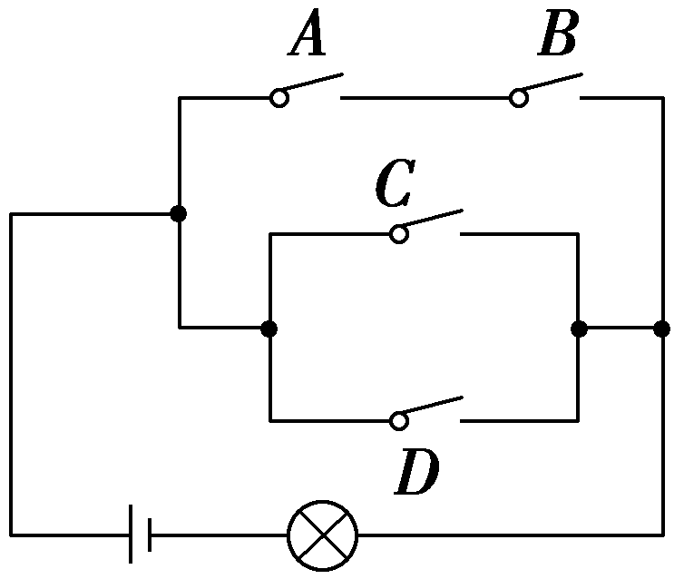
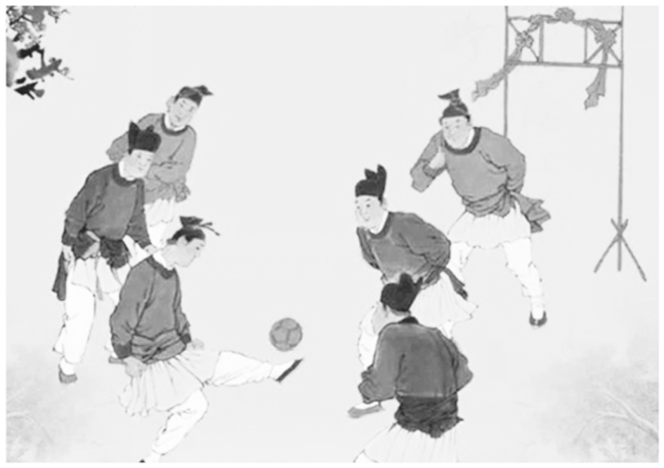

**第四节　事件的相互独立性、条件概率与全概率公式**

【课标研读】　1.结合有限样本空间，了解两个随机事件独立性的含义.结合古典概型，利用独立性计算概率.　2.结合古典概型，了解条件概率，能计算简单随机事件的条件概率.　3.结合古典概型，了解条件概率与独立的关系.　4.结合古典概型，会利用乘法公式、全概率公式计算概率.

1.相互独立事件

(1)概念：对任意两个事件<em>A</em>与<em>B</em>，如果<em>P</em>(<em>AB</em>)＝<em><u>P</u></em><u>(</u><em><u>A</u></em><u>)</u><em><u>P</u></em><u>(</u><em><u>B</u></em><u>)</u>成立，则称事件<em>A</em>与事件<em>B</em>相互独立，简称为独立.

(2)性质：若事件*<text style="italic">A*</text>与事件*<text style="italic,underline">B*</text>相互独立，那么A与 $\overline{B}$ ， $\overline{A}$ 与*<text style="italic,underline">B*</text>， $\overline{A}$ 与 $\overline{B}$ 也都相互独立.

2.条件概率

<u>(</u>1)概念：一般地，设<em>&lt;text style="italic"&gt;&lt;text style="italic,underline"&gt;&lt;text style="italic"&gt;A</em>&lt;/text&gt;&lt;/text&gt;&lt;/text&gt;，<em>&lt;text style="italic,underline"&gt;&lt;text style="italic"&gt;B</em>&lt;/text&gt;&lt;/text&gt;为两个随机事件，且<em>&lt;text style="italic,underline"&gt;P</em>&lt;/text&gt;(A)＞0，称P(B<u>｜</u>A<u>)＝</u> $\frac{P(AB)}{P(A)}$ 为在事件<em>&lt;text style="italic"&gt;&lt;text style="italic,underline"&gt;&lt;text style="italic"&gt;A</em>&lt;/text&gt;&lt;/text&gt;&lt;/text&gt;发生的条件下，事件<em>&lt;text style="italic,underline"&gt;&lt;text style="italic"&gt;B</em>&lt;/text&gt;&lt;/text&gt;发生的条件概率，简称条件概率.

(2)两个公式

①利用古典概型：*P*(*B*｜*A*)＝ $\frac{n(AB)}{n(A)}$ ；

②概率的乘法公式：<em>P</em>(<em>AB</em>)＝<em><u>P</u></em><u>(</u><em><u>A</u></em><u>)</u><em><u>P</u></em><u>(</u><em><u>B</u></em><u>｜</u><em><u>A</u></em><u>)</u>.

(3)性质

①0≤*P*(*B*｜*A*)≤1，*P*(*Ω*｜*A*)＝1；

②如果<em>B</em>和<em>C</em>是两个互斥事件，则<em>P</em>(<em>B</em>∪<em>C</em>｜<em>A</em>)＝<em><u>P</u></em><u>(</u><em><u>B</u></em><u>｜</u><em><u>A</u></em><u>)＋</u><em><u>P</u></em><u>(</u><em><u>C</u></em><u>｜</u><em><u>A</u></em><u>)</u>；

③设<em>&lt;text style="italic,underline"&gt;B</em>&lt;/text&gt;和 $\overline{B}$  互为对立事件，则<em>&lt;text style="italic,underline"&gt;P</em>&lt;/text&gt;<u>(</u> $\overline{B}$ <u>｜</u><em>&lt;text style="italic,underline"&gt;A</em>&lt;/text&gt;<u>)</u>＝<u>1－</u><em>&lt;text style="italic,underline"&gt;P</em>&lt;/text&gt;<u>(</u><em>&lt;text style="italic,underline"&gt;B</em>&lt;/text&gt;｜A).

[微提醒]　(1)*P*(*B*｜*A*) 与*P*(*A*｜*B*) 是不相同的.*P*(*B*｜*A*)表示在事件*A* 发生的条件下事件*B* 发生的概率.*P*(*A*｜*B*) 表示在事件*B* 发生的条件下事件*A* 发生的概率.(2)当*A* ，*B* 相互独立时，*P*(*B*｜*A*)＝*P*(*B*).(3)两事件互斥是指两个事件不能同时发生，两事件相互独立是指一个事件的发生与否对另一事件发生的概率没有影响，两事件相互独立不一定互斥.

3.全概率公式

一般地，设&lt;text style="&lt;text style="&lt;text style="&lt;text style="<em><u>i</u></em>talic,underline,subscript"&gt;i&lt;/text&gt;talic"&gt;i&lt;/text&gt;talic,subscript"&gt;i&lt;/text&gt;talic"&gt;<em>&lt;text style="italic"&gt;&lt;text style="italic"&gt;&lt;text style="italic"&gt;&lt;text style="italic"&gt;&lt;text style="italic"&gt;&lt;text style="italic,underline"&gt;&lt;text style="italic,underline"&gt;A</em>&lt;/text&gt;&lt;/text&gt;&lt;/text&gt;&lt;/text&gt;&lt;/text&gt;&lt;/text&gt;&lt;/text&gt;&lt;/text&gt;&lt;text style="subscript"&gt;1&lt;/text&gt;，A&lt;text style="subscript"&gt;2&lt;/text&gt;，…，A<em>&lt;text style="italic,subscript"&gt;&lt;text style="italic"&gt;n</em>&lt;/text&gt;&lt;/text&gt;是一组两两互斥的事件，A1∪A2∪…∪An＝<em>&lt;text style="italic"&gt;Ω</em>&lt;/text&gt;，且<em>&lt;text style="italic"&gt;&lt;text style="italic,underline"&gt;&lt;text style="italic,underline"&gt;P</em>&lt;/text&gt;&lt;/text&gt;&lt;/text&gt;<u>&lt;text style="underline"&gt;(</u>&lt;/text&gt;Ai<u>&lt;text style="underline"&gt;)</u>&lt;/text&gt;＞0，i＝1，2，…，n，则对任意的事件<em>&lt;text style="italic"&gt;&lt;text style="italic,underline"&gt;B</em>&lt;/text&gt;&lt;/text&gt;⊆Ω，有P(B)＝ $\overset{n}{\underset{i=1}{\sum }}$ &lt;text style="&lt;text style="&lt;text style="&lt;text style="<em><u>i</u></em>talic,underline,subscript"&gt;i&lt;/text&gt;talic"&gt;i&lt;/text&gt;talic,subscript"&gt;i&lt;/text&gt;talic"&gt;<em>&lt;text style="italic,underline"&gt;&lt;text style="italic,underline"&gt;P</em>&lt;/text&gt;&lt;/text&gt;&lt;/text&gt;<u>&lt;text style="underline"&gt;(</u>&lt;/text&gt;<em>&lt;text style="italic"&gt;&lt;text style="italic"&gt;&lt;text style="italic"&gt;&lt;text style="italic"&gt;&lt;text style="italic"&gt;&lt;text style="italic"&gt;&lt;text style="italic,underline"&gt;&lt;text style="italic,underline"&gt;A</em>&lt;/text&gt;&lt;/text&gt;&lt;/text&gt;&lt;/text&gt;&lt;/text&gt;&lt;/text&gt;&lt;/text&gt;&lt;/text&gt;i<u>&lt;text style="underline"&gt;)</u>&lt;/text&gt;P(<em>&lt;text style="italic"&gt;&lt;text style="italic,underline"&gt;B</em>&lt;/text&gt;&lt;/text&gt;<u>｜</u>Ai)，此公式为全概率公式.

【常用结论】

(1)事件的关系与运算

①*<text style="italic">A*</text>，*<text style="italic">B*</text>都发生的事件为*AB*；A，B都不发生的事件为 $\overline{A}\overline{B}$ .

②*<text style="italic"><text style="italic"><text style="italic">A*</text></text></text>，*<text style="italic"><text style="italic"><text style="italic">B*</text></text></text>恰有一个发生的事件为A $\overline{B}$ ＋ $\overline{A}$ *<text style="italic"><text style="italic"><text style="italic">B*</text></text></text>；*<text style="italic"><text style="italic"><text style="italic">A*</text></text></text>，B至多有一个发生的事件为 $\overline{A}$ *<text style="italic"><text style="italic"><text style="italic">B*</text></text></text>＋*<text style="italic"><text style="italic"><text style="italic">A*</text></text></text> $\overline{B}$ ＋ $\overline{A}\overline{B}$ .

(&lt;text style="subscript"&gt;2&lt;/text&gt;)如果事件<em>&lt;text style="italic"&gt;&lt;text style="italic"&gt;&lt;text style="italic"&gt;&lt;text style="italic"&gt;&lt;text style="italic"&gt;A</em>&lt;/text&gt;&lt;/text&gt;&lt;/text&gt;&lt;/text&gt;&lt;/text&gt;&lt;text style="subscript"&gt;1&lt;/text&gt;，A2，…，A<em>&lt;text style="italic,subscript"&gt;n</em>&lt;/text&gt;相互独立，则<em>&lt;text style="italic"&gt;&lt;text style="italic"&gt;&lt;text style="italic"&gt;P</em>&lt;/text&gt;&lt;/text&gt;&lt;/text&gt;(A1＋A2＋…＋An)＝1－P( $\overline{A}_{1}$ )<em>&lt;text style="italic"&gt;&lt;text style="italic"&gt;&lt;text style="italic"&gt;P</em>&lt;/text&gt;&lt;/text&gt;&lt;/text&gt;( $\overline{A}_{2}$ )…<em>&lt;text style="italic"&gt;&lt;text style="italic"&gt;&lt;text style="italic"&gt;P</em>&lt;/text&gt;&lt;/text&gt;&lt;/text&gt;( $\overline{A}_{n}$ ).

【自主检测】

1.(多选)下列结论正确的是(　　)

A.对于任意两个事件，公式*P*(*AB*)＝*P*(*A*)*P*(*B*)都成立

B.若事件*A*，*B*相互独立，则*P*(*B*｜*A*)＝*P*(B)

C.抛掷2枚质地均匀的硬币，设“第一枚正面朝上”为事件*A*，“第2枚正面朝上”为事件*B*，则*A*，*B*相互独立

D.若事件<em>A</em>1与<em>A</em>2是对立事件，则对任意的事件<em>B</em>⊆<em>Ω</em>，都有<em>P</em>(<em>B</em>)＝<em>P</em>(<em>A</em>1)<em>P</em>(<em>B</em>｜<em>A</em>1)＋<em>P</em>(<em>A</em>2)<em>P</em>(<em>B</em>｜<em>A</em>2)

答案：**BCD**

2.(多选)(链接人教A必修二P253T1)袋内有3个白球和2个黑球，从中有放回地摸球，用*A*表示“第一次摸到白球”，如果“第二次摸到白球”记为*B*，其对立事件记为*C*，那么事件*A*与*B*，*A*与*C*的关系是(　　)

A.*A*与*B*相互独立	B.*A*与*C*相互独立

C.*A*与*C*互斥	D.*A*与*B*互斥

答案：**AB**

解析：由于摸球过程是有放回地，所以第一次摸球的结果对第二次摸球的结果没有影响，故事件*A*与*B*，*A*与*C*均相互独立，且*A*与*B*，*A*与*C*均有可能同时发生，说明*A*与*B*，*A*与*C*均不互斥.故选AB.

3.(链接人教A选择性必修三P46例1)在5道题中有3道代数题和2道几何题.如果不放回地依次抽取2道题，则在第1次抽到几何题的条件下，第2次抽到代数题的概率为(　　)

A. $\frac{1}{2}$ 	B. $\frac{2}{5}$

C. $\frac{3}{5}$ 	D. $\frac{3}{4}$

答案：**D**

解析：根据题意，在第1次抽到几何题后，还剩4道题，其中有3道代数题，则第2次抽到代数题的概率*P*＝ $\frac{3}{4}$ .故选D.

4.(链接人教A必修二P249T3)“五一”劳动节放假期间，甲、乙、丙去北京旅游的概率分别为 $\frac{1}{3}$ ， $\frac{1}{4}$ ， $\frac{1}{5}$ ，假定三人的行动相互之间没有影响，那么这段时间内至少有1人去北京旅游的概率为<u>　　　　</u>.

答案： $\frac{3}{5}$

解析：因为甲、乙、丙去北京旅游的概率分别为 $\frac{1}{3}$ ， $\frac{1}{4}$ ， $\frac{1}{5}$ ，所以他们不去北京旅游的概率分别为 $\frac{2}{3}$ ， $\frac{3}{4}$ ， $\frac{4}{5}$ .因为至少有1人去北京旅游的对立事件是没有人去北京旅游，所以至少有1人去北京旅游的概率为1－ $\frac{2}{3}$ × $\frac{3}{4}$ × $\frac{4}{5}$ ＝ $\frac{3}{5}$ .

考点一　相互独立事件的概率　　　　多维探究

角度1　事件相互独立性的判断

(2024·山东菏泽三模)盒中有4个大小相同的小球，其中2个红球、2个白球，第一次在盒中随机摸出2个小球，记下颜色后放回，第二次在盒中也随机摸出2个小球，记下颜色后放回.设事件*A*＝“两次均未摸出红球”，事件*B*＝“两次均未摸出白球”，事件*C*＝“第一次摸出的两个球中有红球”，事件*D*＝“第二次摸出的两个球中有白球”，则(　　)

A. *A*与*B*相互独立	B. *A*与*C*相互独立

C. *B*与*C*相互独立	D. *C*与*D*相互独立

答案：**D**

解析：依题意得*<text style="italic"><text style="italic"><text style="italic"><text style="italic"><text style="italic"><text style="italic"><text style="italic"><text style="italic"><text style="italic"><text style="italic"><text style="italic"><text style="italic"><text style="italic"><text style="italic"><text style="italic">P*</text></text></text></text></text></text></text></text></text></text></text></text></text></text></text> $\left(A\right)$ ＝ $\frac{C_{2}^{2}C_{2}^{2}}{C_{4}^{2}C_{4}^{2}}$ ＝ $\frac{1}{36}$ ，*<text style="italic"><text style="italic"><text style="italic"><text style="italic"><text style="italic"><text style="italic"><text style="italic"><text style="italic"><text style="italic"><text style="italic"><text style="italic"><text style="italic"><text style="italic"><text style="italic"><text style="italic">P*</text></text></text></text></text></text></text></text></text></text></text></text></text></text></text> $\left(B\right)$ ＝ $\frac{C_{2}^{2}C_{2}^{2}}{C_{4}^{2}C_{4}^{2}}$ ＝ $\frac{1}{36}$ ，*<text style="italic"><text style="italic"><text style="italic"><text style="italic"><text style="italic"><text style="italic"><text style="italic"><text style="italic"><text style="italic"><text style="italic"><text style="italic"><text style="italic"><text style="italic"><text style="italic"><text style="italic">P*</text></text></text></text></text></text></text></text></text></text></text></text></text></text></text> $\left(AB\right)$ ＝0≠*<text style="italic"><text style="italic"><text style="italic"><text style="italic"><text style="italic"><text style="italic"><text style="italic"><text style="italic"><text style="italic"><text style="italic"><text style="italic"><text style="italic"><text style="italic"><text style="italic"><text style="italic">P*</text></text></text></text></text></text></text></text></text></text></text></text></text></text></text> $\left(A\right)$ *<text style="italic"><text style="italic"><text style="italic"><text style="italic"><text style="italic"><text style="italic"><text style="italic"><text style="italic"><text style="italic"><text style="italic"><text style="italic"><text style="italic"><text style="italic"><text style="italic"><text style="italic">P*</text></text></text></text></text></text></text></text></text></text></text></text></text></text></text> $\left(B\right)$ ，故A错误；*<text style="italic"><text style="italic"><text style="italic"><text style="italic"><text style="italic"><text style="italic"><text style="italic"><text style="italic"><text style="italic"><text style="italic"><text style="italic"><text style="italic"><text style="italic"><text style="italic"><text style="italic">P*</text></text></text></text></text></text></text></text></text></text></text></text></text></text></text> $\left(C\right)$ ＝ $\frac{C_{2}^{2}＋C_{2}^{1}C_{2}^{1}}{C_{4}^{2}}$ ＝ $\frac{5}{6}$ ，*<text style="italic"><text style="italic"><text style="italic"><text style="italic"><text style="italic"><text style="italic"><text style="italic"><text style="italic"><text style="italic"><text style="italic"><text style="italic"><text style="italic"><text style="italic"><text style="italic"><text style="italic">P*</text></text></text></text></text></text></text></text></text></text></text></text></text></text></text> $\left(AC\right)$ ＝0≠*<text style="italic"><text style="italic"><text style="italic"><text style="italic"><text style="italic"><text style="italic"><text style="italic"><text style="italic"><text style="italic"><text style="italic"><text style="italic"><text style="italic"><text style="italic"><text style="italic"><text style="italic">P*</text></text></text></text></text></text></text></text></text></text></text></text></text></text></text> $\left(A\right)$ *<text style="italic"><text style="italic"><text style="italic"><text style="italic"><text style="italic"><text style="italic"><text style="italic"><text style="italic"><text style="italic"><text style="italic"><text style="italic"><text style="italic"><text style="italic"><text style="italic"><text style="italic">P*</text></text></text></text></text></text></text></text></text></text></text></text></text></text></text> $\left(C\right)$ ，故B错误；*<text style="italic"><text style="italic"><text style="italic"><text style="italic"><text style="italic"><text style="italic"><text style="italic"><text style="italic"><text style="italic"><text style="italic"><text style="italic"><text style="italic"><text style="italic"><text style="italic"><text style="italic">P*</text></text></text></text></text></text></text></text></text></text></text></text></text></text></text> $\left(BC\right)$ ＝ $\frac{C_{2}^{2}C_{2}^{2}}{C_{4}^{2}C_{4}^{2}}$ ＝ $\frac{1}{36}$ ≠*<text style="italic"><text style="italic"><text style="italic"><text style="italic"><text style="italic"><text style="italic"><text style="italic"><text style="italic"><text style="italic"><text style="italic"><text style="italic"><text style="italic"><text style="italic"><text style="italic"><text style="italic">P*</text></text></text></text></text></text></text></text></text></text></text></text></text></text></text> $\left(B\right)$ *<text style="italic"><text style="italic"><text style="italic"><text style="italic"><text style="italic"><text style="italic"><text style="italic"><text style="italic"><text style="italic"><text style="italic"><text style="italic"><text style="italic"><text style="italic"><text style="italic"><text style="italic">P*</text></text></text></text></text></text></text></text></text></text></text></text></text></text></text> $\left(C\right)$ ，故C错误；*<text style="italic"><text style="italic"><text style="italic"><text style="italic"><text style="italic"><text style="italic"><text style="italic"><text style="italic"><text style="italic"><text style="italic"><text style="italic"><text style="italic"><text style="italic"><text style="italic"><text style="italic">P*</text></text></text></text></text></text></text></text></text></text></text></text></text></text></text> $\left(D\right)$ ＝ $\frac{C_{2}^{2}＋C_{2}^{1}C_{2}^{1}}{C_{4}^{2}}$ ＝ $\frac{5}{6}$ ，*<text style="italic"><text style="italic"><text style="italic"><text style="italic"><text style="italic"><text style="italic"><text style="italic"><text style="italic"><text style="italic"><text style="italic"><text style="italic"><text style="italic"><text style="italic"><text style="italic"><text style="italic">P*</text></text></text></text></text></text></text></text></text></text></text></text></text></text></text> $\left(CD\right)$ ＝ $\frac{C_{2}^{2}C_{2}^{2}＋C_{2}^{2}C_{2}^{1}C_{2}^{1}＋C_{2}^{1}C_{2}^{1}C_{2}^{2}＋C_{2}^{1}C_{2}^{1}C_{2}^{1}C_{2}^{1}}{C_{4}^{2}C_{4}^{2}}$ ＝ $\frac{25}{36}$ ＝*<text style="italic"><text style="italic"><text style="italic"><text style="italic"><text style="italic"><text style="italic"><text style="italic"><text style="italic"><text style="italic"><text style="italic"><text style="italic"><text style="italic"><text style="italic"><text style="italic"><text style="italic">P*</text></text></text></text></text></text></text></text></text></text></text></text></text></text></text> $\left(C\right)$ *<text style="italic"><text style="italic"><text style="italic"><text style="italic"><text style="italic"><text style="italic"><text style="italic"><text style="italic"><text style="italic"><text style="italic"><text style="italic"><text style="italic"><text style="italic"><text style="italic"><text style="italic">P*</text></text></text></text></text></text></text></text></text></text></text></text></text></text></text> $\left(D\right)$ ，故D正确.故选D.

角度2　相互独立事件的概率

(多选)(2023·新高考Ⅱ卷)在信道内传输0，1信号，信号的传输相互独立.发送0时，收到1的概率为*α*(0＜*α*＜1)，收到0的概率为1－*α*；发送1时，收到0的概率为*β* (0＜*β*＜1)，收到1的概率为1－*β*.考虑两种传输方案：单次传输和三次传输.单次传输是指每个信号只发送1次；三次传输是指每个信号重复发送3次.收到的信号需要译码，译码规则如下：单次传输时，收到的信号即为译码；三次传输时，收到的信号中出现次数多的即为译码(例如，若依次收到1，0，1，则译码为1).(　　)

A.采用单次传输方案，若依次发送1，0，1，则依次收到1，0，1的概率为(1－<em>α</em>)(1－<em>β</em>)2

B.采用三次传输方案，若发送1，则依次收到1，0，1的概率为<em>β</em>(1－<em>β</em>)2

C.采用三次传输方案，若发送1，则译码为1的概率为<em>β</em>(1－<em>β</em>)2＋(1－<em>β</em>)3

D.当0＜*α*＜0.5 时，若发送0，则采用三次传输方案译码为0的概率大于采用单次传输方案译码为0的概率

答案：**ABD**

解析：对于A，依次发送1，0，1，则依次收到1，0，1的事件是发送1接收1、发送0接收0、发送1接收1的3个事件的积，它们相互独立，所以所求概率为(1－<em>&lt;text style="italic"&gt;&lt;text style="italic"&gt;&lt;text style="italic"&gt;&lt;text style="italic"&gt;&lt;text style="italic"&gt;&lt;text style="italic"&gt;&lt;text style="italic"&gt;&lt;text style="italic"&gt;&lt;text style="italic"&gt;&lt;text style="italic"&gt;&lt;text style="italic"&gt;&lt;text style="italic"&gt;β</em>&lt;/text&gt;&lt;/text&gt;&lt;/text&gt;&lt;/text&gt;&lt;/text&gt;&lt;/text&gt;&lt;/text&gt;&lt;/text&gt;&lt;/text&gt;&lt;/text&gt;&lt;/text&gt;&lt;/text&gt;)(1－<em>&lt;text style="italic"&gt;&lt;text style="italic"&gt;&lt;text style="italic"&gt;&lt;text style="italic"&gt;&lt;text style="italic"&gt;&lt;text style="italic"&gt;&lt;text style="italic"&gt;&lt;text style="italic"&gt;&lt;text style="italic"&gt;&lt;text style="italic"&gt;&lt;text style="italic"&gt;α</em>&lt;/text&gt;&lt;/text&gt;&lt;/text&gt;&lt;/text&gt;&lt;/text&gt;&lt;/text&gt;&lt;/text&gt;&lt;/text&gt;&lt;/text&gt;&lt;/text&gt;&lt;/text&gt;)(1－β)＝(1－α)(1－β)&lt;text style="superscript"&gt;&lt;text style="superscript"&gt;&lt;text style="superscript"&gt;&lt;text style="superscript"&gt;&lt;text style="superscript"&gt;2&lt;/text&gt;&lt;/text&gt;&lt;/text&gt;&lt;/text&gt;&lt;/text&gt;，故A正确；对于B，三次传输，发送1，相当于依次发送1，1，1，则依次收到1，0，1的事件是发送1接收1、发送1接收0、发送1接收1的3个事件的积，它们相互独立，所以所求概率为(1－β)β(1－β)＝β(1－β)2，故B正确；对于C，三次传输，发送1，则译码为 1 的事件是依次收到1，1，0；1，0，1；0，1，1和1，1，1的事件的和，它们互斥，由选项B知，所求的概率为 $C_{3}^{2}$ <em>&lt;text style="italic"&gt;&lt;text style="italic"&gt;&lt;text style="italic"&gt;&lt;text style="italic"&gt;&lt;text style="italic"&gt;&lt;text style="italic"&gt;&lt;text style="italic"&gt;&lt;text style="italic"&gt;&lt;text style="italic"&gt;&lt;text style="italic"&gt;&lt;text style="italic"&gt;&lt;text style="italic"&gt;β</em>&lt;/text&gt;&lt;/text&gt;&lt;/text&gt;&lt;/text&gt;&lt;/text&gt;&lt;/text&gt;&lt;/text&gt;&lt;/text&gt;&lt;/text&gt;&lt;/text&gt;&lt;/text&gt;&lt;/text&gt;(1－β)&lt;text style="superscript"&gt;&lt;text style="superscript"&gt;&lt;text style="superscript"&gt;&lt;text style="superscript"&gt;&lt;text style="superscript"&gt;2&lt;/text&gt;&lt;/text&gt;&lt;/text&gt;&lt;/text&gt;&lt;/text&gt;＋(1－β)3＝(1－β)2(1＋2β)，故C错误；对于D，由选项C知，三次传输，发送0，则译码为0的概率<em>&lt;text style="italic"&gt;&lt;text style="italic"&gt;P</em>&lt;/text&gt;&lt;/text&gt;＝(1－<em>&lt;text style="italic"&gt;&lt;text style="italic"&gt;&lt;text style="italic"&gt;&lt;text style="italic"&gt;&lt;text style="italic"&gt;&lt;text style="italic"&gt;&lt;text style="italic"&gt;&lt;text style="italic"&gt;&lt;text style="italic"&gt;&lt;text style="italic"&gt;&lt;text style="italic"&gt;α</em>&lt;/text&gt;&lt;/text&gt;&lt;/text&gt;&lt;/text&gt;&lt;/text&gt;&lt;/text&gt;&lt;/text&gt;&lt;/text&gt;&lt;/text&gt;&lt;/text&gt;&lt;/text&gt;)2(1＋2α)，单次传输发送0，则译码为0的概率<em>&lt;text style="italic"&gt;&lt;text style="italic"&gt;P'</em>&lt;/text&gt;&lt;/text&gt;＝1－α，而0＜α＜0.5，因此P－P'＝(1－α)2(1＋2α)－(1－α)＝α(1－α)(1－2α)＞0，即P＞P'，故D正确.故选ABD.

1.判断两个事件是否相互独立的方法

(1)直接法：直接判断一个事件发生与否是否影响另一事件发生的概率.

(2)定义法：判断*P*(*AB*)＝*P*(*A*)*P*(*B*) 是否成立.

(3)转化法：由事件*<text style="italic">A*</text>与事件*<text style="italic">B*</text>相互独立知，A与 $\overline{B}$ ， $\overline{A}$ 与*<text style="italic">B*</text>， $\overline{A}$ 与 $\overline{B}$  也相互独立.

2.求相互独立事件同时发生的概率的方法

(1)首先判断几个事件的发生是否相互独立；

(2)求相互独立事件同时发生的概率的方法主要有：

①利用相互独立事件的概率乘法公式直接求解.

②正面计算较烦琐或难以入手时，可从其对立事件入手计算.

对点练1.(多选)设*M*，*N* 为两个随机事件，则下列说法正确的是(　　)

A.若*<text style="italic"><text style="italic">M*</text></text>，*<text style="italic"><text style="italic">N*</text> </text>为互斥事件，且*<text style="italic"><text style="italic">P*</text></text>(M)＝ $\frac{1}{5}$ ，*<text style="italic"><text style="italic">P*</text></text>(*<text style="italic">N*</text>)＝ $\frac{1}{4}$ ，则*<text style="italic"><text style="italic">P*</text></text>(*<text style="italic"><text style="italic">M*</text></text>∪*<text style="italic">N*</text>)＝ $\frac{9}{20}$

B.若*<text style="italic"><text style="italic">P*</text></text>(*<text style="italic">M*</text>)＝ $\frac{1}{2}$ ，*<text style="italic"><text style="italic">P*</text></text>(*N*)＝ $\frac{1}{3}$ ，*<text style="italic"><text style="italic">P*</text></text>(*<text style="italic">M*</text>*N*)＝ $\frac{1}{6}$ ，则事件*<text style="italic">M*</text>，*N* 相互独立

C.若*<text style="italic"><text style="italic">P*</text></text>(*<text style="italic">M*</text>)＝ $\frac{1}{2}$ ，*<text style="italic"><text style="italic">P*</text></text>( $\overline{N}$ )＝ $\frac{1}{3}$ ，*<text style="italic"><text style="italic">P*</text></text>(*<text style="italic">M*</text>N)＝ $\frac{1}{6}$ ，则事件*<text style="italic">M*</text>，*N* 相互独立

D.若*<text style="italic"><text style="italic">P*</text></text>(*M*)＝ $\frac{1}{2}$ ，*<text style="italic"><text style="italic">P*</text></text>(*N*)＝ $\frac{1}{3}$ ，*<text style="italic"><text style="italic">P*</text></text>( $\overline{M}$  $\overline{N}$ )＝ $\frac{1}{3}$ ，则事件 $\overline{M}$ ， $\overline{N}$  相互独立

答案：**ABD**

解析：对于A，由互斥事件的概率加法公式得*<text style="italic"><text style="italic"><text style="italic"><text style="italic"><text style="italic"><text style="italic"><text style="italic"><text style="italic"><text style="italic"><text style="italic"><text style="italic"><text style="italic"><text style="italic"><text style="italic">P*</text></text></text></text></text></text></text></text></text></text></text></text></text></text>(*<text style="italic"><text style="italic"><text style="italic"><text style="italic">M*</text></text></text></text>∪*<text style="italic"><text style="italic"><text style="italic">N*</text></text></text>)＝ $\frac{1}{5}$ ＋ $\frac{1}{4}$ ＝ $\frac{9}{20}$ ，故A正确；对于B，因为*<text style="italic"><text style="italic"><text style="italic"><text style="italic"><text style="italic"><text style="italic"><text style="italic"><text style="italic"><text style="italic"><text style="italic"><text style="italic"><text style="italic"><text style="italic"><text style="italic">P*</text></text></text></text></text></text></text></text></text></text></text></text></text></text>(*<text style="italic"><text style="italic"><text style="italic"><text style="italic">M*</text></text></text></text>*<text style="italic"><text style="italic"><text style="italic">N*</text></text></text>)＝P(M)P(N)＝ $\frac{1}{6}$ ，所以事件*<text style="italic"><text style="italic"><text style="italic"><text style="italic">M*</text></text></text></text>，*<text style="italic"><text style="italic"><text style="italic">N*</text></text></text> 相互独立，故B正确；对于C，由*<text style="italic"><text style="italic"><text style="italic"><text style="italic"><text style="italic"><text style="italic"><text style="italic"><text style="italic"><text style="italic"><text style="italic"><text style="italic"><text style="italic"><text style="italic"><text style="italic">P*</text></text></text></text></text></text></text></text></text></text></text></text></text></text>( $\overline{N}$ )＝ $\frac{1}{3}$  得*<text style="italic"><text style="italic"><text style="italic"><text style="italic"><text style="italic"><text style="italic"><text style="italic"><text style="italic"><text style="italic"><text style="italic"><text style="italic"><text style="italic"><text style="italic"><text style="italic">P*</text></text></text></text></text></text></text></text></text></text></text></text></text></text>(*<text style="italic"><text style="italic"><text style="italic">N*</text></text></text>)＝1－P( $\overline{N}$ )＝ $\frac{2}{3}$ ，*<text style="italic"><text style="italic"><text style="italic"><text style="italic"><text style="italic"><text style="italic"><text style="italic"><text style="italic"><text style="italic"><text style="italic"><text style="italic"><text style="italic"><text style="italic"><text style="italic">P*</text></text></text></text></text></text></text></text></text></text></text></text></text></text>(*<text style="italic"><text style="italic"><text style="italic"><text style="italic">M*</text></text></text></text>*<text style="italic"><text style="italic"><text style="italic">N*</text></text></text>)＝ $\frac{1}{6}$ ≠*<text style="italic"><text style="italic"><text style="italic"><text style="italic"><text style="italic"><text style="italic"><text style="italic"><text style="italic"><text style="italic"><text style="italic"><text style="italic"><text style="italic"><text style="italic"><text style="italic">P*</text></text></text></text></text></text></text></text></text></text></text></text></text></text>(*<text style="italic"><text style="italic"><text style="italic"><text style="italic">M*</text></text></text></text>)P(*<text style="italic"><text style="italic"><text style="italic">N*</text></text></text>)＝ $\frac{1}{2}$ × $\frac{2}{3}$ ＝ $\frac{1}{3}$ ，所以事件*<text style="italic"><text style="italic"><text style="italic"><text style="italic">M*</text></text></text></text>，*<text style="italic"><text style="italic"><text style="italic">N*</text></text></text> 不相互独立，故C错误；对于D，由题意得，*<text style="italic"><text style="italic"><text style="italic"><text style="italic"><text style="italic"><text style="italic"><text style="italic"><text style="italic"><text style="italic"><text style="italic"><text style="italic"><text style="italic"><text style="italic"><text style="italic">P*</text></text></text></text></text></text></text></text></text></text></text></text></text></text>( $\overline{M}$ )＝ $\frac{1}{2}$ ，*<text style="italic"><text style="italic"><text style="italic"><text style="italic"><text style="italic"><text style="italic"><text style="italic"><text style="italic"><text style="italic"><text style="italic"><text style="italic"><text style="italic"><text style="italic"><text style="italic">P*</text></text></text></text></text></text></text></text></text></text></text></text></text></text>( $\overline{N}$ )＝ $\frac{2}{3}$ ，此时*<text style="italic"><text style="italic"><text style="italic"><text style="italic"><text style="italic"><text style="italic"><text style="italic"><text style="italic"><text style="italic"><text style="italic"><text style="italic"><text style="italic"><text style="italic"><text style="italic">P*</text></text></text></text></text></text></text></text></text></text></text></text></text></text>( $\overline{M}\overline{N}$ )＝*<text style="italic"><text style="italic"><text style="italic"><text style="italic"><text style="italic"><text style="italic"><text style="italic"><text style="italic"><text style="italic"><text style="italic"><text style="italic"><text style="italic"><text style="italic"><text style="italic">P*</text></text></text></text></text></text></text></text></text></text></text></text></text></text>( $\overline{M}$ )*<text style="italic"><text style="italic"><text style="italic"><text style="italic"><text style="italic"><text style="italic"><text style="italic"><text style="italic"><text style="italic"><text style="italic"><text style="italic"><text style="italic"><text style="italic"><text style="italic">P*</text></text></text></text></text></text></text></text></text></text></text></text></text></text>( $\overline{N}$ )＝ $\frac{1}{3}$ ，故事件 $\overline{M}$ ， $\overline{N}$  相互独立，故D正确.故选ABD.

对点练2.台风在危害人类的同时，也在保护人类.台风给人类送来了淡水资源，大大缓解了全球水荒，另外还使世界各地冷热保持相对均衡.甲、乙、丙三颗卫星同时监测台风，在同一时刻，甲、乙、丙三颗卫星准确预报台风的概率分别为0.8，0.7，0.9，各卫星间预报台风相互独立，则在同一时刻至少有两颗卫星预报准确的概率是<u>　　　　</u>.

答案：0.902

解析：设甲、乙、丙预报准确依次为事件*<text style="italic"><text style="italic">A*</text></text>，*<text style="italic">B*</text>，*<text style="italic"><text style="italic">C*</text></text>，则不准确依次为 $\overline{A}$ ， $\overline{B}$ ， $\overline{C}$ ，则*<text style="italic"><text style="italic"><text style="italic"><text style="italic"><text style="italic"><text style="italic"><text style="italic"><text style="italic"><text style="italic"><text style="italic">P*</text></text></text></text></text></text></text></text></text></text>(*<text style="italic"><text style="italic">A*</text></text>)＝0.8，P(*<text style="italic">B*</text>)＝0.7，P(*<text style="italic"><text style="italic">C*</text></text>)＝0.9，P $\left(\overline{A}\right)$ ＝0.2，*<text style="italic"><text style="italic"><text style="italic"><text style="italic"><text style="italic"><text style="italic"><text style="italic"><text style="italic"><text style="italic"><text style="italic">P*</text></text></text></text></text></text></text></text></text></text> $\left(\overline{B}\right)$ ＝0.3，*<text style="italic"><text style="italic"><text style="italic"><text style="italic"><text style="italic"><text style="italic"><text style="italic"><text style="italic"><text style="italic"><text style="italic">P*</text></text></text></text></text></text></text></text></text></text> $\left(\overline{C}\right)$ ＝0.1，至少有两颗卫星预报准确的事件有*<text style="italic"><text style="italic">A*</text></text>*<text style="italic">B*</text> $\overline{C}$ ，*<text style="italic"><text style="italic">A*</text></text> $\overline{B}$ *<text style="italic"><text style="italic">C*</text></text>， $\overline{A}$ *<text style="italic">B*</text>*<text style="italic"><text style="italic">C*</text></text>，*<text style="italic"><text style="italic">A*</text></text>*BC*，这四个事件两两互斥且相互独立，所以至少有两颗卫星预报准确的概率*<text style="italic"><text style="italic"><text style="italic"><text style="italic"><text style="italic"><text style="italic"><text style="italic"><text style="italic"><text style="italic"><text style="italic">P*</text></text></text></text></text></text></text></text></text></text>＝P $\left(AB\overline{C}\right)$ ＋*<text style="italic"><text style="italic"><text style="italic"><text style="italic"><text style="italic"><text style="italic"><text style="italic"><text style="italic"><text style="italic"><text style="italic">P*</text></text></text></text></text></text></text></text></text></text> $\left(A\overline{B}C\right)$ ＋*<text style="italic"><text style="italic"><text style="italic"><text style="italic"><text style="italic"><text style="italic"><text style="italic"><text style="italic"><text style="italic"><text style="italic">P*</text></text></text></text></text></text></text></text></text></text> $\left(\overline{A}BC\right)$ ＋*<text style="italic"><text style="italic"><text style="italic"><text style="italic"><text style="italic"><text style="italic"><text style="italic"><text style="italic"><text style="italic"><text style="italic">P*</text></text></text></text></text></text></text></text></text></text> $\left(ABC\right)$ ＝0.8×0.7×0.1＋0.8×0.3×0.9＋0.2×0.7×0.9＋0.8×0.7×0.9＝0.056＋0.216＋0.126＋0.504＝0.902.

考点二　条件概率 　　　　多维探究

角度1　条件概率

(1)(一题多解)从包含男生甲、乙，女生丙的5名男生和2名女生中任选3人参加学校组织的“喜迎二十大，奋进新征程”演讲比赛，则在男生甲被选中的条件下，男生乙和女生丙至少一人被选中的概率是(　　)

A. $\frac{1}{2}$ 	B. $\frac{4}{7}$

C. $\frac{3}{5}$ 	D. $\frac{2}{3}$

(2)(双空题、一题多解)(2024·天津卷)<em>A</em>，<em>B</em>，<em>C</em>，<em>D</em>，<em>E</em>五种活动，甲、乙都要选择三个活动参加.甲选到<em>A</em>的概率为<u>　　　　</u>；已知乙选了<em>A</em>活动，他再选择<em>B</em>活动的概率为<u>　　　　</u>.

答案：(1)**C**　(2) $\frac{3}{5}$ 　 $\frac{1}{2}$

解析：(1)法一：设男生甲被选中为事件*<text style="italic">A*</text>，男生乙和女生丙至少一人被选中为事件*<text style="italic">B*</text>，则*P*(B｜A)＝ $\frac{n(AB)}{n(A)}$ ＝ $\frac{C_{4}^{1}＋C_{4}^{1}+1}{C_{6}^{2}}$ ＝ $\frac{9}{15}$ ＝ $\frac{3}{5}$ .故选C.

法二：在男生甲被选中的情况下，基本事件总数为 $C_{6}^{2}$ ＝15，其中男生乙和女生丙都没有被选中的基本事件数为 $C_{4}^{2}$ ＝6，所以所求概率为1－ $\frac{6}{15}$ ＝ $\frac{3}{5}$ .故选C.

(2)法一(列举法)：从五个活动中选三个的情况有：

*<text style="italic"><text style="italic"><text style="italic"><text style="italic">A*</text></text></text>*<text style="italic">B*</text>C</text>，*<text style="italic"><text style="italic"><text style="italic">ABD*</text></text></text>，*<text style="italic"><text style="italic"><text style="italic">ABE*</text></text></text>，*<text style="italic"><text style="italic">ACD*</text></text>，*<text style="italic"><text style="italic">ACE*</text></text>，*<text style="italic"><text style="italic">ADE*</text></text>，*BCD*，*BCE*，*BDE*，*CDE*，共10种情况，其中甲选到A有6种可能性：*<text style="italic"><text style="italic">ABC*</text></text>，ABD，ABE，ACD，ACE，ADE，则甲选到A的概率为*P*＝ $\frac{6}{10}$ ＝ $\frac{3}{5}$ ；乙选*<text style="italic"><text style="italic"><text style="italic">A*</text></text></text>活动有6种可能性：*<text style="italic"><text style="italic">A<text style="italic"><text style="italic">B*</text>C</text></text></text>，*<text style="italic"><text style="italic"><text style="italic">ABD*</text></text></text>，*<text style="italic"><text style="italic"><text style="italic">ABE*</text></text></text>，*<text style="italic"><text style="italic">ACD*</text></text>，*<text style="italic"><text style="italic">ACE*</text></text>，*<text style="italic"><text style="italic">ADE*</text></text>，其中再选择B有3种可能性：*ABC*，ABD，ABE，故乙选了A活动，他再选择B活动的概率为 $\frac{3}{6}$ ＝ $\frac{1}{2}$ .

法二：由题意知甲选到*<text style="italic"><text style="italic">A*</text></text>的概率*<text style="italic">P*</text>＝ $\frac{C_{4}^{2}}{C_{5}^{3}}$ ＝ $\frac{3}{5}$ ，设乙选到*<text style="italic"><text style="italic">A*</text></text>为事件*M*，乙选到*<text style="italic">B*</text>为事件*N*，则乙选了A活动，他再选择B活动的概率为*<text style="italic">P*</text> $\left(\left.N\right|M\right)$ ＝ $\frac{P\left(MN\right)}{P\left(M\right)}$ ＝ $\frac{\frac{C_{3}^{1}}{C_{5}^{3}}}{\frac{C_{4}^{2}}{C_{5}^{3}}}$ ＝ $\frac{1}{2}$ .

角度2　条件概率的性质

(多选)设 $\overline{A}$ ， $\overline{B}$ 分别为随机事件*<text style="italic">A*</text>，*<text style="italic">B*</text>的对立事件，已知0＜*<text style="italic">P*</text>(A)＜1，0＜P(B)＜1，则下列说法正确的是(　　)

*<text style="italic">A*</text>.*<text style="italic">P*</text>(*B*｜A)＋P( $\overline{B}$ ｜*<text style="italic">A*</text>)＝1

*<text style="italic">B*</text>.*<text style="italic">P*</text>(B｜*A*)＋P(B｜ $\overline{A}$ )＝0

C.若*A*，*B*是相互独立事件，则*P*(*A*｜*B*)＝*P*(A)

D.若*A*，*B*是互斥事件，则*P*(*B*｜*A*)＝*P*(B)

答案：**AC**

解析：*<text style="italic"><text style="italic"><text style="italic"><text style="italic"><text style="italic"><text style="italic"><text style="italic"><text style="italic"><text style="italic"><text style="italic"><text style="italic"><text style="italic">P*</text></text></text></text></text></text></text></text></text></text></text></text>(*<text style="italic"><text style="italic"><text style="italic"><text style="italic"><text style="italic"><text style="italic"><text style="italic"><text style="italic"><text style="italic"><text style="italic">B*</text></text></text></text></text></text></text></text></text></text>｜*<text style="italic"><text style="italic"><text style="italic"><text style="italic"><text style="italic"><text style="italic"><text style="italic"><text style="italic"><text style="italic">A*</text></text></text></text></text></text></text></text></text>)＋P( $\overline{B}$ ｜*<text style="italic"><text style="italic"><text style="italic"><text style="italic"><text style="italic"><text style="italic"><text style="italic"><text style="italic"><text style="italic">A*</text></text></text></text></text></text></text></text></text>)＝ $\frac{P(AB)＋P(A\overline{B})}{P(A)}$ ＝ $\frac{P(A)}{P(A)}$ ＝1，故*<text style="italic"><text style="italic"><text style="italic"><text style="italic"><text style="italic"><text style="italic"><text style="italic"><text style="italic"><text style="italic">A*</text></text></text></text></text></text></text></text></text>正确；当A，*<text style="italic"><text style="italic"><text style="italic"><text style="italic"><text style="italic"><text style="italic"><text style="italic"><text style="italic"><text style="italic"><text style="italic">B*</text></text></text></text></text></text></text></text></text></text>是相互独立事件时，则*<text style="italic"><text style="italic"><text style="italic"><text style="italic"><text style="italic"><text style="italic"><text style="italic"><text style="italic"><text style="italic"><text style="italic"><text style="italic"><text style="italic">P*</text></text></text></text></text></text></text></text></text></text></text></text>(B｜A)＋P(B｜ $\overline{A}$ )＝2*<text style="italic"><text style="italic"><text style="italic"><text style="italic"><text style="italic"><text style="italic"><text style="italic"><text style="italic"><text style="italic"><text style="italic"><text style="italic"><text style="italic">P*</text></text></text></text></text></text></text></text></text></text></text></text>(*<text style="italic"><text style="italic"><text style="italic"><text style="italic"><text style="italic"><text style="italic"><text style="italic"><text style="italic"><text style="italic"><text style="italic">B*</text></text></text></text></text></text></text></text></text></text>)≠0，故B错误；因为*<text style="italic"><text style="italic"><text style="italic"><text style="italic"><text style="italic"><text style="italic"><text style="italic"><text style="italic"><text style="italic">A*</text></text></text></text></text></text></text></text></text>，B是相互独立事件，则P(*<text style="italic">AB*</text>)＝P(A)P(B)，所以P(A｜B)＝ $\frac{P(AB)}{P(B)}$ ＝*<text style="italic"><text style="italic"><text style="italic"><text style="italic"><text style="italic"><text style="italic"><text style="italic"><text style="italic"><text style="italic"><text style="italic"><text style="italic"><text style="italic">P*</text></text></text></text></text></text></text></text></text></text></text></text>(*<text style="italic"><text style="italic"><text style="italic"><text style="italic"><text style="italic"><text style="italic"><text style="italic"><text style="italic"><text style="italic">A*</text></text></text></text></text></text></text></text></text>)，故C正确；因为A，*<text style="italic"><text style="italic"><text style="italic"><text style="italic"><text style="italic"><text style="italic"><text style="italic"><text style="italic"><text style="italic"><text style="italic">B*</text></text></text></text></text></text></text></text></text></text>是互斥事件，P(*<text style="italic">AB*</text>)＝0，则根据条件概率公式P(B｜A)＝0，而P(B)∈(0，1)，故D错误.故选AC.

角度3　乘法公式的应用

经统计，某射击运动员进行两次射击时，第一次击中9环的概率为0.6，在第一次击中9环的条件下，第二次也击中9环的概率为0.8.那么该射击运动员两次均击中9环的概率为(　　)

A.0.24	B.0.36

C.0.48	D.0.75

答案：**C**

解析：设该射击运动员“第一次击中9环”为事件*A*，“第二次击中9环”为事件*B*，由题意得*P*(*A*)＝0.6，*P*(*B*｜*A*)＝0.8，所以该射击运动员两次均击中9环的概率为*P*(*AB*)＝*P*(*A*)*P*(*B*｜*A*)＝0.6×0.8＝0.48.故选C.

1.求条件概率的常用方法

(1)定义法：*P*(B｜A)＝ $\frac{P(AB)}{P(A)}$ .

(2)样本点法：*P*(B｜A)＝ $\frac{n(AB)}{n(A)}$ .

(3)缩样法：去掉第一次抽到的情况，只研究剩下的情况，用古典概型求解.

2.乘法公式的作用

乘法公式*P*(*AB*)＝*P*(*B*｜*A*)*P*(*A*) 的作用就是方便我们在不好直接求得*P*(*AB*) 的情况下，先迂回地求出方便计算的*P*(*B*｜*A*) 和*P*(*A*)，再求得*P*(*AB*).

对点练3.(2023·全国甲卷)某地的中学生中有60％的同学爱好滑冰，50％的同学爱好滑雪，70％的同学爱好滑冰或爱好滑雪.在该地的中学生中随机调查一位同学，若该同学爱好滑雪，则该同学也爱好滑冰的概率为(　　)

A.0.8	B.0.6

C.0.5	D.0.4

答案：**A**

解析：令事件*<text style="italic"><text style="italic"><text style="italic">A*</text></text></text>，*<text style="italic"><text style="italic"><text style="italic">B*</text></text></text>分别表示该学生爱好滑冰、该学生爱好滑雪，事件*<text style="italic">C*</text>表示该学生爱好滑雪的条件下也爱好滑冰，则*<text style="italic"><text style="italic"><text style="italic"><text style="italic"><text style="italic"><text style="italic">P*</text></text></text></text></text></text>(A)＝0.6，P(B)＝0.5，P(*AB*)＝P(A)＋P(B)－0.7＝0.4，所以P(C)＝P(A｜B)＝ $\frac{P(AB)}{P(B)}$ ＝ $\frac{0.4}{0.5}$ ＝0.8.故选*<text style="italic"><text style="italic"><text style="italic">A*</text></text></text>.

对点练4.(2025·沈阳质量监测(三))甲、乙两人独立地对同一目标各射击一次，命中率分别为 $\frac{1}{3}$ 和 $\frac{1}{4}$ ，在目标被击中的情况下，甲、乙同时击中目标的概率为(　　)

A. $\frac{1}{12}$ 	B. $\frac{7}{12}$

C. $\frac{1}{6}$ 	D. $\frac{1}{2}$

答案：**C**

解析：据题意，记甲击中目标为事件*A*，乙击中目标为事件*B*，目标被击中为事件*C*，甲、乙同时击中目标为事件*D*，则*<text style="italic"><text style="italic"><text style="italic"><text style="italic"><text style="italic"><text style="italic"><text style="italic"><text style="italic"><text style="italic"><text style="italic">P*</text></text></text></text></text></text></text></text></text></text> $\left(A\right)$ ＝ $\frac{1}{3}$ ，*<text style="italic"><text style="italic"><text style="italic"><text style="italic"><text style="italic"><text style="italic"><text style="italic"><text style="italic"><text style="italic"><text style="italic">P*</text></text></text></text></text></text></text></text></text></text> $\left(B\right)$ ＝ $\frac{1}{4}$ ，所以*<text style="italic"><text style="italic"><text style="italic"><text style="italic"><text style="italic"><text style="italic"><text style="italic"><text style="italic"><text style="italic"><text style="italic">P*</text></text></text></text></text></text></text></text></text></text> $\left(C\right)$ ＝1－*<text style="italic"><text style="italic"><text style="italic"><text style="italic"><text style="italic"><text style="italic"><text style="italic"><text style="italic"><text style="italic"><text style="italic">P*</text></text></text></text></text></text></text></text></text></text> $\left(\overline{A}\right)$ *<text style="italic"><text style="italic"><text style="italic"><text style="italic"><text style="italic"><text style="italic"><text style="italic"><text style="italic"><text style="italic"><text style="italic">P*</text></text></text></text></text></text></text></text></text></text> $\left(\overline{B}\right)$ ＝1－ $\left(1－\frac{1}{3}\right)$ × $\left(1－\frac{1}{4}\right)$ ＝ $\frac{1}{2}$ ，*<text style="italic"><text style="italic"><text style="italic"><text style="italic"><text style="italic"><text style="italic"><text style="italic"><text style="italic"><text style="italic"><text style="italic">P*</text></text></text></text></text></text></text></text></text></text> $\left(DC\right)$ ＝*<text style="italic"><text style="italic"><text style="italic"><text style="italic"><text style="italic"><text style="italic"><text style="italic"><text style="italic"><text style="italic"><text style="italic">P*</text></text></text></text></text></text></text></text></text></text> $\left(D\right)$ ＝*<text style="italic"><text style="italic"><text style="italic"><text style="italic"><text style="italic"><text style="italic"><text style="italic"><text style="italic"><text style="italic"><text style="italic">P*</text></text></text></text></text></text></text></text></text></text> $\left(AB\right)$ ＝*<text style="italic"><text style="italic"><text style="italic"><text style="italic"><text style="italic"><text style="italic"><text style="italic"><text style="italic"><text style="italic"><text style="italic">P*</text></text></text></text></text></text></text></text></text></text> $\left(A\right)$ *<text style="italic"><text style="italic"><text style="italic"><text style="italic"><text style="italic"><text style="italic"><text style="italic"><text style="italic"><text style="italic"><text style="italic">P*</text></text></text></text></text></text></text></text></text></text> $\left(B\right)$ ＝ $\frac{1}{3}$ × $\frac{1}{4}$ ＝ $\frac{1}{12}$ ，则在目标被击中的情况下，甲、乙同时击中目标的概率为*<text style="italic"><text style="italic"><text style="italic"><text style="italic"><text style="italic"><text style="italic"><text style="italic"><text style="italic"><text style="italic"><text style="italic">P*</text></text></text></text></text></text></text></text></text></text> $\left(D｜C\right)$ ＝ $\frac{P\left(DC\right)}{P\left(C\right)}$ ＝ $\frac{\frac{1}{12}}{\frac{1}{2}}$ ＝ $\frac{1}{6}$ .故选*C*.

考点三　全概率公式的应用　　　　师生共研

(1)设某芯片制造厂有甲、乙两条生产线均生产5 nm规格的芯片，现有20块该规格的芯片，其中甲、乙生产的芯片分别为12块、8块，且乙生产该芯片的次品率为 $\frac{1}{20}$ ，现从这20块芯片中任取一块芯片，若取得芯片的次品率为0.08，则甲生产该芯片的次品率为(　　)

A. $\frac{1}{5}$ 	B. $\frac{1}{10}$

C. $\frac{1}{15}$ 	D. $\frac{1}{20}$

(2)某种电路开关闭合后会出现红灯或绿灯闪动，已知开关第一次闭合后，出现红灯和绿灯的概率都是 $\frac{1}{2}$ ，从开关第一次闭合起，若前一次出现红灯，则下一次出现红灯的概率是 $\frac{1}{3}$ ，出现绿灯的概率是 $\frac{2}{3}$ ；若前一次出现绿灯，则下一次出现红灯的概率是 $\frac{3}{5}$ ，出现绿灯的概率是 $\frac{2}{5}$ ，那么第二次闭合后出现红灯的概率是<u>　　　　</u>.

答案：(1)**B**　(2) $\frac{7}{15}$

解析：(&lt;text style="subscri<em>&lt;text style="italic"&gt;&lt;text style="italic"&gt;&lt;text style="italic"&gt;p</em>&lt;/text&gt;&lt;/text&gt;&lt;/text&gt;t"&gt;&lt;text style="subscript"&gt;1&lt;/text&gt;&lt;/text&gt;)设事件<em>&lt;text style="italic"&gt;&lt;text style="italic"&gt;&lt;text style="italic"&gt;&lt;text style="italic"&gt;&lt;text style="italic"&gt;A</em>&lt;/text&gt;&lt;/text&gt;&lt;/text&gt;&lt;/text&gt;&lt;/text&gt;1，A&lt;text style="subscript"&gt;&lt;text style="subscript"&gt;2&lt;/text&gt;&lt;/text&gt;分别表示取得的这块芯片是由甲、乙生产的，事件<em>&lt;text style="italic"&gt;&lt;text style="italic"&gt;&lt;text style="italic"&gt;B</em>&lt;/text&gt;&lt;/text&gt;&lt;/text&gt;表示取得的芯片为次品，甲生产该芯片的次品率为p，则<em>&lt;text style="italic"&gt;&lt;text style="italic"&gt;&lt;text style="italic"&gt;&lt;text style="italic"&gt;&lt;text style="italic"&gt;&lt;text style="italic"&gt;&lt;text style="italic"&gt;&lt;text style="italic"&gt;P</em>&lt;/text&gt;&lt;/text&gt;&lt;/text&gt;&lt;/text&gt;&lt;/text&gt;&lt;/text&gt;&lt;/text&gt;&lt;/text&gt; $\left(A_{1}\right)$ ＝ $\frac{12}{20}$ ＝ $\frac{3}{5}$ ，<em>&lt;text style="italic"&gt;&lt;text style="italic"&gt;&lt;text style="italic"&gt;&lt;text style="italic"&gt;&lt;text style="italic"&gt;&lt;text style="italic"&gt;&lt;text style="italic"&gt;&lt;text style="italic"&gt;P</em>&lt;/text&gt;&lt;/text&gt;&lt;/text&gt;&lt;/text&gt;&lt;/text&gt;&lt;/text&gt;&lt;/text&gt;&lt;/text&gt; $\left(A_{2}\right)$ ＝ $\frac{2}{5}$ ，<em>&lt;text style="italic"&gt;&lt;text style="italic"&gt;&lt;text style="italic"&gt;&lt;text style="italic"&gt;&lt;text style="italic"&gt;&lt;text style="italic"&gt;&lt;text style="italic"&gt;&lt;text style="italic"&gt;P</em>&lt;/text&gt;&lt;/text&gt;&lt;/text&gt;&lt;/text&gt;&lt;/text&gt;&lt;/text&gt;&lt;/text&gt;&lt;/text&gt; $\left(B｜A_{1}\right)$ ＝<em>&lt;text style="italic"&gt;&lt;text style="italic"&gt;&lt;text style="italic"&gt;p</em>&lt;/text&gt;&lt;/text&gt;&lt;/text&gt;，<em>&lt;text style="italic"&gt;&lt;text style="italic"&gt;&lt;text style="italic"&gt;&lt;text style="italic"&gt;&lt;text style="italic"&gt;&lt;text style="italic"&gt;&lt;text style="italic"&gt;&lt;text style="italic"&gt;P</em>&lt;/text&gt;&lt;/text&gt;&lt;/text&gt;&lt;/text&gt;&lt;/text&gt;&lt;/text&gt;&lt;/text&gt;&lt;/text&gt; $\left(B｜A_{2}\right)$ ＝ $\frac{1}{20}$ ，则由全概率公式得<em>&lt;text style="italic"&gt;&lt;text style="italic"&gt;&lt;text style="italic"&gt;&lt;text style="italic"&gt;&lt;text style="italic"&gt;&lt;text style="italic"&gt;&lt;text style="italic"&gt;&lt;text style="italic"&gt;P</em>&lt;/text&gt;&lt;/text&gt;&lt;/text&gt;&lt;/text&gt;&lt;/text&gt;&lt;/text&gt;&lt;/text&gt;&lt;/text&gt;(<em>&lt;text style="italic"&gt;&lt;text style="italic"&gt;&lt;text style="italic"&gt;B</em>&lt;/text&gt;&lt;/text&gt;&lt;/text&gt;)＝P(<em>&lt;text style="italic"&gt;&lt;text style="italic"&gt;&lt;text style="italic"&gt;&lt;text style="italic"&gt;&lt;text style="italic"&gt;A</em>&lt;/text&gt;&lt;/text&gt;&lt;/text&gt;&lt;/text&gt;&lt;/text&gt;&lt;text style="subscri<em>&lt;text style="italic"&gt;&lt;text style="italic"&gt;&lt;text style="italic"&gt;p</em>&lt;/text&gt;&lt;/text&gt;&lt;/text&gt;t"&gt;&lt;text style="subscript"&gt;1&lt;/text&gt;&lt;/text&gt;)P(B｜A1)＋P(A&lt;text style="subscript"&gt;&lt;text style="subscript"&gt;2&lt;/text&gt;&lt;/text&gt;)P(B｜A2)＝ $\frac{3}{5}$ ×<em>&lt;text style="italic"&gt;&lt;text style="italic"&gt;&lt;text style="italic"&gt;p</em>&lt;/text&gt;&lt;/text&gt;&lt;/text&gt;＋ $\frac{2}{5}$ × $\frac{1}{20}$ ＝0.08，解得<em>&lt;text style="italic"&gt;&lt;text style="italic"&gt;&lt;text style="italic"&gt;p</em>&lt;/text&gt;&lt;/text&gt;&lt;/text&gt;＝ $\frac{1}{10}$ .故选<em>&lt;text style="italic"&gt;&lt;text style="italic"&gt;&lt;text style="italic"&gt;B</em>&lt;/text&gt;&lt;/text&gt;&lt;/text&gt;.

(2)记第一次闭合后出现红灯为事件*<text style="italic"><text style="italic">A*</text></text>，则第一次出现绿灯为事件 $\overline{A}$ ，第二次闭合后出现红灯为事件*<text style="italic">B*</text>，出现绿灯为事件 $\overline{B}$ ，则*<text style="italic"><text style="italic"><text style="italic"><text style="italic"><text style="italic"><text style="italic"><text style="italic"><text style="italic"><text style="italic"><text style="italic">P*</text></text></text></text></text></text></text></text></text></text>(*<text style="italic"><text style="italic">A*</text></text>)＝P $\left(\overline{A}\right)$ ＝ $\frac{1}{2}$ ，*<text style="italic"><text style="italic"><text style="italic"><text style="italic"><text style="italic"><text style="italic"><text style="italic"><text style="italic"><text style="italic"><text style="italic">P*</text></text></text></text></text></text></text></text></text></text> $\left(B｜A\right)$ ＝ $\frac{1}{3}$ ，*<text style="italic"><text style="italic"><text style="italic"><text style="italic"><text style="italic"><text style="italic"><text style="italic"><text style="italic"><text style="italic"><text style="italic">P*</text></text></text></text></text></text></text></text></text></text> $\left(B｜\overline{A}\right)$ ＝ $\frac{3}{5}$ ，所以*<text style="italic"><text style="italic"><text style="italic"><text style="italic"><text style="italic"><text style="italic"><text style="italic"><text style="italic"><text style="italic"><text style="italic">P*</text></text></text></text></text></text></text></text></text></text>(*<text style="italic">B*</text>)＝P $\left(AB\right)$ ＋*<text style="italic"><text style="italic"><text style="italic"><text style="italic"><text style="italic"><text style="italic"><text style="italic"><text style="italic"><text style="italic"><text style="italic">P*</text></text></text></text></text></text></text></text></text></text> $\left(\overline{A}B\right)$ ＝*<text style="italic"><text style="italic"><text style="italic"><text style="italic"><text style="italic"><text style="italic"><text style="italic"><text style="italic"><text style="italic"><text style="italic">P*</text></text></text></text></text></text></text></text></text></text>(*<text style="italic"><text style="italic">A*</text></text>)·P $\left(B｜A\right)$ ＋*<text style="italic"><text style="italic"><text style="italic"><text style="italic"><text style="italic"><text style="italic"><text style="italic"><text style="italic"><text style="italic"><text style="italic">P*</text></text></text></text></text></text></text></text></text></text> $\left(\overline{A}\right)$ *<text style="italic"><text style="italic"><text style="italic"><text style="italic"><text style="italic"><text style="italic"><text style="italic"><text style="italic"><text style="italic"><text style="italic">P*</text></text></text></text></text></text></text></text></text></text> $\left(B｜\overline{A}\right)$ ＝ $\frac{1}{2}$ × $\frac{1}{3}$ ＋ $\frac{1}{2}$ × $\frac{3}{5}$ ＝ $\frac{7}{15}$ .

利用全概率公式求解概率的步骤

第一步：按照确定的标准，将一个复杂事件分解为若干个互斥事件<em>Ai</em>(<em>i</em>＝1，2，…，<em>n</em>)；

第二步：求<em>P</em>(<em>Ai</em>)和所求事件<em>B</em>在各个互斥事件<em>Ai</em>发生条件下的概率<em>P</em>(<em>B</em>｜<em>Ai</em>)；

第三步：代入全概率公式计算.

注意：对<em>Ω</em>中的任意事件<em>B</em>，都有<em>B</em>＝<em>BA</em>1＋<em>BA</em>2＋…＋<em>BAn</em>.

对点练5.在数字通信中，信号是由数字0和1组成的序列.由于随机因素的干扰，发送的信号0或1有可能被错误地接收为1或0.已知当发送信号0时，被接收为0和1的概率分别为0.93和0.07；当发送信号1时，被接收为1和0的概率分别为0.95和0.05.假设发送信号0和1是等可能的，则接收的信号为1的概率为(　　)

A.0.48	B.0.49

C.0.52	D.0.51

答案：**D**

解析：设事件*<text style="italic"><text style="italic">A*</text></text>＝“发送的信号为0”，事件*<text style="italic">B*</text>＝“接收的信号为1”，则*<text style="italic"><text style="italic"><text style="italic"><text style="italic"><text style="italic"><text style="italic"><text style="italic"><text style="italic">P*</text></text></text></text></text></text></text></text>(A)＝P $\left(\overline{A}\right)$ ＝0.5，*<text style="italic"><text style="italic"><text style="italic"><text style="italic"><text style="italic"><text style="italic"><text style="italic"><text style="italic">P*</text></text></text></text></text></text></text></text> $\left(B｜A\right)$ ＝0.07，*<text style="italic"><text style="italic"><text style="italic"><text style="italic"><text style="italic"><text style="italic"><text style="italic"><text style="italic">P*</text></text></text></text></text></text></text></text> $\left(B｜\overline{A}\right)$ ＝0.95，因此*<text style="italic"><text style="italic"><text style="italic"><text style="italic"><text style="italic"><text style="italic"><text style="italic"><text style="italic">P*</text></text></text></text></text></text></text></text>(*<text style="italic">B*</text>)＝P(*<text style="italic"><text style="italic">A*</text></text>)P $\left(B｜A\right)$ ＋*<text style="italic"><text style="italic"><text style="italic"><text style="italic"><text style="italic"><text style="italic"><text style="italic"><text style="italic">P*</text></text></text></text></text></text></text></text> $\left(\overline{A}\right)$ *<text style="italic"><text style="italic"><text style="italic"><text style="italic"><text style="italic"><text style="italic"><text style="italic"><text style="italic">P*</text></text></text></text></text></text></text></text> $\left(B｜\overline{A}\right)$ ＝0.5×(0.07＋0.95)＝0.51.故选D.

对点练6.(2025·山东潍坊模拟)已知事件*<text style="italic"><text style="italic">A*</text></text>，*<text style="italic">B*</text>，*<text style="italic"><text style="italic"><text style="italic">P*</text></text></text>(B)＝ $\frac{1}{3}$ ，*<text style="italic"><text style="italic"><text style="italic">P*</text></text></text>( $\overline{B}$ ｜*<text style="italic"><text style="italic">A*</text></text>)＝ $\frac{3}{4}$ ，*<text style="italic"><text style="italic"><text style="italic">P*</text></text></text>( $\overline{B}$ ｜ $\overline{A}$ )＝ $\frac{1}{2}$ ，则*<text style="italic"><text style="italic"><text style="italic">P*</text></text></text>(*<text style="italic"><text style="italic">A*</text></text>)＝(　　)

A. $\frac{1}{4}$ 	B. $\frac{1}{3}$

C. $\frac{2}{3}$ 	D. $\frac{1}{2}$

答案：**C**

解析：因为*<text style="italic"><text style="italic"><text style="italic"><text style="italic"><text style="italic"><text style="italic"><text style="italic"><text style="italic"><text style="italic"><text style="italic"><text style="italic">P*</text></text></text></text></text></text></text></text></text></text></text>( $\overline{B}$ ｜*<text style="italic"><text style="italic"><text style="italic"><text style="italic"><text style="italic"><text style="italic">A*</text></text></text></text></text></text>)＝ $\frac{3}{4}$ ，所以*<text style="italic"><text style="italic"><text style="italic"><text style="italic"><text style="italic"><text style="italic"><text style="italic"><text style="italic"><text style="italic"><text style="italic"><text style="italic">P*</text></text></text></text></text></text></text></text></text></text></text>(*<text style="italic"><text style="italic"><text style="italic"><text style="italic">B*</text></text></text></text>｜*<text style="italic"><text style="italic"><text style="italic"><text style="italic"><text style="italic"><text style="italic">A*</text></text></text></text></text></text>)＝ $\frac{1}{4}$ ，因为*<text style="italic"><text style="italic"><text style="italic"><text style="italic"><text style="italic"><text style="italic"><text style="italic"><text style="italic"><text style="italic"><text style="italic"><text style="italic">P*</text></text></text></text></text></text></text></text></text></text></text>( $\overline{B}$ ｜ $\overline{A}$ )＝ $\frac{1}{2}$ ，所以*<text style="italic"><text style="italic"><text style="italic"><text style="italic"><text style="italic"><text style="italic"><text style="italic"><text style="italic"><text style="italic"><text style="italic"><text style="italic">P*</text></text></text></text></text></text></text></text></text></text></text>(*<text style="italic"><text style="italic"><text style="italic"><text style="italic">B*</text></text></text></text>｜ $\overline{A}$ )＝ $\frac{1}{2}$ ，由全概率公式得*<text style="italic"><text style="italic"><text style="italic"><text style="italic"><text style="italic"><text style="italic"><text style="italic"><text style="italic"><text style="italic"><text style="italic"><text style="italic">P*</text></text></text></text></text></text></text></text></text></text></text>(*<text style="italic"><text style="italic"><text style="italic"><text style="italic">B*</text></text></text></text>)＝P(*<text style="italic"><text style="italic"><text style="italic"><text style="italic"><text style="italic"><text style="italic">A*</text></text></text></text></text></text>)·P(B｜A)＋P( $\overline{A}$ )*<text style="italic"><text style="italic"><text style="italic"><text style="italic"><text style="italic"><text style="italic"><text style="italic"><text style="italic"><text style="italic"><text style="italic"><text style="italic">P*</text></text></text></text></text></text></text></text></text></text></text>(*<text style="italic"><text style="italic"><text style="italic"><text style="italic">B*</text></text></text></text>｜ $\overline{A}$ )，所以*<text style="italic"><text style="italic"><text style="italic"><text style="italic"><text style="italic"><text style="italic"><text style="italic"><text style="italic"><text style="italic"><text style="italic"><text style="italic">P*</text></text></text></text></text></text></text></text></text></text></text>(*<text style="italic"><text style="italic"><text style="italic"><text style="italic"><text style="italic"><text style="italic">A*</text></text></text></text></text></text>)× $\frac{1}{4}$ ＋[1－*<text style="italic"><text style="italic"><text style="italic"><text style="italic"><text style="italic"><text style="italic"><text style="italic"><text style="italic"><text style="italic"><text style="italic"><text style="italic">P*</text></text></text></text></text></text></text></text></text></text></text>(*<text style="italic"><text style="italic"><text style="italic"><text style="italic"><text style="italic"><text style="italic">A*</text></text></text></text></text></text>)]× $\frac{1}{2}$ ＝ $\frac{1}{3}$ ，所以*<text style="italic"><text style="italic"><text style="italic"><text style="italic"><text style="italic"><text style="italic"><text style="italic"><text style="italic"><text style="italic"><text style="italic"><text style="italic">P*</text></text></text></text></text></text></text></text></text></text></text>(*<text style="italic"><text style="italic"><text style="italic"><text style="italic"><text style="italic"><text style="italic">A*</text></text></text></text></text></text>)＝ $\frac{2}{3}$ .故选C.

[真题再现]　 (2021·新高考Ⅰ卷)有6个相同的球，分别标有数字1，2，3，4，5，6，从中有放回地随机取两次，每次取1个球.甲表示事件“第一次取出的球的数字是1”，乙表示事件“第二次取出的球的数字是2”，丙表示事件“两次取出的球的数字之和是8”，丁表示事件“两次取出的球的数字之和是7”，则(　　)

A.甲与丙相互独立	B.甲与丁相互独立

C.乙与丙相互独立	D.丙与丁相互独立

答案：**B**

解析：事件甲发生的概率*<text style="italic"><text style="italic"><text style="italic"><text style="italic"><text style="italic"><text style="italic"><text style="italic"><text style="italic"><text style="italic"><text style="italic"><text style="italic"><text style="italic">P*</text></text></text></text></text></text></text></text></text></text></text></text>(甲)＝ $\frac{1}{6}$ ，事件乙发生的概率*<text style="italic"><text style="italic"><text style="italic"><text style="italic"><text style="italic"><text style="italic"><text style="italic"><text style="italic"><text style="italic"><text style="italic"><text style="italic"><text style="italic">P*</text></text></text></text></text></text></text></text></text></text></text></text>(乙)＝ $\frac{1}{6}$ ，事件丙发生的概率*<text style="italic"><text style="italic"><text style="italic"><text style="italic"><text style="italic"><text style="italic"><text style="italic"><text style="italic"><text style="italic"><text style="italic"><text style="italic"><text style="italic">P*</text></text></text></text></text></text></text></text></text></text></text></text>(丙)＝ $\frac{5}{6\times 6}$ ＝ $\frac{5}{36}$ ，事件丁发生的概率*<text style="italic"><text style="italic"><text style="italic"><text style="italic"><text style="italic"><text style="italic"><text style="italic"><text style="italic"><text style="italic"><text style="italic"><text style="italic"><text style="italic">P*</text></text></text></text></text></text></text></text></text></text></text></text>(丁)＝ $\frac{6}{6\times 6}$ ＝ $\frac{1}{6}$ .事件甲与事件丙同时发生的概率为0，*<text style="italic"><text style="italic"><text style="italic"><text style="italic"><text style="italic"><text style="italic"><text style="italic"><text style="italic"><text style="italic"><text style="italic"><text style="italic"><text style="italic">P*</text></text></text></text></text></text></text></text></text></text></text></text>(甲丙)≠P(甲)P(丙)，故A错误；事件甲与事件丁同时发生的概率为 $\frac{1}{6\times 6}$ ＝ $\frac{1}{36}$ ，*<text style="italic"><text style="italic"><text style="italic"><text style="italic"><text style="italic"><text style="italic"><text style="italic"><text style="italic"><text style="italic"><text style="italic"><text style="italic"><text style="italic">P*</text></text></text></text></text></text></text></text></text></text></text></text>(甲丁)＝P(甲)P(丁)，故B正确；事件乙与事件丙同时发生的概率为 $\frac{1}{6\times 6}$ ＝ $\frac{1}{36}$ ，*<text style="italic"><text style="italic"><text style="italic"><text style="italic"><text style="italic"><text style="italic"><text style="italic"><text style="italic"><text style="italic"><text style="italic"><text style="italic"><text style="italic">P*</text></text></text></text></text></text></text></text></text></text></text></text>(乙丙)≠P(乙)P(丙)，故C错误；事件丙与事件丁是互斥事件，不是相互独立事件，故D错误.故选B.

[教材呈现]　(人教A版必修二P251例1)一个袋子中有标号分别为1，2，3，4的4个球，除标号外没有其他差异.采用不放回方式从中任意摸球两次.设事件*A*＝“第一次摸出球的标号小于3”，事件*B*＝“第二次摸出球的标号小于3”，那么事件*A*与事件*B*是否相互独立？

点评：该高考题考查相互独立事件的应用，判断是否为独立事件的方法是检验*P*(*AB*)＝*P*(*A*)*P*(*B*)是否成立，与教材例题命题角度类似.

**课时测评**86　**事件的相互独立性、条件概率与全概率公式** $\frac{对应学生}{用书P481}$

(时间：60分钟　满分：88分)

(本栏目内容，在学生用书中以独立形式分册装订！)

(1—8题，每小题5分，共40分)

1.若*<text style="italic"><text style="italic">P*</text></text>(*<text style="italic">A<text style="italic">B*</text></text>)＝ $\frac{1}{9}$ ，*<text style="italic"><text style="italic">P*</text></text>( $\overline{A}$ )＝ $\frac{2}{3}$ ，*<text style="italic"><text style="italic">P*</text></text>(*<text style="italic">B*</text>)＝ $\frac{1}{3}$ ，则事件*A*与*<text style="italic">B*</text>的关系是(　　)

A.事件*A*与*B*互斥

B.事件*A*与*B*对立

C.事件*A*与*B*相互独立

D.事件*A*与*B*既互斥又相互独立

答案：**C**

解析：因为*<text style="italic"><text style="italic"><text style="italic"><text style="italic"><text style="italic"><text style="italic">P*</text></text></text></text></text></text>(*<text style="italic"><text style="italic"><text style="italic"><text style="italic">A*</text></text></text></text>)＝1－P( $\overline{A}$ )＝1－ $\frac{2}{3}$ ＝ $\frac{1}{3}$ ，所以*<text style="italic"><text style="italic"><text style="italic"><text style="italic"><text style="italic"><text style="italic">P*</text></text></text></text></text></text>(*<text style="italic"><text style="italic"><text style="italic"><text style="italic">A*</text></text></text></text>)P(*<text style="italic"><text style="italic"><text style="italic">B*</text></text></text>)＝ $\frac{1}{9}$ ，所以*<text style="italic"><text style="italic"><text style="italic"><text style="italic"><text style="italic"><text style="italic">P*</text></text></text></text></text></text>(*<text style="italic"><text style="italic"><text style="italic"><text style="italic">A*</text></text></text></text>*<text style="italic"><text style="italic"><text style="italic">B*</text></text></text>)＝P(A)P(B)≠0，所以事件A与B相互独立，事件A与B不互斥也不对立.故选C.

2.(2024·山东日照一模)已知样本空间*Ω*＝ $\left\{a，b，c，d\right\}$ 含有等可能的样本点，且*A*＝ $\left\{a，b\right\}$ ，*B*＝ $\left\{b，c\right\}$ ，则*P* $\left(A\overline{B}\right)$ ＝(　　)

A. $\frac{1}{4}$ 	B. $\frac{1}{2}$

C. $\frac{3}{4}$ 	D. 1

答案：**A**

解析：由题意，*<text style="italic"><text style="italic"><text style="italic"><text style="italic"><text style="italic"><text style="italic"><text style="italic"><text style="italic"><text style="italic">P*</text></text></text></text></text></text></text></text></text> $\left(A\right)$ ＝ $\frac{1}{2}$ ，*<text style="italic"><text style="italic"><text style="italic"><text style="italic"><text style="italic"><text style="italic"><text style="italic"><text style="italic"><text style="italic">P*</text></text></text></text></text></text></text></text></text> $\left(B\right)$ ＝ $\frac{1}{2}$ ，*<text style="italic"><text style="italic"><text style="italic"><text style="italic"><text style="italic"><text style="italic"><text style="italic"><text style="italic"><text style="italic">P*</text></text></text></text></text></text></text></text></text> $\left(AB\right)$ ＝ $\frac{1}{4}$ ，因为*<text style="italic"><text style="italic"><text style="italic"><text style="italic"><text style="italic"><text style="italic"><text style="italic"><text style="italic"><text style="italic">P*</text></text></text></text></text></text></text></text></text> $\left(AB\right)$ ＝*<text style="italic"><text style="italic"><text style="italic"><text style="italic"><text style="italic"><text style="italic"><text style="italic"><text style="italic"><text style="italic">P*</text></text></text></text></text></text></text></text></text> $\left(A\right)$ *<text style="italic"><text style="italic"><text style="italic"><text style="italic"><text style="italic"><text style="italic"><text style="italic"><text style="italic"><text style="italic">P*</text></text></text></text></text></text></text></text></text> $\left(B\right)$ ，所以事件*<text style="italic">A*</text>与*B*相互独立，则A与 $\overline{B}$ 也相互独立，所以*<text style="italic"><text style="italic"><text style="italic"><text style="italic"><text style="italic"><text style="italic"><text style="italic"><text style="italic"><text style="italic">P*</text></text></text></text></text></text></text></text></text> $\left(A\overline{B}\right)$ ＝*<text style="italic"><text style="italic"><text style="italic"><text style="italic"><text style="italic"><text style="italic"><text style="italic"><text style="italic"><text style="italic">P*</text></text></text></text></text></text></text></text></text> $\left(A\right)$ *<text style="italic"><text style="italic"><text style="italic"><text style="italic"><text style="italic"><text style="italic"><text style="italic"><text style="italic"><text style="italic">P*</text></text></text></text></text></text></text></text></text> $\left(\overline{B}\right)$ ＝*<text style="italic"><text style="italic"><text style="italic"><text style="italic"><text style="italic"><text style="italic"><text style="italic"><text style="italic"><text style="italic">P*</text></text></text></text></text></text></text></text></text> $\left(A\right)\left(1－P\left(B\right)\right)$ ＝ $\frac{1}{2}$ × $\frac{1}{2}$ ＝ $\frac{1}{4}$ .故选*<text style="italic">A*</text>.

3.长时间玩手机可能影响视力，据调查，某学校学生中，大约有 $\frac{1}{5}$ 的学生每天玩手机超过1 h，这些人近视率约为 $\frac{1}{2}$ ，其余学生的近视率约为 $\frac{3}{8}$ ，现从该校任意调查一名学生，他近视的概率大约是(　　)

A. $\frac{1}{5}$ 	B. $\frac{7}{16}$

C. $\frac{2}{5}$ 	D. $\frac{7}{8}$

答案：**C**

解析：设事件*A*为“任意调查一名学生，每天玩手机超过1 h”，事件*B*为“任意调查一名学生，该学生近视”，则*<text style="italic"><text style="italic"><text style="italic"><text style="italic"><text style="italic"><text style="italic"><text style="italic"><text style="italic"><text style="italic">P*</text></text></text></text></text></text></text></text></text> $\left(A\right)$ ＝ $\frac{1}{5}$ ，*<text style="italic"><text style="italic"><text style="italic"><text style="italic"><text style="italic"><text style="italic"><text style="italic"><text style="italic"><text style="italic">P*</text></text></text></text></text></text></text></text></text> $\left(B｜A\right)$ ＝ $\frac{1}{2}$ ，所以*<text style="italic"><text style="italic"><text style="italic"><text style="italic"><text style="italic"><text style="italic"><text style="italic"><text style="italic"><text style="italic">P*</text></text></text></text></text></text></text></text></text> $\left(\overline{A}\right)$ ＝1－*<text style="italic"><text style="italic"><text style="italic"><text style="italic"><text style="italic"><text style="italic"><text style="italic"><text style="italic"><text style="italic">P*</text></text></text></text></text></text></text></text></text> $\left(A\right)$ ＝ $\frac{4}{5}$ ，*<text style="italic"><text style="italic"><text style="italic"><text style="italic"><text style="italic"><text style="italic"><text style="italic"><text style="italic"><text style="italic">P*</text></text></text></text></text></text></text></text></text> $\left(B｜\overline{A}\right)$ ＝ $\frac{3}{8}$ ，则*<text style="italic"><text style="italic"><text style="italic"><text style="italic"><text style="italic"><text style="italic"><text style="italic"><text style="italic"><text style="italic">P*</text></text></text></text></text></text></text></text></text> $\left(B\right)$ ＝*<text style="italic"><text style="italic"><text style="italic"><text style="italic"><text style="italic"><text style="italic"><text style="italic"><text style="italic"><text style="italic">P*</text></text></text></text></text></text></text></text></text> $\left(A\right)$ *<text style="italic"><text style="italic"><text style="italic"><text style="italic"><text style="italic"><text style="italic"><text style="italic"><text style="italic"><text style="italic">P*</text></text></text></text></text></text></text></text></text> $\left(B｜A\right)$ ＋*<text style="italic"><text style="italic"><text style="italic"><text style="italic"><text style="italic"><text style="italic"><text style="italic"><text style="italic"><text style="italic">P*</text></text></text></text></text></text></text></text></text> $\left(\overline{A}\right)$ *<text style="italic"><text style="italic"><text style="italic"><text style="italic"><text style="italic"><text style="italic"><text style="italic"><text style="italic"><text style="italic">P*</text></text></text></text></text></text></text></text></text> $\left(B｜\overline{A}\right)$ ＝ $\frac{1}{5}$ × $\frac{1}{2}$ ＋ $\frac{4}{5}$ × $\frac{3}{8}$ ＝ $\frac{2}{5}$ .故选C.

4.深受广大球迷喜爱的某支足球队在对球员的安排上总是进行数据分析，根据以往的数据统计，乙球员能够胜任前锋、中锋和后卫三个位置，且出场率分别为0.2，0.5，0.3，当乙球员担当前锋、中锋以及后卫时，球队输球的概率依次为0.4，0.2，0.8.当乙球员参加比赛时，该球队这场比赛不输球的概率为(　　)

A.0.32	B.0.68

C.0.58	D.0.64

答案：**C**

解析：设事件<em>A</em>1表示“乙球员担当前锋”，事件<em>A</em>2表示“乙球员担当中锋”，事件<em>A</em>3表示“乙球员担当后卫”，事件<em>B</em>表示“当乙球员参加比赛时，球队输球”.则<em>P</em>(<em>B</em>)＝<em>P</em>(<em>A</em>1)<em>P</em>(<em>B</em>｜<em>A</em>1)＋<em>P</em>(<em>A</em>2)<em>P</em>(<em>B</em>｜<em>A</em>2)＋<em>P</em>(<em>A</em>3)<em>P</em>(<em>B</em>｜<em>A</em>3)＝0.2×0.4＋0.5×0.2＋0.3×0.8＝0.42.所以当乙球员参加比赛时，该球队这场比赛不输球的概率为1－0.42＝0.58.故选C.

5.(多选)(2025·江苏扬州第二次调研)已知*<text style="italic">P*</text>(*<text style="italic"><text style="italic">A*</text></text>)＝ $\frac{1}{5}$ ，*<text style="italic">P*</text>(*<text style="italic">B*</text>｜*<text style="italic"><text style="italic">A*</text></text>)＝ $\frac{1}{4}$ .若随机事件*<text style="italic"><text style="italic">A*</text></text>，*<text style="italic">B*</text>相互独立，则(　　)

A.*<text style="italic">P*</text>(*B*)＝ $\frac{1}{3}$ 	*B*.*<text style="italic">P*</text>(*AB*)＝ $\frac{1}{20}$

C.*<text style="italic">P*</text>( $\overline{A}$ ｜*B*)＝ $\frac{4}{5}$ 	D.*<text style="italic">P*</text>(*A*＋ $\overline{B}$ )＝ $\frac{4}{5}$

答案：**BCD**

解析：对于*<text style="italic"><text style="italic"><text style="italic"><text style="italic"><text style="italic"><text style="italic">B*</text></text></text></text></text></text>，*<text style="italic"><text style="italic"><text style="italic"><text style="italic"><text style="italic"><text style="italic"><text style="italic"><text style="italic"><text style="italic"><text style="italic"><text style="italic"><text style="italic"><text style="italic"><text style="italic"><text style="italic"><text style="italic"><text style="italic"><text style="italic">P*</text></text></text></text></text></text></text></text></text></text></text></text></text></text></text></text></text></text>(B｜*<text style="italic"><text style="italic"><text style="italic"><text style="italic"><text style="italic"><text style="italic">A*</text></text></text></text></text></text>)＝ $\frac{P(AB)}{P(A)}$ ＝ $\frac{P(AB)}{\frac{1}{5}}$ ＝ $\frac{1}{4}$ ，所以*<text style="italic"><text style="italic"><text style="italic"><text style="italic"><text style="italic"><text style="italic"><text style="italic"><text style="italic"><text style="italic"><text style="italic"><text style="italic"><text style="italic"><text style="italic"><text style="italic"><text style="italic"><text style="italic"><text style="italic"><text style="italic">P*</text></text></text></text></text></text></text></text></text></text></text></text></text></text></text></text></text></text>(*<text style="italic"><text style="italic"><text style="italic"><text style="italic"><text style="italic"><text style="italic">A*</text></text></text></text></text></text>*<text style="italic"><text style="italic"><text style="italic"><text style="italic"><text style="italic"><text style="italic">B*</text></text></text></text></text></text>)＝ $\frac{1}{20}$ ，故*<text style="italic"><text style="italic"><text style="italic"><text style="italic"><text style="italic"><text style="italic">B*</text></text></text></text></text></text>正确；对于*<text style="italic"><text style="italic"><text style="italic"><text style="italic"><text style="italic"><text style="italic">A*</text></text></text></text></text></text>，*<text style="italic"><text style="italic"><text style="italic"><text style="italic"><text style="italic"><text style="italic"><text style="italic"><text style="italic"><text style="italic"><text style="italic"><text style="italic"><text style="italic"><text style="italic"><text style="italic"><text style="italic"><text style="italic"><text style="italic"><text style="italic">P*</text></text></text></text></text></text></text></text></text></text></text></text></text></text></text></text></text></text>(*<text style="italic">AB*</text>)＝P(A)P(B)＝ $\frac{1}{5}$ *<text style="italic"><text style="italic"><text style="italic"><text style="italic"><text style="italic"><text style="italic"><text style="italic"><text style="italic"><text style="italic"><text style="italic"><text style="italic"><text style="italic"><text style="italic"><text style="italic"><text style="italic"><text style="italic"><text style="italic"><text style="italic">P*</text></text></text></text></text></text></text></text></text></text></text></text></text></text></text></text></text></text>(*<text style="italic"><text style="italic"><text style="italic"><text style="italic"><text style="italic"><text style="italic">B*</text></text></text></text></text></text>)，所以P(B)＝ $\frac{1}{4}$ ，故*<text style="italic"><text style="italic"><text style="italic"><text style="italic"><text style="italic"><text style="italic">A*</text></text></text></text></text></text>错误；对于C，*<text style="italic"><text style="italic"><text style="italic"><text style="italic"><text style="italic"><text style="italic"><text style="italic"><text style="italic"><text style="italic"><text style="italic"><text style="italic"><text style="italic"><text style="italic"><text style="italic"><text style="italic"><text style="italic"><text style="italic"><text style="italic">P*</text></text></text></text></text></text></text></text></text></text></text></text></text></text></text></text></text></text>( $\overline{A}$ *<text style="italic"><text style="italic"><text style="italic"><text style="italic"><text style="italic"><text style="italic">B*</text></text></text></text></text></text>)＝*<text style="italic"><text style="italic"><text style="italic"><text style="italic"><text style="italic"><text style="italic"><text style="italic"><text style="italic"><text style="italic"><text style="italic"><text style="italic"><text style="italic"><text style="italic"><text style="italic"><text style="italic"><text style="italic"><text style="italic"><text style="italic">P*</text></text></text></text></text></text></text></text></text></text></text></text></text></text></text></text></text></text>( $\overline{A}$ )*<text style="italic"><text style="italic"><text style="italic"><text style="italic"><text style="italic"><text style="italic"><text style="italic"><text style="italic"><text style="italic"><text style="italic"><text style="italic"><text style="italic"><text style="italic"><text style="italic"><text style="italic"><text style="italic"><text style="italic"><text style="italic">P*</text></text></text></text></text></text></text></text></text></text></text></text></text></text></text></text></text></text>(*<text style="italic"><text style="italic"><text style="italic"><text style="italic"><text style="italic"><text style="italic">B*</text></text></text></text></text></text>)＝ $\frac{4}{5}$ × $\frac{1}{4}$ ＝ $\frac{1}{5}$ ，*<text style="italic"><text style="italic"><text style="italic"><text style="italic"><text style="italic"><text style="italic"><text style="italic"><text style="italic"><text style="italic"><text style="italic"><text style="italic"><text style="italic"><text style="italic"><text style="italic"><text style="italic"><text style="italic"><text style="italic"><text style="italic">P*</text></text></text></text></text></text></text></text></text></text></text></text></text></text></text></text></text></text>( $\overline{A}$ ｜*<text style="italic"><text style="italic"><text style="italic"><text style="italic"><text style="italic"><text style="italic">B*</text></text></text></text></text></text>)＝ $\frac{P(\overline{A}B)}{P(B)}$ ＝ $\frac{\frac{1}{5}}{\frac{1}{4}}$ ＝ $\frac{4}{5}$ ，故C正确；对于D，*<text style="italic"><text style="italic"><text style="italic"><text style="italic"><text style="italic"><text style="italic"><text style="italic"><text style="italic"><text style="italic"><text style="italic"><text style="italic"><text style="italic"><text style="italic"><text style="italic"><text style="italic"><text style="italic"><text style="italic"><text style="italic">P*</text></text></text></text></text></text></text></text></text></text></text></text></text></text></text></text></text></text>(*<text style="italic"><text style="italic"><text style="italic"><text style="italic"><text style="italic"><text style="italic">A*</text></text></text></text></text></text>＋ $\overline{B}$ )＝*<text style="italic"><text style="italic"><text style="italic"><text style="italic"><text style="italic"><text style="italic"><text style="italic"><text style="italic"><text style="italic"><text style="italic"><text style="italic"><text style="italic"><text style="italic"><text style="italic"><text style="italic"><text style="italic"><text style="italic"><text style="italic">P*</text></text></text></text></text></text></text></text></text></text></text></text></text></text></text></text></text></text>(*<text style="italic"><text style="italic"><text style="italic"><text style="italic"><text style="italic"><text style="italic">A*</text></text></text></text></text></text>)＋P( $\overline{B}$ )－*<text style="italic"><text style="italic"><text style="italic"><text style="italic"><text style="italic"><text style="italic"><text style="italic"><text style="italic"><text style="italic"><text style="italic"><text style="italic"><text style="italic"><text style="italic"><text style="italic"><text style="italic"><text style="italic"><text style="italic"><text style="italic">P*</text></text></text></text></text></text></text></text></text></text></text></text></text></text></text></text></text></text>(*<text style="italic"><text style="italic"><text style="italic"><text style="italic"><text style="italic"><text style="italic">A*</text></text></text></text></text></text> $\overline{B}$ )＝*<text style="italic"><text style="italic"><text style="italic"><text style="italic"><text style="italic"><text style="italic"><text style="italic"><text style="italic"><text style="italic"><text style="italic"><text style="italic"><text style="italic"><text style="italic"><text style="italic"><text style="italic"><text style="italic"><text style="italic"><text style="italic">P*</text></text></text></text></text></text></text></text></text></text></text></text></text></text></text></text></text></text>(*<text style="italic"><text style="italic"><text style="italic"><text style="italic"><text style="italic"><text style="italic">A*</text></text></text></text></text></text>)＋P( $\overline{B}$ )－*<text style="italic"><text style="italic"><text style="italic"><text style="italic"><text style="italic"><text style="italic"><text style="italic"><text style="italic"><text style="italic"><text style="italic"><text style="italic"><text style="italic"><text style="italic"><text style="italic"><text style="italic"><text style="italic"><text style="italic"><text style="italic">P*</text></text></text></text></text></text></text></text></text></text></text></text></text></text></text></text></text></text>(*<text style="italic"><text style="italic"><text style="italic"><text style="italic"><text style="italic"><text style="italic">A*</text></text></text></text></text></text>)P( $\overline{B}$ )＝ $\frac{1}{5}$ ＋ $\frac{3}{4}$ － $\frac{1}{5}$ × $\frac{3}{4}$ ＝ $\frac{4}{5}$ ，故D正确.故选*<text style="italic"><text style="italic"><text style="italic"><text style="italic"><text style="italic"><text style="italic">B*</text></text></text></text></text></text>CD.

6.(多选)先后抛掷一枚质地均匀的骰子两次，记向上的点数分别为<em>x</em>，<em>y</em>，设事件<em>A</em>＝“log(<em>x</em>＋1)<em>y</em>为整数”，<em>B</em>＝“<em>x</em>＋<em>y</em>为偶数”，<em>C</em>＝“<em>x</em>＋2<em>y</em>为奇数”，则(　　)

A.*<text style="italic">P*</text> $\left(A\right)$ ＝ $\frac{1}{6}$ 	B. *<text style="italic">P*</text> $\left(AB\right)$ ＝ $\frac{1}{12}$

*C*.事件*B*与事件C相互独立	D. *P* $\left(A｜C\right)$ ＝ $\frac{7}{18}$

答案：**BCD**

解析：先后抛掷一枚质地均匀的骰子两次，得到向上的点数分别为<text st*y*le="italic">x</text>，y，则基本事件总数为(1，1)，(1，2)，(1，3)，(1，4)，(1，5)，(1，6)，(2，1)，(2，2)，(2，3)，(2，4)，(2，5)，(2，6)，(3，1)，(3，2)，(3，3)，(3，4)，(3，5)，(3，6)，(4，1)，(4，2)，(4，3)，(4，4)，(4，5)，(4，6)，(5，1)，(5，2)，(5，3)，(5，4)，(5，5)，(5，6)，(6，1)，(6，2)，(6，3)，(6，4)，(6，5)，(6，6)，共36种情况，满足事件*A*的有(1，1)，(1，2)，(1，4)，(2，3)，(2，1)，(3，1)，(3，4)，(4，1)，(4，5)，(5，6)，(5，1)，(6，1)共12种，其概率*<text style="italic"><text style="italic"><text style="italic"><text style="italic"><text style="italic"><text style="italic"><text style="italic"><text style="italic">P*</text></text></text></text></text></text></text></text> $\left(A\right)$ ＝ $\frac{12}{36}$ ＝ $\frac{1}{3}$ ，故*A*错误；满足事件*<text style="italic">B*</text>的有(1，1)，(1，3)，(1，5)，(2，2)，(2，4)，(2，6)，(3，1)，(3，3)，(3，5)，(4，2)，(4，4)，(4，6)，(5，1)，(5，3)，(5，5)，(6，2)，(6，4)，(6，6)，共18个，故*<text style="italic"><text style="italic"><text style="italic"><text style="italic"><text style="italic"><text style="italic"><text style="italic"><text style="italic">P*</text></text></text></text></text></text></text></text> $\left(B\right)$ ＝ $\frac{18}{36}$ ＝ $\frac{1}{2}$ ；满足事件*A<text style="italic">B*</text>的有(1，1)，(3，1)，(5，1)共3个，所以*<text style="italic"><text style="italic"><text style="italic"><text style="italic"><text style="italic"><text style="italic"><text style="italic"><text style="italic">P*</text></text></text></text></text></text></text></text> $\left(AB\right)$ ＝ $\frac{3}{36}$ ＝ $\frac{1}{12}$ ，故*<text style="italic">B*</text>正确；满足事件*<text style="italic">C*</text>的有(1，1)，(1，2)，(1，3)，(1，4)，(1，5)，(1，6)，(3，1)，(3，2)，(3，3)，(3，4)，(3，5)，(3，6)，(5，1)，(5，2)，(5，3)，(5，4)，(5，5)，(5，6)，共18个，故*<text style="italic"><text style="italic"><text style="italic"><text style="italic"><text style="italic"><text style="italic"><text style="italic"><text style="italic">P*</text></text></text></text></text></text></text></text> $\left(C\right)$ ＝ $\frac{18}{36}$ ＝ $\frac{1}{2}$ ，满足事件*<text style="italic">B*</text>*<text style="italic">C*</text>的有(1，1)，(1，3)，(1，5)， (3，1)，(3，3)，(3，5)， (5，1)，(5，3)，(5，5)，共9个，所以*<text style="italic"><text style="italic"><text style="italic"><text style="italic"><text style="italic"><text style="italic"><text style="italic"><text style="italic">P*</text></text></text></text></text></text></text></text> $\left(BC\right)$ ＝ $\frac{9}{36}$ ＝ $\frac{1}{4}$ ＝*<text style="italic"><text style="italic"><text style="italic"><text style="italic"><text style="italic"><text style="italic"><text style="italic"><text style="italic">P*</text></text></text></text></text></text></text></text> $\left(B\right)$ *<text style="italic"><text style="italic"><text style="italic"><text style="italic"><text style="italic"><text style="italic"><text style="italic"><text style="italic">P*</text></text></text></text></text></text></text></text> $\left(C\right)$ ，所以事件*<text style="italic">B*</text>与事件*<text style="italic">C*</text>相互独立，故C正确；满足事件*A*C的有(1，1)，(1，2)，(1，4)，(3，1)，(3，4)，(5，6)，(5，1)，共7种，所以*<text style="italic"><text style="italic"><text style="italic"><text style="italic"><text style="italic"><text style="italic"><text style="italic"><text style="italic">P*</text></text></text></text></text></text></text></text> $\left(AC\right)$ ＝ $\frac{7}{36}$ ，则*<text style="italic"><text style="italic"><text style="italic"><text style="italic"><text style="italic"><text style="italic"><text style="italic"><text style="italic">P*</text></text></text></text></text></text></text></text> $\left(A｜C\right)$ ＝ $\frac{P\left(AC\right)}{P\left(C\right)}$ ＝ $\frac{\frac{7}{36}}{\frac{1}{2}}$ ＝ $\frac{7}{18}$ ，故D正确.故选*<text style="italic">B*</text>*<text style="italic">C*</text>D.

7.袋中有一个白球和一个黑球.一次次地从袋中摸球，如果取出白球，则除把白球放回外，再加进一个白球，直至取出黑球为止，则取了<em>N</em>次都没有取到黑球的概率是<u>　　　　</u>.

答案： $\frac{1}{N+1}$

解析：依题意，取了*N*次都没有取到黑球的概率*P*＝ $\frac{1}{2}$ × $\frac{2}{3}$ × $\frac{3}{4}$ ×…× $\frac{N}{N+1}$ ＝ $\frac{1}{N+1}$ .

8.某学校在甲、乙、丙三个地区进行新生录取，三个地区的录取比例分别为 $\frac{1}{3}$ ， $\frac{1}{5}$ ， $\frac{1}{6}$ .现从这三个地区等可能抽取一个人，此人被录取的概率是<u>　　　　</u>.

答案： $\frac{7}{30}$

解析：记事件<em>&lt;text style="italic"&gt;&lt;text style="italic"&gt;&lt;text style="italic"&gt;&lt;text style="italic"&gt;&lt;text style="italic"&gt;&lt;text style="italic"&gt;A</em>&lt;/text&gt;&lt;/text&gt;&lt;/text&gt;&lt;/text&gt;&lt;/text&gt;&lt;/text&gt;&lt;text style="subscript"&gt;&lt;text style="subscript"&gt;1&lt;/text&gt;&lt;/text&gt;，A&lt;text style="subscript"&gt;&lt;text style="subscript"&gt;2&lt;/text&gt;&lt;/text&gt;，A3分别表示此人选自甲、乙、丙三个地区，事件<em>&lt;text style="italic"&gt;&lt;text style="italic"&gt;&lt;text style="italic"&gt;B</em>&lt;/text&gt;&lt;/text&gt;&lt;/text&gt;表示此人被录取，则<em>&lt;text style="italic"&gt;&lt;text style="italic"&gt;&lt;text style="italic"&gt;&lt;text style="italic"&gt;&lt;text style="italic"&gt;&lt;text style="italic"&gt;&lt;text style="italic"&gt;&lt;text style="italic"&gt;&lt;text style="italic"&gt;&lt;text style="italic"&gt;&lt;text style="italic"&gt;&lt;text style="italic"&gt;P</em>&lt;/text&gt;&lt;/text&gt;&lt;/text&gt;&lt;/text&gt;&lt;/text&gt;&lt;/text&gt;&lt;/text&gt;&lt;/text&gt;&lt;/text&gt;&lt;/text&gt;&lt;/text&gt;&lt;/text&gt; $\left(A_{1}\right)$ ＝<em>&lt;text style="italic"&gt;&lt;text style="italic"&gt;&lt;text style="italic"&gt;&lt;text style="italic"&gt;&lt;text style="italic"&gt;&lt;text style="italic"&gt;&lt;text style="italic"&gt;&lt;text style="italic"&gt;&lt;text style="italic"&gt;&lt;text style="italic"&gt;&lt;text style="italic"&gt;&lt;text style="italic"&gt;P</em>&lt;/text&gt;&lt;/text&gt;&lt;/text&gt;&lt;/text&gt;&lt;/text&gt;&lt;/text&gt;&lt;/text&gt;&lt;/text&gt;&lt;/text&gt;&lt;/text&gt;&lt;/text&gt;&lt;/text&gt; $\left(A_{2}\right)$ ＝<em>&lt;text style="italic"&gt;&lt;text style="italic"&gt;&lt;text style="italic"&gt;&lt;text style="italic"&gt;&lt;text style="italic"&gt;&lt;text style="italic"&gt;&lt;text style="italic"&gt;&lt;text style="italic"&gt;&lt;text style="italic"&gt;&lt;text style="italic"&gt;&lt;text style="italic"&gt;&lt;text style="italic"&gt;P</em>&lt;/text&gt;&lt;/text&gt;&lt;/text&gt;&lt;/text&gt;&lt;/text&gt;&lt;/text&gt;&lt;/text&gt;&lt;/text&gt;&lt;/text&gt;&lt;/text&gt;&lt;/text&gt;&lt;/text&gt; $\left(A_{3}\right)$ ＝ $\frac{1}{3}$ ，<em>&lt;text style="italic"&gt;&lt;text style="italic"&gt;&lt;text style="italic"&gt;&lt;text style="italic"&gt;&lt;text style="italic"&gt;&lt;text style="italic"&gt;&lt;text style="italic"&gt;&lt;text style="italic"&gt;&lt;text style="italic"&gt;&lt;text style="italic"&gt;&lt;text style="italic"&gt;&lt;text style="italic"&gt;P</em>&lt;/text&gt;&lt;/text&gt;&lt;/text&gt;&lt;/text&gt;&lt;/text&gt;&lt;/text&gt;&lt;/text&gt;&lt;/text&gt;&lt;/text&gt;&lt;/text&gt;&lt;/text&gt;&lt;/text&gt; $\left(B｜A_{1}\right)$ ＝ $\frac{1}{3}$ ，<em>&lt;text style="italic"&gt;&lt;text style="italic"&gt;&lt;text style="italic"&gt;&lt;text style="italic"&gt;&lt;text style="italic"&gt;&lt;text style="italic"&gt;&lt;text style="italic"&gt;&lt;text style="italic"&gt;&lt;text style="italic"&gt;&lt;text style="italic"&gt;&lt;text style="italic"&gt;&lt;text style="italic"&gt;P</em>&lt;/text&gt;&lt;/text&gt;&lt;/text&gt;&lt;/text&gt;&lt;/text&gt;&lt;/text&gt;&lt;/text&gt;&lt;/text&gt;&lt;/text&gt;&lt;/text&gt;&lt;/text&gt;&lt;/text&gt; $\left(B｜A_{2}\right)$ ＝ $\frac{1}{5}$ ，<em>&lt;text style="italic"&gt;&lt;text style="italic"&gt;&lt;text style="italic"&gt;&lt;text style="italic"&gt;&lt;text style="italic"&gt;&lt;text style="italic"&gt;&lt;text style="italic"&gt;&lt;text style="italic"&gt;&lt;text style="italic"&gt;&lt;text style="italic"&gt;&lt;text style="italic"&gt;&lt;text style="italic"&gt;P</em>&lt;/text&gt;&lt;/text&gt;&lt;/text&gt;&lt;/text&gt;&lt;/text&gt;&lt;/text&gt;&lt;/text&gt;&lt;/text&gt;&lt;/text&gt;&lt;/text&gt;&lt;/text&gt;&lt;/text&gt; $\left(B｜A_{3}\right)$ ＝ $\frac{1}{6}$ ，所以<em>&lt;text style="italic"&gt;&lt;text style="italic"&gt;&lt;text style="italic"&gt;&lt;text style="italic"&gt;&lt;text style="italic"&gt;&lt;text style="italic"&gt;&lt;text style="italic"&gt;&lt;text style="italic"&gt;&lt;text style="italic"&gt;&lt;text style="italic"&gt;&lt;text style="italic"&gt;&lt;text style="italic"&gt;P</em>&lt;/text&gt;&lt;/text&gt;&lt;/text&gt;&lt;/text&gt;&lt;/text&gt;&lt;/text&gt;&lt;/text&gt;&lt;/text&gt;&lt;/text&gt;&lt;/text&gt;&lt;/text&gt;&lt;/text&gt;(<em>&lt;text style="italic"&gt;&lt;text style="italic"&gt;&lt;text style="italic"&gt;B</em>&lt;/text&gt;&lt;/text&gt;&lt;/text&gt;)＝P(<em>&lt;text style="italic"&gt;&lt;text style="italic"&gt;&lt;text style="italic"&gt;&lt;text style="italic"&gt;&lt;text style="italic"&gt;&lt;text style="italic"&gt;A</em>&lt;/text&gt;&lt;/text&gt;&lt;/text&gt;&lt;/text&gt;&lt;/text&gt;&lt;/text&gt;&lt;text style="subscript"&gt;&lt;text style="subscript"&gt;1&lt;/text&gt;&lt;/text&gt;)P(B｜A1)＋P(A&lt;text style="subscript"&gt;&lt;text style="subscript"&gt;2&lt;/text&gt;&lt;/text&gt;)P(B｜A2)＋P $\left(A_{3}\right)$ <em>&lt;text style="italic"&gt;&lt;text style="italic"&gt;&lt;text style="italic"&gt;&lt;text style="italic"&gt;&lt;text style="italic"&gt;&lt;text style="italic"&gt;&lt;text style="italic"&gt;&lt;text style="italic"&gt;&lt;text style="italic"&gt;&lt;text style="italic"&gt;&lt;text style="italic"&gt;&lt;text style="italic"&gt;P</em>&lt;/text&gt;&lt;/text&gt;&lt;/text&gt;&lt;/text&gt;&lt;/text&gt;&lt;/text&gt;&lt;/text&gt;&lt;/text&gt;&lt;/text&gt;&lt;/text&gt;&lt;/text&gt;&lt;/text&gt; $\left(B｜A_{3}\right)$ ＝ $\frac{1}{3}$ × $\frac{1}{3}$ ＋ $\frac{1}{3}$ × $\frac{1}{5}$ ＋ $\frac{1}{3}$ × $\frac{1}{6}$ ＝ $\frac{7}{30}$ .

9.(13分)已知某中学高一某班小丽、小许、小静三人分别独自进行投篮训练，命中的概率分别是 $\frac{2}{3}$ ， $\frac{3}{4}$ ， $\frac{4}{5}$ ，设各次投篮都相互独立.

(1)若小许投篮三次，求恰有两次命中的概率；(6分)

(2)若小丽、小许、小静三人各投篮一次，求至少一人命中的概率.(7分)

解：(1)设小许“第一次命中”为事件<em>B</em>1，“第二次命中”为事件<em>B</em>2，“第三次命中”为事件<em>B</em>3，

“小许投篮三次，恰有两次命中”为事件*E*，则*<text style="italic"><text style="italic"><text style="italic">P*</text></text></text> $\left(E\right)$ ＝*<text style="italic"><text style="italic"><text style="italic">P*</text></text></text> $\left(\overline{B}_{1}B_{2}B_{3}\right)$ ＋*<text style="italic"><text style="italic"><text style="italic">P*</text></text></text> $\left(B_{1}\overline{B}_{2}B_{3}\right)$ ＋*<text style="italic"><text style="italic"><text style="italic">P*</text></text></text> $\left(B_{1}B_{2}\overline{B}_{3}\right)$ ＝ $\frac{1}{4}$ × $\frac{3}{4}$ × $\frac{3}{4}$ ＋ $\frac{3}{4}$ × $\frac{1}{4}$ × $\frac{3}{4}$ ＋ $\frac{3}{4}$ × $\frac{3}{4}$ × $\frac{1}{4}$ ＝ $\frac{27}{64}$ .

(2)设“小丽命中”为事件*A*，“小许命中”为事件*B*，“小静命中”为事件*C*，“三人投篮，至少一人命中”为事件*D*，则“三人投篮，均未命中”为事件 $\overline{D}$ .

所以*<text style="italic"><text style="italic">P*</text></text> $\left(\overline{D}\right)$ ＝ $\left(1－\frac{2}{3}\right)$ × $\left(1－\frac{3}{4}\right)$ × $\left(1－\frac{4}{5}\right)$ ＝ $\frac{1}{60}$ ，所以*<text style="italic"><text style="italic">P*</text></text>(*D*)＝1－P( $\overline{D}$ )＝1－ $\frac{1}{60}$ ＝ $\frac{59}{60}$ .

所以三人投篮，至少一人命中的概率为 $\frac{59}{60}$ .

(10、11题，每小题5分，共10分)

10.如图，已知电路中4个开关每个闭合的概率都是 $\frac{1}{2}$ ，且是相互独立的，则灯亮的概率为(　　)

A. $\frac{3}{16}$ 	B. $\frac{3}{4}$

C. $\frac{13}{16}$ 	D. $\frac{1}{4}$

答案：**C**

解析：灯泡不亮包括四个开关都断开，或开关*C*，*D*都断开且开关*A*，*B*中有一个断开，这两种情况是互斥的，每一种情况中的事件是相互独立的，所以灯泡不亮的概率为 $\frac{1}{2}$ × $\frac{1}{2}$ × $\frac{1}{2}$ × $\frac{1}{2}$ ＋ $\frac{1}{2}$ × $\frac{1}{2}$ × $\frac{1}{2}$ × $\frac{1}{2}$ ＋ $\frac{1}{2}$ × $\frac{1}{2}$ × $\frac{1}{2}$ × $\frac{1}{2}$ ＝ $\frac{3}{16}$ .因为灯泡亮与不亮是对立事件，所以灯亮的概率是1－ $\frac{3}{16}$ ＝ $\frac{13}{16}$ .故选*C*.

11.(多选)(2025·广东广州模拟)有3台车床加工同一型号的零件，第1台加工的次品率为8％，第2台加工的次品率为3％，第3台加工的次品率为2％，加工出来的零件混放在一起.已知第1，2，3台车床加工的零件数分别占总数的10％，40％，50％，从混放的零件中任取一个零件，则下列结论正确的是(　　)

A.该零件是第1台车床加工出来的次品的概率为0.08

B.该零件是次品的概率为0.03

C.如果该零件是第3台车床加工出来的，那么它不是次品的概率为0.98

D.如果该零件是次品，那么它不是第3台车床加工出来的概率为 $\frac{1}{3}$

答案：**BC**

解析：记事件&lt;text style="&lt;text style="<em>i</em>talic,subscript"&gt;i&lt;/text&gt;talic"&gt;<em>&lt;text style="italic"&gt;&lt;text style="italic"&gt;&lt;text style="italic"&gt;&lt;text style="italic"&gt;&lt;text style="italic"&gt;A</em>&lt;/text&gt;&lt;/text&gt;&lt;/text&gt;&lt;/text&gt;&lt;/text&gt;&lt;/text&gt;：车床加工的零件为次品，记事件<em>&lt;text style="italic"&gt;&lt;text style="italic"&gt;&lt;text style="italic"&gt;&lt;text style="italic"&gt;&lt;text style="italic"&gt;&lt;text style="italic"&gt;&lt;text style="italic"&gt;&lt;text style="italic"&gt;&lt;text style="italic"&gt;B</em>&lt;/text&gt;&lt;/text&gt;&lt;/text&gt;&lt;/text&gt;&lt;/text&gt;&lt;/text&gt;&lt;/text&gt;&lt;/text&gt;&lt;/text&gt;i：第i台车床加工的零件，则<em>&lt;text style="italic"&gt;&lt;text style="italic"&gt;&lt;text style="italic"&gt;&lt;text style="italic"&gt;&lt;text style="italic"&gt;&lt;text style="italic"&gt;&lt;text style="italic"&gt;&lt;text style="italic"&gt;&lt;text style="italic"&gt;&lt;text style="italic"&gt;&lt;text style="italic"&gt;&lt;text style="italic"&gt;&lt;text style="italic"&gt;&lt;text style="italic"&gt;&lt;text style="italic"&gt;P</em>&lt;/text&gt;&lt;/text&gt;&lt;/text&gt;&lt;/text&gt;&lt;/text&gt;&lt;/text&gt;&lt;/text&gt;&lt;/text&gt;&lt;/text&gt;&lt;/text&gt;&lt;/text&gt;&lt;/text&gt;&lt;/text&gt;&lt;/text&gt;&lt;/text&gt;(A｜B&lt;text style="subscript"&gt;&lt;text style="subscript"&gt;&lt;text style="subscript"&gt;&lt;text style="subscript"&gt;&lt;text style="subscript"&gt;1&lt;/text&gt;&lt;/text&gt;&lt;/text&gt;&lt;/text&gt;&lt;/text&gt;)＝8％，P(A｜B&lt;text style="subscript"&gt;&lt;text style="subscript"&gt;2&lt;/text&gt;&lt;/text&gt;)＝&lt;text style="subscript"&gt;&lt;text style="subscript"&gt;&lt;text style="subscript"&gt;3&lt;/text&gt;&lt;/text&gt;&lt;/text&gt;％，P(A｜B3)＝2％，P(B1)＝10％，P(B2)＝40％，P(B3)＝50％，对于A，任取一个零件是第1台车床加工出来的次品概率为P(<em>&lt;text style="italic"&gt;&lt;text style="italic"&gt;&lt;text style="italic"&gt;AB</em>&lt;/text&gt;&lt;/text&gt;&lt;/text&gt;1)＝P(A｜B1)P(B1)＝8％×10％＝0.008，故A错误；对于B，任取一个零件是次品的概率为P(A)＝P(AB1)＋P(AB2)＋P(AB3)＝8％×10％＋3％×40％＋2％×50％＝0.03，故B正确；对于C，如果该零件是第3台车床加工出来的，那么它不是次品的概率为P $\left(\overline{A}｜B_{3}\right)$ ＝&lt;text style="subscript"&gt;&lt;text style="subscript"&gt;&lt;text style="subscript"&gt;&lt;text style="subscript"&gt;&lt;text style="subscript"&gt;1&lt;/text&gt;&lt;/text&gt;&lt;/text&gt;&lt;/text&gt;&lt;/text&gt;－<em>&lt;text style="italic"&gt;&lt;text style="italic"&gt;&lt;text style="italic"&gt;&lt;text style="italic"&gt;&lt;text style="italic"&gt;&lt;text style="italic"&gt;&lt;text style="italic"&gt;&lt;text style="italic"&gt;&lt;text style="italic"&gt;&lt;text style="italic"&gt;&lt;text style="italic"&gt;&lt;text style="italic"&gt;&lt;text style="italic"&gt;&lt;text style="italic"&gt;&lt;text style="italic"&gt;P</em>&lt;/text&gt;&lt;/text&gt;&lt;/text&gt;&lt;/text&gt;&lt;/text&gt;&lt;/text&gt;&lt;/text&gt;&lt;/text&gt;&lt;/text&gt;&lt;/text&gt;&lt;/text&gt;&lt;/text&gt;&lt;/text&gt;&lt;/text&gt;&lt;/text&gt; $\left(A｜B_{3}\right)$ ＝&lt;text style="subscript"&gt;&lt;text style="subscript"&gt;&lt;text style="subscript"&gt;&lt;text style="subscript"&gt;&lt;text style="subscript"&gt;1&lt;/text&gt;&lt;/text&gt;&lt;/text&gt;&lt;/text&gt;&lt;/text&gt;－&lt;text style="subscript"&gt;&lt;text style="subscript"&gt;2&lt;/text&gt;&lt;/text&gt;％＝0.98，故C正确；对于D，如果该零件是次品，那么它不是第&lt;text style="subscript"&gt;&lt;text style="subscript"&gt;&lt;text style="subscript"&gt;3&lt;/text&gt;&lt;/text&gt;&lt;/text&gt;台车床加工出来的概率为1－<em>&lt;text style="italic"&gt;&lt;text style="italic"&gt;&lt;text style="italic"&gt;&lt;text style="italic"&gt;&lt;text style="italic"&gt;&lt;text style="italic"&gt;&lt;text style="italic"&gt;&lt;text style="italic"&gt;&lt;text style="italic"&gt;&lt;text style="italic"&gt;&lt;text style="italic"&gt;&lt;text style="italic"&gt;&lt;text style="italic"&gt;&lt;text style="italic"&gt;&lt;text style="italic"&gt;P</em>&lt;/text&gt;&lt;/text&gt;&lt;/text&gt;&lt;/text&gt;&lt;/text&gt;&lt;/text&gt;&lt;/text&gt;&lt;/text&gt;&lt;/text&gt;&lt;/text&gt;&lt;/text&gt;&lt;/text&gt;&lt;/text&gt;&lt;/text&gt;&lt;/text&gt;(&lt;text style="&lt;text style="<em>i</em>talic,subscript"&gt;i&lt;/text&gt;talic"&gt;<em>&lt;text style="italic"&gt;&lt;text style="italic"&gt;&lt;text style="italic"&gt;&lt;text style="italic"&gt;&lt;text style="italic"&gt;&lt;text style="italic"&gt;&lt;text style="italic"&gt;&lt;text style="italic"&gt;B</em>&lt;/text&gt;&lt;/text&gt;&lt;/text&gt;&lt;/text&gt;&lt;/text&gt;&lt;/text&gt;&lt;/text&gt;&lt;/text&gt;&lt;/text&gt;3｜<em>&lt;text style="italic"&gt;&lt;text style="italic"&gt;&lt;text style="italic"&gt;&lt;text style="italic"&gt;&lt;text style="italic"&gt;&lt;text style="italic"&gt;A</em>&lt;/text&gt;&lt;/text&gt;&lt;/text&gt;&lt;/text&gt;&lt;/text&gt;&lt;/text&gt;)＝1－ $\frac{P\left(AB_{3}\right)}{P(A)}$ ＝&lt;text style="subscript"&gt;&lt;text style="subscript"&gt;&lt;text style="subscript"&gt;&lt;text style="subscript"&gt;&lt;text style="subscript"&gt;1&lt;/text&gt;&lt;/text&gt;&lt;/text&gt;&lt;/text&gt;&lt;/text&gt;－ $\frac{P\left(A｜B_{3}\right)P\left(B_{3}\right)}{P(A)}$ ＝&lt;text style="subscript"&gt;&lt;text style="subscript"&gt;&lt;text style="subscript"&gt;&lt;text style="subscript"&gt;&lt;text style="subscript"&gt;1&lt;/text&gt;&lt;/text&gt;&lt;/text&gt;&lt;/text&gt;&lt;/text&gt;－ $\frac{2％\times 50％}{0.03}$ ＝ $\frac{2}{3}$ ，故D错误.故选&lt;text style="&lt;text style="<em>i</em>talic,subscript"&gt;i&lt;/text&gt;talic"&gt;<em>&lt;text style="italic"&gt;&lt;text style="italic"&gt;&lt;text style="italic"&gt;&lt;text style="italic"&gt;&lt;text style="italic"&gt;&lt;text style="italic"&gt;&lt;text style="italic"&gt;&lt;text style="italic"&gt;B</em>&lt;/text&gt;&lt;/text&gt;&lt;/text&gt;&lt;/text&gt;&lt;/text&gt;&lt;/text&gt;&lt;/text&gt;&lt;/text&gt;&lt;/text&gt;C.

12.(15分)人工智能是研究用于模拟和延伸人类智能的技术科学，被认为是21世纪最重要的尖端科技之一，其理论和技术正在日益成熟，应用领域也在不断扩大.人工智能背后的一个基本原理：首先确定先验概率，然后通过计算得到后验概率，使先验概率得到修正和校对，再根据后验概率做出推理和决策.基于这一基本原理，我们可以设计如下试验：有完全相同的甲、乙两个袋子，袋子里有形状和大小完全相同的小球，其中甲袋中有9个红球和1个白球，乙袋中有2个红球和8个白球.从这两个袋子中选择一个袋子，再从该袋子中摸出一个球，称为一次试验.若多次试验直到摸出红球，则试验结束.假设首次试验选到甲袋或乙袋的概率均为 $\frac{1}{2}$ (先验概率).

(1)求首次试验结束的概率；(5分)

(2)在首次试验摸出白球的条件下，我们对选到甲袋或乙袋的概率(先验概率)进行调整.(10分)

①求选到的袋子为甲袋的概率；

②将首次试验摸出的白球放回原来袋子，继续进行第二次试验时有如下两种方案：方案一为从原来袋子中摸球；方案二为从另外一个袋子中摸球.请通过计算，说明选择哪个方案第二次试验结束的概率更大.

解：(1)设试验一次，“取到甲袋”为事件<em>A</em>1，“取到乙袋”为事件<em>A</em>2，“试验结果为红球”为事件<em>B</em>1，“试验结果为白球”为事件<em>B</em>2.

<em>&lt;text style="italic"&gt;&lt;text style="italic"&gt;&lt;text style="italic"&gt;&lt;text style="italic"&gt;P</em>&lt;/text&gt;&lt;/text&gt;&lt;/text&gt;&lt;/text&gt;(<em>&lt;text style="italic"&gt;&lt;text style="italic"&gt;B</em>&lt;/text&gt;&lt;/text&gt;&lt;text style="subscript"&gt;&lt;text style="subscript"&gt;&lt;text style="subscript"&gt;&lt;text style="subscript"&gt;1&lt;/text&gt;&lt;/text&gt;&lt;/text&gt;&lt;/text&gt;)＝P(<em>&lt;text style="italic"&gt;&lt;text style="italic"&gt;&lt;text style="italic"&gt;A</em>&lt;/text&gt;&lt;/text&gt;&lt;/text&gt;1)P(B1｜A1)＋P(A&lt;text style="subscript"&gt;2&lt;/text&gt;)P(B1｜A2)＝ $\frac{1}{2}$ × $\frac{9}{10}$ ＋ $\frac{1}{2}$ × $\frac{2}{10}$ ＝ $\frac{11}{20}$ .

所以首次试验结束的概率为 $\frac{11}{20}$ .

(&lt;text style="subscript"&gt;2&lt;/text&gt;)①因为<em>&lt;text style="italic"&gt;&lt;text style="italic"&gt;&lt;text style="italic"&gt;B</em>&lt;/text&gt;&lt;/text&gt;&lt;/text&gt;&lt;text style="subscript"&gt;1&lt;/text&gt;，B2是对立事件，<em>&lt;text style="italic"&gt;P</em>&lt;/text&gt;(B2)＝1－P(B1)＝ $\frac{9}{20}$ ，

所以<em>P</em>(<em>A</em>1｜<em>B</em>2)＝ $\frac{P(A_{1}B_{2})}{P(B_{2})}$ ＝ $\frac{P(B_{2}｜A_{1})P(A_{1})}{P(B_{2})}$ ＝ $\frac{\frac{1}{10}\times \frac{1}{2}}{\frac{9}{20}}$ ＝ $\frac{1}{9}$ ，

所以选到的袋子为甲袋的概率为 $\frac{1}{9}$ .

②由①得第一次选的袋子为乙袋的概率<em>&lt;text style="italic"&gt;P</em>&lt;/text&gt;(<em>&lt;text style="italic"&gt;A</em>&lt;/text&gt;&lt;text style="subscript"&gt;&lt;text style="subscript"&gt;2&lt;/text&gt;&lt;/text&gt;｜<em>&lt;text style="italic"&gt;B</em>&lt;/text&gt;2)＝1－P(A1｜B2)＝1－ $\frac{1}{9}$ ＝ $\frac{8}{9}$ ，

所以方案一中取到红球的概率

<em>&lt;text style="italic"&gt;&lt;text style="italic"&gt;&lt;text style="italic"&gt;&lt;text style="italic"&gt;P</em>&lt;/text&gt;&lt;/text&gt;&lt;/text&gt;&lt;/text&gt;&lt;text style="subscript"&gt;&lt;text style="subscript"&gt;&lt;text style="subscript"&gt;&lt;text style="subscript"&gt;1&lt;/text&gt;&lt;/text&gt;&lt;/text&gt;&lt;/text&gt;＝P(<em>&lt;text style="italic"&gt;&lt;text style="italic"&gt;&lt;text style="italic"&gt;A</em>&lt;/text&gt;&lt;/text&gt;&lt;/text&gt;1｜<em>&lt;text style="italic"&gt;&lt;text style="italic"&gt;&lt;text style="italic"&gt;B</em>&lt;/text&gt;&lt;/text&gt;&lt;/text&gt;&lt;text style="subscript"&gt;&lt;text style="subscript"&gt;&lt;text style="subscript"&gt;2&lt;/text&gt;&lt;/text&gt;&lt;/text&gt;)P(B1｜A1)＋P(A2｜B2)P(B1｜A2)＝ $\frac{1}{9}$ × $\frac{9}{10}$ ＋ $\frac{8}{9}$ × $\frac{2}{10}$ ＝ $\frac{5}{18}$ ，

方案二中取到红球的概率

<em>&lt;text style="italic"&gt;&lt;text style="italic"&gt;&lt;text style="italic"&gt;&lt;text style="italic"&gt;P</em>&lt;/text&gt;&lt;/text&gt;&lt;/text&gt;&lt;/text&gt;&lt;text style="subscript"&gt;&lt;text style="subscript"&gt;&lt;text style="subscript"&gt;&lt;text style="subscript"&gt;2&lt;/text&gt;&lt;/text&gt;&lt;/text&gt;&lt;/text&gt;＝P(<em>&lt;text style="italic"&gt;&lt;text style="italic"&gt;&lt;text style="italic"&gt;A</em>&lt;/text&gt;&lt;/text&gt;&lt;/text&gt;2｜<em>&lt;text style="italic"&gt;&lt;text style="italic"&gt;&lt;text style="italic"&gt;B</em>&lt;/text&gt;&lt;/text&gt;&lt;/text&gt;2)P(B&lt;text style="subscript"&gt;&lt;text style="subscript"&gt;&lt;text style="subscript"&gt;1&lt;/text&gt;&lt;/text&gt;&lt;/text&gt;｜A1)＋P(A1｜B2)P(B1｜A2)＝ $\frac{8}{9}$ × $\frac{9}{10}$ ＋ $\frac{1}{9}$ × $\frac{2}{10}$ ＝ $\frac{37}{45}$ .

因为 $\frac{37}{45}$ ＞ $\frac{5}{18}$ ，

所以方案二第二次试验结束的概率更大.

(13、14题，每小题5分，共10分)

13.(2022·全国乙卷)某棋手与甲、乙、丙三位棋手各比赛一盘，各盘比赛结果相互独立.已知该棋手与甲、乙、丙比赛获胜的概率分别为<em>p</em>1，<em>p</em>2，<em>p</em>3，且<em>p</em>3＞<em>p</em>2＞<em>p</em>1＞0.记该棋手连胜两盘的概率为<em>p</em>，则(　　)

A.*p*与该棋手和甲、乙、丙的比赛次序无关

B.该棋手在第二盘与甲比赛，*p*最大

C.该棋手在第二盘与乙比赛，*p*最大

D.该棋手在第二盘与丙比赛，*p*最大

答案：**D**

解析：法一(通法)：设该棋手在第二盘与甲比赛连胜两盘的概率为<em>P</em>甲，在第二盘与乙比赛连胜两盘的概率为<em>P</em>乙，在第二盘与丙比赛连胜两盘的概率为<em>P</em>丙，由题意可知，<em>P</em>甲＝2<em>p</em>1[<em>p</em>2(1－<em>p</em>3)＋<em>p</em>3(1－<em>p</em>2)]＝2<em>p</em>1<em>p</em>2＋2<em>p</em>1<em>p</em>3－4<em>p</em>1<em>p</em>2<em>p</em>3，<em>P</em>乙＝2<em>p</em>2[<em>p</em>1(1－<em>p</em>3)＋<em>p</em>3(1－<em>p</em>1)]＝2<em>p</em>1<em>p</em>2＋2<em>p</em>2<em>p</em>3－4<em>p</em>1<em>p</em>2<em>p</em>3，<em>P</em>丙＝2<em>p</em>3[<em>p</em>1(1－<em>p</em>2)＋<em>p</em>2(1－<em>p</em>1)]＝2<em>p</em>1<em>p</em>3＋2<em>p</em>2<em>p</em>3－4<em>p</em>1<em>p</em>2<em>p</em>3.所以<em>P</em>丙－<em>P</em>甲＝2<em>p</em>2(<em>p</em>3－<em>p</em>1)＞0，<em>P</em>丙－<em>P</em>乙＝2<em>p</em>1(<em>p</em>3－<em>p</em>2)＞0，所以<em>P</em>丙最大.故选D.

法二(特殊值法)：不妨设<em>p</em>1＝0.4，<em>p</em>2＝0.5，<em>p</em>3＝0.6，则该棋手在第二盘与甲比赛连胜两盘的概率<em>P</em>甲＝2<em>p</em>1[<em>p</em>2(1－<em>p</em>3)＋<em>p</em>3(1－<em>p</em>2)]＝0.4；在第二盘与乙比赛连胜两盘的概率<em>P</em>乙＝2<em>p</em>2[<em>p</em>1(1－<em>p</em>3)＋<em>p</em>3(1－<em>p</em>1)]＝0.52；在第二盘与丙比赛连胜两盘的概率<em>P</em>丙＝2<em>p</em>3[<em>p</em>1(1－<em>p</em>2)＋<em>p</em>2(1－<em>p</em>1)]＝0.6.所以<em>P</em>丙最大.故选D.

14.(2025·江西重点中学协作体第一次联考)中国蹴鞠已有两千三百多年的历史，于2004年被国际足联正式确认为世界足球运动的起源.蹴鞠在2022年卡塔尔世界杯上再次成为文化交流的媒介，走到世界舞台的中央，诉说中国传统非遗故事.为弘扬中华传统文化，某市四所高中各自组建了蹴鞠队(分别记为“甲队”“乙队”“丙队”“丁队”)进行单循环比赛(即每支球队都要跟其他各支球队进行一场比赛)，最后按各队的积分排列名次(积分多者名次靠前，积分同者名次并列)，积分规则为每队胜一场得3分，平场得1分，负一场得0分.若每场比赛中两队胜、平、负的概率均为 $\frac{1}{3}$ ，则在比赛结束时丙队在输了第一场且其积分仍超过其余三支球队的积分的概率为(　　)

A. $\frac{1}{9}$ 	B. $\frac{5}{27}$

C. $\frac{4}{81}$ 	D. $\frac{8}{243}$

答案：**D**

解析：三队中选一队与丙比赛，丙输， $C_{3}^{1}$ × $\frac{1}{3}$ ，例如是丙甲，若丙与乙、丁的两场比赛一赢一平，则丙只得4分，这时，甲乙、甲丁两场比赛中甲只能输，否则甲的分数不小于4分，在甲输的情况下，乙、丁已有3分，那么它们之间的比赛无论什么情况， 乙、丁中有一人得分不小于4分，不合题意.若丙全赢(概率是 $\left(\frac{1}{3}\right)^{2}$ )时，丙得6分，其他3人分数最高为5分，这时甲乙，甲丁两场比赛中甲不能赢，否则甲的分数不小于6分，

(1)若甲乙，甲丁两场比赛中甲一平一输，则一平一输的概率是 $C_{2}^{1}\left(\frac{1}{3}\right)^{2}$ ，如平乙，输丁，则乙丁比赛时，丁不能赢，概率是 $\frac{2}{3}$ ；(2)若甲乙，甲丁两场比赛中甲两场均平，概率是 $\left(\frac{1}{3}\right)^{2}$ ，乙丁这场比赛无论结论如何均符合题意；(3)若甲乙，甲丁两场比赛中甲都输，概率是 $\left(\frac{1}{3}\right)^{2}$ ，乙丁这场比赛只能平，概率是 $\frac{1}{3}$ .综上，概率为 $C_{3}^{1}$ × $\frac{1}{3}$ × $\left(\frac{1}{3}\right)^{2}$ × $\left[C_{2}^{1}\times \left(\frac{1}{3}\right)^{2}\times \frac{2}{3}＋\left(\frac{1}{3}\right)^{2}＋\left(\frac{1}{3}\right)^{2}\times \frac{1}{3}\right]$ ＝ $\frac{8}{243}$ ，故D正确.故选D.

