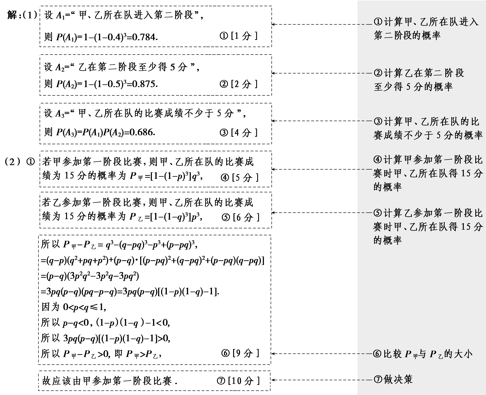
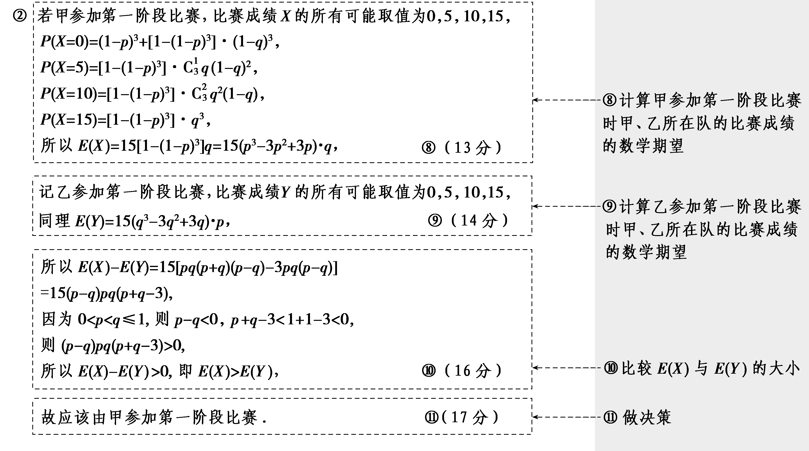

**第五节　离散型随机变量及其分布列、数字特征**

【课标研读】　1.通过具体实例，了解离散型随机变量的概念，理解离散型随机变量的分布列.　2.理解离散型随机变量的数字特征(均值、方差)，并能解决一些简单的实际问题.

1.随机变量的有关概念

(1)随机变量：一般地，对于随机试验样本空间<em>Ω</em>中的每个样本点<em>ω</em>，都有<u>唯一</u>的实数<em>X</em>(<em>ω</em>)与之对应，我们称<em>X</em>为随机变量.

(2)离散型随机变量：可能取值为有限个或可以<u>一一列举</u>的随机变量.

2.离散型随机变量的分布列及性质

(1)一般地，设离散型随机变量<em>X</em>的可能取值为<em>x</em>1，<em>x</em>2，…，<em>xn</em>，我们称<em>X</em>取每一个值<em>xi</em>的概率<em>P</em>(<em>X</em>＝<em>xi</em>)＝<em>pi</em>，<em>i</em>＝1，2，…，<em>n</em>为<em>X</em>的概率分布列，简称分布列.

(2)离散型随机变量分布列的性质

①<em>pi</em><u>≥</u>0，<em>i</em>＝1，2，…，<em>n</em>；

②<em>p</em>1＋<em>p</em>2＋…＋<em>pn</em>＝<u>1</u>.

3.两点分布

如果*<text style="italic">P*</text>(*A*)＝*<text style="italic">p*</text>，则P( $\overline{A}$ )＝1－*<text style="italic">p*</text>，那么*X*的分布列为

<table><tr><td>
<em>X</em>
</td><td>
0
</td><td>
1
</td></tr><tr><td>
<em>P</em>
</td><td>
1－<em>p</em>
</td><td>
<em>p</em>
</td></tr></table>

我们称*X*服从两点分布或0－1分布.

[微提醒]　随机变量*X*只取两个值的分布未必是两点分布.

4.离散型随机变量的均值(数学期望)与方差

设离散型随机变量*X*的分布列为

<table><tr><td>
<em>X</em>
</td><td>
<em>x</em>1
</td><td>
<em>x</em>2
</td><td>
…
</td><td>
<em>xn</em>
</td></tr><tr><td>
<em>P</em>
</td><td>
<em>p</em>1
</td><td>
<em>p</em>2
</td><td>
…
</td><td>
<em>pn</em>
</td></tr></table>

(1)均值(数学期望)

称&lt;te&lt;te&lt;te&lt;te&lt;text style="&lt;text style="<em>i</em>talic,subscri<em>p</em>t"&gt;i&lt;/text&gt;talic"&gt;x&lt;/text&gt;t style="italic,u&lt;text style="italic,u<em><u>n</u></em>derline,subscri<em><u>p</u></em>t"&gt;n&lt;/text&gt;derline"&gt;x&lt;/text&gt;t style="italic,underline"&gt;x&lt;/text&gt;t style="italic,underline"&gt;x&lt;/text&gt;t style="italic"&gt;E&lt;/text&gt; $\left(X\right)$ ＝&lt;te&lt;te&lt;te&lt;text style="&lt;text style="<em>i</em>talic,subscri<em>p</em>t"&gt;i&lt;/text&gt;talic"&gt;x&lt;/text&gt;t style="italic,u&lt;text style="italic,u<em><u>n</u></em>derline,subscri<em><u>p</u></em>t"&gt;n&lt;/text&gt;derline"&gt;x&lt;/text&gt;t style="italic,underline"&gt;x&lt;/text&gt;t style="italic,underline"&gt;x&lt;/text&gt;&lt;text style="underline,subscri<em><u>&lt;text style="italic,underline"&gt;p</u></em>&lt;/text&gt;t"&gt;<u>1</u>&lt;/text&gt;p1<u>＋</u>x<u>&lt;text style="underline,subscript"&gt;2</u>&lt;/text&gt;p2<u>＋…＋</u>xnpn＝ $\overset{n}{\underset{i=1}{\sum }}$ &lt;te&lt;te&lt;te&lt;text style="&lt;text style="<em>i</em>talic,subscri<em>p</em>t"&gt;i&lt;/text&gt;talic"&gt;x&lt;/text&gt;t style="italic,u&lt;text style="italic,u<em><u>n</u></em>derline,subscri<em><u>p</u></em>t"&gt;n&lt;/text&gt;derline"&gt;x&lt;/text&gt;t style="italic,underline"&gt;x&lt;/text&gt;t style="italic,underline"&gt;x&lt;/text&gt;i<em><u>&lt;text style="italic,underline"&gt;p</u></em>&lt;/text&gt;i为随机变量<em>X</em>的均值或数学期望.它反映了随机变量取值的<u>平均水平</u>.

(&lt;te&lt;text style="<em>i</em>talic"&gt;x&lt;/text&gt;t style="su<em>&lt;text style="italic"&gt;&lt;text style="italic"&gt;&lt;text style="italic"&gt;p</em>&lt;/text&gt;&lt;/text&gt;&lt;/text&gt;erscript"&gt;&lt;text style="superscript"&gt;&lt;text style="subscript"&gt;2&lt;/text&gt;&lt;/text&gt;&lt;/text&gt;)方差：称&lt;te<em>x</em>t style="italic"&gt;D&lt;/text&gt;(<em>&lt;text style="italic"&gt;&lt;text style="italic"&gt;&lt;text style="italic"&gt;&lt;text style="italic"&gt;&lt;text style="italic"&gt;X</em>&lt;/text&gt;&lt;/text&gt;&lt;/text&gt;&lt;/text&gt;&lt;/text&gt;)＝(x&lt;text style="subscript"&gt;1&lt;/text&gt;－<em>&lt;text style="italic"&gt;E</em>&lt;/text&gt;(X))2p1＋(x2－E(X))2p2＋…＋ $\left(x_{n}－E\left(X\right)\right)^{2}$ &lt;te&lt;text style="<em>i</em>talic"&gt;x&lt;/text&gt;t style="italic"&gt;<em>&lt;text style="italic"&gt;&lt;text style="italic"&gt;p</em>&lt;/text&gt;&lt;/text&gt;&lt;/text&gt;<em>n</em>＝ $\overset{n}{\underset{i=1}{\sum }}\left(x_{i}－E\left(X\right)\right)^{2}$ &lt;te&lt;text style="<em>i</em>talic"&gt;x&lt;/text&gt;t style="italic"&gt;<em>&lt;text style="italic"&gt;&lt;text style="italic"&gt;p</em>&lt;/text&gt;&lt;/text&gt;&lt;/text&gt;i为随机变量&lt;te<em>x</em>t style="italic"&gt;<em>&lt;text style="italic"&gt;&lt;text style="italic"&gt;&lt;text style="italic"&gt;&lt;text style="italic"&gt;X</em>&lt;/text&gt;&lt;/text&gt;&lt;/text&gt;&lt;/text&gt;&lt;/text&gt;的方差，并称 $\sqrt{D\left(X\right)}$ 为随机变量&lt;te&lt;te&lt;text style="<em>i</em>talic"&gt;x&lt;/text&gt;t style="italic"&gt;x&lt;/text&gt;t style="italic"&gt;<em>&lt;text style="italic"&gt;&lt;text style="italic"&gt;&lt;text style="italic"&gt;&lt;text style="italic"&gt;X</em>&lt;/text&gt;&lt;/text&gt;&lt;/text&gt;&lt;/text&gt;&lt;/text&gt;的<u>标准差</u>，记为<em>σ</em>(X)，它们都可以度量随机变量取值与其均值的<u>偏离程度</u>.

[微提醒]　方差是一个常数，它不具有随机性，方差的值一定是非负实数.

5.均值(数学期望)与方差的性质

(1)<em>E</em>(<em>aX</em>＋<em>b</em>)＝<em><u>aE</u></em><u>(</u><em><u>X</u></em><u>)＋</u><em><u>b</u></em>.

(2)<em>D</em>(<em>aX</em>＋<em>b</em>)＝<em><u>a</u></em><u>2</u><em><u>D</u></em><u>(</u><em><u>X</u></em><u>)</u>(<em>a</em>，<em>b</em>为常数).

【常用结论】

均值与方差的四个常用性质

(1)*E*(*k*)＝*k*，*D*(*k*)＝0，其中*k*为常数.

(2)<em>E</em>(<em>X</em>1＋<em>X</em>2)＝<em>E</em>(<em>X</em>1)＋<em>E</em>(<em>X</em>2).

(3)若<em>X</em>1，<em>X</em>2相互独立，则<em>E</em>(<em>X</em>1<em>X</em>2)＝<em>E</em>(<em>X</em>1)<em>·E</em>(<em>X</em>2).

(4)均值与方差的关系：<em>D</em>(<em>X</em>)＝<em>E</em>(<em>X</em>2)－(<em>E</em>(<em>X</em>))2.

【自主检测】

1.(多选)下列说法正确的是(　　)

A.抛掷一枚质地均匀的硬币，出现正面的次数是随机变量

B.在离散型随机变量的分布列中，随机变量取各个值的概率之和可以小于1

C.离散型随机变量的各个可能值表示的事件是彼此互斥的

D.方差或标准差越小，则偏离均值的平均程度越小

答案：**ACD**

2.(链接人教A选择性必修三P60T2)抛掷两枚骰子一次，记第一枚骰子掷出的点数减第二枚骰子掷出的点数之差为*X*，则“*X*≥5”表示的试验结果是(　　)

A.第一枚6点，第二枚2点

B.第一枚5点，第二枚1点

C.第一枚1点，第二枚6点

D.第一枚6点，第二枚1点

答案：**D**

解析：第一枚的点数减去第二枚的点数不小于5，即只能等于5.故选D.

3.(链接人教A选择性必修三P66T1)已知*X*的分布列为

<table><tr><td>
<em>X</em>
</td><td>
－1
</td><td>
0
</td><td>
1
</td></tr><tr><td>
<em>P</em>
</td><td>
 $\frac{1}{2}$ 
</td><td>
 $\frac{1}{3}$ 
</td><td>
 $\frac{1}{6}$ 
</td></tr></table>

设*Y*＝2*X*＋3，则*E*(*Y*)的值为(　　)

A. $\frac{7}{3}$ 	B.4

C.－1	D.1

答案：**A**

解析：*<text style="italic"><text style="italic"><text style="italic">E*</text></text></text>(*<text style="italic"><text style="italic">X*</text></text>)＝－ $\frac{1}{2}$ ＋ $\frac{1}{6}$ ＝－ $\frac{1}{3}$ ，*<text style="italic"><text style="italic"><text style="italic">E*</text></text></text>(*Y*)＝E(2*<text style="italic"><text style="italic">X*</text></text>＋3)＝2E(X)＋3＝－ $\frac{2}{3}$ ＋3＝ $\frac{7}{3}$ .故选A.

4.已知离散型随机变量<em>&lt;text style="italic"&gt;X</em>&lt;/text&gt;的取值为有限个，<em>&lt;text style="italic"&gt;E</em>&lt;/text&gt; $\left(X\right)$ ＝ $\frac{7}{2}$ ，<em>D</em> $\left(X\right)$ ＝ $\frac{35}{12}$ ，则<em>&lt;text style="italic"&gt;E</em>&lt;/text&gt;(<em>&lt;text style="italic"&gt;X</em>&lt;/text&gt;2)＝<u>　　　　</u>.

答案： $\frac{91}{6}$

解析：因为<em>&lt;text style="italic"&gt;&lt;text style="italic"&gt;&lt;text style="italic"&gt;E</em>&lt;/text&gt;&lt;/text&gt;&lt;/text&gt; $\left(X\right)$ ＝ $\frac{7}{2}$ ，<em>&lt;text style="italic"&gt;&lt;text style="italic"&gt;D</em>&lt;/text&gt;&lt;/text&gt; $\left(X\right)$ ＝ $\frac{35}{12}$ ，由<em>&lt;text style="italic"&gt;&lt;text style="italic"&gt;D</em>&lt;/text&gt;&lt;/text&gt;(<em>&lt;text style="italic"&gt;&lt;text style="italic"&gt;X</em>&lt;/text&gt;&lt;/text&gt;)＝<em>&lt;text style="italic"&gt;&lt;text style="italic"&gt;&lt;text style="italic"&gt;E</em>&lt;/text&gt;&lt;/text&gt;&lt;/text&gt;(X&lt;text style="superscript"&gt;2&lt;/text&gt;)－(E(X))2，得E $\left(X^{2}\right)$ ＝<em>&lt;text style="italic"&gt;&lt;text style="italic"&gt;D</em>&lt;/text&gt;&lt;/text&gt; $\left(X\right)$ ＋ $\left(E\left(X\right)\right)^{2}$ ＝ $\frac{35}{12}$ ＋ $\left(\frac{7}{2}\right)^{2}$ ＝ $\frac{91}{6}$ .

考点一　离散型随机变量分布列的性质 　　　　自主练透

1.设离散型随机变量*X*的分布列如下表所示：

<table><tr><td>
<em>X</em>
</td><td>
－1
</td><td>
0
</td><td>
1
</td><td>
2
</td><td>
3
</td></tr><tr><td>
<em>P</em>
</td><td>
 $\frac{1}{10}$ 
</td><td>
 $\frac{1}{5}$ 
</td><td>
 $\frac{1}{10}$ 
</td><td>
 $\frac{1}{5}$ 
</td><td>
 $\frac{2}{5}$ 
</td></tr></table>

则下列各式中正确的是(　　)

A.*<text style="italic">P*</text>(*<text style="italic">X*</text>＜3)＝ $\frac{2}{5}$ 	B.*<text style="italic">P*</text>(*<text style="italic">X*</text>＞1)＝ $\frac{4}{5}$

C.*<text style="italic">P*</text>(2＜*<text style="italic">X*</text>＜4)＝ $\frac{2}{5}$ 	D.*<text style="italic">P*</text>(*<text style="italic">X*</text>＜0.5)＝0

答案：**C**

解析：*<text style="italic"><text style="italic"><text style="italic"><text style="italic">P*</text></text></text></text>(*<text style="italic"><text style="italic"><text style="italic"><text style="italic">X*</text></text></text></text>＜3)＝ $\frac{1}{10}$ ＋ $\frac{1}{5}$ ＋ $\frac{1}{10}$ ＋ $\frac{1}{5}$ ＝ $\frac{3}{5}$ ，故A错误；*<text style="italic"><text style="italic"><text style="italic"><text style="italic">P*</text></text></text></text>(*<text style="italic"><text style="italic"><text style="italic"><text style="italic">X*</text></text></text></text>＞1)＝ $\frac{1}{5}$ ＋ $\frac{2}{5}$ ＝ $\frac{3}{5}$ ，故B错误；*<text style="italic"><text style="italic"><text style="italic"><text style="italic">P*</text></text></text></text>(2＜*<text style="italic"><text style="italic"><text style="italic"><text style="italic">X*</text></text></text></text>＜4)＝P(X＝3)＝ $\frac{2}{5}$ ，故C正确；*<text style="italic"><text style="italic"><text style="italic"><text style="italic">P*</text></text></text></text>(*<text style="italic"><text style="italic"><text style="italic"><text style="italic">X*</text></text></text></text>＜0.5)＝ $\frac{1}{10}$ ＋ $\frac{1}{5}$ ＝ $\frac{3}{10}$ ，故D错误.故选C.

2.若随机变量*X*的分布列为

<table><tr><td>
<em>X</em>
</td><td>
－2
</td><td>
－1
</td><td>
0
</td><td>
1
</td><td>
2
</td><td>
3
</td></tr><tr><td>
<em>P</em>
</td><td>
0.1
</td><td>
0.2
</td><td>
0.2
</td><td>
0.3
</td><td>
0.1
</td><td>
0.1
</td></tr></table>

则当*P*(*X*＜*a*)＝0.8时，实数*a*的取值范围是(　　)

A.(－*∞*，2]	B.[1，2]

C.(1，2]	D.(1，2)

答案：**C**

解析：由随机变量*X*的分布列知，*P*(*X*＜1)＝0.5，*P*(*X*＜2)＝0.8，故当*P*(*X*＜*a*)＝0.8时，实数*a*的取值范围是(1，2].故选C.

3.若离散型随机变量<text style="it*a*lic">*X*</text>的分布列为*<text style="italic">P*</text>(X＝*n*)＝ $\frac{a}{n\left(n+1\right)}\left(n=1，2，3，4\right)$ ，其中*a*是常数，则*<text style="italic">P*</text> $\left(\frac{1}{2}＜X＜\frac{5}{2}\right)$ 的值为(　　)

A. $\frac{2}{3}$ 	B. $\frac{3}{4}$

C. $\frac{4}{5}$ 	D. $\frac{5}{6}$

答案：**D**

解析：因为<text style="it*a*lic">*<text style="italic"><text style="italic">P*</text></text></text> $\left(X＝n\right)$ ＝ $\frac{a}{n\left(n+1\right)}$ (<text style="it*a*lic">n</text>＝1，2，3，4)，所以 $\frac{a}{2}$ ＋ $\frac{a}{6}$ ＋ $\frac{a}{12}$ ＋ $\frac{a}{20}$ ＝1，解得*a*＝ $\frac{5}{4}$ .故<text style="it*a*lic">*<text style="italic"><text style="italic">P*</text></text></text>( $\frac{1}{2}$ ＜*X*＜ $\frac{5}{2}$ )＝<text style="it*a*lic">*<text style="italic"><text style="italic">P*</text></text></text> $\left(X=1\right)$ ＋<text style="it*a*lic">*<text style="italic"><text style="italic">P*</text></text></text> $\left(X=2\right)$ ＝ $\frac{5}{4}$ × $\frac{1}{2}$ ＋ $\frac{5}{4}$ × $\frac{1}{6}$ ＝ $\frac{5}{6}$ .故选D.

4.(双空题)随机变量*X*的分布列如下：

<table><tr><td>
<em>X</em>
</td><td>
－1
</td><td>
0
</td><td>
1
</td></tr><tr><td>
<em>P</em>
</td><td>
<em>a</em>
</td><td>
<em>b</em>
</td><td>
<em>c</em>
</td></tr></table>

其中<em>a</em>，<em>b</em>，<em>c</em>成等差数列，则<em>P</em>(｜<em>X</em>｜＝1)＝<u>　　　　</u>，公差<em>d</em>的取值范围是<u>　　　　</u>.

答案： $\frac{2}{3}　\left[－\frac{1}{3}，\frac{1}{3}\right]$

解析：因为<text style="it<text style="it<text style="it<text style="it<text style="itali*c*">a</text>li*c*">a</text>li*c*">a</text>li*c*">a</text>li*c*">a</text>，*<text style="italic"><text style="italic"><text style="italic">b*</text></text></text>，c成等差数列，所以2b＝a＋c.又a＋b＋c＝1，所以b＝ $\frac{1}{3}$ ，所以<text style="it<text style="it<text style="itali*c*">a</text>li*c*">a</text>lic">P</text> $\left(｜X｜=1\right)$ ＝<text style="it<text style="it<text style="it<text style="it<text style="itali*c*">a</text>li*c*">a</text>li*c*">a</text>li*c*">a</text>li*c*">a</text>＋c＝ $\frac{2}{3}$ .又<text style="it<text style="it<text style="it<text style="it<text style="itali*c*">a</text>li*c*">a</text>li*c*">a</text>li*c*">a</text>li*c*">a</text>＝ $\frac{1}{3}$ －<text style="itali*c*">*<text style="italic"><text style="italic"><text style="italic"><text style="italic">d*</text></text></text></text></text>，<text style="it<text style="it<text style="it<text style="it*a*li*c*">a</text>li*c*">a</text>li*c*">a</text>lic">c</text>＝ $\frac{1}{3}$ ＋<text style="itali*c*">*<text style="italic"><text style="italic"><text style="italic"><text style="italic">d*</text></text></text></text></text>，根据分布列的性质，得0≤ $\frac{1}{3}$ －<text style="itali*c*">*<text style="italic"><text style="italic"><text style="italic"><text style="italic">d*</text></text></text></text></text>≤ $\frac{2}{3}$ ，0≤ $\frac{1}{3}$ ＋<text style="itali*c*">*<text style="italic"><text style="italic"><text style="italic"><text style="italic">d*</text></text></text></text></text>≤ $\frac{2}{3}$ ，所以－ $\frac{1}{3}$ ≤<text style="itali*c*">*<text style="italic"><text style="italic"><text style="italic"><text style="italic">d*</text></text></text></text></text>≤ $\frac{1}{3}$ ，所以公差<text style="itali*c*">*<text style="italic"><text style="italic"><text style="italic"><text style="italic">d*</text></text></text></text></text>的取值范围是［－ $\frac{1}{3}$ ， $\frac{1}{3}$ ］.

离散型随机变量分布列的性质的应用

1.利用分布列中各概率之和为1可求参数的值，此时要注意检验，以保证每个概率值均为非负值.

2.利用“在某个范围内的概率等于它取这个范围内各个值的概率之和”求某些特定事件的概率.

3.可以根据性质判断所得分布列结果是否正确.

注意：若*X*为随机变量，则*aX*＋*b*仍然为随机变量，求其分布列时可先求出相应的随机变量的值，再根据对应的概率写出分布列.

考点二　离散型随机变量的分布列、均值与方差　　　　多维探究

角度1　离散型随机变量的分布列

(2025·山东淄博模拟)甲、乙两名同学与同一台智能机器人进行象棋比赛，计分规则如下：在一轮比赛中，如果甲赢而乙输，则甲得1分；如果甲输而乙赢，则甲得－1分；如果甲和乙同时赢或同时输，则甲得0分.设甲赢机器人的概率为0.6，乙赢机器人的概率为0.5，求：

(1)在一轮比赛中，甲的得分*X*的分布列；

(2)在两轮比赛中，甲的得分*Y*的分布列.

解：(1)依题意可得*X*的可能取值为－1，0，1.

所以*P*(*X*＝－1)＝(1－0.6)×0.5＝0.2，

*P*(*X*＝0)＝0.6×0.5＋(1－0.6)×(1－0.5)＝0.5，

*P*(*X*＝1)＝0.6×(1－0.5)＝0.3，

所以*X*的分布列为

<table><tr><td>
<em>X</em>
</td><td>
－1
</td><td>
0
</td><td>
1
</td></tr><tr><td>
<em>P</em>
</td><td>
0.2
</td><td>
0.5
</td><td>
0.3
</td></tr></table>

(2)依题意可得*Y*的可能取值为－2，－1，0，1，2，

所以<em>P</em>(<em>Y</em>＝－2)＝<em>P</em>(<em>X</em>＝－1)×<em>P</em>(<em>X</em>＝－1)＝0.22＝0.04，

*P*(*Y*＝－1)＝2×*P*(*X*＝－1)×*P*(*X*＝0)＝2×0.2×0.5＝0.2，

<em>P</em>(<em>Y</em>＝0)＝2×<em>P</em>(<em>X</em>＝－1)×<em>P</em>(<em>X</em>＝1)＋<em>P</em>(<em>X</em>＝0)×<em>P</em>(<em>X</em>＝0)＝2×0.2×0.3＋0.52＝0.37，

*P*(*Y*＝1)＝*P*(*X*＝0)×*P*(*X*＝1)×2＝0.5×0.3×2＝0.3，

<em>P</em>(<em>Y</em>＝2)＝<em>P</em>(<em>X</em>＝1)×<em>P</em>(<em>X</em>＝1)＝0.32＝0.09.

所以*Y*的分布列为

<table><tr><td>
<em>Y</em>
</td><td>
－2
</td><td>
－1
</td><td>
0
</td><td>
1
</td><td>
2
</td></tr><tr><td>
<em>P</em>
</td><td>
0.04
</td><td>
0.2
</td><td>
0.37
</td><td>
0.3
</td><td>
0.09
</td></tr></table>

角度2　离散型随机变量的均值与方差

某高校“植物营养学专业”学生将鸡冠花的株高增量作为研究对象，观察长效肥和缓释肥对农作物的影响情况.其中长效肥、缓释肥、未施肥三种处理下的鸡冠花分别对应第1，2，3组.观察一段时间后，分别从第1，2，3组各随机抽取20株鸡冠花作为样本，得到相应的株高增量数据整理如下表：

<table><tr><td>
株高增量(单位：厘米)
</td><td></td><td></td><td></td><td></td></tr><tr><td>
第1组鸡冠花样本株数
</td><td>
4
</td><td>
10
</td><td>
4
</td><td>
2
</td></tr><tr><td>
第2组鸡冠花样本株数
</td><td>
3
</td><td>
8
</td><td>
8
</td><td>
1
</td></tr><tr><td>
第3组鸡冠花样本株数
</td><td>
7
</td><td>
5
</td><td>
7
</td><td>
1
</td></tr></table>

假设用频率估计概率，且所有鸡冠花生长情况相互独立.

(1)从第1组抽取的20株鸡冠花样本中随机抽取2株，求至少有1株鸡冠花的株高增量在(7，10]内的概率；

(2)分别从第1组，第2组，第3组的鸡冠花中各随机抽取1株，记这3株鸡冠花中恰有*X*株的株高增量在(7，10]内，求*X*的分布列和数学期望*E*(*X*)；

(3)用“<em>&lt;text style="italic"&gt;Y</em>&lt;/text&gt;<em>&lt;text style="italic"&gt;&lt;text style="italic,subscript"&gt;&lt;text style="italic"&gt;&lt;text style="italic"&gt;k</em>&lt;/text&gt;&lt;/text&gt;&lt;/text&gt;&lt;/text&gt;＝1”表示第k组鸡冠花的株高增量在(4，10]内，“Yk＝0”表示第k组鸡冠花的株高增量在(10，16]内，k＝1，2，3.比较方差<em>&lt;text style="italic"&gt;&lt;text style="italic"&gt;D</em>&lt;/text&gt;&lt;/text&gt; $\left(Y_{1}\right)$ ，<em>&lt;text style="italic"&gt;&lt;text style="italic"&gt;D</em>&lt;/text&gt;&lt;/text&gt; $\left(Y_{2}\right)$ ，<em>&lt;text style="italic"&gt;&lt;text style="italic"&gt;D</em>&lt;/text&gt;&lt;/text&gt; $\left(Y_{3}\right)$ 的大小，并说明理由.

解：(1)记“从第1组抽取的20株鸡冠花样本中随机抽取2株，至少有1株鸡冠花的株高增量在(7，10]内”为事件*A*，所以*P* $\left(A\right)$ ＝ $\frac{C_{10}^{1}C_{10}^{1}＋C_{10}^{2}}{C_{20}^{2}}$ ＝ $\frac{29}{38}$ .

(2)记“从第 $i\left(i=1，2，3\right)$ 组的鸡冠花中各随机抽取1株，该株的株高增量在(7，10]内”为事件&lt;text style="<em>i</em>talic"&gt;B&lt;/text&gt;i，

由题意可知：*<text style="italic">P*</text> $\left(B_{1}\right)$ ＝ $\frac{1}{2}$ ，*<text style="italic">P*</text> $\left(B_{2}\right)$ ＝ $\frac{2}{5}$ ，

*P* $\left(B_{3}\right)$ ＝ $\frac{1}{4}$ ，

且*X*的可能取值有0，1，2，3，则有：

*P* $\left(X=0\right)$ ＝ $\left(1－\frac{1}{2}\right)\left(1－\frac{2}{5}\right)\left(1－\frac{1}{4}\right)$ ＝ $\frac{9}{40}$ ；

*P* $\left(X=1\right)$ ＝ $\frac{1}{2}\left(1－\frac{2}{5}\right)\left(1－\frac{1}{4}\right)$ ＋ $\left(1－\frac{1}{2}\right)$ × $\frac{2}{5}$ × $\left(1－\frac{1}{4}\right)$ ＋ $\left(1－\frac{1}{2}\right)\left(1－\frac{2}{5}\right)$ × $\frac{1}{4}$ ＝ $\frac{9}{20}$ ；

*P* $\left(X=2\right)$ ＝ $\frac{1}{2}$ × $\frac{2}{5}$ × $\left(1－\frac{1}{4}\right)$ ＋ $\frac{1}{2}$ × $\left(1－\frac{2}{5}\right)$ × $\frac{1}{4}$ ＋ $\left(1－\frac{1}{2}\right)$ × $\frac{2}{5}$ × $\frac{1}{4}$ ＝ $\frac{11}{40}$ ；

*P* $\left(X=3\right)$ ＝ $\frac{1}{2}$ × $\frac{2}{5}$ × $\frac{1}{4}$ ＝ $\frac{1}{20}$ .

所以*X*的分布列为：

<table><tr><td>
<em>X</em>
</td><td>
0
</td><td>
1
</td><td>
2
</td><td>
3
</td></tr><tr><td>
<em>P</em>
</td><td>
 $\frac{9}{40}$ 
</td><td>
 $\frac{9}{20}$ 
</td><td>
 $\frac{11}{40}$ 
</td><td>
 $\frac{1}{20}$ 
</td></tr></table>

所以*E* $\left(X\right)$ ＝0× $\frac{9}{40}$ ＋1× $\frac{9}{20}$ ＋2× $\frac{11}{40}$ ＋3× $\frac{1}{20}$ ＝ $\frac{23}{20}$ .

(3)由题意可知<em>Y</em>1，<em>Y</em>2，<em>Y</em>3均服从两点分布，则有：

<em>Y</em>1的分布列为：

<table><tr><td>
<em>Y</em>1
</td><td>
0
</td><td>
1
</td></tr><tr><td>
<em>P</em>
</td><td>
 $\frac{3}{10}$ 
</td><td>
 $\frac{7}{10}$ 
</td></tr></table>

可得<em>Y</em>1的方差<em>D</em> $\left(Y_{1}\right)$ ＝ $\frac{7}{10}$ × $\frac{3}{10}$ ＝ $\frac{21}{100}$ ；

<em>Y</em>2的分布列为：

<table><tr><td>
<em>Y</em>2
</td><td>
0
</td><td>
1
</td></tr><tr><td>
<em>P</em>
</td><td>
 $\frac{9}{20}$ 
</td><td>
 $\frac{11}{20}$ 
</td></tr></table>

可得<em>Y</em>2的方差<em>D</em> $\left(Y_{2}\right)$ ＝ $\frac{11}{20}$ × $\frac{9}{20}$ ＝ $\frac{99}{400}$ ；

<em>Y</em>3的分布列为：

<table><tr><td>
<em>Y</em>3
</td><td>
0
</td><td>
1
</td></tr><tr><td>
<em>P</em>
</td><td>
 $\frac{2}{5}$ 
</td><td>
 $\frac{3}{5}$ 
</td></tr></table>

可得<em>Y</em>3的方差<em>D</em> $\left(Y_{3}\right)$ ＝ $\frac{3}{5}$ × $\frac{2}{5}$ ＝ $\frac{6}{25}$ ；

因为 $\frac{99}{400}$ ＞ $\frac{6}{25}$ ＞ $\frac{21}{100}$ ，所以*<text style="italic"><text style="italic">D*</text></text> $\left(Y_{2}\right)$ ＞*<text style="italic"><text style="italic">D*</text></text> $\left(Y_{3}\right)$ ＞*<text style="italic"><text style="italic">D*</text></text> $\left(Y_{1}\right)$ .

求离散型随机变量*X*的分布列及数字特征的步骤

第一步：理解*X*的意义，写出*X*的所有可能取值；

第二步：求*X*取每个值的概率；

第三步：写出*X*的分布列；

第四步：由均值、方差的定义求*E*(*X*)，*D*(*X*).

注意：结合题设背景，正确写出*X*的所有可能的取值，借助于排列、组合、古典概型求出各事件的概率是解决本类问题的关键.

对点练1.(多选)已知随机变量*X*的分布列为

<table><tr><td>
<em>X</em>
</td><td>
－1
</td><td>
0
</td><td>
1
</td></tr><tr><td>
<em>P</em>
</td><td></td><td>
<em>m</em>
</td><td>
3<em>m</em>
</td></tr></table>

下列结论正确的有(　　)A.*m*＝ $\frac{1}{6}$ 	B.*E* $\left(X\right)$ ＝ $\frac{1}{6}$

C.*E* $\left(2X－1\right)$ ＝ $\frac{1}{3}$ 	*D*.D $\left(X\right)$ ＝ $\frac{29}{36}$

答案：**ABD**

解析：由分布列的性质得， $\frac{1}{3}$ ＋4*<text style="italic">m*</text>＝1，解得m＝ $\frac{1}{6}$ ，故A正确；*<text style="italic"><text style="italic">E*</text></text> $\left(X\right)$ ＝－1× $\frac{1}{3}$ ＋0× $\frac{1}{6}$ ＋1× $\frac{1}{2}$ ＝ $\frac{1}{6}$ ，故B正确；*<text style="italic"><text style="italic">E*</text></text> $\left(2X－1\right)$ ＝2*<text style="italic"><text style="italic">E*</text></text> $\left(X\right)$ －1＝－ $\frac{2}{3}$ ，故C不正确；*D* $\left(X\right)$ ＝ $\frac{1}{3}$ × $\left(－1－\frac{1}{6}\right)^{2}$ ＋ $\frac{1}{6}$ × $\left(0－\frac{1}{6}\right)^{2}$ ＋ $\frac{1}{2}$ × $\left(1－\frac{1}{6}\right)^{2}$ ＝ $\frac{29}{36}$ ，故*D*正确.故选ABD.

对点练2.(2025·河南新乡第三次模拟)甲、乙两个不透明的袋中各装有6个大小质地完全相同的球，其中甲袋中有3个红球、3个黄球，乙袋中有1个红球、5个黄球.

(1)若从两袋中各随机地取出1个球，求这2个球颜色相同的概率；

(2)若先从甲袋中随机地取出2个球放入乙袋中，再从乙袋中随机地取出2个球，记从乙袋中取出的红球个数为*X*，求*X*的分布列与期望.

解：(1)记这2个球颜色相同为事件*A*，则*P* $\left(A\right)$ ＝ $\frac{3}{6}$ × $\frac{1}{6}$ ＋ $\frac{3}{6}$ × $\frac{5}{6}$ ＝ $\frac{1}{2}$ .

(2)依题意*X*的可能取值为0，1，2，

则*P* $\left(X=0\right)$ ＝ $\frac{C_{3}^{2}}{C_{6}^{2}}$ × $\frac{C_{5}^{2}}{C_{8}^{2}}$ ＋ $\frac{C_{3}^{2}}{C_{6}^{2}}$ × $\frac{C_{7}^{2}}{C_{8}^{2}}$ ＋ $\frac{C_{3}^{1}C_{3}^{1}}{C_{6}^{2}}$ × $\frac{C_{6}^{2}}{C_{8}^{2}}$ ＝ $\frac{19}{35}$ ，

*P* $\left(X=1\right)$ ＝ $\frac{C_{3}^{2}}{C_{6}^{2}}$ × $\frac{C_{5}^{1}C_{3}^{1}}{C_{8}^{2}}$ ＋ $\frac{C_{3}^{2}}{C_{6}^{2}}$ × $\frac{C_{7}^{1}}{C_{8}^{2}}$ ＋ $\frac{C_{3}^{1}C_{3}^{1}}{C_{6}^{2}}$ × $\frac{C_{6}^{1}C_{2}^{1}}{C_{8}^{2}}$ ＝ $\frac{29}{70}$ ，

*P* $\left(X=2\right)$ ＝ $\frac{C_{3}^{2}}{C_{6}^{2}}$ × $\frac{C_{3}^{2}}{C_{8}^{2}}$ ＋ $\frac{C_{3}^{1}C_{3}^{1}}{C_{6}^{2}}$ × $\frac{C_{2}^{2}}{C_{8}^{2}}$ ＝ $\frac{3}{70}$ .

所以*X*的分布列为：

<table><tr><td>
<em>X</em>
</td><td>
0
</td><td>
1
</td><td>
2
</td></tr><tr><td>
<em>P</em>
</td><td>
 $\frac{19}{35}$ 
</td><td>
 $\frac{29}{70}$ 
</td><td>
 $\frac{3}{70}$ 
</td></tr></table>

所以*E* $\left(X\right)$ ＝0× $\frac{19}{35}$ ＋1× $\frac{29}{70}$ ＋2× $\frac{3}{70}$ ＝ $\frac{1}{2}$ .

考点三　均值与方差中的决策问题　　　　师生共研

[答题规范](17分)(2024·新课标Ⅱ卷)某投篮比赛分为两个阶段，每个参赛队由两名队员组成.比赛具体规则如下：第一阶段由参赛队中一名队员投篮3次，若3次都未投中，则该队被淘汰，比赛成绩为0分；若至少投中1次，则该队进入第二阶段.第二阶段由该队的另一名队员投篮3次，每次投中得5分，未投中得0分，该队的比赛成绩为第二阶段的得分总和.某参赛队由甲、乙两名队员组成，设甲每次投中的概率为*p*，乙每次投中的概率为*q*，各次投中与否相互独立.

(1)若*p*＝0.4，*q*＝0.5，甲参加第一阶段比赛，求甲、乙所在队的比赛成绩不少于5分的概率；

(2)假设0＜*p*＜*q*.

①为使得甲、乙所在队的比赛成绩为15分的概率最大，应该由谁参加第一阶段比赛？

②为使得甲、乙所在队的比赛成绩的数学期望最大，应该由谁参加第一阶段比赛？

[思路分析]　(1)根据对立事件的求法和独立事件的乘法公式即可得到答案.

(2)①首先各自计算出<em>&lt;text style="italic"&gt;P</em>&lt;/text&gt;&lt;text style="subscri<em>p</em>t"&gt;甲&lt;/text&gt;＝ $\left[1-(1－p)^{3}\right]$ <em>q</em>&lt;text style="su<em>p</em>erscript"&gt;3&lt;/text&gt;，<em>&lt;text style="italic"&gt;P</em>&lt;/text&gt;乙＝ $\left[1-(1－q)^{3}\right]$ <em>p</em>&lt;text style="superscript"&gt;3&lt;/text&gt;，再作差因式分解即可判断.②首先得到<em>X</em>和<em>Y</em>的所有可能取值，再按步骤列出分布列，计算出各自期望，再次作差比较大小即可.

随机变量的均值和方差从整体和全局上刻画了随机变量，是生产实际中用于方案取舍的重要理论依据.一般先比较均值，若均值相同，再用方差来决定.

对点练3.(2025·山东菏泽模拟) 某商场举行“庆元宵，猜谜语”的促销活动，抽奖规则如下：在一个不透明的盒子中装有若干个标号为1，2，3的空心小球，球内装有难度不同的谜语.每次随机抽取2个小球，答对一个小球中的谜语才能回答另一个小球中的谜语，答错则终止游戏.已知标号为1，2，3的小球个数比为1∶2∶1，且取到异号球的概率为 $\frac{5}{7}$ .

(1)求盒中2号球的个数；

(2)若甲抽到1号球和3号球，甲答对球中谜语的概率和对应奖金如表所示，请帮甲决策猜谜语的顺序(猜对谜语的概率相互独立).

<table><tr><td>
球号
</td><td>
1号球
</td><td>
3号球
</td></tr><tr><td>
答对概率
</td><td>
0.8
</td><td>
0.5
</td></tr><tr><td>
奖金
</td><td>
100
</td><td>
500
</td></tr></table>

解：(1)由题意可设1，2，3号球的个数分别为*n*，2*n*，*n*，

则取到异号球的概率*P*＝ $\frac{2C_{n}^{1}C_{2n}^{1}＋C_{n}^{1}C_{n}^{1}}{C_{4n}^{2}}$ ＝ $\frac{5}{7}$ ，

所以 $\frac{2\times 5n^{2}}{4n(4n－1)}$ ＝ $\frac{5}{7}$ ，即<em>&lt;text style="italic"&gt;&lt;text style="italic"&gt;n</em>&lt;/text&gt;&lt;/text&gt;2＝2n，解得n＝2.

所以盒中2号球的个数为4个.

(2)若甲先回答1号球再回答3号球中的谜语，

因为猜对谜语的概率相互独立，记*X*为甲获得的奖金总额，

则*X*可能的取值为0元，100元，600元，

*P*(*X*＝0)＝0.2，

*P*(*X*＝100)＝0.8×(1－0.5)＝0.4，

*P*(*X*＝600)＝0.8×0.5＝0.4.

所以*X*的分布列为：

<table><tr><td>
<em>X</em>
</td><td>
0
</td><td>
100
</td><td>
600
</td></tr><tr><td>
<em>P</em>
</td><td>
0.2
</td><td>
0.4
</td><td>
0.4
</td></tr></table>

所以*E* $\left(X\right)$ ＝0×0.2＋100×0.4＋600×0.4＝280.

若甲先回答3号球再回答1号球，因为猜对谜语的概率相互独立，

记*Y*为甲获得的奖金总额，则*Y*可能的取值为0元，500元，600元，

*P* $\left(Y=0\right)$ ＝0.5，

*P* $\left(Y=500\right)$ ＝0.5× $\left(1－0.8\right)$ ＝0.1，

*P* $\left(Y=600\right)$ ＝0.8×0.5＝0.4.

所以*Y*的分布列为：

<table><tr><td>
<em>Y</em>
</td><td>
0
</td><td>
500
</td><td>
600
</td></tr><tr><td>
<em>P</em>
</td><td>
0.5
</td><td>
0.1
</td><td>
0.4
</td></tr></table>

所以*E*(*Y*)＝0×0.5＋500×0.1＋600×0.4＝290，

因为*E*(*Y*)＞*E*(*X*)，所以推荐甲先回答3号球中的谜语再回答1号球中的谜语.

[真题再现]　(2021·新高考Ⅰ卷)某学校组织“一带一路”知识竞赛，有A，B两类问题.每位参加比赛的同学先在两类问题中选择一类并从中随机抽取一个问题回答，若回答错误则该同学比赛结束；若回答正确则从另一类问题中再随机抽取一个问题回答，无论回答正确与否，该同学比赛结束.A类问题中的每个问题回答正确得20分，否则得0分；B类问题中的每个问题回答正确得80分，否则得0分.

已知小明能正确回答A类问题的概率为0.8，能正确回答B类问题的概率为0.6，且能正确回答问题的概率与回答次序无关.

(1)若小明先回答A类问题，记*X*为小明的累计得分，求*X*的分布列；

(2)为使累计得分的期望最大，小明应选择先回答哪类问题？并说明理由.

解：(1)由题易知*X*的所有可能取值为0，20，100，

*P*(*X*＝0)＝1－0.8＝0.2，

*P*(*X*＝20)＝0.8×(1－0.6)＝0.32，

*P*(*X*＝100)＝0.8×0.6＝0.48.

所以*X*的分布列为

<table><tr><td>
<em>X</em>
</td><td>
0
</td><td>
20
</td><td>
100
</td></tr><tr><td>
<em>P</em>
</td><td>
0.2
</td><td>
0.32
</td><td>
0.48
</td></tr></table>

(2)由(1)可知*E*(*X*)＝0×0.2＋20×0.32＋100×0.48＝54.4.

假设小明先回答B类问题，其累计得分为*Y*，则*Y*的所有可能取值为0，80，100，

*P*(*Y*＝0)＝1－0.6＝0.4，

*P*(*Y*＝80)＝0.6×(1－0.8)＝0.12，

*P*(*Y*＝100)＝0.6×0.8＝0.48.

所以*Y*的分布列为

<table><tr><td>
<em>Y</em>
</td><td>
0
</td><td>
80
</td><td>
100
</td></tr><tr><td>
<em>P</em>
</td><td>
0.4
</td><td>
0.12
</td><td>
0.48
</td></tr></table>

所以*E*(*Y*)＝0×0.4＋80×0.12＋100×0.48＝57.6，

所以*E*(*Y*)＞*E*(*X*)，

所以小明应选择先回答B类问题.

[教材呈现]　(人教A选择性必修三P65例4)根据天气预报，某地区近期有小洪水的概率为0.25，有大洪水的概率为0.01.该地区某工地上有一台大型设备，遇到大洪水时要损失60 000元，遇到小洪水时要损失10 000元.为保护设备，有以下3种方案：

方案1　运走设备，搬运费为3 800元；

方案2　建保护围墙，建设费为2 000元，但围墙只能防小洪水；

方案3　不采取措施.

工地的领导该如何决策呢？

点评：高考题命题角度与教材例题类似，设问的本质也一样，都主要考查离散型随机变量分布列及数学期望，都属于决策问题.

**课时测评**87　**离散型随机变量及其分布列、数字特征** $\frac{对应学生}{用书P483}$

(时间：60分钟　满分：95分)

(本栏目内容，在学生用书中以独立形式分册装订！)

(1—8题，每小题5分，共40分)

1.某射手射击所得环数*X*的分布列如下表：

<table><tr><td>
<em>X</em>
</td><td>
7
</td><td>
8
</td><td>
9
</td><td>
10
</td></tr><tr><td>
<em>P</em>
</td><td>
<em>x</em>
</td><td>
0.1
</td><td>
0.3
</td><td>
<em>y</em>
</td></tr></table>

已知*ξ*的数学期望*E*(*X*)＝8.9，则*y*的值为(　　)

A.0.8	B.0.6

C.0.4	D.0.2

答案：**C**

解析：由题中表格可知*x*＋0.1＋0.3＋*y*＝1，7*x*＋8×0.1＋9×0.3＋10*y*＝8.9，解得*y*＝0.4.故选C.

2.已知随机变量*X*满足*E*(2－2*X*)＝4，*D*(2－2*X*)＝4，下列说法正确的是(　　)

A.*E*(*X*)＝－1，*D*(*X*)＝－1

B.*E*(*X*)＝1，*D*(*X*)＝1

C.*E*(*X*)＝－1，*D*(*X*)＝4

D.*E*(*X*)＝－1，*D*(*X*)＝1

答案：**D**

解析：根据方差和期望的性质可得，*E*(2－2*X*)＝－2*E*(*X*)＋2＝4⇒*E*(*X*)＝－1，*D*(2－2*X*)＝4*D*(*X*)＝4⇒*D*(*X*)＝1.故选D.

3.签盒中有编号为1，2，3，4，5，6的六支签，从中任意取3支，设*X*为这3支签的号码之中最大的一个，则*X*的数学期望为(　　)

A.5	B.5.25

C.5.8	D.4.6

答案：**B**

解析：由题意可知，*<text style="italic"><text style="italic">X*</text></text>的可能取值为3，4，5，6，*<text style="italic"><text style="italic"><text style="italic">P*</text></text></text>(X＝3)＝ $\frac{1}{C_{6}^{3}}$ ＝ $\frac{1}{20}$ ，*<text style="italic"><text style="italic"><text style="italic">P*</text></text></text>(*<text style="italic"><text style="italic">X*</text></text>＝4)＝ $\frac{C_{3}^{2}}{C_{6}^{3}}$ ＝ $\frac{3}{20}$ ，*<text style="italic"><text style="italic"><text style="italic">P*</text></text></text> $\left(X=5\right)$ ＝ $\frac{C_{4}^{2}}{C_{6}^{3}}$ ＝ $\frac{3}{10}$ ，*<text style="italic"><text style="italic"><text style="italic">P*</text></text></text> $\left(X=6\right)$ ＝ $\frac{C_{5}^{2}}{C_{6}^{3}}$ ＝ $\frac{1}{2}$ .由数学期望的定义可求得*E* $\left(X\right)$ ＝3× $\frac{1}{20}$ ＋4× $\frac{3}{20}$ ＋5× $\frac{3}{10}$ ＋6× $\frac{1}{2}$ ＝5.25.故选B.

4.某实验测试的规则如下：每位学生最多可做3次实验，一旦实验成功，则停止实验，否则做完3次为止.设某学生每次实验成功的概率为*p*(0＜*p*＜1)，实验次数为随机变量*X*，若*X*的数学期望*E*(*X*)＞1.39，则*p*的取值范围是(　　)

A.(0，0.6)	B.(0，0.7)

C.(0.6，1)	D.(0.7，1)

答案：**B**

解析：由题意得，<em>X</em>的所有可能取值为1，2，3，<em>P</em>(<em>X</em>＝1)＝<em>p</em>，<em>P</em>(<em>X</em>＝2)＝(1－<em>p</em>)<em>p</em>，<em>P</em>(<em>X</em>＝3)＝1－<em>p</em>－(1－<em>p</em>)<em>p</em>＝(1－<em>p</em>)2.所以<em>E</em>(<em>X</em>)＝1×<em>p</em>＋2×(1－<em>p</em>)<em>p</em>＋3×(1－<em>p</em>)2＝<em>p</em>2－3<em>p</em>＋3，令<em>E</em>(<em>X</em>)＝<em>p</em>2－3<em>p</em>＋3＞1.39，解得<em>p</em>＜0.7或<em>p</em>＞2.3，又因为0＜<em>p</em>＜1，所以0＜<em>p</em>＜0.7，即<em>p</em>的取值范围是(0，0.7).故选B.

5.(多选)已知随机变量*X*，*Y*的分布列如下，则(　　)

<table><tr><td>
<em>X</em>
</td><td>
1
</td><td>
2
</td></tr><tr><td>
<em>P</em>
</td><td>
0.6
</td><td>
0.4
</td></tr><tr><td>
<em>Y</em>
</td><td>
1
</td><td>
－2
</td></tr><tr><td>
<em>P</em>
</td><td>
0.5
</td><td>
0.5
</td></tr></table>

A.*D*(*Y*)＝9*D*(*X*)

B.*E*(1－*X*)＝0.5

C.*D*(1－*Y*)＝2.25

D.*E*(*X*＋*Y*)＝0.9

答案：**CD**

解析：<em>E</em>(<em>X</em>)＝1×0.6＋2×0.4＝1.4，<em>E</em>(<em>Y</em>)＝1×0.5－2×0.5＝－0.5，<em>D</em>(<em>X</em>)＝(1－1.4)2×0.6＋(2－1.4)2×0.4＝0.24，<em>D</em>(<em>Y</em>)＝(1＋0.5)2×0.5＋(－2＋0.5)2×0.5＝2.25，所以<em>D</em>(<em>Y</em>)≠9<em>D</em>(<em>X</em>)，<em>E</em>(1－<em>X</em>)＝－<em>E</em>(<em>X</em>)＋1＝－0.4，<em>D</em>(1－<em>Y</em>)＝(－1)2<em>D</em>(<em>Y</em>)＝2.25，<em>E</em>(<em>X</em>＋<em>Y</em>)＝<em>E</em>(<em>X</em>)＋<em>E</em>(<em>Y</em>)＝0.9，故选CD.

6.(多选)一个袋子中装有除颜色外完全相同的10个球，其中有6个黑球，4个白球，现从中任取4个球，记随机变量*X*为取出白球的个数，随机变量*Y*为取出黑球的个数，若取出一个白球得2分，取出一个黑球得1分，随机变量*Z*为取出4个球的总得分，则下列结论中正确的是(　　)

A.*P* $\left(X=1\right)$ ＝ $\frac{1}{2}$ 	B.*X*＋*Y*＝4

C.*<text style="italic"><text style="italic">E*</text></text>(*X*)＞E(*Y*)	D.E $\left(Z\right)$ ＝ $\frac{28}{5}$

答案：**BD**

解析：由条件可知，袋子中有6黑4白，又共取出4个球，所以*<text style="italic"><text style="italic"><text style="italic"><text style="italic"><text style="italic"><text style="italic"><text style="italic"><text style="italic"><text style="italic"><text style="italic"><text style="italic"><text style="italic">X*</text></text></text></text></text></text></text></text></text></text></text></text>＋*<text style="italic"><text style="italic"><text style="italic"><text style="italic"><text style="italic"><text style="italic"><text style="italic">Y*</text></text></text></text></text></text></text>＝4，故B正确；X的可能取值为0，1，2，3，4，*<text style="italic"><text style="italic"><text style="italic"><text style="italic"><text style="italic"><text style="italic"><text style="italic"><text style="italic"><text style="italic"><text style="italic"><text style="italic"><text style="italic"><text style="italic"><text style="italic"><text style="italic"><text style="italic"><text style="italic"><text style="italic"><text style="italic"><text style="italic"><text style="italic"><text style="italic"><text style="italic"><text style="italic">P*</text></text></text></text></text></text></text></text></text></text></text></text></text></text></text></text></text></text></text></text></text></text></text></text> $\left(X=0\right)$ ＝ $\frac{C_{6}^{4}}{C_{10}^{4}}$ ＝ $\frac{15}{210}$ ＝ $\frac{1}{14}$ ，*<text style="italic"><text style="italic"><text style="italic"><text style="italic"><text style="italic"><text style="italic"><text style="italic"><text style="italic"><text style="italic"><text style="italic"><text style="italic"><text style="italic"><text style="italic"><text style="italic"><text style="italic"><text style="italic"><text style="italic"><text style="italic"><text style="italic"><text style="italic"><text style="italic"><text style="italic"><text style="italic"><text style="italic">P*</text></text></text></text></text></text></text></text></text></text></text></text></text></text></text></text></text></text></text></text></text></text></text></text> $\left(X=1\right)$ ＝ $\frac{C_{4}^{1}C_{6}^{3}}{C_{10}^{4}}$ ＝ $\frac{80}{210}$ ＝ $\frac{8}{21}$ ，*<text style="italic"><text style="italic"><text style="italic"><text style="italic"><text style="italic"><text style="italic"><text style="italic"><text style="italic"><text style="italic"><text style="italic"><text style="italic"><text style="italic"><text style="italic"><text style="italic"><text style="italic"><text style="italic"><text style="italic"><text style="italic"><text style="italic"><text style="italic"><text style="italic"><text style="italic"><text style="italic"><text style="italic">P*</text></text></text></text></text></text></text></text></text></text></text></text></text></text></text></text></text></text></text></text></text></text></text></text> $\left(X=2\right)$ ＝ $\frac{C_{4}^{2}C_{6}^{2}}{C_{10}^{4}}$ ＝ $\frac{90}{210}$ ＝ $\frac{3}{7}$ ，*<text style="italic"><text style="italic"><text style="italic"><text style="italic"><text style="italic"><text style="italic"><text style="italic"><text style="italic"><text style="italic"><text style="italic"><text style="italic"><text style="italic"><text style="italic"><text style="italic"><text style="italic"><text style="italic"><text style="italic"><text style="italic"><text style="italic"><text style="italic"><text style="italic"><text style="italic"><text style="italic"><text style="italic">P*</text></text></text></text></text></text></text></text></text></text></text></text></text></text></text></text></text></text></text></text></text></text></text></text> $\left(X=3\right)$ ＝ $\frac{C_{4}^{3}C_{6}^{1}}{C_{10}^{4}}$ ＝ $\frac{24}{210}$ ＝ $\frac{4}{35}$ ，*<text style="italic"><text style="italic"><text style="italic"><text style="italic"><text style="italic"><text style="italic"><text style="italic"><text style="italic"><text style="italic"><text style="italic"><text style="italic"><text style="italic"><text style="italic"><text style="italic"><text style="italic"><text style="italic"><text style="italic"><text style="italic"><text style="italic"><text style="italic"><text style="italic"><text style="italic"><text style="italic"><text style="italic">P*</text></text></text></text></text></text></text></text></text></text></text></text></text></text></text></text></text></text></text></text></text></text></text></text> $\left(X=4\right)$ ＝ $\frac{C_{4}^{4}}{C_{10}^{4}}$ ＝ $\frac{1}{210}$ ，故A错误；*<text style="italic"><text style="italic"><text style="italic"><text style="italic"><text style="italic"><text style="italic"><text style="italic">Y*</text></text></text></text></text></text></text>的可能取值为0，1，2，3，4，且*<text style="italic"><text style="italic"><text style="italic"><text style="italic"><text style="italic"><text style="italic"><text style="italic"><text style="italic"><text style="italic"><text style="italic"><text style="italic"><text style="italic"><text style="italic"><text style="italic"><text style="italic"><text style="italic"><text style="italic"><text style="italic"><text style="italic"><text style="italic"><text style="italic"><text style="italic"><text style="italic"><text style="italic">P*</text></text></text></text></text></text></text></text></text></text></text></text></text></text></text></text></text></text></text></text></text></text></text></text>(Y＝0)＝P(*<text style="italic"><text style="italic"><text style="italic"><text style="italic"><text style="italic"><text style="italic"><text style="italic"><text style="italic"><text style="italic"><text style="italic"><text style="italic"><text style="italic">X*</text></text></text></text></text></text></text></text></text></text></text></text>＝4)，P(Y＝1)＝P(X＝3)，P(Y＝2)＝P(X＝2)，P(Y＝3)＝P(X＝1)，P(Y＝4)＝P(X＝0)，则*<text style="italic"><text style="italic"><text style="italic"><text style="italic">E*</text></text></text></text> $\left(X\right)$ ＝ $\frac{80+180+72+4}{210}$ ＝ $\frac{8}{5}$ ，*<text style="italic"><text style="italic"><text style="italic"><text style="italic">E*</text></text></text></text> $\left(Y\right)$ ＝ $\frac{24+180+240+60}{210}$ ＝ $\frac{12}{5}$ ，所以*<text style="italic"><text style="italic"><text style="italic"><text style="italic">E*</text></text></text></text>(*<text style="italic"><text style="italic"><text style="italic"><text style="italic"><text style="italic"><text style="italic"><text style="italic"><text style="italic"><text style="italic"><text style="italic"><text style="italic"><text style="italic">X*</text></text></text></text></text></text></text></text></text></text></text></text>)＜E(*<text style="italic"><text style="italic"><text style="italic"><text style="italic"><text style="italic"><text style="italic"><text style="italic">Y*</text></text></text></text></text></text></text>)，故C错误；*<text style="italic"><text style="italic"><text style="italic"><text style="italic"><text style="italic"><text style="italic">Z*</text></text></text></text></text></text>的可能取值为4，5，6，7，8，且*<text style="italic"><text style="italic"><text style="italic"><text style="italic"><text style="italic"><text style="italic"><text style="italic"><text style="italic"><text style="italic"><text style="italic"><text style="italic"><text style="italic"><text style="italic"><text style="italic"><text style="italic"><text style="italic"><text style="italic"><text style="italic"><text style="italic"><text style="italic"><text style="italic"><text style="italic"><text style="italic"><text style="italic">P*</text></text></text></text></text></text></text></text></text></text></text></text></text></text></text></text></text></text></text></text></text></text></text></text>(Z＝4)＝P(X＝0)，P(Z＝5)＝P(X＝1)，P(Z＝6)＝P(X＝2)，P(Z＝7)＝P(X＝3)，P(Z＝8)＝P(X＝4)，所以E(Z)＝ $\frac{15\times 4+80\times 5+90\times 6+24\times 7+1\times 8}{210}$ ＝ $\frac{1 176}{210}$ ＝ $\frac{28}{5}$ ，故D正确.故选BD.

7. (2025·河南开封第二次质量检测)袋中有4个红球，<em>m</em>个黄球，<em>n</em>个绿球.现从中任取两个球，记取出的红球数为<em>&lt;text style="italic"&gt;X</em>&lt;/text&gt;，若取出的两个球都是红球的概率为 $\frac{1}{6}$ ，则<em>E</em>(<em>&lt;text style="italic"&gt;X</em>&lt;/text&gt;)＝<u>　　　　</u>.

答案： $\frac{8}{9}$

解析：依题意*<text style="italic"><text style="italic">m*</text></text>，*<text style="italic"><text style="italic">n*</text></text>为非负整数，记取出的两个球都是红球为事件*<text style="italic">A*</text>，则*<text style="italic"><text style="italic"><text style="italic">P*</text></text></text>(A)＝ $\frac{C_{4}^{2}}{C_{m＋n+4}^{2}}$ ＝ $\frac{1}{6}$ ，所以 $\frac{4\times 3}{(m＋n+4)(m＋n+3)}$ ＝ $\frac{1}{6}$ ，解得*<text style="italic"><text style="italic">m*</text></text>＋*<text style="italic"><text style="italic">n*</text></text>＝5或m＋n＝－12(舍去)，所以*<text style="italic"><text style="italic"><text style="italic"><text style="italic">X*</text></text></text></text>的可能取值为0，1，2，则*<text style="italic"><text style="italic"><text style="italic">P*</text></text></text>(X＝0)＝ $\frac{C_{5}^{2}}{C_{9}^{2}}$ ＝ $\frac{5}{18}$ ，*<text style="italic"><text style="italic"><text style="italic">P*</text></text></text>(*<text style="italic"><text style="italic"><text style="italic"><text style="italic">X*</text></text></text></text>＝1)＝ $\frac{C_{4}^{1}C_{5}^{1}}{C_{9}^{2}}$ ＝ $\frac{5}{9}$ ，*<text style="italic"><text style="italic"><text style="italic">P*</text></text></text>(*<text style="italic"><text style="italic"><text style="italic"><text style="italic">X*</text></text></text></text>＝2)＝ $\frac{C_{4}^{2}}{C_{9}^{2}}$ ＝ $\frac{1}{6}$ ，所以*E*(*<text style="italic"><text style="italic"><text style="italic"><text style="italic">X*</text></text></text></text>)＝0× $\frac{5}{18}$ ＋1× $\frac{5}{9}$ ＋2× $\frac{1}{6}$ ＝ $\frac{8}{9}$ .

8.根据以往的经验，某工程施工期间的降水量*X*(单位：mm)对工期的影响如下表：

<table><tr><td>
降水量<em>X</em>
</td><td>
<em>X</em>＜300
</td><td>
300≤<em>X</em>＜700
</td><td>
700≤<em>X</em>＜900
</td><td>
<em>X</em>≥900
</td></tr><tr><td>
工期延误天数<em>Y</em>
</td><td>
0
</td><td>
2
</td><td>
6
</td><td>
10
</td></tr></table>

历年气象资料表明，该工程施工期间降水量<em>X</em>小于300，700，900的概率分别为0.3，0.7，0.9，则工期延误天数<em>Y</em>的均值为<u>　　　　</u>.

答案：3

解析：由题意可知*P*(*X*＜300)＝0.3，*P*(300≤*X*＜700)＝*P*(*X*＜700)－*P*(*X*＜300)＝0.7－0.3＝0.4，*P*(700≤*X*＜900)＝*P*(*X*＜900)－*P*(*X*＜700)＝0.9－0.7＝0.2，*P*(*X*≥900)＝1－*P*(*X*＜900)＝1－0.9＝0.1.

所以随机变量*Y*的分布列如下表所示：

<table><tr><td>
<em>Y</em>
</td><td>
0
</td><td>
2
</td><td>
6
</td><td>
10
</td></tr><tr><td>
<em>P</em>
</td><td>
0.3
</td><td>
0.4
</td><td>
0.2
</td><td>
0.1
</td></tr></table>

所以*E*(*Y*)＝0×0.3＋2×0.4＋6×0.2＋10×0.1＝3，所以工期延误天数*Y*的均值为3.

9.(13分)(2024·九省适应性测试)盒中有标记数字1，2，3，4的小球各2个，随机一次取出3个小球.

(1)求取出的3个小球上的数字两两不同的概率；(4分)

(2)记取出的3个小球上的最小数字为*X*，求*X*的分布列及数学期望*E*(*X*).(9分)

解：(1)记“取出的3个小球上的数字两两不同”为事件*M*，

先确定3个不同数字的小球，有 $C_{4}^{3}$ 种方法，

然后每种小球各取1个，有 $C_{2}^{1}$ × $C_{2}^{1}$ × $C_{2}^{1}$ 种取法，

所以*P*(*M*)＝ $\frac{C_{4}^{3}\times C_{2}^{1}\times C_{2}^{1}\times C_{2}^{1}}{C_{8}^{3}}$ ＝ $\frac{4}{7}$ .

(2)由题意可知，*X*的可能取值为1，2，3，

当*X*＝1时，分为两种情况：只有一个数字为1的小球、有两个数字为1的小球，

所以*P*(*X*＝1)＝ $\frac{C_{2}^{1}C_{6}^{2}＋C_{2}^{2}C_{6}^{1}}{C_{8}^{3}}$ ＝ $\frac{9}{14}$ ；

当*X*＝2时，分为两种情况：只有一个数字为2的小球、有两个数字为2的小球，

所以*P*(*X*＝2)＝ $\frac{C_{2}^{1}C_{4}^{2}＋C_{2}^{2}C_{4}^{1}}{C_{8}^{3}}$ ＝ $\frac{2}{7}$ ；

当*X*＝3时，分为两种情况：只有一个数字为3的小球、有两个数字为3的小球，

所以*P*(*X*＝3)＝ $\frac{C_{2}^{1}C_{2}^{2}＋C_{2}^{2}C_{2}^{1}}{C_{8}^{3}}$ ＝ $\frac{1}{14}$ .

所以*X*的分布列为

<table><tr><td>
<em>X</em>
</td><td>
1
</td><td>
2
</td><td>
3
</td></tr><tr><td>
<em>P</em>
</td><td>
 $\frac{9}{14}$ 
</td><td>
 $\frac{2}{7}$ 
</td><td>
 $\frac{1}{14}$ 
</td></tr></table>

所以*E*(*X*)＝1× $\frac{9}{14}$ ＋2× $\frac{2}{7}$ ＋3× $\frac{1}{14}$ ＝ $\frac{10}{7}$ .

(10、11题，每小题5分，共10分)

10.(多选)已知随机变量<te<te<te*x*t style="italic">x</text>t style="italic">x</text>t style="italic">ξ</text>满足*<text style="italic"><text style="italic">P*</text></text> $\left(\xi =0\right)$ ＝ $\frac{1}{3}$ ，<te<te<te*x*t style="italic">x</text>t style="italic">x</text>t style="italic">*<text style="italic">P*</text></text> $\left(\xi =1\right)$ ＝<te<te*x*t style="italic">x</text>t style="italic">x</text>，*<text style="italic"><text style="italic">P*</text></text> $\left(\xi =2\right)$ ＝ $\frac{2}{3}$ －<te<te*x*t style="italic">x</text>t style="italic">x</text>，若0＜x＜ $\frac{2}{3}$ ，则(　　)

A.*E*(*ξ*)有最大值	B.*E*(*ξ*)无最小值

C.*D*(*ξ*)有最大值	D.*D*(*ξ*)无最小值

答案：**BD**

解析：由题意可得，&lt;te&lt;te&lt;te&lt;te&lt;te&lt;te&lt;te&lt;te&lt;te&lt;te&lt;te<em>x</em>t style="italic"&gt;x&lt;/text&gt;t style="italic"&gt;x&lt;/text&gt;t style="italic"&gt;x&lt;/text&gt;t style="italic"&gt;x&lt;/text&gt;t style="italic"&gt;x&lt;/text&gt;t style="italic"&gt;x&lt;/text&gt;t style="italic"&gt;x&lt;/text&gt;t style="italic"&gt;x&lt;/text&gt;t style="italic"&gt;x&lt;/text&gt;t style="italic"&gt;x&lt;/text&gt;t style="italic"&gt;<em>E</em>&lt;/text&gt; $\left(\xi \right)$ ＝0× $\frac{1}{3}$ ＋1×&lt;te&lt;te&lt;te&lt;te&lt;te&lt;te&lt;te&lt;te&lt;te&lt;te<em>x</em>t style="italic"&gt;x&lt;/text&gt;t style="italic"&gt;x&lt;/text&gt;t style="italic"&gt;x&lt;/text&gt;t style="italic"&gt;x&lt;/text&gt;t style="italic"&gt;x&lt;/text&gt;t style="italic"&gt;x&lt;/text&gt;t style="italic"&gt;x&lt;/text&gt;t style="italic"&gt;x&lt;/text&gt;t style="italic"&gt;x&lt;/text&gt;t style="italic"&gt;x&lt;/text&gt;＋&lt;text style="superscript"&gt;&lt;text style="superscript"&gt;2&lt;/text&gt;&lt;/text&gt;× $\left(\frac{2}{3}－x\right)$ ＝ $\frac{4}{3}$ －&lt;te&lt;te&lt;te&lt;te&lt;te&lt;te&lt;te&lt;te&lt;te&lt;te<em>x</em>t style="italic"&gt;x&lt;/text&gt;t style="italic"&gt;x&lt;/text&gt;t style="italic"&gt;x&lt;/text&gt;t style="italic"&gt;x&lt;/text&gt;t style="italic"&gt;x&lt;/text&gt;t style="italic"&gt;x&lt;/text&gt;t style="italic"&gt;x&lt;/text&gt;t style="italic"&gt;x&lt;/text&gt;t style="italic"&gt;x&lt;/text&gt;t style="italic"&gt;x&lt;/text&gt;，因为<em>f</em> $\left(x\right)$ ＝ $\frac{4}{3}$ －&lt;te&lt;te&lt;te&lt;te&lt;te&lt;te&lt;te&lt;te&lt;te&lt;te<em>x</em>t style="italic"&gt;x&lt;/text&gt;t style="italic"&gt;x&lt;/text&gt;t style="italic"&gt;x&lt;/text&gt;t style="italic"&gt;x&lt;/text&gt;t style="italic"&gt;x&lt;/text&gt;t style="italic"&gt;x&lt;/text&gt;t style="italic"&gt;x&lt;/text&gt;t style="italic"&gt;x&lt;/text&gt;t style="italic"&gt;x&lt;/text&gt;t style="italic"&gt;x&lt;/text&gt;在 $\left(0，\frac{2}{3}\right)$ 上单调递减，所以当0＜&lt;te&lt;te&lt;te&lt;te&lt;te&lt;te&lt;te&lt;te&lt;te&lt;te<em>x</em>t style="italic"&gt;x&lt;/text&gt;t style="italic"&gt;x&lt;/text&gt;t style="italic"&gt;x&lt;/text&gt;t style="italic"&gt;x&lt;/text&gt;t style="italic"&gt;x&lt;/text&gt;t style="italic"&gt;x&lt;/text&gt;t style="italic"&gt;x&lt;/text&gt;t style="italic"&gt;x&lt;/text&gt;t style="italic"&gt;x&lt;/text&gt;t style="italic"&gt;x&lt;/text&gt;＜ $\frac{2}{3}$ 时，&lt;te&lt;te&lt;te&lt;te&lt;te&lt;te&lt;te&lt;te&lt;te&lt;te&lt;te<em>x</em>t style="italic"&gt;x&lt;/text&gt;t style="italic"&gt;x&lt;/text&gt;t style="italic"&gt;x&lt;/text&gt;t style="italic"&gt;x&lt;/text&gt;t style="italic"&gt;x&lt;/text&gt;t style="italic"&gt;x&lt;/text&gt;t style="italic"&gt;x&lt;/text&gt;t style="italic"&gt;x&lt;/text&gt;t style="italic"&gt;x&lt;/text&gt;t style="italic"&gt;x&lt;/text&gt;t style="italic"&gt;<em>E</em>&lt;/text&gt;(<em>&lt;text style="italic"&gt;ξ</em>&lt;/text&gt;)无最大值和最小值，故A错误，B正确.<em>&lt;text style="italic"&gt;D</em>&lt;/text&gt; $\left(\xi \right)$ ＝ $\left(\frac{4}{3}－x－0\right)^{2}$ × $\frac{1}{3}$ ＋ $\left(\frac{4}{3}－x－1\right)^{2}$ ×&lt;te&lt;te&lt;te&lt;te&lt;te&lt;te&lt;te&lt;te&lt;te&lt;te<em>x</em>t style="italic"&gt;x&lt;/text&gt;t style="italic"&gt;x&lt;/text&gt;t style="italic"&gt;x&lt;/text&gt;t style="italic"&gt;x&lt;/text&gt;t style="italic"&gt;x&lt;/text&gt;t style="italic"&gt;x&lt;/text&gt;t style="italic"&gt;x&lt;/text&gt;t style="italic"&gt;x&lt;/text&gt;t style="italic"&gt;x&lt;/text&gt;t style="italic"&gt;x&lt;/text&gt;＋ $\left(\frac{4}{3}－x－2\right)^{2}$ × $\left(\frac{2}{3}－x\right)$ ＝－&lt;te&lt;te&lt;te&lt;te&lt;te&lt;te&lt;te&lt;te&lt;te&lt;te<em>x</em>t style="italic"&gt;x&lt;/text&gt;t style="italic"&gt;x&lt;/text&gt;t style="italic"&gt;x&lt;/text&gt;t style="italic"&gt;x&lt;/text&gt;t style="italic"&gt;x&lt;/text&gt;t style="italic"&gt;x&lt;/text&gt;t style="italic"&gt;x&lt;/text&gt;t style="italic"&gt;x&lt;/text&gt;t style="italic"&gt;x&lt;/text&gt;t style="italic"&gt;x&lt;/text&gt;&lt;text style="superscript"&gt;&lt;text style="superscript"&gt;2&lt;/text&gt;&lt;/text&gt;－ $\frac{1}{3}$ &lt;te&lt;te&lt;te&lt;te&lt;te&lt;te&lt;te&lt;te&lt;te&lt;te<em>x</em>t style="italic"&gt;x&lt;/text&gt;t style="italic"&gt;x&lt;/text&gt;t style="italic"&gt;x&lt;/text&gt;t style="italic"&gt;x&lt;/text&gt;t style="italic"&gt;x&lt;/text&gt;t style="italic"&gt;x&lt;/text&gt;t style="italic"&gt;x&lt;/text&gt;t style="italic"&gt;x&lt;/text&gt;t style="italic"&gt;x&lt;/text&gt;t style="italic"&gt;x&lt;/text&gt;＋ $\frac{8}{9}$ ，因为&lt;te&lt;te&lt;te&lt;te<em>x</em>t style="italic"&gt;x&lt;/text&gt;t style="italic"&gt;x&lt;/text&gt;t style="italic"&gt;x&lt;/text&gt;t style="italic"&gt;g&lt;/text&gt; $\left(x\right)$ ＝－&lt;te&lt;te&lt;te&lt;te&lt;te&lt;te&lt;te&lt;te&lt;te&lt;te<em>x</em>t style="italic"&gt;x&lt;/text&gt;t style="italic"&gt;x&lt;/text&gt;t style="italic"&gt;x&lt;/text&gt;t style="italic"&gt;x&lt;/text&gt;t style="italic"&gt;x&lt;/text&gt;t style="italic"&gt;x&lt;/text&gt;t style="italic"&gt;x&lt;/text&gt;t style="italic"&gt;x&lt;/text&gt;t style="italic"&gt;x&lt;/text&gt;t style="italic"&gt;x&lt;/text&gt;&lt;text style="superscript"&gt;&lt;text style="superscript"&gt;2&lt;/text&gt;&lt;/text&gt;－ $\frac{1}{3}$ &lt;te&lt;te&lt;te&lt;te&lt;te&lt;te&lt;te&lt;te&lt;te&lt;te<em>x</em>t style="italic"&gt;x&lt;/text&gt;t style="italic"&gt;x&lt;/text&gt;t style="italic"&gt;x&lt;/text&gt;t style="italic"&gt;x&lt;/text&gt;t style="italic"&gt;x&lt;/text&gt;t style="italic"&gt;x&lt;/text&gt;t style="italic"&gt;x&lt;/text&gt;t style="italic"&gt;x&lt;/text&gt;t style="italic"&gt;x&lt;/text&gt;t style="italic"&gt;x&lt;/text&gt;＋ $\frac{8}{9}$ ＝－( &lt;te&lt;te&lt;te&lt;te&lt;te&lt;te&lt;te&lt;te&lt;te&lt;te<em>x</em>t style="italic"&gt;x&lt;/text&gt;t style="italic"&gt;x&lt;/text&gt;t style="italic"&gt;x&lt;/text&gt;t style="italic"&gt;x&lt;/text&gt;t style="italic"&gt;x&lt;/text&gt;t style="italic"&gt;x&lt;/text&gt;t style="italic"&gt;x&lt;/text&gt;t style="italic"&gt;x&lt;/text&gt;t style="italic"&gt;x&lt;/text&gt;t style="italic"&gt;x&lt;/text&gt;＋ $\frac{1}{6}$ )&lt;te&lt;te&lt;te&lt;te&lt;te<em>x</em>t style="italic"&gt;x&lt;/text&gt;t style="italic"&gt;x&lt;/text&gt;t style="italic"&gt;x&lt;/text&gt;t style="italic"&gt;x&lt;/text&gt;t style="superscript"&gt;&lt;text style="superscript"&gt;2&lt;/text&gt;&lt;/text&gt;＋ $\frac{11}{12}$ 在 $\left(0，\frac{2}{3}\right)$ 上单调递减，所以当0＜&lt;te&lt;te&lt;te&lt;te&lt;te&lt;te&lt;te&lt;te&lt;te&lt;te<em>x</em>t style="italic"&gt;x&lt;/text&gt;t style="italic"&gt;x&lt;/text&gt;t style="italic"&gt;x&lt;/text&gt;t style="italic"&gt;x&lt;/text&gt;t style="italic"&gt;x&lt;/text&gt;t style="italic"&gt;x&lt;/text&gt;t style="italic"&gt;x&lt;/text&gt;t style="italic"&gt;x&lt;/text&gt;t style="italic"&gt;x&lt;/text&gt;t style="italic"&gt;x&lt;/text&gt;＜ $\frac{2}{3}$ 时，&lt;te&lt;te&lt;te&lt;te&lt;te&lt;te&lt;te<em>x</em>t style="italic"&gt;x&lt;/text&gt;t style="italic"&gt;x&lt;/text&gt;t style="italic"&gt;x&lt;/text&gt;t style="italic"&gt;x&lt;/text&gt;t style="italic"&gt;x&lt;/text&gt;t style="italic"&gt;x&lt;/text&gt;t style="italic"&gt;<em>D</em>&lt;/text&gt;(<em>&lt;text style="italic"&gt;ξ</em>&lt;/text&gt;)无最大值和最小值，故C错误，D正确.故选BD.

11.甲、乙两人进行乒乓球比赛，现采用三局两胜的比赛制度，规定每一局比赛都没有平局(必须分出胜负)，且每一局甲赢的概率都是<em>&lt;text style="italic"&gt;p</em>&lt;/text&gt;，随机变量<em>&lt;text style="italic"&gt;&lt;text style="italic"&gt;X</em>&lt;/text&gt;&lt;/text&gt;表示最终的比赛局数，若0＜p≤ $\frac{1}{3}$ ，则<em>E</em>(<em>&lt;text style="italic"&gt;&lt;text style="italic"&gt;X</em>&lt;/text&gt;&lt;/text&gt;)的最大值是<u>&lt;text style="underline"&gt;　　　　</u>&lt;/text&gt;；<em>D</em>(X)的取值范围是　　　　.

答案： $\frac{22}{9}　\left(0，\frac{20}{81}\right]$

解析：随机变量<em>&lt;text style="italic"&gt;&lt;text style="italic"&gt;&lt;text style="italic"&gt;X</em>&lt;/text&gt;&lt;/text&gt;&lt;/text&gt;可能的取值为&lt;text style="su<em>&lt;text style="italic"&gt;&lt;text style="italic"&gt;&lt;text style="italic"&gt;&lt;text style="italic"&gt;&lt;text style="italic"&gt;&lt;text style="italic"&gt;&lt;text style="italic"&gt;&lt;text style="italic"&gt;&lt;text style="italic"&gt;&lt;text style="italic"&gt;p</em>&lt;/text&gt;&lt;/text&gt;&lt;/text&gt;&lt;/text&gt;&lt;/text&gt;&lt;/text&gt;&lt;/text&gt;&lt;/text&gt;&lt;/text&gt;&lt;/text&gt;erscript"&gt;&lt;text style="superscript"&gt;&lt;text style="superscript"&gt;2&lt;/text&gt;&lt;/text&gt;&lt;/text&gt;，3.<em>&lt;text style="italic"&gt;P</em>&lt;/text&gt;(X＝2)＝ $C_{2}^{2}$ <em>&lt;text style="italic"&gt;&lt;text style="italic"&gt;&lt;text style="italic"&gt;&lt;text style="italic"&gt;&lt;text style="italic"&gt;&lt;text style="italic"&gt;&lt;text style="italic"&gt;&lt;text style="italic"&gt;&lt;text style="italic"&gt;&lt;text style="italic"&gt;&lt;text style="italic"&gt;p</em>&lt;/text&gt;&lt;/text&gt;&lt;/text&gt;&lt;/text&gt;&lt;/text&gt;&lt;/text&gt;&lt;/text&gt;&lt;/text&gt;&lt;/text&gt;&lt;/text&gt;&lt;/text&gt;&lt;text style="superscript"&gt;&lt;text style="superscript"&gt;&lt;text style="superscript"&gt;2&lt;/text&gt;&lt;/text&gt;&lt;/text&gt;＋ $C_{2}^{0}$ (1－<em>&lt;text style="italic"&gt;&lt;text style="italic"&gt;&lt;text style="italic"&gt;&lt;text style="italic"&gt;&lt;text style="italic"&gt;&lt;text style="italic"&gt;&lt;text style="italic"&gt;&lt;text style="italic"&gt;&lt;text style="italic"&gt;&lt;text style="italic"&gt;&lt;text style="italic"&gt;p</em>&lt;/text&gt;&lt;/text&gt;&lt;/text&gt;&lt;/text&gt;&lt;/text&gt;&lt;/text&gt;&lt;/text&gt;&lt;/text&gt;&lt;/text&gt;&lt;/text&gt;&lt;/text&gt;)&lt;text style="superscript"&gt;&lt;text style="superscript"&gt;&lt;text style="superscript"&gt;2&lt;/text&gt;&lt;/text&gt;&lt;/text&gt;＝2p2－2p＋1，<em>&lt;text style="italic"&gt;P</em>&lt;/text&gt;(<em>&lt;text style="italic"&gt;&lt;text style="italic"&gt;&lt;text style="italic"&gt;X</em>&lt;/text&gt;&lt;/text&gt;&lt;/text&gt;＝3)＝ $C_{2}^{1}$ <em>&lt;text style="italic"&gt;&lt;text style="italic"&gt;&lt;text style="italic"&gt;&lt;text style="italic"&gt;&lt;text style="italic"&gt;&lt;text style="italic"&gt;&lt;text style="italic"&gt;&lt;text style="italic"&gt;&lt;text style="italic"&gt;&lt;text style="italic"&gt;&lt;text style="italic"&gt;p</em>&lt;/text&gt;&lt;/text&gt;&lt;/text&gt;&lt;/text&gt;&lt;/text&gt;&lt;/text&gt;&lt;/text&gt;&lt;/text&gt;&lt;/text&gt;&lt;/text&gt;&lt;/text&gt;(1－p)p＋ $C_{2}^{1}$ <em>&lt;text style="italic"&gt;&lt;text style="italic"&gt;&lt;text style="italic"&gt;&lt;text style="italic"&gt;&lt;text style="italic"&gt;&lt;text style="italic"&gt;&lt;text style="italic"&gt;&lt;text style="italic"&gt;&lt;text style="italic"&gt;&lt;text style="italic"&gt;&lt;text style="italic"&gt;p</em>&lt;/text&gt;&lt;/text&gt;&lt;/text&gt;&lt;/text&gt;&lt;/text&gt;&lt;/text&gt;&lt;/text&gt;&lt;/text&gt;&lt;/text&gt;&lt;/text&gt;&lt;/text&gt;(1－p)(1－p)＝&lt;text style="superscript"&gt;&lt;text style="superscript"&gt;&lt;text style="superscript"&gt;2&lt;/text&gt;&lt;/text&gt;&lt;/text&gt;p－2p2，故<em>&lt;text style="italic"&gt;&lt;text style="italic"&gt;&lt;text style="italic"&gt;X</em>&lt;/text&gt;&lt;/text&gt;&lt;/text&gt;的分布列为

<table><tr><td>
<em>X</em>
</td><td>
2
</td><td>
3
</td></tr><tr><td>
<em>P</em>
</td><td>
2<em>p</em>2－2<em>p</em>＋1
</td><td>
2<em>p</em>－2<em>p</em>2
</td></tr></table>

故&lt;&lt;&lt;&lt;&lt;&lt;&lt;&lt;<em>t</em>ext style="italic"&gt;t&lt;/text&gt;ext style="italic"&gt;t&lt;/text&gt;ext style="italic"&gt;t&lt;/text&gt;ext style="italic"&gt;t&lt;/text&gt;ext style="italic"&gt;t&lt;/text&gt;ext style="italic"&gt;t&lt;/text&gt;ext style="italic"&gt;t&lt;/text&gt;ext style="italic"&gt;<em>&lt;text style="italic"&gt;E</em>&lt;/text&gt;&lt;/text&gt;(<em>&lt;text style="italic"&gt;&lt;text style="italic"&gt;&lt;text style="italic"&gt;&lt;text style="italic"&gt;X</em>&lt;/text&gt;&lt;/text&gt;&lt;/text&gt;&lt;/text&gt;)＝&lt;text style="su<em>&lt;text style="italic"&gt;&lt;text style="italic"&gt;&lt;text style="italic"&gt;&lt;text style="italic"&gt;&lt;text style="italic"&gt;&lt;text style="italic"&gt;&lt;text style="italic"&gt;&lt;text style="italic"&gt;&lt;text style="italic"&gt;&lt;text style="italic"&gt;&lt;text style="italic"&gt;&lt;text style="italic"&gt;&lt;text style="italic"&gt;&lt;text style="italic"&gt;p</em>&lt;/text&gt;&lt;/text&gt;&lt;/text&gt;&lt;/text&gt;&lt;/text&gt;&lt;/text&gt;&lt;/text&gt;&lt;/text&gt;&lt;/text&gt;&lt;/text&gt;&lt;/text&gt;&lt;/text&gt;&lt;/text&gt;&lt;/text&gt;erscript"&gt;&lt;text style="superscript"&gt;&lt;text style="superscript"&gt;&lt;text style="superscript"&gt;&lt;text style="superscript"&gt;&lt;text style="superscript"&gt;&lt;text style="superscript"&gt;&lt;text style="superscript"&gt;&lt;text style="superscript"&gt;&lt;text style="superscript"&gt;2&lt;/text&gt;&lt;/text&gt;&lt;/text&gt;&lt;/text&gt;&lt;/text&gt;&lt;/text&gt;&lt;/text&gt;&lt;/text&gt;&lt;/text&gt;&lt;/text&gt;×(2<em>p</em>2－2p＋1)＋3×(2p－2p2)＝－2p2＋2p＋2＝－2 $\left(p－\frac{1}{2}\right)^{2}$ ＋ $\frac{5}{2}$ ，因为0＜&lt;&lt;&lt;&lt;&lt;&lt;&lt;&lt;<em>t</em>ext style="italic"&gt;t&lt;/text&gt;ext style="italic"&gt;t&lt;/text&gt;ext style="italic"&gt;t&lt;/text&gt;ext style="italic"&gt;t&lt;/text&gt;ext style="italic"&gt;t&lt;/text&gt;ext style="italic"&gt;t&lt;/text&gt;ext style="italic"&gt;t&lt;/text&gt;ext style="italic"&gt;<em>&lt;text style="italic"&gt;&lt;text style="italic"&gt;&lt;text style="italic"&gt;&lt;text style="italic"&gt;&lt;text style="italic"&gt;&lt;text style="italic"&gt;&lt;text style="italic"&gt;&lt;text style="italic"&gt;&lt;text style="italic"&gt;&lt;text style="italic"&gt;&lt;text style="italic"&gt;&lt;text style="italic"&gt;&lt;text style="italic"&gt;&lt;text style="italic"&gt;p</em>&lt;/text&gt;&lt;/text&gt;&lt;/text&gt;&lt;/text&gt;&lt;/text&gt;&lt;/text&gt;&lt;/text&gt;&lt;/text&gt;&lt;/text&gt;&lt;/text&gt;&lt;/text&gt;&lt;/text&gt;&lt;/text&gt;&lt;/text&gt;&lt;/text&gt;≤ $\frac{1}{3}$ ，故&lt;&lt;&lt;&lt;&lt;&lt;&lt;&lt;<em>t</em>ext style="italic"&gt;t&lt;/text&gt;ext style="italic"&gt;t&lt;/text&gt;ext style="italic"&gt;t&lt;/text&gt;ext style="italic"&gt;t&lt;/text&gt;ext style="italic"&gt;t&lt;/text&gt;ext style="italic"&gt;t&lt;/text&gt;ext style="italic"&gt;t&lt;/text&gt;ext style="su<em>&lt;text style="italic"&gt;&lt;text style="italic"&gt;&lt;text style="italic"&gt;&lt;text style="italic"&gt;&lt;text style="italic"&gt;&lt;text style="italic"&gt;&lt;text style="italic"&gt;&lt;text style="italic"&gt;&lt;text style="italic"&gt;&lt;text style="italic"&gt;&lt;text style="italic"&gt;&lt;text style="italic"&gt;&lt;text style="italic"&gt;&lt;text style="italic"&gt;p</em>&lt;/text&gt;&lt;/text&gt;&lt;/text&gt;&lt;/text&gt;&lt;/text&gt;&lt;/text&gt;&lt;/text&gt;&lt;/text&gt;&lt;/text&gt;&lt;/text&gt;&lt;/text&gt;&lt;/text&gt;&lt;/text&gt;&lt;/text&gt;erscript"&gt;&lt;text style="superscript"&gt;&lt;text style="superscript"&gt;&lt;text style="superscript"&gt;&lt;text style="superscript"&gt;&lt;text style="superscript"&gt;&lt;text style="superscript"&gt;&lt;text style="superscript"&gt;&lt;text style="superscript"&gt;&lt;text style="superscript"&gt;2&lt;/text&gt;&lt;/text&gt;&lt;/text&gt;&lt;/text&gt;&lt;/text&gt;&lt;/text&gt;&lt;/text&gt;&lt;/text&gt;&lt;/text&gt;&lt;/text&gt;＜<em>&lt;text style="italic"&gt;&lt;text style="italic"&gt;E</em>&lt;/text&gt;&lt;/text&gt;(<em>&lt;text style="italic"&gt;&lt;text style="italic"&gt;&lt;text style="italic"&gt;&lt;text style="italic"&gt;X</em>&lt;/text&gt;&lt;/text&gt;&lt;/text&gt;&lt;/text&gt;)≤ $\frac{22}{9}$ ，故&lt;&lt;&lt;&lt;&lt;&lt;&lt;&lt;<em>t</em>ext style="italic"&gt;t&lt;/text&gt;ext style="italic"&gt;t&lt;/text&gt;ext style="italic"&gt;t&lt;/text&gt;ext style="italic"&gt;t&lt;/text&gt;ext style="italic"&gt;t&lt;/text&gt;ext style="italic"&gt;t&lt;/text&gt;ext style="italic"&gt;t&lt;/text&gt;ext style="italic"&gt;<em>&lt;text style="italic"&gt;E</em>&lt;/text&gt;&lt;/text&gt;(<em>&lt;text style="italic"&gt;&lt;text style="italic"&gt;&lt;text style="italic"&gt;&lt;text style="italic"&gt;X</em>&lt;/text&gt;&lt;/text&gt;&lt;/text&gt;&lt;/text&gt;)&lt;text style="subscri<em>&lt;text style="italic"&gt;&lt;text style="italic"&gt;&lt;text style="italic"&gt;&lt;text style="italic"&gt;&lt;text style="italic"&gt;&lt;text style="italic"&gt;&lt;text style="italic"&gt;&lt;text style="italic"&gt;p</em>&lt;/text&gt;&lt;/text&gt;&lt;/text&gt;&lt;/text&gt;&lt;/text&gt;&lt;/text&gt;&lt;/text&gt;&lt;/text&gt;t"&gt;max&lt;/text&gt;＝ $\frac{22}{9}$ .&lt;&lt;&lt;&lt;&lt;&lt;&lt;&lt;<em>t</em>ext style="italic"&gt;t&lt;/text&gt;ext style="italic"&gt;t&lt;/text&gt;ext style="italic"&gt;t&lt;/text&gt;ext style="italic"&gt;t&lt;/text&gt;ext style="italic"&gt;t&lt;/text&gt;ext style="italic"&gt;t&lt;/text&gt;ext style="italic"&gt;t&lt;/text&gt;ext style="italic"&gt;<em>D</em>&lt;/text&gt;(<em>&lt;text style="italic"&gt;&lt;text style="italic"&gt;&lt;text style="italic"&gt;&lt;text style="italic"&gt;X</em>&lt;/text&gt;&lt;/text&gt;&lt;/text&gt;&lt;/text&gt;)＝4×(&lt;text style="su<em>&lt;text style="italic"&gt;&lt;text style="italic"&gt;&lt;text style="italic"&gt;&lt;text style="italic"&gt;&lt;text style="italic"&gt;&lt;text style="italic"&gt;&lt;text style="italic"&gt;&lt;text style="italic"&gt;&lt;text style="italic"&gt;&lt;text style="italic"&gt;&lt;text style="italic"&gt;&lt;text style="italic"&gt;&lt;text style="italic"&gt;&lt;text style="italic"&gt;p</em>&lt;/text&gt;&lt;/text&gt;&lt;/text&gt;&lt;/text&gt;&lt;/text&gt;&lt;/text&gt;&lt;/text&gt;&lt;/text&gt;&lt;/text&gt;&lt;/text&gt;&lt;/text&gt;&lt;/text&gt;&lt;/text&gt;&lt;/text&gt;erscript"&gt;&lt;text style="superscript"&gt;&lt;text style="superscript"&gt;&lt;text style="superscript"&gt;&lt;text style="superscript"&gt;&lt;text style="superscript"&gt;&lt;text style="superscript"&gt;&lt;text style="superscript"&gt;&lt;text style="superscript"&gt;&lt;text style="superscript"&gt;2&lt;/text&gt;&lt;/text&gt;&lt;/text&gt;&lt;/text&gt;&lt;/text&gt;&lt;/text&gt;&lt;/text&gt;&lt;/text&gt;&lt;/text&gt;&lt;/text&gt;<em>p</em>2－2p＋1)＋9×(2p－2p2)－(－2p2＋2p＋2)2，令t＝2p－2p2＝－2 $\left(p－\frac{1}{2}\right)^{2}$ ＋ $\frac{1}{2}$ ，因为0＜&lt;&lt;&lt;&lt;&lt;&lt;&lt;&lt;<em>t</em>ext style="italic"&gt;t&lt;/text&gt;ext style="italic"&gt;t&lt;/text&gt;ext style="italic"&gt;t&lt;/text&gt;ext style="italic"&gt;t&lt;/text&gt;ext style="italic"&gt;t&lt;/text&gt;ext style="italic"&gt;t&lt;/text&gt;ext style="italic"&gt;t&lt;/text&gt;ext style="italic"&gt;<em>&lt;text style="italic"&gt;&lt;text style="italic"&gt;&lt;text style="italic"&gt;&lt;text style="italic"&gt;&lt;text style="italic"&gt;&lt;text style="italic"&gt;&lt;text style="italic"&gt;&lt;text style="italic"&gt;&lt;text style="italic"&gt;&lt;text style="italic"&gt;&lt;text style="italic"&gt;&lt;text style="italic"&gt;&lt;text style="italic"&gt;&lt;text style="italic"&gt;p</em>&lt;/text&gt;&lt;/text&gt;&lt;/text&gt;&lt;/text&gt;&lt;/text&gt;&lt;/text&gt;&lt;/text&gt;&lt;/text&gt;&lt;/text&gt;&lt;/text&gt;&lt;/text&gt;&lt;/text&gt;&lt;/text&gt;&lt;/text&gt;&lt;/text&gt;≤ $\frac{1}{3}$ ，故0＜&lt;&lt;&lt;&lt;&lt;&lt;&lt;<em>t</em>ext style="italic"&gt;t&lt;/text&gt;ext style="italic"&gt;t&lt;/text&gt;ext style="italic"&gt;t&lt;/text&gt;ext style="italic"&gt;t&lt;/text&gt;ext style="italic"&gt;t&lt;/text&gt;ext style="italic"&gt;t&lt;/text&gt;ext style="italic"&gt;t&lt;/text&gt;≤ $\frac{4}{9}$ ，此时&lt;&lt;&lt;&lt;&lt;&lt;&lt;&lt;<em>t</em>ext style="italic"&gt;t&lt;/text&gt;ext style="italic"&gt;t&lt;/text&gt;ext style="italic"&gt;t&lt;/text&gt;ext style="italic"&gt;t&lt;/text&gt;ext style="italic"&gt;t&lt;/text&gt;ext style="italic"&gt;t&lt;/text&gt;ext style="italic"&gt;t&lt;/text&gt;ext style="italic"&gt;<em>D</em>&lt;/text&gt;(<em>&lt;text style="italic"&gt;&lt;text style="italic"&gt;&lt;text style="italic"&gt;&lt;text style="italic"&gt;X</em>&lt;/text&gt;&lt;/text&gt;&lt;/text&gt;&lt;/text&gt;)＝4×(1－t)＋9t－(t＋&lt;text style="su<em>&lt;text style="italic"&gt;&lt;text style="italic"&gt;&lt;text style="italic"&gt;&lt;text style="italic"&gt;&lt;text style="italic"&gt;&lt;text style="italic"&gt;&lt;text style="italic"&gt;&lt;text style="italic"&gt;&lt;text style="italic"&gt;&lt;text style="italic"&gt;&lt;text style="italic"&gt;&lt;text style="italic"&gt;&lt;text style="italic"&gt;&lt;text style="italic"&gt;p</em>&lt;/text&gt;&lt;/text&gt;&lt;/text&gt;&lt;/text&gt;&lt;/text&gt;&lt;/text&gt;&lt;/text&gt;&lt;/text&gt;&lt;/text&gt;&lt;/text&gt;&lt;/text&gt;&lt;/text&gt;&lt;/text&gt;&lt;/text&gt;erscript"&gt;&lt;text style="superscript"&gt;&lt;text style="superscript"&gt;&lt;text style="superscript"&gt;&lt;text style="superscript"&gt;&lt;text style="superscript"&gt;&lt;text style="superscript"&gt;&lt;text style="superscript"&gt;&lt;text style="superscript"&gt;&lt;text style="superscript"&gt;2&lt;/text&gt;&lt;/text&gt;&lt;/text&gt;&lt;/text&gt;&lt;/text&gt;&lt;/text&gt;&lt;/text&gt;&lt;/text&gt;&lt;/text&gt;&lt;/text&gt;)2＝－t2＋t＝－(t－ $\frac{1}{2}$ )&lt;&lt;&lt;&lt;&lt;&lt;&lt;&lt;<em>t</em>ext style="italic"&gt;t&lt;/text&gt;ext style="italic"&gt;t&lt;/text&gt;ext style="italic"&gt;t&lt;/text&gt;ext style="italic"&gt;t&lt;/text&gt;ext style="italic"&gt;t&lt;/text&gt;ext style="italic"&gt;t&lt;/text&gt;ext style="italic"&gt;t&lt;/text&gt;ext style="su<em>&lt;text style="italic"&gt;&lt;text style="italic"&gt;&lt;text style="italic"&gt;&lt;text style="italic"&gt;&lt;text style="italic"&gt;&lt;text style="italic"&gt;&lt;text style="italic"&gt;&lt;text style="italic"&gt;&lt;text style="italic"&gt;&lt;text style="italic"&gt;&lt;text style="italic"&gt;&lt;text style="italic"&gt;&lt;text style="italic"&gt;&lt;text style="italic"&gt;p</em>&lt;/text&gt;&lt;/text&gt;&lt;/text&gt;&lt;/text&gt;&lt;/text&gt;&lt;/text&gt;&lt;/text&gt;&lt;/text&gt;&lt;/text&gt;&lt;/text&gt;&lt;/text&gt;&lt;/text&gt;&lt;/text&gt;&lt;/text&gt;erscript"&gt;&lt;text style="superscript"&gt;&lt;text style="superscript"&gt;&lt;text style="superscript"&gt;&lt;text style="superscript"&gt;&lt;text style="superscript"&gt;&lt;text style="superscript"&gt;&lt;text style="superscript"&gt;&lt;text style="superscript"&gt;&lt;text style="superscript"&gt;2&lt;/text&gt;&lt;/text&gt;&lt;/text&gt;&lt;/text&gt;&lt;/text&gt;&lt;/text&gt;&lt;/text&gt;&lt;/text&gt;&lt;/text&gt;&lt;/text&gt;＋ $\frac{1}{4}$ ∈ $\left(0，\frac{20}{81}\right]$ .

12.(15分)某游乐场设置了迷宫游戏，有三个造型相同的门可供选择，参与者进入三个门的结果分别是3分钟走出去，6分钟走出去，3分钟返回出发点.游戏规定：不重复进同一个门，若返回出发点立即重新选择，直到走出迷宫游戏结束.

(1)求一名游戏参与者走出迷宫所用时间的均值；(6分)

(2)甲、乙2人相约玩这个游戏.2人商量了两种方案.(9分)

方案一：2人共同行动；

方案二：2人分头行动.

分别计算两种方案2人都走出迷宫所用时间和的均值.

解：(1)设一名游戏参与者走出迷宫所用时间为*X*(单位：分钟)，

则*X*的所有可能取值为3，6，9，

*P*(*X*＝3)＝ $\frac{1}{3}$ ，

*P*(*X*＝6)＝ $\frac{1}{3}$ ＋ $\frac{1}{3}$ × $\frac{1}{2}$ ＝ $\frac{1}{2}$ ，

*P*(*X*＝9)＝ $\frac{1}{3}$ × $\frac{1}{2}$ ＝ $\frac{1}{6}$ ，

所以*E*(*X*)＝3× $\frac{1}{3}$ ＋6× $\frac{1}{2}$ ＋9× $\frac{1}{6}$ ＝ $\frac{11}{2}$ (分钟).

即一名游戏参与者走出迷宫所用时间的均值为 $\frac{11}{2}$ 分钟.

(2)由(1)知，按照方案一：2人共同行动所用时间和的均值为 $\frac{11}{2}$ ×2＝11(分钟).

按照方案二：设两人走出迷宫所用时间和为*Y*(单位：分钟)，

则*Y*的所有可能取值为9，12，15，

*P*(*Y*＝9)＝2× $\left(\frac{1}{3}\times \frac{1}{2}＋\frac{1}{3}\times \frac{1}{2}\times \frac{1}{2}\right)$ ＝ $\frac{1}{2}$ ，

*P*(*Y*＝12)＝2× $\left(\frac{1}{3}\times \frac{1}{2}\times \frac{1}{2}＋\frac{1}{3}\times \frac{1}{2}\times \frac{1}{2}\right)$ ＝ $\frac{1}{3}$ ，

*P*(*Y*＝15)＝2× $\left(\frac{1}{3}\times \frac{1}{2}\times \frac{1}{2}\right)$ ＝ $\frac{1}{6}$ ，

所以*E*(*Y*)＝9× $\frac{1}{2}$ ＋12× $\frac{1}{3}$ ＋15× $\frac{1}{6}$ ＝11(分钟)，

即按照方案二，两人所用时间和的均值为11分钟.

13.(17分)(2025·沈阳质量监测(三))某类型的多项选择题设置了4个选项，一道题中的正确答案或是其中2个选项或是其中3个选项.该类型题目评分标准如下：每题满分6分，若未作答或选出错误选项，则该题得0分；若正确答案是2个选项，则每选对1个正确选项得3分；若正确答案是3个选项，则每选对1个正确选项得2分.甲、乙、丙三位同学各自作答一道此类题目，设该题正确答案是2个选项的概率为*p*.

(1)已知甲同学随机(等可能)选择了2个选项作答，若*p*＝ $\frac{1}{2}$ ，求他既选出正确选项也选出了错误选项的概率；(6分)

(2)已知乙同学随机(等可能)选出1个选项作答，丙同学随机(等可能)选出2个选项作答，若*p*＝ $\frac{1}{3}$ ，试比较乙、丙两同学得分的数学期望的大小.(11分)

解：(1)记事件*A*为该题的正确答案是2个选项，则 $\overline{A}$ 为该题的正确答案是3个选项，即*<text style="italic">P*</text> $\left(A\right)$ ＝*<text style="italic">p*</text>，*<text style="italic">P*</text> $\left(\overline{A}\right)$ ＝1－*<text style="italic">p*</text>，

由*p*＝ $\frac{1}{2}$ 得，*<text style="italic">P*</text>(*A*)＝ $\frac{1}{2}$ ，*<text style="italic">P*</text>( $\overline{A}$ )＝ $\frac{1}{2}$ ，

设事件*B*为甲同学既选出正确选项也选出错误选项，

则*<text style="italic">P*</text> $\left(B｜A\right)$ ＝ $\frac{C_{2}^{1}C_{2}^{1}}{C_{4}^{2}}$ ＝ $\frac{2}{3}$ ，*<text style="italic">P*</text> $\left(B｜\overline{A}\right)$ ＝ $\frac{C_{3}^{1}C_{1}^{1}}{C_{4}^{2}}$ ＝ $\frac{1}{2}$ ，

则*<text style="italic"><text style="italic"><text style="italic"><text style="italic">P*</text></text></text></text>(*<text style="italic"><text style="italic">B*</text></text>)＝P(B｜*<text style="italic">A*</text>)P(A)＋P(B｜ $\overline{A}$ )*<text style="italic"><text style="italic"><text style="italic"><text style="italic">P*</text></text></text></text>( $\overline{A}$ )＝ $\frac{2}{3}$ × $\frac{1}{2}$ ＋ $\frac{1}{2}$ × $\frac{1}{2}$ ＝ $\frac{7}{12}$ .

(2)由*p*＝ $\frac{1}{3}$ 得，*<text style="italic">P*</text>(*A*)＝ $\frac{1}{3}$ ，*<text style="italic">P*</text>( $\overline{A}$ )＝ $\frac{2}{3}$ ，

设*X*表示乙同学答题得分，则*X*的可能取值为0，2，3，

所以*<text style="italic"><text style="italic">P*</text></text>(*X*＝0)＝ $\frac{C_{2}^{1}}{C_{4}^{1}}$ ×*<text style="italic"><text style="italic">P*</text></text>(*A*)＋ $\frac{C_{1}^{1}}{C_{4}^{1}}$ ×*<text style="italic"><text style="italic">P*</text></text>( $\overline{A}$ )＝ $\frac{1}{2}$ × $\frac{1}{3}$ ＋ $\frac{1}{4}$ × $\frac{2}{3}$ ＝ $\frac{1}{3}$ ，

*<text style="italic">P*</text>(*X*＝2)＝ $\frac{C_{3}^{1}}{C_{4}^{1}}$ ×*<text style="italic">P*</text>( $\overline{A}$ )＝ $\frac{3}{4}$ × $\frac{2}{3}$ ＝ $\frac{1}{2}$ ，

*<text style="italic">P*</text>(*X*＝3)＝ $\frac{C_{2}^{1}}{C_{4}^{1}}$ ×*<text style="italic">P*</text>(*A*)＝ $\frac{1}{2}$ × $\frac{1}{3}$ ＝ $\frac{1}{6}$ ，

所以*E*(*X*)＝0× $\frac{1}{3}$ ＋2× $\frac{1}{2}$ ＋3× $\frac{1}{6}$ ＝ $\frac{3}{2}$ ，

设*Y*表示丙同学答题得分，则*Y*的可能取值为0，4，6，

所以*<text style="italic"><text style="italic">P*</text></text>(*Y*＝0)＝ $\frac{C_{2}^{2}＋C_{2}^{1}C_{2}^{1}}{C_{4}^{2}}$ ×*<text style="italic"><text style="italic">P*</text></text>(*A*)＋ $\frac{C_{3}^{1}C_{1}^{1}}{C_{4}^{2}}$ ×*<text style="italic"><text style="italic">P*</text></text>( $\overline{A}$ )＝ $\frac{5}{6}$ × $\frac{1}{3}$ ＋ $\frac{1}{2}$ × $\frac{2}{3}$ ＝ $\frac{11}{18}$ ，

*<text style="italic">P*</text>(*Y*＝4)＝ $\frac{C_{3}^{2}}{C_{4}^{2}}$ ×*<text style="italic">P*</text>( $\overline{A}$ )＝ $\frac{1}{2}$ × $\frac{2}{3}$ ＝ $\frac{1}{3}$ ，

*<text style="italic">P*</text>(*Y*＝6)＝ $\frac{C_{2}^{2}}{C_{4}^{2}}$ ×*<text style="italic">P*</text>(*A*)＝ $\frac{1}{6}$ × $\frac{1}{3}$ ＝ $\frac{1}{18}$ .

所以*E*(*Y*)＝0× $\frac{11}{18}$ ＋4× $\frac{1}{3}$ ＋6× $\frac{1}{18}$ ＝ $\frac{5}{3}$ ，

即*E*(*X*)＜*E*(*Y*)，

故乙同学得分的数学期望小于丙同学得分的数学期望.

