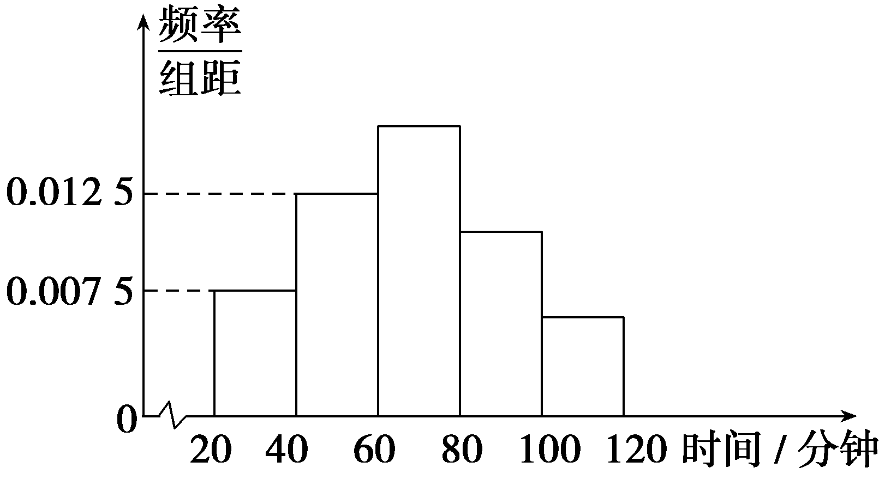
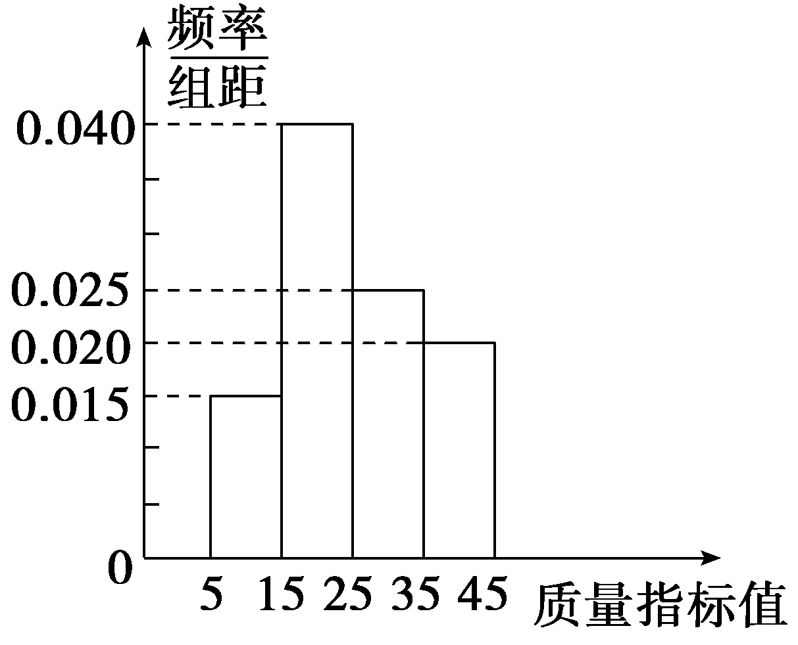
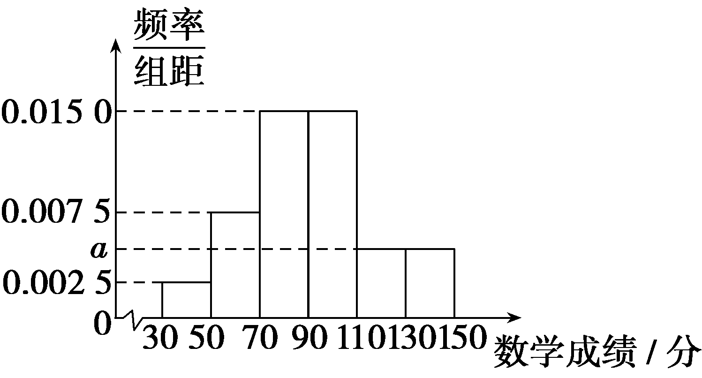
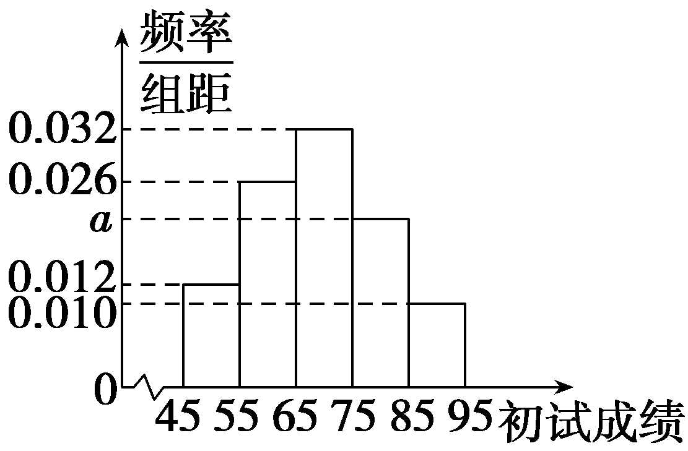

**突破**10　**概率与统计的综合问题**

题型一　频率分布直方图与分布列的综合问题

(2025·山东青岛模拟)为促进全民阅读，建设书香校园，某校在寒假面向全体学生发出“读书好、读好书、好读书”的号召，并开展阅读活动.开学后，学校统计了高一年级共1 000名学生的假期日均阅读时间(单位：分钟)，得到了如下所示的频率分布直方图，若前两个小矩形的高度分别为0.007 5，0.012 5，后三个小矩形的高度比为3∶2∶1.

(1)根据频率分布直方图，估计高一年级1 000名学生假期日均阅读时间的平均值(同一组中的数据用该组区间的中点值为代表)；

(2)开学后，学校从高一日均阅读时间不低于60分钟的学生中，按照分层抽样的方式，抽取6名学生作为代表分两周进行国旗下演讲，假设第一周演讲的3名学生日均阅读时间处于[80，100)的人数记为*X*，求随机变量*X*的分布列与数学期望.

解：(1)设后三个小矩形的高度分别为3*a*，2*a*，*a*，

由题知：(3*a*＋2*a*＋*a*＋0.0125＋0.0075)×20＝1，解得*a*＝0.005，所以各组频率分别为0.15，0.25，0.3，0.2，0.1.

日均阅读时间的平均数为30×0.15＋50×0.25＋70×0.3＋90×0.2＋110×0.1＝67(分钟).

(2)由题意，在[60，80)，[80，100)，[100，120]三组分别抽取3，2，1人，

*X*的可能取值为0，1，2，

则*<text style="italic">P*</text>(*<text style="italic">X*</text>＝0)＝ $\frac{C_{4}^{3}C_{2}^{0}}{C_{6}^{3}}$ ＝ $\frac{1}{5}$ ，*<text style="italic">P*</text>(*<text style="italic">X*</text>＝1)＝ $\frac{C_{4}^{2}C_{2}^{1}}{C_{6}^{3}}$ ＝ $\frac{3}{5}$ ，

*P*(*X*＝2)＝ $\frac{C_{4}^{1}C_{2}^{2}}{C_{6}^{3}}$ ＝ $\frac{1}{5}$ .

所以*X*的分布列为：

<table><tr><td>
<em>X</em>
</td><td>
0
</td><td>
1
</td><td>
2
</td></tr><tr><td>
<em>P</em>
</td><td>
 $\frac{1}{5}$ 
</td><td>
 $\frac{3}{5}$ 
</td><td>
 $\frac{1}{5}$ 
</td></tr></table>

*E*(*X*)＝0× $\frac{1}{5}$ ＋1× $\frac{3}{5}$ ＋2× $\frac{1}{5}$ ＝1.

统计图表与概率综合问题的求解策略

1.正确识读统计图表，从图表中提取有效信息及样本数据.

2.根据统计原理即用样本数字特征估计总体的思想，结合样本中各统计量之间的关系构造数学模型(函数模型、不等式模型、二项分布模型、超几何分布模型或正态分布模型等).

3.正确进行运算，求出样本数据中能够说明问题的特征值，从而用此数据估计总体或作出科学的决策与判断.

对点练1.(2025·广东潮州模拟)从某企业的某种产品中随机抽取100件，测量这些产品的一项质量指标值，由测量结果制成如图所示的频率分布直方图.

(1)求这100件产品质量指标值的样本平均数 $\overline{x}$ (同一组数据用该组区间的中点值作代表)；

(2)已知某用户从该企业购买了3件该产品，用*X*表示这3件产品中质量指标值位于[35，45]内的产品件数，用频率估计概率，求*X*的分布列.

解：(1)由已知得， $\overline{x}$ ＝10×0.015×10＋20×0.040×10＋30×0.025×10＋40×0.020×10＝25.

(2)因为购买一件产品，其质量指标值位于[35，45]内的概率为0.2，所以*X*～*B*(3，0.2)，

因为*X*的所有可能取值为0，1，2，3，

所以<em>P</em>(<em>X</em>＝0)＝(1－0.2)3＝0.512，

*P* $\left(X=1\right)$ ＝ $C_{3}^{1}$ ×0.2× $\left(1－0.2\right)^{2}$ ＝0.384，

<em>P</em> $\left(X=2\right)$ ＝ $C_{3}^{2}$ ×0.22× $\left(1－0.2\right)$ ＝0.096，

<em>P</em>(<em>X</em>＝3)＝0.23＝0.008.

所以*X*的分布列为

<table><tr><td>
<em>X</em>
</td><td>
0
</td><td>
1
</td><td>
2
</td><td>
3
</td></tr><tr><td>
<em>P</em>
</td><td>
0.512
</td><td>
0.384
</td><td>
0.096
</td><td>
0.008
</td></tr></table>

题型二　回归模型与分布列的综合问题

(2025·江苏南京六校联考)某制药公司研发一种新药，需要研究某种药物成分的含量&lt;te&lt;te&lt;te&lt;te&lt;text st&lt;text style="<em>i</em>talic"&gt;y&lt;/text&gt;le="<em>i</em>talic"&gt;x&lt;/text&gt;t st&lt;text style="<em>i</em>talic"&gt;y&lt;/text&gt;le="<em>i</em>talic"&gt;x&lt;/text&gt;t style="italic"&gt;x&lt;/text&gt;t st&lt;text st<em>y</em>le="&lt;text style="<em>i</em>talic,subscript"&gt;i&lt;/text&gt;talic"&gt;y&lt;/text&gt;le="<em>i</em>talic"&gt;x&lt;/text&gt;t st&lt;text style="<em>i</em>talic"&gt;y&lt;/text&gt;le="italic"&gt;x&lt;/text&gt;(单位：mg)与药效指标值y(单位：m)之间的关系，该公司研发部门进行了20次试验，统计得到一组数据 $\left(x_{i}，y_{i}\right)$ (&lt;te&lt;te&lt;te&lt;te&lt;text st&lt;text style="<em>i</em>talic"&gt;y&lt;/text&gt;le="<em>i</em>talic"&gt;x&lt;/text&gt;t st&lt;text style="<em>i</em>talic"&gt;y&lt;/text&gt;le="<em>i</em>talic"&gt;x&lt;/text&gt;t style="italic"&gt;x&lt;/text&gt;t st&lt;text st<em>y</em>le="&lt;text style="<em>i</em>talic,subscript"&gt;i&lt;/text&gt;talic"&gt;y&lt;/text&gt;le="<em>i</em>talic"&gt;x&lt;/text&gt;t style="italic"&gt;i&lt;/text&gt;＝1，2，…，20)，其中&lt;text st<em>y</em>le="italic"&gt;x&lt;/text&gt;i，yi分别表示第i次试验中这种药物成分的含量和相应的药效指标值，已知该组数据中y与x之间具有线性相关关系，且 $\overset{20}{\underset{i=1}{\sum }}$ &lt;te&lt;te&lt;te&lt;te&lt;text st&lt;text style="<em>i</em>talic"&gt;y&lt;/text&gt;le="<em>i</em>talic"&gt;x&lt;/text&gt;t st&lt;text style="<em>i</em>talic"&gt;y&lt;/text&gt;le="<em>i</em>talic"&gt;x&lt;/text&gt;t style="italic"&gt;x&lt;/text&gt;t st&lt;text st<em>y</em>le="&lt;text style="<em>i</em>talic,subscript"&gt;i&lt;/text&gt;talic"&gt;y&lt;/text&gt;le="<em>i</em>talic"&gt;x&lt;/text&gt;t st&lt;text style="<em>i</em>talic"&gt;y&lt;/text&gt;le="italic"&gt;x&lt;/text&gt;i＝60， $\overset{20}{\underset{i=1}{\sum }}$ &lt;te&lt;te&lt;te&lt;te&lt;text st&lt;text style="<em>i</em>talic"&gt;y&lt;/text&gt;le="<em>i</em>talic"&gt;x&lt;/text&gt;t st&lt;text style="<em>i</em>talic"&gt;y&lt;/text&gt;le="<em>i</em>talic"&gt;x&lt;/text&gt;t style="italic"&gt;x&lt;/text&gt;t st&lt;text st<em>y</em>le="&lt;text style="<em>i</em>talic,subscript"&gt;i&lt;/text&gt;talic"&gt;y&lt;/text&gt;le="<em>i</em>talic"&gt;x&lt;/text&gt;t style="<em>i</em>talic"&gt;y&lt;/text&gt;i＝1 200， $\overset{20}{\underset{i=1}{\sum }}x_{i}^{2}$ ＝260， $\overset{20}{\underset{i=1}{\sum }}y_{i}^{2}$ ＝81 000， $\overset{20}{\underset{i=1}{\sum }}$ &lt;te&lt;te&lt;te&lt;te&lt;text st&lt;text style="<em>i</em>talic"&gt;y&lt;/text&gt;le="<em>i</em>talic"&gt;x&lt;/text&gt;t st&lt;text style="<em>i</em>talic"&gt;y&lt;/text&gt;le="<em>i</em>talic"&gt;x&lt;/text&gt;t style="italic"&gt;x&lt;/text&gt;t st&lt;text st<em>y</em>le="&lt;text style="<em>i</em>talic,subscript"&gt;i&lt;/text&gt;talic"&gt;y&lt;/text&gt;le="<em>i</em>talic"&gt;x&lt;/text&gt;t st&lt;text style="<em>i</em>talic"&gt;y&lt;/text&gt;le="italic"&gt;x&lt;/text&gt;iyi＝4 400.

(1)求<te<te*x*t style="italic">x</text>t style="italic">y</text>关于x的经验回归方程 $\overset{\wedge }{y}$ ＝ $\overset{\wedge }{b}$ <te*x*t style="italic">x</text>＋ $\overset{\wedge }{a}$ ；

(2)该公司要用*A*与*B*两套设备同时生产该种新药，已知设备*A*的生产效率是设备*B*的2倍，设备*A*生产药品的不合格率为0.009，设备*B*生产药品的不合格率为0.006，且设备*A*与*B*生产的药品是否合格相互独立.

①从该公司生产的新药中随机抽取一件，求所抽药品为不合格品的概率；

②在该新药产品检验中发现有三件不合格品，求其中至少有两件是设备*A*生产的概率.

参考公式： $\overset{\wedge }{b}$ ＝ $\frac{\overset{n}{\underset{i=1}{\sum }}\left(x_{i}－\overline{x}\right)\left(y_{i}－\overline{y}\right)}{\overset{n}{\underset{i=1}{\sum }}\left(x_{i}－\overline{x}\right)^{2}}$ ＝ $\frac{\overset{n}{\underset{i=1}{\sum }}x_{i}y_{i}－n\overline{x} \overline{y}}{\overset{n}{\underset{i=1}{\sum }}x_{i}^{2}－n\overline{x}^{2}}$ ，

$\overset{\wedge }{a}$ ＝ $\overline{y}$ － $\overset{\wedge }{b}\overline{x}$ .

解：(1) $\overline{x}$ ＝ $\frac{1}{20}\overset{20}{\underset{i=1}{\sum }}$ &lt;text st&lt;text style="<em>i</em>talic"&gt;y&lt;/text&gt;le="<em>i</em>talic"&gt;x&lt;/text&gt;i＝ $\frac{1}{20}$ ×60＝3， $\overline{y}$ ＝ $\frac{1}{20}\overset{20}{\underset{i=1}{\sum }}$ &lt;text style="<em>i</em>talic"&gt;y&lt;/text&gt;<em>i</em>＝ $\frac{1}{20}$ ×1 200＝60，

所以 $\overset{\wedge }{b}$ ＝ $\frac{\overset{n}{\underset{i=1}{\sum }}\left(x_{i}－\overline{x}\right)\left(y_{i}－\overline{y}\right)}{\overset{n}{\underset{i=1}{\sum }}\left(x_{i}－\overline{x}\right)^{2}}$ ＝ $\frac{\overset{n}{\underset{i=1}{\sum }}x_{i}y_{i}－n\overline{x} \overline{y}}{\overset{n}{\underset{i=1}{\sum }}x_{i}^{2}－n\overline{x}^{2}}$ ＝ $\frac{4 400－20\times 3\times 60}{260－20\times 3^{2}}$ ＝10，

$\overset{\wedge }{a}$ ＝ $\overline{y}$ － $\overset{\wedge }{b}\overline{x}$ ＝60－10×3＝30，所以<te<te*x*t style="italic">x</text>t style="italic">y</text>关于x的经验回归方程为 $\overset{\wedge }{y}$ ＝10<te*x*t style="italic">x</text>＋30.

(2)设事件*A*表示“随机取一件药品来自设备*A*生产”，事件*B*表示“随机取一件药品来自设备*B*生产”，事件*C*表示“所抽药品为不合格品”，

①因为设备*A*的生产效率是设备*B*的2倍，

所以*<text style="italic">P*</text>(*A*)＝ $\frac{2}{3}$ ，*<text style="italic">P*</text>(*B*)＝ $\frac{1}{3}$ ，

*P*(*C*｜*A*)＝0.009，*P*(*C*｜*B*)＝0.006，

所以*<text style="italic"><text style="italic"><text style="italic"><text style="italic">P*</text></text></text></text>(*<text style="italic"><text style="italic">C*</text></text>)＝P(*<text style="italic">A*</text>)·P(C｜A)＋P(*<text style="italic">B*</text>)·P(C｜B)＝ $\frac{2}{3}$ ×0.009＋ $\frac{1}{3}$ ×0.006＝0.008.

②*P*(*A*｜*C*)＝ $\frac{P(A)P(C｜A)}{P(C)}$ ＝ $\frac{\frac{2}{3}\times 0.009}{0.008}$ ＝ $\frac{3}{4}$ ，

所以三件不合格品中至少有两件是设备*A*生产的概率为*P*＝ $C_{3}^{2}\left(\frac{3}{4}\right)^{2}$ · $\frac{1}{4}$ ＋ $C_{3}^{3}\left(\frac{3}{4}\right)^{3}$ ＝ $\frac{27}{32}$ .

回归分析与概率综合问题的解题思路

1.此类问题的特点为同一生活实践情境下设计两类问题，即(1)求经验回归方程(预测)；(2)求某随机变量的概率(范围)、均值、方差等.

2.充分利用题目中提供的成对样本数据(散点图)做出判断，确定是线性问题还是非线性问题.求解时要充分利用已知数据，合理利用变形公式，以达到快速准确运算的目的.

3.明确所求问题所属事件的类型，准确构建概率模型.

对点练2.为了丰富农村儿童的课余文化生活，某基金会在农村儿童聚居地区捐建“悦读小屋”.自2019年以来，某村一直在组织开展“悦读小屋读书活动”.下表是对2019年以来近5年该村少年儿童的年借阅量的数据统计：

<table><tr><td>
年份
</td><td>
2019
</td><td>
2020
</td><td>
2021
</td><td>
2022
</td><td>
2023
</td></tr><tr><td>
年份代码<em>x</em>
</td><td>
1
</td><td>
2
</td><td>
3
</td><td>
4
</td><td>
5
</td></tr><tr><td>
年借阅量<em>y</em>(册)
</td><td>
<em>y</em>1
</td><td>
<em>y</em>2
</td><td>
36
</td><td>
92
</td><td>
142
</td></tr></table>

(参考数据： $\overset{5}{\underset{i=1}{\sum }}$ &lt;text style="<em>i</em>talic"&gt;y&lt;/text&gt;i＝290)

(1)在所统计的5个年借阅量中任选2个，记其中低于平均值的个数为*X*，求*X*的分布列和数学期望*E*(*X*)；

(&lt;te<em>x</em>t st<em>y</em>le="superscript"&gt;2&lt;/text&gt;)通过分析散点图的特征后，计划分别用① $\overset{\wedge }{y}$ ＝35&lt;te&lt;te<em>x</em>t st<em>y</em>le="italic"&gt;x&lt;/text&gt;t style="italic"&gt;x&lt;/text&gt;－47和② $\overset{\wedge }{y}$ ＝5&lt;te&lt;te<em>x</em>t st<em>y</em>le="italic"&gt;x&lt;/text&gt;t style="italic"&gt;x&lt;/text&gt;2＋<em>m</em>两种模型作为年借阅量y关于年份代码x的回归分析模型，请根据统计表的数据，求出模型②的经验回归方程，并用残差平方和比较哪个模型拟合效果更好.

解：(1)由题知，5年的借阅量的平均数为 $\frac{290}{5}$ ＝58，

又<em>y</em>1＋<em>y</em>2＝290－36－92－142＝20，

则<em>y</em>1＜58，<em>y</em>2＜58，

所以低于平均值的有3个，

所以*X*服从超几何分布，

*P*(*X*＝*<text style="italic">k*</text>)＝ $\frac{C_{3}^{k}C_{2}^{2－k}}{C_{5}^{2}}$ (*<text style="italic">k*</text>＝0，1，2)，

所以*<text style="italic"><text style="italic">P*</text></text>(*<text style="italic"><text style="italic">X*</text></text>＝0)＝ $\frac{C_{3}^{0}C_{2}^{2}}{C_{5}^{2}}$ ＝ $\frac{1}{10}$ ，*<text style="italic"><text style="italic">P*</text></text>(*<text style="italic"><text style="italic">X*</text></text>＝1)＝ $\frac{C_{3}^{1}C_{2}^{1}}{C_{5}^{2}}$ ＝ $\frac{6}{10}$ ＝ $\frac{3}{5}$ ，*<text style="italic"><text style="italic">P*</text></text>(*<text style="italic"><text style="italic">X*</text></text>＝2)＝ $\frac{C_{3}^{2}C_{2}^{0}}{C_{5}^{2}}$ ＝ $\frac{3}{10}$ .

所以*X*的分布列为

<table><tr><td>
<em>X</em>
</td><td>
0
</td><td>
1
</td><td>
2
</td></tr><tr><td>
<em>P</em>
</td><td>
 $\frac{1}{10}$ 
</td><td>
 $\frac{3}{5}$ 
</td><td>
 $\frac{3}{10}$ 
</td></tr></table>

所以*E*(*X*)＝0× $\frac{1}{10}$ ＋1× $\frac{3}{5}$ ＋2× $\frac{3}{10}$ ＝ $\frac{6}{5}$ .

(2)因为 $\frac{1^{2}＋2^{2}＋3^{2}＋4^{2}＋5^{2}}{5}$ ＝11， $\frac{\overset{5}{\underset{i=1}{\sum }}y_{i}}{5}$ ＝ $\frac{290}{5}$ ＝58，

所以58＝5×11＋*m*，即*m*＝3.

所以模型②的经验回归方程为 $\overset{\wedge }{y}$ ＝5<em>x</em>2＋3，

根据模型①的经验回归方程可得

$\overset{\wedge }{y}_{1}$ ＝－12， $\overset{\wedge }{y}_{2}$ ＝23， $\overset{\wedge }{y}_{3}$ ＝58， $\overset{\wedge }{y}_{4}$ ＝93， $\overset{\wedge }{y}_{5}$ ＝128，

根据模型②的经验回归方程可得

$\overset{\wedge }{y}_{1}$ ＝8， $\overset{\wedge }{y}_{2}$ ＝23， $\overset{\wedge }{y}_{3}$ ＝48， $\overset{\wedge }{y}_{4}$ ＝83， $\overset{\wedge }{y}_{5}$ ＝128，

因为[(<em>y</em>1＋12)2＋(<em>y</em>2－23)2＋(36－58)2＋(92－93)2＋(142－128)2]－[(<em>y</em>1－8)2＋(<em>y</em>2－23)2＋(36－48)2＋(92－83)2＋(142－128)2]＝(<em>y</em>1＋12)2－(<em>y</em>1－8)2＋222－122＋12－92＝40<em>y</em>1＋340，且<em>y</em>1≥0，

所以模型①的残差平方和大于模型②的残差平方和，所以模型②的拟合效果更好.

题型三　独立性检验与分布列的综合问题

(2025·湖北七市州调研)某高中学校为了解学生参加体育锻炼的情况，统计了全校所有学生在一年内每周参加体育锻炼的次数，现随机抽取了60名同学在某一周参加体育锻炼的数据，结果如下表：

<table><tr><td>
一周参加体育

锻炼次数
</td><td>
0
</td><td>
1
</td><td>
2
</td><td>
3
</td><td>
4
</td><td>
5
</td><td>
6
</td><td>
7
</td><td>
合计
</td></tr><tr><td>
男生人数
</td><td>
1
</td><td>
2
</td><td>
4
</td><td>
5
</td><td>
6
</td><td>
5
</td><td>
4
</td><td>
3
</td><td>
30
</td></tr><tr><td>
女生人数
</td><td>
4
</td><td>
5
</td><td>
5
</td><td>
6
</td><td>
4
</td><td>
3
</td><td>
2
</td><td>
1
</td><td>
30
</td></tr><tr><td>
合计
</td><td>
5
</td><td>
7
</td><td>
9
</td><td>
11
</td><td>
10
</td><td>
8
</td><td>
6
</td><td>
4
</td><td>
60
</td></tr></table>

(1)若将一周参加体育锻炼次数为3次及3次以上的，称为“经常锻炼”，其余的称为“不经常锻炼”.请完成以下2×2列联表，并依据小概率值*α*＝0.1的独立性检验，能否认为性别因素与学生体育锻炼的经常性有关系；

<table><tr><td rowspan="2">
性别
</td><td colspan="2">
锻炼
</td><td rowspan="2">
合计
</td></tr><tr><td>
不经常
</td><td>
经常
</td></tr><tr><td>
男生
</td><td></td><td></td><td></td></tr><tr><td>
女生
</td><td></td><td></td><td></td></tr><tr><td>
合计
</td><td></td><td></td><td></td></tr></table>

(2)若将一周参加体育锻炼次数为0次的称为“极度缺乏锻炼”，“极度缺乏锻炼”会导致肥胖等诸多健康问题.以样本频率估计概率，在全校抽取20名同学，其中“极度缺乏锻炼”的人数为*X*，求*E* $\left(X\right)$ 和*D* $\left(X\right)$ ；

(3)若将一周参加体育锻炼6次或7次的同学称为“运动爱好者”，为进一步了解他们的生活习惯，在样本的10名“运动爱好者”中，随机抽取3人进行访谈，设抽取的3人中男生人数为*Y*，求*Y*的分布列和数学期望.

附：&lt;text style="it&lt;text style="itali<em>c</em>"&gt;a&lt;/text&gt;lic"&gt;χ&lt;/text&gt;2＝ $\frac{n(ad－bc)^{2}}{\left(a＋b\right)\left(c＋d\right)\left(a＋c\right)\left(b＋d\right)}$ ，&lt;text style="it&lt;text style="itali<em>c</em>"&gt;a&lt;/text&gt;lic"&gt;n&lt;/text&gt;＝a＋<em>b</em>＋c＋<em>d</em>

<table><tr><td>
<em>α</em>
</td><td>
0.1
</td><td>
0.05
</td><td>
0.01
</td></tr><tr><td>
<em>xα</em>
</td><td>
2.706
</td><td>
3.841
</td><td>
6.635
</td></tr></table>

解：(1)根据统计表格数据可得列联表如下：

<table><tr><td rowspan="2">
性别
</td><td colspan="2">
锻炼
</td><td rowspan="2">
合计
</td></tr><tr><td>
不经常
</td><td>
经常
</td></tr><tr><td>
男生
</td><td>
7
</td><td>
23
</td><td>
30
</td></tr><tr><td>
女生
</td><td>
14
</td><td>
16
</td><td>
30
</td></tr><tr><td>
合计
</td><td>
21
</td><td>
39
</td><td>
60
</td></tr></table>

零假设为<em>H</em>0：性别与锻炼情况独立，即性别因素与学生体育锻炼的经常性无关，

根据列联表的数据计算可得

&lt;te<em>x</em>t style="italic"&gt;χ&lt;/text&gt;2＝ $\frac{60(7\times 16－23\times 14)^{2}}{21\times 39\times 30\times 30}$ ＝ $\frac{60\times (7\times 30)^{2}}{21\times 39\times 30\times 30}$ ＝ $\frac{140}{39}$ ≈3.590＞&lt;te<em>x</em>t style="superscript"&gt;2&lt;/text&gt;.706＝x0.1.

根据小概率值<em>α</em>＝0.1的独立性检验，推断<em>H</em>0不成立，即性别因素与学生体育锻炼的经常性有关系，此推断犯错误的概率不超过0.1.

(2)因学校总学生数远大于所抽取的学生数，故*X*近似服从二项分布，

易知随机抽取一人为“极度缺乏锻炼”者的概率*P*＝ $\frac{5}{60}$ ＝ $\frac{1}{12}$ .

即可得*X*～*B* $\left(20，\frac{1}{12}\right)$ ，故*E* $\left(X\right)$ ＝20× $\frac{1}{12}$ ＝ $\frac{5}{3}$ ，

*D* $\left(X\right)$ ＝20× $\frac{1}{12}$ × $\frac{11}{12}$ ＝ $\frac{55}{36}$ .

(3)易知10名“运动爱好者”有7名男生，3名女生，

所以*Y*的所有可能取值为0，1，2，3；且*Y*服从超几何分布，

*<text style="italic"><text style="italic"><text style="italic">P*</text></text></text> $\left(Y=0\right)$ ＝ $\frac{C_{7}^{0}C_{3}^{3}}{C_{10}^{3}}$ ＝ $\frac{1}{120}$ ，*<text style="italic"><text style="italic"><text style="italic">P*</text></text></text> $\left(Y=1\right)$ ＝ $\frac{C_{7}^{1}C_{3}^{2}}{C_{10}^{3}}$ ＝ $\frac{21}{120}$ ＝ $\frac{7}{40}$ ，*<text style="italic"><text style="italic"><text style="italic">P*</text></text></text> $\left(Y=2\right)$ ＝ $\frac{C_{7}^{2}C_{3}^{1}}{C_{10}^{3}}$ ＝ $\frac{21\times 3}{120}$ ＝ $\frac{21}{40}$ ，*<text style="italic"><text style="italic"><text style="italic">P*</text></text></text> $\left(Y=3\right)$ ＝ $\frac{C_{7}^{3}C_{3}^{0}}{C_{10}^{3}}$ ＝ $\frac{35}{120}$ ＝ $\frac{7}{24}$ .

故所求分布列为：

<table><tr><td>
<em>Y</em>
</td><td>
0
</td><td>
1
</td><td>
2
</td><td>
3
</td></tr><tr><td>
<em>P</em>
</td><td>
 $\frac{1}{120}$ 
</td><td>
 $\frac{7}{40}$ 
</td><td>
 $\frac{21}{40}$ 
</td><td>
 $\frac{7}{24}$ 
</td></tr></table>

所以*E* $\left(Y\right)$ ＝0× $\frac{1}{120}$ ＋1× $\frac{7}{40}$ ＋2× $\frac{21}{40}$ ＋3× $\frac{7}{24}$ ＝2.1.

独立性检验与概率综合问题的解题思路

本类题目以生活题材为背景，涉及独立性检验与概率问题的综合，解决该类问题首先收集数据列出2×2列联表，并按照公式求得<em>χ</em>2的值后进行比较，其次按照随机变量满足的概率模型求解.

对点练3.(2025·江苏徐州适应性测试)某中学对该校学生的学习兴趣和预习情况进行长期调查，学习兴趣分为兴趣高和兴趣一般两类，预习分为主动预习和不太主动预习两类，设事件*A*：学习兴趣高，事件*<text style="italic"><text style="italic">B*</text></text>：主动预习.据统计显示，*<text style="italic"><text style="italic">P*</text></text>( $\overline{A}$ ｜ $\overline{B}$ )＝ $\frac{3}{4}$ ，*<text style="italic"><text style="italic">P*</text></text>( $\overline{A}$ ｜*<text style="italic"><text style="italic">B*</text></text>)＝ $\frac{1}{4}$ ，*<text style="italic"><text style="italic">P*</text></text>(*<text style="italic"><text style="italic">B*</text></text>)＝ $\frac{4}{5}$ .

(1)计算*P*(*A*)和*P*(*A*｜*B*)的值，并判断*A*与*B*是否为独立事件；

(2)为验证学习兴趣与主动预习是否有关，该校用分层抽样的方法抽取了一个容量为<em>m</em>(<em>m</em>∈<strong>N\*</strong>)的样本，利用独立性检验，计算得<em>χ</em>2＝1.350.为提高检验结论的可靠性，现将样本容量调整为原来的<em>t</em>(<em>t</em>∈<strong>N</strong><em>\*</em>)倍，使得学习兴趣与主动预习犯错误的概率不超过0.005，试确定<em>t</em>的最小值.

附：&lt;text style="it&lt;text style="itali<em>c</em>"&gt;a&lt;/text&gt;lic"&gt;χ&lt;/text&gt;2＝ $\frac{n(ad－bc)^{2}}{\left(a＋b\right)\left(c＋d\right)\left(a＋c\right)\left(b＋d\right)}$ ，其中&lt;text style="it&lt;text style="itali<em>c</em>"&gt;a&lt;/text&gt;lic"&gt;n&lt;/text&gt;＝a＋<em>b</em>＋c＋<em>d</em>.

<table><tr><td>
<em>α</em>
</td><td>
0.1
</td><td>
0.05
</td><td>
0.01
</td><td>
0.005
</td><td>
0.001
</td></tr><tr><td>
<em>xα</em>
</td><td>
2.706
</td><td>
3.841
</td><td>
6.635
</td><td>
7.879
</td><td>
10.828
</td></tr></table>

解：(1)由已知*<text style="italic">P*</text>(*A*｜*<text style="italic">B*</text>)＝1－P( $\overline{A}$ ｜*<text style="italic">B*</text>)＝1－ $\frac{1}{4}$ ＝ $\frac{3}{4}$ ，

*<text style="italic">P*</text>(*A*｜ $\overline{B}$ )＝1－*<text style="italic">P*</text>( $\overline{A}$ ｜ $\overline{B}$ )＝1－ $\frac{3}{4}$ ＝ $\frac{1}{4}$ ，

又因为*<text style="italic"><text style="italic">P*</text></text>(*<text style="italic">B*</text>)＝ $\frac{4}{5}$ ，所以*<text style="italic"><text style="italic">P*</text></text>( $\overline{B}$ )＝1－*<text style="italic"><text style="italic">P*</text></text>(*<text style="italic">B*</text>)＝1－ $\frac{4}{5}$ ＝ $\frac{1}{5}$ ，

所以*<text style="italic"><text style="italic"><text style="italic"><text style="italic">P*</text></text></text></text>(*<text style="italic"><text style="italic">A*</text></text>)＝P(*<text style="italic">B*</text>)·P(A｜B)＋P( $\overline{B}$ )·*<text style="italic"><text style="italic"><text style="italic"><text style="italic">P*</text></text></text></text>(*<text style="italic"><text style="italic">A*</text></text>｜ $\overline{B}$ )＝ $\frac{4}{5}$ × $\frac{3}{4}$ ＋ $\frac{1}{5}$ × $\frac{1}{4}$ ＝ $\frac{13}{20}$ ，

又*<text style="italic"><text style="italic">P*</text></text>(*<text style="italic">A<text style="italic">B*</text></text>)＝P(A｜B)·P(B)＝ $\frac{3}{4}$ × $\frac{4}{5}$ ＝ $\frac{3}{5}$ ，

所以*P*(*AB*)≠*P*(*A*)*P*(*B*)，所以*A*与*B*不为独立事件.

(2)假设原列联表为

<table><tr><td></td><td>
兴趣高
</td><td>
兴趣不高
</td><td>
总计
</td></tr><tr><td>
主动预习
</td><td>
<em>a</em>
</td><td>
<em>b</em>
</td><td>
<em>a</em>＋<em>b</em>
</td></tr><tr><td>
不太主动预习
</td><td>
<em>c</em>
</td><td>
<em>d</em>
</td><td>
<em>c</em>＋<em>d</em>
</td></tr><tr><td>
总计
</td><td>
<em>a</em>＋<em>c</em>
</td><td>
<em>b</em>＋<em>d</em>
</td><td>
<em>a</em>＋<em>b</em>＋<em>c</em>＋<em>d</em>
</td></tr></table>

根据原数据有 $\frac{(a＋b＋c＋d)(ad－bc)^{2}}{(a＋b)(c＋d)(a＋c)(b＋d)}$ ＝1.35.

若将样本容量调整为原来的<em>t</em>(<em>t</em>∈<strong>N</strong><em>\*</em>)倍，

则新的列联表为

<table><tr><td></td><td>
兴趣高
</td><td>
兴趣不高
</td><td>
总计
</td></tr><tr><td>
主动预习
</td><td>
<em>ta</em>
</td><td>
<em>tb</em>
</td><td>
<em>t</em>(<em>a</em>＋<em>b</em>)
</td></tr><tr><td>
不太主动预习
</td><td>
<em>tc</em>
</td><td>
<em>td</em>
</td><td>
<em>t</em>(<em>c</em>＋<em>d</em>)
</td></tr><tr><td>
总计
</td><td>
<em>t</em>(<em>a</em>＋<em>c</em>)
</td><td>
<em>t</em>(<em>b</em>＋<em>d</em>)
</td><td>
<em>t</em>(<em>a</em>＋<em>b</em>＋<em>c</em>＋<em>d</em>)
</td></tr></table>

则&lt;&lt;<em>t</em>ext style="italic"&gt;t&lt;/text&gt;ext style="italic"&gt;χ&lt;/text&gt;2＝ $\frac{t(a＋b＋c＋d)(t^{2}ad－t^{2}bc)^{2}}{t(a＋b)\cdot t(c＋d)\cdot t(a＋c)\cdot t(b＋d)}$ ＝ $\frac{t(a＋b＋c＋d)(ad－bc)^{2}}{(a＋b)(c＋d)(a＋c)(b＋d)}$ ＝1.35&lt;<em>t</em>ext style="italic"&gt;t&lt;/text&gt;≥7.879，解得t≥5.84，

又<em>t</em>∈<strong>N</strong><em>\*</em>，所以<em>t</em>的最小值为6.

**课时测评**89　**概率与统计的综合问题** $\frac{对应学生}{用书P487}$

(时间：60分钟　满分：64分)

(本栏目内容，在学生用书中以独立形式分册装订！)

1.(15分)(2025·安徽黄山模拟)某校高三年级1 000名学生的高考适应性演练数学成绩频率分布直方图如图所示，其中成绩分组区间是 $\left[30，50\right)$ ， $\left[50，70\right)$ ， $\left[70，90\right)$ ， $\left[90，110\right)$ ， $\left[110，130\right)$ ， $\left[130，150\right]$ .

(1)求图中*a*的值，并根据频率分布直方图，估计这1 000名学生的这次考试数学成绩的第85百分位数；(5分)

(2)从这次数学成绩位于 $\left[50，70\right)$ ， $\left[70，90\right)$ 的学生中采用比例分配的分层随机抽样的方法抽取9人，再从这9人中随机抽取3人，该3人中成绩在区间 $\left[70，90\right)$ 的人数记为*<text style="italic">X*</text>，求X的分布列及数学期望.(10分)

解：(1)由频率分布直方图可得(0.002 5＋0.007 5＋0.015×2＋2*a*)×20＝1，解得*a*＝0.005.

前四个矩形的面积之和为(0.002 5＋0.007 5＋2×0.015)×20＝0.8，

前五个矩形的面积之和为0.8＋0.005×20＝0.9，

设这1 000名学生的这次考试数学成绩的第85百分位数为*m*，

则0.8＋ $\left(m－110\right)$ ×0.005＝0.85，解得*m*＝120，

因此，这1 000名学生的这次考试数学成绩的第85百分位数为120.

(2)数学成绩位于 $\left[50，70\right)$ ， $\left[70，90\right)$ 的学生人数之比为0.007 5∶0.015＝1∶2，

所以，所抽取的9人中，数学成绩位于 $\left[50，70\right)$ 的学生人数为9× $\frac{1}{3}$ ＝3，

数学成绩位于 $\left[70，90\right)$ 的学生人数为9× $\frac{2}{3}$ ＝6，

由题意可知，随机变量*X*的可能取值为0，1，2，3，

则*<text style="italic">P*</text> $\left(X=0\right)$ ＝ $\frac{C_{3}^{3}}{C_{9}^{3}}$ ＝ $\frac{1}{84}$ ，*<text style="italic">P*</text> $\left(X=1\right)$ ＝ $\frac{C_{3}^{2}C_{6}^{1}}{C_{9}^{3}}$ ＝ $\frac{3}{14}$ ，

*<text style="italic">P*</text> $\left(X=2\right)$ ＝ $\frac{C_{3}^{1}C_{6}^{2}}{C_{9}^{3}}$ ＝ $\frac{15}{28}$ ，*<text style="italic">P*</text> $\left(X=3\right)$ ＝ $\frac{C_{6}^{3}}{C_{9}^{3}}$ ＝ $\frac{5}{21}$ .

所以随机变量*X*的分布列为：

<table><tr><td>
<em>X</em>
</td><td>
0
</td><td>
1
</td><td>
2
</td><td>
3
</td></tr><tr><td>
<em>P</em>
</td><td>
 $\frac{1}{84}$ 
</td><td>
 $\frac{3}{14}$ 
</td><td>
 $\frac{15}{28}$ 
</td><td>
 $\frac{5}{21}$ 
</td></tr></table>

所以*E* $\left(X\right)$ ＝0× $\frac{1}{84}$ ＋1× $\frac{3}{14}$ ＋2× $\frac{15}{28}$ ＋3× $\frac{5}{21}$ ＝2.

2.(15分)(2025·湖南长沙调研)随着生活水平的提高，人们对水果的需求量越来越大，为了满足消费者的需求，精品水果店也在大街小巷遍地开花.4月份的“湖南沃柑”因果肉滑嫩，皮薄汁多，口感甜软，低酸爽口深受市民的喜爱.某水果店对某品种的“湖南沃柑”进行试销，得到一组销售数据，如下表所示：

<table><tr><td>
试销单价<em>x</em>(元)
</td><td>
3
</td><td>
4
</td><td>
5
</td><td>
6
</td><td>
7
</td></tr><tr><td>
产品销量<em>y</em>(件)
</td><td>
20
</td><td>
16
</td><td>
15
</td><td>
12
</td><td>
6
</td></tr></table>

(1)经计算相关系数*r*≈－0.97，变量*x*，*y*线性相关程度很高，求*y*关于*x*的经验回归方程；(6分)

(2)用(1)中所求的经验回归方程来拟合这组成对数据，当样本数据的残差的绝对值大于1.2时，称该对数据为一个“次数据”，现从这5个成对数据中任取3个做残差分析，求取到的数据中“次数据”个数*X*的分布列和数学期望.(9分)

参考公式：线性回归方程中 $\overset{\wedge }{b}$ ， $\overset{\wedge }{a}$ 的最小二乘估计分别为 $\overset{\wedge }{b}$ ＝ $\frac{\overset{n}{\underset{i=1}{\sum }}(x_{i}－\overline{x})(y_{i}－\overline{y})}{\overset{n}{\underset{i=1}{\sum }}(x_{i}－\overline{x})^{2}}$ ， $\overset{\wedge }{a}$ ＝ $\overline{y}$ － $\overset{\wedge }{b}\overline{x}$ .

解：(1)由已知，得 $\overline{x}$ ＝ $\frac{3+4+5+6+7}{5}$ ＝5， $\overline{y}$ ＝ $\frac{20+16+15+12+6}{5}$ ＝13.8，

$\overset{5}{\underset{i=1}{\sum }}$ &lt;text st&lt;text style="<em>i</em>talic"&gt;y&lt;/text&gt;le="<em>i</em>talic"&gt;x&lt;/text&gt;iyi＝313， $\overset{5}{\underset{i=1}{\sum }}x_{i}^{2}$ ＝135，

则 $\overset{\wedge }{b}$ ＝ $\frac{\overset{5}{\underset{i=1}{\sum }}(x_{i}－\overline{x})(y_{i}－\overline{y})}{\overset{5}{\underset{i=1}{\sum }}(x_{i}－\overline{x})^{2}}$ ＝ $\frac{\overset{5}{\underset{i=1}{\sum }}x_{i}y_{i}－5\overline{x} \overline{y}}{\overset{5}{\underset{i=1}{\sum }}x_{i}^{2}－5\overline{x}^{2}}$

＝ $\frac{313－5\times 5\times 13.8}{135－5\times 5^{2}}$ ＝－ $\frac{32}{10}$ ＝－3.2，

所以 $\overset{\wedge }{a}$ ＝ $\overline{y}$ － $\overset{\wedge }{b}\overline{x}$ ＝13.8－(－3.2)×5＝29.8，

所以 $\overset{\wedge }{y}$ ＝－3.2*x*＋29.8.

(2)当<te*x*t style="italic">x</text>＝3时， $\overset{\wedge }{y}$ ＝20.2；当<te*x*t style="italic">x</text>＝4时， $\overset{\wedge }{y}$ ＝17；

当<te*x*t style="italic">x</text>＝5时， $\overset{\wedge }{y}$ ＝13.8；当<te*x*t style="italic">x</text>＝6时， $\overset{\wedge }{y}$ ＝10.6；

当*x*＝7时， $\overset{\wedge }{y}$ ＝7.4.

因此该样本的残差绝对值依次为0.2，1，1.2，1.4，1.4，

所以“次数据”有2个.

“次数据”个数*X*可能取值为0，1，2.

*<text style="italic">P*</text>(*<text style="italic">X*</text>＝0)＝ $\frac{C_{3}^{3}}{C_{5}^{3}}$ ＝ $\frac{1}{10}$ ，*<text style="italic">P*</text>(*<text style="italic">X*</text>＝1)＝ $\frac{C_{3}^{2}C_{2}^{1}}{C_{5}^{3}}$ ＝ $\frac{3}{5}$ ，

*P*(*X*＝2)＝ $\frac{C_{3}^{1}C_{2}^{2}}{C_{5}^{3}}$ ＝ $\frac{3}{10}$ .

所以*X*的分布列为：

<table><tr><td>
<em>X</em>
</td><td>
0
</td><td>
1
</td><td>
2
</td></tr><tr><td>
<em>P</em>
</td><td>
 $\frac{1}{10}$ 
</td><td>
 $\frac{3}{5}$ 
</td><td>
 $\frac{3}{10}$ 
</td></tr></table>

所以*E*(*X*)＝0× $\frac{1}{10}$ ＋1× $\frac{3}{5}$ ＋2× $\frac{3}{10}$ ＝ $\frac{6}{5}$ .

3.(17分)(2025·湖南“一起考”大联考)某市教育局为了调查学生热爱数学是否与学生的年级有关，从全市随机抽取了50位高二学生和*m*(*m*＞50)位高三学生进行调查，每位学生对“是否热爱数学”提出“热爱”或“不热爱”的观点，得到如下数据：

<table><tr><td>
　　年级

观点　　
</td><td>
高二
</td><td>
高三
</td></tr><tr><td>
热爱
</td><td>
30
</td><td>
20
</td></tr><tr><td>
不热爱
</td><td>
20
</td><td></td></tr></table>

(1)以该50名高二学生热爱数学的频率作为全市高二学生热爱数学的概率，从全市的高二学生中随机抽取3名学生，记*X*为这3名学生中热爱数学的学生人数，求*X*的分布列和期望；(7分)

(2)若根据小概率值*α*＝0.01的独立性检验，认为热爱数学与学生的年级有关，求实数*m*的最小值.(10分)

附：<em>χ</em>2＝ $\frac{n(ad－bc)^{2}}{\left(a＋b\right)\left(c＋d\right)\left(a＋c\right)\left(b＋d\right)}$ .

<table><tr><td>
<em>α</em>
</td><td>
0.050
</td><td>
0.010
</td><td>
0.001
</td></tr><tr><td>
<em>xα</em>
</td><td>
3.841
</td><td>
6.635
</td><td>
10.828
</td></tr></table>

解：(1)由题意可知，高二学生热爱数学的概率为*P*＝ $\frac{30}{50}$ ＝ $\frac{3}{5}$ ，热爱数学的学生人数*X*～*B* $\left(3，\frac{3}{5}\right)$ ，

则*<text style="italic"><text style="italic"><text style="italic">P*</text></text></text> $\left(X=0\right)$ ＝ $\left(\frac{2}{5}\right)^{3}$ ＝ $\frac{8}{125}$ ，*<text style="italic"><text style="italic"><text style="italic">P*</text></text></text> $\left(X=1\right)$ ＝ $C_{3}^{1}\left(\frac{3}{5}\right)^{1}\left(\frac{2}{5}\right)^{2}$ ＝ $\frac{36}{125}$ ，*<text style="italic"><text style="italic"><text style="italic">P*</text></text></text> $\left(X=2\right)$ ＝ $C_{3}^{2}\left(\frac{3}{5}\right)^{2}\left(\frac{2}{5}\right)^{1}$ ＝ $\frac{54}{125}$ ，*<text style="italic"><text style="italic"><text style="italic">P*</text></text></text> $\left(X=3\right)$ ＝ $\left(\frac{3}{5}\right)^{3}$ ＝ $\frac{27}{125}$ .

所以*X*的分布列为：

<table><tr><td>
<em>X</em>
</td><td>
0
</td><td>
1
</td><td>
2
</td><td>
3
</td></tr><tr><td>
<em>P</em>
</td><td>
 $\frac{8}{125}$ 
</td><td>
 $\frac{36}{125}$ 
</td><td>
 $\frac{54}{125}$ 
</td><td>
 $\frac{27}{125}$ 
</td></tr></table>

所以*X*的期望为*E* $\left(X\right)$ ＝3× $\frac{3}{5}$ ＝ $\frac{9}{5}$ .

(2)因为根据小概率值*α*＝0.01的独立性检验，认为热爱数学与学生的年级有关，

所以<em>χ</em>2＝ $\frac{\left(50+m\right)[30\left(m－20\right)－400]^{2}}{50\times 50\times m\times m}$ ＞6.635，

令*<text style="italic">f*</text> $\left(m\right)$ ＝ $\left(50+m\right)[30\left(m－20\right)－400]^{2}$ －6.635×50×50×*<text style="italic">m*</text>×m，则*<text style="italic">f*</text> $\left(m\right)$ ＞0，

所以*f'* $\left(m\right)$ ＝25 $\left(108m^{2}－2 527m－80 000\right)$ ，

因为<text st*y*le="italic">y</text>＝25 $\left(108m^{2}－2 527m－80 000\right)$ 的对称轴为<text st*y*le="italic">*m*</text>＝ $\frac{2 527}{2\times 108}$ ＜50，且当<text st*y*le="italic">*m*</text>＝50时，*y*＞0，

所以*f'* $\left(m\right)$ ＝25 $\left(108m^{2}－2 527m－80 000\right)$ 在 $\left[50，＋\infty \right)$ 上恒大于0，

所以*<text style="italic"><text style="italic">f*</text></text> $\left(m\right)$ 在 $\left[50，＋\infty \right)$ 上单调递增，而*<text style="italic"><text style="italic">f*</text></text> $\left(56\right)$ ＜0，*<text style="italic"><text style="italic">f*</text></text> $\left(57\right)$ ＞0，

所以实数*m*的最小值为57.

4.(17分)为了选拔创新型人才，某大学对高三年级学生的数学学科和物理学科进行了检测(检测分为初试和复试)，共有4万名学生参加初试.组织者随机抽取了200名学生的初试成绩，绘制了频率分布直方图，如图所示.

(1)根据频率分布直方图，求*a*的值及样本平均数的估计值；(3分)

(2)若所有学生的初试成绩<em>X</em>近似服从正态分布<em>N</em>(<em>μ</em>，<em>σ</em>2)，其中<em>μ</em>为样本平均数的估计值，<em>σ</em>＝10.5.规定初试成绩不低于90分的学生才能参加复试，试估计能参加复试的人数；(5分)

(3)复试笔试试题包括两道数学题和一道物理题，已知小明进入了复试，且在复试笔试中答对每一道数学题的概率均为<text st*y*le="italic">x</text>，答对物理题的概率为y.若小明全部答对的概率为 $\frac{1}{8}$ ，答对两道题的概率为*<text style="italic">P*</text>，求概率P的最小值.(9分)

附：若随机变量<em>X</em>服从正态分布<em>N</em>(<em>μ</em>，<em>σ</em>2)，则<em>P</em>(<em>μ</em>－<em>σ</em>≤<em>X</em>≤<em>μ</em>＋<em>σ</em>)≈0.682 7，<em>P</em>(<em>μ</em>－2<em>σ</em>≤<em>X</em>≤<em>μ</em>＋2<em>σ</em>)≈0.954 5，<em>P</em>(<em>μ</em>－3<em>σ</em>≤<em>X</em>≤<em>μ</em>＋3<em>σ</em>)≈0.997 3.

解：(1)因为10×(0.012＋0.026＋0.032＋*a*＋0.01)＝1，

所以*a*＝0.02.

所以样本平均数的估计值为50×0.12＋60×0.26＋70×0.32＋80×0.2＋90×0.1＝69.

(2)因为*μ*＝69，*σ*＝10.5.

所以*<text style="italic">P*</text>(*<text style="italic">X*</text>≥90)＝P(X≥*μ*＋2*σ*)≈ $\frac{1－0.954 5}{2}$ ＝0.022 75.

所以能参加复试的人数约为40 000×0.022 75＝910(人).

(3)由题意有&lt;text st<em>y</em>le="italic"&gt;x&lt;/text&gt;2y＝ $\frac{1}{8}$ ，

答对两道题的概率&lt;te&lt;te&lt;te&lt;te&lt;te&lt;text st<em>y</em>le="italic"&gt;x&lt;/text&gt;t style="italic"&gt;x&lt;/text&gt;t st<em>y</em>le="italic"&gt;x&lt;/text&gt;t style="italic"&gt;x&lt;/text&gt;t st<em>y</em>le="italic"&gt;x&lt;/text&gt;t style="italic"&gt;P&lt;/text&gt;＝x&lt;text style="superscript"&gt;&lt;text style="superscript"&gt;2&lt;/text&gt;&lt;/text&gt;(1－y)＋ $C_{2}^{1}$ &lt;te&lt;te&lt;te&lt;te&lt;text st<em>y</em>le="italic"&gt;x&lt;/text&gt;t style="italic"&gt;x&lt;/text&gt;t st<em>y</em>le="italic"&gt;x&lt;/text&gt;t style="italic"&gt;x&lt;/text&gt;t st<em>y</em>le="italic"&gt;x&lt;/text&gt;(1－x)y＝x&lt;text style="superscript"&gt;&lt;text style="superscript"&gt;2&lt;/text&gt;&lt;/text&gt;＋2<em>xy</em>－3x2y.

而&lt;te<em>x</em>t st<em>y</em>le="italic"&gt;x&lt;/text&gt;&lt;text style="superscript"&gt;2&lt;/text&gt;y＝ $\frac{1}{8}$ ，所以&lt;te<em>x</em>t style="italic"&gt;P&lt;/text&gt;＝&lt;text st<em>y</em>le="italic"&gt;x&lt;/text&gt;&lt;text style="superscript"&gt;2&lt;/text&gt;＋ $\frac{1}{4x}$ － $\frac{3}{8}$ .

令&lt;te&lt;te&lt;te&lt;te&lt;te<em>x</em>t style="italic"&gt;x&lt;/text&gt;t style="italic"&gt;x&lt;/text&gt;t style="italic"&gt;x&lt;/text&gt;t style="italic"&gt;x&lt;/text&gt;t style="italic"&gt;f&lt;/text&gt;(x)＝x2＋ $\frac{1}{4x}$ － $\frac{3}{8}$ (0＜&lt;te&lt;te&lt;te&lt;te<em>x</em>t style="italic"&gt;x&lt;/text&gt;t style="italic"&gt;x&lt;/text&gt;t style="italic"&gt;x&lt;/text&gt;t style="italic"&gt;x&lt;/text&gt;≤1)，则<em>f</em>'(x)＝2x－ $\frac{1}{4x^{2}}$ ＝ $\frac{8x^{3}－1}{4x^{2}}$ ，

所以当<te<te*x*t style="italic">x</text>t style="italic">x</text>∈(0， $\frac{1}{2}$ )时，<te<te*x*t style="italic">x</text>t style="italic">*f*'</text>(*x*)＜0，f(x)在(0， $\frac{1}{2}$ )内单调递减；

<te<te*x*t style="italic">x</text>t style="italic">x</text>∈( $\frac{1}{2}$ ，1)时，<te<te*x*t style="italic">x</text>t style="italic">*f*'</text>(*x*)＞0，f(x)在( $\frac{1}{2}$ ，1)内单调递增.

所以当&lt;te&lt;text style="<em>i</em>talic"&gt;x&lt;/text&gt;t style="italic"&gt;x&lt;/text&gt;＝ $\frac{1}{2}$ 时，&lt;te&lt;text style="<em>i</em>talic"&gt;x&lt;/text&gt;t style="italic"&gt;f&lt;/text&gt;(<em>x</em>)min＝ $\frac{3}{8}$ .故概率<em>P</em>的最小值为 $\frac{3}{8}$ .

