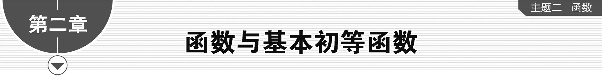
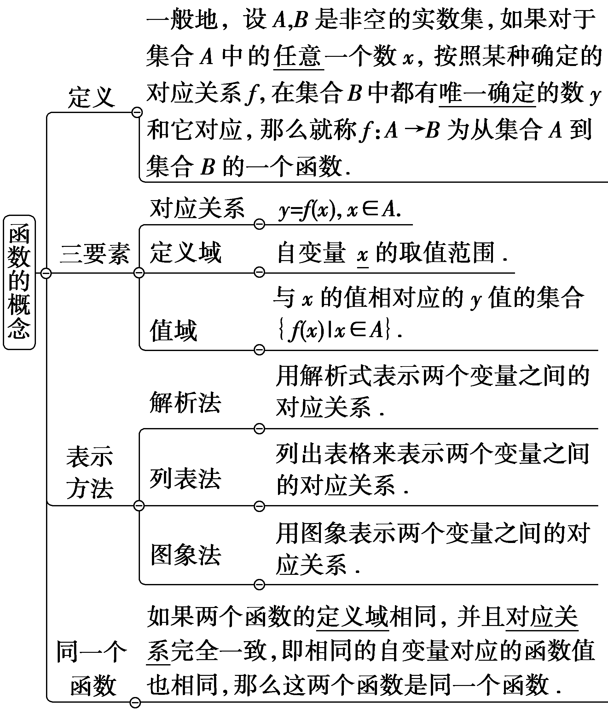
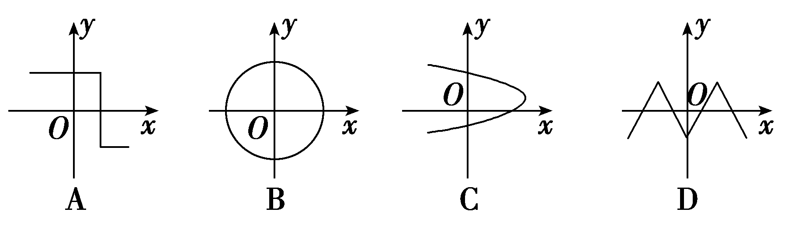
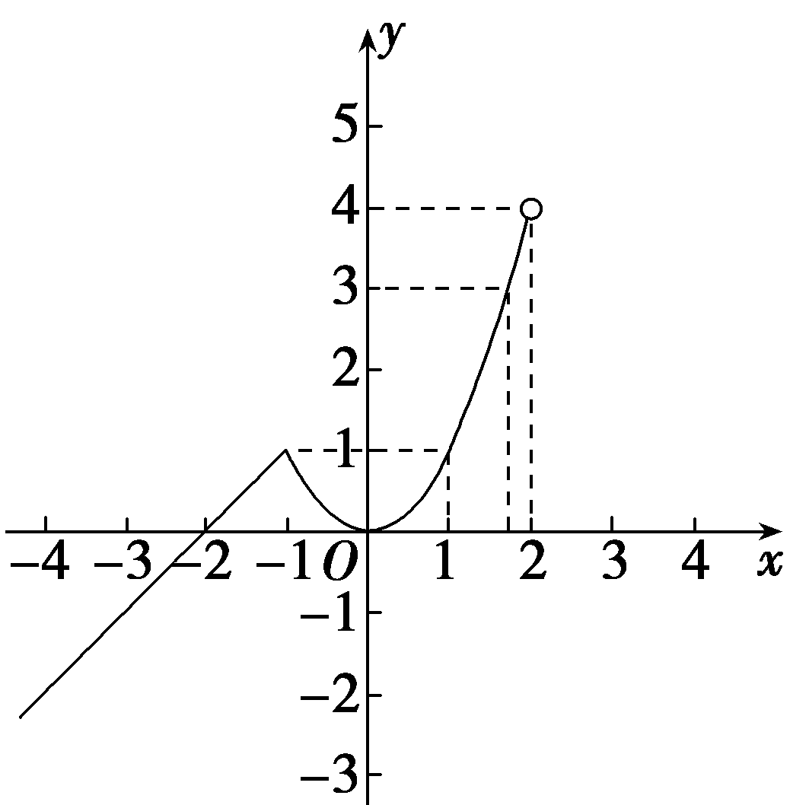
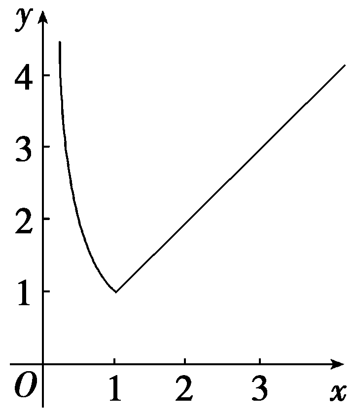

**第一节　函数的概念及其表示**

【课标研读】　1.了解构成函数的要素，能求简单函数的定义域和值域.　2.在实际情境中，会根据不同的需要选择恰当的方法(如图象法、列表法、解析法)表示函数.　3.了解简单的分段函数，并能简单应用.

1.函数的有关概念

[微提醒]　(1)直线*x*＝*a*(*a*为常数)与函数*y*＝*f*(*x*)的图象有0个或1个交点.(2)判断两个函数是不是同一个函数时，若解析式可以化简，则要注意化简过程的等价性.

2.分段函数

(1)若函数在其定义域的不同子集上，因对应关系不同而分别用几个不同的式子来表示，这种函数称为分段函数.

(2)可转化为分段函数的函数

①含有绝对值的函数：形如*y*＝｜*x*｜，*y*＝｜*x*－2｜等.

②最值函数：设min{<text style="it<text style="it<text style="it<text style="it<text style="it*a*lic">a</text>lic">a</text>lic">a</text>lic">a</text>lic">a</text>，*<text style="italic"><text style="italic"><text style="italic"><text style="italic"><text style="italic">b*</text></text></text></text></text>} $＝\left\{\begin{matrix}a，a\leq b，\\b，a＞b，\end{matrix}\right.$ m<text style="it<text style="it<text style="it<text style="it<text style="it*a*lic">a</text>lic">a</text>lic">a</text>lic">a</text>lic">a</text>x{a，*<text style="italic"><text style="italic"><text style="italic"><text style="italic"><text style="italic">b*</text></text></text></text></text>} $＝\left\{\begin{matrix}a，a\geq b，\\b，a＜b.\end{matrix}\right.$ 直观上来说min{<text style="it<text style="it<text style="it<text style="it<text style="it*a*lic">a</text>lic">a</text>lic">a</text>lic">a</text>lic">a</text>，*<text style="italic"><text style="italic"><text style="italic"><text style="italic"><text style="italic">b*</text></text></text></text></text>}用来表示a，b的最小值，我们将其称为最小值函数，同样，max{a，b}用来表示a，b的最大值，称作最大值函数.

[微提醒] 　分段函数虽然由几部分组成，但它表示的是一个函数，各部分函数的定义域的交集是空集.

【常用结论】

基本初等函数的定义域与值域

(1)<em>y</em>＝<em>kx</em>＋<em>b</em>(<em>k</em>≠0)的定义域是<strong>R</strong>，值域是<strong>R</strong>.

(&lt;text style="supers&lt;text style="it&lt;text style="it&lt;text style="it<em>a</em>lic"&gt;a&lt;/text&gt;lic"&gt;a&lt;/text&gt;lic"&gt;c&lt;/text&gt;ript"&gt;2&lt;/text&gt;)<em>y</em>＝<em>ax</em>2＋<em>bx</em>＋c(a≠0)的定义域是<strong>R</strong>，当a＞0时，值域为［ $\frac{4ac－b^{2}}{4a}$ ，＋∞)；当&lt;text style="it&lt;text style="it<em>a</em>lic"&gt;a&lt;/text&gt;lic"&gt;a&lt;/text&gt;＜0时，值域为(－∞， $\frac{4ac－b^{2}}{4a}$ ］.

(3)<te<te<text st<text st*y*le="italic">y</text>le="italic">x</text>t style="italic">x</text>t style="italic">y</text> $＝\frac{k}{x}$ (<te<te<text st<text st*y*le="italic">y</text>le="italic">x</text>t style="italic">x</text>t style="italic">k</text>≠0)的定义域是{x｜x≠0}，值域是{*y*｜y≠0}.

(4)<em>y</em>＝<em>ax</em>(<em>a</em>＞0且<em>a</em>≠1)的定义域是<strong>R</strong>，值域是(0，＋∞).

(5)<em>y</em>＝log<em>ax</em>(<em>a</em>＞0且<em>a</em>≠1)的定义域是(0，＋∞)，值域是<strong>R</strong>.

(6)分段函数的定义域等于各段函数的定义域的并集，值域等于各段函数的值域的并集.

【自主检测】

1.(多选)下列结论错误的是(　　)

A.若两个函数的定义域和值域相同，则这两个函数是同一个函数

B.函数*y*＝*f*(*x*)的图象可以是一条封闭曲线

C.<em>y</em>＝<em>x</em>0与<em>y</em>＝1是同一个函数

D.函数&lt;te<em>x</em>t style="italic"&gt;f&lt;/text&gt;(x) $＝\left\{\begin{matrix}x－1，x\geq 0，\\x^{2}，x<0\end{matrix}\right.$ 的定义域为<strong>R</strong>

答案：**ABC**

2.(链接苏教必修一P115T4)在下列图形中，能表示函数关系*y*＝*f*(*x*)的是(　　)

答案：**D**

3.(多选)(链接人A必修一P67T3)下列各组函数是同一个函数的是(　　)

A.<em>f</em>(<em>x</em>)＝<em>x</em>2－2<em>x</em>－1与<em>g</em>(<em>s</em>)＝<em>s</em>2－2<em>s</em>－1

B.<te<te<te*x*t style="italic">x</text>t style="italic">x</text>t style="italic">f</text>(x) $＝\sqrt{－x^{3}}$ 与<te<te*x*t style="italic">x</text>t style="italic">g</text>(*x*)＝x $\sqrt{－x}$

C.<te<te*x*t style="italic">x</text>t style="italic">f</text>(x) $＝\frac{x}{x}$ 与<te*x*t style="italic">g</text>(*x*) $＝\frac{1}{x^{0}}$

D.<te<te<te*x*t style="italic">x</text>t style="italic">x</text>t style="italic">f</text>(x)＝x与*g*(x) $＝\sqrt{x^{2}}$

答案：**AC**

解析：<te<te<te<te<te<te<te*x*t style="italic">x</text>t style="italic">x</text>t style="italic">x</text>t style="italic">x</text>t style="italic">x</text>t style="italic">x</text>t style="italic">*f*</text>(x) $＝\sqrt{－x^{3}}$ 与<te<te<te<te<te<te*x*t style="italic">x</text>t style="italic">x</text>t style="italic">x</text>t style="italic">x</text>t style="italic">x</text>t style="italic">*g*</text>(*x*)＝x $\sqrt{－x}$ 的值域不同；<te<te<te<te<te<te<te*x*t style="italic">x</text>t style="italic">x</text>t style="italic">x</text>t style="italic">x</text>t style="italic">x</text>t style="italic">x</text>t style="italic">*f*</text>(x)＝x与*<text style="italic">g*</text>(x) $＝\sqrt{x^{2}}＝$ ｜<te<te<te<te<te<te*x*t style="italic">x</text>t style="italic">x</text>t style="italic">x</text>t style="italic">x</text>t style="italic">x</text>t style="italic">x</text>｜的对应关系不同，故B、D错误，A、C正确.故选AC.

4.已知函数&lt;te<em>x</em>t style="italic"&gt;<em>&lt;text style="italic"&gt;f</em>&lt;/text&gt;&lt;/text&gt;(x) $＝\left\{\begin{matrix}log_{3}x，x>0，\\x^{2}，x\leq 0，\end{matrix}\right.$ 则&lt;te<em>x</em>t style="italic"&gt;<em>&lt;text style="italic"&gt;f</em>&lt;/text&gt;&lt;/text&gt;(f(－ $\sqrt{3}$ ))＝<u>　　　　</u>.

答案：1

解析：<em>&lt;text style="italic"&gt;&lt;text style="italic"&gt;f</em>&lt;/text&gt;&lt;/text&gt; $\left(－\sqrt{3}\right)＝$ 3，则<em>&lt;text style="italic"&gt;&lt;text style="italic"&gt;f</em>&lt;/text&gt;&lt;/text&gt; $\left(f\left(－\sqrt{3}\right)\right)＝$ <em>&lt;text style="italic"&gt;&lt;text style="italic"&gt;f</em>&lt;/text&gt;&lt;/text&gt;(3)＝log33＝1.

考点一　函数的定义域 　　　　自主练透

1.函数<te*x*t style="italic">f</text>(x) $＝\frac{1}{ln\left(x+1\right)}$ ＋ $\sqrt{4－x^{2}}$ 的定义域为(　　)

A.[－2，0)∪(0，2]	B.(－1，0)∪(0，2]

C.[－2，2]	D.(－1，2]

答案：**B**

解析：要使函数有意义，则需 $\left\{\begin{matrix}x+1>0，\\x+1\ne 1，\\4－x^{2}\geq 0，\end{matrix}\right.$ 解得－1＜<te<te*x*t style="italic">x</text>t style="italic">x</text>≤2且x≠0，所以x∈(－1，0)∪(0，2].故选B.

2.已知函数<te<te*x*t style="italic">x</text>t style="italic">y</text>＝*f*(x)的定义域为[－8，1]，则函数*g*(x) $＝\frac{f\left(2x+1\right)}{x+2}$ 的定义域是(　　)

A.(－∞，－2)∪(－2，3]

B.(－8，－2)∪(－2，1]

C. $\left[－\frac{9}{2},-2\right)$ ∪ $\left(－2，0\right]$

D. $\left[－\frac{9}{2},-2\right]$

答案：**C**

解析：因为<te<te<te<te*x*t style="italic">x</text>t style="italic">x</text>t style="italic">x</text>t style="italic">f</text>(x)的定义域为 $\left[－8，1\right]$ ，所以 $\left\{\begin{matrix}－8\leq 2x+1\leq 1，\\x+2\ne 0，\end{matrix}\right.$ 解得－ $\frac{9}{2}$ ≤<te<te<te*x*t style="italic">x</text>t style="italic">x</text>t style="italic">x</text>≤0，且x≠－2.所以*g*(x)的定义域为 $\left[－\frac{9}{2}，-2\right)$ ∪ $\left(－2，0\right]$ .故选C.

3.已知函数*f*(2*x*＋1)的定义域为[1，2]，则函数*f*(4*x*＋1)的定义域为(　　)

A.[3，5]	B.［ $\frac{1}{2}$ ，1］

C.[5，9]	D.［0， $\frac{1}{2}$ ］

答案：**B**

解析：在<te<te<te<te<te<te*x*t style="italic">x</text>t style="italic">x</text>t style="italic">x</text>t style="italic">x</text>t style="italic">x</text>t style="italic">*f*</text>(2x＋1)中，x∈[1，2]，所以2x＋1∈[3，5]，所以在f(4x＋1)中，4x＋1∈[3，5]，所以x∈ $\left[\frac{1}{2}，1\right]$ .故选B.

4.若函数&lt;text style="it<em>a</em>lic"&gt;y&lt;/text&gt; $＝\frac{ax+1}{\sqrt{ax^{2}－4ax+2}}$ 的定义域为<strong>R</strong>，则实数<em>a</em>的取值范围是(　　)

A. $\left(0，\frac{1}{2}\right]$ 	B. $\left(0，\frac{1}{2}\right)$

C. $\left[0，\frac{1}{2}\right]$ 	D. $\left[0，\frac{1}{2}\right)$

答案：**D**

解析：由题意知，&lt;text style="it&lt;text style="it&lt;text style="it&lt;text style="it<em>a</em>lic"&gt;a&lt;/text&gt;lic"&gt;a&lt;/text&gt;lic"&gt;a&lt;/text&gt;lic"&gt;<em>ax</em>&lt;/text&gt;2－4ax＋2＞0的解集为<strong>R</strong>.当a＝0时，2＞0恒成立，满足题意；当a≠0时， $\left\{\begin{matrix}a>0，\\\Delta =16a^{2}－8a<0，\end{matrix}\right.$ 解得0＜&lt;text style="it&lt;text style="it&lt;text style="it<em>a</em>lic"&gt;a&lt;/text&gt;lic"&gt;a&lt;/text&gt;lic"&gt;a&lt;/text&gt;＜ $\frac{1}{2}$ .综上，实数&lt;text style="it&lt;text style="it&lt;text style="it<em>a</em>lic"&gt;a&lt;/text&gt;lic"&gt;a&lt;/text&gt;lic"&gt;a&lt;/text&gt;的取值范围是 $\left[0，\frac{1}{2}\right)$ .故选D.

1.若已知函数的解析式，其定义域就是使函数解析式中所含式子(运算)有意义，列出不等式或不等式组求解；对于实际问题，定义域应使实际问题有意义.

2.若已知函数*f*(*x*)的定义域为[*a*，*b*]，则复合函数*f*(*g*(*x*))的定义域可由不等式*a*≤*g*(*x*)≤*b*求出.

3.若已知函数*f*(*g*(*x*))的定义域为[*a*，*b*]，则*f*(*x*)的定义域为*g*(*x*)在*x*∈[*a*，*b*]上的值域.

考点二　函数的解析式　　　　　师生共研

(一题多变)根据下列条件求函数的解析式：

(1)已知<te<te*x*t style="italic">x</text>t style="italic">*f*</text>( $\sqrt{x}$ ＋1)＝<te*x*t style="italic">x</text>＋2 $\sqrt{x}$ ，求函数<te<te*x*t style="italic">x</text>t style="italic">*f*</text>(x)的解析式；

(2)已知<em>f</em>(1－sin <em>x</em>)＝cos2<em>x</em>，求<em>f</em>(<em>x</em>)的解析式；

(3)已知函数*f*(*x*)是单调递增的一次函数，且满足*f*(*f*(*x*))＝16*x*＋5，求函数*f*(*x*)的解析式；

(4)已知*f*(*x*)满足2*f*(*x*)＋*f*(－*x*)＝3*x*，求*f*(*x*)的解析式.

解：(1)(配凑法)已知&lt;te<em>x</em>t style="italic"&gt;<em>f</em>&lt;/text&gt;( $\sqrt{x}$ ＋1)＝<em>x</em>＋&lt;text style="superscript"&gt;2&lt;/text&gt; $\sqrt{x}$ ，则&lt;te<em>x</em>t style="italic"&gt;<em>f</em>&lt;/text&gt;( $\sqrt{x}$ ＋1)＝( $\sqrt{x}$ )&lt;text style="superscript"&gt;2&lt;/text&gt;＋2 $\sqrt{x}$ ＋1－1＝( $\sqrt{x}$ ＋1)&lt;text style="superscript"&gt;2&lt;/text&gt;－1.

令&lt;&lt;&lt;&lt;&lt;te&lt;te&lt;te<em>x</em>t style="italic"&gt;x&lt;/text&gt;t style="italic"&gt;x&lt;/text&gt;t style="italic"&gt;t&lt;/text&gt;ext style="italic"&gt;t&lt;/text&gt;ext style="italic"&gt;t&lt;/text&gt;ext style="italic"&gt;t&lt;/text&gt;ext style="italic"&gt;t&lt;/text&gt; $＝\sqrt{x}$ ＋1(&lt;&lt;&lt;&lt;&lt;te&lt;te&lt;te<em>x</em>t style="italic"&gt;x&lt;/text&gt;t style="italic"&gt;x&lt;/text&gt;t style="italic"&gt;t&lt;/text&gt;ext style="italic"&gt;t&lt;/text&gt;ext style="italic"&gt;t&lt;/text&gt;ext style="italic"&gt;t&lt;/text&gt;ext style="italic"&gt;t&lt;/text&gt;≥1)，则<em>&lt;text style="italic"&gt;f</em>&lt;/text&gt;(t)＝t&lt;text style="superscript"&gt;2&lt;/text&gt;－1(t≥1)，所以f(x)＝x2－1(x≥1).

(2)(换元法)设1－sin *x*＝*t*，*t*∈[0，2]，

则sin <em>x</em>＝1－<em>t</em>，因为<em>f</em>(1－sin <em>x</em>)＝cos2<em>x</em>＝1－sin2<em>x</em>，

所以<em>f</em>(<em>t</em>)＝1－(1－<em>t</em>)2＝2<em>t</em>－<em>t</em>2，<em>t</em>∈[0，2]，即<em>f</em>(<em>x</em>)＝2<em>x</em>－<em>x</em>2，<em>x</em>∈[0，2].

(3)(待定系数法)因为*f*(*x*)是单调递增的一次函数，所以设*f*(*x*)＝*ax*＋*b*，*a*＞0，

故&lt;te&lt;te&lt;te<em>x</em>t style="italic"&gt;x&lt;/text&gt;t style="it&lt;text style="it<em>a</em>lic"&gt;a&lt;/text&gt;lic"&gt;x&lt;/text&gt;t style="italic"&gt;<em>f</em>&lt;/text&gt;(f(x))＝a(<em>ax</em>＋<em>&lt;text style="italic"&gt;&lt;text style="italic"&gt;b</em>&lt;/text&gt;&lt;/text&gt;)＋b＝a2x＋<em>ab</em>＋b＝16x＋5，所以 $\left\{\begin{matrix}a^{2}=16，\\ab＋b=5，\end{matrix}\right.$

解得 $\left\{\begin{matrix}a=4，\\b=1，\end{matrix}\right.$ 或 $\left\{\begin{matrix}a＝－4，\\b＝－\frac{5}{3}\end{matrix}\right.$ (不符合题意，舍去).

因此*f*(*x*)＝4*x*＋1.

(4)(构造法)因为2*f*(*x*)＋*f*(－*x*)＝3*x*①，

所以将*x*用－*x*替换，得2*f*(－*x*)＋*f*(*x*)＝－3*x*②，

由①②解得*f*(*x*)＝3*x*.

[变式探究]

1.(变条件)若本例(1)条件变为&lt;te&lt;te<em>x</em>t style="italic"&gt;x&lt;/text&gt;t style="italic"&gt;<em>f</em>&lt;/text&gt; $\left(x^{2}＋\frac{1}{x^{2}}\right)＝$ &lt;te<em>x</em>t style="italic"&gt;x&lt;/text&gt;4＋ $\frac{1}{x^{4}}$ ，则&lt;te&lt;te<em>x</em>t style="italic"&gt;x&lt;/text&gt;t style="italic"&gt;<em>f</em>&lt;/text&gt;(x)的解析式为<u>　　　　　　</u>.

答案：<em>f</em>(<em>x</em>)＝<em>x</em>2－2(<em>x</em>≥2)

解析：&lt;&lt;&lt;&lt;&lt;&lt;te&lt;te&lt;te<em>x</em>t style="italic"&gt;x&lt;/text&gt;t style="italic"&gt;x&lt;/text&gt;t style="italic"&gt;t&lt;/text&gt;ext style="italic"&gt;t&lt;/text&gt;ext style="italic"&gt;t&lt;/text&gt;ext style="italic"&gt;t&lt;/text&gt;e<em>x</em>t style="italic"&gt;t&lt;/text&gt;e&lt;te&lt;te&lt;te<em>x</em>t style="italic"&gt;x&lt;/text&gt;t style="italic"&gt;x&lt;/text&gt;t style="italic"&gt;x&lt;/text&gt;t style="italic"&gt;<em>&lt;text style="italic"&gt;f</em>&lt;/text&gt;&lt;/text&gt; $\left(x^{2}＋\frac{1}{x^{2}}\right)＝$ &lt;&lt;&lt;&lt;&lt;&lt;te&lt;te&lt;te<em>x</em>t style="italic"&gt;x&lt;/text&gt;t style="italic"&gt;x&lt;/text&gt;t style="italic"&gt;t&lt;/text&gt;ext style="italic"&gt;t&lt;/text&gt;ext style="italic"&gt;t&lt;/text&gt;ext style="italic"&gt;t&lt;/text&gt;e<em>x</em>t style="italic"&gt;t&lt;/text&gt;e&lt;te&lt;te<em>x</em>t style="italic"&gt;x&lt;/text&gt;t style="italic"&gt;x&lt;/text&gt;t style="italic"&gt;x&lt;/text&gt;4＋ $\frac{1}{x^{4}}＝\left(x^{2}＋\frac{1}{x^{2}}\right)^{2}$ －&lt;&lt;&lt;&lt;&lt;&lt;te&lt;te&lt;te<em>x</em>t style="italic"&gt;x&lt;/text&gt;t style="italic"&gt;x&lt;/text&gt;t style="italic"&gt;t&lt;/text&gt;ext style="italic"&gt;t&lt;/text&gt;ext style="italic"&gt;t&lt;/text&gt;ext style="italic"&gt;t&lt;/text&gt;e<em>x</em>t style="italic"&gt;t&lt;/text&gt;e&lt;te<em>x</em>t style="italic"&gt;x&lt;/text&gt;t style="superscript"&gt;&lt;text style="superscript"&gt;&lt;text style="superscript"&gt;&lt;text style="superscript"&gt;2&lt;/text&gt;&lt;/text&gt;&lt;/text&gt;&lt;/text&gt;，又&lt;te<em>x</em>t style="italic"&gt;x&lt;/text&gt;2＋ $\frac{1}{x^{2}}$ ≥&lt;&lt;&lt;&lt;&lt;&lt;te&lt;te&lt;te<em>x</em>t style="italic"&gt;x&lt;/text&gt;t style="italic"&gt;x&lt;/text&gt;t style="italic"&gt;t&lt;/text&gt;ext style="italic"&gt;t&lt;/text&gt;ext style="italic"&gt;t&lt;/text&gt;ext style="italic"&gt;t&lt;/text&gt;e<em>x</em>t style="italic"&gt;t&lt;/text&gt;e&lt;te<em>x</em>t style="italic"&gt;x&lt;/text&gt;t style="superscript"&gt;&lt;text style="superscript"&gt;&lt;text style="superscript"&gt;&lt;text style="superscript"&gt;2&lt;/text&gt;&lt;/text&gt;&lt;/text&gt;&lt;/text&gt; $\sqrt{x^{2}\cdot \frac{1}{x^{2}}}＝$ &lt;&lt;&lt;&lt;&lt;&lt;te&lt;te&lt;te<em>x</em>t style="italic"&gt;x&lt;/text&gt;t style="italic"&gt;x&lt;/text&gt;t style="italic"&gt;t&lt;/text&gt;ext style="italic"&gt;t&lt;/text&gt;ext style="italic"&gt;t&lt;/text&gt;ext style="italic"&gt;t&lt;/text&gt;e<em>x</em>t style="italic"&gt;t&lt;/text&gt;e&lt;te<em>x</em>t style="italic"&gt;x&lt;/text&gt;t style="superscript"&gt;&lt;text style="superscript"&gt;&lt;text style="superscript"&gt;&lt;text style="superscript"&gt;2&lt;/text&gt;&lt;/text&gt;&lt;/text&gt;&lt;/text&gt;，当且仅当&lt;te<em>x</em>t style="italic"&gt;x&lt;/text&gt;2 $＝\frac{1}{x^{2}}$ ，即&lt;&lt;&lt;&lt;&lt;&lt;te&lt;te&lt;te<em>x</em>t style="italic"&gt;x&lt;/text&gt;t style="italic"&gt;x&lt;/text&gt;t style="italic"&gt;t&lt;/text&gt;ext style="italic"&gt;t&lt;/text&gt;ext style="italic"&gt;t&lt;/text&gt;ext style="italic"&gt;t&lt;/text&gt;e<em>x</em>t style="italic"&gt;t&lt;/text&gt;e&lt;te&lt;te<em>x</em>t style="italic"&gt;x&lt;/text&gt;t style="italic"&gt;x&lt;/text&gt;t style="italic"&gt;x&lt;/text&gt;＝±1时等号成立.设t＝x&lt;text style="superscript"&gt;&lt;text style="superscript"&gt;&lt;text style="superscript"&gt;&lt;text style="superscript"&gt;2&lt;/text&gt;&lt;/text&gt;&lt;/text&gt;&lt;/text&gt;＋ $\frac{1}{x^{2}}$ ，则&lt;&lt;&lt;&lt;&lt;te&lt;te&lt;te<em>x</em>t style="italic"&gt;x&lt;/text&gt;t style="italic"&gt;x&lt;/text&gt;t style="italic"&gt;t&lt;/text&gt;ext style="italic"&gt;t&lt;/text&gt;ext style="italic"&gt;t&lt;/text&gt;ext style="italic"&gt;t&lt;/text&gt;e<em>x</em>t style="italic"&gt;t&lt;/text&gt;≥&lt;te&lt;te<em>x</em>t style="italic"&gt;x&lt;/text&gt;t style="superscript"&gt;&lt;text style="superscript"&gt;&lt;text style="superscript"&gt;&lt;text style="superscript"&gt;2&lt;/text&gt;&lt;/text&gt;&lt;/text&gt;&lt;/text&gt;，所以&lt;te&lt;te<em>x</em>t style="italic"&gt;x&lt;/text&gt;t style="italic"&gt;<em>&lt;text style="italic"&gt;f</em>&lt;/text&gt;&lt;/text&gt;(t)＝t2－2(t≥2)，所以f(x)＝x2－2(x≥2).

2.(变条件)若本例(4)条件变为2&lt;te&lt;te&lt;te<em>x</em>t style="italic"&gt;x&lt;/text&gt;t style="italic"&gt;x&lt;/text&gt;t style="italic"&gt;<em>&lt;text style="italic"&gt;f</em>&lt;/text&gt;&lt;/text&gt;(x)＋f( $\frac{1}{x}$ )＝3&lt;te&lt;te<em>x</em>t style="italic"&gt;x&lt;/text&gt;t style="italic"&gt;x&lt;/text&gt;，则<em>&lt;text style="italic"&gt;&lt;text style="italic"&gt;f</em>&lt;/text&gt;&lt;/text&gt;(x)的解析式为<u>　　　　　　</u>.

答案：<te<te*x*t style="italic">x</text>t style="italic">f</text>(x)＝2x－ $\frac{1}{x}$

解析：因为2<te<te<te<te<te<te*x*t style="italic">x</text>t style="italic">x</text>t style="italic">x</text>t style="italic">x</text>t style="italic">x</text>t style="italic">*<text style="italic"><text style="italic"><text style="italic">f*</text></text></text></text>(x)＋f( $\frac{1}{x}$ )＝3<te<te<te<te<te*x*t style="italic">x</text>t style="italic">x</text>t style="italic">x</text>t style="italic">x</text>t style="italic">x</text>①，所以将x用 $\frac{1}{x}$ 替换，得2<te<te<te<te<te<te*x*t style="italic">x</text>t style="italic">x</text>t style="italic">x</text>t style="italic">x</text>t style="italic">x</text>t style="italic">*<text style="italic"><text style="italic"><text style="italic">f*</text></text></text></text>( $\frac{1}{x}$ )＋<te<te<te<te<te<te*x*t style="italic">x</text>t style="italic">x</text>t style="italic">x</text>t style="italic">x</text>t style="italic">x</text>t style="italic">*<text style="italic"><text style="italic"><text style="italic">f*</text></text></text></text>(x)＝3*·* $\frac{1}{x}$ ②，由①②解得<te<te<te<te<te<te*x*t style="italic">x</text>t style="italic">x</text>t style="italic">x</text>t style="italic">x</text>t style="italic">x</text>t style="italic">*<text style="italic"><text style="italic"><text style="italic">f*</text></text></text></text>(x)＝2x－ $\frac{1}{x}$ .

函数解析式的求法

1.配凑法：由已知条件&lt;te&lt;te&lt;te&lt;te&lt;te&lt;te&lt;te&lt;te&lt;te&lt;te&lt;te&lt;te&lt;te&lt;te&lt;te&lt;te&lt;te<em>x</em>t style="italic"&gt;x&lt;/text&gt;t style="italic"&gt;x&lt;/text&gt;t style="italic"&gt;x&lt;/text&gt;t style="italic,superscript"&gt;x&lt;/text&gt;t style="it<em>a</em>lic,superscript"&gt;x&lt;/text&gt;t style="it<em>a</em>lic,superscript"&gt;x&lt;/text&gt;t style="it<em>a</em>lic,superscript"&gt;x&lt;/text&gt;t style="it<em>a</em>lic"&gt;x&lt;/text&gt;t style="italic"&gt;x&lt;/text&gt;t style="italic"&gt;x&lt;/text&gt;t style="italic"&gt;x&lt;/text&gt;t style="italic"&gt;x&lt;/text&gt;t style="italic"&gt;x&lt;/text&gt;t style="italic"&gt;x&lt;/text&gt;t style="italic"&gt;x&lt;/text&gt;t style="italic"&gt;x&lt;/text&gt;t style="italic"&gt;<em>f</em>&lt;/text&gt;(<em>&lt;text style="italic"&gt;&lt;text style="italic"&gt;g</em>&lt;/text&gt;&lt;/text&gt;(x))＝<em>&lt;text style="italic"&gt;F</em>&lt;/text&gt;(x)，可将F(x)改写成关于g(x)的表达式，然后以x替代g(x)，便得f(x)的表达式.特别注意形如x± $\frac{1}{x}$ 与&lt;te&lt;te&lt;te&lt;te&lt;te&lt;te&lt;te&lt;te&lt;te&lt;te&lt;te&lt;te&lt;te&lt;te&lt;te&lt;te<em>x</em>t style="italic"&gt;x&lt;/text&gt;t style="italic"&gt;x&lt;/text&gt;t style="italic"&gt;x&lt;/text&gt;t style="italic,superscript"&gt;x&lt;/text&gt;t style="it<em>a</em>lic,superscript"&gt;x&lt;/text&gt;t style="it<em>a</em>lic,superscript"&gt;x&lt;/text&gt;t style="it<em>a</em>lic,superscript"&gt;x&lt;/text&gt;t style="it<em>a</em>lic"&gt;x&lt;/text&gt;t style="italic"&gt;x&lt;/text&gt;t style="italic"&gt;x&lt;/text&gt;t style="italic"&gt;x&lt;/text&gt;t style="italic"&gt;x&lt;/text&gt;t style="italic"&gt;x&lt;/text&gt;t style="italic"&gt;x&lt;/text&gt;t style="italic"&gt;x&lt;/text&gt;t style="italic"&gt;x&lt;/text&gt;&lt;text style="superscript"&gt;2&lt;/text&gt;＋ $\frac{1}{x^{2}}$ ，&lt;te&lt;te&lt;te&lt;te&lt;te&lt;te&lt;te&lt;te<em>x</em>t style="italic"&gt;x&lt;/text&gt;t style="italic"&gt;x&lt;/text&gt;t style="italic"&gt;x&lt;/text&gt;t style="italic,superscript"&gt;x&lt;/text&gt;t style="it<em>a</em>lic,superscript"&gt;x&lt;/text&gt;t style="it<em>a</em>lic,superscript"&gt;x&lt;/text&gt;t style="it<em>a</em>lic,superscript"&gt;x&lt;/text&gt;t style="italic"&gt;a&lt;/text&gt;&lt;te&lt;te&lt;te&lt;te&lt;te&lt;te&lt;te&lt;te<em>x</em>t style="italic"&gt;x&lt;/text&gt;t style="italic"&gt;x&lt;/text&gt;t style="italic"&gt;x&lt;/text&gt;t style="italic"&gt;x&lt;/text&gt;t style="italic"&gt;x&lt;/text&gt;t style="italic"&gt;x&lt;/text&gt;t style="italic"&gt;x&lt;/text&gt;t style="italic"&gt;x&lt;/text&gt;±a－x与a&lt;text style="superscript"&gt;2&lt;/text&gt;x＋a－2x，sin x±cos x与sin xcos x一般都运用配凑法 .

2.换元法：已知复合函数*f*(*g*(*x*))的解析式，可用换元法，此时要注意新元的取值范围.

3.待定系数法：若已知函数的类型(如一次函数、二次函数)可用待定系数法.

4.构造法：已知关于<te<te<te*x*t style="italic">x</text>t style="italic">x</text>t style="italic">*<text style="italic"><text style="italic">f*</text></text></text>(x)与f $\left(\frac{1}{x}\right)$ 或<te<te<te*x*t style="italic">x</text>t style="italic">x</text>t style="italic">*<text style="italic"><text style="italic">f*</text></text></text>(－x)等的表达式，可根据已知条件再构造出另外一个等式组成方程组，通过解方程组求出f(x)，充分体现了方程思想的应用.

对点练1.已知函数<em>f</em>(<em>x</em>＋1)＝3<em>x</em>＋2，则<em>f</em>(<em>x</em>)的解析式为<u>　　　　　　</u>.

答案：*f*(*x*)＝3*x*－1

解析：法一(换元法)：令*x*＋1＝*t*，则*x*＝*t*－1，所以*f*(*t*)＝3(*t*－1)＋2＝3*t*－1，所以*f*(*x*)＝3*x*－1.

法二(配凑法)：*f*(*x*＋1)＝3*x*＋2＝3(*x*＋1)－1，所以*f*(*x*)＝3*x*－1.

对点练&lt;te<em>x</em>t style="superscript"&gt;2&lt;/text&gt;.已知&lt;te<em>x</em>t style="italic"&gt;<em>f</em>&lt;/text&gt; $\left(x－\frac{1}{x}\right)＝$ &lt;te<em>x</em>t style="italic"&gt;x&lt;/text&gt;2＋ $\frac{1}{x^{2}}$ ，则&lt;te&lt;te<em>x</em>t style="italic"&gt;x&lt;/text&gt;t style="italic"&gt;<em>f</em>&lt;/text&gt;(x)的解析式为<u>　　　　　　</u>.

答案：<em>f</em>(<em>x</em>)＝<em>x</em>2＋2

解析： 因为&lt;te&lt;te&lt;te<em>x</em>t style="italic"&gt;x&lt;/text&gt;t style="italic"&gt;x&lt;/text&gt;t style="italic"&gt;<em>f</em>&lt;/text&gt; $\left(x－\frac{1}{x}\right)＝$ &lt;te&lt;te<em>x</em>t style="italic"&gt;x&lt;/text&gt;t style="italic"&gt;x&lt;/text&gt;&lt;text style="superscript"&gt;2&lt;/text&gt;＋ $\frac{1}{x^{2}}＝\left(x－\frac{1}{x}\right)^{2}$ ＋&lt;te&lt;te<em>x</em>t style="italic"&gt;x&lt;/text&gt;t style="superscript"&gt;2&lt;/text&gt;，所以&lt;te<em>x</em>t style="italic"&gt;<em>f</em>&lt;/text&gt;(x)＝x2＋2.

对点练3.已知<em>f</em>(<em>x</em>)是二次函数且<em>f</em>(0)＝2，<em>f</em>(<em>x</em>＋1)－<em>f</em>(<em>x</em>)＝<em>x</em>－1，则<em>f</em>(<em>x</em>)的解析式为<u>　　　　　　</u>.

答案：&lt;te&lt;te&lt;te<em>x</em>t style="italic"&gt;x&lt;/text&gt;t style="italic"&gt;x&lt;/text&gt;t style="italic"&gt;f&lt;/text&gt;(x) $＝\frac{1}{2}$ &lt;te&lt;te<em>x</em>t style="italic"&gt;x&lt;/text&gt;t style="italic"&gt;x&lt;/text&gt;2－ $\frac{3}{2}$ &lt;te&lt;te<em>x</em>t style="italic"&gt;x&lt;/text&gt;t style="italic"&gt;x&lt;/text&gt;＋2

解析：设&lt;te&lt;te&lt;te&lt;te&lt;te&lt;te&lt;te&lt;te&lt;te&lt;te<em>x</em>t style="italic"&gt;x&lt;/text&gt;t style="italic"&gt;x&lt;/text&gt;t style="italic"&gt;x&lt;/text&gt;t style="it<em>a</em>lic"&gt;x&lt;/text&gt;t style="italic"&gt;x&lt;/text&gt;t style="italic"&gt;x&lt;/text&gt;t style="it<em>a</em>lic"&gt;x&lt;/text&gt;t style="italic"&gt;x&lt;/text&gt;t style="it&lt;text style="itali<em>c</em>"&gt;a&lt;/text&gt;li<em>c</em>"&gt;x&lt;/text&gt;t style="italic"&gt;<em>&lt;text style="italic"&gt;&lt;text style="italic"&gt;&lt;text style="italic"&gt;f</em>&lt;/text&gt;&lt;/text&gt;&lt;/text&gt;&lt;/text&gt;(x)＝<em>&lt;text style="italic"&gt;&lt;text style="italic"&gt;ax</em>&lt;/text&gt;&lt;/text&gt;&lt;text style="superscript"&gt;&lt;text style="superscript"&gt;&lt;text style="superscript"&gt;2&lt;/text&gt;&lt;/text&gt;&lt;/text&gt;＋<em>&lt;text style="italic"&gt;&lt;text style="italic"&gt;b</em>&lt;/text&gt;x&lt;/text&gt;＋c(a≠0)，由f(0)＝2，得c＝2，f(x＋1)－f(x)＝a(x＋1)2＋b(x＋1)＋2－ax2－<em>bx</em>－2＝x－1，即2ax＋a＋b＝x－1，所以 $\left\{\begin{matrix}2a=1，\\a＋b＝－1，\end{matrix}\right.$ 即 $\left\{\begin{matrix}a＝\frac{1}{2}，\\b＝－\frac{3}{2}.\end{matrix}\right.$ 所以&lt;te&lt;te&lt;te&lt;te&lt;te&lt;te&lt;te&lt;te&lt;te&lt;te<em>x</em>t style="italic"&gt;x&lt;/text&gt;t style="italic"&gt;x&lt;/text&gt;t style="italic"&gt;x&lt;/text&gt;t style="it<em>a</em>lic"&gt;x&lt;/text&gt;t style="italic"&gt;x&lt;/text&gt;t style="italic"&gt;x&lt;/text&gt;t style="it<em>a</em>lic"&gt;x&lt;/text&gt;t style="italic"&gt;x&lt;/text&gt;t style="it&lt;text style="itali<em>c</em>"&gt;a&lt;/text&gt;li<em>c</em>"&gt;x&lt;/text&gt;t style="italic"&gt;<em>&lt;text style="italic"&gt;&lt;text style="italic"&gt;&lt;text style="italic"&gt;f</em>&lt;/text&gt;&lt;/text&gt;&lt;/text&gt;&lt;/text&gt;(x) $＝\frac{1}{2}$ &lt;te&lt;te&lt;te&lt;te&lt;te&lt;te&lt;te&lt;te&lt;te<em>x</em>t style="italic"&gt;x&lt;/text&gt;t style="italic"&gt;x&lt;/text&gt;t style="italic"&gt;x&lt;/text&gt;t style="it<em>a</em>lic"&gt;x&lt;/text&gt;t style="italic"&gt;x&lt;/text&gt;t style="italic"&gt;x&lt;/text&gt;t style="it<em>a</em>lic"&gt;x&lt;/text&gt;t style="italic"&gt;x&lt;/text&gt;t style="it&lt;text style="itali<em>c</em>"&gt;a&lt;/text&gt;li<em>c</em>"&gt;x&lt;/text&gt;&lt;text style="superscript"&gt;&lt;text style="superscript"&gt;&lt;text style="superscript"&gt;2&lt;/text&gt;&lt;/text&gt;&lt;/text&gt;－ $\frac{3}{2}$ &lt;te&lt;te&lt;te&lt;te&lt;te&lt;te&lt;te&lt;te&lt;te<em>x</em>t style="italic"&gt;x&lt;/text&gt;t style="italic"&gt;x&lt;/text&gt;t style="italic"&gt;x&lt;/text&gt;t style="it<em>a</em>lic"&gt;x&lt;/text&gt;t style="italic"&gt;x&lt;/text&gt;t style="italic"&gt;x&lt;/text&gt;t style="it<em>a</em>lic"&gt;x&lt;/text&gt;t style="italic"&gt;x&lt;/text&gt;t style="it&lt;text style="itali<em>c</em>"&gt;a&lt;/text&gt;li<em>c</em>"&gt;x&lt;/text&gt;＋&lt;text style="superscript"&gt;&lt;text style="superscript"&gt;&lt;text style="superscript"&gt;2&lt;/text&gt;&lt;/text&gt;&lt;/text&gt;.

考点三　分段函数　　　　多维探究

角度1　分段函数求值

已知函数<te*x*t style="italic">*f*</text>(x) $＝\left\{\begin{matrix}2^{x}＋2^{－x}，x\leq 2，\\f(x－1),x>2，\end{matrix}\right.$ 则<te*x*t style="italic">*f*</text> $\left(log_{2}12\right)＝$ (　　)

A. $\frac{10}{3}$ 	B. $\frac{13}{3}$

C. $\frac{35}{6}$ 	D. $\frac{37}{6}$

答案：**A**

解析：*<text style="italic"><text style="italic"><text style="italic"><text style="italic">f*</text></text></text></text> $\left(log_{2}12\right)＝$ *<text style="italic"><text style="italic"><text style="italic"><text style="italic">f*</text></text></text></text> $\left(log_{2}12－1\right)＝$ *<text style="italic"><text style="italic"><text style="italic"><text style="italic">f*</text></text></text></text> $\left(log_{2}6\right)＝$ *<text style="italic"><text style="italic"><text style="italic"><text style="italic">f*</text></text></text></text> $\left(log_{2}6－1\right)＝$ *<text style="italic"><text style="italic"><text style="italic"><text style="italic">f*</text></text></text></text> $\left(log_{2}3\right)＝2^{log_{2}3}$ ＋ $\frac{1}{2^{log_{2}3}}＝$ 3＋ $\frac{1}{3}＝\frac{10}{3}$ .故选A.

角度2　分段函数与方程、不等式

(1)已知函数<te<text style="it<text style="it*a*lic">a</text>lic">x</text>t style="italic">*<text style="italic"><text style="italic">f*</text></text></text>(x) $＝\left\{\begin{matrix}x^{2}＋x，x>0，\\5x+6，x\leq 0，\end{matrix}\right.$ 若<te<text style="it<text style="it*a*lic">a</text>lic">x</text>t style="italic">*<text style="italic"><text style="italic">f*</text></text></text>(a－2)＝f(a)，则f $\left(\frac{a}{2}\right)＝$ (　　 )

A.11	B.6

C.4	D.2

(2)设函数&lt;te&lt;te&lt;te<em>x</em>t style="italic"&gt;x&lt;/text&gt;t style="italic"&gt;x&lt;/text&gt;t style="italic"&gt;<em>&lt;text style="italic"&gt;f</em>&lt;/text&gt;&lt;/text&gt;(x) $＝\left\{\begin{matrix}x+1，x\leq 0，\\2^{x}，x>0，\end{matrix}\right.$ 则满足&lt;te&lt;te&lt;te<em>x</em>t style="italic"&gt;x&lt;/text&gt;t style="italic"&gt;x&lt;/text&gt;t style="italic"&gt;<em>&lt;text style="italic"&gt;f</em>&lt;/text&gt;&lt;/text&gt;(x)＋f $\left(x－\frac{1}{2}\right)$ ＞1的&lt;te&lt;te<em>x</em>t style="italic"&gt;x&lt;/text&gt;t style="italic"&gt;x&lt;/text&gt;的取值范围是<u>　　　　</u>.

答案：(1)**D**　(2) $\left(－\frac{1}{4}，＋\infty \right)$

解析：(1)由题意得函数&lt;te&lt;text style="it&lt;text style="it&lt;text style="it&lt;text style="it&lt;text style="it&lt;text style="it&lt;text style="it&lt;text style="it&lt;text style="it<em>a</em>lic"&gt;a&lt;/text&gt;lic"&gt;a&lt;/text&gt;lic"&gt;a&lt;/text&gt;lic"&gt;a&lt;/text&gt;lic"&gt;a&lt;/text&gt;lic"&gt;a&lt;/text&gt;lic"&gt;a&lt;/text&gt;lic"&gt;a&lt;/text&gt;lic"&gt;x&lt;/text&gt;t style="italic"&gt;<em>&lt;text style="italic"&gt;&lt;text style="italic"&gt;&lt;text style="italic"&gt;f</em>&lt;/text&gt;&lt;/text&gt;&lt;/text&gt;&lt;/text&gt;(x)在(－∞，0]和(0，＋∞)上均为增函数，因为f(a－&lt;text style="superscript"&gt;&lt;text style="superscript"&gt;2&lt;/text&gt;&lt;/text&gt;)＝f(a)，所以 $\left\{\begin{matrix}a－2\leq 0，\\a>0，\end{matrix}\right.$ 解得0＜&lt;text style="it&lt;text style="it&lt;text style="it&lt;text style="it&lt;text style="it&lt;text style="it&lt;text style="it&lt;text style="it<em>a</em>lic"&gt;a&lt;/text&gt;lic"&gt;a&lt;/text&gt;lic"&gt;a&lt;/text&gt;lic"&gt;a&lt;/text&gt;lic"&gt;a&lt;/text&gt;lic"&gt;a&lt;/text&gt;lic"&gt;a&lt;/text&gt;lic"&gt;a&lt;/text&gt;≤&lt;text style="superscript"&gt;&lt;text style="superscript"&gt;2&lt;/text&gt;&lt;/text&gt;，所以a2＋a＝5(a－2)＋6，即a2－4a＋4＝0，解得a＝2，符合题意，所以&lt;te<em>x</em>t style="italic"&gt;<em>&lt;text style="italic"&gt;&lt;text style="italic"&gt;&lt;text style="italic"&gt;f</em>&lt;/text&gt;&lt;/text&gt;&lt;/text&gt;&lt;/text&gt; $\left(\frac{a}{2}\right)＝$ &lt;te&lt;text style="it&lt;text style="it&lt;text style="it&lt;text style="it&lt;text style="it&lt;text style="it&lt;text style="it&lt;text style="it&lt;text style="it<em>a</em>lic"&gt;a&lt;/text&gt;lic"&gt;a&lt;/text&gt;lic"&gt;a&lt;/text&gt;lic"&gt;a&lt;/text&gt;lic"&gt;a&lt;/text&gt;lic"&gt;a&lt;/text&gt;lic"&gt;a&lt;/text&gt;lic"&gt;a&lt;/text&gt;lic"&gt;x&lt;/text&gt;t style="italic"&gt;<em>&lt;text style="italic"&gt;&lt;text style="italic"&gt;&lt;text style="italic"&gt;f</em>&lt;/text&gt;&lt;/text&gt;&lt;/text&gt;&lt;/text&gt;(1)＝1&lt;text style="superscript"&gt;&lt;text style="superscript"&gt;2&lt;/text&gt;&lt;/text&gt;＋1＝2.故选D.

(2) 由题意得，当<te<te<te<te<te<te<te<te<te<te<te*x*t style="italic">x</text>t style="italic">x</text>t style="italic">x</text>t style="italic">x</text>t style="italic">x</text>t style="italic">x</text>t style="italic,superscript">x</text>t style="italic">x</text>t style="italic">x</text>t style="italic,superscript">x</text>t style="italic">x</text>＞ $\frac{1}{2}$ 时，2<te<te<te<te<te<te<te<te<te<te<te*x*t style="italic">x</text>t style="italic">x</text>t style="italic">x</text>t style="italic">x</text>t style="italic">x</text>t style="italic">x</text>t style="italic,superscript">x</text>t style="italic">x</text>t style="italic">x</text>t style="italic,superscript">x</text>t style="italic">x</text>＋ $2^{x－\frac{1}{2}}$ ＞1恒成立，即<te<te<te<te<te<te<te<te<te<te<te*x*t style="italic">x</text>t style="italic">x</text>t style="italic">x</text>t style="italic">x</text>t style="italic">x</text>t style="italic">x</text>t style="italic,superscript">x</text>t style="italic">x</text>t style="italic">x</text>t style="italic,superscript">x</text>t style="italic">x</text>＞ $\frac{1}{2}$ 满足题意；当0＜<te<te<te<te<te<te<te<te<te<te<te*x*t style="italic">x</text>t style="italic">x</text>t style="italic">x</text>t style="italic">x</text>t style="italic">x</text>t style="italic">x</text>t style="italic,superscript">x</text>t style="italic">x</text>t style="italic">x</text>t style="italic,superscript">x</text>t style="italic">x</text>≤ $\frac{1}{2}$ 时，2<te<te<te<te<te<te<te<te<te<te<te*x*t style="italic">x</text>t style="italic">x</text>t style="italic">x</text>t style="italic">x</text>t style="italic">x</text>t style="italic">x</text>t style="italic,superscript">x</text>t style="italic">x</text>t style="italic">x</text>t style="italic,superscript">x</text>t style="italic">x</text>＋ $\left(x－\frac{1}{2}\right)$ ＋1＞1恒成立，即0＜<te<te<te<te<te<te<te<te<te<te<te*x*t style="italic">x</text>t style="italic">x</text>t style="italic">x</text>t style="italic">x</text>t style="italic">x</text>t style="italic">x</text>t style="italic,superscript">x</text>t style="italic">x</text>t style="italic">x</text>t style="italic,superscript">x</text>t style="italic">x</text>≤ $\frac{1}{2}$ 满足题意；当<te<te<te<te<te<te<te<te<te<te<te*x*t style="italic">x</text>t style="italic">x</text>t style="italic">x</text>t style="italic">x</text>t style="italic">x</text>t style="italic">x</text>t style="italic,superscript">x</text>t style="italic">x</text>t style="italic">x</text>t style="italic,superscript">x</text>t style="italic">x</text>≤0时，x＋1＋ $\left(x－\frac{1}{2}\right)$ ＋1＝2<te<te<te<te<te<te<te<te<te<te<te*x*t style="italic">x</text>t style="italic">x</text>t style="italic">x</text>t style="italic">x</text>t style="italic">x</text>t style="italic">x</text>t style="italic,superscript">x</text>t style="italic">x</text>t style="italic">x</text>t style="italic,superscript">x</text>t style="italic">x</text>＋ $\frac{3}{2}$ ＞1，所以<te<te<te<te<te<te<te<te<te<te<te*x*t style="italic">x</text>t style="italic">x</text>t style="italic">x</text>t style="italic">x</text>t style="italic">x</text>t style="italic">x</text>t style="italic,superscript">x</text>t style="italic">x</text>t style="italic">x</text>t style="italic,superscript">x</text>t style="italic">x</text>＞－ $\frac{1}{4}$ ，即－ $\frac{1}{4}$ ＜<te<te<te<te<te<te<te<te<te<te<te*x*t style="italic">x</text>t style="italic">x</text>t style="italic">x</text>t style="italic">x</text>t style="italic">x</text>t style="italic">x</text>t style="italic,superscript">x</text>t style="italic">x</text>t style="italic">x</text>t style="italic,superscript">x</text>t style="italic">x</text>≤0.综上，x的取值范围是 $\left(－\frac{1}{4}，＋\infty \right)$ .

解决分段函数问题的方法

1.求分段函数的函数值：首先确定自变量的值属于哪个区间，其次选定相应的解析式代入求解.当求*<text style="italic">f*</text>(f $\left(a\right)$ )的值时，应由内到外依次求值.

2.已知函数值或范围求自变量的值或范围：应根据每一段的解析式分别求解，但要注意检验所求自变量的值或范围是否符合相应段的自变量的取值范围.

注意：(1)当分段函数的自变量范围不确定时，应分类讨论.(2)若分段函数某一段的解析式形如*<text style="italic">f*</text> $\left(x\right)＝$ *<text style="italic">f*</text> $\left(x－m\right)$ (*m*≠0)的形式，则应由此得出函数的周期，利用周期将自变量的值进行转化，然后代入到另一段解析式求值.

对点练4.(2025·山东泰安模拟)已知函数*<text style="italic"><text style="italic">f*</text></text> $\left(x\right)＝\left\{\begin{matrix}2^{x+1}－8，x\leq 1，\\4log_{\frac{1}{2}}\left(x+1\right)，x>1，\end{matrix}\right.$ 且*<text style="italic"><text style="italic">f*</text></text> $\left(m\right)＝$ －12，则*<text style="italic"><text style="italic">f*</text></text>(6－*m*)＝(　　)

A.－1	B.－3

C.－5	D.－7

答案：**D**

解析：由题意知，当<em>&lt;text style="italic"&gt;&lt;text style="italic,superscript"&gt;&lt;text style="italic,superscript"&gt;&lt;text style="italic,superscript"&gt;&lt;text style="italic"&gt;&lt;text style="italic"&gt;&lt;text style="italic"&gt;&lt;text style="italic"&gt;&lt;text style="italic"&gt;&lt;text style="italic"&gt;&lt;text style="italic"&gt;m</em>&lt;/text&gt;&lt;/text&gt;&lt;/text&gt;&lt;/text&gt;&lt;/text&gt;&lt;/text&gt;&lt;/text&gt;&lt;/text&gt;&lt;/text&gt;&lt;/text&gt;&lt;/text&gt;≤1时，<em>&lt;text style="italic"&gt;&lt;text style="italic"&gt;&lt;text style="italic"&gt;f</em>&lt;/text&gt;&lt;/text&gt;&lt;/text&gt;(m)＝2m&lt;text style="superscript"&gt;&lt;text style="superscript"&gt;＋1&lt;/text&gt;&lt;/text&gt;－8＝－12，得2m＋1＝－4，又2m＋1＞0，所以方程无解；当m＞1时，f(m)＝4 $log_{\frac{1}{2}}$ (<em>&lt;text style="italic"&gt;&lt;text style="italic,superscript"&gt;&lt;text style="italic,superscript"&gt;&lt;text style="italic,superscript"&gt;&lt;text style="italic"&gt;&lt;text style="italic"&gt;&lt;text style="italic"&gt;&lt;text style="italic"&gt;&lt;text style="italic"&gt;&lt;text style="italic"&gt;&lt;text style="italic"&gt;m</em>&lt;/text&gt;&lt;/text&gt;&lt;/text&gt;&lt;/text&gt;&lt;/text&gt;&lt;/text&gt;&lt;/text&gt;&lt;/text&gt;&lt;/text&gt;&lt;/text&gt;&lt;/text&gt;&lt;text style="superscript"&gt;&lt;text style="superscript"&gt;＋1&lt;/text&gt;&lt;/text&gt;)＝－12，得 $log_{\frac{1}{2}}$ (<em>&lt;text style="italic"&gt;&lt;text style="italic,superscript"&gt;&lt;text style="italic,superscript"&gt;&lt;text style="italic,superscript"&gt;&lt;text style="italic"&gt;&lt;text style="italic"&gt;&lt;text style="italic"&gt;&lt;text style="italic"&gt;&lt;text style="italic"&gt;&lt;text style="italic"&gt;&lt;text style="italic"&gt;m</em>&lt;/text&gt;&lt;/text&gt;&lt;/text&gt;&lt;/text&gt;&lt;/text&gt;&lt;/text&gt;&lt;/text&gt;&lt;/text&gt;&lt;/text&gt;&lt;/text&gt;&lt;/text&gt;&lt;text style="superscript"&gt;&lt;text style="superscript"&gt;＋1&lt;/text&gt;&lt;/text&gt;)＝－3＝lo $g_{\frac{1}{2}}$ 8，即<em>&lt;text style="italic"&gt;&lt;text style="italic,superscript"&gt;&lt;text style="italic,superscript"&gt;&lt;text style="italic,superscript"&gt;&lt;text style="italic"&gt;&lt;text style="italic"&gt;&lt;text style="italic"&gt;&lt;text style="italic"&gt;&lt;text style="italic"&gt;&lt;text style="italic"&gt;&lt;text style="italic"&gt;m</em>&lt;/text&gt;&lt;/text&gt;&lt;/text&gt;&lt;/text&gt;&lt;/text&gt;&lt;/text&gt;&lt;/text&gt;&lt;/text&gt;&lt;/text&gt;&lt;/text&gt;&lt;/text&gt;&lt;text style="superscript"&gt;&lt;text style="superscript"&gt;＋1&lt;/text&gt;&lt;/text&gt;＝8，解得m＝7，所以<em>&lt;text style="italic"&gt;&lt;text style="italic"&gt;&lt;text style="italic"&gt;f</em>&lt;/text&gt;&lt;/text&gt;&lt;/text&gt;(6－m)＝f(－1)＝2－1＋1－8＝－7.故选D.

对点练5.(多选)已知函数<te<te*x*t style="italic">x</text>t style="italic">*f*</text>(x) $＝\left\{\begin{matrix}x+2，x\leq －1，\\x^{2},-1<x<2，\end{matrix}\right.$ 关于函数<te<te*x*t style="italic">x</text>t style="italic">*f*</text>(x)的说法正确的是(　　)

A.*f*(*f*(－2))＝0

B.*f*(*x*)的值域为(－∞，4)

C.*f*(*x*)＜1的解集为(－1，1)

D.若<te<te*x*t style="italic">x</text>t style="italic">f</text>(x)＝3，则x的值是 $\sqrt{3}$

答案：**ABD**

解析：函数<te*x*t style="italic">f</text>(x) $＝\left\{\begin{matrix}x+2，x\leq －1，\\x^{2}，-1<x<2\end{matrix}\right.$ 的图象如图所示：

易知<te<te<te<te<te*x*t style="italic">x</text>t style="italic">x</text>t style="italic">x</text>t style="italic">x</text>t style="italic">*<text style="italic"><text style="italic"><text style="italic"><text style="italic">f*</text></text></text></text></text>(f(－2))＝f(0)＝0，故A正确； f(x)的值域为(－∞，4)，故B正确；由f(x)＜1解得x∈(－∞，－1)∪(－1，1)，故C错误；f(x)＝3，即 $\left\{\begin{matrix}x^{2}=3，\\－1<x<2，\end{matrix}\right.$ 解得<te<te<te<te*x*t style="italic">x</text>t style="italic">x</text>t style="italic">x</text>t style="italic">x</text> $＝\sqrt{3}$ ，故D正确.故选ABD.

对点练6.已知函数&lt;te&lt;te&lt;te<em>x</em>t style="italic"&gt;x&lt;/text&gt;t style="italic"&gt;x&lt;/text&gt;t style="italic"&gt;<em>&lt;text style="italic"&gt;f</em>&lt;/text&gt;&lt;/text&gt;(x) $＝\left\{\begin{matrix}log_{2}x，x>1，\\x^{2}－1，x\leq 1，\end{matrix}\right.$ 则&lt;te&lt;te&lt;te<em>x</em>t style="italic"&gt;x&lt;/text&gt;t style="italic"&gt;x&lt;/text&gt;t style="italic"&gt;<em>&lt;text style="italic"&gt;f</em>&lt;/text&gt;&lt;/text&gt;(x)＜f(x＋1)的解集为<u>　　　　</u>.

答案： $\left(－\frac{1}{2}，＋\infty \right)$

解析：当&lt;te&lt;te&lt;te&lt;te&lt;te&lt;te&lt;te&lt;te&lt;te&lt;te&lt;te&lt;te&lt;te&lt;te&lt;te&lt;te&lt;te&lt;te&lt;te&lt;te&lt;te&lt;te&lt;te<em>x</em>t style="italic"&gt;x&lt;/text&gt;t style="italic"&gt;x&lt;/text&gt;t style="italic"&gt;x&lt;/text&gt;t style="italic"&gt;x&lt;/text&gt;t style="italic"&gt;x&lt;/text&gt;t style="italic"&gt;x&lt;/text&gt;t style="italic"&gt;x&lt;/text&gt;t style="italic"&gt;x&lt;/text&gt;t style="italic"&gt;x&lt;/text&gt;t style="italic"&gt;x&lt;/text&gt;t style="italic"&gt;x&lt;/text&gt;t style="italic"&gt;x&lt;/text&gt;t style="italic"&gt;x&lt;/text&gt;t style="italic"&gt;x&lt;/text&gt;t style="italic"&gt;x&lt;/text&gt;t style="italic"&gt;x&lt;/text&gt;t style="italic"&gt;x&lt;/text&gt;t style="italic"&gt;x&lt;/text&gt;t style="italic"&gt;x&lt;/text&gt;t style="italic"&gt;x&lt;/text&gt;t style="italic"&gt;x&lt;/text&gt;t style="italic"&gt;x&lt;/text&gt;t style="italic"&gt;x&lt;/text&gt;≤0时，x＋1≤1，<em>&lt;text style="italic"&gt;&lt;text style="italic"&gt;&lt;text style="italic"&gt;&lt;text style="italic"&gt;&lt;text style="italic"&gt;&lt;text style="italic"&gt;&lt;text style="italic"&gt;&lt;text style="italic"&gt;&lt;text style="italic"&gt;f</em>&lt;/text&gt;&lt;/text&gt;&lt;/text&gt;&lt;/text&gt;&lt;/text&gt;&lt;/text&gt;&lt;/text&gt;&lt;/text&gt;&lt;/text&gt;(x)＜f(x＋1)等价于x&lt;text style="superscript"&gt;&lt;text style="superscript"&gt;&lt;text style="subscript"&gt;&lt;text style="subscript"&gt;&lt;text style="subscript"&gt;2&lt;/text&gt;&lt;/text&gt;&lt;/text&gt;&lt;/text&gt;&lt;/text&gt;－1＜(x＋1)2－1，解得－ $\frac{1}{2}$ ＜&lt;te&lt;te&lt;te&lt;te&lt;te&lt;te&lt;te&lt;te&lt;te&lt;te&lt;te&lt;te&lt;te&lt;te&lt;te&lt;te&lt;te&lt;te&lt;te&lt;te&lt;te&lt;te&lt;te<em>x</em>t style="italic"&gt;x&lt;/text&gt;t style="italic"&gt;x&lt;/text&gt;t style="italic"&gt;x&lt;/text&gt;t style="italic"&gt;x&lt;/text&gt;t style="italic"&gt;x&lt;/text&gt;t style="italic"&gt;x&lt;/text&gt;t style="italic"&gt;x&lt;/text&gt;t style="italic"&gt;x&lt;/text&gt;t style="italic"&gt;x&lt;/text&gt;t style="italic"&gt;x&lt;/text&gt;t style="italic"&gt;x&lt;/text&gt;t style="italic"&gt;x&lt;/text&gt;t style="italic"&gt;x&lt;/text&gt;t style="italic"&gt;x&lt;/text&gt;t style="italic"&gt;x&lt;/text&gt;t style="italic"&gt;x&lt;/text&gt;t style="italic"&gt;x&lt;/text&gt;t style="italic"&gt;x&lt;/text&gt;t style="italic"&gt;x&lt;/text&gt;t style="italic"&gt;x&lt;/text&gt;t style="italic"&gt;x&lt;/text&gt;t style="italic"&gt;x&lt;/text&gt;t style="italic"&gt;x&lt;/text&gt;≤0；当0＜x≤1时，x＋1＞1，此时<em>&lt;text style="italic"&gt;&lt;text style="italic"&gt;&lt;text style="italic"&gt;&lt;text style="italic"&gt;&lt;text style="italic"&gt;&lt;text style="italic"&gt;&lt;text style="italic"&gt;&lt;text style="italic"&gt;&lt;text style="italic"&gt;f</em>&lt;/text&gt;&lt;/text&gt;&lt;/text&gt;&lt;/text&gt;&lt;/text&gt;&lt;/text&gt;&lt;/text&gt;&lt;/text&gt;&lt;/text&gt;(x)＝x&lt;text style="superscript"&gt;&lt;text style="superscript"&gt;&lt;text style="subscript"&gt;&lt;text style="subscript"&gt;&lt;text style="subscript"&gt;2&lt;/text&gt;&lt;/text&gt;&lt;/text&gt;&lt;/text&gt;&lt;/text&gt;－1≤0，f(x＋1)＝log2(x＋1)＞0，所以当0＜x≤1时，恒有f(x)＜f(x＋1)；当x＞1时，x＋1＞2，f(x)＜f(x＋1)等价于log2x＜log2(x＋1)，此时也恒成立.综上，不等式f(x)＜f(x＋1)的解集为 $\left(－\frac{1}{2}，＋\infty \right)$ .

[真题再现]　(2022·浙江卷)已知函数&lt;te&lt;te&lt;text style="it<em>a</em>lic"&gt;x&lt;/text&gt;t style="it<em>a</em>lic"&gt;x&lt;/text&gt;t style="italic"&gt;<em>&lt;text style="italic"&gt;f</em>&lt;/text&gt;&lt;/text&gt; $\left(x\right)＝\left\{\begin{matrix}－x^{2}+2，x\leq 1，\\x＋\frac{1}{x}－1，x>1，\end{matrix}\right.$ 则&lt;te&lt;te&lt;text style="it<em>a</em>lic"&gt;x&lt;/text&gt;t style="it<em>a</em>lic"&gt;x&lt;/text&gt;t style="italic"&gt;<em>&lt;text style="italic"&gt;f</em>&lt;/text&gt;&lt;/text&gt; $\left(f\left(\frac{1}{2}\right)\right)＝$ &lt;te&lt;te&lt;text style="it<em>a</em>lic"&gt;x&lt;/text&gt;t style="it<em>a</em>lic"&gt;x&lt;/text&gt;t style="underline"&gt;　　　　&lt;/text&gt;；若当x∈[a，<em>&lt;text style="italic"&gt;b</em>&lt;/text&gt;]时，1≤<em>&lt;text style="italic"&gt;&lt;text style="italic"&gt;f</em>&lt;/text&gt;&lt;/text&gt;(x)≤3，则b－a的最大值是<u>　　　　　　　</u>.

答案： $\frac{37}{28}$ 　 3＋ $\sqrt{3}$

解析：由已知&lt;te&lt;te&lt;te&lt;te&lt;te&lt;te&lt;te&lt;te&lt;te&lt;te&lt;text style="it&lt;text style="it<em>a</em>lic"&gt;a&lt;/text&gt;lic"&gt;x&lt;/text&gt;t style="italic"&gt;x&lt;/text&gt;t style="italic"&gt;x&lt;/text&gt;t style="italic"&gt;x&lt;/text&gt;t style="italic"&gt;x&lt;/text&gt;t style="italic"&gt;x&lt;/text&gt;t style="italic"&gt;x&lt;/text&gt;t style="italic"&gt;x&lt;/text&gt;t style="italic"&gt;x&lt;/text&gt;t style="italic"&gt;x&lt;/text&gt;t style="italic"&gt;<em>&lt;text style="italic"&gt;&lt;text style="italic"&gt;&lt;text style="italic"&gt;&lt;text style="italic"&gt;f</em>&lt;/text&gt;&lt;/text&gt;&lt;/text&gt;&lt;/text&gt;&lt;/text&gt;( $\frac{1}{2}$ )＝－ $\left(\frac{1}{2}\right)^{2}$ ＋&lt;te&lt;te&lt;te&lt;te&lt;te&lt;te&lt;te&lt;text style="it&lt;text style="it<em>a</em>lic"&gt;a&lt;/text&gt;lic"&gt;x&lt;/text&gt;t style="italic"&gt;x&lt;/text&gt;t style="italic"&gt;x&lt;/text&gt;t style="italic"&gt;x&lt;/text&gt;t style="italic"&gt;x&lt;/text&gt;t style="italic"&gt;x&lt;/text&gt;t style="italic"&gt;x&lt;/text&gt;t style="superscript"&gt;2&lt;/text&gt; $＝\frac{7}{4}$ ，&lt;te&lt;te&lt;te&lt;te&lt;te&lt;te&lt;te&lt;te&lt;te&lt;te&lt;text style="it&lt;text style="it<em>a</em>lic"&gt;a&lt;/text&gt;lic"&gt;x&lt;/text&gt;t style="italic"&gt;x&lt;/text&gt;t style="italic"&gt;x&lt;/text&gt;t style="italic"&gt;x&lt;/text&gt;t style="italic"&gt;x&lt;/text&gt;t style="italic"&gt;x&lt;/text&gt;t style="italic"&gt;x&lt;/text&gt;t style="italic"&gt;x&lt;/text&gt;t style="italic"&gt;x&lt;/text&gt;t style="italic"&gt;x&lt;/text&gt;t style="italic"&gt;<em>&lt;text style="italic"&gt;&lt;text style="italic"&gt;&lt;text style="italic"&gt;&lt;text style="italic"&gt;f</em>&lt;/text&gt;&lt;/text&gt;&lt;/text&gt;&lt;/text&gt;&lt;/text&gt;( $\frac{7}{4}$ ) $＝\frac{7}{4}$ ＋ $\frac{4}{7}$ －1 $＝\frac{37}{28}$ ，所以 &lt;te&lt;te&lt;te&lt;te&lt;te&lt;te&lt;te&lt;te&lt;te&lt;te&lt;text style="it&lt;text style="it<em>a</em>lic"&gt;a&lt;/text&gt;lic"&gt;x&lt;/text&gt;t style="italic"&gt;x&lt;/text&gt;t style="italic"&gt;x&lt;/text&gt;t style="italic"&gt;x&lt;/text&gt;t style="italic"&gt;x&lt;/text&gt;t style="italic"&gt;x&lt;/text&gt;t style="italic"&gt;x&lt;/text&gt;t style="italic"&gt;x&lt;/text&gt;t style="italic"&gt;x&lt;/text&gt;t style="italic"&gt;x&lt;/text&gt;t style="italic"&gt;<em>&lt;text style="italic"&gt;&lt;text style="italic"&gt;&lt;text style="italic"&gt;&lt;text style="italic"&gt;f</em>&lt;/text&gt;&lt;/text&gt;&lt;/text&gt;&lt;/text&gt;&lt;/text&gt; $\left(f(\frac{1}{2})\right)＝\frac{37}{28}$ .当&lt;te&lt;te&lt;te&lt;te&lt;te&lt;te&lt;te&lt;te&lt;te&lt;text style="it&lt;text style="it<em>a</em>lic"&gt;a&lt;/text&gt;lic"&gt;x&lt;/text&gt;t style="italic"&gt;x&lt;/text&gt;t style="italic"&gt;x&lt;/text&gt;t style="italic"&gt;x&lt;/text&gt;t style="italic"&gt;x&lt;/text&gt;t style="italic"&gt;x&lt;/text&gt;t style="italic"&gt;x&lt;/text&gt;t style="italic"&gt;x&lt;/text&gt;t style="italic"&gt;x&lt;/text&gt;t style="italic"&gt;x&lt;/text&gt;≤1时，由1≤<em>&lt;text style="italic"&gt;&lt;text style="italic"&gt;&lt;text style="italic"&gt;&lt;text style="italic"&gt;&lt;text style="italic"&gt;f</em>&lt;/text&gt;&lt;/text&gt;&lt;/text&gt;&lt;/text&gt;&lt;/text&gt;(x)≤3可得1≤－x2＋2≤3，所以－1≤x≤1，当x＞1时，由1≤f(x)≤3可得1≤x＋ $\frac{1}{x}$ －1≤3，所以1＜&lt;te&lt;te&lt;te&lt;te&lt;te&lt;te&lt;te&lt;te&lt;te&lt;text style="it&lt;text style="it<em>a</em>lic"&gt;a&lt;/text&gt;lic"&gt;x&lt;/text&gt;t style="italic"&gt;x&lt;/text&gt;t style="italic"&gt;x&lt;/text&gt;t style="italic"&gt;x&lt;/text&gt;t style="italic"&gt;x&lt;/text&gt;t style="italic"&gt;x&lt;/text&gt;t style="italic"&gt;x&lt;/text&gt;t style="italic"&gt;x&lt;/text&gt;t style="italic"&gt;x&lt;/text&gt;t style="italic"&gt;x&lt;/text&gt;≤2＋ $\sqrt{3}$ ，1≤&lt;te&lt;te&lt;te&lt;te&lt;te&lt;te&lt;te&lt;te&lt;te&lt;te&lt;text style="it&lt;text style="it<em>a</em>lic"&gt;a&lt;/text&gt;lic"&gt;x&lt;/text&gt;t style="italic"&gt;x&lt;/text&gt;t style="italic"&gt;x&lt;/text&gt;t style="italic"&gt;x&lt;/text&gt;t style="italic"&gt;x&lt;/text&gt;t style="italic"&gt;x&lt;/text&gt;t style="italic"&gt;x&lt;/text&gt;t style="italic"&gt;x&lt;/text&gt;t style="italic"&gt;x&lt;/text&gt;t style="italic"&gt;x&lt;/text&gt;t style="italic"&gt;<em>&lt;text style="italic"&gt;&lt;text style="italic"&gt;&lt;text style="italic"&gt;&lt;text style="italic"&gt;f</em>&lt;/text&gt;&lt;/text&gt;&lt;/text&gt;&lt;/text&gt;&lt;/text&gt;(x)≤3等价于－1≤x≤2＋ $\sqrt{3}$ ，所以[&lt;text style="it<em>a</em>lic"&gt;a&lt;/text&gt;，<em>&lt;text style="italic"&gt;b</em>&lt;/text&gt;]⊆[－1，&lt;te&lt;te&lt;te&lt;te&lt;te&lt;te&lt;te<em>x</em>t style="italic"&gt;x&lt;/text&gt;t style="italic"&gt;x&lt;/text&gt;t style="italic"&gt;x&lt;/text&gt;t style="italic"&gt;x&lt;/text&gt;t style="italic"&gt;x&lt;/text&gt;t style="italic"&gt;x&lt;/text&gt;t style="superscript"&gt;2&lt;/text&gt;＋ $\sqrt{3}$ ]，所以&lt;text style="it<em>a</em>lic"&gt;<em>b</em>&lt;/text&gt;－<em>a</em>的最大值为3＋ $\sqrt{3}$ .

[教材呈现]　(人教A必修一P65例2(3))已知函数<te<text style="it<text style="it<text style="it*a*lic">a</text>lic">a</text>lic">x</text>t style="italic">*<text style="italic">f*</text></text>(x) $＝\sqrt{x+3}$ ＋ $\frac{1}{x+2}$ ，当<text style="it<text style="it*a*lic">a</text>lic">a</text>＞0时，求<te*x*t style="italic">*<text style="italic">f*</text></text>(a)，f(a－1)的值.

点评：2022年浙江卷高考题与教材例题在考查函数的赋值与整体代换的思想的同时，又在教材的基础上增加不等式的考查，是源于教材、高于教材的具体体现.

**课时测评**7　**函数的概念及其表示** $\frac{对应学生}{用书P323}$

(时间：60分钟　满分：85分)

(本栏目内容，在学生用书中以独立形式分册装订！)

(1—10题，每小题5分，共50分)

1.已知函数*f*(*x*)由下表给出，则*f*(*f*(－2)＋1)的值为(　　)

<table><tr><td>
<em>x</em>
</td><td>
<em>x</em>≤0
</td><td>
0＜<em>x</em>＜2
</td><td>
<em>x</em>≥2
</td></tr><tr><td>
<em>y</em>
</td><td>
1
</td><td>
2
</td><td>
3
</td></tr></table>

A.1	B.2

C.3	D.4

答案：**C**

解析：因为*f*(－2)＝1，所以*f*(－2)＋1＝2，所以*f*(*f*(－2)＋1)＝*f*(2)＝3.故选C.

2.已知函数<te*x*t style="italic">*<text style="italic">f*</text></text>(x) $＝\left\{\begin{matrix}log_{2}x，x\geq 1，\\x^{2}－1，x<1，\end{matrix}\right.$ 则<te*x*t style="italic">*<text style="italic">f*</text></text>(f(－3))等于(　　)

A.0	B.1

C.2	D.3

答案：**D**

解析：因为<em>f</em>(－3)＝(－3)2－1＝8，所以<em>f</em>(<em>f</em>(－3))＝<em>f</em>(8)＝log28＝3.故选D.

3.已知<te*x*t style="italic">*f*</text> $\left(\frac{1+x}{x}\right)＝\frac{x^{2}+1}{x^{2}}$ ＋ $\frac{1}{x}$ ，则<te*x*t style="italic">*f*</text>(x)＝(　　)

A.(<em>x</em>＋1)2(<em>x</em>≠1)	B.(<em>x</em>－1)2(<em>x</em>≠1)

C.<em>x</em>2－<em>x</em>＋1(<em>x</em>≠1)	D.<em>x</em>2＋<em>x</em>＋1(<em>x</em>≠1)

答案：**C**

解析：&lt;&lt;&lt;&lt;&lt;&lt;te&lt;te&lt;te&lt;te<em>x</em>t style="italic"&gt;x&lt;/text&gt;t style="italic"&gt;x&lt;/text&gt;t style="italic"&gt;x&lt;/text&gt;t style="italic"&gt;t&lt;/text&gt;ext style="italic"&gt;t&lt;/text&gt;ext style="italic"&gt;t&lt;/text&gt;ext style="italic"&gt;t&lt;/text&gt;ext style="italic"&gt;t&lt;/text&gt;ext style="italic"&gt;<em>&lt;text style="italic"&gt;f</em>&lt;/text&gt;&lt;/text&gt; $\left(\frac{1+x}{x}\right)＝\frac{x^{2}+1}{x^{2}}$ ＋ $\frac{1}{x}＝\left(\frac{x+1}{x}\right)^{2}$ － $\frac{x+1}{x}$ ＋1，令 $\frac{x+1}{x}＝$ &lt;&lt;&lt;&lt;&lt;te&lt;te&lt;te&lt;te<em>x</em>t style="italic"&gt;x&lt;/text&gt;t style="italic"&gt;x&lt;/text&gt;t style="italic"&gt;x&lt;/text&gt;t style="italic"&gt;t&lt;/text&gt;ext style="italic"&gt;t&lt;/text&gt;ext style="italic"&gt;t&lt;/text&gt;ext style="italic"&gt;t&lt;/text&gt;ext style="italic"&gt;t&lt;/text&gt; $\left(t\ne 1\right)$ ，则&lt;&lt;&lt;&lt;&lt;&lt;te&lt;te&lt;te&lt;te<em>x</em>t style="italic"&gt;x&lt;/text&gt;t style="italic"&gt;x&lt;/text&gt;t style="italic"&gt;x&lt;/text&gt;t style="italic"&gt;t&lt;/text&gt;ext style="italic"&gt;t&lt;/text&gt;ext style="italic"&gt;t&lt;/text&gt;ext style="italic"&gt;t&lt;/text&gt;ext style="italic"&gt;t&lt;/text&gt;ext style="italic"&gt;<em>&lt;text style="italic"&gt;f</em>&lt;/text&gt;&lt;/text&gt;(t)＝t&lt;text style="superscript"&gt;2&lt;/text&gt;－t＋1(t≠1)，即f(x)＝x2－x＋1(x≠1).故选C.

4.已知函数&lt;te&lt;te&lt;te<em>x</em>t style="italic"&gt;x&lt;/text&gt;t style="italic"&gt;x&lt;/text&gt;t style="italic"&gt;<em>f</em>&lt;/text&gt;(x) $＝\left\{\begin{matrix}3^{x}+1，x\leq 0，\\log_{2}x，x>0，\end{matrix}\right.$ 若&lt;te&lt;te&lt;te<em>x</em>t style="italic"&gt;x&lt;/text&gt;t style="italic"&gt;x&lt;/text&gt;t style="italic"&gt;<em>f</em>&lt;/text&gt;(x&lt;text style="subscript"&gt;0&lt;/text&gt;)＞3，则x0的取值范围是(　　)

A.<em>x</em>0＞8	B.<em>x</em>0＜0或<em>x</em>0＞8

C.0＜<em>x</em>0＜8	D.<em>x</em>0＜0或0＜<em>x</em>0＜8

答案：**A**

解析：由题意知，当&lt;te&lt;te&lt;te&lt;te<em>x</em>t style="italic"&gt;x&lt;/text&gt;t style="italic"&gt;x&lt;/text&gt;t style="italic"&gt;x&lt;/text&gt;t style="italic"&gt;x&lt;/text&gt;&lt;text style="subscript"&gt;&lt;text style="subscript"&gt;&lt;text style="subscript"&gt;&lt;text style="subscript"&gt;0&lt;/text&gt;&lt;/text&gt;&lt;/text&gt;&lt;/text&gt;≤0时，因为 $3^{x_{0}}$ ＋1≤&lt;te&lt;te<em>x</em>t style="italic"&gt;x&lt;/text&gt;t style="subscript"&gt;2&lt;/text&gt;，所以不存在&lt;te&lt;te<em>x</em>t style="italic"&gt;x&lt;/text&gt;t style="italic"&gt;f&lt;/text&gt;(<em>x</em>&lt;text style="subscript"&gt;&lt;text style="subscript"&gt;&lt;text style="subscript"&gt;&lt;text style="subscript"&gt;0&lt;/text&gt;&lt;/text&gt;&lt;/text&gt;&lt;/text&gt;)＞3；当x0＞0时，由log2x0＞3＝log28，解得x0＞8.故选A.

5.(多选)已知<te<te*x*t style="italic">x</text>t style="italic">*f*</text>(x) $＝\frac{1+x^{2}}{1－x^{2}}$ ，则<te<te*x*t style="italic">x</text>t style="italic">*f*</text>(x)满足的关系有(　　)

A.<te<te<te*x*t style="italic">x</text>t style="italic">x</text>t style="italic">*<text style="italic"><text style="italic">f*</text></text></text>(－x)＝－f(x)	B.f $\left(\frac{1}{x}\right)＝$ －<te<te<te*x*t style="italic">x</text>t style="italic">x</text>t style="italic">*<text style="italic"><text style="italic">f*</text></text></text>(x)

C.<te<te*x*t style="italic">x</text>t style="italic">*<text style="italic"><text style="italic">f*</text></text></text> $\left(\frac{1}{x}\right)＝$ <te<te*x*t style="italic">x</text>t style="italic">*<text style="italic"><text style="italic">f*</text></text></text>(x)	D.f $\left(－\frac{1}{x}\right)＝$ －<te<te*x*t style="italic">x</text>t style="italic">*<text style="italic"><text style="italic">f*</text></text></text>(x)

答案：**BD**

解析：因为<te<te<te<te<te*x*t style="italic">x</text>t style="italic">x</text>t style="italic">x</text>t style="italic">x</text>t style="italic">*<text style="italic"><text style="italic"><text style="italic"><text style="italic"><text style="italic">f*</text></text></text></text></text></text>(x) $＝\frac{1+x^{2}}{1－x^{2}}$ ，所以<te<te<te<te<te*x*t style="italic">x</text>t style="italic">x</text>t style="italic">x</text>t style="italic">x</text>t style="italic">*<text style="italic"><text style="italic"><text style="italic"><text style="italic"><text style="italic">f*</text></text></text></text></text></text>(－x) $＝\frac{1+(-x)^{2}}{1-(-x)^{2}}＝\frac{1+x^{2}}{1－x^{2}}＝$ <te<te<te<te<te*x*t style="italic">x</text>t style="italic">x</text>t style="italic">x</text>t style="italic">x</text>t style="italic">*<text style="italic"><text style="italic"><text style="italic"><text style="italic"><text style="italic">f*</text></text></text></text></text></text>(x)，不满足A；f $\left(\frac{1}{x}\right)＝\frac{1+\left(\frac{1}{x}\right)^{2}}{1－\left(\frac{1}{x}\right)^{2}}＝\frac{x^{2}+1}{x^{2}－1}＝$ －<te<te<te<te<te*x*t style="italic">x</text>t style="italic">x</text>t style="italic">x</text>t style="italic">x</text>t style="italic">*<text style="italic"><text style="italic"><text style="italic"><text style="italic"><text style="italic">f*</text></text></text></text></text></text>(x)，满足B，不满足C；f $\left(－\frac{1}{x}\right)＝\frac{1+\left(－\frac{1}{x}\right)^{2}}{1－\left(－\frac{1}{x}\right)^{2}}＝\frac{x^{2}+1}{x^{2}－1}＝$ －<te<te<te<te<te*x*t style="italic">x</text>t style="italic">x</text>t style="italic">x</text>t style="italic">x</text>t style="italic">*<text style="italic"><text style="italic"><text style="italic"><text style="italic"><text style="italic">f*</text></text></text></text></text></text>(x)，满足D.故选BD.

6.(多选)(2025·山东烟台模拟)存在函数&lt;te<em>x</em>t style="italic"&gt;f&lt;/text&gt; $\left(x\right)$ 满足：对于任意的<em>x</em>∈<strong>R</strong>，都有(　　)

A.<te*x*t style="italic">*f*</text> $\left(sinx\right)＝$ cos 2<te*x*t style="italic">x	</text>B.*<text style="italic">f*</text> $\left(cos2x\right)＝$ sin *x*

C.*<text style="italic">f*</text> $\left(x^{2}+2x\right)＝\left|x+1\right|$ 	D.*<text style="italic">f*</text> $\left(x^{2}+1\right)＝\left|x+1\right|$

答案：**AC**

解析：对于A，因为&lt;&lt;&lt;&lt;&lt;&lt;&lt;&lt;te&lt;te<em>x</em>t style="italic"&gt;x&lt;/text&gt;t style="italic"&gt;t&lt;/text&gt;ext style="italic"&gt;t&lt;/text&gt;e&lt;te&lt;te<em>x</em>t style="italic"&gt;x&lt;/text&gt;t style="italic"&gt;x&lt;/text&gt;t style="italic"&gt;t&lt;/text&gt;e&lt;te&lt;te&lt;te<em>x</em>t style="italic"&gt;x&lt;/text&gt;t style="italic"&gt;x&lt;/text&gt;t style="italic"&gt;x&lt;/text&gt;t style="italic"&gt;t&lt;/text&gt;ext style="italic"&gt;t&lt;/text&gt;ext style="italic"&gt;t&lt;/text&gt;e<em>x</em>t style="italic"&gt;t&lt;/text&gt;e&lt;te&lt;te<em>x</em>t style="italic"&gt;x&lt;/text&gt;t style="italic"&gt;x&lt;/text&gt;t style="italic"&gt;<em>&lt;text style="italic"&gt;&lt;text style="italic"&gt;&lt;text style="italic"&gt;&lt;text style="italic"&gt;&lt;text style="italic"&gt;&lt;text style="italic"&gt;f</em>&lt;/text&gt;&lt;/text&gt;&lt;/text&gt;&lt;/text&gt;&lt;/text&gt;&lt;/text&gt;&lt;/text&gt;(sin x)＝cos &lt;text style="superscript"&gt;&lt;text style="superscript"&gt;2&lt;/text&gt;&lt;/text&gt;x＝1－2sin2x，令t＝sin x，所以f(t)＝1－2t2，－1≤t≤1，故A正确；对于B，f(cos 2x)＝sin x，取x $＝\frac{\pi }{4}$ ，&lt;&lt;&lt;&lt;&lt;&lt;&lt;&lt;te&lt;te<em>x</em>t style="italic"&gt;x&lt;/text&gt;t style="italic"&gt;t&lt;/text&gt;ext style="italic"&gt;t&lt;/text&gt;e&lt;te&lt;te<em>x</em>t style="italic"&gt;x&lt;/text&gt;t style="italic"&gt;x&lt;/text&gt;t style="italic"&gt;t&lt;/text&gt;e&lt;te&lt;te&lt;te<em>x</em>t style="italic"&gt;x&lt;/text&gt;t style="italic"&gt;x&lt;/text&gt;t style="italic"&gt;x&lt;/text&gt;t style="italic"&gt;t&lt;/text&gt;ext style="italic"&gt;t&lt;/text&gt;ext style="italic"&gt;t&lt;/text&gt;e<em>x</em>t style="italic"&gt;t&lt;/text&gt;e&lt;te&lt;te<em>x</em>t style="italic"&gt;x&lt;/text&gt;t style="italic"&gt;x&lt;/text&gt;t style="italic"&gt;<em>&lt;text style="italic"&gt;&lt;text style="italic"&gt;&lt;text style="italic"&gt;&lt;text style="italic"&gt;&lt;text style="italic"&gt;&lt;text style="italic"&gt;f</em>&lt;/text&gt;&lt;/text&gt;&lt;/text&gt;&lt;/text&gt;&lt;/text&gt;&lt;/text&gt;&lt;/text&gt;(0) $＝\frac{\sqrt{2}}{2}$ ；取&lt;&lt;&lt;&lt;&lt;&lt;&lt;&lt;te&lt;te<em>x</em>t style="italic"&gt;x&lt;/text&gt;t style="italic"&gt;t&lt;/text&gt;ext style="italic"&gt;t&lt;/text&gt;e&lt;te&lt;te<em>x</em>t style="italic"&gt;x&lt;/text&gt;t style="italic"&gt;x&lt;/text&gt;t style="italic"&gt;t&lt;/text&gt;e&lt;te&lt;te&lt;te<em>x</em>t style="italic"&gt;x&lt;/text&gt;t style="italic"&gt;x&lt;/text&gt;t style="italic"&gt;x&lt;/text&gt;t style="italic"&gt;t&lt;/text&gt;ext style="italic"&gt;t&lt;/text&gt;ext style="italic"&gt;t&lt;/text&gt;e<em>x</em>t style="italic"&gt;t&lt;/text&gt;e&lt;te<em>x</em>t style="italic"&gt;x&lt;/text&gt;t style="italic"&gt;x&lt;/text&gt;＝－ $\frac{\pi }{4}$ ，&lt;&lt;&lt;&lt;&lt;&lt;&lt;&lt;te&lt;te<em>x</em>t style="italic"&gt;x&lt;/text&gt;t style="italic"&gt;t&lt;/text&gt;ext style="italic"&gt;t&lt;/text&gt;e&lt;te&lt;te<em>x</em>t style="italic"&gt;x&lt;/text&gt;t style="italic"&gt;x&lt;/text&gt;t style="italic"&gt;t&lt;/text&gt;e&lt;te&lt;te&lt;te<em>x</em>t style="italic"&gt;x&lt;/text&gt;t style="italic"&gt;x&lt;/text&gt;t style="italic"&gt;x&lt;/text&gt;t style="italic"&gt;t&lt;/text&gt;ext style="italic"&gt;t&lt;/text&gt;ext style="italic"&gt;t&lt;/text&gt;e<em>x</em>t style="italic"&gt;t&lt;/text&gt;e&lt;te&lt;te<em>x</em>t style="italic"&gt;x&lt;/text&gt;t style="italic"&gt;x&lt;/text&gt;t style="italic"&gt;<em>&lt;text style="italic"&gt;&lt;text style="italic"&gt;&lt;text style="italic"&gt;&lt;text style="italic"&gt;&lt;text style="italic"&gt;&lt;text style="italic"&gt;f</em>&lt;/text&gt;&lt;/text&gt;&lt;/text&gt;&lt;/text&gt;&lt;/text&gt;&lt;/text&gt;&lt;/text&gt;(0)＝－ $\frac{\sqrt{2}}{2}$ ，故B错误；对于C，令&lt;&lt;&lt;&lt;&lt;&lt;&lt;te&lt;te<em>x</em>t style="italic"&gt;x&lt;/text&gt;t style="italic"&gt;t&lt;/text&gt;ext style="italic"&gt;t&lt;/text&gt;e&lt;te&lt;te<em>x</em>t style="italic"&gt;x&lt;/text&gt;t style="italic"&gt;x&lt;/text&gt;t style="italic"&gt;t&lt;/text&gt;e&lt;te&lt;te&lt;te<em>x</em>t style="italic"&gt;x&lt;/text&gt;t style="italic"&gt;x&lt;/text&gt;t style="italic"&gt;x&lt;/text&gt;t style="italic"&gt;t&lt;/text&gt;ext style="italic"&gt;t&lt;/text&gt;ext style="italic"&gt;t&lt;/text&gt;e<em>x</em>t style="italic"&gt;t&lt;/text&gt;＝&lt;te&lt;te<em>x</em>t style="italic"&gt;x&lt;/text&gt;t style="italic"&gt;x&lt;/text&gt;&lt;text style="superscript"&gt;&lt;text style="superscript"&gt;2&lt;/text&gt;&lt;/text&gt;＋2x，所以｜x＋1｜ $＝\sqrt{x^{2}+2x+1}＝\sqrt{t+1}$ ，即&lt;&lt;&lt;&lt;&lt;&lt;&lt;&lt;te&lt;te<em>x</em>t style="italic"&gt;x&lt;/text&gt;t style="italic"&gt;t&lt;/text&gt;ext style="italic"&gt;t&lt;/text&gt;e&lt;te&lt;te<em>x</em>t style="italic"&gt;x&lt;/text&gt;t style="italic"&gt;x&lt;/text&gt;t style="italic"&gt;t&lt;/text&gt;e&lt;te&lt;te&lt;te<em>x</em>t style="italic"&gt;x&lt;/text&gt;t style="italic"&gt;x&lt;/text&gt;t style="italic"&gt;x&lt;/text&gt;t style="italic"&gt;t&lt;/text&gt;ext style="italic"&gt;t&lt;/text&gt;ext style="italic"&gt;t&lt;/text&gt;e<em>x</em>t style="italic"&gt;t&lt;/text&gt;e&lt;te&lt;te<em>x</em>t style="italic"&gt;x&lt;/text&gt;t style="italic"&gt;x&lt;/text&gt;t style="italic"&gt;<em>&lt;text style="italic"&gt;&lt;text style="italic"&gt;&lt;text style="italic"&gt;&lt;text style="italic"&gt;&lt;text style="italic"&gt;&lt;text style="italic"&gt;f</em>&lt;/text&gt;&lt;/text&gt;&lt;/text&gt;&lt;/text&gt;&lt;/text&gt;&lt;/text&gt;&lt;/text&gt;(t) $＝\sqrt{t+1}$ (&lt;&lt;&lt;&lt;&lt;&lt;&lt;te&lt;te<em>x</em>t style="italic"&gt;x&lt;/text&gt;t style="italic"&gt;t&lt;/text&gt;ext style="italic"&gt;t&lt;/text&gt;e&lt;te&lt;te<em>x</em>t style="italic"&gt;x&lt;/text&gt;t style="italic"&gt;x&lt;/text&gt;t style="italic"&gt;t&lt;/text&gt;e&lt;te&lt;te&lt;te<em>x</em>t style="italic"&gt;x&lt;/text&gt;t style="italic"&gt;x&lt;/text&gt;t style="italic"&gt;x&lt;/text&gt;t style="italic"&gt;t&lt;/text&gt;ext style="italic"&gt;t&lt;/text&gt;ext style="italic"&gt;t&lt;/text&gt;e<em>x</em>t style="italic"&gt;t&lt;/text&gt;≥－1)符合题设，故C正确；对于D，取&lt;te&lt;te<em>x</em>t style="italic"&gt;x&lt;/text&gt;t style="italic"&gt;x&lt;/text&gt;＝1，<em>&lt;text style="italic"&gt;&lt;text style="italic"&gt;&lt;text style="italic"&gt;&lt;text style="italic"&gt;&lt;text style="italic"&gt;&lt;text style="italic"&gt;&lt;text style="italic"&gt;f</em>&lt;/text&gt;&lt;/text&gt;&lt;/text&gt;&lt;/text&gt;&lt;/text&gt;&lt;/text&gt;&lt;/text&gt;(&lt;text style="superscript"&gt;&lt;text style="superscript"&gt;2&lt;/text&gt;&lt;/text&gt;)＝2；取x＝－1，f(2)＝0，故D错误.故选AC.

7.(新定义)(多选)如果某函数的定义域与其值域的交集是[*a*，*b*]，则称该函数为“[*a*，*b*]交汇函数”.下列函数是“[0，1]交汇函数”的是(　　 )

A.<text st*y*le="italic">y</text> $＝\sqrt{x}$ <text st*y*le="italic">	</text>B.*y* $＝\sqrt{1－x}$

C.&lt;te&lt;text st<em>y</em>le="italic"&gt;x&lt;/text&gt;t style="italic"&gt;y&lt;/text&gt;＝1－x2	D.y $＝\sqrt{1－x^{2}}$

答案：**BD**

解析：由“[&lt;te&lt;text st<em>y</em>le="italic"&gt;x&lt;/text&gt;t st&lt;text st&lt;text st<em>y</em>le="italic"&gt;y&lt;/text&gt;le="italic"&gt;y&lt;/text&gt;le="italic"&gt;a&lt;/text&gt;，<em>b</em>]交汇函数”定义可知，“[0，1]交汇函数”表示函数的定义域与值域的交集为[0，1].y $＝\sqrt{x}$ 的定义域&lt;te&lt;text st<em>y</em>le="italic"&gt;x&lt;/text&gt;t st&lt;text st<em>y</em>le="italic"&gt;y&lt;/text&gt;le="italic"&gt;<em>&lt;text style="italic"&gt;&lt;text style="italic"&gt;&lt;text style="italic"&gt;&lt;text style="italic"&gt;&lt;text style="italic"&gt;&lt;text style="italic"&gt;A</em>&lt;/text&gt;&lt;/text&gt;&lt;/text&gt;&lt;/text&gt;&lt;/text&gt;&lt;/text&gt;&lt;/text&gt;＝[0，＋∞)，值域<em>&lt;text style="italic"&gt;&lt;text style="italic"&gt;&lt;text style="italic"&gt;&lt;text style="italic"&gt;&lt;text style="italic"&gt;&lt;text style="italic"&gt;&lt;text style="italic"&gt;B</em>&lt;/text&gt;&lt;/text&gt;&lt;/text&gt;&lt;/text&gt;&lt;/text&gt;&lt;/text&gt;&lt;/text&gt;＝[0，＋∞)，则A∩B＝[0，＋∞)，故A错误；<em>y</em> $＝\sqrt{1－x}$ 的定义域&lt;te&lt;text st<em>y</em>le="italic"&gt;x&lt;/text&gt;t st&lt;text st<em>y</em>le="italic"&gt;y&lt;/text&gt;le="italic"&gt;<em>&lt;text style="italic"&gt;&lt;text style="italic"&gt;&lt;text style="italic"&gt;&lt;text style="italic"&gt;&lt;text style="italic"&gt;&lt;text style="italic"&gt;A</em>&lt;/text&gt;&lt;/text&gt;&lt;/text&gt;&lt;/text&gt;&lt;/text&gt;&lt;/text&gt;&lt;/text&gt;＝(－∞，1]，值域<em>&lt;text style="italic"&gt;&lt;text style="italic"&gt;&lt;text style="italic"&gt;&lt;text style="italic"&gt;&lt;text style="italic"&gt;&lt;text style="italic"&gt;&lt;text style="italic"&gt;B</em>&lt;/text&gt;&lt;/text&gt;&lt;/text&gt;&lt;/text&gt;&lt;/text&gt;&lt;/text&gt;&lt;/text&gt;＝[0，＋∞)，则A∩B＝[0，1]，故B正确；<em>y</em>＝1－x2的定义域A＝<strong>R</strong>，值域B＝(－∞，1]，则A∩B＝(－∞，1]，故C错误；y $＝\sqrt{1－x^{2}}$ 的定义域&lt;te&lt;text st<em>y</em>le="italic"&gt;x&lt;/text&gt;t st&lt;text st<em>y</em>le="italic"&gt;y&lt;/text&gt;le="italic"&gt;<em>&lt;text style="italic"&gt;&lt;text style="italic"&gt;&lt;text style="italic"&gt;&lt;text style="italic"&gt;&lt;text style="italic"&gt;&lt;text style="italic"&gt;A</em>&lt;/text&gt;&lt;/text&gt;&lt;/text&gt;&lt;/text&gt;&lt;/text&gt;&lt;/text&gt;&lt;/text&gt;＝[－1，1]，值域<em>&lt;text style="italic"&gt;&lt;text style="italic"&gt;&lt;text style="italic"&gt;&lt;text style="italic"&gt;&lt;text style="italic"&gt;&lt;text style="italic"&gt;&lt;text style="italic"&gt;B</em>&lt;/text&gt;&lt;/text&gt;&lt;/text&gt;&lt;/text&gt;&lt;/text&gt;&lt;/text&gt;&lt;/text&gt;＝[0，1]，则A∩B＝[0，1]，故D正确.故选BD.

8.已知函数&lt;te&lt;te&lt;te<em>x</em>t style="italic"&gt;x&lt;/text&gt;t style="italic"&gt;x&lt;/text&gt;t style="italic"&gt;<em>f</em>&lt;/text&gt;(x)＝l<em>g</em> $\frac{1－x}{1+x}$ ，则函数&lt;te&lt;te<em>x</em>t style="italic"&gt;x&lt;/text&gt;t style="italic"&gt;g&lt;/text&gt;(<em>x</em>)＝<em>&lt;text style="italic"&gt;f</em>&lt;/text&gt;(x－1)＋ $\sqrt{2x－1}$ 的定义域是<u>　　　　</u>.

答案： $\left\{x\left|\frac{1}{2}\right.\leq x<2\right\}$

解析：要使<te<te<te<te<te<te<te<te<te*x*t style="italic">x</text>t style="italic">x</text>t style="italic">x</text>t style="italic">x</text>t style="italic">x</text>t style="italic">x</text>t style="italic">x</text>t style="italic">x</text>t style="italic">*<text style="italic">f*</text></text>(x)＝l*<text style="italic">g*</text> $\frac{1－x}{1+x}$ 有意义，则 $\frac{1－x}{1+x}$ ＞0，即(1－<te<te<te<te<te<te<te<te*x*t style="italic">x</text>t style="italic">x</text>t style="italic">x</text>t style="italic">x</text>t style="italic">x</text>t style="italic">x</text>t style="italic">x</text>t style="italic">x</text>)(1＋x)＞0，解得－1＜x＜1，所以函数*<text style="italic"><text style="italic">f*</text></text>(x)的定义域为(－1，1).要使*<text style="italic">g*</text>(x)＝f(x－1)＋ $\sqrt{2x－1}$ 有意义，则 $\left\{\begin{matrix}－1<x－1<1，\\2x－1\geq 0，\end{matrix}\right.$ 解得 $\frac{1}{2}$ ≤<te<te<te<te<te<te<te<te*x*t style="italic">x</text>t style="italic">x</text>t style="italic">x</text>t style="italic">x</text>t style="italic">x</text>t style="italic">x</text>t style="italic">x</text>t style="italic">x</text>＜2，所以函数*<text style="italic">g*</text>(x)的定义域为 $\left\{x\left|\frac{1}{2}\right.\leq x<2\right\}$ .

9.(开放题)写出一个满足：&lt;te&lt;text st<em>y</em>le="italic"&gt;x&lt;/text&gt;t style="italic"&gt;<em>&lt;text style="italic"&gt;f</em>&lt;/text&gt;&lt;/text&gt; $\left(x＋y\right)＝$ &lt;te&lt;text st<em>y</em>le="italic"&gt;x&lt;/text&gt;t style="italic"&gt;<em>&lt;text style="italic"&gt;f</em>&lt;/text&gt;&lt;/text&gt;(x)＋f(y)＋2<em>xy</em>的函数解析式为<u>　　　　　　　</u>.

答案：&lt;te<em>x</em>t style="italic"&gt;f&lt;/text&gt; $\left(x\right)＝$ <em>x</em>2(答案不唯一)

解析：令&lt;te&lt;te&lt;te&lt;te&lt;te&lt;te&lt;te&lt;te&lt;te&lt;te<em>x</em>t style="italic"&gt;x&lt;/text&gt;t style="italic"&gt;x&lt;/text&gt;t style="italic"&gt;x&lt;/text&gt;t style="italic"&gt;x&lt;/text&gt;t style="italic"&gt;x&lt;/text&gt;t style="italic"&gt;x&lt;/text&gt;t style="italic"&gt;x&lt;/text&gt;t style="italic"&gt;x&lt;/text&gt;t st&lt;text st<em>y</em>le="italic"&gt;y&lt;/text&gt;le="italic"&gt;x&lt;/text&gt;t st<em>y</em>le="italic"&gt;x&lt;/text&gt;＝y＝0，解得<em>&lt;text style="italic"&gt;&lt;text style="italic"&gt;&lt;text style="italic"&gt;&lt;text style="italic"&gt;&lt;text style="italic"&gt;&lt;text style="italic"&gt;f</em>&lt;/text&gt;&lt;/text&gt;&lt;/text&gt;&lt;/text&gt;&lt;/text&gt;&lt;/text&gt; $\left(0\right)＝$ 0，令&lt;te&lt;te&lt;te&lt;te&lt;te&lt;te&lt;te&lt;te&lt;te&lt;te<em>x</em>t style="italic"&gt;x&lt;/text&gt;t style="italic"&gt;x&lt;/text&gt;t style="italic"&gt;x&lt;/text&gt;t style="italic"&gt;x&lt;/text&gt;t style="italic"&gt;x&lt;/text&gt;t style="italic"&gt;x&lt;/text&gt;t style="italic"&gt;x&lt;/text&gt;t style="italic"&gt;x&lt;/text&gt;t st&lt;text st<em>y</em>le="italic"&gt;y&lt;/text&gt;le="italic"&gt;x&lt;/text&gt;t st<em>y</em>le="italic"&gt;x&lt;/text&gt;＋y＝0，即y＝－x，所以<em>&lt;text style="italic"&gt;&lt;text style="italic"&gt;&lt;text style="italic"&gt;&lt;text style="italic"&gt;&lt;text style="italic"&gt;&lt;text style="italic"&gt;f</em>&lt;/text&gt;&lt;/text&gt;&lt;/text&gt;&lt;/text&gt;&lt;/text&gt;&lt;/text&gt; $\left(0\right)＝$ &lt;te&lt;te&lt;te&lt;te&lt;te&lt;te&lt;te&lt;te&lt;te&lt;te<em>x</em>t style="italic"&gt;x&lt;/text&gt;t style="italic"&gt;x&lt;/text&gt;t style="italic"&gt;x&lt;/text&gt;t style="italic"&gt;x&lt;/text&gt;t style="italic"&gt;x&lt;/text&gt;t style="italic"&gt;x&lt;/text&gt;t style="italic"&gt;x&lt;/text&gt;t style="italic"&gt;x&lt;/text&gt;t st&lt;text st<em>y</em>le="italic"&gt;y&lt;/text&gt;le="italic"&gt;x&lt;/text&gt;t style="italic"&gt;<em>&lt;text style="italic"&gt;&lt;text style="italic"&gt;&lt;text style="italic"&gt;&lt;text style="italic"&gt;&lt;text style="italic"&gt;f</em>&lt;/text&gt;&lt;/text&gt;&lt;/text&gt;&lt;/text&gt;&lt;/text&gt;&lt;/text&gt;(&lt;text st<em>y</em>le="italic"&gt;x&lt;/text&gt;)＋f(－x)－&lt;text style="superscript"&gt;&lt;text style="superscript"&gt;2&lt;/text&gt;&lt;/text&gt;x2，即f(x)＋f(－x)＝2x2，不妨设f(x)＝x2，满足要求(答案不唯一).

10.用<em>&lt;text style="italic"&gt;m</em>&lt;/text&gt;&lt;te&lt;te&lt;te&lt;te<em>x</em>t style="italic"&gt;x&lt;/text&gt;t style="italic"&gt;x&lt;/text&gt;t style="italic"&gt;x&lt;/text&gt;t style="it<em>a</em>lic"&gt;a&lt;/text&gt;x{a，<em>&lt;text style="italic"&gt;b</em>&lt;/text&gt;}表示a，b两个数中的最大值，设函数<em>&lt;text style="italic"&gt;f</em>&lt;/text&gt;(x)＝max{｜x｜， $\frac{1}{x}$ }(&lt;te&lt;te&lt;te<em>x</em>t style="italic"&gt;x&lt;/text&gt;t style="italic"&gt;x&lt;/text&gt;t style="italic"&gt;x&lt;/text&gt;＞0)，若<em>&lt;text style="italic"&gt;f</em>&lt;/text&gt;(x)≥<em>&lt;text style="italic"&gt;m</em>&lt;/text&gt;－1恒成立，则m的最大值是<u>　　　　</u>.

答案：2

解析：<te<te<te<te<te<te<te<te<te<te<te*x*t style="italic">x</text>t style="italic">x</text>t style="italic">x</text>t style="italic">x</text>t style="italic">x</text>t style="italic">x</text>t style="italic">x</text>t style="italic">x</text>t style="italic">x</text>t style="italic">x</text>t style="italic">f</text>(x)＝max $\left\{｜x|,\frac{1}{x}\right\}$ (<te<te<te<te<te<te<te<te<te<te*x*t style="italic">x</text>t style="italic">x</text>t style="italic">x</text>t style="italic">x</text>t style="italic">x</text>t style="italic">x</text>t style="italic">x</text>t style="italic">x</text>t style="italic">x</text>t style="italic">x</text>＞0)，当0＜x＜1时， $\frac{1}{x}$ ＞｜<te<te<te<te<te<te<te<te<te<te*x*t style="italic">x</text>t style="italic">x</text>t style="italic">x</text>t style="italic">x</text>t style="italic">x</text>t style="italic">x</text>t style="italic">x</text>t style="italic">x</text>t style="italic">x</text>t style="italic">x</text>｜＝x；当x＝1时， $\frac{1}{x}＝$ ｜<te<te<te<te<te<te<te<te<te<te*x*t style="italic">x</text>t style="italic">x</text>t style="italic">x</text>t style="italic">x</text>t style="italic">x</text>t style="italic">x</text>t style="italic">x</text>t style="italic">x</text>t style="italic">x</text>t style="italic">x</text>｜＝x；当x＞1时， $\frac{1}{x}$ ＜｜<te<te<te<te<te<te<te<te<te<te*x*t style="italic">x</text>t style="italic">x</text>t style="italic">x</text>t style="italic">x</text>t style="italic">x</text>t style="italic">x</text>t style="italic">x</text>t style="italic">x</text>t style="italic">x</text>t style="italic">x</text>｜＝x.

所以&lt;te&lt;te&lt;te&lt;te<em>x</em>t style="italic"&gt;x&lt;/text&gt;t style="italic"&gt;x&lt;/text&gt;t style="italic"&gt;x&lt;/text&gt;t style="italic"&gt;<em>&lt;text style="italic"&gt;&lt;text style="italic"&gt;&lt;text style="italic"&gt;f</em>&lt;/text&gt;&lt;/text&gt;&lt;/text&gt;&lt;/text&gt;(x) $＝\left\{\begin{matrix}\frac{1}{x}，0<x<1，\\x，x\geq 1，\end{matrix}\right.$ 画出&lt;te&lt;te&lt;te&lt;te<em>x</em>t style="italic"&gt;x&lt;/text&gt;t style="italic"&gt;x&lt;/text&gt;t style="italic"&gt;x&lt;/text&gt;t style="italic"&gt;<em>&lt;text style="italic"&gt;&lt;text style="italic"&gt;&lt;text style="italic"&gt;f</em>&lt;/text&gt;&lt;/text&gt;&lt;/text&gt;&lt;/text&gt;(x)的图象如图所示.f(x)在(0，1)上单调递减，在[1，＋∞)上单调递增，所以f(x)&lt;text style="italic"&gt;&lt;text style="italic"&gt;&lt;text style="italic"&gt;m&lt;/text&gt;&lt;/text&gt;in&lt;/text&gt;＝f(1)＝1，则1≥m－1，即m≤2，m的最大值是2.

(11、12题，每小题5分，共10分)

11.已知函数<te<text style="it*a*lic">x</text>t style="italic">*f*</text>(x) $＝\left\{\begin{matrix}1－a\cdot 2^{x}，x\geq 0，\\f(x－1)-f(x－2)，x>0，\end{matrix}\right.$ 若<te<text style="it*a*lic">x</text>t style="italic">*f*</text>(2 025)＝1，则实数a的值为(　　 )

A.0	B.1

C.2	D.4

答案：**C**

解析：因为当*x*＞0时，*f*(*x*)＝*f*(*x*－1)－*f*(*x*－2)，所以*f*(*x*＋1)＝*f*(*x*)－*f*(*x*－1)，*f*(*x*＋1)＝－*f*(*x*－2)，即*f*(*x*＋3)＝－*f*(*x*)，*f*(*x*＋6)＝－*f*(*x*＋3)＝*f*(*x*)，所以*f*(2 025)＝*f*(337×6＋3)＝*f*(3)＝－*f*(0)＝*a*－1＝1，则*a*＝2.故选C.

12.(类题对比)(1)已知函数&lt;te&lt;text style="it<em>a</em>lic"&gt;x&lt;/text&gt;t style="italic"&gt;f&lt;/text&gt;(x) $＝\frac{\sqrt{x＋a}}{x－b}$ 的定义域为[3，＋∞)，则实数<em>a</em>的值为<u>&lt;text style="underline"&gt;　　　　</u>&lt;/text&gt;，实数<em>b</em>的取值范围为　　　　.

(2)已知函数&lt;te&lt;te<em>x</em>t style="italic"&gt;x&lt;/text&gt;t style="italic"&gt;<em>f</em>&lt;/text&gt;(x) $＝\sqrt{mx^{2}-(m－2)x＋m－1}$ 的定义域为&lt;te<em>x</em>t style="bold"&gt;R&lt;/text&gt;，则实数<em>&lt;text style="italic"&gt;m</em>&lt;/text&gt;的取值范围是<u>&lt;text style="underline"&gt;　　　　</u>&lt;/text&gt;；若函数&lt;te<em>x</em>t style="italic"&gt;<em>f</em>&lt;/text&gt;(x)的值域是[0，＋∞)，则实数m的取值范围是　　　　.

答案：(1)－3　(－∞，3)　(2) $\left[\frac{2\sqrt{3}}{3}，＋\infty \right)$ 　 $\left[0，\frac{2\sqrt{3}}{3}\right]$

解析：(1)函数<te<te<text style="it<text style="it*a*lic">a</text>lic">x</text>t style="italic">x</text>t style="italic">*f*</text>(x) $＝\frac{\sqrt{x＋a}}{x－b}$ 的定义域为 $\left\{\begin{matrix}x＋a\geq 0，\\x－b\ne 0，\end{matrix}\right.$ 所以 $\left\{\begin{matrix}x\geq －a，\\x\ne b，\end{matrix}\right.$ 而函数<te<te<text style="it<text style="it*a*lic">a</text>lic">x</text>t style="italic">x</text>t style="italic">*f*</text>(x) $＝\frac{\sqrt{x＋a}}{x－b}$ 的定义域为[3，＋∞)，所以－<text style="it*a*lic">a</text>＝3，*<text style="italic">b*</text>＜3，即a＝－3，实数b的取值范围为(－∞，3).

(&lt;te&lt;te&lt;te&lt;te&lt;te&lt;te&lt;te&lt;te<em>x</em>t style="italic"&gt;x&lt;/text&gt;t style="italic"&gt;x&lt;/text&gt;t style="italic"&gt;x&lt;/text&gt;t style="italic"&gt;x&lt;/text&gt;t style="italic"&gt;x&lt;/text&gt;t style="italic"&gt;x&lt;/text&gt;t style="italic"&gt;x&lt;/text&gt;t style="superscript"&gt;&lt;text style="superscript"&gt;&lt;text style="superscript"&gt;2&lt;/text&gt;&lt;/text&gt;&lt;/text&gt;)若函数&lt;te<em>x</em>t style="italic"&gt;<em>&lt;text style="italic"&gt;f</em>&lt;/text&gt;&lt;/text&gt;(x)的定义域为<strong>R</strong>，则有<em>&lt;text style="italic"&gt;&lt;text style="italic"&gt;&lt;text style="italic"&gt;&lt;text style="italic"&gt;&lt;text style="italic"&gt;&lt;text style="italic"&gt;&lt;text style="italic"&gt;&lt;text style="italic"&gt;&lt;text style="italic"&gt;&lt;text style="italic"&gt;&lt;text style="italic"&gt;&lt;text style="italic"&gt;&lt;text style="italic"&gt;&lt;text style="italic"&gt;&lt;text style="italic"&gt;&lt;text style="italic"&gt;&lt;text style="italic"&gt;&lt;text style="italic"&gt;&lt;text style="italic"&gt;m</em>&lt;/text&gt;&lt;/text&gt;&lt;/text&gt;&lt;/text&gt;&lt;/text&gt;&lt;/text&gt;&lt;/text&gt;&lt;/text&gt;&lt;/text&gt;&lt;/text&gt;&lt;/text&gt;&lt;/text&gt;&lt;/text&gt;&lt;/text&gt;&lt;/text&gt;&lt;/text&gt;&lt;/text&gt;&lt;/text&gt;&lt;/text&gt;＞0且<em>&lt;text style="italic"&gt;Δ</em>&lt;/text&gt;＝(m－2)2－4m(m－1)≤0，解得m≥ $\frac{2\sqrt{3}}{3}$ ，所以实数&lt;te&lt;te&lt;te&lt;te&lt;te&lt;te&lt;te&lt;te<em>x</em>t style="italic"&gt;x&lt;/text&gt;t style="italic"&gt;x&lt;/text&gt;t style="italic"&gt;x&lt;/text&gt;t style="italic"&gt;x&lt;/text&gt;t style="italic"&gt;x&lt;/text&gt;t style="italic"&gt;x&lt;/text&gt;t style="italic"&gt;x&lt;/text&gt;t style="italic"&gt;<em>&lt;text style="italic"&gt;&lt;text style="italic"&gt;&lt;text style="italic"&gt;&lt;text style="italic"&gt;&lt;text style="italic"&gt;&lt;text style="italic"&gt;&lt;text style="italic"&gt;&lt;text style="italic"&gt;&lt;text style="italic"&gt;&lt;text style="italic"&gt;&lt;text style="italic"&gt;&lt;text style="italic"&gt;&lt;text style="italic"&gt;&lt;text style="italic"&gt;&lt;text style="italic"&gt;&lt;text style="italic"&gt;&lt;text style="italic"&gt;&lt;text style="italic"&gt;m</em>&lt;/text&gt;&lt;/text&gt;&lt;/text&gt;&lt;/text&gt;&lt;/text&gt;&lt;/text&gt;&lt;/text&gt;&lt;/text&gt;&lt;/text&gt;&lt;/text&gt;&lt;/text&gt;&lt;/text&gt;&lt;/text&gt;&lt;/text&gt;&lt;/text&gt;&lt;/text&gt;&lt;/text&gt;&lt;/text&gt;&lt;/text&gt;的取值范围是 $\left[\frac{2\sqrt{3}}{3}，＋\infty \right)$ .当&lt;te&lt;te&lt;te&lt;te&lt;te&lt;te&lt;te&lt;te<em>x</em>t style="italic"&gt;x&lt;/text&gt;t style="italic"&gt;x&lt;/text&gt;t style="italic"&gt;x&lt;/text&gt;t style="italic"&gt;x&lt;/text&gt;t style="italic"&gt;x&lt;/text&gt;t style="italic"&gt;x&lt;/text&gt;t style="italic"&gt;x&lt;/text&gt;t style="italic"&gt;<em>&lt;text style="italic"&gt;&lt;text style="italic"&gt;&lt;text style="italic"&gt;&lt;text style="italic"&gt;&lt;text style="italic"&gt;&lt;text style="italic"&gt;&lt;text style="italic"&gt;&lt;text style="italic"&gt;&lt;text style="italic"&gt;&lt;text style="italic"&gt;&lt;text style="italic"&gt;&lt;text style="italic"&gt;&lt;text style="italic"&gt;&lt;text style="italic"&gt;&lt;text style="italic"&gt;&lt;text style="italic"&gt;&lt;text style="italic"&gt;&lt;text style="italic"&gt;m</em>&lt;/text&gt;&lt;/text&gt;&lt;/text&gt;&lt;/text&gt;&lt;/text&gt;&lt;/text&gt;&lt;/text&gt;&lt;/text&gt;&lt;/text&gt;&lt;/text&gt;&lt;/text&gt;&lt;/text&gt;&lt;/text&gt;&lt;/text&gt;&lt;/text&gt;&lt;/text&gt;&lt;/text&gt;&lt;/text&gt;&lt;/text&gt;＝0时，&lt;te<em>x</em>t style="italic"&gt;<em>&lt;text style="italic"&gt;f</em>&lt;/text&gt;&lt;/text&gt;(x) $＝\sqrt{mx^{2}-(m－2)x＋m－1}＝\sqrt{2x－1}$ ，值域是[0，＋∞)，满足条件；令&lt;te&lt;te&lt;te&lt;te&lt;te&lt;te&lt;te<em>x</em>t style="italic"&gt;x&lt;/text&gt;t style="italic"&gt;x&lt;/text&gt;t style="italic"&gt;x&lt;/text&gt;t style="italic"&gt;x&lt;/text&gt;t style="italic"&gt;x&lt;/text&gt;t style="italic"&gt;x&lt;/text&gt;t style="italic"&gt;<em>&lt;text style="italic"&gt;&lt;text style="italic"&gt;g</em>&lt;/text&gt;&lt;/text&gt;&lt;/text&gt;(&lt;te<em>x</em>t style="italic"&gt;x&lt;/text&gt;)＝<em>&lt;text style="italic"&gt;&lt;text style="italic"&gt;&lt;text style="italic"&gt;&lt;text style="italic"&gt;&lt;text style="italic"&gt;&lt;text style="italic"&gt;&lt;text style="italic"&gt;&lt;text style="italic"&gt;&lt;text style="italic"&gt;&lt;text style="italic"&gt;&lt;text style="italic"&gt;&lt;text style="italic"&gt;&lt;text style="italic"&gt;&lt;text style="italic"&gt;&lt;text style="italic"&gt;&lt;text style="italic"&gt;&lt;text style="italic"&gt;&lt;text style="italic"&gt;&lt;text style="italic"&gt;m</em>&lt;/text&gt;&lt;/text&gt;&lt;/text&gt;&lt;/text&gt;&lt;/text&gt;&lt;/text&gt;&lt;/text&gt;&lt;/text&gt;&lt;/text&gt;&lt;/text&gt;&lt;/text&gt;&lt;/text&gt;&lt;/text&gt;&lt;/text&gt;&lt;/text&gt;&lt;/text&gt;&lt;/text&gt;&lt;/text&gt;&lt;/text&gt;x&lt;text style="superscript"&gt;&lt;text style="superscript"&gt;&lt;text style="superscript"&gt;2&lt;/text&gt;&lt;/text&gt;&lt;/text&gt;－(m－2)x＋m－1，g(x)≥0，当m＜0时，g(x)的图象开口向下，故<em>&lt;text style="italic"&gt;&lt;text style="italic"&gt;f</em>&lt;/text&gt;&lt;/text&gt;(x)的值域不会是[0，＋∞)，不满足条件；当m＞0时，g(x)的图象开口向上，只需<em>&lt;text style="italic"&gt;mx</em>&lt;/text&gt;2－(m－2)x＋m－1＝0中的<em>&lt;text style="italic"&gt;Δ</em>&lt;/text&gt;≥0，即(m－2)2－4m(m－1)≥0，解得－ $\frac{2\sqrt{3}}{3}$ ≤&lt;te&lt;te&lt;te&lt;te&lt;te&lt;te&lt;te&lt;te<em>x</em>t style="italic"&gt;x&lt;/text&gt;t style="italic"&gt;x&lt;/text&gt;t style="italic"&gt;x&lt;/text&gt;t style="italic"&gt;x&lt;/text&gt;t style="italic"&gt;x&lt;/text&gt;t style="italic"&gt;x&lt;/text&gt;t style="italic"&gt;x&lt;/text&gt;t style="italic"&gt;<em>&lt;text style="italic"&gt;&lt;text style="italic"&gt;&lt;text style="italic"&gt;&lt;text style="italic"&gt;&lt;text style="italic"&gt;&lt;text style="italic"&gt;&lt;text style="italic"&gt;&lt;text style="italic"&gt;&lt;text style="italic"&gt;&lt;text style="italic"&gt;&lt;text style="italic"&gt;&lt;text style="italic"&gt;&lt;text style="italic"&gt;&lt;text style="italic"&gt;&lt;text style="italic"&gt;&lt;text style="italic"&gt;&lt;text style="italic"&gt;&lt;text style="italic"&gt;m</em>&lt;/text&gt;&lt;/text&gt;&lt;/text&gt;&lt;/text&gt;&lt;/text&gt;&lt;/text&gt;&lt;/text&gt;&lt;/text&gt;&lt;/text&gt;&lt;/text&gt;&lt;/text&gt;&lt;/text&gt;&lt;/text&gt;&lt;/text&gt;&lt;/text&gt;&lt;/text&gt;&lt;/text&gt;&lt;/text&gt;&lt;/text&gt;≤ $\frac{2\sqrt{3}}{3}$ ，又&lt;te&lt;te&lt;te&lt;te&lt;te&lt;te&lt;te&lt;te<em>x</em>t style="italic"&gt;x&lt;/text&gt;t style="italic"&gt;x&lt;/text&gt;t style="italic"&gt;x&lt;/text&gt;t style="italic"&gt;x&lt;/text&gt;t style="italic"&gt;x&lt;/text&gt;t style="italic"&gt;x&lt;/text&gt;t style="italic"&gt;x&lt;/text&gt;t style="italic"&gt;<em>&lt;text style="italic"&gt;&lt;text style="italic"&gt;&lt;text style="italic"&gt;&lt;text style="italic"&gt;&lt;text style="italic"&gt;&lt;text style="italic"&gt;&lt;text style="italic"&gt;&lt;text style="italic"&gt;&lt;text style="italic"&gt;&lt;text style="italic"&gt;&lt;text style="italic"&gt;&lt;text style="italic"&gt;&lt;text style="italic"&gt;&lt;text style="italic"&gt;&lt;text style="italic"&gt;&lt;text style="italic"&gt;&lt;text style="italic"&gt;&lt;text style="italic"&gt;m</em>&lt;/text&gt;&lt;/text&gt;&lt;/text&gt;&lt;/text&gt;&lt;/text&gt;&lt;/text&gt;&lt;/text&gt;&lt;/text&gt;&lt;/text&gt;&lt;/text&gt;&lt;/text&gt;&lt;/text&gt;&lt;/text&gt;&lt;/text&gt;&lt;/text&gt;&lt;/text&gt;&lt;/text&gt;&lt;/text&gt;&lt;/text&gt;＞0，所以0＜m≤ $\frac{2\sqrt{3}}{3}$ .综上，实数&lt;te&lt;te&lt;te&lt;te&lt;te&lt;te&lt;te&lt;te<em>x</em>t style="italic"&gt;x&lt;/text&gt;t style="italic"&gt;x&lt;/text&gt;t style="italic"&gt;x&lt;/text&gt;t style="italic"&gt;x&lt;/text&gt;t style="italic"&gt;x&lt;/text&gt;t style="italic"&gt;x&lt;/text&gt;t style="italic"&gt;x&lt;/text&gt;t style="italic"&gt;<em>&lt;text style="italic"&gt;&lt;text style="italic"&gt;&lt;text style="italic"&gt;&lt;text style="italic"&gt;&lt;text style="italic"&gt;&lt;text style="italic"&gt;&lt;text style="italic"&gt;&lt;text style="italic"&gt;&lt;text style="italic"&gt;&lt;text style="italic"&gt;&lt;text style="italic"&gt;&lt;text style="italic"&gt;&lt;text style="italic"&gt;&lt;text style="italic"&gt;&lt;text style="italic"&gt;&lt;text style="italic"&gt;&lt;text style="italic"&gt;&lt;text style="italic"&gt;m</em>&lt;/text&gt;&lt;/text&gt;&lt;/text&gt;&lt;/text&gt;&lt;/text&gt;&lt;/text&gt;&lt;/text&gt;&lt;/text&gt;&lt;/text&gt;&lt;/text&gt;&lt;/text&gt;&lt;/text&gt;&lt;/text&gt;&lt;/text&gt;&lt;/text&gt;&lt;/text&gt;&lt;/text&gt;&lt;/text&gt;&lt;/text&gt;的取值范围是 $\left[0，\frac{2\sqrt{3}}{3}\right]$ .

13.(15分)已知函数<te*x*t style="italic">f</text>(x) $＝\frac{x^{2}}{x^{2}+1}$ .

(1)求*<text style="italic"><text style="italic"><text style="italic">f*</text></text></text> $\left(\frac{1}{3}\right)$ ＋*<text style="italic"><text style="italic"><text style="italic">f*</text></text></text>(3)，f $\left(\frac{1}{2}\right)$ ＋*<text style="italic"><text style="italic"><text style="italic">f*</text></text></text>(2)的值；(3分)

(2)探索<te*x*t style="italic">*f*</text>(x)＋f $\left(\frac{1}{x}\right)$ 的值；(5分)

(3)利用(2)的结论求表达式：*<text style="italic"><text style="italic"><text style="italic"><text style="italic"><text style="italic"><text style="italic">f*</text></text></text></text></text></text>( $\frac{1}{2 025}$ )＋*<text style="italic"><text style="italic"><text style="italic"><text style="italic"><text style="italic"><text style="italic">f*</text></text></text></text></text></text>( $\frac{1}{2 024}$ )＋…＋*<text style="italic"><text style="italic"><text style="italic"><text style="italic"><text style="italic"><text style="italic">f*</text></text></text></text></text></text>( $\frac{1}{2}$ )＋*<text style="italic"><text style="italic"><text style="italic"><text style="italic"><text style="italic"><text style="italic">f*</text></text></text></text></text></text>(1)＋f(2)＋…＋f(2 024)＋f(2 025)的值.(7分)

解：(1)已知函数<te*x*t style="italic">f</text>(x) $＝\frac{x^{2}}{x^{2}+1}$ ，

所以*<text style="italic">f*</text> $\left(\frac{1}{3}\right)$ ＋*<text style="italic">f*</text>(3) $＝\frac{\left(\frac{1}{3}\right)^{2}}{\left(\frac{1}{3}\right)^{2}+1}$ ＋ $\frac{3^{2}}{3^{2}+1}＝\frac{1}{3^{2}+1}$ ＋ $\frac{3^{2}}{3^{2}+1}＝$ 1，

*<text style="italic">f*</text> $\left(\frac{1}{2}\right)$ ＋*<text style="italic">f*</text>(2) $＝\frac{\left(\frac{1}{2}\right)^{2}}{\left(\frac{1}{2}\right)^{2}+1}$ ＋ $\frac{2^{2}}{2^{2}+1}＝\frac{1}{2^{2}＋1}$ ＋ $\frac{2^{2}}{2^{2}+1}＝$ 1.

(2)由<te<te*x*t style="italic">x</text>t style="italic">*<text style="italic"><text style="italic">f*</text></text></text>(x) $＝\frac{x^{2}}{x^{2}+1}$ ，得<te<te*x*t style="italic">x</text>t style="italic">*<text style="italic"><text style="italic">f*</text></text></text> $\left(\frac{1}{x}\right)＝\frac{\left(\frac{1}{x}\right)^{2}}{\left(\frac{1}{x}\right)^{2}+1}＝\frac{1}{x^{2}+1}$ ，所以<te<te*x*t style="italic">x</text>t style="italic">*<text style="italic"><text style="italic">f*</text></text></text>(x)＋f $\left(\frac{1}{x}\right)＝$ 1.

(3)由(2)知<te*x*t style="italic">*<text style="italic">f*</text></text>(x)＋f $\left(\frac{1}{x}\right)＝$ 1，<te*x*t style="italic">*<text style="italic">f*</text></text>(1) $＝\frac{1^{2}}{1^{2}+1}＝\frac{1}{2}$ ，

所以*<text style="italic"><text style="italic"><text style="italic"><text style="italic"><text style="italic"><text style="italic">f*</text></text></text></text></text></text>( $\frac{1}{2 025}$ )＋*<text style="italic"><text style="italic"><text style="italic"><text style="italic"><text style="italic"><text style="italic">f*</text></text></text></text></text></text>( $\frac{1}{2 024}$ )＋…＋*<text style="italic"><text style="italic"><text style="italic"><text style="italic"><text style="italic"><text style="italic">f*</text></text></text></text></text></text>( $\frac{1}{2}$ )＋*<text style="italic"><text style="italic"><text style="italic"><text style="italic"><text style="italic"><text style="italic">f*</text></text></text></text></text></text>(1)＋f(2)＋…＋f(2 024)＋f(2 025)

＝2 024 $\left[f \left(\frac{1}{2}\right)＋f(2)\right]$ ＋*f*(1)＝2 024×1＋ $\frac{1}{2}＝\frac{4 049}{2}$ .

(14、15题，每小题5分，共10分)

14.(新定义)(多选)设<em>x</em>∈<strong>R</strong>，用[<em>x</em>]表示不超过<em>x</em>的最大整数，<em>y</em>＝[<em>x</em>]称为高斯函数，也叫取整函数.如[1.2]＝1，[2]＝2，[－1.2]＝－2.设<em>f</em>(<em>x</em>)＝<em>x</em>－[<em>x</em>]，则下列结论正确的有(　　 )

A.*f*(－1.1)＝0.9

B.函数*f*(*x*)的图象关于原点对称

C.*f*(*x*＋1)＝*f*(*x*)＋1

D.函数*f*(*x*)的值域为[0，1)

答案：**AD**

解析：对于A，因为<em>f</em>(<em>x</em>)＝<em>x</em>－[<em>x</em>]，所以<em>f</em>(－1.1)＝－1.1－[－1.1]＝－1.1－(－2)＝0.9，故A正确；对于B，因为<em>f</em>(0.5)＝0.5－[0.5]＝0.5－0＝0.5，<em>f</em>(－0.5)＝－0.5－[－0.5]＝－0.5－(－1)＝0.5，所以<em>f</em>(0.5)＋<em>f</em>(－0.5)＝1≠0，即函数<em>f</em>(<em>x</em>)的图象不关于原点对称，故B错误；对于C，因为∀<em>x</em>∈<strong>R</strong>，∃<em>k</em>∈<strong>Z</strong>，使得<em>k</em>≤<em>x</em>＜<em>k</em>＋1，此时有<em>k</em>＋1≤<em>x</em>＋1＜<em>k</em>＋2，所以<em>f</em>(<em>x</em>＋1)＝<em>x</em>＋1－[<em>x</em>＋1]＝<em>x</em>＋1－(<em>k</em>＋1)＝<em>x</em>－<em>k</em>，<em>f</em>(<em>x</em>)＝<em>x</em>－[<em>x</em>]＝<em>x</em>－<em>k</em>，故C错误；对于D，由C分析可知∀<em>x</em>∈<strong>R</strong>，总有<em>f</em>(<em>x</em>＋1)＝<em>f</em>(<em>x</em>)，即<em>f</em>(<em>x</em>)是周期为1的周期函数，不妨设0≤<em>x</em>＜1，则此时有0≤<em>f</em>(<em>x</em>)＝<em>x</em>－[<em>x</em>]＝<em>x</em>－0＝<em>x</em>＜1，因此函数<em>f</em>(<em>x</em>)的值域为[0，1)，故D正确.故选AD.

15.(开放题)已知函数&lt;te&lt;text style="it&lt;text style="it&lt;text style="it&lt;text style="it<em>a</em>lic"&gt;a&lt;/text&gt;lic"&gt;a&lt;/text&gt;lic"&gt;a&lt;/text&gt;lic"&gt;x&lt;/text&gt;t style="italic"&gt;<em>&lt;text style="italic"&gt;f</em>&lt;/text&gt;&lt;/text&gt;(x) $＝\left\{\begin{matrix}2^{x－1}－2，x\leq 1，\\log_{2}(x+1),x>1，\end{matrix}\right.$ 试举出一个&lt;text style="it&lt;text style="it&lt;text style="it<em>a</em>lic"&gt;a&lt;/text&gt;lic"&gt;a&lt;/text&gt;lic"&gt;a&lt;/text&gt;的值，使得&lt;te<em>x</em>t style="italic"&gt;<em>&lt;text style="italic"&gt;f</em>&lt;/text&gt;&lt;/text&gt;(a)＋f(6－a) $＝\frac{5}{4}$ 成立，则&lt;text style="it&lt;text style="it&lt;text style="it<em>a</em>lic"&gt;a&lt;/text&gt;lic"&gt;a&lt;/text&gt;lic"&gt;a&lt;/text&gt;可以为<u>　　　</u>(写出一个即可).

答案：－1或7(写出一个即可)

解析：因为函数&lt;te&lt;te&lt;te&lt;te&lt;te&lt;te&lt;te&lt;text style="it&lt;text style="it&lt;text style="it&lt;text style="it&lt;text style="it&lt;text style="it&lt;text style="it&lt;text style="it&lt;text style="it&lt;text style="it&lt;text style="it&lt;text style="it&lt;text style="it&lt;text style="it&lt;text style="it&lt;text style="it&lt;text style="it&lt;text style="it&lt;text style="it&lt;text style="it&lt;text style="it&lt;text style="it&lt;text style="it&lt;text style="it<em>a</em>lic"&gt;a&lt;/text&gt;lic,superscript"&gt;a&lt;/text&gt;lic"&gt;a&lt;/text&gt;lic"&gt;a&lt;/text&gt;lic"&gt;a&lt;/text&gt;lic"&gt;a&lt;/text&gt;lic"&gt;a&lt;/text&gt;lic"&gt;a&lt;/text&gt;lic"&gt;a&lt;/text&gt;lic,superscript"&gt;a&lt;/text&gt;lic"&gt;a&lt;/text&gt;lic"&gt;a&lt;/text&gt;lic"&gt;a&lt;/text&gt;lic"&gt;a&lt;/text&gt;lic"&gt;a&lt;/text&gt;lic"&gt;a&lt;/text&gt;lic"&gt;a&lt;/text&gt;lic"&gt;a&lt;/text&gt;lic"&gt;a&lt;/text&gt;lic"&gt;a&lt;/text&gt;lic"&gt;a&lt;/text&gt;lic"&gt;a&lt;/text&gt;lic"&gt;a&lt;/text&gt;lic,superscript"&gt;x&lt;/text&gt;t style="italic"&gt;x&lt;/text&gt;t style="italic"&gt;x&lt;/text&gt;t style="italic"&gt;x&lt;/text&gt;t style="italic"&gt;x&lt;/text&gt;t style="italic"&gt;x&lt;/text&gt;t style="italic"&gt;x&lt;/text&gt;t style="italic"&gt;<em>&lt;text style="italic"&gt;&lt;text style="italic"&gt;&lt;text style="italic"&gt;&lt;text style="italic"&gt;&lt;text style="italic"&gt;&lt;text style="italic"&gt;&lt;text style="italic"&gt;&lt;text style="italic"&gt;&lt;text style="italic"&gt;f</em>&lt;/text&gt;&lt;/text&gt;&lt;/text&gt;&lt;/text&gt;&lt;/text&gt;&lt;/text&gt;&lt;/text&gt;&lt;/text&gt;&lt;/text&gt;&lt;/text&gt;(x) $＝\left\{\begin{matrix}2^{x－1}－2，x\leq 1，\\log_{2}(x+1),x>1，\end{matrix}\right.$ 可得当&lt;te&lt;te&lt;te&lt;te&lt;te&lt;te&lt;text style="it&lt;text style="it&lt;text style="it&lt;text style="it&lt;text style="it&lt;text style="it&lt;text style="it&lt;text style="it&lt;text style="it&lt;text style="it&lt;text style="it&lt;text style="it&lt;text style="it&lt;text style="it&lt;text style="it&lt;text style="it&lt;text style="it&lt;text style="it&lt;text style="it&lt;text style="it&lt;text style="it&lt;text style="it&lt;text style="it&lt;text style="it<em>a</em>lic"&gt;a&lt;/text&gt;lic,superscript"&gt;a&lt;/text&gt;lic"&gt;a&lt;/text&gt;lic"&gt;a&lt;/text&gt;lic"&gt;a&lt;/text&gt;lic"&gt;a&lt;/text&gt;lic"&gt;a&lt;/text&gt;lic"&gt;a&lt;/text&gt;lic"&gt;a&lt;/text&gt;lic,superscript"&gt;a&lt;/text&gt;lic"&gt;a&lt;/text&gt;lic"&gt;a&lt;/text&gt;lic"&gt;a&lt;/text&gt;lic"&gt;a&lt;/text&gt;lic"&gt;a&lt;/text&gt;lic"&gt;a&lt;/text&gt;lic"&gt;a&lt;/text&gt;lic"&gt;a&lt;/text&gt;lic"&gt;a&lt;/text&gt;lic"&gt;a&lt;/text&gt;lic"&gt;a&lt;/text&gt;lic"&gt;a&lt;/text&gt;lic"&gt;a&lt;/text&gt;lic,superscript"&gt;x&lt;/text&gt;t style="italic"&gt;x&lt;/text&gt;t style="italic"&gt;x&lt;/text&gt;t style="italic"&gt;x&lt;/text&gt;t style="italic"&gt;x&lt;/text&gt;t style="italic"&gt;x&lt;/text&gt;t style="italic"&gt;x&lt;/text&gt;＞1时，<em>&lt;text style="italic"&gt;&lt;text style="italic"&gt;&lt;text style="italic"&gt;&lt;text style="italic"&gt;&lt;text style="italic"&gt;&lt;text style="italic"&gt;&lt;text style="italic"&gt;&lt;text style="italic"&gt;&lt;text style="italic"&gt;&lt;text style="italic"&gt;f</em>&lt;/text&gt;&lt;/text&gt;&lt;/text&gt;&lt;/text&gt;&lt;/text&gt;&lt;/text&gt;&lt;/text&gt;&lt;/text&gt;&lt;/text&gt;&lt;/text&gt;(x)＝log&lt;text style="subscript"&gt;&lt;text style="subscript"&gt;&lt;text style="subscript"&gt;2&lt;/text&gt;&lt;/text&gt;&lt;/text&gt;(x＋1)＞log22＝1，当x≤1时，f(x)＝2x&lt;text style="superscript"&gt;－1&lt;/text&gt;－2≤20－2＝－1.当a＞1且6－a＞1，即1＜a＜5时，f(a)＋f(6－a)＞1＋1与f(a)＋f(6－a) $＝\frac{5}{4}$ 矛盾，不符合题意；当&lt;text style="it&lt;text style="it&lt;text style="it&lt;text style="it&lt;text style="it&lt;text style="it&lt;text style="it&lt;text style="it&lt;text style="it&lt;text style="it&lt;text style="it&lt;text style="it&lt;text style="it&lt;text style="it&lt;text style="it&lt;text style="it&lt;text style="it&lt;text style="it&lt;text style="it&lt;text style="it&lt;text style="it&lt;text style="it&lt;text style="it<em>a</em>lic"&gt;a&lt;/text&gt;lic,superscript"&gt;a&lt;/text&gt;lic"&gt;a&lt;/text&gt;lic"&gt;a&lt;/text&gt;lic"&gt;a&lt;/text&gt;lic"&gt;a&lt;/text&gt;lic"&gt;a&lt;/text&gt;lic"&gt;a&lt;/text&gt;lic"&gt;a&lt;/text&gt;lic,superscript"&gt;a&lt;/text&gt;lic"&gt;a&lt;/text&gt;lic"&gt;a&lt;/text&gt;lic"&gt;a&lt;/text&gt;lic"&gt;a&lt;/text&gt;lic"&gt;a&lt;/text&gt;lic"&gt;a&lt;/text&gt;lic"&gt;a&lt;/text&gt;lic"&gt;a&lt;/text&gt;lic"&gt;a&lt;/text&gt;lic"&gt;a&lt;/text&gt;lic"&gt;a&lt;/text&gt;lic"&gt;a&lt;/text&gt;lic"&gt;a&lt;/text&gt;＞1且6－a≤1，即a≥5时，&lt;te&lt;te&lt;te&lt;te&lt;te&lt;te&lt;te<em>x</em>t style="italic"&gt;x&lt;/text&gt;t style="italic"&gt;x&lt;/text&gt;t style="italic"&gt;x&lt;/text&gt;t style="italic"&gt;x&lt;/text&gt;t style="italic"&gt;x&lt;/text&gt;t style="italic"&gt;x&lt;/text&gt;t style="italic"&gt;<em>&lt;text style="italic"&gt;&lt;text style="italic"&gt;&lt;text style="italic"&gt;&lt;text style="italic"&gt;&lt;text style="italic"&gt;&lt;text style="italic"&gt;&lt;text style="italic"&gt;&lt;text style="italic"&gt;&lt;text style="italic"&gt;f</em>&lt;/text&gt;&lt;/text&gt;&lt;/text&gt;&lt;/text&gt;&lt;/text&gt;&lt;/text&gt;&lt;/text&gt;&lt;/text&gt;&lt;/text&gt;&lt;/text&gt;(a)＋f(6－a)＝log&lt;text style="subscript"&gt;&lt;text style="subscript"&gt;&lt;text style="subscript"&gt;2&lt;/text&gt;&lt;/text&gt;&lt;/text&gt;(a＋1)＋25－a－2 $＝\frac{5}{4}$ ，则&lt;text style="it&lt;text style="it&lt;text style="it&lt;text style="it&lt;text style="it&lt;text style="it&lt;text style="it&lt;text style="it&lt;text style="it&lt;text style="it&lt;text style="it&lt;text style="it&lt;text style="it&lt;text style="it&lt;text style="it&lt;text style="it&lt;text style="it&lt;text style="it&lt;text style="it&lt;text style="it&lt;text style="it&lt;text style="it&lt;text style="it<em>a</em>lic"&gt;a&lt;/text&gt;lic,superscript"&gt;a&lt;/text&gt;lic"&gt;a&lt;/text&gt;lic"&gt;a&lt;/text&gt;lic"&gt;a&lt;/text&gt;lic"&gt;a&lt;/text&gt;lic"&gt;a&lt;/text&gt;lic"&gt;a&lt;/text&gt;lic"&gt;a&lt;/text&gt;lic,superscript"&gt;a&lt;/text&gt;lic"&gt;a&lt;/text&gt;lic"&gt;a&lt;/text&gt;lic"&gt;a&lt;/text&gt;lic"&gt;a&lt;/text&gt;lic"&gt;a&lt;/text&gt;lic"&gt;a&lt;/text&gt;lic"&gt;a&lt;/text&gt;lic"&gt;a&lt;/text&gt;lic"&gt;a&lt;/text&gt;lic"&gt;a&lt;/text&gt;lic"&gt;a&lt;/text&gt;lic"&gt;a&lt;/text&gt;lic"&gt;a&lt;/text&gt;＝7；当a≤1且6－a＞1，即a≤1时，则&lt;te&lt;te&lt;te&lt;te&lt;te&lt;te&lt;te<em>x</em>t style="italic"&gt;x&lt;/text&gt;t style="italic"&gt;x&lt;/text&gt;t style="italic"&gt;x&lt;/text&gt;t style="italic"&gt;x&lt;/text&gt;t style="italic"&gt;x&lt;/text&gt;t style="italic"&gt;x&lt;/text&gt;t style="italic"&gt;<em>&lt;text style="italic"&gt;&lt;text style="italic"&gt;&lt;text style="italic"&gt;&lt;text style="italic"&gt;&lt;text style="italic"&gt;&lt;text style="italic"&gt;&lt;text style="italic"&gt;&lt;text style="italic"&gt;&lt;text style="italic"&gt;f</em>&lt;/text&gt;&lt;/text&gt;&lt;/text&gt;&lt;/text&gt;&lt;/text&gt;&lt;/text&gt;&lt;/text&gt;&lt;/text&gt;&lt;/text&gt;&lt;/text&gt;(a)＋f(6－a)＝log&lt;text style="subscript"&gt;&lt;text style="subscript"&gt;&lt;text style="subscript"&gt;2&lt;/text&gt;&lt;/text&gt;&lt;/text&gt;(7－a)＋2a&lt;text style="superscript"&gt;－1&lt;/text&gt;－2 $＝\frac{5}{4}$ ，则&lt;text style="it&lt;text style="it&lt;text style="it&lt;text style="it&lt;text style="it&lt;text style="it&lt;text style="it&lt;text style="it&lt;text style="it&lt;text style="it&lt;text style="it&lt;text style="it&lt;text style="it&lt;text style="it&lt;text style="it&lt;text style="it&lt;text style="it&lt;text style="it&lt;text style="it&lt;text style="it&lt;text style="it&lt;text style="it&lt;text style="it<em>a</em>lic"&gt;a&lt;/text&gt;lic,superscript"&gt;a&lt;/text&gt;lic"&gt;a&lt;/text&gt;lic"&gt;a&lt;/text&gt;lic"&gt;a&lt;/text&gt;lic"&gt;a&lt;/text&gt;lic"&gt;a&lt;/text&gt;lic"&gt;a&lt;/text&gt;lic"&gt;a&lt;/text&gt;lic,superscript"&gt;a&lt;/text&gt;lic"&gt;a&lt;/text&gt;lic"&gt;a&lt;/text&gt;lic"&gt;a&lt;/text&gt;lic"&gt;a&lt;/text&gt;lic"&gt;a&lt;/text&gt;lic"&gt;a&lt;/text&gt;lic"&gt;a&lt;/text&gt;lic"&gt;a&lt;/text&gt;lic"&gt;a&lt;/text&gt;lic"&gt;a&lt;/text&gt;lic"&gt;a&lt;/text&gt;lic"&gt;a&lt;/text&gt;lic"&gt;a&lt;/text&gt;＝&lt;text style="superscript"&gt;－1&lt;/text&gt;.综上所述，a可以为－1或7.

