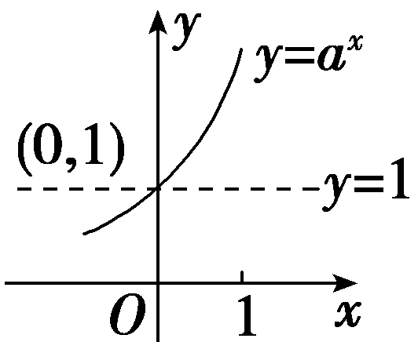
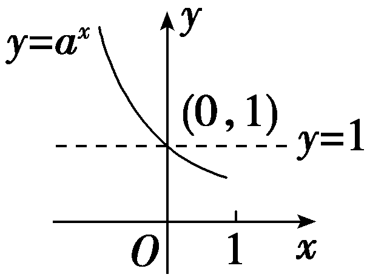
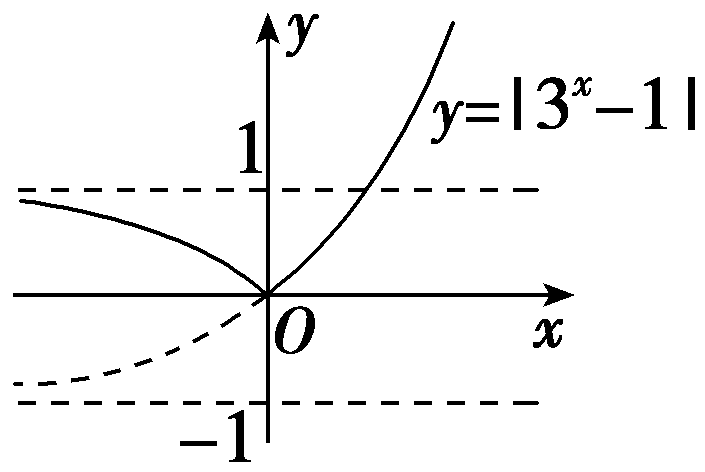
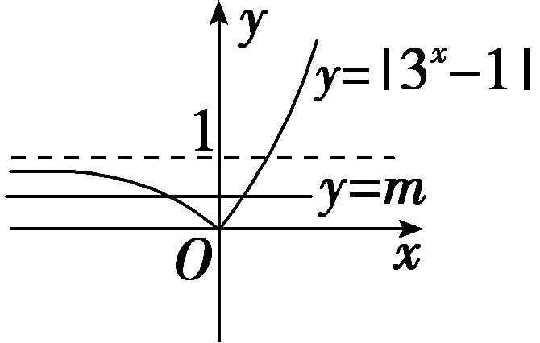
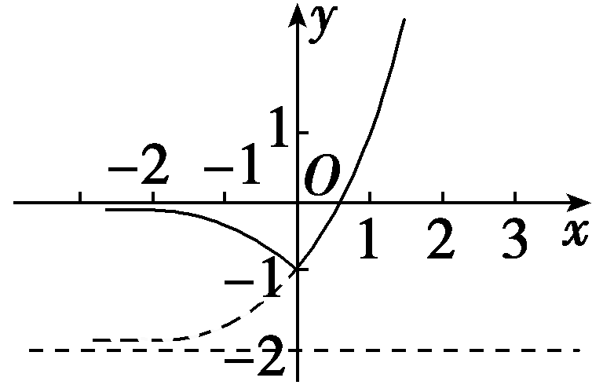
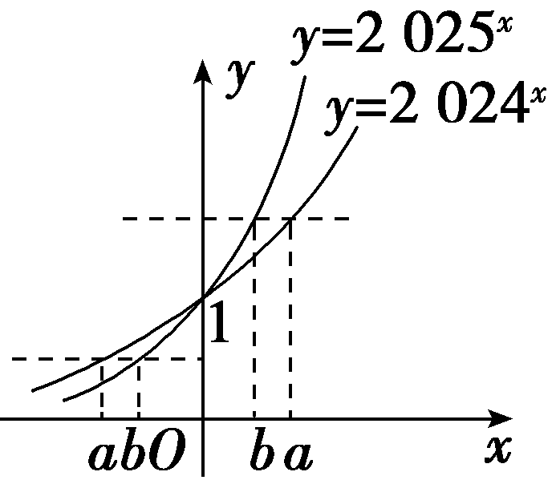
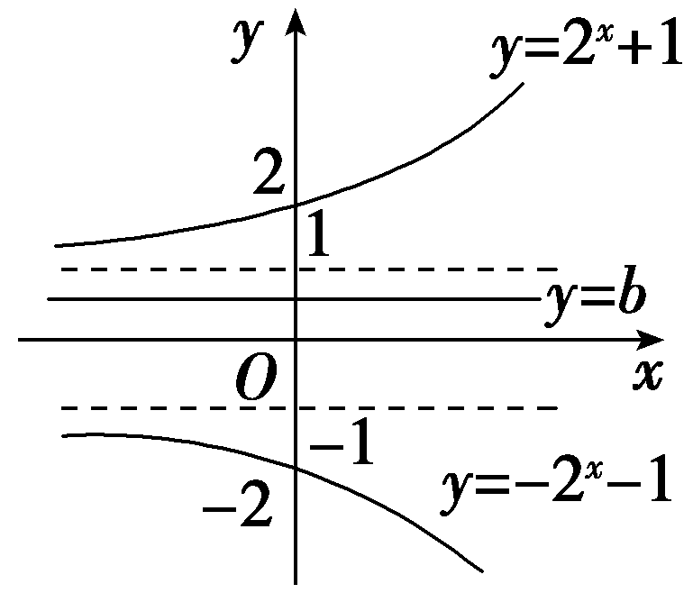
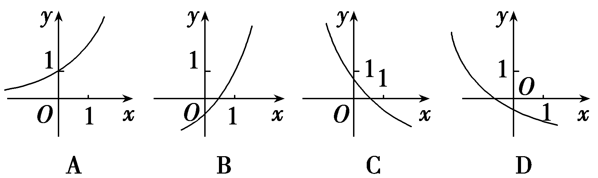
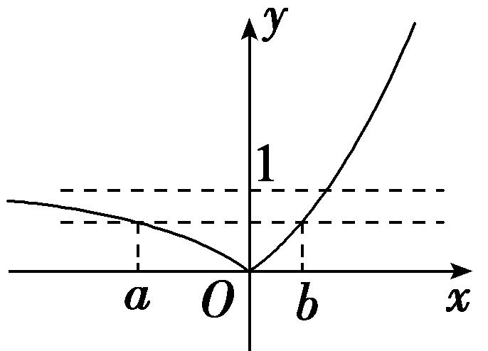

**第七节　指数函数**

【课标研读】　1.通过具体实例，了解指数函数的实际意义，理解指数函数的概念.　2.能用描点法或借助计算工具画出具体指数函数的图象，探索并理解指数函数的单调性与特殊点.

1.指数函数的概念

函数<em>y</em>＝<em>ax</em>(<em>a</em>＞0，且<em>a</em>≠1)叫做指数函数，其中指数<em>x</em>是自变量，定义域是<strong>R</strong>.

2.指数函数的图象和性质

<table><tr><td></td><td>
<em>a</em>＞1
</td><td colspan="2">
0＜<em>a</em>＜1
</td></tr><tr><td>
图象
</td><td>

</td><td colspan="2">

</td></tr><tr><td>
定义域
</td><td colspan="3">
<strong>R</strong>
</td></tr><tr><td>
值域
</td><td colspan="3">
(0，＋∞)
</td></tr><tr><td rowspan="3">
性质
</td><td colspan="3">
过定点(0，1)，即<em>x</em>＝0时，<em>y</em>＝1
</td></tr><tr><td colspan="2">
当<em>x</em>＞0时，<em>y</em>＞1；当<em>x</em>＜0时，0＜<em>y</em>＜1
</td><td colspan="2">
当<em>x</em>＜0时，<em>y</em>＞1；当<em>x</em>＞0时，0＜<em>y</em>＜1
</td></tr><tr><td colspan="2">
在(－∞，＋∞)上是增函数
</td><td colspan="2">
在(－∞，＋∞)上是减函数
</td></tr></table>

[微提醒]　指数函数<em>y</em>＝<em>ax</em>(<em>a</em>＞0，且<em>a</em>≠1)的图象与性质跟<em>a</em>的取值有关，要特别注意分<em>a</em>＞1和0＜<em>a</em>＜1两种情况.

【常用结论】

指数函数图象的特点

(1)指数函数的图象恒过点(0，1)，(1，*a*)，(－1， $\frac{1}{a}$ )，依据这三点的坐标可得到指数函数的大致图象.

(2)函数<te<te<text st*y*le="it<text style="it*a*lic">a</text>lic,superscript">x</text>t st*y*le="italic,superscript">x</text>t style="it*a*lic">y</text>＝ax与y＝( $\frac{1}{a}$ )<te<text st*y*le="it<text style="it*a*lic">a</text>lic,superscript">x</text>t st*y*le="italic,superscript">x</text>(*a*＞0，且a≠1)的图象关于*y*轴对称.

(3)在第一象限内，指数函数<em>y</em>＝<em>ax</em>(<em>a</em>＞0，且<em>a</em>≠1)的图象越高，底数越大.

(4)指数函数<em>y</em>＝<em>ax</em>(<em>a</em>＞0，且<em>a</em>≠1)的图象以<em>x</em>轴为渐近线；<em>y</em>＝<em>ax</em>＋<em>b</em>恒过定点(0，1＋<em>b</em>)，且以<em>y</em>＝<em>b</em>为渐近线.

【自主检测】

1.已知函数<em>y</em>＝<em>a</em>·2<em>x</em>和<em>y</em>＝2<em>x</em>＋<em>b</em>都是指数函数，则<em>a</em>＋<em>b</em>等于(　　)

A.不确定	B.0

C.1	D.2

答案：**C**

解析：由函数<em>y</em>＝<em>a·</em>2<em>x</em>是指数函数，得<em>a</em>＝1，由<em>y</em>＝2<em>x</em>＋<em>b</em>是指数函数，得<em>b</em>＝0，所以<em>a</em>＋<em>b</em>＝1.故选C.

2.(链接人教A必修一P114例1)若函数<te<te<text style="it<text style="it*a*lic">a</text>lic,superscript">x</text>t style="it*a*lic">x</text>t style="italic">*f*</text>(x)＝ax(a＞0，且a≠1)的图象经过点 $\left(2，\frac{1}{3}\right)$ ，则<te<te<text style="it<text style="it*a*lic">a</text>lic,superscript">x</text>t style="it*a*lic">x</text>t style="italic">*f*</text>(－1)＝(　　 )

A.1	B.2

C. $\sqrt{3}$ 	D.3

答案：**C**

解析：依题意可知&lt;te<em>x</em>t style="it<em>a</em>lic"&gt;a&lt;/text&gt;2 $＝\frac{1}{3}$ ，解得&lt;te<em>x</em>t style="it<em>a</em>lic"&gt;a&lt;/text&gt; $＝\frac{\sqrt{3}}{3}$ ，所以&lt;te<em>x</em>t style="italic"&gt;<em>f</em>&lt;/text&gt;(x) $＝\left(\frac{\sqrt{3}}{3}\right)^{x}$ ，所以&lt;te<em>x</em>t style="italic"&gt;<em>f</em>&lt;/text&gt;(－1) $＝\left(\frac{\sqrt{3}}{3}\right)^{－1}＝\sqrt{3}$ .故选C.

3.(链接人教A必修一P119T6)已知<em>a</em>＝0.750.1，<em>b</em>＝1.012.7，<em>c</em>＝1.013.5，则(　　 )

A.*a*＞*b*＞*c*	B.*a*＞*c*＞*b*

C.*c*＞*b*＞*a*	D.*c*＞*a*＞*b*

答案：**C**

解析：因为函数<em>y</em>＝1.01<em>x</em>在(－∞，＋∞)上是增函数，且3.5＞2.7，故1.013.5＞1.012.7＞1＞0.750.1，即<em>c</em>＞<em>b</em>＞<em>a</em>.故选C.

4.函数&lt;text style="it&lt;text style="it<em>a</em>lic"&gt;a&lt;/text&gt;lic"&gt;y&lt;/text&gt; $＝a^{x}^{－1}$ －1(&lt;text style="it<em>a</em>lic"&gt;a&lt;/text&gt;＞0，且a≠1)的图象恒过点<u>　　　　</u>.

答案：(1，0)

解析：在函数<te<text st<text st*y*le="italic">y</text>le="italic">x</text>t style="italic">y</text> $＝a^{x}^{－1}$ －1中，当<text st<text st*y*le="italic">y</text>le="italic">x</text>＝1时，恒有*y*＝0，即函数y $＝a^{x}^{－1}$ －1的图象恒过点(1，0).

考点一　指数函数的图象及应用 　　　　师生共研

(1)已知0＜<em>a</em>＜1，<em>b</em>＜－1，则函数<em>y</em>＝<em>ax</em>＋<em>b</em>的图象必定不经过(　　)

A.第一象限	B.第二象限

C.第三象限	D.第四象限

(2)(一题多变)若函数<em>y</em>＝｜3<em>x</em>－1｜在(－∞，<em>k</em>]上单调递减，则实数<em>k</em>的取值范围为<u>　　　　</u>.

答案：(1)**A**　(2)(－∞，0]

解析：(1)因为0＜<em>a</em>＜1，所以<em>y</em>＝<em>ax</em>的图象经过第一、第二象限，且当<em>x</em>越来越大时，图象与<em>x</em>轴无限接近.又<em>b</em>＜－1，所以<em>y</em>＝<em>ax</em>的图象向下平移超过一个单位长度得到<em>y</em>＝<em>ax</em>＋<em>b</em>的图象，故<em>y</em>＝<em>ax</em>＋<em>b</em>的图象不过第一象限.故选A.

(2)函数<em>y</em>＝｜3<em>x</em>－1｜的图象是由函数<em>y</em>＝3<em>x</em>的图象向下平移一个单位长度后，再把位于<em>x</em>轴下方的图象沿<em>x</em>轴翻折到<em>x</em>轴上方得到的，函数图象如图所示.由图象知，其在(－∞，0]上单调递减，所以实数<em>k</em>的取值范围为(－∞，0].

[变式探究]

1.(变条件)若本例(2)的条件变为：函数<em>y</em>＝｜3<em>x</em>－1｜的图象与直线<em>y</em>＝<em>m</em>有两个不同交点，则实数<em>m</em>的取值范围是<u>　　　　</u>.

答案：(0，1)

解析：曲线<em>y</em>＝｜3<em>x</em>－1｜的图象是由函数<em>y</em>＝3<em>x</em>的图象向下平移一个单位长度后，再把位于<em>x</em>轴下方的图象沿<em>x</em>轴翻折到<em>x</em>轴上方得到的，而直线<em>y</em>＝<em>m</em>的图象是平行于<em>x</em>轴的一条直线，图象如图所示，由图象可得，如果曲线<em>y</em>＝｜3<em>x</em>－1｜与直线<em>y</em>＝<em>m</em>有两个交点，则<em>m</em>的取值范围是(0，1).

2.(变条件)若本例(2)的条件变为：函数<em>y</em>＝｜3<em>x</em>－1｜＋<em>m</em>的图象不经过第二象限，则实数<em>m</em>的取值范围是<u>　　　　</u>.

答案：(－∞，－1]

解析：作出函数<em>y</em>＝｜3<em>x</em>－1｜＋<em>m</em>的图象如图所示.由图象知<em>m</em>≤－1，即<em>m</em>∈(－∞，－1].

指数函数的图象及其应用策略

1.已知函数解析式判断其图象时，可通过图象经过的定点和特殊点来进行分析判断.

2.进行图象识别与应用时，可从基本的指数函数图象入手，通过平移、伸缩、对称等变换得到相关函数的图象.

3.根据指数函数图象判断底数的大小问题，可通过直线*x*＝1与图象的交点进行判断.

对点练1.(多选)已知实数<em>a</em>，<em>b</em>满足等式2 024<em>a</em>＝2 025<em>b</em>，则下列关系式可能成立的是(　　)

A.0＜*b*＜*a*	B.*a*＜*b*＜0

C.0＜*a*＜*b*	D.*a*＝*b*

答案：**ABD**

解析：如图，观察易知，*a*＜*b*＜0或0＜*b*＜*a*或*a*＝*b*＝0，故选ABD.

对点练2.若曲线｜<em>y</em>｜＝2<em>x</em>＋1与直线<em>y</em>＝<em>b</em>没有公共点，则实数<em>b</em>的取值范围是<u>　　　　</u>.

答案：[－1，1]

解析：作出曲线｜<em>y</em>｜＝2<em>x</em>＋1与直线<em>y</em>＝<em>b</em>，如图所示，由图象可得，要想曲线｜<em>y</em>｜＝2<em>x</em>＋1与直线<em>y</em>＝<em>b</em>没有公共点，则实数<em>b</em>应满足的条件是<em>b</em>∈[－1，1].

考点二　指数函数的性质及应用　　　　多维探究

角度1　比较指数式的大小

(1)若<em>a</em>＝1.50.8，<em>b</em>＝1.50.7，<em>c</em>＝0.90.7，则<em>a</em>，<em>b</em>，<em>c</em>的大小关系为(　　)

A.*b*＞*a*＞*c*	B.*a*＞*b*＞*c*

C.*c*＞*b*＞*a*	D.*a*＞*c*＞*b*

(2)若e<em>a</em>＋π<em>&lt;text style="italic,superscript"&gt;b</em>&lt;/text&gt;≥e－b＋ $\pi ^{－}^{a}$ ，下列结论一定成立的是(　　)

A.*a*＋*b*≤0	B.*a*－*b*≥0

C.*a*－*b*≤0	D.*a*＋*b*≥0

答案：(1)**B**　(2)**D**

解析：(1)由<em>y</em>＝1.5<em>x</em>在<strong>R</strong>上单调递增，则<em>a</em>＝1.50.8＞1.50.7＝<em>b</em>，由<em>y</em>＝<em>x</em>0.7在[0，＋∞)上单调递增，则<em>b</em>＝1.50.7＞0.90.7＝<em>c</em>，所以<em>a</em>＞<em>b</em>＞<em>c</em>，故选B.

(2)因为e&lt;te&lt;te&lt;te&lt;text style="it&lt;text style="it&lt;text style="it<em>a</em>lic"&gt;a&lt;/text&gt;lic"&gt;a&lt;/text&gt;lic"&gt;x&lt;/text&gt;t style="italic,superscript"&gt;x&lt;/text&gt;t style="italic"&gt;x&lt;/text&gt;t style="it<em>a</em>lic,superscript"&gt;a&lt;/text&gt;＋π<em>&lt;text style="italic,superscript"&gt;&lt;text style="italic"&gt;&lt;text style="italic"&gt;&lt;text style="italic"&gt;b</em>&lt;/text&gt;&lt;/text&gt;&lt;/text&gt;&lt;/text&gt;≥ $e^{－}^{b}$ ＋ $\pi ^{－}^{a}$ ，所以e&lt;te&lt;te&lt;te&lt;text style="it&lt;text style="it&lt;text style="it<em>a</em>lic"&gt;a&lt;/text&gt;lic"&gt;a&lt;/text&gt;lic"&gt;x&lt;/text&gt;t style="italic,superscript"&gt;x&lt;/text&gt;t style="italic"&gt;x&lt;/text&gt;t style="it<em>a</em>lic,superscript"&gt;a&lt;/text&gt;－ $\pi ^{－}^{a}$ ≥ $e^{－}^{b}$ －π&lt;te&lt;te&lt;te&lt;text style="it&lt;text style="it&lt;text style="it<em>a</em>lic"&gt;a&lt;/text&gt;lic"&gt;a&lt;/text&gt;lic"&gt;x&lt;/text&gt;t style="italic,superscript"&gt;x&lt;/text&gt;t style="italic"&gt;x&lt;/text&gt;t style="it<em>a</em>lic,superscript"&gt;<em>&lt;text style="italic"&gt;&lt;text style="italic"&gt;&lt;text style="italic"&gt;b</em>&lt;/text&gt;&lt;/text&gt;&lt;/text&gt;&lt;/text&gt;①，令<em>&lt;text style="italic"&gt;&lt;text style="italic"&gt;&lt;text style="italic"&gt;f</em>&lt;/text&gt;&lt;/text&gt;&lt;/text&gt;(x)＝ex－ $\pi ^{－}^{x}$ ，则&lt;te&lt;te&lt;te&lt;text style="it&lt;text style="it&lt;text style="it<em>a</em>lic"&gt;a&lt;/text&gt;lic"&gt;a&lt;/text&gt;lic"&gt;x&lt;/text&gt;t style="italic,superscript"&gt;x&lt;/text&gt;t style="italic"&gt;x&lt;/text&gt;t style="italic"&gt;<em>&lt;text style="italic"&gt;&lt;text style="italic"&gt;f</em>&lt;/text&gt;&lt;/text&gt;&lt;/text&gt;(x)是&lt;text style="<em>&lt;text style="italic"&gt;&lt;text style="italic"&gt;b</em>&lt;/text&gt;&lt;/text&gt;old"&gt;R&lt;/text&gt;上的增函数，①式即为f(&lt;text style="it<em>a</em>lic,superscript"&gt;a&lt;/text&gt;)≥f(－<em>&lt;text style="italic,superscript"&gt;b</em>&lt;/text&gt;)，所以a≥－b，即a＋b≥0.故选D.

角度2　解简单的指数方程或不等式

(1)若 $2^{x^{2}+1}$ ≤ $\left(\frac{1}{4}\right)^{x－2}$ ，则函数&lt;te<em>x</em>t style="italic"&gt;y&lt;/text&gt;＝2x的值域是(　　 )

A. $\left[\frac{1}{8}，2\right)$ 	B. $\left[\frac{1}{8}，2\right]$

C. $\left(－\infty ，\frac{1}{8}\right)$ 	D.[2，＋∞)

(2)已知实数&lt;te&lt;text style="it&lt;text style="it&lt;text style="it<em>a</em>lic"&gt;a&lt;/text&gt;lic"&gt;a&lt;/text&gt;lic"&gt;x&lt;/text&gt;t style="italic"&gt;a&lt;/text&gt;≠1，函数<em>&lt;text style="italic"&gt;&lt;text style="italic"&gt;f</em>&lt;/text&gt;&lt;/text&gt;(x) $＝\left\{\begin{matrix}4^{x}，x\geq 0，\\2^{a－x}，x<0，\end{matrix}\right.$ 若&lt;te&lt;text style="it&lt;text style="it&lt;text style="it<em>a</em>lic"&gt;a&lt;/text&gt;lic"&gt;a&lt;/text&gt;lic"&gt;x&lt;/text&gt;t style="italic"&gt;<em>&lt;text style="italic"&gt;f</em>&lt;/text&gt;&lt;/text&gt;(1－<em>a</em>)＝f(a－1)，则a的值为<u>　　　　</u>.

答案：(1)**B**　(2) $\frac{1}{2}$

解析：(1) $\left(\frac{1}{4}\right)^{x－2}＝$ (&lt;te&lt;te&lt;te&lt;te&lt;te<em>x</em>t st<em>y</em>le="italic"&gt;x&lt;/text&gt;t style="italic"&gt;x&lt;/text&gt;t style="italic"&gt;x&lt;/text&gt;t style="italic"&gt;x&lt;/text&gt;t style="superscript"&gt;2&lt;/text&gt;&lt;te&lt;te&lt;te&lt;te<em>x</em>t style="italic,superscript"&gt;x&lt;/text&gt;t style="italic,superscript"&gt;x&lt;/text&gt;t style="italic,superscript"&gt;x&lt;/text&gt;t style="superscript"&gt;&lt;text style="superscript"&gt;&lt;text style="superscript"&gt;－2&lt;/text&gt;&lt;/text&gt;&lt;/text&gt;)x－2＝2－2x&lt;text style="superscript"&gt;＋4&lt;/text&gt;，所以 $2^{x^{2}+1}$ ≤&lt;te&lt;te&lt;te&lt;te&lt;te<em>x</em>t st<em>y</em>le="italic"&gt;x&lt;/text&gt;t style="italic"&gt;x&lt;/text&gt;t style="italic"&gt;x&lt;/text&gt;t style="italic"&gt;x&lt;/text&gt;t style="superscript"&gt;2&lt;/text&gt;&lt;te&lt;te&lt;te&lt;te<em>x</em>t style="italic,superscript"&gt;x&lt;/text&gt;t style="italic,superscript"&gt;x&lt;/text&gt;t style="italic,superscript"&gt;x&lt;/text&gt;t style="superscript"&gt;&lt;text style="superscript"&gt;&lt;text style="superscript"&gt;－2&lt;/text&gt;&lt;/text&gt;&lt;/text&gt;x&lt;text style="superscript"&gt;＋4&lt;/text&gt;，即x2＋1≤－2x＋4，即x2＋2x－3≤0，所以－3≤x≤1，此时y＝2x的值域为[2－3，21]，即为 $\left[\frac{1}{8}，2\right]$ .故选B.

(2)当&lt;text style="it&lt;text style="it&lt;text style="it&lt;text style="it<em>a</em>lic"&gt;a&lt;/text&gt;lic"&gt;a&lt;/text&gt;lic,superscript"&gt;a&lt;/text&gt;lic"&gt;a&lt;/text&gt;＜1时，41－a＝21，解得a $＝\frac{1}{2}$ ；当&lt;text style="it&lt;text style="it&lt;text style="it&lt;text style="it<em>a</em>lic"&gt;a&lt;/text&gt;lic"&gt;a&lt;/text&gt;lic,superscript"&gt;a&lt;/text&gt;lic"&gt;a&lt;/text&gt;＞1时，代入不成立.故a的值为 $\frac{1}{2}$ .

1.比较指数式大小的方法

(1)能化成同底数的先化成同底数幂，再利用单调性比较大小.

(2)不能化成同底数的，一般引入“1”等中间量比较大小.

2.指数方程或不等式的解法

(1)解指数方程或不等式的依据：

①<em>af</em>(<em>x</em>)＝<em>ag</em>(<em>x</em>)⇔<em>f</em>(<em>x</em>)＝<em>g</em>(<em>x</em>)；

②<em>af</em>(<em>x</em>)＞<em>ag</em>(<em>x</em>)，当<em>a</em>＞1时，等价于<em>f</em>(<em>x</em>)＞<em>g</em>(<em>x</em>)；当0＜<em>a</em>＜1时，等价于<em>f</em>(<em>x</em>)＜<em>g</em>(<em>x</em>).

(2)解指数方程或不等式的方法：先利用幂的运算性质化为同底数幂，再利用函数单调性转化为一般方程或不等式求解.

对点练3.(多选)下列各式正确的是(　　)

A.1.72.5＞1.73	B.( $\frac{1}{2})^{\frac{2}{3}}＞2^{－\frac{4}{3}}$

C.1.70.3＞0.93.1	D.( $\frac{2}{3})^{\frac{3}{4}}$ ＜( $\frac{3}{4})^{\frac{2}{3}}$

答案：**BCD**

解析：因为&lt;te&lt;te&lt;text st&lt;text st<em>y</em>le="italic"&gt;y&lt;/text&gt;le="italic,superscript"&gt;x&lt;/text&gt;t st<em>y</em>le="italic,superscript"&gt;x&lt;/text&gt;t style="italic"&gt;y&lt;/text&gt;＝1.7x为增函数，所以1.72.5＜1.73，故A不正确；( $\frac{1}{2})^{\frac{2}{3}}＝2^{－\frac{2}{3}}$ ，&lt;te&lt;te&lt;text st&lt;text st<em>y</em>le="italic"&gt;y&lt;/text&gt;le="italic,superscript"&gt;x&lt;/text&gt;t st<em>y</em>le="italic,superscript"&gt;x&lt;/text&gt;t style="italic"&gt;y&lt;/text&gt;＝2x为增函数，所以 $2^{－\frac{2}{3}}＞2^{－\frac{4}{3}}$ ，故B正确；因为1.70.&lt;te&lt;text st&lt;text st<em>y</em>le="italic"&gt;y&lt;/text&gt;le="italic,superscript"&gt;x&lt;/text&gt;t st<em>y</em>le="superscript"&gt;3&lt;/text&gt;＞1，0.9&lt;text style="superscript"&gt;3.1&lt;/text&gt;∈(0，1)，所以1.7&lt;text style="superscript"&gt;0.3&lt;/text&gt;＞0.93.1，故C正确；因为&lt;te<em>x</em>t style="italic"&gt;y&lt;/text&gt; $＝\left(\frac{2}{3}\right)^{x}$ 为减函数，所以( $\frac{2}{3})^{\frac{3}{4}}$ ＜( $\frac{2}{3})^{\frac{2}{3}}$ .又&lt;te&lt;te&lt;text st&lt;text st<em>y</em>le="italic"&gt;y&lt;/text&gt;le="italic,superscript"&gt;x&lt;/text&gt;t st<em>y</em>le="italic,superscript"&gt;x&lt;/text&gt;t style="italic"&gt;y&lt;/text&gt; $＝x^{\frac{2}{3}}$ 在(0，＋∞)上单调递增，所以( $\frac{2}{3})^{\frac{2}{3}}$ ＜( $\frac{3}{4})^{\frac{2}{3}}$ ，所以( $\frac{2}{3})^{\frac{3}{4}}$ ＜( $\frac{2}{3})^{\frac{2}{3}}$ ＜( $\frac{3}{4})^{\frac{2}{3}}$ ，故D正确.故选BCD.

对点练4.设函数&lt;te&lt;text style="it&lt;text style="it<em>a</em>lic"&gt;a&lt;/text&gt;lic"&gt;x&lt;/text&gt;t style="italic"&gt;<em>f</em>&lt;/text&gt;(x) $＝\left\{\begin{matrix}\left(\frac{1}{2}\right)^{x}－7，x<0，\\\sqrt{x}，x\geq 0，\end{matrix}\right.$ 若&lt;te&lt;text style="it&lt;text style="it<em>a</em>lic"&gt;a&lt;/text&gt;lic"&gt;x&lt;/text&gt;t style="italic"&gt;<em>f</em>&lt;/text&gt;(a)＜1，则实数a的取值范围是<u>　　　　</u>.

答案：(－3，1)

解析：当<text style="it<text style="it<text style="it<text style="it<text style="it<text style="it*a*lic">a</text>lic">a</text>lic">a</text>lic">a</text>lic">a</text>lic">a</text>＜0时，原不等式化为 $\left(\frac{1}{2}\right)^{a}$ －7＜1，则 $2^{－}^{a}$ ＜8，解得<text style="it<text style="it<text style="it<text style="it<text style="it<text style="it*a*lic">a</text>lic">a</text>lic">a</text>lic">a</text>lic">a</text>lic">a</text>＞－3，所以－3＜a＜0.当a≥0时，则 $\sqrt{a}$ ＜1，解得<text style="it<text style="it<text style="it<text style="it<text style="it<text style="it*a*lic">a</text>lic">a</text>lic">a</text>lic">a</text>lic">a</text>lic">a</text>＜1，所以0≤a＜1.综上，实数a的取值范围是(－3，1).

考点三　指数型函数的综合应用　　　　师生共研

(一题多问)设&lt;te<em>x</em>t style="italic"&gt;a&lt;/text&gt;∈<strong>R</strong>，函数<em>f</em>(x) $＝\frac{2^{x}＋a}{2^{x}－1}$ .

(1)求*a*的值，使得*y*＝*f*(*x*)为奇函数；

(2)若*f*(*x*)关于点(0，2)中心对称，求*a*的值；

(3)若*f*(2)＝*a*，求满足*f*(*x*)＞*a*的实数*x*的取值范围；

(4)在(1)的条件下，若对任意的&lt;&lt;<em>t</em>ext style="italic"&gt;t&lt;/text&gt;ext style="italic"&gt;t&lt;/text&gt;∈<strong>R</strong>，不等式<em>&lt;text style="italic"&gt;f</em>&lt;/text&gt;(t2－2t)＋f $\left(t^{2}－k\right)$ ＜0恒成立，求实数<em>k</em>的取值范围.

解：(1)由*<text style="italic"><text style="italic">f*</text></text> $\left(x\right)$ 为奇函数，可知*<text style="italic"><text style="italic">f*</text></text>(－1)＝－f(1)，

即－(1＋2*a*)＝－(2＋*a*)，解得*a*＝1，

当<te<te<te<te<te*x*t style="italic">x</text>t style="italic">x</text>t style="italic">x</text>t style="italic">x</text>t style="italic">a</text>＝1时，*<text style="italic"><text style="italic">f*</text></text>(x) $＝\frac{2^{x}+1}{2^{x}－1}$ (<te<te<te<te*x*t style="italic">x</text>t style="italic">x</text>t style="italic">x</text>t style="italic">x</text>≠0)，*<text style="italic"><text style="italic">f*</text></text>(－x) $＝\frac{2^{－x}+1}{2^{－x}－1}＝\frac{1+2^{x}}{1－2^{x}}＝$ －<te<te<te<te<te*x*t style="italic">x</text>t style="italic">x</text>t style="italic">x</text>t style="italic">x</text>t style="italic">*<text style="italic">f*</text></text>(x)对一切非零实数x恒成立，

故*a*＝1时，*y*＝*f*(*x*)为奇函数.

(2)由*f* $\left(x\right)$ 关于点(0，2)中心对称，

得*f*(*x*)＋*f*(－*x*)＝4，

所以 $\frac{2^{x}＋a}{2^{x}－1}$ ＋ $\frac{2^{－x}＋a}{2^{－x}－1}＝$ 4，即 $\frac{(2^{x}－1)(1－a)}{2^{x}－1}＝$ 4，解得*a*＝－3.

(3)由<text style="it<text style="it<text style="it*a*lic">a</text>lic">a</text>lic">f</text>(2)＝a，可得 $\frac{4+a}{3}＝$ <text style="it<text style="it*a*lic">a</text>lic">a</text>，解得a＝2，

所以&lt;te&lt;te<em>x</em>t style="it<em>a</em>lic"&gt;x&lt;/text&gt;t style="italic"&gt;f&lt;/text&gt;(x)＞a⇔ $\frac{2^{x}+2}{2^{x}－1}$ ＞2⇔ $\frac{2^{x}－4}{2^{x}－1}$ ＜0⇔1＜2&lt;te<em>x</em>t style="it<em>a</em>lic"&gt;x&lt;/text&gt;＜4，

解得0＜*x*＜2，所以满足*f*(*x*)＞*a*的实数*x*的取值范围是(0，2).

(4)由(1)知：<te*x*t style="italic">f</text>(x) $＝\frac{2^{x}+1}{2^{x}－1}＝$ 1＋ $\frac{2}{2^{x}－1}$ 是减函数，

因为*<text style="italic"><text style="italic">f*</text></text> $\left(x\right)$ 是奇函数，且*<text style="italic"><text style="italic">f*</text></text> $\left(t^{2}－2t\right)$ ＋*<text style="italic"><text style="italic">f*</text></text> $\left(t^{2}－k\right)$ ＜0，

所以&lt;&lt;&lt;<em>t</em>ext style="italic"&gt;t&lt;/text&gt;ext style="italic"&gt;t&lt;/text&gt;ext style="italic"&gt;<em>&lt;text style="italic"&gt;f</em>&lt;/text&gt;&lt;/text&gt; $\left(t^{2}－2t\right)$ ＜－&lt;&lt;&lt;<em>t</em>ext style="italic"&gt;t&lt;/text&gt;ext style="italic"&gt;t&lt;/text&gt;ext style="italic"&gt;<em>&lt;text style="italic"&gt;f</em>&lt;/text&gt;&lt;/text&gt; $\left(t^{2}－k\right)＝$ &lt;&lt;&lt;<em>t</em>ext style="italic"&gt;t&lt;/text&gt;ext style="italic"&gt;t&lt;/text&gt;ext style="italic"&gt;<em>&lt;text style="italic"&gt;f</em>&lt;/text&gt;&lt;/text&gt; $\left(k－t^{2}\right)$ ，所以&lt;&lt;<em>t</em>ext style="italic"&gt;t&lt;/text&gt;ext style="italic"&gt;t&lt;/text&gt;&lt;text style="superscript"&gt;2&lt;/text&gt;－2t＞<em>k</em>－t2恒成立，

即<<*t*ext style="italic">t</text>ext style="italic">*k*</text>＜ $\left(2t^{2}－2t\right)_{min}$ ，又<*t*ext style="superscript">2</text>*t*2－2t＝2 $\left(t－\frac{1}{2}\right)^{2}$ － $\frac{1}{2}$ ≥－ $\frac{1}{2}$ ，所以<<*t*ext style="italic">t</text>ext style="italic">*k*</text>＜－ $\frac{1}{2}$ .

所以实数*k*的取值范围为(－∞，－ $\frac{1}{2}$ ).

求解与指数函数有关的复合函数问题，首先要熟知指数函数的定义域、值域、单调性等相关性质，其次要明确复合函数的构成，涉及值域、单调区间、最值等问题时，要借助“同增异减”这一性质分析判断.

对点练5.函数<te*x*t style="italic">f</text>(x) $＝\left(\frac{1}{2}\right)^{\sqrt{－x^{2}＋x+1}}$ 的单调递增区间为(　　 )

A. $\left(－\infty ，\frac{1}{2}\right]$ 	B. $\left(－\infty ，\frac{1－\sqrt{5}}{2}\right]$

C. $\left[\frac{1}{2}，\frac{1+\sqrt{5}}{2}\right]$ 	D. $\left[\frac{1}{2}，＋\infty \right)$

答案：**C**

解析：由－&lt;&lt;te<em>x</em>t st<em>y</em>le="italic"&gt;t&lt;/text&gt;e&lt;te&lt;te&lt;te&lt;te<em>x</em>t style="italic"&gt;x&lt;/text&gt;t st<em>y</em>le="italic"&gt;x&lt;/text&gt;t style="italic"&gt;x&lt;/text&gt;t style="italic"&gt;x&lt;/text&gt;t style="italic"&gt;x&lt;/text&gt;&lt;text style="superscript"&gt;2&lt;/text&gt;＋x＋1≥0得 $\frac{1－\sqrt{5}}{2}$ ≤&lt;&lt;te<em>x</em>t st<em>y</em>le="italic"&gt;t&lt;/text&gt;e&lt;te&lt;te&lt;te&lt;te<em>x</em>t style="italic"&gt;x&lt;/text&gt;t st<em>y</em>le="italic"&gt;x&lt;/text&gt;t style="italic"&gt;x&lt;/text&gt;t style="italic"&gt;x&lt;/text&gt;t style="italic"&gt;x&lt;/text&gt;≤ $\frac{1+\sqrt{5}}{2}$ ，所以&lt;&lt;te<em>x</em>t st<em>y</em>le="italic"&gt;t&lt;/text&gt;e&lt;te&lt;te<em>x</em>t style="italic"&gt;x&lt;/text&gt;t st<em>y</em>le="italic"&gt;x&lt;/text&gt;t style="italic"&gt;<em>f</em>&lt;/text&gt;(&lt;te&lt;te<em>x</em>t style="italic"&gt;x&lt;/text&gt;t style="italic"&gt;x&lt;/text&gt;)的定义域为 $\left[\frac{1－\sqrt{5}}{2}，\frac{1+\sqrt{5}}{2}\right]$ .因为&lt;&lt;te<em>x</em>t st<em>y</em>le="italic"&gt;t&lt;/text&gt;e&lt;te<em>x</em>t style="italic"&gt;x&lt;/text&gt;t style="italic"&gt;y&lt;/text&gt;＝－&lt;te&lt;te&lt;te<em>x</em>t style="italic"&gt;x&lt;/text&gt;t style="italic"&gt;x&lt;/text&gt;t style="italic"&gt;x&lt;/text&gt;&lt;text style="superscript"&gt;2&lt;/text&gt;＋x＋1在 $\left(－\infty ，\frac{1}{2}\right]$ 上单调递增，在 $\left[\frac{1}{2}，＋\infty \right)$ 上单调递减，所以&lt;te<em>x</em>t st<em>y</em>le="italic"&gt;t&lt;/text&gt; $＝\sqrt{－x^{2}＋x+1}$ 在 $\left[\frac{1－\sqrt{5}}{2}，\frac{1}{2}\right]$ 上单调递增，在 $\left[\frac{1}{2}，\frac{1+\sqrt{5}}{2}\right]$ 上单调递减，又&lt;&lt;te<em>x</em>t st<em>y</em>le="italic"&gt;t&lt;/text&gt;e&lt;te<em>x</em>t style="italic"&gt;x&lt;/text&gt;t style="italic"&gt;y&lt;/text&gt; $＝\left(\frac{1}{2}\right)^{t}$ 在&lt;te<em>x</em>t style="bold"&gt;R&lt;/text&gt;上单调递减，所以&lt;&lt;text st<em>y</em>le="italic"&gt;t&lt;/text&gt;e&lt;te&lt;te<em>x</em>t style="italic"&gt;x&lt;/text&gt;t st<em>y</em>le="italic"&gt;x&lt;/text&gt;t style="italic"&gt;<em>f</em>&lt;/text&gt;(&lt;te&lt;te<em>x</em>t style="italic"&gt;x&lt;/text&gt;t style="italic"&gt;x&lt;/text&gt;) $＝\left(\frac{1}{2}\right)^{\sqrt{－x^{2}＋x+1}}$ 的单调递增区间为 $\left[\frac{1}{2}，\frac{1+\sqrt{5}}{2}\right]$ .故选C.

对点练6.已知函数<em>f</em>(<em>x</em>)＝4<em>x</em>－2<em>x</em>＋1＋4，<em>x</em>∈[－1，1]，则函数<em>y</em>＝<em>f</em>(<em>x</em>)的值域为(　　 )

A.[3，＋∞)	B.[3，4]

C. $\left[3，\frac{13}{4}\right]$ 	D. $\left[\frac{13}{4}，4\right]$

答案：**B**

解析：&lt;&lt;&lt;&lt;&lt;&lt;&lt;&lt;&lt;te&lt;te&lt;te<em>x</em>t st<em>y</em>le="italic"&gt;x&lt;/text&gt;t style="italic"&gt;x&lt;/text&gt;t st<em>y</em>le="italic"&gt;t&lt;/text&gt;e&lt;te<em>x</em>t style="italic"&gt;x&lt;/text&gt;t st<em>y</em>le="italic"&gt;t&lt;/text&gt;ext style="italic"&gt;t&lt;/text&gt;ext style="italic"&gt;t&lt;/text&gt;ext style="italic"&gt;t&lt;/text&gt;ext st<em>y</em>le="italic"&gt;t&lt;/text&gt;e<em>x</em>t style="italic"&gt;t&lt;/text&gt;ext style="italic"&gt;t&lt;/text&gt;e&lt;te&lt;te&lt;te&lt;te<em>x</em>t style="italic"&gt;x&lt;/text&gt;t style="italic,superscript"&gt;x&lt;/text&gt;t style="italic,superscript"&gt;x&lt;/text&gt;t style="italic"&gt;x&lt;/text&gt;t style="italic"&gt;<em>&lt;text style="italic"&gt;&lt;text style="italic"&gt;f</em>&lt;/text&gt;&lt;/text&gt;&lt;/text&gt;(x)＝(&lt;text style="superscript"&gt;&lt;text style="superscript"&gt;2&lt;/text&gt;&lt;/text&gt;x)2－2×2x＋4，x∈[－1，1]，令2x＝t，则t＝2x在[－1，1]上单调递增，即 $\frac{1}{2}$ ≤&lt;&lt;&lt;&lt;&lt;&lt;&lt;&lt;te&lt;te&lt;te<em>x</em>t st<em>y</em>le="italic"&gt;x&lt;/text&gt;t style="italic"&gt;x&lt;/text&gt;t st<em>y</em>le="italic"&gt;t&lt;/text&gt;e&lt;te<em>x</em>t style="italic"&gt;x&lt;/text&gt;t st<em>y</em>le="italic"&gt;t&lt;/text&gt;ext style="italic"&gt;t&lt;/text&gt;ext style="italic"&gt;t&lt;/text&gt;ext style="italic"&gt;t&lt;/text&gt;ext st<em>y</em>le="italic"&gt;t&lt;/text&gt;e<em>x</em>t style="italic"&gt;t&lt;/text&gt;ext style="italic"&gt;t&lt;/text&gt;≤&lt;te&lt;te&lt;te<em>x</em>t style="italic"&gt;x&lt;/text&gt;t style="italic,superscript"&gt;x&lt;/text&gt;t style="superscript"&gt;&lt;text style="superscript"&gt;2&lt;/text&gt;&lt;/text&gt;，所以y＝t2－2t＋4＝(t－1)2＋3，当t＝1时，y&lt;text style="subscript"&gt;min&lt;/text&gt;＝3，此时&lt;te<em>x</em>t style="italic"&gt;x&lt;/text&gt;＝0，<em>&lt;text style="italic"&gt;&lt;text style="italic"&gt;&lt;text style="italic"&gt;f</em>&lt;/text&gt;&lt;/text&gt;&lt;/text&gt;(x)min＝3；当t＝2时，y&lt;text style="subscript"&gt;max&lt;/text&gt;＝4，此时x＝1，f(x)max＝4，所以函数y＝f(x)的值域为[3，4].故选B.

[真题再现]　(2023·天津卷)若<em>a</em>＝1.010.5，<em>b</em>＝1.010.6，<em>c</em>＝0.60.5，则<em>a</em>，<em>b</em>，<em>c</em>的大小关系为(　　)

A.*c*＞*a*＞*b*	B.*c*＞*b*＞*a*

C.*a*＞*b*＞*c*	D.*b*＞*a*＞*c*

答案：**D**

解析：法一：因为函数<em>f</em>(<em>x</em>)＝1.01<em>x</em>是增函数，且0.6＞0.5＞0，所以1.010.6＞1.010.5＞1，即<em>b</em>＞<em>a</em>＞1；因为函数<em>g</em>(<em>x</em>)＝0.6<em>x</em>是减函数，且0.5＞0，所以0.60.5＜0.60＝1，即<em>c</em>＜1.综上<em>b</em>＞<em>a</em>＞<em>c</em>.故选D.

法二：因为函数<em>f</em>(<em>x</em>)＝1.01<em>x</em>是增函数，且0.6＞0.5，所以1.010.6＞1.010.5，即<em>b</em>＞<em>a</em>；因为函数<em>h</em>(<em>x</em>)＝<em>x</em>0.5在(0，＋∞)上单调递增，且1.01＞0.6＞0，所以1.010.5＞0.60.5，即<em>a</em>＞<em>c</em>.综上<em>b</em>＞<em>a</em>＞<em>c</em>.故选D.

[教材呈现]　(人教A必修一P119T6)比较下列各题中两个值的大小：

(1)30.8，30.7；(2)0.75－0.1，0.750.1；(3)1.012.7，1.013.5；(4)0.993.3，0.994.5.

点评：教材习题体现了比较大小的两种常用方法：(1)利用函数的单调性；(2)借助于0或1作为中间数，而该高考试题考查的也正是这两种方法.

**课时测评**14　**指数函数** $\frac{对应学生}{用书P337}$

(时间：60分钟　满分：88分)

(本栏目内容，在学生用书中以独立形式分册装订！)

(1—8题，每小题5分，共40分)

1.已知指数函数<em>f</em>(<em>x</em>)＝(2<em>a</em>2－5<em>a</em>＋3)<em>ax</em>在(0，＋∞)上单调递增，则实数<em>a</em>的值为(　　 )

A. $\frac{1}{2}$ 	B.1

C. $\frac{3}{2}$ 	D.2

答案：**D**

解析：由题意得&lt;te&lt;te&lt;te&lt;text style="it<em>a</em>lic"&gt;x&lt;/text&gt;t style="it<em>a</em>lic,superscript"&gt;x&lt;/text&gt;t style="italic"&gt;x&lt;/text&gt;t style="superscript"&gt;2&lt;/text&gt;&lt;text style="it&lt;text style="it&lt;text style="it&lt;text style="it&lt;text style="it&lt;text style="it<em>a</em>lic"&gt;a&lt;/text&gt;lic"&gt;a&lt;/text&gt;lic"&gt;a&lt;/text&gt;lic"&gt;a&lt;/text&gt;lic"&gt;a&lt;/text&gt;lic"&gt;a&lt;/text&gt;2－5a＋3＝1，所以2a2－5a＋2＝0，所以a＝2或a $＝\frac{1}{2}$ .当&lt;te&lt;te&lt;te&lt;text style="it<em>a</em>lic"&gt;x&lt;/text&gt;t style="it<em>a</em>lic,superscript"&gt;x&lt;/text&gt;t style="italic"&gt;x&lt;/text&gt;t style="it&lt;text style="it&lt;text style="it&lt;text style="it&lt;text style="it&lt;text style="it<em>a</em>lic"&gt;a&lt;/text&gt;lic"&gt;a&lt;/text&gt;lic"&gt;a&lt;/text&gt;lic"&gt;a&lt;/text&gt;lic"&gt;a&lt;/text&gt;lic"&gt;a&lt;/text&gt;＝&lt;text style="superscript"&gt;2&lt;/text&gt;时，<em>&lt;text style="italic"&gt;f</em>&lt;/text&gt;(x)＝2x在(0，＋∞)上单调递增，符合题意；当a $＝\frac{1}{2}$ 时，&lt;te&lt;te&lt;te&lt;text style="it<em>a</em>lic"&gt;x&lt;/text&gt;t style="it<em>a</em>lic,superscript"&gt;x&lt;/text&gt;t style="italic"&gt;x&lt;/text&gt;t style="italic"&gt;<em>f</em>&lt;/text&gt;(x) $＝\left(\frac{1}{2}\right)^{x}$ 在(0，＋∞)上单调递减，不符合题意.所以&lt;te&lt;te&lt;te&lt;text style="it<em>a</em>lic"&gt;x&lt;/text&gt;t style="it<em>a</em>lic,superscript"&gt;x&lt;/text&gt;t style="italic"&gt;x&lt;/text&gt;t style="it&lt;text style="it&lt;text style="it&lt;text style="it&lt;text style="it&lt;text style="it<em>a</em>lic"&gt;a&lt;/text&gt;lic"&gt;a&lt;/text&gt;lic"&gt;a&lt;/text&gt;lic"&gt;a&lt;/text&gt;lic"&gt;a&lt;/text&gt;lic"&gt;a&lt;/text&gt;＝&lt;text style="superscript"&gt;2&lt;/text&gt;.故选D.

2.函数<te<text style="it<text style="it*a*lic">a</text>lic,superscript">x</text>t style="it*a*lic">y</text>＝ax－ $\frac{1}{a}$ (<te<text style="it<text style="it*a*lic">a</text>lic,superscript">x</text>t style="italic">a</text>＞0，且a≠1)的图象可能是(　　 )

答案：**D**

解析：根据题意，函数<te<te<text st*y*le="italic">x</text>t style="it<text style="it*a*lic">a</text>lic,superscript">x</text>t style="it*a*lic">y</text>＝ax－ $\frac{1}{a}$ (<te<te<text st*y*le="italic">x</text>t style="it<text style="it*a*lic">a</text>lic,superscript">x</text>t style="italic">a</text>＞0，且a≠1)，当x＝－1时，必有*y*＝0，即函数经过点(－1，0)，排除ABC.故选D.

3.(教材改编)已知<em>a</em>＝20.2，<em>b</em>＝0.40.2，<em>c</em>＝0.40.6，则<em>a</em>，<em>b</em>，<em>c</em>的大小关系是(　　 )

A.*a*＞*b*＞*c*	B.*a*＞*c*＞*b*

C.*c*＞*a*＞*b*	D.*b*＞*c*＞*a*

答案：**A**

解析：因为<em>y</em>＝0.4<em>x</em>为减函数，所以0.40.6＜0.40.2＜0.40＝1，又20.2＞1，所以<em>a</em>＞<em>b</em>＞<em>c</em>.故选A.

4.已知函数<te<te*x*t st*y*le="it*a*lic">x</text>t style="italic">*f*</text>(x)＝－2 $(\frac{1}{2})^{\left|x\right|}$ ＋<te*x*t st*y*le="italic">a</text>，其图象无限接近直线y＝1但又不与该直线相交，则<te*x*t style="italic">*f*</text>(x)＞ $\frac{1}{2}$ 的解集为(　　)

A.(－∞，－2)∪(2，＋∞)

B.(－2，2)

C.(－∞，－1)∪(1，＋∞)

D.(－1，1)

答案：**A**

解析：根据题意知函数&lt;te&lt;te&lt;te&lt;te&lt;te&lt;te&lt;te&lt;te&lt;te&lt;te&lt;te&lt;te&lt;te&lt;te&lt;te<em>x</em>t style="italic"&gt;x&lt;/text&gt;t style="italic,superscript"&gt;x&lt;/text&gt;t st<em>y</em>le="italic,superscript"&gt;x&lt;/text&gt;t style="italic"&gt;x&lt;/text&gt;t style="italic"&gt;x&lt;/text&gt;t style="italic,superscript"&gt;x&lt;/text&gt;t st<em>y</em>le="italic,superscript"&gt;x&lt;/text&gt;t style="italic"&gt;x&lt;/text&gt;t style="italic,superscript"&gt;x&lt;/text&gt;t style="italic,superscript"&gt;x&lt;/text&gt;t style="italic"&gt;x&lt;/text&gt;t style="italic,superscript"&gt;x&lt;/text&gt;t style="italic"&gt;x&lt;/text&gt;t st&lt;text style="it<em>a</em>lic"&gt;y&lt;/text&gt;le="it<em>a</em>lic"&gt;x&lt;/text&gt;t style="italic"&gt;<em>&lt;text style="italic"&gt;&lt;text style="italic"&gt;f</em>&lt;/text&gt;&lt;/text&gt;&lt;/text&gt;(x)＝－2 $(\frac{1}{2})^{\left|x\right|}$ ＋&lt;te&lt;te&lt;te&lt;te&lt;te&lt;te&lt;te&lt;te&lt;te&lt;te&lt;te&lt;te&lt;te&lt;te<em>x</em>t style="italic"&gt;x&lt;/text&gt;t style="italic,superscript"&gt;x&lt;/text&gt;t st<em>y</em>le="italic,superscript"&gt;x&lt;/text&gt;t style="italic"&gt;x&lt;/text&gt;t style="italic"&gt;x&lt;/text&gt;t style="italic,superscript"&gt;x&lt;/text&gt;t st<em>y</em>le="italic,superscript"&gt;x&lt;/text&gt;t style="italic"&gt;x&lt;/text&gt;t style="italic,superscript"&gt;x&lt;/text&gt;t style="italic,superscript"&gt;x&lt;/text&gt;t style="italic"&gt;x&lt;/text&gt;t style="italic,superscript"&gt;x&lt;/text&gt;t style="italic"&gt;x&lt;/text&gt;t st&lt;text style="it<em>a</em>lic"&gt;y&lt;/text&gt;le="italic"&gt;a&lt;/text&gt;的图象无限接近直线y＝1但又不与该直线相交，所以a＝1，则函数&lt;te<em>x</em>t style="italic"&gt;<em>&lt;text style="italic"&gt;&lt;text style="italic"&gt;f</em>&lt;/text&gt;&lt;/text&gt;&lt;/text&gt;(x)＝－2 $(\frac{1}{2})^{\left|x\right|}$ ＋1＝－2&lt;te&lt;te&lt;te&lt;te&lt;te&lt;te&lt;te&lt;te&lt;te&lt;te&lt;te&lt;te&lt;te<em>x</em>t style="italic"&gt;x&lt;/text&gt;t style="italic,superscript"&gt;x&lt;/text&gt;t st<em>y</em>le="italic,superscript"&gt;x&lt;/text&gt;t style="italic"&gt;x&lt;/text&gt;t style="italic"&gt;x&lt;/text&gt;t style="italic,superscript"&gt;x&lt;/text&gt;t st<em>y</em>le="italic,superscript"&gt;x&lt;/text&gt;t style="italic"&gt;x&lt;/text&gt;t style="italic,superscript"&gt;x&lt;/text&gt;t style="italic,superscript"&gt;x&lt;/text&gt;t style="italic"&gt;x&lt;/text&gt;t style="italic,superscript"&gt;x&lt;/text&gt;t style="superscript"&gt;1－&lt;text style="superscript"&gt;&lt;text style="superscript"&gt;｜&lt;/text&gt;&lt;/text&gt;&lt;/text&gt;&lt;te<em>x</em>t st&lt;text style="it<em>a</em>lic"&gt;y&lt;/text&gt;le="it<em>a</em>lic"&gt;x&lt;/text&gt;｜＋1，所以<em>&lt;text style="italic"&gt;&lt;text style="italic"&gt;&lt;text style="italic"&gt;f</em>&lt;/text&gt;&lt;/text&gt;&lt;/text&gt;(x)＝－2&lt;text style="superscript"&gt;1－｜&lt;/text&gt;x｜＋1＞ $\frac{1}{2}$ ⇒2&lt;te&lt;te&lt;te&lt;te&lt;te&lt;te&lt;te&lt;te&lt;te&lt;te<em>x</em>t style="italic"&gt;x&lt;/text&gt;t style="italic,superscript"&gt;x&lt;/text&gt;t st<em>y</em>le="italic,superscript"&gt;x&lt;/text&gt;t style="italic"&gt;x&lt;/text&gt;t style="italic"&gt;x&lt;/text&gt;t style="italic,superscript"&gt;x&lt;/text&gt;t st<em>y</em>le="italic,superscript"&gt;x&lt;/text&gt;t style="italic"&gt;x&lt;/text&gt;t style="italic,superscript"&gt;x&lt;/text&gt;t style="superscript"&gt;&lt;text style="superscript"&gt;－1&lt;/text&gt;&lt;/text&gt;＞2&lt;te&lt;te&lt;te<em>x</em>t style="italic"&gt;x&lt;/text&gt;t style="italic,superscript"&gt;x&lt;/text&gt;t style="superscript"&gt;1－&lt;text style="superscript"&gt;&lt;text style="superscript"&gt;｜&lt;/text&gt;&lt;/text&gt;&lt;/text&gt;&lt;te<em>x</em>t st&lt;text style="it<em>a</em>lic"&gt;y&lt;/text&gt;le="it<em>a</em>lic"&gt;x&lt;/text&gt;｜，当x≥0时，则2－1＞21－x，由y＝2x单调递增，所以x＞2，当x＜0时，则2－1＞21＋x，由y＝2x单调递增，所以x＜－2，综上可得<em>&lt;text style="italic"&gt;&lt;text style="italic"&gt;&lt;text style="italic"&gt;f</em>&lt;/text&gt;&lt;/text&gt;&lt;/text&gt;(x)＞ $\frac{1}{2}$ 的解集为(－∞，－2)∪(2，＋∞).故选A.

5.(多选)已知函数*y* $＝\left(\frac{1}{2}\right)^{x^{2}+4x+3}$ ，则下列说法正确的是(　　 )

A.定义域为**R**

B.值域为(0，2]

C.在[－2，＋∞)上单调递增

D.在[－2，＋∞)上单调递减

答案：**ABD**

解析：函数&lt;te&lt;te&lt;te&lt;te&lt;te&lt;text st<em>y</em>le="italic"&gt;x&lt;/text&gt;t style="italic"&gt;x&lt;/text&gt;t st&lt;text st<em>y</em>le="italic"&gt;y&lt;/text&gt;le="italic"&gt;x&lt;/text&gt;t style="italic"&gt;x&lt;/text&gt;t style="italic"&gt;x&lt;/text&gt;t style="italic"&gt;y&lt;/text&gt; $＝\left(\frac{1}{2}\right)^{x^{2}+4x+3}$ 的定义域为&lt;te&lt;te&lt;te&lt;te&lt;te&lt;text st<em>y</em>le="italic"&gt;x&lt;/text&gt;t style="italic"&gt;x&lt;/text&gt;t st&lt;text st<em>y</em>le="italic"&gt;y&lt;/text&gt;le="italic"&gt;x&lt;/text&gt;t style="italic"&gt;x&lt;/text&gt;t style="italic"&gt;x&lt;/text&gt;t style="bold"&gt;<strong>R</strong>&lt;/text&gt;，故A正确；因为x&lt;text style="s<em>u</em>perscript"&gt;&lt;text style="superscript"&gt;2&lt;/text&gt;&lt;/text&gt;＋4x＋3＝(x＋2)2－1≥－1，所以0＜ $\left(\frac{1}{2}\right)^{x^{2}+4x+3}$ ≤&lt;te&lt;te&lt;te&lt;te&lt;text st<em>y</em>le="italic"&gt;x&lt;/text&gt;t style="italic"&gt;x&lt;/text&gt;t st&lt;text st<em>y</em>le="italic"&gt;y&lt;/text&gt;le="italic"&gt;x&lt;/text&gt;t style="italic"&gt;x&lt;/text&gt;t style="s<em>u</em>perscript"&gt;&lt;text style="superscript"&gt;2&lt;/text&gt;&lt;/text&gt;，故函数&lt;te<em>x</em>t style="italic"&gt;y&lt;/text&gt; $＝\left(\frac{1}{2}\right)^{x^{2}+4x+3}$ 的值域为(0，&lt;te&lt;te&lt;te&lt;te&lt;text st<em>y</em>le="italic"&gt;x&lt;/text&gt;t style="italic"&gt;x&lt;/text&gt;t st&lt;text st<em>y</em>le="italic"&gt;y&lt;/text&gt;le="italic"&gt;x&lt;/text&gt;t style="italic"&gt;x&lt;/text&gt;t style="s<em>u</em>perscript"&gt;&lt;text style="superscript"&gt;2&lt;/text&gt;&lt;/text&gt;]，故B正确；因为&lt;te<em>x</em>t style="italic"&gt;y&lt;/text&gt; $＝\left(\frac{1}{2}\right)^{u}$ 在&lt;te&lt;te&lt;te&lt;te&lt;te&lt;text st<em>y</em>le="italic"&gt;x&lt;/text&gt;t style="italic"&gt;x&lt;/text&gt;t st&lt;text st<em>y</em>le="italic"&gt;y&lt;/text&gt;le="italic"&gt;x&lt;/text&gt;t style="italic"&gt;x&lt;/text&gt;t style="italic"&gt;x&lt;/text&gt;t style="bold"&gt;<strong>R</strong>&lt;/text&gt;上是减函数，<em>u</em>＝x&lt;text style="superscript"&gt;&lt;text style="superscript"&gt;2&lt;/text&gt;&lt;/text&gt;＋4x＋3在(－∞，－2]上是减函数，在[－2，＋∞)上是增函数，所以函数<em>y</em> $＝\left(\frac{1}{2}\right)^{x^{2}+4x+3}$ 在[－&lt;te&lt;te&lt;te&lt;te&lt;text st<em>y</em>le="italic"&gt;x&lt;/text&gt;t style="italic"&gt;x&lt;/text&gt;t st&lt;text st<em>y</em>le="italic"&gt;y&lt;/text&gt;le="italic"&gt;x&lt;/text&gt;t style="italic"&gt;x&lt;/text&gt;t style="s<em>u</em>perscript"&gt;&lt;text style="superscript"&gt;2&lt;/text&gt;&lt;/text&gt;，＋∞)上单调递减，故C错误，D正确.故选ABD.

6.(多选)已知函数<em>f</em>(<em>x</em>)＝2－<em>x</em>－2<em>x</em>，有下列四个结论，其中正确的结论是(　　)

A.*f*(0)＝0

B.*f*(*x*)是奇函数

C.*f*(*x*)在(－∞，＋∞)上单调递增

D.对任意的实数*a*，方程*f*(*x*)－*a*＝0都有解

答案：**ABD**

解析：&lt;te&lt;te&lt;te&lt;te&lt;te&lt;te&lt;te&lt;te&lt;te&lt;te&lt;te&lt;te&lt;te&lt;te&lt;te&lt;te&lt;te&lt;text style="it<em>a</em>lic"&gt;x&lt;/text&gt;t style="it<em>a</em>lic"&gt;x&lt;/text&gt;t style="italic"&gt;x&lt;/text&gt;t style="italic"&gt;x&lt;/text&gt;t style="italic"&gt;x&lt;/text&gt;t style="italic"&gt;x&lt;/text&gt;t style="italic"&gt;x&lt;/text&gt;t style="italic,superscript"&gt;x&lt;/text&gt;t style="italic"&gt;x&lt;/text&gt;t style="italic"&gt;x&lt;/text&gt;t style="italic"&gt;x&lt;/text&gt;t style="italic,superscript"&gt;x&lt;/text&gt;t style="italic,superscript"&gt;x&lt;/text&gt;t style="italic"&gt;x&lt;/text&gt;t style="italic,superscript"&gt;x&lt;/text&gt;t style="italic,superscript"&gt;x&lt;/text&gt;t style="italic"&gt;x&lt;/text&gt;t style="italic"&gt;<em>&lt;text style="italic"&gt;&lt;text style="italic"&gt;&lt;text style="italic"&gt;&lt;text style="italic"&gt;&lt;text style="italic"&gt;&lt;text style="italic"&gt;&lt;text style="italic"&gt;&lt;text style="italic"&gt;&lt;text style="italic"&gt;f</em>&lt;/text&gt;&lt;/text&gt;&lt;/text&gt;&lt;/text&gt;&lt;/text&gt;&lt;/text&gt;&lt;/text&gt;&lt;/text&gt;&lt;/text&gt;&lt;/text&gt;(x)＝2&lt;text style="superscript"&gt;－&lt;/text&gt;x－2x，则f(0) $＝\frac{1}{2^{0}}$ &lt;te&lt;te&lt;te&lt;te&lt;te&lt;te&lt;te&lt;te&lt;te&lt;te&lt;te&lt;te&lt;te&lt;te&lt;te&lt;te&lt;text style="it<em>a</em>lic"&gt;x&lt;/text&gt;t style="it<em>a</em>lic"&gt;x&lt;/text&gt;t style="italic"&gt;x&lt;/text&gt;t style="italic"&gt;x&lt;/text&gt;t style="italic"&gt;x&lt;/text&gt;t style="italic"&gt;x&lt;/text&gt;t style="italic"&gt;x&lt;/text&gt;t style="italic,superscript"&gt;x&lt;/text&gt;t style="italic"&gt;x&lt;/text&gt;t style="italic"&gt;x&lt;/text&gt;t style="italic"&gt;x&lt;/text&gt;t style="italic,superscript"&gt;x&lt;/text&gt;t style="italic,superscript"&gt;x&lt;/text&gt;t style="italic"&gt;x&lt;/text&gt;t style="italic,superscript"&gt;x&lt;/text&gt;t style="italic,superscript"&gt;x&lt;/text&gt;t style="superscript"&gt;－&lt;/text&gt;20＝0，故A正确；&lt;te<em>x</em>t style="italic"&gt;<em>&lt;text style="italic"&gt;&lt;text style="italic"&gt;&lt;text style="italic"&gt;&lt;text style="italic"&gt;&lt;text style="italic"&gt;&lt;text style="italic"&gt;&lt;text style="italic"&gt;&lt;text style="italic"&gt;&lt;text style="italic"&gt;f</em>&lt;/text&gt;&lt;/text&gt;&lt;/text&gt;&lt;/text&gt;&lt;/text&gt;&lt;/text&gt;&lt;/text&gt;&lt;/text&gt;&lt;/text&gt;&lt;/text&gt;(－x)＝2x－2－x＝－f(x)，所以f(x)是奇函数，故B正确；f(x) $＝\frac{1}{2^{x}}$ &lt;te&lt;te&lt;te&lt;te&lt;te&lt;te&lt;te&lt;te&lt;te&lt;te&lt;te&lt;te&lt;te&lt;te&lt;te&lt;te&lt;text style="it<em>a</em>lic"&gt;x&lt;/text&gt;t style="it<em>a</em>lic"&gt;x&lt;/text&gt;t style="italic"&gt;x&lt;/text&gt;t style="italic"&gt;x&lt;/text&gt;t style="italic"&gt;x&lt;/text&gt;t style="italic"&gt;x&lt;/text&gt;t style="italic"&gt;x&lt;/text&gt;t style="italic,superscript"&gt;x&lt;/text&gt;t style="italic"&gt;x&lt;/text&gt;t style="italic"&gt;x&lt;/text&gt;t style="italic"&gt;x&lt;/text&gt;t style="italic,superscript"&gt;x&lt;/text&gt;t style="italic,superscript"&gt;x&lt;/text&gt;t style="italic"&gt;x&lt;/text&gt;t style="italic,superscript"&gt;x&lt;/text&gt;t style="italic,superscript"&gt;x&lt;/text&gt;t style="superscript"&gt;－&lt;/text&gt;2<em>x</em>在<strong>&lt;text style="bold"&gt;R</strong>&lt;/text&gt;上单调递减，故C错误；因为<em>&lt;text style="italic"&gt;&lt;text style="italic"&gt;&lt;text style="italic"&gt;&lt;text style="italic"&gt;&lt;text style="italic"&gt;&lt;text style="italic"&gt;&lt;text style="italic"&gt;&lt;text style="italic"&gt;&lt;text style="italic"&gt;&lt;text style="italic"&gt;f</em>&lt;/text&gt;&lt;/text&gt;&lt;/text&gt;&lt;/text&gt;&lt;/text&gt;&lt;/text&gt;&lt;/text&gt;&lt;/text&gt;&lt;/text&gt;&lt;/text&gt;(x)是R上的减函数，且当x→－∞时，f(x)→＋∞；当x→＋∞时，f(x)→－∞，所以f(x)的值域是(－∞，＋∞)，因此对任意的实数a，f(x)＝a都有解，故D正确.故选ABD.

7.若指数函数<em>f</em>(<em>x</em>)＝<em>ax</em>(<em>a</em>＞0，且<em>a</em>≠1)在[－1，1]上的最大值为2，则<em>a</em>＝<u>　　　　</u>.

答案：2或 $\frac{1}{2}$

解析：若&lt;te&lt;te&lt;text style="it&lt;text style="it&lt;text style="it<em>a</em>lic"&gt;a&lt;/text&gt;lic"&gt;a&lt;/text&gt;lic"&gt;x&lt;/text&gt;t style="it&lt;text style="it<em>a</em>lic"&gt;a&lt;/text&gt;lic"&gt;x&lt;/text&gt;t style="italic"&gt;a&lt;/text&gt;＞1，则<em>&lt;text style="italic"&gt;&lt;text style="italic"&gt;&lt;text style="italic"&gt;f</em>&lt;/text&gt;&lt;/text&gt;&lt;/text&gt;(x)&lt;text style="subscript"&gt;max&lt;/text&gt;＝f(1)＝a＝2；若0＜a＜1，则f(x)max＝f $\left(－1\right)＝$ &lt;te&lt;te&lt;text style="it&lt;text style="it&lt;text style="it<em>a</em>lic"&gt;a&lt;/text&gt;lic"&gt;a&lt;/text&gt;lic"&gt;x&lt;/text&gt;t style="it&lt;text style="it<em>a</em>lic"&gt;a&lt;/text&gt;lic"&gt;x&lt;/text&gt;t style="italic"&gt;a&lt;/text&gt;－1＝2，得a $＝\frac{1}{2}$ ，故&lt;te&lt;te&lt;text style="it&lt;text style="it&lt;text style="it<em>a</em>lic"&gt;a&lt;/text&gt;lic"&gt;a&lt;/text&gt;lic"&gt;x&lt;/text&gt;t style="it&lt;text style="it<em>a</em>lic"&gt;a&lt;/text&gt;lic"&gt;x&lt;/text&gt;t style="italic"&gt;a&lt;/text&gt;＝2或 $\frac{1}{2}$ .

8.已知函数&lt;te&lt;text style="it<em>a</em>lic"&gt;x&lt;/text&gt;t style="italic"&gt;f&lt;/text&gt;(x) $＝\left(\frac{1}{3}\right)^{ax^{2}－4x+3}$ 有最大值3，则<em>a</em>的值为<u>　　　　</u>.

答案：1

解析：令&lt;te&lt;te&lt;te&lt;te&lt;te&lt;text style="it<em>a</em>lic"&gt;x&lt;/text&gt;t style="italic"&gt;x&lt;/text&gt;t style="italic"&gt;x&lt;/text&gt;t style="italic"&gt;x&lt;/text&gt;t style="italic"&gt;x&lt;/text&gt;t style="italic"&gt;<em>g</em>&lt;/text&gt;(x)＝<em>ax</em>2－4x＋3，则<em>&lt;text style="italic"&gt;f</em>&lt;/text&gt;(x) $＝\left(\frac{1}{3}\right)^{g(x)}$ ，因为&lt;te&lt;te&lt;te&lt;text style="it<em>a</em>lic"&gt;x&lt;/text&gt;t style="italic"&gt;x&lt;/text&gt;t style="italic"&gt;x&lt;/text&gt;t style="italic"&gt;<em>f</em>&lt;/text&gt;(&lt;te<em>x</em>t style="italic"&gt;x&lt;/text&gt;)有最大值3，所以<em>&lt;text style="italic"&gt;g</em>&lt;/text&gt;(x)有最小值－1，则 $\left\{\begin{matrix}a>0，\\\frac{4a\times 3-(-4)^{2}}{4a}＝－1，\end{matrix}\right.$ 解得<em>a</em>＝1.

9.(13分)已知函数<em>f</em>(<em>x</em>)＝4<em>x</em>－2·2<em>x</em>＋1＋<em>a</em>，其中<em>x</em>∈[0，3].

(1)若*f*(*x*)的最小值为1，求*a*的值；(5分)

(2)若存在*x*∈[0，3]，使*f*(*x*)≥33成立，求实数*a*的取值范围.(8分)

解：(1)因为<em>x</em>∈[0，3]，<em>f</em>(<em>x</em>)＝(2<em>x</em>)2－4<em>·</em>2<em>x</em>＋<em>a</em>＝(2<em>x</em>－2)2＋<em>a</em>－4，

当2<em>x</em>＝2，即当<em>x</em>＝1时，函数<em>f</em>(<em>x</em>)取得最小值，

即<em>f</em>(<em>x</em>)min＝<em>f</em>(1)＝<em>a</em>－4＝1，解得<em>a</em>＝5.

(2)令<em>t</em>＝2<em>x</em>∈[1，8]，则<em>y</em>＝<em>t</em>2－4<em>t</em>＋<em>a</em>，

由<em>f</em>(<em>x</em>)≥33可得，<em>a</em>≥－<em>t</em>2＋4<em>t</em>＋33，

令<em>g</em>(<em>t</em>)＝－<em>t</em>2＋4<em>t</em>＋33，函数<em>g</em>(<em>t</em>)在[1，2)上单调递增，在(2，8]上单调递减，

因为*g*(1)＝36，*g*(8)＝1，

所以<em>g</em>(<em>t</em>)min＝<em>g</em>(8)＝1，所以<em>a</em>≥1.

所以实数*a*的取值范围为[1，＋∞).

(10、11题，每小题5分，共10分)

10.(多选)已知函数<em>f</em>(<em>x</em>)＝｜2<em>x</em>－1｜，实数<em>a</em>，<em>b</em>满足<em>f</em>(<em>a</em>)＝<em>f</em>(<em>b</em>)(<em>a</em>＜<em>b</em>)，则(　　)

A.2<em>a</em>＋2<em>b</em>＞2

B.∃<em>a</em>，<em>b</em>∈<strong>R</strong>，使得0＜<em>a</em>＋<em>b</em>＜1

C.2<em>a</em>＋2<em>b</em>＝2

D.*a*＋*b*＜0

答案：**CD**

解析：

画出函数<em>f</em>(<em>x</em>)＝｜2<em>x</em>－1｜的图象，如图所示.

由图知1－2&lt;text style="it&lt;text style="it&lt;text style="it&lt;text style="it<em>a</em>lic,superscript"&gt;a&lt;/text&gt;lic,superscript"&gt;a&lt;/text&gt;lic,superscript"&gt;a&lt;/text&gt;lic,superscript"&gt;a&lt;/text&gt;＝2<em>&lt;text style="italic,superscript"&gt;&lt;text style="italic,superscript"&gt;&lt;text style="italic,superscript"&gt;&lt;text style="italic"&gt;b</em>&lt;/text&gt;&lt;/text&gt;&lt;/text&gt;&lt;/text&gt;－1，则2a＋2b＝2，故A错误，C正确；由基本不等式可得2＝2a＋2b＞2 $\sqrt{2^{a}\cdot 2^{b}}＝$ 2 $\sqrt{2^{a＋b}}$ ，所以2&lt;text style="it&lt;text style="it&lt;text style="it&lt;text style="it<em>a</em>lic,superscript"&gt;a&lt;/text&gt;lic,superscript"&gt;a&lt;/text&gt;lic,superscript"&gt;a&lt;/text&gt;lic,superscript"&gt;a&lt;/text&gt;＋<em>&lt;text style="italic,superscript"&gt;&lt;text style="italic,superscript"&gt;&lt;text style="italic,superscript"&gt;&lt;text style="italic"&gt;b</em>&lt;/text&gt;&lt;/text&gt;&lt;/text&gt;&lt;/text&gt;＜1，则a＋b＜0，故B错误，D正确.故选CD.

11.(多选)关于函数<te*x*t style="italic">f</text>(x) $＝\frac{1}{4^{x}+2}$ 的性质，下列说法中正确的是(　　)

A.函数<em>f</em>(<em>x</em>)的定义域为<strong>R</strong>

B.函数*f*(*x*)的值域为(0，＋∞)

C.方程*f*(*x*)＝*x*有且只有一个实根

D.函数*f*(*x*)的图象是中心对称图形

答案：**ACD**

解析：函数<te<te<te<te<te<te<te<te<te*x*t style="italic">x</text>t style="italic">x</text>t style="italic">x</text>t style="italic">x</text>t style="italic">x</text>t style="italic">x</text>t style="italic,superscript">x</text>t st*y*le="italic">x</text>t style="italic">*<text style="italic"><text style="italic"><text style="italic"><text style="italic"><text style="italic">f*</text></text></text></text></text></text>(x) $＝\frac{1}{4^{x}+2}$ 的定义域为<te<te<te<te<te<te<te<te*x*t style="italic">x</text>t style="italic">x</text>t style="italic">x</text>t style="italic">x</text>t style="italic">x</text>t style="italic">x</text>t style="italic,superscript">x</text>t st*y*le="bold">R</text>，故A正确；因为y＝4*x*在定义域内单调递增，所以函数*<text style="italic"><text style="italic"><text style="italic"><text style="italic"><text style="italic"><text style="italic">f*</text></text></text></text></text></text>(x) $＝\frac{1}{4^{x}+2}$ 在定义域内单调递减，所以函数<te<te<te<te<te<te<te<te<te*x*t style="italic">x</text>t style="italic">x</text>t style="italic">x</text>t style="italic">x</text>t style="italic">x</text>t style="italic">x</text>t style="italic,superscript">x</text>t st*y*le="italic">x</text>t style="italic">*<text style="italic"><text style="italic"><text style="italic"><text style="italic"><text style="italic">f*</text></text></text></text></text></text>(x)的值域为(0， $\frac{1}{2}$ )，所以方程<te<te<te<te<te<te<te<te<te*x*t style="italic">x</text>t style="italic">x</text>t style="italic">x</text>t style="italic">x</text>t style="italic">x</text>t style="italic">x</text>t style="italic,superscript">x</text>t st*y*le="italic">x</text>t style="italic">*<text style="italic"><text style="italic"><text style="italic"><text style="italic"><text style="italic">f*</text></text></text></text></text></text>(x)＝x有且只有一个实根，故B不正确，C正确；因为f(x＋1)＋f(－x) $＝\frac{1}{4^{x+1}+2}$ ＋ $\frac{1}{4^{－x}+2}＝\frac{1}{4\cdot 4^{x}+2}$ ＋ $\frac{4^{x}}{2\cdot 4^{x}+1}＝\frac{1}{2}$ ，所以<te<te<te<te<te<te<te<te<te*x*t style="italic">x</text>t style="italic">x</text>t style="italic">x</text>t style="italic">x</text>t style="italic">x</text>t style="italic">x</text>t style="italic,superscript">x</text>t st*y*le="italic">x</text>t style="italic">*<text style="italic"><text style="italic"><text style="italic"><text style="italic"><text style="italic">f*</text></text></text></text></text></text>(x)关于点( $\frac{1}{2}$ ， $\frac{1}{4}$ )中心对称，故D正确.故选ACD.

12.(15分)(新定义)定义在<em>D</em>上的函数<em>f</em>(<em>x</em>)，如果满足： 对任意<em>x</em>∈<em>D</em>，存在常数<em>M</em>＞0，都有－<em>M</em>≤<em>f</em>(<em>x</em>)≤<em>M</em>成立，则称<em>f</em>(<em>x</em>)是<em>D</em>上的有界函数，其中<em>M</em>称为函数<em>f</em>(<em>x</em>)的上界.已知<em>f</em>(<em>x</em>)＝4<em>x</em>＋<em>a</em>·2<em>x</em>－2.

(1)当*a*＝－2时，求函数*f*(*x*)在(0，＋∞)上的值域，并判断函数*f*(*x*)在(0，＋∞)上是否为有界函数，请说明理由；(6分)

(2)若函数*f*(*x*)在(－∞，0)上是以2为上界的有界函数，求实数*a*的取值范围.(9分)

解：(1)当<em>a</em>＝－2时，<em>f</em>(<em>x</em>)＝4<em>x</em>－2×2<em>x</em>－2＝(2<em>x</em>－1)2－3，

令2<em>x</em>＝<em>t</em>，由<em>x</em>∈(0，＋∞)，可得<em>t</em>∈(1，＋∞).

令<em>g</em>(<em>t</em>)＝(<em>t</em>－1)2－3，有<em>g</em>(<em>t</em>)＞－3，

可得函数*f*(*x*)的值域为(－3，＋∞)，

故函数*f*(*x*)在(0，＋∞)上不是有界函数.

(2)由题意得，当<em>x</em>∈(－∞，0)时，－2≤4<em>x</em>＋<em>a</em>·2<em>x</em>－2≤2，

可化为0≤4<em>x</em>＋<em>a</em>·2<em>x</em>≤4，

必有&lt;te&lt;te<em>x</em>t style="it<em>a</em>lic,superscript"&gt;x&lt;/text&gt;t style="italic"&gt;a&lt;/text&gt;·2x≥0且a≤ $\frac{4}{2^{x}}$ －2&lt;te<em>x</em>t style="it<em>a</em>lic,superscript"&gt;x&lt;/text&gt;.

令2<em>x</em>＝<em>k</em>，由<em>x</em>∈(－∞，0)，可得<em>k</em>∈(0，1)，

由<em>a</em>·2<em>x</em>≥0恒成立，可得<em>a</em>≥0，

令*h*(*<text style="italic"><text style="italic">k*</text></text>) $＝\frac{4}{k}$ －*<text style="italic"><text style="italic">k*</text></text>(0＜k＜1)，

可知函数*h*(*k*)为减函数，

有*h*(*k*)＞*h*(1)＝4－1＝3，

由<te<text style="it*a*lic,superscript">x</text>t style="italic">a</text>≤ $\frac{4}{2^{x}}$ －2<text style="it*a*lic,superscript">x</text>恒成立，可得*a*≤3，

因此，若函数*f*(*x*)在(－∞，0)上是以2为上界的有界函数，则实数*a*的取值范围为[0，3].

(13、14题，每小题5分，共10分)

13.(新定义)对于函数<em>f</em>(<em>x</em>)，若在定义域内存在实数<em>x</em>0，满足<em>f</em>(－<em>x</em>0)＝－<em>f</em>(<em>x</em>0)，则称<em>f</em>(<em>x</em>)为“局部奇函数”.已知<em>f</em>(<em>x</em>)＝－<em>a</em>e<em>x</em>－1在<strong>R</strong>上为“局部奇函数”，则<em>a</em>的取值范围是(　　)

A.[－1，＋∞)	B.(－∞，－1]

C.[－1，0)	D.(－∞，1]

答案：**C**

解析：因为&lt;te&lt;te&lt;te&lt;te&lt;te&lt;te&lt;te&lt;te&lt;te&lt;text style="it&lt;text style="it<em>a</em>lic"&gt;a&lt;/text&gt;lic"&gt;x&lt;/text&gt;t style="italic,superscript"&gt;x&lt;/text&gt;t style="italic,superscript"&gt;x&lt;/text&gt;t style="italic,superscript"&gt;x&lt;/text&gt;t style="it<em>a</em>lic,superscript"&gt;x&lt;/text&gt;t style="it<em>a</em>lic,superscript"&gt;x&lt;/text&gt;t style="it&lt;text style="it&lt;text style="it<em>a</em>lic"&gt;a&lt;/text&gt;lic"&gt;a&lt;/text&gt;lic"&gt;x&lt;/text&gt;t style="italic,superscript"&gt;x&lt;/text&gt;t style="it<em>a</em>lic"&gt;x&lt;/text&gt;t style="italic"&gt;f&lt;/text&gt;(x)＝&lt;text style="superscript"&gt;－&lt;/text&gt;aex－1在<strong>&lt;text style="bold"&gt;&lt;text style="bold"&gt;R</strong>&lt;/text&gt;&lt;/text&gt;上为“局部奇函数”，所以存在实数x0，使得－a $e^{－x_{0}}$ &lt;te&lt;te&lt;te&lt;te&lt;te&lt;te&lt;text style="it&lt;text style="it<em>a</em>lic"&gt;a&lt;/text&gt;lic"&gt;x&lt;/text&gt;t style="italic,superscript"&gt;x&lt;/text&gt;t style="italic,superscript"&gt;x&lt;/text&gt;t style="italic,superscript"&gt;x&lt;/text&gt;t style="it<em>a</em>lic,superscript"&gt;x&lt;/text&gt;t style="it<em>a</em>lic,superscript"&gt;x&lt;/text&gt;t style="superscript"&gt;－&lt;/text&gt;1＝&lt;te&lt;te&lt;text style="it&lt;text style="it&lt;text style="it<em>a</em>lic"&gt;a&lt;/text&gt;lic"&gt;a&lt;/text&gt;lic"&gt;x&lt;/text&gt;t style="italic,superscript"&gt;x&lt;/text&gt;t style="italic"&gt;a&lt;/text&gt; $e^{x_{0}}$ ＋1，所以方程&lt;te&lt;te&lt;te&lt;te&lt;te&lt;te&lt;text style="it&lt;text style="it<em>a</em>lic"&gt;a&lt;/text&gt;lic"&gt;x&lt;/text&gt;t style="italic,superscript"&gt;x&lt;/text&gt;t style="italic,superscript"&gt;x&lt;/text&gt;t style="italic,superscript"&gt;x&lt;/text&gt;t style="it<em>a</em>lic,superscript"&gt;x&lt;/text&gt;t style="it<em>a</em>lic,superscript"&gt;x&lt;/text&gt;t style="superscript"&gt;－&lt;/text&gt;&lt;te&lt;te&lt;text style="it&lt;text style="it&lt;text style="it<em>a</em>lic"&gt;a&lt;/text&gt;lic"&gt;a&lt;/text&gt;lic"&gt;x&lt;/text&gt;t style="italic,superscript"&gt;x&lt;/text&gt;t style="italic"&gt;a&lt;/text&gt;e－<em>x</em>－1＝aex＋1在<strong>&lt;text style="bold"&gt;&lt;text style="bold"&gt;R</strong>&lt;/text&gt;&lt;/text&gt;上有解，所以方程 $\frac{－2}{e^{x}＋e^{－x}}＝$ &lt;te&lt;te&lt;te&lt;te&lt;te&lt;te&lt;te&lt;te&lt;text style="it&lt;text style="it<em>a</em>lic"&gt;a&lt;/text&gt;lic"&gt;x&lt;/text&gt;t style="italic,superscript"&gt;x&lt;/text&gt;t style="italic,superscript"&gt;x&lt;/text&gt;t style="italic,superscript"&gt;x&lt;/text&gt;t style="it<em>a</em>lic,superscript"&gt;x&lt;/text&gt;t style="it<em>a</em>lic,superscript"&gt;x&lt;/text&gt;t style="it&lt;text style="it&lt;text style="it<em>a</em>lic"&gt;a&lt;/text&gt;lic"&gt;a&lt;/text&gt;lic"&gt;x&lt;/text&gt;t style="italic,superscript"&gt;x&lt;/text&gt;t style="italic"&gt;a&lt;/text&gt;在<strong>&lt;text style="bold"&gt;&lt;text style="bold"&gt;R</strong>&lt;/text&gt;&lt;/text&gt;上有解，又e<em>x</em>＋e&lt;text style="superscript"&gt;－&lt;/text&gt;x＝ex＋ $\frac{1}{e^{x}}$ ≥2，当且仅当&lt;te&lt;te&lt;te&lt;te&lt;te&lt;te&lt;te&lt;te&lt;text style="it&lt;text style="it<em>a</em>lic"&gt;a&lt;/text&gt;lic"&gt;x&lt;/text&gt;t style="italic,superscript"&gt;x&lt;/text&gt;t style="italic,superscript"&gt;x&lt;/text&gt;t style="italic,superscript"&gt;x&lt;/text&gt;t style="it<em>a</em>lic,superscript"&gt;x&lt;/text&gt;t style="it<em>a</em>lic,superscript"&gt;x&lt;/text&gt;t style="it&lt;text style="it&lt;text style="it<em>a</em>lic"&gt;a&lt;/text&gt;lic"&gt;a&lt;/text&gt;lic"&gt;x&lt;/text&gt;t style="italic,superscript"&gt;x&lt;/text&gt;t style="it<em>a</em>lic"&gt;x&lt;/text&gt;＝0时等号成立，所以&lt;text style="superscript"&gt;－&lt;/text&gt;1≤a＜0，所以a的取值范围是[－1，0).故选C.

14.正实数<em>&lt;text style="italic,superscript"&gt;&lt;text style="italic"&gt;m</em>&lt;/text&gt;&lt;/text&gt;，<em>&lt;text style="italic,superscript"&gt;&lt;text style="italic"&gt;n</em>&lt;/text&gt;&lt;/text&gt;满足e1－2m＋2－2m＝en－1＋n，则 $\frac{n}{m}$ ＋ $\frac{1}{n}$ 的最小值为<u>　　　　</u>.

答案： $\frac{5}{2}$

解析：由e&lt;te&lt;te&lt;te&lt;te<em>x</em>t style="italic"&gt;x&lt;/text&gt;t style="italic,superscript"&gt;x&lt;/text&gt;t style="italic"&gt;x&lt;/text&gt;t style="superscript"&gt;1－2&lt;/text&gt;<em>&lt;text style="italic"&gt;&lt;text style="italic,superscript"&gt;&lt;text style="italic"&gt;&lt;text style="italic"&gt;&lt;text style="italic"&gt;&lt;text style="italic"&gt;&lt;text style="italic"&gt;&lt;text style="italic"&gt;&lt;text style="italic"&gt;m</em>&lt;/text&gt;&lt;/text&gt;&lt;/text&gt;&lt;/text&gt;&lt;/text&gt;&lt;/text&gt;&lt;/text&gt;&lt;/text&gt;&lt;/text&gt;＋2－2m＝e<em>&lt;text style="italic"&gt;&lt;text style="italic,superscript"&gt;&lt;text style="italic"&gt;&lt;text style="italic"&gt;&lt;text style="italic"&gt;&lt;text style="italic"&gt;&lt;text style="italic"&gt;&lt;text style="italic"&gt;&lt;text style="italic"&gt;n</em>&lt;/text&gt;&lt;/text&gt;&lt;/text&gt;&lt;/text&gt;&lt;/text&gt;&lt;/text&gt;&lt;/text&gt;&lt;/text&gt;&lt;/text&gt;&lt;text style="superscript"&gt;－1&lt;/text&gt;＋n，得e1－2m＋(1－2m)＝en－1＋(n－1)，令<em>&lt;text style="italic"&gt;&lt;text style="italic"&gt;&lt;text style="italic"&gt;f</em>&lt;/text&gt;&lt;/text&gt;&lt;/text&gt;(x)＝ex＋x，则原等式为f(1－2m)＝f(n－1)，显然函数f(x)为增函数，于是1－2m＝n－1，即2m＋n＝2，而m＞0，n＞0，因此 $\frac{n}{m}$ ＋ $\frac{1}{n}＝\frac{n}{m}$ ＋ $\frac{2m＋n}{2n}＝\frac{n}{m}$ ＋ $\frac{m}{n}$ ＋ $\frac{1}{2}$ ≥2 $\sqrt{\frac{n}{m}\cdot \frac{m}{n}}$ ＋ $\frac{1}{2}＝\frac{5}{2}$ ，当且仅当 $\frac{n}{m}＝\frac{m}{n}$ ，即&lt;te&lt;te&lt;te&lt;te<em>x</em>t style="italic"&gt;x&lt;/text&gt;t style="italic,superscript"&gt;x&lt;/text&gt;t style="italic"&gt;x&lt;/text&gt;t style="italic,superscript"&gt;<em>&lt;text style="italic,superscript"&gt;&lt;text style="italic"&gt;&lt;text style="italic"&gt;&lt;text style="italic"&gt;&lt;text style="italic"&gt;&lt;text style="italic"&gt;&lt;text style="italic"&gt;&lt;text style="italic"&gt;m</em>&lt;/text&gt;&lt;/text&gt;&lt;/text&gt;&lt;/text&gt;&lt;/text&gt;&lt;/text&gt;&lt;/text&gt;&lt;/text&gt;&lt;/text&gt;＝<em>&lt;text style="italic"&gt;&lt;text style="italic,superscript"&gt;&lt;text style="italic"&gt;&lt;text style="italic"&gt;&lt;text style="italic"&gt;&lt;text style="italic"&gt;&lt;text style="italic"&gt;&lt;text style="italic"&gt;&lt;text style="italic"&gt;n</em>&lt;/text&gt;&lt;/text&gt;&lt;/text&gt;&lt;/text&gt;&lt;/text&gt;&lt;/text&gt;&lt;/text&gt;&lt;/text&gt;&lt;/text&gt; $＝\frac{2}{3}$ 时取等号，所以当&lt;te&lt;te&lt;te&lt;te<em>x</em>t style="italic"&gt;x&lt;/text&gt;t style="italic,superscript"&gt;x&lt;/text&gt;t style="italic"&gt;x&lt;/text&gt;t style="italic,superscript"&gt;<em>&lt;text style="italic,superscript"&gt;&lt;text style="italic"&gt;&lt;text style="italic"&gt;&lt;text style="italic"&gt;&lt;text style="italic"&gt;&lt;text style="italic"&gt;&lt;text style="italic"&gt;&lt;text style="italic"&gt;m</em>&lt;/text&gt;&lt;/text&gt;&lt;/text&gt;&lt;/text&gt;&lt;/text&gt;&lt;/text&gt;&lt;/text&gt;&lt;/text&gt;&lt;/text&gt;＝<em>&lt;text style="italic"&gt;&lt;text style="italic,superscript"&gt;&lt;text style="italic"&gt;&lt;text style="italic"&gt;&lt;text style="italic"&gt;&lt;text style="italic"&gt;&lt;text style="italic"&gt;&lt;text style="italic"&gt;&lt;text style="italic"&gt;n</em>&lt;/text&gt;&lt;/text&gt;&lt;/text&gt;&lt;/text&gt;&lt;/text&gt;&lt;/text&gt;&lt;/text&gt;&lt;/text&gt;&lt;/text&gt; $＝\frac{2}{3}$ 时， $\frac{n}{m}$ ＋ $\frac{1}{n}$ 取得最小值 $\frac{5}{2}$ .

