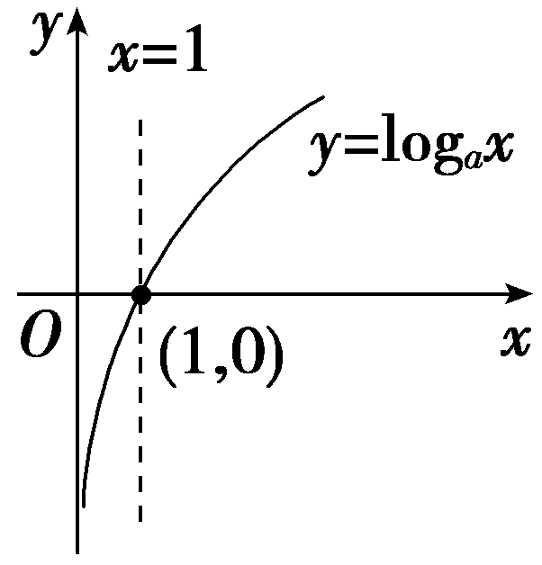
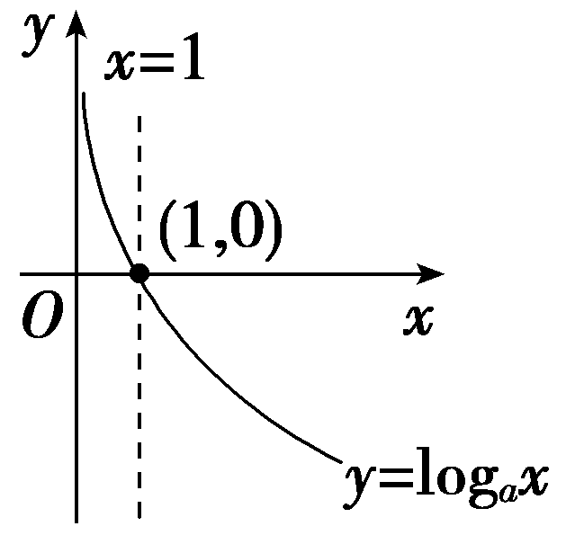
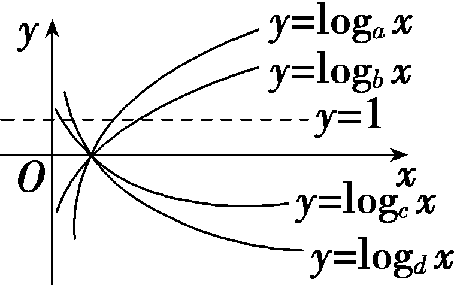
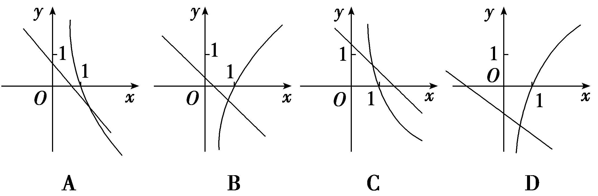
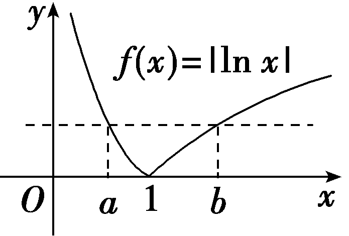
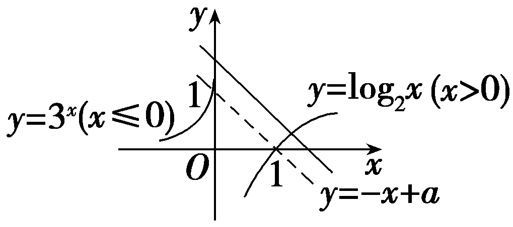
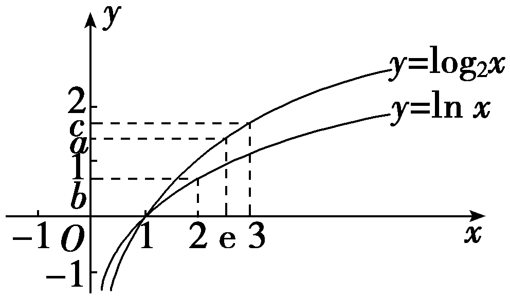
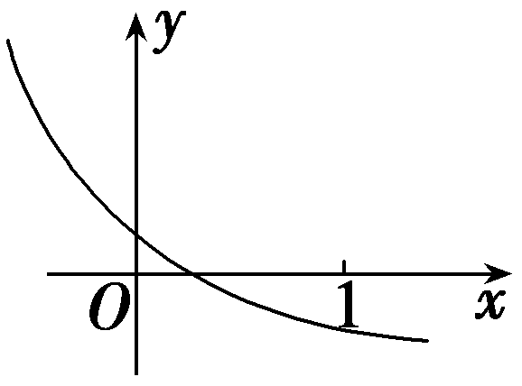
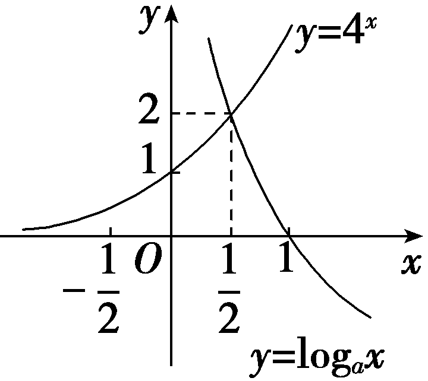
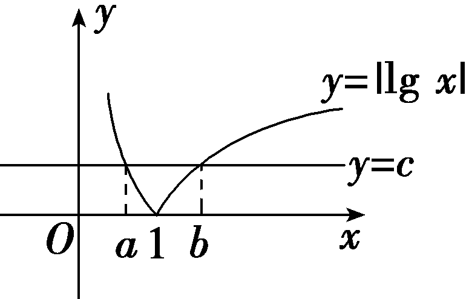

**第八节　对数函数**

【课标研读】　1.通过具体实例，了解对数函数的概念.能画出具体对数函数的图象，探索并了解对数函数的单调性与图象中的特殊点.　2.知道对数函数<em>y</em>＝log<em>ax</em>与指数函数<em>y</em>＝<em>ax</em>(<em>a</em>＞0，且<em>a</em>≠1)互为反函数.

1.对数函数的概念

函数<em>y</em>＝log<em>ax</em>(<em>a</em>＞0，且<em>a</em>≠1)叫做对数函数，其中<em>x</em>是自变量，定义域是<u>(0，＋∞)</u>.

2.对数函数的图象和性质

<table><tr><td></td><td>
<em>a</em>＞1
</td><td>
0＜<em>a</em>＜1
</td></tr><tr><td>
图

象
</td><td>

</td><td>

</td></tr><tr><td rowspan="5">
性

质
</td><td colspan="2">
定义域：(0，＋∞)
</td></tr><tr><td colspan="2">
值域：<strong>R</strong>
</td></tr><tr><td colspan="2">
过定点(1，0)
</td></tr><tr><td>
当<em>x</em>＞1时，<em>y</em>＞0；

当0＜<em>x</em>＜1时，<em>y</em>＜0
</td><td>
当<em>x</em>＞1时，<em>y</em>＜0；

当0＜<em>x</em>＜1时，<em>y</em>＞0
</td></tr><tr><td>
在(0，＋∞)上是增函数
</td><td>
在(0，＋∞)上是减函数
</td></tr></table>

[微提醒]　<em>y</em>＝log<em>ax</em>(<em>a</em>＞0，且<em>a</em>≠1)的图象只在第一、四象限，即在直线<em>x</em>＝0的右侧.

3.反函数

指数函数<em>y</em>＝<em>ax</em>(<em>a</em>＞0，且<em>a</em>≠1)与对数函数<em><u>y</u></em><u>＝log</u><em><u>ax</u></em>(<em>a</em>＞0，且<em>a</em>≠1)互为反函数，它们的定义域与值域正好互换，它们的图象关于直线<em><u>y</u></em><u>＝</u><em><u>x</u></em>对称.

【常用结论】

对数函数图象的特点

(1)对数函数&lt;te&lt;text style="it&lt;text style="it&lt;text style="it<em>a</em>lic"&gt;a&lt;/text&gt;lic"&gt;a&lt;/text&gt;lic"&gt;x&lt;/text&gt;t style="it<em>a</em>lic"&gt;y&lt;/text&gt;＝logax(a＞0，且a≠1)的图象恒过点(1，0)，(a，1)，( $\frac{1}{a}$ ，－1)，依据这三点的坐标可得到对数函数的大致图象.

(2)函数&lt;te&lt;te&lt;te<em>x</em>t style="it&lt;text style="it<em>a</em>lic"&gt;a&lt;/text&gt;lic"&gt;x&lt;/text&gt;t st<em>y</em>le="italic"&gt;x&lt;/text&gt;t style="it<em>a</em>lic"&gt;y&lt;/text&gt;＝logax与y $＝log_{\frac{1}{a}}$ &lt;te&lt;te<em>x</em>t style="it&lt;text style="it<em>a</em>lic"&gt;a&lt;/text&gt;lic"&gt;x&lt;/text&gt;t st<em>y</em>le="italic"&gt;x&lt;/text&gt;(<em>a</em>＞0，且a≠1)的图象关于x轴对称.

(3)如图给出4个对数函数的图象

则*b*＞*a*＞1＞*d*＞*c*＞0，即在第一象限，不同的对数函数图象从左到右底数逐渐增大.

【自主检测】

1.若函数<em>f</em>(<em>x</em>)＝log2(<em>x</em>＋1)的定义域为[0，1]，则函数<em>f</em>(<em>x</em>)的值域为(　　)

A.[0，1]	B.(0，1)

C.(－∞，1]	D.[1，＋∞)

答案：**A**

解析：根据复合函数单调性的同增异减原则可知<em>f</em>(<em>x</em>)在[0，1]上单调递增，因为0≤<em>x</em>≤1，所以1≤<em>x</em>＋1≤2，则log21≤log2(<em>x</em>＋1)≤log22，即<em>f</em>(<em>x</em>)∈[0，1].故选A.

&lt;text style="subs<em>c</em>ript"&gt;2&lt;/text&gt;.(链接人教A必修一P1&lt;text style="su<em>b</em>script"&gt;3&lt;/text&gt;3例3)已知实数<em>a</em>＝log32，b＝log2π，c＝log2 $\sqrt{10}$ ，则有(　　)

A.*a*＜*b*＜*c*	B.*a*＜*c*＜*b*

C.*c*＜*a*＜*b*	D.*c*＜*b*＜*a*

答案：**A**

解析：因为&lt;te&lt;te&lt;text style="it&lt;text style="it&lt;text style="itali<em>c</em>"&gt;a&lt;/text&gt;lic"&gt;a&lt;/text&gt;li<em>c</em>"&gt;x&lt;/text&gt;t style="italic"&gt;x&lt;/text&gt;t style="italic"&gt;f&lt;/text&gt;(x)＝log&lt;text style="su<em>&lt;text style="italic"&gt;b</em>&lt;/text&gt;script"&gt;2&lt;/text&gt;x在(0，＋∞)上为增函数，且2＜π＜ $\sqrt{10}$ ，所以&lt;text style="it&lt;text style="it&lt;text style="itali<em>c</em>"&gt;a&lt;/text&gt;lic"&gt;a&lt;/text&gt;lic"&gt;c&lt;/text&gt;＞<em>&lt;text style="italic"&gt;b</em>&lt;/text&gt;＞1.又a＝log3&lt;te<em>x</em>t style="subscript"&gt;2&lt;/text&gt;＜1，所以a＜b＜c.故选A.

3.已知函数&lt;text style="it<em>a</em>lic"&gt;y&lt;/text&gt;＝loga $\left(x－3\right)$ －1的图象恒过定点<em>&lt;text style="italic"&gt;P</em>&lt;/text&gt;，则点P的坐标是<u>　　　　</u>.

答案：(4，－1)

4.(链接人教A必修一P140习题4.4T1)函数<em>y</em> $＝\sqrt{log_{\frac{2}{3}}(2x－1)}$ 的定义域是<u>　　　　</u>.

答案： $\left(\frac{1}{2}，1\right]$

解析：由lo $g_{\frac{2}{3}}$ (2<te<te<text st*y*le="italic">x</text>t style="italic">x</text>t style="italic">x</text>－1)≥0，得0＜2x－1≤1，所以 $\frac{1}{2}$ ＜<te<te<text st*y*le="italic">x</text>t style="italic">x</text>t style="italic">x</text>≤1.所以函数y $＝\sqrt{log_{\frac{2}{3}}(2x－1)}$ 的定义域是 $\left(\frac{1}{2}，1\right]$ .

考点一　对数函数的图象及应用 　　　　自主练透

1.函数<em>y</em>＝log<em>ax</em>与<em>y</em>＝－<em>x</em>＋<em>a</em>在同一平面直角坐标系中的图象可能是(　　)

答案：**A**

解析：当<em>a</em>＞1时，函数<em>y</em>＝log<em>ax</em>的图象为选项B、D中过点(1，0)的曲线，此时函数<em>y</em>＝－<em>x</em>＋<em>a</em>的图象与<em>y</em>轴的交点的纵坐标<em>a</em>应满足<em>a</em>＞1，选项B、D中的图象都不符合要求；当0＜<em>a</em>＜1时，函数<em>y</em>＝log<em>ax</em>的图象为选项A、C中过点(1，0)的曲线，此时函数<em>y</em>＝－<em>x</em>＋<em>a</em>的图象与<em>y</em>轴的交点的纵坐标<em>a</em>应满足0＜<em>a</em>＜1，只有选项A中的图象符合要求.故选A.

2.已知函数<em>f</em>(<em>x</em>)＝｜ln <em>x</em>｜，若0＜<em>a</em>＜<em>b</em>，且<em>f</em>(<em>a</em>)＝<em>f</em>(<em>b</em>)，则<em>a</em>＋2<em>b</em>的取值范围是<u>　　　　</u>.

答案：(3，＋∞)

解析：<te<te<te<te<te<te<te<text style="it<text style="it*a*lic">a</text>lic">x</text>t style="italic">x</text>t style="italic">x</text>t style="italic">x</text>t style="italic">x</text>t style="it<text style="it<text style="it<text style="it<text style="it<text style="it<text style="it<text style="it<text style="it*a*lic">a</text>lic">a</text>lic">a</text>lic">a</text>lic">a</text>lic">a</text>lic">a</text>lic">a</text>lic">x</text>t style="italic">x</text>t style="italic">*<text style="italic">f*</text></text>(x)＝｜ln x｜的图象如图，因为f(a)＝f(*<text style="italic"><text style="italic"><text style="italic"><text style="italic"><text style="italic"><text style="italic"><text style="italic"><text style="italic"><text style="italic"><text style="italic">b*</text></text></text></text></text></text></text></text></text></text>)，所以｜ln a｜＝｜ln b｜，因为0＜a＜b，所以ln a＜0，ln b＞0，所以0＜a＜1，b＞1，所以－ln a＝ln b，所以ln a＋ln b＝ln(*<text style="italic">ab*</text>)＝0，所以ab＝1，则b $＝\frac{1}{a}$ ，所以<te<te<te<te<te<text style="it<text style="it*a*lic">a</text>lic">x</text>t style="italic">x</text>t style="italic">x</text>t style="italic">x</text>t style="italic">x</text>t style="it<text style="it<text style="it<text style="it<text style="it<text style="it<text style="it<text style="it*a*lic">a</text>lic">a</text>lic">a</text>lic">a</text>lic">a</text>lic">a</text>lic">a</text>lic">a</text>＋2*<text style="italic"><text style="italic"><text style="italic"><text style="italic"><text style="italic"><text style="italic"><text style="italic"><text style="italic"><text style="italic"><text style="italic">b*</text></text></text></text></text></text></text></text></text></text>＝a＋ $\frac{2}{a}$ ，令<te<te<te<te<te<text style="it<text style="it*a*lic">a</text>lic">x</text>t style="italic">x</text>t style="italic">x</text>t style="italic">x</text>t style="italic">x</text>t style="italic">*<text style="italic"><text style="italic">g*</text></text></text>(<te<text style="it<text style="it<text style="it<text style="it<text style="it<text style="it<text style="it<text style="it<text style="it*a*lic">a</text>lic">a</text>lic">a</text>lic">a</text>lic">a</text>lic">a</text>lic">a</text>lic">a</text>lic">x</text>t style="italic">x</text>)＝x＋ $\frac{2}{x}$ (0＜<te<te<te<te<te<te<text style="it<text style="it*a*lic">a</text>lic">x</text>t style="italic">x</text>t style="italic">x</text>t style="italic">x</text>t style="italic">x</text>t style="it<text style="it<text style="it<text style="it<text style="it<text style="it<text style="it<text style="it<text style="it*a*lic">a</text>lic">a</text>lic">a</text>lic">a</text>lic">a</text>lic">a</text>lic">a</text>lic">a</text>lic">x</text>t style="italic">x</text>＜1)，则*<text style="italic"><text style="italic"><text style="italic">g*</text></text></text>(x)在(0，1)上单调递减，所以g(x)＞g(1)＝1＋2＝3，所以a＋2*<text style="italic"><text style="italic"><text style="italic"><text style="italic"><text style="italic"><text style="italic"><text style="italic"><text style="italic"><text style="italic"><text style="italic">b*</text></text></text></text></text></text></text></text></text></text>＞3，所以a＋2b的取值范围为(3，＋∞).

3.已知函数&lt;te&lt;te&lt;te&lt;te&lt;text style="it&lt;text style="it<em>a</em>lic"&gt;a&lt;/text&gt;lic"&gt;x&lt;/text&gt;t style="italic"&gt;x&lt;/text&gt;t style="italic"&gt;x&lt;/text&gt;t style="italic"&gt;x&lt;/text&gt;t style="italic"&gt;<em>f</em>&lt;/text&gt;(x) $＝\left\{\begin{matrix}log_{2}x，x>0，\\3^{x}，x\leq 0，\end{matrix}\right.$ 关于&lt;te&lt;te&lt;te&lt;text style="it&lt;text style="it<em>a</em>lic"&gt;a&lt;/text&gt;lic"&gt;x&lt;/text&gt;t style="italic"&gt;x&lt;/text&gt;t style="italic"&gt;x&lt;/text&gt;t style="italic"&gt;x&lt;/text&gt;的方程<em>&lt;text style="italic"&gt;f</em>&lt;/text&gt;(x)＋x－a＝0有且只有一个实根，则实数a的取值范围是<u>　　　　</u>.

答案：(1，＋∞)

解析：问题等价于函数*y*＝*f*(*x*)与*y*＝－*x*＋*a*的图象有且只有一个交点，结合函数图象可知*a*＞1，所以实数*a*的取值范围是(1，＋∞).

对数函数图象的识别及应用方法

1.在识别函数图象时，要善于利用已知函数的性质、函数图象上的特殊点(与坐标轴的交点、最高点、最低点等)排除不符合要求的选项.

2.一些对数型方程、不等式问题常转化为相应的函数图象问题，利用数形结合法求解.

注意：对于函数<te<text style="it<text style="it*a*lic">a</text>lic">x</text>t style="italic">*<text style="italic">f*</text></text>(x) $＝\left|log_{a}x\right|$ (<text style="it*a*lic">a</text>＞0，且a≠1)，若<te*x*t style="italic">*<text style="italic">f*</text></text>(*<text style="italic">m*</text>)＝f(*<text style="italic">n*</text>)(m≠n)，则必有*mn*＝1.

考点二　对数函数的性质及应用　　　　多维探究

角度1　比较对数式的大小

(1)(一题多解)(<text style="su<text style="it<text style="itali*c*">a</text>li*c*">*b*</text>script">2</text>025·河南开封模拟)已知*a*＝log2e，b＝ln 2，c＝lo $g_{\frac{1}{2}}\frac{1}{3}$ ，则<text style="it<text style="itali*c*">a</text>li*c*">a</text>，*<text style="italic">b*</text>，c的大小关系为(　　 )

A.*a*＞*b*＞*c*	B.*b*＞*a*＞*c*

C.*c*＞*b*＞*a*	D.*c*＞*a*＞*b*

(2)(2025·安徽阜阳模拟)设<em>a</em>＝log23，<em>b</em>＝log812，<em>c</em>＝lg15，则<em>a</em>，<em>b</em>，<em>c</em>的大小关系为(　　)

A.*a*＜*b*＜*c*	B.*a*＜*c*＜*b*

C.*b*＜*a*＜*c*	D.*c*＜*b*＜*a*

答案：(1)**D**　 (2)**D**

解析：(1)法一(中间量法)：因为&lt;text style="it<em>a</em>li&lt;text style="itali<em>c</em>"&gt;c&lt;/text&gt;"&gt;a&lt;/text&gt;＝log&lt;text style="su<em>&lt;text style="italic"&gt;b</em>&lt;/text&gt;script"&gt;&lt;text style="subscript"&gt;2&lt;/text&gt;&lt;/text&gt;e＞1，b＝ln 2∈(0，1)，c＝lo $g_{\frac{1}{2}}\frac{1}{3}＝$ log&lt;text style="su&lt;text style="it<em>a</em>li&lt;text style="itali<em>c</em>"&gt;c&lt;/text&gt;"&gt;<em>b</em>&lt;/text&gt;script"&gt;&lt;text style="subscript"&gt;2&lt;/text&gt;&lt;/text&gt;3＞log2e＞1，所以c＞<em>a</em>＞b.故选D.

法二(图象法)：lo $g_{\frac{1}{2}}\frac{1}{3}＝$ log&lt;te&lt;te&lt;text style="it<em>a</em>li<em>c</em>"&gt;x&lt;/text&gt;t st<em>y</em>le="italic"&gt;x&lt;/text&gt;t st<em>y</em>le="su<em>b</em>script"&gt;2&lt;/text&gt;3，在同一平面直角坐标系中作出函数y＝log2x，y＝ln x的图象，如图，由图可知c＞a＞b.故选D.

(&lt;text style="su&lt;text style="it&lt;text style="itali<em>c</em>"&gt;a&lt;/text&gt;li<em>c</em>"&gt;<em>b</em>&lt;/text&gt;script"&gt;&lt;text style="subscript"&gt;2&lt;/text&gt;&lt;/text&gt;)<em>a</em>＝log23＝log2 $\left(2\times \frac{3}{2}\right)＝$ 1＋log&lt;text style="su&lt;text style="it&lt;text style="itali<em>c</em>"&gt;a&lt;/text&gt;li<em>c</em>"&gt;<em>b</em>&lt;/text&gt;script"&gt;&lt;text style="subscript"&gt;2&lt;/text&gt;&lt;/text&gt; $\frac{3}{2}＝$ 1＋ $\frac{1}{log_{\frac{3}{2}}2}$ ，&lt;text style="it&lt;text style="itali<em>c</em>"&gt;a&lt;/text&gt;li<em>c</em>"&gt;<em>b</em>&lt;/text&gt;＝log&lt;text style="subscript"&gt;&lt;text style="subscript"&gt;8&lt;/text&gt;&lt;/text&gt;1&lt;text style="subscript"&gt;&lt;text style="subscript"&gt;2&lt;/text&gt;&lt;/text&gt;＝log8 $\left(8\times \frac{3}{2}\right)＝$ 1＋log&lt;text style="su&lt;text style="itali<em>c</em>"&gt;b&lt;/text&gt;s&lt;text style="it<em>a</em>lic"&gt;c&lt;/text&gt;ript"&gt;&lt;text style="subscript"&gt;8&lt;/text&gt;&lt;/text&gt; $\frac{3}{2}＝$ 1＋ $\frac{1}{log_{\frac{3}{2}}8}$ ，&lt;text style="it&lt;text style="itali<em>c</em>"&gt;a&lt;/text&gt;lic"&gt;c&lt;/text&gt;＝lg 15＝log&lt;text style="su<em>b</em>script"&gt;10&lt;/text&gt; $\left(10\times \frac{3}{2}\right)＝$ 1＋log&lt;text style="su&lt;text style="itali<em>c</em>"&gt;b&lt;/text&gt;script"&gt;10&lt;/text&gt; $\frac{3}{2}＝$ 1＋ $\frac{1}{log_{\frac{3}{2}}10}$ ，因为0＜ $log_{\frac{3}{2}}$ &lt;text style="su&lt;text style="it&lt;text style="itali<em>c</em>"&gt;a&lt;/text&gt;li<em>c</em>"&gt;<em>b</em>&lt;/text&gt;script"&gt;&lt;text style="subscript"&gt;2&lt;/text&gt;&lt;/text&gt;＜lo $g_{\frac{3}{2}}$ &lt;text style="su&lt;text style="itali<em>c</em>"&gt;b&lt;/text&gt;s&lt;text style="it<em>a</em>lic"&gt;c&lt;/text&gt;ript"&gt;&lt;text style="subscript"&gt;8&lt;/text&gt;&lt;/text&gt;＜ $log_{\frac{3}{2}}$ &lt;text style="su&lt;text style="itali<em>c</em>"&gt;b&lt;/text&gt;script"&gt;10&lt;/text&gt;，所以&lt;text style="it<em>a</em>li<em>c</em>"&gt;a&lt;/text&gt;＞<em>b</em>＞c.故选D.

角度2　解对数方程、不等式

已知函数&lt;te&lt;te&lt;te&lt;te<em>x</em>t style="italic"&gt;x&lt;/text&gt;t style="italic"&gt;x&lt;/text&gt;t style="italic"&gt;x&lt;/text&gt;t style="italic"&gt;<em>&lt;text style="italic"&gt;&lt;text style="italic"&gt;f</em>&lt;/text&gt;&lt;/text&gt;&lt;/text&gt;(x)是定义在<strong>R</strong>上的偶函数，当x≤0时，f(x)单调递减，则不等式f(lo $g_{\frac{1}{3}}$ (2&lt;te&lt;te&lt;te<em>x</em>t style="italic"&gt;x&lt;/text&gt;t style="italic"&gt;x&lt;/text&gt;t style="italic"&gt;x&lt;/text&gt;－5))＞<em>&lt;text style="italic"&gt;&lt;text style="italic"&gt;&lt;text style="italic"&gt;f</em>&lt;/text&gt;&lt;/text&gt;&lt;/text&gt;(log38)的解集为<u>　　　　　　　　</u>.

答案： $\left(\frac{5}{2}，\frac{41}{16}\right)$ ∪ $\left(\frac{13}{2}，＋\infty \right)$

解析：因为函数&lt;te&lt;te&lt;te&lt;te&lt;te&lt;te&lt;te&lt;te&lt;te&lt;te<em>x</em>t style="italic"&gt;x&lt;/text&gt;t style="italic"&gt;x&lt;/text&gt;t style="italic"&gt;x&lt;/text&gt;t style="italic"&gt;x&lt;/text&gt;t style="italic"&gt;x&lt;/text&gt;t style="italic"&gt;x&lt;/text&gt;t style="italic"&gt;x&lt;/text&gt;t style="italic"&gt;x&lt;/text&gt;t style="italic"&gt;x&lt;/text&gt;t style="italic"&gt;<em>&lt;text style="italic"&gt;&lt;text style="italic"&gt;f</em>&lt;/text&gt;&lt;/text&gt;&lt;/text&gt;(x)是定义在<strong>R</strong>上的偶函数，且在(－∞，0]上单调递减，所以函数f(x)在(0，＋∞)上单调递增，故f(lo $g_{\frac{1}{3}}$ (2&lt;te&lt;te&lt;te&lt;te&lt;te&lt;te&lt;te&lt;te&lt;te<em>x</em>t style="italic"&gt;x&lt;/text&gt;t style="italic"&gt;x&lt;/text&gt;t style="italic"&gt;x&lt;/text&gt;t style="italic"&gt;x&lt;/text&gt;t style="italic"&gt;x&lt;/text&gt;t style="italic"&gt;x&lt;/text&gt;t style="italic"&gt;x&lt;/text&gt;t style="italic"&gt;x&lt;/text&gt;t style="italic"&gt;x&lt;/text&gt;－5))＞<em>&lt;text style="italic"&gt;&lt;text style="italic"&gt;&lt;text style="italic"&gt;f</em>&lt;/text&gt;&lt;/text&gt;&lt;/text&gt;(log&lt;text style="subscript"&gt;&lt;text style="subscript"&gt;&lt;text style="subscript"&gt;&lt;text style="subscript"&gt;&lt;text style="subscript"&gt;&lt;text style="subscript"&gt;3&lt;/text&gt;&lt;/text&gt;&lt;/text&gt;&lt;/text&gt;&lt;/text&gt;&lt;/text&gt;8)可化为｜lo $g_{\frac{1}{3}}$ (2&lt;te&lt;te&lt;te&lt;te&lt;te&lt;te&lt;te&lt;te&lt;te<em>x</em>t style="italic"&gt;x&lt;/text&gt;t style="italic"&gt;x&lt;/text&gt;t style="italic"&gt;x&lt;/text&gt;t style="italic"&gt;x&lt;/text&gt;t style="italic"&gt;x&lt;/text&gt;t style="italic"&gt;x&lt;/text&gt;t style="italic"&gt;x&lt;/text&gt;t style="italic"&gt;x&lt;/text&gt;t style="italic"&gt;x&lt;/text&gt;－5)｜＞｜log&lt;text style="subscript"&gt;&lt;text style="subscript"&gt;&lt;text style="subscript"&gt;&lt;text style="subscript"&gt;&lt;text style="subscript"&gt;&lt;text style="subscript"&gt;3&lt;/text&gt;&lt;/text&gt;&lt;/text&gt;&lt;/text&gt;&lt;/text&gt;&lt;/text&gt;8｜，即log3(2x－5)＞log38或log3(2x－5)＜－log38＝log3 $\frac{1}{8}$ ，即2&lt;te&lt;te&lt;te&lt;te&lt;te&lt;te&lt;te&lt;te&lt;te<em>x</em>t style="italic"&gt;x&lt;/text&gt;t style="italic"&gt;x&lt;/text&gt;t style="italic"&gt;x&lt;/text&gt;t style="italic"&gt;x&lt;/text&gt;t style="italic"&gt;x&lt;/text&gt;t style="italic"&gt;x&lt;/text&gt;t style="italic"&gt;x&lt;/text&gt;t style="italic"&gt;x&lt;/text&gt;t style="italic"&gt;x&lt;/text&gt;－5＞8或0＜2x－5＜ $\frac{1}{8}$ ，解得&lt;te&lt;te&lt;te&lt;te&lt;te&lt;te&lt;te&lt;te&lt;te<em>x</em>t style="italic"&gt;x&lt;/text&gt;t style="italic"&gt;x&lt;/text&gt;t style="italic"&gt;x&lt;/text&gt;t style="italic"&gt;x&lt;/text&gt;t style="italic"&gt;x&lt;/text&gt;t style="italic"&gt;x&lt;/text&gt;t style="italic"&gt;x&lt;/text&gt;t style="italic"&gt;x&lt;/text&gt;t style="italic"&gt;x&lt;/text&gt;＞ $\frac{13}{2}$ 或 $\frac{5}{2}$ ＜&lt;te&lt;te&lt;te&lt;te&lt;te&lt;te&lt;te&lt;te&lt;te<em>x</em>t style="italic"&gt;x&lt;/text&gt;t style="italic"&gt;x&lt;/text&gt;t style="italic"&gt;x&lt;/text&gt;t style="italic"&gt;x&lt;/text&gt;t style="italic"&gt;x&lt;/text&gt;t style="italic"&gt;x&lt;/text&gt;t style="italic"&gt;x&lt;/text&gt;t style="italic"&gt;x&lt;/text&gt;t style="italic"&gt;x&lt;/text&gt;＜ $\frac{41}{16}$ ，所以不等式的解集为( $\frac{5}{2}$ ， $\frac{41}{16}$ )∪( $\frac{13}{2}$ ，＋∞).

1.比较对数值大小的方法

<table><tr><td>
若底数相同，真数不同
</td><td>
若底数为同一常数，可由对数函数的单调性直接进行判断；若底数为同一字母，则需对底数进行分类讨论
</td></tr><tr><td>
若底数不同，真数相同
</td><td>
可以先用换底公式化为同底后，再进行比较
</td></tr><tr><td>
若底数与真数都不同
</td><td>
常借助1，0等中间量进行比较
</td></tr></table>

2.求解对数不等式的两种类型及方法

(1)log<em>ax</em>＞log<em>ab</em>：借助<em>y</em>＝log<em>ax</em>的单调性求解，如果<em>a</em>的取值不确定，需分<em>a</em>＞1与0＜<em>a</em>＜1两种情况讨论.

(2)log<em>ax</em>＞<em>b</em>：需先将<em>b</em>化为以<em>a</em>为底的对数式的形式，再借助<em>y</em>＝log<em>ax</em>的单调性求解.

对点练1.已知<text style="it<text style="itali*c*">a</text>li*c*">a</text>＝3log<text style="su*<text style="italic">b*</text>script">8</text>3，b＝－ $\frac{1}{2}$ lo $g_{\frac{1}{3}}$ 16，<text style="it<text style="itali*c*">a</text>lic">c</text>＝log<text style="su*b*script">4</text>3，则*a*，*b*，c的大小关系为(　　 )

A.*a*＞*b*＞*c*	B.*c*＞*a*＞*b*

C.*b*＞*c*＞*a*	D.*b*＞*a*＞*c*

答案：**A**

解析：&lt;text style="it&lt;text style="it&lt;text style="itali<em>c</em>"&gt;a&lt;/text&gt;lic"&gt;a&lt;/text&gt;li<em>c</em>"&gt;a&lt;/text&gt;＝&lt;text style="su<em>&lt;text style="italic"&gt;b</em>&lt;/text&gt;script"&gt;&lt;text style="subscript"&gt;3&lt;/text&gt;&lt;/text&gt;log&lt;text style="su<em>b</em>script"&gt;8&lt;/text&gt;3＝3× $\frac{log_{2}3}{log_{2}2^{3}}＝$ log&lt;text style="su&lt;text style="it&lt;text style="it&lt;text style="itali<em>c</em>"&gt;a&lt;/text&gt;lic"&gt;a&lt;/text&gt;li<em>c</em>"&gt;<em>&lt;text style="italic"&gt;b</em>&lt;/text&gt;&lt;/text&gt;script"&gt;&lt;text style="superscript"&gt;&lt;text style="superscript"&gt;&lt;text style="subscript"&gt;2&lt;/text&gt;&lt;/text&gt;&lt;/text&gt;&lt;/text&gt;&lt;text style="subscript"&gt;&lt;text style="subscript"&gt;3&lt;/text&gt;&lt;/text&gt;＞1，b＝－ $\frac{1}{2}$ lo $g_{\frac{1}{3}}$ 16＝－ $\frac{1}{2}$ × $\frac{log_{3}16}{log_{3}\frac{1}{3}}＝$ － $\frac{1}{2}$ × $\frac{log_{3}4^{2}}{log_{3}3^{－1}}＝$ log&lt;text style="su&lt;text style="it&lt;text style="itali<em>c</em>"&gt;a&lt;/text&gt;lic"&gt;<em>b</em>&lt;/text&gt;s&lt;text style="it<em>a</em>lic"&gt;c&lt;/text&gt;ript"&gt;&lt;text style="subscript"&gt;3&lt;/text&gt;&lt;/text&gt;4＞1，0＜c＝log43＜1，log&lt;text style="su<em>b</em>script"&gt;&lt;text style="superscript"&gt;&lt;text style="superscript"&gt;&lt;text style="subscript"&gt;2&lt;/text&gt;&lt;/text&gt;&lt;/text&gt;&lt;/text&gt;3－log34 $＝\frac{lg3}{lg2}$ － $\frac{lg4}{lg3}＝\frac{(lg3)^{2}－lg2lg4}{lg2lg3}$ ，lg &lt;text style="su&lt;text style="it&lt;text style="it&lt;text style="itali<em>c</em>"&gt;a&lt;/text&gt;lic"&gt;a&lt;/text&gt;li<em>c</em>"&gt;<em>&lt;text style="italic"&gt;b</em>&lt;/text&gt;&lt;/text&gt;script"&gt;&lt;text style="superscript"&gt;&lt;text style="superscript"&gt;&lt;text style="subscript"&gt;2&lt;/text&gt;&lt;/text&gt;&lt;/text&gt;&lt;/text&gt;＞0，lg 4＞0，lg 2≠lg 4，因为lg 2lg 4＜ $\left(\frac{lg2+lg4}{2}\right)^{2}＝$ (lg $\sqrt{8}$ )&lt;text style="su&lt;text style="it&lt;text style="it&lt;text style="itali<em>c</em>"&gt;a&lt;/text&gt;lic"&gt;a&lt;/text&gt;li<em>c</em>"&gt;<em>&lt;text style="italic"&gt;b</em>&lt;/text&gt;&lt;/text&gt;script"&gt;&lt;text style="superscript"&gt;&lt;text style="superscript"&gt;&lt;text style="subscript"&gt;2&lt;/text&gt;&lt;/text&gt;&lt;/text&gt;&lt;/text&gt;＜(lg &lt;text style="subscript"&gt;&lt;text style="subscript"&gt;3&lt;/text&gt;&lt;/text&gt;)2，故log23－log34＞0，所以<em>a</em>＞b，所以a＞b＞c.故选A.

对点练2.设函数<te<te<te*x*t style="italic">x</text>t style="italic">x</text>t style="italic">*f*</text>(x) $＝\left\{\begin{matrix}2^{1－x}，x\leq 1，\\1－log_{2}x，x>1，\end{matrix}\right.$ 则满足<te<te<te*x*t style="italic">x</text>t style="italic">x</text>t style="italic">*f*</text>(x)≤2的x的取值范围是(　　)

A.[－1，2]	B.[0，2]

C.[1，＋∞)	D.[0，＋∞)

答案：**D**

解析：当&lt;te&lt;te&lt;te&lt;te&lt;te&lt;te&lt;te&lt;te<em>x</em>t style="italic"&gt;x&lt;/text&gt;t style="italic"&gt;x&lt;/text&gt;t style="italic"&gt;x&lt;/text&gt;t style="italic"&gt;x&lt;/text&gt;t style="italic"&gt;x&lt;/text&gt;t style="italic"&gt;x&lt;/text&gt;t style="italic,superscript"&gt;x&lt;/text&gt;t style="italic"&gt;x&lt;/text&gt;≤1时，由21－x≤2得1－x≤1，所以0≤x≤1；当x＞1时，由1－log2x≤2得x≥ $\frac{1}{2}$ ，所以&lt;te&lt;te&lt;te&lt;te&lt;te&lt;te&lt;te&lt;te<em>x</em>t style="italic"&gt;x&lt;/text&gt;t style="italic"&gt;x&lt;/text&gt;t style="italic"&gt;x&lt;/text&gt;t style="italic"&gt;x&lt;/text&gt;t style="italic"&gt;x&lt;/text&gt;t style="italic"&gt;x&lt;/text&gt;t style="italic,superscript"&gt;x&lt;/text&gt;t style="italic"&gt;x&lt;/text&gt;＞1.综上，x的取值范围为[0，＋∞).故选D.

考点三　对数型函数的综合问题　　　　师生共研

(一题多变)已知函数<em>f</em>(<em>x</em>)＝log4(<em>ax</em>2＋2<em>x</em>＋3).

(1)若*f*(1)＝1，求*f*(*x*)的单调区间；

(2)若*f*(*x*)的最小值为0，求*a*的值.

解：(1)因为<em>f</em>(1)＝1，所以log4(<em>a</em>＋5)＝1，

因此*a*＋5＝4，即*a*＝－1，

所以<em>f</em>(<em>x</em>)＝log4(－<em>x</em>2＋2<em>x</em>＋3).

由－<em>x</em>2＋2<em>x</em>＋3＞0得－1＜<em>x</em>＜3，即函数<em>f</em>(<em>x</em>)的定义域为(－1，3).

令<em>g</em>(<em>x</em>)＝－<em>x</em>2＋2<em>x</em>＋3(－1＜<em>x</em>＜3)，则<em>g</em>(<em>x</em>)在(－1，1]上单调递增，在[1，3)上单调递减.

又<em>y</em>＝log4<em>x</em>在(0，＋∞)上为增函数，

所以*f*(*x*)的单调递增区间是(－1，1]，单调递减区间是[1，3).

(2)若<em>f</em>(<em>x</em>)的最小值为0，则<em>h</em>(<em>x</em>)＝<em>ax</em>2＋2<em>x</em>＋3应有最小值1，

因此应有 $\left\{\begin{matrix}a>0，\\\frac{3a－1}{a}=1，\end{matrix}\right.$ 解得*a* $＝\frac{1}{2}$ .

[变式探究]　(变条件，变结论)若已知函数*f*(*x*)在区间[－1，1]上单调递增，求实数*a*的取值范围.

解：令<em>g</em>(<em>x</em>)＝<em>ax</em>2＋2<em>x</em>＋3 ，所以<em>f</em>(<em>x</em>)＝log4<em>g</em>(<em>x</em>).

当*a*＝0时，*g*(*x*)＝2*x*＋3在区间[－1，1]上单调递增，且*g*(*x*)＞0，

又<em>y</em>＝log4<em>x</em>在定义域上单调递增，所以函数<em>f</em>(<em>x</em>)＝log4(<em>ax</em>2＋2<em>x</em>＋3)在区间[－1，1]上单调递增，所以<em>a</em>＝0符合题意.

当<em>a</em>＞0时，由函数<em>f</em>(<em>x</em>)＝log4(<em>ax</em>2＋2<em>x</em>＋3)在区间[－1，1]上单调递增，

得 $\left\{\begin{matrix}－\frac{2}{2a}\leq －1，\\g(-1)>0，\end{matrix}\right.$ 解得0＜*a*≤1.

当<em>a</em>＜0时，由函数<em>f</em>(<em>x</em>)＝log4(<em>ax</em>2＋2<em>x</em>＋3)在区间[－1，1]上单调递增，

得 $\left\{\begin{matrix}－\frac{2}{2a}\geq 1，\\g(-1)>0，\end{matrix}\right.$ 解得－1＜*a*＜0.

综上，实数*a*的取值范围是(－1，1].

解决与对数函数有关的复合函数的单调性问题需关注三点

1.遵循定义域优先的原则，所有问题都必须在定义域内讨论.

2.底数与1的大小关系.

3.复合函数的构成，即它是由哪些基本初等函数复合而成的，判断内层函数和外层函数的单调性，运用复合函数“同增异减”原则确定函数的单调性.

对点练3.设函数*f*(*x*)＝ln｜*x*＋3｜＋ln｜*x*－3｜，则*f*(*x*)(　　)

A.是偶函数，且在(－∞，－3)上单调递减

B.是奇函数，且在(－3，3)上单调递减

C.是奇函数，且在(3，＋∞)上单调递增

D.是偶函数，且在(－3，3)上单调递增

答案：**A**

解析：函数<em>f</em>(<em>x</em>)的定义域为{<em>x</em>｜<em>x</em>≠±3}，<em>f</em>(<em>x</em>)＝ln｜<em>x</em>＋3｜＋ln｜<em>x</em>－3｜＝ln｜<em>x</em>2－9｜，令<em>g</em>(<em>x</em>)＝｜<em>x</em>2－9｜，则<em>f</em>(<em>x</em>)＝ln <em>g</em>(<em>x</em>)，由函数<em>g</em>(<em>x</em>)的图象(图略)可知，当<em>x</em>∈(－∞，－3)，<em>x</em>∈(0，3)时，<em>g</em>(<em>x</em>)单调递减，当<em>x</em>∈(－3，0)，<em>x</em>∈(3，＋∞)时，<em>g</em>(<em>x</em>)单调递增，由复合函数的单调性得，当<em>x</em>∈(－∞，－3)，<em>x</em>∈(0，3)时，<em>f</em>(<em>x</em>)单调递减，当<em>x</em>∈(－3，0)，<em>x</em>∈(3，＋∞)时，<em>f</em>(<em>x</em>)单调递增；由<em>f</em>(－<em>x</em>)＝ln｜(－<em>x</em>)2－9｜＝ln｜<em>x</em>2－9｜＝<em>f</em>(<em>x</em>)得<em>f</em>(<em>x</em>)为偶函数.故选A.

对点练<te<te*x*t style="italic,superscript">x</text>t style="subscript">4</text>.(多选)(2025·安徽蚌埠模拟)已知函数<te*x*t style="italic">f</text>(x)＝log4(1＋4x)－ $\frac{1}{2}$ <te<te*x*t style="italic,superscript">x</text>t style="italic">x</text>，则下列说法中正确的是(　　)

A.函数*f*(*x*)的图象关于原点对称

B.函数*f*(*x*)的图象关于*y*轴对称

C.函数*f*(*x*)在区间[0，＋∞)上单调递减

D.函数<te*x*t style="italic">f</text>(x)的值域为［ $\frac{1}{2}$ ，＋∞)

答案：**BD**

解析：易知&lt;&lt;&lt;&lt;&lt;&lt;&lt;&lt;te&lt;te&lt;te&lt;te&lt;te<em>x</em>t style="italic"&gt;x&lt;/text&gt;t style="italic"&gt;x&lt;/text&gt;t style="italic"&gt;x&lt;/text&gt;t style="italic,superscript"&gt;x&lt;/text&gt;t style="italic"&gt;t&lt;/text&gt;ext style="italic"&gt;t&lt;/text&gt;ext &lt;text st<em>y</em>le="italic"&gt;s&lt;/text&gt;t<em>y</em>le="italic"&gt;t&lt;/text&gt;ext <em>s</em>tyle="italic"&gt;t&lt;/text&gt;e<em>x</em>t <em>s</em>t<em>y</em>le="italic"&gt;t&lt;/text&gt;ext <em>s</em>tyle="italic"&gt;t&lt;/text&gt;e&lt;text st<em>y</em>le="italic,superscript"&gt;x&lt;/text&gt;t style="italic"&gt;t&lt;/text&gt;e&lt;te&lt;te&lt;te&lt;te&lt;te&lt;te&lt;te&lt;te&lt;te<em>x</em>t style="italic"&gt;x&lt;/text&gt;t style="italic,superscript"&gt;x&lt;/text&gt;t style="italic,superscript"&gt;x&lt;/text&gt;t style="italic"&gt;x&lt;/text&gt;t style="italic,superscript"&gt;x&lt;/text&gt;t style="italic,superscript"&gt;x&lt;/text&gt;t style="italic,superscript"&gt;x&lt;/text&gt;t style="italic"&gt;x&lt;/text&gt;t style="italic"&gt;x&lt;/text&gt;t style="italic"&gt;<em>&lt;text style="italic"&gt;&lt;text style="italic"&gt;&lt;text style="italic"&gt;&lt;text style="italic"&gt;&lt;text style="italic"&gt;&lt;text style="italic"&gt;&lt;text style="italic"&gt;&lt;text style="italic"&gt;f</em>&lt;/text&gt;&lt;/text&gt;&lt;/text&gt;&lt;/text&gt;&lt;/text&gt;&lt;/text&gt;&lt;/text&gt;&lt;/text&gt;&lt;/text&gt;(x)的定义域为<strong>&lt;text style="bold"&gt;R</strong>&lt;/text&gt;，f(x)＝log&lt;text style="subscript"&gt;&lt;text style="subscript"&gt;&lt;text style="subscript"&gt;&lt;text style="subscript"&gt;&lt;text style="subscript"&gt;&lt;text style="subscript"&gt;&lt;text style="subscript"&gt;&lt;text style="subscript"&gt;4&lt;/text&gt;&lt;/text&gt;&lt;/text&gt;&lt;/text&gt;&lt;/text&gt;&lt;/text&gt;&lt;/text&gt;&lt;/text&gt;(1＋4x)&lt;text style="superscript"&gt;－&lt;/text&gt;log4 $4^{\frac{x}{2}}＝$ log&lt;&lt;&lt;&lt;&lt;&lt;&lt;&lt;te&lt;te&lt;te&lt;te&lt;te<em>x</em>t style="italic"&gt;x&lt;/text&gt;t style="italic"&gt;x&lt;/text&gt;t style="italic"&gt;x&lt;/text&gt;t style="italic,superscript"&gt;x&lt;/text&gt;t style="italic"&gt;t&lt;/text&gt;ext style="italic"&gt;t&lt;/text&gt;ext &lt;text st<em>y</em>le="italic"&gt;s&lt;/text&gt;t<em>y</em>le="italic"&gt;t&lt;/text&gt;ext <em>s</em>tyle="italic"&gt;t&lt;/text&gt;e<em>x</em>t <em>s</em>t<em>y</em>le="italic"&gt;t&lt;/text&gt;ext <em>s</em>tyle="italic"&gt;t&lt;/text&gt;e&lt;text st<em>y</em>le="italic,superscript"&gt;x&lt;/text&gt;t style="italic"&gt;t&lt;/text&gt;e&lt;te&lt;te&lt;te&lt;te&lt;te&lt;te&lt;te<em>x</em>t style="italic"&gt;x&lt;/text&gt;t style="italic,superscript"&gt;x&lt;/text&gt;t style="italic,superscript"&gt;x&lt;/text&gt;t style="italic"&gt;x&lt;/text&gt;t style="italic,superscript"&gt;x&lt;/text&gt;t style="italic,superscript"&gt;x&lt;/text&gt;t style="italic,superscript"&gt;x&lt;/text&gt;t style="subscript"&gt;&lt;text style="subscript"&gt;&lt;text style="subscript"&gt;&lt;text style="subscript"&gt;&lt;text style="subscript"&gt;&lt;text style="subscript"&gt;&lt;text style="subscript"&gt;&lt;text style="subscript"&gt;4&lt;/text&gt;&lt;/text&gt;&lt;/text&gt;&lt;/text&gt;&lt;/text&gt;&lt;/text&gt;&lt;/text&gt;&lt;/text&gt; $\frac{1+4^{x}}{2^{x}}＝$ log&lt;&lt;&lt;&lt;&lt;&lt;&lt;&lt;te&lt;te&lt;te&lt;te&lt;te<em>x</em>t style="italic"&gt;x&lt;/text&gt;t style="italic"&gt;x&lt;/text&gt;t style="italic"&gt;x&lt;/text&gt;t style="italic,superscript"&gt;x&lt;/text&gt;t style="italic"&gt;t&lt;/text&gt;ext style="italic"&gt;t&lt;/text&gt;ext &lt;text st<em>y</em>le="italic"&gt;s&lt;/text&gt;t<em>y</em>le="italic"&gt;t&lt;/text&gt;ext <em>s</em>tyle="italic"&gt;t&lt;/text&gt;e<em>x</em>t <em>s</em>t<em>y</em>le="italic"&gt;t&lt;/text&gt;ext <em>s</em>tyle="italic"&gt;t&lt;/text&gt;e&lt;text st<em>y</em>le="italic,superscript"&gt;x&lt;/text&gt;t style="italic"&gt;t&lt;/text&gt;e&lt;te&lt;te&lt;te&lt;te&lt;te&lt;te&lt;te<em>x</em>t style="italic"&gt;x&lt;/text&gt;t style="italic,superscript"&gt;x&lt;/text&gt;t style="italic,superscript"&gt;x&lt;/text&gt;t style="italic"&gt;x&lt;/text&gt;t style="italic,superscript"&gt;x&lt;/text&gt;t style="italic,superscript"&gt;x&lt;/text&gt;t style="italic,superscript"&gt;x&lt;/text&gt;t style="subscript"&gt;&lt;text style="subscript"&gt;&lt;text style="subscript"&gt;&lt;text style="subscript"&gt;&lt;text style="subscript"&gt;&lt;text style="subscript"&gt;&lt;text style="subscript"&gt;&lt;text style="subscript"&gt;4&lt;/text&gt;&lt;/text&gt;&lt;/text&gt;&lt;/text&gt;&lt;/text&gt;&lt;/text&gt;&lt;/text&gt;&lt;/text&gt;(2&lt;text style="superscript"&gt;－&lt;/text&gt;&lt;te<em>x</em>t style="italic"&gt;x&lt;/text&gt;＋2x)，由于<em>&lt;text style="italic"&gt;&lt;text style="italic"&gt;&lt;text style="italic"&gt;&lt;text style="italic"&gt;&lt;text style="italic"&gt;&lt;text style="italic"&gt;&lt;text style="italic"&gt;&lt;text style="italic"&gt;&lt;text style="italic"&gt;f</em>&lt;/text&gt;&lt;/text&gt;&lt;/text&gt;&lt;/text&gt;&lt;/text&gt;&lt;/text&gt;&lt;/text&gt;&lt;/text&gt;&lt;/text&gt;(－x)＝log4(2x＋2－x)＝f(x)，因此f(x)为偶函数，故A错误，B正确；令t＝2x，则y＝log4(t＋ $\frac{1}{t}$ )，令&lt;&lt;&lt;&lt;&lt;&lt;te&lt;te&lt;te&lt;te&lt;te<em>x</em>t style="italic"&gt;x&lt;/text&gt;t style="italic"&gt;x&lt;/text&gt;t style="italic"&gt;x&lt;/text&gt;t style="italic,superscript"&gt;x&lt;/text&gt;t style="italic"&gt;t&lt;/text&gt;ext style="italic"&gt;t&lt;/text&gt;ext &lt;text st<em>y</em>le="italic"&gt;s&lt;/text&gt;t<em>y</em>le="italic"&gt;t&lt;/text&gt;ext <em>s</em>tyle="italic"&gt;t&lt;/text&gt;e<em>x</em>t <em>s</em>t<em>y</em>le="italic"&gt;t&lt;/text&gt;ext style="italic"&gt;s&lt;/text&gt;＝&lt;<em>t</em>e&lt;text st<em>y</em>le="italic,superscript"&gt;x&lt;/text&gt;t style="italic"&gt;t&lt;/text&gt;＋ $\frac{1}{t}$ ，则&lt;&lt;&lt;&lt;&lt;&lt;&lt;te&lt;te&lt;te&lt;te&lt;te<em>x</em>t style="italic"&gt;x&lt;/text&gt;t style="italic"&gt;x&lt;/text&gt;t style="italic"&gt;x&lt;/text&gt;t style="italic,superscript"&gt;x&lt;/text&gt;t style="italic"&gt;t&lt;/text&gt;ext style="italic"&gt;t&lt;/text&gt;ext &lt;text st<em>y</em>le="italic"&gt;s&lt;/text&gt;t<em>y</em>le="italic"&gt;t&lt;/text&gt;ext <em>s</em>tyle="italic"&gt;t&lt;/text&gt;e<em>x</em>t <em>s</em>t<em>y</em>le="italic"&gt;t&lt;/text&gt;ext <em>s</em>tyle="italic"&gt;t&lt;/text&gt;ext style="italic"&gt;y&lt;/text&gt;＝log&lt;&lt;te<em>x</em>t style="italic"&gt;t&lt;/text&gt;e&lt;te&lt;te&lt;te&lt;te&lt;te&lt;te&lt;te<em>x</em>t style="italic"&gt;x&lt;/text&gt;t style="italic,superscript"&gt;x&lt;/text&gt;t style="italic,superscript"&gt;x&lt;/text&gt;t style="italic"&gt;x&lt;/text&gt;t style="italic,superscript"&gt;x&lt;/text&gt;t style="italic,superscript"&gt;x&lt;/text&gt;t style="italic,superscript"&gt;x&lt;/text&gt;t style="subscript"&gt;&lt;text style="subscript"&gt;&lt;text style="subscript"&gt;&lt;text style="subscript"&gt;&lt;text style="subscript"&gt;&lt;text style="subscript"&gt;&lt;text style="subscript"&gt;&lt;text style="subscript"&gt;4&lt;/text&gt;&lt;/text&gt;&lt;/text&gt;&lt;/text&gt;&lt;/text&gt;&lt;/text&gt;&lt;/text&gt;&lt;/text&gt;s，当&lt;te<em>x</em>t style="italic"&gt;x&lt;/text&gt;∈[0，＋∞)时，t∈[1，＋∞)，所以s＝t＋ $\frac{1}{t}$ 在定义域上为增函数，又&lt;&lt;&lt;&lt;&lt;&lt;&lt;te&lt;te&lt;te&lt;te&lt;te<em>x</em>t style="italic"&gt;x&lt;/text&gt;t style="italic"&gt;x&lt;/text&gt;t style="italic"&gt;x&lt;/text&gt;t style="italic,superscript"&gt;x&lt;/text&gt;t style="italic"&gt;t&lt;/text&gt;ext style="italic"&gt;t&lt;/text&gt;ext &lt;text st<em>y</em>le="italic"&gt;s&lt;/text&gt;t<em>y</em>le="italic"&gt;t&lt;/text&gt;ext <em>s</em>tyle="italic"&gt;t&lt;/text&gt;e<em>x</em>t <em>s</em>t<em>y</em>le="italic"&gt;t&lt;/text&gt;ext <em>s</em>tyle="italic"&gt;t&lt;/text&gt;ext style="italic"&gt;y&lt;/text&gt;＝log&lt;&lt;te<em>x</em>t style="italic"&gt;t&lt;/text&gt;e&lt;te&lt;te&lt;te&lt;te&lt;te&lt;te&lt;te<em>x</em>t style="italic"&gt;x&lt;/text&gt;t style="italic,superscript"&gt;x&lt;/text&gt;t style="italic,superscript"&gt;x&lt;/text&gt;t style="italic"&gt;x&lt;/text&gt;t style="italic,superscript"&gt;x&lt;/text&gt;t style="italic,superscript"&gt;x&lt;/text&gt;t style="italic,superscript"&gt;x&lt;/text&gt;t style="subscript"&gt;&lt;text style="subscript"&gt;&lt;text style="subscript"&gt;&lt;text style="subscript"&gt;&lt;text style="subscript"&gt;&lt;text style="subscript"&gt;&lt;text style="subscript"&gt;&lt;text style="subscript"&gt;4&lt;/text&gt;&lt;/text&gt;&lt;/text&gt;&lt;/text&gt;&lt;/text&gt;&lt;/text&gt;&lt;/text&gt;&lt;/text&gt;s在定义域上为增函数，所以y＝log4(t＋ $\frac{1}{t}$ )为增函数，又&lt;&lt;&lt;&lt;&lt;&lt;&lt;te&lt;te&lt;te&lt;te&lt;te<em>x</em>t style="italic"&gt;x&lt;/text&gt;t style="italic"&gt;x&lt;/text&gt;t style="italic"&gt;x&lt;/text&gt;t style="italic,superscript"&gt;x&lt;/text&gt;t style="italic"&gt;t&lt;/text&gt;ext style="italic"&gt;t&lt;/text&gt;ext &lt;text st<em>y</em>le="italic"&gt;s&lt;/text&gt;t<em>y</em>le="italic"&gt;t&lt;/text&gt;ext <em>s</em>tyle="italic"&gt;t&lt;/text&gt;e<em>x</em>t <em>s</em>t<em>y</em>le="italic"&gt;t&lt;/text&gt;ext <em>s</em>tyle="italic"&gt;t&lt;/text&gt;e&lt;text st<em>y</em>le="italic,superscript"&gt;x&lt;/text&gt;t style="italic"&gt;t&lt;/text&gt;＝2&lt;te&lt;te&lt;te&lt;te&lt;te&lt;te&lt;te&lt;te&lt;te<em>x</em>t style="italic"&gt;x&lt;/text&gt;t style="italic,superscript"&gt;x&lt;/text&gt;t style="italic,superscript"&gt;x&lt;/text&gt;t style="italic"&gt;x&lt;/text&gt;t style="italic,superscript"&gt;x&lt;/text&gt;t style="italic,superscript"&gt;x&lt;/text&gt;t style="italic,superscript"&gt;x&lt;/text&gt;t style="italic"&gt;x&lt;/text&gt;t style="italic"&gt;x&lt;/text&gt;为增函数，所以<em>&lt;text style="italic"&gt;&lt;text style="italic"&gt;&lt;text style="italic"&gt;&lt;text style="italic"&gt;&lt;text style="italic"&gt;&lt;text style="italic"&gt;&lt;text style="italic"&gt;&lt;text style="italic"&gt;&lt;text style="italic"&gt;f</em>&lt;/text&gt;&lt;/text&gt;&lt;/text&gt;&lt;/text&gt;&lt;/text&gt;&lt;/text&gt;&lt;/text&gt;&lt;/text&gt;&lt;/text&gt;(x)在区间[0，＋∞)上单调递增，故C错误；又f(x)为<strong>&lt;text style="bold"&gt;R</strong>&lt;/text&gt;上的偶函数，所以f(x)≥f(0) $＝\frac{1}{2}$ ，所以&lt;&lt;&lt;&lt;&lt;&lt;&lt;&lt;te&lt;te&lt;te&lt;te&lt;te<em>x</em>t style="italic"&gt;x&lt;/text&gt;t style="italic"&gt;x&lt;/text&gt;t style="italic"&gt;x&lt;/text&gt;t style="italic,superscript"&gt;x&lt;/text&gt;t style="italic"&gt;t&lt;/text&gt;ext style="italic"&gt;t&lt;/text&gt;ext &lt;text st<em>y</em>le="italic"&gt;s&lt;/text&gt;t<em>y</em>le="italic"&gt;t&lt;/text&gt;ext <em>s</em>tyle="italic"&gt;t&lt;/text&gt;e<em>x</em>t <em>s</em>t<em>y</em>le="italic"&gt;t&lt;/text&gt;ext <em>s</em>tyle="italic"&gt;t&lt;/text&gt;e&lt;text st<em>y</em>le="italic,superscript"&gt;x&lt;/text&gt;t style="italic"&gt;t&lt;/text&gt;e&lt;te&lt;te&lt;te&lt;te&lt;te&lt;te&lt;te&lt;te&lt;te<em>x</em>t style="italic"&gt;x&lt;/text&gt;t style="italic,superscript"&gt;x&lt;/text&gt;t style="italic,superscript"&gt;x&lt;/text&gt;t style="italic"&gt;x&lt;/text&gt;t style="italic,superscript"&gt;x&lt;/text&gt;t style="italic,superscript"&gt;x&lt;/text&gt;t style="italic,superscript"&gt;x&lt;/text&gt;t style="italic"&gt;x&lt;/text&gt;t style="italic"&gt;x&lt;/text&gt;t style="italic"&gt;<em>&lt;text style="italic"&gt;&lt;text style="italic"&gt;&lt;text style="italic"&gt;&lt;text style="italic"&gt;&lt;text style="italic"&gt;&lt;text style="italic"&gt;&lt;text style="italic"&gt;&lt;text style="italic"&gt;f</em>&lt;/text&gt;&lt;/text&gt;&lt;/text&gt;&lt;/text&gt;&lt;/text&gt;&lt;/text&gt;&lt;/text&gt;&lt;/text&gt;&lt;/text&gt;(x)的值域为［ $\frac{1}{2}$ ，＋∞)，故D正确.故选BD.

[真题再现]　(2020·全国Ⅲ卷)设&lt;text style="itali<em>c</em>"&gt;a&lt;/text&gt;＝log&lt;text style="su<em>b</em>script"&gt;3&lt;/text&gt;2，b＝log53，c $＝\frac{2}{3}$ ，则(　　)

A.*a*＜*c*＜*b*	B.*a*＜*b*＜*c*

C.*b*＜*c*＜*a*	D.*c*＜*a*＜*b*

答案：**A**

解析：因为&lt;text style="it&lt;text style="itali<em>c</em>"&gt;a&lt;/text&gt;li&lt;text style="itali<em>c</em>"&gt;c&lt;/text&gt;"&gt;a&lt;/text&gt; $＝\frac{1}{3}log$ &lt;text style="su&lt;text style="it&lt;text style="itali<em>c</em>"&gt;a&lt;/text&gt;li<em>c</em>"&gt;<em>b</em>&lt;/text&gt;s<em>c</em>ript"&gt;&lt;text style="subscript"&gt;&lt;text style="superscript"&gt;3&lt;/text&gt;&lt;/text&gt;&lt;/text&gt;23＜ $\frac{1}{3}log$ &lt;text style="su&lt;text style="it&lt;text style="itali<em>c</em>"&gt;a&lt;/text&gt;li<em>c</em>"&gt;<em>b</em>&lt;/text&gt;s<em>c</em>ript"&gt;&lt;text style="subscript"&gt;&lt;text style="superscript"&gt;3&lt;/text&gt;&lt;/text&gt;&lt;/text&gt;9 $＝\frac{2}{3}＝$ &lt;text style="it&lt;text style="itali<em>c</em>"&gt;a&lt;/text&gt;li<em>c</em>"&gt;c&lt;/text&gt;，<em>&lt;text style="italic"&gt;b</em>&lt;/text&gt; $＝\frac{1}{3}log$ &lt;text style="su<em>b</em>s&lt;text style="it&lt;text style="itali<em>c</em>"&gt;a&lt;/text&gt;lic"&gt;c&lt;/text&gt;ript"&gt;5&lt;/text&gt;&lt;text style="su<em>b</em>s<em>c</em>ript"&gt;&lt;text style="subscript"&gt;&lt;text style="superscript"&gt;3&lt;/text&gt;&lt;/text&gt;&lt;/text&gt;3＞ $\frac{1}{3}log$ &lt;text style="su<em>b</em>s&lt;text style="it&lt;text style="itali<em>c</em>"&gt;a&lt;/text&gt;lic"&gt;c&lt;/text&gt;ript"&gt;5&lt;/text&gt;25 $＝\frac{2}{3}＝$ &lt;text style="it&lt;text style="itali<em>c</em>"&gt;a&lt;/text&gt;li<em>c</em>"&gt;c&lt;/text&gt;，所以<em>a</em>＜c＜<em>&lt;text style="italic"&gt;b</em>&lt;/text&gt;.故选A.

[教材呈现]　(人教A必修一P133例3)比较下列各题中两个值的大小：

(1)log23.4，log28.5；(2)log0.31.8，log0.32.7；(3)log<em>a</em>5.1，log<em>a</em>5.9(<em>a</em>＞0，且<em>a</em>≠1).

点评：本高考题是教材例题的拓展，由于*a*和*b*的底数不同，故不能直接利用单调性比较大小，需变形后比较大小，而变形的过程中应用了函数的单调性.

**课时测评**15　**对数函数** $\frac{对应学生}{用书P339}$

(时间：60分钟　满分：88分)

(本栏目内容，在学生用书中以独立形式分册装订！)

(1—8题，每小题5分，共40分)

1.若函数<em>y</em>＝<em>f</em>(<em>x</em>)是函数<em>y</em>＝<em>ax</em>(<em>a</em>＞0，且<em>a</em>≠1)的反函数，且<em>f</em>(2)＝1，则<em>f</em>(<em>x</em>)＝(　　)

A.log2<em>x</em>	B. $\frac{1}{2^{x}}$

C.lo $g_{\frac{1}{2}}$ *x*	D. $2^{x}^{－}^{2}$

答案：**A**

解析：由题意得，<em>f</em>(<em>x</em>)＝log<em>ax</em>(<em>a</em>＞0，且<em>a</em>≠1)，因为<em>f</em>(2)＝1，所以log<em>a</em>2＝1.所以<em>a</em>＝2，所以<em>f</em>(<em>x</em>)＝log2<em>x</em>.故选A.

2.函数<te<te*x*t style="italic">x</text>t style="italic">f</text>(x) $＝\sqrt{lgx}$ ＋lg(5－3<te*x*t style="italic">x</text>)的定义域是(　　)

A. $\left[0，\frac{5}{3}\right)$ 	B. $\left[0，\frac{5}{3}\right]$

C. $\left[1，\frac{5}{3}\right)$ 	D. $\left[1，\frac{5}{3}\right]$

答案：**C**

解析：函数<te<te<te*x*t style="italic">x</text>t style="italic">x</text>t style="italic">f</text>(x) $＝\sqrt{lgx}$ ＋lg(5－3<te<te*x*t style="italic">x</text>t style="italic">x</text>)的定义域满足 $\left\{\begin{matrix}x>0，\\lgx\geq 0，\\5－3x>0，\end{matrix}\right.$ 即<te<te*x*t style="italic">x</text>t style="italic">x</text>∈［1， $\frac{5}{3}$ ).故选C.

3.已知函数<te<te<text style="it<text style="it<text style="itali*c*">a</text>li*c*">a</text>lic">x</text>t style="italic">x</text>t style="italic">*<text style="italic"><text style="italic">f*</text></text></text>(x)＝｜lg x｜，若a＝f $\left(\frac{1}{4}\right)$ ，<text style="it<text style="itali*c*">a</text>li*c*">*b*</text>＝<te<te<text style="it*a*lic">x</text>t style="italic">x</text>t style="italic">*<text style="italic"><text style="italic">f*</text></text></text> $\left(\frac{1}{2}\right)$ ，<text style="it<text style="itali*c*">a</text>lic">c</text>＝<te<te<text style="it*a*lic">x</text>t style="italic">x</text>t style="italic">*<text style="italic"><text style="italic">f*</text></text></text>(3)，则a，*<text style="italic">b*</text>，c的大小关系为(　　)

A.*a*＞*b*＞*c*	B.*b*＞*c*＞*a*

C.*a*＞*c*＞*b*	D.*c*＞*a*＞*b*

答案：**C**

解析：因为<te<text style="it<text style="itali*c*">a</text>lic">x</text>t st*y*le="itali*c*">a</text> $＝\left|lg \frac{1}{4}\right|＝$ ｜－lg 4｜＝lg 4，<te<text style="it<text style="itali*c*">a</text>lic">x</text>t st*y*le="itali*c*">*b*</text> $＝\left|lg \frac{1}{2}\right|＝$ ｜－lg 2｜＝lg 2，<te<text style="it<text style="itali*c*">a</text>lic">x</text>t st*y*le="italic">c</text>＝｜lg 3｜＝lg 3，且y＝lg x在(0，＋∞)上是增函数，所以lg 4＞lg 3＞lg 2，即*a*＞c＞*<text style="italic">b*</text>.故选C.

&lt;te<em>x</em>t style="subscript"&gt;4&lt;/text&gt;.函数&lt;te<em>x</em>t style="italic"&gt;f&lt;/text&gt;(x)＝log&lt;text style="superscript"&gt;2&lt;/text&gt; $\frac{x}{4}$ ·log&lt;te<em>x</em>t style="subscript"&gt;4&lt;/text&gt;(4<em>x</em>&lt;text style="superscript"&gt;2&lt;/text&gt;)的最小值为(　　)

A.－ $\frac{9}{4}$ 	B.－2

C.－ $\frac{3}{2}$ 	D.0

答案：**A**

解析：由题意知&lt;te&lt;te&lt;te&lt;te&lt;te&lt;te&lt;te&lt;te<em>x</em>t style="italic"&gt;x&lt;/text&gt;t style="italic"&gt;x&lt;/text&gt;t style="italic"&gt;x&lt;/text&gt;t style="italic"&gt;x&lt;/text&gt;t style="italic"&gt;x&lt;/text&gt;t style="italic"&gt;x&lt;/text&gt;t style="italic"&gt;x&lt;/text&gt;t style="italic"&gt;<em>f</em>&lt;/text&gt;(x)的定义域为(0，＋∞)，所以f(x)＝(－&lt;text style="subscript"&gt;&lt;text style="subscript"&gt;&lt;text style="superscript"&gt;&lt;text style="subscript"&gt;&lt;text style="subscript"&gt;2&lt;/text&gt;&lt;/text&gt;&lt;/text&gt;&lt;/text&gt;&lt;/text&gt;＋log2x)(1＋log2x)＝(log2x)2－log2x－2 $＝\left(log_{2}x－\frac{1}{2}\right)^{2}$ － $\frac{9}{4}$ ≥－ $\frac{9}{4}$ .当log&lt;te&lt;te&lt;te&lt;te&lt;te&lt;te<em>x</em>t style="italic"&gt;x&lt;/text&gt;t style="italic"&gt;x&lt;/text&gt;t style="italic"&gt;x&lt;/text&gt;t style="italic"&gt;x&lt;/text&gt;t style="italic"&gt;x&lt;/text&gt;t style="subscript"&gt;&lt;text style="subscript"&gt;&lt;text style="superscript"&gt;&lt;text style="subscript"&gt;&lt;text style="subscript"&gt;2&lt;/text&gt;&lt;/text&gt;&lt;/text&gt;&lt;/text&gt;&lt;/text&gt;&lt;te<em>x</em>t style="italic"&gt;x&lt;/text&gt; $＝\frac{1}{2}$ ，即&lt;te&lt;te&lt;te&lt;te&lt;te&lt;te&lt;te<em>x</em>t style="italic"&gt;x&lt;/text&gt;t style="italic"&gt;x&lt;/text&gt;t style="italic"&gt;x&lt;/text&gt;t style="italic"&gt;x&lt;/text&gt;t style="italic"&gt;x&lt;/text&gt;t style="italic"&gt;x&lt;/text&gt;t style="italic"&gt;x&lt;/text&gt; $＝\sqrt{2}$ 时，函数取得最小值－ $\frac{9}{4}$ .故选A.

5.(多选)函数<em>y</em>＝log<em>a</em>(<em>x</em>＋<em>c</em>)(<em>a</em>，<em>c</em>为常数，其中<em>a</em>＞0，且<em>a</em>≠1)的图象如图所示，则下列结论成立的是(　　)

A.*a*＞1	B.0＜*c*＜1

C.0＜*a*＜1	D.*c*＞1

答案：**BC**

解析：由图象可知0＜<em>a</em>＜1，令<em>y</em>＝0得log<em>a</em>(<em>x</em>＋<em>c</em>)＝0，<em>x</em>＋<em>c</em>＝1，<em>x</em>＝1－<em>c</em>，由图象知0＜1－<em>c</em>＜1，所以0＜<em>c</em>＜1.故选BC.

6.(多选)已知函数<te*x*t style="italic">f</text>(x)＝ln $\frac{2x+1}{2x－1}$ ，下列说法正确的是(　　)

A.*f*(*x*)为奇函数

B.*f*(*x*)为偶函数

C.<te*x*t style="italic">f</text>(x)在 $\left(\frac{1}{2}，＋\infty \right)$ 上单调递减

D.*f*(*x*)的值域为(－∞，0)∪(0，＋∞)

答案：**ACD**

解析：<<<<<<<<<*t*ext st*y*le="italic">t</text>ext style="italic">t</text>e*x*t style="italic">t</text>ext st*y*le="italic">t</text>ext style="italic">t</text>ext st*y*le="italic">t</text>ext style="italic">t</text>ext style="italic">t</text>e<te<te<te<te<te<te<te*x*t style="italic">x</text>t style="italic">x</text>t style="italic">x</text>t style="italic">x</text>t style="italic">x</text>t style="italic">x</text>t style="italic">x</text>t style="italic">*<text style="italic"><text style="italic"><text style="italic"><text style="italic"><text style="italic">f*</text></text></text></text></text></text>(x)＝ln $\frac{2x+1}{2x－1}$ ，令 $\frac{2x+1}{2x－1}$ ＞0，解得<<<<<<<<<*t*ext st*y*le="italic">t</text>ext style="italic">t</text>e*x*t style="italic">t</text>ext st*y*le="italic">t</text>ext style="italic">t</text>ext st*y*le="italic">t</text>ext style="italic">t</text>ext style="italic">t</text>e<te<te<te<te<te<te*x*t style="italic">x</text>t style="italic">x</text>t style="italic">x</text>t style="italic">x</text>t style="italic">x</text>t style="italic">x</text>t style="italic">x</text>＞ $\frac{1}{2}$ 或<<<<<<<<<*t*ext st*y*le="italic">t</text>ext style="italic">t</text>e*x*t style="italic">t</text>ext st*y*le="italic">t</text>ext style="italic">t</text>ext st*y*le="italic">t</text>ext style="italic">t</text>ext style="italic">t</text>e<te<te<te<te<te<te*x*t style="italic">x</text>t style="italic">x</text>t style="italic">x</text>t style="italic">x</text>t style="italic">x</text>t style="italic">x</text>t style="italic">x</text>＜－ $\frac{1}{2}$ ，所以<<<<<<<<<*t*ext st*y*le="italic">t</text>ext style="italic">t</text>e*x*t style="italic">t</text>ext st*y*le="italic">t</text>ext style="italic">t</text>ext st*y*le="italic">t</text>ext style="italic">t</text>ext style="italic">t</text>e<te<te<te<te<te<te<te*x*t style="italic">x</text>t style="italic">x</text>t style="italic">x</text>t style="italic">x</text>t style="italic">x</text>t style="italic">x</text>t style="italic">x</text>t style="italic">*<text style="italic"><text style="italic"><text style="italic"><text style="italic"><text style="italic">f*</text></text></text></text></text></text>(x)的定义域为 $\left(－\infty ,-\frac{1}{2}\right)$ ∪ $\left(\frac{1}{2}，＋\infty \right)$ ，又<<<<<<<<<*t*ext st*y*le="italic">t</text>ext style="italic">t</text>e*x*t style="italic">t</text>ext st*y*le="italic">t</text>ext style="italic">t</text>ext st*y*le="italic">t</text>ext style="italic">t</text>ext style="italic">t</text>e<te<te<te<te<te<te<te*x*t style="italic">x</text>t style="italic">x</text>t style="italic">x</text>t style="italic">x</text>t style="italic">x</text>t style="italic">x</text>t style="italic">x</text>t style="italic">*<text style="italic"><text style="italic"><text style="italic"><text style="italic"><text style="italic">f*</text></text></text></text></text></text>(－x)＝ln $\frac{－2x+1}{－2x－1}＝$ ln $\frac{2x－1}{2x+1}＝$ ln $\left(\frac{2x+1}{2x－1}\right)^{－1}＝$ －ln $\frac{2x+1}{2x－1}＝$ －<<<<<<<<<*t*ext st*y*le="italic">t</text>ext style="italic">t</text>e*x*t style="italic">t</text>ext st*y*le="italic">t</text>ext style="italic">t</text>ext st*y*le="italic">t</text>ext style="italic">t</text>ext style="italic">t</text>e<te<te<te<te<te<te<te*x*t style="italic">x</text>t style="italic">x</text>t style="italic">x</text>t style="italic">x</text>t style="italic">x</text>t style="italic">x</text>t style="italic">x</text>t style="italic">*<text style="italic"><text style="italic"><text style="italic"><text style="italic"><text style="italic">f*</text></text></text></text></text></text>(x)，所以f(x)为奇函数，故A正确，B错误.又f(x)＝ln $\frac{2x+1}{2x－1}＝$ ln(1＋ $\frac{2}{2x－1}$ )，令<<<<<<<<*t*ext st*y*le="italic">t</text>ext style="italic">t</text>e*x*t style="italic">t</text>ext st*y*le="italic">t</text>ext style="italic">t</text>ext st*y*le="italic">t</text>ext style="italic">t</text>ext style="italic">t</text>＝1＋ $\frac{2}{2x－1}$ ，<<<<<<<<*t*ext st*y*le="italic">t</text>ext style="italic">t</text>e*x*t style="italic">t</text>ext st*y*le="italic">t</text>ext style="italic">t</text>ext st*y*le="italic">t</text>ext style="italic">t</text>ext style="italic">t</text>＞0且t≠1，所以y＝ln t，又t＝1＋ $\frac{2}{2x－1}$ 在 $\left(\frac{1}{2}，＋\infty \right)$ 上单调递减，且<<<<<<*t*ext st*y*le="italic">t</text>ext style="italic">t</text>e*x*t style="italic">t</text>ext st*y*le="italic">t</text>ext style="italic">t</text>ext style="italic">y</text>＝ln <<*t*ext style="italic">t</text>ext style="italic">t</text>为增函数，所以<te<te<te<te<te<te<te<te*x*t style="italic">x</text>t style="italic">x</text>t style="italic">x</text>t style="italic">x</text>t style="italic">x</text>t style="italic">x</text>t style="italic">x</text>t style="italic">*<text style="italic"><text style="italic"><text style="italic"><text style="italic"><text style="italic">f*</text></text></text></text></text></text>(x)在 $\left(\frac{1}{2}，＋\infty \right)$ 上单调递减，故C正确；因为<<<<<<<<*t*ext st*y*le="italic">t</text>ext style="italic">t</text>e*x*t style="italic">t</text>ext st*y*le="italic">t</text>ext style="italic">t</text>ext st*y*le="italic">t</text>ext style="italic">t</text>ext style="italic">t</text>＞0，且t≠1，所以y＝ln t的值域是(－∞，0)∪(0，＋∞)，故D正确.故选ACD.

7.已知函数&lt;te&lt;te&lt;te&lt;text style="it<em>a</em>lic"&gt;x&lt;/text&gt;t style="it<em>a</em>lic"&gt;x&lt;/text&gt;t style="it<em>a</em>lic"&gt;x&lt;/text&gt;t style="italic"&gt;<em>f</em>&lt;/text&gt;(x)＝loga(2x－a)在区间［ $\frac{2}{3}$ ， $\frac{3}{4}$ ］上恒有&lt;te&lt;te&lt;te&lt;text style="it<em>a</em>lic"&gt;x&lt;/text&gt;t style="it<em>a</em>lic"&gt;x&lt;/text&gt;t style="it<em>a</em>lic"&gt;x&lt;/text&gt;t style="italic"&gt;<em>f</em>&lt;/text&gt;(x)＞0，则实数a的取值范围是<u>　　　　　　</u>.

答案：( $\frac{1}{2}$ ，1)

解析：由题意得 $\left\{\begin{matrix}a>1，\\2\times \frac{2}{3}－a>1，\end{matrix}\right.$ 或 $\left\{\begin{matrix}0<a<1，\\0<2\times \frac{3}{4}－a<1，\\0<2\times \frac{2}{3}－a，\end{matrix}\right.$ 解得 $\frac{1}{2}$ ＜<text style="it*a*lic">a</text>＜1.所以实数a的取值范围是( $\frac{1}{2}$ ，1).

8.若方程4&lt;te&lt;text style="it<em>a</em>lic"&gt;x&lt;/text&gt;t style="it<em>a</em>lic,superscript"&gt;x&lt;/text&gt;＝logax在 $\left(0，\frac{1}{2}\right]$ 上有解，则实数&lt;te&lt;text style="it<em>a</em>lic"&gt;x&lt;/text&gt;t style="italic,subscript"&gt;a&lt;/text&gt;的取值范围为<u>　　　　</u>.

答案： $\left(0，\frac{\sqrt{2}}{2}\right]$

解析：若方程4&lt;te&lt;te&lt;te&lt;text style="it&lt;text style="it<em>a</em>lic"&gt;a&lt;/text&gt;lic"&gt;x&lt;/text&gt;t st&lt;text style="it<em>a</em>lic"&gt;y&lt;/text&gt;le="italic,superscript"&gt;x&lt;/text&gt;t st<em>y</em>le="italic"&gt;x&lt;/text&gt;t style="it<em>a</em>lic,superscript"&gt;x&lt;/text&gt;＝logax在 $\left(0，\frac{1}{2}\right]$ 上有解，则函数&lt;te&lt;te&lt;text style="it&lt;text style="it<em>a</em>lic"&gt;a&lt;/text&gt;lic"&gt;x&lt;/text&gt;t st&lt;text style="it<em>a</em>lic"&gt;y&lt;/text&gt;le="italic,superscript"&gt;x&lt;/text&gt;t style="italic"&gt;y&lt;/text&gt;＝4&lt;te<em>x</em>t style="it<em>a</em>lic,superscript"&gt;x&lt;/text&gt;和函数y＝logax的图象在 $\left(0，\frac{1}{2}\right]$ 上有交点，由图象知 $\left\{\begin{matrix}0<a<1，\\log_{a}\frac{1}{2}\leq 4^{\frac{1}{2}}，\end{matrix}\right.$ 解得0＜&lt;te&lt;te&lt;te&lt;text style="it&lt;text style="it<em>a</em>lic"&gt;a&lt;/text&gt;lic"&gt;x&lt;/text&gt;t st&lt;text style="it<em>a</em>lic"&gt;y&lt;/text&gt;le="italic,superscript"&gt;x&lt;/text&gt;t st<em>y</em>le="italic"&gt;x&lt;/text&gt;t style="italic,subscript"&gt;a&lt;/text&gt;≤ $\frac{\sqrt{2}}{2}$ .所以实数&lt;te&lt;te&lt;te&lt;text style="it&lt;text style="it<em>a</em>lic"&gt;a&lt;/text&gt;lic"&gt;x&lt;/text&gt;t st&lt;text style="it<em>a</em>lic"&gt;y&lt;/text&gt;le="italic,superscript"&gt;x&lt;/text&gt;t st<em>y</em>le="italic"&gt;x&lt;/text&gt;t style="italic,subscript"&gt;a&lt;/text&gt;的取值范围为(0， $\frac{\sqrt{2}}{2}$ ］.

9.(13分)已知函数&lt;te&lt;text style="it<em>a</em>lic"&gt;x&lt;/text&gt;t style="italic"&gt;f&lt;/text&gt;(x)＝log2 $\frac{1+ax}{x－1}$ (<em>a</em>为常数)是奇函数.

(1)求*a*的值与函数*f*(*x*)的定义域；(5分)

(2)当<em>x</em>∈(1，＋∞)时，<em>f</em>(<em>x</em>)＋log2(<em>x</em>－1)＞<em>m</em>恒成立，求实数<em>m</em>的取值范围.(8分)

解：(1)因为函数&lt;te<em>x</em>t style="italic"&gt;f&lt;/text&gt;(x)＝log2 $\frac{1+ax}{x－1}$ 是奇函数，

所以*f*(－*x*)＝－*f*(*x*)，

所以log&lt;text style="subscript"&gt;&lt;text style="subscript"&gt;&lt;text style="subscript"&gt;2&lt;/text&gt;&lt;/text&gt;&lt;/text&gt; $\frac{1－ax}{－x－1}＝$ －log&lt;text style="subscript"&gt;&lt;text style="subscript"&gt;&lt;text style="subscript"&gt;2&lt;/text&gt;&lt;/text&gt;&lt;/text&gt; $\frac{1+ax}{x－1}$ ，即log&lt;text style="subscript"&gt;&lt;text style="subscript"&gt;&lt;text style="subscript"&gt;2&lt;/text&gt;&lt;/text&gt;&lt;/text&gt; $\frac{ax－1}{x+1}＝$ log&lt;text style="subscript"&gt;&lt;text style="subscript"&gt;&lt;text style="subscript"&gt;2&lt;/text&gt;&lt;/text&gt;&lt;/text&gt; $\frac{x－1}{1+ax}$ ，由 $\frac{ax－1}{x+1}＝\frac{x－1}{1+ax}$ ，

解得*a*＝1或*a*＝－1(不合题意，舍去)，

所以&lt;te<em>x</em>t style="italic"&gt;f&lt;/text&gt;(x)＝log2 $\frac{1+x}{x－1}$ ，

令 $\frac{1+x}{x－1}$ ＞0，解得<te*x*t style="italic">x</text>＜－1或x＞1，

所以函数*f*(*x*)的定义域为{*x*｜*x*＜－1，或*x*＞1}.

(2)<em>f</em>(<em>x</em>)＋log2(<em>x</em>－1)＝log2(1＋<em>x</em>)，

当<em>x</em>＞1时，<em>x</em>＋1＞2，所以log2(1＋<em>x</em>)＞log22＝1.

因为<em>x</em>∈(1，＋∞)时，<em>f</em>(<em>x</em>)＋log2(<em>x</em>－1)＞<em>m</em>恒成立，

所以*m*≤1，所以实数*m*的取值范围是(－∞，1].

(10、11题，每小题5分，共10分)

10.(多选)已知&lt;te&lt;te&lt;te&lt;te<em>x</em>t style="italic"&gt;x&lt;/text&gt;t style="italic"&gt;x&lt;/text&gt;t st<em>y</em>le="italic"&gt;x&lt;/text&gt;t style="italic"&gt;y&lt;/text&gt;＝<em>&lt;text style="italic"&gt;&lt;text style="italic"&gt;f</em>&lt;/text&gt;&lt;/text&gt;(x)是定义域为<strong>R</strong>的奇函数，y＝f(x＋2)为偶函数，且当x∈[0，2]时，f(x) $＝\frac{1}{2}log$ 3 $\left(x＋a^{2}\right)$ ，则(　　)

A.*a*＝1	B.*f*(1)＝*f*(3)

C.*<text style="italic"><text style="italic">f*</text></text>(2)＝f(6)	D.f $\left(2 026\right)＝\frac{1}{2}$

答案：**BD**

解析：由&lt;te&lt;te&lt;te&lt;te&lt;te&lt;te&lt;te&lt;te&lt;te&lt;te&lt;te&lt;te&lt;te&lt;text style="it&lt;text style="it<em>a</em>lic"&gt;a&lt;/text&gt;lic"&gt;x&lt;/text&gt;t style="italic"&gt;x&lt;/text&gt;t style="italic"&gt;x&lt;/text&gt;t style="italic"&gt;x&lt;/text&gt;t style="italic"&gt;x&lt;/text&gt;t style="italic"&gt;x&lt;/text&gt;t style="italic"&gt;x&lt;/text&gt;t style="italic"&gt;x&lt;/text&gt;t style="italic"&gt;x&lt;/text&gt;t style="italic"&gt;x&lt;/text&gt;t style="italic"&gt;x&lt;/text&gt;t style="italic"&gt;x&lt;/text&gt;t st<em>y</em>le="italic"&gt;x&lt;/text&gt;t style="italic"&gt;y&lt;/text&gt;＝<em>&lt;text style="italic"&gt;&lt;text style="italic"&gt;&lt;text style="italic"&gt;&lt;text style="italic"&gt;&lt;text style="italic"&gt;&lt;text style="italic"&gt;&lt;text style="italic"&gt;&lt;text style="italic"&gt;&lt;text style="italic"&gt;&lt;text style="italic"&gt;&lt;text style="italic"&gt;&lt;text style="italic"&gt;&lt;text style="italic"&gt;&lt;text style="italic"&gt;&lt;text style="italic"&gt;&lt;text style="italic"&gt;&lt;text style="italic"&gt;&lt;text style="italic"&gt;&lt;text style="italic"&gt;&lt;text style="italic"&gt;&lt;text style="italic"&gt;&lt;text style="italic"&gt;&lt;text style="italic"&gt;&lt;text style="italic"&gt;&lt;text style="italic"&gt;f</em>&lt;/text&gt;&lt;/text&gt;&lt;/text&gt;&lt;/text&gt;&lt;/text&gt;&lt;/text&gt;&lt;/text&gt;&lt;/text&gt;&lt;/text&gt;&lt;/text&gt;&lt;/text&gt;&lt;/text&gt;&lt;/text&gt;&lt;/text&gt;&lt;/text&gt;&lt;/text&gt;&lt;/text&gt;&lt;/text&gt;&lt;/text&gt;&lt;/text&gt;&lt;/text&gt;&lt;/text&gt;&lt;/text&gt;&lt;/text&gt;&lt;/text&gt;(x＋2)是偶函数，得y＝f(x)的图象关于直线x＝2对称，又f(x)是奇函数，所以f(x＋4)＝f(2＋(2＋x))＝f(2－(2＋x))＝f(－x)＝－f(x)，所以f(x＋8)＝－f(x＋4)＝f(x)，所以f(x)是周期为8的周期函数，f(0) $＝\frac{1}{2}log$ &lt;text style="subscript"&gt;3&lt;/text&gt;&lt;text style="it<em>a</em>lic"&gt;a&lt;/text&gt;2＝0，解得a＝±1，故A错误；&lt;te&lt;te&lt;te&lt;te&lt;te&lt;te&lt;te&lt;te&lt;te&lt;te&lt;te&lt;te&lt;te<em>x</em>t style="italic"&gt;x&lt;/text&gt;t style="italic"&gt;x&lt;/text&gt;t style="italic"&gt;x&lt;/text&gt;t style="italic"&gt;x&lt;/text&gt;t style="italic"&gt;x&lt;/text&gt;t style="italic"&gt;x&lt;/text&gt;t style="italic"&gt;x&lt;/text&gt;t style="italic"&gt;x&lt;/text&gt;t style="italic"&gt;x&lt;/text&gt;t style="italic"&gt;x&lt;/text&gt;t style="italic"&gt;x&lt;/text&gt;t st<em>y</em>le="italic"&gt;x&lt;/text&gt;t style="italic"&gt;<em>&lt;text style="italic"&gt;&lt;text style="italic"&gt;&lt;text style="italic"&gt;&lt;text style="italic"&gt;&lt;text style="italic"&gt;&lt;text style="italic"&gt;&lt;text style="italic"&gt;&lt;text style="italic"&gt;&lt;text style="italic"&gt;&lt;text style="italic"&gt;&lt;text style="italic"&gt;&lt;text style="italic"&gt;&lt;text style="italic"&gt;&lt;text style="italic"&gt;&lt;text style="italic"&gt;&lt;text style="italic"&gt;&lt;text style="italic"&gt;&lt;text style="italic"&gt;&lt;text style="italic"&gt;&lt;text style="italic"&gt;&lt;text style="italic"&gt;&lt;text style="italic"&gt;&lt;text style="italic"&gt;&lt;text style="italic"&gt;f</em>&lt;/text&gt;&lt;/text&gt;&lt;/text&gt;&lt;/text&gt;&lt;/text&gt;&lt;/text&gt;&lt;/text&gt;&lt;/text&gt;&lt;/text&gt;&lt;/text&gt;&lt;/text&gt;&lt;/text&gt;&lt;/text&gt;&lt;/text&gt;&lt;/text&gt;&lt;/text&gt;&lt;/text&gt;&lt;/text&gt;&lt;/text&gt;&lt;/text&gt;&lt;/text&gt;&lt;/text&gt;&lt;/text&gt;&lt;/text&gt;&lt;/text&gt;(1)＝f(2－1)＝f(2＋1)＝f(3)，故B正确；f(6)＝f(－2)＝－f(2)，而f(2) $＝\frac{1}{2}log$ &lt;text style="subscript"&gt;3&lt;/text&gt;(2＋1) $＝\frac{1}{2}$ ≠0，所以&lt;te&lt;te&lt;te&lt;te&lt;te&lt;te&lt;te&lt;te&lt;te&lt;te&lt;te&lt;te&lt;te&lt;text style="it&lt;text style="it<em>a</em>lic"&gt;a&lt;/text&gt;lic"&gt;x&lt;/text&gt;t style="italic"&gt;x&lt;/text&gt;t style="italic"&gt;x&lt;/text&gt;t style="italic"&gt;x&lt;/text&gt;t style="italic"&gt;x&lt;/text&gt;t style="italic"&gt;x&lt;/text&gt;t style="italic"&gt;x&lt;/text&gt;t style="italic"&gt;x&lt;/text&gt;t style="italic"&gt;x&lt;/text&gt;t style="italic"&gt;x&lt;/text&gt;t style="italic"&gt;x&lt;/text&gt;t style="italic"&gt;x&lt;/text&gt;t st<em>y</em>le="italic"&gt;x&lt;/text&gt;t style="italic"&gt;<em>&lt;text style="italic"&gt;&lt;text style="italic"&gt;&lt;text style="italic"&gt;&lt;text style="italic"&gt;&lt;text style="italic"&gt;&lt;text style="italic"&gt;&lt;text style="italic"&gt;&lt;text style="italic"&gt;&lt;text style="italic"&gt;&lt;text style="italic"&gt;&lt;text style="italic"&gt;&lt;text style="italic"&gt;&lt;text style="italic"&gt;&lt;text style="italic"&gt;&lt;text style="italic"&gt;&lt;text style="italic"&gt;&lt;text style="italic"&gt;&lt;text style="italic"&gt;&lt;text style="italic"&gt;&lt;text style="italic"&gt;&lt;text style="italic"&gt;&lt;text style="italic"&gt;&lt;text style="italic"&gt;&lt;text style="italic"&gt;f</em>&lt;/text&gt;&lt;/text&gt;&lt;/text&gt;&lt;/text&gt;&lt;/text&gt;&lt;/text&gt;&lt;/text&gt;&lt;/text&gt;&lt;/text&gt;&lt;/text&gt;&lt;/text&gt;&lt;/text&gt;&lt;/text&gt;&lt;/text&gt;&lt;/text&gt;&lt;/text&gt;&lt;/text&gt;&lt;/text&gt;&lt;/text&gt;&lt;/text&gt;&lt;/text&gt;&lt;/text&gt;&lt;/text&gt;&lt;/text&gt;&lt;/text&gt;(2)≠f(6)，故C错误；f(2 026)＝f(25&lt;text style="subscript"&gt;3&lt;/text&gt;×8＋2)＝f(2) $＝\frac{1}{2}$ ，故D正确.故选BD.

11.设实数<em>a</em>，<em>b</em>是关于<em>x</em>的方程｜lg <em>x</em>｜＝<em>c</em>的两个不同实数根，且<em>a</em>＜<em>b</em>＜10，则<em>abc</em>的取值范围是<u>　　　　</u>.

答案：(0，1)

解析：由题意知，在(0，10)上，函数*y*＝｜lg *x*｜的图象和直线*y*＝*c*有两个不同交点(如图)，所以－lg *a*＝lg *b*，即*ab*＝1，0＜*c*＜lg 10＝1，所以*abc*的取值范围是(0，1).

12.(15分)(一题多问)已知函数&lt;te&lt;te<em>x</em>t style="italic"&gt;x&lt;/text&gt;t style="italic"&gt;f&lt;/text&gt;(x)＝lo $g_{\frac{1}{2}}$ (&lt;te<em>x</em>t style="italic"&gt;x&lt;/text&gt;2－<em>&lt;text style="italic"&gt;m</em>x&lt;/text&gt;－m).

(1)若*m*＝1，求函数*f*(*x*)的定义域；(3分)

(2)若函数<em>f</em>(<em>x</em>)的值域为<strong>R</strong>，求实数<em>m</em>的取值范围；(5分)

(3)若函数<te*x*t style="italic">f</text>(x)在区间(－∞，1－ $\sqrt{3}$ )上是增函数，求实数*m*的取值范围.(7分)

解：(1)由题设，&lt;te&lt;te&lt;te<em>x</em>t style="italic"&gt;x&lt;/text&gt;t style="italic"&gt;x&lt;/text&gt;t style="italic"&gt;x&lt;/text&gt;2－x－1＞0，则x＞ $\frac{1+\sqrt{5}}{2}$ 或&lt;te&lt;te&lt;te<em>x</em>t style="italic"&gt;x&lt;/text&gt;t style="italic"&gt;x&lt;/text&gt;t style="italic"&gt;x&lt;/text&gt;＜ $\frac{1－\sqrt{5}}{2}$ ，

所以函数<te*x*t style="italic">f</text>(x)的定义域为(－∞， $\frac{1－\sqrt{5}}{2}$ )∪( $\frac{1+\sqrt{5}}{2}$ ，＋∞).

(2)由函数<em>f</em>(<em>x</em>)的值域为<strong>R</strong>，得(0，＋∞)是<em>y</em>＝<em>x</em>2－<em>mx</em>－<em>m</em>的值域的子集，

所以<em>Δ</em>＝<em>m</em>2＋4<em>m</em>≥0，即<em>m</em>∈(－∞，－4]∪[0，＋∞).

(3)因为&lt;te&lt;te<em>x</em>t st<em>y</em>le="italic"&gt;x&lt;/text&gt;t style="italic"&gt;t&lt;/text&gt;＝x2－<em>&lt;text style="italic"&gt;m</em>x&lt;/text&gt;－m在(－∞， $\frac{m}{2}$ )上单调递减，在( $\frac{m}{2}$ ，＋∞)上单调递增，而&lt;te<em>x</em>t style="italic"&gt;y&lt;/text&gt;＝lo $g_{\frac{1}{2}}$ &lt;te<em>x</em>t st<em>y</em>le="italic"&gt;x&lt;/text&gt;在定义域上单调递减，

所以<te*x*t style="italic">f</text>(x)在(－∞， $\frac{m}{2}$ )上单调递增，在( $\frac{m}{2}$ ，＋∞)上单调递减，

又<te*x*t style="italic">f</text>(x)在(－∞，1－ $\sqrt{3}$ )上是增函数，故 $\left\{\begin{matrix}\frac{m}{2}\geq 1－\sqrt{3}，\\(1－\sqrt{3})^{2}-(1－\sqrt{3})m－m\geq 0，\end{matrix}\right.$

可得2≥*m*≥2(1－ $\sqrt{3}$ ).

故实数*m*的取值范围是[2－2 $\sqrt{3}$ ，2].

(13、14题，每小题5分，共10分)

13.已知&lt;te&lt;te&lt;te<em>x</em>t style="italic"&gt;x&lt;/text&gt;t st<em>y</em>le="italic,superscript"&gt;x&lt;/text&gt;t style="italic"&gt;x&lt;/text&gt;＝( $\frac{1}{2}$ )&lt;te&lt;te&lt;te<em>x</em>t style="italic"&gt;x&lt;/text&gt;t st<em>y</em>le="italic,superscript"&gt;x&lt;/text&gt;t style="italic"&gt;x&lt;/text&gt;，lo $g_{\frac{1}{2}}$ &lt;te&lt;te<em>x</em>t style="italic"&gt;x&lt;/text&gt;t style="italic"&gt;y&lt;/text&gt; $＝\sqrt{x}$ ，&lt;te&lt;te&lt;te<em>x</em>t style="italic"&gt;x&lt;/text&gt;t st<em>y</em>le="italic,superscript"&gt;x&lt;/text&gt;t style="italic"&gt;x&lt;/text&gt;＝logx<em>z</em>，则(　　 )

A.*x*＜*y*＜*z*	B.*y*＜*x*＜*z*

C.*z*＜*x*＜*y*	D.*z*＜*y*＜*x*

答案：**B**

解析：令&lt;te&lt;te&lt;te&lt;te&lt;te&lt;te&lt;te&lt;te&lt;te&lt;te&lt;te&lt;te&lt;te&lt;te&lt;te&lt;te<em>x</em>t st<em>y</em>le="italic"&gt;x&lt;/text&gt;t style="italic,superscript"&gt;x&lt;/text&gt;t style="italic,superscript"&gt;x&lt;/text&gt;t style="italic"&gt;x&lt;/text&gt;t style="italic,subscript"&gt;x&lt;/text&gt;t style="italic"&gt;x&lt;/text&gt;t st<em>y</em>le="italic"&gt;x&lt;/text&gt;t style="italic,superscript"&gt;x&lt;/text&gt;t st<em>y</em>le="italic"&gt;x&lt;/text&gt;t style="italic"&gt;x&lt;/text&gt;t st&lt;text st<em>y</em>le="italic"&gt;y&lt;/text&gt;le="italic"&gt;x&lt;/text&gt;t style="italic"&gt;x&lt;/text&gt;t style="italic,superscript"&gt;x&lt;/text&gt;t style="italic"&gt;x&lt;/text&gt;t style="italic"&gt;x&lt;/text&gt;t style="italic"&gt;<em>&lt;text style="italic"&gt;&lt;text style="italic"&gt;f</em>&lt;/text&gt;&lt;/text&gt;&lt;/text&gt;(x)＝x－( $\frac{1}{2}$ )&lt;te&lt;te&lt;te&lt;te&lt;te&lt;te&lt;te&lt;te&lt;te&lt;te&lt;te&lt;te&lt;te&lt;te&lt;te<em>x</em>t st<em>y</em>le="italic"&gt;x&lt;/text&gt;t style="italic,superscript"&gt;x&lt;/text&gt;t style="italic,superscript"&gt;x&lt;/text&gt;t style="italic"&gt;x&lt;/text&gt;t style="italic,subscript"&gt;x&lt;/text&gt;t style="italic"&gt;x&lt;/text&gt;t st<em>y</em>le="italic"&gt;x&lt;/text&gt;t style="italic,superscript"&gt;x&lt;/text&gt;t st<em>y</em>le="italic"&gt;x&lt;/text&gt;t style="italic"&gt;x&lt;/text&gt;t st&lt;text st<em>y</em>le="italic"&gt;y&lt;/text&gt;le="italic"&gt;x&lt;/text&gt;t style="italic"&gt;x&lt;/text&gt;t style="italic,superscript"&gt;x&lt;/text&gt;t style="italic"&gt;x&lt;/text&gt;t style="italic"&gt;x&lt;/text&gt;，则<em>&lt;text style="italic"&gt;&lt;text style="italic"&gt;&lt;text style="italic"&gt;f</em>&lt;/text&gt;&lt;/text&gt;&lt;/text&gt;(x)在<strong>R</strong>上单调递增，由f(1)＞0，f( $\frac{1}{2}$ )＜0，知&lt;te&lt;te&lt;te&lt;te&lt;te&lt;te&lt;te&lt;te&lt;te&lt;te&lt;te&lt;te&lt;te&lt;te&lt;te<em>x</em>t st<em>y</em>le="italic"&gt;x&lt;/text&gt;t style="italic,superscript"&gt;x&lt;/text&gt;t style="italic,superscript"&gt;x&lt;/text&gt;t style="italic"&gt;x&lt;/text&gt;t style="italic,subscript"&gt;x&lt;/text&gt;t style="italic"&gt;x&lt;/text&gt;t st<em>y</em>le="italic"&gt;x&lt;/text&gt;t style="italic,superscript"&gt;x&lt;/text&gt;t st<em>y</em>le="italic"&gt;x&lt;/text&gt;t style="italic"&gt;x&lt;/text&gt;t st&lt;text st<em>y</em>le="italic"&gt;y&lt;/text&gt;le="italic"&gt;x&lt;/text&gt;t style="italic"&gt;x&lt;/text&gt;t style="italic,superscript"&gt;x&lt;/text&gt;t style="italic"&gt;x&lt;/text&gt;t style="italic"&gt;x&lt;/text&gt;∈( $\frac{1}{2}$ ，1).lo $g_{\frac{1}{2}}$ &lt;te&lt;te&lt;te&lt;te&lt;te&lt;te&lt;te&lt;te&lt;te&lt;te&lt;te<em>x</em>t st<em>y</em>le="italic"&gt;x&lt;/text&gt;t style="italic,superscript"&gt;x&lt;/text&gt;t style="italic,superscript"&gt;x&lt;/text&gt;t style="italic"&gt;x&lt;/text&gt;t style="italic,subscript"&gt;x&lt;/text&gt;t style="italic"&gt;x&lt;/text&gt;t st<em>y</em>le="italic"&gt;x&lt;/text&gt;t style="italic,superscript"&gt;x&lt;/text&gt;t st<em>y</em>le="italic"&gt;x&lt;/text&gt;t style="italic"&gt;x&lt;/text&gt;t st<em>y</em>le="italic"&gt;y&lt;/text&gt; $＝\sqrt{x}$ ⇒&lt;te&lt;te&lt;te&lt;te&lt;te&lt;te&lt;te&lt;te&lt;te&lt;te&lt;te<em>x</em>t st<em>y</em>le="italic"&gt;x&lt;/text&gt;t style="italic,superscript"&gt;x&lt;/text&gt;t style="italic,superscript"&gt;x&lt;/text&gt;t style="italic"&gt;x&lt;/text&gt;t style="italic,subscript"&gt;x&lt;/text&gt;t style="italic"&gt;x&lt;/text&gt;t st<em>y</em>le="italic"&gt;x&lt;/text&gt;t style="italic,superscript"&gt;x&lt;/text&gt;t st<em>y</em>le="italic"&gt;x&lt;/text&gt;t style="italic"&gt;x&lt;/text&gt;t st<em>y</em>le="italic"&gt;y&lt;/text&gt;＝( $\frac{1}{2})^{\sqrt{x}}$ ，因为&lt;te&lt;te&lt;te&lt;te&lt;te&lt;te&lt;te&lt;te&lt;te&lt;te&lt;te&lt;te&lt;te&lt;te&lt;te<em>x</em>t st<em>y</em>le="italic"&gt;x&lt;/text&gt;t style="italic,superscript"&gt;x&lt;/text&gt;t style="italic,superscript"&gt;x&lt;/text&gt;t style="italic"&gt;x&lt;/text&gt;t style="italic,subscript"&gt;x&lt;/text&gt;t style="italic"&gt;x&lt;/text&gt;t st<em>y</em>le="italic"&gt;x&lt;/text&gt;t style="italic,superscript"&gt;x&lt;/text&gt;t st<em>y</em>le="italic"&gt;x&lt;/text&gt;t style="italic"&gt;x&lt;/text&gt;t st&lt;text st<em>y</em>le="italic"&gt;y&lt;/text&gt;le="italic"&gt;x&lt;/text&gt;t style="italic"&gt;x&lt;/text&gt;t style="italic,superscript"&gt;x&lt;/text&gt;t style="italic"&gt;x&lt;/text&gt;t style="italic"&gt;x&lt;/text&gt;＜ $\sqrt{x}$ ，所以&lt;te&lt;te&lt;te&lt;te&lt;te&lt;te&lt;te&lt;te&lt;te&lt;te&lt;te&lt;te&lt;te&lt;te&lt;te<em>x</em>t st<em>y</em>le="italic"&gt;x&lt;/text&gt;t style="italic,superscript"&gt;x&lt;/text&gt;t style="italic,superscript"&gt;x&lt;/text&gt;t style="italic"&gt;x&lt;/text&gt;t style="italic,subscript"&gt;x&lt;/text&gt;t style="italic"&gt;x&lt;/text&gt;t st<em>y</em>le="italic"&gt;x&lt;/text&gt;t style="italic,superscript"&gt;x&lt;/text&gt;t st<em>y</em>le="italic"&gt;x&lt;/text&gt;t style="italic"&gt;x&lt;/text&gt;t st&lt;text st<em>y</em>le="italic"&gt;y&lt;/text&gt;le="italic"&gt;x&lt;/text&gt;t style="italic"&gt;x&lt;/text&gt;t style="italic,superscript"&gt;x&lt;/text&gt;t style="italic"&gt;x&lt;/text&gt;t style="italic"&gt;x&lt;/text&gt;－y＝( $\frac{1}{2}$ )&lt;te&lt;te&lt;te&lt;te&lt;te&lt;te&lt;te&lt;te&lt;te&lt;te&lt;te&lt;te&lt;te&lt;te&lt;te<em>x</em>t st<em>y</em>le="italic"&gt;x&lt;/text&gt;t style="italic,superscript"&gt;x&lt;/text&gt;t style="italic,superscript"&gt;x&lt;/text&gt;t style="italic"&gt;x&lt;/text&gt;t style="italic,subscript"&gt;x&lt;/text&gt;t style="italic"&gt;x&lt;/text&gt;t st<em>y</em>le="italic"&gt;x&lt;/text&gt;t style="italic,superscript"&gt;x&lt;/text&gt;t st<em>y</em>le="italic"&gt;x&lt;/text&gt;t style="italic"&gt;x&lt;/text&gt;t st&lt;text st<em>y</em>le="italic"&gt;y&lt;/text&gt;le="italic"&gt;x&lt;/text&gt;t style="italic"&gt;x&lt;/text&gt;t style="italic,superscript"&gt;x&lt;/text&gt;t style="italic"&gt;x&lt;/text&gt;t style="italic"&gt;x&lt;/text&gt;－( $\frac{1}{2})^{\sqrt{x}}$ ＞0⇒&lt;te&lt;te&lt;te&lt;te&lt;te&lt;te&lt;te&lt;te&lt;te&lt;te&lt;te&lt;te&lt;te&lt;te&lt;te<em>x</em>t st<em>y</em>le="italic"&gt;x&lt;/text&gt;t style="italic,superscript"&gt;x&lt;/text&gt;t style="italic,superscript"&gt;x&lt;/text&gt;t style="italic"&gt;x&lt;/text&gt;t style="italic,subscript"&gt;x&lt;/text&gt;t style="italic"&gt;x&lt;/text&gt;t st<em>y</em>le="italic"&gt;x&lt;/text&gt;t style="italic,superscript"&gt;x&lt;/text&gt;t st<em>y</em>le="italic"&gt;x&lt;/text&gt;t style="italic"&gt;x&lt;/text&gt;t st&lt;text st<em>y</em>le="italic"&gt;y&lt;/text&gt;le="italic"&gt;x&lt;/text&gt;t style="italic"&gt;x&lt;/text&gt;t style="italic,superscript"&gt;x&lt;/text&gt;t style="italic"&gt;x&lt;/text&gt;t style="italic"&gt;x&lt;/text&gt;＞y，x＝logx<em>&lt;text style="italic"&gt;&lt;text style="italic"&gt;z</em>&lt;/text&gt;&lt;/text&gt;⇒z＝xx＞( $\frac{1}{2}$ )&lt;te&lt;te&lt;te&lt;te&lt;te&lt;te&lt;te&lt;te&lt;te&lt;te&lt;te&lt;te&lt;te&lt;te&lt;te<em>x</em>t st<em>y</em>le="italic"&gt;x&lt;/text&gt;t style="italic,superscript"&gt;x&lt;/text&gt;t style="italic,superscript"&gt;x&lt;/text&gt;t style="italic"&gt;x&lt;/text&gt;t style="italic,subscript"&gt;x&lt;/text&gt;t style="italic"&gt;x&lt;/text&gt;t st<em>y</em>le="italic"&gt;x&lt;/text&gt;t style="italic,superscript"&gt;x&lt;/text&gt;t st<em>y</em>le="italic"&gt;x&lt;/text&gt;t style="italic"&gt;x&lt;/text&gt;t st&lt;text st<em>y</em>le="italic"&gt;y&lt;/text&gt;le="italic"&gt;x&lt;/text&gt;t style="italic"&gt;x&lt;/text&gt;t style="italic,superscript"&gt;x&lt;/text&gt;t style="italic"&gt;x&lt;/text&gt;t style="italic"&gt;x&lt;/text&gt;＝x.综上y＜x＜<em>&lt;text style="italic"&gt;&lt;text style="italic"&gt;z</em>&lt;/text&gt;&lt;/text&gt;.故选B.

14.(新定义)函数&lt;&lt;<em>t</em>ext style="it&lt;text style="it<em>a</em>lic"&gt;a&lt;/text&gt;lic"&gt;t&lt;/text&gt;e&lt;te&lt;te&lt;te&lt;te&lt;te<em>x</em>t style="it&lt;text style="it<em>a</em>lic,subscript"&gt;a&lt;/text&gt;lic"&gt;x&lt;/text&gt;t style="italic"&gt;x&lt;/text&gt;t st<em>y</em>le="it<em>a</em>lic"&gt;x&lt;/text&gt;t style="it<em>a</em>lic"&gt;x&lt;/text&gt;t style="italic"&gt;x&lt;/text&gt;t style="italic"&gt;<em>&lt;text style="italic"&gt;&lt;text style="italic"&gt;&lt;text style="italic"&gt;f</em>&lt;/text&gt;&lt;/text&gt;&lt;/text&gt;&lt;/text&gt;(x)的定义域为<em>&lt;text style="italic"&gt;&lt;text style="italic"&gt;D</em>&lt;/text&gt;&lt;/text&gt;，若满足①f(x)在D内是单调函数；②存在[a，<em>&lt;text style="italic"&gt;b</em>&lt;/text&gt;]⊆D使f(x)在[a，b]上的值域为 $\left[\frac{a}{2}，\frac{b}{2}\right]$ ，那么就称&lt;&lt;<em>t</em>ext style="it&lt;text style="it<em>a</em>lic"&gt;a&lt;/text&gt;lic"&gt;t&lt;/text&gt;e&lt;te&lt;te<em>x</em>t style="it&lt;text style="it<em>a</em>lic,subscript"&gt;a&lt;/text&gt;lic"&gt;x&lt;/text&gt;t style="italic"&gt;x&lt;/text&gt;t style="italic"&gt;y&lt;/text&gt;＝&lt;te&lt;te&lt;te&lt;text style="it<em>a</em>lic"&gt;x&lt;/text&gt;t style="it<em>a</em>lic"&gt;x&lt;/text&gt;t style="italic"&gt;x&lt;/text&gt;t style="italic"&gt;<em>&lt;text style="italic"&gt;&lt;text style="italic"&gt;&lt;text style="italic"&gt;f</em>&lt;/text&gt;&lt;/text&gt;&lt;/text&gt;&lt;/text&gt;(x)为“半保值函数”，若函数f(x)＝loga(ax＋t2)(a＞0，且a≠1)是“半保值函数”，则实数t的取值范围为<u>　　　　　　</u>.

答案： $\left(－\frac{1}{2}，0\right)$ ∪ $\left(0，\frac{1}{2}\right)$

解析：&lt;&lt;&lt;&lt;&lt;&lt;&lt;&lt;&lt;<em>t</em>ext style="italic"&gt;t&lt;/text&gt;ext style="italic"&gt;t&lt;/text&gt;ext style="italic"&gt;t&lt;/text&gt;ext style="italic"&gt;t&lt;/text&gt;e&lt;text style="italic,s<em>&lt;text style="italic"&gt;&lt;text style="italic"&gt;&lt;text style="italic"&gt;u</em>&lt;/text&gt;&lt;/text&gt;&lt;/text&gt;perscript"&gt;x&lt;/text&gt;t style="it<em>a</em>lic"&gt;t&lt;/text&gt;e&lt;te<em>x</em>t style="it<em>a</em>lic"&gt;x&lt;/text&gt;t style="italic"&gt;t&lt;/text&gt;e<em>x</em>t style="it&lt;text style="it&lt;text style="it&lt;text style="it<em>a</em>lic,subscript"&gt;a&lt;/text&gt;lic"&gt;a&lt;/text&gt;lic"&gt;a&lt;/text&gt;lic"&gt;t&lt;/text&gt;e&lt;te&lt;te&lt;te&lt;te&lt;te<em>x</em>t style="it&lt;text style="it<em>a</em>lic,subscript"&gt;a&lt;/text&gt;lic"&gt;x&lt;/text&gt;t style="italic"&gt;x&lt;/text&gt;t style="italic"&gt;x&lt;/text&gt;t style="it<em>a</em>lic"&gt;x&lt;/text&gt;t style="italic"&gt;x&lt;/text&gt;t st&lt;text style="it<em>a</em>lic"&gt;y&lt;/text&gt;le="italic"&gt;t&lt;/text&gt;e&lt;te<em>x</em>t style="it&lt;text style="it<em>a</em>lic"&gt;a&lt;/text&gt;lic"&gt;x&lt;/text&gt;t style="italic"&gt;<em>&lt;text style="italic"&gt;&lt;text style="italic"&gt;&lt;text style="italic"&gt;f</em>&lt;/text&gt;&lt;/text&gt;&lt;/text&gt;&lt;/text&gt;(x)的定义域为<strong>&lt;text style="bold"&gt;&lt;text style="bold"&gt;&lt;text style="bold"&gt;&lt;text style="bold"&gt;R</strong>&lt;/text&gt;&lt;/text&gt;&lt;/text&gt;&lt;/text&gt;，当a＞1时，<em>z</em>＝ax＋t&lt;text style="superscript"&gt;&lt;text style="superscript"&gt;&lt;text style="superscript"&gt;&lt;text style="superscript"&gt;&lt;text style="superscript"&gt;&lt;text style="superscript"&gt;&lt;text style="superscript"&gt;&lt;text style="superscript"&gt;2&lt;/text&gt;&lt;/text&gt;&lt;/text&gt;&lt;/text&gt;&lt;/text&gt;&lt;/text&gt;&lt;/text&gt;&lt;/text&gt;在R上单调递增，y＝logax在(0，＋∞)上单调递增，可得f(x)为R上的增函数；当0＜a＜1时，f(x)仍为R上的增函数，所以f(x)在定义域R上为增函数，因为函数f(x)＝loga(ax＋t2)(a＞0，且a≠1)是“半保值函数”，所以方程loga(ax＋t2) $＝\frac{1}{2}$ &lt;&lt;&lt;&lt;&lt;&lt;&lt;&lt;&lt;<em>t</em>ext style="italic"&gt;t&lt;/text&gt;ext style="italic"&gt;t&lt;/text&gt;ext style="italic"&gt;t&lt;/text&gt;ext style="italic"&gt;t&lt;/text&gt;e&lt;text style="italic,s<em>&lt;text style="italic"&gt;&lt;text style="italic"&gt;&lt;text style="italic"&gt;u</em>&lt;/text&gt;&lt;/text&gt;&lt;/text&gt;perscript"&gt;x&lt;/text&gt;t style="it<em>a</em>lic"&gt;t&lt;/text&gt;e&lt;te<em>x</em>t style="it<em>a</em>lic"&gt;x&lt;/text&gt;t style="italic"&gt;t&lt;/text&gt;e<em>x</em>t style="it&lt;text style="it&lt;text style="it&lt;text style="it<em>a</em>lic,subscript"&gt;a&lt;/text&gt;lic"&gt;a&lt;/text&gt;lic"&gt;a&lt;/text&gt;lic"&gt;t&lt;/text&gt;e&lt;te&lt;te&lt;te&lt;te&lt;te<em>x</em>t style="it&lt;text style="it<em>a</em>lic,subscript"&gt;a&lt;/text&gt;lic"&gt;x&lt;/text&gt;t style="italic"&gt;x&lt;/text&gt;t style="italic"&gt;x&lt;/text&gt;t style="it<em>a</em>lic"&gt;x&lt;/text&gt;t style="italic"&gt;x&lt;/text&gt;t st&lt;text style="it<em>a</em>lic"&gt;y&lt;/text&gt;le="italic"&gt;t&lt;/text&gt;e<em>x</em>t style="it&lt;text style="it<em>a</em>lic"&gt;a&lt;/text&gt;lic"&gt;x&lt;/text&gt;有两个不同的根，所以ax＋t&lt;text style="superscript"&gt;&lt;text style="superscript"&gt;&lt;text style="superscript"&gt;&lt;text style="superscript"&gt;&lt;text style="superscript"&gt;&lt;text style="superscript"&gt;&lt;text style="superscript"&gt;&lt;text style="superscript"&gt;2&lt;/text&gt;&lt;/text&gt;&lt;/text&gt;&lt;/text&gt;&lt;/text&gt;&lt;/text&gt;&lt;/text&gt;&lt;/text&gt; $＝a^{\frac{1}{2}x}$ ，即&lt;&lt;&lt;&lt;&lt;&lt;&lt;&lt;&lt;<em>t</em>ext style="italic"&gt;t&lt;/text&gt;ext style="italic"&gt;t&lt;/text&gt;ext style="italic"&gt;t&lt;/text&gt;ext style="italic"&gt;t&lt;/text&gt;e&lt;text style="italic,s<em>&lt;text style="italic"&gt;&lt;text style="italic"&gt;&lt;text style="italic"&gt;u</em>&lt;/text&gt;&lt;/text&gt;&lt;/text&gt;perscript"&gt;x&lt;/text&gt;t style="it<em>a</em>lic"&gt;t&lt;/text&gt;e&lt;te<em>x</em>t style="it<em>a</em>lic"&gt;x&lt;/text&gt;t style="italic"&gt;t&lt;/text&gt;e<em>x</em>t style="it&lt;text style="it&lt;text style="it&lt;text style="it<em>a</em>lic,subscript"&gt;a&lt;/text&gt;lic"&gt;a&lt;/text&gt;lic"&gt;a&lt;/text&gt;lic"&gt;t&lt;/text&gt;e&lt;te&lt;te&lt;te&lt;te&lt;te<em>x</em>t style="it&lt;text style="it<em>a</em>lic,subscript"&gt;a&lt;/text&gt;lic"&gt;x&lt;/text&gt;t style="italic"&gt;x&lt;/text&gt;t style="italic"&gt;x&lt;/text&gt;t style="it<em>a</em>lic"&gt;x&lt;/text&gt;t style="italic"&gt;x&lt;/text&gt;t st&lt;text style="it<em>a</em>lic"&gt;y&lt;/text&gt;le="italic"&gt;t&lt;/text&gt;e<em>x</em>t style="it<em>a</em>lic"&gt;a&lt;/text&gt;<em>x</em>－ $a^{\frac{1}{2}x}$ ＋&lt;&lt;&lt;&lt;&lt;&lt;&lt;&lt;<em>t</em>ext style="italic"&gt;t&lt;/text&gt;ext style="italic"&gt;t&lt;/text&gt;ext style="italic"&gt;t&lt;/text&gt;ext style="italic"&gt;t&lt;/text&gt;e&lt;text style="italic,s<em>&lt;text style="italic"&gt;&lt;text style="italic"&gt;&lt;text style="italic"&gt;u</em>&lt;/text&gt;&lt;/text&gt;&lt;/text&gt;perscript"&gt;x&lt;/text&gt;t style="it<em>a</em>lic"&gt;t&lt;/text&gt;e&lt;te<em>x</em>t style="it<em>a</em>lic"&gt;x&lt;/text&gt;t style="italic"&gt;t&lt;/text&gt;e<em>x</em>t style="it&lt;text style="it&lt;text style="it&lt;text style="it<em>a</em>lic,subscript"&gt;a&lt;/text&gt;lic"&gt;a&lt;/text&gt;lic"&gt;a&lt;/text&gt;lic"&gt;t&lt;/text&gt;e&lt;te&lt;te&lt;te&lt;te&lt;te<em>x</em>t style="it&lt;text style="it<em>a</em>lic,subscript"&gt;a&lt;/text&gt;lic"&gt;x&lt;/text&gt;t style="italic"&gt;x&lt;/text&gt;t style="italic"&gt;x&lt;/text&gt;t style="it<em>a</em>lic"&gt;x&lt;/text&gt;t style="italic"&gt;x&lt;/text&gt;t st&lt;text style="it<em>a</em>lic"&gt;y&lt;/text&gt;le="italic"&gt;t&lt;/text&gt;&lt;text style="superscript"&gt;&lt;text style="superscript"&gt;&lt;text style="superscript"&gt;&lt;text style="superscript"&gt;&lt;text style="superscript"&gt;&lt;text style="superscript"&gt;&lt;text style="superscript"&gt;&lt;text style="superscript"&gt;2&lt;/text&gt;&lt;/text&gt;&lt;/text&gt;&lt;/text&gt;&lt;/text&gt;&lt;/text&gt;&lt;/text&gt;&lt;/text&gt;＝0，令u $＝a^{\frac{1}{2}x}$ ，&lt;&lt;&lt;&lt;<em>t</em>ext style="italic"&gt;t&lt;/text&gt;ext style="italic"&gt;t&lt;/text&gt;ext style="italic"&gt;t&lt;/text&gt;ext style="italic"&gt;<em>&lt;text style="italic"&gt;&lt;text style="italic"&gt;u</em>&lt;/text&gt;&lt;/text&gt;&lt;/text&gt;＞0，则u&lt;&lt;&lt;&lt;<em>t</em>e<em>x</em>t style="it<em>a</em>lic"&gt;t&lt;/text&gt;e&lt;te<em>x</em>t style="it<em>a</em>lic"&gt;x&lt;/text&gt;t style="italic"&gt;t&lt;/text&gt;e<em>x</em>t style="it&lt;text style="it&lt;text style="it&lt;text style="it<em>a</em>lic,subscript"&gt;a&lt;/text&gt;lic"&gt;a&lt;/text&gt;lic"&gt;a&lt;/text&gt;lic"&gt;t&lt;/text&gt;e&lt;te&lt;te&lt;te&lt;te&lt;te<em>x</em>t style="it&lt;text style="it<em>a</em>lic,subscript"&gt;a&lt;/text&gt;lic"&gt;x&lt;/text&gt;t style="italic"&gt;x&lt;/text&gt;t style="italic"&gt;x&lt;/text&gt;t style="it<em>a</em>lic"&gt;x&lt;/text&gt;t style="italic"&gt;x&lt;/text&gt;t st&lt;text style="it<em>a</em>lic"&gt;y&lt;/text&gt;le="superscript"&gt;&lt;text style="superscript"&gt;&lt;text style="superscript"&gt;&lt;text style="superscript"&gt;&lt;text style="superscript"&gt;&lt;text style="superscript"&gt;&lt;text style="superscript"&gt;&lt;text style="superscript"&gt;2&lt;/text&gt;&lt;/text&gt;&lt;/text&gt;&lt;/text&gt;&lt;/text&gt;&lt;/text&gt;&lt;/text&gt;&lt;/text&gt;－u＋<em>t</em>2＝0有两个不同的正数根，可得1－4t2＞0，且t2＞0，解得t∈ $\left(－\frac{1}{2}，0\right)$ ∪ $\left(0，\frac{1}{2}\right)$ .

