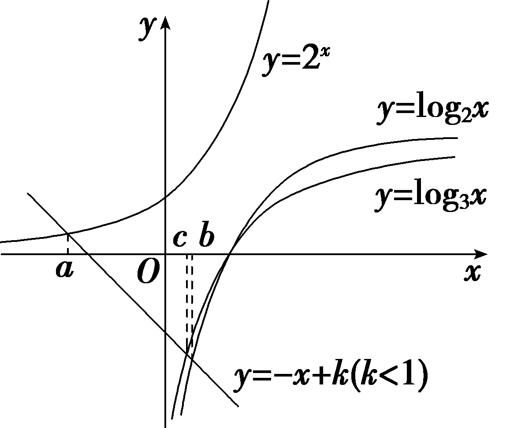
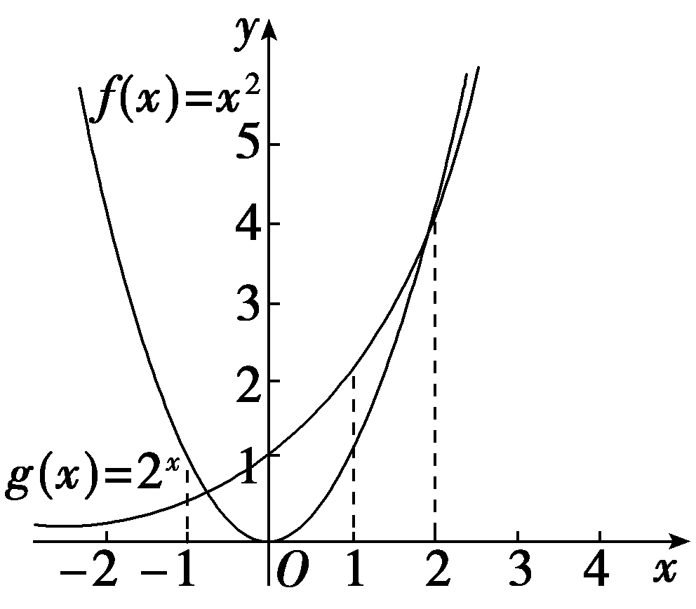

**培优课**2　**指、对、幂的大小比较**

指数与对数是高中一个重要的知识点，也是高考必考考点之一，其中指数、对数及幂的大小比较是近几年的高考热点和难点，主要考查指数、对数的互化、运算性质，以及指数函数、对数函数和幂函数的性质，一般以选择题或填空题的形式出现.

技法一　直接法比较大小

角度1　利用函数的单调性法比较大小

若<em>a</em>＝1.53，<em>b</em>＝1.52，<em>c</em>＝0.82，则(　　)

A.*a*＞*b*＞*c*	B.*c*＞*a*＞*b*

C.*b*＞*a*＞*c*	D.*b*＞*c*＞*a*

答案：**A**

解析：函数<em>y</em>＝1.5<em>x</em>在<strong>R</strong>上单调递增，函数<em>y</em>＝0.8<em>x</em>在<strong>R</strong>上单调递减，所以1.53＞1.52＞1.50＝1＝0.80＞0.82，所以<em>a</em>＞<em>b</em>＞<em>c</em>.故选A.

角度2　利用中间值法比较大小

设&lt;text style="itali<em>c</em>"&gt;a&lt;/text&gt;＝2 02 $5^{\frac{1}{2 026}}$ ，&lt;text style="itali<em>c</em>"&gt;b&lt;/text&gt;＝log2 025 $\sqrt{2 026}$ ，<em>c</em>＝lo $g_{\frac{1}{2 026}}$ &lt;text style="subs<em>c</em>ript"&gt;2 025&lt;/text&gt;，则(　　)

A.*c*＞*b*＞*a*	B.*b*＞*c*＞*a*

C.*a*＞*c*＞*b*	D.*a*＞*b*＞*c*

答案：**D**

解析：&lt;text style="it&lt;text style="it&lt;text style="itali<em>c</em>"&gt;a&lt;/text&gt;lic"&gt;a&lt;/text&gt;li&lt;text style="itali<em>c</em>"&gt;c&lt;/text&gt;"&gt;a&lt;/text&gt;＝2 02 $5^{\frac{1}{2 026}}$ ＞2 &lt;text style="supers&lt;text style="it&lt;text style="it&lt;text style="itali<em>c</em>"&gt;a&lt;/text&gt;lic"&gt;a&lt;/text&gt;li<em>c</em>"&gt;c&lt;/text&gt;ript"&gt;0&lt;/text&gt;250＝1，0＝log&lt;text style="su<em>&lt;text style="italic"&gt;&lt;text style="italic"&gt;b</em>&lt;/text&gt;&lt;/text&gt;script"&gt;&lt;text style="subscript"&gt;2 025&lt;/text&gt;&lt;/text&gt;1＜b＝log2 025 $\sqrt{2 026}$ ＜log2 &lt;text style="supers&lt;text style="it&lt;text style="it&lt;text style="itali<em>c</em>"&gt;a&lt;/text&gt;lic"&gt;a&lt;/text&gt;li<em>c</em>"&gt;c&lt;/text&gt;ript"&gt;0&lt;/text&gt;25&lt;text style="su<em>&lt;text style="italic"&gt;&lt;text style="italic"&gt;b</em>&lt;/text&gt;&lt;/text&gt;script"&gt;&lt;text style="subscript"&gt;2 025&lt;/text&gt;&lt;/text&gt;＝1，c＝lo $g_{\frac{1}{2 026}}$ 2 &lt;text style="supers&lt;text style="it&lt;text style="it&lt;text style="itali<em>c</em>"&gt;a&lt;/text&gt;lic"&gt;a&lt;/text&gt;li<em>c</em>"&gt;c&lt;/text&gt;ript"&gt;0&lt;/text&gt;25＝－log&lt;text style="su<em>&lt;text style="italic"&gt;b</em>&lt;/text&gt;script"&gt;2 026&lt;/text&gt;&lt;text style="su<em>b</em>script"&gt;&lt;text style="subscript"&gt;2 025&lt;/text&gt;&lt;/text&gt;＜0，故c＜0＜b＜1＜<em>a</em>.即a＞b＞c.故选D.

角度3　利用特殊值法比较大小

已知<text style="itali*c*">a</text>＞*b*＞1，0＜c＜ $\frac{1}{2}$ ，则下列结论正确的是(　　)

A.<em>ac</em>＜<em>bc</em>	B.<em>abc</em>＜<em>bac</em>

C.<em>a</em>log<em>bc</em>＜<em>b</em>log<em>ac</em>	D.log<em>ac</em>＜log<em>bc</em>

答案：**C**

解析：取特殊值，令&lt;text style="it&lt;text style="it&lt;text style="it&lt;text style="it&lt;text style="it&lt;text style="it&lt;text style="it&lt;text style="it&lt;text style="itali&lt;text style="itali<em>c</em>"&gt;c&lt;/text&gt;,su<em>b</em>script"&gt;a&lt;/text&gt;li<em>c</em>,subscript"&gt;a&lt;/text&gt;li<em>c</em>"&gt;a&lt;/text&gt;li<em>c</em>,su&lt;text style="italic,su<em>b</em>script"&gt;b&lt;/text&gt;script"&gt;a&lt;/text&gt;li<em>c</em>"&gt;a&lt;/text&gt;li&lt;text style="itali<em>c</em>"&gt;c&lt;/text&gt;,su&lt;text style="italic,su&lt;text style="italic,su<em>b</em>script"&gt;b&lt;/text&gt;script"&gt;b&lt;/text&gt;script"&gt;a&lt;/text&gt;li&lt;text style="itali&lt;text style="itali&lt;text style="itali&lt;text style="itali&lt;text style="itali<em>c</em>,superscript"&gt;c&lt;/text&gt;,superscript"&gt;c&lt;/text&gt;,superscript"&gt;c&lt;/text&gt;,superscript"&gt;c&lt;/text&gt;,superscript"&gt;c&lt;/text&gt;"&gt;a&lt;/text&gt;li&lt;text style="itali<em>c</em>,superscript"&gt;c&lt;/text&gt;"&gt;a&lt;/text&gt;li<em>c</em>"&gt;a&lt;/text&gt;＝4，<em>&lt;text style="italic"&gt;&lt;text style="italic"&gt;b</em>&lt;/text&gt;&lt;/text&gt;＝2，c $＝\frac{1}{4}$ ，则&lt;text style="it&lt;text style="it&lt;text style="it&lt;text style="it&lt;text style="it&lt;text style="it&lt;text style="it&lt;text style="it&lt;text style="itali&lt;text style="itali<em>c</em>"&gt;c&lt;/text&gt;,su<em>b</em>script"&gt;a&lt;/text&gt;li<em>c</em>,subscript"&gt;a&lt;/text&gt;li<em>c</em>"&gt;a&lt;/text&gt;li<em>c</em>,su&lt;text style="italic,su<em>b</em>script"&gt;b&lt;/text&gt;script"&gt;a&lt;/text&gt;li<em>c</em>"&gt;a&lt;/text&gt;li&lt;text style="itali<em>c</em>"&gt;c&lt;/text&gt;,su&lt;text style="italic,su&lt;text style="italic,su<em>b</em>script"&gt;b&lt;/text&gt;script"&gt;b&lt;/text&gt;script"&gt;a&lt;/text&gt;li&lt;text style="itali&lt;text style="itali&lt;text style="itali&lt;text style="itali&lt;text style="itali<em>c</em>,superscript"&gt;c&lt;/text&gt;,superscript"&gt;c&lt;/text&gt;,superscript"&gt;c&lt;/text&gt;,superscript"&gt;c&lt;/text&gt;,superscript"&gt;c&lt;/text&gt;"&gt;a&lt;/text&gt;li&lt;text style="itali<em>c</em>,superscript"&gt;c&lt;/text&gt;"&gt;a&lt;/text&gt;li<em>c</em>"&gt;a&lt;/text&gt;c $＝4^{\frac{1}{4}}$ ，&lt;text style="it&lt;text style="it&lt;text style="it&lt;text style="it&lt;text style="it&lt;text style="it&lt;text style="it&lt;text style="it&lt;text style="itali&lt;text style="itali<em>c</em>"&gt;c&lt;/text&gt;,su<em>b</em>script"&gt;a&lt;/text&gt;li<em>c</em>,subscript"&gt;a&lt;/text&gt;li<em>c</em>"&gt;a&lt;/text&gt;li<em>c</em>,su&lt;text style="italic,su<em>b</em>script"&gt;b&lt;/text&gt;script"&gt;a&lt;/text&gt;li<em>c</em>"&gt;a&lt;/text&gt;li&lt;text style="itali<em>c</em>"&gt;c&lt;/text&gt;,su&lt;text style="italic,su&lt;text style="italic,su<em>b</em>script"&gt;b&lt;/text&gt;script"&gt;b&lt;/text&gt;script"&gt;a&lt;/text&gt;li&lt;text style="itali&lt;text style="itali&lt;text style="itali&lt;text style="itali&lt;text style="itali<em>c</em>,superscript"&gt;c&lt;/text&gt;,superscript"&gt;c&lt;/text&gt;,superscript"&gt;c&lt;/text&gt;,superscript"&gt;c&lt;/text&gt;,superscript"&gt;c&lt;/text&gt;"&gt;a&lt;/text&gt;li&lt;text style="itali<em>c</em>,superscript"&gt;c&lt;/text&gt;"&gt;a&lt;/text&gt;li<em>c</em>"&gt;<em>&lt;text style="italic"&gt;b</em>&lt;/text&gt;&lt;/text&gt;c $＝2^{\frac{1}{4}}$ ，所以&lt;text style="it&lt;text style="it&lt;text style="it&lt;text style="it&lt;text style="it&lt;text style="it&lt;text style="it&lt;text style="it&lt;text style="itali&lt;text style="itali<em>c</em>"&gt;c&lt;/text&gt;,su<em>b</em>script"&gt;a&lt;/text&gt;li<em>c</em>,subscript"&gt;a&lt;/text&gt;li<em>c</em>"&gt;a&lt;/text&gt;li<em>c</em>,su&lt;text style="italic,su<em>b</em>script"&gt;b&lt;/text&gt;script"&gt;a&lt;/text&gt;li<em>c</em>"&gt;a&lt;/text&gt;li&lt;text style="itali<em>c</em>"&gt;c&lt;/text&gt;,su&lt;text style="italic,su&lt;text style="italic,su<em>b</em>script"&gt;b&lt;/text&gt;script"&gt;b&lt;/text&gt;script"&gt;a&lt;/text&gt;li&lt;text style="itali&lt;text style="itali&lt;text style="itali&lt;text style="itali&lt;text style="itali<em>c</em>,superscript"&gt;c&lt;/text&gt;,superscript"&gt;c&lt;/text&gt;,superscript"&gt;c&lt;/text&gt;,superscript"&gt;c&lt;/text&gt;,superscript"&gt;c&lt;/text&gt;"&gt;a&lt;/text&gt;li&lt;text style="itali<em>c</em>,superscript"&gt;c&lt;/text&gt;"&gt;a&lt;/text&gt;li<em>c</em>"&gt;a&lt;/text&gt;c＞<em>&lt;text style="italic"&gt;&lt;text style="italic"&gt;b</em>&lt;/text&gt;&lt;/text&gt;c，故A错误；<em>&lt;text style="italic"&gt;ab</em>&lt;/text&gt;c＝4× $2^{\frac{1}{4}}＝2^{\frac{9}{4}}$ ，&lt;text style="it&lt;text style="it&lt;text style="it&lt;text style="it&lt;text style="it&lt;text style="it&lt;text style="it&lt;text style="it&lt;text style="itali&lt;text style="itali<em>c</em>"&gt;c&lt;/text&gt;,su<em>b</em>script"&gt;a&lt;/text&gt;li<em>c</em>,subscript"&gt;a&lt;/text&gt;li<em>c</em>"&gt;a&lt;/text&gt;li<em>c</em>,su&lt;text style="italic,su<em>b</em>script"&gt;b&lt;/text&gt;script"&gt;a&lt;/text&gt;li<em>c</em>"&gt;a&lt;/text&gt;li&lt;text style="itali<em>c</em>"&gt;c&lt;/text&gt;,su&lt;text style="italic,su&lt;text style="italic,su<em>b</em>script"&gt;b&lt;/text&gt;script"&gt;b&lt;/text&gt;script"&gt;a&lt;/text&gt;li&lt;text style="itali&lt;text style="itali&lt;text style="itali&lt;text style="itali&lt;text style="itali<em>c</em>,superscript"&gt;c&lt;/text&gt;,superscript"&gt;c&lt;/text&gt;,superscript"&gt;c&lt;/text&gt;,superscript"&gt;c&lt;/text&gt;,superscript"&gt;c&lt;/text&gt;"&gt;a&lt;/text&gt;li&lt;text style="itali<em>c</em>,superscript"&gt;c&lt;/text&gt;"&gt;a&lt;/text&gt;li<em>c</em>"&gt;<em>&lt;text style="italic"&gt;b</em>&lt;/text&gt;&lt;/text&gt;<em>a</em>c＝2× $4^{\frac{1}{4}}＝2^{\frac{3}{2}}$ ，所以&lt;text style="it&lt;text style="it&lt;text style="it&lt;text style="it&lt;text style="it&lt;text style="it&lt;text style="it&lt;text style="it&lt;text style="itali&lt;text style="itali<em>c</em>"&gt;c&lt;/text&gt;,su<em>b</em>script"&gt;a&lt;/text&gt;li<em>c</em>,subscript"&gt;a&lt;/text&gt;li<em>c</em>"&gt;a&lt;/text&gt;li<em>c</em>,su&lt;text style="italic,su<em>b</em>script"&gt;b&lt;/text&gt;script"&gt;a&lt;/text&gt;li<em>c</em>"&gt;a&lt;/text&gt;li&lt;text style="itali<em>c</em>"&gt;c&lt;/text&gt;,su&lt;text style="italic,su&lt;text style="italic,su<em>b</em>script"&gt;b&lt;/text&gt;script"&gt;b&lt;/text&gt;script"&gt;a&lt;/text&gt;li&lt;text style="itali&lt;text style="itali&lt;text style="itali&lt;text style="itali&lt;text style="itali<em>c</em>,superscript"&gt;c&lt;/text&gt;,superscript"&gt;c&lt;/text&gt;,superscript"&gt;c&lt;/text&gt;,superscript"&gt;c&lt;/text&gt;,superscript"&gt;c&lt;/text&gt;"&gt;a&lt;/text&gt;li&lt;text style="itali<em>c</em>,superscript"&gt;c&lt;/text&gt;"&gt;a&lt;/text&gt;li<em>c</em>"&gt;a&lt;/text&gt;<em>&lt;text style="italic"&gt;&lt;text style="italic"&gt;b</em>&lt;/text&gt;&lt;/text&gt;c＞<em>&lt;text style="italic"&gt;ba</em>&lt;/text&gt;c，故B错误；logac＝log4 $\frac{1}{4}＝$ －1，log&lt;text style="it&lt;text style="it&lt;text style="it&lt;text style="it&lt;text style="it&lt;text style="it&lt;text style="it&lt;text style="it&lt;text style="itali&lt;text style="itali<em>c</em>"&gt;c&lt;/text&gt;,su<em>b</em>script"&gt;a&lt;/text&gt;li<em>c</em>,subscript"&gt;a&lt;/text&gt;li<em>c</em>"&gt;a&lt;/text&gt;li<em>c</em>,su&lt;text style="italic,su<em>b</em>script"&gt;b&lt;/text&gt;script"&gt;a&lt;/text&gt;li<em>c</em>"&gt;a&lt;/text&gt;li&lt;text style="itali<em>c</em>"&gt;c&lt;/text&gt;,su&lt;text style="italic,su&lt;text style="italic,su<em>b</em>script"&gt;b&lt;/text&gt;script"&gt;b&lt;/text&gt;script"&gt;a&lt;/text&gt;li&lt;text style="itali&lt;text style="itali&lt;text style="itali&lt;text style="itali&lt;text style="itali<em>c</em>,superscript"&gt;c&lt;/text&gt;,superscript"&gt;c&lt;/text&gt;,superscript"&gt;c&lt;/text&gt;,superscript"&gt;c&lt;/text&gt;,superscript"&gt;c&lt;/text&gt;"&gt;a&lt;/text&gt;li&lt;text style="itali<em>c</em>,superscript"&gt;c&lt;/text&gt;"&gt;a&lt;/text&gt;li<em>c</em>"&gt;<em>&lt;text style="italic"&gt;b</em>&lt;/text&gt;&lt;/text&gt;c＝log2 $\frac{1}{4}＝$ －&lt;text style="su&lt;text style="it&lt;text style="it&lt;text style="it&lt;text style="it&lt;text style="itali&lt;text style="itali<em>c</em>"&gt;c&lt;/text&gt;,su<em>b</em>script"&gt;a&lt;/text&gt;li<em>c</em>,subscript"&gt;a&lt;/text&gt;li<em>c</em>"&gt;a&lt;/text&gt;li<em>c</em>,su&lt;text style="italic,su<em>b</em>script"&gt;b&lt;/text&gt;script"&gt;a&lt;/text&gt;li<em>c</em>,su<em>b</em>script"&gt;b&lt;/text&gt;script"&gt;2&lt;/text&gt;，&lt;text style="it&lt;text style="it&lt;text style="it&lt;text style="it<em>a</em>li&lt;text style="itali<em>c</em>"&gt;c&lt;/text&gt;,su<em>b</em>script"&gt;a&lt;/text&gt;li&lt;text style="itali&lt;text style="itali&lt;text style="itali&lt;text style="itali&lt;text style="itali<em>c</em>,superscript"&gt;c&lt;/text&gt;,superscript"&gt;c&lt;/text&gt;,superscript"&gt;c&lt;/text&gt;,superscript"&gt;c&lt;/text&gt;,superscript"&gt;c&lt;/text&gt;"&gt;a&lt;/text&gt;li&lt;text style="itali<em>c</em>,superscript"&gt;c&lt;/text&gt;"&gt;a&lt;/text&gt;li<em>c</em>"&gt;a&lt;/text&gt;log<em>&lt;text style="italic"&gt;&lt;text style="italic"&gt;b</em>&lt;/text&gt;&lt;/text&gt;c＝－8，blogac＝－2，所以alogbc＜blogac，logac＞logbc，故C正确，D错误.故选C.

在指数、对数中通常可优先选择“－1，0， $\frac{1}{2}$ ，1”对所比较的数进行划分，然后再进行比较，有时可以简化比较的步骤，也有一些题目需要选择特殊的常数对所比较的数的值进行估计，例如log&lt;text style="subscript"&gt;&lt;text style="subscript"&gt;&lt;text style="subscript"&gt;&lt;text style="subscript"&gt;2&lt;/text&gt;&lt;/text&gt;&lt;/text&gt;&lt;/text&gt;3，可知1＝log22＜log23＜log24＝2，进而可估计log23是一个1～2之间的数，从而便于比较.

对点练1.已知<em>a</em>＝1.60.3，<em>b</em>＝1.60.8，<em>c</em>＝0.70.8，则(　　)

A.*c*＜*a*＜*b*	B.*a*＜*b*＜*c*

C.*b*＞*c*＞*a*	D.*a*＞*b*＞*c*

答案：**A**

解析：<em>y</em>＝1.6<em>x</em>是增函数，故<em>a</em>＝1.60.3＜<em>b</em>＝1.60.8，而1.60.3＞1＞<em>c</em>＝0.70.8，故<em>c</em>＜<em>a</em>＜<em>b</em>.故选A.

对点练2.(2024·天津卷)若<em>a</em>＝4.2－0.3，<em>b</em>＝4.20.3，<em>c</em>＝log4.20.2，则<em>a</em>，<em>b</em>，<em>c</em>的大小关系为(　　)

A.*a*＞*b*＞*c*	B.*b*＞*a*＞*c*

C.*c*＞*a*＞*b*	D.*b*＞*c*＞*a*

答案：**B**

解析：因为<em>y</em>＝4.2<em>x</em>在<strong>R</strong>上单调递增，且－0.3＜0＜0.3，所以0＜4.2－0.3＜4.20＜4.20.3，所以0＜4.2－0.3＜1＜4.20.3，即0＜<em>a</em>＜1＜<em>b</em>，因为<em>y</em>＝log4.2<em>x</em>在(0，＋∞)上单调递增，且0＜0.2＜1，所以log4.20.2＜log4.21＝0，即<em>c</em>＜0，所以<em>b</em>＞<em>a</em>＞<em>c</em>.故选B.

技法二　利用指数、对数及幂的运算性质化简比较大小

(1)已知<em>a</em>＝log34，<em>b</em>＝log45，<em>c</em>＝log56，则<em>a</em>，<em>b</em>，<em>c</em>的大小关系是(　　)

A.*a*＞*b*＞*c*	B.*a*＞*c*＞*b*

C.*b*＞*c*＞*a*	D.*c*＞*a*＞*b*

(2)已知<em>a</em>＝log63，<em>b</em>＝log84，<em>c</em>＝lg 5，则(　　)

A.*b*＜*a*＜*c*	B.*c*＜*b*＜*a*

C.*a*＜*c*＜*b*	D.*a*＜*b*＜*c*

答案：(1)**A**　(2)**D**

解析：(1)因为&lt;text style="it&lt;text style="it&lt;text style="it&lt;text style="it&lt;text style="itali<em>c</em>"&gt;a&lt;/text&gt;li<em>c</em>"&gt;a&lt;/text&gt;lic"&gt;a&lt;/text&gt;lic"&gt;a&lt;/text&gt;li<em>c</em>"&gt;a&lt;/text&gt;＝log&lt;text style="su<em>&lt;text style="italic"&gt;&lt;text style="italic"&gt;&lt;text style="italic"&gt;&lt;text style="italic"&gt;&lt;text style="italic"&gt;b</em>&lt;/text&gt;&lt;/text&gt;&lt;/text&gt;&lt;/text&gt;&lt;/text&gt;script"&gt;3&lt;/text&gt;4 $＝\frac{lg4}{lg3}$ ，&lt;text style="it&lt;text style="it&lt;text style="it&lt;text style="it&lt;text style="itali<em>c</em>"&gt;a&lt;/text&gt;li<em>c</em>"&gt;a&lt;/text&gt;lic"&gt;a&lt;/text&gt;lic"&gt;a&lt;/text&gt;li<em>c</em>"&gt;<em>&lt;text style="italic"&gt;&lt;text style="italic"&gt;&lt;text style="italic"&gt;&lt;text style="italic"&gt;b</em>&lt;/text&gt;&lt;/text&gt;&lt;/text&gt;&lt;/text&gt;&lt;/text&gt;＝log45 $＝\frac{lg5}{lg4}$ ，&lt;text style="it&lt;text style="it&lt;text style="it&lt;text style="it&lt;text style="itali<em>c</em>"&gt;a&lt;/text&gt;li<em>c</em>"&gt;a&lt;/text&gt;lic"&gt;a&lt;/text&gt;lic"&gt;a&lt;/text&gt;lic"&gt;c&lt;/text&gt;＝log&lt;text style="su<em>&lt;text style="italic"&gt;&lt;text style="italic"&gt;&lt;text style="italic"&gt;&lt;text style="italic"&gt;b</em>&lt;/text&gt;&lt;/text&gt;&lt;/text&gt;&lt;/text&gt;script"&gt;5&lt;/text&gt;6 $＝\frac{lg6}{lg5}$ ，所以&lt;text style="it&lt;text style="it&lt;text style="it&lt;text style="it&lt;text style="itali<em>c</em>"&gt;a&lt;/text&gt;li<em>c</em>"&gt;a&lt;/text&gt;lic"&gt;a&lt;/text&gt;lic"&gt;a&lt;/text&gt;li<em>c</em>"&gt;a&lt;/text&gt;－<em>&lt;text style="italic"&gt;&lt;text style="italic"&gt;&lt;text style="italic"&gt;&lt;text style="italic"&gt;&lt;text style="italic"&gt;b</em>&lt;/text&gt;&lt;/text&gt;&lt;/text&gt;&lt;/text&gt;&lt;/text&gt; $＝\frac{lg4}{lg3}$ － $\frac{lg5}{lg4}＝\frac{\left(lg4\right)^{2}－lg3lg5}{lg3lg4}$ ，因为lg &lt;text style="su&lt;text style="it&lt;text style="it&lt;text style="it&lt;text style="it&lt;text style="itali<em>c</em>"&gt;a&lt;/text&gt;li<em>c</em>"&gt;a&lt;/text&gt;lic"&gt;a&lt;/text&gt;lic"&gt;a&lt;/text&gt;li<em>c</em>"&gt;<em>&lt;text style="italic"&gt;&lt;text style="italic"&gt;&lt;text style="italic"&gt;&lt;text style="italic"&gt;b</em>&lt;/text&gt;&lt;/text&gt;&lt;/text&gt;&lt;/text&gt;&lt;/text&gt;script"&gt;3&lt;/text&gt;lg 5＜ $\frac{\left(lg3+lg5\right)^{2}}{4}＝\frac{\left(lg15\right)^{2}}{4}＜\frac{\left(lg16\right)^{2}}{4}＝\frac{\left(2lg4\right)^{2}}{4}＝\left(lg4\right)^{2}$ ，所以 $\left(lg4\right)^{2}$ －lg &lt;text style="su&lt;text style="it&lt;text style="it&lt;text style="it&lt;text style="it&lt;text style="itali<em>c</em>"&gt;a&lt;/text&gt;li<em>c</em>"&gt;a&lt;/text&gt;lic"&gt;a&lt;/text&gt;lic"&gt;a&lt;/text&gt;li<em>c</em>"&gt;<em>&lt;text style="italic"&gt;&lt;text style="italic"&gt;&lt;text style="italic"&gt;&lt;text style="italic"&gt;b</em>&lt;/text&gt;&lt;/text&gt;&lt;/text&gt;&lt;/text&gt;&lt;/text&gt;script"&gt;3&lt;/text&gt;lg 5＞0，lg 3lg 4＞0，所以<em>a</em>－b＞0，即a＞b，同理可证b＞c，故a＞b＞c.故选A.

(&lt;te&lt;text style="it&lt;text style="itali<em>c</em>"&gt;a&lt;/text&gt;lic"&gt;x&lt;/text&gt;t style="su<em>b</em>script"&gt;&lt;text style="subscript"&gt;&lt;text style="subscript"&gt;2&lt;/text&gt;&lt;/text&gt;&lt;/text&gt;)由题意得，&lt;text st<em>y</em>le="itali<em>c</em>"&gt;a&lt;/text&gt;＝log&lt;text style="su<em>b</em>script"&gt;&lt;text style="subscript"&gt;6&lt;/text&gt;&lt;/text&gt;3＝log6 $\frac{6}{2}＝$ 1－log&lt;te&lt;text style="it&lt;text style="itali<em>c</em>"&gt;a&lt;/text&gt;lic"&gt;x&lt;/text&gt;t st<em>y</em>le="su&lt;text style="itali<em>c</em>"&gt;<em>b</em>&lt;/text&gt;script"&gt;&lt;text style="subscript"&gt;6&lt;/text&gt;&lt;/text&gt;&lt;text style="subscript"&gt;&lt;text style="subscript"&gt;&lt;text style="subscript"&gt;2&lt;/text&gt;&lt;/text&gt;&lt;/text&gt;＝1－ $\frac{1}{log_{2}6}$ ，&lt;te&lt;text style="it&lt;text style="itali<em>c</em>"&gt;a&lt;/text&gt;lic"&gt;x&lt;/text&gt;t st<em>y</em>le="itali<em>c</em>"&gt;<em>b</em>&lt;/text&gt;＝log&lt;text style="subscript"&gt;&lt;text style="subscript"&gt;8&lt;/text&gt;&lt;/text&gt;4＝log8 $\frac{8}{2}＝$ 1－log&lt;te&lt;text style="it&lt;text style="itali<em>c</em>"&gt;a&lt;/text&gt;lic"&gt;x&lt;/text&gt;t st<em>y</em>le="su<em>b</em>s<em>c</em>ript"&gt;&lt;text style="subscript"&gt;8&lt;/text&gt;&lt;/text&gt;&lt;text style="subscript"&gt;&lt;text style="subscript"&gt;&lt;text style="subscript"&gt;2&lt;/text&gt;&lt;/text&gt;&lt;/text&gt;＝1－ $\frac{1}{log_{2}8}$ ，&lt;te&lt;text style="it&lt;text style="itali<em>c</em>"&gt;a&lt;/text&gt;lic"&gt;x&lt;/text&gt;t st<em>y</em>le="italic"&gt;c&lt;/text&gt;＝lg 5＝lg $\frac{10}{2}＝$ 1－lg &lt;te&lt;text style="it&lt;text style="itali<em>c</em>"&gt;a&lt;/text&gt;lic"&gt;x&lt;/text&gt;t style="su<em>b</em>script"&gt;&lt;text style="subscript"&gt;&lt;text style="subscript"&gt;2&lt;/text&gt;&lt;/text&gt;&lt;/text&gt;＝1－ $\frac{1}{log_{2}10}$ ，因为函数&lt;te&lt;text style="it&lt;text style="itali<em>c</em>"&gt;a&lt;/text&gt;lic"&gt;x&lt;/text&gt;t style="italic"&gt;y&lt;/text&gt;＝log&lt;text style="su<em>b</em>script"&gt;&lt;text style="subscript"&gt;&lt;text style="subscript"&gt;2&lt;/text&gt;&lt;/text&gt;&lt;/text&gt;x在(0，＋∞)上单调递增，所以0＜log2&lt;text style="su&lt;text style="itali<em>c</em>"&gt;b&lt;/text&gt;script"&gt;&lt;text style="subscript"&gt;6&lt;/text&gt;&lt;/text&gt;＜log2&lt;text style="subscript"&gt;&lt;text style="subscript"&gt;8&lt;/text&gt;&lt;/text&gt;＜log210，则 $\frac{1}{log_{2}6}＞\frac{1}{log_{2}8}＞\frac{1}{log_{2}10}$ ，故1－ $\frac{1}{log_{2}6}$ ＜1－ $\frac{1}{log_{2}8}$ ＜1－ $\frac{1}{log_{2}10}$ ，所以&lt;te&lt;text style="it&lt;text style="itali<em>c</em>"&gt;a&lt;/text&gt;lic"&gt;x&lt;/text&gt;t st<em>y</em>le="itali<em>c</em>"&gt;a&lt;/text&gt;＜<em>&lt;text style="italic"&gt;b</em>&lt;/text&gt;＜c.故选D.

如果两个指数或对数的底数相同，则可通过指数或真数的大小与指数、对数函数的单调性判断出指数或对数的大小关系，要熟练运用指数、对数公式及性质，尽量将比较的对象转化为某一部分相同的情况.

对点练3.已知<em>a</em>＝2100，<em>b</em>＝365，<em>c</em>＝930，则<em>a</em>，<em>b</em>，<em>c</em>的大小关系是(参考值lg 2≈0.301 0，lg 3≈0.477 1)(　　)

A.*a*＞*b*＞*c*	B.*b*＞*a*＞*c*

C.*b*＞*c*＞*a*	D.*c*＞*b*＞*a*

答案：**B**

解析：<em>c</em>＝930＝360，<em>a</em>＝2100⇒lg <em>a</em>＝lg 2100＝100lg 2≈30.1，<em>b</em>＝365⇒lg <em>b</em>＝lg 365＝65lg 3≈31.011 5，<em>c</em>＝930⇒lg <em>c</em>＝lg 360＝60lg 3≈28.626，所以lg <em>b</em>＞lg <em>a</em>＞lg <em>c</em>，即<em>b</em>＞<em>a</em>＞<em>c</em>.故选B.

技法三　构造函数法比较大小

(1)已知&lt;text style="it&lt;text style="itali<em>c</em>"&gt;a&lt;/text&gt;li<em>c</em>"&gt;a&lt;/text&gt;＝e，<em>&lt;text style="italic"&gt;b</em>&lt;/text&gt;＝3log3e，c $＝\frac{5}{ln5}$ ，则&lt;text style="it&lt;text style="itali<em>c</em>"&gt;a&lt;/text&gt;li<em>c</em>"&gt;a&lt;/text&gt;，<em>&lt;text style="italic"&gt;b</em>&lt;/text&gt;，c的大小关系为(　　)

A.*c*＜*a*＜*b*	B.*a*＜*c*＜*b*

C.*b*＜*c*＜*a*	D.*a*＜*b*＜*c*

(&lt;text style="su&lt;text style="it&lt;text style="itali<em>c</em>"&gt;a&lt;/text&gt;lic,superscript"&gt;<em>&lt;text style="italic"&gt;b</em>&lt;/text&gt;&lt;/text&gt;script"&gt;2&lt;/text&gt;)设 $\left(\frac{1}{3}\right)^{a}＝$ log&lt;text style="su&lt;text style="it&lt;text style="itali<em>c</em>"&gt;a&lt;/text&gt;lic,superscript"&gt;<em>&lt;text style="italic"&gt;b</em>&lt;/text&gt;&lt;/text&gt;script"&gt;2&lt;/text&gt;<em>a</em>，2b＝lo $g_{\frac{1}{3}}$ &lt;text style="it&lt;text style="itali<em>c</em>"&gt;a&lt;/text&gt;lic,superscript"&gt;<em>&lt;text style="italic"&gt;b</em>&lt;/text&gt;&lt;/text&gt;， $\left(\frac{1}{4}\right)^{c}＝$ 5，则&lt;text style="it&lt;text style="itali<em>c</em>"&gt;a&lt;/text&gt;lic"&gt;a&lt;/text&gt;，<em>&lt;text style="italic"&gt;&lt;text style="italic"&gt;b</em>&lt;/text&gt;&lt;/text&gt;，c的大小关系是(　　)

A.*b*＜*a*＜*c*	B.*c*＜*b*＜*a*

C.*a*＜*b*＜*c*	D.*b*＜*c*＜*a*

答案：(1)**D**　(2)**B**

解析：(1)设&lt;te&lt;te&lt;te&lt;te&lt;text style="it&lt;text style="it&lt;text style="itali<em>c</em>"&gt;a&lt;/text&gt;li<em>c</em>"&gt;a&lt;/text&gt;lic"&gt;x&lt;/text&gt;t style="italic"&gt;x&lt;/text&gt;t style="italic"&gt;x&lt;/text&gt;t style="italic"&gt;x&lt;/text&gt;t style="italic"&gt;<em>&lt;text style="italic"&gt;&lt;text style="italic"&gt;&lt;text style="italic"&gt;&lt;text style="italic"&gt;&lt;text style="italic"&gt;&lt;text style="italic"&gt;f</em>&lt;/text&gt;&lt;/text&gt;&lt;/text&gt;&lt;/text&gt;&lt;/text&gt;&lt;/text&gt;&lt;/text&gt;(x) $＝\frac{x}{lnx}$ ，&lt;te&lt;te&lt;te&lt;text style="it&lt;text style="it&lt;text style="itali<em>c</em>"&gt;a&lt;/text&gt;li<em>c</em>"&gt;a&lt;/text&gt;lic"&gt;x&lt;/text&gt;t style="italic"&gt;x&lt;/text&gt;t style="italic"&gt;x&lt;/text&gt;t style="italic"&gt;x&lt;/text&gt;≥e，则<em>&lt;text style="italic"&gt;&lt;text style="italic"&gt;&lt;text style="italic"&gt;&lt;text style="italic"&gt;&lt;text style="italic"&gt;&lt;text style="italic"&gt;&lt;text style="italic"&gt;f</em>&lt;/text&gt;&lt;/text&gt;&lt;/text&gt;&lt;/text&gt;&lt;/text&gt;&lt;/text&gt;&lt;/text&gt;'(x) $＝\frac{lnx－1}{\left(lnx\right)^{2}}$ ≥0恒成立，所以函数&lt;te&lt;te&lt;te&lt;te&lt;text style="it&lt;text style="it&lt;text style="itali<em>c</em>"&gt;a&lt;/text&gt;li<em>c</em>"&gt;a&lt;/text&gt;lic"&gt;x&lt;/text&gt;t style="italic"&gt;x&lt;/text&gt;t style="italic"&gt;x&lt;/text&gt;t style="italic"&gt;x&lt;/text&gt;t style="italic"&gt;<em>&lt;text style="italic"&gt;&lt;text style="italic"&gt;&lt;text style="italic"&gt;&lt;text style="italic"&gt;&lt;text style="italic"&gt;&lt;text style="italic"&gt;f</em>&lt;/text&gt;&lt;/text&gt;&lt;/text&gt;&lt;/text&gt;&lt;/text&gt;&lt;/text&gt;&lt;/text&gt;(x)在[e，＋∞)上单调递增，又a＝f $\left(e\right)$ ，&lt;text style="it&lt;text style="itali<em>c</em>"&gt;a&lt;/text&gt;li<em>c</em>"&gt;<em>b</em>&lt;/text&gt;＝3log3e $＝\frac{3}{ln3}＝$ &lt;te&lt;te&lt;te&lt;te&lt;text style="it&lt;text style="it&lt;text style="itali<em>c</em>"&gt;a&lt;/text&gt;li<em>c</em>"&gt;a&lt;/text&gt;lic"&gt;x&lt;/text&gt;t style="italic"&gt;x&lt;/text&gt;t style="italic"&gt;x&lt;/text&gt;t style="italic"&gt;x&lt;/text&gt;t style="italic"&gt;<em>&lt;text style="italic"&gt;&lt;text style="italic"&gt;&lt;text style="italic"&gt;&lt;text style="italic"&gt;&lt;text style="italic"&gt;&lt;text style="italic"&gt;f</em>&lt;/text&gt;&lt;/text&gt;&lt;/text&gt;&lt;/text&gt;&lt;/text&gt;&lt;/text&gt;&lt;/text&gt;(&lt;text style="su<em>b</em>script"&gt;3&lt;/text&gt;)，c $＝\frac{5}{ln5}＝$ &lt;te&lt;te&lt;te&lt;te&lt;text style="it&lt;text style="it&lt;text style="itali<em>c</em>"&gt;a&lt;/text&gt;li<em>c</em>"&gt;a&lt;/text&gt;lic"&gt;x&lt;/text&gt;t style="italic"&gt;x&lt;/text&gt;t style="italic"&gt;x&lt;/text&gt;t style="italic"&gt;x&lt;/text&gt;t style="italic"&gt;<em>&lt;text style="italic"&gt;&lt;text style="italic"&gt;&lt;text style="italic"&gt;&lt;text style="italic"&gt;&lt;text style="italic"&gt;&lt;text style="italic"&gt;f</em>&lt;/text&gt;&lt;/text&gt;&lt;/text&gt;&lt;/text&gt;&lt;/text&gt;&lt;/text&gt;&lt;/text&gt;(5)，因为e＜&lt;text style="su<em>b</em>script"&gt;3&lt;/text&gt;＜5，所以f(e)＜f(3)＜f(5)，所以a＜<em>b</em>＜c.故选D.

(&lt;te&lt;te&lt;te&lt;te&lt;te&lt;te&lt;te&lt;te&lt;te&lt;text style="it<em>a</em>li&lt;text style="itali<em>c</em>"&gt;c&lt;/text&gt;"&gt;x&lt;/text&gt;t style="italic"&gt;x&lt;/text&gt;t st<em>y</em>le="italic,superscript"&gt;x&lt;/text&gt;t st<em>y</em>le="italic"&gt;x&lt;/text&gt;t style="italic,superscript"&gt;x&lt;/text&gt;t style="italic"&gt;x&lt;/text&gt;t style="it&lt;text style="it<em>a</em>lic"&gt;a&lt;/text&gt;lic"&gt;x&lt;/text&gt;t st<em>y</em>le="italic"&gt;x&lt;/text&gt;t st<em>y</em>le="italic"&gt;x&lt;/text&gt;t style="su<em>&lt;text style="italic"&gt;&lt;text style="italic"&gt;b</em>&lt;/text&gt;&lt;/text&gt;script"&gt;2&lt;/text&gt;)构造函数&lt;te<em>x</em>t style="italic"&gt;<em>&lt;text style="italic"&gt;&lt;text style="italic"&gt;&lt;text style="italic"&gt;f</em>&lt;/text&gt;&lt;/text&gt;&lt;/text&gt;&lt;/text&gt;(x)＝lo<em>&lt;text style="italic"&gt;&lt;text style="italic"&gt;&lt;text style="italic"&gt;&lt;text style="italic"&gt;g</em>&lt;/text&gt;&lt;/text&gt;&lt;/text&gt;&lt;/text&gt;2x－ $\left(\frac{1}{3}\right)^{x}$ ，因为函数&lt;te&lt;te&lt;te&lt;te&lt;te&lt;te&lt;te&lt;te&lt;text style="it<em>a</em>li&lt;text style="itali<em>c</em>"&gt;c&lt;/text&gt;"&gt;x&lt;/text&gt;t style="italic"&gt;x&lt;/text&gt;t st<em>y</em>le="italic,superscript"&gt;x&lt;/text&gt;t st<em>y</em>le="italic"&gt;x&lt;/text&gt;t style="italic,superscript"&gt;x&lt;/text&gt;t style="italic"&gt;x&lt;/text&gt;t style="it&lt;text style="it<em>a</em>lic"&gt;a&lt;/text&gt;lic"&gt;x&lt;/text&gt;t st<em>y</em>le="italic"&gt;x&lt;/text&gt;t style="italic"&gt;y&lt;/text&gt;＝lo<em>&lt;text style="italic"&gt;&lt;text style="italic"&gt;&lt;text style="italic"&gt;&lt;text style="italic"&gt;g</em>&lt;/text&gt;&lt;/text&gt;&lt;/text&gt;&lt;/text&gt;&lt;te<em>x</em>t style="su<em>&lt;text style="italic"&gt;&lt;text style="italic"&gt;b</em>&lt;/text&gt;&lt;/text&gt;script"&gt;2&lt;/text&gt;<em>x</em>，y＝－ $\left(\frac{1}{3}\right)^{x}$ 在(0，＋∞)上均为增函数，所以函数&lt;te&lt;te&lt;te&lt;te&lt;te&lt;te&lt;te&lt;te&lt;te&lt;te&lt;text style="it<em>a</em>li&lt;text style="itali<em>c</em>"&gt;c&lt;/text&gt;"&gt;x&lt;/text&gt;t style="italic"&gt;x&lt;/text&gt;t st<em>y</em>le="italic,superscript"&gt;x&lt;/text&gt;t st<em>y</em>le="italic"&gt;x&lt;/text&gt;t style="italic,superscript"&gt;x&lt;/text&gt;t style="italic"&gt;x&lt;/text&gt;t style="it&lt;text style="it<em>a</em>lic"&gt;a&lt;/text&gt;lic"&gt;x&lt;/text&gt;t st<em>y</em>le="italic"&gt;x&lt;/text&gt;t st<em>y</em>le="italic"&gt;x&lt;/text&gt;t style="italic"&gt;x&lt;/text&gt;t style="italic"&gt;<em>&lt;text style="italic"&gt;&lt;text style="italic"&gt;&lt;text style="italic"&gt;f</em>&lt;/text&gt;&lt;/text&gt;&lt;/text&gt;&lt;/text&gt;(x)为(0，＋∞)上的增函数，且f(1)＝－ $\frac{1}{3}$ ＜0，&lt;te&lt;te&lt;te&lt;te&lt;te&lt;te&lt;te&lt;te&lt;te&lt;te&lt;text style="it<em>a</em>li&lt;text style="itali<em>c</em>"&gt;c&lt;/text&gt;"&gt;x&lt;/text&gt;t style="italic"&gt;x&lt;/text&gt;t st<em>y</em>le="italic,superscript"&gt;x&lt;/text&gt;t st<em>y</em>le="italic"&gt;x&lt;/text&gt;t style="italic,superscript"&gt;x&lt;/text&gt;t style="italic"&gt;x&lt;/text&gt;t style="it&lt;text style="it<em>a</em>lic"&gt;a&lt;/text&gt;lic"&gt;x&lt;/text&gt;t st<em>y</em>le="italic"&gt;x&lt;/text&gt;t st<em>y</em>le="italic"&gt;x&lt;/text&gt;t style="italic"&gt;x&lt;/text&gt;t style="italic"&gt;<em>&lt;text style="italic"&gt;&lt;text style="italic"&gt;&lt;text style="italic"&gt;f</em>&lt;/text&gt;&lt;/text&gt;&lt;/text&gt;&lt;/text&gt;(&lt;text style="su<em>&lt;text style="italic"&gt;&lt;text style="italic"&gt;b</em>&lt;/text&gt;&lt;/text&gt;script"&gt;2&lt;/text&gt;) $＝\frac{8}{9}$ ＞0，因为&lt;te&lt;te&lt;te&lt;te&lt;te&lt;te&lt;te&lt;te&lt;te&lt;te&lt;text style="it<em>a</em>li&lt;text style="itali<em>c</em>"&gt;c&lt;/text&gt;"&gt;x&lt;/text&gt;t style="italic"&gt;x&lt;/text&gt;t st<em>y</em>le="italic,superscript"&gt;x&lt;/text&gt;t st<em>y</em>le="italic"&gt;x&lt;/text&gt;t style="italic,superscript"&gt;x&lt;/text&gt;t style="italic"&gt;x&lt;/text&gt;t style="it&lt;text style="it<em>a</em>lic"&gt;a&lt;/text&gt;lic"&gt;x&lt;/text&gt;t st<em>y</em>le="italic"&gt;x&lt;/text&gt;t st<em>y</em>le="italic"&gt;x&lt;/text&gt;t style="italic"&gt;x&lt;/text&gt;t style="italic"&gt;<em>&lt;text style="italic"&gt;&lt;text style="italic"&gt;&lt;text style="italic"&gt;f</em>&lt;/text&gt;&lt;/text&gt;&lt;/text&gt;&lt;/text&gt;(a)＝0，由零点存在定理可知1＜a＜&lt;text style="su<em>&lt;text style="italic"&gt;&lt;text style="italic"&gt;b</em>&lt;/text&gt;&lt;/text&gt;script"&gt;2&lt;/text&gt;；构造函数<em>&lt;text style="italic"&gt;&lt;text style="italic"&gt;&lt;text style="italic"&gt;&lt;text style="italic"&gt;g</em>&lt;/text&gt;&lt;/text&gt;&lt;/text&gt;&lt;/text&gt;(x)＝2x－lo $g_{\frac{1}{3}}$ &lt;te&lt;te&lt;te&lt;te&lt;te&lt;te&lt;te&lt;te&lt;te&lt;text style="it<em>a</em>li&lt;text style="itali<em>c</em>"&gt;c&lt;/text&gt;"&gt;x&lt;/text&gt;t style="italic"&gt;x&lt;/text&gt;t st<em>y</em>le="italic,superscript"&gt;x&lt;/text&gt;t st<em>y</em>le="italic"&gt;x&lt;/text&gt;t style="italic,superscript"&gt;x&lt;/text&gt;t style="italic"&gt;x&lt;/text&gt;t style="it&lt;text style="it<em>a</em>lic"&gt;a&lt;/text&gt;lic"&gt;x&lt;/text&gt;t st<em>y</em>le="italic"&gt;x&lt;/text&gt;t st<em>y</em>le="italic"&gt;x&lt;/text&gt;t style="italic"&gt;x&lt;/text&gt;，因为函数y＝&lt;text style="su<em>&lt;text style="italic"&gt;&lt;text style="italic"&gt;b</em>&lt;/text&gt;&lt;/text&gt;script"&gt;2&lt;/text&gt;x，y＝－lo $g_{\frac{1}{3}}$ &lt;te&lt;te&lt;te&lt;te&lt;te&lt;te&lt;te&lt;te&lt;te&lt;text style="it<em>a</em>li&lt;text style="itali<em>c</em>"&gt;c&lt;/text&gt;"&gt;x&lt;/text&gt;t style="italic"&gt;x&lt;/text&gt;t st<em>y</em>le="italic,superscript"&gt;x&lt;/text&gt;t st<em>y</em>le="italic"&gt;x&lt;/text&gt;t style="italic,superscript"&gt;x&lt;/text&gt;t style="italic"&gt;x&lt;/text&gt;t style="it&lt;text style="it<em>a</em>lic"&gt;a&lt;/text&gt;lic"&gt;x&lt;/text&gt;t st<em>y</em>le="italic"&gt;x&lt;/text&gt;t st<em>y</em>le="italic"&gt;x&lt;/text&gt;t style="italic"&gt;x&lt;/text&gt;在(0，＋∞)上均为增函数，所以函数<em>&lt;text style="italic"&gt;&lt;text style="italic"&gt;&lt;text style="italic"&gt;&lt;text style="italic"&gt;g</em>&lt;/text&gt;&lt;/text&gt;&lt;/text&gt;&lt;/text&gt;(x)为(0，＋∞)上的增函数，且g $\left(\frac{1}{9}\right)＝2^{\frac{1}{9}}$ －&lt;te&lt;te&lt;te&lt;te&lt;te&lt;te&lt;te&lt;te&lt;te&lt;text style="it<em>a</em>li&lt;text style="itali<em>c</em>"&gt;c&lt;/text&gt;"&gt;x&lt;/text&gt;t style="italic"&gt;x&lt;/text&gt;t st<em>y</em>le="italic,superscript"&gt;x&lt;/text&gt;t st<em>y</em>le="italic"&gt;x&lt;/text&gt;t style="italic,superscript"&gt;x&lt;/text&gt;t style="italic"&gt;x&lt;/text&gt;t style="it&lt;text style="it<em>a</em>lic"&gt;a&lt;/text&gt;lic"&gt;x&lt;/text&gt;t st<em>y</em>le="italic"&gt;x&lt;/text&gt;t st<em>y</em>le="italic"&gt;x&lt;/text&gt;t style="su<em>&lt;text style="italic"&gt;&lt;text style="italic"&gt;b</em>&lt;/text&gt;&lt;/text&gt;script"&gt;2&lt;/text&gt;＜0，<em>&lt;text style="italic"&gt;&lt;text style="italic"&gt;&lt;text style="italic"&gt;&lt;text style="italic"&gt;g</em>&lt;/text&gt;&lt;/text&gt;&lt;/text&gt;&lt;/text&gt; $\left(\frac{1}{3}\right)＝2^{\frac{1}{3}}$ －1＞0，因为&lt;te&lt;te&lt;te&lt;te&lt;te&lt;te&lt;text style="it<em>a</em>li&lt;text style="itali<em>c</em>"&gt;c&lt;/text&gt;"&gt;x&lt;/text&gt;t style="italic"&gt;x&lt;/text&gt;t st<em>y</em>le="italic,superscript"&gt;x&lt;/text&gt;t st<em>y</em>le="italic"&gt;x&lt;/text&gt;t style="italic,superscript"&gt;x&lt;/text&gt;t style="italic"&gt;x&lt;/text&gt;t style="italic"&gt;<em>&lt;text style="italic"&gt;&lt;text style="italic"&gt;&lt;text style="italic"&gt;g</em>&lt;/text&gt;&lt;/text&gt;&lt;/text&gt;&lt;/text&gt;(<em>&lt;text style="italic"&gt;&lt;text style="italic"&gt;b</em>&lt;/text&gt;&lt;/text&gt;)＝0，由零点存在定理可知 $\frac{1}{9}$ ＜&lt;text style="it<em>a</em>li&lt;text style="itali<em>c</em>"&gt;c&lt;/text&gt;"&gt;<em>&lt;text style="italic"&gt;b</em>&lt;/text&gt;&lt;/text&gt;＜ $\frac{1}{3}$ .因为 $\left(\frac{1}{4}\right)^{c}＝$ 5，则&lt;text style="it<em>a</em>li<em>c</em>"&gt;c&lt;/text&gt;＝lo $g_{\frac{1}{4}}$ 5＜lo $g_{\frac{1}{4}}$ 1＝0，因此&lt;text style="it<em>a</em>li<em>c</em>"&gt;c&lt;/text&gt;＜<em>&lt;text style="italic"&gt;&lt;text style="italic"&gt;b</em>&lt;/text&gt;&lt;/text&gt;＜&lt;te&lt;te&lt;te&lt;te&lt;te&lt;te<em>x</em>t style="italic"&gt;x&lt;/text&gt;t st<em>y</em>le="italic,superscript"&gt;x&lt;/text&gt;t st<em>y</em>le="italic"&gt;x&lt;/text&gt;t style="italic,superscript"&gt;x&lt;/text&gt;t style="italic"&gt;x&lt;/text&gt;t style="it<em>a</em>lic"&gt;a&lt;/text&gt;.故选B.

某些数或式子的大小关系问题，看似与函数的单调性无关，但要细心挖掘问题的内在联系，抓住其本质，将各个值中的共同的量用变量替换，构造函数，利用导数研究相应函数的单调性，进而比较大小.

对点练4.设&lt;te&lt;text st<em>y</em>le="italic"&gt;x&lt;/text&gt;t st<em>y</em>le="italic"&gt;x&lt;/text&gt;，y，<em>&lt;text style="italic"&gt;z</em>&lt;/text&gt;为正实数，且log2x＝log3y＝log5z＞1，则 $\frac{x}{2}$ ， $\frac{y}{3}$ ， $\frac{z}{5}$ 的大小关系是(　　)

A. $\frac{z}{5}＜\frac{y}{3}＜\frac{x}{2}$ 	B. $\frac{x}{2}＜\frac{y}{3}＜\frac{z}{5}$

C. $\frac{y}{3}＜\frac{x}{2}＜\frac{z}{5}$ 	D. $\frac{x}{2}＝\frac{y}{3}＝\frac{z}{5}$

答案：**B**

解析：由&lt;te&lt;te&lt;te&lt;te&lt;te<em>x</em>t style="italic"&gt;x&lt;/text&gt;t style="italic"&gt;x&lt;/text&gt;t st<em>y</em>le="italic"&gt;x&lt;/text&gt;t st<em>y</em>le="italic"&gt;x&lt;/text&gt;t st<em>y</em>le="italic"&gt;x&lt;/text&gt;，y，<em>&lt;text style="italic"&gt;&lt;text style="italic"&gt;z</em>&lt;/text&gt;&lt;/text&gt;为正实数，设log2x＝log3y＝log5z＝<em>&lt;text style="italic,superscript"&gt;&lt;text style="italic,superscript"&gt;&lt;text style="italic,superscript"&gt;&lt;text style="italic,superscript"&gt;&lt;text style="italic,superscript"&gt;&lt;text style="italic,superscript"&gt;&lt;text style="italic,superscript"&gt;k</em>&lt;/text&gt;&lt;/text&gt;&lt;/text&gt;&lt;/text&gt;&lt;/text&gt;&lt;/text&gt;&lt;/text&gt;＞1，可得x＝2k＞2，y＝3k＞3，z＝5k＞5.所以 $\frac{x}{2}＝$ &lt;te&lt;te&lt;te&lt;te&lt;te<em>x</em>t style="italic"&gt;x&lt;/text&gt;t style="italic"&gt;x&lt;/text&gt;t st<em>y</em>le="italic"&gt;x&lt;/text&gt;t st<em>y</em>le="italic"&gt;x&lt;/text&gt;t style="subscript"&gt;2&lt;/text&gt;<em>&lt;text style="italic,superscript"&gt;&lt;text style="italic,superscript"&gt;&lt;text style="italic,superscript"&gt;&lt;text style="italic,superscript"&gt;&lt;text style="italic,superscript"&gt;&lt;text style="italic,superscript"&gt;&lt;text style="italic,superscript"&gt;k</em>&lt;/text&gt;&lt;/text&gt;&lt;/text&gt;&lt;/text&gt;&lt;/text&gt;&lt;/text&gt;&lt;/text&gt;&lt;text style="superscript"&gt;&lt;text style="superscript"&gt;&lt;text style="superscript"&gt;－1&lt;/text&gt;&lt;/text&gt;&lt;/text&gt;＞1， $\frac{y}{3}＝$ &lt;te&lt;te&lt;te&lt;te<em>x</em>t style="italic"&gt;x&lt;/text&gt;t style="italic"&gt;x&lt;/text&gt;t st<em>y</em>le="italic"&gt;x&lt;/text&gt;t st<em>y</em>le="subscript"&gt;3&lt;/text&gt;<em>&lt;text style="italic,superscript"&gt;&lt;text style="italic,superscript"&gt;&lt;text style="italic,superscript"&gt;&lt;text style="italic,superscript"&gt;&lt;text style="italic,superscript"&gt;&lt;text style="italic,superscript"&gt;&lt;text style="italic,superscript"&gt;k</em>&lt;/text&gt;&lt;/text&gt;&lt;/text&gt;&lt;/text&gt;&lt;/text&gt;&lt;/text&gt;&lt;/text&gt;&lt;text style="superscript"&gt;&lt;text style="superscript"&gt;&lt;text style="superscript"&gt;－1&lt;/text&gt;&lt;/text&gt;&lt;/text&gt;＞1， $\frac{z}{5}＝$ &lt;te&lt;te&lt;te&lt;te<em>x</em>t style="italic"&gt;x&lt;/text&gt;t style="italic"&gt;x&lt;/text&gt;t st<em>y</em>le="italic"&gt;x&lt;/text&gt;t style="subscript"&gt;5&lt;/text&gt;<em>&lt;text style="italic,superscript"&gt;&lt;text style="italic,superscript"&gt;&lt;text style="italic,superscript"&gt;&lt;text style="italic,superscript"&gt;&lt;text style="italic,superscript"&gt;&lt;text style="italic,superscript"&gt;&lt;text style="italic,superscript"&gt;k</em>&lt;/text&gt;&lt;/text&gt;&lt;/text&gt;&lt;/text&gt;&lt;/text&gt;&lt;/text&gt;&lt;/text&gt;&lt;text style="superscript"&gt;&lt;text style="superscript"&gt;&lt;text style="superscript"&gt;－1&lt;/text&gt;&lt;/text&gt;&lt;/text&gt;＞1，令<em>&lt;text style="italic"&gt;&lt;text style="italic"&gt;&lt;text style="italic"&gt;&lt;text style="italic"&gt;f</em>&lt;/text&gt;&lt;/text&gt;&lt;/text&gt;&lt;/text&gt;(&lt;te&lt;text st<em>y</em>le="italic"&gt;x&lt;/text&gt;t st<em>y</em>le="italic"&gt;x&lt;/text&gt;)＝xk－1，因为f(x)在(0，＋∞)上单调递增，所以f(2)＜f(3)＜f(5)，即 $\frac{x}{2}＜\frac{y}{3}＜\frac{z}{5}$ .故选B.

对点练5.设&lt;text style="itali<em>c</em>"&gt;a&lt;/text&gt;＝e1.3－2 $\sqrt{7}$ ，&lt;text style="itali<em>c</em>"&gt;b&lt;/text&gt;＝4 $\sqrt{1.1}$ －4，<em>c</em>＝2ln 1.1，则(　　)

A.*a*＜*b*＜*c*	B.*a*＜*c*＜*b*

C.*b*＜*a*＜*c*	D.*c*＜*a*＜*b*

答案：**B**

解析：因为 $\left(e^{1.3}\right)^{2}＝$ e&lt;te&lt;te&lt;te&lt;te&lt;te&lt;te&lt;te&lt;te&lt;te&lt;te&lt;text style="it&lt;text style="itali<em>c</em>"&gt;a&lt;/text&gt;li&lt;text style="itali<em>c</em>"&gt;c&lt;/text&gt;"&gt;x&lt;/text&gt;t style="italic"&gt;x&lt;/text&gt;t style="italic"&gt;x&lt;/text&gt;t style="italic"&gt;x&lt;/text&gt;t style="italic"&gt;x&lt;/text&gt;t style="italic"&gt;x&lt;/text&gt;t style="italic"&gt;x&lt;/text&gt;t style="italic"&gt;x&lt;/text&gt;t style="italic"&gt;x&lt;/text&gt;t style="italic"&gt;x&lt;/text&gt;t style="supers<em>c</em>ript"&gt;2.6&lt;/text&gt;＜e&lt;text style="superscript"&gt;&lt;text style="superscript"&gt;3&lt;/text&gt;&lt;/text&gt;＜33， $\left(2\sqrt{7}\right)^{2}＝$ 28＞&lt;te&lt;te&lt;te&lt;te&lt;te&lt;te&lt;te&lt;te&lt;te&lt;te&lt;text style="it&lt;text style="itali<em>c</em>"&gt;a&lt;/text&gt;li&lt;text style="itali<em>c</em>"&gt;c&lt;/text&gt;"&gt;x&lt;/text&gt;t style="italic"&gt;x&lt;/text&gt;t style="italic"&gt;x&lt;/text&gt;t style="italic"&gt;x&lt;/text&gt;t style="italic"&gt;x&lt;/text&gt;t style="italic"&gt;x&lt;/text&gt;t style="italic"&gt;x&lt;/text&gt;t style="italic"&gt;x&lt;/text&gt;t style="italic"&gt;x&lt;/text&gt;t style="italic"&gt;x&lt;/text&gt;t style="supers<em>c</em>ript"&gt;&lt;text style="superscript"&gt;3&lt;/text&gt;&lt;/text&gt;3，所以e1.3＜2 $\sqrt{7}$ ，所以&lt;te&lt;te&lt;te&lt;te&lt;te&lt;te&lt;te&lt;te&lt;te&lt;te&lt;text style="it&lt;text style="itali<em>c</em>"&gt;a&lt;/text&gt;li&lt;text style="itali<em>c</em>"&gt;c&lt;/text&gt;"&gt;x&lt;/text&gt;t style="italic"&gt;x&lt;/text&gt;t style="italic"&gt;x&lt;/text&gt;t style="italic"&gt;x&lt;/text&gt;t style="italic"&gt;x&lt;/text&gt;t style="italic"&gt;x&lt;/text&gt;t style="italic"&gt;x&lt;/text&gt;t style="italic"&gt;x&lt;/text&gt;t style="italic"&gt;x&lt;/text&gt;t style="italic"&gt;x&lt;/text&gt;t style="itali<em>c</em>"&gt;a&lt;/text&gt;＜0；<em>&lt;text style="italic"&gt;&lt;text style="italic"&gt;b</em>&lt;/text&gt;&lt;/text&gt;－c＝4 $\sqrt{1.1}$ －4－2ln 1.1＝2(2 $\sqrt{1.1}$ －2－ln 1.1)，令&lt;te&lt;te&lt;te&lt;te&lt;te&lt;te&lt;te&lt;te&lt;te&lt;te&lt;text style="it&lt;text style="itali<em>c</em>"&gt;a&lt;/text&gt;li&lt;text style="itali<em>c</em>"&gt;c&lt;/text&gt;"&gt;x&lt;/text&gt;t style="italic"&gt;x&lt;/text&gt;t style="italic"&gt;x&lt;/text&gt;t style="italic"&gt;x&lt;/text&gt;t style="italic"&gt;x&lt;/text&gt;t style="italic"&gt;x&lt;/text&gt;t style="italic"&gt;x&lt;/text&gt;t style="italic"&gt;x&lt;/text&gt;t style="italic"&gt;x&lt;/text&gt;t style="italic"&gt;x&lt;/text&gt;t style="italic"&gt;<em>&lt;text style="italic"&gt;&lt;text style="italic"&gt;&lt;text style="italic"&gt;&lt;text style="italic"&gt;f</em>&lt;/text&gt;&lt;/text&gt;&lt;/text&gt;&lt;/text&gt;&lt;/text&gt;(x)＝2 $\sqrt{x}$ －2－ln &lt;te&lt;te&lt;te&lt;te&lt;te&lt;te&lt;te&lt;te&lt;te&lt;text style="it&lt;text style="itali<em>c</em>"&gt;a&lt;/text&gt;li&lt;text style="itali<em>c</em>"&gt;c&lt;/text&gt;"&gt;x&lt;/text&gt;t style="italic"&gt;x&lt;/text&gt;t style="italic"&gt;x&lt;/text&gt;t style="italic"&gt;x&lt;/text&gt;t style="italic"&gt;x&lt;/text&gt;t style="italic"&gt;x&lt;/text&gt;t style="italic"&gt;x&lt;/text&gt;t style="italic"&gt;x&lt;/text&gt;t style="italic"&gt;x&lt;/text&gt;t style="italic"&gt;x&lt;/text&gt;，所以<em>&lt;text style="italic"&gt;&lt;text style="italic"&gt;&lt;text style="italic"&gt;&lt;text style="italic"&gt;&lt;text style="italic"&gt;f</em>&lt;/text&gt;&lt;/text&gt;&lt;/text&gt;&lt;/text&gt;&lt;/text&gt;'(x) $＝\frac{1}{\sqrt{x}}$ － $\frac{1}{x}＝\frac{\sqrt{x}－1}{x}$ ，所以当0＜&lt;te&lt;te&lt;te&lt;te&lt;te&lt;te&lt;te&lt;te&lt;te&lt;text style="it&lt;text style="itali<em>c</em>"&gt;a&lt;/text&gt;li&lt;text style="itali<em>c</em>"&gt;c&lt;/text&gt;"&gt;x&lt;/text&gt;t style="italic"&gt;x&lt;/text&gt;t style="italic"&gt;x&lt;/text&gt;t style="italic"&gt;x&lt;/text&gt;t style="italic"&gt;x&lt;/text&gt;t style="italic"&gt;x&lt;/text&gt;t style="italic"&gt;x&lt;/text&gt;t style="italic"&gt;x&lt;/text&gt;t style="italic"&gt;x&lt;/text&gt;t style="italic"&gt;x&lt;/text&gt;＜1时，<em>&lt;text style="italic"&gt;&lt;text style="italic"&gt;&lt;text style="italic"&gt;&lt;text style="italic"&gt;&lt;text style="italic"&gt;f</em>&lt;/text&gt;&lt;/text&gt;&lt;/text&gt;&lt;/text&gt;&lt;/text&gt;'(x)＜0，f(x)单调递减，当x＞1时，<em>&lt;text style="italic"&gt;&lt;text style="italic"&gt;f'</em>&lt;/text&gt;&lt;/text&gt;(x)＞0，f(x)单调递增，所以f(x)&lt;text style="su<em>&lt;text style="italic"&gt;b</em>&lt;/text&gt;script"&gt;min&lt;/text&gt;＝f(1)＝0，所以f(1.1)＞0，即2 $\sqrt{1.1}$ －2－ln 1.1＞0，所以&lt;te&lt;te&lt;te&lt;te&lt;te&lt;te&lt;te&lt;te&lt;te&lt;te&lt;text style="it&lt;text style="itali<em>c</em>"&gt;a&lt;/text&gt;li&lt;text style="itali<em>c</em>"&gt;c&lt;/text&gt;"&gt;x&lt;/text&gt;t style="italic"&gt;x&lt;/text&gt;t style="italic"&gt;x&lt;/text&gt;t style="italic"&gt;x&lt;/text&gt;t style="italic"&gt;x&lt;/text&gt;t style="italic"&gt;x&lt;/text&gt;t style="italic"&gt;x&lt;/text&gt;t style="italic"&gt;x&lt;/text&gt;t style="italic"&gt;x&lt;/text&gt;t style="italic"&gt;x&lt;/text&gt;t style="italic"&gt;c&lt;/text&gt;＜<em>&lt;text style="italic"&gt;&lt;text style="italic"&gt;b</em>&lt;/text&gt;&lt;/text&gt;，又c＝2ln 1.1＞2ln 1＝0，所以<em>a</em>＜c＜b.故选B.

**课时测评**16　**指、对、幂的大小比较** $\frac{对应学生}{用书P341}$

(时间：45分钟　满分：75分)

(本栏目内容，在学生用书中以独立形式分册装订！)

(1—10题，每小题5分，共50分)

1.设<em>a</em>＝0.81.1，<em>b</em>＝0.80.8，<em>c</em>＝1.10.8，则<em>a</em>，<em>b</em>，<em>c</em>的大小关系为(　　)

A.*b*＜*c*＜*a*	B.*a*＜*c*＜*b*

C.*a*＜*b*＜*c*	D.*b*＜*a*＜*c*

答案：**C**

解析：因为函数<em>y</em>＝0.8<em>x</em>为减函数，所以0.81.1＜0.80.8＜1，即<em>a</em>＜<em>b</em>＜1，又<em>c</em>＝1.10.8＞1，所以<em>a</em>＜<em>b</em>＜<em>c</em>.故选C.

2.(2025·湖北武汉四调)记<em>a</em>＝30.2，<em>b</em>＝0.3－0.2，<em>c</em>＝log0.20.3，则(　　)

A.*a*＞*b*＞*c*	B.*b*＞*c*＞*a*

C.*c*＞*b*＞*a*	D.*b*＞*a*＞*c*

答案：**D**

解析：因为&lt;te&lt;te&lt;text style="it&lt;text style="itali<em>c</em>"&gt;a&lt;/text&gt;li<em>c</em>"&gt;x&lt;/text&gt;t st<em>y</em>le="it<em>a</em>lic"&gt;x&lt;/text&gt;t st<em>y</em>le="italic"&gt;<em>&lt;text style="italic"&gt;b</em>&lt;/text&gt;&lt;/text&gt;＝0.3－&lt;text style="superscript"&gt;&lt;text style="superscript"&gt;&lt;text style="subscript"&gt;&lt;text style="subscript"&gt;&lt;text style="subscript"&gt;0.2&lt;/text&gt;&lt;/text&gt;&lt;/text&gt;&lt;/text&gt;&lt;/text&gt; $＝\left(\frac{10}{3}\right)^{0.2}$ ，幂函数&lt;te&lt;te&lt;text style="it&lt;text style="itali<em>c</em>"&gt;a&lt;/text&gt;li<em>c</em>"&gt;x&lt;/text&gt;t st<em>y</em>le="it<em>a</em>lic"&gt;x&lt;/text&gt;t style="italic"&gt;y&lt;/text&gt;＝x&lt;text style="superscript"&gt;&lt;text style="superscript"&gt;0.2&lt;/text&gt;&lt;/text&gt;在 $\left(0，＋\infty \right)$ 上单调递增，又 $\frac{10}{3}$ ＞3，所以 $\left(\frac{10}{3}\right)^{0.2}$ ＞3&lt;te&lt;text style="it&lt;text style="itali<em>c</em>"&gt;a&lt;/text&gt;li<em>c</em>"&gt;x&lt;/text&gt;t st<em>y</em>le="superscript"&gt;&lt;text style="superscript"&gt;0.2&lt;/text&gt;&lt;/text&gt;＞30＝1，所以&lt;te&lt;text style="it<em>a</em>lic"&gt;x&lt;/text&gt;t st<em>y</em>le="italic"&gt;<em>&lt;text style="italic"&gt;b</em>&lt;/text&gt;&lt;/text&gt;＞a＞1，又对数函数y＝log&lt;text style="subscript"&gt;&lt;text style="subscript"&gt;0.2&lt;/text&gt;&lt;/text&gt;x在 $\left(0，＋\infty \right)$ 上单调递减，所以&lt;text style="it&lt;text style="itali<em>c</em>"&gt;a&lt;/text&gt;lic"&gt;c&lt;/text&gt;＝log&lt;te<em>x</em>t st<em>y</em>le="superscript"&gt;&lt;text style="superscript"&gt;0.2&lt;/text&gt;&lt;/text&gt;0.3＜log&lt;text style="su<em>b</em>script"&gt;&lt;text style="subscript"&gt;0.2&lt;/text&gt;&lt;/text&gt;0.2＝1，故&lt;te&lt;text style="it<em>a</em>lic"&gt;x&lt;/text&gt;t st<em>y</em>le="italic"&gt;<em>b</em>&lt;/text&gt;＞a＞1＞c.故选D.

3.(2025·贵州贵阳模拟)已知 $\frac{1}{m}＞\frac{1}{n}$ ＞1，&lt;text style="it&lt;text style="itali<em>c</em>"&gt;a&lt;/text&gt;li<em>c</em>"&gt;a&lt;/text&gt;＝<em>&lt;text style="italic,superscript"&gt;&lt;text style="italic"&gt;&lt;text style="italic,superscript"&gt;n</em>&lt;/text&gt;&lt;/text&gt;&lt;/text&gt;n，<em>&lt;text style="italic"&gt;b</em>&lt;/text&gt;＝n<em>&lt;text style="italic"&gt;m</em>&lt;/text&gt;，c＝mn，则a，b，c的大小关系正确的为(　　)

A.*c*＞*a*＞*b*	B.*b*＞*a*＞*c*

C.*b*＞*c*＞*a*	D.*a*＞*b*＞*c*

答案：**B**

解析：由题意 $\frac{1}{m}＞\frac{1}{n}$ ＞1，故0＜<te<te<text style="it<text style="it<text style="itali*c*">a</text>li*c*">a</text>lic">x</text>t st*y*le="it*a*lic,superscript">x</text>t st*y*le="italic">m</text>＜*<text style="italic"><text style="italic,superscript">n*</text></text>＜1，由指数函数的单调性，y＝nx单调递减，故*<text style="italic">b*</text>＞a，由幂函数的单调性，y＝xn在(0，＋∞)上单调递增，故a＞c，综上，b＞a＞c.故选B.

4.若<em>a</em>＝log382，<em>b</em>＝log215，<em>c</em>＝0.2－1.1，则(　　)

A.*b*＜*a*＜*c*	B.*b*＜*c*＜*a*

C.*a*＜*b*＜*c*	D.*c*＜*b*＜*a*

答案：**A**

解析：因为5＝log335＞<em>a</em>＝log382＞log381＝4＝log216＞<em>b</em>＝log215，<em>c</em>＝0.2－1.1＝51.1＞5，所以<em>b</em>＜<em>a</em>＜<em>c</em>.故选A.

5.设<em>a</em>＝log0.30.2，<em>b</em>＝log32，<em>c</em>＝log3020，则(　　)

A.*c*＜*b*＜*a*	B.*b*＜*c*＜*a*

C.*a*＜*b*＜*c*	D.*a*＜*c*＜*b*

答案：**B**

解析：&lt;text style="it&lt;text style="it&lt;text style="it<em>a</em>li&lt;text style="itali&lt;text style="itali&lt;text style="itali<em>c</em>"&gt;c&lt;/text&gt;"&gt;c&lt;/text&gt;"&gt;c&lt;/text&gt;"&gt;a&lt;/text&gt;lic"&gt;a&lt;/text&gt;li<em>c</em>"&gt;a&lt;/text&gt;＝log&lt;text style="su<em>&lt;text style="italic"&gt;&lt;text style="italic"&gt;&lt;text style="italic"&gt;&lt;text style="italic"&gt;b</em>&lt;/text&gt;&lt;/text&gt;&lt;/text&gt;&lt;/text&gt;script"&gt;0.&lt;text style="subscript"&gt;&lt;text style="subscript"&gt;&lt;text style="subscript"&gt;3&lt;/text&gt;&lt;/text&gt;&lt;/text&gt;&lt;/text&gt;0.2＞log0.&lt;text style="subscript"&gt;&lt;text style="subscript"&gt;30&lt;/text&gt;&lt;/text&gt;.3＝1，b＝log32＜log33＝1，c＝log3020＜log3030＝1，所以a＞b，a＞c，b－c＝log32－log3020 $＝\frac{lg2}{lg3}$ － $\frac{1+lg2}{1+lg3}＝\frac{lg2－lg3}{lg3\left(1+lg3\right)}$ ＜0，所以&lt;text style="it&lt;text style="it&lt;text style="it<em>a</em>li&lt;text style="itali&lt;text style="itali&lt;text style="itali<em>c</em>"&gt;c&lt;/text&gt;"&gt;c&lt;/text&gt;"&gt;c&lt;/text&gt;"&gt;a&lt;/text&gt;lic"&gt;a&lt;/text&gt;lic"&gt;c&lt;/text&gt;＞<em>&lt;text style="italic"&gt;&lt;text style="italic"&gt;&lt;text style="italic"&gt;&lt;text style="italic"&gt;b</em>&lt;/text&gt;&lt;/text&gt;&lt;/text&gt;&lt;/text&gt;，所以b＜c＜<em>a</em>.故选B.

6.若3<em>x</em>＝4<em>y</em>＝10，<em>z</em>＝log<em>xy</em>，则(　　)

A.*x*＞*y*＞*z*	B.*y*＞*x*＞*z*

C.*z*＞*x*＞*y*	D.*x*＞*z*＞*y*

答案：**A**

解析：因为3<em>x</em>＝4<em>y</em>＝10，所以<em>x</em>＝log310＞log39＝2，1＝log44＜<em>y</em>＝log410＜log416＝2，则1＜<em>y</em>＜2，所以<em>x</em>＞<em>y</em>＞1，而<em>z</em>＝log<em>xy</em>＜log<em>xx</em>＝1，所以<em>x</em>＞<em>y</em>＞<em>z</em>.故选A.

7.设<em>x</em>，<em>y</em>，<em>z</em>为正数，且2<em>x</em>＝3<em>y</em>＝5<em>z</em>，则(　　)

A.3*y*＜2*x*＜5*z*	B.2*x*＜3*y*＜5*z*

C.3*y*＜5*z*＜2*x*	D.5*z*＜2*x*＜3*y*

答案：**A**

解析：令&lt;te&lt;te&lt;te<em>x</em>t st<em>y</em>le="italic"&gt;x&lt;/text&gt;t st<em>y</em>le="italic"&gt;x&lt;/text&gt;t st<em>y</em>le="subscript"&gt;2&lt;/text&gt;&lt;te<em>x</em>t st<em>y</em>le="italic,superscript"&gt;x&lt;/text&gt;＝3y＝5<em>&lt;text style="italic"&gt;&lt;text style="italic"&gt;&lt;text style="italic"&gt;z</em>&lt;/text&gt;&lt;/text&gt;&lt;/text&gt;＝<em>&lt;text style="italic"&gt;&lt;text style="italic"&gt;&lt;text style="italic"&gt;&lt;text style="italic"&gt;k</em>&lt;/text&gt;&lt;/text&gt;&lt;/text&gt;&lt;/text&gt;(k＞1)，则x＝log2k，y＝log3k，z＝log5k，所以 $\frac{2x}{3y}＝\frac{2lgk}{lg2}$ · $\frac{lg3}{3lgk}＝\frac{lg9}{lg8}$ ＞1，则&lt;te&lt;te&lt;te<em>x</em>t st<em>y</em>le="italic"&gt;x&lt;/text&gt;t st<em>y</em>le="italic"&gt;x&lt;/text&gt;t st<em>y</em>le="subscript"&gt;2&lt;/text&gt;&lt;te<em>x</em>t st<em>y</em>le="italic,superscript"&gt;x&lt;/text&gt;＞3y， $\frac{2x}{5z}＝\frac{2lgk}{lg2}$ · $\frac{lg5}{5lgk}＝\frac{lg25}{lg32}$ ＜1，则&lt;te&lt;te&lt;te<em>x</em>t st<em>y</em>le="italic"&gt;x&lt;/text&gt;t st<em>y</em>le="italic"&gt;x&lt;/text&gt;t st<em>y</em>le="subscript"&gt;2&lt;/text&gt;&lt;te<em>x</em>t st<em>y</em>le="italic,superscript"&gt;x&lt;/text&gt;＜5<em>&lt;text style="italic"&gt;&lt;text style="italic"&gt;&lt;text style="italic"&gt;z</em>&lt;/text&gt;&lt;/text&gt;&lt;/text&gt;，所以3y＜2x＜5z.故选A.

8.(多选)(2025·河南名校模拟)已知正数*x*，*y*满足*x*＞*y*，则下列选项正确的是(　　)

A.log2(<em>x</em>2＋1)＞log2(<em>y</em>2＋1)

B.cos *x*＞cos *y*

C.(<em>x</em>＋1)3＞(<em>y</em>＋1)3

D.e－<em>x</em>＋1＞e－<em>y</em>＋1

答案：**AC**

解析：对于A，因为&lt;te&lt;te&lt;te&lt;te&lt;te&lt;te&lt;te&lt;te&lt;te&lt;te&lt;te&lt;text st<em>y</em>le="italic,superscript"&gt;x&lt;/text&gt;t style="italic,superscript"&gt;x&lt;/text&gt;t st&lt;text st<em>y</em>le="italic"&gt;y&lt;/text&gt;le="italic"&gt;x&lt;/text&gt;t st<em>y</em>le="italic"&gt;x&lt;/text&gt;t st<em>y</em>le="italic"&gt;x&lt;/text&gt;t st<em>y</em>le="italic"&gt;x&lt;/text&gt;t st<em>y</em>le="italic"&gt;x&lt;/text&gt;t st<em>y</em>le="italic"&gt;x&lt;/text&gt;t st<em>y</em>le="italic"&gt;x&lt;/text&gt;t style="italic"&gt;x&lt;/text&gt;t st&lt;text st<em>y</em>le="italic"&gt;y&lt;/text&gt;le="italic"&gt;x&lt;/text&gt;t st<em>y</em>le="italic"&gt;x&lt;/text&gt;＞y＞0，所以x&lt;text style="superscript"&gt;&lt;text style="subscript"&gt;&lt;text style="subscript"&gt;&lt;text style="superscript"&gt;&lt;text style="subscript"&gt;&lt;text style="superscript"&gt;2&lt;/text&gt;&lt;/text&gt;&lt;/text&gt;&lt;/text&gt;&lt;/text&gt;&lt;/text&gt;&lt;text style="superscript"&gt;＋1&lt;/text&gt;＞y2＋1＞0，又y＝log2x在(0，＋∞)上单调递增，所以log2(x2＋1)＞log2(y2＋1)，故A正确；对于B，不妨取x $＝\frac{\pi }{2}$ ，&lt;te&lt;te&lt;te&lt;te&lt;te&lt;te&lt;te&lt;te&lt;te&lt;te&lt;te&lt;text st<em>y</em>le="italic,superscript"&gt;x&lt;/text&gt;t style="italic,superscript"&gt;x&lt;/text&gt;t st&lt;text st<em>y</em>le="italic"&gt;y&lt;/text&gt;le="italic"&gt;x&lt;/text&gt;t st<em>y</em>le="italic"&gt;x&lt;/text&gt;t st<em>y</em>le="italic"&gt;x&lt;/text&gt;t st<em>y</em>le="italic"&gt;x&lt;/text&gt;t st<em>y</em>le="italic"&gt;x&lt;/text&gt;t st<em>y</em>le="italic"&gt;x&lt;/text&gt;t st<em>y</em>le="italic"&gt;x&lt;/text&gt;t style="italic"&gt;x&lt;/text&gt;t st&lt;text st<em>y</em>le="italic"&gt;y&lt;/text&gt;le="italic"&gt;x&lt;/text&gt;t style="italic"&gt;y&lt;/text&gt; $＝\frac{\pi }{4}$ ，则cos $\frac{\pi }{2}＝$ 0＜cos $\frac{\pi }{4}＝\frac{\sqrt{2}}{2}$ ，故B错误；对于C，因为&lt;te&lt;te&lt;te&lt;te&lt;te&lt;te&lt;te&lt;te&lt;te&lt;te&lt;te&lt;text st<em>y</em>le="italic,superscript"&gt;x&lt;/text&gt;t style="italic,superscript"&gt;x&lt;/text&gt;t st&lt;text st<em>y</em>le="italic"&gt;y&lt;/text&gt;le="italic"&gt;x&lt;/text&gt;t st<em>y</em>le="italic"&gt;x&lt;/text&gt;t st<em>y</em>le="italic"&gt;x&lt;/text&gt;t st<em>y</em>le="italic"&gt;x&lt;/text&gt;t st<em>y</em>le="italic"&gt;x&lt;/text&gt;t st<em>y</em>le="italic"&gt;x&lt;/text&gt;t st<em>y</em>le="italic"&gt;x&lt;/text&gt;t style="italic"&gt;x&lt;/text&gt;t st&lt;text st<em>y</em>le="italic"&gt;y&lt;/text&gt;le="italic"&gt;x&lt;/text&gt;t st<em>y</em>le="italic"&gt;x&lt;/text&gt;＞y＞0，所以x&lt;text style="superscript"&gt;＋1&lt;/text&gt;＞y＋1＞1，所以(x＋1)&lt;text style="superscript"&gt;3&lt;/text&gt;＞(y＋1)3，故C正确；对于D，因为x＞y＞0，所以&lt;text style="superscript"&gt;－&lt;/text&gt;x＋1＜－y＋1，又y＝ex在<strong>R</strong>上单调递增，所以e－x＋1＜e－y＋1，故D错误.故选AC.

9.(多选)已知0＜*a*＜*b*＜1＜*c*，则(　　)

A.<em>ac</em>＞<em>bc</em>	B.log<em>ac</em>＞log<em>bc</em>

C.<em>a</em>log<em>ac</em>＞<em>b</em>log<em>bc</em>	D.<em>ac</em>＞<em>ba</em>

答案：**BC**

解析：对于A，因为&lt;te&lt;te&lt;te&lt;te&lt;text style="it&lt;text style="it&lt;text style="it&lt;text style="it&lt;text style="it&lt;text style="it<em>a</em>lic,superscript"&gt;a&lt;/text&gt;lic"&gt;a&lt;/text&gt;li<em>c</em>"&gt;a&lt;/text&gt;li<em>c</em>"&gt;a&lt;/text&gt;lic,superscript"&gt;a&lt;/text&gt;lic"&gt;x&lt;/text&gt;t st<em>y</em>le="italic,superscript"&gt;x&lt;/text&gt;t st&lt;text style="it<em>a</em>lic"&gt;y&lt;/text&gt;le="it&lt;text style="it&lt;text style="it&lt;text style="it&lt;text style="it&lt;text style="it&lt;text style="it&lt;text style="it&lt;text style="it&lt;text style="it&lt;text style="itali&lt;text style="itali<em>c</em>"&gt;c&lt;/text&gt;,su<em>&lt;text style="italic,su&lt;text style="italic"&gt;&lt;text style="italic"&gt;b</em>&lt;/text&gt;script"&gt;b&lt;/text&gt;&lt;/text&gt;script"&gt;a&lt;/text&gt;lic"&gt;a&lt;/text&gt;li&lt;text style="itali<em>c</em>"&gt;c&lt;/text&gt;,su<em>&lt;text style="italic,subscript"&gt;b</em>&lt;/text&gt;script"&gt;a&lt;/text&gt;lic"&gt;a&lt;/text&gt;lic"&gt;a&lt;/text&gt;li&lt;text style="itali<em>c</em>"&gt;c&lt;/text&gt;,su&lt;text style="italic,su<em>b</em>script"&gt;b&lt;/text&gt;script"&gt;a&lt;/text&gt;li&lt;text style="itali<em>c</em>"&gt;c&lt;/text&gt;,su<em>b</em>script"&gt;a&lt;/text&gt;li&lt;text style="itali<em>c</em>"&gt;c&lt;/text&gt;,su<em>b</em>script"&gt;a&lt;/text&gt;li&lt;text style="italic,su<em>b</em>script"&gt;c&lt;/text&gt;"&gt;a&lt;/text&gt;li<em>c</em>"&gt;a&lt;/text&gt;lic"&gt;x&lt;/text&gt;t st&lt;text style="itali&lt;text style="italic,su<em>b</em>script"&gt;c&lt;/text&gt;"&gt;y&lt;/text&gt;le="it&lt;text style="itali&lt;text style="itali&lt;text style="itali<em>c</em>,superscript"&gt;c&lt;/text&gt;,superscript"&gt;c&lt;/text&gt;"&gt;a&lt;/text&gt;li<em>c</em>"&gt;x&lt;/text&gt;t st<em>y</em>le="italic"&gt;c&lt;/text&gt;＞1，所以y＝xc在(0，＋∞)上单调递增，所以ac＜<em>b</em>c，故A错误；对于B，由c＞1可知函数y＝logcx单调递增，又0＜a＜b＜1，故logca＜logcb＜0，所以 $\frac{1}{log_{c}a}＞\frac{1}{log_{c}b}$ ，即log&lt;te&lt;te&lt;te&lt;text style="it&lt;text style="it&lt;text style="it&lt;text style="it&lt;text style="it&lt;text style="it<em>a</em>lic,superscript"&gt;a&lt;/text&gt;lic"&gt;a&lt;/text&gt;li<em>c</em>"&gt;a&lt;/text&gt;li<em>c</em>"&gt;a&lt;/text&gt;lic,superscript"&gt;a&lt;/text&gt;lic"&gt;x&lt;/text&gt;t st<em>y</em>le="italic,superscript"&gt;x&lt;/text&gt;t st&lt;text style="it<em>a</em>lic"&gt;y&lt;/text&gt;le="it&lt;text style="it&lt;text style="it&lt;text style="it&lt;text style="it&lt;text style="it&lt;text style="it&lt;text style="it&lt;text style="it&lt;text style="it&lt;text style="itali&lt;text style="itali<em>c</em>"&gt;c&lt;/text&gt;,su<em>&lt;text style="italic,su&lt;text style="italic"&gt;&lt;text style="italic"&gt;b</em>&lt;/text&gt;script"&gt;b&lt;/text&gt;&lt;/text&gt;script"&gt;a&lt;/text&gt;lic"&gt;a&lt;/text&gt;li&lt;text style="itali<em>c</em>"&gt;c&lt;/text&gt;,su<em>&lt;text style="italic,subscript"&gt;b</em>&lt;/text&gt;script"&gt;a&lt;/text&gt;lic"&gt;a&lt;/text&gt;lic"&gt;a&lt;/text&gt;li&lt;text style="itali<em>c</em>"&gt;c&lt;/text&gt;,su&lt;text style="italic,su<em>b</em>script"&gt;b&lt;/text&gt;script"&gt;a&lt;/text&gt;li&lt;text style="itali<em>c</em>"&gt;c&lt;/text&gt;,su<em>b</em>script"&gt;a&lt;/text&gt;li&lt;text style="itali<em>c</em>"&gt;c&lt;/text&gt;,su<em>b</em>script"&gt;a&lt;/text&gt;li&lt;text style="italic,su<em>b</em>script"&gt;c&lt;/text&gt;"&gt;a&lt;/text&gt;li<em>c</em>"&gt;a&lt;/text&gt;lic"&gt;x&lt;/text&gt;t st&lt;text style="itali&lt;text style="italic,su<em>b</em>script"&gt;c&lt;/text&gt;"&gt;y&lt;/text&gt;le="itali&lt;text style="itali&lt;text style="itali<em>c</em>,superscript"&gt;c&lt;/text&gt;,superscript"&gt;c&lt;/text&gt;"&gt;a&lt;/text&gt;&lt;te&lt;text style="itali<em>c</em>"&gt;x&lt;/text&gt;t st<em>y</em>le="italic"&gt;c&lt;/text&gt;＞log<em>b</em>c，故B正确；对于C，由题可知0＞logac＞logbc，0＜－logac＜－logbc，0＜a＜b＜1，故－alogac＜－blogbc，即alogac＞blogbc，故C正确；对于D，函数y＝ax单调递减，y＝xa单调递增，0＜a＜b＜1＜c，故ac＜aa＜ba，故D错误.故选BC.

10.已知2<em>a</em>＋<em>a</em>＝log2<em>b</em>＋<em>b</em>＝log3<em>c</em>＋<em>c</em>＝<em>k</em>(<em>k</em>＜1)，则<em>a</em>，<em>b</em>，<em>c</em>从小到大的关系是<u>　　　　</u>.

答案：*a*＜*c*＜*b*

解析：由2<em>a</em>＋<em>a</em>＝log2<em>b</em>＋<em>b</em>＝log3<em>c</em>＋<em>c</em>＝<em>k</em>(<em>k</em>＜1)，可得2<em>a</em>＝－<em>a</em>＋<em>k</em>，log2<em>b</em>＝－<em>b</em>＋<em>k</em>，log3<em>c</em>＝－<em>c</em>＋<em>k</em>，且<em>k</em>＜1，分别作出函数<em>y</em>＝2<em>x</em>，<em>y</em>＝log2<em>x</em>，<em>y</em>＝log3<em>x</em>和<em>y</em>＝－<em>x</em>＋<em>k</em>的图象，如图，由图可知：<em>a</em>＜<em>c</em>＜<em>b</em>.

(11—13题，每小题5分，共15分)

11.已知<text style="itali*c*">a</text> $＝\pi ^{\sqrt{2}}$ ，<text style="itali*c*">b</text> $＝\left(\sqrt{2}\right)^{\pi }$ ，*c*＝4，则(　　)

A.*a*＜*b*＜*c*	B.*c*＜*b*＜*a*

C.*b*＜*a*＜*c*	D.*b*＜*c*＜*a*

答案：**D**

解析：先比较&lt;text style="it&lt;text style="it<em>a</em>li&lt;text style="itali&lt;text style="itali&lt;text style="itali&lt;text style="itali<em>c</em>"&gt;c&lt;/text&gt;"&gt;c&lt;/text&gt;"&gt;c&lt;/text&gt;"&gt;c&lt;/text&gt;"&gt;a&lt;/text&gt;li<em>c</em>"&gt;a&lt;/text&gt;和c的大小： $a^{\sqrt{2}}＝\left(\pi ^{\sqrt{2}}\right)^{\sqrt{2}}＝$ &lt;text style="supers&lt;text style="it<em>a</em>li&lt;text style="itali<em>c</em>"&gt;c&lt;/text&gt;"&gt;c&lt;/text&gt;ript"&gt;π&lt;/text&gt;&lt;text style="supers&lt;text style="itali<em>c</em>"&gt;c&lt;/text&gt;ript"&gt;&lt;text style="superscript"&gt;&lt;text style="superscript"&gt;&lt;text style="superscript"&gt;2&lt;/text&gt;&lt;/text&gt;&lt;/text&gt;&lt;/text&gt;， $c^{\sqrt{2}}＝4^{\sqrt{2}}＝2^{2\sqrt{2}}＝\left(2^{\sqrt{2}}\right)^{2}$ ，因为 $2^{\sqrt{2}}＜2^{\frac{3}{2}}＝$ &lt;text style="supers&lt;text style="it<em>a</em>li&lt;text style="itali&lt;text style="itali&lt;text style="itali<em>c</em>"&gt;c&lt;/text&gt;"&gt;c&lt;/text&gt;"&gt;c&lt;/text&gt;"&gt;c&lt;/text&gt;ript"&gt;&lt;text style="superscript"&gt;&lt;text style="superscript"&gt;&lt;text style="superscript"&gt;2&lt;/text&gt;&lt;/text&gt;&lt;/text&gt;&lt;/text&gt; $\sqrt{2}$ ＜&lt;text style="supers&lt;text style="it<em>a</em>li&lt;text style="itali<em>c</em>"&gt;c&lt;/text&gt;"&gt;c&lt;/text&gt;ript"&gt;π&lt;/text&gt;，所以 $2^{2\sqrt{2}}$ ＜&lt;text style="supers&lt;text style="it<em>a</em>li&lt;text style="itali<em>c</em>"&gt;c&lt;/text&gt;"&gt;c&lt;/text&gt;ript"&gt;π&lt;/text&gt;&lt;text style="supers&lt;text style="itali<em>c</em>"&gt;c&lt;/text&gt;ript"&gt;&lt;text style="superscript"&gt;&lt;text style="superscript"&gt;&lt;text style="superscript"&gt;2&lt;/text&gt;&lt;/text&gt;&lt;/text&gt;&lt;/text&gt;，所以&lt;text style="it<em>a</em>li<em>c</em>"&gt;a&lt;/text&gt;＞c.然后比较<em>&lt;text style="italic"&gt;&lt;text style="italic"&gt;&lt;text style="italic"&gt;b</em>&lt;/text&gt;&lt;/text&gt;&lt;/text&gt;和c的大小：因为b2 $＝\left(\sqrt{2}\right)^{2\pi }＝$ &lt;text style="supers&lt;text style="it<em>a</em>li&lt;text style="itali&lt;text style="itali&lt;text style="itali<em>c</em>"&gt;c&lt;/text&gt;"&gt;c&lt;/text&gt;"&gt;c&lt;/text&gt;"&gt;c&lt;/text&gt;ript"&gt;&lt;text style="superscript"&gt;&lt;text style="superscript"&gt;&lt;text style="superscript"&gt;2&lt;/text&gt;&lt;/text&gt;&lt;/text&gt;&lt;/text&gt;π＜24＝42＝&lt;text style="it<em>a</em>lic"&gt;c&lt;/text&gt;2，所以<em>&lt;text style="italic"&gt;&lt;text style="italic"&gt;&lt;text style="italic"&gt;b</em>&lt;/text&gt;&lt;/text&gt;&lt;/text&gt;＜c，综上，b＜c＜<em>a</em>.故选D.

12.已知<em>a</em>＝log32，<em>b</em>＝log64，<em>c</em>＝log96，则(　　)

A.*c*＞*a*＞*b*	B.*c*＞*b*＞*a*

C.*a*＞*b*＞*c*	D.*a*＞*c*＞*b*

答案：**B**

解析：当&lt;text style="it&lt;text style="it<em>a</em>li<em>c</em>"&gt;a&lt;/text&gt;lic"&gt;a&lt;/text&gt;＞<em>&lt;text style="italic"&gt;&lt;text style="italic"&gt;b</em>&lt;/text&gt;&lt;/text&gt;＞0，<em>m</em>＞0时，有a－b＞0，则 $\frac{b＋m}{a＋m}$ － $\frac{b}{a}＝\frac{a\left(b＋m\right)－b\left(a＋m\right)}{a\left(a＋m\right)}＝\frac{m\left(a－b\right)}{a\left(a＋m\right)}$ ＞0，所以 $\frac{b}{a}＜\frac{b＋m}{a＋m}$ .所以 $\frac{lg2}{lg3}＜\frac{lg2+lg2}{lg3+lg2}＝\frac{lg4}{lg6}＜\frac{lg4+lg1.5}{lg6+lg1.5}＝\frac{lg6}{lg9}$ ，所以log&lt;text style="su&lt;text style="it<em>a</em>lic"&gt;b&lt;/text&gt;s<em>c</em>ript"&gt;3&lt;/text&gt;2＜log64＜log96，即c＞&lt;text style="it<em>a</em>lic"&gt;<em>b</em>&lt;/text&gt;＞<em>a</em>.故选B.

13.(多选)(2024·江西萍乡二模)已知2<em>a</em>＝5<em>b</em>＝10，则下列关系正确的是(　　)

A.e<em>a</em>－<em>b</em>＞1

B.*a*＋*b*＜*ab*

C.*a*＋4*b*＜9

D. $\left(\frac{1}{a}+1\right)^{2}$ ＋ $\left(\frac{1}{b}+2\right)^{2}$ ＞8

答案：**AD**

解析：因为&lt;text style="su&lt;text style="it&lt;text style="it&lt;text style="it&lt;text style="it&lt;text style="it&lt;text style="it&lt;text style="it&lt;text style="it<em>a</em>lic"&gt;a&lt;/text&gt;lic"&gt;a&lt;/text&gt;lic"&gt;a&lt;/text&gt;lic"&gt;a&lt;/text&gt;lic"&gt;a&lt;/text&gt;lic,superscript"&gt;a&lt;/text&gt;lic"&gt;a&lt;/text&gt;lic"&gt;<em>&lt;text style="italic,superscript"&gt;&lt;text style="italic"&gt;&lt;text style="italic"&gt;&lt;text style="italic"&gt;&lt;text style="italic"&gt;&lt;text style="italic"&gt;&lt;text style="italic"&gt;b</em>&lt;/text&gt;&lt;/text&gt;&lt;/text&gt;&lt;/text&gt;&lt;/text&gt;&lt;/text&gt;&lt;/text&gt;&lt;/text&gt;script"&gt;&lt;text style="superscript"&gt;&lt;text style="superscript"&gt;&lt;text style="superscript"&gt;&lt;text style="superscript"&gt;&lt;text style="superscript"&gt;2&lt;/text&gt;&lt;/text&gt;&lt;/text&gt;&lt;/text&gt;&lt;/text&gt;&lt;/text&gt;&lt;text style="it<em>a</em>lic,superscript"&gt;a&lt;/text&gt;＝5<em>b</em>＝10，所以a＝log210 $＝\frac{1}{lg2}$ ，&lt;text style="it&lt;text style="it&lt;text style="it&lt;text style="it&lt;text style="it&lt;text style="it&lt;text style="it&lt;text style="it&lt;text style="it<em>a</em>lic"&gt;a&lt;/text&gt;lic"&gt;a&lt;/text&gt;lic"&gt;a&lt;/text&gt;lic"&gt;a&lt;/text&gt;lic"&gt;a&lt;/text&gt;lic,superscript"&gt;a&lt;/text&gt;lic"&gt;a&lt;/text&gt;lic"&gt;a&lt;/text&gt;lic,superscript"&gt;<em>&lt;text style="italic"&gt;&lt;text style="italic,superscript"&gt;&lt;text style="italic"&gt;&lt;text style="italic"&gt;&lt;text style="italic"&gt;&lt;text style="italic"&gt;&lt;text style="italic"&gt;&lt;text style="italic"&gt;b</em>&lt;/text&gt;&lt;/text&gt;&lt;/text&gt;&lt;/text&gt;&lt;/text&gt;&lt;/text&gt;&lt;/text&gt;&lt;/text&gt;&lt;/text&gt;＝log510 $＝\frac{1}{lg5}$ ，对于A，&lt;text style="it&lt;text style="it&lt;text style="it&lt;text style="it&lt;text style="it&lt;text style="it&lt;text style="it&lt;text style="it&lt;text style="it<em>a</em>lic"&gt;a&lt;/text&gt;lic"&gt;a&lt;/text&gt;lic"&gt;a&lt;/text&gt;lic"&gt;a&lt;/text&gt;lic"&gt;a&lt;/text&gt;lic,superscript"&gt;a&lt;/text&gt;lic"&gt;a&lt;/text&gt;lic"&gt;a&lt;/text&gt;lic,superscript"&gt;a&lt;/text&gt;－<em>&lt;text style="italic"&gt;&lt;text style="italic"&gt;&lt;text style="italic,superscript"&gt;&lt;text style="italic"&gt;&lt;text style="italic"&gt;&lt;text style="italic"&gt;&lt;text style="italic"&gt;&lt;text style="italic"&gt;&lt;text style="italic"&gt;b</em>&lt;/text&gt;&lt;/text&gt;&lt;/text&gt;&lt;/text&gt;&lt;/text&gt;&lt;/text&gt;&lt;/text&gt;&lt;/text&gt;&lt;/text&gt; $＝\frac{1}{lg2}$ － $\frac{1}{lg5}＝\frac{lg5－lg2}{lg5\cdot lg2}$ ＞0，所以e&lt;text style="it&lt;text style="it&lt;text style="it&lt;text style="it&lt;text style="it&lt;text style="it&lt;text style="it&lt;text style="it&lt;text style="it<em>a</em>lic"&gt;a&lt;/text&gt;lic"&gt;a&lt;/text&gt;lic"&gt;a&lt;/text&gt;lic"&gt;a&lt;/text&gt;lic"&gt;a&lt;/text&gt;lic,superscript"&gt;a&lt;/text&gt;lic"&gt;a&lt;/text&gt;lic"&gt;a&lt;/text&gt;lic,superscript"&gt;a&lt;/text&gt;－<em>&lt;text style="italic"&gt;&lt;text style="italic"&gt;&lt;text style="italic,superscript"&gt;&lt;text style="italic"&gt;&lt;text style="italic"&gt;&lt;text style="italic"&gt;&lt;text style="italic"&gt;&lt;text style="italic"&gt;&lt;text style="italic"&gt;b</em>&lt;/text&gt;&lt;/text&gt;&lt;/text&gt;&lt;/text&gt;&lt;/text&gt;&lt;/text&gt;&lt;/text&gt;&lt;/text&gt;&lt;/text&gt;＞e0＝1，故A正确；对于B，a＋b－<em>&lt;text style="italic"&gt;ab</em>&lt;/text&gt; $＝\frac{1}{lg2}$ ＋ $\frac{1}{lg5}$ － $\frac{1}{lg2}$ &lt;text style="it&lt;text style="it&lt;text style="it&lt;text style="it&lt;text style="it<em>a</em>lic"&gt;a&lt;/text&gt;lic"&gt;a&lt;/text&gt;lic"&gt;a&lt;/text&gt;lic"&gt;a&lt;/text&gt;lic"&gt;·&lt;/text&gt; $\frac{1}{lg5}＝\frac{lg5+lg2－1}{lg5\cdot lg2}＝\frac{lg10－1}{lg5\cdot lg2}＝$ 0，所以&lt;text style="it&lt;text style="it&lt;text style="it&lt;text style="it&lt;text style="it&lt;text style="it&lt;text style="it&lt;text style="it&lt;text style="it<em>a</em>lic"&gt;a&lt;/text&gt;lic"&gt;a&lt;/text&gt;lic"&gt;a&lt;/text&gt;lic"&gt;a&lt;/text&gt;lic"&gt;a&lt;/text&gt;lic,superscript"&gt;a&lt;/text&gt;lic"&gt;a&lt;/text&gt;lic"&gt;a&lt;/text&gt;lic,superscript"&gt;a&lt;/text&gt;＋<em>&lt;text style="italic"&gt;&lt;text style="italic"&gt;&lt;text style="italic,superscript"&gt;&lt;text style="italic"&gt;&lt;text style="italic"&gt;&lt;text style="italic"&gt;&lt;text style="italic"&gt;&lt;text style="italic"&gt;&lt;text style="italic"&gt;b</em>&lt;/text&gt;&lt;/text&gt;&lt;/text&gt;&lt;/text&gt;&lt;/text&gt;&lt;/text&gt;&lt;/text&gt;&lt;/text&gt;&lt;/text&gt;＝<em>&lt;text style="italic"&gt;ab</em>&lt;/text&gt;，故B不正确；对于C，因为a，b＞0， $\frac{1}{a}$ ＋ $\frac{1}{b}＝$ lg &lt;text style="su&lt;text style="it&lt;text style="it&lt;text style="it&lt;text style="it&lt;text style="it&lt;text style="it&lt;text style="it&lt;text style="it<em>a</em>lic"&gt;a&lt;/text&gt;lic"&gt;a&lt;/text&gt;lic"&gt;a&lt;/text&gt;lic"&gt;a&lt;/text&gt;lic"&gt;a&lt;/text&gt;lic,superscript"&gt;a&lt;/text&gt;lic"&gt;a&lt;/text&gt;lic"&gt;<em>&lt;text style="italic,superscript"&gt;&lt;text style="italic"&gt;&lt;text style="italic"&gt;&lt;text style="italic"&gt;&lt;text style="italic"&gt;&lt;text style="italic"&gt;&lt;text style="italic"&gt;b</em>&lt;/text&gt;&lt;/text&gt;&lt;/text&gt;&lt;/text&gt;&lt;/text&gt;&lt;/text&gt;&lt;/text&gt;&lt;/text&gt;script"&gt;&lt;text style="superscript"&gt;&lt;text style="superscript"&gt;&lt;text style="superscript"&gt;&lt;text style="superscript"&gt;&lt;text style="superscript"&gt;2&lt;/text&gt;&lt;/text&gt;&lt;/text&gt;&lt;/text&gt;&lt;/text&gt;&lt;/text&gt;＋lg 5＝1，所以&lt;text style="it<em>a</em>lic,superscript"&gt;a&lt;/text&gt;＋4<em>b</em> $＝\left(a+4b\right)\left(\frac{1}{a}＋\frac{1}{b}\right)＝\frac{4b}{a}$ ＋ $\frac{a}{b}$ ＋&lt;text style="su&lt;text style="it&lt;text style="it&lt;text style="it&lt;text style="it&lt;text style="it&lt;text style="it&lt;text style="it<em>a</em>lic"&gt;a&lt;/text&gt;lic"&gt;a&lt;/text&gt;lic"&gt;a&lt;/text&gt;lic"&gt;a&lt;/text&gt;lic"&gt;a&lt;/text&gt;lic,superscript"&gt;a&lt;/text&gt;lic"&gt;<em>&lt;text style="italic"&gt;&lt;text style="italic"&gt;&lt;text style="italic"&gt;&lt;text style="italic"&gt;&lt;text style="italic"&gt;&lt;text style="italic"&gt;b</em>&lt;/text&gt;&lt;/text&gt;&lt;/text&gt;&lt;/text&gt;&lt;/text&gt;&lt;/text&gt;&lt;/text&gt;script"&gt;5&lt;/text&gt;≥&lt;text style="su&lt;text style="it<em>a</em>lic"&gt;b&lt;/text&gt;script"&gt;&lt;text style="superscript"&gt;&lt;text style="superscript"&gt;&lt;text style="superscript"&gt;&lt;text style="superscript"&gt;&lt;text style="superscript"&gt;2&lt;/text&gt;&lt;/text&gt;&lt;/text&gt;&lt;/text&gt;&lt;/text&gt;&lt;/text&gt; $\sqrt{\frac{4b}{a}\cdot \frac{a}{b}}$ ＋&lt;text style="su&lt;text style="it&lt;text style="it&lt;text style="it&lt;text style="it&lt;text style="it&lt;text style="it&lt;text style="it<em>a</em>lic"&gt;a&lt;/text&gt;lic"&gt;a&lt;/text&gt;lic"&gt;a&lt;/text&gt;lic"&gt;a&lt;/text&gt;lic"&gt;a&lt;/text&gt;lic,superscript"&gt;a&lt;/text&gt;lic"&gt;<em>&lt;text style="italic"&gt;&lt;text style="italic"&gt;&lt;text style="italic"&gt;&lt;text style="italic"&gt;&lt;text style="italic"&gt;&lt;text style="italic"&gt;b</em>&lt;/text&gt;&lt;/text&gt;&lt;/text&gt;&lt;/text&gt;&lt;/text&gt;&lt;/text&gt;&lt;/text&gt;script"&gt;5&lt;/text&gt;＝9，而&lt;text style="it&lt;text style="it<em>a</em>lic"&gt;a&lt;/text&gt;lic,superscript"&gt;a&lt;/text&gt;≠&lt;text style="su<em>b</em>script"&gt;&lt;text style="superscript"&gt;&lt;text style="superscript"&gt;&lt;text style="superscript"&gt;&lt;text style="superscript"&gt;&lt;text style="superscript"&gt;2&lt;/text&gt;&lt;/text&gt;&lt;/text&gt;&lt;/text&gt;&lt;/text&gt;&lt;/text&gt;<em>b</em>，故上述不等式等号不成立，则a＋4b＞9，故C不正确；对于D， $\left(\frac{1}{a}+1\right)^{2}$ ＋ $\left(\frac{1}{b}+2\right)^{2}＝$ (lg &lt;text style="su&lt;text style="it&lt;text style="it&lt;text style="it&lt;text style="it&lt;text style="it&lt;text style="it&lt;text style="it&lt;text style="it<em>a</em>lic"&gt;a&lt;/text&gt;lic"&gt;a&lt;/text&gt;lic"&gt;a&lt;/text&gt;lic"&gt;a&lt;/text&gt;lic"&gt;a&lt;/text&gt;lic,superscript"&gt;a&lt;/text&gt;lic"&gt;a&lt;/text&gt;lic"&gt;<em>&lt;text style="italic,superscript"&gt;&lt;text style="italic"&gt;&lt;text style="italic"&gt;&lt;text style="italic"&gt;&lt;text style="italic"&gt;&lt;text style="italic"&gt;&lt;text style="italic"&gt;b</em>&lt;/text&gt;&lt;/text&gt;&lt;/text&gt;&lt;/text&gt;&lt;/text&gt;&lt;/text&gt;&lt;/text&gt;&lt;/text&gt;script"&gt;&lt;text style="superscript"&gt;&lt;text style="superscript"&gt;&lt;text style="superscript"&gt;&lt;text style="superscript"&gt;&lt;text style="superscript"&gt;2&lt;/text&gt;&lt;/text&gt;&lt;/text&gt;&lt;/text&gt;&lt;/text&gt;&lt;/text&gt;＋1)2＋(lg 5＋2)2＝(lg 2＋1)2＋(1－lg 2＋2)2＝2lg 22－4lg 2＋10＝2(lg 2－1)2＋8＞8，故D正确.故选AD.

(14、15题，每小题5分，共10分)

14.已知<em>a</em>＝22.1，<em>b</em>＝2.12，<em>c</em>＝ln 2.14，则<em>a</em>，<em>b</em>，<em>c</em>的大小关系为(　　)

A.*a*＞*b*＞*c*	B.*a*＞*c*＞*b*

C.*b*＞*a*＞*c*	D.*c*＞*b*＞*a*

答案：**C**

解析：构造函数<em>f</em>(<em>x</em>)＝<em>x</em>2，<em>g</em>(<em>x</em>)＝2<em>x</em>，如图所示，当<em>x</em>∈(2，4)时，<em>x</em>2＞2<em>x</em>，所以<em>f</em>(2.1)＞<em>g</em>(2.1)，所以2.12＞22.1＞22＝4，即<em>b</em>＞<em>a</em>，又因为ln 2.14＝4ln 2.1，且函数<em>y</em>＝ln <em>x</em>在(0，＋∞)上单调递增，所以ln 2.1＜ln e＝1，即ln 2.14＝4ln 2.1＜4ln e＝4，故<em>b</em>＞<em>a</em>＞<em>c</em>.故选C.

15.(2025·山东青岛模拟)已知正数<em>a</em>，<em>b</em>，<em>c</em>满足<em>a</em>e<em>a</em>＝<em>b</em>ln <em>b</em>＝e<em>c</em>ln <em>c</em>＝1，则<em>a</em>，<em>b</em>，<em>c</em>的大小关系为(　　)

A.*c*＜*a*＜*b*	B.*c*＜*b*＜*a*

C.*a*＜*b*＜*c*	D.*a*＜*c*＜*b*

答案：**D**

解析：由<te<te<te<te<te<te<te<te<te<te<text style="it<text style="it<text style="itali*c*">a</text>li*c*">a</text>li<text style="itali*c*">c</text>">x</text>t style="italic">x</text>t style="italic">x</text>t style="italic">x</text>t style="italic">x</text>t style="italic">x</text>t style="it<text style="it*a*lic">a</text>lic">x</text>t style="italic">x</text>t style="italic,superscript">x</text>t style="italic">x</text>t style="it<text style="it<text style="itali*c*,superscript">a</text>li<text style="itali*c*,superscript">c</text>,superscript">a</text>lic">a</text>ea＝*<text style="italic"><text style="italic"><text style="italic"><text style="italic"><text style="italic"><text style="italic">b*</text></text></text></text></text></text>ln b＝ecln c＝1，得ea－ $\frac{1}{a}＝$ ln <te<te<te<te<te<te<te<te<te<te<text style="it<text style="it<text style="itali*c*">a</text>li*c*">a</text>li<text style="itali*c*">c</text>">x</text>t style="italic">x</text>t style="italic">x</text>t style="italic">x</text>t style="italic">x</text>t style="italic">x</text>t style="it<text style="it*a*lic">a</text>lic">x</text>t style="italic">x</text>t style="italic,superscript">x</text>t style="italic">x</text>t style="it<text style="itali*c*,superscript">a</text>li<text style="itali*c*,superscript">c</text>">*<text style="italic"><text style="italic"><text style="italic"><text style="italic"><text style="italic">b*</text></text></text></text></text></text>－ $\frac{1}{b}＝$ ln <te<te<te<te<te<te<te<te<te<te<text style="it<text style="it<text style="itali*c*">a</text>li*c*">a</text>li<text style="itali*c*">c</text>">x</text>t style="italic">x</text>t style="italic">x</text>t style="italic">x</text>t style="italic">x</text>t style="italic">x</text>t style="it<text style="it*a*lic">a</text>lic">x</text>t style="italic">x</text>t style="italic,superscript">x</text>t style="italic">x</text>t style="it<text style="itali*c*,superscript">a</text>li*c*,superscript">c</text>－ $\frac{1}{e^{c}}＝$ 0，令函数<te<te<te<te<te<te<te<te<te<te<text style="it<text style="it<text style="itali*c*">a</text>li*c*">a</text>li<text style="itali*c*">c</text>">x</text>t style="italic">x</text>t style="italic">x</text>t style="italic">x</text>t style="italic">x</text>t style="italic">x</text>t style="it<text style="it*a*lic">a</text>lic">x</text>t style="italic">x</text>t style="italic,superscript">x</text>t style="italic">x</text>t style="italic">*<text style="italic"><text style="italic"><text style="italic">f*</text></text></text></text>(x)＝ex－ $\frac{1}{x}$ ，<te<te<te<te<te<te<te<te<te<text style="it<text style="it<text style="itali*c*">a</text>li*c*">a</text>li<text style="itali*c*">c</text>">x</text>t style="italic">x</text>t style="italic">x</text>t style="italic">x</text>t style="italic">x</text>t style="italic">x</text>t style="it<text style="it*a*lic">a</text>lic">x</text>t style="italic">x</text>t style="italic,superscript">x</text>t style="italic">x</text>＞0，显然函数*<text style="italic"><text style="italic"><text style="italic"><text style="italic">f*</text></text></text></text>(x)在(0，＋∞)上单调递增，而f( $\frac{1}{2}$ ) $＝e^{\frac{1}{2}}$ －2＜0，<te<te<te<te<te<te<te<te<te<te<text style="it<text style="it<text style="itali*c*">a</text>li*c*">a</text>li<text style="itali*c*">c</text>">x</text>t style="italic">x</text>t style="italic">x</text>t style="italic">x</text>t style="italic">x</text>t style="italic">x</text>t style="it<text style="it*a*lic">a</text>lic">x</text>t style="italic">x</text>t style="italic,superscript">x</text>t style="italic">x</text>t style="italic">*<text style="italic"><text style="italic"><text style="italic">f*</text></text></text></text>(1)＝e－1＞0，f(<text style="it<text style="it<text style="itali*c*,superscript">a</text>li<text style="itali*c*,superscript">c</text>,superscript">a</text>lic">a</text>)＝0，则 $\frac{1}{2}$ ＜<te<te<te<te<te<te<te<te<te<te<text style="it<text style="it<text style="itali*c*">a</text>li*c*">a</text>li<text style="itali*c*">c</text>">x</text>t style="italic">x</text>t style="italic">x</text>t style="italic">x</text>t style="italic">x</text>t style="italic">x</text>t style="it<text style="it*a*lic">a</text>lic">x</text>t style="italic">x</text>t style="italic,superscript">x</text>t style="italic">x</text>t style="it<text style="it<text style="itali*c*,superscript">a</text>li<text style="itali*c*,superscript">c</text>,superscript">a</text>lic">a</text>＜1；令函数*<text style="italic"><text style="italic"><text style="italic"><text style="italic">g*</text></text></text></text>(x)＝ln x－ $\frac{1}{x}$ ，函数<te<te<te<te<te<te<text style="it<text style="it<text style="itali*c*">a</text>li*c*">a</text>li<text style="itali*c*">c</text>">x</text>t style="italic">x</text>t style="italic">x</text>t style="italic">x</text>t style="italic">x</text>t style="italic">x</text>t style="italic">*<text style="italic"><text style="italic"><text style="italic">g*</text></text></text></text>(<te<te<te<text style="it<text style="it*a*lic">a</text>lic">x</text>t style="italic">x</text>t style="italic,superscript">x</text>t style="italic">x</text>)在(0，＋∞)上单调递增，g(2)＝ln 2－ $\frac{1}{2}$ ＞0，而<te<te<te<te<te<te<text style="it<text style="it<text style="itali*c*">a</text>li*c*">a</text>li<text style="itali*c*">c</text>">x</text>t style="italic">x</text>t style="italic">x</text>t style="italic">x</text>t style="italic">x</text>t style="italic">x</text>t style="italic">*<text style="italic"><text style="italic"><text style="italic">g*</text></text></text></text>( $\frac{3}{2}$ )＝ln $\frac{3}{2}$ － $\frac{2}{3}$ ＜ln $\sqrt{e}$ － $\frac{2}{3}＝\frac{1}{2}$ － $\frac{2}{3}$ ＜0， <te<te<te<te<te<te<text style="it<text style="it<text style="itali*c*">a</text>li*c*">a</text>li<text style="itali*c*">c</text>">x</text>t style="italic">x</text>t style="italic">x</text>t style="italic">x</text>t style="italic">x</text>t style="italic">x</text>t style="italic">*<text style="italic"><text style="italic"><text style="italic">g*</text></text></text></text>(<te<te<te<te<text style="it<text style="it*a*lic">a</text>lic">x</text>t style="italic">x</text>t style="italic,superscript">x</text>t style="italic">x</text>t style="it<text style="itali*c*,superscript">a</text>li<text style="itali*c*,superscript">c</text>">*<text style="italic"><text style="italic"><text style="italic"><text style="italic"><text style="italic">b*</text></text></text></text></text></text>)＝0，则 $\frac{3}{2}$ ＜<te<te<te<te<te<te<te<te<te<te<text style="it<text style="it<text style="itali*c*">a</text>li*c*">a</text>li<text style="itali*c*">c</text>">x</text>t style="italic">x</text>t style="italic">x</text>t style="italic">x</text>t style="italic">x</text>t style="italic">x</text>t style="it<text style="it*a*lic">a</text>lic">x</text>t style="italic">x</text>t style="italic,superscript">x</text>t style="italic">x</text>t style="it<text style="itali*c*,superscript">a</text>li<text style="itali*c*,superscript">c</text>">*<text style="italic"><text style="italic"><text style="italic"><text style="italic"><text style="italic">b*</text></text></text></text></text></text>＜2；令*<text style="italic"><text style="italic"><text style="italic"><text style="italic">h*</text></text></text></text>(x)＝ln x－ $\frac{1}{e^{x}}$ ，函数<te<te<te<text style="it<text style="it<text style="itali*c*">a</text>li*c*">a</text>li<text style="itali*c*">c</text>">x</text>t style="italic">x</text>t style="italic">x</text>t style="italic">*<text style="italic"><text style="italic"><text style="italic">h*</text></text></text></text>(<te<te<te<te<te<te*x*t style="italic">x</text>t style="italic">x</text>t style="it<text style="it*a*lic">a</text>lic">x</text>t style="italic">x</text>t style="italic,superscript">x</text>t style="italic">x</text>)在(0，＋∞)上单调递增，而h(1)＝－ $\frac{1}{e}$ ＜0，<te<te<te<text style="it<text style="it<text style="itali*c*">a</text>li*c*">a</text>li<text style="itali*c*">c</text>">x</text>t style="italic">x</text>t style="italic">x</text>t style="italic">*<text style="italic"><text style="italic"><text style="italic">h*</text></text></text></text>( $\frac{3}{2}$ )＝ln $\frac{3}{2}$ － $\frac{1}{e^{\frac{3}{2}}}$ ＞ln $\frac{3}{2}$ － $\frac{1}{3}＝\frac{1}{3}$ ln $\frac{27}{8}$ － $\frac{1}{3}＞\frac{1}{3}$ ln e－ $\frac{1}{3}＝$ 0，<te<te<te<text style="it<text style="it<text style="itali*c*">a</text>li*c*">a</text>li<text style="itali*c*">c</text>">x</text>t style="italic">x</text>t style="italic">x</text>t style="italic">*<text style="italic"><text style="italic"><text style="italic">h*</text></text></text></text>(<te<te<te<te<te<te<te*x*t style="italic">x</text>t style="italic">x</text>t style="it<text style="it*a*lic">a</text>lic">x</text>t style="italic">x</text>t style="italic,superscript">x</text>t style="italic">x</text>t style="it<text style="itali*c*,superscript">a</text>li*c*,superscript">c</text>)＝0，则1＜c＜ $\frac{3}{2}$ ，所以<te<te<te<te<te<te<te<te<te<te<text style="it<text style="it<text style="itali*c*">a</text>li*c*">a</text>li<text style="itali*c*">c</text>">x</text>t style="italic">x</text>t style="italic">x</text>t style="italic">x</text>t style="italic">x</text>t style="italic">x</text>t style="it<text style="it*a*lic">a</text>lic">x</text>t style="italic">x</text>t style="italic,superscript">x</text>t style="italic">x</text>t style="it<text style="it<text style="itali*c*,superscript">a</text>li<text style="itali*c*,superscript">c</text>,superscript">a</text>lic">a</text>，*<text style="italic"><text style="italic"><text style="italic"><text style="italic"><text style="italic"><text style="italic">b*</text></text></text></text></text></text>，c的大小关系为a＜c＜b.故选D.

