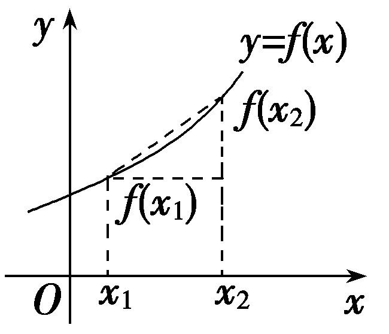
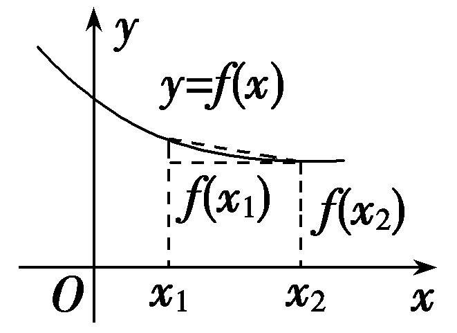
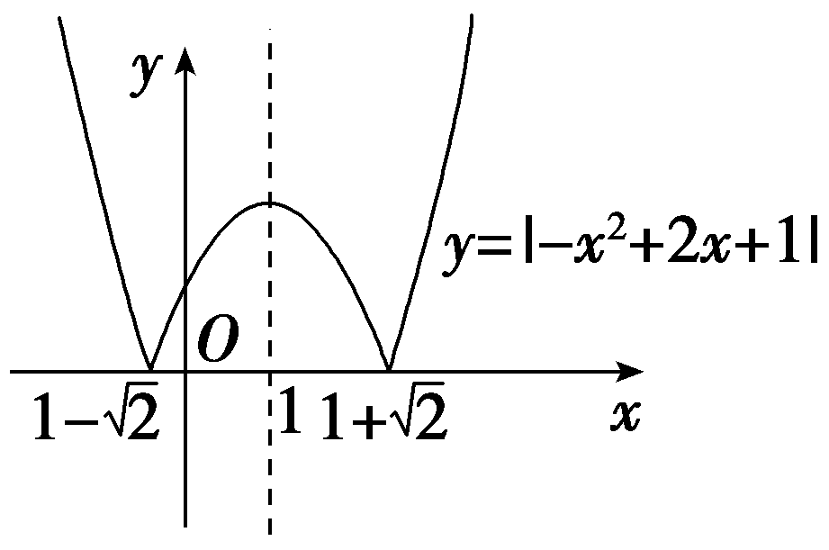
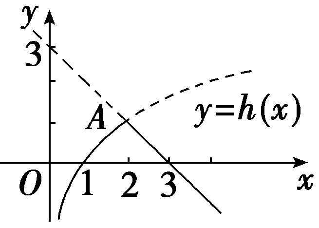
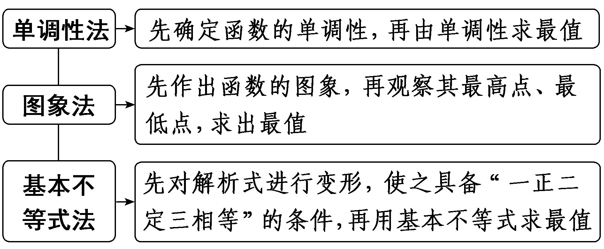
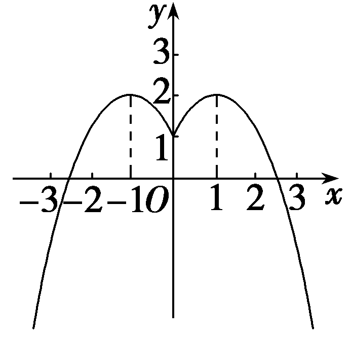

**第二节　函数的单调性与最值**

【课标研读】　1.借助函数图象，会用数学符号语言表达函数的单调性、最大值、最小值， 理解它们的作用和实际意义.　2.掌握函数单调性的简单应用.

1.函数的单调性

(1)单调函数的定义

<table><tr><td></td><td>
增函数
</td><td>
减函数
</td></tr><tr><td rowspan="2">
定

义
</td><td colspan="2">
一般地，设函数<em>f</em>(<em>x</em>)的定义域为<em>D</em>，区间<em>I</em>⊆<em>D</em>，如果∀<em>x</em>1，<em>x</em>2∈<em>I</em>
</td></tr><tr><td>
当<em>x</em>1＜<em>x</em>2时，都有<em>f</em>(<em>x</em>1)＜<em>f</em>(<em>x</em>2)，那么就称函数<em>f</em>(<em>x</em>)在区间<em>I</em>上单调递增
</td><td>
当<em>x</em>1＜<em>x</em>2时，都有<em>f</em>(<em>x</em>1)＞<em>f</em>(<em>x</em>2)，那么就称函数<em>f</em>(<em>x</em>)在区间<em>I</em>上单调递减
</td></tr><tr><td>
图象描述
</td><td>

自左向右看图象是上升的
</td><td>

自左向右看图象是下降的
</td></tr></table>

(2)单调区间的定义

如果函数<em>y</em>＝<em>f</em>(<em>x</em>)在区间<em>I</em>上<u>单调递增</u>或<u>单调递减</u>，那么就说函数<em>y</em>＝<em>f</em>(<em>x</em>)在这一区间具有(严格的)单调性，区间<em>I</em>叫做<em>y</em>＝<em>f</em>(<em>x</em>)的单调区间.

[微提醒]　(1)求函数的单调区间或讨论函数的单调性必须先求函数的定义域.(2)一个函数的同一种单调区间用“和”或“，”连接，不能用“∪”连接.例如对勾函数<te<text style="it*a*lic">x</text>t style="italic">y</text>＝x＋ $\frac{a}{x}$ (*a*＞0)的单调递增区间为(－∞，－ $\sqrt{a}$ )，( $\sqrt{a}$ ，＋∞)；单调递减区间是[－ $\sqrt{a}$ ，0)，(0， $\sqrt{a}$ ].(3)“函数的单调区间为*<text style="italic">M*</text>”与“函数在区间*<text style="italic">N*</text>上单调”是两个不同的概念，显然N⊆M.

2.函数的最值

<table><tr><td>
前提
</td><td colspan="2">
一般地，设函数<em>y</em>＝<em>f</em>(<em>x</em>)的定义域为<em>D</em>，如果存在实数<em>M</em>满足
</td></tr><tr><td>
条件
</td><td>
(1)∀<em>x</em>∈<em>D</em>，都有<em>f</em>(<em>x</em>)≤<em>M</em>；

(2)∃<em>x</em>0∈<em>D</em>，使得<em>f</em>(<em>x</em>0)＝<em>M</em>
</td><td>
(1)∀<em>x</em>∈<em>D</em>，都有<em>f</em>(<em>x</em>)≥<em>M</em>；

(2)∃<em>x</em>0∈<em>D</em>，使得<em>f</em>(<em>x</em>0)＝<em>M</em>
</td></tr><tr><td>
结论
</td><td>
<em>M</em>为<em>f</em>(<em>x</em>)的最大值
</td><td>
<em>M</em>为<em>f</em>(<em>x</em>)的最小值
</td></tr></table>

【常用结论】

(1)单调性定义的等价形式

设对任意的<em>x</em>1，<em>x</em>2∈[<em>a</em>，<em>b</em>]，<em>x</em>1≠<em>x</em>2.

①若有(&lt;te&lt;te&lt;te&lt;te&lt;text style="it<em>a</em>lic"&gt;x&lt;/text&gt;t style="italic"&gt;x&lt;/text&gt;t style="italic"&gt;x&lt;/text&gt;t style="italic"&gt;x&lt;/text&gt;t style="italic"&gt;x&lt;/text&gt;&lt;text style="su<em>b</em>script"&gt;1&lt;/text&gt;－x&lt;text style="subscript"&gt;2&lt;/text&gt;)[<em>&lt;text style="italic"&gt;&lt;text style="italic"&gt;f</em>&lt;/text&gt;&lt;/text&gt;(x1)－f(x2)]＞0或 $\frac{f(x_{1})-f(x_{2})}{x_{1}－x_{2}}$ ＞0，则&lt;te&lt;te&lt;te&lt;text style="it<em>a</em>lic"&gt;x&lt;/text&gt;t style="italic"&gt;x&lt;/text&gt;t style="italic"&gt;x&lt;/text&gt;t style="italic"&gt;<em>&lt;text style="italic"&gt;f</em>&lt;/text&gt;&lt;/text&gt;(&lt;te<em>x</em>t style="italic"&gt;x&lt;/text&gt;)在[a，<em>b</em>]上单调递增.

②若有(&lt;te&lt;te&lt;te&lt;te&lt;text style="it<em>a</em>lic"&gt;x&lt;/text&gt;t style="italic"&gt;x&lt;/text&gt;t style="italic"&gt;x&lt;/text&gt;t style="italic"&gt;x&lt;/text&gt;t style="italic"&gt;x&lt;/text&gt;&lt;text style="su<em>b</em>script"&gt;1&lt;/text&gt;－x&lt;text style="subscript"&gt;2&lt;/text&gt;)[<em>&lt;text style="italic"&gt;&lt;text style="italic"&gt;f</em>&lt;/text&gt;&lt;/text&gt;(x1)－f(x2)]＜0或 $\frac{f(x_{1})-f(x_{2})}{x_{1}－x_{2}}$ ＜0，则&lt;te&lt;te&lt;te&lt;text style="it<em>a</em>lic"&gt;x&lt;/text&gt;t style="italic"&gt;x&lt;/text&gt;t style="italic"&gt;x&lt;/text&gt;t style="italic"&gt;<em>&lt;text style="italic"&gt;f</em>&lt;/text&gt;&lt;/text&gt;(&lt;te<em>x</em>t style="italic"&gt;x&lt;/text&gt;)在[a，<em>b</em>]上单调递减.

(2)若函数*f*(*x*)，*g*(*x*)在区间*I*上具有单调性，则在区间*I*上具有以下性质：

①(基本初等函数法)当*f*(*x*)，*g*(*x*)都是增(减)函数时，*f*(*x*)＋*g*(*x*)是增(减)函数.

②若*k*＞0，则*kf*(*x*)与*f*(*x*)单调性相同；若*k*＜0，则*kf*(*x*)与*f*(*x*)单调性相反.

③函数<te<te<te<text st*y*le="italic">x</text>t st*y*le="italic">x</text>t style="italic">x</text>t style="italic">y</text>＝*<text style="italic"><text style="italic">f*</text></text>(x)(f(x)＞0)在公共定义域内与y＝－f(x)，y $＝\frac{1}{f(x)}$ 的单调性相反.

④(复合函数法)复合函数*y*＝*f*(*g*(*x*))的单调性与*y*＝*f*(*u*)和*u*＝*g*(*x*)的单调性有关.简记为：“同增异减”.

【自主检测】

1.(多选)下列结论错误的是(　　)

A.因为*f*(*x*)在[－3，2]上是增函数，则*f*(－3)＜*f*(2)

B.函数*f*(*x*)在(－2，3)上单调递增，则函数的单调递增区间为(－2，3)

C.若函数*f*(*x*)在区间(1，2]和(2，3)上均为增函数，则函数*f*(*x*)在区间(1，3)上为增函数

D.函数*y* $＝\frac{1}{x}$ 的单调递减区间是(－∞，0)∪(0，＋∞)

答案：**BCD**

2.(多选)(链接人教A必修一P86T3)下列函数中，在区间(0，＋∞)上单调递减的是(　　)

A.&lt;te&lt;te<em>x</em>t style="italic"&gt;x&lt;/text&gt;t st<em>y</em>le="italic"&gt;y&lt;/text&gt; $＝\frac{1}{x}$ －&lt;te&lt;te<em>x</em>t style="italic"&gt;x&lt;/text&gt;t st<em>y</em>le="italic"&gt;x	&lt;/text&gt;B.<em>y</em>＝x2－x

C.<em>y</em>＝－<em>x</em>2－2<em>x</em>	D.<em>y</em>＝e<em>x</em>

答案：**AC**

3.(链接人教A必修一P81例5)函数&lt;te<em>x</em>t style="italic"&gt;f&lt;/text&gt;(x) $＝\frac{3}{2x－1}$ 在区间[1，5]上的最大值为<u>&lt;text style="underline"&gt;　　　　</u>&lt;/text&gt;，最小值为　　　　.

答案：3　 $\frac{1}{3}$

4.(链接人教A必修一P100T4)已知函数<em>f</em>(<em>x</em>)＝<em>x</em>2－2<em>kx</em>＋4在[5，20]上单调，则实数<em>k</em>的取值范围是<u>　　　　</u>.

答案：(－∞，5]∪[20，＋∞)

考点一　函数的单调性　　　　多维探究

角度1　求函数的单调区间(自主练透)

1.函数<em>f</em>(<em>x</em>)＝ln(<em>x</em>2－2<em>x</em>－8)的增区间是(　　)

A.(－∞，－2)	B.(－∞，1)

C.(1，＋∞)	D.(4，＋∞)

答案：**D**

解析：由<em>x</em>2－2<em>x</em>－8＞0，得<em>f</em>(<em>x</em>)的定义域为{<em>x</em>｜<em>x</em>＞4，或<em>x</em>＜－2}.设<em>t</em>＝<em>x</em>2－2<em>x</em>－8，则<em>y</em>＝ln <em>t</em>为增函数.要求函数<em>f</em>(<em>x</em>)的增区间，即求函数<em>t</em>＝<em>x</em>2－2<em>x</em>－8的增区间(定义域内).因为函数<em>t</em>＝<em>x</em>2－2<em>x</em>－8在(4，＋∞)上单调递增，在(－∞，－2)上单调递减，所以函数<em>f</em>(<em>x</em>)的增区间为(4，＋∞).故选D.

2.函数&lt;te<em>x</em>t style="italic"&gt;f&lt;/text&gt;(x) $＝\frac{x}{x^{2}+1}$ 的增区间是<u>　　　　</u>.

答案：(－1，1)

解析：当<te<te<te<te<te<te<te<te<te<te<te*x*t style="italic">x</text>t style="italic">x</text>t style="italic">x</text>t style="italic">x</text>t style="italic">x</text>t style="italic">x</text>t style="italic">x</text>t style="italic">x</text>t style="italic">x</text>t st*y*le="italic">x</text>t style="italic">x</text>≠0时，*<text style="italic"><text style="italic"><text style="italic"><text style="italic"><text style="italic"><text style="italic">f*</text></text></text></text></text></text>(x) $＝\frac{1}{x＋\frac{1}{x}}$ ，因为<te<te<te<te<te<te<te<te<te<te*x*t style="italic">x</text>t style="italic">x</text>t style="italic">x</text>t style="italic">x</text>t style="italic">x</text>t style="italic">x</text>t style="italic">x</text>t style="italic">x</text>t style="italic">x</text>t style="italic">y</text>＝<te*x*t style="italic">x</text>＋ $\frac{1}{x}$ 在(－1，0)，(0，1)上单调递减，所以<te<te<te<te<te<te<te<te<te<te<te*x*t style="italic">x</text>t style="italic">x</text>t style="italic">x</text>t style="italic">x</text>t style="italic">x</text>t style="italic">x</text>t style="italic">x</text>t style="italic">x</text>t style="italic">x</text>t st*y*le="italic">x</text>t style="italic">*<text style="italic"><text style="italic"><text style="italic"><text style="italic"><text style="italic">f*</text></text></text></text></text></text>(*x*)在(－1，0)，(0，1)上单调递增，且x＜0时f(x)＜0，x＝0时，f(x)＝0，x＞0时，f(x)＞0，所以f(x)在(－1，1)上单调递增，即f(x)的增区间是(－1，1).

3.函数<em>y</em>＝｜－<em>x</em>2＋2<em>x</em>＋1｜的增区间是<u>　　　　　　</u>.

答案： $\left[1－\sqrt{2}，1\right]$ ， $\left[1+\sqrt{2}，＋\infty \right)$

解析：作出函数的图象如图所示，由图象知，其增区间是[1－ $\sqrt{2}$ ，1]，[1＋ $\sqrt{2}$ ，＋∞).

角度2　判断或证明函数的单调性

(1)(2023·北京卷)下列函数中，在区间(0，＋∞)上单调递增的是(　　)

A.<te<te*x*t style="italic">x</text>t style="italic">*f*</text>(x)＝－ln *x*	B.f(x) $＝\frac{1}{2^{x}}$

C.&lt;te&lt;te&lt;te<em>x</em>t style="italic"&gt;x&lt;/text&gt;t style="italic"&gt;x&lt;/text&gt;t style="italic"&gt;<em>f</em>&lt;/text&gt;(x)＝－ $\frac{1}{x}$ 	D.&lt;te&lt;te&lt;te<em>x</em>t style="italic"&gt;x&lt;/text&gt;t style="italic"&gt;x&lt;/text&gt;t style="italic"&gt;<em>f</em>&lt;/text&gt;(x)＝3｜x－1｜

答案：**C**

解析：对于A，因为&lt;te&lt;te&lt;te&lt;text st<em>y</em>le="italic,superscript"&gt;x&lt;/text&gt;t st<em>y</em>le="italic"&gt;x&lt;/text&gt;t style="italic"&gt;x&lt;/text&gt;t style="italic"&gt;y&lt;/text&gt;＝ln x在 $\left(0，＋\infty \right)$ 上单调递增，所以&lt;te&lt;te&lt;text st<em>y</em>le="italic,superscript"&gt;x&lt;/text&gt;t st<em>y</em>le="italic"&gt;x&lt;/text&gt;t style="italic"&gt;<em>&lt;text style="italic"&gt;&lt;text style="italic"&gt;&lt;text style="italic"&gt;&lt;text style="italic"&gt;&lt;text style="italic"&gt;f</em>&lt;/text&gt;&lt;/text&gt;&lt;/text&gt;&lt;/text&gt;&lt;/text&gt;&lt;/text&gt; $\left(x\right)＝$ －ln &lt;te&lt;te&lt;text st<em>y</em>le="italic,superscript"&gt;x&lt;/text&gt;t st<em>y</em>le="italic"&gt;x&lt;/text&gt;t style="italic"&gt;x&lt;/text&gt;在 $\left(0，＋\infty \right)$ 上单调递减，故A错误；对于B，因为&lt;te&lt;te&lt;te&lt;text st<em>y</em>le="italic,superscript"&gt;x&lt;/text&gt;t st<em>y</em>le="italic"&gt;x&lt;/text&gt;t style="italic"&gt;x&lt;/text&gt;t style="italic"&gt;y&lt;/text&gt;＝2x在 $\left(0，＋\infty \right)$ 上单调递增，所以&lt;te&lt;te&lt;text st<em>y</em>le="italic,superscript"&gt;x&lt;/text&gt;t st<em>y</em>le="italic"&gt;x&lt;/text&gt;t style="italic"&gt;<em>&lt;text style="italic"&gt;&lt;text style="italic"&gt;&lt;text style="italic"&gt;&lt;text style="italic"&gt;&lt;text style="italic"&gt;f</em>&lt;/text&gt;&lt;/text&gt;&lt;/text&gt;&lt;/text&gt;&lt;/text&gt;&lt;/text&gt; $\left(x\right)＝\frac{1}{2^{x}}$ 在 $\left(0，＋\infty \right)$ 上单调递减，故B错误；对于C，因为&lt;te&lt;te&lt;te&lt;text st<em>y</em>le="italic,superscript"&gt;x&lt;/text&gt;t st<em>y</em>le="italic"&gt;x&lt;/text&gt;t style="italic"&gt;x&lt;/text&gt;t style="italic"&gt;y&lt;/text&gt; $＝\frac{1}{x}$ 在 $\left(0，＋\infty \right)$ 上单调递减，所以&lt;te&lt;te&lt;text st<em>y</em>le="italic,superscript"&gt;x&lt;/text&gt;t st<em>y</em>le="italic"&gt;x&lt;/text&gt;t style="italic"&gt;<em>&lt;text style="italic"&gt;&lt;text style="italic"&gt;&lt;text style="italic"&gt;&lt;text style="italic"&gt;&lt;text style="italic"&gt;f</em>&lt;/text&gt;&lt;/text&gt;&lt;/text&gt;&lt;/text&gt;&lt;/text&gt;&lt;/text&gt; $\left(x\right)＝$ － $\frac{1}{x}$ 在 $\left(0，＋\infty \right)$ 上单调递增，故C正确；对于D，因为&lt;te&lt;te&lt;text st<em>y</em>le="italic,superscript"&gt;x&lt;/text&gt;t st<em>y</em>le="italic"&gt;x&lt;/text&gt;t style="italic"&gt;<em>&lt;text style="italic"&gt;&lt;text style="italic"&gt;&lt;text style="italic"&gt;&lt;text style="italic"&gt;&lt;text style="italic"&gt;f</em>&lt;/text&gt;&lt;/text&gt;&lt;/text&gt;&lt;/text&gt;&lt;/text&gt;&lt;/text&gt; $\left(\frac{1}{2}\right)＝3^{\left|\frac{1}{2}－1\right|}＝3^{\frac{1}{2}}＝\sqrt{3}$ ，&lt;te&lt;te&lt;text st<em>y</em>le="italic,superscript"&gt;x&lt;/text&gt;t st<em>y</em>le="italic"&gt;x&lt;/text&gt;t style="italic"&gt;<em>&lt;text style="italic"&gt;&lt;text style="italic"&gt;&lt;text style="italic"&gt;&lt;text style="italic"&gt;&lt;text style="italic"&gt;f</em>&lt;/text&gt;&lt;/text&gt;&lt;/text&gt;&lt;/text&gt;&lt;/text&gt;&lt;/text&gt; $\left(1\right)＝3^{\left|1－1\right|}＝$ 30＝1，&lt;te&lt;te&lt;text st<em>y</em>le="italic,superscript"&gt;x&lt;/text&gt;t st<em>y</em>le="italic"&gt;x&lt;/text&gt;t style="italic"&gt;<em>&lt;text style="italic"&gt;&lt;text style="italic"&gt;&lt;text style="italic"&gt;&lt;text style="italic"&gt;&lt;text style="italic"&gt;f</em>&lt;/text&gt;&lt;/text&gt;&lt;/text&gt;&lt;/text&gt;&lt;/text&gt;&lt;/text&gt; $\left(2\right)＝3^{\left|2－1\right|}＝$ 3，显然&lt;te&lt;te&lt;text st<em>y</em>le="italic,superscript"&gt;x&lt;/text&gt;t st<em>y</em>le="italic"&gt;x&lt;/text&gt;t style="italic"&gt;<em>&lt;text style="italic"&gt;&lt;text style="italic"&gt;&lt;text style="italic"&gt;&lt;text style="italic"&gt;&lt;text style="italic"&gt;f</em>&lt;/text&gt;&lt;/text&gt;&lt;/text&gt;&lt;/text&gt;&lt;/text&gt;&lt;/text&gt; $\left(x\right)＝3^{\left|x－1\right|}$ 在 $\left(0，＋\infty \right)$ 上不单调，故D错误.故选C.

(2)(一题多解)试讨论函数<te<text style="it*a*lic">x</text>t style="italic">f</text>(x) $＝\frac{ax}{x－1}$ (*a*≠0)在(－1，1)上的单调性.

解：法一(定义法)：设－1＜<em>x</em>1＜<em>x</em>2＜1，

因为<te<text style="it<text style="it*a*lic">a</text>lic">x</text>t style="italic">f</text>(x)＝a $\left(\frac{x－1+1}{x－1}\right)＝$ <text style="it*a*lic">a</text> $\left(1+\frac{1}{x－1}\right)$ ，

所以&lt;te&lt;te&lt;text style="it&lt;text style="it<em>a</em>lic"&gt;a&lt;/text&gt;lic"&gt;x&lt;/text&gt;t style="italic"&gt;x&lt;/text&gt;t style="italic"&gt;<em>f</em>&lt;/text&gt;(x1)－f(x2)＝a $\left(1+\frac{1}{x_{1}－1}\right)$ －&lt;text style="it<em>a</em>lic"&gt;a&lt;/text&gt;(&lt;te<em>x</em>t style="subscript"&gt;1&lt;/text&gt;＋ $\frac{1}{x_{2}－1}$ ) $＝\frac{a(x_{2}－x_{1})}{(x_{1}－1)(x_{2}－1)}$ ，

由于－1＜<em>x</em>1＜<em>x</em>2＜1，

所以<em>x</em>2－<em>x</em>1＞0，<em>x</em>1－1＜0，<em>x</em>2－1＜0，

故当<em>a</em>＞0时，<em>f</em>(<em>x</em>1)－<em>f</em>(<em>x</em>2)＞0，

即<em>f</em>(<em>x</em>1)＞<em>f</em>(<em>x</em>2)，函数<em>f</em>(<em>x</em>)在(－1，1)上单调递减；

当<em>a</em>＜0时，<em>f</em>(<em>x</em>1)－<em>f</em>(<em>x</em>2)＜0，

即<em>f</em>(<em>x</em>1)＜<em>f</em>(<em>x</em>2)，函数<em>f</em>(<em>x</em>)在(－1，1)上单调递增.

法二(导数法)：<te*x*t style="italic">f'</text>(x) $＝\frac{(ax)'(x－1)-ax(x－1)'}{(x－1)^{2}}＝\frac{a(x－1)-ax}{(x－1)^{2}}＝$ － $\frac{a}{(x－1)^{2}}$ .

故当*a*＞0时，*f'*(*x*)＜0，函数*f*(*x*)在(－1，1)上单调递减；

当*a*＜0时，*f'*(*x*)＞0，函数*f*(*x*)在(－1，1)上单调递增.

1.判断函数单调性(或求单调区间)的方法

(1)定义法；(2)导数法；(3)图象法；(4)性质法(见常用结论).

2.抽象函数单调性的判断策略

(1)若给出的是“和型”(<em>f</em>(<em>x</em>＋<em>y</em>)＝…)抽象函数，判定符号时一般变形为<em>f</em>(<em>x</em>2)－<em>f</em>(<em>x</em>1)＝<em>f</em>((<em>x</em>2－<em>x</em>1)＋<em>x</em>1)－<em>f</em>(<em>x</em>1)，<em>f</em>(<em>x</em>2)－<em>f</em>(<em>x</em>1)＝<em>f</em>(<em>x</em>2)－<em>f</em>((<em>x</em>1－<em>x</em>2)＋<em>x</em>2)；

(&lt;te&lt;te&lt;te&lt;te&lt;te<em>x</em>t style="italic"&gt;x&lt;/text&gt;t style="italic"&gt;x&lt;/text&gt;t style="italic"&gt;x&lt;/text&gt;t style="italic"&gt;x&lt;/text&gt;t style="subscript"&gt;&lt;text style="subscript"&gt;2&lt;/text&gt;&lt;/text&gt;)若给出的是“积型”(&lt;te<em>x</em>t style="italic"&gt;<em>&lt;text style="italic"&gt;&lt;text style="italic"&gt;&lt;text style="italic"&gt;&lt;text style="italic"&gt;&lt;text style="italic"&gt;&lt;text style="italic"&gt;&lt;text style="italic"&gt;f</em>&lt;/text&gt;&lt;/text&gt;&lt;/text&gt;&lt;/text&gt;&lt;/text&gt;&lt;/text&gt;&lt;/text&gt;&lt;/text&gt;(<em>xy</em>)＝…)抽象函数，判定符号时一般变形为f(x2)－f(x&lt;text style="subscript"&gt;&lt;text style="subscript"&gt;1&lt;/text&gt;&lt;/text&gt;)＝f $\left(x_{1}\cdot \frac{x_{2}}{x_{1}}\right)$ －&lt;te&lt;te&lt;te&lt;te&lt;te&lt;te<em>x</em>t style="italic"&gt;x&lt;/text&gt;t style="italic"&gt;x&lt;/text&gt;t style="italic"&gt;x&lt;/text&gt;t style="italic"&gt;x&lt;/text&gt;t style="italic"&gt;x&lt;/text&gt;t style="italic"&gt;<em>&lt;text style="italic"&gt;&lt;text style="italic"&gt;&lt;text style="italic"&gt;&lt;text style="italic"&gt;&lt;text style="italic"&gt;&lt;text style="italic"&gt;&lt;text style="italic"&gt;f</em>&lt;/text&gt;&lt;/text&gt;&lt;/text&gt;&lt;/text&gt;&lt;/text&gt;&lt;/text&gt;&lt;/text&gt;&lt;/text&gt;(x&lt;text style="subscript"&gt;&lt;text style="subscript"&gt;1&lt;/text&gt;&lt;/text&gt;)，f(x&lt;text style="subscript"&gt;&lt;text style="subscript"&gt;2&lt;/text&gt;&lt;/text&gt;)－f(x1)＝f(x2)－f $\left(x_{2}\cdot \frac{x_{1}}{x_{2}}\right)$ .

注意：求函数的单调区间，应先求定义域，在定义域内求单调区间.

对点练&lt;te<em>x</em>t style="subscript"&gt;1&lt;/text&gt;.(多选)在下列函数中，满足对任意<em>x</em>1，x2∈ $\left(1，＋\infty \right)$ ， $\frac{f\left(x_{1}\right)－f\left(x_{2}\right)}{x_{1}－x_{2}}$ ＜0的是(　　)

A.<em>f</em>(<em>x</em>)＝－2(<em>x</em>－1)2－2	B.<em>f</em>(<em>x</em>)＝3<em>x</em>＋5

C.<te<te<te*x*t style="italic">x</text>t style="italic">x</text>t style="italic">*f*</text>(x)＝1＋ $\frac{1}{x}$ 	D.<te<te<te*x*t style="italic">x</text>t style="italic">x</text>t style="italic">*f*</text>(x)＝｜x－4｜

答案：**AC**

解析：由题意可知，函数&lt;te&lt;te&lt;te&lt;te&lt;te&lt;te&lt;te&lt;te&lt;te&lt;te&lt;te&lt;te<em>x</em>t style="italic"&gt;x&lt;/text&gt;t style="italic"&gt;x&lt;/text&gt;t style="italic"&gt;x&lt;/text&gt;t style="italic"&gt;x&lt;/text&gt;t style="italic"&gt;x&lt;/text&gt;t style="italic"&gt;x&lt;/text&gt;t style="italic"&gt;x&lt;/text&gt;t style="italic"&gt;x&lt;/text&gt;t style="italic"&gt;x&lt;/text&gt;t style="italic"&gt;x&lt;/text&gt;t style="italic"&gt;x&lt;/text&gt;t style="italic"&gt;<em>&lt;text style="italic"&gt;&lt;text style="italic"&gt;&lt;text style="italic"&gt;&lt;text style="italic"&gt;&lt;text style="italic"&gt;&lt;text style="italic"&gt;f</em>&lt;/text&gt;&lt;/text&gt;&lt;/text&gt;&lt;/text&gt;&lt;/text&gt;&lt;/text&gt;&lt;/text&gt;(x)在(1，＋∞)上单调递减.对于A，f(x)＝－2(x－1)2－2，其图象开口向下，对称轴为直线x＝1，故f(x)在(1，＋∞)上单调递减，满足题意；对于B，f(x)＝3x＋5为一次函数，且<em>k</em>＝3＞0，故f(x)在(1，＋∞)上单调递增，不满足题意；对于C，f(x)＝1＋ $\frac{1}{x}$ 在(1，＋∞)上单调递减，满足题意；对于D，&lt;te&lt;te&lt;te&lt;te&lt;te&lt;te&lt;te&lt;te&lt;te&lt;te&lt;te&lt;te<em>x</em>t style="italic"&gt;x&lt;/text&gt;t style="italic"&gt;x&lt;/text&gt;t style="italic"&gt;x&lt;/text&gt;t style="italic"&gt;x&lt;/text&gt;t style="italic"&gt;x&lt;/text&gt;t style="italic"&gt;x&lt;/text&gt;t style="italic"&gt;x&lt;/text&gt;t style="italic"&gt;x&lt;/text&gt;t style="italic"&gt;x&lt;/text&gt;t style="italic"&gt;x&lt;/text&gt;t style="italic"&gt;x&lt;/text&gt;t style="italic"&gt;<em>&lt;text style="italic"&gt;&lt;text style="italic"&gt;&lt;text style="italic"&gt;&lt;text style="italic"&gt;&lt;text style="italic"&gt;&lt;text style="italic"&gt;f</em>&lt;/text&gt;&lt;/text&gt;&lt;/text&gt;&lt;/text&gt;&lt;/text&gt;&lt;/text&gt;&lt;/text&gt;(x)＝｜x－4｜ $＝\left\{\begin{matrix}x－4，x\geq 4，\\4－x，x<4，\end{matrix}\right.$ 显然&lt;te&lt;te&lt;te&lt;te&lt;te&lt;te&lt;te&lt;te&lt;te&lt;te&lt;te&lt;te<em>x</em>t style="italic"&gt;x&lt;/text&gt;t style="italic"&gt;x&lt;/text&gt;t style="italic"&gt;x&lt;/text&gt;t style="italic"&gt;x&lt;/text&gt;t style="italic"&gt;x&lt;/text&gt;t style="italic"&gt;x&lt;/text&gt;t style="italic"&gt;x&lt;/text&gt;t style="italic"&gt;x&lt;/text&gt;t style="italic"&gt;x&lt;/text&gt;t style="italic"&gt;x&lt;/text&gt;t style="italic"&gt;x&lt;/text&gt;t style="italic"&gt;<em>&lt;text style="italic"&gt;&lt;text style="italic"&gt;&lt;text style="italic"&gt;&lt;text style="italic"&gt;&lt;text style="italic"&gt;&lt;text style="italic"&gt;f</em>&lt;/text&gt;&lt;/text&gt;&lt;/text&gt;&lt;/text&gt;&lt;/text&gt;&lt;/text&gt;&lt;/text&gt;(x)在(1，4)上单调递减，在[4，＋∞)上单调递增，不满足题意.故选AC.

对点练2.设<em>f</em>(<em>x</em>)是定义在<strong>R</strong>上的函数，∀<em>m</em>，<em>n</em>∈<strong>R</strong>，<em>f</em>(<em>m</em>＋<em>n</em>)＝<em>f</em>(<em>m</em>)·<em>f</em>(<em>n</em>)(<em>f</em>(<em>m</em>)≠0，<em>f</em>(<em>n</em>)≠0)，且当<em>x</em>＞0时，0＜<em>f</em>(<em>x</em>)＜1.求证：

(1)*f*(0)＝1；

(2)<em>x</em>∈<strong>R</strong>时，恒有<em>f</em>(<em>x</em>)＞0；

(3)<em>f</em>(<em>x</em>)在<strong>R</strong>上是减函数.

证明：(1)根据题意，令*m*＝0，

可得*f*(0＋*n*)＝*f*(0)·*f*(*n*).

因为*f*(*n*)≠0，所以*f*(0)＝1.

(2)由题意知*x*＞0时，0＜*f*(*x*)＜1；

当*x*＝0时，*f*(0)＝1＞0；

当*x*＜0时，－*x*＞0，所以0＜*f*(－*x*)＜1.

因为*f*(*x*＋(－*x*))＝*f*(*x*)·*f*(－*x*)，

所以<te<te<te*x*t style="italic">x</text>t style="italic">x</text>t style="italic">*<text style="italic">f*</text></text>(x)·f(－x)＝1，所以f(x) $＝\frac{1}{f(-x)}$ ＞0.

故<em>x</em>∈<strong>R</strong>时，恒有<em>f</em>(<em>x</em>)＞0.

(3)任取<em>x</em>1，<em>x</em>2∈<strong>R</strong>，且<em>x</em>1＜<em>x</em>2，则<em>f</em>(<em>x</em>2)＝<em>f</em>(<em>x</em>1＋(<em>x</em>2－<em>x</em>1))，

所以<em>f</em>(<em>x</em>2)－<em>f</em>(<em>x</em>1)＝<em>f</em>(<em>x</em>1＋(<em>x</em>2－<em>x</em>1))－<em>f</em>(<em>x</em>1)＝<em>f</em>(<em>x</em>1)·<em>f</em>(<em>x</em>2－<em>x</em>1)－<em>f</em>(<em>x</em>1)＝<em>f</em>(<em>x</em>1)[<em>f</em>(<em>x</em>2－<em>x</em>1)－1].

由(2)知<em>f</em>(<em>x</em>1)＞0，

又<em>x</em>2－<em>x</em>1＞0，所以0＜<em>f</em>(<em>x</em>2－<em>x</em>1)＜1，

故<em>f</em>(<em>x</em>2)－<em>f</em>(<em>x</em>1)＜0，故<em>f</em>(<em>x</em>)在<strong>R</strong>上是减函数.

考点二　函数的最值　　　　师生共研

(1)函数&lt;te<em>x</em>t style="italic"&gt;f&lt;/text&gt;(x) $＝\left(\frac{1}{3}\right)^{x}$ －log2 $\left(x+4\right)$ 在区间[－2，2]上的最大值为<u>　　　　</u>.

(&lt;te&lt;te&lt;te&lt;te<em>x</em>t style="italic"&gt;x&lt;/text&gt;t style="italic"&gt;x&lt;/text&gt;t style="italic"&gt;x&lt;/text&gt;t style="subscript"&gt;2&lt;/text&gt;)(一题多解)对于任意实数&lt;te&lt;te&lt;te<em>x</em>t style="italic"&gt;x&lt;/text&gt;t style="italic"&gt;x&lt;/text&gt;t style="italic"&gt;a&lt;/text&gt;，<em>b</em>，定义min $\left\{a，b\right\}＝\left\{\begin{matrix}a，a\leq b，\\b，a＞b.\end{matrix}\right.$ 设函数&lt;te&lt;te&lt;te&lt;te&lt;te&lt;te&lt;te<em>x</em>t style="italic"&gt;x&lt;/text&gt;t style="italic"&gt;x&lt;/text&gt;t style="italic"&gt;x&lt;/text&gt;t style="italic"&gt;x&lt;/text&gt;t style="italic"&gt;x&lt;/text&gt;t style="italic"&gt;x&lt;/text&gt;t style="italic"&gt;<em>f</em>&lt;/text&gt;(x)＝－x＋3，<em>&lt;text style="italic"&gt;g</em>&lt;/text&gt;(x)＝log2x，则函数<em>h</em>(x)＝min{f(x)，g(x)}的最大值是<u>　　　　</u>.

答案：(1)8　(2)1

解析：(1)因为函数&lt;te&lt;te&lt;te<em>x</em>t style="italic"&gt;x&lt;/text&gt;t style="italic"&gt;x&lt;/text&gt;t st<em>y</em>le="italic"&gt;y&lt;/text&gt; $＝\left(\frac{1}{3}\right)^{x}$ ，&lt;te&lt;te&lt;te<em>x</em>t style="italic"&gt;x&lt;/text&gt;t style="italic"&gt;x&lt;/text&gt;t st<em>y</em>le="italic"&gt;y&lt;/text&gt;＝－log&lt;text style="subscript"&gt;&lt;text style="subscript"&gt;2&lt;/text&gt;&lt;/text&gt;(x＋4)在区间[－2，2]上都单调递减，所以函数<em>&lt;text style="italic"&gt;&lt;text style="italic"&gt;f</em>&lt;/text&gt;&lt;/text&gt;(x) $＝\left(\frac{1}{3}\right)^{x}$ －log&lt;te&lt;te&lt;te<em>x</em>t style="italic"&gt;x&lt;/text&gt;t style="italic"&gt;x&lt;/text&gt;t style="subscript"&gt;&lt;text style="subscript"&gt;2&lt;/text&gt;&lt;/text&gt; $\left(x+4\right)$ 在区间[－&lt;te&lt;te&lt;te<em>x</em>t style="italic"&gt;x&lt;/text&gt;t style="italic"&gt;x&lt;/text&gt;t style="subscript"&gt;&lt;text style="subscript"&gt;2&lt;/text&gt;&lt;/text&gt;，2]上单调递减，所以函数<em>&lt;text style="italic"&gt;&lt;text style="italic"&gt;f</em>&lt;/text&gt;&lt;/text&gt;(x)的最大值为f $\left(－2\right)＝\left(\frac{1}{3}\right)^{－2}$ －log&lt;te&lt;te&lt;te<em>x</em>t style="italic"&gt;x&lt;/text&gt;t style="italic"&gt;x&lt;/text&gt;t style="subscript"&gt;&lt;text style="subscript"&gt;2&lt;/text&gt;&lt;/text&gt; $\left(－2+4\right)＝$ 9－1＝8.

(2)法一：在同一坐标系中，作函数*f*(*x*)，*g*(*x*)的图象，依题意，*h*(*x*)的图象为如图所示的实线部分.易知点*A*(2，1)为图象的最高点，因此*h*(*x*)的最大值为*h*(2)＝1.

法二：依题意&lt;te&lt;te&lt;te&lt;te&lt;te&lt;te&lt;te&lt;te&lt;te<em>x</em>t style="italic"&gt;x&lt;/text&gt;t style="italic"&gt;x&lt;/text&gt;t style="italic"&gt;x&lt;/text&gt;t style="italic"&gt;x&lt;/text&gt;t style="italic"&gt;x&lt;/text&gt;t style="italic"&gt;x&lt;/text&gt;t style="italic"&gt;x&lt;/text&gt;t style="italic"&gt;x&lt;/text&gt;t style="italic"&gt;<em>&lt;text style="italic"&gt;&lt;text style="italic"&gt;&lt;text style="italic"&gt;h</em>&lt;/text&gt;&lt;/text&gt;&lt;/text&gt;&lt;/text&gt;(x) $＝\left\{\begin{matrix}log_{2}x，0<x\leq 2，\\－x+3，x>2.\end{matrix}\right.$ 当0＜&lt;te&lt;te&lt;te&lt;te&lt;te&lt;te&lt;te&lt;te<em>x</em>t style="italic"&gt;x&lt;/text&gt;t style="italic"&gt;x&lt;/text&gt;t style="italic"&gt;x&lt;/text&gt;t style="italic"&gt;x&lt;/text&gt;t style="italic"&gt;x&lt;/text&gt;t style="italic"&gt;x&lt;/text&gt;t style="italic"&gt;x&lt;/text&gt;t style="italic"&gt;x&lt;/text&gt;≤2时，<em>&lt;text style="italic"&gt;&lt;text style="italic"&gt;&lt;text style="italic"&gt;&lt;text style="italic"&gt;h</em>&lt;/text&gt;&lt;/text&gt;&lt;/text&gt;&lt;/text&gt;(x)＝log2x是增函数；当x＞2时，h(x)＝3－x是减函数，因此h(x)在x＝2时取得最大值h(2)＝1.

求函数最值的三种常用方法

注意：对于较复杂的函数，可运用导数，求出在给定区间上的极值，最后结合端点值，求出最值.

对点练3.函数&lt;te<em>x</em>t style="italic"&gt;y&lt;/text&gt;＝x＋ $\sqrt{x－1}$ 的最小值为<u>　　　　</u>.

答案：1

解析：法一：(换元法)令&lt;&lt;&lt;&lt;&lt;&lt;&lt;te<em>x</em>t st&lt;text st<em>y</em>le="italic"&gt;y&lt;/text&gt;le="italic"&gt;t&lt;/text&gt;ext st<em>y</em>le="italic"&gt;t&lt;/text&gt;ext style="italic"&gt;t&lt;/text&gt;ext style="italic"&gt;t&lt;/text&gt;ext st<em>y</em>le="italic"&gt;t&lt;/text&gt;e<em>x</em>t style="italic"&gt;t&lt;/text&gt;ext style="italic"&gt;t&lt;/text&gt; $＝\sqrt{x－1}$ ，&lt;&lt;&lt;&lt;&lt;&lt;&lt;te<em>x</em>t st&lt;text st<em>y</em>le="italic"&gt;y&lt;/text&gt;le="italic"&gt;t&lt;/text&gt;ext st<em>y</em>le="italic"&gt;t&lt;/text&gt;ext style="italic"&gt;t&lt;/text&gt;ext style="italic"&gt;t&lt;/text&gt;ext st<em>y</em>le="italic"&gt;t&lt;/text&gt;e<em>x</em>t style="italic"&gt;t&lt;/text&gt;ext style="italic"&gt;t&lt;/text&gt;≥0，则x＝t&lt;text style="superscript"&gt;2&lt;/text&gt;＋1，所以原函数变为y＝t2＋1＋t，t≥0，配方得y $＝\left(t＋\frac{1}{2}\right)^{2}$ ＋ $\frac{3}{4}$ .又因为&lt;&lt;&lt;&lt;&lt;&lt;&lt;te<em>x</em>t st&lt;text st<em>y</em>le="italic"&gt;y&lt;/text&gt;le="italic"&gt;t&lt;/text&gt;ext st<em>y</em>le="italic"&gt;t&lt;/text&gt;ext style="italic"&gt;t&lt;/text&gt;ext style="italic"&gt;t&lt;/text&gt;ext st<em>y</em>le="italic"&gt;t&lt;/text&gt;e<em>x</em>t style="italic"&gt;t&lt;/text&gt;ext style="italic"&gt;t&lt;/text&gt;≥0，所以y≥ $\frac{1}{4}$ ＋ $\frac{3}{4}＝$ 1，故函数&lt;&lt;&lt;&lt;&lt;te<em>x</em>t st&lt;text st<em>y</em>le="italic"&gt;y&lt;/text&gt;le="italic"&gt;t&lt;/text&gt;ext st<em>y</em>le="italic"&gt;t&lt;/text&gt;ext style="italic"&gt;t&lt;/text&gt;ext style="italic"&gt;t&lt;/text&gt;ext style="italic"&gt;y&lt;/text&gt;＝&lt;<em>t</em>ext style="italic"&gt;x&lt;/text&gt;＋ $\sqrt{x－1}$ 的最小值为1.

法二：(单调性法)由题易得&lt;te&lt;te&lt;te&lt;text st<em>y</em>le="italic"&gt;x&lt;/text&gt;t st&lt;text st<em>y</em>le="italic"&gt;y&lt;/text&gt;le="italic"&gt;x&lt;/text&gt;t st<em>y</em>le="italic"&gt;x&lt;/text&gt;t style="italic"&gt;x&lt;/text&gt;－1≥0，即x≥1.因为函数y＝x和y $＝\sqrt{x－1}$ 在定义域内均为增函数，故函数&lt;te&lt;te&lt;text st<em>y</em>le="italic"&gt;x&lt;/text&gt;t st&lt;text st<em>y</em>le="italic"&gt;y&lt;/text&gt;le="italic"&gt;x&lt;/text&gt;t style="italic"&gt;y&lt;/text&gt;＝&lt;te<em>x</em>t style="italic"&gt;x&lt;/text&gt;＋ $\sqrt{x－1}$ 在[1，＋∞)上为增函数，所以&lt;te&lt;te&lt;text st<em>y</em>le="italic"&gt;x&lt;/text&gt;t st&lt;text st<em>y</em>le="italic"&gt;y&lt;/text&gt;le="italic"&gt;x&lt;/text&gt;t style="italic"&gt;y&lt;/text&gt;min＝1.

对点练4.设&lt;te&lt;te<em>x</em>t style="italic"&gt;x&lt;/text&gt;t style="italic"&gt;<em>f</em>&lt;/text&gt;(x) $＝\left\{\begin{matrix}x＋\frac{2}{x}－3，x\geq 1，\\x^{2}+1，x<1.\end{matrix}\right.$ 则&lt;te&lt;te<em>x</em>t style="italic"&gt;x&lt;/text&gt;t style="italic"&gt;<em>f</em>&lt;/text&gt;(x)的最小值为<u>　　　　</u>.

答案：2 $\sqrt{2}$ －3

解析：当&lt;te&lt;te&lt;te&lt;te&lt;te&lt;te&lt;te&lt;te&lt;te&lt;te&lt;te&lt;te<em>x</em>t style="italic"&gt;x&lt;/text&gt;t style="italic"&gt;x&lt;/text&gt;t style="italic"&gt;x&lt;/text&gt;t style="italic"&gt;x&lt;/text&gt;t style="italic"&gt;x&lt;/text&gt;t style="italic"&gt;x&lt;/text&gt;t style="italic"&gt;x&lt;/text&gt;t style="italic"&gt;x&lt;/text&gt;t style="italic"&gt;x&lt;/text&gt;t style="italic"&gt;x&lt;/text&gt;t style="italic"&gt;x&lt;/text&gt;t style="italic"&gt;x&lt;/text&gt;≥1时，<em>&lt;text style="italic"&gt;&lt;text style="italic"&gt;&lt;text style="italic"&gt;&lt;text style="italic"&gt;&lt;text style="italic"&gt;&lt;text style="italic"&gt;f</em>&lt;/text&gt;&lt;/text&gt;&lt;/text&gt;&lt;/text&gt;&lt;/text&gt;&lt;/text&gt;(x)＝x＋ $\frac{2}{x}$ －3在 $\left[1，\sqrt{2}\right]$ 上单调递减，在 $\left[\sqrt{2}，＋\infty \right)$ 上单调递增，所以&lt;te&lt;te&lt;te&lt;te&lt;te&lt;te&lt;te&lt;te&lt;te&lt;te&lt;te&lt;te<em>x</em>t style="italic"&gt;x&lt;/text&gt;t style="italic"&gt;x&lt;/text&gt;t style="italic"&gt;x&lt;/text&gt;t style="italic"&gt;x&lt;/text&gt;t style="italic"&gt;x&lt;/text&gt;t style="italic"&gt;x&lt;/text&gt;t style="italic"&gt;x&lt;/text&gt;t style="italic"&gt;x&lt;/text&gt;t style="italic"&gt;x&lt;/text&gt;t style="italic"&gt;x&lt;/text&gt;t style="italic"&gt;x&lt;/text&gt;t style="italic"&gt;<em>&lt;text style="italic"&gt;&lt;text style="italic"&gt;&lt;text style="italic"&gt;&lt;text style="italic"&gt;&lt;text style="italic"&gt;f</em>&lt;/text&gt;&lt;/text&gt;&lt;/text&gt;&lt;/text&gt;&lt;/text&gt;&lt;/text&gt;(<em>x</em>)在x $＝\sqrt{2}$ 时取得最小值，即&lt;te&lt;te&lt;te&lt;te&lt;te&lt;te&lt;te&lt;te&lt;te&lt;te&lt;te&lt;te<em>x</em>t style="italic"&gt;x&lt;/text&gt;t style="italic"&gt;x&lt;/text&gt;t style="italic"&gt;x&lt;/text&gt;t style="italic"&gt;x&lt;/text&gt;t style="italic"&gt;x&lt;/text&gt;t style="italic"&gt;x&lt;/text&gt;t style="italic"&gt;x&lt;/text&gt;t style="italic"&gt;x&lt;/text&gt;t style="italic"&gt;x&lt;/text&gt;t style="italic"&gt;x&lt;/text&gt;t style="italic"&gt;x&lt;/text&gt;t style="italic"&gt;<em>&lt;text style="italic"&gt;&lt;text style="italic"&gt;&lt;text style="italic"&gt;&lt;text style="italic"&gt;&lt;text style="italic"&gt;f</em>&lt;/text&gt;&lt;/text&gt;&lt;/text&gt;&lt;/text&gt;&lt;/text&gt;&lt;/text&gt;(<em>x</em>)&lt;text style="subscript"&gt;min&lt;/text&gt;＝2 $\sqrt{2}$ －3；当&lt;te&lt;te&lt;te&lt;te&lt;te&lt;te&lt;te&lt;te&lt;te&lt;te&lt;te&lt;te<em>x</em>t style="italic"&gt;x&lt;/text&gt;t style="italic"&gt;x&lt;/text&gt;t style="italic"&gt;x&lt;/text&gt;t style="italic"&gt;x&lt;/text&gt;t style="italic"&gt;x&lt;/text&gt;t style="italic"&gt;x&lt;/text&gt;t style="italic"&gt;x&lt;/text&gt;t style="italic"&gt;x&lt;/text&gt;t style="italic"&gt;x&lt;/text&gt;t style="italic"&gt;x&lt;/text&gt;t style="italic"&gt;x&lt;/text&gt;t style="italic"&gt;x&lt;/text&gt;＜1时，<em>&lt;text style="italic"&gt;&lt;text style="italic"&gt;&lt;text style="italic"&gt;&lt;text style="italic"&gt;&lt;text style="italic"&gt;&lt;text style="italic"&gt;f</em>&lt;/text&gt;&lt;/text&gt;&lt;/text&gt;&lt;/text&gt;&lt;/text&gt;&lt;/text&gt;(x)＝x2＋1在(－∞，0)上单调递减，在(0，1)上单调递增，所以f(x)在x＝0时取得最小值，即f(x)&lt;text style="subscript"&gt;min&lt;/text&gt;＝1.综上，f(x)的最小值为2 $\sqrt{2}$ －3.

考点三　函数单调性的应用　　　　多维探究

角度1　利用单调性比较大小

定义在&lt;te&lt;te&lt;te&lt;te&lt;te<em>x</em>t style="italic"&gt;x&lt;/text&gt;t style="italic"&gt;x&lt;/text&gt;t style="italic"&gt;x&lt;/text&gt;t style="italic"&gt;x&lt;/text&gt;t style="bold"&gt;R&lt;/text&gt;上的偶函数<em>f</em>(x)满足：对任意的x&lt;text style="subscript"&gt;1&lt;/text&gt;，x&lt;text style="subscript"&gt;2&lt;/text&gt;∈(－∞，0](x1≠x2)，有 $\frac{f(x_{1})-f(x_{2})}{x_{1}－x_{2}}$ ＜0，则(　　 )

A.*f*(－2)＜*f*(3)＜*f*(4)	B.*f*(－2)＞*f*(3)＞*f*(4)

C.*f*(3)＜*f*(4)＜*f*(－2)	D.*f*(4)＜*f*(－2)＜*f*(3)

答案：**A**

解析：因为对任意的&lt;te&lt;te&lt;te&lt;te&lt;te&lt;te<em>x</em>t style="italic"&gt;x&lt;/text&gt;t style="italic"&gt;x&lt;/text&gt;t style="italic"&gt;x&lt;/text&gt;t style="italic"&gt;x&lt;/text&gt;t style="italic"&gt;x&lt;/text&gt;t style="italic"&gt;x&lt;/text&gt;&lt;text style="subscript"&gt;1&lt;/text&gt;，x&lt;text style="subscript"&gt;2&lt;/text&gt;∈(－∞，0](x1≠x2)，有 $\frac{f(x_{1})-f(x_{2})}{x_{1}－x_{2}}$ ＜0，所以&lt;te&lt;te&lt;te<em>x</em>t style="italic"&gt;x&lt;/text&gt;t style="italic"&gt;x&lt;/text&gt;t style="italic"&gt;<em>&lt;text style="italic"&gt;&lt;text style="italic"&gt;&lt;text style="italic"&gt;&lt;text style="italic"&gt;&lt;text style="italic"&gt;&lt;text style="italic"&gt;&lt;text style="italic"&gt;&lt;text style="italic"&gt;&lt;text style="italic"&gt;f</em>&lt;/text&gt;&lt;/text&gt;&lt;/text&gt;&lt;/text&gt;&lt;/text&gt;&lt;/text&gt;&lt;/text&gt;&lt;/text&gt;&lt;/text&gt;&lt;/text&gt;(&lt;te&lt;te&lt;te<em>x</em>t style="italic"&gt;x&lt;/text&gt;t style="italic"&gt;x&lt;/text&gt;t style="italic"&gt;x&lt;/text&gt;)在(－∞，0]上单调递减，又f(x)为偶函数，所以f(x)在(0，＋∞)上单调递增，则f(&lt;text style="subscript"&gt;2&lt;/text&gt;)＜f(3)＜f(4)，又f(－2)＝f(2)，所以f(－2)＜f(3)＜f(4).故选A.

角度2　利用单调性解函数不等式

函数<em>y</em>＝<em>f</em>(<em>x</em>)是定义在[－2，2]上的减函数，且<em>f</em>(<em>a</em>＋1)＜<em>f</em>(2<em>a</em>)，则实数<em>a</em>的取值范围是<u>　　　　　　　</u>.

答案：[－1，1)

解析：依题意得 $\left\{\begin{matrix}－2\leq a+1\leq 2，\\－2\leq 2a\leq 2，\\a+1>2a\end{matrix}\right.$ ⇒－1≤<text style="it*a*lic">a</text>＜1.所以实数a的取值范围是[－1，1).

角度3　利用单调性求参数的取值范围

(1)(2023·新课标Ⅰ卷)设函数<em>f</em>(<em>x</em>)＝2<em>x</em>(<em>x</em>－<em>a</em>)在区间(0，1)单调递减，则实数<em>a</em>的取值范围是(　　)

A.(－∞，－2]	B.[－2，0)

C.(0，2]	D.[2，＋∞)

(2)已知函数&lt;te&lt;text style="it<em>a</em>lic"&gt;x&lt;/text&gt;t style="italic"&gt;f&lt;/text&gt;(x) $＝\left\{\begin{matrix}x^{2}－2ax，x\geq 1，\\ax－1，x<1\end{matrix}\right.$ 是<strong>R</strong>上的增函数，则实数<em>a</em>的取值范围是(　　)

A.( 0， $\frac{2}{3}$ )	B.( 0， $\frac{2}{3}$ ］	C.(0，1)	D.(0，1]

答案：(1)**D**　(2)**B**

解析：&lt;te&lt;te&lt;te&lt;text style="it&lt;text style="it&lt;text style="it<em>a</em>lic"&gt;a&lt;/text&gt;lic"&gt;a&lt;/text&gt;lic"&gt;x&lt;/text&gt;t style="italic"&gt;x&lt;/text&gt;t st<em>y</em>le="it<em>a</em>lic,superscript"&gt;x&lt;/text&gt;t style="superscript"&gt;(&lt;/text&gt;1)函数&lt;te&lt;te&lt;te<em>x</em>t style="italic"&gt;x&lt;/text&gt;t style="italic,superscript"&gt;x&lt;/text&gt;t style="italic"&gt;y&lt;/text&gt;＝2x在<strong>R</strong>上单调递增，而函数<em>f</em>(x)＝2x(x－a)在区间(0，1)上单调递减，则有函数y＝x(x－a) $＝\left(x－\frac{a}{2}\right)^{2}$ &lt;te&lt;te&lt;text style="it&lt;text style="it&lt;text style="it<em>a</em>lic"&gt;a&lt;/text&gt;lic"&gt;a&lt;/text&gt;lic"&gt;x&lt;/text&gt;t style="italic"&gt;x&lt;/text&gt;t st<em>y</em>le="superscript"&gt;－&lt;/text&gt; $\frac{a^{2}}{4}$ 在区间&lt;te&lt;te&lt;te&lt;text style="it&lt;text style="it&lt;text style="it<em>a</em>lic"&gt;a&lt;/text&gt;lic"&gt;a&lt;/text&gt;lic"&gt;x&lt;/text&gt;t style="italic"&gt;x&lt;/text&gt;t st<em>y</em>le="it<em>a</em>lic,superscript"&gt;x&lt;/text&gt;t style="superscript"&gt;(&lt;/text&gt;0，1)上单调递减，因此 $\frac{a}{2}$ ≥1，解得&lt;te&lt;te&lt;text style="it&lt;text style="it&lt;text style="it<em>a</em>lic"&gt;a&lt;/text&gt;lic"&gt;a&lt;/text&gt;lic"&gt;x&lt;/text&gt;t style="italic"&gt;x&lt;/text&gt;t st<em>y</em>le="italic,superscript"&gt;a&lt;/text&gt;≥2，所以实数a的取值范围是[2，＋∞).故选D.

(2)因为函数&lt;te&lt;text style="it&lt;text style="it<em>a</em>lic"&gt;a&lt;/text&gt;lic"&gt;x&lt;/text&gt;t style="italic"&gt;f&lt;/text&gt;(x) $＝\left\{\begin{matrix}x^{2}－2ax，x\geq 1，\\ax－1，x<1\end{matrix}\right.$ 是定义在<strong>R</strong>上的增函数，所以 $\left\{\begin{matrix}a\leq 1，\\a>0，\\1－2a\geq a－1，\end{matrix}\right.$ 解得0＜&lt;text style="it<em>a</em>lic"&gt;a&lt;/text&gt;≤ $\frac{2}{3}$ ，所以实数&lt;text style="it<em>a</em>lic"&gt;a&lt;/text&gt;的取值范围为( 0， $\frac{2}{3}$ ］.故选B.

1.比较函数值的大小时，先转化到同一个单调区间内，然后利用函数的单调性解决.

2.求解函数不等式时，由条件脱去“*f*”，转化为自变量间的大小关系，需要注意函数的定义域.

3.利用单调性求参数的取值(范围)时，根据其单调性直接构建参数满足的方程(组)(不等式(组))或先得到其图象的升降，再结合图象求解.对于分段函数，既要保证每一段函数的单调性，还要注意衔接点的取值.

对点练5.已知函数<em>f</em>(<em>x</em>)＝ln <em>x</em>＋2<em>x</em>，若<em>f</em>(<em>x</em>2－4)＜2，则实数<em>x</em>的取值范围是<u>　　　　　　　　</u>.

答案：(－ $\sqrt{5}$ ，－2)∪(2， $\sqrt{5}$ )

解析：因为函数&lt;te&lt;te&lt;te&lt;te&lt;te&lt;te&lt;te&lt;te&lt;te<em>x</em>t style="italic"&gt;x&lt;/text&gt;t style="italic"&gt;x&lt;/text&gt;t style="italic"&gt;x&lt;/text&gt;t style="italic"&gt;x&lt;/text&gt;t style="italic"&gt;x&lt;/text&gt;t style="italic,superscript"&gt;x&lt;/text&gt;t style="italic"&gt;x&lt;/text&gt;t style="italic"&gt;x&lt;/text&gt;t style="italic"&gt;<em>&lt;text style="italic"&gt;&lt;text style="italic"&gt;&lt;text style="italic"&gt;f</em>&lt;/text&gt;&lt;/text&gt;&lt;/text&gt;&lt;/text&gt;(x)＝ln x＋&lt;text style="superscript"&gt;&lt;text style="superscript"&gt;2&lt;/text&gt;&lt;/text&gt;x在定义域(0，＋∞)上单调递增，且f(1)＝ln 1＋2＝2，所以由f(x2－4)＜2，得f(x2－4)＜f(1)，所以0＜x2－4＜1，解得－ $\sqrt{5}$ ＜&lt;te&lt;te&lt;te&lt;te&lt;te&lt;te&lt;te&lt;te<em>x</em>t style="italic"&gt;x&lt;/text&gt;t style="italic"&gt;x&lt;/text&gt;t style="italic"&gt;x&lt;/text&gt;t style="italic"&gt;x&lt;/text&gt;t style="italic"&gt;x&lt;/text&gt;t style="italic,superscript"&gt;x&lt;/text&gt;t style="italic"&gt;x&lt;/text&gt;t style="italic"&gt;x&lt;/text&gt;＜－&lt;text style="superscript"&gt;&lt;text style="superscript"&gt;2&lt;/text&gt;&lt;/text&gt;或2＜x＜ $\sqrt{5}$ ，所以实数&lt;te&lt;te&lt;te&lt;te&lt;te&lt;te&lt;te&lt;te<em>x</em>t style="italic"&gt;x&lt;/text&gt;t style="italic"&gt;x&lt;/text&gt;t style="italic"&gt;x&lt;/text&gt;t style="italic"&gt;x&lt;/text&gt;t style="italic"&gt;x&lt;/text&gt;t style="italic,superscript"&gt;x&lt;/text&gt;t style="italic"&gt;x&lt;/text&gt;t style="italic"&gt;x&lt;/text&gt;的取值范围是(－ $\sqrt{5}$ ，－&lt;te&lt;te&lt;te&lt;te&lt;te<em>x</em>t style="italic"&gt;x&lt;/text&gt;t style="italic"&gt;x&lt;/text&gt;t style="italic"&gt;x&lt;/text&gt;t style="italic"&gt;x&lt;/text&gt;t style="superscript"&gt;&lt;text style="superscript"&gt;2&lt;/text&gt;&lt;/text&gt;)∪(2， $\sqrt{5}$ ).

对点练6.若函数&lt;te&lt;text style="it&lt;text style="it<em>a</em>lic"&gt;a&lt;/text&gt;lic"&gt;x&lt;/text&gt;t style="italic"&gt;f&lt;/text&gt;(x) $＝\frac{x＋a－3}{x－1}$ 在(&lt;text style="it<em>a</em>lic"&gt;a&lt;/text&gt;，＋∞)上单调递增，则实数a的取值范围为<u>　　　　</u>.

答案：[1，2)

解析：<te<te<text style="it<text style="it<text style="it*a*lic">a</text>lic">a</text>lic">x</text>t style="italic">x</text>t style="italic">*f*</text>(x) $＝\frac{x＋a－3}{x－1}＝\frac{x－1+a－2}{x－1}＝$ 1＋ $\frac{a－2}{x－1}$ ，因为<te<te<text style="it<text style="it<text style="it*a*lic">a</text>lic">a</text>lic">x</text>t style="italic">x</text>t style="italic">*f*</text>(x)在(a，＋∞)上单调递增，所以 $\left\{\begin{matrix}a－2<0，\\a\geq 1，\end{matrix}\right.$ 解得1≤<text style="it<text style="it*a*lic">a</text>lic">a</text>＜2，所以实数a的取值范围为[1，2).

[真题再现]　(2024·新课标Ⅰ卷)已知函数&lt;te&lt;text style="it<em>a</em>lic"&gt;x&lt;/text&gt;t style="italic"&gt;f&lt;/text&gt;(x) $＝\left\{\begin{matrix}－x^{2}－2ax－a，x<0，\\e^{x}＋ln(x+1)，x\geq 0\end{matrix}\right.$ 在<strong>R</strong>上单调递增，则实数<em>a</em>的取值范围是(　　)

A.(－∞，0]	B.[－1，0]

C.[－1，1]	D.[0，＋∞)

答案：**B**

解析：因为<te<te<te<text style="it<text style="it*a*lic">a</text>lic,superscript">x</text>t style="italic">x</text>t style="italic">x</text>t style="italic">*f*</text> $\left(x\right)$ 在<te<te<te<text style="it<text style="it*a*lic">a</text>lic,superscript">x</text>t style="italic">x</text>t style="italic">x</text>t style="bold">R</text>上单调递增，且x≥0时，*<text style="italic">f*</text>(x)＝ex＋ln $\left(x+1\right)$ 单调递增，则需满足 $\left\{\begin{matrix}－\frac{－2a}{2\times \left(－1\right)}\geq 0，\\－a\leq e^{0}＋ln1，\end{matrix}\right.$ 解得－1≤<text style="it*a*lic">a</text>≤0，即实数a的范围是[－1，0].故选B.

[教材呈现]　(人教A必修一P100T4)已知函数<em>f</em>(<em>x</em>)＝4<em>x</em>2－<em>kx</em>－8在[5，20]上具有单调性，求实数<em>k</em>的取值范围.

点评：该高考题主要考查已知函数的单调性求参数，与教材习题角度相同，只不过将函数换为分段函数，源于教材而高于教材.

**课时测评**8　**函数的单调性与最值** $\frac{对应学生}{用书P325}$

(时间：60分钟　满分：88分)

(本栏目内容，在学生用书中以独立形式分册装订！)

(1—8题，每小题5分，共40分)

1.下列函数在区间(0，1)上为单调递增函数的是(　　)

A.<em>y</em>＝－<em>x</em>3＋1	B.<em>y</em>＝cos <em>x</em>

C.<te*x*t st*y*le="italic">y</text>＝lo $g_{\frac{1}{2}}$ <te*x*t st*y*le="italic">x	</text>D.*y*＝x－ $\frac{1}{x}$

答案：**D**

解析：&lt;te&lt;te&lt;te&lt;te<em>x</em>t st<em>y</em>le="italic"&gt;x&lt;/text&gt;t st<em>y</em>le="italic"&gt;x&lt;/text&gt;t st<em>y</em>le="italic"&gt;x&lt;/text&gt;t style="italic"&gt;y&lt;/text&gt;＝－x3＋1，y＝cos x，y＝lo $g_{\frac{1}{2}}$ &lt;te&lt;te&lt;te<em>x</em>t st<em>y</em>le="italic"&gt;x&lt;/text&gt;t st<em>y</em>le="italic"&gt;x&lt;/text&gt;t st<em>y</em>le="italic"&gt;x&lt;/text&gt;在(0，1)上都为单调递减函数，<em>y</em>＝x－ $\frac{1}{x}$ 在(0，1)上为单调递增函数.故选D.

2.函数<te*x*t style="italic">f</text>(x) $＝\frac{x}{1－x}$ 在(　　)

A.(－∞，1)∪(1，＋∞)上是增函数

B.(－∞，1)∪(1，＋∞)上是减函数

C.(－∞，1)和(1，＋∞)上是增函数

D.(－∞，1)和(1，＋∞)上是减函数

答案：**C**

解析：函数<te<te<te<te<te*x*t st*y*le="italic">x</text>t style="italic">x</text>t style="italic">x</text>t style="italic">x</text>t style="italic">*<text style="italic">f*</text></text>(x)的定义域为{x｜x≠1}.f(x) $＝\frac{x}{1－x}＝\frac{1}{1－x}$ －1，根据函数<te*x*t style="italic">y</text>＝－ $\frac{1}{x}$ 的单调性及有关性质，可知<te<te<te<te<te*x*t st*y*le="italic">x</text>t style="italic">x</text>t style="italic">x</text>t style="italic">x</text>t style="italic">*<text style="italic">f*</text></text>(x)在(－∞，1)和(1，＋∞)上是增函数.故选C.

3.若函数<te<te*x*t style="italic">x</text>t style="italic">*f*</text>(x) $＝\frac{2x^{2}+3}{1+x^{2}}$ ，则<te<te*x*t style="italic">x</text>t style="italic">*f*</text>(x)的值域为(　　 )

A.(－∞，3]	B.(2，3]

C.(2，3)	D.[3，＋∞)

答案：**B**

解析：&lt;te&lt;te&lt;te&lt;te<em>x</em>t style="italic"&gt;x&lt;/text&gt;t style="italic"&gt;x&lt;/text&gt;t style="italic"&gt;x&lt;/text&gt;t style="italic"&gt;<em>f</em>&lt;/text&gt;(x) $＝\frac{2x^{2}+3}{1+x^{2}}＝$ &lt;te&lt;te<em>x</em>t style="italic"&gt;x&lt;/text&gt;t style="superscript"&gt;2&lt;/text&gt;＋ $\frac{1}{x^{2}+1}$ ，因为&lt;te&lt;te&lt;te<em>x</em>t style="italic"&gt;x&lt;/text&gt;t style="italic"&gt;x&lt;/text&gt;t style="italic"&gt;x&lt;/text&gt;&lt;text style="superscript"&gt;2&lt;/text&gt;≥0，所以x2＋1≥1，所以0＜ $\frac{1}{x^{2}+1}$ ≤1，所以&lt;te&lt;te&lt;te&lt;te<em>x</em>t style="italic"&gt;x&lt;/text&gt;t style="italic"&gt;x&lt;/text&gt;t style="italic"&gt;x&lt;/text&gt;t style="italic"&gt;<em>f</em>&lt;/text&gt;(x)∈(&lt;text style="superscript"&gt;2&lt;/text&gt;，3].故选B.

4.已知函数*f*(*x*)＝*x*＋ln *x*－1，则不等式*f*(*x*)＜0的解集为(　　)

A.(e，＋∞)	B.(1，＋∞)

C.(0，1)	D.(0，＋∞)

答案：**C**

解析：函数*f*(*x*)＝*x*＋ln *x*－1的定义域为(0，＋∞).因为*y*＝*x*－1在(0，＋∞)上单调递增，*y*＝ln *x*在(0，＋∞)上单调递增，所以*f*(*x*)＝*x*＋ln *x*－1在(0，＋∞)上单调递增，又*f*(1)＝1＋ln 1－1＝0，所以不等式*f*(*x*)＜0的解集为(0，1).故选C.

5.(多选)已知函数<te<te*x*t style="italic">x</text>t style="italic">f</text>(x)＝x－ $\frac{a}{x}\left(a\ne 0\right)$ ，下列说法正确的是(　　)

A.当*a*＞0时，*f*(*x*)在定义域上单调递增

B.当*a*＝－4时，*f*(*x*)的单调递增区间为(－∞，－2)，(2，＋∞)

C.当*a*＝－4时，*f*(*x*)的值域为(－∞，－4]∪[4，＋∞)

D.当<em>a</em>＞0时，<em>f</em>(<em>x</em>)的值域为<strong>R</strong>

答案：**BCD**

解析：当&lt;te&lt;te&lt;te&lt;te&lt;te&lt;te&lt;te&lt;te&lt;te&lt;te&lt;te&lt;te&lt;te&lt;te<em>x</em>t style="italic"&gt;x&lt;/text&gt;t style="it<em>a</em>lic"&gt;x&lt;/text&gt;t style="italic"&gt;x&lt;/text&gt;t style="italic"&gt;x&lt;/text&gt;t style="italic"&gt;x&lt;/text&gt;t style="italic"&gt;x&lt;/text&gt;t style="italic"&gt;x&lt;/text&gt;t style="italic"&gt;x&lt;/text&gt;t style="italic"&gt;x&lt;/text&gt;t style="italic"&gt;x&lt;/text&gt;t style="italic"&gt;x&lt;/text&gt;t style="italic"&gt;x&lt;/text&gt;t style="italic"&gt;x&lt;/text&gt;t style="italic"&gt;a&lt;/text&gt;＞0时，<em>&lt;text style="italic"&gt;&lt;text style="italic"&gt;&lt;text style="italic"&gt;&lt;text style="italic"&gt;&lt;text style="italic"&gt;&lt;text style="italic"&gt;&lt;text style="italic"&gt;f</em>&lt;/text&gt;&lt;/text&gt;&lt;/text&gt;&lt;/text&gt;&lt;/text&gt;&lt;/text&gt;&lt;/text&gt;(x)＝x－ $\frac{a}{x}$ ，定义域为(&lt;te&lt;te&lt;te&lt;te&lt;te&lt;te&lt;te&lt;te<em>x</em>t style="italic"&gt;x&lt;/text&gt;t style="it<em>a</em>lic"&gt;x&lt;/text&gt;t style="italic"&gt;x&lt;/text&gt;t style="italic"&gt;x&lt;/text&gt;t style="italic"&gt;x&lt;/text&gt;t style="italic"&gt;x&lt;/text&gt;t style="italic"&gt;x&lt;/text&gt;t style="superscript"&gt;－&lt;/text&gt;∞，0)∪(0，＋∞).因为&lt;te&lt;te&lt;te&lt;te&lt;te&lt;te<em>x</em>t style="italic"&gt;x&lt;/text&gt;t style="italic"&gt;x&lt;/text&gt;t style="italic"&gt;x&lt;/text&gt;t style="italic"&gt;x&lt;/text&gt;t style="italic"&gt;x&lt;/text&gt;t style="italic"&gt;<em>&lt;text style="italic"&gt;&lt;text style="italic"&gt;&lt;text style="italic"&gt;&lt;text style="italic"&gt;&lt;text style="italic"&gt;&lt;text style="italic"&gt;f</em>&lt;/text&gt;&lt;/text&gt;&lt;/text&gt;&lt;/text&gt;&lt;/text&gt;&lt;/text&gt;&lt;/text&gt;(x)在(－∞，0)，(0，＋∞)上单调递增，又当x→－∞时，f(x)→－∞，当x→0－时，f(x)→＋∞，当x→0＋时，f(x)→－∞，当x→＋∞时，f(x)→＋∞，所以f(x)的值域为<strong>R</strong>，故A错误，D正确；当<em>a</em>＝－4时，f(x)＝x＋ $\frac{4}{x}$ ，由其图象(图略)可知，B、C正确.故选BCD.

6.(多选)已知函数<te*x*t style="italic">f</text>(x) $＝\left\{\begin{matrix}lnx＋2^{x}，x>0，\\\frac{2}{1－x}，x\leq 0，\end{matrix}\right.$ 则下列结论正确的是(　　)

A.<em>f</em>(<em>x</em>)在<strong>R</strong>上为增函数

B.*f*(e)＞*f*(2)

C.若*f*(*x*)在(*a*，*a*＋1)上单调递增，则*a*≤－1或*a*≥0

D.当*x*∈[－1，1]时，*f*(*x*)的值域为[1，2]

答案：**BC**

解析：易知*f*(*x*)在(－∞，0]，(0，＋∞)上单调递增，故A错误，B正确；若*f*(*x*)在(*a*，*a*＋1)上单调递增，则*a*≥0或*a*＋1≤0，即*a*≥0或*a*≤－1，故C正确；当*x*∈[－1，0]时，*f*(*x*)∈[1，2]，当*x*∈(0，1]时，*f*(*x*)∈(－∞，2]，故*x*∈[－1，1]时，*f*(*x*)∈(－∞，2]，故D错误.故选BC.

7.(多空题)函数<em>y</em>＝－<em>x</em>2＋2｜<em>x</em>｜＋1的单调递增区间为<u>　　　　　　　</u>，单调递减区间为<u>　　　　　　　</u>.

答案：(－∞，－1]和[0，1]　(－1，0)和(1，＋∞)

解析：由于*y*＝ $\left\{\begin{matrix}－x^{2}+2x+1，x\geq 0，\\－x^{2}－2x+1，x<0，\end{matrix}\right.$

即*y* $＝\left\{\begin{matrix}-(x－1)^{2}+2，x\geq 0，\\-(x+1)^{2}+2，x<0.\end{matrix}\right.$

画出函数的图象如图所示，

所以单调递增区间为(－∞，－1]和[0，1]，单调递减区间为(－1，0)和(1，＋∞).

8.(开放题)已知命题<em>p</em>：“若<em>f</em>(<em>x</em>)＜<em>f</em>(4)对任意的<em>x</em>∈(0，4)都成立，则<em>f</em>(<em>x</em>)在(0，4)上单调递增”.能说明命题<em>p</em>为假命题的一个函数是<u>　　　　</u>.

答案：&lt;te&lt;te&lt;te&lt;te<em>x</em>t style="italic"&gt;x&lt;/text&gt;t style="italic"&gt;x&lt;/text&gt;t style="italic"&gt;x&lt;/text&gt;t style="italic"&gt;<em>f</em>&lt;/text&gt;(x)＝(x－1)2，x∈(0，4)(答案不唯一，如f(x) $＝\left\{\begin{matrix}－x，0<x<4，\\1，x=4，\end{matrix}\right.$ 只要满足题意即可)

解析：由题意知，<em>f</em>(<em>x</em>)＝(<em>x</em>－1)2，<em>x</em>∈(0，4)，则函数<em>f</em>(<em>x</em>)的图象在(0，4)上先单调递减再单调递增，当<em>x</em>＝1时，函数值最小，且<em>f</em>(<em>x</em>)＜<em>f</em>(4)，满足题意，所以函数<em>f</em>(<em>x</em>)＝(<em>x</em>－1)2，<em>x</em>∈(0，4)可以说明命题<em>p</em>为假命题.

9.(13分)已知<te*x*t style="italic">f</text>(x) $＝\frac{x}{x－a}\left(x\ne a\right)$ .

(1)若*a*＝－2，试证明：*f*(*x*)在(－∞，－2)上单调递增；(6分)

(2)若*a*＞0，且*f*(*x*)在(1，＋∞)上单调递减，求实数*a*的取值范围.(7分)

解：(1)证明：当<te*x*t style="italic">a</text>＝－2时，*f*(x) $＝\frac{x}{x+2}$ .

任取<em>x</em>1，<em>x</em>2∈(－∞，－2)，且<em>x</em>1＜<em>x</em>2，

则*<text style="italic">f*</text> $\left(x_{1}\right)$ －*<text style="italic">f*</text> $\left(x_{2}\right)＝\frac{x_{1}}{x_{1}+2}$ － $\frac{x_{2}}{x_{2}+2}＝\frac{2\left(x_{1}－x_{2}\right)}{\left(x_{1}+2\right)\left(x_{2}+2\right)}$ .

因为(<em>x</em>1＋2)(<em>x</em>2＋2)＞0，<em>x</em>1－<em>x</em>2＜0，

所以<em>f</em>(<em>x</em>1)－<em>f</em>(<em>x</em>2)＜0，即<em>f</em>(<em>x</em>1)＜<em>f</em>(<em>x</em>2)，

所以*f*(*x*)在(－∞，－2)上单调递增.

(2)任取<em>x</em>1，<em>x</em>2∈(1，＋∞)，且<em>x</em>1＜<em>x</em>2，

则*<text style="italic">f*</text> $\left(x_{1}\right)$ －*<text style="italic">f*</text> $\left(x_{2}\right)＝\frac{x_{1}}{x_{1}－a}$ － $\frac{x_{2}}{x_{2}－a}$

$＝\frac{a\left(x_{2}－x_{1}\right)}{\left(x_{1}－a\right)\left(x_{2}－a\right)}$ .

因为<em>a</em>＞0，<em>x</em>2－<em>x</em>1＞0，

所以要使<em>f</em>(<em>x</em>1)－<em>f</em>(<em>x</em>2)＞0，

只需(<em>x</em>1－<em>a</em>)(<em>x</em>2－<em>a</em>)＞0恒成立，所以<em>a</em>≤1.

综上所述，实数*a*的取值范围是(0，1].

(10、11题，每小题5分，共10分)

&lt;te&lt;te&lt;te<em>x</em>t style="italic"&gt;x&lt;/text&gt;t style="italic"&gt;x&lt;/text&gt;t style="subscript"&gt;1&lt;/text&gt;0.已知函数&lt;te&lt;te<em>x</em>t style="italic"&gt;x&lt;/text&gt;t style="italic"&gt;y&lt;/text&gt;＝<em>f</em>(x)的定义域为<strong>R</strong>，对任意x1，x&lt;text style="subscript"&gt;2&lt;/text&gt;且x1≠x2，都有 $\frac{f\left(x_{1}\right)－f\left(x_{2}\right)}{x_{1}－x_{2}}$ ＞－&lt;te&lt;te&lt;te<em>x</em>t style="italic"&gt;x&lt;/text&gt;t style="italic"&gt;x&lt;/text&gt;t style="subscript"&gt;1&lt;/text&gt;，则下列说法正确的是(　　)

A.*y*＝*f*(*x*)＋*x*是增函数

B.*y*＝*f*(*x*)＋*x*是减函数

C.*y*＝*f*(*x*)是增函数

D.*y*＝*f*(*x*)是减函数

答案：**A**

解析：不妨令&lt;te&lt;te&lt;te&lt;te&lt;te&lt;te&lt;te&lt;te&lt;te&lt;te&lt;te&lt;te&lt;te&lt;te&lt;te&lt;te&lt;te<em>x</em>t style="italic"&gt;x&lt;/text&gt;t style="italic"&gt;x&lt;/text&gt;t style="italic"&gt;x&lt;/text&gt;t style="italic"&gt;x&lt;/text&gt;t style="italic"&gt;x&lt;/text&gt;t style="italic"&gt;x&lt;/text&gt;t style="italic"&gt;x&lt;/text&gt;t style="italic"&gt;x&lt;/text&gt;t style="italic"&gt;x&lt;/text&gt;t style="italic"&gt;x&lt;/text&gt;t style="italic"&gt;x&lt;/text&gt;t style="italic"&gt;x&lt;/text&gt;t style="italic"&gt;x&lt;/text&gt;t style="italic"&gt;x&lt;/text&gt;t style="italic"&gt;x&lt;/text&gt;t style="italic"&gt;x&lt;/text&gt;t style="italic"&gt;x&lt;/text&gt;&lt;text style="subscript"&gt;&lt;text style="subscript"&gt;&lt;text style="subscript"&gt;&lt;text style="subscript"&gt;&lt;text style="subscript"&gt;1&lt;/text&gt;&lt;/text&gt;&lt;/text&gt;&lt;/text&gt;&lt;/text&gt;＜x&lt;text style="subscript"&gt;&lt;text style="subscript"&gt;&lt;text style="subscript"&gt;&lt;text style="subscript"&gt;&lt;text style="subscript"&gt;2&lt;/text&gt;&lt;/text&gt;&lt;/text&gt;&lt;/text&gt;&lt;/text&gt;，所以x1－x2＜0， $\frac{f\left(x_{1}\right)－f\left(x_{2}\right)}{x_{1}－x_{2}}$ ＞－&lt;te&lt;te&lt;te&lt;te&lt;te&lt;te&lt;te&lt;te&lt;te&lt;te&lt;te&lt;te&lt;te&lt;te&lt;te&lt;te&lt;te<em>x</em>t style="italic"&gt;x&lt;/text&gt;t style="italic"&gt;x&lt;/text&gt;t style="italic"&gt;x&lt;/text&gt;t style="italic"&gt;x&lt;/text&gt;t style="italic"&gt;x&lt;/text&gt;t style="italic"&gt;x&lt;/text&gt;t style="italic"&gt;x&lt;/text&gt;t style="italic"&gt;x&lt;/text&gt;t style="italic"&gt;x&lt;/text&gt;t style="italic"&gt;x&lt;/text&gt;t style="italic"&gt;x&lt;/text&gt;t style="italic"&gt;x&lt;/text&gt;t style="italic"&gt;x&lt;/text&gt;t style="italic"&gt;x&lt;/text&gt;t style="italic"&gt;x&lt;/text&gt;t style="italic"&gt;x&lt;/text&gt;t style="subscript"&gt;&lt;text style="subscript"&gt;&lt;text style="subscript"&gt;&lt;text style="subscript"&gt;&lt;text style="subscript"&gt;1&lt;/text&gt;&lt;/text&gt;&lt;/text&gt;&lt;/text&gt;&lt;/text&gt;⇔<em>&lt;text style="italic"&gt;&lt;text style="italic"&gt;&lt;text style="italic"&gt;&lt;text style="italic"&gt;&lt;text style="italic"&gt;f</em>&lt;/text&gt;&lt;/text&gt;&lt;/text&gt;&lt;/text&gt;&lt;/text&gt; $\left(x_{1}\right)$ －&lt;te&lt;te&lt;te&lt;te&lt;te&lt;te&lt;te&lt;te&lt;te&lt;te&lt;te&lt;te&lt;te&lt;te<em>x</em>t style="italic"&gt;x&lt;/text&gt;t style="italic"&gt;x&lt;/text&gt;t style="italic"&gt;x&lt;/text&gt;t style="italic"&gt;x&lt;/text&gt;t style="italic"&gt;x&lt;/text&gt;t style="italic"&gt;x&lt;/text&gt;t style="italic"&gt;x&lt;/text&gt;t style="italic"&gt;x&lt;/text&gt;t style="italic"&gt;x&lt;/text&gt;t style="italic"&gt;x&lt;/text&gt;t style="italic"&gt;x&lt;/text&gt;t style="italic"&gt;x&lt;/text&gt;t style="italic"&gt;x&lt;/text&gt;t style="italic"&gt;<em>&lt;text style="italic"&gt;&lt;text style="italic"&gt;&lt;text style="italic"&gt;&lt;text style="italic"&gt;f</em>&lt;/text&gt;&lt;/text&gt;&lt;/text&gt;&lt;/text&gt;&lt;/text&gt; $\left(x_{2}\right)$ ＜－(&lt;te&lt;te&lt;te&lt;te&lt;te&lt;te&lt;te&lt;te&lt;te&lt;te&lt;te&lt;te&lt;te&lt;te&lt;te&lt;te&lt;te<em>x</em>t style="italic"&gt;x&lt;/text&gt;t style="italic"&gt;x&lt;/text&gt;t style="italic"&gt;x&lt;/text&gt;t style="italic"&gt;x&lt;/text&gt;t style="italic"&gt;x&lt;/text&gt;t style="italic"&gt;x&lt;/text&gt;t style="italic"&gt;x&lt;/text&gt;t style="italic"&gt;x&lt;/text&gt;t style="italic"&gt;x&lt;/text&gt;t style="italic"&gt;x&lt;/text&gt;t style="italic"&gt;x&lt;/text&gt;t style="italic"&gt;x&lt;/text&gt;t style="italic"&gt;x&lt;/text&gt;t style="italic"&gt;x&lt;/text&gt;t style="italic"&gt;x&lt;/text&gt;t style="italic"&gt;x&lt;/text&gt;t style="italic"&gt;x&lt;/text&gt;&lt;text style="subscript"&gt;&lt;text style="subscript"&gt;&lt;text style="subscript"&gt;&lt;text style="subscript"&gt;&lt;text style="subscript"&gt;1&lt;/text&gt;&lt;/text&gt;&lt;/text&gt;&lt;/text&gt;&lt;/text&gt;－x&lt;text style="subscript"&gt;&lt;text style="subscript"&gt;&lt;text style="subscript"&gt;&lt;text style="subscript"&gt;&lt;text style="subscript"&gt;2&lt;/text&gt;&lt;/text&gt;&lt;/text&gt;&lt;/text&gt;&lt;/text&gt;)⇔<em>&lt;text style="italic"&gt;&lt;text style="italic"&gt;&lt;text style="italic"&gt;&lt;text style="italic"&gt;&lt;text style="italic"&gt;f</em>&lt;/text&gt;&lt;/text&gt;&lt;/text&gt;&lt;/text&gt;&lt;/text&gt; $\left(x_{1}\right)$ ＋&lt;te&lt;te&lt;te&lt;te&lt;te&lt;te&lt;te&lt;te&lt;te&lt;te&lt;te&lt;te&lt;te&lt;te&lt;te&lt;te&lt;te<em>x</em>t style="italic"&gt;x&lt;/text&gt;t style="italic"&gt;x&lt;/text&gt;t style="italic"&gt;x&lt;/text&gt;t style="italic"&gt;x&lt;/text&gt;t style="italic"&gt;x&lt;/text&gt;t style="italic"&gt;x&lt;/text&gt;t style="italic"&gt;x&lt;/text&gt;t style="italic"&gt;x&lt;/text&gt;t style="italic"&gt;x&lt;/text&gt;t style="italic"&gt;x&lt;/text&gt;t style="italic"&gt;x&lt;/text&gt;t style="italic"&gt;x&lt;/text&gt;t style="italic"&gt;x&lt;/text&gt;t style="italic"&gt;x&lt;/text&gt;t style="italic"&gt;x&lt;/text&gt;t style="italic"&gt;x&lt;/text&gt;t style="italic"&gt;x&lt;/text&gt;&lt;text style="subscript"&gt;&lt;text style="subscript"&gt;&lt;text style="subscript"&gt;&lt;text style="subscript"&gt;&lt;text style="subscript"&gt;1&lt;/text&gt;&lt;/text&gt;&lt;/text&gt;&lt;/text&gt;&lt;/text&gt;＜<em>&lt;text style="italic"&gt;&lt;text style="italic"&gt;&lt;text style="italic"&gt;&lt;text style="italic"&gt;&lt;text style="italic"&gt;f</em>&lt;/text&gt;&lt;/text&gt;&lt;/text&gt;&lt;/text&gt;&lt;/text&gt; $\left(x_{2}\right)$ ＋&lt;te&lt;te&lt;te&lt;te&lt;te&lt;te&lt;te&lt;te&lt;te&lt;te&lt;te&lt;te&lt;te&lt;te&lt;te&lt;te&lt;te<em>x</em>t style="italic"&gt;x&lt;/text&gt;t style="italic"&gt;x&lt;/text&gt;t style="italic"&gt;x&lt;/text&gt;t style="italic"&gt;x&lt;/text&gt;t style="italic"&gt;x&lt;/text&gt;t style="italic"&gt;x&lt;/text&gt;t style="italic"&gt;x&lt;/text&gt;t style="italic"&gt;x&lt;/text&gt;t style="italic"&gt;x&lt;/text&gt;t style="italic"&gt;x&lt;/text&gt;t style="italic"&gt;x&lt;/text&gt;t style="italic"&gt;x&lt;/text&gt;t style="italic"&gt;x&lt;/text&gt;t style="italic"&gt;x&lt;/text&gt;t style="italic"&gt;x&lt;/text&gt;t style="italic"&gt;x&lt;/text&gt;t style="italic"&gt;x&lt;/text&gt;&lt;text style="subscript"&gt;&lt;text style="subscript"&gt;&lt;text style="subscript"&gt;&lt;text style="subscript"&gt;&lt;text style="subscript"&gt;2&lt;/text&gt;&lt;/text&gt;&lt;/text&gt;&lt;/text&gt;&lt;/text&gt;，令<em>&lt;text style="italic"&gt;&lt;text style="italic"&gt;&lt;text style="italic"&gt;g</em>&lt;/text&gt;&lt;/text&gt;&lt;/text&gt;(x)＝<em>&lt;text style="italic"&gt;&lt;text style="italic"&gt;&lt;text style="italic"&gt;&lt;text style="italic"&gt;&lt;text style="italic"&gt;f</em>&lt;/text&gt;&lt;/text&gt;&lt;/text&gt;&lt;/text&gt;&lt;/text&gt;(x)＋x，所以g(x&lt;text style="subscript"&gt;&lt;text style="subscript"&gt;&lt;text style="subscript"&gt;&lt;text style="subscript"&gt;&lt;text style="subscript"&gt;1&lt;/text&gt;&lt;/text&gt;&lt;/text&gt;&lt;/text&gt;&lt;/text&gt;)＜g(x2)，又x1＜x2，所以g(x)＝f(x)＋x是增函数.故选A.

11.设&lt;te&lt;te&lt;text style="it<em>a</em>lic"&gt;x&lt;/text&gt;t style="italic"&gt;x&lt;/text&gt;t style="italic"&gt;a&lt;/text&gt;∈<strong>R</strong>，函数<em>&lt;text style="italic"&gt;&lt;text style="italic"&gt;f</em>&lt;/text&gt;&lt;/text&gt;(x) $＝\left\{\begin{matrix}x^{2}－2ax+9，x\leq 1，\\x^{2}＋\frac{16}{x}－3a，x>1，\end{matrix}\right.$ 若&lt;te&lt;te&lt;text style="it<em>a</em>lic"&gt;x&lt;/text&gt;t style="italic"&gt;x&lt;/text&gt;t style="italic"&gt;<em>&lt;text style="italic"&gt;f</em>&lt;/text&gt;&lt;/text&gt;(x)的最小值为f(1)，则实数<em>a</em>的取值范围为<u>　　　　　　　</u>.

答案：[1，2]

解析：当&lt;te&lt;te&lt;te&lt;te&lt;te&lt;te&lt;te&lt;te&lt;te&lt;text style="it&lt;text style="it<em>a</em>lic"&gt;a&lt;/text&gt;lic"&gt;x&lt;/text&gt;t style="it&lt;text style="it<em>a</em>lic"&gt;a&lt;/text&gt;lic"&gt;x&lt;/text&gt;t style="italic"&gt;x&lt;/text&gt;t style="italic"&gt;x&lt;/text&gt;t style="italic"&gt;x&lt;/text&gt;t style="italic"&gt;x&lt;/text&gt;t style="italic"&gt;x&lt;/text&gt;t style="it&lt;text style="it&lt;text style="it<em>a</em>lic"&gt;a&lt;/text&gt;lic"&gt;a&lt;/text&gt;lic"&gt;x&lt;/text&gt;t style="it<em>a</em>lic"&gt;x&lt;/text&gt;t style="italic"&gt;x&lt;/text&gt;＞1时，x&lt;text style="superscript"&gt;&lt;text style="superscript"&gt;&lt;text style="superscript"&gt;&lt;text style="superscript"&gt;&lt;text style="superscript"&gt;2&lt;/text&gt;&lt;/text&gt;&lt;/text&gt;&lt;/text&gt;&lt;/text&gt;＋ $\frac{16}{x}$ －3&lt;te&lt;te&lt;te&lt;te&lt;te&lt;te&lt;te&lt;te&lt;text style="it&lt;text style="it<em>a</em>lic"&gt;a&lt;/text&gt;lic"&gt;x&lt;/text&gt;t style="it&lt;text style="it<em>a</em>lic"&gt;a&lt;/text&gt;lic"&gt;x&lt;/text&gt;t style="italic"&gt;x&lt;/text&gt;t style="italic"&gt;x&lt;/text&gt;t style="italic"&gt;x&lt;/text&gt;t style="italic"&gt;x&lt;/text&gt;t style="italic"&gt;x&lt;/text&gt;t style="it&lt;text style="it&lt;text style="it<em>a</em>lic"&gt;a&lt;/text&gt;lic"&gt;a&lt;/text&gt;lic"&gt;x&lt;/text&gt;t style="italic"&gt;a&lt;/text&gt;＝&lt;te<em>x</em>t style="italic"&gt;x&lt;/text&gt;&lt;text style="superscript"&gt;&lt;text style="superscript"&gt;&lt;text style="superscript"&gt;&lt;text style="superscript"&gt;&lt;text style="superscript"&gt;2&lt;/text&gt;&lt;/text&gt;&lt;/text&gt;&lt;/text&gt;&lt;/text&gt;＋ $\frac{8}{x}$ ＋ $\frac{8}{x}$ －3&lt;te&lt;te&lt;te&lt;te&lt;te&lt;te&lt;te&lt;te&lt;text style="it&lt;text style="it<em>a</em>lic"&gt;a&lt;/text&gt;lic"&gt;x&lt;/text&gt;t style="it&lt;text style="it<em>a</em>lic"&gt;a&lt;/text&gt;lic"&gt;x&lt;/text&gt;t style="italic"&gt;x&lt;/text&gt;t style="italic"&gt;x&lt;/text&gt;t style="italic"&gt;x&lt;/text&gt;t style="italic"&gt;x&lt;/text&gt;t style="italic"&gt;x&lt;/text&gt;t style="it&lt;text style="it&lt;text style="it<em>a</em>lic"&gt;a&lt;/text&gt;lic"&gt;a&lt;/text&gt;lic"&gt;x&lt;/text&gt;t style="italic"&gt;a&lt;/text&gt;≥3 $\sqrt[3]{x^{2}\times \frac{8}{x}\times \frac{8}{x}}$ －3&lt;te&lt;te&lt;te&lt;te&lt;te&lt;te&lt;te&lt;te&lt;text style="it&lt;text style="it<em>a</em>lic"&gt;a&lt;/text&gt;lic"&gt;x&lt;/text&gt;t style="it&lt;text style="it<em>a</em>lic"&gt;a&lt;/text&gt;lic"&gt;x&lt;/text&gt;t style="italic"&gt;x&lt;/text&gt;t style="italic"&gt;x&lt;/text&gt;t style="italic"&gt;x&lt;/text&gt;t style="italic"&gt;x&lt;/text&gt;t style="italic"&gt;x&lt;/text&gt;t style="it&lt;text style="it&lt;text style="it<em>a</em>lic"&gt;a&lt;/text&gt;lic"&gt;a&lt;/text&gt;lic"&gt;x&lt;/text&gt;t style="italic"&gt;a&lt;/text&gt;＝1&lt;text style="superscript"&gt;&lt;text style="superscript"&gt;&lt;text style="superscript"&gt;&lt;text style="superscript"&gt;&lt;text style="superscript"&gt;2&lt;/text&gt;&lt;/text&gt;&lt;/text&gt;&lt;/text&gt;&lt;/text&gt;－3a，当且仅当&lt;te<em>x</em>t style="italic"&gt;x&lt;/text&gt;2 $＝\frac{8}{x}$ ，即&lt;te&lt;te&lt;te&lt;te&lt;te&lt;te&lt;te&lt;te&lt;te&lt;text style="it&lt;text style="it<em>a</em>lic"&gt;a&lt;/text&gt;lic"&gt;x&lt;/text&gt;t style="it&lt;text style="it<em>a</em>lic"&gt;a&lt;/text&gt;lic"&gt;x&lt;/text&gt;t style="italic"&gt;x&lt;/text&gt;t style="italic"&gt;x&lt;/text&gt;t style="italic"&gt;x&lt;/text&gt;t style="italic"&gt;x&lt;/text&gt;t style="italic"&gt;x&lt;/text&gt;t style="it&lt;text style="it&lt;text style="it<em>a</em>lic"&gt;a&lt;/text&gt;lic"&gt;a&lt;/text&gt;lic"&gt;x&lt;/text&gt;t style="it<em>a</em>lic"&gt;x&lt;/text&gt;t style="italic"&gt;x&lt;/text&gt;＝&lt;text style="superscript"&gt;&lt;text style="superscript"&gt;&lt;text style="superscript"&gt;&lt;text style="superscript"&gt;&lt;text style="superscript"&gt;2&lt;/text&gt;&lt;/text&gt;&lt;/text&gt;&lt;/text&gt;&lt;/text&gt;时等号成立；当x≤1时，<em>&lt;text style="italic"&gt;&lt;text style="italic"&gt;f</em>&lt;/text&gt;&lt;/text&gt;(x)＝x2－2<em>ax</em>＋9＝(x－a)2＋9－a2，要使得函数f(x)的最小值为f(1)，则 $\left\{\begin{matrix}a\geq 1，\\f(1)=10－2a\leq 12－3a，\end{matrix}\right.$ 解得1≤&lt;te&lt;te&lt;te&lt;te&lt;te&lt;te&lt;te&lt;te&lt;text style="it&lt;text style="it<em>a</em>lic"&gt;a&lt;/text&gt;lic"&gt;x&lt;/text&gt;t style="it&lt;text style="it<em>a</em>lic"&gt;a&lt;/text&gt;lic"&gt;x&lt;/text&gt;t style="italic"&gt;x&lt;/text&gt;t style="italic"&gt;x&lt;/text&gt;t style="italic"&gt;x&lt;/text&gt;t style="italic"&gt;x&lt;/text&gt;t style="italic"&gt;x&lt;/text&gt;t style="it&lt;text style="it&lt;text style="it<em>a</em>lic"&gt;a&lt;/text&gt;lic"&gt;a&lt;/text&gt;lic"&gt;x&lt;/text&gt;t style="italic"&gt;a&lt;/text&gt;≤&lt;text style="superscript"&gt;&lt;text style="superscript"&gt;&lt;text style="superscript"&gt;&lt;text style="superscript"&gt;&lt;text style="superscript"&gt;2&lt;/text&gt;&lt;/text&gt;&lt;/text&gt;&lt;/text&gt;&lt;/text&gt;，即实数a的取值范围是[1，2].

12.(15分)(一题多问)已知定义在<strong>R</strong>上的函数<em>f</em>(<em>x</em>)满足：∀<em>x</em>，<em>y</em>∈<strong>R</strong>，<em>f</em>(<em>x</em>＋<em>y</em>)＝<em>f</em>(<em>x</em>)＋<em>f</em>(<em>y</em>)，且<em>x</em>＞0时，<em>f</em>(<em>x</em>)＞0.

(1)求证：*f*(*x*)为奇函数；(4分)

(2)试判断*f*(*x*)的单调性，并加以证明；(5分)

(3)若对任意的<em>t</em>∈<strong>R</strong>，不等式<em>f</em>(<em>t</em>－<em>t</em>2)－<em>f</em>(<em>k</em>)＜0恒成立，求实数<em>k</em>的取值范围.(6分)

解：(1)证明：取*x*＝*y*＝0，得*f*(0)＝0；取*y*＝－*x*，

得*f*(*x*)＋*f*(－*x*)＝*f*(0)＝0，即*f*(－*x*)＝－*f*(*x*)，

所以<em>f</em>(<em>x</em>)为<strong>R</strong>上的奇函数.

(2)<em>f</em>(<em>x</em>)为<strong>R</strong>上的增函数.

证明如下：任意取<em>x</em>1，<em>x</em>2∈<strong>R</strong>，且<em>x</em>1＜<em>x</em>2，

则<em>f</em>(<em>x</em>2)＝<em>f</em>((<em>x</em>2－<em>x</em>1)＋<em>x</em>1)＝<em>f</em>(<em>x</em>2－<em>x</em>1)＋<em>f</em>(<em>x</em>1)，所以<em>f</em>(<em>x</em>2)－<em>f</em>(<em>x</em>1)＝<em>f</em>(<em>x</em>2－<em>x</em>1).

因为<em>x</em>1＜<em>x</em>2，所以<em>x</em>2－<em>x</em>1＞0，由已知得<em>f</em>(<em>x</em>2－<em>x</em>1)＞0，所以<em>f</em>(<em>x</em>2)－<em>f</em>(<em>x</em>1)＞0，

即<em>f</em>(<em>x</em>1)＜<em>f</em>(<em>x</em>2)，所以<em>f</em>(<em>x</em>)为<strong>R</strong>上的增函数.

(3)由<em>f</em>(<em>t</em>－<em>t</em>2)－<em>f</em>(<em>k</em>)＜0得<em>f</em>(<em>t</em>－<em>t</em>2)＜<em>f</em>(<em>k</em>).

因为<em>f</em>(<em>x</em>)为<strong>R</strong>上的增函数，所以<em>t</em>－<em>t</em>2＜<em>k</em>，即<em>t</em>－<em>t</em>2＜<em>k</em>对∀<em>t</em>∈<strong>R</strong>恒成立.

因为&lt;&lt;<em>t</em>ext style="italic"&gt;t&lt;/text&gt;ext style="italic"&gt;t&lt;/text&gt;－t&lt;text style="superscript"&gt;2&lt;/text&gt;＝－(t－ $\frac{1}{2}$ )&lt;<em>t</em>ext style="superscript"&gt;2&lt;/text&gt;＋ $\frac{1}{4}$ ≤ $\frac{1}{4}$ ，所以<em>k</em>＞ $\frac{1}{4}$ .

故实数*k*的取值范围为 $\left(\frac{1}{4}，＋\infty \right)$ .

(13、14题，每小题5分，共10分)

13.(新定义)(多选)对于定义域为*D*的函数*y*＝*f*(*x*)，若同时满足下列条件：①*f*(*x*)在*D*内单调递增或单调递减；②存在区间[*a*，*b*]⊆*D*，使*f*(*x*)在[*a*，*b*]上的值域为[*a*，*b*]，那么把*y*＝*f*(*x*)(*x*∈*D*)称为闭函数，下列结论正确的是(　　)

A.函数<em>y</em>＝<em>x</em>2＋1是闭函数

B.函数<em>y</em>＝－<em>x</em>3是闭函数

C.函数<te*x*t style="italic">f</text>(x) $＝\frac{x}{x+1}$ 是闭函数

D.<text st*y*le="italic">*k*</text>＝－2时，函数y＝k＋ $\sqrt{x+2}$ 是闭函数

答案：**BD**

解析：对于A，因为&lt;te&lt;te&lt;te&lt;te&lt;te&lt;te&lt;te&lt;te&lt;te&lt;te&lt;te&lt;text st&lt;text st<em>y</em>le="italic"&gt;y&lt;/text&gt;le="italic"&gt;x&lt;/text&gt;t style="italic"&gt;x&lt;/text&gt;t style="italic"&gt;x&lt;/text&gt;t style="italic"&gt;x&lt;/text&gt;t style="italic"&gt;x&lt;/text&gt;t st&lt;text st&lt;text style="it&lt;text style="it&lt;text style="it<em>a</em>lic"&gt;a&lt;/text&gt;lic"&gt;a&lt;/text&gt;lic"&gt;y&lt;/text&gt;le="italic"&gt;y&lt;/text&gt;le="italic"&gt;x&lt;/text&gt;t st<em>y</em>le="italic"&gt;x&lt;/text&gt;t st<em>y</em>le="italic"&gt;x&lt;/text&gt;t st<em>y</em>le="it<em>a</em>lic"&gt;x&lt;/text&gt;t st<em>y</em>le="italic"&gt;x&lt;/text&gt;t st<em>y</em>le="italic"&gt;x&lt;/text&gt;t style="italic"&gt;y&lt;/text&gt;＝x&lt;text style="superscript"&gt;&lt;text style="superscript"&gt;2&lt;/text&gt;&lt;/text&gt;＋1在定义域内不是单调函数，所以函数y＝x2＋1不是闭函数，故A错误；对于B，函数y＝－x&lt;text style="superscript"&gt;&lt;text style="superscript"&gt;3&lt;/text&gt;&lt;/text&gt;在定义域内是减函数，设[a，<em>&lt;text style="italic"&gt;&lt;text style="italic"&gt;&lt;text style="italic"&gt;b</em>&lt;/text&gt;&lt;/text&gt;&lt;/text&gt;]⊆<strong>R</strong>，则 $\left\{\begin{matrix}b＝－a^{3}，\\a＝－b^{3}，\\b＞a，\end{matrix}\right.$ 解得 $\left\{\begin{matrix}a＝－1，\\b=1，\end{matrix}\right.$ 所以存在区间[－1，1]，使得&lt;te&lt;te&lt;te&lt;te&lt;te&lt;te&lt;te&lt;te&lt;te&lt;te&lt;te&lt;text st&lt;text st<em>y</em>le="italic"&gt;y&lt;/text&gt;le="italic"&gt;x&lt;/text&gt;t style="italic"&gt;x&lt;/text&gt;t style="italic"&gt;x&lt;/text&gt;t style="italic"&gt;x&lt;/text&gt;t style="italic"&gt;x&lt;/text&gt;t st&lt;text st&lt;text style="it&lt;text style="it&lt;text style="it<em>a</em>lic"&gt;a&lt;/text&gt;lic"&gt;a&lt;/text&gt;lic"&gt;y&lt;/text&gt;le="italic"&gt;y&lt;/text&gt;le="italic"&gt;x&lt;/text&gt;t st<em>y</em>le="italic"&gt;x&lt;/text&gt;t st<em>y</em>le="italic"&gt;x&lt;/text&gt;t st<em>y</em>le="it<em>a</em>lic"&gt;x&lt;/text&gt;t st<em>y</em>le="italic"&gt;x&lt;/text&gt;t st<em>y</em>le="italic"&gt;x&lt;/text&gt;t style="italic"&gt;y&lt;/text&gt;＝－x&lt;text style="superscript"&gt;&lt;text style="superscript"&gt;3&lt;/text&gt;&lt;/text&gt;在[－1，1]上的值域为[－1，1]，所以函数y＝－x3是闭函数，故B正确；对于C，y $＝\frac{x}{x+1}＝$ 1－ $\frac{1}{x+1}$ 在(－∞，－1)上单调递增，在(－1，＋∞)上单调递增，但在定义域上不单调，所以函数&lt;te&lt;te&lt;te&lt;te&lt;te&lt;te&lt;text st&lt;text st<em>y</em>le="italic"&gt;y&lt;/text&gt;le="italic"&gt;x&lt;/text&gt;t style="italic"&gt;x&lt;/text&gt;t style="italic"&gt;x&lt;/text&gt;t style="italic"&gt;x&lt;/text&gt;t style="italic"&gt;x&lt;/text&gt;t st&lt;text st&lt;text style="it&lt;text style="it&lt;text style="it<em>a</em>lic"&gt;a&lt;/text&gt;lic"&gt;a&lt;/text&gt;lic"&gt;y&lt;/text&gt;le="italic"&gt;y&lt;/text&gt;le="italic"&gt;x&lt;/text&gt;t style="italic"&gt;f&lt;/text&gt;(&lt;te&lt;te&lt;te&lt;te&lt;text st<em>y</em>le="italic"&gt;x&lt;/text&gt;t st<em>y</em>le="italic"&gt;x&lt;/text&gt;t st<em>y</em>le="it<em>a</em>lic"&gt;x&lt;/text&gt;t st<em>y</em>le="italic"&gt;x&lt;/text&gt;t st<em>y</em>le="italic"&gt;x&lt;/text&gt;) $＝\frac{x}{x+1}$ 不是闭函数，故C错误；对于D，&lt;te&lt;te&lt;te&lt;te&lt;te&lt;te&lt;te&lt;te&lt;te&lt;te&lt;te&lt;text st&lt;text st<em>y</em>le="italic"&gt;y&lt;/text&gt;le="italic"&gt;x&lt;/text&gt;t style="italic"&gt;x&lt;/text&gt;t style="italic"&gt;x&lt;/text&gt;t style="italic"&gt;x&lt;/text&gt;t style="italic"&gt;x&lt;/text&gt;t st&lt;text st&lt;text style="it&lt;text style="it&lt;text style="it<em>a</em>lic"&gt;a&lt;/text&gt;lic"&gt;a&lt;/text&gt;lic"&gt;y&lt;/text&gt;le="italic"&gt;y&lt;/text&gt;le="italic"&gt;x&lt;/text&gt;t st<em>y</em>le="italic"&gt;x&lt;/text&gt;t st<em>y</em>le="italic"&gt;x&lt;/text&gt;t st<em>y</em>le="it<em>a</em>lic"&gt;x&lt;/text&gt;t st<em>y</em>le="italic"&gt;x&lt;/text&gt;t st<em>y</em>le="italic"&gt;x&lt;/text&gt;t style="italic"&gt;y&lt;/text&gt;＝－&lt;text style="superscript"&gt;&lt;text style="superscript"&gt;2&lt;/text&gt;&lt;/text&gt;＋ $\sqrt{x+2}$ 的定义域为[－&lt;te&lt;te&lt;te&lt;te&lt;te&lt;te&lt;te&lt;te&lt;te&lt;te&lt;text st&lt;text st<em>y</em>le="italic"&gt;y&lt;/text&gt;le="italic"&gt;x&lt;/text&gt;t style="italic"&gt;x&lt;/text&gt;t style="italic"&gt;x&lt;/text&gt;t style="italic"&gt;x&lt;/text&gt;t style="italic"&gt;x&lt;/text&gt;t st&lt;text st&lt;text style="it&lt;text style="it&lt;text style="it<em>a</em>lic"&gt;a&lt;/text&gt;lic"&gt;a&lt;/text&gt;lic"&gt;y&lt;/text&gt;le="italic"&gt;y&lt;/text&gt;le="italic"&gt;x&lt;/text&gt;t st<em>y</em>le="italic"&gt;x&lt;/text&gt;t st<em>y</em>le="italic"&gt;x&lt;/text&gt;t st<em>y</em>le="it<em>a</em>lic"&gt;x&lt;/text&gt;t st<em>y</em>le="italic"&gt;x&lt;/text&gt;t st<em>y</em>le="superscript"&gt;&lt;text style="superscript"&gt;2&lt;/text&gt;&lt;/text&gt;，＋∞)，并且在[－2，＋∞)上为增函数，若&lt;te<em>x</em>t style="italic"&gt;y&lt;/text&gt;＝－2＋ $\sqrt{x+2}$ 是闭函数，则存在区间[&lt;te&lt;te&lt;te&lt;te&lt;te&lt;te&lt;te&lt;te&lt;text st&lt;text st<em>y</em>le="italic"&gt;y&lt;/text&gt;le="italic"&gt;x&lt;/text&gt;t style="italic"&gt;x&lt;/text&gt;t style="italic"&gt;x&lt;/text&gt;t style="italic"&gt;x&lt;/text&gt;t style="italic"&gt;x&lt;/text&gt;t st&lt;text st&lt;text style="it&lt;text style="it&lt;text style="it<em>a</em>lic"&gt;a&lt;/text&gt;lic"&gt;a&lt;/text&gt;lic"&gt;y&lt;/text&gt;le="italic"&gt;y&lt;/text&gt;le="italic"&gt;x&lt;/text&gt;t st<em>y</em>le="italic"&gt;x&lt;/text&gt;t st<em>y</em>le="italic"&gt;x&lt;/text&gt;t st<em>y</em>le="italic"&gt;a&lt;/text&gt;，<em>&lt;text style="italic"&gt;&lt;text style="italic"&gt;&lt;text style="italic"&gt;b</em>&lt;/text&gt;&lt;/text&gt;&lt;/text&gt;]，使函数的值域为[a，b]，即 $\left\{\begin{matrix}a＝－2+\sqrt{a+2}，\\b＝－2+\sqrt{b+2}，\end{matrix}\right.$ 所以&lt;te&lt;te&lt;te&lt;te&lt;te&lt;te&lt;te&lt;te&lt;text st&lt;text st<em>y</em>le="italic"&gt;y&lt;/text&gt;le="italic"&gt;x&lt;/text&gt;t style="italic"&gt;x&lt;/text&gt;t style="italic"&gt;x&lt;/text&gt;t style="italic"&gt;x&lt;/text&gt;t style="italic"&gt;x&lt;/text&gt;t st&lt;text st&lt;text style="it&lt;text style="it&lt;text style="it<em>a</em>lic"&gt;a&lt;/text&gt;lic"&gt;a&lt;/text&gt;lic"&gt;y&lt;/text&gt;le="italic"&gt;y&lt;/text&gt;le="italic"&gt;x&lt;/text&gt;t st<em>y</em>le="italic"&gt;x&lt;/text&gt;t st<em>y</em>le="italic"&gt;x&lt;/text&gt;t st<em>y</em>le="italic"&gt;a&lt;/text&gt;，<em>&lt;text style="italic"&gt;&lt;text style="italic"&gt;&lt;text style="italic"&gt;b</em>&lt;/text&gt;&lt;/text&gt;&lt;/text&gt;是方程&lt;te&lt;te<em>x</em>t st<em>y</em>le="italic"&gt;x&lt;/text&gt;t st<em>y</em>le="italic"&gt;x&lt;/text&gt;＝－&lt;text style="superscript"&gt;&lt;text style="superscript"&gt;2&lt;/text&gt;&lt;/text&gt;＋ $\sqrt{x+2}$ 的两个不相等的实根，整理方程得&lt;te&lt;te&lt;te&lt;te&lt;te&lt;te&lt;te&lt;te&lt;te&lt;te&lt;text st&lt;text st<em>y</em>le="italic"&gt;y&lt;/text&gt;le="italic"&gt;x&lt;/text&gt;t style="italic"&gt;x&lt;/text&gt;t style="italic"&gt;x&lt;/text&gt;t style="italic"&gt;x&lt;/text&gt;t style="italic"&gt;x&lt;/text&gt;t st&lt;text st&lt;text style="it&lt;text style="it&lt;text style="it<em>a</em>lic"&gt;a&lt;/text&gt;lic"&gt;a&lt;/text&gt;lic"&gt;y&lt;/text&gt;le="italic"&gt;y&lt;/text&gt;le="italic"&gt;x&lt;/text&gt;t st<em>y</em>le="italic"&gt;x&lt;/text&gt;t st<em>y</em>le="italic"&gt;x&lt;/text&gt;t st<em>y</em>le="it<em>a</em>lic"&gt;x&lt;/text&gt;t st<em>y</em>le="italic"&gt;x&lt;/text&gt;t st<em>y</em>le="italic"&gt;x&lt;/text&gt;&lt;text style="superscript"&gt;&lt;text style="superscript"&gt;2&lt;/text&gt;&lt;/text&gt;＋&lt;text style="superscript"&gt;&lt;text style="superscript"&gt;3&lt;/text&gt;&lt;/text&gt;x＋2＝0，解得x＝－2或x＝－1，所以存在区间[－2，－1]⊆[－2，＋∞)，使得函数<em>y</em>＝－2＋ $\sqrt{x+2}$ 的值域为[－&lt;te&lt;te&lt;te&lt;te&lt;te&lt;te&lt;te&lt;te&lt;te&lt;te&lt;text st&lt;text st<em>y</em>le="italic"&gt;y&lt;/text&gt;le="italic"&gt;x&lt;/text&gt;t style="italic"&gt;x&lt;/text&gt;t style="italic"&gt;x&lt;/text&gt;t style="italic"&gt;x&lt;/text&gt;t style="italic"&gt;x&lt;/text&gt;t st&lt;text st&lt;text style="it&lt;text style="it&lt;text style="it<em>a</em>lic"&gt;a&lt;/text&gt;lic"&gt;a&lt;/text&gt;lic"&gt;y&lt;/text&gt;le="italic"&gt;y&lt;/text&gt;le="italic"&gt;x&lt;/text&gt;t st<em>y</em>le="italic"&gt;x&lt;/text&gt;t st<em>y</em>le="italic"&gt;x&lt;/text&gt;t st<em>y</em>le="it<em>a</em>lic"&gt;x&lt;/text&gt;t st<em>y</em>le="italic"&gt;x&lt;/text&gt;t st<em>y</em>le="superscript"&gt;&lt;text style="superscript"&gt;2&lt;/text&gt;&lt;/text&gt;，－1]，所以函数&lt;te<em>x</em>t style="italic"&gt;y&lt;/text&gt;＝－2＋ $\sqrt{x+2}$ 是闭函数，故D正确.故选BD.

14. 已知函数&lt;te&lt;te&lt;te&lt;te<em>x</em>t style="italic"&gt;x&lt;/text&gt;t style="italic"&gt;x&lt;/text&gt;t style="italic"&gt;x&lt;/text&gt;t style="italic"&gt;<em>&lt;text style="italic"&gt;&lt;text style="italic"&gt;f</em>&lt;/text&gt;&lt;/text&gt;&lt;/text&gt;(x)是 $\left(0，＋\infty \right)$ 上的单调函数，且&lt;te&lt;te&lt;te&lt;te<em>x</em>t style="italic"&gt;x&lt;/text&gt;t style="italic"&gt;x&lt;/text&gt;t style="italic"&gt;x&lt;/text&gt;t style="italic"&gt;<em>&lt;text style="italic"&gt;&lt;text style="italic"&gt;f</em>&lt;/text&gt;&lt;/text&gt;&lt;/text&gt;(f(x)－x－log2x)＝5，则f $\left(x\right)$ 在[1，8]上的值域为<u>　　　　</u>.

答案：[3，13]

解析：因为&lt;&lt;&lt;&lt;&lt;&lt;&lt;&lt;&lt;te&lt;te&lt;te<em>x</em>t style="italic"&gt;x&lt;/text&gt;t style="italic"&gt;x&lt;/text&gt;t style="italic"&gt;t&lt;/text&gt;ext style="italic"&gt;t&lt;/text&gt;ext style="italic"&gt;t&lt;/text&gt;ext st<em>y</em>le="italic"&gt;t&lt;/text&gt;ext style="italic"&gt;t&lt;/text&gt;e&lt;te<em>x</em>t style="italic"&gt;x&lt;/text&gt;t style="italic"&gt;t&lt;/text&gt;ext style="italic"&gt;t&lt;/text&gt;e&lt;te<em>x</em>t style="italic"&gt;x&lt;/text&gt;t style="italic"&gt;t&lt;/text&gt;ext style="italic"&gt;<em>&lt;text style="italic"&gt;&lt;text style="italic"&gt;&lt;text style="italic"&gt;&lt;text style="italic"&gt;&lt;text style="italic"&gt;&lt;text style="italic"&gt;&lt;text style="italic"&gt;&lt;text style="italic"&gt;&lt;text style="italic"&gt;&lt;text style="italic"&gt;f</em>&lt;/text&gt;&lt;/text&gt;&lt;/text&gt;&lt;/text&gt;&lt;/text&gt;&lt;/text&gt;&lt;/text&gt;&lt;/text&gt;&lt;/text&gt;&lt;/text&gt;&lt;/text&gt; $\left(x\right)$ 是 $\left(0，＋\infty \right)$ 上的单调函数，所以存在唯一的&lt;&lt;&lt;&lt;&lt;&lt;&lt;&lt;te&lt;te&lt;te<em>x</em>t style="italic"&gt;x&lt;/text&gt;t style="italic"&gt;x&lt;/text&gt;t style="italic"&gt;t&lt;/text&gt;ext style="italic"&gt;t&lt;/text&gt;ext style="italic"&gt;t&lt;/text&gt;ext st<em>y</em>le="italic"&gt;t&lt;/text&gt;ext style="italic"&gt;t&lt;/text&gt;e&lt;te<em>x</em>t style="italic"&gt;x&lt;/text&gt;t style="italic"&gt;t&lt;/text&gt;ext style="italic"&gt;t&lt;/text&gt;e&lt;te<em>x</em>t style="italic"&gt;x&lt;/text&gt;t style="italic"&gt;t&lt;/text&gt;∈ $\left(0，＋\infty \right)$ ，使得&lt;&lt;&lt;&lt;&lt;&lt;&lt;&lt;&lt;te&lt;te&lt;te<em>x</em>t style="italic"&gt;x&lt;/text&gt;t style="italic"&gt;x&lt;/text&gt;t style="italic"&gt;t&lt;/text&gt;ext style="italic"&gt;t&lt;/text&gt;ext style="italic"&gt;t&lt;/text&gt;ext st<em>y</em>le="italic"&gt;t&lt;/text&gt;ext style="italic"&gt;t&lt;/text&gt;e&lt;te<em>x</em>t style="italic"&gt;x&lt;/text&gt;t style="italic"&gt;t&lt;/text&gt;ext style="italic"&gt;t&lt;/text&gt;e&lt;te<em>x</em>t style="italic"&gt;x&lt;/text&gt;t style="italic"&gt;t&lt;/text&gt;ext style="italic"&gt;<em>&lt;text style="italic"&gt;&lt;text style="italic"&gt;&lt;text style="italic"&gt;&lt;text style="italic"&gt;&lt;text style="italic"&gt;&lt;text style="italic"&gt;&lt;text style="italic"&gt;&lt;text style="italic"&gt;&lt;text style="italic"&gt;&lt;text style="italic"&gt;f</em>&lt;/text&gt;&lt;/text&gt;&lt;/text&gt;&lt;/text&gt;&lt;/text&gt;&lt;/text&gt;&lt;/text&gt;&lt;/text&gt;&lt;/text&gt;&lt;/text&gt;&lt;/text&gt; $\left(t\right)＝$ 5，则&lt;&lt;&lt;&lt;&lt;&lt;&lt;&lt;&lt;te&lt;te&lt;te<em>x</em>t style="italic"&gt;x&lt;/text&gt;t style="italic"&gt;x&lt;/text&gt;t style="italic"&gt;t&lt;/text&gt;ext style="italic"&gt;t&lt;/text&gt;ext style="italic"&gt;t&lt;/text&gt;ext st<em>y</em>le="italic"&gt;t&lt;/text&gt;ext style="italic"&gt;t&lt;/text&gt;e&lt;te<em>x</em>t style="italic"&gt;x&lt;/text&gt;t style="italic"&gt;t&lt;/text&gt;ext style="italic"&gt;t&lt;/text&gt;e&lt;te<em>x</em>t style="italic"&gt;x&lt;/text&gt;t style="italic"&gt;t&lt;/text&gt;ext style="italic"&gt;<em>&lt;text style="italic"&gt;&lt;text style="italic"&gt;&lt;text style="italic"&gt;&lt;text style="italic"&gt;&lt;text style="italic"&gt;&lt;text style="italic"&gt;&lt;text style="italic"&gt;&lt;text style="italic"&gt;&lt;text style="italic"&gt;&lt;text style="italic"&gt;f</em>&lt;/text&gt;&lt;/text&gt;&lt;/text&gt;&lt;/text&gt;&lt;/text&gt;&lt;/text&gt;&lt;/text&gt;&lt;/text&gt;&lt;/text&gt;&lt;/text&gt;&lt;/text&gt; $\left(x\right)$ －&lt;&lt;&lt;&lt;&lt;&lt;&lt;&lt;te&lt;te&lt;te<em>x</em>t style="italic"&gt;x&lt;/text&gt;t style="italic"&gt;x&lt;/text&gt;t style="italic"&gt;t&lt;/text&gt;ext style="italic"&gt;t&lt;/text&gt;ext style="italic"&gt;t&lt;/text&gt;ext st<em>y</em>le="italic"&gt;t&lt;/text&gt;ext style="italic"&gt;t&lt;/text&gt;e&lt;te<em>x</em>t style="italic"&gt;x&lt;/text&gt;t style="italic"&gt;t&lt;/text&gt;ext style="italic"&gt;t&lt;/text&gt;e<em>x</em>t style="italic"&gt;x&lt;/text&gt;－log&lt;text style="subscript"&gt;&lt;text style="subscript"&gt;&lt;text style="subscript"&gt;&lt;text style="subscript"&gt;&lt;text style="subscript"&gt;2&lt;/text&gt;&lt;/text&gt;&lt;/text&gt;&lt;/text&gt;&lt;/text&gt;x＝<em>t</em>，<em>&lt;text style="italic"&gt;&lt;text style="italic"&gt;&lt;text style="italic"&gt;&lt;text style="italic"&gt;&lt;text style="italic"&gt;&lt;text style="italic"&gt;&lt;text style="italic"&gt;&lt;text style="italic"&gt;&lt;text style="italic"&gt;&lt;text style="italic"&gt;&lt;text style="italic"&gt;f</em>&lt;/text&gt;&lt;/text&gt;&lt;/text&gt;&lt;/text&gt;&lt;/text&gt;&lt;/text&gt;&lt;/text&gt;&lt;/text&gt;&lt;/text&gt;&lt;/text&gt;&lt;/text&gt; $\left(x\right)＝$ &lt;&lt;&lt;&lt;&lt;&lt;&lt;&lt;te&lt;te&lt;te<em>x</em>t style="italic"&gt;x&lt;/text&gt;t style="italic"&gt;x&lt;/text&gt;t style="italic"&gt;t&lt;/text&gt;ext style="italic"&gt;t&lt;/text&gt;ext style="italic"&gt;t&lt;/text&gt;ext st<em>y</em>le="italic"&gt;t&lt;/text&gt;ext style="italic"&gt;t&lt;/text&gt;e&lt;te<em>x</em>t style="italic"&gt;x&lt;/text&gt;t style="italic"&gt;t&lt;/text&gt;ext style="italic"&gt;t&lt;/text&gt;e&lt;te<em>x</em>t style="italic"&gt;x&lt;/text&gt;t style="italic"&gt;t&lt;/text&gt;＋x＋log&lt;text style="subscript"&gt;&lt;text style="subscript"&gt;&lt;text style="subscript"&gt;&lt;text style="subscript"&gt;&lt;text style="subscript"&gt;2&lt;/text&gt;&lt;/text&gt;&lt;/text&gt;&lt;/text&gt;&lt;/text&gt;x，<em>&lt;text style="italic"&gt;&lt;text style="italic"&gt;&lt;text style="italic"&gt;&lt;text style="italic"&gt;&lt;text style="italic"&gt;&lt;text style="italic"&gt;&lt;text style="italic"&gt;&lt;text style="italic"&gt;&lt;text style="italic"&gt;&lt;text style="italic"&gt;&lt;text style="italic"&gt;f</em>&lt;/text&gt;&lt;/text&gt;&lt;/text&gt;&lt;/text&gt;&lt;/text&gt;&lt;/text&gt;&lt;/text&gt;&lt;/text&gt;&lt;/text&gt;&lt;/text&gt;&lt;/text&gt; $\left(t\right)＝$ &lt;&lt;&lt;&lt;&lt;&lt;&lt;&lt;te&lt;te&lt;te<em>x</em>t style="italic"&gt;x&lt;/text&gt;t style="italic"&gt;x&lt;/text&gt;t style="italic"&gt;t&lt;/text&gt;ext style="italic"&gt;t&lt;/text&gt;ext style="italic"&gt;t&lt;/text&gt;ext st<em>y</em>le="italic"&gt;t&lt;/text&gt;ext style="italic"&gt;t&lt;/text&gt;e&lt;te<em>x</em>t style="italic"&gt;x&lt;/text&gt;t style="italic"&gt;t&lt;/text&gt;ext style="italic"&gt;t&lt;/text&gt;e<em>x</em>t style="subscript"&gt;&lt;text style="subscript"&gt;&lt;text style="subscript"&gt;&lt;text style="subscript"&gt;&lt;text style="subscript"&gt;2&lt;/text&gt;&lt;/text&gt;&lt;/text&gt;&lt;/text&gt;&lt;/text&gt;&lt;te<em>x</em>t style="italic"&gt;t&lt;/text&gt;＋log2t＝5.因为y＝2t＋log2t为 $\left(0，＋\infty \right)$ 上的增函数，且&lt;&lt;&lt;&lt;&lt;&lt;&lt;&lt;te&lt;te&lt;te<em>x</em>t style="italic"&gt;x&lt;/text&gt;t style="italic"&gt;x&lt;/text&gt;t style="italic"&gt;t&lt;/text&gt;ext style="italic"&gt;t&lt;/text&gt;ext style="italic"&gt;t&lt;/text&gt;ext st<em>y</em>le="italic"&gt;t&lt;/text&gt;ext style="italic"&gt;t&lt;/text&gt;e&lt;te<em>x</em>t style="italic"&gt;x&lt;/text&gt;t style="italic"&gt;t&lt;/text&gt;ext style="italic"&gt;t&lt;/text&gt;e<em>x</em>t style="subscript"&gt;&lt;text style="subscript"&gt;&lt;text style="subscript"&gt;&lt;text style="subscript"&gt;&lt;text style="subscript"&gt;2&lt;/text&gt;&lt;/text&gt;&lt;/text&gt;&lt;/text&gt;&lt;/text&gt;×2＋log22＝5，所以&lt;te<em>x</em>t style="italic"&gt;t&lt;/text&gt;＝2，所以<em>&lt;text style="italic"&gt;&lt;text style="italic"&gt;&lt;text style="italic"&gt;&lt;text style="italic"&gt;&lt;text style="italic"&gt;&lt;text style="italic"&gt;&lt;text style="italic"&gt;&lt;text style="italic"&gt;&lt;text style="italic"&gt;&lt;text style="italic"&gt;&lt;text style="italic"&gt;f</em>&lt;/text&gt;&lt;/text&gt;&lt;/text&gt;&lt;/text&gt;&lt;/text&gt;&lt;/text&gt;&lt;/text&gt;&lt;/text&gt;&lt;/text&gt;&lt;/text&gt;&lt;/text&gt; $\left(x\right)＝$ &lt;&lt;&lt;&lt;&lt;&lt;&lt;&lt;te&lt;te&lt;te<em>x</em>t style="italic"&gt;x&lt;/text&gt;t style="italic"&gt;x&lt;/text&gt;t style="italic"&gt;t&lt;/text&gt;ext style="italic"&gt;t&lt;/text&gt;ext style="italic"&gt;t&lt;/text&gt;ext st<em>y</em>le="italic"&gt;t&lt;/text&gt;ext style="italic"&gt;t&lt;/text&gt;e&lt;te<em>x</em>t style="italic"&gt;x&lt;/text&gt;t style="italic"&gt;t&lt;/text&gt;ext style="italic"&gt;t&lt;/text&gt;e<em>x</em>t style="italic"&gt;x&lt;/text&gt;＋log&lt;text style="subscript"&gt;&lt;text style="subscript"&gt;&lt;text style="subscript"&gt;&lt;text style="subscript"&gt;&lt;text style="subscript"&gt;2&lt;/text&gt;&lt;/text&gt;&lt;/text&gt;&lt;/text&gt;&lt;/text&gt;x＋2.因为&lt;<em>t</em>ext style="italic"&gt;<em>&lt;text style="italic"&gt;&lt;text style="italic"&gt;&lt;text style="italic"&gt;&lt;text style="italic"&gt;&lt;text style="italic"&gt;&lt;text style="italic"&gt;&lt;text style="italic"&gt;&lt;text style="italic"&gt;&lt;text style="italic"&gt;&lt;text style="italic"&gt;f</em>&lt;/text&gt;&lt;/text&gt;&lt;/text&gt;&lt;/text&gt;&lt;/text&gt;&lt;/text&gt;&lt;/text&gt;&lt;/text&gt;&lt;/text&gt;&lt;/text&gt;&lt;/text&gt; $\left(x\right)$ 在[1，8]上单调递增，所以&lt;&lt;&lt;&lt;&lt;&lt;&lt;&lt;&lt;te&lt;te&lt;te<em>x</em>t style="italic"&gt;x&lt;/text&gt;t style="italic"&gt;x&lt;/text&gt;t style="italic"&gt;t&lt;/text&gt;ext style="italic"&gt;t&lt;/text&gt;ext style="italic"&gt;t&lt;/text&gt;ext st<em>y</em>le="italic"&gt;t&lt;/text&gt;ext style="italic"&gt;t&lt;/text&gt;e&lt;te<em>x</em>t style="italic"&gt;x&lt;/text&gt;t style="italic"&gt;t&lt;/text&gt;ext style="italic"&gt;t&lt;/text&gt;e&lt;te<em>x</em>t style="italic"&gt;x&lt;/text&gt;t style="italic"&gt;t&lt;/text&gt;ext style="italic"&gt;<em>&lt;text style="italic"&gt;&lt;text style="italic"&gt;&lt;text style="italic"&gt;&lt;text style="italic"&gt;&lt;text style="italic"&gt;&lt;text style="italic"&gt;&lt;text style="italic"&gt;&lt;text style="italic"&gt;&lt;text style="italic"&gt;&lt;text style="italic"&gt;f</em>&lt;/text&gt;&lt;/text&gt;&lt;/text&gt;&lt;/text&gt;&lt;/text&gt;&lt;/text&gt;&lt;/text&gt;&lt;/text&gt;&lt;/text&gt;&lt;/text&gt;&lt;/text&gt; $\left(1\right)$ ≤&lt;&lt;&lt;&lt;&lt;&lt;&lt;&lt;&lt;te&lt;te&lt;te<em>x</em>t style="italic"&gt;x&lt;/text&gt;t style="italic"&gt;x&lt;/text&gt;t style="italic"&gt;t&lt;/text&gt;ext style="italic"&gt;t&lt;/text&gt;ext style="italic"&gt;t&lt;/text&gt;ext st<em>y</em>le="italic"&gt;t&lt;/text&gt;ext style="italic"&gt;t&lt;/text&gt;e&lt;te<em>x</em>t style="italic"&gt;x&lt;/text&gt;t style="italic"&gt;t&lt;/text&gt;ext style="italic"&gt;t&lt;/text&gt;e&lt;te<em>x</em>t style="italic"&gt;x&lt;/text&gt;t style="italic"&gt;t&lt;/text&gt;ext style="italic"&gt;<em>&lt;text style="italic"&gt;&lt;text style="italic"&gt;&lt;text style="italic"&gt;&lt;text style="italic"&gt;&lt;text style="italic"&gt;&lt;text style="italic"&gt;&lt;text style="italic"&gt;&lt;text style="italic"&gt;&lt;text style="italic"&gt;&lt;text style="italic"&gt;f</em>&lt;/text&gt;&lt;/text&gt;&lt;/text&gt;&lt;/text&gt;&lt;/text&gt;&lt;/text&gt;&lt;/text&gt;&lt;/text&gt;&lt;/text&gt;&lt;/text&gt;&lt;/text&gt; $\left(x\right)$ ≤&lt;&lt;&lt;&lt;&lt;&lt;&lt;&lt;&lt;te&lt;te&lt;te<em>x</em>t style="italic"&gt;x&lt;/text&gt;t style="italic"&gt;x&lt;/text&gt;t style="italic"&gt;t&lt;/text&gt;ext style="italic"&gt;t&lt;/text&gt;ext style="italic"&gt;t&lt;/text&gt;ext st<em>y</em>le="italic"&gt;t&lt;/text&gt;ext style="italic"&gt;t&lt;/text&gt;e&lt;te<em>x</em>t style="italic"&gt;x&lt;/text&gt;t style="italic"&gt;t&lt;/text&gt;ext style="italic"&gt;t&lt;/text&gt;e&lt;te<em>x</em>t style="italic"&gt;x&lt;/text&gt;t style="italic"&gt;t&lt;/text&gt;ext style="italic"&gt;<em>&lt;text style="italic"&gt;&lt;text style="italic"&gt;&lt;text style="italic"&gt;&lt;text style="italic"&gt;&lt;text style="italic"&gt;&lt;text style="italic"&gt;&lt;text style="italic"&gt;&lt;text style="italic"&gt;&lt;text style="italic"&gt;&lt;text style="italic"&gt;f</em>&lt;/text&gt;&lt;/text&gt;&lt;/text&gt;&lt;/text&gt;&lt;/text&gt;&lt;/text&gt;&lt;/text&gt;&lt;/text&gt;&lt;/text&gt;&lt;/text&gt;&lt;/text&gt; $\left(8\right)$ ，得3≤&lt;&lt;&lt;&lt;&lt;&lt;&lt;&lt;&lt;te&lt;te&lt;te<em>x</em>t style="italic"&gt;x&lt;/text&gt;t style="italic"&gt;x&lt;/text&gt;t style="italic"&gt;t&lt;/text&gt;ext style="italic"&gt;t&lt;/text&gt;ext style="italic"&gt;t&lt;/text&gt;ext st<em>y</em>le="italic"&gt;t&lt;/text&gt;ext style="italic"&gt;t&lt;/text&gt;e&lt;te<em>x</em>t style="italic"&gt;x&lt;/text&gt;t style="italic"&gt;t&lt;/text&gt;ext style="italic"&gt;t&lt;/text&gt;e&lt;te<em>x</em>t style="italic"&gt;x&lt;/text&gt;t style="italic"&gt;t&lt;/text&gt;ext style="italic"&gt;<em>&lt;text style="italic"&gt;&lt;text style="italic"&gt;&lt;text style="italic"&gt;&lt;text style="italic"&gt;&lt;text style="italic"&gt;&lt;text style="italic"&gt;&lt;text style="italic"&gt;&lt;text style="italic"&gt;&lt;text style="italic"&gt;&lt;text style="italic"&gt;f</em>&lt;/text&gt;&lt;/text&gt;&lt;/text&gt;&lt;/text&gt;&lt;/text&gt;&lt;/text&gt;&lt;/text&gt;&lt;/text&gt;&lt;/text&gt;&lt;/text&gt;&lt;/text&gt; $\left(x\right)$ ≤13，所以&lt;&lt;&lt;&lt;&lt;&lt;&lt;&lt;&lt;te&lt;te&lt;te<em>x</em>t style="italic"&gt;x&lt;/text&gt;t style="italic"&gt;x&lt;/text&gt;t style="italic"&gt;t&lt;/text&gt;ext style="italic"&gt;t&lt;/text&gt;ext style="italic"&gt;t&lt;/text&gt;ext st<em>y</em>le="italic"&gt;t&lt;/text&gt;ext style="italic"&gt;t&lt;/text&gt;e&lt;te<em>x</em>t style="italic"&gt;x&lt;/text&gt;t style="italic"&gt;t&lt;/text&gt;ext style="italic"&gt;t&lt;/text&gt;e&lt;te<em>x</em>t style="italic"&gt;x&lt;/text&gt;t style="italic"&gt;t&lt;/text&gt;ext style="italic"&gt;<em>&lt;text style="italic"&gt;&lt;text style="italic"&gt;&lt;text style="italic"&gt;&lt;text style="italic"&gt;&lt;text style="italic"&gt;&lt;text style="italic"&gt;&lt;text style="italic"&gt;&lt;text style="italic"&gt;&lt;text style="italic"&gt;&lt;text style="italic"&gt;f</em>&lt;/text&gt;&lt;/text&gt;&lt;/text&gt;&lt;/text&gt;&lt;/text&gt;&lt;/text&gt;&lt;/text&gt;&lt;/text&gt;&lt;/text&gt;&lt;/text&gt;&lt;/text&gt;(x)在[1，8]上的值域为[3，13].

