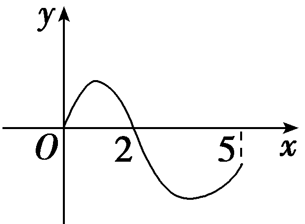
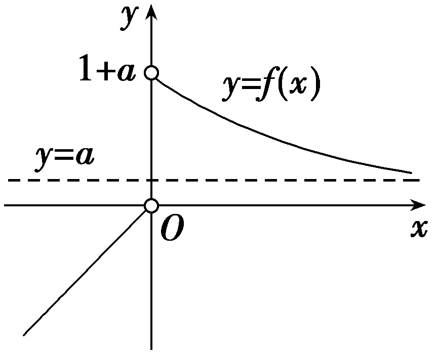
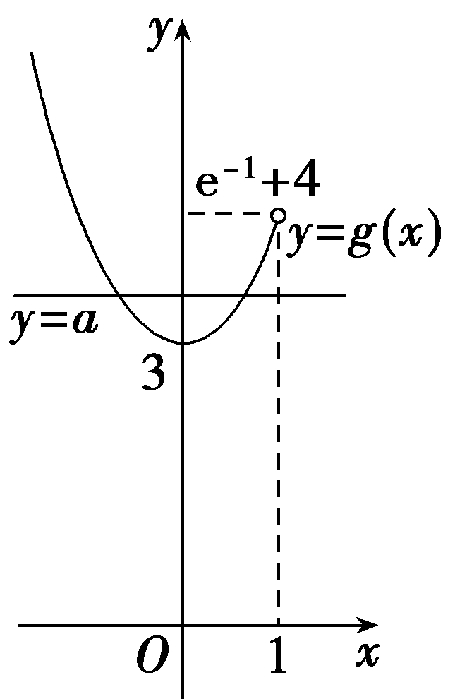

**第四节　函数的对称性**

【课标研读】　1.能通过平移，分析得出一般的轴对称和中心对称的公式和推论.　2.会利用对称公式解决问题.

1.奇函数、偶函数的对称性

(1)奇函数关于<u>原点</u>对称，偶函数关于<em><u>y</u></em><u>轴</u>对称.

(2)若函数<em>y</em>＝<em>f</em>(<em>x</em>＋<em>a</em>)是偶函数，则函数<em>y</em>＝<em>f</em>(<em>x</em>)的图象关于直线<em><u>x</u></em><u>＝</u><em><u>a</u></em>对称.

(3)若函数<em>y</em>＝<em>f</em>(<em>x</em>＋<em>b</em>)是奇函数，则函数<em>y</em>＝<em>f</em>(<em>x</em>)的图象关于点<u>(</u><em><u>b</u></em><u>，0)</u>中心对称.

2.函数图象的对称性

(1)若对于<strong>R</strong>上的任意<em>x</em>都有<em>f</em>(2<em>a</em>－<em>x</em>)＝<em>f</em>(<em>x</em>)或<em>f</em>(－<em>x</em>)＝<em>f</em>(2<em>a</em>＋<em>x</em>)或<em>f</em>(<em>a</em>＋<em>x</em>)＝<em>f</em>(<em>a</em>－<em>x</em>)，则<em>y</em>＝<em>f</em>(<em>x</em>)的图象关于直线<em>x</em>＝<em>a</em>对称.

(2)若对于<strong>R</strong>上的任意<em>x</em>都有<em>f</em>(2<em>a</em>－<em>x</em>)＝－<em>f</em>(<em>x</em>)或<em>f</em>(－<em>x</em>)＝－<em>f</em>(2<em>a</em>＋<em>x</em>)或<em>f</em>(<em>a</em>＋<em>x</em>)＝－<em>f</em>(<em>a</em>－<em>x</em>)，则<em>y</em>＝<em>f</em>(<em>x</em>)的图象关于点(<em>a</em>，0)对称.

3.两个函数图象的对称性

(1)函数<em>y</em>＝<em>f</em>(<em>x</em>)与<em>y</em>＝<em>f</em>(－<em>x</em>)关于<em><u>y</u></em><u>轴</u>对称.

(2)函数<em>y</em>＝<em>f</em>(<em>x</em>)与<em>y</em>＝－<em>f</em>(<em>x</em>)关于<em><u>x</u></em><u>轴</u>对称.

(3)函数<em>y</em>＝<em>f</em>(<em>x</em>)与<em>y</em>＝－<em>f</em>(－<em>x</em>)关于<u>原点</u>对称.

【常用结论】

函数对称性与周期性的关系(双对称问题求周期)

(1)若函数*f*(*x*)的图象关于*x*＝*a*和*x*＝*b*(*a*≠*b*)对称，则*y*＝*f*(*x*)的一个周期为2｜*b*－*a*｜.

(2)若函数*f*(*x*)的图象关于(*a*，0)和(*b*，0)(*a*≠*b*)对称，则*y*＝*f*(*x*)的一个周期为2｜*b*－*a*｜.

(3)若函数*f*(*x*)的图象关于*x*＝*a*和(*b*，0)(*a*≠*b*)对称，则*y*＝*f*(*x*)的一个周期为4｜*b*－*a*｜.

【自主检测】

1.(多选)下列结论正确的是(　　)

A.函数*y*＝*f*(*x*＋1)是偶函数，则函数*y*＝*f*(*x*)的图象关于直线*x*＝1对称

B.函数*y*＝*f*(*x*－1)是奇函数，则函数*y*＝*f*(*x*)的图象关于点(1，0)对称

C.若函数*f*(*x*)满足*f*(*x*－1)＋*f*(*x*＋1)＝0，则*f*(*x*)的图象关于*y*轴对称

D.若函数*f*(*x*)满足*f*(2＋*x*)＝*f*(2－*x*)，则*f*(*x*)的图象关于直线*x*＝2对称

答案：**AD**

2.函数<te*x*t style="italic">f</text>(x) $＝\frac{x+1}{x}$ 图象的对称中心为(　　)

A.(0，0)	B.(0，1)

C.(1，0)	D.(1，1)

答案：**B**

解析：因为<te<te*x*t st<text st<text st*y*le="italic">y</text>le="italic">y</text>le="italic">x</text>t style="italic">*f*</text>(x) $＝\frac{x+1}{x}＝$ 1＋ $\frac{1}{x}$ ，由<te*x*t st<text st*y*le="italic">y</text>le="italic">y</text> $＝\frac{1}{x}$ 向上平移一个单位长度得到<te*x*t st<text st*y*le="italic">y</text>le="italic">y</text>＝1＋ $\frac{1}{x}$ ，又<te*x*t st<text st*y*le="italic">y</text>le="italic">y</text> $＝\frac{1}{x}$ 关于(0，0)对称，所以<te<te*x*t st<text st<text st*y*le="italic">y</text>le="italic">y</text>le="italic">x</text>t style="italic">*f*</text>(x)＝1＋ $\frac{1}{x}$ 的图象关于(0，1)对称.故选B.

3.(链接人教A必修一P85T1)设偶函数<em>f</em>(<em>x</em>)的定义域为[－5，5]，若当<em>x</em>∈[0，5]时，<em>f</em>(<em>x</em>)的图象如图所示，则不等式<em>f</em>(<em>x</em>)＜0的解集为<u>　　　　</u>.

答案：[－5，－2)∪(2，5]

解析：由题图可知，当0＜*x*＜2时，*f*(*x*)＞0；当2＜*x*≤5时，*f*(*x*)＜0.又*f*(*x*)是偶函数，所以当－2＜*x*＜0时，*f*(*x*)＞0；当－5≤*x*＜－2时，*f*(*x*)＜0.综上，不等式*f*(*x*)＜0的解集为[－5，－2)∪(2，5].

4.偶函数<em>y</em>＝<em>f</em>(<em>x</em>)的图象关于直线<em>x</em>＝2对称，且当<em>x</em>∈[2，3]时，<em>f</em>(<em>x</em>)＝2<em>x</em>－1，则<em>f</em>(－1)＝<u>　　　　</u>.

答案：5

解析：因为*f*(*x*)为偶函数，所以*f*(－1)＝*f*(1)，由*f*(*x*)的图象关于*x*＝2对称，可得*f*(1)＝*f*(3)＝2×3－1＝5，所以*f*(－1)＝5.

考点一　轴对称问题 　　　　师生共研

(1)已知函数<em>f</em>(<em>x</em>)＝(1－<em>x</em>2)(<em>x</em>2＋<em>ax</em>＋<em>b</em>)的图象关于直线<em>x</em>＝－2对称，求<em>ab</em>的值.

(2) (2023·全国乙卷节选)已知函数<te<te<te<text style="it*a*lic">x</text>t st*y*le="it*a*lic">x</text>t style="it*a*lic">x</text>t style="italic">*f*</text>(x)＝( $\frac{1}{x}$ ＋<te<te<text style="it*a*lic">x</text>t st*y*le="it*a*lic">x</text>t style="italic">a</text>)ln(1＋*x*)，是否存在a，*<text style="italic"><text style="italic">b*</text></text>，使得曲线y＝*<text style="italic">f*</text>( $\frac{1}{x}$ )关于直线<te<te<text style="it*a*lic">x</text>t st*y*le="it*a*lic">x</text>t style="it*a*lic">x</text>＝*<text style="italic"><text style="italic">b*</text></text>对称？若存在，求a，b的值；若不存在，说明理由.

解：(1)因为*f*(*x*)的图象关于直线*x*＝－2对称，

所以*f*(－3)＝*f*(－1)，*f*(－5)＝*f*(1)，

即 $\left\{\begin{matrix}－8(9－3a＋b)=0，\\－24(25－5a＋b)=0，\end{matrix}\right.$ 解得 $\left\{\begin{matrix}a=8，\\b=15，\end{matrix}\right.$

所以*ab*＝120.

(2)假设存在<te*x*t st*y*le="italic">a</text>，*<text style="italic">b*</text>， 使得曲线y＝*f*( $\frac{1}{x}$ )关于直线*x*＝<text st*y*le="italic">*b*</text>对称.

令<te<te<text style="it*a*lic">x</text>t style="italic">x</text>t style="italic">g</text>(x)＝*f*( $\frac{1}{x}$ )＝(<te<text style="it*a*lic">x</text>t style="italic">x</text>＋a)ln(1＋ $\frac{1}{x}$ )

＝(<text style="it*a*lic">x</text>＋a)ln $\frac{x+1}{x}$ ，

因为曲线*y*＝*g*(*x*)关于直线*x*＝*b*对称，

所以*g*(*x*)＝*g*(2*b*－*x*)，

即(<te<te<text style="it*a*lic">x</text>t style="it*a*lic">x</text>t style="it*a*lic">x</text>＋a)ln $\frac{x+1}{x}＝$ (2<te<te<text style="it*a*lic">x</text>t style="it*a*lic">x</text>t style="italic">*b*</text>－<text style="it*a*lic">x</text>＋a)ln $\frac{2b－x+1}{2b－x}＝$ (<te<te<text style="it*a*lic">x</text>t style="it*a*lic">x</text>t style="it*a*lic">x</text>－2*<text style="italic">b*</text>－a)ln $\frac{x－2b}{x－2b－1}$ ，

于是 $\left\{\begin{matrix}a＝－2b－a，\\1=－2b，\end{matrix}\right.$ 得 $\left\{\begin{matrix}a＝\frac{1}{2}，\\b＝－\frac{1}{2}，\end{matrix}\right.$

当<te<te*x*t style="italic">x</text>t style="italic">a</text> $＝\frac{1}{2}$ ，<te<te*x*t style="italic">x</text>t style="italic">b</text>＝－ $\frac{1}{2}$ 时，<te<te*x*t style="italic">x</text>t style="italic">g</text>(x)＝(x＋ $\frac{1}{2}$ )ln(1＋ $\frac{1}{x}$ )，

<te<te<te<te<te<te*x*t style="italic">x</text>t style="italic">x</text>t style="italic">x</text>t style="italic">x</text>t style="italic">x</text>t style="italic">*g*</text>(－1－x)＝(－x－ $\frac{1}{2}$ )ln $\frac{－x}{－1－x}＝$ (－<te<te<te<te<te*x*t style="italic">x</text>t style="italic">x</text>t style="italic">x</text>t style="italic">x</text>t style="italic">x</text>－ $\frac{1}{2}$ )ln $\frac{x}{1+x}＝$ (<te<te<te<te<te*x*t style="italic">x</text>t style="italic">x</text>t style="italic">x</text>t style="italic">x</text>t style="italic">x</text>＋ $\frac{1}{2}$ )ln $\frac{x+1}{x}＝$ (<te<te<te<te<te*x*t style="italic">x</text>t style="italic">x</text>t style="italic">x</text>t style="italic">x</text>t style="italic">x</text>＋ $\frac{1}{2}$ )ln(1＋ $\frac{1}{x}$ )＝<te<te<te<te<te<te*x*t style="italic">x</text>t style="italic">x</text>t style="italic">x</text>t style="italic">x</text>t style="italic">x</text>t style="italic">*g*</text>(x)，

所以曲线<te<te*x*t style="italic">x</text>t style="italic">y</text>＝*g*(x)关于直线x＝－ $\frac{1}{2}$ 对称，满足题意.

故存在<te<text style="it*a*lic">x</text>t st*y*le="italic">a</text>，*<text style="italic"><text style="italic">b*</text></text>，使得曲线y＝*f*( $\frac{1}{x}$ )关于直线<text style="it*a*lic">x</text>＝<text st*y*le="italic">*<text style="italic">b*</text></text>对称，且*a* $＝\frac{1}{2}$ ，<te<text style="it*a*lic">x</text>t st*y*le="italic">*<text style="italic">b*</text></text>＝－ $\frac{1}{2}$ .

轴对称问题的常用性质

1.函数*y*＝*f*(*x*)的图象关于直线*x*＝*a*对称⇔*f*(*x*)＝*f*(2*a*－*x*)⇔*f*(*a*－*x*)＝*f*(*a*＋*x*).

2.若函数<te<te<te<te<te*x*t style="italic">x</text>t st*y*le="italic">x</text>t style="italic">x</text>t style="it*a*lic">x</text>t style="italic">y</text>＝*<text style="italic"><text style="italic"><text style="italic">f*</text></text></text>(x)满足f(a＋x)＝f(*b*－x)，则y＝f(x)的图象关于直线x $＝\frac{a＋b}{2}$ 成轴对称.

对点练1.已知函数<em>f</em>(<em>x</em>)＝32－<em>x</em>＋3<em>x</em>＋<em>a</em>，其中<em>a</em>为常数，若存在<em>x</em>1≠<em>x</em>2，且<em>f</em>(<em>x</em>1)＝<em>f</em>(<em>x</em>2)，则<em>x</em>1＋<em>x</em>2＝(　　)

A.0	B.1

C.2	D.2*a*

答案：**C**

解析：因为&lt;te&lt;te&lt;te&lt;te&lt;te&lt;te&lt;te&lt;te&lt;te<em>x</em>t style="italic"&gt;x&lt;/text&gt;t style="italic"&gt;x&lt;/text&gt;t style="italic"&gt;x&lt;/text&gt;t style="italic"&gt;x&lt;/text&gt;t style="italic"&gt;x&lt;/text&gt;t style="italic"&gt;x&lt;/text&gt;t style="it<em>a</em>lic,superscript"&gt;x&lt;/text&gt;t style="italic,superscript"&gt;x&lt;/text&gt;t style="italic"&gt;<em>&lt;text style="italic"&gt;&lt;text style="italic"&gt;&lt;text style="italic"&gt;f</em>&lt;/text&gt;&lt;/text&gt;&lt;/text&gt;&lt;/text&gt; $\left(2－x\right)＝$ 3&lt;te&lt;te&lt;te&lt;te&lt;te&lt;te&lt;te&lt;te<em>x</em>t style="italic"&gt;x&lt;/text&gt;t style="italic"&gt;x&lt;/text&gt;t style="italic"&gt;x&lt;/text&gt;t style="italic"&gt;x&lt;/text&gt;t style="italic"&gt;x&lt;/text&gt;t style="italic"&gt;x&lt;/text&gt;t style="it<em>a</em>lic,superscript"&gt;x&lt;/text&gt;t style="italic,superscript"&gt;x&lt;/text&gt;＋3&lt;text style="subscript"&gt;&lt;text style="subscript"&gt;2&lt;/text&gt;－&lt;/text&gt;x＋a＝<em>&lt;text style="italic"&gt;&lt;text style="italic"&gt;&lt;text style="italic"&gt;&lt;text style="italic"&gt;f</em>&lt;/text&gt;&lt;/text&gt;&lt;/text&gt;&lt;/text&gt;(x)，所以f(x)关于直线x＝&lt;text style="subscript"&gt;1&lt;/text&gt;对称，又f(x1)＝f(x2)，所以x1＋x2＝2.故选C.

对点练2.已知函数<em>f</em>(<em>x</em>)的定义域为<strong>R</strong>，且<em>f</em>(<em>x</em>＋2)为偶函数，<em>f</em>(<em>x</em>)在[2，＋∞)上单调递减，则不等式<em>f</em>(－<em>x</em>2)＞<em>f</em>(－1)的解集为<u>　　　　</u>.

答案：(－1，1)

解析：因为<em>f</em>(<em>x</em>＋2)是偶函数，所以<em>f</em>(<em>x</em>)的图象关于直线<em>x</em>＝2对称，又<em>f</em>(<em>x</em>)在[2，＋∞)上单调递减，所以<em>f</em>(<em>x</em>)在(－∞，2]上单调递增.又－<em>x</em>2，－1∈(－∞，2]，<em>f</em>(－<em>x</em>2)＞<em>f</em>(－1)，所以－<em>x</em>2＞－1，即<em>x</em>2＜1，所以－1＜<em>x</em>＜1，所以原不等式的解集为(－1，1).

考点二　中心对称问题　　　　师生共研

(1)(2024·新疆乌鲁木齐二模)若函数<text style="it*a*lic">f</text> $\left(x\right)＝\frac{ax－1}{x－1}$ 的图象关于点 $\left(1，2\right)$ 对称，则*a*＝(　　)

A.－2	B.－1

C.1	D.2

(2)已知函数&lt;te&lt;te&lt;te&lt;te<em>x</em>t st<em>y</em>le="italic"&gt;x&lt;/text&gt;t style="italic"&gt;x&lt;/text&gt;t style="italic"&gt;x&lt;/text&gt;t style="italic"&gt;<em>&lt;text style="italic"&gt;&lt;text style="italic"&gt;f</em>&lt;/text&gt;&lt;/text&gt;&lt;/text&gt;(x)满足f(－x)＋f(x＋2)＝0，若函数y＝f(x)－ $\frac{1}{x－1}$ 有6个零点，则6个零点的和为<u>　　　　</u>.

答案：(1)**D**　(2)6

解析：(1)<te<te<te<text style="it<text style="it<text style="it<text style="it*a*lic">a</text>lic">a</text>lic">a</text>lic">x</text>t style="italic">x</text>t style="it*a*lic">x</text>t style="italic">*<text style="italic">f*</text></text>(x) $＝\frac{ax－1}{x－1}＝$ <te<te<text style="it<text style="it<text style="it<text style="it*a*lic">a</text>lic">a</text>lic">a</text>lic">x</text>t style="italic">x</text>t style="italic">a</text>＋ $\frac{a－1}{x－1}$ 关于(1，2)对称，所以<te<te<te<text style="it<text style="it<text style="it<text style="it*a*lic">a</text>lic">a</text>lic">a</text>lic">x</text>t style="italic">x</text>t style="it*a*lic">x</text>t style="italic">*<text style="italic">f*</text></text>(1＋x)＋f(1－x)＝4，即a＋ $\frac{a－1}{x+1－1}$ ＋<te<te<text style="it<text style="it<text style="it<text style="it*a*lic">a</text>lic">a</text>lic">a</text>lic">x</text>t style="italic">x</text>t style="italic">a</text>＋ $\frac{a－1}{1－x－1}＝$ 2<te<te<text style="it<text style="it<text style="it<text style="it*a*lic">a</text>lic">a</text>lic">a</text>lic">x</text>t style="italic">x</text>t style="italic">a</text>＝4，则a＝2.故选D.

(2)因为<te<te<te<te<te*x*t style="italic">x</text>t st<text st*y*le="italic">y</text>le="italic">x</text>t style="italic">x</text>t style="italic">x</text>t style="italic">*<text style="italic"><text style="italic">f*</text></text></text>(－x)＋f(x＋2)＝0，所以f(x)的图象关于点(1，0)对称，又y $＝\frac{1}{x－1}$ 的图象也关于点(1，0)对称，所以函数<te<te*x*t style="italic">x</text>t st*y*le="italic">y</text>＝<te<te<te*x*t style="italic">x</text>t style="italic">x</text>t style="italic">*<text style="italic"><text style="italic">f*</text></text></text>(x)－ $\frac{1}{x－1}$ (<te<te<te<te*x*t style="italic">x</text>t st<text st*y*le="italic">y</text>le="italic">x</text>t style="italic">x</text>t style="italic">x</text>≠1)的图象关于点(1，0)对称，该函数的零点之和为2×3＝6.

中心对称问题的常用性质

1.函数*y*＝*f*(*x*)的图象关于点(*a*，*b*)对称⇔*f*(*a*＋*x*)＋*f*(*a*－*x*)＝2*b*⇔2*b*－*f*(*x*)＝*f*(2*a*－*x*).

2.若函数<te<te<te<te*x*t st*y*le="itali*c*">x</text>t style="italic">x</text>t style="it*a*lic">x</text>t style="italic">y</text>＝*<text style="italic"><text style="italic"><text style="italic">f*</text></text></text>(x)满足f(a＋x)＋f(*b*－x)＝c，则y＝f(x)的图象关于点 $\left(\frac{a＋b}{2}，\frac{c}{2}\right)$ 成中心对称.

注意：对于函数自身对称的性质可以简记为：函数自身对称求平均，即性质2关于点( $\frac{a＋x＋b－x}{2}$ ， $\frac{c}{2}$ )，也就是关于点( $\frac{a＋b}{2}$ ， $\frac{c}{2}$ )对称.

对点练3.已知函数*y*＝*f*(*x*＋2)为奇函数，则函数*y*＝*f*(*x*)＋2的图象(　　)

A.关于点(2，2)对称	B.关于点(2，－2)对称

C.关于点(－2，2)对称	D.关于点(－2，－2)对称

答案：**A**

解析：因为函数*y*＝*f*(*x*＋2)为奇函数，所以*f*(－*x*＋2)＝－*f*(*x*＋2)，所以函数*y*＝*f*(*x*)的图象关于点(2，0)对称，所以函数*y*＝*f*(*x*)＋2的图象关于点(2，2)对称.故选A.

对点练4.已知函数&lt;te&lt;te<em>x</em>t style="italic"&gt;x&lt;/text&gt;t style="italic"&gt;<em>f</em>&lt;/text&gt; $\left(x\right)＝$ &lt;te<em>x</em>t style="italic"&gt;x&lt;/text&gt;3－3x2，则 $\overset{2 025}{\underset{k＝－2 023}{\sum }}$ &lt;te&lt;te<em>x</em>t style="italic"&gt;x&lt;/text&gt;t style="italic"&gt;<em>f</em>&lt;/text&gt; $\left(k\right)＝$ (　　)

A.－8 098	B.－8 096

C.0	D.8 100

答案：**A**

解析：&lt;te&lt;te&lt;te&lt;te&lt;te&lt;te&lt;te&lt;te<em>x</em>t style="italic"&gt;x&lt;/text&gt;t style="italic"&gt;x&lt;/text&gt;t style="italic"&gt;x&lt;/text&gt;t style="italic"&gt;x&lt;/text&gt;t style="italic"&gt;x&lt;/text&gt;t style="italic"&gt;x&lt;/text&gt;t style="italic"&gt;x&lt;/text&gt;t style="italic"&gt;<em>&lt;text style="italic"&gt;&lt;text style="italic"&gt;&lt;text style="italic"&gt;&lt;text style="italic"&gt;&lt;text style="italic"&gt;&lt;text style="italic"&gt;&lt;text style="italic"&gt;&lt;text style="italic"&gt;&lt;text style="italic"&gt;f</em>&lt;/text&gt;&lt;/text&gt;&lt;/text&gt;&lt;/text&gt;&lt;/text&gt;&lt;/text&gt;&lt;/text&gt;&lt;/text&gt;&lt;/text&gt;&lt;/text&gt; $\left(x\right)＝$ &lt;te&lt;te&lt;te&lt;te&lt;te&lt;te&lt;te<em>x</em>t style="italic"&gt;x&lt;/text&gt;t style="italic"&gt;x&lt;/text&gt;t style="italic"&gt;x&lt;/text&gt;t style="italic"&gt;x&lt;/text&gt;t style="italic"&gt;x&lt;/text&gt;t style="italic"&gt;x&lt;/text&gt;t style="italic"&gt;x&lt;/text&gt;&lt;text style="superscript"&gt;&lt;text style="superscript"&gt;3&lt;/text&gt;&lt;/text&gt;－3x2 $＝\left(x－1\right)^{3}$ －&lt;te&lt;te&lt;te&lt;te&lt;te&lt;te&lt;te<em>x</em>t style="italic"&gt;x&lt;/text&gt;t style="italic"&gt;x&lt;/text&gt;t style="italic"&gt;x&lt;/text&gt;t style="italic"&gt;x&lt;/text&gt;t style="italic"&gt;x&lt;/text&gt;t style="italic"&gt;x&lt;/text&gt;t style="superscript"&gt;&lt;text style="superscript"&gt;3&lt;/text&gt;&lt;/text&gt;<em>x</em>＋1 $＝\left(x－1\right)^{3}$ －&lt;te&lt;te&lt;te&lt;te&lt;te&lt;te&lt;te<em>x</em>t style="italic"&gt;x&lt;/text&gt;t style="italic"&gt;x&lt;/text&gt;t style="italic"&gt;x&lt;/text&gt;t style="italic"&gt;x&lt;/text&gt;t style="italic"&gt;x&lt;/text&gt;t style="italic"&gt;x&lt;/text&gt;t style="superscript"&gt;&lt;text style="superscript"&gt;3&lt;/text&gt;&lt;/text&gt; $\left(x－1\right)$ －&lt;te&lt;te&lt;te&lt;te&lt;te&lt;te<em>x</em>t style="italic"&gt;x&lt;/text&gt;t style="italic"&gt;x&lt;/text&gt;t style="italic"&gt;x&lt;/text&gt;t style="italic"&gt;x&lt;/text&gt;t style="italic"&gt;x&lt;/text&gt;t style="superscript"&gt;2&lt;/text&gt;，所以&lt;te&lt;te<em>x</em>t style="italic"&gt;x&lt;/text&gt;t style="italic"&gt;<em>&lt;text style="italic"&gt;&lt;text style="italic"&gt;&lt;text style="italic"&gt;&lt;text style="italic"&gt;&lt;text style="italic"&gt;&lt;text style="italic"&gt;&lt;text style="italic"&gt;&lt;text style="italic"&gt;&lt;text style="italic"&gt;f</em>&lt;/text&gt;&lt;/text&gt;&lt;/text&gt;&lt;/text&gt;&lt;/text&gt;&lt;/text&gt;&lt;/text&gt;&lt;/text&gt;&lt;/text&gt;&lt;/text&gt; $\left(1+x\right)$ ＋&lt;te&lt;te&lt;te&lt;te&lt;te&lt;te&lt;te&lt;te<em>x</em>t style="italic"&gt;x&lt;/text&gt;t style="italic"&gt;x&lt;/text&gt;t style="italic"&gt;x&lt;/text&gt;t style="italic"&gt;x&lt;/text&gt;t style="italic"&gt;x&lt;/text&gt;t style="italic"&gt;x&lt;/text&gt;t style="italic"&gt;x&lt;/text&gt;t style="italic"&gt;<em>&lt;text style="italic"&gt;&lt;text style="italic"&gt;&lt;text style="italic"&gt;&lt;text style="italic"&gt;&lt;text style="italic"&gt;&lt;text style="italic"&gt;&lt;text style="italic"&gt;&lt;text style="italic"&gt;&lt;text style="italic"&gt;f</em>&lt;/text&gt;&lt;/text&gt;&lt;/text&gt;&lt;/text&gt;&lt;/text&gt;&lt;/text&gt;&lt;/text&gt;&lt;/text&gt;&lt;/text&gt;&lt;/text&gt;(1－x)＝x&lt;text style="superscript"&gt;&lt;text style="superscript"&gt;3&lt;/text&gt;&lt;/text&gt;－3x－2－x3＋3x－2＝－4，即f $\left(x\right)$ 关于(1，－&lt;te&lt;te&lt;te&lt;te&lt;te&lt;te<em>x</em>t style="italic"&gt;x&lt;/text&gt;t style="italic"&gt;x&lt;/text&gt;t style="italic"&gt;x&lt;/text&gt;t style="italic"&gt;x&lt;/text&gt;t style="italic"&gt;x&lt;/text&gt;t style="superscript"&gt;2&lt;/text&gt;)中心对称，所以 $\overset{2 025}{\underset{k＝－2 023}{\sum }}$ &lt;te&lt;te&lt;te&lt;te&lt;te&lt;te&lt;te&lt;te<em>x</em>t style="italic"&gt;x&lt;/text&gt;t style="italic"&gt;x&lt;/text&gt;t style="italic"&gt;x&lt;/text&gt;t style="italic"&gt;x&lt;/text&gt;t style="italic"&gt;x&lt;/text&gt;t style="italic"&gt;x&lt;/text&gt;t style="italic"&gt;x&lt;/text&gt;t style="italic"&gt;<em>&lt;text style="italic"&gt;&lt;text style="italic"&gt;&lt;text style="italic"&gt;&lt;text style="italic"&gt;&lt;text style="italic"&gt;&lt;text style="italic"&gt;&lt;text style="italic"&gt;&lt;text style="italic"&gt;&lt;text style="italic"&gt;f</em>&lt;/text&gt;&lt;/text&gt;&lt;/text&gt;&lt;/text&gt;&lt;/text&gt;&lt;/text&gt;&lt;/text&gt;&lt;/text&gt;&lt;/text&gt;&lt;/text&gt; $\left(k\right)＝$ [&lt;te&lt;te&lt;te&lt;te&lt;te&lt;te&lt;te&lt;te<em>x</em>t style="italic"&gt;x&lt;/text&gt;t style="italic"&gt;x&lt;/text&gt;t style="italic"&gt;x&lt;/text&gt;t style="italic"&gt;x&lt;/text&gt;t style="italic"&gt;x&lt;/text&gt;t style="italic"&gt;x&lt;/text&gt;t style="italic"&gt;x&lt;/text&gt;t style="italic"&gt;<em>&lt;text style="italic"&gt;&lt;text style="italic"&gt;&lt;text style="italic"&gt;&lt;text style="italic"&gt;&lt;text style="italic"&gt;&lt;text style="italic"&gt;&lt;text style="italic"&gt;&lt;text style="italic"&gt;&lt;text style="italic"&gt;f</em>&lt;/text&gt;&lt;/text&gt;&lt;/text&gt;&lt;/text&gt;&lt;/text&gt;&lt;/text&gt;&lt;/text&gt;&lt;/text&gt;&lt;/text&gt;&lt;/text&gt; $\left(－2 023\right)$ ＋&lt;te&lt;te&lt;te&lt;te&lt;te&lt;te&lt;te&lt;te<em>x</em>t style="italic"&gt;x&lt;/text&gt;t style="italic"&gt;x&lt;/text&gt;t style="italic"&gt;x&lt;/text&gt;t style="italic"&gt;x&lt;/text&gt;t style="italic"&gt;x&lt;/text&gt;t style="italic"&gt;x&lt;/text&gt;t style="italic"&gt;x&lt;/text&gt;t style="italic"&gt;<em>&lt;text style="italic"&gt;&lt;text style="italic"&gt;&lt;text style="italic"&gt;&lt;text style="italic"&gt;&lt;text style="italic"&gt;&lt;text style="italic"&gt;&lt;text style="italic"&gt;&lt;text style="italic"&gt;&lt;text style="italic"&gt;f</em>&lt;/text&gt;&lt;/text&gt;&lt;/text&gt;&lt;/text&gt;&lt;/text&gt;&lt;/text&gt;&lt;/text&gt;&lt;/text&gt;&lt;/text&gt;&lt;/text&gt; $\left(2 025\right)$ ]＋[&lt;te&lt;te&lt;te&lt;te&lt;te&lt;te&lt;te&lt;te<em>x</em>t style="italic"&gt;x&lt;/text&gt;t style="italic"&gt;x&lt;/text&gt;t style="italic"&gt;x&lt;/text&gt;t style="italic"&gt;x&lt;/text&gt;t style="italic"&gt;x&lt;/text&gt;t style="italic"&gt;x&lt;/text&gt;t style="italic"&gt;x&lt;/text&gt;t style="italic"&gt;<em>&lt;text style="italic"&gt;&lt;text style="italic"&gt;&lt;text style="italic"&gt;&lt;text style="italic"&gt;&lt;text style="italic"&gt;&lt;text style="italic"&gt;&lt;text style="italic"&gt;&lt;text style="italic"&gt;&lt;text style="italic"&gt;f</em>&lt;/text&gt;&lt;/text&gt;&lt;/text&gt;&lt;/text&gt;&lt;/text&gt;&lt;/text&gt;&lt;/text&gt;&lt;/text&gt;&lt;/text&gt;&lt;/text&gt; $\left(－2 022\right)$ ＋&lt;te&lt;te&lt;te&lt;te&lt;te&lt;te&lt;te&lt;te<em>x</em>t style="italic"&gt;x&lt;/text&gt;t style="italic"&gt;x&lt;/text&gt;t style="italic"&gt;x&lt;/text&gt;t style="italic"&gt;x&lt;/text&gt;t style="italic"&gt;x&lt;/text&gt;t style="italic"&gt;x&lt;/text&gt;t style="italic"&gt;x&lt;/text&gt;t style="italic"&gt;<em>&lt;text style="italic"&gt;&lt;text style="italic"&gt;&lt;text style="italic"&gt;&lt;text style="italic"&gt;&lt;text style="italic"&gt;&lt;text style="italic"&gt;&lt;text style="italic"&gt;&lt;text style="italic"&gt;&lt;text style="italic"&gt;f</em>&lt;/text&gt;&lt;/text&gt;&lt;/text&gt;&lt;/text&gt;&lt;/text&gt;&lt;/text&gt;&lt;/text&gt;&lt;/text&gt;&lt;/text&gt;&lt;/text&gt; $\left(2 024\right)$ ]＋…＋ $\left[f\left(0\right)＋f\left(2\right)\right]$ ＋&lt;te&lt;te&lt;te&lt;te&lt;te&lt;te&lt;te&lt;te<em>x</em>t style="italic"&gt;x&lt;/text&gt;t style="italic"&gt;x&lt;/text&gt;t style="italic"&gt;x&lt;/text&gt;t style="italic"&gt;x&lt;/text&gt;t style="italic"&gt;x&lt;/text&gt;t style="italic"&gt;x&lt;/text&gt;t style="italic"&gt;x&lt;/text&gt;t style="italic"&gt;<em>&lt;text style="italic"&gt;&lt;text style="italic"&gt;&lt;text style="italic"&gt;&lt;text style="italic"&gt;&lt;text style="italic"&gt;&lt;text style="italic"&gt;&lt;text style="italic"&gt;&lt;text style="italic"&gt;&lt;text style="italic"&gt;f</em>&lt;/text&gt;&lt;/text&gt;&lt;/text&gt;&lt;/text&gt;&lt;/text&gt;&lt;/text&gt;&lt;/text&gt;&lt;/text&gt;&lt;/text&gt;&lt;/text&gt; $\left(1\right)＝$ &lt;te&lt;te&lt;te&lt;te&lt;te&lt;te<em>x</em>t style="italic"&gt;x&lt;/text&gt;t style="italic"&gt;x&lt;/text&gt;t style="italic"&gt;x&lt;/text&gt;t style="italic"&gt;x&lt;/text&gt;t style="italic"&gt;x&lt;/text&gt;t style="superscript"&gt;2&lt;/text&gt; 024× $\left(－4\right)$ ＋&lt;te&lt;te&lt;te&lt;te&lt;te&lt;te&lt;te&lt;te<em>x</em>t style="italic"&gt;x&lt;/text&gt;t style="italic"&gt;x&lt;/text&gt;t style="italic"&gt;x&lt;/text&gt;t style="italic"&gt;x&lt;/text&gt;t style="italic"&gt;x&lt;/text&gt;t style="italic"&gt;x&lt;/text&gt;t style="italic"&gt;x&lt;/text&gt;t style="italic"&gt;<em>&lt;text style="italic"&gt;&lt;text style="italic"&gt;&lt;text style="italic"&gt;&lt;text style="italic"&gt;&lt;text style="italic"&gt;&lt;text style="italic"&gt;&lt;text style="italic"&gt;&lt;text style="italic"&gt;&lt;text style="italic"&gt;f</em>&lt;/text&gt;&lt;/text&gt;&lt;/text&gt;&lt;/text&gt;&lt;/text&gt;&lt;/text&gt;&lt;/text&gt;&lt;/text&gt;&lt;/text&gt;&lt;/text&gt; $\left(1\right)＝$ －8 098.故选A.

考点三　两个函数图象的对称　　　　师生共研

已知函数<em>y</em>＝<em>f</em>(<em>x</em>)是定义域为<strong>R</strong>的函数，则函数<em>y</em>＝<em>f</em>(<em>x</em>＋2)与<em>y</em>＝<em>f</em>(4－<em>x</em>)的图象(　　)

A.关于直线*x*＝1对称	B.关于直线*x*＝3对称

C.关于直线*y*＝3对称	D.关于点(3，0)对称

答案：**A**

解析：设<em>P</em>(<em>x</em>0，<em>y</em>0)为<em>y</em>＝<em>f</em>(<em>x</em>＋2)图象上任意一点，则<em>y</em>0＝<em>f</em>(<em>x</em>0＋2)＝<em>f</em>(4－(2－<em>x</em>0))，所以点<em>Q</em>(2－<em>x</em>0，<em>y</em>0)在函数<em>y</em>＝<em>f</em>(4－<em>x</em>)的图象上，而点<em>P</em>(<em>x</em>0，<em>y</em>0)与点<em>Q</em>(2－<em>x</em>0，<em>y</em>0)关于直线<em>x</em>＝1对称，所以函数<em>y</em>＝<em>f</em>(<em>x</em>＋2)与<em>y</em>＝<em>f</em>(4－<em>x</em>)的图象关于直线<em>x</em>＝1对称.故选A.

函数<te<te<te<te<te<te*x*t style="italic">x</text>t style="italic">x</text>t style="it*a*lic">x</text>t style="italic">x</text>t st*y*le="italic">x</text>t style="it*a*lic">y</text>＝*<text style="italic">f*</text>(a＋x)的图象与函数y＝f(*<text style="italic">b*</text>－x)的图象关于直线x $＝\frac{b－a}{2}$ 对称.可以简记为：两个函数对称解方程，即由<te<te<te<te<te<te*x*t style="italic">x</text>t style="italic">x</text>t style="it*a*lic">x</text>t style="italic">x</text>t st*y*le="italic">x</text>t style="italic">a</text>＋x＝*<text style="italic">b*</text>－x，得x $＝\frac{b－a}{2}$ .

对点练5.下列函数与<em>y</em>＝2<em>x</em>－cos <em>x</em>的图象关于原点对称的是(　　)

A.<em>g</em>(<em>x</em>)＝－2<em>x</em>＋cos <em>x</em>

B.<te<te*x*t style="italic">x</text>t style="italic">g</text>(x) $＝2^{－}^{x}$ －cos(－<te*x*t style="italic">x</text>)

C.<te<te*x*t style="italic">x</text>t style="italic">g</text>(x)＝－ $2^{－}^{x}$ ＋cos(－<te*x*t style="italic">x</text>)

D.<te<te*x*t style="italic">x</text>t style="italic">g</text>(x)＝－ $2^{－}^{x}$ －cos(－<te*x*t style="italic">x</text>)

答案：**C**

解析：令&lt;te&lt;te&lt;te&lt;te&lt;te&lt;te&lt;te&lt;te&lt;te&lt;te&lt;te&lt;te<em>x</em>t style="italic,superscript"&gt;x&lt;/text&gt;t style="italic"&gt;x&lt;/text&gt;t style="italic"&gt;x&lt;/text&gt;t style="italic"&gt;x&lt;/text&gt;t style="italic"&gt;x&lt;/text&gt;t style="italic"&gt;x&lt;/text&gt;t style="italic"&gt;x&lt;/text&gt;t style="italic"&gt;x&lt;/text&gt;t style="italic"&gt;x&lt;/text&gt;t style="italic,superscript"&gt;x&lt;/text&gt;t style="italic"&gt;x&lt;/text&gt;t style="italic"&gt;<em>&lt;text style="italic"&gt;&lt;text style="italic"&gt;f</em>&lt;/text&gt;&lt;/text&gt;&lt;/text&gt;(x)＝2x－cos x，f(x)与<em>&lt;text style="italic"&gt;&lt;text style="italic"&gt;g</em>&lt;/text&gt;&lt;/text&gt;(x)关于原点对称，则g(x)＋f(－x)＝0，所以g(x)＝－f(－x)＝－[ $2^{－}^{x}$ &lt;te&lt;te<em>x</em>t style="italic,superscript"&gt;x&lt;/text&gt;t style="superscript"&gt;－&lt;/text&gt;cos(－&lt;te&lt;te&lt;te&lt;te&lt;te&lt;te&lt;te&lt;te&lt;te<em>x</em>t style="italic"&gt;x&lt;/text&gt;t style="italic"&gt;x&lt;/text&gt;t style="italic"&gt;x&lt;/text&gt;t style="italic"&gt;x&lt;/text&gt;t style="italic"&gt;x&lt;/text&gt;t style="italic"&gt;x&lt;/text&gt;t style="italic"&gt;x&lt;/text&gt;t style="italic,superscript"&gt;x&lt;/text&gt;t style="italic"&gt;x&lt;/text&gt;)]＝－2－x＋cos(－x).故选C.

对点练6.下列函数中，其图象与函数<em>y</em>＝log2<em>x</em>的图象关于直线<em>x</em>＝2对称的是(　　)

A.<em>y</em>＝log2(2＋<em>x</em>)	B.<em>y</em>＝log2(2－<em>x</em>)

C.<em>y</em>＝log2(4＋<em>x</em>)	D.<em>y</em>＝log2(4－<em>x</em>)

答案：**D**

解析：设所求函数的图象上任意一点<em>P</em>(<em>x</em>，<em>y</em>)，则点<em>P</em>关于<em>x</em>＝2对称的点为<em>Q</em>(4－<em>x</em>，<em>y</em>)，由题意知点<em>Q</em>在<em>y</em>＝log2<em>x</em>的图象上，可得<em>y</em>＝log2(4－<em>x</em>)，即函数<em>y</em>＝log2<em>x</em>关于<em>x</em>＝2对称的函数解析式为<em>y</em>＝log2(4－<em>x</em>).故选D.

[真题再现]　(2024·新课标Ⅰ卷节选)已知函数&lt;te&lt;te<em>x</em>t style="italic"&gt;x&lt;/text&gt;t style="italic"&gt;f&lt;/text&gt;(x)＝ln $\frac{x}{2－x}$ ＋a&lt;te<em>x</em>t style="italic"&gt;x&lt;/text&gt;＋<em>b</em>(x－1)3.

证明：曲线*y*＝*f*(*x*)是中心对称图形.

证明：&lt;text st<em>y</em>le="it&lt;text style="it<em>a</em>lic"&gt;a&lt;/text&gt;lic"&gt;<em>f</em>&lt;/text&gt; $\left(x\right)＝$ ln $\frac{x}{2－x}$ ＋&lt;text st<em>y</em>le="it&lt;text style="it<em>a</em>lic"&gt;a&lt;/text&gt;lic"&gt;<em>&lt;text style="italic"&gt;ax</em>&lt;/text&gt;&lt;/text&gt;＋<em>b</em> $\left(x－1\right)^{3}$ 的图象是由函数&lt;text st<em>y</em>le="it&lt;text style="it<em>a</em>lic"&gt;a&lt;/text&gt;lic"&gt;<em>g</em>&lt;/text&gt; $\left(x\right)＝$ ln $\frac{x+1}{1－x}$ ＋&lt;text st<em>y</em>le="it&lt;text style="it<em>a</em>lic"&gt;a&lt;/text&gt;lic"&gt;<em>&lt;text style="italic"&gt;ax</em>&lt;/text&gt;&lt;/text&gt;＋<em>b</em>x&lt;text style="superscript"&gt;3&lt;/text&gt;＋a向右平移1个单位得到，而函数<em>&lt;text style="italic"&gt;g</em>&lt;/text&gt; $\left(x\right)＝$ ln $\frac{x+1}{1－x}$ ＋&lt;text st<em>y</em>le="it&lt;text style="it<em>a</em>lic"&gt;a&lt;/text&gt;lic"&gt;<em>&lt;text style="italic"&gt;ax</em>&lt;/text&gt;&lt;/text&gt;＋<em>b</em>x&lt;text style="superscript"&gt;3&lt;/text&gt;＋a关于 $\left(0，a\right)$ 中心对称，所以<em>y</em>＝&lt;text style="it&lt;text style="it<em>a</em>lic"&gt;a&lt;/text&gt;lic"&gt;<em>f</em>&lt;/text&gt; $\left(x\right)$ 图象为中心对称图形，且对称中心为 $\left(1，a\right)$ .

[教材呈现]　(人教A必修一P87T13)我们知道，函数*y*＝*f*(*x*)的图象关于坐标原点成中心对称图形的充要条件是函数*y*＝*f*(*x*)为奇函数，有同学发现可以将其推广为：函数*y*＝*f*(*x*)的图象关于点*P*(*a*，*b*)成中心对称图形的充要条件是函数*y*＝*f*(*x*＋*a*)－*b*为奇函数.

(1)求函数<em>f</em>(<em>x</em>)＝<em>x</em>3－3<em>x</em>2图象的对称中心；

(2)类比上述推广结论，写出“函数*y*＝*f*(*x*)的图象关于*y*轴成轴对称图形的充要条件是函数*y*＝*f*(*x*)为偶函数”的一个推广结论.

点评：该高考题是教材习题结论的直接应用，推出&lt;te&lt;te&lt;text style="it<em>a</em>lic"&gt;x&lt;/text&gt;t style="italic"&gt;x&lt;/text&gt;t style="it<em>a</em>lic"&gt;<em>&lt;text style="italic"&gt;f</em>&lt;/text&gt;&lt;/text&gt; $\left(x+1\right)$ －&lt;te&lt;te&lt;text style="it<em>a</em>lic"&gt;x&lt;/text&gt;t style="italic"&gt;x&lt;/text&gt;t style="italic"&gt;a&lt;/text&gt;＝ln $\frac{x+1}{1－x}$ ＋&lt;te&lt;te&lt;text style="it<em>a</em>lic"&gt;x&lt;/text&gt;t style="italic"&gt;x&lt;/text&gt;t style="italic"&gt;a&lt;/text&gt;x＋<em>bx</em>3为奇函数即可.如果利用结论<em>&lt;text style="italic"&gt;&lt;text style="italic"&gt;f</em>&lt;/text&gt;&lt;/text&gt;(2－x)＋f(x)＝2a解答该题更简单.

**课时测评**10　**函数的对称性** $\frac{对应学生}{用书P329}$

(时间：45分钟　满分：75分)

(本栏目内容，在学生用书中以独立形式分册装订！)

(1—10题，每小题5分，共50分)

1.设函数<em>f</em>(<em>x</em>)的定义域为<strong>R</strong>，且<em>f</em>(<em>x</em>＋2 025)是偶函数，则<em>f</em>(<em>x</em>)图象(　　)

A.关于点(2 025，0)中心对称

B.关于点(－2 025，0)中心对称

C.关于直线*x*＝2 025对称

D.关于直线*x*＝－2 025对称

答案：**C**

解析：因为*f*(*x*＋2 025)为偶函数，所以*f*(*x*＋2 025)＝*f*(－*x*＋2 025)，所以函数*f*(*x*)图象关于*x*＝2 025对称.故选C.

2.已知函数<em>f</em>(<em>x</em>)＝<em>x</em>3＋<em>ax</em>2＋<em>x</em>＋<em>b</em>的图象关于点(1，0)对称，则<em>b</em>等于(　　 )

A.1	B.－1

C.3	D.－3

答案：**A**

解析：因为&lt;te&lt;te&lt;te&lt;te&lt;te&lt;te&lt;te&lt;te&lt;te&lt;te&lt;te&lt;te&lt;te&lt;te&lt;text style="it&lt;text style="it<em>a</em>lic"&gt;a&lt;/text&gt;lic"&gt;x&lt;/text&gt;t style="it<em>a</em>lic"&gt;x&lt;/text&gt;t style="it<em>a</em>lic"&gt;x&lt;/text&gt;t style="italic"&gt;x&lt;/text&gt;t style="it<em>a</em>lic"&gt;x&lt;/text&gt;t style="it<em>a</em>lic"&gt;x&lt;/text&gt;t style="it<em>a</em>lic"&gt;x&lt;/text&gt;t style="italic"&gt;x&lt;/text&gt;t style="italic"&gt;x&lt;/text&gt;t style="it<em>a</em>lic"&gt;x&lt;/text&gt;t style="italic"&gt;x&lt;/text&gt;t style="italic"&gt;x&lt;/text&gt;t style="italic"&gt;x&lt;/text&gt;t style="italic"&gt;x&lt;/text&gt;t style="italic"&gt;<em>&lt;text style="italic"&gt;&lt;text style="italic"&gt;&lt;text style="italic"&gt;&lt;text style="italic"&gt;f</em>&lt;/text&gt;&lt;/text&gt;&lt;/text&gt;&lt;/text&gt;&lt;/text&gt;(x)的图象关于点(1，0)对称，所以f(x)＋f(&lt;text style="superscript"&gt;&lt;text style="superscript"&gt;2&lt;/text&gt;&lt;/text&gt;－x)＝0，又f(2－x)＝(2－x)&lt;text style="superscript"&gt;3&lt;/text&gt;＋a(2－x)2＋(2－x)＋<em>&lt;text style="italic"&gt;&lt;text style="italic"&gt;&lt;text style="italic"&gt;b</em>&lt;/text&gt;&lt;/text&gt;&lt;/text&gt;＝－x3＋(a＋6)x2－(4a＋13)x＋10＋4a＋b，所以f(x)＋f(2－x)＝(2a＋6)x2－(4a＋12)x＋10＋4a＋2b＝0，所以 $\left\{\begin{matrix}2a+6=0，\\4a+12=0，\\10+4a+2b=0，\end{matrix}\right.$ 解得&lt;te&lt;te&lt;te&lt;te&lt;te&lt;te&lt;te&lt;te&lt;te&lt;text style="it&lt;text style="it<em>a</em>lic"&gt;a&lt;/text&gt;lic"&gt;x&lt;/text&gt;t style="it<em>a</em>lic"&gt;x&lt;/text&gt;t style="it<em>a</em>lic"&gt;x&lt;/text&gt;t style="italic"&gt;x&lt;/text&gt;t style="it<em>a</em>lic"&gt;x&lt;/text&gt;t style="it<em>a</em>lic"&gt;x&lt;/text&gt;t style="it<em>a</em>lic"&gt;x&lt;/text&gt;t style="italic"&gt;x&lt;/text&gt;t style="italic"&gt;x&lt;/text&gt;t style="italic"&gt;a&lt;/text&gt;＝－&lt;text style="superscript"&gt;3&lt;/text&gt;，<em>&lt;text style="italic"&gt;&lt;text style="italic"&gt;&lt;text style="italic"&gt;b</em>&lt;/text&gt;&lt;/text&gt;&lt;/text&gt;＝1.故选A.

3.定义在<strong>R</strong>上的函数<em>y</em>＝<em>f</em>(<em>x</em>)在区间(－∞，2)上是增函数，且函数<em>y</em>＝<em>f</em>(<em>x</em>＋2)的图象关于直线<em>x</em>＝1对称，则(　　)

A.*f*(1)＜*f*(5)	B.*f*(1)＞*f*(5)

C.*f*(1)＝*f*(5)	D.*f*(0)＝*f*(5)

答案：**C**

解析：因为*y*＝*f*(*x*＋2)的图象关于直线*x*＝1对称，所以*f*(－*x*＋2)＝*f*(2＋*x*＋2)＝*f*(4＋*x*)，所以*y*＝*f*(*x*)的图象关于直线*x*＝3对称，故*f*(1)＝*f*(5).又函数*y*＝*f*(*x*)在(－∞，2)上单调递增，所以*f*(5)＝*f*(1)＞*f*(0).故选C.

4.函数&lt;te&lt;te<em>x</em>t style="italic"&gt;x&lt;/text&gt;t style="italic"&gt;f&lt;/text&gt;(x) $＝e^{x}^{－2}$ －e&lt;te<em>x</em>t style="superscript"&gt;2－&lt;/text&gt;<em>x</em>的图象关于(　　)

A.点(－2，0)对称	B.点(2，0)对称

C.直线*x*＝－2对称	D.直线*x*＝2对称

答案：**B**

解析：因为&lt;te&lt;te&lt;te&lt;te&lt;te&lt;te&lt;te&lt;te&lt;te&lt;te&lt;te&lt;te&lt;te&lt;te&lt;te<em>x</em>t style="italic"&gt;x&lt;/text&gt;t style="italic"&gt;x&lt;/text&gt;t style="italic,superscript"&gt;x&lt;/text&gt;t style="italic,superscript"&gt;x&lt;/text&gt;t style="italic,superscript"&gt;x&lt;/text&gt;t style="italic,superscript"&gt;x&lt;/text&gt;t style="italic"&gt;x&lt;/text&gt;t style="italic,superscript"&gt;x&lt;/text&gt;t style="italic,superscript"&gt;x&lt;/text&gt;t style="italic,superscript"&gt;x&lt;/text&gt;t style="italic,superscript"&gt;x&lt;/text&gt;t style="italic"&gt;x&lt;/text&gt;t style="italic,superscript"&gt;x&lt;/text&gt;t style="italic"&gt;x&lt;/text&gt;t style="italic"&gt;<em>&lt;text style="italic"&gt;&lt;text style="italic"&gt;&lt;text style="italic"&gt;&lt;text style="italic"&gt;f</em>&lt;/text&gt;&lt;/text&gt;&lt;/text&gt;&lt;/text&gt;&lt;/text&gt;(x&lt;text style="superscript"&gt;)&lt;/text&gt; $＝e^{x}^{－2}$ &lt;te&lt;te&lt;te&lt;te&lt;te&lt;te&lt;te&lt;te&lt;te<em>x</em>t style="italic"&gt;x&lt;/text&gt;t style="italic"&gt;x&lt;/text&gt;t style="italic,superscript"&gt;x&lt;/text&gt;t style="italic,superscript"&gt;x&lt;/text&gt;t style="italic,superscript"&gt;x&lt;/text&gt;t style="italic,superscript"&gt;x&lt;/text&gt;t style="italic"&gt;x&lt;/text&gt;t style="italic,superscript"&gt;x&lt;/text&gt;t style="superscript"&gt;－&lt;/text&gt;e&lt;te&lt;te&lt;te&lt;te&lt;te<em>x</em>t style="italic,superscript"&gt;x&lt;/text&gt;t style="italic,superscript"&gt;x&lt;/text&gt;t style="italic"&gt;x&lt;/text&gt;t style="italic,superscript"&gt;x&lt;/text&gt;t style="superscript"&gt;2－&lt;/text&gt;<em>x</em>，所以<em>&lt;text style="italic"&gt;&lt;text style="italic"&gt;&lt;text style="italic"&gt;&lt;text style="italic"&gt;&lt;text style="italic"&gt;f</em>&lt;/text&gt;&lt;/text&gt;&lt;/text&gt;&lt;/text&gt;&lt;/text&gt;(2＋x&lt;text style="superscript"&gt;)&lt;/text&gt;＝e2＋x&lt;text style="superscript"&gt;－2&lt;/text&gt;－e2－(2＋x)＝ex－e－x，f(2－x)＝e2－x－2－e2－(2－x)＝e－x－ex，所以f(2＋x)＋f(2－x)＝0，所以函数f(x)的图象关于点(2，0)对称.故选B.

5.已知函数<te<te<text style="it*a*lic">x</text>t st*y*le="italic">x</text>t style="italic">*f*</text>(x) $＝\left\{\begin{matrix}2^{－x}＋a，x>0，\\x，x<0，\end{matrix}\right.$ 若<te<text style="it*a*lic">x</text>t style="italic">y</text>＝<te*x*t style="italic">*f*</text>(x)的图象上存在两个点*A*，*B*关于原点对称，则实数a的取值范围是(　　)

A.[1，＋∞)	B.(1，＋∞)

C.[－1，＋∞)	D.(－1，＋∞)

答案：**D**

解析：由函数解析式可得，函数图象如图所示.要使*y*＝*f*(*x*)的图象上存在两个点*A*，*B*关于原点对称，只需1＋*a*＞0，则*a*＞－1，所以实数*a*的取值范围是(－1，＋∞).故选D.

6.(多选)若定义在<strong>R</strong>上的偶函数<em>f</em>(<em>x</em>)的图象关于点(2，0)对称，则下列说法正确的是(　　)

A.*f*(*x*)＝*f*(－*x*)

B.*f*(2＋*x*)＋*f*(2－*x*)＝0

C.*f*(3)＝*f*(5)

D.*f*(*x*＋2)＝*f*(*x*－2)

答案：**ABC**

解析：因为*f*(*x*)为偶函数，则*f*(*x*)＝*f*(－*x*)，故A正确；因为*f*(*x*)的图象关于点(2，0)对称，对于*f*(*x*)图象上的点(*x*，*y*)，关于点(2，0)的对称点(4－*x*，－*y*)也在函数图象上，即*f*(4－*x*)＝－*y*＝－*f*(*x*)，用2＋*x*替换*x*，得到*f*(4－(2＋*x*))＝－*f*(2＋*x*)，即*f*(2＋*x*)＋*f*(2－*x*)＝0，故B正确；由*f*(2＋*x*)＋*f*(2－*x*)＝0，令*x*＝1，则*f*(3)＝－*f*(1)，令*x*＝3，则*f*(5)＝－*f*(－1)＝－*f*(1)，则*f*(3)＝*f*(5)，故C正确；由B知，*f*(2＋*x*)＝－*f*(2－*x*)＝－*f*(*x*－2)，故D错误.故选ABC.

7.(多选)已知函数<em>f</em>(<em>x</em>)的定义域为<strong>R</strong>，则下列说法正确的是(　　)

A.若*f*(*x*＋2)＝－*f*(－*x*)，则函数*y*＝*f*(*x*)的图象关于点(1，0)对称

B.函数*y*＝－*f*(2－*x*)与函数*y*＝*f*(*x*)的图象关于点(1，0)对称

C.函数*y*＝*f*(－1＋*x*)－*f*(1－*x*)的图象关于点(1，0)对称

D.函数*y*＝*f*(1＋*x*)－*f*(1－*x*)的图象关于点(1，0)对称

答案：**ABC**

解析：若*f*(*x*＋2)＝－*f*(－*x*)，即*f*(*x*＋2)＋*f*(－*x*)＝0，则函数*y*＝*f*(*x*)的图象关于点(1，0)对称，故A正确；若点(*x*，*y*)在*y*＝*f*(*x*)上，则点(2－*x*，－*y*)在*y*＝－*f*(2－*x*)的图象上，且点(*x*，*y*)与点(2－*x*，－*y*)关于点(1，0)对称，则函数*y*＝－*f*(2－*x*)与函数*y*＝*f*(*x*)的图象关于点(1，0)对称，故B正确；设*g*(*x*)＝*f*(－1＋*x*)－*f*(1－*x*)，则*g*(2－*x*)＋*g*(*x*)＝*f*(1－*x*)－*f*(*x*－1)＋*f*(－1＋*x*)－*f*(1－*x*)＝0，故函数*y*＝*f*(－1＋*x*)－*f*(1－*x*)的图象关于点(1，0)对称，故C正确；令*g*(*x*)＝*f*(1＋*x*)－*f*(1－*x*)，则*g*(2－*x*)＋*g*(*x*)＝*f*(3－*x*)－*f*(*x*－1)＋*f*(1＋*x*)－*f*(1－*x*)不恒为0，故函数*y*＝*f*(1＋*x*)－*f*(1－*x*)的图象不关于点(1，0)对称，故D错误.故选ABC.

8.函数&lt;text style="itali&lt;text style="itali<em>c</em>"&gt;c&lt;/text&gt;"&gt;y&lt;/text&gt; $＝\frac{x－a}{x－b}$ 的图象关于点(3，&lt;text style="itali<em>c</em>"&gt;c&lt;/text&gt;)中心对称，则<em>b</em>＋c＝<u>　　　　</u>.

答案：4

解析：因为<te<text style="itali<text style="itali<text style="itali*c*">c</text>">c</text>">x</text>t style="italic">f</text>(x) $＝\frac{x－a}{x－b}＝\frac{x－b＋b－a}{x－b}＝$ 1＋ $\frac{b－a}{x－b}$ ，所以该函数图象的对称中心为(<text style="itali<text style="itali<text style="itali*c*">c</text>">c</text>">*<text style="italic">b*</text></text>，1)，由已知可知该函数的图象关于点(3，c)中心对称，所以有b＝3，c＝1⇒b＋c＝4.

9.函数<em>f</em> $\left(x\right)＝\left|2x－2 024\right|$ ＋2 025的图象的对称轴方程为<u>　　　　　　</u>.

答案：*x*＝1 012

解析：因为<te<te<te<te*x*t style="italic">x</text>t style="italic">x</text>t style="italic">x</text>t style="italic">*<text style="italic">f*</text></text> $\left(x\right)＝\left|2x－2 024\right|$ ＋2 025＝2｜<te<te<te*x*t style="italic">x</text>t style="italic">x</text>t style="italic">x</text>－1 012｜＋2 025，所以*<text style="italic"><text style="italic">f*</text></text> $\left(2 024－x\right)＝$ 2｜2 024－<te<te<te*x*t style="italic">x</text>t style="italic">x</text>t style="italic">x</text>－1 012｜＋2 025＝2 $\left|1 012－x\right|$ ＋2 025＝<te<te<te<te*x*t style="italic">x</text>t style="italic">x</text>t style="italic">x</text>t style="italic">*<text style="italic">f*</text></text>(x)，所以其图象的对称轴方程为x＝1 012.

10.(开放题)(2025·山东潍坊模拟)请写出同时满足下面三个条件的一个函数解析式<em>f</em> $\left(x\right)＝$ <u>　　　　　</u>.

①*<text style="italic"><text style="italic"><text style="italic">f*</text></text></text> $\left(1－x\right)＝$ *<text style="italic"><text style="italic"><text style="italic">f*</text></text></text> $\left(1+x\right)$ ；②*<text style="italic"><text style="italic"><text style="italic">f*</text></text></text> $\left(x\right)$ 至少有两个零点；③*<text style="italic"><text style="italic"><text style="italic">f*</text></text></text> $\left(x\right)$ 有最小值.

答案：<em>x</em>2－2<em>x</em>(答案不唯一)

解析：取&lt;te&lt;te&lt;te&lt;te&lt;te&lt;te&lt;te&lt;te&lt;te<em>x</em>t style="italic"&gt;x&lt;/text&gt;t style="italic"&gt;x&lt;/text&gt;t style="italic"&gt;x&lt;/text&gt;t style="italic"&gt;x&lt;/text&gt;t style="italic"&gt;x&lt;/text&gt;t style="italic"&gt;x&lt;/text&gt;t style="italic"&gt;x&lt;/text&gt;t style="italic"&gt;x&lt;/text&gt;t style="italic"&gt;<em>&lt;text style="italic"&gt;&lt;text style="italic"&gt;&lt;text style="italic"&gt;&lt;text style="italic"&gt;&lt;text style="italic"&gt;&lt;text style="italic"&gt;f</em>&lt;/text&gt;&lt;/text&gt;&lt;/text&gt;&lt;/text&gt;&lt;/text&gt;&lt;/text&gt;&lt;/text&gt; $\left(x\right)＝$ &lt;te&lt;te&lt;te&lt;te&lt;te&lt;te&lt;te&lt;te<em>x</em>t style="italic"&gt;x&lt;/text&gt;t style="italic"&gt;x&lt;/text&gt;t style="italic"&gt;x&lt;/text&gt;t style="italic"&gt;x&lt;/text&gt;t style="italic"&gt;x&lt;/text&gt;t style="italic"&gt;x&lt;/text&gt;t style="italic"&gt;x&lt;/text&gt;t style="italic"&gt;x&lt;/text&gt;&lt;text style="superscript"&gt;&lt;text style="superscript"&gt;2&lt;/text&gt;&lt;/text&gt;－2x，其对称轴为x＝1，满足①<em>&lt;text style="italic"&gt;&lt;text style="italic"&gt;&lt;text style="italic"&gt;&lt;text style="italic"&gt;&lt;text style="italic"&gt;&lt;text style="italic"&gt;&lt;text style="italic"&gt;f</em>&lt;/text&gt;&lt;/text&gt;&lt;/text&gt;&lt;/text&gt;&lt;/text&gt;&lt;/text&gt;&lt;/text&gt; $\left(1－x\right)＝$ &lt;te&lt;te&lt;te&lt;te&lt;te&lt;te&lt;te&lt;te&lt;te<em>x</em>t style="italic"&gt;x&lt;/text&gt;t style="italic"&gt;x&lt;/text&gt;t style="italic"&gt;x&lt;/text&gt;t style="italic"&gt;x&lt;/text&gt;t style="italic"&gt;x&lt;/text&gt;t style="italic"&gt;x&lt;/text&gt;t style="italic"&gt;x&lt;/text&gt;t style="italic"&gt;x&lt;/text&gt;t style="italic"&gt;<em>&lt;text style="italic"&gt;&lt;text style="italic"&gt;&lt;text style="italic"&gt;&lt;text style="italic"&gt;&lt;text style="italic"&gt;&lt;text style="italic"&gt;f</em>&lt;/text&gt;&lt;/text&gt;&lt;/text&gt;&lt;/text&gt;&lt;/text&gt;&lt;/text&gt;&lt;/text&gt; $\left(1+x\right)$ ；令&lt;te&lt;te&lt;te&lt;te&lt;te&lt;te&lt;te&lt;te&lt;te<em>x</em>t style="italic"&gt;x&lt;/text&gt;t style="italic"&gt;x&lt;/text&gt;t style="italic"&gt;x&lt;/text&gt;t style="italic"&gt;x&lt;/text&gt;t style="italic"&gt;x&lt;/text&gt;t style="italic"&gt;x&lt;/text&gt;t style="italic"&gt;x&lt;/text&gt;t style="italic"&gt;x&lt;/text&gt;t style="italic"&gt;<em>&lt;text style="italic"&gt;&lt;text style="italic"&gt;&lt;text style="italic"&gt;&lt;text style="italic"&gt;&lt;text style="italic"&gt;&lt;text style="italic"&gt;f</em>&lt;/text&gt;&lt;/text&gt;&lt;/text&gt;&lt;/text&gt;&lt;/text&gt;&lt;/text&gt;&lt;/text&gt; $\left(x\right)＝$ &lt;te&lt;te&lt;te&lt;te&lt;te&lt;te&lt;te&lt;te<em>x</em>t style="italic"&gt;x&lt;/text&gt;t style="italic"&gt;x&lt;/text&gt;t style="italic"&gt;x&lt;/text&gt;t style="italic"&gt;x&lt;/text&gt;t style="italic"&gt;x&lt;/text&gt;t style="italic"&gt;x&lt;/text&gt;t style="italic"&gt;x&lt;/text&gt;t style="italic"&gt;x&lt;/text&gt;&lt;text style="superscript"&gt;&lt;text style="superscript"&gt;2&lt;/text&gt;&lt;/text&gt;－2x＝0，解得x＝0或2，满足②<em>&lt;text style="italic"&gt;&lt;text style="italic"&gt;&lt;text style="italic"&gt;&lt;text style="italic"&gt;&lt;text style="italic"&gt;&lt;text style="italic"&gt;&lt;text style="italic"&gt;f</em>&lt;/text&gt;&lt;/text&gt;&lt;/text&gt;&lt;/text&gt;&lt;/text&gt;&lt;/text&gt;&lt;/text&gt; $\left(x\right)$ 至少有两个零点；&lt;te&lt;te&lt;te&lt;te&lt;te&lt;te&lt;te&lt;te&lt;te<em>x</em>t style="italic"&gt;x&lt;/text&gt;t style="italic"&gt;x&lt;/text&gt;t style="italic"&gt;x&lt;/text&gt;t style="italic"&gt;x&lt;/text&gt;t style="italic"&gt;x&lt;/text&gt;t style="italic"&gt;x&lt;/text&gt;t style="italic"&gt;x&lt;/text&gt;t style="italic"&gt;x&lt;/text&gt;t style="italic"&gt;<em>&lt;text style="italic"&gt;&lt;text style="italic"&gt;&lt;text style="italic"&gt;&lt;text style="italic"&gt;&lt;text style="italic"&gt;&lt;text style="italic"&gt;f</em>&lt;/text&gt;&lt;/text&gt;&lt;/text&gt;&lt;/text&gt;&lt;/text&gt;&lt;/text&gt;&lt;/text&gt; $\left(x\right)＝$ &lt;te&lt;te&lt;te&lt;te&lt;te&lt;te&lt;te&lt;te<em>x</em>t style="italic"&gt;x&lt;/text&gt;t style="italic"&gt;x&lt;/text&gt;t style="italic"&gt;x&lt;/text&gt;t style="italic"&gt;x&lt;/text&gt;t style="italic"&gt;x&lt;/text&gt;t style="italic"&gt;x&lt;/text&gt;t style="italic"&gt;x&lt;/text&gt;t style="italic"&gt;x&lt;/text&gt;&lt;text style="superscript"&gt;&lt;text style="superscript"&gt;2&lt;/text&gt;&lt;/text&gt;－2x $＝\left(x－1\right)^{2}$ －1，当&lt;te&lt;te&lt;te&lt;te&lt;te&lt;te&lt;te&lt;te<em>x</em>t style="italic"&gt;x&lt;/text&gt;t style="italic"&gt;x&lt;/text&gt;t style="italic"&gt;x&lt;/text&gt;t style="italic"&gt;x&lt;/text&gt;t style="italic"&gt;x&lt;/text&gt;t style="italic"&gt;x&lt;/text&gt;t style="italic"&gt;x&lt;/text&gt;t style="italic"&gt;x&lt;/text&gt;＝1时，<em>&lt;text style="italic"&gt;&lt;text style="italic"&gt;&lt;text style="italic"&gt;&lt;text style="italic"&gt;&lt;text style="italic"&gt;&lt;text style="italic"&gt;&lt;text style="italic"&gt;f</em>&lt;/text&gt;&lt;/text&gt;&lt;/text&gt;&lt;/text&gt;&lt;/text&gt;&lt;/text&gt;&lt;/text&gt; $\left(x\right)_{min}＝$ －1，满足③&lt;te&lt;te&lt;te&lt;te&lt;te&lt;te&lt;te&lt;te&lt;te<em>x</em>t style="italic"&gt;x&lt;/text&gt;t style="italic"&gt;x&lt;/text&gt;t style="italic"&gt;x&lt;/text&gt;t style="italic"&gt;x&lt;/text&gt;t style="italic"&gt;x&lt;/text&gt;t style="italic"&gt;x&lt;/text&gt;t style="italic"&gt;x&lt;/text&gt;t style="italic"&gt;x&lt;/text&gt;t style="italic"&gt;<em>&lt;text style="italic"&gt;&lt;text style="italic"&gt;&lt;text style="italic"&gt;&lt;text style="italic"&gt;&lt;text style="italic"&gt;&lt;text style="italic"&gt;f</em>&lt;/text&gt;&lt;/text&gt;&lt;/text&gt;&lt;/text&gt;&lt;/text&gt;&lt;/text&gt;&lt;/text&gt; $\left(x\right)$ 有最小值.(答案不唯一)

(11—13题，每小题5分，共15分)

11.已知函数&lt;te&lt;te&lt;te<em>x</em>t style="italic"&gt;x&lt;/text&gt;t style="italic"&gt;x&lt;/text&gt;t style="italic"&gt;<em>&lt;text style="italic"&gt;&lt;text style="italic"&gt;f</em>&lt;/text&gt;&lt;/text&gt;&lt;/text&gt;(x＋2)是<strong>R</strong>上的偶函数，且f(x)在[2，＋∞)上恒有 $\frac{f\left(x_{1}\right)－f\left(x_{2}\right)}{x_{1}－x_{2}}$ ＜0 $\left(x_{1}\ne x_{2}\right)$ ，则不等式&lt;te&lt;te&lt;te<em>x</em>t style="italic"&gt;x&lt;/text&gt;t style="italic"&gt;x&lt;/text&gt;t style="italic"&gt;<em>&lt;text style="italic"&gt;&lt;text style="italic"&gt;f</em>&lt;/text&gt;&lt;/text&gt;&lt;/text&gt;(ln x)＞f(1)的解集为(　　)

A.(－∞，e)∪(e3，＋∞)	B.(1，e2)

C.(e，e3)	D.(e，＋∞)

答案：**C**

解析：因为函数&lt;te&lt;te&lt;te&lt;te&lt;te&lt;te&lt;te&lt;te&lt;te&lt;te<em>x</em>t style="italic"&gt;x&lt;/text&gt;t style="italic"&gt;x&lt;/text&gt;t style="italic"&gt;x&lt;/text&gt;t style="italic"&gt;x&lt;/text&gt;t style="italic"&gt;x&lt;/text&gt;t style="italic"&gt;x&lt;/text&gt;t style="italic"&gt;x&lt;/text&gt;t style="italic"&gt;x&lt;/text&gt;t style="italic"&gt;x&lt;/text&gt;t style="italic"&gt;<em>&lt;text style="italic"&gt;&lt;text style="italic"&gt;&lt;text style="italic"&gt;&lt;text style="italic"&gt;&lt;text style="italic"&gt;f</em>&lt;/text&gt;&lt;/text&gt;&lt;/text&gt;&lt;/text&gt;&lt;/text&gt;&lt;/text&gt;(x＋2)是<strong>R</strong>上的偶函数，所以f(x)的图象关于直线x＝2对称，因为f(x)在[2，＋∞)上恒有 $\frac{f\left(x_{1}\right)－f\left(x_{2}\right)}{x_{1}－x_{2}}$ ＜0 $\left(x_{1}\ne x_{2}\right)$ ，所以&lt;te&lt;te&lt;te&lt;te&lt;te&lt;te&lt;te&lt;te&lt;te&lt;te<em>x</em>t style="italic"&gt;x&lt;/text&gt;t style="italic"&gt;x&lt;/text&gt;t style="italic"&gt;x&lt;/text&gt;t style="italic"&gt;x&lt;/text&gt;t style="italic"&gt;x&lt;/text&gt;t style="italic"&gt;x&lt;/text&gt;t style="italic"&gt;x&lt;/text&gt;t style="italic"&gt;x&lt;/text&gt;t style="italic"&gt;x&lt;/text&gt;t style="italic"&gt;<em>&lt;text style="italic"&gt;&lt;text style="italic"&gt;&lt;text style="italic"&gt;&lt;text style="italic"&gt;&lt;text style="italic"&gt;f</em>&lt;/text&gt;&lt;/text&gt;&lt;/text&gt;&lt;/text&gt;&lt;/text&gt;&lt;/text&gt;(x)在[2，＋∞)上单调递减，f(x)在(－∞，2)上单调递增，不等式f(ln x)＞f(1)需满足｜ln x－2｜＜｜1－2｜⇒1＜ln x＜3，解得e＜x＜e3.故选C.

12.(一题多解)(2021·新高考Ⅱ卷)设函数<em>f</em>(<em>x</em>)的定义域为<strong>R</strong>，且<em>f</em>(<em>x</em>＋2)为偶函数，<em>f</em>(2<em>x</em>＋1)为奇函数，则(　　 )

A.*<text style="italic">f*</text> $\left(－\frac{1}{2}\right)＝$ 0	B.*<text style="italic">f*</text>(－1)＝0

C.*f*(2)＝0	D.*f*(4)＝0

答案：**B**

解析：法一(通法)：因为*f*(*x*＋2)是偶函数，所以*f*(－*x*＋2)＝*f*(*x*＋2)，*f*(*x*)的图象关于直线*x*＝2对称，又因为*f*(2*x*＋1)是奇函数，所以*f*(－2*x*＋1)＝－*f*(2*x*＋1)，得*f*(－*x*＋1)＝－*f*(*x*＋1)，*f*(*x*)的图象关于点(1，0)对称，所以易知函数*f*(*x*)周期为4，由*F*(*x*)＝*f*(2*x*＋1)是奇函数，可得*F*(0)＝*f*(1)＝0，所以*f*(－1)＝－*f*(3)＝－*f*(1)＝0，且其他几个不一定为0，B正确.故选B.

法二(构造特殊函数)：由<te<te<te<te*x*t style="italic">x</text>t style="italic">x</text>t style="italic">x</text>t style="italic">*<text style="italic"><text style="italic"><text style="italic"><text style="italic"><text style="italic">f*</text></text></text></text></text></text>(x＋2)是偶函数，f(2x＋1)是奇函数，可构造f(x)＝cos $\frac{\pi }{2}$ (<te<te<te*x*t style="italic">x</text>t style="italic">x</text>t style="italic">x</text>－2)符合题意，*<text style="italic"><text style="italic"><text style="italic"><text style="italic"><text style="italic"><text style="italic">f*</text></text></text></text></text></text>(－ $\frac{1}{2}$ )＝－ $\frac{\sqrt{2}}{2}$ ，<te<te<te<te*x*t style="italic">x</text>t style="italic">x</text>t style="italic">x</text>t style="italic">*<text style="italic"><text style="italic"><text style="italic"><text style="italic"><text style="italic">f*</text></text></text></text></text></text>(－1)＝0，f(2)＝1，f(4)＝－1.故选B.

13.已知函数<em>f</em>(<em>x</em>)满足<em>f</em>(<em>x</em>＋2)是偶函数，若函数<em>y</em>＝｜<em>x</em>2－4<em>x</em>－5｜与函数<em>y</em>＝<em>f</em>(<em>x</em>)图象的交点为(<em>x</em>1，<em>y</em>1)，(<em>x</em>2，<em>y</em>2)，…，(<em>xn</em>，<em>yn</em>)，则横坐标之和<em>x</em>1＋<em>x</em>2＋…＋<em>xn</em>＝<u>　　　　</u>.

答案：2*n*

解析：因为&lt;te&lt;te&lt;te&lt;te&lt;te&lt;te&lt;te&lt;te&lt;te&lt;te&lt;te&lt;te<em>x</em>t style="italic"&gt;x&lt;/text&gt;t style="italic"&gt;x&lt;/text&gt;t style="italic"&gt;x&lt;/text&gt;t style="italic"&gt;x&lt;/text&gt;t style="italic"&gt;x&lt;/text&gt;t st<em>y</em>le="italic"&gt;x&lt;/text&gt;t style="italic"&gt;x&lt;/text&gt;t style="italic"&gt;x&lt;/text&gt;t st<em>y</em>le="italic"&gt;x&lt;/text&gt;t style="italic"&gt;x&lt;/text&gt;t style="italic"&gt;x&lt;/text&gt;t style="italic"&gt;<em>f</em>&lt;/text&gt;(x＋&lt;text style="superscript"&gt;&lt;text style="superscript"&gt;&lt;text style="subscript"&gt;2&lt;/text&gt;&lt;/text&gt;&lt;/text&gt;)是偶函数，所以函数f(x)的图象关于直线x＝2对称，因为y＝｜x2－4x－5｜＝｜(x－2)2－9｜，所以函数y＝｜x2－4x－5｜的图象也关于直线x＝2对称，所以x1＋x2＋…＋x<em>&lt;text style="italic"&gt;n</em>&lt;/text&gt; $＝\frac{n}{2}$ <em>·</em>4＝&lt;te&lt;te&lt;te&lt;te&lt;te&lt;te&lt;te&lt;te<em>x</em>t style="italic"&gt;x&lt;/text&gt;t style="italic"&gt;x&lt;/text&gt;t style="italic"&gt;x&lt;/text&gt;t style="italic"&gt;x&lt;/text&gt;t style="italic"&gt;x&lt;/text&gt;t st<em>y</em>le="italic"&gt;x&lt;/text&gt;t style="italic"&gt;x&lt;/text&gt;t style="superscript"&gt;&lt;text style="superscript"&gt;&lt;text style="subscript"&gt;2&lt;/text&gt;&lt;/text&gt;&lt;/text&gt;<em>&lt;text style="italic"&gt;n</em>&lt;/text&gt;.

(14、15题，每小题5分，共10分)

14.(新角度)“肝胆两相照，然诺安能忘.”(《承左虞燕京惠诗却寄》，明•朱察卿)若&lt;te&lt;text style="it<em>a</em>lic"&gt;x&lt;/text&gt;t style="it<em>a</em>lic"&gt;A&lt;/text&gt;，<em>B</em>两点关于点<em>P</em> $\left(1，1\right)$ 成中心对称，则称 $\left(A，B\right)$ 为一对“然诺点”，同时把 $\left(A，B\right)$ 和 $\left(B，A\right)$ 视为同一对“然诺点”.已知&lt;te&lt;text style="it<em>a</em>lic"&gt;x&lt;/text&gt;t style="italic"&gt;a&lt;/text&gt;∈<strong>Z</strong>，<em>f</em>(x) $＝\left\{\begin{matrix}(x－2)e^{－x}，x<1，\\ax－2，x>1\end{matrix}\right.$ 的图象上有两对“然诺点”，则&lt;te&lt;text style="it<em>a</em>lic"&gt;x&lt;/text&gt;t style="italic"&gt;a&lt;/text&gt;等于(　　)

A.2	B.3

C.4	D.5

答案：**C**

解析：当&lt;te&lt;te&lt;te&lt;te&lt;te&lt;te&lt;te&lt;te&lt;te&lt;te&lt;te&lt;te&lt;te&lt;te&lt;te&lt;te&lt;te&lt;te&lt;te&lt;te&lt;te&lt;te<em>x</em>t style="italic,superscript"&gt;x&lt;/text&gt;t style="italic"&gt;x&lt;/text&gt;t style="italic,superscript"&gt;x&lt;/text&gt;t style="italic"&gt;x&lt;/text&gt;t style="italic"&gt;x&lt;/text&gt;t style="italic,superscript"&gt;x&lt;/text&gt;t style="italic"&gt;x&lt;/text&gt;t st&lt;text style="it<em>a</em>lic"&gt;y&lt;/text&gt;le="italic"&gt;x&lt;/text&gt;t st&lt;text style="it<em>a</em>lic"&gt;y&lt;/text&gt;le="italic"&gt;x&lt;/text&gt;t style="italic,superscript"&gt;x&lt;/text&gt;t style="italic"&gt;x&lt;/text&gt;t style="italic,superscript"&gt;x&lt;/text&gt;t style="it<em>a</em>lic,superscript"&gt;x&lt;/text&gt;t style="it<em>a</em>lic"&gt;x&lt;/text&gt;t style="italic,superscript"&gt;x&lt;/text&gt;t style="italic"&gt;x&lt;/text&gt;t st&lt;text style="it<em>a</em>lic"&gt;y&lt;/text&gt;le="italic"&gt;x&lt;/text&gt;t style="italic,superscript"&gt;x&lt;/text&gt;t style="italic"&gt;x&lt;/text&gt;t st&lt;text st<em>y</em>le="it<em>a</em>lic"&gt;y&lt;/text&gt;le="italic"&gt;x&lt;/text&gt;t st&lt;text style="it<em>a</em>lic"&gt;y&lt;/text&gt;le="italic"&gt;x&lt;/text&gt;t style="italic"&gt;x&lt;/text&gt;＞1时，<em>f</em>(x)＝<em>&lt;text style="italic"&gt;&lt;text style="italic"&gt;&lt;text style="italic"&gt;ax</em>&lt;/text&gt;&lt;/text&gt;&lt;/text&gt;&lt;text style="superscript"&gt;&lt;text style="superscript"&gt;&lt;text style="superscript"&gt;&lt;text style="superscript"&gt;&lt;text style="superscript"&gt;&lt;text style="superscript"&gt;&lt;text style="superscript"&gt;－&lt;/text&gt;&lt;/text&gt;&lt;/text&gt;&lt;/text&gt;&lt;/text&gt;&lt;/text&gt;&lt;/text&gt;2关于点<em>P</em>(1，1)对称的函数为y＝ax－2a＋4(x＜1)，由题知y＝ax－2a＋4与y＝(x－2)e－x在x∈(－∞，1)上有两个交点，由 $\left\{\begin{matrix}y＝ax－2a+4，\\y＝(x－2)e^{－x}，\end{matrix}\right.$ 消&lt;te&lt;te&lt;te&lt;te&lt;te&lt;te&lt;te&lt;te&lt;te&lt;te&lt;te&lt;te&lt;te&lt;te&lt;te&lt;te&lt;te&lt;te&lt;te&lt;te&lt;te<em>x</em>t style="italic,superscript"&gt;x&lt;/text&gt;t style="italic"&gt;x&lt;/text&gt;t style="italic,superscript"&gt;x&lt;/text&gt;t style="italic"&gt;x&lt;/text&gt;t style="italic"&gt;x&lt;/text&gt;t style="italic,superscript"&gt;x&lt;/text&gt;t style="italic"&gt;x&lt;/text&gt;t st&lt;text style="it<em>a</em>lic"&gt;y&lt;/text&gt;le="italic"&gt;x&lt;/text&gt;t st&lt;text style="it<em>a</em>lic"&gt;y&lt;/text&gt;le="italic"&gt;x&lt;/text&gt;t style="italic,superscript"&gt;x&lt;/text&gt;t style="italic"&gt;x&lt;/text&gt;t style="italic,superscript"&gt;x&lt;/text&gt;t style="it<em>a</em>lic,superscript"&gt;x&lt;/text&gt;t style="it<em>a</em>lic"&gt;x&lt;/text&gt;t style="italic,superscript"&gt;x&lt;/text&gt;t style="italic"&gt;x&lt;/text&gt;t st&lt;text style="it<em>a</em>lic"&gt;y&lt;/text&gt;le="italic"&gt;x&lt;/text&gt;t style="italic,superscript"&gt;x&lt;/text&gt;t style="italic"&gt;x&lt;/text&gt;t st&lt;text st<em>y</em>le="it<em>a</em>lic"&gt;y&lt;/text&gt;le="italic"&gt;x&lt;/text&gt;t style="it<em>a</em>lic"&gt;y&lt;/text&gt;得到a&lt;te<em>x</em>t style="italic"&gt;x&lt;/text&gt;&lt;text style="superscript"&gt;&lt;text style="superscript"&gt;&lt;text style="superscript"&gt;&lt;text style="superscript"&gt;&lt;text style="superscript"&gt;&lt;text style="superscript"&gt;&lt;text style="superscript"&gt;－&lt;/text&gt;&lt;/text&gt;&lt;/text&gt;&lt;/text&gt;&lt;/text&gt;&lt;/text&gt;&lt;/text&gt;2a＋4＝(x－2)e－x，又x＜1，得到 $\frac{4}{x－2}$ ＋&lt;te&lt;te&lt;te&lt;te&lt;te&lt;te&lt;te&lt;te&lt;te&lt;te&lt;te&lt;te&lt;te&lt;te&lt;te&lt;te&lt;te&lt;te&lt;te&lt;te&lt;te<em>x</em>t style="italic,superscript"&gt;x&lt;/text&gt;t style="italic"&gt;x&lt;/text&gt;t style="italic,superscript"&gt;x&lt;/text&gt;t style="italic"&gt;x&lt;/text&gt;t style="italic"&gt;x&lt;/text&gt;t style="italic,superscript"&gt;x&lt;/text&gt;t style="italic"&gt;x&lt;/text&gt;t st&lt;text style="it<em>a</em>lic"&gt;y&lt;/text&gt;le="italic"&gt;x&lt;/text&gt;t st&lt;text style="it<em>a</em>lic"&gt;y&lt;/text&gt;le="italic"&gt;x&lt;/text&gt;t style="italic,superscript"&gt;x&lt;/text&gt;t style="italic"&gt;x&lt;/text&gt;t style="italic,superscript"&gt;x&lt;/text&gt;t style="it<em>a</em>lic,superscript"&gt;x&lt;/text&gt;t style="it<em>a</em>lic"&gt;x&lt;/text&gt;t style="italic,superscript"&gt;x&lt;/text&gt;t style="italic"&gt;x&lt;/text&gt;t st&lt;text style="it<em>a</em>lic"&gt;y&lt;/text&gt;le="italic"&gt;x&lt;/text&gt;t style="italic,superscript"&gt;x&lt;/text&gt;t style="italic"&gt;x&lt;/text&gt;t st&lt;text st<em>y</em>le="it<em>a</em>lic"&gt;y&lt;/text&gt;le="italic"&gt;x&lt;/text&gt;t style="italic"&gt;a&lt;/text&gt;＝e&lt;text style="superscript"&gt;&lt;text style="superscript"&gt;&lt;text style="superscript"&gt;&lt;text style="superscript"&gt;&lt;text style="superscript"&gt;&lt;text style="superscript"&gt;&lt;text style="superscript"&gt;－&lt;/text&gt;&lt;/text&gt;&lt;/text&gt;&lt;/text&gt;&lt;/text&gt;&lt;/text&gt;&lt;/text&gt;&lt;te&lt;text st<em>y</em>le="italic"&gt;x&lt;/text&gt;t style="italic"&gt;x&lt;/text&gt;，即a＝e－x－ $\frac{4}{x－2}$ ，令&lt;te&lt;te&lt;te&lt;te&lt;te&lt;te&lt;te&lt;te&lt;te&lt;te&lt;te&lt;te<em>x</em>t style="italic,superscript"&gt;x&lt;/text&gt;t style="italic"&gt;x&lt;/text&gt;t style="italic,superscript"&gt;x&lt;/text&gt;t style="italic"&gt;x&lt;/text&gt;t style="italic"&gt;x&lt;/text&gt;t style="italic,superscript"&gt;x&lt;/text&gt;t style="italic"&gt;x&lt;/text&gt;t st&lt;text style="it<em>a</em>lic"&gt;y&lt;/text&gt;le="italic"&gt;x&lt;/text&gt;t st&lt;text style="it<em>a</em>lic"&gt;y&lt;/text&gt;le="italic"&gt;x&lt;/text&gt;t style="italic,superscript"&gt;x&lt;/text&gt;t style="italic"&gt;x&lt;/text&gt;t style="italic"&gt;<em>g</em>&lt;/text&gt;(&lt;te&lt;te&lt;te&lt;te&lt;te&lt;te&lt;te&lt;te&lt;te&lt;te<em>x</em>t style="it<em>a</em>lic,superscript"&gt;x&lt;/text&gt;t style="it<em>a</em>lic"&gt;x&lt;/text&gt;t style="italic,superscript"&gt;x&lt;/text&gt;t style="italic"&gt;x&lt;/text&gt;t st&lt;text style="it<em>a</em>lic"&gt;y&lt;/text&gt;le="italic"&gt;x&lt;/text&gt;t style="italic,superscript"&gt;x&lt;/text&gt;t style="italic"&gt;x&lt;/text&gt;t st&lt;text st<em>y</em>le="it<em>a</em>lic"&gt;y&lt;/text&gt;le="italic"&gt;x&lt;/text&gt;t st&lt;text style="it<em>a</em>lic"&gt;y&lt;/text&gt;le="italic"&gt;x&lt;/text&gt;t style="italic"&gt;x&lt;/text&gt;)＝e&lt;text style="superscript"&gt;&lt;text style="superscript"&gt;&lt;text style="superscript"&gt;&lt;text style="superscript"&gt;&lt;text style="superscript"&gt;&lt;text style="superscript"&gt;&lt;text style="superscript"&gt;－&lt;/text&gt;&lt;/text&gt;&lt;/text&gt;&lt;/text&gt;&lt;/text&gt;&lt;/text&gt;&lt;/text&gt;x－ $\frac{4}{x－2}$ (&lt;te&lt;te&lt;te&lt;te&lt;te&lt;te&lt;te&lt;te&lt;te&lt;te&lt;te&lt;te&lt;te&lt;te&lt;te&lt;te&lt;te&lt;te&lt;te&lt;te&lt;te&lt;te<em>x</em>t style="italic,superscript"&gt;x&lt;/text&gt;t style="italic"&gt;x&lt;/text&gt;t style="italic,superscript"&gt;x&lt;/text&gt;t style="italic"&gt;x&lt;/text&gt;t style="italic"&gt;x&lt;/text&gt;t style="italic,superscript"&gt;x&lt;/text&gt;t style="italic"&gt;x&lt;/text&gt;t st&lt;text style="it<em>a</em>lic"&gt;y&lt;/text&gt;le="italic"&gt;x&lt;/text&gt;t st&lt;text style="it<em>a</em>lic"&gt;y&lt;/text&gt;le="italic"&gt;x&lt;/text&gt;t style="italic,superscript"&gt;x&lt;/text&gt;t style="italic"&gt;x&lt;/text&gt;t style="italic,superscript"&gt;x&lt;/text&gt;t style="it<em>a</em>lic,superscript"&gt;x&lt;/text&gt;t style="it<em>a</em>lic"&gt;x&lt;/text&gt;t style="italic,superscript"&gt;x&lt;/text&gt;t style="italic"&gt;x&lt;/text&gt;t st&lt;text style="it<em>a</em>lic"&gt;y&lt;/text&gt;le="italic"&gt;x&lt;/text&gt;t style="italic,superscript"&gt;x&lt;/text&gt;t style="italic"&gt;x&lt;/text&gt;t st&lt;text st<em>y</em>le="it<em>a</em>lic"&gt;y&lt;/text&gt;le="italic"&gt;x&lt;/text&gt;t st&lt;text style="it<em>a</em>lic"&gt;y&lt;/text&gt;le="italic"&gt;x&lt;/text&gt;t style="italic"&gt;x&lt;/text&gt;＜1)，y＝a，则<em>&lt;text style="italic"&gt;g</em>&lt;/text&gt;(x)的图象与直线y＝a有两个不同的交点，<em>&lt;text style="italic"&gt;g'</em>&lt;/text&gt;(x)＝&lt;text style="superscript"&gt;&lt;text style="superscript"&gt;&lt;text style="superscript"&gt;&lt;text style="superscript"&gt;&lt;text style="superscript"&gt;&lt;text style="superscript"&gt;&lt;text style="superscript"&gt;－&lt;/text&gt;&lt;/text&gt;&lt;/text&gt;&lt;/text&gt;&lt;/text&gt;&lt;/text&gt;&lt;/text&gt;e－x＋ $\frac{4}{(x－2)^{2}}$ ，令&lt;te&lt;te&lt;te&lt;te&lt;te&lt;te<em>x</em>t style="italic,superscript"&gt;x&lt;/text&gt;t style="italic"&gt;x&lt;/text&gt;t style="italic,superscript"&gt;x&lt;/text&gt;t style="italic"&gt;x&lt;/text&gt;t style="italic"&gt;x&lt;/text&gt;t style="italic"&gt;h&lt;/text&gt;(&lt;te&lt;te&lt;te&lt;te&lt;te&lt;te&lt;te&lt;te&lt;te&lt;te&lt;te&lt;te&lt;te&lt;te&lt;te&lt;te<em>x</em>t style="italic"&gt;x&lt;/text&gt;t st&lt;text style="it<em>a</em>lic"&gt;y&lt;/text&gt;le="italic"&gt;x&lt;/text&gt;t st&lt;text style="it<em>a</em>lic"&gt;y&lt;/text&gt;le="italic"&gt;x&lt;/text&gt;t style="italic,superscript"&gt;x&lt;/text&gt;t style="italic"&gt;x&lt;/text&gt;t style="italic,superscript"&gt;x&lt;/text&gt;t style="it<em>a</em>lic,superscript"&gt;x&lt;/text&gt;t style="it<em>a</em>lic"&gt;x&lt;/text&gt;t style="italic,superscript"&gt;x&lt;/text&gt;t style="italic"&gt;x&lt;/text&gt;t st&lt;text style="it<em>a</em>lic"&gt;y&lt;/text&gt;le="italic"&gt;x&lt;/text&gt;t style="italic,superscript"&gt;x&lt;/text&gt;t style="italic"&gt;x&lt;/text&gt;t st&lt;text st<em>y</em>le="it<em>a</em>lic"&gt;y&lt;/text&gt;le="italic"&gt;x&lt;/text&gt;t st&lt;text style="it<em>a</em>lic"&gt;y&lt;/text&gt;le="italic"&gt;x&lt;/text&gt;t style="italic"&gt;x&lt;/text&gt;)＝<em>&lt;text style="italic"&gt;g</em>&lt;/text&gt;'(x)＝&lt;text style="superscript"&gt;&lt;text style="superscript"&gt;&lt;text style="superscript"&gt;&lt;text style="superscript"&gt;&lt;text style="superscript"&gt;&lt;text style="superscript"&gt;&lt;text style="superscript"&gt;－&lt;/text&gt;&lt;/text&gt;&lt;/text&gt;&lt;/text&gt;&lt;/text&gt;&lt;/text&gt;&lt;/text&gt;e－x＋ $\frac{4}{(x－2)^{2}}$ ，则&lt;te&lt;te&lt;te&lt;te&lt;te&lt;te<em>x</em>t style="italic,superscript"&gt;x&lt;/text&gt;t style="italic"&gt;x&lt;/text&gt;t style="italic,superscript"&gt;x&lt;/text&gt;t style="italic"&gt;x&lt;/text&gt;t style="italic"&gt;x&lt;/text&gt;t style="italic"&gt;h&lt;/text&gt;'(&lt;te&lt;te&lt;te&lt;te&lt;te&lt;te&lt;te&lt;te&lt;te&lt;te&lt;te&lt;te&lt;te&lt;te&lt;te&lt;te<em>x</em>t style="italic"&gt;x&lt;/text&gt;t st&lt;text style="it<em>a</em>lic"&gt;y&lt;/text&gt;le="italic"&gt;x&lt;/text&gt;t st&lt;text style="it<em>a</em>lic"&gt;y&lt;/text&gt;le="italic"&gt;x&lt;/text&gt;t style="italic,superscript"&gt;x&lt;/text&gt;t style="italic"&gt;x&lt;/text&gt;t style="italic,superscript"&gt;x&lt;/text&gt;t style="it<em>a</em>lic,superscript"&gt;x&lt;/text&gt;t style="it<em>a</em>lic"&gt;x&lt;/text&gt;t style="italic,superscript"&gt;x&lt;/text&gt;t style="italic"&gt;x&lt;/text&gt;t st&lt;text style="it<em>a</em>lic"&gt;y&lt;/text&gt;le="italic"&gt;x&lt;/text&gt;t style="italic,superscript"&gt;x&lt;/text&gt;t style="italic"&gt;x&lt;/text&gt;t st&lt;text st<em>y</em>le="it<em>a</em>lic"&gt;y&lt;/text&gt;le="italic"&gt;x&lt;/text&gt;t st&lt;text style="it<em>a</em>lic"&gt;y&lt;/text&gt;le="italic"&gt;x&lt;/text&gt;t style="italic"&gt;x&lt;/text&gt;)＝e&lt;text style="superscript"&gt;&lt;text style="superscript"&gt;&lt;text style="superscript"&gt;&lt;text style="superscript"&gt;&lt;text style="superscript"&gt;&lt;text style="superscript"&gt;&lt;text style="superscript"&gt;－&lt;/text&gt;&lt;/text&gt;&lt;/text&gt;&lt;/text&gt;&lt;/text&gt;&lt;/text&gt;&lt;/text&gt;x－ $\frac{8}{(x－2)^{3}}$ ＞0(&lt;te&lt;te&lt;te&lt;te&lt;te&lt;te&lt;te&lt;te&lt;te&lt;te&lt;te&lt;te&lt;te&lt;te&lt;te&lt;te&lt;te&lt;te&lt;te&lt;te&lt;te&lt;te<em>x</em>t style="italic,superscript"&gt;x&lt;/text&gt;t style="italic"&gt;x&lt;/text&gt;t style="italic,superscript"&gt;x&lt;/text&gt;t style="italic"&gt;x&lt;/text&gt;t style="italic"&gt;x&lt;/text&gt;t style="italic,superscript"&gt;x&lt;/text&gt;t style="italic"&gt;x&lt;/text&gt;t st&lt;text style="it<em>a</em>lic"&gt;y&lt;/text&gt;le="italic"&gt;x&lt;/text&gt;t st&lt;text style="it<em>a</em>lic"&gt;y&lt;/text&gt;le="italic"&gt;x&lt;/text&gt;t style="italic,superscript"&gt;x&lt;/text&gt;t style="italic"&gt;x&lt;/text&gt;t style="italic,superscript"&gt;x&lt;/text&gt;t style="it<em>a</em>lic,superscript"&gt;x&lt;/text&gt;t style="it<em>a</em>lic"&gt;x&lt;/text&gt;t style="italic,superscript"&gt;x&lt;/text&gt;t style="italic"&gt;x&lt;/text&gt;t st&lt;text style="it<em>a</em>lic"&gt;y&lt;/text&gt;le="italic"&gt;x&lt;/text&gt;t style="italic,superscript"&gt;x&lt;/text&gt;t style="italic"&gt;x&lt;/text&gt;t st&lt;text st<em>y</em>le="it<em>a</em>lic"&gt;y&lt;/text&gt;le="italic"&gt;x&lt;/text&gt;t st&lt;text style="it<em>a</em>lic"&gt;y&lt;/text&gt;le="italic"&gt;x&lt;/text&gt;t style="italic"&gt;x&lt;/text&gt;＜1)，

所以<em>h</em>(<em>x</em>)在(－∞，1)上递增，即<em>g'</em>(<em>x</em>)在(－∞，1)上递增，因为<em>g'</em>(0)＝－1＋1＝0，所以当<em>x</em>＜0时，<em>g'</em>(<em>x</em>)＜0，当0＜<em>x</em>＜1时，<em>g'</em>(<em>x</em>)＞0，所以<em>g</em>(<em>x</em>)在(－∞，0)上递减，在(0，1)上递增，所以<em>g</em>(<em>x</em>)≥<em>g</em>(0)＝3，当<em>x</em>→－∞时，<em>g</em>(<em>x</em>)→＋∞，<em>g</em>(1)＝e－1＋4，所以<em>g</em>(<em>x</em>)的大致图象如图所示，由图可知当3＜<em>a</em>＜4＋e－1时，<em>g</em>(<em>x</em>)的图象与直线<em>y</em>＝<em>a</em>有两个不同的交点，因为<em>a</em>∈<strong>Z</strong>，所以<em>a</em>＝4.故选C.

15.(多选)(2025·海南海口模拟)已知函数 <te*x*t style="italic">f</text> $\left(x\right)$ 的定义域为<te*x*t style="bold">R</text>，其图象关于 $\left(1，2\right)$ 中心对称，若 $\frac{f\left(x\right)－f\left(4－x\right)}{4}＝$ 2－*x*，则(　　)

A. $\frac{f\left(4－5x\right)＋f\left(5x－2\right)}{4}＝$ 1

B.*<text style="italic">f*</text> $\left(2\right)$ ＋*<text style="italic">f*</text> $\left(4\right)＝$ 4

C.*y*＝*f* $\left(x+1\right)$ －2为奇函数

D.<te*x*t style="italic">y</text>＝*f* $\left(2+x\right)$ ＋2*x*为偶函数

答案：**ACD**

解析：对于A，<te<te<te<te<te<te<te<te<te<te<te*x*t st*y*le="italic">x</text>t style="italic">x</text>t style="italic">x</text>t style="italic">x</text>t style="italic">x</text>t style="italic">x</text>t style="italic">x</text>t st*y*le="italic">x</text>t style="italic">x</text>t style="italic">x</text>t style="italic">*<text style="italic"><text style="italic"><text style="italic"><text style="italic"><text style="italic"><text style="italic"><text style="italic"><text style="italic"><text style="italic"><text style="italic"><text style="italic"><text style="italic"><text style="italic"><text style="italic"><text style="italic"><text style="italic">f*</text></text></text></text></text></text></text></text></text></text></text></text></text></text></text></text></text> $\left(x\right)$ 的定义域为<te<te<te<te<te<te<te<te<te<te<te*x*t st*y*le="italic">x</text>t style="italic">x</text>t style="italic">x</text>t style="italic">x</text>t style="italic">x</text>t style="italic">x</text>t style="italic">x</text>t st*y*le="italic">x</text>t style="italic">x</text>t style="italic">x</text>t style="bold">R</text>，其图象关于 $\left(1，2\right)$ 中心对称，故<te<te<te<te<te<te<te<te<te<te<te*x*t st*y*le="italic">x</text>t style="italic">x</text>t style="italic">x</text>t style="italic">x</text>t style="italic">x</text>t style="italic">x</text>t style="italic">x</text>t st*y*le="italic">x</text>t style="italic">x</text>t style="italic">x</text>t style="italic">*<text style="italic"><text style="italic"><text style="italic"><text style="italic"><text style="italic"><text style="italic"><text style="italic"><text style="italic"><text style="italic"><text style="italic"><text style="italic"><text style="italic"><text style="italic"><text style="italic"><text style="italic"><text style="italic">f*</text></text></text></text></text></text></text></text></text></text></text></text></text></text></text></text></text> $\left(4－5x\right)$ ＋<te<te<te<te<te<te<te<te<te<te<te*x*t st*y*le="italic">x</text>t style="italic">x</text>t style="italic">x</text>t style="italic">x</text>t style="italic">x</text>t style="italic">x</text>t style="italic">x</text>t st*y*le="italic">x</text>t style="italic">x</text>t style="italic">x</text>t style="italic">*<text style="italic"><text style="italic"><text style="italic"><text style="italic"><text style="italic"><text style="italic"><text style="italic"><text style="italic"><text style="italic"><text style="italic"><text style="italic"><text style="italic"><text style="italic"><text style="italic"><text style="italic"><text style="italic">f*</text></text></text></text></text></text></text></text></text></text></text></text></text></text></text></text></text> $\left(5x－2\right)＝$ 4，故 $\frac{f\left(4－5x\right)＋f\left(5x－2\right)}{4}＝$ 1，故A正确；对于B，由题意得<te<te<te<te<te<te<te<te<te<te<te*x*t st*y*le="italic">x</text>t style="italic">x</text>t style="italic">x</text>t style="italic">x</text>t style="italic">x</text>t style="italic">x</text>t style="italic">x</text>t st*y*le="italic">x</text>t style="italic">x</text>t style="italic">x</text>t style="italic">*<text style="italic"><text style="italic"><text style="italic"><text style="italic"><text style="italic"><text style="italic"><text style="italic"><text style="italic"><text style="italic"><text style="italic"><text style="italic"><text style="italic"><text style="italic"><text style="italic"><text style="italic"><text style="italic">f*</text></text></text></text></text></text></text></text></text></text></text></text></text></text></text></text></text> $\left(4－x\right)$ ＋<te<te<te<te<te<te<te<te<te<te<te*x*t st*y*le="italic">x</text>t style="italic">x</text>t style="italic">x</text>t style="italic">x</text>t style="italic">x</text>t style="italic">x</text>t style="italic">x</text>t st*y*le="italic">x</text>t style="italic">x</text>t style="italic">x</text>t style="italic">*<text style="italic"><text style="italic"><text style="italic"><text style="italic"><text style="italic"><text style="italic"><text style="italic"><text style="italic"><text style="italic"><text style="italic"><text style="italic"><text style="italic"><text style="italic"><text style="italic"><text style="italic"><text style="italic">f*</text></text></text></text></text></text></text></text></text></text></text></text></text></text></text></text></text> $\left(x－2\right)＝$ 4，又 $\frac{f\left(x\right)－f\left(4－x\right)}{4}＝$ 2－<te<te<te<te<te<te<te<te<te<te*x*t st*y*le="italic">x</text>t style="italic">x</text>t style="italic">x</text>t style="italic">x</text>t style="italic">x</text>t style="italic">x</text>t style="italic">x</text>t st*y*le="italic">x</text>t style="italic">x</text>t style="italic">x</text>，故 $\frac{f\left(x\right)＋f\left(x－2\right)－4}{4}＝$ 2－<te<te<te<te<te<te<te<te<te<te*x*t st*y*le="italic">x</text>t style="italic">x</text>t style="italic">x</text>t style="italic">x</text>t style="italic">x</text>t style="italic">x</text>t style="italic">x</text>t st*y*le="italic">x</text>t style="italic">x</text>t style="italic">x</text>，令x＝4得 $\frac{f\left(4\right)＋f\left(2\right)－4}{4}＝$ 2－4，即<te<te<te<te<te<te<te<te<te<te<te*x*t st*y*le="italic">x</text>t style="italic">x</text>t style="italic">x</text>t style="italic">x</text>t style="italic">x</text>t style="italic">x</text>t style="italic">x</text>t st*y*le="italic">x</text>t style="italic">x</text>t style="italic">x</text>t style="italic">*<text style="italic"><text style="italic"><text style="italic"><text style="italic"><text style="italic"><text style="italic"><text style="italic"><text style="italic"><text style="italic"><text style="italic"><text style="italic"><text style="italic"><text style="italic"><text style="italic"><text style="italic"><text style="italic">f*</text></text></text></text></text></text></text></text></text></text></text></text></text></text></text></text></text> $\left(4\right)$ ＋<te<te<te<te<te<te<te<te<te<te<te*x*t st*y*le="italic">x</text>t style="italic">x</text>t style="italic">x</text>t style="italic">x</text>t style="italic">x</text>t style="italic">x</text>t style="italic">x</text>t st*y*le="italic">x</text>t style="italic">x</text>t style="italic">x</text>t style="italic">*<text style="italic"><text style="italic"><text style="italic"><text style="italic"><text style="italic"><text style="italic"><text style="italic"><text style="italic"><text style="italic"><text style="italic"><text style="italic"><text style="italic"><text style="italic"><text style="italic"><text style="italic"><text style="italic">f*</text></text></text></text></text></text></text></text></text></text></text></text></text></text></text></text></text> $\left(2\right)＝$ －8＋4＝－4，故B错误；对于C，由题意得<te<te<te<te<te<te<te<te<te<te<te*x*t st*y*le="italic">x</text>t style="italic">x</text>t style="italic">x</text>t style="italic">x</text>t style="italic">x</text>t style="italic">x</text>t style="italic">x</text>t st*y*le="italic">x</text>t style="italic">x</text>t style="italic">x</text>t style="italic">*<text style="italic"><text style="italic"><text style="italic"><text style="italic"><text style="italic"><text style="italic"><text style="italic"><text style="italic"><text style="italic"><text style="italic"><text style="italic"><text style="italic"><text style="italic"><text style="italic"><text style="italic"><text style="italic">f*</text></text></text></text></text></text></text></text></text></text></text></text></text></text></text></text></text> $\left(1－x\right)$ ＋<te<te<te<te<te<te<te<te<te<te<te*x*t st*y*le="italic">x</text>t style="italic">x</text>t style="italic">x</text>t style="italic">x</text>t style="italic">x</text>t style="italic">x</text>t style="italic">x</text>t st*y*le="italic">x</text>t style="italic">x</text>t style="italic">x</text>t style="italic">*<text style="italic"><text style="italic"><text style="italic"><text style="italic"><text style="italic"><text style="italic"><text style="italic"><text style="italic"><text style="italic"><text style="italic"><text style="italic"><text style="italic"><text style="italic"><text style="italic"><text style="italic"><text style="italic">f*</text></text></text></text></text></text></text></text></text></text></text></text></text></text></text></text></text> $\left(x+1\right)＝$ 4，即<te<te<te<te<te<te<te<te<te<te<te*x*t st*y*le="italic">x</text>t style="italic">x</text>t style="italic">x</text>t style="italic">x</text>t style="italic">x</text>t style="italic">x</text>t style="italic">x</text>t st*y*le="italic">x</text>t style="italic">x</text>t style="italic">x</text>t style="italic">*<text style="italic"><text style="italic"><text style="italic"><text style="italic"><text style="italic"><text style="italic"><text style="italic"><text style="italic"><text style="italic"><text style="italic"><text style="italic"><text style="italic"><text style="italic"><text style="italic"><text style="italic"><text style="italic">f*</text></text></text></text></text></text></text></text></text></text></text></text></text></text></text></text></text> $\left(1－x\right)$ －2＝－ $\left[f\left(x+1\right)－2\right]$ ，令<te<te<te<te<te<te<te<te*x*t st*y*le="italic">x</text>t style="italic">x</text>t style="italic">x</text>t style="italic">x</text>t style="italic">x</text>t style="italic">x</text>t style="italic">x</text>t st*y*le="italic">*<text style="italic">g*</text></text> $\left(x\right)＝$ <te<te<te<te<te<te<te<te<te<te<te*x*t st*y*le="italic">x</text>t style="italic">x</text>t style="italic">x</text>t style="italic">x</text>t style="italic">x</text>t style="italic">x</text>t style="italic">x</text>t st*y*le="italic">x</text>t style="italic">x</text>t style="italic">x</text>t style="italic">*<text style="italic"><text style="italic"><text style="italic"><text style="italic"><text style="italic"><text style="italic"><text style="italic"><text style="italic"><text style="italic"><text style="italic"><text style="italic"><text style="italic"><text style="italic"><text style="italic"><text style="italic"><text style="italic">f*</text></text></text></text></text></text></text></text></text></text></text></text></text></text></text></text></text> $\left(x+1\right)$ －2，则<te<te<te<te<te<te<te<te*x*t st*y*le="italic">x</text>t style="italic">x</text>t style="italic">x</text>t style="italic">x</text>t style="italic">x</text>t style="italic">x</text>t style="italic">x</text>t st*y*le="italic">*<text style="italic">g*</text></text> $\left(－x\right)＝$ －<te<te<te<te<te<te<te<te*x*t st*y*le="italic">x</text>t style="italic">x</text>t style="italic">x</text>t style="italic">x</text>t style="italic">x</text>t style="italic">x</text>t style="italic">x</text>t st*y*le="italic">*<text style="italic">g*</text></text> $\left(x\right)$ ，所以<te<te<te<te<te<te<te<te*x*t st*y*le="italic">x</text>t style="italic">x</text>t style="italic">x</text>t style="italic">x</text>t style="italic">x</text>t style="italic">x</text>t style="italic">x</text>t style="italic">y</text>＝<te<te<te*x*t style="italic">x</text>t style="italic">x</text>t style="italic">*<text style="italic"><text style="italic"><text style="italic"><text style="italic"><text style="italic"><text style="italic"><text style="italic"><text style="italic"><text style="italic"><text style="italic"><text style="italic"><text style="italic"><text style="italic"><text style="italic"><text style="italic"><text style="italic">f*</text></text></text></text></text></text></text></text></text></text></text></text></text></text></text></text></text> $\left(x+1\right)$ －2为奇函数，故C正确；对于D，因为 $\frac{f\left(x\right)－f\left(4－x\right)}{4}＝$ 2－<te<te<te<te<te<te<te<te<te<te*x*t st*y*le="italic">x</text>t style="italic">x</text>t style="italic">x</text>t style="italic">x</text>t style="italic">x</text>t style="italic">x</text>t style="italic">x</text>t st*y*le="italic">x</text>t style="italic">x</text>t style="italic">x</text>，所以 $\frac{f\left(x+2\right)－f\left(2－x\right)}{4}＝$ 2－<te<te<te<te<te<te<te<te<te<te*x*t st*y*le="italic">x</text>t style="italic">x</text>t style="italic">x</text>t style="italic">x</text>t style="italic">x</text>t style="italic">x</text>t style="italic">x</text>t st*y*le="italic">x</text>t style="italic">x</text>t style="italic">x</text>－2＝－x，即*<text style="italic"><text style="italic"><text style="italic"><text style="italic"><text style="italic"><text style="italic"><text style="italic"><text style="italic"><text style="italic"><text style="italic"><text style="italic"><text style="italic"><text style="italic"><text style="italic"><text style="italic"><text style="italic"><text style="italic">f*</text></text></text></text></text></text></text></text></text></text></text></text></text></text></text></text></text> $\left(x+2\right)$ －<te<te<te<te<te<te<te<te<te<te<te*x*t st*y*le="italic">x</text>t style="italic">x</text>t style="italic">x</text>t style="italic">x</text>t style="italic">x</text>t style="italic">x</text>t style="italic">x</text>t st*y*le="italic">x</text>t style="italic">x</text>t style="italic">x</text>t style="italic">*<text style="italic"><text style="italic"><text style="italic"><text style="italic"><text style="italic"><text style="italic"><text style="italic"><text style="italic"><text style="italic"><text style="italic"><text style="italic"><text style="italic"><text style="italic"><text style="italic"><text style="italic"><text style="italic">f*</text></text></text></text></text></text></text></text></text></text></text></text></text></text></text></text></text> $\left(2－x\right)＝$ －4<te<te<te<te<te<te<te<te<te<te*x*t st*y*le="italic">x</text>t style="italic">x</text>t style="italic">x</text>t style="italic">x</text>t style="italic">x</text>t style="italic">x</text>t style="italic">x</text>t st*y*le="italic">x</text>t style="italic">x</text>t style="italic">x</text>，故*<text style="italic"><text style="italic"><text style="italic"><text style="italic"><text style="italic"><text style="italic"><text style="italic"><text style="italic"><text style="italic"><text style="italic"><text style="italic"><text style="italic"><text style="italic"><text style="italic"><text style="italic"><text style="italic"><text style="italic">f*</text></text></text></text></text></text></text></text></text></text></text></text></text></text></text></text></text> $\left(x+2\right)$ ＋2<te<te<te<te<te<te<te<te<te<te*x*t st*y*le="italic">x</text>t style="italic">x</text>t style="italic">x</text>t style="italic">x</text>t style="italic">x</text>t style="italic">x</text>t style="italic">x</text>t st*y*le="italic">x</text>t style="italic">x</text>t style="italic">x</text>＝*<text style="italic"><text style="italic"><text style="italic"><text style="italic"><text style="italic"><text style="italic"><text style="italic"><text style="italic"><text style="italic"><text style="italic"><text style="italic"><text style="italic"><text style="italic"><text style="italic"><text style="italic"><text style="italic"><text style="italic">f*</text></text></text></text></text></text></text></text></text></text></text></text></text></text></text></text></text> $\left(2－x\right)$ －2<te<te<te<te<te<te<te<te<te<te*x*t st*y*le="italic">x</text>t style="italic">x</text>t style="italic">x</text>t style="italic">x</text>t style="italic">x</text>t style="italic">x</text>t style="italic">x</text>t st*y*le="italic">x</text>t style="italic">x</text>t style="italic">x</text>，令*<text style="italic"><text style="italic">h*</text></text> $\left(x\right)＝$ <te<te<te<te<te<te<te<te<te<te<te*x*t st*y*le="italic">x</text>t style="italic">x</text>t style="italic">x</text>t style="italic">x</text>t style="italic">x</text>t style="italic">x</text>t style="italic">x</text>t st*y*le="italic">x</text>t style="italic">x</text>t style="italic">x</text>t style="italic">*<text style="italic"><text style="italic"><text style="italic"><text style="italic"><text style="italic"><text style="italic"><text style="italic"><text style="italic"><text style="italic"><text style="italic"><text style="italic"><text style="italic"><text style="italic"><text style="italic"><text style="italic"><text style="italic">f*</text></text></text></text></text></text></text></text></text></text></text></text></text></text></text></text></text> $\left(2+x\right)$ ＋2<te<te<te<te<te<te<te<te<te<te*x*t st*y*le="italic">x</text>t style="italic">x</text>t style="italic">x</text>t style="italic">x</text>t style="italic">x</text>t style="italic">x</text>t style="italic">x</text>t st*y*le="italic">x</text>t style="italic">x</text>t style="italic">x</text>，则*<text style="italic"><text style="italic">h*</text></text> $\left(x\right)＝$ <te<te*x*t st*y*le="italic">x</text>t style="italic">*<text style="italic">h*</text></text> $\left(－x\right)$ ，故<te<te<te<te<te<te<te<te*x*t st*y*le="italic">x</text>t style="italic">x</text>t style="italic">x</text>t style="italic">x</text>t style="italic">x</text>t style="italic">x</text>t style="italic">x</text>t style="italic">y</text>＝<te<te<te*x*t style="italic">x</text>t style="italic">x</text>t style="italic">*<text style="italic"><text style="italic"><text style="italic"><text style="italic"><text style="italic"><text style="italic"><text style="italic"><text style="italic"><text style="italic"><text style="italic"><text style="italic"><text style="italic"><text style="italic"><text style="italic"><text style="italic"><text style="italic">f*</text></text></text></text></text></text></text></text></text></text></text></text></text></text></text></text></text> $\left(2+x\right)$ ＋2<te<te<te<te<te<te<te<te<te<te*x*t st*y*le="italic">x</text>t style="italic">x</text>t style="italic">x</text>t style="italic">x</text>t style="italic">x</text>t style="italic">x</text>t style="italic">x</text>t st*y*le="italic">x</text>t style="italic">x</text>t style="italic">x</text>为偶函数，故D正确.故选ACD.

