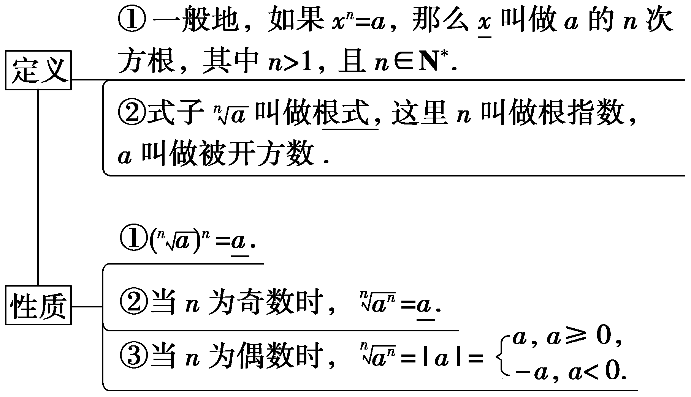

**第六节　指数与对数的运算**

【课标研读】　1.通过对有理数指数幂 $a^{\frac{m}{n}}$ (&lt;te&lt;te<em>x</em>t style="it&lt;text style="it<em>a</em>lic"&gt;a&lt;/text&gt;lic,superscript"&gt;x&lt;/text&gt;t style="it&lt;text style="it<em>a</em>lic"&gt;a&lt;/text&gt;lic"&gt;a&lt;/text&gt;＞0，且a≠1；<em>m</em>，<em>&lt;text style="italic"&gt;n</em>&lt;/text&gt;为整数，且n＞0)、实数指数幂ax(a＞0，且a≠1；x∈<strong>R</strong>)含义的认识，了解指数幂的拓展过程，掌握指数幂的运算性质.　2.理解对数的概念和运算性质，知道用换底公式能将一般对数转化成自然对数或常用对数；了解对数在简化运算中的作用.

1.根式与有理数指数幂

(1)根式

(2)有理数指数幂

<table><tr><td rowspan="3">
概

念
</td><td>
正分数指数幂： 
</td><td rowspan="3">
<em>a</em>＞0，<em>m</em>，<em>n</em>∈<strong>N</strong><em>*</em>，<em>n</em>＞1
</td></tr><tr><td>
负分数指数幂： 
</td></tr><tr><td>
0的正分数指数幂等于0，0的负分数指数幂没有意义
</td></tr><tr><td rowspan="3">
运

算

性

质
</td><td>
<em>aras</em>
</td><td rowspan="3">
<em>a</em>＞0，<em>b</em>＞0，<em>r</em>，<em>s</em>∈<strong>Q</strong>
</td></tr><tr><td>
(<em>ar</em>)<em>s</em>＝<em>ars</em>
</td></tr><tr><td>
(<em>ab</em>)<em>r</em>＝<em>arbr</em>
</td></tr></table>

2.对数

<table><tr><td>
概念
</td><td colspan="2">
如果<em>ax</em>＝<em>N</em>(<em>a</em>＞0，且<em>a</em>≠1)，那么数<em>x</em>叫做以<em>a</em>为底<em>N</em>的对数，记作<em>x</em>＝log<em>aN</em>，其中<em>a</em>叫做对数的底数，<em>N</em>叫做真数
</td></tr><tr><td rowspan="5">
性质
</td><td colspan="2">
对数式与指数式的互化：当<em>a</em>＞0，<em>a</em>≠1时，<em>ax</em>＝<em>N</em>⇔<em>x</em>＝log<em>aN</em>
</td></tr><tr><td colspan="2">
负数和0没有对数
</td></tr><tr><td colspan="2">
1的对数是0：log<em>a</em>1＝0
</td></tr><tr><td colspan="2">
底数的对数是1：log<em>aa</em>＝1
</td></tr><tr><td colspan="2">
对数恒等式：<em>N</em>
</td></tr><tr><td rowspan="3">
运算

性质
</td><td>
log<em>a</em>(<em>MN</em>)＝log<em>aM</em>＋log<em>aN</em>
</td><td rowspan="3">
<em>a</em>＞0，且<em>a</em>≠1，<em>M</em>＞0，<em>N</em>＞0
</td></tr><tr><td>
log<em>a</em>log<em>aM</em>－log<em>aN</em>
</td></tr><tr><td>
log<em>aMn</em>＝<em>n</em>log<em>aM</em>(<em>n</em>∈<strong>R</strong>)
</td></tr><tr><td>
换底

公式
</td><td colspan="2">
log<em>ab</em>(<em>a</em>＞0，且<em>a</em>≠1，<em>b</em>＞0，<em>c</em>＞0，且<em>c</em>≠1)
</td></tr></table>

【常用结论】

(1)换底公式的变形

①log&lt;text style="it&lt;text style="it&lt;text style="it<em>a</em>lic,su<em>&lt;text style="italic"&gt;b</em>&lt;/text&gt;script"&gt;a&lt;/text&gt;lic"&gt;a&lt;/text&gt;lic,su<em>b</em>script"&gt;a&lt;/text&gt;<em>b·</em>logba＝1，即logab $＝\frac{1}{log_{b}a}$ (&lt;text style="it&lt;text style="it&lt;text style="it<em>a</em>lic,su<em>&lt;text style="italic"&gt;b</em>&lt;/text&gt;script"&gt;a&lt;/text&gt;lic"&gt;a&lt;/text&gt;lic,su<em>b</em>script"&gt;a&lt;/text&gt;，b均大于0且不等于1)；

②lo $g_{a^{m}}$ &lt;text style="it&lt;text style="it<em>a</em>lic,su<em>&lt;text style="italic"&gt;b</em>&lt;/text&gt;script"&gt;a&lt;/text&gt;lic"&gt;b&lt;/text&gt;<em>&lt;text style="italic"&gt;n</em>&lt;/text&gt; $＝\frac{n}{m}log$ &lt;text style="it<em>a</em>lic,su<em>&lt;text style="italic"&gt;b</em>&lt;/text&gt;script"&gt;a&lt;/text&gt;<em>b</em>(a，b均大于0且不等于1，<em>m</em>≠0，<em>&lt;text style="italic"&gt;n</em>&lt;/text&gt;∈<strong>R</strong>).

(2)换底公式的推广

log<em>ab·</em>log<em>bc·</em>log<em>cd</em>＝log<em>ad</em>(<em>a</em>，<em>b</em>，<em>c</em>均大于0且不等于1，<em>d</em>＞0).

【自主检测】

1.(多选)下列等式成立的是(　　)

A.(－2 $)^{－}^{2}＝\frac{1}{4}$ 	B.2 $a^{－}^{3}＝\frac{1}{2a^{3}}$

C.(－2)0＝－1	D.( $a^{－\frac{1}{4}}$ )4 $＝\frac{1}{a}$

答案：**AD**

解析：对于A，(－2 $)^{－}^{2}＝\frac{1}{4}$ ，故A正确；对于B，2<em>a</em>－3 $＝\frac{2}{a^{3}}$ ，故B错误；对于C，(－2)0＝1，故C错误；对于D，( $a^{－\frac{1}{4}}$ )4 $＝\frac{1}{a}$ ，故D正确.故选AD.

2.(链接人教A必修一P106例3)化简 $\sqrt[4]{16x^{8}y^{4}}$ (<text st*y*le="italic">x</text>＜0，y＜0)＝(　　)

A.2<em>x</em>2<em>y</em>	B.－2<em>x</em>2<em>y</em>

C.2<em>xy</em>2	D.－2<em>xy</em>2

答案：**B**

解析：因为&lt;te&lt;te&lt;te&lt;te&lt;text st<em>y</em>le="italic"&gt;x&lt;/text&gt;t st<em>y</em>le="italic"&gt;x&lt;/text&gt;t st<em>y</em>le="italic"&gt;x&lt;/text&gt;t style="italic"&gt;x&lt;/text&gt;t st<em>y</em>le="italic"&gt;x&lt;/text&gt;＜0，y＜0，所以 $\sqrt[4]{16x^{8}y^{4}}＝$ (16&lt;te&lt;te&lt;te&lt;te&lt;text st<em>y</em>le="italic"&gt;x&lt;/text&gt;t st<em>y</em>le="italic"&gt;x&lt;/text&gt;t st<em>y</em>le="italic"&gt;x&lt;/text&gt;t style="italic"&gt;x&lt;/text&gt;t st<em>y</em>le="italic"&gt;x&lt;/text&gt;&lt;text style="superscript"&gt;8&lt;/text&gt;<em>&lt;text style="italic"&gt;&lt;text style="italic"&gt;·</em>&lt;/text&gt;y&lt;/text&gt;&lt;text style="superscript"&gt;4&lt;/text&gt; $)^{\frac{1}{4}}＝$ (16 $)^{\frac{1}{4}}$ &lt;te&lt;te&lt;te&lt;text st<em>y</em>le="italic"&gt;x&lt;/text&gt;t st<em>y</em>le="italic"&gt;x&lt;/text&gt;t st<em>y</em>le="italic"&gt;x&lt;/text&gt;t style="italic"&gt;<em>·</em>&lt;/text&gt;(&lt;te<em>x</em>t st<em>y</em>le="italic"&gt;x&lt;/text&gt;&lt;text style="superscript"&gt;8&lt;/text&gt; $)^{\frac{1}{4}}$ &lt;te&lt;te&lt;te&lt;text st<em>y</em>le="italic"&gt;x&lt;/text&gt;t st<em>y</em>le="italic"&gt;x&lt;/text&gt;t st<em>y</em>le="italic"&gt;x&lt;/text&gt;t style="italic"&gt;<em>·</em>&lt;/text&gt;(&lt;te<em>x</em>t style="italic"&gt;y&lt;/text&gt;&lt;text style="superscript"&gt;4&lt;/text&gt; $)^{\frac{1}{4}}＝$ &lt;te&lt;text st<em>y</em>le="italic"&gt;x&lt;/text&gt;t st<em>y</em>le="superscript"&gt;2&lt;/text&gt;&lt;te&lt;te&lt;te<em>x</em>t st<em>y</em>le="italic"&gt;x&lt;/text&gt;t style="italic"&gt;x&lt;/text&gt;t st<em>y</em>le="italic"&gt;x&lt;/text&gt;2｜y｜＝－2x2y.故选B.

3.(链接人教A必修一P126练习T3)log23·log34·log42＝<u>　　　　</u>.

答案：1

解析：log23<em>·</em>log34<em>·</em>log42＝log22＝1.

4.计算：(1)lg $\sqrt{2}$ ＋lg $\sqrt{5}＝$ <u>　　　　</u>；

(2)log345－log35＝<u>　　　　</u>；

(3)( $\frac{1}{7})^{－}^{2}$ ＋(2 $\frac{7}{9})^{\frac{1}{2}}$ －( $\sqrt{2}$ －1)0＝<u>　　　　</u>.

答案：(1) $\frac{1}{2}$ 　 (2)2　(3)49 $\frac{2}{3}$

解析：(1)lg $\sqrt{2}$ ＋lg $\sqrt{5}＝$ lg( $\sqrt{2}$ × $\sqrt{5}$ )＝lg $\sqrt{10}＝$ lg 1 $0^{\frac{1}{2}}＝\frac{1}{2}$ .

(2)log&lt;text style="subscript"&gt;&lt;text style="subscript"&gt;&lt;text style="subscript"&gt;3&lt;/text&gt;&lt;/text&gt;&lt;/text&gt;45－log35＝log3 $\frac{45}{5}＝$ log&lt;text style="subscript"&gt;&lt;text style="subscript"&gt;&lt;text style="subscript"&gt;3&lt;/text&gt;&lt;/text&gt;&lt;/text&gt;9＝log332＝2.

(3)( $\frac{1}{7}$ )－&lt;text style="superscript"&gt;2&lt;/text&gt;＋(2 $\frac{7}{9})^{\frac{1}{2}}$ －( $\sqrt{2}$ －1)0＝72＋( $\frac{25}{9})^{\frac{1}{2}}$ －1＝49＋ $\frac{5}{3}$ －1＝49 $\frac{2}{3}$ .

考点一　指数幂的运算 　　　　自主练透

1.化简下列各式：

(1)(2 $\frac{3}{5}$ )0＋2－2×(2 $\frac{1}{4})^{－\frac{1}{2}}$ －(0.01)0.5；

(2) $\frac{a^{\frac{2}{3}}\sqrt{b}}{a^{－\frac{1}{2}}\cdot \sqrt[3]{b}}$ ÷( $\frac{a^{－1}\sqrt{b^{－1}}}{b\sqrt{a}})^{－\frac{2}{3}}$ (*a*＞0，*b*＞0)；

(3)( $\frac{3}{2})^{－\frac{1}{3}}$ ×(－ $\frac{7}{6}$ )0＋ $8^{\frac{1}{4}}$ × $\sqrt[4]{2}$ － $\sqrt{(－\frac{2}{3})^{\frac{2}{3}}}$ .

解：(1)原式＝1＋ $\frac{1}{4}$ ×( $\frac{4}{9})^{\frac{1}{2}}$ －( $\frac{1}{100})^{\frac{1}{2}}＝$ 1＋ $\frac{1}{4}$ × $\frac{2}{3}$ － $\frac{1}{10}＝$ 1＋ $\frac{1}{6}$ － $\frac{1}{10}＝\frac{16}{15}$ .

(2)原式 $＝\frac{a^{\frac{2}{3}}\cdot b^{\frac{1}{2}}}{a^{－\frac{1}{2}}\cdot b^{\frac{1}{3}}}$ ÷( $\frac{a^{－1}b^{－\frac{1}{2}}}{b\cdot a^{\frac{1}{2}}})^{－\frac{2}{3}}＝\frac{a^{\frac{2}{3}}\cdot b^{\frac{1}{2}}}{a^{－\frac{1}{2}}\cdot b^{\frac{1}{3}}}$ ÷( $a^{－1－\frac{1}{2}}b^{－\frac{1}{2}－1})^{－\frac{2}{3}}$

$＝a^{\frac{2}{3}＋\frac{1}{2}}b^{\frac{1}{2}－\frac{1}{3}}$ ÷( $a^{－\frac{3}{2}}b^{－\frac{3}{2}})^{－\frac{2}{3}}＝a^{\frac{7}{6}}b^{\frac{1}{6}}$ ÷(*ab*)

$＝a^{\frac{7}{6}－1}b^{\frac{1}{6}－1}＝a^{\frac{1}{6}}b^{－\frac{5}{6}}$ .

(3)原式＝( $\frac{2}{3})^{\frac{1}{3}}$ ×1＋ $2^{\frac{3}{4}}$ × $2^{\frac{1}{4}}$ －( $\frac{2}{3})^{\frac{1}{3}}＝$ 2.

2.已知<em>f</em>(<em>x</em>)＝2<em>x</em>＋2－<em>x</em>，若<em>f</em>(<em>a</em>)＝3，求<em>f</em>(2<em>a</em>)的值.

解：由&lt;text style="it&lt;text style="it<em>a</em>lic"&gt;a&lt;/text&gt;lic"&gt;f&lt;/text&gt;(a)＝3得2a＋ $2^{－}^{a}＝$ 3，

所以(2<em>a</em>＋2－<em>a</em>)2＝9，

即22<em>a</em>＋2－2<em>a</em>＋2＝9.所以22<em>a</em>＋2－2<em>a</em>＝7，

故<em>f</em>(2<em>a</em>)＝22<em>a</em>＋2－2<em>a</em>＝7.

1.指数幂的运算首先将根式、分数指数幂统一为分数指数幂，以便利用法则计算.

2.当底数是负数时，先确定运算结果的符号，再把底数化为正数.

3.运算结果不能同时含有根号和分数指数，也不能既有分母又含有负指数.

考点二　对数的运算　　　　　多维探究

角度1　对数式的化简与计算

计算下列各式：

(1)log225·log3(2 $\sqrt{2}$ )·log59；

(2) $\frac{lg2+lg5－lg8}{lg50－lg40}$ ；

(3)log23·log38＋( $\sqrt{3})^{log_{3}4}$ .

解：(1)法一：log&lt;text style="subscript"&gt;&lt;text style="superscript"&gt;&lt;text style="superscript"&gt;&lt;text style="subscript"&gt;2&lt;/text&gt;&lt;/text&gt;&lt;/text&gt;&lt;/text&gt;2&lt;text style="subscript"&gt;&lt;text style="subscript"&gt;5&lt;/text&gt;&lt;/text&gt;<em>&lt;text style="italic"&gt;&lt;text style="italic"&gt;&lt;text style="italic"&gt;&lt;text style="italic"&gt;&lt;text style="italic"&gt;·</em>&lt;/text&gt;&lt;/text&gt;&lt;/text&gt;&lt;/text&gt;&lt;/text&gt;log&lt;text style="subscript"&gt;&lt;text style="subscript"&gt;3&lt;/text&gt;&lt;/text&gt;(2 $\sqrt{2}$ )<em>&lt;text style="italic"&gt;&lt;text style="italic"&gt;&lt;text style="italic"&gt;&lt;text style="italic"&gt;&lt;text style="italic"&gt;·</em>&lt;/text&gt;&lt;/text&gt;&lt;/text&gt;&lt;/text&gt;&lt;/text&gt;log&lt;text style="subscript"&gt;&lt;text style="subscript"&gt;5&lt;/text&gt;&lt;/text&gt;9＝log&lt;text style="subscript"&gt;&lt;text style="superscript"&gt;&lt;text style="superscript"&gt;&lt;text style="subscript"&gt;2&lt;/text&gt;&lt;/text&gt;&lt;/text&gt;&lt;/text&gt;52·log&lt;text style="subscript"&gt;&lt;text style="subscript"&gt;3&lt;/text&gt;&lt;/text&gt; $2^{\frac{3}{2}}$ <em>&lt;text style="italic"&gt;&lt;text style="italic"&gt;&lt;text style="italic"&gt;&lt;text style="italic"&gt;&lt;text style="italic"&gt;·</em>&lt;/text&gt;&lt;/text&gt;&lt;/text&gt;&lt;/text&gt;&lt;/text&gt;log&lt;text style="subscript"&gt;&lt;text style="subscript"&gt;5&lt;/text&gt;&lt;/text&gt;&lt;text style="subscript"&gt;&lt;text style="subscript"&gt;3&lt;/text&gt;&lt;/text&gt;&lt;text style="subscript"&gt;&lt;text style="superscript"&gt;&lt;text style="superscript"&gt;&lt;text style="subscript"&gt;2&lt;/text&gt;&lt;/text&gt;&lt;/text&gt;&lt;/text&gt;＝6log25·log32·log53＝6.

法二：log225<em>&lt;text style="italic"&gt;&lt;text style="italic"&gt;·</em>&lt;/text&gt;&lt;/text&gt;log3(2 $\sqrt{2}$ )<em>&lt;text style="italic"&gt;&lt;text style="italic"&gt;·</em>&lt;/text&gt;&lt;/text&gt;log59 $＝\frac{lg25}{lg2}$ <em>&lt;text style="italic"&gt;&lt;text style="italic"&gt;·</em>&lt;/text&gt;&lt;/text&gt; $\frac{lg(2\sqrt{2})}{lg3}$ <em>&lt;text style="italic"&gt;&lt;text style="italic"&gt;·</em>&lt;/text&gt;&lt;/text&gt; $\frac{lg9}{lg5}＝\frac{lg 5^{2}}{lg2}$ <em>&lt;text style="italic"&gt;&lt;text style="italic"&gt;·</em>&lt;/text&gt;&lt;/text&gt; $\frac{lg 2^{\frac{3}{2}}}{lg3}$ <em>&lt;text style="italic"&gt;&lt;text style="italic"&gt;·</em>&lt;/text&gt;&lt;/text&gt; $\frac{lg 3^{2}}{lg5}＝$ 6.

(2)原式 $＝\frac{lg \frac{2\times 5}{8}}{lg \frac{50}{40}}＝\frac{lg \frac{5}{4}}{lg \frac{5}{4}}＝$ 1.

(3)原式 $＝\frac{lg3}{lg2}$ · $\frac{3lg2}{lg3}$ ＋ $3^{\frac{1}{2}log_{3}4}＝$ 3＋ $3^{log_{3}2}＝$ 3＋2＝5.

角度2　指数式与对数式的综合运算

(1)已知log&lt;text style="it<em>a</em>lic,subscript"&gt;a&lt;/text&gt; $\frac{1}{2}＝$ &lt;text style="it<em>a</em>lic"&gt;m&lt;/text&gt;，log<em>a</em>3＝<em>n</em>，则 $a^{m}^{+2}^{n}＝$ (　　)

A.3	B. $\frac{3}{4}$

C.9	D. $\frac{9}{2}$

(2)设2<em>a</em>＝5<em>b</em>＝<em>&lt;text style="italic"&gt;m</em>&lt;/text&gt;，且 $\frac{1}{a}$ ＋ $\frac{1}{b}＝$ 2，则<em>&lt;text style="italic"&gt;m</em>&lt;/text&gt;＝(　　)

A. $\sqrt{10}$ 	B.10

C.20	D.100

答案：(1)**D**　(2)**A**

解析：(1)因为log&lt;text style="it&lt;text style="it&lt;text style="it&lt;text style="it&lt;text style="it&lt;text style="it<em>a</em>lic"&gt;a&lt;/text&gt;lic"&gt;a&lt;/text&gt;lic"&gt;a&lt;/text&gt;lic"&gt;a&lt;/text&gt;lic,subscript"&gt;a&lt;/text&gt;lic,subscript"&gt;a&lt;/text&gt; $\frac{1}{2}＝$ &lt;text style="it&lt;text style="it&lt;text style="it&lt;text style="it&lt;text style="it&lt;text style="it<em>a</em>lic"&gt;a&lt;/text&gt;lic"&gt;a&lt;/text&gt;lic"&gt;a&lt;/text&gt;lic"&gt;a&lt;/text&gt;lic,subscript"&gt;a&lt;/text&gt;lic"&gt;<em>&lt;text style="italic,superscript"&gt;&lt;text style="italic,superscript"&gt;m</em>&lt;/text&gt;&lt;/text&gt;&lt;/text&gt;，log<em>a</em>3＝<em>&lt;text style="italic,superscript"&gt;&lt;text style="italic,superscript"&gt;n</em>&lt;/text&gt;&lt;/text&gt;，所以am $＝\frac{1}{2}$ ，&lt;text style="it&lt;text style="it&lt;text style="it&lt;text style="it&lt;text style="it&lt;text style="it<em>a</em>lic"&gt;a&lt;/text&gt;lic"&gt;a&lt;/text&gt;lic"&gt;a&lt;/text&gt;lic"&gt;a&lt;/text&gt;lic,subscript"&gt;a&lt;/text&gt;lic,subscript"&gt;a&lt;/text&gt;<em>&lt;text style="italic,superscript"&gt;&lt;text style="italic,superscript"&gt;n</em>&lt;/text&gt;&lt;/text&gt;＝3.所以 $a^{m}^{+2}^{n}＝$ &lt;text style="it&lt;text style="it&lt;text style="it&lt;text style="it&lt;text style="it&lt;text style="it<em>a</em>lic"&gt;a&lt;/text&gt;lic"&gt;a&lt;/text&gt;lic"&gt;a&lt;/text&gt;lic"&gt;a&lt;/text&gt;lic,subscript"&gt;a&lt;/text&gt;lic,subscript"&gt;a&lt;/text&gt;<em>&lt;text style="italic,superscript"&gt;&lt;text style="italic,superscript"&gt;&lt;text style="italic,superscript"&gt;m</em>&lt;/text&gt;&lt;/text&gt;&lt;/text&gt;<em>&lt;text style="italic"&gt;·</em>&lt;/text&gt; $a^{2}^{n}＝$ &lt;text style="it&lt;text style="it&lt;text style="it&lt;text style="it&lt;text style="it&lt;text style="it<em>a</em>lic"&gt;a&lt;/text&gt;lic"&gt;a&lt;/text&gt;lic"&gt;a&lt;/text&gt;lic"&gt;a&lt;/text&gt;lic,subscript"&gt;a&lt;/text&gt;lic,subscript"&gt;a&lt;/text&gt;<em>&lt;text style="italic,superscript"&gt;&lt;text style="italic,superscript"&gt;&lt;text style="italic,superscript"&gt;m</em>&lt;/text&gt;&lt;/text&gt;&lt;/text&gt;<em>&lt;text style="italic"&gt;·</em>&lt;/text&gt;(a<em>&lt;text style="italic,superscript"&gt;&lt;text style="italic,superscript"&gt;n</em>&lt;/text&gt;&lt;/text&gt;)&lt;text style="superscript"&gt;2&lt;/text&gt; $＝\frac{1}{2}$ ×3&lt;text style="superscript"&gt;2&lt;/text&gt; $＝\frac{9}{2}$ .故选D.

(&lt;text style="su<em>b</em>script"&gt;2&lt;/text&gt;)因为2&lt;text style="it<em>a</em>lic,superscript"&gt;a&lt;/text&gt;＝5<em>b</em>＝<em>&lt;text style="italic"&gt;&lt;text style="italic"&gt;&lt;text style="italic,subscript"&gt;&lt;text style="italic,subscript"&gt;&lt;text style="italic,subscript"&gt;&lt;text style="italic"&gt;&lt;text style="italic"&gt;&lt;text style="italic"&gt;m</em>&lt;/text&gt;&lt;/text&gt;&lt;/text&gt;&lt;/text&gt;&lt;/text&gt;&lt;/text&gt;&lt;/text&gt;&lt;/text&gt;，所以log2m＝a，log5m＝b，所以 $\frac{1}{a}$ ＋ $\frac{1}{b}＝\frac{1}{log_{2}m}$ ＋ $\frac{1}{log_{5}m}＝$ log&lt;text style="it<em>a</em>lic"&gt;<em>&lt;text style="italic"&gt;&lt;text style="italic,subscript"&gt;&lt;text style="italic,subscript"&gt;&lt;text style="italic,subscript"&gt;&lt;text style="italic"&gt;&lt;text style="italic"&gt;&lt;text style="italic"&gt;m</em>&lt;/text&gt;&lt;/text&gt;&lt;/text&gt;&lt;/text&gt;&lt;/text&gt;&lt;/text&gt;&lt;/text&gt;&lt;/text&gt;&lt;text style="su<em>b</em>script"&gt;2&lt;/text&gt;＋logm5＝logm10＝2，所以m2＝10，所以m $＝\sqrt{10}$ (舍&lt;text style="it<em>a</em>lic"&gt;<em>&lt;text style="italic"&gt;&lt;text style="italic,subscript"&gt;&lt;text style="italic,subscript"&gt;&lt;text style="italic,subscript"&gt;&lt;text style="italic"&gt;&lt;text style="italic"&gt;&lt;text style="italic"&gt;m</em>&lt;/text&gt;&lt;/text&gt;&lt;/text&gt;&lt;/text&gt;&lt;/text&gt;&lt;/text&gt;&lt;/text&gt;&lt;/text&gt;＝－ $\sqrt{10}$ ).故选A.

1.对数运算的一般思路

(1)拆：首先利用幂的运算把底数或真数进行变形，化成分数指数幂的形式，使幂的底数最简，然后利用对数运算性质化简合并.

(2)合：将对数式化为同底数的和、差、倍数运算，然后逆用对数的运算性质，转化为同底对数真数的积、商、幂的运算.

2.指对互化的转化技巧

对于将指数恒等式<em>ax</em>＝<em>by</em>＝<em>cz</em>作为已知条件，求函数<em>f</em>(<em>x</em>，<em>y</em>，<em>z</em>)的值的问题，通常设<em>ax</em>＝<em>by</em>＝<em>cz</em>＝<em>k</em>(<em>k</em>＞0)，则<em>x</em>＝log<em>ak</em>，<em>y</em>＝log<em>bk</em>，<em>z</em>＝log<em>ck</em>，将<em>x</em>，<em>y</em>，<em>z</em>的值代入函数<em>f</em>(<em>x</em>，<em>y</em>，<em>z</em>)求解.

对点练1.(2025·八省适应性测试)已知函数<em>f</em>(<em>x</em>)＝<em>ax</em>(<em>a</em>＞0，<em>a</em>≠1)，若<em>f</em>(ln 2)<em>f</em>(ln 4)＝8，则<em>a</em>＝<u>　　　　</u>.

答案：e

解析：由&lt;text style="it&lt;text style="it&lt;text style="it&lt;text style="it&lt;text style="it&lt;text style="it&lt;text style="it&lt;text style="it<em>a</em>lic"&gt;a&lt;/text&gt;lic"&gt;a&lt;/text&gt;lic"&gt;a&lt;/text&gt;lic"&gt;a&lt;/text&gt;lic"&gt;a&lt;/text&gt;lic"&gt;a&lt;/text&gt;lic"&gt;a&lt;/text&gt;lic"&gt;<em>f</em>&lt;/text&gt; $\left(ln2\right)$ &lt;text style="it&lt;text style="it&lt;text style="it&lt;text style="it&lt;text style="it&lt;text style="it&lt;text style="it&lt;text style="it<em>a</em>lic"&gt;a&lt;/text&gt;lic"&gt;a&lt;/text&gt;lic"&gt;a&lt;/text&gt;lic"&gt;a&lt;/text&gt;lic"&gt;a&lt;/text&gt;lic"&gt;a&lt;/text&gt;lic"&gt;a&lt;/text&gt;lic"&gt;<em>f</em>&lt;/text&gt; $\left(ln4\right)＝$ 8，可得&lt;text style="it&lt;text style="it&lt;text style="it&lt;text style="it&lt;text style="it&lt;text style="it&lt;text style="it<em>a</em>lic"&gt;a&lt;/text&gt;lic"&gt;a&lt;/text&gt;lic"&gt;a&lt;/text&gt;lic"&gt;a&lt;/text&gt;lic"&gt;a&lt;/text&gt;lic"&gt;a&lt;/text&gt;lic"&gt;a&lt;/text&gt;&lt;text style="superscript"&gt;ln 2&lt;/text&gt;<em>·a</em>ln 4＝8，即aln 2＋ln 4＝a&lt;text style="superscript"&gt;3ln 2&lt;/text&gt;＝8，也即 $\left(a^{ln2}\right)^{3}＝$ 23，因为&lt;text style="it&lt;text style="it&lt;text style="it&lt;text style="it&lt;text style="it&lt;text style="it&lt;text style="it<em>a</em>lic"&gt;a&lt;/text&gt;lic"&gt;a&lt;/text&gt;lic"&gt;a&lt;/text&gt;lic"&gt;a&lt;/text&gt;lic"&gt;a&lt;/text&gt;lic"&gt;a&lt;/text&gt;lic"&gt;a&lt;/text&gt;＞0且a≠1，所以a&lt;text style="superscript"&gt;ln 2&lt;/text&gt;＝2，两边取对数得ln 2·ln a＝ln 2，解得a＝e.

对点练2.计算：(1)log&lt;text style="subscript"&gt;&lt;text style="subscript"&gt;5&lt;/text&gt;&lt;/text&gt;35＋2lo $g_{\frac{1}{2}}\sqrt{2}$ －log&lt;text style="subscript"&gt;&lt;text style="subscript"&gt;5&lt;/text&gt;&lt;/text&gt; $\frac{1}{50}$ －log&lt;text style="subscript"&gt;&lt;text style="subscript"&gt;5&lt;/text&gt;&lt;/text&gt;14；

(2)( $\frac{8}{27})^{－\frac{2}{3}}$ ＋eln &lt;text style="subscript"&gt;3&lt;/text&gt;＋lo $g_{\frac{1}{4}}\sqrt{2}$ －log34·log23.

解：(1)原式＝log&lt;text style="subscript"&gt;&lt;text style="subscript"&gt;&lt;text style="subscript"&gt;&lt;text style="subscript"&gt;&lt;text style="subscript"&gt;5&lt;/text&gt;&lt;/text&gt;&lt;/text&gt;&lt;/text&gt;&lt;/text&gt;35－log5 $\frac{1}{50}$ －log&lt;text style="subscript"&gt;&lt;text style="subscript"&gt;&lt;text style="subscript"&gt;&lt;text style="subscript"&gt;&lt;text style="subscript"&gt;5&lt;/text&gt;&lt;/text&gt;&lt;/text&gt;&lt;/text&gt;&lt;/text&gt;14＋lo $g_{\frac{1}{2}}(\sqrt{2}$ )2＝log&lt;text style="subscript"&gt;&lt;text style="subscript"&gt;&lt;text style="subscript"&gt;&lt;text style="subscript"&gt;&lt;text style="subscript"&gt;5&lt;/text&gt;&lt;/text&gt;&lt;/text&gt;&lt;/text&gt;&lt;/text&gt; $\frac{35}{\frac{1}{50}\times 14}$ ＋lo $g_{\frac{1}{2}}$ 2＝log&lt;text style="subscript"&gt;&lt;text style="subscript"&gt;&lt;text style="subscript"&gt;&lt;text style="subscript"&gt;&lt;text style="subscript"&gt;5&lt;/text&gt;&lt;/text&gt;&lt;/text&gt;&lt;/text&gt;&lt;/text&gt;125－1＝log553－1＝3－1＝2.

(&lt;text style="subscript"&gt;2&lt;/text&gt;)原式＝( $\frac{2}{3})^{3\times \left(－\frac{2}{3}\right)}$ ＋3－ $\frac{1}{2}log$ &lt;text style="subscript"&gt;2&lt;/text&gt; $\left(2^{\frac{1}{2}}\right)$ －&lt;text style="subscript"&gt;2&lt;/text&gt;log32<em>·</em>log23 $＝\frac{9}{4}$ ＋3－ $\frac{1}{4}$ －&lt;text style="subscript"&gt;2&lt;/text&gt;＝3.

考点三　指数与对数运算的实际应用　　　　师生共研

(1)(2024·北京卷)生物丰富度指数 <em>&lt;text style="italic"&gt;d</em>&lt;/text&gt; $＝\frac{S－1}{lnN}$ 是河流水质的一个评价指标，其中<em>&lt;text style="italic"&gt;S</em>&lt;/text&gt;，<em>&lt;text style="italic"&gt;&lt;text style="italic"&gt;N</em>&lt;/text&gt;&lt;/text&gt;分别表示河流中的生物种类数与生物个体总数.生物丰富度指数<em>&lt;text style="italic"&gt;d</em>&lt;/text&gt;越大，水质越好.如果某河流治理前后的生物种类数S没有变化，生物个体总数由N1变为N2，生物丰富度指数由2.1提高到3.15，则(　　)

A.3<em>N</em>2＝2<em>N</em>1	B.2<em>N</em>2＝3<em>N</em>1

C. $N_{2}^{2}＝N_{1}^{3}$ 	D. $N_{2}^{3}＝N_{1}^{2}$

(2)(多选)(2&lt;text style="subscript"&gt;0&lt;/text&gt;25·湖南长沙模拟)氚，亦称超重氢，是氢的同位素之一，它的原子核由一个质子和两个中子组成，并带有放射性，会发生β衰变，其半衰期约是12.43年.样本中氚的质量&lt;<em>t</em>ext style="italic"&gt;<em>&lt;text style="italic"&gt;&lt;text style="italic"&gt;N</em>&lt;/text&gt;&lt;/text&gt;&lt;/text&gt;随时间t(单位：年)的衰变规律满足N＝N0· $2^{－\frac{t}{12.43}}$ ，其中&lt;<em>t</em>ext style="italic"&gt;<em>&lt;text style="italic"&gt;&lt;text style="italic"&gt;N</em>&lt;/text&gt;&lt;/text&gt;&lt;/text&gt;&lt;text style="subscript"&gt;0&lt;/text&gt;表示氚原有的质量，则(参考数据：lg 2≈0.301)(　　)

A.<em>t</em>＝12.43log2 $\frac{N}{N_{0}}$

B.经过24.86年后，样本中的氚元素会全部消失

C.经过62.15年后，样本中的氚元素变为原来的 $\frac{1}{32}$

D.若<em>x</em>年后，样本中氚元素的含量为0.4<em>N</em>0，则<em>x</em>＞16

答案：(1)**D**　(2)**CD**

解析：(&lt;text style="subscript"&gt;1&lt;/text&gt;)由题意得 $\frac{S－1}{ln N_{1}}＝$ &lt;text style="subscript"&gt;2&lt;/text&gt;.&lt;text style="subscript"&gt;1&lt;/text&gt;， $\frac{S－1}{ln N_{2}}＝$ 3.&lt;text style="subscript"&gt;1&lt;/text&gt;5，则&lt;text style="subscript"&gt;2&lt;/text&gt;.1ln <em>&lt;text style="italic"&gt;&lt;text style="italic"&gt;&lt;text style="italic"&gt;N</em>&lt;/text&gt;&lt;/text&gt;&lt;/text&gt;1＝3.15ln N2，即2ln N1＝3ln N2，所以 $N_{2}^{3}＝N_{1}^{2}$ .故选D.

(&lt;&lt;&lt;&lt;te&lt;te<em>x</em>t style="italic"&gt;x&lt;/text&gt;t style="italic"&gt;t&lt;/text&gt;ext style="italic"&gt;t&lt;/text&gt;ext style="italic"&gt;t&lt;/text&gt;ext style="subscript"&gt;&lt;text style="subscript"&gt;&lt;text style="subscript"&gt;&lt;text style="subscript"&gt;&lt;text style="subscript"&gt;&lt;text style="subscript"&gt;2&lt;/text&gt;&lt;/text&gt;&lt;/text&gt;&lt;/text&gt;&lt;/text&gt;&lt;/text&gt;)由题意得<em>&lt;text style="italic"&gt;&lt;text style="italic"&gt;&lt;text style="italic"&gt;&lt;text style="italic"&gt;&lt;text style="italic"&gt;&lt;text style="italic"&gt;&lt;text style="italic"&gt;&lt;text style="italic"&gt;&lt;text style="italic"&gt;N</em>&lt;/text&gt;&lt;/text&gt;&lt;/text&gt;&lt;/text&gt;&lt;/text&gt;&lt;/text&gt;&lt;/text&gt;&lt;/text&gt;&lt;/text&gt;＝N&lt;text style="subscript"&gt;&lt;text style="subscript"&gt;&lt;text style="subscript"&gt;&lt;text style="subscript"&gt;&lt;text style="subscript"&gt;&lt;text style="subscript"&gt;&lt;text style="subscript"&gt;&lt;text style="subscript"&gt;0&lt;/text&gt;&lt;/text&gt;&lt;/text&gt;&lt;/text&gt;&lt;/text&gt;&lt;/text&gt;&lt;/text&gt;&lt;/text&gt;<em>·</em> $2^{－\frac{t}{12.43}}$ ，故有 $\frac{N}{N_{0}}＝2^{－\frac{t}{12.43}}$ ，左右同时取对数得log&lt;&lt;&lt;&lt;te&lt;te<em>x</em>t style="italic"&gt;x&lt;/text&gt;t style="italic"&gt;t&lt;/text&gt;ext style="italic"&gt;t&lt;/text&gt;ext style="italic"&gt;t&lt;/text&gt;ext style="subscript"&gt;&lt;text style="subscript"&gt;&lt;text style="subscript"&gt;&lt;text style="subscript"&gt;&lt;text style="subscript"&gt;&lt;text style="subscript"&gt;2&lt;/text&gt;&lt;/text&gt;&lt;/text&gt;&lt;/text&gt;&lt;/text&gt;&lt;/text&gt; $\frac{N}{N_{0}}＝$ － $\frac{t}{12.43}$ ，故得&lt;&lt;&lt;te&lt;te<em>x</em>t style="italic"&gt;x&lt;/text&gt;t style="italic"&gt;t&lt;/text&gt;ext style="italic"&gt;t&lt;/text&gt;ext style="italic"&gt;t&lt;/text&gt;＝－1&lt;text style="subscript"&gt;&lt;text style="subscript"&gt;&lt;text style="subscript"&gt;&lt;text style="subscript"&gt;&lt;text style="subscript"&gt;&lt;text style="subscript"&gt;2&lt;/text&gt;&lt;/text&gt;&lt;/text&gt;&lt;/text&gt;&lt;/text&gt;&lt;/text&gt;.43log2 $\frac{N}{N_{0}}$ ，故A错误；当&lt;&lt;&lt;te&lt;te<em>x</em>t style="italic"&gt;x&lt;/text&gt;t style="italic"&gt;t&lt;/text&gt;ext style="italic"&gt;t&lt;/text&gt;ext style="italic"&gt;t&lt;/text&gt;＝&lt;text style="subscript"&gt;&lt;text style="subscript"&gt;&lt;text style="subscript"&gt;&lt;text style="subscript"&gt;&lt;text style="subscript"&gt;&lt;text style="subscript"&gt;2&lt;/text&gt;&lt;/text&gt;&lt;/text&gt;&lt;/text&gt;&lt;/text&gt;&lt;/text&gt;4.86时，<em>&lt;text style="italic"&gt;&lt;text style="italic"&gt;&lt;text style="italic"&gt;&lt;text style="italic"&gt;&lt;text style="italic"&gt;&lt;text style="italic"&gt;&lt;text style="italic"&gt;&lt;text style="italic"&gt;&lt;text style="italic"&gt;N</em>&lt;/text&gt;&lt;/text&gt;&lt;/text&gt;&lt;/text&gt;&lt;/text&gt;&lt;/text&gt;&lt;/text&gt;&lt;/text&gt;&lt;/text&gt;＝N&lt;text style="subscript"&gt;&lt;text style="subscript"&gt;&lt;text style="subscript"&gt;&lt;text style="subscript"&gt;&lt;text style="subscript"&gt;&lt;text style="subscript"&gt;&lt;text style="subscript"&gt;&lt;text style="subscript"&gt;0&lt;/text&gt;&lt;/text&gt;&lt;/text&gt;&lt;/text&gt;&lt;/text&gt;&lt;/text&gt;&lt;/text&gt;&lt;/text&gt;<em>·</em> $2^{－\frac{24.86}{12.43}}＝$ &lt;&lt;&lt;&lt;te&lt;te<em>x</em>t style="italic"&gt;x&lt;/text&gt;t style="italic"&gt;t&lt;/text&gt;ext style="italic"&gt;t&lt;/text&gt;ext style="italic"&gt;t&lt;/text&gt;ext style="subscript"&gt;&lt;text style="subscript"&gt;&lt;text style="subscript"&gt;&lt;text style="subscript"&gt;&lt;text style="subscript"&gt;&lt;text style="subscript"&gt;2&lt;/text&gt;&lt;/text&gt;&lt;/text&gt;&lt;/text&gt;&lt;/text&gt;&lt;/text&gt;－2<em>·&lt;text style="italic"&gt;&lt;text style="italic"&gt;&lt;text style="italic"&gt;&lt;text style="italic"&gt;&lt;text style="italic"&gt;&lt;text style="italic"&gt;&lt;text style="italic"&gt;&lt;text style="italic"&gt;&lt;text style="italic"&gt;N</em>&lt;/text&gt;&lt;/text&gt;&lt;/text&gt;&lt;/text&gt;&lt;/text&gt;&lt;/text&gt;&lt;/text&gt;&lt;/text&gt;&lt;/text&gt;&lt;text style="subscript"&gt;&lt;text style="subscript"&gt;&lt;text style="subscript"&gt;&lt;text style="subscript"&gt;&lt;text style="subscript"&gt;&lt;text style="subscript"&gt;&lt;text style="subscript"&gt;&lt;text style="subscript"&gt;0&lt;/text&gt;&lt;/text&gt;&lt;/text&gt;&lt;/text&gt;&lt;/text&gt;&lt;/text&gt;&lt;/text&gt;&lt;/text&gt; $＝\frac{1}{4}$ &lt;&lt;&lt;&lt;te&lt;te<em>x</em>t style="italic"&gt;x&lt;/text&gt;t style="italic"&gt;t&lt;/text&gt;ext style="italic"&gt;t&lt;/text&gt;ext style="italic"&gt;t&lt;/text&gt;ext style="italic"&gt;<em>&lt;text style="italic"&gt;&lt;text style="italic"&gt;&lt;text style="italic"&gt;&lt;text style="italic"&gt;&lt;text style="italic"&gt;&lt;text style="italic"&gt;&lt;text style="italic"&gt;&lt;text style="italic"&gt;N</em>&lt;/text&gt;&lt;/text&gt;&lt;/text&gt;&lt;/text&gt;&lt;/text&gt;&lt;/text&gt;&lt;/text&gt;&lt;/text&gt;&lt;/text&gt;&lt;text style="subscript"&gt;&lt;text style="subscript"&gt;&lt;text style="subscript"&gt;&lt;text style="subscript"&gt;&lt;text style="subscript"&gt;&lt;text style="subscript"&gt;&lt;text style="subscript"&gt;&lt;text style="subscript"&gt;0&lt;/text&gt;&lt;/text&gt;&lt;/text&gt;&lt;/text&gt;&lt;/text&gt;&lt;/text&gt;&lt;/text&gt;&lt;/text&gt;，故B错误；而当t＝6&lt;text style="subscript"&gt;&lt;text style="subscript"&gt;&lt;text style="subscript"&gt;&lt;text style="subscript"&gt;&lt;text style="subscript"&gt;&lt;text style="subscript"&gt;2&lt;/text&gt;&lt;/text&gt;&lt;/text&gt;&lt;/text&gt;&lt;/text&gt;&lt;/text&gt;.15时，N＝N0<em>·</em> $2^{－\frac{62.15}{12.43}}＝$ &lt;&lt;&lt;&lt;te&lt;te<em>x</em>t style="italic"&gt;x&lt;/text&gt;t style="italic"&gt;t&lt;/text&gt;ext style="italic"&gt;t&lt;/text&gt;ext style="italic"&gt;t&lt;/text&gt;ext style="subscript"&gt;&lt;text style="subscript"&gt;&lt;text style="subscript"&gt;&lt;text style="subscript"&gt;&lt;text style="subscript"&gt;&lt;text style="subscript"&gt;2&lt;/text&gt;&lt;/text&gt;&lt;/text&gt;&lt;/text&gt;&lt;/text&gt;&lt;/text&gt;－5<em>·&lt;text style="italic"&gt;&lt;text style="italic"&gt;&lt;text style="italic"&gt;&lt;text style="italic"&gt;&lt;text style="italic"&gt;&lt;text style="italic"&gt;&lt;text style="italic"&gt;&lt;text style="italic"&gt;&lt;text style="italic"&gt;N</em>&lt;/text&gt;&lt;/text&gt;&lt;/text&gt;&lt;/text&gt;&lt;/text&gt;&lt;/text&gt;&lt;/text&gt;&lt;/text&gt;&lt;/text&gt;&lt;text style="subscript"&gt;&lt;text style="subscript"&gt;&lt;text style="subscript"&gt;&lt;text style="subscript"&gt;&lt;text style="subscript"&gt;&lt;text style="subscript"&gt;&lt;text style="subscript"&gt;&lt;text style="subscript"&gt;0&lt;/text&gt;&lt;/text&gt;&lt;/text&gt;&lt;/text&gt;&lt;/text&gt;&lt;/text&gt;&lt;/text&gt;&lt;/text&gt; $＝\frac{1}{32}$ &lt;&lt;&lt;&lt;te&lt;te<em>x</em>t style="italic"&gt;x&lt;/text&gt;t style="italic"&gt;t&lt;/text&gt;ext style="italic"&gt;t&lt;/text&gt;ext style="italic"&gt;t&lt;/text&gt;ext style="italic"&gt;<em>&lt;text style="italic"&gt;&lt;text style="italic"&gt;&lt;text style="italic"&gt;&lt;text style="italic"&gt;&lt;text style="italic"&gt;&lt;text style="italic"&gt;&lt;text style="italic"&gt;&lt;text style="italic"&gt;N</em>&lt;/text&gt;&lt;/text&gt;&lt;/text&gt;&lt;/text&gt;&lt;/text&gt;&lt;/text&gt;&lt;/text&gt;&lt;/text&gt;&lt;/text&gt;&lt;text style="subscript"&gt;&lt;text style="subscript"&gt;&lt;text style="subscript"&gt;&lt;text style="subscript"&gt;&lt;text style="subscript"&gt;&lt;text style="subscript"&gt;&lt;text style="subscript"&gt;&lt;text style="subscript"&gt;0&lt;/text&gt;&lt;/text&gt;&lt;/text&gt;&lt;/text&gt;&lt;/text&gt;&lt;/text&gt;&lt;/text&gt;&lt;/text&gt;，得到经过6&lt;text style="subscript"&gt;&lt;text style="subscript"&gt;&lt;text style="subscript"&gt;&lt;text style="subscript"&gt;&lt;text style="subscript"&gt;&lt;text style="subscript"&gt;2&lt;/text&gt;&lt;/text&gt;&lt;/text&gt;&lt;/text&gt;&lt;/text&gt;&lt;/text&gt;.15年后，样本中的氚元素变为原来的 $\frac{1}{32}$ ，故C正确；由题意得&lt;&lt;&lt;&lt;te&lt;te<em>x</em>t style="italic"&gt;x&lt;/text&gt;t style="italic"&gt;t&lt;/text&gt;ext style="italic"&gt;t&lt;/text&gt;ext style="italic"&gt;t&lt;/text&gt;ext style="subscript"&gt;&lt;text style="subscript"&gt;&lt;text style="subscript"&gt;&lt;text style="subscript"&gt;&lt;text style="subscript"&gt;&lt;text style="subscript"&gt;&lt;text style="subscript"&gt;&lt;text style="subscript"&gt;0&lt;/text&gt;&lt;/text&gt;&lt;/text&gt;&lt;/text&gt;&lt;/text&gt;&lt;/text&gt;&lt;/text&gt;&lt;/text&gt;.4<em>&lt;text style="italic"&gt;&lt;text style="italic"&gt;&lt;text style="italic"&gt;&lt;text style="italic"&gt;&lt;text style="italic"&gt;&lt;text style="italic"&gt;&lt;text style="italic"&gt;&lt;text style="italic"&gt;&lt;text style="italic"&gt;N</em>&lt;/text&gt;&lt;/text&gt;&lt;/text&gt;&lt;/text&gt;&lt;/text&gt;&lt;/text&gt;&lt;/text&gt;&lt;/text&gt;&lt;/text&gt;0＝N0<em>·</em> $2^{－\frac{x}{12.43}}$ ，化简得&lt;te<em>x</em>t style="italic"&gt;x&lt;/text&gt;＝－1&lt;&lt;&lt;<em>t</em>ext style="italic"&gt;t&lt;/text&gt;ext style="italic"&gt;t&lt;/text&gt;ext style="subscript"&gt;&lt;text style="subscript"&gt;&lt;text style="subscript"&gt;&lt;text style="subscript"&gt;&lt;text style="subscript"&gt;&lt;text style="subscript"&gt;2&lt;/text&gt;&lt;/text&gt;&lt;/text&gt;&lt;/text&gt;&lt;/text&gt;&lt;/text&gt;.43log2 $\frac{0.4N_{0}}{N_{0}}＝$ －1&lt;&lt;&lt;&lt;te&lt;te<em>x</em>t style="italic"&gt;x&lt;/text&gt;t style="italic"&gt;t&lt;/text&gt;ext style="italic"&gt;t&lt;/text&gt;ext style="italic"&gt;t&lt;/text&gt;ext style="subscript"&gt;&lt;text style="subscript"&gt;&lt;text style="subscript"&gt;&lt;text style="subscript"&gt;&lt;text style="subscript"&gt;&lt;text style="subscript"&gt;2&lt;/text&gt;&lt;/text&gt;&lt;/text&gt;&lt;/text&gt;&lt;/text&gt;&lt;/text&gt;.43log2 $\frac{2}{5}＝$ －1&lt;&lt;&lt;&lt;te&lt;te<em>x</em>t style="italic"&gt;x&lt;/text&gt;t style="italic"&gt;t&lt;/text&gt;ext style="italic"&gt;t&lt;/text&gt;ext style="italic"&gt;t&lt;/text&gt;ext style="subscript"&gt;&lt;text style="subscript"&gt;&lt;text style="subscript"&gt;&lt;text style="subscript"&gt;&lt;text style="subscript"&gt;&lt;text style="subscript"&gt;2&lt;/text&gt;&lt;/text&gt;&lt;/text&gt;&lt;/text&gt;&lt;/text&gt;&lt;/text&gt;.43(log22－log25)＝－12.43(1－log25)＝－12.43(1－ $\frac{lg5}{lg2}$ )＝－1&lt;&lt;&lt;&lt;te&lt;te<em>x</em>t style="italic"&gt;x&lt;/text&gt;t style="italic"&gt;t&lt;/text&gt;ext style="italic"&gt;t&lt;/text&gt;ext style="italic"&gt;t&lt;/text&gt;ext style="subscript"&gt;&lt;text style="subscript"&gt;&lt;text style="subscript"&gt;&lt;text style="subscript"&gt;&lt;text style="subscript"&gt;&lt;text style="subscript"&gt;2&lt;/text&gt;&lt;/text&gt;&lt;/text&gt;&lt;/text&gt;&lt;/text&gt;&lt;/text&gt;.43(1－ $\frac{1－lg2}{lg2}$ )，将lg &lt;&lt;&lt;&lt;te&lt;te<em>x</em>t style="italic"&gt;x&lt;/text&gt;t style="italic"&gt;t&lt;/text&gt;ext style="italic"&gt;t&lt;/text&gt;ext style="italic"&gt;t&lt;/text&gt;ext style="subscript"&gt;&lt;text style="subscript"&gt;&lt;text style="subscript"&gt;&lt;text style="subscript"&gt;&lt;text style="subscript"&gt;&lt;text style="subscript"&gt;2&lt;/text&gt;&lt;/text&gt;&lt;/text&gt;&lt;/text&gt;&lt;/text&gt;&lt;/text&gt;≈&lt;text style="subscript"&gt;&lt;text style="subscript"&gt;&lt;text style="subscript"&gt;&lt;text style="subscript"&gt;&lt;text style="subscript"&gt;&lt;text style="subscript"&gt;&lt;text style="subscript"&gt;&lt;text style="subscript"&gt;0&lt;/text&gt;&lt;/text&gt;&lt;/text&gt;&lt;/text&gt;&lt;/text&gt;&lt;/text&gt;&lt;/text&gt;&lt;/text&gt;.301代入其中，可得x≈－12.43 $\left(1－\frac{1－0.301}{0.301}\right)$ ≈16.44＞16，故D正确.故选CD.

解决指数、对数运算实际应用问题的步骤

第一步：理解题意、理清条件与所求之间的关系；

第二步：运用指数或对数的运算公式、性质等进行运算，把题目条件转化为所求.

对点练3.(2&lt;text style="subscript"&gt;&lt;text style="subscript"&gt;0&lt;/text&gt;&lt;/text&gt;25·重庆九龙坡期末)放射性核素锶89会按某个衰减率衰减，设初始质量为<em>&lt;text style="italic"&gt;&lt;text style="italic"&gt;&lt;text style="italic"&gt;&lt;text style="italic"&gt;M</em>&lt;/text&gt;&lt;/text&gt;&lt;/text&gt;&lt;/text&gt;0，质量M与时间<em>T</em>(单位：天)的函数关系式为M＝M0· $\left(\frac{1}{2}\right)^{\frac{T}{H}}$ (其中<em>H</em>为常数)，若锶89的半衰期(质量衰减一半所用时间)约为5&lt;text style="subscript"&gt;&lt;text style="subscript"&gt;0&lt;/text&gt;&lt;/text&gt;天，那么质量为<em>&lt;text style="italic"&gt;&lt;text style="italic"&gt;&lt;text style="italic"&gt;&lt;text style="italic"&gt;M</em>&lt;/text&gt;&lt;/text&gt;&lt;/text&gt;&lt;/text&gt;0的锶89经过30天衰减后质量约变为(参考数据：20.6≈1.516)(　　)

A.0.72<em>M</em>0	B.0.70<em>M</em>0

C.0.67<em>M</em>0	D.0.66<em>M</em>0

答案：**D**

解析：由题意，锶89的半衰期(质量衰减一半所用的时间)约为5&lt;text style="subscript"&gt;&lt;text style="subscript"&gt;&lt;text style="subscript"&gt;&lt;text style="subscript"&gt;&lt;text style="subscript"&gt;&lt;text style="subscript"&gt;&lt;text style="subscript"&gt;0&lt;/text&gt;&lt;/text&gt;&lt;/text&gt;&lt;/text&gt;&lt;/text&gt;&lt;/text&gt;&lt;/text&gt;天，即 $\frac{1}{2}$ <em>&lt;text style="italic"&gt;&lt;text style="italic"&gt;&lt;text style="italic"&gt;&lt;text style="italic"&gt;&lt;text style="italic"&gt;&lt;text style="italic"&gt;&lt;text style="italic"&gt;M</em>&lt;/text&gt;&lt;/text&gt;&lt;/text&gt;&lt;/text&gt;&lt;/text&gt;&lt;/text&gt;&lt;/text&gt;&lt;text style="subscript"&gt;&lt;text style="subscript"&gt;&lt;text style="subscript"&gt;&lt;text style="subscript"&gt;&lt;text style="subscript"&gt;&lt;text style="subscript"&gt;&lt;text style="subscript"&gt;0&lt;/text&gt;&lt;/text&gt;&lt;/text&gt;&lt;/text&gt;&lt;/text&gt;&lt;/text&gt;&lt;/text&gt;＝M0<em>&lt;text style="italic"&gt;&lt;text style="italic"&gt;&lt;text style="italic"&gt;·</em>&lt;/text&gt;&lt;/text&gt;&lt;/text&gt; $\left(\frac{1}{2}\right)^{\frac{50}{H}}$ ，则<em>H</em>＝5&lt;text style="subscript"&gt;&lt;text style="subscript"&gt;&lt;text style="subscript"&gt;&lt;text style="subscript"&gt;&lt;text style="subscript"&gt;&lt;text style="subscript"&gt;&lt;text style="subscript"&gt;0&lt;/text&gt;&lt;/text&gt;&lt;/text&gt;&lt;/text&gt;&lt;/text&gt;&lt;/text&gt;&lt;/text&gt;，所以质量为<em>&lt;text style="italic"&gt;&lt;text style="italic"&gt;&lt;text style="italic"&gt;&lt;text style="italic"&gt;&lt;text style="italic"&gt;&lt;text style="italic"&gt;&lt;text style="italic"&gt;M</em>&lt;/text&gt;&lt;/text&gt;&lt;/text&gt;&lt;/text&gt;&lt;/text&gt;&lt;/text&gt;&lt;/text&gt;0的锶89经过30天衰减后，质量大约为M0<em>&lt;text style="italic"&gt;&lt;text style="italic"&gt;&lt;text style="italic"&gt;·</em>&lt;/text&gt;&lt;/text&gt;&lt;/text&gt; $\left(\frac{1}{2}\right)^{\frac{30}{50}}＝$ <em>&lt;text style="italic"&gt;&lt;text style="italic"&gt;&lt;text style="italic"&gt;&lt;text style="italic"&gt;&lt;text style="italic"&gt;&lt;text style="italic"&gt;&lt;text style="italic"&gt;M</em>&lt;/text&gt;&lt;/text&gt;&lt;/text&gt;&lt;/text&gt;&lt;/text&gt;&lt;/text&gt;&lt;/text&gt;&lt;text style="subscript"&gt;&lt;text style="subscript"&gt;&lt;text style="subscript"&gt;&lt;text style="subscript"&gt;&lt;text style="subscript"&gt;&lt;text style="subscript"&gt;&lt;text style="subscript"&gt;0&lt;/text&gt;&lt;/text&gt;&lt;/text&gt;&lt;/text&gt;&lt;/text&gt;&lt;/text&gt;&lt;/text&gt;<em>&lt;text style="italic"&gt;&lt;text style="italic"&gt;&lt;text style="italic"&gt;·</em>&lt;/text&gt;&lt;/text&gt;&lt;/text&gt; $\left(\frac{1}{2}\right)^{0.6}＝$ <em>&lt;text style="italic"&gt;&lt;text style="italic"&gt;&lt;text style="italic"&gt;&lt;text style="italic"&gt;&lt;text style="italic"&gt;&lt;text style="italic"&gt;&lt;text style="italic"&gt;M</em>&lt;/text&gt;&lt;/text&gt;&lt;/text&gt;&lt;/text&gt;&lt;/text&gt;&lt;/text&gt;&lt;/text&gt;&lt;text style="subscript"&gt;&lt;text style="subscript"&gt;&lt;text style="subscript"&gt;&lt;text style="subscript"&gt;&lt;text style="subscript"&gt;&lt;text style="subscript"&gt;&lt;text style="subscript"&gt;0&lt;/text&gt;&lt;/text&gt;&lt;/text&gt;&lt;/text&gt;&lt;/text&gt;&lt;/text&gt;&lt;/text&gt;<em>&lt;text style="italic"&gt;&lt;text style="italic"&gt;&lt;text style="italic"&gt;·</em>&lt;/text&gt;&lt;/text&gt;&lt;/text&gt; $\frac{1}{2^{0.6}}$ ≈<em>&lt;text style="italic"&gt;&lt;text style="italic"&gt;&lt;text style="italic"&gt;&lt;text style="italic"&gt;&lt;text style="italic"&gt;&lt;text style="italic"&gt;&lt;text style="italic"&gt;M</em>&lt;/text&gt;&lt;/text&gt;&lt;/text&gt;&lt;/text&gt;&lt;/text&gt;&lt;/text&gt;&lt;/text&gt;&lt;text style="subscript"&gt;&lt;text style="subscript"&gt;&lt;text style="subscript"&gt;&lt;text style="subscript"&gt;&lt;text style="subscript"&gt;&lt;text style="subscript"&gt;&lt;text style="subscript"&gt;0&lt;/text&gt;&lt;/text&gt;&lt;/text&gt;&lt;/text&gt;&lt;/text&gt;&lt;/text&gt;&lt;/text&gt;× $\frac{1}{1.516}$ ≈&lt;text style="subscript"&gt;&lt;text style="subscript"&gt;&lt;text style="subscript"&gt;&lt;text style="subscript"&gt;&lt;text style="subscript"&gt;&lt;text style="subscript"&gt;&lt;text style="subscript"&gt;0&lt;/text&gt;&lt;/text&gt;&lt;/text&gt;&lt;/text&gt;&lt;/text&gt;&lt;/text&gt;&lt;/text&gt;.66<em>&lt;text style="italic"&gt;&lt;text style="italic"&gt;&lt;text style="italic"&gt;&lt;text style="italic"&gt;&lt;text style="italic"&gt;&lt;text style="italic"&gt;&lt;text style="italic"&gt;M</em>&lt;/text&gt;&lt;/text&gt;&lt;/text&gt;&lt;/text&gt;&lt;/text&gt;&lt;/text&gt;&lt;/text&gt;0.故选D.

对点练4.(多选)(2025·安徽六安期末)地震释放的能量<em>E</em>与地震震级<em>M</em>之间的关系式为lg <em>E</em>＝4.8＋1.5<em>M</em>，2024年8月12日日本宫崎县发生的7.1级地震释放的能量为<em>E</em>1，2023年1月28日伊朗西北发生的5.9级地震释放的能量为<em>E</em>2，2023年2月6日土耳其卡赫拉曼马拉什省发生的7.7级地震释放的能量为<em>E</em>3，下列说法正确的是(　　)

A.<em>E</em>1约为<em>E</em>2的10倍

B.<em>E</em>3超过<em>E</em>2的100倍

C.<em>E</em>3超过<em>E</em>1的10倍

D.<em>E</em>3低于<em>E</em>1的10倍

答案：**BD**

解析：对于A，lg <em>&lt;text style="italic"&gt;&lt;text style="italic"&gt;&lt;text style="italic"&gt;&lt;text style="italic"&gt;&lt;text style="italic"&gt;E</em>&lt;/text&gt;&lt;/text&gt;&lt;/text&gt;&lt;/text&gt;&lt;/text&gt;&lt;text style="subscript"&gt;1&lt;/text&gt;－lg E&lt;text style="subscript"&gt;2&lt;/text&gt;＝1.5× $\left(7.1－5.9\right)$ ，所以 $\frac{E_{1}}{E_{2}}＝$ &lt;text style="subscript"&gt;1&lt;/text&gt;01.8，故A错误；对于B，lg <em>&lt;text style="italic"&gt;&lt;text style="italic"&gt;&lt;text style="italic"&gt;&lt;text style="italic"&gt;&lt;text style="italic"&gt;E</em>&lt;/text&gt;&lt;/text&gt;&lt;/text&gt;&lt;/text&gt;&lt;/text&gt;&lt;text style="subscript"&gt;3&lt;/text&gt;－lg E&lt;text style="subscript"&gt;2&lt;/text&gt;＝1.5× $\left(7.7－5.9\right)$ ， $\frac{E_{3}}{E_{2}}＝$ &lt;text style="subscript"&gt;1&lt;/text&gt;0&lt;text style="subscript"&gt;2&lt;/text&gt;.7＞100，故B正确；对于C，lg <em>&lt;text style="italic"&gt;&lt;text style="italic"&gt;&lt;text style="italic"&gt;&lt;text style="italic"&gt;&lt;text style="italic"&gt;E</em>&lt;/text&gt;&lt;/text&gt;&lt;/text&gt;&lt;/text&gt;&lt;/text&gt;&lt;text style="subscript"&gt;3&lt;/text&gt;－lg E1＝1.5× $\left(7.7－7.1\right)$ ， $\frac{E_{3}}{E_{1}}＝$ &lt;text style="subscript"&gt;1&lt;/text&gt;00.9＜10，故C错误，D正确.故选BD.

1.[真题再现]　(2024·全国甲卷)已知&lt;text style="it<em>a</em>lic"&gt;a&lt;/text&gt;＞1，且 $\frac{1}{log_{8}a}$ － $\frac{1}{log_{a}4}＝$ － $\frac{5}{2}$ ，则&lt;text style="it<em>a</em>lic"&gt;a&lt;/text&gt;＝<u>　　　　</u>.

答案：64

解析：由题 $\frac{1}{log_{8}a}$ － $\frac{1}{log_{a}4}＝\frac{3}{log_{2}a}$ － $\frac{1}{2}log$ &lt;text style="subscript"&gt;&lt;text style="subscript"&gt;&lt;text style="subscript"&gt;&lt;text style="subscript"&gt;&lt;text style="subscript"&gt;2&lt;/text&gt;&lt;/text&gt;&lt;/text&gt;&lt;/text&gt;&lt;/text&gt;&lt;text style="it&lt;text style="it&lt;text style="it&lt;text style="it&lt;text style="it&lt;text style="it<em>a</em>lic"&gt;a&lt;/text&gt;lic"&gt;a&lt;/text&gt;lic"&gt;a&lt;/text&gt;lic"&gt;a&lt;/text&gt;lic"&gt;a&lt;/text&gt;lic"&gt;a&lt;/text&gt;＝－ $\frac{5}{2}$ ，整理得 $\left(log_{2}a\right)^{2}$ －5log&lt;text style="subscript"&gt;&lt;text style="subscript"&gt;&lt;text style="subscript"&gt;&lt;text style="subscript"&gt;&lt;text style="subscript"&gt;2&lt;/text&gt;&lt;/text&gt;&lt;/text&gt;&lt;/text&gt;&lt;/text&gt;&lt;text style="it&lt;text style="it&lt;text style="it&lt;text style="it&lt;text style="it&lt;text style="it<em>a</em>lic"&gt;a&lt;/text&gt;lic"&gt;a&lt;/text&gt;lic"&gt;a&lt;/text&gt;lic"&gt;a&lt;/text&gt;lic"&gt;a&lt;/text&gt;lic"&gt;a&lt;/text&gt;－&lt;text style="superscript"&gt;6&lt;/text&gt;＝0，⇒log2a＝－1或log2a＝6，又a＞1，所以log2a＝6＝log226，故a＝26＝64.

[教材呈现]　(人教A必修一P127T5)已知lg 2＝*a*，lg 3＝*b*，求下列各式的值：

(1)lg 6；(2)log34；(3)log212；(4)lg $\frac{3}{2}$ .

点评：高考题与教材习题均考查对数的运算性质及换底公式.

2.[真题再现]　(2021·全国甲卷)青少年视力是社会普遍关注的问题，视力情况可借助视力表测量.通常用五分记录法和小数记录法记录视力数据，五分记录法的数据*<text style="italic">L*</text>和小数记录法的数据*<text style="italic">V*</text>满足L＝5＋lg V.已知某同学视力的五分记录法的数据为4.9，则其视力的小数记录法的数据约为( $\sqrt[10]{10}$ ≈1.259)(　　)

A.1.5	B.1.2

C.0.8	D.0.6

答案：**C**

解析：由<em>&lt;text style="italic"&gt;L</em>&lt;/text&gt;＝5＋lg <em>&lt;text style="italic"&gt;&lt;text style="italic"&gt;V</em>&lt;/text&gt;&lt;/text&gt;，当L＝4.9时，lg V＝－0.1，则V＝10－0.1 $＝10^{－\frac{1}{10}}＝\frac{1}{\sqrt[10]{10}}$ ≈ $\frac{1}{1.259}$ ≈0.8.故选C.

[教材呈现]　(人教A必修一P126例5)尽管目前人类还无法准确预报地震，但科学家通过研究，已经对地震有所了解， 例如，地震时释放出的能量*E*(单位：焦耳)与地震里氏震级*M*之间的关系为lg *E*＝4.8＋1.5*M*.

2011年3月11日，日本东北部海域发生里氏9.0级地震，它所释放出来的能量是2008年5月12日我国汶川发生里氏8.0级地震的多少倍(精确到1)？

点评：高考题与教材例题都是以实际问题为背景考查对数的基本运算.

**课时测评**13　**指数与对数的运算** $\frac{对应学生}{用书P335}$

(时间：60分钟　满分：88分)

(本栏目内容，在学生用书中以独立形式分册装订！)

(1—8题，每小题5分，共40分)

1.已知*a*＞0，则 $\frac{a^{2}}{\sqrt{a}\sqrt[3]{a^{2}}}＝$ (　　)

A. $a^{\frac{6}{5}}$ 	B. $a^{\frac{5}{6}}$

C. $a^{－\frac{5}{6}}$ 	D. $a^{\frac{5}{3}}$

答案：**B**

解析： $\frac{a^{2}}{\sqrt{a}\sqrt[3]{a^{2}}}＝\frac{a^{2}}{a^{\frac{1}{2}}\cdot a^{\frac{2}{3}}}＝a^{2－\frac{1}{2}－\frac{2}{3}}＝a^{\frac{5}{6}}$ .故选B.

2.(教材改编)若代数式 $\sqrt{2x－1}$ ＋ $\sqrt{2－x}$ 有意义，则 $\sqrt{4x^{2}－4x+1}$ ＋2 $\sqrt[4]{(x－2)^{4}}＝$ (　　)

A.2	B.3

C.2*x*－1	D.*x*－2

答案：**B**

解析：由 $\sqrt{2x－1}$ ＋ $\sqrt{2－x}$ 有意义，得 $\left\{\begin{matrix}2x－1\geq 0，\\2－x\geq 0，\end{matrix}\right.$ 所以<te<te<te<te<te<te*x*t style="italic">x</text>t style="italic">x</text>t style="italic">x</text>t style="italic">x</text>t style="italic">x</text>t style="italic">x</text>－2≤0，2x－1≥0，所以 $\sqrt{4x^{2}－4x+1}$ ＋2 $\sqrt[4]{(x－2)^{4}}＝\sqrt{(2x－1)^{2}}$ ＋2｜<te<te<te<te<te<te*x*t style="italic">x</text>t style="italic">x</text>t style="italic">x</text>t style="italic">x</text>t style="italic">x</text>t style="italic">x</text>－2｜＝｜2x－1｜＋2｜x－2｜＝2x－1＋2(2－x)＝3.故选B.

3.(2024·山东济宁模拟)已知<em>a</em>＝log23，<em>b</em>＝log25，则log415＝(　　)

A.2*a*＋2*b*	B.*a*＋*b*

C.<text style="it*a*lic">a*b*	</text>D. $\frac{1}{2}$ *a*＋ $\frac{1}{2}$ *b*

答案：**D**

解析：log&lt;text style="su<em>b</em>script"&gt;4&lt;/text&gt;15 $＝\frac{1}{2}log$ &lt;text style="su<em>b</em>script"&gt;&lt;text style="subscript"&gt;2&lt;/text&gt;&lt;/text&gt;15 $＝\frac{1}{2}$ (log&lt;text style="su<em>b</em>script"&gt;&lt;text style="subscript"&gt;2&lt;/text&gt;&lt;/text&gt;3＋log25) $＝\frac{1}{2}$ <em>a</em>＋ $\frac{1}{2}$ <em>b</em>.故选D.

4.计算2log&lt;text style="subscript"&gt;&lt;text style="subscript"&gt;3&lt;/text&gt;&lt;/text&gt;2－log3 $\frac{32}{9}$ ＋( $\sqrt{2}$ －1)0＋log&lt;text style="subscript"&gt;&lt;text style="subscript"&gt;3&lt;/text&gt;&lt;/text&gt;8－2 $5^{log_{5}3}＝$ (　　)

A.－7	B.－3

C.0	D.－6

答案：**D**

解析：原式＝log&lt;text style="subscript"&gt;&lt;text style="subscript"&gt;&lt;text style="subscript"&gt;&lt;text style="subscript"&gt;3&lt;/text&gt;&lt;/text&gt;&lt;/text&gt;&lt;/text&gt;4－log3 $\frac{32}{9}$ ＋log&lt;text style="subscript"&gt;&lt;text style="subscript"&gt;&lt;text style="subscript"&gt;&lt;text style="subscript"&gt;3&lt;/text&gt;&lt;/text&gt;&lt;/text&gt;&lt;/text&gt;8＋1－ $5^{2log_{5}3}＝$ log&lt;text style="subscript"&gt;&lt;text style="subscript"&gt;&lt;text style="subscript"&gt;&lt;text style="subscript"&gt;3&lt;/text&gt;&lt;/text&gt;&lt;/text&gt;&lt;/text&gt;(4× $\frac{9}{32}$ ×8)＋1－ $5^{log_{5}9}＝$ log&lt;text style="subscript"&gt;&lt;text style="subscript"&gt;&lt;text style="subscript"&gt;&lt;text style="subscript"&gt;3&lt;/text&gt;&lt;/text&gt;&lt;/text&gt;&lt;/text&gt;9＋1－9＝－6.故选D.

5.(多选)已知<em>a</em>，<em>b</em>∈<strong>R</strong>，4<em>a</em>＝<em>b</em>2＝9，则2<em>a</em>＋<em>b</em>的值可能为(　　 )

A. $\frac{1}{24}$ 	B. $\frac{3}{8}$

C. $\frac{8}{3}$ 	D.24

答案：**BD**

解析：由&lt;text style="su&lt;text style="it&lt;text style="it&lt;text style="it&lt;text style="it<em>a</em>lic"&gt;a&lt;/text&gt;lic,superscript"&gt;a&lt;/text&gt;lic"&gt;a&lt;/text&gt;lic"&gt;<em>&lt;text style="italic"&gt;&lt;text style="italic"&gt;&lt;text style="italic"&gt;&lt;text style="italic,superscript"&gt;&lt;text style="italic"&gt;&lt;text style="italic"&gt;&lt;text style="italic,superscript"&gt;b</em>&lt;/text&gt;&lt;/text&gt;&lt;/text&gt;&lt;/text&gt;&lt;/text&gt;&lt;/text&gt;&lt;/text&gt;&lt;/text&gt;script"&gt;4&lt;/text&gt;&lt;text style="it<em>a</em>lic,superscript"&gt;a&lt;/text&gt;＝9，解得a＝log49＝lo $g_{2^{2}}$ 3&lt;text style="su&lt;text style="it&lt;text style="it&lt;text style="it&lt;text style="it&lt;text style="italic,superscript"&gt;alic"&gt;a&lt;/text&gt;lic,superscript"&gt;a&lt;/text&gt;lic"&gt;a&lt;/text&gt;lic"&gt;<em>&lt;text style="italic"&gt;&lt;text style="italic"&gt;&lt;text style="italic"&gt;&lt;text style="italic,superscript"&gt;&lt;text style="italic"&gt;&lt;text style="italic"&gt;&lt;text style="italic,superscript"&gt;b</em>&lt;/text&gt;&lt;/text&gt;&lt;/text&gt;&lt;/text&gt;&lt;/text&gt;&lt;/text&gt;&lt;/text&gt;&lt;/text&gt;script"&gt;&lt;text style="subscript"&gt;&lt;text style="subscript"&gt;&lt;text style="subscript"&gt;&lt;text style="subscript"&gt;&lt;text style="subscript"&gt;&lt;text style="subscript"&gt;&lt;text style="subscript"&gt;&lt;text style="subscript"&gt;&lt;text style="subscript"&gt;&lt;text style="subscript"&gt;&lt;text style="subscript"&gt;&lt;text style="subscript"&gt;2&lt;/text&gt;&lt;/text&gt;&lt;/text&gt;&lt;/text&gt;&lt;/text&gt;&lt;/text&gt;&lt;/text&gt;&lt;/text&gt;&lt;/text&gt;&lt;/text&gt;&lt;/text&gt;&lt;/text&gt;&lt;/text&gt;&lt;/text&gt;＝log23，当b2＝9时，解得b＝3＝log28或b＝－3＝log2 $\frac{1}{8}$ ，当&lt;text style="it&lt;text style="it&lt;text style="it&lt;text style="it<em>a</em>lic"&gt;a&lt;/text&gt;lic,superscript"&gt;a&lt;/text&gt;lic"&gt;a&lt;/text&gt;lic"&gt;<em>&lt;text style="italic"&gt;&lt;text style="italic"&gt;&lt;text style="italic"&gt;&lt;text style="italic,superscript"&gt;&lt;text style="italic"&gt;&lt;text style="italic"&gt;&lt;text style="italic,superscript"&gt;b</em>&lt;/text&gt;&lt;/text&gt;&lt;/text&gt;&lt;/text&gt;&lt;/text&gt;&lt;/text&gt;&lt;/text&gt;&lt;/text&gt;＝log&lt;text style="subscript"&gt;&lt;text style="superscript"&gt;&lt;text style="subscript"&gt;&lt;text style="subscript"&gt;&lt;text style="subscript"&gt;&lt;text style="subscript"&gt;&lt;text style="subscript"&gt;&lt;text style="subscript"&gt;&lt;text style="subscript"&gt;&lt;text style="subscript"&gt;&lt;text style="subscript"&gt;&lt;text style="subscript"&gt;&lt;text style="subscript"&gt;&lt;text style="subscript"&gt;2&lt;/text&gt;&lt;/text&gt;&lt;/text&gt;&lt;/text&gt;&lt;/text&gt;&lt;/text&gt;&lt;/text&gt;&lt;/text&gt;&lt;/text&gt;&lt;/text&gt;&lt;/text&gt;&lt;/text&gt;&lt;/text&gt;&lt;/text&gt;8时，&lt;text style="it<em>a</em>lic,superscript"&gt;a&lt;/text&gt;&lt;text style="superscript"&gt;＋&lt;/text&gt;b＝log23＋log28＝log2(3×8)＝log224，所以2a＋b＝24，当b＝log2 $\frac{1}{8}$ 时，&lt;text style="it&lt;text style="it&lt;text style="it&lt;text style="it&lt;text style="it<em>a</em>lic"&gt;a&lt;/text&gt;lic,superscript"&gt;a&lt;/text&gt;lic"&gt;a&lt;/text&gt;lic"&gt;a&lt;/text&gt;lic,superscript"&gt;a&lt;/text&gt;&lt;text style="superscript"&gt;＋&lt;/text&gt;<em>&lt;text style="italic"&gt;&lt;text style="italic"&gt;&lt;text style="italic"&gt;&lt;text style="italic"&gt;&lt;text style="italic,superscript"&gt;&lt;text style="italic"&gt;&lt;text style="italic"&gt;&lt;text style="italic,superscript"&gt;b</em>&lt;/text&gt;&lt;/text&gt;&lt;/text&gt;&lt;/text&gt;&lt;/text&gt;&lt;/text&gt;&lt;/text&gt;&lt;/text&gt;＝log&lt;text style="subscript"&gt;&lt;text style="superscript"&gt;&lt;text style="subscript"&gt;&lt;text style="subscript"&gt;&lt;text style="subscript"&gt;&lt;text style="subscript"&gt;&lt;text style="subscript"&gt;&lt;text style="subscript"&gt;&lt;text style="subscript"&gt;&lt;text style="subscript"&gt;&lt;text style="subscript"&gt;&lt;text style="subscript"&gt;&lt;text style="subscript"&gt;&lt;text style="subscript"&gt;2&lt;/text&gt;&lt;/text&gt;&lt;/text&gt;&lt;/text&gt;&lt;/text&gt;&lt;/text&gt;&lt;/text&gt;&lt;/text&gt;&lt;/text&gt;&lt;/text&gt;&lt;/text&gt;&lt;/text&gt;&lt;/text&gt;&lt;/text&gt;3＋log2 $\frac{1}{8}＝$ log&lt;text style="su&lt;text style="it&lt;text style="it&lt;text style="it&lt;text style="it&lt;text style="italic,superscript"&gt;alic"&gt;a&lt;/text&gt;lic,superscript"&gt;a&lt;/text&gt;lic"&gt;a&lt;/text&gt;lic"&gt;<em>&lt;text style="italic"&gt;&lt;text style="italic"&gt;&lt;text style="italic"&gt;&lt;text style="italic,superscript"&gt;&lt;text style="italic"&gt;&lt;text style="italic"&gt;&lt;text style="italic,superscript"&gt;b</em>&lt;/text&gt;&lt;/text&gt;&lt;/text&gt;&lt;/text&gt;&lt;/text&gt;&lt;/text&gt;&lt;/text&gt;&lt;/text&gt;script"&gt;&lt;text style="subscript"&gt;&lt;text style="subscript"&gt;&lt;text style="subscript"&gt;&lt;text style="subscript"&gt;&lt;text style="subscript"&gt;&lt;text style="subscript"&gt;&lt;text style="subscript"&gt;&lt;text style="subscript"&gt;&lt;text style="subscript"&gt;&lt;text style="subscript"&gt;&lt;text style="subscript"&gt;&lt;text style="subscript"&gt;2&lt;/text&gt;&lt;/text&gt;&lt;/text&gt;&lt;/text&gt;&lt;/text&gt;&lt;/text&gt;&lt;/text&gt;&lt;/text&gt;&lt;/text&gt;&lt;/text&gt;&lt;/text&gt;&lt;/text&gt;&lt;/text&gt;&lt;/text&gt; $\left(3\times \frac{1}{8}\right)＝$ log&lt;text style="su&lt;text style="it&lt;text style="it&lt;text style="it&lt;text style="it&lt;text style="italic,superscript"&gt;alic"&gt;a&lt;/text&gt;lic,superscript"&gt;a&lt;/text&gt;lic"&gt;a&lt;/text&gt;lic"&gt;<em>&lt;text style="italic"&gt;&lt;text style="italic"&gt;&lt;text style="italic"&gt;&lt;text style="italic,superscript"&gt;&lt;text style="italic"&gt;&lt;text style="italic"&gt;&lt;text style="italic,superscript"&gt;b</em>&lt;/text&gt;&lt;/text&gt;&lt;/text&gt;&lt;/text&gt;&lt;/text&gt;&lt;/text&gt;&lt;/text&gt;&lt;/text&gt;script"&gt;&lt;text style="subscript"&gt;&lt;text style="subscript"&gt;&lt;text style="subscript"&gt;&lt;text style="subscript"&gt;&lt;text style="subscript"&gt;&lt;text style="subscript"&gt;&lt;text style="subscript"&gt;&lt;text style="subscript"&gt;&lt;text style="subscript"&gt;&lt;text style="subscript"&gt;&lt;text style="subscript"&gt;&lt;text style="subscript"&gt;2&lt;/text&gt;&lt;/text&gt;&lt;/text&gt;&lt;/text&gt;&lt;/text&gt;&lt;/text&gt;&lt;/text&gt;&lt;/text&gt;&lt;/text&gt;&lt;/text&gt;&lt;/text&gt;&lt;/text&gt;&lt;/text&gt;&lt;/text&gt; $\frac{3}{8}$ ，所以&lt;text style="su&lt;text style="it&lt;text style="it&lt;text style="it&lt;text style="it&lt;text style="italic,superscript"&gt;alic"&gt;a&lt;/text&gt;lic,superscript"&gt;a&lt;/text&gt;lic"&gt;a&lt;/text&gt;lic"&gt;<em>&lt;text style="italic"&gt;&lt;text style="italic"&gt;&lt;text style="italic"&gt;&lt;text style="italic,superscript"&gt;&lt;text style="italic"&gt;&lt;text style="italic"&gt;&lt;text style="italic,superscript"&gt;b</em>&lt;/text&gt;&lt;/text&gt;&lt;/text&gt;&lt;/text&gt;&lt;/text&gt;&lt;/text&gt;&lt;/text&gt;&lt;/text&gt;script"&gt;&lt;text style="subscript"&gt;&lt;text style="subscript"&gt;&lt;text style="subscript"&gt;&lt;text style="subscript"&gt;&lt;text style="subscript"&gt;&lt;text style="subscript"&gt;&lt;text style="subscript"&gt;&lt;text style="subscript"&gt;&lt;text style="subscript"&gt;&lt;text style="subscript"&gt;&lt;text style="subscript"&gt;&lt;text style="subscript"&gt;2&lt;/text&gt;&lt;/text&gt;&lt;/text&gt;&lt;/text&gt;&lt;/text&gt;&lt;/text&gt;&lt;/text&gt;&lt;/text&gt;&lt;/text&gt;&lt;/text&gt;&lt;/text&gt;&lt;/text&gt;&lt;/text&gt;&lt;/text&gt;&lt;text style="it<em>a</em>lic,superscript"&gt;a&lt;/text&gt;&lt;text style="superscript"&gt;＋&lt;/text&gt;b $＝\frac{3}{8}$ .故选BD.

6.(多选)下列运算中，正确的是(　　 )

A. $2^{log _{2}\frac{1}{4}}$ － $\left(\frac{27}{8}\right)^{\frac{2}{3}}＝$ －2

B.若*a*＋ $\frac{1}{a}＝$ 14，则 $\sqrt{a}$ ＋ $\frac{1}{\sqrt{a}}＝$ 4

C.若log&lt;text style="su<em>b</em>script"&gt;&lt;text style="subscript"&gt;7&lt;/text&gt;&lt;/text&gt;3＝<em>a</em>，log74＝b，则log742＝1＋ $\frac{1}{a}$ ＋ $\frac{b}{2}$

D.若4&lt;text style="itali<em>c</em>,superscript"&gt;a&lt;/text&gt;＝6<em>b</em>＝9c，则 $\frac{1}{a}$ ＋ $\frac{1}{c}＝\frac{2}{b}$

答案：**AB**

解析：对于A， $2^{log_{2}\frac{1}{4}}$ － $\left(\frac{27}{8}\right)^{\frac{2}{3}}＝\frac{1}{4}$ － $\left[\left(\frac{3}{2}\right)^{3}\right]^{\frac{2}{3}}＝\frac{1}{4}$ － $\frac{9}{4}＝$ －2，故A正确；对于B，因为&lt;text style="it&lt;text style="it&lt;text style="it&lt;text style="it&lt;text style="itali<em>c</em>,superscript"&gt;a&lt;/text&gt;li<em>c</em>"&gt;a&lt;/text&gt;lic"&gt;a&lt;/text&gt;lic"&gt;a&lt;/text&gt;lic"&gt;a&lt;/text&gt;＋ $\frac{1}{a}＝$ 14，所以 $\sqrt{a}$ ＋ $\frac{1}{\sqrt{a}}＝\sqrt{\left(\sqrt{a}＋\frac{1}{\sqrt{a}}\right)^{2}}＝\sqrt{a＋\frac{1}{a}+2}＝$ 4，故B正确；对于C，因为log&lt;text style="su&lt;text style="it&lt;text style="it&lt;text style="it&lt;text style="itali<em>c</em>,superscript"&gt;a&lt;/text&gt;li<em>c</em>"&gt;a&lt;/text&gt;lic"&gt;a&lt;/text&gt;lic"&gt;<em>&lt;text style="italic,superscript"&gt;b</em>&lt;/text&gt;&lt;/text&gt;script"&gt;&lt;text style="subscript"&gt;&lt;text style="subscript"&gt;&lt;text style="subscript"&gt;&lt;text style="subscript"&gt;&lt;text style="subscript"&gt;&lt;text style="subscript"&gt;7&lt;/text&gt;&lt;/text&gt;&lt;/text&gt;&lt;/text&gt;&lt;/text&gt;&lt;/text&gt;&lt;/text&gt;3＝&lt;text style="it<em>a</em>lic"&gt;a&lt;/text&gt;，log74＝b，所以log742＝log77＋log73＋log72＝1＋log73＋ $\frac{1}{2}log$ &lt;text style="su&lt;text style="it&lt;text style="it&lt;text style="it&lt;text style="itali<em>c</em>,superscript"&gt;a&lt;/text&gt;li<em>c</em>"&gt;a&lt;/text&gt;lic"&gt;a&lt;/text&gt;lic"&gt;<em>&lt;text style="italic,superscript"&gt;b</em>&lt;/text&gt;&lt;/text&gt;script"&gt;&lt;text style="subscript"&gt;&lt;text style="subscript"&gt;&lt;text style="subscript"&gt;&lt;text style="subscript"&gt;&lt;text style="subscript"&gt;&lt;text style="subscript"&gt;7&lt;/text&gt;&lt;/text&gt;&lt;/text&gt;&lt;/text&gt;&lt;/text&gt;&lt;/text&gt;&lt;/text&gt;4＝1＋&lt;text style="it<em>a</em>lic"&gt;a&lt;/text&gt;＋ $\frac{b}{2}$ ，故C不正确；对于D，当&lt;text style="it&lt;text style="it&lt;text style="it&lt;text style="it&lt;text style="itali<em>c</em>,superscript"&gt;a&lt;/text&gt;li<em>c</em>"&gt;a&lt;/text&gt;lic"&gt;a&lt;/text&gt;lic"&gt;a&lt;/text&gt;lic"&gt;a&lt;/text&gt;＝<em>&lt;text style="italic"&gt;&lt;text style="italic,superscript"&gt;b</em>&lt;/text&gt;&lt;/text&gt;＝c＝0时，4a＝6b＝9c成立，但 $\frac{1}{a}$ ＋ $\frac{1}{c}＝\frac{2}{b}$ 无意义，故D不正确.故选AB.

7.化简 $\frac{\sqrt{a^{3}b^{2}\sqrt[3]{ab^{2}}}}{(a^{\frac{1}{4}}b^{\frac{1}{2}})^{4}\cdot \sqrt[3]{\frac{b}{a}}}$ (<em>a</em>＞0，<em>b</em>＞0)的结果是<u>　　　　</u>.

答案： $\frac{a}{b}$

解析： $\frac{\sqrt{a^{3}b^{2}\sqrt[3]{ab^{2}}}}{(a^{\frac{1}{4}}b^{\frac{1}{2}})^{4}\cdot \sqrt[3]{\frac{b}{a}}}＝\frac{a^{\frac{3}{2}}b\cdot a^{\frac{1}{6}}b^{\frac{1}{3}}}{(a^{\frac{1}{4}}b^{\frac{1}{2}})^{4}\cdot a^{－\frac{1}{3}}\cdot b^{\frac{1}{3}}}＝a^{\frac{3}{2}＋\frac{1}{6}－1+\frac{1}{3}}b^{1+\frac{1}{3}－2－\frac{1}{3}}＝$ <em>ab</em>－1 $＝\frac{a}{b}$ .

8.已知2<em>a</em>＝3，3<em>b</em>＝5，5<em>c</em>＝4，则log16<em>abc</em>＝<u>　　　　</u>.

答案： $\frac{1}{4}$

解析：由&lt;text style="su&lt;text style="itali<em>c</em>"&gt;b&lt;/text&gt;script"&gt;2&lt;/text&gt;&lt;text style="it<em>a</em>li<em>c</em>,superscript"&gt;a&lt;/text&gt;＝&lt;text style="subscript"&gt;3&lt;/text&gt;，3<em>b</em>＝&lt;text style="subscript"&gt;5&lt;/text&gt;，5c＝4，可得a＝log23，b＝log35，c＝log54，所以<em>&lt;text style="italic"&gt;abc</em>&lt;/text&gt;＝log23×log35×log54 $＝\frac{lg3}{lg2}$ × $\frac{lg5}{lg3}$ × $\frac{lg4}{lg5}＝$ &lt;text style="su&lt;text style="itali<em>c</em>"&gt;b&lt;/text&gt;script"&gt;2&lt;/text&gt;，则log&lt;text style="subscript"&gt;16&lt;/text&gt;&lt;text style="it<em>a</em>li<em>c</em>,superscript"&gt;a&lt;/text&gt;<em>b</em>c＝log162 $＝\frac{1}{4}$ .

9.(13分)(1)已知 $x^{\frac{1}{2}}$ ＋ $x^{－\frac{1}{2}}＝$ 3，计算： $\frac{x^{2}＋x^{－2}－7}{x＋x^{－1}＋x^{\frac{1}{2}}＋x^{－\frac{1}{2}}}$ ；(6分)

(2)已知&lt;text style="it<em>a</em>lic"&gt;a&lt;/text&gt; $＝\left(\frac{2}{3}\right)^{－2}$ ＋ $\left(24\pi －\sqrt{2}\right)^{0}$ － $\left(\frac{27}{8}\right)^{\frac{2}{3}}$ ，&lt;text style="it<em>a</em>lic"&gt;<em>b</em>&lt;/text&gt;＝log&lt;text style="subscript"&gt;3&lt;/text&gt;9＋log3 $\frac{1}{27}$ ，求lg&lt;text style="it<em>a</em>lic"&gt;a&lt;/text&gt;2－<em>&lt;text style="italic"&gt;b</em>&lt;/text&gt;2 025＋2 025的值.(7分)

解：(1)因为 $x^{\frac{1}{2}}$ ＋ $x^{－\frac{1}{2}}＝$ 3，所以 $\left(x^{\frac{1}{2}}＋x^{－\frac{1}{2}}\right)^{2}＝$ 9，即&lt;te<em>x</em>t style="italic"&gt;x&lt;/text&gt;＋x－1＋2＝9，

所以&lt;te&lt;te&lt;te&lt;te&lt;te<em>x</em>t style="italic"&gt;x&lt;/text&gt;t style="italic"&gt;x&lt;/text&gt;t style="italic"&gt;x&lt;/text&gt;t style="italic"&gt;x&lt;/text&gt;t style="italic"&gt;x&lt;/text&gt;＋x－1＝7，所以 $(x＋x^{－1})^{2}＝$ 49，即&lt;te&lt;te&lt;te&lt;te&lt;te<em>x</em>t style="italic"&gt;x&lt;/text&gt;t style="italic"&gt;x&lt;/text&gt;t style="italic"&gt;x&lt;/text&gt;t style="italic"&gt;x&lt;/text&gt;t style="italic"&gt;x&lt;/text&gt;&lt;text style="superscript"&gt;2&lt;/text&gt;＋x&lt;text style="superscript"&gt;－2&lt;/text&gt;＋2＝49，所以x2＋x－2＝47，

所以 $\frac{x^{2}＋x^{－2}－7}{x＋x^{－1}＋x^{\frac{1}{2}}＋x^{－\frac{1}{2}}}＝\frac{47－7}{7+3}＝$ 4.

(2)由题意*a* $＝\left(\frac{2}{3}\right)^{－2}$ ＋ $\left(24\pi －\sqrt{2}\right)^{0}$ － $\left(\frac{27}{8}\right)^{\frac{2}{3}}＝\frac{9}{4}$ ＋1－ $\left[\left(\frac{3}{2}\right)^{3}\right]^{\frac{2}{3}}＝\frac{13}{4}$ － $\frac{9}{4}＝$ 1，

<em>b</em>＝log&lt;text style="subscript"&gt;&lt;text style="subscript"&gt;&lt;text style="subscript"&gt;3&lt;/text&gt;&lt;/text&gt;&lt;/text&gt;9＋log3 $\frac{1}{27}＝$ log&lt;text style="subscript"&gt;&lt;text style="subscript"&gt;&lt;text style="subscript"&gt;3&lt;/text&gt;&lt;/text&gt;&lt;/text&gt;32＋log33－3＝2－3＝－1，

所以lg<em>a</em>&lt;text style="superscript"&gt;2&lt;/text&gt;－<em>b</em>2 025＋2 025＝lg 12－ $\left(－1\right)^{2 025}$ ＋&lt;text style="superscript"&gt;2&lt;/text&gt; 025＝0－ $\left(－1\right)$ ＋&lt;text style="superscript"&gt;2&lt;/text&gt; 025＝2 026.

(10、11题，每小题5分，共10分)

10.已知lg &lt;te&lt;te<em>x</em>t style="italic"&gt;x&lt;/text&gt;t style="italic"&gt;a&lt;/text&gt;，lg <em>b</em>是方程2x2－4x＋1＝0的两个根，则 $\left(lg \frac{a}{b}\right)^{2}＝$ (　　)

A.1	B.2

C.3	D.4

答案：**B**

解析：由题意得lg &lt;text style="it&lt;text style="it&lt;text style="it&lt;text style="it<em>a</em>lic"&gt;a&lt;/text&gt;lic"&gt;a&lt;/text&gt;lic"&gt;a&lt;/text&gt;lic"&gt;a&lt;/text&gt;＋lg <em>&lt;text style="italic"&gt;&lt;text style="italic"&gt;&lt;text style="italic"&gt;&lt;text style="italic"&gt;b</em>&lt;/text&gt;&lt;/text&gt;&lt;/text&gt;&lt;/text&gt;＝&lt;text style="superscript"&gt;&lt;text style="superscript"&gt;2&lt;/text&gt;&lt;/text&gt;，lg a·lg b $＝\frac{1}{2}$ ，则 $\left(lg\frac{a}{b}\right)^{2}＝$ (lg &lt;text style="it&lt;text style="it&lt;text style="it&lt;text style="it<em>a</em>lic"&gt;a&lt;/text&gt;lic"&gt;a&lt;/text&gt;lic"&gt;a&lt;/text&gt;lic"&gt;a&lt;/text&gt;－lg <em>&lt;text style="italic"&gt;&lt;text style="italic"&gt;&lt;text style="italic"&gt;&lt;text style="italic"&gt;b</em>&lt;/text&gt;&lt;/text&gt;&lt;/text&gt;&lt;/text&gt;)&lt;text style="superscript"&gt;&lt;text style="superscript"&gt;2&lt;/text&gt;&lt;/text&gt;＝(lg a＋lg b)2－4lg a·lg b＝22－4× $\frac{1}{2}＝$ &lt;text style="superscript"&gt;&lt;text style="superscript"&gt;2&lt;/text&gt;&lt;/text&gt;.故选B.

11.(多选)下列运算正确的是(　　)

A.( $\frac{4}{2^{\sqrt{2}}})^{2+\sqrt{2}}＝$ 4

B.log89×log2732 $＝\frac{10}{9}$

C.若&lt;text style="it&lt;text style="it&lt;text style="it<em>a</em>lic"&gt;a&lt;/text&gt;lic"&gt;a&lt;/text&gt;lic"&gt;a&lt;/text&gt;＋a－1＝3，则a2＋a－2－ $3^{1+log_{3}2}＝$ 2

D.若3&lt;text st<em>y</em>le="italic,superscript"&gt;x&lt;/text&gt;＝4y＝<em>&lt;text style="italic"&gt;M</em>&lt;/text&gt;，且 $\frac{2}{x}$ ＋ $\frac{1}{y}＝$ 1，则<em>&lt;text style="italic"&gt;M</em>&lt;/text&gt;＝36

答案：**ABD**

解析：对于A，( $\frac{4}{2^{\sqrt{2}}})^{2+\sqrt{2}}＝$ ( $2^{2－\sqrt{2}})^{2+\sqrt{2}}＝$ &lt;te&lt;te&lt;text st<em>y</em>le="italic"&gt;x&lt;/text&gt;t st<em>y</em>le="italic,superscript"&gt;x&lt;/text&gt;t style="superscript"&gt;&lt;text style="superscript"&gt;2&lt;/text&gt;&lt;/text&gt;2＝4，故A正确；对于B，log89×log2732 $＝\frac{lg9}{lg8}$ × $\frac{lg32}{lg27}＝\frac{2lg3}{3lg2}$ × $\frac{5lg2}{3lg3}＝\frac{10}{9}$ ，故B正确；对于C，&lt;te&lt;te&lt;text st<em>y</em>le="italic"&gt;x&lt;/text&gt;t st<em>y</em>le="italic,superscript"&gt;x&lt;/text&gt;t style="it&lt;text style="it&lt;text style="it&lt;text style="it&lt;text style="it<em>a</em>lic"&gt;a&lt;/text&gt;lic"&gt;a&lt;/text&gt;lic"&gt;a&lt;/text&gt;lic"&gt;a&lt;/text&gt;lic"&gt;a&lt;/text&gt;＋a&lt;text style="superscript"&gt;－1&lt;/text&gt;＝3，a&lt;text style="superscript"&gt;&lt;text style="superscript"&gt;2&lt;/text&gt;&lt;/text&gt;＋a－2－ $3^{1+log_{3}2}＝$ (&lt;te&lt;te&lt;text st<em>y</em>le="italic"&gt;x&lt;/text&gt;t st<em>y</em>le="italic,superscript"&gt;x&lt;/text&gt;t style="it&lt;text style="it&lt;text style="it&lt;text style="it&lt;text style="it<em>a</em>lic"&gt;a&lt;/text&gt;lic"&gt;a&lt;/text&gt;lic"&gt;a&lt;/text&gt;lic"&gt;a&lt;/text&gt;lic"&gt;a&lt;/text&gt;＋a&lt;text style="superscript"&gt;－1&lt;/text&gt;)&lt;text style="superscript"&gt;&lt;text style="superscript"&gt;2&lt;/text&gt;&lt;/text&gt;－2－3× $3^{log_{3}2}＝$ 1，故C错误；对于D，&lt;text st<em>y</em>le="subscript"&gt;3&lt;/text&gt;&lt;te<em>x</em>t st<em>y</em>le="italic,superscript"&gt;x&lt;/text&gt;＝4y＝<em>&lt;text style="italic"&gt;&lt;text style="italic,subscript"&gt;&lt;text style="italic"&gt;&lt;text style="italic,subscript"&gt;&lt;text style="italic,subscript"&gt;&lt;text style="italic,subscript"&gt;&lt;text style="italic,subscript"&gt;&lt;text style="italic"&gt;M</em>&lt;/text&gt;&lt;/text&gt;&lt;/text&gt;&lt;/text&gt;&lt;/text&gt;&lt;/text&gt;&lt;/text&gt;&lt;/text&gt;，则x＝log3M， $\frac{1}{x}＝$ log&lt;te&lt;text st<em>y</em>le="italic"&gt;x&lt;/text&gt;t style="italic"&gt;<em>&lt;text style="italic,subscript"&gt;&lt;text style="italic"&gt;&lt;text style="italic,subscript"&gt;&lt;text style="italic,subscript"&gt;&lt;text style="italic,subscript"&gt;&lt;text style="italic,subscript"&gt;&lt;text style="italic"&gt;M</em>&lt;/text&gt;&lt;/text&gt;&lt;/text&gt;&lt;/text&gt;&lt;/text&gt;&lt;/text&gt;&lt;/text&gt;&lt;/text&gt;3，同理<em>y</em>＝log4M， $\frac{1}{y}＝$ log&lt;te&lt;text st<em>y</em>le="italic"&gt;x&lt;/text&gt;t style="italic"&gt;<em>&lt;text style="italic,subscript"&gt;&lt;text style="italic"&gt;&lt;text style="italic,subscript"&gt;&lt;text style="italic,subscript"&gt;&lt;text style="italic,subscript"&gt;&lt;text style="italic,subscript"&gt;&lt;text style="italic"&gt;M</em>&lt;/text&gt;&lt;/text&gt;&lt;/text&gt;&lt;/text&gt;&lt;/text&gt;&lt;/text&gt;&lt;/text&gt;&lt;/text&gt;4，则 $\frac{2}{x}$ ＋ $\frac{1}{y}＝$ &lt;te&lt;te&lt;text st<em>y</em>le="italic"&gt;x&lt;/text&gt;t st<em>y</em>le="italic,superscript"&gt;x&lt;/text&gt;t style="superscript"&gt;&lt;text style="superscript"&gt;2&lt;/text&gt;&lt;/text&gt;log<em>&lt;text style="italic"&gt;&lt;text style="italic,subscript"&gt;&lt;text style="italic"&gt;&lt;text style="italic,subscript"&gt;&lt;text style="italic,subscript"&gt;&lt;text style="italic,subscript"&gt;&lt;text style="italic,subscript"&gt;&lt;text style="italic"&gt;M</em>&lt;/text&gt;&lt;/text&gt;&lt;/text&gt;&lt;/text&gt;&lt;/text&gt;&lt;/text&gt;&lt;/text&gt;&lt;/text&gt;3＋logM4＝logM36＝1，解得M＝36，故D正确.故选ABD.

12.(15分)已知函数<te<te*x*t style="italic">x</text>t style="italic">f</text>(x) $＝\frac{x^{\frac{1}{3}}－x^{－\frac{1}{3}}}{5}$ ，<te*x*t style="italic">g</text>(*x*) $＝\frac{x^{\frac{1}{3}}＋x^{－\frac{1}{3}}}{5}$ .

(1)分别计算*f*(4)－5*f*(2)*g*(2)，*f*(9)－5*f*(3)*g*(3)的值；(7分)

(2)根据(1)的计算过程，写出涉及函数*f*(*x*)和*g*(*x*)对所有不等于0的实数*x*都成立的一个等式，并证明.(8分)

解：(1)*<text style="italic">f*</text>(4)－5f(2)*g*(2) $＝\frac{4^{\frac{1}{3}}－4^{－\frac{1}{3}}}{5}$ －5× $\frac{2^{\frac{1}{3}}－2^{－\frac{1}{3}}}{5}$ × $\frac{2^{\frac{1}{3}}＋2^{－\frac{1}{3}}}{5}$

$＝\frac{4^{\frac{1}{3}}－<eq>\frac{(2^{\frac{1}{3}}－2^{－\frac{1}{3}})(2^{\frac{1}{3}}＋2^{－\frac{1}{3}})}{5}＝\frac{4^{\frac{1}{3}}－4^{－\frac{1}{3}}}{5}$ 4^{－ $\frac{4^{\frac{1}{3}}－4^{－\frac{1}{3}}}{5}＝$ \frac{1}{3}}}{5}</eq>－－0，

*<text style="italic">f*</text>(9)－5f(3)*g*(3) $＝\frac{9^{\frac{1}{3}}－9^{－\frac{1}{3}}}{5}$ －5× $\frac{3^{\frac{1}{3}}－3^{－\frac{1}{3}}}{5}$ × $\frac{3^{\frac{1}{3}}＋3^{－\frac{1}{3}}}{5}＝\frac{3^{\frac{2}{3}}－3^{－\frac{2}{3}}}{5}$ － $\frac{3^{\frac{2}{3}}－3^{－\frac{2}{3}}}{5}＝$ 0.

(2)由此概括出对所有不等于0的实数<em>x</em>都有<em>f</em>(<em>x</em>2)－5<em>f</em>(<em>x</em>)<em>g</em>(<em>x</em>)＝0，证明如下：

&lt;te&lt;te&lt;te<em>x</em>t style="italic"&gt;x&lt;/text&gt;t style="italic"&gt;x&lt;/text&gt;t style="italic"&gt;<em>f</em>&lt;/text&gt;(x2)－5f(x)<em>g</em>(x) $＝\frac{1}{5}(x^{\frac{2}{3}}$ － $x^{－\frac{2}{3}}$ )－5× $\frac{x^{\frac{1}{3}}－x^{－\frac{1}{3}}}{5}$ · $\frac{x^{\frac{1}{3}}＋x^{－\frac{1}{3}}}{5}＝\frac{x^{\frac{2}{3}}－x^{－\frac{2}{3}}}{5}$ － $\frac{x^{\frac{2}{3}}－x^{－\frac{2}{3}}}{5}＝$ 0，

因此，等式成立.

(13、14题，每小题5分，共10分)

13.(新情境)2018年9月24日，阿贝尔奖和菲尔兹奖双料得主，英国著名数学家阿蒂亚爵士宣布自己证明了黎曼猜想，这一事件引起了数学界的震动.在1859年，德国数学家黎曼向科学院提交了题目为《论小于某值的素数个数》的论文并提出了一个命题，也就是著名的黎曼猜想.在此之前，著名数学家欧拉也曾研究过这个问题，并得到小于数字<te*x*t style="italic">x</text>的素数个数大约可以表示为π(x)≈ $\frac{x}{lnx}$ 的结论.根据欧拉得出的结论，估计1 000以内的素数的个数为(素数即质数，lg e≈0.434 29，计算结果取整数)(　　 )

A.189	B.186

C.145	D.109

答案：**C**

解析：由题意知，小于数字<te*x*t style="italic">x</text>的素数个数大约可以表示为π(x)≈ $\frac{x}{lnx}$ ，则估计1 000以内的素数的个数为π(1 000)≈ $\frac{1 000}{ln1 000}＝\frac{1 000}{\frac{lg1 000}{lge}}$ ≈ $\frac{1 000}{\frac{3}{0.434 29}}$ ≈145.故选C.

14.已知&lt;text style="it&lt;text style="it&lt;text style="it&lt;text style="it&lt;text style="it<em>a</em>lic,superscript"&gt;a&lt;/text&gt;lic"&gt;a&lt;/text&gt;lic"&gt;a&lt;/text&gt;lic,su<em>&lt;text style="italic,su&lt;text style="italic,superscript"&gt;&lt;text style="italic"&gt;&lt;text style="italic"&gt;b</em>&lt;/text&gt;&lt;/text&gt;script"&gt;b&lt;/text&gt;&lt;/text&gt;script"&gt;a&lt;/text&gt;lic"&gt;a&lt;/text&gt;＞<em>b</em>＞1，若logab＋logba $＝\frac{5}{2}$ ，&lt;text style="it&lt;text style="it&lt;text style="it&lt;text style="it&lt;text style="it<em>a</em>lic,superscript"&gt;a&lt;/text&gt;lic"&gt;a&lt;/text&gt;lic"&gt;a&lt;/text&gt;lic,su<em>&lt;text style="italic,su&lt;text style="italic,superscript"&gt;&lt;text style="italic"&gt;&lt;text style="italic"&gt;b</em>&lt;/text&gt;&lt;/text&gt;script"&gt;b&lt;/text&gt;&lt;/text&gt;script"&gt;a&lt;/text&gt;lic"&gt;a&lt;/text&gt;<em>b</em>＝ba，则a＋2b＝<u>　　　　</u>.

答案：8

解析：由log&lt;te&lt;te&lt;text style="it&lt;text style="it&lt;text style="it&lt;text style="it&lt;text style="it&lt;text style="it&lt;text style="it&lt;text style="it&lt;text style="it&lt;text style="it&lt;text style="it&lt;text style="it<em>a</em>lic"&gt;a&lt;/text&gt;lic"&gt;a&lt;/text&gt;lic"&gt;a&lt;/text&gt;lic,superscript"&gt;a&lt;/text&gt;lic,superscript"&gt;a&lt;/text&gt;lic"&gt;a&lt;/text&gt;lic"&gt;a&lt;/text&gt;lic"&gt;a&lt;/text&gt;lic"&gt;a&lt;/text&gt;lic"&gt;a&lt;/text&gt;lic"&gt;a&lt;/text&gt;lic"&gt;x&lt;/text&gt;t style="italic"&gt;x&lt;/text&gt;t style="it&lt;text style="it&lt;text style="it&lt;text style="it&lt;text style="it<em>a</em>lic,su<em>&lt;text style="italic,su&lt;text style="italic,su&lt;text style="italic,su&lt;text style="italic"&gt;&lt;text style="italic,su&lt;text style="italic"&gt;&lt;text style="italic,superscript"&gt;&lt;text style="italic"&gt;&lt;text style="italic"&gt;&lt;text style="italic,superscript"&gt;&lt;text style="italic"&gt;&lt;text style="italic"&gt;&lt;text style="italic"&gt;&lt;text style="italic"&gt;&lt;text style="italic"&gt;b</em>&lt;/text&gt;&lt;/text&gt;&lt;/text&gt;&lt;/text&gt;&lt;/text&gt;&lt;/text&gt;&lt;/text&gt;&lt;/text&gt;&lt;/text&gt;script"&gt;b&lt;/text&gt;&lt;/text&gt;script"&gt;b&lt;/text&gt;script"&gt;b&lt;/text&gt;script"&gt;b&lt;/text&gt;&lt;/text&gt;script"&gt;a&lt;/text&gt;lic"&gt;a&lt;/text&gt;lic,su<em>b</em>script"&gt;a&lt;/text&gt;lic"&gt;a&lt;/text&gt;lic,su<em>&lt;text style="italic,subscript"&gt;b</em>&lt;/text&gt;script"&gt;a&lt;/text&gt;b＋logba $＝\frac{5}{2}$ ，且log&lt;te&lt;te&lt;text style="it&lt;text style="it&lt;text style="it&lt;text style="it&lt;text style="it&lt;text style="it&lt;text style="it&lt;text style="it&lt;text style="it&lt;text style="it&lt;text style="it&lt;text style="it<em>a</em>lic"&gt;a&lt;/text&gt;lic"&gt;a&lt;/text&gt;lic"&gt;a&lt;/text&gt;lic,superscript"&gt;a&lt;/text&gt;lic,superscript"&gt;a&lt;/text&gt;lic"&gt;a&lt;/text&gt;lic"&gt;a&lt;/text&gt;lic"&gt;a&lt;/text&gt;lic"&gt;a&lt;/text&gt;lic"&gt;a&lt;/text&gt;lic"&gt;a&lt;/text&gt;lic"&gt;x&lt;/text&gt;t style="italic"&gt;x&lt;/text&gt;t style="it&lt;text style="it&lt;text style="it&lt;text style="it&lt;text style="it<em>a</em>lic,su<em>&lt;text style="italic,su&lt;text style="italic,su&lt;text style="italic,su&lt;text style="italic"&gt;&lt;text style="italic,su&lt;text style="italic"&gt;&lt;text style="italic,superscript"&gt;&lt;text style="italic"&gt;&lt;text style="italic"&gt;&lt;text style="italic,superscript"&gt;&lt;text style="italic"&gt;&lt;text style="italic"&gt;&lt;text style="italic"&gt;&lt;text style="italic"&gt;&lt;text style="italic"&gt;b</em>&lt;/text&gt;&lt;/text&gt;&lt;/text&gt;&lt;/text&gt;&lt;/text&gt;&lt;/text&gt;&lt;/text&gt;&lt;/text&gt;&lt;/text&gt;script"&gt;b&lt;/text&gt;&lt;/text&gt;script"&gt;b&lt;/text&gt;script"&gt;b&lt;/text&gt;script"&gt;b&lt;/text&gt;&lt;/text&gt;script"&gt;a&lt;/text&gt;lic"&gt;a&lt;/text&gt;lic,su<em>b</em>script"&gt;a&lt;/text&gt;lic"&gt;a&lt;/text&gt;lic,su<em>&lt;text style="italic,subscript"&gt;b</em>&lt;/text&gt;script"&gt;a&lt;/text&gt;<em>b·</em>logba＝1，所以logab，logba是方程x&lt;text style="superscript"&gt;&lt;text style="superscript"&gt;&lt;text style="superscript"&gt;2&lt;/text&gt;&lt;/text&gt;&lt;/text&gt;－ $\frac{5}{2}$ &lt;te&lt;text style="it&lt;text style="it&lt;text style="it&lt;text style="it&lt;text style="it&lt;text style="it&lt;text style="it&lt;text style="it&lt;text style="it&lt;text style="it&lt;text style="it&lt;text style="it<em>a</em>lic"&gt;a&lt;/text&gt;lic"&gt;a&lt;/text&gt;lic"&gt;a&lt;/text&gt;lic,superscript"&gt;a&lt;/text&gt;lic,superscript"&gt;a&lt;/text&gt;lic"&gt;a&lt;/text&gt;lic"&gt;a&lt;/text&gt;lic"&gt;a&lt;/text&gt;lic"&gt;a&lt;/text&gt;lic"&gt;a&lt;/text&gt;lic"&gt;a&lt;/text&gt;lic"&gt;x&lt;/text&gt;t style="italic"&gt;x&lt;/text&gt;＋1＝0的两根，解得log&lt;text style="it&lt;text style="it&lt;text style="it&lt;text style="it&lt;text style="it<em>a</em>lic,su<em>&lt;text style="italic,su&lt;text style="italic,su&lt;text style="italic,su&lt;text style="italic"&gt;&lt;text style="italic,su&lt;text style="italic"&gt;&lt;text style="italic,superscript"&gt;&lt;text style="italic"&gt;&lt;text style="italic"&gt;&lt;text style="italic,superscript"&gt;&lt;text style="italic"&gt;&lt;text style="italic"&gt;&lt;text style="italic"&gt;&lt;text style="italic"&gt;&lt;text style="italic"&gt;b</em>&lt;/text&gt;&lt;/text&gt;&lt;/text&gt;&lt;/text&gt;&lt;/text&gt;&lt;/text&gt;&lt;/text&gt;&lt;/text&gt;&lt;/text&gt;script"&gt;b&lt;/text&gt;&lt;/text&gt;script"&gt;b&lt;/text&gt;script"&gt;b&lt;/text&gt;script"&gt;b&lt;/text&gt;&lt;/text&gt;script"&gt;a&lt;/text&gt;lic"&gt;a&lt;/text&gt;lic,su<em>b</em>script"&gt;a&lt;/text&gt;lic"&gt;a&lt;/text&gt;lic"&gt;<em>b</em>&lt;/text&gt;<em>a</em>＝&lt;text style="superscript"&gt;&lt;text style="superscript"&gt;&lt;text style="superscript"&gt;2&lt;/text&gt;&lt;/text&gt;&lt;/text&gt;或logba $＝\frac{1}{2}$ ，又&lt;te&lt;te&lt;text style="it&lt;text style="it&lt;text style="it&lt;text style="it&lt;text style="it&lt;text style="it&lt;text style="it&lt;text style="it&lt;text style="it&lt;text style="it&lt;text style="it&lt;text style="it<em>a</em>lic"&gt;a&lt;/text&gt;lic"&gt;a&lt;/text&gt;lic"&gt;a&lt;/text&gt;lic,superscript"&gt;a&lt;/text&gt;lic,superscript"&gt;a&lt;/text&gt;lic"&gt;a&lt;/text&gt;lic"&gt;a&lt;/text&gt;lic"&gt;a&lt;/text&gt;lic"&gt;a&lt;/text&gt;lic"&gt;a&lt;/text&gt;lic"&gt;a&lt;/text&gt;lic"&gt;x&lt;/text&gt;t style="italic"&gt;x&lt;/text&gt;t style="it&lt;text style="it&lt;text style="it&lt;text style="it&lt;text style="it<em>a</em>lic,su<em>&lt;text style="italic,su&lt;text style="italic,su&lt;text style="italic,su&lt;text style="italic"&gt;&lt;text style="italic,su&lt;text style="italic"&gt;&lt;text style="italic,superscript"&gt;&lt;text style="italic"&gt;&lt;text style="italic"&gt;&lt;text style="italic,superscript"&gt;&lt;text style="italic"&gt;&lt;text style="italic"&gt;&lt;text style="italic"&gt;&lt;text style="italic"&gt;&lt;text style="italic"&gt;b</em>&lt;/text&gt;&lt;/text&gt;&lt;/text&gt;&lt;/text&gt;&lt;/text&gt;&lt;/text&gt;&lt;/text&gt;&lt;/text&gt;&lt;/text&gt;script"&gt;b&lt;/text&gt;&lt;/text&gt;script"&gt;b&lt;/text&gt;script"&gt;b&lt;/text&gt;script"&gt;b&lt;/text&gt;&lt;/text&gt;script"&gt;a&lt;/text&gt;lic"&gt;a&lt;/text&gt;lic,su<em>b</em>script"&gt;a&lt;/text&gt;lic"&gt;a&lt;/text&gt;lic,su<em>&lt;text style="italic,subscript"&gt;b</em>&lt;/text&gt;script"&gt;a&lt;/text&gt;＞b＞1，所以logba＝&lt;text style="superscript"&gt;&lt;text style="superscript"&gt;&lt;text style="superscript"&gt;2&lt;/text&gt;&lt;/text&gt;&lt;/text&gt;，即a＝b2，又ab＝ba，从而b2b＝ba，则a＝2b，且a＝b2，则b＝2，a＝4，所以a＋2b＝8.

