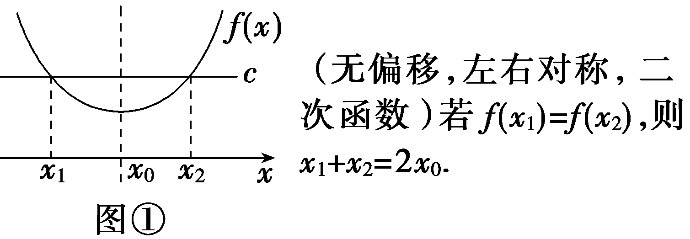
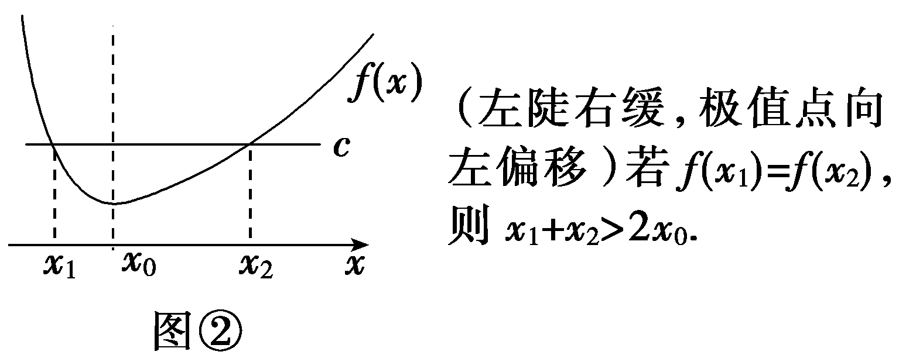
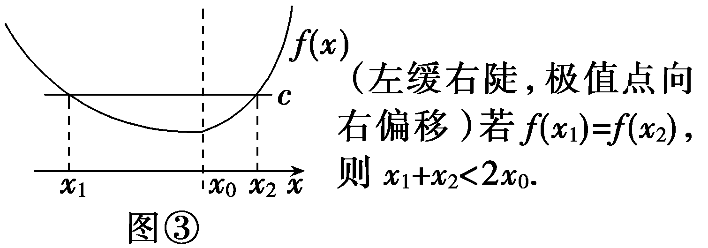
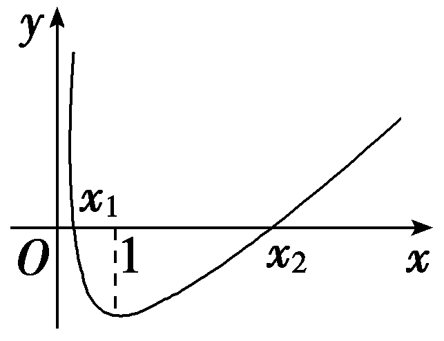

**培优课**5　**极值点偏移问题**

1.极值点偏移的概念

已知函数<em>f</em>(<em>x</em>)图象顶点的横坐标就是极值点<em>x</em>0.

(1)若&lt;te&lt;te&lt;te&lt;te&lt;te<em>x</em>t style="italic"&gt;x&lt;/text&gt;t style="italic"&gt;x&lt;/text&gt;t style="italic"&gt;x&lt;/text&gt;t style="itali<em>c</em>"&gt;x&lt;/text&gt;t style="italic"&gt;<em>f</em>&lt;/text&gt;(x)＝c的两根的中点满足 $\frac{x_{1}＋x_{2}}{2}＝$ &lt;te&lt;te&lt;te&lt;te<em>x</em>t style="italic"&gt;x&lt;/text&gt;t style="italic"&gt;x&lt;/text&gt;t style="italic"&gt;x&lt;/text&gt;t style="itali<em>c</em>"&gt;x&lt;/text&gt;&lt;text style="subscript"&gt;0&lt;/text&gt;，即极值点在两根的正中间，也就是说极值点没有偏移.此时函数<em>&lt;text style="italic"&gt;f</em>&lt;/text&gt;(x)在x＝x0两侧的函数值变化快慢相同，如图①所示.

(2)若&lt;te&lt;te&lt;te&lt;te&lt;te<em>x</em>t style="italic"&gt;x&lt;/text&gt;t style="italic"&gt;x&lt;/text&gt;t style="italic"&gt;x&lt;/text&gt;t style="itali<em>c</em>"&gt;x&lt;/text&gt;t style="italic"&gt;<em>f</em>&lt;/text&gt;(x)＝c的两根的中点 $\frac{x_{1}＋x_{2}}{2}$ ≠&lt;te&lt;te&lt;te&lt;te<em>x</em>t style="italic"&gt;x&lt;/text&gt;t style="italic"&gt;x&lt;/text&gt;t style="italic"&gt;x&lt;/text&gt;t style="itali<em>c</em>"&gt;x&lt;/text&gt;&lt;text style="subscript"&gt;0&lt;/text&gt;，则称极值点偏移，此时函数<em>&lt;text style="italic"&gt;f</em>&lt;/text&gt;(x)在x＝x0两侧的函数值变化快慢不同，如图②、图③所示.

2.函数极值点偏移问题的四种类型

(1)若函数<em>f</em>(<em>x</em>)在定义域上存在两个零点<em>x</em>1，<em>x</em>2(<em>x</em>1≠<em>x</em>2)，求证：<em>x</em>1＋<em>x</em>2＞2<em>x</em>0(<em>x</em>0为函数<em>f</em>(<em>x</em>)的极值点).

(2)若在函数<em>f</em>(<em>x</em>)的定义域上存在<em>x</em>1，<em>x</em>2(<em>x</em>1≠<em>x</em>2)满足<em>f</em>(<em>x</em>1)＝<em>f</em>(<em>x</em>2)，求证：<em>x</em>1＋<em>x</em>2＞2<em>x</em>0(<em>x</em>0为函数<em>f</em>(<em>x</em>)的极值点).

(3)若函数&lt;te&lt;te&lt;te&lt;te&lt;te&lt;te&lt;te<em>x</em>t style="italic"&gt;x&lt;/text&gt;t style="italic"&gt;x&lt;/text&gt;t style="italic"&gt;x&lt;/text&gt;t style="italic"&gt;x&lt;/text&gt;t style="italic"&gt;x&lt;/text&gt;t style="italic"&gt;x&lt;/text&gt;t style="italic"&gt;f&lt;/text&gt;(x)存在两个零点x&lt;text style="subscript"&gt;1&lt;/text&gt;，x&lt;text style="subscript"&gt;2&lt;/text&gt;(x1≠x2)，令x&lt;text style="subscript"&gt;0&lt;/text&gt; $＝\frac{x_{1}＋x_{2}}{2}$ ，求证：&lt;te&lt;te&lt;te&lt;te&lt;te&lt;te&lt;te<em>x</em>t style="italic"&gt;x&lt;/text&gt;t style="italic"&gt;x&lt;/text&gt;t style="italic"&gt;x&lt;/text&gt;t style="italic"&gt;x&lt;/text&gt;t style="italic"&gt;x&lt;/text&gt;t style="italic"&gt;x&lt;/text&gt;t style="italic"&gt;f&lt;/text&gt;'(x&lt;text style="subscript"&gt;0&lt;/text&gt;)＞0.

(4)若在函数&lt;te&lt;te&lt;te&lt;te&lt;te&lt;te&lt;te&lt;te&lt;te<em>x</em>t style="italic"&gt;x&lt;/text&gt;t style="italic"&gt;x&lt;/text&gt;t style="italic"&gt;x&lt;/text&gt;t style="italic"&gt;x&lt;/text&gt;t style="italic"&gt;x&lt;/text&gt;t style="italic"&gt;x&lt;/text&gt;t style="italic"&gt;x&lt;/text&gt;t style="italic"&gt;x&lt;/text&gt;t style="italic"&gt;<em>&lt;text style="italic"&gt;f</em>&lt;/text&gt;&lt;/text&gt;(x)的定义域上存在x&lt;text style="subscript"&gt;&lt;text style="subscript"&gt;1&lt;/text&gt;&lt;/text&gt;，x&lt;text style="subscript"&gt;&lt;text style="subscript"&gt;2&lt;/text&gt;&lt;/text&gt;(x1≠x2)满足f(x1)＝f(x2)，令x&lt;text style="subscript"&gt;0&lt;/text&gt; $＝\frac{x_{1}＋x_{2}}{2}$ ，求证：&lt;te&lt;te&lt;te&lt;te&lt;te&lt;te&lt;te&lt;te&lt;te<em>x</em>t style="italic"&gt;x&lt;/text&gt;t style="italic"&gt;x&lt;/text&gt;t style="italic"&gt;x&lt;/text&gt;t style="italic"&gt;x&lt;/text&gt;t style="italic"&gt;x&lt;/text&gt;t style="italic"&gt;x&lt;/text&gt;t style="italic"&gt;x&lt;/text&gt;t style="italic"&gt;x&lt;/text&gt;t style="italic"&gt;<em>&lt;text style="italic"&gt;f</em>&lt;/text&gt;&lt;/text&gt;'(x&lt;text style="subscript"&gt;0&lt;/text&gt;)＞0.

技法一　对称构造法

已知函数<em>f</em>(<em>x</em>)＝(<em>x</em>－2)e<em>x</em>＋<em>a</em>(<em>x</em>－1)2有两个零点.

(1)求实数*a*的取值范围；

(2)设<em>x</em>1，<em>x</em>2是<em>f</em>(<em>x</em>)的两个零点，证明：<em>x</em>1＋<em>x</em>2＜2.

解：(1)<em>f'</em>(<em>x</em>)＝(<em>x</em>－1)e<em>x</em>＋2<em>a</em>(<em>x</em>－1)＝(<em>x</em>－1)·(e<em>x</em>＋2<em>a</em>).

①若<em>a</em>＝0，则<em>f</em>(<em>x</em>)＝(<em>x</em>－2)e<em>x</em>，<em>f</em>(<em>x</em>)只有一个零点.

②若*a*＞0，则当*x*∈(－∞，1)时，*f'*(*x*)＜0，当*x*∈(1，＋∞)时，*f'*(*x*)＞0，所以*f*(*x*)在(－∞，1)上单调递减，在(1，＋∞)上单调递增.

又&lt;te&lt;te<em>x</em>t style="italic"&gt;x&lt;/text&gt;t style="it&lt;text style="it&lt;text style="it<em>a</em>lic"&gt;a&lt;/text&gt;lic"&gt;a&lt;/text&gt;lic"&gt;<em>&lt;text style="italic"&gt;&lt;text style="italic"&gt;f</em>&lt;/text&gt;&lt;/text&gt;&lt;/text&gt;(1)＝－e＜0，f(2)＝a＞0，取<em>&lt;text style="italic"&gt;&lt;text style="italic"&gt;&lt;text style="italic"&gt;&lt;text style="italic"&gt;&lt;text style="italic"&gt;b</em>&lt;/text&gt;&lt;/text&gt;&lt;/text&gt;&lt;/text&gt;&lt;/text&gt;满足b＜0且b＜ln $\frac{a}{2}$ ，则&lt;te&lt;te<em>x</em>t style="italic"&gt;x&lt;/text&gt;t style="it&lt;text style="it&lt;text style="it<em>a</em>lic"&gt;a&lt;/text&gt;lic"&gt;a&lt;/text&gt;lic"&gt;<em>&lt;text style="italic"&gt;&lt;text style="italic"&gt;f</em>&lt;/text&gt;&lt;/text&gt;&lt;/text&gt;(<em>&lt;text style="italic"&gt;&lt;text style="italic"&gt;&lt;text style="italic"&gt;&lt;text style="italic"&gt;&lt;text style="italic"&gt;b</em>&lt;/text&gt;&lt;/text&gt;&lt;/text&gt;&lt;/text&gt;&lt;/text&gt;)＞ $\frac{a}{2}$ (&lt;te&lt;te<em>x</em>t style="italic"&gt;x&lt;/text&gt;t style="it&lt;text style="it<em>a</em>lic"&gt;a&lt;/text&gt;lic"&gt;<em>&lt;text style="italic"&gt;&lt;text style="italic"&gt;&lt;text style="italic"&gt;&lt;text style="italic"&gt;b</em>&lt;/text&gt;&lt;/text&gt;&lt;/text&gt;&lt;/text&gt;&lt;/text&gt;－2)＋<em>a</em>(b－1)2＝a $\left(b^{2}－\frac{3}{2}b\right)$ ＞0(也可通过极限思想判断函数值正负，如&lt;te<em>x</em>t style="italic"&gt;x&lt;/text&gt;→－∞时，&lt;text style="it&lt;text style="it&lt;text style="it<em>a</em>lic"&gt;a&lt;/text&gt;lic"&gt;a&lt;/text&gt;lic"&gt;<em>&lt;text style="italic"&gt;&lt;text style="italic"&gt;f</em>&lt;/text&gt;&lt;/text&gt;&lt;/text&gt;(x)→＋∞)，

故*f*(*x*)存在两个零点.

③若*a*＜0，由*f'*(*x*)＝0得*x*＝1或*x*＝ln(－2*a*).

若<te<te<te<te<te<te*x*t style="italic">x</text>t style="italic">x</text>t style="italic">x</text>t style="italic">x</text>t style="italic">x</text>t style="it*a*lic">a</text>≥－ $\frac{e}{2}$ ，则ln(－2<te<te<te<te<te<te*x*t style="italic">x</text>t style="italic">x</text>t style="italic">x</text>t style="italic">x</text>t style="italic">x</text>t style="it*a*lic">a</text>)≤1，故当x∈(1，＋∞)时，*<text style="italic"><text style="italic"><text style="italic">f*</text></text>'</text>(x)＞0，因此f(x)在(1，＋∞)上单调递增.又当x≤1时，f(x)＜0，所以f(x)不存在两个零点.

若<te<te<te<te*x*t style="it*a*lic">x</text>t style="italic">x</text>t style="it*a*lic">x</text>t style="it*a*lic">a</text>＜－ $\frac{e}{2}$ ，则ln(－2<te<te<te<te*x*t style="it*a*lic">x</text>t style="italic">x</text>t style="it*a*lic">x</text>t style="it*a*lic">a</text>)＞1，故当x∈(1，ln(－2a))时，*<text style="italic">f'*</text>(x)＜0；当x∈(ln(－2a)，＋∞)时，f'(x)＞0.

因此*f*(*x*)在(1，ln(－2*a*))上单调递减，在(ln(－2*a*)，＋∞)上单调递增.又当*x*≤1时，*f*(*x*)＜0，

所以*f*(*x*)不存在两个零点.

综上，实数*a*的取值范围为(0，＋∞).

(2)证明：不妨设<em>x</em>1＜<em>x</em>2.由(1)知，<em>x</em>1∈(－∞，1)，<em>x</em>2∈(1，＋∞)，2－<em>x</em>1∈(1，＋∞)，

设*F*(*x*)＝*f*(*x*)－*f*(2－*x*)，

则*F'*(*x*)＝*f'*(*x*)＋*f'*(2－*x*)

＝(<em>x</em>－1)(e<em>x</em>＋2<em>a</em>)＋(1－<em>x</em>)(e2－<em>x</em>＋2<em>a</em>)

＝(<em>x</em>－1)(e<em>x</em>－e2－<em>x</em>)，

所以当*x*＜1时，*F'*(*x*)＞0，*F*(*x*)单调递增，

又*F*(1)＝0，所以当*x*＜1时，*F*(*x*)＜0，

即*f*(*x*)＜*f*(2－*x*)，

所以<em>f</em>(<em>x</em>2)＝<em>f</em>(<em>x</em>1)＜<em>f</em>(2－<em>x</em>1)，又由(1)知，<em>f</em>(<em>x</em>)在(1，＋∞)上单调递增，所以<em>x</em>2＜2－<em>x</em>1，即<em>x</em>1＋<em>x</em>2＜2.

对称构造法求解极值点偏移问题的步骤

第一步，求导：获得<em>f</em>(<em>x</em>)的单调性、极值情况，作出<em>f</em>(<em>x</em>)的图象，由<em>f</em>(<em>x</em>1)＝<em>f</em>(<em>x</em>2)得<em>x</em>1，<em>x</em>2的取值范围(数形结合)；

第二步，构造辅助函数：对结论<em>x</em>1＋<em>x</em>2＞(＜)2<em>x</em>0，构造函数<em>F</em>(<em>x</em>)＝<em>f</em>(<em>x</em>)－<em>f</em>(2<em>x</em>0－<em>x</em>)或<em>F</em>(<em>x</em>)＝<em>f</em>(<em>x</em>0＋<em>x</em>)－<em>f</em>(<em>x</em>0－<em>x</em>)，求导，讨论<em>F</em>(<em>x</em>)的单调性，进而得不等式；

第三步，代入<em>x</em>1(或<em>x</em>2)：利用<em>f</em>(<em>x</em>1)＝<em>f</em>(<em>x</em>2)及<em>f</em>(<em>x</em>)的单调性证明最终结论.

注意：极值点偏移问题的结论不一定总是&lt;te&lt;te&lt;te&lt;te<em>x</em>t style="italic"&gt;x&lt;/text&gt;t style="italic"&gt;x&lt;/text&gt;t style="italic"&gt;x&lt;/text&gt;t style="italic"&gt;x&lt;/text&gt;&lt;text style="subscript"&gt;1&lt;/text&gt;＋x&lt;text style="subscript"&gt;2&lt;/text&gt;＞(＜)2x0，也可能是x1x2＞(＜) $x_{0}^{2}$ .

对点练&lt;te&lt;te&lt;te<em>x</em>t style="italic"&gt;x&lt;/text&gt;t style="italic"&gt;x&lt;/text&gt;t style="subscript"&gt;1&lt;/text&gt;.(&lt;te&lt;te<em>x</em>t style="italic"&gt;x&lt;/text&gt;t style="superscript"&gt;&lt;text style="subscript"&gt;2&lt;/text&gt;&lt;/text&gt;025·湖南郴州质量检测)已知函数&lt;te&lt;te&lt;te<em>x</em>t style="italic"&gt;x&lt;/text&gt;t style="italic"&gt;x&lt;/text&gt;t style="italic"&gt;<em>f</em>&lt;/text&gt;(x)＝ln x－ $\frac{1}{2}$ &lt;te&lt;te&lt;te&lt;te&lt;te&lt;te&lt;te<em>x</em>t style="italic"&gt;x&lt;/text&gt;t style="italic"&gt;x&lt;/text&gt;t style="italic"&gt;x&lt;/text&gt;t style="italic"&gt;x&lt;/text&gt;t style="italic"&gt;x&lt;/text&gt;t style="italic"&gt;x&lt;/text&gt;t style="italic"&gt;x&lt;/text&gt;&lt;text style="subscript"&gt;&lt;text style="subscript"&gt;2&lt;/text&gt;&lt;/text&gt;＋&lt;text style="subscript"&gt;1&lt;/text&gt;，若设函数<em>&lt;text style="italic"&gt;f</em>&lt;/text&gt;(x)的两个零点为x1，x2，证明：x1＋x2＞2.

证明：<te<te<te*x*t style="italic">x</text>t style="italic">x</text>t style="italic">f'</text>(x) $＝\frac{1}{x}$ －<te<te*x*t style="italic">x</text>t style="italic">x</text> $＝\frac{(1+x)(1－x)}{x}$ (<te<te*x*t style="italic">x</text>t style="italic">x</text>＞0)，

令*f'*(*x*)＝0，解得*x*＝1.

当0＜*x*＜1时，*f'*(*x*)＞0，*f*(*x*)在(0，1)上单调递增；

当*x*＞1时，*f'*(*x*)＜0，*f*(*x*)在(1，＋∞)上单调递减，

所以&lt;te<em>x</em>t style="italic"&gt;<em>f</em>&lt;/text&gt;(x)max＝f(1) $＝\frac{1}{2}$ ＞0，

且当<em>x</em>→0＋时，<em>f</em>(<em>x</em>)→－∞，<em>f</em>(2)＝ln 2－1＜0，

假设<em>x</em>1＜<em>x</em>2，则<em>f</em>(<em>x</em>)的两个零点<em>x</em>1，<em>x</em>2满足0＜<em>x</em>1＜1＜<em>x</em>2＜2.

令*F*(*x*)＝*f*(*x*)－*f*(2－*x*)，0＜*x*＜1，

则<te<te<te*x*t style="italic">x</text>t style="italic">x</text>t style="italic">F'</text>(x)＝*<text style="italic">f'*</text>(x)＋f'(2－x) $＝\frac{2(x－1)^{2}}{x(2－x)}$ .

当0＜*x*＜1时，*F'*(*x*)＞0，*F*(*x*)单调递增，

所以*F*(*x*)＜*F*(1)＝0，即*f*(*x*)＜*f*(2－*x*).

因为0＜<em>x</em>1＜1＜<em>x</em>2＜2，所以1＜2－<em>x</em>1＜2，

所以<em>f</em>(<em>x</em>2)＝<em>f</em>(<em>x</em>1)＜<em>f</em>(2－<em>x</em>1).

又函数*f*(*x*)在(1，＋∞)上单调递减，

所以<em>x</em>2＞2－<em>x</em>1，即<em>x</em>1＋<em>x</em>2＞2.

技法二　比(差)值换元法

已知函数*f*(*x*)＝*ax*ln *x*＋*b*(*a*，*b*为实数)的图象在点(1，*f*(1))处的切线方程为*y*＝*x*－1.

(1)求实数*a*，*b*的值及函数*f*(*x*)的单调区间；

(&lt;te&lt;te&lt;te&lt;te<em>x</em>t style="italic"&gt;x&lt;/text&gt;t style="italic"&gt;x&lt;/text&gt;t style="italic"&gt;x&lt;/text&gt;t style="subscript"&gt;&lt;text style="subscript"&gt;2&lt;/text&gt;&lt;/text&gt;)设函数&lt;te&lt;te&lt;te<em>x</em>t style="italic"&gt;x&lt;/text&gt;t style="italic"&gt;x&lt;/text&gt;t style="italic"&gt;<em>&lt;text style="italic"&gt;g</em>&lt;/text&gt;&lt;/text&gt;(x) $＝\frac{f(x)+1}{x}$ ，证明：&lt;te&lt;te&lt;te&lt;te&lt;te&lt;te&lt;te<em>x</em>t style="italic"&gt;x&lt;/text&gt;t style="italic"&gt;x&lt;/text&gt;t style="italic"&gt;x&lt;/text&gt;t style="italic"&gt;x&lt;/text&gt;t style="italic"&gt;x&lt;/text&gt;t style="italic"&gt;x&lt;/text&gt;t style="italic"&gt;<em>&lt;text style="italic"&gt;g</em>&lt;/text&gt;&lt;/text&gt;(x&lt;text style="subscript"&gt;&lt;text style="subscript"&gt;1&lt;/text&gt;&lt;/text&gt;)＝g(x&lt;text style="subscript"&gt;&lt;text style="subscript"&gt;2&lt;/text&gt;&lt;/text&gt;)(x1＜x2)时，x1＋x2＞2.

解：(1)*f'*(*x*)＝*a*(1＋ln *x*)(*x*＞0)，

由题意得 $\left\{\begin{matrix}f'(1)＝a=1，\\f(1)＝b=0，\end{matrix}\right.$ 解得 $\left\{\begin{matrix}a=1，\\b=0.\end{matrix}\right.$

令<te<te<te*x*t style="italic">x</text>t style="italic">x</text>t style="italic">f'</text>(x)＝1＋ln x＝0，解得x $＝\frac{1}{e}$ .

当<te<te*x*t style="italic">x</text>t style="italic">x</text>＞ $\frac{1}{e}$ 时，<te<te*x*t style="italic">x</text>t style="italic">*f*'</text>(*x*)＞0，f(x)在 $\left(\frac{1}{e}，＋\infty \right)$ 上单调递增；

当0＜<te<te*x*t style="italic">x</text>t style="italic">x</text>＜ $\frac{1}{e}$ 时，<te<te*x*t style="italic">x</text>t style="italic">*f*'</text>(*x*)＜0，f(x)在 $\left(0，\frac{1}{e}\right)$ 上单调递减.

所以<te*x*t style="italic">f</text>(x)的单调递减区间为 $\left(0，\frac{1}{e}\right)$ ，单调递增区间为 $\left(\frac{1}{e}，＋\infty \right)$ .

(2)证明：由(1)得*f*(*x*)＝*x*ln *x*(*x*＞0)，

故<te<te<te*x*t style="italic">x</text>t style="italic">x</text>t style="italic">g</text>(x) $＝\frac{f(x)+1}{x}＝$ ln <te<te*x*t style="italic">x</text>t style="italic">x</text>＋ $\frac{1}{x}$ (<te<te*x*t style="italic">x</text>t style="italic">x</text>＞0)，

由<em>g</em>(<em>x</em>1)＝<em>g</em>(<em>x</em>2)(<em>x</em>1＜<em>x</em>2)，

得ln &lt;te<em>x</em>t style="italic"&gt;x&lt;/text&gt;1＋ $\frac{1}{x_{1}}＝$ ln &lt;te<em>x</em>t style="italic"&gt;x&lt;/text&gt;2＋ $\frac{1}{x_{2}}$ ，

即 $\frac{x_{2}－x_{1}}{x_{1}x_{2}}＝$ ln $\frac{x_{2}}{x_{1}}$ ＞0.

要证&lt;te&lt;te&lt;te<em>x</em>t style="italic"&gt;x&lt;/text&gt;t style="italic"&gt;x&lt;/text&gt;t style="italic"&gt;x&lt;/text&gt;&lt;text style="subscript"&gt;1&lt;/text&gt;＋x&lt;text style="subscript"&gt;2&lt;/text&gt;＞2，即证(x1＋x2)· $\frac{x_{2}－x_{1}}{x_{1}x_{2}}$ ＞&lt;te&lt;te<em>x</em>t style="italic"&gt;x&lt;/text&gt;t style="subscript"&gt;2&lt;/text&gt;ln $\frac{x_{2}}{x_{1}}$ ，即证 $\frac{x_{2}}{x_{1}}$ － $\frac{x_{1}}{x_{2}}$ ＞&lt;te&lt;te<em>x</em>t style="italic"&gt;x&lt;/text&gt;t style="subscript"&gt;2&lt;/text&gt;ln $\frac{x_{2}}{x_{1}}$ .

设 $\frac{x_{2}}{x_{1}}＝$ <<<<*t*ext style="italic">t</text>ext style="italic">t</text>ext style="italic">t</text>ext style="italic">t</text>(t＞1)，则需证t－ $\frac{1}{t}$ ＞2ln <<<<*t*ext style="italic">t</text>ext style="italic">t</text>ext style="italic">t</text>ext style="italic">t</text>(t＞1).

令<<<<*t*ext style="italic">t</text>ext style="italic">t</text>ext style="italic">t</text>ext style="italic">h</text>(t)＝t－ $\frac{1}{t}$ －2ln <<<*t*ext style="italic">t</text>ext style="italic">t</text>ext style="italic">t</text>(t＞1)，

则<*t*ext style="italic">h'</text>(t)＝1＋ $\frac{1}{t^{2}}$ － $\frac{2}{t}＝\left(1－\frac{1}{t}\right)^{2}$ ＞0.

所以&lt;&lt;&lt;&lt;&lt;te&lt;te<em>x</em>t style="italic"&gt;x&lt;/text&gt;t style="italic"&gt;t&lt;/text&gt;ext style="italic"&gt;t&lt;/text&gt;ext style="italic"&gt;t&lt;/text&gt;ext style="italic"&gt;t&lt;/text&gt;ext style="italic"&gt;<em>&lt;text style="italic"&gt;h</em>&lt;/text&gt;&lt;/text&gt;(t)在(1，＋∞)上单调递增，则h(t)＞h(1)＝0，即t－ $\frac{1}{t}$ ＞2ln &lt;&lt;&lt;&lt;te&lt;te<em>x</em>t style="italic"&gt;x&lt;/text&gt;t style="italic"&gt;t&lt;/text&gt;ext style="italic"&gt;t&lt;/text&gt;ext style="italic"&gt;t&lt;/text&gt;ext style="italic"&gt;t&lt;/text&gt;.故x1＋x2＞2得证.

比(差)值换元的解题要点：通过&lt;&lt;&lt;<em>t</em>ext style="italic"&gt;t&lt;/text&gt;e&lt;te&lt;te&lt;te<em>x</em>t style="italic"&gt;x&lt;/text&gt;t style="italic"&gt;x&lt;/text&gt;t style="italic"&gt;x&lt;/text&gt;t style="italic"&gt;t&lt;/text&gt;ext style="italic"&gt;t&lt;/text&gt; $＝\frac{x_{1}}{x_{2}}$ 或&lt;&lt;&lt;<em>t</em>ext style="italic"&gt;t&lt;/text&gt;e&lt;te&lt;te&lt;te<em>x</em>t style="italic"&gt;x&lt;/text&gt;t style="italic"&gt;x&lt;/text&gt;t style="italic"&gt;x&lt;/text&gt;t style="italic"&gt;t&lt;/text&gt;ext style="italic"&gt;t&lt;/text&gt;＝x&lt;text style="subscript"&gt;1&lt;/text&gt;－x&lt;text style="subscript"&gt;2&lt;/text&gt;，消掉变量x1，x2，构造关于t的函数<em>h</em>(t)进行求解.

对点练&lt;te&lt;te&lt;te&lt;te<em>x</em>t style="italic"&gt;x&lt;/text&gt;t style="italic"&gt;x&lt;/text&gt;t style="italic"&gt;x&lt;/text&gt;t style="subscript"&gt;&lt;text style="subscript"&gt;2&lt;/text&gt;&lt;/text&gt;.已知函数&lt;te&lt;te&lt;te&lt;te<em>x</em>t style="italic"&gt;x&lt;/text&gt;t style="italic,superscript"&gt;x&lt;/text&gt;t style="italic"&gt;x&lt;/text&gt;t style="italic"&gt;f&lt;/text&gt;(x)＝ex－<em>ax</em>有两个零点x&lt;text style="subscript"&gt;&lt;text style="subscript"&gt;1&lt;/text&gt;&lt;/text&gt;，x2(x1＜x2).证明：x2－x1＜ $\frac{2}{x_{1}}$ －&lt;te&lt;te&lt;te&lt;te<em>x</em>t style="italic"&gt;x&lt;/text&gt;t style="italic"&gt;x&lt;/text&gt;t style="italic"&gt;x&lt;/text&gt;t style="subscript"&gt;&lt;text style="subscript"&gt;2&lt;/text&gt;&lt;/text&gt;.

证明：由题意得 $\left\{\begin{matrix}e^{x_{1}}＝ax_{1}，\\e^{x_{2}}＝ax_{2}，\end{matrix}\right.$ 令&lt;&lt;&lt;&lt;&lt;&lt;<em>t</em>ext style="italic"&gt;t&lt;/text&gt;ext style="italic"&gt;t&lt;/text&gt;ext style="italic"&gt;t&lt;/text&gt;e&lt;te<em>x</em>t style="italic"&gt;x&lt;/text&gt;t style="italic"&gt;t&lt;/text&gt;e<em>x</em>t style="italic,superscript"&gt;t&lt;/text&gt;e&lt;te<em>x</em>t style="italic"&gt;x&lt;/text&gt;t style="italic"&gt;t&lt;/text&gt;＝x&lt;text style="subscript"&gt;2&lt;/text&gt;－x&lt;text style="subscript"&gt;&lt;text style="subscript"&gt;1&lt;/text&gt;&lt;/text&gt;＞0，两式相除得et $＝e^{x_{2}－x_{1}}＝\frac{x_{2}}{x_{1}}＝\frac{x_{1}＋t}{x_{1}}$ ，即&lt;&lt;&lt;&lt;&lt;&lt;<em>t</em>ext style="italic"&gt;t&lt;/text&gt;ext style="italic"&gt;t&lt;/text&gt;ext style="italic"&gt;t&lt;/text&gt;e&lt;te<em>x</em>t style="italic"&gt;x&lt;/text&gt;t style="italic"&gt;t&lt;/text&gt;e<em>x</em>t style="italic,superscript"&gt;t&lt;/text&gt;e<em>x</em>t style="italic"&gt;x&lt;/text&gt;&lt;text style="subscript"&gt;&lt;text style="subscript"&gt;1&lt;/text&gt;&lt;/text&gt; $＝\frac{t}{e^{t}－1}$ (&lt;&lt;&lt;&lt;&lt;&lt;<em>t</em>ext style="italic"&gt;t&lt;/text&gt;ext style="italic"&gt;t&lt;/text&gt;ext style="italic"&gt;t&lt;/text&gt;e&lt;te<em>x</em>t style="italic"&gt;x&lt;/text&gt;t style="italic"&gt;t&lt;/text&gt;e<em>x</em>t style="italic,superscript"&gt;t&lt;/text&gt;e&lt;te<em>x</em>t style="italic"&gt;x&lt;/text&gt;t style="italic"&gt;t&lt;/text&gt;＞0)，欲证x&lt;text style="subscript"&gt;2&lt;/text&gt;－x&lt;text style="subscript"&gt;&lt;text style="subscript"&gt;1&lt;/text&gt;&lt;/text&gt;＜ $\frac{2}{x_{1}}$ －&lt;&lt;&lt;&lt;&lt;&lt;<em>t</em>ext style="italic"&gt;t&lt;/text&gt;ext style="italic"&gt;t&lt;/text&gt;ext style="italic"&gt;t&lt;/text&gt;e&lt;te<em>x</em>t style="italic"&gt;x&lt;/text&gt;t style="italic"&gt;t&lt;/text&gt;e<em>x</em>t style="italic,superscript"&gt;t&lt;/text&gt;e<em>x</em>t style="subscript"&gt;2&lt;/text&gt;，即证&lt;te<em>x</em>t style="italic"&gt;t&lt;/text&gt;＜ $\frac{2\left(e^{t}－1\right)}{t}$ －&lt;&lt;&lt;&lt;&lt;&lt;<em>t</em>ext style="italic"&gt;t&lt;/text&gt;ext style="italic"&gt;t&lt;/text&gt;ext style="italic"&gt;t&lt;/text&gt;e&lt;te<em>x</em>t style="italic"&gt;x&lt;/text&gt;t style="italic"&gt;t&lt;/text&gt;e<em>x</em>t style="italic,superscript"&gt;t&lt;/text&gt;e<em>x</em>t style="subscript"&gt;2&lt;/text&gt;，即证 $\frac{t^{2}+2t+2}{e^{t}}$ ＜&lt;&lt;&lt;&lt;&lt;&lt;<em>t</em>ext style="italic"&gt;t&lt;/text&gt;ext style="italic"&gt;t&lt;/text&gt;ext style="italic"&gt;t&lt;/text&gt;e&lt;te<em>x</em>t style="italic"&gt;x&lt;/text&gt;t style="italic"&gt;t&lt;/text&gt;e<em>x</em>t style="italic,superscript"&gt;t&lt;/text&gt;e<em>x</em>t style="subscript"&gt;2&lt;/text&gt;.记<em>h</em>(&lt;te<em>x</em>t style="italic"&gt;t&lt;/text&gt;) $＝\frac{t^{2}+2t+2}{e^{t}}$ (&lt;&lt;&lt;&lt;&lt;&lt;<em>t</em>ext style="italic"&gt;t&lt;/text&gt;ext style="italic"&gt;t&lt;/text&gt;ext style="italic"&gt;t&lt;/text&gt;e&lt;te<em>x</em>t style="italic"&gt;x&lt;/text&gt;t style="italic"&gt;t&lt;/text&gt;e<em>x</em>t style="italic,superscript"&gt;t&lt;/text&gt;e&lt;te<em>x</em>t style="italic"&gt;x&lt;/text&gt;t style="italic"&gt;t&lt;/text&gt;＞0)，<em>h</em>'(t) $＝\frac{\left(2t+2\right)e^{t}－\left(t^{2}+2t+2\right)e^{t}}{e^{2t}}＝$ － $\frac{t^{2}}{e^{t}}$ ＜0，

故&lt;&lt;&lt;te&lt;te<em>x</em>t style="italic"&gt;x&lt;/text&gt;t style="italic"&gt;t&lt;/text&gt;ext style="italic"&gt;t&lt;/text&gt;ext style="italic"&gt;<em>&lt;text style="italic"&gt;h</em>&lt;/text&gt;&lt;/text&gt;(t)在(0，＋∞)上单调递减，所以h(t)＜h(0)＝2，即 $\frac{t^{2}+2t+2}{e^{t}}$ ＜&lt;te<em>x</em>t style="subscript"&gt;2&lt;/text&gt;，所以<em>x</em>2－x1＜ $\frac{2}{x_{1}}$ －&lt;te<em>x</em>t style="subscript"&gt;2&lt;/text&gt;得证.

技法三　消参减元法

已知函数&lt;te&lt;te&lt;te&lt;te&lt;te&lt;te&lt;te&lt;te&lt;te<em>x</em>t style="italic"&gt;x&lt;/text&gt;t style="italic"&gt;x&lt;/text&gt;t style="italic"&gt;x&lt;/text&gt;t style="italic"&gt;x&lt;/text&gt;t style="italic"&gt;x&lt;/text&gt;t style="it<em>a</em>lic"&gt;x&lt;/text&gt;t style="italic"&gt;x&lt;/text&gt;t style="italic"&gt;x&lt;/text&gt;t style="italic"&gt;<em>&lt;text style="italic"&gt;&lt;text style="italic"&gt;f</em>&lt;/text&gt;&lt;/text&gt;&lt;/text&gt;(x) $＝\frac{1}{2}$ &lt;te&lt;te&lt;te&lt;te&lt;te&lt;te&lt;te&lt;te<em>x</em>t style="italic"&gt;x&lt;/text&gt;t style="italic"&gt;x&lt;/text&gt;t style="italic"&gt;x&lt;/text&gt;t style="italic"&gt;x&lt;/text&gt;t style="italic"&gt;x&lt;/text&gt;t style="it<em>a</em>lic"&gt;x&lt;/text&gt;t style="italic"&gt;x&lt;/text&gt;t style="italic"&gt;x&lt;/text&gt;&lt;text style="subscript"&gt;&lt;text style="subscript"&gt;2&lt;/text&gt;&lt;/text&gt;－x＋aln x.若函数<em>&lt;text style="italic"&gt;&lt;text style="italic"&gt;&lt;text style="italic"&gt;f</em>&lt;/text&gt;&lt;/text&gt;&lt;/text&gt;(x)有两个极值点x&lt;text style="subscript"&gt;1&lt;/text&gt;，x2，证明：f(x1)＋f(x2)＞－ $\frac{ln2}{2}$ － $\frac{3}{4}$ .

证明：由题意得，<te<te<te*x*t style="italic">x</text>t style="italic">x</text>t style="italic">f'</text>(x)＝x－1＋ $\frac{a}{x}＝\frac{x^{2}－x＋a}{x}$ (<te<te*x*t style="italic">x</text>t style="italic">x</text>＞0).

因为函数<em>f</em>(<em>x</em>)有两个极值点<em>x</em>1，<em>x</em>2，

所以方程<em>x</em>2－<em>x</em>＋<em>a</em>＝0在(0，＋∞)上有两个不同的实数根<em>x</em>1，<em>x</em>2，

则 $\left\{\begin{matrix}x_{1}＋x_{2}=1>0，\\x_{1}x_{2}＝a>0，\end{matrix}\right.$ 且<text style="it<text style="it*a*lic">a</text>lic">Δ</text>＝1－4a＞0，所以0＜a＜ $\frac{1}{4}$ .

由题意得&lt;te&lt;te&lt;te&lt;te<em>x</em>t style="it<em>a</em>lic"&gt;x&lt;/text&gt;t style="italic"&gt;x&lt;/text&gt;t style="it<em>a</em>lic"&gt;x&lt;/text&gt;t style="italic"&gt;<em>f</em>&lt;/text&gt; $\left(x_{1}\right)$ ＋&lt;te&lt;te&lt;te&lt;te<em>x</em>t style="it<em>a</em>lic"&gt;x&lt;/text&gt;t style="italic"&gt;x&lt;/text&gt;t style="it<em>a</em>lic"&gt;x&lt;/text&gt;t style="italic"&gt;<em>f</em>&lt;/text&gt; $\left(x_{2}\right)＝\frac{1}{2}x_{1}^{2}$ －&lt;te&lt;te&lt;te<em>x</em>t style="it<em>a</em>lic"&gt;x&lt;/text&gt;t style="italic"&gt;x&lt;/text&gt;t style="it<em>a</em>lic"&gt;x&lt;/text&gt;&lt;text style="subscript"&gt;1&lt;/text&gt;＋aln x1＋ $\frac{1}{2}x_{2}^{2}$ －&lt;te&lt;te&lt;te<em>x</em>t style="it<em>a</em>lic"&gt;x&lt;/text&gt;t style="italic"&gt;x&lt;/text&gt;t style="it<em>a</em>lic"&gt;x&lt;/text&gt;&lt;text style="subscript"&gt;2&lt;/text&gt;＋aln x2

$＝\frac{1}{2}\left(x_{1}^{2}＋x_{2}^{2}\right)$ － $\left(x_{1}＋x_{2}\right)$ ＋*a*ln $\left(x_{1}x_{2}\right)$

$＝\frac{1}{2}\left(x_{1}＋x_{2}\right)^{2}$ －&lt;te&lt;text style="it<em>a</em>lic"&gt;x&lt;/text&gt;t style="italic"&gt;x&lt;/text&gt;1x2－ $\left(x_{1}＋x_{2}\right)$ ＋<em>a</em>ln $\left(x_{1}x_{2}\right)$

$＝\frac{1}{2}$ －<text style="it<text style="it<text style="it<text style="it<text style="it*a*lic">a</text>lic">a</text>lic">a</text>lic">a</text>lic">a</text>－1＋aln a＝aln a－a－ $\frac{1}{2}$ .

令<text style="it<text style="it<text style="it<text style="it*a*lic">a</text>lic">a</text>lic">a</text>lic">h</text> $\left(a\right)＝$ <text style="it<text style="it<text style="it*a*lic">a</text>lic">a</text>lic">a</text>ln a－a－ $\frac{1}{2}$ ( 0＜<text style="it<text style="it<text style="it*a*lic">a</text>lic">a</text>lic">a</text>＜ $\frac{1}{4}$ )，

则<text style="it*a*lic">h'</text> $\left(a\right)＝$ ln *a*＜0，

所以<text style="it*a*lic">h</text>(a)在 $\left(0，\frac{1}{4}\right)$ 上单调递减，

所以*<text style="italic">h*</text> $\left(a\right)$ ＞*<text style="italic">h*</text> $\left(\frac{1}{4}\right)＝$ － $\frac{ln2}{2}$ － $\frac{3}{4}$ ，

所以*<text style="italic">f*</text> $\left(x_{1}\right)$ ＋*<text style="italic">f*</text> $\left(x_{2}\right)$ ＞－ $\frac{ln2}{2}$ － $\frac{3}{4}$ .

消参减元，主要是利用导数把函数的极值点转化为导函数的零点，进而建立参数与极值点之间的关系，消去参数或减少变元，从而简化目标函数.其解题要点如下：

1.建方程：求函数的导函数，令*f'*(*x*)＝0，建立极值点所满足的方程，抓住导函数中的关键——导函数解析式中变号的部分(一般为一个二次整式).

2.定关系：根据极值点所满足的方程，利用方程的根的相关知识，建立极值点与方程系数之间的关系.

3.消参减元：根据两个极值点之间的关系，利用和差或积商等运算，化简或转化所求解问题，消掉参数或减少变量的个数.

对点练3.已知函数<te<te<te*x*t style="it*a*lic">x</text>t style="italic">x</text>t style="italic">f</text>(x) $＝\frac{1}{x}$ －<te<te*x*t style="it*a*lic">x</text>t style="italic">x</text>＋aln x.

(1)讨论*f*(*x*)的单调性；

(2)若&lt;te&lt;te&lt;te&lt;text style="it<em>a</em>lic"&gt;x&lt;/text&gt;t style="italic"&gt;x&lt;/text&gt;t style="italic"&gt;x&lt;/text&gt;t style="italic"&gt;f&lt;/text&gt;(x)存在两个极值点x1，x2，证明： $\frac{f\left(x_{1}\right)－f\left(x_{2}\right)}{x_{1}－x_{2}}$ ＜<em>a</em>－2.

解：(1)<te*x*t style="italic">f</text>(x)的定义域为 $\left(0，＋\infty \right)$ ，

<te*x*t style="italic">f'</text>(x)＝－ $\frac{1}{x^{2}}$ －1＋ $\frac{a}{x}＝$ － $\frac{x^{2}－ax+1}{x^{2}}$ .

①若*a*≤2，则*f'*(*x*)≤0，当且仅当*a*＝2，*x*＝1时*f'*(*x*)＝0，所以*f*(*x*)在(0，＋∞)上单调递减.

②若<te<te<te*x*t style="italic">x</text>t style="italic">x</text>t style="italic">a</text>＞2，令*f'*(x)＝0，得x $＝\frac{a－\sqrt{a^{2}－4}}{2}$ 或<te<te*x*t style="italic">x</text>t style="italic">x</text> $＝\frac{a＋\sqrt{a^{2}－4}}{2}$ .

当<te*x*t style="italic">x</text>∈ $\left(0，\frac{a－\sqrt{a^{2}－4}}{2}\right)$ ∪ $\left(\frac{a＋\sqrt{a^{2}－4}}{2}，＋\infty \right)$ 时，<te*x*t style="italic">f'</text>(*x*)＜0；

当<te*x*t style="italic">x</text>∈ $\left(\frac{a－\sqrt{a^{2}－4}}{2}，\frac{a＋\sqrt{a^{2}－4}}{2}\right)$ 时，<te*x*t style="italic">f'</text>(*x*)＞0.

所以<te*x*t style="italic">f</text>(x)在 $\left(0，\frac{a－\sqrt{a^{2}－4}}{2}\right)$ ， $\left(\frac{a＋\sqrt{a^{2}－4}}{2}，＋\infty \right)$ 上单调递减，在 $\left(\frac{a－\sqrt{a^{2}－4}}{2}，\frac{a＋\sqrt{a^{2}－4}}{2}\right)$ 上单调递增.

(2)证明：由(1)知，*f*(*x*)存在两个极值点时，*a*＞2.

由于<em>f</em>(<em>x</em>)的两个极值点<em>x</em>1，<em>x</em>2满足<em>x</em>2－<em>ax</em>＋1＝0，所以<em>x</em>1<em>x</em>2＝1，

不妨设&lt;te&lt;te&lt;te&lt;te<em>x</em>t style="italic"&gt;x&lt;/text&gt;t style="it&lt;text style="it&lt;text style="it&lt;text style="it<em>a</em>lic"&gt;a&lt;/text&gt;lic"&gt;a&lt;/text&gt;lic"&gt;a&lt;/text&gt;lic"&gt;x&lt;/text&gt;t style="italic"&gt;x&lt;/text&gt;t style="italic"&gt;x&lt;/text&gt;1＜x&lt;text style="subscript"&gt;&lt;text style="subscript"&gt;&lt;text style="subscript"&gt;2&lt;/text&gt;&lt;/text&gt;&lt;/text&gt;，则x2＞1.由于 $\frac{f\left(x_{1}\right)－f\left(x_{2}\right)}{x_{1}－x_{2}}＝$ － $\frac{1}{x_{1}x_{2}}$ －&lt;te&lt;te&lt;te&lt;te<em>x</em>t style="italic"&gt;x&lt;/text&gt;t style="it&lt;text style="it&lt;text style="it&lt;text style="it<em>a</em>lic"&gt;a&lt;/text&gt;lic"&gt;a&lt;/text&gt;lic"&gt;a&lt;/text&gt;lic"&gt;x&lt;/text&gt;t style="italic"&gt;x&lt;/text&gt;t style="subscript"&gt;1&lt;/text&gt;＋a $\frac{ln x_{1}－ln x_{2}}{x_{1}－x_{2}}＝$ －&lt;te&lt;te&lt;te<em>x</em>t style="italic"&gt;x&lt;/text&gt;t style="it&lt;text style="it&lt;text style="it&lt;text style="it<em>a</em>lic"&gt;a&lt;/text&gt;lic"&gt;a&lt;/text&gt;lic"&gt;a&lt;/text&gt;lic"&gt;x&lt;/text&gt;t style="subscript"&gt;&lt;text style="subscript"&gt;&lt;text style="subscript"&gt;2&lt;/text&gt;&lt;/text&gt;&lt;/text&gt;＋a $\frac{ln x_{1}－ln x_{2}}{x_{1}－x_{2}}＝$ －&lt;te&lt;te&lt;te<em>x</em>t style="italic"&gt;x&lt;/text&gt;t style="it&lt;text style="it&lt;text style="it&lt;text style="it<em>a</em>lic"&gt;a&lt;/text&gt;lic"&gt;a&lt;/text&gt;lic"&gt;a&lt;/text&gt;lic"&gt;x&lt;/text&gt;t style="subscript"&gt;&lt;text style="subscript"&gt;&lt;text style="subscript"&gt;2&lt;/text&gt;&lt;/text&gt;&lt;/text&gt;＋a $\frac{－2ln x_{2}}{\frac{1}{x_{2}}－x_{2}}$ ，所以 $\frac{f\left(x_{1}\right)－f\left(x_{2}\right)}{x_{1}－x_{2}}$ ＜&lt;te&lt;te<em>x</em>t style="italic"&gt;x&lt;/text&gt;t style="it&lt;text style="it&lt;text style="it<em>a</em>lic"&gt;a&lt;/text&gt;lic"&gt;a&lt;/text&gt;lic"&gt;a&lt;/text&gt;－&lt;te<em>x</em>t style="subscript"&gt;&lt;text style="subscript"&gt;&lt;text style="subscript"&gt;2&lt;/text&gt;&lt;/text&gt;&lt;/text&gt;等价于 $\frac{1}{x_{2}}$ －&lt;te&lt;te&lt;te&lt;te<em>x</em>t style="italic"&gt;x&lt;/text&gt;t style="it&lt;text style="it&lt;text style="it&lt;text style="it<em>a</em>lic"&gt;a&lt;/text&gt;lic"&gt;a&lt;/text&gt;lic"&gt;a&lt;/text&gt;lic"&gt;x&lt;/text&gt;t style="italic"&gt;x&lt;/text&gt;t style="italic"&gt;x&lt;/text&gt;&lt;text style="subscript"&gt;&lt;text style="subscript"&gt;&lt;text style="subscript"&gt;2&lt;/text&gt;&lt;/text&gt;&lt;/text&gt;＋2ln x2＜0.

设函数<te<te<te<te<te<te*x*t style="italic">x</text>t style="italic">x</text>t style="italic">x</text>t style="italic">x</text>t style="italic">x</text>t style="italic">*<text style="italic"><text style="italic">g*</text></text></text>(x) $＝\frac{1}{x}$ －<te<te<te<te<te*x*t style="italic">x</text>t style="italic">x</text>t style="italic">x</text>t style="italic">x</text>t style="italic">x</text>＋2ln x，由(1)知，*<text style="italic"><text style="italic"><text style="italic">g*</text></text></text>(x)在(0，＋∞)上单调递减，又g(1)＝0，从而当x∈(1，＋∞)时，g(x)＜0.

所以 $\frac{1}{x_{2}}$ －&lt;te&lt;text style="it<em>a</em>lic"&gt;x&lt;/text&gt;t style="italic"&gt;x&lt;/text&gt;&lt;text style="subscript"&gt;2&lt;/text&gt;＋2ln x2＜0，即 $\frac{f\left(x_{1}\right)－f\left(x_{2}\right)}{x_{1}－x_{2}}$ ＜<em>a</em>－&lt;te<em>x</em>t style="subscript"&gt;2&lt;/text&gt;.

**课时测评**28　**极值点偏移问题** $\frac{对应学生}{用书P365}$

(时间：60分钟　满分：77分)

(本栏目内容，在学生用书中以独立形式分册装订！)

(1—3题，每小题5分，共15分)

1.已知函数<em>f</em>(<em>x</em>)＝<em>x</em>－ln <em>x</em>＋<em>m</em>(<em>m</em>∈<strong>R</strong>)，若<em>f</em>(<em>x</em>)有两个零点<em>x</em>1，<em>x</em>2(<em>x</em>1＜<em>x</em>2)，则下列选项中不正确的是(　　)

A.*m*＜－1	B. $e^{x_{1}－x_{2}}＝\frac{x_{1}}{x_{2}}$

C.0＜<em>x</em>1＜1	D.<em>x</em>1＋<em>x</em>2≤2

答案：**D**

解析：由题意得，<te<te<te<te<te<te<te<te*x*t style="italic">x</text>t style="italic">x</text>t style="italic">x</text>t style="italic">x</text>t style="italic">x</text>t style="italic">x</text>t style="italic">x</text>t style="italic">*<text style="italic"><text style="italic">f'*</text></text></text>(x)＝1－ $\frac{1}{x}＝\frac{x－1}{x}$ (<te<te<te<te<te<te<te*x*t style="italic">x</text>t style="italic">x</text>t style="italic">x</text>t style="italic">x</text>t style="italic">x</text>t style="italic">x</text>t style="italic">x</text>＞0)，令*<text style="italic"><text style="italic"><text style="italic">f'*</text></text></text>(x)＝0，解得x＝1.所以当0＜x＜1时，f'(x)＜0；当x＞1时，f'(x)＞0.

故&lt;te&lt;te&lt;te&lt;te&lt;te&lt;te&lt;te&lt;te&lt;te&lt;te&lt;te&lt;te&lt;te&lt;te&lt;te&lt;te&lt;te<em>x</em>t style="italic"&gt;x&lt;/text&gt;t style="italic"&gt;x&lt;/text&gt;t style="italic"&gt;x&lt;/text&gt;t style="italic"&gt;x&lt;/text&gt;t style="italic"&gt;x&lt;/text&gt;t style="italic"&gt;x&lt;/text&gt;t style="italic"&gt;x&lt;/text&gt;t style="italic"&gt;x&lt;/text&gt;t style="italic"&gt;x&lt;/text&gt;t style="italic"&gt;x&lt;/text&gt;t style="italic"&gt;x&lt;/text&gt;t style="italic"&gt;x&lt;/text&gt;t style="italic"&gt;x&lt;/text&gt;t style="italic"&gt;x&lt;/text&gt;t style="italic"&gt;x&lt;/text&gt;t style="italic"&gt;x&lt;/text&gt;t style="italic"&gt;<em>&lt;text style="italic"&gt;&lt;text style="italic"&gt;&lt;text style="italic"&gt;&lt;text style="italic"&gt;&lt;text style="italic"&gt;f</em>&lt;/text&gt;&lt;/text&gt;&lt;/text&gt;&lt;/text&gt;&lt;/text&gt;&lt;/text&gt;(x)在(0，&lt;text style="subscript"&gt;&lt;text style="subscript"&gt;&lt;text style="subscript"&gt;&lt;text style="subscript"&gt;&lt;text style="subscript"&gt;1&lt;/text&gt;&lt;/text&gt;&lt;/text&gt;&lt;/text&gt;&lt;/text&gt;)上单调递减，在(1，＋∞)上单调递增.因为函数f(x)有两个零点x1，x&lt;text style="subscript"&gt;&lt;text style="subscript"&gt;&lt;text style="subscript"&gt;&lt;text style="subscript"&gt;&lt;text style="subscript"&gt;2&lt;/text&gt;&lt;/text&gt;&lt;/text&gt;&lt;/text&gt;&lt;/text&gt;(x1＜x2)，所以作出函数f(x)的大致图象如图所示.故f(x)&lt;text style="italic"&gt;&lt;text style="italic"&gt;&lt;text style="italic"&gt;&lt;text style="italic"&gt;&lt;text style="italic"&gt;m&lt;/text&gt;&lt;/text&gt;&lt;/text&gt;&lt;/text&gt;in&lt;/text&gt;＝f(1)＝1＋m＜0，即m＜－1，且0＜x1＜1.故选项A，C正确；由于x1，x2为f(x)的两个零点，故有 $\left\{\begin{matrix}x_{1}－ln x_{1}＋m=0，\\x_{2}－ln x_{2}＋m=0，\end{matrix}\right.$ 两式相减得&lt;te&lt;te&lt;te&lt;te&lt;te&lt;te&lt;te&lt;te&lt;te&lt;te&lt;te&lt;te&lt;te&lt;te&lt;te&lt;te<em>x</em>t style="italic"&gt;x&lt;/text&gt;t style="italic"&gt;x&lt;/text&gt;t style="italic"&gt;x&lt;/text&gt;t style="italic"&gt;x&lt;/text&gt;t style="italic"&gt;x&lt;/text&gt;t style="italic"&gt;x&lt;/text&gt;t style="italic"&gt;x&lt;/text&gt;t style="italic"&gt;x&lt;/text&gt;t style="italic"&gt;x&lt;/text&gt;t style="italic"&gt;x&lt;/text&gt;t style="italic"&gt;x&lt;/text&gt;t style="italic"&gt;x&lt;/text&gt;t style="italic"&gt;x&lt;/text&gt;t style="italic"&gt;x&lt;/text&gt;t style="italic"&gt;x&lt;/text&gt;t style="italic"&gt;x&lt;/text&gt;&lt;text style="subscript"&gt;&lt;text style="subscript"&gt;&lt;text style="subscript"&gt;&lt;text style="subscript"&gt;&lt;text style="subscript"&gt;1&lt;/text&gt;&lt;/text&gt;&lt;/text&gt;&lt;/text&gt;&lt;/text&gt;－x&lt;text style="subscript"&gt;&lt;text style="subscript"&gt;&lt;text style="subscript"&gt;&lt;text style="subscript"&gt;&lt;text style="subscript"&gt;2&lt;/text&gt;&lt;/text&gt;&lt;/text&gt;&lt;/text&gt;&lt;/text&gt;＝ln $\frac{x_{1}}{x_{2}}$ ，即 $e^{x_{1}－x_{2}}＝\frac{x_{1}}{x_{2}}$ .故选项B正确；因为&lt;te&lt;te&lt;te&lt;te&lt;te&lt;te&lt;te&lt;te&lt;te<em>x</em>t style="italic"&gt;x&lt;/text&gt;t style="italic"&gt;x&lt;/text&gt;t style="italic"&gt;x&lt;/text&gt;t style="italic"&gt;x&lt;/text&gt;t style="italic"&gt;x&lt;/text&gt;t style="italic"&gt;x&lt;/text&gt;t style="italic"&gt;x&lt;/text&gt;t style="italic"&gt;x&lt;/text&gt;t style="italic"&gt;<em>&lt;text style="italic"&gt;&lt;text style="italic"&gt;&lt;text style="italic"&gt;m</em>&lt;/text&gt;&lt;/text&gt;&lt;/text&gt;&lt;/text&gt;＜－&lt;te&lt;te&lt;te&lt;te&lt;te<em>x</em>t style="italic"&gt;x&lt;/text&gt;t style="italic"&gt;x&lt;/text&gt;t style="italic"&gt;x&lt;/text&gt;t style="italic"&gt;x&lt;/text&gt;t style="subscript"&gt;&lt;text style="subscript"&gt;&lt;text style="subscript"&gt;&lt;text style="subscript"&gt;&lt;text style="subscript"&gt;1&lt;/text&gt;&lt;/text&gt;&lt;/text&gt;&lt;/text&gt;&lt;/text&gt;，&lt;te&lt;te&lt;te<em>x</em>t style="italic"&gt;x&lt;/text&gt;t style="italic"&gt;x&lt;/text&gt;t style="italic"&gt;<em>&lt;text style="italic"&gt;&lt;text style="italic"&gt;&lt;text style="italic"&gt;&lt;text style="italic"&gt;&lt;text style="italic"&gt;f</em>&lt;/text&gt;&lt;/text&gt;&lt;/text&gt;&lt;/text&gt;&lt;/text&gt;&lt;/text&gt;(&lt;text style="subscript"&gt;&lt;text style="subscript"&gt;&lt;text style="subscript"&gt;&lt;text style="subscript"&gt;&lt;text style="subscript"&gt;2&lt;/text&gt;&lt;/text&gt;&lt;/text&gt;&lt;/text&gt;&lt;/text&gt;)＝2－ln 2＋m，所以当m≤－2＋ln 2时，x2≥2，所以x1＋x2＞2.故选项D不正确.故选D.

2.关于函数<te<te*x*t style="italic">x</text>t style="italic">f</text>(x) $＝\frac{2}{x}$ ＋ln <te*x*t style="italic">x</text>，下列说法错误的是(　　)

A.*x*＝2是*f*(*x*)的极小值点

B.函数*y*＝*f*(*x*)－*x*有且只有1个零点

C.存在正实数*k*，使得*f*(*x*)＞*kx*恒成立

D.对任意两个正实数<em>x</em>1，<em>x</em>2，且<em>x</em>1＞<em>x</em>2，若<em>f</em>(<em>x</em>1)＝<em>f</em>(<em>x</em>2)，则<em>x</em>1＋<em>x</em>2＞4

答案：**C**

解析：对于A，&lt;te&lt;te&lt;te&lt;te&lt;te&lt;te&lt;te&lt;te&lt;te&lt;te&lt;te&lt;te&lt;te&lt;te&lt;te&lt;te&lt;te&lt;te&lt;te&lt;te&lt;te&lt;te&lt;te&lt;te&lt;te&lt;te&lt;te&lt;te&lt;te&lt;te&lt;te&lt;te&lt;te&lt;te&lt;te&lt;te&lt;te&lt;te&lt;te&lt;te&lt;te&lt;te&lt;te&lt;te&lt;te&lt;te&lt;te&lt;te&lt;te&lt;te&lt;te&lt;te&lt;te&lt;te&lt;te&lt;te&lt;te&lt;te&lt;te<em>x</em>t style="italic"&gt;x&lt;/text&gt;t style="italic"&gt;x&lt;/text&gt;t style="italic"&gt;x&lt;/text&gt;t style="italic"&gt;x&lt;/text&gt;t style="italic"&gt;x&lt;/text&gt;t style="italic"&gt;x&lt;/text&gt;t style="italic"&gt;x&lt;/text&gt;t style="italic"&gt;x&lt;/text&gt;t style="italic"&gt;x&lt;/text&gt;t style="italic"&gt;x&lt;/text&gt;t style="italic"&gt;x&lt;/text&gt;t style="italic"&gt;x&lt;/text&gt;t style="italic"&gt;x&lt;/text&gt;t style="italic"&gt;x&lt;/text&gt;t style="italic"&gt;x&lt;/text&gt;t style="italic"&gt;x&lt;/text&gt;t style="italic"&gt;x&lt;/text&gt;t style="italic"&gt;x&lt;/text&gt;t style="italic"&gt;x&lt;/text&gt;t style="italic"&gt;x&lt;/text&gt;t style="italic"&gt;x&lt;/text&gt;t style="italic"&gt;x&lt;/text&gt;t style="italic"&gt;x&lt;/text&gt;t style="italic"&gt;x&lt;/text&gt;t style="italic"&gt;x&lt;/text&gt;t style="italic"&gt;x&lt;/text&gt;t style="italic"&gt;x&lt;/text&gt;t style="italic"&gt;x&lt;/text&gt;t style="italic"&gt;x&lt;/text&gt;t style="italic"&gt;x&lt;/text&gt;t style="italic"&gt;x&lt;/text&gt;t style="italic"&gt;x&lt;/text&gt;t style="italic"&gt;x&lt;/text&gt;t style="italic"&gt;x&lt;/text&gt;t style="italic"&gt;x&lt;/text&gt;t style="italic"&gt;x&lt;/text&gt;t style="italic"&gt;x&lt;/text&gt;t style="italic"&gt;x&lt;/text&gt;t style="italic"&gt;x&lt;/text&gt;t style="italic"&gt;x&lt;/text&gt;t style="italic"&gt;x&lt;/text&gt;t style="italic"&gt;x&lt;/text&gt;t style="italic"&gt;x&lt;/text&gt;t style="italic"&gt;x&lt;/text&gt;t style="italic"&gt;x&lt;/text&gt;t style="italic"&gt;x&lt;/text&gt;t style="italic"&gt;x&lt;/text&gt;t style="italic"&gt;x&lt;/text&gt;t style="italic"&gt;x&lt;/text&gt;t st<em>y</em>le="italic"&gt;x&lt;/text&gt;t style="italic"&gt;x&lt;/text&gt;t style="italic"&gt;x&lt;/text&gt;t style="italic"&gt;x&lt;/text&gt;t style="italic"&gt;x&lt;/text&gt;t style="italic"&gt;x&lt;/text&gt;t style="italic"&gt;x&lt;/text&gt;t style="italic"&gt;x&lt;/text&gt;t style="italic"&gt;x&lt;/text&gt;t style="italic"&gt;<em>&lt;text style="italic"&gt;&lt;text style="italic"&gt;&lt;text style="italic"&gt;&lt;text style="italic"&gt;&lt;text style="italic"&gt;&lt;text style="italic"&gt;&lt;text style="italic"&gt;&lt;text style="italic"&gt;&lt;text style="italic"&gt;&lt;text style="italic"&gt;f</em>&lt;/text&gt;&lt;/text&gt;&lt;/text&gt;&lt;/text&gt;&lt;/text&gt;&lt;/text&gt;&lt;/text&gt;&lt;/text&gt;&lt;/text&gt;&lt;/text&gt;&lt;/text&gt;(x)的定义域为(0，＋∞)，<em>&lt;text style="italic"&gt;&lt;text style="italic"&gt;&lt;text style="italic"&gt;&lt;text style="italic"&gt;f'</em>&lt;/text&gt;&lt;/text&gt;&lt;/text&gt;&lt;/text&gt;(x)＝－ $\frac{2}{x^{2}}$ ＋ $\frac{1}{x}＝\frac{x－2}{x^{2}}$ ，当0＜&lt;te&lt;te&lt;te&lt;te&lt;te&lt;te&lt;te&lt;te&lt;te&lt;te&lt;te&lt;te&lt;te&lt;te&lt;te&lt;te&lt;te&lt;te&lt;te&lt;te&lt;te&lt;te&lt;te&lt;te&lt;te&lt;te&lt;te&lt;te&lt;te&lt;te&lt;te&lt;te&lt;te&lt;te&lt;te&lt;te&lt;te&lt;te&lt;te&lt;te&lt;te&lt;te&lt;te&lt;te&lt;te&lt;te&lt;te&lt;te&lt;te&lt;te&lt;te&lt;te&lt;te&lt;te&lt;te&lt;te&lt;te&lt;te<em>x</em>t style="italic"&gt;x&lt;/text&gt;t style="italic"&gt;x&lt;/text&gt;t style="italic"&gt;x&lt;/text&gt;t style="italic"&gt;x&lt;/text&gt;t style="italic"&gt;x&lt;/text&gt;t style="italic"&gt;x&lt;/text&gt;t style="italic"&gt;x&lt;/text&gt;t style="italic"&gt;x&lt;/text&gt;t style="italic"&gt;x&lt;/text&gt;t style="italic"&gt;x&lt;/text&gt;t style="italic"&gt;x&lt;/text&gt;t style="italic"&gt;x&lt;/text&gt;t style="italic"&gt;x&lt;/text&gt;t style="italic"&gt;x&lt;/text&gt;t style="italic"&gt;x&lt;/text&gt;t style="italic"&gt;x&lt;/text&gt;t style="italic"&gt;x&lt;/text&gt;t style="italic"&gt;x&lt;/text&gt;t style="italic"&gt;x&lt;/text&gt;t style="italic"&gt;x&lt;/text&gt;t style="italic"&gt;x&lt;/text&gt;t style="italic"&gt;x&lt;/text&gt;t style="italic"&gt;x&lt;/text&gt;t style="italic"&gt;x&lt;/text&gt;t style="italic"&gt;x&lt;/text&gt;t style="italic"&gt;x&lt;/text&gt;t style="italic"&gt;x&lt;/text&gt;t style="italic"&gt;x&lt;/text&gt;t style="italic"&gt;x&lt;/text&gt;t style="italic"&gt;x&lt;/text&gt;t style="italic"&gt;x&lt;/text&gt;t style="italic"&gt;x&lt;/text&gt;t style="italic"&gt;x&lt;/text&gt;t style="italic"&gt;x&lt;/text&gt;t style="italic"&gt;x&lt;/text&gt;t style="italic"&gt;x&lt;/text&gt;t style="italic"&gt;x&lt;/text&gt;t style="italic"&gt;x&lt;/text&gt;t style="italic"&gt;x&lt;/text&gt;t style="italic"&gt;x&lt;/text&gt;t style="italic"&gt;x&lt;/text&gt;t style="italic"&gt;x&lt;/text&gt;t style="italic"&gt;x&lt;/text&gt;t style="italic"&gt;x&lt;/text&gt;t style="italic"&gt;x&lt;/text&gt;t style="italic"&gt;x&lt;/text&gt;t style="italic"&gt;x&lt;/text&gt;t style="italic"&gt;x&lt;/text&gt;t style="italic"&gt;x&lt;/text&gt;t st<em>y</em>le="italic"&gt;x&lt;/text&gt;t style="italic"&gt;x&lt;/text&gt;t style="italic"&gt;x&lt;/text&gt;t style="italic"&gt;x&lt;/text&gt;t style="italic"&gt;x&lt;/text&gt;t style="italic"&gt;x&lt;/text&gt;t style="italic"&gt;x&lt;/text&gt;t style="italic"&gt;x&lt;/text&gt;t style="italic"&gt;x&lt;/text&gt;＜&lt;text style="subscript"&gt;&lt;text style="subscript"&gt;&lt;text style="subscript"&gt;&lt;text style="subscript"&gt;&lt;text style="subscript"&gt;&lt;text style="subscript"&gt;&lt;text style="subscript"&gt;&lt;text style="subscript"&gt;2&lt;/text&gt;&lt;/text&gt;&lt;/text&gt;&lt;/text&gt;&lt;/text&gt;&lt;/text&gt;&lt;/text&gt;&lt;/text&gt;时，<em>&lt;text style="italic"&gt;&lt;text style="italic"&gt;&lt;text style="italic"&gt;&lt;text style="italic"&gt;&lt;text style="italic"&gt;&lt;text style="italic"&gt;&lt;text style="italic"&gt;&lt;text style="italic"&gt;&lt;text style="italic"&gt;&lt;text style="italic"&gt;&lt;text style="italic"&gt;f</em>&lt;/text&gt;&lt;/text&gt;&lt;/text&gt;&lt;/text&gt;&lt;/text&gt;&lt;/text&gt;&lt;/text&gt;&lt;/text&gt;&lt;/text&gt;&lt;/text&gt;&lt;/text&gt;'(x)＜0，当x＞2时，<em>&lt;text style="italic"&gt;&lt;text style="italic"&gt;&lt;text style="italic"&gt;&lt;text style="italic"&gt;f'</em>&lt;/text&gt;&lt;/text&gt;&lt;/text&gt;&lt;/text&gt;(x)＞0，所以x＝2是f(x)的极小值点，故A正确；对于B，令<em>&lt;text style="italic"&gt;&lt;text style="italic"&gt;&lt;text style="italic"&gt;&lt;text style="italic"&gt;h</em>&lt;/text&gt;&lt;/text&gt;&lt;/text&gt;&lt;/text&gt;(x)＝y＝f(x)－x，<em>h'</em>(x)＝－ $\frac{x^{2}－x+2}{x^{2}}$ ＜0，所以&lt;te&lt;te&lt;te&lt;te&lt;te&lt;te&lt;te&lt;te&lt;te&lt;te&lt;te&lt;te&lt;te&lt;te&lt;te&lt;te&lt;te&lt;te&lt;te&lt;te&lt;te&lt;te&lt;te&lt;te&lt;te&lt;te&lt;te&lt;te&lt;te&lt;te&lt;te&lt;te&lt;te&lt;te&lt;te&lt;te&lt;te&lt;te&lt;te&lt;te&lt;te&lt;te&lt;te&lt;te&lt;te&lt;te&lt;te&lt;te&lt;te&lt;te&lt;te<em>x</em>t style="italic"&gt;x&lt;/text&gt;t style="italic"&gt;x&lt;/text&gt;t style="italic"&gt;x&lt;/text&gt;t style="italic"&gt;x&lt;/text&gt;t style="italic"&gt;x&lt;/text&gt;t style="italic"&gt;x&lt;/text&gt;t style="italic"&gt;x&lt;/text&gt;t style="italic"&gt;x&lt;/text&gt;t style="italic"&gt;x&lt;/text&gt;t style="italic"&gt;x&lt;/text&gt;t style="italic"&gt;x&lt;/text&gt;t style="italic"&gt;x&lt;/text&gt;t style="italic"&gt;x&lt;/text&gt;t style="italic"&gt;x&lt;/text&gt;t style="italic"&gt;x&lt;/text&gt;t style="italic"&gt;x&lt;/text&gt;t style="italic"&gt;x&lt;/text&gt;t style="italic"&gt;x&lt;/text&gt;t style="italic"&gt;x&lt;/text&gt;t style="italic"&gt;x&lt;/text&gt;t style="italic"&gt;x&lt;/text&gt;t style="italic"&gt;x&lt;/text&gt;t style="italic"&gt;x&lt;/text&gt;t style="italic"&gt;x&lt;/text&gt;t style="italic"&gt;x&lt;/text&gt;t style="italic"&gt;x&lt;/text&gt;t style="italic"&gt;x&lt;/text&gt;t style="italic"&gt;x&lt;/text&gt;t style="italic"&gt;x&lt;/text&gt;t style="italic"&gt;x&lt;/text&gt;t style="italic"&gt;x&lt;/text&gt;t style="italic"&gt;x&lt;/text&gt;t style="italic"&gt;x&lt;/text&gt;t style="italic"&gt;x&lt;/text&gt;t style="italic"&gt;x&lt;/text&gt;t style="italic"&gt;x&lt;/text&gt;t style="italic"&gt;x&lt;/text&gt;t style="italic"&gt;x&lt;/text&gt;t style="italic"&gt;x&lt;/text&gt;t style="italic"&gt;x&lt;/text&gt;t style="italic"&gt;x&lt;/text&gt;t style="italic"&gt;x&lt;/text&gt;t style="italic"&gt;x&lt;/text&gt;t style="italic"&gt;x&lt;/text&gt;t style="italic"&gt;x&lt;/text&gt;t style="italic"&gt;x&lt;/text&gt;t style="italic"&gt;x&lt;/text&gt;t style="italic"&gt;x&lt;/text&gt;t style="italic"&gt;x&lt;/text&gt;t st<em>y</em>le="italic"&gt;x&lt;/text&gt;t style="italic"&gt;<em>&lt;text style="italic"&gt;&lt;text style="italic"&gt;&lt;text style="italic"&gt;h</em>&lt;/text&gt;&lt;/text&gt;&lt;/text&gt;&lt;/text&gt;(&lt;te&lt;te&lt;te&lt;te&lt;te&lt;te&lt;te<em>x</em>t style="italic"&gt;x&lt;/text&gt;t style="italic"&gt;x&lt;/text&gt;t style="italic"&gt;x&lt;/text&gt;t style="italic"&gt;x&lt;/text&gt;t style="italic"&gt;x&lt;/text&gt;t style="italic"&gt;x&lt;/text&gt;t style="italic"&gt;x&lt;/text&gt;)在(0，＋∞)上单调递减，h(&lt;text style="subscript"&gt;&lt;text style="subscript"&gt;&lt;text style="subscript"&gt;&lt;text style="subscript"&gt;&lt;text style="subscript"&gt;&lt;text style="subscript"&gt;1&lt;/text&gt;&lt;/text&gt;&lt;/text&gt;&lt;/text&gt;&lt;/text&gt;&lt;/text&gt;)＝1，h(&lt;text style="subscript"&gt;&lt;text style="subscript"&gt;&lt;text style="subscript"&gt;&lt;text style="subscript"&gt;&lt;text style="subscript"&gt;&lt;text style="subscript"&gt;&lt;text style="subscript"&gt;&lt;text style="subscript"&gt;2&lt;/text&gt;&lt;/text&gt;&lt;/text&gt;&lt;/text&gt;&lt;/text&gt;&lt;/text&gt;&lt;/text&gt;&lt;/text&gt;)＝ln 2－1＜0，所以h(x)有唯一零点，故B正确；对于C，令<em>&lt;text style="italic"&gt;&lt;text style="italic"&gt;φ</em>&lt;/text&gt;&lt;/text&gt;(x) $＝\frac{f(x)}{x}＝\frac{2}{x^{2}}$ ＋ $\frac{lnx}{x}$ ，&lt;te&lt;te&lt;te&lt;te&lt;te&lt;te&lt;te&lt;te&lt;te&lt;te&lt;te&lt;te&lt;te&lt;te&lt;te&lt;te&lt;te&lt;te&lt;te&lt;te&lt;te&lt;te&lt;te&lt;te&lt;te&lt;te&lt;te&lt;te&lt;te&lt;te&lt;te&lt;te&lt;te&lt;te&lt;te&lt;te&lt;te&lt;te&lt;te&lt;te&lt;te&lt;te&lt;te&lt;te&lt;te<em>x</em>t style="italic"&gt;x&lt;/text&gt;t style="italic"&gt;x&lt;/text&gt;t style="italic"&gt;x&lt;/text&gt;t style="italic"&gt;x&lt;/text&gt;t style="italic"&gt;x&lt;/text&gt;t style="italic"&gt;x&lt;/text&gt;t style="italic"&gt;x&lt;/text&gt;t style="italic"&gt;x&lt;/text&gt;t style="italic"&gt;x&lt;/text&gt;t style="italic"&gt;x&lt;/text&gt;t style="italic"&gt;x&lt;/text&gt;t style="italic"&gt;x&lt;/text&gt;t style="italic"&gt;x&lt;/text&gt;t style="italic"&gt;x&lt;/text&gt;t style="italic"&gt;x&lt;/text&gt;t style="italic"&gt;x&lt;/text&gt;t style="italic"&gt;x&lt;/text&gt;t style="italic"&gt;x&lt;/text&gt;t style="italic"&gt;x&lt;/text&gt;t style="italic"&gt;x&lt;/text&gt;t style="italic"&gt;x&lt;/text&gt;t style="italic"&gt;x&lt;/text&gt;t style="italic"&gt;x&lt;/text&gt;t style="italic"&gt;x&lt;/text&gt;t style="italic"&gt;x&lt;/text&gt;t style="italic"&gt;x&lt;/text&gt;t style="italic"&gt;x&lt;/text&gt;t style="italic"&gt;x&lt;/text&gt;t style="italic"&gt;x&lt;/text&gt;t style="italic"&gt;x&lt;/text&gt;t style="italic"&gt;x&lt;/text&gt;t style="italic"&gt;x&lt;/text&gt;t style="italic"&gt;x&lt;/text&gt;t style="italic"&gt;x&lt;/text&gt;t style="italic"&gt;x&lt;/text&gt;t style="italic"&gt;x&lt;/text&gt;t style="italic"&gt;x&lt;/text&gt;t style="italic"&gt;x&lt;/text&gt;t style="italic"&gt;x&lt;/text&gt;t style="italic"&gt;x&lt;/text&gt;t style="italic"&gt;x&lt;/text&gt;t style="italic"&gt;x&lt;/text&gt;t style="italic"&gt;x&lt;/text&gt;t style="italic"&gt;x&lt;/text&gt;t style="italic"&gt;<em>&lt;text style="italic"&gt;φ</em>&lt;/text&gt;&lt;/text&gt;'(&lt;te&lt;te&lt;te&lt;te&lt;te&lt;te&lt;te&lt;te&lt;te&lt;te&lt;te&lt;te&lt;te<em>x</em>t style="italic"&gt;x&lt;/text&gt;t style="italic"&gt;x&lt;/text&gt;t style="italic"&gt;x&lt;/text&gt;t style="italic"&gt;x&lt;/text&gt;t st<em>y</em>le="italic"&gt;x&lt;/text&gt;t style="italic"&gt;x&lt;/text&gt;t style="italic"&gt;x&lt;/text&gt;t style="italic"&gt;x&lt;/text&gt;t style="italic"&gt;x&lt;/text&gt;t style="italic"&gt;x&lt;/text&gt;t style="italic"&gt;x&lt;/text&gt;t style="italic"&gt;x&lt;/text&gt;t style="italic"&gt;x&lt;/text&gt;)＝－ $\frac{xlnx－x+4}{x^{3}}$ .令&lt;te&lt;te&lt;te&lt;te&lt;te&lt;te&lt;te&lt;te&lt;te&lt;te&lt;te&lt;te&lt;te&lt;te&lt;te&lt;te&lt;te&lt;te&lt;te&lt;te&lt;te&lt;te&lt;te&lt;te&lt;te&lt;te&lt;te&lt;te&lt;te&lt;te&lt;te&lt;te&lt;te&lt;te&lt;te&lt;te&lt;te&lt;te&lt;te&lt;te&lt;te&lt;te&lt;te<em>x</em>t style="italic"&gt;x&lt;/text&gt;t style="italic"&gt;x&lt;/text&gt;t style="italic"&gt;x&lt;/text&gt;t style="italic"&gt;x&lt;/text&gt;t style="italic"&gt;x&lt;/text&gt;t style="italic"&gt;x&lt;/text&gt;t style="italic"&gt;x&lt;/text&gt;t style="italic"&gt;x&lt;/text&gt;t style="italic"&gt;x&lt;/text&gt;t style="italic"&gt;x&lt;/text&gt;t style="italic"&gt;x&lt;/text&gt;t style="italic"&gt;x&lt;/text&gt;t style="italic"&gt;x&lt;/text&gt;t style="italic"&gt;x&lt;/text&gt;t style="italic"&gt;x&lt;/text&gt;t style="italic"&gt;x&lt;/text&gt;t style="italic"&gt;x&lt;/text&gt;t style="italic"&gt;x&lt;/text&gt;t style="italic"&gt;x&lt;/text&gt;t style="italic"&gt;x&lt;/text&gt;t style="italic"&gt;x&lt;/text&gt;t style="italic"&gt;x&lt;/text&gt;t style="italic"&gt;x&lt;/text&gt;t style="italic"&gt;x&lt;/text&gt;t style="italic"&gt;x&lt;/text&gt;t style="italic"&gt;x&lt;/text&gt;t style="italic"&gt;x&lt;/text&gt;t style="italic"&gt;x&lt;/text&gt;t style="italic"&gt;x&lt;/text&gt;t style="italic"&gt;x&lt;/text&gt;t style="italic"&gt;x&lt;/text&gt;t style="italic"&gt;x&lt;/text&gt;t style="italic"&gt;x&lt;/text&gt;t style="italic"&gt;x&lt;/text&gt;t style="italic"&gt;x&lt;/text&gt;t style="italic"&gt;x&lt;/text&gt;t style="italic"&gt;x&lt;/text&gt;t style="italic"&gt;x&lt;/text&gt;t style="italic"&gt;x&lt;/text&gt;t style="italic"&gt;x&lt;/text&gt;t style="italic"&gt;x&lt;/text&gt;t style="italic"&gt;x&lt;/text&gt;t style="italic"&gt;<em>&lt;text style="italic"&gt;&lt;text style="italic"&gt;F</em>&lt;/text&gt;&lt;/text&gt;&lt;/text&gt;(&lt;te&lt;te&lt;te&lt;te&lt;te&lt;te&lt;te&lt;te&lt;te&lt;te&lt;te&lt;te&lt;te&lt;te&lt;te<em>x</em>t style="italic"&gt;x&lt;/text&gt;t style="italic"&gt;x&lt;/text&gt;t style="italic"&gt;x&lt;/text&gt;t style="italic"&gt;x&lt;/text&gt;t style="italic"&gt;x&lt;/text&gt;t style="italic"&gt;x&lt;/text&gt;t st<em>y</em>le="italic"&gt;x&lt;/text&gt;t style="italic"&gt;x&lt;/text&gt;t style="italic"&gt;x&lt;/text&gt;t style="italic"&gt;x&lt;/text&gt;t style="italic"&gt;x&lt;/text&gt;t style="italic"&gt;x&lt;/text&gt;t style="italic"&gt;x&lt;/text&gt;t style="italic"&gt;x&lt;/text&gt;t style="italic"&gt;x&lt;/text&gt;)＝xln x－x＋4，<em>&lt;text style="italic"&gt;&lt;text style="italic"&gt;F'</em>&lt;/text&gt;&lt;/text&gt;(x)＝ln x，当x∈(0，&lt;text style="subscript"&gt;&lt;text style="subscript"&gt;&lt;text style="subscript"&gt;&lt;text style="subscript"&gt;&lt;text style="subscript"&gt;&lt;text style="subscript"&gt;1&lt;/text&gt;&lt;/text&gt;&lt;/text&gt;&lt;/text&gt;&lt;/text&gt;&lt;/text&gt;)时，F'(x)＜0，x∈(1，＋∞)时，F'(x)＞0，则F(x)在(0，1)上单调递减，在(1，＋∞)上单调递增，则F(x)min＝F(1)＝3＞0，所以<em>&lt;text style="italic"&gt;&lt;text style="italic"&gt;φ</em>&lt;/text&gt;&lt;/text&gt;'(x)＜0，φ(x)在(0，＋∞)上单调递减，φ(x)图象恒在x轴上方，与x轴无限接近，故不存在正实数<em>k</em>使得<em>&lt;text style="italic"&gt;&lt;text style="italic"&gt;&lt;text style="italic"&gt;&lt;text style="italic"&gt;&lt;text style="italic"&gt;&lt;text style="italic"&gt;&lt;text style="italic"&gt;&lt;text style="italic"&gt;&lt;text style="italic"&gt;&lt;text style="italic"&gt;&lt;text style="italic"&gt;f</em>&lt;/text&gt;&lt;/text&gt;&lt;/text&gt;&lt;/text&gt;&lt;/text&gt;&lt;/text&gt;&lt;/text&gt;&lt;/text&gt;&lt;/text&gt;&lt;/text&gt;&lt;/text&gt;(x)＞<em>kx</em>恒成立，故C错误；对于D，由A知，f(x)在(0，&lt;text style="subscript"&gt;&lt;text style="subscript"&gt;&lt;text style="subscript"&gt;&lt;text style="subscript"&gt;&lt;text style="subscript"&gt;&lt;text style="subscript"&gt;&lt;text style="subscript"&gt;&lt;text style="subscript"&gt;2&lt;/text&gt;&lt;/text&gt;&lt;/text&gt;&lt;/text&gt;&lt;/text&gt;&lt;/text&gt;&lt;/text&gt;&lt;/text&gt;)上单调递减，在(2，＋∞)上单调递增，对任意正实数x1，x2，且x1＞x2，f(x1)＝f(x2)，则0＜x2＜2＜x1，当0＜x＜2时，令<em>&lt;text style="italic"&gt;&lt;text style="italic"&gt;&lt;text style="italic"&gt;g</em>&lt;/text&gt;&lt;/text&gt;&lt;/text&gt;(x)＝f(x)－f(4－x)，<em>g'</em>(x)＝<em>&lt;text style="italic"&gt;&lt;text style="italic"&gt;&lt;text style="italic"&gt;&lt;text style="italic"&gt;f'</em>&lt;/text&gt;&lt;/text&gt;&lt;/text&gt;&lt;/text&gt;(x)＋f' $\left(4－x\right)＝\frac{x－2}{x^{2}}$ ＋ $\frac{2－x}{\left(4－x\right)^{2}}＝\frac{－8\left(x－2\right)^{2}}{x^{2}\left(4－x\right)^{2}}$ ＜0，即&lt;te&lt;te&lt;te&lt;te&lt;te&lt;te&lt;te&lt;te&lt;te&lt;te&lt;te&lt;te&lt;te&lt;te&lt;te<em>x</em>t style="italic"&gt;x&lt;/text&gt;t style="italic"&gt;x&lt;/text&gt;t style="italic"&gt;x&lt;/text&gt;t style="italic"&gt;x&lt;/text&gt;t style="italic"&gt;x&lt;/text&gt;t style="italic"&gt;x&lt;/text&gt;t style="italic"&gt;x&lt;/text&gt;t style="italic"&gt;x&lt;/text&gt;t style="italic"&gt;x&lt;/text&gt;t style="italic"&gt;x&lt;/text&gt;t style="italic"&gt;x&lt;/text&gt;t style="italic"&gt;x&lt;/text&gt;t style="italic"&gt;x&lt;/text&gt;t style="italic"&gt;x&lt;/text&gt;t style="italic"&gt;<em>&lt;text style="italic"&gt;&lt;text style="italic"&gt;g</em>&lt;/text&gt;&lt;/text&gt;&lt;/text&gt;(&lt;te&lt;te&lt;te&lt;te&lt;te&lt;te&lt;te&lt;te&lt;te&lt;te&lt;te&lt;te&lt;te&lt;te&lt;te&lt;te&lt;te&lt;te&lt;te&lt;te&lt;te&lt;te&lt;te&lt;te&lt;te&lt;te&lt;te&lt;te&lt;te&lt;te&lt;te&lt;te&lt;te&lt;te&lt;te&lt;te&lt;te&lt;te&lt;te&lt;te&lt;te&lt;te&lt;te<em>x</em>t style="italic"&gt;x&lt;/text&gt;t style="italic"&gt;x&lt;/text&gt;t style="italic"&gt;x&lt;/text&gt;t style="italic"&gt;x&lt;/text&gt;t style="italic"&gt;x&lt;/text&gt;t style="italic"&gt;x&lt;/text&gt;t style="italic"&gt;x&lt;/text&gt;t style="italic"&gt;x&lt;/text&gt;t style="italic"&gt;x&lt;/text&gt;t style="italic"&gt;x&lt;/text&gt;t style="italic"&gt;x&lt;/text&gt;t style="italic"&gt;x&lt;/text&gt;t style="italic"&gt;x&lt;/text&gt;t style="italic"&gt;x&lt;/text&gt;t style="italic"&gt;x&lt;/text&gt;t style="italic"&gt;x&lt;/text&gt;t style="italic"&gt;x&lt;/text&gt;t style="italic"&gt;x&lt;/text&gt;t style="italic"&gt;x&lt;/text&gt;t style="italic"&gt;x&lt;/text&gt;t style="italic"&gt;x&lt;/text&gt;t style="italic"&gt;x&lt;/text&gt;t style="italic"&gt;x&lt;/text&gt;t style="italic"&gt;x&lt;/text&gt;t style="italic"&gt;x&lt;/text&gt;t style="italic"&gt;x&lt;/text&gt;t style="italic"&gt;x&lt;/text&gt;t style="italic"&gt;x&lt;/text&gt;t style="italic"&gt;x&lt;/text&gt;t style="italic"&gt;x&lt;/text&gt;t style="italic"&gt;x&lt;/text&gt;t style="italic"&gt;x&lt;/text&gt;t style="italic"&gt;x&lt;/text&gt;t style="italic"&gt;x&lt;/text&gt;t st<em>y</em>le="italic"&gt;x&lt;/text&gt;t style="italic"&gt;x&lt;/text&gt;t style="italic"&gt;x&lt;/text&gt;t style="italic"&gt;x&lt;/text&gt;t style="italic"&gt;x&lt;/text&gt;t style="italic"&gt;x&lt;/text&gt;t style="italic"&gt;x&lt;/text&gt;t style="italic"&gt;x&lt;/text&gt;t style="italic"&gt;x&lt;/text&gt;)在(0，&lt;text style="subscript"&gt;&lt;text style="subscript"&gt;&lt;text style="subscript"&gt;&lt;text style="subscript"&gt;&lt;text style="subscript"&gt;&lt;text style="subscript"&gt;&lt;text style="subscript"&gt;&lt;text style="subscript"&gt;2&lt;/text&gt;&lt;/text&gt;&lt;/text&gt;&lt;/text&gt;&lt;/text&gt;&lt;/text&gt;&lt;/text&gt;&lt;/text&gt;)上单调递减，则g(x)＞g(2)＝0，所以<em>&lt;text style="italic"&gt;&lt;text style="italic"&gt;&lt;text style="italic"&gt;&lt;text style="italic"&gt;&lt;text style="italic"&gt;&lt;text style="italic"&gt;&lt;text style="italic"&gt;&lt;text style="italic"&gt;&lt;text style="italic"&gt;&lt;text style="italic"&gt;&lt;text style="italic"&gt;f</em>&lt;/text&gt;&lt;/text&gt;&lt;/text&gt;&lt;/text&gt;&lt;/text&gt;&lt;/text&gt;&lt;/text&gt;&lt;/text&gt;&lt;/text&gt;&lt;/text&gt;&lt;/text&gt;(x&lt;text style="subscript"&gt;&lt;text style="subscript"&gt;&lt;text style="subscript"&gt;&lt;text style="subscript"&gt;&lt;text style="subscript"&gt;&lt;text style="subscript"&gt;1&lt;/text&gt;&lt;/text&gt;&lt;/text&gt;&lt;/text&gt;&lt;/text&gt;&lt;/text&gt;)＝f(x2)＞f(4－x2)，又4－x2＞2，所以x1＞4－x2，即x1＋x2＞4成立，故D正确.故选C.

3.(&lt;te&lt;te&lt;text style="it<em>a</em>lic,superscript"&gt;x&lt;/text&gt;t style="italic"&gt;x&lt;/text&gt;t style="subscript"&gt;2&lt;/text&gt;024·浙江名校联考)设&lt;te<em>x</em>t style="italic"&gt;x&lt;/text&gt;1，x2是函数<em>f</em>(x) $＝\frac{1}{2}$ <em>a</em>&lt;te&lt;te&lt;te<em>x</em>t style="italic"&gt;x&lt;/text&gt;t style="italic"&gt;x&lt;/text&gt;t style="italic"&gt;x&lt;/text&gt;&lt;text style="superscript"&gt;2&lt;/text&gt;－ex＋1 $\left(a\in R\right)$ 的两个极值点，若 $\frac{x_{2}}{x_{1}}$ ≥&lt;te&lt;te&lt;text style="it<em>a</em>lic,superscript"&gt;x&lt;/text&gt;t style="italic"&gt;x&lt;/text&gt;t style="subscript"&gt;2&lt;/text&gt;，则a的最小值为<u>　　　　</u>.

答案： $\frac{2}{ln2}$

解析：因为&lt;&lt;&lt;&lt;&lt;&lt;&lt;&lt;&lt;&lt;&lt;&lt;&lt;&lt;&lt;te&lt;te&lt;te&lt;te&lt;te&lt;te&lt;te&lt;te&lt;text style="it&lt;text style="it<em>a</em>lic"&gt;a&lt;/text&gt;lic"&gt;x&lt;/text&gt;t style="italic"&gt;x&lt;/text&gt;t style="italic"&gt;x&lt;/text&gt;t style="italic"&gt;x&lt;/text&gt;t style="italic"&gt;x&lt;/text&gt;t style="italic"&gt;x&lt;/text&gt;t style="italic"&gt;x&lt;/text&gt;t style="it<em>a</em>lic"&gt;x&lt;/text&gt;t style="italic"&gt;t&lt;/text&gt;ext style="italic"&gt;t&lt;/text&gt;ext style="italic"&gt;t&lt;/text&gt;ext style="italic"&gt;t&lt;/text&gt;ext style="italic"&gt;t&lt;/text&gt;ext style="italic"&gt;t&lt;/text&gt;ext style="italic"&gt;t&lt;/text&gt;ext style="italic"&gt;t&lt;/text&gt;ext style="italic"&gt;t&lt;/text&gt;ext style="italic"&gt;t&lt;/text&gt;ext style="italic"&gt;t&lt;/text&gt;ext style="italic"&gt;t&lt;/text&gt;ext style="italic"&gt;t&lt;/text&gt;ext style="italic"&gt;t&lt;/text&gt;e&lt;te&lt;te&lt;te&lt;te&lt;te&lt;te&lt;te&lt;te<em>x</em>t style="italic,s<em>&lt;text style="italic"&gt;&lt;text style="italic"&gt;&lt;text style="italic"&gt;u</em>&lt;/text&gt;&lt;/text&gt;&lt;/text&gt;perscript"&gt;x&lt;/text&gt;t style="italic"&gt;x&lt;/text&gt;t style="italic"&gt;x&lt;/text&gt;t style="italic"&gt;x&lt;/text&gt;t style="italic"&gt;x&lt;/text&gt;t style="italic"&gt;x&lt;/text&gt;t style="italic,superscript"&gt;x&lt;/text&gt;t style="italic"&gt;x&lt;/text&gt;t style="italic"&gt;<em>f</em>'&lt;/text&gt;(x)＝<em>&lt;text style="italic"&gt;&lt;text style="italic"&gt;&lt;text style="italic"&gt;ax</em>&lt;/text&gt;&lt;/text&gt;&lt;/text&gt;－ex，x&lt;text style="subscript"&gt;&lt;text style="subscript"&gt;&lt;text style="subscript"&gt;&lt;text style="subscript"&gt;1&lt;/text&gt;&lt;/text&gt;&lt;/text&gt;&lt;/text&gt;，x&lt;text style="subscript"&gt;&lt;text style="subscript"&gt;2&lt;/text&gt;&lt;/text&gt;是f(x)的两个极值点，所以x1，x2是ax－ex＝0的两个实数根，又当x＝0时，方程不成立，由 $e^{x_{1}}＝$ &lt;te&lt;te&lt;te&lt;te&lt;te&lt;te&lt;te&lt;text style="it&lt;text style="it<em>a</em>lic"&gt;a&lt;/text&gt;lic"&gt;x&lt;/text&gt;t style="italic"&gt;x&lt;/text&gt;t style="italic"&gt;x&lt;/text&gt;t style="italic"&gt;x&lt;/text&gt;t style="italic"&gt;x&lt;/text&gt;t style="italic"&gt;x&lt;/text&gt;t style="italic"&gt;x&lt;/text&gt;t style="italic"&gt;a&lt;/text&gt;&lt;&lt;&lt;&lt;&lt;&lt;&lt;&lt;&lt;&lt;&lt;&lt;&lt;&lt;&lt;te<em>x</em>t style="italic"&gt;t&lt;/text&gt;ext style="italic"&gt;t&lt;/text&gt;ext style="italic"&gt;t&lt;/text&gt;ext style="italic"&gt;t&lt;/text&gt;ext style="italic"&gt;t&lt;/text&gt;ext style="italic"&gt;t&lt;/text&gt;ext style="italic"&gt;t&lt;/text&gt;ext style="italic"&gt;t&lt;/text&gt;ext style="italic"&gt;t&lt;/text&gt;ext style="italic"&gt;t&lt;/text&gt;ext style="italic"&gt;t&lt;/text&gt;ext style="italic"&gt;t&lt;/text&gt;ext style="italic"&gt;t&lt;/text&gt;ext style="italic"&gt;t&lt;/text&gt;e&lt;te&lt;te&lt;te&lt;te&lt;te&lt;te&lt;te<em>x</em>t style="italic,s<em>&lt;text style="italic"&gt;&lt;text style="italic"&gt;&lt;text style="italic"&gt;u</em>&lt;/text&gt;&lt;/text&gt;&lt;/text&gt;perscript"&gt;x&lt;/text&gt;t style="italic"&gt;x&lt;/text&gt;t style="italic"&gt;x&lt;/text&gt;t style="italic"&gt;x&lt;/text&gt;t style="italic"&gt;x&lt;/text&gt;t style="italic"&gt;x&lt;/text&gt;t style="italic,superscript"&gt;x&lt;/text&gt;t style="italic"&gt;x&lt;/text&gt;&lt;text style="subscript"&gt;&lt;text style="subscript"&gt;&lt;text style="subscript"&gt;&lt;text style="subscript"&gt;1&lt;/text&gt;&lt;/text&gt;&lt;/text&gt;&lt;/text&gt;， $e^{x_{2}}＝$ &lt;te&lt;te&lt;te&lt;te&lt;te&lt;te&lt;te&lt;text style="it&lt;text style="it<em>a</em>lic"&gt;a&lt;/text&gt;lic"&gt;x&lt;/text&gt;t style="italic"&gt;x&lt;/text&gt;t style="italic"&gt;x&lt;/text&gt;t style="italic"&gt;x&lt;/text&gt;t style="italic"&gt;x&lt;/text&gt;t style="italic"&gt;x&lt;/text&gt;t style="italic"&gt;x&lt;/text&gt;t style="italic"&gt;a&lt;/text&gt;&lt;&lt;&lt;&lt;&lt;&lt;&lt;&lt;&lt;&lt;&lt;&lt;&lt;&lt;&lt;te<em>x</em>t style="italic"&gt;t&lt;/text&gt;ext style="italic"&gt;t&lt;/text&gt;ext style="italic"&gt;t&lt;/text&gt;ext style="italic"&gt;t&lt;/text&gt;ext style="italic"&gt;t&lt;/text&gt;ext style="italic"&gt;t&lt;/text&gt;ext style="italic"&gt;t&lt;/text&gt;ext style="italic"&gt;t&lt;/text&gt;ext style="italic"&gt;t&lt;/text&gt;ext style="italic"&gt;t&lt;/text&gt;ext style="italic"&gt;t&lt;/text&gt;ext style="italic"&gt;t&lt;/text&gt;ext style="italic"&gt;t&lt;/text&gt;ext style="italic"&gt;t&lt;/text&gt;e&lt;te&lt;te&lt;te&lt;te&lt;te&lt;te&lt;te<em>x</em>t style="italic,s<em>&lt;text style="italic"&gt;&lt;text style="italic"&gt;&lt;text style="italic"&gt;u</em>&lt;/text&gt;&lt;/text&gt;&lt;/text&gt;perscript"&gt;x&lt;/text&gt;t style="italic"&gt;x&lt;/text&gt;t style="italic"&gt;x&lt;/text&gt;t style="italic"&gt;x&lt;/text&gt;t style="italic"&gt;x&lt;/text&gt;t style="italic"&gt;x&lt;/text&gt;t style="italic,superscript"&gt;x&lt;/text&gt;t style="italic"&gt;x&lt;/text&gt;&lt;text style="subscript"&gt;&lt;text style="subscript"&gt;2&lt;/text&gt;&lt;/text&gt;两式作商得 $\frac{e^{x_{2}}}{e^{x_{1}}}＝\frac{x_{2}}{x_{1}}＝e^{x_{2}－x_{1}}$ ，所以 $e^{x_{2}－x_{1}}＝\frac{x_{2}}{x_{1}}$ .令 $\frac{x_{2}}{x_{1}}＝$ &lt;&lt;&lt;&lt;&lt;&lt;&lt;&lt;&lt;&lt;&lt;&lt;&lt;&lt;te&lt;te&lt;te&lt;te&lt;te&lt;te&lt;te&lt;te&lt;text style="it&lt;text style="it<em>a</em>lic"&gt;a&lt;/text&gt;lic"&gt;x&lt;/text&gt;t style="italic"&gt;x&lt;/text&gt;t style="italic"&gt;x&lt;/text&gt;t style="italic"&gt;x&lt;/text&gt;t style="italic"&gt;x&lt;/text&gt;t style="italic"&gt;x&lt;/text&gt;t style="italic"&gt;x&lt;/text&gt;t style="it<em>a</em>lic"&gt;x&lt;/text&gt;t style="italic"&gt;t&lt;/text&gt;ext style="italic"&gt;t&lt;/text&gt;ext style="italic"&gt;t&lt;/text&gt;ext style="italic"&gt;t&lt;/text&gt;ext style="italic"&gt;t&lt;/text&gt;ext style="italic"&gt;t&lt;/text&gt;ext style="italic"&gt;t&lt;/text&gt;ext style="italic"&gt;t&lt;/text&gt;ext style="italic"&gt;t&lt;/text&gt;ext style="italic"&gt;t&lt;/text&gt;ext style="italic"&gt;t&lt;/text&gt;ext style="italic"&gt;t&lt;/text&gt;ext style="italic"&gt;t&lt;/text&gt;ext style="italic"&gt;t&lt;/text&gt;≥&lt;te&lt;te&lt;te&lt;te&lt;te<em>x</em>t style="italic,s<em>&lt;text style="italic"&gt;&lt;text style="italic"&gt;&lt;text style="italic"&gt;u</em>&lt;/text&gt;&lt;/text&gt;&lt;/text&gt;perscript"&gt;x&lt;/text&gt;t style="italic"&gt;x&lt;/text&gt;t style="italic"&gt;x&lt;/text&gt;t style="italic"&gt;x&lt;/text&gt;t style="subscript"&gt;&lt;text style="subscript"&gt;2&lt;/text&gt;&lt;/text&gt;，所以 $\left\{\begin{matrix}x_{1}＝\frac{lnt}{t－1}，\\x_{2}＝\frac{tlnt}{t－1}.\end{matrix}\right.$ 令&lt;&lt;&lt;&lt;&lt;&lt;&lt;&lt;&lt;&lt;&lt;&lt;&lt;&lt;te&lt;te&lt;te&lt;te&lt;te&lt;te&lt;te&lt;te&lt;text style="it&lt;text style="it<em>a</em>lic"&gt;a&lt;/text&gt;lic"&gt;x&lt;/text&gt;t style="italic"&gt;x&lt;/text&gt;t style="italic"&gt;x&lt;/text&gt;t style="italic"&gt;x&lt;/text&gt;t style="italic"&gt;x&lt;/text&gt;t style="italic"&gt;x&lt;/text&gt;t style="italic"&gt;x&lt;/text&gt;t style="it<em>a</em>lic"&gt;x&lt;/text&gt;t style="italic"&gt;t&lt;/text&gt;ext style="italic"&gt;t&lt;/text&gt;ext style="italic"&gt;t&lt;/text&gt;ext style="italic"&gt;t&lt;/text&gt;ext style="italic"&gt;t&lt;/text&gt;ext style="italic"&gt;t&lt;/text&gt;ext style="italic"&gt;t&lt;/text&gt;ext style="italic"&gt;t&lt;/text&gt;ext style="italic"&gt;t&lt;/text&gt;ext style="italic"&gt;t&lt;/text&gt;ext style="italic"&gt;t&lt;/text&gt;ext style="italic"&gt;t&lt;/text&gt;ext style="italic"&gt;t&lt;/text&gt;ext style="italic"&gt;<em>&lt;text style="italic"&gt;&lt;text style="italic"&gt;h</em>&lt;/text&gt;&lt;/text&gt;&lt;/text&gt;(<em>t</em>) $＝\frac{lnt}{t－1}$ ，&lt;&lt;&lt;&lt;&lt;&lt;&lt;&lt;&lt;&lt;&lt;&lt;&lt;&lt;te&lt;te&lt;te&lt;te&lt;te&lt;te&lt;te&lt;te&lt;text style="it&lt;text style="it<em>a</em>lic"&gt;a&lt;/text&gt;lic"&gt;x&lt;/text&gt;t style="italic"&gt;x&lt;/text&gt;t style="italic"&gt;x&lt;/text&gt;t style="italic"&gt;x&lt;/text&gt;t style="italic"&gt;x&lt;/text&gt;t style="italic"&gt;x&lt;/text&gt;t style="italic"&gt;x&lt;/text&gt;t style="it<em>a</em>lic"&gt;x&lt;/text&gt;t style="italic"&gt;t&lt;/text&gt;ext style="italic"&gt;t&lt;/text&gt;ext style="italic"&gt;t&lt;/text&gt;ext style="italic"&gt;t&lt;/text&gt;ext style="italic"&gt;t&lt;/text&gt;ext style="italic"&gt;t&lt;/text&gt;ext style="italic"&gt;t&lt;/text&gt;ext style="italic"&gt;t&lt;/text&gt;ext style="italic"&gt;t&lt;/text&gt;ext style="italic"&gt;t&lt;/text&gt;ext style="italic"&gt;t&lt;/text&gt;ext style="italic"&gt;t&lt;/text&gt;ext style="italic"&gt;t&lt;/text&gt;ext style="italic"&gt;t&lt;/text&gt;≥&lt;te&lt;te&lt;te&lt;te&lt;te<em>x</em>t style="italic,s<em>&lt;text style="italic"&gt;&lt;text style="italic"&gt;&lt;text style="italic"&gt;u</em>&lt;/text&gt;&lt;/text&gt;&lt;/text&gt;perscript"&gt;x&lt;/text&gt;t style="italic"&gt;x&lt;/text&gt;t style="italic"&gt;x&lt;/text&gt;t style="italic"&gt;x&lt;/text&gt;t style="subscript"&gt;&lt;text style="subscript"&gt;2&lt;/text&gt;&lt;/text&gt;，则<em>&lt;text style="italic"&gt;&lt;text style="italic"&gt;&lt;text style="italic"&gt;h</em>&lt;/text&gt;&lt;/text&gt;&lt;/text&gt;'(t) $＝\frac{1－\frac{1}{t}－lnt}{\left(t－1\right)^{2}}$ .令&lt;&lt;&lt;&lt;&lt;&lt;&lt;&lt;&lt;&lt;&lt;te&lt;te&lt;te&lt;te&lt;te&lt;te&lt;te&lt;te&lt;text style="it&lt;text style="it<em>a</em>lic"&gt;a&lt;/text&gt;lic"&gt;x&lt;/text&gt;t style="italic"&gt;x&lt;/text&gt;t style="italic"&gt;x&lt;/text&gt;t style="italic"&gt;x&lt;/text&gt;t style="italic"&gt;x&lt;/text&gt;t style="italic"&gt;x&lt;/text&gt;t style="italic"&gt;x&lt;/text&gt;t style="it<em>a</em>lic"&gt;x&lt;/text&gt;t style="italic"&gt;t&lt;/text&gt;ext style="italic"&gt;t&lt;/text&gt;ext style="italic"&gt;t&lt;/text&gt;ext style="italic"&gt;t&lt;/text&gt;ext style="italic"&gt;t&lt;/text&gt;ext style="italic"&gt;t&lt;/text&gt;ext style="italic"&gt;t&lt;/text&gt;ext style="italic"&gt;t&lt;/text&gt;ext style="italic"&gt;t&lt;/text&gt;ext style="italic"&gt;t&lt;/text&gt;ext style="italic"&gt;<em>&lt;text style="italic"&gt;&lt;text style="italic"&gt;u</em>&lt;/text&gt;&lt;/text&gt;&lt;/text&gt;(&lt;&lt;&lt;<em>t</em>ext style="italic"&gt;t&lt;/text&gt;ext style="italic"&gt;t&lt;/text&gt;ext style="italic"&gt;t&lt;/text&gt;)＝&lt;te&lt;te&lt;te&lt;te&lt;te&lt;te<em>x</em>t style="italic,superscript"&gt;x&lt;/text&gt;t style="italic"&gt;x&lt;/text&gt;t style="italic"&gt;x&lt;/text&gt;t style="italic"&gt;x&lt;/text&gt;t style="italic"&gt;x&lt;/text&gt;t style="subscript"&gt;&lt;text style="subscript"&gt;&lt;text style="subscript"&gt;&lt;text style="subscript"&gt;1&lt;/text&gt;&lt;/text&gt;&lt;/text&gt;&lt;/text&gt;－ $\frac{1}{t}$ －ln &lt;&lt;&lt;&lt;&lt;&lt;&lt;&lt;&lt;&lt;&lt;&lt;&lt;&lt;te&lt;te&lt;te&lt;te&lt;te&lt;te&lt;te&lt;te&lt;text style="it&lt;text style="it<em>a</em>lic"&gt;a&lt;/text&gt;lic"&gt;x&lt;/text&gt;t style="italic"&gt;x&lt;/text&gt;t style="italic"&gt;x&lt;/text&gt;t style="italic"&gt;x&lt;/text&gt;t style="italic"&gt;x&lt;/text&gt;t style="italic"&gt;x&lt;/text&gt;t style="italic"&gt;x&lt;/text&gt;t style="it<em>a</em>lic"&gt;x&lt;/text&gt;t style="italic"&gt;t&lt;/text&gt;ext style="italic"&gt;t&lt;/text&gt;ext style="italic"&gt;t&lt;/text&gt;ext style="italic"&gt;t&lt;/text&gt;ext style="italic"&gt;t&lt;/text&gt;ext style="italic"&gt;t&lt;/text&gt;ext style="italic"&gt;t&lt;/text&gt;ext style="italic"&gt;t&lt;/text&gt;ext style="italic"&gt;t&lt;/text&gt;ext style="italic"&gt;t&lt;/text&gt;ext style="italic"&gt;t&lt;/text&gt;ext style="italic"&gt;t&lt;/text&gt;ext style="italic"&gt;t&lt;/text&gt;ext style="italic"&gt;t&lt;/text&gt;，t≥&lt;te&lt;te&lt;te&lt;te&lt;te<em>x</em>t style="italic,s<em>&lt;text style="italic"&gt;&lt;text style="italic"&gt;&lt;text style="italic"&gt;u</em>&lt;/text&gt;&lt;/text&gt;&lt;/text&gt;perscript"&gt;x&lt;/text&gt;t style="italic"&gt;x&lt;/text&gt;t style="italic"&gt;x&lt;/text&gt;t style="italic"&gt;x&lt;/text&gt;t style="subscript"&gt;&lt;text style="subscript"&gt;2&lt;/text&gt;&lt;/text&gt;，则<em>u'</em>(t) $＝\frac{1－t}{t^{2}}$ ＜0，所以&lt;&lt;&lt;&lt;&lt;&lt;&lt;&lt;&lt;&lt;&lt;te&lt;te&lt;te&lt;te&lt;te&lt;te&lt;te&lt;te&lt;text style="it&lt;text style="it<em>a</em>lic"&gt;a&lt;/text&gt;lic"&gt;x&lt;/text&gt;t style="italic"&gt;x&lt;/text&gt;t style="italic"&gt;x&lt;/text&gt;t style="italic"&gt;x&lt;/text&gt;t style="italic"&gt;x&lt;/text&gt;t style="italic"&gt;x&lt;/text&gt;t style="italic"&gt;x&lt;/text&gt;t style="it<em>a</em>lic"&gt;x&lt;/text&gt;t style="italic"&gt;t&lt;/text&gt;ext style="italic"&gt;t&lt;/text&gt;ext style="italic"&gt;t&lt;/text&gt;ext style="italic"&gt;t&lt;/text&gt;ext style="italic"&gt;t&lt;/text&gt;ext style="italic"&gt;t&lt;/text&gt;ext style="italic"&gt;t&lt;/text&gt;ext style="italic"&gt;t&lt;/text&gt;ext style="italic"&gt;t&lt;/text&gt;ext style="italic"&gt;t&lt;/text&gt;ext style="italic"&gt;<em>&lt;text style="italic"&gt;&lt;text style="italic"&gt;u</em>&lt;/text&gt;&lt;/text&gt;&lt;/text&gt;(&lt;&lt;&lt;<em>t</em>ext style="italic"&gt;t&lt;/text&gt;ext style="italic"&gt;t&lt;/text&gt;ext style="italic"&gt;t&lt;/text&gt;)在[&lt;te&lt;te&lt;te&lt;te&lt;te<em>x</em>t style="italic,superscript"&gt;x&lt;/text&gt;t style="italic"&gt;x&lt;/text&gt;t style="italic"&gt;x&lt;/text&gt;t style="italic"&gt;x&lt;/text&gt;t style="subscript"&gt;&lt;text style="subscript"&gt;2&lt;/text&gt;&lt;/text&gt;，＋∞)上单调递减，所以u(t)≤u(2) $＝\frac{1}{2}$ －ln &lt;&lt;&lt;&lt;&lt;&lt;&lt;&lt;&lt;&lt;&lt;&lt;&lt;&lt;&lt;te&lt;te&lt;te&lt;te&lt;te&lt;te&lt;te&lt;te&lt;text style="it&lt;text style="it<em>a</em>lic"&gt;a&lt;/text&gt;lic"&gt;x&lt;/text&gt;t style="italic"&gt;x&lt;/text&gt;t style="italic"&gt;x&lt;/text&gt;t style="italic"&gt;x&lt;/text&gt;t style="italic"&gt;x&lt;/text&gt;t style="italic"&gt;x&lt;/text&gt;t style="italic"&gt;x&lt;/text&gt;t style="it<em>a</em>lic"&gt;x&lt;/text&gt;t style="italic"&gt;t&lt;/text&gt;ext style="italic"&gt;t&lt;/text&gt;ext style="italic"&gt;t&lt;/text&gt;ext style="italic"&gt;t&lt;/text&gt;ext style="italic"&gt;t&lt;/text&gt;ext style="italic"&gt;t&lt;/text&gt;ext style="italic"&gt;t&lt;/text&gt;ext style="italic"&gt;t&lt;/text&gt;ext style="italic"&gt;t&lt;/text&gt;ext style="italic"&gt;t&lt;/text&gt;ext style="italic"&gt;t&lt;/text&gt;ext style="italic"&gt;t&lt;/text&gt;ext style="italic"&gt;t&lt;/text&gt;ext style="italic"&gt;t&lt;/text&gt;e&lt;te&lt;te&lt;te&lt;te<em>x</em>t style="italic,s<em>&lt;text style="italic"&gt;&lt;text style="italic"&gt;&lt;text style="italic"&gt;u</em>&lt;/text&gt;&lt;/text&gt;&lt;/text&gt;perscript"&gt;x&lt;/text&gt;t style="italic"&gt;x&lt;/text&gt;t style="italic"&gt;x&lt;/text&gt;t style="italic"&gt;x&lt;/text&gt;t style="subscript"&gt;&lt;text style="subscript"&gt;2&lt;/text&gt;&lt;/text&gt;＜0，故<em>&lt;text style="italic"&gt;&lt;text style="italic"&gt;&lt;text style="italic"&gt;h</em>&lt;/text&gt;&lt;/text&gt;&lt;/text&gt;'(t)＜0，所以h(t)在[2，＋∞)上单调递减.因为当t→＋∞时，h(t)→0，h(2)＝ln 2，所以&lt;te&lt;te&lt;te<em>x</em>t style="italic"&gt;x&lt;/text&gt;t style="italic,superscript"&gt;x&lt;/text&gt;t style="italic"&gt;x&lt;/text&gt;&lt;text style="subscript"&gt;&lt;text style="subscript"&gt;&lt;text style="subscript"&gt;&lt;text style="subscript"&gt;1&lt;/text&gt;&lt;/text&gt;&lt;/text&gt;&lt;/text&gt;∈(0，ln 2]，所以a $＝\frac{e^{x_{1}}}{x_{1}}$ ，&lt;&lt;&lt;&lt;&lt;&lt;&lt;&lt;&lt;&lt;&lt;&lt;&lt;&lt;&lt;te&lt;te&lt;te&lt;te&lt;te&lt;te&lt;te&lt;te&lt;text style="it&lt;text style="it<em>a</em>lic"&gt;a&lt;/text&gt;lic"&gt;x&lt;/text&gt;t style="italic"&gt;x&lt;/text&gt;t style="italic"&gt;x&lt;/text&gt;t style="italic"&gt;x&lt;/text&gt;t style="italic"&gt;x&lt;/text&gt;t style="italic"&gt;x&lt;/text&gt;t style="italic"&gt;x&lt;/text&gt;t style="it<em>a</em>lic"&gt;x&lt;/text&gt;t style="italic"&gt;t&lt;/text&gt;ext style="italic"&gt;t&lt;/text&gt;ext style="italic"&gt;t&lt;/text&gt;ext style="italic"&gt;t&lt;/text&gt;ext style="italic"&gt;t&lt;/text&gt;ext style="italic"&gt;t&lt;/text&gt;ext style="italic"&gt;t&lt;/text&gt;ext style="italic"&gt;t&lt;/text&gt;ext style="italic"&gt;t&lt;/text&gt;ext style="italic"&gt;t&lt;/text&gt;ext style="italic"&gt;t&lt;/text&gt;ext style="italic"&gt;t&lt;/text&gt;ext style="italic"&gt;t&lt;/text&gt;ext style="italic"&gt;t&lt;/text&gt;e&lt;te&lt;te&lt;te&lt;te&lt;te&lt;te&lt;te<em>x</em>t style="italic,s<em>&lt;text style="italic"&gt;&lt;text style="italic"&gt;&lt;text style="italic"&gt;u</em>&lt;/text&gt;&lt;/text&gt;&lt;/text&gt;perscript"&gt;x&lt;/text&gt;t style="italic"&gt;x&lt;/text&gt;t style="italic"&gt;x&lt;/text&gt;t style="italic"&gt;x&lt;/text&gt;t style="italic"&gt;x&lt;/text&gt;t style="italic"&gt;x&lt;/text&gt;t style="italic,superscript"&gt;x&lt;/text&gt;t style="italic"&gt;x&lt;/text&gt;&lt;text style="subscript"&gt;&lt;text style="subscript"&gt;&lt;text style="subscript"&gt;&lt;text style="subscript"&gt;1&lt;/text&gt;&lt;/text&gt;&lt;/text&gt;&lt;/text&gt;∈ $\left(0，ln2\right]$ .令&lt;te&lt;te&lt;te&lt;te&lt;te&lt;te&lt;text style="it&lt;text style="it<em>a</em>lic"&gt;a&lt;/text&gt;lic"&gt;x&lt;/text&gt;t style="italic"&gt;x&lt;/text&gt;t style="italic"&gt;x&lt;/text&gt;t style="italic"&gt;x&lt;/text&gt;t style="italic"&gt;x&lt;/text&gt;t style="italic"&gt;x&lt;/text&gt;t style="italic"&gt;<em>&lt;text style="italic"&gt;&lt;text style="italic"&gt;φ</em>&lt;/text&gt;&lt;/text&gt;&lt;/text&gt;(&lt;&lt;&lt;&lt;&lt;&lt;&lt;&lt;&lt;&lt;&lt;&lt;&lt;&lt;&lt;te&lt;te<em>x</em>t style="it<em>a</em>lic"&gt;x&lt;/text&gt;t style="italic"&gt;t&lt;/text&gt;ext style="italic"&gt;t&lt;/text&gt;ext style="italic"&gt;t&lt;/text&gt;ext style="italic"&gt;t&lt;/text&gt;ext style="italic"&gt;t&lt;/text&gt;ext style="italic"&gt;t&lt;/text&gt;ext style="italic"&gt;t&lt;/text&gt;ext style="italic"&gt;t&lt;/text&gt;ext style="italic"&gt;t&lt;/text&gt;ext style="italic"&gt;t&lt;/text&gt;ext style="italic"&gt;t&lt;/text&gt;ext style="italic"&gt;t&lt;/text&gt;ext style="italic"&gt;t&lt;/text&gt;ext style="italic"&gt;t&lt;/text&gt;e&lt;te&lt;te&lt;te&lt;te&lt;te&lt;te&lt;te<em>x</em>t style="italic,s<em>&lt;text style="italic"&gt;&lt;text style="italic"&gt;&lt;text style="italic"&gt;u</em>&lt;/text&gt;&lt;/text&gt;&lt;/text&gt;perscript"&gt;x&lt;/text&gt;t style="italic"&gt;x&lt;/text&gt;t style="italic"&gt;x&lt;/text&gt;t style="italic"&gt;x&lt;/text&gt;t style="italic"&gt;x&lt;/text&gt;t style="italic"&gt;x&lt;/text&gt;t style="italic,superscript"&gt;x&lt;/text&gt;t style="italic"&gt;x&lt;/text&gt;) $＝\frac{e^{x}}{x}$ ，0＜&lt;&lt;&lt;&lt;&lt;&lt;&lt;&lt;&lt;&lt;&lt;&lt;&lt;&lt;&lt;te&lt;te&lt;te&lt;te&lt;te&lt;te&lt;te&lt;te&lt;text style="it&lt;text style="it<em>a</em>lic"&gt;a&lt;/text&gt;lic"&gt;x&lt;/text&gt;t style="italic"&gt;x&lt;/text&gt;t style="italic"&gt;x&lt;/text&gt;t style="italic"&gt;x&lt;/text&gt;t style="italic"&gt;x&lt;/text&gt;t style="italic"&gt;x&lt;/text&gt;t style="italic"&gt;x&lt;/text&gt;t style="it<em>a</em>lic"&gt;x&lt;/text&gt;t style="italic"&gt;t&lt;/text&gt;ext style="italic"&gt;t&lt;/text&gt;ext style="italic"&gt;t&lt;/text&gt;ext style="italic"&gt;t&lt;/text&gt;ext style="italic"&gt;t&lt;/text&gt;ext style="italic"&gt;t&lt;/text&gt;ext style="italic"&gt;t&lt;/text&gt;ext style="italic"&gt;t&lt;/text&gt;ext style="italic"&gt;t&lt;/text&gt;ext style="italic"&gt;t&lt;/text&gt;ext style="italic"&gt;t&lt;/text&gt;ext style="italic"&gt;t&lt;/text&gt;ext style="italic"&gt;t&lt;/text&gt;ext style="italic"&gt;t&lt;/text&gt;e&lt;te&lt;te&lt;te&lt;te&lt;te&lt;te&lt;te<em>x</em>t style="italic,s<em>&lt;text style="italic"&gt;&lt;text style="italic"&gt;&lt;text style="italic"&gt;u</em>&lt;/text&gt;&lt;/text&gt;&lt;/text&gt;perscript"&gt;x&lt;/text&gt;t style="italic"&gt;x&lt;/text&gt;t style="italic"&gt;x&lt;/text&gt;t style="italic"&gt;x&lt;/text&gt;t style="italic"&gt;x&lt;/text&gt;t style="italic"&gt;x&lt;/text&gt;t style="italic,superscript"&gt;x&lt;/text&gt;t style="italic"&gt;x&lt;/text&gt;≤ln &lt;text style="subscript"&gt;&lt;text style="subscript"&gt;2&lt;/text&gt;&lt;/text&gt;，则<em>&lt;text style="italic"&gt;&lt;text style="italic"&gt;&lt;text style="italic"&gt;φ</em>&lt;/text&gt;&lt;/text&gt;&lt;/text&gt;'(x) $＝\frac{e^{x}\left(x－1\right)}{x^{2}}$ ＜0恒成立，所以&lt;te&lt;te&lt;te&lt;te&lt;te&lt;te&lt;text style="it&lt;text style="it<em>a</em>lic"&gt;a&lt;/text&gt;lic"&gt;x&lt;/text&gt;t style="italic"&gt;x&lt;/text&gt;t style="italic"&gt;x&lt;/text&gt;t style="italic"&gt;x&lt;/text&gt;t style="italic"&gt;x&lt;/text&gt;t style="italic"&gt;x&lt;/text&gt;t style="italic"&gt;<em>&lt;text style="italic"&gt;&lt;text style="italic"&gt;φ</em>&lt;/text&gt;&lt;/text&gt;&lt;/text&gt;(&lt;&lt;&lt;&lt;&lt;&lt;&lt;&lt;&lt;&lt;&lt;&lt;&lt;&lt;&lt;te&lt;te<em>x</em>t style="it<em>a</em>lic"&gt;x&lt;/text&gt;t style="italic"&gt;t&lt;/text&gt;ext style="italic"&gt;t&lt;/text&gt;ext style="italic"&gt;t&lt;/text&gt;ext style="italic"&gt;t&lt;/text&gt;ext style="italic"&gt;t&lt;/text&gt;ext style="italic"&gt;t&lt;/text&gt;ext style="italic"&gt;t&lt;/text&gt;ext style="italic"&gt;t&lt;/text&gt;ext style="italic"&gt;t&lt;/text&gt;ext style="italic"&gt;t&lt;/text&gt;ext style="italic"&gt;t&lt;/text&gt;ext style="italic"&gt;t&lt;/text&gt;ext style="italic"&gt;t&lt;/text&gt;ext style="italic"&gt;t&lt;/text&gt;e&lt;te&lt;te&lt;te&lt;te&lt;te&lt;te&lt;te<em>x</em>t style="italic,s<em>&lt;text style="italic"&gt;&lt;text style="italic"&gt;&lt;text style="italic"&gt;u</em>&lt;/text&gt;&lt;/text&gt;&lt;/text&gt;perscript"&gt;x&lt;/text&gt;t style="italic"&gt;x&lt;/text&gt;t style="italic"&gt;x&lt;/text&gt;t style="italic"&gt;x&lt;/text&gt;t style="italic"&gt;x&lt;/text&gt;t style="italic"&gt;x&lt;/text&gt;t style="italic,superscript"&gt;x&lt;/text&gt;t style="italic"&gt;x&lt;/text&gt;)在(0，ln &lt;text style="subscript"&gt;&lt;text style="subscript"&gt;2&lt;/text&gt;&lt;/text&gt;]上单调递减，又φ $\left(ln2\right)＝\frac{2}{ln2}$ ，当&lt;&lt;&lt;&lt;&lt;&lt;&lt;&lt;&lt;&lt;&lt;&lt;&lt;&lt;&lt;te&lt;te&lt;te&lt;te&lt;te&lt;te&lt;te&lt;te&lt;text style="it&lt;text style="it<em>a</em>lic"&gt;a&lt;/text&gt;lic"&gt;x&lt;/text&gt;t style="italic"&gt;x&lt;/text&gt;t style="italic"&gt;x&lt;/text&gt;t style="italic"&gt;x&lt;/text&gt;t style="italic"&gt;x&lt;/text&gt;t style="italic"&gt;x&lt;/text&gt;t style="italic"&gt;x&lt;/text&gt;t style="it<em>a</em>lic"&gt;x&lt;/text&gt;t style="italic"&gt;t&lt;/text&gt;ext style="italic"&gt;t&lt;/text&gt;ext style="italic"&gt;t&lt;/text&gt;ext style="italic"&gt;t&lt;/text&gt;ext style="italic"&gt;t&lt;/text&gt;ext style="italic"&gt;t&lt;/text&gt;ext style="italic"&gt;t&lt;/text&gt;ext style="italic"&gt;t&lt;/text&gt;ext style="italic"&gt;t&lt;/text&gt;ext style="italic"&gt;t&lt;/text&gt;ext style="italic"&gt;t&lt;/text&gt;ext style="italic"&gt;t&lt;/text&gt;ext style="italic"&gt;t&lt;/text&gt;ext style="italic"&gt;t&lt;/text&gt;e&lt;te&lt;te&lt;te&lt;te&lt;te&lt;te&lt;te<em>x</em>t style="italic,s<em>&lt;text style="italic"&gt;&lt;text style="italic"&gt;&lt;text style="italic"&gt;u</em>&lt;/text&gt;&lt;/text&gt;&lt;/text&gt;perscript"&gt;x&lt;/text&gt;t style="italic"&gt;x&lt;/text&gt;t style="italic"&gt;x&lt;/text&gt;t style="italic"&gt;x&lt;/text&gt;t style="italic"&gt;x&lt;/text&gt;t style="italic"&gt;x&lt;/text&gt;t style="italic,superscript"&gt;x&lt;/text&gt;t style="italic"&gt;x&lt;/text&gt;→0时，<em>&lt;text style="italic"&gt;&lt;text style="italic"&gt;&lt;text style="italic"&gt;φ</em>&lt;/text&gt;&lt;/text&gt;&lt;/text&gt;(x)→＋∞，所以a≥ $\frac{2}{ln2}$ ，所以&lt;te&lt;te&lt;te&lt;te&lt;te&lt;te&lt;te&lt;text style="it&lt;text style="it<em>a</em>lic"&gt;a&lt;/text&gt;lic"&gt;x&lt;/text&gt;t style="italic"&gt;x&lt;/text&gt;t style="italic"&gt;x&lt;/text&gt;t style="italic"&gt;x&lt;/text&gt;t style="italic"&gt;x&lt;/text&gt;t style="italic"&gt;x&lt;/text&gt;t style="italic"&gt;x&lt;/text&gt;t style="italic"&gt;a&lt;/text&gt;的最小值为 $\frac{2}{ln2}$ .

4.(&lt;te<em>x</em>t style="subscript"&gt;1&lt;/text&gt;5分)已知函数&lt;te&lt;te&lt;te&lt;te<em>x</em>t style="it<em>a</em>lic"&gt;x&lt;/text&gt;t style="italic"&gt;x&lt;/text&gt;t style="italic"&gt;x&lt;/text&gt;t style="italic"&gt;f&lt;/text&gt;(x)＝x＋ $\frac{3}{x}$ ＋2ln &lt;te&lt;te&lt;te&lt;te<em>x</em>t style="italic"&gt;x&lt;/text&gt;t style="it<em>a</em>lic"&gt;x&lt;/text&gt;t style="italic"&gt;x&lt;/text&gt;t style="italic"&gt;x&lt;/text&gt;－a $\left(a\in R\right)$ 有两个不同的零点&lt;te&lt;te&lt;te&lt;te<em>x</em>t style="italic"&gt;x&lt;/text&gt;t style="it<em>a</em>lic"&gt;x&lt;/text&gt;t style="italic"&gt;x&lt;/text&gt;t style="italic"&gt;x&lt;/text&gt;1，x2.

(1)求实数*a*的取值范围；(6分)

(2)求证：<em>x</em>1<em>x</em>2＞1.(9分)

解：(1)由题意，<te<te<te<te<te*x*t style="italic">x</text>t style="italic">x</text>t style="italic">x</text>t style="italic">x</text>t style="italic">*f*</text>(x)的定义域为(0，＋∞)，*<text style="italic">f'*</text>(x)＝1－ $\frac{3}{x^{2}}$ ＋ $\frac{2}{x}＝\frac{\left(x+3\right)\left(x－1\right)}{x^{2}}$ ，当<te<te<te<te*x*t style="italic">x</text>t style="italic">x</text>t style="italic">x</text>t style="italic">x</text>∈(0，1)时，*<text style="italic">f*</text>'(x)＜0，所以f(x)在(0，1)上单调递减；

当*x*∈(1，＋∞)时，*f'*(*x*)＞0，所以*f*(*x*)在(1，＋∞)上单调递增，所以*f*(*x*)在*x*＝1处取得极小值，也是最小值，

又<em>f</em>(<em>x</em>)min＝<em>f</em>(1)＝4－<em>a</em>，所以先保证必要条件<em>f</em>(1)＜0成立，即<em>a</em>＞4满足题意.

当<text style="it<text style="it<text style="it*a*lic">a</text>lic">a</text>lic">a</text>＞4时，易知*f* $\left(2a\right)＝$ 2<text style="it<text style="it<text style="it*a*lic">a</text>lic">a</text>lic">a</text>＋ $\frac{3}{2a}$ ＋2ln $\left(2a\right)$ －<text style="it<text style="it<text style="it*a*lic">a</text>lic">a</text>lic">a</text>＝a＋ $\frac{3}{2a}$ ＋2ln $\left(2a\right)$ ＞0；

<text style="it<text style="it<text style="it<text style="it<text style="it*a*lic">a</text>lic">a</text>lic">a</text>lic">a</text>lic">f</text> $\left(\frac{1}{a}\right)＝\frac{1}{a}$ ＋3<text style="it<text style="it<text style="it<text style="it*a*lic">a</text>lic">a</text>lic">a</text>lic">a</text>－2ln a－a $＝\frac{1}{a}$ ＋2(<text style="it<text style="it<text style="it<text style="it*a*lic">a</text>lic">a</text>lic">a</text>lic">a</text>－ln a)＞ $\frac{1}{a}$ ＞0；

由以上可知，当<te<te<te<text style="it<text style="it*a*lic">a</text>lic">x</text>t style="italic">x</text>t style="italic">x</text>t style="italic">a</text>＞4时，*f*(x)＝x＋ $\frac{3}{x}$ ＋2ln <te<te<text style="it<text style="it*a*lic">a</text>lic">x</text>t style="italic">x</text>t style="italic">x</text>－*a*有两个不同的零点，故实数a的取值范围是(4，＋∞).

(&lt;te&lt;te&lt;te<em>x</em>t style="italic"&gt;x&lt;/text&gt;t style="italic"&gt;x&lt;/text&gt;t style="subscript"&gt;2&lt;/text&gt;)证明：由题意，假设0＜&lt;te<em>x</em>t style="italic"&gt;x&lt;/text&gt;&lt;text style="subscript"&gt;&lt;text style="subscript"&gt;1&lt;/text&gt;&lt;/text&gt;＜1＜x2，要证明x1x2＞1，即证明x1＞ $\frac{1}{x_{2}}$ ，即证<em>&lt;text style="italic"&gt;f</em>&lt;/text&gt; $\left(x_{1}\right)$ ＜<em>&lt;text style="italic"&gt;f</em>&lt;/text&gt; $\left(\frac{1}{x_{2}}\right)$ ，

又&lt;te&lt;te&lt;te&lt;te&lt;te<em>x</em>t style="italic"&gt;x&lt;/text&gt;t style="italic"&gt;x&lt;/text&gt;t style="italic"&gt;x&lt;/text&gt;t style="italic"&gt;x&lt;/text&gt;t style="italic"&gt;<em>&lt;text style="italic"&gt;&lt;text style="italic"&gt;&lt;text style="italic"&gt;&lt;text style="italic"&gt;f</em>&lt;/text&gt;&lt;/text&gt;&lt;/text&gt;&lt;/text&gt;&lt;/text&gt;(x1)＝f(x2)，即证f $\left(x_{2}\right)$ ＜&lt;te&lt;te&lt;te&lt;te&lt;te<em>x</em>t style="italic"&gt;x&lt;/text&gt;t style="italic"&gt;x&lt;/text&gt;t style="italic"&gt;x&lt;/text&gt;t style="italic"&gt;x&lt;/text&gt;t style="italic"&gt;<em>&lt;text style="italic"&gt;&lt;text style="italic"&gt;&lt;text style="italic"&gt;&lt;text style="italic"&gt;f</em>&lt;/text&gt;&lt;/text&gt;&lt;/text&gt;&lt;/text&gt;&lt;/text&gt; $\left(\frac{1}{x_{2}}\right)$ ，构造函数&lt;te&lt;te&lt;te<em>x</em>t style="italic"&gt;x&lt;/text&gt;t style="italic"&gt;x&lt;/text&gt;t style="italic"&gt;g&lt;/text&gt;(&lt;te<em>x</em>t style="italic"&gt;x&lt;/text&gt;)＝<em>&lt;text style="italic"&gt;&lt;text style="italic"&gt;&lt;text style="italic"&gt;&lt;text style="italic"&gt;&lt;text style="italic"&gt;f</em>&lt;/text&gt;&lt;/text&gt;&lt;/text&gt;&lt;/text&gt;&lt;/text&gt;(x)－f $\left(\frac{1}{x}\right)$ (&lt;te&lt;te&lt;te&lt;te<em>x</em>t style="italic"&gt;x&lt;/text&gt;t style="italic"&gt;x&lt;/text&gt;t style="italic"&gt;x&lt;/text&gt;t style="italic"&gt;x&lt;/text&gt;＞1).

<te<te<te*x*t style="italic">x</text>t style="italic">x</text>t style="italic">g</text>(x) $＝\frac{2}{x}$ －2<te<te*x*t style="italic">x</text>t style="italic">x</text>＋4ln x，

所以<te<te*x*t style="italic">x</text>t style="italic">*g*'</text>(x) $＝\frac{－2\left(x－1\right)^{2}}{x^{2}}$ ＜0，所以<te*x*t style="italic">g</text>(*x*)在(1，＋∞)上单调递减.

&lt;te&lt;te&lt;te<em>x</em>t style="italic"&gt;x&lt;/text&gt;t style="italic"&gt;x&lt;/text&gt;t style="italic"&gt;<em>&lt;text style="italic"&gt;g</em>&lt;/text&gt;&lt;/text&gt;(1)＝0，因为x&lt;text style="subscript"&gt;2&lt;/text&gt;＞1，所以g(x2)＜g(1)＝0，即<em>&lt;text style="italic"&gt;&lt;text style="italic"&gt;&lt;text style="italic"&gt;f</em>&lt;/text&gt;&lt;/text&gt;&lt;/text&gt; $\left(x_{2}\right)$ ＜&lt;te<em>x</em>t style="italic"&gt;<em>&lt;text style="italic"&gt;&lt;text style="italic"&gt;f</em>&lt;/text&gt;&lt;/text&gt;&lt;/text&gt; $\left(\frac{1}{x_{2}}\right)$ 成立，即&lt;te<em>x</em>t style="italic"&gt;<em>&lt;text style="italic"&gt;&lt;text style="italic"&gt;f</em>&lt;/text&gt;&lt;/text&gt;&lt;/text&gt;(&lt;te<em>x</em>t style="italic"&gt;x&lt;/text&gt;1)＜f $\left(\frac{1}{x_{2}}\right)$ ，

即<em>x</em>1<em>x</em>2＞1.

5.(&lt;te&lt;te&lt;te&lt;te&lt;te<em>x</em>t style="italic"&gt;x&lt;/text&gt;t style="italic"&gt;x&lt;/text&gt;t style="italic"&gt;x&lt;/text&gt;t style="italic"&gt;x&lt;/text&gt;t style="subscript"&gt;&lt;text style="subscript"&gt;1&lt;/text&gt;&lt;/text&gt;5分)已知函数&lt;te&lt;te&lt;te&lt;te<em>x</em>t style="italic"&gt;x&lt;/text&gt;t style="italic,superscript"&gt;x&lt;/text&gt;t style="it<em>a</em>lic"&gt;x&lt;/text&gt;t style="italic"&gt;f&lt;/text&gt;(x)＝ae－x＋ln x－1 $\left(a\in R\right)$ 恰有两个极值点&lt;te&lt;te&lt;te&lt;te&lt;te&lt;te&lt;te&lt;te<em>x</em>t style="italic"&gt;x&lt;/text&gt;t style="italic"&gt;x&lt;/text&gt;t style="italic"&gt;x&lt;/text&gt;t style="italic"&gt;x&lt;/text&gt;t style="italic"&gt;x&lt;/text&gt;t style="italic"&gt;x&lt;/text&gt;t style="italic,superscript"&gt;x&lt;/text&gt;t style="it<em>a</em>lic"&gt;x&lt;/text&gt;&lt;text style="subscript"&gt;&lt;text style="subscript"&gt;1&lt;/text&gt;&lt;/text&gt;，x&lt;text style="subscript"&gt;&lt;text style="subscript"&gt;2&lt;/text&gt;&lt;/text&gt;(x1＜x2)，且x1＋x2≤2ln 3，求 $\frac{x_{2}}{x_{1}}$ 的最大值.

解：&lt;te&lt;te&lt;te&lt;te<em>x</em>t style="italic"&gt;x&lt;/text&gt;t style="italic"&gt;x&lt;/text&gt;t style="italic"&gt;x&lt;/text&gt;t style="italic"&gt;<em>&lt;text style="italic"&gt;f'</em>&lt;/text&gt;&lt;/text&gt;(x) $＝\frac{e^{x}－ax}{xe^{x}}$ (&lt;te&lt;te&lt;te<em>x</em>t style="italic"&gt;x&lt;/text&gt;t style="italic"&gt;x&lt;/text&gt;t style="italic"&gt;x&lt;/text&gt;＞0).依题意，<em>&lt;text style="italic"&gt;&lt;text style="italic"&gt;f'</em>&lt;/text&gt;&lt;/text&gt;(x1)＝f'(x2)＝0，

则 $\left\{\begin{matrix}e^{x_{1}}－ax_{1}=0，\\e^{x_{2}}－ax_{2}=0，\end{matrix}\right.$ 即 $\left\{\begin{matrix}e^{x_{1}}＝ax_{1}，\\e^{x_{2}}＝ax_{2}，\end{matrix}\right.$

两式相除得， $e^{x_{2}－x_{1}}＝\frac{x_{2}}{x_{1}}$ ，设 $\frac{x_{2}}{x_{1}}＝$ &lt;&lt;<em>t</em>e<em>x</em>t style="italic"&gt;t&lt;/text&gt;ext style="italic"&gt;t&lt;/text&gt;，则t＞1，x2＝<em>tx</em>1， $e^{\left(t－1\right)x_{1}}＝$ &lt;&lt;<em>t</em>e<em>x</em>t style="italic"&gt;t&lt;/text&gt;ext style="italic"&gt;t&lt;/text&gt;，

所以&lt;te&lt;te&lt;te<em>x</em>t style="italic"&gt;x&lt;/text&gt;t style="italic"&gt;x&lt;/text&gt;t style="italic"&gt;x&lt;/text&gt;&lt;text style="subscript"&gt;1&lt;/text&gt; $＝\frac{lnt}{t－1}$ ，&lt;te&lt;te&lt;te<em>x</em>t style="italic"&gt;x&lt;/text&gt;t style="italic"&gt;x&lt;/text&gt;t style="italic"&gt;x&lt;/text&gt;&lt;text style="subscript"&gt;2&lt;/text&gt; $＝\frac{tlnt}{t－1}$ ，所以&lt;te&lt;te&lt;te<em>x</em>t style="italic"&gt;x&lt;/text&gt;t style="italic"&gt;x&lt;/text&gt;t style="italic"&gt;x&lt;/text&gt;&lt;text style="subscript"&gt;1&lt;/text&gt;＋x&lt;text style="subscript"&gt;2&lt;/text&gt; $＝\frac{\left(t+1\right)lnt}{t－1}$ .

设<<<*t*ext style="italic">t</text>ext style="italic">t</text>ext style="italic">h</text>(t) $＝\frac{\left(t+1\right)lnt}{t－1}$ (<<*t*ext style="italic">t</text>ext style="italic">t</text>＞1)，则*h*'(t) $＝\frac{t－\frac{1}{t}－2lnt}{\left(t－1\right)^{2}}$ ，

设<<<<<*t*ext style="italic">t</text>ext style="italic">t</text>ext style="italic">t</text>ext style="italic">t</text>ext style="italic">φ</text>(t)＝t－ $\frac{1}{t}$ －2ln <<<<*t*ext style="italic">t</text>ext style="italic">t</text>ext style="italic">t</text>ext style="italic">t</text>(t＞1)，则*φ*'(t)＝1＋ $\frac{1}{t^{2}}$ － $\frac{2}{t}＝\frac{\left(t－1\right)^{2}}{t^{2}}$ ＞0，

所以*φ*(*t*)在(1，＋∞)上单调递增，则*φ*(*t*)＞*φ*(1)＝0，所以*h'*(*t*)＞0，则*h*(*t*)在(1，＋∞)上单调递增，

又<em>x</em>1＋<em>x</em>2≤2ln 3，即<em>h</em>(<em>t</em>)≤2ln 3，

因为<*t*ext style="italic">h</text>(3)＝2ln 3，所以t∈(1，3]，即 $\frac{x_{2}}{x_{1}}$ 的最大值为3.

6.(&lt;te<em>x</em>t style="subscript"&gt;1&lt;/text&gt;5分)已知函数&lt;te&lt;te&lt;te<em>x</em>t style="italic,superscript"&gt;x&lt;/text&gt;t style="italic"&gt;x&lt;/text&gt;t style="italic"&gt;f&lt;/text&gt;(x)＝ex $\left(e^{x}－ax＋a\right)$ 有两个极值点&lt;te&lt;te&lt;te<em>x</em>t style="italic"&gt;x&lt;/text&gt;t style="italic,superscript"&gt;x&lt;/text&gt;t style="italic"&gt;x&lt;/text&gt;1，x2.

(1)求实数*a*的取值范围；(6分)

(2)求证：2<em>x</em>1<em>x</em>2＜<em>x</em>1＋<em>x</em>2.(9分)

解：(1)因为&lt;te&lt;te&lt;te&lt;te&lt;te&lt;te&lt;te&lt;te<em>x</em>t style="italic,superscript"&gt;x&lt;/text&gt;t style="italic,superscript"&gt;x&lt;/text&gt;t style="it<em>a</em>lic,superscript"&gt;x&lt;/text&gt;t style="italic,superscript"&gt;x&lt;/text&gt;t style="italic"&gt;x&lt;/text&gt;t style="italic,superscript"&gt;x&lt;/text&gt;t style="italic"&gt;x&lt;/text&gt;t style="italic"&gt;f&lt;/text&gt;(x)＝ex $\left(e^{x}－ax＋a\right)$ ，所以&lt;te&lt;te&lt;te&lt;te&lt;te&lt;te&lt;te&lt;te<em>x</em>t style="italic,superscript"&gt;x&lt;/text&gt;t style="italic,superscript"&gt;x&lt;/text&gt;t style="it<em>a</em>lic,superscript"&gt;x&lt;/text&gt;t style="italic,superscript"&gt;x&lt;/text&gt;t style="italic"&gt;x&lt;/text&gt;t style="italic,superscript"&gt;x&lt;/text&gt;t style="italic"&gt;x&lt;/text&gt;t style="italic"&gt;f&lt;/text&gt;'(x)＝ex(ex－<em>&lt;text style="italic"&gt;ax</em>&lt;/text&gt;＋a)＋ex $\left(e^{x}－a\right)＝$ e&lt;te&lt;te&lt;te&lt;te&lt;te&lt;te&lt;te<em>x</em>t style="italic,superscript"&gt;x&lt;/text&gt;t style="italic,superscript"&gt;x&lt;/text&gt;t style="it<em>a</em>lic,superscript"&gt;x&lt;/text&gt;t style="italic,superscript"&gt;x&lt;/text&gt;t style="italic"&gt;x&lt;/text&gt;t style="italic,superscript"&gt;x&lt;/text&gt;t style="italic"&gt;x&lt;/text&gt;(2ex－<em>&lt;text style="italic"&gt;ax</em>&lt;/text&gt;).

令<em>f'</em>(<em>x</em>)＝0，则2e<em>x</em>＝<em>ax</em>.当<em>a</em>＝0时，不成立.

当<te<te*x*t style="italic">x</text>t style="italic">a</text>≠0时， $\frac{2}{a}＝\frac{x}{e^{x}}$ ，令<te<te*x*t style="italic">x</text>t style="italic">g</text>(x) $＝\frac{x}{e^{x}}$ ，则<te<te*x*t style="italic">x</text>t style="italic">g</text>'(x) $＝\frac{1－x}{e^{x}}$ ，

当*x*＜1时，*g'*(*x*)＞0，当*x*＞1时，*g'*(*x*)＜0，所以*g*(*x*)在(－∞，1)上单调递增，在(1，＋∞)上单调递减.

又<te<te<te<te<te*x*t style="italic">x</text>t style="italic">x</text>t style="italic">x</text>t style="italic">x</text>t style="italic">*<text style="italic">g*</text></text>(1) $＝\frac{1}{e}$ ，当<te<te<te<te*x*t style="italic">x</text>t style="italic">x</text>t style="italic">x</text>t style="italic">x</text>→－∞时，*<text style="italic"><text style="italic">g*</text></text>(x)→－∞，当x→＋∞时，g(x)→0，所以当0＜ $\frac{2}{a}＜\frac{1}{e}$ 时，<te*x*t style="italic">f</text>(<te<te<te*x*t style="italic">x</text>t style="italic">x</text>t style="italic">x</text>)有两个极值点，

故所求实数*a*的取值范围为(2e，＋∞).

(2)证明：因为<em>g</em>(0)＝0，所以由(1)不妨设0＜<em>x</em>1＜1＜<em>x</em>2，因为<em>x</em>1，<em>x</em>2为<em>f</em>(<em>x</em>)的极值点，

所以 $\left\{\begin{matrix}2e^{x_{1}}＝ax_{1}，\\2e^{x_{2}}＝ax_{2}，\end{matrix}\right.$ 所以 $\left\{\begin{matrix}ln2+x_{1}＝lna＋ln x_{1}，\\ln2+x_{2}＝lna＋ln x_{2}，\end{matrix}\right.$

所以<em>x</em>2－<em>x</em>1＝ln <em>x</em>2－ln <em>x</em>1，

要证明2<em>x</em>1<em>x</em>2＜<em>x</em>1＋<em>x</em>2，

可证明&lt;te&lt;te<em>x</em>t style="italic"&gt;x&lt;/text&gt;t style="subscript"&gt;2&lt;/text&gt;&lt;te<em>x</em>t style="italic"&gt;x&lt;/text&gt;&lt;text style="subscript"&gt;1&lt;/text&gt;x2(ln x2－ln x1)＜ $x_{2}^{2}$ － $x_{1}^{2}$ ，

即证明2ln $\frac{x_{2}}{x_{1}}＜\frac{x_{2}}{x_{1}}$ － $\frac{x_{1}}{x_{2}}$ .

设 $\frac{x_{2}}{x_{1}}＝$ <<<<*t*ext style="italic">t</text>ext style="italic">t</text>ext style="italic">t</text>ext style="italic">t</text>(t＞1)，即要证明2ln t－t＋ $\frac{1}{t}$ ＜0在<<<<*t*ext style="italic">t</text>ext style="italic">t</text>ext style="italic">t</text>ext style="italic">t</text>∈(1，＋∞)上恒成立，

记<<<<<<<<*t*ext style="italic">t</text>ext style="italic">t</text>ext style="italic">t</text>ext style="italic">t</text>ext style="italic">t</text>ext style="italic">t</text>ext style="italic">t</text>ext style="italic">*h*</text>(t)＝2ln t－t＋ $\frac{1}{t}$ ，<<<<<<<*t*ext style="italic">t</text>ext style="italic">t</text>ext style="italic">t</text>ext style="italic">t</text>ext style="italic">t</text>ext style="italic">t</text>ext style="italic">t</text>∈(1，＋∞)，则*<text style="italic">h*</text>'(t) $＝\frac{2}{t}$ －1－ $\frac{1}{t^{2}}＝\frac{－t^{2}+2t－1}{t^{2}}＝\frac{-(t－1)^{2}}{t^{2}}$ ，当<<<<<<<*t*ext style="italic">t</text>ext style="italic">t</text>ext style="italic">t</text>ext style="italic">t</text>ext style="italic">t</text>ext style="italic">t</text>ext style="italic">t</text>＞1时，*<text style="italic">h*</text>'(t)＜0，所以h(t)在区间(1，＋∞)上单调递减，

所以当&lt;&lt;&lt;&lt;te&lt;te&lt;te&lt;te<em>x</em>t style="italic"&gt;x&lt;/text&gt;t style="italic"&gt;x&lt;/text&gt;t style="italic"&gt;x&lt;/text&gt;t style="italic"&gt;t&lt;/text&gt;ext style="italic"&gt;t&lt;/text&gt;ext style="italic"&gt;t&lt;/text&gt;ext style="italic"&gt;t&lt;/text&gt;＞&lt;text style="subscript"&gt;1&lt;/text&gt;时，<em>&lt;text style="italic"&gt;h</em>&lt;/text&gt;(t)＜h(1)＝0，即&lt;text style="subscript"&gt;2&lt;/text&gt;ln t－t＋ $\frac{1}{t}$ ＜0，即&lt;te&lt;te<em>x</em>t style="italic"&gt;x&lt;/text&gt;t style="subscript"&gt;2&lt;/text&gt;&lt;te<em>x</em>t style="italic"&gt;x&lt;/text&gt;&lt;text style="subscript"&gt;1&lt;/text&gt;x2＜x1＋x2.

7.(17分)已知函数*f*(*x*)＝*x*(1－ln *x*).

(1)讨论*f*(*x*)的单调性；(5分)

(2)设<text style="it<text style="it<text style="it*a*lic">a</text>lic">a</text>lic">a</text>，*<text style="italic"><text style="italic"><text style="italic">b*</text></text></text>为两个不相等的正数，且bln a－aln b＝a－b，证明：2＜ $\frac{1}{a}$ ＋ $\frac{1}{b}$ ＜e.(12分)

解：(1)由题意知，<te<te<te<te<te*x*t style="italic">x</text>t style="italic">x</text>t style="italic">x</text>t style="italic">x</text>t style="italic">f</text>(x)的定义域为(0，＋∞)，*f'*(x)＝1－ln x＋x· $\left(－\frac{1}{x}\right)＝$ －ln <te<te<te<te*x*t style="italic">x</text>t style="italic">x</text>t style="italic">x</text>t style="italic">x</text>.

当*x*∈(0，1)时，*f'*(*x*)＞0；当*x*∈(1，＋∞)时，*f'*(*x*)＜0.

所以函数*f*(*x*)在(0，1)上单调递增，在(1，＋∞)上单调递减.

(2)证明：由题意，<text style="it<text style="it<text style="it*a*lic">a</text>lic">a</text>lic">a</text>，*<text style="italic"><text style="italic"><text style="italic">b*</text></text></text>是两个不相等的正数，且bln a－aln b＝a－b，两边同时除以*ab*，得 $\frac{lna}{a}$ － $\frac{lnb}{b}＝\frac{1}{b}$ － $\frac{1}{a}$ ，即 $\frac{lna+1}{a}＝\frac{lnb+1}{b}$ ，即*<text style="italic">f*</text> $\left(\frac{1}{a}\right)＝$ *<text style="italic">f*</text> $\left(\frac{1}{b}\right)$ .

令&lt;te<em>x</em>t style="italic"&gt;x&lt;/text&gt;1 $＝\frac{1}{a}$ ，&lt;te<em>x</em>t style="italic"&gt;x&lt;/text&gt;2 $＝\frac{1}{b}$ ，

由(1)知*f*(*x*)在(0，1)上单调递增，在(1，＋∞)上单调递减，

且当0＜*x*＜e时，*f*(*x*)＞0，当*x*＞e时，*f*(*x*)＜0，

不妨设<em>x</em>1＜<em>x</em>2，则0＜<em>x</em>1＜1＜<em>x</em>2＜e.

要证2＜ $\frac{1}{a}$ ＋ $\frac{1}{b}$ ＜e，即证2＜&lt;te<em>x</em>t style="italic"&gt;x&lt;/text&gt;1＋x2＜e.

先证<em>x</em>1＋<em>x</em>2＞2：

要证<em>x</em>1＋<em>x</em>2＞2，即证<em>x</em>2＞2－<em>x</em>1，

因为0＜<em>x</em>1＜1＜<em>x</em>2＜e，所以2－<em>x</em>1＞1，

又*f*(*x*)在(1，＋∞)上单调递减，

所以即证<em>f</em>(<em>x</em>2)＜<em>f</em>(2－<em>x</em>1)，

又<em>f</em>(<em>x</em>1)＝<em>f</em>(<em>x</em>2)，所以即证<em>f</em>(<em>x</em>1)＜<em>f</em>(2－<em>x</em>1)，即证当<em>x</em>∈(0，1)时，<em>f</em>(<em>x</em>)－<em>f</em>(2－<em>x</em>)＜0.

构造函数*F*(*x*)＝*f*(*x*)－*f*(2－*x*)，

则<te<te<te<te<te<te*x*t style="italic">x</text>t style="italic">x</text>t style="italic">x</text>t style="italic">x</text>t style="italic">x</text>t style="italic">F'</text>(x)＝*<text style="italic">f'*</text>(x)＋f' $\left(2－x\right)＝$ －ln <te<te<te<te<te*x*t style="italic">x</text>t style="italic">x</text>t style="italic">x</text>t style="italic">x</text>t style="italic">x</text>－ln(2－x)＝－ln [x(2－x)]，

当0＜*x*＜1时，*x*(2－*x*)＜1，则－ln [*x*(2－*x*)]＞0，即当0＜*x*＜1时，*F'*(*x*)＞0，所以*F*(*x*)在(0，1)上单调递增，

所以当0＜*x*＜1时，*F*(*x*)＜*F*(1)＝0，

所以当0＜*x*＜1时，*f*(*x*)－*f*(2－*x*)＜0成立，

所以<em>x</em>1＋<em>x</em>2＞2成立.

再证<em>x</em>1＋<em>x</em>2＜e：

由(1)知，*f*(*x*)的极大值点为*x*＝1，*f*(*x*)的极大值为*f*(1)＝1，

过点(0，0)，(1，1)的直线方程为*y*＝*x*，

设<em>f</em>(<em>x</em>1)＝<em>f</em>(<em>x</em>2)＝<em>m</em>，当<em>x</em>∈(0，1)时，<em>f</em>(<em>x</em>)＝<em>x</em>(1－ln <em>x</em>)＞<em>x</em>，

直线<em>y</em>＝<em>x</em>与直线<em>y</em>＝<em>m</em>的交点坐标为(<em>m</em>，<em>m</em>)，则<em>x</em>1＜<em>m</em>.

欲证<em>x</em>1＋<em>x</em>2＜e，即证<em>x</em>1＋<em>x</em>2＜<em>m</em>＋<em>x</em>2＝<em>f</em>(<em>x</em>2)＋<em>x</em>2＜e，

即证当1＜*x*＜e时，*f*(*x*)＋*x*＜e.

构造函数*h*(*x*)＝*f*(*x*)＋*x*，则*h'*(*x*)＝1－ln *x*，

当1＜*x*＜e时，*h'*(*x*)＞0，所以函数*h*(*x*)在(1，e)上单调递增，

所以当1＜*x*＜e时，*h*(*x*)＜*h*(e)＝*f*(e)＋e＝e，即*f*(*x*)＋*x*＜e成立，

所以&lt;te<em>x</em>t style="italic"&gt;x&lt;/text&gt;1＋x2＜e成立.综上可知，2＜ $\frac{1}{a}$ ＋ $\frac{1}{b}$ ＜e成立.

