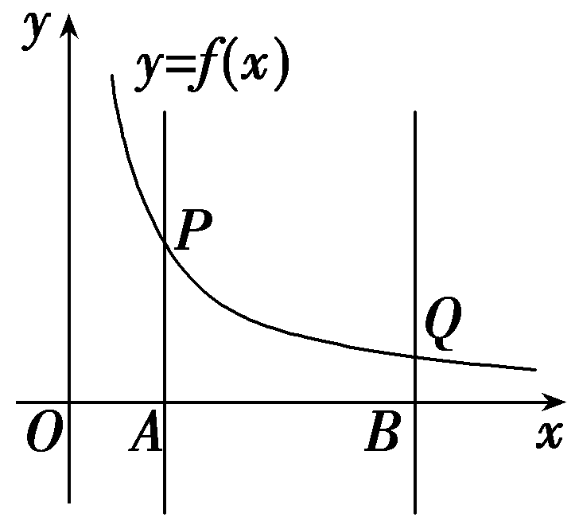
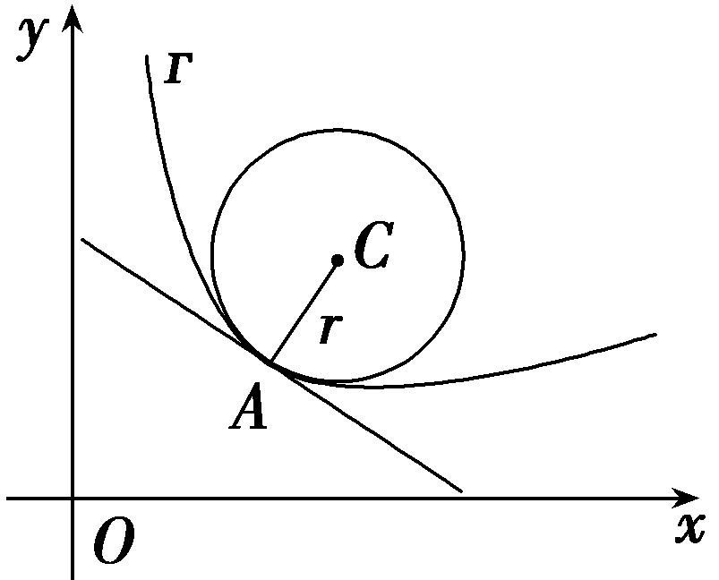
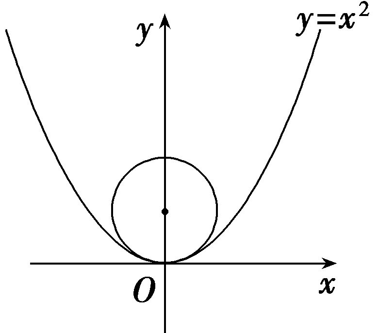
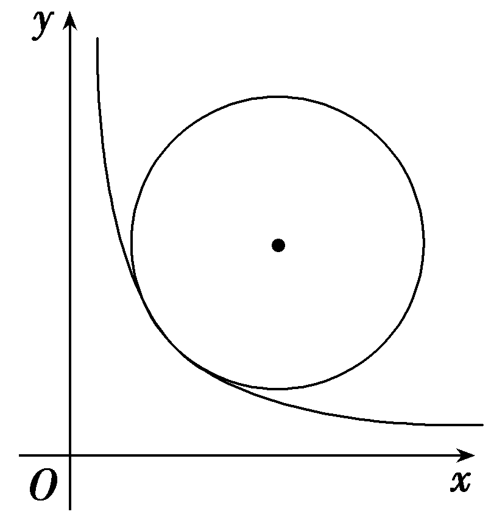
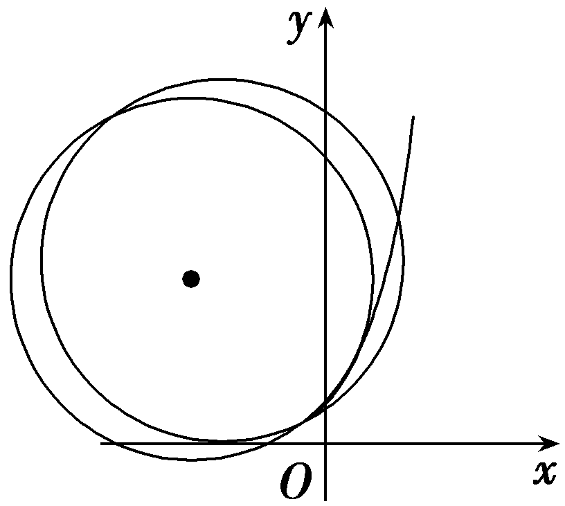

**培优课**6　**函数、导数中的创新问题**

新定义、新信息、新情境问题都属于创新问题范畴，是指题目通过给出一个新概念或约定一个新运算法则，要求学生在阅读理解的基础上，根据具体情境结合题目给出的定义或者算法来解决具体问题.这类创新问题主要考查学生的深度学习能力、信息迁移能力和透过信息理解数学本质的能力.

函数、导数中的创新问题，命题新颖，常常考查函数的性质(包括单调性、奇偶性、极值、最值等)、范围、恒成立、零点等问题，且经常存在知识点交叉融合.解决此类问题第一，要准确转化：紧扣题目所给的定义、运算法则对所求问题进行恰当的转化；第二，要方法的选取：对给定新信息可以采取一般到特殊的特例法，从逻辑推理的角度进行转化，理解题目定义的本质并进行推广、运算.掌握好三基，进行深度思考、理解数学本质才是以不变应万变的制胜法宝.

**题型一　定义新函数**

(&lt;te<em>x</em>t style="su<em>b</em>script"&gt;2&lt;/text&gt;024·山东滨州二模)定义：函数&lt;te&lt;te&lt;te&lt;text style="it<em>a</em>lic"&gt;x&lt;/text&gt;t style="italic"&gt;x&lt;/text&gt;t style="italic"&gt;x&lt;/text&gt;t style="italic"&gt;<em>f</em>&lt;/text&gt;(x)满足对于任意不同的x1，x2∈[a，b]，都有 $\left|f\left(x_{1}\right)－f\left(x_{2}\right)\right|$ ＜&lt;te<em>x</em>t style="italic"&gt;<em>k</em>&lt;/text&gt; $\left|x_{1}－x_{2}\right|$ ，则称&lt;te&lt;te&lt;te&lt;te<em>x</em>t style="it<em>a</em>lic"&gt;x&lt;/text&gt;t style="italic"&gt;x&lt;/text&gt;t style="italic"&gt;x&lt;/text&gt;t style="italic"&gt;<em>f</em>&lt;/text&gt;(x)为 $\left[a，b\right]$ 上的“&lt;te<em>x</em>t style="italic"&gt;<em>k</em>&lt;/text&gt;类函数”.

(1)若<te<te*x*t style="italic">x</text>t style="italic">*f*</text>(x) $＝\frac{x^{2}}{3}$ ＋1，判断<te<te*x*t style="italic">x</text>t style="italic">*f*</text>(x)是否为 $\left[1，3\right]$ 上的“2类函数”；

(2)若<te<te<te<te<te<text style="it*a*lic">x</text>t style="italic">x</text>t style="italic,superscript">x</text>t style="italic">x</text>t style="it*a*lic">x</text>t style="italic">f</text>(x)＝a(x－1)ex－ $\frac{x^{2}}{2}$ －<te<te<te<te<text style="it*a*lic">x</text>t style="italic">x</text>t style="italic,superscript">x</text>t style="italic">x</text>t style="it*a*lic">x</text>ln x为[1，e]上的“3类函数”，求实数a的取值范围；

(3)若&lt;te&lt;te&lt;te<em>x</em>t style="italic"&gt;x&lt;/text&gt;t style="italic"&gt;x&lt;/text&gt;t style="italic"&gt;<em>&lt;text style="italic"&gt;f</em>&lt;/text&gt;&lt;/text&gt;(x)为[1，2]上的“2类函数”，且f(1)＝f(2)，证明：∀x1，x2∈[1，2]， $\left|f\left(x_{1}\right)－f\left(x_{2}\right)\right|$ ＜&lt;te<em>x</em>t style="subscript"&gt;1&lt;/text&gt;.

解：(&lt;te&lt;te&lt;te&lt;te&lt;te<em>x</em>t style="italic"&gt;x&lt;/text&gt;t style="italic"&gt;x&lt;/text&gt;t style="italic"&gt;x&lt;/text&gt;t style="italic"&gt;x&lt;/text&gt;t style="subscript"&gt;&lt;text style="subscript"&gt;1&lt;/text&gt;&lt;/text&gt;)对于任意不同的<em>x</em>1，x&lt;text style="subscript"&gt;&lt;text style="subscript"&gt;2&lt;/text&gt;&lt;/text&gt;∈ $\left[1，3\right]$ ，不妨设&lt;te&lt;te&lt;te&lt;te&lt;te<em>x</em>t style="italic"&gt;x&lt;/text&gt;t style="italic"&gt;x&lt;/text&gt;t style="italic"&gt;x&lt;/text&gt;t style="italic"&gt;x&lt;/text&gt;t style="italic"&gt;x&lt;/text&gt;&lt;text style="subscript"&gt;&lt;text style="subscript"&gt;1&lt;/text&gt;&lt;/text&gt;＜x&lt;text style="subscript"&gt;&lt;text style="subscript"&gt;2&lt;/text&gt;&lt;/text&gt;，即1≤x1＜x2≤3，

则 $\left|f\left(x_{1}\right)－f\left(x_{2}\right)\right|＝\left|\left(\frac{x_{1}^{2}}{3}+1\right)－\left(\frac{x_{2}^{2}}{3}+1\right)\right|＝\frac{x_{1}＋x_{2}}{3}\left|x_{1}－x_{2}\right|$ ＜2 $\left|x_{1}－x_{2}\right|$ ，

所以<te*x*t style="italic">f</text>(x)为 $\left[1，3\right]$ 上的“2类函数”.

(2)因为*f*(*x*)为[1，e]上的“3类函数”，

对于任意不同的&lt;te&lt;te&lt;te<em>x</em>t style="italic"&gt;x&lt;/text&gt;t style="italic"&gt;x&lt;/text&gt;t style="italic"&gt;x&lt;/text&gt;&lt;text style="subscript"&gt;1&lt;/text&gt;，x&lt;text style="subscript"&gt;2&lt;/text&gt;∈ $\left[1，e\right]$ ，不妨设&lt;te&lt;te&lt;te<em>x</em>t style="italic"&gt;x&lt;/text&gt;t style="italic"&gt;x&lt;/text&gt;t style="italic"&gt;x&lt;/text&gt;&lt;text style="subscript"&gt;1&lt;/text&gt;＜x&lt;text style="subscript"&gt;2&lt;/text&gt;，

则 $\left|f\left(x_{1}\right)－f\left(x_{2}\right)\right|$ ＜3 $\left|x_{1}－x_{2}\right|＝$ 3 $\left(x_{2}－x_{1}\right)$ 恒成立，

可得3&lt;te&lt;te&lt;te<em>x</em>t style="italic"&gt;x&lt;/text&gt;t style="italic"&gt;x&lt;/text&gt;t style="italic"&gt;x&lt;/text&gt;&lt;text style="subscript"&gt;1&lt;/text&gt;－3x&lt;text style="subscript"&gt;2&lt;/text&gt;＜<em>&lt;text style="italic"&gt;f</em>&lt;/text&gt; $\left(x_{1}\right)$ －&lt;te&lt;te<em>x</em>t style="italic"&gt;x&lt;/text&gt;t style="italic"&gt;<em>f</em>&lt;/text&gt; $\left(x_{2}\right)$ ＜3&lt;te&lt;te&lt;te<em>x</em>t style="italic"&gt;x&lt;/text&gt;t style="italic"&gt;x&lt;/text&gt;t style="italic"&gt;x&lt;/text&gt;&lt;text style="subscript"&gt;2&lt;/text&gt;－3x&lt;text style="subscript"&gt;1&lt;/text&gt;，

即&lt;te&lt;te<em>x</em>t style="italic"&gt;x&lt;/text&gt;t style="italic"&gt;<em>f</em>&lt;/text&gt; $\left(x_{1}\right)$ ＋3&lt;te<em>x</em>t style="italic"&gt;x&lt;/text&gt;1＜<em>&lt;text style="italic"&gt;f</em>&lt;/text&gt; $\left(x_{2}\right)$ ＋3&lt;te<em>x</em>t style="italic"&gt;x&lt;/text&gt;2，

&lt;te&lt;te<em>x</em>t style="italic"&gt;x&lt;/text&gt;t style="italic"&gt;<em>f</em>&lt;/text&gt; $\left(x_{2}\right)$ －3&lt;te<em>x</em>t style="italic"&gt;x&lt;/text&gt;2＜<em>&lt;text style="italic"&gt;f</em>&lt;/text&gt; $\left(x_{1}\right)$ －3&lt;te<em>x</em>t style="italic"&gt;x&lt;/text&gt;1均恒成立，

构造<te<te*x*t style="italic">x</text>t style="italic">g</text> $\left(x\right)＝$ <te<te*x*t style="italic">x</text>t style="italic">f</text> $\left(x\right)$ ＋3<te*x*t style="italic">x</text>，x∈ $\left[1，e\right]$ ，

则*g'* $\left(x\right)＝$ *f'* $\left(x\right)$ ＋3，

由&lt;te&lt;te<em>x</em>t style="italic"&gt;x&lt;/text&gt;t style="italic"&gt;<em>f</em>&lt;/text&gt; $\left(x_{1}\right)$ ＋3&lt;te<em>x</em>t style="italic"&gt;x&lt;/text&gt;1＜<em>&lt;text style="italic"&gt;f</em>&lt;/text&gt; $\left(x_{2}\right)$ ＋3&lt;te<em>x</em>t style="italic"&gt;x&lt;/text&gt;2可知<em>g</em> $\left(x\right)$ 在 $\left[1，e\right]$ 内单调递增，

可知*g'* $\left(x\right)＝$ *f'* $\left(x\right)$ ＋3≥0在 $\left[1，e\right]$ 内恒成立，

即*f'* $\left(x\right)$ ≥－3在 $\left[1，e\right]$ 内恒成立；

同理可得：*f'* $\left(x\right)$ ≤3在 $\left[1，e\right]$ 内恒成立；

即－3≤*f'* $\left(x\right)$ ≤3在 $\left[1，e\right]$ 内恒成立，

又因为<em>f'</em>(<em>x</em>)＝<em>ax</em>e<em>x</em>－<em>x</em>－1－ln <em>x</em>，即－3≤<em>ax</em>e<em>x</em>－<em>x</em>－1－ln <em>x</em>≤3，

整理得 $\frac{x＋lnx－2}{xe^{x}}$ ≤<text style="it*a*lic">a</text>≤ $\frac{x＋lnx+4}{xe^{x}}$ ，可得 $\frac{x＋lnx－2}{e^{x＋lnx}}$ ≤<text style="it*a*lic">a</text>≤ $\frac{x＋lnx+4}{e^{x＋lnx}}$ ，

即 $\frac{x＋lnx－2}{e^{x＋lnx}}$ ≤*a*≤ $\frac{x＋lnx+4}{e^{x＋lnx}}$ 在 $\left[1，e\right]$ 内恒成立，

令*t*＝*x*＋ln *x*，

因为<<te<te*x*t style="italic">x</text>t style="italic">t</text>e<te*x*t st*y*le="italic">x</text>t style="italic">y</text>＝x，y＝ln x在 $\left[1，e\right]$ 内单调递增，则<te<te*x*t style="italic">x</text>t style="italic">t</text>＝<te*x*t st*y*le="italic">x</text>＋ln x在 $\left[1，e\right]$ 内单调递增，

当<<<<te<te*x*t style="italic">x</text>t style="italic">t</text>ext style="italic">t</text>e*x*t style="italic">t</text>ext style="italic">x</text>＝1，t＝1；当x＝e，t＝e＋1；可知t＝x＋ln x∈ $\left[1，e+1\right]$ ，

可得 $\frac{t－2}{e^{t}}$ ≤*a*≤ $\frac{t+4}{e^{t}}$ 在 $\left[1，e+1\right]$ 内恒成立，

构造<*t*ext style="italic">F</text> $\left(t\right)＝\frac{t－2}{e^{t}}$ ，*t*∈ $\left[1，e+1\right]$ ，则<*t*ext style="italic">F</text>' $\left(t\right)＝\frac{3－t}{e^{t}}$ ，

当1≤*t*＜3时，*F'* $\left(t\right)$ ＞0；

当3＜*t*≤e＋1时，*F'* $\left(t\right)$ ＜0；

可知*<text style="italic"><text style="italic">F*</text></text> $\left(t\right)$ 在 $\left[1，3\right)$ 内单调递增，在 $\left(3，e+1\right]$ 内单调递减，则*<text style="italic"><text style="italic">F*</text></text> $\left(t\right)$ ≤*<text style="italic"><text style="italic">F*</text></text> $\left(3\right)＝\frac{1}{e^{3}}$ .

构造<*t*ext style="italic">G</text> $\left(t\right)＝\frac{t+4}{e^{t}}$ ，*t*∈ $\left[1，e+1\right]$ ，则<*t*ext style="italic">G</text>' $\left(t\right)＝\frac{－3－t}{e^{t}}$ ＜0在 $\left[1，e+1\right]$ 内恒成立，

可知*G* $\left(t\right)$ 在 $\left[1，e+1\right]$ 内单调递减，

则*<text style="italic">G*</text> $\left(t\right)$ ≥*<text style="italic">G*</text> $\left(e+1\right)＝\frac{e+5}{e^{e+1}}$ ；

可得 $\frac{1}{e^{3}}$ ≤*a*≤ $\frac{e+5}{e^{e+1}}$ ，

所以实数*a*的取值范围为 $\left[\frac{1}{e^{3}}，\frac{e+5}{e^{e+1}}\right]$ .

(3)证明：(ⅰ)当&lt;te<em>x</em>t style="italic"&gt;x&lt;/text&gt;1＝x2，可得 $\left|f\left(x_{1}\right)－f\left(x_{2}\right)\right|＝$ 0＜&lt;te<em>x</em>t style="subscript"&gt;1&lt;/text&gt;，符合题意；

(ⅱ)当<em>x</em>1≠<em>x</em>2，因为<em>f</em>(<em>x</em>)为[1，2]上的“2类函数”，不妨设1≤<em>x</em>1＜<em>x</em>2≤2，

①若0＜&lt;te<em>x</em>t style="italic"&gt;x&lt;/text&gt;2－x1≤ $\frac{1}{2}$ ，

则 $\left|f\left(x_{1}\right)－f\left(x_{2}\right)\right|$ ＜2 $\left|x_{1}－x_{2}\right|$ ≤1；

②若 $\frac{1}{2}$ ＜&lt;te&lt;te&lt;te&lt;te<em>x</em>t style="italic"&gt;x&lt;/text&gt;t style="italic"&gt;x&lt;/text&gt;t style="italic"&gt;x&lt;/text&gt;t style="italic"&gt;x&lt;/text&gt;&lt;text style="subscript"&gt;2&lt;/text&gt;－x&lt;text style="subscript"&gt;&lt;text style="subscript"&gt;1&lt;/text&gt;&lt;/text&gt;≤1，则 $\left|f\left(x_{1}\right)－f\left(x_{2}\right)\right|＝\left|f\left(x_{1}\right)－f\left(1\right)＋f\left(1\right)－f\left(x_{2}\right)\right|＝$ ｜&lt;te&lt;te&lt;te<em>x</em>t style="italic"&gt;x&lt;/text&gt;t style="italic"&gt;x&lt;/text&gt;t style="italic"&gt;<em>&lt;text style="italic"&gt;&lt;text style="italic"&gt;&lt;text style="italic"&gt;&lt;text style="italic"&gt;f</em>&lt;/text&gt;&lt;/text&gt;&lt;/text&gt;&lt;/text&gt;&lt;/text&gt; $\left(x_{1}\right)$ －&lt;te&lt;te&lt;te<em>x</em>t style="italic"&gt;x&lt;/text&gt;t style="italic"&gt;x&lt;/text&gt;t style="italic"&gt;<em>&lt;text style="italic"&gt;&lt;text style="italic"&gt;&lt;text style="italic"&gt;&lt;text style="italic"&gt;f</em>&lt;/text&gt;&lt;/text&gt;&lt;/text&gt;&lt;/text&gt;&lt;/text&gt; $\left(1\right)$ ＋&lt;te&lt;te&lt;te<em>x</em>t style="italic"&gt;x&lt;/text&gt;t style="italic"&gt;x&lt;/text&gt;t style="italic"&gt;<em>&lt;text style="italic"&gt;&lt;text style="italic"&gt;&lt;text style="italic"&gt;&lt;text style="italic"&gt;f</em>&lt;/text&gt;&lt;/text&gt;&lt;/text&gt;&lt;/text&gt;&lt;/text&gt; $\left(2\right)$ －&lt;te&lt;te&lt;te<em>x</em>t style="italic"&gt;x&lt;/text&gt;t style="italic"&gt;x&lt;/text&gt;t style="italic"&gt;<em>&lt;text style="italic"&gt;&lt;text style="italic"&gt;&lt;text style="italic"&gt;&lt;text style="italic"&gt;f</em>&lt;/text&gt;&lt;/text&gt;&lt;/text&gt;&lt;/text&gt;&lt;/text&gt; $\left(x_{2}\right)$ ｜≤ $\left|f\left(x_{1}\right)－f\left(1\right)\right|$ ＋｜&lt;te&lt;te&lt;te<em>x</em>t style="italic"&gt;x&lt;/text&gt;t style="italic"&gt;x&lt;/text&gt;t style="italic"&gt;<em>&lt;text style="italic"&gt;&lt;text style="italic"&gt;&lt;text style="italic"&gt;&lt;text style="italic"&gt;f</em>&lt;/text&gt;&lt;/text&gt;&lt;/text&gt;&lt;/text&gt;&lt;/text&gt; $\left(2\right)$ －&lt;te&lt;te&lt;te<em>x</em>t style="italic"&gt;x&lt;/text&gt;t style="italic"&gt;x&lt;/text&gt;t style="italic"&gt;<em>&lt;text style="italic"&gt;&lt;text style="italic"&gt;&lt;text style="italic"&gt;&lt;text style="italic"&gt;f</em>&lt;/text&gt;&lt;/text&gt;&lt;/text&gt;&lt;/text&gt;&lt;/text&gt; $\left(x_{2}\right)$ ｜＜&lt;te&lt;te&lt;te&lt;te<em>x</em>t style="italic"&gt;x&lt;/text&gt;t style="italic"&gt;x&lt;/text&gt;t style="italic"&gt;x&lt;/text&gt;t style="subscript"&gt;2&lt;/text&gt;(<em>x</em>&lt;text style="subscript"&gt;&lt;text style="subscript"&gt;1&lt;/text&gt;&lt;/text&gt;－1)＋2 $\left(2－x_{2}\right)＝$ &lt;te&lt;te&lt;te&lt;te<em>x</em>t style="italic"&gt;x&lt;/text&gt;t style="italic"&gt;x&lt;/text&gt;t style="italic"&gt;x&lt;/text&gt;t style="subscript"&gt;2&lt;/text&gt;－2(<em>x</em>2－x&lt;text style="subscript"&gt;&lt;text style="subscript"&gt;1&lt;/text&gt;&lt;/text&gt;)＜1；

综上所述：∀&lt;te<em>x</em>t style="italic"&gt;x&lt;/text&gt;1，x2∈[1，2]， $\left|f\left(x_{1}\right)－f\left(x_{2}\right)\right|$ ＜&lt;te<em>x</em>t style="subscript"&gt;1&lt;/text&gt;.

**题型二　定义新运算**

(2024·湖北七市州调研)微积分的创立是数学发展中的里程碑，它的发展和广泛应用开创了向近代数学过渡的新时期，为研究变量和函数提供了重要的方法和手段，对于函数&lt;te&lt;te&lt;te&lt;te&lt;te&lt;text style="it<em>a</em>lic"&gt;x&lt;/text&gt;t st&lt;text st<em>y</em>le="italic"&gt;y&lt;/text&gt;le="italic"&gt;x&lt;/text&gt;t style="it<em>a</em>lic"&gt;x&lt;/text&gt;t style="italic"&gt;x&lt;/text&gt;t style="italic"&gt;x&lt;/text&gt;t style="italic"&gt;<em>f</em>&lt;/text&gt; $\left(x\right)＝\frac{1}{x}$ (&lt;te&lt;te&lt;te&lt;te&lt;text style="it<em>a</em>lic"&gt;x&lt;/text&gt;t st&lt;text st<em>y</em>le="italic"&gt;y&lt;/text&gt;le="italic"&gt;x&lt;/text&gt;t style="it<em>a</em>lic"&gt;x&lt;/text&gt;t style="italic"&gt;x&lt;/text&gt;t style="italic"&gt;x&lt;/text&gt;＞0)，<em>&lt;text style="italic"&gt;f</em>&lt;/text&gt; $\left(x\right)$ 在区间 $\left[a，b\right]$ 上的图象连续不断，从几何上看，定积分 $\int_{a}^{b} \frac{1}{x}$ d&lt;te&lt;te&lt;te&lt;te&lt;text style="it<em>a</em>lic"&gt;x&lt;/text&gt;t st&lt;text st<em>y</em>le="italic"&gt;y&lt;/text&gt;le="italic"&gt;x&lt;/text&gt;t style="it<em>a</em>lic"&gt;x&lt;/text&gt;t style="italic"&gt;x&lt;/text&gt;t style="italic"&gt;x&lt;/text&gt;便是由直线x＝a，x＝<em>&lt;text style="italic"&gt;b</em>&lt;/text&gt;，y＝0和曲线y $＝\frac{1}{x}$ 所围成的区域(称为曲边&lt;text style="subscript"&gt;梯形&lt;/text&gt;&lt;te&lt;text style="it<em>a</em>lic"&gt;x&lt;/text&gt;t style="italic"&gt;<em>&lt;text style="italic"&gt;&lt;text style="italic,subscript"&gt;&lt;text style="italic,subscript"&gt;ABQP</em>&lt;/text&gt;&lt;/text&gt;&lt;/text&gt;&lt;/text&gt;)的面积，根据微积分基本定理可得 $\int_{a}^{b} \frac{1}{x}$ d&lt;te&lt;te&lt;te&lt;te&lt;text style="it<em>a</em>lic"&gt;x&lt;/text&gt;t st&lt;text st<em>y</em>le="italic"&gt;y&lt;/text&gt;le="italic"&gt;x&lt;/text&gt;t style="it<em>a</em>lic"&gt;x&lt;/text&gt;t style="italic"&gt;x&lt;/text&gt;t style="italic"&gt;x&lt;/text&gt;＝ln <em>&lt;text style="italic"&gt;b</em>&lt;/text&gt;－ln a，因为曲边&lt;text style="subscript"&gt;梯形&lt;/text&gt;<em>&lt;text style="italic"&gt;&lt;text style="italic"&gt;&lt;text style="italic,subscript"&gt;&lt;text style="italic,subscript"&gt;ABQP</em>&lt;/text&gt;&lt;/text&gt;&lt;/text&gt;&lt;/text&gt;的面积小于梯形ABQP的面积，即<em>&lt;text style="italic"&gt;S</em>&lt;/text&gt;曲边梯形ABQP＜S梯形ABQP，代入数据，进一步可以推导出不等式： $\frac{a－b}{lna－lnb}＞\frac{2}{\frac{1}{a}＋\frac{1}{b}}$ .

(1)请仿照这种根据面积关系证明不等式的方法，证明： $\frac{a－b}{lna－lnb}＜\frac{a＋b}{2}$ ；

(&lt;te&lt;te&lt;text style="it<em>a</em>lic"&gt;x&lt;/text&gt;t style="italic"&gt;x&lt;/text&gt;t style="superscript"&gt;2&lt;/text&gt;)已知函数<em>f</em> $\left(x\right)＝$ &lt;te&lt;te&lt;text style="it<em>a</em>lic"&gt;x&lt;/text&gt;t style="italic"&gt;x&lt;/text&gt;t style="italic"&gt;ax&lt;/text&gt;2＋<em>&lt;text style="italic"&gt;b</em>x&lt;/text&gt;＋xln x，其中a，b∈<strong>R</strong>.

①证明：对任意两个不相等的正数&lt;te&lt;text st<em>y</em>le="italic"&gt;x&lt;/text&gt;t style="italic"&gt;x&lt;/text&gt;1，x2，曲线y＝<em>f</em> $\left(x\right)$ 在 $\left(x_{1}，f\left(x_{1}\right)\right)$ 和 $\left(x_{2}，f\left(x_{2}\right)\right)$ 处的切线均不重合；

②当<text style="it*a*lic">b</text>＝－1时，若不等式*f* $\left(x\right)$ ≥2sin $\left(x－1\right)$ 恒成立，求实数*a*的取值范围.

解：(1)证明：在曲线*y* $＝\frac{1}{x}$ 上取一点*M* $\left(\frac{a＋b}{2}，\frac{2}{a＋b}\right)$ .

过点<em>&lt;text style="italic"&gt;&lt;text style="italic"&gt;M</em>&lt;/text&gt;&lt;/text&gt; $\left(\frac{a＋b}{2}，\frac{2}{a＋b}\right)$ 作<em>f</em> $\left(x\right)$ 的切线分别交<em>AP</em>，<em>BQ</em>于<em>&lt;text style="italic"&gt;&lt;text style="italic"&gt;M</em>&lt;/text&gt;&lt;/text&gt;1，M2，

因为<em>S</em>曲边梯形<em>ABQP</em>＞ $S_{梯形ABM_{2}M_{1}}$ ，

可得ln <text style="it*a*lic">b</text>－ln a＞ $\frac{1}{2}$ · $\left(\left|AM_{1}\right|＋\left|BM_{2}\right|\right)$ · $\left|AB\right|＝\frac{1}{2}$ ·2· $\frac{2}{a＋b}$ · $\left(b－a\right)$ ，即 $\frac{a－b}{lna－lnb}＜\frac{a＋b}{2}$ .

(&lt;te&lt;te<em>x</em>t style="italic"&gt;x&lt;/text&gt;t style="superscript"&gt;2&lt;/text&gt;)①证明：由函数<em>f</em> $\left(x\right)＝$ &lt;te&lt;te<em>x</em>t style="italic"&gt;x&lt;/text&gt;t style="italic"&gt;ax&lt;/text&gt;2＋<em>bx</em>＋xln x，

可得<te*x*t style="italic">f'</text> $\left(x\right)＝$ 2<te*x*t style="italic">ax</text>＋ln x＋*b*＋1，

不妨设0＜&lt;te&lt;te&lt;te<em>x</em>t style="italic"&gt;x&lt;/text&gt;t st&lt;text st&lt;text st<em>y</em>le="italic"&gt;y&lt;/text&gt;<em>l</em>e="italic"&gt;y&lt;/text&gt;le="italic"&gt;x&lt;/text&gt;t style="italic"&gt;x&lt;/text&gt;&lt;text style="subscript"&gt;&lt;text style="subscript"&gt;1&lt;/text&gt;&lt;/text&gt;＜x2，曲线y＝<em>&lt;text style="italic"&gt;&lt;text style="italic"&gt;f</em>&lt;/text&gt;&lt;/text&gt; $\left(x\right)$ 在 $\left(x_{1}，f\left(x_{1}\right)\right)$ 处的切线方程为&lt;te&lt;te<em>x</em>t style="italic"&gt;x&lt;/text&gt;t st&lt;text st<em>y</em>le="italic"&gt;y&lt;/text&gt;le="italic"&gt;l&lt;/text&gt;&lt;te&lt;text st<em>y</em>le="italic"&gt;x&lt;/text&gt;t style="subscript"&gt;&lt;text style="subscript"&gt;1&lt;/text&gt;&lt;/text&gt;：y－<em>&lt;text style="italic"&gt;&lt;text style="italic"&gt;f</em>&lt;/text&gt;&lt;/text&gt; $\left(x_{1}\right)＝$ &lt;te&lt;te<em>x</em>t style="italic"&gt;x&lt;/text&gt;t st&lt;text st<em>y</em>le="italic"&gt;y&lt;/text&gt;<em>l</em>e="italic"&gt;<em>&lt;text style="italic"&gt;f</em>&lt;/text&gt;&lt;/text&gt;' $\left(x_{1}\right)\left(x－x_{1}\right)$ ，即&lt;te&lt;te<em>x</em>t style="italic"&gt;x&lt;/text&gt;t st&lt;text st<em>y</em>le="italic"&gt;y&lt;/text&gt;<em>l</em>e="italic"&gt;y&lt;/text&gt;＝<em>&lt;text style="italic"&gt;&lt;text style="italic"&gt;f</em>&lt;/text&gt;&lt;/text&gt;' $\left(x_{1}\right)$ &lt;te&lt;te&lt;te<em>x</em>t style="italic"&gt;x&lt;/text&gt;t st&lt;text st&lt;text st<em>y</em>le="italic"&gt;y&lt;/text&gt;<em>l</em>e="italic"&gt;y&lt;/text&gt;le="italic"&gt;x&lt;/text&gt;t style="italic"&gt;x&lt;/text&gt;＋<em>&lt;text style="italic"&gt;&lt;text style="italic"&gt;f</em>&lt;/text&gt;&lt;/text&gt; $\left(x_{1}\right)$ －&lt;te&lt;te&lt;te<em>x</em>t style="italic"&gt;x&lt;/text&gt;t st&lt;text st&lt;text st<em>y</em>le="italic"&gt;y&lt;/text&gt;<em>l</em>e="italic"&gt;y&lt;/text&gt;le="italic"&gt;x&lt;/text&gt;t style="italic"&gt;x&lt;/text&gt;&lt;text style="subscript"&gt;&lt;text style="subscript"&gt;1&lt;/text&gt;&lt;/text&gt;<em>&lt;text style="italic"&gt;&lt;text style="italic"&gt;f</em>&lt;/text&gt;&lt;/text&gt;' $\left(x_{1}\right)$ ，

同理曲线&lt;te&lt;te<em>x</em>t style="italic"&gt;x&lt;/text&gt;t st<em>yl</em>e="italic"&gt;y&lt;/text&gt;＝<em>&lt;text style="italic"&gt;f</em>&lt;/text&gt; $\left(x\right)$ 在 $\left(x_{2}，f\left(x_{2}\right)\right)$ 处的切线方程为&lt;te&lt;te<em>x</em>t style="italic"&gt;x&lt;/text&gt;t st<em>y</em>le="italic"&gt;l&lt;/text&gt;&lt;text style="subscript"&gt;2&lt;/text&gt;：<em>y</em>＝<em>&lt;text style="italic"&gt;f</em>&lt;/text&gt;' $\left(x_{2}\right)$ &lt;te<em>x</em>t style="italic"&gt;x&lt;/text&gt;＋&lt;text st<em>yl</em>e="italic"&gt;<em>f</em>&lt;/text&gt; $\left(x_{2}\right)$ －&lt;te<em>x</em>t style="italic"&gt;x&lt;/text&gt;&lt;text st<em>y</em>le="subscript"&gt;2&lt;/text&gt;&lt;text sty<em>l</em>e="italic"&gt;<em>f</em>&lt;/text&gt;' $\left(x_{2}\right)$ ，

假设&lt;text sty<em>l</em>e="italic"&gt;l&lt;/text&gt;1与l2重合，则 $\left\{\begin{matrix}f'\left(x_{1}\right)＝f'\left(x_{2}\right)，\\f\left(x_{1}\right)－x_{1}f'\left(x_{1}\right)＝f\left(x_{2}\right)－x_{2}f'\left(x_{2}\right)，\end{matrix}\right.$

代入化简可得 $\left\{\begin{matrix}ln x_{2}－ln x_{1}+2a\left(x_{2}－x_{1}\right)=0，\\a\left(x_{2}＋x_{1}\right)＝－1(a<0),\end{matrix}\right.$

两式消去&lt;te&lt;te<em>x</em>t style="italic"&gt;x&lt;/text&gt;t style="italic"&gt;a&lt;/text&gt;，可得ln x2－ln x1－2 $\frac{x_{2}－x_{1}}{x_{2}＋x_{1}}＝$ 0，整理得 $\frac{x_{2}－x_{1}}{ln x_{2}－ln x_{1}}＝\frac{x_{2}＋x_{1}}{2}$ ，

由(1)的结论知 $\frac{x_{2}－x_{1}}{ln x_{2}－ln x_{1}}＜\frac{x_{2}＋x_{1}}{2}$ ，与上式矛盾，

即对任意实数<em>a</em>，<em>b</em>及任意不相等的正数<em>x</em>1，<em>x</em>2，<em>l</em>1与<em>l</em>2均不重合.

②当*b*＝－1时，不等式*f* $\left(x\right)$ ≥2sin $\left(x－1\right)$ 恒成立，

所以&lt;te&lt;te&lt;te&lt;text style="it<em>a</em>lic"&gt;x&lt;/text&gt;t style="italic"&gt;x&lt;/text&gt;t style="italic"&gt;x&lt;/text&gt;t style="italic"&gt;<em>h</em>&lt;/text&gt; $\left(x\right)＝$ &lt;te&lt;te&lt;te&lt;text style="it<em>a</em>lic"&gt;x&lt;/text&gt;t style="italic"&gt;x&lt;/text&gt;t style="italic"&gt;x&lt;/text&gt;t style="italic"&gt;ax&lt;/text&gt;2－x＋xln x－2sin $\left(x－1\right)$ ≥0在 $\left(0，＋\infty \right)$ 恒成立，所以&lt;te&lt;te&lt;te&lt;text style="it<em>a</em>lic"&gt;x&lt;/text&gt;t style="italic"&gt;x&lt;/text&gt;t style="italic"&gt;x&lt;/text&gt;t style="italic"&gt;<em>h</em>&lt;/text&gt; $\left(1\right)$ ≥0⇒<em>a</em>≥1.

因为&lt;te&lt;te&lt;te&lt;te<em>x</em>t style="italic"&gt;x&lt;/text&gt;t style="italic"&gt;x&lt;/text&gt;t style="italic"&gt;x&lt;/text&gt;t style="italic"&gt;a&lt;/text&gt;≥1，所以<em>h</em> $\left(x\right)$ ≥&lt;te&lt;te&lt;te<em>x</em>t style="italic"&gt;x&lt;/text&gt;t style="italic"&gt;x&lt;/text&gt;t style="italic"&gt;x&lt;/text&gt;2－x＋xln x－2sin $\left(x－1\right)$ ，

设&lt;te&lt;te&lt;te&lt;te&lt;te&lt;te<em>x</em>t style="italic"&gt;x&lt;/text&gt;t style="italic"&gt;x&lt;/text&gt;t style="italic"&gt;x&lt;/text&gt;t style="italic"&gt;x&lt;/text&gt;t style="italic"&gt;x&lt;/text&gt;t style="italic"&gt;H&lt;/text&gt; $\left(x\right)＝$ &lt;te&lt;te&lt;te&lt;te&lt;te<em>x</em>t style="italic"&gt;x&lt;/text&gt;t style="italic"&gt;x&lt;/text&gt;t style="italic"&gt;x&lt;/text&gt;t style="italic"&gt;x&lt;/text&gt;t style="italic"&gt;x&lt;/text&gt;2－x＋xln x－2sin $\left(x－1\right)$ ，&lt;te&lt;te&lt;te&lt;te&lt;te&lt;te<em>x</em>t style="italic"&gt;x&lt;/text&gt;t style="italic"&gt;x&lt;/text&gt;t style="italic"&gt;x&lt;/text&gt;t style="italic"&gt;x&lt;/text&gt;t style="italic"&gt;x&lt;/text&gt;t style="italic"&gt;H&lt;/text&gt;' $\left(x\right)＝$ &lt;te&lt;te&lt;te&lt;te&lt;te<em>x</em>t style="italic"&gt;x&lt;/text&gt;t style="italic"&gt;x&lt;/text&gt;t style="italic"&gt;x&lt;/text&gt;t style="italic"&gt;x&lt;/text&gt;t style="superscript"&gt;2&lt;/text&gt;<em>x</em>＋ln x－2cos $\left(x－1\right)$ ，

(ⅰ)当<te<te*x*t style="italic">x</text>t style="italic">x</text>∈ $\left[1，＋\infty \right)$ 时，由2<te<te*x*t style="italic">x</text>t style="italic">x</text>≥2，ln x≥0，

－2cos $\left(x－1\right)$ ≥－2知*H'* $\left(x\right)$ ≥0恒成立，

即*H* $\left(x\right)$ 在 $\left[1，＋\infty \right)$ 为增函数，

所以*<text style="italic">H*</text> $\left(x\right)$ ≥*<text style="italic">H*</text> $\left(1\right)＝$ 0成立；

(ⅱ)当<te<te<te*x*t style="italic">x</text>t style="italic">x</text>t style="italic">x</text>∈ $\left(0，1\right)$ 时，设<te<te<te*x*t style="italic">x</text>t style="italic">x</text>t style="italic">G</text> $\left(x\right)＝$ 2<te<te<te*x*t style="italic">x</text>t style="italic">x</text>t style="italic">x</text>＋ln x－2cos(x－1)，可得*G*' $\left(x\right)＝$ 2＋ $\frac{1}{x}$ ＋2sin $\left(x－1\right)$ ，

由2sin $\left(x－1\right)$ ≥－2， $\frac{1}{x}$ ＞0知*<text style="italic">G*'</text> $\left(x\right)$ ＞0恒成立，即*G* $\left(x\right)＝$ *H'* $\left(x\right)$ 在 $\left(0，1\right)$ 上为增函数.

所以*<text style="italic"><text style="italic"><text style="italic"><text style="italic">H*</text></text>'</text></text> $\left(x\right)$ ＜*<text style="italic"><text style="italic"><text style="italic"><text style="italic">H*</text></text>'</text></text> $\left(1\right)＝$ 0，即*<text style="italic"><text style="italic">H*</text></text> $\left(x\right)$ 在 $\left(0，1\right)$ 上为减函数，所以*<text style="italic"><text style="italic">H*</text></text> $\left(x\right)$ ＞*<text style="italic"><text style="italic">H*</text></text> $\left(1\right)＝$ 0成立.

综上所述，实数*a*的取值范围是 $\left[1，＋\infty \right)$ .

**题型三　定义新性质**

(2024·山东聊城二模)对于函数<em>f</em>(<em>x</em>)，若存在实数<em>x</em>0，使<em>f</em>(<em>x</em>0)<em>f</em>(<em>x</em>0＋<em>λ</em>)＝1，其中<em>λ</em>≠0，则称<em>f</em>(<em>x</em>)为“可移<em>λ</em>倒数函数”，<em>x</em>0为“<em>f</em>(<em>x</em>)的可移<em>λ</em>倒数点”.已知<em>g</em>(<em>x</em>)＝e<em>x</em>，<em>h</em>(<em>x</em>)＝<em>x</em>＋<em>a</em>(<em>a</em>＞0).

(1)设&lt;te&lt;te&lt;te&lt;te&lt;te<em>x</em>t style="italic"&gt;x&lt;/text&gt;t style="italic"&gt;x&lt;/text&gt;t style="italic"&gt;x&lt;/text&gt;t style="italic"&gt;x&lt;/text&gt;t style="italic"&gt;<em>φ</em>&lt;/text&gt;(x)＝<em>g</em>(x)<em>&lt;text style="italic"&gt;h</em>&lt;/text&gt;2(x)，若 $\sqrt{2}$ 为“&lt;te&lt;te&lt;te<em>x</em>t style="italic"&gt;x&lt;/text&gt;t style="italic"&gt;x&lt;/text&gt;t style="italic"&gt;<em>h</em>&lt;/text&gt;(&lt;te<em>x</em>t style="italic"&gt;x&lt;/text&gt;)的可移－2倒数点”，求函数<em>&lt;text style="italic"&gt;φ</em>&lt;/text&gt;(x)的单调区间；

(2)设<te<te<text style="it*a*lic">x</text>t style="italic">x</text>t style="italic">*ω*</text>(x) $＝\left\{\begin{matrix}g(x),x>0，\\\frac{1}{h(x)}，x<0，\end{matrix}\right.$ 若函数<te<te<text style="it*a*lic">x</text>t style="italic">x</text>t style="italic">*ω*</text>(x)恰有3个“可移1倒数点”，求实数a的取值范围.

解：(1)由 $\sqrt{2}$ 为“*h* $\left(x\right)$ 的可移－2倒数点”，

得*<text style="italic">h*</text> $\left(\sqrt{2}\right)$ *<text style="italic">h*</text> $\left(\sqrt{2}－2\right)＝$ 1，

即 $\left(\sqrt{2}＋a\right)\left(\sqrt{2}－2+a\right)＝$ 1，整理&lt;text style="it<em>a</em>lic"&gt;a&lt;/text&gt;2＋ $\left(2\sqrt{2}－2\right)$ &lt;text style="it<em>a</em>lic"&gt;a&lt;/text&gt;＋1－2 $\sqrt{2}＝$ 0，

即 $\left(a+2\sqrt{2}－1\right)\left(a－1\right)＝$ 0，解得*a*＝1，

故<em>φ</em>(<em>x</em>)＝e<em>x</em>(<em>x</em>＋1)2的定义域为<strong>R</strong>，求导得

&lt;te&lt;te&lt;te&lt;te<em>x</em>t style="italic,superscript"&gt;x&lt;/text&gt;t style="italic"&gt;x&lt;/text&gt;t style="italic,superscript"&gt;x&lt;/text&gt;t style="italic"&gt;φ'&lt;/text&gt; $\left(x\right)＝$ e&lt;te&lt;te&lt;te<em>x</em>t style="italic,superscript"&gt;x&lt;/text&gt;t style="italic"&gt;x&lt;/text&gt;t style="italic,superscript"&gt;x&lt;/text&gt;(x＋1)2＋2ex $\left(x+1\right)＝$ e&lt;te&lt;te&lt;te<em>x</em>t style="italic,superscript"&gt;x&lt;/text&gt;t style="italic"&gt;x&lt;/text&gt;t style="italic,superscript"&gt;x&lt;/text&gt; $\left(x+1\right)\left(x+3\right)$ ，

当*x*∈ $\left(－\infty ,-3\right)$ 时，*<text style="italic">φ*'</text> $\left(x\right)$ ＞0，*φ* $\left(x\right)$ 单调递增；

*x*∈ $\left(－3,-1\right)$ 时，*<text style="italic">φ*'</text> $\left(x\right)$ ＜0，*φ* $\left(x\right)$ 单调递减；

*x*∈ $\left(－1，＋\infty \right)$ 时，*<text style="italic">φ*'</text> $\left(x\right)$ ＞0，*φ* $\left(x\right)$ 单调递增，

所以*φ* $\left(x\right)$ 的单调递增区间为(－∞，－3)，(－1，＋∞)，递减区间为 $\left(－3,-1\right)$ .

(2)依题意，<te*x*t style="italic">ω</text>(x) $＝\left\{\begin{matrix}e^{x}，x>0，\\\frac{1}{x＋a}，x<0，\end{matrix}\right.$

由*<text style="italic"><text style="italic">ω*</text></text> $\left(x\right)$ 恰有3个“可移1倒数点”，得方程*<text style="italic"><text style="italic">ω*</text></text> $\left(x\right)$ *<text style="italic"><text style="italic">ω*</text></text> $\left(x+1\right)＝$ 1恰有3个不等实数根，

①当&lt;te&lt;te&lt;te<em>x</em>t style="italic,superscript"&gt;x&lt;/text&gt;t style="italic"&gt;x&lt;/text&gt;t style="italic"&gt;x&lt;/text&gt;＞0时，x＋1＞0，方程<em>&lt;text style="italic"&gt;ω</em>&lt;/text&gt; $\left(x\right)$ &lt;te&lt;te<em>x</em>t style="italic,superscript"&gt;x&lt;/text&gt;t style="italic"&gt;<em>ω</em>&lt;/text&gt; $\left(x+1\right)＝$ 1可化为e&lt;te&lt;te<em>x</em>t style="italic,superscript"&gt;x&lt;/text&gt;t style="superscript"&gt;2&lt;/text&gt;&lt;te<em>x</em>t style="italic"&gt;x&lt;/text&gt;＋1＝1，解得x＝－ $\frac{1}{2}$ ，

这与<te*x*t style="italic">x</text>＞0不符，因此在 $\left(0，＋\infty \right)$ 内<te*x*t style="italic">*ω*</text> $\left(x\right)$ <te*x*t style="italic">*ω*</text>(*x*＋1)＝1没有实数根；

②当－1＜<te*x*t style="italic">x</text>＜0时，x＋1＞0，方程*<text style="italic">ω*</text> $\left(x\right)$ *<text style="italic">ω*</text> $\left(x+1\right)＝$ 1可化为 $\frac{e^{x+1}}{x＋a}＝$ 1，

该方程又可化为<em>a</em>＝e<em>x</em>＋1－<em>x</em>.

设&lt;te&lt;te&lt;te<em>x</em>t style="italic"&gt;x&lt;/text&gt;t style="italic,superscript"&gt;x&lt;/text&gt;t style="italic"&gt;k&lt;/text&gt; $\left(x\right)＝$ e&lt;te&lt;te<em>x</em>t style="italic"&gt;x&lt;/text&gt;t style="italic,superscript"&gt;x&lt;/text&gt;&lt;text style="superscript"&gt;＋1&lt;/text&gt;－x，则<em>k</em>' $\left(x\right)＝$ e&lt;te&lt;te<em>x</em>t style="italic"&gt;x&lt;/text&gt;t style="italic,superscript"&gt;x&lt;/text&gt;&lt;text style="superscript"&gt;＋1&lt;/text&gt;－1，

因为当*x*∈ $\left(－1，0\right)$ 时，*<text style="italic">k*'</text> $\left(x\right)$ ＞0，所以*k* $\left(x\right)$ 在 $\left(－1，0\right)$ 内单调递增，

又因为<te*x*t style="italic">*<text style="italic">k*</text></text> $\left(－1\right)＝$ 2，<te*x*t style="italic">*<text style="italic">k*</text></text> $\left(0\right)＝$ e，所以当*x*∈ $\left(－1，0\right)$ 时，<te*x*t style="italic">*<text style="italic">k*</text></text> $\left(x\right)$ ∈ $\left(2，e\right)$ ，

因此，当*a*∈ $\left(2，e\right)$ 时，方程*<text style="italic">ω*</text> $\left(x\right)$ *<text style="italic">ω*</text> $\left(x+1\right)＝$ 1在 $\left(－1，0\right)$ 内恰有一个实数根；

当*a*∈ $\left(0，2\right]$ ∪ $\left[e，＋\infty \right)$ 时，方程*<text style="italic">ω*</text> $\left(x\right)$ *<text style="italic">ω*</text> $\left(x+1\right)＝$ 1在 $\left(－1，0\right)$ 内没有实数根.

③当<te<te*x*t style="italic">x</text>t style="italic">x</text>＝－1时，x＋1＝0，*<text style="italic"><text style="italic">ω*</text></text> $\left(x+1\right)$ 没有意义，所以<te<te*x*t style="italic">x</text>t style="italic">x</text>＝－1不是方程*<text style="italic"><text style="italic">ω*</text></text> $\left(x\right)$ <te*x*t style="italic">*<text style="italic">ω*</text></text> $\left(x+1\right)＝$ 1的实数根.

④当<te*x*t style="italic">x</text>＜－1时，x＋1＜0，方程*<text style="italic">ω*</text> $\left(x\right)$ *<text style="italic">ω*</text> $\left(x+1\right)＝$ 1可化为 $\frac{1}{x＋a}$ · $\frac{1}{x＋a+1}＝$ 1，

化为&lt;te&lt;text style="it&lt;text style="it<em>a</em>lic"&gt;a&lt;/text&gt;lic"&gt;x&lt;/text&gt;t style="italic"&gt;x&lt;/text&gt;&lt;text style="superscript"&gt;2&lt;/text&gt;＋ $\left(2a+1\right)$ &lt;te&lt;text style="it&lt;text style="it<em>a</em>lic"&gt;a&lt;/text&gt;lic"&gt;x&lt;/text&gt;t style="italic"&gt;x&lt;/text&gt;＋a&lt;text style="superscript"&gt;2&lt;/text&gt;＋a－1＝0，于是此方程在 $\left(－\infty ,-1\right)$ 内恰有两个实数根，

则有 $\left\{\begin{matrix}\left(2a+1\right)^{2}－4\left(a^{2}＋a－1\right)>0，\\－\frac{2a+1}{2}＜－1，\\1－\left(2a+1\right)＋a^{2}＋a－1>0，\end{matrix}\right.$ 解得*a*＞ $\frac{1+\sqrt{5}}{2}$ ，

因此当*a*＞ $\frac{1+\sqrt{5}}{2}$ 时，方程*<text style="italic">ω*</text> $\left(x\right)$ *<text style="italic">ω*</text> $\left(x+1\right)＝$ 1在 $\left(－\infty ,-1\right)$ 内恰有两个实数根，

当0＜*a*≤ $\frac{1+\sqrt{5}}{2}$ 时，方程*<text style="italic">ω*</text> $\left(x\right)$ *<text style="italic">ω*</text> $\left(x+1\right)＝$ 1在 $\left(－\infty ,-1\right)$ 内至多有一个实数根.

综上，实数*a*的取值范围为 $\left(2，e\right)$ ∩ $\left(\frac{1+\sqrt{5}}{2}，＋\infty \right)＝\left(2，e\right)$ .

**题型四　 交汇新定义问题**

(2024·浙江温州二模)如图，对于曲线*Γ*，存在圆*C*满足如下条件：

①圆*C*与曲线*Γ*有公共点*A*，且圆心在曲线*Γ*凹的一侧；

②圆*C*与曲线*Γ*在点*A*处有相同的切线；

③曲线<em>&lt;text style="italic"&gt;Γ</em>&lt;/text&gt;的导函数在点<em>&lt;text style="italic"&gt;&lt;text style="italic"&gt;A</em>&lt;/text&gt;&lt;/text&gt;处的导数(即曲线Γ的二阶导数)等于圆<em>C</em>在点A处的二阶导数(已知圆 $\left(x－a\right)^{2}$ ＋ $\left(y－b\right)^{2}＝$ <em>r</em>2在点<em>&lt;text style="italic"&gt;&lt;text style="italic"&gt;A</em>&lt;/text&gt;&lt;/text&gt; $\left(x_{0}，y_{0}\right)$ 处的二阶导数等于 $\frac{r^{2}}{\left(b－y_{0}\right)^{3}}$ )；

则称圆*C*为曲线*Γ*在*A*点处的曲率圆，其半径*r*称为曲率半径.

(1)求抛物线<em>y</em>＝<em>x</em>2在原点的曲率圆的方程；

(2)求曲线*y* $＝\frac{1}{x}$ 的曲率半径的最小值；

(3)若曲线&lt;te&lt;te&lt;te&lt;te&lt;te&lt;te<em>x</em>t style="italic"&gt;x&lt;/text&gt;t style="italic"&gt;x&lt;/text&gt;t style="italic"&gt;x&lt;/text&gt;t style="italic"&gt;x&lt;/text&gt;t style="italic,superscript"&gt;x&lt;/text&gt;t style="italic"&gt;y&lt;/text&gt;＝ex在 $\left(x_{1}，e^{x_{1}}\right)$ 和(&lt;te&lt;te&lt;te&lt;te&lt;te<em>x</em>t style="italic"&gt;x&lt;/text&gt;t style="italic"&gt;x&lt;/text&gt;t style="italic"&gt;x&lt;/text&gt;t style="italic"&gt;x&lt;/text&gt;t style="italic,superscript"&gt;x&lt;/text&gt;&lt;text style="subscript"&gt;&lt;text style="subscript"&gt;2&lt;/text&gt;&lt;/text&gt;， $e^{x_{2}}$ )(&lt;te&lt;te&lt;te&lt;te&lt;te<em>x</em>t style="italic"&gt;x&lt;/text&gt;t style="italic"&gt;x&lt;/text&gt;t style="italic"&gt;x&lt;/text&gt;t style="italic"&gt;x&lt;/text&gt;t style="italic,superscript"&gt;x&lt;/text&gt;&lt;text style="subscript"&gt;1&lt;/text&gt;≠x&lt;text style="subscript"&gt;&lt;text style="subscript"&gt;2&lt;/text&gt;&lt;/text&gt;)处有相同的曲率半径，求证：x1＋x2＜－ln 2.

解：(1)记&lt;te&lt;te&lt;te<em>x</em>t style="italic"&gt;x&lt;/text&gt;t st<em>y</em>le="italic"&gt;x&lt;/text&gt;t style="italic"&gt;f&lt;/text&gt; $\left(x\right)＝$ &lt;te&lt;te<em>x</em>t style="italic"&gt;x&lt;/text&gt;t st<em>y</em>le="italic"&gt;x&lt;/text&gt;&lt;text style="superscript"&gt;&lt;text style="superscript"&gt;&lt;text style="superscript"&gt;2&lt;/text&gt;&lt;/text&gt;&lt;/text&gt;，设抛物线y＝x2在原点的曲率圆的方程为x2＋ $\left(y－b\right)^{2}＝$ <em>&lt;text style="italic"&gt;b</em>&lt;/text&gt;&lt;te&lt;te<em>x</em>t style="italic"&gt;x&lt;/text&gt;t st<em>y</em>le="superscript"&gt;&lt;text style="superscript"&gt;&lt;text style="superscript"&gt;2&lt;/text&gt;&lt;/text&gt;&lt;/text&gt;，其中b为曲率半径.

则<te*x*t style="italic">f'</text> $\left(x\right)＝$ 2*x*，*<text style="italic">f″*</text> $\left(x\right)＝$ 2，故2＝*<text style="italic">f″*</text> $\left(0\right)＝\frac{b^{2}}{\left(b－0\right)^{3}}＝\frac{1}{b}$ ，即*b* $＝\frac{1}{2}$ ，

所以抛物线&lt;te&lt;te<em>x</em>t style="italic"&gt;x&lt;/text&gt;t style="italic"&gt;y&lt;/text&gt;＝x&lt;text style="superscript"&gt;2&lt;/text&gt;在原点的曲率圆的方程为x2＋ $\left(y－\frac{1}{2}\right)^{2}＝\frac{1}{4}$ .

(2)设曲线*y*＝*f* $\left(x\right)$ 在 $\left(x_{0}，y_{0}\right)$ 的曲率半径为*r*，则

法一： $\left\{\begin{matrix}f'\left(x_{0}\right)＝－\frac{x_{0}－a}{y_{0}－b}，\\f''\left(x_{0}\right)＝\frac{r^{2}}{\left(b－y_{0}\right)^{3}}，\end{matrix}\right.$

由 $\left(x_{0}－a\right)^{2}$ ＋ $\left(y_{0}－b\right)^{2}＝$ <em>r</em>2知， $\left[f'\left(x_{0}\right)\right]^{2}$ ＋1 $＝\frac{r^{2}}{\left(y_{0}－b\right)^{2}}$ ，

所以*r* $＝\frac{\left\{\left[f'\left(x_{0}\right)\right]^{2}+1\right\}^{\frac{3}{2}}}{\left|f''\left(x_{0}\right)\right|}$ ，

故曲线*y* $＝\frac{1}{x}$ 在点 $\left(x_{0}，y_{0}\right)$ 处的曲率半径*r* $＝\frac{\left\{\left(－\frac{1}{x_{0}^{2}}\right)^{2}+1\right\}^{\frac{3}{2}}}{\left|\frac{2}{x_{0}^{3}}\right|}$ .

所以<em>r</em>2 $＝\frac{\left(\frac{1}{x_{0}^{4}}+1\right)^{3}}{\left|\frac{2}{x_{0}^{3}}\right|^{2}}＝\frac{1}{4}\left(x_{0}^{2}＋\frac{1}{x_{0}^{2}}\right)^{3}$ ≥2，当且仅当 $x_{0}^{2}＝\frac{1}{x_{0}^{2}}$ 时，等号成立，

故<text st*y*le="italic">r</text>≥ $\sqrt{2}$ ，曲线*y* $＝\frac{1}{x}$ 的曲率半径的最小值为 $\sqrt{2}$ .

法二： $\left\{\begin{matrix}－\frac{1}{x_{0}^{2}}＝－\frac{x_{0}－a}{y_{0}－b}，\\\frac{2}{x_{0}^{3}}＝\frac{r^{2}}{\left(b－y_{0}\right)^{3}}，\end{matrix}\right.$ 所以 $\left\{\begin{matrix}y_{0}－b＝－\frac{x_{0}\cdot r^{\frac{2}{3}}}{2^{\frac{1}{3}}}，\\x_{0}－a＝－\frac{r^{\frac{2}{3}}}{2^{\frac{1}{3}}x_{0}}，\end{matrix}\right.$

而<em>r</em>2 $＝\left(x_{0}－a\right)^{2}$ ＋ $\left(y_{0}－b\right)^{2}＝\frac{r^{\frac{4}{3}}}{2^{\frac{2}{3}}\cdot x_{0}^{2}}$ ＋ $\frac{x_{0}^{2}\cdot r^{\frac{4}{3}}}{2^{\frac{2}{3}}}$ ，

所以 $r^{\frac{2}{3}}＝2^{－\frac{2}{3}}\left(x_{0}^{2}＋\frac{1}{x_{0}^{2}}\right)$ ，<em>&lt;text style="italic"&gt;r</em>&lt;/text&gt; $＝\frac{1}{2}\left(x_{0}^{2}＋\frac{1}{x_{0}^{2}}\right)^{\frac{3}{2}}$ ，<em>&lt;text style="italic"&gt;r</em>&lt;/text&gt;2 $＝\frac{1}{4}\left(x_{0}^{2}＋\frac{1}{x_{0}^{2}}\right)^{3}$ ≥2，当且仅当 $x_{0}^{2}＝\frac{1}{x_{0}^{2}}$ 时，等号成立.

故<text st*y*le="italic">r</text>≥ $\sqrt{2}$ ，曲线*y* $＝\frac{1}{x}$ 的曲率半径的最小值为 $\sqrt{2}$ .

(3)证明：法一：由(1)知，函数<te<text style="italic,supe*r*script">x</text>t style="italic">y</text>＝ex的图象在 $\left(x，e^{x}\right)$ 处的曲率半径*r* $＝\frac{\left(e^{2x}+1\right)^{\frac{3}{2}}}{e^{x}}$ ，故 $r^{\frac{2}{3}}＝e^{\frac{4}{3}x}$ ＋ $e^{－\frac{2}{3}x}$ ，

由题意知： $e^{\frac{4}{3}x_{1}}$ ＋ $e^{－\frac{2}{3}x_{1}}＝e^{\frac{4}{3}x_{2}}$ ＋ $e^{－\frac{2}{3}x_{2}}$ .

令&lt;<em>t</em>ext style="italic"&gt;t&lt;/text&gt;1 $＝e^{\frac{2}{3}x_{1}}$ ，&lt;<em>t</em>ext style="italic"&gt;t&lt;/text&gt;2 $＝e^{\frac{2}{3}x_{2}}$ ，

则有 $t_{1}^{2}$ ＋ $\frac{1}{t_{1}}＝t_{2}^{2}$ ＋ $\frac{1}{t_{2}}$ ，

所以 $t_{1}^{2}$ － $t_{2}^{2}＝\frac{1}{t_{2}}$ － $\frac{1}{t_{1}}$ ，即 $\left(t_{1}－t_{2}\right)\left(t_{1}＋t_{2}\right)＝\frac{t_{1}－t_{2}}{t_{1}t_{2}}$ ，故&lt;<em>t</em>ext style="italic"&gt;t&lt;/text&gt;1t2 $\left(t_{1}＋t_{2}\right)＝$ &lt;<em>t</em>ext style="subscript"&gt;1&lt;/text&gt;.

又&lt;&lt;&lt;<em>t</em>ext style="italic"&gt;t&lt;/text&gt;ext style="italic"&gt;t&lt;/text&gt;ext style="subscript"&gt;1&lt;/text&gt;＝<em>t</em>1t&lt;text style="subscript"&gt;2&lt;/text&gt; $\left(t_{1}＋t_{2}\right)$ ≥&lt;&lt;&lt;<em>t</em>ext style="italic"&gt;t&lt;/text&gt;ext style="italic"&gt;t&lt;/text&gt;ext style="italic"&gt;t&lt;/text&gt;&lt;text style="subscript"&gt;1&lt;/text&gt;t&lt;text style="subscript"&gt;2&lt;/text&gt;·2 $\sqrt{t_{1}t_{2}}＝$ &lt;&lt;<em>t</em>ext style="italic"&gt;t&lt;/text&gt;ext style="subscript"&gt;2&lt;/text&gt; $\left(t_{1}t_{2}\right)^{\frac{3}{2}}＝$ &lt;&lt;<em>t</em>ext style="italic"&gt;t&lt;/text&gt;ext style="subscript"&gt;2&lt;/text&gt; $e^{x_{1}＋x_{2}}$ ，

所以<em>x</em>1＋<em>x</em>2≤－ln 2.

法二：函数<te<text style="italic,supe*r*script">x</text>t style="italic">y</text>＝ex的图象在 $\left(x，e^{x}\right)$ 处的曲率半径*r* $＝\frac{\left(e^{2x}+1\right)^{\frac{3}{2}}}{e^{x}}$ ，

有&lt;te&lt;te&lt;te<em>x</em>t style="italic,superscript"&gt;x&lt;/text&gt;t style="italic,superscript"&gt;x&lt;/text&gt;t style="italic"&gt;r&lt;/text&gt;&lt;text style="superscript"&gt;2&lt;/text&gt; $＝\frac{\left(e^{2x}+1\right)^{3}}{e^{2x}}＝$ e&lt;te&lt;te&lt;te<em>x</em>t style="italic,superscript"&gt;x&lt;/text&gt;t style="italic,superscript"&gt;x&lt;/text&gt;t style="superscript"&gt;4&lt;/text&gt;x＋3e&lt;text style="superscript"&gt;2&lt;/text&gt;x＋3＋e－2x，

令&lt;&lt;&lt;<em>t</em>ext style="italic"&gt;t&lt;/text&gt;ext style="italic"&gt;t&lt;/text&gt;ext style="italic"&gt;t&lt;/text&gt;&lt;text style="subscript"&gt;1&lt;/text&gt; $＝e^{2x_{1}}$ ，&lt;&lt;&lt;<em>t</em>ext style="italic"&gt;t&lt;/text&gt;ext style="italic"&gt;t&lt;/text&gt;ext style="italic"&gt;t&lt;/text&gt;&lt;text style="subscript"&gt;2&lt;/text&gt; $＝e^{2x_{2}}$ ，则有 $t_{1}^{2}$ ＋3&lt;&lt;&lt;<em>t</em>ext style="italic"&gt;t&lt;/text&gt;ext style="italic"&gt;t&lt;/text&gt;ext style="italic"&gt;t&lt;/text&gt;&lt;text style="subscript"&gt;1&lt;/text&gt;＋3＋ $\frac{1}{t_{1}}＝t_{2}^{2}$ ＋3&lt;&lt;&lt;<em>t</em>ext style="italic"&gt;t&lt;/text&gt;ext style="italic"&gt;t&lt;/text&gt;ext style="italic"&gt;t&lt;/text&gt;&lt;text style="subscript"&gt;2&lt;/text&gt;＋3＋ $\frac{1}{t_{2}}$ ，

则 $\left(t_{1}－t_{2}\right)\left(t_{1}＋t_{2}+3－\frac{1}{t_{1}t_{2}}\right)＝$ 0，故&lt;<em>t</em>ext style="italic"&gt;t&lt;/text&gt;1＋t2＋3－ $\frac{1}{t_{1}t_{2}}＝$ 0，

所以有0＝&lt;<em>t</em>ext style="italic"&gt;t&lt;/text&gt;1＋t2＋3－ $\frac{1}{t_{1}t_{2}}$ ≥2 $\sqrt{t_{1}t_{2}}$ ＋3－ $\frac{1}{t_{1}t_{2}}$ ，

令&lt;&lt;&lt;&lt;<em>t</em>ext style="italic"&gt;t&lt;/text&gt;ext style="italic"&gt;t&lt;/text&gt;ext style="italic"&gt;t&lt;/text&gt;ext style="italic"&gt;t&lt;/text&gt; $＝\sqrt{t_{1}t_{2}}$ ，则&lt;<em>t</em>ext style="superscript"&gt;2&lt;/text&gt;&lt;&lt;&lt;<em>t</em>ext style="italic"&gt;t&lt;/text&gt;ext style="italic"&gt;t&lt;/text&gt;ext style="italic"&gt;t&lt;/text&gt;＋3－ $\frac{1}{t^{2}}$ ≤0，即0≥&lt;<em>t</em>ext style="superscript"&gt;2&lt;/text&gt;&lt;&lt;&lt;<em>t</em>ext style="italic"&gt;t&lt;/text&gt;ext style="italic"&gt;t&lt;/text&gt;ext style="italic"&gt;t&lt;/text&gt;3＋3t2－1＝(t＋1)2 $\left(2t－1\right)$ ，

故<*t*ext style="italic">t</text>≤ $\frac{1}{2}$ ，所以 $e^{x_{1}＋x_{2}}＝\sqrt{t_{1}t_{2}}＝$ <*t*ext style="italic">t</text>≤ $\frac{1}{2}$ ，

即<em>x</em>1＋<em>x</em>2≤－ln 2.

**课时测评**29　**函数、导数中的创新问题** $\frac{对应学生}{用书P367}$

(时间：60分钟　满分：68分)

(本栏目内容，在学生用书中以独立形式分册装订！)

1.(17分)(2024·甘肃兰州一模)定义：如果在平面直角坐标系中，点*<text style="italic"><text style="italic">A*</text></text>，*<text style="italic"><text style="italic">B*</text></text>的坐标分别为 $\left(x_{1}，y_{1}\right)$ ， $\left(x_{2}，y_{2}\right)$ ，那么称*d*(*<text style="italic"><text style="italic">A*</text></text>，*<text style="italic"><text style="italic">B*</text></text>) $＝\left|x_{1}－x_{2}\right|$ ＋ $\left|y_{1}－y_{2}\right|$ 为*<text style="italic"><text style="italic">A*</text></text>，*<text style="italic"><text style="italic">B*</text></text>两点间的曼哈顿距离.

(&lt;te&lt;te&lt;text st<em>y</em>le="italic"&gt;x&lt;/text&gt;t st<em>y</em>le="italic"&gt;x&lt;/text&gt;t style="subscript"&gt;1&lt;/text&gt;)已知点<em>&lt;text style="italic"&gt;&lt;text style="italic"&gt;&lt;text style="italic"&gt;N</em>&lt;/text&gt;&lt;/text&gt;&lt;/text&gt;1，N&lt;text style="subscript"&gt;2&lt;/text&gt;分别在直线x－2y＝0，2x－y＝0上，点<em>M</em> $\left(0，2\right)$ 与点&lt;te&lt;te&lt;text st<em>y</em>le="italic"&gt;x&lt;/text&gt;t st<em>y</em>le="italic"&gt;x&lt;/text&gt;t style="italic"&gt;<em>&lt;text style="italic"&gt;&lt;text style="italic"&gt;N</em>&lt;/text&gt;&lt;/text&gt;&lt;/text&gt;&lt;text style="subscript"&gt;1&lt;/text&gt;，N&lt;text style="subscript"&gt;2&lt;/text&gt;的曼哈顿距离分别为<em>&lt;text style="italic"&gt;&lt;text style="italic"&gt;&lt;text style="italic"&gt;d</em>&lt;/text&gt;&lt;/text&gt;&lt;/text&gt; $\left(M，N_{1}\right)$ ，<em>&lt;text style="italic"&gt;&lt;text style="italic"&gt;&lt;text style="italic"&gt;d</em>&lt;/text&gt;&lt;/text&gt;&lt;/text&gt; $\left(M，N_{2}\right)$ ，求<em>&lt;text style="italic"&gt;&lt;text style="italic"&gt;&lt;text style="italic"&gt;d</em>&lt;/text&gt;&lt;/text&gt;&lt;/text&gt; $\left(M，N_{1}\right)$ 和<em>&lt;text style="italic"&gt;&lt;text style="italic"&gt;&lt;text style="italic"&gt;d</em>&lt;/text&gt;&lt;/text&gt;&lt;/text&gt; $\left(M，N_{2}\right)$ 的最小值；(4分)

(<text st*y*le="superscript">2</text>)已知点<te*x*t style="italic">*N*</text>是直线x＋*<text style="italic">k*</text>2y＋2k＋1＝0 $\left(k>0\right)$ 上的动点，点*M* $\left(0，2\right)$ 与点<te<text st*y*le="italic">x</text>t style="italic">*N*</text>的曼哈顿距离*d* $\left(M，N\right)$ 的最小值记为*<text style="italic">f*</text> $\left(k\right)$ ，求*<text style="italic">f*</text> $\left(k\right)$ 的最大值；(5分)

(3)已知点*M* $\left(e^{k}，ke^{k}\right)$ ，点*N*(*<text style="italic">m*</text>，*<text style="italic">n*</text>)(*<text style="italic">k*</text>，m，n∈<text style="bol*d*">R</text>，e是自然对数的底数)，当k≤1时，d $\left(M，N\right)$ 的最大值为*<text style="italic">f*</text> $\left(m，n\right)$ ，求*<text style="italic">f*</text> $\left(m，n\right)$ 的最小值.(8分)

解：(1)*d* $\left(M，N_{1}\right)＝\left|x\right|$ ＋ $\left|y－2\right|＝\left|x\right|$ ＋ $\left|\frac{1}{2}x－2\right|＝\left\{\begin{matrix}－\frac{3}{2}x+2，x<0，\\\frac{1}{2}x+2，0\leq x<4，\\\frac{3}{2}x－2，x\geq 4，\end{matrix}\right.$

则*<text style="italic">d*</text> $\left(M，N_{1}\right)$ ≥2，即*<text style="italic">d*</text> $\left(M，N_{1}\right)$ 的最小值为2；

*d* $\left(M，N_{2}\right)＝\left|x\right|$ ＋ $\left|y－2\right|＝\left|x\right|$ ＋ $\left|2x－2\right|＝\left\{\begin{matrix}2－3x，x<0，\\2－x，0\leq x<1，\\3x－2，x\geq 1，\end{matrix}\right.$

则*<text style="italic">d*</text> $\left(M，N_{2}\right)$ ≥1，即*<text style="italic">d*</text> $\left(M，N_{2}\right)$ 的最小值为1.

(2)由题知*d* $\left(M，N\right)＝\left|x\right|$ ＋ $\left|y－2\right|$ ，

点 $\left(x，y\right)$ 为直线&lt;text st<em>y</em>le="italic"&gt;x&lt;/text&gt;＋<em>&lt;text style="italic"&gt;k</em>&lt;/text&gt;2y＋2k＋1＝0 $\left(k>0\right)$ 上一动点，

则当<em>k</em>2≥1时<em>d</em> $\left(M，N\right)＝\left|x\right|$ ＋ $\left|\frac{x}{k^{2}}＋\frac{2}{k}＋\frac{1}{k^{2}}+2\right|$ ≥ $\left|\frac{x}{k^{2}}\right|$ ＋ $\left|\frac{x}{k^{2}}＋\frac{2}{k}＋\frac{1}{k^{2}}+2\right|$ ≥ $\left|\frac{2}{k}＋\frac{1}{k^{2}}+2\right|$ ，即<em>f</em> $\left(k\right)＝\left|\frac{2}{k}＋\frac{1}{k^{2}}+2\right|$ ；

当<em>k</em>2＜1时，<em>d</em> $\left(M，N\right)＝\left|x\right|$ ＋ $\left|\frac{x}{k^{2}}＋\frac{2}{k}＋\frac{1}{k^{2}}+2\right|$ ≥ $\left|x\right|$ ＋ $\left|x+2k+1+2k^{2}\right|$ ≥ $\left|2k^{2}+2k+1\right|$ ，即<em>f</em> $\left(k\right)＝\left|2k^{2}+2k+1\right|$ ；

所以*f* $\left(k\right)＝\left\{\begin{matrix}\left|\frac{2}{k}＋\frac{1}{k^{2}}+2\right|，k\geq 1，\\\left|2k^{2}+2k+1\right|，0<k<1，\end{matrix}\right.$ 又当*k*≥1时， $\left|\frac{2}{k}＋\frac{1}{k^{2}}+2\right|$ ≤5，

当0＜*k*＜1时， $\left|2k^{2}+2k+1\right|$ ＜5，

所以*f* $\left(k\right)$ 的最大值为5.

(3)令<em>x</em>＝e<em>k</em>，则<em>k</em>e<em>k</em>＝<em>x</em>ln <em>x</em>，0＜<em>x</em>≤e，

<te<te<te<te<te<te*x*t style="italic">x</text>t style="italic">x</text>t style="italic">x</text>t style="italic">x</text>t style="italic">x</text>t style="italic">d</text> $\left(M，N\right)＝\left|e^{k}－m\right|$ ＋ $\left|ke^{k}－n\right|＝$ <te<te<te*x*t style="italic">x</text>t style="italic">x</text>t style="italic">*m*</text>a<te<te*x*t style="italic">x</text>t style="italic">x</text>{｜x＋xl*<text style="italic">n*</text> x－m－n｜，｜x－xln x－m＋n｜}，

令<te<te<te<te<te*x*t style="italic">x</text>t style="italic">x</text>t style="italic">x</text>t style="italic">x</text>t style="italic">g</text> $\left(x\right)＝$ <te<te<te<te*x*t style="italic">x</text>t style="italic">x</text>t style="italic">x</text>t style="italic">x</text>＋xln x，0＜x≤e，则*g*' $\left(x\right)＝$ 2＋ln <te<te<te<te*x*t style="italic">x</text>t style="italic">x</text>t style="italic">x</text>t style="italic">x</text>≥0在区间 $\left[e^{－2}，e\right]$ 内成立，

则&lt;te&lt;te&lt;te<em>x</em>t style="italic"&gt;x&lt;/text&gt;t style="italic"&gt;x&lt;/text&gt;t style="italic"&gt;<em>&lt;text style="italic"&gt;&lt;text style="italic"&gt;&lt;text style="italic"&gt;&lt;text style="italic"&gt;g</em>&lt;/text&gt;&lt;/text&gt;&lt;/text&gt;&lt;/text&gt;&lt;/text&gt; $\left(x\right)$ 在区间 $\left[e^{－2}，e\right]$ 内单调递增，易知&lt;te&lt;te&lt;te<em>x</em>t style="italic"&gt;x&lt;/text&gt;t style="italic"&gt;x&lt;/text&gt;t style="italic"&gt;<em>&lt;text style="italic"&gt;&lt;text style="italic"&gt;&lt;text style="italic"&gt;&lt;text style="italic"&gt;g</em>&lt;/text&gt;&lt;/text&gt;&lt;/text&gt;&lt;/text&gt;&lt;/text&gt;(x)在区间(0，e－2)内单调递减，当x→0时，g(x)→0.则－ $\frac{1}{e^{2}}＝$ &lt;te&lt;te&lt;te<em>x</em>t style="italic"&gt;x&lt;/text&gt;t style="italic"&gt;x&lt;/text&gt;t style="italic"&gt;<em>&lt;text style="italic"&gt;&lt;text style="italic"&gt;&lt;text style="italic"&gt;&lt;text style="italic"&gt;g</em>&lt;/text&gt;&lt;/text&gt;&lt;/text&gt;&lt;/text&gt;&lt;/text&gt; $\left(e^{－2}\right)$ ≤&lt;te&lt;te&lt;te<em>x</em>t style="italic"&gt;x&lt;/text&gt;t style="italic"&gt;x&lt;/text&gt;t style="italic"&gt;<em>&lt;text style="italic"&gt;&lt;text style="italic"&gt;&lt;text style="italic"&gt;&lt;text style="italic"&gt;g</em>&lt;/text&gt;&lt;/text&gt;&lt;/text&gt;&lt;/text&gt;&lt;/text&gt; $\left(x\right)$ ≤&lt;te&lt;te&lt;te<em>x</em>t style="italic"&gt;x&lt;/text&gt;t style="italic"&gt;x&lt;/text&gt;t style="italic"&gt;<em>&lt;text style="italic"&gt;&lt;text style="italic"&gt;&lt;text style="italic"&gt;&lt;text style="italic"&gt;g</em>&lt;/text&gt;&lt;/text&gt;&lt;/text&gt;&lt;/text&gt;&lt;/text&gt; $\left(e\right)＝$ 2e，

令<te<te<te<te<te*x*t style="italic">x</text>t style="italic">x</text>t style="italic">x</text>t style="italic">x</text>t style="italic">h</text> $\left(x\right)＝$ <te<te<te<te*x*t style="italic">x</text>t style="italic">x</text>t style="italic">x</text>t style="italic">x</text>－xln x，0＜x≤e，则*h*' $\left(x\right)＝$ －ln <te<te<te<te*x*t style="italic">x</text>t style="italic">x</text>t style="italic">x</text>t style="italic">x</text>≤0在区间 $\left[1，e\right]$ 内成立，

则<te<te<te*x*t style="italic">x</text>t style="italic">x</text>t style="italic">*<text style="italic">h*</text></text> $\left(x\right)$ 在区间 $\left[1，e\right]$ 内单调递减，易知<te<te<te*x*t style="italic">x</text>t style="italic">x</text>t style="italic">*<text style="italic">h*</text></text>(x)在(0，1)内单调递增，当x→0时，h(x)→0，

则0＝*<text style="italic"><text style="italic">h*</text></text> $\left(e\right)$ ≤*<text style="italic"><text style="italic">h*</text></text> $\left(x\right)$ ≤*<text style="italic"><text style="italic">h*</text></text> $\left(1\right)＝$ 1，

所以*f* $\left(m，n\right)＝$ max

$\left\{\left|－\frac{1}{e^{2}}－m－n\right|，\left|2e－m－n\right|，\left|－m＋n\right|，\left|1－m＋n\right|\right\}$ ，

所以*f* $\left(m，n\right)$ ≥max $\left\{\frac{\left|2e－\left(－\frac{1}{e^{2}}\right)\right|}{2}，\frac{\left|1－0\right|}{2}\right\}＝$ e＋ $\frac{1}{2e^{2}}$ ，

当*m*＋*<text style="italic">n*</text>＝e－ $\frac{1}{2e^{2}}$ 且－ $\frac{1}{2e^{2}}$ ＜*<text style="italic">n*</text>＜e－ $\frac{1}{2}$ 时，取最小值，

故*f* $\left(m，n\right)$ 的最小值为e＋ $\frac{1}{2e^{2}}$ .

2.(17分) (2024·安徽安庆二模)取整函数被广泛应用于数论、函数绘图和计算机领域，其定义如下：设<em>x</em>∈<strong>R</strong>，不超过<em>x</em>的最大整数称为<em>x</em>的整数部分，记作[<em>x</em>]，函数<em>y</em>＝[<em>x</em>]称为取整函数.另外也称[<em>x</em>]是<em>x</em>的整数部分，称{<em>x</em>}＝<em>x</em>－[<em>x</em>]为<em>x</em>的小数部分.

(1)直接写出 $\left[ln \pi \right]$ 和 $\left\{－\frac{3}{4}\right\}$ 的值；(4分)

(2)设&lt;text style="it&lt;text style="it<em>a</em>lic"&gt;a&lt;/text&gt;lic"&gt;a&lt;/text&gt;，<em>&lt;text style="italic"&gt;&lt;text style="italic"&gt;&lt;text style="italic"&gt;&lt;text style="italic"&gt;&lt;text style="italic"&gt;b</em>&lt;/text&gt;&lt;/text&gt;&lt;/text&gt;&lt;/text&gt;&lt;/text&gt;∈<strong>N</strong><em>\*</em>，证明：a＝b $\left[\frac{a}{b}\right]$ ＋&lt;text style="it&lt;text style="it<em>a</em>lic"&gt;a&lt;/text&gt;lic"&gt;<em>&lt;text style="italic"&gt;&lt;text style="italic"&gt;&lt;text style="italic"&gt;&lt;text style="italic"&gt;b</em>&lt;/text&gt;&lt;/text&gt;&lt;/text&gt;&lt;/text&gt;&lt;/text&gt; $\left\{\frac{a}{b}\right\}$ ，且0≤&lt;text style="it&lt;text style="it<em>a</em>lic"&gt;a&lt;/text&gt;lic"&gt;<em>&lt;text style="italic"&gt;&lt;text style="italic"&gt;&lt;text style="italic"&gt;&lt;text style="italic"&gt;b</em>&lt;/text&gt;&lt;/text&gt;&lt;/text&gt;&lt;/text&gt;&lt;/text&gt; $\left\{\frac{a}{b}\right\}$ ≤&lt;text style="it&lt;text style="it<em>a</em>lic"&gt;a&lt;/text&gt;lic"&gt;<em>&lt;text style="italic"&gt;&lt;text style="italic"&gt;&lt;text style="italic"&gt;&lt;text style="italic"&gt;b</em>&lt;/text&gt;&lt;/text&gt;&lt;/text&gt;&lt;/text&gt;&lt;/text&gt;－1，并求在b的倍数中不大于<em>a</em>的正整数的个数；(5分)

(3)对于任意一个大于1的整数&lt;text style="&lt;text style="&lt;text style="&lt;text style="&lt;text style="&lt;text style="<em>i</em>t<em>a</em>lic,subscript"&gt;i&lt;/text&gt;talic,subscri<em>p</em>t"&gt;i&lt;/text&gt;t<em>a</em>lic"&gt;i&lt;/text&gt;talic,subscri<em>&lt;text style="italic"&gt;p</em>&lt;/text&gt;t"&gt;i&lt;/text&gt;talic"&gt;i&lt;/text&gt;t&lt;text style="it&lt;text style="it<em>a</em>lic"&gt;a&lt;/text&gt;lic"&gt;a&lt;/text&gt;lic"&gt;a&lt;/text&gt;，a能唯一写为a $＝p_{1}^{a_{1}}$ × $p_{2}^{a_{2}}$ ×…× $p_{k}^{a_{k}}$ ，其中&lt;text style="&lt;text style="&lt;text style="&lt;text style="&lt;text style="&lt;text style="<em>i</em>t<em>a</em>lic,subscript"&gt;i&lt;/text&gt;talic,subscri<em>p</em>t"&gt;i&lt;/text&gt;t<em>a</em>lic"&gt;i&lt;/text&gt;talic,subscri<em>&lt;text style="italic"&gt;p</em>&lt;/text&gt;t"&gt;i&lt;/text&gt;talic"&gt;i&lt;/text&gt;t<em>a</em>lic"&gt;<em>p</em>&lt;/text&gt;<em>&lt;text style="italic,subscript"&gt;&lt;text style="italic"&gt;k</em>&lt;/text&gt;&lt;/text&gt;为质数，&lt;text style="it&lt;text style="it<em>a</em>lic"&gt;a&lt;/text&gt;lic"&gt;a&lt;/text&gt;k为整数，且对任意的i＜<em>&lt;text style="italic,subscript"&gt;&lt;text style="italic"&gt;j</em>&lt;/text&gt;&lt;/text&gt;，pi＜pj，i，j∈{1，&lt;text style="superscript"&gt;2&lt;/text&gt;，3，…，k}，称该式为a的标准分解式，例如100的标准分解式为100＝22×52.证明：在<em>&lt;text style="italic"&gt;&lt;text style="italic"&gt;&lt;text style="italic"&gt;n</em>&lt;/text&gt;&lt;/text&gt;&lt;/text&gt;！的标准分解式中，质因数pi(pi≤n，n＞1，n∈<strong>N</strong><em>\*</em>)的指数ai $＝\left[\frac{n}{p_{i}}\right]$ ＋ $\left[\frac{n}{p_{i}^{2}}\right]$ ＋ $\left[\frac{n}{p_{i}^{3}}\right]$ ＋… $＝\overset{\infty }{\underset{r=1}{\sum }}\left[\frac{n}{p_{i}^{r}}\right]$ .(8分)

解：(1)由e＜π＜e2，故1＜ln π＜2，故 $\left[ln\pi \right]＝$ 1，

$\left\{－<eq>\frac{3}{4}$ \frac{3}{4}\right\}＝</eq>－ $\left[－\frac{3}{4}\right]＝$ － $\frac{3}{4}$ － $\left(－1\right)＝\frac{1}{4}＝$ －0.25.

(2)证明：因为 $\frac{a}{b}＝\left[\frac{a}{b}\right]$ ＋ $\left\{\frac{a}{b}\right\}$ ，等式两边同时乘<text style="it*a*lic">*<text style="italic">b*</text></text>，得a＝b $\left[\frac{a}{b}\right]$ ＋<text style="it*a*lic">*<text style="italic">b*</text></text> $\left\{\frac{a}{b}\right\}$ ，

因为<text style="it*a*lic">a</text>，*<text style="italic"><text style="italic">b*</text></text>都为整数，所以b $\left\{\frac{a}{b}\right\}＝$ <text style="it*a*lic">a</text>－*<text style="italic"><text style="italic">b*</text></text> $\left[\frac{a}{b}\right]$ 也为整数，

又0≤ $\left\{\frac{a}{b}\right\}$ ＜1，所以0≤*<text style="italic"><text style="italic"><text style="italic">b*</text></text></text> $\left\{\frac{a}{b}\right\}$ ＜*<text style="italic"><text style="italic"><text style="italic">b*</text></text></text>，所以0≤b $\left\{\frac{a}{b}\right\}$ ≤*<text style="italic"><text style="italic"><text style="italic">b*</text></text></text>－1，即得证.

假设<em>b</em>，2<em>b</em>，…，<em>nb</em>都小于等于<em>a</em>，<em>n</em>∈<strong>N</strong><em>\*</em>，

因为*a*＝*<text style="italic">b*</text> $\left[\frac{a}{b}\right]$ ＋*<text style="italic">b*</text> $\left\{\frac{a}{b}\right\}$ ，

所以<text style="it*a*lic">*n<text style="italic">b*</text></text>≤a＝b $\left[\frac{a}{b}\right]$ ＋*<text style="italic">b*</text> $\left\{\frac{a}{b}\right\}$ ，所以*n*≤ $\left[\frac{a}{b}\right]$ ＋ $\left\{\frac{a}{b}\right\}$ ，

因为0≤ $\left\{\frac{a}{b}\right\}$ ＜1，所以<text style="it*a*lic">n</text>≤ $\left[\frac{a}{b}\right]$ ，所以<text style="it*a*lic">b</text>的倍数中不大于a的正整数的个数为 $\left[\frac{a}{b}\right]$ 个.

(3)证明：*n*！＝1×2×3×…×*n*，将2，3，…，*n*每一个数都分解为质因数的乘积.

对于质因数&lt;text style="&lt;text style="&lt;text style="&lt;text style="<em>i</em>talic,subscri<em>p</em>t"&gt;i&lt;/text&gt;talic,subscri<em>p</em>t"&gt;i&lt;/text&gt;talic,subscri<em>p</em>t"&gt;i&lt;/text&gt;talic"&gt;p&lt;/text&gt;i，利用(2)中结论，pi的倍数中不大于<em>&lt;text style="italic"&gt;n</em>&lt;/text&gt;的正整数的个数为 $\left[\frac{n}{p_{i}}\right]$ ，记为&lt;text style="&lt;text style="<em>i</em>talic,subscri<em>p</em>t"&gt;i&lt;/text&gt;talic"&gt;<em>n</em>&lt;/text&gt;&lt;text style="subscri<em>p</em>t"&gt;1&lt;/text&gt;，将这些数都提取&lt;text style="&lt;text style="<em>i</em>talic,subscri<em>p</em>t"&gt;i&lt;/text&gt;talic"&gt;p&lt;/text&gt;i出来，此时 $\frac{n！}{p_{i}^{n_{1}}}$ 进行分解，还有可以提取出&lt;text style="&lt;text style="&lt;text style="&lt;text style="<em>i</em>talic,subscri<em>p</em>t"&gt;i&lt;/text&gt;talic,subscri<em>p</em>t"&gt;i&lt;/text&gt;talic,subscri<em>p</em>t"&gt;i&lt;/text&gt;talic"&gt;p&lt;/text&gt;i的数，

注意到 $p_{i}^{2}$ 的倍数中不大于&lt;text style="<em>i</em>talic"&gt;<em>n</em>&lt;/text&gt;的正整数的个数为 $\left[\frac{n}{p_{i}^{2}}\right]$ ，记为&lt;text style="<em>i</em>talic"&gt;<em>n</em>&lt;/text&gt;&lt;text style="subscri<em>p</em>t"&gt;2&lt;/text&gt;，将这些数提取pi出来；

同理， $p_{i}^{3}$ 的倍数中不大于<em>&lt;text style="italic"&gt;n</em>&lt;/text&gt;的正整数的个数为 $\left[\frac{n}{p_{i}^{3}}\right]$ ，记为<em>&lt;text style="italic"&gt;n</em>&lt;/text&gt;3，

依此这样进行下去，

则质因数&lt;text style="&lt;text style="<em>i</em>t<em>a</em>lic,subscript"&gt;i&lt;/text&gt;talic"&gt;p&lt;/text&gt;i的指数ai＝<em>&lt;text style="italic"&gt;&lt;text style="italic"&gt;n</em>&lt;/text&gt;&lt;/text&gt;1＋n2＋n3＋… $＝\left[\frac{n}{p_{i}}\right]$ ＋ $\left[\frac{n}{p_{i}^{2}}\right]$ ＋ $\left[\frac{n}{p_{i}^{3}}\right]$ ＋… $＝\overset{\infty }{\underset{r=1}{\sum }}\left[\frac{n}{p_{i}^{r}}\right]$ ，即得证.

3.(17分) (2024·浙江金丽衢十二校第二次联考)①在微积分中，求极限有一种重要的数学工具——洛必达法则，法则中有结论：若函数<te<te*x*t style="italic">x</text>t style="italic">*f*</text> $\left(x\right)$ ，<te<te*x*t style="italic">x</text>t style="italic">*g*</text> $\left(x\right)$ 的导函数分别为<te<te*x*t style="italic">x</text>t style="italic">*f*</text>' $\left(x\right)$ ，<te<te*x*t style="italic">x</text>t style="italic">*g*</text>' $\left(x\right)$ ，且 $\lim_{x\to a}$  <te<te*x*t style="italic">x</text>t style="italic">*f*</text>(x) $＝\lim_{x\to a}$  <te<te*x*t style="italic">x</text>t style="italic">*g*</text>(x)＝0，则 $\lim_{x\to a}\frac{f(x)}{g(x)}＝\lim_{x\to a}$  $\frac{f'(x)}{g'(x)}$ .

②设<te*x*t style="italic">a</text>＞0，*<text style="italic">k*</text>是大于1的正整数，若函数*<text style="italic"><text style="italic"><text style="italic"><text style="italic">f*</text></text></text></text> $\left(x\right)$ 满足：对任意*x*∈ $\left[0，a\right]$ ，均有<te*x*t style="italic">*<text style="italic"><text style="italic"><text style="italic">f*</text></text></text></text> $\left(x\right)$ ≥<te*x*t style="italic">*<text style="italic"><text style="italic"><text style="italic">f*</text></text></text></text> $\left(\frac{x}{k}\right)$ 成立，且 $\lim_{x\to 0}$ <te*x*t style="italic">*<text style="italic"><text style="italic"><text style="italic">f*</text></text></text></text> $\left(x\right)＝$ 0，则称函数<te*x*t style="italic">*<text style="italic"><text style="italic"><text style="italic">f*</text></text></text></text> $\left(x\right)$ 为区间 $\left[0，a\right]$ 上的<te*x*t style="italic">*k*</text>阶无穷递降函数.

结合以上两个信息，回答下列问题：

(1)试判断&lt;te&lt;te<em>x</em>t style="italic"&gt;x&lt;/text&gt;t style="italic"&gt;f&lt;/text&gt; $\left(x\right)＝$ &lt;te<em>x</em>t style="italic"&gt;x&lt;/text&gt;3－3x是否为区间 $\left[0，3\right]$ 上的2阶无穷递降函数；(&lt;te<em>x</em>t style="superscript"&gt;3&lt;/text&gt;分)

(2)计算： $\lim_{x\to 0}(1+x)^{\frac{1}{x}}$ ；(5分)

(3)证明： $\left(\frac{sinx}{x－\pi }\right)^{3}$ ＜cos <te*x*t style="italic">x</text>，x∈ $\left(\pi ，\frac{3}{2}\pi \right)$ .(9分)

解：(1)设&lt;te&lt;te<em>x</em>t style="italic"&gt;x&lt;/text&gt;t style="italic"&gt;F&lt;/text&gt; $\left(x\right)＝$ &lt;te&lt;te<em>x</em>t style="italic"&gt;x&lt;/text&gt;t style="italic"&gt;<em>f</em>&lt;/text&gt; $\left(x\right)$ －&lt;te&lt;te<em>x</em>t style="italic"&gt;x&lt;/text&gt;t style="italic"&gt;<em>f</em>&lt;/text&gt; $\left(\frac{x}{2}\right)＝\frac{7}{8}$ &lt;te<em>x</em>t style="italic"&gt;x&lt;/text&gt;3－ $\frac{3}{2}$ &lt;te<em>x</em>t style="italic"&gt;x&lt;/text&gt;，

由于*F* $\left(1\right)＝\frac{7}{8}$ － $\frac{3}{2}$ ＜0，

所以*<text style="italic">f*</text> $\left(x\right)$ ≥*<text style="italic">f*</text> $\left(\frac{x}{2}\right)$ 不成立，

故&lt;te&lt;te<em>x</em>t style="italic"&gt;x&lt;/text&gt;t style="italic"&gt;f&lt;/text&gt; $\left(x\right)＝$ &lt;te<em>x</em>t style="italic"&gt;x&lt;/text&gt;3－3x不是区间 $\left[0，3\right]$ 上的2阶无穷递降函数.

(2)设*g* $\left(x\right)＝(1+x)^{\frac{1}{x}}$ ，

则ln *g* $\left(x\right)＝\frac{1}{x}$ ln $\left(1+x\right)＝\frac{ln\left(1+x\right)}{x}$ ，

设<te*x*t style="italic">*h*</text> $\left(x\right)＝\frac{ln\left(1+x\right)}{x}$ ，则 $\lim_{x\to 0}$ <te*x*t style="italic">*h*</text>(x) $＝\lim_{x\to 0}\frac{ln(1+x)}{x}＝\lim_{x\to 0}\frac{\frac{1}{1+x}}{1}＝$ 1，

所以 $\lim_{x\to 0}$ ln <te*x*t style="italic">g</text>(x)＝1，得 $\lim_{x\to 0}(1+x)^{\frac{1}{x}}＝$ e.

(&lt;<em>t</em>ext style="superscript"&gt;3&lt;/text&gt;)证明：令&lt;&lt;&lt;<em>t</em>ext style="italic"&gt;t&lt;/text&gt;ext style="italic"&gt;t&lt;/text&gt;ext style="italic"&gt;x&lt;/text&gt;－π＝t，则原不等式等价于tan <em>t·</em>sin2t＞t3，t∈ $\left(0，\frac{\pi }{2}\right)$ ，

即证 $\frac{tant\cdot sin^{2}t}{t^{3}}$ ＞1，*t*∈ $\left(0，\frac{\pi }{2}\right)$ ，

记<*t*ext style="italic">*f*</text> $\left(t\right)＝\frac{tant\cdot sin^{2}t}{t^{3}}$ ，*t*∈ $\left(0，\frac{\pi }{2}\right)$ ，则<*t*ext style="italic">*f*</text> $\left(\frac{t}{2}\right)＝\frac{8tan\frac{t}{2}\cdot sin^{2}\frac{t}{2}}{t^{3}}$ ，

所以 $\frac{f\left(t\right)}{f\left(\frac{t}{2}\right)}＝\frac{tant\cdot sin^{2}t}{t^{3}}$ · $\frac{t^{3}}{8tan\frac{t}{2}\cdot sin^{2}\frac{t}{2}}＝\frac{cos^{2}\frac{t}{2}}{1－tan^{2}\frac{t}{2}}＝\frac{1}{1－tan^{4}\frac{t}{2}}$ ＞1，

即对任意*t*∈ $\left(0，\frac{\pi }{2}\right)$ ，均有*<text style="italic"><text style="italic"><text style="italic"><text style="italic">f*</text></text></text></text> $\left(t\right)$ ＞*<text style="italic"><text style="italic"><text style="italic"><text style="italic">f*</text></text></text></text> $\left(\frac{t}{2}\right)$ ，所以*<text style="italic"><text style="italic"><text style="italic"><text style="italic">f*</text></text></text></text> $\left(t\right)$ ＞*<text style="italic"><text style="italic"><text style="italic"><text style="italic">f*</text></text></text></text> $\left(\frac{t}{2}\right)$ ＞…＞*<text style="italic"><text style="italic"><text style="italic"><text style="italic">f*</text></text></text></text> $\left(\frac{t}{2^{n}}\right)$ ，

因为 $\lim_{x\to 0}\frac{sinx}{x}＝\lim_{x\to 0}$ cos *x*＝1，

所以 $\lim_{n\to ＋\infty }$ *f* $\left(\frac{t}{2^{n}}\right)＝\lim_{n\to ＋\infty }\frac{tan\frac{t}{2^{n}}\cdot sin^{2}\frac{t}{2^{n}}}{\left(\frac{t}{2^{n}}\right)^{3}}＝\lim_{n\to ＋\infty }\frac{sin^{3}\left(\frac{t}{2^{n}}\right)}{\left(\frac{t}{2^{n}}\right)^{3}cos\left(\frac{t}{2^{n}}\right)}＝\lim_{n\to ＋\infty }\left[\frac{sin\left(\frac{t}{2^{n}}\right)}{\frac{t}{2^{n}}}\right]^{3}$ · $\lim_{n\to ＋\infty }\frac{1}{cos\left(\frac{t}{2^{n}}\right)}＝$ 1，

所以&lt;&lt;&lt;&lt;&lt;<em>t</em>ext style="italic"&gt;t&lt;/text&gt;ext style="italic"&gt;t&lt;/text&gt;ext style="italic"&gt;t&lt;/text&gt;ext style="italic"&gt;t&lt;/text&gt;ext style="italic"&gt;f&lt;/text&gt; $\left(t\right)$ ＞1，&lt;&lt;&lt;&lt;<em>t</em>ext style="italic"&gt;t&lt;/text&gt;ext style="italic"&gt;t&lt;/text&gt;ext style="italic"&gt;t&lt;/text&gt;ext style="italic"&gt;t&lt;/text&gt;∈ $\left(0，\frac{\pi }{2}\right)$ ，即&lt;&lt;&lt;&lt;<em>t</em>ext style="italic"&gt;t&lt;/text&gt;ext style="italic"&gt;t&lt;/text&gt;ext style="italic"&gt;t&lt;/text&gt;ext style="italic"&gt;t&lt;/text&gt;an t·sin2t＞t3，t∈(0， $\frac{\pi }{2}$ )，证毕.

4.&lt;te&lt;te&lt;te&lt;te&lt;te&lt;te&lt;te&lt;te&lt;te&lt;te<em>x</em>t style="italic"&gt;x&lt;/text&gt;t style="italic"&gt;x&lt;/text&gt;t style="italic"&gt;x&lt;/text&gt;t style="italic"&gt;x&lt;/text&gt;t style="italic"&gt;x&lt;/text&gt;t style="italic"&gt;x&lt;/text&gt;t style="italic"&gt;x&lt;/text&gt;t style="italic"&gt;x&lt;/text&gt;t style="italic"&gt;x&lt;/text&gt;t style="superscript"&gt;&lt;text style="superscript"&gt;&lt;text style="superscript"&gt;(&lt;/text&gt;&lt;/text&gt;&lt;/text&gt;17分&lt;text style="superscript"&gt;&lt;text style="superscript"&gt;)&lt;/text&gt;&lt;/text&gt;(2024·山东菏泽一模)帕德近似是法国数学家亨利·帕德发明的用有理多项式近似特定函数的方法.给定两个正整数&lt;te&lt;te&lt;te<em>x</em>t style="italic"&gt;x&lt;/text&gt;t style="italic"&gt;x&lt;/text&gt;t style="italic"&gt;<em>&lt;text style="italic,superscript"&gt;&lt;text style="italic,superscript"&gt;m</em>&lt;/text&gt;&lt;/text&gt;&lt;/text&gt;，<em>&lt;text style="italic"&gt;&lt;text style="italic,superscript"&gt;&lt;text style="italic,superscript"&gt;&lt;text style="italic,superscript"&gt;&lt;text style="italic,superscript"&gt;n</em>&lt;/text&gt;&lt;/text&gt;&lt;/text&gt;&lt;/text&gt;&lt;/text&gt;，函数<em>&lt;text style="italic"&gt;&lt;text style="italic"&gt;&lt;text style="italic"&gt;&lt;text style="italic"&gt;&lt;text style="italic"&gt;&lt;text style="italic"&gt;&lt;text style="italic"&gt;f</em>&lt;/text&gt;&lt;/text&gt;&lt;/text&gt;&lt;/text&gt;&lt;/text&gt;&lt;/text&gt;&lt;/text&gt;(x)在x＝0处的[m，n]阶帕德近似定义为：<em>&lt;text style="italic"&gt;&lt;text style="italic"&gt;&lt;text style="italic"&gt;R</em>&lt;/text&gt;&lt;/text&gt;&lt;/text&gt;(x) $＝\frac{a_{0}＋a_{1}x＋\ldots ＋a_{m}x^{m}}{1+b_{1}x＋\ldots ＋b_{n}x^{n}}$ ，且满足：&lt;te&lt;te&lt;te&lt;te&lt;te&lt;te&lt;te&lt;te&lt;te&lt;te&lt;te&lt;te&lt;te<em>x</em>t style="italic"&gt;x&lt;/text&gt;t style="italic"&gt;x&lt;/text&gt;t style="italic"&gt;x&lt;/text&gt;t style="italic"&gt;x&lt;/text&gt;t style="italic"&gt;x&lt;/text&gt;t style="italic"&gt;x&lt;/text&gt;t style="italic"&gt;x&lt;/text&gt;t style="italic"&gt;x&lt;/text&gt;t style="italic"&gt;x&lt;/text&gt;t style="italic"&gt;x&lt;/text&gt;t style="italic"&gt;x&lt;/text&gt;t style="italic"&gt;x&lt;/text&gt;t style="italic"&gt;<em>&lt;text style="italic"&gt;&lt;text style="italic"&gt;&lt;text style="italic"&gt;&lt;text style="italic"&gt;&lt;text style="italic"&gt;&lt;text style="italic"&gt;f</em>&lt;/text&gt;&lt;/text&gt;&lt;/text&gt;&lt;/text&gt;&lt;/text&gt;&lt;/text&gt;&lt;/text&gt;&lt;text style="superscript"&gt;&lt;text style="superscript"&gt;&lt;text style="superscript"&gt;(&lt;/text&gt;&lt;/text&gt;&lt;/text&gt;0&lt;text style="superscript"&gt;&lt;text style="superscript"&gt;)&lt;/text&gt;&lt;/text&gt;＝<em>&lt;text style="italic"&gt;&lt;text style="italic"&gt;&lt;text style="italic"&gt;R</em>&lt;/text&gt;&lt;/text&gt;&lt;/text&gt;(0)，<em>f&lt;text style="italic"&gt;&lt;text style="italic"&gt;&lt;text style="italic"&gt;&lt;text style="italic"&gt;'</em>&lt;/text&gt;&lt;/text&gt;&lt;/text&gt;&lt;/text&gt;(0)＝<em>R'</em>(0)，<em>&lt;text style="italic"&gt;f″</em>&lt;/text&gt;(0)＝<em>R″</em>(0)，…，f(<em>&lt;text style="italic"&gt;&lt;text style="italic,superscript"&gt;&lt;text style="italic,superscript"&gt;m</em>&lt;/text&gt;&lt;/text&gt;&lt;/text&gt;&lt;text style="superscript"&gt;＋&lt;/text&gt;<em>&lt;text style="italic"&gt;&lt;text style="italic,superscript"&gt;&lt;text style="italic,superscript"&gt;&lt;text style="italic,superscript"&gt;&lt;text style="italic,superscript"&gt;n</em>&lt;/text&gt;&lt;/text&gt;&lt;/text&gt;&lt;/text&gt;&lt;/text&gt;)(0)＝R(m＋n)(0)(注：f″(x) $＝\left[f'(x)\right]$ &lt;te&lt;te&lt;te&lt;te&lt;te&lt;te&lt;te&lt;te&lt;te<em>x</em>t style="italic"&gt;x&lt;/text&gt;t style="italic"&gt;x&lt;/text&gt;t style="italic"&gt;x&lt;/text&gt;t style="italic"&gt;x&lt;/text&gt;t style="italic"&gt;x&lt;/text&gt;t style="italic"&gt;x&lt;/text&gt;t style="italic"&gt;x&lt;/text&gt;t style="italic"&gt;x&lt;/text&gt;t style="italic"&gt;<em>&lt;text style="italic"&gt;&lt;text style="italic"&gt;'</em>&lt;/text&gt;&lt;/text&gt;&lt;/text&gt;，&lt;te&lt;te&lt;te&lt;te<em>x</em>t style="italic"&gt;x&lt;/text&gt;t style="italic"&gt;x&lt;/text&gt;t style="italic"&gt;x&lt;/text&gt;t style="italic"&gt;<em>&lt;text style="italic"&gt;&lt;text style="italic"&gt;&lt;text style="italic"&gt;&lt;text style="italic"&gt;&lt;text style="italic"&gt;&lt;text style="italic"&gt;f</em>&lt;/text&gt;&lt;/text&gt;&lt;/text&gt;&lt;/text&gt;&lt;/text&gt;&lt;/text&gt;&lt;/text&gt;‴&lt;text style="superscript"&gt;&lt;text style="superscript"&gt;&lt;text style="superscript"&gt;(&lt;/text&gt;&lt;/text&gt;&lt;/text&gt;x&lt;text style="superscript"&gt;&lt;text style="superscript"&gt;)&lt;/text&gt;&lt;/text&gt; $＝\left[f''(x)\right]$ &lt;te&lt;te&lt;te&lt;te&lt;te&lt;te&lt;te&lt;te&lt;te<em>x</em>t style="italic"&gt;x&lt;/text&gt;t style="italic"&gt;x&lt;/text&gt;t style="italic"&gt;x&lt;/text&gt;t style="italic"&gt;x&lt;/text&gt;t style="italic"&gt;x&lt;/text&gt;t style="italic"&gt;x&lt;/text&gt;t style="italic"&gt;x&lt;/text&gt;t style="italic"&gt;x&lt;/text&gt;t style="italic"&gt;<em>&lt;text style="italic"&gt;&lt;text style="italic"&gt;'</em>&lt;/text&gt;&lt;/text&gt;&lt;/text&gt;，&lt;te&lt;te&lt;te&lt;te<em>x</em>t style="italic"&gt;x&lt;/text&gt;t style="italic"&gt;x&lt;/text&gt;t style="italic"&gt;x&lt;/text&gt;t style="italic"&gt;<em>&lt;text style="italic"&gt;&lt;text style="italic"&gt;&lt;text style="italic"&gt;&lt;text style="italic"&gt;&lt;text style="italic"&gt;&lt;text style="italic"&gt;f</em>&lt;/text&gt;&lt;/text&gt;&lt;/text&gt;&lt;/text&gt;&lt;/text&gt;&lt;/text&gt;&lt;/text&gt;&lt;text style="superscript"&gt;&lt;text style="superscript"&gt;&lt;text style="superscript"&gt;(&lt;/text&gt;&lt;/text&gt;&lt;/text&gt;4&lt;text style="superscript"&gt;&lt;text style="superscript"&gt;)&lt;/text&gt;&lt;/text&gt;(x) $＝\left[f ''' (x)\right]$ &lt;te&lt;te&lt;te&lt;te&lt;te&lt;te&lt;te&lt;te&lt;te<em>x</em>t style="italic"&gt;x&lt;/text&gt;t style="italic"&gt;x&lt;/text&gt;t style="italic"&gt;x&lt;/text&gt;t style="italic"&gt;x&lt;/text&gt;t style="italic"&gt;x&lt;/text&gt;t style="italic"&gt;x&lt;/text&gt;t style="italic"&gt;x&lt;/text&gt;t style="italic"&gt;x&lt;/text&gt;t style="italic"&gt;<em>&lt;text style="italic"&gt;&lt;text style="italic"&gt;'</em>&lt;/text&gt;&lt;/text&gt;&lt;/text&gt;，&lt;te&lt;te&lt;te&lt;te<em>x</em>t style="italic"&gt;x&lt;/text&gt;t style="italic"&gt;x&lt;/text&gt;t style="italic"&gt;x&lt;/text&gt;t style="italic"&gt;<em>&lt;text style="italic"&gt;&lt;text style="italic"&gt;&lt;text style="italic"&gt;&lt;text style="italic"&gt;&lt;text style="italic"&gt;&lt;text style="italic"&gt;f</em>&lt;/text&gt;&lt;/text&gt;&lt;/text&gt;&lt;/text&gt;&lt;/text&gt;&lt;/text&gt;&lt;/text&gt;&lt;text style="superscript"&gt;&lt;text style="superscript"&gt;&lt;text style="superscript"&gt;(&lt;/text&gt;&lt;/text&gt;&lt;/text&gt;5&lt;text style="superscript"&gt;&lt;text style="superscript"&gt;)&lt;/text&gt;&lt;/text&gt;(x) $＝\left[f^{(4)}(x)\right]$ &lt;te&lt;te&lt;te&lt;te&lt;te&lt;te&lt;te&lt;te&lt;te<em>x</em>t style="italic"&gt;x&lt;/text&gt;t style="italic"&gt;x&lt;/text&gt;t style="italic"&gt;x&lt;/text&gt;t style="italic"&gt;x&lt;/text&gt;t style="italic"&gt;x&lt;/text&gt;t style="italic"&gt;x&lt;/text&gt;t style="italic"&gt;x&lt;/text&gt;t style="italic"&gt;x&lt;/text&gt;t style="italic"&gt;<em>&lt;text style="italic"&gt;&lt;text style="italic"&gt;'</em>&lt;/text&gt;&lt;/text&gt;&lt;/text&gt;，…；&lt;te&lt;te&lt;te&lt;te<em>x</em>t style="italic"&gt;x&lt;/text&gt;t style="italic"&gt;x&lt;/text&gt;t style="italic"&gt;x&lt;/text&gt;t style="italic"&gt;<em>&lt;text style="italic"&gt;&lt;text style="italic"&gt;&lt;text style="italic"&gt;&lt;text style="italic"&gt;&lt;text style="italic"&gt;&lt;text style="italic"&gt;f</em>&lt;/text&gt;&lt;/text&gt;&lt;/text&gt;&lt;/text&gt;&lt;/text&gt;&lt;/text&gt;&lt;/text&gt;&lt;text style="superscript"&gt;&lt;text style="superscript"&gt;&lt;text style="superscript"&gt;(&lt;/text&gt;&lt;/text&gt;&lt;/text&gt;<em>&lt;text style="italic"&gt;&lt;text style="italic,superscript"&gt;&lt;text style="italic,superscript"&gt;&lt;text style="italic,superscript"&gt;&lt;text style="italic,superscript"&gt;n</em>&lt;/text&gt;&lt;/text&gt;&lt;/text&gt;&lt;/text&gt;&lt;/text&gt;&lt;text style="superscript"&gt;&lt;text style="superscript"&gt;)&lt;/text&gt;&lt;/text&gt;(x)为f(n－1)(x)的导数).已知f(x)＝ln(x&lt;text style="superscript"&gt;＋&lt;/text&gt;1)在x＝0处的 $\left[1，1\right]$ 阶帕德近似为&lt;te&lt;te&lt;te&lt;te&lt;te&lt;te&lt;te&lt;te&lt;te&lt;te&lt;te<em>x</em>t style="italic"&gt;x&lt;/text&gt;t style="italic"&gt;x&lt;/text&gt;t style="italic"&gt;x&lt;/text&gt;t style="italic"&gt;x&lt;/text&gt;t style="italic"&gt;x&lt;/text&gt;t style="italic"&gt;x&lt;/text&gt;t style="italic"&gt;x&lt;/text&gt;t style="italic"&gt;x&lt;/text&gt;t style="italic"&gt;x&lt;/text&gt;t style="italic"&gt;x&lt;/text&gt;t style="italic"&gt;<em>&lt;text style="italic"&gt;&lt;text style="italic"&gt;R</em>&lt;/text&gt;&lt;/text&gt;&lt;/text&gt;&lt;text style="superscript"&gt;&lt;text style="superscript"&gt;&lt;text style="superscript"&gt;(&lt;/text&gt;&lt;/text&gt;&lt;/text&gt;&lt;te<em>x</em>t style="italic"&gt;x&lt;/text&gt;&lt;text style="superscript"&gt;&lt;text style="superscript"&gt;)&lt;/text&gt;&lt;/text&gt; $＝\frac{ax}{1+bx}$ .

(1)求实数*a*，*b*的值；(3分)

(2)比较<te*x*t style="italic">f</text> $\left(x\right)$ 与<te*x*t style="italic">R</text>(x)的大小；(4分)

(3)若<te<te*x*t style="italic">x</text>t style="italic">h</text>(x) $＝\frac{f(x)}{R(x)}$ － $\left(\frac{1}{2}－m\right)$ <te*x*t style="italic">f</text>(*x*)在(0，＋∞)上存在极值，求实数*m*的取值范围.(10分)

解：(1)由<te<te<te*x*t style="italic">x</text>t style="italic">x</text>t style="italic">f</text>(x)＝ln(x＋1)，*R*(x) $＝\frac{ax}{1+bx}$ ，

可知<te<te<te<te*x*t style="italic">x</text>t style="italic">x</text>t style="italic">x</text>t style="italic">f'</text>(x) $＝\frac{1}{x+1}$ ，<te<te<te*x*t style="italic">x</text>t style="italic">x</text>t style="italic">f″</text>(*x*)＝－ $\frac{1}{(x+1)^{2}}$ ，<te<te*x*t style="italic">x</text>t style="italic">R'</text>(<te*x*t style="italic">x</text>) $＝\frac{a}{(1+bx)^{2}}$ ，<te*x*t style="italic">R″</text>(<te<te*x*t style="italic">x</text>t style="italic">x</text>) $＝\frac{－2ab}{(1+bx)^{3}}$ ，

由题意，<text style="it*a*lic">f'</text>(0)＝*R'*(0)，*f″*(0)＝*R″*(0)，所以 $\left\{\begin{matrix}a=1，\\－2ab＝－1，\end{matrix}\right.$ 所以*a*＝1，*b* $＝\frac{1}{2}$ .

(2)由(1)知，<te<te<te<te<te<te*x*t style="italic">x</text>t style="italic">x</text>t style="italic">x</text>t style="italic">x</text>t style="italic">x</text>t style="italic">*R*</text>(x) $＝\frac{2x}{x+2}$ ，令<te<te<te<te<te*x*t style="italic">x</text>t style="italic">x</text>t style="italic">x</text>t style="italic">x</text>t style="italic">φ</text>(*x*)＝*f*(x)－*<text style="italic">R*</text>(x)＝ln(x＋1)－ $\frac{2x}{x+2}$ (<te<te<te<te<te*x*t style="italic">x</text>t style="italic">x</text>t style="italic">x</text>t style="italic">x</text>t style="italic">x</text>＞－1)，

则<te*x*t style="italic">φ'</text>(x) $＝\frac{1}{x+1}$ － $\frac{4}{(x+2)^{2}}＝\frac{x^{2}}{(x+1)(x+2)^{2}}$ ＞0，

所以*φ*(*x*)在其定义域(－1，＋∞)内为增函数，

又*φ*(0)＝*f*(0)－*R*(0)＝0，

所以*x*≥0时，*φ*(*x*)＝*f*(*x*)－*R*(*x*)≥*φ*(0)＝0；－1＜*x*＜0时，

*φ*(*x*)＝*f*(*x*)－*R*(*x*)＜*φ*(0)＝0；

所以*x*≥0时，*f*(*x*)≥*R*(*x*)；

－1＜*x*＜0时，*f*(*x*)＜*R*(*x*).

(3)由<te<te<te*x*t style="italic">x</text>t style="italic">x</text>t style="italic">h</text>(x) $＝\frac{f(x)}{R(x)}$ － $\left(\frac{1}{2}－m\right)$ <te<te*x*t style="italic">x</text>t style="italic">f</text>(*x*) $＝\left(\frac{1}{x}＋m\right)$ ln(<te<te*x*t style="italic">x</text>t style="italic">x</text>＋1)，

所以<te<te*x*t style="italic">x</text>t style="italic">h'</text>(x)＝－ $\frac{1}{x^{2}}$ ln(<te*x*t style="italic">x</text>＋1)＋ $\left(\frac{1}{x}＋m\right)\frac{1}{x+1}＝\frac{mx^{2}＋x-(x+1)ln(x+1)}{x^{2}(x+1)}$ .

因为<te<te<te*x*t style="italic">x</text>t style="italic">x</text>t style="italic">h</text>(x) $＝\frac{f(x)}{R(x)}$ － $\left(\frac{1}{2}－m\right)$ <te<te*x*t style="italic">x</text>t style="italic">f</text>(*x*)在(0，＋∞)上存在极值，所以*h*'(x)在(0，＋∞)上存在变号零点.

令&lt;te&lt;te&lt;te&lt;te&lt;te&lt;te&lt;te<em>x</em>t style="italic"&gt;x&lt;/text&gt;t style="italic"&gt;x&lt;/text&gt;t style="italic"&gt;x&lt;/text&gt;t style="italic"&gt;x&lt;/text&gt;t style="italic"&gt;x&lt;/text&gt;t style="italic"&gt;x&lt;/text&gt;t style="italic"&gt;g&lt;/text&gt;(x)＝<em>&lt;text style="italic"&gt;&lt;text style="italic"&gt;&lt;text style="italic"&gt;m</em>x&lt;/text&gt;&lt;/text&gt;&lt;/text&gt;2＋x－(x＋1)ln(x＋1)，则<em>g'</em>(x)＝2mx＋1－ $\left[ln(x+1)+1\right]＝$ &lt;te&lt;te&lt;te&lt;te&lt;te&lt;te<em>x</em>t style="italic"&gt;x&lt;/text&gt;t style="italic"&gt;x&lt;/text&gt;t style="italic"&gt;x&lt;/text&gt;t style="italic"&gt;x&lt;/text&gt;t style="italic"&gt;x&lt;/text&gt;t style="superscript"&gt;2&lt;/text&gt;<em>mx</em>－ln(x＋1)，<em>g</em>″(x)＝2m－ $\frac{1}{x+1}$ .

①当*m*≤0时，*g″*(*x*)＜0，*g'*(*x*)为减函数，*g'*(*x*)＜*g'*(0)＝0，*g*(*x*)在(0，＋∞)上为减函数，*g*(*x*)＜*g*(0)＝0，无零点，不满足条件.

②当2<te<te<te<te<te*x*t style="italic">x</text>t style="italic">x</text>t style="italic">x</text>t style="italic">x</text>t style="italic">*m*</text>≥1，即m≥ $\frac{1}{2}$ 时，<te<te<te<te<te*x*t style="italic">x</text>t style="italic">x</text>t style="italic">x</text>t style="italic">x</text>t style="italic">*<text style="italic"><text style="italic">g*</text></text>″</text>(x)＞0，*<text style="italic"><text style="italic">g'*</text></text>(x)为增函数，g'(x)＞g'(0)＝0，g(x)在(0，＋∞)上为增函数，g(x)＞g(0)＝0，无零点，不满足条件.

③当0＜2<te<te*x*t style="italic">x</text>t style="italic">*<text style="italic">m*</text></text>＜1，即0＜m＜ $\frac{1}{2}$ 时，令<te<te*x*t style="italic">x</text>t style="italic">g″</text>(x)＝0即2*<text style="italic"><text style="italic">m*</text></text> $＝\frac{1}{x+1}$ ，所以<te*x*t style="italic">x</text> $＝\frac{1}{2m}$ －1.

当0＜<te<te<te<te<te*x*t style="italic">x</text>t style="italic">x</text>t style="italic">x</text>t style="italic">x</text>t style="italic">x</text>＜ $\frac{1}{2m}$ －1时，<te<te<te<te<te*x*t style="italic">x</text>t style="italic">x</text>t style="italic">x</text>t style="italic">x</text>t style="italic">*g″*</text>(*x*)＜0，*<text style="italic">g'*</text>(x)为减函数；x＞ $\frac{1}{2m}$ －1时，<te<te<te<te<te*x*t style="italic">x</text>t style="italic">x</text>t style="italic">x</text>t style="italic">x</text>t style="italic">*g″*</text>(*x*)＞0，*<text style="italic">g'*</text>(x)为增函数，

所以&lt;te<em>x</em>t style="italic"&gt;<em>g'</em>&lt;/text&gt;(x)&lt;text style="italic"&gt;&lt;text style="italic"&gt;&lt;text style="italic"&gt;m&lt;/text&gt;&lt;/text&gt;in&lt;/text&gt;＝g' $\left(\frac{1}{2m}－1\right)＝$ 2<em>&lt;text style="italic"&gt;&lt;text style="italic"&gt;m</em>&lt;/text&gt;&lt;/text&gt; $\left(\frac{1}{2m}－1\right)$ －ln $\left(\frac{1}{2m}－1+1\right)＝$ 1－2<em>&lt;text style="italic"&gt;&lt;text style="italic"&gt;m</em>&lt;/text&gt;&lt;/text&gt;＋ln 2m；

令<te<te<te<te<te<te<te*x*t style="italic">x</text>t style="italic">x</text>t style="italic">x</text>t style="italic">x</text>t style="italic">x</text>t style="italic">x</text>t style="italic">H</text>(x)＝1－x＋ln x，0＜x＜1，*<text style="italic">H'*</text>(x)＝－1＋ $\frac{1}{x}$ ，<te<te<te<te<te<te<te*x*t style="italic">x</text>t style="italic">x</text>t style="italic">x</text>t style="italic">x</text>t style="italic">x</text>t style="italic">x</text>t style="italic">H</text>'(x)＝－1＋ $\frac{1}{x}$ ＞0在0＜<te<te<te<te<te<te*x*t style="italic">x</text>t style="italic">x</text>t style="italic">x</text>t style="italic">x</text>t style="italic">x</text>t style="italic">x</text>＜1时恒成立，

<te<te*x*t style="italic">x</text>t style="italic">*<text style="italic">H*</text></text>(x)在 $\left(0，1\right)$ 上单调递增，<te<te*x*t style="italic">x</text>t style="italic">*<text style="italic">H*</text></text>(x)＜H(1)＝0，所以*g'* $\left(\frac{1}{2m}－1\right)＝$ 1－2*<text style="italic">m*</text>＋ln 2m＜0恒成立；

因为&lt;te&lt;te<em>x</em>t style="italic"&gt;x&lt;/text&gt;t style="italic"&gt;x&lt;/text&gt;＞0，0＜<em>&lt;text style="italic"&gt;m</em>&lt;/text&gt;＜ $\frac{1}{2}$ ，所以&lt;te&lt;te<em>x</em>t style="italic"&gt;x&lt;/text&gt;t style="italic"&gt;x&lt;/text&gt;(<em>&lt;text style="italic"&gt;m</em>&lt;/text&gt;－1)＜0，则<em>&lt;text style="italic"&gt;&lt;text style="italic"&gt;&lt;text style="italic"&gt;mx</em>&lt;/text&gt;&lt;/text&gt;&lt;/text&gt;&lt;text style="superscript"&gt;2&lt;/text&gt;－1＞mx2－1＋mx－x $＝\left(x+1\right)\left(mx－1\right)$ ，所以 $\frac{mx^{2}－1}{x+1}$ ＞&lt;te&lt;te<em>x</em>t style="italic"&gt;x&lt;/text&gt;t style="italic"&gt;<em>m</em>&lt;/text&gt;<em>x</em>－1，

所以1＋ $\frac{mx^{2}－1}{x+1}$ －ln(<te*x*t style="italic">x</text>＋1)＞*mx*－ln(x＋1)；

因为<te<te*x*t style="italic">x</text>t style="italic">g</text>(x)＝(x＋1) $\left[\frac{mx^{2}＋x}{x+1}－ln(x+1)\right]$ ，

令<te<te<te<te<te<te*x*t style="italic">x</text>t style="italic">x</text>t style="italic">x</text>t style="italic">x</text>t style="italic">x</text>t style="italic">l</text>(x) $＝\frac{mx^{2}＋x}{x+1}$ －<te<te<te<te<te<te*x*t style="italic">x</text>t style="italic">x</text>t style="italic">x</text>t style="italic">x</text>t style="italic">x</text>t style="italic">l</text>n(x＋1)＝1＋ $\frac{mx^{2}－1}{x+1}$ －<te<te<te<te<te<te*x*t style="italic">x</text>t style="italic">x</text>t style="italic">x</text>t style="italic">x</text>t style="italic">x</text>t style="italic">l</text>n(x＋1)＞*<text style="italic"><text style="italic">m*</text>x</text>－ln(x＋1)＝m(x＋1)－ln(x＋1)－m，

令<te*x*t style="italic">F</text> $\left(x\right)＝$ ln(*x*＋1)－2 $\sqrt{x+1}\left(x>0\right)$ ，<te*x*t style="italic">F</text>' $\left(x\right)＝\frac{1}{x+1}$ － $\frac{1}{\sqrt{x+1}}＝\frac{1－\sqrt{x+1}}{x+1}$ ＜0，

则<te*x*t style="italic">*<text style="italic">F*</text></text> $\left(x\right)$ 在 $\left(0，＋\infty \right)$ 单调递减，<te*x*t style="italic">*<text style="italic">F*</text></text> $\left(x\right)$ ＜<te*x*t style="italic">*<text style="italic">F*</text></text> $\left(0\right)＝$ －2＜0，所以ln(*x*＋1)＜2 $\sqrt{x+1}$ ，

所以<te<te<te*x*t style="italic">x</text>t style="italic">x</text>t style="italic">l</text>(x)＞*<text style="italic"><text style="italic">m*</text></text>(x＋1)－2 $\sqrt{x+1}$ －<te<te*x*t style="italic">x</text>t style="italic">*<text style="italic">m*</text></text> $＝\frac{m}{2}$ (<te<te*x*t style="italic">x</text>t style="italic">x</text>＋1)－*<text style="italic"><text style="italic">m*</text></text>＋ $\left[\frac{m}{2}(x+1)-2\sqrt{x+1}\right]$ ，

令<te*x*t style="italic">x</text> $＝\frac{16}{m^{2}}$ －1，则<te*x*t style="italic">x</text>＋1 $＝\frac{16}{m^{2}}$ ，

所以 $\frac{m}{2}$ (*x*＋1)－2 $\sqrt{x+1}＝$ 0，

$\frac{m}{2}$ (*x*＋1)－*<text style="italic">m*</text> $＝\frac{8}{m}$ －*<text style="italic">m*</text>＞0 $\left(0<m＜\frac{1}{2}\right)$ .

所以<te<text sty*l*e="italic">x</text>t style="italic">l</text>(x)＞0，即l $\left(\frac{16}{m^{2}}－1\right)$ ＞0.

又由③知，当0＜<te<te<te<te<te*x*t style="italic">x</text>t style="italic">x</text>t style="italic">x</text>t style="italic">x</text>t style="italic">x</text>＜ $\frac{1}{2m}$ －1时，<te<te<te<te<te*x*t style="italic">x</text>t style="italic">x</text>t style="italic">x</text>t style="italic">x</text>t style="italic">*<text style="italic"><text style="italic">g*</text></text>″</text>(*x*)＜0，*<text style="italic"><text style="italic">g'*</text></text>(x)为减函数，g'(0)＝0，所以此时g'(x)＜0，g(x)＜g(0)＝0，g(x)在(0， $\frac{1}{2m}$ －1)内无零点，

因为<te<te<te<te<te*x*t sty*l*e="italic">x</text>t style="italic">x</text>t sty*l*e="italic">x</text>t style="italic">x</text>t style="italic">g</text>(x)＝(x＋1)·l(x)，所以x∈(0， $\frac{1}{2m}$ －1)时，<te<te<te*x*t sty*l*e="italic">x</text>t style="italic">x</text>t style="italic">l</text>(<te*x*t style="italic">x</text>)＜0，

由零点存在定理可知，&lt;te&lt;te<em>x</em>t style="italic"&gt;x&lt;/text&gt;t style="italic"&gt;l&lt;/text&gt;(x)在 $\left(\frac{1}{2m}－1，＋\infty \right)$ 上存在唯一零点&lt;te<em>x</em>t style="italic"&gt;x&lt;/text&gt;0∈ $\left(\frac{1}{2m}－1，\frac{16}{m^{2}}－1\right)$ ，

所以*g*(*x*)在(0，＋∞)上存在变号零点.

综上所述，实数*m*的取值范围为 $\left(0，\frac{1}{2}\right)$ .

