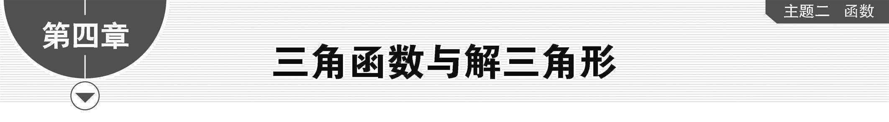

**第一节　任意角和弧度制、三角函数的概念**

【课标研读】　1.解任意角的概念和弧度制，能进行弧度与角度的互化，体会引入弧度制的必要性.　2.借助单位圆理解任意角三角函数(正弦、余弦、正切)的定义.

1.角的概念的推广

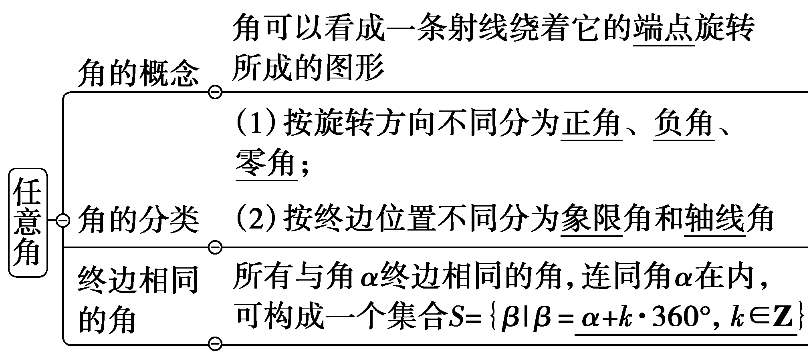

[微提醒]　终边相同的角不一定相等，相等角的终边一定相同.在书写与*α*终边相同的角时，单位必须一致.

2.弧度制的定义和公式

<table><tr><td>
定义
</td><td>
长度等于半径长的圆弧所对的圆心角叫做1弧度的角，记作1 rad
</td></tr><tr><td>
弧度数

公式
</td><td>
｜<em>α</em>｜＝(弧长用<em>l</em>表示，半径长用<em>r</em>表示)
</td></tr><tr><td>
角度与弧

度的换算
</td><td>
1°＝ rad≈0.017 45 rad；

1 rad＝°≈57.30°
</td></tr><tr><td>
弧长公式
</td><td>
弧长<em>l</em>＝｜<em>α</em>｜<em>r</em>
</td></tr><tr><td>
扇形面

积公式
</td><td>
<em>S</em>＝<em>lr</em>＝｜<em>α</em>｜<em>r</em>2
</td></tr></table>

3.任意角的三角函数

(1)任意角的三角函数的定义：设<te<text st*y*le="italic">x</text>t style="italic">P</text>(x，y)是角*<text style="italic"><text style="italic"><text style="italic">α*</text></text></text>终边上异于原点的任意一点，其到原点*O*的距离为*r*，则sin α＝ $\frac{y}{r}$ ，cos *<text style="italic"><text style="italic"><text style="italic">α*</text></text></text>＝ $\frac{x}{r}$ ，tan *<text style="italic"><text style="italic"><text style="italic">α*</text></text></text>＝ $\frac{y}{x}\left(x\ne 0\right)$ .

(2)三角函数值在各象限内的符号，如图：

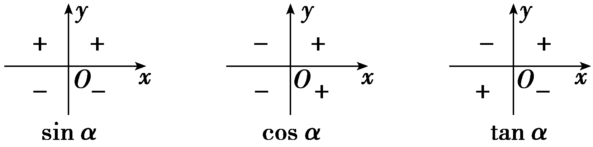

[微提醒]　记忆口诀：一全正，二正弦，三正切，四余弦.

【常用结论】

(1)象限角与轴线角的集合表示

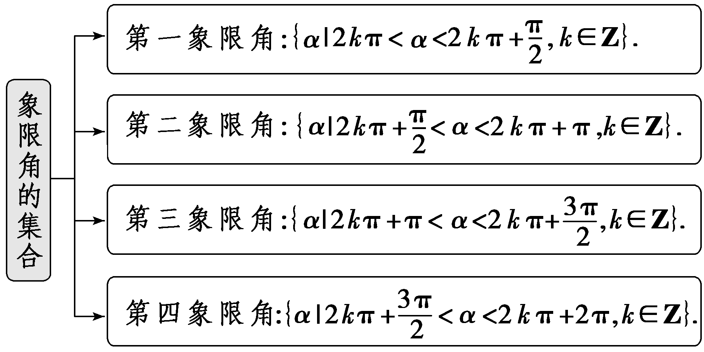

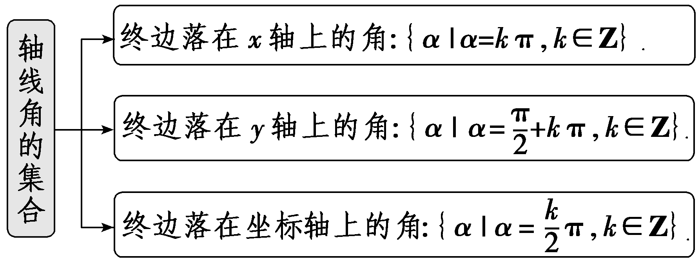

(2)终边相同的角与对称性

①<em>β</em>与<em>α</em>终边相同⇔<em>β</em>＝<em>α</em>＋2<em>k</em>π(<em>k</em>∈<strong>Z</strong>).

②<em>β</em>与<em>α</em>终边关于<em>x</em>轴对称⇔<em>β</em>＝－<em>α</em>＋2<em>k</em>π(<em>k</em>∈<strong>Z</strong>).

③<em>β</em>与<em>α</em>终边关于<em>y</em>轴对称⇔<em>β</em>＝π－<em>α</em>＋2<em>k</em>π(<em>k</em>∈<strong>Z</strong>).

④<em>β</em>与<em>α</em>终边关于原点对称⇔<em>β</em>＝π＋<em>α</em>＋2<em>k</em>π(<em>k</em>∈<strong>Z</strong>).

(3)若角*<text style="italic"><text style="italic"><text style="italic">α*</text></text></text>∈ $\left(0，\frac{\pi }{2}\right)$ ，则sin *<text style="italic"><text style="italic"><text style="italic">α*</text></text></text>＜α＜tan α.

【自主检测】

1.(多选)下列结论正确的是(　　)

A.锐角是第一象限的角，第一象限的角也都是锐角

B.角*α*的三角函数值与其终边上点*P*的位置无关

C.不相等的角终边一定不相同

D.若*α*为第一象限角，则sin *α*＋cos *α*＞1

答案：**BD**

2.(链接人教A必修一P180例3)若sin *θ*＜0且tan *θ*＜0，则角*θ*所在的象限是(　　)

A.第一象限	B.第二象限

C.第三象限	D.第四象限

答案：**D**

解析：若sin *θ*＜0，则角*θ*在第三或第四象限或在*y*轴负半轴上，若tan *θ*＜0，则角*θ*在第二或第四象限，所以当sin *θ*＜0且tan *θ*＜0时，角*θ*在第四象限.故选D.

3.(链接人教A必修一P175T6)在单位圆中，200°的圆心角所对的弧长为<u>　　　　</u>.

答案： $\frac{10\pi }{9}$

解析：单位圆的半径<text sty*l*e="italic">r</text>＝1，200°的弧度数是200× $\frac{\pi }{180}$ ＝ $\frac{10\pi }{9}$ ，由弧长公式得*l*＝ $\frac{10\pi }{9}$ .

4.(链接人教A必修二P180T3)已知角<em>α</em>的终边经过点<em>P</em>(2，－3)，则sin <em>α</em>＝<u>　　　　</u>，cos <em>α</em>＝<u>　　　　</u>，tan <em>α</em>＝<u>　　　　</u>.

答案：－ $\frac{3\sqrt{13}}{13}$ 　 $\frac{2\sqrt{13}}{13}$ 　－ $\frac{3}{2}$

解析：由题知点*P*到原点的距离*r*＝ $\sqrt{2^{2}＋\left(－3\right)^{2}}$ ＝ $\sqrt{13}$ ，则sin *<text style="italic"><text style="italic">α*</text></text>＝ $\frac{y}{r}$ ＝ $\frac{－3}{\sqrt{13}}$ ＝－ $\frac{3\sqrt{13}}{13}$ ，cos *<text style="italic"><text style="italic">α*</text></text>＝ $\frac{x}{r}$ ＝ $\frac{2}{\sqrt{13}}$ ＝ $\frac{2\sqrt{13}}{13}$ ，tan *<text style="italic"><text style="italic">α*</text></text>＝ $\frac{y}{x}$ ＝－ $\frac{3}{2}$ .

考点一　象限角与终边相同的角　　　　自主练透

1.若*α*是第二象限角，则(　　)

A.－*α*是第一象限角

B. $\frac{\alpha }{2}$ 是第三象限角

C. $\frac{3\pi }{2}$ ＋*α*是第二象限角

D.2*α*是第三或第四象限角或在*y*轴负半轴上

答案：**D**

解析：因为&lt;text st<em>y</em>le="italic"&gt;<em>&lt;text style="italic"&gt;&lt;text style="italic"&gt;&lt;text style="italic"&gt;&lt;text style="italic"&gt;&lt;text style="italic"&gt;&lt;text style="italic"&gt;&lt;text style="italic"&gt;α</em>&lt;/text&gt;&lt;/text&gt;&lt;/text&gt;&lt;/text&gt;&lt;/text&gt;&lt;/text&gt;&lt;/text&gt;&lt;/text&gt;是第二象限角，所以 $\frac{\pi }{2}$ ＋2&lt;text st<em>y</em>le="italic"&gt;<em>&lt;text style="italic"&gt;&lt;text style="italic"&gt;&lt;text style="italic"&gt;&lt;text style="italic"&gt;&lt;text style="italic"&gt;&lt;text style="italic"&gt;&lt;text style="italic"&gt;&lt;text style="italic"&gt;&lt;text style="italic"&gt;&lt;text style="italic"&gt;&lt;text style="italic"&gt;&lt;text style="italic"&gt;&lt;text style="italic"&gt;&lt;text style="italic"&gt;&lt;text style="italic"&gt;&lt;text style="italic"&gt;k</em>&lt;/text&gt;&lt;/text&gt;&lt;/text&gt;&lt;/text&gt;&lt;/text&gt;&lt;/text&gt;&lt;/text&gt;&lt;/text&gt;&lt;/text&gt;&lt;/text&gt;&lt;/text&gt;&lt;/text&gt;&lt;/text&gt;&lt;/text&gt;&lt;/text&gt;&lt;/text&gt;&lt;/text&gt;π＜<em>&lt;text style="italic"&gt;&lt;text style="italic"&gt;&lt;text style="italic"&gt;&lt;text style="italic"&gt;&lt;text style="italic"&gt;&lt;text style="italic"&gt;&lt;text style="italic"&gt;&lt;text style="italic"&gt;α</em>&lt;/text&gt;&lt;/text&gt;&lt;/text&gt;&lt;/text&gt;&lt;/text&gt;&lt;/text&gt;&lt;/text&gt;&lt;/text&gt;＜π＋2kπ，k∈<strong>&lt;text style="bold"&gt;&lt;text style="bold"&gt;&lt;text style="bold"&gt;&lt;text style="bold"&gt;&lt;text style="bold"&gt;Z</strong>&lt;/text&gt;&lt;/text&gt;&lt;/text&gt;&lt;/text&gt;&lt;/text&gt;.对于A，可得－π－2kπ＜－α＜－ $\frac{\pi }{2}$ －2&lt;text st<em>y</em>le="italic"&gt;<em>&lt;text style="italic"&gt;&lt;text style="italic"&gt;&lt;text style="italic"&gt;&lt;text style="italic"&gt;&lt;text style="italic"&gt;&lt;text style="italic"&gt;&lt;text style="italic"&gt;&lt;text style="italic"&gt;&lt;text style="italic"&gt;&lt;text style="italic"&gt;&lt;text style="italic"&gt;&lt;text style="italic"&gt;&lt;text style="italic"&gt;&lt;text style="italic"&gt;&lt;text style="italic"&gt;&lt;text style="italic"&gt;k</em>&lt;/text&gt;&lt;/text&gt;&lt;/text&gt;&lt;/text&gt;&lt;/text&gt;&lt;/text&gt;&lt;/text&gt;&lt;/text&gt;&lt;/text&gt;&lt;/text&gt;&lt;/text&gt;&lt;/text&gt;&lt;/text&gt;&lt;/text&gt;&lt;/text&gt;&lt;/text&gt;&lt;/text&gt;π，k∈<strong>&lt;text style="bold"&gt;&lt;text style="bold"&gt;&lt;text style="bold"&gt;&lt;text style="bold"&gt;&lt;text style="bold"&gt;Z</strong>&lt;/text&gt;&lt;/text&gt;&lt;/text&gt;&lt;/text&gt;&lt;/text&gt;，此时－<em>&lt;text style="italic"&gt;&lt;text style="italic"&gt;&lt;text style="italic"&gt;&lt;text style="italic"&gt;&lt;text style="italic"&gt;&lt;text style="italic"&gt;&lt;text style="italic"&gt;&lt;text style="italic"&gt;α</em>&lt;/text&gt;&lt;/text&gt;&lt;/text&gt;&lt;/text&gt;&lt;/text&gt;&lt;/text&gt;&lt;/text&gt;&lt;/text&gt;位于第三象限，所以A错误；对于B，可得 $\frac{\pi }{4}$ ＋&lt;text st<em>y</em>le="italic"&gt;<em>&lt;text style="italic"&gt;&lt;text style="italic"&gt;&lt;text style="italic"&gt;&lt;text style="italic"&gt;&lt;text style="italic"&gt;&lt;text style="italic"&gt;&lt;text style="italic"&gt;&lt;text style="italic"&gt;&lt;text style="italic"&gt;&lt;text style="italic"&gt;&lt;text style="italic"&gt;&lt;text style="italic"&gt;&lt;text style="italic"&gt;&lt;text style="italic"&gt;&lt;text style="italic"&gt;&lt;text style="italic"&gt;k</em>&lt;/text&gt;&lt;/text&gt;&lt;/text&gt;&lt;/text&gt;&lt;/text&gt;&lt;/text&gt;&lt;/text&gt;&lt;/text&gt;&lt;/text&gt;&lt;/text&gt;&lt;/text&gt;&lt;/text&gt;&lt;/text&gt;&lt;/text&gt;&lt;/text&gt;&lt;/text&gt;&lt;/text&gt;π＜ $\frac{\alpha }{2}$ ＜ $\frac{\pi }{2}$ ＋&lt;text st<em>y</em>le="italic"&gt;<em>&lt;text style="italic"&gt;&lt;text style="italic"&gt;&lt;text style="italic"&gt;&lt;text style="italic"&gt;&lt;text style="italic"&gt;&lt;text style="italic"&gt;&lt;text style="italic"&gt;&lt;text style="italic"&gt;&lt;text style="italic"&gt;&lt;text style="italic"&gt;&lt;text style="italic"&gt;&lt;text style="italic"&gt;&lt;text style="italic"&gt;&lt;text style="italic"&gt;&lt;text style="italic"&gt;&lt;text style="italic"&gt;k</em>&lt;/text&gt;&lt;/text&gt;&lt;/text&gt;&lt;/text&gt;&lt;/text&gt;&lt;/text&gt;&lt;/text&gt;&lt;/text&gt;&lt;/text&gt;&lt;/text&gt;&lt;/text&gt;&lt;/text&gt;&lt;/text&gt;&lt;/text&gt;&lt;/text&gt;&lt;/text&gt;&lt;/text&gt;π，k∈<strong>&lt;text style="bold"&gt;&lt;text style="bold"&gt;&lt;text style="bold"&gt;&lt;text style="bold"&gt;&lt;text style="bold"&gt;Z</strong>&lt;/text&gt;&lt;/text&gt;&lt;/text&gt;&lt;/text&gt;&lt;/text&gt;，当k为偶数时， $\frac{\alpha }{2}$ 位于第一象限；当&lt;text st<em>y</em>le="italic"&gt;<em>&lt;text style="italic"&gt;&lt;text style="italic"&gt;&lt;text style="italic"&gt;&lt;text style="italic"&gt;&lt;text style="italic"&gt;&lt;text style="italic"&gt;&lt;text style="italic"&gt;&lt;text style="italic"&gt;&lt;text style="italic"&gt;&lt;text style="italic"&gt;&lt;text style="italic"&gt;&lt;text style="italic"&gt;&lt;text style="italic"&gt;&lt;text style="italic"&gt;&lt;text style="italic"&gt;&lt;text style="italic"&gt;k</em>&lt;/text&gt;&lt;/text&gt;&lt;/text&gt;&lt;/text&gt;&lt;/text&gt;&lt;/text&gt;&lt;/text&gt;&lt;/text&gt;&lt;/text&gt;&lt;/text&gt;&lt;/text&gt;&lt;/text&gt;&lt;/text&gt;&lt;/text&gt;&lt;/text&gt;&lt;/text&gt;&lt;/text&gt;为奇数时， $\frac{\alpha }{2}$ 位于第三象限，所以B错误；对于C，可得2π＋2&lt;text st<em>y</em>le="italic"&gt;<em>&lt;text style="italic"&gt;&lt;text style="italic"&gt;&lt;text style="italic"&gt;&lt;text style="italic"&gt;&lt;text style="italic"&gt;&lt;text style="italic"&gt;&lt;text style="italic"&gt;&lt;text style="italic"&gt;&lt;text style="italic"&gt;&lt;text style="italic"&gt;&lt;text style="italic"&gt;&lt;text style="italic"&gt;&lt;text style="italic"&gt;&lt;text style="italic"&gt;&lt;text style="italic"&gt;&lt;text style="italic"&gt;k</em>&lt;/text&gt;&lt;/text&gt;&lt;/text&gt;&lt;/text&gt;&lt;/text&gt;&lt;/text&gt;&lt;/text&gt;&lt;/text&gt;&lt;/text&gt;&lt;/text&gt;&lt;/text&gt;&lt;/text&gt;&lt;/text&gt;&lt;/text&gt;&lt;/text&gt;&lt;/text&gt;&lt;/text&gt;π＜ $\frac{3\pi }{2}$ ＋&lt;text st<em>y</em>le="italic"&gt;<em>&lt;text style="italic"&gt;&lt;text style="italic"&gt;&lt;text style="italic"&gt;&lt;text style="italic"&gt;&lt;text style="italic"&gt;&lt;text style="italic"&gt;&lt;text style="italic"&gt;α</em>&lt;/text&gt;&lt;/text&gt;&lt;/text&gt;&lt;/text&gt;&lt;/text&gt;&lt;/text&gt;&lt;/text&gt;&lt;/text&gt;＜ $\frac{5\pi }{2}$ ＋2&lt;text st<em>y</em>le="italic"&gt;<em>&lt;text style="italic"&gt;&lt;text style="italic"&gt;&lt;text style="italic"&gt;&lt;text style="italic"&gt;&lt;text style="italic"&gt;&lt;text style="italic"&gt;&lt;text style="italic"&gt;&lt;text style="italic"&gt;&lt;text style="italic"&gt;&lt;text style="italic"&gt;&lt;text style="italic"&gt;&lt;text style="italic"&gt;&lt;text style="italic"&gt;&lt;text style="italic"&gt;&lt;text style="italic"&gt;&lt;text style="italic"&gt;k</em>&lt;/text&gt;&lt;/text&gt;&lt;/text&gt;&lt;/text&gt;&lt;/text&gt;&lt;/text&gt;&lt;/text&gt;&lt;/text&gt;&lt;/text&gt;&lt;/text&gt;&lt;/text&gt;&lt;/text&gt;&lt;/text&gt;&lt;/text&gt;&lt;/text&gt;&lt;/text&gt;&lt;/text&gt;π，k∈<strong>&lt;text style="bold"&gt;&lt;text style="bold"&gt;&lt;text style="bold"&gt;&lt;text style="bold"&gt;&lt;text style="bold"&gt;Z</strong>&lt;/text&gt;&lt;/text&gt;&lt;/text&gt;&lt;/text&gt;&lt;/text&gt;，即2 $\left(k+1\right)$ π＜ $\frac{3\pi }{2}$ ＋&lt;text st<em>y</em>le="italic"&gt;<em>&lt;text style="italic"&gt;&lt;text style="italic"&gt;&lt;text style="italic"&gt;&lt;text style="italic"&gt;&lt;text style="italic"&gt;&lt;text style="italic"&gt;&lt;text style="italic"&gt;α</em>&lt;/text&gt;&lt;/text&gt;&lt;/text&gt;&lt;/text&gt;&lt;/text&gt;&lt;/text&gt;&lt;/text&gt;&lt;/text&gt;＜ $\frac{\pi }{2}$ ＋2 $\left(k+1\right)$ π，&lt;text st<em>y</em>le="italic"&gt;<em>&lt;text style="italic"&gt;&lt;text style="italic"&gt;&lt;text style="italic"&gt;&lt;text style="italic"&gt;&lt;text style="italic"&gt;&lt;text style="italic"&gt;&lt;text style="italic"&gt;&lt;text style="italic"&gt;&lt;text style="italic"&gt;&lt;text style="italic"&gt;&lt;text style="italic"&gt;&lt;text style="italic"&gt;&lt;text style="italic"&gt;&lt;text style="italic"&gt;&lt;text style="italic"&gt;&lt;text style="italic"&gt;k</em>&lt;/text&gt;&lt;/text&gt;&lt;/text&gt;&lt;/text&gt;&lt;/text&gt;&lt;/text&gt;&lt;/text&gt;&lt;/text&gt;&lt;/text&gt;&lt;/text&gt;&lt;/text&gt;&lt;/text&gt;&lt;/text&gt;&lt;/text&gt;&lt;/text&gt;&lt;/text&gt;&lt;/text&gt;∈<strong>&lt;text style="bold"&gt;&lt;text style="bold"&gt;&lt;text style="bold"&gt;&lt;text style="bold"&gt;&lt;text style="bold"&gt;Z</strong>&lt;/text&gt;&lt;/text&gt;&lt;/text&gt;&lt;/text&gt;&lt;/text&gt;，所以 $\frac{3\pi }{2}$ ＋&lt;text st<em>y</em>le="italic"&gt;<em>&lt;text style="italic"&gt;&lt;text style="italic"&gt;&lt;text style="italic"&gt;&lt;text style="italic"&gt;&lt;text style="italic"&gt;&lt;text style="italic"&gt;&lt;text style="italic"&gt;α</em>&lt;/text&gt;&lt;/text&gt;&lt;/text&gt;&lt;/text&gt;&lt;/text&gt;&lt;/text&gt;&lt;/text&gt;&lt;/text&gt;位于第一象限，所以C错误；对于D，可得π＋4<em>&lt;text style="italic"&gt;&lt;text style="italic"&gt;&lt;text style="italic"&gt;&lt;text style="italic"&gt;&lt;text style="italic"&gt;&lt;text style="italic"&gt;&lt;text style="italic"&gt;&lt;text style="italic"&gt;&lt;text style="italic"&gt;&lt;text style="italic"&gt;&lt;text style="italic"&gt;&lt;text style="italic"&gt;&lt;text style="italic"&gt;&lt;text style="italic"&gt;&lt;text style="italic"&gt;&lt;text style="italic"&gt;&lt;text style="italic"&gt;k</em>&lt;/text&gt;&lt;/text&gt;&lt;/text&gt;&lt;/text&gt;&lt;/text&gt;&lt;/text&gt;&lt;/text&gt;&lt;/text&gt;&lt;/text&gt;&lt;/text&gt;&lt;/text&gt;&lt;/text&gt;&lt;/text&gt;&lt;/text&gt;&lt;/text&gt;&lt;/text&gt;&lt;/text&gt;π＜2α＜2π＋4kπ，k∈<strong>&lt;text style="bold"&gt;&lt;text style="bold"&gt;&lt;text style="bold"&gt;&lt;text style="bold"&gt;&lt;text style="bold"&gt;Z</strong>&lt;/text&gt;&lt;/text&gt;&lt;/text&gt;&lt;/text&gt;&lt;/text&gt;，所以2α是第三或第四象限角或在y轴负半轴上，所以D正确.

2.若角的顶点在原点，始边与*x*轴的非负半轴重合，则与2 025°角终边相同的最小正角为(　　)

A.25°	B.135°

C.225°	D. 335°

答案：**C**

解析：因为2 025°＝360°×5＋225° ，所以与2 025° 角终边相同的最小正角为225° .故选<em>C</em>.

3.如图所示，终边落在阴影部分的角<em>α</em>的取值集合为<u>　　　　　　　　　　　</u>.

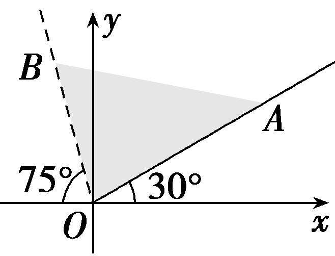

答案：{<em>α</em>｜<em>k</em>·360°＋30°≤<em>α</em>＜<em>k</em>·360°＋105°，<em>k</em>∈<strong>Z</strong>}

解析：终边落在射线<em>OA</em>上的角的集合是{<em>β</em>｜<em>β</em>＝<em>k</em>·360°＋30°，<em>k</em>∈<strong>Z</strong>}，终边落在射线<em>OB</em>上的角的集合是{γ｜γ＝<em>k</em>·360°＋105°，<em>k</em>∈<strong>Z</strong>}，所以终边落在阴影部分(含射线<em>OA</em>，不含射线<em>OB</em>)的角的集合是{<em>α</em>｜<em>k</em>·360°＋30°≤<em>α</em>＜<em>k</em>·360°＋105°，<em>k</em>∈<strong>Z</strong>}.

4.终边在直线&lt;te<em>x</em>t style="italic"&gt;y&lt;/text&gt;＝ $\sqrt{3}$ <em>x</em>上，且在[－2π，2π)内的角<em>α</em>的集合为<u>　　　　　</u>.

答案： $\left\{－\frac{5\pi }{3},-\frac{2\pi }{3}，\frac{\pi }{3}，\frac{4\pi }{3}\right\}$

解析：如图，在坐标系中画出直线<te<te<te*x*t st*y*le="italic">x</text>t style="italic">x</text>t style="italic">y</text>＝ $\sqrt{3}$ <te<te*x*t st*y*le="italic">x</text>t style="italic">x</text>，可以发现它与x轴的夹角是 $\frac{\pi }{3}$ ，在[0，2π)内，终边在直线<te<te<te*x*t st*y*le="italic">x</text>t style="italic">x</text>t style="italic">y</text>＝ $\sqrt{3}$ <te<te*x*t st*y*le="italic">x</text>t style="italic">x</text>上的角有两个： $\frac{\pi }{3}$ ， $\frac{4\pi }{3}$ ；在[－2π，0)内满足条件的角有两个：－ $\frac{2\pi }{3}$ ，－ $\frac{5\pi }{3}$ ，故满足条件的角*α*构成的集合为 $\left\{－\frac{5\pi }{3},-\frac{2\pi }{3}，\frac{\pi }{3}，\frac{4\pi }{3}\right\}$ .

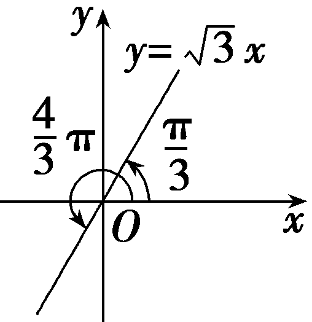

1.象限角的判断方法

(1)图象法：在平面直角坐标系中作出已知角并根据象限角的定义直接判断已知角是第几象限角.

(2)转化法：将已知角化为<em>α</em>＋2<em>k</em>π(<em>k</em>∈<strong>Z</strong>，0≤<em>α</em>＜2π)的形式，即找出与已知角终边相同的角<em>α</em>，由角<em>α</em>所在象限判断已知角所在象限.

2.判断 $\frac{\alpha }{k}$ 或<em>&lt;text style="italic"&gt;&lt;text style="italic"&gt;k</em>&lt;/text&gt;α&lt;/text&gt;(k≥2，且k∈<strong>N</strong><em>\*</em>)所在象限的方法步骤

第一步：先用终边相同角的形式表示出角*α*的取值范围；

第二步：写出 $\frac{\alpha }{k}$ 或*kα*的取值范围；

第三步：根据*k*的可能取值讨论确定 $\frac{\alpha }{k}$ 或*k*α的终边所在位置.

考点二　弧度制及其应用 　　　　师生共研

(一题多变)(2022·全国甲卷)沈括的《梦溪笔谈》是中国古代科技史上的杰作，其中收录了计算圆弧长度的“会圆术”.如图， $\overparen{AB}$ 是以<text <text *s*tyle="italic">s</text>tyle="italic">O </text>为圆心，*<text style="italic">OA* </text>为半径的圆弧，*C* 是*<text style="italic"><text style="italic">AB*</text> </text>的中点，*D* 在 $\overparen{AB}$ 上，<text <text *s*tyle="italic">s</text>tyle="italic">CD</text>⊥*<text style="italic">AB*</text>.“会圆术”给出 $\overparen{AB}$ 的弧长的近似值<text <text *s*tyle="italic">s</text>tyle="italic">s </text>的计算公式：s＝*<text style="italic">AB*</text>＋ $\frac{CD^{2}}{OA}$  .当<text *s*tyle="italic">OA</text>＝2，∠*AOB*＝60°时，*s*＝(　　)

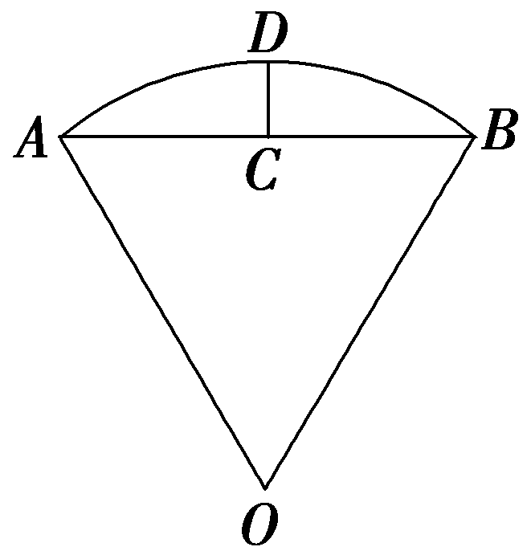

A. $\frac{11－3\sqrt{3}}{2}$ 	B. $\frac{11－4\sqrt{3}}{2}$

C. $\frac{9－3\sqrt{3}}{2}$ 	D. $\frac{9－4\sqrt{3}}{2}$

答案：**B**

解析：由题意知，△<text *s*tyle="italic">*O<text style="italic"><text style="italic"><text style="italic"><text style="italic">AB*</text></text></text></text></text>是等边三角形，所以AB＝*OA*＝2.连接*O<text style="italic"><text style="italic">C*</text></text>，因为C是AB的中点，所以*<text style="italic"><text style="italic">OC*</text></text>⊥AB，OC＝ $\sqrt{OA^{2}－AC^{2}}$ ＝ $\sqrt{3}$ ，又<text *s*tyle="italic">*C*</text>*D*⊥*<text style="italic"><text style="italic"><text style="italic"><text style="italic">AB*</text></text></text></text>，所以*O*，C，D三点共线，所以*<text style="italic">CD*</text>＝*OD*－*<text style="italic"><text style="italic"><text style="italic">OC*</text></text></text>＝2－ $\sqrt{3}$ ，所以*s*＝*<text style="italic"><text style="italic"><text style="italic"><text style="italic">AB*</text></text></text></text>＋ $\frac{CD^{2}}{OA}$ ＝2＋ $\frac{(2－\sqrt{3})^{2}}{2}$ ＝ $\frac{11－4\sqrt{3}}{2}$ .故选B.

[变式探究]

1.(变设问)若本例条件不变，求扇形的弧长及该弧所在弓形的面积.

解：*l*＝*αR*＝ $\frac{\pi }{3}$ ×2＝ $\frac{2\pi }{3}$ ，

由已知得，<em>&lt;text style="italic"&gt;&lt;text style="italic"&gt;S</em>&lt;/text&gt;&lt;/text&gt;&lt;text style="subscript"&gt;扇形&lt;/text&gt;<em>&lt;text style="italic,subscript"&gt;&lt;text style="italic,subscript"&gt;AOB</em>&lt;/text&gt;&lt;/text&gt;＝ $\frac{1}{2}$ <em>αR</em>&lt;text style="superscript"&gt;&lt;text style="superscript"&gt;2&lt;/text&gt;&lt;/text&gt;＝ $\frac{1}{2}$ × $\frac{\pi }{3}$ ×&lt;text style="superscript"&gt;&lt;text style="superscript"&gt;2&lt;/text&gt;&lt;/text&gt;2＝ $\frac{2\pi }{3}$ ， $S_{\bigtriangleup }_{AOB}$ ＝ $\frac{1}{2}$ <em>OA</em>&lt;text style="superscript"&gt;&lt;text style="superscript"&gt;2&lt;/text&gt;&lt;/text&gt;sin $\frac{\pi }{3}$ ＝ $\sqrt{3}$ ，所以弓形<em>ADB</em>的面积为<em>&lt;text style="italic"&gt;&lt;text style="italic"&gt;S</em>&lt;/text&gt;&lt;/text&gt;&lt;text style="subscript"&gt;扇形&lt;/text&gt;<em>&lt;text style="italic,subscript"&gt;&lt;text style="italic,subscript"&gt;AOB</em>&lt;/text&gt;&lt;/text&gt;－S△AOB＝ $\frac{2\pi }{3}$ － $\sqrt{3}$ .

2.(变结论)若本例条件变为：若扇形*AOB*的周长为4，求扇形*AOB*面积的最大值.

解：设扇形的半径为*r*，弧长为*l*，则*l*＋2*r*＝4，*l*＝4－2*r*，0＜*r*＜2，

则扇形的面积<em>S</em>＝ $\frac{1}{2}$ <em>l&lt;text style="italic"&gt;&lt;text style="italic"&gt;&lt;text style="italic"&gt;&lt;text style="italic"&gt;&lt;text style="italic"&gt;&lt;text style="italic"&gt;&lt;text style="italic"&gt;r</em>&lt;/text&gt;&lt;/text&gt;&lt;/text&gt;&lt;/text&gt;&lt;/text&gt;&lt;/text&gt;&lt;/text&gt;＝ $\frac{1}{2}$ (4－&lt;text style="supe<em>&lt;text style="italic"&gt;r</em>&lt;/text&gt;script"&gt;2&lt;/text&gt;<em>&lt;text style="italic"&gt;&lt;text style="italic"&gt;&lt;text style="italic"&gt;&lt;text style="italic"&gt;r</em>&lt;/text&gt;&lt;/text&gt;&lt;/text&gt;&lt;/text&gt;)r＝(2－r)r＝－r2＋2r＝－(r－1)2＋1，

所以当*r*＝1时，*S*取得最大值1.

应用弧度制解决问题的方法

1.利用扇形的弧长和面积公式解题时，要注意角的单位必须是弧度.

2.求扇形面积最大值的问题时，常转化为二次函数的最值问题，利用配方法使问题得到解决.

3.在解决弧长问题和扇形面积问题时，要合理地利用圆心角所在的三角形.

对点练1.(多选)已知扇形的周长是6，面积是2，则下列选项可能正确的有(　　)

A.圆的半径为2	B.圆的半径为1

C.圆心角的弧度数是1	D.圆心角的弧度数是2

答案：**ABC**

解析：设扇形半径为*r*，圆心角弧度数为*α*，则由题意得 $\left\{\begin{matrix}2r＋\alpha r=6，\\\frac{1}{2}\alpha r^{2}=2，\end{matrix}\right.$ 解得 $\left\{\begin{matrix}r=1，\\\alpha =4，\end{matrix}\right.$ 或 $\left\{\begin{matrix}r=2，\\\alpha =1，\end{matrix}\right.$ 可得当圆的半径为1时，圆心角的弧度数为4；当圆的半径为2时，圆心角的弧度数为1.故选ABC.

对点练2.如图，*A*，*B*是半径为2的圆周上的定点，*P*为圆周上的动点，∠*APB*是锐角，大小为*β*.图中阴影区域的面积的最大值为(　　)

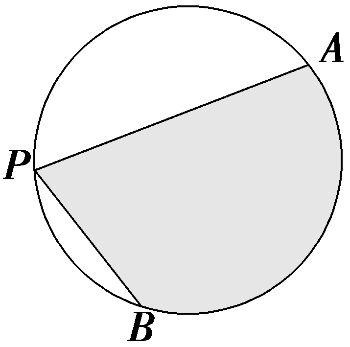

A.4*β*＋4cos *β*	B.4*β*＋4sin *β*

C.2*β*＋2cos *β*	D.2*β*＋2sin *β*

答案：**B**

解析：如图，设点<em>O</em>为圆心，连接<em>&lt;text style="italic"&gt;&lt;text style="italic"&gt;&lt;text style="italic"&gt;P</em>&lt;/text&gt;&lt;/text&gt;O&lt;/text&gt;，<em>O&lt;text style="italic"&gt;A</em>&lt;/text&gt;，<em>O&lt;text style="italic"&gt;B</em>&lt;/text&gt;，<em>&lt;text style="italic"&gt;&lt;text style="italic"&gt;&lt;text style="italic"&gt;&lt;text style="italic"&gt;AB</em>&lt;/text&gt;&lt;/text&gt;&lt;/text&gt;&lt;/text&gt;，在劣弧AB上取一点<em>C</em>，则阴影区域面积为&lt;text style="subscript"&gt;△&lt;/text&gt;<em>&lt;text style="italic"&gt;&lt;text style="italic"&gt;ABP</em>&lt;/text&gt;&lt;/text&gt;和弓形<em>&lt;text style="italic"&gt;ACB</em>&lt;/text&gt;的面积和.因为A，B是圆周上的定点，所以弓形ACB的面积为定值，故当△ABP的面积最大时，阴影区域面积最大.又AB的长为定值，故当点P为优弧AB的中点时，点P到弦AB的距离最大，此时△ABP面积最大，阴影区域面积也最大.下面计算当点P为优弧<em>&lt;text style="italic"&gt;&lt;text style="italic"&gt;APB</em>&lt;/text&gt;&lt;/text&gt;的中点时阴影区域的面积.因为∠APB为锐角，且∠APB＝<em>&lt;text style="italic"&gt;&lt;text style="italic"&gt;&lt;text style="italic"&gt;&lt;text style="italic"&gt;&lt;text style="italic"&gt;β</em>&lt;/text&gt;&lt;/text&gt;&lt;/text&gt;&lt;/text&gt;&lt;/text&gt;，所以∠<em>AOB</em>＝2β，∠<em>&lt;text style="italic,subscript"&gt;AOP</em>&lt;/text&gt;＝∠<em>&lt;text style="italic,subscript"&gt;BOP</em>&lt;/text&gt;＝180°－β，则阴影区域的面积<em>&lt;text style="italic"&gt;&lt;text style="italic"&gt;&lt;text style="italic"&gt;S</em>&lt;/text&gt;&lt;/text&gt;&lt;/text&gt;＝S△AOP＋S△BOP＋S扇形<em>OAB</em>＝2× $\frac{1}{2}$ ×2×2sin(180°－<em>&lt;text style="italic"&gt;&lt;text style="italic"&gt;&lt;text style="italic"&gt;&lt;text style="italic"&gt;&lt;text style="italic"&gt;β</em>&lt;/text&gt;&lt;/text&gt;&lt;/text&gt;&lt;/text&gt;&lt;/text&gt;)＋ $\frac{1}{2}$ ×22×2<em>&lt;text style="italic"&gt;&lt;text style="italic"&gt;&lt;text style="italic"&gt;&lt;text style="italic"&gt;&lt;text style="italic"&gt;β</em>&lt;/text&gt;&lt;/text&gt;&lt;/text&gt;&lt;/text&gt;&lt;/text&gt;＝4β＋4sin <em>β</em> ，故选<em>B</em>.

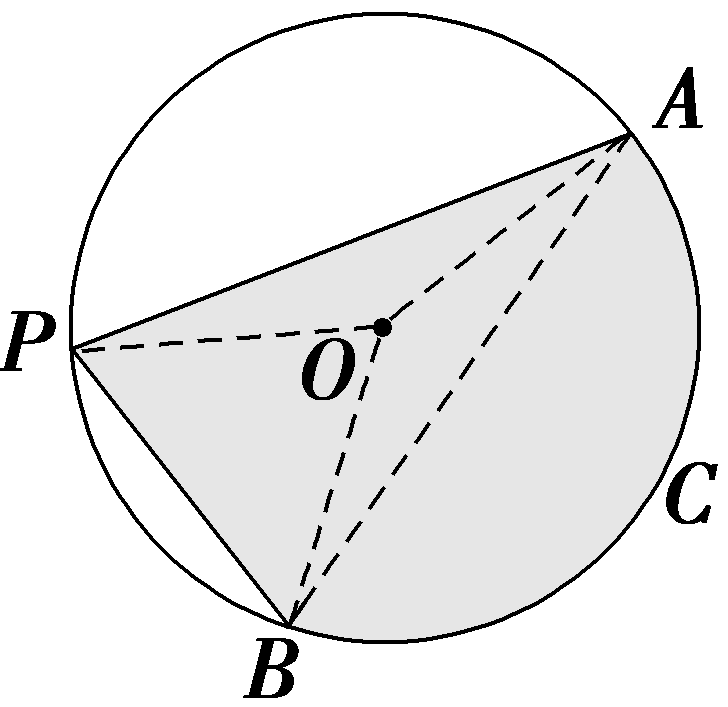

考点三　三角函数的概念及其应用　　　　多维探究

角度1　三角函数的定义

(1)已知角<te*x*t st*y*le="italic">*α*</text>的终边在直线y＝－3x上，则10sin α＋ $\frac{3}{cos\alpha }$ 的值为(　　)

A.－6 $\sqrt{10}$ 	B.6 $\sqrt{10}$

C.0	D.－3 $\sqrt{10}$

(2)已知角*<text style="italic">α*</text>的终边过点*P*(－8*<text style="italic">m*</text>，－6sin 30°)，且cos α＝－ $\frac{4}{5}$ ，则*<text style="italic">m*</text>的值为(　　)

A.－ $\frac{1}{2}$ 	B.－ $\frac{\sqrt{3}}{2}$

C. $\frac{1}{2}$ 	D. $\frac{\sqrt{3}}{2}$

答案：(1)**C**　(2)**C**

解析：(1)由题知，cos <text style="it<text style="it<text style="it<text style="it<text style="it<text style="it<text style="it<text style="it*a*lic">a</text>lic">a</text>lic">a</text>lic">a</text>lic">a</text>lic">a</text>lic">a</text>lic">*<text style="italic"><text style="italic"><text style="italic"><text style="italic"><text style="italic"><text style="italic">α*</text></text></text></text></text></text></text>≠0，设角α的终边上一点为(a，－3a)(a≠0)，则*<text style="italic"><text style="italic">r*</text></text>＝ $\sqrt{10}$ ｜<text style="it<text style="it<text style="it<text style="it<text style="it<text style="it<text style="it*a*lic">a</text>lic">a</text>lic">a</text>lic">a</text>lic">a</text>lic">a</text>lic">a</text>｜.当a＞0时，*<text style="italic"><text style="italic">r*</text></text>＝ $\sqrt{10}$ <text style="it<text style="it<text style="it<text style="it<text style="it<text style="it<text style="it*a*lic">a</text>lic">a</text>lic">a</text>lic">a</text>lic">a</text>lic">a</text>lic">a</text>，sin *<text style="italic"><text style="italic"><text style="italic"><text style="italic"><text style="italic"><text style="italic"><text style="italic">α*</text></text></text></text></text></text></text>＝－ $\frac{3\sqrt{10}}{10}$ ，cos <text style="it<text style="it<text style="it<text style="it<text style="it<text style="it<text style="it<text style="it*a*lic">a</text>lic">a</text>lic">a</text>lic">a</text>lic">a</text>lic">a</text>lic">a</text>lic">*<text style="italic"><text style="italic"><text style="italic"><text style="italic"><text style="italic"><text style="italic">α*</text></text></text></text></text></text></text>＝ $\frac{\sqrt{10}}{10}$ ，所以10sin <text style="it<text style="it<text style="it<text style="it<text style="it<text style="it<text style="it<text style="it*a*lic">a</text>lic">a</text>lic">a</text>lic">a</text>lic">a</text>lic">a</text>lic">a</text>lic">*<text style="italic"><text style="italic"><text style="italic"><text style="italic"><text style="italic"><text style="italic">α*</text></text></text></text></text></text></text>＋ $\frac{3}{cos\alpha }$ ＝－3 $\sqrt{10}$ ＋3 $\sqrt{10}$ ＝0.当<text style="it<text style="it<text style="it<text style="it<text style="it<text style="it<text style="it*a*lic">a</text>lic">a</text>lic">a</text>lic">a</text>lic">a</text>lic">a</text>lic">a</text>＜0时，*<text style="italic"><text style="italic">r*</text></text>＝－ $\sqrt{10}$ <text style="it<text style="it<text style="it<text style="it<text style="it<text style="it<text style="it*a*lic">a</text>lic">a</text>lic">a</text>lic">a</text>lic">a</text>lic">a</text>lic">a</text>，sin *<text style="italic"><text style="italic"><text style="italic"><text style="italic"><text style="italic"><text style="italic"><text style="italic">α*</text></text></text></text></text></text></text>＝ $\frac{3\sqrt{10}}{10}$ ，cos <text style="it<text style="it<text style="it<text style="it<text style="it<text style="it<text style="it<text style="it*a*lic">a</text>lic">a</text>lic">a</text>lic">a</text>lic">a</text>lic">a</text>lic">a</text>lic">*<text style="italic"><text style="italic"><text style="italic"><text style="italic"><text style="italic"><text style="italic">α*</text></text></text></text></text></text></text>＝－ $\frac{\sqrt{10}}{10}$ ，所以10sin <text style="it<text style="it<text style="it<text style="it<text style="it<text style="it<text style="it<text style="it*a*lic">a</text>lic">a</text>lic">a</text>lic">a</text>lic">a</text>lic">a</text>lic">a</text>lic">*<text style="italic"><text style="italic"><text style="italic"><text style="italic"><text style="italic"><text style="italic">α*</text></text></text></text></text></text></text>＋ $\frac{3}{cos\alpha }$ ＝3 $\sqrt{10}$ －3 $\sqrt{10}$ ＝0.故选C.

(2)由题意得点*P*(－8*<text style="italic"><text style="italic"><text style="italic"><text style="italic">m*</text></text></text></text>，－3)，*r*＝ $\sqrt{64m^{2}+9}$ ，所以cos *<text style="italic">α*</text>＝ $\frac{－8m}{\sqrt{64m^{2}+9}}$ ＝－ $\frac{4}{5}$ ，解得*<text style="italic"><text style="italic"><text style="italic"><text style="italic">m*</text></text></text></text>＝± $\frac{1}{2}$ ，又cos *<text style="italic">α*</text>＝－ $\frac{4}{5}$ ＜0，所以－8*<text style="italic"><text style="italic"><text style="italic"><text style="italic">m*</text></text></text></text>＜0，即m＞0，所以m＝ $\frac{1}{2}$ .故选C.

角度2　三角函数值符号的判断

(1)若sin *<text style="italic"><text style="italic">α*</text></text>tan α＜0，且 $\frac{cos\alpha }{tan\alpha }$ ＜0，则角*<text style="italic"><text style="italic">α*</text></text>是(　　)

A.第一象限角	B.第二象限角

C.第三象限角	D.第四象限角

(2)sin 2·cos 3·tan 4的值(　　)

A.小于0	B.大于0

C.等于0	D.不确定

答案：(1)**C**　(2)**A**

解析：(1)由sin *<text style="italic"><text style="italic"><text style="italic"><text style="italic"><text style="italic"><text style="italic"><text style="italic"><text style="italic">α*</text></text></text></text></text></text></text></text>tan α＜0可知sin α，tan α异号，则α为第二象限角或第三象限角.由 $\frac{cos\alpha }{tan\alpha }$ ＜0可知cos *<text style="italic"><text style="italic"><text style="italic"><text style="italic"><text style="italic"><text style="italic"><text style="italic"><text style="italic">α*</text></text></text></text></text></text></text></text>，tan α异号，则α为第三象限角或第四象限角.综上可知，α为第三象限角.故选C.

(2)因为 $\frac{\pi }{2}$ ＜2＜3＜π＜4＜ $\frac{3\pi }{2}$ ，所以2rad和3rad的角是第二象限角，4rad的角是第三象限角，所以sin 2＞0，cos 3＜0，tan 4＞0，所以sin 2·cos 3·tan 4＜0.故选A.

1.利用三角函数的定义，已知角*α*终边上一点*P*的坐标，可以求出*α*的三角函数值；已知角*α*的三角函数值和相关条件，可以求出点*P*的坐标；已知角*α*的终边所在的直线方程或角*α*的大小，也可求角*α*终边上某特定点的坐标.

2.在判断三角函数值的符号时，应确定角的终边所在的象限，再结合三角函数值在各象限的符号来确定所求三角函数值的符号.特别要注意不要忽略角的终边在坐标轴上的情况.

对点练3.已知角<text style="it<text style="it<text style="it*a*lic">a</text>lic">a</text>lic">*θ*</text>的终边经过点(2a＋1，a－2)，且cos θ＝ $\frac{3}{5}$ ，则实数<text style="it<text style="it*a*lic">a</text>lic">a</text>的值是(　　)

A.－2	B. $\frac{2}{11}$

C.－2或 $\frac{2}{11}$ 	D.1

答案：**B**

解析：由题设可知， $\frac{2a+1}{\sqrt{\left(2a+1\right)^{2}＋\left(a－2\right)^{2}}}$ ＝ $\frac{3}{5}$ 且2&lt;text style="it&lt;text style="it&lt;text style="it&lt;text style="it&lt;text style="it&lt;text style="it&lt;text style="it<em>a</em>lic"&gt;a&lt;/text&gt;lic"&gt;a&lt;/text&gt;lic"&gt;a&lt;/text&gt;lic"&gt;a&lt;/text&gt;lic"&gt;a&lt;/text&gt;lic"&gt;a&lt;/text&gt;lic"&gt;a&lt;/text&gt;＋1＞0，即a＞－ $\frac{1}{2}$ ，所以 $\frac{4a^{2}+4a+1}{5a^{2}+5}$ ＝ $\frac{9}{25}$ ，则11&lt;text style="it&lt;text style="it&lt;text style="it&lt;text style="it&lt;text style="it&lt;text style="it&lt;text style="it<em>a</em>lic"&gt;a&lt;/text&gt;lic"&gt;a&lt;/text&gt;lic"&gt;a&lt;/text&gt;lic"&gt;a&lt;/text&gt;lic"&gt;a&lt;/text&gt;lic"&gt;a&lt;/text&gt;lic"&gt;a&lt;/text&gt;2＋20a－4＝0，解得a＝－2或a＝ $\frac{2}{11}$ .又&lt;text style="it&lt;text style="it&lt;text style="it&lt;text style="it&lt;text style="it&lt;text style="it&lt;text style="it<em>a</em>lic"&gt;a&lt;/text&gt;lic"&gt;a&lt;/text&gt;lic"&gt;a&lt;/text&gt;lic"&gt;a&lt;/text&gt;lic"&gt;a&lt;/text&gt;lic"&gt;a&lt;/text&gt;lic"&gt;a&lt;/text&gt;＞－ $\frac{1}{2}$ ，所以&lt;text style="it&lt;text style="it&lt;text style="it&lt;text style="it&lt;text style="it&lt;text style="it&lt;text style="it<em>a</em>lic"&gt;a&lt;/text&gt;lic"&gt;a&lt;/text&gt;lic"&gt;a&lt;/text&gt;lic"&gt;a&lt;/text&gt;lic"&gt;a&lt;/text&gt;lic"&gt;a&lt;/text&gt;lic"&gt;a&lt;/text&gt;＝ $\frac{2}{11}$ .故选B.

对点练4.已知<em>α</em>＝985°，则 $\frac{sin\alpha }{｜sin\alpha ｜}$ ＋ $\frac{cos\alpha }{｜cos\alpha ｜}$ ＋ $\frac{tan\alpha }{｜tan\alpha ｜}$ ＝<u>　　　　</u>.

答案：－1

解析：由题意得*<text style="italic"><text style="italic"><text style="italic">α*</text></text></text>＝985°＝2×360°＋265°，所以985°是第三象限角，则sin α＜0，cos α＜0，tan α＞0，所以 $\frac{sin\alpha }{\left|sin\alpha \right|}$ ＋ $\frac{cos\alpha }{\left|cos\alpha \right|}$ ＋ $\frac{tan\alpha }{\left|tan\alpha \right|}$ ＝ $\frac{sin\alpha }{－sin\alpha }$ ＋ $\frac{cos\alpha }{－cos\alpha }$ ＋ $\frac{tan\alpha }{tan\alpha }$ ＝－1－1＋1＝－1.

[真题再现]

(2020·全国Ⅱ卷)若*α*为第四象限角，则(　　)

A.cos 2*α*＞0	B.cos 2*α*＜0

C.sin 2*α*＞0	D.sin 2*α*＜0

答案：**D**

解析：当*<text style="italic"><text style="italic"><text style="italic"><text style="italic"><text style="italic"><text style="italic"><text style="italic"><text style="italic"><text style="italic">α*</text></text></text></text></text></text></text></text></text>＝－ $\frac{\pi }{6}$ 时，cos 2*<text style="italic"><text style="italic"><text style="italic"><text style="italic"><text style="italic"><text style="italic"><text style="italic"><text style="italic"><text style="italic">α*</text></text></text></text></text></text></text></text></text>＝cos $\left(－\frac{\pi }{3}\right)$ ＞0，故B错误；当*<text style="italic"><text style="italic"><text style="italic"><text style="italic"><text style="italic"><text style="italic"><text style="italic"><text style="italic"><text style="italic">α*</text></text></text></text></text></text></text></text></text>＝－ $\frac{\pi }{3}$ 时，cos 2*<text style="italic"><text style="italic"><text style="italic"><text style="italic"><text style="italic"><text style="italic"><text style="italic"><text style="italic"><text style="italic">α*</text></text></text></text></text></text></text></text></text>＝cos $\left(－\frac{2\pi }{3}\right)$ ＜0，故A错误；由*<text style="italic"><text style="italic"><text style="italic"><text style="italic"><text style="italic"><text style="italic"><text style="italic"><text style="italic"><text style="italic">α*</text></text></text></text></text></text></text></text></text>在第四象限可得sin α＜0，cos α＞0，则sin 2α＝2sin αcos α＜0，故C错误，D正确.故选D.

[教材呈现]　(人教A必修一P182T4)对于①sin *θ*＞0，②sin *θ*＜0，③cos *θ*＞0，④cos *θ*＜0，⑤tan *θ*＞0与⑥tan *θ*＜0，选择恰当的关系式序号填空：

(1)角<em>θ</em>为第一象限角的充要条件是<u>　　　　</u>；

(2)角<em>θ</em>为第二象限角的充要条件是<u>　　　　</u>；

(3)角<em>θ</em>为第三象限角的充要条件是<u>　　　　</u>；

(4)角<em>θ</em>为第四象限角的充要条件是<u>　　　　</u>.

点评：高考题和教材习题都考查了象限角的符号判断，只是高考题与正弦、余弦的倍角公式相结合.

**课时测评**30　**任意角和弧度制、三角函数的概念** $\frac{对应学生}{用书P369}$

(时间：60分钟　满分：88分)

(本栏目内容，在学生用书中以独立形式分册装订！)

(1—8题，每小题5分，共40分)

1.若<em>α</em>＝<em>k</em>·180°＋135°，<em>k</em>∈<strong>Z</strong>，则<em>α</em>的终边在(　　)

A.第一、三象限	B.第一、二象限

C.第二、四象限	D.第三、四象限

答案：**C**

解析：因为<em>α</em>＝<em>k</em>·180°＋135°，<em>k</em>∈<strong>Z</strong>，所以当<em>k</em>＝2<em>n</em>＋1，<em>n</em>∈<strong>Z</strong>时，<em>α</em>＝2<em>n</em>·180°＋180°＋135°＝<em>n</em>·360°＋315°，<em>n</em>∈<strong>Z</strong>，其终边在第四象限；当<em>k</em>＝2<em>n</em>，<em>n</em>∈<strong>Z</strong>时，<em>α</em>＝2<em>n</em>·180°＋135°＝<em>n</em>·360°＋135°，<em>n</em>∈<strong>Z</strong>，其终边在第二象限.综上，<em>α</em>的终边在第二、四象限.故选C.

2.已知弧长为π cm的弧所对的圆心角为 $\frac{\pi }{4}$ ，则这条弧所在的扇形的面积为(　　)

A. $\frac{\pi }{2}$  cm&lt;text style="superscript"&gt;2	&lt;/text&gt;B.π cm2

C.2π cm2	D.4π cm2

答案：**C**

解析：由题知扇形所在圆的半径*r*＝ $\frac{\pi }{\frac{\pi }{4}}$ ＝4 $\left(cm\right)$ ，则这条弧所在的扇形的面积*S*＝ $\frac{1}{2}$ ×π×4＝2π $\left(cm^{2}\right)$ .故选C.

3.已知角<te<text style="it<text style="it*a*lic">a</text>lic">x</text>t style="italic">*α*</text>的顶点为坐标原点，始边与x轴的非负半轴重合，终边上有两点*A*(1，a)，*B*(2，*<text style="italic">b*</text>)，且cos 2α＝ $\frac{2}{3}$ ，则｜<text style="it*a*lic">a</text>－*<text style="italic">b*</text>｜＝(　　)

A. $\frac{1}{5}$ 	B. $\frac{\sqrt{5}}{5}$

C. $\frac{2\sqrt{5}}{5}$ 	D.1

答案：**B**

解析：因为点&lt;text style="it&lt;text style="it&lt;text style="it&lt;text style="it<em>a</em>lic"&gt;a&lt;/text&gt;lic"&gt;a&lt;/text&gt;lic"&gt;a&lt;/text&gt;lic"&gt;A&lt;/text&gt;和点<em>B</em>为角<em>&lt;text style="italic"&gt;&lt;text style="italic"&gt;&lt;text style="italic"&gt;α</em>&lt;/text&gt;&lt;/text&gt;&lt;/text&gt;的终边上的两点，所以 $\frac{1}{2}$ ＝ $\frac{a}{b}$ ，即&lt;text style="it&lt;text style="it&lt;text style="it&lt;text style="it<em>a</em>lic"&gt;a&lt;/text&gt;lic"&gt;a&lt;/text&gt;lic"&gt;a&lt;/text&gt;lic"&gt;<em>b</em>&lt;/text&gt;＝2a.由三角函数定义，得cos <em>&lt;text style="italic"&gt;&lt;text style="italic"&gt;&lt;text style="italic"&gt;α</em>&lt;/text&gt;&lt;/text&gt;&lt;/text&gt;＝ $\frac{1}{\sqrt{1+a^{2}}}$ ，则cos 2&lt;text style="it&lt;text style="it&lt;text style="it&lt;text style="it<em>a</em>lic"&gt;a&lt;/text&gt;lic"&gt;a&lt;/text&gt;lic"&gt;a&lt;/text&gt;lic"&gt;<em>&lt;text style="italic"&gt;&lt;text style="italic"&gt;α</em>&lt;/text&gt;&lt;/text&gt;&lt;/text&gt;＝2cos2α－1＝ $\frac{2}{1+a^{2}}$ －1＝ $\frac{2}{3}$ ，解得｜&lt;text style="it&lt;text style="it&lt;text style="it<em>a</em>lic"&gt;a&lt;/text&gt;lic"&gt;a&lt;/text&gt;lic"&gt;a&lt;/text&gt;｜＝ $\frac{\sqrt{5}}{5}$ .故｜&lt;text style="it&lt;text style="it&lt;text style="it<em>a</em>lic"&gt;a&lt;/text&gt;lic"&gt;a&lt;/text&gt;lic"&gt;a&lt;/text&gt;－<em>&lt;text style="italic"&gt;b</em>&lt;/text&gt;｜＝｜a｜＝ $\frac{\sqrt{5}}{5}$ .故选&lt;text style="it&lt;text style="it&lt;text style="it&lt;text style="it<em>a</em>lic"&gt;a&lt;/text&gt;lic"&gt;a&lt;/text&gt;lic"&gt;a&lt;/text&gt;lic"&gt;B&lt;/text&gt;.

4.在平面直角坐标系中， $\overparen{AB}$ ， $\overparen{CD}$ ， $\overparen{EF}$ ， $\overparen{GH}$ 是圆&lt;text st<em>y</em>le="italic"&gt;x&lt;/text&gt;&lt;text style="superscript"&gt;2&lt;/text&gt;＋y2＝1上的四段弧(如图)，点<em>&lt;text style="italic"&gt;P</em>&lt;/text&gt;在其中一段上，角<em>&lt;text style="italic"&gt;&lt;text style="italic"&gt;&lt;text style="italic"&gt;α</em>&lt;/text&gt;&lt;/text&gt;&lt;/text&gt;以<em>Ox</em>为始边，<em>OP</em>为终边.若tan α＜cos α＜sin α，则点P所在的圆弧是(　　)

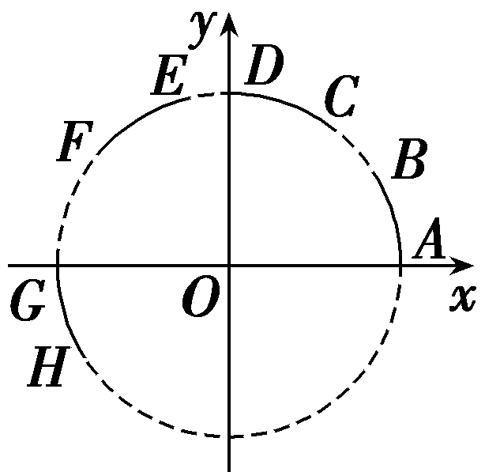

A. $\overparen{AB}$ 	B. $\overparen{CD}$

C. $\overparen{EF}$ 	D. $\overparen{GH}$

答案：**C**

解析：由题图可知，在 $\overparen{AB}$ 上，tan *<text style="italic"><text style="italic"><text style="italic"><text style="italic"><text style="italic"><text style="italic"><text style="italic"><text style="italic"><text style="italic"><text style="italic"><text style="italic">α*</text></text></text></text></text></text></text></text></text></text></text>＞sin α，不满足；在 $\overparen{CD}$ 上，tan *<text style="italic"><text style="italic"><text style="italic"><text style="italic"><text style="italic"><text style="italic"><text style="italic"><text style="italic"><text style="italic"><text style="italic"><text style="italic">α*</text></text></text></text></text></text></text></text></text></text></text>＞sin α，不满足；在 $\overparen{EF}$ 上，sin *<text style="italic"><text style="italic"><text style="italic"><text style="italic"><text style="italic"><text style="italic"><text style="italic"><text style="italic"><text style="italic"><text style="italic"><text style="italic">α*</text></text></text></text></text></text></text></text></text></text></text>＞0，cos α＜0，tan α＜0，且cos α＞tan α，满足；在 $\overparen{GH}$ 上，tan *<text style="italic"><text style="italic"><text style="italic"><text style="italic"><text style="italic"><text style="italic"><text style="italic"><text style="italic"><text style="italic"><text style="italic"><text style="italic">α*</text></text></text></text></text></text></text></text></text></text></text>＞0，sin α＜0，cos α＜0，不满足.故选C.

5.(多选)在平面直角坐标系*xOy*中，角*α*的顶点在原点*O*，以*x*轴的非负半轴为始边，终边经过点*P*(1，*m*)(*m*＜0)，则下列各式的值恒大于0的是(　　)

A. $\frac{sin\alpha }{tan\alpha }$ 	B.cos *<text style="italic">α*</text>－sin α

C.sin *α*cos *α*	D.sin *α*＋cos *α*

答案：**AB**

解析：由题意知sin *<text style="italic"><text style="italic"><text style="italic"><text style="italic"><text style="italic"><text style="italic"><text style="italic"><text style="italic">α*</text></text></text></text></text></text></text></text>＜0，cos α＞0，tan α＜0，则 $\frac{sin\alpha }{tan\alpha }$ ＞0，故A正确；cos *<text style="italic"><text style="italic"><text style="italic"><text style="italic"><text style="italic"><text style="italic"><text style="italic"><text style="italic">α*</text></text></text></text></text></text></text></text>－sin α＞0，故B正确；sin αcos α＜0，故C错误；sin α＋cos α的符号不确定，故D错误.故选AB.

6.(多选)已知点*P*(sin *θ*－cos *θ*，tan *θ*)在第一象限，则在[0，2π]内角*θ*的取值范围可以是(　　)

A. $\left(\pi ，\frac{5\pi }{4}\right)$ 	B. $\left(\frac{\pi }{4}，\frac{\pi }{2}\right)$

C. $\left(\frac{\pi }{2}，\frac{3\pi }{4}\right)$ 	D. $\left(\frac{3\pi }{4}，\frac{5\pi }{4}\right)$

答案：**AB**

解析：因为点*P*(sin *<text style="italic"><text style="italic"><text style="italic"><text style="italic"><text style="italic"><text style="italic"><text style="italic"><text style="italic"><text style="italic"><text style="italic"><text style="italic"><text style="italic"><text style="italic">θ*</text></text></text></text></text></text></text></text></text></text></text></text></text>－cos θ，tan θ)在第一象限，所以 $\left\{\begin{matrix}sin\theta －cos\theta >0，\\tan\theta >0，\end{matrix}\right.$ 即角*<text style="italic"><text style="italic"><text style="italic"><text style="italic"><text style="italic"><text style="italic"><text style="italic"><text style="italic"><text style="italic"><text style="italic"><text style="italic"><text style="italic"><text style="italic">θ*</text></text></text></text></text></text></text></text></text></text></text></text></text>位于第一象限或第三象限，且满足sin θ＞cos θ，所以当角θ位于第一象限时，θ∈ $\left(\frac{\pi }{4}，\frac{\pi }{2}\right)$ ，此时sin *<text style="italic"><text style="italic"><text style="italic"><text style="italic"><text style="italic"><text style="italic"><text style="italic"><text style="italic"><text style="italic"><text style="italic"><text style="italic"><text style="italic"><text style="italic">θ*</text></text></text></text></text></text></text></text></text></text></text></text></text>＞cos θ；当角θ位于第三象限时，θ∈ $\left(\pi ，\frac{5\pi }{4}\right)$ ，此时sin *<text style="italic"><text style="italic"><text style="italic"><text style="italic"><text style="italic"><text style="italic"><text style="italic"><text style="italic"><text style="italic"><text style="italic"><text style="italic"><text style="italic"><text style="italic">θ*</text></text></text></text></text></text></text></text></text></text></text></text></text>＞cos θ.故选AB.

7.图①是第&lt;text sty<em>l</em>e="subscript"&gt;1&lt;/text&gt;9届杭州亚运会会徽，名为“潮涌”，象征着新时代中国特色社会主义大潮的涌动和发展.图②是会徽的几何图形，设弧&lt;text sty<em>l</em>e="italic"&gt;AD&lt;/text&gt;的长度是l1，弧<em>BC</em>的长度是l&lt;text style="subscript"&gt;2&lt;/text&gt;，扇环<em>ABCD</em>的面积为<em>&lt;text style="italic"&gt;S</em>&lt;/text&gt;1，扇形<em>BOC</em>的面积为S2.若 $\frac{l_{1}}{l_{2}}$ ＝3，则 $\frac{S_{1}}{S_{2}}$ ＝<u>　　　　</u>.

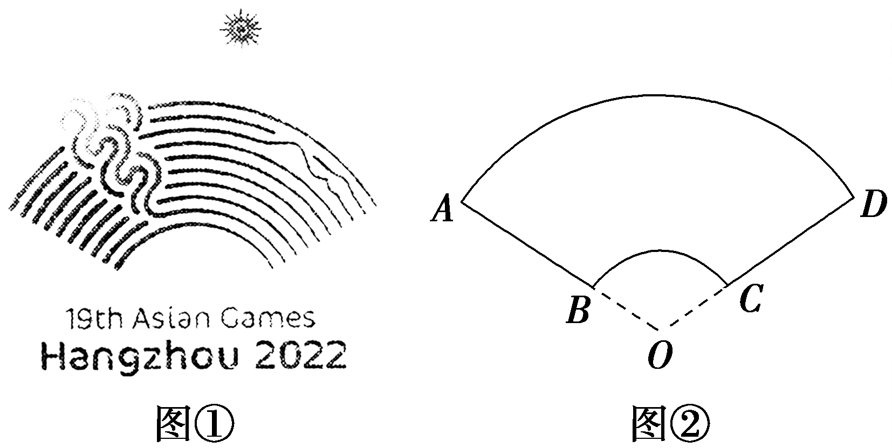

答案：8

解析：因为 $\frac{l_{1}}{l_{2}}$ ＝3，所以 $\frac{｜OA｜}{｜OB｜}$ ＝3.又因为&lt;text sty&lt;text sty<em>l</em>e="italic"&gt;l&lt;/text&gt;e="italic"&gt;<em>S</em>&lt;/text&gt;&lt;text style="subscript"&gt;扇形&lt;/text&gt;<em>AOD</em>＝ $\frac{1}{2}$ &lt;text sty<em>l</em>e="italic"&gt;l&lt;/text&gt;1·｜<em>OA</em>｜，<em>&lt;text style="italic"&gt;S</em>&lt;/text&gt;&lt;text style="subscript"&gt;扇形&lt;/text&gt;<em>BOC</em>＝ $\frac{1}{2}$ &lt;text sty<em>l</em>e="italic"&gt;l&lt;/text&gt;2·｜<em>OB</em>｜，所以 $\frac{S_{扇形AOD}}{S_{扇形BOC}}$ ＝ $\frac{l_{1}\cdot ｜OA｜}{l_{2}\cdot ｜OB｜}$ ＝9，所以 $\frac{S_{扇环ABCD}}{S_{扇形BOC}}$ ＝8，即 $\frac{S_{1}}{S_{2}}$ ＝8.

8.(开放题)(2023·北京卷)已知命题<em>p</em>：若<em>α</em>，<em>β</em>为第一象限角，且<em>α</em>＞<em>β</em>，则tan <em>α</em>＞tan <em>β</em>.能说明<em>p</em>为假命题的一组<em>α</em>，<em>β</em>的值为<em>α</em>＝<u>　　　　</u>，<em>β</em>＝<u>　　　　</u>.

答案： $\frac{9\pi }{4}$ (答案不唯一)　 $\frac{\pi }{4}$ (答案不唯一)

解析：取*<text style="italic"><text style="italic"><text style="italic"><text style="italic"><text style="italic">α*</text></text></text></text></text>＝ $\frac{\pi }{4}$ ＋2π，*<text style="italic"><text style="italic"><text style="italic"><text style="italic"><text style="italic">β*</text></text></text></text></text>＝ $\frac{\pi }{4}$ ，则*<text style="italic"><text style="italic"><text style="italic"><text style="italic"><text style="italic">α*</text></text></text></text></text>＞*<text style="italic"><text style="italic"><text style="italic"><text style="italic"><text style="italic">β*</text></text></text></text></text>，但tan α＝tan β，不满足tan α＞tan β，所以使命题*p*为假命题的一组α，β的值可以是α＝ $\frac{9\pi }{4}$ ，*<text style="italic"><text style="italic"><text style="italic"><text style="italic"><text style="italic">β*</text></text></text></text></text>＝ $\frac{\pi }{4}$ .

9.(13分)已知角*α*满足sin *α*＜0，且tan *α*＞0.

(1)求角*α*的集合；(3分)

(2)判断π－*α*是第几象限角；(4分)

(3)判断sin $\frac{\alpha }{2}$ ·cos $\frac{\alpha }{2}$ ·tan $\frac{\alpha }{2}$ 的符号.(6分)

解：(1)由sin *α*＜0，知角*α*的终边在第三、四象限或在*y*轴的非正半轴上；

又tan *α*＞0，所以角*α*的终边在第三象限，

故角<em>&lt;text style="italic"&gt;&lt;text style="italic"&gt;α</em>&lt;/text&gt;&lt;/text&gt;的集合为{α｜2<em>&lt;text style="italic"&gt;&lt;text style="italic"&gt;k</em>&lt;/text&gt;&lt;/text&gt;π＋π＜α＜2kπ＋ $\frac{3\pi }{2}$ ，<em>&lt;text style="italic"&gt;&lt;text style="italic"&gt;k</em>&lt;/text&gt;&lt;/text&gt;∈<strong>Z</strong>}.

(2)由(1)知，角<em>&lt;text style="italic"&gt;α</em>&lt;/text&gt;是第三象限角，有2<em>&lt;text style="italic"&gt;&lt;text style="italic"&gt;k</em>&lt;/text&gt;&lt;/text&gt;π＋π＜α＜2kπ＋ $\frac{3\pi }{2}$ ，<em>&lt;text style="italic"&gt;&lt;text style="italic"&gt;k</em>&lt;/text&gt;&lt;/text&gt;∈<strong>Z</strong>，

所以－2<em>&lt;text style="italic"&gt;&lt;text style="italic"&gt;&lt;text style="italic"&gt;&lt;text style="italic"&gt;&lt;text style="italic"&gt;k</em>&lt;/text&gt;&lt;/text&gt;&lt;/text&gt;&lt;/text&gt;&lt;/text&gt;π－ $\frac{3\pi }{2}$ ＜－<em>&lt;text style="italic"&gt;α</em>&lt;/text&gt;＜－2<em>&lt;text style="italic"&gt;&lt;text style="italic"&gt;&lt;text style="italic"&gt;&lt;text style="italic"&gt;&lt;text style="italic"&gt;k</em>&lt;/text&gt;&lt;/text&gt;&lt;/text&gt;&lt;/text&gt;&lt;/text&gt;π－π，k∈<strong>&lt;text style="bold"&gt;Z</strong>&lt;/text&gt;，－2kπ－ $\frac{\pi }{2}$ ＜π－<em>&lt;text style="italic"&gt;α</em>&lt;/text&gt;＜－2<em>&lt;text style="italic"&gt;&lt;text style="italic"&gt;&lt;text style="italic"&gt;&lt;text style="italic"&gt;&lt;text style="italic"&gt;k</em>&lt;/text&gt;&lt;/text&gt;&lt;/text&gt;&lt;/text&gt;&lt;/text&gt;π，k∈<strong>&lt;text style="bold"&gt;Z</strong>&lt;/text&gt;，

所以π－*α*是第四象限角.

(3)由2<em>&lt;text style="italic"&gt;&lt;text style="italic"&gt;k</em>&lt;/text&gt;&lt;/text&gt;π＋π＜<em>α</em>＜2kπ＋ $\frac{3\pi }{2}$ ，<em>&lt;text style="italic"&gt;&lt;text style="italic"&gt;k</em>&lt;/text&gt;&lt;/text&gt;∈<strong>Z</strong>，

得<em>&lt;text style="italic"&gt;&lt;text style="italic"&gt;k</em>&lt;/text&gt;&lt;/text&gt;π＋ $\frac{\pi }{2}$ ＜ $\frac{\alpha }{2}$ ＜<em>&lt;text style="italic"&gt;&lt;text style="italic"&gt;k</em>&lt;/text&gt;&lt;/text&gt;π＋ $\frac{3\pi }{4}$ ，<em>&lt;text style="italic"&gt;&lt;text style="italic"&gt;k</em>&lt;/text&gt;&lt;/text&gt;∈<strong>Z</strong>.

当<em>k</em>＝2<em>&lt;text style="italic"&gt;m</em>&lt;/text&gt;，m∈<strong>Z</strong>时，角 $\frac{\alpha }{2}$ 的终边在第二象限，

此时sin $\frac{\alpha }{2}$ ＞0，cos $\frac{\alpha }{2}$ ＜0，tan $\frac{\alpha }{2}$ ＜0，

所以sin $\frac{\alpha }{2}$ ·cos $\frac{\alpha }{2}$ ·tan $\frac{\alpha }{2}$ 的符号为正；

当<em>k</em>＝2<em>&lt;text style="italic"&gt;m</em>&lt;/text&gt;＋1，m∈<strong>Z</strong>时，角 $\frac{\alpha }{2}$ 的终边在第四象限，

此时sin $\frac{\alpha }{2}$ ＜0，cos $\frac{\alpha }{2}$ ＞0，tan $\frac{\alpha }{2}$ ＜0，

所以sin $\frac{\alpha }{2}$ ·cos $\frac{\alpha }{2}$ ·tan $\frac{\alpha }{2}$ 的符号为正.

综上，sin $\frac{\alpha }{2}$ ·cos $\frac{\alpha }{2}$ ·tan $\frac{\alpha }{2}$ 的符号为正.

(10、11题，每小题5分，共10分)

10.(多选)下列条件中，能使角*α*，*β*的终边关于*y*轴对称的是(　　)

A.*α*＋*β*＝540°	B.*α*＋*β*＝360°

C.*α*＋*β*＝180°	D.*α*＋*β*＝90°

答案：**AC**

解析：假设角<em>α</em>，<em>β</em>为0°～180°内的角.如图所示.由角<em>α</em>和<em>β</em>的终边关于<em>y</em>轴对称，得<em>α</em>＋<em>β</em>＝180°.又根据终边相同的角的概念，可得<em>α</em>＋<em>β</em>＝<em>k</em>·360°＋180°＝(2<em>k</em>＋1)180°，<em>k</em>∈<strong>Z</strong>，所以满足条件的为A，C.故选AC.

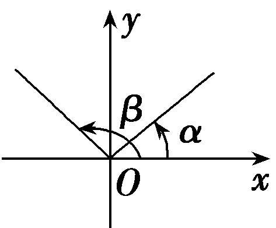

11.(多选)如图，在平面直角坐标系中，以原点<em>O</em>为圆心的圆与<em>x</em>轴正半轴交于点<em>A</em>(1，0).已知点<em>B</em>(<em>x</em>1，<em>y</em>1)在圆<em>O</em>上，点<em>T</em>的坐标是(<em>x</em>0，sin <em>x</em>0)，则下列说法中正确的是(　　)

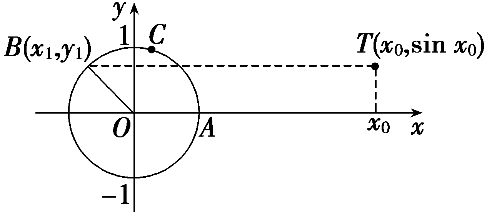

A.若∠*AOB*＝*<text style="italic">α*</text>，则 $\overparen{ACB}$ ＝*<text style="italic">α*</text>

B.若<em>y</em>1＝sin <em>x</em>0，则<em>x</em>1＝<em>x</em>0

C.若&lt;te&lt;te<em>x</em>t style="italic"&gt;x&lt;/text&gt;t style="italic"&gt;y&lt;/text&gt;1＝sin x&lt;text style="subscript"&gt;0&lt;/text&gt;，则 $\overparen{ACB}$ ＝&lt;te<em>x</em>t style="italic"&gt;x&lt;/text&gt;&lt;text style="subscript"&gt;0&lt;/text&gt;

D.若 $\overparen{ACB}$ ＝&lt;te<em>x</em>t st<em>y</em>le="italic"&gt;x&lt;/text&gt;&lt;text style="subscript"&gt;0&lt;/text&gt;，则y1＝sin x0

答案：**AD**

解析：由于单位圆的半径为&lt;te&lt;te&lt;te&lt;te&lt;te&lt;te&lt;te&lt;te&lt;te<em>x</em>t st<em>y</em>le="italic"&gt;x&lt;/text&gt;t style="italic"&gt;x&lt;/text&gt;t style="italic"&gt;x&lt;/text&gt;t style="italic"&gt;x&lt;/text&gt;t st<em>y</em>le="italic"&gt;x&lt;/text&gt;t style="italic"&gt;x&lt;/text&gt;t style="italic"&gt;x&lt;/text&gt;t st<em>y</em>le="italic"&gt;x&lt;/text&gt;t style="subscript"&gt;&lt;text style="subscript"&gt;&lt;text style="subscript"&gt;&lt;text style="subscript"&gt;&lt;text style="subscript"&gt;1&lt;/text&gt;&lt;/text&gt;&lt;/text&gt;&lt;/text&gt;&lt;/text&gt;，根据弧长公式有 $\overparen{ACB}$ ＝&lt;te&lt;te&lt;te&lt;te&lt;te&lt;te&lt;te&lt;te&lt;te<em>x</em>t st<em>y</em>le="italic"&gt;x&lt;/text&gt;t style="italic"&gt;x&lt;/text&gt;t style="italic"&gt;x&lt;/text&gt;t style="italic"&gt;x&lt;/text&gt;t st<em>y</em>le="italic"&gt;x&lt;/text&gt;t style="italic"&gt;x&lt;/text&gt;t style="italic"&gt;x&lt;/text&gt;t st<em>y</em>le="italic"&gt;x&lt;/text&gt;t style="subscript"&gt;&lt;text style="subscript"&gt;&lt;text style="subscript"&gt;&lt;text style="subscript"&gt;&lt;text style="subscript"&gt;1&lt;/text&gt;&lt;/text&gt;&lt;/text&gt;&lt;/text&gt;&lt;/text&gt;·&lt;text st<em>y</em>le="italic"&gt;<em>α</em>&lt;/text&gt;＝α，故A正确；由于点<em>B</em>是∠<em>&lt;text style="italic"&gt;&lt;text style="italic"&gt;&lt;text style="italic"&gt;&lt;text style="italic"&gt;AOB</em>&lt;/text&gt;&lt;/text&gt;&lt;/text&gt;&lt;/text&gt;的一边与单位圆的交点，则y1是对应∠AOB的正弦值，x1是对应∠AOB的余弦值，若y1＝sin x&lt;text style="subscript"&gt;&lt;text style="subscript"&gt;&lt;text style="subscript"&gt;&lt;text style="subscript"&gt;&lt;text style="subscript"&gt;&lt;text style="subscript"&gt;0&lt;/text&gt;&lt;/text&gt;&lt;/text&gt;&lt;/text&gt;&lt;/text&gt;&lt;/text&gt;，则x1＝cos x0，故B错误；当y1＝sin x0时，∠AOB＝x0＋2<em>&lt;text style="italic"&gt;k</em>&lt;/text&gt;π，k∈<strong>Z</strong>，故C错误；反过来，当∠AOB＝x0，即 $\overparen{ACB}$ ＝&lt;te&lt;te&lt;te&lt;te&lt;te&lt;te&lt;te&lt;te<em>x</em>t st<em>y</em>le="italic"&gt;x&lt;/text&gt;t style="italic"&gt;x&lt;/text&gt;t style="italic"&gt;x&lt;/text&gt;t style="italic"&gt;x&lt;/text&gt;t st<em>y</em>le="italic"&gt;x&lt;/text&gt;t style="italic"&gt;x&lt;/text&gt;t style="italic"&gt;x&lt;/text&gt;t st<em>y</em>le="italic"&gt;x&lt;/text&gt;&lt;text style="subscript"&gt;&lt;text style="subscript"&gt;&lt;text style="subscript"&gt;&lt;text style="subscript"&gt;&lt;text style="subscript"&gt;&lt;text style="subscript"&gt;0&lt;/text&gt;&lt;/text&gt;&lt;/text&gt;&lt;/text&gt;&lt;/text&gt;&lt;/text&gt;时，<em>y</em>&lt;text style="subscript"&gt;&lt;text style="subscript"&gt;&lt;text style="subscript"&gt;&lt;text style="subscript"&gt;&lt;text style="subscript"&gt;1&lt;/text&gt;&lt;/text&gt;&lt;/text&gt;&lt;/text&gt;&lt;/text&gt;＝sin x0一定成立，故D正确.故选AD.

12.(15分)某企业欲做一个介绍企业发展史的铭牌，铭牌的截面形状是如图所示的扇形环面(由扇形<te*x*t style="italic">*OA*D</text>挖去扇形*<text style="italic">OB*C</text>后构成的).已知OA＝10 m，OB＝*x* m(0＜x＜10)，线段*BA*，线段*CD*， $\overparen{BC}$ 与 $\overparen{AD}$ 的长度之和为30 m，圆心角为*θ*.

(1)求*θ*关于*x*的函数解析式；(6分)

(2)记铭牌的截面面积为<em>y</em> m2，试问：<em>x</em>取何值时，<em>y</em>的值最大？并求出最大值.(9分)

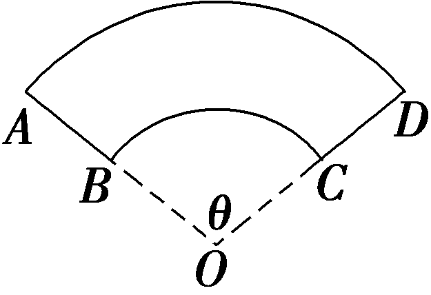

解：(1)根据题意得 $\overparen{BC}$ ＝*x<text style="italic">θ* </text>m， $\overparen{AD}$ ＝10*θ* m，

所以2(10－<te<te*x*t style="italic">x</text>t style="italic">x</text>)＋x·*<text style="italic"><text style="italic">θ*</text></text>＋10θ＝30，所以θ＝ $\frac{2x+10}{x+10}$ (0＜<te<te*x*t style="italic">x</text>t style="italic">x</text>＜10).

(&lt;text style="superscript"&gt;2&lt;/text&gt;)<em>y</em>＝<em>&lt;text style="italic"&gt;S</em>&lt;/text&gt;&lt;text style="subscript"&gt;扇形&lt;/text&gt;<em>OAD</em>－S扇形<em>OBC</em>＝ $\frac{1}{2}$ <em>θ</em>×10&lt;text style="superscript"&gt;2&lt;/text&gt;－ $\frac{1}{2}$ <em>θ</em>x&lt;text style="superscript"&gt;2&lt;/text&gt;

＝ $\frac{1}{2}$ &lt;te<em>x</em>t style="italic"&gt;θ&lt;/text&gt;(10&lt;text style="superscript"&gt;2&lt;/text&gt;－x2)

＝ $\frac{x+5}{10+x}$ ·(10&lt;te&lt;te&lt;te&lt;te&lt;te<em>x</em>t style="italic"&gt;x&lt;/text&gt;t style="italic"&gt;x&lt;/text&gt;t style="italic"&gt;x&lt;/text&gt;t style="italic"&gt;x&lt;/text&gt;t style="superscript"&gt;&lt;text style="superscript"&gt;2&lt;/text&gt;&lt;/text&gt;－x2)＝(x＋5)(10－x)＝－x2＋5x＋50＝－ $\left(x－\frac{5}{2}\right)^{2}$ ＋ $\frac{225}{4}$ ，

所以当<text st*y*le="italic">x</text>＝ $\frac{5}{2}$ 时，*y*ma*x*＝ $\frac{225}{4}$ .

综上，当<text st*y*le="italic">x</text>＝ $\frac{5}{2}$ 时，*y*的值最大，且最大值为 $\frac{225}{4}$ .

(13、14题，每小题5分，共10分)

13.石碾子是我国电气化以前的重要粮食加工工具.它是依靠人力或畜力把谷子、稻子等谷物脱壳或把米碾碎成碴子或面粉的石制工具.如图，石碾子主要由碾盘、碾滚和碾架等组成，一个底面直径为60 cm的圆柱形碾滚的最外侧与碾柱的距离为100 cm，碾滚最外侧正上方为点<em>A</em>，若人推动拉杆绕碾盘转动一周，则点<em>A</em>距碾盘的垂直距离约为<u>　　　　</u>cm.

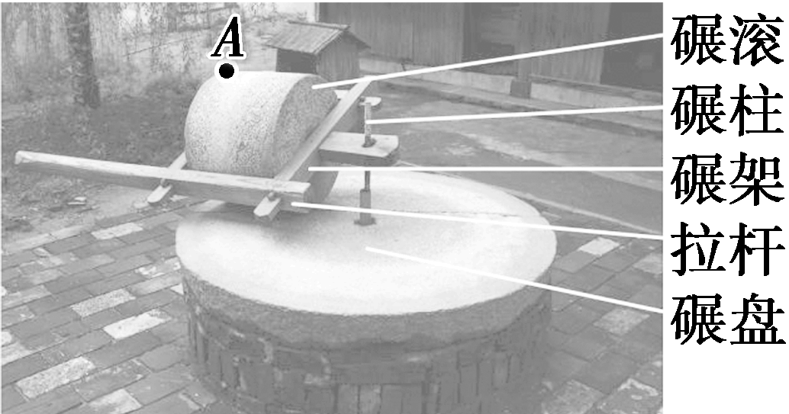

答案：15

解析：由题意碾滚最外侧滚过的距离为2π×100＝200π(cm)，碾滚的周长为2π×30＝60π(cm)，所以碾滚滚过 $\frac{200\pi }{60\pi }$ ＝ $\frac{10}{3}$ (圈)，即滚过了 $\frac{10}{3}$ ×360°＝3×360°＋120°，所以点*A*距碾盘的垂直距离为30－30×cos(180°－120°)＝15(cm).

14.如图，点<em>P</em>是半径为2的圆<em>O</em>上一点，现将如图放置的边长为2的正方形<em>ABCD</em>(顶点<em>A</em>与<em>P</em>重合)沿圆周逆时针滚动.若从点<em>A</em>离开圆周的这一刻开始，正方形滚动至使点<em>A</em>再次回到圆周上为止，称为正方形滚动了一轮，则当点<em>A</em>第一次回到点<em>P</em>的位置时，正方形滚动了<u>　　　　</u>轮，此时点<em>A</em>走过的路径的长度为<u>　　　　</u>.

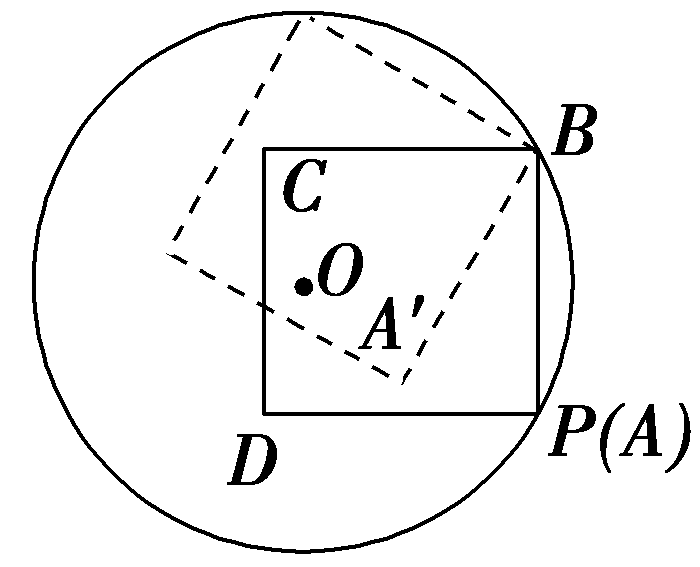

答案：3　( $\sqrt{2}$ ＋2)π

解析：正方形滚动一轮，圆周上依次出现的正方形顶点为<text sty*l*e="italic">B</text>→*C*→*D*→*<text style="italic"><text style="italic"><text style="italic"><text style="italic"><text style="italic">A*</text></text></text></text></text>，顶点两次回到点*<text style="italic"><text style="italic">P*</text></text>时，正方形顶点将圆周正好分成六等份，又4和6的最小公倍数为3×4＝2×6＝12，所以到点A第一次回到点P位置时，正方形滚动了3轮.在每一轮中，点A路径A→*A'*→*A''*→A是圆心角为 $\frac{\pi }{6}$ ，半径分别为2，2 $\sqrt{2}$ ，2的三段弧，故路径长*l*＝ $\frac{\pi }{6}$ ·(2＋2 $\sqrt{2}$ ＋2)＝ $\frac{\left(\sqrt{2}+2\right)\pi }{3}$ ，所以点<text sty*l*e="italic">*<text style="italic"><text style="italic"><text style="italic"><text style="italic">A*</text></text></text></text></text>与*<text style="italic"><text style="italic">P*</text></text>第一次重合时总路径长为 $\left(\sqrt{2}+2\right)$ π.

