**第六节　正弦定理和余弦定理**

【课标研读】　1.通过对三角形边长和角度关系的探索，掌握正弦定理、余弦定理.　2.能用余弦定理、正弦定理解决一些简单的三角形度量问题.

1.正弦定理和余弦定理

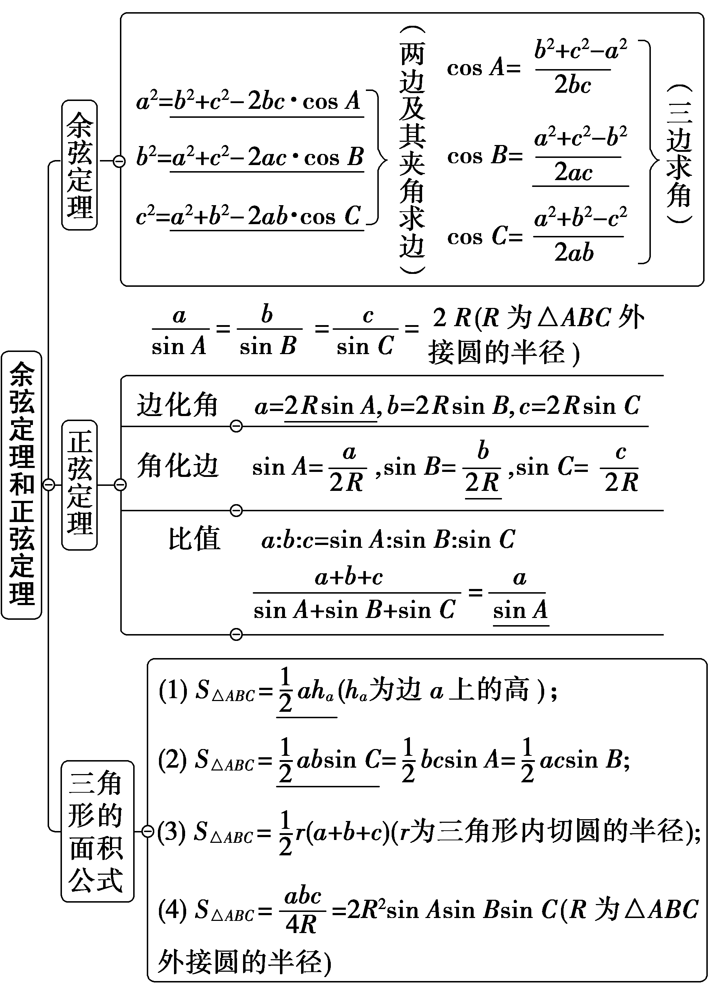

2.三角形解的判断

<table><tr><td></td><td colspan="3">
<em>A</em>为锐角
</td><td>
<em>A</em>为钝角

或直角
</td></tr><tr><td>
图形
</td><td>
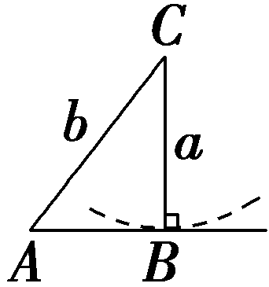
</td><td>
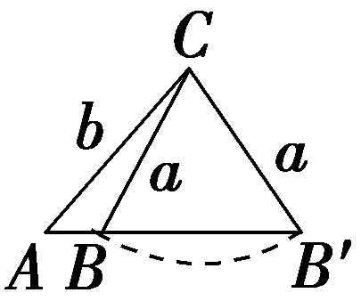
</td><td>
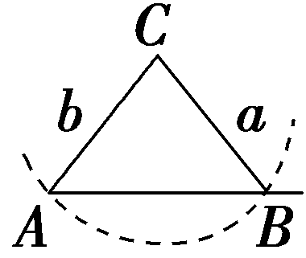
</td><td>
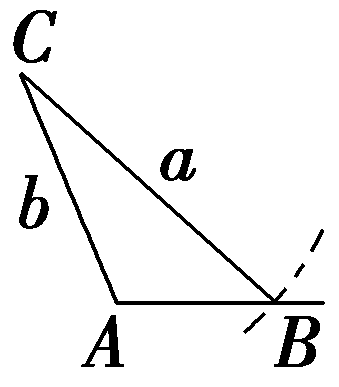
</td></tr><tr><td>
关系

式
</td><td>
<em>a</em>＝<em>b</em>sin <em>A</em>
</td><td>
<em>b</em>sin <em>A</em>＜

<em>a</em>＜<em>b</em>
</td><td>
<em>a</em>≥<em>b</em>
</td><td>
<em>a</em>＞<em>b</em>
</td></tr><tr><td>
解的

个数
</td><td>
一解
</td><td>
两解
</td><td>
一解
</td><td>
一解
</td></tr></table>

【常用结论】

(1)三角形中的边角关系

在△*ABC*中，两边之和大于第三边，两边之差小于第三边，*A*＞*B*⇔*a*＞*b*⇔sin *A*＞sin *B*⇔cos *A*＜cos *B*.

(2)三角形中的三角函数关系

①sin(*A*＋*B*)＝sin *C*.②cos(*A*＋*B*)＝－cos *C*.

③sin $\frac{A＋B}{2}$ ＝cos $\frac{C}{2}$ .④cos $\frac{A＋B}{2}$ ＝sin $\frac{C}{2}$ .

【自主检测】

1.(多选)下列结论错误的是(　　)

A.三角形中三边之比等于相应的三个内角之比

B.在△*ABC*中，若sin *A*＞sin *B*，则*A*＞*B*

C.在△*ABC*的六个元素中，已知任意三个元素可求其他元素

D.当<em>b</em>2＋<em>c</em>2－<em>a</em>2＞0时，△<em>ABC</em>为锐角三角形；当<em>b</em>2＋<em>c</em>2－<em>a</em>2＝0时，△<em>ABC</em>为直角三角形；当<em>b</em>2＋<em>c</em>2－<em>a</em>2＜0时，△<em>ABC</em>为钝角三角形

答案：**ACD**

2.(链接人教<text style="it<text style="it*a*li*c*">a</text>lic">*A*</text>必修二P47例7)已知△*A<text style="italic"><text style="italic">B*</text>*C*</text>中，角A，B，C所对的边分别为a，*<text style="italic">b*</text>，c，若A＝ $\frac{\pi }{6}$ ，<text style="it<text style="it*a*li*c*">a</text>lic">*B*</text>＝ $\frac{\pi }{4}$ ，<text style="it*a*li*c*">a</text>＝1，则*<text style="italic">b*</text>＝(　　)

A.2	B.1

C. $\sqrt{3}$ 	D. $\sqrt{2}$

答案：**D**

解析：由 $\frac{a}{sinA}$ ＝ $\frac{b}{sinB}$ ，得*b*＝ $\frac{asinB}{sinA}$ ＝ $\frac{sin\frac{\pi }{4}}{sin\frac{\pi }{6}}$ ＝ $\frac{\sqrt{2}}{2}$ ×2＝ $\sqrt{2}$ .故选D.

3.(链接人教A必修二P47例8)在△&lt;text style="itali<em>c</em>"&gt;A<em>BC</em>&lt;/text&gt;中，已知B＝45°，<em>b</em>＝2，c＝ $\sqrt{2}$ ，则<em>C</em>＝<u>　　　　</u>.

答案：30°

解析：由正弦定理得sin <text style="itali*c*">*C*</text>＝ $\frac{csinB}{b}$ ＝ $\frac{\sqrt{2}sin45\circ }{2}$ ＝ $\frac{1}{2}$ ，因为<text style="itali*c*">b</text>＞c，*B*＝45°，所以*<text style="italic">C*</text>＝30°.

4.(双空题)(链接人教A必修二P44T2)△<em>ABC</em>中，角<em>A</em>，<em>B</em>，<em>C</em>的对边分别为<em>a</em>，<em>b</em>，<em>c</em>，且<em>a</em>＝4，<em>b</em>＝5，<em>c</em>＝6，则cos <em>A</em>＝<u>　　　　</u>，△<em>ABC</em>的面积为<u>　　　　</u>.

答案： $\frac{3}{4}$ 　 $\frac{15\sqrt{7}}{4}$

解析：依题意得cos *<text style="italic"><text style="italic">A*</text></text>＝ $\frac{b^{2}＋c^{2}－a^{2}}{2bc}$ ＝ $\frac{3}{4}$ ，所以sin *<text style="italic"><text style="italic">A*</text></text>＝ $\sqrt{1－cos^{2}A}$ ＝ $\frac{\sqrt{7}}{4}$ ，所以△*<text style="italic"><text style="italic">A*</text></text>BC的面积为 $\frac{1}{2}$ *bc*sin *<text style="italic"><text style="italic">A*</text></text>＝ $\frac{15\sqrt{7}}{4}$ .

考点一　利用正弦定理、余弦定理解三角形　　　　自主练透

1.(2021·全国甲卷文)在△*A<text style="italic">B*C</text>中，已知B＝120°，*AC*＝ $\sqrt{19}$ ，A*B*＝2，则*BC*＝(　　)

A.1	B. $\sqrt{2}$

C. $\sqrt{5}$ 	D.3

答案：**D**

解析：由余弦定理<em>AC</em>2＝<em>AB</em>2＋<em>BC</em>2－2<em>AB</em>·<em>BC</em>cos <em>B</em>，得<em>BC</em>2＋2<em>BC</em>－15＝0，解得<em>BC</em>＝3或<em>BC</em>＝－5(舍去).故选D.

2.△<text style="it<text style="it<text style="itali*c*">a</text>li*c*">a</text>lic">*<text style="italic"><text style="italic">A*</text></text>*<text style="italic">B*</text>*<text style="italic">C*</text></text>的内角A，B，C的对边分别为a，*<text style="italic">b*</text>，c.已知asin A－bsin B＝4csin C，cos A＝－ $\frac{1}{4}$ ，则 $\frac{b}{c}$ ＝(　　)

A.6	B.5

C.4	D.3

答案：**A**

解析：由题意及正弦定理得&lt;text style="it&lt;text style="itali<em>c</em>"&gt;a&lt;/text&gt;lic"&gt;b&lt;/text&gt;&lt;text style="superscript"&gt;&lt;text style="superscript"&gt;2&lt;/text&gt;&lt;/text&gt;－a2＝－4c2，所以由余弦定理得cos <em>A</em>＝ $\frac{b^{2}＋c^{2}－a^{2}}{2bc}$ ＝ $\frac{－3c^{2}}{2bc}$ ＝－ $\frac{1}{4}$ ，解得 $\frac{b}{c}$ ＝6.故选<em>A</em>.

3.(2024·全国甲卷理)在△&lt;text style="it&lt;text style="itali<em>c</em>"&gt;a&lt;/text&gt;lic"&gt;<em>&lt;text style="italic"&gt;A</em>&lt;/text&gt;<em>&lt;text style="italic"&gt;B</em>&lt;/text&gt;<em>&lt;text style="italic"&gt;C</em>&lt;/text&gt;&lt;/text&gt;中，内角A，B，C所对的边分别为a，<em>&lt;text style="italic"&gt;b</em>&lt;/text&gt;，c，若B＝ $\frac{\pi }{3}$ ，&lt;text style="itali<em>c</em>"&gt;<em>b</em>&lt;/text&gt;2＝ $\frac{9}{4}$ &lt;text style="itali<em>c</em>"&gt;a&lt;/text&gt;c，则sin <em>&lt;text style="italic"&gt;A</em>&lt;/text&gt;＋sin <em>&lt;text style="italic"&gt;C</em>&lt;/text&gt;＝(　　)

A. $\frac{2\sqrt{39}}{13}$ 	B. $\frac{\sqrt{39}}{13}$

C. $\frac{\sqrt{7}}{2}$ 	D. $\frac{3\sqrt{13}}{13}$

答案：**C**

解析：因为&lt;text style="it&lt;text style="it&lt;text style="itali<em>c</em>"&gt;a&lt;/text&gt;li<em>c</em>"&gt;a&lt;/text&gt;lic"&gt;<em>B</em>&lt;/text&gt;＝ $\frac{\pi }{3}$ ，&lt;text style="it&lt;text style="it&lt;text style="itali<em>c</em>"&gt;a&lt;/text&gt;li<em>c</em>"&gt;a&lt;/text&gt;lic"&gt;<em>b</em>&lt;/text&gt;&lt;text style="superscript"&gt;&lt;text style="superscript"&gt;&lt;text style="superscript"&gt;&lt;text style="superscript"&gt;&lt;text style="superscript"&gt;&lt;text style="superscript"&gt;&lt;text style="superscript"&gt;&lt;text style="superscript"&gt;&lt;text style="superscript"&gt;&lt;text style="superscript"&gt;&lt;text style="superscript"&gt;2&lt;/text&gt;&lt;/text&gt;&lt;/text&gt;&lt;/text&gt;&lt;/text&gt;&lt;/text&gt;&lt;/text&gt;&lt;/text&gt;&lt;/text&gt;&lt;/text&gt;&lt;/text&gt;＝ $\frac{9}{4}$ &lt;text style="it&lt;text style="it&lt;text style="itali<em>c</em>"&gt;a&lt;/text&gt;li<em>c</em>"&gt;a&lt;/text&gt;lic"&gt;<em>&lt;text style="italic"&gt;&lt;text style="italic"&gt;ac</em>&lt;/text&gt;&lt;/text&gt;&lt;/text&gt;，则由正弦定理得sin <em>&lt;text style="italic"&gt;&lt;text style="italic"&gt;&lt;text style="italic"&gt;&lt;text style="italic"&gt;&lt;text style="italic"&gt;&lt;text style="italic"&gt;&lt;text style="italic"&gt;&lt;text style="italic"&gt;A</em>&lt;/text&gt;&lt;/text&gt;&lt;/text&gt;&lt;/text&gt;&lt;/text&gt;&lt;/text&gt;&lt;/text&gt;&lt;/text&gt;sin <em>&lt;text style="italic"&gt;&lt;text style="italic"&gt;&lt;text style="italic"&gt;&lt;text style="italic"&gt;&lt;text style="italic"&gt;&lt;text style="italic"&gt;&lt;text style="italic"&gt;&lt;text style="italic"&gt;C</em>&lt;/text&gt;&lt;/text&gt;&lt;/text&gt;&lt;/text&gt;&lt;/text&gt;&lt;/text&gt;&lt;/text&gt;&lt;/text&gt;＝ $\frac{4}{9}$ sin&lt;text style="supers&lt;text style="it&lt;text style="itali<em>c</em>"&gt;a&lt;/text&gt;lic"&gt;c&lt;/text&gt;ript"&gt;&lt;text style="superscript"&gt;&lt;text style="superscript"&gt;&lt;text style="superscript"&gt;&lt;text style="superscript"&gt;&lt;text style="superscript"&gt;&lt;text style="superscript"&gt;&lt;text style="superscript"&gt;&lt;text style="superscript"&gt;&lt;text style="superscript"&gt;&lt;text style="superscript"&gt;2&lt;/text&gt;&lt;/text&gt;&lt;/text&gt;&lt;/text&gt;&lt;/text&gt;&lt;/text&gt;&lt;/text&gt;&lt;/text&gt;&lt;/text&gt;&lt;/text&gt;&lt;/text&gt;&lt;text style="it<em>a</em>lic"&gt;<em>B</em>&lt;/text&gt;＝ $\frac{1}{3}$ .由余弦定理可得&lt;text style="it&lt;text style="it&lt;text style="itali<em>c</em>"&gt;a&lt;/text&gt;li<em>c</em>"&gt;a&lt;/text&gt;lic"&gt;<em>b</em>&lt;/text&gt;&lt;text style="superscript"&gt;&lt;text style="superscript"&gt;&lt;text style="superscript"&gt;&lt;text style="superscript"&gt;&lt;text style="superscript"&gt;&lt;text style="superscript"&gt;&lt;text style="superscript"&gt;&lt;text style="superscript"&gt;&lt;text style="superscript"&gt;&lt;text style="superscript"&gt;&lt;text style="superscript"&gt;2&lt;/text&gt;&lt;/text&gt;&lt;/text&gt;&lt;/text&gt;&lt;/text&gt;&lt;/text&gt;&lt;/text&gt;&lt;/text&gt;&lt;/text&gt;&lt;/text&gt;&lt;/text&gt;＝a2＋c2－<em>&lt;text style="italic"&gt;&lt;text style="italic"&gt;&lt;text style="italic"&gt;ac</em>&lt;/text&gt;&lt;/text&gt;&lt;/text&gt;＝ $\frac{9}{4}$ &lt;text style="it&lt;text style="it&lt;text style="itali<em>c</em>"&gt;a&lt;/text&gt;li<em>c</em>"&gt;a&lt;/text&gt;lic"&gt;<em>&lt;text style="italic"&gt;&lt;text style="italic"&gt;ac</em>&lt;/text&gt;&lt;/text&gt;&lt;/text&gt;，即a&lt;text style="superscript"&gt;&lt;text style="superscript"&gt;&lt;text style="superscript"&gt;&lt;text style="superscript"&gt;&lt;text style="superscript"&gt;&lt;text style="superscript"&gt;&lt;text style="superscript"&gt;&lt;text style="superscript"&gt;&lt;text style="superscript"&gt;&lt;text style="superscript"&gt;&lt;text style="superscript"&gt;2&lt;/text&gt;&lt;/text&gt;&lt;/text&gt;&lt;/text&gt;&lt;/text&gt;&lt;/text&gt;&lt;/text&gt;&lt;/text&gt;&lt;/text&gt;&lt;/text&gt;&lt;/text&gt;＋c2＝ $\frac{13}{4}$ &lt;text style="it&lt;text style="it&lt;text style="itali<em>c</em>"&gt;a&lt;/text&gt;li<em>c</em>"&gt;a&lt;/text&gt;lic"&gt;<em>&lt;text style="italic"&gt;&lt;text style="italic"&gt;ac</em>&lt;/text&gt;&lt;/text&gt;&lt;/text&gt;，根据正弦定理得sin&lt;text style="superscript"&gt;&lt;text style="superscript"&gt;&lt;text style="superscript"&gt;&lt;text style="superscript"&gt;&lt;text style="superscript"&gt;&lt;text style="superscript"&gt;&lt;text style="superscript"&gt;&lt;text style="superscript"&gt;&lt;text style="superscript"&gt;&lt;text style="superscript"&gt;&lt;text style="superscript"&gt;2&lt;/text&gt;&lt;/text&gt;&lt;/text&gt;&lt;/text&gt;&lt;/text&gt;&lt;/text&gt;&lt;/text&gt;&lt;/text&gt;&lt;/text&gt;&lt;/text&gt;&lt;/text&gt;<em>&lt;text style="italic"&gt;&lt;text style="italic"&gt;&lt;text style="italic"&gt;&lt;text style="italic"&gt;&lt;text style="italic"&gt;&lt;text style="italic"&gt;&lt;text style="italic"&gt;&lt;text style="italic"&gt;A</em>&lt;/text&gt;&lt;/text&gt;&lt;/text&gt;&lt;/text&gt;&lt;/text&gt;&lt;/text&gt;&lt;/text&gt;&lt;/text&gt;＋sin2<em>&lt;text style="italic"&gt;&lt;text style="italic"&gt;&lt;text style="italic"&gt;&lt;text style="italic"&gt;&lt;text style="italic"&gt;&lt;text style="italic"&gt;&lt;text style="italic"&gt;&lt;text style="italic"&gt;C</em>&lt;/text&gt;&lt;/text&gt;&lt;/text&gt;&lt;/text&gt;&lt;/text&gt;&lt;/text&gt;&lt;/text&gt;&lt;/text&gt;＝ $\frac{13}{4}$ sin &lt;text style="it&lt;text style="it&lt;text style="itali<em>c</em>"&gt;a&lt;/text&gt;li<em>c</em>"&gt;a&lt;/text&gt;lic"&gt;<em>&lt;text style="italic"&gt;&lt;text style="italic"&gt;&lt;text style="italic"&gt;&lt;text style="italic"&gt;&lt;text style="italic"&gt;&lt;text style="italic"&gt;&lt;text style="italic"&gt;A</em>&lt;/text&gt;&lt;/text&gt;&lt;/text&gt;&lt;/text&gt;&lt;/text&gt;&lt;/text&gt;&lt;/text&gt;&lt;/text&gt;sin <em>&lt;text style="italic"&gt;&lt;text style="italic"&gt;&lt;text style="italic"&gt;&lt;text style="italic"&gt;&lt;text style="italic"&gt;&lt;text style="italic"&gt;&lt;text style="italic"&gt;&lt;text style="italic"&gt;C</em>&lt;/text&gt;&lt;/text&gt;&lt;/text&gt;&lt;/text&gt;&lt;/text&gt;&lt;/text&gt;&lt;/text&gt;&lt;/text&gt;＝ $\frac{13}{12}$ ，所以(sin &lt;text style="it&lt;text style="it&lt;text style="itali<em>c</em>"&gt;a&lt;/text&gt;li<em>c</em>"&gt;a&lt;/text&gt;lic"&gt;<em>&lt;text style="italic"&gt;&lt;text style="italic"&gt;&lt;text style="italic"&gt;&lt;text style="italic"&gt;&lt;text style="italic"&gt;&lt;text style="italic"&gt;&lt;text style="italic"&gt;A</em>&lt;/text&gt;&lt;/text&gt;&lt;/text&gt;&lt;/text&gt;&lt;/text&gt;&lt;/text&gt;&lt;/text&gt;&lt;/text&gt;＋sin <em>&lt;text style="italic"&gt;&lt;text style="italic"&gt;&lt;text style="italic"&gt;&lt;text style="italic"&gt;&lt;text style="italic"&gt;&lt;text style="italic"&gt;&lt;text style="italic"&gt;&lt;text style="italic"&gt;C</em>&lt;/text&gt;&lt;/text&gt;&lt;/text&gt;&lt;/text&gt;&lt;/text&gt;&lt;/text&gt;&lt;/text&gt;&lt;/text&gt;)&lt;text style="superscript"&gt;&lt;text style="superscript"&gt;&lt;text style="superscript"&gt;&lt;text style="superscript"&gt;&lt;text style="superscript"&gt;&lt;text style="superscript"&gt;&lt;text style="superscript"&gt;&lt;text style="superscript"&gt;&lt;text style="superscript"&gt;&lt;text style="superscript"&gt;&lt;text style="superscript"&gt;2&lt;/text&gt;&lt;/text&gt;&lt;/text&gt;&lt;/text&gt;&lt;/text&gt;&lt;/text&gt;&lt;/text&gt;&lt;/text&gt;&lt;/text&gt;&lt;/text&gt;&lt;/text&gt;＝sin2A＋sin2C＋2sin Asin C＝ $\frac{7}{4}$ ，因为&lt;text style="it&lt;text style="it&lt;text style="itali<em>c</em>"&gt;a&lt;/text&gt;li<em>c</em>"&gt;a&lt;/text&gt;lic"&gt;<em>&lt;text style="italic"&gt;&lt;text style="italic"&gt;&lt;text style="italic"&gt;&lt;text style="italic"&gt;&lt;text style="italic"&gt;&lt;text style="italic"&gt;&lt;text style="italic"&gt;A</em>&lt;/text&gt;&lt;/text&gt;&lt;/text&gt;&lt;/text&gt;&lt;/text&gt;&lt;/text&gt;&lt;/text&gt;&lt;/text&gt;，<em>&lt;text style="italic"&gt;&lt;text style="italic"&gt;&lt;text style="italic"&gt;&lt;text style="italic"&gt;&lt;text style="italic"&gt;&lt;text style="italic"&gt;&lt;text style="italic"&gt;&lt;text style="italic"&gt;C</em>&lt;/text&gt;&lt;/text&gt;&lt;/text&gt;&lt;/text&gt;&lt;/text&gt;&lt;/text&gt;&lt;/text&gt;&lt;/text&gt;为三角形内角，则sin A＋sin C＞0，则sin A＋sin C＝ $\frac{\sqrt{7}}{2}$ .故选&lt;text style="it&lt;text style="it&lt;text style="itali<em>c</em>"&gt;a&lt;/text&gt;li<em>c</em>"&gt;a&lt;/text&gt;lic"&gt;<em>&lt;text style="italic"&gt;&lt;text style="italic"&gt;&lt;text style="italic"&gt;&lt;text style="italic"&gt;&lt;text style="italic"&gt;&lt;text style="italic"&gt;&lt;text style="italic"&gt;C</em>&lt;/text&gt;&lt;/text&gt;&lt;/text&gt;&lt;/text&gt;&lt;/text&gt;&lt;/text&gt;&lt;/text&gt;&lt;/text&gt;.

4.(2024·新课标Ⅱ卷)记△<text style="it<text style="itali*c*">a</text>lic">*<text style="italic"><text style="italic">A*</text></text>*BC*</text>的内角A，B，C的对边分别为a，*b*，c，已知sin A＋ $\sqrt{3}$ *c*os <text style="it*a*lic">*<text style="italic">A*</text></text>＝2.

(1)求*A*；

(2)若<text style="itali*c*">a</text>＝2， $\sqrt{2}$ <text style="itali*c*">b</text>sin *C*＝csin 2*B*，求△*ABC*的周长.

解：(1)法一：(辅助角公式)

由sin *<text style="italic"><text style="italic"><text style="italic"><text style="italic">A*</text></text></text></text>＋ $\sqrt{3}$ cos *<text style="italic"><text style="italic"><text style="italic"><text style="italic">A*</text></text></text></text>＝2可得 $\frac{1}{2}$ sin *<text style="italic"><text style="italic"><text style="italic"><text style="italic">A*</text></text></text></text>＋ $\frac{\sqrt{3}}{2}$ cos *<text style="italic"><text style="italic"><text style="italic"><text style="italic">A*</text></text></text></text>＝1，即sin(A＋ $\frac{\pi }{3}$ )＝1，

由于*<text style="italic"><text style="italic"><text style="italic">A*</text></text></text>∈(0，π)⇒A＋ $\frac{\pi }{3}$ ∈( $\frac{\pi }{3}$ ， $\frac{4\pi }{3}$ )，故*<text style="italic"><text style="italic"><text style="italic">A*</text></text></text>＋ $\frac{\pi }{3}$ ＝ $\frac{\pi }{2}$ ，解得*<text style="italic"><text style="italic"><text style="italic">A*</text></text></text>＝ $\frac{\pi }{6}$ .

法二：(同角三角函数的基本关系)

由sin <em>&lt;text style="italic"&gt;&lt;text style="italic"&gt;&lt;text style="italic"&gt;&lt;text style="italic"&gt;A</em>&lt;/text&gt;&lt;/text&gt;&lt;/text&gt;&lt;/text&gt;＋ $\sqrt{3}$ cos <em>&lt;text style="italic"&gt;&lt;text style="italic"&gt;&lt;text style="italic"&gt;&lt;text style="italic"&gt;A</em>&lt;/text&gt;&lt;/text&gt;&lt;/text&gt;&lt;/text&gt;＝&lt;text style="superscript"&gt;2&lt;/text&gt;，又sin2A＋cos2A＝1，消去sin A得到，

4cos2<em>&lt;text style="italic"&gt;&lt;text style="italic"&gt;A</em>&lt;/text&gt;&lt;/text&gt;－4 $\sqrt{3}$ cos <em>&lt;text style="italic"&gt;&lt;text style="italic"&gt;A</em>&lt;/text&gt;&lt;/text&gt;＋3＝0⇔ $(2cosA－\sqrt{3})^{2}$ ＝0，解得cos <em>&lt;text style="italic"&gt;&lt;text style="italic"&gt;A</em>&lt;/text&gt;&lt;/text&gt;＝ $\frac{\sqrt{3}}{2}$ ，

又*<text style="italic">A*</text>∈(0，π)，故A＝ $\frac{\pi }{6}$ .

(2)由题意得 $\sqrt{2}$ <text style="itali*c*">b</text>sin *<text style="italic"><text style="italic">C*</text></text>＝csin 2*<text style="italic"><text style="italic"><text style="italic">B*</text></text></text>⇔ $\sqrt{2}$ sin *<text style="italic"><text style="italic"><text style="italic">B*</text></text></text>sin <text style="itali*c*">*<text style="italic">C*</text></text>＝2sin Csin Bcos B，

又*<text style="italic"><text style="italic"><text style="italic">B*</text></text></text>，*<text style="italic">C*</text>∈(0，π)，则sin Bsin C≠0，进而cos B＝ $\frac{\sqrt{2}}{2}$ ，得到*<text style="italic"><text style="italic"><text style="italic">B*</text></text></text>＝ $\frac{\pi }{4}$ ，

于是*C*＝π－*A*－*B*＝ $\frac{7\pi }{12}$ ，

sin *C*＝sin(π－*<text style="italic"><text style="italic"><text style="italic">A*</text></text></text>－*<text style="italic"><text style="italic"><text style="italic">B*</text></text></text>)＝sin(A＋B)＝sin Acos B＋sin Bcos A＝ $\frac{\sqrt{2}＋\sqrt{6}}{4}$ ，

由正弦定理可得 $\frac{a}{sinA}$ ＝ $\frac{b}{sinB}$ ＝ $\frac{c}{sinC}$ ，即 $\frac{2}{sin \frac{\pi }{6}}$ ＝ $\frac{b}{sin \frac{\pi }{4}}$ ＝ $\frac{c}{sin \frac{7\pi }{12}}$ ，

解得<text style="itali*c*">b</text>＝2 $\sqrt{2}$ ，*c*＝ $\sqrt{6}$ ＋ $\sqrt{2}$ ，

故△*ABC*的周长为2＋ $\sqrt{6}$ ＋3 $\sqrt{2}$ .

应用正弦、余弦定理解题的技巧

1.求边：利用正弦定理变形公式&lt;text style="it&lt;text style="itali<em>c</em>"&gt;a&lt;/text&gt;lic"&gt;a&lt;/text&gt;＝ $\frac{bsinA}{sinB}$ 等或余弦定理&lt;text style="it&lt;text style="itali<em>c</em>"&gt;a&lt;/text&gt;lic"&gt;a&lt;/text&gt;&lt;text style="superscript"&gt;&lt;text style="superscript"&gt;2&lt;/text&gt;&lt;/text&gt;＝<em>b</em>2＋c2－2<em>bc</em>cos <em>A</em>等求解.

2.求角：利用正弦定理变形公式sin *<text style="italic">A*</text>＝ $\frac{asinB}{b}$ 等或余弦定理变形公式cos *<text style="italic">A*</text>＝ $\frac{b^{2}＋c^{2}－a^{2}}{2bc}$ 等求解.

3.利用式子的特点转化：如出现<em>a</em>2＋<em>b</em>2－<em>c</em>2＝λ<em>ab</em>的形式用余弦定理，等式两边是关于边或角的正弦的齐次式用正弦定理.

注意： (1)在实际解题中，往往需要根据设问选择先用正弦定理还是余弦定理.(2)因为解三角形是求三角形内角与边，所以在利用正、余弦定理解三角形遇到半角或倍角时，通常需要利用三角恒等变换化为一倍角.

考点二　判断三角形的形状　　　　师生共研

(1)(一题多变)设△*ABC*的内角*A*，*B*，*C*所对的边分别为*a*，*b*，*c*，若*b*cos *C*＋*c*cos *B*＝*a*sin *A*，则△*ABC*的形状为(　　)

A.直角三角形	B.锐角三角形

C.钝角三角形	D.不确定

(2)在△<em>ABC</em>中，若<em>c</em>－<em>a</em>cos <em>B</em>＝(2<em>a</em>－<em>b</em>)cos <em>A</em>，则△<em>ABC</em>的形状为<u>　　　　　　　　　　</u>.

答案：(1)**A**　(2)直角三角形或等腰三角形

解析：(1)因为&lt;text style="it<em>a</em>li<em>c</em>"&gt;b&lt;/text&gt;cos <em>&lt;text style="italic"&gt;&lt;text style="italic"&gt;&lt;text style="italic"&gt;C</em>&lt;/text&gt;&lt;/text&gt;&lt;/text&gt;＋ccos <em>&lt;text style="italic"&gt;&lt;text style="italic"&gt;&lt;text style="italic"&gt;B</em>&lt;/text&gt;&lt;/text&gt;&lt;/text&gt;＝asin <em>&lt;text style="italic"&gt;&lt;text style="italic"&gt;&lt;text style="italic"&gt;&lt;text style="italic"&gt;&lt;text style="italic"&gt;&lt;text style="italic"&gt;&lt;text style="italic"&gt;A</em>&lt;/text&gt;&lt;/text&gt;&lt;/text&gt;&lt;/text&gt;&lt;/text&gt;&lt;/text&gt;&lt;/text&gt;，所以sin Bcos C＋sin Ccos B＝sin&lt;text style="superscript"&gt;&lt;text style="superscript"&gt;2&lt;/text&gt;&lt;/text&gt;A，即sin(B＋C)＝sin2A，所以sin A＝sin2A，又0＜A＜π，故sin A＝1，即A＝ $\frac{\pi }{2}$ ，因此△<em>&lt;text style="italic"&gt;&lt;text style="italic"&gt;&lt;text style="italic"&gt;&lt;text style="italic"&gt;&lt;text style="italic"&gt;&lt;text style="italic"&gt;&lt;text style="italic"&gt;A</em>&lt;/text&gt;&lt;/text&gt;&lt;/text&gt;&lt;/text&gt;&lt;/text&gt;&lt;/text&gt;&lt;/text&gt;&lt;text style="it<em>a</em>lic"&gt;<em>&lt;text style="italic"&gt;&lt;text style="italic"&gt;B</em>&lt;/text&gt;&lt;/text&gt;&lt;/text&gt;&lt;text style="itali<em>c</em>"&gt;<em>&lt;text style="italic"&gt;&lt;text style="italic"&gt;C</em>&lt;/text&gt;&lt;/text&gt;&lt;/text&gt;是直角三角形.故选A.

(2)由正弦定理得sin *C*－sin *<text style="italic"><text style="italic"><text style="italic"><text style="italic"><text style="italic"><text style="italic"><text style="italic"><text style="italic"><text style="italic"><text style="italic"><text style="italic"><text style="italic"><text style="italic"><text style="italic">A*</text></text></text></text></text></text></text></text></text></text></text></text></text></text>cos *<text style="italic"><text style="italic"><text style="italic"><text style="italic"><text style="italic"><text style="italic"><text style="italic">B*</text></text></text></text></text></text></text>＝2sin Acos A－sin Bcos A，所以sin(A＋B)－sin Acos B＝2sin Acos A－sin Bcos A，故cos A(sin B－sin A)＝0，所以cos A＝0或sin A＝sin B，即A＝ $\frac{\pi }{2}$ 或*<text style="italic"><text style="italic"><text style="italic"><text style="italic"><text style="italic"><text style="italic"><text style="italic"><text style="italic"><text style="italic"><text style="italic"><text style="italic"><text style="italic"><text style="italic"><text style="italic">A*</text></text></text></text></text></text></text></text></text></text></text></text></text></text>＝*<text style="italic"><text style="italic"><text style="italic"><text style="italic"><text style="italic"><text style="italic"><text style="italic">B*</text></text></text></text></text></text></text>，故△AB*C*为直角三角形或等腰三角形.

[变式探究]

1.(变条件)若将本例(1)中的条件改为“2sin *A*cos *B*＝sin *C*”，试判断△*ABC*的形状.

解：法一：由已知得2sin *A*cos *B*＝sin *C*＝sin(*A*＋*B*)＝sin *A*cos *B*＋cos *A*sin *B*，即sin(*A*－*B*)＝0，

因为－π＜*A*－*B*＜π，所以*A*＝*B*，

故△*ABC*为等腰三角形.

法二：由正弦定理得&lt;text style="superscript"&gt;2&lt;/text&gt;&lt;text style="it&lt;text style="it&lt;text style="it<em>a</em>lic"&gt;a&lt;/text&gt;li<em>c</em>"&gt;a&lt;/text&gt;li<em>c</em>"&gt;a&lt;/text&gt;cos <em>B</em>＝c，再由余弦定理得2a· $\frac{a^{2}＋c^{2}－b^{2}}{2ac}$ ＝&lt;text style="it&lt;text style="it&lt;text style="it<em>a</em>lic"&gt;a&lt;/text&gt;li<em>c</em>"&gt;a&lt;/text&gt;lic"&gt;c&lt;/text&gt;⇒<em>a</em>&lt;text style="superscript"&gt;2&lt;/text&gt;＝<em>&lt;text style="italic"&gt;b</em>&lt;/text&gt;2⇒a＝b，

故△*ABC*为等腰三角形.

2.(变条件)若将本例(1)中的条件改为“ $\frac{cosA}{cosB}$ ＝ $\frac{b}{a}$ ”，试判断△*ABC*的形状.

解：法一：由余弦定理得， $\frac{cosA}{cosB}$ ＝ $\frac{\frac{b^{2}＋c^{2}－a^{2}}{2bc}}{\frac{a^{2}＋c^{2}－b^{2}}{2ac}}$ ＝ $\frac{b}{a}$ ，化简得(&lt;text style="it&lt;text style="it&lt;text style="it<em>a</em>li<em>c</em>"&gt;a&lt;/text&gt;lic"&gt;a&lt;/text&gt;li<em>c</em>"&gt;a&lt;/text&gt;&lt;text style="superscript"&gt;&lt;text style="superscript"&gt;&lt;text style="superscript"&gt;&lt;text style="superscript"&gt;&lt;text style="superscript"&gt;&lt;text style="superscript"&gt;&lt;text style="superscript"&gt;2&lt;/text&gt;&lt;/text&gt;&lt;/text&gt;&lt;/text&gt;&lt;/text&gt;&lt;/text&gt;&lt;/text&gt;－<em>&lt;text style="italic"&gt;&lt;text style="italic"&gt;&lt;text style="italic"&gt;b</em>&lt;/text&gt;&lt;/text&gt;&lt;/text&gt;2)(c2－a2－b2)＝0，所以a＝b或c2＝a2＋b2，所以△<em>ABC</em>为等腰三角形或直角三角形.

法二：由 $\frac{cosA}{cosB}$ ＝ $\frac{b}{a}$ 可知cos *<text style="italic">A*</text>＞0，cos *<text style="italic">B*</text>＞0，即A∈ $\left(0，\frac{\pi }{2}\right)$ ，*<text style="italic">B*</text>∈ $\left(0，\frac{\pi }{2}\right)$ ，

结合题意及正弦定理可得 $\frac{cosA}{cosB}$ ＝ $\frac{sinB}{sinA}$ ，即sin *<text style="italic"><text style="italic"><text style="italic"><text style="italic"><text style="italic"><text style="italic">A*</text></text></text></text></text></text>cos A＝sin *<text style="italic"><text style="italic"><text style="italic"><text style="italic"><text style="italic"><text style="italic">B*</text></text></text></text></text></text>cos B，所以 $\frac{1}{2}$ sin 2*<text style="italic"><text style="italic"><text style="italic"><text style="italic"><text style="italic"><text style="italic">A*</text></text></text></text></text></text>＝ $\frac{1}{2}$ sin 2*<text style="italic"><text style="italic"><text style="italic"><text style="italic"><text style="italic"><text style="italic">B*</text></text></text></text></text></text>，则2*<text style="italic"><text style="italic"><text style="italic"><text style="italic"><text style="italic"><text style="italic">A*</text></text></text></text></text></text>＝2B或2A＋2B＝π，即A＝B或A＋B＝ $\frac{\pi }{2}$ .

所以△*ABC*为等腰三角形或直角三角形.

判断三角形形状的两种常用途径

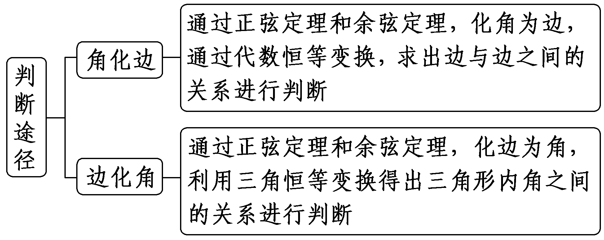

注意：(1)“角化边”后要注意用因式分解、配方等方法得出边的相应关系；“边化角”后要注意用三角恒等变换公式、三角形内角和定理及诱导公式推出角的关系.(2)不能随意约掉公因式，要移项、提取公因式，否则会有遗漏一种形状的可能.

对点练1.在△<em>ABC</em>中，已知<em>a</em>2＋<em>b</em>2－<em>c</em>2＝<em>ab</em>，且2cos <em>A</em>sin <em>B</em>＝sin <em>C</em>，则该三角形的形状是(　　)

A.直角三角形	B.等腰三角形

C.等边三角形	D.钝角三角形

答案：**C**

解析：因为&lt;text style="it&lt;text style="it<em>a</em>lic"&gt;a&lt;/text&gt;li<em>c</em>"&gt;a&lt;/text&gt;&lt;text style="superscript"&gt;&lt;text style="superscript"&gt;&lt;text style="superscript"&gt;&lt;text style="superscript"&gt;2&lt;/text&gt;&lt;/text&gt;&lt;/text&gt;&lt;/text&gt;＋<em>&lt;text style="italic"&gt;&lt;text style="italic"&gt;b</em>&lt;/text&gt;&lt;/text&gt;2－c2＝<em>ab</em>，所以由余弦定理得cos <em>&lt;text style="italic"&gt;&lt;text style="italic"&gt;&lt;text style="italic"&gt;&lt;text style="italic"&gt;C</em>&lt;/text&gt;&lt;/text&gt;&lt;/text&gt;&lt;/text&gt;＝ $\frac{a^{2}＋b^{2}－c^{2}}{2ab}$ ＝ $\frac{1}{2}$ ，又&lt;text style="it&lt;text style="it<em>a</em>lic"&gt;a&lt;/text&gt;lic"&gt;<em>&lt;text style="italic"&gt;&lt;text style="italic"&gt;&lt;text style="italic"&gt;C</em>&lt;/text&gt;&lt;/text&gt;&lt;/text&gt;&lt;/text&gt;∈ $\left(0，\pi \right)$ ，所以&lt;text style="it&lt;text style="it<em>a</em>lic"&gt;a&lt;/text&gt;lic"&gt;<em>&lt;text style="italic"&gt;&lt;text style="italic"&gt;&lt;text style="italic"&gt;C</em>&lt;/text&gt;&lt;/text&gt;&lt;/text&gt;&lt;/text&gt;＝ $\frac{\pi }{3}$ .由&lt;text style="supers&lt;text style="it&lt;text style="it<em>a</em>lic"&gt;a&lt;/text&gt;lic"&gt;c&lt;/text&gt;ript"&gt;&lt;text style="superscript"&gt;&lt;text style="superscript"&gt;&lt;text style="superscript"&gt;2&lt;/text&gt;&lt;/text&gt;&lt;/text&gt;&lt;/text&gt;cos <em>&lt;text style="italic"&gt;A</em>&lt;/text&gt;sin <em>B</em>＝sin <em>&lt;text style="italic"&gt;&lt;text style="italic"&gt;&lt;text style="italic"&gt;&lt;text style="italic"&gt;C</em>&lt;/text&gt;&lt;/text&gt;&lt;/text&gt;&lt;/text&gt;及正弦定理得cos A＝ $\frac{sinC}{2sinB}$ ＝ $\frac{c}{2b}$ ＝ $\frac{c^{2}＋b^{2}－a^{2}}{2bc}$ ，所以&lt;text style="it&lt;text style="it<em>a</em>lic"&gt;a&lt;/text&gt;li<em>c</em>"&gt;<em>&lt;text style="italic"&gt;b</em>&lt;/text&gt;&lt;/text&gt;&lt;text style="superscript"&gt;&lt;text style="superscript"&gt;&lt;text style="superscript"&gt;&lt;text style="superscript"&gt;2&lt;/text&gt;&lt;/text&gt;&lt;/text&gt;&lt;/text&gt;＝<em>a</em>2，即b＝a，又<em>&lt;text style="italic"&gt;&lt;text style="italic"&gt;&lt;text style="italic"&gt;&lt;text style="italic"&gt;C</em>&lt;/text&gt;&lt;/text&gt;&lt;/text&gt;&lt;/text&gt;＝ $\frac{\pi }{3}$ ，故该三角形为等边三角形.故选&lt;text style="it&lt;text style="it<em>a</em>lic"&gt;a&lt;/text&gt;lic"&gt;<em>&lt;text style="italic"&gt;&lt;text style="italic"&gt;&lt;text style="italic"&gt;C</em>&lt;/text&gt;&lt;/text&gt;&lt;/text&gt;&lt;/text&gt;.

对点练2.(2021·新高考Ⅱ卷)在△*ABC*中，角*A*，*B*，*C*所对的边分别为*a*，*b*，*c*，*b*＝*a*＋1，*c*＝*a*＋2.

(1)若2sin *C*＝3sin *A*，求△*ABC*的面积；

(2)是否存在正整数*a*，使得△*ABC*为钝角三角形？若存在，求*a*；若不存在，说明理由.

解：(1)由2sin *C*＝3sin *A*及正弦定理，得2*c*＝3*a*.

又*c*＝*a*＋2，所以*a*＝4，*c*＝6，

所以*b*＝*a*＋1＝5.

由余弦定理，得cos *A*＝ $\frac{b^{2}＋c^{2}－a^{2}}{2bc}$ ＝ $\frac{25+36－16}{2\times 5\times 6}$ ＝ $\frac{3}{4}$ .

又*<text style="italic">A*</text>∈(0，π)，所以sin A＝ $\frac{\sqrt{7}}{4}$ ，

所以<em>S</em>△<em>&lt;text style="italic"&gt;A</em>BC&lt;/text&gt;＝ $\frac{1}{2}$ <em>bc</em>sin <em>A</em>＝ $\frac{1}{2}$ ×5×6× $\frac{\sqrt{7}}{4}$ ＝ $\frac{15\sqrt{7}}{4}$ .

(2)存在.

由题意知<text style="it*a*lic">c</text>＞*b*＞a，要使△*AB<text style="italic">C*</text>为钝角三角形，需cos C＝ $\frac{a^{2}＋b^{2}－c^{2}}{2ab}$ ＝ $\frac{a^{2}＋(a+1)^{2}-(a+2)^{2}}{2\times a\times (a+1)}$ ＝ $\frac{a－3}{2a}$ ＜0，

得0＜*a*＜3.

因为*a*为正整数，所以*a*＝1或*a*＝2.

当*a*＝1时，*b*＝2，*c*＝3，此时不能构成三角形；

当*a*＝2时，*b*＝3，*c*＝4，满足题意.

综上，存在正整数*a*＝2，使得△*ABC*为钝角三角形.

考点三　与三角形面积有关的问题　　　　师生共研

[答题规范]　(13分)(&lt;text style="supers<em>c</em>ript"&gt;&lt;text style="superscript"&gt;2&lt;/text&gt;&lt;/text&gt;024·新课标Ⅰ卷)记△&lt;text style="it&lt;text style="it<em>a</em>li<em>c</em>"&gt;a&lt;/text&gt;lic"&gt;<em>A&lt;text style="italic"&gt;B</em>&lt;/text&gt;<em>&lt;text style="italic"&gt;C</em>&lt;/text&gt;&lt;/text&gt;的内角A，B，C的对边分别为a，<em>&lt;text style="italic"&gt;b</em>&lt;/text&gt;，c，已知sin C＝ $\sqrt{2}$ &lt;text style="it&lt;text style="itali<em>c</em>"&gt;a&lt;/text&gt;lic"&gt;c&lt;/text&gt;os &lt;text style="it<em>a</em>lic"&gt;<em>B</em>&lt;/text&gt;，a&lt;text style="superscript"&gt;&lt;text style="superscript"&gt;2&lt;/text&gt;&lt;/text&gt;＋<em>&lt;text style="italic"&gt;b</em>&lt;/text&gt;2－c2＝ $\sqrt{2}$ &lt;text style="it&lt;text style="itali<em>c</em>"&gt;a&lt;/text&gt;li<em>c</em>"&gt;a&lt;/text&gt;<em>&lt;text style="italic"&gt;b</em>&lt;/text&gt;.

(1)求*B*；

(2)若△<text style="itali*c*">ABC</text>的面积为3＋ $\sqrt{3}$ ，求*c*.

[思路分析]

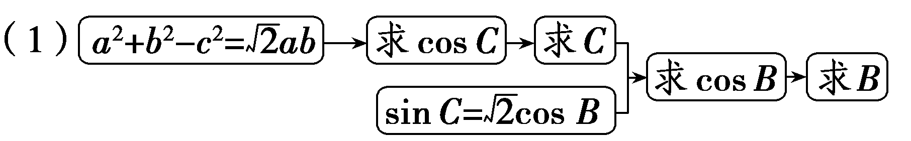

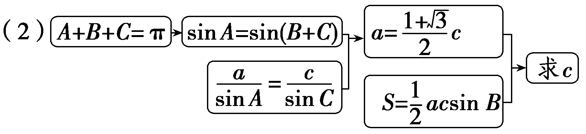

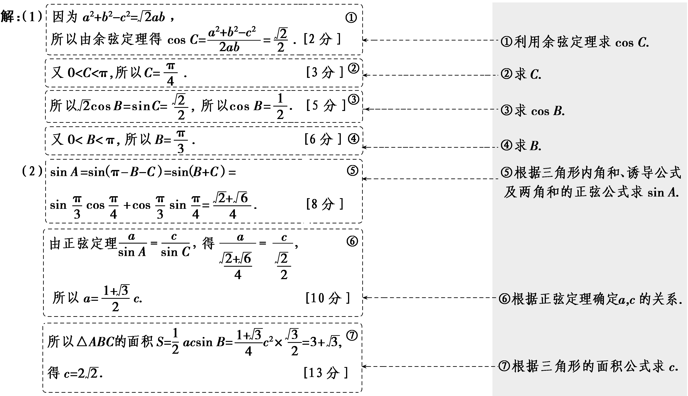

三角形面积问题的常见类型

1.求三角形面积：一般要先利用正弦定理、余弦定理以及两角和与差的三角函数公式等，求出角与边，再求面积.

2.已知三角形面积解三角形：常选用已知邻边求出其夹角，或利用已知角求出角的两边间的关系.

3.已知与三角形面积有关的关系式：常选用关系式中的角作为面积公式中的角，化为三角形的边角关系，再解三角形.

对点练3.(2024·河南开封第二次质量检测)记△<text style="it<text style="it*a*li*c*">a</text>lic">*<text style="italic">A*</text>*<text style="italic">B*</text>*C*</text>的内角A，B，C的对边分别为a，*<text style="italic">b*</text>，c，已知bcos A＝ $\sqrt{2}$ <text style="it*a*li*c*">a</text>sin *<text style="italic">B*</text>.

(1)求sin *A*；

(2)若*a*＝ $\sqrt{3}$ ，再从条件①，条件②，条件③中选择一个条件作为已知，使其能够确定唯一的三角形，并求△*ABC*的面积.

条件①：<text style="itali*c*">*b*</text>＝ $\sqrt{6}$ *c*；条件②：*<text style="italic">b*</text>＝ $\sqrt{6}$ ；条件③：sin *C*＝ $\frac{1}{3}$ .

注：如果选择的条件不符合要求，第(2)问得0分；如果选择多个符合要求的条件分别解答，按第一个解答计分.

解：(1)由<text style="it*a*lic">b</text>cos *A*＝ $\sqrt{2}$ *a*sin *B*，

得sin *<text style="italic"><text style="italic">B*</text></text>cos *<text style="italic">A*</text>＝ $\sqrt{2}$ sin *<text style="italic">A*</text>sin *<text style="italic"><text style="italic">B*</text></text>，而sin B≠0，

则cos <em>&lt;text style="italic"&gt;&lt;text style="italic"&gt;&lt;text style="italic"&gt;&lt;text style="italic"&gt;&lt;text style="italic"&gt;A</em>&lt;/text&gt;&lt;/text&gt;&lt;/text&gt;&lt;/text&gt;&lt;/text&gt;＝ $\sqrt{2}$ sin <em>&lt;text style="italic"&gt;&lt;text style="italic"&gt;&lt;text style="italic"&gt;&lt;text style="italic"&gt;&lt;text style="italic"&gt;A</em>&lt;/text&gt;&lt;/text&gt;&lt;/text&gt;&lt;/text&gt;&lt;/text&gt;＞0，A为锐角，又sin&lt;text style="superscript"&gt;2&lt;/text&gt;A＋cos2A＝1，解得sin A＝ $\frac{\sqrt{3}}{3}$ ，

所以sin *<text style="italic">A*</text>＝ $\frac{\sqrt{3}}{3}$ 且*<text style="italic">A*</text>为锐角.

(2)若选条件①，由sin *<text style="italic"><text style="italic">A*</text></text>＝ $\frac{\sqrt{3}}{3}$ ，*<text style="italic"><text style="italic">A*</text></text>为锐角，得cos A＝ $\frac{\sqrt{6}}{3}$ ，

由余弦定理得&lt;text style="itali&lt;text style="itali&lt;text style="itali&lt;text style="itali&lt;text style="itali<em>c</em>"&gt;c&lt;/text&gt;"&gt;c&lt;/text&gt;"&gt;c&lt;/text&gt;"&gt;c&lt;/text&gt;"&gt;a&lt;/text&gt;&lt;text style="superscript"&gt;&lt;text style="superscript"&gt;&lt;text style="superscript"&gt;&lt;text style="superscript"&gt;&lt;text style="superscript"&gt;2&lt;/text&gt;&lt;/text&gt;&lt;/text&gt;&lt;/text&gt;&lt;/text&gt;＝<em>&lt;text style="italic"&gt;b</em>&lt;/text&gt;2＋c2－2<em>bc</em>cos <em>A</em>，又b＝ $\sqrt{6}$ &lt;text style="itali&lt;text style="itali&lt;text style="itali&lt;text style="itali<em>c</em>"&gt;c&lt;/text&gt;"&gt;c&lt;/text&gt;"&gt;c&lt;/text&gt;"&gt;c&lt;/text&gt;，则3＝6c&lt;text style="superscript"&gt;&lt;text style="superscript"&gt;&lt;text style="superscript"&gt;&lt;text style="superscript"&gt;&lt;text style="superscript"&gt;2&lt;/text&gt;&lt;/text&gt;&lt;/text&gt;&lt;/text&gt;&lt;/text&gt;＋c2－4c2，

解得<em>c</em>＝1，<em>b</em>＝ $\sqrt{6}$ ，△<em>&lt;text style="italic,subscript"&gt;&lt;text style="italic"&gt;A</em>BC&lt;/text&gt;&lt;/text&gt;唯一确定，所以<em>S</em>△ABC＝ $\frac{1}{2}$ <em>bc</em>sin <em>A</em>＝ $\frac{\sqrt{2}}{2}$ .

若选条件②，由正弦定理得 $\frac{a}{sinA}$ ＝ $\frac{b}{sinB}$ ，则sin *B*＝ $\frac{\sqrt{6}\times \frac{\sqrt{3}}{3}}{\sqrt{3}}$ ＝ $\frac{\sqrt{6}}{3}$ ＜1，

由<text style="it*a*lic">b</text>＝ $\sqrt{6}$ ＞*a*＝ $\sqrt{3}$ ，得*<text style="italic">B*</text>＞*A*，因此角B有两解，分别对应两个三角形，不符合题意.

若选条件③，由sin *<text style="italic"><text style="italic">A*</text></text>＝ $\frac{\sqrt{3}}{3}$ ，*<text style="italic"><text style="italic">A*</text></text>为锐角，得cos A＝ $\frac{\sqrt{6}}{3}$ ，

又sin <text style="it<text style="itali*c*">a</text>lic">*A*</text>＝ $\frac{\sqrt{3}}{3}$ ＞sin <text style="it<text style="itali*c*">a</text>lic">*<text style="italic">C*</text></text>＝ $\frac{1}{3}$ ，得<text style="itali*c*">a</text>＞c，*<text style="italic">A*</text>＞*<text style="italic"><text style="italic">C*</text></text>，则cos C＝ $\frac{2\sqrt{2}}{3}$ ，

因此sin *B*＝sin(*<text style="italic"><text style="italic">A*</text></text>＋*<text style="italic"><text style="italic">C*</text></text>)＝sin Acos C＋cos Asin C＝ $\frac{\sqrt{6}}{3}$ ，△*<text style="italic"><text style="italic">A*</text></text>*B<text style="italic"><text style="italic">C*</text></text>唯一确定，

由正弦定理得 $\frac{a}{sinA}$ ＝ $\frac{c}{sinC}$ ，则*c*＝ $\frac{\sqrt{3}\times \frac{1}{3}}{\frac{\sqrt{3}}{3}}$ ＝1，

所以<em>S</em>△<em>A&lt;text style="italic"&gt;B</em>C&lt;/text&gt;＝ $\frac{1}{2}$ <em>ac</em>sin <em>B</em>＝ $\frac{\sqrt{2}}{2}$ .

[真题再现]　&lt;text style="subscript"&gt;1&lt;/text&gt;.(&lt;text style="subscript"&gt;2&lt;/text&gt;022·新高考Ⅱ卷)记△&lt;text style="it&lt;text style="it&lt;text style="itali<em>c</em>"&gt;a&lt;/text&gt;li<em>c</em>"&gt;a&lt;/text&gt;lic"&gt;<em>A&lt;text style="italic"&gt;B</em>&lt;/text&gt;<em>C</em>&lt;/text&gt;的内角A，B，C的对边分别为a，<em>&lt;text style="italic"&gt;b</em>&lt;/text&gt;，c，分别以a，b，c为边长的三个正三角形的面积依次为<em>&lt;text style="italic"&gt;&lt;text style="italic"&gt;&lt;text style="italic"&gt;&lt;text style="italic"&gt;&lt;text style="italic"&gt;S</em>&lt;/text&gt;&lt;/text&gt;&lt;/text&gt;&lt;/text&gt;&lt;/text&gt;1，S2，S&lt;text style="subscript"&gt;3&lt;/text&gt;.已知S1－S2＋S3＝ $\frac{\sqrt{3}}{2}$ ，sin &lt;text style="it&lt;text style="it&lt;text style="itali<em>c</em>"&gt;a&lt;/text&gt;li<em>c</em>"&gt;a&lt;/text&gt;lic"&gt;<em>B</em>&lt;/text&gt;＝ $\frac{1}{3}$ .

(1)求△*ABC*的面积；

(2)若sin *A*sin *C*＝ $\frac{\sqrt{2}}{3}$ ，求*b*.

解：(&lt;text style="su&lt;text style="it&lt;text style="itali<em>c</em>"&gt;a&lt;/text&gt;li<em>c</em>"&gt;<em>b</em>&lt;/text&gt;script"&gt;1&lt;/text&gt;)由&lt;text style="it<em>a</em>lic"&gt;<em>&lt;text style="italic"&gt;S</em>&lt;/text&gt;&lt;/text&gt;1－S&lt;text style="superscript"&gt;&lt;text style="superscript"&gt;&lt;text style="superscript"&gt;&lt;text style="superscript"&gt;&lt;text style="superscript"&gt;&lt;text style="superscript"&gt;2&lt;/text&gt;&lt;/text&gt;&lt;/text&gt;&lt;/text&gt;&lt;/text&gt;&lt;/text&gt;＋S3＝ $\frac{\sqrt{3}}{2}$ ，得 $\frac{\sqrt{3}}{4}$ (&lt;text style="it&lt;text style="itali<em>c</em>"&gt;a&lt;/text&gt;li<em>c</em>"&gt;a&lt;/text&gt;&lt;text style="su<em>&lt;text style="italic"&gt;b</em>&lt;/text&gt;script"&gt;&lt;text style="superscript"&gt;&lt;text style="superscript"&gt;&lt;text style="superscript"&gt;&lt;text style="superscript"&gt;&lt;text style="superscript"&gt;2&lt;/text&gt;&lt;/text&gt;&lt;/text&gt;&lt;/text&gt;&lt;/text&gt;&lt;/text&gt;－b2＋c2)＝ $\frac{\sqrt{3}}{2}$ ，即&lt;text style="it&lt;text style="itali<em>c</em>"&gt;a&lt;/text&gt;li<em>c</em>"&gt;a&lt;/text&gt;&lt;text style="su<em>&lt;text style="italic"&gt;b</em>&lt;/text&gt;script"&gt;&lt;text style="superscript"&gt;&lt;text style="superscript"&gt;&lt;text style="superscript"&gt;&lt;text style="superscript"&gt;&lt;text style="superscript"&gt;2&lt;/text&gt;&lt;/text&gt;&lt;/text&gt;&lt;/text&gt;&lt;/text&gt;&lt;/text&gt;－b2＋c2＝2，

又<em>a</em>2－<em>b</em>2＋<em>c</em>2＝2<em>ac</em>cos <em>B</em> ，所以<em>ac</em>cos <em>B</em>＝1.

由sin *<text style="italic"><text style="italic">B*</text></text>＝ $\frac{1}{3}$ ，得cos *<text style="italic"><text style="italic">B*</text></text>＝ $\frac{2\sqrt{2}}{3}$ 或cos *<text style="italic"><text style="italic">B*</text></text>＝－ $\frac{2\sqrt{2}}{3}$ (舍去)，

所以*<text style="italic">ac*</text>＝ $\frac{3}{2\sqrt{2}}$ ＝ $\frac{3\sqrt{2}}{4}$ ，则△*A<text style="italic">B*C</text>的面积*S*＝ $\frac{1}{2}$ *<text style="italic">ac*</text>sin *B*＝ $\frac{1}{2}$ × $\frac{3\sqrt{2}}{4}$ × $\frac{1}{3}$ ＝ $\frac{\sqrt{2}}{8}$ .

(2)由sin <em>A</em>sin <em>C</em>＝ $\frac{\sqrt{2}}{3}$ ，<em>ac</em>＝ $\frac{3\sqrt{2}}{4}$ 及正弦定理知 $\frac{b^{2}}{sin^{2}B}$ ＝ $\frac{ac}{sinAsinC}$ ＝ $\frac{\frac{3\sqrt{2}}{4}}{\frac{\sqrt{2}}{3}}$ ＝ $\frac{9}{4}$ ，即<em>&lt;text style="italic"&gt;b</em>&lt;/text&gt;2＝ $\frac{9}{4}$ × $\frac{1}{9}$ ＝ $\frac{1}{4}$ ，得<em>&lt;text style="italic"&gt;b</em>&lt;/text&gt;＝ $\frac{1}{2}$ .

2.(2022·北京卷)在△*AB<text style="italic">C*</text>中，sin 2C＝ $\sqrt{3}$ sin *C* .

(1)求∠*C*；

(2)若*b*＝6，且△*<text style="italic">ABC*</text>的面积为6 $\sqrt{3}$ ，求△*<text style="italic">ABC*</text>的周长.

解：(1)因为sin 2*<text style="italic">C*</text>＝ $\sqrt{3}$ sin *<text style="italic">C*</text>，

所以2sin *<text style="italic"><text style="italic">C*</text></text>cos C＝ $\sqrt{3}$ sin *<text style="italic"><text style="italic">C*</text></text>.

因为*<text style="italic"><text style="italic"><text style="italic">C*</text></text></text>∈(0，π)，所以sin C≠0，所以cos C＝ $\frac{\sqrt{3}}{2}$ ，*<text style="italic"><text style="italic"><text style="italic">C*</text></text></text>＝ $\frac{\pi }{6}$ .

(2)因为△<text style="it<text style="it*a*lic">a</text>lic">AB*C*</text>的面积*S*＝ $\frac{1}{2}$ <text style="it<text style="it*a*lic">a</text>lic">ab</text>sin *C*＝ $\frac{1}{2}$ ×<text style="it*a*lic">a</text>×6× $\frac{1}{2}$ ＝6 $\sqrt{3}$ ，所以<text style="it*a*lic">a</text>＝4 $\sqrt{3}$ .

由余弦定理可得&lt;text style="it&lt;text style="itali<em>c</em>"&gt;a&lt;/text&gt;lic"&gt;c&lt;/text&gt;&lt;text style="superscript"&gt;&lt;text style="superscript"&gt;2&lt;/text&gt;&lt;/text&gt;＝a2＋<em>b</em>2－2<em>ab</em>cos <em>C</em>＝48＋36－72＝12，所以c＝2 $\sqrt{3}$ ，

所以△<text style="it<text style="itali*c*">a</text>lic">ABC</text>的周长为a＋*b*＋c＝4 $\sqrt{3}$ ＋6＋2 $\sqrt{3}$ ＝6( $\sqrt{3}$ ＋1).

[教材呈现]　(人教<text style="it<text style="it<text style="itali*c*">a</text>lic">a</text>lic">A</text>必修二P54T22)已知<text style="itali*c*">a</text>，*<text style="italic">b*</text>，c分别为△*A<text style="italic">B<text style="italic"><text style="italic">C*</text></text></text>三个内角A，B，C的对边，且acos C＋ $\sqrt{3}$ <text style="it<text style="it<text style="itali*c*">a</text>lic">a</text>li*c*">a</text>sin *<text style="italic"><text style="italic">C*</text></text>－*<text style="italic">b*</text>－c＝0.

(1)求*A*；

(2)若<text style="itali*c*">a</text>＝2，且△*ABC*的面积为 $\sqrt{3}$ ，求<text style="itali*c*">b</text>，c.

点评：高考题和教材习题的考查角度、考查方式一样，都是给出含有三角形的边、角关系的式子，结合三角知识求解，事实上这类问题是高考试题中解三角形问题的典型的题型.

**课时测评**38　**正弦定理和余弦定理** $\frac{对应学生}{用书P385}$

(时间：60分钟　满分：88分)

(本栏目内容，在学生用书中以独立形式分册装订！)

(1—8题，每小题5分，共40分)

1.在△<text style="it<text style="it*a*li*c*">a</text>lic">*<text style="italic">A*</text>*<text style="italic">B*</text>*C*</text>中，内角A，B，C的对边分别为a，*<text style="italic">b*</text>，c，a＝2，b＝3，cos B＝ $\frac{\sqrt{7}}{4}$ ，则<text style="it<text style="it*a*li*c*">a</text>lic">*A*</text>＝(　　)

A. $\frac{\pi }{6}$ 	B. $\frac{\pi }{3}$

C. $\frac{5\pi }{6}$ 	D. $\frac{\pi }{6}$ 或 $\frac{5\pi }{6}$

答案：**A**

解析：在△<text style="it<text style="it*a*lic">a</text>lic">*<text style="italic"><text style="italic">A*</text></text>*<text style="italic">B*</text>C</text>中，cos B＝ $\frac{\sqrt{7}}{4}$ ，所以sin <text style="it<text style="it*a*lic">a</text>lic">*B*</text>＝ $\sqrt{1－cos^{2}B}$ ＝ $\frac{3}{4}$ ，又<text style="it*a*lic">a</text>＝2，*<text style="italic">b*</text>＝3，所以由正弦定理可得sin *<text style="italic"><text style="italic">A*</text></text>＝ $\frac{a\cdot sinB}{b}$ ＝ $\frac{2\times \frac{3}{4}}{3}$ ＝ $\frac{1}{2}$ .又<text style="it*a*lic">*b*</text>＞*a*，所以*<text style="italic"><text style="italic">A*</text></text>为锐角，所以A＝ $\frac{\pi }{6}$ .故选<text style="it*a*lic">*<text style="italic">A*</text></text>.

2.在△*ABC*中，*C*＝60°，*a*＋2*b*＝8，sin *A*＝6sin *B*，则*c*＝(　　)

A. $\sqrt{35}$ 	B. $\sqrt{31}$

C.6	D.5

答案：**B**

解析：因为sin &lt;text style="it&lt;text style="it&lt;text style="it&lt;text style="it&lt;text style="itali&lt;text style="itali<em>c</em>"&gt;c&lt;/text&gt;"&gt;a&lt;/text&gt;li<em>c</em>"&gt;a&lt;/text&gt;lic"&gt;a&lt;/text&gt;lic"&gt;a&lt;/text&gt;lic"&gt;A&lt;/text&gt;＝6sin <em>B</em>，则由正弦定理得a＝6<em>&lt;text style="italic"&gt;&lt;text style="italic"&gt;&lt;text style="italic"&gt;b</em>&lt;/text&gt;&lt;/text&gt;&lt;/text&gt;，又a＋&lt;text style="superscript"&gt;&lt;text style="superscript"&gt;&lt;text style="superscript"&gt;&lt;text style="superscript"&gt;&lt;text style="superscript"&gt;2&lt;/text&gt;&lt;/text&gt;&lt;/text&gt;&lt;/text&gt;&lt;/text&gt;b＝8，所以a＝6，b＝1，因为<em>&lt;text style="italic"&gt;C</em>&lt;/text&gt;＝60°，所以由余弦定理c2＝a2＋b2－2<em>ab</em>cos C，即c2＝62＋12－2×6×1× $\frac{1}{2}$ ，解得&lt;text style="it&lt;text style="itali&lt;text style="itali<em>c</em>"&gt;c&lt;/text&gt;"&gt;a&lt;/text&gt;lic"&gt;c&lt;/text&gt;＝ $\sqrt{31}$ .故选&lt;text style="it&lt;text style="it&lt;text style="it&lt;text style="it&lt;text style="itali&lt;text style="itali<em>c</em>"&gt;c&lt;/text&gt;"&gt;a&lt;/text&gt;li<em>c</em>"&gt;a&lt;/text&gt;lic"&gt;a&lt;/text&gt;lic"&gt;a&lt;/text&gt;lic"&gt;B&lt;/text&gt;.

3.(2025·八省适应性测试)在△*A<text style="italic">BC*</text>中，BC＝8，*AC*＝10，cos∠*BAC*＝ $\frac{3}{5}$ ，则△*A<text style="italic">BC*</text>的面积为(　　)

A.6	B.8

C.24	D.48

答案：**C**

解析：设&lt;te&lt;te&lt;te&lt;te&lt;te&lt;te<em>x</em>t style="italic"&gt;x&lt;/text&gt;t style="italic"&gt;x&lt;/text&gt;t style="italic"&gt;x&lt;/text&gt;t style="italic"&gt;x&lt;/text&gt;t style="italic"&gt;x&lt;/text&gt;t style="italic"&gt;<em>&lt;text style="italic"&gt;&lt;text style="italic"&gt;AB</em>&lt;/text&gt;&lt;/text&gt;&lt;/text&gt;＝x，根据余弦定理<em>&lt;text style="italic"&gt;&lt;text style="italic"&gt;BC</em>&lt;/text&gt;&lt;/text&gt;&lt;text style="superscript"&gt;&lt;text style="superscript"&gt;&lt;text style="superscript"&gt;&lt;text style="superscript"&gt;&lt;text style="superscript"&gt;&lt;text style="superscript"&gt;&lt;text style="superscript"&gt;&lt;text style="superscript"&gt;&lt;text style="superscript"&gt;2&lt;/text&gt;&lt;/text&gt;&lt;/text&gt;&lt;/text&gt;&lt;/text&gt;&lt;/text&gt;&lt;/text&gt;&lt;/text&gt;&lt;/text&gt;＝<em>&lt;text style="italic"&gt;&lt;text style="italic"&gt;&lt;text style="italic"&gt;AC</em>&lt;/text&gt;&lt;/text&gt;&lt;/text&gt;2＋AB2－2AC·AB·cos∠<em>&lt;text style="italic"&gt;BAC</em>&lt;/text&gt;，已知BC＝8，AC＝10，cos∠BAC＝ $\frac{3}{5}$ ，代入可得8&lt;te&lt;te&lt;te&lt;te&lt;te<em>x</em>t style="italic"&gt;x&lt;/text&gt;t style="italic"&gt;x&lt;/text&gt;t style="italic"&gt;x&lt;/text&gt;t style="italic"&gt;x&lt;/text&gt;t style="superscript"&gt;&lt;text style="superscript"&gt;&lt;text style="superscript"&gt;&lt;text style="superscript"&gt;&lt;text style="superscript"&gt;&lt;text style="superscript"&gt;&lt;text style="superscript"&gt;&lt;text style="superscript"&gt;&lt;text style="superscript"&gt;2&lt;/text&gt;&lt;/text&gt;&lt;/text&gt;&lt;/text&gt;&lt;/text&gt;&lt;/text&gt;&lt;/text&gt;&lt;/text&gt;&lt;/text&gt;＝102＋<em>x</em>2－2×10×x× $\frac{3}{5}$ ，即&lt;te&lt;te&lt;te&lt;te&lt;te<em>x</em>t style="italic"&gt;x&lt;/text&gt;t style="italic"&gt;x&lt;/text&gt;t style="italic"&gt;x&lt;/text&gt;t style="italic"&gt;x&lt;/text&gt;t style="italic"&gt;x&lt;/text&gt;&lt;text style="superscript"&gt;&lt;text style="superscript"&gt;&lt;text style="superscript"&gt;&lt;text style="superscript"&gt;&lt;text style="superscript"&gt;&lt;text style="superscript"&gt;&lt;text style="superscript"&gt;&lt;text style="superscript"&gt;&lt;text style="superscript"&gt;2&lt;/text&gt;&lt;/text&gt;&lt;/text&gt;&lt;/text&gt;&lt;/text&gt;&lt;/text&gt;&lt;/text&gt;&lt;/text&gt;&lt;/text&gt;－12x＋36＝0，解得x＝6，由于<em>&lt;text style="italic"&gt;&lt;text style="italic"&gt;BC</em>&lt;/text&gt;&lt;/text&gt;2＋<em>&lt;text style="italic"&gt;&lt;text style="italic"&gt;&lt;text style="italic"&gt;AB</em>&lt;/text&gt;&lt;/text&gt;&lt;/text&gt;2＝64＋36＝100＝<em>&lt;text style="italic"&gt;&lt;text style="italic"&gt;&lt;text style="italic"&gt;AC</em>&lt;/text&gt;&lt;/text&gt;&lt;/text&gt;2，则△<em>ABC</em>为直角三角形，则<em>S</em>＝ $\frac{1}{2}$ ×6×8＝&lt;te&lt;te&lt;te&lt;te&lt;te<em>x</em>t style="italic"&gt;x&lt;/text&gt;t style="italic"&gt;x&lt;/text&gt;t style="italic"&gt;x&lt;/text&gt;t style="italic"&gt;x&lt;/text&gt;t style="superscript"&gt;&lt;text style="superscript"&gt;&lt;text style="superscript"&gt;&lt;text style="superscript"&gt;&lt;text style="superscript"&gt;&lt;text style="superscript"&gt;&lt;text style="superscript"&gt;&lt;text style="superscript"&gt;&lt;text style="superscript"&gt;2&lt;/text&gt;&lt;/text&gt;&lt;/text&gt;&lt;/text&gt;&lt;/text&gt;&lt;/text&gt;&lt;/text&gt;&lt;/text&gt;&lt;/text&gt;4. 故选C.

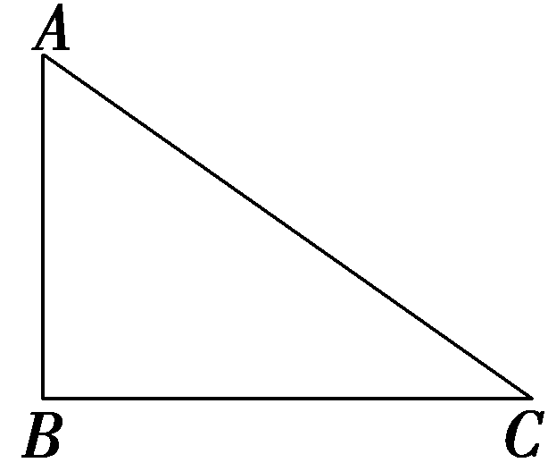

4.已知△<text style="it<text style="itali*c*">a</text>lic">*AB<text style="italic">C*</text></text>中，角A，B，C所对的边分别为a，*<text style="italic">b*</text>，c.已知b＝1，C＝ $\frac{\pi }{4}$ ，△<text style="it<text style="itali*c*">a</text>lic">*AB<text style="italic">C*</text></text>的面积*S*＝2，则△*<text style="italic">ABC*</text>的外接圆的半径为(　　)

A.4 $\sqrt{5}$ 	B.2 $\sqrt{5}$

C.5 $\sqrt{2}$ 	D. $\frac{5\sqrt{2}}{2}$

答案：**D**

解析：因为&lt;text style="it&lt;text style="it&lt;text style="it&lt;text style="itali<em>c</em>"&gt;a&lt;/text&gt;li<em>c</em>"&gt;a&lt;/text&gt;lic"&gt;a&lt;/text&gt;lic"&gt;<em>b</em>&lt;/text&gt;＝1，<em>&lt;text style="italic"&gt;C</em>&lt;/text&gt;＝ $\frac{\pi }{4}$ ，△AB&lt;text style="it&lt;text style="it&lt;text style="it&lt;text style="itali<em>c</em>"&gt;a&lt;/text&gt;li<em>c</em>"&gt;a&lt;/text&gt;lic"&gt;a&lt;/text&gt;lic"&gt;<em>C</em>&lt;/text&gt;的面积<em>&lt;text style="italic"&gt;S</em>&lt;/text&gt;＝&lt;text style="superscript"&gt;&lt;text style="superscript"&gt;&lt;text style="superscript"&gt;&lt;text style="superscript"&gt;2&lt;/text&gt;&lt;/text&gt;&lt;/text&gt;&lt;/text&gt;，所以S＝ $\frac{1}{2}$ &lt;text style="it&lt;text style="it&lt;text style="itali<em>c</em>"&gt;a&lt;/text&gt;li<em>c</em>"&gt;a&lt;/text&gt;lic"&gt;a&lt;/text&gt;×1×sin $\frac{\pi }{4}$ ＝&lt;text style="supers<em>c</em>ript"&gt;&lt;text style="superscript"&gt;&lt;text style="superscript"&gt;&lt;text style="superscript"&gt;2&lt;/text&gt;&lt;/text&gt;&lt;/text&gt;&lt;/text&gt;，解得&lt;text style="it&lt;text style="it<em>a</em>li<em>c</em>"&gt;a&lt;/text&gt;lic"&gt;a&lt;/text&gt;＝4 $\sqrt{2}$ ，由余弦定理得&lt;text style="it&lt;text style="itali<em>c</em>"&gt;a&lt;/text&gt;lic"&gt;c&lt;/text&gt;&lt;text style="superscript"&gt;&lt;text style="superscript"&gt;&lt;text style="superscript"&gt;&lt;text style="superscript"&gt;2&lt;/text&gt;&lt;/text&gt;&lt;/text&gt;&lt;/text&gt;＝&lt;text style="it<em>a</em>lic"&gt;a&lt;/text&gt;2＋<em>&lt;text style="italic"&gt;b</em>&lt;/text&gt;2－2<em>ab</em>cos <em>&lt;text style="italic"&gt;C</em>&lt;/text&gt;＝(4 $\sqrt{2}$ )&lt;text style="supers<em>c</em>ript"&gt;&lt;text style="superscript"&gt;&lt;text style="superscript"&gt;&lt;text style="superscript"&gt;2&lt;/text&gt;&lt;/text&gt;&lt;/text&gt;&lt;/text&gt;＋12－2×4 $\sqrt{2}$ ×1× $\frac{\sqrt{2}}{2}$ ＝&lt;text style="supers<em>c</em>ript"&gt;&lt;text style="superscript"&gt;&lt;text style="superscript"&gt;&lt;text style="superscript"&gt;2&lt;/text&gt;&lt;/text&gt;&lt;/text&gt;&lt;/text&gt;5，解得&lt;text style="it<em>a</em>lic"&gt;c&lt;/text&gt;＝5(负值舍去)，所以结合正弦定理可知，△AB&lt;text style="it&lt;text style="it<em>a</em>lic"&gt;a&lt;/text&gt;lic"&gt;<em>C</em>&lt;/text&gt;的外接圆的半径为 $\frac{c}{2sinC}$ ＝ $\frac{5\sqrt{2}}{2}$ .故选D.

5.(多选)已知△*ABC*的内角*A*，*B*，*C*所对的边分别为*a*，*b*，*c*，下列四个命题中正确的是(　　)

A.若*a*cos *A*＝*b*cos *B*，则△*ABC*一定是等腰三角形

B.若*b*cos *C*＋*c*cos *B*＝*b*，则△*ABC*是等腰三角形

C.若 $\frac{a}{cosA}$ ＝ $\frac{b}{cosB}$ ＝ $\frac{c}{cosC}$ ，则△*ABC*一定是等边三角形

D.若<em>B</em>＝60°，<em>b</em>2＝<em>ac</em>，则△<em>ABC</em>是直角三角形

答案：**BC**

解析：对于&lt;text style="it&lt;text style="it&lt;text style="it&lt;text style="itali<em>c</em>"&gt;a&lt;/text&gt;li<em>c</em>"&gt;a&lt;/text&gt;li<em>c</em>"&gt;a&lt;/text&gt;li<em>c</em>"&gt;<em>&lt;text style="italic"&gt;&lt;text style="italic"&gt;&lt;text style="italic"&gt;&lt;text style="italic"&gt;&lt;text style="italic"&gt;&lt;text style="italic"&gt;&lt;text style="italic"&gt;&lt;text style="italic"&gt;&lt;text style="italic"&gt;&lt;text style="italic"&gt;&lt;text style="italic"&gt;A</em>&lt;/text&gt;&lt;/text&gt;&lt;/text&gt;&lt;/text&gt;&lt;/text&gt;&lt;/text&gt;&lt;/text&gt;&lt;/text&gt;&lt;/text&gt;&lt;/text&gt;&lt;/text&gt;&lt;/text&gt;，若<em>a</em>cos A＝<em>&lt;text style="italic"&gt;&lt;text style="italic"&gt;&lt;text style="italic"&gt;&lt;text style="italic"&gt;b</em>&lt;/text&gt;&lt;/text&gt;&lt;/text&gt;&lt;/text&gt;cos <em>&lt;text style="italic"&gt;&lt;text style="italic"&gt;&lt;text style="italic"&gt;&lt;text style="italic"&gt;&lt;text style="italic"&gt;&lt;text style="italic"&gt;&lt;text style="italic"&gt;&lt;text style="italic"&gt;&lt;text style="italic"&gt;&lt;text style="italic"&gt;&lt;text style="italic"&gt;&lt;text style="italic"&gt;&lt;text style="italic"&gt;&lt;text style="italic"&gt;&lt;text style="italic"&gt;&lt;text style="italic"&gt;&lt;text style="italic"&gt;B</em>&lt;/text&gt;&lt;/text&gt;&lt;/text&gt;&lt;/text&gt;&lt;/text&gt;&lt;/text&gt;&lt;/text&gt;&lt;/text&gt;&lt;/text&gt;&lt;/text&gt;&lt;/text&gt;&lt;/text&gt;&lt;/text&gt;&lt;/text&gt;&lt;/text&gt;&lt;/text&gt;&lt;/text&gt;，则由正弦定理得sin Acos A＝sin Bcos B，所以sin &lt;text style="superscript"&gt;&lt;text style="superscript"&gt;&lt;text style="superscript"&gt;&lt;text style="superscript"&gt;2&lt;/text&gt;&lt;/text&gt;&lt;/text&gt;&lt;/text&gt;A＝sin 2B，则2A＝2B或2A＋2B＝180°，即A＝B或A＋B＝90°，则△<em>AB&lt;text style="italic"&gt;&lt;text style="italic"&gt;&lt;text style="italic"&gt;&lt;text style="italic"&gt;&lt;text style="italic"&gt;&lt;text style="italic"&gt;&lt;text style="italic"&gt;C</em>&lt;/text&gt;&lt;/text&gt;&lt;/text&gt;&lt;/text&gt;&lt;/text&gt;&lt;/text&gt;&lt;/text&gt;为等腰三角形或直角三角形，故A错误；对于B，若bcos C＋ccos B＝b，则由正弦定理得sin Bcos C＋sin Ccos B＝sin(B＋C)＝sin A＝sin B，即A＝B，则△<em>&lt;text style="italic"&gt;&lt;text style="italic"&gt;ABC</em>&lt;/text&gt;&lt;/text&gt;是等腰三角形，故B正确；对于C，若 $\frac{a}{cosA}$ ＝ $\frac{b}{cosB}$ ＝ $\frac{c}{cosC}$ ，则由正弦定理得 $\frac{sinA}{cosA}$ ＝ $\frac{sinB}{cosB}$ ＝ $\frac{sinC}{cosC}$ ，则t&lt;text style="it&lt;text style="it&lt;text style="it&lt;text style="itali<em>c</em>"&gt;a&lt;/text&gt;li<em>c</em>"&gt;a&lt;/text&gt;li<em>c</em>"&gt;a&lt;/text&gt;li<em>c</em>"&gt;a&lt;/text&gt;n <em>&lt;text style="italic"&gt;&lt;text style="italic"&gt;&lt;text style="italic"&gt;&lt;text style="italic"&gt;&lt;text style="italic"&gt;&lt;text style="italic"&gt;&lt;text style="italic"&gt;&lt;text style="italic"&gt;&lt;text style="italic"&gt;&lt;text style="italic"&gt;&lt;text style="italic"&gt;&lt;text style="italic"&gt;A</em>&lt;/text&gt;&lt;/text&gt;&lt;/text&gt;&lt;/text&gt;&lt;/text&gt;&lt;/text&gt;&lt;/text&gt;&lt;/text&gt;&lt;/text&gt;&lt;/text&gt;&lt;/text&gt;&lt;/text&gt;＝tan <em>&lt;text style="italic"&gt;&lt;text style="italic"&gt;&lt;text style="italic"&gt;&lt;text style="italic"&gt;&lt;text style="italic"&gt;&lt;text style="italic"&gt;&lt;text style="italic"&gt;&lt;text style="italic"&gt;&lt;text style="italic"&gt;&lt;text style="italic"&gt;&lt;text style="italic"&gt;&lt;text style="italic"&gt;&lt;text style="italic"&gt;&lt;text style="italic"&gt;&lt;text style="italic"&gt;&lt;text style="italic"&gt;&lt;text style="italic"&gt;B</em>&lt;/text&gt;&lt;/text&gt;&lt;/text&gt;&lt;/text&gt;&lt;/text&gt;&lt;/text&gt;&lt;/text&gt;&lt;/text&gt;&lt;/text&gt;&lt;/text&gt;&lt;/text&gt;&lt;/text&gt;&lt;/text&gt;&lt;/text&gt;&lt;/text&gt;&lt;/text&gt;&lt;/text&gt;＝tan <em>&lt;text style="italic"&gt;&lt;text style="italic"&gt;&lt;text style="italic"&gt;&lt;text style="italic"&gt;&lt;text style="italic"&gt;&lt;text style="italic"&gt;C</em>&lt;/text&gt;&lt;/text&gt;&lt;/text&gt;&lt;/text&gt;&lt;/text&gt;&lt;/text&gt;，即A＝B＝C，即△<em>&lt;text style="italic"&gt;&lt;text style="italic"&gt;&lt;text style="italic"&gt;ABC</em>&lt;/text&gt;&lt;/text&gt;&lt;/text&gt;是等边三角形，故C正确；对于D，由于B＝60°，<em>&lt;text style="italic"&gt;&lt;text style="italic"&gt;&lt;text style="italic"&gt;&lt;text style="italic"&gt;b</em>&lt;/text&gt;&lt;/text&gt;&lt;/text&gt;&lt;/text&gt;&lt;text style="superscript"&gt;&lt;text style="superscript"&gt;&lt;text style="superscript"&gt;&lt;text style="superscript"&gt;2&lt;/text&gt;&lt;/text&gt;&lt;/text&gt;&lt;/text&gt;＝<em>&lt;text style="italic"&gt;&lt;text style="italic"&gt;ac</em>&lt;/text&gt;&lt;/text&gt;，由余弦定理可得b2＝ac＝a2＋c2－ac，可得(a－c)2＝0，解得a＝c，可得A＝C＝B，故△ABC是等边三角形，故D错误.故选BC.

6.(多选)在△<text style="it<text style="itali*c*">a</text>lic">*<text style="italic">A*</text>*<text style="italic">B*</text>*C*</text>中，内角A，B，C所对的边分别为a，*b*，c，且 $\frac{\sqrt{3}c}{acosB}$ ＝t<text style="itali*c*">a</text>n *<text style="italic">A*</text>＋tan *<text style="italic">B*</text>，下列结论中正确的是(　　)

*A*.A＝ $\frac{\pi }{6}$

B.*A*＝ $\frac{\pi }{3}$

C.当*a*＝4时，△*ABC*面积的最大值为2 $\sqrt{3}$

D.当<text style="itali*c*">b</text>－c＝ $\frac{\sqrt{3}a}{3}$ 时，△*ABC*为直角三角形

答案：**BD**

解析：由 $\frac{\sqrt{3}c}{acosB}$ ＝t&lt;text style="it&lt;text style="it&lt;text style="it&lt;text style="it&lt;text style="it&lt;text style="it&lt;text style="it&lt;text style="it&lt;text style="itali<em>c</em>"&gt;a&lt;/text&gt;li&lt;text style="itali<em>c</em>"&gt;c&lt;/text&gt;"&gt;a&lt;/text&gt;lic"&gt;a&lt;/text&gt;li&lt;text style="itali<em>c</em>"&gt;c&lt;/text&gt;"&gt;a&lt;/text&gt;lic"&gt;a&lt;/text&gt;li<em>c</em>"&gt;a&lt;/text&gt;li<em>c</em>"&gt;a&lt;/text&gt;li&lt;text style="itali&lt;text style="itali&lt;text style="itali&lt;text style="itali<em>c</em>"&gt;c&lt;/text&gt;"&gt;c&lt;/text&gt;"&gt;c&lt;/text&gt;"&gt;c&lt;/text&gt;"&gt;a&lt;/text&gt;li<em>c</em>"&gt;a&lt;/text&gt;n <em>&lt;text style="italic"&gt;&lt;text style="italic"&gt;&lt;text style="italic"&gt;&lt;text style="italic"&gt;&lt;text style="italic"&gt;&lt;text style="italic"&gt;&lt;text style="italic"&gt;&lt;text style="italic"&gt;&lt;text style="italic"&gt;A</em>&lt;/text&gt;&lt;/text&gt;&lt;/text&gt;&lt;/text&gt;&lt;/text&gt;&lt;/text&gt;&lt;/text&gt;&lt;/text&gt;&lt;/text&gt;＋tan <em>&lt;text style="italic"&gt;&lt;text style="italic"&gt;&lt;text style="italic"&gt;&lt;text style="italic"&gt;&lt;text style="italic"&gt;B</em>&lt;/text&gt;&lt;/text&gt;&lt;/text&gt;&lt;/text&gt;&lt;/text&gt;及正弦定理得 $\frac{\sqrt{3}sinC}{sinAcosB}$ ＝t&lt;text style="it&lt;text style="it&lt;text style="it&lt;text style="it&lt;text style="it&lt;text style="it&lt;text style="it&lt;text style="it&lt;text style="itali<em>c</em>"&gt;a&lt;/text&gt;li&lt;text style="itali<em>c</em>"&gt;c&lt;/text&gt;"&gt;a&lt;/text&gt;lic"&gt;a&lt;/text&gt;li&lt;text style="itali<em>c</em>"&gt;c&lt;/text&gt;"&gt;a&lt;/text&gt;lic"&gt;a&lt;/text&gt;li<em>c</em>"&gt;a&lt;/text&gt;li<em>c</em>"&gt;a&lt;/text&gt;li&lt;text style="itali&lt;text style="itali&lt;text style="itali&lt;text style="itali<em>c</em>"&gt;c&lt;/text&gt;"&gt;c&lt;/text&gt;"&gt;c&lt;/text&gt;"&gt;c&lt;/text&gt;"&gt;a&lt;/text&gt;li<em>c</em>"&gt;a&lt;/text&gt;n <em>&lt;text style="italic"&gt;&lt;text style="italic"&gt;&lt;text style="italic"&gt;&lt;text style="italic"&gt;&lt;text style="italic"&gt;&lt;text style="italic"&gt;&lt;text style="italic"&gt;&lt;text style="italic"&gt;&lt;text style="italic"&gt;A</em>&lt;/text&gt;&lt;/text&gt;&lt;/text&gt;&lt;/text&gt;&lt;/text&gt;&lt;/text&gt;&lt;/text&gt;&lt;/text&gt;&lt;/text&gt;＋tan <em>&lt;text style="italic"&gt;&lt;text style="italic"&gt;&lt;text style="italic"&gt;&lt;text style="italic"&gt;&lt;text style="italic"&gt;B</em>&lt;/text&gt;&lt;/text&gt;&lt;/text&gt;&lt;/text&gt;&lt;/text&gt;，即 $\frac{\sqrt{3}sin\left(A＋B\right)}{sinAcosB}$ ＝t&lt;text style="it&lt;text style="it&lt;text style="it&lt;text style="it&lt;text style="it&lt;text style="it&lt;text style="it&lt;text style="it&lt;text style="itali<em>c</em>"&gt;a&lt;/text&gt;li&lt;text style="itali<em>c</em>"&gt;c&lt;/text&gt;"&gt;a&lt;/text&gt;lic"&gt;a&lt;/text&gt;li&lt;text style="itali<em>c</em>"&gt;c&lt;/text&gt;"&gt;a&lt;/text&gt;lic"&gt;a&lt;/text&gt;li<em>c</em>"&gt;a&lt;/text&gt;li<em>c</em>"&gt;a&lt;/text&gt;li&lt;text style="itali&lt;text style="itali&lt;text style="itali&lt;text style="itali<em>c</em>"&gt;c&lt;/text&gt;"&gt;c&lt;/text&gt;"&gt;c&lt;/text&gt;"&gt;c&lt;/text&gt;"&gt;a&lt;/text&gt;li<em>c</em>"&gt;a&lt;/text&gt;n <em>&lt;text style="italic"&gt;&lt;text style="italic"&gt;&lt;text style="italic"&gt;&lt;text style="italic"&gt;&lt;text style="italic"&gt;&lt;text style="italic"&gt;&lt;text style="italic"&gt;&lt;text style="italic"&gt;&lt;text style="italic"&gt;A</em>&lt;/text&gt;&lt;/text&gt;&lt;/text&gt;&lt;/text&gt;&lt;/text&gt;&lt;/text&gt;&lt;/text&gt;&lt;/text&gt;&lt;/text&gt;＋tan <em>&lt;text style="italic"&gt;&lt;text style="italic"&gt;&lt;text style="italic"&gt;&lt;text style="italic"&gt;&lt;text style="italic"&gt;B</em>&lt;/text&gt;&lt;/text&gt;&lt;/text&gt;&lt;/text&gt;&lt;/text&gt;⇒ $\frac{\sqrt{3}\left(sinAcosB＋cosAsinB\right)}{sinAcosB}$ ＝t&lt;text style="it&lt;text style="it&lt;text style="it&lt;text style="it&lt;text style="it&lt;text style="it&lt;text style="it&lt;text style="it&lt;text style="itali<em>c</em>"&gt;a&lt;/text&gt;li&lt;text style="itali<em>c</em>"&gt;c&lt;/text&gt;"&gt;a&lt;/text&gt;lic"&gt;a&lt;/text&gt;li&lt;text style="itali<em>c</em>"&gt;c&lt;/text&gt;"&gt;a&lt;/text&gt;lic"&gt;a&lt;/text&gt;li<em>c</em>"&gt;a&lt;/text&gt;li<em>c</em>"&gt;a&lt;/text&gt;li&lt;text style="itali&lt;text style="itali&lt;text style="itali&lt;text style="itali<em>c</em>"&gt;c&lt;/text&gt;"&gt;c&lt;/text&gt;"&gt;c&lt;/text&gt;"&gt;c&lt;/text&gt;"&gt;a&lt;/text&gt;li<em>c</em>"&gt;a&lt;/text&gt;n <em>&lt;text style="italic"&gt;&lt;text style="italic"&gt;&lt;text style="italic"&gt;&lt;text style="italic"&gt;&lt;text style="italic"&gt;&lt;text style="italic"&gt;&lt;text style="italic"&gt;&lt;text style="italic"&gt;&lt;text style="italic"&gt;A</em>&lt;/text&gt;&lt;/text&gt;&lt;/text&gt;&lt;/text&gt;&lt;/text&gt;&lt;/text&gt;&lt;/text&gt;&lt;/text&gt;&lt;/text&gt;＋tan <em>&lt;text style="italic"&gt;&lt;text style="italic"&gt;&lt;text style="italic"&gt;&lt;text style="italic"&gt;&lt;text style="italic"&gt;B</em>&lt;/text&gt;&lt;/text&gt;&lt;/text&gt;&lt;/text&gt;&lt;/text&gt;，即 $\frac{\sqrt{3}\left(tanA＋tanB\right)}{tanA}$ ＝t&lt;text style="it&lt;text style="it&lt;text style="it&lt;text style="it&lt;text style="it&lt;text style="it&lt;text style="it&lt;text style="it&lt;text style="itali<em>c</em>"&gt;a&lt;/text&gt;li&lt;text style="itali<em>c</em>"&gt;c&lt;/text&gt;"&gt;a&lt;/text&gt;lic"&gt;a&lt;/text&gt;li&lt;text style="itali<em>c</em>"&gt;c&lt;/text&gt;"&gt;a&lt;/text&gt;lic"&gt;a&lt;/text&gt;li<em>c</em>"&gt;a&lt;/text&gt;li<em>c</em>"&gt;a&lt;/text&gt;li&lt;text style="itali&lt;text style="itali&lt;text style="itali&lt;text style="itali<em>c</em>"&gt;c&lt;/text&gt;"&gt;c&lt;/text&gt;"&gt;c&lt;/text&gt;"&gt;c&lt;/text&gt;"&gt;a&lt;/text&gt;li<em>c</em>"&gt;a&lt;/text&gt;n <em>&lt;text style="italic"&gt;&lt;text style="italic"&gt;&lt;text style="italic"&gt;&lt;text style="italic"&gt;&lt;text style="italic"&gt;&lt;text style="italic"&gt;&lt;text style="italic"&gt;&lt;text style="italic"&gt;&lt;text style="italic"&gt;A</em>&lt;/text&gt;&lt;/text&gt;&lt;/text&gt;&lt;/text&gt;&lt;/text&gt;&lt;/text&gt;&lt;/text&gt;&lt;/text&gt;&lt;/text&gt;＋tan <em>&lt;text style="italic"&gt;&lt;text style="italic"&gt;&lt;text style="italic"&gt;&lt;text style="italic"&gt;&lt;text style="italic"&gt;B</em>&lt;/text&gt;&lt;/text&gt;&lt;/text&gt;&lt;/text&gt;&lt;/text&gt;，因为在三角形中tan A＋tan B≠0，所以tan A＝ $\sqrt{3}$ ，又&lt;text style="it&lt;text style="it&lt;text style="it&lt;text style="it&lt;text style="it&lt;text style="it&lt;text style="it&lt;text style="it&lt;text style="it&lt;text style="itali<em>c</em>"&gt;a&lt;/text&gt;li&lt;text style="itali<em>c</em>"&gt;c&lt;/text&gt;"&gt;a&lt;/text&gt;lic"&gt;a&lt;/text&gt;li&lt;text style="itali<em>c</em>"&gt;c&lt;/text&gt;"&gt;a&lt;/text&gt;lic"&gt;a&lt;/text&gt;li<em>c</em>"&gt;a&lt;/text&gt;li<em>c</em>"&gt;a&lt;/text&gt;li&lt;text style="itali&lt;text style="itali&lt;text style="itali&lt;text style="itali<em>c</em>"&gt;c&lt;/text&gt;"&gt;c&lt;/text&gt;"&gt;c&lt;/text&gt;"&gt;c&lt;/text&gt;"&gt;a&lt;/text&gt;li<em>c</em>"&gt;a&lt;/text&gt;lic"&gt;<em>&lt;text style="italic"&gt;&lt;text style="italic"&gt;&lt;text style="italic"&gt;&lt;text style="italic"&gt;&lt;text style="italic"&gt;&lt;text style="italic"&gt;&lt;text style="italic"&gt;&lt;text style="italic"&gt;A</em>&lt;/text&gt;&lt;/text&gt;&lt;/text&gt;&lt;/text&gt;&lt;/text&gt;&lt;/text&gt;&lt;/text&gt;&lt;/text&gt;&lt;/text&gt;∈(0，π)，所以A＝ $\frac{\pi }{3}$ ，故&lt;text style="it&lt;text style="it&lt;text style="it&lt;text style="it&lt;text style="it&lt;text style="it&lt;text style="it&lt;text style="it&lt;text style="it&lt;text style="itali<em>c</em>"&gt;a&lt;/text&gt;li&lt;text style="itali<em>c</em>"&gt;c&lt;/text&gt;"&gt;a&lt;/text&gt;lic"&gt;a&lt;/text&gt;li&lt;text style="itali<em>c</em>"&gt;c&lt;/text&gt;"&gt;a&lt;/text&gt;lic"&gt;a&lt;/text&gt;li<em>c</em>"&gt;a&lt;/text&gt;li<em>c</em>"&gt;a&lt;/text&gt;li&lt;text style="itali&lt;text style="itali&lt;text style="itali&lt;text style="itali<em>c</em>"&gt;c&lt;/text&gt;"&gt;c&lt;/text&gt;"&gt;c&lt;/text&gt;"&gt;c&lt;/text&gt;"&gt;a&lt;/text&gt;li<em>c</em>"&gt;a&lt;/text&gt;lic"&gt;<em>&lt;text style="italic"&gt;&lt;text style="italic"&gt;&lt;text style="italic"&gt;&lt;text style="italic"&gt;&lt;text style="italic"&gt;&lt;text style="italic"&gt;&lt;text style="italic"&gt;&lt;text style="italic"&gt;A</em>&lt;/text&gt;&lt;/text&gt;&lt;/text&gt;&lt;/text&gt;&lt;/text&gt;&lt;/text&gt;&lt;/text&gt;&lt;/text&gt;&lt;/text&gt;错误，<em>&lt;text style="italic"&gt;&lt;text style="italic"&gt;&lt;text style="italic"&gt;&lt;text style="italic"&gt;&lt;text style="italic"&gt;B</em>&lt;/text&gt;&lt;/text&gt;&lt;/text&gt;&lt;/text&gt;&lt;/text&gt;正确；若a＝4，由<em>&lt;text style="italic"&gt;&lt;text style="italic"&gt;&lt;text style="italic"&gt;&lt;text style="italic"&gt;&lt;text style="italic"&gt;&lt;text style="italic"&gt;&lt;text style="italic"&gt;b</em>&lt;/text&gt;&lt;/text&gt;&lt;/text&gt;&lt;/text&gt;&lt;/text&gt;&lt;/text&gt;&lt;/text&gt;&lt;text style="superscript"&gt;&lt;text style="superscript"&gt;&lt;text style="superscript"&gt;&lt;text style="superscript"&gt;&lt;text style="superscript"&gt;&lt;text style="superscript"&gt;&lt;text style="superscript"&gt;&lt;text style="superscript"&gt;&lt;text style="superscript"&gt;&lt;text style="superscript"&gt;&lt;text style="superscript"&gt;&lt;text style="superscript"&gt;2&lt;/text&gt;&lt;/text&gt;&lt;/text&gt;&lt;/text&gt;&lt;/text&gt;&lt;/text&gt;&lt;/text&gt;&lt;/text&gt;&lt;/text&gt;&lt;/text&gt;&lt;/text&gt;&lt;/text&gt;＋c2－a2＝<em>&lt;text style="italic"&gt;&lt;text style="italic"&gt;&lt;text style="italic"&gt;&lt;text style="italic"&gt;&lt;text style="italic"&gt;&lt;text style="italic"&gt;&lt;text style="italic"&gt;bc</em>&lt;/text&gt;&lt;/text&gt;&lt;/text&gt;&lt;/text&gt;&lt;/text&gt;&lt;/text&gt;&lt;/text&gt;得16＝b2＋c2－bc≥2bc－bc＝bc，即bc≤16，当且仅当b＝c＝4时，等号成立，所以<em>S</em>△<em>&lt;text style="italic"&gt;&lt;text style="italic"&gt;ABC</em>&lt;/text&gt;&lt;/text&gt;＝ $\frac{1}{2}$ &lt;text style="it&lt;text style="it&lt;text style="it&lt;text style="it&lt;text style="it&lt;text style="it&lt;text style="it&lt;text style="it&lt;text style="itali<em>c</em>"&gt;a&lt;/text&gt;li&lt;text style="itali<em>c</em>"&gt;c&lt;/text&gt;"&gt;a&lt;/text&gt;lic"&gt;a&lt;/text&gt;li&lt;text style="itali<em>c</em>"&gt;c&lt;/text&gt;"&gt;a&lt;/text&gt;lic"&gt;a&lt;/text&gt;li<em>c</em>"&gt;a&lt;/text&gt;li<em>c</em>"&gt;a&lt;/text&gt;li&lt;text style="itali&lt;text style="itali&lt;text style="itali&lt;text style="itali<em>c</em>"&gt;c&lt;/text&gt;"&gt;c&lt;/text&gt;"&gt;c&lt;/text&gt;"&gt;c&lt;/text&gt;"&gt;a&lt;/text&gt;li<em>c</em>"&gt;<em>&lt;text style="italic"&gt;&lt;text style="italic"&gt;&lt;text style="italic"&gt;&lt;text style="italic"&gt;&lt;text style="italic"&gt;&lt;text style="italic"&gt;b</em>&lt;/text&gt;&lt;/text&gt;&lt;/text&gt;&lt;/text&gt;&lt;/text&gt;&lt;/text&gt;&lt;/text&gt;csin &lt;text style="it<em>a</em>lic"&gt;<em>&lt;text style="italic"&gt;&lt;text style="italic"&gt;&lt;text style="italic"&gt;&lt;text style="italic"&gt;&lt;text style="italic"&gt;&lt;text style="italic"&gt;&lt;text style="italic"&gt;&lt;text style="italic"&gt;A</em>&lt;/text&gt;&lt;/text&gt;&lt;/text&gt;&lt;/text&gt;&lt;/text&gt;&lt;/text&gt;&lt;/text&gt;&lt;/text&gt;&lt;/text&gt;≤ $\frac{1}{2}$ ×16× $\frac{\sqrt{3}}{2}$ ＝4 $\sqrt{3}$ ，即&lt;text style="su&lt;text style="it&lt;text style="it&lt;text style="it&lt;text style="it&lt;text style="it&lt;text style="it&lt;text style="it&lt;text style="itali<em>c</em>"&gt;a&lt;/text&gt;li&lt;text style="itali<em>c</em>"&gt;c&lt;/text&gt;"&gt;a&lt;/text&gt;lic"&gt;a&lt;/text&gt;li&lt;text style="itali<em>c</em>"&gt;c&lt;/text&gt;"&gt;a&lt;/text&gt;lic"&gt;a&lt;/text&gt;li<em>c</em>"&gt;a&lt;/text&gt;li<em>c</em>"&gt;a&lt;/text&gt;li&lt;text style="itali&lt;text style="itali<em>c</em>"&gt;c&lt;/text&gt;"&gt;c&lt;/text&gt;"&gt;<em>&lt;text style="italic"&gt;&lt;text style="italic"&gt;&lt;text style="italic"&gt;b</em>&lt;/text&gt;&lt;/text&gt;&lt;/text&gt;&lt;/text&gt;script"&gt;△&lt;/text&gt;&lt;text style="it&lt;text style="it&lt;text style="itali&lt;text style="itali<em>c</em>"&gt;c&lt;/text&gt;"&gt;a&lt;/text&gt;li<em>c</em>"&gt;a&lt;/text&gt;lic"&gt;<em>&lt;text style="italic"&gt;&lt;text style="italic"&gt;&lt;text style="italic"&gt;&lt;text style="italic"&gt;&lt;text style="italic"&gt;&lt;text style="italic"&gt;&lt;text style="italic"&gt;&lt;text style="italic"&gt;A</em>&lt;/text&gt;&lt;/text&gt;&lt;/text&gt;&lt;/text&gt;&lt;/text&gt;&lt;/text&gt;&lt;/text&gt;&lt;/text&gt;&lt;/text&gt;<em>&lt;text style="italic"&gt;&lt;text style="italic"&gt;&lt;text style="italic"&gt;&lt;text style="italic"&gt;&lt;text style="italic"&gt;B</em>&lt;/text&gt;&lt;/text&gt;&lt;/text&gt;&lt;/text&gt;&lt;/text&gt;C面积的最大值为4 $\sqrt{3}$ ，故C错误；由&lt;text style="it&lt;text style="it&lt;text style="it&lt;text style="it&lt;text style="it&lt;text style="it&lt;text style="it&lt;text style="it&lt;text style="itali<em>c</em>"&gt;a&lt;/text&gt;li&lt;text style="itali<em>c</em>"&gt;c&lt;/text&gt;"&gt;a&lt;/text&gt;lic"&gt;a&lt;/text&gt;li&lt;text style="itali<em>c</em>"&gt;c&lt;/text&gt;"&gt;a&lt;/text&gt;lic"&gt;a&lt;/text&gt;li<em>c</em>"&gt;a&lt;/text&gt;li<em>c</em>"&gt;a&lt;/text&gt;li&lt;text style="itali&lt;text style="itali&lt;text style="itali&lt;text style="itali<em>c</em>"&gt;c&lt;/text&gt;"&gt;c&lt;/text&gt;"&gt;c&lt;/text&gt;"&gt;c&lt;/text&gt;"&gt;a&lt;/text&gt;li<em>c</em>"&gt;<em>&lt;text style="italic"&gt;&lt;text style="italic"&gt;&lt;text style="italic"&gt;&lt;text style="italic"&gt;&lt;text style="italic"&gt;&lt;text style="italic"&gt;b</em>&lt;/text&gt;&lt;/text&gt;&lt;/text&gt;&lt;/text&gt;&lt;/text&gt;&lt;/text&gt;&lt;/text&gt;－c＝ $\frac{\sqrt{3}a}{3}$ 得&lt;text style="it&lt;text style="it&lt;text style="it&lt;text style="it&lt;text style="it&lt;text style="it&lt;text style="it&lt;text style="it&lt;text style="itali<em>c</em>"&gt;a&lt;/text&gt;li&lt;text style="itali<em>c</em>"&gt;c&lt;/text&gt;"&gt;a&lt;/text&gt;lic"&gt;a&lt;/text&gt;li&lt;text style="itali<em>c</em>"&gt;c&lt;/text&gt;"&gt;a&lt;/text&gt;lic"&gt;a&lt;/text&gt;li<em>c</em>"&gt;a&lt;/text&gt;li<em>c</em>"&gt;a&lt;/text&gt;li&lt;text style="itali&lt;text style="itali&lt;text style="itali&lt;text style="itali<em>c</em>"&gt;c&lt;/text&gt;"&gt;c&lt;/text&gt;"&gt;c&lt;/text&gt;"&gt;c&lt;/text&gt;"&gt;a&lt;/text&gt;li<em>c</em>"&gt;<em>&lt;text style="italic"&gt;&lt;text style="italic"&gt;&lt;text style="italic"&gt;&lt;text style="italic"&gt;&lt;text style="italic"&gt;&lt;text style="italic"&gt;b</em>&lt;/text&gt;&lt;/text&gt;&lt;/text&gt;&lt;/text&gt;&lt;/text&gt;&lt;/text&gt;&lt;/text&gt;＝c＋ $\frac{\sqrt{3}a}{3}$ ，将其代入&lt;text style="it&lt;text style="it&lt;text style="it&lt;text style="it&lt;text style="it&lt;text style="it&lt;text style="it&lt;text style="it&lt;text style="itali<em>c</em>"&gt;a&lt;/text&gt;li&lt;text style="itali<em>c</em>"&gt;c&lt;/text&gt;"&gt;a&lt;/text&gt;lic"&gt;a&lt;/text&gt;li&lt;text style="itali<em>c</em>"&gt;c&lt;/text&gt;"&gt;a&lt;/text&gt;lic"&gt;a&lt;/text&gt;li<em>c</em>"&gt;a&lt;/text&gt;li<em>c</em>"&gt;a&lt;/text&gt;li&lt;text style="itali&lt;text style="itali&lt;text style="itali&lt;text style="itali<em>c</em>"&gt;c&lt;/text&gt;"&gt;c&lt;/text&gt;"&gt;c&lt;/text&gt;"&gt;c&lt;/text&gt;"&gt;a&lt;/text&gt;li<em>c</em>"&gt;<em>&lt;text style="italic"&gt;&lt;text style="italic"&gt;&lt;text style="italic"&gt;&lt;text style="italic"&gt;&lt;text style="italic"&gt;&lt;text style="italic"&gt;b</em>&lt;/text&gt;&lt;/text&gt;&lt;/text&gt;&lt;/text&gt;&lt;/text&gt;&lt;/text&gt;&lt;/text&gt;&lt;text style="superscript"&gt;&lt;text style="superscript"&gt;&lt;text style="superscript"&gt;&lt;text style="superscript"&gt;&lt;text style="superscript"&gt;&lt;text style="superscript"&gt;&lt;text style="superscript"&gt;&lt;text style="superscript"&gt;&lt;text style="superscript"&gt;&lt;text style="superscript"&gt;&lt;text style="superscript"&gt;&lt;text style="superscript"&gt;2&lt;/text&gt;&lt;/text&gt;&lt;/text&gt;&lt;/text&gt;&lt;/text&gt;&lt;/text&gt;&lt;/text&gt;&lt;/text&gt;&lt;/text&gt;&lt;/text&gt;&lt;/text&gt;&lt;/text&gt;＋c2－<em>a</em>2＝<em>&lt;text style="italic"&gt;&lt;text style="italic"&gt;&lt;text style="italic"&gt;&lt;text style="italic"&gt;&lt;text style="italic"&gt;&lt;text style="italic"&gt;&lt;text style="italic"&gt;bc</em>&lt;/text&gt;&lt;/text&gt;&lt;/text&gt;&lt;/text&gt;&lt;/text&gt;&lt;/text&gt;&lt;/text&gt;中得3c2＋ $\sqrt{3}$ &lt;text style="it&lt;text style="it&lt;text style="it&lt;text style="it&lt;text style="it&lt;text style="it&lt;text style="it&lt;text style="it&lt;text style="itali<em>c</em>"&gt;a&lt;/text&gt;li&lt;text style="itali<em>c</em>"&gt;c&lt;/text&gt;"&gt;a&lt;/text&gt;lic"&gt;a&lt;/text&gt;li&lt;text style="itali<em>c</em>"&gt;c&lt;/text&gt;"&gt;a&lt;/text&gt;lic"&gt;a&lt;/text&gt;li<em>c</em>"&gt;a&lt;/text&gt;li<em>c</em>"&gt;a&lt;/text&gt;li&lt;text style="itali&lt;text style="itali&lt;text style="itali&lt;text style="itali<em>c</em>"&gt;c&lt;/text&gt;"&gt;c&lt;/text&gt;"&gt;c&lt;/text&gt;"&gt;c&lt;/text&gt;"&gt;a&lt;/text&gt;li<em>c</em>"&gt;a&lt;/text&gt;c－&lt;text style="superscript"&gt;&lt;text style="superscript"&gt;&lt;text style="superscript"&gt;&lt;text style="superscript"&gt;&lt;text style="superscript"&gt;&lt;text style="superscript"&gt;&lt;text style="superscript"&gt;&lt;text style="superscript"&gt;&lt;text style="superscript"&gt;&lt;text style="superscript"&gt;&lt;text style="superscript"&gt;&lt;text style="superscript"&gt;2&lt;/text&gt;&lt;/text&gt;&lt;/text&gt;&lt;/text&gt;&lt;/text&gt;&lt;/text&gt;&lt;/text&gt;&lt;/text&gt;&lt;/text&gt;&lt;/text&gt;&lt;/text&gt;&lt;/text&gt;a2＝0，所以( $\sqrt{3}$ &lt;text style="it&lt;text style="it&lt;text style="it&lt;text style="it&lt;text style="it&lt;text style="it&lt;text style="it&lt;text style="it&lt;text style="itali<em>c</em>"&gt;a&lt;/text&gt;li&lt;text style="itali<em>c</em>"&gt;c&lt;/text&gt;"&gt;a&lt;/text&gt;lic"&gt;a&lt;/text&gt;li&lt;text style="itali<em>c</em>"&gt;c&lt;/text&gt;"&gt;a&lt;/text&gt;lic"&gt;a&lt;/text&gt;li<em>c</em>"&gt;a&lt;/text&gt;li<em>c</em>"&gt;a&lt;/text&gt;li&lt;text style="itali&lt;text style="itali&lt;text style="itali&lt;text style="itali<em>c</em>"&gt;c&lt;/text&gt;"&gt;c&lt;/text&gt;"&gt;c&lt;/text&gt;"&gt;c&lt;/text&gt;"&gt;a&lt;/text&gt;lic"&gt;c&lt;/text&gt;－<em>a</em>) $\left(\sqrt{3}c+2a\right)$ ＝0，因为&lt;text style="it&lt;text style="it&lt;text style="it&lt;text style="it&lt;text style="it&lt;text style="it&lt;text style="it&lt;text style="it&lt;text style="itali<em>c</em>"&gt;a&lt;/text&gt;li&lt;text style="itali<em>c</em>"&gt;c&lt;/text&gt;"&gt;a&lt;/text&gt;lic"&gt;a&lt;/text&gt;li&lt;text style="itali<em>c</em>"&gt;c&lt;/text&gt;"&gt;a&lt;/text&gt;lic"&gt;a&lt;/text&gt;li<em>c</em>"&gt;a&lt;/text&gt;li<em>c</em>"&gt;a&lt;/text&gt;li&lt;text style="itali&lt;text style="itali&lt;text style="itali&lt;text style="itali<em>c</em>"&gt;c&lt;/text&gt;"&gt;c&lt;/text&gt;"&gt;c&lt;/text&gt;"&gt;c&lt;/text&gt;"&gt;a&lt;/text&gt;li<em>c</em>"&gt;a&lt;/text&gt;＞0，c＞0，所以 $\sqrt{3}$ &lt;text style="it&lt;text style="it&lt;text style="it&lt;text style="it&lt;text style="it&lt;text style="it&lt;text style="it&lt;text style="it&lt;text style="itali<em>c</em>"&gt;a&lt;/text&gt;li&lt;text style="itali<em>c</em>"&gt;c&lt;/text&gt;"&gt;a&lt;/text&gt;lic"&gt;a&lt;/text&gt;li&lt;text style="itali<em>c</em>"&gt;c&lt;/text&gt;"&gt;a&lt;/text&gt;lic"&gt;a&lt;/text&gt;li<em>c</em>"&gt;a&lt;/text&gt;li<em>c</em>"&gt;a&lt;/text&gt;li&lt;text style="itali&lt;text style="itali&lt;text style="itali&lt;text style="itali<em>c</em>"&gt;c&lt;/text&gt;"&gt;c&lt;/text&gt;"&gt;c&lt;/text&gt;"&gt;c&lt;/text&gt;"&gt;a&lt;/text&gt;lic"&gt;c&lt;/text&gt;－<em>a</em>＝0⇒a＝ $\sqrt{3}$ &lt;text style="it&lt;text style="it&lt;text style="it&lt;text style="it&lt;text style="it&lt;text style="it&lt;text style="it&lt;text style="it&lt;text style="itali<em>c</em>"&gt;a&lt;/text&gt;li&lt;text style="itali<em>c</em>"&gt;c&lt;/text&gt;"&gt;a&lt;/text&gt;lic"&gt;a&lt;/text&gt;li&lt;text style="itali<em>c</em>"&gt;c&lt;/text&gt;"&gt;a&lt;/text&gt;lic"&gt;a&lt;/text&gt;li<em>c</em>"&gt;a&lt;/text&gt;li<em>c</em>"&gt;a&lt;/text&gt;li&lt;text style="itali&lt;text style="itali&lt;text style="itali&lt;text style="itali<em>c</em>"&gt;c&lt;/text&gt;"&gt;c&lt;/text&gt;"&gt;c&lt;/text&gt;"&gt;c&lt;/text&gt;"&gt;a&lt;/text&gt;lic"&gt;c&lt;/text&gt;，即<em>&lt;text style="italic"&gt;&lt;text style="italic"&gt;&lt;text style="italic"&gt;&lt;text style="italic"&gt;&lt;text style="italic"&gt;&lt;text style="italic"&gt;&lt;text style="italic"&gt;b</em>&lt;/text&gt;&lt;/text&gt;&lt;/text&gt;&lt;/text&gt;&lt;/text&gt;&lt;/text&gt;&lt;/text&gt;＝&lt;text style="superscript"&gt;&lt;text style="superscript"&gt;&lt;text style="superscript"&gt;&lt;text style="superscript"&gt;&lt;text style="superscript"&gt;&lt;text style="superscript"&gt;&lt;text style="superscript"&gt;&lt;text style="superscript"&gt;&lt;text style="superscript"&gt;&lt;text style="superscript"&gt;&lt;text style="superscript"&gt;&lt;text style="superscript"&gt;2&lt;/text&gt;&lt;/text&gt;&lt;/text&gt;&lt;/text&gt;&lt;/text&gt;&lt;/text&gt;&lt;/text&gt;&lt;/text&gt;&lt;/text&gt;&lt;/text&gt;&lt;/text&gt;&lt;/text&gt;c，所以满足b2＝<em>a</em>2＋c2，故△<em>&lt;text style="italic"&gt;&lt;text style="italic"&gt;&lt;text style="italic"&gt;&lt;text style="italic"&gt;&lt;text style="italic"&gt;&lt;text style="italic"&gt;&lt;text style="italic"&gt;&lt;text style="italic"&gt;&lt;text style="italic"&gt;A</em>&lt;/text&gt;&lt;/text&gt;&lt;/text&gt;&lt;/text&gt;&lt;/text&gt;&lt;/text&gt;&lt;/text&gt;&lt;/text&gt;&lt;/text&gt;<em>&lt;text style="italic"&gt;&lt;text style="italic"&gt;&lt;text style="italic"&gt;&lt;text style="italic"&gt;&lt;text style="italic"&gt;B</em>&lt;/text&gt;&lt;/text&gt;&lt;/text&gt;&lt;/text&gt;&lt;/text&gt;C为直角三角形，故D正确.故选BD.

7.(2025·江西赣州模拟)在△<em>&lt;text style="italic"&gt;&lt;text style="italic"&gt;A</em>B&lt;/text&gt;<em>C</em>&lt;/text&gt;中，AB＝ $\sqrt{7}$ ，<em>&lt;text style="italic"&gt;AC</em>&lt;/text&gt;＝2，C＝120°，则sin A＝<u>　　　　</u>.

答案： $\frac{\sqrt{21}}{14}$

解析：因为<em>&lt;text style="italic"&gt;&lt;text style="italic"&gt;A</em>B&lt;/text&gt;&lt;/text&gt;＝ $\sqrt{7}$ ，<em>&lt;text style="italic"&gt;A&lt;text style="italic"&gt;C</em>&lt;/text&gt;&lt;/text&gt;＝&lt;text style="superscript"&gt;&lt;text style="superscript"&gt;&lt;text style="superscript"&gt;2&lt;/text&gt;&lt;/text&gt;&lt;/text&gt;，C＝120°，所以由余弦定理<em>&lt;text style="italic"&gt;AB</em>&lt;/text&gt;2＝<em>&lt;text style="italic"&gt;&lt;text style="italic"&gt;&lt;text style="italic"&gt;&lt;text style="italic"&gt;BC</em>&lt;/text&gt;&lt;/text&gt;&lt;/text&gt;&lt;/text&gt;2＋<em>&lt;text style="italic"&gt;AC</em>&lt;/text&gt;2－2BC·ACcos C可得BC2＋2BC－3＝0，所以解得BC＝1，或－3(舍去)，所以由正弦定理可得sin A＝ $\frac{BC\cdot sinC}{AB}$ ＝ $\frac{\sqrt{21}}{14}$ .

8.在△<em>ABC</em>中，角<em>A</em>，<em>B</em>，<em>C</em>的对边分别为<em>a</em>，<em>b</em>，<em>c</em>，且(<em>a</em>＋<em>b</em>)cos <em>C</em>＝<em>c</em>(cos <em>A</em>＋cos <em>B</em>)，<em>a</em>＝4，<em>b</em>＝6，则<em>c</em>＝<u>　　　　</u>.

答案：2 $\sqrt{7}$

解析：由正弦定理得(sin &lt;text style="it&lt;text style="itali<em>c</em>"&gt;a&lt;/text&gt;li<em>c</em>"&gt;<em>&lt;text style="italic"&gt;&lt;text style="italic"&gt;&lt;text style="italic"&gt;&lt;text style="italic"&gt;&lt;text style="italic"&gt;&lt;text style="italic"&gt;&lt;text style="italic"&gt;&lt;text style="italic"&gt;&lt;text style="italic"&gt;&lt;text style="italic"&gt;A</em>&lt;/text&gt;&lt;/text&gt;&lt;/text&gt;&lt;/text&gt;&lt;/text&gt;&lt;/text&gt;&lt;/text&gt;&lt;/text&gt;&lt;/text&gt;&lt;/text&gt;&lt;/text&gt;＋sin <em>&lt;text style="italic"&gt;&lt;text style="italic"&gt;&lt;text style="italic"&gt;&lt;text style="italic"&gt;&lt;text style="italic"&gt;&lt;text style="italic"&gt;&lt;text style="italic"&gt;&lt;text style="italic"&gt;&lt;text style="italic"&gt;&lt;text style="italic"&gt;&lt;text style="italic"&gt;B</em>&lt;/text&gt;&lt;/text&gt;&lt;/text&gt;&lt;/text&gt;&lt;/text&gt;&lt;/text&gt;&lt;/text&gt;&lt;/text&gt;&lt;/text&gt;&lt;/text&gt;&lt;/text&gt;)cos <em>&lt;text style="italic"&gt;&lt;text style="italic"&gt;&lt;text style="italic"&gt;&lt;text style="italic"&gt;&lt;text style="italic"&gt;&lt;text style="italic"&gt;&lt;text style="italic"&gt;&lt;text style="italic"&gt;&lt;text style="italic"&gt;&lt;text style="italic"&gt;&lt;text style="italic"&gt;&lt;text style="italic"&gt;&lt;text style="italic"&gt;&lt;text style="italic"&gt;&lt;text style="italic"&gt;&lt;text style="italic"&gt;&lt;text style="italic"&gt;&lt;text style="italic"&gt;&lt;text style="italic"&gt;C</em>&lt;/text&gt;&lt;/text&gt;&lt;/text&gt;&lt;/text&gt;&lt;/text&gt;&lt;/text&gt;&lt;/text&gt;&lt;/text&gt;&lt;/text&gt;&lt;/text&gt;&lt;/text&gt;&lt;/text&gt;&lt;/text&gt;&lt;/text&gt;&lt;/text&gt;&lt;/text&gt;&lt;/text&gt;&lt;/text&gt;&lt;/text&gt;＝sin C(cos A＋cos B)，所以sin Acos C＋sin Bcos C＝sin Ccos A＋sin Ccos B，所以sin Acos C－sin Ccos A＝sin Ccos B－sin Bcos C，即sin(A－C)＝sin(C－B).又A，B，C是三角形的内角，A－C＋C－B＝A－B∈(－π，π)，所以A－C＝C－B，所以A＋B＝&lt;text style="superscript"&gt;&lt;text style="superscript"&gt;&lt;text style="superscript"&gt;&lt;text style="superscript"&gt;2&lt;/text&gt;&lt;/text&gt;&lt;/text&gt;&lt;/text&gt;C，所以C＝ $\frac{\pi }{3}$ ，由余弦定理得&lt;text style="it&lt;text style="itali<em>c</em>"&gt;a&lt;/text&gt;lic"&gt;c&lt;/text&gt;&lt;text style="superscript"&gt;&lt;text style="superscript"&gt;&lt;text style="superscript"&gt;&lt;text style="superscript"&gt;2&lt;/text&gt;&lt;/text&gt;&lt;/text&gt;&lt;/text&gt;＝a2＋<em>b</em>2－2<em>ab</em>cos <em>&lt;text style="italic"&gt;&lt;text style="italic"&gt;&lt;text style="italic"&gt;&lt;text style="italic"&gt;&lt;text style="italic"&gt;&lt;text style="italic"&gt;&lt;text style="italic"&gt;&lt;text style="italic"&gt;&lt;text style="italic"&gt;&lt;text style="italic"&gt;&lt;text style="italic"&gt;&lt;text style="italic"&gt;&lt;text style="italic"&gt;&lt;text style="italic"&gt;&lt;text style="italic"&gt;&lt;text style="italic"&gt;&lt;text style="italic"&gt;&lt;text style="italic"&gt;&lt;text style="italic"&gt;C</em>&lt;/text&gt;&lt;/text&gt;&lt;/text&gt;&lt;/text&gt;&lt;/text&gt;&lt;/text&gt;&lt;/text&gt;&lt;/text&gt;&lt;/text&gt;&lt;/text&gt;&lt;/text&gt;&lt;/text&gt;&lt;/text&gt;&lt;/text&gt;&lt;/text&gt;&lt;/text&gt;&lt;/text&gt;&lt;/text&gt;&lt;/text&gt;＝42＋62－2×4×6× $\frac{1}{2}$ ＝&lt;text style="supers<em>c</em>ript"&gt;&lt;text style="superscript"&gt;&lt;text style="superscript"&gt;&lt;text style="superscript"&gt;2&lt;/text&gt;&lt;/text&gt;&lt;/text&gt;&lt;/text&gt;8，所以&lt;text style="it<em>a</em>lic"&gt;c&lt;/text&gt;＝2 $\sqrt{7}$ .

9.(13分)(2023·全国乙卷)在△*ABC*中，已知∠*BAC*＝120°，*AB*＝2，*AC*＝1.

(1)求sin ∠*ABC*；(5分)

(2)若*D*为*BC*上一点，且∠*BAD*＝90°，求△*ADC*的面积.(8分)

解：(1)由余弦定理可得，

<em>&lt;text style="italic"&gt;BC</em>&lt;/text&gt;&lt;text style="superscript"&gt;&lt;text style="superscript"&gt;2&lt;/text&gt;&lt;/text&gt;＝<em>&lt;text style="italic"&gt;AB</em>&lt;/text&gt;2＋<em>&lt;text style="italic"&gt;AC</em>&lt;/text&gt;2－2AB·AC·cos∠<em>BAC</em>＝4＋1－2×2×1×cos 120°＝7，则BC＝ $\sqrt{7}$ ，cos∠A<em>&lt;text style="italic"&gt;BC</em>&lt;/text&gt;＝ $\frac{BC^{2}＋AB^{2}－AC^{2}}{2\cdot BC\cdot AB}$ ＝ $\frac{7+4－1}{2\times \sqrt{7}\times 2}$ ＝ $\frac{5\sqrt{7}}{14}$ ，

因为∠*<text style="italic">ABC*</text>∈(0， $\frac{\pi }{3}$ )，所以sin∠*<text style="italic">ABC*</text>＝ $\sqrt{1－cos^{2}\angle ABC}$ ＝ $\sqrt{1－\frac{25}{28}}$ ＝ $\frac{\sqrt{21}}{14}$ .

(2)由三角形面积公式可得 $\frac{S_{\bigtriangleup ABD}}{S_{\bigtriangleup ADC}}$ ＝ $\frac{\frac{1}{2}\cdot AB\cdot AD\cdot sin90\circ }{\frac{1}{2}\cdot AC\cdot AD\cdot sin30\circ }$ ＝4，

则<em>&lt;text style="italic"&gt;S</em>&lt;/text&gt;&lt;text style="subscript"&gt;△&lt;/text&gt;<em>ADC</em>＝ $\frac{1}{5}$ <em>&lt;text style="italic"&gt;S</em>&lt;/text&gt;&lt;text style="subscript"&gt;△&lt;/text&gt;<em>ABC</em>＝ $\frac{1}{5}$ ×( $\frac{1}{2}$ ×2×1×sin 120°)＝ $\frac{\sqrt{3}}{10}$ .

(10、11题，每小题5分，共10分)

10.(2025·江苏徐州适应性测试)在△*<text style="italic">A<text style="italic">BC*</text></text>中，已知∠*AB*C＝2∠*B<text style="italic">AC*</text>，3BC＝2AB，*B<text style="italic">D*</text>⊥AC，D为垂足，*CD*＝2 $\sqrt{10}$ ，则*B<text style="italic">D*</text>＝(　　)

A.3 $\sqrt{6}$ 	B.6 $\sqrt{6}$

C.2 $\sqrt{10}$ 	D.4 $\sqrt{10}$

答案：**B**

解析：设∠<em>BAC</em>＝<em>&lt;text style="italic"&gt;&lt;text style="italic"&gt;&lt;text style="italic"&gt;&lt;text style="italic"&gt;&lt;text style="italic"&gt;&lt;text style="italic"&gt;&lt;text style="italic"&gt;&lt;text style="italic"&gt;&lt;text style="italic"&gt;&lt;text style="italic"&gt;&lt;text style="italic"&gt;&lt;text style="italic"&gt;&lt;text style="italic"&gt;&lt;text style="italic"&gt;&lt;text style="italic"&gt;&lt;text style="italic"&gt;&lt;text style="italic"&gt;&lt;text style="italic"&gt;&lt;text style="italic"&gt;&lt;text style="italic"&gt;&lt;text style="italic"&gt;&lt;text style="italic"&gt;&lt;text style="italic"&gt;α</em>&lt;/text&gt;&lt;/text&gt;&lt;/text&gt;&lt;/text&gt;&lt;/text&gt;&lt;/text&gt;&lt;/text&gt;&lt;/text&gt;&lt;/text&gt;&lt;/text&gt;&lt;/text&gt;&lt;/text&gt;&lt;/text&gt;&lt;/text&gt;&lt;/text&gt;&lt;/text&gt;&lt;/text&gt;&lt;/text&gt;&lt;/text&gt;&lt;/text&gt;&lt;/text&gt;&lt;/text&gt;&lt;/text&gt;，可得∠<em>A&lt;text style="italic"&gt;BC</em>&lt;/text&gt;＝2α，∠<em>ACB</em>＝π－&lt;text style="superscript"&gt;&lt;text style="superscript"&gt;3&lt;/text&gt;&lt;/text&gt;α，由正弦定理得 $\frac{AB}{sin(\pi －3\alpha )}$ ＝ $\frac{BC}{sin\alpha }$ ，即 $\frac{AB}{sin3\alpha }$ ＝ $\frac{BC}{sin\alpha }$ ，因为&lt;text style="superscript"&gt;&lt;text style="superscript"&gt;3&lt;/text&gt;&lt;/text&gt;<em>BC</em>＝2<em>AB</em>，所以2sin 3<em>&lt;text style="italic"&gt;&lt;text style="italic"&gt;&lt;text style="italic"&gt;&lt;text style="italic"&gt;&lt;text style="italic"&gt;&lt;text style="italic"&gt;&lt;text style="italic"&gt;&lt;text style="italic"&gt;&lt;text style="italic"&gt;&lt;text style="italic"&gt;&lt;text style="italic"&gt;&lt;text style="italic"&gt;&lt;text style="italic"&gt;&lt;text style="italic"&gt;&lt;text style="italic"&gt;&lt;text style="italic"&gt;&lt;text style="italic"&gt;&lt;text style="italic"&gt;&lt;text style="italic"&gt;&lt;text style="italic"&gt;&lt;text style="italic"&gt;&lt;text style="italic"&gt;&lt;text style="italic"&gt;α</em>&lt;/text&gt;&lt;/text&gt;&lt;/text&gt;&lt;/text&gt;&lt;/text&gt;&lt;/text&gt;&lt;/text&gt;&lt;/text&gt;&lt;/text&gt;&lt;/text&gt;&lt;/text&gt;&lt;/text&gt;&lt;/text&gt;&lt;/text&gt;&lt;/text&gt;&lt;/text&gt;&lt;/text&gt;&lt;/text&gt;&lt;/text&gt;&lt;/text&gt;&lt;/text&gt;&lt;/text&gt;&lt;/text&gt;＝3sin α，又因为sin 3α＝sin(2α＋α)＝sin 2αcos α＋cos 2αsin α＝2sin αcos αcos α＋(1－2sin2α)sin α＝3sin α－4sin3α，所以2(3sin α－4sin3α)＝3sin α，整理得3sin α－8sin3α＝0，

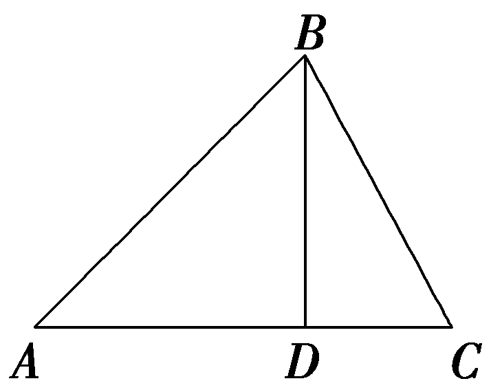

因为0＜<em>&lt;text style="italic"&gt;&lt;text style="italic"&gt;&lt;text style="italic"&gt;&lt;text style="italic"&gt;&lt;text style="italic"&gt;&lt;text style="italic"&gt;α</em>&lt;/text&gt;&lt;/text&gt;&lt;/text&gt;&lt;/text&gt;&lt;/text&gt;&lt;/text&gt;＜ $\frac{\pi }{2}$ ，所以0＜sin <em>&lt;text style="italic"&gt;&lt;text style="italic"&gt;&lt;text style="italic"&gt;&lt;text style="italic"&gt;&lt;text style="italic"&gt;&lt;text style="italic"&gt;α</em>&lt;/text&gt;&lt;/text&gt;&lt;/text&gt;&lt;/text&gt;&lt;/text&gt;&lt;/text&gt;＜1，所以3－8sin&lt;text style="superscript"&gt;2&lt;/text&gt;α＝0，即sin2α＝ $\frac{3}{8}$ ，解得sin <em>&lt;text style="italic"&gt;&lt;text style="italic"&gt;&lt;text style="italic"&gt;&lt;text style="italic"&gt;&lt;text style="italic"&gt;&lt;text style="italic"&gt;α</em>&lt;/text&gt;&lt;/text&gt;&lt;/text&gt;&lt;/text&gt;&lt;/text&gt;&lt;/text&gt;＝ $\frac{\sqrt{6}}{4}$ ，则sin 3<em>&lt;text style="italic"&gt;&lt;text style="italic"&gt;&lt;text style="italic"&gt;&lt;text style="italic"&gt;&lt;text style="italic"&gt;&lt;text style="italic"&gt;α</em>&lt;/text&gt;&lt;/text&gt;&lt;/text&gt;&lt;/text&gt;&lt;/text&gt;&lt;/text&gt;＝ $\frac{3}{2}$ sin <em>&lt;text style="italic"&gt;&lt;text style="italic"&gt;&lt;text style="italic"&gt;&lt;text style="italic"&gt;&lt;text style="italic"&gt;&lt;text style="italic"&gt;α</em>&lt;/text&gt;&lt;/text&gt;&lt;/text&gt;&lt;/text&gt;&lt;/text&gt;&lt;/text&gt;＝ $\frac{3\sqrt{6}}{8}$ ，即sin∠<em>&lt;text style="italic"&gt;&lt;text style="italic"&gt;&lt;text style="italic"&gt;&lt;text style="italic"&gt;&lt;text style="italic"&gt;ACB</em>&lt;/text&gt;&lt;/text&gt;&lt;/text&gt;&lt;/text&gt;&lt;/text&gt;＝ $\frac{3\sqrt{6}}{8}$ ，因为∠<em>&lt;text style="italic"&gt;&lt;text style="italic"&gt;&lt;text style="italic"&gt;&lt;text style="italic"&gt;&lt;text style="italic"&gt;ACB</em>&lt;/text&gt;&lt;/text&gt;&lt;/text&gt;&lt;/text&gt;&lt;/text&gt;为锐角，cos∠ACB＝ $\sqrt{1－sin^{2}\angle ACB}$ ＝ $\frac{\sqrt{10}}{8}$ ，所以tan∠<em>&lt;text style="italic"&gt;&lt;text style="italic"&gt;&lt;text style="italic"&gt;&lt;text style="italic"&gt;&lt;text style="italic"&gt;ACB</em>&lt;/text&gt;&lt;/text&gt;&lt;/text&gt;&lt;/text&gt;&lt;/text&gt;＝ $\frac{sin\angle ACB}{cos\angle ACB}$ ＝ $\frac{3\sqrt{15}}{5}$ ，在直角△<em>&lt;text style="italic"&gt;BD</em>C&lt;/text&gt;中，tan∠<em>&lt;text style="italic"&gt;&lt;text style="italic"&gt;&lt;text style="italic"&gt;&lt;text style="italic"&gt;&lt;text style="italic"&gt;ACB</em>&lt;/text&gt;&lt;/text&gt;&lt;/text&gt;&lt;/text&gt;&lt;/text&gt;＝ $\frac{BD}{CD}$ ，所以<em>BD</em>＝<em>CD</em>·tan∠<em>&lt;text style="italic"&gt;&lt;text style="italic"&gt;&lt;text style="italic"&gt;&lt;text style="italic"&gt;&lt;text style="italic"&gt;ACB</em>&lt;/text&gt;&lt;/text&gt;&lt;/text&gt;&lt;/text&gt;&lt;/text&gt;＝&lt;text style="superscript"&gt;2&lt;/text&gt; $\sqrt{10}$ × $\frac{3\sqrt{15}}{5}$ ＝6 $\sqrt{6}$ .故选B.

11.(多选)在△<text style="it<text style="it<text style="it<text style="itali*c*">a</text>lic">a</text>li*c*">a</text>lic">*<text style="italic">A*</text>*BC*</text>中，三个内角A，B，C所对的边分别为a，*<text style="italic"><text style="italic">b*</text></text>，c，若asin $\frac{A＋C}{2}$ ＝<text style="it<text style="it<text style="itali*c*">a</text>lic">a</text>li*c*">*<text style="italic">b*</text></text>sin <text style="it*a*lic">*A*</text>，a＋c＝ $\sqrt{3}$ <text style="it<text style="it<text style="itali*c*">a</text>lic">a</text>li*c*">*<text style="italic">b*</text></text>，则下列结论一定正确的是(　　)

A.<text style="it<text style="itali*c*">a</text>lic">B</text>＝ $\frac{\pi }{3}$ 	<text style="it<text style="itali*c*">a</text>lic">B</text>.a∶c＝2∶1

C.△<text style="it*a*lic">ABC</text>为直角三角形	D.a∶*b*＝1∶ $\sqrt{3}$

答案：**AC**

解析：因为&lt;text style="it&lt;text style="it&lt;text style="it&lt;text style="it&lt;text style="it&lt;text style="it&lt;text style="it&lt;text style="it&lt;text style="it&lt;text style="it&lt;text style="it&lt;text style="it&lt;text style="it&lt;text style="itali<em>c</em>"&gt;a&lt;/text&gt;lic"&gt;a&lt;/text&gt;li<em>c</em>"&gt;a&lt;/text&gt;li&lt;text style="itali<em>c</em>"&gt;c&lt;/text&gt;"&gt;a&lt;/text&gt;li<em>c</em>"&gt;a&lt;/text&gt;lic"&gt;a&lt;/text&gt;lic"&gt;a&lt;/text&gt;li&lt;text style="itali&lt;text style="itali<em>c</em>"&gt;c&lt;/text&gt;"&gt;c&lt;/text&gt;"&gt;a&lt;/text&gt;li<em>c</em>"&gt;a&lt;/text&gt;li<em>c</em>"&gt;a&lt;/text&gt;li<em>c</em>"&gt;a&lt;/text&gt;li<em>c</em>"&gt;a&lt;/text&gt;li<em>c</em>"&gt;a&lt;/text&gt;lic"&gt;a&lt;/text&gt;sin $\frac{A＋C}{2}$ ＝&lt;text style="it&lt;text style="it&lt;text style="it&lt;text style="it&lt;text style="it&lt;text style="it&lt;text style="it&lt;text style="it&lt;text style="it&lt;text style="it&lt;text style="it&lt;text style="it&lt;text style="it&lt;text style="itali<em>c</em>"&gt;a&lt;/text&gt;lic"&gt;a&lt;/text&gt;li<em>c</em>"&gt;a&lt;/text&gt;li&lt;text style="itali<em>c</em>"&gt;c&lt;/text&gt;"&gt;a&lt;/text&gt;li<em>c</em>"&gt;a&lt;/text&gt;lic"&gt;a&lt;/text&gt;lic"&gt;a&lt;/text&gt;li&lt;text style="itali&lt;text style="itali<em>c</em>"&gt;c&lt;/text&gt;"&gt;c&lt;/text&gt;"&gt;a&lt;/text&gt;li<em>c</em>"&gt;a&lt;/text&gt;li<em>c</em>"&gt;a&lt;/text&gt;li<em>c</em>"&gt;a&lt;/text&gt;li<em>c</em>"&gt;a&lt;/text&gt;li<em>c</em>"&gt;a&lt;/text&gt;lic"&gt;<em>&lt;text style="italic"&gt;&lt;text style="italic"&gt;&lt;text style="italic"&gt;&lt;text style="italic"&gt;&lt;text style="italic"&gt;&lt;text style="italic"&gt;b</em>&lt;/text&gt;&lt;/text&gt;&lt;/text&gt;&lt;/text&gt;&lt;/text&gt;&lt;/text&gt;&lt;/text&gt;sin <em>&lt;text style="italic"&gt;&lt;text style="italic"&gt;&lt;text style="italic"&gt;&lt;text style="italic"&gt;A</em>&lt;/text&gt;&lt;/text&gt;&lt;/text&gt;&lt;/text&gt;，所以由正弦定理得sin Acos $\frac{B}{2}$ ＝sin &lt;text style="it&lt;text style="it&lt;text style="it&lt;text style="it&lt;text style="it&lt;text style="it&lt;text style="it&lt;text style="it&lt;text style="it&lt;text style="it&lt;text style="it&lt;text style="it&lt;text style="it&lt;text style="itali<em>c</em>"&gt;a&lt;/text&gt;lic"&gt;a&lt;/text&gt;li<em>c</em>"&gt;a&lt;/text&gt;li&lt;text style="itali<em>c</em>"&gt;c&lt;/text&gt;"&gt;a&lt;/text&gt;li<em>c</em>"&gt;a&lt;/text&gt;lic"&gt;a&lt;/text&gt;lic"&gt;a&lt;/text&gt;li&lt;text style="itali&lt;text style="itali<em>c</em>"&gt;c&lt;/text&gt;"&gt;c&lt;/text&gt;"&gt;a&lt;/text&gt;li<em>c</em>"&gt;a&lt;/text&gt;li<em>c</em>"&gt;a&lt;/text&gt;li<em>c</em>"&gt;a&lt;/text&gt;li<em>c</em>"&gt;a&lt;/text&gt;li<em>c</em>"&gt;a&lt;/text&gt;lic"&gt;<em>&lt;text style="italic"&gt;&lt;text style="italic"&gt;&lt;text style="italic"&gt;B</em>&lt;/text&gt;&lt;/text&gt;&lt;/text&gt;&lt;/text&gt;sin <em>&lt;text style="italic"&gt;&lt;text style="italic"&gt;&lt;text style="italic"&gt;&lt;text style="italic"&gt;A</em>&lt;/text&gt;&lt;/text&gt;&lt;/text&gt;&lt;/text&gt;，因为A，B∈ $\left(0，\pi \right)$ ，sin &lt;text style="it&lt;text style="it&lt;text style="it&lt;text style="it&lt;text style="it&lt;text style="it&lt;text style="it&lt;text style="it&lt;text style="it&lt;text style="it&lt;text style="it&lt;text style="it&lt;text style="it&lt;text style="itali<em>c</em>"&gt;a&lt;/text&gt;lic"&gt;a&lt;/text&gt;li<em>c</em>"&gt;a&lt;/text&gt;li&lt;text style="itali<em>c</em>"&gt;c&lt;/text&gt;"&gt;a&lt;/text&gt;li<em>c</em>"&gt;a&lt;/text&gt;lic"&gt;a&lt;/text&gt;lic"&gt;a&lt;/text&gt;li&lt;text style="itali&lt;text style="itali<em>c</em>"&gt;c&lt;/text&gt;"&gt;c&lt;/text&gt;"&gt;a&lt;/text&gt;li<em>c</em>"&gt;a&lt;/text&gt;li<em>c</em>"&gt;a&lt;/text&gt;li<em>c</em>"&gt;a&lt;/text&gt;li<em>c</em>"&gt;a&lt;/text&gt;li<em>c</em>"&gt;a&lt;/text&gt;lic"&gt;<em>&lt;text style="italic"&gt;&lt;text style="italic"&gt;&lt;text style="italic"&gt;A</em>&lt;/text&gt;&lt;/text&gt;&lt;/text&gt;&lt;/text&gt;＞0，化简得cos $\frac{B}{2}$ ＝&lt;text style="supers&lt;text style="it&lt;text style="it&lt;text style="it&lt;text style="it&lt;text style="it&lt;text style="it&lt;text style="it&lt;text style="it&lt;text style="it&lt;text style="it&lt;text style="it&lt;text style="it&lt;text style="itali<em>c</em>"&gt;a&lt;/text&gt;lic"&gt;a&lt;/text&gt;li<em>c</em>"&gt;a&lt;/text&gt;li&lt;text style="itali<em>c</em>"&gt;c&lt;/text&gt;"&gt;a&lt;/text&gt;li<em>c</em>"&gt;a&lt;/text&gt;lic"&gt;a&lt;/text&gt;lic"&gt;a&lt;/text&gt;li&lt;text style="itali&lt;text style="itali<em>c</em>"&gt;c&lt;/text&gt;"&gt;c&lt;/text&gt;"&gt;a&lt;/text&gt;li<em>c</em>"&gt;a&lt;/text&gt;li<em>c</em>"&gt;a&lt;/text&gt;li<em>c</em>"&gt;a&lt;/text&gt;li<em>c</em>"&gt;a&lt;/text&gt;lic"&gt;c&lt;/text&gt;ript"&gt;&lt;text style="superscript"&gt;&lt;text style="superscript"&gt;&lt;text style="superscript"&gt;&lt;text style="superscript"&gt;&lt;text style="superscript"&gt;&lt;text style="superscript"&gt;&lt;text style="superscript"&gt;&lt;text style="superscript"&gt;&lt;text style="superscript"&gt;&lt;text style="superscript"&gt;2&lt;/text&gt;&lt;/text&gt;&lt;/text&gt;&lt;/text&gt;&lt;/text&gt;&lt;/text&gt;&lt;/text&gt;&lt;/text&gt;&lt;/text&gt;&lt;/text&gt;&lt;/text&gt;sin $\frac{B}{2}$ &lt;text style="it&lt;text style="it&lt;text style="it&lt;text style="it&lt;text style="it&lt;text style="it&lt;text style="it&lt;text style="it&lt;text style="it&lt;text style="it&lt;text style="it&lt;text style="it&lt;text style="itali<em>c</em>"&gt;a&lt;/text&gt;lic"&gt;a&lt;/text&gt;li<em>c</em>"&gt;a&lt;/text&gt;li&lt;text style="itali<em>c</em>"&gt;c&lt;/text&gt;"&gt;a&lt;/text&gt;li<em>c</em>"&gt;a&lt;/text&gt;lic"&gt;a&lt;/text&gt;lic"&gt;a&lt;/text&gt;li&lt;text style="itali&lt;text style="itali<em>c</em>"&gt;c&lt;/text&gt;"&gt;c&lt;/text&gt;"&gt;a&lt;/text&gt;li<em>c</em>"&gt;a&lt;/text&gt;li<em>c</em>"&gt;a&lt;/text&gt;li<em>c</em>"&gt;a&lt;/text&gt;li<em>c</em>"&gt;a&lt;/text&gt;lic"&gt;c&lt;/text&gt;os $\frac{B}{2}$ ，则sin $\frac{B}{2}$ ＝ $\frac{1}{2}$ ， $\frac{B}{2}$ ＝ $\frac{\pi }{6}$ ，所以&lt;text style="it&lt;text style="it&lt;text style="it&lt;text style="it&lt;text style="it&lt;text style="it&lt;text style="it&lt;text style="it&lt;text style="it&lt;text style="it&lt;text style="it&lt;text style="it&lt;text style="it&lt;text style="itali<em>c</em>"&gt;a&lt;/text&gt;lic"&gt;a&lt;/text&gt;li<em>c</em>"&gt;a&lt;/text&gt;li&lt;text style="itali<em>c</em>"&gt;c&lt;/text&gt;"&gt;a&lt;/text&gt;li<em>c</em>"&gt;a&lt;/text&gt;lic"&gt;a&lt;/text&gt;lic"&gt;a&lt;/text&gt;li&lt;text style="itali&lt;text style="itali<em>c</em>"&gt;c&lt;/text&gt;"&gt;c&lt;/text&gt;"&gt;a&lt;/text&gt;li<em>c</em>"&gt;a&lt;/text&gt;li<em>c</em>"&gt;a&lt;/text&gt;li<em>c</em>"&gt;a&lt;/text&gt;li<em>c</em>"&gt;a&lt;/text&gt;li<em>c</em>"&gt;a&lt;/text&gt;lic"&gt;<em>&lt;text style="italic"&gt;&lt;text style="italic"&gt;&lt;text style="italic"&gt;B</em>&lt;/text&gt;&lt;/text&gt;&lt;/text&gt;&lt;/text&gt;＝ $\frac{\pi }{3}$ ，故&lt;text style="it&lt;text style="it&lt;text style="it&lt;text style="it&lt;text style="it&lt;text style="it&lt;text style="it&lt;text style="it&lt;text style="it&lt;text style="it&lt;text style="it&lt;text style="it&lt;text style="it&lt;text style="itali<em>c</em>"&gt;a&lt;/text&gt;lic"&gt;a&lt;/text&gt;li<em>c</em>"&gt;a&lt;/text&gt;li&lt;text style="itali<em>c</em>"&gt;c&lt;/text&gt;"&gt;a&lt;/text&gt;li<em>c</em>"&gt;a&lt;/text&gt;lic"&gt;a&lt;/text&gt;lic"&gt;a&lt;/text&gt;li&lt;text style="itali&lt;text style="itali<em>c</em>"&gt;c&lt;/text&gt;"&gt;c&lt;/text&gt;"&gt;a&lt;/text&gt;li<em>c</em>"&gt;a&lt;/text&gt;li<em>c</em>"&gt;a&lt;/text&gt;li<em>c</em>"&gt;a&lt;/text&gt;li<em>c</em>"&gt;a&lt;/text&gt;li<em>c</em>"&gt;a&lt;/text&gt;lic"&gt;<em>&lt;text style="italic"&gt;&lt;text style="italic"&gt;&lt;text style="italic"&gt;A</em>&lt;/text&gt;&lt;/text&gt;&lt;/text&gt;&lt;/text&gt;正确；由余弦定理得<em>&lt;text style="italic"&gt;&lt;text style="italic"&gt;&lt;text style="italic"&gt;&lt;text style="italic"&gt;&lt;text style="italic"&gt;&lt;text style="italic"&gt;&lt;text style="italic"&gt;b</em>&lt;/text&gt;&lt;/text&gt;&lt;/text&gt;&lt;/text&gt;&lt;/text&gt;&lt;/text&gt;&lt;/text&gt;&lt;text style="superscript"&gt;&lt;text style="superscript"&gt;&lt;text style="superscript"&gt;&lt;text style="superscript"&gt;&lt;text style="superscript"&gt;&lt;text style="superscript"&gt;&lt;text style="superscript"&gt;&lt;text style="superscript"&gt;&lt;text style="superscript"&gt;&lt;text style="superscript"&gt;&lt;text style="superscript"&gt;2&lt;/text&gt;&lt;/text&gt;&lt;/text&gt;&lt;/text&gt;&lt;/text&gt;&lt;/text&gt;&lt;/text&gt;&lt;/text&gt;&lt;/text&gt;&lt;/text&gt;&lt;/text&gt;＝<em>a</em>2＋c2－2<em>&lt;text style="italic"&gt;&lt;text style="italic"&gt;&lt;text style="italic"&gt;&lt;text style="italic"&gt;ac</em>&lt;/text&gt;&lt;/text&gt;&lt;/text&gt;&lt;/text&gt;cos <em>&lt;text style="italic"&gt;&lt;text style="italic"&gt;&lt;text style="italic"&gt;&lt;text style="italic"&gt;B</em>&lt;/text&gt;&lt;/text&gt;&lt;/text&gt;&lt;/text&gt;＝(a＋c)2－2ac－2accos B，即 $\left(\frac{a＋c}{\sqrt{3}}\right)^{2}$ ＝ $\left(a＋c\right)^{2}$ －3&lt;text style="it&lt;text style="it&lt;text style="it&lt;text style="it&lt;text style="it&lt;text style="it&lt;text style="it&lt;text style="it&lt;text style="it&lt;text style="it&lt;text style="it&lt;text style="it&lt;text style="it&lt;text style="itali<em>c</em>"&gt;a&lt;/text&gt;lic"&gt;a&lt;/text&gt;li<em>c</em>"&gt;a&lt;/text&gt;li&lt;text style="itali<em>c</em>"&gt;c&lt;/text&gt;"&gt;a&lt;/text&gt;li<em>c</em>"&gt;a&lt;/text&gt;lic"&gt;a&lt;/text&gt;lic"&gt;a&lt;/text&gt;li&lt;text style="itali&lt;text style="itali<em>c</em>"&gt;c&lt;/text&gt;"&gt;c&lt;/text&gt;"&gt;a&lt;/text&gt;li<em>c</em>"&gt;a&lt;/text&gt;li<em>c</em>"&gt;a&lt;/text&gt;li<em>c</em>"&gt;a&lt;/text&gt;li<em>c</em>"&gt;a&lt;/text&gt;li<em>c</em>"&gt;a&lt;/text&gt;lic"&gt;a&lt;/text&gt;c，即&lt;text style="superscript"&gt;&lt;text style="superscript"&gt;&lt;text style="superscript"&gt;&lt;text style="superscript"&gt;&lt;text style="superscript"&gt;&lt;text style="superscript"&gt;&lt;text style="superscript"&gt;&lt;text style="superscript"&gt;&lt;text style="superscript"&gt;&lt;text style="superscript"&gt;&lt;text style="superscript"&gt;2&lt;/text&gt;&lt;/text&gt;&lt;/text&gt;&lt;/text&gt;&lt;/text&gt;&lt;/text&gt;&lt;/text&gt;&lt;/text&gt;&lt;/text&gt;&lt;/text&gt;&lt;/text&gt;a2－5<em>&lt;text style="italic"&gt;&lt;text style="italic"&gt;&lt;text style="italic"&gt;&lt;text style="italic"&gt;ac</em>&lt;/text&gt;&lt;/text&gt;&lt;/text&gt;&lt;/text&gt;＋2c2＝0，解得a＝2c或a＝ $\frac{1}{2}$ &lt;text style="it&lt;text style="it&lt;text style="it&lt;text style="it&lt;text style="it&lt;text style="it&lt;text style="it&lt;text style="it&lt;text style="it&lt;text style="it&lt;text style="it&lt;text style="it&lt;text style="itali<em>c</em>"&gt;a&lt;/text&gt;lic"&gt;a&lt;/text&gt;li<em>c</em>"&gt;a&lt;/text&gt;li&lt;text style="itali<em>c</em>"&gt;c&lt;/text&gt;"&gt;a&lt;/text&gt;li<em>c</em>"&gt;a&lt;/text&gt;lic"&gt;a&lt;/text&gt;lic"&gt;a&lt;/text&gt;li&lt;text style="itali&lt;text style="itali<em>c</em>"&gt;c&lt;/text&gt;"&gt;c&lt;/text&gt;"&gt;a&lt;/text&gt;li<em>c</em>"&gt;a&lt;/text&gt;li<em>c</em>"&gt;a&lt;/text&gt;li<em>c</em>"&gt;a&lt;/text&gt;li<em>c</em>"&gt;a&lt;/text&gt;lic"&gt;c&lt;/text&gt;.当&lt;text style="it<em>a</em>lic"&gt;a&lt;/text&gt;＝&lt;text style="superscript"&gt;&lt;text style="superscript"&gt;&lt;text style="superscript"&gt;&lt;text style="superscript"&gt;&lt;text style="superscript"&gt;&lt;text style="superscript"&gt;&lt;text style="superscript"&gt;&lt;text style="superscript"&gt;&lt;text style="superscript"&gt;&lt;text style="superscript"&gt;&lt;text style="superscript"&gt;2&lt;/text&gt;&lt;/text&gt;&lt;/text&gt;&lt;/text&gt;&lt;/text&gt;&lt;/text&gt;&lt;/text&gt;&lt;/text&gt;&lt;/text&gt;&lt;/text&gt;&lt;/text&gt;c时，<em>&lt;text style="italic"&gt;&lt;text style="italic"&gt;&lt;text style="italic"&gt;&lt;text style="italic"&gt;&lt;text style="italic"&gt;&lt;text style="italic"&gt;&lt;text style="italic"&gt;b</em>&lt;/text&gt;&lt;/text&gt;&lt;/text&gt;&lt;/text&gt;&lt;/text&gt;&lt;/text&gt;&lt;/text&gt;＝ $\sqrt{3}$ &lt;text style="it&lt;text style="it&lt;text style="it&lt;text style="it&lt;text style="it&lt;text style="it&lt;text style="it&lt;text style="it&lt;text style="it&lt;text style="it&lt;text style="it&lt;text style="it&lt;text style="itali<em>c</em>"&gt;a&lt;/text&gt;lic"&gt;a&lt;/text&gt;li<em>c</em>"&gt;a&lt;/text&gt;li&lt;text style="itali<em>c</em>"&gt;c&lt;/text&gt;"&gt;a&lt;/text&gt;li<em>c</em>"&gt;a&lt;/text&gt;lic"&gt;a&lt;/text&gt;lic"&gt;a&lt;/text&gt;li&lt;text style="itali&lt;text style="itali<em>c</em>"&gt;c&lt;/text&gt;"&gt;c&lt;/text&gt;"&gt;a&lt;/text&gt;li<em>c</em>"&gt;a&lt;/text&gt;li<em>c</em>"&gt;a&lt;/text&gt;li<em>c</em>"&gt;a&lt;/text&gt;li<em>c</em>"&gt;a&lt;/text&gt;lic"&gt;c&lt;/text&gt;，则&lt;text style="it<em>a</em>lic"&gt;<em>&lt;text style="italic"&gt;&lt;text style="italic"&gt;&lt;text style="italic"&gt;&lt;text style="italic"&gt;&lt;text style="italic"&gt;&lt;text style="italic"&gt;b</em>&lt;/text&gt;&lt;/text&gt;&lt;/text&gt;&lt;/text&gt;&lt;/text&gt;&lt;/text&gt;&lt;/text&gt;&lt;text style="superscript"&gt;&lt;text style="superscript"&gt;&lt;text style="superscript"&gt;&lt;text style="superscript"&gt;&lt;text style="superscript"&gt;&lt;text style="superscript"&gt;&lt;text style="superscript"&gt;&lt;text style="superscript"&gt;&lt;text style="superscript"&gt;&lt;text style="superscript"&gt;&lt;text style="superscript"&gt;2&lt;/text&gt;&lt;/text&gt;&lt;/text&gt;&lt;/text&gt;&lt;/text&gt;&lt;/text&gt;&lt;/text&gt;&lt;/text&gt;&lt;/text&gt;&lt;/text&gt;&lt;/text&gt;＋c2＝<em>a</em>2，△<em>&lt;text style="italic"&gt;&lt;text style="italic"&gt;&lt;text style="italic"&gt;&lt;text style="italic"&gt;A</em>&lt;/text&gt;&lt;/text&gt;&lt;/text&gt;&lt;/text&gt;<em>&lt;text style="italic"&gt;&lt;text style="italic"&gt;&lt;text style="italic"&gt;&lt;text style="italic"&gt;B</em>&lt;/text&gt;&lt;/text&gt;&lt;/text&gt;&lt;/text&gt;C为直角三角形，a∶b＝2∶ $\sqrt{3}$ ，&lt;text style="it&lt;text style="it&lt;text style="it&lt;text style="it&lt;text style="it&lt;text style="it&lt;text style="it&lt;text style="it&lt;text style="it&lt;text style="it&lt;text style="it&lt;text style="it&lt;text style="it&lt;text style="itali<em>c</em>"&gt;a&lt;/text&gt;lic"&gt;a&lt;/text&gt;li<em>c</em>"&gt;a&lt;/text&gt;li&lt;text style="itali<em>c</em>"&gt;c&lt;/text&gt;"&gt;a&lt;/text&gt;li<em>c</em>"&gt;a&lt;/text&gt;lic"&gt;a&lt;/text&gt;lic"&gt;a&lt;/text&gt;li&lt;text style="itali&lt;text style="itali<em>c</em>"&gt;c&lt;/text&gt;"&gt;c&lt;/text&gt;"&gt;a&lt;/text&gt;li<em>c</em>"&gt;a&lt;/text&gt;li<em>c</em>"&gt;a&lt;/text&gt;li<em>c</em>"&gt;a&lt;/text&gt;li<em>c</em>"&gt;a&lt;/text&gt;li<em>c</em>"&gt;a&lt;/text&gt;lic"&gt;a&lt;/text&gt;∶c＝&lt;text style="superscript"&gt;&lt;text style="superscript"&gt;&lt;text style="superscript"&gt;&lt;text style="superscript"&gt;&lt;text style="superscript"&gt;&lt;text style="superscript"&gt;&lt;text style="superscript"&gt;&lt;text style="superscript"&gt;&lt;text style="superscript"&gt;&lt;text style="superscript"&gt;&lt;text style="superscript"&gt;2&lt;/text&gt;&lt;/text&gt;&lt;/text&gt;&lt;/text&gt;&lt;/text&gt;&lt;/text&gt;&lt;/text&gt;&lt;/text&gt;&lt;/text&gt;&lt;/text&gt;&lt;/text&gt;∶1；当a＝ $\frac{1}{2}$ &lt;text style="it&lt;text style="it&lt;text style="it&lt;text style="it&lt;text style="it&lt;text style="it&lt;text style="it&lt;text style="it&lt;text style="it&lt;text style="it&lt;text style="it&lt;text style="it&lt;text style="itali<em>c</em>"&gt;a&lt;/text&gt;lic"&gt;a&lt;/text&gt;li<em>c</em>"&gt;a&lt;/text&gt;li&lt;text style="itali<em>c</em>"&gt;c&lt;/text&gt;"&gt;a&lt;/text&gt;li<em>c</em>"&gt;a&lt;/text&gt;lic"&gt;a&lt;/text&gt;lic"&gt;a&lt;/text&gt;li&lt;text style="itali&lt;text style="itali<em>c</em>"&gt;c&lt;/text&gt;"&gt;c&lt;/text&gt;"&gt;a&lt;/text&gt;li<em>c</em>"&gt;a&lt;/text&gt;li<em>c</em>"&gt;a&lt;/text&gt;li<em>c</em>"&gt;a&lt;/text&gt;li<em>c</em>"&gt;a&lt;/text&gt;lic"&gt;c&lt;/text&gt;时，&lt;text style="it<em>a</em>lic"&gt;<em>&lt;text style="italic"&gt;&lt;text style="italic"&gt;&lt;text style="italic"&gt;&lt;text style="italic"&gt;&lt;text style="italic"&gt;&lt;text style="italic"&gt;b</em>&lt;/text&gt;&lt;/text&gt;&lt;/text&gt;&lt;/text&gt;&lt;/text&gt;&lt;/text&gt;&lt;/text&gt;＝ $\frac{\sqrt{3}}{2}$ &lt;text style="it&lt;text style="it&lt;text style="it&lt;text style="it&lt;text style="it&lt;text style="it&lt;text style="it&lt;text style="it&lt;text style="it&lt;text style="it&lt;text style="it&lt;text style="it&lt;text style="itali<em>c</em>"&gt;a&lt;/text&gt;lic"&gt;a&lt;/text&gt;li<em>c</em>"&gt;a&lt;/text&gt;li&lt;text style="itali<em>c</em>"&gt;c&lt;/text&gt;"&gt;a&lt;/text&gt;li<em>c</em>"&gt;a&lt;/text&gt;lic"&gt;a&lt;/text&gt;lic"&gt;a&lt;/text&gt;li&lt;text style="itali&lt;text style="itali<em>c</em>"&gt;c&lt;/text&gt;"&gt;c&lt;/text&gt;"&gt;a&lt;/text&gt;li<em>c</em>"&gt;a&lt;/text&gt;li<em>c</em>"&gt;a&lt;/text&gt;li<em>c</em>"&gt;a&lt;/text&gt;li<em>c</em>"&gt;a&lt;/text&gt;lic"&gt;c&lt;/text&gt;，则&lt;text style="it<em>a</em>lic"&gt;<em>&lt;text style="italic"&gt;&lt;text style="italic"&gt;&lt;text style="italic"&gt;&lt;text style="italic"&gt;&lt;text style="italic"&gt;&lt;text style="italic"&gt;b</em>&lt;/text&gt;&lt;/text&gt;&lt;/text&gt;&lt;/text&gt;&lt;/text&gt;&lt;/text&gt;&lt;/text&gt;&lt;text style="superscript"&gt;&lt;text style="superscript"&gt;&lt;text style="superscript"&gt;&lt;text style="superscript"&gt;&lt;text style="superscript"&gt;&lt;text style="superscript"&gt;&lt;text style="superscript"&gt;&lt;text style="superscript"&gt;&lt;text style="superscript"&gt;&lt;text style="superscript"&gt;&lt;text style="superscript"&gt;2&lt;/text&gt;&lt;/text&gt;&lt;/text&gt;&lt;/text&gt;&lt;/text&gt;&lt;/text&gt;&lt;/text&gt;&lt;/text&gt;&lt;/text&gt;&lt;/text&gt;&lt;/text&gt;＋<em>a</em>2＝c2，△<em>&lt;text style="italic"&gt;&lt;text style="italic"&gt;&lt;text style="italic"&gt;&lt;text style="italic"&gt;A</em>&lt;/text&gt;&lt;/text&gt;&lt;/text&gt;&lt;/text&gt;<em>&lt;text style="italic"&gt;&lt;text style="italic"&gt;&lt;text style="italic"&gt;&lt;text style="italic"&gt;B</em>&lt;/text&gt;&lt;/text&gt;&lt;/text&gt;&lt;/text&gt;C为直角三角形，a∶b＝1∶ $\sqrt{3}$ ，&lt;text style="it&lt;text style="it&lt;text style="it&lt;text style="it&lt;text style="it&lt;text style="it&lt;text style="it&lt;text style="it&lt;text style="it&lt;text style="it&lt;text style="it&lt;text style="it&lt;text style="it&lt;text style="itali<em>c</em>"&gt;a&lt;/text&gt;lic"&gt;a&lt;/text&gt;li<em>c</em>"&gt;a&lt;/text&gt;li&lt;text style="itali<em>c</em>"&gt;c&lt;/text&gt;"&gt;a&lt;/text&gt;li<em>c</em>"&gt;a&lt;/text&gt;lic"&gt;a&lt;/text&gt;lic"&gt;a&lt;/text&gt;li&lt;text style="itali&lt;text style="itali<em>c</em>"&gt;c&lt;/text&gt;"&gt;c&lt;/text&gt;"&gt;a&lt;/text&gt;li<em>c</em>"&gt;a&lt;/text&gt;li<em>c</em>"&gt;a&lt;/text&gt;li<em>c</em>"&gt;a&lt;/text&gt;li<em>c</em>"&gt;a&lt;/text&gt;li<em>c</em>"&gt;a&lt;/text&gt;lic"&gt;a&lt;/text&gt;∶c＝1∶&lt;text style="superscript"&gt;&lt;text style="superscript"&gt;&lt;text style="superscript"&gt;&lt;text style="superscript"&gt;&lt;text style="superscript"&gt;&lt;text style="superscript"&gt;&lt;text style="superscript"&gt;&lt;text style="superscript"&gt;&lt;text style="superscript"&gt;&lt;text style="superscript"&gt;&lt;text style="superscript"&gt;2&lt;/text&gt;&lt;/text&gt;&lt;/text&gt;&lt;/text&gt;&lt;/text&gt;&lt;/text&gt;&lt;/text&gt;&lt;/text&gt;&lt;/text&gt;&lt;/text&gt;&lt;/text&gt;，故<em>&lt;text style="italic"&gt;&lt;text style="italic"&gt;&lt;text style="italic"&gt;&lt;text style="italic"&gt;B</em>&lt;/text&gt;&lt;/text&gt;&lt;/text&gt;&lt;/text&gt;，D错误，C正确.故选<em>&lt;text style="italic"&gt;&lt;text style="italic"&gt;&lt;text style="italic"&gt;&lt;text style="italic"&gt;A</em>&lt;/text&gt;&lt;/text&gt;&lt;/text&gt;&lt;/text&gt;C.

12.(15分)已知△*ABC*的内角*A*，*B*，*C*的对边分别为*a*，*b*，*c*，sin(*A*－*B*)tan *C*＝sin *A*sin *B*.

(1)求 $\frac{a^{2}＋c^{2}}{b^{2}}$ ；(7分)

(2)若cos *B*＝ $\frac{2}{3}$ ，求sin *A*.(8分)

解：(1)因为sin(*A*－*B*)tan *C*＝sin *A*sin *B*，

所以sin $\left(A－B\right)\frac{sinC}{cosC}$ ＝sin *A*sin *B*，

所以sin(*A*－*B*)sin *C*＝sin *A*sin *B*cos *C*，

即sin *A*cos *B*sin *C*－cos *A*sin *B*sin *C*＝sin *A*sin *B*cos *C*，

由正弦定理可得*ac*cos *B*－*bc*cos *A*＝*ab*cos *C*，

由余弦定理可得*ac*· $\frac{a^{2}＋c^{2}－b^{2}}{2ac}$ －*bc*· $\frac{b^{2}＋c^{2}－a^{2}}{2bc}$ ＝*ab*· $\frac{a^{2}＋b^{2}－c^{2}}{2ab}$ ，

所以&lt;text style="it&lt;text style="it&lt;text style="it&lt;text style="itali<em>c</em>"&gt;a&lt;/text&gt;li<em>c</em>"&gt;a&lt;/text&gt;lic"&gt;a&lt;/text&gt;li&lt;text style="itali<em>c</em>"&gt;c&lt;/text&gt;"&gt;a&lt;/text&gt;&lt;text style="superscript"&gt;&lt;text style="superscript"&gt;&lt;text style="superscript"&gt;&lt;text style="superscript"&gt;&lt;text style="superscript"&gt;&lt;text style="superscript"&gt;&lt;text style="superscript"&gt;&lt;text style="superscript"&gt;&lt;text style="superscript"&gt;&lt;text style="superscript"&gt;&lt;text style="superscript"&gt;2&lt;/text&gt;&lt;/text&gt;&lt;/text&gt;&lt;/text&gt;&lt;/text&gt;&lt;/text&gt;&lt;/text&gt;&lt;/text&gt;&lt;/text&gt;&lt;/text&gt;&lt;/text&gt;＋c2－<em>&lt;text style="italic"&gt;&lt;text style="italic"&gt;&lt;text style="italic"&gt;b</em>&lt;/text&gt;&lt;/text&gt;&lt;/text&gt;2－b2－c2＋a2＝a2＋b2－c2，即a2＋c2＝3b2，所以 $\frac{a^{2}＋c^{2}}{b^{2}}$ ＝3.

(&lt;text style="supers&lt;text style="it&lt;text style="it&lt;text style="itali<em>c</em>"&gt;a&lt;/text&gt;li<em>c</em>"&gt;a&lt;/text&gt;lic"&gt;c&lt;/text&gt;ript"&gt;&lt;text style="superscript"&gt;&lt;text style="superscript"&gt;&lt;text style="superscript"&gt;&lt;text style="superscript"&gt;2&lt;/text&gt;&lt;/text&gt;&lt;/text&gt;&lt;/text&gt;&lt;/text&gt;)由题意可知cos &lt;text style="it<em>a</em>lic"&gt;B&lt;/text&gt;＝ $\frac{a^{2}＋c^{2}－b^{2}}{2ac}$ ＝ $\frac{2}{3}$ ，又&lt;text style="it&lt;text style="it&lt;text style="itali<em>c</em>"&gt;a&lt;/text&gt;li<em>c</em>"&gt;a&lt;/text&gt;li<em>c</em>"&gt;a&lt;/text&gt;&lt;text style="superscript"&gt;&lt;text style="superscript"&gt;&lt;text style="superscript"&gt;&lt;text style="superscript"&gt;&lt;text style="superscript"&gt;2&lt;/text&gt;&lt;/text&gt;&lt;/text&gt;&lt;/text&gt;&lt;/text&gt;＋c2＝3<em>b</em>2，可得a2＋c2－2<em>ac</em>＝0，即(a－c)2＝0，

所以*a*＝*c*，即△*ABC*为等腰三角形，

由cos <em>B</em>＝2cos2 $\frac{B}{2}$ －1＝ $\frac{2}{3}$ ，

解得cos $\frac{B}{2}$ ＝ $\frac{\sqrt{30}}{6}$ 或cos $\frac{B}{2}$ ＝－ $\frac{\sqrt{30}}{6}$ ，

因为*B*∈ $\left(0，\frac{\pi }{2}\right)$ ，所以 $\frac{B}{2}$ ∈ $\left(0，\frac{\pi }{4}\right)$ ，

所以cos $\frac{B}{2}$ ＝ $\frac{\sqrt{30}}{6}$ ，

所以sin *A*＝sin $\left(\frac{\pi }{2}－\frac{B}{2}\right)$ ＝cos $\frac{B}{2}$ ＝ $\frac{\sqrt{30}}{6}$ .

(13、14题，每小题5分，共10分)

13.设<em>A</em>，<em>B</em>，<em>C</em>为三角形的三个内角，且方程(sin <em>B</em>－sin <em>A</em>)<em>x</em>2＋(sin <em>A</em>－sin <em>C</em>)<em>x</em>＋(sin <em>C</em>－sin <em>B</em>)＝0有两个相等实根，则(　　)

A.*B*＞60°	B.*B*≥60°

C.*B*＜60°	D.*B*≤60°

答案：**D**

解析：由已知得Δ＝0，即(sin &lt;text st&lt;text style="it&lt;text style="itali<em>c</em>"&gt;a&lt;/text&gt;lic"&gt;y&lt;/text&gt;le="it&lt;text style="it&lt;text style="it&lt;text style="it&lt;text style="it&lt;text style="it&lt;text style="itali<em>c</em>"&gt;a&lt;/text&gt;li<em>c</em>"&gt;a&lt;/text&gt;li<em>c</em>"&gt;a&lt;/text&gt;li<em>c</em>"&gt;a&lt;/text&gt;li<em>c</em>"&gt;a&lt;/text&gt;li<em>c</em>"&gt;a&lt;/text&gt;lic"&gt;<em>A</em>&lt;/text&gt;－sin <em>&lt;text style="italic"&gt;C</em>&lt;/text&gt;)&lt;text style="superscript"&gt;&lt;text style="superscript"&gt;&lt;text style="superscript"&gt;&lt;text style="superscript"&gt;&lt;text style="superscript"&gt;2&lt;/text&gt;&lt;/text&gt;&lt;/text&gt;&lt;/text&gt;&lt;/text&gt;－4(sin <em>&lt;text style="italic"&gt;&lt;text style="italic"&gt;&lt;text style="italic"&gt;&lt;text style="italic"&gt;&lt;text style="italic"&gt;&lt;text style="italic"&gt;B</em>&lt;/text&gt;&lt;/text&gt;&lt;/text&gt;&lt;/text&gt;&lt;/text&gt;&lt;/text&gt;－sin A)(sin C－sin B)＝0，由正弦定理，得(a－c)2－4(<em>&lt;text style="italic"&gt;&lt;text style="italic"&gt;&lt;text style="italic"&gt;&lt;text style="italic"&gt;&lt;text style="italic"&gt;b</em>&lt;/text&gt;&lt;/text&gt;&lt;/text&gt;&lt;/text&gt;&lt;/text&gt;－a)(c－b)＝0，展开，得a2＋c2＋2<em>ac</em>＋4b2－4<em>bc</em>－4<em>ab</em>＝0，所以(a＋c－2b)2＝0，所以a＋c＝2b，所以b＝ $\frac{a＋c}{2}$ ，所以&lt;text st&lt;text style="it&lt;text style="itali<em>c</em>"&gt;a&lt;/text&gt;lic"&gt;y&lt;/text&gt;le="it&lt;text style="it&lt;text style="it&lt;text style="it&lt;text style="it&lt;text style="itali<em>c</em>"&gt;a&lt;/text&gt;li<em>c</em>"&gt;a&lt;/text&gt;li<em>c</em>"&gt;a&lt;/text&gt;li<em>c</em>"&gt;a&lt;/text&gt;li<em>c</em>"&gt;a&lt;/text&gt;lic"&gt;c&lt;/text&gt;os &lt;text style="it<em>a</em>lic"&gt;<em>&lt;text style="italic"&gt;&lt;text style="italic"&gt;&lt;text style="italic"&gt;&lt;text style="italic"&gt;&lt;text style="italic"&gt;B</em>&lt;/text&gt;&lt;/text&gt;&lt;/text&gt;&lt;/text&gt;&lt;/text&gt;&lt;/text&gt;＝ $\frac{a^{2}＋c^{2}－b^{2}}{2ac}$ ＝ $\frac{a^{2}＋c^{2}－(\frac{a＋c}{2})^{2}}{2ac}$ ＝ $\frac{3(a^{2}＋c^{2})}{8ac}$ － $\frac{1}{4}$ ≥ $\frac{3\times 2ac}{8ac}$ － $\frac{1}{4}$ ＝ $\frac{1}{2}$ .当且仅当&lt;text st&lt;text style="it&lt;text style="itali<em>c</em>"&gt;a&lt;/text&gt;lic"&gt;y&lt;/text&gt;le="it&lt;text style="it&lt;text style="it&lt;text style="it&lt;text style="it&lt;text style="itali<em>c</em>"&gt;a&lt;/text&gt;li<em>c</em>"&gt;a&lt;/text&gt;li<em>c</em>"&gt;a&lt;/text&gt;li<em>c</em>"&gt;a&lt;/text&gt;li<em>c</em>"&gt;a&lt;/text&gt;li<em>c</em>"&gt;a&lt;/text&gt;＝c时，等号成立.因为cos <em>&lt;text style="italic"&gt;&lt;text style="italic"&gt;&lt;text style="italic"&gt;&lt;text style="italic"&gt;&lt;text style="italic"&gt;&lt;text style="italic"&gt;B</em>&lt;/text&gt;&lt;/text&gt;&lt;/text&gt;&lt;/text&gt;&lt;/text&gt;&lt;/text&gt;＞0，所以0°＜B＜90°，又y＝cos B在(0， $\frac{\pi }{2}$ )上单调递减，所以&lt;text st&lt;text style="it&lt;text style="itali<em>c</em>"&gt;a&lt;/text&gt;lic"&gt;y&lt;/text&gt;le="it&lt;text style="it&lt;text style="it&lt;text style="it&lt;text style="it&lt;text style="it&lt;text style="itali<em>c</em>"&gt;a&lt;/text&gt;li<em>c</em>"&gt;a&lt;/text&gt;li<em>c</em>"&gt;a&lt;/text&gt;li<em>c</em>"&gt;a&lt;/text&gt;li<em>c</em>"&gt;a&lt;/text&gt;li<em>c</em>"&gt;a&lt;/text&gt;lic"&gt;<em>&lt;text style="italic"&gt;&lt;text style="italic"&gt;&lt;text style="italic"&gt;&lt;text style="italic"&gt;&lt;text style="italic"&gt;B</em>&lt;/text&gt;&lt;/text&gt;&lt;/text&gt;&lt;/text&gt;&lt;/text&gt;&lt;/text&gt;≤60°(当且仅当a＝c时取等号).故选D.

14.(多选)(2025·江西鹰潭一模)△<text style="it<text style="it*a*li*c*">a</text>lic">*ABC*</text>中，内角A，B，C的对边分别为a，*b*，c，*<text style="italic">S*</text>为△*ABC*的面积，且a＝2， $\vec{AB}$ · $\vec{AC}$ ＝2 $\sqrt{3}$ <text style="it*a*lic">*S*</text>，下列选项正确的是(　　 )

*A*.A＝ $\frac{\pi }{6}$

B.若*b*＝2，则△*ABC*只有一解

C.若△*ABC*为锐角三角形，则*b*取值范围是(2 $\sqrt{3}$ ，4]

*D*.若D为*BC*边上的中点，则*AD*的最大值为2＋ $\sqrt{3}$

答案：**ABD**

解析：对于&lt;text style="it&lt;text style="it&lt;text style="itali&lt;text style="itali&lt;text style="itali&lt;text style="itali&lt;text style="itali&lt;text style="itali<em>c</em>"&gt;c&lt;/text&gt;"&gt;c&lt;/text&gt;"&gt;c&lt;/text&gt;"&gt;c&lt;/text&gt;"&gt;c&lt;/text&gt;"&gt;a&lt;/text&gt;li<em>c</em>"&gt;a&lt;/text&gt;lic"&gt;<em>&lt;text style="italic"&gt;&lt;text style="italic"&gt;&lt;text style="italic"&gt;&lt;text style="italic"&gt;&lt;text style="italic"&gt;A</em>&lt;/text&gt;&lt;/text&gt;&lt;/text&gt;&lt;/text&gt;&lt;/text&gt;&lt;/text&gt;，因为 $\vec{AB}$ · $\vec{AC}$ ＝&lt;text style="supers&lt;text style="it&lt;text style="itali&lt;text style="itali&lt;text style="itali&lt;text style="itali&lt;text style="itali&lt;text style="itali<em>c</em>"&gt;c&lt;/text&gt;"&gt;c&lt;/text&gt;"&gt;c&lt;/text&gt;"&gt;c&lt;/text&gt;"&gt;c&lt;/text&gt;"&gt;a&lt;/text&gt;lic"&gt;c&lt;/text&gt;ript"&gt;&lt;text style="superscript"&gt;&lt;text style="superscript"&gt;&lt;text style="superscript"&gt;&lt;text style="superscript"&gt;&lt;text style="superscript"&gt;&lt;text style="superscript"&gt;&lt;text style="superscript"&gt;&lt;text style="superscript"&gt;&lt;text style="superscript"&gt;&lt;text style="superscript"&gt;&lt;text style="superscript"&gt;2&lt;/text&gt;&lt;/text&gt;&lt;/text&gt;&lt;/text&gt;&lt;/text&gt;&lt;/text&gt;&lt;/text&gt;&lt;/text&gt;&lt;/text&gt;&lt;/text&gt;&lt;/text&gt;&lt;/text&gt; $\sqrt{3}$ &lt;text style="it&lt;text style="it&lt;text style="itali&lt;text style="itali&lt;text style="itali&lt;text style="itali&lt;text style="itali&lt;text style="itali<em>c</em>"&gt;c&lt;/text&gt;"&gt;c&lt;/text&gt;"&gt;c&lt;/text&gt;"&gt;c&lt;/text&gt;"&gt;c&lt;/text&gt;"&gt;a&lt;/text&gt;li<em>c</em>"&gt;a&lt;/text&gt;lic"&gt;S&lt;/text&gt;，所以<em>&lt;text style="italic"&gt;&lt;text style="italic"&gt;&lt;text style="italic"&gt;&lt;text style="italic"&gt;&lt;text style="italic"&gt;&lt;text style="italic"&gt;&lt;text style="italic"&gt;&lt;text style="italic"&gt;&lt;text style="italic"&gt;&lt;text style="italic"&gt;b</em>&lt;/text&gt;&lt;/text&gt;&lt;/text&gt;&lt;/text&gt;&lt;/text&gt;&lt;/text&gt;&lt;/text&gt;&lt;/text&gt;c&lt;/text&gt;&lt;/text&gt;cos <em>&lt;text style="italic"&gt;&lt;text style="italic"&gt;&lt;text style="italic"&gt;&lt;text style="italic"&gt;&lt;text style="italic"&gt;&lt;text style="italic"&gt;A</em>&lt;/text&gt;&lt;/text&gt;&lt;/text&gt;&lt;/text&gt;&lt;/text&gt;&lt;/text&gt;＝&lt;text style="superscript"&gt;&lt;text style="superscript"&gt;&lt;text style="superscript"&gt;&lt;text style="superscript"&gt;&lt;text style="superscript"&gt;&lt;text style="superscript"&gt;&lt;text style="superscript"&gt;&lt;text style="superscript"&gt;&lt;text style="superscript"&gt;&lt;text style="superscript"&gt;&lt;text style="superscript"&gt;&lt;text style="superscript"&gt;2&lt;/text&gt;&lt;/text&gt;&lt;/text&gt;&lt;/text&gt;&lt;/text&gt;&lt;/text&gt;&lt;/text&gt;&lt;/text&gt;&lt;/text&gt;&lt;/text&gt;&lt;/text&gt;&lt;/text&gt; $\sqrt{3}$ × $\frac{1}{2}$ &lt;text style="it&lt;text style="it&lt;text style="itali&lt;text style="itali&lt;text style="itali&lt;text style="itali&lt;text style="itali&lt;text style="itali<em>c</em>"&gt;c&lt;/text&gt;"&gt;c&lt;/text&gt;"&gt;c&lt;/text&gt;"&gt;c&lt;/text&gt;"&gt;c&lt;/text&gt;"&gt;a&lt;/text&gt;li<em>c</em>"&gt;a&lt;/text&gt;lic"&gt;<em>&lt;text style="italic"&gt;&lt;text style="italic"&gt;&lt;text style="italic"&gt;&lt;text style="italic"&gt;&lt;text style="italic"&gt;&lt;text style="italic"&gt;&lt;text style="italic"&gt;&lt;text style="italic"&gt;&lt;text style="italic"&gt;b</em>&lt;/text&gt;&lt;/text&gt;&lt;/text&gt;&lt;/text&gt;&lt;/text&gt;&lt;/text&gt;&lt;/text&gt;&lt;/text&gt;c&lt;/text&gt;&lt;/text&gt;sin <em>&lt;text style="italic"&gt;&lt;text style="italic"&gt;&lt;text style="italic"&gt;&lt;text style="italic"&gt;&lt;text style="italic"&gt;&lt;text style="italic"&gt;A</em>&lt;/text&gt;&lt;/text&gt;&lt;/text&gt;&lt;/text&gt;&lt;/text&gt;&lt;/text&gt;，则tan A＝ $\frac{\sqrt{3}}{3}$ ，因为&lt;text style="it&lt;text style="it&lt;text style="itali&lt;text style="itali&lt;text style="itali&lt;text style="itali&lt;text style="itali&lt;text style="itali<em>c</em>"&gt;c&lt;/text&gt;"&gt;c&lt;/text&gt;"&gt;c&lt;/text&gt;"&gt;c&lt;/text&gt;"&gt;c&lt;/text&gt;"&gt;a&lt;/text&gt;li<em>c</em>"&gt;a&lt;/text&gt;lic"&gt;<em>&lt;text style="italic"&gt;&lt;text style="italic"&gt;&lt;text style="italic"&gt;&lt;text style="italic"&gt;&lt;text style="italic"&gt;A</em>&lt;/text&gt;&lt;/text&gt;&lt;/text&gt;&lt;/text&gt;&lt;/text&gt;&lt;/text&gt;∈(0，π)，所以A＝ $\frac{\pi }{6}$ ，故&lt;text style="it&lt;text style="it&lt;text style="itali&lt;text style="itali&lt;text style="itali&lt;text style="itali&lt;text style="itali&lt;text style="itali<em>c</em>"&gt;c&lt;/text&gt;"&gt;c&lt;/text&gt;"&gt;c&lt;/text&gt;"&gt;c&lt;/text&gt;"&gt;c&lt;/text&gt;"&gt;a&lt;/text&gt;li<em>c</em>"&gt;a&lt;/text&gt;lic"&gt;<em>&lt;text style="italic"&gt;&lt;text style="italic"&gt;&lt;text style="italic"&gt;&lt;text style="italic"&gt;&lt;text style="italic"&gt;A</em>&lt;/text&gt;&lt;/text&gt;&lt;/text&gt;&lt;/text&gt;&lt;/text&gt;&lt;/text&gt;正确；对于<em>&lt;text style="italic"&gt;&lt;text style="italic"&gt;&lt;text style="italic"&gt;&lt;text style="italic"&gt;B</em>&lt;/text&gt;&lt;/text&gt;&lt;/text&gt;&lt;/text&gt;，因为<em>&lt;text style="italic"&gt;&lt;text style="italic"&gt;&lt;text style="italic"&gt;&lt;text style="italic"&gt;&lt;text style="italic"&gt;&lt;text style="italic"&gt;&lt;text style="italic"&gt;&lt;text style="italic"&gt;b</em>&lt;/text&gt;&lt;/text&gt;&lt;/text&gt;&lt;/text&gt;&lt;/text&gt;&lt;/text&gt;&lt;/text&gt;&lt;/text&gt;＝&lt;text style="superscript"&gt;&lt;text style="superscript"&gt;&lt;text style="superscript"&gt;&lt;text style="superscript"&gt;&lt;text style="superscript"&gt;&lt;text style="superscript"&gt;&lt;text style="superscript"&gt;&lt;text style="superscript"&gt;&lt;text style="superscript"&gt;&lt;text style="superscript"&gt;&lt;text style="superscript"&gt;&lt;text style="superscript"&gt;2&lt;/text&gt;&lt;/text&gt;&lt;/text&gt;&lt;/text&gt;&lt;/text&gt;&lt;/text&gt;&lt;/text&gt;&lt;/text&gt;&lt;/text&gt;&lt;/text&gt;&lt;/text&gt;&lt;/text&gt;＝a，则B＝A＝ $\frac{\pi }{6}$ ，&lt;text style="it&lt;text style="itali&lt;text style="itali&lt;text style="itali&lt;text style="itali&lt;text style="itali&lt;text style="itali<em>c</em>"&gt;c&lt;/text&gt;"&gt;c&lt;/text&gt;"&gt;c&lt;/text&gt;"&gt;c&lt;/text&gt;"&gt;c&lt;/text&gt;"&gt;a&lt;/text&gt;li<em>c</em>"&gt;<em>C</em>&lt;/text&gt;＝ $\frac{2\pi }{3}$ ，故△&lt;text style="it&lt;text style="it&lt;text style="itali&lt;text style="itali&lt;text style="itali&lt;text style="itali&lt;text style="itali&lt;text style="itali<em>c</em>"&gt;c&lt;/text&gt;"&gt;c&lt;/text&gt;"&gt;c&lt;/text&gt;"&gt;c&lt;/text&gt;"&gt;c&lt;/text&gt;"&gt;a&lt;/text&gt;li<em>c</em>"&gt;a&lt;/text&gt;lic"&gt;<em>&lt;text style="italic"&gt;&lt;text style="italic"&gt;&lt;text style="italic"&gt;&lt;text style="italic"&gt;&lt;text style="italic"&gt;A</em>&lt;/text&gt;&lt;/text&gt;&lt;/text&gt;&lt;/text&gt;&lt;/text&gt;&lt;/text&gt;<em>&lt;text style="italic"&gt;&lt;text style="italic"&gt;&lt;text style="italic"&gt;&lt;text style="italic"&gt;B</em>&lt;/text&gt;&lt;/text&gt;&lt;/text&gt;&lt;/text&gt;<em>&lt;text style="italic"&gt;C</em>&lt;/text&gt;只有一解，故B正确；对于C，若△<em>&lt;text style="italic"&gt;A&lt;text style="italic"&gt;BC</em>&lt;/text&gt;&lt;/text&gt;为锐角三角形，则B∈(0， $\frac{\pi }{2}$ )，&lt;text style="it&lt;text style="itali&lt;text style="itali&lt;text style="itali&lt;text style="itali&lt;text style="itali&lt;text style="itali<em>c</em>"&gt;c&lt;/text&gt;"&gt;c&lt;/text&gt;"&gt;c&lt;/text&gt;"&gt;c&lt;/text&gt;"&gt;c&lt;/text&gt;"&gt;a&lt;/text&gt;li<em>c</em>"&gt;<em>C</em>&lt;/text&gt;∈(0， $\frac{\pi }{2}$ )，则 $\left\{\begin{matrix}0<B＜\frac{\pi }{2}，\\0<\pi －\frac{\pi }{6}－B＜\frac{\pi }{2}，\end{matrix}\right.$ 则 $\frac{\pi }{3}$ ＜&lt;text style="it&lt;text style="itali&lt;text style="itali&lt;text style="itali&lt;text style="itali&lt;text style="itali&lt;text style="itali<em>c</em>"&gt;c&lt;/text&gt;"&gt;c&lt;/text&gt;"&gt;c&lt;/text&gt;"&gt;c&lt;/text&gt;"&gt;c&lt;/text&gt;"&gt;a&lt;/text&gt;li<em>c</em>"&gt;<em>&lt;text style="italic"&gt;&lt;text style="italic"&gt;&lt;text style="italic"&gt;B</em>&lt;/text&gt;&lt;/text&gt;&lt;/text&gt;&lt;/text&gt;＜ $\frac{\pi }{2}$ ，即sin &lt;text style="it&lt;text style="itali&lt;text style="itali&lt;text style="itali&lt;text style="itali&lt;text style="itali&lt;text style="itali<em>c</em>"&gt;c&lt;/text&gt;"&gt;c&lt;/text&gt;"&gt;c&lt;/text&gt;"&gt;c&lt;/text&gt;"&gt;c&lt;/text&gt;"&gt;a&lt;/text&gt;li<em>c</em>"&gt;<em>&lt;text style="italic"&gt;&lt;text style="italic"&gt;&lt;text style="italic"&gt;B</em>&lt;/text&gt;&lt;/text&gt;&lt;/text&gt;&lt;/text&gt;∈( $\frac{\sqrt{3}}{2}$ ，1)，由正弦定理可知&lt;text style="it&lt;text style="it&lt;text style="itali&lt;text style="itali&lt;text style="itali&lt;text style="itali&lt;text style="itali&lt;text style="itali<em>c</em>"&gt;c&lt;/text&gt;"&gt;c&lt;/text&gt;"&gt;c&lt;/text&gt;"&gt;c&lt;/text&gt;"&gt;c&lt;/text&gt;"&gt;a&lt;/text&gt;li<em>c</em>"&gt;a&lt;/text&gt;lic"&gt;<em>&lt;text style="italic"&gt;&lt;text style="italic"&gt;&lt;text style="italic"&gt;&lt;text style="italic"&gt;&lt;text style="italic"&gt;&lt;text style="italic"&gt;&lt;text style="italic"&gt;b</em>&lt;/text&gt;&lt;/text&gt;&lt;/text&gt;&lt;/text&gt;&lt;/text&gt;&lt;/text&gt;&lt;/text&gt;&lt;/text&gt;＝ $\frac{asinB}{sinA}$ ＝4sin &lt;text style="it&lt;text style="itali&lt;text style="itali&lt;text style="itali&lt;text style="itali&lt;text style="itali&lt;text style="itali<em>c</em>"&gt;c&lt;/text&gt;"&gt;c&lt;/text&gt;"&gt;c&lt;/text&gt;"&gt;c&lt;/text&gt;"&gt;c&lt;/text&gt;"&gt;a&lt;/text&gt;li<em>c</em>"&gt;<em>&lt;text style="italic"&gt;&lt;text style="italic"&gt;&lt;text style="italic"&gt;B</em>&lt;/text&gt;&lt;/text&gt;&lt;/text&gt;&lt;/text&gt;∈(&lt;text style="superscript"&gt;&lt;text style="superscript"&gt;&lt;text style="superscript"&gt;&lt;text style="superscript"&gt;&lt;text style="superscript"&gt;&lt;text style="superscript"&gt;&lt;text style="superscript"&gt;&lt;text style="superscript"&gt;&lt;text style="superscript"&gt;&lt;text style="superscript"&gt;&lt;text style="superscript"&gt;&lt;text style="superscript"&gt;2&lt;/text&gt;&lt;/text&gt;&lt;/text&gt;&lt;/text&gt;&lt;/text&gt;&lt;/text&gt;&lt;/text&gt;&lt;/text&gt;&lt;/text&gt;&lt;/text&gt;&lt;/text&gt;&lt;/text&gt; $\sqrt{3}$ ，4)，故&lt;text style="it&lt;text style="itali&lt;text style="itali&lt;text style="itali&lt;text style="itali&lt;text style="itali&lt;text style="itali<em>c</em>"&gt;c&lt;/text&gt;"&gt;c&lt;/text&gt;"&gt;c&lt;/text&gt;"&gt;c&lt;/text&gt;"&gt;c&lt;/text&gt;"&gt;a&lt;/text&gt;li<em>c</em>"&gt;<em>C</em>&lt;/text&gt;错误；对于<em>D</em>，若D为<em>&lt;text style="italic"&gt;&lt;text style="italic"&gt;&lt;text style="italic"&gt;&lt;text style="italic"&gt;B</em>&lt;/text&gt;&lt;/text&gt;&lt;/text&gt;&lt;/text&gt;C边上的中点，则 $\vec{AD}$ ＝ $\frac{1}{2}(\vec{AB}$ ＋ $\vec{AC}$ )，所以 $\vec{AD}^{2}$ ＝ $\frac{1}{4}(\vec{AB}^{2}$ ＋&lt;text style="supers&lt;text style="it&lt;text style="itali&lt;text style="itali&lt;text style="itali&lt;text style="itali&lt;text style="itali&lt;text style="itali<em>c</em>"&gt;c&lt;/text&gt;"&gt;c&lt;/text&gt;"&gt;c&lt;/text&gt;"&gt;c&lt;/text&gt;"&gt;c&lt;/text&gt;"&gt;a&lt;/text&gt;lic"&gt;c&lt;/text&gt;ript"&gt;&lt;text style="superscript"&gt;&lt;text style="superscript"&gt;&lt;text style="superscript"&gt;&lt;text style="superscript"&gt;&lt;text style="superscript"&gt;&lt;text style="superscript"&gt;&lt;text style="superscript"&gt;&lt;text style="superscript"&gt;&lt;text style="superscript"&gt;&lt;text style="superscript"&gt;&lt;text style="superscript"&gt;2&lt;/text&gt;&lt;/text&gt;&lt;/text&gt;&lt;/text&gt;&lt;/text&gt;&lt;/text&gt;&lt;/text&gt;&lt;/text&gt;&lt;/text&gt;&lt;/text&gt;&lt;/text&gt;&lt;/text&gt; $\vec{AB}$ · $\vec{AC}$ ＋ $\vec{AC}^{2}$ )＝ $\frac{1}{4}$ (&lt;text style="it&lt;text style="it&lt;text style="itali&lt;text style="itali&lt;text style="itali&lt;text style="itali&lt;text style="itali&lt;text style="itali<em>c</em>"&gt;c&lt;/text&gt;"&gt;c&lt;/text&gt;"&gt;c&lt;/text&gt;"&gt;c&lt;/text&gt;"&gt;c&lt;/text&gt;"&gt;a&lt;/text&gt;li<em>c</em>"&gt;a&lt;/text&gt;lic"&gt;<em>&lt;text style="italic"&gt;&lt;text style="italic"&gt;&lt;text style="italic"&gt;&lt;text style="italic"&gt;&lt;text style="italic"&gt;&lt;text style="italic"&gt;&lt;text style="italic"&gt;b</em>&lt;/text&gt;&lt;/text&gt;&lt;/text&gt;&lt;/text&gt;&lt;/text&gt;&lt;/text&gt;&lt;/text&gt;&lt;/text&gt;&lt;text style="superscript"&gt;&lt;text style="superscript"&gt;&lt;text style="superscript"&gt;&lt;text style="superscript"&gt;&lt;text style="superscript"&gt;&lt;text style="superscript"&gt;&lt;text style="superscript"&gt;&lt;text style="superscript"&gt;&lt;text style="superscript"&gt;&lt;text style="superscript"&gt;&lt;text style="superscript"&gt;&lt;text style="superscript"&gt;2&lt;/text&gt;&lt;/text&gt;&lt;/text&gt;&lt;/text&gt;&lt;/text&gt;&lt;/text&gt;&lt;/text&gt;&lt;/text&gt;&lt;/text&gt;&lt;/text&gt;&lt;/text&gt;&lt;/text&gt;＋c2＋ $\sqrt{3}$ &lt;text style="it&lt;text style="it&lt;text style="itali&lt;text style="itali&lt;text style="itali&lt;text style="itali&lt;text style="itali&lt;text style="itali<em>c</em>"&gt;c&lt;/text&gt;"&gt;c&lt;/text&gt;"&gt;c&lt;/text&gt;"&gt;c&lt;/text&gt;"&gt;c&lt;/text&gt;"&gt;a&lt;/text&gt;li<em>c</em>"&gt;a&lt;/text&gt;lic"&gt;<em>&lt;text style="italic"&gt;&lt;text style="italic"&gt;&lt;text style="italic"&gt;&lt;text style="italic"&gt;&lt;text style="italic"&gt;&lt;text style="italic"&gt;&lt;text style="italic"&gt;&lt;text style="italic"&gt;&lt;text style="italic"&gt;b</em>&lt;/text&gt;&lt;/text&gt;&lt;/text&gt;&lt;/text&gt;&lt;/text&gt;&lt;/text&gt;&lt;/text&gt;&lt;/text&gt;c&lt;/text&gt;&lt;/text&gt;)，由余弦定理知a&lt;text style="superscript"&gt;&lt;text style="superscript"&gt;&lt;text style="superscript"&gt;&lt;text style="superscript"&gt;&lt;text style="superscript"&gt;&lt;text style="superscript"&gt;&lt;text style="superscript"&gt;&lt;text style="superscript"&gt;&lt;text style="superscript"&gt;&lt;text style="superscript"&gt;&lt;text style="superscript"&gt;&lt;text style="superscript"&gt;2&lt;/text&gt;&lt;/text&gt;&lt;/text&gt;&lt;/text&gt;&lt;/text&gt;&lt;/text&gt;&lt;/text&gt;&lt;/text&gt;&lt;/text&gt;&lt;/text&gt;&lt;/text&gt;&lt;/text&gt;＝b2＋c2－2<em>&lt;text style="italic"&gt;&lt;text style="italic"&gt;&lt;text style="italic"&gt;&lt;text style="italic"&gt;&lt;text style="italic"&gt;&lt;text style="italic"&gt;&lt;text style="italic"&gt;&lt;text style="italic"&gt;bc</em>&lt;/text&gt;&lt;/text&gt;&lt;/text&gt;&lt;/text&gt;&lt;/text&gt;&lt;/text&gt;&lt;/text&gt;&lt;/text&gt;cos <em>&lt;text style="italic"&gt;&lt;text style="italic"&gt;&lt;text style="italic"&gt;&lt;text style="italic"&gt;&lt;text style="italic"&gt;&lt;text style="italic"&gt;A</em>&lt;/text&gt;&lt;/text&gt;&lt;/text&gt;&lt;/text&gt;&lt;/text&gt;&lt;/text&gt;＝b2＋c2－ $\sqrt{3}$ &lt;text style="it&lt;text style="it&lt;text style="itali&lt;text style="itali&lt;text style="itali&lt;text style="itali&lt;text style="itali&lt;text style="itali<em>c</em>"&gt;c&lt;/text&gt;"&gt;c&lt;/text&gt;"&gt;c&lt;/text&gt;"&gt;c&lt;/text&gt;"&gt;c&lt;/text&gt;"&gt;a&lt;/text&gt;li<em>c</em>"&gt;a&lt;/text&gt;lic"&gt;<em>&lt;text style="italic"&gt;&lt;text style="italic"&gt;&lt;text style="italic"&gt;&lt;text style="italic"&gt;&lt;text style="italic"&gt;&lt;text style="italic"&gt;&lt;text style="italic"&gt;&lt;text style="italic"&gt;&lt;text style="italic"&gt;b</em>&lt;/text&gt;&lt;/text&gt;&lt;/text&gt;&lt;/text&gt;&lt;/text&gt;&lt;/text&gt;&lt;/text&gt;&lt;/text&gt;c&lt;/text&gt;&lt;/text&gt;＝4，得b&lt;text style="superscript"&gt;&lt;text style="superscript"&gt;&lt;text style="superscript"&gt;&lt;text style="superscript"&gt;&lt;text style="superscript"&gt;&lt;text style="superscript"&gt;&lt;text style="superscript"&gt;&lt;text style="superscript"&gt;&lt;text style="superscript"&gt;&lt;text style="superscript"&gt;&lt;text style="superscript"&gt;&lt;text style="superscript"&gt;2&lt;/text&gt;&lt;/text&gt;&lt;/text&gt;&lt;/text&gt;&lt;/text&gt;&lt;/text&gt;&lt;/text&gt;&lt;/text&gt;&lt;/text&gt;&lt;/text&gt;&lt;/text&gt;&lt;/text&gt;＋c2＝ $\sqrt{3}$ &lt;text style="it&lt;text style="it&lt;text style="itali&lt;text style="itali&lt;text style="itali&lt;text style="itali&lt;text style="itali&lt;text style="itali<em>c</em>"&gt;c&lt;/text&gt;"&gt;c&lt;/text&gt;"&gt;c&lt;/text&gt;"&gt;c&lt;/text&gt;"&gt;c&lt;/text&gt;"&gt;a&lt;/text&gt;li<em>c</em>"&gt;a&lt;/text&gt;lic"&gt;<em>&lt;text style="italic"&gt;&lt;text style="italic"&gt;&lt;text style="italic"&gt;&lt;text style="italic"&gt;&lt;text style="italic"&gt;&lt;text style="italic"&gt;&lt;text style="italic"&gt;&lt;text style="italic"&gt;&lt;text style="italic"&gt;b</em>&lt;/text&gt;&lt;/text&gt;&lt;/text&gt;&lt;/text&gt;&lt;/text&gt;&lt;/text&gt;&lt;/text&gt;&lt;/text&gt;c&lt;/text&gt;&lt;/text&gt;＋4，又b&lt;text style="superscript"&gt;&lt;text style="superscript"&gt;&lt;text style="superscript"&gt;&lt;text style="superscript"&gt;&lt;text style="superscript"&gt;&lt;text style="superscript"&gt;&lt;text style="superscript"&gt;&lt;text style="superscript"&gt;&lt;text style="superscript"&gt;&lt;text style="superscript"&gt;&lt;text style="superscript"&gt;&lt;text style="superscript"&gt;2&lt;/text&gt;&lt;/text&gt;&lt;/text&gt;&lt;/text&gt;&lt;/text&gt;&lt;/text&gt;&lt;/text&gt;&lt;/text&gt;&lt;/text&gt;&lt;/text&gt;&lt;/text&gt;&lt;/text&gt;＋c2＝ $\sqrt{3}$ &lt;text style="it&lt;text style="it&lt;text style="itali&lt;text style="itali&lt;text style="itali&lt;text style="itali&lt;text style="itali&lt;text style="itali<em>c</em>"&gt;c&lt;/text&gt;"&gt;c&lt;/text&gt;"&gt;c&lt;/text&gt;"&gt;c&lt;/text&gt;"&gt;c&lt;/text&gt;"&gt;a&lt;/text&gt;li<em>c</em>"&gt;a&lt;/text&gt;lic"&gt;<em>&lt;text style="italic"&gt;&lt;text style="italic"&gt;&lt;text style="italic"&gt;&lt;text style="italic"&gt;&lt;text style="italic"&gt;&lt;text style="italic"&gt;&lt;text style="italic"&gt;&lt;text style="italic"&gt;&lt;text style="italic"&gt;b</em>&lt;/text&gt;&lt;/text&gt;&lt;/text&gt;&lt;/text&gt;&lt;/text&gt;&lt;/text&gt;&lt;/text&gt;&lt;/text&gt;c&lt;/text&gt;&lt;/text&gt;＋4≥&lt;text style="superscript"&gt;&lt;text style="superscript"&gt;&lt;text style="superscript"&gt;&lt;text style="superscript"&gt;&lt;text style="superscript"&gt;&lt;text style="superscript"&gt;&lt;text style="superscript"&gt;&lt;text style="superscript"&gt;&lt;text style="superscript"&gt;&lt;text style="superscript"&gt;&lt;text style="superscript"&gt;&lt;text style="superscript"&gt;2&lt;/text&gt;&lt;/text&gt;&lt;/text&gt;&lt;/text&gt;&lt;/text&gt;&lt;/text&gt;&lt;/text&gt;&lt;/text&gt;&lt;/text&gt;&lt;/text&gt;&lt;/text&gt;&lt;/text&gt;<em>&lt;text style="italic"&gt;&lt;text style="italic"&gt;&lt;text style="italic"&gt;&lt;text style="italic"&gt;&lt;text style="italic"&gt;&lt;text style="italic"&gt;&lt;text style="italic"&gt;&lt;text style="italic"&gt;bc</em>&lt;/text&gt;&lt;/text&gt;&lt;/text&gt;&lt;/text&gt;&lt;/text&gt;&lt;/text&gt;&lt;/text&gt;&lt;/text&gt;，所以bc≤ $\frac{4}{2－\sqrt{3}}$ ＝4 $\sqrt{3}$ ＋8，当且仅当&lt;text style="it&lt;text style="it&lt;text style="itali&lt;text style="itali&lt;text style="itali&lt;text style="itali&lt;text style="itali&lt;text style="itali<em>c</em>"&gt;c&lt;/text&gt;"&gt;c&lt;/text&gt;"&gt;c&lt;/text&gt;"&gt;c&lt;/text&gt;"&gt;c&lt;/text&gt;"&gt;a&lt;/text&gt;li<em>c</em>"&gt;a&lt;/text&gt;lic"&gt;<em>&lt;text style="italic"&gt;&lt;text style="italic"&gt;&lt;text style="italic"&gt;&lt;text style="italic"&gt;&lt;text style="italic"&gt;&lt;text style="italic"&gt;&lt;text style="italic"&gt;b</em>&lt;/text&gt;&lt;/text&gt;&lt;/text&gt;&lt;/text&gt;&lt;/text&gt;&lt;/text&gt;&lt;/text&gt;&lt;/text&gt;＝c＝ $\sqrt{2}$ ＋ $\sqrt{6}$ 时取得等号，所以 $\vec{AD}^{2}$ ＝ $\frac{1}{4}$ (&lt;text style="it&lt;text style="it&lt;text style="itali&lt;text style="itali&lt;text style="itali&lt;text style="itali&lt;text style="itali&lt;text style="itali<em>c</em>"&gt;c&lt;/text&gt;"&gt;c&lt;/text&gt;"&gt;c&lt;/text&gt;"&gt;c&lt;/text&gt;"&gt;c&lt;/text&gt;"&gt;a&lt;/text&gt;li<em>c</em>"&gt;a&lt;/text&gt;lic"&gt;<em>&lt;text style="italic"&gt;&lt;text style="italic"&gt;&lt;text style="italic"&gt;&lt;text style="italic"&gt;&lt;text style="italic"&gt;&lt;text style="italic"&gt;&lt;text style="italic"&gt;b</em>&lt;/text&gt;&lt;/text&gt;&lt;/text&gt;&lt;/text&gt;&lt;/text&gt;&lt;/text&gt;&lt;/text&gt;&lt;/text&gt;&lt;text style="superscript"&gt;&lt;text style="superscript"&gt;&lt;text style="superscript"&gt;&lt;text style="superscript"&gt;&lt;text style="superscript"&gt;&lt;text style="superscript"&gt;&lt;text style="superscript"&gt;&lt;text style="superscript"&gt;&lt;text style="superscript"&gt;&lt;text style="superscript"&gt;&lt;text style="superscript"&gt;&lt;text style="superscript"&gt;2&lt;/text&gt;&lt;/text&gt;&lt;/text&gt;&lt;/text&gt;&lt;/text&gt;&lt;/text&gt;&lt;/text&gt;&lt;/text&gt;&lt;/text&gt;&lt;/text&gt;&lt;/text&gt;&lt;/text&gt;＋c2＋ $\sqrt{3}$ &lt;text style="it&lt;text style="it&lt;text style="itali&lt;text style="itali&lt;text style="itali&lt;text style="itali&lt;text style="itali&lt;text style="itali<em>c</em>"&gt;c&lt;/text&gt;"&gt;c&lt;/text&gt;"&gt;c&lt;/text&gt;"&gt;c&lt;/text&gt;"&gt;c&lt;/text&gt;"&gt;a&lt;/text&gt;li<em>c</em>"&gt;a&lt;/text&gt;lic"&gt;<em>&lt;text style="italic"&gt;&lt;text style="italic"&gt;&lt;text style="italic"&gt;&lt;text style="italic"&gt;&lt;text style="italic"&gt;&lt;text style="italic"&gt;&lt;text style="italic"&gt;&lt;text style="italic"&gt;&lt;text style="italic"&gt;b</em>&lt;/text&gt;&lt;/text&gt;&lt;/text&gt;&lt;/text&gt;&lt;/text&gt;&lt;/text&gt;&lt;/text&gt;&lt;/text&gt;c&lt;/text&gt;&lt;/text&gt;)＝ $\frac{1}{4}$ (4＋&lt;text style="supers&lt;text style="it&lt;text style="itali&lt;text style="itali&lt;text style="itali&lt;text style="itali&lt;text style="itali&lt;text style="itali<em>c</em>"&gt;c&lt;/text&gt;"&gt;c&lt;/text&gt;"&gt;c&lt;/text&gt;"&gt;c&lt;/text&gt;"&gt;c&lt;/text&gt;"&gt;a&lt;/text&gt;lic"&gt;c&lt;/text&gt;ript"&gt;&lt;text style="superscript"&gt;&lt;text style="superscript"&gt;&lt;text style="superscript"&gt;&lt;text style="superscript"&gt;&lt;text style="superscript"&gt;&lt;text style="superscript"&gt;&lt;text style="superscript"&gt;&lt;text style="superscript"&gt;&lt;text style="superscript"&gt;&lt;text style="superscript"&gt;&lt;text style="superscript"&gt;2&lt;/text&gt;&lt;/text&gt;&lt;/text&gt;&lt;/text&gt;&lt;/text&gt;&lt;/text&gt;&lt;/text&gt;&lt;/text&gt;&lt;/text&gt;&lt;/text&gt;&lt;/text&gt;&lt;/text&gt; $\sqrt{3}$ &lt;text style="it&lt;text style="it&lt;text style="itali&lt;text style="itali&lt;text style="itali&lt;text style="itali&lt;text style="itali&lt;text style="itali<em>c</em>"&gt;c&lt;/text&gt;"&gt;c&lt;/text&gt;"&gt;c&lt;/text&gt;"&gt;c&lt;/text&gt;"&gt;c&lt;/text&gt;"&gt;a&lt;/text&gt;li<em>c</em>"&gt;a&lt;/text&gt;lic"&gt;<em>&lt;text style="italic"&gt;&lt;text style="italic"&gt;&lt;text style="italic"&gt;&lt;text style="italic"&gt;&lt;text style="italic"&gt;&lt;text style="italic"&gt;&lt;text style="italic"&gt;&lt;text style="italic"&gt;&lt;text style="italic"&gt;b</em>&lt;/text&gt;&lt;/text&gt;&lt;/text&gt;&lt;/text&gt;&lt;/text&gt;&lt;/text&gt;&lt;/text&gt;&lt;/text&gt;c&lt;/text&gt;&lt;/text&gt;)≤ $\frac{1}{4}$ [4＋&lt;text style="supers&lt;text style="it&lt;text style="itali&lt;text style="itali&lt;text style="itali&lt;text style="itali&lt;text style="itali&lt;text style="itali<em>c</em>"&gt;c&lt;/text&gt;"&gt;c&lt;/text&gt;"&gt;c&lt;/text&gt;"&gt;c&lt;/text&gt;"&gt;c&lt;/text&gt;"&gt;a&lt;/text&gt;lic"&gt;c&lt;/text&gt;ript"&gt;&lt;text style="superscript"&gt;&lt;text style="superscript"&gt;&lt;text style="superscript"&gt;&lt;text style="superscript"&gt;&lt;text style="superscript"&gt;&lt;text style="superscript"&gt;&lt;text style="superscript"&gt;&lt;text style="superscript"&gt;&lt;text style="superscript"&gt;&lt;text style="superscript"&gt;&lt;text style="superscript"&gt;2&lt;/text&gt;&lt;/text&gt;&lt;/text&gt;&lt;/text&gt;&lt;/text&gt;&lt;/text&gt;&lt;/text&gt;&lt;/text&gt;&lt;/text&gt;&lt;/text&gt;&lt;/text&gt;&lt;/text&gt; $\sqrt{3}$ ×(4 $\sqrt{3}$ ＋8)]＝7＋4 $\sqrt{3}$ ，即｜&lt;text style="it&lt;text style="it&lt;text style="itali&lt;text style="itali&lt;text style="itali&lt;text style="itali&lt;text style="itali&lt;text style="itali<em>c</em>"&gt;c&lt;/text&gt;"&gt;c&lt;/text&gt;"&gt;c&lt;/text&gt;"&gt;c&lt;/text&gt;"&gt;c&lt;/text&gt;"&gt;a&lt;/text&gt;li<em>c</em>"&gt;a&lt;/text&gt;lic"&gt;<em>&lt;text style="italic"&gt;&lt;text style="italic"&gt;&lt;text style="italic"&gt;&lt;text style="italic"&gt;&lt;text style="italic"&gt;A</em>&lt;/text&gt;&lt;/text&gt;&lt;/text&gt;&lt;/text&gt;&lt;/text&gt;&lt;/text&gt;<em>D</em>｜≤ $\sqrt{7+4\sqrt{3}}$ ＝&lt;text style="supers&lt;text style="it&lt;text style="itali&lt;text style="itali&lt;text style="itali&lt;text style="itali&lt;text style="itali&lt;text style="itali<em>c</em>"&gt;c&lt;/text&gt;"&gt;c&lt;/text&gt;"&gt;c&lt;/text&gt;"&gt;c&lt;/text&gt;"&gt;c&lt;/text&gt;"&gt;a&lt;/text&gt;lic"&gt;c&lt;/text&gt;ript"&gt;&lt;text style="superscript"&gt;&lt;text style="superscript"&gt;&lt;text style="superscript"&gt;&lt;text style="superscript"&gt;&lt;text style="superscript"&gt;&lt;text style="superscript"&gt;&lt;text style="superscript"&gt;&lt;text style="superscript"&gt;&lt;text style="superscript"&gt;&lt;text style="superscript"&gt;&lt;text style="superscript"&gt;2&lt;/text&gt;&lt;/text&gt;&lt;/text&gt;&lt;/text&gt;&lt;/text&gt;&lt;/text&gt;&lt;/text&gt;&lt;/text&gt;&lt;/text&gt;&lt;/text&gt;&lt;/text&gt;&lt;/text&gt;＋ $\sqrt{3}$ ，故&lt;text style="it&lt;text style="itali&lt;text style="itali&lt;text style="itali&lt;text style="itali&lt;text style="itali&lt;text style="itali<em>c</em>"&gt;c&lt;/text&gt;"&gt;c&lt;/text&gt;"&gt;c&lt;/text&gt;"&gt;c&lt;/text&gt;"&gt;c&lt;/text&gt;"&gt;a&lt;/text&gt;li<em>c</em>"&gt;D&lt;/text&gt;正确. 故选&lt;text style="it<em>a</em>lic"&gt;<em>&lt;text style="italic"&gt;&lt;text style="italic"&gt;&lt;text style="italic"&gt;&lt;text style="italic"&gt;&lt;text style="italic"&gt;A</em>&lt;/text&gt;&lt;/text&gt;&lt;/text&gt;&lt;/text&gt;&lt;/text&gt;&lt;/text&gt;<em>&lt;text style="italic"&gt;&lt;text style="italic"&gt;&lt;text style="italic"&gt;&lt;text style="italic"&gt;B</em>&lt;/text&gt;&lt;/text&gt;&lt;/text&gt;&lt;/text&gt;D.

