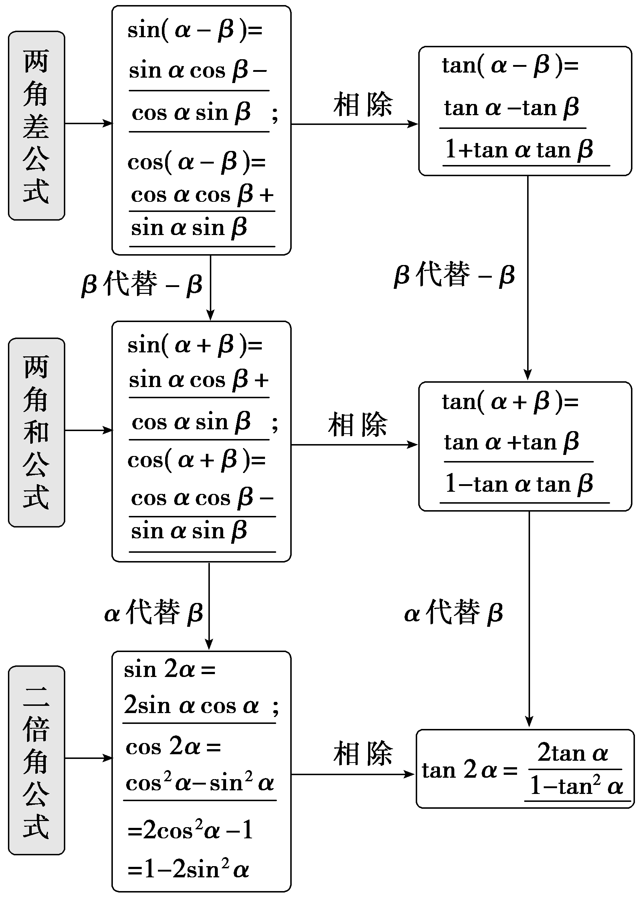
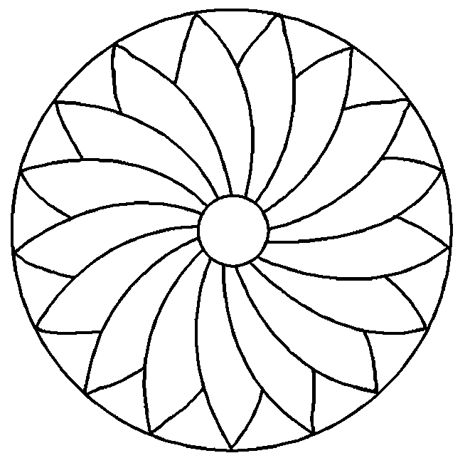

**第三节　三角恒等变换**

**第**1**课时　两角和与差的正弦、余弦和正切公式**

【课标研读】　1.经历推导两角差余弦公式的过程，知道两角差余弦公式的意义.　2.能从两角差的余弦公式推导出两角和与差的正弦、余弦、正切公式，二倍角的正弦、余弦、正切公式，了解它们的内在联系.

1.两角和与差的正弦、余弦、正切公式

[微提醒]　(1)二倍角公式就是两角和的正弦、余弦、正切公式中*<text style="italic">α*</text>＝*β*的特殊情况.(2)二倍角是相对的，如： $\frac{\alpha }{2}$ 是 $\frac{\alpha }{4}$ 的二倍角，3*<text style="italic">α*</text>是 $\frac{3\alpha }{2}$ 的二倍角.

2.辅助角公式

(1)<text style="it*a*lic">a</text>sin *<text style="italic">α*</text>＋*<text style="italic">b*</text>cos α＝ $\sqrt{a^{2}＋b^{2}}$ sin $\left(\alpha ＋\varphi \right)$ (<text style="it*a*lic">a</text>，*<text style="italic">b*</text>不同时为0)，其中sin *<text style="italic">φ*</text>＝ $\frac{b}{\sqrt{a^{2}＋b^{2}}}$ ，cos *<text style="italic">φ*</text>＝ $\frac{a}{\sqrt{a^{2}＋b^{2}}}$ .

(2)常见形式有sin <te<te<te<te<te<te<te<te*x*t style="italic">x</text>t style="italic">x</text>t style="italic">x</text>t style="italic">x</text>t style="italic">x</text>t style="italic">x</text>t style="italic">x</text>t style="italic">x</text>±cos x＝ $\sqrt{2}$ sin(<te<te<te<te<te<te<te<te*x*t style="italic">x</text>t style="italic">x</text>t style="italic">x</text>t style="italic">x</text>t style="italic">x</text>t style="italic">x</text>t style="italic">x</text>t style="italic">x</text>± $\frac{\pi }{4}$ )，sin <te<te<te<te<te<te<te<te*x*t style="italic">x</text>t style="italic">x</text>t style="italic">x</text>t style="italic">x</text>t style="italic">x</text>t style="italic">x</text>t style="italic">x</text>t style="italic">x</text>± $\sqrt{3}$ cos <te<te<te<te<te<te<te<te*x*t style="italic">x</text>t style="italic">x</text>t style="italic">x</text>t style="italic">x</text>t style="italic">x</text>t style="italic">x</text>t style="italic">x</text>t style="italic">x</text>＝2sin(x± $\frac{\pi }{3}$ )， $\sqrt{3}$ sin <te<te<te<te<te<te<te<te*x*t style="italic">x</text>t style="italic">x</text>t style="italic">x</text>t style="italic">x</text>t style="italic">x</text>t style="italic">x</text>t style="italic">x</text>t style="italic">x</text>±cos x＝2sin(x± $\frac{\pi }{6}$ ).

【常用结论】

(1)两角和与差公式的常用变形

①sin *α*sin *β*＋cos(*α*＋*β*)＝cos *α*cos *β*.

②cos *α*sin *β*＋sin(*α*－*β*)＝sin *α*cos *β*.

③tan *α*±tan *β*＝tan(*α*±*β*)(1∓tan *α*tan *β*).

④tan *α*tan *β*＝1－ $\frac{tan\alpha ＋tan\beta }{tan(\alpha ＋\beta )}$ ＝ $\frac{tan\alpha －tan\beta }{tan(\alpha －\beta )}$ －1.

(&lt;text style="superscript"&gt;2&lt;/text&gt;)降幂公式：sin2<em>&lt;text style="italic"&gt;&lt;text style="italic"&gt;&lt;text style="italic"&gt;&lt;text style="italic"&gt;α</em>&lt;/text&gt;&lt;/text&gt;&lt;/text&gt;&lt;/text&gt;＝ $\frac{1－cos2\alpha }{2}$ ；cos&lt;text style="superscript"&gt;2&lt;/text&gt;<em>&lt;text style="italic"&gt;&lt;text style="italic"&gt;&lt;text style="italic"&gt;&lt;text style="italic"&gt;α</em>&lt;/text&gt;&lt;/text&gt;&lt;/text&gt;&lt;/text&gt;＝ $\frac{1+cos2\alpha }{2}$ ；sin <em>&lt;text style="italic"&gt;&lt;text style="italic"&gt;&lt;text style="italic"&gt;&lt;text style="italic"&gt;α</em>&lt;/text&gt;&lt;/text&gt;&lt;/text&gt;&lt;/text&gt;cos α＝ $\frac{1}{2}$ sin &lt;text style="superscript"&gt;2&lt;/text&gt;<em>&lt;text style="italic"&gt;&lt;text style="italic"&gt;&lt;text style="italic"&gt;&lt;text style="italic"&gt;α</em>&lt;/text&gt;&lt;/text&gt;&lt;/text&gt;&lt;/text&gt;.

(3)升幂公式：1＋cos 2<em>α</em>＝2cos2<em>α</em>；1－cos 2<em>α</em>＝2sin2<em>α</em>；

1＋sin 2<em>α</em>＝(sin <em>α</em>＋cos <em>α</em>)2；1－sin 2<em>α</em>＝(sin <em>α</em>－cos <em>α</em>)2.

(4)其他常用公式

sin 2*<text style="italic">α*</text>＝ $\frac{2sin\alpha cos\alpha }{sin ^{2}\alpha ＋cos^{2}\alpha }$ ＝ $\frac{2tan\alpha }{1+tan^{2}\alpha }$  ；cos 2*<text style="italic">α*</text>＝ $\frac{cos^{2}\alpha －sin ^{2}\alpha }{cos^{2}\alpha ＋sin ^{2}\alpha }$ ＝ $\frac{1－tan ^{2}\alpha }{1+tan^{2}\alpha }$ .

【自主检测】

1.(多选)下列结论错误的是(　　)

A.存在*α*，*β*，使等式sin(*α*＋*β*)＝sin *α*＋sin *β*

B.两角和与差的正切公式中的角*α*，*β*是任意角

C.公式tan(*<text style="italic"><text style="italic"><text style="italic"><text style="italic">α*</text></text></text></text>＋*<text style="italic"><text style="italic"><text style="italic"><text style="italic">β*</text></text></text></text>)＝ $\frac{tan\alpha ＋tan\beta }{1－tan\alpha tan\beta }$ 可以变形为tan *<text style="italic"><text style="italic"><text style="italic"><text style="italic">α*</text></text></text></text>＋tan *<text style="italic"><text style="italic"><text style="italic"><text style="italic">β*</text></text></text></text>＝tan(α＋β)(1－tan αtan β)，且对任意角α，β都成立

D.公式<te<te<text style="it*a*lic">x</text>t style="italic">x</text>t style="italic">a</text>sin x＋*<text style="italic">b*</text>cos x＝ $\sqrt{a^{2}＋b^{2}}$ sin $\left(x＋\varphi \right)$ 中<text style="it*a*lic">φ</text>的取值与<te<te*x*t style="italic">x</text>t style="italic">a</text>，*<text style="italic">b*</text>的值无关

答案：**BCD**

2.(链接人教A必修一P229T6)sin 20°cos 10°－cos 160°sin 10°＝(　　)

A.－ $\frac{\sqrt{3}}{2}$ 	B. $\frac{\sqrt{3}}{2}$

C.－ $\frac{1}{2}$ 	D. $\frac{1}{2}$

答案：**D**

解析：sin 20°cos 10°－cos 160°sin 10°＝sin 20°cos 10°＋cos 20°sin 10°＝sin $\left(20\circ +10\circ \right)$ ＝sin 30°＝ $\frac{1}{2}$ .故选D.

3.(链接人教A必修一P218例3)若cos *<text style="italic">α*</text>＝－ $\frac{4}{5}$ ，*<text style="italic">α*</text>是第三象限角，则sin $\left(\alpha ＋\frac{\pi }{4}\right)$ 等于(　　)

A.－ $\frac{\sqrt{2}}{10}$ 	B. $\frac{\sqrt{2}}{10}$

C.－ $\frac{7\sqrt{2}}{10}$ 	D. $\frac{7\sqrt{2}}{10}$

答案：**C**

解析：因为*<text style="italic"><text style="italic"><text style="italic"><text style="italic">α*</text></text></text></text>是第三象限角，cos α＝－ $\frac{4}{5}$ ，所以sin *<text style="italic"><text style="italic"><text style="italic"><text style="italic">α*</text></text></text></text>＝－ $\sqrt{1－cos^{2}\alpha }$ ＝－ $\frac{3}{5}$ ，所以sin $\left(\alpha ＋\frac{\pi }{4}\right)$ ＝sin *<text style="italic"><text style="italic"><text style="italic"><text style="italic">α*</text></text></text></text>cos $\frac{\pi }{4}$ ＋cos *<text style="italic"><text style="italic"><text style="italic"><text style="italic">α*</text></text></text></text>sin $\frac{\pi }{4}$ ＝－ $\frac{3}{5}$ × $\frac{\sqrt{2}}{2}$ ＋ $\left(－\frac{4}{5}\right)$ × $\frac{\sqrt{2}}{2}$ ＝－ $\frac{7\sqrt{2}}{10}$ .故选C.

4.(链接人教A必修一P219例4) $\frac{1－tan15\circ }{1+tan15\circ }$ ＝<u>　　　　</u>.

答案： $\frac{\sqrt{3}}{3}$

解析： $\frac{1－tan15\circ }{1+tan15\circ }$ ＝ $\frac{tan45\circ －tan15\circ }{1+tan45\circ tan15\circ }$ ＝tan(45°－15°)＝tan 30°＝ $\frac{\sqrt{3}}{3}$ .

考点一　和、差、倍角公式的直接应用　　　　自主练透

1.(2020·全国Ⅲ卷)已知2tan *<text style="italic"><text style="italic">θ*</text></text>－tan(θ＋ $\frac{\pi }{4}$ )＝7 ，则tan *<text style="italic"><text style="italic">θ*</text></text>＝ (　　)

A. －2	B. －1

C. 1	D. 2

答案：**D**

解析：由已知得2tan <em>&lt;text style="italic"&gt;&lt;text style="italic"&gt;&lt;text style="italic"&gt;θ</em>&lt;/text&gt;&lt;/text&gt;&lt;/text&gt;－ $\frac{tan\theta +1}{1－tan\theta }$ ＝7，整理得tan2<em>&lt;text style="italic"&gt;&lt;text style="italic"&gt;&lt;text style="italic"&gt;θ</em>&lt;/text&gt;&lt;/text&gt;&lt;/text&gt;－4tan θ＋4＝0，所以tan θ＝2.故选D.

2.(2023·新课标Ⅰ卷)已知sin(*<text style="italic"><text style="italic">α*</text></text>－*<text style="italic"><text style="italic">β*</text></text>)＝ $\frac{1}{3}$ ，cos *<text style="italic"><text style="italic">α*</text></text>sin *<text style="italic"><text style="italic">β*</text></text>＝ $\frac{1}{6}$ ，则cos(2*<text style="italic"><text style="italic">α*</text></text>＋2*<text style="italic"><text style="italic">β*</text></text>)＝(　　)

A. $\frac{7}{9}$ 	B. $\frac{1}{9}$

C.－ $\frac{1}{9}$ 	D.－ $\frac{7}{9}$

答案：**B**

解析：因为sin(<em>&lt;text style="italic"&gt;&lt;text style="italic"&gt;&lt;text style="italic"&gt;&lt;text style="italic"&gt;&lt;text style="italic"&gt;&lt;text style="italic"&gt;&lt;text style="italic"&gt;&lt;text style="italic"&gt;&lt;text style="italic"&gt;&lt;text style="italic"&gt;α</em>&lt;/text&gt;&lt;/text&gt;&lt;/text&gt;&lt;/text&gt;&lt;/text&gt;&lt;/text&gt;&lt;/text&gt;&lt;/text&gt;&lt;/text&gt;&lt;/text&gt;－<em>&lt;text style="italic"&gt;&lt;text style="italic"&gt;&lt;text style="italic"&gt;&lt;text style="italic"&gt;&lt;text style="italic"&gt;&lt;text style="italic"&gt;&lt;text style="italic"&gt;&lt;text style="italic"&gt;&lt;text style="italic"&gt;&lt;text style="italic"&gt;β</em>&lt;/text&gt;&lt;/text&gt;&lt;/text&gt;&lt;/text&gt;&lt;/text&gt;&lt;/text&gt;&lt;/text&gt;&lt;/text&gt;&lt;/text&gt;&lt;/text&gt;)＝sin αcos β－cos αsin β＝ $\frac{1}{3}$ ，而cos <em>&lt;text style="italic"&gt;&lt;text style="italic"&gt;&lt;text style="italic"&gt;&lt;text style="italic"&gt;&lt;text style="italic"&gt;&lt;text style="italic"&gt;&lt;text style="italic"&gt;&lt;text style="italic"&gt;&lt;text style="italic"&gt;&lt;text style="italic"&gt;α</em>&lt;/text&gt;&lt;/text&gt;&lt;/text&gt;&lt;/text&gt;&lt;/text&gt;&lt;/text&gt;&lt;/text&gt;&lt;/text&gt;&lt;/text&gt;&lt;/text&gt;sin <em>&lt;text style="italic"&gt;&lt;text style="italic"&gt;&lt;text style="italic"&gt;&lt;text style="italic"&gt;&lt;text style="italic"&gt;&lt;text style="italic"&gt;&lt;text style="italic"&gt;&lt;text style="italic"&gt;&lt;text style="italic"&gt;&lt;text style="italic"&gt;β</em>&lt;/text&gt;&lt;/text&gt;&lt;/text&gt;&lt;/text&gt;&lt;/text&gt;&lt;/text&gt;&lt;/text&gt;&lt;/text&gt;&lt;/text&gt;&lt;/text&gt;＝ $\frac{1}{6}$ ，因此sin <em>&lt;text style="italic"&gt;&lt;text style="italic"&gt;&lt;text style="italic"&gt;&lt;text style="italic"&gt;&lt;text style="italic"&gt;&lt;text style="italic"&gt;&lt;text style="italic"&gt;&lt;text style="italic"&gt;&lt;text style="italic"&gt;&lt;text style="italic"&gt;α</em>&lt;/text&gt;&lt;/text&gt;&lt;/text&gt;&lt;/text&gt;&lt;/text&gt;&lt;/text&gt;&lt;/text&gt;&lt;/text&gt;&lt;/text&gt;&lt;/text&gt;cos <em>&lt;text style="italic"&gt;&lt;text style="italic"&gt;&lt;text style="italic"&gt;&lt;text style="italic"&gt;&lt;text style="italic"&gt;&lt;text style="italic"&gt;&lt;text style="italic"&gt;&lt;text style="italic"&gt;&lt;text style="italic"&gt;&lt;text style="italic"&gt;β</em>&lt;/text&gt;&lt;/text&gt;&lt;/text&gt;&lt;/text&gt;&lt;/text&gt;&lt;/text&gt;&lt;/text&gt;&lt;/text&gt;&lt;/text&gt;&lt;/text&gt;＝ $\frac{1}{2}$ ，则sin(<em>&lt;text style="italic"&gt;&lt;text style="italic"&gt;&lt;text style="italic"&gt;&lt;text style="italic"&gt;&lt;text style="italic"&gt;&lt;text style="italic"&gt;&lt;text style="italic"&gt;&lt;text style="italic"&gt;&lt;text style="italic"&gt;&lt;text style="italic"&gt;α</em>&lt;/text&gt;&lt;/text&gt;&lt;/text&gt;&lt;/text&gt;&lt;/text&gt;&lt;/text&gt;&lt;/text&gt;&lt;/text&gt;&lt;/text&gt;&lt;/text&gt;＋<em>&lt;text style="italic"&gt;&lt;text style="italic"&gt;&lt;text style="italic"&gt;&lt;text style="italic"&gt;&lt;text style="italic"&gt;&lt;text style="italic"&gt;&lt;text style="italic"&gt;&lt;text style="italic"&gt;&lt;text style="italic"&gt;&lt;text style="italic"&gt;β</em>&lt;/text&gt;&lt;/text&gt;&lt;/text&gt;&lt;/text&gt;&lt;/text&gt;&lt;/text&gt;&lt;/text&gt;&lt;/text&gt;&lt;/text&gt;&lt;/text&gt;)＝sin αcos β＋cos αsin β＝ $\frac{2}{3}$ ，所以cos(2<em>&lt;text style="italic"&gt;&lt;text style="italic"&gt;&lt;text style="italic"&gt;&lt;text style="italic"&gt;&lt;text style="italic"&gt;&lt;text style="italic"&gt;&lt;text style="italic"&gt;&lt;text style="italic"&gt;&lt;text style="italic"&gt;&lt;text style="italic"&gt;α</em>&lt;/text&gt;&lt;/text&gt;&lt;/text&gt;&lt;/text&gt;&lt;/text&gt;&lt;/text&gt;&lt;/text&gt;&lt;/text&gt;&lt;/text&gt;&lt;/text&gt;＋2<em>&lt;text style="italic"&gt;&lt;text style="italic"&gt;&lt;text style="italic"&gt;&lt;text style="italic"&gt;&lt;text style="italic"&gt;&lt;text style="italic"&gt;&lt;text style="italic"&gt;&lt;text style="italic"&gt;&lt;text style="italic"&gt;&lt;text style="italic"&gt;β</em>&lt;/text&gt;&lt;/text&gt;&lt;/text&gt;&lt;/text&gt;&lt;/text&gt;&lt;/text&gt;&lt;/text&gt;&lt;/text&gt;&lt;/text&gt;&lt;/text&gt;)＝cos 2(α＋β)＝1－2sin2(α＋β)＝1－2× $\left(\frac{2}{3}\right)^{2}$ ＝ $\frac{1}{9}$ .故选B.

3.(链接人*A*必修一P229T4)在△*A<text style="italic">BC*</text>中，已知sin A＝ $\frac{3}{5}$ ，cos *B*＝ $\frac{5}{13}$ ，则cos *C*等于(　　 )

A. $\frac{16}{65}$ 	B.－ $\frac{16}{65}$

C. $\frac{16}{65}$ 或 $\frac{65}{16}$ 	D.－ $\frac{63}{65}$

答案：**A**

解析：在△*<text style="italic"><text style="italic"><text style="italic"><text style="italic"><text style="italic"><text style="italic"><text style="italic"><text style="italic">A*</text></text></text></text></text></text></text>*<text style="italic"><text style="italic"><text style="italic"><text style="italic"><text style="italic"><text style="italic">B*</text></text></text></text></text></text>*C*</text>中，因为cos B＝ $\frac{5}{13}$ ＞0，所以sin *<text style="italic"><text style="italic"><text style="italic"><text style="italic"><text style="italic"><text style="italic">B*</text></text></text></text></text></text>＝ $\sqrt{1－cos^{2}B}$ ＝ $\frac{12}{13}$ ＞ $\frac{\sqrt{3}}{2}$ ，*<text style="italic"><text style="italic"><text style="italic"><text style="italic"><text style="italic"><text style="italic">B*</text></text></text></text></text></text>∈ $\left(\frac{\pi }{3}，\frac{\pi }{2}\right)$ .因为sin *<text style="italic"><text style="italic"><text style="italic"><text style="italic"><text style="italic"><text style="italic"><text style="italic">A*</text></text></text></text></text></text></text>＝ $\frac{3}{5}$ ∈ $\left(\frac{1}{2}，\frac{\sqrt{2}}{2}\right)$ ，所以*<text style="italic"><text style="italic"><text style="italic"><text style="italic"><text style="italic"><text style="italic"><text style="italic">A*</text></text></text></text></text></text></text>∈ $\left(\frac{\pi }{6}，\frac{\pi }{4}\right)$ ，或*<text style="italic"><text style="italic"><text style="italic"><text style="italic"><text style="italic"><text style="italic"><text style="italic">A*</text></text></text></text></text></text></text>∈ $\left(\frac{3\pi }{4}，\frac{5\pi }{6}\right)$ (舍去)，所以cos *<text style="italic"><text style="italic"><text style="italic"><text style="italic"><text style="italic"><text style="italic"><text style="italic">A*</text></text></text></text></text></text></text>＝ $\sqrt{1－sin^{2}A}$ ＝ $\frac{4}{5}$ ，所以cos *C*＝cos[π－(*<text style="italic"><text style="italic"><text style="italic"><text style="italic"><text style="italic"><text style="italic"><text style="italic">A*</text></text></text></text></text></text></text>＋*<text style="italic"><text style="italic"><text style="italic"><text style="italic"><text style="italic"><text style="italic">B*</text></text></text></text></text></text>)]＝－cos(A＋B)＝－cos Acos B＋sin Asin B＝－ $\frac{4}{5}$ × $\frac{5}{13}$ ＋ $\frac{3}{5}$ × $\frac{12}{13}$ ＝ $\frac{16}{65}$ .故选*<text style="italic"><text style="italic"><text style="italic"><text style="italic"><text style="italic"><text style="italic"><text style="italic">A*</text></text></text></text></text></text></text>.

4. $\frac{2cos50\circ －\sqrt{3}sin10\circ }{cos10\circ }$ 的值为<u>　　　　</u>.

答案：1

解析：因为2cos 50°＝2cos(60°－10°)＝2( $\frac{1}{2}$ cos 10°＋ $\frac{\sqrt{3}}{2}$ sin 10°)＝cos 10°＋ $\sqrt{3}$ sin 10°，所以原式＝ $\frac{cos10\circ }{cos10\circ }$ ＝1.

利用三角函数公式解题时应注意的问题

1.首先要注意公式的结构特点和符号变化规律，例如两角差的余弦公式可简记为“同名相乘，符号相反”.

2.应注意同角三角函数的基本关系与诱导公式的综合应用.

3.应注意配方法、因式分解和整体代换思想的应用.

考点二　公式的逆用与辅助角公式的应用 　　　　多维探究

角度1　 公式的灵活应用

(1)(&lt;text style="superscript"&gt;2&lt;/text&gt;021·全国乙卷)cos2 $\frac{\pi }{12}$ －cos&lt;text style="superscript"&gt;2&lt;/text&gt; $\frac{5\pi }{12}$ ＝(　　)

A. $\frac{1}{2}$ 	B. $\frac{\sqrt{3}}{3}$

C. $\frac{\sqrt{2}}{2}$ 	D. $\frac{\sqrt{3}}{2}$

(2) 已知<em>&lt;text style="italic"&gt;&lt;text style="italic"&gt;&lt;text style="italic"&gt;α</em>&lt;/text&gt;&lt;/text&gt;&lt;/text&gt;，<em>&lt;text style="italic"&gt;&lt;text style="italic"&gt;&lt;text style="italic"&gt;β</em>&lt;/text&gt;&lt;/text&gt;&lt;/text&gt;∈(－ $\frac{\pi }{2}$ ，0)，且tan <em>&lt;text style="italic"&gt;&lt;text style="italic"&gt;&lt;text style="italic"&gt;α</em>&lt;/text&gt;&lt;/text&gt;&lt;/text&gt;＋tan <em>&lt;text style="italic"&gt;&lt;text style="italic"&gt;&lt;text style="italic"&gt;β</em>&lt;/text&gt;&lt;/text&gt;&lt;/text&gt;＋ $\sqrt{3}$ tan <em>&lt;text style="italic"&gt;&lt;text style="italic"&gt;&lt;text style="italic"&gt;α</em>&lt;/text&gt;&lt;/text&gt;&lt;/text&gt;tan <em>&lt;text style="italic"&gt;&lt;text style="italic"&gt;&lt;text style="italic"&gt;β</em>&lt;/text&gt;&lt;/text&gt;&lt;/text&gt;＝ $\sqrt{3}$ ，则<em>&lt;text style="italic"&gt;&lt;text style="italic"&gt;&lt;text style="italic"&gt;α</em>&lt;/text&gt;&lt;/text&gt;&lt;/text&gt;＋<em>&lt;text style="italic"&gt;&lt;text style="italic"&gt;&lt;text style="italic"&gt;β</em>&lt;/text&gt;&lt;/text&gt;&lt;/text&gt;＝<u>　　　　</u>.

答案：(1)**D**　(2)－ $\frac{2\pi }{3}$

解析：(1)因为cos $\frac{5\pi }{12}$ ＝sin $\left(\frac{\pi }{2}－\frac{5\pi }{12}\right)$ ＝sin $\frac{\pi }{12}$ ，所以cos&lt;text style="superscript"&gt;&lt;text style="superscript"&gt;&lt;text style="superscript"&gt;2&lt;/text&gt;&lt;/text&gt;&lt;/text&gt; $\frac{\pi }{12}$ －cos&lt;text style="superscript"&gt;&lt;text style="superscript"&gt;&lt;text style="superscript"&gt;2&lt;/text&gt;&lt;/text&gt;&lt;/text&gt; $\frac{5\pi }{12}$ ＝cos&lt;text style="superscript"&gt;&lt;text style="superscript"&gt;&lt;text style="superscript"&gt;2&lt;/text&gt;&lt;/text&gt;&lt;/text&gt; $\frac{\pi }{12}$ －sin &lt;text style="superscript"&gt;&lt;text style="superscript"&gt;&lt;text style="superscript"&gt;2&lt;/text&gt;&lt;/text&gt;&lt;/text&gt; $\frac{\pi }{12}$ ＝cos $\left(2\times \frac{\pi }{12}\right)$ ＝cos $\frac{\pi }{6}$ ＝ $\frac{\sqrt{3}}{2}$ .故选D.

(2)由tan *<text style="italic"><text style="italic"><text style="italic"><text style="italic"><text style="italic">α*</text></text></text></text></text>＋tan *<text style="italic"><text style="italic"><text style="italic"><text style="italic"><text style="italic">β*</text></text></text></text></text>＋ $\sqrt{3}$ tan *<text style="italic"><text style="italic"><text style="italic"><text style="italic"><text style="italic">α*</text></text></text></text></text>tan *<text style="italic"><text style="italic"><text style="italic"><text style="italic"><text style="italic">β*</text></text></text></text></text>＝ $\sqrt{3}$ 得，tan(*<text style="italic"><text style="italic"><text style="italic"><text style="italic"><text style="italic">α*</text></text></text></text></text>＋*<text style="italic"><text style="italic"><text style="italic"><text style="italic"><text style="italic">β*</text></text></text></text></text>)＝ $\frac{tan\alpha ＋tan\beta }{1－tan\alpha tan\beta }$ ＝ $\sqrt{3}$ ，又*<text style="italic"><text style="italic"><text style="italic"><text style="italic"><text style="italic">α*</text></text></text></text></text>，*<text style="italic"><text style="italic"><text style="italic"><text style="italic"><text style="italic">β*</text></text></text></text></text>∈(－ $\frac{\pi }{2}$ ，0)，则*<text style="italic"><text style="italic"><text style="italic"><text style="italic"><text style="italic">α*</text></text></text></text></text>＋*<text style="italic"><text style="italic"><text style="italic"><text style="italic"><text style="italic">β*</text></text></text></text></text>∈ $\left(－\pi ，0\right)$ ，所以*<text style="italic"><text style="italic"><text style="italic"><text style="italic"><text style="italic">α*</text></text></text></text></text>＋*<text style="italic"><text style="italic"><text style="italic"><text style="italic"><text style="italic">β*</text></text></text></text></text>＝－ $\frac{2\pi }{3}$ .

角度2　辅助角公式的应用

(1)(2020·全国Ⅲ卷)已知sin *<text style="italic"><text style="italic">θ*</text></text>＋sin(θ＋ $\frac{\pi }{3}$ )＝1，则sin(*<text style="italic"><text style="italic">θ*</text></text>＋ $\frac{\pi }{6}$ )＝(　　)

A. $\frac{1}{2}$ 	B. $\frac{\sqrt{3}}{3}$

C. $\frac{2}{3}$ 	D. $\frac{\sqrt{2}}{2}$

(2)已知3sin *x*－4cos *x*＝5sin (*x*＋*φ*)，则*φ*所在的象限为(　　)

A.第一象限	B.第二象限

C.第三象限	D.第四象限

答案：(1)**B**　(2)**D**

解析：(1)法一：因为sin *<text style="italic"><text style="italic"><text style="italic"><text style="italic"><text style="italic">θ*</text></text></text></text></text>＋sin(θ＋ $\frac{\pi }{3}$ )＝ $\frac{3}{2}$ sin *<text style="italic"><text style="italic"><text style="italic"><text style="italic"><text style="italic">θ*</text></text></text></text></text>＋ $\frac{\sqrt{3}}{2}$ cos *<text style="italic"><text style="italic"><text style="italic"><text style="italic"><text style="italic">θ*</text></text></text></text></text>＝ $\sqrt{3}$ sin(*<text style="italic"><text style="italic"><text style="italic"><text style="italic"><text style="italic">θ*</text></text></text></text></text>＋ $\frac{\pi }{6}$ )＝1，所以sin(*<text style="italic"><text style="italic"><text style="italic"><text style="italic"><text style="italic">θ*</text></text></text></text></text>＋ $\frac{\pi }{6}$ )＝ $\frac{\sqrt{3}}{3}$ .故选B.

法二：因为sin *<text style="italic"><text style="italic"><text style="italic"><text style="italic"><text style="italic"><text style="italic"><text style="italic"><text style="italic">θ*</text></text></text></text></text></text></text></text>＋sin $\left(\theta ＋\frac{\pi }{3}\right)$ ＝sin $\left(\theta ＋\frac{\pi }{6}－\frac{\pi }{6}\right)$ ＋sin(*<text style="italic"><text style="italic"><text style="italic"><text style="italic"><text style="italic"><text style="italic"><text style="italic"><text style="italic">θ*</text></text></text></text></text></text></text></text>＋ $\frac{\pi }{6}$ ＋ $\frac{\pi }{6}$ )＝sin(*<text style="italic"><text style="italic"><text style="italic"><text style="italic"><text style="italic"><text style="italic"><text style="italic"><text style="italic">θ*</text></text></text></text></text></text></text></text>＋ $\frac{\pi }{6}$ )cos $\frac{\pi }{6}$ －cos(*<text style="italic"><text style="italic"><text style="italic"><text style="italic"><text style="italic"><text style="italic"><text style="italic"><text style="italic">θ*</text></text></text></text></text></text></text></text>＋ $\frac{\pi }{6}$ )sin $\frac{\pi }{6}$ ＋sin(*<text style="italic"><text style="italic"><text style="italic"><text style="italic"><text style="italic"><text style="italic"><text style="italic"><text style="italic">θ*</text></text></text></text></text></text></text></text>＋ $\frac{\pi }{6}$ )cos $\frac{\pi }{6}$ ＋cos(*<text style="italic"><text style="italic"><text style="italic"><text style="italic"><text style="italic"><text style="italic"><text style="italic"><text style="italic">θ*</text></text></text></text></text></text></text></text>＋ $\frac{\pi }{6}$ )sin $\frac{\pi }{6}$ ＝2sin(*<text style="italic"><text style="italic"><text style="italic"><text style="italic"><text style="italic"><text style="italic"><text style="italic"><text style="italic">θ*</text></text></text></text></text></text></text></text>＋ $\frac{\pi }{6}$ )·cos $\frac{\pi }{6}$ ＝ $\sqrt{3}$ sin(*<text style="italic"><text style="italic"><text style="italic"><text style="italic"><text style="italic"><text style="italic"><text style="italic"><text style="italic">θ*</text></text></text></text></text></text></text></text>＋ $\frac{\pi }{6}$ )＝1，所以sin(*<text style="italic"><text style="italic"><text style="italic"><text style="italic"><text style="italic"><text style="italic"><text style="italic"><text style="italic">θ*</text></text></text></text></text></text></text></text>＋ $\frac{\pi }{6}$ )＝ $\frac{\sqrt{3}}{3}$ .故选B.

(2)3sin <te<te*x*t style="italic">x</text>t style="italic">x</text>－4cos x＝5 $\left[\frac{3}{5}sinx＋\left(－\frac{4}{5}\right)cosx\right]$ ＝5sin(<te<te*x*t style="italic">x</text>t style="italic">x</text>＋*<text style="italic"><text style="italic"><text style="italic">φ*</text></text></text>)，其中sin φ＝－ $\frac{4}{5}$ ，cos *<text style="italic"><text style="italic"><text style="italic">φ*</text></text></text>＝ $\frac{3}{5}$ ，所以*<text style="italic"><text style="italic"><text style="italic">φ*</text></text></text>所在的象限为第四象限.故选D.

三角函数公式的灵活应用的技巧

1.逆用公式应准确找出所给式子与公式的异同，创造条件逆用公式.

2.tan *α*tan *β*，tan *α*＋tan *β*(或tan *α*－tan *β*)，tan (*α*＋*β*)(或tan (*α*－*β*))三者中可以知二求一，应注意公式的逆用和变形使用.

3.对*a*sin *x*＋*b*cos *x* 化简时，辅助角*φ* 的值如何求要清楚.

注意：(1)公式逆用时一定要注意公式成立的条件和角之间的关系.(2)注意特殊角的应用，当式子中出现 $\frac{1}{2}$ ，1， $\frac{\sqrt{3}}{2}$ ， $\sqrt{3}$ 等这些数值时，一定要考虑引入特殊角，把“值变角”以便构造出适合公式的形式.

对点练1.(多选)下列等式能够成立的为(　　)

A.sin 15°cos 15°＝ $\frac{1}{2}$

B.sin 75°cos 15°＋cos 75°sin 15°＝1

C.cos 105°cos 75°－sin 105°cos 15°＝－1

D. $\sqrt{3}$ sin 15°＋cos 15°＝1

答案：**BC**

解析：对于A，sin 15°cos 15°＝ $\frac{1}{2}$ sin 30°＝ $\frac{1}{4}$ ，故A错误；对于B，sin 75°cos 15°＋cos 75°sin 15°＝sin (75°＋15°)＝sin 90°＝1，故B正确；对于C，cos 105°cos 75°－sin 105°cos 15°＝cos 105°cos 75°－sin 105°sin 75°＝cos(105°＋75°)＝cos 180°＝－1，故C正确；对于D， $\sqrt{3}$ sin 15°＋cos 15°＝2sin (15°＋30°)＝2sin 45°＝ $\sqrt{2}$ ，故D错误.故选BC.

对点练2.(2022·新高考Ⅱ卷)若sin (*<text style="italic"><text style="italic">α*</text></text>＋*<text style="italic">β*</text>)＋cos(α＋β)＝2 $\sqrt{2}$ cos(*<text style="italic"><text style="italic">α*</text></text>＋ $\frac{\pi }{4}$ )sin *<text style="italic">β*</text> ，则(　　)

A. tan (*α*－*β*)＝1	B. tan (*α*＋*β*)＝1

C. tan (*α*－*β*)＝－1	D. tan (*α*＋*β*)＝－1

答案：**C**

解析：sin(<em>&lt;text style="italic"&gt;&lt;text style="italic"&gt;&lt;text style="italic"&gt;&lt;text style="italic"&gt;&lt;text style="italic"&gt;&lt;text style="italic"&gt;&lt;text style="italic"&gt;&lt;text style="italic"&gt;&lt;text style="italic"&gt;&lt;text style="italic"&gt;&lt;text style="italic"&gt;&lt;text style="italic"&gt;&lt;text style="italic"&gt;α</em>&lt;/text&gt;&lt;/text&gt;&lt;/text&gt;&lt;/text&gt;&lt;/text&gt;&lt;/text&gt;&lt;/text&gt;&lt;/text&gt;&lt;/text&gt;&lt;/text&gt;&lt;/text&gt;&lt;/text&gt;&lt;/text&gt;＋<em>&lt;text style="italic"&gt;&lt;text style="italic"&gt;&lt;text style="italic"&gt;&lt;text style="italic"&gt;&lt;text style="italic"&gt;&lt;text style="italic"&gt;&lt;text style="italic"&gt;&lt;text style="italic"&gt;&lt;text style="italic"&gt;&lt;text style="italic"&gt;&lt;text style="italic"&gt;&lt;text style="italic"&gt;&lt;text style="italic"&gt;β</em>&lt;/text&gt;&lt;/text&gt;&lt;/text&gt;&lt;/text&gt;&lt;/text&gt;&lt;/text&gt;&lt;/text&gt;&lt;/text&gt;&lt;/text&gt;&lt;/text&gt;&lt;/text&gt;&lt;/text&gt;&lt;/text&gt;)＋cos(α＋β)＝ $\sqrt{2}$ sin(<em>&lt;text style="italic"&gt;&lt;text style="italic"&gt;&lt;text style="italic"&gt;&lt;text style="italic"&gt;&lt;text style="italic"&gt;&lt;text style="italic"&gt;&lt;text style="italic"&gt;&lt;text style="italic"&gt;&lt;text style="italic"&gt;&lt;text style="italic"&gt;&lt;text style="italic"&gt;&lt;text style="italic"&gt;&lt;text style="italic"&gt;α</em>&lt;/text&gt;&lt;/text&gt;&lt;/text&gt;&lt;/text&gt;&lt;/text&gt;&lt;/text&gt;&lt;/text&gt;&lt;/text&gt;&lt;/text&gt;&lt;/text&gt;&lt;/text&gt;&lt;/text&gt;&lt;/text&gt;＋<em>&lt;text style="italic"&gt;&lt;text style="italic"&gt;&lt;text style="italic"&gt;&lt;text style="italic"&gt;&lt;text style="italic"&gt;&lt;text style="italic"&gt;&lt;text style="italic"&gt;&lt;text style="italic"&gt;&lt;text style="italic"&gt;&lt;text style="italic"&gt;&lt;text style="italic"&gt;&lt;text style="italic"&gt;&lt;text style="italic"&gt;β</em>&lt;/text&gt;&lt;/text&gt;&lt;/text&gt;&lt;/text&gt;&lt;/text&gt;&lt;/text&gt;&lt;/text&gt;&lt;/text&gt;&lt;/text&gt;&lt;/text&gt;&lt;/text&gt;&lt;/text&gt;&lt;/text&gt;＋ $\frac{\pi }{4}$ )＝2 $\sqrt{2}$ sin <em>&lt;text style="italic"&gt;&lt;text style="italic"&gt;&lt;text style="italic"&gt;&lt;text style="italic"&gt;&lt;text style="italic"&gt;&lt;text style="italic"&gt;&lt;text style="italic"&gt;&lt;text style="italic"&gt;&lt;text style="italic"&gt;&lt;text style="italic"&gt;&lt;text style="italic"&gt;&lt;text style="italic"&gt;&lt;text style="italic"&gt;β</em>&lt;/text&gt;&lt;/text&gt;&lt;/text&gt;&lt;/text&gt;&lt;/text&gt;&lt;/text&gt;&lt;/text&gt;&lt;/text&gt;&lt;/text&gt;&lt;/text&gt;&lt;/text&gt;&lt;/text&gt;&lt;/text&gt;·cos(<em>&lt;text style="italic"&gt;&lt;text style="italic"&gt;&lt;text style="italic"&gt;&lt;text style="italic"&gt;&lt;text style="italic"&gt;&lt;text style="italic"&gt;&lt;text style="italic"&gt;&lt;text style="italic"&gt;&lt;text style="italic"&gt;&lt;text style="italic"&gt;&lt;text style="italic"&gt;&lt;text style="italic"&gt;&lt;text style="italic"&gt;α</em>&lt;/text&gt;&lt;/text&gt;&lt;/text&gt;&lt;/text&gt;&lt;/text&gt;&lt;/text&gt;&lt;/text&gt;&lt;/text&gt;&lt;/text&gt;&lt;/text&gt;&lt;/text&gt;&lt;/text&gt;&lt;/text&gt;＋ $\frac{\pi }{4}$ )，所以sin(<em>&lt;text style="italic"&gt;&lt;text style="italic"&gt;&lt;text style="italic"&gt;&lt;text style="italic"&gt;&lt;text style="italic"&gt;&lt;text style="italic"&gt;&lt;text style="italic"&gt;&lt;text style="italic"&gt;&lt;text style="italic"&gt;&lt;text style="italic"&gt;&lt;text style="italic"&gt;&lt;text style="italic"&gt;&lt;text style="italic"&gt;α</em>&lt;/text&gt;&lt;/text&gt;&lt;/text&gt;&lt;/text&gt;&lt;/text&gt;&lt;/text&gt;&lt;/text&gt;&lt;/text&gt;&lt;/text&gt;&lt;/text&gt;&lt;/text&gt;&lt;/text&gt;&lt;/text&gt;＋ $\frac{\pi }{4}$ )cos <em>&lt;text style="italic"&gt;&lt;text style="italic"&gt;&lt;text style="italic"&gt;&lt;text style="italic"&gt;&lt;text style="italic"&gt;&lt;text style="italic"&gt;&lt;text style="italic"&gt;&lt;text style="italic"&gt;&lt;text style="italic"&gt;&lt;text style="italic"&gt;&lt;text style="italic"&gt;&lt;text style="italic"&gt;&lt;text style="italic"&gt;β</em>&lt;/text&gt;&lt;/text&gt;&lt;/text&gt;&lt;/text&gt;&lt;/text&gt;&lt;/text&gt;&lt;/text&gt;&lt;/text&gt;&lt;/text&gt;&lt;/text&gt;&lt;/text&gt;&lt;/text&gt;&lt;/text&gt;＋sin βcos(<em>&lt;text style="italic"&gt;&lt;text style="italic"&gt;&lt;text style="italic"&gt;&lt;text style="italic"&gt;&lt;text style="italic"&gt;&lt;text style="italic"&gt;&lt;text style="italic"&gt;&lt;text style="italic"&gt;&lt;text style="italic"&gt;&lt;text style="italic"&gt;&lt;text style="italic"&gt;&lt;text style="italic"&gt;&lt;text style="italic"&gt;α</em>&lt;/text&gt;&lt;/text&gt;&lt;/text&gt;&lt;/text&gt;&lt;/text&gt;&lt;/text&gt;&lt;/text&gt;&lt;/text&gt;&lt;/text&gt;&lt;/text&gt;&lt;/text&gt;&lt;/text&gt;&lt;/text&gt;＋ $\frac{\pi }{4}$ )＝2sin <em>&lt;text style="italic"&gt;&lt;text style="italic"&gt;&lt;text style="italic"&gt;&lt;text style="italic"&gt;&lt;text style="italic"&gt;&lt;text style="italic"&gt;&lt;text style="italic"&gt;&lt;text style="italic"&gt;&lt;text style="italic"&gt;&lt;text style="italic"&gt;&lt;text style="italic"&gt;&lt;text style="italic"&gt;&lt;text style="italic"&gt;β</em>&lt;/text&gt;&lt;/text&gt;&lt;/text&gt;&lt;/text&gt;&lt;/text&gt;&lt;/text&gt;&lt;/text&gt;&lt;/text&gt;&lt;/text&gt;&lt;/text&gt;&lt;/text&gt;&lt;/text&gt;&lt;/text&gt;cos(<em>&lt;text style="italic"&gt;&lt;text style="italic"&gt;&lt;text style="italic"&gt;&lt;text style="italic"&gt;&lt;text style="italic"&gt;&lt;text style="italic"&gt;&lt;text style="italic"&gt;&lt;text style="italic"&gt;&lt;text style="italic"&gt;&lt;text style="italic"&gt;&lt;text style="italic"&gt;&lt;text style="italic"&gt;&lt;text style="italic"&gt;α</em>&lt;/text&gt;&lt;/text&gt;&lt;/text&gt;&lt;/text&gt;&lt;/text&gt;&lt;/text&gt;&lt;/text&gt;&lt;/text&gt;&lt;/text&gt;&lt;/text&gt;&lt;/text&gt;&lt;/text&gt;&lt;/text&gt;＋ $\frac{\pi }{4}$ )，整理得sin(<em>&lt;text style="italic"&gt;&lt;text style="italic"&gt;&lt;text style="italic"&gt;&lt;text style="italic"&gt;&lt;text style="italic"&gt;&lt;text style="italic"&gt;&lt;text style="italic"&gt;&lt;text style="italic"&gt;&lt;text style="italic"&gt;&lt;text style="italic"&gt;&lt;text style="italic"&gt;&lt;text style="italic"&gt;&lt;text style="italic"&gt;α</em>&lt;/text&gt;&lt;/text&gt;&lt;/text&gt;&lt;/text&gt;&lt;/text&gt;&lt;/text&gt;&lt;/text&gt;&lt;/text&gt;&lt;/text&gt;&lt;/text&gt;&lt;/text&gt;&lt;/text&gt;&lt;/text&gt;＋ $\frac{\pi }{4}$ )cos <em>&lt;text style="italic"&gt;&lt;text style="italic"&gt;&lt;text style="italic"&gt;&lt;text style="italic"&gt;&lt;text style="italic"&gt;&lt;text style="italic"&gt;&lt;text style="italic"&gt;&lt;text style="italic"&gt;&lt;text style="italic"&gt;&lt;text style="italic"&gt;&lt;text style="italic"&gt;&lt;text style="italic"&gt;&lt;text style="italic"&gt;β</em>&lt;/text&gt;&lt;/text&gt;&lt;/text&gt;&lt;/text&gt;&lt;/text&gt;&lt;/text&gt;&lt;/text&gt;&lt;/text&gt;&lt;/text&gt;&lt;/text&gt;&lt;/text&gt;&lt;/text&gt;&lt;/text&gt;－sin βcos(<em>&lt;text style="italic"&gt;&lt;text style="italic"&gt;&lt;text style="italic"&gt;&lt;text style="italic"&gt;&lt;text style="italic"&gt;&lt;text style="italic"&gt;&lt;text style="italic"&gt;&lt;text style="italic"&gt;&lt;text style="italic"&gt;&lt;text style="italic"&gt;&lt;text style="italic"&gt;&lt;text style="italic"&gt;&lt;text style="italic"&gt;α</em>&lt;/text&gt;&lt;/text&gt;&lt;/text&gt;&lt;/text&gt;&lt;/text&gt;&lt;/text&gt;&lt;/text&gt;&lt;/text&gt;&lt;/text&gt;&lt;/text&gt;&lt;/text&gt;&lt;/text&gt;&lt;/text&gt;＋ $\frac{\pi }{4}$ )＝0，即sin(<em>&lt;text style="italic"&gt;&lt;text style="italic"&gt;&lt;text style="italic"&gt;&lt;text style="italic"&gt;&lt;text style="italic"&gt;&lt;text style="italic"&gt;&lt;text style="italic"&gt;&lt;text style="italic"&gt;&lt;text style="italic"&gt;&lt;text style="italic"&gt;&lt;text style="italic"&gt;&lt;text style="italic"&gt;&lt;text style="italic"&gt;α</em>&lt;/text&gt;&lt;/text&gt;&lt;/text&gt;&lt;/text&gt;&lt;/text&gt;&lt;/text&gt;&lt;/text&gt;&lt;/text&gt;&lt;/text&gt;&lt;/text&gt;&lt;/text&gt;&lt;/text&gt;&lt;/text&gt;＋ $\frac{\pi }{4}$ －<em>&lt;text style="italic"&gt;&lt;text style="italic"&gt;&lt;text style="italic"&gt;&lt;text style="italic"&gt;&lt;text style="italic"&gt;&lt;text style="italic"&gt;&lt;text style="italic"&gt;&lt;text style="italic"&gt;&lt;text style="italic"&gt;&lt;text style="italic"&gt;&lt;text style="italic"&gt;&lt;text style="italic"&gt;&lt;text style="italic"&gt;β</em>&lt;/text&gt;&lt;/text&gt;&lt;/text&gt;&lt;/text&gt;&lt;/text&gt;&lt;/text&gt;&lt;/text&gt;&lt;/text&gt;&lt;/text&gt;&lt;/text&gt;&lt;/text&gt;&lt;/text&gt;&lt;/text&gt;)＝0，所以<em>&lt;text style="italic"&gt;&lt;text style="italic"&gt;&lt;text style="italic"&gt;&lt;text style="italic"&gt;&lt;text style="italic"&gt;&lt;text style="italic"&gt;&lt;text style="italic"&gt;&lt;text style="italic"&gt;&lt;text style="italic"&gt;&lt;text style="italic"&gt;&lt;text style="italic"&gt;&lt;text style="italic"&gt;&lt;text style="italic"&gt;α</em>&lt;/text&gt;&lt;/text&gt;&lt;/text&gt;&lt;/text&gt;&lt;/text&gt;&lt;/text&gt;&lt;/text&gt;&lt;/text&gt;&lt;/text&gt;&lt;/text&gt;&lt;/text&gt;&lt;/text&gt;&lt;/text&gt;－β＋ $\frac{\pi }{4}$ ＝<em>&lt;text style="italic"&gt;&lt;text style="italic"&gt;k</em>&lt;/text&gt;&lt;/text&gt;π，k∈<strong>Z</strong>，所以tan(<em>&lt;text style="italic"&gt;&lt;text style="italic"&gt;&lt;text style="italic"&gt;&lt;text style="italic"&gt;&lt;text style="italic"&gt;&lt;text style="italic"&gt;&lt;text style="italic"&gt;&lt;text style="italic"&gt;&lt;text style="italic"&gt;&lt;text style="italic"&gt;&lt;text style="italic"&gt;&lt;text style="italic"&gt;&lt;text style="italic"&gt;α</em>&lt;/text&gt;&lt;/text&gt;&lt;/text&gt;&lt;/text&gt;&lt;/text&gt;&lt;/text&gt;&lt;/text&gt;&lt;/text&gt;&lt;/text&gt;&lt;/text&gt;&lt;/text&gt;&lt;/text&gt;&lt;/text&gt;－<em>&lt;text style="italic"&gt;&lt;text style="italic"&gt;&lt;text style="italic"&gt;&lt;text style="italic"&gt;&lt;text style="italic"&gt;&lt;text style="italic"&gt;&lt;text style="italic"&gt;&lt;text style="italic"&gt;&lt;text style="italic"&gt;&lt;text style="italic"&gt;&lt;text style="italic"&gt;&lt;text style="italic"&gt;&lt;text style="italic"&gt;β</em>&lt;/text&gt;&lt;/text&gt;&lt;/text&gt;&lt;/text&gt;&lt;/text&gt;&lt;/text&gt;&lt;/text&gt;&lt;/text&gt;&lt;/text&gt;&lt;/text&gt;&lt;/text&gt;&lt;/text&gt;&lt;/text&gt;)＝tan(kπ－ $\frac{\pi }{4}$ )＝－1.(也可由已知条件令<em>&lt;text style="italic"&gt;&lt;text style="italic"&gt;&lt;text style="italic"&gt;&lt;text style="italic"&gt;&lt;text style="italic"&gt;&lt;text style="italic"&gt;&lt;text style="italic"&gt;&lt;text style="italic"&gt;&lt;text style="italic"&gt;&lt;text style="italic"&gt;&lt;text style="italic"&gt;&lt;text style="italic"&gt;&lt;text style="italic"&gt;α</em>&lt;/text&gt;&lt;/text&gt;&lt;/text&gt;&lt;/text&gt;&lt;/text&gt;&lt;/text&gt;&lt;/text&gt;&lt;/text&gt;&lt;/text&gt;&lt;/text&gt;&lt;/text&gt;&lt;/text&gt;&lt;/text&gt;＝0，<em>&lt;text style="italic"&gt;&lt;text style="italic"&gt;&lt;text style="italic"&gt;&lt;text style="italic"&gt;&lt;text style="italic"&gt;&lt;text style="italic"&gt;&lt;text style="italic"&gt;&lt;text style="italic"&gt;&lt;text style="italic"&gt;&lt;text style="italic"&gt;&lt;text style="italic"&gt;&lt;text style="italic"&gt;&lt;text style="italic"&gt;β</em>&lt;/text&gt;&lt;/text&gt;&lt;/text&gt;&lt;/text&gt;&lt;/text&gt;&lt;/text&gt;&lt;/text&gt;&lt;/text&gt;&lt;/text&gt;&lt;/text&gt;&lt;/text&gt;&lt;/text&gt;&lt;/text&gt;＝ $\frac{\pi }{4}$ ，和<em>&lt;text style="italic"&gt;&lt;text style="italic"&gt;&lt;text style="italic"&gt;&lt;text style="italic"&gt;&lt;text style="italic"&gt;&lt;text style="italic"&gt;&lt;text style="italic"&gt;&lt;text style="italic"&gt;&lt;text style="italic"&gt;&lt;text style="italic"&gt;&lt;text style="italic"&gt;&lt;text style="italic"&gt;&lt;text style="italic"&gt;α</em>&lt;/text&gt;&lt;/text&gt;&lt;/text&gt;&lt;/text&gt;&lt;/text&gt;&lt;/text&gt;&lt;/text&gt;&lt;/text&gt;&lt;/text&gt;&lt;/text&gt;&lt;/text&gt;&lt;/text&gt;&lt;/text&gt;＝－ $\frac{\pi }{4}$ ，<em>&lt;text style="italic"&gt;&lt;text style="italic"&gt;&lt;text style="italic"&gt;&lt;text style="italic"&gt;&lt;text style="italic"&gt;&lt;text style="italic"&gt;&lt;text style="italic"&gt;&lt;text style="italic"&gt;&lt;text style="italic"&gt;&lt;text style="italic"&gt;&lt;text style="italic"&gt;&lt;text style="italic"&gt;&lt;text style="italic"&gt;β</em>&lt;/text&gt;&lt;/text&gt;&lt;/text&gt;&lt;/text&gt;&lt;/text&gt;&lt;/text&gt;&lt;/text&gt;&lt;/text&gt;&lt;/text&gt;&lt;/text&gt;&lt;/text&gt;&lt;/text&gt;&lt;/text&gt;＝0排除得解)故选C.

对点练3.化简：tan 10°tan 20°＋tan 20°tan 60°＋tan 60°tan 10°＝<u>　　　　</u>.

答案：1

解析：原式＝tan 10°tan 20°＋tan 60°(tan 20°＋tan 10°)＝tan 10°tan 20°＋ $\sqrt{3}$ tan (20°＋10°)(1－tan 20°tan 10°)＝tan 10°tan 20°＋1－tan 20°tan 10°＝1.

考点三　变换求值　　　　多维探究

角度1　三角公式中变“角”

(1)已知<em>&lt;text style="italic"&gt;&lt;text style="italic"&gt;&lt;text style="italic"&gt;&lt;text style="italic"&gt;α</em>&lt;/text&gt;&lt;/text&gt;&lt;/text&gt;&lt;/text&gt;，<em>&lt;text style="italic"&gt;&lt;text style="italic"&gt;β</em>&lt;/text&gt;&lt;/text&gt;为锐角，tan α＝ $\frac{4}{3}$ ，cos(<em>&lt;text style="italic"&gt;&lt;text style="italic"&gt;&lt;text style="italic"&gt;&lt;text style="italic"&gt;α</em>&lt;/text&gt;&lt;/text&gt;&lt;/text&gt;&lt;/text&gt;＋<em>&lt;text style="italic"&gt;&lt;text style="italic"&gt;β</em>&lt;/text&gt;&lt;/text&gt;)＝－ $\frac{\sqrt{5}}{5}$ ，则cos 2<em>&lt;text style="italic"&gt;&lt;text style="italic"&gt;&lt;text style="italic"&gt;&lt;text style="italic"&gt;α</em>&lt;/text&gt;&lt;/text&gt;&lt;/text&gt;&lt;/text&gt;＝<u>&lt;text style="underline"&gt;　　　　</u>&lt;/text&gt;；tan (α－<em>&lt;text style="italic"&gt;&lt;text style="italic"&gt;β</em>&lt;/text&gt;&lt;/text&gt;)＝　　　　.

(2)已知tan (<em>&lt;text style="italic"&gt;&lt;text style="italic"&gt;α</em>&lt;/text&gt;&lt;/text&gt;＋<em>&lt;text style="italic"&gt;β</em>&lt;/text&gt;)＝ $\frac{1}{2}$ ，tan (<em>&lt;text style="italic"&gt;&lt;text style="italic"&gt;α</em>&lt;/text&gt;&lt;/text&gt;－<em>&lt;text style="italic"&gt;β</em>&lt;/text&gt;)＝ $\frac{1}{3}$ ，则tan (π－2<em>&lt;text style="italic"&gt;&lt;text style="italic"&gt;α</em>&lt;/text&gt;&lt;/text&gt;)＝<u>　　　　</u>.

答案：(1)－ $\frac{7}{25}$ 　－ $\frac{2}{11}$ 　(2)－1

解析：(1)因为tan <em>&lt;text style="italic"&gt;&lt;text style="italic"&gt;&lt;text style="italic"&gt;&lt;text style="italic"&gt;&lt;text style="italic"&gt;&lt;text style="italic"&gt;&lt;text style="italic"&gt;&lt;text style="italic"&gt;&lt;text style="italic"&gt;&lt;text style="italic"&gt;&lt;text style="italic"&gt;&lt;text style="italic"&gt;&lt;text style="italic"&gt;&lt;text style="italic"&gt;&lt;text style="italic"&gt;&lt;text style="italic"&gt;&lt;text style="italic"&gt;&lt;text style="italic"&gt;α</em>&lt;/text&gt;&lt;/text&gt;&lt;/text&gt;&lt;/text&gt;&lt;/text&gt;&lt;/text&gt;&lt;/text&gt;&lt;/text&gt;&lt;/text&gt;&lt;/text&gt;&lt;/text&gt;&lt;/text&gt;&lt;/text&gt;&lt;/text&gt;&lt;/text&gt;&lt;/text&gt;&lt;/text&gt;&lt;/text&gt;＝ $\frac{4}{3}$ ，tan <em>&lt;text style="italic"&gt;&lt;text style="italic"&gt;&lt;text style="italic"&gt;&lt;text style="italic"&gt;&lt;text style="italic"&gt;&lt;text style="italic"&gt;&lt;text style="italic"&gt;&lt;text style="italic"&gt;&lt;text style="italic"&gt;&lt;text style="italic"&gt;&lt;text style="italic"&gt;&lt;text style="italic"&gt;&lt;text style="italic"&gt;&lt;text style="italic"&gt;&lt;text style="italic"&gt;&lt;text style="italic"&gt;&lt;text style="italic"&gt;&lt;text style="italic"&gt;α</em>&lt;/text&gt;&lt;/text&gt;&lt;/text&gt;&lt;/text&gt;&lt;/text&gt;&lt;/text&gt;&lt;/text&gt;&lt;/text&gt;&lt;/text&gt;&lt;/text&gt;&lt;/text&gt;&lt;/text&gt;&lt;/text&gt;&lt;/text&gt;&lt;/text&gt;&lt;/text&gt;&lt;/text&gt;&lt;/text&gt;＝ $\frac{sin\alpha }{cos\alpha }$ ，所以sin <em>&lt;text style="italic"&gt;&lt;text style="italic"&gt;&lt;text style="italic"&gt;&lt;text style="italic"&gt;&lt;text style="italic"&gt;&lt;text style="italic"&gt;&lt;text style="italic"&gt;&lt;text style="italic"&gt;&lt;text style="italic"&gt;&lt;text style="italic"&gt;&lt;text style="italic"&gt;&lt;text style="italic"&gt;&lt;text style="italic"&gt;&lt;text style="italic"&gt;&lt;text style="italic"&gt;&lt;text style="italic"&gt;&lt;text style="italic"&gt;&lt;text style="italic"&gt;α</em>&lt;/text&gt;&lt;/text&gt;&lt;/text&gt;&lt;/text&gt;&lt;/text&gt;&lt;/text&gt;&lt;/text&gt;&lt;/text&gt;&lt;/text&gt;&lt;/text&gt;&lt;/text&gt;&lt;/text&gt;&lt;/text&gt;&lt;/text&gt;&lt;/text&gt;&lt;/text&gt;&lt;/text&gt;&lt;/text&gt;＝ $\frac{4}{3}$ cos <em>&lt;text style="italic"&gt;&lt;text style="italic"&gt;&lt;text style="italic"&gt;&lt;text style="italic"&gt;&lt;text style="italic"&gt;&lt;text style="italic"&gt;&lt;text style="italic"&gt;&lt;text style="italic"&gt;&lt;text style="italic"&gt;&lt;text style="italic"&gt;&lt;text style="italic"&gt;&lt;text style="italic"&gt;&lt;text style="italic"&gt;&lt;text style="italic"&gt;&lt;text style="italic"&gt;&lt;text style="italic"&gt;&lt;text style="italic"&gt;&lt;text style="italic"&gt;α</em>&lt;/text&gt;&lt;/text&gt;&lt;/text&gt;&lt;/text&gt;&lt;/text&gt;&lt;/text&gt;&lt;/text&gt;&lt;/text&gt;&lt;/text&gt;&lt;/text&gt;&lt;/text&gt;&lt;/text&gt;&lt;/text&gt;&lt;/text&gt;&lt;/text&gt;&lt;/text&gt;&lt;/text&gt;&lt;/text&gt;.因为sin &lt;text style="superscript"&gt;&lt;text style="superscript"&gt;&lt;text style="superscript"&gt;2&lt;/text&gt;&lt;/text&gt;&lt;/text&gt;α＋cos2α＝1，所以cos2α＝ $\frac{9}{25}$ ，因此，cos &lt;text style="superscript"&gt;&lt;text style="superscript"&gt;&lt;text style="superscript"&gt;2&lt;/text&gt;&lt;/text&gt;&lt;/text&gt;<em>&lt;text style="italic"&gt;&lt;text style="italic"&gt;&lt;text style="italic"&gt;&lt;text style="italic"&gt;&lt;text style="italic"&gt;&lt;text style="italic"&gt;&lt;text style="italic"&gt;&lt;text style="italic"&gt;&lt;text style="italic"&gt;&lt;text style="italic"&gt;&lt;text style="italic"&gt;&lt;text style="italic"&gt;&lt;text style="italic"&gt;&lt;text style="italic"&gt;&lt;text style="italic"&gt;&lt;text style="italic"&gt;&lt;text style="italic"&gt;&lt;text style="italic"&gt;α</em>&lt;/text&gt;&lt;/text&gt;&lt;/text&gt;&lt;/text&gt;&lt;/text&gt;&lt;/text&gt;&lt;/text&gt;&lt;/text&gt;&lt;/text&gt;&lt;/text&gt;&lt;/text&gt;&lt;/text&gt;&lt;/text&gt;&lt;/text&gt;&lt;/text&gt;&lt;/text&gt;&lt;/text&gt;&lt;/text&gt;＝2cos2α－1＝－ $\frac{7}{25}$ .因为<em>&lt;text style="italic"&gt;&lt;text style="italic"&gt;&lt;text style="italic"&gt;&lt;text style="italic"&gt;&lt;text style="italic"&gt;&lt;text style="italic"&gt;&lt;text style="italic"&gt;&lt;text style="italic"&gt;&lt;text style="italic"&gt;&lt;text style="italic"&gt;&lt;text style="italic"&gt;&lt;text style="italic"&gt;&lt;text style="italic"&gt;&lt;text style="italic"&gt;&lt;text style="italic"&gt;&lt;text style="italic"&gt;&lt;text style="italic"&gt;&lt;text style="italic"&gt;α</em>&lt;/text&gt;&lt;/text&gt;&lt;/text&gt;&lt;/text&gt;&lt;/text&gt;&lt;/text&gt;&lt;/text&gt;&lt;/text&gt;&lt;/text&gt;&lt;/text&gt;&lt;/text&gt;&lt;/text&gt;&lt;/text&gt;&lt;/text&gt;&lt;/text&gt;&lt;/text&gt;&lt;/text&gt;&lt;/text&gt;，<em>&lt;text style="italic"&gt;&lt;text style="italic"&gt;&lt;text style="italic"&gt;&lt;text style="italic"&gt;&lt;text style="italic"&gt;&lt;text style="italic"&gt;β</em>&lt;/text&gt;&lt;/text&gt;&lt;/text&gt;&lt;/text&gt;&lt;/text&gt;&lt;/text&gt;为锐角，所以α＋β∈(0，π).又因为cos(α＋β)＝－ $\frac{\sqrt{5}}{5}$ ，所以sin(<em>&lt;text style="italic"&gt;&lt;text style="italic"&gt;&lt;text style="italic"&gt;&lt;text style="italic"&gt;&lt;text style="italic"&gt;&lt;text style="italic"&gt;&lt;text style="italic"&gt;&lt;text style="italic"&gt;&lt;text style="italic"&gt;&lt;text style="italic"&gt;&lt;text style="italic"&gt;&lt;text style="italic"&gt;&lt;text style="italic"&gt;&lt;text style="italic"&gt;&lt;text style="italic"&gt;&lt;text style="italic"&gt;&lt;text style="italic"&gt;&lt;text style="italic"&gt;α</em>&lt;/text&gt;&lt;/text&gt;&lt;/text&gt;&lt;/text&gt;&lt;/text&gt;&lt;/text&gt;&lt;/text&gt;&lt;/text&gt;&lt;/text&gt;&lt;/text&gt;&lt;/text&gt;&lt;/text&gt;&lt;/text&gt;&lt;/text&gt;&lt;/text&gt;&lt;/text&gt;&lt;/text&gt;&lt;/text&gt;＋<em>&lt;text style="italic"&gt;&lt;text style="italic"&gt;&lt;text style="italic"&gt;&lt;text style="italic"&gt;&lt;text style="italic"&gt;&lt;text style="italic"&gt;β</em>&lt;/text&gt;&lt;/text&gt;&lt;/text&gt;&lt;/text&gt;&lt;/text&gt;&lt;/text&gt;)＝ $\sqrt{1－cos^{2}(\alpha ＋\beta )}$ ＝ $\frac{2\sqrt{5}}{5}$ ，因此tan(<em>&lt;text style="italic"&gt;&lt;text style="italic"&gt;&lt;text style="italic"&gt;&lt;text style="italic"&gt;&lt;text style="italic"&gt;&lt;text style="italic"&gt;&lt;text style="italic"&gt;&lt;text style="italic"&gt;&lt;text style="italic"&gt;&lt;text style="italic"&gt;&lt;text style="italic"&gt;&lt;text style="italic"&gt;&lt;text style="italic"&gt;&lt;text style="italic"&gt;&lt;text style="italic"&gt;&lt;text style="italic"&gt;&lt;text style="italic"&gt;&lt;text style="italic"&gt;α</em>&lt;/text&gt;&lt;/text&gt;&lt;/text&gt;&lt;/text&gt;&lt;/text&gt;&lt;/text&gt;&lt;/text&gt;&lt;/text&gt;&lt;/text&gt;&lt;/text&gt;&lt;/text&gt;&lt;/text&gt;&lt;/text&gt;&lt;/text&gt;&lt;/text&gt;&lt;/text&gt;&lt;/text&gt;&lt;/text&gt;＋<em>&lt;text style="italic"&gt;&lt;text style="italic"&gt;&lt;text style="italic"&gt;&lt;text style="italic"&gt;&lt;text style="italic"&gt;&lt;text style="italic"&gt;β</em>&lt;/text&gt;&lt;/text&gt;&lt;/text&gt;&lt;/text&gt;&lt;/text&gt;&lt;/text&gt;)＝－&lt;text style="superscript"&gt;&lt;text style="superscript"&gt;&lt;text style="superscript"&gt;2&lt;/text&gt;&lt;/text&gt;&lt;/text&gt;.因为tan α＝ $\frac{4}{3}$ ，所以tan &lt;text style="superscript"&gt;&lt;text style="superscript"&gt;&lt;text style="superscript"&gt;2&lt;/text&gt;&lt;/text&gt;&lt;/text&gt;<em>&lt;text style="italic"&gt;&lt;text style="italic"&gt;&lt;text style="italic"&gt;&lt;text style="italic"&gt;&lt;text style="italic"&gt;&lt;text style="italic"&gt;&lt;text style="italic"&gt;&lt;text style="italic"&gt;&lt;text style="italic"&gt;&lt;text style="italic"&gt;&lt;text style="italic"&gt;&lt;text style="italic"&gt;&lt;text style="italic"&gt;&lt;text style="italic"&gt;&lt;text style="italic"&gt;&lt;text style="italic"&gt;&lt;text style="italic"&gt;&lt;text style="italic"&gt;α</em>&lt;/text&gt;&lt;/text&gt;&lt;/text&gt;&lt;/text&gt;&lt;/text&gt;&lt;/text&gt;&lt;/text&gt;&lt;/text&gt;&lt;/text&gt;&lt;/text&gt;&lt;/text&gt;&lt;/text&gt;&lt;/text&gt;&lt;/text&gt;&lt;/text&gt;&lt;/text&gt;&lt;/text&gt;&lt;/text&gt;＝ $\frac{2tan\alpha }{1－tan^{2}\alpha }$ ＝－ $\frac{24}{7}$ ，因此tan (<em>&lt;text style="italic"&gt;&lt;text style="italic"&gt;&lt;text style="italic"&gt;&lt;text style="italic"&gt;&lt;text style="italic"&gt;&lt;text style="italic"&gt;&lt;text style="italic"&gt;&lt;text style="italic"&gt;&lt;text style="italic"&gt;&lt;text style="italic"&gt;&lt;text style="italic"&gt;&lt;text style="italic"&gt;&lt;text style="italic"&gt;&lt;text style="italic"&gt;&lt;text style="italic"&gt;&lt;text style="italic"&gt;&lt;text style="italic"&gt;&lt;text style="italic"&gt;α</em>&lt;/text&gt;&lt;/text&gt;&lt;/text&gt;&lt;/text&gt;&lt;/text&gt;&lt;/text&gt;&lt;/text&gt;&lt;/text&gt;&lt;/text&gt;&lt;/text&gt;&lt;/text&gt;&lt;/text&gt;&lt;/text&gt;&lt;/text&gt;&lt;/text&gt;&lt;/text&gt;&lt;/text&gt;&lt;/text&gt;－<em>&lt;text style="italic"&gt;&lt;text style="italic"&gt;&lt;text style="italic"&gt;&lt;text style="italic"&gt;&lt;text style="italic"&gt;&lt;text style="italic"&gt;β</em>&lt;/text&gt;&lt;/text&gt;&lt;/text&gt;&lt;/text&gt;&lt;/text&gt;&lt;/text&gt;)＝tan [&lt;text style="superscript"&gt;&lt;text style="superscript"&gt;&lt;text style="superscript"&gt;2&lt;/text&gt;&lt;/text&gt;&lt;/text&gt;α－(α＋β)]＝ $\frac{tan2\alpha －tan(\alpha ＋\beta )}{1+tan2\alpha tan(\alpha ＋\beta )}$ ＝－ $\frac{2}{11}$ .

(2)因为tan (π－2*<text style="italic"><text style="italic"><text style="italic">α*</text></text></text>)＝－tan 2α，tan 2α＝ $\frac{tan(\alpha ＋\beta )＋tan(\alpha －\beta )}{1－tan(\alpha ＋\beta )tan(\alpha －\beta )}$ ＝ $\frac{\frac{1}{2}＋\frac{1}{3}}{1－\frac{1}{2}\times \frac{1}{3}}$ ＝1，所以tan (π－2*<text style="italic"><text style="italic"><text style="italic">α*</text></text></text>)＝－1.

角度2　三角公式中变“名”

(1)(一题多解)若cos(*<text style="italic">θ*</text>＋ $\frac{\pi }{6}$ )＝ $\frac{4}{5}$ ，则sin(2*<text style="italic">θ*</text>－ $\frac{\pi }{6}$ )＝(　　)

A.－ $\frac{7}{25}$ 	B. $\frac{24}{25}$

C. $\frac{7}{25}$ 	D.－ $\frac{24}{25}$

(2)已知0＜<em>&lt;text style="italic"&gt;&lt;text style="italic"&gt;&lt;text style="italic"&gt;α</em>&lt;/text&gt;&lt;/text&gt;&lt;/text&gt;＜ $\frac{\pi }{2}$ ＜<em>&lt;text style="italic"&gt;&lt;text style="italic"&gt;β</em>&lt;/text&gt;&lt;/text&gt;＜π，tan <em>&lt;text style="italic"&gt;&lt;text style="italic"&gt;&lt;text style="italic"&gt;α</em>&lt;/text&gt;&lt;/text&gt;&lt;/text&gt;＝ $\frac{4}{3}$ ，cos(<em>&lt;text style="italic"&gt;&lt;text style="italic"&gt;β</em>&lt;/text&gt;&lt;/text&gt;－<em>&lt;text style="italic"&gt;&lt;text style="italic"&gt;&lt;text style="italic"&gt;α</em>&lt;/text&gt;&lt;/text&gt;&lt;/text&gt;)＝ $\frac{\sqrt{2}}{10}$ ，则sin <em>&lt;text style="italic"&gt;&lt;text style="italic"&gt;&lt;text style="italic"&gt;α</em>&lt;/text&gt;&lt;/text&gt;&lt;/text&gt;＝<u>&lt;text style="underline"&gt;　　　　</u>&lt;/text&gt;，cos <em>&lt;text style="italic"&gt;&lt;text style="italic"&gt;β</em>&lt;/text&gt;&lt;/text&gt;＝　　　　.

答案：(1)**A**　(2) $\frac{4}{5}$ 　－ $\frac{\sqrt{2}}{2}$

解析：(1)法一：sin(&lt;text style="superscript"&gt;2&lt;/text&gt;<em>&lt;text style="italic"&gt;&lt;text style="italic"&gt;&lt;text style="italic"&gt;&lt;text style="italic"&gt;θ</em>&lt;/text&gt;&lt;/text&gt;&lt;/text&gt;&lt;/text&gt;－ $\frac{\pi }{6}$ )＝－cos［ $\frac{\pi }{2}$ ＋(&lt;text style="superscript"&gt;2&lt;/text&gt;<em>&lt;text style="italic"&gt;&lt;text style="italic"&gt;&lt;text style="italic"&gt;&lt;text style="italic"&gt;θ</em>&lt;/text&gt;&lt;/text&gt;&lt;/text&gt;&lt;/text&gt;－ $\frac{\pi }{6}$ )］＝－cos(&lt;text style="superscript"&gt;2&lt;/text&gt;<em>&lt;text style="italic"&gt;&lt;text style="italic"&gt;&lt;text style="italic"&gt;&lt;text style="italic"&gt;θ</em>&lt;/text&gt;&lt;/text&gt;&lt;/text&gt;&lt;/text&gt;＋ $\frac{\pi }{3}$ )＝－cos［&lt;text style="superscript"&gt;2&lt;/text&gt;(<em>&lt;text style="italic"&gt;&lt;text style="italic"&gt;&lt;text style="italic"&gt;&lt;text style="italic"&gt;θ</em>&lt;/text&gt;&lt;/text&gt;&lt;/text&gt;&lt;/text&gt;＋ $\frac{\pi }{6}$ )］＝－［&lt;text style="superscript"&gt;2&lt;/text&gt;cos2(<em>&lt;text style="italic"&gt;&lt;text style="italic"&gt;&lt;text style="italic"&gt;&lt;text style="italic"&gt;θ</em>&lt;/text&gt;&lt;/text&gt;&lt;/text&gt;&lt;/text&gt;＋ $\frac{\pi }{6}$ )－1］＝－［&lt;text style="superscript"&gt;2&lt;/text&gt;×( $\frac{4}{5}$ )&lt;text style="superscript"&gt;2&lt;/text&gt;－1］＝－ $\frac{7}{25}$ ，故选A.

法二：cos2(<em>&lt;text style="italic"&gt;&lt;text style="italic"&gt;&lt;text style="italic"&gt;&lt;text style="italic"&gt;θ</em>&lt;/text&gt;&lt;/text&gt;&lt;/text&gt;&lt;/text&gt;＋ $\frac{\pi }{6}$ )＝ $\frac{1+cos(2\theta ＋\frac{\pi }{3})}{2}$ ＝ $\frac{16}{25}$ ，解得cos(2<em>&lt;text style="italic"&gt;&lt;text style="italic"&gt;&lt;text style="italic"&gt;&lt;text style="italic"&gt;θ</em>&lt;/text&gt;&lt;/text&gt;&lt;/text&gt;&lt;/text&gt;＋ $\frac{\pi }{3}$ )＝ $\frac{7}{25}$ ，所以sin(2<em>&lt;text style="italic"&gt;&lt;text style="italic"&gt;&lt;text style="italic"&gt;&lt;text style="italic"&gt;θ</em>&lt;/text&gt;&lt;/text&gt;&lt;/text&gt;&lt;/text&gt;－ $\frac{\pi }{6}$ )＝－cos［ $\frac{\pi }{2}$ ＋(2<em>&lt;text style="italic"&gt;&lt;text style="italic"&gt;&lt;text style="italic"&gt;&lt;text style="italic"&gt;θ</em>&lt;/text&gt;&lt;/text&gt;&lt;/text&gt;&lt;/text&gt;－ $\frac{\pi }{6}$ )］＝－cos(2<em>&lt;text style="italic"&gt;&lt;text style="italic"&gt;&lt;text style="italic"&gt;&lt;text style="italic"&gt;θ</em>&lt;/text&gt;&lt;/text&gt;&lt;/text&gt;&lt;/text&gt;＋ $\frac{\pi }{3}$ )＝－ $\frac{7}{25}$ ，故选A.

(2)因为0＜*<text style="italic"><text style="italic"><text style="italic"><text style="italic"><text style="italic"><text style="italic"><text style="italic"><text style="italic"><text style="italic"><text style="italic"><text style="italic"><text style="italic"><text style="italic">α*</text></text></text></text></text></text></text></text></text></text></text></text></text>＜ $\frac{\pi }{2}$ ，且tan *<text style="italic"><text style="italic"><text style="italic"><text style="italic"><text style="italic"><text style="italic"><text style="italic"><text style="italic"><text style="italic"><text style="italic"><text style="italic"><text style="italic"><text style="italic">α*</text></text></text></text></text></text></text></text></text></text></text></text></text>＝ $\frac{4}{3}$ ，所以sin *<text style="italic"><text style="italic"><text style="italic"><text style="italic"><text style="italic"><text style="italic"><text style="italic"><text style="italic"><text style="italic"><text style="italic"><text style="italic"><text style="italic"><text style="italic">α*</text></text></text></text></text></text></text></text></text></text></text></text></text>＝ $\frac{4}{5}$ ，cos *<text style="italic"><text style="italic"><text style="italic"><text style="italic"><text style="italic"><text style="italic"><text style="italic"><text style="italic"><text style="italic"><text style="italic"><text style="italic"><text style="italic"><text style="italic">α*</text></text></text></text></text></text></text></text></text></text></text></text></text>＝ $\frac{3}{5}$ ，由0＜*<text style="italic"><text style="italic"><text style="italic"><text style="italic"><text style="italic"><text style="italic"><text style="italic"><text style="italic"><text style="italic"><text style="italic"><text style="italic"><text style="italic"><text style="italic">α*</text></text></text></text></text></text></text></text></text></text></text></text></text>＜ $\frac{\pi }{2}$ ＜*<text style="italic"><text style="italic"><text style="italic"><text style="italic"><text style="italic"><text style="italic"><text style="italic">β*</text></text></text></text></text></text></text>＜π，得0＜β－*<text style="italic"><text style="italic"><text style="italic"><text style="italic"><text style="italic"><text style="italic"><text style="italic"><text style="italic"><text style="italic"><text style="italic"><text style="italic"><text style="italic"><text style="italic">α*</text></text></text></text></text></text></text></text></text></text></text></text></text>＜π，又因为cos(β－α)＝ $\frac{\sqrt{2}}{10}$ ，则sin (*<text style="italic"><text style="italic"><text style="italic"><text style="italic"><text style="italic"><text style="italic"><text style="italic">β*</text></text></text></text></text></text></text>－*<text style="italic"><text style="italic"><text style="italic"><text style="italic"><text style="italic"><text style="italic"><text style="italic"><text style="italic"><text style="italic"><text style="italic"><text style="italic"><text style="italic"><text style="italic">α*</text></text></text></text></text></text></text></text></text></text></text></text></text>)＝ $\frac{7\sqrt{2}}{10}$ ，所以cos *<text style="italic"><text style="italic"><text style="italic"><text style="italic"><text style="italic"><text style="italic"><text style="italic">β*</text></text></text></text></text></text></text>＝cos[(β－*<text style="italic"><text style="italic"><text style="italic"><text style="italic"><text style="italic"><text style="italic"><text style="italic"><text style="italic"><text style="italic"><text style="italic"><text style="italic"><text style="italic"><text style="italic">α*</text></text></text></text></text></text></text></text></text></text></text></text></text>)＋α]＝cos(β－α)cos α－sin (β－α)sin α＝ $\frac{\sqrt{2}}{10}$ × $\frac{3}{5}$ － $\frac{7\sqrt{2}}{10}$ × $\frac{4}{5}$ ＝－ $\frac{\sqrt{2}}{2}$ .

1.三角函数公式求值中角的变换的解题思路

(1)当“已知角”有两个时，“所求角”一般表示为两个“已知角”的和或差的形式或者和或差的二倍形式.

(2)当“已知角”有一个时，此时应着眼于“所求角”与“已知角”的和或差的关系，然后应用诱导公式、和差角公式、倍角公式把“所求角”变成“已知角”.

(3)常见的配角技巧：2*<text style="italic"><text style="italic"><text style="italic"><text style="italic"><text style="italic"><text style="italic"><text style="italic"><text style="italic"><text style="italic">α*</text></text></text></text></text></text></text></text></text>＝(α＋*<text style="italic"><text style="italic"><text style="italic"><text style="italic"><text style="italic"><text style="italic"><text style="italic">β*</text></text></text></text></text></text></text>)＋(α－β)；α＝(α＋β)－β＝(α－β)＋β；α－β＝(α－γ)＋(γ－β)；15°＝45°－30°； $\frac{\pi }{4}$ ＋*<text style="italic"><text style="italic"><text style="italic"><text style="italic"><text style="italic"><text style="italic"><text style="italic"><text style="italic"><text style="italic">α*</text></text></text></text></text></text></text></text></text>＝ $\frac{\pi }{2}$ －( $\frac{\pi }{4}$ －*<text style="italic"><text style="italic"><text style="italic"><text style="italic"><text style="italic"><text style="italic"><text style="italic"><text style="italic"><text style="italic">α*</text></text></text></text></text></text></text></text></text>)等.

2.三角函数公式求值中名称的变换技巧

明确各个三角函数名称之间的联系，常常用到同角三角函数的基本关系、诱导公式，进行正弦、余弦和正切之间的转化.

对点练4.(2025·安徽安庆模拟)已知第二象限角*<text style="italic">α* </text>满足sin $\left(\pi ＋\alpha \right)$ ＝－ $\frac{2}{3}$ ，则sin 2*<text style="italic">β*</text>－2sin $\left(\alpha ＋\beta \right)$ ·cos(*α*－*<text style="italic">β*</text>)＝(　　)

A. － $\frac{1}{9}$ 	B. － $\frac{4\sqrt{5}}{9}$

C. $\frac{1}{9}$ 	D. $\frac{4\sqrt{5}}{9}$

答案：**D**

解析：由题易得sin *<text style="italic"><text style="italic"><text style="italic"><text style="italic"><text style="italic"><text style="italic"><text style="italic">α*</text></text></text></text></text></text></text>＝ $\frac{2}{3}$ ，且*<text style="italic"><text style="italic"><text style="italic"><text style="italic"><text style="italic"><text style="italic"><text style="italic">α*</text></text></text></text></text></text></text> 为第二象限角，所以cos α＝－ $\sqrt{1－\left(\frac{2}{3}\right)^{2}}$ ＝－ $\frac{\sqrt{5}}{3}$ ，所以sin 2*<text style="italic"><text style="italic"><text style="italic">β*</text></text></text>－2sin(*<text style="italic"><text style="italic"><text style="italic"><text style="italic"><text style="italic"><text style="italic"><text style="italic">α*</text></text></text></text></text></text></text>＋β)cos $\left(\alpha －\beta \right)$ ＝sin [ $\left(\alpha ＋\beta \right)$ － $\left(\alpha －\beta \right)$ ]－2sin(*<text style="italic"><text style="italic"><text style="italic"><text style="italic"><text style="italic"><text style="italic"><text style="italic">α*</text></text></text></text></text></text></text>＋*<text style="italic"><text style="italic"><text style="italic">β*</text></text></text>)cos $\left(\alpha －\beta \right)$ ＝－[sin $\left(\alpha ＋\beta \right)$ cos $\left(\alpha －\beta \right)$ ＋cos(*<text style="italic"><text style="italic"><text style="italic"><text style="italic"><text style="italic"><text style="italic"><text style="italic">α*</text></text></text></text></text></text></text>＋*<text style="italic"><text style="italic"><text style="italic">β*</text></text></text>)sin $\left(\alpha －\beta \right)$ ]＝－sin 2*<text style="italic"><text style="italic"><text style="italic"><text style="italic"><text style="italic"><text style="italic"><text style="italic">α*</text></text></text></text></text></text></text>＝－2sin αcos α＝－2× $\frac{2}{3}$ × $\left(－\frac{\sqrt{5}}{3}\right)$ ＝ $\frac{4\sqrt{5}}{9}$ .故选D.

对点练5.已知sin $\left(\frac{\pi }{5}－\alpha \right)$ ＝ $\frac{1}{4}$ ，则cos $\left(2\alpha ＋\frac{3\pi }{5}\right)$ ＝(　　)

A.－ $\frac{7}{8}$ 	B. $\frac{7}{8}$

C.－ $\frac{\sqrt{15}}{8}$ 	D. $\frac{\sqrt{15}}{8}$

答案：**A**

解析：由sin $\left(\frac{\pi }{5}－\alpha \right)$ ＝ $\frac{1}{4}$ ，得cos $\left(\frac{2\pi }{5}－2\alpha \right)$ ＝1－2sin2 $\left(\frac{\pi }{5}－\alpha \right)$ ＝ $\frac{7}{8}$ ，cos $\left(2\alpha ＋\frac{3\pi }{5}\right)$ ＝cos［π－( $\frac{2\pi }{5}$ －2<em>α</em>)］＝－cos $\left(\frac{2\pi }{5}－2\alpha \right)$ ＝－ $\frac{7}{8}$ .故选A.

1.[真题再现](2024·新课标Ⅰ卷)已知cos(*α*＋*β*)＝*m*，tan *α*tan *β*＝2，则cos(*α*－*β*)＝(　　)

A.－3*m*	B.－ $\frac{m}{3}$

C. $\frac{m}{3}$ 	D.3*m*

答案：**A**

解析：由cos(*<text style="italic"><text style="italic"><text style="italic"><text style="italic"><text style="italic"><text style="italic">α*</text></text></text></text></text></text>＋*<text style="italic"><text style="italic"><text style="italic"><text style="italic"><text style="italic"><text style="italic">β*</text></text></text></text></text></text>)＝*<text style="italic">m*</text>得cos αcos β－sin αsin β＝*m*　①.由tan αtan β＝2得 $\frac{sin\alpha sin\beta }{cos\alpha cos\beta }$ ＝2　②，由①②得 $\left\{\begin{matrix}cos\alpha cos\beta ＝－m，\\sin\alpha sin\beta ＝－2m，\end{matrix}\right.$ 所以cos (*<text style="italic"><text style="italic"><text style="italic"><text style="italic"><text style="italic"><text style="italic">α*</text></text></text></text></text></text>－*<text style="italic"><text style="italic"><text style="italic"><text style="italic"><text style="italic"><text style="italic">β*</text></text></text></text></text></text>)＝cos αcos β＋sin αsin β＝－3*<text style="italic">m*</text>.故选A.

[教材呈现]　(人教A必修一P255T15(1))已知cos(*<text style="italic"><text style="italic">α*</text></text>＋*<text style="italic"><text style="italic">β*</text></text>)＝ $\frac{1}{5}$ ，cos(*<text style="italic"><text style="italic">α*</text></text>－*<text style="italic"><text style="italic">β*</text></text>)＝ $\frac{3}{5}$ ，求tan *<text style="italic"><text style="italic">α*</text></text>tan *<text style="italic"><text style="italic">β*</text></text>的值.

点评：高考试题和教材题目都涉及cos(*α*＋*β*)，cos(*α*－*β*)，tan *α*tan *β*三个量，是知二求一问题，是较为经典的源于教材的题目.

2.[真题再现](2024·全国甲卷) 已知 $\frac{cos\alpha }{cos\alpha －sin\alpha }$ ＝ $\sqrt{3}$ ，则tan(*α*＋ $\frac{\pi }{4}$ )＝(　　)

A.2 $\sqrt{3}$ ＋1	B.2 $\sqrt{3}$ －1

C. $\frac{\sqrt{3}}{2}$ 	D.1－ $\sqrt{3}$

答案：**B**

解析：根据题意有 $\frac{cos\alpha －sin\alpha }{cos\alpha }$ ＝ $\frac{\sqrt{3}}{3}$ ，即1－tan *<text style="italic"><text style="italic">α*</text></text>＝ $\frac{\sqrt{3}}{3}$ ，所以tan *<text style="italic"><text style="italic">α*</text></text>＝1－ $\frac{\sqrt{3}}{3}$ ，所以tan(*<text style="italic"><text style="italic">α*</text></text>＋ $\frac{\pi }{4}$ )＝ $\frac{tan\alpha +1}{1－tan\alpha }$ ＝ $\frac{2－\frac{\sqrt{3}}{3}}{\frac{\sqrt{3}}{3}}$ ＝2 $\sqrt{3}$ －1.故选B.

[教材呈现]　(人教A必修一P220T2(3))已知tan *α*＝3，求tan $\left(\alpha ＋\frac{\pi }{4}\right)$ 的值.

点评：高考题中的条件 $\frac{cos\alpha }{cos\alpha －sin\alpha }$ ＝ $\sqrt{3}$ 化简结果为tan *α*＝1－ $\frac{\sqrt{3}}{3}$ ，所以高考题与教材习题的考查角度完全一致，只是换了一个数值而已.

**课时测评**32　**两角和与差的正弦、余弦和正切公式** $\frac{对应学生}{用书P373}$

(时间：60分钟　满分：85分)

(本栏目内容，在学生用书中以独立形式分册装订！)

(1—10题，每小题5分，共50分)

1.(一题多解)已知*<text style="italic"><text style="italic"><text style="italic">α*</text></text></text>∈(0， $\frac{\pi }{2}$ )，2sin 2*<text style="italic"><text style="italic"><text style="italic">α*</text></text></text>＝cos 2α＋1，则sin α＝(　　)

A. $\frac{1}{5}$ 	B. $\frac{\sqrt{5}}{5}$

C. $\frac{\sqrt{3}}{3}$ 	D. $\frac{2\sqrt{5}}{5}$

答案：**B**

解析：法一：依题意得4sin <em>&lt;text style="italic"&gt;&lt;text style="italic"&gt;&lt;text style="italic"&gt;&lt;text style="italic"&gt;&lt;text style="italic"&gt;&lt;text style="italic"&gt;&lt;text style="italic"&gt;&lt;text style="italic"&gt;&lt;text style="italic"&gt;&lt;text style="italic"&gt;&lt;text style="italic"&gt;&lt;text style="italic"&gt;&lt;text style="italic"&gt;α</em>&lt;/text&gt;&lt;/text&gt;&lt;/text&gt;&lt;/text&gt;&lt;/text&gt;&lt;/text&gt;&lt;/text&gt;&lt;/text&gt;&lt;/text&gt;&lt;/text&gt;&lt;/text&gt;&lt;/text&gt;&lt;/text&gt;cos α＝&lt;text style="superscript"&gt;&lt;text style="superscript"&gt;&lt;text style="superscript"&gt;&lt;text style="superscript"&gt;&lt;text style="superscript"&gt;2&lt;/text&gt;&lt;/text&gt;&lt;/text&gt;&lt;/text&gt;&lt;/text&gt;cos2α，由α∈ $\left(0，\frac{\pi }{2}\right)$ ，知cos <em>&lt;text style="italic"&gt;&lt;text style="italic"&gt;&lt;text style="italic"&gt;&lt;text style="italic"&gt;&lt;text style="italic"&gt;&lt;text style="italic"&gt;&lt;text style="italic"&gt;&lt;text style="italic"&gt;&lt;text style="italic"&gt;&lt;text style="italic"&gt;&lt;text style="italic"&gt;&lt;text style="italic"&gt;&lt;text style="italic"&gt;α</em>&lt;/text&gt;&lt;/text&gt;&lt;/text&gt;&lt;/text&gt;&lt;/text&gt;&lt;/text&gt;&lt;/text&gt;&lt;/text&gt;&lt;/text&gt;&lt;/text&gt;&lt;/text&gt;&lt;/text&gt;&lt;/text&gt;＞0，所以&lt;text style="superscript"&gt;&lt;text style="superscript"&gt;&lt;text style="superscript"&gt;&lt;text style="superscript"&gt;&lt;text style="superscript"&gt;2&lt;/text&gt;&lt;/text&gt;&lt;/text&gt;&lt;/text&gt;&lt;/text&gt;sin α＝cos α.又sin2α＋cos2α＝1，所以sin2α＋4sin2α＝1，即sin2α＝ $\frac{1}{5}$ .又<em>&lt;text style="italic"&gt;&lt;text style="italic"&gt;&lt;text style="italic"&gt;&lt;text style="italic"&gt;&lt;text style="italic"&gt;&lt;text style="italic"&gt;&lt;text style="italic"&gt;&lt;text style="italic"&gt;&lt;text style="italic"&gt;&lt;text style="italic"&gt;&lt;text style="italic"&gt;&lt;text style="italic"&gt;&lt;text style="italic"&gt;α</em>&lt;/text&gt;&lt;/text&gt;&lt;/text&gt;&lt;/text&gt;&lt;/text&gt;&lt;/text&gt;&lt;/text&gt;&lt;/text&gt;&lt;/text&gt;&lt;/text&gt;&lt;/text&gt;&lt;/text&gt;&lt;/text&gt;∈(0， $\frac{\pi }{2}$ )，所以sin <em>&lt;text style="italic"&gt;&lt;text style="italic"&gt;&lt;text style="italic"&gt;&lt;text style="italic"&gt;&lt;text style="italic"&gt;&lt;text style="italic"&gt;&lt;text style="italic"&gt;&lt;text style="italic"&gt;&lt;text style="italic"&gt;&lt;text style="italic"&gt;&lt;text style="italic"&gt;&lt;text style="italic"&gt;&lt;text style="italic"&gt;α</em>&lt;/text&gt;&lt;/text&gt;&lt;/text&gt;&lt;/text&gt;&lt;/text&gt;&lt;/text&gt;&lt;/text&gt;&lt;/text&gt;&lt;/text&gt;&lt;/text&gt;&lt;/text&gt;&lt;/text&gt;&lt;/text&gt;＝ $\frac{\sqrt{5}}{5}$ .故选B.

法二：依题意得 $\frac{sin2\alpha }{1+cos2\alpha }$ ＝ $\frac{1}{2}$ ，即tan *<text style="italic">α*</text>＝ $\frac{1}{2}$ ，所以sin *<text style="italic">α*</text>＝ $\sqrt{\frac{sin^{2}\alpha }{sin^{2}\alpha ＋cos^{2}\alpha }}$ ＝ $\sqrt{\frac{tan^{2}\alpha }{tan^{2}\alpha +1}}$ ＝ $\frac{\sqrt{5}}{5}$ .故选B.

2.(2025·广东佛山模拟)已知sin *<text style="italic"><text style="italic">α*</text></text>＝ $\frac{\sqrt{5}}{5}$ ，*<text style="italic"><text style="italic">α*</text></text>为钝角，tan(α－*<text style="italic">β*</text>)＝ $\frac{1}{3}$ ，则tan *<text style="italic">β*</text>＝(　　)

A.1	B.－1

C.2	D.－2

答案：**B**

解析：因为sin *<text style="italic"><text style="italic"><text style="italic"><text style="italic">α*</text></text></text></text>＝ $\frac{\sqrt{5}}{5}$ ，所以cos *<text style="italic"><text style="italic"><text style="italic"><text style="italic">α*</text></text></text></text>＝± $\sqrt{1－sin^{2}\alpha }$ ＝± $\frac{2\sqrt{5}}{5}$ .因为*<text style="italic"><text style="italic"><text style="italic"><text style="italic">α*</text></text></text></text>为钝角，所以cos α＝－ $\frac{2\sqrt{5}}{5}$ ，则tan *<text style="italic"><text style="italic"><text style="italic"><text style="italic">α*</text></text></text></text>＝ $\frac{sin\alpha }{cos\alpha }$ ＝－ $\frac{1}{2}$ ，所以tan *β*＝tan $\left[\alpha -(\alpha －\beta )\right]$ ＝ $\frac{tan\alpha －tan(\alpha －\beta )}{1+tan\alpha tan(\alpha －\beta )}$ ＝ $\frac{－\frac{1}{2}－\frac{1}{3}}{1+\left(－\frac{1}{2}\right)\times \frac{1}{3}}$ ＝－1.故选B.

3.已知sin $\left(\alpha －\beta \right)$ cos *<text style="italic">α*</text>－cos $\left(\alpha －\beta \right)$ sin *<text style="italic">α*</text>＝ $\frac{1}{4}$ ，则sin( $\frac{3\pi }{2}$ ＋2*β*)＝(　　)

A. $\frac{7}{8}$ 	B. $\frac{\sqrt{15}}{16}$

C. ± $\frac{\sqrt{15}}{16}$ 	D. － $\frac{7}{8}$

答案：**D**

解析：因为sin $\left(\alpha －\beta \right)$ cos <em>&lt;text style="italic"&gt;&lt;text style="italic"&gt;α</em>&lt;/text&gt;&lt;/text&gt;－cos $\left(\alpha －\beta \right)$ sin <em>&lt;text style="italic"&gt;&lt;text style="italic"&gt;α</em>&lt;/text&gt;&lt;/text&gt;＝ $\frac{1}{4}$ ，所以sin [ $\left(\alpha －\beta \right)$ －<em>&lt;text style="italic"&gt;&lt;text style="italic"&gt;α</em>&lt;/text&gt;&lt;/text&gt;]＝sin $\left(－\beta \right)$ ＝ $\frac{1}{4}$ ，所以sin <em>&lt;text style="italic"&gt;&lt;text style="italic"&gt;β</em>&lt;/text&gt;&lt;/text&gt;＝－ $\frac{1}{4}$ ，所以sin $\left(\frac{3\pi }{2}+2\beta \right)$ ＝－cos 2<em>&lt;text style="italic"&gt;&lt;text style="italic"&gt;β</em>&lt;/text&gt;&lt;/text&gt;＝－(1－2sin2β)＝－ $\frac{7}{8}$ .故选D.

4.(2025·湖北武汉模拟)函数<te<te<te*x*t style="italic">x</text>t style="italic">x</text>t style="italic">*f*</text> $\left(x\right)$ ＝3cos <te<te*x*t style="italic">x</text>t style="italic">x</text>－4sin x，当*<text style="italic">f*</text> $\left(x\right)$ 取得最大值时，sin <te<te*x*t style="italic">x</text>t style="italic">x</text>＝(　　)

A. $\frac{4}{5}$ 	B.－ $\frac{4}{5}$

C. $\frac{3}{5}$ 	D.－ $\frac{3}{5}$

答案：**B**

解析：<te<te<te<te<te<te<te<te*x*t style="italic">x</text>t style="italic">x</text>t style="italic">x</text>t style="italic">x</text>t style="italic">x</text>t style="italic">x</text>t style="italic">x</text>t style="italic">*f*</text> $\left(x\right)$ ＝3cos <te<te<te<te<te<te<te*x*t style="italic">x</text>t style="italic">x</text>t style="italic">x</text>t style="italic">x</text>t style="italic">x</text>t style="italic">x</text>t style="italic">x</text>－4sin x＝5( $\frac{3}{5}$ cos <te<te<te<te<te<te<te*x*t style="italic">x</text>t style="italic">x</text>t style="italic">x</text>t style="italic">x</text>t style="italic">x</text>t style="italic">x</text>t style="italic">x</text>－ $\frac{4}{5}$ sin <te<te<te<te<te<te<te*x*t style="italic">x</text>t style="italic">x</text>t style="italic">x</text>t style="italic">x</text>t style="italic">x</text>t style="italic">x</text>t style="italic">x</text>)＝5cos $\left(x＋\varphi \right)$ ，其中cos <te<te<te<te*x*t style="italic">x</text>t style="italic">x</text>t style="italic">x</text>t style="italic">*<text style="italic"><text style="italic">φ*</text></text></text>＝ $\frac{3}{5}$ ，sin <te<te<te<te*x*t style="italic">x</text>t style="italic">x</text>t style="italic">x</text>t style="italic">*<text style="italic"><text style="italic">φ*</text></text></text>＝ $\frac{4}{5}$ ，而<te<te<te<te<te<te<te<te*x*t style="italic">x</text>t style="italic">x</text>t style="italic">x</text>t style="italic">x</text>t style="italic">x</text>t style="italic">x</text>t style="italic">x</text>t style="italic">*f*</text> $\left(x\right)$ ＝3cos <te<te<te<te<te<te<te*x*t style="italic">x</text>t style="italic">x</text>t style="italic">x</text>t style="italic">x</text>t style="italic">x</text>t style="italic">x</text>t style="italic">x</text>－4sin x＝5cos $\left(x＋\varphi \right)$ ≤5，等号成立当且仅当<te<te<te<te<te<te<te*x*t style="italic">x</text>t style="italic">x</text>t style="italic">x</text>t style="italic">x</text>t style="italic">x</text>t style="italic">x</text>t style="italic">x</text>＋*<text style="italic"><text style="italic"><text style="italic">φ*</text></text></text>＝2*k*π $\left(k\in Z\right)$ ，此时sin <te<te<te<te<te<te<te*x*t style="italic">x</text>t style="italic">x</text>t style="italic">x</text>t style="italic">x</text>t style="italic">x</text>t style="italic">x</text>t style="italic">x</text>＝sin $\left(－\varphi \right)$ ＝－sin <te<te<te<te*x*t style="italic">x</text>t style="italic">x</text>t style="italic">x</text>t style="italic">*<text style="italic"><text style="italic">φ*</text></text></text>＝－ $\frac{4}{5}$ .故选B.

5.(2024·九省联考)已知*<text style="italic"><text style="italic">θ*</text></text>∈( $\frac{3\pi }{4}$ ，π)，tan 2*<text style="italic"><text style="italic">θ*</text></text>＝－4tan(θ＋ $\frac{\pi }{4}$ )，则 $\frac{1+sin2\theta }{2cos^{2}\theta ＋sin2\theta }$ ＝(　　)

A. $\frac{1}{4}$ 	B. $\frac{3}{4}$

C.1	D. $\frac{3}{2}$

答案：**A**

解析：由tan &lt;text style="superscript"&gt;2&lt;/text&gt;<em>&lt;text style="italic"&gt;&lt;text style="italic"&gt;&lt;text style="italic"&gt;&lt;text style="italic"&gt;&lt;text style="italic"&gt;&lt;text style="italic"&gt;&lt;text style="italic"&gt;&lt;text style="italic"&gt;&lt;text style="italic"&gt;θ</em>&lt;/text&gt;&lt;/text&gt;&lt;/text&gt;&lt;/text&gt;&lt;/text&gt;&lt;/text&gt;&lt;/text&gt;&lt;/text&gt;&lt;/text&gt;＝－4tan(θ＋ $\frac{\pi }{4}$ )，得 $\frac{2tan\theta }{1－tan^{2}\theta }$ ＝ $\frac{－4(tan\theta +1)}{1－tan\theta }$ ⇒－4(tan <em>&lt;text style="italic"&gt;&lt;text style="italic"&gt;&lt;text style="italic"&gt;&lt;text style="italic"&gt;&lt;text style="italic"&gt;&lt;text style="italic"&gt;&lt;text style="italic"&gt;&lt;text style="italic"&gt;&lt;text style="italic"&gt;θ</em>&lt;/text&gt;&lt;/text&gt;&lt;/text&gt;&lt;/text&gt;&lt;/text&gt;&lt;/text&gt;&lt;/text&gt;&lt;/text&gt;&lt;/text&gt;＋1)&lt;text style="superscript"&gt;2&lt;/text&gt;＝2tan θ，则2tan2θ＋5tan θ＋2＝0，得tan θ＝－ $\frac{1}{2}$ 或－&lt;text style="superscript"&gt;2&lt;/text&gt;，因为<em>&lt;text style="italic"&gt;&lt;text style="italic"&gt;&lt;text style="italic"&gt;&lt;text style="italic"&gt;&lt;text style="italic"&gt;&lt;text style="italic"&gt;&lt;text style="italic"&gt;&lt;text style="italic"&gt;&lt;text style="italic"&gt;θ</em>&lt;/text&gt;&lt;/text&gt;&lt;/text&gt;&lt;/text&gt;&lt;/text&gt;&lt;/text&gt;&lt;/text&gt;&lt;/text&gt;&lt;/text&gt;∈( $\frac{3\pi }{4}$ ，π)，tan <em>&lt;text style="italic"&gt;&lt;text style="italic"&gt;&lt;text style="italic"&gt;&lt;text style="italic"&gt;&lt;text style="italic"&gt;&lt;text style="italic"&gt;&lt;text style="italic"&gt;&lt;text style="italic"&gt;&lt;text style="italic"&gt;θ</em>&lt;/text&gt;&lt;/text&gt;&lt;/text&gt;&lt;/text&gt;&lt;/text&gt;&lt;/text&gt;&lt;/text&gt;&lt;/text&gt;&lt;/text&gt;∈(－1，0)，所以tan θ＝－ $\frac{1}{2}$ ，所以 $\frac{1+sin2\theta }{2cos^{2}\theta ＋sin2\theta }$ ＝ $\frac{sin^{2}\theta ＋cos^{2}\theta +2sin\theta cos\theta }{2cos^{2}\theta +2sin\theta cos\theta }$ ＝ $\frac{tan^{2}\theta +1+2tan\theta }{2+2tan\theta }$ ＝ $\frac{tan\theta +1}{2}$ ＝ $\frac{1}{4}$ .故选A.

6.(多选)(2025·北京东城模拟)2024年7月27日，在印度新德里召开的联合国教科文组织第46届世界遗产大会通过决议，将“北京中轴线——中国理想都城秩序的杰作”列入《世界遗产名录》.北京中轴线实际上不是正南正北的，它向西偏离了子午线约2°，下列各式与cos 2°相等的是(　　)

A.1－2sin 21°	B.2cos21°－1

C. $\frac{sin2\circ }{tan2\circ }$ 	D.2sin 1°cos 1°

答案：**ABC**

解析：对于A，由二倍角公式可得cos &lt;text style="superscript"&gt;2&lt;/text&gt;°＝1－2sin 21°；对于B，由二倍角公式可得cos 2°＝2cos21°－1；对于C，因为tan 2°＝ $\frac{sin2\circ }{cos2\circ }$ ，所以 $\frac{sin2\circ }{tan2\circ }$ ＝cos &lt;text style="superscript"&gt;2&lt;/text&gt;°；对于D，由二倍角公式可得2sin 1°cos 1°＝sin 2°≠cos 2°.故选ABC.

7.(多选)已知0＜*<text style="italic"><text style="italic">α*</text></text>＜ $\frac{\pi }{2}$ ＜*<text style="italic">β*</text>＜π，sin *<text style="italic"><text style="italic">α*</text></text>＝ $\frac{1}{3}$ ，cos(*<text style="italic"><text style="italic">α*</text></text>＋*<text style="italic">β*</text>)＝－ $\frac{2\sqrt{2}}{3}$ ，下列选项正确的有(　　)

A.sin $\left(\alpha ＋\beta \right)$ ＝± $\frac{1}{3}$ 	B.cos *β*＝－ $\frac{7}{9}$

C.cos 2*β*＝－ $\frac{17}{81}$ 	D.sin $\left(\alpha －\beta \right)$ ＝－ $\frac{23}{27}$

答案：**BD**

解析：由于0＜<em>&lt;text style="italic"&gt;&lt;text style="italic"&gt;&lt;text style="italic"&gt;&lt;text style="italic"&gt;&lt;text style="italic"&gt;&lt;text style="italic"&gt;&lt;text style="italic"&gt;&lt;text style="italic"&gt;&lt;text style="italic"&gt;&lt;text style="italic"&gt;&lt;text style="italic"&gt;&lt;text style="italic"&gt;&lt;text style="italic"&gt;&lt;text style="italic"&gt;&lt;text style="italic"&gt;&lt;text style="italic"&gt;&lt;text style="italic"&gt;&lt;text style="italic"&gt;&lt;text style="italic"&gt;&lt;text style="italic"&gt;&lt;text style="italic"&gt;α</em>&lt;/text&gt;&lt;/text&gt;&lt;/text&gt;&lt;/text&gt;&lt;/text&gt;&lt;/text&gt;&lt;/text&gt;&lt;/text&gt;&lt;/text&gt;&lt;/text&gt;&lt;/text&gt;&lt;/text&gt;&lt;/text&gt;&lt;/text&gt;&lt;/text&gt;&lt;/text&gt;&lt;/text&gt;&lt;/text&gt;&lt;/text&gt;&lt;/text&gt;&lt;/text&gt;＜ $\frac{\pi }{2}$ 且sin <em>&lt;text style="italic"&gt;&lt;text style="italic"&gt;&lt;text style="italic"&gt;&lt;text style="italic"&gt;&lt;text style="italic"&gt;&lt;text style="italic"&gt;&lt;text style="italic"&gt;&lt;text style="italic"&gt;&lt;text style="italic"&gt;&lt;text style="italic"&gt;&lt;text style="italic"&gt;&lt;text style="italic"&gt;&lt;text style="italic"&gt;&lt;text style="italic"&gt;&lt;text style="italic"&gt;&lt;text style="italic"&gt;&lt;text style="italic"&gt;&lt;text style="italic"&gt;&lt;text style="italic"&gt;&lt;text style="italic"&gt;&lt;text style="italic"&gt;α</em>&lt;/text&gt;&lt;/text&gt;&lt;/text&gt;&lt;/text&gt;&lt;/text&gt;&lt;/text&gt;&lt;/text&gt;&lt;/text&gt;&lt;/text&gt;&lt;/text&gt;&lt;/text&gt;&lt;/text&gt;&lt;/text&gt;&lt;/text&gt;&lt;/text&gt;&lt;/text&gt;&lt;/text&gt;&lt;/text&gt;&lt;/text&gt;&lt;/text&gt;&lt;/text&gt;＝ $\frac{1}{3}$ ，所以cos <em>&lt;text style="italic"&gt;&lt;text style="italic"&gt;&lt;text style="italic"&gt;&lt;text style="italic"&gt;&lt;text style="italic"&gt;&lt;text style="italic"&gt;&lt;text style="italic"&gt;&lt;text style="italic"&gt;&lt;text style="italic"&gt;&lt;text style="italic"&gt;&lt;text style="italic"&gt;&lt;text style="italic"&gt;&lt;text style="italic"&gt;&lt;text style="italic"&gt;&lt;text style="italic"&gt;&lt;text style="italic"&gt;&lt;text style="italic"&gt;&lt;text style="italic"&gt;&lt;text style="italic"&gt;&lt;text style="italic"&gt;&lt;text style="italic"&gt;α</em>&lt;/text&gt;&lt;/text&gt;&lt;/text&gt;&lt;/text&gt;&lt;/text&gt;&lt;/text&gt;&lt;/text&gt;&lt;/text&gt;&lt;/text&gt;&lt;/text&gt;&lt;/text&gt;&lt;/text&gt;&lt;/text&gt;&lt;/text&gt;&lt;/text&gt;&lt;/text&gt;&lt;/text&gt;&lt;/text&gt;&lt;/text&gt;&lt;/text&gt;&lt;/text&gt;＝ $\frac{2\sqrt{2}}{3}$ ，又<em>&lt;text style="italic"&gt;&lt;text style="italic"&gt;&lt;text style="italic"&gt;&lt;text style="italic"&gt;&lt;text style="italic"&gt;&lt;text style="italic"&gt;&lt;text style="italic"&gt;&lt;text style="italic"&gt;&lt;text style="italic"&gt;&lt;text style="italic"&gt;&lt;text style="italic"&gt;&lt;text style="italic"&gt;&lt;text style="italic"&gt;&lt;text style="italic"&gt;&lt;text style="italic"&gt;&lt;text style="italic"&gt;&lt;text style="italic"&gt;&lt;text style="italic"&gt;&lt;text style="italic"&gt;&lt;text style="italic"&gt;&lt;text style="italic"&gt;α</em>&lt;/text&gt;&lt;/text&gt;&lt;/text&gt;&lt;/text&gt;&lt;/text&gt;&lt;/text&gt;&lt;/text&gt;&lt;/text&gt;&lt;/text&gt;&lt;/text&gt;&lt;/text&gt;&lt;/text&gt;&lt;/text&gt;&lt;/text&gt;&lt;/text&gt;&lt;/text&gt;&lt;/text&gt;&lt;/text&gt;&lt;/text&gt;&lt;/text&gt;&lt;/text&gt;＋<em>&lt;text style="italic"&gt;&lt;text style="italic"&gt;&lt;text style="italic"&gt;&lt;text style="italic"&gt;&lt;text style="italic"&gt;&lt;text style="italic"&gt;&lt;text style="italic"&gt;&lt;text style="italic"&gt;&lt;text style="italic"&gt;&lt;text style="italic"&gt;&lt;text style="italic"&gt;&lt;text style="italic"&gt;&lt;text style="italic"&gt;&lt;text style="italic"&gt;β</em>&lt;/text&gt;&lt;/text&gt;&lt;/text&gt;&lt;/text&gt;&lt;/text&gt;&lt;/text&gt;&lt;/text&gt;&lt;/text&gt;&lt;/text&gt;&lt;/text&gt;&lt;/text&gt;&lt;/text&gt;&lt;/text&gt;&lt;/text&gt;∈ $\left(\frac{\pi }{2}，\frac{3\pi }{2}\right)$ ，cos $\left(\alpha ＋\beta \right)$ ＝－ $\frac{2\sqrt{2}}{3}$ ＝－cos <em>&lt;text style="italic"&gt;&lt;text style="italic"&gt;&lt;text style="italic"&gt;&lt;text style="italic"&gt;&lt;text style="italic"&gt;&lt;text style="italic"&gt;&lt;text style="italic"&gt;&lt;text style="italic"&gt;&lt;text style="italic"&gt;&lt;text style="italic"&gt;&lt;text style="italic"&gt;&lt;text style="italic"&gt;&lt;text style="italic"&gt;&lt;text style="italic"&gt;&lt;text style="italic"&gt;&lt;text style="italic"&gt;&lt;text style="italic"&gt;&lt;text style="italic"&gt;&lt;text style="italic"&gt;&lt;text style="italic"&gt;&lt;text style="italic"&gt;α</em>&lt;/text&gt;&lt;/text&gt;&lt;/text&gt;&lt;/text&gt;&lt;/text&gt;&lt;/text&gt;&lt;/text&gt;&lt;/text&gt;&lt;/text&gt;&lt;/text&gt;&lt;/text&gt;&lt;/text&gt;&lt;/text&gt;&lt;/text&gt;&lt;/text&gt;&lt;/text&gt;&lt;/text&gt;&lt;/text&gt;&lt;/text&gt;&lt;/text&gt;&lt;/text&gt;，故α＋<em>&lt;text style="italic"&gt;&lt;text style="italic"&gt;&lt;text style="italic"&gt;&lt;text style="italic"&gt;&lt;text style="italic"&gt;&lt;text style="italic"&gt;&lt;text style="italic"&gt;&lt;text style="italic"&gt;&lt;text style="italic"&gt;&lt;text style="italic"&gt;&lt;text style="italic"&gt;&lt;text style="italic"&gt;&lt;text style="italic"&gt;&lt;text style="italic"&gt;β</em>&lt;/text&gt;&lt;/text&gt;&lt;/text&gt;&lt;/text&gt;&lt;/text&gt;&lt;/text&gt;&lt;/text&gt;&lt;/text&gt;&lt;/text&gt;&lt;/text&gt;&lt;/text&gt;&lt;/text&gt;&lt;/text&gt;&lt;/text&gt;＝π－α或α＋β＝π＋α.当α＋β＝π＋α时，β＝π显然不满足，故α＋β＝π－α，所以sin(α＋β)＝sin α＝ $\frac{1}{3}$ ，故A错误；cos <em>&lt;text style="italic"&gt;&lt;text style="italic"&gt;&lt;text style="italic"&gt;&lt;text style="italic"&gt;&lt;text style="italic"&gt;&lt;text style="italic"&gt;&lt;text style="italic"&gt;&lt;text style="italic"&gt;&lt;text style="italic"&gt;&lt;text style="italic"&gt;&lt;text style="italic"&gt;&lt;text style="italic"&gt;&lt;text style="italic"&gt;&lt;text style="italic"&gt;β</em>&lt;/text&gt;&lt;/text&gt;&lt;/text&gt;&lt;/text&gt;&lt;/text&gt;&lt;/text&gt;&lt;/text&gt;&lt;/text&gt;&lt;/text&gt;&lt;/text&gt;&lt;/text&gt;&lt;/text&gt;&lt;/text&gt;&lt;/text&gt;＝cos(<em>&lt;text style="italic"&gt;&lt;text style="italic"&gt;&lt;text style="italic"&gt;&lt;text style="italic"&gt;&lt;text style="italic"&gt;&lt;text style="italic"&gt;&lt;text style="italic"&gt;&lt;text style="italic"&gt;&lt;text style="italic"&gt;&lt;text style="italic"&gt;&lt;text style="italic"&gt;&lt;text style="italic"&gt;&lt;text style="italic"&gt;&lt;text style="italic"&gt;&lt;text style="italic"&gt;&lt;text style="italic"&gt;&lt;text style="italic"&gt;&lt;text style="italic"&gt;&lt;text style="italic"&gt;&lt;text style="italic"&gt;&lt;text style="italic"&gt;α</em>&lt;/text&gt;&lt;/text&gt;&lt;/text&gt;&lt;/text&gt;&lt;/text&gt;&lt;/text&gt;&lt;/text&gt;&lt;/text&gt;&lt;/text&gt;&lt;/text&gt;&lt;/text&gt;&lt;/text&gt;&lt;/text&gt;&lt;/text&gt;&lt;/text&gt;&lt;/text&gt;&lt;/text&gt;&lt;/text&gt;&lt;/text&gt;&lt;/text&gt;&lt;/text&gt;＋β－α)＝cos $\left(\alpha ＋\beta \right)$ cos <em>&lt;text style="italic"&gt;&lt;text style="italic"&gt;&lt;text style="italic"&gt;&lt;text style="italic"&gt;&lt;text style="italic"&gt;&lt;text style="italic"&gt;&lt;text style="italic"&gt;&lt;text style="italic"&gt;&lt;text style="italic"&gt;&lt;text style="italic"&gt;&lt;text style="italic"&gt;&lt;text style="italic"&gt;&lt;text style="italic"&gt;&lt;text style="italic"&gt;&lt;text style="italic"&gt;&lt;text style="italic"&gt;&lt;text style="italic"&gt;&lt;text style="italic"&gt;&lt;text style="italic"&gt;&lt;text style="italic"&gt;&lt;text style="italic"&gt;α</em>&lt;/text&gt;&lt;/text&gt;&lt;/text&gt;&lt;/text&gt;&lt;/text&gt;&lt;/text&gt;&lt;/text&gt;&lt;/text&gt;&lt;/text&gt;&lt;/text&gt;&lt;/text&gt;&lt;/text&gt;&lt;/text&gt;&lt;/text&gt;&lt;/text&gt;&lt;/text&gt;&lt;/text&gt;&lt;/text&gt;&lt;/text&gt;&lt;/text&gt;&lt;/text&gt;＋sin $\left(\alpha ＋\beta \right)$ sin <em>&lt;text style="italic"&gt;&lt;text style="italic"&gt;&lt;text style="italic"&gt;&lt;text style="italic"&gt;&lt;text style="italic"&gt;&lt;text style="italic"&gt;&lt;text style="italic"&gt;&lt;text style="italic"&gt;&lt;text style="italic"&gt;&lt;text style="italic"&gt;&lt;text style="italic"&gt;&lt;text style="italic"&gt;&lt;text style="italic"&gt;&lt;text style="italic"&gt;&lt;text style="italic"&gt;&lt;text style="italic"&gt;&lt;text style="italic"&gt;&lt;text style="italic"&gt;&lt;text style="italic"&gt;&lt;text style="italic"&gt;&lt;text style="italic"&gt;α</em>&lt;/text&gt;&lt;/text&gt;&lt;/text&gt;&lt;/text&gt;&lt;/text&gt;&lt;/text&gt;&lt;/text&gt;&lt;/text&gt;&lt;/text&gt;&lt;/text&gt;&lt;/text&gt;&lt;/text&gt;&lt;/text&gt;&lt;/text&gt;&lt;/text&gt;&lt;/text&gt;&lt;/text&gt;&lt;/text&gt;&lt;/text&gt;&lt;/text&gt;&lt;/text&gt;＝－ $\frac{2\sqrt{2}}{3}$ × $\frac{2\sqrt{2}}{3}$ ＋ $\frac{1}{3}$ × $\frac{1}{3}$ ＝－ $\frac{7}{9}$ ，故B正确；cos 2<em>&lt;text style="italic"&gt;&lt;text style="italic"&gt;&lt;text style="italic"&gt;&lt;text style="italic"&gt;&lt;text style="italic"&gt;&lt;text style="italic"&gt;&lt;text style="italic"&gt;&lt;text style="italic"&gt;&lt;text style="italic"&gt;&lt;text style="italic"&gt;&lt;text style="italic"&gt;&lt;text style="italic"&gt;&lt;text style="italic"&gt;&lt;text style="italic"&gt;β</em>&lt;/text&gt;&lt;/text&gt;&lt;/text&gt;&lt;/text&gt;&lt;/text&gt;&lt;/text&gt;&lt;/text&gt;&lt;/text&gt;&lt;/text&gt;&lt;/text&gt;&lt;/text&gt;&lt;/text&gt;&lt;/text&gt;&lt;/text&gt;＝2cos2β－1＝2× $\left(－\frac{7}{9}\right)^{2}$ －1＝ $\frac{17}{81}$ ，故C错误；由B可知sin <em>&lt;text style="italic"&gt;&lt;text style="italic"&gt;&lt;text style="italic"&gt;&lt;text style="italic"&gt;&lt;text style="italic"&gt;&lt;text style="italic"&gt;&lt;text style="italic"&gt;&lt;text style="italic"&gt;&lt;text style="italic"&gt;&lt;text style="italic"&gt;&lt;text style="italic"&gt;&lt;text style="italic"&gt;&lt;text style="italic"&gt;&lt;text style="italic"&gt;β</em>&lt;/text&gt;&lt;/text&gt;&lt;/text&gt;&lt;/text&gt;&lt;/text&gt;&lt;/text&gt;&lt;/text&gt;&lt;/text&gt;&lt;/text&gt;&lt;/text&gt;&lt;/text&gt;&lt;/text&gt;&lt;/text&gt;&lt;/text&gt;＝ $\sqrt{1－cos^{2}\beta }$ ＝ $\frac{4\sqrt{2}}{9}$ ，所以sin (<em>&lt;text style="italic"&gt;&lt;text style="italic"&gt;&lt;text style="italic"&gt;&lt;text style="italic"&gt;&lt;text style="italic"&gt;&lt;text style="italic"&gt;&lt;text style="italic"&gt;&lt;text style="italic"&gt;&lt;text style="italic"&gt;&lt;text style="italic"&gt;&lt;text style="italic"&gt;&lt;text style="italic"&gt;&lt;text style="italic"&gt;&lt;text style="italic"&gt;&lt;text style="italic"&gt;&lt;text style="italic"&gt;&lt;text style="italic"&gt;&lt;text style="italic"&gt;&lt;text style="italic"&gt;&lt;text style="italic"&gt;&lt;text style="italic"&gt;α</em>&lt;/text&gt;&lt;/text&gt;&lt;/text&gt;&lt;/text&gt;&lt;/text&gt;&lt;/text&gt;&lt;/text&gt;&lt;/text&gt;&lt;/text&gt;&lt;/text&gt;&lt;/text&gt;&lt;/text&gt;&lt;/text&gt;&lt;/text&gt;&lt;/text&gt;&lt;/text&gt;&lt;/text&gt;&lt;/text&gt;&lt;/text&gt;&lt;/text&gt;&lt;/text&gt;－<em>&lt;text style="italic"&gt;&lt;text style="italic"&gt;&lt;text style="italic"&gt;&lt;text style="italic"&gt;&lt;text style="italic"&gt;&lt;text style="italic"&gt;&lt;text style="italic"&gt;&lt;text style="italic"&gt;&lt;text style="italic"&gt;&lt;text style="italic"&gt;&lt;text style="italic"&gt;&lt;text style="italic"&gt;&lt;text style="italic"&gt;&lt;text style="italic"&gt;β</em>&lt;/text&gt;&lt;/text&gt;&lt;/text&gt;&lt;/text&gt;&lt;/text&gt;&lt;/text&gt;&lt;/text&gt;&lt;/text&gt;&lt;/text&gt;&lt;/text&gt;&lt;/text&gt;&lt;/text&gt;&lt;/text&gt;&lt;/text&gt;)＝sin αcos β－cos αsin β＝ $\frac{1}{3}$ × $\left(－\frac{7}{9}\right)$ － $\frac{2\sqrt{2}}{3}$ × $\frac{4\sqrt{2}}{9}$ ＝－ $\frac{23}{27}$ ，故D正确.故选BD.

8. 已知<em>&lt;text style="italic"&gt;θ</em>&lt;/text&gt;∈( $\frac{\pi }{6}$ ， $\left.\frac{\pi }{2}\right.$ )，且cos $\left(2\theta ＋\frac{2\pi }{3}\right)$ ＝－ $\frac{3}{5}$ ，则tan(<em>&lt;text style="italic"&gt;θ</em>&lt;/text&gt;－ $\frac{\pi }{6}$ )＝<u>　　　　</u>.

答案： $\frac{1}{2}$

解析：因为<em>&lt;text style="italic"&gt;&lt;text style="italic"&gt;&lt;text style="italic"&gt;θ</em>&lt;/text&gt;&lt;/text&gt;&lt;/text&gt;∈( $\frac{\pi }{6}$ ， $\left.\frac{\pi }{2}\right.$ )，则<em>&lt;text style="italic"&gt;&lt;text style="italic"&gt;&lt;text style="italic"&gt;θ</em>&lt;/text&gt;&lt;/text&gt;&lt;/text&gt;＋ $\frac{\pi }{3}$ ∈( $\frac{\pi }{2}$ ， $\left.\frac{5\pi }{6}\right.$ )，可知cos $\left(\theta ＋\frac{\pi }{3}\right)$ ＜0，sin $\left(\theta ＋\frac{\pi }{3}\right)$ ＞0，且cos $\left(2\theta ＋\frac{2\pi }{3}\right)$ ＝2cos2 $\left(\theta ＋\frac{\pi }{3}\right)$ －1＝－ $\frac{3}{5}$ ，解得cos $\left(\theta ＋\frac{\pi }{3}\right)$ ＝－ $\frac{\sqrt{5}}{5}$ ，则sin $\left(\theta ＋\frac{\pi }{3}\right)$ ＝ $\sqrt{1－cos^{2}\left(\theta ＋\frac{\pi }{3}\right)}$ ＝ $\frac{2\sqrt{5}}{5}$ ，可得tan(<em>&lt;text style="italic"&gt;&lt;text style="italic"&gt;&lt;text style="italic"&gt;θ</em>&lt;/text&gt;&lt;/text&gt;&lt;/text&gt;＋ $\frac{\pi }{3}$ )＝ $\frac{sin \left(\theta ＋\frac{\pi }{3}\right)}{cos\left(\theta ＋\frac{\pi }{3}\right)}$ ＝－2，所以tan(<em>&lt;text style="italic"&gt;&lt;text style="italic"&gt;&lt;text style="italic"&gt;θ</em>&lt;/text&gt;&lt;/text&gt;&lt;/text&gt;－ $\frac{\pi }{6}$ )＝tan ［ $\left(\theta ＋\frac{\pi }{3}\right)$ － $\frac{\pi }{2}$ ］＝－ $\frac{1}{tan \left(\theta ＋\frac{\pi }{3}\right)}$ ＝ $\frac{1}{2}$ .

9.已知0＜*<text style="italic">β*</text>＜*<text style="italic"><text style="italic">α*</text></text>＜ $\frac{\pi }{3}$ ，若*<text style="italic"><text style="italic">α*</text></text>－*<text style="italic">β*</text>＝ $\frac{\pi }{6}$ ，cos $\left(2\alpha +2\beta \right)$ ＝－ $\frac{1}{2}$ ，则*<text style="italic"><text style="italic">α*</text></text>＝

答案： $\frac{\pi }{4}$

解析：因为0＜<em>&lt;text style="italic"&gt;&lt;text style="italic"&gt;&lt;text style="italic"&gt;&lt;text style="italic"&gt;&lt;text style="italic"&gt;β</em>&lt;/text&gt;&lt;/text&gt;&lt;/text&gt;&lt;/text&gt;&lt;/text&gt;＜<em>&lt;text style="italic"&gt;&lt;text style="italic"&gt;&lt;text style="italic"&gt;&lt;text style="italic"&gt;&lt;text style="italic"&gt;&lt;text style="italic"&gt;α</em>&lt;/text&gt;&lt;/text&gt;&lt;/text&gt;&lt;/text&gt;&lt;/text&gt;&lt;/text&gt;＜ $\frac{\pi }{3}$ ，所以0＜<em>&lt;text style="italic"&gt;&lt;text style="italic"&gt;&lt;text style="italic"&gt;&lt;text style="italic"&gt;&lt;text style="italic"&gt;&lt;text style="italic"&gt;α</em>&lt;/text&gt;&lt;/text&gt;&lt;/text&gt;&lt;/text&gt;&lt;/text&gt;&lt;/text&gt;＋<em>&lt;text style="italic"&gt;&lt;text style="italic"&gt;&lt;text style="italic"&gt;&lt;text style="italic"&gt;&lt;text style="italic"&gt;β</em>&lt;/text&gt;&lt;/text&gt;&lt;/text&gt;&lt;/text&gt;&lt;/text&gt;＜ $\frac{2\pi }{3}$ .因为cos(2<em>&lt;text style="italic"&gt;&lt;text style="italic"&gt;&lt;text style="italic"&gt;&lt;text style="italic"&gt;&lt;text style="italic"&gt;&lt;text style="italic"&gt;α</em>&lt;/text&gt;&lt;/text&gt;&lt;/text&gt;&lt;/text&gt;&lt;/text&gt;&lt;/text&gt;＋2<em>&lt;text style="italic"&gt;&lt;text style="italic"&gt;&lt;text style="italic"&gt;&lt;text style="italic"&gt;&lt;text style="italic"&gt;β</em>&lt;/text&gt;&lt;/text&gt;&lt;/text&gt;&lt;/text&gt;&lt;/text&gt;)＝1－2sin 2 $\left(\alpha ＋\beta \right)$ ＝－ $\frac{1}{2}$ ，且sin(<em>&lt;text style="italic"&gt;&lt;text style="italic"&gt;&lt;text style="italic"&gt;&lt;text style="italic"&gt;&lt;text style="italic"&gt;&lt;text style="italic"&gt;α</em>&lt;/text&gt;&lt;/text&gt;&lt;/text&gt;&lt;/text&gt;&lt;/text&gt;&lt;/text&gt;＋<em>&lt;text style="italic"&gt;&lt;text style="italic"&gt;&lt;text style="italic"&gt;&lt;text style="italic"&gt;&lt;text style="italic"&gt;β</em>&lt;/text&gt;&lt;/text&gt;&lt;/text&gt;&lt;/text&gt;&lt;/text&gt;)＞0，所以sin $\left(\alpha ＋\beta \right)$ ＝ $\frac{\sqrt{3}}{2}$ ，故<em>&lt;text style="italic"&gt;&lt;text style="italic"&gt;&lt;text style="italic"&gt;&lt;text style="italic"&gt;&lt;text style="italic"&gt;&lt;text style="italic"&gt;α</em>&lt;/text&gt;&lt;/text&gt;&lt;/text&gt;&lt;/text&gt;&lt;/text&gt;&lt;/text&gt;＋<em>&lt;text style="italic"&gt;&lt;text style="italic"&gt;&lt;text style="italic"&gt;&lt;text style="italic"&gt;&lt;text style="italic"&gt;β</em>&lt;/text&gt;&lt;/text&gt;&lt;/text&gt;&lt;/text&gt;&lt;/text&gt;＝ $\frac{\pi }{3}$ 或<em>&lt;text style="italic"&gt;&lt;text style="italic"&gt;&lt;text style="italic"&gt;&lt;text style="italic"&gt;&lt;text style="italic"&gt;&lt;text style="italic"&gt;α</em>&lt;/text&gt;&lt;/text&gt;&lt;/text&gt;&lt;/text&gt;&lt;/text&gt;&lt;/text&gt;＋<em>&lt;text style="italic"&gt;&lt;text style="italic"&gt;&lt;text style="italic"&gt;&lt;text style="italic"&gt;&lt;text style="italic"&gt;β</em>&lt;/text&gt;&lt;/text&gt;&lt;/text&gt;&lt;/text&gt;&lt;/text&gt;＝ $\frac{2\pi }{3}$ (舍去)，由 $\left\{\begin{matrix}\alpha ＋\beta ＝\frac{\pi }{3}，\\\alpha －\beta ＝\frac{\pi }{6}，\end{matrix}\right.$ 解得<em>&lt;text style="italic"&gt;&lt;text style="italic"&gt;&lt;text style="italic"&gt;&lt;text style="italic"&gt;&lt;text style="italic"&gt;&lt;text style="italic"&gt;α</em>&lt;/text&gt;&lt;/text&gt;&lt;/text&gt;&lt;/text&gt;&lt;/text&gt;&lt;/text&gt;＝ $\frac{\pi }{4}$ .

10.已知cos <em>&lt;text style="italic"&gt;&lt;text style="italic"&gt;β</em>&lt;/text&gt;&lt;/text&gt;－3sin <em>&lt;text style="italic"&gt;&lt;text style="italic"&gt;α</em>&lt;/text&gt;&lt;/text&gt;＝2，sin β＋3cos α＝ $\frac{3}{2}$ ，则sin(<em>&lt;text style="italic"&gt;&lt;text style="italic"&gt;β</em>&lt;/text&gt;&lt;/text&gt;－<em>&lt;text style="italic"&gt;&lt;text style="italic"&gt;α</em>&lt;/text&gt;&lt;/text&gt;)＝<u>　　　　</u>.

答案：－ $\frac{5}{8}$

解析：由cos <em>β</em>－3sin <em>α</em>＝2得(cos <em>β</em>－3sin <em>α</em>)2＝cos2<em>β</em>－6cos <em>β</em>sin <em>α</em>＋9sin2<em>α</em>＝4　①，

由sin <em>&lt;text style="italic"&gt;&lt;text style="italic"&gt;&lt;text style="italic"&gt;β</em>&lt;/text&gt;&lt;/text&gt;&lt;/text&gt;＋3cos <em>&lt;text style="italic"&gt;&lt;text style="italic"&gt;&lt;text style="italic"&gt;α</em>&lt;/text&gt;&lt;/text&gt;&lt;/text&gt;＝ $\frac{3}{2}$ 得(sin <em>&lt;text style="italic"&gt;&lt;text style="italic"&gt;&lt;text style="italic"&gt;β</em>&lt;/text&gt;&lt;/text&gt;&lt;/text&gt;＋3cos <em>&lt;text style="italic"&gt;&lt;text style="italic"&gt;&lt;text style="italic"&gt;α</em>&lt;/text&gt;&lt;/text&gt;&lt;/text&gt;)&lt;text style="superscript"&gt;&lt;text style="superscript"&gt;2&lt;/text&gt;&lt;/text&gt;＝sin2β＋6sin βcos α＋9cos2α＝ $\frac{9}{4}$ 　②，

①＋②得，10＋6(sin *<text style="italic"><text style="italic">β*</text></text>cos *<text style="italic"><text style="italic">α*</text></text>－cos βsin α)＝10＋6sin(β－α)＝ $\frac{25}{4}$ ，所以sin $\left(\beta －\alpha \right)$ ＝－ $\frac{5}{8}$ .

(11、12题，每小题5分，共10分)

11.(2025·湖南湘潭质量检测) $\frac{(sin50\circ ＋sin70\circ )^{2}}{1+cos20\circ }$ 的值为(　　)

A.1	B. $\frac{1}{2}$

C. $\frac{3}{2}$ 	D.2

答案：**C**

解析： $\frac{(sin50\circ ＋sin70\circ )^{2}}{1+cos20\circ }$ ＝ $\frac{[sin(60\circ －10\circ )＋sin(60\circ +10\circ )]^{2}}{1+2 cos^{2}10\circ －1}$ ＝ $\frac{(2sin60\circ cos10\circ )^{2}}{2cos^{2}10\circ }$ ＝ $\frac{3cos^{2}10\circ }{2cos^{2}10\circ }$ ＝ $\frac{3}{2}$ .故选C.

12.(开放题)满足等式(1－tan <em>α</em>)(1－tan <em>β</em>)＝2的数组(<em>α</em>，<em>β</em>)有无穷多个，试写出一个这样的数组<u>　　　　</u>.

答案： $\left(0，\frac{3\pi }{4}\right)$ (答案不唯一，满足<em>α</em>＋<em>β</em>＝ $\frac{3\pi }{4}$ ＋<em>&lt;text style="italic"&gt;k</em>&lt;/text&gt;π，k∈<strong>Z</strong>即可)

解析：由(1－tan <em>&lt;text style="italic"&gt;&lt;text style="italic"&gt;&lt;text style="italic"&gt;&lt;text style="italic"&gt;&lt;text style="italic"&gt;&lt;text style="italic"&gt;&lt;text style="italic"&gt;&lt;text style="italic"&gt;α</em>&lt;/text&gt;&lt;/text&gt;&lt;/text&gt;&lt;/text&gt;&lt;/text&gt;&lt;/text&gt;&lt;/text&gt;&lt;/text&gt;)(1－tan <em>&lt;text style="italic"&gt;&lt;text style="italic"&gt;&lt;text style="italic"&gt;&lt;text style="italic"&gt;&lt;text style="italic"&gt;&lt;text style="italic"&gt;&lt;text style="italic"&gt;&lt;text style="italic"&gt;β</em>&lt;/text&gt;&lt;/text&gt;&lt;/text&gt;&lt;/text&gt;&lt;/text&gt;&lt;/text&gt;&lt;/text&gt;&lt;/text&gt;)＝2，得1－(tan α＋tan β)＋tan αtan β＝2，所以tan α＋tan β＝tan αtan β－1，所以tan(α＋β)＝ $\frac{tan\alpha ＋tan\beta }{1－tan\alpha tan\beta }$ ＝ $\frac{tan\alpha tan\beta －1}{1－tan\alpha tan\beta }$ ＝－1，所以<em>&lt;text style="italic"&gt;&lt;text style="italic"&gt;&lt;text style="italic"&gt;&lt;text style="italic"&gt;&lt;text style="italic"&gt;&lt;text style="italic"&gt;&lt;text style="italic"&gt;&lt;text style="italic"&gt;α</em>&lt;/text&gt;&lt;/text&gt;&lt;/text&gt;&lt;/text&gt;&lt;/text&gt;&lt;/text&gt;&lt;/text&gt;&lt;/text&gt;＋<em>&lt;text style="italic"&gt;&lt;text style="italic"&gt;&lt;text style="italic"&gt;&lt;text style="italic"&gt;&lt;text style="italic"&gt;&lt;text style="italic"&gt;&lt;text style="italic"&gt;&lt;text style="italic"&gt;β</em>&lt;/text&gt;&lt;/text&gt;&lt;/text&gt;&lt;/text&gt;&lt;/text&gt;&lt;/text&gt;&lt;/text&gt;&lt;/text&gt;＝ $\frac{3\pi }{4}$ ＋<em>&lt;text style="italic"&gt;k</em>&lt;/text&gt;π，k∈<strong>Z</strong>，所以可取<em>&lt;text style="italic"&gt;&lt;text style="italic"&gt;&lt;text style="italic"&gt;&lt;text style="italic"&gt;&lt;text style="italic"&gt;&lt;text style="italic"&gt;&lt;text style="italic"&gt;&lt;text style="italic"&gt;α</em>&lt;/text&gt;&lt;/text&gt;&lt;/text&gt;&lt;/text&gt;&lt;/text&gt;&lt;/text&gt;&lt;/text&gt;&lt;/text&gt;＋<em>&lt;text style="italic"&gt;&lt;text style="italic"&gt;&lt;text style="italic"&gt;&lt;text style="italic"&gt;&lt;text style="italic"&gt;&lt;text style="italic"&gt;&lt;text style="italic"&gt;&lt;text style="italic"&gt;β</em>&lt;/text&gt;&lt;/text&gt;&lt;/text&gt;&lt;/text&gt;&lt;/text&gt;&lt;/text&gt;&lt;/text&gt;&lt;/text&gt;＝ $\frac{3\pi }{4}$ ，所以(<em>&lt;text style="italic"&gt;&lt;text style="italic"&gt;&lt;text style="italic"&gt;&lt;text style="italic"&gt;&lt;text style="italic"&gt;&lt;text style="italic"&gt;&lt;text style="italic"&gt;&lt;text style="italic"&gt;α</em>&lt;/text&gt;&lt;/text&gt;&lt;/text&gt;&lt;/text&gt;&lt;/text&gt;&lt;/text&gt;&lt;/text&gt;&lt;/text&gt;，<em>&lt;text style="italic"&gt;&lt;text style="italic"&gt;&lt;text style="italic"&gt;&lt;text style="italic"&gt;&lt;text style="italic"&gt;&lt;text style="italic"&gt;&lt;text style="italic"&gt;&lt;text style="italic"&gt;β</em>&lt;/text&gt;&lt;/text&gt;&lt;/text&gt;&lt;/text&gt;&lt;/text&gt;&lt;/text&gt;&lt;/text&gt;&lt;/text&gt;)可以为 $\left(0，\frac{3\pi }{4}\right)$ .

13.(15分)已知cos $\left(\alpha －\frac{\beta }{2}\right)$ ＝－ $\frac{2\sqrt{7}}{7}$ ，sin $\left(\frac{\alpha }{2}－\beta \right)$ ＝ $\frac{1}{2}$ ，且*α*∈ $\left(\frac{\pi }{2}，\pi \right)$ ，*β*∈ $\left(0，\frac{\pi }{2}\right)$ .求：

(1)cos $\frac{\alpha ＋\beta }{2}$ 的值；(7分)

(2)tan(*α*＋*β*)的值.(8分)

解：(1)因为*α*∈ $\left(\frac{\pi }{2}，\pi \right)$ ，*β*∈ $\left(0，\frac{\pi }{2}\right)$ ，

所以*α*－ $\frac{\beta }{2}$ ∈ $\left(\frac{\pi }{4}，\pi \right)$ ， $\frac{\alpha }{2}$ －*β*∈ $\left(－\frac{\pi }{4}，\frac{\pi }{2}\right)$ .

因为cos $\left(\alpha －\frac{\beta }{2}\right)$ ＝－ $\frac{2\sqrt{7}}{7}$ ，sin $\left(\frac{\alpha }{2}－\beta \right)$ ＝ $\frac{1}{2}$ ，

所以sin $\left(\alpha －\frac{\beta }{2}\right)$ ＝ $\sqrt{1－cos^{2}\left(\alpha －\frac{\beta }{2}\right)}$ ＝ $\frac{\sqrt{21}}{7}$ ，

cos $\left(\frac{\alpha }{2}－\beta \right)$ ＝ $\sqrt{1－sin^{2}\left(\frac{\alpha }{2}－\beta \right)}$ ＝ $\frac{\sqrt{3}}{2}$ ，

所以cos $\frac{\alpha ＋\beta }{2}$ ＝cos $\left[\left(\alpha －\frac{\beta }{2}\right)－\left(\frac{\alpha }{2}－\beta \right)\right]$

＝cos $\left(\alpha －\frac{\beta }{2}\right)$ cos $\left(\frac{\alpha }{2}－\beta \right)$ ＋sin $\left(\alpha －\frac{\beta }{2}\right)$ sin $\left(\frac{\alpha }{2}－\beta \right)$

＝－ $\frac{2\sqrt{7}}{7}$ × $\frac{\sqrt{3}}{2}$ ＋ $\frac{\sqrt{21}}{7}$ × $\frac{1}{2}$ ＝－ $\frac{\sqrt{21}}{14}$ .

(2)因为*α*∈ $\left(\frac{\pi }{2}，\pi \right)$ ，*β*∈ $\left(0，\frac{\pi }{2}\right)$ ，

所以*α*＋*β*∈ $\left(\frac{\pi }{2}，\frac{3\pi }{2}\right)$ ，则 $\frac{\alpha ＋\beta }{2}$ ∈ $\left(\frac{\pi }{4}，\frac{3\pi }{4}\right)$ ，

因为cos $\frac{\alpha ＋\beta }{2}$ ＝－ $\frac{\sqrt{21}}{14}$ ，

所以sin $\frac{\alpha ＋\beta }{2}$ ＝ $\sqrt{1－cos^{2}\frac{\alpha ＋\beta }{2}}$ ＝ $\frac{5\sqrt{7}}{14}$ ，

所以tan $\frac{\alpha ＋\beta }{2}$ ＝－ $\frac{5\sqrt{3}}{3}$ .

所以tan(*α*＋*β*)＝ $\frac{2tan\frac{\alpha ＋\beta }{2}}{1－tan^{2}\frac{\alpha ＋\beta }{2}}$ ＝ $\frac{2\times \left(－\frac{5\sqrt{3}}{3}\right)}{1－\left(－\frac{5\sqrt{3}}{3}\right)^{2}}$ ＝ $\frac{5\sqrt{3}}{11}$ .

(14、15题，每小题5分，共10分)

14.已知<em>&lt;text style="italic"&gt;α</em>&lt;/text&gt;，<em>&lt;text style="italic"&gt;β</em>&lt;/text&gt;均为锐角，tan α＋tan β＝4sin $\left(\alpha ＋\beta \right)$ ，则cos $\left(\alpha ＋\beta \right)$ 的最小值为<u>　　　　　</u>.

答案：－ $\frac{1}{2}$

解析：4sin $\left(\alpha ＋\beta \right)$ ＝tan *<text style="italic"><text style="italic"><text style="italic"><text style="italic">α*</text></text></text></text>＋tan *<text style="italic"><text style="italic"><text style="italic">β*</text></text></text>＝ $\frac{sin\alpha cos\beta ＋sin\beta cos\alpha }{cos\alpha cos\beta }$ ＝ $\frac{sin \left(\alpha ＋\beta \right)}{cos\alpha cos\beta }$ ，因为*<text style="italic"><text style="italic"><text style="italic"><text style="italic">α*</text></text></text></text>，*<text style="italic"><text style="italic"><text style="italic">β*</text></text></text> 均为锐角，则sin $\left(\alpha ＋\beta \right)$ ≠0，因此cos *<text style="italic"><text style="italic"><text style="italic"><text style="italic">α*</text></text></text></text>cos *<text style="italic"><text style="italic"><text style="italic">β*</text></text></text>＝ $\frac{1}{4}$ ，因此cos $\left(\alpha ＋\beta \right)$ ＝cos *<text style="italic"><text style="italic"><text style="italic"><text style="italic">α*</text></text></text></text>cos *<text style="italic"><text style="italic"><text style="italic">β*</text></text></text>－sin αsin β＝ $\frac{1}{4}$ － $\sqrt{\left(1－cos^{2}\alpha \right)\left(1－cos^{2}\beta \right)}$ ＝ $\frac{1}{4}$ － $\sqrt{1+cos^{2}\alpha cos^{2}\beta －cos^{2}\alpha －cos^{2}\beta }$

＝ $\frac{1}{4}$ － $\sqrt{1+\frac{1}{16}－cos^{2}\alpha －cos^{2}\beta }$

≥ $\frac{1}{4}$ － $\sqrt{1+\frac{1}{16}－2cos\alpha cos\beta }$ ＝ $\frac{1}{4}$ － $\sqrt{1+\frac{1}{16}－\frac{1}{2}}$ ＝－ $\frac{1}{2}$ ，当且仅当cos *α*＝cos *β*＝ $\frac{1}{2}$ 时，等号成立.

15.1796年，年仅19岁的高斯发现了正十七边形的尺规作图法，要用尺规作出正十七边形就要将圆十七等分，高斯墓碑上刻着如图所示的图案.设将圆十七等分后每等份圆弧所对的圆心角为<em>α</em>，则cos(π－<em>α</em>)cos 2<em>α</em>cos 4<em>α</em>cos 8<em>α</em>＝<u>　　　　</u>.

答案： $\frac{1}{16}$

解析：cos(π－*<text style="italic"><text style="italic"><text style="italic"><text style="italic"><text style="italic"><text style="italic"><text style="italic"><text style="italic">α*</text></text></text></text></text></text></text></text>)cos 2αcos 4αcos 8α＝－ $\frac{sin2\alpha }{2sin\alpha }$ · $\frac{sin4\alpha }{2sin2\alpha }$ · $\frac{sin8\alpha }{2sin4\alpha }$ · $\frac{sin16\alpha }{2sin8\alpha }$ ＝－ $\frac{sin16\alpha }{16sin\alpha }$ ，因为*<text style="italic"><text style="italic"><text style="italic"><text style="italic"><text style="italic"><text style="italic"><text style="italic"><text style="italic">α*</text></text></text></text></text></text></text></text>＝ $\frac{2\pi }{17}$ ，所以cos(π－*<text style="italic"><text style="italic"><text style="italic"><text style="italic"><text style="italic"><text style="italic"><text style="italic"><text style="italic">α*</text></text></text></text></text></text></text></text>)cos 2αcos 4αcos 8α＝－ $\frac{sin \frac{32\pi }{17}}{16sin \frac{2\pi }{17}}$ ＝－ $\frac{sin(2\pi －\frac{2\pi }{17})}{16sin \frac{2\pi }{17}}$ ＝ $\frac{sin \frac{2\pi }{17}}{16sin \frac{2\pi }{17}}$ ＝ $\frac{1}{16}$ .

