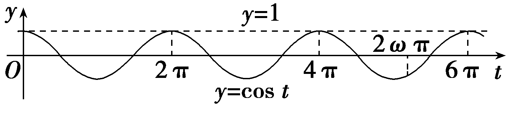
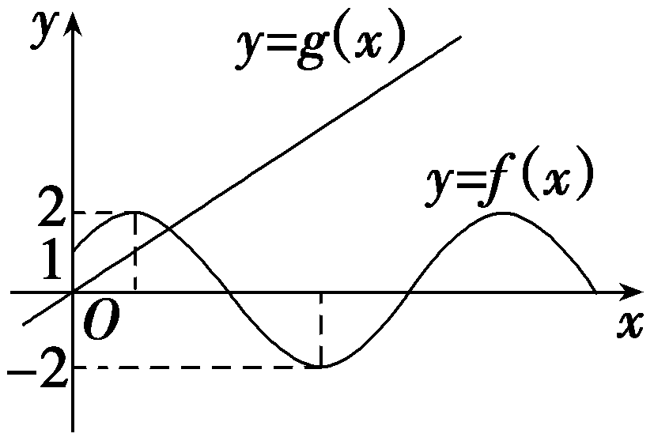
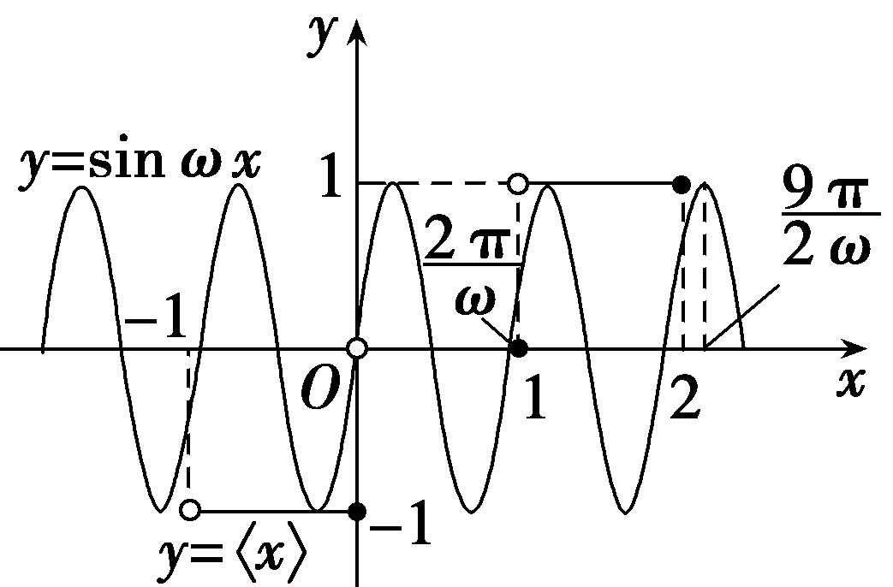
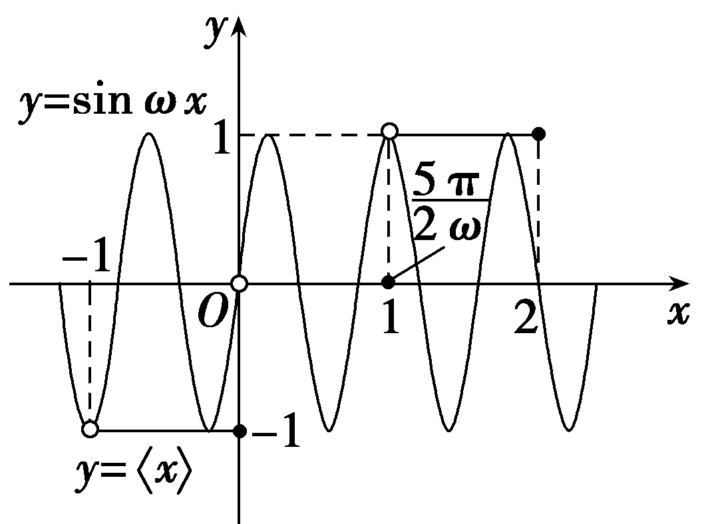
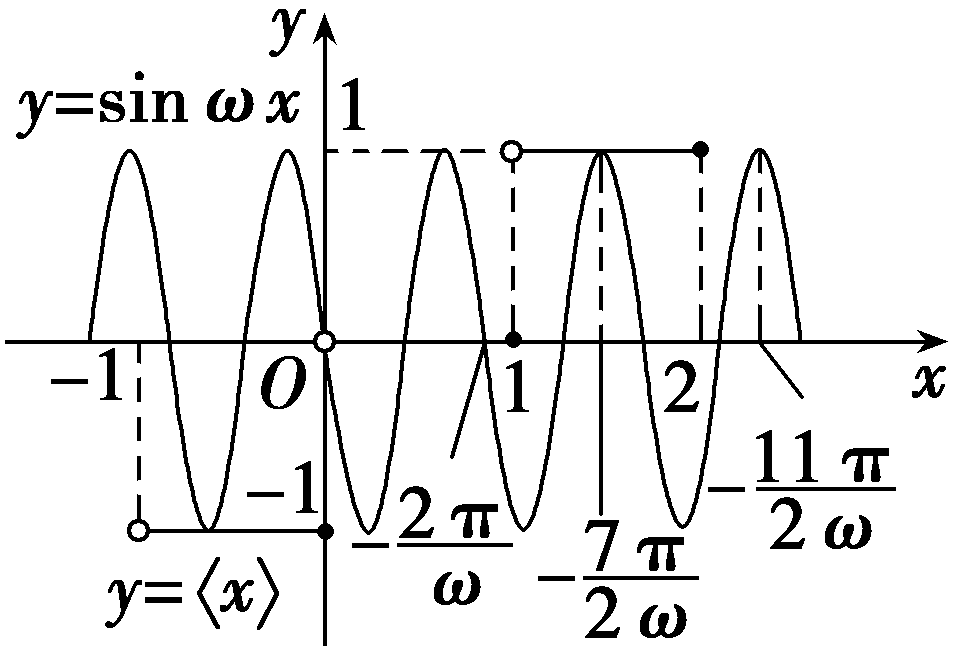

<strong>培优课</strong>7　<strong>三角函数中</strong><em>ω</em><strong>的求解</strong>

在三角函数的图象与性质中*ω*的求解是近年高考的一个热点内容，但因其求法复杂，涉及的知识点多，历来是复习中的重难点.

题型一　三角函数的周期*T*与*ω*的关系

(2024·北京卷)设函数*<text style="italic"><text style="italic">f*</text></text> $\left(x\right)$ ＝sin *<text style="italic">ω*x</text> $\left(\omega >0\right)$ .已知*<text style="italic"><text style="italic">f*</text></text> $\left(x_{1}\right)$ ＝－1，*<text style="italic"><text style="italic">f*</text></text> $\left(x_{2}\right)$ ＝1，且 $\left|x_{1}－x_{2}\right|$ 的最小值为 $\frac{\pi }{2}$ ，则*ω*＝(　　)

A.1	B.2

C.3	D.4

答案：**B**

解析：由题意可知：&lt;te<em>x</em>t style="italic"&gt;x&lt;/text&gt;1为<em>&lt;text style="italic"&gt;f</em>&lt;/text&gt; $\left(x\right)$ 的最小值点，&lt;te<em>x</em>t style="italic"&gt;x&lt;/text&gt;2为<em>&lt;text style="italic"&gt;f</em>&lt;/text&gt; $\left(x\right)$ 的最大值点，则 $\left|x_{1}－x_{2}\right|_{min}$ ＝ $\frac{T}{2}$ ＝ $\frac{\pi }{2}$ ，即<em>T</em>＝π，且<em>&lt;text style="italic"&gt;ω</em>&lt;/text&gt;＞0，所以ω＝ $\frac{2\pi }{T}$ ＝2.故选B.

解决此类问题的关键在于结合条件弄清周期*T*＝ $\frac{2\pi }{\omega }$ 与所给区间的关系，从而建立不等关系.

对点练1.已知函数<text st*y*le="italic">f</text> $\left(x\right)$ ＝3sin $\left(\omega x－\frac{\pi }{6}\right)$ (其中<text st*y*le="italic">*ω*</text>＞0)的图象与直线y＝3的两个相邻交点的距离等于2π，则ω的值为(　　)

A. $\frac{1}{2}$ 	B.2

C.1	D.3

答案：**C**

解析：由函数<text st*y*le="italic">f</text> $\left(x\right)$ ＝3sin $\left(\omega x－\frac{\pi }{6}\right)$ 的图象与直线*y*＝3的两个相邻交点的距离等于2π，又*<text style="italic">ω*</text>＞0，所以*T*＝2π＝ $\frac{2\pi }{\omega }$ ，可得*<text style="italic">ω*</text>＝1.故选C.

题型二　三角函数的单调性与*ω*的关系

(1)(2024·广东湛江一模)已知函数*f* $\left(x\right)$ ＝sin $\left(\omega x＋\frac{2\pi }{3}\right)\left(\omega >0\right)$ 在区间 $\left(\frac{\pi }{12}，\frac{\pi }{6}\right)$ 上单调递增，则实数*ω*的取值范围是(　　)

A. $\left[2，5\right]$ 	B. $\left[1，14\right]$

C. $\left[9，10\right]$ 	D. $\left[10，11\right]$

(2)已知函数<te<te<te<te<te<te*x*t style="italic">x</text>t st*y*le="italic">x</text>t style="italic">x</text>t style="italic">x</text>t style="italic">x</text>t style="italic">*<text style="italic"><text style="italic">f*</text></text></text>(x)＝sin(*<text style="italic">ω*x</text>＋*<text style="italic">φ*</text>)(ω＞0，｜φ｜≤ $\frac{\pi }{2}$ )，<te<te<te<te<te*x*t style="italic">x</text>t st*y*le="italic">x</text>t style="italic">x</text>t style="italic">x</text>t style="italic">x</text>＝－ $\frac{\pi }{4}$  为<te<te<te<te<te<te*x*t style="italic">x</text>t st*y*le="italic">x</text>t style="italic">x</text>t style="italic">x</text>t style="italic">x</text>t style="italic">*<text style="italic"><text style="italic">f*</text></text></text>(x) 的零点，x＝ $\frac{\pi }{4}$  为<te<te*x*t style="italic">x</text>t style="italic">y</text>＝<te<te<te<te*x*t style="italic">x</text>t style="italic">x</text>t style="italic">x</text>t style="italic">*<text style="italic"><text style="italic">f*</text></text></text>(x) 图象的对称轴，且f(x) 在( $\frac{\pi }{18}$ ， $\frac{5\pi }{36}$ ) 上单调，则<te<te<te<te<te*x*t style="italic">x</text>t st*y*le="italic">x</text>t style="italic">x</text>t style="italic">x</text>t style="italic">ω</text> 的最大值为(　　)

A.11	B.9

C.7	D.5

答案：(1)**D**　(2)**B**

解析：(1)当<em>x</em>∈ $\left(\frac{\pi }{12}，\frac{\pi }{6}\right)$ 时，<em>&lt;text style="italic"&gt;&lt;text style="italic"&gt;ω</em>&lt;/text&gt;&lt;/text&gt;<em>x</em>＋ $\frac{2\pi }{3}$ ∈ $\left(\frac{\pi }{12}\omega ＋\frac{2\pi }{3}，\frac{\pi }{6}\omega ＋\frac{2\pi }{3}\right)$ ，因为<em>f</em> $\left(x\right)$ 在 $\left(\frac{\pi }{12}，\frac{\pi }{6}\right)$ 上单调递增，所以 $\left\{\begin{matrix}\frac{\pi }{12}\omega ＋\frac{2\pi }{3}\geq －\frac{\pi }{2}+2k\pi ，\\\frac{\pi }{6}\omega ＋\frac{2\pi }{3}\leq \frac{\pi }{2}+2k\pi ，\end{matrix}\right.$ (<em>&lt;text style="italic"&gt;&lt;text style="italic"&gt;&lt;text style="italic"&gt;k</em>&lt;/text&gt;&lt;/text&gt;&lt;/text&gt;∈<strong>&lt;text style="bold"&gt;Z</strong>&lt;/text&gt;)，解得 $\left\{\begin{matrix}\omega \geq －14+24k，\\\omega \leq －1+12k，\end{matrix}\right.\left(k\in Z\right)$ ，又<em>&lt;text style="italic"&gt;&lt;text style="italic"&gt;ω</em>&lt;/text&gt;&lt;/text&gt;＞0，所以 $\left\{\begin{matrix}－14+24k\leq －1+12k，\\－1+12k>0，\end{matrix}\right.$ 解得 $\frac{1}{12}$ ＜<em>&lt;text style="italic"&gt;&lt;text style="italic"&gt;&lt;text style="italic"&gt;k</em>&lt;/text&gt;&lt;/text&gt;&lt;/text&gt;≤ $\frac{13}{12}$ ，又<em>&lt;text style="italic"&gt;&lt;text style="italic"&gt;&lt;text style="italic"&gt;k</em>&lt;/text&gt;&lt;/text&gt;&lt;/text&gt;∈<strong>&lt;text style="bold"&gt;Z</strong>&lt;/text&gt;，所以k＝1，所以10≤<em>&lt;text style="italic"&gt;&lt;text style="italic"&gt;ω</em>&lt;/text&gt;&lt;/text&gt;≤11，即ω的取值范围为 $\left[10，11\right]$ .故选D.

(2)因为&lt;te&lt;te&lt;te&lt;te&lt;te&lt;te<em>x</em>t style="italic"&gt;x&lt;/text&gt;t style="italic"&gt;x&lt;/text&gt;t style="italic"&gt;x&lt;/text&gt;t st<em>y</em>le="italic"&gt;x&lt;/text&gt;t style="italic"&gt;x&lt;/text&gt;t style="italic"&gt;x&lt;/text&gt;＝－ $\frac{\pi }{4}$  为函数&lt;te&lt;te&lt;te&lt;te&lt;te&lt;te<em>x</em>t style="italic"&gt;x&lt;/text&gt;t style="italic"&gt;x&lt;/text&gt;t style="italic"&gt;x&lt;/text&gt;t st<em>y</em>le="italic"&gt;x&lt;/text&gt;t style="italic"&gt;x&lt;/text&gt;t style="italic"&gt;<em>&lt;text style="italic"&gt;&lt;text style="italic"&gt;&lt;text style="italic"&gt;f</em>&lt;/text&gt;&lt;/text&gt;&lt;/text&gt;&lt;/text&gt;(<em>x</em>) 的零点，x＝ $\frac{\pi }{4}$  为&lt;te&lt;te&lt;te&lt;te<em>x</em>t style="italic"&gt;x&lt;/text&gt;t style="italic"&gt;x&lt;/text&gt;t style="italic"&gt;x&lt;/text&gt;t style="italic"&gt;y&lt;/text&gt;＝&lt;te&lt;te<em>x</em>t style="italic"&gt;x&lt;/text&gt;t style="italic"&gt;<em>&lt;text style="italic"&gt;&lt;text style="italic"&gt;&lt;text style="italic"&gt;f</em>&lt;/text&gt;&lt;/text&gt;&lt;/text&gt;&lt;/text&gt;(<em>x</em>) 图象的对称轴，所以 $\frac{\pi }{2}$ ＝ $\frac{kT}{2}$ ＋ $\frac{T}{4}$  (&lt;te&lt;te&lt;te<em>x</em>t style="italic"&gt;x&lt;/text&gt;t style="italic"&gt;x&lt;/text&gt;t style="italic"&gt;<em>&lt;text style="italic"&gt;&lt;text style="italic"&gt;&lt;text style="italic"&gt;k</em>&lt;/text&gt;&lt;/text&gt;&lt;/text&gt;&lt;/text&gt;∈<strong>&lt;text style="bold"&gt;Z</strong> &lt;/text&gt;，<em>&lt;text style="italic"&gt;&lt;text style="italic"&gt;T</em>&lt;/text&gt; &lt;/text&gt;为周期)，得T＝ $\frac{2\pi }{2k+1}$ (&lt;te&lt;te&lt;te<em>x</em>t style="italic"&gt;x&lt;/text&gt;t style="italic"&gt;x&lt;/text&gt;t style="italic"&gt;<em>&lt;text style="italic"&gt;&lt;text style="italic"&gt;&lt;text style="italic"&gt;k</em>&lt;/text&gt;&lt;/text&gt;&lt;/text&gt;&lt;/text&gt;∈<strong>Z</strong>).又&lt;te&lt;te&lt;te<em>x</em>t st<em>y</em>le="italic"&gt;x&lt;/text&gt;t style="italic"&gt;x&lt;/text&gt;t style="italic"&gt;<em>&lt;text style="italic"&gt;&lt;text style="italic"&gt;&lt;text style="italic"&gt;f</em>&lt;/text&gt;&lt;/text&gt;&lt;/text&gt;&lt;/text&gt;(<em>x</em>) 在( $\frac{\pi }{18}$ ， $\frac{5\pi }{36}$ )上单调，所以&lt;te&lt;te&lt;te<em>x</em>t style="italic"&gt;x&lt;/text&gt;t style="italic"&gt;x&lt;/text&gt;t style="italic"&gt;<em>T</em>&lt;/text&gt;≥ $\frac{\pi }{6}$ ，&lt;te&lt;te&lt;te<em>x</em>t style="italic"&gt;x&lt;/text&gt;t style="italic"&gt;x&lt;/text&gt;t style="italic"&gt;<em>&lt;text style="italic"&gt;&lt;text style="italic"&gt;&lt;text style="italic"&gt;k</em>&lt;/text&gt;&lt;/text&gt;&lt;/text&gt;&lt;/text&gt;≤ $\frac{11}{2}$ ，又当&lt;te&lt;te&lt;te<em>x</em>t style="italic"&gt;x&lt;/text&gt;t style="italic"&gt;x&lt;/text&gt;t style="italic"&gt;<em>&lt;text style="italic"&gt;&lt;text style="italic"&gt;&lt;text style="italic"&gt;k</em>&lt;/text&gt;&lt;/text&gt;&lt;/text&gt;&lt;/text&gt;＝5 时，<em>&lt;text style="italic"&gt;&lt;text style="italic"&gt;&lt;text style="italic"&gt;ω</em>&lt;/text&gt;&lt;/text&gt;&lt;/text&gt;＝11，<em>&lt;text style="italic"&gt;φ</em>&lt;/text&gt;＝－ $\frac{\pi }{4}$ ，&lt;te&lt;te&lt;te&lt;te&lt;te&lt;te<em>x</em>t style="italic"&gt;x&lt;/text&gt;t style="italic"&gt;x&lt;/text&gt;t style="italic"&gt;x&lt;/text&gt;t st<em>y</em>le="italic"&gt;x&lt;/text&gt;t style="italic"&gt;x&lt;/text&gt;t style="italic"&gt;<em>&lt;text style="italic"&gt;&lt;text style="italic"&gt;&lt;text style="italic"&gt;f</em>&lt;/text&gt;&lt;/text&gt;&lt;/text&gt;&lt;/text&gt;(<em>x</em>)在( $\frac{\pi }{18}$ ， $\frac{5\pi }{36}$ )上不单调；当&lt;te&lt;te&lt;te<em>x</em>t style="italic"&gt;x&lt;/text&gt;t style="italic"&gt;x&lt;/text&gt;t style="italic"&gt;<em>&lt;text style="italic"&gt;&lt;text style="italic"&gt;&lt;text style="italic"&gt;k</em>&lt;/text&gt;&lt;/text&gt;&lt;/text&gt;&lt;/text&gt;＝4 时，<em>&lt;text style="italic"&gt;&lt;text style="italic"&gt;&lt;text style="italic"&gt;ω</em>&lt;/text&gt;&lt;/text&gt;&lt;/text&gt;＝9，<em>&lt;text style="italic"&gt;φ</em>&lt;/text&gt;＝ $\frac{\pi }{4}$ ，&lt;te&lt;te&lt;te&lt;te&lt;te&lt;te<em>x</em>t style="italic"&gt;x&lt;/text&gt;t style="italic"&gt;x&lt;/text&gt;t style="italic"&gt;x&lt;/text&gt;t st<em>y</em>le="italic"&gt;x&lt;/text&gt;t style="italic"&gt;x&lt;/text&gt;t style="italic"&gt;<em>&lt;text style="italic"&gt;&lt;text style="italic"&gt;&lt;text style="italic"&gt;f</em>&lt;/text&gt;&lt;/text&gt;&lt;/text&gt;&lt;/text&gt;(<em>x</em>)在( $\frac{\pi }{18}$ ， $\frac{5\pi }{36}$ )上单调，满足题意，故&lt;te&lt;te<em>x</em>t style="italic"&gt;x&lt;/text&gt;t style="italic"&gt;<em>&lt;text style="italic"&gt;&lt;text style="italic"&gt;ω</em>&lt;/text&gt;&lt;/text&gt;&lt;/text&gt;＝9，即ω的最大值为9.故选B.

已知函数<em>y</em>＝<em>A</em>sin(<em>ωx</em>＋<em>φ</em>)(<em>A</em>＞0，<em>ω</em>＞0)在[<em>x</em>1，<em>x</em>2]上单调递增(或递减)，求<em>ω</em>的取值范围的方法：

&lt;te&lt;te&lt;te<em>x</em>t style="italic"&gt;x&lt;/text&gt;t style="italic"&gt;x&lt;/text&gt;t style="subscript"&gt;1&lt;/text&gt;.根据题意可知区间[<em>x</em>1，x&lt;text style="subscript"&gt;2&lt;/text&gt;]的长度不大于该函数最小正周期的一半，即x2－x1≤ $\frac{1}{2}$ <em>T</em>＝ $\frac{\pi }{\omega }$ ，求得0＜<em>ω</em>≤ $\frac{\pi }{x_{2}－x_{1}}$ .

2.以单调递增为例，利用 $\left[\omega x_{1}＋\varphi ，\omega x_{2}＋\varphi \right]$ ⊆ $\left[－\frac{\pi }{2}+2k\pi ，\frac{\pi }{2}+2k\pi \right]$ (<em>k</em>∈<strong>Z</strong>)，解得<em>ω</em>的取值范围.

对点练2.已知函数*f* $\left(x\right)$ ＝ $\sqrt{3}$ cos $\left(\omega x＋\frac{\pi }{3}\right)$ ＋cos(*<text style="italic">ω*x</text>－ $\frac{\pi }{6})\left(\omega >0\right)$ 在 $\left(\frac{\pi }{2}，\pi \right)$ 上单调递增，则实数*ω*的取值范围是(　　)

A. $\left[\frac{4}{3}，\frac{5}{3}\right]$ 	B. $\left[\frac{5}{6}，\frac{11}{6}\right]$

C. $\left[\frac{5}{3}，\frac{11}{6}\right]$ 	D. $\left[\frac{7}{6}，2\right]$

答案：**C**

解析：法一：由题得&lt;te<em>x</em>t style="italic"&gt;<em>f</em>&lt;/text&gt; $\left(x\right)$ ＝ $\sqrt{3}$ cos $\left(\omega x＋\frac{\pi }{3}\right)$ ＋cos(&lt;te<em>x</em>t style="italic"&gt;<em>&lt;text style="italic"&gt;&lt;text style="italic"&gt;&lt;text style="italic"&gt;&lt;text style="italic"&gt;ω</em>&lt;/text&gt;&lt;/text&gt;&lt;/text&gt;x&lt;/text&gt;&lt;/text&gt;－ $\frac{\pi }{6}$ )＝ $\sqrt{3}$ cos $\left(\omega x＋\frac{\pi }{3}\right)$ ＋sin $\left(\omega x＋\frac{\pi }{3}\right)$ ＝2cos $\left(\omega x＋\frac{\pi }{3}－\frac{\pi }{6}\right)$ ＝2cos $\left(\omega x＋\frac{\pi }{6}\right)$ ，令π＋2&lt;te<em>x</em>t style="italic"&gt;<em>&lt;text style="italic"&gt;&lt;text style="italic"&gt;&lt;text style="italic"&gt;&lt;text style="italic"&gt;&lt;text style="italic"&gt;&lt;text style="italic"&gt;&lt;text style="italic"&gt;&lt;text style="italic"&gt;&lt;text style="italic"&gt;k</em>&lt;/text&gt;&lt;/text&gt;&lt;/text&gt;&lt;/text&gt;&lt;/text&gt;&lt;/text&gt;&lt;/text&gt;&lt;/text&gt;&lt;/text&gt;&lt;/text&gt;π≤<em>&lt;text style="italic"&gt;&lt;text style="italic"&gt;&lt;text style="italic"&gt;&lt;text style="italic"&gt;&lt;text style="italic"&gt;ω</em>&lt;/text&gt;&lt;/text&gt;&lt;/text&gt;x&lt;/text&gt;&lt;/text&gt;＋ $\frac{\pi }{6}$ ≤2π＋2&lt;te<em>x</em>t style="italic"&gt;<em>&lt;text style="italic"&gt;&lt;text style="italic"&gt;&lt;text style="italic"&gt;&lt;text style="italic"&gt;&lt;text style="italic"&gt;&lt;text style="italic"&gt;&lt;text style="italic"&gt;&lt;text style="italic"&gt;&lt;text style="italic"&gt;k</em>&lt;/text&gt;&lt;/text&gt;&lt;/text&gt;&lt;/text&gt;&lt;/text&gt;&lt;/text&gt;&lt;/text&gt;&lt;/text&gt;&lt;/text&gt;&lt;/text&gt;π，k∈<strong>&lt;text style="bold"&gt;&lt;text style="bold"&gt;Z</strong>&lt;/text&gt;&lt;/text&gt;，因为<em>&lt;text style="italic"&gt;&lt;text style="italic"&gt;&lt;text style="italic"&gt;ω</em>&lt;/text&gt;&lt;/text&gt;&lt;/text&gt;＞0，所以 $\frac{\frac{5\pi }{6}+2k\pi }{\omega }$ ≤<em>x</em>≤ $\frac{\frac{11\pi }{6}+2k\pi }{\omega }$ ，&lt;te<em>x</em>t style="italic"&gt;<em>&lt;text style="italic"&gt;&lt;text style="italic"&gt;&lt;text style="italic"&gt;&lt;text style="italic"&gt;&lt;text style="italic"&gt;&lt;text style="italic"&gt;&lt;text style="italic"&gt;&lt;text style="italic"&gt;&lt;text style="italic"&gt;k</em>&lt;/text&gt;&lt;/text&gt;&lt;/text&gt;&lt;/text&gt;&lt;/text&gt;&lt;/text&gt;&lt;/text&gt;&lt;/text&gt;&lt;/text&gt;&lt;/text&gt;∈<strong>&lt;text style="bold"&gt;&lt;text style="bold"&gt;Z</strong>&lt;/text&gt;&lt;/text&gt;，因为<em>&lt;text style="italic"&gt;f</em>&lt;/text&gt; $\left(x\right)$ 在 $\left(\frac{\pi }{2}，\pi \right)$ 上单调递增，所以 $\frac{\frac{5\pi }{6}+2k\pi }{\omega }$ ≤ $\frac{\pi }{2}$ 且 $\frac{\frac{11\pi }{6}+2k\pi }{\omega }$ ≥π，得 $\frac{5}{3}$ ＋4&lt;te<em>x</em>t style="italic"&gt;<em>&lt;text style="italic"&gt;&lt;text style="italic"&gt;&lt;text style="italic"&gt;&lt;text style="italic"&gt;&lt;text style="italic"&gt;&lt;text style="italic"&gt;&lt;text style="italic"&gt;&lt;text style="italic"&gt;&lt;text style="italic"&gt;k</em>&lt;/text&gt;&lt;/text&gt;&lt;/text&gt;&lt;/text&gt;&lt;/text&gt;&lt;/text&gt;&lt;/text&gt;&lt;/text&gt;&lt;/text&gt;&lt;/text&gt;≤<em>&lt;text style="italic"&gt;&lt;text style="italic"&gt;&lt;text style="italic"&gt;ω</em>&lt;/text&gt;&lt;/text&gt;&lt;/text&gt;≤ $\frac{11}{6}$ ＋2&lt;te<em>x</em>t style="italic"&gt;<em>&lt;text style="italic"&gt;&lt;text style="italic"&gt;&lt;text style="italic"&gt;&lt;text style="italic"&gt;&lt;text style="italic"&gt;&lt;text style="italic"&gt;&lt;text style="italic"&gt;&lt;text style="italic"&gt;&lt;text style="italic"&gt;k</em>&lt;/text&gt;&lt;/text&gt;&lt;/text&gt;&lt;/text&gt;&lt;/text&gt;&lt;/text&gt;&lt;/text&gt;&lt;/text&gt;&lt;/text&gt;&lt;/text&gt;.由 $\frac{5}{3}$ ＋4&lt;te<em>x</em>t style="italic"&gt;<em>&lt;text style="italic"&gt;&lt;text style="italic"&gt;&lt;text style="italic"&gt;&lt;text style="italic"&gt;&lt;text style="italic"&gt;&lt;text style="italic"&gt;&lt;text style="italic"&gt;&lt;text style="italic"&gt;&lt;text style="italic"&gt;k</em>&lt;/text&gt;&lt;/text&gt;&lt;/text&gt;&lt;/text&gt;&lt;/text&gt;&lt;/text&gt;&lt;/text&gt;&lt;/text&gt;&lt;/text&gt;&lt;/text&gt;≤ $\frac{11}{6}$ ＋2&lt;te<em>x</em>t style="italic"&gt;<em>&lt;text style="italic"&gt;&lt;text style="italic"&gt;&lt;text style="italic"&gt;&lt;text style="italic"&gt;&lt;text style="italic"&gt;&lt;text style="italic"&gt;&lt;text style="italic"&gt;&lt;text style="italic"&gt;&lt;text style="italic"&gt;k</em>&lt;/text&gt;&lt;/text&gt;&lt;/text&gt;&lt;/text&gt;&lt;/text&gt;&lt;/text&gt;&lt;/text&gt;&lt;/text&gt;&lt;/text&gt;&lt;/text&gt;，得k≤ $\frac{1}{12}$ ，又&lt;te<em>x</em>t style="italic"&gt;<em>&lt;text style="italic"&gt;&lt;text style="italic"&gt;&lt;text style="italic"&gt;&lt;text style="italic"&gt;&lt;text style="italic"&gt;&lt;text style="italic"&gt;&lt;text style="italic"&gt;&lt;text style="italic"&gt;&lt;text style="italic"&gt;k</em>&lt;/text&gt;&lt;/text&gt;&lt;/text&gt;&lt;/text&gt;&lt;/text&gt;&lt;/text&gt;&lt;/text&gt;&lt;/text&gt;&lt;/text&gt;&lt;/text&gt;∈<strong>&lt;text style="bold"&gt;&lt;text style="bold"&gt;Z</strong>&lt;/text&gt;&lt;/text&gt;且<em>&lt;text style="italic"&gt;&lt;text style="italic"&gt;&lt;text style="italic"&gt;ω</em>&lt;/text&gt;&lt;/text&gt;&lt;/text&gt;＞0，所以k＝0， $\frac{5}{3}$ ≤&lt;te<em>x</em>t style="italic"&gt;<em>&lt;text style="italic"&gt;&lt;text style="italic"&gt;ω</em>&lt;/text&gt;&lt;/text&gt;&lt;/text&gt;≤ $\frac{11}{6}$ .故选C.

法二：由题得<te<te*x*t st*y*le="italic">x</text>t style="italic">*<text style="italic">f*</text></text> $\left(x\right)$ ＝ $\sqrt{3}$ cos $\left(\omega x＋\frac{\pi }{3}\right)$ ＋cos(<te<te*x*t st*y*le="italic">x</text>t style="italic">*<text style="italic"><text style="italic"><text style="italic"><text style="italic"><text style="italic">ω*</text></text></text>x</text></text></text>－ $\frac{\pi }{6}$ )＝ $\sqrt{3}$ cos $\left(\omega x＋\frac{\pi }{3}\right)$ ＋sin $\left(\omega x＋\frac{\pi }{3}\right)$ ＝2cos(<te<te*x*t st*y*le="italic">x</text>t style="italic">*<text style="italic"><text style="italic"><text style="italic"><text style="italic"><text style="italic">ω*</text></text></text>x</text></text></text>＋ $\frac{\pi }{3}$ － $\frac{\pi }{6}$ )＝2cos $\left(\omega x＋\frac{\pi }{6}\right)$ ，由 $\frac{\pi }{2}$ ＜<te*x*t st*y*le="italic">x</text>＜π，得 $\frac{\omega \pi }{2}$ ＋ $\frac{\pi }{6}$ ＜<te<te*x*t st*y*le="italic">x</text>t style="italic">*<text style="italic"><text style="italic"><text style="italic"><text style="italic"><text style="italic">ω*</text></text></text>x</text></text></text>＋ $\frac{\pi }{6}$ ＜<te*x*t st*y*le="italic">*<text style="italic"><text style="italic">ω*</text></text></text>π＋ $\frac{\pi }{6}$ ，设<te<te*x*t st*y*le="italic">x</text>t style="italic">*<text style="italic">f*</text></text> $\left(x\right)$ 的最小正周期为<te*x*t st*y*le="italic">T</text>，则由题意得π－ $\frac{\pi }{2}$ ≤ $\frac{T}{2}$ ＝ $\frac{\pi }{\omega }$ ，所以0＜<te*x*t st*y*le="italic">*<text style="italic"><text style="italic">ω*</text></text></text>≤2，从而 $\frac{\pi }{6}$ ＜ $\frac{\omega \pi }{2}$ ＋ $\frac{\pi }{6}$ ≤π＋ $\frac{\pi }{6}$ ，结合函数<te*x*t style="italic">y</text>＝cos *x*在 $\left[\pi ，2\pi \right]$ 上单调递增，<te<te*x*t st*y*le="italic">x</text>t style="italic">*<text style="italic">f*</text></text> $\left(x\right)$ 在 $\left(\frac{\pi }{2}，\pi \right)$ 上单调递增，得 $\frac{\omega \pi }{2}$ ＋ $\frac{\pi }{6}$ ≥π，且<te*x*t st*y*le="italic">*<text style="italic"><text style="italic">ω*</text></text></text>π＋ $\frac{\pi }{6}$ ≤2π，解得 $\frac{5}{3}$ ≤<te*x*t st*y*le="italic">*<text style="italic"><text style="italic">ω*</text></text></text>≤ $\frac{11}{6}$ .故选C.

题型三　三角函数的对称性与*ω*的关系

(1)(2022·全国甲卷)将函数<te<text st*y*le="italic">x</text>t style="italic">f</text>(x)＝sin(*<text style="italic"><text style="italic">ω*</text>x</text>＋ $\frac{\pi }{3}$ )(<text st*y*le="italic">*ω*</text>＞0)的图象向左平移 $\frac{\pi }{2}$ 个单位长度后得到曲线<text st*y*le="italic">*C*</text>，若C关于y轴对称，则*<text style="italic">ω*</text>的最小值是(　　)

A. $\frac{1}{6}$ 	B. $\frac{1}{4}$

C. $\frac{1}{3}$ 	D. $\frac{1}{2}$

(2)(2024·黑龙江哈尔滨三模)已知函数*f* $\left(x\right)$ ＝cos $\left(\omega x－\frac{\pi }{4}\right)$ (*<text style="italic">ω*</text>＞0)在区间 $\left[0，2\pi \right]$ 内恰有3条对称轴，则实数*<text style="italic">ω*</text>的取值范围是(　　)

A. $\left[\frac{7}{8}，\frac{15}{8}\right]$ 	B. $\left[\frac{5}{8}，\frac{9}{8}\right)$

C. $\left(\frac{5}{8}，\frac{13}{8}\right]$ 	D. $\left[\frac{9}{8}，\frac{13}{8}\right)$

答案：(1)**C**　(2)**D**

解析：(1)记曲线&lt;te&lt;te&lt;te&lt;te&lt;text st<em>y</em>le="italic"&gt;x&lt;/text&gt;t style="italic"&gt;x&lt;/text&gt;t style="italic"&gt;x&lt;/text&gt;t style="italic"&gt;x&lt;/text&gt;t style="italic"&gt;C&lt;/text&gt;的函数解析式为<em>&lt;text style="italic"&gt;&lt;text style="italic"&gt;g</em>&lt;/text&gt;&lt;/text&gt;(x)，则g(x)＝sin［<em>&lt;text style="italic"&gt;&lt;text style="italic"&gt;&lt;text style="italic"&gt;&lt;text style="italic"&gt;&lt;text style="italic"&gt;ω</em>&lt;/text&gt;&lt;/text&gt;&lt;/text&gt;&lt;/text&gt;&lt;/text&gt;(x＋ $\frac{\pi }{2}$ )＋ $\frac{\pi }{3}$ ］＝sin［&lt;te&lt;te&lt;text st<em>y</em>le="italic"&gt;x&lt;/text&gt;t style="italic"&gt;x&lt;/text&gt;t style="italic"&gt;<em>&lt;text style="italic"&gt;&lt;text style="italic"&gt;&lt;text style="italic"&gt;&lt;text style="italic"&gt;ω</em>&lt;/text&gt;&lt;/text&gt;&lt;/text&gt;&lt;/text&gt;&lt;/text&gt;&lt;te<em>x</em>t style="italic"&gt;x&lt;/text&gt;＋( $\frac{\pi }{2}$ &lt;te&lt;te&lt;text st<em>y</em>le="italic"&gt;x&lt;/text&gt;t style="italic"&gt;x&lt;/text&gt;t style="italic"&gt;<em>&lt;text style="italic"&gt;&lt;text style="italic"&gt;&lt;text style="italic"&gt;&lt;text style="italic"&gt;ω</em>&lt;/text&gt;&lt;/text&gt;&lt;/text&gt;&lt;/text&gt;&lt;/text&gt;＋ $\frac{\pi }{3}$ )］.因为函数&lt;te&lt;te&lt;te&lt;te&lt;text st<em>y</em>le="italic"&gt;x&lt;/text&gt;t style="italic"&gt;x&lt;/text&gt;t style="italic"&gt;x&lt;/text&gt;t style="italic"&gt;x&lt;/text&gt;t style="italic"&gt;<em>&lt;text style="italic"&gt;g</em>&lt;/text&gt;&lt;/text&gt;(x)的图象关于y轴对称，所以 $\frac{\pi }{2}$ &lt;te&lt;te&lt;text st<em>y</em>le="italic"&gt;x&lt;/text&gt;t style="italic"&gt;x&lt;/text&gt;t style="italic"&gt;<em>&lt;text style="italic"&gt;&lt;text style="italic"&gt;&lt;text style="italic"&gt;&lt;text style="italic"&gt;ω</em>&lt;/text&gt;&lt;/text&gt;&lt;/text&gt;&lt;/text&gt;&lt;/text&gt;＋ $\frac{\pi }{3}$ ＝<em>&lt;text style="italic"&gt;&lt;text style="italic"&gt;&lt;text style="italic"&gt;k</em>&lt;/text&gt;&lt;/text&gt;&lt;/text&gt;π＋ $\frac{\pi }{2}$ (<em>&lt;text style="italic"&gt;&lt;text style="italic"&gt;&lt;text style="italic"&gt;k</em>&lt;/text&gt;&lt;/text&gt;&lt;/text&gt;∈<strong>&lt;text style="bold"&gt;Z</strong>&lt;/text&gt;)，得&lt;te&lt;te&lt;text st<em>y</em>le="italic"&gt;x&lt;/text&gt;t style="italic"&gt;x&lt;/text&gt;t style="italic"&gt;<em>&lt;text style="italic"&gt;&lt;text style="italic"&gt;&lt;text style="italic"&gt;&lt;text style="italic"&gt;ω</em>&lt;/text&gt;&lt;/text&gt;&lt;/text&gt;&lt;/text&gt;&lt;/text&gt;＝2k＋ $\frac{1}{3}$ (<em>&lt;text style="italic"&gt;&lt;text style="italic"&gt;&lt;text style="italic"&gt;k</em>&lt;/text&gt;&lt;/text&gt;&lt;/text&gt;∈<strong>&lt;text style="bold"&gt;Z</strong>&lt;/text&gt;).因为&lt;te&lt;te&lt;text st<em>y</em>le="italic"&gt;x&lt;/text&gt;t style="italic"&gt;x&lt;/text&gt;t style="italic"&gt;<em>&lt;text style="italic"&gt;&lt;text style="italic"&gt;&lt;text style="italic"&gt;&lt;text style="italic"&gt;ω</em>&lt;/text&gt;&lt;/text&gt;&lt;/text&gt;&lt;/text&gt;&lt;/text&gt;＞0，所以ωmin＝ $\frac{1}{3}$ .故选&lt;te&lt;te&lt;te&lt;te&lt;text st<em>y</em>le="italic"&gt;x&lt;/text&gt;t style="italic"&gt;x&lt;/text&gt;t style="italic"&gt;x&lt;/text&gt;t style="italic"&gt;x&lt;/text&gt;t style="italic"&gt;C&lt;/text&gt;.

(2)因为0≤*x*≤2π，所以－ $\frac{\pi }{4}$ ≤*<text style="italic"><text style="italic"><text style="italic">ω*</text></text></text>*x*－ $\frac{\pi }{4}$ ≤2*<text style="italic"><text style="italic"><text style="italic">ω*</text></text></text>π－ $\frac{\pi }{4}$ ，又函数*f* $\left(x\right)$ ＝cos $\left(\omega x－\frac{\pi }{4}\right)$ (*<text style="italic"><text style="italic"><text style="italic">ω*</text></text></text>＞0)在区间 $\left[0，2\pi \right]$ 内恰有3条对称轴，所以2π≤2*<text style="italic"><text style="italic"><text style="italic">ω*</text></text></text>π－ $\frac{\pi }{4}$ ＜3π，解得 $\frac{9}{8}$ ≤*<text style="italic"><text style="italic"><text style="italic">ω*</text></text></text>＜ $\frac{13}{8}$ .故选D.

已知对称性求*ω*的方法

三角函数两条相邻对称轴或两个相邻对称中心之间的“水平间隔”为 $\frac{T}{2}$ ，相邻的对称轴和对称中心之间的“水平间隔”为 $\frac{T}{4}$ ，这就说明，我们可根据三角函数的对称性来研究其周期性，解决问题的关键在于运用整体代换的思想，建立关于*<text style="italic">ω*</text>的不等式组，进而可以研究ω的取值范围.

对点练3.若函数*y*＝ $\sqrt{3}$ cos *<text style="italic"><text style="italic">ω*x</text></text>－sin ωx $\left(\omega >0\right)$ 在区间 $\left(－\frac{\pi }{3}，0\right)$ 上恰有唯一对称轴，则实数*ω*的取值范围为(　　)

A. $\left[\frac{1}{2}，\frac{7}{2}\right)$ 	B. $\left(\frac{1}{3}，\frac{7}{6}\right]$

C. $\left(\frac{1}{3}，\frac{7}{3}\right]$ 	D. $\left(\frac{1}{2}，\frac{7}{2}\right]$

答案：**D**

解析：<te<text st*y*le="italic">x</text>t style="italic">y</text>＝ $\sqrt{3}$ cos <te<text st*y*le="italic">x</text>t style="italic">*<text style="italic"><text style="italic">ω*</text>x</text></text>－sin *ωx*＝2cos $\left(\omega x＋\frac{\pi }{6}\right)$ ，因为<text st*y*le="italic">x</text>∈ $\left(－\frac{\pi }{3}，0\right)$ ，<text st*y*le="italic">*ω*</text>＞0，所以<te*x*t style="italic">*<text style="italic">ωx*</text></text>＋ $\frac{\pi }{6}$ ∈ $\left(－\frac{\omega \pi }{3}＋\frac{\pi }{6}，\frac{\pi }{6}\right)$ .因为<te<text st*y*le="italic">x</text>t style="italic">y</text>＝2cos $\left(\omega x＋\frac{\pi }{6}\right)$ 区间 $\left(－\frac{\pi }{3}，0\right)$ 上恰有唯一对称轴，故－ $\frac{\omega \pi }{3}$ ＋ $\frac{\pi }{6}$ ∈ $\left[－\pi ，0\right)$ ，解得<text st*y*le="italic">*ω*</text>∈ $\left(\frac{1}{2}，\frac{7}{2}\right]$ .故选D.

题型四　三角函数的最值与*ω*的关系

(多选)已知函数<te<te*x*t style="italic">x</text>t style="italic">*<text style="italic"><text style="italic">f*</text></text></text>(x)＝*m*cos *<text style="italic"><text style="italic">ω*x</text></text>＋2 $\sqrt{3}$ sin *ω*<te*x*t style="italic">x</text>，若*<text style="italic"><text style="italic"><text style="italic">f*</text></text></text> $\left(\frac{\pi }{2}\right)$ ＝2，且<te<te*x*t style="italic">x</text>t style="italic">*<text style="italic"><text style="italic">f*</text></text></text>(x)≥f $\left(\frac{\pi }{4}\right)$ ，则*ω*的取值可能是(　　)

A. $\frac{8}{3}$ 	B. $\frac{16}{3}$

C. $\frac{40}{3}$ 	D. $\frac{32}{3}$

答案：**BC**

解析：因为&lt;te&lt;te&lt;te<em>x</em>t style="italic"&gt;x&lt;/text&gt;t style="italic"&gt;x&lt;/text&gt;t style="italic"&gt;<em>&lt;text style="italic"&gt;&lt;text style="italic"&gt;&lt;text style="italic"&gt;&lt;text style="italic"&gt;&lt;text style="italic"&gt;f</em>&lt;/text&gt;&lt;/text&gt;&lt;/text&gt;&lt;/text&gt;&lt;/text&gt;&lt;/text&gt;(x)≥f $\left(\frac{\pi }{4}\right)$ ，所以&lt;te&lt;te<em>x</em>t style="italic"&gt;x&lt;/text&gt;t style="italic"&gt;x&lt;/text&gt;＝ $\frac{\pi }{4}$ 时函数取得最小值，即直线&lt;te&lt;te<em>x</em>t style="italic"&gt;x&lt;/text&gt;t style="italic"&gt;x&lt;/text&gt;＝ $\frac{\pi }{4}$ 是函数&lt;te&lt;te&lt;te<em>x</em>t style="italic"&gt;x&lt;/text&gt;t style="italic"&gt;x&lt;/text&gt;t style="italic"&gt;<em>&lt;text style="italic"&gt;&lt;text style="italic"&gt;&lt;text style="italic"&gt;&lt;text style="italic"&gt;&lt;text style="italic"&gt;f</em>&lt;/text&gt;&lt;/text&gt;&lt;/text&gt;&lt;/text&gt;&lt;/text&gt;&lt;/text&gt; $\left(x\right)$ 的一条对称轴，又因为&lt;te&lt;te&lt;te<em>x</em>t style="italic"&gt;x&lt;/text&gt;t style="italic"&gt;x&lt;/text&gt;t style="italic"&gt;<em>&lt;text style="italic"&gt;&lt;text style="italic"&gt;&lt;text style="italic"&gt;&lt;text style="italic"&gt;&lt;text style="italic"&gt;f</em>&lt;/text&gt;&lt;/text&gt;&lt;/text&gt;&lt;/text&gt;&lt;/text&gt;&lt;/text&gt; $\left(\frac{\pi }{2}\right)$ ＝2，所以&lt;te&lt;te&lt;te<em>x</em>t style="italic"&gt;x&lt;/text&gt;t style="italic"&gt;x&lt;/text&gt;t style="italic"&gt;<em>&lt;text style="italic"&gt;&lt;text style="italic"&gt;&lt;text style="italic"&gt;&lt;text style="italic"&gt;&lt;text style="italic"&gt;f</em>&lt;/text&gt;&lt;/text&gt;&lt;/text&gt;&lt;/text&gt;&lt;/text&gt;&lt;/text&gt; $\left(0\right)$ ＝2，即&lt;te&lt;te&lt;te<em>x</em>t style="italic"&gt;x&lt;/text&gt;t style="italic"&gt;x&lt;/text&gt;t style="italic"&gt;<em>&lt;text style="italic"&gt;&lt;text style="italic"&gt;&lt;text style="italic"&gt;&lt;text style="italic"&gt;&lt;text style="italic"&gt;f</em>&lt;/text&gt;&lt;/text&gt;&lt;/text&gt;&lt;/text&gt;&lt;/text&gt;&lt;/text&gt; $\left(0\right)$ ＝<em>&lt;text style="italic"&gt;m</em>&lt;/text&gt;cos 0＋2 $\sqrt{3}$ sin 0＝2，所以<em>&lt;text style="italic"&gt;m</em>&lt;/text&gt;＝2，所以&lt;te&lt;te&lt;te<em>x</em>t style="italic"&gt;x&lt;/text&gt;t style="italic"&gt;x&lt;/text&gt;t style="italic"&gt;<em>&lt;text style="italic"&gt;&lt;text style="italic"&gt;&lt;text style="italic"&gt;&lt;text style="italic"&gt;&lt;text style="italic"&gt;f</em>&lt;/text&gt;&lt;/text&gt;&lt;/text&gt;&lt;/text&gt;&lt;/text&gt;&lt;/text&gt; $\left(x\right)$ ＝2cos <em>&lt;text style="italic"&gt;&lt;text style="italic"&gt;&lt;text style="italic"&gt;ω</em>&lt;/text&gt;&lt;/text&gt;&lt;/text&gt;&lt;te&lt;te<em>x</em>t style="italic"&gt;x&lt;/text&gt;t style="italic"&gt;x&lt;/text&gt;＋2 $\sqrt{3}$ sin <em>&lt;text style="italic"&gt;&lt;text style="italic"&gt;&lt;text style="italic"&gt;ω</em>&lt;/text&gt;&lt;/text&gt;&lt;/text&gt;&lt;te&lt;te<em>x</em>t style="italic"&gt;x&lt;/text&gt;t style="italic"&gt;x&lt;/text&gt;＝4 $\left(\frac{1}{2}cos\omega x＋\frac{\sqrt{3}}{2}sin\omega x\right)$ ＝4sin(<em>&lt;text style="italic"&gt;&lt;text style="italic"&gt;&lt;text style="italic"&gt;ω</em>&lt;/text&gt;&lt;/text&gt;&lt;/text&gt;&lt;te&lt;te<em>x</em>t style="italic"&gt;x&lt;/text&gt;t style="italic"&gt;x&lt;/text&gt;＋ $\frac{\pi }{6}$ )，所以 $\frac{\pi }{4}$ <em>&lt;text style="italic"&gt;&lt;text style="italic"&gt;&lt;text style="italic"&gt;ω</em>&lt;/text&gt;&lt;/text&gt;&lt;/text&gt;＋ $\frac{\pi }{6}$ ＝ $\frac{3\pi }{2}$ ＋2<em>&lt;text style="italic"&gt;&lt;text style="italic"&gt;&lt;text style="italic"&gt;&lt;text style="italic"&gt;&lt;text style="italic"&gt;k</em>&lt;/text&gt;&lt;/text&gt;&lt;/text&gt;&lt;/text&gt;&lt;/text&gt;π，k∈<strong>&lt;text style="bold"&gt;Z</strong>&lt;/text&gt;，解得<em>&lt;text style="italic"&gt;&lt;text style="italic"&gt;&lt;text style="italic"&gt;ω</em>&lt;/text&gt;&lt;/text&gt;&lt;/text&gt;＝ $\frac{16}{3}$ ＋8<em>&lt;text style="italic"&gt;&lt;text style="italic"&gt;&lt;text style="italic"&gt;&lt;text style="italic"&gt;&lt;text style="italic"&gt;k</em>&lt;/text&gt;&lt;/text&gt;&lt;/text&gt;&lt;/text&gt;&lt;/text&gt;，k∈<strong>&lt;text style="bold"&gt;Z</strong>&lt;/text&gt;，当k＝0时<em>&lt;text style="italic"&gt;&lt;text style="italic"&gt;&lt;text style="italic"&gt;ω</em>&lt;/text&gt;&lt;/text&gt;&lt;/text&gt;＝ $\frac{16}{3}$ ，当<em>&lt;text style="italic"&gt;&lt;text style="italic"&gt;&lt;text style="italic"&gt;&lt;text style="italic"&gt;&lt;text style="italic"&gt;k</em>&lt;/text&gt;&lt;/text&gt;&lt;/text&gt;&lt;/text&gt;&lt;/text&gt;＝1时<em>&lt;text style="italic"&gt;&lt;text style="italic"&gt;&lt;text style="italic"&gt;ω</em>&lt;/text&gt;&lt;/text&gt;&lt;/text&gt;＝ $\frac{40}{3}$ .故选BC.

利用三角函数的最值与周期或其图象的对称性之间的关系，可以列出关于*ω*的不等式(组)，进而求出*ω*的值或取值范围.

对点练4.(2024·广西桂林三模)已知函数<te*x*t style="italic">f</text>(x)＝cos *<text style="italic"><text style="italic"><text style="italic"><text style="italic">ω*</text>x</text></text></text>－2sin 2ωxsin ωx(ω＞0)在 $\left(0，2\pi \right)$ 上有最小值没有最大值，则实数*<text style="italic">ω*</text>的取值范围是(　　)

A.( $\frac{1}{4}$ ， $\frac{1}{2}$ ］	B.［ $\frac{1}{4}$ ， $\frac{1}{2}$ )

C.［ $\frac{1}{6}$ ， $\frac{1}{3}$ )	D.( $\frac{1}{6}$ ， $\frac{1}{3}$ ］

答案：**D**

解析：依题意，<te<te<te*x*t style="italic">x</text>t style="italic">x</text>t style="italic">*f*</text>(x)＝cos(2*<text style="italic"><text style="italic"><text style="italic"><text style="italic"><text style="italic"><text style="italic"><text style="italic"><text style="italic"><text style="italic"><text style="italic">ω*</text></text>x</text></text></text></text></text></text></text></text>－ωx)－2sin 2ωxsin ωx＝cos(2ωx＋ωx)＝cos 3ωx，当x∈(0，2π)时，3ωx∈(0，6ωπ)，若f(x)在 $\left(0，2\pi \right)$ 上有最小值没有最大值，则π＜6<te*x*t style="italic">*<text style="italic">ω*</text></text>π≤2π，所以 $\frac{1}{6}$ ＜<te*x*t style="italic">*<text style="italic">ω*</text></text>≤ $\frac{1}{3}$ .故选D.

题型五　三角函数的零点与*ω*的关系

(1)(2022·全国甲卷)设函数<te*x*t style="italic">f</text>(x)＝sin(*<text style="italic">ω*x</text>＋ $\frac{\pi }{3}$ )在区间(0，π)恰有三个极值点、两个零点，则*ω*的取值范围是(　　)

A. $\left[\frac{5}{3}，\frac{13}{6}\right)$ 	B. $\left[\frac{5}{3}，\frac{19}{6}\right)$

C. $\left(\frac{13}{6}，\frac{8}{3}\right]$ 	D. $\left(\frac{13}{6}，\frac{19}{6}\right]$

(2)(2023·新课标Ⅰ卷)已知函数<em>f</em>(<em>x</em>)＝cos <em>ωx</em>－1(<em>ω</em>＞0)在区间[0，2π]有且仅有 3 个零点，则<em>ω</em>的取值范围是<u>　　　　</u>.

答案：(1)**C**　(2)[2，3)

解析：(1)由题意可得<te<te<te*x*t style="italic">x</text>t style="italic">x</text>t style="italic">*<text style="italic"><text style="italic"><text style="italic"><text style="italic">ω*</text></text></text></text></text>＞0，故由x∈(0，π)，得*ωx*＋ $\frac{\pi }{3}$ ∈ $\left(\frac{\pi }{3}，\pi \omega ＋\frac{\pi }{3}\right)$ .根据函数<te<te*x*t style="italic">x</text>t style="italic">*f*</text>(*x*)在区间(0，π)恰有三个极值点，知 $\frac{5\pi }{2}$ ＜π<te<te<te*x*t style="italic">x</text>t style="italic">x</text>t style="italic">*<text style="italic"><text style="italic"><text style="italic"><text style="italic">ω*</text></text></text></text></text>＋ $\frac{\pi }{3}$ ≤ $\frac{7\pi }{2}$ ，得 $\frac{13}{6}$ ＜<te<te<te*x*t style="italic">x</text>t style="italic">x</text>t style="italic">*<text style="italic"><text style="italic"><text style="italic"><text style="italic">ω*</text></text></text></text></text>≤ $\frac{19}{6}$ .根据函数<te<te*x*t style="italic">x</text>t style="italic">*f*</text>(*x*)在区间(0，π)恰有两个零点，知2π＜π*<text style="italic"><text style="italic"><text style="italic"><text style="italic"><text style="italic">ω*</text></text></text></text></text>＋ $\frac{\pi }{3}$ ≤3π，得 $\frac{5}{3}$ ＜<te<te<te*x*t style="italic">x</text>t style="italic">x</text>t style="italic">*<text style="italic"><text style="italic"><text style="italic"><text style="italic">ω*</text></text></text></text></text>≤ $\frac{8}{3}$ .综上，实数<te<te<te*x*t style="italic">x</text>t style="italic">x</text>t style="italic">*<text style="italic"><text style="italic"><text style="italic"><text style="italic">ω*</text></text></text></text></text>的取值范围为 $\left(\frac{13}{6}，\frac{8}{3}\right]$ .故选C.

(2)因为 0≤*x*≤2π，所以0≤*ωx*≤2*ω*π，令*f*(*x*)＝cos *ωx*－1＝0，则cos *ωx*＝1有3个根，令*t*＝*ωx*，则cos *t*＝1有3个根，其中*t*∈[0，2*ω*π]，结合余弦函数*y*＝cos *t*的图象性质可得 4π≤2*ω*π＜6π，故2≤*ω*＜3.

已知零点个数求*ω*取值范围的方法

对于区间长度为定值的动区间，若区间上至少含有*k*个零点，需要确定含有*k*个零点的区间长度，一般和周期相关；若在区间上至多含有*k*个零点，需要确定包含*k*＋1个零点的区间长度的最小值.

对点练5.已知函数<te<te*x*t style="italic">x</text>t style="italic">*f*</text>(x)＝tan(*<text style="italic"><text style="italic">ω*</text>x</text>＋*<text style="italic">φ*</text>)(ω＞0，｜φ｜＜ $\frac{\pi }{2}$ )的图象经过点(0， $\sqrt{3}$ )，若函数<te<te*x*t style="italic">x</text>t style="italic">*f*</text>(x)在区间[0，π]上恰有2个零点，则实数*<text style="italic">ω*</text>的取值范围是(　　 )

A. $\left[\frac{2}{3}，\frac{5}{3}\right]$ 	B. $\left[\frac{2}{3}，\frac{5}{3}\right)$

C. $\left[\frac{5}{3}，\frac{8}{3}\right]$ 	D. $\left[\frac{5}{3}，\frac{8}{3}\right)$

答案：**D**

解析：由条件可知<te<te<te*x*t style="italic">x</text>t style="italic">x</text>t style="italic">*<text style="italic">f*</text></text>(0)＝tan *<text style="italic"><text style="italic">φ*</text></text>＝ $\sqrt{3}$ ，｜<te<te<te*x*t style="italic">x</text>t style="italic">x</text>t style="italic">*<text style="italic">φ*</text></text>｜＜ $\frac{\pi }{2}$ ，所以<te<te<te*x*t style="italic">x</text>t style="italic">x</text>t style="italic">*<text style="italic">φ*</text></text>＝ $\frac{\pi }{3}$ ，<te<te<te*x*t style="italic">x</text>t style="italic">x</text>t style="italic">*<text style="italic">f*</text></text>(x)＝tan $\left(\omega x＋\frac{\pi }{3}\right)$ .当<te<te*x*t style="italic">x</text>t style="italic">x</text>∈[0，π]时，*<text style="italic"><text style="italic">ω*</text>x</text>＋ $\frac{\pi }{3}$ ∈ $\left[\frac{\pi }{3}，\omega \pi ＋\frac{\pi }{3}\right]$ ，若函数<te<te<te*x*t style="italic">x</text>t style="italic">x</text>t style="italic">*<text style="italic">f*</text></text>(x)在区间[0，π]上恰有2个零点，则2π≤*<text style="italic">ω*</text>π＋ $\frac{\pi }{3}$ ＜3π，解得 $\frac{5}{3}$ ≤*<text style="italic">ω*</text>＜ $\frac{8}{3}$ .故选D.

对点练6.(2022·全国乙卷理)记函数&lt;te&lt;te<em>x</em>t style="italic"&gt;x&lt;/text&gt;t style="italic"&gt;<em>&lt;text style="italic"&gt;f</em>&lt;/text&gt;&lt;/text&gt; $\left(x\right)$ ＝cos(&lt;te&lt;te<em>x</em>t style="italic"&gt;x&lt;/text&gt;t style="italic"&gt;<em>&lt;text style="italic"&gt;ω</em>&lt;/text&gt;x&lt;/text&gt;＋<em>&lt;text style="italic"&gt;φ</em>&lt;/text&gt;)(ω＞0，0＜φ＜π)的最小正周期为<em>&lt;text style="italic"&gt;T</em>&lt;/text&gt;.若<em>&lt;text style="italic"&gt;&lt;text style="italic"&gt;f</em>&lt;/text&gt;&lt;/text&gt;(T)＝ $\frac{\sqrt{3}}{2}$ ，&lt;te<em>x</em>t style="italic"&gt;x&lt;/text&gt;＝ $\frac{\pi }{9}$ 为&lt;te&lt;te<em>x</em>t style="italic"&gt;x&lt;/text&gt;t style="italic"&gt;<em>&lt;text style="italic"&gt;f</em>&lt;/text&gt;&lt;/text&gt;(x)的零点，则<em>&lt;text style="italic"&gt;ω</em>&lt;/text&gt;的最小值为<u>　　　　　　　</u>.

答案：3

解析： 因为&lt;te<em>x</em>t style="italic"&gt;<em>&lt;text style="italic"&gt;&lt;text style="italic"&gt;f</em>&lt;/text&gt;&lt;/text&gt;&lt;/text&gt; $\left(x\right)$ ＝cos $\left(\omega x＋\varphi \right)$ (&lt;te<em>x</em>t style="italic"&gt;<em>&lt;text style="italic"&gt;&lt;text style="italic"&gt;&lt;text style="italic"&gt;&lt;text style="italic"&gt;ω</em>&lt;/text&gt;&lt;/text&gt;&lt;/text&gt;&lt;/text&gt;&lt;/text&gt;＞0，0＜<em>&lt;text style="italic"&gt;&lt;text style="italic"&gt;&lt;text style="italic"&gt;&lt;text style="italic"&gt;φ</em>&lt;/text&gt;&lt;/text&gt;&lt;/text&gt;&lt;/text&gt;＜π)，所以最小正周期<em>T</em>＝ $\frac{2\pi }{\omega }$ ，因为&lt;te<em>x</em>t style="italic"&gt;<em>&lt;text style="italic"&gt;&lt;text style="italic"&gt;f</em>&lt;/text&gt;&lt;/text&gt;&lt;/text&gt; $\left(T\right)$ ＝cos(&lt;te<em>x</em>t style="italic"&gt;<em>&lt;text style="italic"&gt;&lt;text style="italic"&gt;&lt;text style="italic"&gt;&lt;text style="italic"&gt;ω</em>&lt;/text&gt;&lt;/text&gt;&lt;/text&gt;&lt;/text&gt;&lt;/text&gt;· $\frac{2\pi }{\omega }$ ＋&lt;te<em>x</em>t style="italic"&gt;<em>&lt;text style="italic"&gt;&lt;text style="italic"&gt;&lt;text style="italic"&gt;φ</em>&lt;/text&gt;&lt;/text&gt;&lt;/text&gt;&lt;/text&gt;)＝cos $\left(2\pi ＋\varphi \right)$ ＝cos &lt;te<em>x</em>t style="italic"&gt;<em>&lt;text style="italic"&gt;&lt;text style="italic"&gt;&lt;text style="italic"&gt;φ</em>&lt;/text&gt;&lt;/text&gt;&lt;/text&gt;&lt;/text&gt;＝ $\frac{\sqrt{3}}{2}$ ，又0＜&lt;te<em>x</em>t style="italic"&gt;<em>&lt;text style="italic"&gt;&lt;text style="italic"&gt;&lt;text style="italic"&gt;φ</em>&lt;/text&gt;&lt;/text&gt;&lt;/text&gt;&lt;/text&gt;＜π，所以φ＝ $\frac{\pi }{6}$ ，即&lt;te<em>x</em>t style="italic"&gt;<em>&lt;text style="italic"&gt;&lt;text style="italic"&gt;f</em>&lt;/text&gt;&lt;/text&gt;&lt;/text&gt; $\left(x\right)$ ＝cos $\left(\omega x＋\frac{\pi }{6}\right)$ ，又<em>x</em>＝ $\frac{\pi }{9}$ 为&lt;te<em>x</em>t style="italic"&gt;<em>&lt;text style="italic"&gt;&lt;text style="italic"&gt;f</em>&lt;/text&gt;&lt;/text&gt;&lt;/text&gt; $\left(x\right)$ 的零点，所以 $\frac{\pi }{9}$ &lt;te<em>x</em>t style="italic"&gt;<em>&lt;text style="italic"&gt;&lt;text style="italic"&gt;&lt;text style="italic"&gt;&lt;text style="italic"&gt;ω</em>&lt;/text&gt;&lt;/text&gt;&lt;/text&gt;&lt;/text&gt;&lt;/text&gt;＋ $\frac{\pi }{6}$ ＝ $\frac{\pi }{2}$ ＋<em>&lt;text style="italic"&gt;&lt;text style="italic"&gt;&lt;text style="italic"&gt;&lt;text style="italic"&gt;k</em>&lt;/text&gt;&lt;/text&gt;&lt;/text&gt;&lt;/text&gt;π，k∈<strong>&lt;text style="bold"&gt;Z</strong>&lt;/text&gt;，解得&lt;te<em>x</em>t style="italic"&gt;<em>&lt;text style="italic"&gt;&lt;text style="italic"&gt;&lt;text style="italic"&gt;&lt;text style="italic"&gt;ω</em>&lt;/text&gt;&lt;/text&gt;&lt;/text&gt;&lt;/text&gt;&lt;/text&gt;＝3＋9k，k∈Z，因为ω＞0，所以当k＝0时，ωmin＝3.

<strong>课时测评</strong>37　<strong>三角函数中</strong><em>ω</em><strong>的求解</strong> $\frac{对应学生}{用书P383}$

(时间：45分钟　满分：75分)

(本栏目内容，在学生用书中以独立形式分册装订！)

(1—10题，每小题5分，共50分)

1.已知函数<te*x*t style="italic">*<text style="italic">f*</text></text>(x)＝sin $\left(\omega x＋\frac{\pi }{6}\right)$ ＋cos *<text style="italic">ω*</text>*x*(ω＞0)，*<text style="italic"><text style="italic">f*</text></text> $\left(x_{1}\right)$ ＝0，<te*x*t style="italic">*<text style="italic">f*</text></text> $\left(x_{2}\right)$ ＝ $\sqrt{3}$ ，且 $\left|x_{1}－x_{2}\right|$ 的最小值为π，则*<text style="italic">ω*</text>的值为(　　)

A. $\frac{2}{3}$ 	B. $\frac{1}{2}$

C.1	D.2

答案：**B**

解析：*f* $\left(x\right)$ ＝ $\frac{\sqrt{3}}{2}$ sin *<text style="italic"><text style="italic"><text style="italic">ω*x</text></text></text>＋ $\frac{3}{2}$ cos *<text style="italic"><text style="italic"><text style="italic">ω*x</text></text></text>＝ $\sqrt{3}$ sin(*<text style="italic"><text style="italic"><text style="italic">ω*x</text></text></text>＋ $\frac{\pi }{3}$ )， $\sqrt{3}$ 是函数的最大值，由题意可知， $\left|x_{1}－x_{2}\right|$ 的最小值是 $\frac{1}{4}$ 个周期，所以 $\frac{1}{4}$ × $\frac{2\pi }{\omega }$ ＝π，得*ω*＝ $\frac{1}{2}$ .故选B.

2.若函数*f* $\left(x\right)$ ＝sin $\left(\omega x＋\frac{\pi }{6}\right)\left(\omega >0\right)$ 在区间 $\left(0，\pi \right)$ 上单调递增，则*ω*的最大值是(　　)

A. $\frac{1}{6}$ 	B. $\frac{1}{4}$

C. $\frac{1}{3}$ 	D. $\frac{1}{2}$

答案：**C**

解析：令－ $\frac{\pi }{2}$ ＋2&lt;te&lt;te<em>x</em>t style="italic"&gt;x&lt;/text&gt;t style="italic"&gt;<em>&lt;text style="italic"&gt;&lt;text style="italic"&gt;&lt;text style="italic"&gt;k</em>&lt;/text&gt;&lt;/text&gt;&lt;/text&gt;&lt;/text&gt;π≤<em>&lt;text style="italic"&gt;&lt;text style="italic"&gt;&lt;text style="italic"&gt;ω</em>&lt;/text&gt;&lt;/text&gt;x&lt;/text&gt;＋ $\frac{\pi }{6}$ ≤ $\frac{\pi }{2}$ ＋2&lt;te&lt;te<em>x</em>t style="italic"&gt;x&lt;/text&gt;t style="italic"&gt;<em>&lt;text style="italic"&gt;&lt;text style="italic"&gt;&lt;text style="italic"&gt;k</em>&lt;/text&gt;&lt;/text&gt;&lt;/text&gt;&lt;/text&gt;π，k∈<strong>&lt;text style="bold"&gt;Z</strong>&lt;/text&gt;，结合<em>&lt;text style="italic"&gt;&lt;text style="italic"&gt;ω</em>&lt;/text&gt;&lt;/text&gt;＞0得－ $\frac{2\pi }{3\omega }$ ＋ $\frac{2k\pi }{\omega }$ ≤&lt;te<em>x</em>t style="italic"&gt;x&lt;/text&gt;≤ $\frac{\pi }{3\omega }$ ＋ $\frac{2k\pi }{\omega }$ ，&lt;te&lt;te<em>x</em>t style="italic"&gt;x&lt;/text&gt;t style="italic"&gt;<em>&lt;text style="italic"&gt;&lt;text style="italic"&gt;&lt;text style="italic"&gt;k</em>&lt;/text&gt;&lt;/text&gt;&lt;/text&gt;&lt;/text&gt;∈<strong>&lt;text style="bold"&gt;Z</strong>&lt;/text&gt;，取k＝0，得－ $\frac{2\pi }{3\omega }$ ≤&lt;te<em>x</em>t style="italic"&gt;x&lt;/text&gt;≤ $\frac{\pi }{3\omega }$ .因为函数<em>f</em> $\left(x\right)$ 在区间 $\left(0，\pi \right)$ 上单调递增，所以π≤ $\frac{\pi }{3\omega }$ ， 得0＜&lt;te&lt;te<em>x</em>t style="italic"&gt;x&lt;/text&gt;t style="italic"&gt;<em>&lt;text style="italic"&gt;ω</em>&lt;/text&gt;&lt;/text&gt;≤ $\frac{1}{3}$ ，故&lt;te&lt;te<em>x</em>t style="italic"&gt;x&lt;/text&gt;t style="italic"&gt;<em>&lt;text style="italic"&gt;ω</em>&lt;/text&gt;&lt;/text&gt;的最大值为 $\frac{1}{3}$ .故选C.

3.若函数*f* $\left(x\right)$ ＝sin $\left(\omega x＋\frac{\pi }{4}\right)\left(\omega >0\right)$ 在区间 $\left[0，\pi \right]$ 上恰有两条对称轴，则实数*ω*的取值范围为(　　)

A. $\left[\frac{7}{4}，\frac{13}{4}\right]$ 	B. $\left(\frac{9}{4}，\frac{11}{4}\right]$

C. $\left[\frac{7}{4}，\frac{11}{4}\right)$ 	D. $\left[\frac{5}{4}，\frac{9}{4}\right)$

答案：**D**

解析：&lt;te<em>x</em>t style="italic"&gt;<em>f</em>&lt;/text&gt; $\left(x\right)$ ＝sin $\left(\omega x＋\frac{\pi }{4}\right)$ (&lt;te<em>x</em>t style="italic"&gt;<em>&lt;text style="italic"&gt;&lt;text style="italic"&gt;ω</em>&lt;/text&gt;&lt;/text&gt;&lt;/text&gt;＞0)，令<em>ωx</em>＋ $\frac{\pi }{4}$ ＝&lt;te<em>x</em>t style="italic"&gt;<em>&lt;text style="italic"&gt;&lt;text style="italic"&gt;&lt;text style="italic"&gt;&lt;text style="italic"&gt;k</em>&lt;/text&gt;&lt;/text&gt;&lt;/text&gt;&lt;/text&gt;&lt;/text&gt;π＋ $\frac{\pi }{2}$ ，&lt;te<em>x</em>t style="italic"&gt;<em>&lt;text style="italic"&gt;&lt;text style="italic"&gt;&lt;text style="italic"&gt;&lt;text style="italic"&gt;k</em>&lt;/text&gt;&lt;/text&gt;&lt;/text&gt;&lt;/text&gt;&lt;/text&gt;∈<strong>&lt;text style="bold"&gt;Z</strong>&lt;/text&gt;，则x＝ $\frac{\left(1+4k\right)\pi }{4\omega }$ ，&lt;te<em>x</em>t style="italic"&gt;<em>&lt;text style="italic"&gt;&lt;text style="italic"&gt;&lt;text style="italic"&gt;&lt;text style="italic"&gt;k</em>&lt;/text&gt;&lt;/text&gt;&lt;/text&gt;&lt;/text&gt;&lt;/text&gt;∈<strong>&lt;text style="bold"&gt;Z</strong>&lt;/text&gt;，函数<em>&lt;text style="italic"&gt;f</em>&lt;/text&gt; $\left(x\right)$ 在区间[0，π]上有且仅有2条对称轴，即0≤ $\frac{\left(1+4k\right)\pi }{4\omega }$ ≤π有2个整数&lt;te<em>x</em>t style="italic"&gt;<em>&lt;text style="italic"&gt;&lt;text style="italic"&gt;&lt;text style="italic"&gt;&lt;text style="italic"&gt;k</em>&lt;/text&gt;&lt;/text&gt;&lt;/text&gt;&lt;/text&gt;&lt;/text&gt;符合，0≤ $\frac{\left(1+4k\right)\pi }{4\omega }$ ≤π，得0≤ $\frac{1+4k}{4\omega }$ ≤1⇒0≤1＋4&lt;te<em>x</em>t style="italic"&gt;<em>&lt;text style="italic"&gt;&lt;text style="italic"&gt;&lt;text style="italic"&gt;&lt;text style="italic"&gt;k</em>&lt;/text&gt;&lt;/text&gt;&lt;/text&gt;&lt;/text&gt;&lt;/text&gt;≤4<em>&lt;text style="italic"&gt;&lt;text style="italic"&gt;&lt;text style="italic"&gt;ω</em>&lt;/text&gt;&lt;/text&gt;&lt;/text&gt;，则k＝0，1，即1＋4×1≤4ω＜1＋4×2，所以 $\frac{5}{4}$ ≤&lt;te<em>x</em>t style="italic"&gt;<em>&lt;text style="italic"&gt;&lt;text style="italic"&gt;ω</em>&lt;/text&gt;&lt;/text&gt;&lt;/text&gt;＜ $\frac{9}{4}$ .故选D.

4.若函数<te*x*t style="italic">f</text>(x)＝sin $\left(\omega x－\frac{\pi }{6}\right)$ (*<text style="italic">ω*</text>＞0)在[0，π]上的值域为 $\left[－\frac{1}{2}，1\right]$ ，则*<text style="italic">ω*</text>的最小值为(　　)

A. $\frac{2}{3}$ 	B. $\frac{3}{4}$

C. $\frac{4}{3}$ 	D. $\frac{3}{2}$

答案：**A**

解析：因为0≤<te*x*t style="italic">x</text>≤π，且*<text style="italic"><text style="italic"><text style="italic"><text style="italic">ω*</text></text></text></text>＞0，所以－ $\frac{\pi }{6}$ ≤<te*x*t style="italic">*<text style="italic"><text style="italic"><text style="italic">ω*</text></text></text></text>*x*－ $\frac{\pi }{6}$ ≤<te*x*t style="italic">*<text style="italic"><text style="italic"><text style="italic">ω*</text></text></text></text>π－ $\frac{\pi }{6}$ ，而<te*x*t style="italic">*f*</text>(*x*)在[0，π]上的值域为 $\left[－\frac{1}{2}，1\right]$ ，<te*x*t style="italic">*f*</text>(0)＝sin $\left(－\frac{\pi }{6}\right)$ ＝－ $\frac{1}{2}$ ，所以 $\frac{\pi }{2}$ ≤<te*x*t style="italic">*<text style="italic"><text style="italic"><text style="italic">ω*</text></text></text></text>π－ $\frac{\pi }{6}$ ≤ $\frac{7\pi }{6}$ ，整理可得 $\frac{2}{3}$ ≤<te*x*t style="italic">*<text style="italic"><text style="italic"><text style="italic">ω*</text></text></text></text>≤ $\frac{4}{3}$ ，所以<te*x*t style="italic">*<text style="italic"><text style="italic"><text style="italic">ω*</text></text></text></text>的最小值为 $\frac{2}{3}$ .故选A.

5.已知函数&lt;te&lt;te&lt;te<em>x</em>t style="italic"&gt;x&lt;/text&gt;t style="italic"&gt;x&lt;/text&gt;t style="italic"&gt;<em>f</em>&lt;/text&gt;(x)＝sin2 $\frac{\omega x}{2}$ ＋ $\frac{1}{2}$ sin &lt;te&lt;te<em>x</em>t style="italic"&gt;x&lt;/text&gt;t style="italic"&gt;<em>ω</em>&lt;/text&gt;<em>x</em>－ $\frac{1}{2}$ (&lt;te&lt;te<em>x</em>t style="italic"&gt;x&lt;/text&gt;t style="italic"&gt;<em>ω</em>&lt;/text&gt;＞0)，<em>x</em>∈<strong>R</strong>.若<em>&lt;text style="italic"&gt;f</em>&lt;/text&gt;(x)在区间(π，2π)内没有零点，则实数ω的取值范围是(　　)

A.(0， $\frac{1}{8}$ ］	B.(0， $\frac{1}{4}$ ］∪［ $\frac{5}{8}$ ，1)

C.(0， $\frac{5}{8}$ ］	D.(0， $\frac{1}{8}$ ］∪［ $\frac{1}{4}$ ， $\frac{5}{8}$ ］

答案：**D**

解析：&lt;te&lt;te&lt;te<em>x</em>t style="italic"&gt;x&lt;/text&gt;t style="italic"&gt;x&lt;/text&gt;t style="italic"&gt;<em>f</em>&lt;/text&gt;(x)＝ $\frac{1}{2}$ (1－cos &lt;te<em>x</em>t style="italic"&gt;<em>&lt;text style="italic"&gt;&lt;text style="italic"&gt;&lt;text style="italic"&gt;&lt;text style="italic"&gt;ω</em>&lt;/text&gt;&lt;/text&gt;&lt;/text&gt;&lt;/text&gt;&lt;/text&gt;&lt;te<em>x</em>t style="italic"&gt;x&lt;/text&gt;)＋ $\frac{1}{2}$ sin &lt;te<em>x</em>t style="italic"&gt;<em>&lt;text style="italic"&gt;&lt;text style="italic"&gt;&lt;text style="italic"&gt;&lt;text style="italic"&gt;ω</em>&lt;/text&gt;&lt;/text&gt;&lt;/text&gt;&lt;/text&gt;&lt;/text&gt;&lt;te<em>x</em>t style="italic"&gt;x&lt;/text&gt;－ $\frac{1}{2}$ ＝ $\frac{\sqrt{2}}{2}$ sin(&lt;te<em>x</em>t style="italic"&gt;<em>&lt;text style="italic"&gt;&lt;text style="italic"&gt;&lt;text style="italic"&gt;&lt;text style="italic"&gt;ω</em>&lt;/text&gt;&lt;/text&gt;&lt;/text&gt;&lt;/text&gt;&lt;/text&gt;&lt;te<em>x</em>t style="italic"&gt;x&lt;/text&gt;－ $\frac{\pi }{4}$ )，因为&lt;te&lt;te<em>x</em>t style="italic"&gt;x&lt;/text&gt;t style="italic"&gt;x&lt;/text&gt;∈(π，2π)，所以<em>&lt;text style="italic"&gt;&lt;text style="italic"&gt;&lt;text style="italic"&gt;&lt;text style="italic"&gt;&lt;text style="italic"&gt;&lt;text style="italic"&gt;&lt;text style="italic"&gt;&lt;text style="italic"&gt;&lt;text style="italic"&gt;ω</em>&lt;/text&gt;&lt;/text&gt;&lt;/text&gt;&lt;/text&gt;&lt;/text&gt;x&lt;/text&gt;&lt;/text&gt;&lt;/text&gt;&lt;/text&gt;－ $\frac{\pi }{4}$ ∈(&lt;te<em>x</em>t style="italic"&gt;<em>&lt;text style="italic"&gt;&lt;text style="italic"&gt;&lt;text style="italic"&gt;&lt;text style="italic"&gt;ω</em>&lt;/text&gt;&lt;/text&gt;&lt;/text&gt;&lt;/text&gt;&lt;/text&gt;π－ $\frac{\pi }{4}$ ，2&lt;te<em>x</em>t style="italic"&gt;<em>&lt;text style="italic"&gt;&lt;text style="italic"&gt;&lt;text style="italic"&gt;&lt;text style="italic"&gt;ω</em>&lt;/text&gt;&lt;/text&gt;&lt;/text&gt;&lt;/text&gt;&lt;/text&gt;π－ $\frac{\pi }{4}$ ).因为&lt;te&lt;te&lt;te<em>x</em>t style="italic"&gt;x&lt;/text&gt;t style="italic"&gt;x&lt;/text&gt;t style="italic"&gt;<em>f</em>&lt;/text&gt;(x)在(π，2π)内无零点，故 $\frac{T}{2}$ ≥π，即0＜&lt;te<em>x</em>t style="italic"&gt;<em>&lt;text style="italic"&gt;&lt;text style="italic"&gt;&lt;text style="italic"&gt;&lt;text style="italic"&gt;ω</em>&lt;/text&gt;&lt;/text&gt;&lt;/text&gt;&lt;/text&gt;&lt;/text&gt;≤1，且 $\left\{\begin{matrix}k\pi \leq \omega \pi －\frac{\pi }{4}，\\2\omega \pi －\frac{\pi }{4}\leq k\pi ＋\pi \end{matrix}\right.$ (<em>&lt;text style="italic"&gt;&lt;text style="italic"&gt;&lt;text style="italic"&gt;&lt;text style="italic"&gt;k</em>&lt;/text&gt;&lt;/text&gt;&lt;/text&gt;&lt;/text&gt;∈<strong>Z</strong>).当k＝－1时，解得&lt;te<em>x</em>t style="italic"&gt;<em>&lt;text style="italic"&gt;&lt;text style="italic"&gt;&lt;text style="italic"&gt;&lt;text style="italic"&gt;ω</em>&lt;/text&gt;&lt;/text&gt;&lt;/text&gt;&lt;/text&gt;&lt;/text&gt;∈(0， $\frac{1}{8}$ ］；当<em>&lt;text style="italic"&gt;&lt;text style="italic"&gt;&lt;text style="italic"&gt;&lt;text style="italic"&gt;k</em>&lt;/text&gt;&lt;/text&gt;&lt;/text&gt;&lt;/text&gt;＝0时，解得&lt;te<em>x</em>t style="italic"&gt;<em>&lt;text style="italic"&gt;&lt;text style="italic"&gt;&lt;text style="italic"&gt;&lt;text style="italic"&gt;ω</em>&lt;/text&gt;&lt;/text&gt;&lt;/text&gt;&lt;/text&gt;&lt;/text&gt;∈［ $\frac{1}{4}$ ， $\frac{5}{8}$ ］，当<em>&lt;text style="italic"&gt;&lt;text style="italic"&gt;&lt;text style="italic"&gt;&lt;text style="italic"&gt;k</em>&lt;/text&gt;&lt;/text&gt;&lt;/text&gt;&lt;/text&gt;＜－1或k≥1时，不满足题意，故&lt;te<em>x</em>t style="italic"&gt;<em>&lt;text style="italic"&gt;&lt;text style="italic"&gt;&lt;text style="italic"&gt;&lt;text style="italic"&gt;ω</em>&lt;/text&gt;&lt;/text&gt;&lt;/text&gt;&lt;/text&gt;&lt;/text&gt;∈(0， $\frac{1}{8}$ ］∪［ $\frac{1}{4}$ ， $\frac{5}{8}$ ］.故选D.

6.(多选)已知函数<te<te*x*t style="italic">x</text>t style="italic">f</text>(x)＝sin *<text style="italic"><text style="italic">ω*</text>x</text>(ω＞0)在 $\left[－\frac{\pi }{6}，\frac{\pi }{4}\right]$ 上是单调函数，其图象的一条对称轴方程为<te*x*t style="italic">x</text>＝ $\frac{3\pi }{2}$ ，则<te*x*t style="italic">*ω*</text>的值可能是(　　)

A. $\frac{1}{3}$ 	B. $\frac{7}{3}$

C.1	D. $\frac{5}{3}$

答案：**ACD**

解析：由题意得 $\left\{\begin{matrix}\frac{3\pi }{2}\omega ＝k\pi ＋\frac{\pi }{2}，k\in Z，\\\frac{\pi }{4}\leq \frac{\pi }{2\omega }，\end{matrix}\right.$ 所以 $\left\{\begin{matrix}\omega ＝\frac{2}{3}k＋\frac{1}{3}，k\in Z，\\0<\omega \leq 2，\end{matrix}\right.$ 所以*ω*＝ $\frac{1}{3}$ ，1， $\frac{5}{3}$ .故选ACD.

7.(多选)已知函数<te*x*t style="italic">f</text>(x)＝ $\sqrt{3}$ sin *ωx*＋cos *<text style="italic">ωx*</text>(ω＞0)，下列说法中正确的是(　　)

A.若<te*x*t style="italic">ω</text>＝1，则*f*(x)在(0， $\frac{\pi }{2}$ )上是增函数

B.若*<text style="italic">f*</text> $\left(\frac{\pi }{6}＋x\right)$ ＝*<text style="italic">f*</text> $\left(\frac{\pi }{6}－x\right)$ ，则正整数*ω*的最小值为2

C.若<te*x*t st*y*le="italic">ω</text>＝2，则把函数y＝*f*(x)的图象向右平移 $\frac{\pi }{6}$ 个单位长度所得到的图象关于原点对称

D.若<te*x*t style="italic">f</text>(x)在(0，π)上有且仅有3个零点，则 $\frac{17}{6}$ ＜*ω*≤ $\frac{23}{6}$

答案：**BD**

解析：对于A，若&lt;te&lt;te&lt;te&lt;te&lt;te&lt;te&lt;te&lt;te&lt;te<em>x</em>t style="italic"&gt;x&lt;/text&gt;t st<em>y</em>le="italic"&gt;x&lt;/text&gt;t style="italic"&gt;x&lt;/text&gt;t style="italic"&gt;x&lt;/text&gt;t style="italic"&gt;x&lt;/text&gt;t style="italic"&gt;x&lt;/text&gt;t style="italic"&gt;x&lt;/text&gt;t style="italic"&gt;x&lt;/text&gt;t style="italic"&gt;<em>&lt;text style="italic"&gt;&lt;text style="italic"&gt;&lt;text style="italic"&gt;&lt;text style="italic"&gt;&lt;text style="italic"&gt;ω</em>&lt;/text&gt;&lt;/text&gt;&lt;/text&gt;&lt;/text&gt;&lt;/text&gt;&lt;/text&gt;＝1，则<em>&lt;text style="italic"&gt;&lt;text style="italic"&gt;&lt;text style="italic"&gt;&lt;text style="italic"&gt;f</em>&lt;/text&gt;&lt;/text&gt;&lt;/text&gt;&lt;/text&gt;(x)＝ $\sqrt{3}$ sin &lt;te&lt;te&lt;te&lt;te&lt;te&lt;te&lt;te&lt;te&lt;te<em>x</em>t style="italic"&gt;x&lt;/text&gt;t st<em>y</em>le="italic"&gt;x&lt;/text&gt;t style="italic"&gt;x&lt;/text&gt;t style="italic"&gt;x&lt;/text&gt;t style="italic"&gt;x&lt;/text&gt;t style="italic"&gt;x&lt;/text&gt;t style="italic"&gt;x&lt;/text&gt;t style="italic"&gt;x&lt;/text&gt;t style="italic"&gt;<em>&lt;text style="italic"&gt;&lt;text style="italic"&gt;&lt;text style="italic"&gt;&lt;text style="italic"&gt;&lt;text style="italic"&gt;ω</em>&lt;/text&gt;&lt;/text&gt;&lt;/text&gt;&lt;/text&gt;&lt;/text&gt;&lt;/text&gt;x＋cos <em>&lt;text style="italic"&gt;&lt;text style="italic"&gt;ωx</em>&lt;/text&gt;&lt;/text&gt;＝2sin $\left(\omega x＋\frac{\pi }{6}\right)$ ＝2sin $\left(x＋\frac{\pi }{6}\right)$ ，因为&lt;te&lt;te&lt;te&lt;te&lt;te&lt;te&lt;te&lt;te<em>x</em>t style="italic"&gt;x&lt;/text&gt;t st<em>y</em>le="italic"&gt;x&lt;/text&gt;t style="italic"&gt;x&lt;/text&gt;t style="italic"&gt;x&lt;/text&gt;t style="italic"&gt;x&lt;/text&gt;t style="italic"&gt;x&lt;/text&gt;t style="italic"&gt;x&lt;/text&gt;t style="italic"&gt;x&lt;/text&gt;∈ $\left(0，\frac{\pi }{2}\right)$ ，所以&lt;te&lt;te&lt;te&lt;te&lt;te&lt;te&lt;te&lt;te<em>x</em>t style="italic"&gt;x&lt;/text&gt;t st<em>y</em>le="italic"&gt;x&lt;/text&gt;t style="italic"&gt;x&lt;/text&gt;t style="italic"&gt;x&lt;/text&gt;t style="italic"&gt;x&lt;/text&gt;t style="italic"&gt;x&lt;/text&gt;t style="italic"&gt;x&lt;/text&gt;t style="italic"&gt;x&lt;/text&gt;＋ $\frac{\pi }{6}$ ∈ $\left(\frac{\pi }{6}，\frac{2\pi }{3}\right)$ ，不是单调区间，故A错误；对于B，若&lt;te&lt;te&lt;te&lt;te&lt;te&lt;te&lt;te&lt;te&lt;te<em>x</em>t style="italic"&gt;x&lt;/text&gt;t st<em>y</em>le="italic"&gt;x&lt;/text&gt;t style="italic"&gt;x&lt;/text&gt;t style="italic"&gt;x&lt;/text&gt;t style="italic"&gt;x&lt;/text&gt;t style="italic"&gt;x&lt;/text&gt;t style="italic"&gt;x&lt;/text&gt;t style="italic"&gt;x&lt;/text&gt;t style="italic"&gt;<em>&lt;text style="italic"&gt;&lt;text style="italic"&gt;&lt;text style="italic"&gt;f</em>&lt;/text&gt;&lt;/text&gt;&lt;/text&gt;&lt;/text&gt; $\left(\frac{\pi }{6}＋x\right)$ ＝&lt;te&lt;te&lt;te&lt;te&lt;te&lt;te&lt;te&lt;te&lt;te<em>x</em>t style="italic"&gt;x&lt;/text&gt;t st<em>y</em>le="italic"&gt;x&lt;/text&gt;t style="italic"&gt;x&lt;/text&gt;t style="italic"&gt;x&lt;/text&gt;t style="italic"&gt;x&lt;/text&gt;t style="italic"&gt;x&lt;/text&gt;t style="italic"&gt;x&lt;/text&gt;t style="italic"&gt;x&lt;/text&gt;t style="italic"&gt;<em>&lt;text style="italic"&gt;&lt;text style="italic"&gt;&lt;text style="italic"&gt;f</em>&lt;/text&gt;&lt;/text&gt;&lt;/text&gt;&lt;/text&gt; $\left(\frac{\pi }{6}－x\right)$ ，则&lt;te&lt;te&lt;te&lt;te&lt;te&lt;te&lt;te&lt;te&lt;te<em>x</em>t style="italic"&gt;x&lt;/text&gt;t st<em>y</em>le="italic"&gt;x&lt;/text&gt;t style="italic"&gt;x&lt;/text&gt;t style="italic"&gt;x&lt;/text&gt;t style="italic"&gt;x&lt;/text&gt;t style="italic"&gt;x&lt;/text&gt;t style="italic"&gt;x&lt;/text&gt;t style="italic"&gt;x&lt;/text&gt;t style="italic"&gt;<em>&lt;text style="italic"&gt;&lt;text style="italic"&gt;&lt;text style="italic"&gt;f</em>&lt;/text&gt;&lt;/text&gt;&lt;/text&gt;&lt;/text&gt;(x)的图象关于x＝ $\frac{\pi }{6}$ 对称，所以&lt;te&lt;te&lt;te&lt;te&lt;te&lt;te&lt;te&lt;te&lt;te<em>x</em>t style="italic"&gt;x&lt;/text&gt;t st<em>y</em>le="italic"&gt;x&lt;/text&gt;t style="italic"&gt;x&lt;/text&gt;t style="italic"&gt;x&lt;/text&gt;t style="italic"&gt;x&lt;/text&gt;t style="italic"&gt;x&lt;/text&gt;t style="italic"&gt;x&lt;/text&gt;t style="italic"&gt;x&lt;/text&gt;t style="italic"&gt;<em>&lt;text style="italic"&gt;&lt;text style="italic"&gt;&lt;text style="italic"&gt;&lt;text style="italic"&gt;&lt;text style="italic"&gt;ω</em>&lt;/text&gt;&lt;/text&gt;&lt;/text&gt;&lt;/text&gt;&lt;/text&gt;&lt;/text&gt;· $\frac{\pi }{6}$ ＋ $\frac{\pi }{6}$ ＝ $\frac{\pi }{2}$ ＋&lt;te&lt;te&lt;te&lt;te<em>x</em>t style="italic"&gt;x&lt;/text&gt;t st<em>y</em>le="italic"&gt;x&lt;/text&gt;t style="italic"&gt;x&lt;/text&gt;t style="italic"&gt;<em>&lt;text style="italic"&gt;&lt;text style="italic"&gt;&lt;text style="italic"&gt;k</em>&lt;/text&gt;&lt;/text&gt;&lt;/text&gt;&lt;/text&gt;π，k∈<strong>&lt;text style="bold"&gt;Z</strong>&lt;/text&gt;，解得&lt;te&lt;te&lt;te&lt;te&lt;te<em>x</em>t style="italic"&gt;x&lt;/text&gt;t style="italic"&gt;x&lt;/text&gt;t style="italic"&gt;x&lt;/text&gt;t style="italic"&gt;x&lt;/text&gt;t style="italic"&gt;<em>&lt;text style="italic"&gt;&lt;text style="italic"&gt;&lt;text style="italic"&gt;&lt;text style="italic"&gt;&lt;text style="italic"&gt;ω</em>&lt;/text&gt;&lt;/text&gt;&lt;/text&gt;&lt;/text&gt;&lt;/text&gt;&lt;/text&gt;＝6k＋2，k∈Z，当k＝0时，正整数ω取得最小值为2，故B正确；对于C，若ω＝2，则<em>&lt;text style="italic"&gt;&lt;text style="italic"&gt;&lt;text style="italic"&gt;&lt;text style="italic"&gt;f</em>&lt;/text&gt;&lt;/text&gt;&lt;/text&gt;&lt;/text&gt;(x)＝2sin(2x＋ $\frac{\pi }{6}$ )，其图象向右平移 $\frac{\pi }{6}$ 个单位长度后可得&lt;te&lt;te<em>x</em>t style="italic"&gt;x&lt;/text&gt;t style="italic"&gt;y&lt;/text&gt;＝2sin［2(&lt;te&lt;te&lt;te&lt;te&lt;te&lt;te<em>x</em>t style="italic"&gt;x&lt;/text&gt;t style="italic"&gt;x&lt;/text&gt;t style="italic"&gt;x&lt;/text&gt;t style="italic"&gt;x&lt;/text&gt;t style="italic"&gt;x&lt;/text&gt;t style="italic"&gt;x&lt;/text&gt;－ $\frac{\pi }{6}$ )＋ $\frac{\pi }{6}$ ］＝2sin $\left(2x－\frac{\pi }{6}\right)$ 的图象，该函数不是奇函数，则图象不关于原点对称，故C错误；对于D，当&lt;te&lt;te&lt;te&lt;te&lt;te&lt;te&lt;te&lt;te<em>x</em>t style="italic"&gt;x&lt;/text&gt;t st<em>y</em>le="italic"&gt;x&lt;/text&gt;t style="italic"&gt;x&lt;/text&gt;t style="italic"&gt;x&lt;/text&gt;t style="italic"&gt;x&lt;/text&gt;t style="italic"&gt;x&lt;/text&gt;t style="italic"&gt;x&lt;/text&gt;t style="italic"&gt;x&lt;/text&gt;∈(0，π)时，<em>&lt;text style="italic"&gt;&lt;text style="italic"&gt;&lt;text style="italic"&gt;&lt;text style="italic"&gt;&lt;text style="italic"&gt;&lt;text style="italic"&gt;ω</em>&lt;/text&gt;&lt;/text&gt;&lt;/text&gt;&lt;/text&gt;&lt;/text&gt;&lt;/text&gt;x＋ $\frac{\pi }{6}$ ∈ $\left(\frac{\pi }{6}，\omega \pi ＋\frac{\pi }{6}\right)$ ，所以3π＜&lt;te&lt;te&lt;te&lt;te&lt;te&lt;te&lt;te&lt;te&lt;te<em>x</em>t style="italic"&gt;x&lt;/text&gt;t st<em>y</em>le="italic"&gt;x&lt;/text&gt;t style="italic"&gt;x&lt;/text&gt;t style="italic"&gt;x&lt;/text&gt;t style="italic"&gt;x&lt;/text&gt;t style="italic"&gt;x&lt;/text&gt;t style="italic"&gt;x&lt;/text&gt;t style="italic"&gt;x&lt;/text&gt;t style="italic"&gt;<em>&lt;text style="italic"&gt;&lt;text style="italic"&gt;&lt;text style="italic"&gt;&lt;text style="italic"&gt;&lt;text style="italic"&gt;ω</em>&lt;/text&gt;&lt;/text&gt;&lt;/text&gt;&lt;/text&gt;&lt;/text&gt;&lt;/text&gt;π＋ $\frac{\pi }{6}$ ≤4π，解得 $\frac{17}{6}$ ＜&lt;te&lt;te&lt;te&lt;te&lt;te&lt;te&lt;te&lt;te&lt;te<em>x</em>t style="italic"&gt;x&lt;/text&gt;t st<em>y</em>le="italic"&gt;x&lt;/text&gt;t style="italic"&gt;x&lt;/text&gt;t style="italic"&gt;x&lt;/text&gt;t style="italic"&gt;x&lt;/text&gt;t style="italic"&gt;x&lt;/text&gt;t style="italic"&gt;x&lt;/text&gt;t style="italic"&gt;x&lt;/text&gt;t style="italic"&gt;<em>&lt;text style="italic"&gt;&lt;text style="italic"&gt;&lt;text style="italic"&gt;&lt;text style="italic"&gt;&lt;text style="italic"&gt;ω</em>&lt;/text&gt;&lt;/text&gt;&lt;/text&gt;&lt;/text&gt;&lt;/text&gt;&lt;/text&gt;≤ $\frac{23}{6}$ ，故D正确.故选BD.

8.已知函数<em>f</em> $\left(x\right)$ ＝sin $\left(\omega x－\frac{\pi }{4}\right)$ (<em>&lt;text style="italic"&gt;ω</em>&lt;/text&gt;＞0)在区间 $\left(0，\pi \right)$ 上有且仅有2个不同的零点，则实数<em>&lt;text style="italic"&gt;ω</em>&lt;/text&gt;的取值范围为<u>　　　　</u>.

答案： $\left(\frac{5}{4}，\frac{9}{4}\right]$

解析：当*x*∈ $\left(0，\pi \right)$ 时，*<text style="italic">ω*</text>*x*－ $\frac{\pi }{4}$ ∈ $\left(－\frac{\pi }{4}，\omega \pi －\frac{\pi }{4}\right)$ ，函数有且仅有2个不同的零点，则π＜*<text style="italic">ω*</text>π－ $\frac{\pi }{4}$ ≤2π，解得*<text style="italic">ω*</text>∈ $\left(\frac{5}{4}，\frac{9}{4}\right]$ .

9.若函数&lt;te<em>x</em>t style="italic"&gt;f&lt;/text&gt; $\left(x\right)$ ＝sin &lt;te<em>x</em>t style="italic"&gt;<em>ω</em>x&lt;/text&gt;，x∈ $\left[－\frac{\pi }{3}，\frac{\pi }{3}\right]$ ，且 $\left|f\left(x\right)\right|$ ≤ $\left|f\left(\frac{\pi }{3}\right)\right|$ ，则实数<em>ω</em>的取值范围是<u>　　　　　　　</u>.

答案： $\left\{\omega \left|－\frac{3}{2}＜\omega ＜\frac{3}{2}\right.\right\}$ ∪ $\left\{\omega \left|\omega ＝\frac{3}{2}+2k，k\in Z\right.\right\}$

解析：若 $\left|f\left(\frac{\pi }{3}\right)\right|$ ＝1，则 $\frac{\omega \pi }{3}$ ＝ $\frac{\pi }{2}$ ＋*<text style="italic">k*</text>π，所以*<text style="italic"><text style="italic">ω*</text></text>＝ $\frac{3}{2}$ ＋3*<text style="italic">k*</text> $\left(k\in Z\right)$ ；若 $\left|f\left(\frac{\pi }{3}\right)\right|$ ＜1，则 $\frac{\pi }{3}$ ＜ $\left|\frac{\pi }{2\omega }\right|$ ⇒ $\left|\omega \right|$ ＜ $\frac{3}{2}$ ⇒－ $\frac{3}{2}$ ＜*<text style="italic"><text style="italic">ω*</text></text>＜ $\frac{3}{2}$ ，所以实数*<text style="italic"><text style="italic">ω*</text></text>的取值范围为 $\left\{\omega \left|－\frac{3}{2}＜\omega ＜\frac{3}{2}\right.\right\}$ ∪ $\left\{\omega \left|\omega ＝\frac{3}{2}+2k，k\in Z\right.\right\}$ .

10.(2025·安徽宿州模拟)已知函数&lt;te&lt;te<em>x</em>t style="italic"&gt;x&lt;/text&gt;t style="italic"&gt;y&lt;/text&gt;＝sin(<em>&lt;text style="italic"&gt;&lt;text style="italic"&gt;ω</em>&lt;/text&gt;x&lt;/text&gt;＋<em>&lt;text style="italic"&gt;φ</em>&lt;/text&gt;)(ω＞0，φ∈(0，2π))的一条对称轴为直线x＝－ $\frac{\pi }{6}$ ，且&lt;te<em>x</em>t style="italic"&gt;f&lt;/text&gt;(<em>x</em>)在 $\left(\pi ，\frac{4\pi }{3}\right)$ 上单调，则&lt;te&lt;te<em>x</em>t style="italic"&gt;x&lt;/text&gt;t style="italic"&gt;<em>ω</em>&lt;/text&gt;的最大值为<u>　　　　</u>.

答案： $\frac{8}{3}$

解析：函数&lt;te&lt;te<em>x</em>t style="italic"&gt;x&lt;/text&gt;t style="italic"&gt;y&lt;/text&gt;＝sin(<em>&lt;text style="italic"&gt;&lt;text style="italic"&gt;&lt;text style="italic"&gt;ω</em>&lt;/text&gt;&lt;/text&gt;x&lt;/text&gt;＋<em>φ</em>)的对称轴可表示为x＝ $\frac{k\pi }{\omega }$ － $\frac{\pi }{6}\left(k\in Z\right)$ ，由&lt;te<em>x</em>t style="italic"&gt;f&lt;/text&gt;(<em>x</em>)在 $\left(\pi ，\frac{4\pi }{3}\right)$ 上单调，可得∃<em>&lt;text style="italic"&gt;&lt;text style="italic"&gt;&lt;text style="italic"&gt;k</em>&lt;/text&gt;&lt;/text&gt;&lt;/text&gt;&lt;text style="subscript"&gt;&lt;text style="subscript"&gt;&lt;text style="subscript"&gt;0&lt;/text&gt;&lt;/text&gt;&lt;/text&gt;∈<strong>Z</strong>，使得 $\left\{\begin{matrix}\frac{k_{0}\pi }{\omega }－\frac{\pi }{6}\leq \pi ，\\\frac{\left(k_{0}+1\right)\pi }{\omega }－\frac{\pi }{6}\geq \frac{4\pi }{3}，\end{matrix}\right.$ 解得 $\frac{6}{7}$ <em>&lt;text style="italic"&gt;&lt;text style="italic"&gt;&lt;text style="italic"&gt;k</em>&lt;/text&gt;&lt;/text&gt;&lt;/text&gt;&lt;text style="subscript"&gt;&lt;text style="subscript"&gt;&lt;text style="subscript"&gt;0&lt;/text&gt;&lt;/text&gt;&lt;/text&gt;≤<em>&lt;text style="italic"&gt;&lt;text style="italic"&gt;ω</em>&lt;/text&gt;&lt;/text&gt;≤ $\frac{2}{3}\left(k_{0}+1\right)$ ，又因为<em>&lt;text style="italic"&gt;&lt;text style="italic"&gt;ω</em>&lt;/text&gt;&lt;/text&gt;＞&lt;text style="subscript"&gt;&lt;text style="subscript"&gt;&lt;text style="subscript"&gt;0&lt;/text&gt;&lt;/text&gt;&lt;/text&gt;，所以<em>&lt;text style="italic"&gt;&lt;text style="italic"&gt;&lt;text style="italic"&gt;k</em>&lt;/text&gt;&lt;/text&gt;&lt;/text&gt;0＝0，1，2，3，所以当k0＝3时，ω可取最大值为 $\frac{8}{3}$ .

(11—13题，每小题5分，共15分)

11.已知定义在<strong>R</strong>上的奇函数<em>&lt;text style="italic"&gt;&lt;text style="italic"&gt;&lt;text style="italic"&gt;f</em>&lt;/text&gt;&lt;/text&gt;&lt;/text&gt; $\left(x\right)$ ＝2sin $\left(\omega x＋\varphi \right)$ (<em>&lt;text style="italic"&gt;ω</em>&lt;/text&gt;＞0，0＜<em>φ</em>＜2π)满足<em>&lt;text style="italic"&gt;&lt;text style="italic"&gt;&lt;text style="italic"&gt;f</em>&lt;/text&gt;&lt;/text&gt;&lt;/text&gt; $\left(\frac{\pi }{4}＋x\right)$ ＝<em>&lt;text style="italic"&gt;&lt;text style="italic"&gt;&lt;text style="italic"&gt;f</em>&lt;/text&gt;&lt;/text&gt;&lt;/text&gt; $\left(\frac{\pi }{4}－x\right)$ ，若当<em>&lt;text style="italic"&gt;ω</em>&lt;/text&gt;取最小值时，<em>&lt;text style="italic"&gt;&lt;text style="italic"&gt;&lt;text style="italic"&gt;f</em>&lt;/text&gt;&lt;/text&gt;&lt;/text&gt; $\left(x\right)$ 在区间 $\left[－m，m\right]$ 上是单调函数，则<em>m</em>的最大值为(　　)

A.π	B. $\frac{\pi }{2}$

C. $\frac{\pi }{4}$ 	D. $\frac{\pi }{6}$

答案：**C**

解析：因为&lt;te&lt;te&lt;te&lt;te&lt;te&lt;te&lt;te&lt;te<em>x</em>t style="italic"&gt;x&lt;/text&gt;t style="italic"&gt;x&lt;/text&gt;t style="italic"&gt;x&lt;/text&gt;t style="italic"&gt;x&lt;/text&gt;t style="italic"&gt;x&lt;/text&gt;t style="italic"&gt;x&lt;/text&gt;t style="italic"&gt;x&lt;/text&gt;t style="italic"&gt;<em>&lt;text style="italic"&gt;&lt;text style="italic"&gt;&lt;text style="italic"&gt;&lt;text style="italic"&gt;&lt;text style="italic"&gt;f</em>&lt;/text&gt;&lt;/text&gt;&lt;/text&gt;&lt;/text&gt;&lt;/text&gt;&lt;/text&gt;(x)＝sin(<em>&lt;text style="italic"&gt;&lt;text style="italic"&gt;&lt;text style="italic"&gt;&lt;text style="italic"&gt;&lt;text style="italic"&gt;ω</em>&lt;/text&gt;&lt;/text&gt;&lt;/text&gt;x&lt;/text&gt;&lt;/text&gt;＋<em>&lt;text style="italic"&gt;&lt;text style="italic"&gt;φ</em>&lt;/text&gt;&lt;/text&gt;)为奇函数，且0＜φ＜2π，所以φ＝π，f(x)＝－sin ωx.由f( $\frac{\pi }{4}$ ＋&lt;te&lt;te&lt;te&lt;te&lt;te&lt;te&lt;te<em>x</em>t style="italic"&gt;x&lt;/text&gt;t style="italic"&gt;x&lt;/text&gt;t style="italic"&gt;x&lt;/text&gt;t style="italic"&gt;x&lt;/text&gt;t style="italic"&gt;x&lt;/text&gt;t style="italic"&gt;x&lt;/text&gt;t style="italic"&gt;x&lt;/text&gt;)＝<em>&lt;text style="italic"&gt;&lt;text style="italic"&gt;&lt;text style="italic"&gt;&lt;text style="italic"&gt;&lt;text style="italic"&gt;&lt;text style="italic"&gt;f</em>&lt;/text&gt;&lt;/text&gt;&lt;/text&gt;&lt;/text&gt;&lt;/text&gt;&lt;/text&gt;( $\frac{\pi }{4}$ －&lt;te&lt;te&lt;te&lt;te&lt;te&lt;te&lt;te<em>x</em>t style="italic"&gt;x&lt;/text&gt;t style="italic"&gt;x&lt;/text&gt;t style="italic"&gt;x&lt;/text&gt;t style="italic"&gt;x&lt;/text&gt;t style="italic"&gt;x&lt;/text&gt;t style="italic"&gt;x&lt;/text&gt;t style="italic"&gt;x&lt;/text&gt;)可知<em>&lt;text style="italic"&gt;&lt;text style="italic"&gt;&lt;text style="italic"&gt;&lt;text style="italic"&gt;&lt;text style="italic"&gt;&lt;text style="italic"&gt;f</em>&lt;/text&gt;&lt;/text&gt;&lt;/text&gt;&lt;/text&gt;&lt;/text&gt;&lt;/text&gt;(x)关于x＝ $\frac{\pi }{4}$ 对称，所以 $\frac{\pi \omega }{4}$ ＝ $\frac{\pi }{2}$ ＋&lt;te&lt;te<em>x</em>t style="italic"&gt;x&lt;/text&gt;t style="italic"&gt;<em>&lt;text style="italic"&gt;&lt;text style="italic"&gt;&lt;text style="italic"&gt;&lt;text style="italic"&gt;&lt;text style="italic"&gt;&lt;text style="italic"&gt;&lt;text style="italic"&gt;k</em>&lt;/text&gt;&lt;/text&gt;&lt;/text&gt;&lt;/text&gt;&lt;/text&gt;&lt;/text&gt;&lt;/text&gt;&lt;/text&gt;π，k∈<strong>&lt;text style="bold"&gt;&lt;text style="bold"&gt;Z</strong>&lt;/text&gt;&lt;/text&gt;，所以<em>&lt;text style="italic"&gt;&lt;text style="italic"&gt;&lt;text style="italic"&gt;ω</em>&lt;/text&gt;&lt;/text&gt;&lt;/text&gt;＝2＋4k，k∈Z.因为ω＞0，所以ω的最小值为2.当ω＝2时，由－ $\frac{\pi }{2}$ ＋2&lt;te&lt;te<em>x</em>t style="italic"&gt;x&lt;/text&gt;t style="italic"&gt;<em>&lt;text style="italic"&gt;&lt;text style="italic"&gt;&lt;text style="italic"&gt;&lt;text style="italic"&gt;&lt;text style="italic"&gt;&lt;text style="italic"&gt;&lt;text style="italic"&gt;k</em>&lt;/text&gt;&lt;/text&gt;&lt;/text&gt;&lt;/text&gt;&lt;/text&gt;&lt;/text&gt;&lt;/text&gt;&lt;/text&gt;π≤2&lt;te&lt;te&lt;te&lt;te&lt;te<em>x</em>t style="italic"&gt;x&lt;/text&gt;t style="italic"&gt;x&lt;/text&gt;t style="italic"&gt;x&lt;/text&gt;t style="italic"&gt;x&lt;/text&gt;t style="italic"&gt;x&lt;/text&gt;≤ $\frac{\pi }{2}$ ＋2&lt;te&lt;te<em>x</em>t style="italic"&gt;x&lt;/text&gt;t style="italic"&gt;<em>&lt;text style="italic"&gt;&lt;text style="italic"&gt;&lt;text style="italic"&gt;&lt;text style="italic"&gt;&lt;text style="italic"&gt;&lt;text style="italic"&gt;&lt;text style="italic"&gt;k</em>&lt;/text&gt;&lt;/text&gt;&lt;/text&gt;&lt;/text&gt;&lt;/text&gt;&lt;/text&gt;&lt;/text&gt;&lt;/text&gt;π得－ $\frac{\pi }{4}$ ＋&lt;te&lt;te<em>x</em>t style="italic"&gt;x&lt;/text&gt;t style="italic"&gt;<em>&lt;text style="italic"&gt;&lt;text style="italic"&gt;&lt;text style="italic"&gt;&lt;text style="italic"&gt;&lt;text style="italic"&gt;&lt;text style="italic"&gt;&lt;text style="italic"&gt;k</em>&lt;/text&gt;&lt;/text&gt;&lt;/text&gt;&lt;/text&gt;&lt;/text&gt;&lt;/text&gt;&lt;/text&gt;&lt;/text&gt;π≤&lt;te&lt;te&lt;te&lt;te&lt;te<em>x</em>t style="italic"&gt;x&lt;/text&gt;t style="italic"&gt;x&lt;/text&gt;t style="italic"&gt;x&lt;/text&gt;t style="italic"&gt;x&lt;/text&gt;t style="italic"&gt;x&lt;/text&gt;≤ $\frac{\pi }{4}$ ＋&lt;te&lt;te<em>x</em>t style="italic"&gt;x&lt;/text&gt;t style="italic"&gt;<em>&lt;text style="italic"&gt;&lt;text style="italic"&gt;&lt;text style="italic"&gt;&lt;text style="italic"&gt;&lt;text style="italic"&gt;&lt;text style="italic"&gt;&lt;text style="italic"&gt;k</em>&lt;/text&gt;&lt;/text&gt;&lt;/text&gt;&lt;/text&gt;&lt;/text&gt;&lt;/text&gt;&lt;/text&gt;&lt;/text&gt;π，k∈<strong>&lt;text style="bold"&gt;&lt;text style="bold"&gt;Z</strong>&lt;/text&gt;&lt;/text&gt;，所以，此时&lt;te&lt;te&lt;te&lt;te&lt;te&lt;te<em>x</em>t style="italic"&gt;x&lt;/text&gt;t style="italic"&gt;x&lt;/text&gt;t style="italic"&gt;x&lt;/text&gt;t style="italic"&gt;x&lt;/text&gt;t style="italic"&gt;x&lt;/text&gt;t style="italic"&gt;<em>&lt;text style="italic"&gt;&lt;text style="italic"&gt;&lt;text style="italic"&gt;&lt;text style="italic"&gt;&lt;text style="italic"&gt;f</em>&lt;/text&gt;&lt;/text&gt;&lt;/text&gt;&lt;/text&gt;&lt;/text&gt;&lt;/text&gt; $\left(x\right)$ 在区间 $\left[－\frac{\pi }{4}，\frac{\pi }{4}\right]$ 上单调，又因为&lt;te&lt;te&lt;te&lt;te&lt;te&lt;te&lt;te&lt;te<em>x</em>t style="italic"&gt;x&lt;/text&gt;t style="italic"&gt;x&lt;/text&gt;t style="italic"&gt;x&lt;/text&gt;t style="italic"&gt;x&lt;/text&gt;t style="italic"&gt;x&lt;/text&gt;t style="italic"&gt;x&lt;/text&gt;t style="italic"&gt;x&lt;/text&gt;t style="italic"&gt;<em>&lt;text style="italic"&gt;&lt;text style="italic"&gt;&lt;text style="italic"&gt;&lt;text style="italic"&gt;&lt;text style="italic"&gt;f</em>&lt;/text&gt;&lt;/text&gt;&lt;/text&gt;&lt;/text&gt;&lt;/text&gt;&lt;/text&gt; $\left(x\right)$ 在区间 $\left[－m，m\right]$ 上是单调函数，所以0＜<em>&lt;text style="italic"&gt;m</em>&lt;/text&gt;≤ $\frac{\pi }{4}$ ，所以<em>&lt;text style="italic"&gt;m</em>&lt;/text&gt;的最大值为 $\frac{\pi }{4}$ .故选C.

12.(2024·湖北武汉模拟)若函数*f* $\left(x\right)$ ＝3cos(*ωx*＋*<text style="italic">φ*</text>) $\left(\omega <0,-\frac{\pi }{2}＜\varphi ＜\frac{\pi }{2}\right)$ 的最小正周期为π，在区间 $\left(－\frac{\pi }{6}，\frac{\pi }{6}\right)$ 上单调递减，且在区间 $\left(0，\frac{\pi }{6}\right)$ 上存在零点，则实数*<text style="italic">φ*</text>的取值范围是(　　)

A. $\left(\frac{\pi }{6}，\frac{\pi }{2}\right)$ 	B. $\left(－\frac{\pi }{2},-\frac{\pi }{3}\right]$

C. $\left[\frac{\pi }{3}，\frac{\pi }{2}\right)$ 	D. $\left(0，\frac{\pi }{3}\right]$

答案：**B**

解析：由函数&lt;te&lt;te&lt;te&lt;te&lt;te&lt;te&lt;te&lt;te&lt;te&lt;te<em>x</em>t style="italic"&gt;x&lt;/text&gt;t style="italic"&gt;x&lt;/text&gt;t style="italic"&gt;x&lt;/text&gt;t style="italic"&gt;x&lt;/text&gt;t style="italic"&gt;x&lt;/text&gt;t style="italic"&gt;x&lt;/text&gt;t style="italic"&gt;x&lt;/text&gt;t style="italic"&gt;x&lt;/text&gt;t style="italic"&gt;x&lt;/text&gt;t style="italic"&gt;<em>&lt;text style="italic"&gt;&lt;text style="italic"&gt;f</em>&lt;/text&gt;&lt;/text&gt;&lt;/text&gt;(x)的最小正周期为π，得 $\frac{2\pi }{\left|\omega \right|}$ ＝π，而&lt;te&lt;te&lt;te&lt;te&lt;te&lt;te&lt;te&lt;te&lt;te<em>x</em>t style="italic"&gt;x&lt;/text&gt;t style="italic"&gt;x&lt;/text&gt;t style="italic"&gt;x&lt;/text&gt;t style="italic"&gt;x&lt;/text&gt;t style="italic"&gt;x&lt;/text&gt;t style="italic"&gt;x&lt;/text&gt;t style="italic"&gt;x&lt;/text&gt;t style="italic"&gt;x&lt;/text&gt;t style="italic"&gt;<em>ω</em>&lt;/text&gt;＜0，解得ω＝－2，则&lt;te<em>x</em>t style="italic"&gt;<em>&lt;text style="italic"&gt;&lt;text style="italic"&gt;f</em>&lt;/text&gt;&lt;/text&gt;&lt;/text&gt;(x)＝3cos(－2x＋<em>&lt;text style="italic"&gt;&lt;text style="italic"&gt;&lt;text style="italic"&gt;&lt;text style="italic"&gt;&lt;text style="italic"&gt;&lt;text style="italic"&gt;&lt;text style="italic"&gt;&lt;text style="italic"&gt;&lt;text style="italic"&gt;&lt;text style="italic"&gt;&lt;text style="italic"&gt;&lt;text style="italic"&gt;&lt;text style="italic"&gt;&lt;text style="italic"&gt;φ</em>&lt;/text&gt;&lt;/text&gt;&lt;/text&gt;&lt;/text&gt;&lt;/text&gt;&lt;/text&gt;&lt;/text&gt;&lt;/text&gt;&lt;/text&gt;&lt;/text&gt;&lt;/text&gt;&lt;/text&gt;&lt;/text&gt;&lt;/text&gt;)＝3cos(2x－φ)，由2<em>&lt;text style="italic"&gt;&lt;text style="italic"&gt;&lt;text style="italic"&gt;&lt;text style="italic"&gt;&lt;text style="italic"&gt;&lt;text style="italic"&gt;&lt;text style="italic"&gt;&lt;text style="italic"&gt;&lt;text style="italic"&gt;&lt;text style="italic"&gt;&lt;text style="italic"&gt;k</em>&lt;/text&gt;&lt;/text&gt;&lt;/text&gt;&lt;/text&gt;&lt;/text&gt;&lt;/text&gt;&lt;/text&gt;&lt;/text&gt;&lt;/text&gt;&lt;/text&gt;&lt;/text&gt;π≤2x－φ≤2kπ＋π，k∈<strong>&lt;text style="bold"&gt;&lt;text style="bold"&gt;&lt;text style="bold"&gt;&lt;text style="bold"&gt;&lt;text style="bold"&gt;&lt;text style="bold"&gt;&lt;text style="bold"&gt;Z</strong>&lt;/text&gt;&lt;/text&gt;&lt;/text&gt;&lt;/text&gt;&lt;/text&gt;&lt;/text&gt;&lt;/text&gt;，得2kπ＋φ≤2x≤2kπ＋π＋φ，k∈Z，又f(x)在(－ $\frac{\pi }{6}$ ， $\frac{\pi }{6}$ )上单调递减，因此2&lt;te&lt;te&lt;te&lt;te&lt;te&lt;te<em>x</em>t style="italic"&gt;x&lt;/text&gt;t style="italic"&gt;x&lt;/text&gt;t style="italic"&gt;x&lt;/text&gt;t style="italic"&gt;x&lt;/text&gt;t style="italic"&gt;x&lt;/text&gt;t style="italic"&gt;<em>&lt;text style="italic"&gt;&lt;text style="italic"&gt;&lt;text style="italic"&gt;&lt;text style="italic"&gt;&lt;text style="italic"&gt;&lt;text style="italic"&gt;&lt;text style="italic"&gt;&lt;text style="italic"&gt;&lt;text style="italic"&gt;&lt;text style="italic"&gt;k</em>&lt;/text&gt;&lt;/text&gt;&lt;/text&gt;&lt;/text&gt;&lt;/text&gt;&lt;/text&gt;&lt;/text&gt;&lt;/text&gt;&lt;/text&gt;&lt;/text&gt;&lt;/text&gt;π＋&lt;te<em>x</em>t style="italic"&gt;<em>&lt;text style="italic"&gt;&lt;text style="italic"&gt;&lt;text style="italic"&gt;&lt;text style="italic"&gt;&lt;text style="italic"&gt;&lt;text style="italic"&gt;&lt;text style="italic"&gt;&lt;text style="italic"&gt;&lt;text style="italic"&gt;&lt;text style="italic"&gt;&lt;text style="italic"&gt;&lt;text style="italic"&gt;&lt;text style="italic"&gt;φ</em>&lt;/text&gt;&lt;/text&gt;&lt;/text&gt;&lt;/text&gt;&lt;/text&gt;&lt;/text&gt;&lt;/text&gt;&lt;/text&gt;&lt;/text&gt;&lt;/text&gt;&lt;/text&gt;&lt;/text&gt;&lt;/text&gt;&lt;/text&gt;≤－ $\frac{\pi }{3}$ ，且 $\frac{\pi }{3}$ ≤2&lt;te&lt;te&lt;te&lt;te&lt;te&lt;te<em>x</em>t style="italic"&gt;x&lt;/text&gt;t style="italic"&gt;x&lt;/text&gt;t style="italic"&gt;x&lt;/text&gt;t style="italic"&gt;x&lt;/text&gt;t style="italic"&gt;x&lt;/text&gt;t style="italic"&gt;<em>&lt;text style="italic"&gt;&lt;text style="italic"&gt;&lt;text style="italic"&gt;&lt;text style="italic"&gt;&lt;text style="italic"&gt;&lt;text style="italic"&gt;&lt;text style="italic"&gt;&lt;text style="italic"&gt;&lt;text style="italic"&gt;&lt;text style="italic"&gt;k</em>&lt;/text&gt;&lt;/text&gt;&lt;/text&gt;&lt;/text&gt;&lt;/text&gt;&lt;/text&gt;&lt;/text&gt;&lt;/text&gt;&lt;/text&gt;&lt;/text&gt;&lt;/text&gt;π＋π＋&lt;te<em>x</em>t style="italic"&gt;<em>&lt;text style="italic"&gt;&lt;text style="italic"&gt;&lt;text style="italic"&gt;&lt;text style="italic"&gt;&lt;text style="italic"&gt;&lt;text style="italic"&gt;&lt;text style="italic"&gt;&lt;text style="italic"&gt;&lt;text style="italic"&gt;&lt;text style="italic"&gt;&lt;text style="italic"&gt;&lt;text style="italic"&gt;&lt;text style="italic"&gt;φ</em>&lt;/text&gt;&lt;/text&gt;&lt;/text&gt;&lt;/text&gt;&lt;/text&gt;&lt;/text&gt;&lt;/text&gt;&lt;/text&gt;&lt;/text&gt;&lt;/text&gt;&lt;/text&gt;&lt;/text&gt;&lt;/text&gt;&lt;/text&gt;，k∈<strong>&lt;text style="bold"&gt;&lt;text style="bold"&gt;&lt;text style="bold"&gt;&lt;text style="bold"&gt;&lt;text style="bold"&gt;&lt;text style="bold"&gt;&lt;text style="bold"&gt;Z</strong>&lt;/text&gt;&lt;/text&gt;&lt;/text&gt;&lt;/text&gt;&lt;/text&gt;&lt;/text&gt;&lt;/text&gt;，解得－ $\frac{2\pi }{3}$ －2&lt;te&lt;te&lt;te&lt;te&lt;te&lt;te<em>x</em>t style="italic"&gt;x&lt;/text&gt;t style="italic"&gt;x&lt;/text&gt;t style="italic"&gt;x&lt;/text&gt;t style="italic"&gt;x&lt;/text&gt;t style="italic"&gt;x&lt;/text&gt;t style="italic"&gt;<em>&lt;text style="italic"&gt;&lt;text style="italic"&gt;&lt;text style="italic"&gt;&lt;text style="italic"&gt;&lt;text style="italic"&gt;&lt;text style="italic"&gt;&lt;text style="italic"&gt;&lt;text style="italic"&gt;&lt;text style="italic"&gt;&lt;text style="italic"&gt;k</em>&lt;/text&gt;&lt;/text&gt;&lt;/text&gt;&lt;/text&gt;&lt;/text&gt;&lt;/text&gt;&lt;/text&gt;&lt;/text&gt;&lt;/text&gt;&lt;/text&gt;&lt;/text&gt;π≤&lt;te<em>x</em>t style="italic"&gt;<em>&lt;text style="italic"&gt;&lt;text style="italic"&gt;&lt;text style="italic"&gt;&lt;text style="italic"&gt;&lt;text style="italic"&gt;&lt;text style="italic"&gt;&lt;text style="italic"&gt;&lt;text style="italic"&gt;&lt;text style="italic"&gt;&lt;text style="italic"&gt;&lt;text style="italic"&gt;&lt;text style="italic"&gt;&lt;text style="italic"&gt;φ</em>&lt;/text&gt;&lt;/text&gt;&lt;/text&gt;&lt;/text&gt;&lt;/text&gt;&lt;/text&gt;&lt;/text&gt;&lt;/text&gt;&lt;/text&gt;&lt;/text&gt;&lt;/text&gt;&lt;/text&gt;&lt;/text&gt;&lt;/text&gt;≤－ $\frac{\pi }{3}$ －2&lt;te&lt;te&lt;te&lt;te&lt;te&lt;te<em>x</em>t style="italic"&gt;x&lt;/text&gt;t style="italic"&gt;x&lt;/text&gt;t style="italic"&gt;x&lt;/text&gt;t style="italic"&gt;x&lt;/text&gt;t style="italic"&gt;x&lt;/text&gt;t style="italic"&gt;<em>&lt;text style="italic"&gt;&lt;text style="italic"&gt;&lt;text style="italic"&gt;&lt;text style="italic"&gt;&lt;text style="italic"&gt;&lt;text style="italic"&gt;&lt;text style="italic"&gt;&lt;text style="italic"&gt;&lt;text style="italic"&gt;&lt;text style="italic"&gt;k</em>&lt;/text&gt;&lt;/text&gt;&lt;/text&gt;&lt;/text&gt;&lt;/text&gt;&lt;/text&gt;&lt;/text&gt;&lt;/text&gt;&lt;/text&gt;&lt;/text&gt;&lt;/text&gt;π，k∈<strong>&lt;text style="bold"&gt;&lt;text style="bold"&gt;&lt;text style="bold"&gt;&lt;text style="bold"&gt;&lt;text style="bold"&gt;&lt;text style="bold"&gt;&lt;text style="bold"&gt;Z</strong>&lt;/text&gt;&lt;/text&gt;&lt;/text&gt;&lt;/text&gt;&lt;/text&gt;&lt;/text&gt;&lt;/text&gt;①，由余弦函数的零点，得2&lt;te&lt;te&lt;te<em>x</em>t style="italic"&gt;x&lt;/text&gt;t style="italic"&gt;x&lt;/text&gt;t style="italic"&gt;x&lt;/text&gt;－<em>&lt;text style="italic"&gt;&lt;text style="italic"&gt;&lt;text style="italic"&gt;&lt;text style="italic"&gt;&lt;text style="italic"&gt;&lt;text style="italic"&gt;&lt;text style="italic"&gt;&lt;text style="italic"&gt;&lt;text style="italic"&gt;&lt;text style="italic"&gt;&lt;text style="italic"&gt;&lt;text style="italic"&gt;&lt;text style="italic"&gt;&lt;text style="italic"&gt;φ</em>&lt;/text&gt;&lt;/text&gt;&lt;/text&gt;&lt;/text&gt;&lt;/text&gt;&lt;/text&gt;&lt;/text&gt;&lt;/text&gt;&lt;/text&gt;&lt;/text&gt;&lt;/text&gt;&lt;/text&gt;&lt;/text&gt;&lt;/text&gt;＝<em>&lt;text style="italic"&gt;&lt;text style="italic"&gt;&lt;text style="italic"&gt;&lt;text style="italic"&gt;&lt;text style="italic"&gt;&lt;text style="italic"&gt;&lt;text style="italic"&gt;&lt;text style="italic"&gt;n</em>&lt;/text&gt;&lt;/text&gt;&lt;/text&gt;&lt;/text&gt;&lt;/text&gt;&lt;/text&gt;&lt;/text&gt;&lt;/text&gt;π＋ $\frac{\pi }{2}$ ，&lt;te&lt;te<em>x</em>t style="italic"&gt;x&lt;/text&gt;t style="italic"&gt;<em>&lt;text style="italic"&gt;&lt;text style="italic"&gt;&lt;text style="italic"&gt;&lt;text style="italic"&gt;&lt;text style="italic"&gt;&lt;text style="italic"&gt;&lt;text style="italic"&gt;n</em>&lt;/text&gt;&lt;/text&gt;&lt;/text&gt;&lt;/text&gt;&lt;/text&gt;&lt;/text&gt;&lt;/text&gt;&lt;/text&gt;∈&lt;te&lt;te&lt;te<em>x</em>t style="italic"&gt;x&lt;/text&gt;t style="italic"&gt;x&lt;/text&gt;t style="bold"&gt;<strong>&lt;text style="bold"&gt;&lt;text style="bold"&gt;&lt;text style="bold"&gt;&lt;text style="bold"&gt;&lt;text style="bold"&gt;&lt;text style="bold"&gt;Z</strong>&lt;/text&gt;&lt;/text&gt;&lt;/text&gt;&lt;/text&gt;&lt;/text&gt;&lt;/text&gt;&lt;/text&gt;，即2&lt;te&lt;te&lt;te&lt;te<em>x</em>t style="italic"&gt;x&lt;/text&gt;t style="italic"&gt;x&lt;/text&gt;t style="italic"&gt;x&lt;/text&gt;t style="italic"&gt;x&lt;/text&gt;＝nπ＋ $\frac{\pi }{2}$ ＋&lt;te&lt;te&lt;te&lt;te&lt;te&lt;te&lt;te<em>x</em>t style="italic"&gt;x&lt;/text&gt;t style="italic"&gt;x&lt;/text&gt;t style="italic"&gt;x&lt;/text&gt;t style="italic"&gt;x&lt;/text&gt;t style="italic"&gt;x&lt;/text&gt;t style="italic"&gt;x&lt;/text&gt;t style="italic"&gt;<em>&lt;text style="italic"&gt;&lt;text style="italic"&gt;&lt;text style="italic"&gt;&lt;text style="italic"&gt;&lt;text style="italic"&gt;&lt;text style="italic"&gt;&lt;text style="italic"&gt;&lt;text style="italic"&gt;&lt;text style="italic"&gt;&lt;text style="italic"&gt;&lt;text style="italic"&gt;&lt;text style="italic"&gt;&lt;text style="italic"&gt;φ</em>&lt;/text&gt;&lt;/text&gt;&lt;/text&gt;&lt;/text&gt;&lt;/text&gt;&lt;/text&gt;&lt;/text&gt;&lt;/text&gt;&lt;/text&gt;&lt;/text&gt;&lt;/text&gt;&lt;/text&gt;&lt;/text&gt;&lt;/text&gt;，<em>&lt;text style="italic"&gt;&lt;text style="italic"&gt;&lt;text style="italic"&gt;&lt;text style="italic"&gt;&lt;text style="italic"&gt;&lt;text style="italic"&gt;&lt;text style="italic"&gt;&lt;text style="italic"&gt;n</em>&lt;/text&gt;&lt;/text&gt;&lt;/text&gt;&lt;/text&gt;&lt;/text&gt;&lt;/text&gt;&lt;/text&gt;&lt;/text&gt;∈<strong>&lt;text style="bold"&gt;&lt;text style="bold"&gt;&lt;text style="bold"&gt;&lt;text style="bold"&gt;&lt;text style="bold"&gt;&lt;text style="bold"&gt;&lt;text style="bold"&gt;Z</strong>&lt;/text&gt;&lt;/text&gt;&lt;/text&gt;&lt;/text&gt;&lt;/text&gt;&lt;/text&gt;&lt;/text&gt;，而&lt;te&lt;te&lt;te<em>x</em>t style="italic"&gt;x&lt;/text&gt;t style="italic"&gt;x&lt;/text&gt;t style="italic"&gt;<em>&lt;text style="italic"&gt;&lt;text style="italic"&gt;f</em>&lt;/text&gt;&lt;/text&gt;&lt;/text&gt;(x)在(0， $\frac{\pi }{6}$ )上存在零点，则0＜&lt;te&lt;te<em>x</em>t style="italic"&gt;x&lt;/text&gt;t style="italic"&gt;<em>&lt;text style="italic"&gt;&lt;text style="italic"&gt;&lt;text style="italic"&gt;&lt;text style="italic"&gt;&lt;text style="italic"&gt;&lt;text style="italic"&gt;&lt;text style="italic"&gt;n</em>&lt;/text&gt;&lt;/text&gt;&lt;/text&gt;&lt;/text&gt;&lt;/text&gt;&lt;/text&gt;&lt;/text&gt;&lt;/text&gt;π＋ $\frac{\pi }{2}$ ＋&lt;te&lt;te&lt;te&lt;te&lt;te&lt;te&lt;te<em>x</em>t style="italic"&gt;x&lt;/text&gt;t style="italic"&gt;x&lt;/text&gt;t style="italic"&gt;x&lt;/text&gt;t style="italic"&gt;x&lt;/text&gt;t style="italic"&gt;x&lt;/text&gt;t style="italic"&gt;x&lt;/text&gt;t style="italic"&gt;<em>&lt;text style="italic"&gt;&lt;text style="italic"&gt;&lt;text style="italic"&gt;&lt;text style="italic"&gt;&lt;text style="italic"&gt;&lt;text style="italic"&gt;&lt;text style="italic"&gt;&lt;text style="italic"&gt;&lt;text style="italic"&gt;&lt;text style="italic"&gt;&lt;text style="italic"&gt;&lt;text style="italic"&gt;&lt;text style="italic"&gt;φ</em>&lt;/text&gt;&lt;/text&gt;&lt;/text&gt;&lt;/text&gt;&lt;/text&gt;&lt;/text&gt;&lt;/text&gt;&lt;/text&gt;&lt;/text&gt;&lt;/text&gt;&lt;/text&gt;&lt;/text&gt;&lt;/text&gt;&lt;/text&gt;＜ $\frac{\pi }{3}$ ，&lt;te&lt;te<em>x</em>t style="italic"&gt;x&lt;/text&gt;t style="italic"&gt;<em>&lt;text style="italic"&gt;&lt;text style="italic"&gt;&lt;text style="italic"&gt;&lt;text style="italic"&gt;&lt;text style="italic"&gt;&lt;text style="italic"&gt;&lt;text style="italic"&gt;n</em>&lt;/text&gt;&lt;/text&gt;&lt;/text&gt;&lt;/text&gt;&lt;/text&gt;&lt;/text&gt;&lt;/text&gt;&lt;/text&gt;∈&lt;te&lt;te&lt;te<em>x</em>t style="italic"&gt;x&lt;/text&gt;t style="italic"&gt;x&lt;/text&gt;t style="bold"&gt;<strong>&lt;text style="bold"&gt;&lt;text style="bold"&gt;&lt;text style="bold"&gt;&lt;text style="bold"&gt;&lt;text style="bold"&gt;&lt;text style="bold"&gt;Z</strong>&lt;/text&gt;&lt;/text&gt;&lt;/text&gt;&lt;/text&gt;&lt;/text&gt;&lt;/text&gt;&lt;/text&gt;，于是－nπ－ $\frac{\pi }{2}$ ＜&lt;te&lt;te&lt;te&lt;te&lt;te&lt;te&lt;te<em>x</em>t style="italic"&gt;x&lt;/text&gt;t style="italic"&gt;x&lt;/text&gt;t style="italic"&gt;x&lt;/text&gt;t style="italic"&gt;x&lt;/text&gt;t style="italic"&gt;x&lt;/text&gt;t style="italic"&gt;x&lt;/text&gt;t style="italic"&gt;<em>&lt;text style="italic"&gt;&lt;text style="italic"&gt;&lt;text style="italic"&gt;&lt;text style="italic"&gt;&lt;text style="italic"&gt;&lt;text style="italic"&gt;&lt;text style="italic"&gt;&lt;text style="italic"&gt;&lt;text style="italic"&gt;&lt;text style="italic"&gt;&lt;text style="italic"&gt;&lt;text style="italic"&gt;&lt;text style="italic"&gt;φ</em>&lt;/text&gt;&lt;/text&gt;&lt;/text&gt;&lt;/text&gt;&lt;/text&gt;&lt;/text&gt;&lt;/text&gt;&lt;/text&gt;&lt;/text&gt;&lt;/text&gt;&lt;/text&gt;&lt;/text&gt;&lt;/text&gt;&lt;/text&gt;＜－<em>&lt;text style="italic"&gt;&lt;text style="italic"&gt;&lt;text style="italic"&gt;&lt;text style="italic"&gt;&lt;text style="italic"&gt;&lt;text style="italic"&gt;&lt;text style="italic"&gt;&lt;text style="italic"&gt;n</em>&lt;/text&gt;&lt;/text&gt;&lt;/text&gt;&lt;/text&gt;&lt;/text&gt;&lt;/text&gt;&lt;/text&gt;&lt;/text&gt;π－ $\frac{\pi }{6}$ ，&lt;te&lt;te<em>x</em>t style="italic"&gt;x&lt;/text&gt;t style="italic"&gt;<em>&lt;text style="italic"&gt;&lt;text style="italic"&gt;&lt;text style="italic"&gt;&lt;text style="italic"&gt;&lt;text style="italic"&gt;&lt;text style="italic"&gt;&lt;text style="italic"&gt;n</em>&lt;/text&gt;&lt;/text&gt;&lt;/text&gt;&lt;/text&gt;&lt;/text&gt;&lt;/text&gt;&lt;/text&gt;&lt;/text&gt;∈&lt;te&lt;te&lt;te<em>x</em>t style="italic"&gt;x&lt;/text&gt;t style="italic"&gt;x&lt;/text&gt;t style="bold"&gt;<strong>&lt;text style="bold"&gt;&lt;text style="bold"&gt;&lt;text style="bold"&gt;&lt;text style="bold"&gt;&lt;text style="bold"&gt;&lt;text style="bold"&gt;Z</strong>&lt;/text&gt;&lt;/text&gt;&lt;/text&gt;&lt;/text&gt;&lt;/text&gt;&lt;/text&gt;&lt;/text&gt;②，又－ $\frac{\pi }{2}$ ＜&lt;te&lt;te&lt;te&lt;te&lt;te&lt;te&lt;te<em>x</em>t style="italic"&gt;x&lt;/text&gt;t style="italic"&gt;x&lt;/text&gt;t style="italic"&gt;x&lt;/text&gt;t style="italic"&gt;x&lt;/text&gt;t style="italic"&gt;x&lt;/text&gt;t style="italic"&gt;x&lt;/text&gt;t style="italic"&gt;<em>&lt;text style="italic"&gt;&lt;text style="italic"&gt;&lt;text style="italic"&gt;&lt;text style="italic"&gt;&lt;text style="italic"&gt;&lt;text style="italic"&gt;&lt;text style="italic"&gt;&lt;text style="italic"&gt;&lt;text style="italic"&gt;&lt;text style="italic"&gt;&lt;text style="italic"&gt;&lt;text style="italic"&gt;&lt;text style="italic"&gt;φ</em>&lt;/text&gt;&lt;/text&gt;&lt;/text&gt;&lt;/text&gt;&lt;/text&gt;&lt;/text&gt;&lt;/text&gt;&lt;/text&gt;&lt;/text&gt;&lt;/text&gt;&lt;/text&gt;&lt;/text&gt;&lt;/text&gt;&lt;/text&gt;＜ $\frac{\pi }{2}$ ，联立①②解得－ $\frac{\pi }{2}$ ＜&lt;te&lt;te&lt;te&lt;te&lt;te&lt;te&lt;te<em>x</em>t style="italic"&gt;x&lt;/text&gt;t style="italic"&gt;x&lt;/text&gt;t style="italic"&gt;x&lt;/text&gt;t style="italic"&gt;x&lt;/text&gt;t style="italic"&gt;x&lt;/text&gt;t style="italic"&gt;x&lt;/text&gt;t style="italic"&gt;<em>&lt;text style="italic"&gt;&lt;text style="italic"&gt;&lt;text style="italic"&gt;&lt;text style="italic"&gt;&lt;text style="italic"&gt;&lt;text style="italic"&gt;&lt;text style="italic"&gt;&lt;text style="italic"&gt;&lt;text style="italic"&gt;&lt;text style="italic"&gt;&lt;text style="italic"&gt;&lt;text style="italic"&gt;&lt;text style="italic"&gt;φ</em>&lt;/text&gt;&lt;/text&gt;&lt;/text&gt;&lt;/text&gt;&lt;/text&gt;&lt;/text&gt;&lt;/text&gt;&lt;/text&gt;&lt;/text&gt;&lt;/text&gt;&lt;/text&gt;&lt;/text&gt;&lt;/text&gt;&lt;/text&gt;≤－ $\frac{\pi }{3}$ ，所以实数&lt;te&lt;te&lt;te&lt;te&lt;te&lt;te&lt;te<em>x</em>t style="italic"&gt;x&lt;/text&gt;t style="italic"&gt;x&lt;/text&gt;t style="italic"&gt;x&lt;/text&gt;t style="italic"&gt;x&lt;/text&gt;t style="italic"&gt;x&lt;/text&gt;t style="italic"&gt;x&lt;/text&gt;t style="italic"&gt;<em>&lt;text style="italic"&gt;&lt;text style="italic"&gt;&lt;text style="italic"&gt;&lt;text style="italic"&gt;&lt;text style="italic"&gt;&lt;text style="italic"&gt;&lt;text style="italic"&gt;&lt;text style="italic"&gt;&lt;text style="italic"&gt;&lt;text style="italic"&gt;&lt;text style="italic"&gt;&lt;text style="italic"&gt;&lt;text style="italic"&gt;φ</em>&lt;/text&gt;&lt;/text&gt;&lt;/text&gt;&lt;/text&gt;&lt;/text&gt;&lt;/text&gt;&lt;/text&gt;&lt;/text&gt;&lt;/text&gt;&lt;/text&gt;&lt;/text&gt;&lt;/text&gt;&lt;/text&gt;&lt;/text&gt;的取值范围是(－ $\frac{\pi }{2}$ ，－ $\frac{\pi }{3}$ ］.故选B.

13.(多选)已知函数<te*x*t style="italic">*<text style="italic">f*</text></text> $\left(x\right)$ ＝sin $\left(\omega x＋\varphi \right)$ (<te*x*t style="italic">*ω*</text>＞0)是在区间 $\left(\frac{\pi }{18}，\frac{5\pi }{36}\right)$ 上的单调减函数，其图象关于直线*x*＝－ $\frac{\pi }{36}$ 对称，且<te*x*t style="italic">*<text style="italic">f*</text></text> $\left(\frac{\pi }{12}\right)$ ＋<te*x*t style="italic">*<text style="italic">f*</text></text> $\left(\frac{\pi }{9}\right)$ ＝0，则<te*x*t style="italic">*ω*</text>的值可以是(　　)

A.4	B.12

C.2	D.8

答案：**AB**

解析：因为函数&lt;te&lt;te<em>x</em>t style="italic"&gt;x&lt;/text&gt;t style="italic"&gt;<em>&lt;text style="italic"&gt;&lt;text style="italic"&gt;&lt;text style="italic"&gt;&lt;text style="italic"&gt;&lt;text style="italic"&gt;f</em>&lt;/text&gt;&lt;/text&gt;&lt;/text&gt;&lt;/text&gt;&lt;/text&gt;&lt;/text&gt; $\left(x\right)$ ＝si&lt;te<em>x</em>t style="italic"&gt;<em>&lt;text style="italic"&gt;&lt;text style="italic"&gt;&lt;text style="italic"&gt;&lt;text style="italic"&gt;&lt;text style="italic"&gt;&lt;text style="italic"&gt;&lt;text style="italic"&gt;&lt;text style="italic"&gt;n</em>&lt;/text&gt;&lt;/text&gt;&lt;/text&gt;&lt;/text&gt;&lt;/text&gt;&lt;/text&gt;&lt;/text&gt;&lt;/text&gt;&lt;/text&gt; $\left(\omega x＋\varphi \right)$ 的图象关于直线&lt;te<em>x</em>t style="italic"&gt;x&lt;/text&gt;＝－ $\frac{\pi }{36}$ 对称，所以－&lt;te<em>x</em>t style="italic"&gt;<em>&lt;text style="italic"&gt;&lt;text style="italic"&gt;&lt;text style="italic"&gt;&lt;text style="italic"&gt;&lt;text style="italic"&gt;&lt;text style="italic"&gt;&lt;text style="italic"&gt;&lt;text style="italic"&gt;&lt;text style="italic"&gt;&lt;text style="italic"&gt;ω</em>&lt;/text&gt;&lt;/text&gt;&lt;/text&gt;&lt;/text&gt;&lt;/text&gt;&lt;/text&gt;&lt;/text&gt;&lt;/text&gt;&lt;/text&gt;&lt;/text&gt;&lt;/text&gt;· $\frac{\pi }{36}$ ＋&lt;te<em>x</em>t style="italic"&gt;<em>&lt;text style="italic"&gt;&lt;text style="italic"&gt;&lt;text style="italic"&gt;&lt;text style="italic"&gt;φ</em>&lt;/text&gt;&lt;/text&gt;&lt;/text&gt;&lt;/text&gt;&lt;/text&gt;＝ $\frac{\pi }{2}$ ＋&lt;te<em>x</em>t style="italic"&gt;<em>&lt;text style="italic"&gt;&lt;text style="italic"&gt;&lt;text style="italic"&gt;&lt;text style="italic"&gt;&lt;text style="italic"&gt;&lt;text style="italic"&gt;&lt;text style="italic"&gt;&lt;text style="italic"&gt;n</em>&lt;/text&gt;&lt;/text&gt;&lt;/text&gt;&lt;/text&gt;&lt;/text&gt;&lt;/text&gt;&lt;/text&gt;&lt;/text&gt;&lt;/text&gt;π，n∈<strong>&lt;text style="bold"&gt;&lt;text style="bold"&gt;&lt;text style="bold"&gt;&lt;text style="bold"&gt;&lt;text style="bold"&gt;&lt;text style="bold"&gt;&lt;text style="bold"&gt;&lt;text style="bold"&gt;Z</strong>&lt;/text&gt;&lt;/text&gt;&lt;/text&gt;&lt;/text&gt;&lt;/text&gt;&lt;/text&gt;&lt;/text&gt;&lt;/text&gt;，所以<em>&lt;text style="italic"&gt;&lt;text style="italic"&gt;&lt;text style="italic"&gt;&lt;text style="italic"&gt;&lt;text style="italic"&gt;φ</em>&lt;/text&gt;&lt;/text&gt;&lt;/text&gt;&lt;/text&gt;&lt;/text&gt;＝ $\left(\frac{1}{2}＋\frac{\omega }{36}＋n\right)$ π，&lt;te<em>x</em>t style="italic"&gt;<em>&lt;text style="italic"&gt;&lt;text style="italic"&gt;&lt;text style="italic"&gt;&lt;text style="italic"&gt;&lt;text style="italic"&gt;&lt;text style="italic"&gt;&lt;text style="italic"&gt;&lt;text style="italic"&gt;n</em>&lt;/text&gt;&lt;/text&gt;&lt;/text&gt;&lt;/text&gt;&lt;/text&gt;&lt;/text&gt;&lt;/text&gt;&lt;/text&gt;&lt;/text&gt;∈<strong>&lt;text style="bold"&gt;&lt;text style="bold"&gt;&lt;text style="bold"&gt;&lt;text style="bold"&gt;&lt;text style="bold"&gt;&lt;text style="bold"&gt;&lt;text style="bold"&gt;&lt;text style="bold"&gt;Z</strong>&lt;/text&gt;&lt;/text&gt;&lt;/text&gt;&lt;/text&gt;&lt;/text&gt;&lt;/text&gt;&lt;/text&gt;&lt;/text&gt;，根据 $\frac{\pi }{18}$ ＜&lt;te<em>x</em>t style="italic"&gt;x&lt;/text&gt;＜ $\frac{5\pi }{36}$ ，则 $\frac{\omega \pi }{18}$ ＜&lt;te<em>x</em>t style="italic"&gt;<em>&lt;text style="italic"&gt;&lt;text style="italic"&gt;&lt;text style="italic"&gt;&lt;text style="italic"&gt;&lt;text style="italic"&gt;&lt;text style="italic"&gt;&lt;text style="italic"&gt;&lt;text style="italic"&gt;&lt;text style="italic"&gt;&lt;text style="italic"&gt;ω</em>&lt;/text&gt;&lt;/text&gt;&lt;/text&gt;&lt;/text&gt;&lt;/text&gt;&lt;/text&gt;&lt;/text&gt;&lt;/text&gt;&lt;/text&gt;&lt;/text&gt;&lt;/text&gt;<em>x</em>＜ $\frac{5\omega \pi }{36}$ ， $\frac{\omega \pi }{18}$ ＋&lt;te<em>x</em>t style="italic"&gt;<em>&lt;text style="italic"&gt;&lt;text style="italic"&gt;&lt;text style="italic"&gt;&lt;text style="italic"&gt;φ</em>&lt;/text&gt;&lt;/text&gt;&lt;/text&gt;&lt;/text&gt;&lt;/text&gt;＜<em>&lt;text style="italic"&gt;&lt;text style="italic"&gt;&lt;text style="italic"&gt;&lt;text style="italic"&gt;&lt;text style="italic"&gt;&lt;text style="italic"&gt;&lt;text style="italic"&gt;&lt;text style="italic"&gt;&lt;text style="italic"&gt;&lt;text style="italic"&gt;&lt;text style="italic"&gt;ω</em>&lt;/text&gt;&lt;/text&gt;&lt;/text&gt;&lt;/text&gt;&lt;/text&gt;&lt;/text&gt;&lt;/text&gt;&lt;/text&gt;&lt;/text&gt;&lt;/text&gt;&lt;/text&gt;<em>x</em>＋φ＜ $\frac{5\omega \pi }{36}$ ＋&lt;te<em>x</em>t style="italic"&gt;<em>&lt;text style="italic"&gt;&lt;text style="italic"&gt;&lt;text style="italic"&gt;&lt;text style="italic"&gt;φ</em>&lt;/text&gt;&lt;/text&gt;&lt;/text&gt;&lt;/text&gt;&lt;/text&gt;，因为&lt;te<em>x</em>t style="italic"&gt;<em>&lt;text style="italic"&gt;&lt;text style="italic"&gt;&lt;text style="italic"&gt;&lt;text style="italic"&gt;&lt;text style="italic"&gt;f</em>&lt;/text&gt;&lt;/text&gt;&lt;/text&gt;&lt;/text&gt;&lt;/text&gt;&lt;/text&gt; $\left(x\right)$ ＝si&lt;te<em>x</em>t style="italic"&gt;<em>&lt;text style="italic"&gt;&lt;text style="italic"&gt;&lt;text style="italic"&gt;&lt;text style="italic"&gt;&lt;text style="italic"&gt;&lt;text style="italic"&gt;&lt;text style="italic"&gt;&lt;text style="italic"&gt;n</em>&lt;/text&gt;&lt;/text&gt;&lt;/text&gt;&lt;/text&gt;&lt;/text&gt;&lt;/text&gt;&lt;/text&gt;&lt;/text&gt;&lt;/text&gt; $\left(\omega x＋\varphi \right)$ 是在区间 $\left(\frac{\pi }{18}，\frac{5\pi }{36}\right)$ 上的单调减函数，所以 $\left\{\begin{matrix}\frac{\omega \pi }{18}＋\varphi \geq \frac{\pi }{2}+2k\pi ，k\in Z，\\\frac{5\omega \pi }{36}＋\varphi \leq \frac{3\pi }{2}+2k\pi ，k\in Z，\end{matrix}\right.$ ⇔ $\left\{\begin{matrix}\frac{\omega \pi }{18}＋(\frac{1}{2}＋\frac{\omega }{36}＋n)\pi \geq \frac{\pi }{2}+2k\pi ，n\in Z，k\in Z，\\\frac{5\omega \pi }{36}＋(\frac{1}{2}＋\frac{\omega }{36}＋n)\pi \leq \frac{3\pi }{2}+2k\pi ，n\in Z，k\in Z，\end{matrix}\right.$ ⇔12 $\left(2k－n\right)$ ≤&lt;te<em>x</em>t style="italic"&gt;<em>&lt;text style="italic"&gt;&lt;text style="italic"&gt;&lt;text style="italic"&gt;&lt;text style="italic"&gt;&lt;text style="italic"&gt;&lt;text style="italic"&gt;&lt;text style="italic"&gt;&lt;text style="italic"&gt;&lt;text style="italic"&gt;&lt;text style="italic"&gt;ω</em>&lt;/text&gt;&lt;/text&gt;&lt;/text&gt;&lt;/text&gt;&lt;/text&gt;&lt;/text&gt;&lt;/text&gt;&lt;/text&gt;&lt;/text&gt;&lt;/text&gt;&lt;/text&gt;≤6 $\left(2k－n+1\right)$ ，&lt;te<em>x</em>t style="italic"&gt;<em>&lt;text style="italic"&gt;&lt;text style="italic"&gt;&lt;text style="italic"&gt;&lt;text style="italic"&gt;&lt;text style="italic"&gt;&lt;text style="italic"&gt;&lt;text style="italic"&gt;&lt;text style="italic"&gt;n</em>&lt;/text&gt;&lt;/text&gt;&lt;/text&gt;&lt;/text&gt;&lt;/text&gt;&lt;/text&gt;&lt;/text&gt;&lt;/text&gt;&lt;/text&gt;∈<strong>&lt;text style="bold"&gt;&lt;text style="bold"&gt;&lt;text style="bold"&gt;&lt;text style="bold"&gt;&lt;text style="bold"&gt;&lt;text style="bold"&gt;&lt;text style="bold"&gt;&lt;text style="bold"&gt;Z</strong>&lt;/text&gt;&lt;/text&gt;&lt;/text&gt;&lt;/text&gt;&lt;/text&gt;&lt;/text&gt;&lt;/text&gt;&lt;/text&gt;，<em>&lt;text style="italic"&gt;&lt;text style="italic"&gt;&lt;text style="italic"&gt;&lt;text style="italic"&gt;k</em>&lt;/text&gt;&lt;/text&gt;&lt;/text&gt;&lt;/text&gt;∈Z，因为<em>&lt;text style="italic"&gt;&lt;text style="italic"&gt;&lt;text style="italic"&gt;&lt;text style="italic"&gt;&lt;text style="italic"&gt;&lt;text style="italic"&gt;&lt;text style="italic"&gt;&lt;text style="italic"&gt;&lt;text style="italic"&gt;&lt;text style="italic"&gt;&lt;text style="italic"&gt;ω</em>&lt;/text&gt;&lt;/text&gt;&lt;/text&gt;&lt;/text&gt;&lt;/text&gt;&lt;/text&gt;&lt;/text&gt;&lt;/text&gt;&lt;/text&gt;&lt;/text&gt;&lt;/text&gt;＞0，所以2k－n＝0或2k－n＝1，当2k－n＝0时，0＜ω≤6，当2k－n＝1时，ω＝12；由于 $\frac{\pi }{18}$ ＜ $\frac{\pi }{12}$ ＜ $\frac{\pi }{9}$ ＜ $\frac{5\pi }{36}$ ，&lt;te&lt;te<em>x</em>t style="italic"&gt;x&lt;/text&gt;t style="italic"&gt;<em>&lt;text style="italic"&gt;&lt;text style="italic"&gt;&lt;text style="italic"&gt;&lt;text style="italic"&gt;&lt;text style="italic"&gt;f</em>&lt;/text&gt;&lt;/text&gt;&lt;/text&gt;&lt;/text&gt;&lt;/text&gt;&lt;/text&gt; $\left(x\right)$ ＝si&lt;te<em>x</em>t style="italic"&gt;<em>&lt;text style="italic"&gt;&lt;text style="italic"&gt;&lt;text style="italic"&gt;&lt;text style="italic"&gt;&lt;text style="italic"&gt;&lt;text style="italic"&gt;&lt;text style="italic"&gt;&lt;text style="italic"&gt;n</em>&lt;/text&gt;&lt;/text&gt;&lt;/text&gt;&lt;/text&gt;&lt;/text&gt;&lt;/text&gt;&lt;/text&gt;&lt;/text&gt;&lt;/text&gt; $\left(\omega x＋\varphi \right)$ 是在区间 $\left(\frac{\pi }{18}，\frac{5\pi }{36}\right)$ 上的单调减函数，且&lt;te&lt;te<em>x</em>t style="italic"&gt;x&lt;/text&gt;t style="italic"&gt;<em>&lt;text style="italic"&gt;&lt;text style="italic"&gt;&lt;text style="italic"&gt;&lt;text style="italic"&gt;&lt;text style="italic"&gt;f</em>&lt;/text&gt;&lt;/text&gt;&lt;/text&gt;&lt;/text&gt;&lt;/text&gt;&lt;/text&gt; $\left(\frac{\pi }{12}\right)$ ＋&lt;te&lt;te<em>x</em>t style="italic"&gt;x&lt;/text&gt;t style="italic"&gt;<em>&lt;text style="italic"&gt;&lt;text style="italic"&gt;&lt;text style="italic"&gt;&lt;text style="italic"&gt;&lt;text style="italic"&gt;f</em>&lt;/text&gt;&lt;/text&gt;&lt;/text&gt;&lt;/text&gt;&lt;/text&gt;&lt;/text&gt; $\left(\frac{\pi }{9}\right)$ ＝0，所以&lt;te&lt;te<em>x</em>t style="italic"&gt;x&lt;/text&gt;t style="italic"&gt;<em>&lt;text style="italic"&gt;&lt;text style="italic"&gt;&lt;text style="italic"&gt;&lt;text style="italic"&gt;&lt;text style="italic"&gt;f</em>&lt;/text&gt;&lt;/text&gt;&lt;/text&gt;&lt;/text&gt;&lt;/text&gt;&lt;/text&gt;［ $\frac{1}{2}(\frac{\pi }{12}$ ＋ $\frac{\pi }{9}$ )］＝&lt;te&lt;te<em>x</em>t style="italic"&gt;x&lt;/text&gt;t style="italic"&gt;<em>&lt;text style="italic"&gt;&lt;text style="italic"&gt;&lt;text style="italic"&gt;&lt;text style="italic"&gt;&lt;text style="italic"&gt;f</em>&lt;/text&gt;&lt;/text&gt;&lt;/text&gt;&lt;/text&gt;&lt;/text&gt;&lt;/text&gt; $\left(\frac{7\pi }{72}\right)$ ＝0，所以&lt;te<em>x</em>t style="italic"&gt;<em>&lt;text style="italic"&gt;&lt;text style="italic"&gt;&lt;text style="italic"&gt;&lt;text style="italic"&gt;&lt;text style="italic"&gt;&lt;text style="italic"&gt;&lt;text style="italic"&gt;&lt;text style="italic"&gt;&lt;text style="italic"&gt;&lt;text style="italic"&gt;ω</em>&lt;/text&gt;&lt;/text&gt;&lt;/text&gt;&lt;/text&gt;&lt;/text&gt;&lt;/text&gt;&lt;/text&gt;&lt;/text&gt;&lt;/text&gt;&lt;/text&gt;&lt;/text&gt;× $\frac{7\pi }{72}$ ＋&lt;te<em>x</em>t style="italic"&gt;<em>&lt;text style="italic"&gt;&lt;text style="italic"&gt;&lt;text style="italic"&gt;&lt;text style="italic"&gt;φ</em>&lt;/text&gt;&lt;/text&gt;&lt;/text&gt;&lt;/text&gt;&lt;/text&gt;＝ $\left(2m+1\right)$ π，<em>&lt;text style="italic"&gt;&lt;text style="italic"&gt;m</em>&lt;/text&gt;&lt;/text&gt;∈&lt;te<em>x</em>t style="bold"&gt;<strong>&lt;text style="bold"&gt;&lt;text style="bold"&gt;&lt;text style="bold"&gt;&lt;text style="bold"&gt;&lt;text style="bold"&gt;&lt;text style="bold"&gt;&lt;text style="bold"&gt;Z</strong>&lt;/text&gt;&lt;/text&gt;&lt;/text&gt;&lt;/text&gt;&lt;/text&gt;&lt;/text&gt;&lt;/text&gt;&lt;/text&gt;，<em>&lt;text style="italic"&gt;&lt;text style="italic"&gt;&lt;text style="italic"&gt;&lt;text style="italic"&gt;&lt;text style="italic"&gt;&lt;text style="italic"&gt;&lt;text style="italic"&gt;&lt;text style="italic"&gt;&lt;text style="italic"&gt;&lt;text style="italic"&gt;&lt;text style="italic"&gt;ω</em>&lt;/text&gt;&lt;/text&gt;&lt;/text&gt;&lt;/text&gt;&lt;/text&gt;&lt;/text&gt;&lt;/text&gt;&lt;/text&gt;&lt;/text&gt;&lt;/text&gt;&lt;/text&gt;× $\frac{7\pi }{72}$ ＋ $\left(\frac{1}{2}＋\frac{\omega }{36}＋n\right)$ π＝ $\left(2m+1\right)$ π，<em>&lt;text style="italic"&gt;&lt;text style="italic"&gt;m</em>&lt;/text&gt;&lt;/text&gt;∈&lt;te<em>x</em>t style="bold"&gt;<strong>&lt;text style="bold"&gt;&lt;text style="bold"&gt;&lt;text style="bold"&gt;&lt;text style="bold"&gt;&lt;text style="bold"&gt;&lt;text style="bold"&gt;&lt;text style="bold"&gt;Z</strong>&lt;/text&gt;&lt;/text&gt;&lt;/text&gt;&lt;/text&gt;&lt;/text&gt;&lt;/text&gt;&lt;/text&gt;&lt;/text&gt;，<em>&lt;text style="italic"&gt;&lt;text style="italic"&gt;&lt;text style="italic"&gt;&lt;text style="italic"&gt;&lt;text style="italic"&gt;&lt;text style="italic"&gt;&lt;text style="italic"&gt;&lt;text style="italic"&gt;&lt;text style="italic"&gt;n</em>&lt;/text&gt;&lt;/text&gt;&lt;/text&gt;&lt;/text&gt;&lt;/text&gt;&lt;/text&gt;&lt;/text&gt;&lt;/text&gt;&lt;/text&gt;∈Z，<em>&lt;text style="italic"&gt;&lt;text style="italic"&gt;&lt;text style="italic"&gt;&lt;text style="italic"&gt;&lt;text style="italic"&gt;&lt;text style="italic"&gt;&lt;text style="italic"&gt;&lt;text style="italic"&gt;&lt;text style="italic"&gt;&lt;text style="italic"&gt;&lt;text style="italic"&gt;ω</em>&lt;/text&gt;&lt;/text&gt;&lt;/text&gt;&lt;/text&gt;&lt;/text&gt;&lt;/text&gt;&lt;/text&gt;&lt;/text&gt;&lt;/text&gt;&lt;/text&gt;&lt;/text&gt;＝8 $\left(2m－n\right)$ ＋4，<em>&lt;text style="italic"&gt;&lt;text style="italic"&gt;m</em>&lt;/text&gt;&lt;/text&gt;∈&lt;te<em>x</em>t style="bold"&gt;<strong>&lt;text style="bold"&gt;&lt;text style="bold"&gt;&lt;text style="bold"&gt;&lt;text style="bold"&gt;&lt;text style="bold"&gt;&lt;text style="bold"&gt;&lt;text style="bold"&gt;Z</strong>&lt;/text&gt;&lt;/text&gt;&lt;/text&gt;&lt;/text&gt;&lt;/text&gt;&lt;/text&gt;&lt;/text&gt;&lt;/text&gt;，<em>&lt;text style="italic"&gt;&lt;text style="italic"&gt;&lt;text style="italic"&gt;&lt;text style="italic"&gt;&lt;text style="italic"&gt;&lt;text style="italic"&gt;&lt;text style="italic"&gt;&lt;text style="italic"&gt;&lt;text style="italic"&gt;n</em>&lt;/text&gt;&lt;/text&gt;&lt;/text&gt;&lt;/text&gt;&lt;/text&gt;&lt;/text&gt;&lt;/text&gt;&lt;/text&gt;&lt;/text&gt;∈Z，根据0＜<em>&lt;text style="italic"&gt;&lt;text style="italic"&gt;&lt;text style="italic"&gt;&lt;text style="italic"&gt;&lt;text style="italic"&gt;&lt;text style="italic"&gt;&lt;text style="italic"&gt;&lt;text style="italic"&gt;&lt;text style="italic"&gt;&lt;text style="italic"&gt;&lt;text style="italic"&gt;ω</em>&lt;/text&gt;&lt;/text&gt;&lt;/text&gt;&lt;/text&gt;&lt;/text&gt;&lt;/text&gt;&lt;/text&gt;&lt;/text&gt;&lt;/text&gt;&lt;/text&gt;&lt;/text&gt;≤6或ω＝12，可得ω＝4，或ω＝12.故选AB.

(14、15题，每小题5分，共10分)

14.设&lt;te&lt;te<em>x</em>t style="italic"&gt;x&lt;/text&gt;t style="italic"&gt;<em>ω</em>&lt;/text&gt;∈<strong>R</strong>，函数<em>&lt;text style="italic"&gt;&lt;text style="italic"&gt;f</em>&lt;/text&gt;&lt;/text&gt; $\left(x\right)$ ＝ $\left\{\begin{matrix}2sin \left(\omega x＋\frac{\pi }{6}\right)，x\geq 0，\\\frac{3}{2}x^{2}+4\omega x＋\frac{1}{2}，x<0，\end{matrix}\right.$ &lt;te&lt;te<em>x</em>t style="italic"&gt;x&lt;/text&gt;t style="italic"&gt;<em>g</em>&lt;/text&gt; $\left(x\right)$ ＝&lt;te&lt;te<em>x</em>t style="italic"&gt;x&lt;/text&gt;t style="italic"&gt;<em>ω</em>&lt;/text&gt;x.若<em>&lt;text style="italic"&gt;&lt;text style="italic"&gt;f</em>&lt;/text&gt;&lt;/text&gt;(x)在 $\left(－\frac{1}{3}，\frac{\pi }{2}\right)$ 上单调递增，且函数&lt;te&lt;te<em>x</em>t style="italic"&gt;x&lt;/text&gt;t style="italic"&gt;<em>&lt;text style="italic"&gt;f</em>&lt;/text&gt;&lt;/text&gt; $\left(x\right)$ 与&lt;te&lt;te<em>x</em>t style="italic"&gt;x&lt;/text&gt;t style="italic"&gt;<em>g</em>&lt;/text&gt;(x)的图象有三个交点，则实数<em>&lt;text style="italic"&gt;ω</em>&lt;/text&gt;的取值范围是(　　)

A. $\left(\frac{1}{4}，\frac{2}{3}\right]$ 	B. $\left(\frac{\sqrt{3}}{3}，\frac{2}{3}\right]$

C. $\left[\frac{1}{4}，\frac{\sqrt{3}}{3}\right)$ 	D. $\left[－\frac{4}{3}，0\right)$ ∪ $\left[\frac{1}{4}，\frac{2}{3}\right]$

答案：**B**

解析：当<te<te<te*x*t style="italic">x</text>t style="italic">x</text>t style="italic">x</text>∈ $\left[0，\frac{\pi }{2}\right)$ 时，<te<te*x*t style="italic">x</text>t style="italic">ω</text><te*x*t style="italic">x</text>＋ $\frac{\pi }{6}$ ∈ $\left[\frac{\pi }{6}，\frac{\pi \omega }{2}＋\frac{\pi }{6}\right)$ ，因为<te<te<te*x*t style="italic">x</text>t style="italic">x</text>t style="italic">*f*</text>(*x*)在 $\left(－\frac{1}{3}，\frac{\pi }{2}\right)$ 上单调递增，所以 $\left\{\begin{matrix}\frac{\pi \omega }{2}＋\frac{\pi }{6}\leq \frac{\pi }{2}，\\－\frac{4\omega }{3}\leq －\frac{1}{3}，\\2sin \frac{\pi }{6}\geq \frac{1}{2}，\end{matrix}\right.$ 解得 $\frac{1}{4}$ ≤<te<te*x*t style="italic">x</text>t style="italic">ω</text>≤ $\frac{2}{3}$ ，若在<te<te<te*x*t style="italic">x</text>t style="italic">x</text>t style="italic">x</text>∈ $\left(－\infty ，0\right)$ 上函数<te<te<te*x*t style="italic">x</text>t style="italic">x</text>t style="italic">*f*</text> $\left(x\right)$ 与<te*x*t style="italic">g</text>(<te<te*x*t style="italic">x</text>t style="italic">x</text>)的图象有两个交点，

即方程 $\frac{3}{2}$ &lt;te&lt;te&lt;te&lt;te&lt;te&lt;te&lt;te<em>x</em>t style="italic"&gt;x&lt;/text&gt;t style="italic"&gt;x&lt;/text&gt;t style="italic"&gt;x&lt;/text&gt;t style="italic"&gt;x&lt;/text&gt;t style="italic"&gt;x&lt;/text&gt;t style="italic"&gt;x&lt;/text&gt;t style="italic"&gt;x&lt;/text&gt;&lt;text style="superscript"&gt;2&lt;/text&gt;＋4<em>&lt;text style="italic"&gt;&lt;text style="italic"&gt;&lt;text style="italic"&gt;&lt;text style="italic"&gt;&lt;text style="italic"&gt;ω</em>&lt;/text&gt;&lt;/text&gt;x&lt;/text&gt;&lt;/text&gt;&lt;/text&gt;＋ $\frac{1}{2}$ ＝&lt;te&lt;te&lt;te&lt;te<em>x</em>t style="italic"&gt;x&lt;/text&gt;t style="italic"&gt;x&lt;/text&gt;t style="italic"&gt;x&lt;/text&gt;t style="italic"&gt;<em>&lt;text style="italic"&gt;ω</em>&lt;/text&gt;&lt;/text&gt;&lt;te&lt;te&lt;te<em>x</em>t style="italic"&gt;x&lt;/text&gt;t style="italic"&gt;x&lt;/text&gt;t style="italic"&gt;x&lt;/text&gt;在x∈ $\left(－\infty ，0\right)$ 上有两个不同的实数根，即方程3&lt;te&lt;te&lt;te&lt;te&lt;te&lt;te&lt;te<em>x</em>t style="italic"&gt;x&lt;/text&gt;t style="italic"&gt;x&lt;/text&gt;t style="italic"&gt;x&lt;/text&gt;t style="italic"&gt;x&lt;/text&gt;t style="italic"&gt;x&lt;/text&gt;t style="italic"&gt;x&lt;/text&gt;t style="italic"&gt;x&lt;/text&gt;&lt;text style="superscript"&gt;2&lt;/text&gt;＋6<em>&lt;text style="italic"&gt;&lt;text style="italic"&gt;&lt;text style="italic"&gt;&lt;text style="italic"&gt;&lt;text style="italic"&gt;ω</em>&lt;/text&gt;&lt;/text&gt;x&lt;/text&gt;&lt;/text&gt;&lt;/text&gt;＋1＝0在x∈ $\left(－\infty ，0\right)$ 上有两个不同的实数根，所以 $\left\{\begin{matrix}\Delta =36\omega ^{2}－12>0，\\－\omega <0，\\3\times 0^{2}+6\omega \times 0+1>0，\end{matrix}\right.$ 解得&lt;te&lt;te&lt;te&lt;te<em>x</em>t style="italic"&gt;x&lt;/text&gt;t style="italic"&gt;x&lt;/text&gt;t style="italic"&gt;x&lt;/text&gt;t style="italic"&gt;<em>&lt;text style="italic"&gt;ω</em>&lt;/text&gt;&lt;/text&gt;＞ $\frac{\sqrt{3}}{3}$ .当&lt;te&lt;te&lt;te&lt;te<em>x</em>t style="italic"&gt;x&lt;/text&gt;t style="italic"&gt;x&lt;/text&gt;t style="italic"&gt;x&lt;/text&gt;t style="italic"&gt;<em>&lt;text style="italic"&gt;ω</em>&lt;/text&gt;&lt;/text&gt;∈ $\left(\frac{\sqrt{3}}{3}，\frac{2}{3}\right]$ 时，当&lt;te&lt;te&lt;te&lt;te&lt;te&lt;te&lt;te<em>x</em>t style="italic"&gt;x&lt;/text&gt;t style="italic"&gt;x&lt;/text&gt;t style="italic"&gt;x&lt;/text&gt;t style="italic"&gt;x&lt;/text&gt;t style="italic"&gt;x&lt;/text&gt;t style="italic"&gt;x&lt;/text&gt;t style="italic"&gt;x&lt;/text&gt;≥0时，令<em>&lt;text style="italic"&gt;&lt;text style="italic"&gt;&lt;text style="italic"&gt;f</em>&lt;/text&gt;&lt;/text&gt;&lt;/text&gt;(x)－<em>&lt;text style="italic"&gt;&lt;text style="italic"&gt;&lt;text style="italic"&gt;g</em>&lt;/text&gt;&lt;/text&gt;&lt;/text&gt; $\left(x\right)$ ＝&lt;te&lt;te&lt;te&lt;te&lt;te&lt;te&lt;te<em>x</em>t style="italic"&gt;x&lt;/text&gt;t style="italic"&gt;x&lt;/text&gt;t style="italic"&gt;x&lt;/text&gt;t style="italic"&gt;x&lt;/text&gt;t style="italic"&gt;x&lt;/text&gt;t style="italic"&gt;x&lt;/text&gt;t style="superscript"&gt;2&lt;/text&gt;sin(<em>&lt;text style="italic"&gt;&lt;text style="italic"&gt;ω</em>&lt;/text&gt;&lt;/text&gt;<em>x</em>＋ $\frac{\pi }{6}$ )－&lt;te&lt;te&lt;te&lt;te<em>x</em>t style="italic"&gt;x&lt;/text&gt;t style="italic"&gt;x&lt;/text&gt;t style="italic"&gt;x&lt;/text&gt;t style="italic"&gt;<em>&lt;text style="italic"&gt;ω</em>&lt;/text&gt;&lt;/text&gt;&lt;te&lt;te&lt;te<em>x</em>t style="italic"&gt;x&lt;/text&gt;t style="italic"&gt;x&lt;/text&gt;t style="italic"&gt;x&lt;/text&gt;，由<em>&lt;text style="italic"&gt;&lt;text style="italic"&gt;&lt;text style="italic"&gt;f</em>&lt;/text&gt;&lt;/text&gt;&lt;/text&gt; $\left(0\right)$ －&lt;te&lt;te<em>x</em>t style="italic"&gt;x&lt;/text&gt;t style="italic"&gt;<em>&lt;text style="italic"&gt;&lt;text style="italic"&gt;g</em>&lt;/text&gt;&lt;/text&gt;&lt;/text&gt; $\left(0\right)$ ＝1＞0，当&lt;te&lt;te&lt;te&lt;te<em>x</em>t style="italic"&gt;x&lt;/text&gt;t style="italic"&gt;x&lt;/text&gt;t style="italic"&gt;x&lt;/text&gt;t style="italic"&gt;<em>&lt;text style="italic"&gt;ω</em>&lt;/text&gt;&lt;/text&gt;&lt;te&lt;te&lt;te<em>x</em>t style="italic"&gt;x&lt;/text&gt;t style="italic"&gt;x&lt;/text&gt;t style="italic"&gt;x&lt;/text&gt;＋ $\frac{\pi }{6}$ ＝ $\frac{5\pi }{2}$ 时，&lt;te&lt;te&lt;te&lt;te<em>x</em>t style="italic"&gt;x&lt;/text&gt;t style="italic"&gt;x&lt;/text&gt;t style="italic"&gt;x&lt;/text&gt;t style="italic"&gt;<em>&lt;text style="italic"&gt;ω</em>&lt;/text&gt;&lt;/text&gt;&lt;te&lt;te&lt;te<em>x</em>t style="italic"&gt;x&lt;/text&gt;t style="italic"&gt;x&lt;/text&gt;t style="italic"&gt;x&lt;/text&gt;＝ $\frac{7\pi }{3}$ ，此时，&lt;te&lt;te&lt;te<em>x</em>t style="italic"&gt;x&lt;/text&gt;t style="italic"&gt;x&lt;/text&gt;t style="italic"&gt;<em>&lt;text style="italic"&gt;&lt;text style="italic"&gt;f</em>&lt;/text&gt;&lt;/text&gt;&lt;/text&gt; $\left(x\right)$ －&lt;te&lt;te<em>x</em>t style="italic"&gt;x&lt;/text&gt;t style="italic"&gt;<em>&lt;text style="italic"&gt;&lt;text style="italic"&gt;g</em>&lt;/text&gt;&lt;/text&gt;&lt;/text&gt; $\left(x\right)$ ＝&lt;te&lt;te&lt;te&lt;te&lt;te&lt;te&lt;te<em>x</em>t style="italic"&gt;x&lt;/text&gt;t style="italic"&gt;x&lt;/text&gt;t style="italic"&gt;x&lt;/text&gt;t style="italic"&gt;x&lt;/text&gt;t style="italic"&gt;x&lt;/text&gt;t style="italic"&gt;x&lt;/text&gt;t style="superscript"&gt;2&lt;/text&gt;－ $\frac{7\pi }{3}$ ＜0，结合图象，所以&lt;te&lt;te&lt;te&lt;te&lt;te&lt;te&lt;te<em>x</em>t style="italic"&gt;x&lt;/text&gt;t style="italic"&gt;x&lt;/text&gt;t style="italic"&gt;x&lt;/text&gt;t style="italic"&gt;x&lt;/text&gt;t style="italic"&gt;x&lt;/text&gt;t style="italic"&gt;x&lt;/text&gt;t style="italic"&gt;x&lt;/text&gt;≥0时，函数<em>&lt;text style="italic"&gt;&lt;text style="italic"&gt;&lt;text style="italic"&gt;f</em>&lt;/text&gt;&lt;/text&gt;&lt;/text&gt; $\left(x\right)$ 与&lt;te&lt;te<em>x</em>t style="italic"&gt;x&lt;/text&gt;t style="italic"&gt;<em>&lt;text style="italic"&gt;&lt;text style="italic"&gt;g</em>&lt;/text&gt;&lt;/text&gt;&lt;/text&gt;(&lt;te&lt;te&lt;te&lt;te&lt;te<em>x</em>t style="italic"&gt;x&lt;/text&gt;t style="italic"&gt;x&lt;/text&gt;t style="italic"&gt;x&lt;/text&gt;t style="italic"&gt;x&lt;/text&gt;t style="italic"&gt;x&lt;/text&gt;)的图象只有一个交点，综上所述，<em>&lt;text style="italic"&gt;&lt;text style="italic"&gt;ω</em>&lt;/text&gt;&lt;/text&gt;∈ $\left(\frac{\sqrt{3}}{3}，\frac{2}{3}\right]$ .故选B.

15.(2025·浙江绍兴模拟)已知“＜<em>x</em>＞”表示小于<em>x</em>的最大整数，例如＜5＞＝4，＜－2.1＞＝－3.若sin <em>ωx</em>＝＜<em>x</em>＞恰好有四个解，那么实数<em>ω</em>的取值范围是<u>　　　　　　　　　　</u>.

答案： $\left(－\frac{11\pi }{4},-2\pi \right]$ ∪ $\left[2\pi ，\frac{9\pi }{4}\right)$ ∪ $\left\{\frac{5\pi }{2}\right\}$

解析：当*ω*＞0时，如图为满足题意的两种情况：

即 $\left\{\begin{matrix}\frac{2\pi }{\omega }\leq 1，\\1<\frac{5\pi }{2\omega }\leq 2，\\\frac{9\pi }{2\omega }>2，\end{matrix}\right.$ 或 $\frac{5\pi }{2\omega }$ ＝1，解得*<text style="italic">ω*</text>∈ $\left[2\pi ，\frac{9\pi }{4}\right)$ ∪ $\left\{\frac{5\pi }{2}\right\}$ ；当*<text style="italic">ω*</text>＜0时，如图：

则 $\left\{\begin{matrix}－\frac{2\pi }{\omega }\leq 1，\\1<－\frac{7\pi }{2\omega }\leq 2，\\－\frac{11\pi }{2\omega }>2，\end{matrix}\right.$ 解得*<text style="italic">ω*</text>∈ $\left(－\frac{11\pi }{4},-2\pi \right]$ .综上，实数*<text style="italic">ω*</text>的取值范围是 $\left(－\frac{11\pi }{4},-2\pi \right]$ ∪［2π， $\frac{9\pi }{4}$ )∪ $\left\{\frac{5\pi }{2}\right\}$ .

