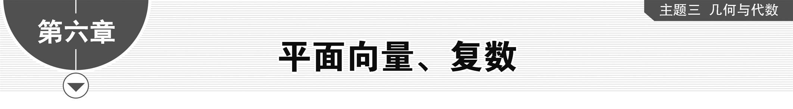

**第一节　平面向量的概念及线性运算**

【课标研读】　1.通过对力、速度、位移等的分析，了解平面向量的实际背景，理解平面向量的意义和两个向量相等的含义.　2.理解平面向量的几何表示和基本要素.　3.借助实例和平面向量的几何表示，掌握平面向量加、减运算及运算规则，理解其几何意义.　4.通过实例分析，掌握平面向量数乘运算及运算规则，理解其几何意义.理解两个平面向量共线的含义.　5.了解平面向量的线性运算性质及其几何意义.

1.平面向量的有关概念

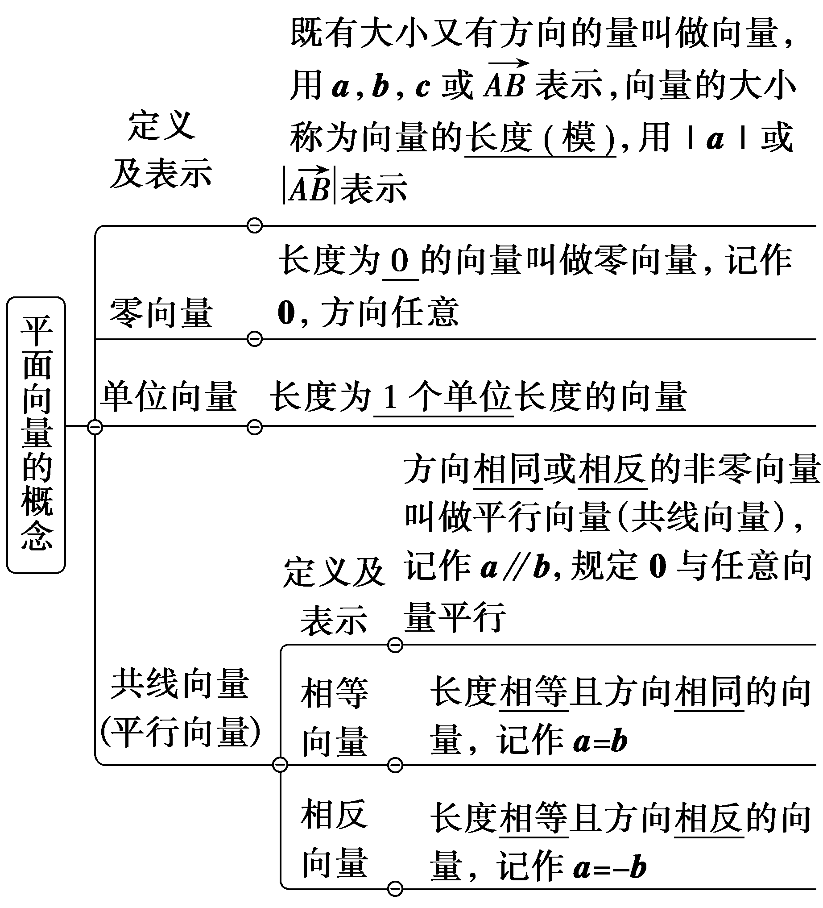

[微提醒]　与非零向量***a***平行的单位向量有两个，即向量 $\frac{a}{｜a｜}$ 和－ $\frac{a}{｜a｜}$ .

2.向量的线性运算

<table><tr><td>
向量

运算
</td><td>
定义
</td><td>
法则(或几何意义)
</td><td>
运算律
</td></tr><tr><td>
加

法
</td><td>
求两个向量和的运算
</td><td>
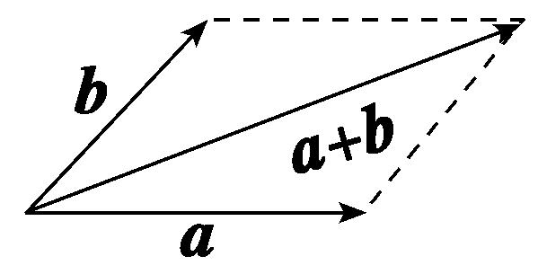

平行四边形法则

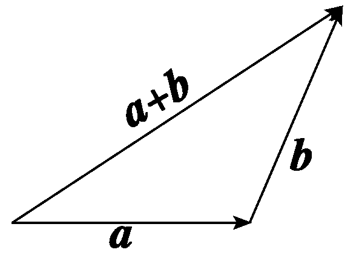

三角形法则
</td><td>
(1)交换律：

<strong><em>a</em></strong>＋<strong><em>b</em></strong>＝<strong><em>b</em></strong>＋<strong><em>a</em></strong>

(2)结合律：(<strong><em>a</em></strong>＋<strong><em>b</em></strong>)＋<strong><em>c</em></strong>＝<strong><em>a</em></strong>＋(<strong><em>b</em></strong>＋<strong><em>c</em></strong>)
</td></tr><tr><td>
减

法
</td><td>
向量<strong><em>a</em></strong>加上向量<strong><em>b</em></strong>的相反向量叫做<strong><em>a</em></strong>与<strong><em>b</em></strong>的差，即<strong><em>a</em></strong>＋(－<strong><em>b</em></strong>)＝<strong><em>a</em></strong>－<strong><em>b</em></strong>
</td><td>
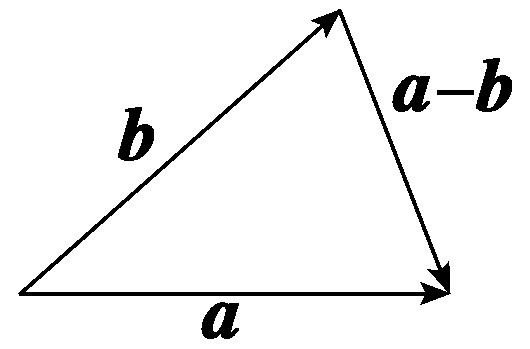

三角形法则
</td><td>
<strong><em>a</em></strong>－<strong><em>b</em></strong>＝<strong><em>a</em></strong>＋(－<strong><em>b</em></strong>)
</td></tr><tr><td>
数

乘
</td><td>
实数<em>λ</em>与向量<strong><em>a</em></strong>的积是一个向量，记作<em>λ</em><strong><em>a</em></strong>
</td><td>
(1)模：｜<em>λ</em><strong><em>a</em></strong>｜＝｜<em>λ</em>｜｜<strong><em>a</em></strong>｜

(2)方向：

当<em>λ</em>＞0时，<em>λ</em><strong><em>a</em></strong>与<strong><em>a</em></strong>的方向相同；

当<em>λ</em>＜0时，<em>λ</em><strong><em>a</em></strong>与<strong><em>a</em></strong>的方向相反；

当<em>λ</em>＝0时，<em>λ</em><strong><em>a</em></strong>＝<strong>0</strong>
</td><td>
设<em>λ</em>，<em>μ</em>是实数.

(1)<em>λ</em>(<em>μ</em> <strong><em>a</em></strong>)＝(<em>λμ</em>)<strong><em>a</em></strong>

(2)(<em>λ</em>＋<em>μ</em>)<strong><em>a</em></strong>＝<em>λ</em><strong><em>a</em></strong>＋<em>μ</em> <strong><em>a</em></strong>

(3)<em>λ</em>(<strong><em>a</em></strong>＋<strong><em>b</em></strong>)＝<em>λ</em><strong><em>a</em></strong>＋<em>λ</em><strong><em>b</em></strong>
</td></tr></table>

[微提醒]　(1)利用三角形法则时，两向量要首尾相连；利用平行四边形法则时，两向量要有相同的起点.

(2)多边形法则：一般地，首尾顺次相接的有向线段所表示的多个向量的和等于从第一个有向线段起点指向最后一个有向线段终点的有向线段所表示的向量，即 $\vec{A_{1}A_{2}}$ ＋ $\vec{A_{2}A_{3}}$ ＋ $\vec{A_{3}A_{4}}$ ＋…＋ $\vec{A_{n－1}A_{n}}$ ＝ $\vec{A_{1}A_{n}}$ .特别地，围成一周的首尾顺次相接的有向线段所表示的向量的和为零向量.

3.共线向量定理

向量<em><strong>a</strong></em>(<em><strong>a</strong></em>≠<strong>0</strong>)与<em><strong>b</strong></em>共线的充要条件是：存在唯一一个实数<em>λ</em>，使<em><strong>b</strong></em>＝<em>λ<strong>a</strong></em>.

[微提醒]　只有<em><strong>a</strong></em>≠<strong>0</strong>才能保证实数<em>λ</em>的存在性和唯一性.

【常用结论】

(1)三点共线的等价转化

&lt;&lt;&lt;te&lt;te&lt;te&lt;text st<em>y</em>le="italic"&gt;x&lt;/text&gt;t st<em>y</em>le="italic"&gt;x&lt;/text&gt;t st<em>y</em>le="italic"&gt;x&lt;/text&gt;t style="italic"&gt;t&lt;/text&gt;ext style="italic"&gt;t&lt;/text&gt;ext style="italic"&gt;<em>&lt;text style="italic"&gt;A</em>&lt;/text&gt;&lt;/text&gt;，<em>&lt;text style="italic"&gt;&lt;text style="italic"&gt;P</em>&lt;/text&gt;&lt;/text&gt;，<em>&lt;text style="italic"&gt;&lt;text style="italic"&gt;B</em>&lt;/text&gt;&lt;/text&gt;三点共线⇔ $\vec{AP}$ ＝&lt;&lt;&lt;te&lt;te&lt;te&lt;text st<em>y</em>le="italic"&gt;x&lt;/text&gt;t st<em>y</em>le="italic"&gt;x&lt;/text&gt;t st<em>y</em>le="italic"&gt;x&lt;/text&gt;t style="italic"&gt;t&lt;/text&gt;ext style="italic"&gt;t&lt;/text&gt;ext style="italic"&gt;λ&lt;/text&gt; $\vec{AB}\left(\lambda \ne 0\right)$ ⇔ $\vec{OP}$ ＝ $\left(1－t\right)\vec{OA}$ ＋&lt;&lt;te&lt;te&lt;te&lt;text st<em>y</em>le="italic"&gt;x&lt;/text&gt;t st<em>y</em>le="italic"&gt;x&lt;/text&gt;t st<em>y</em>le="italic"&gt;x&lt;/text&gt;t style="italic"&gt;t&lt;/text&gt;ext style="italic"&gt;t&lt;/text&gt; $\vec{OB}$ (&lt;&lt;te&lt;te&lt;te&lt;text st<em>y</em>le="italic"&gt;x&lt;/text&gt;t st<em>y</em>le="italic"&gt;x&lt;/text&gt;t st<em>y</em>le="italic"&gt;x&lt;/text&gt;t style="italic"&gt;t&lt;/text&gt;ext style="italic"&gt;<em>O</em>&lt;/text&gt;为平面内异于&lt;<em>t</em>ext style="italic"&gt;<em>&lt;text style="italic"&gt;A</em>&lt;/text&gt;&lt;/text&gt;，<em>&lt;text style="italic"&gt;&lt;text style="italic"&gt;P</em>&lt;/text&gt;&lt;/text&gt;，<em>&lt;text style="italic"&gt;&lt;text style="italic"&gt;B</em>&lt;/text&gt;&lt;/text&gt;的任一点，t∈<strong>&lt;text style="bold"&gt;&lt;text style="bold"&gt;R</strong>&lt;/text&gt;&lt;/text&gt;)⇔ $\vec{OP}$ ＝&lt;te&lt;te&lt;text st<em>y</em>le="italic"&gt;x&lt;/text&gt;t st<em>y</em>le="italic"&gt;x&lt;/text&gt;t st<em>y</em>le="italic"&gt;x&lt;/text&gt; $\vec{OA}$ ＋&lt;te&lt;te&lt;text st<em>y</em>le="italic"&gt;x&lt;/text&gt;t st<em>y</em>le="italic"&gt;x&lt;/text&gt;t style="italic"&gt;y&lt;/text&gt; $\vec{OB}$ (&lt;&lt;te&lt;te&lt;te&lt;text st<em>y</em>le="italic"&gt;x&lt;/text&gt;t st<em>y</em>le="italic"&gt;x&lt;/text&gt;t st<em>y</em>le="italic"&gt;x&lt;/text&gt;t style="italic"&gt;t&lt;/text&gt;ext style="italic"&gt;<em>O</em>&lt;/text&gt;为平面内异于&lt;<em>t</em>ext style="italic"&gt;<em>&lt;text style="italic"&gt;A</em>&lt;/text&gt;&lt;/text&gt;，<em>&lt;text style="italic"&gt;&lt;text style="italic"&gt;P</em>&lt;/text&gt;&lt;/text&gt;，<em>&lt;text style="italic"&gt;&lt;text style="italic"&gt;B</em>&lt;/text&gt;&lt;/text&gt;的任一点，x∈<strong>&lt;text style="bold"&gt;&lt;text style="bold"&gt;R</strong>&lt;/text&gt;&lt;/text&gt;，y∈R，x＋y＝1).

(2)向量的中线公式

若*P*为线段*AB*的中点，*O*为平面内一点，则 $\vec{OP}$ ＝ $\frac{1}{2}\left(\vec{OA}＋\vec{OB}\right)$ .

(3)若*G*为△*ABC*的重心，则有

① $\vec{GA}$ ＋ $\vec{GB}$ ＋ $\vec{GC}$ ＝**0**；② $\vec{AG}$ ＝ $\frac{1}{3}(\vec{AB}$ ＋ $\vec{AC}$ ).

(4)在四边形*A<text style="italic">BC*D</text>中，若*E*为*AD*的中点，*F*为BC的中点，则 $\vec{AB}$ ＋ $\vec{DC}$ ＝2 $\vec{EF}$ .

(5)对于任意两个向量***a***，***b***，都有

①｜｜***a***｜－｜***b***｜｜≤｜***a***±***b***｜≤｜***a***｜＋｜***b***｜(向量三角不等式).

②｜<em><strong>a</strong></em>＋<em><strong>b</strong></em>｜2＋｜<em><strong>a</strong></em>－<em><strong>b</strong></em>｜2＝2(｜<em><strong>a</strong></em>｜2＋｜<em><strong>b</strong></em>｜2).

【自主检测】

1.(多选)下列说法正确的是(　　)

A.｜***a***｜与｜***b***｜是否相等，与***a***，***b***的方向无关

<em>B</em>.若向量&lt;text style="&lt;text style="&lt;text style="<em><strong>b</strong></em>old,it<em><strong>a</strong></em>lic"&gt;b&lt;/text&gt;old,it<em><strong>a</strong></em>lic"&gt;b&lt;/text&gt;old,italic"&gt;a&lt;/text&gt;与b同向，且｜a｜＞｜b｜，则a＞b<em>C</em>.若向量 $\vec{AB}$ 与向量 $\vec{CD}$ 是共线向量，则<em>A</em>，<em>B</em>，<em>C</em>，<em>D</em>四点在一条直线上

D.起点不同，但方向相同且模相等的向量是相等向量

答案：**AD**

2.(链接人教A必修二P4例2)如图，点*O*是正六边形*ABCDEF*的中心，图中与 $\vec{CA}$ 共线的向量有(　　)

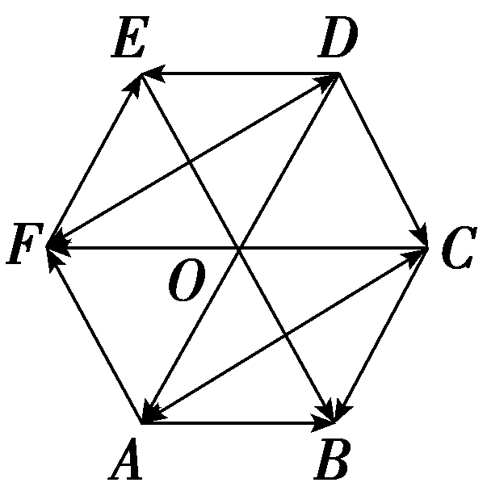

A.1个	B.2个

C.3个	D.4个

答案：**C**

解析：与 $\vec{CA}$ 共线的向量有 $\vec{AC}$ ， $\vec{DF}$ ， $\vec{FD}$ .故选C.

3.(多选)(链接人教A必修二P14例6)已知&lt;text style="it&lt;text style="<em><strong>b</strong></em>old,italic"&gt;a&lt;/text&gt;lic"&gt;D&lt;/text&gt;，<em>E</em>，<em>F</em>分别为△<em>A&lt;text style="italic"&gt;BC</em>&lt;/text&gt;的边BC，<em>CA</em>，<em>AB</em>的中点， $\vec{BC}$ ＝&lt;text style="<em><strong>b</strong></em>old,italic"&gt;a&lt;/text&gt;， $\vec{CA}$ ＝<em><strong>b</strong></em>.下列命题正确的是(　　)

A. $\vec{BE}$ ＝<text style="***b***old,it***a***lic">a</text>＋ $\frac{1}{2}$ <text style="***b***old,it***a***lic">b	</text>B. $\vec{CF}$ ＝－ $\frac{1}{2}$ <text style="***b***old,it***a***lic">a</text>＋ $\frac{1}{2}$ ***b***

C. $\vec{AF}$ ＝－ $\frac{1}{2}$ <em><strong>a</strong></em>－<em><strong>b</strong></em>	D. $\vec{AD}$ ＋ $\vec{BE}$ ＋ $\vec{CF}$ ＝<strong>0</strong>

答案：**ABD**

4.(链接人教A必修二P23T10)若<em><strong>a</strong></em>，<em><strong>b</strong></em>满足｜<em><strong>a</strong></em>｜＝3，｜<em><strong>b</strong></em>｜＝5，则｜<em><strong>a</strong></em>＋<em><strong>b</strong></em>｜的最大值为<u>　　　　</u>，最小值为<u>　　　　</u>.

答案：8　2

考点一　平面向量的有关概念 　　　　自主练透

1.如图所示，*O*是正六边形*ABCDEF*的中心，则与 $\vec{BC}$ 相等的向量为(　　 )

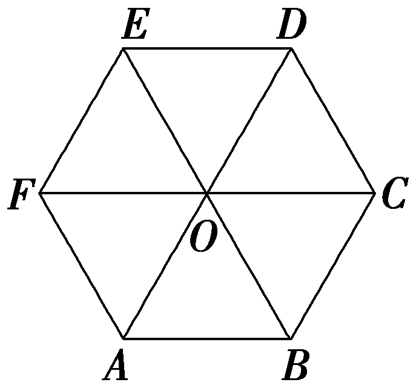

A. $\vec{BA}$ 	B. $\vec{CD}$

C. $\vec{AD}$ 	D. $\vec{OD}$

答案：**D**

解析：A，B选项均与 $\vec{BC}$ 方向不同，C选项与 $\vec{BC}$ 长度不相等，D选项与 $\vec{BC}$ 方向相同，长度相等.故选D.

2.(多选)下列命题中的真命题是(　　)

A.若｜***a***｜＝｜***b***｜，则***a***＝***b***

*B*.若*A*，B，*C*，*D*是不共线的四点，则“ $\vec{AB}$ ＝ $\vec{DC}$ ”是“四边形*ABCD*为平行四边形”的充要条件

C.若***a***＝***b***，***b***＝***c***，则***a***＝***c***

D.***a***＝***b***的充要条件是｜***a***｜＝｜***b***｜且***a***∥***b***

答案：**BC**

解析：因为两个向量的长度相等，但它们的方向不一定相同，故&lt;text style="it&lt;text style="&lt;text style="&lt;text style="&lt;text style="&lt;text style="&lt;text style="&lt;text style="&lt;text style="&lt;text style="&lt;text style="<em><strong>b</strong></em>old,it<em><strong>a</strong></em>lic"&gt;b&lt;/text&gt;old,it<em><strong>a</strong></em>lic"&gt;b&lt;/text&gt;old,it<em><strong>a</strong></em>lic"&gt;b&lt;/text&gt;old,it<em><strong>a</strong></em>lic"&gt;b&lt;/text&gt;old,it<em><strong>a</strong></em>lic"&gt;b&lt;/text&gt;old,it&lt;text style="bold,it&lt;text style="bold,it<em><strong>a</strong></em>li<em><strong>c</strong></em>"&gt;a&lt;/text&gt;li<em><strong>c</strong></em>"&gt;a&lt;/text&gt;li<em><strong>c</strong></em>"&gt;b&lt;/text&gt;old,itali<em><strong>c</strong></em>"&gt;b&lt;/text&gt;old,italic"&gt;b&lt;/text&gt;old,it<em><strong>a</strong></em>lic"&gt;b&lt;/text&gt;old,italic"&gt;a&lt;/text&gt;lic"&gt;A&lt;/text&gt;不正确；因为 $\vec{AB}$ ＝ $\vec{DC}$ ，所以｜ $\vec{AB}$ ｜＝｜ $\vec{DC}$ ｜且 $\vec{AB}$ ∥ $\vec{DC}$ ，又&lt;text style="it&lt;text style="&lt;text style="&lt;text style="&lt;text style="&lt;text style="&lt;text style="&lt;text style="&lt;text style="&lt;text style="&lt;text style="<em><strong>b</strong></em>old,it<em><strong>a</strong></em>lic"&gt;b&lt;/text&gt;old,it<em><strong>a</strong></em>lic"&gt;b&lt;/text&gt;old,it<em><strong>a</strong></em>lic"&gt;b&lt;/text&gt;old,it<em><strong>a</strong></em>lic"&gt;b&lt;/text&gt;old,it<em><strong>a</strong></em>lic"&gt;b&lt;/text&gt;old,it&lt;text style="bold,it&lt;text style="bold,it<em><strong>a</strong></em>li<em><strong>c</strong></em>"&gt;a&lt;/text&gt;li<em><strong>c</strong></em>"&gt;a&lt;/text&gt;li<em><strong>c</strong></em>"&gt;b&lt;/text&gt;old,itali<em><strong>c</strong></em>"&gt;b&lt;/text&gt;old,italic"&gt;b&lt;/text&gt;old,it<em><strong>a</strong></em>lic"&gt;b&lt;/text&gt;old,italic"&gt;a&lt;/text&gt;lic"&gt;A&lt;/text&gt;，<em>B</em>，<em>C</em>，<em>D</em>是不共线的四点，所以四边形<em>&lt;text style="italic"&gt;ABCD</em>&lt;/text&gt;为平行四边形；反之，若四边形ABCD为平行四边形，则｜ $\vec{AB}$ ｜＝｜ $\vec{DC}$ ｜， $\vec{AB}$ ∥ $\vec{DC}$ 且 $\vec{AB}$ ， $\vec{DC}$ 方向相同，因此 $\vec{AB}$ ＝ $\vec{DC}$ ，故&lt;text style="it&lt;text style="&lt;text style="&lt;text style="&lt;text style="&lt;text style="&lt;text style="&lt;text style="&lt;text style="&lt;text style="&lt;text style="<em><strong>b</strong></em>old,it<em><strong>a</strong></em>lic"&gt;b&lt;/text&gt;old,it<em><strong>a</strong></em>lic"&gt;b&lt;/text&gt;old,it<em><strong>a</strong></em>lic"&gt;b&lt;/text&gt;old,it<em><strong>a</strong></em>lic"&gt;b&lt;/text&gt;old,it<em><strong>a</strong></em>lic"&gt;b&lt;/text&gt;old,it&lt;text style="bold,it&lt;text style="bold,it<em><strong>a</strong></em>li<em><strong>c</strong></em>"&gt;a&lt;/text&gt;li<em><strong>c</strong></em>"&gt;a&lt;/text&gt;li<em><strong>c</strong></em>"&gt;b&lt;/text&gt;old,itali<em><strong>c</strong></em>"&gt;b&lt;/text&gt;old,italic"&gt;b&lt;/text&gt;old,it<em><strong>a</strong></em>lic"&gt;b&lt;/text&gt;old,italic"&gt;a&lt;/text&gt;lic"&gt;B&lt;/text&gt;正确；因为a＝b，所以a，b的长度相等且方向相同，又b＝c，所以b，c的长度相等且方向相同，所以a，c的长度相等且方向相同，故a＝c，故<em>C</em>正确；当a∥b且方向相反时，即使｜a｜＝｜b｜，也不能得到a＝b，故｜a｜＝｜b｜且a∥b不是a＝b的充要条件，而是必要不充分条件，故<em>D</em>不正确.故选BC.

3.设<text style="***b***old,italic">a</text>，b都是非零向量，下列四个条件中，使 $\frac{a}{｜a｜}$ ＝ $\frac{b}{｜b｜}$ 成立的充分条件是(　　)

A.***a***＝－***b***	B.***a***∥***b***

C.***a***＝2***b***	D.***a***∥***b***且｜***a***｜＝｜***b***｜

答案：**C**

解析：因为向量 $\frac{a}{｜a｜}$ 的方向与向量<text style="<text style="<text style="<text style="***b***old,it***a***lic">b</text>old,it***a***lic">b</text>old,it***a***lic">b</text>old,italic">a</text>方向相同，向量 $\frac{b}{｜b｜}$ 的方向与向量<text style="<text style="<text style="***b***old,it***a***lic">b</text>old,it***a***lic">b</text>old,it***a***lic">b</text>方向相同，且 $\frac{a}{｜a｜}$ ＝ $\frac{b}{｜b｜}$ ，所以向量<text style="<text style="<text style="<text style="***b***old,it***a***lic">b</text>old,it***a***lic">b</text>old,it***a***lic">b</text>old,italic">a</text>与向量b方向相同，故可排除选项A，B，D.当a＝2b时， $\frac{a}{｜a｜}$ ＝ $\frac{2b}{｜2b｜}$ ＝ $\frac{b}{｜b｜}$ ，故<text style="<text style="<text style="<text style="***b***old,it***a***lic">b</text>old,it***a***lic">b</text>old,it***a***lic">b</text>old,italic">a</text>＝2b是 $\frac{a}{｜a｜}$ ＝ $\frac{b}{｜b｜}$ 成立的充分条件.故选C.

4.如图，等腰梯形*ABCD*中，对角线*AC*与*BD*交于点*P*，点*E*，*F*分别在两腰*AD*，*BC*上，*EF*过点*P*，且*EF*∥*AB*，则下列等式中成立的是(　　)

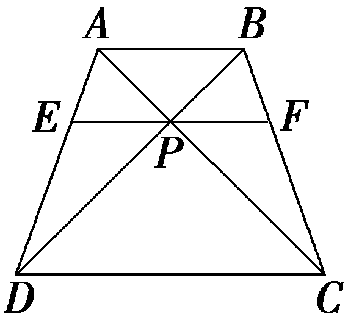

A. $\vec{AD}$ ＝ $\vec{BC}$ 	B. $\vec{AC}$ ＝ $\vec{BD}$

C. $\vec{PE}$ ＝ $\vec{PF}$ 	D. $\vec{EP}$ ＝ $\vec{PF}$

答案：**D**

解析：根据相等向量的定义，分析可得 $\vec{AD}$ 与 $\vec{BC}$ 不平行， $\vec{AC}$ 与 $\vec{BD}$ 不平行，所以 $\vec{AD}$ ＝ $\vec{BC}$ ， $\vec{AC}$ ＝ $\vec{BD}$ 均错误， $\vec{PE}$ 与 $\vec{PF}$ 平行，但方向相反，故不相等，只有 $\vec{EP}$ 与 $\vec{PF}$ 方向相同，且大小都等于线段*EF*长度的一半，所以 $\vec{EP}$ ＝ $\vec{PF}$ .故选D.

平面向量有关概念的四个关注点

1.平行向量就是共线向量，二者是等价的.

2.向量与数量不同，数量可以比较大小，向量则不能，但向量的模可以比较大小.

3.向量可以平移，平移后的向量与原向量是相等向量.解题时，不要把它与函数图象的平移混淆.

4. $\frac{a}{｜a｜}$ 是与***a***同方向的单位向量.

考点二　平面向量的线性运算　　　　多维探究

角度1　向量加、减法的几何意义

(1)已知在边长为2的等边三角形<text style="it<text style="<text style="<text style="***b***old,italic">b</text>old,it<text style="bold,it***a***lic">a</text>lic">b</text>old,italic">a</text>lic">ABC</text>中，向量a，b满足 $\vec{AB}$ ＝<text style="<text style="<text style="***b***old,italic">b</text>old,it<text style="bold,it***a***lic">a</text>lic">b</text>old,italic">a</text>， $\vec{BC}$ ＝<text style="<text style="<text style="***b***old,italic">b</text>old,it<text style="bold,it***a***lic">a</text>lic">b</text>old,italic">a</text>＋b，则｜b｜＝(　　)

A.2	B.2 $\sqrt{2}$

C.2 $\sqrt{3}$ 	D.3

(2)若向量<em><strong>a</strong></em>≠<strong>0</strong>，<em><strong>b</strong></em>≠<strong>0</strong>，且｜<em><strong>a</strong></em>｜＝｜<em><strong>b</strong></em>｜＝｜<em><strong>a</strong></em>－<em><strong>b</strong></em>｜，则向量<em><strong>a</strong></em>与向量<em><strong>a</strong></em>＋<em><strong>b</strong></em>所在直线的夹角是<u>　　　　</u>(用弧度表示).

答案：(1)**C**　(2) $\frac{\pi }{6}$

解析：(1)如图所示，设点<em>D</em>是<em>AC</em>的中点，由题可知&lt;text style="<em><strong>b</strong></em>old,italic"&gt;b&lt;/text&gt;＝ $\vec{BC}$ － $\vec{AB}$ ＝ $\vec{BC}$ ＋ $\vec{BA}$ ＝2 $\vec{BD}$ ，所以｜&lt;text style="<em><strong>b</strong></em>old,italic"&gt;b&lt;/text&gt;｜＝2｜ $\vec{BD}$ ｜＝2 $\sqrt{2^{2}－1^{2}}$ ＝2 $\sqrt{3}$ .故选C.

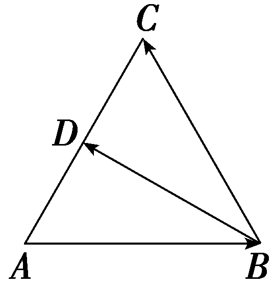

(2)设 $\vec{OA}$ ＝&lt;text style="&lt;text style="&lt;text style="&lt;text style="&lt;text style="&lt;text style="<em><strong>b</strong></em>old,it&lt;text style="bold,it<em><strong>a</strong></em>lic"&gt;a&lt;/text&gt;lic"&gt;b&lt;/text&gt;old,it<em><strong>a</strong></em>lic"&gt;b&lt;/text&gt;old,it<em><strong>a</strong></em>lic"&gt;b&lt;/text&gt;old,it<em><strong>a</strong></em>lic"&gt;b&lt;/text&gt;old,it<em><strong>a</strong></em>lic"&gt;b&lt;/text&gt;old,italic"&gt;a&lt;/text&gt;， $\vec{OB}$ ＝&lt;text style="&lt;text style="&lt;text style="&lt;text style="&lt;text style="<em><strong>b</strong></em>old,it&lt;text style="bold,it<em><strong>a</strong></em>lic"&gt;a&lt;/text&gt;lic"&gt;b&lt;/text&gt;old,it<em><strong>a</strong></em>lic"&gt;b&lt;/text&gt;old,it<em><strong>a</strong></em>lic"&gt;b&lt;/text&gt;old,it<em><strong>a</strong></em>lic"&gt;b&lt;/text&gt;old,it<em><strong>a</strong></em>lic"&gt;b&lt;/text&gt;，以<em>OA</em>，<em>OB</em>为邻边作▱<em>&lt;text style="italic"&gt;OACB</em>&lt;/text&gt;，如图所示，则<em><strong>a</strong></em>＋b＝ $\vec{OC}$ ，&lt;text style="&lt;text style="&lt;text style="&lt;text style="&lt;text style="&lt;text style="<em><strong>b</strong></em>old,it&lt;text style="bold,it<em><strong>a</strong></em>lic"&gt;a&lt;/text&gt;lic"&gt;b&lt;/text&gt;old,it<em><strong>a</strong></em>lic"&gt;b&lt;/text&gt;old,it<em><strong>a</strong></em>lic"&gt;b&lt;/text&gt;old,it<em><strong>a</strong></em>lic"&gt;b&lt;/text&gt;old,it<em><strong>a</strong></em>lic"&gt;b&lt;/text&gt;old,italic"&gt;a&lt;/text&gt;－b＝ $\vec{BA}$ .因为｜&lt;text style="&lt;text style="&lt;text style="&lt;text style="&lt;text style="&lt;text style="<em><strong>b</strong></em>old,it&lt;text style="bold,it<em><strong>a</strong></em>lic"&gt;a&lt;/text&gt;lic"&gt;b&lt;/text&gt;old,it<em><strong>a</strong></em>lic"&gt;b&lt;/text&gt;old,it<em><strong>a</strong></em>lic"&gt;b&lt;/text&gt;old,it<em><strong>a</strong></em>lic"&gt;b&lt;/text&gt;old,it<em><strong>a</strong></em>lic"&gt;b&lt;/text&gt;old,italic"&gt;a&lt;/text&gt;｜＝｜b｜＝｜a－b｜，所以｜ $\vec{OA}$ ｜＝｜ $\vec{OB}$ ｜＝｜ $\vec{BA}$ ｜，所以△&lt;text style="it&lt;text style="&lt;text style="&lt;text style="&lt;text style="&lt;text style="<em><strong>b</strong></em>old,it&lt;text style="bold,it<em><strong>a</strong></em>lic"&gt;a&lt;/text&gt;lic"&gt;b&lt;/text&gt;old,it<em><strong>a</strong></em>lic"&gt;b&lt;/text&gt;old,it<em><strong>a</strong></em>lic"&gt;b&lt;/text&gt;old,it<em><strong>a</strong></em>lic"&gt;b&lt;/text&gt;old,italic"&gt;a&lt;/text&gt;lic"&gt;OA&lt;/text&gt;B是等边三角形，所以∠<em>&lt;text style="italic"&gt;BOA</em>&lt;/text&gt;＝ $\frac{\pi }{3}$ .在菱形&lt;text style="it&lt;text style="&lt;text style="&lt;text style="&lt;text style="&lt;text style="<em><strong>b</strong></em>old,it&lt;text style="bold,it<em><strong>a</strong></em>lic"&gt;a&lt;/text&gt;lic"&gt;b&lt;/text&gt;old,it<em><strong>a</strong></em>lic"&gt;b&lt;/text&gt;old,it<em><strong>a</strong></em>lic"&gt;b&lt;/text&gt;old,it<em><strong>a</strong></em>lic"&gt;b&lt;/text&gt;old,italic"&gt;a&lt;/text&gt;lic"&gt;OA&lt;/text&gt;CB中，对角线<em>OC</em>平分∠<em>&lt;text style="italic"&gt;BOA</em>&lt;/text&gt;，所以向量&lt;text style="<em><strong>b</strong></em>old,italic"&gt;a&lt;/text&gt;与向量a＋b所在直线的夹角为 $\frac{\pi }{6}$ .

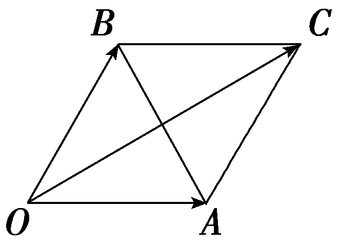

角度2　向量的线性运算

(1)正六边形*ABCDEF*中，用 $\vec{AC}$ 和 $\vec{AE}$ 表示 $\vec{CD}$ ，则 $\vec{CD}$ ＝(　　)

A.－ $\frac{2}{3}\vec{AC}$ ＋ $\frac{1}{3}\vec{AE}$ 	B.－ $\frac{1}{3}\vec{AC}$ ＋ $\frac{2}{3}\vec{AE}$

C.－ $\frac{2}{3}\vec{AC}$ ＋ $\frac{2}{3}\vec{AE}$ 	D.－ $\frac{1}{3}\vec{AC}$ ＋ $\frac{1}{3}\vec{AE}$

(2)(多选)已知等腰梯形*ABCD*满足*AB*∥*CD*，*AC*与*BD*交于点*P*，且*AB*＝2*CD*＝2*BC*，则下列结论正确的是(　　)

A. $\vec{AP}$ ＝2 $\vec{PC}$ 	B.｜ $\vec{AP}$ ｜＝2｜ $\vec{PD}$ ｜

C. $\vec{AP}$ ＝ $\frac{2}{3}\vec{AD}$ ＋ $\frac{1}{3}\vec{AB}$ 	D. $\vec{AC}$ ＝ $\frac{1}{3}\vec{AD}$ ＋ $\frac{2}{3}\vec{AB}$

答案：(1)**B**　(2)**ABC**

解析：(1)设正六边形边长为2，如图，设*AD*，*EC*交于点*O*，有*OD*＝1，*AO*＝3，则 $\vec{CD}$ ＝ $\vec{CO}$ ＋ $\vec{OD}$ ＝ $\frac{1}{2}(\vec{CA}$ ＋ $\vec{AE}$ )＋ $\frac{1}{6}(\vec{AC}$ ＋ $\vec{AE}$ )＝－ $\frac{1}{3}\vec{AC}$ ＋ $\frac{2}{3}\vec{AE}$ .故选B.

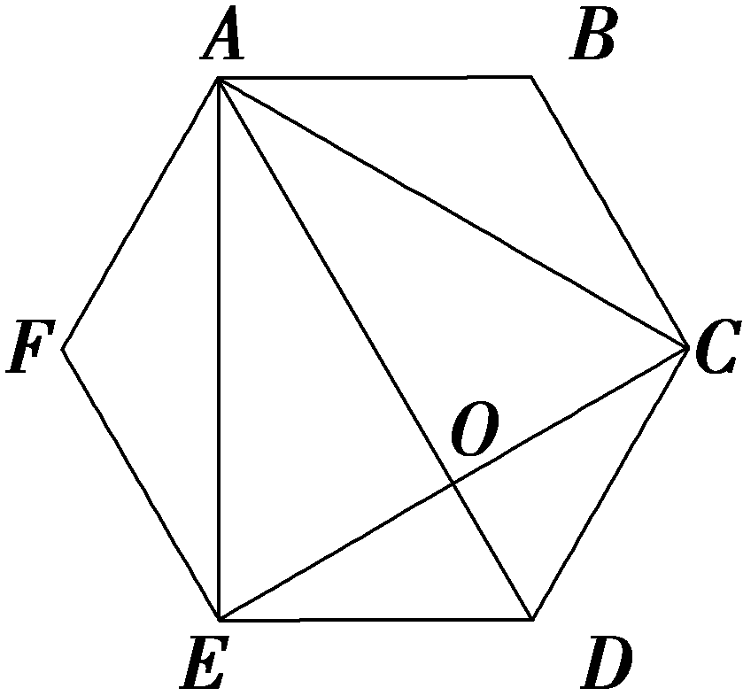

(2)依题意，显然△*<text style="italic"><text style="italic">AP*</text>B</text>∽△*<text style="italic">CP*D</text>，故有 $\frac{AB}{CD}$ ＝ $\frac{AP}{CP}$ ＝ $\frac{PB}{PD}$ ＝ $\frac{2}{1}$ ，即*<text style="italic">AP*</text>＝2*CP*，*<text style="italic">PB*</text>＝2*PD*，则 $\vec{AP}$ ＝2 $\vec{PC}$ ，故A正确；又四边形*ABCD*是等腰梯形，故*<text style="italic">AP*</text>＝*<text style="italic">PB*</text>，即｜ $\vec{AP}$ ｜＝2｜ $\vec{PD}$ ｜，故B正确；在△*ABD*中， $\vec{AP}$ ＝ $\vec{AD}$ ＋ $\vec{DP}$ ＝ $\vec{AD}$ ＋ $\frac{1}{3}\vec{DB}$ ＝ $\vec{AD}$ ＋ $\frac{1}{3}(\vec{AB}$ － $\vec{AD}$ )＝ $\frac{2}{3}\vec{AD}$ ＋ $\frac{1}{3}\vec{AB}$ ，故C正确；又 $\vec{AC}$ ＝ $\frac{3}{2}\vec{AP}$ ＝ $\frac{3}{2}\left(\frac{2}{3}\vec{AD}＋\frac{1}{3}\vec{AB}\right)$ ＝ $\vec{AD}$ ＋ $\frac{1}{2}\vec{AB}$ ，故D错误.故选ABC.

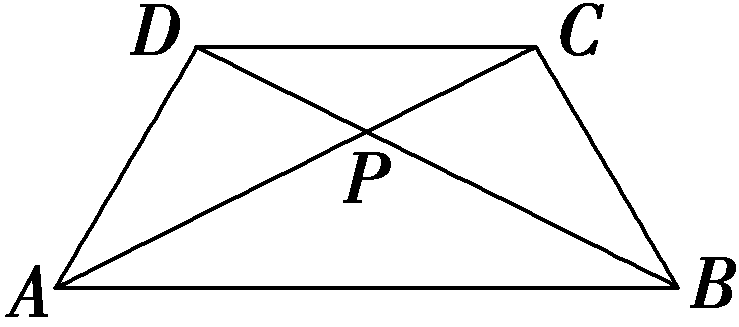

角度3　根据向量线性运算求参数

在△<em>ABC</em>中， $\vec{AD}$ ＝2 $\vec{DB}$ ， $\vec{AE}$ ＝2 $\vec{EC}$ ，<em>P</em>为线段<em>DE</em>上的动点，若 $\vec{AP}$ ＝<em>&lt;text style="italic"&gt;&lt;text style="italic"&gt;λ</em>&lt;/text&gt;&lt;/text&gt; $\vec{AB}$ ＋<em>&lt;text style="italic"&gt;&lt;text style="italic"&gt;μ</em>&lt;/text&gt;&lt;/text&gt; $\vec{AC}$ ，<em>&lt;text style="italic"&gt;&lt;text style="italic"&gt;λ</em>&lt;/text&gt;&lt;/text&gt;，<em>&lt;text style="italic"&gt;&lt;text style="italic"&gt;μ</em>&lt;/text&gt;&lt;/text&gt;∈<strong>R</strong>，则λ＋μ等于(　　)

A.1	B. $\frac{2}{3}$

C. $\frac{3}{2}$ 	D.2

答案：**B**

解析：如图所示，由题意知， $\vec{AE}$ ＝ $\frac{2}{3}\vec{AC}$ ， $\vec{AD}$ ＝ $\frac{2}{3}\vec{AB}$ ，设 $\vec{DP}$ ＝<te<te<te<te<te<te*x*t style="italic">x</text>t style="italic">x</text>t style="italic">x</text>t style="italic">x</text>t style="italic">x</text>t style="italic">x</text> $\vec{DE}$ ，所以 $\vec{AP}$ ＝ $\vec{AD}$ ＋ $\vec{DP}$ ＝ $\vec{AD}$ ＋<te<te<te<te<te<te*x*t style="italic">x</text>t style="italic">x</text>t style="italic">x</text>t style="italic">x</text>t style="italic">x</text>t style="italic">x</text> $\vec{DE}$ ＝ $\vec{AD}$ ＋<te<te<te<te<te<te*x*t style="italic">x</text>t style="italic">x</text>t style="italic">x</text>t style="italic">x</text>t style="italic">x</text>t style="italic">x</text> $\left(\vec{AE}－\vec{AD}\right)$ ＝<te<te<te<te<te<te*x*t style="italic">x</text>t style="italic">x</text>t style="italic">x</text>t style="italic">x</text>t style="italic">x</text>t style="italic">x</text> $\vec{AE}$ ＋ $\left(1－x\right)\vec{AD}$ ＝ $\frac{2}{3}$ <te<te<te<te<te<te*x*t style="italic">x</text>t style="italic">x</text>t style="italic">x</text>t style="italic">x</text>t style="italic">x</text>t style="italic">x</text> $\vec{AC}$ ＋ $\frac{2}{3}\left(1－x\right)\vec{AB}$ ，所以<te<te*x*t style="italic">x</text>t style="italic">*μ*</text>＝ $\frac{2}{3}$ <te<te<te<te<te<te*x*t style="italic">x</text>t style="italic">x</text>t style="italic">x</text>t style="italic">x</text>t style="italic">x</text>t style="italic">x</text>，*<text style="italic">λ*</text>＝ $\frac{2}{3}\left(1－x\right)$ ，所以<te*x*t style="italic">*λ*</text>＋<te*x*t style="italic">*μ*</text>＝ $\frac{2}{3}\left(1－x\right)$ ＋ $\frac{2}{3}$ <te<te<te<te<te<te*x*t style="italic">x</text>t style="italic">x</text>t style="italic">x</text>t style="italic">x</text>t style="italic">x</text>t style="italic">x</text>＝ $\frac{2}{3}$ .故选B.

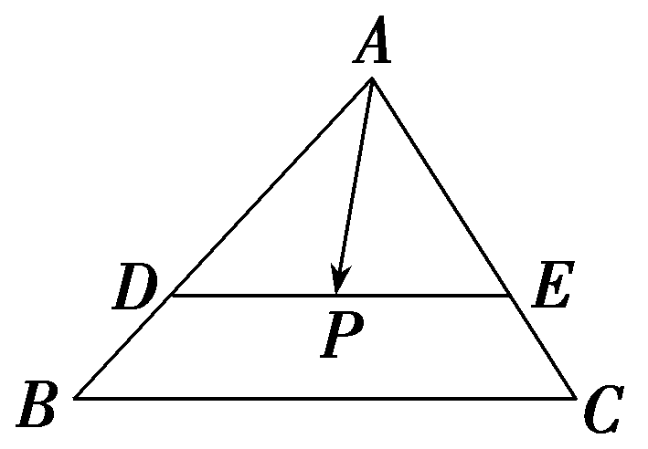

1.利用向量加、减法的几何意义解决问题的方法

(1)根据两个向量的和与差，构造相应的平行四边形或三角形；

(2)平面几何中如果出现平行四边形或可能构造出平行四边形或三角形的问题，可考虑利用向量知识来求解.注意菱形、矩形等在解题时的应用，尤其注意有60°内角的菱形.

2.平面向量的线性运算的求解策略

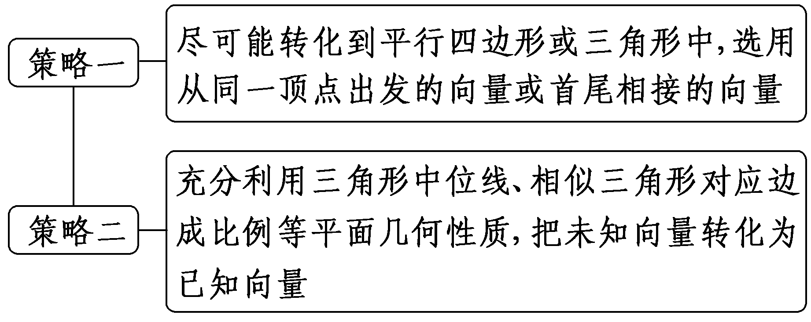

3.根据向量的线性运算求参数，可以通过向量的线性运算将向量表示出来，进行比较，构造方程(组)求解.

对点练1.如图，点&lt;text style="it&lt;text style="<em><strong>b</strong></em>old,italic"&gt;a&lt;/text&gt;lic"&gt;D&lt;/text&gt;，<em>E</em>分别为<em>AC</em>，<em>BC</em>的中点，设 $\vec{AB}$ ＝&lt;text style="<em><strong>b</strong></em>old,italic"&gt;a&lt;/text&gt;， $\vec{AC}$ ＝<em><strong>b</strong></em>，<em>F</em>是&lt;text style="it<em><strong>a</strong></em>lic"&gt;D&lt;/text&gt;<em>E</em>的中点，则 $\vec{AF}$ ＝(　　)

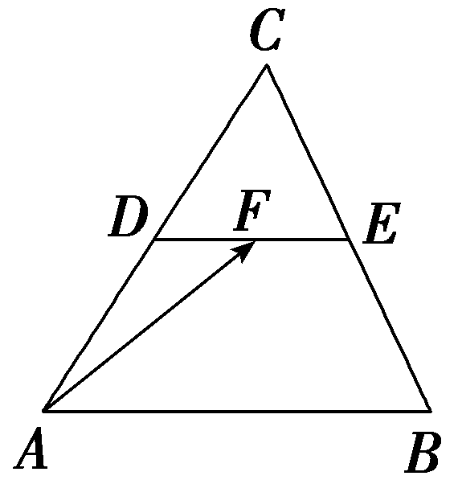

A. $\frac{1}{2}$ <text style="***b***old,it***a***lic">a</text>＋ $\frac{1}{2}$ <text style="***b***old,it***a***lic">b	</text>B.－ $\frac{1}{2}$ <text style="***b***old,it***a***lic">a</text>＋ $\frac{1}{2}$ ***b***

C. $\frac{1}{4}$ <text style="***b***old,it***a***lic">a</text>＋ $\frac{1}{2}$ <text style="***b***old,it***a***lic">b	</text>D.－ $\frac{1}{4}$ <text style="***b***old,it***a***lic">a</text>＋ $\frac{1}{2}$ ***b***

答案：**C**

解析：因为点&lt;text style="it&lt;text style="<em><strong>b</strong></em>old,italic"&gt;a&lt;/text&gt;lic"&gt;D&lt;/text&gt;，<em>E</em>分别为<em>AC</em>，<em>BC</em>的中点，<em>F</em>是<em>DE</em>的中点，所以 $\vec{AF}$ ＝ $\vec{AD}$ ＋ $\vec{DF}$ ＝ $\frac{1}{2}\vec{AC}$ ＋ $\frac{1}{2}\vec{DE}$ ＝ $\frac{1}{2}\vec{AC}$ ＋ $\frac{1}{4}\vec{AB}$ ，即 $\vec{AF}$ ＝ $\frac{1}{4}$ &lt;text style="<em><strong>b</strong></em>old,italic"&gt;a&lt;/text&gt;＋ $\frac{1}{2}$ <em><strong>b</strong></em>.故选C.

对点练2.在△*A<text style="italic"><text style="italic">BC*</text></text>中，延长BC至点*M*使得BC＝2*CM*，连接*<text style="italic">AM*</text>，点*N*为AM上一点且 $\vec{AN}$ ＝ $\frac{1}{3}\vec{AM}$ ，若 $\vec{AN}$ ＝*<text style="italic">λ*</text> $\vec{AB}$ ＋*<text style="italic">μ*</text> $\vec{AC}$ ，则*<text style="italic">λ*</text>＋*<text style="italic">μ*</text>＝(　　)

A. $\frac{1}{3}$ 	B. $\frac{1}{2}$

C.－ $\frac{1}{2}$ 	D.－ $\frac{1}{3}$

答案：**A**

解析：由题意，知 $\vec{AN}$ ＝ $\frac{1}{3}\vec{AM}$ ＝ $\frac{1}{3}\left(\vec{AB}＋\vec{BM}\right)$ ＝ $\frac{1}{3}\vec{AB}$ ＋ $\frac{1}{3}$ × $\frac{3}{2}\vec{BC}$ ＝ $\frac{1}{3}\vec{AB}$ ＋ $\frac{1}{2}\left(\vec{AC}－\vec{AB}\right)$ ＝－ $\frac{1}{6}\vec{AB}$ ＋ $\frac{1}{2}\vec{AC}$ ，又 $\vec{AN}$ ＝*<text style="italic"><text style="italic">λ*</text></text> $\vec{AB}$ ＋*<text style="italic"><text style="italic">μ*</text></text> $\vec{AC}$ ，所以*<text style="italic"><text style="italic">λ*</text></text>＝－ $\frac{1}{6}$ ，*<text style="italic"><text style="italic">μ*</text></text>＝ $\frac{1}{2}$ ，则*<text style="italic"><text style="italic">λ*</text></text>＋*<text style="italic"><text style="italic">μ*</text></text>＝ $\frac{1}{3}$ .故选A.

对点练3.(一题多解)(2020·全国Ⅰ卷)设<em><strong>a</strong></em>，<em><strong>b</strong></em>为单位向量，且｜<em><strong>a</strong></em>＋<em><strong>b</strong></em>｜＝1 ，则｜<em><strong>a</strong></em>－<em><strong>b</strong></em>｜＝ <u>　　　　</u>.

答案： $\sqrt{3}$

解析：法一：如图，四边形&lt;text style="it&lt;text style="&lt;text style="&lt;text style="&lt;text style="&lt;text style="&lt;text style="bold,it<em><strong>a</strong></em>lic"&gt;b&lt;/text&gt;old,it<em><strong>a</strong></em>lic"&gt;b&lt;/text&gt;old,it<em><strong>a</strong></em>lic"&gt;b&lt;/text&gt;old,it<em><strong>a</strong></em>lic"&gt;b&lt;/text&gt;old,it<em><strong>a</strong></em>lic"&gt;b&lt;/text&gt;old,italic"&gt;a&lt;/text&gt;lic"&gt;OACB &lt;/text&gt;为平行四边形，设 $\vec{OA}$ ＝&lt;text style="&lt;text style="&lt;text style="&lt;text style="&lt;text style="&lt;text style="bold,it<em><strong>a</strong></em>lic"&gt;b&lt;/text&gt;old,it<em><strong>a</strong></em>lic"&gt;b&lt;/text&gt;old,it<em><strong>a</strong></em>lic"&gt;b&lt;/text&gt;old,it<em><strong>a</strong></em>lic"&gt;b&lt;/text&gt;old,it<em><strong>a</strong></em>lic"&gt;b&lt;/text&gt;old,italic"&gt;a&lt;/text&gt;， $\vec{OB}$ ＝&lt;text style="&lt;text style="&lt;text style="&lt;text style="&lt;text style="bold,it<em><strong>a</strong></em>lic"&gt;b&lt;/text&gt;old,it<em><strong>a</strong></em>lic"&gt;b&lt;/text&gt;old,it<em><strong>a</strong></em>lic"&gt;b&lt;/text&gt;old,it<em><strong>a</strong></em>lic"&gt;b&lt;/text&gt;old,it<em><strong>a</strong></em>lic"&gt;b&lt;/text&gt;，利用平行四边形法则得 $\vec{OC}$ ＝&lt;text style="&lt;text style="&lt;text style="&lt;text style="&lt;text style="&lt;text style="bold,it<em><strong>a</strong></em>lic"&gt;b&lt;/text&gt;old,it<em><strong>a</strong></em>lic"&gt;b&lt;/text&gt;old,it<em><strong>a</strong></em>lic"&gt;b&lt;/text&gt;old,it<em><strong>a</strong></em>lic"&gt;b&lt;/text&gt;old,it<em><strong>a</strong></em>lic"&gt;b&lt;/text&gt;old,italic"&gt;a&lt;/text&gt;＋b，因为｜a｜＝｜b｜＝｜a＋b｜＝1，所以△<em>OAC</em> 为正三角形，所以｜a－b｜＝｜ $\vec{BA}$ ｜＝2× $\frac{\sqrt{3}}{2}$ ×｜&lt;text style="&lt;text style="&lt;text style="&lt;text style="&lt;text style="&lt;text style="bold,it<em><strong>a</strong></em>lic"&gt;b&lt;/text&gt;old,it<em><strong>a</strong></em>lic"&gt;b&lt;/text&gt;old,it<em><strong>a</strong></em>lic"&gt;b&lt;/text&gt;old,it<em><strong>a</strong></em>lic"&gt;b&lt;/text&gt;old,it<em><strong>a</strong></em>lic"&gt;b&lt;/text&gt;old,italic"&gt;a&lt;/text&gt;｜＝ $\sqrt{3}$  .

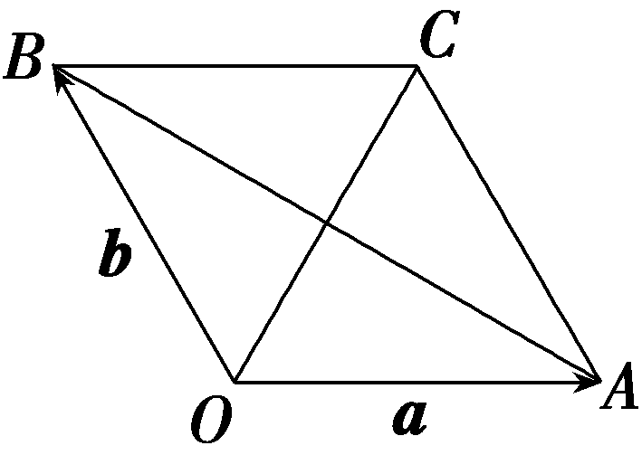

法二：因为&lt;text style="&lt;text style="&lt;text style="&lt;text style="&lt;text style="&lt;text style="&lt;text style="&lt;text style="&lt;text style="<em><strong>b</strong></em>old,it<em><strong>a</strong></em>lic"&gt;b&lt;/text&gt;old,it<em><strong>a</strong></em>lic"&gt;b&lt;/text&gt;old,it<em><strong>a</strong></em>lic"&gt;b&lt;/text&gt;old,it<em><strong>a</strong></em>lic"&gt;b&lt;/text&gt;old,it<em><strong>a</strong></em>lic"&gt;b&lt;/text&gt;old,it<em><strong>a</strong></em>lic"&gt;b&lt;/text&gt;old,it<em><strong>a</strong></em>lic"&gt;b&lt;/text&gt;old,it<em><strong>a</strong></em>lic"&gt;b&lt;/text&gt;old,italic"&gt;a&lt;/text&gt;，b为单位向量，且｜a＋b｜＝1，所以(a＋b)&lt;text style="superscript"&gt;&lt;text style="superscript"&gt;&lt;text style="superscript"&gt;2&lt;/text&gt;&lt;/text&gt;&lt;/text&gt;＝1 ，所以1＋1＋2a<em>&lt;text style="italic"&gt;&lt;text style="italic"&gt;·</em>&lt;/text&gt;&lt;/text&gt;b＝1，所以a·b＝－ $\frac{1}{2}$ ，所以｜&lt;text style="&lt;text style="&lt;text style="&lt;text style="&lt;text style="&lt;text style="&lt;text style="&lt;text style="&lt;text style="<em><strong>b</strong></em>old,it<em><strong>a</strong></em>lic"&gt;b&lt;/text&gt;old,it<em><strong>a</strong></em>lic"&gt;b&lt;/text&gt;old,it<em><strong>a</strong></em>lic"&gt;b&lt;/text&gt;old,it<em><strong>a</strong></em>lic"&gt;b&lt;/text&gt;old,it<em><strong>a</strong></em>lic"&gt;b&lt;/text&gt;old,it<em><strong>a</strong></em>lic"&gt;b&lt;/text&gt;old,it<em><strong>a</strong></em>lic"&gt;b&lt;/text&gt;old,it<em><strong>a</strong></em>lic"&gt;b&lt;/text&gt;old,italic"&gt;a&lt;/text&gt;－b｜&lt;text style="superscript"&gt;&lt;text style="superscript"&gt;&lt;text style="superscript"&gt;2&lt;/text&gt;&lt;/text&gt;&lt;/text&gt;＝a2＋b2－2a<em>&lt;text style="italic"&gt;&lt;text style="italic"&gt;·</em>&lt;/text&gt;&lt;/text&gt;b＝1＋1－2×(－ $\frac{1}{2}$ )＝3，所以｜&lt;text style="&lt;text style="&lt;text style="&lt;text style="&lt;text style="&lt;text style="&lt;text style="&lt;text style="&lt;text style="<em><strong>b</strong></em>old,it<em><strong>a</strong></em>lic"&gt;b&lt;/text&gt;old,it<em><strong>a</strong></em>lic"&gt;b&lt;/text&gt;old,it<em><strong>a</strong></em>lic"&gt;b&lt;/text&gt;old,it<em><strong>a</strong></em>lic"&gt;b&lt;/text&gt;old,it<em><strong>a</strong></em>lic"&gt;b&lt;/text&gt;old,it<em><strong>a</strong></em>lic"&gt;b&lt;/text&gt;old,it<em><strong>a</strong></em>lic"&gt;b&lt;/text&gt;old,it<em><strong>a</strong></em>lic"&gt;b&lt;/text&gt;old,italic"&gt;a&lt;/text&gt;－b｜＝ $\sqrt{3}$  .

考点三　共线向量定理及其应用　　　　师生共研

(一题多变)设两向量***a***与***b***不共线.

(1)若 $\vec{AB}$ ＝<text style="<text style="***b***old,it***a***lic">b</text>old,italic">a</text>＋b， $\vec{BC}$ ＝2<text style="<text style="***b***old,it***a***lic">b</text>old,italic">a</text>＋8b， $\vec{CD}$ ＝3 $\left(a－b\right)$ .

求证：*A*，*B*，*D*三点共线；

(2)试确定实数<em>k</em>，使<em>k<strong>a</strong></em>＋<em><strong>b</strong></em>和<em><strong>a</strong></em>＋<em>k<strong>b</strong></em>共线.

解：(1)证明：因为 $\vec{AB}$ ＝<text style="<text style="***b***old,it***a***lic">b</text>old,italic">a</text>＋b， $\vec{BC}$ ＝2<text style="<text style="***b***old,it***a***lic">b</text>old,italic">a</text>＋8b， $\vec{CD}$ ＝3 $\left(a－b\right)$ ，

所以 $\vec{BD}$ ＝ $\vec{BC}$ ＋ $\vec{CD}$ ＝2<text style="<text style="<text style="***b***old,it***a***lic">b</text>old,it***a***lic">b</text>old,italic">a</text>＋8b＋3 $\left(a－b\right)$ ＝2<text style="<text style="<text style="***b***old,it***a***lic">b</text>old,it***a***lic">b</text>old,italic">a</text>＋8b＋3a－3b＝5 $\left(a＋b\right)$ ＝5 $\vec{AB}$ ，所以 $\vec{AB}$ ， $\vec{BD}$ 共线.

又它们有公共点*B*，所以*A*，*B*，*D*三点共线.

(2)因为<em>k<strong>a</strong></em>＋<em><strong>b</strong></em>与<em><strong>a</strong></em>＋<em>k<strong>b</strong></em>共线，

所以存在实数<em>λ</em>，使<em>k<strong>a</strong></em>＋<em><strong>b</strong></em>＝<em>λ</em>(<em><strong>a</strong></em>＋<em>k<strong>b</strong></em>)，

即<em>k<strong>a</strong></em>＋<em><strong>b</strong></em>＝<em>λ<strong>a</strong></em>＋<em>λk<strong>b</strong></em>，

所以(<em>k</em>－<em>λ</em>)<em><strong>a</strong></em>＝(<em>λk</em>－1)<em><strong>b</strong></em>.

因为***a***，***b***是不共线的两个向量，

所以<em>k</em>－<em>λ</em>＝<em>λk</em>－1＝0，所以<em>k</em>2－1＝0，所以<em>k</em>＝±1.

[变式探究]

1.(变条件)若将本例(1)中条件“ $\vec{BC}$ ＝2&lt;text style="&lt;text style="<em><strong>b</strong></em>old,it<em><strong>a</strong></em>lic"&gt;b&lt;/text&gt;old,italic"&gt;a&lt;/text&gt;＋8b”改为“ $\vec{BC}$ ＝&lt;text style="&lt;text style="<em><strong>b</strong></em>old,it<em><strong>a</strong></em>lic"&gt;b&lt;/text&gt;old,italic"&gt;a&lt;/text&gt;＋<em>&lt;text style="italic"&gt;m</em>&lt;/text&gt;b”，则m＝<u>　　　　</u>时，<em>A</em>，<em>B</em>，<em>D</em>三点共线.

答案：7

解析： $\vec{BD}$ ＝ $\vec{BC}$ ＋ $\vec{CD}$ ＝(&lt;text style="&lt;text style="&lt;text style="&lt;text style="&lt;text style="&lt;text style="&lt;text style="<em><strong>b</strong></em>old,it<em><strong>a</strong></em>lic"&gt;b&lt;/text&gt;old,it<em><strong>a</strong></em>lic"&gt;b&lt;/text&gt;old,it<em><strong>a</strong></em>lic"&gt;b&lt;/text&gt;old,it<em><strong>a</strong></em>lic"&gt;b&lt;/text&gt;old,it<em><strong>a</strong></em>lic"&gt;b&lt;/text&gt;old,it<em><strong>a</strong></em>lic"&gt;b&lt;/text&gt;old,italic"&gt;a&lt;/text&gt;＋<em>&lt;text style="italic"&gt;&lt;text style="italic"&gt;&lt;text style="italic"&gt;&lt;text style="italic"&gt;&lt;text style="italic"&gt;m</em>&lt;/text&gt;&lt;/text&gt;&lt;/text&gt;&lt;/text&gt;&lt;/text&gt;b)＋3(a－b)＝4a＋(m－3)b，若<em>&lt;text style="italic"&gt;A</em>&lt;/text&gt;，<em>&lt;text style="italic"&gt;B</em>&lt;/text&gt;，<em>&lt;text style="italic"&gt;D</em>&lt;/text&gt;三点共线，则存在实数<em>&lt;text style="italic"&gt;&lt;text style="italic"&gt;&lt;text style="italic"&gt;&lt;text style="italic"&gt;λ</em>&lt;/text&gt;&lt;/text&gt;&lt;/text&gt;&lt;/text&gt;，使 $\vec{BD}$ ＝&lt;text style="it&lt;text style="&lt;text style="&lt;text style="&lt;text style="<em><strong>b</strong></em>old,it<em><strong>a</strong></em>lic"&gt;b&lt;/text&gt;old,it<em><strong>a</strong></em>lic"&gt;b&lt;/text&gt;old,it<em><strong>a</strong></em>lic"&gt;b&lt;/text&gt;old,italic"&gt;a&lt;/text&gt;lic"&gt;<em>&lt;text style="italic"&gt;&lt;text style="italic"&gt;&lt;text style="italic"&gt;λ</em>&lt;/text&gt;&lt;/text&gt;&lt;/text&gt;&lt;/text&gt; $\vec{AB}$ ，即4&lt;text style="&lt;text style="&lt;text style="&lt;text style="&lt;text style="&lt;text style="&lt;text style="<em><strong>b</strong></em>old,it<em><strong>a</strong></em>lic"&gt;b&lt;/text&gt;old,it<em><strong>a</strong></em>lic"&gt;b&lt;/text&gt;old,it<em><strong>a</strong></em>lic"&gt;b&lt;/text&gt;old,it<em><strong>a</strong></em>lic"&gt;b&lt;/text&gt;old,it<em><strong>a</strong></em>lic"&gt;b&lt;/text&gt;old,it<em><strong>a</strong></em>lic"&gt;b&lt;/text&gt;old,italic"&gt;a&lt;/text&gt;＋(<em>&lt;text style="italic"&gt;&lt;text style="italic"&gt;&lt;text style="italic"&gt;&lt;text style="italic"&gt;&lt;text style="italic"&gt;m</em>&lt;/text&gt;&lt;/text&gt;&lt;/text&gt;&lt;/text&gt;&lt;/text&gt;－3)b＝<em>&lt;text style="italic"&gt;&lt;text style="italic"&gt;&lt;text style="italic"&gt;&lt;text style="italic"&gt;λ</em>&lt;/text&gt;&lt;/text&gt;&lt;/text&gt;&lt;/text&gt;(a＋b)，所以4a＋(m－3)b＝λa＋λb，所以 $\left\{\begin{matrix}4=\lambda ，\\m－3=\lambda ，\end{matrix}\right.$ 解得&lt;text style="it&lt;text style="&lt;text style="&lt;text style="&lt;text style="&lt;text style="&lt;text style="<em><strong>b</strong></em>old,it<em><strong>a</strong></em>lic"&gt;b&lt;/text&gt;old,it<em><strong>a</strong></em>lic"&gt;b&lt;/text&gt;old,it<em><strong>a</strong></em>lic"&gt;b&lt;/text&gt;old,it<em><strong>a</strong></em>lic"&gt;b&lt;/text&gt;old,it<em><strong>a</strong></em>lic"&gt;b&lt;/text&gt;old,italic"&gt;a&lt;/text&gt;lic"&gt;<em>&lt;text style="italic"&gt;&lt;text style="italic"&gt;&lt;text style="italic"&gt;&lt;text style="italic"&gt;m</em>&lt;/text&gt;&lt;/text&gt;&lt;/text&gt;&lt;/text&gt;&lt;/text&gt;＝7.故当m＝7时，<em>&lt;text style="italic"&gt;A</em>&lt;/text&gt;，<em>&lt;text style="italic"&gt;B</em>&lt;/text&gt;，<em>&lt;text style="italic"&gt;D</em>&lt;/text&gt;三点共线.

2.(变条件)若将本例(2)中的“共线”改为“反向共线”，则*k*为何值？

解：因为<em>k<strong>a</strong></em>＋<em><strong>b</strong></em>与<em><strong>a</strong></em>＋<em>k<strong>b</strong></em>反向共线，

所以存在实数<em>λ</em>，使<em>k<strong>a</strong></em>＋<em><strong>b</strong></em>＝<em>λ</em>(<em><strong>a</strong></em>＋<em>k<strong>b</strong></em>)(<em>λ</em>＜0)，

所以 $\left\{\begin{matrix}k＝\lambda ，\\k\lambda =1，\end{matrix}\right.$ 所以*k*＝±1.

又*λ*＜0，*k*＝*λ*，所以*k*＝－1.

故当*k*＝－1时，两向量反向共线.

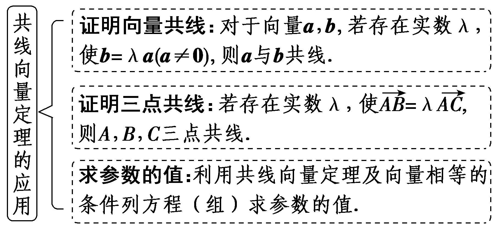

注意：(1)证明三点共线时，需说明共线的两个向量有公共点.(2)注意待定系数法和方程思想的运用.

对点练4.若&lt;text style="&lt;text style="&lt;text style="&lt;text style="<em><strong>b</strong></em>old,it<em><strong>a</strong></em>lic"&gt;b&lt;/text&gt;old,it<em><strong>a</strong></em>lic"&gt;b&lt;/text&gt;old,it<em><strong>a</strong></em>lic"&gt;b&lt;/text&gt;old,italic"&gt;a&lt;/text&gt;，b是两个不共线的向量，已知 $\vec{MN}$ ＝&lt;text style="&lt;text style="&lt;text style="&lt;text style="<em><strong>b</strong></em>old,it<em><strong>a</strong></em>lic"&gt;b&lt;/text&gt;old,it<em><strong>a</strong></em>lic"&gt;b&lt;/text&gt;old,it<em><strong>a</strong></em>lic"&gt;b&lt;/text&gt;old,italic"&gt;a&lt;/text&gt;－2b， $\vec{PN}$ ＝2&lt;text style="&lt;text style="&lt;text style="&lt;text style="<em><strong>b</strong></em>old,it<em><strong>a</strong></em>lic"&gt;b&lt;/text&gt;old,it<em><strong>a</strong></em>lic"&gt;b&lt;/text&gt;old,it<em><strong>a</strong></em>lic"&gt;b&lt;/text&gt;old,italic"&gt;a&lt;/text&gt;＋<em>&lt;text style="italic"&gt;k</em>&lt;/text&gt;b， $\vec{PQ}$ ＝3&lt;text style="&lt;text style="&lt;text style="&lt;text style="<em><strong>b</strong></em>old,it<em><strong>a</strong></em>lic"&gt;b&lt;/text&gt;old,it<em><strong>a</strong></em>lic"&gt;b&lt;/text&gt;old,it<em><strong>a</strong></em>lic"&gt;b&lt;/text&gt;old,italic"&gt;a&lt;/text&gt;－b，若<em>M</em>，<em>N</em>，<em>Q</em>三点共线，则<em>&lt;text style="italic"&gt;k</em>&lt;/text&gt;等于(　　)

A.－1	B.1

C. $\frac{3}{2}$ 	D.2

答案：**B**

解析：由题意知， $\vec{NQ}$ ＝ $\vec{PQ}$ － $\vec{PN}$ ＝&lt;text style="&lt;text style="&lt;text style="&lt;text style="&lt;text style="<em><strong>b</strong></em>old,it<em><strong>a</strong></em>lic"&gt;b&lt;/text&gt;old,it<em><strong>a</strong></em>lic"&gt;b&lt;/text&gt;old,it<em><strong>a</strong></em>lic"&gt;b&lt;/text&gt;old,it<em><strong>a</strong></em>lic"&gt;b&lt;/text&gt;old,italic"&gt;a&lt;/text&gt;－ $\left(k+1\right)$ &lt;text style="&lt;text style="&lt;text style="&lt;text style="<em><strong>b</strong></em>old,it<em><strong>a</strong></em>lic"&gt;b&lt;/text&gt;old,it<em><strong>a</strong></em>lic"&gt;b&lt;/text&gt;old,it<em><strong>a</strong></em>lic"&gt;b&lt;/text&gt;old,it<em><strong>a</strong></em>lic"&gt;b&lt;/text&gt;，因为<em>M</em>，<em>N</em>，<em>Q</em>三点共线，故存在实数<em>&lt;text style="italic"&gt;&lt;text style="italic"&gt;&lt;text style="italic"&gt;&lt;text style="italic"&gt;&lt;text style="italic"&gt;λ</em>&lt;/text&gt;&lt;/text&gt;&lt;/text&gt;&lt;/text&gt;&lt;/text&gt;，使得 $\vec{MN}$ ＝&lt;text style="it&lt;text style="&lt;text style="&lt;text style="&lt;text style="<em><strong>b</strong></em>old,it<em><strong>a</strong></em>lic"&gt;b&lt;/text&gt;old,it<em><strong>a</strong></em>lic"&gt;b&lt;/text&gt;old,it<em><strong>a</strong></em>lic"&gt;b&lt;/text&gt;old,italic"&gt;a&lt;/text&gt;lic"&gt;<em>&lt;text style="italic"&gt;&lt;text style="italic"&gt;&lt;text style="italic"&gt;&lt;text style="italic"&gt;λ</em>&lt;/text&gt;&lt;/text&gt;&lt;/text&gt;&lt;/text&gt;&lt;/text&gt; $\vec{NQ}$ ，即&lt;text style="&lt;text style="&lt;text style="&lt;text style="&lt;text style="<em><strong>b</strong></em>old,it<em><strong>a</strong></em>lic"&gt;b&lt;/text&gt;old,it<em><strong>a</strong></em>lic"&gt;b&lt;/text&gt;old,it<em><strong>a</strong></em>lic"&gt;b&lt;/text&gt;old,it<em><strong>a</strong></em>lic"&gt;b&lt;/text&gt;old,italic"&gt;a&lt;/text&gt;－2b＝<em>&lt;text style="italic"&gt;&lt;text style="italic"&gt;&lt;text style="italic"&gt;&lt;text style="italic"&gt;&lt;text style="italic"&gt;λ</em>&lt;/text&gt;&lt;/text&gt;&lt;/text&gt;&lt;/text&gt;&lt;/text&gt;[a－(<em>&lt;text style="italic"&gt;&lt;text style="italic"&gt;k</em>&lt;/text&gt;&lt;/text&gt;＋1)b]，整理得(1－λ)a＝[2－λ(k＋1)]b，因为向量a，b不共线，所以 $\left\{\begin{matrix}1－\lambda =0，\\2－\lambda \left(k+1\right)=0，\end{matrix}\right.$ 解得&lt;text style="it&lt;text style="&lt;text style="&lt;text style="&lt;text style="<em><strong>b</strong></em>old,it<em><strong>a</strong></em>lic"&gt;b&lt;/text&gt;old,it<em><strong>a</strong></em>lic"&gt;b&lt;/text&gt;old,it<em><strong>a</strong></em>lic"&gt;b&lt;/text&gt;old,italic"&gt;a&lt;/text&gt;lic"&gt;<em>&lt;text style="italic"&gt;&lt;text style="italic"&gt;&lt;text style="italic"&gt;&lt;text style="italic"&gt;λ</em>&lt;/text&gt;&lt;/text&gt;&lt;/text&gt;&lt;/text&gt;&lt;/text&gt;＝1，<em>&lt;text style="italic"&gt;&lt;text style="italic"&gt;k</em>&lt;/text&gt;&lt;/text&gt;＝1.故选B.

对点练5.已知&lt;text style="&lt;text style="&lt;text style="<em><strong>b</strong></em>old,it<em><strong>a</strong></em>lic"&gt;b&lt;/text&gt;old,it<em><strong>a</strong></em>lic"&gt;b&lt;/text&gt;old,italic"&gt;a&lt;/text&gt;，b是两个不共线的平面向量，向量 $\vec{AB}$ ＝&lt;text style="it&lt;text style="&lt;text style="<em><strong>b</strong></em>old,it<em><strong>a</strong></em>lic"&gt;b&lt;/text&gt;old,italic"&gt;a&lt;/text&gt;lic"&gt;<em>λ</em>&lt;/text&gt;&lt;text style="<em><strong>b</strong></em>old,italic"&gt;a&lt;/text&gt;＋b， $\vec{AC}$ ＝&lt;text style="&lt;text style="&lt;text style="<em><strong>b</strong></em>old,it<em><strong>a</strong></em>lic"&gt;b&lt;/text&gt;old,it<em><strong>a</strong></em>lic"&gt;b&lt;/text&gt;old,italic"&gt;a&lt;/text&gt;－<em>&lt;text style="italic"&gt;μ</em>&lt;/text&gt;b(<em>&lt;text style="italic"&gt;λ</em>&lt;/text&gt;，μ∈<strong>R</strong>)，若 $\vec{AB}$ ∥ $\vec{AC}$ ，则有(　　)

A.*λ*＋*μ*＝2	B.*λ*－*μ*＝1

C.*λμ*＝－1	D.*λμ*＝1

答案：**C**

解析：因为 $\vec{AB}$ ∥ $\vec{AC}$ ，所以存在实数&lt;text style="it&lt;text style="&lt;text style="&lt;text style="&lt;text style="<em><strong>b</strong></em>old,it<em><strong>a</strong></em>lic"&gt;b&lt;/text&gt;old,it<em><strong>a</strong></em>lic"&gt;b&lt;/text&gt;old,it<em><strong>a</strong></em>lic"&gt;b&lt;/text&gt;old,italic"&gt;a&lt;/text&gt;lic"&gt;<em>&lt;text style="italic"&gt;k</em>&lt;/text&gt;&lt;/text&gt;使 $\vec{AB}$ ＝&lt;text style="it&lt;text style="&lt;text style="&lt;text style="&lt;text style="<em><strong>b</strong></em>old,it<em><strong>a</strong></em>lic"&gt;b&lt;/text&gt;old,it<em><strong>a</strong></em>lic"&gt;b&lt;/text&gt;old,it<em><strong>a</strong></em>lic"&gt;b&lt;/text&gt;old,italic"&gt;a&lt;/text&gt;lic"&gt;<em>&lt;text style="italic"&gt;k</em>&lt;/text&gt;&lt;/text&gt; $\vec{AC}$ .因为 $\vec{AB}$ ＝&lt;text style="it&lt;text style="&lt;text style="&lt;text style="&lt;text style="<em><strong>b</strong></em>old,it<em><strong>a</strong></em>lic"&gt;b&lt;/text&gt;old,it<em><strong>a</strong></em>lic"&gt;b&lt;/text&gt;old,it<em><strong>a</strong></em>lic"&gt;b&lt;/text&gt;old,italic"&gt;a&lt;/text&gt;lic"&gt;<em>&lt;text style="italic"&gt;λ</em>&lt;/text&gt;&lt;/text&gt;a＋b， $\vec{AC}$ ＝&lt;text style="&lt;text style="&lt;text style="&lt;text style="<em><strong>b</strong></em>old,it<em><strong>a</strong></em>lic"&gt;b&lt;/text&gt;old,it<em><strong>a</strong></em>lic"&gt;b&lt;/text&gt;old,it<em><strong>a</strong></em>lic"&gt;b&lt;/text&gt;old,italic"&gt;a&lt;/text&gt;－<em>&lt;text style="italic"&gt;&lt;text style="italic"&gt;μ</em>&lt;/text&gt;&lt;/text&gt;b(<em>&lt;text style="italic"&gt;&lt;text style="italic"&gt;λ</em>&lt;/text&gt;&lt;/text&gt;，μ∈<strong>R</strong>)，所以λa＋b＝<em>&lt;text style="italic"&gt;&lt;text style="italic"&gt;k</em>&lt;/text&gt;&lt;/text&gt;(a－μb)，可得 $\left\{\begin{matrix}\lambda ＝k，\\1=－k\mu ，\end{matrix}\right.$  所以&lt;text style="it&lt;text style="&lt;text style="&lt;text style="&lt;text style="<em><strong>b</strong></em>old,it<em><strong>a</strong></em>lic"&gt;b&lt;/text&gt;old,it<em><strong>a</strong></em>lic"&gt;b&lt;/text&gt;old,it<em><strong>a</strong></em>lic"&gt;b&lt;/text&gt;old,italic"&gt;a&lt;/text&gt;lic"&gt;<em>&lt;text style="italic"&gt;λ</em>&lt;/text&gt;&lt;/text&gt;<em>&lt;text style="italic"&gt;&lt;text style="italic"&gt;μ</em>&lt;/text&gt;&lt;/text&gt;＝－1.故选C.

[真题再现]　(2022·新高考Ⅰ卷)在△<em>&lt;text style="italic"&gt;AB</em>C&lt;/text&gt;中，点<em>D</em>在边AB上，<em>BD</em>＝2<em>DA</em>.记 $\vec{CA}$ ＝<em><strong>m</strong></em>， $\vec{CD}$ ＝<em><strong>n</strong></em>，则 $\vec{CB}$ ＝(　　 )

A.3***m***－2***n***	B.－2***m***＋3***n***

C.3***m***＋2***n***	D.2***m***＋3***n***

答案：**B**

解析：因为点<em>D</em>在边<em>AB</em>上，<em>BD</em>＝2<em>DA</em>，所以 $\vec{BD}$ ＝2 $\vec{DA}$ ，即 $\vec{CD}$ － $\vec{CB}$ ＝2 $\left(\vec{CA}－\vec{CD}\right)$ ，所以 $\vec{CB}$ ＝ 3 $\vec{CD}$ －2 $\vec{CA}$ ＝3<em><strong>&lt;text style="bold,italic"&gt;n</strong></em>&lt;/text&gt;－2<em><strong>&lt;text style="bold,italic"&gt;m</strong></em>&lt;/text&gt;＝－2m＋3n.故选B.

[教材呈现] 　(人教A必修二P14例6)如图，&lt;text style="it&lt;text style="&lt;text style="<em><strong>b</strong></em>old,it<em><strong>a</strong></em>lic"&gt;b&lt;/text&gt;old,italic"&gt;a&lt;/text&gt;lic"&gt;☐ABCD&lt;/text&gt;的两条对角线相交于点<em>M</em>，且 $\vec{AB}$ ＝&lt;text style="&lt;text style="<em><strong>b</strong></em>old,it<em><strong>a</strong></em>lic"&gt;b&lt;/text&gt;old,italic"&gt;a&lt;/text&gt;， $\vec{AD}$ ＝&lt;text style="<em><strong>b</strong></em>old,it<em><strong>a</strong></em>lic"&gt;b&lt;/text&gt;，用<em><strong>a</strong></em>，b表示 $\vec{MA}$ ， $\vec{MB}$ ， $\vec{MC}$ 和 $\vec{MD}$ .

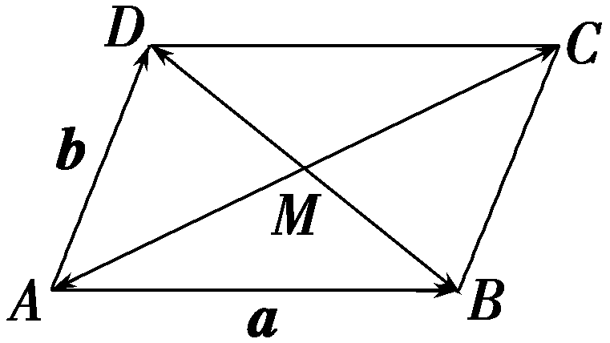

点评：高考题与教材例题都是考查向量的线性运算，设问的本质也是一样，涉及相同的知识点，相似度极高.

**课时测评**51　**平面向量的概念及线性运算** $\frac{对应学生}{用书P411}$

(时间：60分钟　满分：83分)

(本栏目内容，在学生用书中以独立形式分册装订！)

(1—8题，每小题5分，共40分)

1.化简2(***a***－3***b***)－3(***a***＋***b***)的结果为(　　)

A.***a***＋4***b***	B.－***a***－9***b***

C.2***a***＋***b***	D.***a***－3***b***

答案：**B**

解析：2 $\left(a－3b\right)$ －3 $\left(a＋b\right)$ ＝2<text style="<text style="<text style="***b***old,it***a***lic">b</text>old,it***a***lic">b</text>old,italic">a</text>－6b－3a－3b＝－a－9b.故选B.

2.已知 $\vec{AB}$ ＝<text style="<text style="***b***old,it***a***lic">b</text>old,italic">a</text>＋5b， $\vec{BC}$ ＝－2<text style="<text style="***b***old,it***a***lic">b</text>old,italic">a</text>＋8b， $\vec{CD}$ ＝3 $\left(a－b\right)$ ，则(　　)

A.*A*，*B*，*C*三点共线	B.*A*，*B*，*D*三点共线

C.*A*，*C*，*D*三点共线	D.*B*，*C*，*D*三点共线

答案：**B**

解析： $\vec{BD}$ ＝ $\vec{BC}$ ＋ $\vec{CD}$ ＝－2&lt;text style="&lt;text style="<em><strong>b</strong></em>old,it<em><strong>a</strong></em>lic"&gt;b&lt;/text&gt;old,italic"&gt;a&lt;/text&gt;＋8b＋3 $\left(a－b\right)$ ＝&lt;text style="&lt;text style="<em><strong>b</strong></em>old,it<em><strong>a</strong></em>lic"&gt;b&lt;/text&gt;old,italic"&gt;a&lt;/text&gt;＋5b＝ $\vec{AB}$ ，又因为 $\vec{BD}$ 与 $\vec{AB}$ 有公共点<em>&lt;text style="italic"&gt;B</em>&lt;/text&gt;，所以<em>A</em>，B，<em>D</em>三点共线.故选B.

3.如图，*BC*，*DE*是半径为1的圆*O*的两条直径， $\vec{BF}$ ＝2 $\vec{FO}$ ，且 $\vec{FC}$ ＝*<text style="italic">λ*</text> $\vec{FD}$ ＋*<text style="italic">μ*</text> $\vec{FE}$ ，则*<text style="italic">λ*</text>＋*<text style="italic">μ*</text>等于(　　)

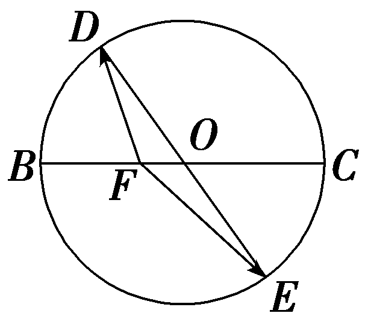

A.1	B.2

C.3	D.4

答案：**D**

解析：因为 $\vec{FC}$ ＝ $\vec{FO}$ ＋ $\vec{OC}$ ＝4 $\vec{FO}$ ＝4× $\frac{1}{2}(\vec{FD}$ ＋ $\vec{FE}$ )＝2 $\vec{FD}$ ＋2 $\vec{FE}$ ，所以*<text style="italic">λ*</text>＝*<text style="italic">μ*</text>＝2，所以λ＋μ＝4.故选D.

4.已知点<em>O</em>为△<em>&lt;text style="italic"&gt;&lt;text style="italic"&gt;A</em>BC&lt;/text&gt;&lt;/text&gt;的外接圆的圆心，且 $\vec{OA}$ ＋ $\vec{OB}$ ＋ $\vec{CO}$ ＝<strong>0</strong>，则△<em>&lt;text style="italic"&gt;&lt;text style="italic"&gt;A</em>BC&lt;/text&gt;&lt;/text&gt;的内角A等于(　　)

A.30°	B.45°

C.60°	D.90°

答案：**A**

解析：由 $\vec{OA}$ ＋ $\vec{OB}$ ＋ $\vec{CO}$ ＝<strong>0</strong>，得 $\vec{OA}$ ＋ $\vec{OB}$ ＝ $\vec{OC}$ .又<em>O</em>为△<em>ABC</em>的外接圆的圆心，根据向量加法的几何意义，知四边形<em>OACB</em>为菱形，且∠<em>CAO</em>＝6<strong>0</strong>°，因此∠<em>CAB</em>＝30°.故选A.

5.(多选)已知*M*为△*ABC*的重心，*D*为*BC*的中点，则下列等式成立的是(　　)

A.｜ $\vec{MA}$ ｜＝｜ $\vec{MB}$ ｜＝｜ $\vec{MC}$ ｜

B. $\vec{MA}$ ＋ $\vec{MB}$ ＋ $\vec{MC}$ ＝**0**

C. $\vec{BM}$ ＝ $\frac{2}{3}\vec{BA}$ ＋ $\frac{1}{3}\vec{BD}$

D. $S_{\bigtriangleup }_{MBC}$ ＝ $\frac{1}{3}S_{\bigtriangleup }_{ABC}$

答案：**BD**

解析：如图，<em>M</em>为&lt;text style="subscript"&gt;△&lt;/text&gt;<em>&lt;text style="italic,subscript"&gt;ABC</em>&lt;/text&gt;的重心，则 $\vec{MA}$ ＋ $\vec{MB}$ ＋ $\vec{MC}$ ＝<strong>0</strong>，A错误，B正确； $\vec{BM}$ ＝ $\vec{BD}$ ＋ $\vec{DM}$ ＝ $\vec{BD}$ ＋ $\frac{1}{3}\vec{DA}$ ＝ $\vec{BD}$ ＋ $\frac{1}{3}(\vec{BA}$ － $\vec{BD}$ )＝ $\frac{1}{3}\vec{BA}$ ＋ $\frac{2}{3}\vec{BD}$ ，C错误；由D<em>M</em>＝ $\frac{1}{3}$ <em>AD</em>得<em>&lt;text style="italic"&gt;S</em>&lt;/text&gt;&lt;text style="subscript"&gt;△&lt;/text&gt;<em>M</em>BC＝ $\frac{1}{3}$ <em>&lt;text style="italic"&gt;S</em>&lt;/text&gt;&lt;text style="subscript"&gt;△&lt;/text&gt;<em>&lt;text style="italic,subscript"&gt;ABC</em>&lt;/text&gt;，D正确.故选BD.

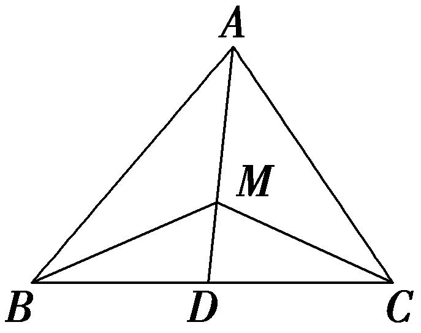

6.(多选)如图，在平行四边形*ABCD*中，点*E*在线段*DC*上，且满足*CE*＝2*DE*，则下列结论中正确的有(　　)

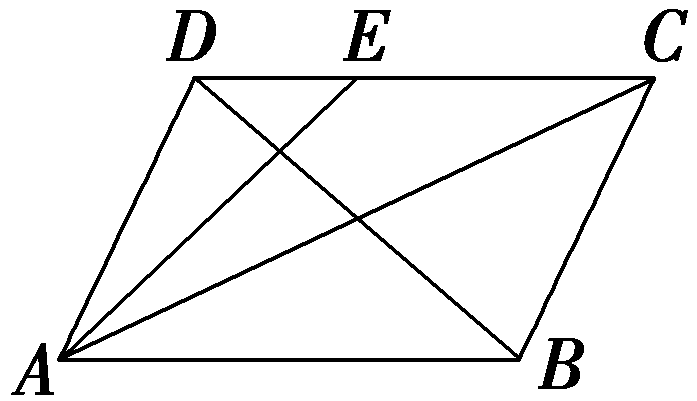

A. $\vec{AB}$ ＝ $\vec{DC}$ 	B. $\vec{AD}$ ＋ $\vec{AB}$ ＝ $\vec{AC}$

C. $\vec{AB}$ － $\vec{AD}$ ＝ $\vec{BD}$ 	D. $\vec{AE}$ ＝ $\vec{AD}$ ＋ $\frac{1}{3}\vec{AB}$

答案：**ABD**

解析：因为四边形*ABCD*为平行四边形，所以 $\vec{AB}$ ＝ $\vec{DC}$ ，故A正确；根据向量加法的平行四边形法则，可得 $\vec{AD}$ ＋ $\vec{AB}$ ＝ $\vec{AC}$ ，故B正确；根据向量的减法法则可得 $\vec{AB}$ － $\vec{AD}$ ＝ $\vec{DB}$ ，故C错误；由题意知， $\vec{AE}$ ＝ $\vec{AD}$ ＋ $\vec{DE}$ ＝ $\vec{AD}$ ＋ $\frac{1}{3}\vec{DC}$ ＝ $\vec{AD}$ ＋ $\frac{1}{3}\vec{AB}$ ，故D正确.故选ABD.

7.设向量<em><strong>a</strong></em>，<em><strong>b</strong></em>不平行，向量<em>t<strong>a</strong></em>＋<em><strong>b</strong></em>与<em><strong>a</strong></em>＋3<em><strong>b</strong></em>平行，则实数<em>t</em>的值为<u>　　　　</u>.

答案： $\frac{1}{3}$

解析：因为向量&lt;&lt;&lt;<em>t</em>ext style="it&lt;text style="&lt;text style="<em><strong>b</strong></em>old,it<em><strong>a</strong></em>lic"&gt;b&lt;/text&gt;old,italic"&gt;a&lt;/text&gt;lic"&gt;t&lt;/text&gt;ext style="it&lt;text style="&lt;text style="<em><strong>b</strong></em>old,it<em><strong>a</strong></em>lic"&gt;b&lt;/text&gt;old,italic"&gt;a&lt;/text&gt;lic"&gt;t&lt;/text&gt;ext style="it&lt;text style="&lt;text style="<em><strong>b</strong></em>old,it<em><strong>a</strong></em>lic"&gt;b&lt;/text&gt;old,italic"&gt;a&lt;/text&gt;lic"&gt;t&lt;/text&gt;a＋b与a＋3b平行，所以存在实数<em>&lt;text style="italic"&gt;&lt;text style="italic"&gt;&lt;text style="italic"&gt;&lt;text style="italic"&gt;k</em>&lt;/text&gt;&lt;/text&gt;&lt;/text&gt;&lt;/text&gt;使得ta＋b＝k(a＋3b)，即(t－k)a＝(3k－1)b，因为向量a，b不平行，所以 $\left\{\begin{matrix}t－k=0，\\3k－1=0，\end{matrix}\right.$ 解得&lt;&lt;&lt;<em>t</em>ext style="it&lt;text style="&lt;text style="<em><strong>b</strong></em>old,it<em><strong>a</strong></em>lic"&gt;b&lt;/text&gt;old,italic"&gt;a&lt;/text&gt;lic"&gt;t&lt;/text&gt;ext style="it&lt;text style="&lt;text style="<em><strong>b</strong></em>old,it<em><strong>a</strong></em>lic"&gt;b&lt;/text&gt;old,italic"&gt;a&lt;/text&gt;lic"&gt;t&lt;/text&gt;ext style="it&lt;text style="&lt;text style="<em><strong>b</strong></em>old,it<em><strong>a</strong></em>lic"&gt;b&lt;/text&gt;old,italic"&gt;a&lt;/text&gt;lic"&gt;t&lt;/text&gt;＝<em>&lt;text style="italic"&gt;&lt;text style="italic"&gt;&lt;text style="italic"&gt;&lt;text style="italic"&gt;k</em>&lt;/text&gt;&lt;/text&gt;&lt;/text&gt;&lt;/text&gt;＝ $\frac{1}{3}$ .

8.已知向量 $\vec{OA}$ ＝ $\vec{OB}$ ·lo $g_{\frac{1}{2}}$ sin <em>&lt;text style="italic"&gt;&lt;text style="italic"&gt;θ</em>&lt;/text&gt;&lt;/text&gt;＋ $\vec{OC}$ ·log2cos <em>&lt;text style="italic"&gt;&lt;text style="italic"&gt;θ</em>&lt;/text&gt;&lt;/text&gt;，若<em>A</em>，<em>B</em>，<em>C</em>三点共线，则tan θ＝<u>　　　　</u>.

答案： $\frac{1}{2}$

解析：由题意，向量 $\vec{OA}$ ＝ $\vec{OB}$ <em>&lt;text style="italic"&gt;·</em>&lt;/text&gt;lo $g_{\frac{1}{2}}$ sin <em>&lt;text style="italic"&gt;&lt;text style="italic"&gt;&lt;text style="italic"&gt;&lt;text style="italic"&gt;&lt;text style="italic"&gt;&lt;text style="italic"&gt;θ</em>&lt;/text&gt;&lt;/text&gt;&lt;/text&gt;&lt;/text&gt;&lt;/text&gt;&lt;/text&gt;＋ $\vec{OC}$ <em>&lt;text style="italic"&gt;·</em>&lt;/text&gt;log&lt;text style="subscript"&gt;2&lt;/text&gt;cos <em>&lt;text style="italic"&gt;&lt;text style="italic"&gt;&lt;text style="italic"&gt;&lt;text style="italic"&gt;&lt;text style="italic"&gt;&lt;text style="italic"&gt;θ</em>&lt;/text&gt;&lt;/text&gt;&lt;/text&gt;&lt;/text&gt;&lt;/text&gt;&lt;/text&gt;，又<em>A</em>，<em>B</em>，<em>C</em>三点共线，则由共线定理知lo $g_{\frac{1}{2}}$ sin <em>&lt;text style="italic"&gt;&lt;text style="italic"&gt;&lt;text style="italic"&gt;&lt;text style="italic"&gt;&lt;text style="italic"&gt;&lt;text style="italic"&gt;θ</em>&lt;/text&gt;&lt;/text&gt;&lt;/text&gt;&lt;/text&gt;&lt;/text&gt;&lt;/text&gt;＋log&lt;text style="subscript"&gt;2&lt;/text&gt;cos θ＝1，即lo $g_{\frac{1}{2}}$ sin <em>&lt;text style="italic"&gt;&lt;text style="italic"&gt;&lt;text style="italic"&gt;&lt;text style="italic"&gt;&lt;text style="italic"&gt;&lt;text style="italic"&gt;θ</em>&lt;/text&gt;&lt;/text&gt;&lt;/text&gt;&lt;/text&gt;&lt;/text&gt;&lt;/text&gt;－lo $g_{\frac{1}{2}}$ cos <em>&lt;text style="italic"&gt;&lt;text style="italic"&gt;&lt;text style="italic"&gt;&lt;text style="italic"&gt;&lt;text style="italic"&gt;&lt;text style="italic"&gt;θ</em>&lt;/text&gt;&lt;/text&gt;&lt;/text&gt;&lt;/text&gt;&lt;/text&gt;&lt;/text&gt;＝1，即lo $g_{\frac{1}{2}}\frac{sin\theta }{cos\theta }$ ＝1，可得 $\frac{sin\theta }{cos\theta }$ ＝ $\frac{1}{2}$ ，即tan <em>&lt;text style="italic"&gt;&lt;text style="italic"&gt;&lt;text style="italic"&gt;&lt;text style="italic"&gt;&lt;text style="italic"&gt;&lt;text style="italic"&gt;θ</em>&lt;/text&gt;&lt;/text&gt;&lt;/text&gt;&lt;/text&gt;&lt;/text&gt;&lt;/text&gt;＝ $\frac{1}{2}$ .

9.(13分)如图，在△&lt;text style="it&lt;text style="<em><strong>b</strong></em>old,italic"&gt;a&lt;/text&gt;lic"&gt;<em>A&lt;text style="italic"&gt;B</em>C&lt;/text&gt;&lt;/text&gt;中，<em>&lt;text style="italic"&gt;D</em>&lt;/text&gt;为BC的四等分点，且靠近B点，<em>E</em>，<em>F</em>分别为<em>AC</em>，<em>AD</em>的三等分点，且分别靠近A，D两点，设 $\vec{AB}$ ＝&lt;text style="<em><strong>b</strong></em>old,italic"&gt;a&lt;/text&gt;， $\vec{AC}$ ＝<em><strong>b</strong></em>.

(1)试用<text style="***b***old,italic">a</text>，b表示 $\vec{BC}$ ， $\vec{AD}$ ， $\vec{BE}$ ；(6分)

(2)证明：*B*，*E*，*F*三点共线.(7分)

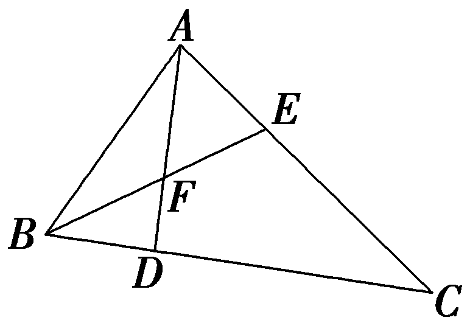

解：(1)在△<text style="it<text style="***b***old,italic">a</text>lic">ABC</text>中，因为 $\vec{AB}$ ＝<text style="***b***old,italic">a</text>， $\vec{AC}$ ＝***b***，

所以 $\vec{BC}$ ＝ $\vec{AC}$ － $\vec{AB}$ ＝<text style="bold,it***a***lic">b</text>－a，

$\vec{AD}$ ＝ $\vec{AB}$ ＋ $\vec{BD}$ ＝ $\vec{AB}$ ＋ $\frac{1}{4}\vec{BC}$

＝<text style="<text style="***b***old,it<text style="bold,it***a***lic">a</text>lic">b</text>old,italic">a</text>＋ $\frac{1}{4}$ (<text style="***b***old,it<text style="bold,it***a***lic">a</text>lic">b</text>－***a***)＝ $\frac{3}{4}$ <text style="<text style="***b***old,it<text style="bold,it***a***lic">a</text>lic">b</text>old,italic">a</text>＋ $\frac{1}{4}$ <text style="***b***old,it<text style="bold,it***a***lic">a</text>lic">b</text>，

$\vec{BE}$ ＝ $\vec{BA}$ ＋ $\vec{AE}$ ＝－ $\vec{AB}$ ＋ $\frac{1}{3}\vec{AC}$ ＝－<text style="***b***old,italic">a</text>＋ $\frac{1}{3}$ ***b***.

(2)证明：因为 $\vec{BE}$ ＝－<text style="***b***old,italic">a</text>＋ $\frac{1}{3}$ ***b***，

$\vec{BF}$ ＝ $\vec{BA}$ ＋ $\vec{AF}$ ＝－ $\vec{AB}$ ＋ $\frac{2}{3}\vec{AD}$

＝－<text style="***b***old,it***a***lic">a</text>＋ $\frac{2}{3}\left(\frac{3}{4}a＋\frac{1}{4}b\right)$ ＝－ $\frac{1}{2}$ <text style="***b***old,it***a***lic">a</text>＋ $\frac{1}{6}$ ***b***

＝ $\frac{1}{2}\left(－a＋\frac{1}{3}b\right)$ ，

所以 $\vec{BF}$ ＝ $\frac{1}{2}\vec{BE}$ ，即 $\vec{BF}$ 与 $\vec{BE}$ 共线，且有公共点*<text style="italic">B*</text>，所以B，*E*，*F*三点共线.

(10—13题，每小题5分，共20分)

10.已知向量<em><strong>a</strong></em>，<em><strong>b</strong></em>不共线，且<em><strong>c</strong></em>＝<em>λ<strong>a</strong></em>＋<em><strong>b</strong></em>，<em><strong>d</strong></em>＝<em><strong>a</strong></em>＋(2<em>λ</em>－1)<em><strong>b</strong></em>，若<em><strong>c</strong></em>与<em><strong>d</strong></em>反向共线，则实数<em>λ</em>的值为(　　)

A.1	B.－ $\frac{1}{2}$

C.1或－ $\frac{1}{2}$ 	D.－1或－ $\frac{1}{2}$

答案：**B**

解析：由于&lt;text style="&lt;text style="&lt;text style="&lt;text style="&lt;text style="<em><strong>b</strong></em>old,it<em><strong>a</strong></em>lic"&gt;b&lt;/text&gt;old,it<em><strong>a</strong></em>lic"&gt;b&lt;/text&gt;old,it<em><strong>a</strong></em>lic"&gt;b&lt;/text&gt;old,it<em><strong>a</strong></em>lic"&gt;b&lt;/text&gt;ol&lt;text style="bol&lt;text style="bold,it<em><strong>a</strong></em>lic"&gt;d&lt;/text&gt;,itali<em><strong>c</strong></em>"&gt;d&lt;/text&gt;,italic"&gt;c&lt;/text&gt;与d反向共线，则存在实数<em>&lt;text style="italic"&gt;&lt;text style="italic"&gt;&lt;text style="italic"&gt;&lt;text style="italic"&gt;&lt;text style="italic"&gt;&lt;text style="italic"&gt;&lt;text style="italic"&gt;&lt;text style="italic"&gt;k</em>&lt;/text&gt;&lt;/text&gt;&lt;/text&gt;&lt;/text&gt;&lt;/text&gt;&lt;/text&gt;&lt;/text&gt;&lt;/text&gt;使c＝kd(k＜0)，于是<em>&lt;text style="italic"&gt;&lt;text style="italic"&gt;&lt;text style="italic"&gt;&lt;text style="italic"&gt;&lt;text style="italic"&gt;&lt;text style="italic"&gt;&lt;text style="italic"&gt;&lt;text style="italic"&gt;&lt;text style="italic"&gt;λ</em>&lt;/text&gt;&lt;/text&gt;&lt;/text&gt;&lt;/text&gt;&lt;/text&gt;&lt;/text&gt;&lt;/text&gt;&lt;/text&gt;&lt;/text&gt;a＋b＝k[a＋(2λ－1)b]，整理得λa＋b＝ka＋(2<em>&lt;text style="italic"&gt;λk</em>&lt;/text&gt;－k)b.因为a，b不共线，所以λ＝k，且2λk－k＝1，整理得2λ2－λ－1＝0，解得λ＝1或λ＝－ $\frac{1}{2}$ ，又因为&lt;text style="it&lt;text style="&lt;text style="&lt;text style="&lt;text style="&lt;text style="<em><strong>b</strong></em>old,it<em><strong>a</strong></em>lic"&gt;b&lt;/text&gt;old,it<em><strong>a</strong></em>lic"&gt;b&lt;/text&gt;old,it<em><strong>a</strong></em>lic"&gt;b&lt;/text&gt;old,it<em><strong>a</strong></em>lic"&gt;b&lt;/text&gt;old,italic"&gt;a&lt;/text&gt;li&lt;text style="bol<em><strong>d</strong></em>,italic"&gt;c&lt;/text&gt;"&gt;<em>&lt;text style="italic"&gt;&lt;text style="italic"&gt;&lt;text style="italic"&gt;&lt;text style="italic"&gt;&lt;text style="italic"&gt;&lt;text style="italic"&gt;&lt;text style="italic"&gt;k</em>&lt;/text&gt;&lt;/text&gt;&lt;/text&gt;&lt;/text&gt;&lt;/text&gt;&lt;/text&gt;&lt;/text&gt;&lt;/text&gt;＜0，所以<em>&lt;text style="italic"&gt;&lt;text style="italic"&gt;&lt;text style="italic"&gt;&lt;text style="italic"&gt;&lt;text style="italic"&gt;&lt;text style="italic"&gt;&lt;text style="italic"&gt;&lt;text style="italic"&gt;&lt;text style="italic"&gt;λ</em>&lt;/text&gt;&lt;/text&gt;&lt;/text&gt;&lt;/text&gt;&lt;/text&gt;&lt;/text&gt;&lt;/text&gt;&lt;/text&gt;&lt;/text&gt;＜0，故λ＝－ $\frac{1}{2}$ .故选B.

11.如图，在△*A<text style="italic"><text style="italic">BC*</text></text>中，BC＝6，*D*，*E*是BC的三等分点，且 $\vec{AD}$ · $\vec{AE}$ ＝4，则下列等式错误的是(　　)

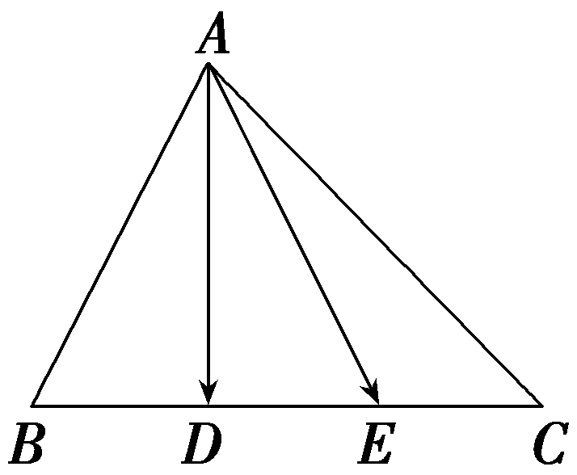

A. $\vec{AD}$ ＝ $\frac{1}{2}\vec{AB}$ ＋ $\frac{1}{2}\vec{AE}$

B. $\vec{AE}$ ＝ $\frac{2}{3}\vec{AB}$ ＋ $\frac{1}{3}\vec{AC}$

C. $\vec{AB}$ · $\vec{AC}$ ＝－4

D. $\vec{AB}^{2}$ ＋ $\vec{AC}^{2}$ ＝28

答案：**B**

解析：对于A，由题意得，*<text style="italic">D*</text>为*B<text style="italic">E*</text>的中点，所以 $\vec{AD}$ ＝ $\frac{1}{2}\vec{AB}$ ＋ $\frac{1}{2}\vec{AE}$ ，故A正确；对于B， $\vec{AE}$ ＝ $\vec{AC}$ ＋ $\vec{CE}$ ＝ $\vec{AC}$ ＋ $\frac{1}{3}\vec{CB}$ ＝ $\vec{AC}$ ＋ $\frac{1}{3}(\vec{AB}$ － $\vec{AC}$ )＝ $\frac{1}{3}\vec{AB}$ ＋ $\frac{2}{3}\vec{AC}$ ，故B不正确；对于C，取*<text style="italic">D*</text>*E*的中点*<text style="italic"><text style="italic">G*</text></text>(图略)，由*<text style="italic"><text style="italic"><text style="italic">BC*</text></text></text>＝6，D，E是BC的三等分点得，G是BC的中点，且*<text style="italic">DE*</text>＝2，所以 $\vec{AD}$ *<text style="italic"><text style="italic"><text style="italic"><text style="italic">·*</text></text></text></text> $\vec{AE}$ ＝( $\vec{AG}$ － $\frac{1}{2}\vec{DE}$ )*<text style="italic"><text style="italic"><text style="italic"><text style="italic">·*</text></text></text></text>( $\vec{AG}$ ＋ $\frac{1}{2}\vec{DE}$ )＝ $\vec{AG}^{2}$ － $\frac{1}{4}\vec{DE}^{2}$ ＝4，所以 $\vec{AG}^{2}$ ＝5， $\vec{AB}$ *<text style="italic"><text style="italic"><text style="italic"><text style="italic">·*</text></text></text></text> $\vec{AC}$ ＝( $\vec{AG}$ － $\frac{1}{2}\vec{BC}$ )*<text style="italic"><text style="italic"><text style="italic"><text style="italic">·*</text></text></text></text>( $\vec{AG}$ ＋ $\frac{1}{2}\vec{BC}$ )＝ $\vec{AG}^{2}$ － $\frac{1}{4}\vec{BC}^{2}$ ＝5－9＝－4，故C正确； 对于*<text style="italic">D*</text>，由*<text style="italic"><text style="italic">G*</text></text>是*<text style="italic"><text style="italic"><text style="italic">BC*</text></text></text>的中点得 $\vec{AB}$ ＋ $\vec{AC}$ ＝2 $\vec{AG}$ ，两边平方得 $\vec{AB}^{2}$ ＋2 $\vec{AB}$ *<text style="italic"><text style="italic"><text style="italic"><text style="italic">·*</text></text></text></text> $\vec{AC}$ ＋ $\vec{AC}^{2}$ ＝4 $\vec{AG}^{2}$ ，所以 $\vec{AB}^{2}$ ＋ $\vec{AC}^{2}$ ＝20＋8＝28，故*<text style="italic">D*</text>正确.故选B.

12.(多选)设点*M*是△*ABC*所在平面内一点，则下列说法正确的是(　　)

A.若 $\vec{BM}$ ＝ $\frac{1}{3}\vec{BC}$ ，则 $\vec{AM}$ ＝ $\frac{1}{3}\vec{AC}$ ＋ $\frac{2}{3}\vec{AB}$

*B*.若 $\vec{AM}$ ＝2 $\vec{AC}$ －3 $\vec{AB}$ ，则点*M*，*B*，*C*三点共线

C.若点<em>M</em>是△<em>ABC</em>的重心，则 $\vec{MA}$ ＋ $\vec{MB}$ ＋ $\vec{MC}$ ＝<strong>0</strong>

D.若 $\vec{AM}$ ＝<te<text st*y*le="italic">x</text>t st*y*le="italic">x</text> $\vec{AB}$ ＋<te<text st*y*le="italic">x</text>t style="italic">y</text> $\vec{AC}$ 且<te<text st*y*le="italic">x</text>t st*y*le="italic">x</text>＋y＝ $\frac{1}{3}$ ，则△*MBC*的面积是△*ABC*面积的 $\frac{2}{3}$

答案：**ACD**

解析：对于A， $\vec{AM}$ ＝ $\vec{AB}$ ＋ $\vec{BM}$ ＝ $\vec{AB}$ ＋ $\frac{1}{3}\vec{BC}$ ＝ $\vec{AB}$ ＋ $\frac{1}{3}\left(\vec{AC}－\vec{AB}\right)$ ＝ $\frac{1}{3}\vec{AC}$ ＋ $\frac{2}{3}\vec{AB}$ ，故A正确；对于<em>&lt;text style="italic"&gt;B</em>&lt;/text&gt;，假设点<em>&lt;text style="italic"&gt;&lt;text style="italic"&gt;&lt;text style="italic"&gt;M</em>&lt;/text&gt;&lt;/text&gt;&lt;/text&gt;，B，<em>&lt;text style="italic"&gt;C</em>&lt;/text&gt;三点共线，则 $\vec{MB}$ ＝<em>&lt;text style="italic"&gt;&lt;text style="italic"&gt;&lt;text style="italic"&gt;&lt;text style="italic"&gt;λ</em>&lt;/text&gt;&lt;/text&gt;&lt;/text&gt;&lt;/text&gt; $\vec{BC}$ ，即 $\vec{AB}$ － $\vec{AM}$ ＝<em>&lt;text style="italic"&gt;&lt;text style="italic"&gt;&lt;text style="italic"&gt;&lt;text style="italic"&gt;λ</em>&lt;/text&gt;&lt;/text&gt;&lt;/text&gt;&lt;/text&gt; $\left(\vec{AC}－\vec{AB}\right)$ ，整理得 $\vec{AM}$ ＝－<em>&lt;text style="italic"&gt;&lt;text style="italic"&gt;&lt;text style="italic"&gt;&lt;text style="italic"&gt;λ</em>&lt;/text&gt;&lt;/text&gt;&lt;/text&gt;&lt;/text&gt; $\vec{AC}$ ＋(1＋<em>&lt;text style="italic"&gt;&lt;text style="italic"&gt;&lt;text style="italic"&gt;&lt;text style="italic"&gt;λ</em>&lt;/text&gt;&lt;/text&gt;&lt;/text&gt;&lt;/text&gt;)<em>·</em> $\vec{AB}$ ，故当<em>&lt;text style="italic"&gt;&lt;text style="italic"&gt;&lt;text style="italic"&gt;&lt;text style="italic"&gt;λ</em>&lt;/text&gt;&lt;/text&gt;&lt;/text&gt;&lt;/text&gt;＝－2时，即 $\vec{AM}$ ＝2 $\vec{AC}$ － $\vec{AB}$ ，与条件中的 $\vec{AM}$ ＝2 $\vec{AC}$ －3 $\vec{AB}$ 不一致，所以点<em>&lt;text style="italic"&gt;&lt;text style="italic"&gt;&lt;text style="italic"&gt;M</em>&lt;/text&gt;&lt;/text&gt;&lt;/text&gt;，<em>&lt;text style="italic"&gt;B</em>&lt;/text&gt;，<em>&lt;text style="italic"&gt;C</em>&lt;/text&gt;三点不共线，故B错误；对于C，如图，取<em>BC</em>中点<em>H</em>，连接<em>&lt;text style="italic"&gt;AH</em>&lt;/text&gt;，若点M是△<em>ABC</em>的重心，则点M在AH上，且<em>MA</em>＝2<em>MH</em>，则 $\vec{MB}$ ＋ $\vec{MC}$ ＝2 $\vec{MH}$ ，则 $\vec{MA}$ ＋ $\vec{MB}$ ＋ $\vec{MC}$ ＝<strong>0</strong>，故<em>&lt;text style="italic"&gt;C</em>&lt;/text&gt;正确；

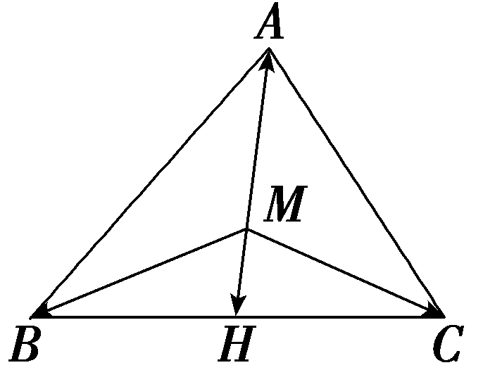

对于D，由于 $\vec{AM}$ ＝<te<te<te<text st*y*le="italic">x</text>t st*y*le="italic">x</text>t st*y*le="italic">x</text>t st*y*le="italic">x</text> $\vec{AB}$ ＋<te<te<te<text st*y*le="italic">x</text>t st*y*le="italic">x</text>t st*y*le="italic">x</text>t style="italic">y</text> $\vec{AC}$ 且<te<te<te<text st*y*le="italic">x</text>t st*y*le="italic">x</text>t st*y*le="italic">x</text>t st*y*le="italic">x</text>＋y＝ $\frac{1}{3}$ ，所以3 $\vec{AM}$ ＝3<te<te<te<text st*y*le="italic">x</text>t st*y*le="italic">x</text>t st*y*le="italic">x</text>t st*y*le="italic">x</text> $\vec{AB}$ ＋3<te<te<te<text st*y*le="italic">x</text>t st*y*le="italic">x</text>t st*y*le="italic">x</text>t style="italic">y</text> $\vec{AC}$ ，其中3<te<te<te<text st*y*le="italic">x</text>t st*y*le="italic">x</text>t st*y*le="italic">x</text>t st*y*le="italic">x</text>＋3y＝1，不妨设 $\vec{AQ}$ ＝3 $\vec{AM}$ ，则*Q*点在直线*BC*上，由于△*<text style="italic">MBC*</text>与△*<text style="italic">ABC*</text>同底，而高线之比等于*MQ*与*AQ*的比，即比值为2∶3，所以△MBC的面积是△ABC面积的 $\frac{2}{3}$ ，故D正确.故选ACD.

13.已知单位向量<em><strong>e</strong></em>1，<em><strong>e</strong></em>2，…，<em><strong>e</strong></em>2 025，则｜<em><strong>e</strong></em>1＋<em><strong>e</strong></em>2＋…＋<em><strong>e</strong></em>2 025｜的最大值是<u>　　　　</u>，最小值是<u>　　　　</u>.

答案：2 025　0

解析：当单位向量<em><strong>e</strong></em>1，<em><strong>e</strong></em>2，…，<em><strong>e</strong></em>2 025方向相同时，｜<em><strong>e</strong></em>1＋<em><strong>e</strong></em>2＋…＋<em><strong>e</strong></em>2 025｜取得最大值，｜<em><strong>e</strong></em>1＋<em><strong>e</strong></em>2＋…＋<em><strong>e</strong></em>2 025｜＝｜<em><strong>e</strong></em>1｜＋｜<em><strong>e</strong></em>2｜＋…＋｜<em><strong>e</strong></em>2 025｜＝2 025；当单位向量<em><strong>e</strong></em>1，<em><strong>e</strong></em>2，…，<em><strong>e</strong></em>2 025首尾相连时，<em><strong>e</strong></em>1＋<em><strong>e</strong></em>2＋…＋<em><strong>e</strong></em>2 025＝<strong>0</strong>，所以｜<em><strong>e</strong></em>1＋<em><strong>e</strong></em>2＋…＋<em><strong>e</strong></em>2 025｜的最小值为0.

(14、15题，每小题5分，共10分)

14.(多选)在△*ABC*中，点*D*满足 $\vec{BD}$ ＝ $\vec{DC}$ ，当点*E*在线段A*D*上移动时，记 $\vec{AE}$ ＝*λ* $\vec{AB}$ ＋*μ* $\vec{AC}$ ，则(　　)

A.*λ*＝2*μ*

B.*λ*＝*μ*

C.(<em>&lt;text style="italic"&gt;λ</em>&lt;/text&gt;－&lt;text style="superscript"&gt;&lt;text style="superscript"&gt;&lt;text style="superscript"&gt;2&lt;/text&gt;&lt;/text&gt;&lt;/text&gt;)2＋<em>&lt;text style="italic"&gt;μ</em>&lt;/text&gt;2的最小值为2D.(λ－2)2＋μ2的最小值为 $\frac{5}{2}$

答案：**BD**

解析：由 $\vec{BD}$ ＝ $\vec{DC}$ ，得 $\vec{AD}$ ＝ $\frac{1}{2}(\vec{AB}$ ＋ $\vec{AC}$ ).又点<em>E</em>在线段<em>AD</em>上移动，设 $\vec{AE}$ ＝<em>&lt;text style="italic"&gt;&lt;text style="italic"&gt;&lt;text style="italic"&gt;&lt;text style="italic"&gt;&lt;text style="italic"&gt;&lt;text style="italic"&gt;&lt;text style="italic"&gt;&lt;text style="italic"&gt;&lt;text style="italic"&gt;k</em>&lt;/text&gt;&lt;/text&gt;&lt;/text&gt;&lt;/text&gt;&lt;/text&gt;&lt;/text&gt;&lt;/text&gt;&lt;/text&gt;&lt;/text&gt; $\vec{AD}$ ＝ $\frac{1}{2}$ <em>&lt;text style="italic"&gt;&lt;text style="italic"&gt;&lt;text style="italic"&gt;&lt;text style="italic"&gt;&lt;text style="italic"&gt;&lt;text style="italic"&gt;&lt;text style="italic"&gt;&lt;text style="italic"&gt;&lt;text style="italic"&gt;k</em>&lt;/text&gt;&lt;/text&gt;&lt;/text&gt;&lt;/text&gt;&lt;/text&gt;&lt;/text&gt;&lt;/text&gt;&lt;/text&gt;&lt;/text&gt;( $\vec{AB}$ ＋ $\vec{AC}$ )＝ $\frac{1}{2}$ <em>&lt;text style="italic"&gt;&lt;text style="italic"&gt;&lt;text style="italic"&gt;&lt;text style="italic"&gt;&lt;text style="italic"&gt;&lt;text style="italic"&gt;&lt;text style="italic"&gt;&lt;text style="italic"&gt;&lt;text style="italic"&gt;k</em>&lt;/text&gt;&lt;/text&gt;&lt;/text&gt;&lt;/text&gt;&lt;/text&gt;&lt;/text&gt;&lt;/text&gt;&lt;/text&gt;&lt;/text&gt; $\vec{AB}$ ＋ $\frac{1}{2}$ <em>&lt;text style="italic"&gt;&lt;text style="italic"&gt;&lt;text style="italic"&gt;&lt;text style="italic"&gt;&lt;text style="italic"&gt;&lt;text style="italic"&gt;&lt;text style="italic"&gt;&lt;text style="italic"&gt;&lt;text style="italic"&gt;k</em>&lt;/text&gt;&lt;/text&gt;&lt;/text&gt;&lt;/text&gt;&lt;/text&gt;&lt;/text&gt;&lt;/text&gt;&lt;/text&gt;&lt;/text&gt; $\vec{AC}$ ，0≤<em>&lt;text style="italic"&gt;&lt;text style="italic"&gt;&lt;text style="italic"&gt;&lt;text style="italic"&gt;&lt;text style="italic"&gt;&lt;text style="italic"&gt;&lt;text style="italic"&gt;&lt;text style="italic"&gt;&lt;text style="italic"&gt;k</em>&lt;/text&gt;&lt;/text&gt;&lt;/text&gt;&lt;/text&gt;&lt;/text&gt;&lt;/text&gt;&lt;/text&gt;&lt;/text&gt;&lt;/text&gt;≤1，所以<em>λ</em>＝ $\frac{1}{2}$ <em>&lt;text style="italic"&gt;&lt;text style="italic"&gt;&lt;text style="italic"&gt;&lt;text style="italic"&gt;&lt;text style="italic"&gt;&lt;text style="italic"&gt;&lt;text style="italic"&gt;&lt;text style="italic"&gt;&lt;text style="italic"&gt;k</em>&lt;/text&gt;&lt;/text&gt;&lt;/text&gt;&lt;/text&gt;&lt;/text&gt;&lt;/text&gt;&lt;/text&gt;&lt;/text&gt;&lt;/text&gt;，<em>&lt;text style="italic"&gt;μ</em>&lt;/text&gt;＝ $\frac{1}{2}$ <em>&lt;text style="italic"&gt;&lt;text style="italic"&gt;&lt;text style="italic"&gt;&lt;text style="italic"&gt;&lt;text style="italic"&gt;&lt;text style="italic"&gt;&lt;text style="italic"&gt;&lt;text style="italic"&gt;&lt;text style="italic"&gt;k</em>&lt;/text&gt;&lt;/text&gt;&lt;/text&gt;&lt;/text&gt;&lt;/text&gt;&lt;/text&gt;&lt;/text&gt;&lt;/text&gt;&lt;/text&gt;，故A错误，B正确； $\left(\lambda －2\right)^{2}$ ＋<em>&lt;text style="italic"&gt;μ</em>&lt;/text&gt;&lt;text style="superscript"&gt;2&lt;/text&gt;＝ $\left(\frac{1}{2}k－2\right)^{2}$ ＋ $\left(\frac{1}{2}k\right)^{2}$ ＝ $\frac{1}{2}$ <em>&lt;text style="italic"&gt;&lt;text style="italic"&gt;&lt;text style="italic"&gt;&lt;text style="italic"&gt;&lt;text style="italic"&gt;&lt;text style="italic"&gt;&lt;text style="italic"&gt;&lt;text style="italic"&gt;&lt;text style="italic"&gt;k</em>&lt;/text&gt;&lt;/text&gt;&lt;/text&gt;&lt;/text&gt;&lt;/text&gt;&lt;/text&gt;&lt;/text&gt;&lt;/text&gt;&lt;/text&gt;&lt;text style="superscript"&gt;2&lt;/text&gt;－2k＋4＝ $\frac{1}{2}\left(k－2\right)^{2}$ ＋&lt;text style="superscript"&gt;2&lt;/text&gt;，当<em>&lt;text style="italic"&gt;&lt;text style="italic"&gt;&lt;text style="italic"&gt;&lt;text style="italic"&gt;&lt;text style="italic"&gt;&lt;text style="italic"&gt;&lt;text style="italic"&gt;&lt;text style="italic"&gt;&lt;text style="italic"&gt;k</em>&lt;/text&gt;&lt;/text&gt;&lt;/text&gt;&lt;/text&gt;&lt;/text&gt;&lt;/text&gt;&lt;/text&gt;&lt;/text&gt;&lt;/text&gt;＝1时，有最小值 $\frac{5}{2}$ ，故C错误，D正确.故选BD.

15.如图，已知正六边形<em>A&lt;text style="italic"&gt;B</em>CDEF&lt;/text&gt;，<em>&lt;text style="italic"&gt;M</em>&lt;/text&gt;，<em>&lt;text style="italic"&gt;N</em>&lt;/text&gt;分别是对角线<em>AC</em>，<em>CE</em>上的点，使得 $\frac{AM}{AC}$ ＝ $\frac{CN}{CE}$ ＝<em>&lt;text style="italic"&gt;r</em>&lt;/text&gt;，当r＝<u>　　　　</u>时，<em>B</em>，<em>&lt;text style="italic"&gt;M</em>&lt;/text&gt;，<em>&lt;text style="italic"&gt;N</em>&lt;/text&gt;三点共线.

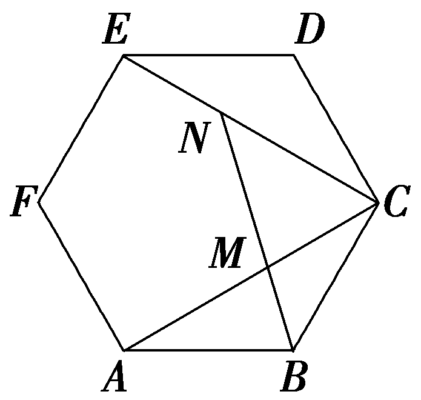

答案： $\frac{\sqrt{3}}{3}$

解析：如图，连接<text style="it<text style="it*a*lic">a</text>lic">*<text style="italic">AD*</text></text>，交*<text style="italic">EC*</text>于*<text style="italic">G*</text>点，设正六边形边长为a，由正六边形的性质知，AD⊥*CE*，AD∥*CB*，G点为EC的中点，且*AG*＝ $\frac{3}{2}$ <text style="it*a*lic">a</text>，

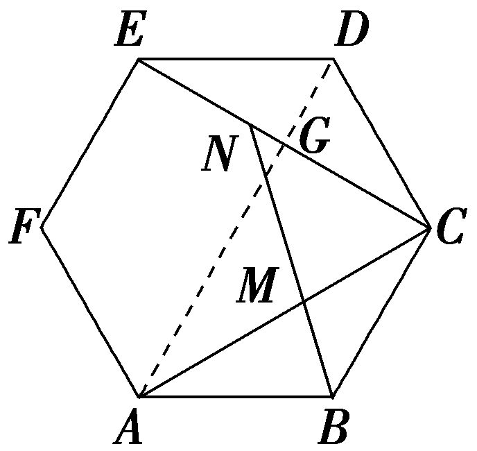

则 $\vec{CA}$ ＝ $\vec{CG}$ ＋ $\vec{GA}$ ＝ $\frac{1}{2}\vec{CE}$ ＋ $\frac{3}{2}\vec{CB}$ ，又 $\frac{AM}{AC}$ ＝ $\frac{CN}{CE}$ ＝*<text style="italic"><text style="italic">r*</text></text>(r＞0)，则 $\vec{CA}$ ＝ $\frac{\vec{CM}}{1－r}$ ， $\vec{CE}$ ＝ $\frac{\vec{CN}}{r}$ ，故 $\frac{\vec{CM}}{1－r}$ ＝ $\frac{\vec{CN}}{2r}$ ＋ $\frac{3}{2}\vec{CB}$ ，即 $\vec{CM}$ ＝ $\frac{1－r}{2r}\vec{CN}$ ＋ $\frac{3\left(1－r\right)}{2}\vec{CB}$ ，若*B*，*M*，*N*三点共线，由共线定理知 $\frac{1－r}{2r}$ ＋ $\frac{3\left(1－r\right)}{2}$ ＝1，解得*<text style="italic"><text style="italic">r*</text></text>＝ $\frac{\sqrt{3}}{3}$ 或－ $\frac{\sqrt{3}}{3}$ (舍).

