**第二节　平面向量基本定理及坐标表示**

【课标研读】　1.理解平面向量基本定理及其意义.　2.借助平面直角坐标系，掌握平面向量的正交分解及其坐标表示.　3.会用坐标表示平面向量的加法、减法与数乘运算.　4.能用坐标表示平面向量共线的条件.

1.平面向量基本定理

(1)定理：如果<em><strong>e</strong></em>1，<em><strong>e</strong></em>2是同一平面内的两个不共线向量，那么对于这一平面内的任一向量<em><strong>a</strong></em>，<u>有且只有</u>一对实数<em>λ</em>1，<em>λ</em>2，使<em><strong>a</strong></em>＝<em>λ</em>1<em><strong>e</strong></em>1＋<em>λ</em>2<em><strong>e</strong></em>2.

(2)基底：若<em><strong>e</strong></em>1，<em><strong>e</strong></em>2<u>不共线</u>，我们把{<em><strong>e</strong></em>1，<em><strong>e</strong></em>2}叫做表示这一平面内所有向量的一个基底.

[微提醒]　(1)基底<em><strong>e</strong></em>1，<em><strong>e</strong></em>2必须是同一平面内的两个不共线向量，零向量不能作为基底.(2)基底给定，同一向量的分解形式唯一.

2.平面向量的坐标运算

(1)平面向量的坐标运算

已知<em><strong>a</strong></em>＝(<em>x</em>1，<em>y</em>1)，<em><strong>b</strong></em>＝(<em>x</em>2，<em>y</em>2).

<table><tr><td>
向量的加法运算
</td><td>
<strong><em>a</em></strong>＋<strong><em>b</em></strong>＝(<em>x</em>1＋<em>x</em>2，<em>y</em>1＋<em>y</em>2)
</td></tr><tr><td>
向量的减法运算
</td><td>
<strong><em>a</em></strong>－<strong><em>b</em></strong>＝(<em>x</em>1－<em>x</em>2，<em>y</em>1－<em>y</em>2)
</td></tr><tr><td>
向量的数乘运算
</td><td>
<em>λ</em><strong><em>a</em></strong>＝(<em>λx</em>1，<em>λy</em>1)
</td></tr><tr><td>
向量的模
</td><td>
｜a｜＝ $\sqrt{x_{1}^{2}＋y_{1}^{2}}$ 
</td></tr></table>

(2)向量坐标的求法

已知&lt;te&lt;te&lt;te&lt;te&lt;text st&lt;text st<em><u>y</u></em>le="italic,underline"&gt;y&lt;/text&gt;le="italic,underline"&gt;x&lt;/text&gt;t style="italic,underline"&gt;x&lt;/text&gt;t st<em>y</em>le="italic"&gt;x&lt;/text&gt;t st<em>y</em>le="italic"&gt;x&lt;/text&gt;t style="italic"&gt;A&lt;/text&gt;<u>(</u>x&lt;text style="subscript"&gt;&lt;text style="underline,subscript"&gt;&lt;text style="underline,subscript"&gt;1&lt;/text&gt;&lt;/text&gt;&lt;/text&gt;<u>，</u>y1<u>)</u>，<em>B</em>(x&lt;text style="subscript"&gt;&lt;text style="underline,subscript"&gt;&lt;text style="underline,subscript"&gt;2&lt;/text&gt;&lt;/text&gt;&lt;/text&gt;，y2)，则 $\vec{AB}$ ＝&lt;te&lt;te&lt;text st&lt;text st<em><u>y</u></em>le="italic,underline"&gt;y&lt;/text&gt;le="italic,underline"&gt;x&lt;/text&gt;t style="italic,underline"&gt;x&lt;/text&gt;t style="underline"&gt;(&lt;/text&gt;&lt;te&lt;text st<em>y</em>le="italic"&gt;x&lt;/text&gt;t st<em>y</em>le="italic"&gt;x&lt;/text&gt;&lt;text style="subscript"&gt;&lt;text style="underline,subscript"&gt;&lt;text style="underline,subscript"&gt;2&lt;/text&gt;&lt;/text&gt;&lt;/text&gt;<u>&lt;text style="underline"&gt;－</u>&lt;/text&gt;x&lt;text style="subscript"&gt;&lt;text style="underline,subscript"&gt;&lt;text style="underline,subscript"&gt;1&lt;/text&gt;&lt;/text&gt;&lt;/text&gt;<u>，</u>y2－y1<u>)</u>，｜ $\vec{AB}$ ｜＝ $\sqrt{(x_{2}－x_{1})^{2}＋(y_{2}－y_{1})^{2}}$ .

3.平面向量共线的坐标表示

设<em><strong>a</strong></em>＝(<em>x</em>1，<em>y</em>1)，<em><strong>b</strong></em>＝(<em>x</em>2，<em>y</em>2)，其中<em><strong>b</strong></em>≠<strong>0</strong>，则<em><strong>a</strong></em>∥<em><strong>b</strong></em>⇔<em><strong>a</strong></em>＝<em>λ<strong>b</strong></em>(<em>λ</em>∈<strong>R</strong>)⇔<em><u>x</u></em><u>1</u><em><u>y</u></em><u>2－</u><em><u>x</u></em><u>2</u><em><u>y</u></em><u>1＝0</u>.

[微提醒]　因为&lt;text st&lt;text style="it&lt;text style="<em><strong>b</strong></em>old,italic"&gt;a&lt;/text&gt;lic"&gt;y&lt;/text&gt;le="italic"&gt;x&lt;/text&gt;&lt;text style="subscript"&gt;2&lt;/text&gt;，y2有可能为0，所以a∥b的充要条件不能表示为 $\frac{x_{1}}{x_{2}}$ ＝ $\frac{y_{1}}{y_{2}}$ .

【常用结论】

(1)若<em><strong>a</strong></em>与<em><strong>b</strong></em>不共线，且<em>λ<strong>a</strong></em>＋<em>μ<strong>b</strong></em>＝<strong>0</strong>，则<em>λ</em>＝<em>μ</em>＝0.

(&lt;text st<em>y</em>le="subscript"&gt;2&lt;/text&gt;)已知&lt;te&lt;te<em>x</em>t st<em>y</em>le="italic"&gt;x&lt;/text&gt;t style="italic"&gt;O&lt;/text&gt;为原点，<em>&lt;text style="italic"&gt;P</em>&lt;/text&gt;为线段<em>&lt;text style="italic"&gt;AB</em>&lt;/text&gt;的中点，若A(x&lt;text style="subscript"&gt;1&lt;/text&gt;，y1)，B(x2，y2)，则由 $\vec{OP}$ ＝ $\frac{1}{2}(\vec{OA}$ ＋ $\vec{OB}$ )可得点&lt;te&lt;te&lt;text st<em>y</em>le="italic"&gt;x&lt;/text&gt;t st<em>y</em>le="italic"&gt;x&lt;/text&gt;t style="italic"&gt;<em>P</em>&lt;/text&gt;的坐标为 $\left(\frac{x_{1}＋x_{2}}{2}，\frac{y_{1}＋y_{2}}{2}\right)$ .

(&lt;text st<em>y</em>le="subscript"&gt;3&lt;/text&gt;)已知△&lt;te&lt;te&lt;te<em>x</em>t st<em>y</em>le="italic"&gt;x&lt;/text&gt;t st<em>y</em>le="italic"&gt;x&lt;/text&gt;t style="italic"&gt;<em>ABC</em>&lt;/text&gt;的顶点A(x&lt;text style="subscript"&gt;1&lt;/text&gt;，y1)，B(x&lt;text style="subscript"&gt;2&lt;/text&gt;，y2)，C(x3，y3)，则由 $\vec{OG}$ ＝ $\frac{1}{3}(\vec{OA}$ ＋ $\vec{OB}$ ＋ $\vec{OC}$ )可得△&lt;te&lt;te&lt;te&lt;text st<em>y</em>le="italic"&gt;x&lt;/text&gt;t st<em>y</em>le="italic"&gt;x&lt;/text&gt;t st<em>y</em>le="italic"&gt;x&lt;/text&gt;t style="italic"&gt;<em>ABC</em>&lt;/text&gt;的重心<em>G</em>的坐标为 $\left(\frac{x_{1}＋x_{2}＋x_{3}}{3}，\frac{y_{1}＋y_{2}＋y_{3}}{3}\right)$ .

【自主检测】

1.(多选)下列结论正确的是(　　)

A.平面内的任意两个向量都可以作为一个基底

B.设{<em><strong>a</strong></em>，<em><strong>b</strong></em>}是平面内的一个基底，若<em>λ</em>1<em><strong>a</strong></em>＋<em>λ</em>2<em><strong>b</strong></em>＝<strong>0</strong>，则<em>λ</em>1＝<em>λ</em>2＝0

C.若&lt;te&lt;te&lt;text st&lt;text style="it&lt;text style="<em><strong>b</strong></em>old,italic"&gt;a&lt;/text&gt;lic"&gt;y&lt;/text&gt;le="italic"&gt;x&lt;/text&gt;t st<em>y</em>le="italic"&gt;x&lt;/text&gt;t style="<em><strong>b</strong></em>old,italic"&gt;a&lt;/text&gt;＝(x&lt;text style="subscript"&gt;1&lt;/text&gt;，y1)，b＝(x&lt;text style="subscript"&gt;2&lt;/text&gt;，y2)，则a∥b的充要条件可以表示成 $\frac{x_{1}}{x_{2}}$ ＝ $\frac{y_{1}}{y_{2}}$

D.平面向量不论经过怎样的平移变换之后其坐标不变

答案：**BD**

2.下列各组向量中，可以作为基底的是(　　)

A.<em><strong>e</strong></em>1＝(0，0)，<em><strong>e</strong></em>2＝(1，2)

B.&lt;t<em><strong>e</strong></em>xt style="bold,italic"&gt;e&lt;/text&gt;1＝(2，－3)，e2＝( $\frac{1}{2}$ ，－ $\frac{3}{4}$ )

C.<em><strong>e</strong></em>1＝(3，5)，<em><strong>e</strong></em>2＝(6，10)

D.<em><strong>e</strong></em>1＝(－1，2)，<em><strong>e</strong></em>2＝(5，7)

答案：**D**

解析：由于选项A，B，C中的向量<em><strong>e</strong></em>1，<em><strong>e</strong></em>2都共线，故不能作为基底，而选项D中的向量<em><strong>e</strong></em>1，<em><strong>e</strong></em>2不共线，故可作为基底.故选D.

3.(链接人教A必修二P33T5)若<em>P</em>1(1，3)，<em>P</em>2(4，0)且<em>P</em>是线段<em>P</em>1<em>P</em>2的一个三等分点，则点<em>P</em>的坐标为(　　)

A.(2，2)	B.(3，－1)

C.(2，2)或(3，－1)	D.(2，2)或(3，1)

答案：**D**

解析：由题意可知 $\vec{P_{1}P_{2}}$ ＝ $\left(3,-3\right)$ .若 $\vec{P_{1}P}$ ＝ $\frac{1}{3}\vec{P_{1}P_{2}}$ ，则*<text style="italic">P*</text>点坐标为(2，2)；若 $\vec{P_{1}P}$ ＝ $\frac{2}{3}\vec{P_{1}P_{2}}$ ，则*<text style="italic">P*</text>点坐标为(3，1).故选D.

4.(链接人教A必修二P31例7)(2024·上海卷)已知&lt;text style="it&lt;text style="&lt;text style="<em><strong>b</strong></em>old,it<em><strong>a</strong></em>lic"&gt;b&lt;/text&gt;old,italic"&gt;a&lt;/text&gt;lic"&gt;<em>k</em>&lt;/text&gt;∈<strong>R</strong>，a＝ $\left(2，5\right)$ ，&lt;text style="<em><strong>b</strong></em>old,it<em><strong>a</strong></em>lic"&gt;b&lt;/text&gt;＝ $\left(6，k\right)$ ，且&lt;text style="&lt;text style="<em><strong>b</strong></em>old,it<em><strong>a</strong></em>lic"&gt;b&lt;/text&gt;old,italic"&gt;a&lt;/text&gt;∥b，则<em>&lt;text style="italic"&gt;k</em>&lt;/text&gt;的值为<u>　　　　</u>.

答案：15

解析：因为<em><strong>a</strong></em>∥<em><strong>b</strong></em>，所以2<em>k</em>＝5×6，解得<em>k</em>＝15.

考点一　平面向量基本定理的应用　　　　师生共研

(1)(一题多解)在△*A<text style="italic">BC* </text>中，*<text style="italic">AD* </text>为BC 边上的中线，*E* 为AD 的中点，则 $\vec{EB}$ ＝(　　)

A. $\frac{3}{4}\vec{AB}$ － $\frac{1}{4}\vec{AC}$  	B. $\frac{1}{4}\vec{AB}$ － $\frac{3}{4}\vec{AC}$

C. $\frac{3}{4}\vec{AB}$ ＋ $\frac{1}{4}\vec{AC}$ 	D. $\frac{1}{4}\vec{AB}$ ＋ $\frac{3}{4}\vec{AC}$

(2)(多选)(2025 ·河南郑州模拟)如图，在四边形*<text style="italic"><text style="italic"><text style="italic">AB*</text></text>*CD*</text>中，AB∥CD，AB⊥*<text style="italic">AD*</text>，AB＝2AD＝2*DC*，*E*为*BC*边上一点，且 $\vec{BC}$ ＝3 $\vec{EC}$ ，*F*为A*E*的中点，则(　　)

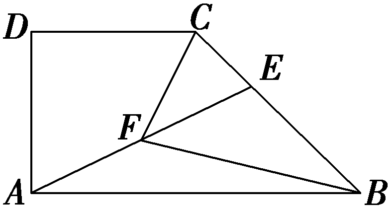

A. $\vec{AF}$ ＝ $\frac{1}{3}\vec{AB}$ ＋ $\frac{1}{3}\vec{AD}$

B. $\vec{BC}$ ＝－ $\frac{1}{2}\vec{AB}$ ＋ $\vec{AD}$

C. $\vec{CF}$ ＝ $\frac{1}{6}\vec{AB}$ － $\frac{2}{3}\vec{AD}$

D. $\vec{BF}$ ＝－ $\frac{2}{3}\vec{AB}$ ＋ $\frac{1}{3}\vec{AD}$

答案：(1)**A**　(2)**ABD**

解析：(1)法一：根据向量的运算法则可得，在△*AB<text style="italic">E* </text>中， $\vec{EB}$ ＝ $\vec{EA}$ ＋ $\vec{AB}$  .因为*E* 为*A<text style="italic">D* </text>的中点，所以 $\vec{EA}$ ＝ $\frac{1}{2}\vec{DA}$  ，在△*AB<text style="italic">D* </text>中， $\vec{DA}$ ＝ $\vec{DB}$ ＋ $\vec{BA}$ ＝ $\vec{DB}$ － $\vec{AB}$  .因为*D*为*BC* 的中点，所以 $\vec{DB}$ ＝ $\frac{1}{2}\vec{CB}$ .在△A*BC* 中， $\vec{CB}$ ＝ $\vec{AB}$ － $\vec{AC}$  .逐步代入，可得 $\vec{EB}$ ＝ $\vec{EA}$ ＋ $\vec{AB}$ ＝ $\frac{1}{2}\vec{DA}$ ＋ $\vec{AB}$ ＝ $\frac{1}{2}(\vec{DB}$ － $\vec{AB}$ )＋ $\vec{AB}$ ＝ $\frac{1}{2}(\frac{1}{2}\vec{CB}$ － $\vec{AB}$ )＋ $\vec{AB}$ ＝ $\frac{1}{4}\vec{CB}$ ＋ $\frac{1}{2}\vec{AB}$ ＝ $\frac{1}{4}(\vec{AB}$ － $\vec{AC}$ )＋ $\frac{1}{2}\vec{AB}$ ＝ $\frac{3}{4}\vec{AB}$ － $\frac{1}{4}\vec{AC}$  .故选A.

法二：由*D* 为*BC* 的中点，得 $\vec{AD}$ ＝ $\frac{1}{2}(\vec{AB}$ ＋ $\vec{AC}$ ) ，由*E* 为A*D* 的中点，得 $\vec{AE}$ ＝ $\frac{1}{2}\vec{AD}$ ＝ $\frac{1}{4}(\vec{AB}$ ＋ $\vec{AC}$ ) .在△AB*E* 中， $\vec{EB}$ ＝ $\vec{AB}$ － $\vec{AE}$ ＝ $\vec{AB}$ － $\frac{1}{4}(\vec{AB}$ ＋ $\vec{AC}$ )＝ $\frac{3}{4}\vec{AB}$ － $\frac{1}{4}\vec{AC}$  .故选A.

(2)由*<text style="italic"><text style="italic">AB*</text></text>∥*CD*，AB⊥*<text style="italic">AD*</text>，AB＝2AD＝2*DC*，由向量加法的三角形法则得 $\vec{AE}$ ＝ $\vec{AB}$ ＋ $\vec{BE}$ ＝ $\vec{AB}$ ＋ $\left(－\frac{1}{3}\vec{AB}＋\frac{2}{3}\vec{AD}\right)$ ＝ $\frac{2}{3}\vec{AB}$ ＋ $\frac{2}{3}\vec{AD}$ ，又*F*为*AE*的中点，则 $\vec{AF}$ ＝ $\frac{1}{2}\vec{AE}$ ＝ $\frac{1}{3}\vec{AB}$ ＋ $\frac{1}{3}\vec{AD}$ ，故A正确； $\vec{BC}$ ＝ $\vec{BA}$ ＋ $\vec{AD}$ ＋ $\vec{DC}$ ＝－ $\vec{AB}$ ＋ $\vec{AD}$ ＋ $\frac{1}{2}\vec{AB}$ ＝－ $\frac{1}{2}\vec{AB}$ ＋ $\vec{AD}$ ，故B正确； $\vec{BF}$ ＝ $\vec{BA}$ ＋ $\vec{AF}$ ＝－ $\vec{AB}$ ＋ $\frac{1}{3}\vec{AB}$ ＋ $\frac{1}{3}\vec{AD}$ ＝－ $\frac{2}{3}\vec{AB}$ ＋ $\frac{1}{3}\vec{AD}$ ，故D正确； $\vec{CF}$ ＝ $\vec{CB}$ ＋ $\vec{BF}$ ＝ $\vec{BF}$ － $\vec{BC}$ ＝－ $\frac{2}{3}\vec{AB}$ ＋ $\frac{1}{3}\vec{AD}$ － $\left(－\frac{1}{2}\vec{AB}＋\vec{AD}\right)$ ＝－ $\frac{1}{6}\vec{AB}$ － $\frac{2}{3}\vec{AD}$ ，故C错误.故选*<text style="italic"><text style="italic">AB*</text></text>D.

运算遵法则、基底定分解

1.应用平面向量基本定理表示向量的实质是利用平行四边形法则或三角形法则进行向量的加法、减法或数乘运算.一般将向量“放入”相关的三角形中，利用三角形法则列出向量间的关系.

2.用平面向量基本定理解决问题的一般思路：先选择一个基底，并运用该基底将条件和结论表示成向量的形式，再通过向量的运算来解决.注意同一个向量在不同基底下的分解是不同的，但在每个基底下的分解都是唯一的.

对点练1.(多选)下列命题中正确的是(　　)

A.若<em><strong>p</strong></em>＝<em>x<strong>a</strong></em>＋<em>y<strong>b</strong></em>(<em>x</em>，<em>y</em>∈<strong>R</strong>)，则<em><strong>p</strong></em>与<em><strong>a</strong></em>，<em><strong>b</strong></em>共面

B.若<em><strong>p</strong></em>与<em><strong>a</strong></em>，<em><strong>b</strong></em>共面，则存在实数<em>x</em>，<em>y</em>使得<em><strong>p</strong></em>＝<em>x<strong>a</strong></em>＋<em>y<strong>b</strong></em>

C.若 $\vec{MP}$ ＝<text st*y*le="italic">x</text> $\vec{MA}$ ＋*y* $\vec{MB}$ ，则*P*，*M*，*A*，*B*共面

D.若<te<te<text st*y*le="italic">x</text>t st*y*le="italic">x</text>t style="italic">P</text>，*M*，*A*，*B*共面，则存在实数x，y使得 $\vec{MP}$ ＝<te<text st*y*le="italic">x</text>t st*y*le="italic">x</text> $\vec{MA}$ ＋<te<text st*y*le="italic">x</text>t style="italic">y</text> $\vec{MB}$

答案：**AC**

解析：对于&lt;te&lt;te&lt;text st<em>y</em>le="italic"&gt;x&lt;/text&gt;t st<em>y</em>le="italic"&gt;x&lt;/text&gt;t style="italic"&gt;B&lt;/text&gt;，若&lt;te&lt;te&lt;text st<em>y</em>le="it&lt;text style="<em><strong>b</strong></em>old,italic"&gt;a&lt;/text&gt;lic"&gt;x&lt;/text&gt;t st<em>y</em>le="italic"&gt;x&lt;/text&gt;t style="&lt;text style="<em><strong>b</strong></em>old,it<em><strong>a</strong></em>lic"&gt;b&lt;/text&gt;old,italic"&gt;a&lt;/text&gt;，b共线，<em><strong>&lt;text style="bold,italic"&gt;p</strong></em>&lt;/text&gt;与a，b不共线，则不存在实数x，y使得p＝xa＋yb，故B错误；对于D，若<em>M</em>，<em>A</em>，B共线，<em>P</em>在直线<em>AB</em>外，则不存在实数x，y使得 $\vec{MP}$ ＝&lt;te&lt;te&lt;te&lt;text st<em>y</em>le="italic"&gt;x&lt;/text&gt;t st<em>y</em>le="italic"&gt;x&lt;/text&gt;t st<em>y</em>le="it&lt;text style="<em><strong>b</strong></em>old,italic"&gt;a&lt;/text&gt;lic"&gt;x&lt;/text&gt;t st<em>y</em>le="italic"&gt;x&lt;/text&gt; $\vec{MA}$ ＋&lt;te&lt;te&lt;te&lt;text st<em>y</em>le="italic"&gt;x&lt;/text&gt;t st<em>y</em>le="italic"&gt;x&lt;/text&gt;t st<em>y</em>le="it&lt;text style="<em><strong>b</strong></em>old,italic"&gt;a&lt;/text&gt;lic"&gt;x&lt;/text&gt;t style="italic"&gt;y&lt;/text&gt; $\vec{MB}$ ，故D错误；由平面向量基本定理知&lt;te&lt;te&lt;text st<em>y</em>le="italic"&gt;x&lt;/text&gt;t st<em>y</em>le="italic"&gt;x&lt;/text&gt;t style="italic"&gt;A&lt;/text&gt;C正确.故选AC.

对点练2.(2025·山西吕梁模拟)已知等边△*<text style="italic">AB*C</text>的边长为1，点*D*，*E*分别为AB，*BC*的中点，若 $\vec{DF}$ ＝3 $\vec{EF}$ ，则 $\vec{AF}$ ＝(　　)

A. $\frac{1}{2}\vec{AB}$ ＋ $\frac{5}{6}\vec{AC}$ 	B. $\frac{1}{2}\vec{AB}$ ＋ $\frac{3}{4}\vec{AC}$

C. $\frac{1}{2}\vec{AB}$ ＋ $\vec{AC}$ 	D. $\frac{1}{2}\vec{AB}$ ＋ $\frac{3}{2}\vec{AC}$

答案：**B**

解析：在△*<text style="italic">AB*C</text>中，取 $\left\{\vec{AC}，\vec{AB}\right\}$ 为基底，因为点*D*，*E*分别为*AB*，*BC*的中点， $\vec{DF}$ ＝3 $\vec{EF}$ ，所以 $\vec{EF}$ ＝ $\frac{1}{2}\vec{DE}$ ＝ $\frac{1}{4}\vec{AC}$ ，所以 $\vec{AF}$ ＝ $\vec{AE}$ ＋ $\vec{EF}$ ＝ $\frac{1}{2}\left(\vec{AB}＋\vec{AC}\right)$ ＋ $\frac{1}{4}\vec{AC}$ ＝ $\frac{1}{2}\vec{AB}$ ＋ $\frac{3}{4}\vec{AC}$ .故选B.

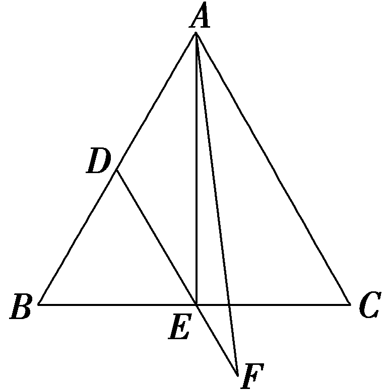

考点二　平面向量的坐标运算　　　　自主练透

1.已知<em><strong>a</strong></em>＝(5，－2)，<em><strong>b</strong></em>＝(－4，－3)，若<em><strong>a</strong></em>－2<em><strong>b</strong></em>＋3<em><strong>c</strong></em>＝<strong>0</strong>，则<em><strong>c</strong></em>等于(　　)

A. $\left(\frac{13}{3}，\frac{8}{3}\right)$ 	B. $\left(－\frac{13}{3},-\frac{8}{3}\right)$

C. $\left(\frac{13}{3}，\frac{4}{3}\right)$ 	D. $\left(－\frac{13}{3},-\frac{4}{3}\right)$

答案：**D**

解析：因为&lt;text style="&lt;text style="&lt;text style="&lt;text style="<em><strong>b</strong></em>old,it<em><strong>a</strong></em>li<em><strong>c</strong></em>"&gt;b&lt;/text&gt;old,it<em><strong>a</strong></em>lic"&gt;b&lt;/text&gt;old,it<em><strong>a</strong></em>li&lt;text style="bold,itali<em><strong>c</strong></em>"&gt;c&lt;/text&gt;"&gt;b&lt;/text&gt;old,italic"&gt;a&lt;/text&gt;－2b＋3c＝<strong>0</strong>，所以c＝－ $\frac{1}{3}$ (&lt;text style="&lt;text style="&lt;text style="&lt;text style="<em><strong>b</strong></em>old,it<em><strong>a</strong></em>li<em><strong>c</strong></em>"&gt;b&lt;/text&gt;old,it<em><strong>a</strong></em>lic"&gt;b&lt;/text&gt;old,it<em><strong>a</strong></em>li&lt;text style="bold,itali<em><strong>c</strong></em>"&gt;c&lt;/text&gt;"&gt;b&lt;/text&gt;old,italic"&gt;a&lt;/text&gt;－2b).因为a－2b＝(5，－2)－(－8，－6)＝(13，4)，所以c＝－ $\frac{1}{3}$ (&lt;text style="&lt;text style="&lt;text style="&lt;text style="<em><strong>b</strong></em>old,it<em><strong>a</strong></em>li<em><strong>c</strong></em>"&gt;b&lt;/text&gt;old,it<em><strong>a</strong></em>lic"&gt;b&lt;/text&gt;old,it<em><strong>a</strong></em>li&lt;text style="bold,itali<em><strong>c</strong></em>"&gt;c&lt;/text&gt;"&gt;b&lt;/text&gt;old,italic"&gt;a&lt;/text&gt;－2b)＝ $\left(－\frac{13}{3},-\frac{4}{3}\right)$ .故选D.

2.(2025 ·河南郑州名校联盟)已知点*A*，*B*，*C*，*D*为平面内不同的四点，若 $\vec{BD}$ ＝2 $\vec{DA}$ －3 $\vec{DC}$ ，且 $\vec{AC}$ ＝ $\left(－2，1\right)$ ，则 $\vec{AB}$ ＝(　　)

A. $\left(4,-2\right)$ 	B. $\left(－4，2\right)$

C. $\left(6,-3\right)$ 	D. $\left(－6，3\right)$

答案：**D**

解析：由 $\vec{BD}$ ＝2 $\vec{DA}$ －3 $\vec{DC}$ 得 $\vec{BD}$ ＋ $\vec{DA}$ ＝3 $\vec{DA}$ －3 $\vec{DC}$ ，即 $\vec{BA}$ ＝3 $\vec{CA}$ ，又 $\vec{AC}$ ＝ $\left(－2，1\right)$ ，所以 $\vec{AB}$ ＝3 $\vec{AC}$ ＝ $\left(－6，3\right)$ .故选D.

3.如图，在直角梯形<em>&lt;text style="italic"&gt;&lt;text style="italic"&gt;AB</em>&lt;/text&gt;CD&lt;/text&gt;中，AB∥<em>&lt;text style="italic"&gt;&lt;text style="italic"&gt;DC</em>&lt;/text&gt;&lt;/text&gt;，<em>&lt;text style="italic"&gt;&lt;text style="italic"&gt;AD</em>&lt;/text&gt;&lt;/text&gt;⊥DC，AD＝DC＝2AB，<em>E</em>为AD的中点，若 $\vec{CA}$ ＝<em>&lt;text style="italic"&gt;&lt;text style="italic"&gt;λ</em>&lt;/text&gt;&lt;/text&gt; $\vec{CE}$ ＋<em>&lt;text style="italic"&gt;&lt;text style="italic"&gt;μ</em>&lt;/text&gt;&lt;/text&gt; $\vec{DB}$ (<em>&lt;text style="italic"&gt;&lt;text style="italic"&gt;λ</em>&lt;/text&gt;&lt;/text&gt;，<em>&lt;text style="italic"&gt;&lt;text style="italic"&gt;μ</em>&lt;/text&gt;&lt;/text&gt;∈<strong>R</strong>)，则λ＋μ的值为(　　)

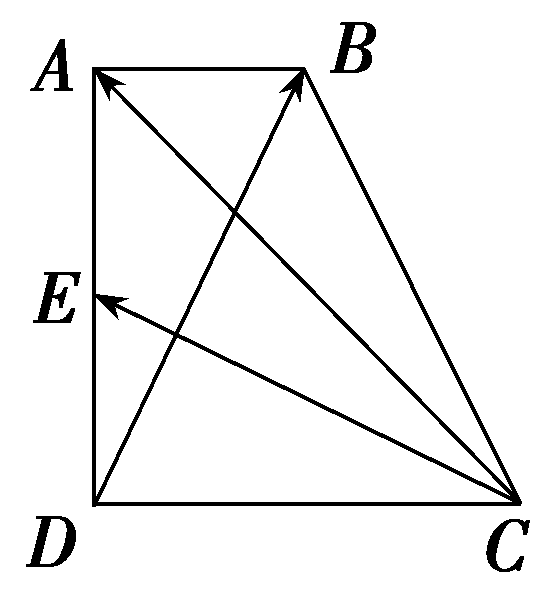

A. $\frac{6}{5}$ 	B. $\frac{8}{5}$

C.2	D. $\frac{8}{3}$

答案：**B**

解析：建立如图所示的平面直角坐标系，则*D*(0，0).不妨设*<text style="italic">AB*</text>＝1，则*D<text style="italic">C*</text>＝*AD*＝2，所以C(2，0)，A(0，2)，B(1，2)，*E*(0，1)，所以 $\vec{CA}$ ＝(－2，2)， $\vec{CE}$ ＝(－2，1)， $\vec{DB}$ ＝(1，2)，因为 $\vec{CA}$ ＝*<text style="italic"><text style="italic">λ*</text></text> $\vec{CE}$ ＋*<text style="italic"><text style="italic">μ*</text></text> $\vec{DB}$ ，所以(－2，2)＝*<text style="italic"><text style="italic">λ*</text></text>(－2，1)＋*<text style="italic"><text style="italic">μ*</text></text>(1，2)，所以 $\left\{\left.\begin{matrix}－2\lambda ＋\mu ＝－2，\\\lambda +2\mu =2，\end{matrix}\right.\right.$ 解得 $\left\{\left.\begin{matrix}\lambda ＝\frac{6}{5}，\\\mu ＝\frac{2}{5}，\end{matrix}\right.\right.$ 故*<text style="italic"><text style="italic">λ*</text></text>＋*<text style="italic"><text style="italic">μ*</text></text>＝ $\frac{8}{5}$ .故选*B*.

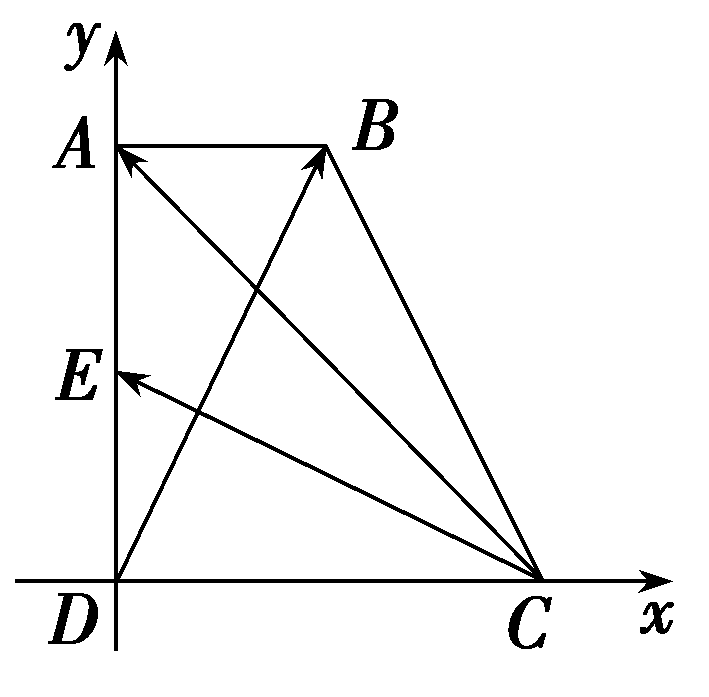

向量坐标运算问题的一般思路

1.向量问题坐标化：向量的坐标运算，使得向量的线性运算都可以用坐标来进行，实现了向量运算完全代数化，将数与形紧密结合起来，通过建立平面直角坐标系，使几何问题转化为数量运算.

2.巧借方程思想求坐标：向量的坐标运算主要是利用加法、减法、数乘运算法则进行，若已知有向线段两端点的坐标，则应先求出向量的坐标，求解过程中要注意方程思想的运用.

考点三　向量共线的坐标表示　　　　多维探究

角度1　利用向量共线求向量或点的坐标

(1)已知梯形<em>ABCD</em>，其中<em>AB</em>∥<em>CD</em>，且<em>DC</em>＝2<em>AB</em>，若<em>A</em>(1，2)，<em>B</em>(2，1)，<em>C</em>(4，2)，则点<em>D</em>的坐标为<u>　　　　</u>.

(2)(一题多解)已知<em>O</em>为坐标原点，点<em>A</em>(4，0)，<em>B</em>(4，4)，<em>C</em>(2，6)，则<em>AC</em>与<em>OB</em>的交点<em>P</em>的坐标为<u>　　　　</u>.

答案：(1)(2，4)　(2)(3，3)

解析：(1)由题意得， $\vec{DC}$ ＝2 $\vec{AB}$ .设点<te<te<text st*y*le="italic">x</text>t st*y*le="italic">x</text>t style="italic">*D*</text>的坐标为(x，y)，则 $\vec{DC}$ ＝ $\left(4－x，2－y\right)$ ， $\vec{AB}$ ＝ $\left(1,-1\right)$ ，所以(4－<te<text st*y*le="italic">x</text>t st*y*le="italic">x</text>，2－y)＝(2，－2)，即 $\left\{\begin{matrix}4－x=2，\\2－y＝－2，\end{matrix}\right.$ 解得 $\left\{\begin{matrix}x=2，\\y=4，\end{matrix}\right.$ 故点<te<te<text st*y*le="italic">x</text>t st*y*le="italic">x</text>t style="italic">*D*</text>的坐标为(2，4).

(2)法一：由*O*，*<text style="italic">P*</text>，*B*三点共线，可设 $\vec{OP}$ ＝*<text style="italic"><text style="italic"><text style="italic">λ*</text></text></text> $\vec{OB}$ ＝ $\left(4\lambda ，4\lambda \right)$ ，则 $\vec{AP}$ ＝ $\vec{OP}$ － $\vec{OA}$ ＝ $\left(4\lambda －4，4\lambda \right)$ .又 $\vec{AC}$ ＝ $\vec{OC}$ － $\vec{OA}$ ＝ $\left(－2，6\right)$ ，由 $\vec{AP}$ 与 $\vec{AC}$ 共线，得(4*<text style="italic"><text style="italic"><text style="italic">λ*</text></text></text>－4)×6－4λ×(－2)＝0，解得λ＝ $\frac{3}{4}$ .所以 $\vec{OP}$ ＝ $\frac{3}{4}\vec{OB}$ ＝ $\left(3，3\right)$ ，所以点*<text style="italic">P*</text>的坐标为(3，3).

法二：设点<te<te<te<te<te<te<text st*y*le="italic">x</text>t st*y*le="italic">x</text>t st*y*le="italic">x</text>t st*y*le="italic">x</text>t st*y*le="italic">x</text>t st*y*le="italic">x</text>t style="italic">*P*</text>(x，y)，则 $\vec{OP}$ ＝(<te<te<te<te<te<text st*y*le="italic">x</text>t st*y*le="italic">x</text>t st*y*le="italic">x</text>t st*y*le="italic">x</text>t st*y*le="italic">x</text>t st*y*le="italic">x</text>，y)，因为 $\vec{OB}$ ＝(4，4)，且 $\vec{OP}$ 与 $\vec{OB}$ 共线，所以 $\frac{x}{4}$ ＝ $\frac{y}{4}$ ，即<te<te<te<te<te<text st*y*le="italic">x</text>t st*y*le="italic">x</text>t st*y*le="italic">x</text>t st*y*le="italic">x</text>t st*y*le="italic">x</text>t st*y*le="italic">x</text>＝y.又 $\vec{AP}$ ＝(<te<te<te<te<te<text st*y*le="italic">x</text>t st*y*le="italic">x</text>t st*y*le="italic">x</text>t st*y*le="italic">x</text>t st*y*le="italic">x</text>t st*y*le="italic">x</text>－4，y)， $\vec{AC}$ ＝(－2，6)，且 $\vec{AP}$ 与 $\vec{AC}$ 共线，所以(<te<te<te<te<te<text st*y*le="italic">x</text>t st*y*le="italic">x</text>t st*y*le="italic">x</text>t st*y*le="italic">x</text>t st*y*le="italic">x</text>t st*y*le="italic">x</text>－4)×6－y×(－2)＝0，解得x＝y＝3，所以点*<text style="italic">P*</text>的坐标为(3，3).

角度2　利用向量共线求参数

(1)向量<em><strong>a</strong></em>＝(1，3)，<em><strong>b</strong></em>＝(3<em>x</em>－1，<em>x</em>＋1)，<em><strong>c</strong></em>＝(5，7)，若(<em><strong>a</strong></em>＋<em><strong>b</strong></em>)∥(<em><strong>a</strong></em>＋<em><strong>c</strong></em>)，且<em><strong>c</strong></em>＝<em>m<strong>a</strong></em>＋<em>n<strong>b</strong></em>，则<em>m</em>＋<em>n</em>的值为(　　)

A.2	B. $\frac{5}{2}$

C.3	D. $\frac{7}{2}$

(2)已知向量 $\vec{AB}$ ＝ $\left(7，6\right)$ ， $\vec{BC}$ ＝ $\left(－3，m\right)$ ， $\vec{AD}$ ＝ $\left(－1，2m\right)$ ，若<em>A</em>，<em>C</em>，<em>D</em>三点共线，则<em>m</em>＝<u>　　　　</u>.

答案：(1)**C**　(2)－ $\frac{2}{3}$

解析：(1)由题意，得&lt;te&lt;te&lt;te&lt;te&lt;te&lt;text style="it&lt;text style="<em><strong>b</strong></em>old,italic"&gt;a&lt;/text&gt;li<em><strong>c</strong></em>"&gt;x&lt;/text&gt;t style="italic"&gt;x&lt;/text&gt;t style="italic"&gt;x&lt;/text&gt;t style="it&lt;text style="&lt;text style="<em><strong>b</strong></em>old,it&lt;text style="bold,itali<em><strong>c</strong></em>"&gt;a&lt;/text&gt;lic"&gt;b&lt;/text&gt;old,it<em><strong>a</strong></em>li<em><strong>c</strong></em>"&gt;a&lt;/text&gt;lic"&gt;x&lt;/text&gt;t style="italic"&gt;x&lt;/text&gt;t style="<em><strong>b</strong></em>old,italic"&gt;a&lt;/text&gt;＋b＝(3x，x＋4)，a＋c＝(6，10)，因为(a＋b)∥(a＋c)，所以30x＝6x＋24，解得x＝1，所以b＝(2，2).则c＝<em>&lt;text style="italic"&gt;&lt;text style="italic"&gt;&lt;text style="italic"&gt;m</em>&lt;/text&gt;&lt;/text&gt;&lt;/text&gt;a＋<em>&lt;text style="italic"&gt;&lt;text style="italic"&gt;&lt;text style="italic"&gt;n</em>&lt;/text&gt;&lt;/text&gt;&lt;/text&gt;b＝(m＋2n，3m＋2n)＝(5，7)，即 $\left\{\begin{matrix}m+2n=5，\\3m+2n=7，\end{matrix}\right.$ 解得 $\left\{\begin{matrix}m=1，\\n=2，\end{matrix}\right.$ 故&lt;text style="it&lt;text style="<em><strong>b</strong></em>old,italic"&gt;a&lt;/text&gt;lic"&gt;<em>&lt;text style="italic"&gt;&lt;text style="italic"&gt;m</em>&lt;/text&gt;&lt;/text&gt;&lt;/text&gt;＋<em>&lt;text style="italic"&gt;&lt;text style="italic"&gt;&lt;text style="italic"&gt;n</em>&lt;/text&gt;&lt;/text&gt;&lt;/text&gt;＝3.故选C.

(2)因为 $\vec{AC}$ ＝ $\vec{AB}$ ＋ $\vec{BC}$ ＝ $\left(4，m+6\right)$ ，又<em>A</em>，<em>C</em>，<em>D</em>三点共线，所以 $\vec{AC}$ ＝<em>&lt;text style="italic"&gt;λ</em>&lt;/text&gt; $\vec{AD}$ 且<em>&lt;text style="italic"&gt;λ</em>&lt;/text&gt;∈<strong>R</strong>，则 $\left\{\begin{matrix}－\lambda =4，\\2m\lambda ＝m+6，\end{matrix}\right.$ 解得 $\left\{\begin{matrix}\lambda ＝－4，\\m＝－\frac{2}{3}.\end{matrix}\right.$

1.利用向量共线求向量或点的坐标的一般思路

(1)求与一个已知向量<em><strong>a</strong></em>共线的向量时，可设所求向量为<em>λ<strong>a</strong></em>(<em>λ</em>∈<strong>R</strong>)，然后结合其他条件列出关于<em>λ</em>的方程(组)，求出<em>λ</em>的值后代入<em>λ<strong>a</strong></em>即可得到所求的向量.

(2)求两直线交点坐标时，可充分利用两直线相交产生的两个“三点共线”的关系，结合共线向量定理求解.

2.利用向量共线的坐标表示求参数的步骤

第一步：根据已知条件求出相关向量的坐标；

第二步：利用向量共线的坐标表示列出有关向量的方程或方程组；

第三步：根据方程或方程组求解得到参数的值.

对点练3.(2024·河南开封第三次质量检测)已知向量&lt;text style="&lt;text style="<em><strong>b</strong></em>old,it<em><strong>a</strong></em>lic"&gt;b&lt;/text&gt;old,it<em><strong>a</strong></em>lic"&gt;a&lt;/text&gt;＝ $\left(2，1\right)$ ，&lt;text style="&lt;text style="<em><strong>b</strong></em>old,it<em><strong>a</strong></em>lic"&gt;b&lt;/text&gt;old,it<em><strong>a</strong></em>lic"&gt;a&lt;/text&gt;＋b＝ $\left(1，m\right)$ ，若&lt;text style="&lt;text style="<em><strong>b</strong></em>old,it<em><strong>a</strong></em>lic"&gt;b&lt;/text&gt;old,it<em><strong>a</strong></em>lic"&gt;a&lt;/text&gt;∥b，则<em>m</em>＝(　　)

A. －3	B. 3

C. － $\frac{1}{2}$ 	D. $\frac{1}{2}$

答案：**D**

解析：由&lt;text style="&lt;text style="&lt;text style="<em><strong>b</strong></em>old,it&lt;text style="bold,it<em><strong>a</strong></em>lic"&gt;a&lt;/text&gt;lic"&gt;b&lt;/text&gt;old,italic"&gt;b&lt;/text&gt;old,it<em><strong>a</strong></em>lic"&gt;a&lt;/text&gt;＝ $\left(2，1\right)$ ，&lt;text style="&lt;text style="&lt;text style="<em><strong>b</strong></em>old,it&lt;text style="bold,it<em><strong>a</strong></em>lic"&gt;a&lt;/text&gt;lic"&gt;b&lt;/text&gt;old,italic"&gt;b&lt;/text&gt;old,it<em><strong>a</strong></em>lic"&gt;a&lt;/text&gt;＋b＝ $\left(1，m\right)$ 可得，&lt;text style="&lt;text style="<em><strong>b</strong></em>old,it&lt;text style="bold,it<em><strong>a</strong></em>lic"&gt;a&lt;/text&gt;lic"&gt;b&lt;/text&gt;old,italic"&gt;b&lt;/text&gt;＝ $\left(a＋b\right)$ －&lt;text style="&lt;text style="&lt;text style="<em><strong>b</strong></em>old,it&lt;text style="bold,it<em><strong>a</strong></em>lic"&gt;a&lt;/text&gt;lic"&gt;b&lt;/text&gt;old,italic"&gt;b&lt;/text&gt;old,it<em><strong>a</strong></em>lic"&gt;a&lt;/text&gt;＝ $\left(－1，m－1\right)$ ，由&lt;text style="&lt;text style="&lt;text style="<em><strong>b</strong></em>old,it&lt;text style="bold,it<em><strong>a</strong></em>lic"&gt;a&lt;/text&gt;lic"&gt;b&lt;/text&gt;old,italic"&gt;b&lt;/text&gt;old,it<em><strong>a</strong></em>lic"&gt;a&lt;/text&gt;∥b可得，－1＝2(<em>&lt;text style="italic"&gt;m</em>&lt;/text&gt;－1)，解得m＝ $\frac{1}{2}$ .故选D.

对点练4.在Rt△<em>ABC</em>中，<em>AB</em>＝2，<em>AC</em>＝4，<em>AB</em>⊥<em>AC</em>，<em>E</em>，<em>F</em>分别为<em>AB</em>，<em>BC</em>中点，则<em>AF</em>与<em>CE</em>的交点坐标为<u>　　　　</u>.

答案： $\left(\frac{2}{3}，\frac{4}{3}\right)$

解析：建立如图所示的平面直角坐标系，则<te<te<te<te<te<te<text st*y*le="italic">x</text>t style="italic">x</text>t st<text st*y*le="italic">y</text>le="italic">x</text>t st*y*le="italic">x</text>t st*y*le="italic">x</text>t st*y*le="italic">x</text>t style="italic">B</text>(2，0)，*C*(0，4)，*E*(1，0)，*F*(1，2)，设*AF*与*CE*交点为*<text style="italic">D*</text>(x，y)，则 $\vec{AD}$ ＝(<te<te<te<te<te<text st*y*le="italic">x</text>t style="italic">x</text>t st<text st*y*le="italic">y</text>le="italic">x</text>t st*y*le="italic">x</text>t st*y*le="italic">x</text>t st*y*le="italic">x</text>，y)， $\vec{AF}$ ＝(1，2)，且 $\vec{AD}$ ∥ $\vec{AF}$ ，即2<te<te<te<te<te<text st*y*le="italic">x</text>t style="italic">x</text>t st<text st*y*le="italic">y</text>le="italic">x</text>t st*y*le="italic">x</text>t st*y*le="italic">x</text>t st*y*le="italic">x</text>－y＝0①，又 $\vec{CD}$ ＝(<te<te<te<te<te<text st*y*le="italic">x</text>t style="italic">x</text>t st<text st*y*le="italic">y</text>le="italic">x</text>t st*y*le="italic">x</text>t st*y*le="italic">x</text>t st*y*le="italic">x</text>，y－4)， $\vec{CE}$ ＝(1，－4)，且 $\vec{CD}$ ∥ $\vec{CE}$ ，即<te<te<te<te<te<text st*y*le="italic">x</text>t style="italic">x</text>t st<text st*y*le="italic">y</text>le="italic">x</text>t st*y*le="italic">x</text>t st*y*le="italic">x</text>t style="italic">y</text>－4＋4*x*＝0②，由①②得x＝ $\frac{2}{3}$ ，<te<te<te<te<te<text st*y*le="italic">x</text>t style="italic">x</text>t st<text st*y*le="italic">y</text>le="italic">x</text>t st*y*le="italic">x</text>t st*y*le="italic">x</text>t style="italic">y</text>＝ $\frac{4}{3}$ ，故交点<te<te<te<te<te<te<text st*y*le="italic">x</text>t style="italic">x</text>t st<text st*y*le="italic">y</text>le="italic">x</text>t st*y*le="italic">x</text>t st*y*le="italic">x</text>t st*y*le="italic">x</text>t style="italic">*D*</text> $\left(\frac{2}{3}，\frac{4}{3}\right)$ .

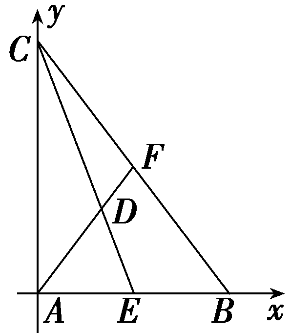

[真题再现]　(2021·全国乙卷)已知向量<em><strong>a</strong></em>＝(2，5)，<em><strong>b</strong></em>＝(<em>λ</em>，4)，若<em><strong>a</strong></em>∥<em><strong>b</strong></em>，则<em>λ</em>＝<u>　　　　</u>.

答案： $\frac{8}{5}$

解析：因为<em><strong>a</strong></em>∥<em><strong>b</strong></em> ，所以2×4－5<em>&lt;text style="italic"&gt;λ</em>&lt;/text&gt;＝0 ，解得λ＝ $\frac{8}{5}$  .

[教材呈现]　(人教A必修二P31例7)已知<em><strong>a</strong></em>＝(4，2)，<em><strong>b</strong></em>＝(6，<em>y</em>)，且<em><strong>a</strong></em>∥<em><strong>b</strong></em>，求<em>y</em>.

点评：高考题及教材例题都考查两向量共线的坐标表示.涉及相同的知识点，相似度极高.

**课时测评**52　**平面向量基本定理及坐标表示** $\frac{对应学生}{用书P413}$

(时间：60分钟　满分：88分)

(本栏目内容，在学生用书中以独立形式分册装订！)

(1—8题，每小题5分，共40分)

1.已知向量<em><strong>a</strong></em>＝(1，2)，<em><strong>b</strong></em>＝(2，－2)，<em><strong>c</strong></em>＝(1，<em>λ</em>).若<em><strong>c</strong></em>∥(2<em><strong>a</strong></em>＋<em><strong>b</strong></em>)，则<em>λ</em>等于(　　)

A. $\frac{2}{3}$ 	B. $\frac{1}{3}$

C. $\frac{1}{2}$ 	D. $\frac{1}{4}$

答案：**C**

解析：因为&lt;text style="&lt;text style="&lt;text style="<em><strong>b</strong></em>old,it<em><strong>a</strong></em>li&lt;text style="bold,itali<em><strong>c</strong></em>"&gt;c&lt;/text&gt;"&gt;b&lt;/text&gt;old,it<em><strong>a</strong></em>lic"&gt;b&lt;/text&gt;old,italic"&gt;a&lt;/text&gt;＝(1，2)，b＝(2，－2)，所以2a＋b＝(4，2).又c＝(1，<em>&lt;text style="italic"&gt;&lt;text style="italic"&gt;λ</em>&lt;/text&gt;&lt;/text&gt;)，c∥(2a＋b)，所以4λ＝2，解得λ＝ $\frac{1}{2}$ .故选C.

2.在*A*＝90°的等腰直角三角形*<text style="italic">AB*C</text>中，*E*为AB的中点，*F*为*BC*的中点， $\vec{BC}$ ＝*<text style="italic">λ*</text> $\vec{AF}$ ＋*μ* $\vec{CE}$ ，则*<text style="italic">λ*</text>等于(　　)

A.－ $\frac{2}{3}$ 	B.－ $\frac{3}{2}$

C.－ $\frac{4}{3}$ 	D.－1

答案：**A**

解析：如图，以*A*为原点建立平面直角坐标系，设*A<text style="italic">B*</text>＝2，则B(2，0)，*C*(0，2)，*F*(1，1)，*E*(1，0)， $\vec{BC}$ ＝(－2，2)，*<text style="italic"><text style="italic">λ*</text></text> $\vec{AF}$ ＋*<text style="italic">μ*</text> $\vec{CE}$ ＝*<text style="italic"><text style="italic">λ*</text></text> $\left(1，1\right)$ ＋*<text style="italic">μ*</text> $\left(1,-2\right)$ ＝ $\left(\lambda ＋\mu ，\lambda －2\mu \right)$ ，所以 $\left\{\begin{matrix}\lambda ＋\mu ＝－2，\\\lambda －2\mu =2，\end{matrix}\right.$ 所以*<text style="italic"><text style="italic">λ*</text></text>＝－ $\frac{2}{3}$ .故选*A*.

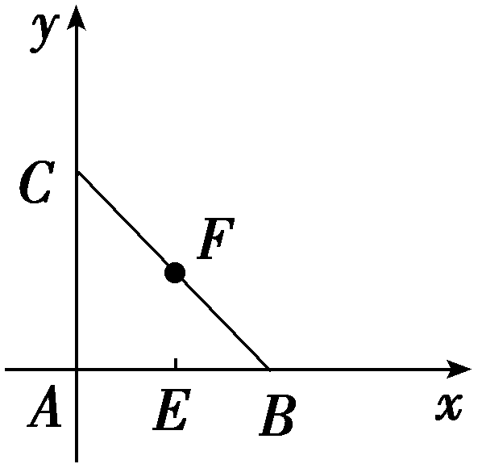

3.在矩形*A<text style="italic">BC*D</text>中，*<text style="italic">E*</text>是BC的中点，*F*是*AE*上靠近E的三等分点，则向量 $\vec{DF}$ 等于(　　)

A. $\frac{2}{3}\vec{AB}$ ＋ $\frac{4}{3}\vec{AC}$ 	B. $\frac{4}{3}\vec{AB}$ － $\frac{2}{3}\vec{AC}$

C. $\frac{1}{3}\vec{AB}$ ＋ $\frac{2}{3}\vec{AC}$ 	D. $\frac{1}{3}\vec{AB}$ － $\frac{2}{3}\vec{AC}$

答案：**B**

解析：如图，根据平面向量的运算法则，可得 $\vec{DF}$ ＝ $\vec{DA}$ ＋ $\vec{AF}$ ＝ $\vec{CB}$ ＋ $\frac{2}{3}\vec{AE}$ ＝ $\vec{AB}$ － $\vec{AC}$ ＋ $\frac{2}{3}$ × $\frac{1}{2}(\vec{AB}$ ＋ $\vec{AC}$ )＝ $\vec{AB}$ － $\vec{AC}$ ＋ $\frac{1}{3}\vec{AB}$ ＋ $\frac{1}{3}\vec{AC}$ ＝ $\frac{4}{3}\vec{AB}$ － $\frac{2}{3}\vec{AC}$ .故选B.

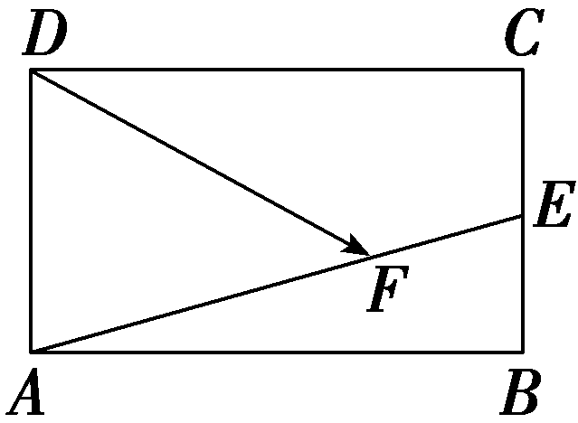

4.(2025·江西新余模拟)如图，&lt;text style="it&lt;text style="<em><strong>b</strong></em>old,italic"&gt;a&lt;/text&gt;lic"&gt;AB&lt;/text&gt;是☉<em>O</em>的直径，点<em>C</em>，<em>D</em>是半圆弧 $\overparen{AB}$ 上的两个三等分点， $\vec{AB}$ ＝&lt;text style="<em><strong>b</strong></em>old,italic"&gt;a&lt;/text&gt;， $\vec{AC}$ ＝<em><strong>b</strong></em>，则 $\vec{BD}$ 等于(　　)

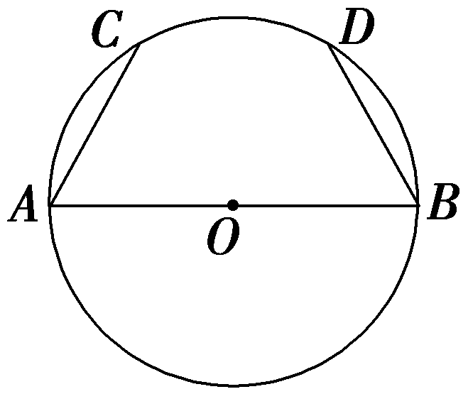

A. $\frac{1}{2}$ <text style="***b***old,it***a***lic">a</text>－***b***	B.a－ $\frac{1}{2}$ ***b***

C.－ $\frac{1}{2}$ <text style="***b***old,it***a***lic">a</text>＋***b***	D.－a＋ $\frac{1}{2}$ ***b***

答案：**C**

解析：连接&lt;text style="it&lt;text style="<em><strong>b</strong></em>old,italic"&gt;a&lt;/text&gt;lic"&gt;O<em>C</em>&lt;/text&gt;，<em>O&lt;text style="italic"&gt;D</em>&lt;/text&gt;和<em>&lt;text style="italic"&gt;CD</em>&lt;/text&gt;，如图所示，由于C，D是半圆弧 $\overparen{AB}$ 上的两个三等分点，所以△A&lt;text style="it&lt;text style="<em><strong>b</strong></em>old,italic"&gt;a&lt;/text&gt;lic"&gt;O<em>C</em>&lt;/text&gt;，△C<em>O&lt;text style="italic"&gt;D</em>&lt;/text&gt;，△<em>D&lt;text style="italic"&gt;OB</em>&lt;/text&gt;是等边三角形，所以<em>OA</em>＝OB＝<em>OC</em>＝<em>OD</em>＝<em>AC</em>＝<em>&lt;text style="italic"&gt;CD</em>&lt;/text&gt;＝<em>BD</em>，所以四边形<em>OACD</em>和四边形<em>OBDC</em>是菱形，所以 $\vec{BD}$ ＝ $\vec{OC}$ ＝ $\vec{AC}$ － $\vec{AO}$ ＝ $\vec{AC}$ － $\frac{1}{2}\vec{AB}$ ＝－ $\frac{1}{2}$ &lt;text style="<em><strong>b</strong></em>old,italic"&gt;a&lt;/text&gt;＋b.故选<em>C</em>.

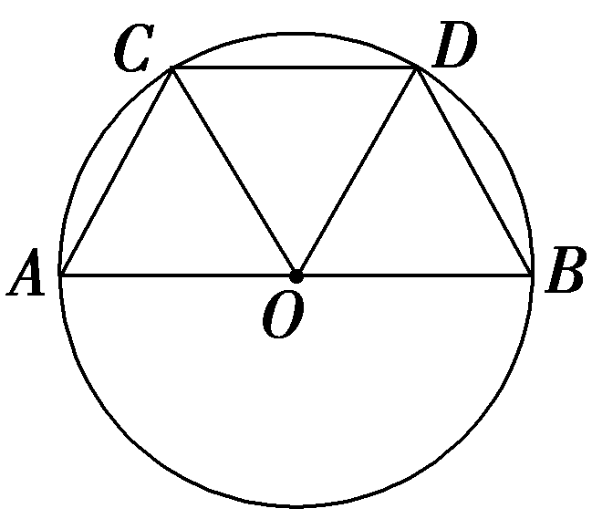

5.(多选)若<em>k</em>1<em><strong>a</strong></em>＋<em>k</em>2<em><strong>b</strong></em>＝<strong>0</strong>，则<em>k</em>1＝<em>k</em>2＝0，那么下列对<em><strong>a</strong></em>，<em><strong>b</strong></em>的判断不正确的是(　　)

A.***a***与***b***一定共线

B.***a***与***b***一定不共线

C.***a***与***b***一定垂直

D.<em><strong>a</strong></em>与<em><strong>b</strong></em>中至少有一个为<strong>0</strong>

答案：**ACD**

解析：由平面向量基本定理知，当<em><strong>a</strong></em>，<em><strong>b</strong></em>不共线时，若<em>k</em>1<em><strong>a</strong></em>＋<em>k</em>2<em><strong>b</strong></em>＝<strong>0</strong>，则<em>k</em>1＝<em>k</em>2＝0，当<em><strong>a</strong></em>与<em><strong>b</strong></em>共线时，<em>k</em>1＝<em>k</em>2＝0只是其中一组解，此时解不唯一，所以A错误，B正确；而当<em><strong>a</strong></em>，<em><strong>b</strong></em>不共线时，不一定有<em><strong>a</strong></em>与<em><strong>b</strong></em>垂直，所以C错误；当<em><strong>a</strong></em>与<em><strong>b</strong></em>中至少有一个为<strong>0</strong>时，<em>k</em>1，<em>k</em>2中至少有一个可以不为零，所以D错误.故选ACD.

6.(多选)已知等边三角形*ABC*内接于☉*O* ，*D* 为线段*OA* 的中点，*E* 为*BC* 中点，则 $\vec{BD}$ ＝(　　)

A. $\frac{2}{3}\vec{BA}$ ＋ $\frac{1}{6}\vec{BC}$ 	B. $\frac{4}{3}\vec{BA}$ － $\frac{1}{6}\vec{BC}$

C. $\vec{BA}$ ＋ $\frac{1}{3}\vec{AE}$ 	D. $\frac{2}{3}\vec{BA}$ ＋ $\frac{1}{3}\vec{AE}$

答案：**AC**

解析： $\vec{BD}$ ＝ $\vec{BA}$ ＋ $\vec{AD}$ ＝ $\vec{BA}$ ＋ $\frac{1}{3}\vec{AE}$ ＝ $\vec{BA}$ ＋ $\frac{1}{3}(\vec{AB}$ ＋ $\vec{BE}$ )＝ $\vec{BA}$ － $\frac{1}{3}\vec{BA}$ ＋ $\frac{1}{3}$ × $\frac{1}{2}\vec{BC}$ ＝ $\frac{2}{3}\vec{BA}$ ＋ $\frac{1}{6}\vec{BC}$  .故选AC.

7.已知向量<em><strong>a</strong></em>＝(6，2)，与<em><strong>a</strong></em>共线且方向相反的单位向量<em><strong>b</strong></em>＝<u>　　　　</u>.

答案： $\left(－\frac{3\sqrt{10}}{10},-\frac{\sqrt{10}}{10}\right)$

解析：因为<text style="***b***old,it<text style="bold,it***a***lic">a</text>lic">a</text>＝ $\left(6，2\right)$ ，｜<text style="***b***old,it<text style="bold,it***a***lic">a</text>lic">a</text>｜＝ $\sqrt{36+4}$ ＝2 $\sqrt{10}$ ，所以与<text style="***b***old,it<text style="bold,it***a***lic">a</text>lic">a</text>共线且方向相反的单位向量是b＝－ $\frac{a}{｜a｜}$ ＝ $\left(－\frac{3\sqrt{10}}{10},-\frac{\sqrt{10}}{10}\right)$ .

8.如图，在正方形&lt;te&lt;te<em>x</em>t st<em>y</em>le="italic"&gt;x&lt;/text&gt;t style="italic"&gt;A<em>BC</em>D&lt;/text&gt;中，<em>P</em>，<em>Q</em>分别是边BC，<em>CD</em>的中点， $\vec{AP}$ ＝&lt;te<em>x</em>t st<em>y</em>le="italic"&gt;x&lt;/text&gt; $\vec{AC}$ ＋&lt;te<em>x</em>t style="italic"&gt;y&lt;/text&gt; $\vec{BQ}$ ，则&lt;te<em>x</em>t st<em>y</em>le="italic"&gt;x&lt;/text&gt;＝<u>　　　　</u>.

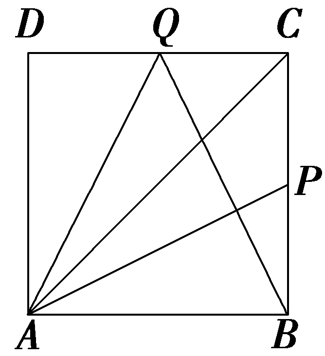

答案： $\frac{5}{6}$

解析：分别以<te<te<te<te<te*x*t st*y*le="italic">x</text>t st*y*le="italic">x</text>t st*y*le="italic">x</text>t st*y*le="italic">x</text>t style="italic">*AB*</text>，*AD*所在直线为x，y轴建立平面直角坐标系(图略)，不妨设正方形*AB<text style="italic">C*D</text>的边长为2，则A(0，0)，B(2，0)，*P*(2，1)，*Q*(1，2)，C(2，2)，则 $\vec{AP}$ ＝ $\left(2，1\right)$ ， $\vec{AC}$ ＝ $\left(2，2\right)$ ， $\vec{BQ}$ ＝ $\left(－1，2\right)$ ，又 $\vec{AP}$ ＝<te<te<te<te*x*t st*y*le="italic">x</text>t st*y*le="italic">x</text>t st*y*le="italic">x</text>t st*y*le="italic">x</text> $\vec{AC}$ ＋<te<te<te<te*x*t st*y*le="italic">x</text>t st*y*le="italic">x</text>t st*y*le="italic">x</text>t style="italic">y</text> $\vec{BQ}$ ，则有2＝2<te<te<te<te*x*t st*y*le="italic">x</text>t st*y*le="italic">x</text>t st*y*le="italic">x</text>t st*y*le="italic">x</text>－y且1＝2x＋2y，解得x＝ $\frac{5}{6}$ .

9.(13分)已知向量***a***＝(1，0)，***b***＝(2，1).

(1)当<em>k<strong>a</strong></em>－<em><strong>b</strong></em>与<em><strong>a</strong></em>＋2<em><strong>b</strong></em>共线时，求<em>k</em>的值；(6分)

(2)若 $\vec{AB}$ ＝2&lt;text style="&lt;text style="<em><strong>b</strong></em>old,it<em><strong>a</strong></em>lic"&gt;b&lt;/text&gt;old,italic"&gt;a&lt;/text&gt;＋3b， $\vec{BC}$ ＝&lt;text style="&lt;text style="<em><strong>b</strong></em>old,it<em><strong>a</strong></em>lic"&gt;b&lt;/text&gt;old,italic"&gt;a&lt;/text&gt;＋<em>&lt;text style="italic"&gt;m</em>&lt;/text&gt;b，且<em>A</em>，<em>B</em>，<em>C</em>三点共线，求m的值.(7分)

解：(1)因为***a***＝(1，0)，***b***＝(2，1)，

所以<em>k<strong>a</strong></em>－<em><strong>b</strong></em>＝<em>k</em>(1，0)－(2，1)＝(<em>k</em>－2，－1)，<em><strong>a</strong></em>＋2<em><strong>b</strong></em>＝(1，0)＋2(2，1)＝(5，2).

又因为&lt;text style="it&lt;text style="&lt;text style="<em><strong>b</strong></em>old,it<em><strong>a</strong></em>lic"&gt;b&lt;/text&gt;old,italic"&gt;a&lt;/text&gt;lic"&gt;<em>&lt;text style="italic"&gt;k</em>&lt;/text&gt;&lt;/text&gt;a－b与a＋2b共线，所以2(k－2)－(－1)×5＝0，所以k＝－ $\frac{1}{2}$ .

(2)由题知 $\vec{AB}$ ＝2<text style="***b***old,italic">a</text>＋3b＝2(1，0)＋3(2，1)＝(8，3)，

$\vec{BC}$ ＝&lt;text style="<em><strong>b</strong></em>old,italic"&gt;a&lt;/text&gt;＋<em>&lt;text style="italic"&gt;&lt;text style="italic"&gt;&lt;text style="italic"&gt;m</em>&lt;/text&gt;&lt;/text&gt;&lt;/text&gt;b＝(1，0)＋m(2，1)＝(2m＋1，m).

因为*A*，*B*，*C*三点共线，所以 $\vec{AB}$ ∥ $\vec{BC}$ ，

所以8*<text style="italic"><text style="italic">m*</text></text>－3(2m＋1)＝0，所以m＝ $\frac{3}{2}$ .

(10、11题，每小题5分，共10分)

10.(多选)如图所示，点*A*，*B*，*C*是圆*O*上的三点，线段*OC*与线段*AB*交于圆内一点*P*，若 $\vec{AP}$ ＝*λ* $\vec{AB}$ ， $\vec{OC}$ ＝*<text style="italic">μ*</text> $\vec{OA}$ ＋3*<text style="italic">μ*</text> $\vec{OB}$ ，则(　　)

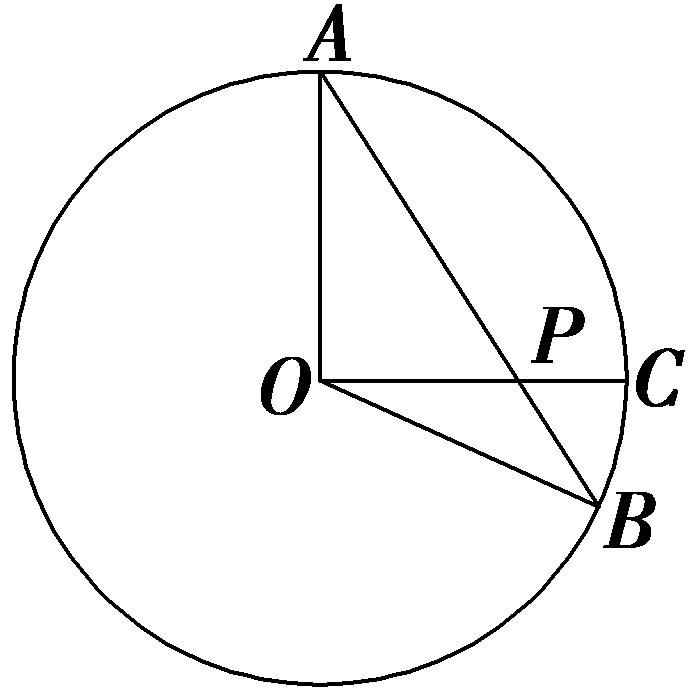

A.*P*为线段*OC*的中点时，*μ*＝ $\frac{1}{2}$

B.*P*为线段*OC*的中点时，*μ*＝ $\frac{1}{3}$

C.无论*μ*取何值，恒有*λ*＝ $\frac{3}{4}$

D.存在<em>μ</em>∈<strong>R</strong>，<em>λ</em>＝ $\frac{1}{2}$

答案：**AC**

解析： $\vec{OP}$ ＝ $\vec{OA}$ ＋ $\vec{AP}$ ＝ $\vec{OA}$ ＋*<text style="italic"><text style="italic"><text style="italic">λ*</text></text></text> $\vec{AB}$ ＝ $\vec{OA}$ ＋*<text style="italic"><text style="italic"><text style="italic">λ*</text></text></text>( $\vec{OB}$ － $\vec{OA}$ )＝ $\left(1－\lambda \right)\vec{OA}$ ＋*<text style="italic"><text style="italic"><text style="italic">λ*</text></text></text> $\vec{OB}$ .因为 $\vec{OP}$ 与 $\vec{OC}$ 共线，所以 $\frac{1－\lambda }{\mu }$ ＝ $\frac{\lambda }{3\mu }$ ，解得*<text style="italic"><text style="italic"><text style="italic">λ*</text></text></text>＝ $\frac{3}{4}$ ，故C正确，D错误；当*P*为线段*OC*的中点时，则 $\vec{OP}$ ＝ $\frac{1}{2}\vec{OC}$ ＝ $\frac{1}{2}$ *<text style="italic"><text style="italic">μ*</text></text> $\vec{OA}$ ＋ $\frac{1}{2}$ ×3*<text style="italic"><text style="italic">μ*</text></text> $\vec{OB}$ ，则 $\left\{\begin{matrix}1－\lambda ＝\frac{1}{2}\mu ，\\\lambda ＝\frac{1}{2}\times 3\mu ，\end{matrix}\right.$ 解得*<text style="italic"><text style="italic">μ*</text></text>＝ $\frac{1}{2}$ ，故A正确，B错误.故选AC.

11.如图①所示，蜜蜂蜂房是由严格的正六棱柱构成的，它的一端是平整的六边形开口.六边形开口可记为图②中的正六边形&lt;text style="it&lt;text style="&lt;text style="<em><strong>b</strong></em>old,it<em><strong>a</strong></em>lic"&gt;b&lt;/text&gt;old,italic"&gt;a&lt;/text&gt;lic"&gt;<em>ABCDEF</em>&lt;/text&gt;，其中<em>O</em>为正六边形ABCDEF的中心，设 $\vec{AB}$ ＝&lt;text style="&lt;text style="<em><strong>b</strong></em>old,it<em><strong>a</strong></em>lic"&gt;b&lt;/text&gt;old,italic"&gt;a&lt;/text&gt;， $\vec{AF}$ ＝&lt;text style="<em><strong>b</strong></em>old,it<em><strong>a</strong></em>lic"&gt;b&lt;/text&gt;，若 $\vec{BM}$ ＝ $\vec{MC}$ ， $\vec{EF}$ ＝3 $\vec{EN}$ ，则 $\vec{MN}$ ＝<u>　　　　</u>(用&lt;text style="&lt;text style="<em><strong>b</strong></em>old,it<em><strong>a</strong></em>lic"&gt;b&lt;/text&gt;old,italic"&gt;a&lt;/text&gt;，b表示).

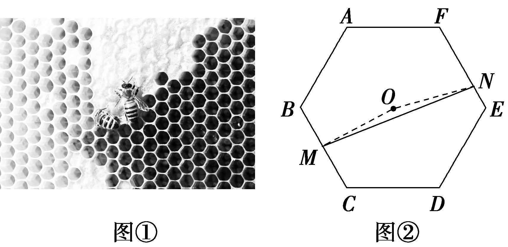

答案：－ $\frac{5}{6}$ <text style="***b***old,italic">a</text>＋ $\frac{7}{6}$ ***b***

解析：连接&lt;text style="it&lt;text style="<em><strong>b</strong></em>old,italic"&gt;a&lt;/text&gt;lic"&gt;FC&lt;/text&gt;，<em>BE</em>(图略)，因为 $\vec{BM}$ ＝ $\vec{MC}$ ， $\vec{EF}$ ＝3 $\vec{EN}$ ，由正六边形的性质可知 $\vec{AB}$ ＝ $\vec{FO}$ ＝ $\vec{OC}$ ， $\vec{AF}$ ＝ $\vec{OE}$ ＝ $\vec{BO}$ ，所以 $\vec{OM}$ ＝ $\frac{1}{2}\left(\vec{OB}＋\vec{OC}\right)$ ， $\vec{ON}$ ＝ $\vec{OF}$ ＋ $\vec{FN}$ ＝ $\vec{OF}$ ＋ $\frac{2}{3}\vec{FE}$ ＝ $\vec{OF}$ ＋ $\frac{2}{3}\left(\vec{OE}－\vec{OF}\right)$ ＝ $\frac{2}{3}\vec{OE}$ ＋ $\frac{1}{3}\vec{OF}$ ，所以 $\vec{MN}$ ＝ $\vec{MO}$ ＋ $\vec{ON}$ ＝－ $\frac{1}{2}\left(\vec{OB}＋\vec{OC}\right)$ ＋ $\frac{2}{3}\vec{OE}$ ＋ $\frac{1}{3}\vec{OF}$ ＝－ $\frac{1}{2}$ (－ $\vec{AF}$ ＋ $\vec{AB}$ )＋ $\frac{2}{3}\vec{AF}$ ＋ $\frac{1}{3}\left(－\vec{AB}\right)$ ＝ $\frac{1}{2}\vec{AF}$ － $\frac{1}{2}\vec{AB}$ ＋ $\frac{2}{3}\vec{AF}$ － $\frac{1}{3}\vec{AB}$ ＝ $\frac{7}{6}\vec{AF}$ － $\frac{5}{6}\vec{AB}$ ＝－ $\frac{5}{6}$ &lt;text style="<em><strong>b</strong></em>old,italic"&gt;a&lt;/text&gt;＋ $\frac{7}{6}$ <em><strong>b</strong></em>.

12.(15分)如图，在平面直角坐标系中，点<te*x*t style="italic">A</text>在x轴上，*B*，*C*在第一象限，｜ $\vec{OA}$ ｜＝2｜ $\vec{AB}$ ｜＝2，∠O<te*x*t style="italic">A</text>*B*＝ $\frac{2\pi }{3}$ ， $\vec{BC}$ ＝(－1， $\sqrt{3}$ ).

(1)求点*B*，*C*的坐标；(7分)

(2)判断四边形*OABC*的形状，并求出其周长.(8分)

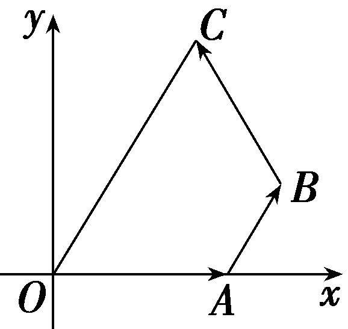

解：(1)在平面直角坐标系中，

由｜ $\vec{OA}$ ｜＝2，知*A*(2，0)，

设&lt;te&lt;text st<em>y</em>le="italic"&gt;x&lt;/text&gt;t style="italic"&gt;<em>&lt;text style="italic,subscript"&gt;B</em>&lt;/text&gt;&lt;/text&gt;(xB，yB)，又∠<em>OAB</em>＝ $\frac{2\pi }{3}$ ，｜ $\vec{AB}$ ｜＝1，

则&lt;text st<em>y</em>le="italic"&gt;x&lt;/text&gt;<em>&lt;text style="italic,subscript"&gt;&lt;text style="italic"&gt;B</em>&lt;/text&gt;&lt;/text&gt;＝2＋cos $\left(\pi －\frac{2\pi }{3}\right)$ ＝ $\frac{5}{2}$ ，<em>y&lt;text style="italic,subscript"&gt;&lt;text style="italic"&gt;B</em>&lt;/text&gt;&lt;/text&gt;＝sin $\left(\pi －\frac{2\pi }{3}\right)$ ＝ $\frac{\sqrt{3}}{2}$ ，所以&lt;text st<em>y</em>le="italic,subscript"&gt;<em>&lt;text style="italic"&gt;B</em>&lt;/text&gt;&lt;/text&gt; $\left(\frac{5}{2}，\frac{\sqrt{3}}{2}\right)$ .

又 $\vec{BC}$ ＝(－1， $\sqrt{3}$ )，

所以 $\vec{OC}$ ＝ $\vec{OB}$ ＋ $\vec{BC}$ ＝ $\left(\frac{5}{2}，\frac{\sqrt{3}}{2}\right)$ ＋(－1， $\sqrt{3}$ )＝ $\left(\frac{3}{2}，\frac{3\sqrt{3}}{2}\right)$ ，所以*C* $\left(\frac{3}{2}，\frac{3\sqrt{3}}{2}\right)$ .

(2)由(1)可得 $\vec{OC}$ ＝ $\left(\frac{3}{2}，\frac{3\sqrt{3}}{2}\right)$ ， $\vec{AB}$ ＝ $\left(\frac{1}{2}，\frac{\sqrt{3}}{2}\right)$ ，

所以 $\vec{OC}$ ＝3 $\vec{AB}$ .所以 $\vec{OC}$ ∥ $\vec{AB}$ ，｜ $\vec{OC}$ ｜＝3｜ $\vec{AB}$ ｜＝3.

又｜ $\vec{BC}$ ｜＝ $\sqrt{1+3}$ ＝2，｜ $\vec{OA}$ ｜＝2，

所以四边形*OABC*为等腰梯形.

因为｜ $\vec{OA}$ ｜＝2，｜ $\vec{AB}$ ｜＝1，｜ $\vec{BC}$ ｜＝2，｜ $\vec{OC}$ ｜＝3，

所以四边形*OABC*的周长为8.

(13、14题，每小题5分，共10分)

13.(新情境)(2025·安徽合肥模拟)古希腊数学家特埃特图斯(Theaetetus)利用如图所示的直角三角形来构造无理数.已知*<text style="italic">AB*</text>＝*<text style="italic">BC*</text>＝*<text style="italic">CD*</text>＝1，AB⊥BC，*<text style="italic">AC*</text>⊥CD，AC与*BD*交于点*O*，若 $\vec{DO}$ ＝*<text style="italic">λ*</text> $\vec{AB}$ ＋*<text style="italic">μ*</text> $\vec{AC}$ ，则*<text style="italic">λ*</text>＋*<text style="italic">μ*</text>等于(　　)

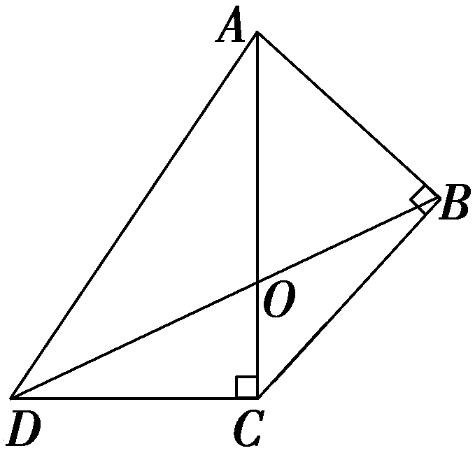

A. $\sqrt{2}$ －1	B.1－ $\sqrt{2}$

C. $\sqrt{2}$ ＋1	D.－ $\sqrt{2}$ －1

答案：**A**

解析：以<te<text st*y*le="italic">x</text>t style="italic">*C*</text>为坐标原点，*DC*，*C<text style="italic">A*</text>所在直线分别为x，y轴建立如图所示的平面直角坐标系，由题意得*AC*＝ $\sqrt{2}$ ，则*A*(0， $\sqrt{2}$ )，*B* $\left(\frac{\sqrt{2}}{2}，\frac{\sqrt{2}}{2}\right)$ ，<te<text st*y*le="italic">x</text>t style="italic">*C*</text>(0，0)， $\vec{AB}$ ＝ $\left(\frac{\sqrt{2}}{2},-\frac{\sqrt{2}}{2}\right)$ ， $\vec{AC}$ ＝(0，－ $\sqrt{2}$ ).因为<te<text st*y*le="italic">x</text>t style="italic">*C*</text>*B*＝*CD*＝1，∠*DC*B＝90°＋45°＝135°，故∠*BDC*＝22.5°，

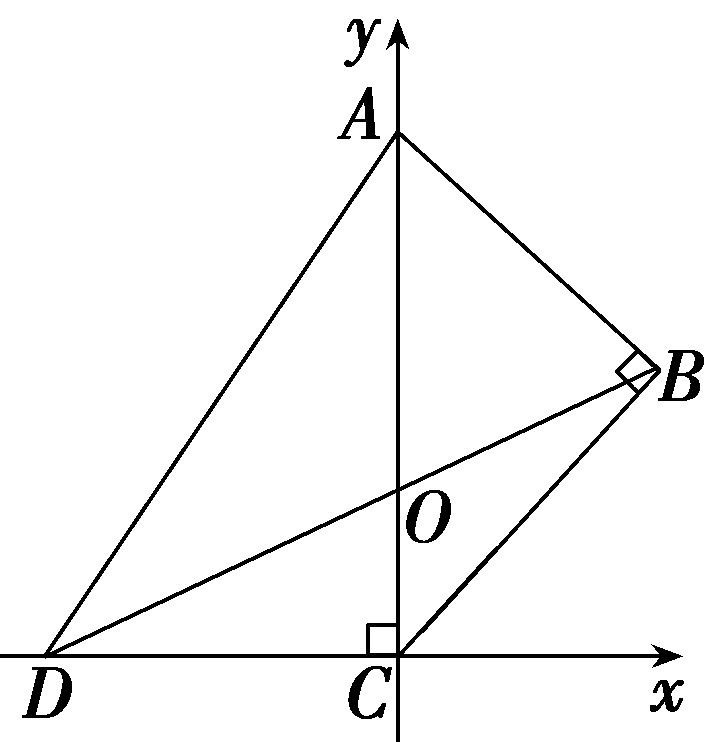

因为tan 45°＝ $\frac{2tan22.5\circ }{1－tan^{2}22.5\circ }$ ＝1，所以tan 22.5°＝ $\sqrt{2}$ －1，所以*<text style="italic">O*C</text>＝*<text style="italic">D*C·</text>tan 22.5°＝ $\sqrt{2}$ －1，故*O*(0， $\sqrt{2}$ －1).又*D*(－1，0)，则 $\vec{DO}$ ＝(1， $\sqrt{2}$ －1)，因为 $\vec{DO}$ ＝*<text style="italic">λ*</text> $\vec{AB}$ ＋*<text style="italic">μ*</text> $\vec{AC}$ ＝ $\left(\frac{\sqrt{2}}{2}\lambda ,-\frac{\sqrt{2}}{2}\lambda －\sqrt{2}\mu \right)$ ，所以 $\left\{\begin{matrix}1=\frac{\sqrt{2}}{2}\lambda ，\\\sqrt{2}－1=－\frac{\sqrt{2}}{2}\lambda －\sqrt{2}\mu ，\end{matrix}\right.$ 解得 $\left\{\begin{matrix}\lambda ＝\sqrt{2}，\\\mu ＝－1，\end{matrix}\right.$ 所以*<text style="italic">λ*</text>＋*<text style="italic">μ*</text>＝ $\sqrt{2}$ －1.故选A.

14.(多选)如图，&lt;te&lt;te&lt;text st<em>y</em>le="italic"&gt;x&lt;/text&gt;t st<em>y</em>le="italic"&gt;x&lt;/text&gt;t style="italic"&gt;B&lt;/text&gt;是<em>AC</em>的中点， $\vec{BE}$ ＝2 $\vec{OB}$ ，&lt;te&lt;te&lt;text st<em>y</em>le="italic"&gt;x&lt;/text&gt;t st<em>y</em>le="italic"&gt;x&lt;/text&gt;t style="italic"&gt;P&lt;/text&gt;是平行四边形<em>B</em>CDE内(含边界)的一点，且 $\vec{OP}$ ＝&lt;te&lt;text st<em>y</em>le="italic"&gt;x&lt;/text&gt;t st<em>y</em>le="italic"&gt;x&lt;/text&gt; $\vec{OA}$ ＋&lt;te&lt;text st<em>y</em>le="italic"&gt;x&lt;/text&gt;t style="italic"&gt;y&lt;/text&gt; $\vec{OB}$ (&lt;te&lt;text st<em>y</em>le="italic"&gt;x&lt;/text&gt;t st<em>y</em>le="italic"&gt;x&lt;/text&gt;，y∈<strong>R</strong>)，则下列结论中正确的是(　　)

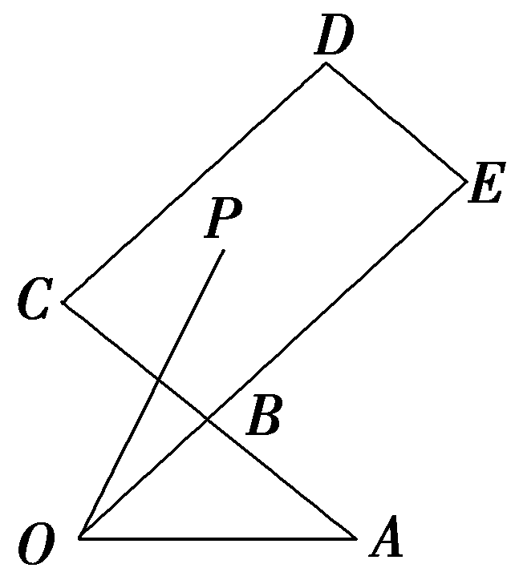

A.当*x*＝0时，*y*∈[2，3]

B.当<te<text st*y*le="italic">x</text>t style="italic">P</text>是线段*CE*的中点时，x＝－ $\frac{1}{2}$ ，*y*＝ $\frac{5}{2}$

C.若*x*＋*y*为定值1，则在平面直角坐标系中，点*P*的轨迹是一条线段

D.当*P*在*C*点时，*x*＝1，*y*＝2

答案：**BC**

解析：当<te<te<text st*y*le="italic">x</text>t st*y*le="italic">x</text>t st<text st*y*le="italic">y</text>le="italic">x</text>＝0时，则 $\vec{OP}$ ＝<te<te<text st*y*le="italic">x</text>t st*y*le="italic">x</text>t st*y*le="italic">y</text> $\vec{OB}$ ，点<te<te<text st*y*le="italic">x</text>t st*y*le="italic">x</text>t st*y*le="italic">*<text style="italic"><text style="italic"><text style="italic"><text style="italic">P*</text></text></text></text></text>在线段*<text style="italic">B*E</text>上，故1≤*y*≤3，故*A*错误；当P是线段*<text style="italic">C*E</text>的中点时， $\vec{OP}$ ＝ $\vec{OE}$ ＋ $\vec{EP}$ ＝3 $\vec{OB}$ ＋ $\frac{1}{2}(\vec{EB}$ ＋ $\vec{BC}$ )＝3 $\vec{OB}$ ＋ $\frac{1}{2}\left(－2\vec{OB}＋\vec{AB}\right)$ ＝3 $\vec{OB}$ ＋ $\frac{1}{2}$ (－2 $\vec{OB}$ ＋ $\vec{OB}$ － $\vec{OA}$ )＝－ $\frac{1}{2}\vec{OA}$ ＋ $\frac{5}{2}\vec{OB}$ ，故<te<text st*y*le="italic">x</text>t style="italic">B</text>正确；当<te<text st*y*le="italic">x</text>t st<text st*y*le="italic">y</text>le="italic">x</text>＋y为定值1时，*A*，B，*<text style="italic"><text style="italic"><text style="italic"><text style="italic"><text style="italic">P*</text></text></text></text></text>三点共线，又P是平行四边形*B<text style="italic">C*DE</text>内(含边界)的一点，故P的轨迹是一条线段，故C正确；因为 $\vec{OB}$ ＝ $\frac{1}{2}(\vec{OC}$ ＋ $\vec{OA}$ )，所以 $\vec{OC}$ ＝2 $\vec{OB}$ － $\vec{OA}$ ，当<te<te<text st*y*le="italic">x</text>t st*y*le="italic">x</text>t st*y*le="italic">*<text style="italic"><text style="italic"><text style="italic"><text style="italic">P*</text></text></text></text></text>在*C*点时，则 $\vec{OP}$ ＝－ $\vec{OA}$ ＋2 $\vec{OB}$ ，所以<te<te<text st*y*le="italic">x</text>t st*y*le="italic">x</text>t st<text st*y*le="italic">y</text>le="italic">x</text>＝－1，y＝2，故D错误.故选*BC*.

