**第三节　平面向量的数量积**

【课标研读】　1.通过物理中功等实例，理解平面向量数量积的概念及其物理意义，会计算平面向量的数量积.　2.通过几何直观，了解平面向量投影的概念以及投影向量的意义.　3.会用数量积判断两个平面向量的垂直关系.

4.能用坐标表示平面向量的数量积，会表示两个平面向量的夹角.　5.能用坐标表示平面向量垂直的条件.　6.会用向量方法解决简单的平面几何问题，力学问题以及其他实际问题，体会向量在解决数学和实际问题中的作用.

1.向量的夹角

(1)定义：已知两个<u>非零</u>向量&lt;text style="&lt;text style="&lt;text style="&lt;text style="<em><strong>b</strong></em>old,it<em><strong>a</strong></em>lic"&gt;b&lt;/text&gt;old,it<em><strong>a</strong></em>lic"&gt;b&lt;/text&gt;old,it<em><strong>a</strong></em>lic"&gt;b&lt;/text&gt;old,italic"&gt;a&lt;/text&gt;，b，如图所示，<em>O</em>是平面上的任意一点，作 $\vec{OA}$ ＝&lt;text style="&lt;text style="&lt;text style="&lt;text style="<em><strong>b</strong></em>old,it<em><strong>a</strong></em>lic"&gt;b&lt;/text&gt;old,it<em><strong>a</strong></em>lic"&gt;b&lt;/text&gt;old,it<em><strong>a</strong></em>lic"&gt;b&lt;/text&gt;old,italic"&gt;a&lt;/text&gt;， $\vec{OB}$ ＝&lt;text style="&lt;text style="&lt;text style="<em><strong>b</strong></em>old,it<em><strong>a</strong></em>lic"&gt;b&lt;/text&gt;old,it<em><strong>a</strong></em>lic"&gt;b&lt;/text&gt;old,it<em><strong>a</strong></em>lic"&gt;b&lt;/text&gt;，则<u>∠</u>A<em>O</em>B＝<em>&lt;text style="italic"&gt;θ</em>&lt;/text&gt;(0≤θ≤π)叫做向量<em><strong>a</strong></em>与b的夹角，记作＜a，b＞.

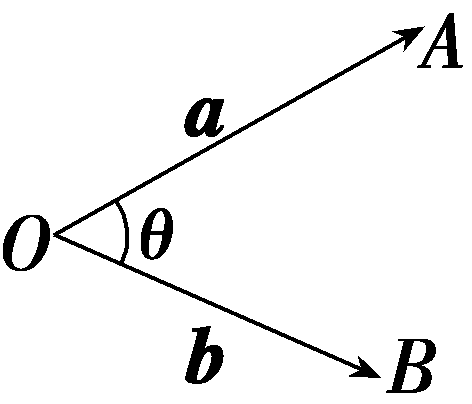

(2)范围：夹角&lt;text style="it&lt;text style="&lt;text style="&lt;text style="&lt;text style="<em><strong>b</strong></em>old,it<em><strong>a</strong></em>lic"&gt;b&lt;/text&gt;old,it<em><strong>a</strong></em>lic"&gt;b&lt;/text&gt;old,it<em><strong>a</strong></em>lic"&gt;b&lt;/text&gt;old,italic"&gt;a&lt;/text&gt;lic"&gt;<em>&lt;text style="italic"&gt;&lt;text style="italic"&gt;θ</em>&lt;/text&gt;&lt;/text&gt;&lt;/text&gt;的范围是<u>[0，π]</u>.当θ＝0时，两向量a，b<u>共线且同向</u>；当θ＝ $\frac{\pi }{2}$ 时，两向量&lt;text style="&lt;text style="&lt;text style="&lt;text style="<em><strong>b</strong></em>old,it<em><strong>a</strong></em>lic"&gt;b&lt;/text&gt;old,it<em><strong>a</strong></em>lic"&gt;b&lt;/text&gt;old,it<em><strong>a</strong></em>lic"&gt;b&lt;/text&gt;old,italic"&gt;a&lt;/text&gt;，b<u>相互垂直</u>，记作a⊥b；当<em>&lt;text style="italic"&gt;&lt;text style="italic"&gt;&lt;text style="italic"&gt;θ</em>&lt;/text&gt;&lt;/text&gt;&lt;/text&gt;＝π时，两向量a，b<u>共线且反向</u>.

微提醒　只有两个向量的起点重合时所对应的角才是两向量的夹角.

2.平面向量的数量积

(1)定义：两个非零向量<em><strong>a</strong></em>与<em><strong>b</strong></em>，它们的夹角为<em>θ</em>，我们把数量<u>｜</u><em><strong><u>a</u></strong></em><u>｜｜</u><em><strong><u>b</u></strong></em><u>｜cos_</u><em><u>θ</u></em>叫做向量<em><strong>a</strong></em>与<em><strong>b</strong></em>的数量积(或内积)，记作<em><strong><u>a</u></strong></em><u>·</u><em><strong><u>b</u></strong></em>，即<em><strong>a</strong></em>·<em><strong>b</strong></em>＝<u>｜</u><em><strong><u>a</u></strong></em><u>｜｜</u><em><strong><u>b</u></strong></em><u>｜cos_</u><em><u>θ</u></em>.

(2)<u>投影</u>向量：①如图，设&lt;text style="&lt;text style="&lt;text style="&lt;text style="<em><strong>b</strong></em>old,it<em><strong>a</strong></em>lic"&gt;b&lt;/text&gt;old,it<em><strong>a</strong></em>lic"&gt;b&lt;/text&gt;old,it<em><strong>a</strong></em>lic"&gt;b&lt;/text&gt;old,italic"&gt;a&lt;/text&gt;，b是两个非零向量， $\vec{AB}$ ＝&lt;text style="&lt;text style="&lt;text style="&lt;text style="<em><strong>b</strong></em>old,it<em><strong>a</strong></em>lic"&gt;b&lt;/text&gt;old,it<em><strong>a</strong></em>lic"&gt;b&lt;/text&gt;old,it<em><strong>a</strong></em>lic"&gt;b&lt;/text&gt;old,italic"&gt;a&lt;/text&gt;， $\vec{CD}$ ＝&lt;text style="&lt;text style="&lt;text style="<em><strong>b</strong></em>old,it<em><strong>a</strong></em>lic"&gt;b&lt;/text&gt;old,it<em><strong>a</strong></em>lic"&gt;b&lt;/text&gt;old,it<em><strong>a</strong></em>lic"&gt;b&lt;/text&gt;，考虑如下的变换：过 $\vec{AB}$ 的起点&lt;text style="it&lt;text style="&lt;text style="<em><strong>b</strong></em>old,it<em><strong>a</strong></em>lic"&gt;b&lt;/text&gt;old,italic"&gt;a&lt;/text&gt;lic"&gt;<em>A</em>&lt;/text&gt;和终点<em>&lt;text style="italic"&gt;B</em>&lt;/text&gt;，分别作 $\vec{CD}$ 所在直线的垂线，垂足分别为&lt;text style="it&lt;text style="&lt;text style="<em><strong>b</strong></em>old,it<em><strong>a</strong></em>lic"&gt;b&lt;/text&gt;old,italic"&gt;a&lt;/text&gt;lic"&gt;<em>A</em>&lt;/text&gt;&lt;text style="subscript"&gt;1&lt;/text&gt;，<em>&lt;text style="italic"&gt;B</em>&lt;/text&gt;1，得到 $\vec{A_{1}B_{1}}$ ，则称上述变换为向量&lt;text style="&lt;text style="&lt;text style="&lt;text style="<em><strong>b</strong></em>old,it<em><strong>a</strong></em>lic"&gt;b&lt;/text&gt;old,it<em><strong>a</strong></em>lic"&gt;b&lt;/text&gt;old,it<em><strong>a</strong></em>lic"&gt;b&lt;/text&gt;old,italic"&gt;a&lt;/text&gt;向向量b<u>投影</u>， $\vec{A_{1}B_{1}}$ 叫做向量&lt;text style="&lt;text style="&lt;text style="&lt;text style="<em><strong>b</strong></em>old,it<em><strong>a</strong></em>lic"&gt;b&lt;/text&gt;old,it<em><strong>a</strong></em>lic"&gt;b&lt;/text&gt;old,it<em><strong>a</strong></em>lic"&gt;b&lt;/text&gt;old,italic"&gt;a&lt;/text&gt;在向量b上的<u>投影</u>向量.

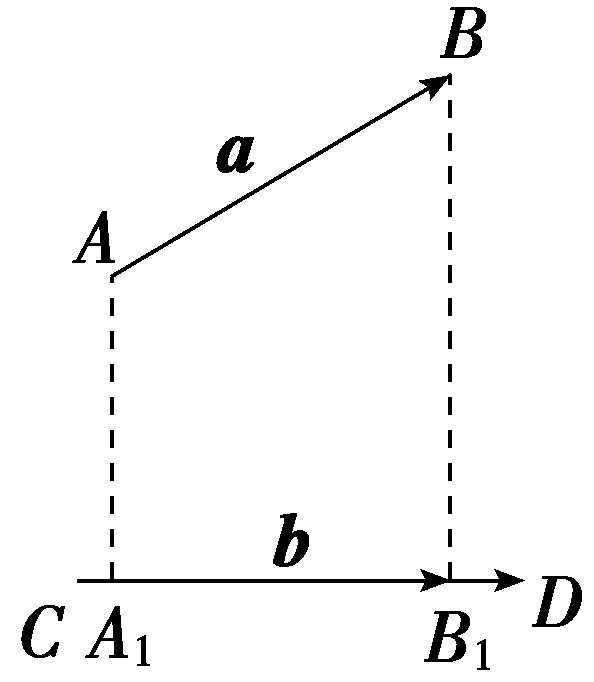

②设与<em><strong>b</strong></em>方向相同的单位向量为<em><strong>e</strong></em>，<em><strong>a</strong></em>与<em><strong>b</strong></em>的夹角为<em>θ</em>，则向量<em><strong>a</strong></em>在向量<em><strong>b</strong></em>上的投影向量是<u>｜</u><em><strong><u>a</u></strong></em><u>｜cos_</u><em><u>θ</u></em>_<em><strong><u>e</u></strong></em>.

(3)运算律

①<em><strong>a</strong></em>·<em><strong>b</strong></em>＝<em><strong><u>b</u></strong></em><u>·</u><em><strong><u>a</u></strong></em>(交换律).

②(<em>λ<strong>a</strong></em>)·<em><strong>b</strong></em>＝<em><u>λ</u></em><u>(</u><em><strong><u>a</u></strong></em><u>·</u><em><strong><u>b</u></strong></em><u>)</u>＝<em><strong><u>a</u></strong></em><u>·(</u><em><u>λ</u><strong><u>b</u></strong></em><u>)</u>(结合律).

③(<em><strong>a</strong></em>＋<em><strong>b</strong></em>)·<em><strong>c</strong></em>＝<em><strong><u>a</u></strong></em><u>·</u><em><strong><u>c</u></strong></em><u>＋</u><em><strong><u>b</u></strong></em><u>·</u><em><strong><u>c</u></strong></em>(分配律).

3.平面向量数量积的有关结论

已知非零向量<em><strong>a</strong></em>＝(<em>x</em>1，<em>y</em>1)，<em><strong>b</strong></em>＝(<em>x</em>2，<em>y</em>2)，<em>θ</em>＝＜<em><strong>a</strong></em>，<em><strong>b</strong></em>＞.

<table><tr><td>
结论
</td><td>
几何表示
</td><td>
坐标表示
</td></tr><tr><td>
数量积
</td><td>
<strong><em>a</em></strong>·<strong><em>b</em></strong>＝｜<strong><em>a</em></strong>｜｜<strong><em>b</em></strong>｜cos <em>θ</em>
</td><td>
<strong><em>a</em></strong>·<strong><em>b</em></strong>＝<em>x</em>1<em>x</em>2＋<em>y</em>1<em>y</em>2
</td></tr><tr><td>
模
</td><td>
｜<strong><em>a</em></strong>｜＝
</td><td>
｜<strong><em>a</em></strong>｜＝
</td></tr><tr><td>
夹角
</td><td>
cos <em>θ</em>＝
</td><td>
cos <em>θ</em>＝
</td></tr><tr><td>
<strong><em>a</em></strong>⊥<strong><em>b</em></strong>的充

要条件
</td><td>
<strong><em>a</em></strong>·<strong><em>b</em></strong>＝0
</td><td>
<em>x</em>1<em>x</em>2＋<em>y</em>1<em>y</em>2＝0
</td></tr><tr><td>
｜<strong><em>a</em></strong>·<strong><em>b</em></strong>｜与

｜<strong><em>a</em></strong>｜｜<strong><em>b</em></strong>｜

的关系
</td><td>
｜<strong><em>a</em></strong>·<strong><em>b</em></strong>｜≤｜<strong><em>a</em></strong>｜｜<strong><em>b</em></strong>｜
</td><td>
｜<em>x</em>1<em>x</em>2＋<em>y</em>1<em>y</em>2｜≤
</td></tr></table>

[微提醒]　(1)向量平行与垂直的坐标公式不要记混.(2)<em><strong>a</strong></em>⊥<em><strong>b</strong></em>⇔<em><strong>a</strong></em>·<em><strong>b</strong></em>＝0是对非零向量而言的，若<em><strong>a</strong></em>＝<strong>0</strong>，虽然有<em><strong>a</strong></em>·<em><strong>b</strong></em>＝0，但不能说<em><strong>a</strong></em>⊥<em><strong>b</strong></em>.

【常用结论】

(1)平面向量数量积运算的常用公式

①(<em><strong>a</strong></em>＋<em><strong>b</strong></em>)<em>·</em>(<em><strong>a</strong></em>－<em><strong>b</strong></em>)＝<em><strong>a</strong></em>2－<em><strong>b</strong></em>2.

②(<em><strong>a</strong></em>±<em><strong>b</strong></em>)2＝<em><strong>a</strong></em>2±2<em><strong>a</strong>·<strong>b</strong></em>＋<em><strong>b</strong></em>2.

(2)有关向量夹角的两个结论

①两向量<em><strong>a</strong></em>与<em><strong>b</strong></em>的夹角为锐角⇔<em><strong>a</strong>·<strong>b</strong></em>＞0且<em><strong>a</strong></em>与<em><strong>b</strong></em>不共线.

②两向量<em><strong>a</strong></em>与<em><strong>b</strong></em>的夹角为钝角⇔<em><strong>a</strong>·<strong>b</strong></em>＜0且<em><strong>a</strong></em>与<em><strong>b</strong></em>不共线.

(3)向量&lt;text style="<em><strong>b</strong></em>old,italic"&gt;a&lt;/text&gt;在向量b上的投影向量为 $\frac{a\cdot b}{｜b｜}$ <em>·</em> $\frac{b}{｜b｜}$ .

【自主检测】

1.(多选)下列结论错误的是(　　)

A.两个向量的夹角的范围是 $\left[0，\frac{\pi }{2}\right]$

B.若***a***，***b***共线，则***a***·***b***＝｜***a***｜·｜***b***｜

C.两个向量的数量积是一个实数，向量的加、减、数乘运算的结果是向量

D.若***a***·***b***＝***a***·***c***，则***b***＝***c***

答案：**ABD**

2.(链接人教A必修二P18例10)已知｜&lt;text style="&lt;text style="&lt;text style="<em><strong>b</strong></em>old,it<em><strong>a</strong></em>lic"&gt;b&lt;/text&gt;old,it<em><strong>a</strong></em>lic"&gt;b&lt;/text&gt;old,italic"&gt;a&lt;/text&gt;｜＝5，｜b｜＝ $\sqrt{2}$ ，&lt;text style="&lt;text style="&lt;text style="<em><strong>b</strong></em>old,it<em><strong>a</strong></em>lic"&gt;b&lt;/text&gt;old,it<em><strong>a</strong></em>lic"&gt;b&lt;/text&gt;old,italic"&gt;a&lt;/text&gt;·b＝5，则a与b的夹角<em>θ</em>等于(　　)

A.45°	B.135°

C.－45°	D.30°

答案：**A**

解析：cos *<text style="italic"><text style="italic">θ*</text></text>＝ $\frac{a\cdot b}{｜a||b｜}$ ＝ $\frac{5}{5\sqrt{2}}$ ＝ $\frac{\sqrt{2}}{2}$ ，又因为0°≤*<text style="italic"><text style="italic">θ*</text></text>≤180°，所以θ＝45°.故选A.

3.(链接人教A必修二P23T11)已知向量<em><strong>a</strong></em>，<em><strong>b</strong></em>的夹角为60°，｜<em><strong>a</strong></em>｜＝2，｜<em><strong>b</strong></em>｜＝2，则｜<em><strong>a</strong></em>＋2<em><strong>b</strong></em>｜＝<u>　　　　</u>.

答案：2 $\sqrt{7}$

解析：&lt;text style="&lt;text style="&lt;text style="<em><strong>b</strong></em>old,it<em><strong>a</strong></em>lic"&gt;b&lt;/text&gt;old,it<em><strong>a</strong></em>lic"&gt;b&lt;/text&gt;old,italic"&gt;a&lt;/text&gt;<em>·</em>b＝｜a｜｜b｜cos 60°＝2，｜a＋2b｜＝ $\sqrt{a^{2}+4b^{2}+4a\cdot b}$ ＝ $\sqrt{4+16+8}$ ＝2 $\sqrt{7}$ .

4.(链接人教A必修二P24T24)如图，在☉<em>C</em>中，弦<em>AB</em>的长度为4，则 $\vec{AB}$ · $\vec{AC}$ ＝<u>　　　　</u>.

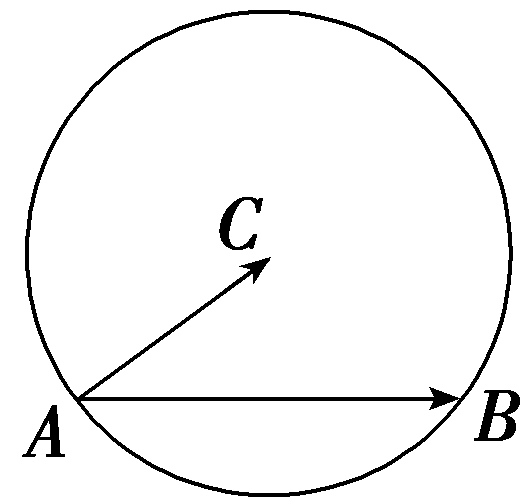

答案：8

解析：取<em>&lt;text style="italic"&gt;AB</em>&lt;/text&gt;的中点<em>M</em>，连接<em>&lt;text style="italic"&gt;CM</em>&lt;/text&gt;(图略)，则CM⊥AB， $\vec{AM}$ ＝ $\frac{1}{2}\vec{AB}$ .所以 $\vec{AB}$ <em>&lt;text style="italic"&gt;·</em>&lt;/text&gt; $\vec{AC}$ ＝｜ $\vec{AB}$ ｜<em>&lt;text style="italic"&gt;·</em>&lt;/text&gt;｜ $\vec{AC}$ ｜cos∠<em>BAC</em>＝｜ $\vec{AB}$ ｜｜ $\vec{AM}$ ｜＝ $\frac{1}{2}$ ｜ $\vec{AB}$ ｜2＝8.

考点一　平面向量数量积的基本运算　　　　自主练透

1.(一题多解)(2023·全国乙卷)正方形*<text style="italic">AB*CD</text>的边长是2，*E*是AB的中点，则 $\vec{EC}$ · $\vec{ED}$ ＝(　　)

A. $\sqrt{5}$ 	B.3

C.2 $\sqrt{5}$ 	D.5

答案：**B**

解析：法一：以{ $\vec{AB}$ ， $\vec{AD}$ }为基底向量，可知｜ $\vec{AB}$ ｜＝｜ $\vec{AD}$ ｜＝2， $\vec{AB}$ *<text style="italic"><text style="italic">·*</text></text> $\vec{AD}$ ＝0，则 $\vec{EC}$ ＝ $\vec{EB}$ ＋ $\vec{BC}$ ＝ $\frac{1}{2}\vec{AB}$ ＋ $\vec{AD}$ ， $\vec{ED}$ ＝ $\vec{EA}$ ＋ $\vec{AD}$ ＝－ $\frac{1}{2}\vec{AB}$ ＋ $\vec{AD}$ ，所以 $\vec{EC}$ *<text style="italic"><text style="italic">·*</text></text> $\vec{ED}$ ＝ $\left(\frac{1}{2}\vec{AB}＋\vec{AD}\right)$ *<text style="italic"><text style="italic">·*</text></text> $\left(－\frac{1}{2}\vec{AB}＋\vec{AD}\right)$ ＝－ $\frac{1}{4}\vec{AB}^{2}$ ＋ $\vec{AD}^{2}$ ＝－1＋4＝3.故选B.

法二：如图，以*A*为坐标原点建立平面直角坐标系，则*E*(1，0)，*C*(2，2)，*D*(0，2)，可得 $\vec{EC}$ ＝(1，2)， $\vec{ED}$ ＝(－1，2)，所以 $\vec{EC}$ *·* $\vec{ED}$ ＝－1＋4＝3.故选B.

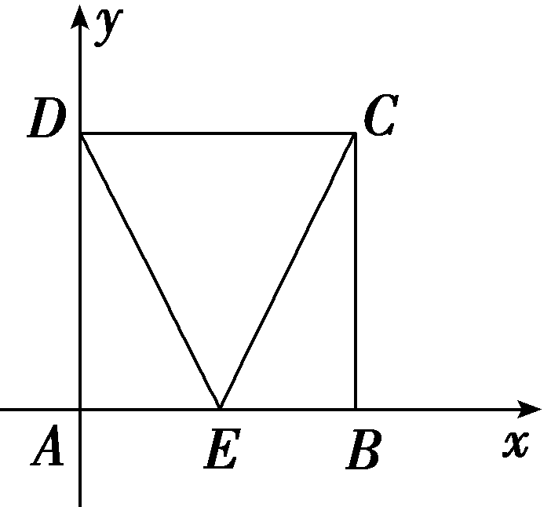

2.(2025·八省适应性测试)已知向量***a***＝(0，1)，***b***＝(1，0)，则***a***·(***a***－***b***)＝(　　)

A.2	B.1

C.0	D.－1

答案：**B**

解析：因为&lt;text style="&lt;text style="&lt;text style="bold,it<em><strong>a</strong></em>lic"&gt;b&lt;/text&gt;old,it<em><strong>a</strong></em>lic"&gt;b&lt;/text&gt;old,italic"&gt;a&lt;/text&gt;＝ $\left(0，1\right)$ ，&lt;text style="&lt;text style="bold,it<em><strong>a</strong></em>lic"&gt;b&lt;/text&gt;old,it<em><strong>a</strong></em>lic"&gt;b&lt;/text&gt;＝ $\left(1，0\right)$ ，所以&lt;text style="&lt;text style="&lt;text style="bold,it<em><strong>a</strong></em>lic"&gt;b&lt;/text&gt;old,it<em><strong>a</strong></em>lic"&gt;b&lt;/text&gt;old,italic"&gt;a&lt;/text&gt;－b＝ $\left(－1，1\right)$ ，所以&lt;text style="&lt;text style="&lt;text style="bold,it<em><strong>a</strong></em>lic"&gt;b&lt;/text&gt;old,it<em><strong>a</strong></em>lic"&gt;b&lt;/text&gt;old,italic"&gt;a&lt;/text&gt;<em>·</em> $\left(a－b\right)$ ＝0× $\left(－1\right)$ ＋1×1＝1.故选B.

3.已知正方形*ABCD*的对角线*AC*＝2，点*P*在另一条对角线*BD*上，则 $\vec{AP}$ · $\vec{AC}$ 的值为(　　)

A.－2	B.2

C.1	D.4

答案：**B**

解析：设*<text style="italic"><text style="italic">AC*</text></text>∩*<text style="italic">BD*</text>＝*<text style="italic">O*</text>，则O为AC的中点，且AC⊥BD，如图所示，由 $\vec{AP}$ 在 $\vec{AC}$ 方向上的投影向量为 $\vec{AO}$ ，得 $\vec{AP}$ *<text style="italic">·*</text> $\vec{AC}$ ＝ $\vec{AO}$ *<text style="italic">·*</text> $\vec{AC}$ ＝ $\frac{1}{2}\vec{AC}^{2}$ ＝2.故选B.

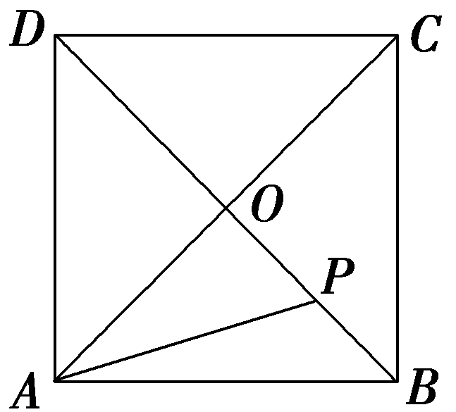

4.(2022·全国甲卷)设向量&lt;text style="&lt;text style="&lt;text style="&lt;text style="<em><strong>b</strong></em>old,italic"&gt;b&lt;/text&gt;old,it<em><strong>a</strong></em>lic"&gt;b&lt;/text&gt;old,it<em><strong>a</strong></em>lic"&gt;b&lt;/text&gt;old,italic"&gt;a&lt;/text&gt;，b的夹角的余弦值为 $\frac{1}{3}$ ，且｜&lt;text style="&lt;text style="&lt;text style="&lt;text style="<em><strong>b</strong></em>old,italic"&gt;b&lt;/text&gt;old,it<em><strong>a</strong></em>lic"&gt;b&lt;/text&gt;old,it<em><strong>a</strong></em>lic"&gt;b&lt;/text&gt;old,italic"&gt;a&lt;/text&gt;｜＝1，｜b｜＝3，则(2a＋b)·b＝ <u>　　　　</u>.

答案：11

解析：(&lt;text style="superscript"&gt;&lt;text style="superscript"&gt;2&lt;/text&gt;&lt;/text&gt;&lt;text style="&lt;text style="&lt;text style="&lt;text style="&lt;text style="&lt;text style="&lt;text style="<em><strong>b</strong></em>old,italic"&gt;b&lt;/text&gt;old,it<em><strong>a</strong></em>lic"&gt;b&lt;/text&gt;old,it<em><strong>a</strong></em>lic"&gt;b&lt;/text&gt;old,italic"&gt;b&lt;/text&gt;old,it<em><strong>a</strong></em>lic"&gt;b&lt;/text&gt;old,italic"&gt;b&lt;/text&gt;old,italic"&gt;a&lt;/text&gt;＋b)<em>&lt;text style="italic"&gt;·</em>&lt;/text&gt;b＝2a·b＋b2＝2｜a｜｜b｜cos＜a，b＞＋｜b｜2＝2×1×3× $\frac{1}{3}$ ＋3&lt;text style="superscript"&gt;&lt;text style="superscript"&gt;2&lt;/text&gt;&lt;/text&gt;＝11 .

计算平面向量数量积的方法

1.定义法：直接使用数量积的定义求解，即&lt;text style="&lt;text style="<em><strong>b</strong></em>old,it<em><strong>a</strong></em>lic"&gt;b&lt;/text&gt;old,italic"&gt;a&lt;/text&gt;<em>·</em>b＝ $\left|a\right|\left|b\right|$ cos &lt;text style="it&lt;text style="<em><strong>b</strong></em>old,italic"&gt;a&lt;/text&gt;lic"&gt;<em>θ</em>&lt;/text&gt;(θ是&lt;text style="<em><strong>b</strong></em>old,italic"&gt;a&lt;/text&gt;与b的夹角)，如本组第4题.

2.坐标法：若已知向量的坐标，则直接利用坐标运算求解；若未知向量的坐标，且题中涉及直角三角形、等腰三角形、矩形、正方形、菱形等方便建系的图形，可尝试建立直角坐标系，利用<em><strong>a</strong>·<strong>b</strong></em>＝<em>x</em>1<em>x</em>2＋<em>y</em>1<em>y</em>2 求解，如本组第2题.

3.基底法：选取合适的一组基底，利用平面向量基本定理将待求数量积的两个向量分别表示出来，进而根据数量积的运算律和定义求解，如本组第1题.

4.几何法：灵活运用平面向量数量积的几何意义进行求解，如本组第3题.

考点二　平面向量数量积的应用　　　　多维探究

角度1　向量的模

(1)已知向量<text style="<text style="<text style="***b***old,it***a***lic">b</text>old,it***a***lic">b</text>old,italic">a</text>和b的夹角为30°，｜a｜＝1，｜b｜＝ $\sqrt{3}$ ，则｜<text style="<text style="<text style="***b***old,it***a***lic">b</text>old,it***a***lic">b</text>old,italic">a</text>＋2b｜等于(　　)

A.1＋2 $\sqrt{3}$ 	B. $\sqrt{19}$

C. $\sqrt{13+4\sqrt{3}}$ 	D.3 $\sqrt{2}$

(2)(一题多解)(2023·新课标Ⅱ卷)已知向量 &lt;text style="&lt;text style="&lt;text style="&lt;text style="&lt;text style="<em><strong>b</strong></em>old,italic"&gt;b&lt;/text&gt;old,it<em><strong>a</strong></em>lic"&gt;b&lt;/text&gt;old,it<em><strong>a</strong></em>lic"&gt;b&lt;/text&gt;old,it<em><strong>a</strong></em>lic"&gt;b&lt;/text&gt;old,italic"&gt;a&lt;/text&gt;，b满足｜a－b｜＝ $\sqrt{3}$ ，｜&lt;text style="&lt;text style="&lt;text style="&lt;text style="&lt;text style="<em><strong>b</strong></em>old,italic"&gt;b&lt;/text&gt;old,it<em><strong>a</strong></em>lic"&gt;b&lt;/text&gt;old,it<em><strong>a</strong></em>lic"&gt;b&lt;/text&gt;old,it<em><strong>a</strong></em>lic"&gt;b&lt;/text&gt;old,italic"&gt;a&lt;/text&gt;＋b｜＝｜2a－b｜，则｜b｜＝<u>　　　　</u>.

答案：(1)**B**　(2) $\sqrt{3}$

解析：(1)根据向量的运算法则和数量积的定义，可得｜<text style="***b***old,italic">a</text>＋2b｜＝ $\sqrt{\left(a+2b\right)^{2}}$ ＝ $\sqrt{a^{2}+4a\cdot b+4b^{2}}$ ＝ $\sqrt{1^{2}+4\times 1\times \sqrt{3}\times cos30\circ +4\times \left(\sqrt{3}\right)^{2}}$ ＝ $\sqrt{19}$ .故选B.

(&lt;text style="superscript"&gt;&lt;text style="superscript"&gt;&lt;text style="superscript"&gt;&lt;text style="superscript"&gt;&lt;text style="superscript"&gt;&lt;text style="superscript"&gt;&lt;text style="superscript"&gt;&lt;text style="superscript"&gt;&lt;text style="superscript"&gt;&lt;text style="superscript"&gt;2&lt;/text&gt;&lt;/text&gt;&lt;/text&gt;&lt;/text&gt;&lt;/text&gt;&lt;/text&gt;&lt;/text&gt;&lt;/text&gt;&lt;/text&gt;&lt;/text&gt;)法一：因为｜&lt;text style="&lt;text style="&lt;text style="&lt;text style="&lt;text style="&lt;text style="&lt;text style="&lt;text style="&lt;text style="&lt;text style="&lt;text style="&lt;text style="&lt;text style="&lt;text style="&lt;text style="<em><strong>b</strong></em>old,italic"&gt;b&lt;/text&gt;old,italic"&gt;b&lt;/text&gt;old,italic"&gt;b&lt;/text&gt;old,it&lt;text style="bold,it<em><strong>a</strong></em>lic"&gt;a&lt;/text&gt;lic"&gt;b&lt;/text&gt;old,it<em><strong>a</strong></em>lic"&gt;b&lt;/text&gt;old,it<em><strong>a</strong></em>lic"&gt;b&lt;/text&gt;old,it&lt;text style="bold,it<em><strong>a</strong></em>lic"&gt;a&lt;/text&gt;lic"&gt;b&lt;/text&gt;old,italic"&gt;b&lt;/text&gt;old,it&lt;text style="bold,it<em><strong>a</strong></em>lic"&gt;a&lt;/text&gt;lic"&gt;b&lt;/text&gt;old,italic"&gt;b&lt;/text&gt;old,it&lt;text style="bold,it<em><strong>a</strong></em>lic"&gt;a&lt;/text&gt;lic"&gt;b&lt;/text&gt;old,it<em><strong>a</strong></em>lic"&gt;b&lt;/text&gt;old,it<em><strong>a</strong></em>lic"&gt;b&lt;/text&gt;old,it<em><strong>a</strong></em>lic"&gt;b&lt;/text&gt;old,italic"&gt;a&lt;/text&gt;＋b｜＝｜2a－b｜，即(a＋b)2＝(2a－b)2，则a2＋2a<em>&lt;text style="italic"&gt;&lt;text style="italic"&gt;&lt;text style="italic"&gt;·</em>&lt;/text&gt;&lt;/text&gt;&lt;/text&gt;b＋b2＝4a2－4a·b＋b2，整理得a2－2a·b＝0，又因为｜a－b｜＝ $\sqrt{3}$ ，即(&lt;text style="&lt;text style="&lt;text style="&lt;text style="&lt;text style="&lt;text style="&lt;text style="&lt;text style="&lt;text style="&lt;text style="&lt;text style="&lt;text style="&lt;text style="&lt;text style="&lt;text style="<em><strong>b</strong></em>old,italic"&gt;b&lt;/text&gt;old,italic"&gt;b&lt;/text&gt;old,italic"&gt;b&lt;/text&gt;old,it&lt;text style="bold,it<em><strong>a</strong></em>lic"&gt;a&lt;/text&gt;lic"&gt;b&lt;/text&gt;old,it<em><strong>a</strong></em>lic"&gt;b&lt;/text&gt;old,it<em><strong>a</strong></em>lic"&gt;b&lt;/text&gt;old,it&lt;text style="bold,it<em><strong>a</strong></em>lic"&gt;a&lt;/text&gt;lic"&gt;b&lt;/text&gt;old,italic"&gt;b&lt;/text&gt;old,it&lt;text style="bold,it<em><strong>a</strong></em>lic"&gt;a&lt;/text&gt;lic"&gt;b&lt;/text&gt;old,italic"&gt;b&lt;/text&gt;old,it&lt;text style="bold,it<em><strong>a</strong></em>lic"&gt;a&lt;/text&gt;lic"&gt;b&lt;/text&gt;old,it<em><strong>a</strong></em>lic"&gt;b&lt;/text&gt;old,it<em><strong>a</strong></em>lic"&gt;b&lt;/text&gt;old,it<em><strong>a</strong></em>lic"&gt;b&lt;/text&gt;old,italic"&gt;a&lt;/text&gt;－b)&lt;text style="superscript"&gt;&lt;text style="superscript"&gt;&lt;text style="superscript"&gt;&lt;text style="superscript"&gt;&lt;text style="superscript"&gt;&lt;text style="superscript"&gt;&lt;text style="superscript"&gt;&lt;text style="superscript"&gt;&lt;text style="superscript"&gt;&lt;text style="superscript"&gt;2&lt;/text&gt;&lt;/text&gt;&lt;/text&gt;&lt;/text&gt;&lt;/text&gt;&lt;/text&gt;&lt;/text&gt;&lt;/text&gt;&lt;/text&gt;&lt;/text&gt;＝3，则a2－2a<em>&lt;text style="italic"&gt;&lt;text style="italic"&gt;&lt;text style="italic"&gt;·</em>&lt;/text&gt;&lt;/text&gt;&lt;/text&gt;b＋b2＝b2＝3，所以｜b｜＝ $\sqrt{3}$ .

法二：设&lt;text style="&lt;text style="&lt;text style="&lt;text style="&lt;text style="&lt;text style="&lt;text style="&lt;text style="&lt;text style="&lt;text style="&lt;text style="&lt;text style="&lt;text style="&lt;text style="bold,itali<em><strong>c</strong></em>"&gt;b&lt;/text&gt;old,italic"&gt;b&lt;/text&gt;old,itali<em><strong>c</strong></em>"&gt;b&lt;/text&gt;old,italic"&gt;b&lt;/text&gt;old,itali&lt;text style="bold,itali<em><strong>c</strong></em>"&gt;c&lt;/text&gt;"&gt;b&lt;/text&gt;old,italic"&gt;b&lt;/text&gt;old,itali&lt;text style="bold,itali<em><strong>c</strong></em>"&gt;c&lt;/text&gt;"&gt;b&lt;/text&gt;old,itali<em><strong>c</strong></em>"&gt;b&lt;/text&gt;old,itali<em><strong>c</strong></em>"&gt;b&lt;/text&gt;old,itali<em><strong>c</strong></em>"&gt;b&lt;/text&gt;old,it<em><strong>a</strong></em>lic"&gt;b&lt;/text&gt;old,itali<em><strong>c</strong></em>"&gt;b&lt;/text&gt;old,it<em><strong>a</strong></em>li<em><strong>c</strong></em>"&gt;b&lt;/text&gt;old,it<em><strong>a</strong></em>lic"&gt;c&lt;/text&gt;＝a－b，则｜c｜＝ $\sqrt{3}$ ，&lt;text style="&lt;text style="&lt;text style="&lt;text style="&lt;text style="&lt;text style="&lt;text style="&lt;text style="&lt;text style="&lt;text style="&lt;text style="&lt;text style="&lt;text style="&lt;text style="bold,itali<em><strong>c</strong></em>"&gt;b&lt;/text&gt;old,italic"&gt;b&lt;/text&gt;old,itali<em><strong>c</strong></em>"&gt;b&lt;/text&gt;old,italic"&gt;b&lt;/text&gt;old,itali&lt;text style="bold,itali<em><strong>c</strong></em>"&gt;c&lt;/text&gt;"&gt;b&lt;/text&gt;old,italic"&gt;b&lt;/text&gt;old,itali&lt;text style="bold,itali<em><strong>c</strong></em>"&gt;c&lt;/text&gt;"&gt;b&lt;/text&gt;old,itali<em><strong>c</strong></em>"&gt;b&lt;/text&gt;old,itali<em><strong>c</strong></em>"&gt;b&lt;/text&gt;old,itali<em><strong>c</strong></em>"&gt;b&lt;/text&gt;old,it<em><strong>a</strong></em>lic"&gt;b&lt;/text&gt;old,itali<em><strong>c</strong></em>"&gt;b&lt;/text&gt;old,it<em><strong>a</strong></em>li<em><strong>c</strong></em>"&gt;b&lt;/text&gt;old,italic"&gt;a&lt;/text&gt;＋b＝<em><strong>c</strong></em>＋&lt;text style="superscript"&gt;&lt;text style="superscript"&gt;&lt;text style="superscript"&gt;&lt;text style="superscript"&gt;&lt;text style="superscript"&gt;&lt;text style="superscript"&gt;&lt;text style="superscript"&gt;2&lt;/text&gt;&lt;/text&gt;&lt;/text&gt;&lt;/text&gt;&lt;/text&gt;&lt;/text&gt;&lt;/text&gt;b，2a－b＝2c＋b，由题意可得(c＋2b)2＝(2c＋b)2，则c2＋4c<em>&lt;text style="italic"&gt;·</em>&lt;/text&gt;b＋4b2＝4c2＋4c·b＋b2，整理得c2＝b2，即｜b｜＝｜c｜＝ $\sqrt{3}$ .

角度2　向量的夹角

(1)(2023·全国甲卷)已知向量<text style="<text style="<text style="***b***old,it***a***lic">b</text>old,it***a***lic">b</text>old,italic">a</text>＝ $\left(3，1\right)$ ，<text style="<text style="***b***old,it***a***lic">b</text>old,it***a***lic">b</text>＝ $\left(2，2\right)$ ，则cos＜<text style="<text style="<text style="***b***old,it***a***lic">b</text>old,it***a***lic">b</text>old,italic">a</text>＋b，a－b＞＝(　　)

A. $\frac{1}{17}$ 	B. $\frac{\sqrt{17}}{17}$

C. $\frac{\sqrt{5}}{5}$ 	D. $\frac{2\sqrt{5}}{5}$

(2)(2020·全国<em>Ⅲ</em>卷)已知向量<em><strong>a</strong></em>，<em><strong>b</strong></em>满足｜<em><strong>a</strong></em>｜＝5，｜<em><strong>b</strong></em>｜＝6，<em><strong>a</strong></em>·<em><strong>b</strong></em>＝－6 ，则cos ＜<em><strong>a</strong></em>，<em><strong>a</strong></em>＋<em><strong>b</strong></em>＞＝(　　)

A.－ $\frac{31}{35}$ 	B.－ $\frac{19}{35}$

C. $\frac{17}{35}$ 	D. $\frac{19}{35}$

(3)已知<em><strong>a</strong></em>＝(1，2)，<em><strong>b</strong></em>＝(1，1)，且<em><strong>a</strong></em>与<em><strong>a</strong></em>＋<em>λ<strong>b</strong></em>的夹角为锐角，则实数<em>λ</em>的取值范围为<u>　　　　　　　　</u>.

答案：(1)<strong>B</strong>　(2)<strong>D</strong>　(3)(－ $\frac{5}{3}$ ，0)∪(0，＋<em>∞</em>)

解析：(1)因为<text style="<text style="<text style="<text style="<text style="***b***old,it***a***lic">b</text>old,it***a***lic">b</text>old,it***a***lic">b</text>old,it***a***lic">b</text>old,italic">a</text>＝(3，1)，b＝(2，2)，所以a＋b＝ $\left(5，3\right)$ ，<text style="<text style="<text style="<text style="<text style="***b***old,it***a***lic">b</text>old,it***a***lic">b</text>old,it***a***lic">b</text>old,it***a***lic">b</text>old,italic">a</text>－b＝ $\left(1,-1\right)$ ，则 $\left|a＋b\right|$ ＝ $\sqrt{5^{2}＋3^{2}}$ ＝ $\sqrt{34}$ ， $\left|a－b\right|$ ＝ $\sqrt{1+1}$ ＝ $\sqrt{2}$ ， $\left(a＋b\right)$ <text style="it<text style="<text style="***b***old,it***a***lic">b</text>old,italic">a</text>lic">·</text> $\left(a－b\right)$ ＝5×1＋3× $\left(－1\right)$ ＝2，所以cos＜<text style="<text style="<text style="<text style="<text style="***b***old,it***a***lic">b</text>old,it***a***lic">b</text>old,it***a***lic">b</text>old,it***a***lic">b</text>old,italic">a</text>＋b，a－b＞＝ $\frac{\left(a＋b\right)\cdot \left(a－b\right)}{\left|a＋b\right|\left|a－b\right|}$ ＝ $\frac{2}{\sqrt{34}\times \sqrt{2}}$ ＝ $\frac{\sqrt{17}}{17}$ .故选B.

(2)由题意，得&lt;text style="&lt;text style="&lt;text style="&lt;text style="<em><strong>b</strong></em>old,it&lt;text style="bold,it<em><strong>a</strong></em>lic"&gt;a&lt;/text&gt;lic"&gt;b&lt;/text&gt;old,it<em><strong>a</strong></em>lic"&gt;b&lt;/text&gt;old,it&lt;text style="bold,it<em><strong>a</strong></em>lic"&gt;a&lt;/text&gt;lic"&gt;b&lt;/text&gt;old,it<em><strong>a</strong></em>lic"&gt;a&lt;/text&gt;<em>&lt;text style="italic"&gt;·</em>&lt;/text&gt;(a＋b)＝a2＋a·b＝25－6＝19，｜a＋b｜＝ $\sqrt{a^{2}+2a\cdot b＋b^{2}}$ ＝ $\sqrt{25－12+36}$ ＝7，所以cos ＜&lt;text style="&lt;text style="&lt;text style="&lt;text style="<em><strong>b</strong></em>old,it&lt;text style="bold,it<em><strong>a</strong></em>lic"&gt;a&lt;/text&gt;lic"&gt;b&lt;/text&gt;old,it<em><strong>a</strong></em>lic"&gt;b&lt;/text&gt;old,it&lt;text style="bold,it<em><strong>a</strong></em>lic"&gt;a&lt;/text&gt;lic"&gt;b&lt;/text&gt;old,it<em><strong>a</strong></em>lic"&gt;a&lt;/text&gt;，a＋b＞＝ $\frac{a\cdot (a＋b)}{｜a||a＋b｜}$ ＝ $\frac{19}{5\times 7}$ ＝ $\frac{19}{35}$  .故选D.

(3)由题知，&lt;text style="&lt;text style="&lt;text style="&lt;text style="<em><strong>b</strong></em>old,it&lt;text style="bold,it<em><strong>a</strong></em>lic"&gt;a&lt;/text&gt;lic"&gt;b&lt;/text&gt;old,it&lt;text style="bold,it<em><strong>a</strong></em>lic"&gt;a&lt;/text&gt;lic"&gt;b&lt;/text&gt;old,it&lt;text style="bold,it<em><strong>a</strong></em>lic"&gt;a&lt;/text&gt;lic"&gt;b&lt;/text&gt;old,italic"&gt;a&lt;/text&gt;＋<em>&lt;text style="italic"&gt;&lt;text style="italic"&gt;&lt;text style="italic"&gt;&lt;text style="italic"&gt;&lt;text style="italic"&gt;&lt;text style="italic"&gt;&lt;text style="italic"&gt;&lt;text style="italic"&gt;&lt;text style="italic"&gt;&lt;text style="italic"&gt;&lt;text style="italic"&gt;&lt;text style="italic"&gt;λ</em>&lt;/text&gt;&lt;/text&gt;&lt;/text&gt;&lt;/text&gt;&lt;/text&gt;&lt;/text&gt;&lt;/text&gt;&lt;/text&gt;&lt;/text&gt;&lt;/text&gt;&lt;/text&gt;&lt;/text&gt;b＝(1＋λ，2＋λ)，因为a与a＋λb的夹角为锐角，所以a<em>·</em>(a＋λb)＞0，且a与a＋λb不共线，所以1＋λ＋2(2＋λ)＞0，且2(1＋λ)≠2＋λ，解得λ＞－ $\frac{5}{3}$ 且&lt;text style="it&lt;text style="&lt;text style="&lt;text style="<em><strong>b</strong></em>old,it&lt;text style="bold,it<em><strong>a</strong></em>lic"&gt;a&lt;/text&gt;lic"&gt;b&lt;/text&gt;old,it&lt;text style="bold,it<em><strong>a</strong></em>lic"&gt;a&lt;/text&gt;lic"&gt;b&lt;/text&gt;old,it<em><strong>a</strong></em>lic"&gt;a&lt;/text&gt;lic"&gt;<em>&lt;text style="italic"&gt;&lt;text style="italic"&gt;&lt;text style="italic"&gt;&lt;text style="italic"&gt;&lt;text style="italic"&gt;&lt;text style="italic"&gt;&lt;text style="italic"&gt;&lt;text style="italic"&gt;&lt;text style="italic"&gt;&lt;text style="italic"&gt;&lt;text style="italic"&gt;λ</em>&lt;/text&gt;&lt;/text&gt;&lt;/text&gt;&lt;/text&gt;&lt;/text&gt;&lt;/text&gt;&lt;/text&gt;&lt;/text&gt;&lt;/text&gt;&lt;/text&gt;&lt;/text&gt;&lt;/text&gt;≠0，所以实数λ的取值范围为 $\left(－\frac{5}{3}，0\right)$ ∪(0，＋<em>∞</em>).

角度3　向量的垂直

(1)(2024·新课标Ⅰ卷)已知向量<em><strong>a</strong></em>＝(0，1)，<em><strong>b</strong></em>＝(2，<em>x</em>)，若<em><strong>b</strong></em>⊥(<em><strong>b</strong></em>－4<em><strong>a</strong></em>)，则<em>x</em>＝(　　)

A.－2	B.－1

C.1	D.2

(2)(2025·浙江宁波“十校”联考)已知平面向量***a***，***b***满足***a***＝(1，2)，｜***b***－2***a***｜＝4且(***b***－2***a***)⊥***a***，则｜***b***｜＝(　　)

A. $\sqrt{5}$ 	B.5

C. $\sqrt{6}$ 	D.6

答案：(1)**D**　(2)**D**

解析：(1)因为&lt;te&lt;te&lt;te&lt;te&lt;te&lt;te<em>x</em>t style="italic"&gt;x&lt;/text&gt;t style="italic"&gt;x&lt;/text&gt;t style="italic"&gt;x&lt;/text&gt;t style="it&lt;text style="<em><strong>b</strong></em>old,italic"&gt;a&lt;/text&gt;lic"&gt;x&lt;/text&gt;t style="italic"&gt;x&lt;/text&gt;t style="&lt;text style="&lt;text style="&lt;text style="&lt;text style="&lt;text style="&lt;text style="<em><strong>b</strong></em>old,italic"&gt;b&lt;/text&gt;old,it<em><strong>a</strong></em>lic"&gt;b&lt;/text&gt;old,it<em><strong>a</strong></em>lic"&gt;b&lt;/text&gt;old,it<em><strong>a</strong></em>lic"&gt;b&lt;/text&gt;old,italic"&gt;b&lt;/text&gt;old,it<em><strong>a</strong></em>lic"&gt;b&lt;/text&gt;old,italic"&gt;b&lt;/text&gt;⊥(b－4a)，所以b<em>&lt;text style="italic"&gt;&lt;text style="italic"&gt;·</em>&lt;/text&gt;&lt;/text&gt;(b－4a)＝0，即b&lt;text style="superscript"&gt;&lt;text style="superscript"&gt;&lt;text style="superscript"&gt;2&lt;/text&gt;&lt;/text&gt;&lt;/text&gt;＝4a·b.因为a＝(0，1)，b＝(2，x)，所以b2＝4＋x2，a·b＝x，得4＋x2＝4x，所以 $\left(x－2\right)^{2}$ ＝0，解得&lt;te&lt;te&lt;te&lt;te&lt;te<em>x</em>t style="italic"&gt;x&lt;/text&gt;t style="italic"&gt;x&lt;/text&gt;t style="italic"&gt;x&lt;/text&gt;t style="it&lt;text style="<em><strong>b</strong></em>old,italic"&gt;a&lt;/text&gt;lic"&gt;x&lt;/text&gt;t style="italic"&gt;x&lt;/text&gt;＝&lt;text style="superscript"&gt;&lt;text style="superscript"&gt;&lt;text style="superscript"&gt;2&lt;/text&gt;&lt;/text&gt;&lt;/text&gt;.故选D.

(&lt;text style="superscript"&gt;&lt;text style="superscript"&gt;&lt;text style="superscript"&gt;&lt;text style="superscript"&gt;2&lt;/text&gt;&lt;/text&gt;&lt;/text&gt;&lt;/text&gt;)由&lt;text style="&lt;text style="&lt;text style="&lt;text style="&lt;text style="&lt;text style="&lt;text style="&lt;text style="&lt;text style="<em><strong>b</strong></em>old,italic"&gt;b&lt;/text&gt;old,italic"&gt;b&lt;/text&gt;old,it&lt;text style="bold,it<em><strong>a</strong></em>lic"&gt;a&lt;/text&gt;lic"&gt;b&lt;/text&gt;old,it<em><strong>a</strong></em>lic"&gt;b&lt;/text&gt;old,it<em><strong>a</strong></em>lic"&gt;b&lt;/text&gt;old,it<em><strong>a</strong></em>lic"&gt;b&lt;/text&gt;old,it&lt;text style="bold,it&lt;text style="bold,it<em><strong>a</strong></em>lic"&gt;a&lt;/text&gt;lic"&gt;a&lt;/text&gt;lic"&gt;b&lt;/text&gt;old,it&lt;text style="bold,it<em><strong>a</strong></em>lic"&gt;a&lt;/text&gt;lic"&gt;b&lt;/text&gt;old,it<em><strong>a</strong></em>lic"&gt;a&lt;/text&gt;＝(1，2)，得｜a｜＝ $\sqrt{5}$ ，由(&lt;text style="&lt;text style="&lt;text style="&lt;text style="&lt;text style="&lt;text style="&lt;text style="&lt;text style="<em><strong>b</strong></em>old,italic"&gt;b&lt;/text&gt;old,italic"&gt;b&lt;/text&gt;old,it&lt;text style="bold,it<em><strong>a</strong></em>lic"&gt;a&lt;/text&gt;lic"&gt;b&lt;/text&gt;old,it<em><strong>a</strong></em>lic"&gt;b&lt;/text&gt;old,it<em><strong>a</strong></em>lic"&gt;b&lt;/text&gt;old,it<em><strong>a</strong></em>lic"&gt;b&lt;/text&gt;old,it&lt;text style="bold,it&lt;text style="bold,it<em><strong>a</strong></em>lic"&gt;a&lt;/text&gt;lic"&gt;a&lt;/text&gt;lic"&gt;b&lt;/text&gt;old,it&lt;text style="bold,it<em><strong>a</strong></em>lic"&gt;a&lt;/text&gt;lic"&gt;b&lt;/text&gt;－&lt;text style="superscript"&gt;&lt;text style="superscript"&gt;&lt;text style="superscript"&gt;&lt;text style="superscript"&gt;2&lt;/text&gt;&lt;/text&gt;&lt;/text&gt;&lt;/text&gt;&lt;text style="bold,it<em><strong>a</strong></em>lic"&gt;a&lt;/text&gt;)⊥a，得(b－2a)<em>&lt;text style="italic"&gt;&lt;text style="italic"&gt;·</em>&lt;/text&gt;&lt;/text&gt;a＝0，则a·b＝2a2＝10，由｜b－2a｜＝4，得(b－2a)2＝16，即b2＋4a2－4a·b＝16，则b2＋4×5－4×10＝16，所以｜b｜＝6.故选D.

角度4　投影向量

如图，已知<em>O</em>为平面直角坐标系的原点，∠<em>OAB</em>＝∠<em>ABC</em>＝120°，｜ $\vec{OA}$ ｜＝｜ $\vec{BC}$ ｜＝2｜ $\vec{AB}$ ｜＝2，则向量 $\vec{BC}$ 在向量 $\vec{OA}$ 上的投影向量的坐标为<u>　　　　</u>.

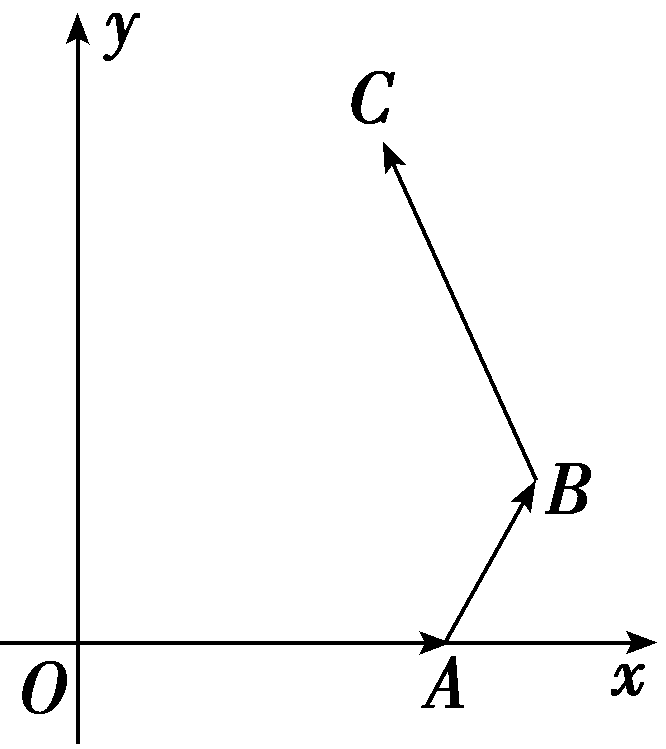

答案：(－1，0)

解析：设&lt;te&lt;te&lt;te&lt;te&lt;te&lt;text st&lt;text st<em>y</em>le="italic"&gt;y&lt;/text&gt;le="italic"&gt;x&lt;/text&gt;t style="italic"&gt;x&lt;/text&gt;t st<em>y</em>le="italic"&gt;x&lt;/text&gt;t st<em>y</em>le="italic"&gt;x&lt;/text&gt;t st<em>y</em>le="italic"&gt;x&lt;/text&gt;t style="italic"&gt;<em>B</em>&lt;/text&gt;(x&lt;text style="subscript"&gt;&lt;text style="subscript"&gt;&lt;text style="subscript"&gt;&lt;text style="subscript"&gt;&lt;text style="subscript"&gt;1&lt;/text&gt;&lt;/text&gt;&lt;/text&gt;&lt;/text&gt;&lt;/text&gt;，y1)，<em>&lt;text style="italic"&gt;C</em>&lt;/text&gt;(x&lt;text style="subscript"&gt;&lt;text style="subscript"&gt;&lt;text style="subscript"&gt;2&lt;/text&gt;&lt;/text&gt;&lt;/text&gt;，y2)，又因为<em>A</em>(2，0)，所以x1＝2＋｜ $\vec{AB}$ ｜cos(&lt;te&lt;te&lt;te&lt;te&lt;text st&lt;text st<em>y</em>le="italic"&gt;y&lt;/text&gt;le="italic"&gt;x&lt;/text&gt;t style="italic"&gt;x&lt;/text&gt;t st<em>y</em>le="italic"&gt;x&lt;/text&gt;t st<em>y</em>le="italic"&gt;x&lt;/text&gt;t st<em>y</em>le="subscript"&gt;&lt;text style="subscript"&gt;&lt;text style="subscript"&gt;&lt;text style="subscript"&gt;&lt;text style="subscript"&gt;1&lt;/text&gt;&lt;/text&gt;&lt;/text&gt;&lt;/text&gt;&lt;/text&gt;80°－∠O<em>A</em>&lt;te<em>x</em>t style="italic"&gt;<em>B</em>&lt;/text&gt;)，y1＝｜ $\vec{AB}$ ｜sin(&lt;te&lt;te&lt;te&lt;te&lt;text st&lt;text st<em>y</em>le="italic"&gt;y&lt;/text&gt;le="italic"&gt;x&lt;/text&gt;t style="italic"&gt;x&lt;/text&gt;t st<em>y</em>le="italic"&gt;x&lt;/text&gt;t st<em>y</em>le="italic"&gt;x&lt;/text&gt;t st<em>y</em>le="subscript"&gt;&lt;text style="subscript"&gt;&lt;text style="subscript"&gt;&lt;text style="subscript"&gt;&lt;text style="subscript"&gt;1&lt;/text&gt;&lt;/text&gt;&lt;/text&gt;&lt;/text&gt;&lt;/text&gt;80°－∠O<em>A</em>&lt;te<em>x</em>t style="italic"&gt;<em>B</em>&lt;/text&gt;)，x&lt;text style="subscript"&gt;&lt;text style="subscript"&gt;&lt;text style="subscript"&gt;2&lt;/text&gt;&lt;/text&gt;&lt;/text&gt;＝x1－｜ $\vec{BC}$ ｜cos(∠O&lt;te&lt;te&lt;te&lt;text st&lt;text st<em>y</em>le="italic"&gt;y&lt;/text&gt;le="italic"&gt;x&lt;/text&gt;t style="italic"&gt;x&lt;/text&gt;t st<em>y</em>le="italic"&gt;x&lt;/text&gt;t style="italic"&gt;A&lt;/text&gt;&lt;te&lt;te&lt;text st<em>y</em>le="italic"&gt;x&lt;/text&gt;t st<em>y</em>le="italic"&gt;x&lt;/text&gt;t style="italic"&gt;<em>B</em>&lt;/text&gt;＋∠AB<em>&lt;text style="italic"&gt;C</em>&lt;/text&gt;－&lt;text style="subscript"&gt;&lt;text style="subscript"&gt;&lt;text style="subscript"&gt;&lt;text style="subscript"&gt;&lt;text style="subscript"&gt;1&lt;/text&gt;&lt;/text&gt;&lt;/text&gt;&lt;/text&gt;&lt;/text&gt;80°)，y&lt;text style="subscript"&gt;&lt;text style="subscript"&gt;&lt;text style="subscript"&gt;2&lt;/text&gt;&lt;/text&gt;&lt;/text&gt;＝｜ $\vec{BC}$ ｜sin(∠O&lt;te&lt;te&lt;te&lt;text st&lt;text st<em>y</em>le="italic"&gt;y&lt;/text&gt;le="italic"&gt;x&lt;/text&gt;t style="italic"&gt;x&lt;/text&gt;t st<em>y</em>le="italic"&gt;x&lt;/text&gt;t style="italic"&gt;A&lt;/text&gt;&lt;te&lt;te&lt;text st<em>y</em>le="italic"&gt;x&lt;/text&gt;t st<em>y</em>le="italic"&gt;x&lt;/text&gt;t style="italic"&gt;<em>B</em>&lt;/text&gt;＋∠AB<em>&lt;text style="italic"&gt;C</em>&lt;/text&gt;－&lt;text style="subscript"&gt;&lt;text style="subscript"&gt;&lt;text style="subscript"&gt;&lt;text style="subscript"&gt;&lt;text style="subscript"&gt;1&lt;/text&gt;&lt;/text&gt;&lt;/text&gt;&lt;/text&gt;&lt;/text&gt;80°)＋y1，所以B( $\frac{5}{2}$ ， $\frac{\sqrt{3}}{2}$ )，&lt;te&lt;te&lt;te&lt;te&lt;text st&lt;text st<em>y</em>le="italic"&gt;y&lt;/text&gt;le="italic"&gt;x&lt;/text&gt;t style="italic"&gt;x&lt;/text&gt;t st<em>y</em>le="italic"&gt;x&lt;/text&gt;t st<em>y</em>le="italic"&gt;x&lt;/text&gt;t style="italic"&gt;<em>C</em>&lt;/text&gt;( $\frac{3}{2}$ ， $\frac{3\sqrt{3}}{2}$ )， $\vec{BC}$ ＝(－&lt;te&lt;te&lt;te&lt;te&lt;text st&lt;text st<em>y</em>le="italic"&gt;y&lt;/text&gt;le="italic"&gt;x&lt;/text&gt;t style="italic"&gt;x&lt;/text&gt;t st<em>y</em>le="italic"&gt;x&lt;/text&gt;t st<em>y</em>le="italic"&gt;x&lt;/text&gt;t st<em>y</em>le="subscript"&gt;&lt;text style="subscript"&gt;&lt;text style="subscript"&gt;&lt;text style="subscript"&gt;&lt;text style="subscript"&gt;1&lt;/text&gt;&lt;/text&gt;&lt;/text&gt;&lt;/text&gt;&lt;/text&gt;， $\sqrt{3}$ )， $\vec{OA}$ ＝(&lt;te&lt;te&lt;te&lt;text st&lt;text st<em>y</em>le="italic"&gt;y&lt;/text&gt;le="italic"&gt;x&lt;/text&gt;t style="italic"&gt;x&lt;/text&gt;t st<em>y</em>le="italic"&gt;x&lt;/text&gt;t st<em>y</em>le="subscript"&gt;&lt;text style="subscript"&gt;&lt;text style="subscript"&gt;2&lt;/text&gt;&lt;/text&gt;&lt;/text&gt;，0)，所以 $\vec{BC}$ 在 $\vec{OA}$ 上的投影数量为 $\frac{\vec{BC}\cdot \vec{OA}}{｜\vec{OA}｜}$ ＝ $\frac{－2}{2}$ ＝－&lt;te&lt;te&lt;te&lt;te&lt;text st&lt;text st<em>y</em>le="italic"&gt;y&lt;/text&gt;le="italic"&gt;x&lt;/text&gt;t style="italic"&gt;x&lt;/text&gt;t st<em>y</em>le="italic"&gt;x&lt;/text&gt;t st<em>y</em>le="italic"&gt;x&lt;/text&gt;t st<em>y</em>le="subscript"&gt;&lt;text style="subscript"&gt;&lt;text style="subscript"&gt;&lt;text style="subscript"&gt;&lt;text style="subscript"&gt;1&lt;/text&gt;&lt;/text&gt;&lt;/text&gt;&lt;/text&gt;&lt;/text&gt;.故所求投影向量的坐标为(－1，0).

1.求平面向量的模的方法

(1)公式法：利用｜&lt;text style="&lt;text style="&lt;text style="<em><strong>b</strong></em>old,italic"&gt;b&lt;/text&gt;old,it&lt;text style="bold,it<em><strong>a</strong></em>lic"&gt;a&lt;/text&gt;lic"&gt;b&lt;/text&gt;old,it<em><strong>a</strong></em>lic"&gt;a&lt;/text&gt;｜＝ $\sqrt{a\cdot a}$ 及(&lt;text style="&lt;text style="&lt;text style="<em><strong>b</strong></em>old,italic"&gt;b&lt;/text&gt;old,it&lt;text style="bold,it<em><strong>a</strong></em>lic"&gt;a&lt;/text&gt;lic"&gt;b&lt;/text&gt;old,it<em><strong>a</strong></em>lic"&gt;a&lt;/text&gt;±b)&lt;text style="superscript"&gt;&lt;text style="superscript"&gt;2&lt;/text&gt;&lt;/text&gt;＝｜a｜2±2a<em>·</em>b＋｜b｜2.(2)几何法：利用向量的几何意义.

2.求平面向量的夹角的方法

(1)定义法：cos *θ*＝ $\frac{a\cdot b}{｜a||b｜}$ .(2)坐标法.

3.两个向量垂直的充要条件

<em><strong>a</strong></em>⊥<em><strong>b</strong></em>⇔<em><strong>a</strong>·<strong>b</strong></em>＝0⇔｜<em><strong>a</strong></em>－<em><strong>b</strong></em>｜＝｜<em><strong>a</strong></em>＋<em><strong>b</strong></em>｜(其中<em><strong>a</strong></em>≠<strong>0</strong>，<em><strong>b</strong></em>≠<strong>0</strong>).

4.设向量&lt;text style="&lt;text style="&lt;text style="&lt;text style="<em><strong>b</strong></em>old,it<em><strong>a</strong></em>lic"&gt;b&lt;/text&gt;old,it<em><strong>a</strong></em>lic"&gt;b&lt;/text&gt;old,it<em><strong>a</strong></em>lic"&gt;b&lt;/text&gt;old,italic"&gt;a&lt;/text&gt;与b的夹角为<em>θ</em>，则a在b上的投影向量为｜a｜cos <em>&lt;text style="italic"&gt;θ·</em>&lt;/text&gt; $\frac{b}{｜b｜}$ ，&lt;text style="&lt;text style="&lt;text style="<em><strong>b</strong></em>old,it<em><strong>a</strong></em>lic"&gt;b&lt;/text&gt;old,it<em><strong>a</strong></em>lic"&gt;b&lt;/text&gt;old,it<em><strong>a</strong></em>lic"&gt;b&lt;/text&gt;在<em><strong>a</strong></em>上的投影向量为｜b｜cos <em>θ</em>· $\frac{a}{｜a｜}$ ，注意区分两者之间的差异.

对点练1.(2022·全国乙卷)已知向量***a***＝(2，1) ，***b***＝(－2，4) ，则｜***a***－***b***｜＝(　　 )

A.2	B.3

C.4	D.5

答案：**D**

解析：由题意知<text style="<text style="***b***old,it***a***lic">b</text>old,italic">a</text>－b＝(2，1)－(－2，4)＝(4，－3) ，所以｜a－b｜＝ $\sqrt{4^{2}＋(-3)^{2}}$ ＝5.故选D.

对点练2.(2022·新高考Ⅱ卷)已知向量<em><strong>a</strong></em>＝(3，4)，<em><strong>b</strong></em>＝(1，0)，<em><strong>c</strong></em>＝<em><strong>a</strong></em>＋<em>t<strong>b</strong></em>，若＜<em><strong>a</strong></em>，<em><strong>c</strong></em>＞＝＜<em><strong>b</strong></em>，<em><strong>c</strong></em>＞，则<em>t</em>＝(　　)

A.－6	B.－5

C.5	D.6

答案：**C**

解析：由题意，得&lt;&lt;&lt;&lt;&lt;&lt;&lt;&lt;<em>t</em>ext style="italic"&gt;t&lt;/text&gt;ext style="it&lt;text style="&lt;text style="&lt;text style="bold,itali<em><strong>c</strong></em>"&gt;b&lt;/text&gt;old,it&lt;text style="bold,itali<em><strong>c</strong></em>"&gt;a&lt;/text&gt;li<em><strong>c</strong></em>"&gt;b&lt;/text&gt;old,itali<em><strong>c</strong></em>"&gt;a&lt;/text&gt;lic"&gt;t&lt;/text&gt;ext style="italic"&gt;t&lt;/text&gt;ext style="itali<em><strong>c</strong></em>"&gt;t&lt;/text&gt;ext style="italic"&gt;t&lt;/text&gt;ext style="it&lt;text style="<em><strong>b</strong></em>old,itali<em><strong>c</strong></em>"&gt;a&lt;/text&gt;lic"&gt;t&lt;/text&gt;ext style="italic"&gt;t&lt;/text&gt;ext style="<em><strong>b</strong></em>old,it<em><strong>a</strong></em>lic"&gt;c&lt;/text&gt;＝a＋tb＝(3＋t，4)，所以a<em>&lt;text style="italic"&gt;·</em>&lt;/text&gt;c＝3×(3＋t)＋4×4＝25＋3t，b·c＝1×(3＋t)＋0×4＝3＋t.因为＜a，c＞＝＜b，c＞，所以cos＜a，c＞＝cos＜b，c＞，即 $\frac{a\cdot c}{｜a||c｜}$ ＝ $\frac{b\cdot c}{｜b||c｜}$ ，即 $\frac{25+3t}{5}$ ＝3＋&lt;&lt;&lt;&lt;&lt;&lt;&lt;<em>t</em>ext style="italic"&gt;t&lt;/text&gt;ext style="it&lt;text style="&lt;text style="&lt;text style="bold,itali<em><strong>c</strong></em>"&gt;b&lt;/text&gt;old,it&lt;text style="bold,itali<em><strong>c</strong></em>"&gt;a&lt;/text&gt;li<em><strong>c</strong></em>"&gt;b&lt;/text&gt;old,itali<em><strong>c</strong></em>"&gt;a&lt;/text&gt;lic"&gt;t&lt;/text&gt;ext style="italic"&gt;t&lt;/text&gt;ext style="itali<em><strong>c</strong></em>"&gt;t&lt;/text&gt;ext style="italic"&gt;t&lt;/text&gt;ext style="it&lt;text style="<em><strong>b</strong></em>old,itali<em><strong>c</strong></em>"&gt;a&lt;/text&gt;lic"&gt;t&lt;/text&gt;ext style="italic"&gt;t&lt;/text&gt;，解得t＝5.故选C.

对点练3.(多选)(2024·山东聊城二模)已知向量<text style="<text style="<text style="bold,it<text style="bold,it***a***lic">a</text>lic">b</text>old,italic">b</text>old,italic">a</text>＝ $\left(－1，2\right)$ ，<text style="<text style="bold,it<text style="bold,it***a***lic">a</text>lic">b</text>old,italic">b</text>＝ $\left(1，\lambda \right)$ ，若<text style="<text style="bold,it<text style="bold,it***a***lic">a</text>lic">b</text>old,italic">b</text>在***a***上的投影向量为a，则(　　)

A.<em>λ</em>＝3	B.<em><strong>a</strong></em>∥<em><strong>b</strong></em>

C.<text style="***b***old,it***a***lic">a</text>⊥ $\left(b－a\right)$ 	D.<text style="***b***old,it***a***lic">a</text>与b的夹角为45°

答案：**ACD**

解析：对于A，因为&lt;text style="&lt;text style="&lt;text style="<em><strong>b</strong></em>old,it<em><strong>a</strong></em>lic"&gt;b&lt;/text&gt;old,it&lt;text style="bold,it&lt;text style="bold,it<em><strong>a</strong></em>lic"&gt;a&lt;/text&gt;lic"&gt;a&lt;/text&gt;lic"&gt;b&lt;/text&gt;old,it&lt;text style="bold,it&lt;text style="bold,it&lt;text style="bold,it<em><strong>a</strong></em>lic"&gt;a&lt;/text&gt;lic"&gt;a&lt;/text&gt;lic"&gt;a&lt;/text&gt;lic"&gt;b&lt;/text&gt;在a上的投影向量为a，即 $\frac{a\cdot b}{\left|a\right|}$ &lt;text style="it&lt;text style="&lt;text style="&lt;text style="<em><strong>b</strong></em>old,it<em><strong>a</strong></em>lic"&gt;b&lt;/text&gt;old,it&lt;text style="bold,it&lt;text style="bold,it<em><strong>a</strong></em>lic"&gt;a&lt;/text&gt;lic"&gt;a&lt;/text&gt;lic"&gt;b&lt;/text&gt;old,it<em><strong>a</strong></em>lic"&gt;a&lt;/text&gt;lic"&gt;<em>&lt;text style="italic"&gt;·</em>&lt;/text&gt;&lt;/text&gt; $\frac{a}{\left|a\right|}$ ＝&lt;text style="&lt;text style="&lt;text style="<em><strong>b</strong></em>old,it<em><strong>a</strong></em>lic"&gt;b&lt;/text&gt;old,it&lt;text style="bold,it&lt;text style="bold,it<em><strong>a</strong></em>lic"&gt;a&lt;/text&gt;lic"&gt;a&lt;/text&gt;lic"&gt;b&lt;/text&gt;old,it&lt;text style="bold,it&lt;text style="bold,it<em><strong>a</strong></em>lic"&gt;a&lt;/text&gt;lic"&gt;a&lt;/text&gt;lic"&gt;a&lt;/text&gt;，所以 $\frac{a\cdot b}{｜a｜^{2}}$ ＝1，即 $\frac{－1+2\lambda }{(\sqrt{5})^{2}}$ ＝1，解得&lt;text style="it&lt;text style="&lt;text style="&lt;text style="<em><strong>b</strong></em>old,it<em><strong>a</strong></em>lic"&gt;b&lt;/text&gt;old,it&lt;text style="bold,it&lt;text style="bold,it<em><strong>a</strong></em>lic"&gt;a&lt;/text&gt;lic"&gt;a&lt;/text&gt;lic"&gt;b&lt;/text&gt;old,italic"&gt;a&lt;/text&gt;lic"&gt;λ&lt;/text&gt;＝3，故A正确；对于B，&lt;text style="bold,it&lt;text style="bold,it<em><strong>a</strong></em>lic"&gt;a&lt;/text&gt;lic"&gt;a&lt;/text&gt;＝ $\left(－1，2\right)$ ，&lt;text style="&lt;text style="&lt;text style="<em><strong>b</strong></em>old,it<em><strong>a</strong></em>lic"&gt;b&lt;/text&gt;old,it&lt;text style="bold,it&lt;text style="bold,it<em><strong>a</strong></em>lic"&gt;a&lt;/text&gt;lic"&gt;a&lt;/text&gt;lic"&gt;b&lt;/text&gt;old,it&lt;text style="bold,it&lt;text style="bold,it&lt;text style="bold,it<em><strong>a</strong></em>lic"&gt;a&lt;/text&gt;lic"&gt;a&lt;/text&gt;lic"&gt;a&lt;/text&gt;lic"&gt;b&lt;/text&gt;＝ $\left(1，3\right)$ ，所以(－1)×3－2×1≠0，故B错误；对于C，&lt;text style="&lt;text style="&lt;text style="<em><strong>b</strong></em>old,it<em><strong>a</strong></em>lic"&gt;b&lt;/text&gt;old,it&lt;text style="bold,it&lt;text style="bold,it<em><strong>a</strong></em>lic"&gt;a&lt;/text&gt;lic"&gt;a&lt;/text&gt;lic"&gt;b&lt;/text&gt;old,it&lt;text style="bold,it&lt;text style="bold,it<em><strong>a</strong></em>lic"&gt;a&lt;/text&gt;lic"&gt;a&lt;/text&gt;lic"&gt;a&lt;/text&gt;<em>&lt;text style="italic"&gt;&lt;text style="italic"&gt;·</em>&lt;/text&gt;&lt;/text&gt; $\left(b－a\right)$ ＝(－1，2)&lt;text style="it&lt;text style="&lt;text style="&lt;text style="<em><strong>b</strong></em>old,it<em><strong>a</strong></em>lic"&gt;b&lt;/text&gt;old,it&lt;text style="bold,it&lt;text style="bold,it<em><strong>a</strong></em>lic"&gt;a&lt;/text&gt;lic"&gt;a&lt;/text&gt;lic"&gt;b&lt;/text&gt;old,it<em><strong>a</strong></em>lic"&gt;a&lt;/text&gt;lic"&gt;<em>&lt;text style="italic"&gt;·</em>&lt;/text&gt;&lt;/text&gt;(2，1)＝－2＋2＝0，所以&lt;text style="bold,it<em><strong>a</strong></em>lic"&gt;a&lt;/text&gt;⊥ $\left(b－a\right)$ ，故C正确；对于D，cos＜&lt;text style="&lt;text style="&lt;text style="<em><strong>b</strong></em>old,it<em><strong>a</strong></em>lic"&gt;b&lt;/text&gt;old,it&lt;text style="bold,it&lt;text style="bold,it<em><strong>a</strong></em>lic"&gt;a&lt;/text&gt;lic"&gt;a&lt;/text&gt;lic"&gt;b&lt;/text&gt;old,it&lt;text style="bold,it&lt;text style="bold,it<em><strong>a</strong></em>lic"&gt;a&lt;/text&gt;lic"&gt;a&lt;/text&gt;lic"&gt;a&lt;/text&gt;，<em><strong>b</strong></em>＞＝ $\frac{a\cdot b}{｜a||b｜}$ ＝ $\frac{－1+6}{\sqrt{5}\times \sqrt{10}}$ ＝ $\frac{\sqrt{2}}{2}$ ，所以&lt;text style="&lt;text style="&lt;text style="<em><strong>b</strong></em>old,it<em><strong>a</strong></em>lic"&gt;b&lt;/text&gt;old,it&lt;text style="bold,it&lt;text style="bold,it<em><strong>a</strong></em>lic"&gt;a&lt;/text&gt;lic"&gt;a&lt;/text&gt;lic"&gt;b&lt;/text&gt;old,it&lt;text style="bold,it&lt;text style="bold,it<em><strong>a</strong></em>lic"&gt;a&lt;/text&gt;lic"&gt;a&lt;/text&gt;lic"&gt;a&lt;/text&gt;与<em><strong>b</strong></em>的夹角为45°，故D正确.故选ACD.

1.[真题再现]　(2022·全国乙卷)已知向量<text style="<text style="<text style="<text style="***b***old,it***a***lic">b</text>old,it***a***lic">b</text>old,it***a***lic">b</text>old,italic">a</text>，b满足｜a｜＝1，｜b｜＝ $\sqrt{3}$ ，｜<text style="<text style="<text style="<text style="***b***old,it***a***lic">b</text>old,it***a***lic">b</text>old,it***a***lic">b</text>old,italic">a</text>－2b｜＝3，则a·b＝(　　 )

A.－2	B.－1

C.1	D.2

答案：**C**

解析：因为｜&lt;text style="&lt;text style="&lt;text style="&lt;text style="&lt;text style="&lt;text style="&lt;text style="<em><strong>b</strong></em>old,it<em><strong>a</strong></em>lic"&gt;b&lt;/text&gt;old,it<em><strong>a</strong></em>lic"&gt;b&lt;/text&gt;old,it<em><strong>a</strong></em>lic"&gt;b&lt;/text&gt;old,it<em><strong>a</strong></em>lic"&gt;b&lt;/text&gt;old,it<em><strong>a</strong></em>lic"&gt;b&lt;/text&gt;old,it&lt;text style="bold,it<em><strong>a</strong></em>lic"&gt;a&lt;/text&gt;lic"&gt;b&lt;/text&gt;old,italic"&gt;a&lt;/text&gt;－&lt;text style="superscript"&gt;2&lt;/text&gt;b｜2＝｜a｜2－4a<em>&lt;text style="italic"&gt;&lt;text style="italic"&gt;&lt;text style="italic"&gt;·</em>&lt;/text&gt;&lt;/text&gt;&lt;/text&gt;b＋4 $\left|b\right|^{2}$ ，又因为｜&lt;text style="&lt;text style="&lt;text style="&lt;text style="&lt;text style="&lt;text style="&lt;text style="<em><strong>b</strong></em>old,it<em><strong>a</strong></em>lic"&gt;b&lt;/text&gt;old,it<em><strong>a</strong></em>lic"&gt;b&lt;/text&gt;old,it<em><strong>a</strong></em>lic"&gt;b&lt;/text&gt;old,it<em><strong>a</strong></em>lic"&gt;b&lt;/text&gt;old,it<em><strong>a</strong></em>lic"&gt;b&lt;/text&gt;old,it&lt;text style="bold,it<em><strong>a</strong></em>lic"&gt;a&lt;/text&gt;lic"&gt;b&lt;/text&gt;old,italic"&gt;a&lt;/text&gt;｜＝1，｜b｜＝ $\sqrt{3}$ ，｜&lt;text style="&lt;text style="&lt;text style="&lt;text style="&lt;text style="&lt;text style="&lt;text style="<em><strong>b</strong></em>old,it<em><strong>a</strong></em>lic"&gt;b&lt;/text&gt;old,it<em><strong>a</strong></em>lic"&gt;b&lt;/text&gt;old,it<em><strong>a</strong></em>lic"&gt;b&lt;/text&gt;old,it<em><strong>a</strong></em>lic"&gt;b&lt;/text&gt;old,it<em><strong>a</strong></em>lic"&gt;b&lt;/text&gt;old,it&lt;text style="bold,it<em><strong>a</strong></em>lic"&gt;a&lt;/text&gt;lic"&gt;b&lt;/text&gt;old,italic"&gt;a&lt;/text&gt;－&lt;text style="superscript"&gt;2&lt;/text&gt;b｜＝3，所以9＝1－4a<em>&lt;text style="italic"&gt;&lt;text style="italic"&gt;&lt;text style="italic"&gt;·</em>&lt;/text&gt;&lt;/text&gt;&lt;/text&gt;b＋4×3＝13－4a·b，所以a·b＝1.故选C.

[教材呈现]　(人教A必修二P61T13(5))已知等边三角形<text style="it<text style="<text style="<text style="<text style="bold,it***a***li<text style="bold,itali***c***">c</text>">b</text>old,italic">b</text>old,it***a***li***c***">b</text>old,italic">a</text>lic">ABC</text>的边长为1， $\vec{BC}$ ＝<text style="<text style="<text style="<text style="bold,it***a***li<text style="bold,itali***c***">c</text>">b</text>old,italic">b</text>old,it***a***li***c***">b</text>old,italic">a</text>， $\vec{CA}$ ＝<text style="<text style="<text style="bold,it***a***li<text style="bold,itali***c***">c</text>">b</text>old,italic">b</text>old,it***a***li***c***">b</text>， $\vec{AB}$ ＝<text style="<text style="<text style="bold,it***a***li<text style="bold,itali***c***">c</text>">b</text>old,italic">b</text>old,it***a***lic">c</text>，那么<text style="***b***old,italic">a</text>·b＋b·c＋c·a＝(　　 )

A.3	B.－3

C. $\frac{3}{2}$ 	D.－ $\frac{3}{2}$

点评：高考题和教材习题考查的都是数量积的基本运算，并且在形式上完全相同，不同之处是高考试题没有给出各向量的夹角，需要通过平方进行转化.而事实上，教材习题中的条件也是满足<em><strong>a</strong></em>＋<em><strong>b</strong></em>＋<em><strong>c</strong></em>＝<strong>0</strong>，也就是说教材习题的解法可以按照高考题的解法进行，看起来，在学习教材时，对习题进行深刻的挖掘还是很有必要的.

2.[真题再现]　(2023·新高考Ⅰ卷)已知向量<em><strong>a</strong></em>＝(1，1)，<em><strong>b</strong></em>＝(1，－1).若(<em><strong>a</strong></em>＋<em>λ<strong>b</strong></em>)⊥(<em><strong>a</strong></em>＋<em>μ<strong>b</strong></em>)，则(　　 )

A.*λ*＋*μ*＝1	B.*λ*＋*μ*＝－1

C.*λμ*＝1	D.*λμ*＝－1

答案：**D**

解析：因为&lt;text style="&lt;text style="&lt;text style="<em><strong>b</strong></em>old,it<em><strong>a</strong></em>lic"&gt;b&lt;/text&gt;old,it<em><strong>a</strong></em>lic"&gt;b&lt;/text&gt;old,italic"&gt;a&lt;/text&gt;＝ $\left(1，1\right)$ ，&lt;text style="&lt;text style="<em><strong>b</strong></em>old,it<em><strong>a</strong></em>lic"&gt;b&lt;/text&gt;old,it<em><strong>a</strong></em>lic"&gt;b&lt;/text&gt;＝ $\left(1,-1\right)$ ，所以&lt;text style="&lt;text style="&lt;text style="<em><strong>b</strong></em>old,it<em><strong>a</strong></em>lic"&gt;b&lt;/text&gt;old,it<em><strong>a</strong></em>lic"&gt;b&lt;/text&gt;old,italic"&gt;a&lt;/text&gt;＋<em>λ</em>b＝ $\left(1+\lambda ，1－\lambda \right)$ ，&lt;text style="&lt;text style="&lt;text style="<em><strong>b</strong></em>old,it<em><strong>a</strong></em>lic"&gt;b&lt;/text&gt;old,it<em><strong>a</strong></em>lic"&gt;b&lt;/text&gt;old,italic"&gt;a&lt;/text&gt;＋<em>μ</em>b＝ $\left(1+\mu ，1－\mu \right)$ ，由 $\left(a＋\lambda b\right)$ ⊥ $\left(a＋\mu b\right)$ ，可得 $\left(a＋\lambda b\right)$ <em>·</em> $\left(a＋\mu b\right)$ ＝0，即 $\left(1+\lambda \right)\left(1+\mu \right)$ ＋ $\left(1－\lambda \right)\left(1－\mu \right)$ ＝0，整理得，&lt;text style="it&lt;text style="<em><strong>b</strong></em>old,italic"&gt;a&lt;/text&gt;lic"&gt;λ&lt;/text&gt;<em>μ</em>＝－1.故选D.

[教材呈现]　(人教A必修二P60T8)已知向量<em><strong>a</strong></em>＝(1，0)，<em><strong>b</strong></em>＝(1，1).当<em>λ</em>为何值时，<em><strong>a</strong></em>＋<em>λ<strong>b</strong></em>与<em><strong>a</strong></em>垂直？

点评：教材习题和高考题类似，都是根据向量垂直的充要条件求参数，其一般方法为根据平面向量数量积的坐标表示以及向量的线性运算列出方程，即可解出.

3.[真题再现]　(2024·新课标Ⅱ卷)已知向量***a***，***b***满足｜***a***｜＝1，｜***a***＋2***b***｜＝2，且(***b***－2***a***)⊥***b***，则｜***b***｜＝(　　)

A. $\frac{1}{2}$ 	B. $\frac{\sqrt{2}}{2}$

C. $\frac{\sqrt{3}}{2}$ 	D.1

答案：**B**

解析：由(&lt;text style="&lt;text style="&lt;text style="&lt;text style="&lt;text style="&lt;text style="&lt;text style="&lt;text style="&lt;text style="&lt;text style="&lt;text style="&lt;text style="&lt;text style="&lt;text style="&lt;text style="<em><strong>b</strong></em>old,italic"&gt;b&lt;/text&gt;old,italic"&gt;b&lt;/text&gt;old,italic"&gt;b&lt;/text&gt;old,italic"&gt;b&lt;/text&gt;old,italic"&gt;b&lt;/text&gt;old,italic"&gt;b&lt;/text&gt;old,it&lt;text style="bold,it<em><strong>a</strong></em>lic"&gt;a&lt;/text&gt;lic"&gt;b&lt;/text&gt;old,it<em><strong>a</strong></em>lic"&gt;b&lt;/text&gt;old,it<em><strong>a</strong></em>lic"&gt;b&lt;/text&gt;old,italic"&gt;b&lt;/text&gt;old,it<em><strong>a</strong></em>lic"&gt;b&lt;/text&gt;old,italic"&gt;b&lt;/text&gt;old,it<em><strong>a</strong></em>lic"&gt;b&lt;/text&gt;old,italic"&gt;b&lt;/text&gt;old,it<em><strong>a</strong></em>lic"&gt;b&lt;/text&gt;－&lt;text style="superscript"&gt;&lt;text style="superscript"&gt;&lt;text style="superscript"&gt;&lt;text style="superscript"&gt;&lt;text style="superscript"&gt;&lt;text style="superscript"&gt;&lt;text style="superscript"&gt;2&lt;/text&gt;&lt;/text&gt;&lt;/text&gt;&lt;/text&gt;&lt;/text&gt;&lt;/text&gt;&lt;/text&gt;a)⊥b，得(b－2a)<em>&lt;text style="italic"&gt;&lt;text style="italic"&gt;&lt;text style="italic"&gt;·</em>&lt;/text&gt;&lt;/text&gt;&lt;/text&gt;b＝b2－2a·b＝0，所以b2＝2a·b.将｜a＋2b｜＝2的两边同时平方，得a2＋4a·b＋4b2＝4，即1＋2b2＋4b2＝1＋6｜b｜2＝4，解得｜b｜2＝ $\frac{1}{2}$ ，所以｜&lt;text style="&lt;text style="&lt;text style="&lt;text style="&lt;text style="&lt;text style="&lt;text style="&lt;text style="&lt;text style="&lt;text style="&lt;text style="&lt;text style="&lt;text style="&lt;text style="&lt;text style="<em><strong>b</strong></em>old,italic"&gt;b&lt;/text&gt;old,italic"&gt;b&lt;/text&gt;old,italic"&gt;b&lt;/text&gt;old,italic"&gt;b&lt;/text&gt;old,italic"&gt;b&lt;/text&gt;old,italic"&gt;b&lt;/text&gt;old,it&lt;text style="bold,it<em><strong>a</strong></em>lic"&gt;a&lt;/text&gt;lic"&gt;b&lt;/text&gt;old,it<em><strong>a</strong></em>lic"&gt;b&lt;/text&gt;old,it<em><strong>a</strong></em>lic"&gt;b&lt;/text&gt;old,italic"&gt;b&lt;/text&gt;old,it<em><strong>a</strong></em>lic"&gt;b&lt;/text&gt;old,italic"&gt;b&lt;/text&gt;old,it<em><strong>a</strong></em>lic"&gt;b&lt;/text&gt;old,italic"&gt;b&lt;/text&gt;old,it<em><strong>a</strong></em>lic"&gt;b&lt;/text&gt;｜＝ $\frac{\sqrt{2}}{2}$ .故选B.

[教材呈现]　(人教A必修二P61T13(6))若向量***a***，***b***，***c***两两的夹角相等，且｜***a***｜＝1，｜***b***｜＝1，｜***c***｜＝3，则｜***a***＋***b***＋***c***｜＝(　　)

A.2	B.5

C.2或5　	D. $\sqrt{2}$ 或 $\sqrt{5}$

点评：高考题和教材习题考查的都是求向量的模，一般方法就是根据题目条件，利用向量模的平方得出答案.

**课时测评**53　**平面向量的数量积** $\frac{对应学生}{用书P415}$

(时间：60分钟　满分：78分)

(本栏目内容，在学生用书中以独立形式分册装订！)

(1—8题，每小题5分，共40分)

1.(2025·江苏扬州模拟)已知单位向量<em><strong>e</strong></em>1，<em><strong>e</strong></em>2的夹角为120°，则(2<em><strong>e</strong></em>1－<em><strong>e</strong></em>2)·<em><strong>e</strong></em>2＝(　　)

A.－2	B.0

C.1	D.2

答案：**A**

解析：因为单位向量&lt;t&lt;t&lt;t&lt;t&lt;t&lt;t<em><strong>e</strong></em>xt style="bold,italic"&gt;e&lt;/text&gt;xt style="bold,italic"&gt;e&lt;/text&gt;xt style="bold,italic"&gt;e&lt;/text&gt;xt style="bold,italic"&gt;e&lt;/text&gt;xt style="bold,italic"&gt;e&lt;/text&gt;xt style="bold,italic"&gt;e&lt;/text&gt;&lt;text style="subscript"&gt;&lt;text style="subscript"&gt;1&lt;/text&gt;&lt;/text&gt;，e&lt;text style="subscript"&gt;&lt;text style="subscript"&gt;&lt;text style="subscript"&gt;&lt;text style="superscript"&gt;2&lt;/text&gt;&lt;/text&gt;&lt;/text&gt;&lt;/text&gt;的夹角为120°，所以(2e1－e2)<em>&lt;text style="italic"&gt;&lt;text style="italic"&gt;·</em>&lt;/text&gt;&lt;/text&gt;e2＝2e1·e2－ $e_{2}^{2}$ ＝&lt;t&lt;t&lt;t&lt;t&lt;t<em><strong>e</strong></em>xt style="bold,italic"&gt;e&lt;/text&gt;xt style="bold,italic"&gt;e&lt;/text&gt;xt style="bold,italic"&gt;e&lt;/text&gt;xt style="bold,italic"&gt;e&lt;/text&gt;xt style="subscript"&gt;&lt;text style="subscript"&gt;&lt;text style="subscript"&gt;&lt;text style="superscript"&gt;2&lt;/text&gt;&lt;/text&gt;&lt;/text&gt;&lt;/text&gt; $\left|e_{1}\right|$ &lt;t&lt;t&lt;t<em><strong>e</strong></em>xt style="bold,italic"&gt;e&lt;/text&gt;xt style="bold,italic"&gt;e&lt;/text&gt;xt style="italic"&gt;<em>&lt;text style="italic"&gt;·</em>&lt;/text&gt;&lt;/text&gt; $\left|e_{2}\right|$ cos &lt;t&lt;t&lt;t&lt;t&lt;t&lt;t<em><strong>e</strong></em>xt style="bold,italic"&gt;e&lt;/text&gt;xt style="bold,italic"&gt;e&lt;/text&gt;xt style="bold,italic"&gt;e&lt;/text&gt;xt style="bold,italic"&gt;e&lt;/text&gt;xt style="bold,italic"&gt;e&lt;/text&gt;xt style="subscript"&gt;&lt;text style="subscript"&gt;1&lt;/text&gt;&lt;/text&gt;&lt;text style="subscript"&gt;&lt;text style="subscript"&gt;&lt;text style="subscript"&gt;&lt;text style="superscript"&gt;2&lt;/text&gt;&lt;/text&gt;&lt;/text&gt;&lt;/text&gt;0°－ $\left|e_{2}\right|^{2}$ ＝&lt;t&lt;t&lt;t&lt;t&lt;t<em><strong>e</strong></em>xt style="bold,italic"&gt;e&lt;/text&gt;xt style="bold,italic"&gt;e&lt;/text&gt;xt style="bold,italic"&gt;e&lt;/text&gt;xt style="bold,italic"&gt;e&lt;/text&gt;xt style="subscript"&gt;&lt;text style="subscript"&gt;&lt;text style="subscript"&gt;&lt;text style="superscript"&gt;2&lt;/text&gt;&lt;/text&gt;&lt;/text&gt;&lt;/text&gt;×&lt;t<em><strong>e</strong></em>xt style="subscript"&gt;&lt;text style="subscript"&gt;1&lt;/text&gt;&lt;/text&gt;×1× $\left(－\frac{1}{2}\right)$ －&lt;t&lt;t&lt;t&lt;t&lt;t&lt;t<em><strong>e</strong></em>xt style="bold,italic"&gt;e&lt;/text&gt;xt style="bold,italic"&gt;e&lt;/text&gt;xt style="bold,italic"&gt;e&lt;/text&gt;xt style="bold,italic"&gt;e&lt;/text&gt;xt style="bold,italic"&gt;e&lt;/text&gt;xt style="subscript"&gt;&lt;text style="subscript"&gt;1&lt;/text&gt;&lt;/text&gt;&lt;text style="subscript"&gt;&lt;text style="subscript"&gt;&lt;text style="subscript"&gt;&lt;text style="superscript"&gt;2&lt;/text&gt;&lt;/text&gt;&lt;/text&gt;&lt;/text&gt;＝－2.故选A.

2.(2025·福建三明模拟)已知向量<em><strong>a</strong></em>＝(<em>λ</em>，2)，<em><strong>b</strong></em>＝(－1，2)，若<em><strong>a</strong></em>⊥<em><strong>b</strong></em>，则｜<em><strong>a</strong></em>＋<em><strong>b</strong></em>｜等于(　　 )

A.5	B.6

C. $\sqrt{41}$ 	D.4 $\sqrt{3}$

答案：**A**

解析：因为&lt;text style="&lt;text style="&lt;text style="&lt;text style="&lt;text style="<em><strong>b</strong></em>old,it<em><strong>a</strong></em>lic"&gt;b&lt;/text&gt;old,it<em><strong>a</strong></em>lic"&gt;b&lt;/text&gt;old,it<em><strong>a</strong></em>lic"&gt;b&lt;/text&gt;old,it<em><strong>a</strong></em>lic"&gt;b&lt;/text&gt;old,italic"&gt;a&lt;/text&gt;＝(<em>&lt;text style="italic"&gt;&lt;text style="italic"&gt;λ</em>&lt;/text&gt;&lt;/text&gt;，2)，b＝(－1，2)，a⊥b，所以a<em>·</em>b＝0，即－λ＋4＝0，所以λ＝4，所以a＋b＝(3，4)，｜a＋b｜＝ $\sqrt{3^{2}＋4^{2}}$ ＝5.故选A.

3.(2&lt;text style="&lt;text style="bold,itali<em><strong>c</strong></em>"&gt;b&lt;/text&gt;old"&gt;0&lt;/text&gt;23·全国甲卷)已知向量&lt;text style="&lt;text style="&lt;text style="&lt;text style="bold,it&lt;text style="bold,itali<em><strong>c</strong></em>"&gt;a&lt;/text&gt;li<em><strong>c</strong></em>"&gt;b&lt;/text&gt;old,it<em><strong>a</strong></em>li<em><strong>c</strong></em>"&gt;b&lt;/text&gt;old,it<em><strong>a</strong></em>li<em><strong>c</strong></em>"&gt;b&lt;/text&gt;old,italic"&gt;a&lt;/text&gt;，b，c满足｜a｜＝｜b｜＝1，｜c｜＝ $\sqrt{2}$ ，且&lt;text style="&lt;text style="&lt;text style="&lt;text style="&lt;text style="bold,itali<em><strong>c</strong></em>"&gt;b&lt;/text&gt;old,it&lt;text style="bold,itali<em><strong>c</strong></em>"&gt;a&lt;/text&gt;li<em><strong>c</strong></em>"&gt;b&lt;/text&gt;old,it<em><strong>a</strong></em>li<em><strong>c</strong></em>"&gt;b&lt;/text&gt;old,it<em><strong>a</strong></em>li<em><strong>c</strong></em>"&gt;b&lt;/text&gt;old,italic"&gt;a&lt;/text&gt;＋b＋c＝<strong>0</strong>，则cos＜a－c，b－c＞＝(　　 )

A.－ $\frac{1}{5}$ 	B.－ $\frac{2}{5}$

C. $\frac{2}{5}$ 	D. $\frac{4}{5}$

答案：**D**

解析：因为&lt;text style="&lt;text style="&lt;text style="&lt;text style="&lt;text style="&lt;text style="&lt;text style="&lt;text style="&lt;text style="bold,itali<em><strong>c</strong></em>"&gt;b&lt;/text&gt;old,it&lt;text style="bold,itali<em><strong>c</strong></em>"&gt;a&lt;/text&gt;li<em><strong>c</strong></em>"&gt;b&lt;/text&gt;old,it<em><strong>a</strong></em>lic"&gt;b&lt;/text&gt;old,it<em><strong>a</strong></em>lic"&gt;b&lt;/text&gt;old,it<em><strong>a</strong></em>li<em><strong>c</strong></em>"&gt;b&lt;/text&gt;old,it<em><strong>a</strong></em>lic"&gt;b&lt;/text&gt;old,it<em><strong>a</strong></em>li<em><strong>c</strong></em>"&gt;b&lt;/text&gt;old,it<em><strong>a</strong></em>li<em><strong>c</strong></em>"&gt;b&lt;/text&gt;old,italic"&gt;a&lt;/text&gt;＋b＋c＝<strong>0</strong>，所以a＋b＝－c，即a&lt;text style="superscript"&gt;&lt;text style="superscript"&gt;&lt;text style="superscript"&gt;2&lt;/text&gt;&lt;/text&gt;&lt;/text&gt;＋b2＋2a<em>&lt;text style="italic"&gt;&lt;text style="italic"&gt;·</em>&lt;/text&gt;&lt;/text&gt;b＝c2，即1＋1＋2a·b＝2，所以a·b＝0.如图，设 $\vec{OA}$ ＝&lt;text style="&lt;text style="&lt;text style="&lt;text style="&lt;text style="&lt;text style="&lt;text style="&lt;text style="&lt;text style="bold,itali<em><strong>c</strong></em>"&gt;b&lt;/text&gt;old,it&lt;text style="bold,itali<em><strong>c</strong></em>"&gt;a&lt;/text&gt;li<em><strong>c</strong></em>"&gt;b&lt;/text&gt;old,it<em><strong>a</strong></em>lic"&gt;b&lt;/text&gt;old,it<em><strong>a</strong></em>lic"&gt;b&lt;/text&gt;old,it<em><strong>a</strong></em>li<em><strong>c</strong></em>"&gt;b&lt;/text&gt;old,it<em><strong>a</strong></em>lic"&gt;b&lt;/text&gt;old,it<em><strong>a</strong></em>li<em><strong>c</strong></em>"&gt;b&lt;/text&gt;old,it<em><strong>a</strong></em>li<em><strong>c</strong></em>"&gt;b&lt;/text&gt;old,italic"&gt;a&lt;/text&gt;， $\vec{OB}$ ＝&lt;text style="&lt;text style="&lt;text style="&lt;text style="&lt;text style="&lt;text style="&lt;text style="&lt;text style="bold,itali<em><strong>c</strong></em>"&gt;b&lt;/text&gt;old,it&lt;text style="bold,itali<em><strong>c</strong></em>"&gt;a&lt;/text&gt;li<em><strong>c</strong></em>"&gt;b&lt;/text&gt;old,it<em><strong>a</strong></em>lic"&gt;b&lt;/text&gt;old,it<em><strong>a</strong></em>lic"&gt;b&lt;/text&gt;old,it<em><strong>a</strong></em>li<em><strong>c</strong></em>"&gt;b&lt;/text&gt;old,it<em><strong>a</strong></em>lic"&gt;b&lt;/text&gt;old,it<em><strong>a</strong></em>li<em><strong>c</strong></em>"&gt;b&lt;/text&gt;old,it<em><strong>a</strong></em>li<em><strong>c</strong></em>"&gt;b&lt;/text&gt;， $\vec{OC}$ ＝&lt;text style="&lt;text style="&lt;text style="&lt;text style="&lt;text style="&lt;text style="&lt;text style="&lt;text style="bold,itali<em><strong>c</strong></em>"&gt;b&lt;/text&gt;old,it&lt;text style="bold,itali<em><strong>c</strong></em>"&gt;a&lt;/text&gt;li<em><strong>c</strong></em>"&gt;b&lt;/text&gt;old,it<em><strong>a</strong></em>lic"&gt;b&lt;/text&gt;old,it<em><strong>a</strong></em>lic"&gt;b&lt;/text&gt;old,it<em><strong>a</strong></em>li<em><strong>c</strong></em>"&gt;b&lt;/text&gt;old,it<em><strong>a</strong></em>lic"&gt;b&lt;/text&gt;old,it<em><strong>a</strong></em>li<em><strong>c</strong></em>"&gt;b&lt;/text&gt;old,it<em><strong>a</strong></em>lic"&gt;c&lt;/text&gt;，由题知，<em>OA</em>＝<em>OB</em>＝1，<em>OC</em>＝ $\sqrt{2}$ ，△&lt;text style="it&lt;text style="&lt;text style="bold,itali<em><strong>c</strong></em>"&gt;b&lt;/text&gt;old,itali<em><strong>c</strong></em>"&gt;a&lt;/text&gt;lic"&gt;OA&lt;/text&gt;B是等腰直角三角形，<em>AB</em>边上的高<em>&lt;text style="italic"&gt;OD</em>&lt;/text&gt;＝ $\frac{\sqrt{2}}{2}$ ，&lt;text style="it&lt;text style="&lt;text style="bold,itali<em><strong>c</strong></em>"&gt;b&lt;/text&gt;old,itali<em><strong>c</strong></em>"&gt;a&lt;/text&gt;lic"&gt;AD&lt;/text&gt;＝ $\frac{\sqrt{2}}{2}$ ，所以&lt;text style="it&lt;text style="&lt;text style="bold,itali<em><strong>c</strong></em>"&gt;b&lt;/text&gt;old,itali<em><strong>c</strong></em>"&gt;a&lt;/text&gt;lic"&gt;CD&lt;/text&gt;＝<em>CO</em>＋<em>&lt;text style="italic"&gt;OD</em>&lt;/text&gt;＝ $\sqrt{2}$ ＋ $\frac{\sqrt{2}}{2}$ ＝ $\frac{3\sqrt{2}}{2}$ ，t&lt;text style="&lt;text style="&lt;text style="&lt;text style="&lt;text style="&lt;text style="&lt;text style="&lt;text style="&lt;text style="bold,itali<em><strong>c</strong></em>"&gt;b&lt;/text&gt;old,it&lt;text style="bold,itali<em><strong>c</strong></em>"&gt;a&lt;/text&gt;li<em><strong>c</strong></em>"&gt;b&lt;/text&gt;old,it<em><strong>a</strong></em>lic"&gt;b&lt;/text&gt;old,it<em><strong>a</strong></em>lic"&gt;b&lt;/text&gt;old,it<em><strong>a</strong></em>li<em><strong>c</strong></em>"&gt;b&lt;/text&gt;old,it<em><strong>a</strong></em>lic"&gt;b&lt;/text&gt;old,it<em><strong>a</strong></em>li<em><strong>c</strong></em>"&gt;b&lt;/text&gt;old,it<em><strong>a</strong></em>li<em><strong>c</strong></em>"&gt;b&lt;/text&gt;old,italic"&gt;a&lt;/text&gt;n ∠A<em>CD</em>＝ $\frac{AD}{CD}$ ＝ $\frac{1}{3}$ ，&lt;text style="&lt;text style="&lt;text style="&lt;text style="&lt;text style="&lt;text style="&lt;text style="&lt;text style="bold,itali<em><strong>c</strong></em>"&gt;b&lt;/text&gt;old,it&lt;text style="bold,itali<em><strong>c</strong></em>"&gt;a&lt;/text&gt;li<em><strong>c</strong></em>"&gt;b&lt;/text&gt;old,it<em><strong>a</strong></em>lic"&gt;b&lt;/text&gt;old,it<em><strong>a</strong></em>lic"&gt;b&lt;/text&gt;old,it<em><strong>a</strong></em>li<em><strong>c</strong></em>"&gt;b&lt;/text&gt;old,it<em><strong>a</strong></em>lic"&gt;b&lt;/text&gt;old,it<em><strong>a</strong></em>li<em><strong>c</strong></em>"&gt;b&lt;/text&gt;old,it<em><strong>a</strong></em>lic"&gt;c&lt;/text&gt;os∠A<em>CD</em>＝ $\frac{3}{\sqrt{10}}$ ，&lt;text style="&lt;text style="&lt;text style="&lt;text style="&lt;text style="&lt;text style="&lt;text style="&lt;text style="bold,itali<em><strong>c</strong></em>"&gt;b&lt;/text&gt;old,it&lt;text style="bold,itali<em><strong>c</strong></em>"&gt;a&lt;/text&gt;li<em><strong>c</strong></em>"&gt;b&lt;/text&gt;old,it<em><strong>a</strong></em>lic"&gt;b&lt;/text&gt;old,it<em><strong>a</strong></em>lic"&gt;b&lt;/text&gt;old,it<em><strong>a</strong></em>li<em><strong>c</strong></em>"&gt;b&lt;/text&gt;old,it<em><strong>a</strong></em>lic"&gt;b&lt;/text&gt;old,it<em><strong>a</strong></em>li<em><strong>c</strong></em>"&gt;b&lt;/text&gt;old,it<em><strong>a</strong></em>lic"&gt;c&lt;/text&gt;os＜&lt;text style="<em><strong>b</strong></em>old,italic"&gt;a&lt;/text&gt;－c，b－c＞＝cos∠<em>ACB</em>＝cos &lt;text style="superscript"&gt;&lt;text style="superscript"&gt;&lt;text style="superscript"&gt;2&lt;/text&gt;&lt;/text&gt;&lt;/text&gt;∠A<em>CD</em>＝2cos2∠<em>&lt;text style="italic"&gt;&lt;text style="italic"&gt;&lt;text style="italic"&gt;ACD</em>&lt;/text&gt;&lt;/text&gt;&lt;/text&gt;－1＝2× $\left(\frac{3}{\sqrt{10}}\right)^{2}$ －1＝ $\frac{4}{5}$ .故选D.

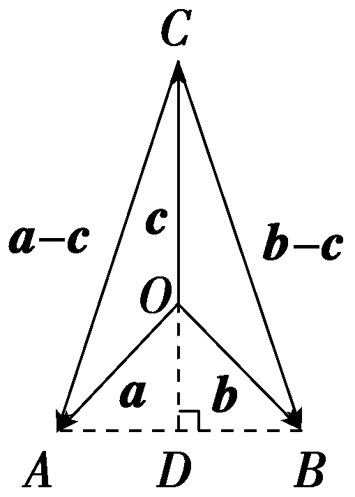

4.(2025·江西赣州模拟)在平行四边形*<text style="italic">AB*CD</text>中，AB＝3，*AD*＝4， $\vec{AB}$ · $\vec{AD}$ ＝－6， $\vec{DC}$ ＝3 $\vec{DM}$ ，则 $\vec{MA}$ · $\vec{MB}$ ＝(　　)

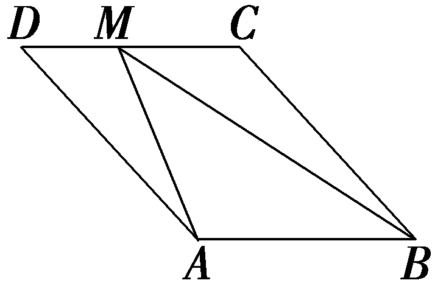

A. 16	B. 14

C. 12	D. 10

答案：**A**

解析：因为*AB*＝3，*AD*＝4， $\vec{AB}$ *<text style="italic"><text style="italic"><text style="italic"><text style="italic"><text style="italic">·*</text></text></text></text></text> $\vec{AD}$ ＝－6， $\vec{DC}$ ＝3 $\vec{DM}$ ，所以 $\vec{MA}$ *<text style="italic"><text style="italic"><text style="italic"><text style="italic"><text style="italic">·*</text></text></text></text></text> $\vec{MB}$ ＝ $\left(\vec{DA}－\vec{DM}\right)$ *<text style="italic"><text style="italic"><text style="italic"><text style="italic"><text style="italic">·*</text></text></text></text></text> $\left(\vec{CB}－\vec{CM}\right)$ ＝ $\left(－\vec{AD}－\frac{1}{3}\vec{DC}\right)$ *<text style="italic"><text style="italic"><text style="italic"><text style="italic"><text style="italic">·*</text></text></text></text></text> $\left(－\vec{AD}＋\frac{2}{3}\vec{DC}\right)$ ＝ $\vec{AD}^{2}$ － $\frac{1}{3}\vec{AD}$ *<text style="italic"><text style="italic"><text style="italic"><text style="italic"><text style="italic">·*</text></text></text></text></text> $\vec{DC}$ － $\frac{2}{9}\vec{DC}^{2}$ ＝ $\vec{AD}^{2}$ － $\frac{1}{3}\vec{AD}$ *<text style="italic"><text style="italic"><text style="italic"><text style="italic"><text style="italic">·*</text></text></text></text></text> $\vec{AB}$ － $\frac{2}{9}\vec{AB}^{2}$ ＝16＋2－2＝16.故选A.

5.(多选)已知向量***m***＋***n***＝(3，1)，***m***－***n***＝(1，－1)，则(　　)

A.(***m***－***n***)∥***n***	B.(***m***－***n***)⊥***n***

C.｜***<text style="bold,italic">m***</text>｜＝ $\sqrt{2}$ ｜***<text style="bold,italic">n***</text>｜	D.＜***<text style="bold,italic">m***</text>，n＞＝45°

答案：**BCD**

解析：依题意，<em><strong>&lt;text style="bold,italic"&gt;&lt;text style="bold,italic"&gt;&lt;text style="bold,italic"&gt;&lt;text style="bold,italic"&gt;&lt;text style="bold,italic"&gt;&lt;text style="bold,italic"&gt;&lt;text style="bold,italic"&gt;&lt;text style="bold,italic"&gt;&lt;text style="bold,italic"&gt;m</strong></em>&lt;/text&gt;&lt;/text&gt;&lt;/text&gt;&lt;/text&gt;&lt;/text&gt;&lt;/text&gt;&lt;/text&gt;&lt;/text&gt;&lt;/text&gt;＝ $\frac{1}{2}$ [ $\left(m＋n\right)$ ＋ $\left(m－n\right)$ ]＝ $\left(2，0\right)$ ，<em><strong>&lt;text style="bold,italic"&gt;&lt;text style="bold,italic"&gt;&lt;text style="bold,italic"&gt;&lt;text style="bold,italic"&gt;&lt;text style="bold,italic"&gt;&lt;text style="bold,italic"&gt;&lt;text style="bold,italic"&gt;&lt;text style="bold,italic"&gt;&lt;text style="bold,italic"&gt;&lt;text style="bold,italic"&gt;&lt;text style="bold,italic"&gt;n</strong></em>&lt;/text&gt;&lt;/text&gt;&lt;/text&gt;&lt;/text&gt;&lt;/text&gt;&lt;/text&gt;&lt;/text&gt;&lt;/text&gt;&lt;/text&gt;&lt;/text&gt;&lt;/text&gt;＝ $\frac{1}{2}$ [(<em><strong>&lt;text style="bold,italic"&gt;&lt;text style="bold,italic"&gt;&lt;text style="bold,italic"&gt;&lt;text style="bold,italic"&gt;&lt;text style="bold,italic"&gt;&lt;text style="bold,italic"&gt;&lt;text style="bold,italic"&gt;&lt;text style="bold,italic"&gt;&lt;text style="bold,italic"&gt;m</strong></em>&lt;/text&gt;&lt;/text&gt;&lt;/text&gt;&lt;/text&gt;&lt;/text&gt;&lt;/text&gt;&lt;/text&gt;&lt;/text&gt;&lt;/text&gt;＋<em><strong>&lt;text style="bold,italic"&gt;&lt;text style="bold,italic"&gt;&lt;text style="bold,italic"&gt;&lt;text style="bold,italic"&gt;&lt;text style="bold,italic"&gt;&lt;text style="bold,italic"&gt;&lt;text style="bold,italic"&gt;&lt;text style="bold,italic"&gt;&lt;text style="bold,italic"&gt;&lt;text style="bold,italic"&gt;&lt;text style="bold,italic"&gt;n</strong></em>&lt;/text&gt;&lt;/text&gt;&lt;/text&gt;&lt;/text&gt;&lt;/text&gt;&lt;/text&gt;&lt;/text&gt;&lt;/text&gt;&lt;/text&gt;&lt;/text&gt;&lt;/text&gt;)－(m－n)]＝ $\left(1，1\right)$ ，所以(<em><strong>&lt;text style="bold,italic"&gt;&lt;text style="bold,italic"&gt;&lt;text style="bold,italic"&gt;&lt;text style="bold,italic"&gt;&lt;text style="bold,italic"&gt;&lt;text style="bold,italic"&gt;&lt;text style="bold,italic"&gt;&lt;text style="bold,italic"&gt;&lt;text style="bold,italic"&gt;m</strong></em>&lt;/text&gt;&lt;/text&gt;&lt;/text&gt;&lt;/text&gt;&lt;/text&gt;&lt;/text&gt;&lt;/text&gt;&lt;/text&gt;&lt;/text&gt;－<em><strong>&lt;text style="bold,italic"&gt;&lt;text style="bold,italic"&gt;&lt;text style="bold,italic"&gt;&lt;text style="bold,italic"&gt;&lt;text style="bold,italic"&gt;&lt;text style="bold,italic"&gt;&lt;text style="bold,italic"&gt;&lt;text style="bold,italic"&gt;&lt;text style="bold,italic"&gt;&lt;text style="bold,italic"&gt;&lt;text style="bold,italic"&gt;n</strong></em>&lt;/text&gt;&lt;/text&gt;&lt;/text&gt;&lt;/text&gt;&lt;/text&gt;&lt;/text&gt;&lt;/text&gt;&lt;/text&gt;&lt;/text&gt;&lt;/text&gt;&lt;/text&gt;)<em>&lt;text style="italic"&gt;·</em>&lt;/text&gt;n＝(1，－1)·(1，1)＝0，所以(m－n)⊥n，故A错误，B正确；｜m｜＝2，｜n｜＝ $\sqrt{2}$ ，所以｜<em><strong>&lt;text style="bold,italic"&gt;&lt;text style="bold,italic"&gt;&lt;text style="bold,italic"&gt;&lt;text style="bold,italic"&gt;&lt;text style="bold,italic"&gt;&lt;text style="bold,italic"&gt;&lt;text style="bold,italic"&gt;&lt;text style="bold,italic"&gt;&lt;text style="bold,italic"&gt;m</strong></em>&lt;/text&gt;&lt;/text&gt;&lt;/text&gt;&lt;/text&gt;&lt;/text&gt;&lt;/text&gt;&lt;/text&gt;&lt;/text&gt;&lt;/text&gt;｜＝ $\sqrt{2}$ ｜<em><strong>&lt;text style="bold,italic"&gt;&lt;text style="bold,italic"&gt;&lt;text style="bold,italic"&gt;&lt;text style="bold,italic"&gt;&lt;text style="bold,italic"&gt;&lt;text style="bold,italic"&gt;&lt;text style="bold,italic"&gt;&lt;text style="bold,italic"&gt;&lt;text style="bold,italic"&gt;&lt;text style="bold,italic"&gt;&lt;text style="bold,italic"&gt;n</strong></em>&lt;/text&gt;&lt;/text&gt;&lt;/text&gt;&lt;/text&gt;&lt;/text&gt;&lt;/text&gt;&lt;/text&gt;&lt;/text&gt;&lt;/text&gt;&lt;/text&gt;&lt;/text&gt;｜，故C正确；cos＜<em><strong>&lt;text style="bold,italic"&gt;&lt;text style="bold,italic"&gt;&lt;text style="bold,italic"&gt;&lt;text style="bold,italic"&gt;&lt;text style="bold,italic"&gt;&lt;text style="bold,italic"&gt;&lt;text style="bold,italic"&gt;&lt;text style="bold,italic"&gt;&lt;text style="bold,italic"&gt;m</strong></em>&lt;/text&gt;&lt;/text&gt;&lt;/text&gt;&lt;/text&gt;&lt;/text&gt;&lt;/text&gt;&lt;/text&gt;&lt;/text&gt;&lt;/text&gt;，n＞＝ $\frac{m\cdot n}{｜m||n｜}$ ＝ $\frac{2}{2\times \sqrt{2}}$ ＝ $\frac{\sqrt{2}}{2}$ ，因为0°≤＜<em><strong>&lt;text style="bold,italic"&gt;&lt;text style="bold,italic"&gt;&lt;text style="bold,italic"&gt;&lt;text style="bold,italic"&gt;&lt;text style="bold,italic"&gt;&lt;text style="bold,italic"&gt;&lt;text style="bold,italic"&gt;&lt;text style="bold,italic"&gt;&lt;text style="bold,italic"&gt;m</strong></em>&lt;/text&gt;&lt;/text&gt;&lt;/text&gt;&lt;/text&gt;&lt;/text&gt;&lt;/text&gt;&lt;/text&gt;&lt;/text&gt;&lt;/text&gt;，<em><strong>&lt;text style="bold,italic"&gt;&lt;text style="bold,italic"&gt;&lt;text style="bold,italic"&gt;&lt;text style="bold,italic"&gt;&lt;text style="bold,italic"&gt;&lt;text style="bold,italic"&gt;&lt;text style="bold,italic"&gt;&lt;text style="bold,italic"&gt;&lt;text style="bold,italic"&gt;&lt;text style="bold,italic"&gt;&lt;text style="bold,italic"&gt;n</strong></em>&lt;/text&gt;&lt;/text&gt;&lt;/text&gt;&lt;/text&gt;&lt;/text&gt;&lt;/text&gt;&lt;/text&gt;&lt;/text&gt;&lt;/text&gt;&lt;/text&gt;&lt;/text&gt;＞≤180°，所以＜m，n＞＝45°，故D正确.故选BCD.

6.(多选)已知向量<em><strong>a</strong></em>＝(2，1)，<em><strong>b</strong></em>＝(1，－1)，<em><strong>c</strong></em>＝(<em>m</em>－2，－<em>n</em>)，其中<em>m</em>，<em>n</em>均为正数，且(<em><strong>a</strong></em>－<em><strong>b</strong></em>)∥<em><strong>c</strong></em>，则下列说法正确的是(　　)

A.***a***与***b***的夹角为钝角

B.向量<text style="<text style="***b***old,italic">b</text>old,italic">a</text>在b上的投影向量为 $\frac{\sqrt{2}}{2}$ <text style="***b***old,italic">b</text>

C.2*m*＋*n*＝4

D.*mn*的最大值为2

答案：**CD**

解析：对于A，向量&lt;text style="&lt;text style="&lt;text style="&lt;text style="&lt;text style="&lt;text style="&lt;text style="&lt;text style="&lt;text style="bold,itali<em><strong>c</strong></em>"&gt;b&lt;/text&gt;old,it<em><strong>a</strong></em>lic"&gt;b&lt;/text&gt;old,it<em><strong>a</strong></em>lic"&gt;b&lt;/text&gt;old,italic"&gt;b&lt;/text&gt;old,it<em><strong>a</strong></em>lic"&gt;b&lt;/text&gt;old,it<em><strong>a</strong></em>lic"&gt;b&lt;/text&gt;old,it<em><strong>a</strong></em>lic"&gt;b&lt;/text&gt;old,it<em><strong>a</strong></em>lic"&gt;b&lt;/text&gt;old,italic"&gt;a&lt;/text&gt;＝(2，1)，b＝(1，－1)，则a·b＝2－1＝1＞0，又a，b不共线，所以a，b的夹角为锐角，故A错误；对于B，向量a在b上的投影向量为 $\frac{a\cdot b}{｜b｜}$ · $\frac{b}{｜b｜}$ ＝ $\frac{1}{2}$ &lt;text style="&lt;text style="&lt;text style="&lt;text style="&lt;text style="&lt;text style="&lt;text style="&lt;text style="bold,itali<em><strong>c</strong></em>"&gt;b&lt;/text&gt;old,it<em><strong>a</strong></em>lic"&gt;b&lt;/text&gt;old,it<em><strong>a</strong></em>lic"&gt;b&lt;/text&gt;old,italic"&gt;b&lt;/text&gt;old,it<em><strong>a</strong></em>lic"&gt;b&lt;/text&gt;old,it<em><strong>a</strong></em>lic"&gt;b&lt;/text&gt;old,it<em><strong>a</strong></em>lic"&gt;b&lt;/text&gt;old,it<em><strong>a</strong></em>lic"&gt;b&lt;/text&gt;，故B错误；<em><strong>a</strong></em>－b＝(1，2)，若(a－b)∥c，则－<em>&lt;text style="italic"&gt;&lt;text style="italic"&gt;&lt;text style="italic"&gt;&lt;text style="italic"&gt;&lt;text style="italic"&gt;n</em>&lt;/text&gt;&lt;/text&gt;&lt;/text&gt;&lt;/text&gt;&lt;/text&gt;＝2(<em>&lt;text style="italic"&gt;&lt;text style="italic"&gt;&lt;text style="italic"&gt;&lt;text style="italic"&gt;&lt;text style="italic"&gt;m</em>&lt;/text&gt;&lt;/text&gt;&lt;/text&gt;&lt;/text&gt;&lt;/text&gt;－2)，变形可得2m＋n＝4，故C正确；由2m＋n＝4，且m，n均为正数，得<em>&lt;text style="italic"&gt;mn</em>&lt;/text&gt;＝ $\frac{1}{2}$ (2<em>&lt;text style="italic"&gt;&lt;text style="italic"&gt;&lt;text style="italic"&gt;&lt;text style="italic"&gt;&lt;text style="italic"&gt;m</em>&lt;/text&gt;&lt;/text&gt;&lt;/text&gt;&lt;/text&gt;&lt;/text&gt;·<em>&lt;text style="italic"&gt;&lt;text style="italic"&gt;&lt;text style="italic"&gt;&lt;text style="italic"&gt;&lt;text style="italic"&gt;n</em>&lt;/text&gt;&lt;/text&gt;&lt;/text&gt;&lt;/text&gt;&lt;/text&gt;)≤ $\frac{1}{2}\left(\frac{2m＋n}{2}\right)^{2}$ ＝2，当且仅当<em>&lt;text style="italic"&gt;&lt;text style="italic"&gt;&lt;text style="italic"&gt;&lt;text style="italic"&gt;&lt;text style="italic"&gt;m</em>&lt;/text&gt;&lt;/text&gt;&lt;/text&gt;&lt;/text&gt;&lt;/text&gt;＝1，<em>&lt;text style="italic"&gt;&lt;text style="italic"&gt;&lt;text style="italic"&gt;&lt;text style="italic"&gt;&lt;text style="italic"&gt;n</em>&lt;/text&gt;&lt;/text&gt;&lt;/text&gt;&lt;/text&gt;&lt;/text&gt;＝2时，等号成立，即<em>&lt;text style="italic"&gt;mn</em>&lt;/text&gt;的最大值为2，故D正确.故选CD.

7.(开放题)已知向量<em><strong>a</strong></em>＝(2，3)，<em><strong>b</strong></em>＝(－3，－2)，写出一个与<em><strong>a</strong></em>－<em><strong>b</strong></em>垂直的非零向量<em><strong>c</strong></em>＝<u>　　　　</u>.

答案：(1，－1)(答案不唯一)

解析：由题意可知<em><strong>a</strong></em>－<em><strong>b</strong></em>＝(5，5).设<em><strong>c</strong></em>＝(<em>x</em>，<em>y</em>)，则(<em><strong>a</strong></em>－<em><strong>b</strong></em>)<em>·<strong>c</strong></em>＝5<em>x</em>＋5<em>y</em>＝0.取<em>x</em>＝1，则<em>y</em>＝－1，所以与<em><strong>a</strong></em>－<em><strong>b</strong></em>垂直的非零向量可以为<em><strong>c</strong></em>＝(1，－1).(答案不唯一)

8.(双空题)在△<em>&lt;text style="italic"&gt;AB</em>C&lt;/text&gt;中，AB＝4，<em>BC</em>＝5，<em>CA</em>＝6，△<em>ABC</em>外接圆圆心为<em>O</em>，则 $\vec{AO}$ · $\vec{AB}$ ＝<u>&lt;text style="underline"&gt;　　　　</u>&lt;/text&gt;， $\vec{AO}$ · $\vec{BC}$ ＝<u>&lt;text style="underline"&gt;　　　　</u>&lt;/text&gt;.

答案：8　10

解析：由题意得<em>O</em>为△<em>A&lt;text style="italic"&gt;BC</em>&lt;/text&gt;外心，故 $\vec{AO}$ <em>&lt;text style="italic"&gt;&lt;text style="italic"&gt;&lt;text style="italic"&gt;&lt;text style="italic"&gt;·</em>&lt;/text&gt;&lt;/text&gt;&lt;/text&gt;&lt;/text&gt; $\vec{AB}$ ＝ $\frac{1}{2}\vec{AB}^{2}$ ＝8.如图，设<em>BC</em>的中点为<em>D</em>，连接<em>O</em>D，<em>AD</em>，则 $\vec{AO}$ <em>&lt;text style="italic"&gt;&lt;text style="italic"&gt;&lt;text style="italic"&gt;&lt;text style="italic"&gt;·</em>&lt;/text&gt;&lt;/text&gt;&lt;/text&gt;&lt;/text&gt; $\vec{BC}$ ＝( $\vec{AD}$ ＋ $\vec{DO}$ )<em>&lt;text style="italic"&gt;&lt;text style="italic"&gt;&lt;text style="italic"&gt;&lt;text style="italic"&gt;·</em>&lt;/text&gt;&lt;/text&gt;&lt;/text&gt;&lt;/text&gt;( $\vec{AC}$ － $\vec{AB}$ )＝ $\frac{1}{2}(\vec{AC}$ ＋ $\vec{AB}$ )<em>&lt;text style="italic"&gt;&lt;text style="italic"&gt;&lt;text style="italic"&gt;&lt;text style="italic"&gt;·</em>&lt;/text&gt;&lt;/text&gt;&lt;/text&gt;&lt;/text&gt;( $\vec{AC}$ － $\vec{AB}$ )＋ $\vec{DO}$ <em>&lt;text style="italic"&gt;&lt;text style="italic"&gt;&lt;text style="italic"&gt;&lt;text style="italic"&gt;·</em>&lt;/text&gt;&lt;/text&gt;&lt;/text&gt;&lt;/text&gt;( $\vec{AC}$ － $\vec{AB}$ )＝ $\frac{1}{2}$ (｜ $\vec{AC}$ ｜&lt;text style="superscript"&gt;2&lt;/text&gt;－｜ $\vec{AB}$ ｜&lt;text style="superscript"&gt;2&lt;/text&gt;)＝10.

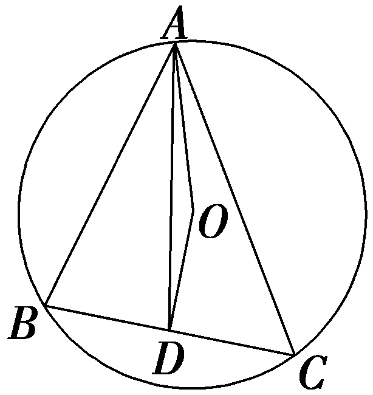

9.(13分)(一题多解)已知｜***a***｜＝4，｜***b***｜＝3，(2***a***－3***b***)·(2***a***＋***b***)＝61.

(1)求｜***a***＋***b***｜；(4分)

(2)求***a***与***b***的夹角；(4分)

(3)若***a***在***b***上的投影向量为***c***，求***c***·(***a***＋***b***)的值.(5分)

解：(1)因为｜<em><strong>a</strong></em>｜＝4，｜<em><strong>b</strong></em>｜＝3，(2<em><strong>a</strong></em>－3<em><strong>b</strong></em>)<em>·</em>(2<em><strong>a</strong></em>＋<em><strong>b</strong></em>)＝61，

所以4<em><strong>a</strong></em>2－4<em><strong>a</strong>·<strong>b</strong></em>－3<em><strong>b</strong></em>2＝61，即64－4<em><strong>a</strong>·<strong>b</strong></em>－27＝61，解得<em><strong>a</strong>·<strong>b</strong></em>＝－6，

所以｜<text style="***b***old,italic">a</text>＋b｜＝ $\sqrt{(a＋b)^{2}}$ ＝ $\sqrt{a^{2}+2a\cdot b＋b^{2}}$ ＝ $\sqrt{16－12+9}$ ＝ $\sqrt{13}$ .

(2)由已知得，cos＜<text style="***b***old,italic">a</text>，b＞＝ $\frac{a\cdot b}{｜a||b｜}$ ＝ $\frac{－6}{4\times 3}$ ＝－ $\frac{1}{2}$ ，

因为＜<text style="<text style="<text style="***b***old,it***a***lic">b</text>old,it***a***lic">b</text>old,italic">a</text>，b＞∈[0，π]，所以＜a，b＞＝ $\frac{2\pi }{3}$ ，即<text style="<text style="<text style="***b***old,it***a***lic">b</text>old,it***a***lic">b</text>old,italic">a</text>与b的夹角为 $\frac{2\pi }{3}$ .

(3)<text style="<text style="***b***old,italic">b</text>old,it<text style="bold,it***a***lic">a</text>lic">c</text>＝｜a｜cos＜a，b＞ $\frac{b}{｜b｜}$ ＝4× $\left(－\frac{1}{2}\right)$ × $\frac{b}{3}$ ＝－ $\frac{2}{3}$ <text style="***b***old,italic">b</text>，

所以&lt;text style="&lt;text style="&lt;text style="&lt;text style="&lt;text style="<em><strong>b</strong></em>old,italic"&gt;b&lt;/text&gt;old,it<em><strong>a</strong></em>lic"&gt;b&lt;/text&gt;old,it<em><strong>a</strong></em>lic"&gt;b&lt;/text&gt;old,italic"&gt;b&lt;/text&gt;old,it<em><strong>a</strong></em>lic"&gt;c&lt;/text&gt;<em>&lt;text style="italic"&gt;&lt;text style="italic"&gt;·</em>&lt;/text&gt;&lt;/text&gt;(a＋b)＝－ $\frac{2}{3}$ &lt;text style="&lt;text style="&lt;text style="&lt;text style="<em><strong>b</strong></em>old,italic"&gt;b&lt;/text&gt;old,it<em><strong>a</strong></em>lic"&gt;b&lt;/text&gt;old,it<em><strong>a</strong></em>lic"&gt;b&lt;/text&gt;old,italic"&gt;b&lt;/text&gt;&lt;text style="it<em><strong>a</strong></em>lic"&gt;<em>&lt;text style="italic"&gt;·</em>&lt;/text&gt;&lt;/text&gt;(a＋b)＝－ $\frac{2}{3}$ (&lt;text style="&lt;text style="&lt;text style="&lt;text style="&lt;text style="<em><strong>b</strong></em>old,italic"&gt;b&lt;/text&gt;old,it<em><strong>a</strong></em>lic"&gt;b&lt;/text&gt;old,it<em><strong>a</strong></em>lic"&gt;b&lt;/text&gt;old,italic"&gt;b&lt;/text&gt;old,italic"&gt;a&lt;/text&gt;<em>&lt;text style="italic"&gt;&lt;text style="italic"&gt;·</em>&lt;/text&gt;&lt;/text&gt;b＋b2)＝－ $\frac{2}{3}$ ×(－6＋9)＝－2.

(10—12题，每小题5分，共15分)

10.(数学文化)八角星纹是大汶口文化中期彩陶纹样中具有鲜明特色的花纹.八角星纹常绘于彩陶盆和豆的上腹，先于器外的上腹施一圈红色底衬，然后在上面绘并列的八角星形的单独纹样.八角星纹以白彩绘成，黑线勾边，中为方形或圆形，具有向四面八方扩张的感觉.八角星纹延续的时间较长，传播范围亦广，在长江以南的时间稍晚的崧泽文化的陶豆座上也屡见刻有八角大汶口文化八角星纹.图②是图①抽象出来的图形，在图②中，圆中各个三角形(如△*<text style="italic">A*CD</text>)为等腰直角三角形，点*O*为圆心，中间部分是正方形且边长为2，定点A，*B*所在位置如图所示，则 $\vec{AB}$ · $\vec{AO}$ 的值为(　　)

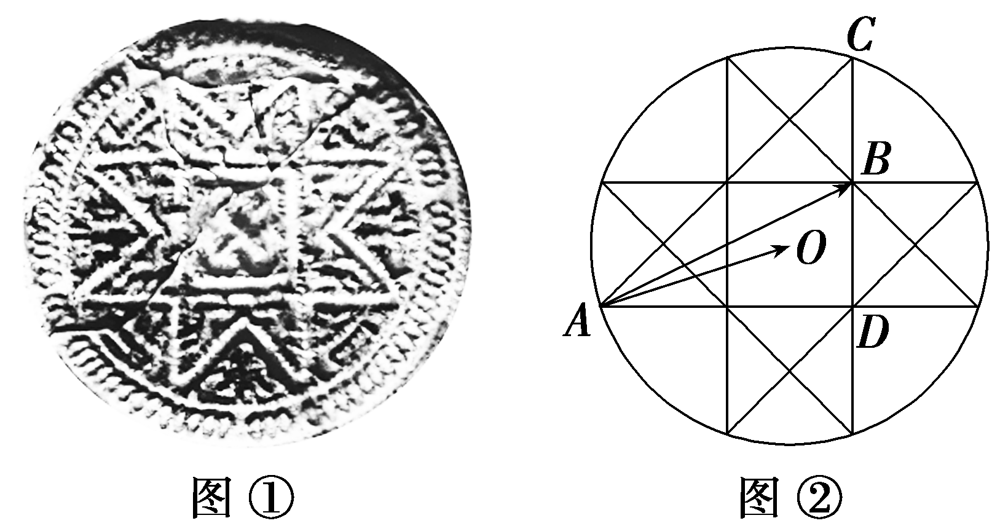

A.14	B.12

C.10	D.8

答案：**A**

解析：如图，连接<em>OD</em>，因为中间是边长为2的正方形，且图中的各个三角形均为等腰直角三角形，所以∠<em>ADO</em>＝∠<em>ODB</em>＝45°， $\left|\vec{OD}\right|$ ＝ $\sqrt{2}$ ， $\left|\vec{AD}\right|$ ＝4，∠<em>ADB</em>＝90°.所以 $\vec{AB}$ <em>·</em> $\vec{AO}$ ＝ $\left(\vec{AD}＋\vec{DB}\right)$ <em>·</em> $\left(\vec{AD}＋\vec{DO}\right)$ ＝ $\vec{AD}^{2}$ ＋ $\vec{AD}$ <em>·</em> $\vec{DO}$ ＋ $\vec{DB}$ <em>·</em> $\vec{AD}$ ＋ $\vec{DB}$ <em>·</em> $\vec{DO}$ ＝42＋4× $\sqrt{2}$ ×cos $\frac{3\pi }{4}$ ＋0＋2× $\sqrt{2}$ cos $\frac{\pi }{4}$ ＝14.故选A.

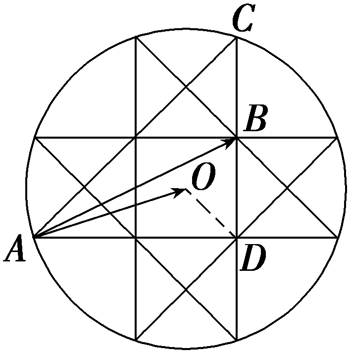

11.(一题多解)(2020·全国Ⅱ卷)已知单位向量***a*** ，***b*** 的夹角为60°，则在下列向量中，与***b*** 垂直的是(　　 )

A.***a***＋2***b***	B.2***a***＋***b***

C.***a***－2***b***	D.2***a***－***b***

答案：**D**

解析：法一：由题意，得&lt;text style="&lt;text style="&lt;text style="&lt;text style="&lt;text style="&lt;text style="&lt;text style="&lt;text style="&lt;text style="&lt;text style="&lt;text style="&lt;text style="&lt;text style="&lt;text style="&lt;text style="&lt;text style="&lt;text style="&lt;text style="&lt;text style="<em><strong>b</strong></em>old,it<em><strong>a</strong></em>lic"&gt;b&lt;/text&gt;old,italic"&gt;b&lt;/text&gt;old,it<em><strong>a</strong></em>lic"&gt;b&lt;/text&gt;old,italic"&gt;b&lt;/text&gt;old,it<em><strong>a</strong></em>lic"&gt;b&lt;/text&gt;old,italic"&gt;b&lt;/text&gt;old,it<em><strong>a</strong></em>lic"&gt;b&lt;/text&gt;old,italic"&gt;b&lt;/text&gt;old,it<em><strong>a</strong></em>lic"&gt;b&lt;/text&gt;old,italic"&gt;b&lt;/text&gt;old,it<em><strong>a</strong></em>lic"&gt;b&lt;/text&gt;old,italic"&gt;b&lt;/text&gt;old,it<em><strong>a</strong></em>lic"&gt;b&lt;/text&gt;old,italic"&gt;b&lt;/text&gt;old,it<em><strong>a</strong></em>lic"&gt;b&lt;/text&gt;old,italic"&gt;b&lt;/text&gt;old,it<em><strong>a</strong></em>lic"&gt;b&lt;/text&gt;old,it<em><strong>a</strong></em>lic"&gt;b&lt;/text&gt;old,italic"&gt;a&lt;/text&gt;<em>&lt;text style="italic"&gt;&lt;text style="italic"&gt;&lt;text style="italic"&gt;&lt;text style="italic"&gt;&lt;text style="italic"&gt;&lt;text style="italic"&gt;&lt;text style="italic"&gt;&lt;text style="italic"&gt;·</em>&lt;/text&gt;&lt;/text&gt;&lt;/text&gt;&lt;/text&gt;&lt;/text&gt;&lt;/text&gt;&lt;/text&gt;&lt;/text&gt;b＝｜a｜｜b｜cos 60°＝ $\frac{1}{2}$  .对于A，(&lt;text style="&lt;text style="&lt;text style="&lt;text style="&lt;text style="&lt;text style="&lt;text style="&lt;text style="&lt;text style="&lt;text style="&lt;text style="&lt;text style="&lt;text style="&lt;text style="&lt;text style="&lt;text style="&lt;text style="&lt;text style="&lt;text style="<em><strong>b</strong></em>old,it<em><strong>a</strong></em>lic"&gt;b&lt;/text&gt;old,italic"&gt;b&lt;/text&gt;old,it<em><strong>a</strong></em>lic"&gt;b&lt;/text&gt;old,italic"&gt;b&lt;/text&gt;old,it<em><strong>a</strong></em>lic"&gt;b&lt;/text&gt;old,italic"&gt;b&lt;/text&gt;old,it<em><strong>a</strong></em>lic"&gt;b&lt;/text&gt;old,italic"&gt;b&lt;/text&gt;old,it<em><strong>a</strong></em>lic"&gt;b&lt;/text&gt;old,italic"&gt;b&lt;/text&gt;old,it<em><strong>a</strong></em>lic"&gt;b&lt;/text&gt;old,italic"&gt;b&lt;/text&gt;old,it<em><strong>a</strong></em>lic"&gt;b&lt;/text&gt;old,italic"&gt;b&lt;/text&gt;old,it<em><strong>a</strong></em>lic"&gt;b&lt;/text&gt;old,italic"&gt;b&lt;/text&gt;old,it<em><strong>a</strong></em>lic"&gt;b&lt;/text&gt;old,it<em><strong>a</strong></em>lic"&gt;b&lt;/text&gt;old,italic"&gt;a&lt;/text&gt;＋&lt;text style="superscript"&gt;&lt;text style="superscript"&gt;&lt;text style="superscript"&gt;2&lt;/text&gt;&lt;/text&gt;&lt;/text&gt;b)<em>&lt;text style="italic"&gt;&lt;text style="italic"&gt;&lt;text style="italic"&gt;&lt;text style="italic"&gt;&lt;text style="italic"&gt;&lt;text style="italic"&gt;&lt;text style="italic"&gt;&lt;text style="italic"&gt;·</em>&lt;/text&gt;&lt;/text&gt;&lt;/text&gt;&lt;/text&gt;&lt;/text&gt;&lt;/text&gt;&lt;/text&gt;&lt;/text&gt;b＝a·b＋2b2＝ $\frac{1}{2}$ ＋&lt;text style="superscript"&gt;&lt;text style="superscript"&gt;&lt;text style="superscript"&gt;2&lt;/text&gt;&lt;/text&gt;&lt;/text&gt;＝ $\frac{5}{2}$ ≠0 ，故A不符合题意；对于B，(&lt;text style="superscript"&gt;&lt;text style="superscript"&gt;&lt;text style="superscript"&gt;2&lt;/text&gt;&lt;/text&gt;&lt;/text&gt;&lt;text style="&lt;text style="&lt;text style="&lt;text style="&lt;text style="&lt;text style="&lt;text style="&lt;text style="&lt;text style="&lt;text style="&lt;text style="&lt;text style="&lt;text style="&lt;text style="&lt;text style="&lt;text style="&lt;text style="&lt;text style="&lt;text style="<em><strong>b</strong></em>old,it<em><strong>a</strong></em>lic"&gt;b&lt;/text&gt;old,italic"&gt;b&lt;/text&gt;old,it<em><strong>a</strong></em>lic"&gt;b&lt;/text&gt;old,italic"&gt;b&lt;/text&gt;old,it<em><strong>a</strong></em>lic"&gt;b&lt;/text&gt;old,italic"&gt;b&lt;/text&gt;old,it<em><strong>a</strong></em>lic"&gt;b&lt;/text&gt;old,italic"&gt;b&lt;/text&gt;old,it<em><strong>a</strong></em>lic"&gt;b&lt;/text&gt;old,italic"&gt;b&lt;/text&gt;old,it<em><strong>a</strong></em>lic"&gt;b&lt;/text&gt;old,italic"&gt;b&lt;/text&gt;old,it<em><strong>a</strong></em>lic"&gt;b&lt;/text&gt;old,italic"&gt;b&lt;/text&gt;old,it<em><strong>a</strong></em>lic"&gt;b&lt;/text&gt;old,italic"&gt;b&lt;/text&gt;old,it<em><strong>a</strong></em>lic"&gt;b&lt;/text&gt;old,it<em><strong>a</strong></em>lic"&gt;b&lt;/text&gt;old,italic"&gt;a&lt;/text&gt;＋b)<em>&lt;text style="italic"&gt;&lt;text style="italic"&gt;&lt;text style="italic"&gt;&lt;text style="italic"&gt;&lt;text style="italic"&gt;&lt;text style="italic"&gt;&lt;text style="italic"&gt;&lt;text style="italic"&gt;·</em>&lt;/text&gt;&lt;/text&gt;&lt;/text&gt;&lt;/text&gt;&lt;/text&gt;&lt;/text&gt;&lt;/text&gt;&lt;/text&gt;b＝2a·b＋b2＝1＋1＝2≠0 ，故B不符合题意；对于C，(a－2b)·b＝a·b－2b2＝ $\frac{1}{2}$ －&lt;text style="superscript"&gt;&lt;text style="superscript"&gt;&lt;text style="superscript"&gt;2&lt;/text&gt;&lt;/text&gt;&lt;/text&gt;＝－ $\frac{3}{2}$ ≠0，故C不符合题意；对于D，(&lt;text style="superscript"&gt;&lt;text style="superscript"&gt;&lt;text style="superscript"&gt;2&lt;/text&gt;&lt;/text&gt;&lt;/text&gt;&lt;text style="&lt;text style="&lt;text style="&lt;text style="&lt;text style="&lt;text style="&lt;text style="&lt;text style="&lt;text style="&lt;text style="&lt;text style="&lt;text style="&lt;text style="&lt;text style="&lt;text style="&lt;text style="&lt;text style="&lt;text style="&lt;text style="<em><strong>b</strong></em>old,it<em><strong>a</strong></em>lic"&gt;b&lt;/text&gt;old,italic"&gt;b&lt;/text&gt;old,it<em><strong>a</strong></em>lic"&gt;b&lt;/text&gt;old,italic"&gt;b&lt;/text&gt;old,it<em><strong>a</strong></em>lic"&gt;b&lt;/text&gt;old,italic"&gt;b&lt;/text&gt;old,it<em><strong>a</strong></em>lic"&gt;b&lt;/text&gt;old,italic"&gt;b&lt;/text&gt;old,it<em><strong>a</strong></em>lic"&gt;b&lt;/text&gt;old,italic"&gt;b&lt;/text&gt;old,it<em><strong>a</strong></em>lic"&gt;b&lt;/text&gt;old,italic"&gt;b&lt;/text&gt;old,it<em><strong>a</strong></em>lic"&gt;b&lt;/text&gt;old,italic"&gt;b&lt;/text&gt;old,it<em><strong>a</strong></em>lic"&gt;b&lt;/text&gt;old,italic"&gt;b&lt;/text&gt;old,it<em><strong>a</strong></em>lic"&gt;b&lt;/text&gt;old,it<em><strong>a</strong></em>lic"&gt;b&lt;/text&gt;old,italic"&gt;a&lt;/text&gt;－b)<em>&lt;text style="italic"&gt;&lt;text style="italic"&gt;&lt;text style="italic"&gt;&lt;text style="italic"&gt;&lt;text style="italic"&gt;&lt;text style="italic"&gt;&lt;text style="italic"&gt;&lt;text style="italic"&gt;·</em>&lt;/text&gt;&lt;/text&gt;&lt;/text&gt;&lt;/text&gt;&lt;/text&gt;&lt;/text&gt;&lt;/text&gt;&lt;/text&gt;b＝2a·b－b2＝1－1＝0 ，所以(2a－b)⊥<em><strong>b</strong></em> ，符合题意.故选D.

法二：根据条件，分别作出向量***b***与A，B，C，D四个选项对应的向量的位置关系，如图所示.

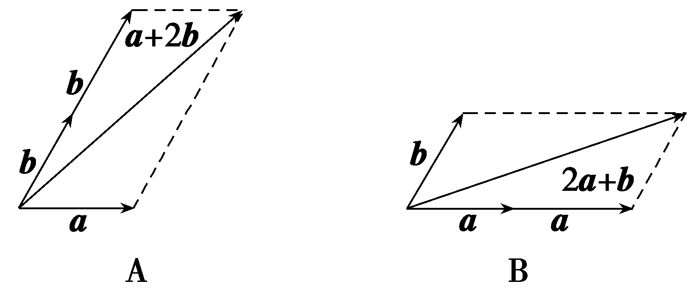

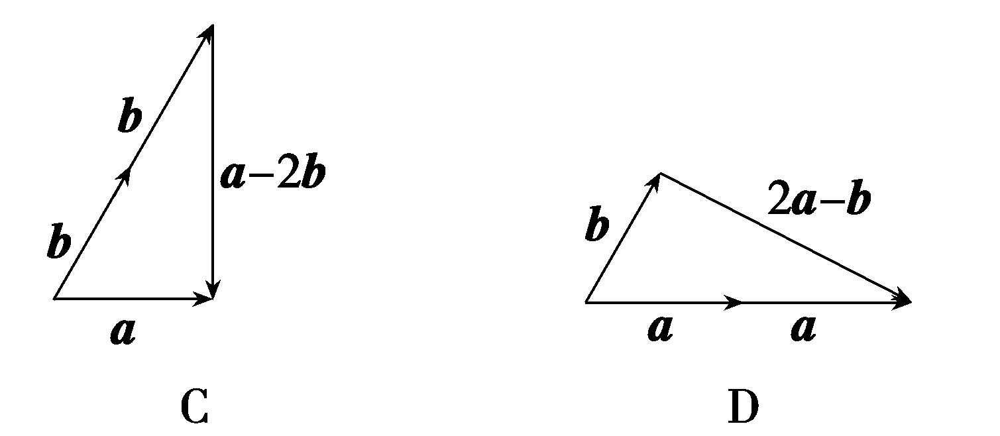

由图易知，只有选项D满足题意.故选D.

法三：不妨设&lt;text style="&lt;text style="&lt;text style="&lt;text style="&lt;text style="&lt;text style="&lt;text style="&lt;text style="&lt;text style="<em><strong>b</strong></em>old,italic"&gt;b&lt;/text&gt;old,it<em><strong>a</strong></em>lic"&gt;b&lt;/text&gt;old,italic"&gt;b&lt;/text&gt;old,it<em><strong>a</strong></em>lic"&gt;b&lt;/text&gt;old,it<em><strong>a</strong></em>lic"&gt;b&lt;/text&gt;old,it<em><strong>a</strong></em>lic"&gt;b&lt;/text&gt;old,it<em><strong>a</strong></em>lic"&gt;b&lt;/text&gt;old,it<em><strong>a</strong></em>lic"&gt;b&lt;/text&gt;old,italic"&gt;a&lt;/text&gt;＝( $\frac{1}{2}$ ， $\frac{\sqrt{3}}{2}$ )，&lt;text style="&lt;text style="&lt;text style="&lt;text style="&lt;text style="&lt;text style="&lt;text style="&lt;text style="<em><strong>b</strong></em>old,italic"&gt;b&lt;/text&gt;old,it<em><strong>a</strong></em>lic"&gt;b&lt;/text&gt;old,italic"&gt;b&lt;/text&gt;old,it<em><strong>a</strong></em>lic"&gt;b&lt;/text&gt;old,it<em><strong>a</strong></em>lic"&gt;b&lt;/text&gt;old,it<em><strong>a</strong></em>lic"&gt;b&lt;/text&gt;old,it<em><strong>a</strong></em>lic"&gt;b&lt;/text&gt;old,it<em><strong>a</strong></em>lic"&gt;b&lt;/text&gt;＝(1，0) ，则<em><strong>a</strong></em>＋2b＝( $\frac{5}{2}$ ， $\frac{\sqrt{3}}{2}$ )，2&lt;text style="&lt;text style="&lt;text style="&lt;text style="&lt;text style="&lt;text style="&lt;text style="&lt;text style="&lt;text style="<em><strong>b</strong></em>old,italic"&gt;b&lt;/text&gt;old,it<em><strong>a</strong></em>lic"&gt;b&lt;/text&gt;old,italic"&gt;b&lt;/text&gt;old,it<em><strong>a</strong></em>lic"&gt;b&lt;/text&gt;old,it<em><strong>a</strong></em>lic"&gt;b&lt;/text&gt;old,it<em><strong>a</strong></em>lic"&gt;b&lt;/text&gt;old,it<em><strong>a</strong></em>lic"&gt;b&lt;/text&gt;old,it<em><strong>a</strong></em>lic"&gt;b&lt;/text&gt;old,italic"&gt;a&lt;/text&gt;＋b＝(2， $\sqrt{3}$ )，&lt;text style="&lt;text style="&lt;text style="&lt;text style="&lt;text style="&lt;text style="&lt;text style="&lt;text style="&lt;text style="<em><strong>b</strong></em>old,italic"&gt;b&lt;/text&gt;old,it<em><strong>a</strong></em>lic"&gt;b&lt;/text&gt;old,italic"&gt;b&lt;/text&gt;old,it<em><strong>a</strong></em>lic"&gt;b&lt;/text&gt;old,it<em><strong>a</strong></em>lic"&gt;b&lt;/text&gt;old,it<em><strong>a</strong></em>lic"&gt;b&lt;/text&gt;old,it<em><strong>a</strong></em>lic"&gt;b&lt;/text&gt;old,it<em><strong>a</strong></em>lic"&gt;b&lt;/text&gt;old,italic"&gt;a&lt;/text&gt;－2b＝(－ $\frac{3}{2}$ ， $\frac{\sqrt{3}}{2}$ )，2&lt;text style="&lt;text style="&lt;text style="&lt;text style="&lt;text style="&lt;text style="&lt;text style="&lt;text style="&lt;text style="<em><strong>b</strong></em>old,italic"&gt;b&lt;/text&gt;old,it<em><strong>a</strong></em>lic"&gt;b&lt;/text&gt;old,italic"&gt;b&lt;/text&gt;old,it<em><strong>a</strong></em>lic"&gt;b&lt;/text&gt;old,it<em><strong>a</strong></em>lic"&gt;b&lt;/text&gt;old,it<em><strong>a</strong></em>lic"&gt;b&lt;/text&gt;old,it<em><strong>a</strong></em>lic"&gt;b&lt;/text&gt;old,it<em><strong>a</strong></em>lic"&gt;b&lt;/text&gt;old,italic"&gt;a&lt;/text&gt;－b＝(0， $\sqrt{3}$ ) ，易知只有(2&lt;text style="&lt;text style="&lt;text style="&lt;text style="&lt;text style="&lt;text style="&lt;text style="&lt;text style="&lt;text style="<em><strong>b</strong></em>old,italic"&gt;b&lt;/text&gt;old,it<em><strong>a</strong></em>lic"&gt;b&lt;/text&gt;old,italic"&gt;b&lt;/text&gt;old,it<em><strong>a</strong></em>lic"&gt;b&lt;/text&gt;old,it<em><strong>a</strong></em>lic"&gt;b&lt;/text&gt;old,it<em><strong>a</strong></em>lic"&gt;b&lt;/text&gt;old,it<em><strong>a</strong></em>lic"&gt;b&lt;/text&gt;old,it<em><strong>a</strong></em>lic"&gt;b&lt;/text&gt;old,italic"&gt;a&lt;/text&gt;－b)<em>·</em>b＝0 ，即(2a－b)⊥b.故选D.

12.(多选)已知16个边长为2的小菱形的位置关系如图所示，且每个小菱形的最小内角为60°，图中的*A*，*B*，*C*，*D*四点均为菱形的顶点，则(　　)

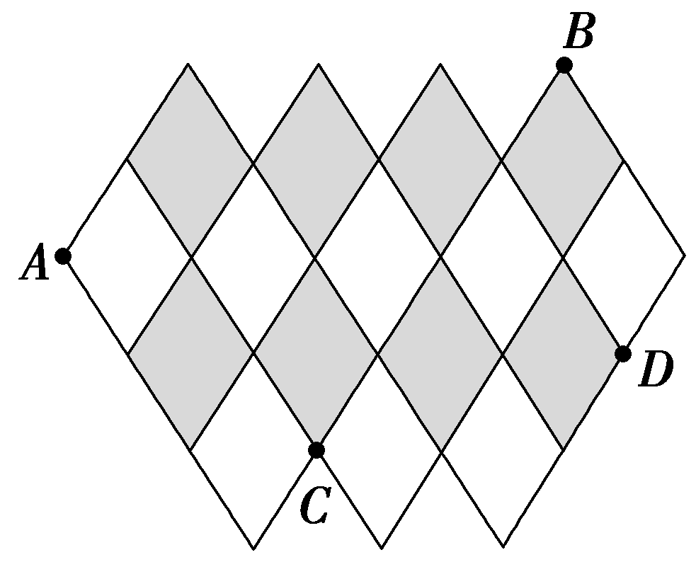

A. $\vec{AD}$ · $\vec{BC}$ ＝－20

B. $\vec{AC}$ 在 $\vec{AB}$ 上的投影向量为 $\frac{5}{19}\vec{AB}$

C. $\vec{AD}$ ＝ $\frac{7}{12}\vec{AB}$ ＋ $\frac{13}{12}\vec{AC}$

D. $\vec{AD}$ 在 $\vec{AC}$ 上的投影向量的模为2 $\sqrt{7}$

答案：**BC**

解析：因为每个小菱形的最小内角为60°，所以每个小菱形都可以分为两个正三角形.以该图形的对称轴为<te*x*t st*y*le="italic">y</text>轴，以过点*<text style="italic">A*</text>且垂直于y轴的直线为x轴建立平面直角坐标系，如图所示.则A(－5，0)，*B*(3，2 $\sqrt{3}$ )，*C*(－1，－2 $\sqrt{3}$ )，*D*(4，－ $\sqrt{3}$ )，所以 $\vec{AB}$ ＝(8，2 $\sqrt{3}$ )， $\vec{AC}$ ＝(4，－2 $\sqrt{3}$ )， $\vec{AD}$ ＝(9，－ $\sqrt{3}$ )， $\vec{BC}$ ＝(－4，－4 $\sqrt{3}$ )，所以 $\vec{AD}$ · $\vec{BC}$ ＝－36＋12＝－24， $\vec{AC}$ 在 $\vec{AB}$ 上的投影向量为 $\frac{\vec{AC}\cdot \vec{AB}}{｜\vec{AB}｜}$ · $\frac{\vec{AB}}{｜\vec{AB}｜}$ ＝ $\frac{32－12}{64+12}\vec{AB}$ ＝ $\frac{5}{19}\vec{AB}$ ， $\vec{AD}$ 在 $\vec{AC}$ 上的投影向量的模为｜ $\frac{\vec{AD}\cdot \vec{AC}}{｜\vec{AC}｜}$ ｜＝ $\frac{36+6}{\sqrt{16+12}}$ ＝3 $\sqrt{7}$ ，所以<te*x*t st*y*le="italic">*A*</text>，*D*均错误，*B*正确；因为 $\frac{7}{12}\vec{AB}$ ＋ $\frac{13}{12}\vec{AC}$ ＝ $\left(\frac{56+52}{12}，\frac{14\sqrt{3}－26\sqrt{3}}{12}\right)$ ＝(9，－ $\sqrt{3}$ )＝ $\vec{AD}$ ，所以*C*正确.故选*B*C.

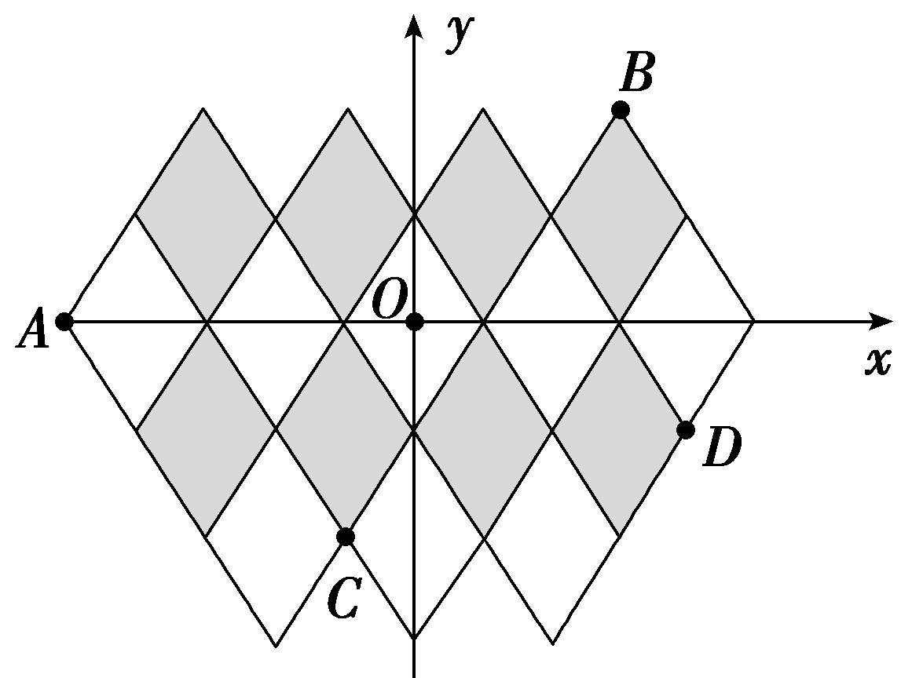

(13、14题，每小题5分，共10分)

13.(新定义)(2025·河北邯郸模拟)对任意两个非零的平面向量<text style="<text style="<text style="<text style="<text style="<text style="<text style="<text style="***b***old,it***a***lic">b</text>old,it***a***lic">b</text>old,it***a***lic">b</text>old,it***a***lic">b</text>old,it***a***lic">b</text>old,it***a***lic">b</text>old,it***a***lic">b</text>old,italic">a</text>和b，定义：a⊕b＝ $\frac{a\cdot b}{\left|a\right|^{2}＋\left|b\right|^{2}}$ ，<text style="<text style="<text style="<text style="<text style="<text style="<text style="<text style="***b***old,it***a***lic">b</text>old,it***a***lic">b</text>old,it***a***lic">b</text>old,it***a***lic">b</text>old,it***a***lic">b</text>old,it***a***lic">b</text>old,it***a***lic">b</text>old,italic">a</text>☉b＝ $\frac{a\cdot b}{\left|b\right|^{2}}$ .若平面向量<text style="<text style="<text style="<text style="<text style="<text style="<text style="<text style="***b***old,it***a***lic">b</text>old,it***a***lic">b</text>old,it***a***lic">b</text>old,it***a***lic">b</text>old,it***a***lic">b</text>old,it***a***lic">b</text>old,it***a***lic">b</text>old,italic">a</text>，b满足 $\left|a\right|$ ＞ $\left|b\right|$ ＞0，且<text style="<text style="<text style="<text style="<text style="<text style="<text style="<text style="***b***old,it***a***lic">b</text>old,it***a***lic">b</text>old,it***a***lic">b</text>old,it***a***lic">b</text>old,it***a***lic">b</text>old,it***a***lic">b</text>old,it***a***lic">b</text>old,italic">a</text>⊕b和a☉b都在集合 $\left\{\left.\frac{n}{4}\right|n\in Z，0<n\leq 4\right\}$ 中，则<text style="<text style="<text style="<text style="<text style="<text style="<text style="<text style="***b***old,it***a***lic">b</text>old,it***a***lic">b</text>old,it***a***lic">b</text>old,it***a***lic">b</text>old,it***a***lic">b</text>old,it***a***lic">b</text>old,it***a***lic">b</text>old,italic">a</text>⊕b＋a☉b＝(　　)

A. 1	B. $\frac{3}{2}$

C. 1或 $\frac{7}{4}$ 	D. 1或 $\frac{5}{4}$

答案：**D**

解析：因为 $\left\{\left.\frac{n}{4}\right|n\in Z，0<n\leq 4\right\}$ ＝ $\left\{\frac{1}{4}，\frac{1}{2}，\frac{3}{4}，1\right\}$ ，设向量&lt;text style="&lt;text style="&lt;text style="&lt;text style="&lt;text style="&lt;text style="&lt;text style="&lt;text style="<em><strong>b</strong></em>old,it<em><strong>a</strong></em>lic"&gt;b&lt;/text&gt;old,it<em><strong>a</strong></em>lic"&gt;b&lt;/text&gt;old,it<em><strong>a</strong></em>lic"&gt;b&lt;/text&gt;old,it<em><strong>a</strong></em>lic"&gt;b&lt;/text&gt;old,it<em><strong>a</strong></em>lic"&gt;b&lt;/text&gt;old,it<em><strong>a</strong></em>lic"&gt;b&lt;/text&gt;old,it<em><strong>a</strong></em>lic"&gt;b&lt;/text&gt;old,italic"&gt;a&lt;/text&gt;和b的夹角为<em>&lt;text style="italic"&gt;&lt;text style="italic"&gt;&lt;text style="italic"&gt;&lt;text style="italic"&gt;θ</em>&lt;/text&gt;&lt;/text&gt;&lt;/text&gt;&lt;/text&gt;，因为 $\left|a\right|$ ＞ $\left|b\right|$ ＞0，所以 $\left|a\right|^{2}$ ＋ $\left|b\right|^{2}$ ＞2 $\left|a\right|\left|b\right|$ ，得到&lt;text style="&lt;text style="&lt;text style="&lt;text style="&lt;text style="&lt;text style="&lt;text style="&lt;text style="<em><strong>b</strong></em>old,it<em><strong>a</strong></em>lic"&gt;b&lt;/text&gt;old,it<em><strong>a</strong></em>lic"&gt;b&lt;/text&gt;old,it<em><strong>a</strong></em>lic"&gt;b&lt;/text&gt;old,it<em><strong>a</strong></em>lic"&gt;b&lt;/text&gt;old,it<em><strong>a</strong></em>lic"&gt;b&lt;/text&gt;old,it<em><strong>a</strong></em>lic"&gt;b&lt;/text&gt;old,it<em><strong>a</strong></em>lic"&gt;b&lt;/text&gt;old,italic"&gt;a&lt;/text&gt;⊕b＝ $\frac{a\cdot b}{\left|a\right|^{2}＋\left|b\right|^{2}}$ ＝ $\frac{\left|a\right|\left|b\right|cos\theta }{\left|a\right|^{2}＋\left|b\right|^{2}}$ ＜ $\frac{\left|a\right|\left|b\right|cos\theta }{2\left|a\right|\left|b\right|}$ ＝ $\frac{cos\theta }{2}$ ，又&lt;text style="it&lt;text style="&lt;text style="&lt;text style="&lt;text style="&lt;text style="&lt;text style="&lt;text style="<em><strong>b</strong></em>old,it<em><strong>a</strong></em>lic"&gt;b&lt;/text&gt;old,it<em><strong>a</strong></em>lic"&gt;b&lt;/text&gt;old,it<em><strong>a</strong></em>lic"&gt;b&lt;/text&gt;old,it<em><strong>a</strong></em>lic"&gt;b&lt;/text&gt;old,it<em><strong>a</strong></em>lic"&gt;b&lt;/text&gt;old,it<em><strong>a</strong></em>lic"&gt;b&lt;/text&gt;old,italic"&gt;a&lt;/text&gt;lic"&gt;<em>&lt;text style="italic"&gt;&lt;text style="italic"&gt;&lt;text style="italic"&gt;θ</em>&lt;/text&gt;&lt;/text&gt;&lt;/text&gt;&lt;/text&gt;∈ $\left[0，\pi \right]$ ，所以 $\frac{cos\theta }{2}$ ≤ $\frac{1}{2}$ ，又&lt;text style="&lt;text style="&lt;text style="&lt;text style="&lt;text style="&lt;text style="&lt;text style="&lt;text style="<em><strong>b</strong></em>old,it<em><strong>a</strong></em>lic"&gt;b&lt;/text&gt;old,it<em><strong>a</strong></em>lic"&gt;b&lt;/text&gt;old,it<em><strong>a</strong></em>lic"&gt;b&lt;/text&gt;old,it<em><strong>a</strong></em>lic"&gt;b&lt;/text&gt;old,it<em><strong>a</strong></em>lic"&gt;b&lt;/text&gt;old,it<em><strong>a</strong></em>lic"&gt;b&lt;/text&gt;old,it<em><strong>a</strong></em>lic"&gt;b&lt;/text&gt;old,italic"&gt;a&lt;/text&gt;⊕b在集合 $\left\{\left.\frac{n}{4}\right|n\in Z，0<n\leq 4\right\}$ 中，所以 $\frac{cos\theta }{2}$ ＞ $\frac{1}{4}$ ，即cos &lt;text style="it&lt;text style="&lt;text style="&lt;text style="&lt;text style="&lt;text style="&lt;text style="&lt;text style="<em><strong>b</strong></em>old,it<em><strong>a</strong></em>lic"&gt;b&lt;/text&gt;old,it<em><strong>a</strong></em>lic"&gt;b&lt;/text&gt;old,it<em><strong>a</strong></em>lic"&gt;b&lt;/text&gt;old,it<em><strong>a</strong></em>lic"&gt;b&lt;/text&gt;old,it<em><strong>a</strong></em>lic"&gt;b&lt;/text&gt;old,it<em><strong>a</strong></em>lic"&gt;b&lt;/text&gt;old,italic"&gt;a&lt;/text&gt;lic"&gt;<em>&lt;text style="italic"&gt;&lt;text style="italic"&gt;&lt;text style="italic"&gt;θ</em>&lt;/text&gt;&lt;/text&gt;&lt;/text&gt;&lt;/text&gt;＞ $\frac{1}{2}$ ，得到&lt;text style="&lt;text style="&lt;text style="&lt;text style="&lt;text style="&lt;text style="&lt;text style="&lt;text style="<em><strong>b</strong></em>old,it<em><strong>a</strong></em>lic"&gt;b&lt;/text&gt;old,it<em><strong>a</strong></em>lic"&gt;b&lt;/text&gt;old,it<em><strong>a</strong></em>lic"&gt;b&lt;/text&gt;old,it<em><strong>a</strong></em>lic"&gt;b&lt;/text&gt;old,it<em><strong>a</strong></em>lic"&gt;b&lt;/text&gt;old,it<em><strong>a</strong></em>lic"&gt;b&lt;/text&gt;old,it<em><strong>a</strong></em>lic"&gt;b&lt;/text&gt;old,italic"&gt;a&lt;/text&gt;⊕b＝ $\frac{1}{4}$ ，又因为&lt;text style="&lt;text style="&lt;text style="&lt;text style="&lt;text style="&lt;text style="&lt;text style="&lt;text style="<em><strong>b</strong></em>old,it<em><strong>a</strong></em>lic"&gt;b&lt;/text&gt;old,it<em><strong>a</strong></em>lic"&gt;b&lt;/text&gt;old,it<em><strong>a</strong></em>lic"&gt;b&lt;/text&gt;old,it<em><strong>a</strong></em>lic"&gt;b&lt;/text&gt;old,it<em><strong>a</strong></em>lic"&gt;b&lt;/text&gt;old,it<em><strong>a</strong></em>lic"&gt;b&lt;/text&gt;old,it<em><strong>a</strong></em>lic"&gt;b&lt;/text&gt;old,italic"&gt;a&lt;/text&gt;☉b＝ $\frac{a\cdot b}{\left|b\right|^{2}}$ ＝ $\frac{\left|a\right|\left|b\right|cos\theta }{\left|b\right|^{2}}$ ＝ $\frac{\left|a\right|}{\left|b\right|}$ cos &lt;text style="it&lt;text style="&lt;text style="&lt;text style="&lt;text style="&lt;text style="&lt;text style="&lt;text style="<em><strong>b</strong></em>old,it<em><strong>a</strong></em>lic"&gt;b&lt;/text&gt;old,it<em><strong>a</strong></em>lic"&gt;b&lt;/text&gt;old,it<em><strong>a</strong></em>lic"&gt;b&lt;/text&gt;old,it<em><strong>a</strong></em>lic"&gt;b&lt;/text&gt;old,it<em><strong>a</strong></em>lic"&gt;b&lt;/text&gt;old,it<em><strong>a</strong></em>lic"&gt;b&lt;/text&gt;old,italic"&gt;a&lt;/text&gt;lic"&gt;<em>&lt;text style="italic"&gt;&lt;text style="italic"&gt;&lt;text style="italic"&gt;θ</em>&lt;/text&gt;&lt;/text&gt;&lt;/text&gt;&lt;/text&gt;＞cos θ＞ $\frac{1}{2}$ ，所以&lt;text style="&lt;text style="&lt;text style="&lt;text style="&lt;text style="&lt;text style="&lt;text style="&lt;text style="<em><strong>b</strong></em>old,it<em><strong>a</strong></em>lic"&gt;b&lt;/text&gt;old,it<em><strong>a</strong></em>lic"&gt;b&lt;/text&gt;old,it<em><strong>a</strong></em>lic"&gt;b&lt;/text&gt;old,it<em><strong>a</strong></em>lic"&gt;b&lt;/text&gt;old,it<em><strong>a</strong></em>lic"&gt;b&lt;/text&gt;old,it<em><strong>a</strong></em>lic"&gt;b&lt;/text&gt;old,it<em><strong>a</strong></em>lic"&gt;b&lt;/text&gt;old,italic"&gt;a&lt;/text&gt;☉b＝ $\frac{3}{4}$ 或1，所以&lt;text style="&lt;text style="&lt;text style="&lt;text style="&lt;text style="&lt;text style="&lt;text style="&lt;text style="<em><strong>b</strong></em>old,it<em><strong>a</strong></em>lic"&gt;b&lt;/text&gt;old,it<em><strong>a</strong></em>lic"&gt;b&lt;/text&gt;old,it<em><strong>a</strong></em>lic"&gt;b&lt;/text&gt;old,it<em><strong>a</strong></em>lic"&gt;b&lt;/text&gt;old,it<em><strong>a</strong></em>lic"&gt;b&lt;/text&gt;old,it<em><strong>a</strong></em>lic"&gt;b&lt;/text&gt;old,it<em><strong>a</strong></em>lic"&gt;b&lt;/text&gt;old,italic"&gt;a&lt;/text&gt;⊕b＋a☉b＝1或 $\frac{5}{4}$ .故选D.

14.(2025·湖南邵阳第二次联考)“四叶回旋镖”可看作是由四个相同的直角梯形围成的图形，如图所示，*<text style="italic">A*B</text>＝2，*CD*＝1，∠A＝45°.点*P*在线段*AB*与线段*BL*上运动，则 $\vec{EH}$ · $\vec{FP}$ 的取值范围为(　　)

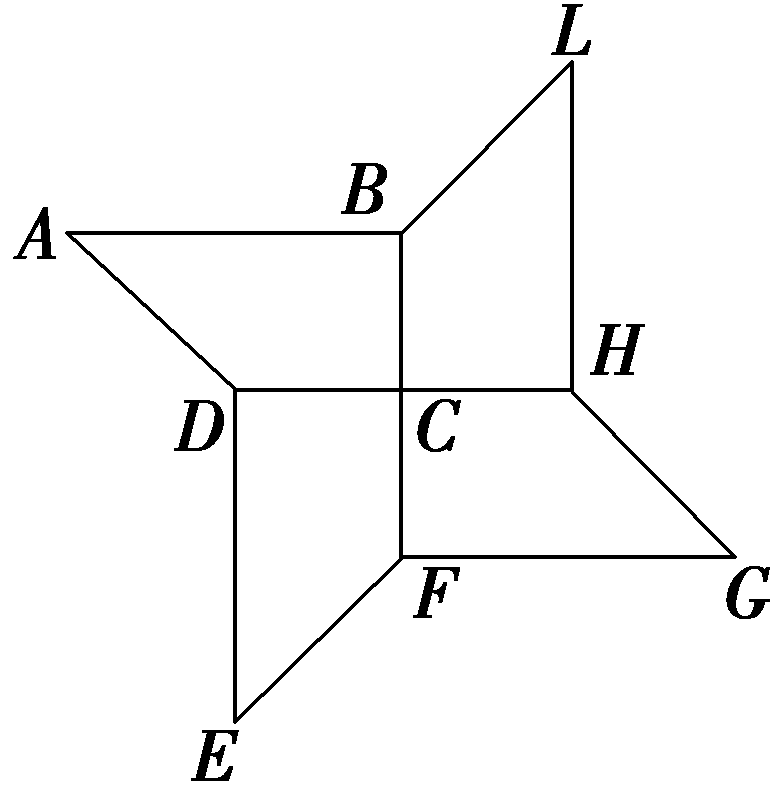

A. $\left[－4，6\right]$ 	B. $\left[0，6\right]$

C. $\left[0，8\right]$ 	D. $\left[4，8\right]$

答案：**C**

解析：如图，以<te<te<te<te*x*t style="italic">x</text>t style="italic">x</text>t style="italic">x</text>t style="italic">C</text>为原点建立平面直角坐标系，易知*A*(－2，1)，*B* $\left(0，1\right)$ ，<te<te<te<te*x*t style="italic">x</text>t style="italic">x</text>t style="italic">x</text>t style="italic">F</text>(0，－1)，*E*(－1，－2)，*H* $\left(1，0\right)$ ，<te<te<te<te*x*t style="italic">x</text>t style="italic">x</text>t style="italic">x</text>t style="italic">L</text> $\left(1，2\right)$ ，当<te<te<te<te*x*t style="italic">x</text>t style="italic">x</text>t style="italic">x</text>t style="italic">*<text style="italic"><text style="italic"><text style="italic">P*</text></text></text></text>在线段*AB*上运动时，设P(x，1)，其中－2≤x≤0，所以 $\vec{EH}$ ＝(2，2)， $\vec{FP}$ ＝ $\left(x，2\right)$ ，则 $\vec{EH}$ *<text style="italic">·*</text> $\vec{FP}$ ＝2<te<te<te*x*t style="italic">x</text>t style="italic">x</text>t style="italic">x</text>＋4，因为－2≤x≤0，所以 $\vec{EH}$ *<text style="italic">·*</text> $\vec{FP}$ ∈ $\left[0，4\right]$ ，当<te<te<te<te*x*t style="italic">x</text>t style="italic">x</text>t style="italic">x</text>t style="italic">*<text style="italic"><text style="italic"><text style="italic">P*</text></text></text></text>在线段*BL*上运动时，设P(*<text style="italic"><text style="italic"><text style="italic"><text style="italic"><text style="italic">x'*</text></text></text></text></text>，*<text style="italic">y'*</text>) $\left(0\leq x'\leq 1\right)$ ，则 $\vec{BP}$ ＝ $\left(x',y'-1\right)$ ， $\vec{BL}$ ＝ $\left(1，1\right)$ ，且 $\vec{BP}$ ∥ $\vec{BL}$ ，则<te<te<te*x*t style="italic">x</text>t style="italic">x</text>t style="italic">x</text>'＝*<text style="italic">y'*</text>－1，故*<text style="italic"><text style="italic"><text style="italic"><text style="italic">P*</text></text></text></text>(*<text style="italic"><text style="italic"><text style="italic"><text style="italic"><text style="italic">x'*</text></text></text></text></text>，x'＋1) $\left(0\leq x'\leq 1\right)$ ， $\vec{FP}$ ＝ $\left(x',x'+2\right)$ ，则 $\vec{EH}$ *<text style="italic">·*</text> $\vec{FP}$ ＝4<te<te<te*x*t style="italic">x</text>t style="italic">x</text>t style="italic">x</text>'＋4，因为0≤*<text style="italic"><text style="italic"><text style="italic"><text style="italic"><text style="italic">x'*</text></text></text></text></text>≤1，所以 $\vec{EH}$ *<text style="italic">·*</text> $\vec{FP}$ ∈ $\left[4，8\right]$ ，综上， $\vec{EH}$ *<text style="italic">·*</text> $\vec{FP}$ 的取值范围为 $\left[0，8\right]$ .故选<te<te<te<te*x*t style="italic">x</text>t style="italic">x</text>t style="italic">x</text>t style="italic">C</text>.

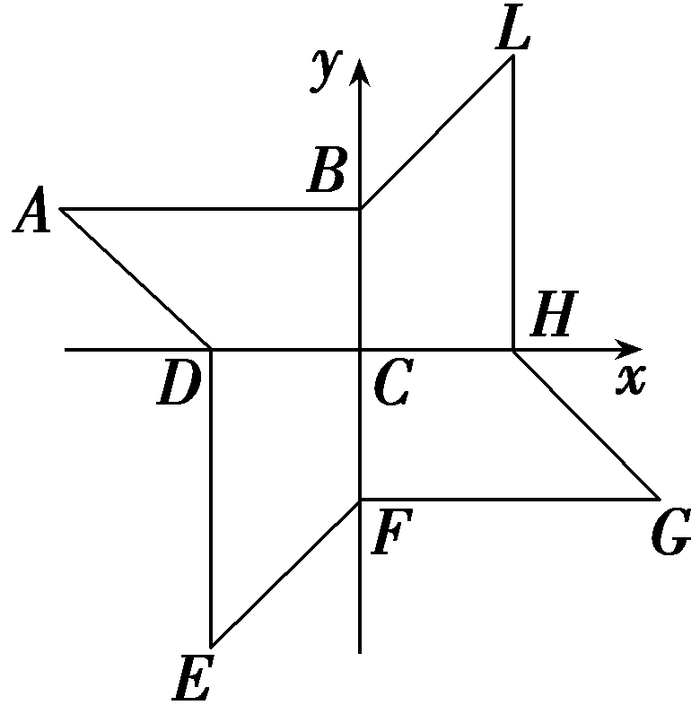

