**培优课**12　**平面向量的应用及最值问题**

平面向量的应用主要体现在物理、平面几何中的应用及与向量有关的最值、范围问题，尤其是最值、范围问题是热点问题，也是难点问题，此类问题综合性强，体现了知识的交汇组合.其基本题型是根据已知条件求某个变量的范围、最值，比如向量的模、数量积、向量夹角、系数的范围等.解题时要注意向量“数”与“形”的双重身份，解题时重视数形结合思想.

题型一　平面向量在物理中的应用

在日常生活中，我们常常会看到两个人共提一个行李包的情景，若行李包所受的重力为<em><strong>G</strong></em>，两个拉力分别为<em><strong>F</strong></em>1，<em><strong>F</strong></em>2，且｜<em><strong>F</strong></em>1｜＝｜<em><strong>F</strong></em>2｜，<em><strong>F</strong></em>1与<em><strong>F</strong></em>2的夹角为<em>θ</em>，当两人拎起行李包时，下列结论正确的是(　　)

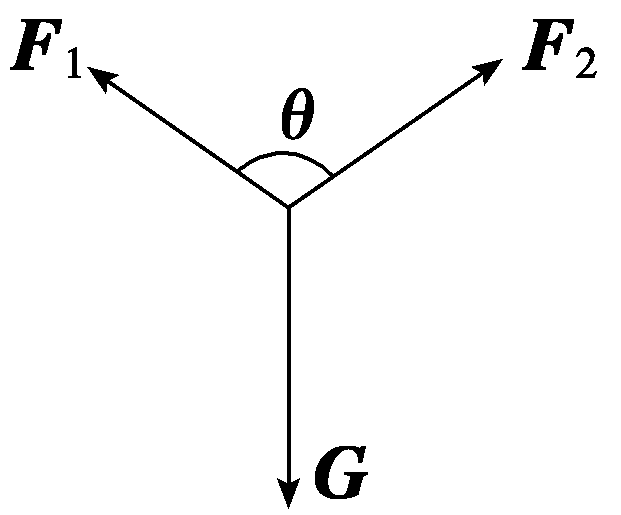

A.｜<em><strong>G</strong></em>｜＝｜<em><strong>F</strong></em>1｜＋｜<em><strong>F</strong></em>2｜

B.当<em>θ</em>＝ $\frac{\pi }{2}$ 时，｜<em><strong>F</strong></em>1｜＝ $\frac{\sqrt{2}}{2}$ ｜<em><strong>G</strong></em>｜

C.当*θ*角越大时，用力越省

D.当｜<em><strong>F</strong></em>1｜＝｜<em><strong>G</strong></em>｜时，<em>θ</em>＝ $\frac{\pi }{3}$

答案：**B**

解析：根据题意可得－&lt;text st<em>y</em>le="bold,italic"&gt;<em><strong>&lt;text style="bold,italic"&gt;&lt;text style="bold,italic"&gt;&lt;text style="bold,italic"&gt;&lt;text style="bold,italic"&gt;&lt;text style="bold,italic"&gt;&lt;text style="bold,italic"&gt;&lt;text style="bold,italic"&gt;G</strong></em>&lt;/text&gt;&lt;/text&gt;&lt;/text&gt;&lt;/text&gt;&lt;/text&gt;&lt;/text&gt;&lt;/text&gt;&lt;/text&gt;＝<em><strong>&lt;text style="bold,italic"&gt;&lt;text style="bold,italic"&gt;&lt;text style="bold,italic"&gt;&lt;text style="bold,italic"&gt;&lt;text style="bold,italic"&gt;&lt;text style="bold,italic"&gt;&lt;text style="bold,italic"&gt;&lt;text style="bold,italic"&gt;&lt;text style="bold,italic"&gt;&lt;text style="bold,italic"&gt;F</strong></em>&lt;/text&gt;&lt;/text&gt;&lt;/text&gt;&lt;/text&gt;&lt;/text&gt;&lt;/text&gt;&lt;/text&gt;&lt;/text&gt;&lt;/text&gt;&lt;/text&gt;&lt;text style="subscript"&gt;&lt;text style="subscript"&gt;&lt;text style="subscript"&gt;&lt;text style="subscript"&gt;&lt;text style="subscript"&gt;&lt;text style="subscript"&gt;&lt;text style="subscript"&gt;1&lt;/text&gt;&lt;/text&gt;&lt;/text&gt;&lt;/text&gt;&lt;/text&gt;&lt;/text&gt;&lt;/text&gt;＋F&lt;text style="subscript"&gt;&lt;text style="subscript"&gt;2&lt;/text&gt;&lt;/text&gt;，则｜G｜＝｜F1＋F2｜＝ $\sqrt{｜F_{1}＋F_{2}｜^{2}}$ ＝ $\sqrt{F _{1}^{2}＋F _{2}^{2}+2F_{1}\cdot F_{2}}$ ＝ $\sqrt{2F _{1}^{2}+2F _{1}^{2}\cdot cos\theta }$ ，当&lt;text st<em>y</em>le="italic"&gt;<em>&lt;text style="italic"&gt;&lt;text style="italic"&gt;&lt;text style="italic"&gt;&lt;text style="italic"&gt;&lt;text style="italic"&gt;θ</em>&lt;/text&gt;&lt;/text&gt;&lt;/text&gt;&lt;/text&gt;&lt;/text&gt;&lt;/text&gt;＝0时，｜<em><strong>&lt;text style="bold,italic"&gt;&lt;text style="bold,italic"&gt;&lt;text style="bold,italic"&gt;&lt;text style="bold,italic"&gt;&lt;text style="bold,italic"&gt;&lt;text style="bold,italic"&gt;&lt;text style="bold,italic"&gt;&lt;text style="bold,italic"&gt;G</strong></em>&lt;/text&gt;&lt;/text&gt;&lt;/text&gt;&lt;/text&gt;&lt;/text&gt;&lt;/text&gt;&lt;/text&gt;&lt;/text&gt;｜＝&lt;text style="subscript"&gt;&lt;text style="subscript"&gt;2&lt;/text&gt;&lt;/text&gt;｜<em><strong>&lt;text style="bold,italic"&gt;&lt;text style="bold,italic"&gt;&lt;text style="bold,italic"&gt;&lt;text style="bold,italic"&gt;&lt;text style="bold,italic"&gt;&lt;text style="bold,italic"&gt;&lt;text style="bold,italic"&gt;&lt;text style="bold,italic"&gt;&lt;text style="bold,italic"&gt;&lt;text style="bold,italic"&gt;F</strong></em>&lt;/text&gt;&lt;/text&gt;&lt;/text&gt;&lt;/text&gt;&lt;/text&gt;&lt;/text&gt;&lt;/text&gt;&lt;/text&gt;&lt;/text&gt;&lt;/text&gt;&lt;text style="subscript"&gt;&lt;text style="subscript"&gt;&lt;text style="subscript"&gt;&lt;text style="subscript"&gt;&lt;text style="subscript"&gt;&lt;text style="subscript"&gt;&lt;text style="subscript"&gt;1&lt;/text&gt;&lt;/text&gt;&lt;/text&gt;&lt;/text&gt;&lt;/text&gt;&lt;/text&gt;&lt;/text&gt;｜＝｜F1｜＋｜F2｜，当θ＝ $\frac{\pi }{2}$ 时，｜&lt;text st<em>y</em>le="bold,italic"&gt;<em><strong>&lt;text style="bold,italic"&gt;&lt;text style="bold,italic"&gt;&lt;text style="bold,italic"&gt;&lt;text style="bold,italic"&gt;&lt;text style="bold,italic"&gt;&lt;text style="bold,italic"&gt;&lt;text style="bold,italic"&gt;G</strong></em>&lt;/text&gt;&lt;/text&gt;&lt;/text&gt;&lt;/text&gt;&lt;/text&gt;&lt;/text&gt;&lt;/text&gt;&lt;/text&gt;｜＝ $\sqrt{2F _{1}^{2}+2F _{1}^{2}\cdot cos\theta }$ ＝ $\sqrt{2}$ ｜&lt;text st<em>y</em>le="bold,italic"&gt;<em><strong>&lt;text style="bold,italic"&gt;&lt;text style="bold,italic"&gt;&lt;text style="bold,italic"&gt;&lt;text style="bold,italic"&gt;&lt;text style="bold,italic"&gt;&lt;text style="bold,italic"&gt;&lt;text style="bold,italic"&gt;&lt;text style="bold,italic"&gt;&lt;text style="bold,italic"&gt;F</strong></em>&lt;/text&gt;&lt;/text&gt;&lt;/text&gt;&lt;/text&gt;&lt;/text&gt;&lt;/text&gt;&lt;/text&gt;&lt;/text&gt;&lt;/text&gt;&lt;/text&gt;&lt;text style="subscript"&gt;&lt;text style="subscript"&gt;&lt;text style="subscript"&gt;&lt;text style="subscript"&gt;&lt;text style="subscript"&gt;&lt;text style="subscript"&gt;&lt;text style="subscript"&gt;1&lt;/text&gt;&lt;/text&gt;&lt;/text&gt;&lt;/text&gt;&lt;/text&gt;&lt;/text&gt;&lt;/text&gt;｜，即｜F1｜＝ $\frac{\sqrt{2}}{2}$ ｜&lt;text st<em>y</em>le="bold,italic"&gt;<em><strong>&lt;text style="bold,italic"&gt;&lt;text style="bold,italic"&gt;&lt;text style="bold,italic"&gt;&lt;text style="bold,italic"&gt;&lt;text style="bold,italic"&gt;&lt;text style="bold,italic"&gt;&lt;text style="bold,italic"&gt;G</strong></em>&lt;/text&gt;&lt;/text&gt;&lt;/text&gt;&lt;/text&gt;&lt;/text&gt;&lt;/text&gt;&lt;/text&gt;&lt;/text&gt;｜，故A错误，B正确；｜G｜＝ $\sqrt{2F_{1}^{2}+2F_{1}^{2}\cdot cos\theta }$ ，因为<em>y</em>＝cos <em>&lt;text style="italic"&gt;&lt;text style="italic"&gt;&lt;text style="italic"&gt;&lt;text style="italic"&gt;&lt;text style="italic"&gt;&lt;text style="italic"&gt;θ</em>&lt;/text&gt;&lt;/text&gt;&lt;/text&gt;&lt;/text&gt;&lt;/text&gt;&lt;/text&gt;在(0，π)上单调递减，且行李包所受的重力<em><strong>&lt;text style="bold,italic"&gt;&lt;text style="bold,italic"&gt;&lt;text style="bold,italic"&gt;&lt;text style="bold,italic"&gt;&lt;text style="bold,italic"&gt;&lt;text style="bold,italic"&gt;&lt;text style="bold,italic"&gt;&lt;text style="bold,italic"&gt;G</strong></em>&lt;/text&gt;&lt;/text&gt;&lt;/text&gt;&lt;/text&gt;&lt;/text&gt;&lt;/text&gt;&lt;/text&gt;&lt;/text&gt;不变，所以当θ角越大时，用力越大，故C错误；当｜<em><strong>&lt;text style="bold,italic"&gt;&lt;text style="bold,italic"&gt;&lt;text style="bold,italic"&gt;&lt;text style="bold,italic"&gt;&lt;text style="bold,italic"&gt;&lt;text style="bold,italic"&gt;&lt;text style="bold,italic"&gt;&lt;text style="bold,italic"&gt;&lt;text style="bold,italic"&gt;&lt;text style="bold,italic"&gt;F</strong></em>&lt;/text&gt;&lt;/text&gt;&lt;/text&gt;&lt;/text&gt;&lt;/text&gt;&lt;/text&gt;&lt;/text&gt;&lt;/text&gt;&lt;/text&gt;&lt;/text&gt;&lt;text style="subscript"&gt;&lt;text style="subscript"&gt;&lt;text style="subscript"&gt;&lt;text style="subscript"&gt;&lt;text style="subscript"&gt;&lt;text style="subscript"&gt;&lt;text style="subscript"&gt;1&lt;/text&gt;&lt;/text&gt;&lt;/text&gt;&lt;/text&gt;&lt;/text&gt;&lt;/text&gt;&lt;/text&gt;｜＝｜G｜时，即｜G｜＝ $\sqrt{2F_{1}^{2}+2F_{1}^{2}\cdot cos\theta }$ ＝｜&lt;text st<em>y</em>le="bold,italic"&gt;<em><strong>&lt;text style="bold,italic"&gt;&lt;text style="bold,italic"&gt;&lt;text style="bold,italic"&gt;&lt;text style="bold,italic"&gt;&lt;text style="bold,italic"&gt;&lt;text style="bold,italic"&gt;&lt;text style="bold,italic"&gt;&lt;text style="bold,italic"&gt;&lt;text style="bold,italic"&gt;F</strong></em>&lt;/text&gt;&lt;/text&gt;&lt;/text&gt;&lt;/text&gt;&lt;/text&gt;&lt;/text&gt;&lt;/text&gt;&lt;/text&gt;&lt;/text&gt;&lt;/text&gt;&lt;text style="subscript"&gt;&lt;text style="subscript"&gt;&lt;text style="subscript"&gt;&lt;text style="subscript"&gt;&lt;text style="subscript"&gt;&lt;text style="subscript"&gt;&lt;text style="subscript"&gt;1&lt;/text&gt;&lt;/text&gt;&lt;/text&gt;&lt;/text&gt;&lt;/text&gt;&lt;/text&gt;&lt;/text&gt;｜，解得cos <em>&lt;text style="italic"&gt;&lt;text style="italic"&gt;&lt;text style="italic"&gt;&lt;text style="italic"&gt;&lt;text style="italic"&gt;&lt;text style="italic"&gt;θ</em>&lt;/text&gt;&lt;/text&gt;&lt;/text&gt;&lt;/text&gt;&lt;/text&gt;&lt;/text&gt;＝－ $\frac{1}{2}$ ，又因为&lt;text st<em>y</em>le="italic"&gt;<em>&lt;text style="italic"&gt;&lt;text style="italic"&gt;&lt;text style="italic"&gt;&lt;text style="italic"&gt;&lt;text style="italic"&gt;θ</em>&lt;/text&gt;&lt;/text&gt;&lt;/text&gt;&lt;/text&gt;&lt;/text&gt;&lt;/text&gt;∈[0，π)，所以θ＝ $\frac{2\pi }{3}$ ，故D错误.故选B.

用向量方法解决实际问题的步骤

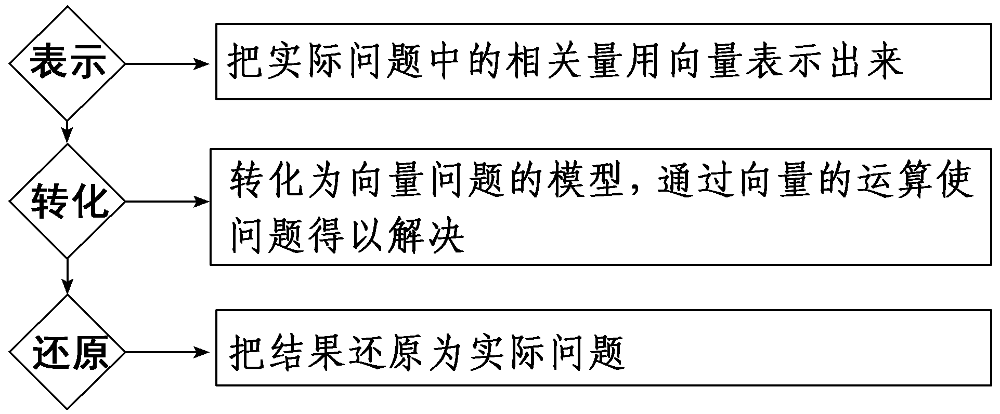

对点练1.长江流域内某地南北两岸平行，如图所示，已知游船在静水中的航行速度<em><strong>v</strong></em>1的大小｜<em><strong>v</strong></em>1｜＝10 km/h，水流的速度<em><strong>v</strong></em>2的大小｜<em><strong>v</strong></em>2｜＝4 km/h，设<em><strong>v</strong></em>1和<em><strong>v</strong></em>2所成的角为<em>θ</em>(0＜<em>θ</em>＜π)，若游船要从<em>A</em>航行到正北方向上位于北岸的码头<em>B</em>处，则cos <em>θ</em>等于(　　)

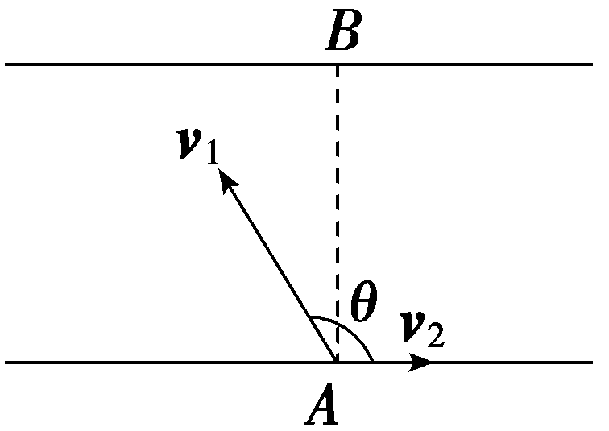

A.－ $\frac{\sqrt{21}}{5}$ 	B.－ $\frac{2}{5}$

C.－ $\frac{3}{5}$ 	D.－ $\frac{4}{5}$

答案：**B**

解析：由题意知(<em><strong>&lt;text style="bold,italic"&gt;&lt;text style="bold,italic"&gt;&lt;text style="bold,italic"&gt;&lt;text style="bold,italic"&gt;v</strong></em>&lt;/text&gt;&lt;/text&gt;&lt;/text&gt;&lt;/text&gt;&lt;text style="subscript"&gt;1&lt;/text&gt;＋v&lt;text style="subscript"&gt;&lt;text style="subscript"&gt;&lt;text style="superscript"&gt;2&lt;/text&gt;&lt;/text&gt;&lt;/text&gt;)<em>·</em>v2＝0，有｜v1｜｜v2｜cos <em>&lt;text style="italic"&gt;&lt;text style="italic"&gt;θ</em>&lt;/text&gt;&lt;/text&gt;＋ $v_{2}^{2}$ ＝0，即&lt;text style="subscript"&gt;1&lt;/text&gt;0×4cos <em>&lt;text style="italic"&gt;&lt;text style="italic"&gt;θ</em>&lt;/text&gt;&lt;/text&gt;＋4&lt;text style="subscript"&gt;&lt;text style="subscript"&gt;&lt;text style="superscript"&gt;2&lt;/text&gt;&lt;/text&gt;&lt;/text&gt;＝0，所以cos θ＝－ $\frac{2}{5}$ .故选B.

题型二　平面向量在平面几何中的应用

(1)若*O*为△*<text style="italic">ABC*</text>所在平面内一点，且满足｜ $\vec{OB}$ － $\vec{OC}$ ｜＝｜ $\vec{OB}$ ＋ $\vec{OC}$ －2 $\vec{OA}$ ｜，则△*<text style="italic">ABC*</text>的形状为(　　)

A.等腰直角三角形	B.直角三角形

C.等腰三角形	D.等边三角形

(2)(2025·山东东营模拟)已知△&lt;text style="it&lt;text style="it<em>a</em>li<em>c</em>"&gt;a&lt;/text&gt;lic"&gt;<em>AB&lt;text style="italic"&gt;C</em>&lt;/text&gt;&lt;/text&gt;的内角A，B，C所对的边分别为a，<em>b</em>，c，且C＝60°，a＝3，<em>S</em>△<em>&lt;text style="italic"&gt;AB</em>C&lt;/text&gt;＝ $\frac{15\sqrt{3}}{4}$ ，则&lt;text style="it&lt;text style="it<em>a</em>li<em>c</em>"&gt;a&lt;/text&gt;lic"&gt;A&lt;/text&gt;<em>B</em>边上的中线长为(　　)

A.49	B.7

C. $\frac{49}{4}$ 	D. $\frac{7}{2}$

答案：(1)**B**　(2)**D**

解析：(1)在△<em>&lt;text style="italic"&gt;ABC</em>&lt;/text&gt;中，｜ $\vec{OB}$ － $\vec{OC}$ ｜＝｜ $\vec{OB}$ ＋ $\vec{OC}$ －&lt;text style="superscript"&gt;2&lt;/text&gt; $\vec{OA}$ ｜，即｜ $\vec{CB}$ ｜＝｜( $\vec{OB}$ － $\vec{OA}$ )＋( $\vec{OC}$ － $\vec{OA}$ )｜，即｜ $\vec{AB}$ － $\vec{AC}$ ｜＝｜ $\vec{AB}$ ＋ $\vec{AC}$ ｜，所以( $\vec{AB}$ － $\vec{AC}$ )&lt;text style="superscript"&gt;2&lt;/text&gt;＝( $\vec{AB}$ ＋ $\vec{AC}$ )&lt;text style="superscript"&gt;2&lt;/text&gt;，即 $\vec{AB}^{2}$ －&lt;text style="superscript"&gt;2&lt;/text&gt; $\vec{AB}$ · $\vec{AC}$ ＋ $\vec{AC}^{2}$ ＝ $\vec{AB}^{2}$ ＋&lt;text style="superscript"&gt;2&lt;/text&gt; $\vec{AB}$ · $\vec{AC}$ ＋ $\vec{AC}^{2}$ ，得4 $\vec{AB}$ · $\vec{AC}$ ＝0.因为 $\vec{AB}$ 与 $\vec{AC}$ 均为非零向量，则 $\vec{AB}$ ⊥ $\vec{AC}$ ，即∠<em>BAC</em>＝90°，所以△<em>&lt;text style="italic"&gt;ABC</em>&lt;/text&gt;是直角三角形.故选B.

(2)由<em>S</em>&lt;text style="su<em>&lt;text style="italic"&gt;b</em>&lt;/text&gt;script"&gt;△&lt;/text&gt;<em>&lt;text style="italic"&gt;&lt;text style="italic"&gt;AB</em>&lt;/text&gt;<em>C</em>&lt;/text&gt;＝ $\frac{1}{2}$ <em>a&lt;text style="italic"&gt;&lt;text style="italic"&gt;b</em>&lt;/text&gt;&lt;/text&gt;sin <em>C</em>＝ $\frac{1}{2}$ ×3×<em>&lt;text style="italic"&gt;b</em>&lt;/text&gt;× $\frac{\sqrt{3}}{2}$ ＝ $\frac{15\sqrt{3}}{4}$ ，得<em>&lt;text style="italic"&gt;b</em>&lt;/text&gt;＝5，不妨取<em>&lt;text style="italic"&gt;AB</em>&lt;/text&gt;的中点为<em>M</em>，故 $\vec{CM}$ ＝ $\frac{1}{2}(\vec{CA}$ ＋ $\vec{CB}$ )，故｜ $\vec{CM}$ ｜＝ $\frac{1}{2}\sqrt{｜\vec{CA}｜^{2}＋｜\vec{CB}｜^{2}+2｜\vec{CA}||\vec{CB}｜cosC}$ ＝ $\frac{1}{2}\sqrt{25+9+2\times 5\times 3\times \frac{1}{2}}$ ＝ $\frac{7}{2}$ .即<em>&lt;text style="italic"&gt;AB</em>&lt;/text&gt;边上的中线长为 $\frac{7}{2}$ .故选D.

用向量方法解决平面几何问题的步骤

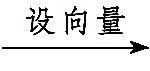

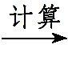

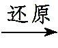

平面几何问题向量问题解决向量问题解决平面几何问题.

对点练2.(教材典题再练)已知非零向量 $\vec{AB}$ ， $\vec{AC}$ 满足 $\left(\frac{\vec{AB}}{｜\vec{AB}｜}＋\frac{\vec{AC}}{｜\vec{AC}｜}\right)$ · $\vec{BC}$ ＝0，且 $\frac{\vec{AB}}{｜\vec{AB}｜}$ · $\frac{\vec{AC}}{｜\vec{AC}｜}$ ＝ $\frac{1}{2}$ ，则△*ABC*的形状是(　　)

A.三边均不相等的三角形

B.直角三角形

C.等腰(非等边)三角形

D.等边三角形

答案：**D**

解析：因为 $\frac{\vec{AB}}{｜\vec{AB}｜}$ 和 $\frac{\vec{AC}}{｜\vec{AC}｜}$ 分别表示向量 $\vec{AB}$ 和向量 $\vec{AC}$ 方向上的单位向量，因为 $\left(\frac{\vec{AB}}{｜\vec{AB}｜}＋\frac{\vec{AC}}{｜\vec{AC}｜}\right)$ *<text style="italic">·*</text> $\vec{BC}$ ＝0，所以角*<text style="italic"><text style="italic"><text style="italic"><text style="italic">A*</text></text></text></text>的平分线与*<text style="italic">BC*</text>垂直，所以△*<text style="italic">AB*C</text>为等腰三角形，且AB＝*AC*，因为 $\frac{\vec{AB}}{｜\vec{AB}｜}$ *<text style="italic">·*</text> $\frac{\vec{AC}}{｜\vec{AC}｜}$ ＝ $\frac{1}{2}$ ，所以cos *<text style="italic"><text style="italic"><text style="italic"><text style="italic">A*</text></text></text></text>＝ $\frac{1}{2}$ .又*<text style="italic"><text style="italic"><text style="italic"><text style="italic">A*</text></text></text></text>∈(0，π)，所以A＝ $\frac{\pi }{3}$ ，所以*B*＝*C*＝*<text style="italic"><text style="italic"><text style="italic"><text style="italic">A*</text></text></text></text>＝ $\frac{\pi }{3}$ ，所以△*<text style="italic"><text style="italic"><text style="italic"><text style="italic">A*</text></text></text></text>*<text style="italic">BC*</text>为等边三角形.故选D.

对点练3.在平面四边形*ABCD*中， $\vec{AC}$ ＝ $\left(－2，3\right)$ ， $\vec{BD}$ ＝(6，4)，则该四边形的面积为(　　)

A.3 $\sqrt{13}$ 	B.4 $\sqrt{13}$

C.13	D.26

答案：**C**

解析：因为 $\vec{AC}$ *·* $\vec{BD}$ ＝－12＋12＝0，所以*AC*⊥*BD*，所以四边形*ABCD*的面积为 $\frac{1}{2}$ ｜ $\vec{AC}$ ｜*·*｜ $\vec{BD}$ ｜＝ $\frac{1}{2}$ × $\sqrt{4+9}$ × $\sqrt{36+16}$ ＝13.故选C.

题型三　与向量有关的最值(范围)问题

角度1　与平面向量基本定理有关的最值(范围)问题

如图，在△<te<te<te<text st*y*le="italic">x</text>t st*y*le="italic">x</text>t st*y*le="italic">x</text>t style="italic">*AB*C</text>中，点*<text style="italic">P*</text>满足2 $\vec{BP}$ ＝ $\vec{PC}$ ，过点<te<te<te<text st*y*le="italic">x</text>t st*y*le="italic">x</text>t st*y*le="italic">x</text>t style="italic">*P*</text>的直线与*AB*，*AC*所在的直线分别交于点*M*，*N*，若 $\vec{AM}$ ＝<te<te<text st*y*le="italic">x</text>t st*y*le="italic">x</text>t st*y*le="italic">x</text> $\vec{AB}$ ， $\vec{AN}$ ＝<te<te<text st*y*le="italic">x</text>t st*y*le="italic">x</text>t style="italic">y</text> $\vec{AC}$ (<te<te<text st*y*le="italic">x</text>t st*y*le="italic">x</text>t st*y*le="italic">x</text>＞0，y＞0)，则2x＋y的最小值为(　　)

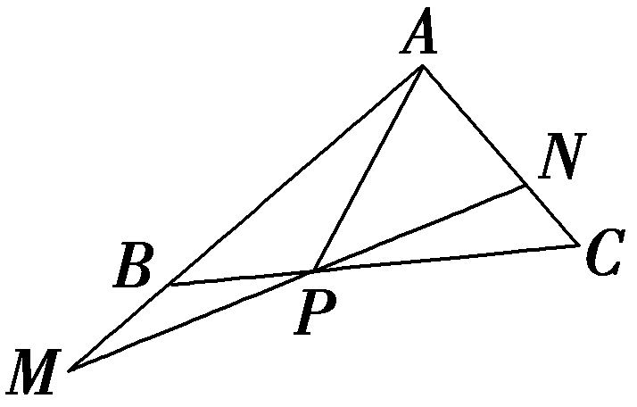

A.3	B.3 $\sqrt{2}$

C.1	D. $\frac{1}{3}$

答案：**A**

解析：由题意知， $\vec{AP}$ ＝ $\vec{AB}$ ＋ $\vec{BP}$ ＝ $\vec{AB}$ ＋ $\frac{1}{3}\vec{BC}$ ＝ $\vec{AB}$ ＋ $\frac{1}{3}(\vec{AC}$ － $\vec{AB}$ )＝ $\frac{2}{3}\vec{AB}$ ＋ $\frac{1}{3}\vec{AC}$ ，又 $\vec{AM}$ ＝<te<te<te<te<te<text st*y*le="italic">x</text>t st*y*le="italic">x</text>t st*y*le="italic">x</text>t st*y*le="italic">x</text>t st*y*le="italic">x</text>t st*y*le="italic">x</text> $\vec{AB}$ ， $\vec{AN}$ ＝<te<te<te<te<te<text st*y*le="italic">x</text>t st*y*le="italic">x</text>t st*y*le="italic">x</text>t st*y*le="italic">x</text>t st*y*le="italic">x</text>t style="italic">y</text> $\vec{AC}$ (<te<te<te<te<te<text st*y*le="italic">x</text>t st*y*le="italic">x</text>t st*y*le="italic">x</text>t st*y*le="italic">x</text>t st*y*le="italic">x</text>t st*y*le="italic">x</text>＞0，y＞0)，所以 $\vec{AP}$ ＝ $\frac{2}{3x}\vec{AM}$ ＋ $\frac{1}{3y}\vec{AN}$ ，由<te<te<te<te<text st*y*le="italic">x</text>t st*y*le="italic">x</text>t st*y*le="italic">x</text>t st*y*le="italic">x</text>t style="italic">M</text>，*P*，*N*三点共线，得 $\frac{2}{3x}$ ＋ $\frac{1}{3y}$ ＝1，所以2<te<te<te<te<te<text st*y*le="italic">x</text>t st*y*le="italic">x</text>t st*y*le="italic">x</text>t st*y*le="italic">x</text>t st*y*le="italic">x</text>t st*y*le="italic">x</text>＋y＝(2x＋y) $\left(\frac{2}{3x}＋\frac{1}{3y}\right)$ ＝ $\frac{5}{3}$ ＋ $\frac{2x}{3y}$ ＋ $\frac{2y}{3x}$ ≥ $\frac{5}{3}$ ＋2 $\sqrt{\frac{2x}{3y}\cdot \frac{2y}{3x}}$ ＝3，当且仅当<te<te<te<te<te<text st*y*le="italic">x</text>t st*y*le="italic">x</text>t st*y*le="italic">x</text>t st*y*le="italic">x</text>t st*y*le="italic">x</text>t st*y*le="italic">x</text>＝y时等号成立.故2x＋y的最小值为3.故选A.

角度2　与数量积有关的最值(范围)问题

(1)(一题多解)(2020·新高考Ⅰ卷)已知*P* 是边长为2的正六边形*ABCDEF* 内的一点，则 $\vec{AP}$ · $\vec{AB}$  的取值范围是(　　)

A.(－2，6)	B.(－6，2)

C.(－2，4)	D.(－4，6)

(2)已知正方形<em>&lt;text style="italic"&gt;AB</em>CD&lt;/text&gt;的边长为1，点<em>E</em>是AB边上的动点，则 $\vec{DE}$ · $\vec{CB}$ 的值为<u>&lt;text style="underline"&gt;　　　　</u>&lt;/text&gt;， $\vec{DE}$ · $\vec{DC}$ 的最大值为<u>&lt;text style="underline"&gt;　　　　</u>&lt;/text&gt;.

答案：(1)**A**　(2)1　1

解析：(1)法一： $\vec{AP}$ <em>·</em> $\vec{AB}$ ＝｜ $\vec{AP}$ ｜｜ $\vec{AB}$ ｜cos∠<em>&lt;text style="italic"&gt;PAB</em>&lt;/text&gt;＝2｜ $\vec{AP}$ ｜<em>·</em>cos∠<em>&lt;text style="italic"&gt;PAB</em>&lt;/text&gt;，又｜ $\vec{AP}$ ｜cos∠<em>&lt;text style="italic"&gt;PAB</em>&lt;/text&gt; 表示 $\vec{AP}$  在 $\vec{AB}$  方向上的投影数量，当<em>&lt;text style="italic"&gt;&lt;text style="italic"&gt;P</em> &lt;/text&gt;&lt;/text&gt;与<em>C</em> 重合时投影数量最大，当P 与<em>F</em> 重合时投影数量最小.又因为 $\vec{AC}$ <em>·</em> $\vec{AB}$ ＝2 $\sqrt{3}$ ×2×cos 30&lt;text style="superscript"&gt;°&lt;/text&gt;＝6， $\vec{AF}$ <em>·</em> $\vec{AB}$ ＝2×2×cos 120&lt;text style="superscript"&gt;°&lt;/text&gt;＝－2，｜ $\vec{AC}$ ｜cos＜ $\vec{AC}$ ， $\vec{AB}$ ＞＝ $\frac{6}{3}$ ＝3，｜ $\vec{AF}$ ｜cos＜ $\vec{AF}$ ， $\vec{AB}$ ＞＝ $\frac{－2}{2}$ ＝－1，故当点<em>&lt;text style="italic"&gt;&lt;text style="italic"&gt;P</em> &lt;/text&gt;&lt;/text&gt;在正六边形ABCDE<em>F</em> 内部运动时， $\vec{AP}$ <em>·</em> $\vec{AB}$ ∈(－2，6) .故选A.

法二：以<te<te<te<te<te*x*t style="italic">x</text>t st*y*le="italic">x</text>t st*y*le="italic">x</text>t st*y*le="italic">x</text>t style="italic">A </text>为原点建立平面直角坐标系，如图所示，设点*P*(x，y)，则 $\vec{AP}$ ＝(<te<te<te<te*x*t style="italic">x</text>t st*y*le="italic">x</text>t st*y*le="italic">x</text>t st*y*le="italic">x</text>，y)， $\vec{AB}$ ＝(2，0)， $\vec{AP}$ · $\vec{AB}$ ＝(<te<te<te<te*x*t style="italic">x</text>t st*y*le="italic">x</text>t st*y*le="italic">x</text>t st*y*le="italic">x</text>，y)·(2，0)＝2x，易知x∈(－1，3)，所以 $\vec{AP}$ · $\vec{AB}$ ∈(－2，6).故选A.

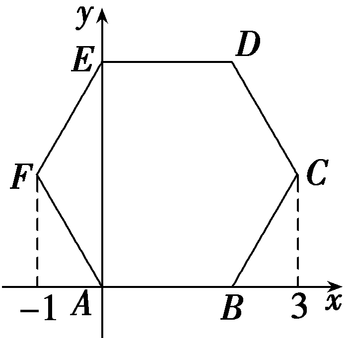

(2)以<te<te<te<te<te<te*x*t style="italic">x</text>t style="italic">x</text>t style="italic">x</text>t style="italic">x</text>t st*y*le="italic">x</text>t style="italic">D</text>为坐标原点，*DC*与*DA*所在直线分别为x，y轴，建立平面直角坐标系，如图所示，可知*E*(x，1)，0≤x≤1，所以 $\vec{DE}$ ＝(<te<te<te<te<te*x*t style="italic">x</text>t style="italic">x</text>t style="italic">x</text>t style="italic">x</text>t st*y*le="italic">x</text>，1)， $\vec{CB}$ ＝(0，1)，可得 $\vec{DE}$ <te<te*x*t style="italic">x</text>t style="italic">·</text> $\vec{CB}$ ＝1.因为 $\vec{DC}$ ＝(1，0)，所以 $\vec{DE}$ <te<te*x*t style="italic">x</text>t style="italic">·</text> $\vec{DC}$ ＝<te<te<te<te<te*x*t style="italic">x</text>t style="italic">x</text>t style="italic">x</text>t style="italic">x</text>t st*y*le="italic">x</text>，因为0≤x≤1，所以( $\vec{DE}$ <te<te*x*t style="italic">x</text>t style="italic">·</text> $\vec{DC}$ )ma<te<te<te<te<te*x*t style="italic">x</text>t style="italic">x</text>t style="italic">x</text>t style="italic">x</text>t st*y*le="italic">x</text>＝1.

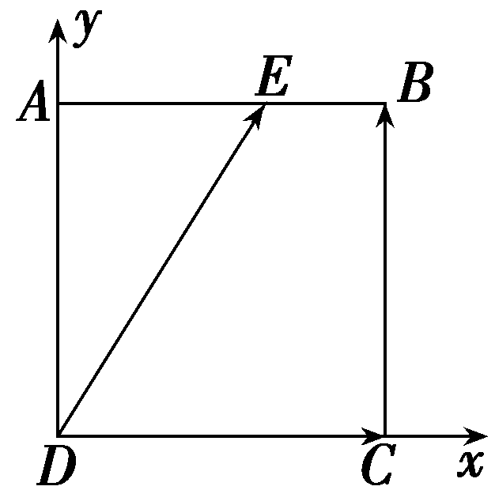

角度3　与模有关的最值(范围)问题

(1)(一题多解)已知&lt;t&lt;t&lt;t&lt;t&lt;text style="&lt;text style="<em><strong>b</strong></em>old,it<em><strong>a</strong></em>lic"&gt;b&lt;/text&gt;old,italic"&gt;e&lt;/text&gt;xt style="&lt;text style="<em><strong>b</strong></em>old,italic"&gt;b&lt;/text&gt;old,italic"&gt;e&lt;/text&gt;xt style="bold,it<em><strong>a</strong></em>lic"&gt;e&lt;/text&gt;xt style="bold,italic"&gt;e&lt;/text&gt;xt style="<em><strong>b</strong></em>old,italic"&gt;a&lt;/text&gt;，b，e是平面向量，其中e是单位向量<strong>.</strong>若非零向量a与e的夹角为 $\frac{\pi }{3}$ ，向量&lt;t&lt;t&lt;t&lt;t&lt;text style="&lt;text style="<em><strong>b</strong></em>old,it<em><strong>a</strong></em>lic"&gt;b&lt;/text&gt;old,italic"&gt;e&lt;/text&gt;xt style="&lt;text style="<em><strong>b</strong></em>old,italic"&gt;b&lt;/text&gt;old,italic"&gt;e&lt;/text&gt;xt style="bold,it<em><strong>a</strong></em>lic"&gt;e&lt;/text&gt;xt style="bold,italic"&gt;e&lt;/text&gt;xt style="bold,italic"&gt;b&lt;/text&gt;满足b2－4e·b＋3＝0，则｜<em><strong>a</strong></em>－b｜ 的最小值是(　　)

A. $\sqrt{3}$ －1	B. $\sqrt{3}$ ＋1

C.2	D.2－ $\sqrt{3}$

(2)(2024·山东青岛三模)已知向量<text style="<text style="***b***old,it<text style="bold,it***a***lic">a</text>li***c***">b</text>old,italic">a</text>，b，c满足 $\left|a\right|$ ＝ $\left|b\right|$ ＝1，<text style="<text style="***b***old,it<text style="bold,it***a***lic">a</text>li***c***">b</text>old,italic">a</text>·(a－b)＝ $\frac{1}{2}$ ， $\left(b－c\right)$ ⊥ $\left(3b－c\right)$ ，则 $\left|a－c\right|$ 的最小值为(　　)

A. $\sqrt{3}$ －1	B. $\sqrt{3}$

C.2	D.1

答案：(1)**A**　(2)**A**

解析：(1)法一：设&lt;t&lt;t&lt;t&lt;te&lt;te&lt;text style="it&lt;text style="<em><strong>b</strong></em>old,italic"&gt;a&lt;/text&gt;lic"&gt;x&lt;/text&gt;t style="italic"&gt;x&lt;/text&gt;t st<em>y</em>le="bold,italic"&gt;e&lt;/text&gt;&lt;te&lt;te&lt;text st&lt;text style="it<em><strong>a</strong></em>lic"&gt;y&lt;/text&gt;le="italic"&gt;x&lt;/text&gt;t style="italic"&gt;x&lt;/text&gt;t st<em>y</em>le="italic"&gt;x&lt;/text&gt;t style="<em><strong>b</strong></em>old,italic"&gt;e&lt;/text&gt;xt style="<em><strong>b</strong></em>old,italic"&gt;e&lt;/text&gt;&lt;text st<em>y</em>le="italic"&gt;x&lt;/text&gt;t style="it&lt;text style="<em><strong>b</strong></em>old,italic"&gt;a&lt;/text&gt;lic"&gt;O &lt;/text&gt;为坐标原点，a＝ $\vec{OA}$ ，&lt;t&lt;t&lt;t&lt;te&lt;te&lt;text style="it&lt;text style="<em><strong>b</strong></em>old,italic"&gt;a&lt;/text&gt;lic"&gt;x&lt;/text&gt;t style="italic"&gt;x&lt;/text&gt;t st<em>y</em>le="bold,italic"&gt;e&lt;/text&gt;&lt;te&lt;te&lt;text st&lt;text style="it<em><strong>a</strong></em>lic"&gt;y&lt;/text&gt;le="italic"&gt;x&lt;/text&gt;t style="italic"&gt;x&lt;/text&gt;t st<em>y</em>le="italic"&gt;x&lt;/text&gt;t style="<em><strong>b</strong></em>old,italic"&gt;e&lt;/text&gt;xt style="<em><strong>b</strong></em>old,italic"&gt;e&lt;/text&gt;&lt;text st<em>y</em>le="italic"&gt;x&lt;/text&gt;t style="bold,italic"&gt;b&lt;/text&gt;＝ $\vec{OB}$ ＝(&lt;t&lt;t&lt;t&lt;te&lt;te&lt;text style="it&lt;text style="<em><strong>b</strong></em>old,italic"&gt;a&lt;/text&gt;lic"&gt;x&lt;/text&gt;t style="italic"&gt;x&lt;/text&gt;t st<em>y</em>le="bold,italic"&gt;e&lt;/text&gt;&lt;te&lt;te&lt;text st&lt;text style="it<em><strong>a</strong></em>lic"&gt;y&lt;/text&gt;le="italic"&gt;x&lt;/text&gt;t style="italic"&gt;x&lt;/text&gt;t st<em>y</em>le="italic"&gt;x&lt;/text&gt;t style="<em><strong>b</strong></em>old,italic"&gt;e&lt;/text&gt;xt style="<em><strong>b</strong></em>old,italic"&gt;e&lt;/text&gt;xt st<em>y</em>le="italic"&gt;x&lt;/text&gt;，y)，e＝(1，0)，由<em><strong>b</strong></em>&lt;text style="superscript"&gt;&lt;text style="superscript"&gt;&lt;text style="superscript"&gt;&lt;text style="superscript"&gt;2&lt;/text&gt;&lt;/text&gt;&lt;/text&gt;&lt;/text&gt;－4e·b＋3＝0 得x2＋y2－4x＋3＝0，即(x－2)2＋y2＝1，所以点<em>B</em> 的轨迹是以<em>C</em>(2，0) 为圆心，1为半径的圆.因为<em><strong>a</strong></em>与e的夹角为 $\frac{\pi }{3}$ ，所以不妨令点&lt;te&lt;te&lt;text style="it&lt;text style="<em><strong>b</strong></em>old,italic"&gt;a&lt;/text&gt;lic"&gt;x&lt;/text&gt;t style="italic"&gt;x&lt;/text&gt;t st<em>y</em>le="italic"&gt;A &lt;/text&gt;在射线&lt;t&lt;t&lt;t<em><strong>e</strong></em>&lt;te&lt;te&lt;text st&lt;text style="it<em><strong>a</strong></em>lic"&gt;y&lt;/text&gt;le="italic"&gt;x&lt;/text&gt;t style="italic"&gt;x&lt;/text&gt;t st<em>y</em>le="italic"&gt;x&lt;/text&gt;t style="<em><strong>b</strong></em>old,italic"&gt;e&lt;/text&gt;xt style="<em><strong>b</strong></em>old,italic"&gt;e&lt;/text&gt;xt style="italic"&gt;y&lt;/text&gt;＝ $\sqrt{3}$ &lt;t&lt;t&lt;t&lt;te&lt;te&lt;text style="it&lt;text style="<em><strong>b</strong></em>old,italic"&gt;a&lt;/text&gt;lic"&gt;x&lt;/text&gt;t style="italic"&gt;x&lt;/text&gt;t st<em>y</em>le="bold,italic"&gt;e&lt;/text&gt;&lt;te&lt;te&lt;text st&lt;text style="it<em><strong>a</strong></em>lic"&gt;y&lt;/text&gt;le="italic"&gt;x&lt;/text&gt;t style="italic"&gt;x&lt;/text&gt;t st<em>y</em>le="italic"&gt;x&lt;/text&gt;t style="<em><strong>b</strong></em>old,italic"&gt;e&lt;/text&gt;xt style="<em><strong>b</strong></em>old,italic"&gt;e&lt;/text&gt;xt st<em>y</em>le="italic"&gt;x&lt;/text&gt;(x＞0) 上，如图所示，由数形结合可知，｜&lt;text style="<em><strong>b</strong></em>old,italic"&gt;a&lt;/text&gt;－b｜&lt;text style="subscript"&gt;min&lt;/text&gt;＝｜ $\vec{BA}$ ｜&lt;text style="subscript"&gt;min&lt;/text&gt;＝&lt;t&lt;t&lt;te&lt;te&lt;text style="it&lt;text style="<em><strong>b</strong></em>old,italic"&gt;a&lt;/text&gt;lic"&gt;x&lt;/text&gt;t style="italic"&gt;x&lt;/text&gt;t st<em>y</em>le="bold,italic"&gt;e&lt;/text&gt;&lt;te&lt;te&lt;text st&lt;text style="it<em><strong>a</strong></em>lic"&gt;y&lt;/text&gt;le="italic"&gt;x&lt;/text&gt;t style="italic"&gt;x&lt;/text&gt;t st<em>y</em>le="italic"&gt;x&lt;/text&gt;t style="<em><strong>b</strong></em>old,italic"&gt;e&lt;/text&gt;xt style="superscript"&gt;&lt;text style="superscript"&gt;&lt;text style="superscript"&gt;&lt;text style="superscript"&gt;2&lt;/text&gt;&lt;/text&gt;&lt;/text&gt;&lt;/text&gt;sin $\frac{\pi }{3}$ －1＝ $\sqrt{3}$ －1 ( $\left|\vec{BA}\right|$  的最小值，即圆心&lt;t&lt;te&lt;te&lt;text style="it&lt;text style="<em><strong>b</strong></em>old,italic"&gt;a&lt;/text&gt;lic"&gt;x&lt;/text&gt;t style="italic"&gt;x&lt;/text&gt;t st<em>y</em>le="bold,italic"&gt;e&lt;/text&gt;xt style="it<em><strong>a</strong></em>lic"&gt;C&lt;/text&gt; 到O<em>A</em> 的距离减去圆的半径).故选A.

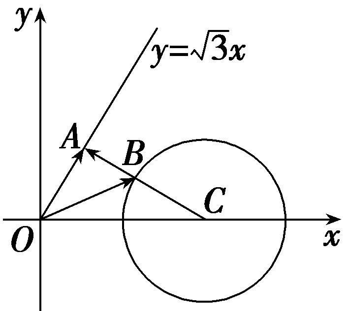

法二：由&lt;t&lt;t&lt;t&lt;t&lt;t&lt;t&lt;t&lt;t&lt;t&lt;t&lt;t&lt;t&lt;t&lt;text style="<em><strong>b</strong></em>old,italic"&gt;e&lt;/text&gt;xt style="bold,italic"&gt;e&lt;/text&gt;xt style="&lt;text style="bold,it<em><strong>a</strong></em>lic"&gt;b&lt;/text&gt;old,italic"&gt;e&lt;/text&gt;xt style="bold,italic"&gt;e&lt;/text&gt;xt style="&lt;text style="bold,it<em><strong>a</strong></em>lic"&gt;b&lt;/text&gt;old,it&lt;text style="bold,it<em><strong>a</strong></em>lic"&gt;a&lt;/text&gt;lic"&gt;e&lt;/text&gt;xt style="<em><strong>b</strong></em>old,italic"&gt;e&lt;/text&gt;xt style="<em><strong>b</strong></em>old,italic"&gt;e&lt;/text&gt;xt style="bold,italic"&gt;e&lt;/text&gt;xt style="<em><strong>b</strong></em>old,italic"&gt;e&lt;/text&gt;xt style="<em><strong>b</strong></em>old,italic"&gt;e&lt;/text&gt;xt style="<em><strong>b</strong></em>old,italic"&gt;e&lt;/text&gt;xt style="<em><strong>b</strong></em>old,italic"&gt;e&lt;/text&gt;xt style="&lt;text style="<em><strong>b</strong></em>old,italic"&gt;b&lt;/text&gt;old,italic"&gt;e&lt;/text&gt;xt style="bold,italic"&gt;b&lt;/text&gt;&lt;text style="superscript"&gt;&lt;text style="superscript"&gt;2&lt;/text&gt;&lt;/text&gt;－4e·b＋3＝0得，b2－4e·b＋3e2＝(b－e)·(b－3e)＝0 .设b＝ $\vec{OB}$ ，&lt;t&lt;t&lt;t&lt;t&lt;t&lt;t&lt;t&lt;t&lt;t&lt;t&lt;t&lt;t&lt;text style="<em><strong>b</strong></em>old,italic"&gt;e&lt;/text&gt;xt style="bold,italic"&gt;e&lt;/text&gt;xt style="&lt;text style="bold,it<em><strong>a</strong></em>lic"&gt;b&lt;/text&gt;old,italic"&gt;e&lt;/text&gt;xt style="bold,italic"&gt;e&lt;/text&gt;xt style="&lt;text style="bold,it<em><strong>a</strong></em>lic"&gt;b&lt;/text&gt;old,it&lt;text style="bold,it<em><strong>a</strong></em>lic"&gt;a&lt;/text&gt;lic"&gt;e&lt;/text&gt;xt style="<em><strong>b</strong></em>old,italic"&gt;e&lt;/text&gt;xt style="<em><strong>b</strong></em>old,italic"&gt;e&lt;/text&gt;xt style="bold,italic"&gt;e&lt;/text&gt;xt style="<em><strong>b</strong></em>old,italic"&gt;e&lt;/text&gt;xt style="<em><strong>b</strong></em>old,italic"&gt;e&lt;/text&gt;xt style="<em><strong>b</strong></em>old,italic"&gt;e&lt;/text&gt;xt style="<em><strong>b</strong></em>old,italic"&gt;e&lt;/text&gt;xt style="&lt;text style="<em><strong>b</strong></em>old,italic"&gt;b&lt;/text&gt;old,italic"&gt;e&lt;/text&gt;＝ $\vec{OE}$ ，3&lt;t&lt;t&lt;t&lt;t&lt;t&lt;t&lt;t&lt;t&lt;t&lt;t&lt;t&lt;t&lt;text style="<em><strong>b</strong></em>old,italic"&gt;e&lt;/text&gt;xt style="bold,italic"&gt;e&lt;/text&gt;xt style="&lt;text style="bold,it<em><strong>a</strong></em>lic"&gt;b&lt;/text&gt;old,italic"&gt;e&lt;/text&gt;xt style="bold,italic"&gt;e&lt;/text&gt;xt style="&lt;text style="bold,it<em><strong>a</strong></em>lic"&gt;b&lt;/text&gt;old,it&lt;text style="bold,it<em><strong>a</strong></em>lic"&gt;a&lt;/text&gt;lic"&gt;e&lt;/text&gt;xt style="<em><strong>b</strong></em>old,italic"&gt;e&lt;/text&gt;xt style="<em><strong>b</strong></em>old,italic"&gt;e&lt;/text&gt;xt style="bold,italic"&gt;e&lt;/text&gt;xt style="<em><strong>b</strong></em>old,italic"&gt;e&lt;/text&gt;xt style="<em><strong>b</strong></em>old,italic"&gt;e&lt;/text&gt;xt style="<em><strong>b</strong></em>old,italic"&gt;e&lt;/text&gt;xt style="<em><strong>b</strong></em>old,italic"&gt;e&lt;/text&gt;xt style="&lt;text style="<em><strong>b</strong></em>old,italic"&gt;b&lt;/text&gt;old,italic"&gt;e&lt;/text&gt;＝ $\vec{OF}$ ，所以&lt;t&lt;t&lt;t&lt;t&lt;t&lt;t&lt;t&lt;t&lt;t&lt;t&lt;t&lt;t&lt;t&lt;text style="<em><strong>b</strong></em>old,italic"&gt;e&lt;/text&gt;xt style="bold,italic"&gt;e&lt;/text&gt;xt style="&lt;text style="bold,it<em><strong>a</strong></em>lic"&gt;b&lt;/text&gt;old,italic"&gt;e&lt;/text&gt;xt style="bold,italic"&gt;e&lt;/text&gt;xt style="&lt;text style="bold,it<em><strong>a</strong></em>lic"&gt;b&lt;/text&gt;old,it&lt;text style="bold,it<em><strong>a</strong></em>lic"&gt;a&lt;/text&gt;lic"&gt;e&lt;/text&gt;xt style="<em><strong>b</strong></em>old,italic"&gt;e&lt;/text&gt;xt style="<em><strong>b</strong></em>old,italic"&gt;e&lt;/text&gt;xt style="bold,italic"&gt;e&lt;/text&gt;xt style="<em><strong>b</strong></em>old,italic"&gt;e&lt;/text&gt;xt style="<em><strong>b</strong></em>old,italic"&gt;e&lt;/text&gt;xt style="<em><strong>b</strong></em>old,italic"&gt;e&lt;/text&gt;xt style="<em><strong>b</strong></em>old,italic"&gt;e&lt;/text&gt;xt style="&lt;text style="<em><strong>b</strong></em>old,italic"&gt;b&lt;/text&gt;old,italic"&gt;e&lt;/text&gt;xt style="bold,italic"&gt;b&lt;/text&gt;－e＝ $\vec{EB}$ ，&lt;t&lt;t&lt;t&lt;t&lt;t&lt;t&lt;t&lt;t&lt;t&lt;t&lt;t&lt;t&lt;t&lt;text style="<em><strong>b</strong></em>old,italic"&gt;e&lt;/text&gt;xt style="bold,italic"&gt;e&lt;/text&gt;xt style="&lt;text style="bold,it<em><strong>a</strong></em>lic"&gt;b&lt;/text&gt;old,italic"&gt;e&lt;/text&gt;xt style="bold,italic"&gt;e&lt;/text&gt;xt style="&lt;text style="bold,it<em><strong>a</strong></em>lic"&gt;b&lt;/text&gt;old,it&lt;text style="bold,it<em><strong>a</strong></em>lic"&gt;a&lt;/text&gt;lic"&gt;e&lt;/text&gt;xt style="<em><strong>b</strong></em>old,italic"&gt;e&lt;/text&gt;xt style="<em><strong>b</strong></em>old,italic"&gt;e&lt;/text&gt;xt style="bold,italic"&gt;e&lt;/text&gt;xt style="<em><strong>b</strong></em>old,italic"&gt;e&lt;/text&gt;xt style="<em><strong>b</strong></em>old,italic"&gt;e&lt;/text&gt;xt style="<em><strong>b</strong></em>old,italic"&gt;e&lt;/text&gt;xt style="<em><strong>b</strong></em>old,italic"&gt;e&lt;/text&gt;xt style="&lt;text style="<em><strong>b</strong></em>old,italic"&gt;b&lt;/text&gt;old,italic"&gt;e&lt;/text&gt;xt style="bold,italic"&gt;b&lt;/text&gt;－3e＝ $\vec{FB}$ ，所以 $\vec{EB}$ · $\vec{FB}$ ＝0，取&lt;t&lt;t&lt;t&lt;t&lt;text style="<em><strong>b</strong></em>old,italic"&gt;e&lt;/text&gt;xt style="bold,italic"&gt;e&lt;/text&gt;xt style="&lt;text style="bold,it<em><strong>a</strong></em>lic"&gt;b&lt;/text&gt;old,italic"&gt;e&lt;/text&gt;xt style="bold,italic"&gt;e&lt;/text&gt;xt style="it&lt;text style="&lt;text style="bold,it<em><strong>a</strong></em>lic"&gt;b&lt;/text&gt;old,it<em><strong>a</strong></em>lic"&gt;a&lt;/text&gt;lic"&gt;<em>EF</em> &lt;/text&gt;的中点为<em>C</em>，则点<em>B</em> 在以<em>C</em> 为圆心，EF 为直径的圆上运动，如图.设a＝ $\vec{OA}$ ，作射线&lt;t&lt;t&lt;t&lt;t&lt;text style="<em><strong>b</strong></em>old,italic"&gt;e&lt;/text&gt;xt style="bold,italic"&gt;e&lt;/text&gt;xt style="&lt;text style="bold,it<em><strong>a</strong></em>lic"&gt;b&lt;/text&gt;old,italic"&gt;e&lt;/text&gt;xt style="bold,italic"&gt;e&lt;/text&gt;xt style="it&lt;text style="&lt;text style="bold,it<em><strong>a</strong></em>lic"&gt;b&lt;/text&gt;old,italic"&gt;a&lt;/text&gt;lic"&gt;OA&lt;/text&gt;，使得∠<em>AOE</em>＝ $\frac{\pi }{3}$ ，所以｜&lt;t&lt;t&lt;t&lt;t&lt;text style="<em><strong>b</strong></em>old,italic"&gt;e&lt;/text&gt;xt style="bold,italic"&gt;e&lt;/text&gt;xt style="&lt;text style="bold,it<em><strong>a</strong></em>lic"&gt;b&lt;/text&gt;old,italic"&gt;e&lt;/text&gt;xt style="bold,italic"&gt;e&lt;/text&gt;xt style="&lt;text style="bold,it<em><strong>a</strong></em>lic"&gt;b&lt;/text&gt;old,it<em><strong>a</strong></em>lic"&gt;a&lt;/text&gt;－&lt;t&lt;t&lt;t&lt;t&lt;t&lt;t&lt;t&lt;t&lt;t<em><strong>e</strong></em>xt style="<em><strong>b</strong></em>old,italic"&gt;e&lt;/text&gt;xt style="<em><strong>b</strong></em>old,italic"&gt;e&lt;/text&gt;xt style="bold,italic"&gt;e&lt;/text&gt;xt style="<em><strong>b</strong></em>old,italic"&gt;e&lt;/text&gt;xt style="<em><strong>b</strong></em>old,italic"&gt;e&lt;/text&gt;xt style="<em><strong>b</strong></em>old,italic"&gt;e&lt;/text&gt;xt style="<em><strong>b</strong></em>old,italic"&gt;e&lt;/text&gt;xt style="&lt;text style="<em><strong>b</strong></em>old,italic"&gt;b&lt;/text&gt;old,italic"&gt;e&lt;/text&gt;xt style="bold,italic"&gt;b&lt;/text&gt;｜＝｜(a－&lt;text style="superscript"&gt;&lt;text style="superscript"&gt;2&lt;/text&gt;&lt;/text&gt;e)＋(2e－b)｜≥｜a－2e｜－｜2e－b｜＝｜ $\vec{CA}$ ｜－｜ $\vec{BC}$ ∣≥ $\sqrt{3}$ －1 .故选A.

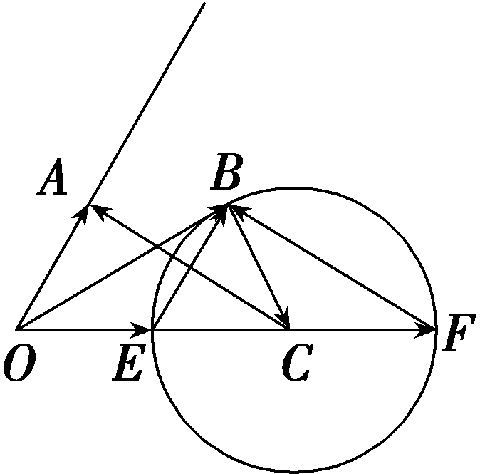

(&lt;te&lt;te&lt;te&lt;te&lt;text st&lt;text style="it<em><strong>a</strong></em>li<em><strong>c</strong></em>"&gt;y&lt;/text&gt;le="italic"&gt;x&lt;/text&gt;t st<em>y</em>le="italic"&gt;x&lt;/text&gt;t st<em>y</em>le="italic"&gt;x&lt;/text&gt;t st<em>y</em>le="italic"&gt;x&lt;/text&gt;t style="superscript"&gt;&lt;text style="superscript"&gt;&lt;text style="superscript"&gt;&lt;text style="superscript"&gt;&lt;text style="superscript"&gt;&lt;text style="superscript"&gt;&lt;text style="superscript"&gt;2&lt;/text&gt;&lt;/text&gt;&lt;/text&gt;&lt;/text&gt;&lt;/text&gt;&lt;/text&gt;&lt;/text&gt;)由题意设&lt;te&lt;text st<em>y</em>le="italic"&gt;x&lt;/text&gt;t style="bold,it&lt;text style="bold,itali<em><strong>c</strong></em>"&gt;a&lt;/text&gt;lic"&gt;b&lt;/text&gt;＝ $\vec{OB}$ ＝(1，0)，&lt;te&lt;te&lt;te&lt;te&lt;te&lt;text st&lt;text style="it<em><strong>a</strong></em>li<em><strong>c</strong></em>"&gt;y&lt;/text&gt;le="italic"&gt;x&lt;/text&gt;t st<em>y</em>le="italic"&gt;x&lt;/text&gt;t st<em>y</em>le="italic"&gt;x&lt;/text&gt;t st<em>y</em>le="italic"&gt;x&lt;/text&gt;t st<em>y</em>le="italic"&gt;x&lt;/text&gt;t style="bold,itali<em><strong>c</strong></em>"&gt;a&lt;/text&gt;＝ $\vec{OA}$ ＝(&lt;te&lt;te&lt;te&lt;te&lt;te&lt;text st&lt;text style="it<em><strong>a</strong></em>li<em><strong>c</strong></em>"&gt;y&lt;/text&gt;le="italic"&gt;x&lt;/text&gt;t st<em>y</em>le="italic"&gt;x&lt;/text&gt;t st<em>y</em>le="italic"&gt;x&lt;/text&gt;t st<em>y</em>le="italic"&gt;x&lt;/text&gt;t st<em>y</em>le="italic"&gt;x&lt;/text&gt;t style="itali<em><strong>c</strong></em>"&gt;<em>&lt;text style="italic"&gt;&lt;text style="italic"&gt;&lt;text style="italic"&gt;m</em>&lt;/text&gt;&lt;/text&gt;&lt;/text&gt;&lt;/text&gt;，<em>&lt;text style="italic"&gt;&lt;text style="italic"&gt;&lt;text style="italic"&gt;&lt;text style="italic"&gt;&lt;text style="italic"&gt;n</em>&lt;/text&gt;&lt;/text&gt;&lt;/text&gt;&lt;/text&gt;&lt;/text&gt;)，c＝ $\vec{OC}$ ＝(&lt;te&lt;te&lt;te&lt;te&lt;text st&lt;text style="it<em><strong>a</strong></em>li<em><strong>c</strong></em>"&gt;y&lt;/text&gt;le="italic"&gt;x&lt;/text&gt;t st<em>y</em>le="italic"&gt;x&lt;/text&gt;t st<em>y</em>le="italic"&gt;x&lt;/text&gt;t st<em>y</em>le="italic"&gt;x&lt;/text&gt;t st<em>y</em>le="italic"&gt;x&lt;/text&gt;，y)，则 $\left(m，n\right)$ &lt;te&lt;te&lt;te&lt;text st&lt;text style="it<em><strong>a</strong></em>li<em><strong>c</strong></em>"&gt;y&lt;/text&gt;le="italic"&gt;x&lt;/text&gt;t st<em>y</em>le="italic"&gt;x&lt;/text&gt;t st<em>y</em>le="italic"&gt;x&lt;/text&gt;t style="italic"&gt;·&lt;/text&gt; $\left(m－1，n\right)$ ＝ $\frac{1}{2}$ ，即(&lt;te&lt;te&lt;te&lt;te&lt;te&lt;text st&lt;text style="it<em><strong>a</strong></em>li<em><strong>c</strong></em>"&gt;y&lt;/text&gt;le="italic"&gt;x&lt;/text&gt;t st<em>y</em>le="italic"&gt;x&lt;/text&gt;t st<em>y</em>le="italic"&gt;x&lt;/text&gt;t st<em>y</em>le="italic"&gt;x&lt;/text&gt;t st<em>y</em>le="italic"&gt;x&lt;/text&gt;t style="itali<em><strong>c</strong></em>"&gt;<em>&lt;text style="italic"&gt;&lt;text style="italic"&gt;&lt;text style="italic"&gt;m</em>&lt;/text&gt;&lt;/text&gt;&lt;/text&gt;&lt;/text&gt;－ $\frac{1}{2}$ )&lt;te&lt;te&lt;te&lt;te&lt;text st&lt;text style="it<em><strong>a</strong></em>li<em><strong>c</strong></em>"&gt;y&lt;/text&gt;le="italic"&gt;x&lt;/text&gt;t st<em>y</em>le="italic"&gt;x&lt;/text&gt;t st<em>y</em>le="italic"&gt;x&lt;/text&gt;t st<em>y</em>le="italic"&gt;x&lt;/text&gt;t style="superscript"&gt;&lt;text style="superscript"&gt;&lt;text style="superscript"&gt;&lt;text style="superscript"&gt;&lt;text style="superscript"&gt;&lt;text style="superscript"&gt;&lt;text style="superscript"&gt;2&lt;/text&gt;&lt;/text&gt;&lt;/text&gt;&lt;/text&gt;&lt;/text&gt;&lt;/text&gt;&lt;/text&gt;＋&lt;te&lt;text st<em>y</em>le="italic"&gt;x&lt;/text&gt;t style="itali<em><strong>c</strong></em>"&gt;<em>&lt;text style="italic"&gt;&lt;text style="italic"&gt;&lt;text style="italic"&gt;&lt;text style="italic"&gt;n</em>&lt;/text&gt;&lt;/text&gt;&lt;/text&gt;&lt;/text&gt;&lt;/text&gt;2＝ $\frac{3}{4}$ ，且&lt;te&lt;te&lt;te&lt;te&lt;te&lt;text st&lt;text style="it<em><strong>a</strong></em>li<em><strong>c</strong></em>"&gt;y&lt;/text&gt;le="italic"&gt;x&lt;/text&gt;t st<em>y</em>le="italic"&gt;x&lt;/text&gt;t st<em>y</em>le="italic"&gt;x&lt;/text&gt;t st<em>y</em>le="italic"&gt;x&lt;/text&gt;t st<em>y</em>le="italic"&gt;x&lt;/text&gt;t style="itali<em><strong>c</strong></em>"&gt;<em>&lt;text style="italic"&gt;&lt;text style="italic"&gt;&lt;text style="italic"&gt;m</em>&lt;/text&gt;&lt;/text&gt;&lt;/text&gt;&lt;/text&gt;&lt;text style="superscript"&gt;&lt;text style="superscript"&gt;&lt;text style="superscript"&gt;&lt;text style="superscript"&gt;&lt;text style="superscript"&gt;&lt;text style="superscript"&gt;&lt;text style="superscript"&gt;2&lt;/text&gt;&lt;/text&gt;&lt;/text&gt;&lt;/text&gt;&lt;/text&gt;&lt;/text&gt;&lt;/text&gt;＋<em>&lt;text style="italic"&gt;&lt;text style="italic"&gt;&lt;text style="italic"&gt;&lt;text style="italic"&gt;&lt;text style="italic"&gt;n</em>&lt;/text&gt;&lt;/text&gt;&lt;/text&gt;&lt;/text&gt;&lt;/text&gt;2＝1，解得m＝ $\frac{1}{2}$ ，&lt;te&lt;te&lt;te&lt;te&lt;te&lt;text st&lt;text style="it<em><strong>a</strong></em>li<em><strong>c</strong></em>"&gt;y&lt;/text&gt;le="italic"&gt;x&lt;/text&gt;t st<em>y</em>le="italic"&gt;x&lt;/text&gt;t st<em>y</em>le="italic"&gt;x&lt;/text&gt;t st<em>y</em>le="italic"&gt;x&lt;/text&gt;t st<em>y</em>le="italic"&gt;x&lt;/text&gt;t style="itali<em><strong>c</strong></em>"&gt;<em>&lt;text style="italic"&gt;&lt;text style="italic"&gt;&lt;text style="italic"&gt;&lt;text style="italic"&gt;n</em>&lt;/text&gt;&lt;/text&gt;&lt;/text&gt;&lt;/text&gt;&lt;/text&gt;＝ $\frac{\sqrt{3}}{2}$ 或&lt;te&lt;te&lt;te&lt;te&lt;te&lt;text st&lt;text style="it<em><strong>a</strong></em>li<em><strong>c</strong></em>"&gt;y&lt;/text&gt;le="italic"&gt;x&lt;/text&gt;t st<em>y</em>le="italic"&gt;x&lt;/text&gt;t st<em>y</em>le="italic"&gt;x&lt;/text&gt;t st<em>y</em>le="italic"&gt;x&lt;/text&gt;t st<em>y</em>le="italic"&gt;x&lt;/text&gt;t style="itali<em><strong>c</strong></em>"&gt;<em>&lt;text style="italic"&gt;&lt;text style="italic"&gt;&lt;text style="italic"&gt;&lt;text style="italic"&gt;n</em>&lt;/text&gt;&lt;/text&gt;&lt;/text&gt;&lt;/text&gt;&lt;/text&gt;＝－ $\frac{\sqrt{3}}{2}$ .由 $\left(b－c\right)$ ⊥ $\left(3b－c\right)$ 可得 $\left(b－c\right)$ &lt;te&lt;te&lt;te&lt;text st&lt;text style="it<em><strong>a</strong></em>li<em><strong>c</strong></em>"&gt;y&lt;/text&gt;le="italic"&gt;x&lt;/text&gt;t st<em>y</em>le="italic"&gt;x&lt;/text&gt;t st<em>y</em>le="italic"&gt;x&lt;/text&gt;t style="italic"&gt;·&lt;/text&gt; $\left(3b－c\right)$ ＝0，即(1－&lt;te&lt;te&lt;te&lt;te&lt;text st&lt;text style="it<em><strong>a</strong></em>li<em><strong>c</strong></em>"&gt;y&lt;/text&gt;le="italic"&gt;x&lt;/text&gt;t st<em>y</em>le="italic"&gt;x&lt;/text&gt;t st<em>y</em>le="italic"&gt;x&lt;/text&gt;t st<em>y</em>le="italic"&gt;x&lt;/text&gt;t st<em>y</em>le="italic"&gt;x&lt;/text&gt;，－y)<em>·</em>(3－x，－y)＝(x－&lt;text style="superscript"&gt;&lt;text style="superscript"&gt;&lt;text style="superscript"&gt;&lt;text style="superscript"&gt;&lt;text style="superscript"&gt;&lt;text style="superscript"&gt;&lt;text style="superscript"&gt;2&lt;/text&gt;&lt;/text&gt;&lt;/text&gt;&lt;/text&gt;&lt;/text&gt;&lt;/text&gt;&lt;/text&gt;)2＋y2－1＝0，则(x－2)2＋y2＝1，即<em><strong>c</strong></em>的终点<em>C</em>在以<em>D</em>(2，0)为圆心，1为半径的圆上，故 $\left|a－c\right|$ ＝ $\left|\vec{CA}\right|$ .由圆的对称性，不妨令&lt;te&lt;te&lt;te&lt;te&lt;te&lt;text st&lt;text style="it<em><strong>a</strong></em>li<em><strong>c</strong></em>"&gt;y&lt;/text&gt;le="italic"&gt;x&lt;/text&gt;t st<em>y</em>le="italic"&gt;x&lt;/text&gt;t st<em>y</em>le="italic"&gt;x&lt;/text&gt;t st<em>y</em>le="italic"&gt;x&lt;/text&gt;t st<em>y</em>le="italic"&gt;x&lt;/text&gt;t style="itali<em><strong>c</strong></em>"&gt;<em>&lt;text style="italic"&gt;&lt;text style="italic"&gt;&lt;text style="italic"&gt;&lt;text style="italic"&gt;n</em>&lt;/text&gt;&lt;/text&gt;&lt;/text&gt;&lt;/text&gt;&lt;/text&gt;＝ $\frac{\sqrt{3}}{2}$ ，&lt;te&lt;te&lt;te&lt;te&lt;te&lt;text st&lt;text style="it<em><strong>a</strong></em>li<em><strong>c</strong></em>"&gt;y&lt;/text&gt;le="italic"&gt;x&lt;/text&gt;t st<em>y</em>le="italic"&gt;x&lt;/text&gt;t st<em>y</em>le="italic"&gt;x&lt;/text&gt;t st<em>y</em>le="italic"&gt;x&lt;/text&gt;t st<em>y</em>le="italic"&gt;x&lt;/text&gt;t style="itali<em><strong>c</strong></em>"&gt;<em>&lt;text style="italic"&gt;&lt;text style="italic"&gt;&lt;text style="italic"&gt;m</em>&lt;/text&gt;&lt;/text&gt;&lt;/text&gt;&lt;/text&gt;＝ $\frac{1}{2}$ ，即&lt;te&lt;te&lt;te&lt;te&lt;te&lt;text st&lt;text style="it<em><strong>a</strong></em>li<em><strong>c</strong></em>"&gt;y&lt;/text&gt;le="italic"&gt;x&lt;/text&gt;t st<em>y</em>le="italic"&gt;x&lt;/text&gt;t st<em>y</em>le="italic"&gt;x&lt;/text&gt;t st<em>y</em>le="italic"&gt;x&lt;/text&gt;t st<em>y</em>le="italic"&gt;x&lt;/text&gt;t style="bold,itali<em><strong>c</strong></em>"&gt;a&lt;/text&gt;＝( $\frac{1}{2}$ ， $\frac{\sqrt{3}}{2}$ )，如图，连接A&lt;text style="it<em><strong>a</strong></em>lic"&gt;D&lt;/text&gt;，交圆于<em>E</em>，由点与圆的位置关系可知， $\left|\vec{CA}\right|$ ≥ $\left|\vec{AE}\right|$ ＝ $\left|\vec{AD}\right|$ － $\left|\vec{DE}\right|$ ＝ $\sqrt{(\frac{1}{2}－2)^{2}＋(\frac{\sqrt{3}}{2})^{2}}$ －1＝ $\sqrt{3}$ －1.故选A.

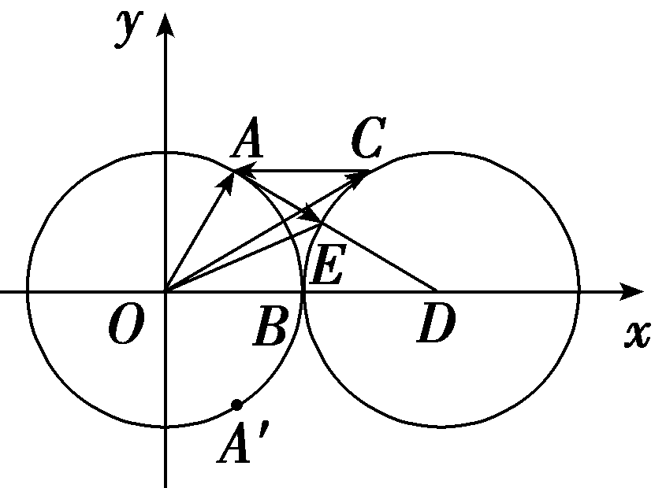

角度4　与夹角有关的最值(范围)

平面向量***a***，***b***满足｜***a***｜＝3｜***b***｜，且｜***a***－***b***｜＝4，则***a***与***a***－***b***夹角的正弦值的最大值为(　　 )

A. $\frac{1}{4}$ 	B. $\frac{1}{3}$

C. $\frac{1}{2}$ 	D. $\frac{2}{3}$

答案：**B**

解析：如图所示，设&lt;text style="&lt;text style="&lt;text style="&lt;text style="<em><strong>b</strong></em>old,it&lt;text style="bold,it&lt;text style="bold,it<em><strong>a</strong></em>lic"&gt;a&lt;/text&gt;lic"&gt;a&lt;/text&gt;lic"&gt;b&lt;/text&gt;old,italic"&gt;b&lt;/text&gt;old,it<em><strong>a</strong></em>lic"&gt;b&lt;/text&gt;old,italic"&gt;a&lt;/text&gt;＝ $\vec{OA}$ ，&lt;text style="&lt;text style="&lt;text style="<em><strong>b</strong></em>old,it&lt;text style="bold,it&lt;text style="bold,it<em><strong>a</strong></em>lic"&gt;a&lt;/text&gt;lic"&gt;a&lt;/text&gt;lic"&gt;b&lt;/text&gt;old,italic"&gt;b&lt;/text&gt;old,it<em><strong>a</strong></em>lic"&gt;b&lt;/text&gt;＝ $\vec{OB}$ ，则&lt;text style="&lt;text style="&lt;text style="&lt;text style="<em><strong>b</strong></em>old,it&lt;text style="bold,it&lt;text style="bold,it<em><strong>a</strong></em>lic"&gt;a&lt;/text&gt;lic"&gt;a&lt;/text&gt;lic"&gt;b&lt;/text&gt;old,italic"&gt;b&lt;/text&gt;old,it<em><strong>a</strong></em>lic"&gt;b&lt;/text&gt;old,italic"&gt;a&lt;/text&gt;－b＝ $\vec{BA}$ ，设｜&lt;text style="&lt;text style="&lt;text style="<em><strong>b</strong></em>old,it&lt;text style="bold,it&lt;text style="bold,it<em><strong>a</strong></em>lic"&gt;a&lt;/text&gt;lic"&gt;a&lt;/text&gt;lic"&gt;b&lt;/text&gt;old,italic"&gt;b&lt;/text&gt;old,it<em><strong>a</strong></em>lic"&gt;b&lt;/text&gt;｜＝<em>&lt;text style="italic"&gt;&lt;text style="italic"&gt;&lt;text style="italic"&gt;m</em>&lt;/text&gt;&lt;/text&gt;&lt;/text&gt;，｜<em><strong>a</strong></em>｜＝3m，1≤m≤2，cos ∠<em>&lt;text style="italic"&gt;&lt;text style="italic"&gt;&lt;text style="italic"&gt;OAB</em>&lt;/text&gt;&lt;/text&gt;&lt;/text&gt;＝ $\frac{｜\vec{OA}｜^{2}＋｜\vec{BA}｜^{2}-|\vec{OB}｜^{2}}{2｜\vec{OA}||\vec{BA}｜}$ ＝ $\frac{9m^{2}+16－m^{2}}{24m}$ ＝ $\frac{m}{3}$ ＋ $\frac{2}{3m}$ ≥2 $\sqrt{\frac{m}{3}\cdot \frac{2}{3m}}$ ＝ $\frac{2\sqrt{2}}{3}$ ，当且仅当 $\frac{m}{3}$ ＝ $\frac{2}{3m}$ ，即&lt;text style="it&lt;text style="<em><strong>b</strong></em>old,it&lt;text style="bold,it<em><strong>a</strong></em>lic"&gt;a&lt;/text&gt;lic"&gt;a&lt;/text&gt;lic"&gt;<em>&lt;text style="italic"&gt;&lt;text style="italic"&gt;m</em>&lt;/text&gt;&lt;/text&gt;&lt;/text&gt;＝ $\sqrt{2}$ 时等号成立，故∠&lt;text style="it&lt;text style="<em><strong>b</strong></em>old,it<em><strong>a</strong></em>lic"&gt;a&lt;/text&gt;lic"&gt;<em>&lt;text style="italic"&gt;&lt;text style="italic"&gt;OAB</em>&lt;/text&gt;&lt;/text&gt;&lt;/text&gt;∈ $\left(0，\frac{\pi }{2}\right)$ ，当cos ∠&lt;text style="it&lt;text style="<em><strong>b</strong></em>old,it<em><strong>a</strong></em>lic"&gt;a&lt;/text&gt;lic"&gt;<em>&lt;text style="italic"&gt;&lt;text style="italic"&gt;OAB</em>&lt;/text&gt;&lt;/text&gt;&lt;/text&gt;最小时，sin ∠OAB最大，故&lt;text style="&lt;text style="&lt;text style="&lt;text style="bold,it<em><strong>a</strong></em>lic"&gt;b&lt;/text&gt;old,italic"&gt;b&lt;/text&gt;old,it<em><strong>a</strong></em>lic"&gt;b&lt;/text&gt;old,italic"&gt;a&lt;/text&gt;与a－b夹角的正弦值的最大值为 $\sqrt{1－\frac{8}{9}}$ ＝ $\frac{1}{3}$ .故选B.

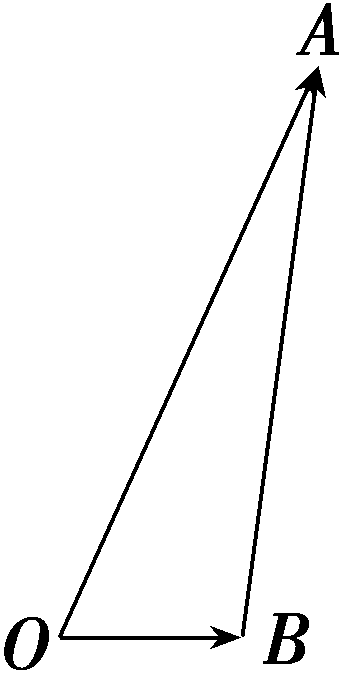

向量求最值(范围)的常用方法

1.利用三角函数求最值(范围).

2.利用基本不等式求最值(范围).

3.建立坐标系，设变量构造函数求最值(范围).

4.数形结合，应用图形的几何性质求最值(范围).

对点练4.在△*ABC*中，｜ $\vec{AC}$ ｜＝2，｜ $\vec{AB}$ ｜＝2，∠*BAC*＝120°， $\vec{AE}$ ＝*<text style="italic"><text style="italic">λ*</text></text> $\vec{AB}$ ， $\vec{AF}$ ＝*<text style="italic"><text style="italic">μ*</text></text> $\vec{AC}$ (*<text style="italic"><text style="italic">λ*</text></text>＞0，*<text style="italic"><text style="italic">μ*</text></text>＞0)，*M*为线段*EF*的中点，若｜ $\vec{AM}$ ｜＝1，则*<text style="italic"><text style="italic">λ*</text></text>＋*<text style="italic"><text style="italic">μ*</text></text>的最大值为(　　)

A. $\frac{\sqrt{7}}{3}$ 	B. $\frac{2\sqrt{7}}{3}$

C.2	D. $\frac{\sqrt{21}}{3}$

答案：**C**

解析： $\vec{AM}$ ＝ $\frac{1}{2}\left(\vec{AE}＋\vec{AF}\right)$ ＝ $\frac{\lambda }{2}\vec{AB}$ ＋ $\frac{\mu }{2}\vec{AC}$ ，故｜ $\vec{AM}$ ｜&lt;text style="superscript"&gt;&lt;text style="superscript"&gt;&lt;text style="superscript"&gt;&lt;text style="superscript"&gt;&lt;text style="superscript"&gt;&lt;text style="superscript"&gt;&lt;text style="superscript"&gt;&lt;text style="superscript"&gt;2&lt;/text&gt;&lt;/text&gt;&lt;/text&gt;&lt;/text&gt;&lt;/text&gt;&lt;/text&gt;&lt;/text&gt;&lt;/text&gt;＝ $\left(\frac{\lambda }{2}\vec{AB}＋\frac{\mu }{2}\vec{AC}\right)^{2}$ ＝<em>&lt;text style="italic"&gt;&lt;text style="italic"&gt;&lt;text style="italic"&gt;&lt;text style="italic"&gt;&lt;text style="italic"&gt;&lt;text style="italic"&gt;&lt;text style="italic"&gt;λ</em>&lt;/text&gt;&lt;/text&gt;&lt;/text&gt;&lt;/text&gt;&lt;/text&gt;&lt;/text&gt;&lt;/text&gt;&lt;text style="superscript"&gt;&lt;text style="superscript"&gt;&lt;text style="superscript"&gt;&lt;text style="superscript"&gt;&lt;text style="superscript"&gt;&lt;text style="superscript"&gt;&lt;text style="superscript"&gt;&lt;text style="superscript"&gt;2&lt;/text&gt;&lt;/text&gt;&lt;/text&gt;&lt;/text&gt;&lt;/text&gt;&lt;/text&gt;&lt;/text&gt;&lt;/text&gt;＋<em>&lt;text style="italic"&gt;&lt;text style="italic"&gt;&lt;text style="italic"&gt;&lt;text style="italic"&gt;&lt;text style="italic"&gt;&lt;text style="italic"&gt;&lt;text style="italic"&gt;μ</em>&lt;/text&gt;&lt;/text&gt;&lt;/text&gt;&lt;/text&gt;&lt;/text&gt;&lt;/text&gt;&lt;/text&gt;2＋ $\frac{\lambda \mu }{2}$ ×4cos 1&lt;text style="superscript"&gt;&lt;text style="superscript"&gt;&lt;text style="superscript"&gt;&lt;text style="superscript"&gt;&lt;text style="superscript"&gt;&lt;text style="superscript"&gt;&lt;text style="superscript"&gt;&lt;text style="superscript"&gt;2&lt;/text&gt;&lt;/text&gt;&lt;/text&gt;&lt;/text&gt;&lt;/text&gt;&lt;/text&gt;&lt;/text&gt;&lt;/text&gt;0°＝<em>&lt;text style="italic"&gt;&lt;text style="italic"&gt;&lt;text style="italic"&gt;&lt;text style="italic"&gt;&lt;text style="italic"&gt;&lt;text style="italic"&gt;&lt;text style="italic"&gt;λ</em>&lt;/text&gt;&lt;/text&gt;&lt;/text&gt;&lt;/text&gt;&lt;/text&gt;&lt;/text&gt;&lt;/text&gt;2＋<em>&lt;text style="italic"&gt;&lt;text style="italic"&gt;&lt;text style="italic"&gt;&lt;text style="italic"&gt;&lt;text style="italic"&gt;&lt;text style="italic"&gt;&lt;text style="italic"&gt;μ</em>&lt;/text&gt;&lt;/text&gt;&lt;/text&gt;&lt;/text&gt;&lt;/text&gt;&lt;/text&gt;&lt;/text&gt;2－<em>&lt;text style="italic"&gt;&lt;text style="italic"&gt;λμ</em>&lt;/text&gt;&lt;/text&gt;＝1，故1＝λ2＋μ2－λμ＝(λ＋μ)2－3λμ≥(λ＋μ)2－ $\frac{3}{4}\left(\lambda ＋\mu \right)^{2}$ ，故<em>&lt;text style="italic"&gt;&lt;text style="italic"&gt;&lt;text style="italic"&gt;&lt;text style="italic"&gt;&lt;text style="italic"&gt;&lt;text style="italic"&gt;&lt;text style="italic"&gt;λ</em>&lt;/text&gt;&lt;/text&gt;&lt;/text&gt;&lt;/text&gt;&lt;/text&gt;&lt;/text&gt;&lt;/text&gt;＋<em>&lt;text style="italic"&gt;&lt;text style="italic"&gt;&lt;text style="italic"&gt;&lt;text style="italic"&gt;&lt;text style="italic"&gt;&lt;text style="italic"&gt;&lt;text style="italic"&gt;μ</em>&lt;/text&gt;&lt;/text&gt;&lt;/text&gt;&lt;/text&gt;&lt;/text&gt;&lt;/text&gt;&lt;/text&gt;≤&lt;text style="superscript"&gt;&lt;text style="superscript"&gt;&lt;text style="superscript"&gt;&lt;text style="superscript"&gt;&lt;text style="superscript"&gt;&lt;text style="superscript"&gt;&lt;text style="superscript"&gt;&lt;text style="superscript"&gt;2&lt;/text&gt;&lt;/text&gt;&lt;/text&gt;&lt;/text&gt;&lt;/text&gt;&lt;/text&gt;&lt;/text&gt;&lt;/text&gt;，当且仅当λ＝μ＝1时等号成立.即λ＋μ的最大值为2.故选C.

对点练5.如图，在平面四边形*<text style="italic"><text style="italic">AB*</text>*<text style="italic">CD*</text></text>中，AB⊥*BC*，*<text style="italic">AD*</text>⊥CD，∠*BAD*＝120°，AB＝AD＝1.若点*E*为边CD上的动点，则 $\vec{EA}$ · $\vec{EB}$ 的最小值为(　　)

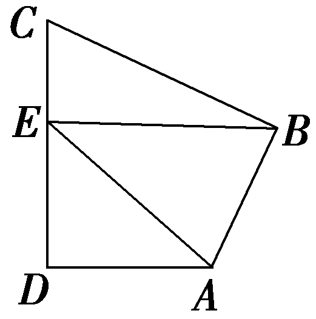

A. $\frac{21}{16}$ 	B. $\frac{3}{2}$

C. $\frac{3}{4}$ 	D.2

答案：**A**

解析： 由于&lt;te&lt;text st&lt;text st&lt;text st&lt;text st&lt;text st&lt;text st&lt;text st<em>y</em>le="italic"&gt;y&lt;/text&gt;le="italic"&gt;y&lt;/text&gt;le="italic"&gt;y&lt;/text&gt;le="italic"&gt;y&lt;/text&gt;le="italic"&gt;y&lt;/text&gt;le="italic"&gt;y&lt;/text&gt;le="italic"&gt;x&lt;/text&gt;t style="italic"&gt;<em>&lt;text style="italic"&gt;AB</em>&lt;/text&gt;&lt;/text&gt;⊥<em>B&lt;text style="italic"&gt;C</em>&lt;/text&gt;，<em>A&lt;text style="italic"&gt;&lt;text style="italic"&gt;D</em>&lt;/text&gt;&lt;/text&gt;⊥<em>CD</em>，如图，以D为坐标原点，<em>DA</em>，<em>DC</em>所在直线分别为x轴，y轴建立平面直角坐标系，连接<em>AC</em>，由于AB＝<em>AD</em>＝1，则△<em>ADC</em>≌△<em>ABC</em>，而∠<em>BAD</em>＝120°，故∠<em>CAD</em>＝∠<em>CAB</em>＝60°，则∠<em>BAx</em>＝60°，则D(0，0)，A(1，0)，B $\left(\frac{3}{2}，\frac{\sqrt{3}}{2}\right)$ ，&lt;text st&lt;text st&lt;text st&lt;text st&lt;text st&lt;text st<em>y</em>le="italic"&gt;y&lt;/text&gt;le="italic"&gt;y&lt;/text&gt;le="italic"&gt;y&lt;/text&gt;le="italic"&gt;y&lt;/text&gt;le="italic"&gt;y&lt;/text&gt;le="italic"&gt;C&lt;/text&gt;(0， $\sqrt{3}$ )，设&lt;text st&lt;text st&lt;text st&lt;text st&lt;text st&lt;text st<em>y</em>le="italic"&gt;y&lt;/text&gt;le="italic"&gt;y&lt;/text&gt;le="italic"&gt;y&lt;/text&gt;le="italic"&gt;y&lt;/text&gt;le="italic"&gt;y&lt;/text&gt;le="italic"&gt;E&lt;/text&gt;(0，<em>y</em>)，0≤y≤ $\sqrt{3}$ ，则 $\vec{EA}$ ＝(1，－&lt;text st&lt;text st&lt;text st&lt;text st&lt;text st&lt;text st<em>y</em>le="italic"&gt;y&lt;/text&gt;le="italic"&gt;y&lt;/text&gt;le="italic"&gt;y&lt;/text&gt;le="italic"&gt;y&lt;/text&gt;le="italic"&gt;y&lt;/text&gt;le="italic"&gt;y&lt;/text&gt;)， $\vec{EB}$ ＝ $\left(\frac{3}{2}，\frac{\sqrt{3}}{2}－y\right)$ ，所以 $\vec{EA}$ · $\vec{EB}$ ＝ $\frac{3}{2}$ ＋&lt;text st&lt;text st&lt;text st&lt;text st&lt;text st&lt;text st<em>y</em>le="italic"&gt;y&lt;/text&gt;le="italic"&gt;y&lt;/text&gt;le="italic"&gt;y&lt;/text&gt;le="italic"&gt;y&lt;/text&gt;le="italic"&gt;y&lt;/text&gt;le="italic"&gt;y&lt;/text&gt;2－ $\frac{\sqrt{3}}{2}$ &lt;text st&lt;text st&lt;text st&lt;text st&lt;text st&lt;text st<em>y</em>le="italic"&gt;y&lt;/text&gt;le="italic"&gt;y&lt;/text&gt;le="italic"&gt;y&lt;/text&gt;le="italic"&gt;y&lt;/text&gt;le="italic"&gt;y&lt;/text&gt;le="italic"&gt;y&lt;/text&gt;＝ $\left(y－\frac{\sqrt{3}}{4}\right)^{2}$ ＋ $\frac{21}{16}$ ，当&lt;text st&lt;text st&lt;text st&lt;text st&lt;text st&lt;text st<em>y</em>le="italic"&gt;y&lt;/text&gt;le="italic"&gt;y&lt;/text&gt;le="italic"&gt;y&lt;/text&gt;le="italic"&gt;y&lt;/text&gt;le="italic"&gt;y&lt;/text&gt;le="italic"&gt;y&lt;/text&gt;＝ $\frac{\sqrt{3}}{4}$ 时， $\vec{EA}$ · $\vec{EB}$ 取最小值 $\frac{21}{16}$ .故选&lt;text st&lt;text st&lt;text st&lt;text st&lt;text st&lt;text st<em>y</em>le="italic"&gt;y&lt;/text&gt;le="italic"&gt;y&lt;/text&gt;le="italic"&gt;y&lt;/text&gt;le="italic"&gt;y&lt;/text&gt;le="italic"&gt;y&lt;/text&gt;le="italic"&gt;A&lt;/text&gt;.

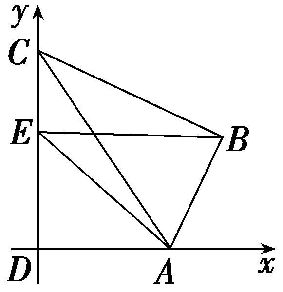

对点练6.(2024·河北沧州一模)如图，在等腰直角△*<text style="italic">AB*C</text>中，斜边AB＝4 $\sqrt{2}$ ，点*D*在以*BC*为直径的圆上运动，则｜ $\vec{AB}$ ＋ $\vec{AD}$ ｜的最大值为(　　)

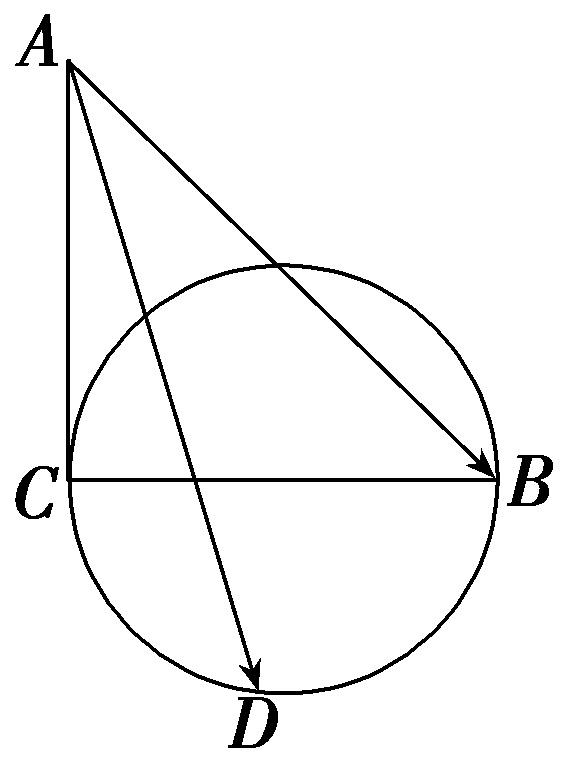

A.4 $\sqrt{6}$ 	B.8

C.6 $\sqrt{3}$ 	D.12

答案：**D**

解析：如图，以<em>C</em>为原点，建立平面直角坐标系.则<em>A</em> $\left(0，4\right)$ ，<em>B</em> $\left(4，0\right)$ ，可设<em>D</em>(2＋2cos <em>&lt;text style="italic"&gt;&lt;text style="italic"&gt;&lt;text style="italic"&gt;&lt;text style="italic"&gt;&lt;text style="italic"&gt;&lt;text style="italic"&gt;θ</em>&lt;/text&gt;&lt;/text&gt;&lt;/text&gt;&lt;/text&gt;&lt;/text&gt;&lt;/text&gt;，2sin θ)，则 $\vec{AB}$ ＝ $\left(4,-4\right)$ ， $\vec{AD}$ ＝ $\left(2+2cos\theta ，2sin\theta －4\right)$ ，所以 $\vec{AB}$ ＋ $\vec{AD}$ ＝(6＋2cos <em>&lt;text style="italic"&gt;&lt;text style="italic"&gt;&lt;text style="italic"&gt;&lt;text style="italic"&gt;&lt;text style="italic"&gt;&lt;text style="italic"&gt;θ</em>&lt;/text&gt;&lt;/text&gt;&lt;/text&gt;&lt;/text&gt;&lt;/text&gt;&lt;/text&gt;，2sin θ－8)，所以 $\left|\vec{AB}＋\vec{AD}\right|^{2}$ ＝ $\left(6+2cos\theta \right)^{2}$ ＋(2sin <em>&lt;text style="italic"&gt;&lt;text style="italic"&gt;&lt;text style="italic"&gt;&lt;text style="italic"&gt;&lt;text style="italic"&gt;&lt;text style="italic"&gt;θ</em>&lt;/text&gt;&lt;/text&gt;&lt;/text&gt;&lt;/text&gt;&lt;/text&gt;&lt;/text&gt;－8)2＝104＋8 $\left(3cos\theta －4sin\theta \right)$ .又因为3cos <em>&lt;text style="italic"&gt;&lt;text style="italic"&gt;&lt;text style="italic"&gt;&lt;text style="italic"&gt;&lt;text style="italic"&gt;&lt;text style="italic"&gt;θ</em>&lt;/text&gt;&lt;/text&gt;&lt;/text&gt;&lt;/text&gt;&lt;/text&gt;&lt;/text&gt;－4sin θ≤5，所以 $\left|\vec{AB}＋\vec{AD}\right|^{2}$ ≤144⇒ $\left|\vec{AB}＋\vec{AD}\right|$ ≤12.故选<em>D</em>.

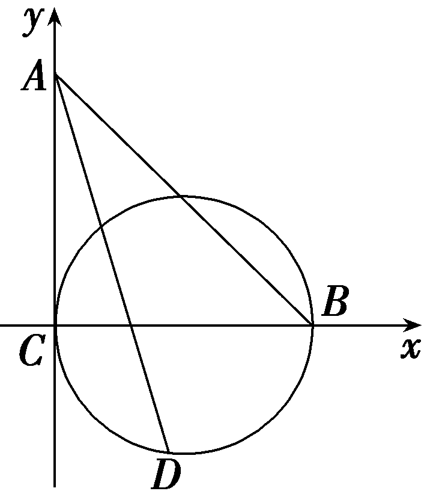

**课时测评**54　**平面向量的应用及最值问题** $\frac{对应学生}{用书P417}$

(时间：50分钟　满分：75分)

(本栏目内容，在学生用书中以独立形式分册装订！)

(1—10题，每小题5分，共50分)

&lt;text style="subscript"&gt;1&lt;/text&gt;.若向量 $\vec{OF_{1}}$ ＝ $\left(1，1\right)$ ， $\vec{OF_{2}}$ ＝ $\left(－3，-2\right)$ 分别表示两个力<em><strong>&lt;text style="bold,italic"&gt;&lt;text style="bold,italic"&gt;&lt;text style="bold,italic"&gt;F</strong></em>&lt;/text&gt;&lt;/text&gt;&lt;/text&gt;&lt;text style="subscript"&gt;1&lt;/text&gt;，F&lt;text style="subscript"&gt;2&lt;/text&gt;，则｜F1＋F2｜＝(　　)

A. $\sqrt{10}$ 	B.2 $\sqrt{5}$

C. $\sqrt{5}$ 	D. $\sqrt{15}$

答案：**C**

解析：由于<em><strong>&lt;text style="bold,italic"&gt;&lt;text style="bold,italic"&gt;&lt;text style="bold,italic"&gt;F</strong></em>&lt;/text&gt;&lt;/text&gt;&lt;/text&gt;&lt;text style="subscript"&gt;1&lt;/text&gt;＋F&lt;text style="subscript"&gt;2&lt;/text&gt;＝(1，1)＋(－3，－2)＝(－2，－1)，所以｜F1＋F2｜＝ $\sqrt{\left(－2\right)^{2}＋\left(－1\right)^{2}}$ ＝ $\sqrt{5}$ .故选C.

2.四边形*ABCD*中， $\vec{AD}$ ＝ $\vec{BC}$ ， $\left(\vec{AB}＋\vec{AD}\right)$ ·( $\vec{AB}$ － $\vec{AD}$ )＝0，则这个四边形是(　　)

A.菱形	B.矩形

C.正方形	D.等腰梯形

答案：**A**

解析：由题意， $\vec{AD}$ ＝ $\vec{BC}$ ，即｜<em>&lt;text style="italic"&gt;&lt;text style="italic"&gt;AD</em>&lt;/text&gt;&lt;/text&gt;｜＝｜<em>&lt;text style="italic"&gt;BC</em>&lt;/text&gt;｜且AD∥BC，故四边形<em>&lt;text style="italic"&gt;AB</em>CD&lt;/text&gt;为平行四边形，又 $\left(\vec{AB}＋\vec{AD}\right)$ · $\left(\vec{AB}－\vec{AD}\right)$ ＝｜ $\vec{AB}$ ｜&lt;text style="superscript"&gt;2&lt;/text&gt;－｜ $\vec{AD}$ ｜&lt;text style="superscript"&gt;2&lt;/text&gt;＝0，故<em>AB</em>＝<em>&lt;text style="italic"&gt;&lt;text style="italic"&gt;AD</em>&lt;/text&gt;&lt;/text&gt;，即四边形A<em>&lt;text style="italic"&gt;BC</em>&lt;/text&gt;D为菱形.故选A.

3.已知向量***a***，***b***，***c***共面，且均为单位向量，***a***·***b***＝0，则｜***a***＋***b***＋***c***｜ 的取值范围是(　　)

A.[ $\sqrt{2}$ －1， $\sqrt{2}$ ＋1]	B.[1， $\sqrt{2}$ ]

C.[ $\sqrt{2}$ ， $\sqrt{3}$ ]	D.[ $\sqrt{2}$ －1，1]

答案：**A**

解析：设&lt;text style="&lt;text style="&lt;text style="&lt;text style="&lt;text style="&lt;text style="bold,itali<em><strong>c</strong></em>"&gt;b&lt;/text&gt;old,it<em><strong>a</strong></em>li<em><strong>c</strong></em>"&gt;b&lt;/text&gt;old,it<em><strong>a</strong></em>li<em><strong>c</strong></em>"&gt;b&lt;/text&gt;old,it<em><strong>a</strong></em>lic"&gt;b&lt;/text&gt;old,it<em><strong>a</strong></em>li<em><strong>c</strong></em>"&gt;b&lt;/text&gt;old,italic"&gt;a&lt;/text&gt;＝ $\vec{OA}$ ，&lt;text style="&lt;text style="&lt;text style="&lt;text style="&lt;text style="bold,itali<em><strong>c</strong></em>"&gt;b&lt;/text&gt;old,it<em><strong>a</strong></em>li<em><strong>c</strong></em>"&gt;b&lt;/text&gt;old,it<em><strong>a</strong></em>li<em><strong>c</strong></em>"&gt;b&lt;/text&gt;old,it<em><strong>a</strong></em>lic"&gt;b&lt;/text&gt;old,it<em><strong>a</strong></em>li<em><strong>c</strong></em>"&gt;b&lt;/text&gt;＝ $\vec{OB}$ ，&lt;text style="&lt;text style="&lt;text style="&lt;text style="&lt;text style="bold,itali<em><strong>c</strong></em>"&gt;b&lt;/text&gt;old,it<em><strong>a</strong></em>li<em><strong>c</strong></em>"&gt;b&lt;/text&gt;old,it<em><strong>a</strong></em>li<em><strong>c</strong></em>"&gt;b&lt;/text&gt;old,it<em><strong>a</strong></em>lic"&gt;b&lt;/text&gt;old,it<em><strong>a</strong></em>lic"&gt;c&lt;/text&gt;＝ $\vec{OC}$ ，由题意可得｜ $\vec{OA}$ ｜＝｜ $\vec{OB}$ ｜＝｜ $\vec{OC}$ ｜＝1，且&lt;text style="it&lt;text style="&lt;text style="&lt;text style="&lt;text style="&lt;text style="bold,itali<em><strong>c</strong></em>"&gt;b&lt;/text&gt;old,it<em><strong>a</strong></em>li<em><strong>c</strong></em>"&gt;b&lt;/text&gt;old,it<em><strong>a</strong></em>li<em><strong>c</strong></em>"&gt;b&lt;/text&gt;old,it<em><strong>a</strong></em>lic"&gt;b&lt;/text&gt;old,italic"&gt;a&lt;/text&gt;lic"&gt;<em>OA</em>&lt;/text&gt;⊥<em>OB</em>，以OA，<em>OB</em> 为邻边作正方形<em>OADB</em>，连接<em>OD</em>，如图所示，则｜&lt;text style="&lt;text style="bold,itali<em><strong>c</strong></em>"&gt;b&lt;/text&gt;old,italic"&gt;a&lt;/text&gt;＋b｜＝｜ $\vec{OD}$ ｜＝ $\sqrt{2}$ ，｜&lt;text style="&lt;text style="&lt;text style="&lt;text style="&lt;text style="&lt;text style="bold,itali<em><strong>c</strong></em>"&gt;b&lt;/text&gt;old,it<em><strong>a</strong></em>li<em><strong>c</strong></em>"&gt;b&lt;/text&gt;old,it<em><strong>a</strong></em>li<em><strong>c</strong></em>"&gt;b&lt;/text&gt;old,it<em><strong>a</strong></em>lic"&gt;b&lt;/text&gt;old,it<em><strong>a</strong></em>li<em><strong>c</strong></em>"&gt;b&lt;/text&gt;old,italic"&gt;a&lt;/text&gt;＋b＋c｜＝｜ $\vec{OD}$ ＋ $\vec{OC}$ ｜，当 $\vec{OD}$  与 $\vec{OC}$  方向相同时，｜&lt;text style="&lt;text style="&lt;text style="&lt;text style="&lt;text style="&lt;text style="bold,itali<em><strong>c</strong></em>"&gt;b&lt;/text&gt;old,it<em><strong>a</strong></em>li<em><strong>c</strong></em>"&gt;b&lt;/text&gt;old,it<em><strong>a</strong></em>li<em><strong>c</strong></em>"&gt;b&lt;/text&gt;old,it<em><strong>a</strong></em>lic"&gt;b&lt;/text&gt;old,it<em><strong>a</strong></em>li<em><strong>c</strong></em>"&gt;b&lt;/text&gt;old,italic"&gt;a&lt;/text&gt;＋b＋c｜ 最大，为 $\sqrt{2}$ ＋1 ；当 $\vec{OD}$  与 $\vec{OC}$  方向相反时，｜&lt;text style="&lt;text style="&lt;text style="&lt;text style="&lt;text style="&lt;text style="bold,itali<em><strong>c</strong></em>"&gt;b&lt;/text&gt;old,it<em><strong>a</strong></em>li<em><strong>c</strong></em>"&gt;b&lt;/text&gt;old,it<em><strong>a</strong></em>li<em><strong>c</strong></em>"&gt;b&lt;/text&gt;old,it<em><strong>a</strong></em>lic"&gt;b&lt;/text&gt;old,it<em><strong>a</strong></em>li<em><strong>c</strong></em>"&gt;b&lt;/text&gt;old,italic"&gt;a&lt;/text&gt;＋b＋c｜ 最小，为 $\sqrt{2}$ －1 .故选A.

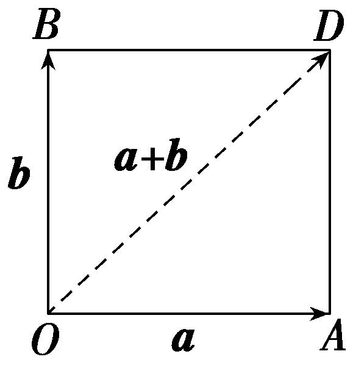

4.如图，在△<te<text st*y*le="italic">x</text>t style="italic">ABC</text>中， $\vec{BD}$ ＝ $\frac{2}{3}\vec{BC}$ ，<te<text st*y*le="italic">x</text>t style="italic">E</text>为线段*AD*上的动点，且 $\vec{CE}$ ＝<text st*y*le="italic">x</text> $\vec{CA}$ ＋*y* $\vec{CB}$ ，则 $\frac{1}{x}$ ＋ $\frac{3}{y}$ 的最小值为(　　)

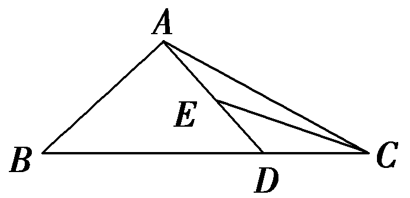

A.8	B.9

C.12	D.16

答案：**D**

解析：由已知得 $\vec{CB}$ ＝3 $\vec{CD}$ ，所以 $\vec{CE}$ ＝<te<te<te<te<text st*y*le="italic">x</text>t st*y*le="italic">x</text>t st*y*le="italic">x</text>t st*y*le="italic">x</text>t st*y*le="italic">x</text> $\vec{CA}$ ＋<te<te<te<te<text st*y*le="italic">x</text>t st*y*le="italic">x</text>t st*y*le="italic">x</text>t st*y*le="italic">x</text>t style="italic">y</text> $\vec{CB}$ ＝<te<te<te<te<text st*y*le="italic">x</text>t st*y*le="italic">x</text>t st*y*le="italic">x</text>t st*y*le="italic">x</text>t st*y*le="italic">x</text> $\vec{CA}$ ＋3<te<te<te<te<text st*y*le="italic">x</text>t st*y*le="italic">x</text>t st*y*le="italic">x</text>t st*y*le="italic">x</text>t style="italic">y</text> $\vec{CD}$ ，因为<te<te<te<text st*y*le="italic">x</text>t st*y*le="italic">x</text>t st*y*le="italic">x</text>t style="italic">*E*</text>为线段*<text style="italic">AD*</text>上的动点，所以A，D，E三点共线，所以<te<text st*y*le="italic">x</text>t st*y*le="italic">x</text>＋3y＝1且x＞0，y＞0，所以 $\frac{1}{x}$ ＋ $\frac{3}{y}$ ＝ $\left(\frac{1}{x}＋\frac{3}{y}\right)\left(x+3y\right)$ ＝10＋ $\frac{3y}{x}$ ＋ $\frac{3x}{y}$ ≥10＋2 $\sqrt{\frac{3y}{x}\cdot \frac{3x}{y}}$ ＝16，当且仅当<te<te<te<te<text st*y*le="italic">x</text>t st*y*le="italic">x</text>t st*y*le="italic">x</text>t st*y*le="italic">x</text>t st*y*le="italic">x</text>＝y＝ $\frac{1}{4}$ 时，等号成立.故 $\frac{1}{x}$ ＋ $\frac{3}{y}$ 的最小值为16.故选<te<te<te<text st*y*le="italic">x</text>t st*y*le="italic">x</text>t st*y*le="italic">x</text>t style="italic">D</text>.

5.(一题多解)已知&lt;te&lt;te&lt;text st<em>y</em>le="italic"&gt;x&lt;/text&gt;t st<em>y</em>le="italic"&gt;x&lt;/text&gt;t style="italic"&gt;AB&lt;/text&gt;是圆<em>C</em>：(x－1)&lt;text style="superscript"&gt;2&lt;/text&gt;＋y2＝1的直径，点<em>P</em>为直线x－y＋1＝0上任意一点，则 $\vec{PA}$ · $\vec{PB}$ 的最小值是(　　)

A.0	B. $\sqrt{2}$ －1

C.1	D. $\sqrt{2}$

答案：**C**

解析：法一：不妨设&lt;te&lt;te&lt;te&lt;te&lt;te&lt;te&lt;te&lt;te<em>x</em>t style="italic"&gt;x&lt;/text&gt;t style="italic"&gt;x&lt;/text&gt;t style="italic"&gt;x&lt;/text&gt;t style="italic"&gt;x&lt;/text&gt;t style="italic"&gt;x&lt;/text&gt;t style="italic"&gt;x&lt;/text&gt;t style="italic"&gt;x&lt;/text&gt;t style="italic"&gt;A&lt;/text&gt;(0，0)，<em>B</em>(2，0)，<em>P</em>(x，x＋1)，则 $\vec{PA}$ ＝(－&lt;te&lt;te&lt;te&lt;te&lt;te&lt;te&lt;te<em>x</em>t style="italic"&gt;x&lt;/text&gt;t style="italic"&gt;x&lt;/text&gt;t style="italic"&gt;x&lt;/text&gt;t style="italic"&gt;x&lt;/text&gt;t style="italic"&gt;x&lt;/text&gt;t style="italic"&gt;x&lt;/text&gt;t style="italic"&gt;x&lt;/text&gt;，－x－1)， $\vec{PB}$ ＝ $\left(2－x,-x－1\right)$ ，所以 $\vec{PA}$ · $\vec{PB}$ ＝－&lt;te&lt;te&lt;te&lt;te&lt;te&lt;te&lt;te<em>x</em>t style="italic"&gt;x&lt;/text&gt;t style="italic"&gt;x&lt;/text&gt;t style="italic"&gt;x&lt;/text&gt;t style="italic"&gt;x&lt;/text&gt;t style="italic"&gt;x&lt;/text&gt;t style="italic"&gt;x&lt;/text&gt;t style="italic"&gt;x&lt;/text&gt; $\left(2－x\right)$ ＋(－&lt;te&lt;te&lt;te&lt;te&lt;te&lt;te&lt;te<em>x</em>t style="italic"&gt;x&lt;/text&gt;t style="italic"&gt;x&lt;/text&gt;t style="italic"&gt;x&lt;/text&gt;t style="italic"&gt;x&lt;/text&gt;t style="italic"&gt;x&lt;/text&gt;t style="italic"&gt;x&lt;/text&gt;t style="italic"&gt;x&lt;/text&gt;－1)(－x－1)＝2x2＋1≥1，所以 $\vec{PA}$ · $\vec{PB}$ 的最小值为1.故选C.

法二：设&lt;te&lt;te&lt;te<em>x</em>t style="italic"&gt;x&lt;/text&gt;t style="italic"&gt;x&lt;/text&gt;t style="italic"&gt;P&lt;/text&gt;(x，x＋1)，由题意知，圆心<em>C</em>(1，<strong>0</strong>)，因为 $\vec{PA}$ ＝ $\vec{PC}$ ＋ $\vec{CA}$ ， $\vec{PB}$ ＝ $\vec{PC}$ ＋ $\vec{CB}$ ，又 $\vec{CA}$ ＋ $\vec{CB}$ ＝&lt;te<em>x</em>t style="bold"&gt;0&lt;/text&gt;，所以 $\vec{PA}$ <em>·</em> $\vec{PB}$ ＝ $\left(\vec{PC}＋\vec{CA}\right)$ <em>·</em> $\left(\vec{PC}＋\vec{CB}\right)$ ＝｜ $\vec{PC}$ ｜&lt;te<em>x</em>t style="superscript"&gt;&lt;text style="superscript"&gt;2&lt;/text&gt;&lt;/text&gt;－｜ $\vec{CA}$ ｜&lt;te<em>x</em>t style="superscript"&gt;&lt;text style="superscript"&gt;2&lt;/text&gt;&lt;/text&gt;＝2&lt;te<em>x</em>t style="italic"&gt;x&lt;/text&gt;2＋1≥1，所以 $\vec{PA}$ <em>·</em> $\vec{PB}$ 的最小值为1.故选&lt;te<em>x</em>t style="italic"&gt;C&lt;/text&gt;.

法三：如图所示， $\vec{PA}$ <em>·</em> $\vec{PB}$ ＝ $\left(\vec{PC}＋\vec{CA}\right)$ <em>·</em> $\left(\vec{PC}＋\vec{CB}\right)$ ＝｜ $\vec{PC}$ ｜&lt;te&lt;text st<em>y</em>le="italic"&gt;x&lt;/text&gt;t style="supe<em>&lt;text style="italic"&gt;r</em>&lt;/text&gt;script"&gt;&lt;text style="superscript"&gt;&lt;text style="superscript"&gt;&lt;text style="superscript"&gt;&lt;text style="superscript"&gt;2&lt;/text&gt;&lt;/text&gt;&lt;/text&gt;&lt;/text&gt;&lt;/text&gt;＋ $\vec{PC}$ <em>·</em> $\left(\vec{CB}＋\vec{CA}\right)$ ＋ $\vec{CA}$ <em>·</em> $\vec{CB}$ ＝｜ $\vec{PC}$ ｜&lt;te&lt;text st<em>y</em>le="italic"&gt;x&lt;/text&gt;t style="supe<em>&lt;text style="italic"&gt;r</em>&lt;/text&gt;script"&gt;&lt;text style="superscript"&gt;&lt;text style="superscript"&gt;&lt;text style="superscript"&gt;&lt;text style="superscript"&gt;2&lt;/text&gt;&lt;/text&gt;&lt;/text&gt;&lt;/text&gt;&lt;/text&gt;＋ $\vec{CA}$ <em>·</em> $\vec{CB}$ ＝｜ $\vec{PC}$ ｜&lt;te&lt;text st<em>y</em>le="italic"&gt;x&lt;/text&gt;t style="supe<em>&lt;text style="italic"&gt;r</em>&lt;/text&gt;script"&gt;&lt;text style="superscript"&gt;&lt;text style="superscript"&gt;&lt;text style="superscript"&gt;&lt;text style="superscript"&gt;2&lt;/text&gt;&lt;/text&gt;&lt;/text&gt;&lt;/text&gt;&lt;/text&gt;－r2＝<em>&lt;text style="italic"&gt;&lt;text style="italic"&gt;&lt;text style="italic"&gt;d</em>&lt;/text&gt;&lt;/text&gt;&lt;/text&gt;2－r2，其中d为圆心<em>C</em>到直线x－y＋1＝0上的点的距离，故当d最小时， $\vec{PA}$ <em>·</em> $\vec{PB}$ 最小.因为&lt;te&lt;text st<em>y</em>le="italic"&gt;x&lt;/text&gt;t style="italic"&gt;<em>&lt;text style="italic"&gt;&lt;text style="italic"&gt;d</em>&lt;/text&gt;&lt;/text&gt;&lt;/text&gt;min＝ $\frac{｜1－0+1｜}{\sqrt{2}}$ ＝ $\sqrt{2}$ ，所以 $\vec{PA}$ <em>·</em> $\vec{PB}$ 的最小值为&lt;te&lt;text st<em>y</em>le="italic"&gt;x&lt;/text&gt;t style="supe<em>&lt;text style="italic"&gt;r</em>&lt;/text&gt;script"&gt;&lt;text style="superscript"&gt;&lt;text style="superscript"&gt;&lt;text style="superscript"&gt;&lt;text style="superscript"&gt;2&lt;/text&gt;&lt;/text&gt;&lt;/text&gt;&lt;/text&gt;&lt;/text&gt;－1＝1.故选<em>C</em>.

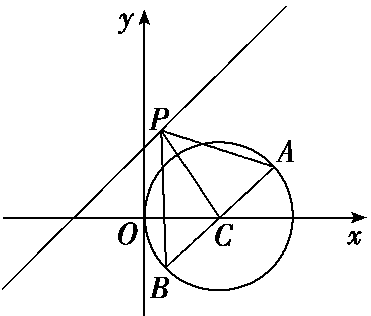

6.(多选)已知平面向量 $\vec{AB}$ ＝ (－1，*<text style="italic">k* </text>)， $\vec{AC}$ ＝(2，1)，若△*ABC* 是直角三角形，则*<text style="italic">k* </text>的可能取值是(　　)

A.－2	B.2

C.5	D.7

答案：**BD**

解析：因为 $\vec{AB}$ ＝(－1，*<text style="italic"><text style="italic"><text style="italic"><text style="italic"><text style="italic"><text style="italic"><text style="italic">k*</text></text></text></text></text></text></text>)， $\vec{AC}$ ＝(2，1)，所以 $\vec{BC}$ ＝ $\vec{AC}$ － $\vec{AB}$ ＝(3，1－*<text style="italic"><text style="italic"><text style="italic"><text style="italic"><text style="italic"><text style="italic"><text style="italic">k*</text></text></text></text></text></text></text>) .△*AB<text style="italic">C* </text>是直角三角形，当*A* 为直角时， $\vec{AB}$ · $\vec{AC}$ ＝－1×2＋*<text style="italic"><text style="italic"><text style="italic"><text style="italic"><text style="italic"><text style="italic"><text style="italic">k*</text></text></text></text></text></text></text>＝0，得k＝2；当*B* 为直角时， $\vec{BA}$ · $\vec{BC}$ ＝1×3－*<text style="italic"><text style="italic"><text style="italic"><text style="italic"><text style="italic"><text style="italic"><text style="italic">k*</text></text></text></text></text></text></text>(1－k)＝0，此时关于*<text style="italic">k* </text>的方程无解；当*C* 为直角时， $\vec{CA}$ · $\vec{CB}$ ＝7－*<text style="italic"><text style="italic"><text style="italic"><text style="italic"><text style="italic"><text style="italic"><text style="italic">k*</text></text></text></text></text></text></text>＝0，得k＝7 .综上，*<text style="italic">k* </text>的可能取值是2，7 .故选BD.

7.(多选)(2024·湖北黄冈质量抽测)折扇又名“纸扇”，是一种用竹木作扇骨，韧纸或绫绢作扇面的能折叠的扇子，如图①所示.其平面图是如图②的扇形*AOB*，其中∠*AOB*＝150°，*OA*＝2*OC*＝2*OD*＝2，点*F*在弧*AB*上，且∠*BOF*＝120°，点*E*在弧*CD*上运动，则下列结论正确的有(　　)

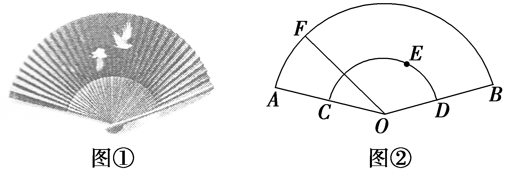

A. $\vec{OD}$ · $\vec{DA}$ ＝ $\sqrt{3}$ －1

B. $\vec{OF}$ ＝*<text style="italic">λ*</text> $\vec{OA}$ ＋*<text style="italic">m*</text> $\vec{OB}$ ，则*<text style="italic">λ*</text>＋*<text style="italic">m*</text>＝ $\sqrt{3}$ ＋1

C. $\vec{OF}$ 在 $\vec{DF}$ 方向上的投影向量为 $\frac{5}{7}\vec{DF}$

D. $\vec{EF}$ · $\vec{EB}$ 的最小值是－3

答案：**BCD**

解析：以*O*为坐标原点，*OB*为*x*轴建立如图所示的平面直角坐标系.

因为∠*<text style="italic">A*O*B*</text>＝150°，*OA*＝2*O<text style="italic">C*</text>＝2*O<text style="italic">D*</text>＝2，∠*BO<text style="italic">F*</text>＝120°，所以F(－1， $\sqrt{3}$ )，*B*(2，0)，*D*(1，0)，*A*(－ $\sqrt{3}$ ，1)，*C* $\left(－\frac{\sqrt{3}}{2}，\frac{1}{2}\right)$ .设*E* $\left(cos\theta ，sin\theta \right)$ ，0≤*θ*≤ $\frac{5\pi }{6}$ .对于*A*， $\vec{OD}$ *<text style="italic">·*</text> $\vec{DA}$ ＝ $\left(1，0\right)$ *<text style="italic">·*</text>(－ $\sqrt{3}$ －1，1)＝－ $\sqrt{3}$ －1，故*A*错误；对于*B*， $\vec{OF}$ ＝*<text style="italic">λ*</text> $\vec{OA}$ ＋*<text style="italic">m*</text> $\vec{OB}$ ，即 $\left\{\begin{matrix}－\sqrt{3}\lambda +2m＝－1，\\\lambda ＝\sqrt{3}，\end{matrix}\right.$ 解得 $\left\{\begin{matrix}\lambda ＝\sqrt{3}，\\m=1，\end{matrix}\right.$ *<text style="italic">λ*</text>＋*<text style="italic">m*</text>＝ $\sqrt{3}$ ＋1，故*B*正确；

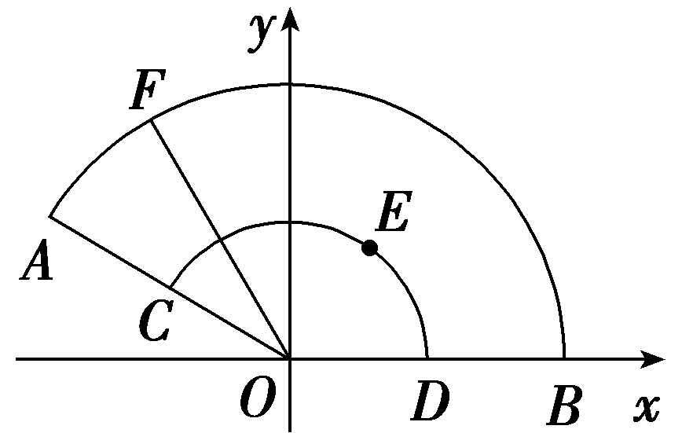

对于C，因为 $\vec{OF}$ ＝ $\left(－1，\sqrt{3}\right)$ ， $\vec{DF}$ ＝(－&lt;text style="superscript"&gt;2&lt;/text&gt;， $\sqrt{3}$ )，所以 $\vec{OF}$ 在 $\vec{DF}$ 方向上的投影向量为 $\frac{\vec{OF}\cdot \vec{DF}}{｜\vec{DF}｜}$ · $\frac{\vec{DF}}{｜\vec{DF}｜}$ ＝ $\frac{5}{\sqrt{7}}$ × $\frac{\vec{DF}}{\sqrt{7}}$ ＝ $\frac{5}{7}\vec{DF}$ ，故C正确；对于D， $\vec{EF}$ · $\vec{EB}$ ＝(－1－cos <em>&lt;text style="italic"&gt;&lt;text style="italic"&gt;&lt;text style="italic"&gt;&lt;text style="italic"&gt;&lt;text style="italic"&gt;&lt;text style="italic"&gt;&lt;text style="italic"&gt;&lt;text style="italic"&gt;&lt;text style="italic"&gt;&lt;text style="italic"&gt;&lt;text style="italic"&gt;&lt;text style="italic"&gt;θ</em>&lt;/text&gt;&lt;/text&gt;&lt;/text&gt;&lt;/text&gt;&lt;/text&gt;&lt;/text&gt;&lt;/text&gt;&lt;/text&gt;&lt;/text&gt;&lt;/text&gt;&lt;/text&gt;&lt;/text&gt;， $\sqrt{3}$ －sin <em>&lt;text style="italic"&gt;&lt;text style="italic"&gt;&lt;text style="italic"&gt;&lt;text style="italic"&gt;&lt;text style="italic"&gt;&lt;text style="italic"&gt;&lt;text style="italic"&gt;&lt;text style="italic"&gt;&lt;text style="italic"&gt;&lt;text style="italic"&gt;&lt;text style="italic"&gt;&lt;text style="italic"&gt;θ</em>&lt;/text&gt;&lt;/text&gt;&lt;/text&gt;&lt;/text&gt;&lt;/text&gt;&lt;/text&gt;&lt;/text&gt;&lt;/text&gt;&lt;/text&gt;&lt;/text&gt;&lt;/text&gt;&lt;/text&gt;)·(&lt;text style="superscript"&gt;2&lt;/text&gt;－cos θ，－sin θ)＝－2－cos θ＋cos2θ－ $\sqrt{3}$ sin <em>&lt;text style="italic"&gt;&lt;text style="italic"&gt;&lt;text style="italic"&gt;&lt;text style="italic"&gt;&lt;text style="italic"&gt;&lt;text style="italic"&gt;&lt;text style="italic"&gt;&lt;text style="italic"&gt;&lt;text style="italic"&gt;&lt;text style="italic"&gt;&lt;text style="italic"&gt;&lt;text style="italic"&gt;θ</em>&lt;/text&gt;&lt;/text&gt;&lt;/text&gt;&lt;/text&gt;&lt;/text&gt;&lt;/text&gt;&lt;/text&gt;&lt;/text&gt;&lt;/text&gt;&lt;/text&gt;&lt;/text&gt;&lt;/text&gt;＋sin&lt;text style="superscript"&gt;2&lt;/text&gt;θ＝－1－2sin(θ＋ $\frac{\pi }{6}$ )，因为0≤<em>&lt;text style="italic"&gt;&lt;text style="italic"&gt;&lt;text style="italic"&gt;&lt;text style="italic"&gt;&lt;text style="italic"&gt;&lt;text style="italic"&gt;&lt;text style="italic"&gt;&lt;text style="italic"&gt;&lt;text style="italic"&gt;&lt;text style="italic"&gt;&lt;text style="italic"&gt;&lt;text style="italic"&gt;θ</em>&lt;/text&gt;&lt;/text&gt;&lt;/text&gt;&lt;/text&gt;&lt;/text&gt;&lt;/text&gt;&lt;/text&gt;&lt;/text&gt;&lt;/text&gt;&lt;/text&gt;&lt;/text&gt;&lt;/text&gt;≤ $\frac{5\pi }{6}$ ，所以 $\frac{\pi }{6}$ ≤<em>&lt;text style="italic"&gt;&lt;text style="italic"&gt;&lt;text style="italic"&gt;&lt;text style="italic"&gt;&lt;text style="italic"&gt;&lt;text style="italic"&gt;&lt;text style="italic"&gt;&lt;text style="italic"&gt;&lt;text style="italic"&gt;&lt;text style="italic"&gt;&lt;text style="italic"&gt;&lt;text style="italic"&gt;θ</em>&lt;/text&gt;&lt;/text&gt;&lt;/text&gt;&lt;/text&gt;&lt;/text&gt;&lt;/text&gt;&lt;/text&gt;&lt;/text&gt;&lt;/text&gt;&lt;/text&gt;&lt;/text&gt;&lt;/text&gt;＋ $\frac{\pi }{6}$ ≤π，0≤sin(<em>&lt;text style="italic"&gt;&lt;text style="italic"&gt;&lt;text style="italic"&gt;&lt;text style="italic"&gt;&lt;text style="italic"&gt;&lt;text style="italic"&gt;&lt;text style="italic"&gt;&lt;text style="italic"&gt;&lt;text style="italic"&gt;&lt;text style="italic"&gt;&lt;text style="italic"&gt;&lt;text style="italic"&gt;θ</em>&lt;/text&gt;&lt;/text&gt;&lt;/text&gt;&lt;/text&gt;&lt;/text&gt;&lt;/text&gt;&lt;/text&gt;&lt;/text&gt;&lt;/text&gt;&lt;/text&gt;&lt;/text&gt;&lt;/text&gt;＋ $\frac{\pi }{6}$ )≤1，所以当<em>&lt;text style="italic"&gt;&lt;text style="italic"&gt;&lt;text style="italic"&gt;&lt;text style="italic"&gt;&lt;text style="italic"&gt;&lt;text style="italic"&gt;&lt;text style="italic"&gt;&lt;text style="italic"&gt;&lt;text style="italic"&gt;&lt;text style="italic"&gt;&lt;text style="italic"&gt;&lt;text style="italic"&gt;θ</em>&lt;/text&gt;&lt;/text&gt;&lt;/text&gt;&lt;/text&gt;&lt;/text&gt;&lt;/text&gt;&lt;/text&gt;&lt;/text&gt;&lt;/text&gt;&lt;/text&gt;&lt;/text&gt;&lt;/text&gt;＝ $\frac{\pi }{3}$ 时， $\vec{EF}$ · $\vec{EB}$ 取得最小值－3，故D正确.故选BCD.

8.在四边形<em>ABCD</em>中， $\vec{AC}$ ＝ $\left(3,-1\right)$ ， $\vec{BD}$ ＝ $\left(2，m\right)$ ， $\vec{AC}$ ⊥ $\vec{BD}$ ，则该四边形的面积是<u>　　　　</u>.

答案：10

解析：由 $\vec{AC}$ ＝ $\left(3,-1\right)$ ， $\vec{BD}$ ＝ $\left(2，m\right)$ ， $\vec{AC}$ ⊥ $\vec{BD}$ ，可得 $\vec{AC}$ · $\vec{BD}$ ＝3×2＋(－1)×*<text style="italic">m*</text>＝0，解得m＝6，所以四边形的面积为 $\frac{1}{2}$ ｜ $\vec{AC}$ ｜·｜ $\vec{BD}$ ｜＝ $\frac{1}{2}$ × $\sqrt{3^{2}＋\left(－1\right)^{2}}$ × $\sqrt{2^{2}＋6^{2}}$ ＝10.

9.已知｜<em><strong>a</strong></em>｜＝2｜<em><strong>b</strong></em>｜≠0，且关于<em>x</em>的方程<em>x</em>2＋｜<em><strong>a</strong></em>｜<em>x</em>＋<em><strong>a</strong></em>·<em><strong>b</strong></em>＝0有实根，则<em><strong>a</strong></em>和<em><strong>b</strong></em>的夹角的取值范围是<u>　　　　</u>.

答案： $\left[\frac{\pi }{3}，\pi \right]$

解析：由｜&lt;te&lt;te&lt;te&lt;text style="it&lt;text style="&lt;text style="&lt;text style="&lt;text style="<em><strong>b</strong></em>old,it&lt;text style="bold,it<em><strong>a</strong></em>lic"&gt;a&lt;/text&gt;lic"&gt;b&lt;/text&gt;old,it<em><strong>a</strong></em>lic"&gt;b&lt;/text&gt;old,it&lt;text style="bold,it<em><strong>a</strong></em>lic"&gt;a&lt;/text&gt;lic"&gt;b&lt;/text&gt;old,italic"&gt;a&lt;/text&gt;lic"&gt;x&lt;/text&gt;t style="it<em><strong>a</strong></em>lic"&gt;x&lt;/text&gt;t style="italic"&gt;x&lt;/text&gt;t style="<em><strong>b</strong></em>old,italic"&gt;a&lt;/text&gt;｜＝&lt;text style="superscript"&gt;&lt;text style="superscript"&gt;2&lt;/text&gt;&lt;/text&gt;｜b｜≠0，且关于x的方程x2＋｜a｜x＋a<em>&lt;text style="italic"&gt;·</em>&lt;/text&gt;b＝0有实根，则｜a｜2－4a·b≥0，得a·b≤ $\frac{1}{4}$ ｜&lt;te&lt;te&lt;te&lt;text style="it&lt;text style="&lt;text style="&lt;text style="&lt;text style="<em><strong>b</strong></em>old,it&lt;text style="bold,it<em><strong>a</strong></em>lic"&gt;a&lt;/text&gt;lic"&gt;b&lt;/text&gt;old,it<em><strong>a</strong></em>lic"&gt;b&lt;/text&gt;old,it&lt;text style="bold,it<em><strong>a</strong></em>lic"&gt;a&lt;/text&gt;lic"&gt;b&lt;/text&gt;old,italic"&gt;a&lt;/text&gt;lic"&gt;x&lt;/text&gt;t style="it<em><strong>a</strong></em>lic"&gt;x&lt;/text&gt;t style="italic"&gt;x&lt;/text&gt;t style="<em><strong>b</strong></em>old,italic"&gt;a&lt;/text&gt;｜&lt;text style="superscript"&gt;&lt;text style="superscript"&gt;2&lt;/text&gt;&lt;/text&gt;.设向量a，b的夹角为<em>&lt;text style="italic"&gt;&lt;text style="italic"&gt;&lt;text style="italic"&gt;θ</em>&lt;/text&gt;&lt;/text&gt;&lt;/text&gt;，则cos θ＝ $\frac{a\cdot b}{｜a||b｜}$ ≤ $\frac{\frac{1}{4}｜a｜^{2}}{\frac{1}{2}｜a｜^{2}}$ ＝ $\frac{1}{2}$ ，又<em>&lt;text style="italic"&gt;&lt;text style="italic"&gt;&lt;text style="italic"&gt;θ</em>&lt;/text&gt;&lt;/text&gt;&lt;/text&gt;∈[0，π]，所以θ∈ $\left[\frac{\pi }{3}，\pi \right]$ .

10.已知平面向量<em><strong>a</strong></em>，<em><strong>b</strong></em>，<em><strong>c</strong></em>均为单位向量，且｜<em><strong>a</strong></em>－<em><strong>b</strong></em>｜＝1， 则(<em><strong>a</strong></em>－<em><strong>b</strong></em>)·(<em><strong>b</strong></em>－<em><strong>c</strong></em>) 的最大值为<u>　　　　</u>.

答案： $\frac{1}{2}$

解析：依题意，1＝&lt;text style="&lt;text style="&lt;text style="&lt;text style="&lt;text style="&lt;text style="&lt;text style="&lt;text style="&lt;text style="&lt;text style="&lt;text style="&lt;text style="&lt;text style="&lt;text style="&lt;text style="&lt;text style="bold,itali<em><strong>c</strong></em>"&gt;b&lt;/text&gt;old,italic"&gt;b&lt;/text&gt;old,it&lt;text style="bold,it<em><strong>a</strong></em>li<em><strong>c</strong></em>"&gt;a&lt;/text&gt;lic"&gt;b&lt;/text&gt;old,it&lt;text style="bold,itali<em><strong>c</strong></em>"&gt;a&lt;/text&gt;lic"&gt;b&lt;/text&gt;old,it&lt;text style="bold,itali<em><strong>c</strong></em>"&gt;a&lt;/text&gt;lic"&gt;b&lt;/text&gt;old,it&lt;text style="bold,itali<em><strong>c</strong></em>"&gt;a&lt;/text&gt;lic"&gt;b&lt;/text&gt;old,itali<em><strong>c</strong></em>"&gt;b&lt;/text&gt;old,it<em><strong>a</strong></em>lic"&gt;b&lt;/text&gt;old,italic"&gt;b&lt;/text&gt;old,it<em><strong>a</strong></em>li<em><strong>c</strong></em>"&gt;b&lt;/text&gt;old,italic"&gt;b&lt;/text&gt;old,it<em><strong>a</strong></em>lic"&gt;b&lt;/text&gt;old,it<em><strong>a</strong></em>lic"&gt;b&lt;/text&gt;old,it<em><strong>a</strong></em>lic"&gt;b&lt;/text&gt;old,it<em><strong>a</strong></em>lic"&gt;b&lt;/text&gt;old,italic"&gt;a&lt;/text&gt;&lt;text style="superscript"&gt;&lt;text style="superscript"&gt;2&lt;/text&gt;&lt;/text&gt;＋b2－2a<em>&lt;text style="italic"&gt;&lt;text style="italic"&gt;&lt;text style="italic"&gt;&lt;text style="italic"&gt;&lt;text style="italic"&gt;&lt;text style="italic"&gt;&lt;text style="italic"&gt;·</em>&lt;/text&gt;&lt;/text&gt;&lt;/text&gt;&lt;/text&gt;&lt;/text&gt;&lt;/text&gt;&lt;/text&gt;b＝1＋1－2a·b，故a·b＝ $\frac{1}{2}$ ，所以(&lt;text style="&lt;text style="&lt;text style="&lt;text style="&lt;text style="&lt;text style="&lt;text style="&lt;text style="&lt;text style="&lt;text style="&lt;text style="&lt;text style="&lt;text style="&lt;text style="&lt;text style="&lt;text style="bold,itali<em><strong>c</strong></em>"&gt;b&lt;/text&gt;old,italic"&gt;b&lt;/text&gt;old,it&lt;text style="bold,it<em><strong>a</strong></em>li<em><strong>c</strong></em>"&gt;a&lt;/text&gt;lic"&gt;b&lt;/text&gt;old,it&lt;text style="bold,itali<em><strong>c</strong></em>"&gt;a&lt;/text&gt;lic"&gt;b&lt;/text&gt;old,it&lt;text style="bold,itali<em><strong>c</strong></em>"&gt;a&lt;/text&gt;lic"&gt;b&lt;/text&gt;old,it&lt;text style="bold,itali<em><strong>c</strong></em>"&gt;a&lt;/text&gt;lic"&gt;b&lt;/text&gt;old,itali<em><strong>c</strong></em>"&gt;b&lt;/text&gt;old,it<em><strong>a</strong></em>lic"&gt;b&lt;/text&gt;old,italic"&gt;b&lt;/text&gt;old,it<em><strong>a</strong></em>li<em><strong>c</strong></em>"&gt;b&lt;/text&gt;old,italic"&gt;b&lt;/text&gt;old,it<em><strong>a</strong></em>lic"&gt;b&lt;/text&gt;old,it<em><strong>a</strong></em>lic"&gt;b&lt;/text&gt;old,it<em><strong>a</strong></em>lic"&gt;b&lt;/text&gt;old,it<em><strong>a</strong></em>lic"&gt;b&lt;/text&gt;old,italic"&gt;a&lt;/text&gt;－b)<em>&lt;text style="italic"&gt;&lt;text style="italic"&gt;&lt;text style="italic"&gt;&lt;text style="italic"&gt;&lt;text style="italic"&gt;&lt;text style="italic"&gt;&lt;text style="italic"&gt;·</em>&lt;/text&gt;&lt;/text&gt;&lt;/text&gt;&lt;/text&gt;&lt;/text&gt;&lt;/text&gt;&lt;/text&gt;(b－c)＝a·b－b&lt;text style="superscript"&gt;&lt;text style="superscript"&gt;2&lt;/text&gt;&lt;/text&gt;－(a－b)·c＝(b－a)·c－ $\frac{1}{2}$ ＝｜&lt;text style="&lt;text style="&lt;text style="&lt;text style="&lt;text style="&lt;text style="&lt;text style="&lt;text style="&lt;text style="&lt;text style="&lt;text style="&lt;text style="&lt;text style="&lt;text style="&lt;text style="bold,itali<em><strong>c</strong></em>"&gt;b&lt;/text&gt;old,italic"&gt;b&lt;/text&gt;old,it&lt;text style="bold,it<em><strong>a</strong></em>li<em><strong>c</strong></em>"&gt;a&lt;/text&gt;lic"&gt;b&lt;/text&gt;old,it&lt;text style="bold,itali<em><strong>c</strong></em>"&gt;a&lt;/text&gt;lic"&gt;b&lt;/text&gt;old,it&lt;text style="bold,itali<em><strong>c</strong></em>"&gt;a&lt;/text&gt;lic"&gt;b&lt;/text&gt;old,it&lt;text style="bold,itali<em><strong>c</strong></em>"&gt;a&lt;/text&gt;lic"&gt;b&lt;/text&gt;old,itali<em><strong>c</strong></em>"&gt;b&lt;/text&gt;old,it<em><strong>a</strong></em>lic"&gt;b&lt;/text&gt;old,italic"&gt;b&lt;/text&gt;old,it<em><strong>a</strong></em>li<em><strong>c</strong></em>"&gt;b&lt;/text&gt;old,italic"&gt;b&lt;/text&gt;old,it<em><strong>a</strong></em>lic"&gt;b&lt;/text&gt;old,it<em><strong>a</strong></em>lic"&gt;b&lt;/text&gt;old,it<em><strong>a</strong></em>lic"&gt;b&lt;/text&gt;old,it<em><strong>a</strong></em>lic"&gt;b&lt;/text&gt;－<em><strong>a</strong></em>｜｜c｜<em>&lt;text style="italic"&gt;&lt;text style="italic"&gt;&lt;text style="italic"&gt;&lt;text style="italic"&gt;&lt;text style="italic"&gt;&lt;text style="italic"&gt;&lt;text style="italic"&gt;·</em>&lt;/text&gt;&lt;/text&gt;&lt;/text&gt;&lt;/text&gt;&lt;/text&gt;&lt;/text&gt;&lt;/text&gt;cos＜b－a，c＞－ $\frac{1}{2}$ ≤1－ $\frac{1}{2}$ ＝ $\frac{1}{2}$ ，当且仅当&lt;text style="&lt;text style="&lt;text style="&lt;text style="&lt;text style="&lt;text style="&lt;text style="&lt;text style="&lt;text style="&lt;text style="&lt;text style="&lt;text style="&lt;text style="&lt;text style="&lt;text style="bold,itali<em><strong>c</strong></em>"&gt;b&lt;/text&gt;old,italic"&gt;b&lt;/text&gt;old,it&lt;text style="bold,it<em><strong>a</strong></em>li<em><strong>c</strong></em>"&gt;a&lt;/text&gt;lic"&gt;b&lt;/text&gt;old,it&lt;text style="bold,itali<em><strong>c</strong></em>"&gt;a&lt;/text&gt;lic"&gt;b&lt;/text&gt;old,it&lt;text style="bold,itali<em><strong>c</strong></em>"&gt;a&lt;/text&gt;lic"&gt;b&lt;/text&gt;old,it&lt;text style="bold,itali<em><strong>c</strong></em>"&gt;a&lt;/text&gt;lic"&gt;b&lt;/text&gt;old,itali<em><strong>c</strong></em>"&gt;b&lt;/text&gt;old,it<em><strong>a</strong></em>lic"&gt;b&lt;/text&gt;old,italic"&gt;b&lt;/text&gt;old,it<em><strong>a</strong></em>li<em><strong>c</strong></em>"&gt;b&lt;/text&gt;old,italic"&gt;b&lt;/text&gt;old,it<em><strong>a</strong></em>lic"&gt;b&lt;/text&gt;old,it<em><strong>a</strong></em>lic"&gt;b&lt;/text&gt;old,it<em><strong>a</strong></em>lic"&gt;b&lt;/text&gt;old,it<em><strong>a</strong></em>lic"&gt;b&lt;/text&gt;－<em><strong>a</strong></em>与c同向时取等号.所以(a－b)<em>&lt;text style="italic"&gt;&lt;text style="italic"&gt;&lt;text style="italic"&gt;&lt;text style="italic"&gt;&lt;text style="italic"&gt;&lt;text style="italic"&gt;&lt;text style="italic"&gt;·</em>&lt;/text&gt;&lt;/text&gt;&lt;/text&gt;&lt;/text&gt;&lt;/text&gt;&lt;/text&gt;&lt;/text&gt;(b－c) 的最大值为 $\frac{1}{2}$  .

(11—13题，每小题5分，共15分)

11.(2025·江西重点中学协作体联考)如图，正六边形的边长为2 $\sqrt{2}$ ，半径为1的圆*<text style="italic"><text style="italic">O*</text></text>的圆心为正六边形的中心，若点*M*在正六边形的边上运动，动点*A*，*B*在圆O上运动且关于圆心O对称，则 $\vec{MA}$ · $\vec{MB}$ 的取值范围为(　　)

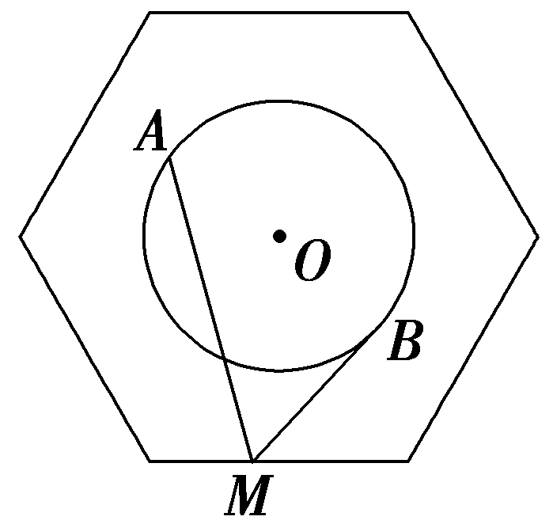

A. $\left[4，5\right]$ 	B. $\left[5，7\right]$

C. $\left[4，6\right]$ 	D. $\left[5，8\right]$

答案：**B**

解析：由题意可得， $\vec{MA}$ · $\vec{MB}$ ＝ $\left(\vec{MO}＋\vec{OA}\right)$ · $\left(\vec{MO}＋\vec{OB}\right)$ ＝ $\left(\vec{MO}＋\vec{OA}\right)$ · $\left(\vec{MO}－\vec{OA}\right)$ ＝ $\left|\vec{MO}\right|^{2}$ － $\left|\vec{OA}\right|^{2}$ ＝ $\left|\vec{MO}\right|^{2}$ －1，当*O<text style="italic">M*</text>与正六边形的边垂直时， $\left|\vec{MO}\right|_{min}$ ＝ $\sqrt{6}$ ，当点*M*运动到正六边形的顶点时， $\left|\vec{MO}\right|_{max}$ ＝2 $\sqrt{2}$ ，所以 $\left|\vec{MO}\right|$ ∈ $\left[\sqrt{6}，2\sqrt{2}\right]$ ，则 $\left|\vec{MO}\right|^{2}$ ∈ $\left[6，8\right]$ ，即 $\vec{MA}$ · $\vec{MB}$ ＝ $\left(\left|\vec{MO}\right|^{2}－1\right)$ ∈ $\left[5，7\right]$ .故选B.

12.(2025·江南十校联考)如图，在等腰梯形*<text style="italic"><text style="italic"><text style="italic">AB*</text></text>*CD*</text>中，AB∥CD，AB＝5，*AD*＝4，*DC*＝1，点*<text style="italic">E*</text>是线段AB上一点，且满足*AE*＝4*EB*，动点*P*在以E为圆心，半径为1的圆上运动，则 $\vec{DP}$ · $\vec{AC}$ 的最大值为(　　)

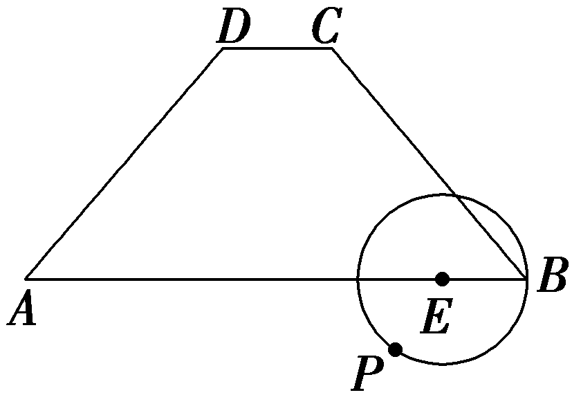

A. $\sqrt{21}$ －6	B. $\sqrt{3}$ － $\sqrt{21}$

C.2 $\sqrt{3}$ －6	D. $\sqrt{3}$

答案：**A**

解析：如图，以&lt;te&lt;text st<em>y</em>le="italic"&gt;x&lt;/text&gt;t style="italic"&gt;<em>E</em>&lt;/text&gt;为原点，建立直角坐标系.由题意，梯形<em>&lt;text style="italic"&gt;A</em>B<em>CD</em>&lt;/text&gt;的高为 $\sqrt{4^{2}－(\frac{5－1}{2})^{2}}$ ＝&lt;text st<em>y</em>le="superscript"&gt;2&lt;/text&gt; $\sqrt{3}$ ，则&lt;te&lt;text st<em>y</em>le="italic"&gt;x&lt;/text&gt;t style="italic"&gt;A&lt;/text&gt;(－4，0)，<em>C</em>(－1，&lt;text style="superscript"&gt;2&lt;/text&gt; $\sqrt{3}$ )，&lt;te&lt;text st<em>y</em>le="italic"&gt;x&lt;/text&gt;t style="italic"&gt;D&lt;/text&gt;(－&lt;text style="superscript"&gt;2&lt;/text&gt;，2 $\sqrt{3}$ ).因为以&lt;te&lt;text st<em>y</em>le="italic"&gt;x&lt;/text&gt;t style="italic"&gt;<em>E</em>&lt;/text&gt;为圆心，半径为1的圆的方程为：x&lt;text style="superscript"&gt;2&lt;/text&gt;＋y2＝1，可设点<em>P</em>(cos <em>&lt;text style="italic"&gt;&lt;text style="italic"&gt;&lt;text style="italic"&gt;&lt;text style="italic"&gt;&lt;text style="italic"&gt;&lt;text style="italic"&gt;&lt;text style="italic"&gt;&lt;text style="italic"&gt;&lt;text style="italic"&gt;&lt;text style="italic"&gt;θ</em>&lt;/text&gt;&lt;/text&gt;&lt;/text&gt;&lt;/text&gt;&lt;/text&gt;&lt;/text&gt;&lt;/text&gt;&lt;/text&gt;&lt;/text&gt;&lt;/text&gt;，sin θ)，0≤θ＜2π.则 $\vec{DP}$ <em>&lt;text style="italic"&gt;·</em>&lt;/text&gt; $\vec{AC}$ ＝(cos <em>&lt;text style="italic"&gt;&lt;text style="italic"&gt;&lt;text style="italic"&gt;&lt;text style="italic"&gt;&lt;text style="italic"&gt;&lt;text style="italic"&gt;&lt;text style="italic"&gt;&lt;text style="italic"&gt;&lt;text style="italic"&gt;&lt;text style="italic"&gt;θ</em>&lt;/text&gt;&lt;/text&gt;&lt;/text&gt;&lt;/text&gt;&lt;/text&gt;&lt;/text&gt;&lt;/text&gt;&lt;/text&gt;&lt;/text&gt;&lt;/text&gt;＋&lt;text st<em>y</em>le="superscript"&gt;2&lt;/text&gt;，sin θ－2 $\sqrt{3}$ )<em>&lt;text style="italic"&gt;·</em>&lt;/text&gt;(3，&lt;text st<em>y</em>le="superscript"&gt;2&lt;/text&gt; $\sqrt{3}$ )＝3cos <em>&lt;text style="italic"&gt;&lt;text style="italic"&gt;&lt;text style="italic"&gt;&lt;text style="italic"&gt;&lt;text style="italic"&gt;&lt;text style="italic"&gt;&lt;text style="italic"&gt;&lt;text style="italic"&gt;&lt;text style="italic"&gt;&lt;text style="italic"&gt;θ</em>&lt;/text&gt;&lt;/text&gt;&lt;/text&gt;&lt;/text&gt;&lt;/text&gt;&lt;/text&gt;&lt;/text&gt;&lt;/text&gt;&lt;/text&gt;&lt;/text&gt;＋6＋&lt;text st<em>y</em>le="superscript"&gt;2&lt;/text&gt; $\sqrt{3}$ sin <em>&lt;text style="italic"&gt;&lt;text style="italic"&gt;&lt;text style="italic"&gt;&lt;text style="italic"&gt;&lt;text style="italic"&gt;&lt;text style="italic"&gt;&lt;text style="italic"&gt;&lt;text style="italic"&gt;&lt;text style="italic"&gt;&lt;text style="italic"&gt;θ</em>&lt;/text&gt;&lt;/text&gt;&lt;/text&gt;&lt;/text&gt;&lt;/text&gt;&lt;/text&gt;&lt;/text&gt;&lt;/text&gt;&lt;/text&gt;&lt;/text&gt;－1&lt;text st<em>y</em>le="superscript"&gt;2&lt;/text&gt;＝2 $\sqrt{3}$ sin <em>&lt;text style="italic"&gt;&lt;text style="italic"&gt;&lt;text style="italic"&gt;&lt;text style="italic"&gt;&lt;text style="italic"&gt;&lt;text style="italic"&gt;&lt;text style="italic"&gt;&lt;text style="italic"&gt;&lt;text style="italic"&gt;&lt;text style="italic"&gt;θ</em>&lt;/text&gt;&lt;/text&gt;&lt;/text&gt;&lt;/text&gt;&lt;/text&gt;&lt;/text&gt;&lt;/text&gt;&lt;/text&gt;&lt;/text&gt;&lt;/text&gt;＋3cos θ－6＝ $\sqrt{21}$ sin(<em>&lt;text style="italic"&gt;&lt;text style="italic"&gt;&lt;text style="italic"&gt;&lt;text style="italic"&gt;&lt;text style="italic"&gt;&lt;text style="italic"&gt;&lt;text style="italic"&gt;&lt;text style="italic"&gt;&lt;text style="italic"&gt;&lt;text style="italic"&gt;θ</em>&lt;/text&gt;&lt;/text&gt;&lt;/text&gt;&lt;/text&gt;&lt;/text&gt;&lt;/text&gt;&lt;/text&gt;&lt;/text&gt;&lt;/text&gt;&lt;/text&gt;＋<em>&lt;text style="italic"&gt;&lt;text style="italic"&gt;φ</em>&lt;/text&gt;&lt;/text&gt;)－6，其中，tan φ＝ $\frac{\sqrt{3}}{2}$ ，故当sin(<em>&lt;text style="italic"&gt;&lt;text style="italic"&gt;&lt;text style="italic"&gt;&lt;text style="italic"&gt;&lt;text style="italic"&gt;&lt;text style="italic"&gt;&lt;text style="italic"&gt;&lt;text style="italic"&gt;&lt;text style="italic"&gt;&lt;text style="italic"&gt;θ</em>&lt;/text&gt;&lt;/text&gt;&lt;/text&gt;&lt;/text&gt;&lt;/text&gt;&lt;/text&gt;&lt;/text&gt;&lt;/text&gt;&lt;/text&gt;&lt;/text&gt;＋<em>&lt;text style="italic"&gt;&lt;text style="italic"&gt;φ</em>&lt;/text&gt;&lt;/text&gt;)＝1时， $(\vec{DP}\cdot \vec{AC})_{max}$ ＝ $\sqrt{21}$ －6.故选&lt;te&lt;text st<em>y</em>le="italic"&gt;x&lt;/text&gt;t style="italic"&gt;A&lt;/text&gt;.

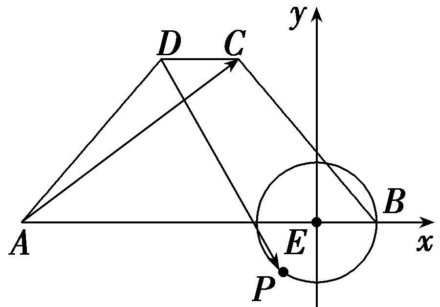

13.(多选)(2025·福建福州模拟)平面向量&lt;&lt;<em>t</em>ext style="italic"&gt;t&lt;/text&gt;ext style="bold,italic"&gt;<em><strong>&lt;text style="bold,italic"&gt;&lt;text style="bold,italic"&gt;m</strong></em>&lt;/text&gt;&lt;/text&gt;&lt;/text&gt;，<em><strong>&lt;text style="bold,italic"&gt;&lt;text style="bold,italic"&gt;&lt;text style="bold,italic"&gt;n</strong></em>&lt;/text&gt;&lt;/text&gt;&lt;/text&gt;满足｜m｜＝｜n｜＝1，对任意的实数t，｜m－ $\frac{1}{2}$ &lt;&lt;<em>t</em>ext style="italic"&gt;t&lt;/text&gt;ext style="bold,italic"&gt;<em><strong>&lt;text style="bold,italic"&gt;&lt;text style="bold,italic"&gt;n</strong></em>&lt;/text&gt;&lt;/text&gt;&lt;/text&gt;｜≤｜<em><strong>&lt;text style="bold,italic"&gt;&lt;text style="bold,italic"&gt;&lt;text style="bold,italic"&gt;m</strong></em>&lt;/text&gt;&lt;/text&gt;&lt;/text&gt;＋tn｜恒成立，则(　　)

A.***m***与***n***的夹角为60°

B. $\left(m＋tn\right)^{2}$ ＋ $\left(m－tn\right)^{2}$ 为定值

C.｜&lt;<em>t</em>ext style="bold,italic"&gt;n&lt;/text&gt;－t<em><strong>m</strong></em>｜的最小值为 $\frac{1}{2}$

D.***<text style="bold,italic">m***</text>在m＋***n***上的投影向量为 $\frac{1}{2}\left(m＋n\right)$

答案：**AD**

解析：对于A，设平面向量&lt;&lt;&lt;&lt;&lt;&lt;&lt;&lt;&lt;&lt;&lt;&lt;&lt;&lt;&lt;&lt;&lt;&lt;t&lt;t<em><strong>e</strong></em>xt style="bold,italic"&gt;e&lt;/text&gt;xt style="italic"&gt;t&lt;/text&gt;ext style="italic"&gt;t&lt;/text&gt;ext style="italic"&gt;t&lt;/text&gt;ext style="italic"&gt;t&lt;/text&gt;ext style="italic"&gt;t&lt;/text&gt;ext style="italic"&gt;t&lt;/text&gt;ext style="italic"&gt;t&lt;/text&gt;ext style="italic"&gt;t&lt;/text&gt;ext style="italic"&gt;t&lt;/text&gt;ext style="italic"&gt;t&lt;/text&gt;ext style="italic"&gt;t&lt;/text&gt;ext style="italic"&gt;t&lt;/text&gt;ext style="italic"&gt;t&lt;/text&gt;ext style="italic"&gt;t&lt;/text&gt;ext style="italic"&gt;t&lt;/text&gt;ext style="italic"&gt;t&lt;/text&gt;ext style="italic"&gt;t&lt;/text&gt;ext style="bold,italic"&gt;<em><strong>&lt;text style="bold,italic"&gt;&lt;text style="bold,italic"&gt;&lt;text style="bold,italic"&gt;&lt;text style="bold,italic"&gt;&lt;text style="bold,italic"&gt;&lt;text style="bold,italic"&gt;&lt;text style="bold,italic"&gt;&lt;text style="bold,italic"&gt;&lt;text style="bold,italic"&gt;&lt;text style="bold,italic"&gt;&lt;text style="bold,italic"&gt;&lt;text style="bold,italic"&gt;&lt;text style="bold,italic"&gt;&lt;text style="bold,italic"&gt;&lt;text style="bold,italic"&gt;&lt;text style="bold,italic"&gt;&lt;text style="bold,italic"&gt;&lt;text style="bold,italic"&gt;m</strong></em>&lt;/text&gt;&lt;/text&gt;&lt;/text&gt;&lt;/text&gt;&lt;/text&gt;&lt;/text&gt;&lt;/text&gt;&lt;/text&gt;&lt;/text&gt;&lt;/text&gt;&lt;/text&gt;&lt;/text&gt;&lt;/text&gt;&lt;/text&gt;&lt;/text&gt;&lt;/text&gt;&lt;/text&gt;&lt;/text&gt;&lt;/text&gt;与<em><strong>&lt;text style="bold,italic"&gt;&lt;text style="bold,italic"&gt;&lt;text style="bold,italic"&gt;&lt;text style="bold,italic"&gt;&lt;text style="bold,italic"&gt;&lt;text style="bold,italic"&gt;&lt;text style="bold,italic"&gt;&lt;text style="bold,italic"&gt;&lt;text style="bold,italic"&gt;&lt;text style="bold,italic"&gt;&lt;text style="bold,italic"&gt;&lt;text style="bold,italic"&gt;&lt;text style="bold,italic"&gt;&lt;text style="bold,italic"&gt;&lt;text style="bold,italic"&gt;n</strong></em>&lt;/text&gt;&lt;/text&gt;&lt;/text&gt;&lt;/text&gt;&lt;/text&gt;&lt;/text&gt;&lt;/text&gt;&lt;/text&gt;&lt;/text&gt;&lt;/text&gt;&lt;/text&gt;&lt;/text&gt;&lt;/text&gt;&lt;/text&gt;&lt;/text&gt;的夹角为<em>&lt;text style="italic"&gt;&lt;text style="italic"&gt;&lt;text style="italic"&gt;&lt;text style="italic"&gt;&lt;text style="italic"&gt;&lt;text style="italic"&gt;&lt;text style="italic"&gt;θ</em>&lt;/text&gt;&lt;/text&gt;&lt;/text&gt;&lt;/text&gt;&lt;/text&gt;&lt;/text&gt;&lt;/text&gt;，因为对任意的实数t，｜m－ $\frac{1}{2}$ &lt;&lt;&lt;&lt;&lt;&lt;&lt;&lt;&lt;&lt;&lt;&lt;&lt;&lt;&lt;&lt;&lt;&lt;t&lt;t<em><strong>e</strong></em>xt style="bold,italic"&gt;e&lt;/text&gt;xt style="italic"&gt;t&lt;/text&gt;ext style="italic"&gt;t&lt;/text&gt;ext style="italic"&gt;t&lt;/text&gt;ext style="italic"&gt;t&lt;/text&gt;ext style="italic"&gt;t&lt;/text&gt;ext style="italic"&gt;t&lt;/text&gt;ext style="italic"&gt;t&lt;/text&gt;ext style="italic"&gt;t&lt;/text&gt;ext style="italic"&gt;t&lt;/text&gt;ext style="italic"&gt;t&lt;/text&gt;ext style="italic"&gt;t&lt;/text&gt;ext style="italic"&gt;t&lt;/text&gt;ext style="italic"&gt;t&lt;/text&gt;ext style="italic"&gt;t&lt;/text&gt;ext style="italic"&gt;t&lt;/text&gt;ext style="italic"&gt;t&lt;/text&gt;ext style="italic"&gt;t&lt;/text&gt;ext style="bold,italic"&gt;<em><strong>&lt;text style="bold,italic"&gt;&lt;text style="bold,italic"&gt;&lt;text style="bold,italic"&gt;&lt;text style="bold,italic"&gt;&lt;text style="bold,italic"&gt;&lt;text style="bold,italic"&gt;&lt;text style="bold,italic"&gt;&lt;text style="bold,italic"&gt;&lt;text style="bold,italic"&gt;&lt;text style="bold,italic"&gt;&lt;text style="bold,italic"&gt;&lt;text style="bold,italic"&gt;&lt;text style="bold,italic"&gt;&lt;text style="bold,italic"&gt;n</strong></em>&lt;/text&gt;&lt;/text&gt;&lt;/text&gt;&lt;/text&gt;&lt;/text&gt;&lt;/text&gt;&lt;/text&gt;&lt;/text&gt;&lt;/text&gt;&lt;/text&gt;&lt;/text&gt;&lt;/text&gt;&lt;/text&gt;&lt;/text&gt;&lt;/text&gt;｜≤｜<em><strong>&lt;text style="bold,italic"&gt;&lt;text style="bold,italic"&gt;&lt;text style="bold,italic"&gt;&lt;text style="bold,italic"&gt;&lt;text style="bold,italic"&gt;&lt;text style="bold,italic"&gt;&lt;text style="bold,italic"&gt;&lt;text style="bold,italic"&gt;&lt;text style="bold,italic"&gt;&lt;text style="bold,italic"&gt;&lt;text style="bold,italic"&gt;&lt;text style="bold,italic"&gt;&lt;text style="bold,italic"&gt;&lt;text style="bold,italic"&gt;&lt;text style="bold,italic"&gt;&lt;text style="bold,italic"&gt;&lt;text style="bold,italic"&gt;&lt;text style="bold,italic"&gt;&lt;text style="bold,italic"&gt;m</strong></em>&lt;/text&gt;&lt;/text&gt;&lt;/text&gt;&lt;/text&gt;&lt;/text&gt;&lt;/text&gt;&lt;/text&gt;&lt;/text&gt;&lt;/text&gt;&lt;/text&gt;&lt;/text&gt;&lt;/text&gt;&lt;/text&gt;&lt;/text&gt;&lt;/text&gt;&lt;/text&gt;&lt;/text&gt;&lt;/text&gt;&lt;/text&gt;＋tn｜恒成立，即m&lt;text style="superscript"&gt;&lt;text style="superscript"&gt;&lt;text style="superscript"&gt;&lt;text style="superscript"&gt;&lt;text style="superscript"&gt;&lt;text style="superscript"&gt;&lt;text style="superscript"&gt;&lt;text style="superscript"&gt;&lt;text style="superscript"&gt;&lt;text style="superscript"&gt;&lt;text style="superscript"&gt;2&lt;/text&gt;&lt;/text&gt;&lt;/text&gt;&lt;/text&gt;&lt;/text&gt;&lt;/text&gt;&lt;/text&gt;&lt;/text&gt;&lt;/text&gt;&lt;/text&gt;&lt;/text&gt;－m<em>·</em>n＋ $\frac{1}{4}$ &lt;&lt;&lt;&lt;&lt;&lt;&lt;&lt;&lt;&lt;&lt;&lt;&lt;&lt;&lt;&lt;&lt;&lt;t&lt;t<em><strong>e</strong></em>xt style="bold,italic"&gt;e&lt;/text&gt;xt style="italic"&gt;t&lt;/text&gt;ext style="italic"&gt;t&lt;/text&gt;ext style="italic"&gt;t&lt;/text&gt;ext style="italic"&gt;t&lt;/text&gt;ext style="italic"&gt;t&lt;/text&gt;ext style="italic"&gt;t&lt;/text&gt;ext style="italic"&gt;t&lt;/text&gt;ext style="italic"&gt;t&lt;/text&gt;ext style="italic"&gt;t&lt;/text&gt;ext style="italic"&gt;t&lt;/text&gt;ext style="italic"&gt;t&lt;/text&gt;ext style="italic"&gt;t&lt;/text&gt;ext style="italic"&gt;t&lt;/text&gt;ext style="italic"&gt;t&lt;/text&gt;ext style="italic"&gt;t&lt;/text&gt;ext style="italic"&gt;t&lt;/text&gt;ext style="italic"&gt;t&lt;/text&gt;ext style="bold,italic"&gt;<em><strong>&lt;text style="bold,italic"&gt;&lt;text style="bold,italic"&gt;&lt;text style="bold,italic"&gt;&lt;text style="bold,italic"&gt;&lt;text style="bold,italic"&gt;&lt;text style="bold,italic"&gt;&lt;text style="bold,italic"&gt;&lt;text style="bold,italic"&gt;&lt;text style="bold,italic"&gt;&lt;text style="bold,italic"&gt;&lt;text style="bold,italic"&gt;&lt;text style="bold,italic"&gt;&lt;text style="bold,italic"&gt;&lt;text style="bold,italic"&gt;n</strong></em>&lt;/text&gt;&lt;/text&gt;&lt;/text&gt;&lt;/text&gt;&lt;/text&gt;&lt;/text&gt;&lt;/text&gt;&lt;/text&gt;&lt;/text&gt;&lt;/text&gt;&lt;/text&gt;&lt;/text&gt;&lt;/text&gt;&lt;/text&gt;&lt;/text&gt;&lt;text style="superscript"&gt;&lt;text style="superscript"&gt;&lt;text style="superscript"&gt;&lt;text style="superscript"&gt;&lt;text style="superscript"&gt;&lt;text style="superscript"&gt;&lt;text style="superscript"&gt;&lt;text style="superscript"&gt;&lt;text style="superscript"&gt;&lt;text style="superscript"&gt;&lt;text style="superscript"&gt;2&lt;/text&gt;&lt;/text&gt;&lt;/text&gt;&lt;/text&gt;&lt;/text&gt;&lt;/text&gt;&lt;/text&gt;&lt;/text&gt;&lt;/text&gt;&lt;/text&gt;&lt;/text&gt;≤<em><strong>&lt;text style="bold,italic"&gt;&lt;text style="bold,italic"&gt;&lt;text style="bold,italic"&gt;&lt;text style="bold,italic"&gt;&lt;text style="bold,italic"&gt;&lt;text style="bold,italic"&gt;&lt;text style="bold,italic"&gt;&lt;text style="bold,italic"&gt;&lt;text style="bold,italic"&gt;&lt;text style="bold,italic"&gt;&lt;text style="bold,italic"&gt;&lt;text style="bold,italic"&gt;&lt;text style="bold,italic"&gt;&lt;text style="bold,italic"&gt;&lt;text style="bold,italic"&gt;&lt;text style="bold,italic"&gt;&lt;text style="bold,italic"&gt;&lt;text style="bold,italic"&gt;&lt;text style="bold,italic"&gt;m</strong></em>&lt;/text&gt;&lt;/text&gt;&lt;/text&gt;&lt;/text&gt;&lt;/text&gt;&lt;/text&gt;&lt;/text&gt;&lt;/text&gt;&lt;/text&gt;&lt;/text&gt;&lt;/text&gt;&lt;/text&gt;&lt;/text&gt;&lt;/text&gt;&lt;/text&gt;&lt;/text&gt;&lt;/text&gt;&lt;/text&gt;&lt;/text&gt;2＋2tm<em>·</em>n＋t2n2恒成立，又｜m｜＝｜n｜＝1，所以t2＋2tcos <em>&lt;text style="italic"&gt;&lt;text style="italic"&gt;&lt;text style="italic"&gt;&lt;text style="italic"&gt;&lt;text style="italic"&gt;&lt;text style="italic"&gt;&lt;text style="italic"&gt;θ</em>&lt;/text&gt;&lt;/text&gt;&lt;/text&gt;&lt;/text&gt;&lt;/text&gt;&lt;/text&gt;&lt;/text&gt;＋cos θ－ $\frac{1}{4}$ ≥0对任意的实数&lt;&lt;&lt;&lt;&lt;&lt;&lt;&lt;&lt;&lt;&lt;&lt;&lt;&lt;&lt;&lt;&lt;t&lt;t<em><strong>e</strong></em>xt style="bold,italic"&gt;e&lt;/text&gt;xt style="italic"&gt;t&lt;/text&gt;ext style="italic"&gt;t&lt;/text&gt;ext style="italic"&gt;t&lt;/text&gt;ext style="italic"&gt;t&lt;/text&gt;ext style="italic"&gt;t&lt;/text&gt;ext style="italic"&gt;t&lt;/text&gt;ext style="italic"&gt;t&lt;/text&gt;ext style="italic"&gt;t&lt;/text&gt;ext style="italic"&gt;t&lt;/text&gt;ext style="italic"&gt;t&lt;/text&gt;ext style="italic"&gt;t&lt;/text&gt;ext style="italic"&gt;t&lt;/text&gt;ext style="italic"&gt;t&lt;/text&gt;ext style="italic"&gt;t&lt;/text&gt;ext style="italic"&gt;t&lt;/text&gt;ext style="italic"&gt;t&lt;/text&gt;ext style="italic"&gt;t&lt;/text&gt;恒成立，所以<em>Δ</em>＝4cos&lt;text style="superscript"&gt;&lt;text style="superscript"&gt;&lt;text style="superscript"&gt;&lt;text style="superscript"&gt;&lt;text style="superscript"&gt;&lt;text style="superscript"&gt;&lt;text style="superscript"&gt;&lt;text style="superscript"&gt;&lt;text style="superscript"&gt;&lt;text style="superscript"&gt;&lt;text style="superscript"&gt;2&lt;/text&gt;&lt;/text&gt;&lt;/text&gt;&lt;/text&gt;&lt;/text&gt;&lt;/text&gt;&lt;/text&gt;&lt;/text&gt;&lt;/text&gt;&lt;/text&gt;&lt;/text&gt;<em>&lt;text style="italic"&gt;&lt;text style="italic"&gt;&lt;text style="italic"&gt;&lt;text style="italic"&gt;&lt;text style="italic"&gt;&lt;text style="italic"&gt;&lt;text style="italic"&gt;θ</em>&lt;/text&gt;&lt;/text&gt;&lt;/text&gt;&lt;/text&gt;&lt;/text&gt;&lt;/text&gt;&lt;/text&gt;－4cos θ＋1＝(2cos θ－1)2≤0，则cos θ＝ $\frac{1}{2}$ ，所以&lt;&lt;&lt;&lt;&lt;&lt;&lt;&lt;&lt;&lt;&lt;&lt;&lt;&lt;&lt;&lt;&lt;&lt;t&lt;t<em><strong>e</strong></em>xt style="bold,italic"&gt;e&lt;/text&gt;xt style="italic"&gt;t&lt;/text&gt;ext style="italic"&gt;t&lt;/text&gt;ext style="italic"&gt;t&lt;/text&gt;ext style="italic"&gt;t&lt;/text&gt;ext style="italic"&gt;t&lt;/text&gt;ext style="italic"&gt;t&lt;/text&gt;ext style="italic"&gt;t&lt;/text&gt;ext style="italic"&gt;t&lt;/text&gt;ext style="italic"&gt;t&lt;/text&gt;ext style="italic"&gt;t&lt;/text&gt;ext style="italic"&gt;t&lt;/text&gt;ext style="italic"&gt;t&lt;/text&gt;ext style="italic"&gt;t&lt;/text&gt;ext style="italic"&gt;t&lt;/text&gt;ext style="italic"&gt;t&lt;/text&gt;ext style="italic"&gt;t&lt;/text&gt;ext style="italic"&gt;t&lt;/text&gt;ext style="italic"&gt;<em>&lt;text style="italic"&gt;&lt;text style="italic"&gt;&lt;text style="italic"&gt;&lt;text style="italic"&gt;&lt;text style="italic"&gt;&lt;text style="italic"&gt;θ</em>&lt;/text&gt;&lt;/text&gt;&lt;/text&gt;&lt;/text&gt;&lt;/text&gt;&lt;/text&gt;&lt;/text&gt;＝60°，故A正确；对于B，因为(<em><strong>&lt;text style="bold,italic"&gt;&lt;text style="bold,italic"&gt;&lt;text style="bold,italic"&gt;&lt;text style="bold,italic"&gt;&lt;text style="bold,italic"&gt;&lt;text style="bold,italic"&gt;&lt;text style="bold,italic"&gt;&lt;text style="bold,italic"&gt;&lt;text style="bold,italic"&gt;&lt;text style="bold,italic"&gt;&lt;text style="bold,italic"&gt;&lt;text style="bold,italic"&gt;&lt;text style="bold,italic"&gt;&lt;text style="bold,italic"&gt;&lt;text style="bold,italic"&gt;&lt;text style="bold,italic"&gt;&lt;text style="bold,italic"&gt;&lt;text style="bold,italic"&gt;&lt;text style="bold,italic"&gt;m</strong></em>&lt;/text&gt;&lt;/text&gt;&lt;/text&gt;&lt;/text&gt;&lt;/text&gt;&lt;/text&gt;&lt;/text&gt;&lt;/text&gt;&lt;/text&gt;&lt;/text&gt;&lt;/text&gt;&lt;/text&gt;&lt;/text&gt;&lt;/text&gt;&lt;/text&gt;&lt;/text&gt;&lt;/text&gt;&lt;/text&gt;&lt;/text&gt;＋t<em><strong>&lt;text style="bold,italic"&gt;&lt;text style="bold,italic"&gt;&lt;text style="bold,italic"&gt;&lt;text style="bold,italic"&gt;&lt;text style="bold,italic"&gt;&lt;text style="bold,italic"&gt;&lt;text style="bold,italic"&gt;&lt;text style="bold,italic"&gt;&lt;text style="bold,italic"&gt;&lt;text style="bold,italic"&gt;&lt;text style="bold,italic"&gt;&lt;text style="bold,italic"&gt;&lt;text style="bold,italic"&gt;&lt;text style="bold,italic"&gt;&lt;text style="bold,italic"&gt;n</strong></em>&lt;/text&gt;&lt;/text&gt;&lt;/text&gt;&lt;/text&gt;&lt;/text&gt;&lt;/text&gt;&lt;/text&gt;&lt;/text&gt;&lt;/text&gt;&lt;/text&gt;&lt;/text&gt;&lt;/text&gt;&lt;/text&gt;&lt;/text&gt;&lt;/text&gt;)&lt;text style="superscript"&gt;&lt;text style="superscript"&gt;&lt;text style="superscript"&gt;&lt;text style="superscript"&gt;&lt;text style="superscript"&gt;&lt;text style="superscript"&gt;&lt;text style="superscript"&gt;&lt;text style="superscript"&gt;&lt;text style="superscript"&gt;&lt;text style="superscript"&gt;&lt;text style="superscript"&gt;2&lt;/text&gt;&lt;/text&gt;&lt;/text&gt;&lt;/text&gt;&lt;/text&gt;&lt;/text&gt;&lt;/text&gt;&lt;/text&gt;&lt;/text&gt;&lt;/text&gt;&lt;/text&gt;＋ $\left(m－tn\right)^{2}$ ＝1＋&lt;&lt;&lt;&lt;&lt;&lt;&lt;&lt;&lt;&lt;&lt;&lt;&lt;&lt;&lt;&lt;t&lt;t<em><strong>e</strong></em>xt style="bold,italic"&gt;e&lt;/text&gt;xt style="italic"&gt;t&lt;/text&gt;ext style="italic"&gt;t&lt;/text&gt;ext style="italic"&gt;t&lt;/text&gt;ext style="italic"&gt;t&lt;/text&gt;ext style="italic"&gt;t&lt;/text&gt;ext style="italic"&gt;t&lt;/text&gt;ext style="italic"&gt;t&lt;/text&gt;ext style="italic"&gt;t&lt;/text&gt;ext style="italic"&gt;t&lt;/text&gt;ext style="italic"&gt;t&lt;/text&gt;ext style="italic"&gt;t&lt;/text&gt;ext style="italic"&gt;t&lt;/text&gt;ext style="italic"&gt;t&lt;/text&gt;ext style="italic"&gt;t&lt;/text&gt;ext style="italic"&gt;t&lt;/text&gt;ext style="superscript"&gt;&lt;text style="superscript"&gt;&lt;text style="superscript"&gt;&lt;text style="superscript"&gt;&lt;text style="superscript"&gt;&lt;text style="superscript"&gt;&lt;text style="superscript"&gt;&lt;text style="superscript"&gt;&lt;text style="superscript"&gt;&lt;text style="superscript"&gt;&lt;text style="superscript"&gt;2&lt;/text&gt;&lt;/text&gt;&lt;/text&gt;&lt;/text&gt;&lt;/text&gt;&lt;/text&gt;&lt;/text&gt;&lt;/text&gt;&lt;/text&gt;&lt;/text&gt;&lt;/text&gt;&lt;<em>t</em>ext style="italic"&gt;t&lt;/text&gt;cos 60°＋t2＋1＋t2－2tcos 60°＝2＋2t2随t的变化而变化，故B错误；对于C，因为｜<em><strong>&lt;text style="bold,italic"&gt;&lt;text style="bold,italic"&gt;&lt;text style="bold,italic"&gt;&lt;text style="bold,italic"&gt;&lt;text style="bold,italic"&gt;&lt;text style="bold,italic"&gt;&lt;text style="bold,italic"&gt;&lt;text style="bold,italic"&gt;&lt;text style="bold,italic"&gt;&lt;text style="bold,italic"&gt;&lt;text style="bold,italic"&gt;&lt;text style="bold,italic"&gt;&lt;text style="bold,italic"&gt;&lt;text style="bold,italic"&gt;&lt;text style="bold,italic"&gt;n</strong></em>&lt;/text&gt;&lt;/text&gt;&lt;/text&gt;&lt;/text&gt;&lt;/text&gt;&lt;/text&gt;&lt;/text&gt;&lt;/text&gt;&lt;/text&gt;&lt;/text&gt;&lt;/text&gt;&lt;/text&gt;&lt;/text&gt;&lt;/text&gt;&lt;/text&gt;－t<em><strong>&lt;text style="bold,italic"&gt;&lt;text style="bold,italic"&gt;&lt;text style="bold,italic"&gt;&lt;text style="bold,italic"&gt;&lt;text style="bold,italic"&gt;&lt;text style="bold,italic"&gt;&lt;text style="bold,italic"&gt;&lt;text style="bold,italic"&gt;&lt;text style="bold,italic"&gt;&lt;text style="bold,italic"&gt;&lt;text style="bold,italic"&gt;&lt;text style="bold,italic"&gt;&lt;text style="bold,italic"&gt;&lt;text style="bold,italic"&gt;&lt;text style="bold,italic"&gt;&lt;text style="bold,italic"&gt;&lt;text style="bold,italic"&gt;&lt;text style="bold,italic"&gt;&lt;text style="bold,italic"&gt;m</strong></em>&lt;/text&gt;&lt;/text&gt;&lt;/text&gt;&lt;/text&gt;&lt;/text&gt;&lt;/text&gt;&lt;/text&gt;&lt;/text&gt;&lt;/text&gt;&lt;/text&gt;&lt;/text&gt;&lt;/text&gt;&lt;/text&gt;&lt;/text&gt;&lt;/text&gt;&lt;/text&gt;&lt;/text&gt;&lt;/text&gt;&lt;/text&gt;｜＝ $\sqrt{｜n－tm｜^{2}}$ ＝ $\sqrt{1+t^{2}－2tcos60\circ }$ ＝ $\sqrt{t^{2}－t+1}$ ，由二次函数的性质可知：当&lt;&lt;&lt;&lt;&lt;&lt;&lt;&lt;&lt;&lt;&lt;&lt;&lt;&lt;&lt;&lt;&lt;t&lt;t<em><strong>e</strong></em>xt style="bold,italic"&gt;e&lt;/text&gt;xt style="italic"&gt;t&lt;/text&gt;ext style="italic"&gt;t&lt;/text&gt;ext style="italic"&gt;t&lt;/text&gt;ext style="italic"&gt;t&lt;/text&gt;ext style="italic"&gt;t&lt;/text&gt;ext style="italic"&gt;t&lt;/text&gt;ext style="italic"&gt;t&lt;/text&gt;ext style="italic"&gt;t&lt;/text&gt;ext style="italic"&gt;t&lt;/text&gt;ext style="italic"&gt;t&lt;/text&gt;ext style="italic"&gt;t&lt;/text&gt;ext style="italic"&gt;t&lt;/text&gt;ext style="italic"&gt;t&lt;/text&gt;ext style="italic"&gt;t&lt;/text&gt;ext style="italic"&gt;t&lt;/text&gt;ext style="italic"&gt;t&lt;/text&gt;ext style="italic"&gt;t&lt;/text&gt;＝ $\frac{1}{2}$ 时，｜&lt;&lt;&lt;&lt;&lt;&lt;&lt;&lt;&lt;&lt;&lt;&lt;&lt;&lt;&lt;&lt;&lt;&lt;t&lt;t<em><strong>e</strong></em>xt style="bold,italic"&gt;e&lt;/text&gt;xt style="italic"&gt;t&lt;/text&gt;ext style="italic"&gt;t&lt;/text&gt;ext style="italic"&gt;t&lt;/text&gt;ext style="italic"&gt;t&lt;/text&gt;ext style="italic"&gt;t&lt;/text&gt;ext style="italic"&gt;t&lt;/text&gt;ext style="italic"&gt;t&lt;/text&gt;ext style="italic"&gt;t&lt;/text&gt;ext style="italic"&gt;t&lt;/text&gt;ext style="italic"&gt;t&lt;/text&gt;ext style="italic"&gt;t&lt;/text&gt;ext style="italic"&gt;t&lt;/text&gt;ext style="italic"&gt;t&lt;/text&gt;ext style="italic"&gt;t&lt;/text&gt;ext style="italic"&gt;t&lt;/text&gt;ext style="italic"&gt;t&lt;/text&gt;ext style="italic"&gt;t&lt;/text&gt;ext style="bold,italic"&gt;<em><strong>&lt;text style="bold,italic"&gt;&lt;text style="bold,italic"&gt;&lt;text style="bold,italic"&gt;&lt;text style="bold,italic"&gt;&lt;text style="bold,italic"&gt;&lt;text style="bold,italic"&gt;&lt;text style="bold,italic"&gt;&lt;text style="bold,italic"&gt;&lt;text style="bold,italic"&gt;&lt;text style="bold,italic"&gt;&lt;text style="bold,italic"&gt;&lt;text style="bold,italic"&gt;&lt;text style="bold,italic"&gt;&lt;text style="bold,italic"&gt;n</strong></em>&lt;/text&gt;&lt;/text&gt;&lt;/text&gt;&lt;/text&gt;&lt;/text&gt;&lt;/text&gt;&lt;/text&gt;&lt;/text&gt;&lt;/text&gt;&lt;/text&gt;&lt;/text&gt;&lt;/text&gt;&lt;/text&gt;&lt;/text&gt;&lt;/text&gt;－t<em><strong>&lt;text style="bold,italic"&gt;&lt;text style="bold,italic"&gt;&lt;text style="bold,italic"&gt;&lt;text style="bold,italic"&gt;&lt;text style="bold,italic"&gt;&lt;text style="bold,italic"&gt;&lt;text style="bold,italic"&gt;&lt;text style="bold,italic"&gt;&lt;text style="bold,italic"&gt;&lt;text style="bold,italic"&gt;&lt;text style="bold,italic"&gt;&lt;text style="bold,italic"&gt;&lt;text style="bold,italic"&gt;&lt;text style="bold,italic"&gt;&lt;text style="bold,italic"&gt;&lt;text style="bold,italic"&gt;&lt;text style="bold,italic"&gt;&lt;text style="bold,italic"&gt;&lt;text style="bold,italic"&gt;m</strong></em>&lt;/text&gt;&lt;/text&gt;&lt;/text&gt;&lt;/text&gt;&lt;/text&gt;&lt;/text&gt;&lt;/text&gt;&lt;/text&gt;&lt;/text&gt;&lt;/text&gt;&lt;/text&gt;&lt;/text&gt;&lt;/text&gt;&lt;/text&gt;&lt;/text&gt;&lt;/text&gt;&lt;/text&gt;&lt;/text&gt;&lt;/text&gt;｜取最小值 $\frac{\sqrt{3}}{2}$ ，故C错误；对于D，｜&lt;&lt;&lt;&lt;&lt;&lt;&lt;&lt;&lt;&lt;&lt;&lt;&lt;&lt;&lt;&lt;&lt;&lt;t&lt;t<em><strong>e</strong></em>xt style="bold,italic"&gt;e&lt;/text&gt;xt style="italic"&gt;t&lt;/text&gt;ext style="italic"&gt;t&lt;/text&gt;ext style="italic"&gt;t&lt;/text&gt;ext style="italic"&gt;t&lt;/text&gt;ext style="italic"&gt;t&lt;/text&gt;ext style="italic"&gt;t&lt;/text&gt;ext style="italic"&gt;t&lt;/text&gt;ext style="italic"&gt;t&lt;/text&gt;ext style="italic"&gt;t&lt;/text&gt;ext style="italic"&gt;t&lt;/text&gt;ext style="italic"&gt;t&lt;/text&gt;ext style="italic"&gt;t&lt;/text&gt;ext style="italic"&gt;t&lt;/text&gt;ext style="italic"&gt;t&lt;/text&gt;ext style="italic"&gt;t&lt;/text&gt;ext style="italic"&gt;t&lt;/text&gt;ext style="italic"&gt;t&lt;/text&gt;ext style="bold,italic"&gt;<em><strong>&lt;text style="bold,italic"&gt;&lt;text style="bold,italic"&gt;&lt;text style="bold,italic"&gt;&lt;text style="bold,italic"&gt;&lt;text style="bold,italic"&gt;&lt;text style="bold,italic"&gt;&lt;text style="bold,italic"&gt;&lt;text style="bold,italic"&gt;&lt;text style="bold,italic"&gt;&lt;text style="bold,italic"&gt;&lt;text style="bold,italic"&gt;&lt;text style="bold,italic"&gt;&lt;text style="bold,italic"&gt;&lt;text style="bold,italic"&gt;&lt;text style="bold,italic"&gt;&lt;text style="bold,italic"&gt;&lt;text style="bold,italic"&gt;&lt;text style="bold,italic"&gt;m</strong></em>&lt;/text&gt;&lt;/text&gt;&lt;/text&gt;&lt;/text&gt;&lt;/text&gt;&lt;/text&gt;&lt;/text&gt;&lt;/text&gt;&lt;/text&gt;&lt;/text&gt;&lt;/text&gt;&lt;/text&gt;&lt;/text&gt;&lt;/text&gt;&lt;/text&gt;&lt;/text&gt;&lt;/text&gt;&lt;/text&gt;&lt;/text&gt;＋<em><strong>&lt;text style="bold,italic"&gt;&lt;text style="bold,italic"&gt;&lt;text style="bold,italic"&gt;&lt;text style="bold,italic"&gt;&lt;text style="bold,italic"&gt;&lt;text style="bold,italic"&gt;&lt;text style="bold,italic"&gt;&lt;text style="bold,italic"&gt;&lt;text style="bold,italic"&gt;&lt;text style="bold,italic"&gt;&lt;text style="bold,italic"&gt;&lt;text style="bold,italic"&gt;&lt;text style="bold,italic"&gt;&lt;text style="bold,italic"&gt;&lt;text style="bold,italic"&gt;n</strong></em>&lt;/text&gt;&lt;/text&gt;&lt;/text&gt;&lt;/text&gt;&lt;/text&gt;&lt;/text&gt;&lt;/text&gt;&lt;/text&gt;&lt;/text&gt;&lt;/text&gt;&lt;/text&gt;&lt;/text&gt;&lt;/text&gt;&lt;/text&gt;&lt;/text&gt;｜＝ $\sqrt{3}$ ，&lt;&lt;&lt;&lt;&lt;&lt;&lt;&lt;&lt;&lt;&lt;&lt;&lt;&lt;&lt;&lt;&lt;&lt;t&lt;t<em><strong>e</strong></em>xt style="bold,italic"&gt;e&lt;/text&gt;xt style="italic"&gt;t&lt;/text&gt;ext style="italic"&gt;t&lt;/text&gt;ext style="italic"&gt;t&lt;/text&gt;ext style="italic"&gt;t&lt;/text&gt;ext style="italic"&gt;t&lt;/text&gt;ext style="italic"&gt;t&lt;/text&gt;ext style="italic"&gt;t&lt;/text&gt;ext style="italic"&gt;t&lt;/text&gt;ext style="italic"&gt;t&lt;/text&gt;ext style="italic"&gt;t&lt;/text&gt;ext style="italic"&gt;t&lt;/text&gt;ext style="italic"&gt;t&lt;/text&gt;ext style="italic"&gt;t&lt;/text&gt;ext style="italic"&gt;t&lt;/text&gt;ext style="italic"&gt;t&lt;/text&gt;ext style="italic"&gt;t&lt;/text&gt;ext style="italic"&gt;t&lt;/text&gt;ext style="bold,italic"&gt;<em><strong>&lt;text style="bold,italic"&gt;&lt;text style="bold,italic"&gt;&lt;text style="bold,italic"&gt;&lt;text style="bold,italic"&gt;&lt;text style="bold,italic"&gt;&lt;text style="bold,italic"&gt;&lt;text style="bold,italic"&gt;&lt;text style="bold,italic"&gt;&lt;text style="bold,italic"&gt;&lt;text style="bold,italic"&gt;&lt;text style="bold,italic"&gt;&lt;text style="bold,italic"&gt;&lt;text style="bold,italic"&gt;&lt;text style="bold,italic"&gt;&lt;text style="bold,italic"&gt;&lt;text style="bold,italic"&gt;&lt;text style="bold,italic"&gt;&lt;text style="bold,italic"&gt;m</strong></em>&lt;/text&gt;&lt;/text&gt;&lt;/text&gt;&lt;/text&gt;&lt;/text&gt;&lt;/text&gt;&lt;/text&gt;&lt;/text&gt;&lt;/text&gt;&lt;/text&gt;&lt;/text&gt;&lt;/text&gt;&lt;/text&gt;&lt;/text&gt;&lt;/text&gt;&lt;/text&gt;&lt;/text&gt;&lt;/text&gt;&lt;/text&gt;＋<em><strong>&lt;text style="bold,italic"&gt;&lt;text style="bold,italic"&gt;&lt;text style="bold,italic"&gt;&lt;text style="bold,italic"&gt;&lt;text style="bold,italic"&gt;&lt;text style="bold,italic"&gt;&lt;text style="bold,italic"&gt;&lt;text style="bold,italic"&gt;&lt;text style="bold,italic"&gt;&lt;text style="bold,italic"&gt;&lt;text style="bold,italic"&gt;&lt;text style="bold,italic"&gt;&lt;text style="bold,italic"&gt;&lt;text style="bold,italic"&gt;&lt;text style="bold,italic"&gt;n</strong></em>&lt;/text&gt;&lt;/text&gt;&lt;/text&gt;&lt;/text&gt;&lt;/text&gt;&lt;/text&gt;&lt;/text&gt;&lt;/text&gt;&lt;/text&gt;&lt;/text&gt;&lt;/text&gt;&lt;/text&gt;&lt;/text&gt;&lt;/text&gt;&lt;/text&gt;方向上的一个单位向量e＝ $\frac{m＋n}{｜m＋n｜}$ ＝ $\frac{m＋n}{\sqrt{3}}$ ，由向量夹角公式可得：cos＜&lt;&lt;&lt;&lt;&lt;&lt;&lt;&lt;&lt;&lt;&lt;&lt;&lt;&lt;&lt;&lt;&lt;&lt;t&lt;t<em><strong>e</strong></em>xt style="bold,italic"&gt;e&lt;/text&gt;xt style="italic"&gt;t&lt;/text&gt;ext style="italic"&gt;t&lt;/text&gt;ext style="italic"&gt;t&lt;/text&gt;ext style="italic"&gt;t&lt;/text&gt;ext style="italic"&gt;t&lt;/text&gt;ext style="italic"&gt;t&lt;/text&gt;ext style="italic"&gt;t&lt;/text&gt;ext style="italic"&gt;t&lt;/text&gt;ext style="italic"&gt;t&lt;/text&gt;ext style="italic"&gt;t&lt;/text&gt;ext style="italic"&gt;t&lt;/text&gt;ext style="italic"&gt;t&lt;/text&gt;ext style="italic"&gt;t&lt;/text&gt;ext style="italic"&gt;t&lt;/text&gt;ext style="italic"&gt;t&lt;/text&gt;ext style="italic"&gt;t&lt;/text&gt;ext style="italic"&gt;t&lt;/text&gt;ext style="bold,italic"&gt;<em><strong>&lt;text style="bold,italic"&gt;&lt;text style="bold,italic"&gt;&lt;text style="bold,italic"&gt;&lt;text style="bold,italic"&gt;&lt;text style="bold,italic"&gt;&lt;text style="bold,italic"&gt;&lt;text style="bold,italic"&gt;&lt;text style="bold,italic"&gt;&lt;text style="bold,italic"&gt;&lt;text style="bold,italic"&gt;&lt;text style="bold,italic"&gt;&lt;text style="bold,italic"&gt;&lt;text style="bold,italic"&gt;&lt;text style="bold,italic"&gt;&lt;text style="bold,italic"&gt;&lt;text style="bold,italic"&gt;&lt;text style="bold,italic"&gt;&lt;text style="bold,italic"&gt;m</strong></em>&lt;/text&gt;&lt;/text&gt;&lt;/text&gt;&lt;/text&gt;&lt;/text&gt;&lt;/text&gt;&lt;/text&gt;&lt;/text&gt;&lt;/text&gt;&lt;/text&gt;&lt;/text&gt;&lt;/text&gt;&lt;/text&gt;&lt;/text&gt;&lt;/text&gt;&lt;/text&gt;&lt;/text&gt;&lt;/text&gt;&lt;/text&gt;，m＋<em><strong>&lt;text style="bold,italic"&gt;&lt;text style="bold,italic"&gt;&lt;text style="bold,italic"&gt;&lt;text style="bold,italic"&gt;&lt;text style="bold,italic"&gt;&lt;text style="bold,italic"&gt;&lt;text style="bold,italic"&gt;&lt;text style="bold,italic"&gt;&lt;text style="bold,italic"&gt;&lt;text style="bold,italic"&gt;&lt;text style="bold,italic"&gt;&lt;text style="bold,italic"&gt;&lt;text style="bold,italic"&gt;&lt;text style="bold,italic"&gt;&lt;text style="bold,italic"&gt;n</strong></em>&lt;/text&gt;&lt;/text&gt;&lt;/text&gt;&lt;/text&gt;&lt;/text&gt;&lt;/text&gt;&lt;/text&gt;&lt;/text&gt;&lt;/text&gt;&lt;/text&gt;&lt;/text&gt;&lt;/text&gt;&lt;/text&gt;&lt;/text&gt;&lt;/text&gt;＞＝ $\frac{m\cdot \left(m＋n\right)}{｜m||m＋n｜}$ ＝ $\frac{1+\frac{1}{2}}{\sqrt{3}}$ ＝ $\frac{\sqrt{3}}{2}$ ，由投影向量的计算公式可得：&lt;&lt;&lt;&lt;&lt;&lt;&lt;&lt;&lt;&lt;&lt;&lt;&lt;&lt;&lt;&lt;&lt;&lt;t&lt;t<em><strong>e</strong></em>xt style="bold,italic"&gt;e&lt;/text&gt;xt style="italic"&gt;t&lt;/text&gt;ext style="italic"&gt;t&lt;/text&gt;ext style="italic"&gt;t&lt;/text&gt;ext style="italic"&gt;t&lt;/text&gt;ext style="italic"&gt;t&lt;/text&gt;ext style="italic"&gt;t&lt;/text&gt;ext style="italic"&gt;t&lt;/text&gt;ext style="italic"&gt;t&lt;/text&gt;ext style="italic"&gt;t&lt;/text&gt;ext style="italic"&gt;t&lt;/text&gt;ext style="italic"&gt;t&lt;/text&gt;ext style="italic"&gt;t&lt;/text&gt;ext style="italic"&gt;t&lt;/text&gt;ext style="italic"&gt;t&lt;/text&gt;ext style="italic"&gt;t&lt;/text&gt;ext style="italic"&gt;t&lt;/text&gt;ext style="italic"&gt;t&lt;/text&gt;ext style="bold,italic"&gt;<em><strong>&lt;text style="bold,italic"&gt;&lt;text style="bold,italic"&gt;&lt;text style="bold,italic"&gt;&lt;text style="bold,italic"&gt;&lt;text style="bold,italic"&gt;&lt;text style="bold,italic"&gt;&lt;text style="bold,italic"&gt;&lt;text style="bold,italic"&gt;&lt;text style="bold,italic"&gt;&lt;text style="bold,italic"&gt;&lt;text style="bold,italic"&gt;&lt;text style="bold,italic"&gt;&lt;text style="bold,italic"&gt;&lt;text style="bold,italic"&gt;&lt;text style="bold,italic"&gt;&lt;text style="bold,italic"&gt;&lt;text style="bold,italic"&gt;&lt;text style="bold,italic"&gt;m</strong></em>&lt;/text&gt;&lt;/text&gt;&lt;/text&gt;&lt;/text&gt;&lt;/text&gt;&lt;/text&gt;&lt;/text&gt;&lt;/text&gt;&lt;/text&gt;&lt;/text&gt;&lt;/text&gt;&lt;/text&gt;&lt;/text&gt;&lt;/text&gt;&lt;/text&gt;&lt;/text&gt;&lt;/text&gt;&lt;/text&gt;&lt;/text&gt;在m＋<em><strong>&lt;text style="bold,italic"&gt;&lt;text style="bold,italic"&gt;&lt;text style="bold,italic"&gt;&lt;text style="bold,italic"&gt;&lt;text style="bold,italic"&gt;&lt;text style="bold,italic"&gt;&lt;text style="bold,italic"&gt;&lt;text style="bold,italic"&gt;&lt;text style="bold,italic"&gt;&lt;text style="bold,italic"&gt;&lt;text style="bold,italic"&gt;&lt;text style="bold,italic"&gt;&lt;text style="bold,italic"&gt;&lt;text style="bold,italic"&gt;&lt;text style="bold,italic"&gt;n</strong></em>&lt;/text&gt;&lt;/text&gt;&lt;/text&gt;&lt;/text&gt;&lt;/text&gt;&lt;/text&gt;&lt;/text&gt;&lt;/text&gt;&lt;/text&gt;&lt;/text&gt;&lt;/text&gt;&lt;/text&gt;&lt;/text&gt;&lt;/text&gt;&lt;/text&gt;上的投影向量为｜m｜<em>·</em>cos＜m，m＋n＞e＝1× $\frac{\sqrt{3}}{2}$ × $\frac{\left(m＋n\right)}{\sqrt{3}}$ ＝ $\frac{1}{2}\left(m＋n\right)$ ，故D正确.故选AD.

(14、15题，每小题5分，共10分)

14.(2024·河北沧州三模)对称美是数学美的重要组成部分，他普遍存在于初等数学和高等数学的各个分支中，在数学史上，数学美是数学发展的动力.如图，在等边△*<text style="italic">AB*C</text>中，AB＝2，以三条边为直径向外作三个半圆，*M*是三个半圆弧上的一动点，若 $\vec{BM}$ ＝*<text style="italic">λ*</text> $\vec{AB}$ ＋*<text style="italic">μ*</text> $\vec{AC}$ ，则*<text style="italic">λ*</text>＋*<text style="italic">μ*</text>的最大值为(　　)

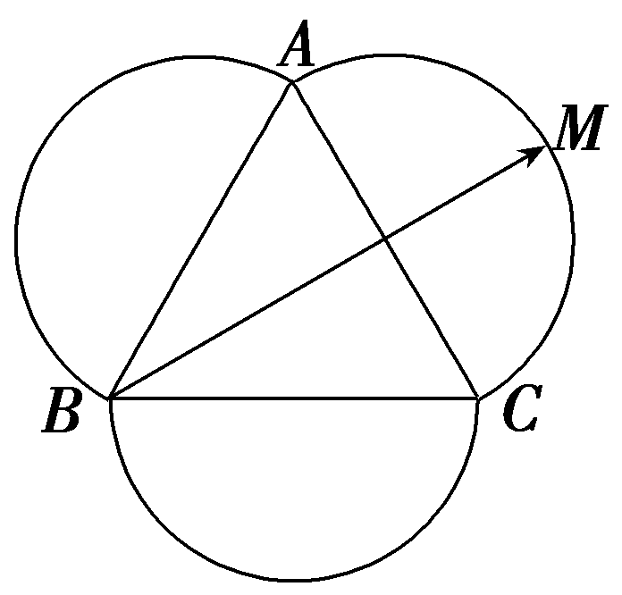

A. $\frac{1}{2}$ 	B. $\frac{\sqrt{3}}{3}$

C.1	D. $\frac{3}{2}$

答案：**B**

解析：如图所示，过点<te<te<text st*y*le="italic">x</text>t st*y*le="italic">x</text>t style="italic">M</text>作*M<text style="italic">P*</text>∥*<text style="italic"><text style="italic"><text style="italic">BC*</text></text></text>，交直线*<text style="italic"><text style="italic">AB*</text></text>，*<text style="italic">AC*</text>于点P，*Q*，设 $\vec{AM}$ ＝<te<text st*y*le="italic">x</text>t st*y*le="italic">x</text> $\vec{AP}$ ＋<te<text st*y*le="italic">x</text>t style="italic">y</text> $\vec{AQ}$ ，可得<te<text st*y*le="italic">x</text>t st*y*le="italic">x</text>＋y＝1.设 $\vec{AP}$ ＝*<text style="italic"><text style="italic"><text style="italic"><text style="italic"><text style="italic">k*</text></text></text></text></text> $\vec{AB}$ ， $\vec{AQ}$ ＝*<text style="italic"><text style="italic"><text style="italic"><text style="italic"><text style="italic">k*</text></text></text></text></text> $\vec{AC}$ ，则 $\vec{BM}$ ＝ $\vec{AM}$ － $\vec{AB}$ ＝ $\left(kx－1\right)\vec{AB}$ ＋*<text style="italic"><text style="italic"><text style="italic"><text style="italic"><text style="italic">k*</text></text></text></text></text><te<text st*y*le="italic">x</text>t style="italic">y</text> $\vec{AC}$ ，因为 $\vec{BM}$ ＝*<text style="italic"><text style="italic">λ*</text></text> $\vec{AB}$ ＋*<text style="italic"><text style="italic">μ*</text></text> $\vec{AC}$ ，所以*<text style="italic"><text style="italic">λ*</text></text>＋*<text style="italic"><text style="italic">μ*</text></text>＝*<text style="italic"><text style="italic"><text style="italic"><text style="italic"><text style="italic">k*</text></text></text></text></text><te<text st*y*le="italic">x</text>t st*y*le="italic">x</text>－1＋*<text style="italic">ky*</text>＝k－1，由图可知，当*PM*与半圆*<text style="italic"><text style="italic"><text style="italic">BC*</text></text></text>相切时，k最大，过半圆BC的最低点作*<text style="italic">EF*</text>∥BC，分别交*<text style="italic"><text style="italic">AB*</text></text>，*<text style="italic">AC*</text>的延长线于点E，F，又由AB＝2，*BE*＝ $\frac{1}{sin\frac{\pi }{3}}$ ＝ $\frac{2\sqrt{3}}{3}$ ，可得A*E*＝2＋ $\frac{2\sqrt{3}}{3}$ ＝ $\frac{6+2\sqrt{3}}{3}$ ，所以*<text style="italic"><text style="italic"><text style="italic"><text style="italic"><text style="italic">k*</text></text></text></text></text>ma<te<text st*y*le="italic">x</text>t st*y*le="italic">x</text>＝ $\frac{AE}{AB}$ ＝ $\frac{3+\sqrt{3}}{3}$ ，即*<text style="italic"><text style="italic"><text style="italic"><text style="italic"><text style="italic">k*</text></text></text></text></text>最大为 $\frac{3+\sqrt{3}}{3}$ ，所以*<text style="italic"><text style="italic">λ*</text></text>＋*<text style="italic"><text style="italic">μ*</text></text>的最大值为 $\frac{\sqrt{3}}{3}$ .故选B.

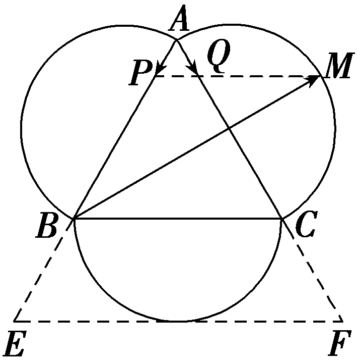

15.(多选)(2024·山东济南二模)如图，在直角三角形<te<text st*y*le="italic">x</text>t style="italic">*AB*C</text>中，AB＝*BC*＝ $\sqrt{2}$ ，<te<text st*y*le="italic">x</text>t style="italic">AO</text>＝*OC*，点*P*是以*AC*为直径的半圆弧上的动点，若 $\vec{BP}$ ＝<text st*y*le="italic">x</text> $\vec{BA}$ ＋*y* $\vec{BC}$ ，则(　　)

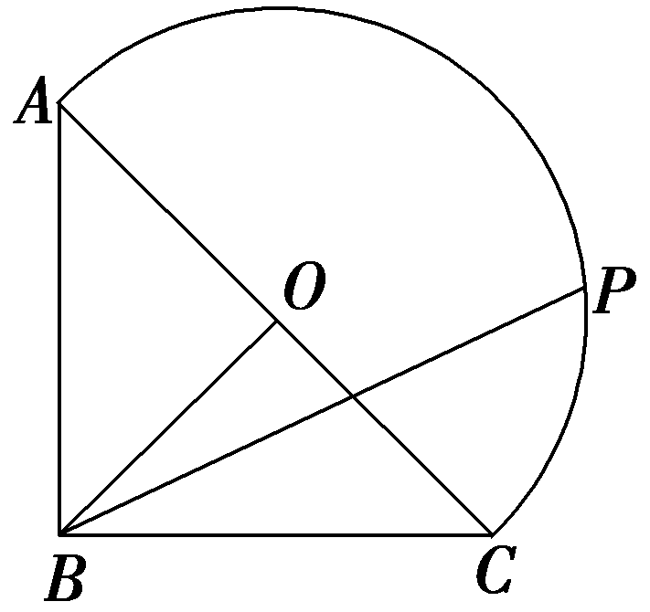

A. $\vec{BO}$ ＝ $\frac{1}{2}\vec{BA}$ ＋ $\frac{1}{2}\vec{BC}$

B. $\vec{CB}$ · $\vec{BO}$ ＝1

C. $\vec{BP}$ · $\vec{BC}$ 最大值为1＋ $\sqrt{2}$

D.*B*，*O*，*P*三点共线时*x*＋*y*＝2

答案：**ACD**

解析：因为<te<te<te<text st*y*le="italic">x</text>t st*y*le="italic">x</text>t st*y*le="italic">x</text>t style="italic">*A<text style="italic"><text style="italic"><text style="italic">O*</text></text></text></text>＝*O<text style="italic">C*</text>，即O为*AC*的中点，所以 $\vec{BO}$ ＝ $\frac{1}{2}\vec{BA}$ ＋ $\frac{1}{2}\vec{BC}$ ，故<te<te<te<text st*y*le="italic">x</text>t st*y*le="italic">x</text>t st*y*le="italic">x</text>t style="italic">A</text>正确；如图建立平面直角坐标系，则*<text style="italic">B*</text> $\left(0，0\right)$ ，<te<te<te<text st*y*le="italic">x</text>t st*y*le="italic">x</text>t st*y*le="italic">x</text>t style="italic">C</text> $\left(\sqrt{2}，0\right)$ ，<te<te<te<text st*y*le="italic">x</text>t st*y*le="italic">x</text>t st*y*le="italic">x</text>t style="italic">A</text> $\left(0，\sqrt{2}\right)$ ，<te<te<te<text st*y*le="italic">x</text>t st*y*le="italic">x</text>t st*y*le="italic">x</text>t style="italic">*<text style="italic"><text style="italic">O*</text></text></text> $\left(\frac{\sqrt{2}}{2}，\frac{\sqrt{2}}{2}\right)$ ，所以 $\vec{CB}$ ＝ $\left(－\sqrt{2}，0\right)$ ， $\vec{BO}$ ＝ $\left(\frac{\sqrt{2}}{2}，\frac{\sqrt{2}}{2}\right)$ ，则 $\vec{CB}$ · $\vec{BO}$ ＝－ $\sqrt{2}$ × $\frac{\sqrt{2}}{2}$ ＋0× $\frac{\sqrt{2}}{2}$ ＝－1，故<te<te<te<text st*y*le="italic">x</text>t st*y*le="italic">x</text>t st*y*le="italic">x</text>t style="italic">*B*</text>错误；又 $\left|AC\right|$ ＝ $\sqrt{\left(\sqrt{2}\right)^{2}＋\left(\sqrt{2}\right)^{2}}$ ＝2，所以圆<te<te<te<text st*y*le="italic">x</text>t st*y*le="italic">x</text>t st*y*le="italic">x</text>t style="italic">*<text style="italic"><text style="italic">O*</text></text></text>的方程为 $\left(x－\frac{\sqrt{2}}{2}\right)^{2}$ ＋ $\left(y－\frac{\sqrt{2}}{2}\right)^{2}$ ＝1，设<te<te<te<text st*y*le="italic">x</text>t st*y*le="italic">x</text>t st*y*le="italic">x</text>t style="italic">*P*</text>( $\frac{\sqrt{2}}{2}$ ＋cos <te<te<te<text st*y*le="italic">x</text>t st*y*le="italic">x</text>t st*y*le="italic">x</text>t style="italic">*<text style="italic"><text style="italic"><text style="italic"><text style="italic"><text style="italic"><text style="italic"><text style="italic"><text style="italic"><text style="italic"><text style="italic"><text style="italic"><text style="italic">θ*</text></text></text></text></text></text></text></text></text></text></text></text></text>， $\frac{\sqrt{2}}{2}$ ＋sin <te<te<te<text st*y*le="italic">x</text>t st*y*le="italic">x</text>t st*y*le="italic">x</text>t style="italic">*<text style="italic"><text style="italic"><text style="italic"><text style="italic"><text style="italic"><text style="italic"><text style="italic"><text style="italic"><text style="italic"><text style="italic"><text style="italic"><text style="italic">θ*</text></text></text></text></text></text></text></text></text></text></text></text></text>)，θ∈ $\left[－\frac{\pi }{4}，\frac{3\pi }{4}\right]$ ，则 $\vec{BP}$ ＝( $\frac{\sqrt{2}}{2}$ ＋cos <te<te<te<text st*y*le="italic">x</text>t st*y*le="italic">x</text>t st*y*le="italic">x</text>t style="italic">*<text style="italic"><text style="italic"><text style="italic"><text style="italic"><text style="italic"><text style="italic"><text style="italic"><text style="italic"><text style="italic"><text style="italic"><text style="italic"><text style="italic">θ*</text></text></text></text></text></text></text></text></text></text></text></text></text>， $\frac{\sqrt{2}}{2}$ ＋sin <te<te<te<text st*y*le="italic">x</text>t st*y*le="italic">x</text>t st*y*le="italic">x</text>t style="italic">*<text style="italic"><text style="italic"><text style="italic"><text style="italic"><text style="italic"><text style="italic"><text style="italic"><text style="italic"><text style="italic"><text style="italic"><text style="italic"><text style="italic">θ*</text></text></text></text></text></text></text></text></text></text></text></text></text>)，又 $\vec{BC}$ ＝ $\left(\sqrt{2}，0\right)$ ，所以 $\vec{BP}$ · $\vec{BC}$ ＝ $\sqrt{2}\left(\frac{\sqrt{2}}{2}＋cos\theta \right)$ ＋0× $\left(\frac{\sqrt{2}}{2}＋sin\theta \right)$ ＝1＋ $\sqrt{2}$ cos <te<te<te<text st*y*le="italic">x</text>t st*y*le="italic">x</text>t st*y*le="italic">x</text>t style="italic">*<text style="italic"><text style="italic"><text style="italic"><text style="italic"><text style="italic"><text style="italic"><text style="italic"><text style="italic"><text style="italic"><text style="italic"><text style="italic"><text style="italic">θ*</text></text></text></text></text></text></text></text></text></text></text></text></text>，因为θ∈ $\left[－\frac{\pi }{4}，\frac{3\pi }{4}\right]$ ，所以cos <te<te<te<text st*y*le="italic">x</text>t st*y*le="italic">x</text>t st*y*le="italic">x</text>t style="italic">*<text style="italic"><text style="italic"><text style="italic"><text style="italic"><text style="italic"><text style="italic"><text style="italic"><text style="italic"><text style="italic"><text style="italic"><text style="italic"><text style="italic">θ*</text></text></text></text></text></text></text></text></text></text></text></text></text>∈ $\left[－\frac{\sqrt{2}}{2}，1\right]$ ，所以 $\sqrt{2}$ cos <te<te<te<text st*y*le="italic">x</text>t st*y*le="italic">x</text>t st*y*le="italic">x</text>t style="italic">*<text style="italic"><text style="italic"><text style="italic"><text style="italic"><text style="italic"><text style="italic"><text style="italic"><text style="italic"><text style="italic"><text style="italic"><text style="italic"><text style="italic">θ*</text></text></text></text></text></text></text></text></text></text></text></text></text>∈ $\left[－1，\sqrt{2}\right]$ ，所以 $\vec{BP}$ · $\vec{BC}$ ∈ $\left[0，1+\sqrt{2}\right]$ ，故 $\vec{BP}$ · $\vec{BC}$ 最大值为1＋ $\sqrt{2}$ ，故<te<te<te<text st*y*le="italic">x</text>t st*y*le="italic">x</text>t st*y*le="italic">x</text>t style="italic">C</text>正确；因为*<text style="italic">B*</text>，*<text style="italic"><text style="italic"><text style="italic">O*</text></text></text>，*<text style="italic">P*</text>三点共线，所以 $\vec{BP}$ ∥ $\vec{BO}$ ，又 $\vec{BO}$ ＝ $\left(\frac{\sqrt{2}}{2}，\frac{\sqrt{2}}{2}\right)$ ， $\vec{BP}$ ＝( $\frac{\sqrt{2}}{2}$ ＋cos <te<te<te<text st*y*le="italic">x</text>t st*y*le="italic">x</text>t st*y*le="italic">x</text>t style="italic">*<text style="italic"><text style="italic"><text style="italic"><text style="italic"><text style="italic"><text style="italic"><text style="italic"><text style="italic"><text style="italic"><text style="italic"><text style="italic"><text style="italic">θ*</text></text></text></text></text></text></text></text></text></text></text></text></text>， $\frac{\sqrt{2}}{2}$ ＋sin <te<te<te<text st*y*le="italic">x</text>t st*y*le="italic">x</text>t st*y*le="italic">x</text>t style="italic">*<text style="italic"><text style="italic"><text style="italic"><text style="italic"><text style="italic"><text style="italic"><text style="italic"><text style="italic"><text style="italic"><text style="italic"><text style="italic"><text style="italic">θ*</text></text></text></text></text></text></text></text></text></text></text></text></text>)，所以 $\frac{\sqrt{2}}{2}$ × $\left(\frac{\sqrt{2}}{2}＋sin\theta \right)$ ＝ $\frac{\sqrt{2}}{2}$ × $\left(\frac{\sqrt{2}}{2}＋cos\theta \right)$ ，即sin <te<te<te<text st*y*le="italic">x</text>t st*y*le="italic">x</text>t st*y*le="italic">x</text>t style="italic">*<text style="italic"><text style="italic"><text style="italic"><text style="italic"><text style="italic"><text style="italic"><text style="italic"><text style="italic"><text style="italic"><text style="italic"><text style="italic"><text style="italic">θ*</text></text></text></text></text></text></text></text></text></text></text></text></text>＝cos θ，所以θ＝ $\frac{\pi }{4}$ ，所以 $\vec{BP}$ ＝ $\left(\sqrt{2}，\sqrt{2}\right)$ ，又 $\vec{BC}$ ＝ $\left(\sqrt{2}，0\right)$ ， $\vec{BA}$ ＝ $\left(0，\sqrt{2}\right)$ ，且 $\vec{BP}$ ＝<te<te<text st*y*le="italic">x</text>t st*y*le="italic">x</text>t st*y*le="italic">x</text> $\vec{BA}$ ＋<te<te<text st*y*le="italic">x</text>t st*y*le="italic">x</text>t style="italic">y</text> $\vec{BC}$ ，即 $\left(\sqrt{2}，\sqrt{2}\right)$ ＝<te<te<text st*y*le="italic">x</text>t st*y*le="italic">x</text>t st*y*le="italic">x</text> $\left(0，\sqrt{2}\right)$ ＋<te<te<text st*y*le="italic">x</text>t st*y*le="italic">x</text>t style="italic">y</text> $\left(\sqrt{2}，0\right)$ ＝ $\left(\sqrt{2}y，\sqrt{2}x\right)$ ，所以 $\left\{\begin{matrix}\sqrt{2}x＝\sqrt{2}，\\\sqrt{2}y＝\sqrt{2}，\end{matrix}\right.$ 所以 $\left\{\begin{matrix}x=1，\\y=1，\end{matrix}\right.$ 所以<te<te<text st*y*le="italic">x</text>t st*y*le="italic">x</text>t st*y*le="italic">x</text>＋y＝2，故D正确.故选*<text style="italic">AC*</text>D.

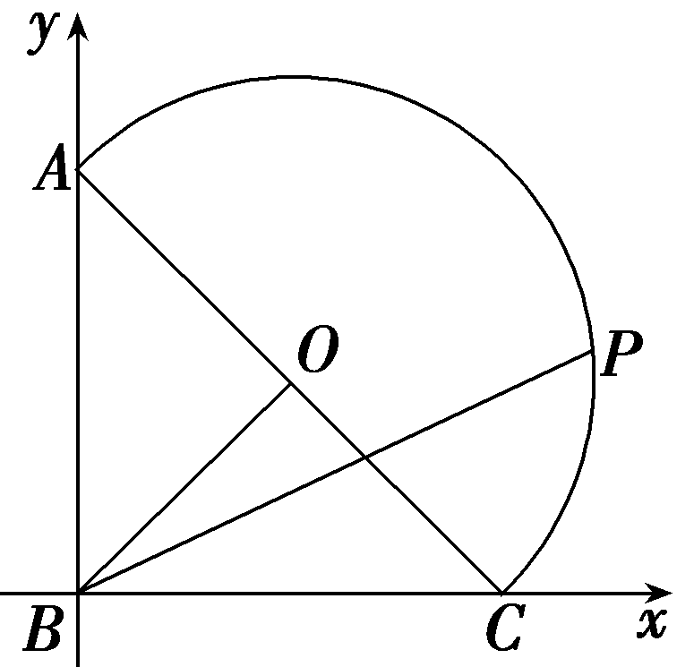

