第2课时　用空间向量求空间角

【课标研读】　1.能用向量方法解决异面直线、直线与平面、平面与平面的夹角问题，并能描述解决这一类问题的程序.　2.体会向量方法在研究几何问题中的作用.

1.异面直线所成的角

若异面直线&lt;text sty&lt;text sty&lt;text sty&lt;text style="it&lt;text style="<em><strong>b</strong></em>old,italic"&gt;a&lt;/text&gt;lic"&gt;l&lt;/text&gt;e="italic"&gt;l&lt;/text&gt;e="it&lt;text style="<em><strong>b</strong></em>old,italic"&gt;a&lt;/text&gt;lic"&gt;l&lt;/text&gt;e="italic"&gt;l&lt;/text&gt;&lt;text style="subscript"&gt;1&lt;/text&gt;，l&lt;text style="subscript"&gt;2&lt;/text&gt;所成的角为<em>&lt;text style="italic"&gt;θ</em>&lt;/text&gt;，a，b分别是直线l1，l2的方向向量，则cos θ＝｜cos＜a，b＞｜＝ $\frac{｜a\cdot b｜}{｜a||b｜}$ .

[微提醒]　两异面直线所成的角为锐角或直角，而不共线的向量的夹角的范围为(0，π)，所以公式中要加绝对值.

2.直线与平面所成的角

如图所示，设&lt;text sty&lt;text sty&lt;text sty&lt;text style="it<em><strong>a</strong></em>lic"&gt;l&lt;/text&gt;e="italic"&gt;l&lt;/text&gt;e="it<em><strong>a</strong></em>lic"&gt;l&lt;/text&gt;e="italic"&gt;l&lt;/text&gt;为平面<em>&lt;text style="italic"&gt;&lt;text style="italic"&gt;&lt;text style="italic"&gt;α</em>&lt;/text&gt;&lt;/text&gt;&lt;/text&gt;的斜线，l∩α＝<em>A</em>，a为l的方向向量，<em><strong>&lt;text style="bold,italic"&gt;n</strong></em>&lt;/text&gt;为平面α的法向量，<em>&lt;text style="italic"&gt;θ</em>&lt;/text&gt;为l与α所成的角，则sin θ＝｜cos＜a，n＞｜＝ $\frac{｜a\cdot n｜}{｜a||n｜}$ .

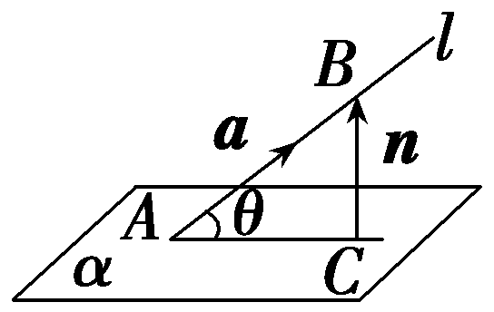

[微提醒]　直线与平面所成角的范围为 $\left[0，\frac{\pi }{2}\right]$ ，而向量之间的夹角的范围为[0，π]，所以公式中要加绝对值.

3.平面与平面的夹角

(&lt;text style="subscript"&gt;&lt;text style="subscript"&gt;1&lt;/text&gt;&lt;/text&gt;)平面与平面的夹角：平面<em>&lt;text style="italic"&gt;&lt;text style="italic"&gt;&lt;text style="italic"&gt;&lt;text style="italic"&gt;α</em>&lt;/text&gt;&lt;/text&gt;&lt;/text&gt;&lt;/text&gt;与平面<em>&lt;text style="italic"&gt;&lt;text style="italic"&gt;&lt;text style="italic"&gt;&lt;text style="italic"&gt;β</em>&lt;/text&gt;&lt;/text&gt;&lt;/text&gt;&lt;/text&gt;相交，形成四个二面角，我们把这四个二面角中不大于90°的二面角称为平面α与平面β的夹角，如图①.若平面α，β的法向量分别是<em><strong>&lt;text style="bold,italic"&gt;&lt;text style="bold,italic"&gt;&lt;text style="bold,italic"&gt;&lt;text style="bold,italic"&gt;&lt;text style="bold,italic"&gt;n</strong></em>&lt;/text&gt;&lt;/text&gt;&lt;/text&gt;&lt;/text&gt;&lt;/text&gt;1和n&lt;text style="subscript"&gt;&lt;text style="subscript"&gt;2&lt;/text&gt;&lt;/text&gt;，则平面α与平面β的夹角即为向量n1和n2的夹角或其补角.设平面α与平面β的夹角为<em>&lt;text style="italic"&gt;θ</em>&lt;/text&gt;，则cos θ＝｜cos＜n1，n2＞｜＝ $\left|\frac{n_{1}\cdot n_{2}}{｜n_{1}||n_{2}｜}\right|$ ＝ $\frac{｜n_{1}\cdot n_{2}｜}{｜n_{1}||n_{2}｜}$ .

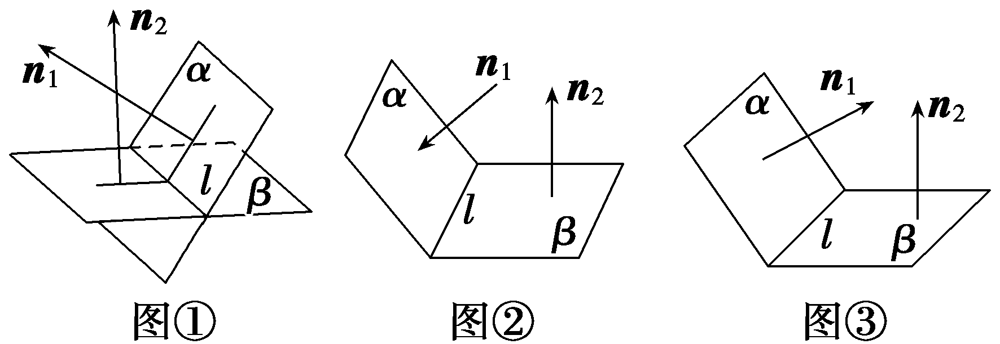

(2)二面角：二面角<text sty*l*e="italic">α</text> -l-*β*为*<text style="italic"><text style="italic">θ*</text></text>或π－θ.设二面角大小为*<text style="italic">φ*</text>，则｜cos φ｜＝cos θ＝ $\frac{｜n_{1}\cdot n_{2}｜}{｜n_{1}||n_{2}｜}$ ，如图②③.

[微提醒]　注意二面角与两个平面的夹角的区别与联系，二面角的范围为[0，π]，两个平面的夹角的范围为［0， $\frac{\pi }{2}$ ］.

【常用结论】

最小角定理

如图，若<em>OA</em>为平面<em>α</em>的一条斜线，<em>O</em>为斜足，<em>OB</em>为<em>OA</em>在平面<em>α</em>内的射影，<em>OC</em>为平面<em>α</em>内的一条直线，其中<em>θ</em>为<em>OA</em>与<em>OC</em>所成的角，<em>θ</em>1为<em>OA</em>与<em>OB</em>所成的角，即线面角，<em>θ</em>2为<em>OB</em>与<em>OC</em>所成的角，那么cos <em>θ</em>＝cos <em>θ</em>1cos <em>θ</em>2.

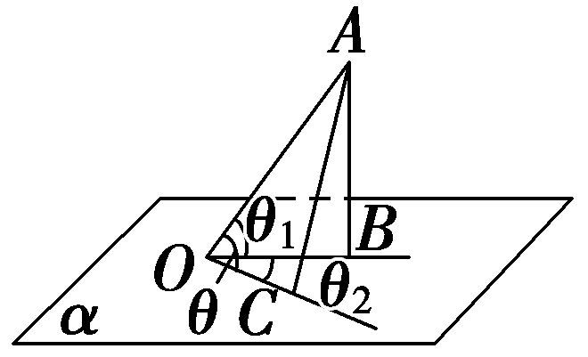

【自主检测】

1.已知直线<em>l</em>1的方向向量<em><strong>s</strong></em>1＝(1，0，1)与直线<em>l</em>2的方向向量<em><strong>s</strong></em>2＝(－1，2，－2)，则<em>l</em>1和<em>l</em>2夹角的余弦值为(　　)

A. $\frac{\sqrt{2}}{4}$ 	B. $\frac{1}{2}$

C. $\frac{\sqrt{2}}{2}$ 	D. $\frac{\sqrt{3}}{2}$

答案：**C**

解析：因为&lt;text &lt;text &lt;text &lt;text sty&lt;text sty<em>l</em>e="italic"&gt;l&lt;/text&gt;e="bold,italic"&gt;s&lt;/text&gt;tyle="bold,italic"&gt;s&lt;/text&gt;tyle="bold,italic"&gt;s&lt;/text&gt;tyle="bold,italic"&gt;s&lt;/text&gt;&lt;text style="subscript"&gt;&lt;text style="subscript"&gt;1&lt;/text&gt;&lt;/text&gt;＝(1，0，1)，s&lt;text style="subscript"&gt;&lt;text style="subscript"&gt;2&lt;/text&gt;&lt;/text&gt;＝(－1，2，－2)，所以cos＜s1，s2＞＝ $\frac{s_{1}\cdot s_{2}}{｜s_{1}||s_{2}｜}$ ＝ $\frac{－1－2}{\sqrt{2}\times 3}$ ＝－ $\frac{\sqrt{2}}{2}$ .又两直线夹角的取值范围为 $\left[0，\frac{\pi }{2}\right]$ ，所以&lt;text sty<em>l</em>e="italic"&gt;l&lt;/text&gt;&lt;text &lt;text &lt;text <em><strong>s</strong></em>tyle="bold,italic"&gt;s&lt;/text&gt;tyle="bold,italic"&gt;s&lt;/text&gt;tyle="subscript"&gt;&lt;text style="subscript"&gt;1&lt;/text&gt;&lt;/text&gt;和l&lt;text style="subscript"&gt;&lt;text style="subscript"&gt;2&lt;/text&gt;&lt;/text&gt;夹角的余弦值为 $\frac{\sqrt{2}}{2}$ .故选C.

2.(链接人教A选择性必修一P38T2)已知*AO*为平面*α*的一条斜线，*O*为斜足，*OB*为*OA*在平面*α*内的射影，直线*OC*在平面*α*内，且∠*AOB*＝∠*BOC*＝45°，则∠*AOC*的大小为(　　)

A.30°	B.45°

C.60°	D.90°

答案：<strong>C</strong>解析：由结论可知有cos∠<em>&lt;text style="italic"&gt;AOB·</em>&lt;/text&gt;cos∠<em>&lt;text style="italic"&gt;BOC</em>&lt;/text&gt;＝cos∠<em>&lt;text style="italic"&gt;&lt;text style="italic"&gt;AOC</em>&lt;/text&gt;&lt;/text&gt;.因为∠AOB＝∠BOC＝45°，则cos∠AOC＝cos 45°·cos 45°＝ $\frac{\sqrt{2}}{2}$ × $\frac{\sqrt{2}}{2}$ ＝ $\frac{1}{2}$ ，则∠AO<strong>C</strong>＝60°.故选C.

3.(链接人教A选择性必修一P37例8)已知点<em>E</em>，<em>F</em>分别在正方体<em>ABCD</em>-<em>A</em>1<em>B</em>1<em>C</em>1<em>D</em>1的棱<em>BB</em>1，<em>CC</em>1上，且<em>B</em>1<em>E</em>＝2<em>EB</em>，<em>CF</em>＝2<em>FC</em>1，则平面<em>AEF</em>与平面<em>ABC</em>夹角的余弦值等于 <u>　　　　</u>.

答案： $\frac{3\sqrt{11}}{11}$

解析：如图，建立空间直角坐标系.

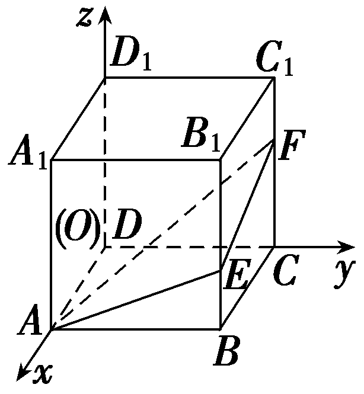

设正方体的棱长为&lt;te&lt;te&lt;text st<em>y</em>le="italic"&gt;x&lt;/text&gt;t st<em>y</em>le="italic"&gt;x&lt;/text&gt;t style="subscript"&gt;1&lt;/text&gt;，平面<em>&lt;text style="italic"&gt;A</em>BC&lt;/text&gt;的法向量为<em><strong>&lt;text style="bold,italic"&gt;n</strong></em>&lt;/text&gt;1＝(0，0，1)，平面<em>A&lt;text style="italic"&gt;EF</em>&lt;/text&gt;的法向量为n2＝(x，y，<em>z</em>).因为A(1，0，0)，E $\left(1，1，\frac{1}{3}\right)$ ，&lt;te&lt;text st<em>y</em>le="italic"&gt;x&lt;/text&gt;t style="italic"&gt;F&lt;/text&gt; $\left(0，1，\frac{2}{3}\right)$ ，所以 $\vec{AE}$ ＝ $\left(0，1，\frac{1}{3}\right)$ ， $\vec{EF}$ ＝ $\left(－1，0，\frac{1}{3}\right)$ ，则 $\left\{\begin{matrix}n_{2}\cdot \vec{AE}=0，\\n_{2}\cdot \vec{EF}=0，\end{matrix}\right.$ 即 $\left\{\begin{matrix}y＋\frac{1}{3}z=0，\\－x＋\frac{1}{3}z=0.\end{matrix}\right.$ 取&lt;te&lt;text st<em>y</em>le="italic"&gt;x&lt;/text&gt;t st<em>y</em>le="italic"&gt;x&lt;/text&gt;＝1，则y＝－1，

<em>z</em>＝3.故<em><strong>&lt;text style="bold,italic"&gt;&lt;text style="bold,italic"&gt;n</strong></em>&lt;/text&gt;&lt;/text&gt;&lt;text style="subscript"&gt;2&lt;/text&gt;＝(1，－1，3).所以cos＜n1，n2＞＝ $\frac{n_{1}\cdot n_{2}}{｜n_{1}||n_{2}｜}$ ＝ $\frac{3\sqrt{11}}{11}$ .所以平面<em>AEF</em>与平面<em>ABC</em>夹角的余弦值为 $\frac{3\sqrt{11}}{11}$ .

4.已知向量&lt;text sty&lt;text sty<em>l</em>e="italic"&gt;l&lt;/text&gt;e="bold,italic"&gt;<em><strong>m</strong></em>&lt;/text&gt;，<em><strong>&lt;text style="bold,italic"&gt;n</strong></em>&lt;/text&gt;分别是直线l的方向向量、平面<em>&lt;text style="italic"&gt;α</em>&lt;/text&gt;的法向量，若cos＜m，n＞＝－ $\frac{1}{2}$ ，则&lt;text sty<em>l</em>e="italic"&gt;l&lt;/text&gt;与<em>&lt;text style="italic"&gt;α</em>&lt;/text&gt;所成的角为<u>　　　　</u>.

答案： $\frac{\pi }{6}$

解析：设直线<em>l</em>与<em>α</em>所成的角为<em>&lt;text style="italic"&gt;&lt;text style="italic"&gt;&lt;text style="italic"&gt;θ</em>&lt;/text&gt;&lt;/text&gt;&lt;/text&gt;，则si<em><strong>n</strong></em> θ＝｜cos＜<em><strong>m</strong></em>，n＞｜＝ $\frac{1}{2}$ ，又因为<em>&lt;text style="italic"&gt;&lt;text style="italic"&gt;&lt;text style="italic"&gt;θ</em>&lt;/text&gt;&lt;/text&gt;&lt;/text&gt;∈［0， $\frac{\pi }{2}$ ］，所以<em>&lt;text style="italic"&gt;&lt;text style="italic"&gt;&lt;text style="italic"&gt;θ</em>&lt;/text&gt;&lt;/text&gt;&lt;/text&gt;＝ $\frac{\pi }{6}$ .

考点一　异面直线所成的角　　　　自主练透

1.如图，在四棱锥*P*-*ABCD*中，*PA*⊥底面*ABCD*，底面*ABCD*为正方形，*PA*＝*BC*，*E*为*CD*的中点，*F*为*PC*的中点，则异面直线*BF*与*PE*所成角的余弦值为(　　)

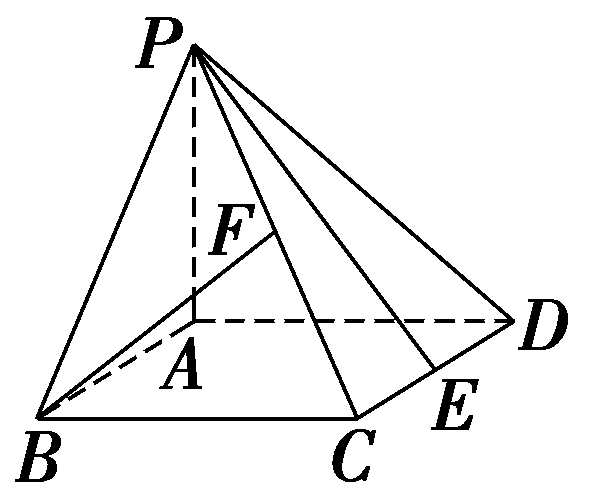

A.－ $\frac{\sqrt{3}}{9}$ 	B. $\frac{\sqrt{3}}{9}$

C.－ $\frac{5\sqrt{3}}{9}$ 	D. $\frac{5\sqrt{3}}{9}$

答案：**B**

解析：如图，以点<te<text st*y*le="italic">x</text>t style="italic">*A*</text>为坐标原点，以*<text style="italic">A<text style="italic">B*</text></text>，*A<text style="italic">D*</text>，*A<text style="italic">P*</text>所在直线分别为x轴、y轴、*z*轴，建立空间直角坐标系，设AB＝2，异面直线*B<text style="italic">F*</text>与*P<text style="italic">E*</text>所成角为*<text style="italic">θ*</text>，则A(0，0，0)，B(2，0，0)，P(0，0，2)，*C*(2，2，0)，D(0，2，0)，则E(1，2，0)，F(1，1，1)，所以 $\vec{BF}$ ＝(－1，1，1)， $\vec{PE}$ ＝(1，2，－2)，所以cos *<text style="italic">θ*</text>＝｜cos＜ $\vec{BF}$ ， $\vec{PE}$ ＞｜＝ $\frac{｜\vec{BF}\cdot \vec{PE}｜}{｜\vec{BF}||\vec{PE}｜}$ ＝ $\frac{|-1+2－2｜}{\sqrt{3}\times 3}$ ＝ $\frac{\sqrt{3}}{9}$ ，所以异面直线*<text style="italic">BF*</text>与*<text style="italic">PE*</text>所成角的余弦值为 $\frac{\sqrt{3}}{9}$ .故选*B*.

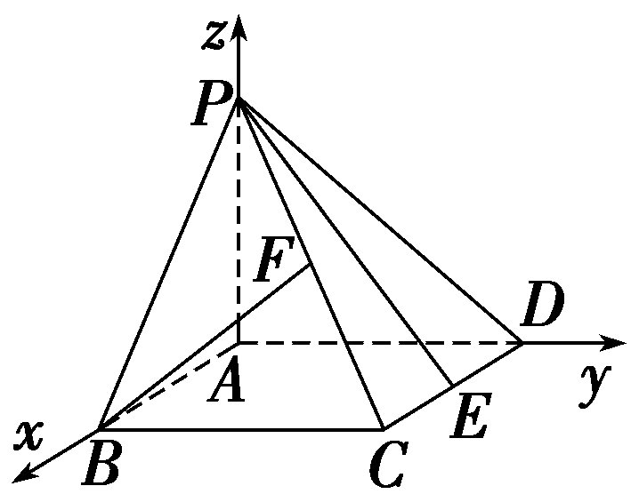

2.有公共边的△<em>ABC</em>和△<em>BCD</em>均为等边三角形，且所在平面互相垂直，则异面直线<em>AB</em>与<em>CD</em>所成角的正弦值为<u>　　　　</u>.

答案： $\frac{\sqrt{15}}{4}$

解析：设等边三角形的边长为2.取<te<text st*y*le="italic">x</text>t style="italic">*BC*</text>的中点*<text style="italic">O*</text>，连接*<text style="italic"><text style="italic">O<text style="italic">A*</text></text></text>，*<text style="italic"><text style="italic">O<text style="italic">D*</text></text></text>.因为△*<text style="italic">AB*C</text>和△*B<text style="italic">CD*</text>所在平面互相垂直，所以OA，*<text style="italic">OC*</text>，OD两两垂直，以O为坐标原点，OD，OC，OA所在直线分别为x轴，y轴，*z*轴建立如图所示的空间直角坐标系.则A(0，0， $\sqrt{3}$ )，*B*(0，－1，0)，*C*(0，1，0)，*D*( $\sqrt{3}$ ，0，0)，所以 $\vec{AB}$ ＝(0，－1，－ $\sqrt{3}$ )， $\vec{CD}$ ＝( $\sqrt{3}$ ，－1，0)，则cos＜ $\vec{AB}$ ， $\vec{CD}$ ＞＝ $\frac{\vec{AB}\cdot \vec{CD}}{｜\vec{AB}||\vec{CD}｜}$ ＝ $\frac{1}{2\times 2}$ ＝ $\frac{1}{4}$ ，故sin＜ $\vec{AB}$ ， $\vec{CD}$ ＞＝ $\sqrt{1－(\frac{1}{4})^{2}}$ ＝ $\frac{\sqrt{15}}{4}$ ，所以异面直线*AB*与*CD*所成角的正弦值为 $\frac{\sqrt{15}}{4}$ .

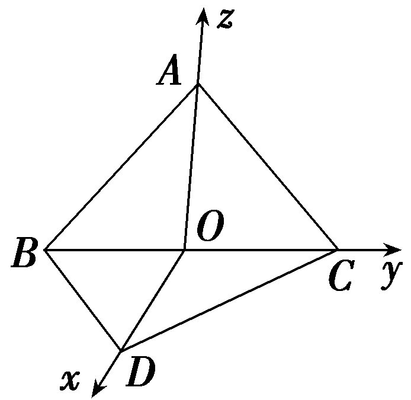

3.如图，已知以<em>O</em>为圆心，2为半径的圆在平面<em>α</em>上，若<em>PO</em>⊥<em>α</em>，且<em>PO</em>＝4，<em>OA</em>，<em>OB</em>为圆<em>O</em>的半径，且∠<em>AOB</em>＝90°，<em>M</em>为<em>AB</em>的中点，则异面直线<em>OB</em>与<em>PM</em>所成角的余弦值为<u>　　　　</u>.

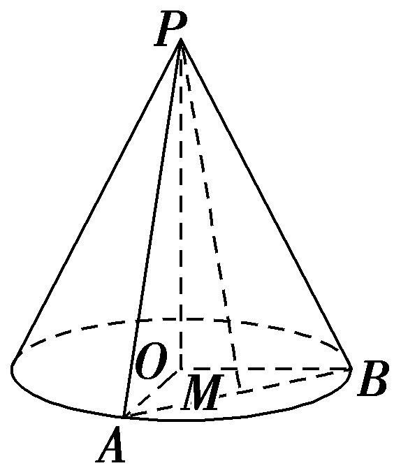

答案： $\frac{\sqrt{2}}{6}$

解析：由<te<text st*y*le="italic">x</text>t style="italic">*P<text style="italic">O*</text></text>⊥*α*且∠*<text style="italic">AO<text style="italic">B*</text></text>＝90°可知*OA*，*OB*，*OP*两两垂直.以O为坐标原点， $\vec{OA}$ ， $\vec{OB}$ ， $\vec{OP}$ 的方向分别为<text st*y*le="italic">x</text>轴，y轴，*z*轴的正方向，建立如图所示的空间直角坐标系.由题知*<text style="italic">O*</text>(0，0，0)，*P*(0，0，4)，*A*(2，0，0)，*B*(0，2，0)，因为*<text style="italic">M*</text>为*AB*的中点，所以M(1，1，0)，所以 $\vec{PM}$ ＝(1，1，－4)， $\vec{OB}$ ＝(0，2，0)，则cos＜ $\vec{PM}$ ， $\vec{OB}$ ＞＝ $\frac{\vec{PM}\cdot \vec{OB}}{｜\vec{PM}||\vec{OB}｜}$ ＝ $\frac{2}{\sqrt{1+1+16}\times 2}$ ＝ $\frac{\sqrt{2}}{6}$ ，所以异面直线<te<text st*y*le="italic">x</text>t style="italic">*<text style="italic">O*</text>*B*</text>与*P<text style="italic">M*</text>所成角的余弦值为 $\frac{\sqrt{2}}{6}$ .

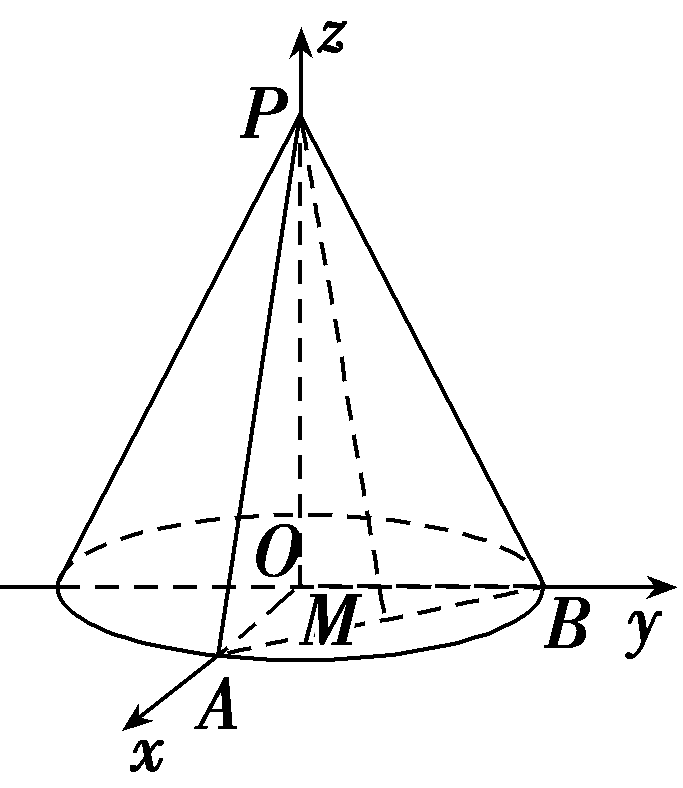

用向量法求异面直线所成角的步骤

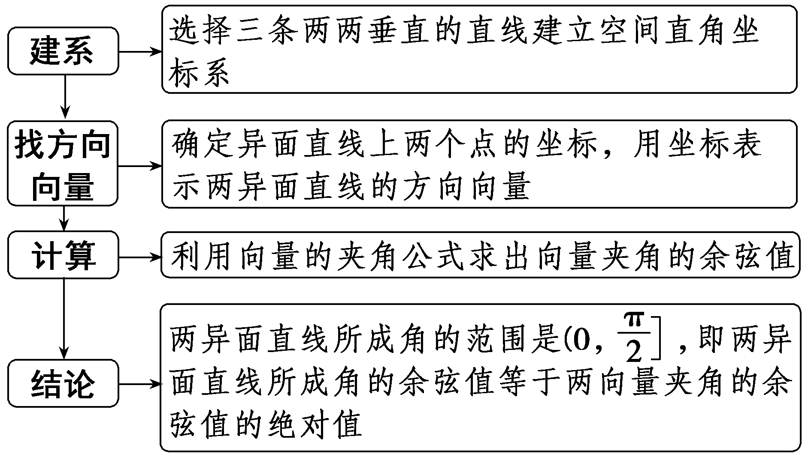

考点二　直线与平面所成的角　　　　师生共研

(2023·全国甲卷)如图，在三棱柱<em>ABC</em>-<em>A</em>1<em>B</em>1<em>C</em>1中，<em>A</em>1<em>C</em>⊥平面<em>ABC</em>，∠<em>ACB</em>＝90°，<em>AA</em>1＝2，<em>A</em>1到平面<em>BCC</em>1<em>B</em>1的距离为1.

(1)证明：<em>A</em>1<em>C</em>＝<em>AC</em>；

(2)已知<em>AA</em>1与<em>BB</em>1的距离为2，求<em>AB</em>1与平面<em>BCC</em>1<em>B</em>1所成角的正弦值.

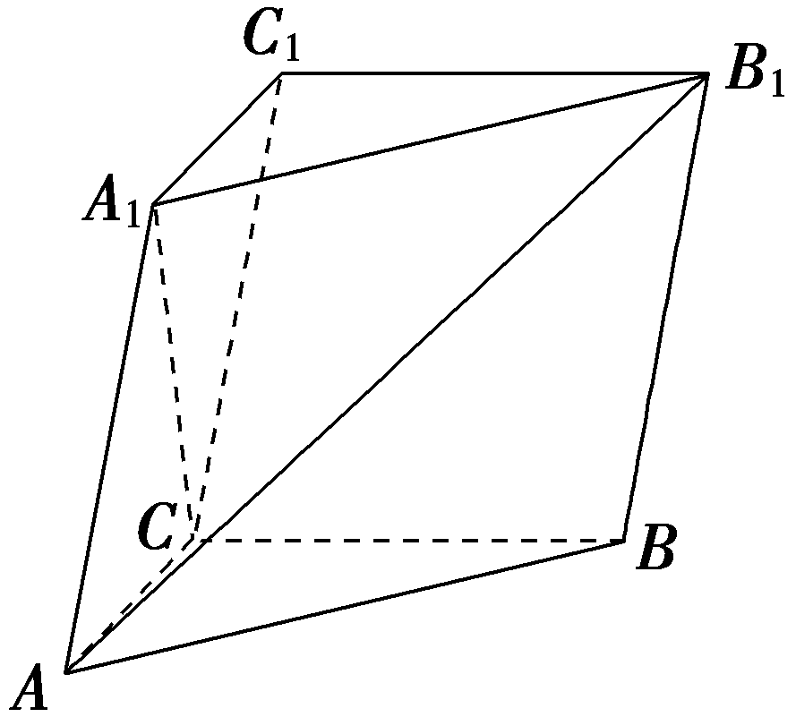

解：(1)证明：如图，

因为<em>A</em>1<em>C</em>⊥平面<em>ABC</em>，<em>BC</em>⊂平面<em>ABC</em>，所以<em>A</em>1<em>C</em>⊥<em>BC</em>，又<em>BC</em>⊥<em>AC</em>，<em>A</em>1<em>C</em>，<em>AC</em>⊂平面<em>ACC</em>1<em>A</em>1，<em>A</em>1<em>C</em>∩<em>AC</em>＝<em>C</em>，所以<em>BC</em>⊥平面<em>ACC</em>1<em>A</em>1，

又<em>BC</em>⊂平面<em>BCC</em>1<em>B</em>1，

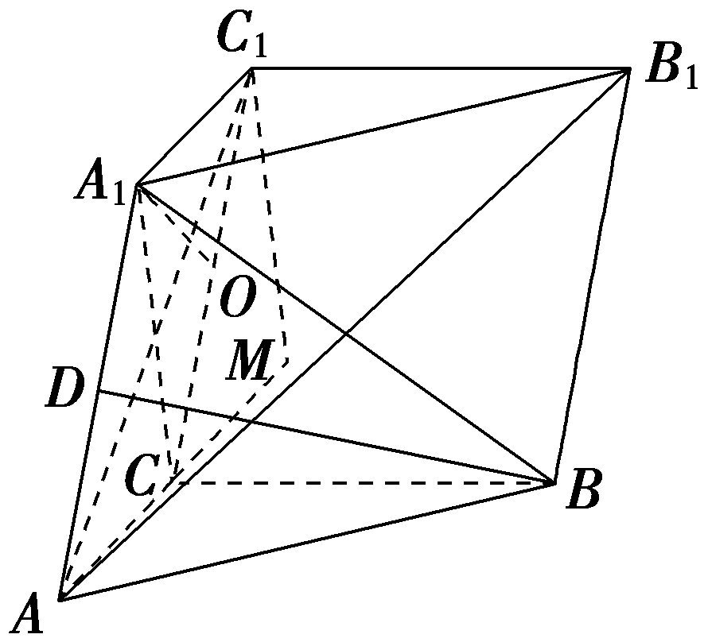

所以平面<em>ACC</em>1<em>A</em>1⊥平面<em>BCC</em>1<em>B</em>1，

过<em>A</em>1作<em>A</em>1<em>O</em>⊥<em>CC</em>1交<em>CC</em>1于<em>O</em>，又平面<em>ACC</em>1<em>A</em>1∩平面<em>BCC</em>1<em>B</em>1＝<em>CC</em>1，<em>A</em>1<em>O</em>⊂平面<em>ACC</em>1<em>A</em>1，

所以<em>A</em>1<em>O</em>⊥平面<em>BCC</em>1<em>B</em>1，

因为<em>A</em>1到平面<em>BCC</em>1<em>B</em>1的距离为1，

所以<em>A</em>1<em>O</em>＝1，

在Rt△<em>A</em>1<em>CC</em>1中，<em>A</em>1<em>C</em>⊥<em>A</em>1<em>C</em>1，<em>CC</em>1＝<em>AA</em>1＝2，

设<em>CO</em>＝<em>x</em>，则<em>C</em>1<em>O</em>＝2－<em>x</em>，

易知△<em>A</em>&lt;text style="subscript"&gt;&lt;text style="subscript"&gt;1&lt;/text&gt;&lt;/text&gt;<em>OC</em>1∽△<em>COA</em>1，故 $\frac{OC_{1}}{OA_{1}}$ ＝ $\frac{A_{1}O}{CO}$ ，

即1＝(2－*x*)*x*，解得*x*＝1，

所以<em>&lt;text style="italic"&gt;&lt;text style="italic"&gt;A</em>&lt;/text&gt;<em>&lt;text style="italic"&gt;C</em>&lt;/text&gt;&lt;/text&gt;＝A&lt;text style="subscript"&gt;&lt;text style="subscript"&gt;1&lt;/text&gt;&lt;/text&gt;C＝A1C1＝ $\sqrt{2}$ ，

所以<em>A</em>1<em>C</em>＝<em>AC</em>.

(2)法一：(几何法)因为<em>AC</em>＝<em>A</em>1<em>C</em>1，<em>BC</em>⊥<em>A</em>1<em>C</em>，<em>BC</em>⊥<em>AC</em>，

所以Rt△<em>ACB</em>≌Rt△<em>A</em>1<em>CB</em>，

所以<em>BA</em>＝<em>BA</em>1，

过<em>B</em>作<em>BD</em>⊥<em>AA</em>1，交<em>AA</em>1于<em>D</em>，

则<em>D</em>为<em>AA</em>1的中点，

因为直线<em>AA</em>1与<em>BB</em>1的距离为2，所以<em>BD</em>＝2，

因为<em>&lt;text style="italic"&gt;A</em>&lt;/text&gt;&lt;text style="subscript"&gt;1&lt;/text&gt;<em>D</em>＝1，<em>&lt;text style="italic"&gt;B</em>D&lt;/text&gt;＝2，所以A1B＝<em>AB</em>＝ $\sqrt{5}$ ，

在Rt△*A<text style="italic">BC*</text>中，BC＝ $\sqrt{AB^{2}－AC^{2}}$ ＝ $\sqrt{3}$ ，

延长<em>AC</em>，使<em>AC</em>＝<em>CM</em>，连接<em>C</em>1<em>M</em>，

由<em>CM</em>∥<em>A</em>1<em>C</em>1，<em>CM</em>＝<em>A</em>1<em>C</em>1，

知四边形<em>A</em>1<em>CMC</em>1为平行四边形，

所以<em>C</em>1<em>M</em>∥<em>A</em>1<em>C</em>，所以<em>C</em>1<em>M</em>⊥平面<em>ABC</em>，

又<em>AM</em>⊂平面<em>ABC</em>，所以<em>C</em>1<em>M</em>⊥<em>AM</em>，

则在Rt△<em>&lt;text style="italic"&gt;A&lt;text style="italic"&gt;C</em>&lt;/text&gt;&lt;/text&gt;&lt;text style="subscript"&gt;&lt;text style="subscript"&gt;1&lt;/text&gt;&lt;/text&gt;<em>&lt;text style="italic"&gt;M</em>&lt;/text&gt;中，<em>AM</em>＝2 $\sqrt{2}$ ，<em>&lt;text style="italic"&gt;C</em>&lt;/text&gt;&lt;text style="subscript"&gt;&lt;text style="subscript"&gt;1&lt;/text&gt;&lt;/text&gt;<em>&lt;text style="italic"&gt;M</em>&lt;/text&gt;＝<em>A</em>1C＝ $\sqrt{2}$ ，

所以<em>AC</em>1＝ $\sqrt{AM^{2}＋C_{1}M^{2}}$ ＝ $\sqrt{10}$ ，

在Rt△<em>A&lt;text style="italic"&gt;B</em>&lt;/text&gt;&lt;text style="subscript"&gt;&lt;text style="subscript"&gt;&lt;text style="subscript"&gt;&lt;text style="subscript"&gt;1&lt;/text&gt;&lt;/text&gt;&lt;/text&gt;&lt;/text&gt;<em>&lt;text style="italic"&gt;C</em>&lt;/text&gt;1中，<em>AC</em>1＝ $\sqrt{10}$ ，<em>B</em>&lt;text style="subscript"&gt;&lt;text style="subscript"&gt;&lt;text style="subscript"&gt;&lt;text style="subscript"&gt;1&lt;/text&gt;&lt;/text&gt;&lt;/text&gt;&lt;/text&gt;<em>&lt;text style="italic"&gt;C</em>&lt;/text&gt;1＝<em>BC</em>＝ $\sqrt{3}$ ，

所以<em>AB</em>1＝ $\sqrt{(\sqrt{10})^{2}＋(\sqrt{3})^{2}}$ ＝ $\sqrt{13}$ ，

又<em>A</em>到平面<em>BCC</em>1<em>B</em>1的距离也为1，

所以<em>A&lt;text style="italic"&gt;B</em>&lt;/text&gt;&lt;text style="subscript"&gt;&lt;text style="subscript"&gt;1&lt;/text&gt;&lt;/text&gt;与平面<em>BCC</em>1B1所成角的正弦值为 $\frac{1}{\sqrt{13}}$ ＝ $\frac{\sqrt{13}}{13}$ .

法二(空间向量法)：因为<em>A</em>1<em>C</em>⊥平面<em>ABC</em>，∠<em>ACB</em>＝90°，

所以<em>A</em>1<em>C</em>，<em>AC</em>，<em>BC</em>两两垂直.

如图，以*C*为坐标原点，建立空间直角坐标系.

由(&lt;text style="subscript"&gt;&lt;text style="subscript"&gt;&lt;text style="subscript"&gt;&lt;text style="subscript"&gt;1&lt;/text&gt;&lt;/text&gt;&lt;/text&gt;&lt;/text&gt;)知<em>&lt;text style="italic"&gt;&lt;text style="italic"&gt;&lt;text style="italic"&gt;&lt;text style="italic"&gt;&lt;text style="italic"&gt;&lt;text style="italic"&gt;A</em>&lt;/text&gt;&lt;/text&gt;&lt;/text&gt;&lt;/text&gt;&lt;/text&gt;<em>&lt;text style="italic"&gt;C</em>&lt;/text&gt;&lt;/text&gt;＝A1C＝A1C1＝ $\sqrt{2}$ ，取<em>&lt;text style="italic"&gt;&lt;text style="italic"&gt;&lt;text style="italic"&gt;&lt;text style="italic"&gt;&lt;text style="italic"&gt;A</em>&lt;/text&gt;&lt;/text&gt;&lt;/text&gt;&lt;/text&gt;&lt;/text&gt;&lt;text style="subscript"&gt;&lt;text style="subscript"&gt;&lt;text style="subscript"&gt;&lt;text style="subscript"&gt;1&lt;/text&gt;&lt;/text&gt;&lt;/text&gt;&lt;/text&gt;A中点<em>E</em>，连接<em>&lt;text style="italic"&gt;&lt;text style="italic"&gt;BE</em>&lt;/text&gt;&lt;/text&gt;，则BE⊥A1A.所以BE＝2，所以<em>AB</em>＝ $\sqrt{5}$ ，则B<em>&lt;text style="italic"&gt;C</em>&lt;/text&gt;＝ $\sqrt{3}$ .

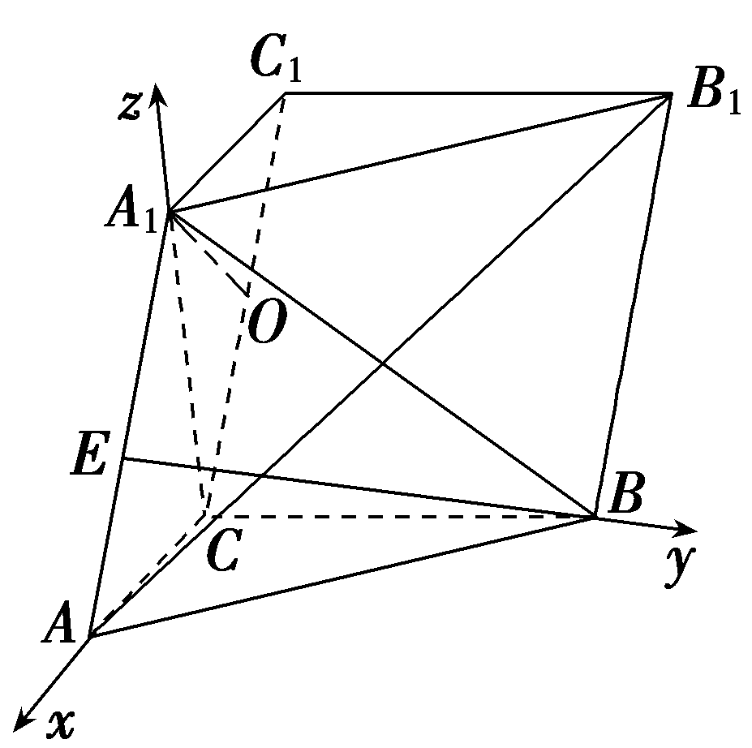

则<em>&lt;text style="italic"&gt;A</em>&lt;/text&gt;( $\sqrt{2}$ ，0，0)，<em>&lt;text style="italic"&gt;A</em>&lt;/text&gt;&lt;text style="subscript"&gt;&lt;text style="subscript"&gt;1&lt;/text&gt;&lt;/text&gt;(0，0， $\sqrt{2}$ )，<em>C</em>&lt;text style="subscript"&gt;&lt;text style="subscript"&gt;1&lt;/text&gt;&lt;/text&gt;(－ $\sqrt{2}$ ，0， $\sqrt{2}$ )，<em>O</em>(－ $\frac{\sqrt{2}}{2}$ ，0， $\frac{\sqrt{2}}{2}$ )，<em>B</em>&lt;text style="subscript"&gt;&lt;text style="subscript"&gt;1&lt;/text&gt;&lt;/text&gt;(－ $\sqrt{2}$ ， $\sqrt{3}$ ， $\sqrt{2}$ )，

因为<em>A</em>&lt;text style="subscript"&gt;&lt;text style="subscript"&gt;&lt;text style="subscript"&gt;&lt;text style="subscript"&gt;1&lt;/text&gt;&lt;/text&gt;&lt;/text&gt;&lt;/text&gt;<em>O</em>⊥平面<em>&lt;text style="italic"&gt;C</em>&lt;/text&gt;1<em>&lt;text style="italic"&gt;CBB</em>&lt;/text&gt;1，所以平面C1CBB1的法向量 $\vec{A_{1}O}$ ＝(－ $\frac{\sqrt{2}}{2}$ ，0，－ $\frac{\sqrt{2}}{2}$ ).

又 $\vec{AB_{1}}$ ＝(－2 $\sqrt{2}$ ， $\sqrt{3}$ ， $\sqrt{2}$ )，

所以cos＜ $\vec{AB_{1}}$ ， $\vec{A_{1}O}$ ＞＝ $\frac{｜\vec{AB_{1}}\cdot \vec{A_{1}O}｜}{｜\vec{AB_{1}}||\vec{A_{1}O}｜}$ ＝ $\frac{｜2+0－1｜}{\sqrt{8+3+2}\times \sqrt{\frac{2}{4}+0+\frac{2}{4}}}$ ＝ $\frac{\sqrt{13}}{13}$ ，

所以直线<em>A&lt;text style="italic"&gt;B</em>&lt;/text&gt;&lt;text style="subscript"&gt;&lt;text style="subscript"&gt;1&lt;/text&gt;&lt;/text&gt;与平面<em>BCC</em>1B1所成角的正弦值为sin <em>θ</em>＝cos＜ $\vec{AB_{1}}$ ， $\vec{A_{1}O}$ ＞＝ $\frac{\sqrt{13}}{13}$ .

用向量法求线面角的解题步骤

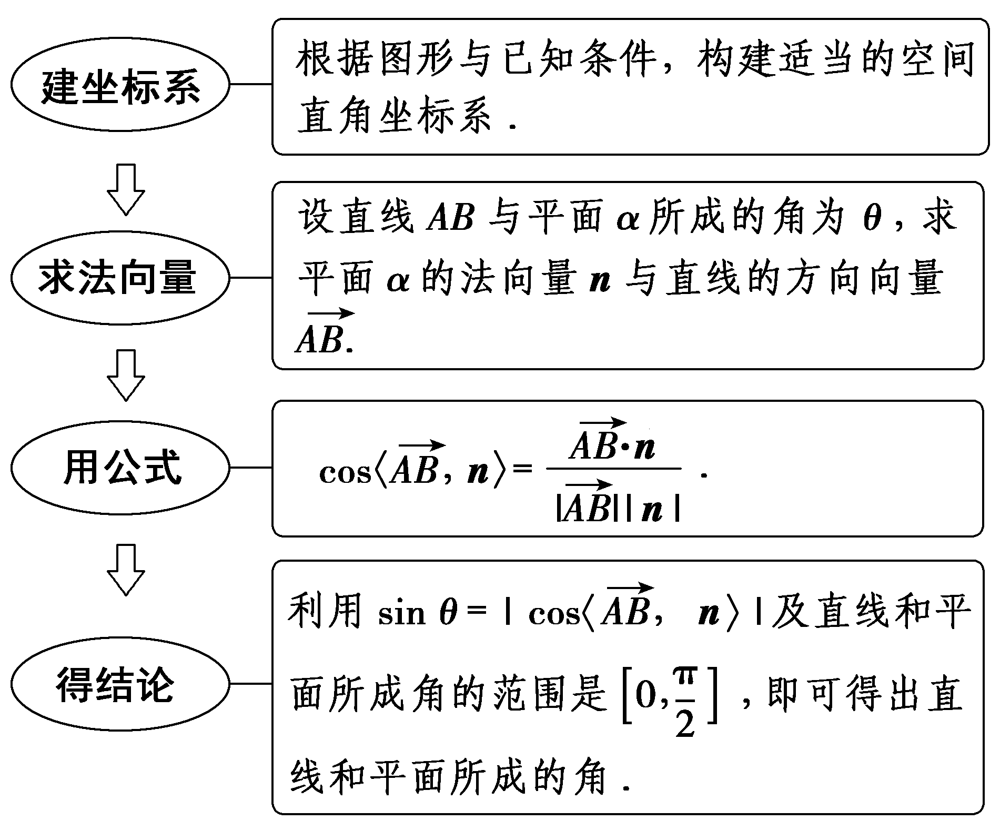

注意：线面角的正弦值对应向量夹角的余弦值的绝对值.

对点练&lt;text style="subscript"&gt;&lt;text style="subscript"&gt;&lt;text style="subscript"&gt;&lt;text style="subscript"&gt;&lt;text style="subscript"&gt;&lt;text style="subscript"&gt;&lt;text style="subscript"&gt;&lt;text style="subscript"&gt;1&lt;/text&gt;&lt;/text&gt;&lt;/text&gt;&lt;/text&gt;&lt;/text&gt;&lt;/text&gt;&lt;/text&gt;&lt;/text&gt;.(2024·湖北武汉四调)如图，三棱柱<em>&lt;text style="italic"&gt;&lt;text style="italic"&gt;&lt;text style="italic"&gt;A</em>&lt;/text&gt;&lt;/text&gt;<em>&lt;text style="italic"&gt;&lt;text style="italic"&gt;B</em>&lt;/text&gt;&lt;/text&gt;<em>C</em>&lt;/text&gt;-A1B1C1中，侧面<em>&lt;text style="italic"&gt;AB</em>B&lt;/text&gt;1A1⊥底面<em>A&lt;text style="italic"&gt;BC</em>&lt;/text&gt;，AB＝<em>BB</em>1＝2，<em>AC</em>＝2 $\sqrt{3}$ ，∠<em>&lt;text style="italic"&gt;&lt;text style="italic"&gt;B</em>&lt;/text&gt;&lt;/text&gt;&lt;text style="subscript"&gt;&lt;text style="subscript"&gt;&lt;text style="subscript"&gt;&lt;text style="subscript"&gt;&lt;text style="subscript"&gt;&lt;text style="subscript"&gt;&lt;text style="subscript"&gt;&lt;text style="subscript"&gt;1&lt;/text&gt;&lt;/text&gt;&lt;/text&gt;&lt;/text&gt;&lt;/text&gt;&lt;/text&gt;&lt;/text&gt;&lt;/text&gt;B<em>&lt;text style="italic"&gt;&lt;text style="italic"&gt;A</em>&lt;/text&gt;&lt;/text&gt;＝60°，点<em>D</em>是棱A1B1的中点， $\vec{BC}$ ＝4 $\vec{BE}$ ，<em>D</em>E⊥<em>&lt;text style="italic"&gt;&lt;text style="italic"&gt;B</em>&lt;/text&gt;&lt;/text&gt;<em>C</em>.

(1)证明：<em>AC</em>⊥<em>BB</em>1；

(2)求直线<em>BB</em>1与平面<em>DEA</em>1所成角的正弦值.

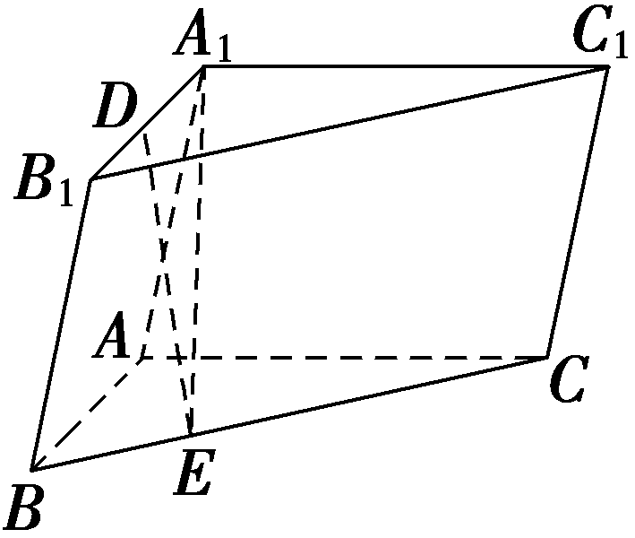

解：(1)证明：连接<em>DA</em>，<em>EA</em>，<em>DA</em>1＝1，<em>AA</em>1＝2，∠<em>DA</em>1<em>A</em>＝60°，

由余弦定理可得*DA*＝ $\sqrt{1^{2}＋2^{2}－2\cdot 1\cdot 2\cdot cos60\circ }$ ＝ $\sqrt{3}$ .

满足<em>&lt;text style="italic"&gt;DA</em>&lt;/text&gt;2＋D $A_{1}^{2}$ ＝<em>A</em> $A_{1}^{2}$ ，所以<em>&lt;text style="italic"&gt;DA</em>&lt;/text&gt;⊥<em>&lt;text style="italic"&gt;&lt;text style="italic"&gt;DA</em>&lt;/text&gt;&lt;/text&gt;1，即DA⊥<em>AB</em>.

因为平面<em>ABB</em>1<em>A</em>1⊥平面<em>ABC</em>，且交线为<em>AB</em>，

由<em>DA</em>⊥<em>AB</em>，<em>DA</em>⊂平面<em>ABB</em>1<em>A</em>1，得<em>DA</em>⊥平面<em>ABC</em>.

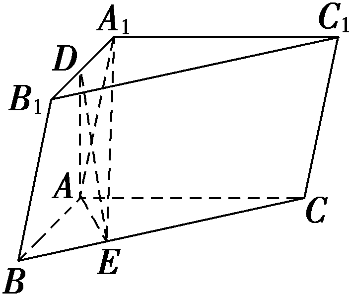

由*BC*，*AC*⊂平面*ABC*，

得*DA*⊥*BC*，*DA*⊥*AC*.

因为*DE*⊥*BC*，*DA*∩*DE*＝*D*，

且*DA*，*DE*⊂平面*DAE*，

所以*BC*⊥平面*DAE*. 由*AE*⊂平面*DAE*，得*BC*⊥*AE*.

设<em>BE</em>＝<em>t</em>，<em>CE</em>＝3<em>t</em>，有<em>BA</em>2－<em>t</em>2＝<em>AC</em>2－(3<em>t</em>)2，解得：<em>t</em>＝1，即<em>BE</em>＝1.

所以<em>BC</em>＝4，满足<em>BA</em>2＋<em>AC</em>2＝<em>BC</em>2，即<em>AC</em>⊥<em>AB</em>.

又因为<em>DA</em>⊥<em>AC</em>，<em>DA</em>∩<em>AB</em>＝<em>A</em>，且<em>DA</em>，<em>AB</em>⊂平面<em>ABB</em>1<em>A</em>1，

所以<em>AC</em>⊥平面<em>ABB</em>1<em>A</em>1.

由<em>BB</em>1⊂平面<em>ABB</em>1<em>A</em>1，得<em>AC</em>⊥<em>BB</em>1.

(2)以<te<text st*y*le="italic">x</text>t style="italic">A</text>为坐标原点， $\vec{AB}$ ， $\vec{AC}$ ， $\vec{AD}$ 分别为<text st*y*le="italic">x</text>，y，*z*轴的正方向建立如图所示空间直角坐标系.

<em>D</em> $\left(0，0，\sqrt{3}\right)$ ，<em>E</em> $\left(\frac{3}{2}，\frac{\sqrt{3}}{2}，0\right)$ ，<em>A</em>1 $\left(－1，0，\sqrt{3}\right)$ ，

$\vec{DA_{1}}$ ＝ $\left(－1，0，0\right)$ ， $\vec{EA_{1}}$ ＝ $\left(－\frac{5}{2},-\frac{\sqrt{3}}{2}，\sqrt{3}\right)$ .

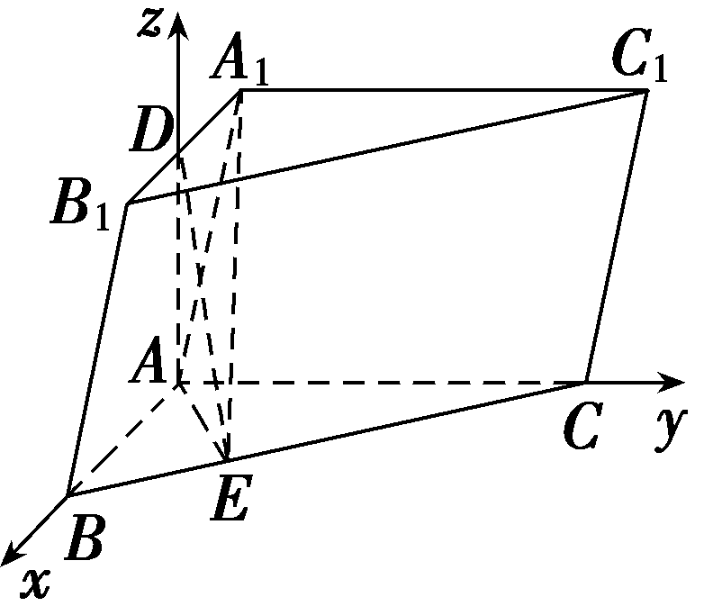

设平面<em>DEA</em>1的法向量<em><strong>n</strong></em>＝ $\left(x，y，z\right)$ ，

由 $\left\{\begin{matrix}n\cdot \vec{DA_{1}}=0，\\n\cdot \vec{EA_{1}}=0，\end{matrix}\right.$ 即 $\left\{\begin{matrix}－x=0，\\－\frac{5}{2}x－\frac{\sqrt{3}}{2}y＋\sqrt{3}z=0，\end{matrix}\right.$

取<em>z</em>＝1，得到平面<em>DEA</em>1的一个法向量<em><strong>n</strong></em>＝ $\left(0，2，1\right)$ .

又 $\vec{BB_{1}}$ ＝ $\vec{AA_{1}}$ ＝ $\left(－1，0，\sqrt{3}\right)$ ，

设直线<em>BB</em>1与平面<em>DEA</em>1所成角的大小为<em>θ</em>，

则sin *θ*＝ $\left|cos＜n，\vec{BB_{1}}＞\right|$ ＝ $\frac{\left|n\cdot \vec{BB_{1}}\right|}{\left|n\right|\left|\vec{BB_{1}}\right|}$ ＝ $\frac{\sqrt{3}}{\sqrt{5}\times \sqrt{4}}$ ＝ $\frac{\sqrt{15}}{10}$ .

所以直线<em>BB</em>&lt;text style="subscript"&gt;1&lt;/text&gt;与平面<em>DEA</em>1所成角的正弦值为 $\frac{\sqrt{15}}{10}$ .

考点三　平面与平面的夹角(二面角)　　　　师生共研

[答题规范](15分)(2024·新课标Ⅱ卷)如图，平面四边形*<text style="italic">ABCD*</text>中，AB＝8，CD＝3，*AD*＝5 $\sqrt{3}$ ，∠*AD*C＝90°，∠*BAD*＝30°，点*E*，*F*满足 $\vec{AE}$ ＝ $\frac{2}{5}\vec{AD}$ ， $\vec{AF}$ ＝ $\frac{1}{2}\vec{AB}$ ，将△A*EF*沿*EF*翻折至△*PEF*，使得*PC*＝4 $\sqrt{3}$ .

(1)证明：*EF*⊥*PD*；

(2)求平面*PCD*与平面*PBF*所成的二面角的正弦值.

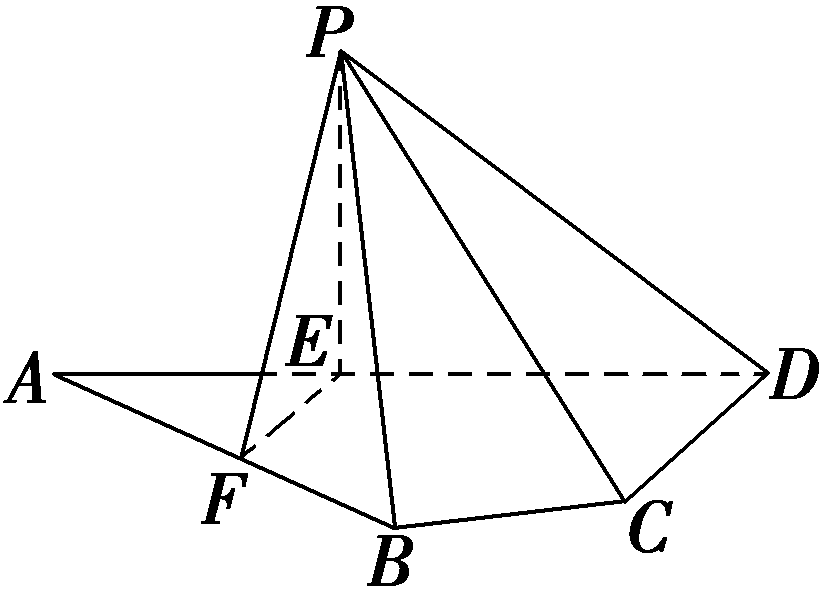

[思路分析]

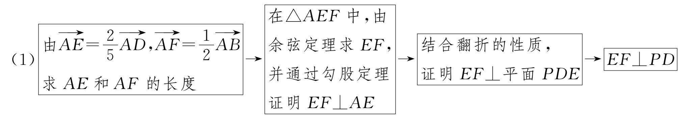

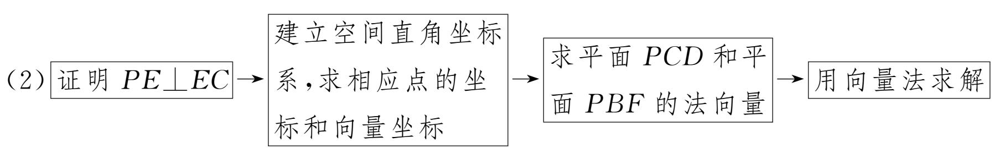

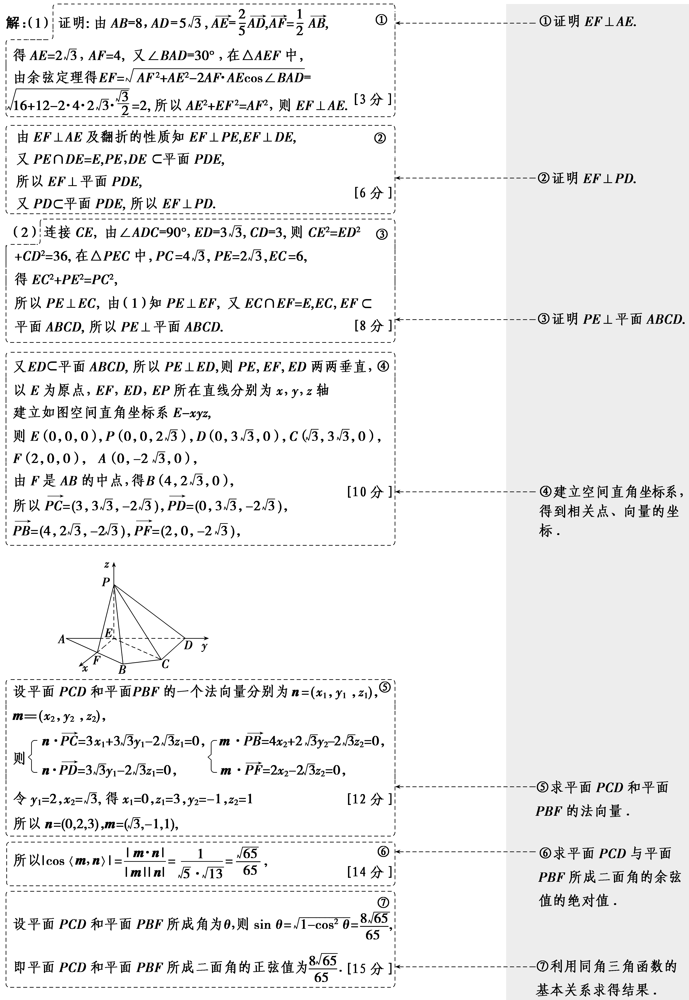

向量法求平面与平面的夹角(二面角)的方法

1.找法向量：分别求出二面角的两个半平面所在平面的法向量，然后通过两个平面的法向量的夹角得到二面角的大小，但要注意结合实际图形判断所求角的大小.

2.找与棱垂直的方向向量：分别在二面角的两个半平面内找到与棱垂直且以垂足为起点的两个向量，则这两个向量的夹角的大小就是二面角的大小.

对点练2.(2025·八省适应性测试)在平面四边形*ABCD*中，*AB*＝*AC*＝*CD*＝1，∠*ADC*＝30°，∠*DAB*＝120°，将△*ACD*沿*AC*翻折至△*ACP*，其中*P*为动点.

(1)设*PC*⊥*AB*，三棱锥*P*-*ABC*的各个顶点都在球*O*的球面上.

①证明：平面*PAC*⊥平面*ABC*；

②求球*O*的半径；

(2)求二面角*A*-*CP*-*B*的余弦值的最小值.

解：(1)在△*ACD*中，由*AC*＝*CD*＝1，∠*ADC*＝30°得∠*CAD*＝∠*ADC*＝30°，

所以*AD*＝2*<text style="italic">AC*</text>cos∠*DAC*＝2×1×cos30°＝ $\sqrt{3}$ ，且∠B*<text style="italic">AC*</text>＝∠*D<text style="italic">AB*</text>－∠C*AD*＝120°－30°＝90°，即AB⊥AC，

①证明：因为*AB*⊥*AC*，*PC*⊥*AB*，*PC*∩*AC*＝*C*，*PC*，*AC*⊂平面*PAC*，

所以*AB*⊥平面*PAC*，又*AB*⊂平面*ABC*，

所以平面*PAC*⊥平面*ABC*.

②以*A*为原点，*AB*，*AC*分别为*x*轴和*y*轴建立如图所示空间直角坐标系*A*-*xyz*.

则*A* $\left(0，0，0\right)$ ，*B* $\left(1，0，0\right)$ ，*C* $\left(0，1，0\right)$ ，*P* $\left(0，\frac{3}{2}，\frac{\sqrt{3}}{2}\right)$ ，设球心*O* $\left(a，b，c\right)$ ，半径为*R*，

则*AO*＝*BO*＝*CO*＝*PO*＝*R*，

所以&lt;text style="it&lt;text style="it<em>a</em>li<em>c</em>"&gt;a&lt;/text&gt;li&lt;text style="itali<em>c</em>"&gt;c&lt;/text&gt;"&gt;a&lt;/text&gt;&lt;text style="superscript"&gt;&lt;text style="superscript"&gt;&lt;text style="superscript"&gt;&lt;text style="superscript"&gt;&lt;text style="superscript"&gt;&lt;text style="superscript"&gt;&lt;text style="superscript"&gt;&lt;text style="superscript"&gt;2&lt;/text&gt;&lt;/text&gt;&lt;/text&gt;&lt;/text&gt;&lt;/text&gt;&lt;/text&gt;&lt;/text&gt;&lt;/text&gt;＋<em>&lt;text style="italic"&gt;b</em>&lt;/text&gt;2＋c2＝ $\left(a－1\right)^{2}$ ＋&lt;text style="it&lt;text style="it<em>a</em>li<em>c</em>"&gt;a&lt;/text&gt;li&lt;text style="itali<em>c</em>"&gt;c&lt;/text&gt;"&gt;<em>b</em>&lt;/text&gt;&lt;text style="superscript"&gt;&lt;text style="superscript"&gt;&lt;text style="superscript"&gt;&lt;text style="superscript"&gt;&lt;text style="superscript"&gt;&lt;text style="superscript"&gt;&lt;text style="superscript"&gt;&lt;text style="superscript"&gt;2&lt;/text&gt;&lt;/text&gt;&lt;/text&gt;&lt;/text&gt;&lt;/text&gt;&lt;/text&gt;&lt;/text&gt;&lt;/text&gt;＋c2＝<em>a</em>2＋ $\left(b－1\right)^{2}$ ＋&lt;text style="it&lt;text style="it<em>a</em>li<em>c</em>"&gt;a&lt;/text&gt;li<em>c</em>"&gt;c&lt;/text&gt;&lt;text style="superscript"&gt;&lt;text style="superscript"&gt;&lt;text style="superscript"&gt;&lt;text style="superscript"&gt;&lt;text style="superscript"&gt;&lt;text style="superscript"&gt;&lt;text style="superscript"&gt;&lt;text style="superscript"&gt;2&lt;/text&gt;&lt;/text&gt;&lt;/text&gt;&lt;/text&gt;&lt;/text&gt;&lt;/text&gt;&lt;/text&gt;&lt;/text&gt;＝<em>a</em>2＋ $\left(b－\frac{3}{2}\right)^{2}$ ＋ $\left(c－\frac{\sqrt{3}}{2}\right)^{2}$ ＝<em>R</em>&lt;text style="supers&lt;text style="it&lt;text style="it<em>a</em>li<em>c</em>"&gt;a&lt;/text&gt;li<em>c</em>"&gt;c&lt;/text&gt;ript"&gt;&lt;text style="superscript"&gt;&lt;text style="superscript"&gt;&lt;text style="superscript"&gt;&lt;text style="superscript"&gt;&lt;text style="superscript"&gt;&lt;text style="superscript"&gt;&lt;text style="superscript"&gt;2&lt;/text&gt;&lt;/text&gt;&lt;/text&gt;&lt;/text&gt;&lt;/text&gt;&lt;/text&gt;&lt;/text&gt;&lt;/text&gt;，

解得<text style="itali*c*">a</text>＝ $\frac{1}{2}$ ，<text style="itali*c*">b</text>＝ $\frac{1}{2}$ ，*c*＝ $\frac{\sqrt{3}}{2}$ ，*R*＝ $\frac{\sqrt{5}}{2}$ ，所以球*O*的半径为 $\frac{\sqrt{5}}{2}$ .

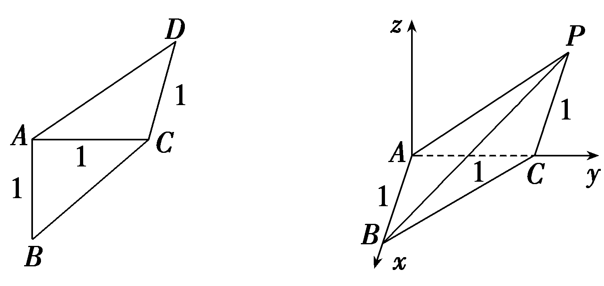

(2)在平面*<text style="italic">P<text style="italic">AC*</text></text>中，过P作*P<text style="italic"><text style="italic">G*</text></text>⊥AC于G，在平面*ABC*中，过G作*GM*⊥AC，则由(1)*AG*＝ $\sqrt{3}$ cos 30°＝ $\frac{3}{2}$ ，*P<text style="italic">G*</text>＝ $\sqrt{3}$ sin30°＝ $\frac{\sqrt{3}}{2}$ .

设∠<te<text st*y*le="italic">x</text>t style="italic">P*<text style="italic">G*</text>M</text>＝*<text style="italic">θ*</text>，θ∈ $\left(0，\pi \right)$ ，以<te<text st*y*le="italic">x</text>t style="italic">*G*</text>为原点，*GM*，*CG*分别为x轴和y轴建立如图所示的空间直角坐标系G-*xyz*.

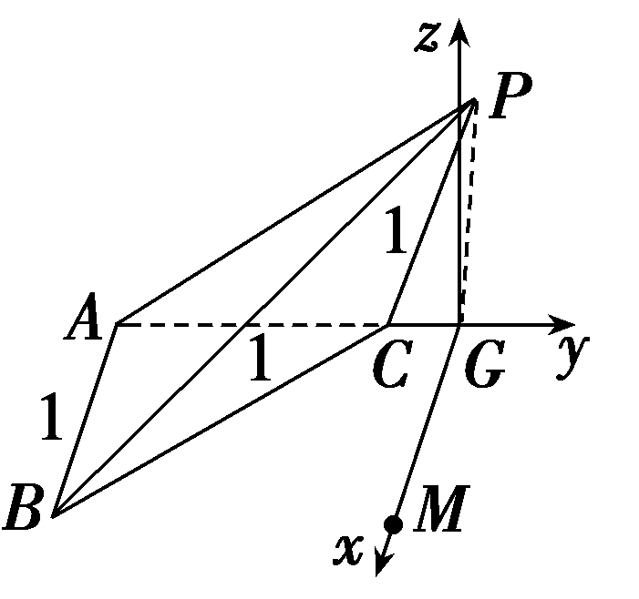

则*G* $\left(0，0，0\right)$ ，*A* $\left(0,-\frac{3}{2}，0\right)$ ，*B* $\left(1,-\frac{3}{2}，0\right)$ ，*C*(0，－ $\frac{1}{2}$ ，0)，*P* $\left(\frac{\sqrt{3}}{2}cos\theta ，0，\frac{\sqrt{3}}{2}sin\theta \right)$ ，

所以 $\vec{CA}$ ＝ $\left(0,-1，0\right)$ ， $\vec{CB}$ ＝ $\left(1,-1，0\right)$ ， $\vec{CP}$ ＝ $\left(\frac{\sqrt{3}}{2}cos\theta ，\frac{1}{2}，\frac{\sqrt{3}}{2}sin\theta \right)$ .

设平面<em>PAC</em>和平面<em>PBC</em>的一个法向量分别为<em><strong>m</strong></em>＝ $\left(x_{1}，y_{1}，z_{1}\right)$ ，<em><strong>n</strong></em>＝ $\left(x_{2}，y_{2}，z_{2}\right)$ ，

则 $\left\{\begin{matrix}m\perp \vec{CA}，\\m\perp \vec{CP}，\end{matrix}\right.\left\{\begin{matrix}n\perp \vec{CP}，\\n\perp \vec{CB}，\end{matrix}\right.$

所以 $\left\{\begin{matrix}m\cdot \vec{CA}＝－y_{1}=0，\\m\cdot \vec{CP}＝\frac{\sqrt{3}}{2}x_{1}cos\theta ＋\frac{1}{2}y_{1}＋\frac{\sqrt{3}}{2}z_{1}sin\theta =0，\end{matrix}\right.$

$$
\left\{\begin{matrix}n\cdot \vec{CB}＝x_{2}－y_{2}=0，\\n\cdot \vec{CP}＝\frac{\sqrt{3}}{2}x_{2}cos\theta ＋\frac{1}{2}y_{2}＋\frac{\sqrt{3}}{2}z_{2}sin\theta =0，\end{matrix}\right.
$$

取&lt;te<em>x</em>t style="italic"&gt;x&lt;/text&gt;1＝si<em><strong>n</strong></em> <em>θ</em>，x2＝1，则<em><strong>m</strong></em>＝ $\left(sin\theta ，0,-cos\theta \right)$ ，<em><strong>n</strong></em>＝ $\left(1，1,-\frac{\sqrt{3}cos\theta +1}{\sqrt{3}sin\theta }\right)$ ，

所以cos＜***m***，***n***＞＝ $\frac{m\cdot n}{\left|m\right|\left|n\right|}$ ＝ $\frac{sin\theta ＋\frac{\left(\sqrt{3}cos\theta +1\right)cos\theta }{\sqrt{3}sin\theta }}{\sqrt{2+\left(\frac{\sqrt{3}cos\theta +1}{\sqrt{3}sin\theta }\right)^{2}}}$ ＝ $\frac{cos\theta ＋\sqrt{3}}{\sqrt{－3cos^{2}\theta +2\sqrt{3}cos\theta +7}}$ .

令<<*t*ext style="italic">t</text>ext style="italic">t</text>＝cos *<text style="italic"><text style="italic">θ*</text></text>＋ $\sqrt{3}$ ，则cos <<*t*ext style="italic">t</text>ext style="italic">*<text style="italic">θ*</text></text>＝*t*－ $\sqrt{3}$ ，由<<*t*ext style="italic">t</text>ext style="italic">*<text style="italic">θ*</text></text>∈ $\left(0，\pi \right)$ 得<<*t*ext style="italic">t</text>ext style="italic">t</text>∈ $\left(\sqrt{3}－1，\sqrt{3}+1\right)$ ，则 $\frac{1}{t}$ ∈ $\left(\frac{\sqrt{3}－1}{2}，\frac{\sqrt{3}+1}{2}\right)$ .

则cos＜***m***，***n***＞＝ $\frac{t}{\sqrt{－3t^{2}＋8\sqrt{3}t－8}}$ ＝ $\frac{1}{\sqrt{－\frac{8}{t^{2}}＋\frac{8\sqrt{3}}{t}－3}}$ ＝ $\frac{1}{\sqrt{－8\left(\frac{1}{t}－\frac{\sqrt{3}}{2}\right)^{2}+3}}$ ≥ $\frac{1}{\sqrt{3}}$ ＝ $\frac{\sqrt{3}}{3}$ ，

当且仅当 $\frac{1}{t}$ ＝ $\frac{\sqrt{3}}{2}$ 即*t*＝ $\frac{2\sqrt{3}}{3}$ ，cos *θ*＝－ $\frac{\sqrt{3}}{3}$ 时等号成立，

所以二面角*A*-*CP*-*B*的余弦值的最小值为 $\frac{\sqrt{3}}{3}$ .

[真题再现]　(2024·全国甲卷节选)如图，在以*A*，*B*，*C*，*D*，*E*，*F*为顶点的五面体中，四边形*A<text style="italic"><text style="italic">BC*</text>D</text>与四边形*<text style="italic"><text style="italic"><text style="italic"><text style="italic">AD*</text></text></text>*<text style="italic">EF*</text></text>均为等腰梯形，EF∥AD，BC∥AD，AD＝4，*AB*＝BC＝EF＝2，*ED*＝ $\sqrt{10}$ ，*FB*＝2 $\sqrt{3}$ ，*M*为*AD*的中点.

求二面角*F*-*BM*-*E*的正弦值.

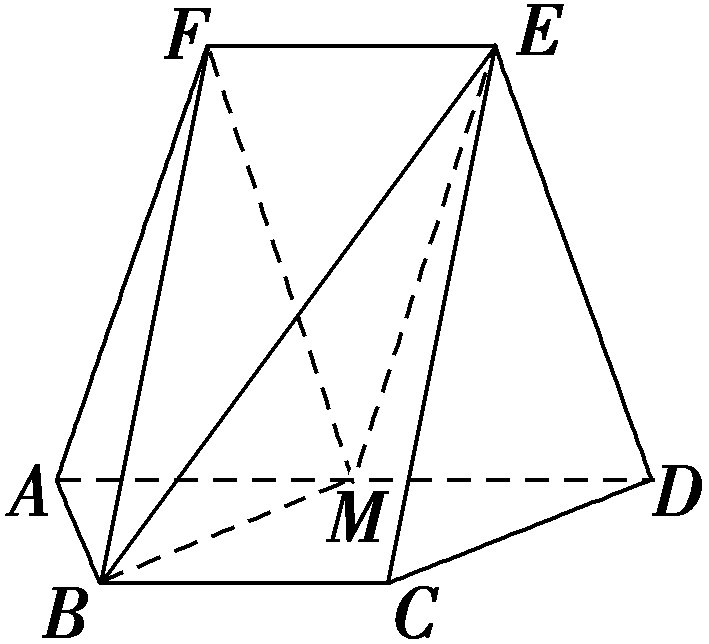

解：取*AM*的中点*O*，连接*BO*，*FO*.

因为*M*为*AD*的中点，*BC*∥*AD*，且*AD*＝4，*BC*＝2，所以*BC*∥*MD*，且*BC*＝*MD*，

所以四边形 *BCDM* 为平行四边形.

所以*BM*＝*CD*＝*AB*＝2，因为*AM*＝2，所以*<text style="italic">BO*</text>⊥*AD*，且BO＝ $\sqrt{3}$ .

因为*<text style="italic">EF*</text>∥*<text style="italic">MD*</text>，EF＝MD＝2，所以四边形*MDEF*为平行四边形，所以*FM*＝*ED*＝ $\sqrt{10}$ ，又*AF*＝ $\sqrt{10}$ ，所以*FO*⊥*AM*，

又*OA*＝*OM*＝1，所以*FO*＝ $\sqrt{FA^{2}－OA^{2}}$ ＝3，

又<em>&lt;text style="italic"&gt;FB</em>&lt;/text&gt;＝&lt;text style="superscript"&gt;&lt;text style="superscript"&gt;2&lt;/text&gt;&lt;/text&gt; $\sqrt{3}$ ，所以<em>BO</em>&lt;text style="superscript"&gt;&lt;text style="superscript"&gt;2&lt;/text&gt;&lt;/text&gt;＋<em>FO</em>2＝<em>&lt;text style="italic"&gt;FB</em>&lt;/text&gt;2，

所以*FO*⊥*OB*，即*OB*，*OD*，*OF*两两垂直.

分别以*OB*，*OD*，*OF* 所在直线为*x*，*y*，*z*轴建立如图所示的空间直角坐标系，

则*F*(0，0，3)，*B*( $\sqrt{3}$ ，0，0)，*M*(0，1，0)，*E*(0，2，3)，则 $\vec{MB}$ ＝( $\sqrt{3}$ ，－1，0)， $\vec{MF}$ ＝ $\left(0,-1，3\right)$ ， $\vec{ME}$ ＝(0，1，3).

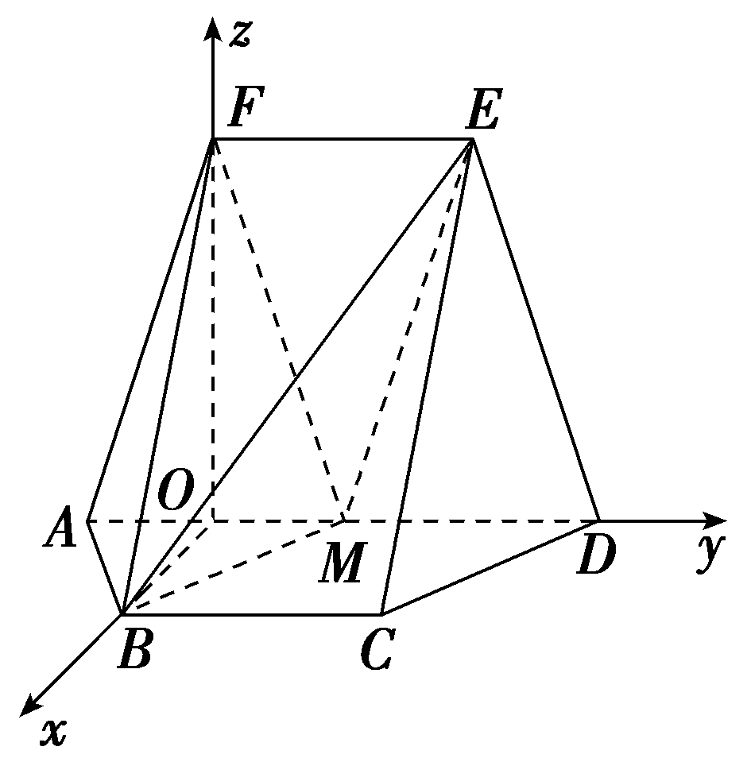

设平面 <em>FBM</em> 的法向量为<em><strong>n</strong></em>1＝ $\left(x_{1}，y_{1}，z_{1}\right)$ ，

则 $\left\{\begin{matrix}n_{1}\cdot \vec{MB}=0，\\n_{1}\cdot \vec{MF}=0，\end{matrix}\right.$ 即 $\left\{\begin{matrix}\sqrt{3}x_{1}－y_{1}=0，\\－y_{1}+3z_{1}=0，\end{matrix}\right.$

令&lt;te<em>x</em>t style="italic"&gt;y&lt;/text&gt;&lt;text style="subscript"&gt;&lt;text style="subscript"&gt;1&lt;/text&gt;&lt;/text&gt;＝3，所以x1＝ $\sqrt{3}$ ，<em>z</em>&lt;te<em>x</em>t style="subscript"&gt;&lt;text style="subscript"&gt;1&lt;/text&gt;&lt;/text&gt;＝1，

所以<em><strong>n</strong></em>1＝ $\left(\sqrt{3}，3，1\right)$ .

设平面<em>EBM</em>的法向量为<em><strong>n</strong></em>2＝ $\left(x_{2}，y_{2}，z_{2}\right)$ ，

则 $\left\{\begin{matrix}n_{2}\cdot \vec{MB}=0，\\n_{2}\cdot \vec{ME}=0，\end{matrix}\right.$ 即 $\left\{\begin{matrix}\sqrt{3}x_{2}－y_{2}=0，\\y_{2}+3z_{2}=0，\end{matrix}\right.$

令&lt;te<em>x</em>t style="italic"&gt;y&lt;/text&gt;&lt;text style="subscript"&gt;&lt;text style="subscript"&gt;2&lt;/text&gt;&lt;/text&gt;＝3，所以x2＝ $\sqrt{3}$ ，<em>z</em>&lt;te<em>x</em>t style="subscript"&gt;&lt;text style="subscript"&gt;2&lt;/text&gt;&lt;/text&gt;＝－1，

所以<em><strong>n</strong></em>2＝ $\left(\sqrt{3}，3,-1\right)$ .

设二面角*F*-*BM*-*E*的平面角为*θ*，

所以｜cos <em>θ</em>｜＝｜cos＜<em><strong>&lt;text style="bold,italic"&gt;n</strong></em>&lt;/text&gt;1，n2＞｜＝ $\frac{｜n_{1}\cdot n_{2}｜}{｜n_{1}||n_{2}｜}$ ＝ $\frac{11}{13}$ ，

因为*θ*∈[0，π]，所以sin *θ*≥0，

即sin *θ*＝ $\sqrt{1－cos^{2}\theta }$ ＝ $\frac{4\sqrt{3}}{13}$ ，

所以二面角*F*-*BM*-*E*的正弦值为 $\frac{4\sqrt{3}}{13}$ .

[教材呈现]　(人教A选择性必修一P39例10)如图，在四棱锥*P*-*ABCD*中，底面*ABCD*是正方形，侧棱*PD*⊥底面*ABCD*，*PD*＝*DC*，*E*是*PC*的中点，作*EF*⊥*PB*交*PB*于点*F*.

(1)求证：*PA*∥平面*EDB*；

(2)求证：*PB*⊥平面*EFD*；

(3)求平面*CPB*与平面*PBD*的夹角的大小.

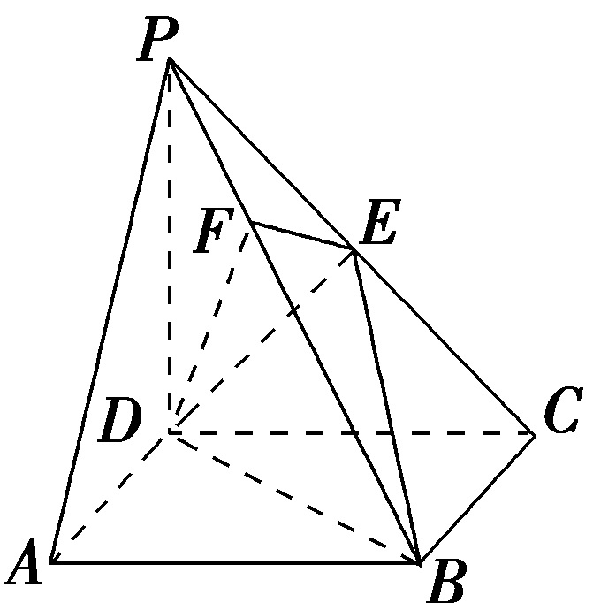

点评：该高考题与教材例题都是以空间几何体为载体考查利用向量法求空间角.

**课时测评**64　**用空间向量求空间角** $\frac{对应学生}{用书P437}$

(时间：60分钟　满分：64分)

(本栏目内容，在学生用书中以独立形式分册装订！)

1.(15分)(2025·江西红色十校联考)如图，在三棱柱<em>ABC</em>-<em>A</em>1<em>B</em>1<em>C</em>1中，<em>C</em>1<em>A</em>1＝<em>C</em>1<em>B</em>1，<em>AC</em>＝<em>AB</em>1，<em>AB</em>1⊥平面<em>ABC</em>，<em>AC</em>＝3，∠<em>CAC</em>1＝90°，<em>M</em>，<em>E</em>分别是<em>AB</em>，<em>B</em>1<em>C</em>1的中点.

(1)证明：<em>AC</em>⊥平面<em>AB</em>1<em>C</em>1；(5分)

(2)求<em>ME</em>与平面<em>BB</em>1<em>C</em>1<em>C</em>夹角的正弦值.(10分)

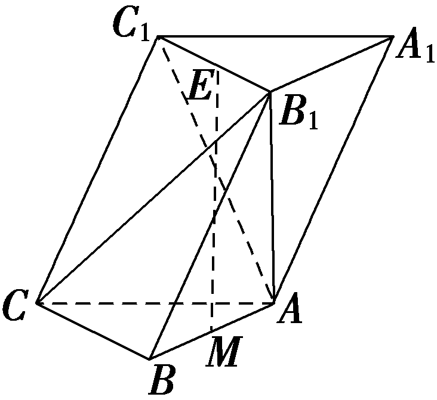

解：(1)证明：因为<em>AB</em>1⊥平面<em>ABC</em>，<em>AC</em>⊂平面<em>ABC</em>，所以<em>AB</em>1⊥<em>AC</em>.

因为∠<em>CAC</em>1＝90°，则<em>AC</em>⊥<em>AC</em>1，

又<em>AB</em>1∩<em>AC</em>1＝<em>A</em>，<em>AB</em>1⊂平面<em>AB</em>1<em>C</em>1，<em>AC</em>1⊂平面<em>AB</em>1<em>C</em>1，所以<em>AC</em>⊥平面<em>AB</em>1<em>C</em>1.

(2)由(<te<text st*y*le="italic">x</text>t style="subscript">1</text>)知*A<text style="italic">C*</text>，*BC*，*AB*1两两相互垂直，以C为坐标原点，以 $\vec{CB}$ ， $\vec{CA}$ ， $\vec{AB_{1}}$ 的方向分别为<text st*y*le="italic">x</text>，y，*z*轴的正方向，

建立如图所示的空间直角坐标系*C*-*xyz*，

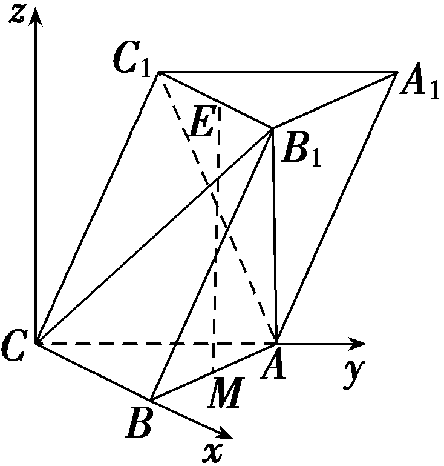

则<em>&lt;text style="italic"&gt;C</em>&lt;/text&gt;(0，0，0)，<em>&lt;text style="italic"&gt;B</em>&lt;/text&gt;(3，0，0)，<em>A</em>(0，3，0)，B&lt;text style="subscript"&gt;1&lt;/text&gt;(0，3，3)，C1(－3，3，3)，<em>E</em>(－ $\frac{3}{2}$ ，3，3)，<em>M</em>( $\frac{3}{2}$ ， $\frac{3}{2}$ ，0)，

所以 $\vec{ME}$ ＝(－3， $\frac{3}{2}$ ，3)， $\vec{CB}$ ＝(3，0，0)， $\vec{CB_{1}}$ ＝(0，3，3)，

设平面&lt;te&lt;text st<em>y</em>le="italic"&gt;x&lt;/text&gt;t style="italic"&gt;BB&lt;/text&gt;&lt;text style="subscript"&gt;1&lt;/text&gt;<em>&lt;text style="italic"&gt;C</em>&lt;/text&gt;1C的法向量为<em><strong>n</strong></em>＝(x，y，<em>z</em>)，则 $\left\{\begin{matrix}n\cdot \vec{CB}=3x=0，\\n\cdot \vec{CB_{1}}=3y+3z=0，\end{matrix}\right.$

得<em>x</em>＝0，令<em>y</em>＝1，得<em>z</em>＝－1，故<em><strong>n</strong></em>＝(0，1，－1).

所以cos＜ $\vec{ME}$ ，***n***＞＝ $\frac{\vec{ME}\cdot n}{｜\vec{ME}｜\cdot ｜n｜}$ ＝－ $\frac{\frac{3}{2}}{\frac{9}{2}\times \sqrt{2}}$ ＝－ $\frac{\sqrt{2}}{6}$ ，

故<em>ME</em>与平面<em>BB</em>&lt;text style="subscript"&gt;1&lt;/text&gt;<em>&lt;text style="italic"&gt;C</em>&lt;/text&gt;1C夹角的正弦值为 $\frac{\sqrt{2}}{6}$ .

2.(15分)(2023·新课标Ⅰ卷)如图，在正四棱柱<em>ABCD</em> -<em>A</em>1<em>B</em>1<em>C</em>1<em>D</em>1中，<em>AB</em>＝2，<em>AA</em>1＝4.点<em>A</em>2，<em>B</em>2，<em>C</em>2，<em>D</em>2分别在棱<em>AA</em>1，<em>BB</em>1，<em>CC</em>1，<em>DD</em>1上，<em>AA</em>2＝1，<em>BB</em>2＝<em>DD</em>2＝2，<em>CC</em>2＝3.

(1)证明：<em>B</em>2<em>C</em>2∥<em>A</em>2<em>D</em>2；(5分)

(2)点<em>P</em>在棱<em>BB</em>1上，当二面角<em>P</em>-<em>A</em>2<em>C</em>2-<em>D</em>2为150°时，求<em>B</em>2<em>P</em>.(10分)

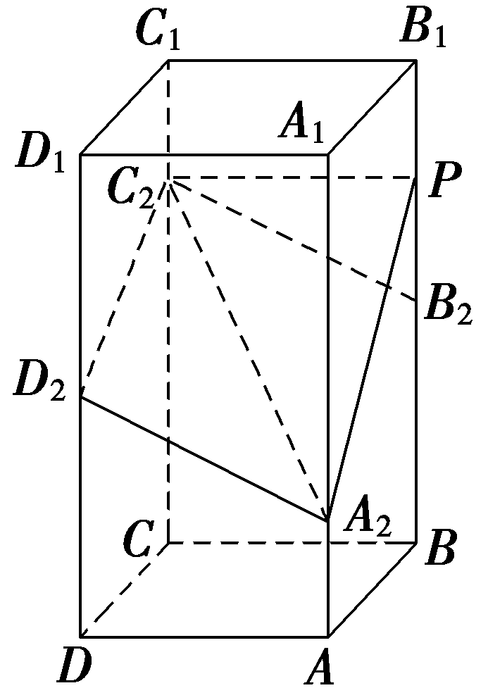

解：(1)证明：以<em>C</em>为坐标原点，<em>CD</em>，<em>CB</em>，<em>CC</em>1所在直线为<em>x</em>，<em>y</em>，<em>z</em>轴建立空间直角坐标系，如图所示，

则<em>C</em>(0，0，0)，<em>C</em>2(0，0，3)，<em>B</em>2(0，2，2)，<em>D</em>2(2，0，2)，<em>A</em>2(2，2，1)，

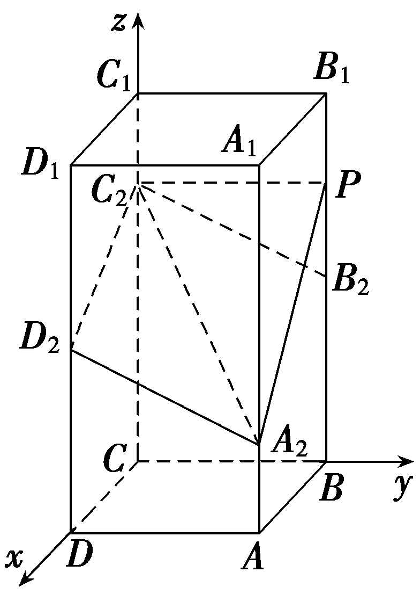

所以 $\vec{B_{2}C_{2}}$ ＝(0，－2，1)， $\vec{A_{2}D_{2}}$ ＝(0，－2，1)，

所以 $\vec{B_{2}C_{2}}$ ∥ $\vec{A_{2}D_{2}}$ ，

又<em>B</em>2<em>C</em>2，<em>A</em>2<em>D</em>2不在同一条直线上，

所以<em>B</em>2<em>C</em>2∥<em>A</em>2<em>D</em>2.

(2)设*P*(0，2，*λ*)(0≤*λ*≤4)，

则 $\vec{A_{2}C_{2}}$ ＝(－2，－2，2)， $\vec{PC_{2}}$ ＝(0，－2，3－*λ*)， $\vec{D_{2}C_{2}}$ ＝(－2，0，1)，

设平面<em>PA</em>2<em>C</em>2的法向量<em><strong>n</strong></em>＝(<em>x</em>，<em>y</em>，<em>z</em>)，

则 $\left\{\begin{matrix}n\cdot \vec{A_{2}C_{2}}＝－2x－2y+2z=0，\\n\cdot \vec{PC_{2}}＝－2y＋(3－\lambda )z=0，\end{matrix}\right.$

令 *z*＝2，得*y*＝3－*λ*，*x*＝*λ*－1，

所以<em><strong>n</strong></em>＝(<em>λ</em>－1，3－<em>λ</em>，2)，

设平面<em>A</em>2<em>C</em>2<em>D</em>2的法向量<em><strong>m</strong></em>＝(<em>a</em>，<em>b</em>，<em>c</em>)，

则 $\left\{\begin{matrix}m\cdot \vec{A_{2}C_{2}}＝－2a－2b+2c=0，\\m\cdot \vec{D_{2}C_{2}}＝－2a＋c=0，\end{matrix}\right.$

令 <em>a</em>＝1，得<em>b</em>＝1，<em>c</em>＝2，所以<em><strong>m</strong></em>＝(1，1，2)，

所以 $\left|cos＜n，m＞\right|$ ＝ $\frac{\left|n\cdot m\right|}{\left|n\right|\left|m\right|}$

＝ $\frac{6}{\sqrt{6} \sqrt{4+(\lambda －1)^{2}＋(3－\lambda )^{2}}}$ ＝ $\left|cos150\circ \right|$ ＝ $\frac{\sqrt{3}}{2}$ ，

化简可得，<em>λ</em>2－4<em>λ</em>＋3＝0，

解得*λ*＝1或*λ*＝3，

所以<em>P</em>(0，2，1)或<em>P</em>(0，2，3)，所以<em>B</em>2<em>P</em>＝1.

3.(17分)(2024·湖南湘潭3月质量检测)在三棱台<em>A</em>1<em>B</em>1<em>C</em>1-<em>ABC</em>中，△<em>ABC</em>为等边三角形，<em>AB</em>＝2<em>A</em>1<em>B</em>1＝2，<em>AA</em>1⊥平面<em>ABC</em>，<em>M</em>，<em>N</em>分别为<em>AB</em>，<em>AC</em>的中点，

(1)证明：平面<em>BCC</em>1<em>B</em>1∥平面<em>A</em>1<em>MN</em>；(5分)

(2)若<em>A</em>1<em>B</em>⊥<em>AC</em>1，设<em>D</em>为线段<em>BC</em>上的动点，求<em>A</em>1<em>D</em>与平面<em>BCC</em>1<em>B</em>1所成的角的正弦值的最大值.(12分)

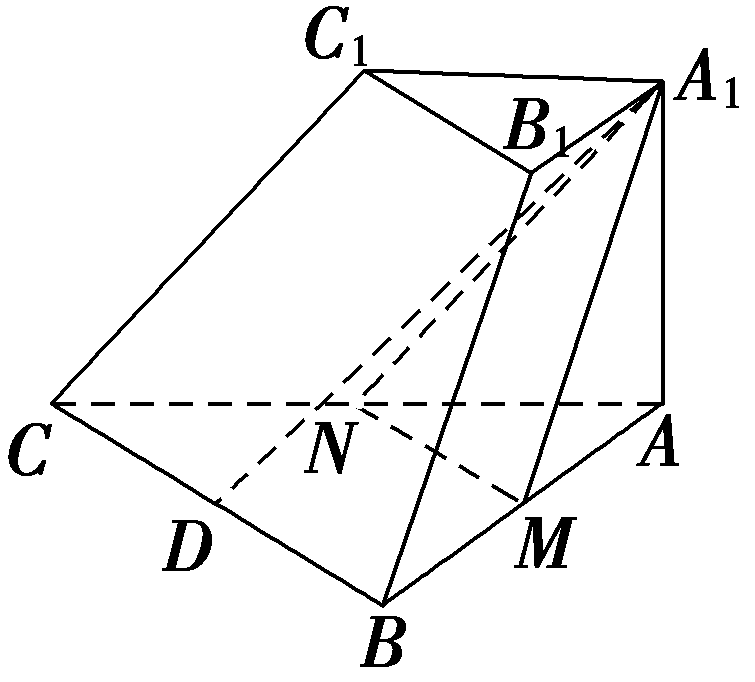

解：(1)证明：在三棱台<em>A</em>1<em>B</em>1<em>C</em>1-<em>ABC</em>中，<em>AB</em>＝2<em>A</em>1<em>B</em>1＝2， <em>N</em>为<em>AC</em>的中点，

所以<em>A</em>1<em>C</em>1＝<em>CN</em>，且<em>A</em>1<em>C</em>1∥<em>CN</em>，则四边形<em>A</em>1<em>C</em>1<em>CN</em>为平行四边形，所以<em>CC</em>1∥<em>A</em>1<em>N</em>，

又<em>A</em>1<em>N</em>⊂平面<em>A</em>1<em>NM</em>，<em>CC</em>1⊄平面<em>A</em>1<em>NM</em>，所以<em>C</em>1<em>C</em>∥平面<em>A</em>1<em>NM</em>，

因为*M*，*N*分别为*AB*，*AC*的中点，所以*BC*∥*MN*，

又<em>MN</em>⊂平面<em>A</em>1<em>NM</em>，<em>BC</em>⊄平面<em>A</em>1<em>NM</em>，所以<em>BC</em>∥平面<em>A</em>1<em>NM</em>，

因为<em>BC</em>⊂平面<em>BCC</em>1<em>B</em>1，<em>C</em>1<em>C</em>⊂平面<em>BCC</em>1<em>B</em>1，<em>CB</em>∩<em>CC</em>1＝<em>C</em>，

所以平面<em>BCC</em>1<em>B</em>1∥平面<em>A</em>1<em>MN</em>.

(2)连接<em>BN</em>，<em>A</em>1<em>B</em>，<em>AC</em>1，<em>C</em>1<em>N</em>，

由题意知四边形<em>A</em>1<em>ANC</em>1为矩形，

因为<em>AA</em>1⊥平面<em>ABC</em>，且<em>AA</em>1⊂平面<em>AA</em>1<em>C</em>1<em>C</em>，所以平面<em>ABC</em>⊥平面<em>AA</em>1<em>C</em>1<em>C</em>，

因为△*ABC*为等边三角形，*N*为*AC*的中点，所以*BN*⊥*AC*，

又平面<em>ABC</em>∩平面<em>AA</em>1<em>C</em>1<em>C</em>＝<em>AC</em>，<em>BN</em>⊂平面<em>ABC</em>，

所以<em>BN</em>⊥平面<em>AA</em>1<em>C</em>1<em>C</em>，又<em>AC</em>1⊂平面<em>AA</em>1<em>C</em>1<em>C</em>，所以<em>BN</em>⊥<em>AC</em>1，

又<em>A</em>1<em>B</em>⊥<em>AC</em>1，<em>A</em>1<em>B</em>∩<em>BN</em>＝<em>B</em>，<em>BA</em>1，<em>BN</em>⊂平面<em>BNA</em>1，所以<em>AC</em>1⊥平面<em>BNA</em>1，

又<em>A</em>1<em>N</em>⊂平面<em>BNA</em>1，则<em>AC</em>1⊥<em>A</em>1<em>N</em>，故四边形<em>A</em>1<em>ANC</em>1为正方形，<em>AA</em>1＝1，

以*A*为原点，建立如图所示空间直角坐标系，

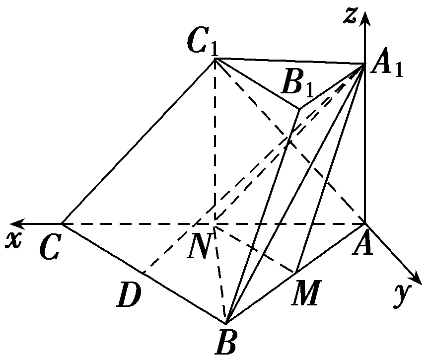

则<em>A</em>&lt;text style="subscript"&gt;1&lt;/text&gt;(0，0，1)，<em>&lt;text style="italic"&gt;C</em>&lt;/text&gt;1(1，0，1)，C(2，0，0)，<em>B</em>(1， $\sqrt{3}$ ，0)，

则 $\vec{CC_{1}}$ ＝(－1，0，1)， $\vec{BC}$ ＝(1，－ $\sqrt{3}$ ，0)， $\vec{A_{1}C}$ ＝(2，0，－1)，

不妨设 $\vec{DC}$ ＝*<text style="italic"><text style="italic"><text style="italic">λ*</text></text></text> $\vec{BC}$ ＝(*<text style="italic"><text style="italic"><text style="italic">λ*</text></text></text>，－ $\sqrt{3}$ *<text style="italic"><text style="italic"><text style="italic">λ*</text></text></text>，0)(λ∈[0，1])，

则 $\vec{A_{1}D}$ ＝ $\vec{A_{1}C}$ － $\vec{DC}$ ＝(2－*<text style="italic">λ*</text>， $\sqrt{3}$ *<text style="italic">λ*</text>，－1)，

设平面&lt;te&lt;text st<em>y</em>le="italic"&gt;x&lt;/text&gt;t style="italic"&gt;<em>B</em>CC&lt;/text&gt;&lt;text style="subscript"&gt;1&lt;/text&gt;B1的一个法向量为<em><strong>n</strong></em>＝(x，y，<em>z</em>)，则 $\left\{\begin{matrix}n\cdot \vec{CC_{1}}=0，\\n\cdot \vec{BC}=0，\end{matrix}\right.$

得 $\left\{\begin{matrix}－x＋z=0，\\x－\sqrt{3}y=0，\end{matrix}\right.$ 令<em>y</em>＝1，可得<em><strong>n</strong></em>＝( $\sqrt{3}$ ，1， $\sqrt{3}$ )，

则｜cos＜<em><strong>n</strong></em>， $\vec{A_{1}D}$ ＞｜＝ $\frac{｜n\cdot \vec{A_{1}D}｜}{｜n||\vec{A_{1}D}｜}$ ＝ $\frac{｜\sqrt{3}(2－\lambda )＋\sqrt{3}\lambda －\sqrt{3}｜}{\sqrt{7}\times \sqrt{(2－\lambda )^{2}+3\lambda ^{2}+1}}$ ＝ $\frac{\sqrt{3}}{\sqrt{7}\times \sqrt{(2\lambda －1)^{2}+4}}$ ≤ $\frac{\sqrt{21}}{14}$ ，当且仅当<em>λ</em>＝ $\frac{1}{2}$ 时取“＝”，

所以<em>A</em>&lt;text style="subscript"&gt;&lt;text style="subscript"&gt;1&lt;/text&gt;&lt;/text&gt;<em>D</em>与平面<em>&lt;text style="italic"&gt;B</em>CC&lt;/text&gt;1B1所成角的正弦值的最大值为 $\frac{\sqrt{21}}{14}$ .

4.(17分)(2024·河南开封第二次质量检测)在四棱锥*P*-*ABCD*中，平面*PAC*⊥底面*ABCD*，*BD*⊥*AP*.

(1)*BD*⊥*AC*是否一定成立？若是，请证明，若不是，请给出理由；(5分)

(2)若△*PAC*是正三角形，且*P*-*ABD*是正三棱锥，*AB*＝2，求平面*PAD*与平面*PBC*夹角的余弦值.(12分)

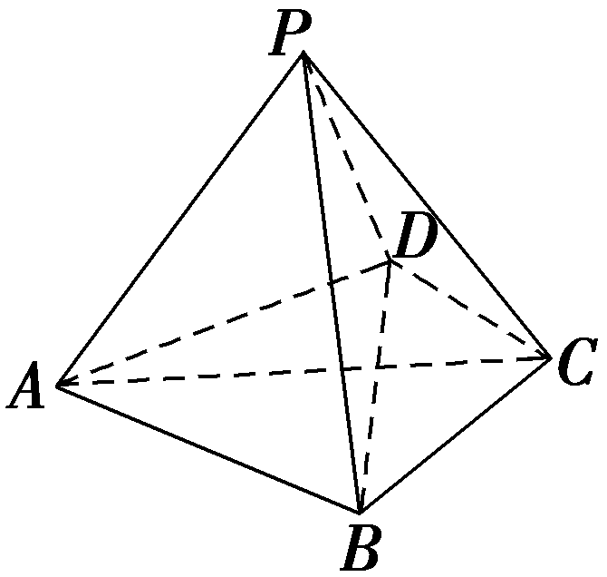

解：(1)因为平面*PAC*⊥底面*ABCD*，过点*P*作*AC*的垂线交*AC*于点*E*，

又平面*PAC*∩底面*ABCD*＝*AC*，*PE*⊂平面*PAC*，所以*PE*⊥底面*ABCD*，

若*AP*⊥*AC*，则点*A*与点*E*重合，

即*AP*⊥底面*ABCD*，

所以*AP*垂直平面*ABCD*内任意直线，即*BD*与*AC*无论何种位置关系，都有*BD*⊥*AP*，

所以*BD*⊥*AC*不一定成立.

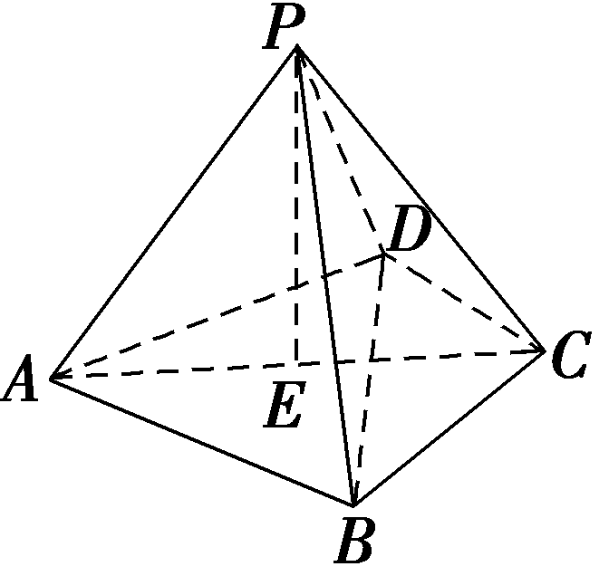

(2)因为△*PAC*是正三角形，则点*E*为*AC*的中点，

由(1)*PE*⊥底面*ABCD*，又*BD*⊂底面*ABCD*，

所以*PE*⊥*BD*，

又*BD*⊥*AP*，*PE*∩*AP*＝*P*，*PE*，*AP*⊂平面*APC*，

所以*BD*⊥平面*APC*，

又*AC*⊂平面*APC*，所以*BD*⊥*AC*，又*P*-*ABD*是正三棱锥，即△*ABD*为等边三角形，

设*BD*∩*AC*＝*O*，则*O*为*BD*的中点，作*OF*∥*EP*，则*OF*⊥底面*ABCD*，

如图建立空间直角坐标系，则*A*(0，－ $\sqrt{3}$ ，0)，*B*(1，0，0)，*C*(0， $\frac{\sqrt{3}}{3}$ ，0)，*D*(－1，0，0)，*P*(0，－ $\frac{\sqrt{3}}{3}$ ，2)，

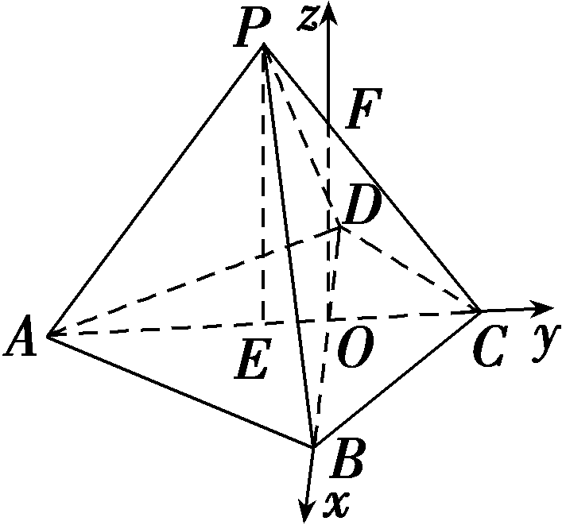

所以 $\vec{AD}$ ＝(－1， $\sqrt{3}$ ，0)， $\vec{AP}$ ＝(0， $\frac{2\sqrt{3}}{3}$ ，2)，

$\vec{BC}$ ＝(－1， $\frac{\sqrt{3}}{3}$ ，0)， $\vec{BP}$ ＝(－1，－ $\frac{\sqrt{3}}{3}$ ，2)，设平面&lt;te&lt;text st<em>y</em>le="italic"&gt;x&lt;/text&gt;t style="italic"&gt;PAD&lt;/text&gt;的法向量为<em><strong>n</strong></em>＝(x，y，<em>z</em>)，

则 $\left\{\begin{matrix}n\cdot \vec{AD}＝－x＋\sqrt{3}y=0，\\n\cdot \vec{AP}＝\frac{2\sqrt{3}}{3}y+2z=0，\end{matrix}\right.$ 取***n***＝( $\sqrt{3}$ ，1，－ $\frac{\sqrt{3}}{3}$ )，

设平面&lt;text style="it&lt;text style="itali<em>c</em>"&gt;a&lt;/text&gt;lic"&gt;PBC&lt;/text&gt;的法向量为&lt;text style="<em>b</em>old,italic"&gt;<em><strong>m</strong></em>&lt;/text&gt;＝(a，b，c)，则 $\left\{\begin{matrix}m\cdot \vec{BC}＝－a＋\frac{\sqrt{3}}{3}b=0，\\n\cdot \vec{BP}＝－a－\frac{\sqrt{3}}{3}b+2c=0，\end{matrix}\right.$ 取&lt;text style="&lt;text style="itali<em>c</em>"&gt;b&lt;/text&gt;old,it<em>a</em>lic"&gt;<em><strong>m</strong></em>&lt;/text&gt;＝( $\sqrt{3}$ ，3， $\sqrt{3}$ )，

所以｜cos＜***m***，***n***＞｜＝ $\frac{｜m\cdot n｜}{｜m｜\cdot ｜n｜}$ ＝ $\frac{5}{\sqrt{15}\times \sqrt{\frac{13}{3}}}$ ＝ $\frac{\sqrt{65}}{13}$ ，

所以平面*PAD*与平面*PBC*夹角的余弦值为 $\frac{\sqrt{65}}{13}$ .

