**培优课**13　**球的切、接问题**

一、正方体、长方体外接球

1.正方体的外接球的球心为其体对角线的中点，半径为体对角线长的一半.

2.长方体的外接球的球心为其体对角线的中点，半径为体对角线长的一半.

3.补成长方体

(1)若三棱锥的三条侧棱两两互相垂直，则可将其放入某个长方体内，如图①所示.

(2)若三棱锥的四个面均是直角三角形，则此时可构造长方体，如图②所示.

(3)正四面体<text style="it*a*lic">P</text>-*ABC*可以补形为正方体且正方体的棱长a＝ $\frac{PA}{\sqrt{2}}$ ，如图③所示.

(4)若三棱锥的对棱两两相等，则可将其放入某个长方体内，如图④所示.

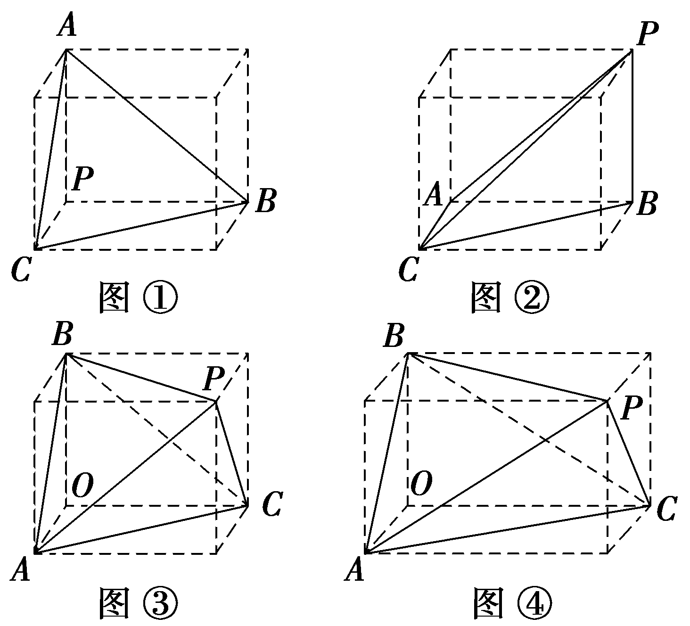

二、正四面体外接球

如图，设正四面体<text style="it<text style="it<text style="it<text style="it<text style="it*a*lic">a</text>lic">a</text>lic">a</text>lic">a</text>lic">ABCD</text>的棱长为a，将其放入正方体中，则正方体的棱长为 $\frac{\sqrt{2}}{2}$ <text style="it<text style="it<text style="it<text style="it*a*lic">a</text>lic">a</text>lic">a</text>lic">a</text>，显然正四面体和正方体有相同的外接球.正方体外接球半径为*<text style="italic">R*</text>＝ $\frac{\sqrt{2}}{2}$ <text style="it<text style="it<text style="it<text style="it*a*lic">a</text>lic">a</text>lic">a</text>lic">a</text>· $\frac{\sqrt{3}}{2}$ ＝ $\frac{\sqrt{6}}{4}$ <text style="it<text style="it<text style="it<text style="it*a*lic">a</text>lic">a</text>lic">a</text>lic">a</text>，即正四面体外接球半径为*<text style="italic">R*</text>＝ $\frac{\sqrt{6}}{4}$ <text style="it<text style="it<text style="it<text style="it*a*lic">a</text>lic">a</text>lic">a</text>lic">a</text>.

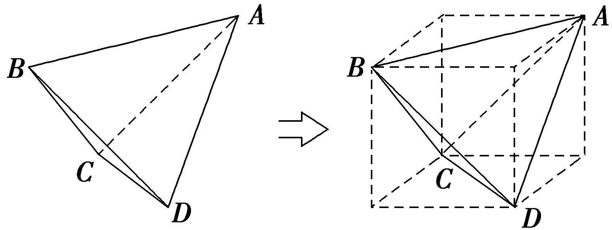

三、对棱相等的三棱锥外接球

四面体*ABCD*中，*AB*＝*CD*＝*m*，*AC*＝*BD*＝*n*，*AD*＝*BC*＝*t*，这种四面体叫做对棱相等四面体，可以通过构造长方体来解决这类问题.

如图，设长方体的长、宽、高分别为&lt;text style="it&lt;text style="it&lt;text style="itali<em>c</em>"&gt;a&lt;/text&gt;li<em>c</em>"&gt;a&lt;/text&gt;li<em>c</em>"&gt;a&lt;/text&gt;，<em>&lt;text style="italic"&gt;&lt;text style="italic"&gt;b</em>&lt;/text&gt;&lt;/text&gt;，c，则 $\left\{\begin{matrix}b^{2}＋c^{2}＝m^{2}，\\a^{2}＋c^{2}＝n^{2}，\\a^{2}＋b^{2}＝t^{2}，\end{matrix}\right.$ 三式相加可得&lt;text style="it&lt;text style="it&lt;text style="itali<em>c</em>"&gt;a&lt;/text&gt;li<em>c</em>"&gt;a&lt;/text&gt;li<em>c</em>"&gt;a&lt;/text&gt;&lt;text style="superscript"&gt;&lt;text style="superscript"&gt;&lt;text style="superscript"&gt;&lt;text style="superscript"&gt;&lt;text style="superscript"&gt;&lt;text style="superscript"&gt;2&lt;/text&gt;&lt;/text&gt;&lt;/text&gt;&lt;/text&gt;&lt;/text&gt;&lt;/text&gt;＋<em>&lt;text style="italic"&gt;&lt;text style="italic"&gt;b</em>&lt;/text&gt;&lt;/text&gt;2＋c2＝ $\frac{m^{2}＋n^{2}＋t^{2}}{2}$ ，而显然四面体和长方体有相同的外接球，设外接球半径为&lt;text style="it&lt;text style="itali<em>c</em>"&gt;a&lt;/text&gt;lic"&gt;<em>&lt;text style="italic"&gt;R</em>&lt;/text&gt;&lt;/text&gt;，则&lt;text style="it&lt;text style="itali<em>c</em>"&gt;a&lt;/text&gt;li<em>c</em>"&gt;a&lt;/text&gt;&lt;text style="superscript"&gt;&lt;text style="superscript"&gt;&lt;text style="superscript"&gt;&lt;text style="superscript"&gt;&lt;text style="superscript"&gt;&lt;text style="superscript"&gt;2&lt;/text&gt;&lt;/text&gt;&lt;/text&gt;&lt;/text&gt;&lt;/text&gt;&lt;/text&gt;＋<em>&lt;text style="italic"&gt;&lt;text style="italic"&gt;b</em>&lt;/text&gt;&lt;/text&gt;2＋c2＝4R2，所以R＝ $\sqrt{\frac{m^{2}＋n^{2}＋t^{2}}{8}}$ .

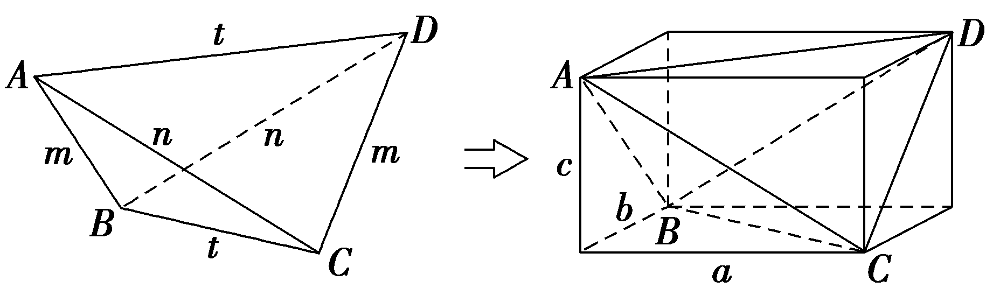

四、直棱柱外接球

如图①，图②，图③，直三棱柱内接于球(同时直棱柱也内接于圆柱，棱柱的上下底面可以是任意三角形)

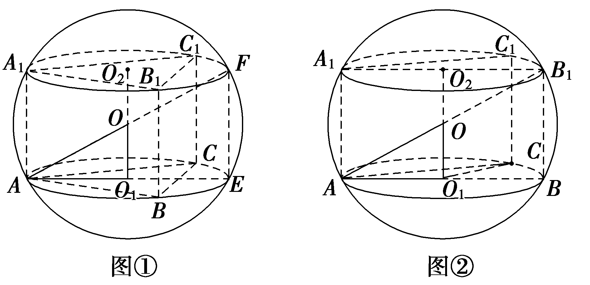

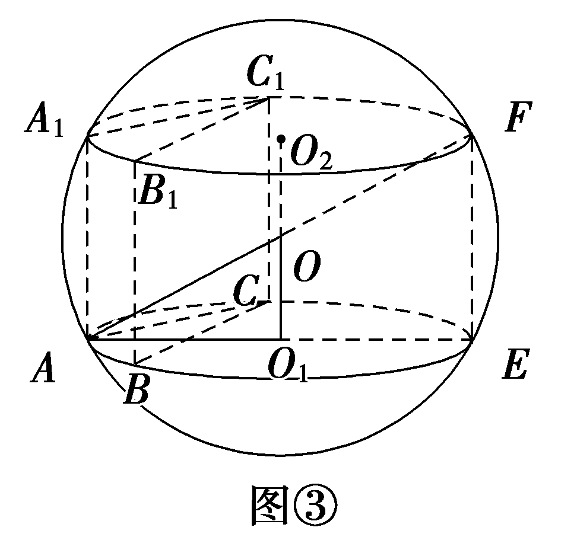

第一步：确定球心<em>O</em>的位置，<em>O</em>1是△<em>ABC</em>的外心，则<em>OO</em>1⊥平面<em>ABC</em>；

第二步：算出小圆<em>O</em>&lt;text style="subsc<em>r</em>ipt"&gt;&lt;text style="subscript"&gt;&lt;text style="subscript"&gt;&lt;text style="subscript"&gt;1&lt;/text&gt;&lt;/text&gt;&lt;/text&gt;&lt;/text&gt;的半径<em>AO</em>1＝r，<em>OO</em>1＝ $\frac{1}{2}$ <em>&lt;text style="italic"&gt;AA</em>&lt;/text&gt;&lt;text style="subsc<em>r</em>ipt"&gt;&lt;text style="subscript"&gt;&lt;text style="subscript"&gt;&lt;text style="subscript"&gt;1&lt;/text&gt;&lt;/text&gt;&lt;/text&gt;&lt;/text&gt;＝ $\frac{1}{2}$ <em>&lt;text style="italic"&gt;h</em>&lt;/text&gt;(<em>&lt;text style="italic"&gt;AA</em>&lt;/text&gt;&lt;text style="subsc<em>r</em>ipt"&gt;&lt;text style="subscript"&gt;&lt;text style="subscript"&gt;&lt;text style="subscript"&gt;1&lt;/text&gt;&lt;/text&gt;&lt;/text&gt;&lt;/text&gt;＝h也是圆柱的高)；

第三步：勾股定理：<em>&lt;text style="italic"&gt;&lt;text style="italic"&gt;&lt;text style="italic"&gt;O</em>&lt;/text&gt;&lt;/text&gt;<em>A</em>&lt;/text&gt;&lt;text style="supe<em>r</em>script"&gt;&lt;text style="superscript"&gt;&lt;text style="superscript"&gt;&lt;text style="superscript"&gt;&lt;text style="superscript"&gt;2&lt;/text&gt;&lt;/text&gt;&lt;/text&gt;&lt;/text&gt;&lt;/text&gt;＝O&lt;text style="subscript"&gt;1&lt;/text&gt;A2＋O1O2⇒<em>&lt;text style="italic"&gt;&lt;text style="italic"&gt;R</em>&lt;/text&gt;&lt;/text&gt;2＝r2＋( $\frac{h}{2}$ )&lt;text style="supe<em>r</em>script"&gt;&lt;text style="superscript"&gt;&lt;text style="superscript"&gt;&lt;text style="superscript"&gt;&lt;text style="superscript"&gt;2&lt;/text&gt;&lt;/text&gt;&lt;/text&gt;&lt;/text&gt;&lt;/text&gt;⇒<em>&lt;text style="italic"&gt;&lt;text style="italic"&gt;R</em>&lt;/text&gt;&lt;/text&gt;＝ $\sqrt{r^{2}＋(\frac{h}{2})^{2}}$ ，解出<em>&lt;text style="italic"&gt;&lt;text style="italic"&gt;R</em>&lt;/text&gt;&lt;/text&gt;.

五、正棱锥与侧棱相等模型

1.正棱锥外接球半径：*R*＝ $\frac{r^{2}＋h^{2}}{2h}$  .

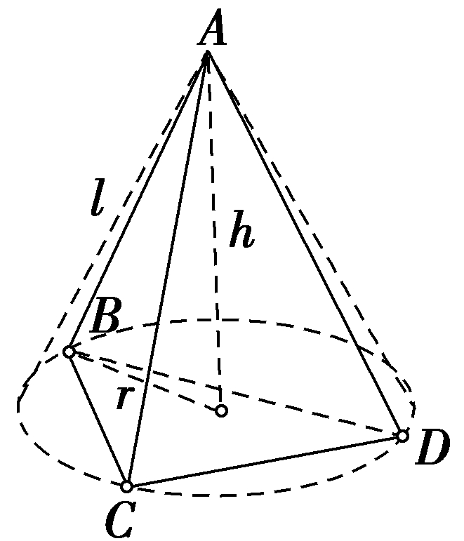

2.侧棱相等模型：如图，*P*的射影是△*ABC*的外心⇔三棱锥*P*-*ABC*的三条侧棱相等⇔三棱锥*P*-*ABC*的底面△*ABC*在圆锥的底上，顶点*P*点也是圆锥的顶点.

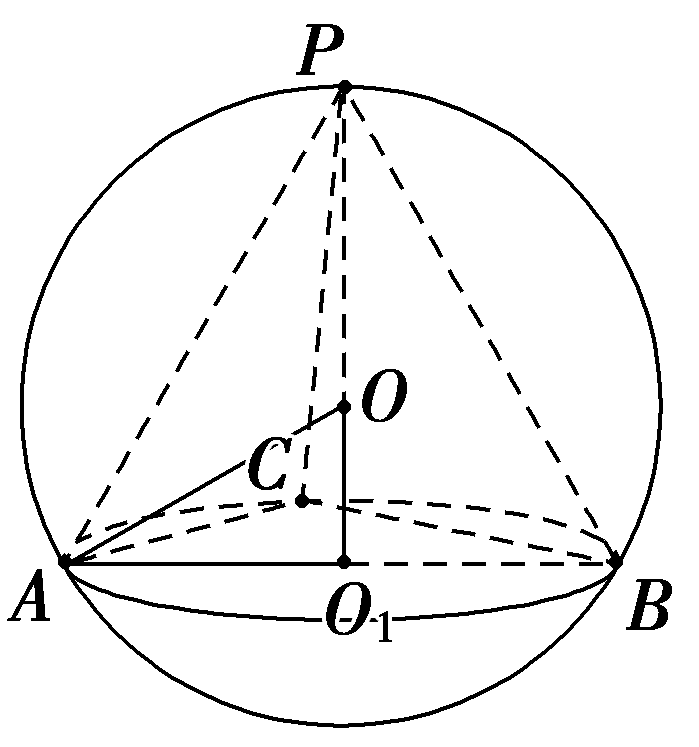

解题步骤：

第一步：确定球心<em>O</em>的位置，取△<em>ABC</em>的外心<em>O</em>1，则<em>P</em>，<em>O</em>，<em>O</em>1三点共线；

第二步：先算出小圆<em>O</em>1的半径<em>AO</em>1＝<em>r</em>，再算出棱锥的高<em>PO</em>1＝<em>h</em>(也是圆锥的高)；

第三步：勾股定理：<em>&lt;text style="italic"&gt;&lt;text style="italic"&gt;&lt;text style="italic"&gt;O</em>&lt;/text&gt;&lt;/text&gt;<em>A</em>&lt;/text&gt;&lt;text style="supe<em>r</em>script"&gt;&lt;text style="superscript"&gt;&lt;text style="superscript"&gt;&lt;text style="superscript"&gt;&lt;text style="superscript"&gt;2&lt;/text&gt;&lt;/text&gt;&lt;/text&gt;&lt;/text&gt;&lt;/text&gt;＝O&lt;text style="subscript"&gt;1&lt;/text&gt;A2＋O1O2⇒<em>&lt;text style="italic"&gt;&lt;text style="italic"&gt;R</em>&lt;/text&gt;&lt;/text&gt;2＝r2＋(<em>h</em>－R)2，解出R＝ $\frac{r^{2}＋h^{2}}{2h}$ .

六、圆锥圆柱圆台模型

1.球内接圆锥：如图①，设圆锥的高为*h*，底面圆半径为*r*，球的半径为*R*.通常在△*OCB*中，由勾股定理建立方程来计算*R*；如图②，当*PC*＞*CB*时，球心在圆锥内部；如图③，当*PC*＜*CB*时，球心在圆锥外部.和本专题前面的内接正棱锥问题情形相同，图②和图③两种情况建立的方程是一样的，故无需提前判断.

由图②、图③可知，<em>OC</em>＝<em>&lt;text style="italic"&gt;&lt;text style="italic"&gt;h</em>&lt;/text&gt;&lt;/text&gt;－<em>&lt;text style="italic"&gt;&lt;text style="italic"&gt;&lt;text style="italic"&gt;&lt;text style="italic"&gt;R</em>&lt;/text&gt;&lt;/text&gt;&lt;/text&gt;&lt;/text&gt;或R－h，故(h－R)&lt;text style="supe<em>r</em>script"&gt;&lt;text style="superscript"&gt;2&lt;/text&gt;&lt;/text&gt;＋r2＝R2，所以R＝ $\frac{h^{2}＋r^{2}}{2h}$ .

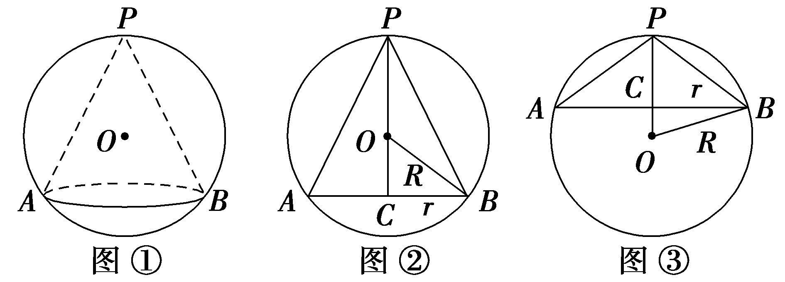

&lt;text style="supe<em>r</em>script"&gt;&lt;text style="superscript"&gt;2&lt;/text&gt;&lt;/text&gt;.球内接圆柱：如图，圆柱的底面圆半径为<em>r</em>，高为<em>h</em>，其外接球的半径为<em>&lt;text style="italic"&gt;R</em>&lt;/text&gt;，三者之间满足( $\frac{h}{2}$ )&lt;text style="supe<em>r</em>script"&gt;&lt;text style="superscript"&gt;2&lt;/text&gt;&lt;/text&gt;＋<em>r</em>2＝<em>&lt;text style="italic"&gt;R</em>&lt;/text&gt;2.

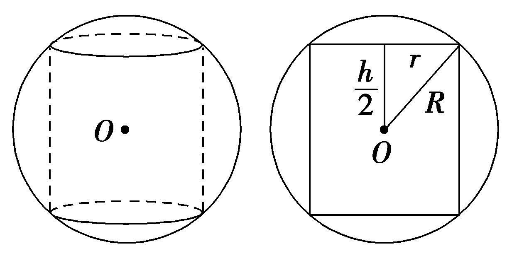

3.球内接圆台：<em>R</em>&lt;text style="supe<em>&lt;text style="italic"&gt;r</em>&lt;/text&gt;script"&gt;2&lt;/text&gt;＝ $r_{2}^{2}$ ＋ $\left(\frac{r_{2}^{2}－r_{1}^{2}－h^{2}}{2h}\right)^{2}$ ，其中<em>&lt;text style="italic"&gt;r</em>&lt;/text&gt;1，r&lt;text style="subscript"&gt;2&lt;/text&gt;，<em>h</em>分别为圆台的上底面半径、下底面半径、高.

题型一　外接球

技法1　定义法

(1)在三棱锥*<text style="italic">P*</text>-*<text style="italic"><text style="italic">AB*C</text></text>中，*<text style="italic">PA*</text>⊥平面*ABC*，PA＝2，AB＝2 $\sqrt{2}$ ，*AC*＝4，∠*BAC*＝45°，则三棱锥*<text style="italic">P*</text>-*<text style="italic"><text style="italic">AB*C</text></text>外接球的表面积是(　　)

A.14π	B.16π

C.18π	D.20π

(2)已知正三棱台的高为1，上、下底面边长分别为3 $\sqrt{3}$ 和4 $\sqrt{3}$ ，其顶点都在同一球面上，则该球的表面积为(　　)

A.100π	B.128π

C.144π	D.192π

答案：(1)**D**　(2)**A**

解析：(1)在△<em>&lt;text style="italic"&gt;B&lt;text style="italic"&gt;&lt;text style="italic"&gt;&lt;text style="italic"&gt;&lt;text style="italic"&gt;A</em>C&lt;/text&gt;&lt;/text&gt;&lt;/text&gt;&lt;/text&gt;&lt;/text&gt;中，∠B<em>AC</em>＝45°，<em>&lt;text style="italic"&gt;&lt;text style="italic"&gt;&lt;text style="italic"&gt;&lt;text style="italic"&gt;&lt;text style="italic"&gt;AB</em>&lt;/text&gt;&lt;/text&gt;&lt;/text&gt;&lt;/text&gt;&lt;/text&gt;＝&lt;text style="superscript"&gt;&lt;text style="superscript"&gt;&lt;text style="superscript"&gt;&lt;text style="superscript"&gt;&lt;text style="superscript"&gt;2&lt;/text&gt;&lt;/text&gt;&lt;/text&gt;&lt;/text&gt;&lt;/text&gt; $\sqrt{2}$ ，<em>&lt;text style="italic"&gt;&lt;text style="italic"&gt;&lt;text style="italic"&gt;A</em>C&lt;/text&gt;&lt;/text&gt;&lt;/text&gt;＝4，由余弦定理可得<em>&lt;text style="italic"&gt;&lt;text style="italic"&gt;&lt;text style="italic"&gt;&lt;text style="italic"&gt;&lt;text style="italic"&gt;&lt;text style="italic"&gt;BC</em>&lt;/text&gt;&lt;/text&gt;&lt;/text&gt;&lt;/text&gt;&lt;/text&gt;&lt;/text&gt;&lt;text style="superscript"&gt;&lt;text style="superscript"&gt;&lt;text style="superscript"&gt;&lt;text style="superscript"&gt;&lt;text style="superscript"&gt;2&lt;/text&gt;&lt;/text&gt;&lt;/text&gt;&lt;/text&gt;&lt;/text&gt;＝<em>&lt;text style="italic"&gt;&lt;text style="italic"&gt;&lt;text style="italic"&gt;&lt;text style="italic"&gt;&lt;text style="italic"&gt;AB</em>&lt;/text&gt;&lt;/text&gt;&lt;/text&gt;&lt;/text&gt;&lt;/text&gt;2＋<em>AC</em>2－2<em>AB·AC</em>cos 45°＝8＋16－2×2 $\sqrt{2}$ ×4× $\frac{\sqrt{2}}{2}$ ＝8，则<em>&lt;text style="italic"&gt;&lt;text style="italic"&gt;&lt;text style="italic"&gt;&lt;text style="italic"&gt;&lt;text style="italic"&gt;&lt;text style="italic"&gt;BC</em>&lt;/text&gt;&lt;/text&gt;&lt;/text&gt;&lt;/text&gt;&lt;/text&gt;&lt;/text&gt;&lt;text style="superscript"&gt;&lt;text style="superscript"&gt;&lt;text style="superscript"&gt;&lt;text style="superscript"&gt;&lt;text style="superscript"&gt;2&lt;/text&gt;&lt;/text&gt;&lt;/text&gt;&lt;/text&gt;&lt;/text&gt;＋<em>&lt;text style="italic"&gt;&lt;text style="italic"&gt;&lt;text style="italic"&gt;&lt;text style="italic"&gt;&lt;text style="italic"&gt;A</em>B&lt;/text&gt;&lt;/text&gt;&lt;/text&gt;&lt;/text&gt;&lt;/text&gt;2＝<em>&lt;text style="italic"&gt;&lt;text style="italic"&gt;&lt;text style="italic"&gt;AC</em>&lt;/text&gt;&lt;/text&gt;&lt;/text&gt;2，所以BC⊥<em>AB</em>，由<em>&lt;text style="italic"&gt;&lt;text style="italic"&gt;&lt;text style="italic"&gt;&lt;text style="italic"&gt;P</em>A&lt;/text&gt;&lt;/text&gt;&lt;/text&gt;&lt;/text&gt;⊥平面<em>&lt;text style="italic"&gt;&lt;text style="italic"&gt;ABC</em>&lt;/text&gt;&lt;/text&gt;，BC⊂平面ABC，得<em>PA</em>⊥BC，又PA∩AB＝A，PA，AB⊂平面<em>&lt;text style="italic"&gt;PAB</em>&lt;/text&gt;，所以BC⊥平面PAB，所以BC⊥<em>PB</em>，所以△<em>PBC</em>为直角三角形，又△<em>PAC</em>为直角三角形，所以<em>&lt;text style="italic"&gt;&lt;text style="italic"&gt;PC</em>&lt;/text&gt;&lt;/text&gt;是三棱锥P-ABC外接球直径.如图，设<em>O</em>是PC的中点，即为球心，又AC＝4，PA＝2，所以PC＝ $\sqrt{AC^{2}＋PA^{2}}$ ＝ $\sqrt{4^{2}＋2^{2}}$ ＝&lt;text style="superscript"&gt;&lt;text style="superscript"&gt;&lt;text style="superscript"&gt;&lt;text style="superscript"&gt;&lt;text style="superscript"&gt;2&lt;/text&gt;&lt;/text&gt;&lt;/text&gt;&lt;/text&gt;&lt;/text&gt; $\sqrt{5}$ ，所以外接球半径为 $\sqrt{5}$ ，所以所求外接球的表面积<em>S</em>＝4π× $\left(\sqrt{5}\right)^{2}$ ＝&lt;text style="superscript"&gt;&lt;text style="superscript"&gt;&lt;text style="superscript"&gt;&lt;text style="superscript"&gt;&lt;text style="superscript"&gt;2&lt;/text&gt;&lt;/text&gt;&lt;/text&gt;&lt;/text&gt;&lt;/text&gt;0π.故选D.

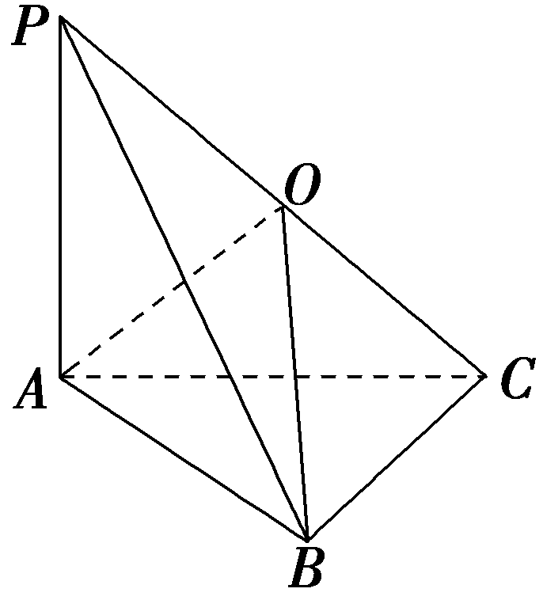

(&lt;text style="subscript"&gt;&lt;text style="subscript"&gt;&lt;text style="subscript"&gt;&lt;text style="subscript"&gt;&lt;text style="superscript"&gt;&lt;text style="superscript"&gt;&lt;text style="superscript"&gt;2&lt;/text&gt;&lt;/text&gt;&lt;/text&gt;&lt;/text&gt;&lt;/text&gt;&lt;/text&gt;&lt;/text&gt;)由题意，得正三棱台上、下底面的外接圆的半径分别为 $\frac{2}{3}$ × $\frac{\sqrt{3}}{2}$ ×3 $\sqrt{3}$ ＝3， $\frac{2}{3}$ × $\frac{\sqrt{3}}{2}$ ×4 $\sqrt{3}$ ＝4.设该棱台上、下底面的外接圆的圆心分别为<em>&lt;text style="italic"&gt;&lt;text style="italic"&gt;&lt;text style="italic"&gt;&lt;text style="italic"&gt;&lt;text style="italic"&gt;&lt;text style="italic"&gt;&lt;text style="italic"&gt;&lt;text style="italic"&gt;&lt;text style="italic"&gt;&lt;text style="italic"&gt;&lt;text style="italic"&gt;&lt;text style="italic"&gt;&lt;text style="italic"&gt;O</em>&lt;/text&gt;&lt;/text&gt;&lt;/text&gt;&lt;/text&gt;&lt;/text&gt;&lt;/text&gt;&lt;/text&gt;&lt;/text&gt;&lt;/text&gt;&lt;/text&gt;&lt;/text&gt;&lt;/text&gt;&lt;/text&gt;&lt;text style="subscript"&gt;&lt;text style="subscript"&gt;&lt;text style="subscript"&gt;&lt;text style="subscript"&gt;1&lt;/text&gt;&lt;/text&gt;&lt;/text&gt;&lt;/text&gt;，O&lt;text style="subscript"&gt;&lt;text style="subscript"&gt;&lt;text style="subscript"&gt;&lt;text style="subscript"&gt;&lt;text style="superscript"&gt;&lt;text style="superscript"&gt;&lt;text style="superscript"&gt;2&lt;/text&gt;&lt;/text&gt;&lt;/text&gt;&lt;/text&gt;&lt;/text&gt;&lt;/text&gt;&lt;/text&gt;，连接O1O2(图略)，则O1O2＝1，其外接球的球心O在直线O1O2上.设球O的半径为<em>&lt;text style="italic"&gt;R</em>&lt;/text&gt;，当球心O在线段O1O2上时，R2＝32＋O $O_{1}^{2}$ ＝4&lt;text style="subscript"&gt;&lt;text style="subscript"&gt;&lt;text style="subscript"&gt;&lt;text style="subscript"&gt;&lt;text style="superscript"&gt;&lt;text style="superscript"&gt;&lt;text style="superscript"&gt;2&lt;/text&gt;&lt;/text&gt;&lt;/text&gt;&lt;/text&gt;&lt;/text&gt;&lt;/text&gt;&lt;/text&gt;＋ $\left(1－OO_{1}\right)^{2}$ ，

解得<em>&lt;text style="italic"&gt;&lt;text style="italic"&gt;&lt;text style="italic"&gt;&lt;text style="italic"&gt;O</em>&lt;/text&gt;&lt;/text&gt;&lt;/text&gt;O&lt;/text&gt;&lt;text style="subscript"&gt;1&lt;/text&gt;＝4(舍去)；当球心O不在线段O1O&lt;text style="superscript"&gt;&lt;text style="superscript"&gt;&lt;text style="superscript"&gt;&lt;text style="subscript"&gt;&lt;text style="superscript"&gt;&lt;text style="subscript"&gt;&lt;text style="superscript"&gt;&lt;text style="superscript"&gt;2&lt;/text&gt;&lt;/text&gt;&lt;/text&gt;&lt;/text&gt;&lt;/text&gt;&lt;/text&gt;&lt;/text&gt;&lt;/text&gt;上时，<em>&lt;text style="italic"&gt;&lt;text style="italic"&gt;R</em>&lt;/text&gt;&lt;/text&gt;2＝42＋O $O_{2}^{2}$ ＝3&lt;text style="superscript"&gt;&lt;text style="superscript"&gt;&lt;text style="superscript"&gt;&lt;text style="subscript"&gt;&lt;text style="superscript"&gt;&lt;text style="subscript"&gt;&lt;text style="superscript"&gt;&lt;text style="superscript"&gt;2&lt;/text&gt;&lt;/text&gt;&lt;/text&gt;&lt;/text&gt;&lt;/text&gt;&lt;/text&gt;&lt;/text&gt;&lt;/text&gt;＋(&lt;text style="subscript"&gt;1&lt;/text&gt;＋<em>&lt;text style="italic"&gt;&lt;text style="italic"&gt;&lt;text style="italic"&gt;&lt;text style="italic"&gt;O</em>&lt;/text&gt;&lt;/text&gt;&lt;/text&gt;O&lt;/text&gt;2)2，解得<em>&lt;text style="italic"&gt;OO</em>&lt;/text&gt;2＝3，所以<em>&lt;text style="italic"&gt;&lt;text style="italic"&gt;R</em>&lt;/text&gt;&lt;/text&gt;2＝25，所以该球的表面积为4πR2＝100π.

综上，该球的表面积为100π.故选A.

到各个顶点距离均相等的点为外接球的球心，借助有特殊性底面的外接圆圆心，找其垂线，则球心一定在垂线上，再根据到其他顶点距离也是半径，列关系式求解即可.

对点练1.已知直三棱柱<em>ABC</em>-<em>A</em>1<em>B</em>1<em>C</em>1的6个顶点都在球<em>O</em>的球面上，若<em>AB</em>＝3，<em>AC</em>＝4，<em>AB</em>⊥<em>AC</em>，<em>AA</em>1＝12，则球<em>O</em>的半径为(　　)

A. $\frac{3\sqrt{17}}{2}$ 	B.2 $\sqrt{10}$

C. $\frac{13}{2}$ 	D.3 $\sqrt{10}$

答案：**C**

解析：由题意作图如图，过球心<em>&lt;text style="italic"&gt;O</em>&lt;/text&gt;作平面<em>A&lt;text style="italic"&gt;&lt;text style="italic"&gt;&lt;text style="italic"&gt;BC</em>&lt;/text&gt;&lt;/text&gt;&lt;/text&gt;的垂线，则垂足为BC的中点<em>M</em>.因为<em>&lt;text style="italic"&gt;AB</em>&lt;/text&gt;＝3，<em>&lt;text style="italic"&gt;AC</em>&lt;/text&gt;＝4，AB⊥AC，所以BC＝5，又<em>AM</em>＝ $\frac{1}{2}$ <em>&lt;text style="italic"&gt;&lt;text style="italic"&gt;BC</em>&lt;/text&gt;&lt;/text&gt;＝ $\frac{5}{2}$ ，<em>&lt;text style="italic"&gt;O</em>&lt;/text&gt;<em>M</em>＝ $\frac{1}{2}$ <em>AA</em>1＝6，所以球<em>&lt;text style="italic"&gt;O</em>&lt;/text&gt;的半径<em>R</em>＝<em>OA</em>＝ $\sqrt{\left(\frac{5}{2}\right)^{2}＋6^{2}}$ ＝ $\frac{13}{2}$ .故选C.

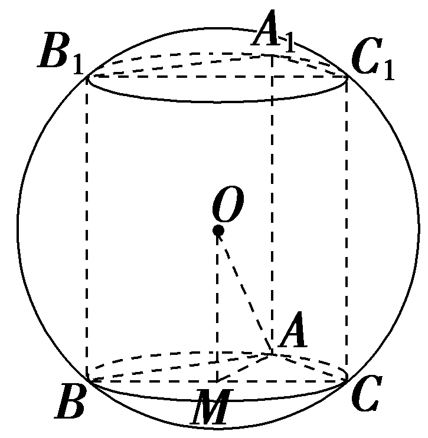

技法2　补形法

(1)在三棱锥*<text style="italic">A*</text>-*<text style="italic">BCD*</text>中，侧棱*AB*，*AC*，*AD*两两垂直，若△*ABC*，△*ACD*，△*ADB*的面积分别为 $\frac{\sqrt{2}}{2}$ ， $\frac{\sqrt{3}}{2}$ ， $\frac{\sqrt{6}}{2}$ ，则三棱锥*<text style="italic">A*</text>-*<text style="italic">BCD*</text>的外接球的体积为(　　)

A. $\sqrt{6}$ π	B.2 $\sqrt{6}$ π

C.3 $\sqrt{6}$ π	D.4 $\sqrt{6}$ π

(2)已知在三棱锥*P*-*A<text style="italic"><text style="italic">BC*</text></text>中，*<text style="italic">AC*</text>＝ $\sqrt{2}$ ，*<text style="italic">BC*</text>＝1，*<text style="italic">AC*</text>⊥BC且*P*A＝2*<text style="italic">PB*</text>，PB⊥平面*<text style="italic">ABC*</text>，则其外接球体积为(　　)

A. $\frac{4\pi }{3}$ 	B.4π

C. $\frac{32\pi }{3}$ 	D.4 $\sqrt{3}$ π

答案：(1)**A**　(2)**A**

解析：(1)设<text style="it<text style="it<text style="itali*c*">a</text>li*c*">a</text>lic">AB</text>，*AC*，*AD*的长度分别为a，*<text style="italic">b*</text>，c，由题意得 $\left\{\begin{matrix}ab＝\sqrt{2}，\\bc＝\sqrt{3}，\\ca＝\sqrt{6}，\end{matrix}\right.$ 解得 $\left\{\begin{matrix}a＝\sqrt{2}，\\b=1，\\c＝\sqrt{3}.\end{matrix}\right.$ 因为三条侧棱两两垂直，所以以<text style="it<text style="itali*c*">a</text>li*c*">a</text>，*<text style="italic">b*</text>，c为边长的长方体的体对角线长就是三棱锥的外接球的直径长，所以*R*＝ $\frac{1}{2}\sqrt{2+1+3}$ ＝ $\frac{\sqrt{6}}{2}$ ，故所求外接球的体积为 $\frac{4\pi }{3}$ *·* $\left(\frac{\sqrt{6}}{2}\right)^{3}$ ＝ $\sqrt{6}$ π.故选A.

(2)<em>AB</em>＝ $\sqrt{AC^{2}＋BC^{2}}$ ＝ $\sqrt{3}$ ，设<em>&lt;text style="italic"&gt;&lt;text style="italic"&gt;&lt;text style="italic"&gt;P</em>&lt;/text&gt;B&lt;/text&gt;&lt;/text&gt;＝<em>&lt;text style="italic"&gt;&lt;text style="italic"&gt;h</em>&lt;/text&gt;&lt;/text&gt;，则由<em>PA</em>＝2PB，可得 $\sqrt{3+h^{2}}$ ＝2<em>&lt;text style="italic"&gt;&lt;text style="italic"&gt;h</em>&lt;/text&gt;&lt;/text&gt;，解得h＝1，可将三棱锥<em>&lt;text style="italic"&gt;P</em>&lt;/text&gt;-<em>AB</em>C还原成如图所示的长方体，则三棱锥P-<em>&lt;text style="italic"&gt;ABC</em>&lt;/text&gt;的外接球即为长方体的外接球，设外接球的半径为<em>&lt;text style="italic"&gt;&lt;text style="italic"&gt;&lt;text style="italic"&gt;R</em>&lt;/text&gt;&lt;/text&gt;&lt;/text&gt;，则2R＝ $\sqrt{1^{2}＋\left(\sqrt{2}\right)^{2}＋1^{2}}$ ＝2，<em>&lt;text style="italic"&gt;&lt;text style="italic"&gt;&lt;text style="italic"&gt;R</em>&lt;/text&gt;&lt;/text&gt;&lt;/text&gt;＝1，所以其外接球的体积<em>V</em>＝ $\frac{4\pi }{3}$ <em>&lt;text style="italic"&gt;&lt;text style="italic"&gt;&lt;text style="italic"&gt;R</em>&lt;/text&gt;&lt;/text&gt;&lt;/text&gt;3＝ $\frac{4\pi }{3}$ .故选A.

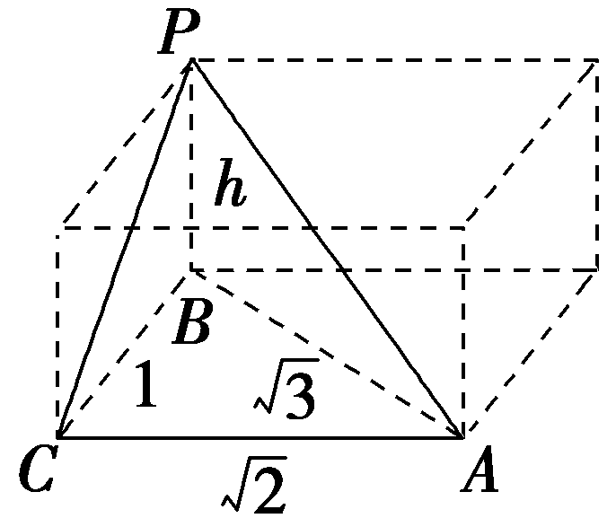

1.补形法的解题策略

(1)侧面为直角三角形，或对棱均相等的模型和正四面体，可以还原到长方体或正方体中去求解.

(2)直三棱锥可以补成三棱柱求解.

2.若长方体的共顶点的三条棱长分别为<text style="itali*c*">a</text>，*b*，c，外接球的半径为*<text style="italic">R*</text>，则2R＝ $\sqrt{a^{2}＋b^{2}＋c^{2}}$ .

对点练2.已知棱长为1的正四面体的四个顶点都在一个球面上，则这个球的体积为(　　)

A. $\frac{\sqrt{6}}{8}$ π	B. $\frac{\sqrt{6}}{4}$ π

C. $\frac{\sqrt{3}}{8}$ π	D. $\frac{\sqrt{3}}{4}$ π

答案：**A**

解析：如图将棱长为&lt;text style="subscript"&gt;&lt;text style="subscript"&gt;&lt;text style="subscript"&gt;&lt;text style="subscript"&gt;&lt;text style="subscript"&gt;&lt;text style="subscript"&gt;&lt;text style="subscript"&gt;1&lt;/text&gt;&lt;/text&gt;&lt;/text&gt;&lt;/text&gt;&lt;/text&gt;&lt;/text&gt;&lt;/text&gt;的正四面体<em>&lt;text style="italic"&gt;B</em>&lt;/text&gt;1-<em>&lt;text style="italic"&gt;ACD</em>&lt;/text&gt;1放入正方体<em>ABCD</em> -A1B1C1D1中，且正方体的棱长为1×cos 45°＝ $\frac{\sqrt{2}}{2}$ ，所以正方体的体对角线<em>AC</em>&lt;text style="subscript"&gt;&lt;text style="subscript"&gt;&lt;text style="subscript"&gt;&lt;text style="subscript"&gt;&lt;text style="subscript"&gt;&lt;text style="subscript"&gt;&lt;text style="subscript"&gt;1&lt;/text&gt;&lt;/text&gt;&lt;/text&gt;&lt;/text&gt;&lt;/text&gt;&lt;/text&gt;&lt;/text&gt;＝ $\sqrt{(\frac{\sqrt{2}}{2})^{2}＋(\frac{\sqrt{2}}{2})^{2}＋(\frac{\sqrt{2}}{2})^{2}}$ ＝ $\frac{\sqrt{6}}{2}$ ，所以正方体外接球的直径2<em>&lt;text style="italic"&gt;&lt;text style="italic"&gt;R</em>&lt;/text&gt;&lt;/text&gt;＝<em>AC</em>&lt;text style="subscript"&gt;&lt;text style="subscript"&gt;&lt;text style="subscript"&gt;&lt;text style="subscript"&gt;&lt;text style="subscript"&gt;&lt;text style="subscript"&gt;&lt;text style="subscript"&gt;1&lt;/text&gt;&lt;/text&gt;&lt;/text&gt;&lt;/text&gt;&lt;/text&gt;&lt;/text&gt;&lt;/text&gt;＝ $\frac{\sqrt{6}}{2}$ ，<em>&lt;text style="italic"&gt;&lt;text style="italic"&gt;R</em>&lt;/text&gt;&lt;/text&gt;＝ $\frac{\sqrt{6}}{4}$ ，所以正方体外接球的体积为 $\frac{4}{3}$ π<em>&lt;text style="italic"&gt;&lt;text style="italic"&gt;R</em>&lt;/text&gt;&lt;/text&gt;&lt;text style="superscript"&gt;3&lt;/text&gt;＝ $\frac{4}{3}$ π×( $\frac{\sqrt{6}}{4}$ )&lt;text style="superscript"&gt;3&lt;/text&gt;＝ $\frac{\sqrt{6}}{8}$ π，因为正四面体的外接球即为正方体的外接球，所以正四面体的外接球的体积为 $\frac{\sqrt{6}}{8}$ π.故选<em>A</em>.

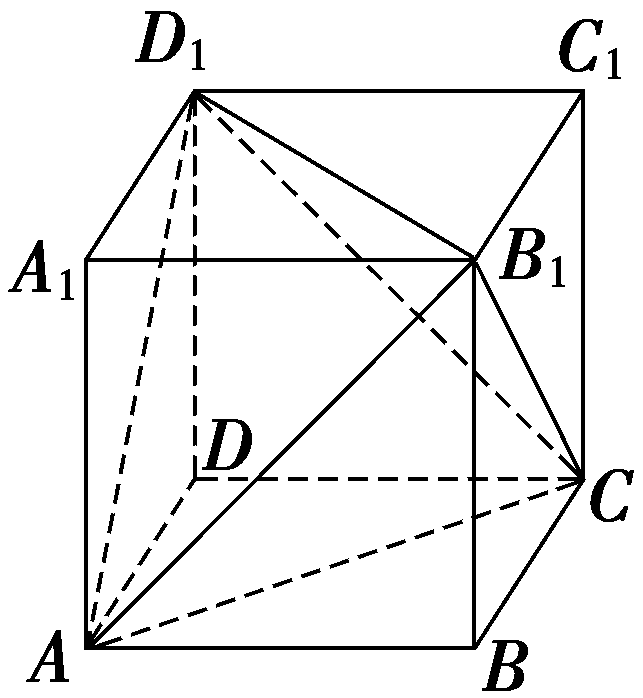

对点练3.(双空题)如图，在多面体中，四边形<em>ABCD</em>为矩形，<em>CE</em>⊥平面<em>ABCD</em>，<em>AB</em>＝2，<em>BC</em>＝<em>CE</em>＝1，通过添加一个三棱锥可以将该多面体补成一个直三棱柱，那么添加的三棱锥的体积为<u>　　　　</u>，补形后的直三棱柱的外接球的表面积为<u>　　　　</u>.

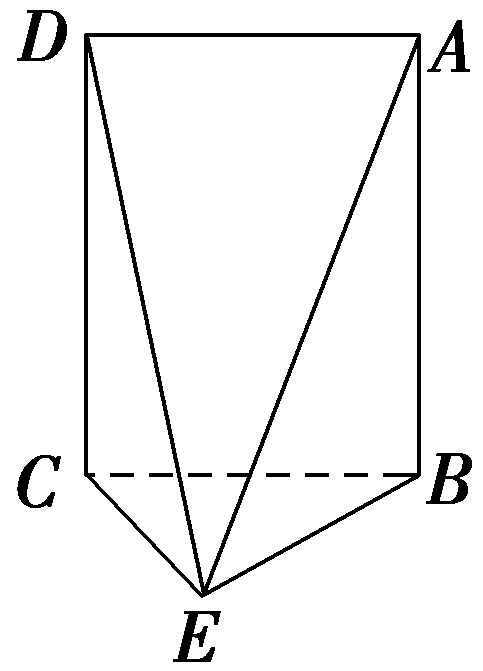

答案： $\frac{1}{3}$ 　6π

解析：如图①所示，添加的三棱锥为直三棱锥<em>E</em>-<em>&lt;text style="italic"&gt;&lt;text style="italic"&gt;ADF</em>&lt;/text&gt;&lt;/text&gt;，可以将该多面体补成一个直三棱柱ADF-<em>B&lt;text style="italic"&gt;&lt;text style="italic"&gt;&lt;text style="italic"&gt;&lt;text style="italic"&gt;CE</em>&lt;/text&gt;&lt;/text&gt;&lt;/text&gt;&lt;/text&gt;，因为CE⊥平面<em>&lt;text style="italic"&gt;AB</em>CD&lt;/text&gt;，所以CE⊥<em>&lt;text style="italic"&gt;&lt;text style="italic"&gt;DC</em>&lt;/text&gt;&lt;/text&gt;，又DC⊥<em>CB</em>，所以DC⊥平面<em>&lt;text style="italic"&gt;&lt;text style="italic"&gt;BC</em>&lt;/text&gt;E&lt;/text&gt;，故该三棱柱为直三棱柱.又AB＝2，BC＝CE＝1，所以<em>&lt;text style="italic"&gt;S</em>&lt;/text&gt;&lt;text style="subscript"&gt;△&lt;/text&gt;<em>&lt;text style="italic"&gt;&lt;text style="italic,subscript"&gt;BCE</em>&lt;/text&gt;&lt;/text&gt;＝ $\frac{1}{2}$ C<em>E</em>×<em>&lt;text style="italic"&gt;BC</em>&lt;/text&gt;＝ $\frac{1}{2}$ ×1×1＝ $\frac{1}{2}$ ，直三棱柱<em>&lt;text style="italic"&gt;&lt;text style="italic"&gt;ADF</em>&lt;/text&gt;&lt;/text&gt;-<em>&lt;text style="italic"&gt;BC</em>&lt;/text&gt;<em>E</em>的体积<em>&lt;text style="italic"&gt;V</em>&lt;/text&gt;＝<em>&lt;text style="italic"&gt;S</em>&lt;/text&gt;&lt;text style="subscript"&gt;△&lt;/text&gt;<em>B&lt;text style="italic"&gt;&lt;text style="italic"&gt;&lt;text style="italic"&gt;&lt;text style="italic"&gt;CE</em>&lt;/text&gt;&lt;/text&gt;&lt;/text&gt;&lt;/text&gt;·<em>AB</em>＝ $\frac{1}{2}$ ×2＝1，添加的三棱锥的体积为 $\frac{1}{3}$ <em>&lt;text style="italic"&gt;V</em>&lt;/text&gt;＝ $\frac{1}{3}$ .

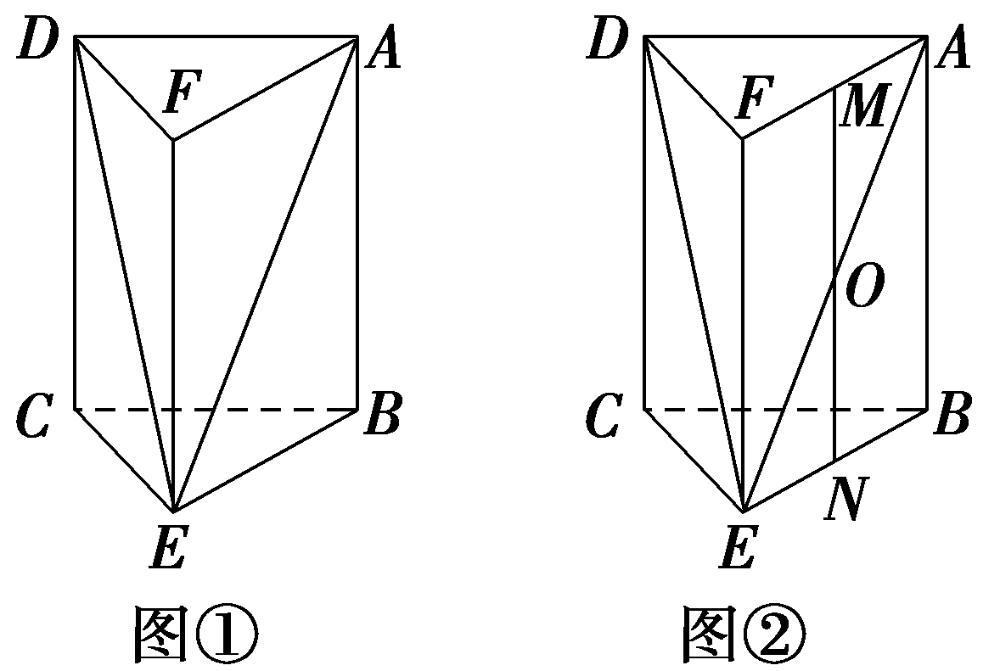

法一：如图②所示，分别取<em>&lt;text style="italic"&gt;AF</em>&lt;/text&gt;，<em>BE</em>的中点<em>M</em>，<em>N</em>，连接<em>&lt;text style="italic"&gt;MN</em>&lt;/text&gt;，与<em>&lt;text style="italic"&gt;AE</em>&lt;/text&gt;交于点<em>&lt;text style="italic"&gt;&lt;text style="italic"&gt;O</em>&lt;/text&gt;&lt;/text&gt;，因为四边形<em>AFEB</em>为矩形，所以O为AE，MN的中点，在直三棱柱<em>ADF</em>-<em>B&lt;text style="italic"&gt;CE</em>&lt;/text&gt;中，CE⊥平面<em>&lt;text style="italic"&gt;ABCD</em>&lt;/text&gt;，所以<em>FD</em>⊥平面ABCD，即∠<em>ECB</em>＝∠<em>FDA</em>＝90°，所以上、下底面为等腰直角三角形，直三棱柱的外接球的球心即为点O，<em>&lt;text style="italic"&gt;AO</em>&lt;/text&gt;即为球的半径，因为<em>&lt;text style="italic"&gt;AM</em>&lt;/text&gt;＝ $\frac{1}{2}$ <em>&lt;text style="italic"&gt;AF</em>&lt;/text&gt;＝ $\frac{\sqrt{2}}{2}$ ，<em>M&lt;text style="italic"&gt;&lt;text style="italic"&gt;O</em>&lt;/text&gt;&lt;/text&gt;＝1，所以<em>&lt;text style="italic"&gt;AO</em>&lt;/text&gt;&lt;text style="superscript"&gt;&lt;text style="superscript"&gt;&lt;text style="superscript"&gt;2&lt;/text&gt;&lt;/text&gt;&lt;/text&gt;＝<em>&lt;text style="italic"&gt;AM</em>&lt;/text&gt;2＋<em>&lt;text style="italic"&gt;MO</em>&lt;/text&gt;2＝ $\frac{1}{2}$ ＋1＝ $\frac{3}{2}$ ，所以外接球的表面积为4π·A<em>&lt;text style="italic"&gt;&lt;text style="italic"&gt;O</em>&lt;/text&gt;&lt;/text&gt;&lt;text style="superscript"&gt;&lt;text style="superscript"&gt;&lt;text style="superscript"&gt;2&lt;/text&gt;&lt;/text&gt;&lt;/text&gt;＝6π.

法二：因为<em>CE</em>，<em>CB</em>，<em>CD</em>两两垂直，故可将直三棱柱<em>ADF</em>-<em>BCE</em>补成长方体(图略)，设外接球的半径为<em>R</em>，则4<em>R</em>2＝12＋12＋22＝6，所以外接球的表面积<em>S</em>＝4π<em>R</em>2＝6π.

技法3　截面法

(&lt;text style="subscript"&gt;&lt;text style="subscript"&gt;&lt;text style="subscript"&gt;&lt;text style="subscript"&gt;&lt;text style="subscript"&gt;&lt;text style="subscript"&gt;1&lt;/text&gt;&lt;/text&gt;&lt;/text&gt;&lt;/text&gt;&lt;/text&gt;&lt;/text&gt;)在直三棱柱<em>&lt;text style="italic"&gt;&lt;text style="italic"&gt;A</em>&lt;/text&gt;<em>&lt;text style="italic"&gt;B</em>&lt;/text&gt;<em>&lt;text style="italic"&gt;C</em>&lt;/text&gt;&lt;/text&gt;-A1B1C1中，△<em>&lt;text style="italic"&gt;AB</em>C&lt;/text&gt;为等边三角形，AB＝2 $\sqrt{3}$ ，<em>&lt;text style="italic"&gt;B</em>&lt;/text&gt;B&lt;text style="subscript"&gt;&lt;text style="subscript"&gt;&lt;text style="subscript"&gt;&lt;text style="subscript"&gt;&lt;text style="subscript"&gt;&lt;text style="subscript"&gt;1&lt;/text&gt;&lt;/text&gt;&lt;/text&gt;&lt;/text&gt;&lt;/text&gt;&lt;/text&gt;＝2 $\sqrt{5}$ ，则三棱柱<em>&lt;text style="italic"&gt;&lt;text style="italic"&gt;A</em>&lt;/text&gt;<em>&lt;text style="italic"&gt;B</em>&lt;/text&gt;<em>&lt;text style="italic"&gt;C</em>&lt;/text&gt;&lt;/text&gt;-A&lt;text style="subscript"&gt;&lt;text style="subscript"&gt;&lt;text style="subscript"&gt;&lt;text style="subscript"&gt;&lt;text style="subscript"&gt;&lt;text style="subscript"&gt;1&lt;/text&gt;&lt;/text&gt;&lt;/text&gt;&lt;/text&gt;&lt;/text&gt;&lt;/text&gt;B1C1的外接球的表面积为(　　)

A.64π	B.36π

C.27π	D.16π

(2)四棱锥<em>P</em>-<em>ABCD</em>的顶点都在球<em>O</em>的表面上，△<em>PAD</em>是等边三角形，底面<em>ABCD</em>是矩形，平面<em>PAD</em>⊥平面<em>ABCD</em>，若<em>AB</em>＝2，<em>BC</em>＝3，则球<em>O</em>的表面积为<u>　　　　</u>.

答案：(1)**B**　(2)16π

解析：(1)如图，取△<em>ABC</em>，△<em>A</em>1<em>B</em>1<em>C</em>1的外接圆的圆心分别为<em>M</em>，<em>N</em>，

连接*MN*，取*MN*的中点*O*，

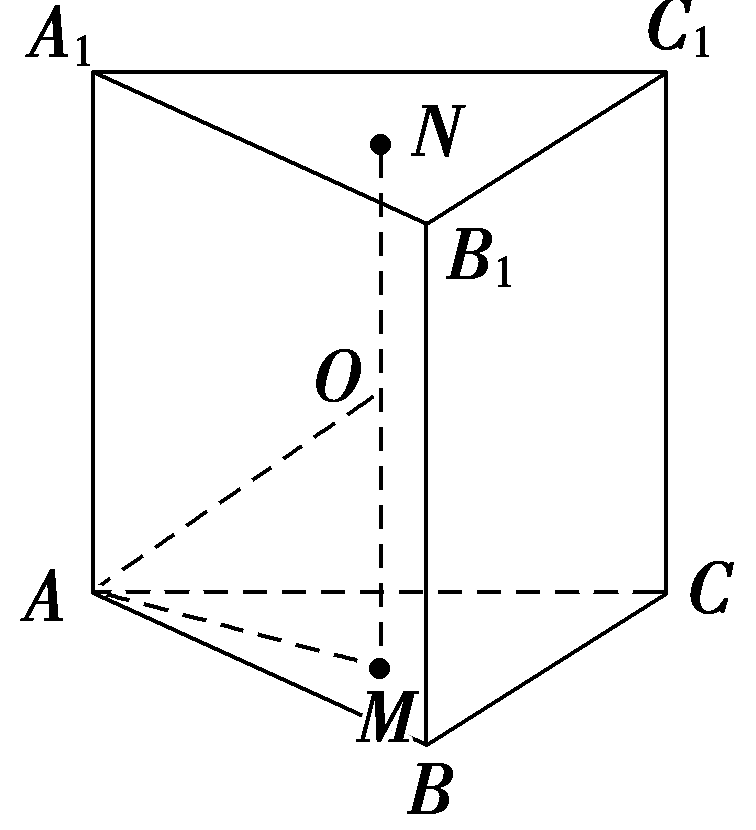

则<em>O</em>是三棱柱<em>&lt;text style="italic"&gt;&lt;text style="italic"&gt;A</em>&lt;/text&gt;<em>&lt;text style="italic"&gt;B</em>&lt;/text&gt;<em>&lt;text style="italic"&gt;C</em>&lt;/text&gt;&lt;/text&gt;-A&lt;text style="subsc<em>&lt;text style="italic"&gt;&lt;text style="italic"&gt;r</em>&lt;/text&gt;&lt;/text&gt;ipt"&gt;&lt;text style="subscript"&gt;&lt;text style="subscript"&gt;&lt;text style="subscript"&gt;&lt;text style="subscript"&gt;&lt;text style="subscript"&gt;1&lt;/text&gt;&lt;/text&gt;&lt;/text&gt;&lt;/text&gt;&lt;/text&gt;&lt;/text&gt;B1C1的外接球的球心，设△<em>&lt;text style="italic"&gt;ABC</em>&lt;/text&gt;的外接圆的半径为r，三棱柱ABC-A1B1C1的外接球的半径为<em>&lt;text style="italic"&gt;&lt;text style="italic"&gt;R</em>&lt;/text&gt;&lt;/text&gt;，由正弦定理得，因为 $\frac{AB}{sinC}$ ＝ $\frac{2\sqrt{3}}{sin60\circ }$ ＝&lt;text style="superscript"&gt;2&lt;/text&gt;<em>&lt;text style="italic"&gt;&lt;text style="italic"&gt;r</em>&lt;/text&gt;&lt;/text&gt;，所以r＝2，即<em>&lt;text style="italic"&gt;A</em>&lt;/text&gt;M＝2，又<em>&lt;text style="italic"&gt;B</em>&lt;/text&gt;B&lt;text style="subscript"&gt;&lt;text style="subscript"&gt;&lt;text style="subscript"&gt;&lt;text style="subscript"&gt;&lt;text style="subscript"&gt;&lt;text style="subscript"&gt;1&lt;/text&gt;&lt;/text&gt;&lt;/text&gt;&lt;/text&gt;&lt;/text&gt;&lt;/text&gt;＝2 $\sqrt{5}$ ，所以<em>O</em>M＝ $\sqrt{5}$ ，所以<em>&lt;text style="italic"&gt;&lt;text style="italic"&gt;R</em>&lt;/text&gt;&lt;/text&gt;＝<em>O&lt;text style="italic"&gt;A</em>&lt;/text&gt;＝ $\sqrt{2^{2}＋(\sqrt{5})^{2}}$ ＝3，所以外接球的表面积为4π<em>&lt;text style="italic"&gt;&lt;text style="italic"&gt;R</em>&lt;/text&gt;&lt;/text&gt;&lt;text style="superscript"&gt;2&lt;/text&gt;＝4π×32＝36π.

(2)如图，连接<em>&lt;text style="italic"&gt;AC</em>&lt;/text&gt;，<em>&lt;text style="italic"&gt;BD</em>&lt;/text&gt;，AC∩BD＝<em>&lt;text style="italic"&gt;&lt;text style="italic"&gt;G</em>&lt;/text&gt;&lt;/text&gt;，取<em>&lt;text style="italic"&gt;&lt;text style="italic"&gt;AD</em>&lt;/text&gt;&lt;/text&gt;的中点<em>E</em>，连接<em>&lt;text style="italic"&gt;&lt;text style="italic"&gt;&lt;text style="italic"&gt;&lt;text style="italic"&gt;&lt;text style="italic"&gt;&lt;text style="italic"&gt;&lt;text style="italic"&gt;PE</em>&lt;/text&gt;&lt;/text&gt;&lt;/text&gt;&lt;/text&gt;&lt;/text&gt;&lt;/text&gt;&lt;/text&gt;，<em>&lt;text style="italic"&gt;&lt;text style="italic"&gt;EG</em>&lt;/text&gt;&lt;/text&gt;.因为四边形<em>&lt;text style="italic"&gt;&lt;text style="italic"&gt;&lt;text style="italic"&gt;&lt;text style="italic"&gt;&lt;text style="italic"&gt;&lt;text style="italic"&gt;AB</em>CD&lt;/text&gt;&lt;/text&gt;&lt;/text&gt;&lt;/text&gt;&lt;/text&gt;&lt;/text&gt;为矩形，所以G为四边形ABCD的外接圆圆心；在线段PE上取<em>&lt;text style="italic"&gt;&lt;text style="italic"&gt;M</em>&lt;/text&gt;E&lt;/text&gt;＝ $\frac{1}{3}$ P<em>E</em>，因为△P<em>&lt;text style="italic"&gt;&lt;text style="italic"&gt;AD</em>&lt;/text&gt;&lt;/text&gt;为等边三角形，所以<em>&lt;text style="italic"&gt;M</em>&lt;/text&gt;为△<em>&lt;text style="italic"&gt;&lt;text style="italic"&gt;&lt;text style="italic"&gt;&lt;text style="italic"&gt;&lt;text style="italic"&gt;&lt;text style="italic"&gt;PAD</em>&lt;/text&gt;&lt;/text&gt;&lt;/text&gt;&lt;/text&gt;&lt;/text&gt;&lt;/text&gt;外接圆圆心，过<em>&lt;text style="italic"&gt;&lt;text style="italic"&gt;G</em>&lt;/text&gt;&lt;/text&gt;，M分别作平面<em>&lt;text style="italic"&gt;&lt;text style="italic"&gt;&lt;text style="italic"&gt;&lt;text style="italic"&gt;&lt;text style="italic"&gt;&lt;text style="italic"&gt;AB</em>CD&lt;/text&gt;&lt;/text&gt;&lt;/text&gt;&lt;/text&gt;&lt;/text&gt;&lt;/text&gt;和平面PAD的垂线，则两垂线的交点即为球<em>&lt;text style="italic"&gt;&lt;text style="italic"&gt;&lt;text style="italic"&gt;O</em>&lt;/text&gt;&lt;/text&gt;&lt;/text&gt;的球心O，连接<em>&lt;text style="italic"&gt;OP</em>&lt;/text&gt;，因为△PAD为等边三角形，所以<em>&lt;text style="italic"&gt;&lt;text style="italic"&gt;&lt;text style="italic"&gt;&lt;text style="italic"&gt;&lt;text style="italic"&gt;&lt;text style="italic"&gt;&lt;text style="italic"&gt;PE</em>&lt;/text&gt;&lt;/text&gt;&lt;/text&gt;&lt;/text&gt;&lt;/text&gt;&lt;/text&gt;&lt;/text&gt;⊥AD，因为平面PAD⊥平面ABCD，平面PAD∩平面ABCD＝AD，PE⊂平面PAD，所以PE⊥平面ABCD，所以PE∥<em>OG</em>，同理可得，<em>&lt;text style="italic"&gt;OM</em>&lt;/text&gt;∥<em>&lt;text style="italic"&gt;&lt;text style="italic"&gt;EG</em>&lt;/text&gt;&lt;/text&gt;，所以四边形O<em>ME</em>G为矩形，所以OM＝EG＝ $\frac{1}{2}$ <em>AB</em>＝1，P<em>&lt;text style="italic"&gt;M</em>&lt;/text&gt;＝ $\frac{2}{3}$ P<em>E</em>＝ $\frac{2}{3}$ × $\sqrt{9－\frac{9}{4}}$ ＝ $\sqrt{3}$ ，所以<em>&lt;text style="italic"&gt;&lt;text style="italic"&gt;&lt;text style="italic"&gt;O</em>&lt;/text&gt;&lt;/text&gt;&lt;/text&gt;P＝ $\sqrt{OM^{2}＋PM^{2}}$ ＝2，即球<em>&lt;text style="italic"&gt;&lt;text style="italic"&gt;&lt;text style="italic"&gt;O</em>&lt;/text&gt;&lt;/text&gt;&lt;/text&gt;的半径<em>&lt;text style="italic"&gt;R</em>&lt;/text&gt;＝2，所以球O的表面积<em>S</em>＝4πR2＝16π.

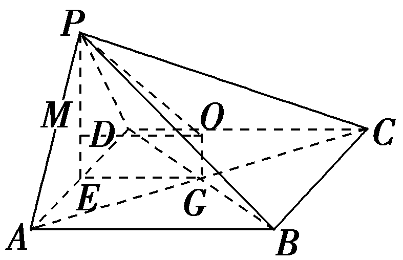

与球截面有关的解题策略

1.定球心：如果是内切球，球心到切点的距离相等且为半径；如果是外接球，球心到顶点的距离相等且为半径.

2.作截面：选准最佳角度作出截面，达到空间问题平面化的目的.

对点练4.(2021·天津卷)两个圆锥的底面是一个球的同一截面，顶点均在球面上，若球的体积为 $\frac{32\pi }{3}$ ，两个圆锥的高之比为1∶3，则这两个圆锥的体积之和为(　　)

A.3π	B.4π

C.9π	D.12π

答案：**B**

解析：如图所示，设两个圆锥的底面圆圆心为点<em>D</em>，设圆锥<em>&lt;text style="italic"&gt;&lt;text style="italic"&gt;&lt;text style="italic"&gt;AD</em>&lt;/text&gt;&lt;/text&gt;&lt;/text&gt;和圆锥<em>&lt;text style="italic"&gt;&lt;text style="italic"&gt;&lt;text style="italic"&gt;&lt;text style="italic"&gt;BD</em>&lt;/text&gt;&lt;/text&gt;&lt;/text&gt;&lt;/text&gt;的高之比为3∶1，即AD＝3BD，设球的半径为<em>&lt;text style="italic"&gt;R</em>&lt;/text&gt;，则 $\frac{4\pi R^{3}}{3}$ ＝ $\frac{32\pi }{3}$ ，可得<em>&lt;text style="italic"&gt;R</em>&lt;/text&gt;＝2，所以<em>AB</em>＝A<em>D</em>＋<em>&lt;text style="italic"&gt;&lt;text style="italic"&gt;&lt;text style="italic"&gt;&lt;text style="italic"&gt;BD</em>&lt;/text&gt;&lt;/text&gt;&lt;/text&gt;&lt;/text&gt;＝4BD＝4，所以BD＝1，<em>&lt;text style="italic"&gt;&lt;text style="italic"&gt;&lt;text style="italic"&gt;AD</em>&lt;/text&gt;&lt;/text&gt;&lt;/text&gt;＝3，所以<em>OD</em>＝1，<em>&lt;text style="italic"&gt;CD</em>&lt;/text&gt;＝ $\sqrt{3}$ ，因此，这两个圆锥的体积之和为 $\frac{1}{3}$ π×C<em>D</em>2<em>·</em> $\left(AD＋BD\right)$ ＝ $\frac{1}{3}$ π×3×4＝4π.故选B.

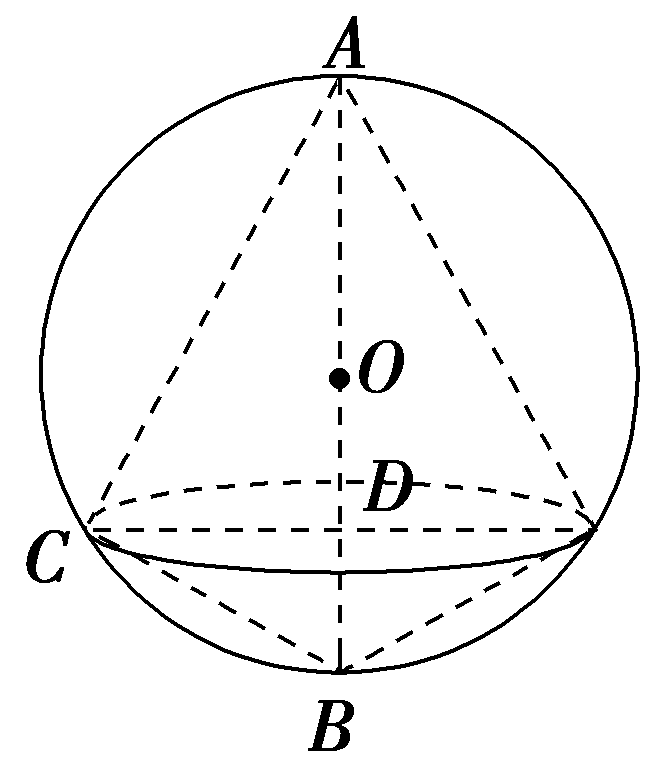

对点练5.已知正四棱台的上、下底面的顶点都在一个半径为3的球面上，上、下底面正方形的外接圆半径分别为1和2，圆台的两底面在球心的同侧，则此正四棱台的体积为<u>　　　　</u>.

答案： $\frac{28\sqrt{2}－14\sqrt{5}}{3}$

解析：由题知，正四棱台的&lt;text style="subscript"&gt;上&lt;/text&gt;、&lt;text style="subscript"&gt;下&lt;/text&gt;底面的顶点都在一个半径为3的球面上，取正四棱台上底面一点为<em>A</em>，正方形中心为<em>&lt;text style="italic"&gt;&lt;text style="italic"&gt;&lt;text style="italic"&gt;&lt;text style="italic"&gt;O</em>&lt;/text&gt;&lt;/text&gt;&lt;/text&gt;&lt;/text&gt;&lt;text style="subscript"&gt;&lt;text style="subscript"&gt;&lt;text style="subscript"&gt;&lt;text style="subscript"&gt;&lt;text style="subscript"&gt;&lt;text style="subscript"&gt;&lt;text style="subscript"&gt;1&lt;/text&gt;&lt;/text&gt;&lt;/text&gt;&lt;/text&gt;&lt;/text&gt;&lt;/text&gt;&lt;/text&gt;，下底面一点为<em>B</em>，正方形中心为O&lt;text style="subscript"&gt;&lt;text style="subscript"&gt;&lt;text style="superscript"&gt;&lt;text style="subscript"&gt;&lt;text style="subscript"&gt;&lt;text style="subscript"&gt;&lt;text style="superscript"&gt;2&lt;/text&gt;&lt;/text&gt;&lt;/text&gt;&lt;/text&gt;&lt;/text&gt;&lt;/text&gt;&lt;/text&gt;，正四棱台外接球球心为O，连接<em>&lt;text style="italic"&gt;&lt;text style="italic"&gt;AO</em>&lt;/text&gt;&lt;/text&gt;1，<em>&lt;text style="italic"&gt;&lt;text style="italic"&gt;&lt;text style="italic"&gt;OO</em>&lt;/text&gt;&lt;/text&gt;&lt;/text&gt;1，<em>&lt;text style="italic"&gt;&lt;text style="italic"&gt;BO</em>&lt;/text&gt;&lt;/text&gt;2，<em>OA</em>，<em>OB</em>，如图所示，记正四棱台高O1O2＝<em>&lt;text style="italic"&gt;&lt;text style="italic"&gt;&lt;text style="italic"&gt;&lt;text style="italic"&gt;&lt;text style="italic"&gt;&lt;text style="italic"&gt;h</em>&lt;/text&gt;&lt;/text&gt;&lt;/text&gt;&lt;/text&gt;&lt;/text&gt;&lt;/text&gt;，OO1＝<em>&lt;text style="italic"&gt;&lt;text style="italic"&gt;&lt;text style="italic"&gt;&lt;text style="italic"&gt;&lt;text style="italic"&gt;&lt;text style="italic"&gt;m</em>&lt;/text&gt;&lt;/text&gt;&lt;/text&gt;&lt;/text&gt;&lt;/text&gt;&lt;/text&gt;，在Rt△<em>AOO</em>1中，AO＝3，AO1＝1，OO1＝m，所以有m2＋1＝9，解得m＝2 $\sqrt{2}$ ，在Rt△<em>B&lt;text style="italic"&gt;&lt;text style="italic"&gt;&lt;text style="italic"&gt;&lt;text style="italic"&gt;O</em>&lt;/text&gt;&lt;/text&gt;&lt;/text&gt;&lt;/text&gt;O&lt;text style="subscript"&gt;&lt;text style="subscript"&gt;&lt;text style="superscript"&gt;&lt;text style="subscript"&gt;&lt;text style="subscript"&gt;&lt;text style="subscript"&gt;&lt;text style="superscript"&gt;2&lt;/text&gt;&lt;/text&gt;&lt;/text&gt;&lt;/text&gt;&lt;/text&gt;&lt;/text&gt;&lt;/text&gt;中，<em>&lt;text style="italic"&gt;&lt;text style="italic"&gt;BO</em>&lt;/text&gt;&lt;/text&gt;＝3，BO2＝2，<em>&lt;text style="italic"&gt;&lt;text style="italic"&gt;&lt;text style="italic"&gt;OO</em>&lt;/text&gt;&lt;/text&gt;&lt;/text&gt;2＝<em>&lt;text style="italic"&gt;&lt;text style="italic"&gt;&lt;text style="italic"&gt;&lt;text style="italic"&gt;&lt;text style="italic"&gt;&lt;text style="italic"&gt;m</em>&lt;/text&gt;&lt;/text&gt;&lt;/text&gt;&lt;/text&gt;&lt;/text&gt;&lt;/text&gt;－<em>&lt;text style="italic"&gt;&lt;text style="italic"&gt;&lt;text style="italic"&gt;&lt;text style="italic"&gt;&lt;text style="italic"&gt;&lt;text style="italic"&gt;h</em>&lt;/text&gt;&lt;/text&gt;&lt;/text&gt;&lt;/text&gt;&lt;/text&gt;&lt;/text&gt;＞0，所以有(m－h)2＋4＝9，解得m－h＝ $\sqrt{5}$ ，即<em>&lt;text style="italic"&gt;&lt;text style="italic"&gt;&lt;text style="italic"&gt;&lt;text style="italic"&gt;&lt;text style="italic"&gt;&lt;text style="italic"&gt;h</em>&lt;/text&gt;&lt;/text&gt;&lt;/text&gt;&lt;/text&gt;&lt;/text&gt;&lt;/text&gt;＝&lt;text style="subscript"&gt;&lt;text style="subscript"&gt;&lt;text style="superscript"&gt;&lt;text style="subscript"&gt;&lt;text style="subscript"&gt;&lt;text style="subscript"&gt;&lt;text style="superscript"&gt;2&lt;/text&gt;&lt;/text&gt;&lt;/text&gt;&lt;/text&gt;&lt;/text&gt;&lt;/text&gt;&lt;/text&gt; $\sqrt{2}$ － $\sqrt{5}$ ，因为四棱台&lt;text style="subscript"&gt;上&lt;/text&gt;、&lt;text style="subscript"&gt;下&lt;/text&gt;底面正方形的外接圆半径分别为&lt;text style="subscript"&gt;&lt;text style="subscript"&gt;&lt;text style="subscript"&gt;&lt;text style="subscript"&gt;&lt;text style="subscript"&gt;&lt;text style="subscript"&gt;&lt;text style="subscript"&gt;1&lt;/text&gt;&lt;/text&gt;&lt;/text&gt;&lt;/text&gt;&lt;/text&gt;&lt;/text&gt;&lt;/text&gt;和&lt;text style="subscript"&gt;&lt;text style="subscript"&gt;&lt;text style="superscript"&gt;&lt;text style="subscript"&gt;&lt;text style="subscript"&gt;&lt;text style="subscript"&gt;&lt;text style="superscript"&gt;2&lt;/text&gt;&lt;/text&gt;&lt;/text&gt;&lt;/text&gt;&lt;/text&gt;&lt;/text&gt;&lt;/text&gt;，所以四棱台上、下底面正方形的边长分别为 $\sqrt{2}$ 和&lt;text style="subscript"&gt;&lt;text style="subscript"&gt;&lt;text style="superscript"&gt;&lt;text style="subscript"&gt;&lt;text style="subscript"&gt;&lt;text style="subscript"&gt;&lt;text style="superscript"&gt;2&lt;/text&gt;&lt;/text&gt;&lt;/text&gt;&lt;/text&gt;&lt;/text&gt;&lt;/text&gt;&lt;/text&gt; $\sqrt{2}$ ，所以<em>&lt;text style="italic"&gt;&lt;text style="italic"&gt;&lt;text style="italic"&gt;S</em>&lt;/text&gt;&lt;/text&gt;&lt;/text&gt;&lt;text style="subscript"&gt;上&lt;/text&gt;＝&lt;text style="subscript"&gt;&lt;text style="subscript"&gt;&lt;text style="superscript"&gt;&lt;text style="subscript"&gt;&lt;text style="subscript"&gt;&lt;text style="subscript"&gt;&lt;text style="superscript"&gt;2&lt;/text&gt;&lt;/text&gt;&lt;/text&gt;&lt;/text&gt;&lt;/text&gt;&lt;/text&gt;&lt;/text&gt;，S&lt;text style="subscript"&gt;下&lt;/text&gt;＝8，<em>&lt;text style="italic"&gt;&lt;text style="italic"&gt;&lt;text style="italic"&gt;&lt;text style="italic"&gt;&lt;text style="italic"&gt;&lt;text style="italic"&gt;h</em>&lt;/text&gt;&lt;/text&gt;&lt;/text&gt;&lt;/text&gt;&lt;/text&gt;&lt;/text&gt;＝2 $\sqrt{2}$ － $\sqrt{5}$ ，故正四棱台体积为<em>V</em>＝ $\frac{1}{3}$ <em>&lt;text style="italic"&gt;&lt;text style="italic"&gt;&lt;text style="italic"&gt;&lt;text style="italic"&gt;&lt;text style="italic"&gt;&lt;text style="italic"&gt;h</em>&lt;/text&gt;&lt;/text&gt;&lt;/text&gt;&lt;/text&gt;&lt;/text&gt;&lt;/text&gt;(<em>&lt;text style="italic"&gt;&lt;text style="italic"&gt;&lt;text style="italic"&gt;S</em>&lt;/text&gt;&lt;/text&gt;&lt;/text&gt;&lt;text style="subscript"&gt;上&lt;/text&gt;＋S&lt;text style="subscript"&gt;下&lt;/text&gt;＋ $\sqrt{S_{上}S_{下}}$ )＝ $\frac{28\sqrt{2}－14\sqrt{5}}{3}$ .

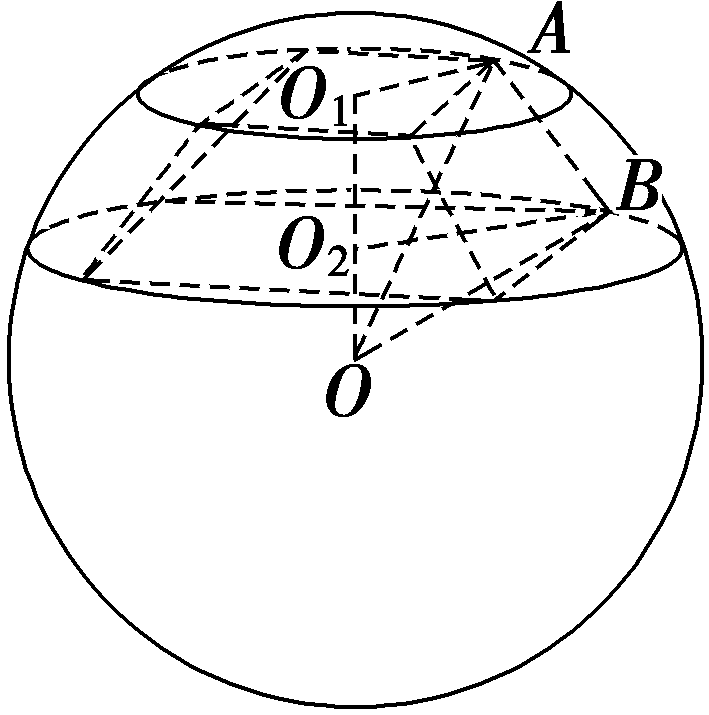

题型二　内切球

(1)如图所示，直三棱柱<em>ABC</em>-<em>A</em>1<em>B</em>1<em>C</em>1是一块石材，测量得∠<em>ABC</em>＝90°，<em>AB</em>＝6，<em>BC</em>＝8，<em>AA</em>1＝13.若将该石材切削、打磨，加工成几个大小相同的健身手球，则一个加工所得的健身手球的最大体积及此时加工成的健身手球的个数分别为(　　)

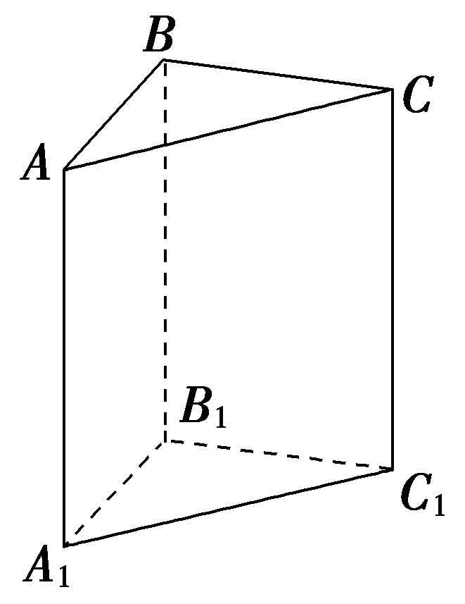

A. $\frac{32\pi }{3}$ ，4	B. $\frac{9\pi }{2}$ ，3

C.6π，4	D. $\frac{32\pi }{3}$ ，3

(2)在正四棱锥*P*-*ABCD*中，*PA*＝5，*AB*＝6，则该四棱锥内切球的表面积是(　　 )

A. $\frac{4\pi }{7}$ 	B. $\frac{24\pi }{7}$

C. $\frac{36\pi }{7}$ 	D. $\frac{72\pi }{7}$

答案：(1)**D**　 (2)**C**

解析：(1)依题意知，当健身手球与直三棱柱的三个侧面均相切时，健身手球的体积最大.易知<em>AC</em>＝ $\sqrt{AB^{2}＋BC^{2}}$ ＝10，设健身手球的半径为<em>&lt;text style="italic"&gt;&lt;text style="italic"&gt;&lt;text style="italic"&gt;R</em>&lt;/text&gt;&lt;/text&gt;&lt;/text&gt;，则 $\frac{1}{2}$ ×(6＋8＋10)×<em>&lt;text style="italic"&gt;&lt;text style="italic"&gt;&lt;text style="italic"&gt;R</em>&lt;/text&gt;&lt;/text&gt;&lt;/text&gt;＝ $\frac{1}{2}$ ×6×8，解得<em>&lt;text style="italic"&gt;&lt;text style="italic"&gt;&lt;text style="italic"&gt;R</em>&lt;/text&gt;&lt;/text&gt;&lt;/text&gt;＝2.则健身手球的最大直径为4.因为<em>AA</em>1＝1&lt;text style="superscript"&gt;3&lt;/text&gt;，所以最多可加工3个健身手球.于是一个健身手球的最大体积<em>V</em>＝ $\frac{4}{3}$ π<em>&lt;text style="italic"&gt;&lt;text style="italic"&gt;&lt;text style="italic"&gt;R</em>&lt;/text&gt;&lt;/text&gt;&lt;/text&gt;&lt;text style="superscript"&gt;3&lt;/text&gt;＝ $\frac{4}{3}$ π×2&lt;text style="superscript"&gt;3&lt;/text&gt;＝ $\frac{32\pi }{3}$ .故选D.

(&lt;text style="supe<em>&lt;text style="italic"&gt;&lt;text style="italic"&gt;&lt;text style="italic"&gt;r</em>&lt;/text&gt;&lt;/text&gt;&lt;/text&gt;script"&gt;2&lt;/text&gt;)过点<em>&lt;text style="italic"&gt;&lt;text style="italic"&gt;&lt;text style="italic"&gt;&lt;text style="italic"&gt;P</em>&lt;/text&gt;&lt;/text&gt;&lt;/text&gt;&lt;/text&gt;作<em>P&lt;text style="italic"&gt;O</em>&lt;/text&gt;⊥平面<em>&lt;text style="italic"&gt;&lt;text style="italic"&gt;AB</em>CD&lt;/text&gt;&lt;/text&gt;，则O为正方形<em>&lt;text style="italic"&gt;&lt;text style="italic"&gt;&lt;text style="italic"&gt;ABCD</em>&lt;/text&gt;&lt;/text&gt;&lt;/text&gt;的中心，连接<em>&lt;text style="italic"&gt;OA</em>&lt;/text&gt;，如图，因为AB＝6，所以OA＝3 $\sqrt{2}$ ，所以<em>O&lt;text style="italic"&gt;&lt;text style="italic"&gt;&lt;text style="italic"&gt;&lt;text style="italic"&gt;P</em>&lt;/text&gt;&lt;/text&gt;&lt;/text&gt;&lt;/text&gt;＝ $\sqrt{PA^{2}－OA^{2}}$ ＝ $\sqrt{25－18}$ ＝ $\sqrt{7}$ ，则四棱锥<em>&lt;text style="italic"&gt;&lt;text style="italic"&gt;&lt;text style="italic"&gt;&lt;text style="italic"&gt;P</em>&lt;/text&gt;&lt;/text&gt;&lt;/text&gt;&lt;/text&gt;-<em>&lt;text style="italic"&gt;&lt;text style="italic"&gt;AB</em>CD&lt;/text&gt;&lt;/text&gt;的体积<em>&lt;text style="italic"&gt;&lt;text style="italic"&gt;V</em>&lt;/text&gt;&lt;/text&gt;＝ $\frac{1}{3}$ ×6&lt;text style="supe<em>&lt;text style="italic"&gt;&lt;text style="italic"&gt;&lt;text style="italic"&gt;r</em>&lt;/text&gt;&lt;/text&gt;&lt;/text&gt;script"&gt;2&lt;/text&gt;× $\sqrt{7}$ ＝1&lt;text style="supe<em>&lt;text style="italic"&gt;&lt;text style="italic"&gt;&lt;text style="italic"&gt;r</em>&lt;/text&gt;&lt;/text&gt;&lt;/text&gt;script"&gt;2&lt;/text&gt; $\sqrt{7}$ ，四棱锥<em>&lt;text style="italic"&gt;&lt;text style="italic"&gt;&lt;text style="italic"&gt;&lt;text style="italic"&gt;P</em>&lt;/text&gt;&lt;/text&gt;&lt;/text&gt;&lt;/text&gt;-<em>&lt;text style="italic"&gt;&lt;text style="italic"&gt;AB</em>CD&lt;/text&gt;&lt;/text&gt;的表面积<em>S</em>＝6×6＋ $\frac{1}{2}$ ×6× $\sqrt{25－9}$ ×4＝84.设四棱锥<em>&lt;text style="italic"&gt;&lt;text style="italic"&gt;&lt;text style="italic"&gt;&lt;text style="italic"&gt;P</em>&lt;/text&gt;&lt;/text&gt;&lt;/text&gt;&lt;/text&gt;-<em>&lt;text style="italic"&gt;&lt;text style="italic"&gt;AB</em>CD&lt;/text&gt;&lt;/text&gt;内切球的半径为<em>&lt;text style="italic"&gt;&lt;text style="italic"&gt;&lt;text style="italic"&gt;r</em>&lt;/text&gt;&lt;/text&gt;&lt;/text&gt;，内切球的球心为<em>O</em>'，由<em>&lt;text style="italic"&gt;&lt;text style="italic"&gt;V</em>&lt;/text&gt;&lt;/text&gt;＝ $V_{O}_{'-ABP}$ ＋ $V_{O}_{'-BCP}$ ＋ $V_{O}_{'-CDP}$ ＋ $V_{O}_{'-ADP}$ ＋ $V_{O}_{'-ABCD}$ ，可得<em>&lt;text style="italic"&gt;&lt;text style="italic"&gt;V</em>&lt;/text&gt;&lt;/text&gt;＝ $\frac{1}{3}$ <em>S&lt;text style="italic"&gt;&lt;text style="italic"&gt;&lt;text style="italic"&gt;r</em>&lt;/text&gt;&lt;/text&gt;&lt;/text&gt;，即1&lt;text style="superscript"&gt;2&lt;/text&gt; $\sqrt{7}$ ＝ $\frac{1}{3}$ ×84<em>&lt;text style="italic"&gt;&lt;text style="italic"&gt;&lt;text style="italic"&gt;r</em>&lt;/text&gt;&lt;/text&gt;&lt;/text&gt;，解得r＝ $\frac{3\sqrt{7}}{7}$ ，故四棱锥<em>&lt;text style="italic"&gt;&lt;text style="italic"&gt;&lt;text style="italic"&gt;&lt;text style="italic"&gt;P</em>&lt;/text&gt;&lt;/text&gt;&lt;/text&gt;&lt;/text&gt;-<em>&lt;text style="italic"&gt;&lt;text style="italic"&gt;AB</em>CD&lt;/text&gt;&lt;/text&gt;内切球的表面积是4π<em>&lt;text style="italic"&gt;&lt;text style="italic"&gt;&lt;text style="italic"&gt;r</em>&lt;/text&gt;&lt;/text&gt;&lt;/text&gt;&lt;text style="superscript"&gt;2&lt;/text&gt;＝ $\frac{36\pi }{7}$ .故选C.

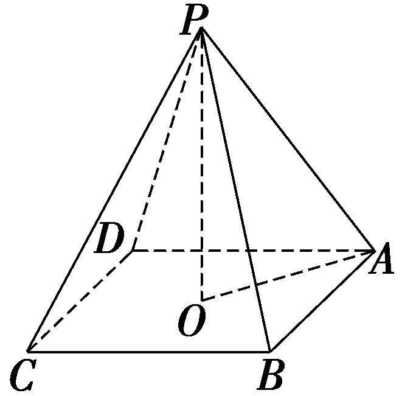

1.“切”的处理

解决与球有关的内切问题主要是指球内切于多面体或旋转体，解答时首先要找准切点，通过作截面来解决.如果内切的是多面体，则作截面时主要抓住多面体过球心的对角面.

2.与内(棱)切球有关的常用结论

(1)正方体的棱长为*a*，球的半径为*R*，

①若球为正方体的内切球，则2*R*＝*a*；

②若球与正方体的各棱相切，则2<text style="it*a*lic">R</text>＝ $\sqrt{2}$ *a*.

(2)设正四面体的棱长为<text style="it<text style="it<text style="it*a*lic">a</text>lic">a</text>lic">a</text>，则它的高为 $\frac{\sqrt{6}}{3}$ <text style="it<text style="it<text style="it*a*lic">a</text>lic">a</text>lic">a</text>，内切球半径*r*＝ $\frac{\sqrt{6}}{12}$ <text style="it<text style="it<text style="it*a*lic">a</text>lic">a</text>lic">a</text>，外接球半径*R*＝ $\frac{\sqrt{6}}{4}$ <text style="it<text style="it<text style="it*a*lic">a</text>lic">a</text>lic">a</text>.正四面体的外接球与内切球的半径之比为3∶1.

(3)二级结论：一个多面体的表面积为*S*，如果这个多面体有半径为*r*的内切球，则此多面体的体积*<text style="italic">V*</text>满足V＝ $\frac{1}{3}$ *Sr*.

注意：体积分割是求内切球半径的通用方法.

对点练6.半球内放三个半径为 $\sqrt{3}$ 的小球，三小球两两相切，并且与球面及半球底面的大圆面也相切，则该半球的半径是(　　)

A.1＋ $\sqrt{3}$ 	B. $\sqrt{3}$ ＋ $\sqrt{5}$

C. $\sqrt{5}$ ＋ $\sqrt{7}$ 	D. $\sqrt{3}$ ＋ $\sqrt{7}$

答案：**D**

解析：三个小球的球心<em>&lt;text style="italic"&gt;&lt;text style="italic"&gt;&lt;text style="italic"&gt;&lt;text style="italic"&gt;&lt;text style="italic"&gt;&lt;text style="italic"&gt;&lt;text style="italic"&gt;&lt;text style="italic"&gt;&lt;text style="italic"&gt;O</em>&lt;/text&gt;&lt;/text&gt;&lt;/text&gt;&lt;/text&gt;&lt;/text&gt;&lt;/text&gt;&lt;/text&gt;&lt;/text&gt;&lt;/text&gt;&lt;text style="subscript"&gt;&lt;text style="subscript"&gt;&lt;text style="subscript"&gt;&lt;text style="subscript"&gt;&lt;text style="subscript"&gt;1&lt;/text&gt;&lt;/text&gt;&lt;/text&gt;&lt;/text&gt;&lt;/text&gt;，O&lt;text style="superscript"&gt;2&lt;/text&gt;，O3构成边长为2 $\sqrt{3}$ 的正三角形，则其外接圆半径为&lt;text style="superscript"&gt;2&lt;/text&gt;.设半球的球心为<em>&lt;text style="italic"&gt;&lt;text style="italic"&gt;&lt;text style="italic"&gt;&lt;text style="italic"&gt;&lt;text style="italic"&gt;&lt;text style="italic"&gt;&lt;text style="italic"&gt;&lt;text style="italic"&gt;&lt;text style="italic"&gt;O</em>&lt;/text&gt;&lt;/text&gt;&lt;/text&gt;&lt;/text&gt;&lt;/text&gt;&lt;/text&gt;&lt;/text&gt;&lt;/text&gt;&lt;/text&gt;，小球O&lt;text style="subscript"&gt;&lt;text style="subscript"&gt;&lt;text style="subscript"&gt;&lt;text style="subscript"&gt;&lt;text style="subscript"&gt;1&lt;/text&gt;&lt;/text&gt;&lt;/text&gt;&lt;/text&gt;&lt;/text&gt;与半球底面切于点<em>&lt;text style="italic"&gt;A</em>&lt;/text&gt;.如图，经过点O，O1，A作半球的截面，则半圆☉O的半径为<em>&lt;text style="italic"&gt;&lt;text style="italic"&gt;OC</em>&lt;/text&gt;&lt;/text&gt;，OC⊥<em>&lt;text style="italic"&gt;OA</em>&lt;/text&gt;，作O1<em>&lt;text style="italic"&gt;&lt;text style="italic"&gt;B</em>&lt;/text&gt;&lt;/text&gt;⊥OC于点B，则OA＝O1B＝2.设该半球的半径是<em>&lt;text style="italic"&gt;R</em>&lt;/text&gt;，在Rt△<em>OAO</em>1中，由 $\left(R－\sqrt{3}\right)^{2}$ ＝&lt;text style="superscript"&gt;2&lt;/text&gt;2＋ $\left(\sqrt{3}\right)^{2}$ 可得<em>&lt;text style="italic"&gt;R</em>&lt;/text&gt;＝ $\sqrt{3}$ ＋ $\sqrt{7}$ .故选D.

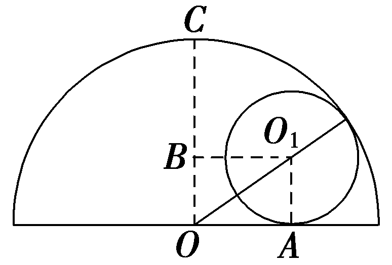

对点练7.已知圆锥的底面半径为1，母线长为3，则该圆锥内半径最大的球的体积为<u>　　　　</u>.

答案： $\frac{\sqrt{2}\pi }{3}$

解析：圆锥内的球半径最大时的轴截面如图所示，其中<em>&lt;text style="italic"&gt;&lt;text style="italic"&gt;O</em>&lt;/text&gt;&lt;/text&gt;&lt;text style="subsc<em>&lt;text style="italic"&gt;&lt;text style="italic"&gt;&lt;text style="italic"&gt;r</em>&lt;/text&gt;&lt;/text&gt;&lt;/text&gt;ipt"&gt;&lt;text style="subscript"&gt;&lt;text style="subscript"&gt;&lt;text style="subscript"&gt;&lt;text style="subscript"&gt;&lt;text style="subscript"&gt;1&lt;/text&gt;&lt;/text&gt;&lt;/text&gt;&lt;/text&gt;&lt;/text&gt;&lt;/text&gt;，<em>M</em>为切点，球心为O，设其半径为r，因为<em>A&lt;text style="italic"&gt;&lt;text style="italic"&gt;C</em>&lt;/text&gt;&lt;/text&gt;＝3，O1C＝1，所以<em>&lt;text style="italic"&gt;&lt;text style="italic"&gt;&lt;text style="italic"&gt;AO</em>&lt;/text&gt;&lt;/text&gt;&lt;/text&gt;1＝ $\sqrt{AC^{2}－O_{1}C^{2}}$ ＝2 $\sqrt{2}$ .因为<em>&lt;text style="italic"&gt;&lt;text style="italic"&gt;O</em>&lt;/text&gt;&lt;/text&gt;O&lt;text style="subsc<em>&lt;text style="italic"&gt;&lt;text style="italic"&gt;&lt;text style="italic"&gt;r</em>&lt;/text&gt;&lt;/text&gt;&lt;/text&gt;ipt"&gt;&lt;text style="subscript"&gt;&lt;text style="subscript"&gt;&lt;text style="subscript"&gt;&lt;text style="subscript"&gt;&lt;text style="subscript"&gt;1&lt;/text&gt;&lt;/text&gt;&lt;/text&gt;&lt;/text&gt;&lt;/text&gt;&lt;/text&gt;＝O<em>M</em>＝r，所以<em>&lt;text style="italic"&gt;&lt;text style="italic"&gt;&lt;text style="italic"&gt;AO</em>&lt;/text&gt;&lt;/text&gt;&lt;/text&gt;＝AO1－<em>&lt;text style="italic"&gt;OO</em>&lt;/text&gt;1＝2 $\sqrt{2}$ －<em>&lt;text style="italic"&gt;&lt;text style="italic"&gt;&lt;text style="italic"&gt;r</em>&lt;/text&gt;&lt;/text&gt;&lt;/text&gt;，又因为△A<em>M&lt;text style="italic"&gt;&lt;text style="italic"&gt;O</em>&lt;/text&gt;&lt;/text&gt;∽△<em>&lt;text style="italic"&gt;&lt;text style="italic"&gt;&lt;text style="italic"&gt;AO</em>&lt;/text&gt;&lt;/text&gt;&lt;/text&gt;&lt;text style="subscript"&gt;&lt;text style="subscript"&gt;&lt;text style="subscript"&gt;&lt;text style="subscript"&gt;&lt;text style="subscript"&gt;&lt;text style="subscript"&gt;1&lt;/text&gt;&lt;/text&gt;&lt;/text&gt;&lt;/text&gt;&lt;/text&gt;&lt;/text&gt;<em>&lt;text style="italic"&gt;C</em>&lt;/text&gt;，所以 $\frac{OM}{CO_{1}}$ ＝ $\frac{AO}{AC}$ ，即 $\frac{r}{1}$ ＝ $\frac{2\sqrt{2}－r}{3}$ ，解得<em>&lt;text style="italic"&gt;&lt;text style="italic"&gt;&lt;text style="italic"&gt;r</em>&lt;/text&gt;&lt;/text&gt;&lt;/text&gt;＝ $\frac{\sqrt{2}}{2}$ .所以该圆锥内半径最大的球的体积<em>V</em>＝ $\frac{4}{3}$ π× $\left(\frac{\sqrt{2}}{2}\right)^{3}$ ＝ $\frac{\sqrt{2}\pi }{3}$ .

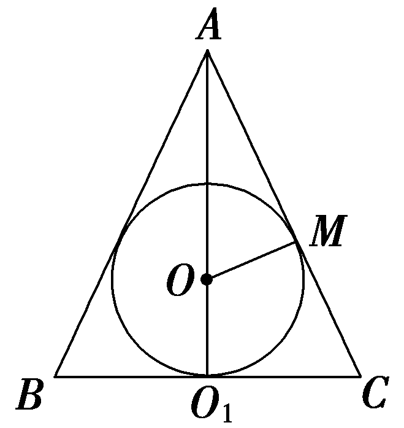

**课时测评**57　**球的切、接问题** $\frac{对应学生}{用书P423}$

(时间：50分钟　满分：75分)

(本栏目内容，在学生用书中以独立形式分册装订！)

(1—10题，每小题5分，共50分)

1.已知一个棱长为2的正方体的顶点都在某球面上，则该球体的体积为(　　)

A. $\frac{8\sqrt{2}}{3}$ π	B.4 $\sqrt{3}$ π

C.8π	D.12π

答案：**B**

解析：因为正方体的体对角线等于外接球的直径，且正方体的棱长为2，故该球体的直径2<em>&lt;text style="italic"&gt;&lt;text style="italic"&gt;R</em>&lt;/text&gt;&lt;/text&gt;＝ $\sqrt{2^{2}＋2^{2}＋2^{2}}$ ＝2 $\sqrt{3}$ ，所以<em>&lt;text style="italic"&gt;&lt;text style="italic"&gt;R</em>&lt;/text&gt;&lt;/text&gt;＝ $\sqrt{3}$ .故该球体的体积<em>V</em>＝ $\frac{4}{3}$ π<em>&lt;text style="italic"&gt;&lt;text style="italic"&gt;R</em>&lt;/text&gt;&lt;/text&gt;3＝4 $\sqrt{3}$ π.故选B.

2.在三棱锥*P*-*ABC*中，*PA*，*PB*，*PC*两两垂直，*PA*＝1，*PB*＝2，*PC*＝3，则该三棱锥的外接球的表面积为(　　)

A. $\frac{49}{4}$ π	B.56π

C. $\frac{56\sqrt{14}}{3}$ π	D.14π

答案：**D**

解析：如图，将三棱锥<em>P</em>-<em>ABC</em>补全为长方体，则长方体的外接球就是所求的外接球，设球的半径为<em>R</em>，则4<em>R</em>2＝(2<em>R</em>)2＝<em>PA</em>2＋<em>PB</em>2＋<em>PC</em>2＝14，所以球的表面积为<em>S</em>＝4π<em>R</em>2＝14π.故选D.

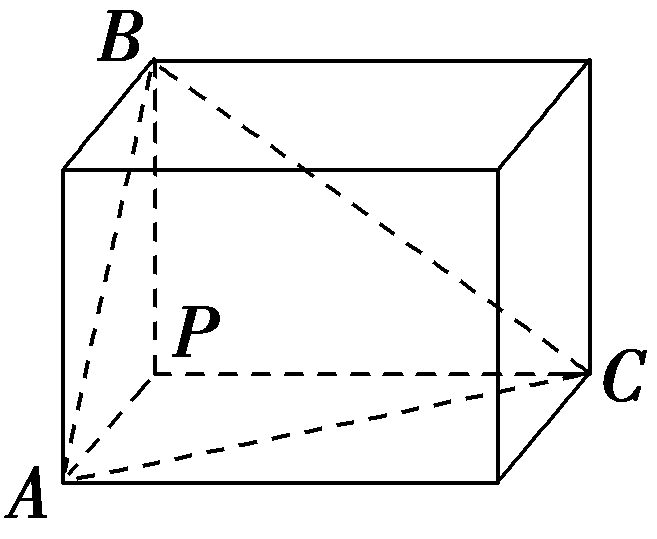

3.已知圆台<em>&lt;text style="italic"&gt;&lt;text style="italic"&gt;&lt;text style="italic"&gt;&lt;text style="italic"&gt;&lt;text style="italic"&gt;&lt;text style="italic"&gt;&lt;text style="italic"&gt;&lt;text style="italic"&gt;&lt;text style="italic"&gt;&lt;text style="italic"&gt;O</em>&lt;/text&gt;&lt;/text&gt;&lt;/text&gt;&lt;/text&gt;&lt;/text&gt;&lt;/text&gt;&lt;/text&gt;&lt;/text&gt;&lt;/text&gt;&lt;/text&gt;&lt;text style="subscript"&gt;&lt;text style="subscript"&gt;&lt;text style="subscript"&gt;&lt;text style="subscript"&gt;1&lt;/text&gt;&lt;/text&gt;&lt;/text&gt;&lt;/text&gt;O&lt;text style="subscript"&gt;&lt;text style="subscript"&gt;&lt;text style="subscript"&gt;&lt;text style="subscript"&gt;2&lt;/text&gt;&lt;/text&gt;&lt;/text&gt;&lt;/text&gt;上底面圆O1的半径为2，下底面圆O2的半径为2 $\sqrt{2}$ ，圆台的外接球的球心为<em>&lt;text style="italic"&gt;&lt;text style="italic"&gt;&lt;text style="italic"&gt;&lt;text style="italic"&gt;&lt;text style="italic"&gt;&lt;text style="italic"&gt;&lt;text style="italic"&gt;&lt;text style="italic"&gt;&lt;text style="italic"&gt;&lt;text style="italic"&gt;O</em>&lt;/text&gt;&lt;/text&gt;&lt;/text&gt;&lt;/text&gt;&lt;/text&gt;&lt;/text&gt;&lt;/text&gt;&lt;/text&gt;&lt;/text&gt;&lt;/text&gt;，半径为<em>R</em>，且球心在圆台的轴O&lt;text style="subscript"&gt;&lt;text style="subscript"&gt;&lt;text style="subscript"&gt;&lt;text style="subscript"&gt;1&lt;/text&gt;&lt;/text&gt;&lt;/text&gt;&lt;/text&gt;O&lt;text style="subscript"&gt;&lt;text style="subscript"&gt;&lt;text style="subscript"&gt;&lt;text style="subscript"&gt;2&lt;/text&gt;&lt;/text&gt;&lt;/text&gt;&lt;/text&gt;上，满足O1O＝3<em>OO</em>2，则圆台O1O2的外接球的表面积为(　　)

A.32π	B.34π

C.35π	D.38π

答案：**B**

解析：由题知<em>&lt;text style="italic"&gt;&lt;text style="italic"&gt;&lt;text style="italic"&gt;&lt;text style="italic"&gt;O</em>&lt;/text&gt;&lt;/text&gt;&lt;/text&gt;&lt;/text&gt;&lt;text style="subscript"&gt;1&lt;/text&gt;O＝ $\sqrt{R^{2}－2^{2}}$ ，<em>&lt;text style="italic"&gt;&lt;text style="italic"&gt;&lt;text style="italic"&gt;&lt;text style="italic"&gt;O</em>&lt;/text&gt;&lt;/text&gt;&lt;/text&gt;&lt;/text&gt;O&lt;text style="subscript"&gt;&lt;text style="superscript"&gt;&lt;text style="superscript"&gt;&lt;text style="superscript"&gt;&lt;text style="superscript"&gt;2&lt;/text&gt;&lt;/text&gt;&lt;/text&gt;&lt;/text&gt;&lt;/text&gt;＝ $\sqrt{R^{2}－\left(2\sqrt{2}\right)^{2}}$ ，且<em>&lt;text style="italic"&gt;&lt;text style="italic"&gt;&lt;text style="italic"&gt;&lt;text style="italic"&gt;O</em>&lt;/text&gt;&lt;/text&gt;&lt;/text&gt;&lt;/text&gt;&lt;text style="subscript"&gt;1&lt;/text&gt;O＝3<em>&lt;text style="italic"&gt;OO</em>&lt;/text&gt;&lt;text style="subscript"&gt;&lt;text style="superscript"&gt;&lt;text style="superscript"&gt;&lt;text style="superscript"&gt;&lt;text style="superscript"&gt;2&lt;/text&gt;&lt;/text&gt;&lt;/text&gt;&lt;/text&gt;&lt;/text&gt;，得<em>&lt;text style="italic"&gt;&lt;text style="italic"&gt;&lt;text style="italic"&gt;R</em>&lt;/text&gt;&lt;/text&gt;&lt;/text&gt;2－4＝9R2－72，解得R2＝ $\frac{17}{2}$ ，所以球<em>&lt;text style="italic"&gt;&lt;text style="italic"&gt;&lt;text style="italic"&gt;&lt;text style="italic"&gt;O</em>&lt;/text&gt;&lt;/text&gt;&lt;/text&gt;&lt;/text&gt;的表面积为4π<em>&lt;text style="italic"&gt;&lt;text style="italic"&gt;&lt;text style="italic"&gt;R</em>&lt;/text&gt;&lt;/text&gt;&lt;/text&gt;&lt;text style="subscript"&gt;&lt;text style="superscript"&gt;&lt;text style="superscript"&gt;&lt;text style="superscript"&gt;&lt;text style="superscript"&gt;2&lt;/text&gt;&lt;/text&gt;&lt;/text&gt;&lt;/text&gt;&lt;/text&gt;＝34π.故选B.

4.若圆锥的内切球与外接球的球心重合，且内切球的半径为1，则圆锥的体积为(　　)

A.π	B.2π

C.3π	D.4π

答案：**C**

解析：过圆锥的旋转轴作轴截面，得△<em>&lt;text style="italic"&gt;&lt;text style="italic"&gt;&lt;text style="italic"&gt;ABC</em>&lt;/text&gt;&lt;/text&gt;&lt;/text&gt;及其内切圆☉<em>&lt;text style="italic"&gt;&lt;text style="italic"&gt;O</em>&lt;/text&gt;&lt;/text&gt;&lt;text style="subsc<em>r</em>ipt"&gt;1&lt;/text&gt;和外接圆☉O2，且两圆同圆心，即△ABC的内心与外心重合，易得△ABC为正三角形，由题意得☉O1的半径为r＝1，所以△ABC的边长为2 $\sqrt{3}$ ，所以圆锥的底面半径为 $\sqrt{3}$ ，高为3，所以<em>V</em>＝ $\frac{1}{3}$ ×π×3×3＝3π.故选C.

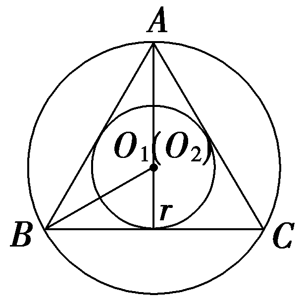

5.已知一个三棱柱，其底面是正三角形，且侧棱与底面垂直，一个体积为 $\frac{4\pi }{3}$ 的球体与棱柱的所有面均相切，那么这个三棱柱的表面积是(　　)

A.6 $\sqrt{3}$ 	B.12 $\sqrt{3}$

C.18 $\sqrt{3}$ 	D.24 $\sqrt{3}$

答案：**C**

解析：根据已知可得球的半径等于1，故三棱柱的高等于2，底面三角形内切圆的半径等于1，即底面三角形的高等于3，边长等于2 $\sqrt{3}$ ，所以这个三棱柱的表面积等于3×2 $\sqrt{3}$ ×2＋2× $\frac{1}{2}$ ×2 $\sqrt{3}$ ×3＝18 $\sqrt{3}$ .故选C.

6.“阿基米德多面体”也称半正多面体，是由边数不全相同的正多边形围成的多面体，它体现了数学的对称美.如图是以一正方体的各条棱的中点为顶点的多面体，这是一个有八个面为正三角形，六个面为正方形的“阿基米德多面体”，若该多面体的棱长为1，则该多面体外接球的体积为(　　)

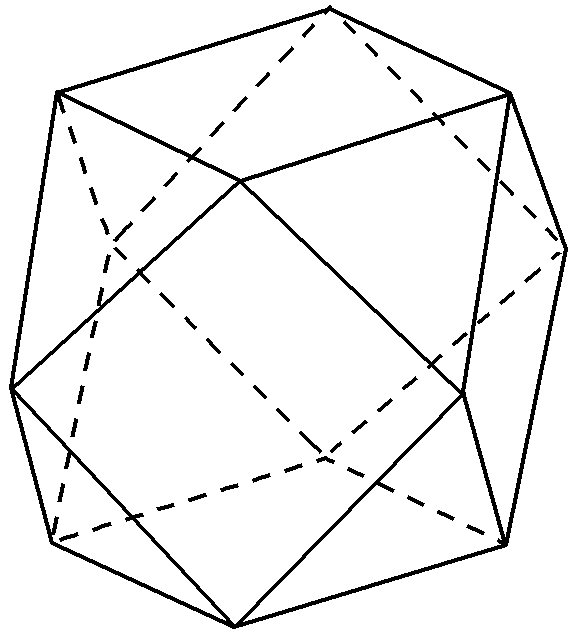

A. $\frac{4}{3}$ π	B. $\frac{8\sqrt{2}}{3}$ π

C.4π	D.8π

答案：**A**

解析：将该多面体放入正方体中，如图所示.由于多面体的棱长为1，所以正方体的棱长为 $\sqrt{2}$ ，因为该多面体是由棱长为 $\sqrt{2}$ 的正方体连接各棱中点所得，所以该多面体外接球的球心为正方体体对角线的中点，其外接球直径等于正方体的面对角线长，即2<em>&lt;text style="italic"&gt;&lt;text style="italic"&gt;R</em>&lt;/text&gt;&lt;/text&gt;＝ $\sqrt{\left(\sqrt{2}\right)^{2}＋\left(\sqrt{2}\right)^{2}}$ ，所以<em>&lt;text style="italic"&gt;&lt;text style="italic"&gt;R</em>&lt;/text&gt;&lt;/text&gt;＝1，所以该多面体外接球的体积<em>V</em>＝ $\frac{4}{3}$ π<em>&lt;text style="italic"&gt;&lt;text style="italic"&gt;R</em>&lt;/text&gt;&lt;/text&gt;3＝ $\frac{4}{3}$ π.故选A.

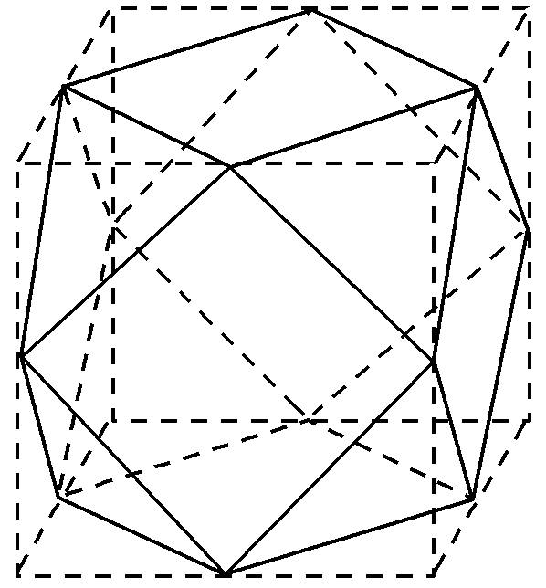

7.(多选)在正四棱锥*P*-*ABCD*中，若侧面与底面所成的角为 $\frac{\pi }{3}$ ，底面正方形的边长为2，则下列说法正确的是(　　)

A.正四棱锥外接球的表面积是 $\frac{25\pi }{12}$

B.正四棱锥内切球的体积是 $\frac{4\sqrt{3}\pi }{27}$

C.正四棱锥的体积为4 $\sqrt{3}$

D.正四棱锥外接球的半径*R*与内切球的半径*r*之比为 $\frac{5}{2}$

答案：**BD**

解析：如图，<em>&lt;text style="italic"&gt;&lt;text style="italic"&gt;&lt;text style="italic"&gt;&lt;text style="italic"&gt;O</em>&lt;/text&gt;&lt;/text&gt;&lt;/text&gt;&lt;/text&gt;&lt;text style="subsc<em>&lt;text style="italic"&gt;&lt;text style="italic"&gt;r</em>&lt;/text&gt;&lt;/text&gt;ipt"&gt;&lt;text style="subscript"&gt;&lt;text style="subscript"&gt;&lt;text style="subscript"&gt;&lt;text style="subscript"&gt;1&lt;/text&gt;&lt;/text&gt;&lt;/text&gt;&lt;/text&gt;&lt;/text&gt;为底面<em>&lt;text style="italic"&gt;&lt;text style="italic"&gt;A&lt;text style="italic"&gt;&lt;text style="italic"&gt;&lt;text style="italic"&gt;B</em>&lt;/text&gt;&lt;/text&gt;CD&lt;/text&gt;&lt;/text&gt;&lt;/text&gt;的中心，O为正四棱锥<em>&lt;text style="italic,subscript"&gt;&lt;text style="italic,subscript"&gt;P</em>&lt;/text&gt;&lt;/text&gt;&lt;text style="subscript"&gt;-&lt;/text&gt;<em>&lt;text style="italic,subscript"&gt;ABCD</em>&lt;/text&gt;的外接球的球心，由正方形ABCD的边长为&lt;text style="superscript"&gt;&lt;text style="superscript"&gt;&lt;text style="superscript"&gt;2&lt;/text&gt;&lt;/text&gt;&lt;/text&gt;，侧面与底面所成的角为 $\frac{\pi }{3}$ ，可知<em>&lt;text style="italic,subsc&lt;text style="italic"&gt;&lt;text style="italic"&gt;&lt;text style="italic"&gt;r</em>&lt;/text&gt;&lt;/text&gt;ipt"&gt;<em>P</em>&lt;/text&gt;&lt;/text&gt;<em>&lt;text style="italic"&gt;&lt;text style="italic"&gt;&lt;text style="italic"&gt;&lt;text style="italic"&gt;O</em>&lt;/text&gt;&lt;/text&gt;&lt;/text&gt;&lt;/text&gt;&lt;text style="subscript"&gt;&lt;text style="subscript"&gt;&lt;text style="subscript"&gt;&lt;text style="subscript"&gt;&lt;text style="subscript"&gt;1&lt;/text&gt;&lt;/text&gt;&lt;/text&gt;&lt;/text&gt;&lt;/text&gt;＝ $\sqrt{3}$ ，斜高<em>h</em>＝&lt;text style="supe<em>&lt;text style="italic"&gt;&lt;text style="italic"&gt;r</em>&lt;/text&gt;&lt;/text&gt;script"&gt;&lt;text style="superscript"&gt;&lt;text style="superscript"&gt;2&lt;/text&gt;&lt;/text&gt;&lt;/text&gt;，则<em>&lt;text style="italic"&gt;&lt;text style="italic"&gt;&lt;text style="italic"&gt;&lt;text style="italic"&gt;O</em>&lt;/text&gt;&lt;/text&gt;&lt;/text&gt;&lt;/text&gt;O&lt;text style="subscript"&gt;&lt;text style="subscript"&gt;&lt;text style="subscript"&gt;&lt;text style="subscript"&gt;&lt;text style="subscript"&gt;1&lt;/text&gt;&lt;/text&gt;&lt;/text&gt;&lt;/text&gt;&lt;/text&gt;＝ $\sqrt{3}$ －<em>&lt;text style="italic"&gt;&lt;text style="italic"&gt;&lt;text style="italic"&gt;R</em>&lt;/text&gt;&lt;/text&gt;&lt;/text&gt;，<em>&lt;text style="italic"&gt;&lt;text style="italic"&gt;&lt;text style="italic"&gt;&lt;text style="italic"&gt;O</em>&lt;/text&gt;&lt;/text&gt;&lt;/text&gt;&lt;/text&gt;&lt;text style="subsc<em>&lt;text style="italic"&gt;&lt;text style="italic"&gt;r</em>&lt;/text&gt;&lt;/text&gt;ipt"&gt;&lt;text style="subscript"&gt;&lt;text style="subscript"&gt;&lt;text style="subscript"&gt;&lt;text style="subscript"&gt;1&lt;/text&gt;&lt;/text&gt;&lt;/text&gt;&lt;/text&gt;&lt;/text&gt;<em>&lt;text style="italic"&gt;&lt;text style="italic"&gt;B</em>&lt;/text&gt;&lt;/text&gt;＝ $\sqrt{2}$ ，<em>&lt;text style="italic"&gt;&lt;text style="italic"&gt;V</em>&lt;/text&gt;&lt;/text&gt;<em>&lt;text style="italic,subsc&lt;text style="italic"&gt;&lt;text style="italic"&gt;&lt;text style="italic"&gt;r</em>&lt;/text&gt;&lt;/text&gt;ipt"&gt;<em>P</em>&lt;/text&gt;&lt;/text&gt;&lt;text style="subscript"&gt;-&lt;/text&gt;<em>&lt;text style="italic"&gt;&lt;text style="italic"&gt;A&lt;text style="italic"&gt;&lt;text style="italic"&gt;&lt;text style="italic"&gt;B</em>&lt;/text&gt;&lt;/text&gt;CD&lt;/text&gt;&lt;/text&gt;&lt;/text&gt;＝ $\frac{1}{3}$ ×&lt;text style="supe<em>&lt;text style="italic"&gt;&lt;text style="italic"&gt;r</em>&lt;/text&gt;&lt;/text&gt;script"&gt;&lt;text style="superscript"&gt;&lt;text style="superscript"&gt;2&lt;/text&gt;&lt;/text&gt;&lt;/text&gt;×2× $\sqrt{3}$ ＝ $\frac{4\sqrt{3}}{3}$ ，故C错误；在<em>&lt;text style="italic"&gt;&lt;text style="italic"&gt;&lt;text style="italic"&gt;R</em>&lt;/text&gt;&lt;/text&gt;&lt;/text&gt;t△<em>&lt;text style="italic"&gt;&lt;text style="italic"&gt;&lt;text style="italic"&gt;&lt;text style="italic"&gt;O</em>&lt;/text&gt;&lt;/text&gt;&lt;/text&gt;&lt;/text&gt;O&lt;text style="subsc<em>&lt;text style="italic"&gt;&lt;text style="italic"&gt;r</em>&lt;/text&gt;&lt;/text&gt;ipt"&gt;&lt;text style="subscript"&gt;&lt;text style="subscript"&gt;&lt;text style="subscript"&gt;&lt;text style="subscript"&gt;1&lt;/text&gt;&lt;/text&gt;&lt;/text&gt;&lt;/text&gt;&lt;/text&gt;<em>&lt;text style="italic"&gt;&lt;text style="italic"&gt;B</em>&lt;/text&gt;&lt;/text&gt;中，O $O_{1}^{2}$ ＋<em>&lt;text style="italic"&gt;&lt;text style="italic"&gt;&lt;text style="italic"&gt;&lt;text style="italic"&gt;O</em>&lt;/text&gt;&lt;/text&gt;&lt;/text&gt;&lt;/text&gt;&lt;text style="subsc<em>&lt;text style="italic"&gt;&lt;text style="italic"&gt;r</em>&lt;/text&gt;&lt;/text&gt;ipt"&gt;&lt;text style="subscript"&gt;&lt;text style="subscript"&gt;&lt;text style="subscript"&gt;&lt;text style="subscript"&gt;1&lt;/text&gt;&lt;/text&gt;&lt;/text&gt;&lt;/text&gt;&lt;/text&gt;<em>&lt;text style="italic"&gt;&lt;text style="italic"&gt;B</em>&lt;/text&gt;&lt;/text&gt;&lt;text style="superscript"&gt;&lt;text style="superscript"&gt;&lt;text style="superscript"&gt;2&lt;/text&gt;&lt;/text&gt;&lt;/text&gt;＝<em>OB</em>2，即 $\left(\sqrt{3}－R\right)^{2}$ ＋&lt;text style="supe<em>&lt;text style="italic"&gt;&lt;text style="italic"&gt;r</em>&lt;/text&gt;&lt;/text&gt;script"&gt;&lt;text style="superscript"&gt;&lt;text style="superscript"&gt;2&lt;/text&gt;&lt;/text&gt;&lt;/text&gt;＝<em>&lt;text style="italic"&gt;&lt;text style="italic"&gt;&lt;text style="italic"&gt;R</em>&lt;/text&gt;&lt;/text&gt;&lt;/text&gt;2，解得R＝ $\frac{5\sqrt{3}}{6}$ ，则正四棱锥外接球的表面积为<em>S</em>＝4π<em>&lt;text style="italic"&gt;&lt;text style="italic"&gt;&lt;text style="italic"&gt;R</em>&lt;/text&gt;&lt;/text&gt;&lt;/text&gt;&lt;text style="supe<em>&lt;text style="italic"&gt;&lt;text style="italic"&gt;r</em>&lt;/text&gt;&lt;/text&gt;script"&gt;&lt;text style="superscript"&gt;&lt;text style="superscript"&gt;2&lt;/text&gt;&lt;/text&gt;&lt;/text&gt;＝4π× $\left(\frac{5\sqrt{3}}{6}\right)^{2}$ ＝ $\frac{25\pi }{3}$ ，故A错误；由<em>&lt;text style="italic"&gt;&lt;text style="italic"&gt;V</em>&lt;/text&gt;&lt;/text&gt;<em>&lt;text style="italic,subsc&lt;text style="italic"&gt;&lt;text style="italic"&gt;&lt;text style="italic"&gt;r</em>&lt;/text&gt;&lt;/text&gt;ipt"&gt;<em>P</em>&lt;/text&gt;&lt;/text&gt;&lt;text style="subscript"&gt;-&lt;/text&gt;<em>&lt;text style="italic"&gt;&lt;text style="italic"&gt;A&lt;text style="italic"&gt;&lt;text style="italic"&gt;&lt;text style="italic"&gt;B</em>&lt;/text&gt;&lt;/text&gt;CD&lt;/text&gt;&lt;/text&gt;&lt;/text&gt;＝ $\frac{1}{3}$ × $\left(4+4\times \frac{1}{2}\times 2\times 2\right)$ ×<em>&lt;text style="italic"&gt;&lt;text style="italic"&gt;r</em>&lt;/text&gt;&lt;/text&gt;＝ $\frac{4\sqrt{3}}{3}$ ，解得<em>&lt;text style="italic"&gt;&lt;text style="italic"&gt;r</em>&lt;/text&gt;&lt;/text&gt;＝ $\frac{\sqrt{3}}{3}$ ，所以正四棱锥内切球的体积为<em>&lt;text style="italic"&gt;&lt;text style="italic"&gt;V</em>&lt;/text&gt;&lt;/text&gt;＝ $\frac{4}{3}$ π<em>&lt;text style="italic"&gt;&lt;text style="italic"&gt;r</em>&lt;/text&gt;&lt;/text&gt;3＝ $\frac{4}{3}$ π× $\left(\frac{\sqrt{3}}{3}\right)^{3}$ ＝ $\frac{4\sqrt{3}\pi }{27}$ ，故<em>&lt;text style="italic"&gt;&lt;text style="italic"&gt;B</em>&lt;/text&gt;&lt;/text&gt;正确；由上知 $\frac{R}{r}$ ＝ $\frac{5}{2}$ ，故D正确.故选<em>&lt;text style="italic"&gt;&lt;text style="italic"&gt;B</em>&lt;/text&gt;&lt;/text&gt;D.

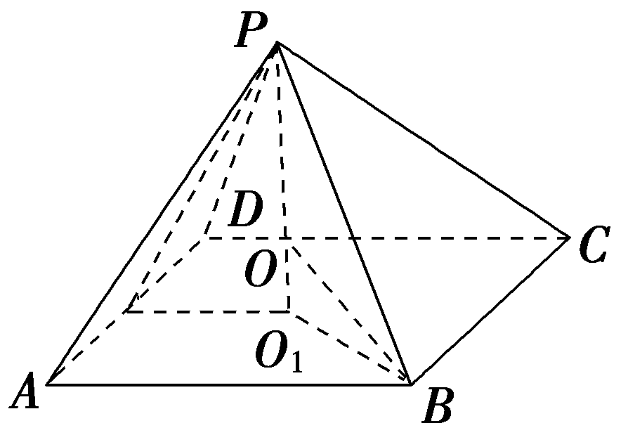

8.(多选)已知三棱锥*P*-*<text style="italic"><text style="italic"><text style="italic"><text style="italic">AB*</text></text>C</text></text>的四个顶点都在球*<text style="italic">O*</text>的表面上，*<text style="italic">PA*</text>⊥平面ABC，PA＝6，AB⊥*<text style="italic">AC*</text>，AB＝2，AC＝2 $\sqrt{3}$ ，点*<text style="italic">D*</text>为*<text style="italic"><text style="italic">AB*</text></text>的中点，过点D作球*<text style="italic">O*</text>的截面，则截面的面积可以是(　　)

A. $\frac{\pi }{2}$ 	B.π

C.9π	D.13π

答案：**BCD**

解析：三棱锥<em>P</em>-<em>&lt;text style="italic"&gt;AB</em>C&lt;/text&gt;的外接球即为以AB，<em>AC</em>，<em>AP</em>为邻边的长方体的外接球，所以&lt;text style="superscript"&gt;2&lt;/text&gt;<em>&lt;text style="italic"&gt;&lt;text style="italic"&gt;R</em>&lt;/text&gt;&lt;/text&gt;＝ $\sqrt{6^{2}＋2^{2}＋\left(2\sqrt{3}\right)^{2}}$ ＝&lt;text style="superscript"&gt;2&lt;/text&gt; $\sqrt{13}$ ，所以<em>&lt;text style="italic"&gt;&lt;text style="italic"&gt;R</em>&lt;/text&gt;&lt;/text&gt;＝ $\sqrt{13}$ ，取<em>BC</em>的中点<em>&lt;text style="italic"&gt;O</em>&lt;/text&gt;&lt;text style="subsc<em>&lt;text style="italic"&gt;r</em>&lt;/text&gt;ipt"&gt;&lt;text style="subscript"&gt;&lt;text style="subscript"&gt;1&lt;/text&gt;&lt;/text&gt;&lt;/text&gt;，所以O1为△<em>&lt;text style="italic"&gt;AB</em>C&lt;/text&gt;的外接圆圆心，所以<em>&lt;text style="italic"&gt;OO</em>&lt;/text&gt;1⊥平面<em>&lt;text style="italic"&gt;ABC</em>&lt;/text&gt;，且OO1＝3，如图.当<em>&lt;text style="italic"&gt;OD</em>&lt;/text&gt;⊥截面时，截面的面积最小，因为OD＝ $\sqrt{OO_{1}^{2}＋O_{1}D^{2}}$ ＝ $\sqrt{3^{2}＋\left(\sqrt{3}\right)^{2}}$ ＝&lt;text style="superscript"&gt;2&lt;/text&gt; $\sqrt{3}$ ，此时截面圆的半径为<em>&lt;text style="italic"&gt;r</em>&lt;/text&gt;＝ $\sqrt{R^{2}－OD^{2}}$ ＝&lt;text style="subsc<em>&lt;text style="italic"&gt;r</em>&lt;/text&gt;ipt"&gt;&lt;text style="subscript"&gt;&lt;text style="subscript"&gt;1&lt;/text&gt;&lt;/text&gt;&lt;/text&gt;，所以截面面积为πr&lt;text style="superscript"&gt;2&lt;/text&gt;＝π，当截面过球心时，截面圆的面积最大为π<em>&lt;text style="italic"&gt;&lt;text style="italic"&gt;R</em>&lt;/text&gt;&lt;/text&gt;2＝13π，故截面面积的取值范围是[π，13π].故选<em>BC</em>D.

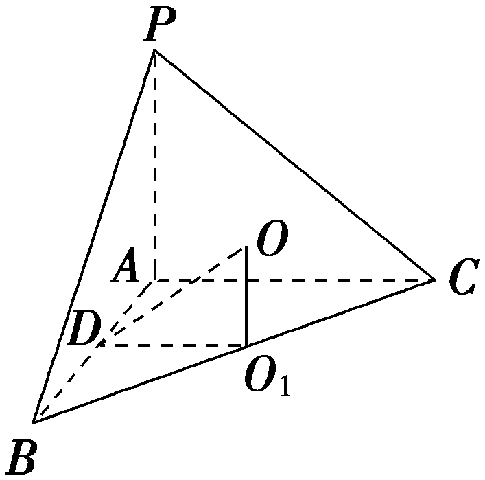

9.(2023·全国甲卷)在正方体<em>ABCD</em>-<em>A</em>1<em>B</em>1<em>C</em>1<em>D</em>1中，<em>AB</em>＝4，<em>O</em>为<em>AC</em>1的中点，若该正方体的棱与球<em>O</em>的球面有公共点，则球<em>O</em>的半径的取值范围是<u>　　　　</u>.

答案：[2 $\sqrt{2}$ ，2 $\sqrt{3}$ ]

解析：设球的半径为<em>&lt;text style="italic"&gt;&lt;text style="italic"&gt;&lt;text style="italic"&gt;R</em>&lt;/text&gt;&lt;/text&gt;&lt;/text&gt;.当球是正方体的外接球时，恰好经过正方体的每个顶点，所求的球的半径最大，若半径变得更大，球会包含正方体，导致球面和棱没有交点，正方体的外接球直径2<em>&lt;text style="italic"&gt;&lt;text style="italic"&gt;R'</em>&lt;/text&gt;&lt;/text&gt;为体对角线长<em>AC</em>&lt;text style="subscript"&gt;&lt;text style="subscript"&gt;&lt;text style="subscript"&gt;&lt;text style="subscript"&gt;1&lt;/text&gt;&lt;/text&gt;&lt;/text&gt;&lt;/text&gt;＝ $\sqrt{4^{2}＋4^{2}＋4^{2}}$ ＝4 $\sqrt{3}$ ，即2<em>&lt;text style="italic"&gt;&lt;text style="italic"&gt;&lt;text style="italic"&gt;R</em>&lt;/text&gt;&lt;/text&gt;&lt;/text&gt;'＝4 $\sqrt{3}$ ，<em>&lt;text style="italic"&gt;&lt;text style="italic"&gt;&lt;text style="italic"&gt;R</em>&lt;/text&gt;&lt;/text&gt;&lt;/text&gt;'＝2 $\sqrt{3}$ ，故<em>&lt;text style="italic"&gt;&lt;text style="italic"&gt;&lt;text style="italic"&gt;R</em>&lt;/text&gt;&lt;/text&gt;&lt;/text&gt;max＝2 $\sqrt{3}$ ；分别取侧棱<em>AA</em>&lt;text style="subscript"&gt;&lt;text style="subscript"&gt;&lt;text style="subscript"&gt;&lt;text style="subscript"&gt;1&lt;/text&gt;&lt;/text&gt;&lt;/text&gt;&lt;/text&gt;，<em>BB</em>1，<em>CC</em>1，<em>DD</em>1的中点<em>M</em>，<em>H</em>，<em>G</em>，<em>N</em>，显然四边形<em>&lt;text style="italic"&gt;&lt;text style="italic"&gt;MNGH</em>&lt;/text&gt;&lt;/text&gt;是边长为 4的正方形，且<em>O</em>为正方形MNGH的对角线交点，连接<em>&lt;text style="italic"&gt;MG</em>&lt;/text&gt;，则MG＝4 $\sqrt{2}$ ，当球的一个大圆恰好是四边形<em>MNGH</em>的外接圆时，球的半径达到最小，即<em>&lt;text style="italic"&gt;&lt;text style="italic"&gt;&lt;text style="italic"&gt;R</em>&lt;/text&gt;&lt;/text&gt;&lt;/text&gt;的最小值为2 $\sqrt{2}$ .综上，<em>&lt;text style="italic"&gt;&lt;text style="italic"&gt;&lt;text style="italic"&gt;R</em>&lt;/text&gt;&lt;/text&gt;&lt;/text&gt;∈[2 $\sqrt{2}$ ，2 $\sqrt{3}$ ].

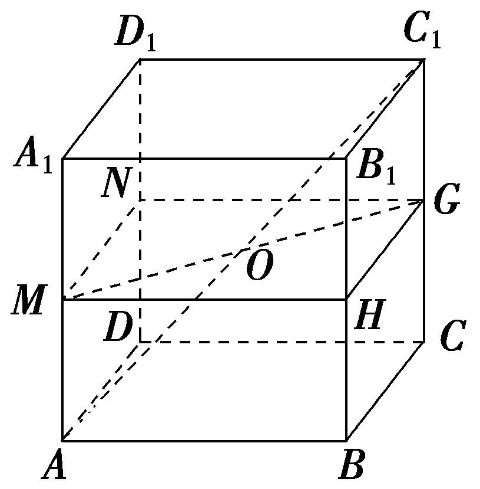

10.(2023·全国乙卷)已知点<em>S</em>，<em>A</em>，<em>B</em>，<em>C</em>均在半径为2的球面上，△<em>ABC</em>是边长为3的等边三角形，<em>SA</em>⊥平面<em>ABC</em>，则<em>SA</em>＝<u>　　　　</u>.

答案：2

解析：如图，设△<em>&lt;text style="italic"&gt;&lt;text style="italic"&gt;&lt;text style="italic"&gt;&lt;text style="italic"&gt;&lt;text style="italic"&gt;A</em>&lt;/text&gt;&lt;/text&gt;&lt;/text&gt;BC&lt;/text&gt;&lt;/text&gt;的外接圆圆心为<em>&lt;text style="italic"&gt;&lt;text style="italic"&gt;&lt;text style="italic"&gt;&lt;text style="italic"&gt;&lt;text style="italic"&gt;&lt;text style="italic"&gt;O</em>&lt;/text&gt;&lt;/text&gt;&lt;/text&gt;&lt;/text&gt;&lt;/text&gt;&lt;/text&gt;&lt;text style="subsc<em>&lt;text style="italic"&gt;r</em>&lt;/text&gt;ipt"&gt;&lt;text style="subscript"&gt;&lt;text style="subscript"&gt;&lt;text style="subscript"&gt;&lt;text style="subscript"&gt;&lt;text style="subscript"&gt;&lt;text style="subscript"&gt;1&lt;/text&gt;&lt;/text&gt;&lt;/text&gt;&lt;/text&gt;&lt;/text&gt;&lt;/text&gt;&lt;/text&gt;，半径为<em>r</em> ，则&lt;text style="superscript"&gt;&lt;text style="superscript"&gt;2&lt;/text&gt;&lt;/text&gt;r＝ $\frac{AB}{sin\angle ACB}$ ＝ $\frac{3}{\frac{\sqrt{3}}{2}}$ ＝&lt;text style="superscript"&gt;&lt;text style="superscript"&gt;2&lt;/text&gt;&lt;/text&gt; $\sqrt{3}$ ，可得<em>&lt;text style="italic"&gt;r</em>&lt;/text&gt;＝ $\sqrt{3}$ ，设三棱锥<em>S</em> -<em>&lt;text style="italic"&gt;&lt;text style="italic"&gt;&lt;text style="italic"&gt;&lt;text style="italic"&gt;&lt;text style="italic"&gt;A</em>&lt;/text&gt;&lt;/text&gt;&lt;/text&gt;BC&lt;/text&gt;&lt;/text&gt;的外接球球心为<em>&lt;text style="italic"&gt;&lt;text style="italic"&gt;&lt;text style="italic"&gt;&lt;text style="italic"&gt;&lt;text style="italic"&gt;&lt;text style="italic"&gt;O</em>&lt;/text&gt;&lt;/text&gt;&lt;/text&gt;&lt;/text&gt;&lt;/text&gt;&lt;/text&gt;，连接<em>&lt;text style="italic"&gt;&lt;text style="italic"&gt;OA</em>&lt;/text&gt;&lt;/text&gt;，<em>&lt;text style="italic"&gt;&lt;text style="italic"&gt;OO</em>&lt;/text&gt;&lt;/text&gt;&lt;text style="subsc<em>&lt;text style="italic"&gt;r</em>&lt;/text&gt;ipt"&gt;&lt;text style="subscript"&gt;&lt;text style="subscript"&gt;&lt;text style="subscript"&gt;&lt;text style="subscript"&gt;&lt;text style="subscript"&gt;&lt;text style="subscript"&gt;1&lt;/text&gt;&lt;/text&gt;&lt;/text&gt;&lt;/text&gt;&lt;/text&gt;&lt;/text&gt;&lt;/text&gt;，O1A，则OA＝&lt;text style="superscript"&gt;&lt;text style="superscript"&gt;2&lt;/text&gt;&lt;/text&gt;，O1A＝ $\sqrt{3}$ ，<em>&lt;text style="italic"&gt;&lt;text style="italic"&gt;&lt;text style="italic"&gt;&lt;text style="italic"&gt;&lt;text style="italic"&gt;&lt;text style="italic"&gt;O</em>&lt;/text&gt;&lt;/text&gt;&lt;/text&gt;&lt;/text&gt;&lt;/text&gt;&lt;/text&gt;O&lt;text style="subsc<em>&lt;text style="italic"&gt;r</em>&lt;/text&gt;ipt"&gt;&lt;text style="subscript"&gt;&lt;text style="subscript"&gt;&lt;text style="subscript"&gt;&lt;text style="subscript"&gt;&lt;text style="subscript"&gt;&lt;text style="subscript"&gt;1&lt;/text&gt;&lt;/text&gt;&lt;/text&gt;&lt;/text&gt;&lt;/text&gt;&lt;/text&gt;&lt;/text&gt;＝ $\frac{1}{2}$ <em>S&lt;text style="italic"&gt;&lt;text style="italic"&gt;&lt;text style="italic"&gt;A</em>&lt;/text&gt;&lt;/text&gt;&lt;/text&gt;，因为<em>&lt;text style="italic"&gt;&lt;text style="italic"&gt;&lt;text style="italic"&gt;&lt;text style="italic"&gt;&lt;text style="italic"&gt;&lt;text style="italic"&gt;O</em>&lt;/text&gt;&lt;/text&gt;&lt;/text&gt;&lt;/text&gt;&lt;/text&gt;&lt;/text&gt;O&lt;text style="subsc<em>&lt;text style="italic"&gt;r</em>&lt;/text&gt;ipt"&gt;&lt;text style="subscript"&gt;&lt;text style="subscript"&gt;&lt;text style="subscript"&gt;&lt;text style="subscript"&gt;&lt;text style="subscript"&gt;&lt;text style="subscript"&gt;1&lt;/text&gt;&lt;/text&gt;&lt;/text&gt;&lt;/text&gt;&lt;/text&gt;&lt;/text&gt;&lt;/text&gt;⊥O1A，所以<em>&lt;text style="italic"&gt;&lt;text style="italic"&gt;OA</em>&lt;/text&gt;&lt;/text&gt;&lt;text style="superscript"&gt;&lt;text style="superscript"&gt;2&lt;/text&gt;&lt;/text&gt;＝O $O_{1}^{2}$ ＋<em>&lt;text style="italic"&gt;&lt;text style="italic"&gt;&lt;text style="italic"&gt;&lt;text style="italic"&gt;&lt;text style="italic"&gt;&lt;text style="italic"&gt;O</em>&lt;/text&gt;&lt;/text&gt;&lt;/text&gt;&lt;/text&gt;&lt;/text&gt;&lt;/text&gt;&lt;text style="subsc<em>&lt;text style="italic"&gt;r</em>&lt;/text&gt;ipt"&gt;&lt;text style="subscript"&gt;&lt;text style="subscript"&gt;&lt;text style="subscript"&gt;&lt;text style="subscript"&gt;&lt;text style="subscript"&gt;&lt;text style="subscript"&gt;1&lt;/text&gt;&lt;/text&gt;&lt;/text&gt;&lt;/text&gt;&lt;/text&gt;&lt;/text&gt;&lt;/text&gt;<em>&lt;text style="italic"&gt;&lt;text style="italic"&gt;&lt;text style="italic"&gt;A</em>&lt;/text&gt;&lt;/text&gt;&lt;/text&gt;&lt;text style="superscript"&gt;&lt;text style="superscript"&gt;2&lt;/text&gt;&lt;/text&gt;，即4＝ $\frac{1}{4}$ <em>S&lt;text style="italic"&gt;&lt;text style="italic"&gt;&lt;text style="italic"&gt;A</em>&lt;/text&gt;&lt;/text&gt;&lt;/text&gt;&lt;text style="superscript"&gt;&lt;text style="superscript"&gt;2&lt;/text&gt;&lt;/text&gt;＋3，解得<em>&lt;text style="italic"&gt;&lt;text style="italic"&gt;SA</em>&lt;/text&gt;&lt;/text&gt;＝2.

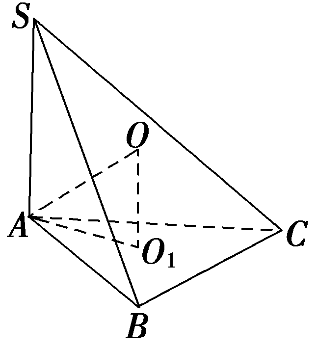

(11—13题，每小题5分，共15分)

11.在《九章算术》中，将四个面都为直角三角形的三棱锥称之为鳖臑.若三棱锥*P*-*ABC*为鳖臑，*PA*⊥平面*ABC*，*PA*＝*AB*＝2，*AC*＝4，三棱锥*P*-*ABC*的四个顶点都在球*O*的球面上，则球*O*的表面积为(　　)

A.8π	B.12π

C.20π	D.24π

答案：**C**

解析：如图，由于三棱锥<em>P</em>-<em>&lt;text style="italic"&gt;&lt;text style="italic"&gt;A&lt;text style="italic"&gt;BC</em>&lt;/text&gt;&lt;/text&gt;&lt;/text&gt;的四个面都为直角三角形，则△<em>ABC</em>是直角三角形，且∠ABC＝ $\frac{\pi }{2}$ ，所以<em>BC</em>＝ $\sqrt{AC^{2}－AB^{2}}$ ＝2 $\sqrt{3}$ .又<em>P</em>A⊥平面<em>&lt;text style="italic"&gt;&lt;text style="italic"&gt;A&lt;text style="italic"&gt;BC</em>&lt;/text&gt;&lt;/text&gt;&lt;/text&gt;，且△<em>PA</em>C是直角三角形，所以球<em>&lt;text style="italic"&gt;O</em>&lt;/text&gt;的直径为<em>PC</em>＝2<em>&lt;text style="italic"&gt;&lt;text style="italic"&gt;R</em>&lt;/text&gt;&lt;/text&gt;＝ $\sqrt{PA^{2}＋AC^{2}}$ ＝ $\sqrt{20}$ ＝2 $\sqrt{5}$ ，所以<em>&lt;text style="italic"&gt;&lt;text style="italic"&gt;R</em>&lt;/text&gt;&lt;/text&gt;＝ $\sqrt{5}$ ，故球<em>&lt;text style="italic"&gt;O</em>&lt;/text&gt;的表面积为<em>S</em>＝4π<em>&lt;text style="italic"&gt;&lt;text style="italic"&gt;R</em>&lt;/text&gt;&lt;/text&gt;2＝20π.故选C.

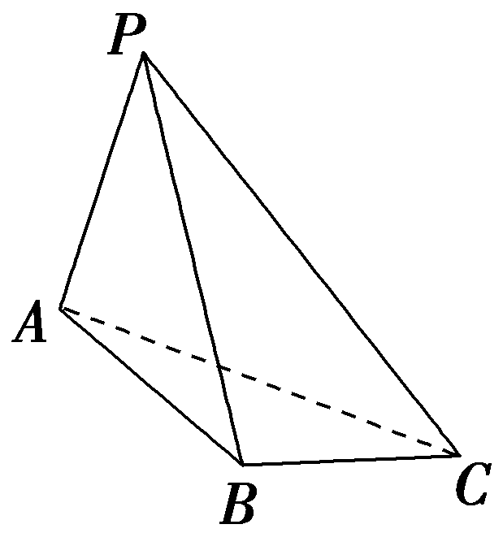

12.(2022·全国乙卷)已知球*O*的半径为1，四棱锥的顶点为*O*，底面的四个顶点均在球*O*的球面上，则当该四棱锥的体积最大时，其高为(　　)

A. $\frac{1}{3}$ 	B. $\frac{1}{2}$

C. $\frac{\sqrt{3}}{3}$ 	D. $\frac{\sqrt{2}}{2}$

答案：**C**

解析：该四棱锥的体积最大即以底面截球的圆面和顶点<em>O</em>组成的圆锥体积最大.设圆锥的高为<em>&lt;text style="italic"&gt;&lt;text style="italic"&gt;&lt;text style="italic"&gt;&lt;text style="italic"&gt;&lt;text style="italic"&gt;&lt;text style="italic"&gt;h</em>&lt;/text&gt;&lt;/text&gt;&lt;/text&gt;&lt;/text&gt;&lt;/text&gt;&lt;/text&gt;(0＜h＜1)，底面半径为<em>&lt;text style="italic"&gt;r</em>&lt;/text&gt;，则圆锥的体积<em>&lt;text style="italic"&gt;V</em>&lt;/text&gt;＝ $\frac{1}{3}$ π<em>&lt;text style="italic"&gt;r</em>&lt;/text&gt;2<em>&lt;text style="italic"&gt;&lt;text style="italic"&gt;&lt;text style="italic"&gt;&lt;text style="italic"&gt;&lt;text style="italic"&gt;&lt;text style="italic"&gt;h</em>&lt;/text&gt;&lt;/text&gt;&lt;/text&gt;&lt;/text&gt;&lt;/text&gt;&lt;/text&gt;＝ $\frac{1}{3}$ π $\left(1－h^{2}\right)$ <em>&lt;text style="italic"&gt;&lt;text style="italic"&gt;&lt;text style="italic"&gt;&lt;text style="italic"&gt;&lt;text style="italic"&gt;&lt;text style="italic"&gt;h</em>&lt;/text&gt;&lt;/text&gt;&lt;/text&gt;&lt;/text&gt;&lt;/text&gt;&lt;/text&gt;，则<em>&lt;text style="italic"&gt;V</em>&lt;/text&gt;'＝ $\frac{1}{3}$ π $\left(1－3h^{2}\right)$ ，令<em>&lt;text style="italic"&gt;V</em>&lt;/text&gt;'＝ $\frac{1}{3}$ π $\left(1－3h^{2}\right)$ ＝0，得<em>&lt;text style="italic"&gt;&lt;text style="italic"&gt;&lt;text style="italic"&gt;&lt;text style="italic"&gt;&lt;text style="italic"&gt;&lt;text style="italic"&gt;h</em>&lt;/text&gt;&lt;/text&gt;&lt;/text&gt;&lt;/text&gt;&lt;/text&gt;&lt;/text&gt;＝ $\frac{\sqrt{3}}{3}$ ，所以<em>&lt;text style="italic"&gt;V</em>&lt;/text&gt;＝ $\frac{1}{3}$ π $\left(1－h^{2}\right)$ <em>&lt;text style="italic"&gt;&lt;text style="italic"&gt;&lt;text style="italic"&gt;&lt;text style="italic"&gt;&lt;text style="italic"&gt;&lt;text style="italic"&gt;h</em>&lt;/text&gt;&lt;/text&gt;&lt;/text&gt;&lt;/text&gt;&lt;/text&gt;&lt;/text&gt;在 $\left(0，\frac{\sqrt{3}}{3}\right)$ 上单调递增，在 $\left(\frac{\sqrt{3}}{3}，1\right)$ 上单调递减，所以当<em>&lt;text style="italic"&gt;&lt;text style="italic"&gt;&lt;text style="italic"&gt;&lt;text style="italic"&gt;&lt;text style="italic"&gt;&lt;text style="italic"&gt;h</em>&lt;/text&gt;&lt;/text&gt;&lt;/text&gt;&lt;/text&gt;&lt;/text&gt;&lt;/text&gt;＝ $\frac{\sqrt{3}}{3}$ 时，四棱锥的体积最大.故选C.

13.(多选)已知正方体的外接球与内切球上各有一个动点*M*，*N*，若线段*MN*的最小值为 $\sqrt{3}$ －1，则下列说法中正确的是(　　)

A.正方体的外接球的表面积为12π

B.正方体的内切球的体积为 $\frac{4\pi }{3}$

C.正方体的棱长为2

D.线段*MN*的最大值为2 $\sqrt{3}$

答案：**ABC**

解析：设正方体的棱长为&lt;text style="it&lt;text style="it&lt;text style="it&lt;text style="it<em>a</em>lic"&gt;a&lt;/text&gt;lic"&gt;a&lt;/text&gt;lic"&gt;a&lt;/text&gt;lic"&gt;a&lt;/text&gt;，则正方体外接球的半径为体对角线长的一半，即 $\frac{\sqrt{3}}{2}$ &lt;text style="it&lt;text style="it&lt;text style="it&lt;text style="it<em>a</em>lic"&gt;a&lt;/text&gt;lic"&gt;a&lt;/text&gt;lic"&gt;a&lt;/text&gt;lic"&gt;a&lt;/text&gt;；内切球的半径为棱长的一半，即 $\frac{a}{2}$ .因为&lt;text style="it&lt;text style="it&lt;text style="it<em>a</em>lic"&gt;a&lt;/text&gt;lic"&gt;a&lt;/text&gt;lic"&gt;M&lt;/text&gt;，<em>N</em>分别为外接球和内切球上的动点，所以<em>&lt;text style="italic"&gt;MN</em>&lt;/text&gt;min＝ $\frac{\sqrt{3}}{2}$ &lt;text style="it&lt;text style="it&lt;text style="it&lt;text style="it<em>a</em>lic"&gt;a&lt;/text&gt;lic"&gt;a&lt;/text&gt;lic"&gt;a&lt;/text&gt;lic"&gt;a&lt;/text&gt;－ $\frac{a}{2}$ ＝ $\frac{\sqrt{3}－1}{2}$ &lt;text style="it&lt;text style="it&lt;text style="it&lt;text style="it<em>a</em>lic"&gt;a&lt;/text&gt;lic"&gt;a&lt;/text&gt;lic"&gt;a&lt;/text&gt;lic"&gt;a&lt;/text&gt;＝ $\sqrt{3}$ －1，解得&lt;text style="it&lt;text style="it&lt;text style="it&lt;text style="it<em>a</em>lic"&gt;a&lt;/text&gt;lic"&gt;a&lt;/text&gt;lic"&gt;a&lt;/text&gt;lic"&gt;a&lt;/text&gt;＝2，即正方体的棱长为2，所以正方体外接球的表面积为4π× $\left(\sqrt{3}\right)^{2}$ ＝12π，内切球的体积为 $\frac{4\pi }{3}$ ，则A，B，C正确；线段&lt;text style="it&lt;text style="it&lt;text style="it<em>a</em>lic"&gt;a&lt;/text&gt;lic"&gt;a&lt;/text&gt;lic"&gt;M&lt;/text&gt;<em>N</em>的最大值为 $\sqrt{3}$ ＋1，则D错误.故选ABC.

(14、15题，每小题5分，共10分)

14.(多选)(2023·新课标Ⅰ卷)下列物体中，能够被整体放入棱长为1(单位：m)的正方体容器(容器壁厚度忽略不计)内的有(　　 )

A.直径为0.99 m的球体

B.所有棱长均为1.4 m的四面体

C.底面直径为0.01 m，高为1.8 m的圆柱体

D.底面直径为1.2 m，高为0.01 m的圆柱体

答案：**ABD**

解析：对于A，因为0.99 m＜1 m，即球体的直径小于正方体的棱长，所以能够被整体放入正方体内，故A符合题意；对于B，因为正方体的面对角线长为 $\sqrt{2}$  m，且 $\sqrt{2}$ ＞1.4，所以能够被整体放入正方体内，故B符合题意；对于C，因为正方体的体对角线长为 $\sqrt{3}$  m，且 $\sqrt{3}$ ＜1.8，所以不能够被整体放入正方体内，故C不符合题意；对于D，如图，在棱长为1 m的正方体中，设点*S*，*R*，*Q*，*P*，*N*，*T*分别为其所在棱的中点，则正六边形*SRQPNT*的边长为 $\frac{\sqrt{2}}{2}$  m，其内切圆的直径为2× $\frac{\sqrt{2}}{2}$ × $\frac{\sqrt{3}}{2}$ ＝ $\frac{\sqrt{6}}{2}$ (m).因为 $\frac{\sqrt{6}}{2}$  m≈1.225 m，所以 $\frac{\sqrt{6}}{2}$  m＞1.2 m，且圆柱的高为0.01 m，非常小，所以D符合题意.故选ABD.

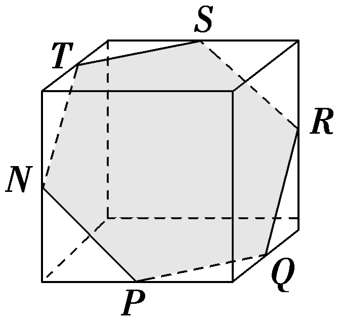

15.在三棱锥<em>&lt;text style="italic"&gt;D</em>&lt;/text&gt; -<em>&lt;text style="italic"&gt;AB</em>C&lt;/text&gt;中，AB＝<em>BC</em>＝2，<em>AC</em>＝2 $\sqrt{3}$ ，B<em>&lt;text style="italic"&gt;D</em>&lt;/text&gt;＝4，<em>&lt;text style="italic"&gt;BD</em>&lt;/text&gt;⊥平面<em>&lt;text style="italic"&gt;AB</em>C&lt;/text&gt;，则三棱锥D -A<em>BC</em>外接球的表面积为<u>　　　　</u>.

答案：32π

解析：因为<em>&lt;text style="italic"&gt;B&lt;text style="italic"&gt;D</em>&lt;/text&gt;&lt;/text&gt;⊥平面<em>&lt;text style="italic"&gt;ABC</em>&lt;/text&gt;，故可将三棱锥补为直三棱柱，如图所示，因为AB＝<em>&lt;text style="italic"&gt;&lt;text style="italic"&gt;BC</em>&lt;/text&gt;&lt;/text&gt;＝&lt;text style="superscript"&gt;&lt;text style="superscript"&gt;&lt;text style="superscript"&gt;2&lt;/text&gt;&lt;/text&gt;&lt;/text&gt;，<em>AC</em>＝2 $\sqrt{3}$ ，故三棱柱的上、下底面三角形的外接圆圆心在底边中线的延长线上，设为<em>&lt;text style="italic"&gt;&lt;text style="italic"&gt;&lt;text style="italic"&gt;&lt;text style="italic"&gt;&lt;text style="italic"&gt;O</em>&lt;/text&gt;&lt;/text&gt;&lt;/text&gt;&lt;/text&gt;&lt;/text&gt;&lt;text style="superscript"&gt;&lt;text style="superscript"&gt;&lt;text style="superscript"&gt;2&lt;/text&gt;&lt;/text&gt;&lt;/text&gt;，O&lt;text style="subscript"&gt;&lt;text style="subscript"&gt;&lt;text style="subscript"&gt;&lt;text style="subscript"&gt;1&lt;/text&gt;&lt;/text&gt;&lt;/text&gt;&lt;/text&gt;，易得∠O1<em>&lt;text style="italic"&gt;&lt;text style="italic"&gt;BC</em>&lt;/text&gt;&lt;/text&gt;＝60°，故O1B＝O1C＝<em>BC</em>＝2，所以三棱柱的外接球球心为上、下底面外心所连线段的中点O，即为三棱锥<em>&lt;text style="italic"&gt;D</em>&lt;/text&gt; -<em>&lt;text style="italic"&gt;AB</em>C&lt;/text&gt;的外接球球心，设该外接球半径为<em>&lt;text style="italic"&gt;&lt;text style="italic"&gt;R</em>&lt;/text&gt;&lt;/text&gt;，则在Rt△<em>OCO</em>1中，R2＝ $\left(\frac{4}{2}\right)^{2}$ ＋&lt;text style="superscript"&gt;&lt;text style="superscript"&gt;&lt;text style="superscript"&gt;2&lt;/text&gt;&lt;/text&gt;&lt;/text&gt;2＝8，故三棱锥<em>&lt;text style="italic"&gt;D</em>&lt;/text&gt; -<em>&lt;text style="italic"&gt;A&lt;text style="italic"&gt;B</em>&lt;/text&gt;<em>C</em>&lt;/text&gt;外接球的表面积为4π<em>&lt;text style="italic"&gt;&lt;text style="italic"&gt;R</em>&lt;/text&gt;&lt;/text&gt;2＝32π.

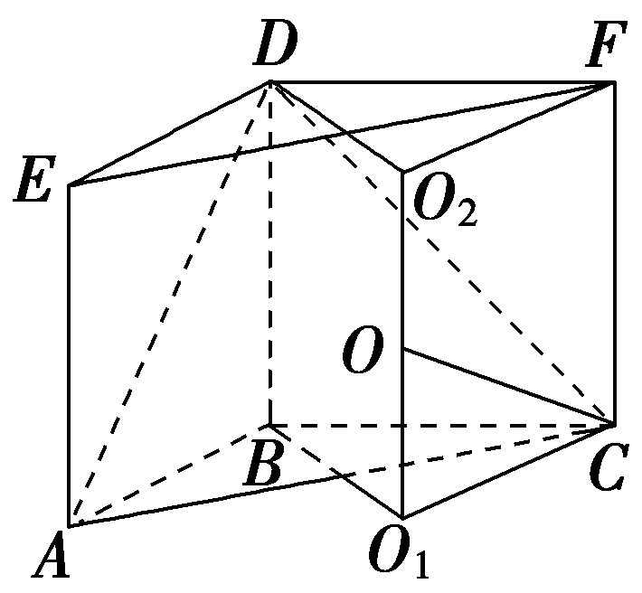

