**第三节　空间直线、平面的平行**

【课标研读】　1.从立体几何的定义、4个基本事实和定理出发，借助长方体，通过直观感知，了解空间中直线与直线、直线与平面、平面与平面的平行关系，归纳出有关平行的性质定理和判定定理，并加以证明.　2.能利用已获得的结论证明空间基本图形关系的简单命题.

1.线面平行的判定定理和性质定理

2.面面平行的判定定理和性质定理

[微提醒]　三种平行关系的转化

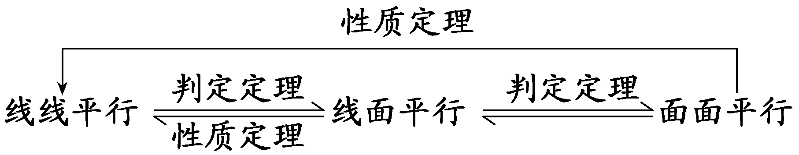

(1)平行的相互转化是解决与平行有关的证明题的指导思想，解题过程中既要注意一般的转化规律，又要看清题目的具体条件，选择正确的转化方向.(2)在应用判定定理与性质定理时，一定要写全定理满足的条件，否则可能是假命题.

【常用结论】

(1)平行关系中的三个重要结论

①垂直于同一条直线的两个平面平行，即若*a*⊥*α*，*a*⊥*β*，则*α*∥*β*.

②垂直于同一个平面的两条直线平行，即若*a*⊥*α*，*b*⊥*α*，则*a*∥*b*.

③平行于同一个平面的两个平面平行，即若*α*∥*β*，*β*∥*γ*，则*α*∥*γ*.

(2)平行关系有关的性质

①夹在两个平行平面之间的平行线段长度相等.

②两条直线被三个平行平面所截，截得的对应线段成比例.

③同一条直线与两个平行平面所成的角相等.

【自主检测】

1.(多选)下列说法错误的是(　　)

A.若一条直线平行于一个平面内的一条直线，则这条直线平行于这个平面

B.若直线*a*∥平面*α*，*P*∈*α*，则过点*P*且平行于直线*a*的直线有无数条

C.若直线*a*⊂平面*α*，直线*b*⊂平面*β*，*a*∥*b*，则*α*∥*β*

D.如果两个平面平行，那么分别在这两个平面内的两条直线平行或异面

答案：**ABC**

2.(链接人教A必修二P142T2)平面*α*∥平面*β*的一个充分条件是(　　)

A.存在一条直线*a*，*a*∥*α*，*a*∥*β*

B.存在一条直线*a*，*a*⊂*α*，*a*∥*β*

C.存在两条平行直线*a*，*b*，*a*⊂*α*，*b*⊂*β*，*a*∥*β*，*b*∥*α*

D.存在两条异面直线*a*，*b*，*a*⊂*α*，*b*⊂*β*，*a*∥*β*，*b*∥*α*

答案：**D**

解析：若*α*∩*β*＝*l*，*a*∥*l*，*a*⊄*α*，*a*⊄*β*，*a*∥*α*，*a*∥*β*，故排除A.若*α*∩*β*＝*l*，*a*⊂*α*，*a*∥*l*，则*a*∥*β*，故排除B.若*α*∩*β*＝*l*，*a*⊂*α*，*a*∥*l*，*b*⊂*β*，*b*∥*l*，则*a*∥*β*，*b*∥*α*，故排除C.故选D.

3.(链接人教A必修二P139T3)下列命题正确的是(　　)

A.若*a*，*b*是两条直线，且*a*∥*b*，那么*a*平行于经过*b*的任何平面

B.若直线*a*和平面*α*满足*a*∥*α*，那么*a*与*α*内的任何直线平行

C.平行于同一条直线的两个平面平行

D.若直线*a*，*b*和平面*α*满足*a*∥*b*，*a*∥*α*，*b*⊄*α*，则*b*∥*α*

答案：**D**

解析：A错误，*a*可能在经过*b*的平面内；B错误，*a*与*α*内的直线平行或异面；C错误，两个平面可能相交.故选D.

4.(链接人教A必修二P138例3)如图是长方体被一平面所截得的几何体，四边形<em>EFGH</em>为截面，则四边形<em>EFGH</em>的形状为<u>　　　　　　</u>.

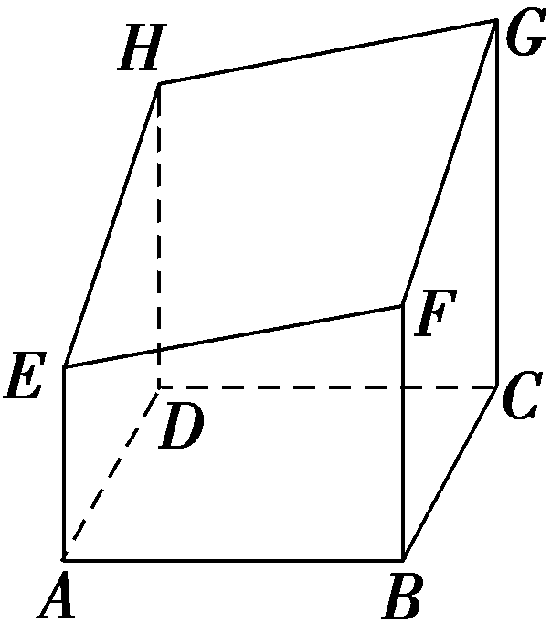

答案：平行四边形

解析：因为平面*ABFE*∥平面*DCGH*，又平面*EFGH*∩平面*DCGH*＝*HG*，且平面*EFGH*∩平面*ABFE*＝*EF*，所以*EF*∥*HG*，同理*EH*∥*FG*，所以四边形*EFGH*是平行四边形.

考点一　直线与平面平行的判定与性质　　　　多维探究

角度1　直线与平面平行的判定

(一题多解)如图所示，正方形*ABCD*与正方形*ABEF*所在的平面相交于*AB*，在*AE*，*BD*上各有一点*P*，*Q*，且*AP*＝*DQ*，

求证：*PQ*∥平面*BCE*.

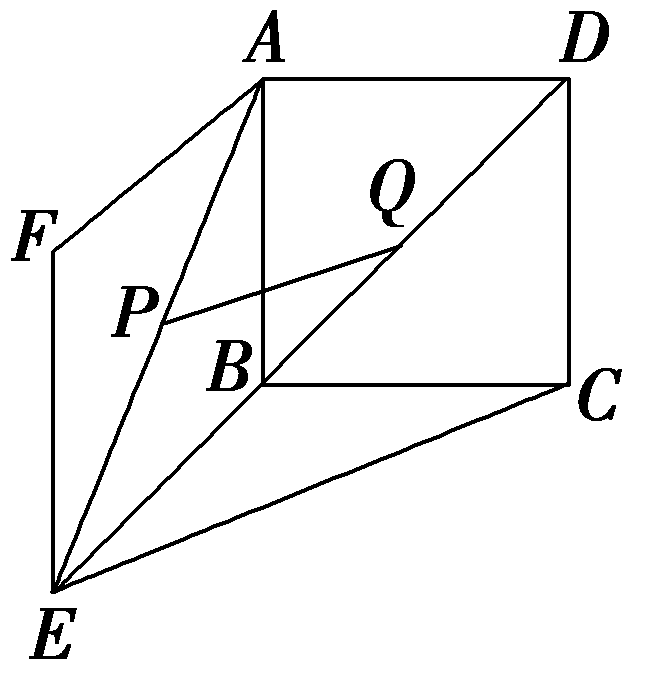

证明：法一：如图所示，过*P*作*PM*∥*AB*交*BE*于点*M*，过*Q*作*QN*∥*AB*交*BC*于点*N*，连接*MN*，

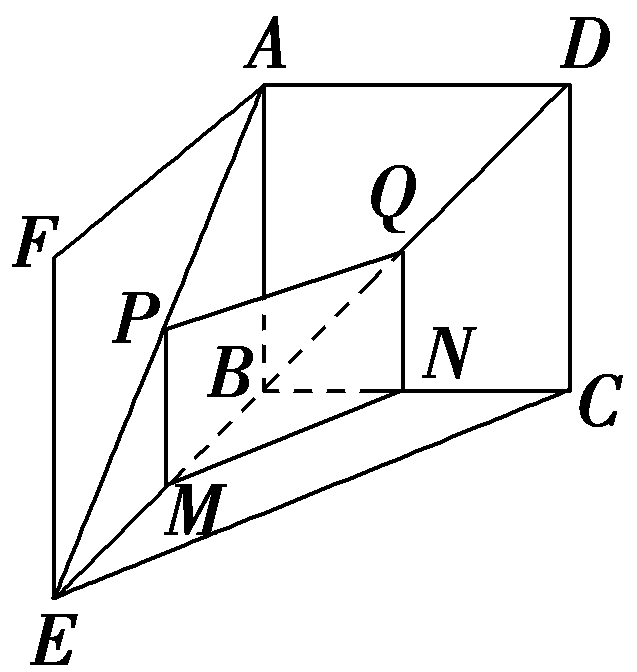

因为正方形*ABCD*和正方形*ABEF*有公共边*AB*，所以*AE*＝*BD*，又*AP*＝*DQ*，所以*PE*＝*QB*，又*PM*∥*AB*∥*QN*，

所以 $\frac{PM}{AB}$ ＝ $\frac{PE}{AE}$ ＝ $\frac{QB}{BD}$ ＝ $\frac{QN}{DC}$ ，所以 $\frac{PM}{AB}$ ＝ $\frac{QN}{DC}$ ，

又*ABDC*，所以*PMQN*，

所以四边形*PMNQ*为平行四边形，所以*PQ*∥*MN*，

又*MN*⊂平面*BCE*，*PQ*⊄平面*BCE*，所以*PQ*∥平面*BCE*.

法二：如图所示，在平面*ABEF*内，过点*P*作*PM*∥*BE*交*AB*于点*M*，连接*QM*，则*PM*∥平面*BCE*，

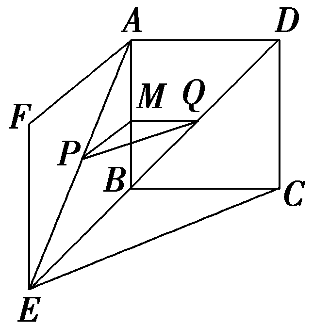

因为*PM*∥*BE*，所以 $\frac{AP}{PE}$ ＝ $\frac{AM}{MB}$ ，

又*AE*＝*BD*，*AP*＝*DQ*，所以*PE*＝*BQ*，

所以 $\frac{AP}{PE}$ ＝ $\frac{DQ}{BQ}$ ，所以 $\frac{AM}{MB}$ ＝ $\frac{DQ}{QB}$ ，所以*MQ*∥*AD*，

又*AD*∥*BC*，所以*MQ*∥*BC*，所以*MQ*∥平面*BCE*，

又*PM*∩*MQ*＝*M*，所以平面*PMQ*∥平面*BCE*，

又*PQ*⊂平面*PMQ*，所以*PQ*∥平面*BCE*.

角度2　直线与平面平行的性质

如图，在四棱锥*P*-*ABCD*中，底面*ABCD*为平行四边形，*F*为*PA*的中点，*E*为*PB*的中点.

(1) 求证：*PC*∥平面*BFD*；

(2) 已知点*M*在*PD*上，且满足*EC*∥平面*BFM*，求 $\frac{PM}{MD}$ 的值.

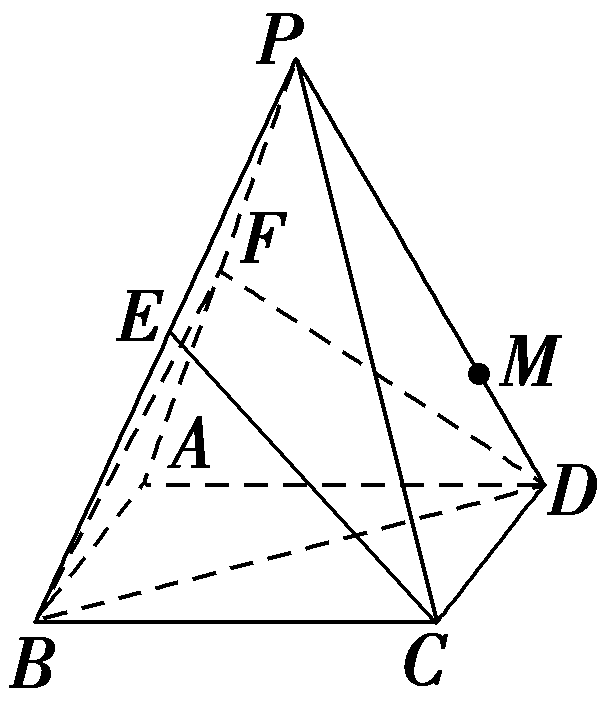

解：(1)证明：如图，连接*AC*，交*BD*于点*O*，连接*OF*.

因为在△*PAC*中，*F*为*PA*中点，*O*为*AC*中点，

所以*PC*∥*FO*.

又因为*PC*⊄平面*BFD*，*FO*⊂平面*BFD*，

所以*PC*∥平面*BFD*.

(2)如图，连接*FM*，交*AD*的延长线于点*G*，连接*BG*，交*CD*于点*N*，连接*EF*，*FN*，*PG*.易得*EF*∥*CN*，

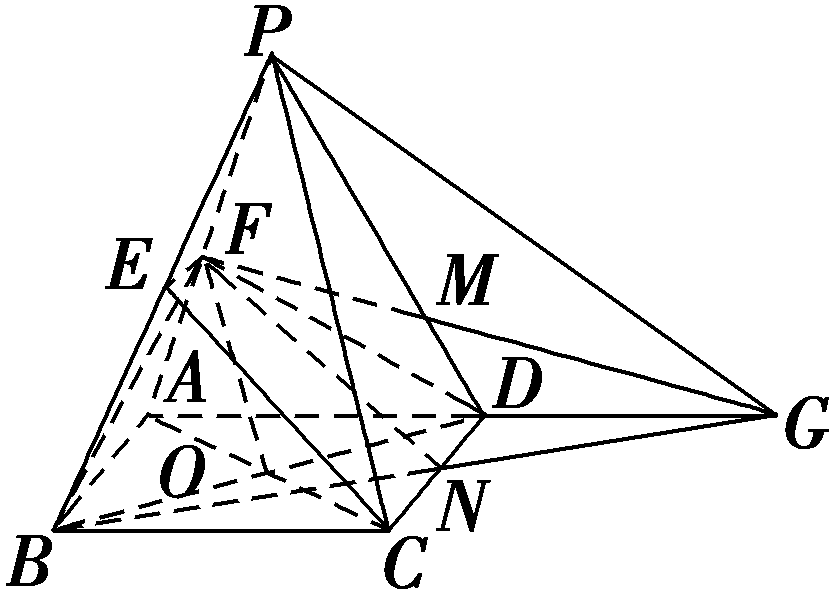

所以*EF*与*NC*共面.

因为*EC*∥平面*BFM*，平面*BFM*∩平面*EFNC*＝*FN*，

所以*EC*∥*F<text style="italic">N*</text>，所以四边形*<text style="italic">EF*NC</text>为平行四边形，所以EF＝*CN*＝ $\frac{1}{2}$ *<text style="italic">C<text style="italic">D*</text></text>，所以*N*为CD中点，所以D为*AG*中点，

所以 $\frac{PM}{MD}$ ＝ $\frac{PG}{FD}$ ＝2，即 $\frac{PM}{MD}$ ＝2.

1.线面平行的证明方法

(1)定义法：一般用反证法.

(2)判定定理法：关键是在平面内找(或作)一条直线与已知直线平行，证明时注意用符号语言叙述证明过程.

(3)性质定理法：即两平面平行时，其中一个平面内的任何直线都平行于另一个平面.

2.应用线面平行的性质定理的关键是确定交线的位置，有时需要经过已知直线作辅助平面确定交线.

注意：应用线面平行的判定定理和性质定理时，一定要注意定理成立的条件，通常应严格按照定理成立的条件规范书写步骤.

对点练1.如图，四边形*ABCD*为长方形，*PD*＝*AB*＝2，*AD*＝4，点*E*，*F*分别为*AD*，*PC*的中点.设平面*PDC*∩平面*PBE*＝*l*.

证明：(1)*DF*∥平面*PBE*；

(2)*DF*∥*l*.

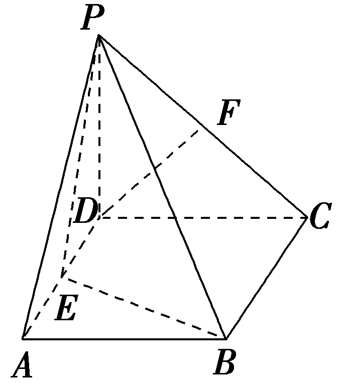

证明：(1)如图，取*PB*的中点*G*，连接*FG*，*EG*，

因为点*F*为*PC*的中点，

所以*<text style="italic">FG*</text>∥*<text style="italic">BC*</text>，FG＝ $\frac{1}{2}$ *<text style="italic">BC*</text>，

因为四边形*ABCD*为长方形，

所以*BC*∥*AD*，且*BC*＝*AD*，

所以*DE*∥*FG*，*DE*＝*FG*，

所以四边形*DEGF*为平行四边形，所以*DF*∥*GE*，

因为*DF*⊄平面*PBE*，*GE*⊂平面*PBE*，所以*DF*∥平面*PBE*.

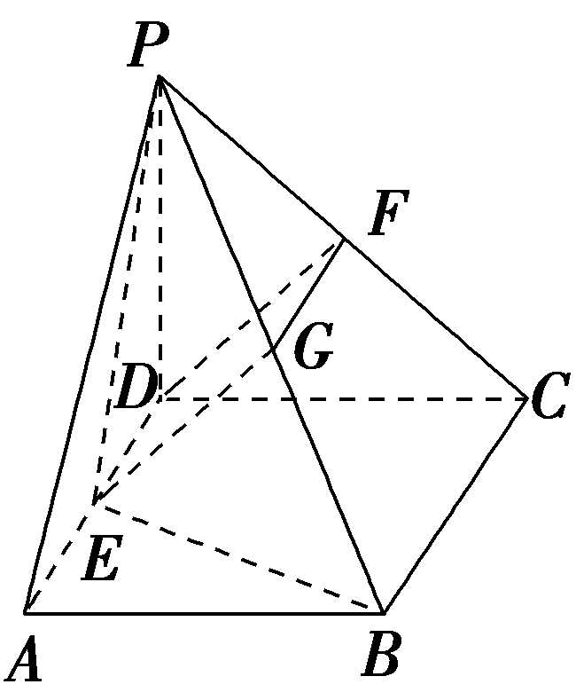

(2)由(1)知*DF*∥平面*PBE*，

又*DF*⊂平面*PDC*，平面*PDC*∩平面*PBE*＝*l*，

所以*DF*∥*l*.

考点二　平面与平面平行的判定与性质　　　　师生共研

(一题多变)如图所示，在三棱柱<em>ABC</em>-<em>A</em>1<em>B</em>1<em>C</em>1中，<em>E</em>，<em>F</em>，<em>G</em>，<em>H</em>分别是<em>AB</em>，<em>AC</em>，<em>A</em>1<em>B</em>1，<em>A</em>1<em>C</em>1的中点.

求证：(1)*B*，*C*，*H*，*G*四点共面；

(2)平面<em>EFA</em>1∥平面<em>BCHG</em>.

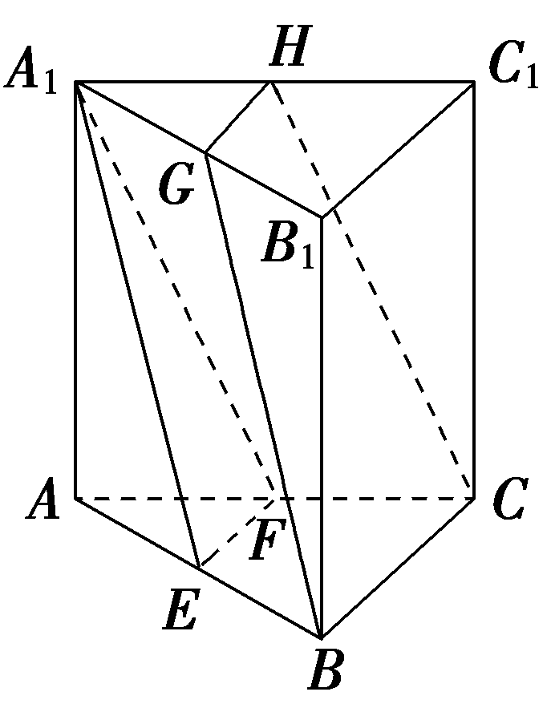

证明：(1)因为<em>G</em>，<em>H</em>分别是<em>A</em>1<em>B</em>1，<em>A</em>1<em>C</em>1的中点，

所以<em>GH</em>∥<em>B</em>1<em>C</em>1，

又<em>B</em>1<em>C</em>1∥<em>BC</em>，

所以*GH*∥*BC*，所以*B*，*C*，*H*，*G*四点共面.

(2)在△*ABC*中，*E*，*F*分别为*AB*，*AC*的中点，

所以*EF*∥*BC*，

因为*EF*⊄平面*BCHG*，*BC*⊂平面*BCHG*，

所以*EF*∥平面*BCHG*.

又因为<em>G</em>，<em>E</em>分别为<em>A</em>1<em>B</em>1，<em>AB</em>的中点，<em>AB</em>＝<em>A</em>1<em>B</em>1，所以<em>A</em>1<em>GEB</em>，

所以四边形<em>A</em>1<em>EBG</em>是平行四边形，

所以<em>A</em>1<em>E</em>∥<em>GB</em>.

因为<em>A</em>1<em>E</em>⊄平面<em>BCHG</em>，<em>GB</em>⊂平面<em>BCHG</em>，

所以<em>A</em>1<em>E</em>∥平面<em>BCHG</em>.

又因为<em>A</em>1<em>E</em>∩<em>EF</em>＝<em>E</em>，<em>A</em>1<em>E</em>，<em>EF</em>⊂平面<em>EFA</em>1，

所以平面<em>EFA</em>1∥平面<em>BCHG</em>.

[变式探究]

1.(变条件、变设问)在本例条件下，若<em>D</em>为<em>BC</em>1的中点，求证：<em>HD</em>∥平面<em>A</em>1<em>B</em>1<em>BA</em>.

证明：如图所示，连接<em>HD</em>，<em>A</em>1<em>B</em>，<em>BC</em>1，

因为<em>D</em>为<em>BC</em>1的中点，<em>H</em>为<em>A</em>1<em>C</em>1的中点，

所以<em>HD</em>∥<em>A</em>1<em>B</em>，

又<em>HD</em>⊄平面<em>A</em>1<em>B</em>1<em>BA</em>，<em>A</em>1<em>B</em>⊂平面<em>A</em>1<em>B</em>1<em>BA</em>，

所以<em>HD</em>∥平面<em>A</em>1<em>B</em>1<em>BA</em>.

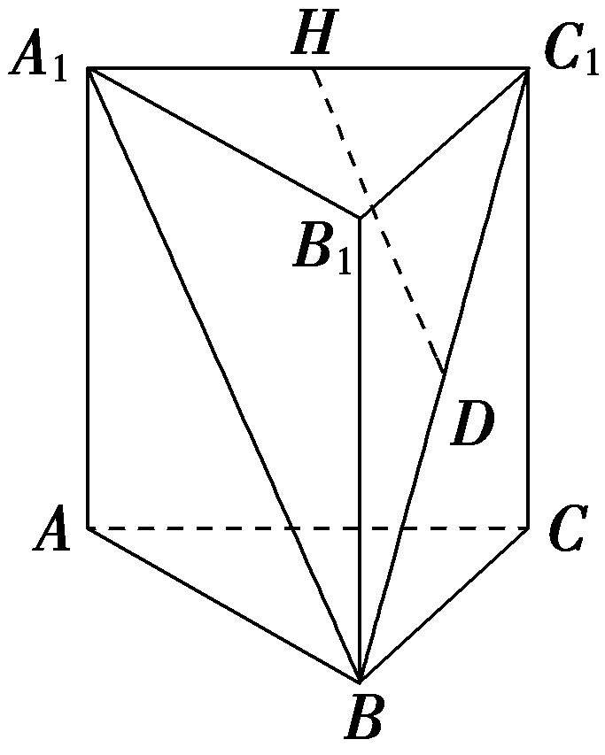

2.(变条件、变设问)在本例条件下，若<em>D</em>1，<em>D</em>分别为<em>B</em>1<em>C</em>1，<em>BC</em>的中点，求证：平面<em>A</em>1<em>BD</em>1∥平面<em>AC</em>1<em>D</em>.

证明：如图所示，连接<em>A</em>1<em>C</em>交<em>AC</em>1于点<em>M</em>，

因为四边形<em>A</em>1<em>ACC</em>1是平行四边形，所以<em>M</em>是<em>A</em>1<em>C</em>的中点，

连接*MD*，

因为<em>D</em>为<em>BC</em>的中点，所以<em>A</em>1<em>B</em>∥<em>DM</em>.

因为<em>A</em>1<em>B</em>⊂平面<em>A</em>1<em>BD</em>1，<em>DM</em>⊄平面<em>A</em>1<em>BD</em>1，

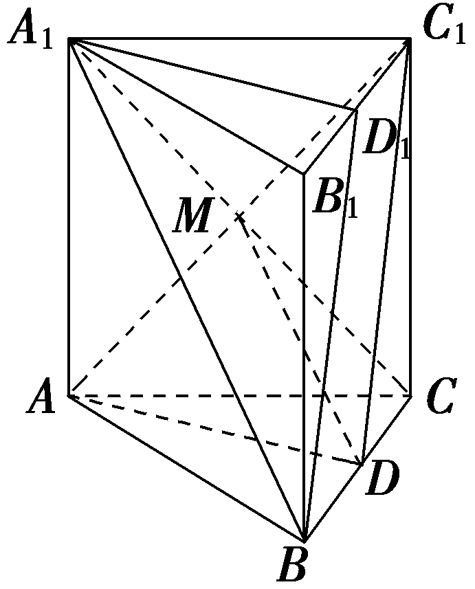

所以<em>DM</em>∥平面<em>A</em>1<em>BD</em>1.

又由三棱柱的性质知，<em>D</em>1<em>C</em>1<em>BD</em>，

所以四边形<em>BDC</em>1<em>D</em>1为平行四边形，

所以<em>DC</em>1∥<em>BD</em>1.

又<em>DC</em>1⊄平面<em>A</em>1<em>BD</em>1，<em>BD</em>1⊂平面<em>A</em>1<em>BD</em>1，

所以<em>DC</em>1∥平面<em>A</em>1<em>BD</em>1，

又因为<em>DC</em>1∩<em>DM</em>＝<em>D</em>，<em>DC</em>1，<em>DM</em>⊂平面<em>AC</em>1<em>D</em>，

所以平面<em>A</em>1<em>BD</em>1∥平面<em>AC</em>1<em>D</em>.

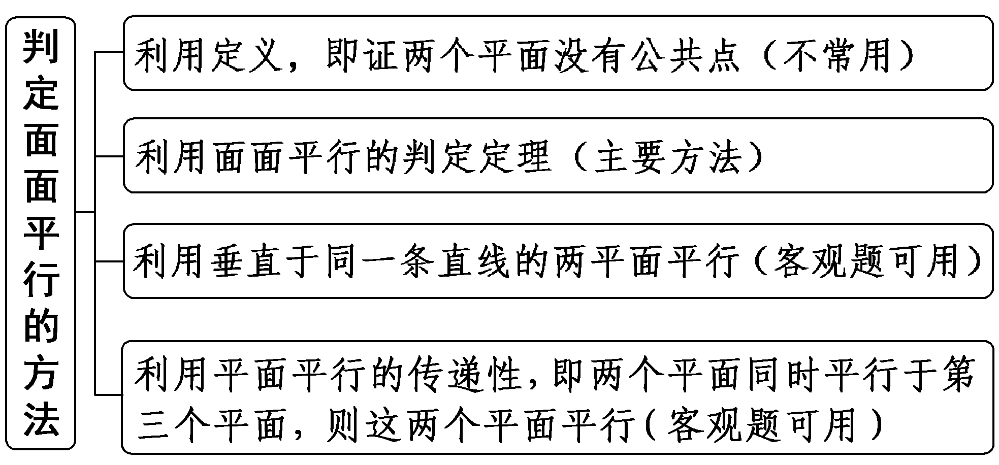

注意：利用面面平行的判定定理证明两平面平行，需要说明在一个平面内的两条直线是相交直线.

对点练2.如图，四棱柱<em>ABCD</em> -<em>A</em>1<em>B</em>1<em>C</em>1<em>D</em>1的底面<em>ABCD</em>是正方形.

(1)证明：平面<em>A</em>1<em>BD</em>∥平面<em>CD</em>1<em>B</em>1；

(2)若平面<em>ABCD</em>∩平面<em>B</em>1<em>D</em>1<em>C</em>＝<em>l</em>，证明：<em>B</em>1<em>D</em>1∥<em>l</em>.

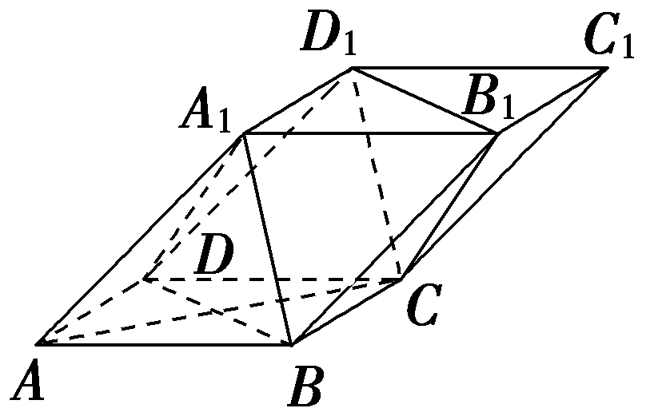

证明：(1)由题设知<em>BB</em>1<em>DD</em>1，

所以四边形<em>BB</em>1<em>D</em>1<em>D</em>是平行四边形，所以<em>BD</em>∥<em>B</em>1<em>D</em>1.

又<em>BD</em>⊄平面<em>CD</em>1<em>B</em>1，<em>B</em>1<em>D</em>1⊂平面<em>CD</em>1<em>B</em>1，

所以<em>BD</em>∥平面<em>CD</em>1<em>B</em>1.

因为<em>A</em>1<em>D</em>1<em>B</em>1<em>C</em>1<em>BC</em>，

所以四边形<em>A</em>1<em>BCD</em>1是平行四边形，

所以<em>A</em>1<em>B</em>∥<em>D</em>1<em>C</em>.

又<em>A</em>1<em>B</em>⊄平面<em>CD</em>1<em>B</em>1，<em>D</em>1<em>C</em>⊂平面<em>CD</em>1<em>B</em>1，

所以<em>A</em>1<em>B</em>∥平面<em>CD</em>1<em>B</em>1.

又因为<em>BD</em>∩<em>A</em>1<em>B</em>＝<em>B</em>，<em>BD</em>，<em>A</em>1<em>B</em>⊂平面<em>A</em>1<em>BD</em>，

所以平面<em>A</em>1<em>BD</em>∥平面<em>CD</em>1<em>B</em>1.

(2)由(1)知平面<em>A</em>1<em>BD</em>∥平面<em>CD</em>1<em>B</em>1，

又平面<em>ABCD</em>∩平面<em>B</em>1<em>D</em>1<em>C</em>＝<em>l</em>，

平面<em>ABCD</em>∩平面<em>A</em>1<em>BD</em>＝<em>BD</em>，

所以直线*l*∥直线*BD*，

在四棱柱<em>ABCD</em> -<em>A</em>1<em>B</em>1<em>C</em>1<em>D</em>1中，四边形<em>BDD</em>1<em>B</em>1为平行四边形，所以<em>B</em>1<em>D</em>1∥<em>BD</em>，所以<em>B</em>1<em>D</em>1∥<em>l</em>.

考点三　平行关系的综合应用　　　　师生共研

如图所示，在四棱锥*P*-*ABCD*中，底面*ABCD*为平行四边形，侧面*PAD*为正三角形，*M*为棱*PD*上一点，*N*为*BC*的中点.

(1)当*M*为*PD*的中点时，求证：*MN*∥平面*PAB*；

(2)是否存在点*M*，使*PB*∥平面*AMN*成立，若存在，求出点*M*的位置，若不存在，说明理由.

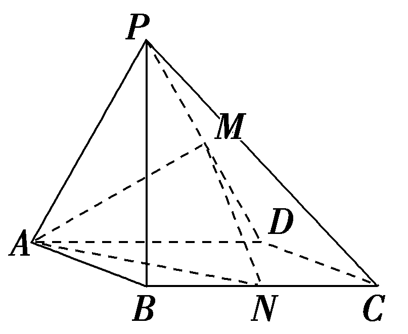

解：(1)证明：取*AP*的中点*E*，连接*EM*，*EB*，如图①所示.

因为在△*PAD*中，*M*为*PD*的中点，*E*为*AP*的中点，

所以*<text style="italic">EM*</text>∥*<text style="italic">AD*</text>，EM＝ $\frac{1}{2}$ *<text style="italic">AD*</text>.

因为在平行四边形*ABCD*中，*N*为*BC*的中点，

所以*<text style="italic">BN*</text>∥*<text style="italic">AD*</text>，BN＝ $\frac{1}{2}$ *<text style="italic">AD*</text>.

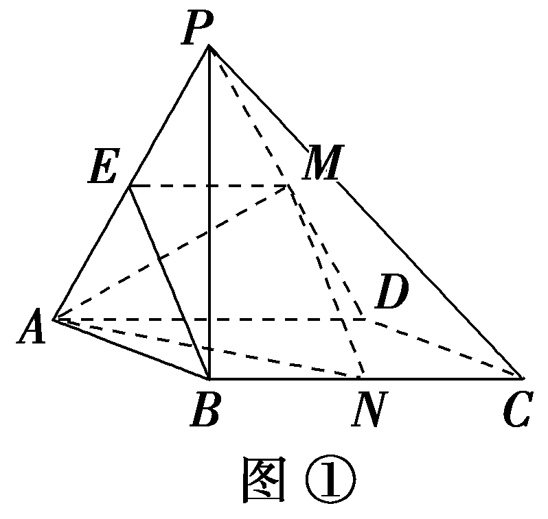

所以*BN*∥*EM*，*BN*＝*EM*，

所以四边形*BNME*为平行四边形.

所以*MN*∥*BE*，因为*MN*⊄平面*PAB*，*BE*⊂平面*PAB*，所以*MN*∥平面*PAB*.

(2)假设存在点*M*，使*PB*∥平面*AMN*成立.

连接*BD*，与*AN*交于点*O*，连接*OM*，如图②所示.

因为*PB*∥平面*AMN*，平面*PBD*∩平面*AMN*＝*OM*，*PB*⊂平面*PBD*，所以*PB*∥*OM*.

易知△*BON*∽△*DOA*，

所以 $\frac{PM}{MD}$ ＝ $\frac{OB}{OD}$ ＝ $\frac{BN}{DA}$ ＝ $\frac{1}{2}$ ，

所以存在点*M*使*PB*∥平面*AMN*成立，且*M*为*PD*上靠近点*P*的三等分点.

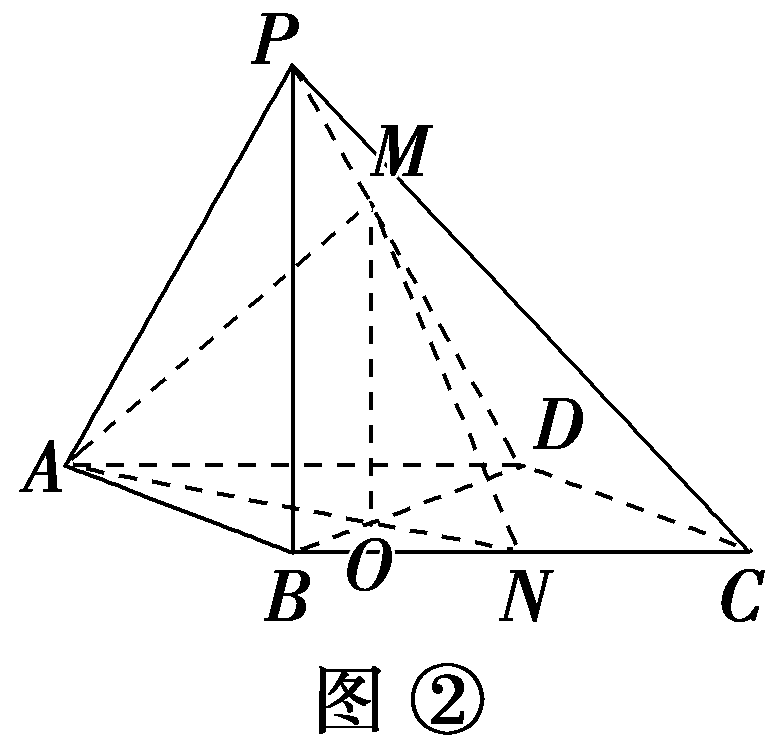

解决存在性问题一般先假设有关的元素(点、直线、平面)存在，然后从这个元素满足的结论出发，寻找使这个结论成立的充分条件.若找到了使结论成立的充分条件，则存在；若找不到使结论成立的充分条件(出现矛盾)，则不存在.而对于探求点的问题，一般先探求点的位置，多为线段的中点或某个三等分点，然后给出符合要求的证明即可.

对点练3.如图，在正方体<em>&lt;text style="italic"&gt;ABCD</em>&lt;/text&gt; -A&lt;text style="subscript"&gt;&lt;text style="subscript"&gt;&lt;text style="subscript"&gt;&lt;text style="subscript"&gt;1&lt;/text&gt;&lt;/text&gt;&lt;/text&gt;&lt;/text&gt;B1C1D1中，<em>P</em>，<em>Q</em>分别为对角线<em>BD</em>，<em>CD</em>1上的点，且 $\frac{CQ}{QD_{1}}$ ＝ $\frac{BP}{PD}$ ＝ $\frac{2}{3}$ .

(1)求证：<em>PQ</em>∥平面<em>A</em>1<em>D</em>1<em>DA</em>；

(2)若<em>R</em>是<em>&lt;text style="italic"&gt;A</em>B&lt;/text&gt;上的点， $\frac{AR}{AB}$ 的值为多少时，能使平面PQ<em>R</em>∥平面<em>A</em>&lt;text style="subscript"&gt;1&lt;/text&gt;<em>D</em>1<em>DA</em>？请给出证明.

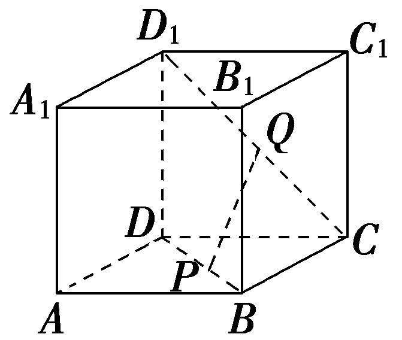

解：(1)证明：连接<em>CP</em>并延长与<em>DA</em>的延长线交于点<em>M</em>，如图，连接<em>MD</em>1，因为四边形<em>ABCD</em>为正方形，所以<em>BC</em>∥<em>AD</em>，

故△*PBC*∽△*PDM*，

所以 $\frac{CP}{PM}$ ＝ $\frac{BP}{PD}$ ＝ $\frac{2}{3}$ ，

又因为 $\frac{CQ}{QD_{1}}$ ＝ $\frac{BP}{PD}$ ＝ $\frac{2}{3}$ ，

所以 $\frac{CQ}{QD_{1}}$ ＝ $\frac{CP}{PM}$ ＝ $\frac{2}{3}$ ，

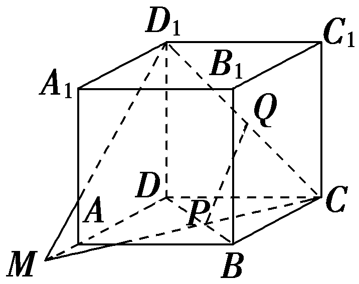

所以<em>PQ</em>∥<em>MD</em>1.

又<em>MD</em>1⊂平面<em>A</em>1<em>D</em>1<em>DA</em>，<em>PQ</em>⊄平面<em>A</em>1<em>D</em>1<em>DA</em>，

故<em>PQ</em>∥平面<em>A</em>1<em>D</em>1<em>DA</em>.

(2)当 $\frac{AR}{AB}$ 的值为 $\frac{3}{5}$ 时，能使平面<em>PQR</em>∥平面<em>A</em>&lt;text style="subscript"&gt;1&lt;/text&gt;<em>D</em>1<em>DA</em>.

证明如下：

如图，因为 $\frac{AR}{AB}$ ＝ $\frac{3}{5}$ ，即 $\frac{BR}{RA}$ ＝ $\frac{2}{3}$ ，故 $\frac{BR}{RA}$ ＝ $\frac{BP}{PD}$ ，

所以*PR*∥*DA*.

又<em>DA</em>⊂平面<em>A</em>1<em>D</em>1<em>DA</em>，<em>PR</em>⊄平面<em>A</em>1<em>D</em>1<em>DA</em>，

所以<em>PR</em>∥平面<em>A</em>1<em>D</em>1<em>DA</em>，

又<em>PQ</em>∥平面<em>A</em>1<em>D</em>1<em>DA</em>，<em>PQ</em>∩<em>PR</em>＝<em>P</em>，<em>PQ</em>，<em>PR</em>⊂平面<em>PQR</em>，

所以平面<em>PQR</em>∥平面<em>A</em>1<em>D</em>1<em>DA</em>.

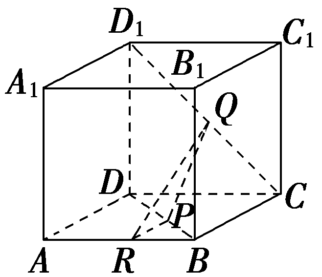

[真题再现]　(2024·全国甲卷节选)如图，在以*A*，*B*，*C*，*D*，*E*，*F*为顶点的五面体中，四边形*A<text style="italic"><text style="italic">BC*</text>D</text>与四边形*<text style="italic"><text style="italic"><text style="italic"><text style="italic">AD*</text></text></text>*<text style="italic">EF*</text></text>均为等腰梯形，EF∥AD，BC∥AD，AD＝4，*AB*＝BC＝EF＝2，*ED*＝ $\sqrt{10}$ ，*FB*＝2 $\sqrt{3}$ ，*M*为*AD*的中点.

证明：*BM*∥平面*CDE*.

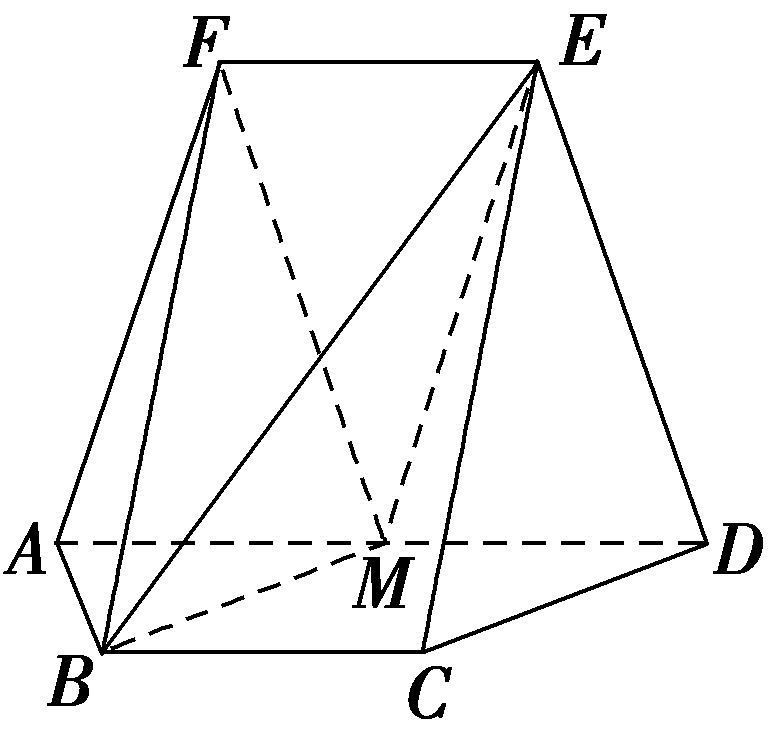

证明：因为*BC*∥*AD*，*EF*＝2，*AD*＝4，*M*为*AD*的中点，所以*BC*∥*MD*，*BC*＝*MD*，

四边形*BCDM*为平行四边形，所以*BM*∥*CD*，又因为*BM*⊄平面*CDE*，

*CD*⊂平面*CDE*，所以*BM*∥平面*CDE*.

[教材呈现]　(人教A必修二P143T5)如图，在四面体*D* -*ABC*中，*E*，*F*，*G*分别是*AB*，*BC*，*CD*的中点，求证：

(1)*BD*∥平面*EFG*；

(2)*AC*∥平面*EFG*.

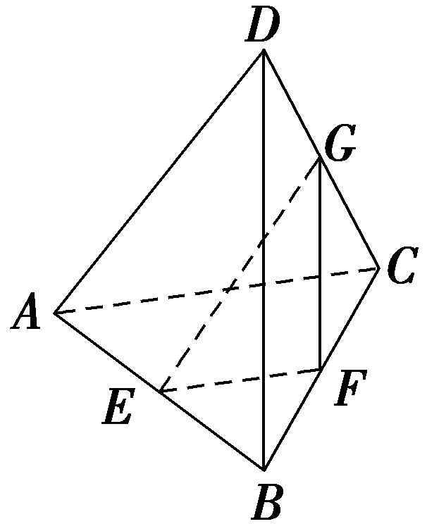

点评：这两题设问的本质是一样的，都是考查直线与平面平行的判定这个知识点，不过高考是借助构造平行四边形证明线线平行，而教材原题是借助构造三角形的中位线证明线线平行，进而证明线面平行.

**课时测评**59　**空间直线、平面的平行** $\frac{对应学生}{用书P427}$

(时间：60分钟　满分：88分)

(本栏目内容，在学生用书中以独立形式分册装订！)

(1—8题，每小题5分，共40分)

1.如图，已知*P*为四边形*ABCD*外一点，*E*，*F*分别为*BD*，*PD*上的点，若*EF*∥平面*PBC*，则(　　)

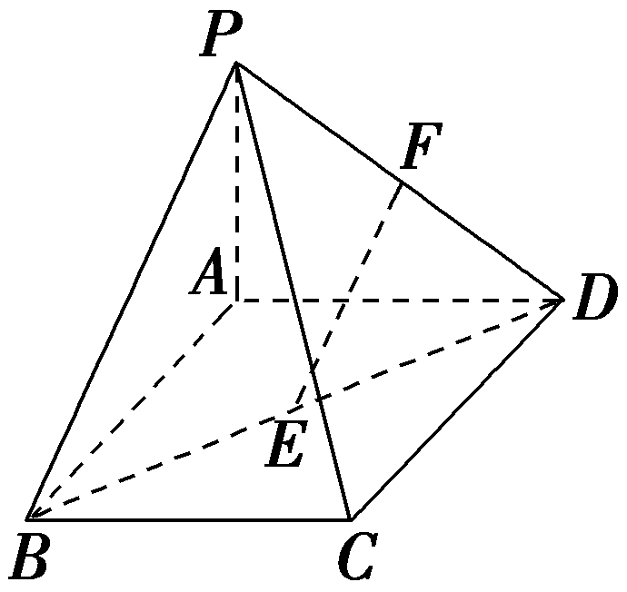

A.*EF*∥*PA*

B.*EF*∥*PB*

C.*EF*∥*PC*

D.以上均有可能

答案：**B**

解析：由线面平行的性质定理可知*EF*∥*PB*.故选B.

2.已知两条不同的直线*a*，*b*及两个不同的平面*α*，*β*，下列说法正确的是(　　)

A.若*α*∥*β*，*a*⊂*α*，*b*⊂*β*，则*a*∥*b*

B.若*α*∥*β*，*a*⊂*α*，*b*⊂*β*，则*a*与*b*是异面直线

C.若*α*∥*β*，*a*⊂*α*，*b*⊂*β*，则*a*与*b*平行或异面

D.若*α*∩*β*＝*b*，*a*⊂*α*，则*a*与*β*一定相交

答案：**C**

解析：若*α*∥*β*，*a*⊂*α*，*b*⊂*β*，则直线*a*，*b*没有交点，故*a*与*b*平行或异面，故A，B错误，C正确；若*α*∩*β*＝*b*，*a*⊂*α*，当*a*∥*b*时，*a*与*β*平行，故D错误.故选C.

3.如图，*P*为平行四边形*ABCD*所在平面外一点，*E*为*AD*的中点，*F*为*PC*上一点，当*PA*∥平面*EBF*时， $\frac{PF}{FC}$ ＝(　　)

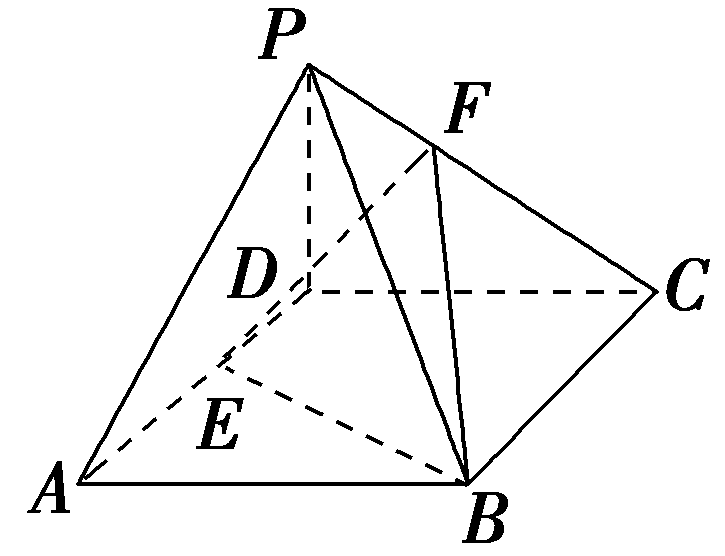

A. $\frac{2}{3}$ 	B. $\frac{1}{4}$

C. $\frac{1}{3}$ 	D. $\frac{1}{2}$

答案：**D**

解析：如图，连接*AC*交*B<text style="italic">E*</text>于点*G*，连接*<text style="italic"><text style="italic">FG*</text></text>，因为*<text style="italic"><text style="italic">PA*</text></text>∥平面*<text style="italic">EBF*</text>，PA⊂平面*<text style="italic">PAC*</text>，平面PAC∩平面EBF＝FG，所以PA∥FG，所以 $\frac{PF}{FC}$ ＝ $\frac{AG}{GC}$ .又*<text style="italic">AD*</text>∥*BC*，*E*为AD的中点，所以△AE*G*∽△*CBG*，即 $\frac{AG}{GC}$ ＝ $\frac{AE}{BC}$ ＝ $\frac{1}{2}$ ，所以 $\frac{PF}{FC}$ ＝ $\frac{1}{2}$ .故选D.

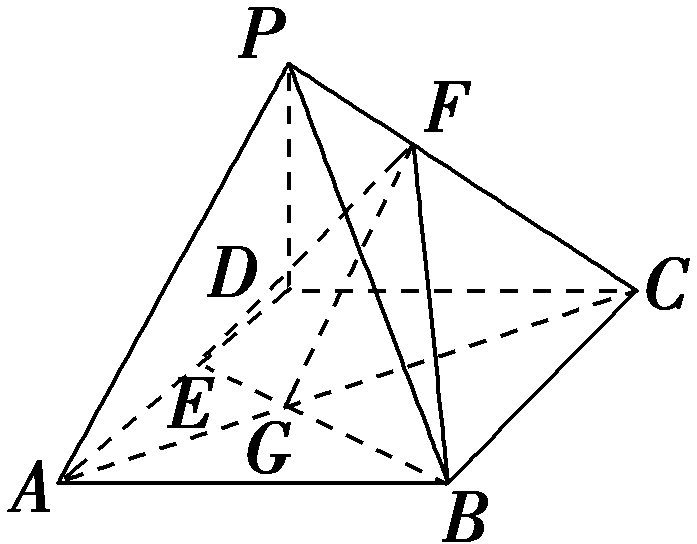

4.如图，已知正方体<em>ABCD</em> -<em>A</em>1<em>B</em>1<em>C</em>1<em>D</em>1的棱长为2，则下列结论中错误的是(　　)

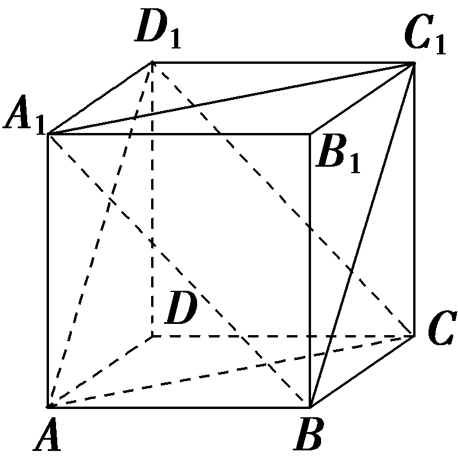

A.直线<em>A</em>1<em>C</em>1与<em>AD</em>1为异面直线

B.<em>A</em>1<em>C</em>1∥平面<em>ACD</em>1

C.平面<em>A</em>1<em>C</em>1<em>B</em>∥平面<em>ACD</em>1

<em>D</em>.三棱锥D1-<em>ADC</em>的体积为 $\frac{8}{3}$

答案：**D**

解析：根据异面直线的定义易知直线<em>&lt;text style="italic"&gt;&lt;text style="italic"&gt;&lt;text style="italic"&gt;&lt;text style="italic"&gt;&lt;text style="italic"&gt;&lt;text style="italic"&gt;&lt;text style="italic"&gt;A</em>&lt;/text&gt;&lt;/text&gt;&lt;/text&gt;&lt;/text&gt;&lt;/text&gt;&lt;/text&gt;&lt;/text&gt;&lt;text style="subscript"&gt;&lt;text style="subscript"&gt;&lt;text style="subscript"&gt;&lt;text style="subscript"&gt;&lt;text style="subscript"&gt;&lt;text style="subscript"&gt;&lt;text style="subscript"&gt;&lt;text style="subscript"&gt;&lt;text style="subscript"&gt;&lt;text style="subscript"&gt;&lt;text style="subscript"&gt;&lt;text style="subscript"&gt;&lt;text style="subscript"&gt;&lt;text style="subscript"&gt;&lt;text style="subscript"&gt;&lt;text style="subscript"&gt;&lt;text style="subscript"&gt;&lt;text style="subscript"&gt;&lt;text style="subscript"&gt;&lt;text style="subscript"&gt;&lt;text style="subscript"&gt;&lt;text style="subscript"&gt;&lt;text style="subscript"&gt;&lt;text style="subscript"&gt;&lt;text style="subscript"&gt;&lt;text style="subscript"&gt;&lt;text style="subscript"&gt;&lt;text style="subscript"&gt;&lt;text style="subscript"&gt;&lt;text style="subscript"&gt;&lt;text style="subscript"&gt;&lt;text style="subscript"&gt;1&lt;/text&gt;&lt;/text&gt;&lt;/text&gt;&lt;/text&gt;&lt;/text&gt;&lt;/text&gt;&lt;/text&gt;&lt;/text&gt;&lt;/text&gt;&lt;/text&gt;&lt;/text&gt;&lt;/text&gt;&lt;/text&gt;&lt;/text&gt;&lt;/text&gt;&lt;/text&gt;&lt;/text&gt;&lt;/text&gt;&lt;/text&gt;&lt;/text&gt;&lt;/text&gt;&lt;/text&gt;&lt;/text&gt;&lt;/text&gt;&lt;/text&gt;&lt;/text&gt;&lt;/text&gt;&lt;/text&gt;&lt;/text&gt;&lt;/text&gt;&lt;/text&gt;&lt;/text&gt;<em>&lt;text style="italic"&gt;&lt;text style="italic"&gt;&lt;text style="italic"&gt;&lt;text style="italic"&gt;&lt;text style="italic"&gt;&lt;text style="italic"&gt;&lt;text style="italic"&gt;&lt;text style="italic"&gt;&lt;text style="italic"&gt;&lt;text style="italic"&gt;C</em>&lt;/text&gt;&lt;/text&gt;&lt;/text&gt;&lt;/text&gt;&lt;/text&gt;&lt;/text&gt;&lt;/text&gt;&lt;/text&gt;&lt;/text&gt;&lt;/text&gt;1与<em>AD</em>1为异面直线，故A正确；因为<em>&lt;text style="italic"&gt;&lt;text style="italic"&gt;AA</em>&lt;/text&gt;&lt;/text&gt;1∥<em>&lt;text style="italic"&gt;CC</em>&lt;/text&gt;1且AA1＝CC1，则四边形AA1C1C为平行四边形，所以A1C1∥<em>&lt;text style="italic"&gt;AC</em>&lt;/text&gt;，又A1C1⊄平面<em>&lt;text style="italic"&gt;&lt;text style="italic"&gt;&lt;text style="italic"&gt;&lt;text style="italic"&gt;ACD</em>&lt;/text&gt;&lt;/text&gt;&lt;/text&gt;&lt;/text&gt;1，AC⊂平面ACD1，所以A1C1∥平面ACD1，故<em>&lt;text style="italic"&gt;B</em>&lt;/text&gt;正确；同理可证，<em>&lt;text style="italic"&gt;&lt;text style="italic"&gt;BC</em>&lt;/text&gt;&lt;/text&gt;1∥平面ACD1，A1C1∩BC1＝C1，且A1C1，BC1⊂平面A1C1B，所以平面A1C1B∥平面ACD1，故C正确； $V_{D_{1}-ADC}$ ＝ $\frac{1}{3}$ <em>S</em>△<em>&lt;text style="italic"&gt;&lt;text style="italic"&gt;&lt;text style="italic"&gt;&lt;text style="italic"&gt;&lt;text style="italic"&gt;&lt;text style="italic"&gt;&lt;text style="italic"&gt;A</em>&lt;/text&gt;&lt;/text&gt;&lt;/text&gt;&lt;/text&gt;&lt;/text&gt;&lt;/text&gt;&lt;/text&gt;D<em>&lt;text style="italic"&gt;&lt;text style="italic"&gt;&lt;text style="italic"&gt;&lt;text style="italic"&gt;&lt;text style="italic"&gt;&lt;text style="italic"&gt;&lt;text style="italic"&gt;&lt;text style="italic"&gt;&lt;text style="italic"&gt;&lt;text style="italic"&gt;C</em>&lt;/text&gt;&lt;/text&gt;&lt;/text&gt;&lt;/text&gt;&lt;/text&gt;&lt;/text&gt;&lt;/text&gt;&lt;/text&gt;&lt;/text&gt;&lt;/text&gt;<em>·DD</em>&lt;text style="subscript"&gt;&lt;text style="subscript"&gt;&lt;text style="subscript"&gt;&lt;text style="subscript"&gt;&lt;text style="subscript"&gt;&lt;text style="subscript"&gt;&lt;text style="subscript"&gt;&lt;text style="subscript"&gt;&lt;text style="subscript"&gt;&lt;text style="subscript"&gt;&lt;text style="subscript"&gt;&lt;text style="subscript"&gt;&lt;text style="subscript"&gt;&lt;text style="subscript"&gt;&lt;text style="subscript"&gt;&lt;text style="subscript"&gt;&lt;text style="subscript"&gt;&lt;text style="subscript"&gt;&lt;text style="subscript"&gt;&lt;text style="subscript"&gt;&lt;text style="subscript"&gt;&lt;text style="subscript"&gt;&lt;text style="subscript"&gt;&lt;text style="subscript"&gt;&lt;text style="subscript"&gt;&lt;text style="subscript"&gt;&lt;text style="subscript"&gt;&lt;text style="subscript"&gt;&lt;text style="subscript"&gt;&lt;text style="subscript"&gt;&lt;text style="subscript"&gt;&lt;text style="subscript"&gt;1&lt;/text&gt;&lt;/text&gt;&lt;/text&gt;&lt;/text&gt;&lt;/text&gt;&lt;/text&gt;&lt;/text&gt;&lt;/text&gt;&lt;/text&gt;&lt;/text&gt;&lt;/text&gt;&lt;/text&gt;&lt;/text&gt;&lt;/text&gt;&lt;/text&gt;&lt;/text&gt;&lt;/text&gt;&lt;/text&gt;&lt;/text&gt;&lt;/text&gt;&lt;/text&gt;&lt;/text&gt;&lt;/text&gt;&lt;/text&gt;&lt;/text&gt;&lt;/text&gt;&lt;/text&gt;&lt;/text&gt;&lt;/text&gt;&lt;/text&gt;&lt;/text&gt;&lt;/text&gt;＝ $\frac{1}{3}$ × $\frac{1}{2}$ ×2×2×2＝ $\frac{4}{3}$ ，故D错误.故选D.

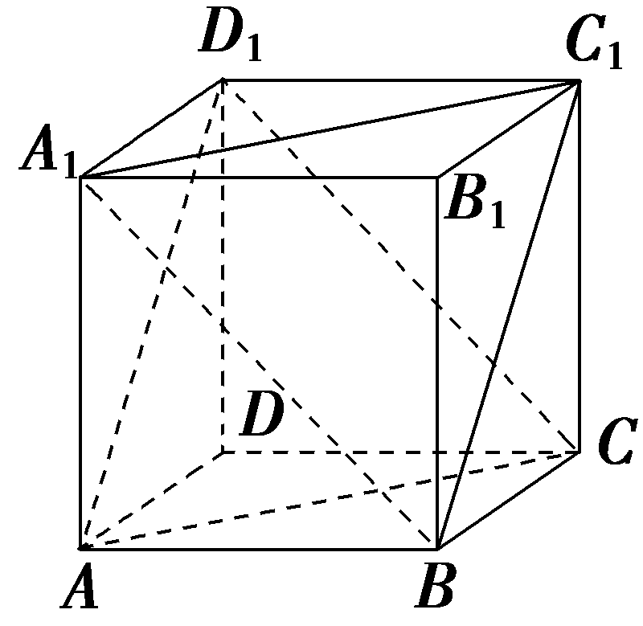

5.(多选)如图所示，*P*为矩形*ABCD*所在平面外一点，矩形对角线的交点为*O*，*M*为*PB*的中点，则(　　)

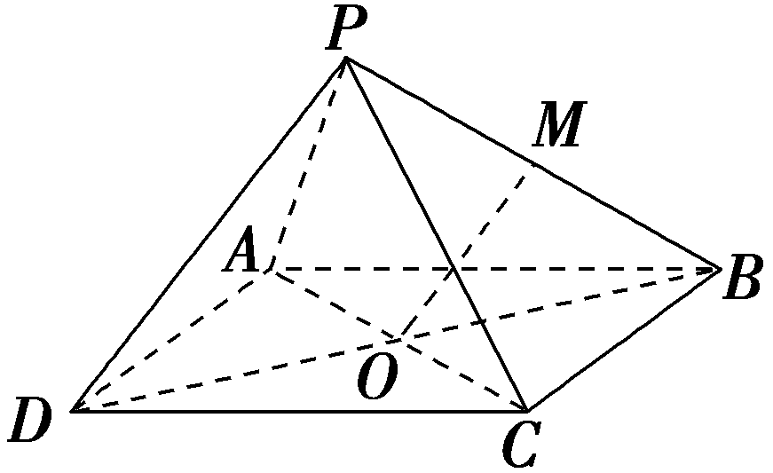

A.*OM*∥*PA*

B.*OM*∥平面*PCD*

C.*OM*∥平面*PDA*

D.*OM*∥平面*PBA*

答案：**BC**

解析：由题意知，*OM*是△*BPD*的中位线，所以*OM*∥*PD*，又*PD*∩*PA*＝*P*，故A不正确；*PD*⊂平面*PCD*，*OM*⊄平面*PCD*，所以*OM*∥平面*PCD*，故B正确；同理，可得*OM*∥平面*PDA*，故C正确；*OM*与平面*PBA*相交于点*M*，故D不正确.故选BC.

6.(多选)如图，在下列四个正方体中，*A*，*B*为正方体的两个顶点，*D*，*E*，*F*为所在棱的中点，则在这四个正方体中，直线*AB*与平面*DEF*平行的是(　　)

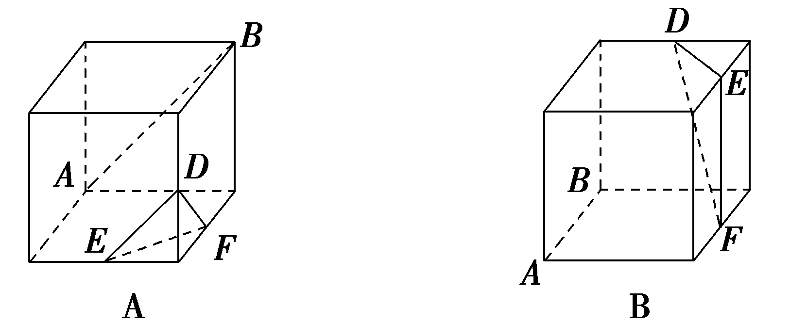

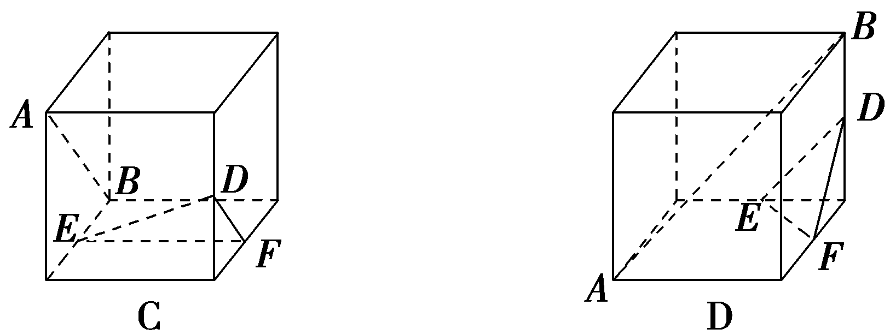

答案：**AC**

解析：对于A，*AB*∥*DE*，*AB*⊄平面*DEF*，*DE*⊂平面*DEF*，所以直线*AB*与平面*DEF*平行，故A正确；对于B，如图①所示，作平面*DEF*交正方体的棱于点*G*，连接*FG*并延长，交*AB*的延长线于点*H*，则直线*AB*与平面*DEF*相交于点*H*，故B错误；对于C，*AB*∥*DF*，*AB*⊄平面*DEF*，*DF*⊂平面*DEF*，所以直线*AB*与平面*DEF*平行，故C正确；对于D，如图②所示，连接*AC*，取*AC*的中点*O*，连接*OD*，又*D*为*BC*的中点，所以*AB*∥*OD*，因为*OD*与平面*DEF*相交，所以直线*AB*与平面*DEF*相交，故D错误.故选AC.

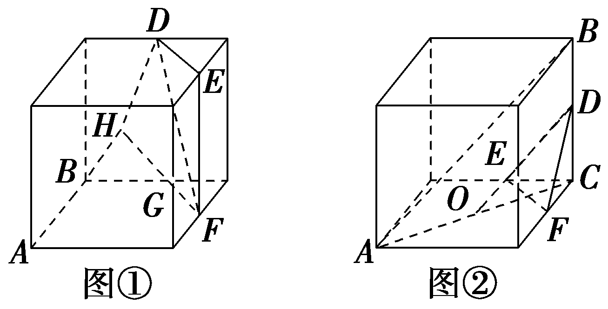

7.在三棱锥<em>P</em>-<em>ABC</em>中，<em>PB</em>＝6，<em>AC</em>＝3，<em>G</em>为△<em>PAC</em>的重心，过点<em>G</em>作三棱锥的一个截面，使截面平行于<em>PB</em>和<em>AC</em>，则截面的周长为<u>　　　　</u>.

答案：8

解析：如图，过点*G*作*<text style="italic"><text style="italic">E*</text>*<text style="italic">F*</text></text>∥*<text style="italic">AC*</text>，分别交*PA*，*PC*于点E，F，过点E作*E<text style="italic">N*</text>∥*<text style="italic"><text style="italic">PB*</text></text>交*AB*于点N，过点F作*F<text style="italic">M*</text>∥PB交*BC*于点M，连接*<text style="italic">MN*</text>，则四边形*<text style="italic"><text style="italic">EF*MN</text></text>是平行四边形(平面E*FM*N为所求截面)，且EF＝MN＝ $\frac{2}{3}$ *<text style="italic">AC*</text>＝2，*<text style="italic">F*</text>*M*＝*<text style="italic">E*</text>*N*＝ $\frac{1}{3}$ *<text style="italic"><text style="italic">PB*</text></text>＝2，所以截面的周长为2×4＝8.

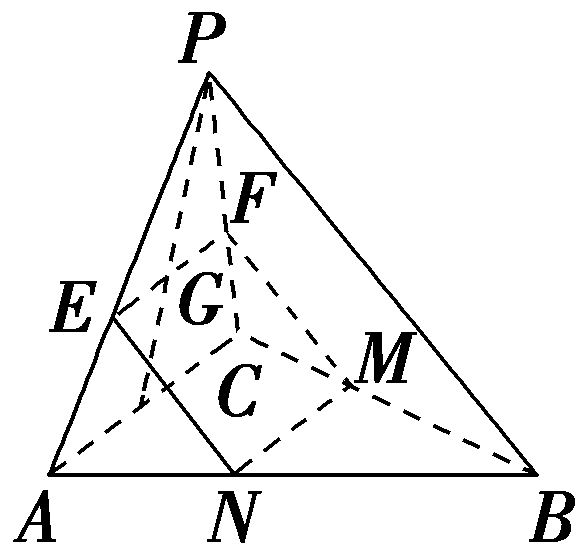

8.如图，在棱长为2的正方体<em>ABCD</em> -<em>A</em>1<em>B</em>1<em>C</em>1<em>D</em>1中，<em>A</em>1<em>B</em>1的中点是<em>P</em>，过点<em>A</em>1作与截面<em>PBC</em>1平行的截面，则该截面的面积为<u>　　　　</u>.

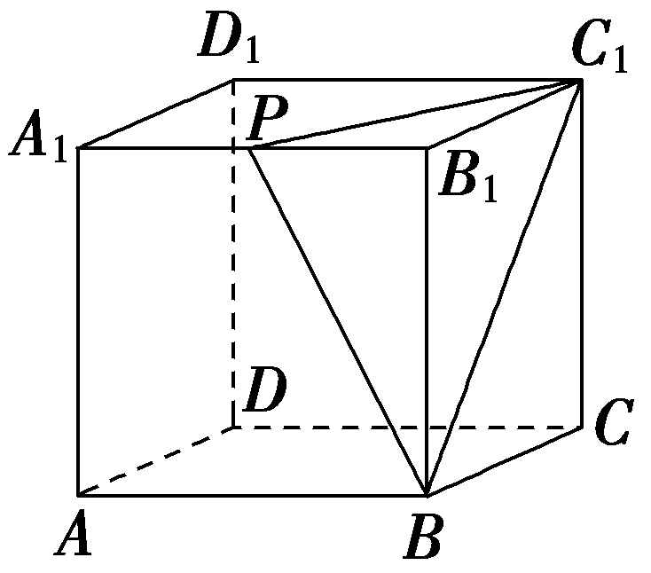

答案：2 $\sqrt{6}$

解析：如图所示，易知截面是菱形.分别取棱<em>D</em>&lt;text style="subscript"&gt;&lt;text style="subscript"&gt;&lt;text style="subscript"&gt;&lt;text style="subscript"&gt;&lt;text style="subscript"&gt;&lt;text style="subscript"&gt;&lt;text style="subscript"&gt;&lt;text style="subscript"&gt;1&lt;/text&gt;&lt;/text&gt;&lt;/text&gt;&lt;/text&gt;&lt;/text&gt;&lt;/text&gt;&lt;/text&gt;&lt;/text&gt;<em>&lt;text style="italic"&gt;&lt;text style="italic"&gt;&lt;text style="italic"&gt;&lt;text style="italic"&gt;C</em>&lt;/text&gt;&lt;/text&gt;&lt;/text&gt;&lt;/text&gt;1，<em>&lt;text style="italic"&gt;&lt;text style="italic"&gt;&lt;text style="italic"&gt;&lt;text style="italic"&gt;&lt;text style="italic"&gt;&lt;text style="italic"&gt;A</em>&lt;/text&gt;&lt;/text&gt;&lt;/text&gt;&lt;/text&gt;&lt;/text&gt;B&lt;/text&gt;的中点<em>&lt;text style="italic"&gt;E</em>&lt;/text&gt;，<em>&lt;text style="italic"&gt;F</em>&lt;/text&gt;，连接A1E，A1F，<em>CF</em>，<em>CE</em>，则菱形A1<em>ECF</em>为符合题意的截面.连接<em>&lt;text style="italic"&gt;&lt;text style="italic"&gt;EF</em>&lt;/text&gt;&lt;/text&gt;，A1C，易知EF＝2 $\sqrt{2}$ ，<em>&lt;text style="italic"&gt;&lt;text style="italic"&gt;&lt;text style="italic"&gt;&lt;text style="italic"&gt;&lt;text style="italic"&gt;A</em>&lt;/text&gt;&lt;/text&gt;&lt;/text&gt;&lt;/text&gt;&lt;/text&gt;&lt;text style="subscript"&gt;&lt;text style="subscript"&gt;&lt;text style="subscript"&gt;&lt;text style="subscript"&gt;&lt;text style="subscript"&gt;&lt;text style="subscript"&gt;&lt;text style="subscript"&gt;&lt;text style="subscript"&gt;1&lt;/text&gt;&lt;/text&gt;&lt;/text&gt;&lt;/text&gt;&lt;/text&gt;&lt;/text&gt;&lt;/text&gt;&lt;/text&gt;<em>&lt;text style="italic"&gt;&lt;text style="italic"&gt;&lt;text style="italic"&gt;&lt;text style="italic"&gt;C</em>&lt;/text&gt;&lt;/text&gt;&lt;/text&gt;&lt;/text&gt;＝2 $\sqrt{3}$ ，<em>&lt;text style="italic"&gt;E</em>&lt;/text&gt;<em>&lt;text style="italic"&gt;F</em>&lt;/text&gt;⊥<em>&lt;text style="italic"&gt;&lt;text style="italic"&gt;&lt;text style="italic"&gt;&lt;text style="italic"&gt;&lt;text style="italic"&gt;A</em>&lt;/text&gt;&lt;/text&gt;&lt;/text&gt;&lt;/text&gt;&lt;/text&gt;&lt;text style="subscript"&gt;&lt;text style="subscript"&gt;&lt;text style="subscript"&gt;&lt;text style="subscript"&gt;&lt;text style="subscript"&gt;&lt;text style="subscript"&gt;&lt;text style="subscript"&gt;&lt;text style="subscript"&gt;1&lt;/text&gt;&lt;/text&gt;&lt;/text&gt;&lt;/text&gt;&lt;/text&gt;&lt;/text&gt;&lt;/text&gt;&lt;/text&gt;<em>&lt;text style="italic"&gt;&lt;text style="italic"&gt;&lt;text style="italic"&gt;&lt;text style="italic"&gt;C</em>&lt;/text&gt;&lt;/text&gt;&lt;/text&gt;&lt;/text&gt;，所以截面的面积<em>S</em>＝ $\frac{1}{2}$ <em>&lt;text style="italic"&gt;E</em>&lt;/text&gt;<em>&lt;text style="italic"&gt;F</em>&lt;/text&gt;·<em>&lt;text style="italic"&gt;&lt;text style="italic"&gt;&lt;text style="italic"&gt;&lt;text style="italic"&gt;&lt;text style="italic"&gt;A</em>&lt;/text&gt;&lt;/text&gt;&lt;/text&gt;&lt;/text&gt;&lt;/text&gt;&lt;text style="subscript"&gt;&lt;text style="subscript"&gt;&lt;text style="subscript"&gt;&lt;text style="subscript"&gt;&lt;text style="subscript"&gt;&lt;text style="subscript"&gt;&lt;text style="subscript"&gt;&lt;text style="subscript"&gt;1&lt;/text&gt;&lt;/text&gt;&lt;/text&gt;&lt;/text&gt;&lt;/text&gt;&lt;/text&gt;&lt;/text&gt;&lt;/text&gt;<em>&lt;text style="italic"&gt;&lt;text style="italic"&gt;&lt;text style="italic"&gt;&lt;text style="italic"&gt;C</em>&lt;/text&gt;&lt;/text&gt;&lt;/text&gt;&lt;/text&gt;＝2 $\sqrt{6}$ .

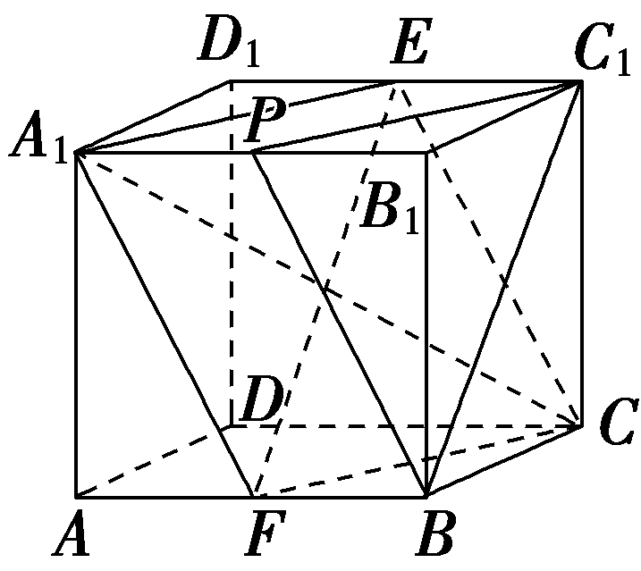

9.(13分)如图所示，在等腰梯形*ABCD*中，已知*BC*∥*AD*，*BP*⊥*AD*，垂足为*P*，将△*ABP*沿*BP*折起，使平面*ABP*⊥平面*PBCD*，连接*AD*，*AC*，*M*为棱*AD*的中点，连接*CM*.

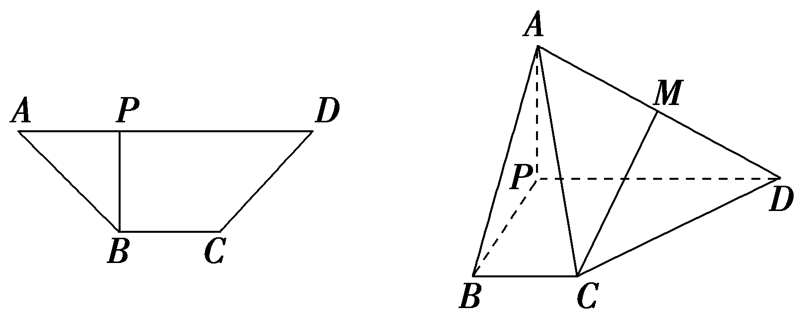

分别在*BP*，*CD*上确定点*E*，*F*，使平面*MEF*∥平面*ABC*.

解：*E*，*F*分别为*BP*，*CD*的中点时，可使平面*MEF*∥平面*ABC*，证明如下：

如图，取*BP*的中点*E*，*CD*的中点*F*，连接*ME*，*MF*，*EF*.

因为*M*，*F*分别为*AD*，*CD*的中点，

所以*MF*∥*AC*.

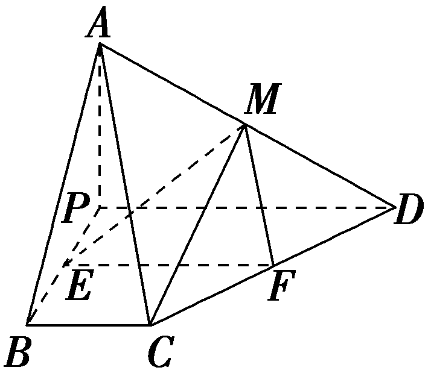

因为*MF*⊄平面*ABC*，*AC*⊂平面*ABC*，

所以*MF*∥平面*ABC*，

又*E*为*BP*的中点，且四边形*PBCD*为梯形，

所以*EF*∥*BC*.

因为*EF*⊄平面*ABC*，*BC*⊂平面*ABC*，

所以*EF*∥平面*ABC*，

因为*MF*∩*EF*＝*F*，*MF*，*EF*⊂平面*MEF*，

所以平面*MEF*∥平面*ABC*.

(10、11题，每小题5分，共10分)

10.如图，在各棱长均为1的正三棱柱<em>ABC</em>-<em>A</em>1<em>B</em>1<em>C</em>1中，<em>M</em>，<em>N</em>分别为线段<em>A</em>1<em>B</em>，<em>B</em>1<em>C</em>上的动点，且<em>MN</em>∥平面<em>ACC</em>1<em>A</em>1，则这样的<em>MN</em>有(　　)

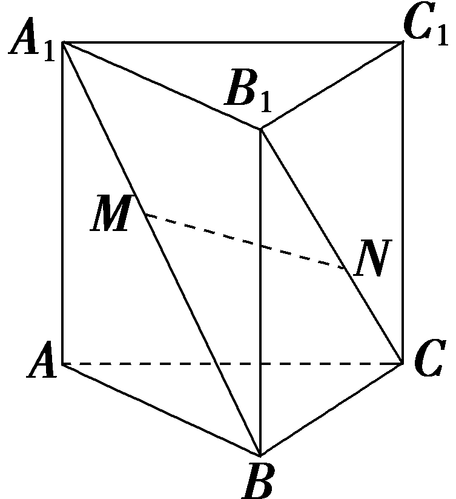

A.1条	　　　B.2条

C.3条	　　　D.无数条

答案：**D**

解析：如图，任取线段<em>A</em>1<em>B</em>上一点<em>M</em>，过<em>M</em>作<em>MH</em>∥<em>AA</em>1交<em>AB</em>于点<em>H</em>，过<em>H</em>作<em>HG</em>∥<em>AC</em>交<em>BC</em>于点<em>G</em>，过<em>G</em>作<em>GN</em>∥<em>CC</em>1交<em>CB</em>1于点<em>N</em>，连接<em>MN</em>，则平面<em>MHGN</em>∥平面<em>ACC</em>1<em>A</em>1，所以<em>MN</em>∥平面<em>ACC</em>1<em>A</em>1，则这样的<em>MN</em>有无数条.故选D.

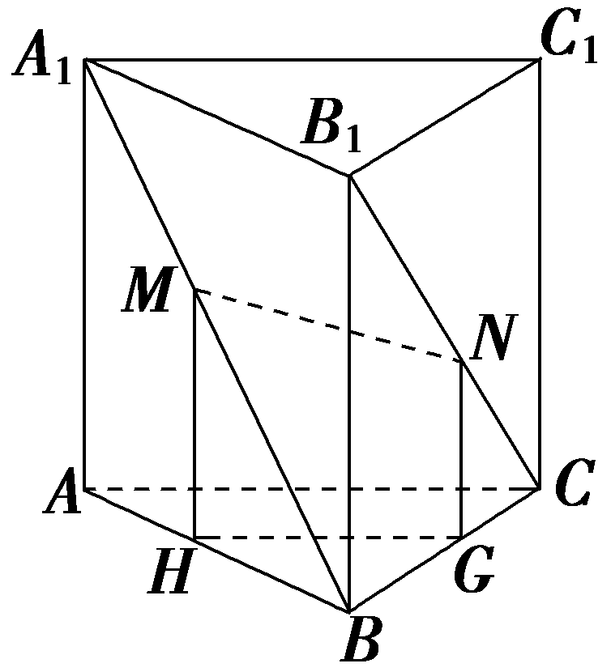

11.(多选)(2025·江西萍乡模拟)如图，在四面体*ABCD*中，截面*PQMN*是正方形，则(　　)

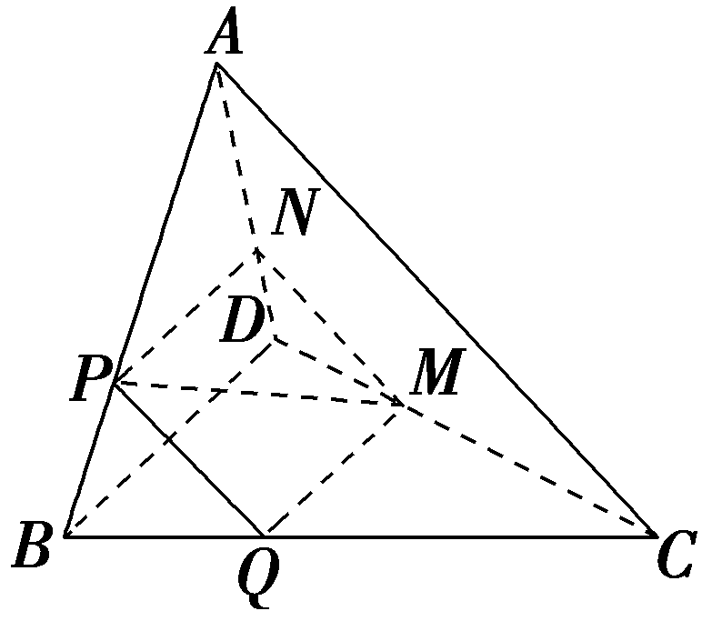

A.*AC*⊥*BD*

B.*AC*∥截面*PQMN*

C.*AC*＝*BD*

D.异面直线*PM*与*BD*所成的角为45°

答案：**ABD**

解析：因为截面*<text style="italic"><text style="italic"><text style="italic"><text style="italic"><text style="italic">PQ*</text></text></text></text>*<text style="italic">MN*</text></text>是正方形，所以PQ∥MN，*<text style="italic"><text style="italic"><text style="italic"><text style="italic"><text style="italic">QM*</text></text></text></text></text>∥*PN*，则PQ∥平面*<text style="italic"><text style="italic"><text style="italic"><text style="italic"><text style="italic"><text style="italic">AC*</text></text></text></text></text>D</text>，QM∥平面*<text style="italic"><text style="italic"><text style="italic"><text style="italic"><text style="italic">BD*</text></text></text></text>A</text>，所以PQ∥AC，QM∥BD，由PQ⊥QM可得AC⊥BD，故A正确；由PQ∥AC可得AC∥截面*PQMN*，故B正确；因为BD∥QM，MN∥AC，所以 $\frac{QM}{BD}$ ＝ $\frac{CM}{CD}$ ， $\frac{MN}{AC}$ ＝ $\frac{DM}{CD}$ ，因为*DM*与*CM*不一定相等，所以*<text style="italic"><text style="italic"><text style="italic"><text style="italic"><text style="italic">AC*</text></text></text></text></text>＝*<text style="italic"><text style="italic"><text style="italic"><text style="italic">BD*</text></text></text></text>不一定成立，故C错误；异面直线*<text style="italic">PM*</text>与BD所成的角等于PM与*<text style="italic"><text style="italic"><text style="italic"><text style="italic"><text style="italic">QM*</text></text></text></text></text>所成的角，易知∠*PMQ*＝45°，故D正确.故选ABD.

12.(15分)如图，在四棱锥*P*-*<text style="italic"><text style="italic"><text style="italic">AB*</text>CD</text></text>中，平面*<text style="italic">PA*D</text>⊥平面A*BC*D，AB∥*<text style="italic">DC*</text>，PA＝*PD*＝2，AB＝4，DC＝1，*AD*＝BC＝2 $\sqrt{2}$ .

(1)求四棱锥*P*-*ABCD*的体积；(6分)

(2)在线段*PA*上是否存在点*M*，使得*DM*∥平面*PBC*？若存在，求 $\frac{PM}{MA}$ 的值；若不存在，请说明理由.(9分)

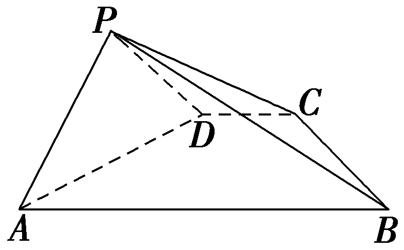

解：(1)取*AD*的中点*G*，连接*PG*，如图①所示.

因为*PA*＝*PD*＝2，所以*PG*⊥*AD*.

因为平面<em>&lt;text style="italic"&gt;&lt;text style="italic"&gt;P&lt;text style="italic"&gt;&lt;text style="italic"&gt;AD</em>&lt;/text&gt;&lt;/text&gt;&lt;/text&gt;&lt;/text&gt;⊥平面<em>&lt;text style="italic"&gt;&lt;text style="italic"&gt;&lt;text style="italic"&gt;ABCD</em>&lt;/text&gt;&lt;/text&gt;&lt;/text&gt;，平面<em>&lt;text style="italic"&gt;&lt;text style="italic"&gt;&lt;text style="italic"&gt;PA</em>&lt;/text&gt;&lt;/text&gt;D&lt;/text&gt;∩平面ABCD＝AD，<em>&lt;text style="italic"&gt;&lt;text style="italic"&gt;&lt;text style="italic"&gt;PG</em>&lt;/text&gt;&lt;/text&gt;&lt;/text&gt;⊂平面PAD，所以PG⊥平面ABCD，即PG是四棱锥P-ABCD的高.因为PA＝<em>&lt;text style="italic"&gt;&lt;text style="italic"&gt;PD</em>&lt;/text&gt;&lt;/text&gt;＝&lt;text style="superscript"&gt;&lt;text style="superscript"&gt;2&lt;/text&gt;&lt;/text&gt;，AD＝2 $\sqrt{2}$ ，所以<em>P</em>A&lt;text style="superscript"&gt;&lt;text style="superscript"&gt;2&lt;/text&gt;&lt;/text&gt;＋<em>&lt;text style="italic"&gt;&lt;text style="italic"&gt;PD</em>&lt;/text&gt;&lt;/text&gt;2＝<em>&lt;text style="italic"&gt;&lt;text style="italic"&gt;AD</em>&lt;/text&gt;&lt;/text&gt;2，所以<em>&lt;text style="italic"&gt;&lt;text style="italic"&gt;PA</em>&lt;/text&gt;&lt;/text&gt;⊥PD，<em>&lt;text style="italic"&gt;&lt;text style="italic"&gt;&lt;text style="italic"&gt;PG</em>&lt;/text&gt;&lt;/text&gt;&lt;/text&gt;＝ $\sqrt{2}$ .

梯形*ABCD*的高为 $\sqrt{\left(2\sqrt{2}\right)^{2}－\left(\frac{3}{2}\right)^{2}}$ ＝ $\frac{\sqrt{23}}{2}$ ，

故<em>S</em>梯形<em>ABCD</em>＝ $\frac{\left(1+4\right)\times \frac{\sqrt{23}}{2}}{2}$ ＝ $\frac{5\sqrt{23}}{4}$ ，

所以四棱锥*P*-*ABCD*的体积*V*＝ $\frac{1}{3}$ × $\sqrt{2}$ × $\frac{5\sqrt{23}}{4}$ ＝ $\frac{5\sqrt{46}}{12}$ .

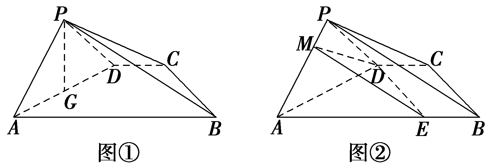

(2)在线段*PA*上存在点*M*，使得*DM*∥平面*PBC*，且 $\frac{PM}{MA}$ ＝ $\frac{1}{3}$ ，

理由如下：如图②所示，过点*D*作*D<text style="italic">E*</text>∥*CB*交*AB*于点E，则 $\frac{EB}{AE}$ ＝ $\frac{1}{3}$ ，

过点*E*作*E<text style="italic">M*</text>∥*PB*交*PA*于点M，连接*MD*，则 $\frac{PM}{MA}$ ＝ $\frac{1}{3}$ .

因为*DE*∥*BC*，*BC*⊂平面*PBC*，*DE*⊄平面*PBC*，所以*DE*∥平面*PBC*.

因为*ME*∥*PB*，*PB*⊂平面*PBC*，*ME*⊄平面*PBC*，所以*ME*∥平面*PBC*.

又因为*DE*∩*ME*＝*E*，*DE*，*ME*⊂平面*MDE*，

所以平面*MDE*∥平面*PBC*.

因为*DM*⊂平面*MDE*，所以*DM*∥平面*PBC*.

所以在*PA*上存在点*M*，使得*DM*∥平面*PBC*，且 $\frac{PM}{MA}$ ＝ $\frac{1}{3}$ .

(13、14题，每小题5分，共10分)

13.在棱长为1的正方体<em>ABCD</em> -<em>A</em>1<em>B</em>1<em>C</em>1<em>D</em>1中，点<em>M</em>，<em>N</em>分别是棱<em>BC</em>，<em>CC</em>1的中点，动点<em>P</em>在正方形<em>BCC</em>1<em>B</em>1(包括边界)内运动.若<em>PA</em>1∥平面<em>AMN</em>，则<em>PA</em>1的最小值是(　　)

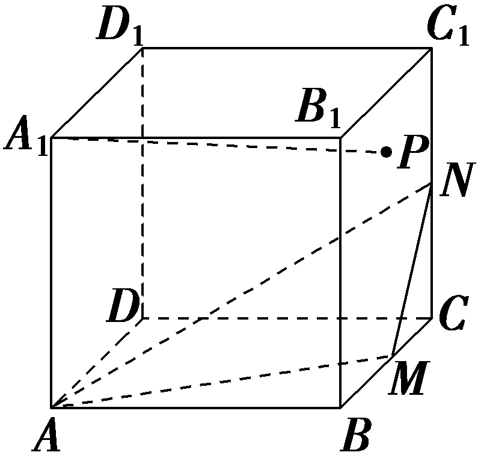

A.1	B. $\frac{\sqrt{5}}{4}$

C. $\frac{3\sqrt{2}}{4}$ 	D. $\frac{\sqrt{6}}{2}$

答案：**C**

解析：如图所示，取<em>B</em>&lt;text style="subscript"&gt;&lt;text style="subscript"&gt;&lt;text style="subscript"&gt;&lt;text style="subscript"&gt;&lt;text style="subscript"&gt;&lt;text style="subscript"&gt;&lt;text style="subscript"&gt;&lt;text style="subscript"&gt;&lt;text style="subscript"&gt;&lt;text style="subscript"&gt;&lt;text style="subscript"&gt;&lt;text style="subscript"&gt;&lt;text style="subscript"&gt;&lt;text style="subscript"&gt;&lt;text style="subscript"&gt;&lt;text style="subscript"&gt;1&lt;/text&gt;&lt;/text&gt;&lt;/text&gt;&lt;/text&gt;&lt;/text&gt;&lt;/text&gt;&lt;/text&gt;&lt;/text&gt;&lt;/text&gt;&lt;/text&gt;&lt;/text&gt;&lt;/text&gt;&lt;/text&gt;&lt;/text&gt;&lt;/text&gt;&lt;/text&gt;<em>C</em>1的中点<em>&lt;text style="italic"&gt;&lt;text style="italic"&gt;&lt;text style="italic"&gt;&lt;text style="italic"&gt;&lt;text style="italic"&gt;&lt;text style="italic"&gt;E</em>&lt;/text&gt;&lt;/text&gt;&lt;/text&gt;&lt;/text&gt;&lt;/text&gt;&lt;/text&gt;，<em>BB</em>1的中点<em>&lt;text style="italic"&gt;&lt;text style="italic"&gt;F</em>&lt;/text&gt;&lt;/text&gt;，连接<em>&lt;text style="italic"&gt;&lt;text style="italic"&gt;&lt;text style="italic"&gt;&lt;text style="italic"&gt;&lt;text style="italic"&gt;&lt;text style="italic"&gt;&lt;text style="italic"&gt;&lt;text style="italic"&gt;&lt;text style="italic"&gt;A</em>&lt;/text&gt;&lt;/text&gt;&lt;/text&gt;&lt;/text&gt;&lt;/text&gt;&lt;/text&gt;&lt;/text&gt;&lt;/text&gt;&lt;/text&gt;1E，A1F，<em>&lt;text style="italic"&gt;&lt;text style="italic"&gt;&lt;text style="italic"&gt;&lt;text style="italic"&gt;&lt;text style="italic"&gt;&lt;text style="italic"&gt;&lt;text style="italic"&gt;&lt;text style="italic"&gt;EF</em>&lt;/text&gt;&lt;/text&gt;&lt;/text&gt;&lt;/text&gt;&lt;/text&gt;&lt;/text&gt;&lt;/text&gt;&lt;/text&gt;.因为<em>&lt;text style="italic"&gt;M</em>&lt;/text&gt;，<em>N</em>分别是棱<em>BC</em>，<em>CC</em>1的中点，所以A1E∥<em>&lt;text style="italic"&gt;&lt;text style="italic"&gt;AM</em>&lt;/text&gt;&lt;/text&gt;，EF∥<em>&lt;text style="italic"&gt;&lt;text style="italic"&gt;MN</em>&lt;/text&gt;&lt;/text&gt;，又因为A1E∩EF＝E，AM∩MN＝M，A1E，EF⊂平面A1EF，AM，MN⊂平面<em>&lt;text style="italic"&gt;&lt;text style="italic"&gt;AMN</em>&lt;/text&gt;&lt;/text&gt;，所以平面A1EF∥平面AMN.因为<em>&lt;text style="italic"&gt;&lt;text style="italic"&gt;&lt;text style="italic"&gt;P</em>&lt;/text&gt;&lt;/text&gt;A&lt;/text&gt;1∥平面AMN，且P点在右侧面，所以点P的轨迹是线段EF，且A1E＝A1F＝ $\frac{\sqrt{5}}{2}$ ，<em>&lt;text style="italic"&gt;&lt;text style="italic"&gt;&lt;text style="italic"&gt;&lt;text style="italic"&gt;&lt;text style="italic"&gt;&lt;text style="italic"&gt;E</em>&lt;/text&gt;&lt;/text&gt;&lt;/text&gt;&lt;/text&gt;&lt;/text&gt;&lt;/text&gt;<em>&lt;text style="italic"&gt;&lt;text style="italic"&gt;F</em>&lt;/text&gt;&lt;/text&gt;＝ $\frac{\sqrt{2}}{2}$ ，所以当点<em>&lt;text style="italic"&gt;&lt;text style="italic"&gt;P</em>&lt;/text&gt;&lt;/text&gt;位于<em>&lt;text style="italic"&gt;&lt;text style="italic"&gt;&lt;text style="italic"&gt;&lt;text style="italic"&gt;&lt;text style="italic"&gt;&lt;text style="italic"&gt;E</em>&lt;/text&gt;&lt;/text&gt;&lt;/text&gt;&lt;/text&gt;&lt;/text&gt;&lt;/text&gt;<em>&lt;text style="italic"&gt;&lt;text style="italic"&gt;F</em>&lt;/text&gt;&lt;/text&gt;的中点<em>&lt;text style="italic"&gt;O</em>&lt;/text&gt;处时，P<em>&lt;text style="italic"&gt;&lt;text style="italic"&gt;&lt;text style="italic"&gt;&lt;text style="italic"&gt;&lt;text style="italic"&gt;&lt;text style="italic"&gt;&lt;text style="italic"&gt;&lt;text style="italic"&gt;&lt;text style="italic"&gt;A</em>&lt;/text&gt;&lt;/text&gt;&lt;/text&gt;&lt;/text&gt;&lt;/text&gt;&lt;/text&gt;&lt;/text&gt;&lt;/text&gt;&lt;/text&gt;&lt;text style="subscript"&gt;&lt;text style="subscript"&gt;&lt;text style="subscript"&gt;&lt;text style="subscript"&gt;&lt;text style="subscript"&gt;&lt;text style="subscript"&gt;&lt;text style="subscript"&gt;&lt;text style="subscript"&gt;&lt;text style="subscript"&gt;&lt;text style="subscript"&gt;&lt;text style="subscript"&gt;&lt;text style="subscript"&gt;&lt;text style="subscript"&gt;&lt;text style="subscript"&gt;&lt;text style="subscript"&gt;&lt;text style="subscript"&gt;1&lt;/text&gt;&lt;/text&gt;&lt;/text&gt;&lt;/text&gt;&lt;/text&gt;&lt;/text&gt;&lt;/text&gt;&lt;/text&gt;&lt;/text&gt;&lt;/text&gt;&lt;/text&gt;&lt;/text&gt;&lt;/text&gt;&lt;/text&gt;&lt;/text&gt;&lt;/text&gt;最小，此时，<em>&lt;text style="italic"&gt;&lt;text style="italic"&gt;PA</em>&lt;/text&gt;&lt;/text&gt;1＝A1O＝ $\sqrt{A_{1}E^{2}－\left(\frac{1}{2}EF\right)^{2}}$ ＝ $\sqrt{\frac{5}{4}－\frac{1}{8}}$ ＝ $\frac{3\sqrt{2}}{4}$ .故选<em>C</em>.

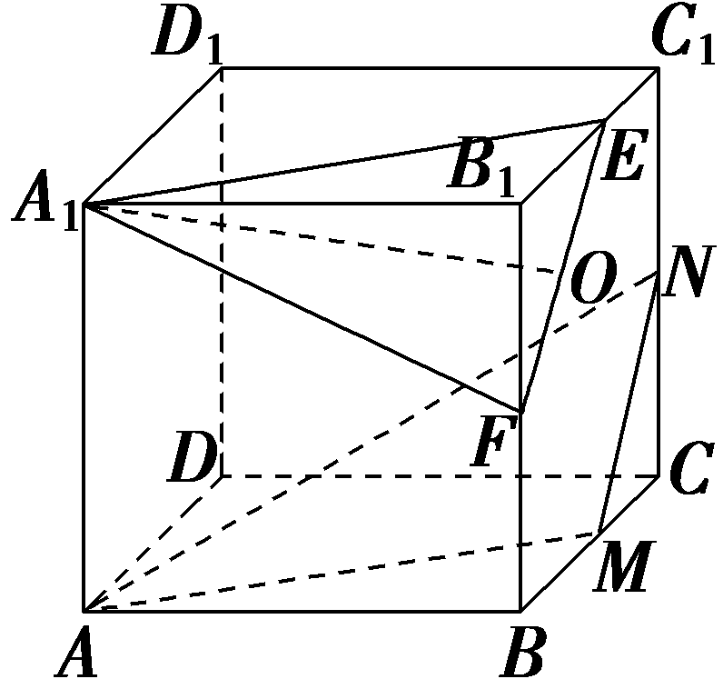

14.(多选)如图①，在正方形*ABCD*中，点*E*为线段*BC*上的动点(不含端点)，将△*ABE*沿*AE*翻折，使得二面角*B* -*AE*-*D*为直二面角，得到图②所示的四棱锥*B* -*AECD*，点*F*为线段*BD*上的动点(不含端点)，则在四棱锥*B*-*AECD*中，下列说法正确的有(　　)

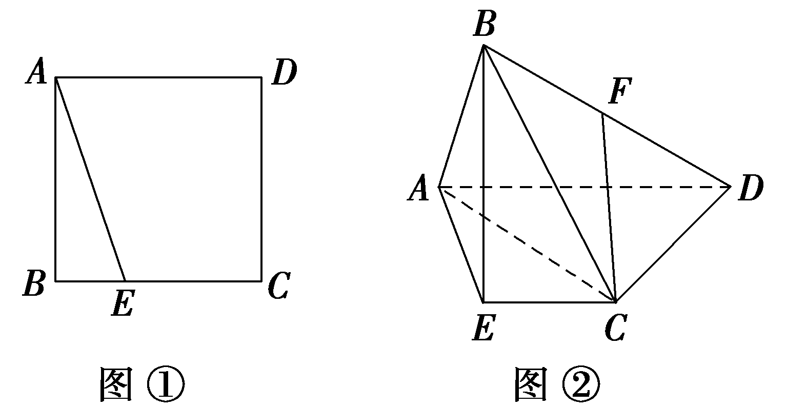

A.*B*，*E*，*C*，*F*四点不共面

B.存在点*F*，使得*CF*∥平面*BAE*

C.三棱锥*B* -*ADC*的体积为定值

D.存在点*E*使得直线*BE*与直线*CD*垂直

答案：**AB**

解析：对于A，因为点*<text style="italic">B*</text>在平面*A<text style="italic"><text style="italic"><text style="italic"><text style="italic"><text style="italic">EC*</text></text></text></text>*<text style="italic">D*</text></text>外，点D在平面*<text style="italic">A<text style="italic"><text style="italic"><text style="italic">EC*</text></text>D</text></text>内，直线EC在平面AECD内，直线EC不过点D，所以直线*<text style="italic">BD*</text>与EC是异面直线，即直线*B<text style="italic"><text style="italic">F*</text></text>与EC是异面直线，所以B，E，C，F四点不共面，故A正确；对于B，如图，当点F为线段BD的中点，EC＝ $\frac{1}{2}$ A*<text style="italic">D*</text>时，直线*C<text style="italic">F*</text>∥平面*<text style="italic">B*</text>A*E*，证明如下：取*AB*的中点*G*，连接*GE*，*GF*，则*<text style="italic"><text style="italic"><text style="italic"><text style="italic"><text style="italic"><text style="italic">EC*</text></text></text></text></text></text>∥*<text style="italic">FG*</text>且EC＝FG，所以四边形E*<text style="italic">CF*</text>G为平行四边形，所以*FC*∥*<text style="italic">EG*</text>，又因为EG⊂平面*<text style="italic"><text style="italic">BAE*</text></text>，则直线CF与平面BAE平行，故B正确；

对于C，在三棱锥*B* -*ADC*中，因为△*ACD*的面积不变，而点*E*的移动会导致点*B*到平面*ACD*的距离发生变化，所以三棱锥*B* -*ADC*的体积不是定值，故C不正确；对于D，过*D*作*DH*⊥*AE*于*H*，因为平面*BAE*⊥平面*AECD*，平面*BAE*∩平面*AECD*＝*AE*，所以*DH*⊥平面*BAE*，所以*DH*⊥*BE*，若存在点*E*使得直线*BE*与直线*CD*垂直，*DH*⊂平面*AECD*，且*DC*⊂平面*AECD*，*DH*∩*DC*＝*D*，所以*BE*⊥平面*AECD*，所以*BE*⊥*AE*，与△*ABE*是以*B*为直角的三角形矛盾，所以不存在点*E*使得直线*BE*与直线*CD*垂直，故D不正确.故选AB.

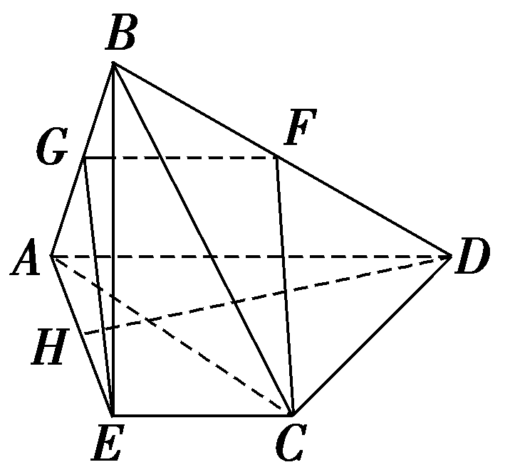

