**第四节　空间直线、平面的垂直**

【课标研读】　1.从立体几何的定义、4个基本事实和定理出发，了解空间中直线与直线、直线与平面、平面与平面垂直的关系，归纳出有关垂直的性质定理和判定定理，并加以证明.　2.能用已获得的结论证明空间基本图形垂直关系的简单命题.

1.直线与直线垂直

(1)定义：若两条直线相交于一点或经过平移后相交于一点，并且夹角为直角，则称这两条直线互相垂直.

(2)若一条直线垂直于一个平面，则它就和平面内的任意一条直线垂直.

2.直线与平面垂直

(1)定义：如果直线<em>l</em>与平面<em>α</em>内的<u>任意一条</u>直线都垂直，则直线<em>l</em>与平面<em>α</em>互相垂直，记作<em>l</em>⊥<em>α</em>.直线<em>l</em>叫做平面<em>α</em>的垂线，平面<em>α</em>叫做直线<em>l</em>的垂面.

(2)判定定理与性质定理

3.直线和平面所成的角

(1)定义：平面的一条斜线和它在平面上的<u>射影</u>所成的角，叫做这条直线和这个平面所成的角，一条直线垂直于平面，则它们所成的角是<u>90°</u>；一条直线和平面平行或在平面内，则它们所成的角是0°.

(2)范围： $\left[0，\frac{\pi }{2}\right]$ .

4.二面角

(1)定义：从一条直线出发的<u>两个半平面</u>所组成的图形叫做二面角.

(2)二面角的平面角：

若有①<em>O</em>∈<em>l</em>；②<em>OA</em>⊂<em>α</em>，<em>OB</em>⊂<em>β</em>；③<em>OA</em>⊥<em>l</em>，<em>OB</em>⊥<em>l</em>，则二面角<em>α</em>-<em>l</em>-<em>β</em>的平面角是<u>∠</u><em><u>AOB</u></em>.

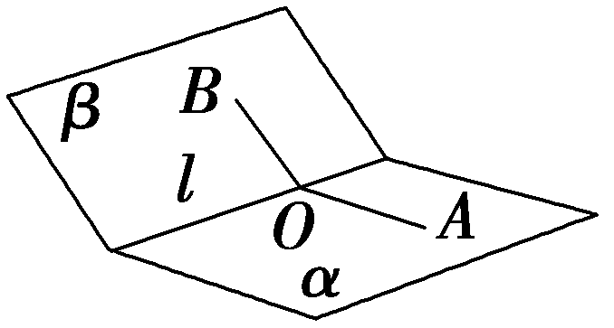

(3)二面角的平面角*α*的范围：0°≤*α*≤180°.

5.平面与平面垂直

(1)定义：两个平面相交，如果它们所成的二面角是<u>直二面角</u>，就说这两个平面互相垂直.

(2)判定定理与性质定理

[微提醒]　三种垂直关系的转化

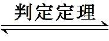

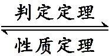

线线垂直线面垂直面面垂直

【常用结论】

(1)过一点有且只有一条直线与一个平面垂直，过一点有且只有一个平面与一条直线垂直.

(2)若两条平行线中的一条垂直于一个平面，则另一条也垂直于这个平面.

(3)垂直于同一条直线的两个平面平行.

(4)一条直线垂直于两平行平面中的一个，则这条直线与另一个平面也垂直.

(5)两个相交平面同时垂直于第三个平面，它们的交线也垂直于第三个平面.

【自主检测】

1.(链接人教A必修二P162习题T1(2))已知平面*α*，*β*和直线*m*，*l*，则下列命题中正确的是(　　)

A.若*α*⊥*β*，*α*∩*β*＝*m*，*l*⊥*m*，则*l*⊥*β*

B.若*α*∩*β*＝*m*，*l*⊂*α*，*l*⊥*m*，则*l*⊥*β*

C.若*α*⊥*β*，*l*⊂*α*，则*l*⊥*β*

D.若*α*⊥*β*，*α*∩*β*＝*m*，*l*⊂*α*，*l*⊥*m*，则*l*⊥*β*

答案：**D**

解析：对于A，若*α*⊥*β*，*α*∩*β*＝*m*，*l*⊥*m*，则*l*⊂*β*或*l*∥*β*或*l*与*β*相交，故A不正确；对于B，若*α*∩*β*＝*m*，*l*⊂*α*，*l*⊥*m*，则*l*与*β*相交但不一定垂直，故B不正确；对于C，若*α*⊥*β*，*l*⊂*α*，则*l*⊂*β*或*l*∥*β*或*l*与*β*相交，故C不正确；对于D，若*α*⊥*β*，*α*∩*β*＝*m*，*l*⊂*α*，*l*⊥*m*，则*l*⊥*β*，由面面垂直的性质定理可知D正确.故选D.

2.(链接人教A必修二P163T5)如图，正方形<em>SG</em>1<em>G</em>2<em>G</em>3中，<em>E</em>，<em>F</em>分别是<em>G</em>1<em>G</em>2，<em>G</em>2<em>G</em>3的中点，<em>D</em>是<em>EF</em>的中点，现在沿<em>SE</em>，<em>SF</em>及<em>EF</em>把这个正方形折成一个四面体，使<em>G</em>1，<em>G</em>2，<em>G</em>3三点重合，重合后的点记为<em>G</em>，则在四面体<em>S</em>-<em>EFG</em>中必有(　　)

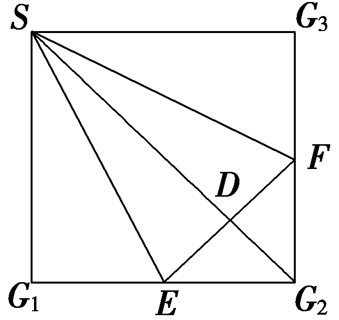

A.*SG*⊥△*EFG*所在平面

B.*SD*⊥△*EFG*所在平面

C.*GF*⊥△*SEF*所在平面

D.*GD*⊥△*SEF*所在平面

答案：**A**

解析：四面体*S* -*EFG*如图所示.由*SG*⊥*GE*，*SG*⊥*GF*，且*GE*∩*GF*＝*G*得，*SG*⊥△*EFG*所在的平面.故选A.

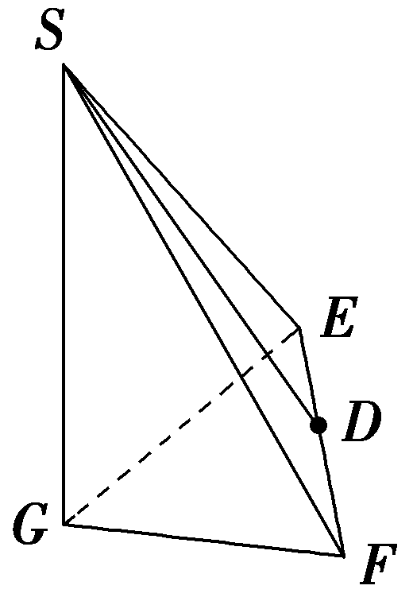

3.(链接人教A必修二P152例4)如图，在长方体<em>ABCD</em> -<em>A</em>1<em>B</em>1<em>C</em>1<em>D</em>1中，<em>AB</em>＝<em>BC</em>＝2，<em>AA</em>1＝1，则<em>AC</em>1与平面<em>A</em>1<em>B</em>1<em>C</em>1<em>D</em>1所成角的正弦值为<u>　　　　</u>.

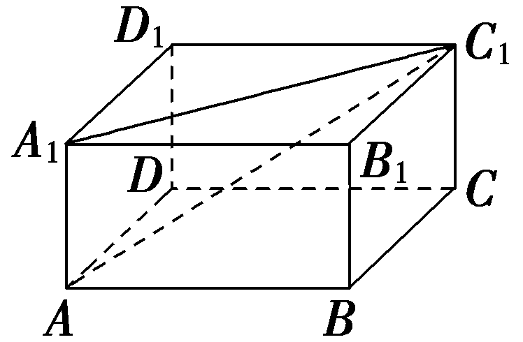

答案： $\frac{1}{3}$

解析：∠<em>&lt;text style="italic"&gt;&lt;text style="italic"&gt;&lt;text style="italic"&gt;&lt;text style="italic"&gt;A</em>&lt;/text&gt;&lt;/text&gt;&lt;/text&gt;<em>&lt;text style="italic"&gt;C</em>&lt;/text&gt;&lt;/text&gt;&lt;text style="subscript"&gt;&lt;text style="subscript"&gt;&lt;text style="subscript"&gt;&lt;text style="subscript"&gt;&lt;text style="subscript"&gt;&lt;text style="subscript"&gt;&lt;text style="subscript"&gt;&lt;text style="subscript"&gt;&lt;text style="subscript"&gt;&lt;text style="subscript"&gt;&lt;text style="subscript"&gt;&lt;text style="subscript"&gt;1&lt;/text&gt;&lt;/text&gt;&lt;/text&gt;&lt;/text&gt;&lt;/text&gt;&lt;/text&gt;&lt;/text&gt;&lt;/text&gt;&lt;/text&gt;&lt;/text&gt;&lt;/text&gt;&lt;/text&gt;A1为<em>&lt;text style="italic"&gt;&lt;text style="italic"&gt;&lt;text style="italic"&gt;AC</em>&lt;/text&gt;&lt;/text&gt;&lt;/text&gt;1与平面A1<em>B</em>1C1<em>D</em>1所成的角.因为<em>AB</em>＝<em>BC</em>＝2，所以A1C1＝AC＝2 $\sqrt{2}$ ，又<em>&lt;text style="italic"&gt;&lt;text style="italic"&gt;&lt;text style="italic"&gt;A</em>&lt;/text&gt;&lt;/text&gt;&lt;/text&gt;A&lt;text style="subscript"&gt;&lt;text style="subscript"&gt;&lt;text style="subscript"&gt;&lt;text style="subscript"&gt;&lt;text style="subscript"&gt;&lt;text style="subscript"&gt;&lt;text style="subscript"&gt;&lt;text style="subscript"&gt;&lt;text style="subscript"&gt;&lt;text style="subscript"&gt;&lt;text style="subscript"&gt;&lt;text style="subscript"&gt;1&lt;/text&gt;&lt;/text&gt;&lt;/text&gt;&lt;/text&gt;&lt;/text&gt;&lt;/text&gt;&lt;/text&gt;&lt;/text&gt;&lt;/text&gt;&lt;/text&gt;&lt;/text&gt;&lt;/text&gt;＝1，所以<em>&lt;text style="italic"&gt;A&lt;text style="italic"&gt;&lt;text style="italic"&gt;C</em>&lt;/text&gt;&lt;/text&gt;&lt;/text&gt;1＝3，所以sin∠<em>&lt;text style="italic"&gt;&lt;text style="italic"&gt;AC</em>&lt;/text&gt;&lt;/text&gt;1A1＝ $\frac{AA_{1}}{AC_{1}}$ ＝ $\frac{1}{3}$ .

4.(链接人教A必修二P152T4)在三棱锥*P*-*ABC*中，点*P*在平面*ABC*上的投影为点*O*.

(1)若<em>PA</em>＝<em>PB</em>＝<em>PC</em>，则点<em>O</em>是△<em>ABC</em>的<u>　　　　</u>心；

(2)若<em>PA</em>⊥<em>PB</em>，<em>PB</em>⊥<em>PC</em>，<em>PC</em>⊥<em>PA</em>，则点<em>O</em>是△<em>ABC</em>的<u>　　　　</u>心.

答案：(1)外　(2)垂

解析：(1)如图①，连接*OA*，*OB*，*OC*，*OP*，在Rt△*POA*，Rt△*POB*和Rt△*POC*中，*PA*＝*PC*＝*PB*，所以*OA*＝*OB*＝*OC*，即*O*为△*ABC*的外心.

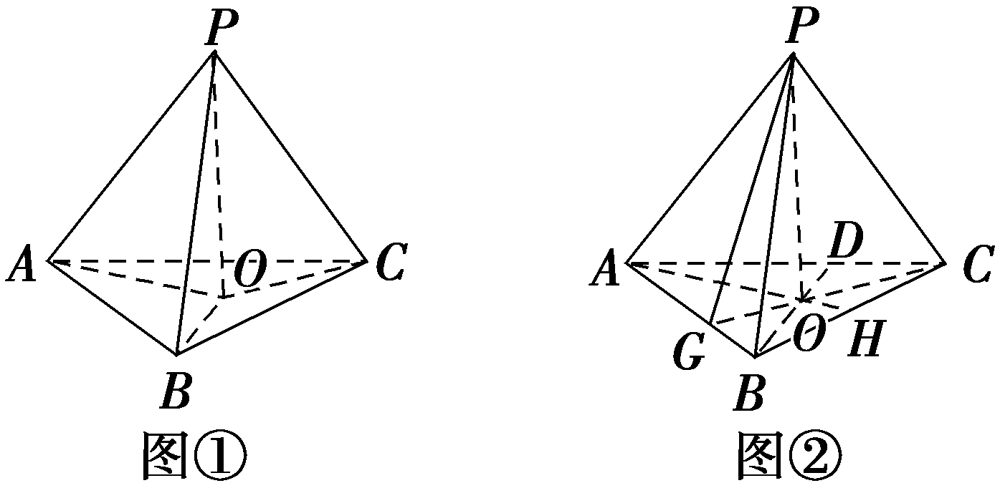

(2)如图②，延长*AO*，*BO*，*CO*分别交*BC*，*AC*，*AB*于点*H*，*D*，*G*.因为*PC*⊥*PA*，*PB*⊥*PC*，*PA*∩*PB*＝*P*，*PA*，*PB*⊂平面*PAB*，所以*PC*⊥平面*PAB*，又*AB*⊂平面*PAB*，所以*PC*⊥*AB*，因为*AB*⊥*PO*，*PO*∩*PC*＝*P*，*PO*，*PC*⊂平面*PGC*，所以*AB*⊥平面*PGC*，又*CG*⊂平面*PGC*，所以*AB*⊥*CG*，即*CG*为△*ABC*边*AB*上的高.同理可证*BD*，*AH*分别为△*ABC*边*AC*，*BC*上的高，即*O*为△*ABC*的垂心.

考点一　垂直关系命题的真假判断　　　　自主练透

1.(2025·沈阳质量监测(三))设*a*，*b*是两条不同的直线，*α*，*β*是两个不同的平面，则下面说法正确的是(　　)

A.若*a*⊥*b*，*b*∥*α*，则*a*⊥*α*

B.若*a*⊥*α*，*b*∥*α*，则*a*⊥*b*

C.若*a*⊥*α*，*α*⊥*β*，则*a*⊂*β*

D.若*a*⊥*b*，*b*⊥*β*，则*a*∥*β*

答案：**B**

解析：对于A，若*a*⊥*b*，*b*∥*α*，则*a*⊂*α*或*a*∥*α*或*a*与*α*相交，可得A错误；对于B，若*a*⊥*α*，*b*∥*α*，则*a*⊥*b*，即B正确；对于C，若*a*⊥*α*，*α*⊥*β*，则*a*∥*β*或*a*⊂*β*，可知C错误；对于D，若*a*⊥*b*，*b*⊥*β*，则*a*∥*β*或*a*⊂*β*，可知D错误.故选B.

2.(2022·全国乙卷)在正方体<em>ABCD</em>-<em>A</em>1<em>B</em>1<em>C</em>1<em>D</em>1中，<em>E</em>，<em>F</em>分别为<em>AB</em>，<em>BC</em>的中点，则(　　)

A.平面<em>B</em>1<em>EF</em>⊥平面<em>BDD</em>1

B.平面<em>B</em>1<em>EF</em>⊥平面<em>A</em>1<em>BD</em>

C.平面<em>B</em>1<em>EF</em>∥平面<em>A</em>1<em>AC</em>

D.平面<em>B</em>1<em>EF</em>∥平面<em>A</em>1<em>C</em>1<em>D</em>

答案：**A**

解析：如图，对于A，在正方体<em>ABCD</em> -<em>A</em>1<em>B</em>1<em>C</em>1<em>D</em>1中，因为<em>E</em>，<em>F</em>分别为<em>AB</em>，<em>BC</em>的中点，所以<em>EF</em>∥<em>AC</em>，又<em>AC</em>⊥<em>BD</em>，所以<em>EF</em>⊥<em>BD</em>，又易知<em>DD</em>1⊥<em>EF</em>，<em>BD</em>∩<em>DD</em>1＝<em>D</em>，<em>BD</em>，<em>DD</em>1⊂平面<em>BDD</em>1，从而<em>EF</em>⊥平面<em>BDD</em>1，又<em>EF</em>⊂平面<em>B</em>1<em>EF</em>，所以平面<em>B</em>1<em>EF</em>⊥平面<em>BDD</em>1，故A正确；对于B，因为平面<em>A</em>1<em>BD</em>∩平面<em>BDD</em>1＝<em>BD</em>，所以由选项A知，平面<em>B</em>1<em>EF</em>⊥平面<em>A</em>1<em>BD</em>不成立，故B错误；对于C，由题意知直线<em>AA</em>1与直线<em>B</em>1<em>E</em>必相交，故平面<em>B</em>1<em>EF</em>与平面<em>A</em>1<em>AC</em>不平行，故C错误；对于D，连接<em>AB</em>1，<em>B</em>1<em>C</em>，易知平面<em>AB</em>1<em>C</em>∥平面<em>A</em>1<em>C</em>1<em>D</em>，又平面<em>AB</em>1<em>C</em>与平面<em>B</em>1<em>EF</em>有公共点<em>B</em>1，所以平面<em>A</em>1<em>C</em>1<em>D</em>与平面<em>B</em>1<em>EF</em>不平行，故D错误.故选A.

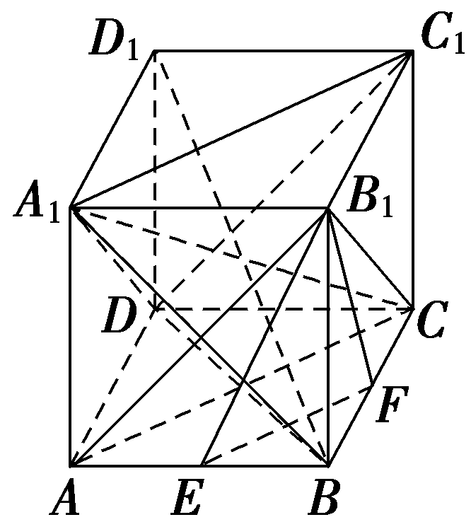

3.(多选)已知*l*，*m*是两条不同的直线，*α*，*β*是两个不同的平面，则下列选项中，*l*⊥*m*的充分条件有(　　)

A.*α*⊥*β*，*l*⊥*α*，*m*∥*β*	B.*α*∥*β*，*l*∥*α*，*m*⊥*β*

C.*α*⊥*β*，*l*⊥*α*，*m*⊥*β*	D.*α*⊥*β*，*l*∥*α*，*m*∥*β*

答案：**BC**

解析：A选项不是*l*⊥*m*的一个充分条件，两个平面垂直，两条直线分别平行和垂直于平面，则这两条直线可能相交、平行或异面，故A错误；B选项，因为*m*⊥*β*，且*α*∥*β*，所以*m*⊥*α*，又因为*l*∥*α*，所以*l*⊥*m*，故B正确；C选项，因为*m*⊥*β*，*l*⊥*α*，又因为*α*⊥*β*，所以*l*⊥*m*，故C正确；D选项不是*l*⊥*m*的一个充分条件，两个平面垂直，两条直线分别平行于平面，则这两条直线可能垂直、平行或异面，故D错误.故选BC.

4.(开放题)已知*l*，*m*是平面*α*外的两条不同直线.给出下列三个论断：①*l*⊥*m*；②*m*∥*α*；③*l*⊥*α*.

以其中的两个论断作为条件，余下的一个论断作为结论，写出一个正确的命题<u>　　　　</u>.

答案：②③⇒①(或①③⇒②)

解析：已知*l*，*m*是平面*α*外的两条不同直线，由①*l*⊥*m*与②*m*∥*α*，不能推出③*l*⊥*α*，因为*l*可以与*α*平行，也可以相交不垂直；由①*l*⊥*m*与③*l*⊥*α*能推出②*m*∥*α*；由②*m*∥*α*与③*l*⊥*α*可以推出①*l*⊥*m*.

与线面垂直关系有关的命题真假的判断方法

1.借助几何图形来说明线面关系要做到作图快、准，甚至无需作图通过空间想象来判断.

2.寻找反例，只要存在反例，结论就不正确.

3.反复验证所有可能的情况，必要时要运用判定定理或性质定理进行简单说明.

考点二　直线与平面垂直的判定与性质　　　　多维探究

角度1　证明直线与平面垂直

*S*是Rt△*ABC* 所在平面外一点，且*SA*＝*SB*＝*SC*，*D*为斜边*AC*的中点.

(1)求证：*SD*⊥平面*ABC*；

(2)若*AB*＝*BC*，求证：*BD*⊥平面*SAC*.

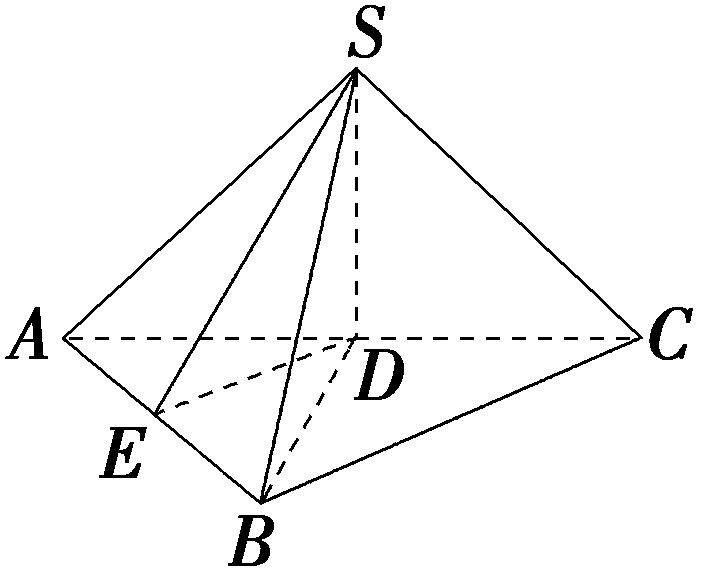

证明：(1)如图所示，取*AB* 的中点*E*，连接*SE*，*DE*.

在Rt△*ABC* 中，因为*D*，*E* 分别为*AC*，*AB* 的中点，

所以*DE*∥*BC*，所以*DE*⊥*AB*.

因为*SA*＝*SB*，*E* 是*AB* 的中点，所以*SE*⊥*AB*.

又*SE*∩*DE*＝*E*，*SE*，*DE*⊂平面*SDE*，所以*AB*⊥平面*SDE*.

又*SD*⊂平面*SDE*，所以*AB*⊥*SD*.在△*SAC* 中，*SA*＝*SC*，*D* 为*AC* 的中点，所以*SD*⊥*AC*.

又*AC*∩*AB*＝*A*，*AC*，*AB*⊂平面*ABC*，所以*SD*⊥平面*ABC*.

(2)由于*AB*＝*BC*，*D* 是*AC* 的中点，则*BD*⊥*AC*.

由(1)可知，*SD*⊥平面*ABC*，

又*BD*⊂平面*ABC*，所以*SD*⊥*BD*.

又*SD*∩*AC*＝*D*，*SD*，*AC*⊂平面*SAC*，

所以*BD*⊥平面*SAC*.

角度2　证明直线与直线垂直

(2021·全国甲卷)已知直三棱柱<em>ABC</em>-<em>A</em>1<em>B</em>1<em>C</em>1中，侧面<em>AA</em>1<em>B</em>1<em>B</em>为正方形，<em>AB</em>＝<em>BC</em>＝2，<em>E</em>，<em>F</em>分别为<em>AC</em>和<em>CC</em>1的中点，<em>BF</em>⊥<em>A</em>1<em>B</em>1.

(1)求三棱锥*F*-*EBC*的体积；

(2)已知<em>D</em>为棱<em>A</em>1<em>B</em>1上的点，证明：<em>BF</em>⊥<em>DE</em>.

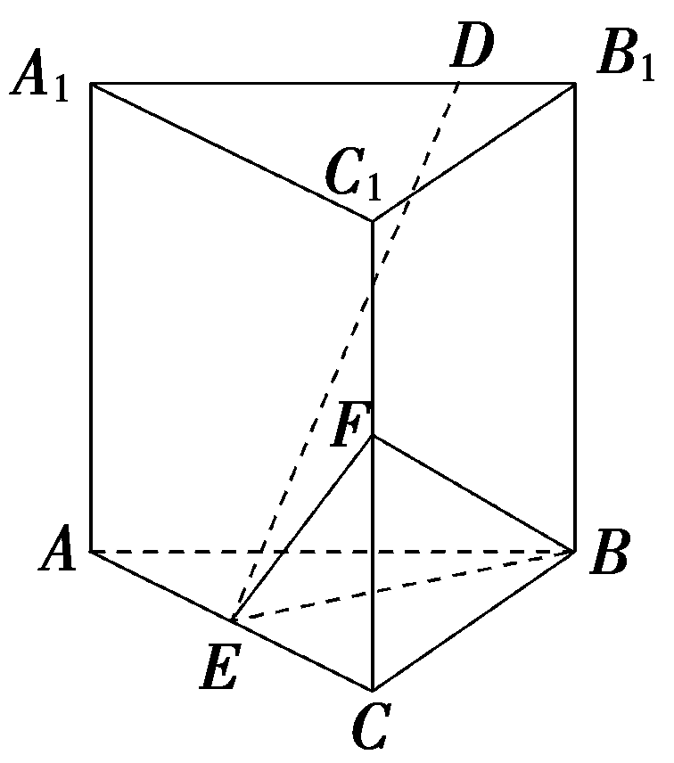

解：(1)在直三棱柱<em>ABC</em>-<em>A</em>1<em>B</em>1<em>C</em>1中，因为侧面<em>AA</em>1<em>B</em>1<em>B</em>为正方形，所以<em>BB</em>1⊥<em>A</em>1<em>B</em>1.

又因为<em>BF</em>⊥<em>A</em>1<em>B</em>1，且<em>BF</em>∩<em>BB</em>1＝<em>B</em>，所以<em>A</em>1<em>B</em>1⊥侧面<em>B</em>1<em>C</em>1<em>CB</em>.

因为<em>A</em>1<em>B</em>1∥<em>AB</em>，所以<em>AB</em>⊥侧面<em>B</em>1<em>C</em>1<em>CB</em>.

又<em>BC</em>⊂侧面<em>B</em>1<em>C</em>1<em>CB</em>，所以<em>AB</em>⊥<em>BC</em>.

因为<em>E</em>，<em>F</em>分别为<em>AC</em>，<em>CC</em>1的中点，所以<em>CF</em>＝1，且 $S_{\bigtriangleup }_{BEC}$ ＝ $\frac{1}{2}S_{\bigtriangleup }_{ABC}$ ＝ $\frac{1}{2}$ × $\frac{1}{2}$ <em>AB·BC</em>＝ $\frac{1}{2}$ × $\frac{1}{2}$ ×2×2＝1.

所以三棱锥*F*-*EBC*的体积*V*＝ $\frac{1}{3}S_{\bigtriangleup }_{BEC}$ ·C*F*＝ $\frac{1}{3}$ ×1×1＝ $\frac{1}{3}$ .

(2)证明：取<em>BC</em>的中点<em>M</em>，连接<em>EM</em>，<em>B</em>1<em>M</em>，<em>A</em>1<em>E</em>，则<em>EM</em>∥<em>AB</em>∥<em>A</em>1<em>B</em>1，所以<em>A</em>1，<em>B</em>1，<em>M</em>，<em>E</em>四点共面.

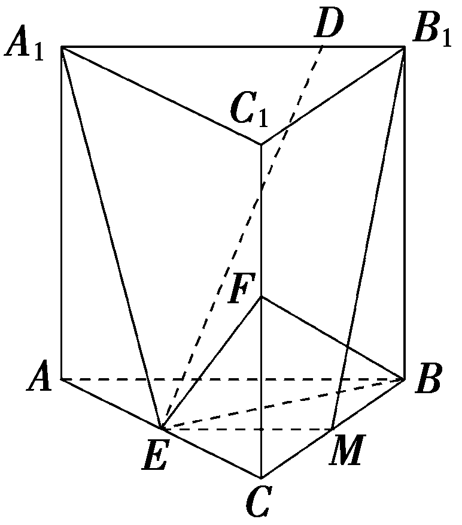

在正方形<em>B</em>1<em>C</em>1<em>CB</em>中，由<em>B</em>1<em>B</em>＝<em>CB</em>，<em>BM</em>＝<em>CF</em>，且∠<em>MBB</em>1＝∠<em>FCB</em>＝90°，

所以△<em>FCB</em>≌△<em>MBB</em>1，所以∠<em>CBF</em>＝∠<em>MB</em>1<em>B</em>，∠<em>CFB</em>＝∠<em>B</em>1<em>MB</em>，所以∠<em>CBF</em>＋∠<em>B</em>1<em>MB</em>＝90°，则<em>BF</em>⊥<em>B</em>1<em>M</em>.

又因为<em>BF</em>⊥<em>A</em>1<em>B</em>1，且<em>A</em>1<em>B</em>1∩<em>B</em>1<em>M</em>＝<em>B</em>1，所以<em>BF</em>⊥平面<em>A</em>1<em>EMB</em>1.

又因为<em>DE</em>⊂平面<em>A</em>1<em>EMB</em>1，所以<em>BF</em>⊥<em>DE</em>.

证明线面垂直的常用方法及关键

1.证明直线和平面垂直的常用方法

(1)判定定理；(2)传递性(*a*∥*b*，*a*⊥*α*⇒*b*⊥*α*)；

(3)面面平行的性质(*a*⊥*α*，*α*∥*β* ⇒*a*⊥*β*)；(4)面面垂直的性质.

2.证明线面垂直的关键是证线线垂直，而证明线线垂直常借助线面垂直的定义.

3.判定定理与性质定理的合理转化是证明线面垂直的基本思想.

对点练1.如图，平面*PAB*⊥平面*ABC*，平面*PAC*⊥平面*ABC*，*AE*⊥平面*PBC*，点*E*为垂足.

(1)求证：*PA*⊥平面*ABC*；

(2)当点*E*为△*PBC*的垂心时，求证：△*ABC*是直角三角形.

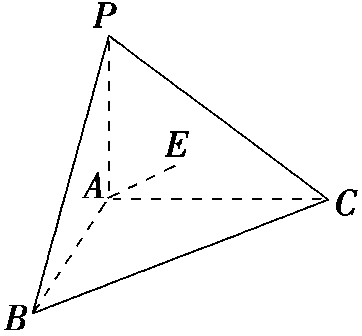

证明：(1)如图，在平面*ABC*内取一点*D*，过点*D*作*DF*⊥*AC*于点*F*.

因为平面*PAC*⊥平面*ABC*，且交线为*AC*，*DF*⊂平面*ABC*，

所以*DF*⊥平面*PAC*.

因为*PA*⊂平面*PAC*，所以*DF*⊥*PA*.

过点*D*作*DG*⊥*AB*于点*G*，

同理可证*DG*⊥*PA*.

因为*DG*，*DF*都在平面*ABC*内，且*DG*∩*DF*＝*D*，

所以*PA*⊥平面*ABC*.

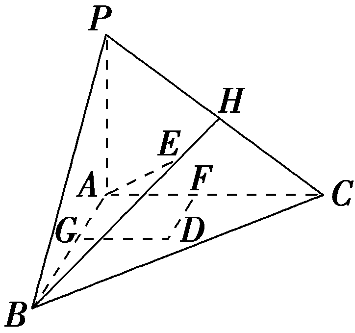

(2)如图，连接*BE*并延长交*PC*于点*H*.

因为点*E*是△*PBC*的垂心，所以*PC*⊥*BH*.

又*AE*⊥平面*PBC*，*PC*⊂平面*PBC*，所以*PC*⊥*AE*.

因为*AE*∩*BH*＝*E*，*AE*，*BH*⊂平面*ABE*，所以*PC*⊥平面*ABE*.

又*AB*⊂平面*ABE*，所以*PC*⊥*AB*.

由(1)知*PA*⊥平面*ABC*，

又*AB*⊂平面*ABC*，所以*PA*⊥*AB*.

因为*PA*∩*PC*＝*P*，*PA*，*PC*⊂平面*PAC*，所以*AB*⊥平面*PAC*.

又*AC*⊂平面*PAC*，所以*AB*⊥*AC*，

即△*ABC*是直角三角形.

对点练2.如图，已知正方体<em>ABCD</em> -<em>A</em>1<em>B</em>1<em>C</em>1<em>D</em>1.

(1)求证：<em>A</em>1<em>C</em>⊥<em>B</em>1<em>D</em>1；

(2)<em>M</em>，<em>N</em>分别为<em>B</em>1<em>D</em>1与<em>C</em>1<em>D</em>上的点，且<em>MN</em>⊥<em>B</em>1<em>D</em>1，<em>MN</em>⊥<em>C</em>1<em>D</em>，求证：<em>MN</em>∥<em>A</em>1<em>C</em>.

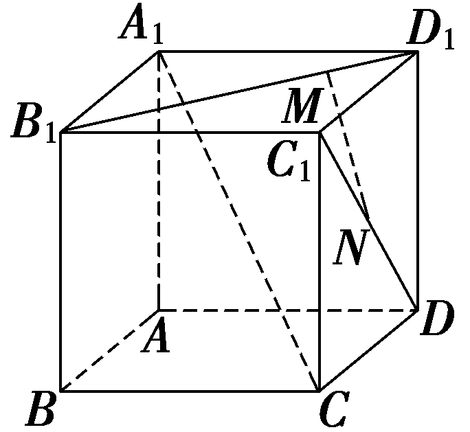

证明：(1)如图，连接<em>A</em>1<em>C</em>1.

因为<em>CC</em>1⊥平面<em>A</em>1<em>B</em>1<em>C</em>1<em>D</em>1，

<em>B</em>1<em>D</em>1⊂平面<em>A</em>1<em>B</em>1<em>C</em>1<em>D</em>1，

所以<em>CC</em>1⊥<em>B</em>1<em>D</em>1.

因为四边形<em>A</em>1<em>B</em>1<em>C</em>1<em>D</em>1是正方形，

所以<em>A</em>1<em>C</em>1⊥<em>B</em>1<em>D</em>1.

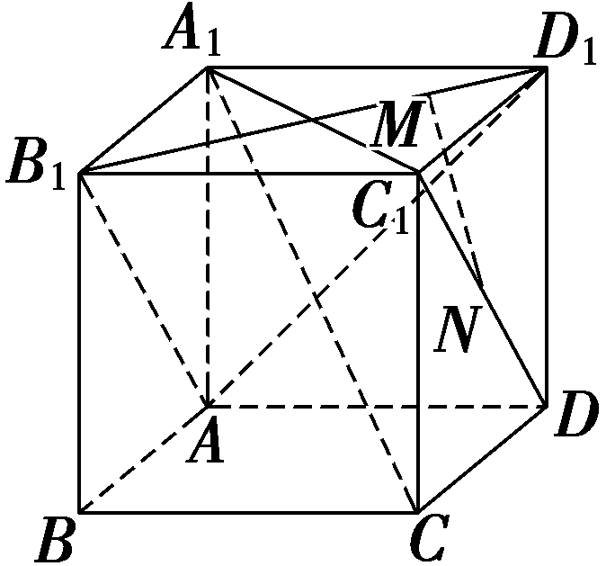

又因为<em>CC</em>1∩<em>A</em>1<em>C</em>1＝<em>C</em>1，<em>A</em>1<em>C</em>1，<em>CC</em>1⊂平面<em>A</em>1<em>C</em>1<em>C</em>，

所以<em>B</em>1<em>D</em>1⊥平面<em>A</em>1<em>C</em>1<em>C</em>.

又因为<em>A</em>1<em>C</em>⊂平面<em>A</em>1<em>C</em>1<em>C</em>，

所以<em>A</em>1<em>C</em>⊥<em>B</em>1<em>D</em>1.

(2)如图，连接<em>B</em>1<em>A</em>，<em>AD</em>1.

因为<em>B</em>1<em>C</em>1＝<em>AD</em>，<em>B</em>1<em>C</em>1∥<em>AD</em>，

所以四边形<em>ADC</em>1<em>B</em>1为平行四边形，

所以<em>C</em>1<em>D</em>∥<em>AB</em>1，

因为<em>MN</em>⊥<em>C</em>1<em>D</em>，

所以<em>MN</em>⊥<em>AB</em>1.

又因为<em>MN</em>⊥<em>B</em>1<em>D</em>1，<em>AB</em>1∩<em>B</em>1<em>D</em>1＝<em>B</em>1，<em>AB</em>1，<em>B</em>1<em>D</em>1⊂平面<em>AB</em>1<em>D</em>1，

所以<em>MN</em>⊥平面<em>AB</em>1<em>D</em>1.

由(1)知<em>A</em>1<em>C</em>⊥<em>B</em>1<em>D</em>1.

同理可得<em>A</em>1<em>C</em>⊥<em>AB</em>1.

又因为<em>AB</em>1∩<em>B</em>1<em>D</em>1＝<em>B</em>1，<em>AB</em>1，<em>B</em>1<em>D</em>1⊂平面<em>AB</em>1<em>D</em>1，

所以<em>A</em>1<em>C</em>⊥平面<em>AB</em>1<em>D</em>1.

所以<em>MN</em>∥<em>A</em>1<em>C</em>.

考点三　平面与平面垂直的判定与性质　　　　师生共研

如图，在四棱锥*P*-*ABCD*中，底面*ABCD*为矩形，平面*PAD*⊥平面*ABCD*，*PA*⊥*PD*，*PA*＝*PD*，*E*为*AD*的中点.

求证：(1)*PE*⊥*BC*；

(2)平面*PAB*⊥平面*PCD*.

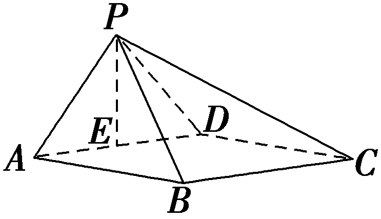

证明：(1)因为*PA*＝*PD*，*E*为*AD*的中点，

所以*PE*⊥*AD*.

因为底面*ABCD*为矩形，所以*BC*∥*AD*.

所以*PE*⊥*BC*.

(2)因为底面*ABCD*为矩形，所以*AB*⊥*AD*.

又因为平面*PAD*⊥平面*ABCD*，平面*PAD*∩平面*ABCD*＝*AD*，*AB*⊂平面*ABCD*，

所以*AB*⊥平面*PAD*，

又*PD*⊂平面*PAD*，所以*AB*⊥*PD*.

又因为*PA*⊥*PD*，*PA*∩*AB*＝*A*，*PA*，*AB*⊂平面*PAB*，所以*PD*⊥平面*PAB*，

又因为*PD*⊂平面*PCD*，

所以平面*PAB*⊥平面*PCD*.

1.面面垂直的两种判定方法与一个转化

(1)两种方法：面面垂直的定义；面面垂直的判定定理(*a*⊥*β*，*a*⊂*α*⇒*α*⊥*β*).

(2)一个转化：在已知两个平面垂直时，一般要用性质定理进行转化，在一个平面内作交线的垂线，转化为线面垂直，然后进一步转化为线线垂直.

2.面面垂直性质定理的应用

(1)两平面垂直的性质定理是把面面垂直转化为线面垂直的依据，运用时要注意“平面内的直线”.

(2)两个相交平面同时垂直于第三个平面，它们的交线也垂直于第三个平面.

对点练3.(2023·全国甲卷)如图，在三棱柱<em>ABC</em>-<em>A</em>1<em>B</em>1<em>C</em>1中，<em>A</em>1<em>C</em>⊥平面<em>ABC</em>，∠<em>ACB</em>＝90°.

(1)证明：平面<em>ACC</em>1<em>A</em>1⊥平面<em>BB</em>1<em>C</em>1<em>C</em>；

(2)设<em>AB</em>＝<em>A</em>1<em>B</em>，<em>AA</em>1＝2，求四棱锥<em>A</em>1-<em>BB</em>1<em>C</em>1<em>C</em>的高.

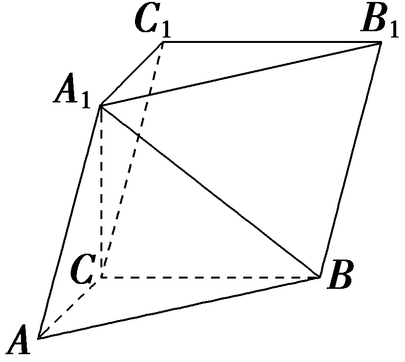

解：(1)证明：因为<em>A</em>1<em>C</em>⊥平面<em>ABC</em>，<em>BC</em>⊂平面<em>ABC</em>，

所以<em>A</em>1<em>C</em>⊥<em>BC</em>，

又因为∠*ACB*＝90°，即*AC*⊥*BC*，

因为<em>A</em>1<em>C</em>，<em>AC</em>⊂平面<em>ACC</em>1<em>A</em>1，<em>A</em>1<em>C</em>∩<em>AC</em>＝<em>C</em>，

所以<em>BC</em>⊥平面<em>ACC</em>1<em>A</em>1，

又因为<em>BC</em>⊂平面<em>BB</em>1<em>C</em>1<em>C</em>，

所以平面<em>ACC</em>1<em>A</em>1⊥平面<em>BB</em>1<em>C</em>1<em>C</em>.

(2)如图，过点<em>A</em>1作<em>A</em>1<em>O</em>⊥<em>CC</em>1交<em>CC</em>1于点<em>O</em>.

因为平面<em>ACC</em>1<em>A</em>1⊥平面<em>BB</em>1<em>C</em>1<em>C</em>，平面<em>ACC</em>1<em>A</em>1∩平面<em>BB</em>1<em>C</em>1<em>C</em>＝<em>CC</em>1，<em>A</em>1<em>O</em>⊂平面<em>ACC</em>1<em>A</em>1，

所以<em>A</em>1<em>O</em>⊥平面<em>BB</em>1<em>C</em>1<em>C</em>，

所以四棱锥<em>A</em>1-<em>BB</em>1<em>C</em>1<em>C</em>的高为<em>A</em>1<em>O</em>.

因为<em>A</em>1<em>C</em>⊥平面<em>ABC</em>，<em>AC</em>，<em>BC</em>⊂平面<em>ABC</em>，

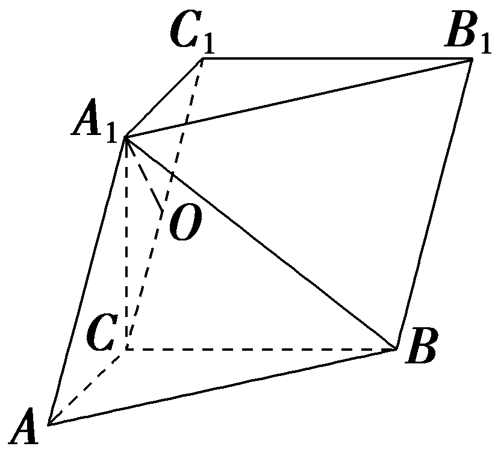

所以<em>A</em>1<em>C</em>⊥<em>BC</em>，<em>A</em>1<em>C</em>⊥<em>AC</em>，

在Rt△<em>ABC</em>与Rt△<em>A</em>1<em>BC</em>中，

因为<em>A</em>1<em>B</em>＝<em>AB</em>，<em>BC</em>＝<em>BC</em>，

所以Rt△<em>ABC</em>≌ Rt△<em>A</em>1<em>BC</em>，

所以<em>A</em>1<em>C</em>＝<em>AC</em>.

设<em>A</em>1<em>C</em>＝<em>AC</em>＝<em>x</em>，则<em>A</em>1<em>C</em>1＝<em>x</em>，

所以<em>O</em>为<em>CC</em>&lt;text style="subscript"&gt;&lt;text style="subscript"&gt;1&lt;/text&gt;&lt;/text&gt;中点，<em>OC</em>1＝ $\frac{1}{2}$ <em>AA</em>&lt;text style="subscript"&gt;&lt;text style="subscript"&gt;1&lt;/text&gt;&lt;/text&gt;＝1，

又因为<em>A</em>1<em>C</em>⊥<em>AC</em>，

所以<em>&lt;text style="italic"&gt;A</em>&lt;/text&gt;1<em>C</em> &lt;text style="superscript"&gt;2&lt;/text&gt;＋<em>AC</em> 2＝A $A_{1}^{2}$ ，

即&lt;te&lt;te<em>x</em>t style="italic"&gt;x&lt;/text&gt;t style="italic"&gt;x&lt;/text&gt;&lt;text style="superscript"&gt;&lt;text style="superscript"&gt;2&lt;/text&gt;&lt;/text&gt;＋x2＝22，解得x＝ $\sqrt{2}$ ，

所以<em>A</em>1<em>O</em>＝ $\sqrt{A_{1}C_{1}^{2}－OC_{1}^{2}}$ ＝ $\sqrt{(\sqrt{2})^{2}－1^{2}}$ ＝1，

所以四棱锥<em>A</em>1-<em>BB</em>1<em>C</em>1<em>C</em>的高为1.

考点四　平行、垂直关系的综合应用　　　　师生共研

如图，在三棱柱<em>&lt;text style="italic"&gt;ABC</em>&lt;/text&gt;-A&lt;text style="subscript"&gt;&lt;text style="subscript"&gt;&lt;text style="subscript"&gt;&lt;text style="subscript"&gt;1&lt;/text&gt;&lt;/text&gt;&lt;/text&gt;&lt;/text&gt;B1C1中，侧棱<em>&lt;text style="italic"&gt;AA</em>&lt;/text&gt;1⊥底面<em>&lt;text style="italic"&gt;AB</em>C&lt;/text&gt;，<em>M</em>为棱<em>&lt;text style="italic"&gt;AC</em>&lt;/text&gt;的中点，AB＝<em>BC</em>，AC＝2，AA1＝ $\sqrt{2}$ .

(1)求证：<em>B</em>1<em>C</em>∥平面<em>A</em>1<em>BM</em>；

(2)求证：<em>AC</em>1⊥平面<em>A</em>1<em>BM</em>；

(3)在棱<em>BB</em>&lt;text style="subscript"&gt;&lt;text style="subscript"&gt;&lt;text style="subscript"&gt;1&lt;/text&gt;&lt;/text&gt;&lt;/text&gt;上是否存在点<em>&lt;text style="italic"&gt;N</em>&lt;/text&gt;，使得平面<em>A&lt;text style="italic"&gt;&lt;text style="italic"&gt;C</em>&lt;/text&gt;&lt;/text&gt;1N⊥平面<em>AA</em>1C1C？如果存在，求出此时 $\frac{BN}{BB_{1}}$ 的值并证明；如果不存在，请说明理由.

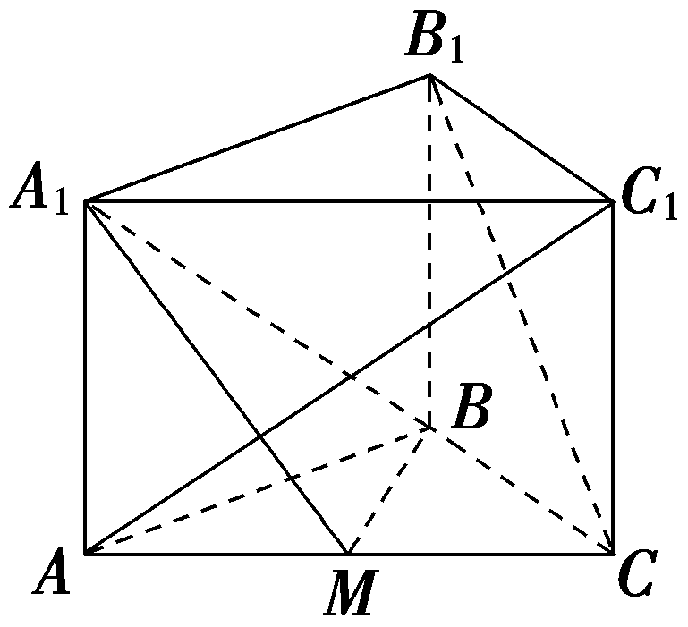

解：(1)证明：连接<em>AB</em>1，交<em>A</em>1<em>B</em>于点<em>O</em>，连接<em>OM</em>，如图.

因为在△<em>B</em>1<em>AC</em>中，<em>M</em>，<em>O</em>分别为<em>AC</em>，<em>AB</em>1的中点，所以<em>OM</em>∥<em>B</em>1<em>C</em>，

又因为<em>OM</em>⊂平面<em>A</em>1<em>BM</em>，<em>B</em>1<em>C</em>⊄平面<em>A</em>1<em>BM</em>，

所以<em>B</em>1<em>C</em>∥平面<em>A</em>1<em>BM</em>.

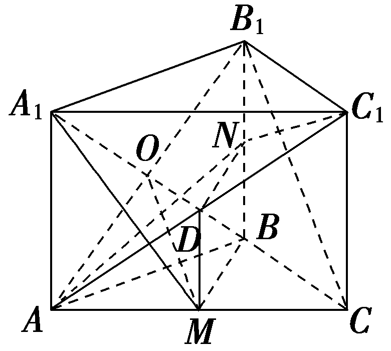

(2)证明：因为侧棱<em>AA</em>1⊥底面<em>ABC</em>，<em>BM</em>⊂平面<em>ABC</em>，所以<em>AA</em>1⊥<em>BM</em>，

又因为<em>M</em>为棱<em>AC</em>的中点，<em>AB</em>＝<em>BC</em>，所以<em>BM</em>⊥<em>AC</em>.因为<em>AA</em>1∩<em>AC</em>＝<em>A</em>，<em>AA</em>1，<em>AC</em>⊂平面<em>ACC</em>1<em>A</em>1，

所以<em>BM</em>⊥平面<em>ACC</em>1<em>A</em>1，

因为<em>AC</em>1⊂平面<em>ACC</em>1<em>A</em>1，所以<em>BM</em>⊥<em>AC</em>1.

易知<em>&lt;text style="italic"&gt;&lt;text style="italic"&gt;A</em>&lt;/text&gt;M&lt;/text&gt;＝&lt;text style="subscript"&gt;&lt;text style="subscript"&gt;&lt;text style="subscript"&gt;&lt;text style="subscript"&gt;1&lt;/text&gt;&lt;/text&gt;&lt;/text&gt;&lt;/text&gt;，又<em>AA</em>1＝ $\sqrt{2}$ ，所以在Rt△<em>&lt;text style="italic"&gt;&lt;text style="italic"&gt;A</em>&lt;/text&gt;<em>C</em>C&lt;/text&gt;&lt;text style="subscript"&gt;&lt;text style="subscript"&gt;&lt;text style="subscript"&gt;&lt;text style="subscript"&gt;1&lt;/text&gt;&lt;/text&gt;&lt;/text&gt;&lt;/text&gt;和Rt△A1<em>&lt;text style="italic"&gt;AM</em>&lt;/text&gt;中，tan∠<em>AC</em>1C＝tan∠A1<em>MA</em>＝ $\sqrt{2}$ ，

所以∠<em>AC</em>1<em>C</em>＝∠<em>A</em>1<em>MA</em>，

所以∠<em>AC</em>1<em>C</em>＋∠<em>C</em>1<em>AC</em>＝∠<em>A</em>1<em>MA</em>＋∠<em>C</em>1<em>AC</em>＝90°，所以<em>A</em>1<em>M</em>⊥<em>AC</em>1.

因为<em>BM</em>∩<em>A</em>1<em>M</em>＝<em>M</em>，<em>BM</em>，<em>A</em>1<em>M</em>⊂平面<em>A</em>1<em>BM</em>，

所以<em>AC</em>1⊥平面<em>A</em>1<em>BM</em>.

(3)存在，当点<em>N</em>为<em>BB</em>1的中点，即 $\frac{BN}{BB_{1}}$ ＝ $\frac{1}{2}$ 时，

平面<em>AC</em>1<em>N</em>⊥平面<em>AA</em>1<em>C</em>1<em>C</em>.

证明：取<em>BB</em>1的中点<em>N</em>，<em>AC</em>1的中点<em>D</em>，连接<em>AN</em>，<em>NC</em>1，<em>DM</em>，<em>DN</em>.

因为<em>D</em>，<em>M</em>分别为<em>&lt;text style="italic"&gt;AC</em>&lt;/text&gt;&lt;text style="subscript"&gt;&lt;text style="subscript"&gt;1&lt;/text&gt;&lt;/text&gt;，AC的中点，所以<em>&lt;text style="italic"&gt;DM</em>&lt;/text&gt;∥<em>&lt;text style="italic"&gt;CC</em>&lt;/text&gt;1，且DM＝ $\frac{1}{2}$ <em>&lt;text style="italic"&gt;CC</em>&lt;/text&gt;&lt;text style="subscript"&gt;&lt;text style="subscript"&gt;1&lt;/text&gt;&lt;/text&gt;.

又因为<em>N</em>为<em>BB</em>1的中点，所以<em>DM</em>∥<em>BN</em>，且<em>DM</em>＝<em>BN</em>，所以四边形<em>BNDM</em>为平行四边形，所以<em>BM</em>∥<em>DN</em>，

由(2)知<em>BM</em>⊥平面<em>AA</em>1<em>C</em>1<em>C</em>，

所以<em>DN</em>⊥平面<em>AA</em>1<em>C</em>1<em>C</em>.又因为<em>DN</em>⊂平面<em>AC</em>1<em>N</em>，

所以平面<em>AC</em>1<em>N</em>⊥平面<em>AA</em>1<em>C</em>1<em>C</em>.

1.三种垂直的综合问题，一般通过作辅助线进行线线、线面、面面垂直间的转化.

2.垂直与平行的结合问题，求解时应注意平行、垂直性质及判定的综合应用.

3.对于线面关系中的存在性问题，首先假设存在，然后在该假设条件下，利用线面关系的相关定理、性质进行推理论证.

对点练4.如图，*D*为圆锥的顶点，*O*是圆锥底面的圆心，*AE*为底面直径，*AE*＝*AD*，△*ABC*是底面圆的内接正三角形，且*DO*＝6，则在线段*DO*上是否存在一点*P*，使得*PA*⊥平面*PBC*？若存在，求出*PO*的值；若不存在，请说明理由.

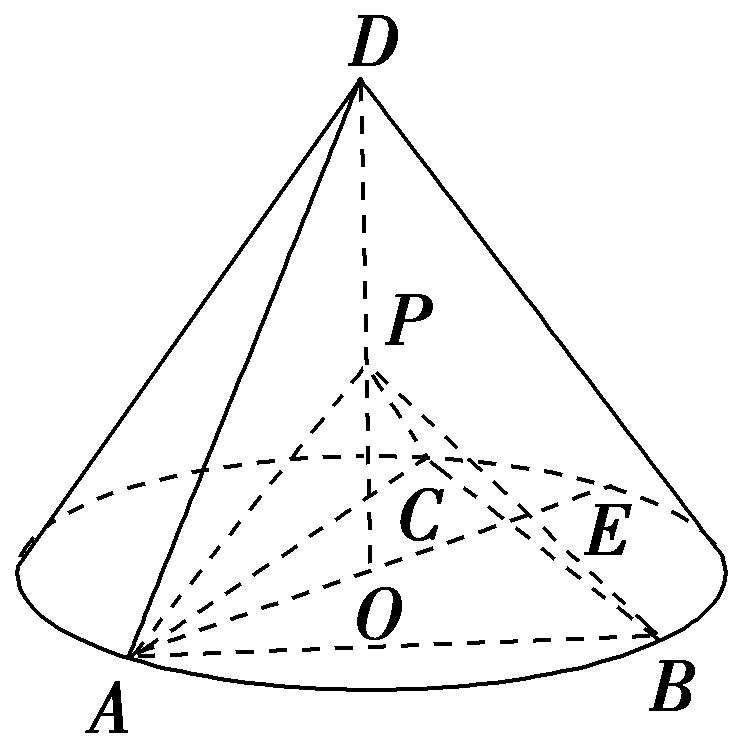

解：存在点<em>P</em>，使得<em>PA</em>⊥平面<em>PBC</em>.由题得<em>&lt;text style="italic"&gt;AO</em>&lt;/text&gt;＝ $\frac{1}{2}$ <em>&lt;text style="italic"&gt;AD</em>&lt;/text&gt;，因为AD&lt;text style="superscript"&gt;&lt;text style="superscript"&gt;2&lt;/text&gt;&lt;/text&gt;＝<em>DO</em>2＋<em>&lt;text style="italic"&gt;AO</em>&lt;/text&gt;2，

所以<em>&lt;text style="italic"&gt;AD</em>&lt;/text&gt;&lt;text style="superscript"&gt;2&lt;/text&gt;＝36＋ $\frac{1}{4}$ <em>&lt;text style="italic"&gt;AD</em>&lt;/text&gt;&lt;text style="superscript"&gt;2&lt;/text&gt;，

所以*AD*＝4 $\sqrt{3}$ ，所以*AO*＝2 $\sqrt{3}$ ，

因为△*ABC*是底面圆的内接正三角形，

所以 $\frac{AB}{sin60\circ }$ ＝2×2 $\sqrt{3}$ ，所以*AB*＝6，

由题得<em>PA</em>2＝<em>AO</em>2＋<em>PO</em>2＝12＋<em>PO</em>2.

假设*PA*⊥平面*PBC*，则*PA*⊥*PB*，

所以36＝12＋<em>PO</em>2＋12＋<em>PO</em>2，

所以*PO*＝ $\sqrt{6}$ .

此时<em>PC</em>2＝<em>PO</em>2＋<em>OC</em>2＝18，<em>PA</em>2＝18，所以<em>PA</em>2＋<em>PC</em>2＝<em>AC</em>2，所以<em>PA</em>⊥<em>PC</em>.又<em>PB</em>∩<em>PC</em>＝<em>P</em>，<em>PB</em>，<em>PC</em>⊂平面<em>PBC</em>，所以 <em>PA</em>⊥平面<em>PBC</em>.

故当*PO*＝ $\sqrt{6}$ 时，*PA*⊥平面*PBC*.

[真题再现]　(多选)(2021·新高考Ⅱ卷)如图，在下列各正方体中，*O*为下底面的中心，*M*，*N*为顶点，*P*为所在棱的中点，则满足*MN*⊥*OP*的是(　　)

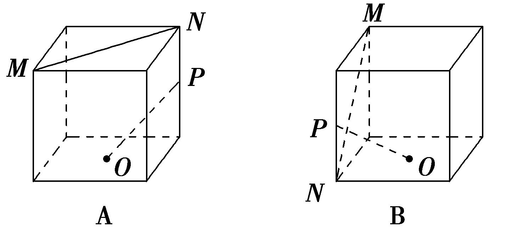

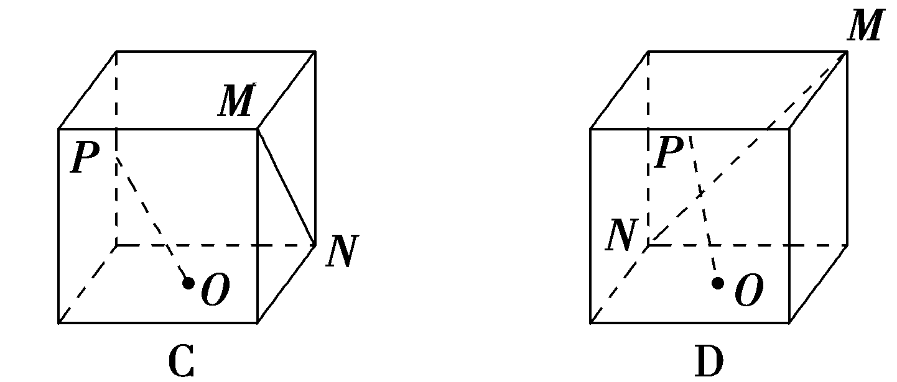

答案：**BC**

解析：设正方体的棱长为&lt;text style="superscript"&gt;&lt;text style="superscript"&gt;2&lt;/text&gt;&lt;/text&gt;，对于A，如图①所示，连接<em>&lt;text style="italic"&gt;&lt;text style="italic"&gt;&lt;text style="italic"&gt;&lt;text style="italic"&gt;&lt;text style="italic"&gt;AC</em>&lt;/text&gt;&lt;/text&gt;&lt;/text&gt;&lt;/text&gt;&lt;/text&gt;，则<em>&lt;text style="italic"&gt;&lt;text style="italic"&gt;&lt;text style="italic"&gt;M&lt;text style="italic"&gt;N</em>&lt;/text&gt;&lt;/text&gt;&lt;/text&gt;&lt;/text&gt;∥AC，故∠<em>P&lt;text style="italic"&gt;OC</em>&lt;/text&gt;(或其补角)为异面直线<em>&lt;text style="italic"&gt;&lt;text style="italic"&gt;&lt;text style="italic"&gt;&lt;text style="italic"&gt;&lt;text style="italic"&gt;OP</em>&lt;/text&gt;&lt;/text&gt;&lt;/text&gt;&lt;/text&gt;&lt;/text&gt;，<em>&lt;text style="italic"&gt;&lt;text style="italic"&gt;&lt;text style="italic"&gt;&lt;text style="italic"&gt;&lt;text style="italic"&gt;&lt;text style="italic"&gt;&lt;text style="italic"&gt;&lt;text style="italic"&gt;&lt;text style="italic"&gt;MN</em>&lt;/text&gt;&lt;/text&gt;&lt;/text&gt;&lt;/text&gt;&lt;/text&gt;&lt;/text&gt;&lt;/text&gt;&lt;/text&gt;&lt;/text&gt;所成的角，在直角三角形<em>O&lt;text style="italic"&gt;PC</em>&lt;/text&gt;中，OC＝ $\sqrt{2}$ ，<em>CP</em>＝1，故tan∠<em>P&lt;text style="italic"&gt;OC</em>&lt;/text&gt;＝ $\frac{1}{\sqrt{2}}$ ＝ $\frac{\sqrt{2}}{2}$ ，故<em>&lt;text style="italic"&gt;&lt;text style="italic"&gt;&lt;text style="italic"&gt;M&lt;text style="italic"&gt;N</em>&lt;/text&gt;&lt;/text&gt;&lt;/text&gt;&lt;/text&gt;⊥<em>&lt;text style="italic"&gt;&lt;text style="italic"&gt;&lt;text style="italic"&gt;&lt;text style="italic"&gt;&lt;text style="italic"&gt;OP</em>&lt;/text&gt;&lt;/text&gt;&lt;/text&gt;&lt;/text&gt;&lt;/text&gt;不成立，故A错误；对于B，如图②所示，取<em>&lt;text style="italic"&gt;&lt;text style="italic"&gt;&lt;text style="italic"&gt;NT</em>&lt;/text&gt;&lt;/text&gt;&lt;/text&gt;的中点为<em>&lt;text style="italic"&gt;&lt;text style="italic"&gt;Q</em>&lt;/text&gt;&lt;/text&gt;，连接<em>&lt;text style="italic"&gt;&lt;text style="italic"&gt;&lt;text style="italic"&gt;&lt;text style="italic"&gt;&lt;text style="italic"&gt;&lt;text style="italic"&gt;&lt;text style="italic"&gt;&lt;text style="italic"&gt;PQ</em>&lt;/text&gt;&lt;/text&gt;&lt;/text&gt;&lt;/text&gt;&lt;/text&gt;&lt;/text&gt;&lt;/text&gt;&lt;/text&gt;，<em>&lt;text style="italic"&gt;&lt;text style="italic"&gt;&lt;text style="italic"&gt;&lt;text style="italic"&gt;&lt;text style="italic"&gt;&lt;text style="italic"&gt;&lt;text style="italic"&gt;&lt;text style="italic"&gt;&lt;text style="italic"&gt;OQ</em>&lt;/text&gt;&lt;/text&gt;&lt;/text&gt;&lt;/text&gt;&lt;/text&gt;&lt;/text&gt;&lt;/text&gt;&lt;/text&gt;&lt;/text&gt;，则OQ⊥NT，PQ⊥<em>&lt;text style="italic"&gt;&lt;text style="italic"&gt;&lt;text style="italic"&gt;&lt;text style="italic"&gt;&lt;text style="italic"&gt;&lt;text style="italic"&gt;&lt;text style="italic"&gt;&lt;text style="italic"&gt;&lt;text style="italic"&gt;MN</em>&lt;/text&gt;&lt;/text&gt;&lt;/text&gt;&lt;/text&gt;&lt;/text&gt;&lt;/text&gt;&lt;/text&gt;&lt;/text&gt;&lt;/text&gt;，由正方体<em>SBCM</em>-<em>N&lt;text style="italic"&gt;AD</em>T&lt;/text&gt;可得<em>&lt;text style="italic"&gt;&lt;text style="italic"&gt;&lt;text style="italic"&gt;SN</em>&lt;/text&gt;&lt;/text&gt;&lt;/text&gt;⊥平面<em>&lt;text style="italic"&gt;ANTD</em>&lt;/text&gt;，而OQ⊂平面ANTD，故SN⊥OQ，而SN∩NT＝N，SN，NT⊂平面<em>&lt;text style="italic"&gt;&lt;text style="italic"&gt;SNTM</em>&lt;/text&gt;&lt;/text&gt;，故OQ⊥平面SNTM，又MN⊂平面SNTM，OQ⊥MN，而OQ∩PQ＝Q，OQ，PQ⊂平面<em>&lt;text style="italic"&gt;&lt;text style="italic"&gt;OPQ</em>&lt;/text&gt;&lt;/text&gt;，所以MN⊥平面OPQ，而<em>&lt;text style="italic"&gt;&lt;text style="italic"&gt;&lt;text style="italic"&gt;PO</em>&lt;/text&gt;&lt;/text&gt;&lt;/text&gt;⊂平面OPQ，故MN⊥OP，故B正确；对于C，如图③所示，连接<em>&lt;text style="italic"&gt;&lt;text style="italic"&gt;BD</em>&lt;/text&gt;&lt;/text&gt;，则BD∥MN，由B的判断可得OP⊥BD，故OP⊥MN，故C正确；对于D，如图④所示，取AD的中点Q，<em>AB</em>的中点<em>K</em>，连接<em>&lt;text style="italic"&gt;&lt;text style="italic"&gt;&lt;text style="italic"&gt;&lt;text style="italic"&gt;&lt;text style="italic"&gt;AC</em>&lt;/text&gt;&lt;/text&gt;&lt;/text&gt;&lt;/text&gt;&lt;/text&gt;，PQ，OQ，<em>PK</em>，<em>OK</em>，则AC∥MN，因为<em>DP</em>＝<em>PC</em>，故PQ∥AC，故PQ∥MN，所以∠<em>&lt;text style="italic"&gt;QPO</em>&lt;/text&gt;或其补角为异面直线PO，MN所成的角，因为正方体的棱长为&lt;text style="superscript"&gt;&lt;text style="superscript"&gt;2&lt;/text&gt;&lt;/text&gt;，故PQ＝ $\frac{1}{2}$ <em>&lt;text style="italic"&gt;&lt;text style="italic"&gt;&lt;text style="italic"&gt;&lt;text style="italic"&gt;&lt;text style="italic"&gt;AC</em>&lt;/text&gt;&lt;/text&gt;&lt;/text&gt;&lt;/text&gt;&lt;/text&gt;＝ $\sqrt{2}$ ，O<em>&lt;text style="italic"&gt;&lt;text style="italic"&gt;Q</em>&lt;/text&gt;&lt;/text&gt;＝ $\sqrt{AO^{2}＋AQ^{2}}$ ＝ $\sqrt{2+1}$ ＝ $\sqrt{3}$ ，<em>&lt;text style="italic"&gt;&lt;text style="italic"&gt;&lt;text style="italic"&gt;PO</em>&lt;/text&gt;&lt;/text&gt;&lt;/text&gt;＝ $\sqrt{PK^{2}＋OK^{2}}$ ＝ $\sqrt{4+1}$ ＝ $\sqrt{5}$ ，<em>&lt;text style="italic"&gt;&lt;text style="italic"&gt;Q</em>&lt;/text&gt;&lt;/text&gt;O&lt;text style="superscript"&gt;&lt;text style="superscript"&gt;2&lt;/text&gt;&lt;/text&gt;＜<em>&lt;text style="italic"&gt;&lt;text style="italic"&gt;&lt;text style="italic"&gt;&lt;text style="italic"&gt;&lt;text style="italic"&gt;&lt;text style="italic"&gt;&lt;text style="italic"&gt;&lt;text style="italic"&gt;PQ</em>&lt;/text&gt;&lt;/text&gt;&lt;/text&gt;&lt;/text&gt;&lt;/text&gt;&lt;/text&gt;&lt;/text&gt;&lt;/text&gt;2＋<em>&lt;text style="italic"&gt;&lt;text style="italic"&gt;&lt;text style="italic"&gt;&lt;text style="italic"&gt;&lt;text style="italic"&gt;OP</em>&lt;/text&gt;&lt;/text&gt;&lt;/text&gt;&lt;/text&gt;&lt;/text&gt;2，故∠Q<em>&lt;text style="italic"&gt;&lt;text style="italic"&gt;&lt;text style="italic"&gt;PO</em>&lt;/text&gt;&lt;/text&gt;&lt;/text&gt;不是直角，故PO，<em>&lt;text style="italic"&gt;&lt;text style="italic"&gt;&lt;text style="italic"&gt;M&lt;text style="italic"&gt;N</em>&lt;/text&gt;&lt;/text&gt;&lt;/text&gt;&lt;/text&gt;不垂直，故D错误.故选BC.

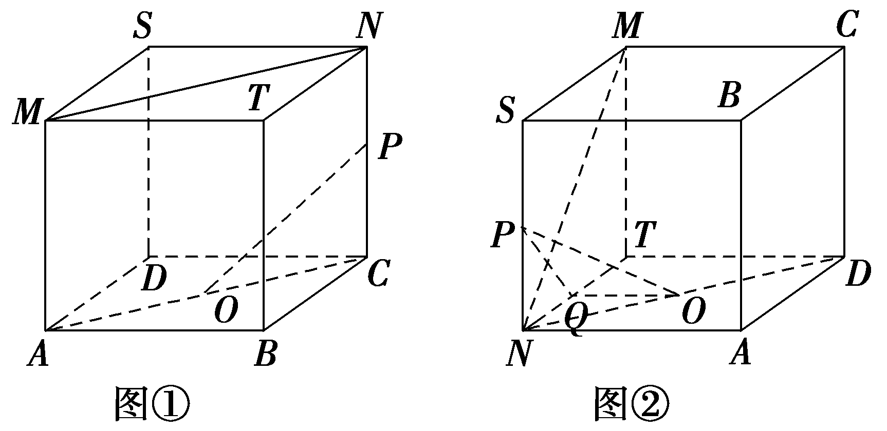

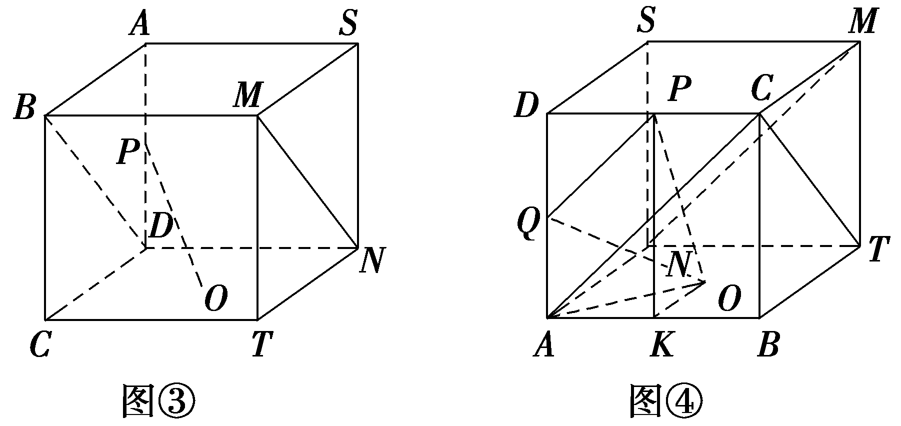

[教材呈现]　(人教A必修二P147例2)如图，在正方体<em>ABCD</em>-<em>A</em>1<em>B</em>1<em>C</em>1<em>D</em>1中，<em>O</em>1为底面<em>A</em>1<em>B</em>1<em>C</em>1<em>D</em>1的中心.求证<em>AO</em>1⊥<em>BD</em>.

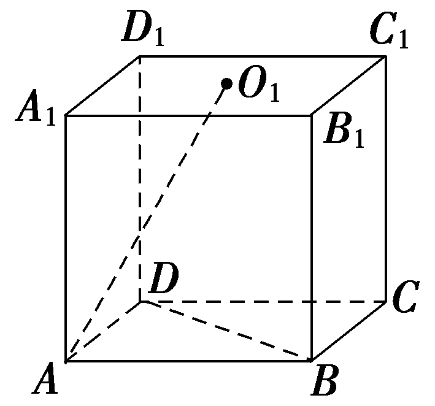

点评：高考题和教材例题类似，考查角度都是证明线线垂直，其方法都是通过线面垂直或利用空间向量解决问题.

**课时测评**60　**空间直线、平面的垂直** $\frac{对应学生}{用书P429}$

(时间：60分钟　满分：88分)

(本栏目内容，在学生用书中以独立形式分册装订！)

(1—8题，每小题5分，共40分)

1.(2025·河北邯郸第四次调研)已知*α*，*β*是两个平面，*m*，*n*是两条直线，且*α*⊥*β*，*m*⊂*α*，*n*⊂*β*，则“*m*⊥*n*”是“*m*⊥*β*”的(　　)

A. 必要不充分条件

B. 充分不必要条件

C. 充要条件

D. 既不充分也不必要条件

答案：**A**

解析：如图所示，当*m*⊥*n*时，显然*m*与平面*β*不垂直，反之，当*m*⊥*β*时，又*n*⊂*β*，根据线面垂直的性质有*m*⊥*n*，所以“*m*⊥*n*”是“*m*⊥*β*”的必要不充分条件.故选A.

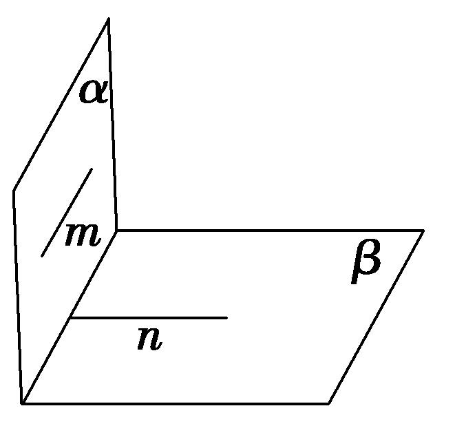

2. (2024·湖北武汉四调)设*m*，*n*是两条不同的直线，*α*，*β*是两个不同的平面，则下列命题中正确的是(　　)

A.若*α*⊥*β*，*m*∥*α*，则*m*⊥*β*

B.若*α*⊥*β*，*m*⊂*α*，则*m*⊥*β*

C.若*m*∥*α*，*n*⊥*α*，则*m*⊥*n*

D.若*m*⊥*n*，*m*∥*α*，则*n*⊥*α*

答案：**C**

解析：如图所示为正方体<em>ABCD</em>-<em>A</em>1<em>B</em>1<em>C</em>1<em>D</em>1，对于A，设平面<em>α</em>为平面<em>ABCD</em>，平面<em>β</em>为平面<em>BCC</em>1<em>B</em>1，<em>m</em>为<em>B</em>1<em>C</em>1，则<em>α</em>⊥<em>β</em>，<em>m</em>∥<em>α</em>，则<em>m</em>⊂<em>β</em>，故A错误；对于B，设平面<em>α</em>为平面<em>ABCD</em>，平面<em>β</em>为平面<em>BCC</em>1<em>B</em>1，<em>m</em>为<em>AD</em>，则<em>α</em>⊥<em>β</em>，<em>m</em>⊂<em>α</em>，则<em>m</em>∥<em>β</em>，故B错误；对于C，过<em>m</em>作平面<em>γ</em>与平面<em>α</em>交于直线<em>b</em>，<em>m</em>∥<em>α</em>，则<em>m</em>∥<em>b</em>，<em>n</em>⊥<em>α</em>，可得<em>n</em>⊥<em>b</em>，则<em>m</em>⊥<em>n</em>，故C正确；对于D，设平面<em>α</em>为平面<em>ABCD</em>， <em>A</em>1<em>B</em>1为<em>m</em>， <em>B</em>1<em>C</em>1为<em>n</em>，则<em>m</em>⊥<em>n</em>，<em>m</em>∥<em>α</em>，则<em>n</em>∥<em>α</em>，故D错误.故选C.

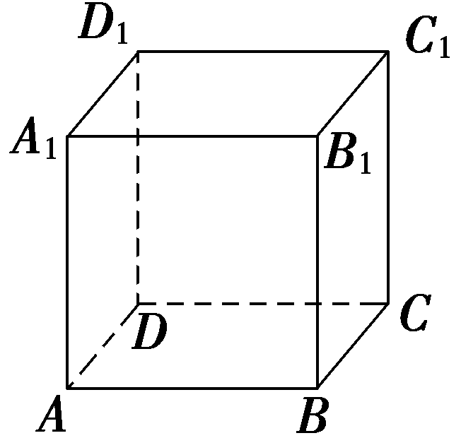

3.(2024·全国甲卷)设*α*，*β*为两个平面，*m*，*n*为两条直线，且*α*∩*β*＝*m*，下述四个命题：

①若*m*∥*n*，则*n*∥*α*或*n*∥*β*

②若*m*⊥*n*，则*n*⊥*α*或*n*⊥*β*

③若*n*∥*α*且*n*∥*β*，则*m*∥*n*

④若*n*与*α*，*β*所成的角相等，则*m*⊥*n*

其中所有真命题的编号是(　　)

A.①③	B.②④

C.①②③	D.①③④

答案：**A**

解析：*<text style="italic"><text style="italic"><text style="italic"><text style="italic">α*</text></text></text></text>∩*<text style="italic"><text style="italic"><text style="italic"><text style="italic">β*</text></text></text></text>＝*<text style="italic"><text style="italic"><text style="italic"><text style="italic"><text style="italic"><text style="italic">m*</text></text></text></text></text></text>，则m⊂α，m⊂β，对于①，若m∥*<text style="italic"><text style="italic"><text style="italic"><text style="italic"><text style="italic"><text style="italic"><text style="italic"><text style="italic">n*</text></text></text></text></text></text></text></text>，则n∥α或n∥β，故①正确；对于②，若m⊥n，则可能n与α，β均不垂直，故②错误；对于③，若n∥α且n∥β，则m∥n，故③正确；对于④，n与m所成角可以为［0， $\frac{\pi }{2}$ ］内的任意角，故④错误.故选A.

4.如图，在四面体*D* -*ABC*中，若*AB*＝*CB*，*AD*＝*CD*，*E*是*AC*的中点，则下列结论正确的是(　　)

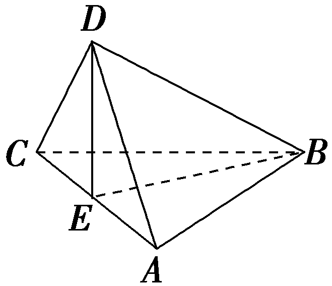

A.平面*ABC*⊥平面*ABD*

B.平面*ABD*⊥平面*BDC*

C.平面*ABC*⊥平面*BDE*，且平面*ADC*⊥平面*BDE*

D.平面*ABC*⊥平面*ADC*，且平面*ADC*⊥平面*BDE*

答案：**C**

解析：因为*AB*＝*CB*，且*E*是*AC*的中点，所以*BE*⊥*AC*，同理有*DE*⊥*AC*，于是*AC*⊥平面*BDE*.因为*AC*⊂平面*ABC*，所以平面*ABC*⊥平面*BDE*.又由于*AC*⊂平面*ADC*，所以平面*ADC*⊥平面*BDE*.故选C.

5.(多选)在三棱锥*P*-*ABC*中，*PA*＝*PB*＝*PC*，*D*，*E*，*M*分别为*AC*，*PC*，*BC*的中点，则以下结论一定成立的是(　　)

A.*PA*∥平面*BDE*

B.若*PA*⊥*BC*，则*AB*＝*AC*

C.若∠*BAC*＝90°，则平面*PBC*⊥平面*PAM*

D.点*P*在平面*ABC*上的射影是△*ABC*的外心

答案：**ABD**

解析：对于A，因为*D*，*E*分别为*AC*，*PC*的中点，所以*PA*∥*DE*，又*PA*⊄平面*BDE*，*DE*⊂平面*BDE*，所以*PA*∥平面*BDE*，故A正确；对于B，因为*BC*的中点为*M*，*PB*＝*PC*，所以*PM*⊥*BC*，又*PA*⊥*BC*，*PA*∩*PM*＝*P*，*PA*，*PM*⊂平面*PAM*，所以*BC*⊥平面*PAM*，又因为*AM*⊂平面*PAM*，所以*BC*⊥*AM*，则*AB*＝*AC*，故B正确；对于C，∠*BAC*＝90°，则*MA*＝*MB*＝*MC*，又*PA*＝*PB*＝*PC*，则△*PMA*≌△*PMB*≌△*PMC*，则∠*PMA*＝∠*PMB*＝∠*PMC*＝90°，故*PM*⊥*AM*，若平面*PAM*⊥平面*PBC*，因为平面*PAM*∩平面*PBC*＝*PM*，*AM*⊂平面*PAM*，所以*AM*⊥平面*PBC*，又*BC*⊂平面*PBC*，所以*AM*⊥*BC*，又*M*为*BC*的中点，则*AB*＝*AC*，不一定成立，故C不一定成立；对于D，由*PA*＝*PB*＝*PC*可知，点*P*在平面*ABC*上的射影是△*ABC*的外心，故D正确.故选ABD.

6.(多选)如图，在三棱锥*V*-*ABC*中，*VO*⊥平面*ABC*，*O*∈*CD*，*VA*＝*VB*，*AD*＝*BD*，则下列结论中一定成立的是(　　)

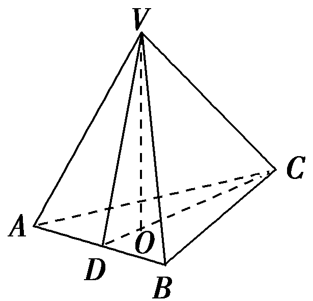

A.*AC*＝*BC*

B.*AB*⊥*VC*

C.*VC*⊥*VD*

D.<em>S</em>△<em>VCD</em>·<em>AB</em>＝<em>S</em>△<em>ABC</em>·<em>VO</em>

答案：**ABD**

解析：因为<em>&lt;text style="italic"&gt;&lt;text style="italic"&gt;&lt;text style="italic"&gt;V</em>O&lt;/text&gt;&lt;/text&gt;&lt;/text&gt;⊥平面<em>&lt;text style="italic"&gt;&lt;text style="italic"&gt;&lt;text style="italic"&gt;&lt;text style="italic"&gt;&lt;text style="italic"&gt;&lt;text style="italic"&gt;AB</em>&lt;/text&gt;&lt;/text&gt;&lt;/text&gt;&lt;/text&gt;&lt;/text&gt;C&lt;/text&gt;，AB⊂平面<em>A&lt;text style="italic"&gt;BC</em>&lt;/text&gt;，所以<em>VO</em>⊥AB.因为<em>VA</em>＝<em>VB</em>，<em>&lt;text style="italic"&gt;AD</em>&lt;/text&gt;＝<em>&lt;text style="italic"&gt;BD</em>&lt;/text&gt;，所以<em>&lt;text style="italic"&gt;&lt;text style="italic"&gt;&lt;text style="italic"&gt;VD</em>&lt;/text&gt;&lt;/text&gt;&lt;/text&gt;⊥AB.又因为VO∩VD＝V，VO，VD⊂平面<em>&lt;text style="italic"&gt;V&lt;text style="italic"&gt;&lt;text style="italic"&gt;CD</em>&lt;/text&gt;&lt;/text&gt;&lt;/text&gt;，所以AB⊥平面<em>&lt;text style="italic"&gt;&lt;text style="italic"&gt;&lt;text style="italic"&gt;VC</em>&lt;/text&gt;&lt;/text&gt;D&lt;/text&gt;.又因为CD⊂平面<em>&lt;text style="italic,subscript"&gt;&lt;text style="italic,subscript"&gt;VCD</em>&lt;/text&gt;&lt;/text&gt;，所以AB⊥CD.又因为AD＝BD，所以<em>AC</em>＝BC，故A正确；因为VC⊂平面VCD，所以AB⊥VC，故B正确；因为<em>&lt;text style="italic"&gt;&lt;text style="italic"&gt;&lt;text style="italic"&gt;S</em>&lt;/text&gt;&lt;/text&gt;&lt;/text&gt;&lt;text style="subscript"&gt;&lt;text style="subscript"&gt;&lt;text style="subscript"&gt;△&lt;/text&gt;&lt;/text&gt;&lt;/text&gt;VCD＝ $\frac{1}{2}$ <em>&lt;text style="italic"&gt;&lt;text style="italic"&gt;&lt;text style="italic"&gt;V</em>O&lt;/text&gt;&lt;/text&gt;&lt;/text&gt;·<em>&lt;text style="italic"&gt;CD</em>&lt;/text&gt;，<em>&lt;text style="italic"&gt;&lt;text style="italic"&gt;&lt;text style="italic"&gt;S</em>&lt;/text&gt;&lt;/text&gt;&lt;/text&gt;&lt;text style="subscript"&gt;&lt;text style="subscript"&gt;&lt;text style="subscript"&gt;△&lt;/text&gt;&lt;/text&gt;&lt;/text&gt;<em>&lt;text style="italic"&gt;&lt;text style="italic"&gt;&lt;text style="italic"&gt;&lt;text style="italic"&gt;&lt;text style="italic"&gt;&lt;text style="italic"&gt;AB</em>&lt;/text&gt;&lt;/text&gt;&lt;/text&gt;&lt;/text&gt;&lt;/text&gt;C&lt;/text&gt;＝ $\frac{1}{2}$ <em>&lt;text style="italic"&gt;&lt;text style="italic"&gt;&lt;text style="italic"&gt;&lt;text style="italic"&gt;&lt;text style="italic"&gt;AB</em>&lt;/text&gt;&lt;/text&gt;&lt;/text&gt;&lt;/text&gt;&lt;/text&gt;·<em>&lt;text style="italic"&gt;CD</em>&lt;/text&gt;，所以<em>&lt;text style="italic"&gt;&lt;text style="italic"&gt;&lt;text style="italic"&gt;S</em>&lt;/text&gt;&lt;/text&gt;&lt;/text&gt;&lt;text style="subscript"&gt;&lt;text style="subscript"&gt;&lt;text style="subscript"&gt;△&lt;/text&gt;&lt;/text&gt;&lt;/text&gt;<em>V</em>CD<em>·AB</em>＝S△<em>&lt;text style="italic"&gt;A&lt;text style="italic"&gt;BC</em>&lt;/text&gt;&lt;/text&gt;·<em>&lt;text style="italic"&gt;&lt;text style="italic"&gt;&lt;text style="italic"&gt;VO</em>&lt;/text&gt;&lt;/text&gt;&lt;/text&gt;，故D正确.由题中条件无法判断<em>&lt;text style="italic"&gt;&lt;text style="italic"&gt;VC</em>&lt;/text&gt;&lt;/text&gt;⊥<em>&lt;text style="italic"&gt;&lt;text style="italic"&gt;&lt;text style="italic"&gt;VD</em>&lt;/text&gt;&lt;/text&gt;&lt;/text&gt;.故选A<em>&lt;text style="italic"&gt;BD</em>&lt;/text&gt;.

7.如图，在三棱锥<em>P</em>-<em>ABC</em>中，平面<em>PAB</em>⊥平面<em>PBC</em>，若<em>PB</em>⊥<em>BC</em>，则△<em>ABC</em>的形状为<u>　　　　　　</u>.

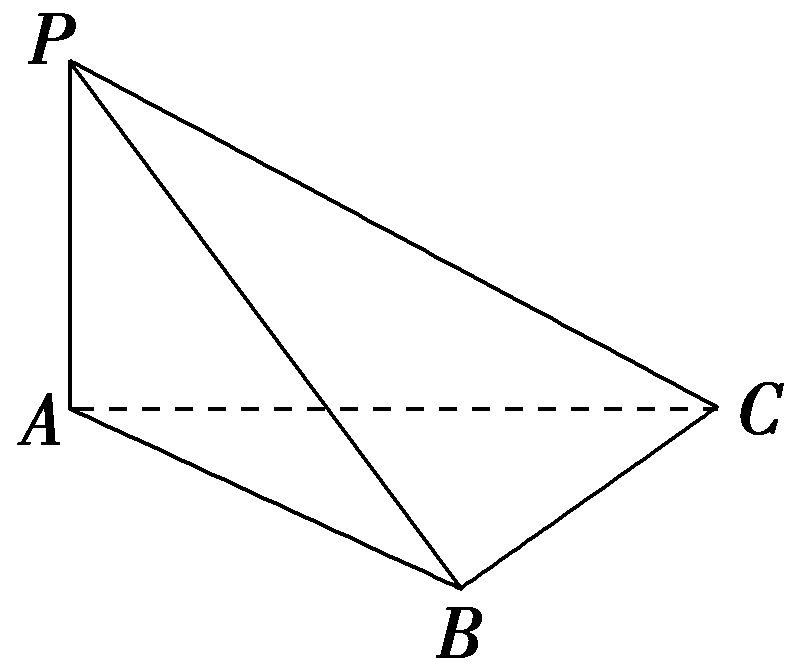

答案：直角三角形

解析：因为平面*PAB*⊥平面*PBC*，平面*PAB*∩平面*PBC*＝*PB*，*PB*⊥*BC*，*BC*⊂平面*PBC*，所以*BC*⊥平面*PAB*，所以*BC*⊥*AB*，所以△*ABC*为直角三角形.

8.(开放题)如图所示，在四棱锥*P*-*ABCD*中，*PA*⊥底面*ABCD*，且底面各边都相等，*M*是*PC*上的一动点，当点*M*满足条件：①*BM*⊥*DM*，②*DM*⊥*PC*，③*BM*⊥*PC*中的

<u>　　　</u>时，平面<em>MBD</em>⊥平面<em>PCD</em>(只要填写一个你认为是正确的条件序号即可).

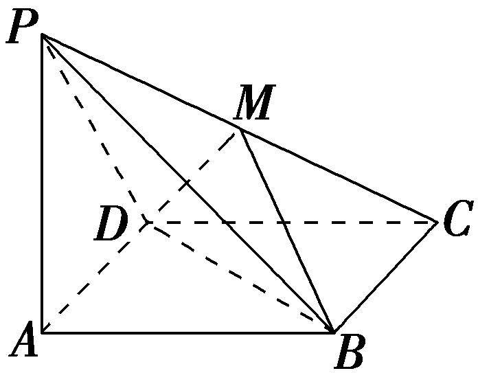

答案：②(或③)

解析：连接*AC*(图略)，因为*PA*⊥底面*ABCD*，所以*PA*⊥*BD*.因为底面各边都相等，所以*AC*⊥*BD*.因为*PA*∩*AC*＝*A*，所以*BD*⊥平面*PAC*，所以*BD*⊥*PC*.当*DM*⊥*PC*(或*BM*⊥*PC*)时，即有*PC*⊥平面*MBD*，而*PC*⊂平面*PCD*，所以平面*MBD*⊥平面*PCD*.

9.(13分)(2022·全国乙卷)如图，四面体*ABCD* 中，*AD*⊥*CD*，*AD*＝*CD*，∠*ADB*＝∠*BDC*，*E* 为*AC* 的中点.

(1)证明：平面*BED*⊥平面*ACD*；(5分)

(2)设*AB*＝*BD*＝2，∠*ACB*＝60°，点*F* 在*BD* 上，当△*AFC* 的面积最小时，求三棱锥*F*-*ABC* 的体积.(8分)

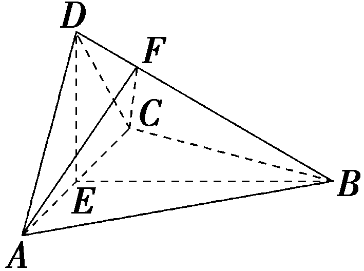

解：(1)证明：由于*AD*＝*CD*，*E* 是*AC* 的中点，

所以*AC*⊥*DE*.

因为 $\left\{\begin{matrix}AD＝CD，\\BD＝BD，\\\angle ADB＝\angle CDB，\end{matrix}\right.$  所以△*ADB*≌△*CDB*，

所以*AB*＝*CB*，故*AC*⊥*BE*，

又*DE*∩*BE*＝*E*，*DE*，*BE*⊂平面*BED*，

所以*AC*⊥平面*BED*，

因为*AC*⊂平面*ACD*，所以平面*BED*⊥平面*ACD*.

(2)依题意*AB*＝*BD*＝*BC*＝2，∠*ACB*＝60°，△*ABC* 是等边三角形，

所以*AC*＝2，*AE*＝*CE*＝1，*BE*＝ $\sqrt{3}$ ，

由于*AD*＝*CD*，*AD*⊥*CD*，

所以△*ACD* 是等腰直角三角形，所以*DE*＝1.

<em>DE</em>2＋<em>BE</em>2＝<em>BD</em>2，所以<em>DE</em>⊥<em>BE</em>.

由于*AC*∩*BE*＝*E*，*AC*，*BE*⊂平面*ABC*，

所以*DE*⊥平面*ABC*.

由于△*ADB*≌△*CDB*，所以∠*FBA*＝∠*FBC*，

因为 $\left\{\begin{matrix}BF＝BF，\\\angle FBA＝\angle FBC，\\AB＝CB，\end{matrix}\right.$  所以△*FBA*≌△*FBC*，

所以*AF*＝*CF*，所以*EF*⊥*AC*，

由于 $S_{\bigtriangleup }_{AFC}$ ＝ $\frac{1}{2}$ *·AC·EF*，

所以当*EF* 最短时，△*AFC* 的面积取得最小值.

过*E*作*EF*⊥*BD*，垂足为*F*，

在Rt△*BED* 中， $\frac{1}{2}$ *·BE·DE*＝ $\frac{1}{2}$ *·BD·EF*，

解得*EF*＝ $\frac{\sqrt{3}}{2}$ ，所以*<text style="italic">DF*</text>＝ $\sqrt{1^{2}－\left(\frac{\sqrt{3}}{2}\right)^{2}}$ ＝ $\frac{1}{2}$ ，*BF*＝2－*<text style="italic">DF*</text>＝ $\frac{3}{2}$ ，

所以 $\frac{BF}{BD}$ ＝ $\frac{3}{4}$ .

过*F*作*FH*⊥*BE*，垂足为*H*，则*FH*∥*DE*，

所以*FH*⊥平面*ABC*，且 $\frac{FH}{DE}$ ＝ $\frac{BF}{BD}$ ＝ $\frac{3}{4}$ ，

所以<em>&lt;text style="italic,subscript"&gt;F</em>H&lt;/text&gt;＝ $\frac{3}{4}$ ，所以<em>VF</em>-<em>ABC</em>＝ $\frac{1}{3}$ <em>·</em> $S_{\bigtriangleup }_{ABC}$ <em>·&lt;text style="italic,subscript"&gt;F</em>H&lt;/text&gt;＝ $\frac{1}{3}$ × $\frac{1}{2}$ ×2× $\sqrt{3}$ × $\frac{3}{4}$ ＝ $\frac{\sqrt{3}}{4}$ .

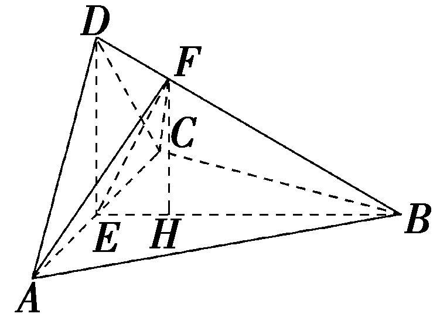

(10、11题，每小题5分，共10分)

10.(多选)如图所示，在四棱锥*S* -*ABCD*中，四边形*ABCD*为正方形，*SC*＝*SD*＝*CD*＝1，*E*为线段*SD*的中点，*F*为*AC*与*BD*的交点，*AD*⊥*SD*.则下列结论正确的是(　　)

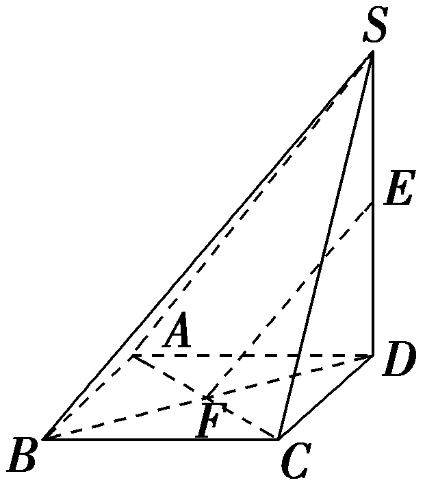

A.*BC*⊥平面*SCD*

B.*EF*∥平面*SAB*

C.平面*SCD*⊥平面*ABCD*

D.线段*BE*的长度等于线段*SF*的长度

答案：**ABC**

解析：因为四边形*A<text style="italic"><text style="italic"><text style="italic"><text style="italic"><text style="italic"><text style="italic">BC*</text></text></text></text></text>*D*</text>是正方形，所以BC⊥*<text style="italic"><text style="italic">CD*</text></text>.又因为*AD*⊥*<text style="italic"><text style="italic"><text style="italic"><text style="italic">SD*</text></text></text></text>，所以BC⊥SD，CD∩SD＝D，CD，SD⊂平面*<text style="italic"><text style="italic"><text style="italic"><text style="italic">SC*D</text></text></text></text>，所以BC⊥平面SCD，故A正确；因为BC⊂平面*<text style="italic"><text style="italic">ABCD*</text></text>，所以平面SCD⊥平面ABCD，故C正确；因为*F*是*<text style="italic"><text style="italic"><text style="italic">BD*</text></text></text>的中点，*E*为SD的中点，所以*<text style="italic"><text style="italic">EF*</text></text>∥*<text style="italic">SB*</text>，又因为SB⊂平面*<text style="italic"><text style="italic">SAB*</text></text>，EF⊄平面SAB，所以EF∥平面SAB，故B正确；因为△*C<text style="italic"><text style="italic"><text style="italic">DS*</text></text></text>是边长为1的正三角形，四边形ABCD是正方形，所以DS＝1，BD＝ $\sqrt{2}$ .又由*<text style="italic"><text style="italic"><text style="italic"><text style="italic"><text style="italic">BC*</text></text></text></text></text>⊥平面S*<text style="italic">C<text style="italic">D*</text></text>，得BC⊥*SC*，所以*<text style="italic">BS*</text>＝ $\sqrt{2}$ .在△B*D*S中，*<text style="italic">BS*</text>＝*<text style="italic"><text style="italic"><text style="italic">BD*</text></text></text>＝ $\sqrt{2}$ ，*D*S＝1，又B*E*，S*F*分别是等腰三角形*<text style="italic"><text style="italic"><text style="italic">BD*</text></text></text>S的底边*<text style="italic"><text style="italic">DS*</text></text>和腰BD上的中线，所以线段*<text style="italic">BE*</text>与*<text style="italic">SF*</text>的长度不相等(否则△*<text style="italic"><text style="italic">BDS*</text></text>是正三角形)，因此D不正确.故选A*<text style="italic"><text style="italic"><text style="italic"><text style="italic"><text style="italic">BC*</text></text></text></text></text>.

11.在矩形*ABCD*中，*AB*＜*BC*，现将△*ABD*沿矩形的对角线*BD*所在的直线进行翻折，在翻折的过程中，给出下列结论：

①存在某个位置，使得直线*AC*与直线*BD*垂直；

②存在某个位置，使得直线*AB*与直线*CD*垂直；

③存在某个位置，使得直线*AD*与直线*BC*垂直.

其中正确结论的序号是<u>　　　　</u>.

答案：②

解析：对于①，假设*<text style="italic">A*C</text>与*<text style="italic"><text style="italic"><text style="italic"><text style="italic">B<text style="italic"><text style="italic">D*</text></text></text></text></text></text>垂直，过点A作*A<text style="italic">E*</text>⊥BD于点E，连接*<text style="italic"><text style="italic">CE*</text></text>，如图所示.*AE*，*<text style="italic"><text style="italic"><text style="italic">AC*</text></text></text>⊂平面*<text style="italic">AEC*</text>，则 $\left.\begin{matrix}AE\perp BD\\BD\perp AC\end{matrix}\right\}$ ⇒*<text style="italic"><text style="italic"><text style="italic"><text style="italic">B<text style="italic"><text style="italic">D*</text></text></text></text></text></text>⊥平面*AE*C，则BD⊥*<text style="italic"><text style="italic">CE*</text></text>，而在平面*B<text style="italic"><text style="italic"><text style="italic"><text style="italic"><text style="italic">CD*</text></text></text></text></text>中，CE与BD不垂直，故假设不成立，①不正确；对于②，假设*<text style="italic"><text style="italic"><text style="italic"><text style="italic"><text style="italic"><text style="italic"><text style="italic">AB*</text></text></text></text></text></text></text>⊥CD，因为AB⊥*<text style="italic"><text style="italic"><text style="italic"><text style="italic">AD*</text></text></text></text>，CD∩AD＝D，CD，AD⊂平面*<text style="italic"><text style="italic"><text style="italic"><text style="italic">AC*</text></text></text></text>D，所以AB⊥平面*<text style="italic"><text style="italic">ACD*</text></text>，所以AB⊥AC，由AB＜*<text style="italic"><text style="italic"><text style="italic"><text style="italic"><text style="italic">BC*</text></text></text></text></text>可知，存在这样的直角三角形，使AB⊥AC，故假设成立，②正确；对于③，假设AD⊥BC，因为CD⊥BC，AD∩CD＝D，所以BC⊥平面ACD，所以BC⊥AC，即△*ABC*为直角三角形，且AB为斜边，而AB＜BC，故矛盾，假设不成立，故③不正确.

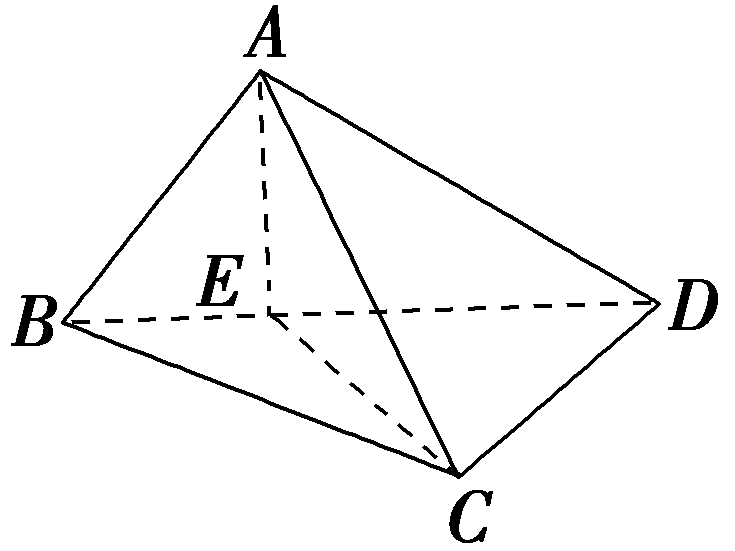

12.(15分)如图，四边形*<text style="italic"><text style="italic">PD*CE</text></text>为矩形，四边形*<text style="italic"><text style="italic">ABCD*</text></text>为梯形，平面PDCE⊥平面ABCD，∠*B<text style="italic">AD*</text>＝∠*ADC*＝90°，AB＝AD＝ $\frac{1}{2}$ *CD*＝1，*PD*＝ $\sqrt{2}$ .

(1)若*M*为*PA*的中点，求证：*AC*∥平面*MDE*；(4分)

(2)求直线*PB*与直线*CD*所成角的大小；(5分)

(3)设平面*PAD*∩平面*EBC*＝*l*，试判断*l*与平面*ABCD*能否垂直？并证明你的结论.(6分)

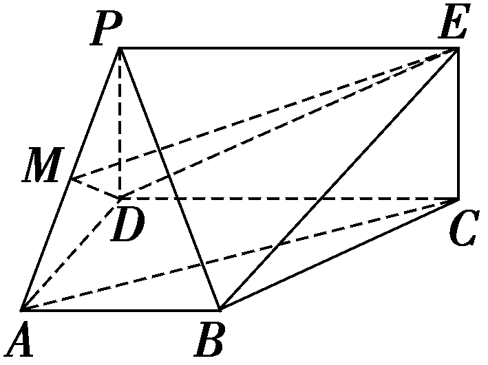

解：(1)证明：连接*PC*，交*DE*于点*N*，连接*MN*，

因为四边形*PDCE*为矩形，所以*N*为*PC*的中点，

在△*PAC*中，*M*，*N*分别为*PA*，*PC*的中点，所以*MN*∥*AC*，

因为*MN*⊂平面*MDE*，*AC*⊄平面*MDE*，

所以*AC*∥平面*MDE*.

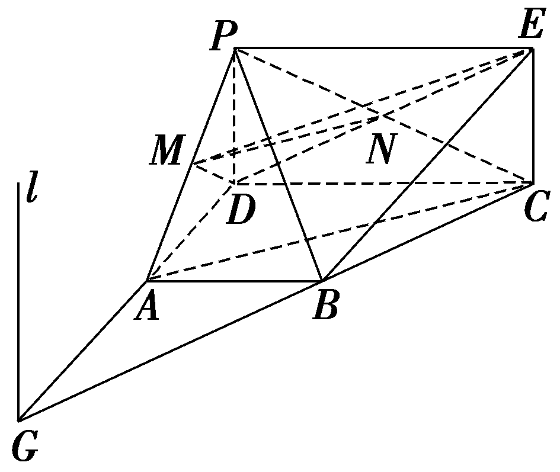

(2)因为∠*BAD*＝∠*ADC*＝90°，所以*AB*∥*CD*，

所以∠*PBA*(或其补角)是直线*PB*与直线*CD*所成的角.

因为四边形*PDCE*为矩形，所以*PD*⊥*CD*，

因为平面*PDCE*⊥平面*ABCD*，

又*PD*⊂平面*PDCE*，平面*PDCE*∩平面*ABCD*＝*CD*，所以*PD*⊥平面*ABCD*，

因为*AD*，*AB*⊂平面*ABCD*，

所以*PD*⊥*AD*，*PD*⊥*AB*，

在Rt△*<text style="italic">PD*A</text>中，因为*AD*＝1，PD＝ $\sqrt{2}$ ，

所以*PA*＝ $\sqrt{3}$ ，

因为∠*BAD*＝90°，所以*AB*⊥*AD*，

又因为*PD*⊥*AB*，*PD*∩*AD*＝*D*，*PD*，*AD*⊂平面*PAD*，所以*AB*⊥平面*PAD*，

因为*PA*⊂平面*PAD*，所以*AB*⊥*PA*，

在Rt△*PAB*中，因为*AB*＝1，

所以tan∠*<text style="italic">PBA*</text>＝ $\frac{PA}{AB}$ ＝ $\sqrt{3}$ ，所以∠*<text style="italic">PBA*</text>＝ $\frac{\pi }{3}$ ，

从而直线*PB*与直线*CD*所成的角为 $\frac{\pi }{3}$ .

(3)*l*与平面*ABCD*垂直.证明如下：

因为四边形*PDCE*为矩形，所以*EC*∥*PD*，

因为*PD*⊂平面*PAD*，*EC*⊄平面*PAD*，

所以*EC*∥平面*PAD*，*EC*⊂平面*EBC*，

因为平面*PAD*∩平面*EBC*＝*l*，

所以*EC*∥*l*，则*l*∥*PD*，

由(2)可知*PD*⊥平面*ABCD*，所以*l*⊥平面*ABCD*.

(13、14题，每小题5分，共10分)

13.图①是建筑工地上的塔吊，图②是根据图①绘制的塔吊简易直观图，点<em>A</em>，<em>B</em>，<em>C</em>在同一水平面内.塔身<em>PO</em>⊥平面<em>ABC</em>，直线<em>AO</em>与<em>BC</em>的交点<em>E</em>是<em>BC</em>的中点，起重小车挂在线段<em>AO</em>上的<em>D</em>点，<em>AB</em>＝<em>AC</em>，<em>DO</em>＝6 m.若<em>PO</em>＝2 m，<em>PB</em>＝3 m，△<em>ABC</em>的面积为10 m2，根据图中标注的数据，忽略△<em>ABC</em>自重对塔吊平衡的影响，在塔吊保持平衡的条件下可得点<em>A</em>，<em>P</em>之间的距离为(0.5<em>OD</em>＝1.5<em>OE</em>)(　　)

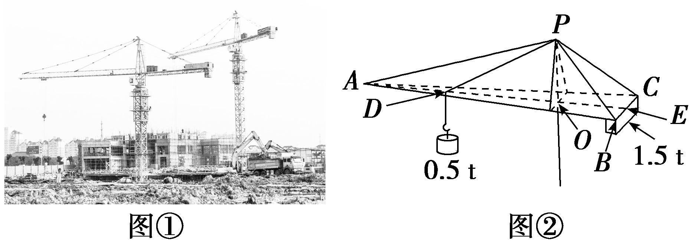

A.2 $\sqrt{17}$  m	B.6 $\sqrt{2}$  m

C.8 m	D.9 m

答案：**A**

解析：根据条件得，<em>&lt;text style="italic"&gt;OE</em>&lt;/text&gt;＝ $\frac{0.5\times DO}{1.5}$ ＝ $\frac{0.5\times 6}{1.5}$ ＝2 m.因为<em>&lt;text style="italic"&gt;&lt;text style="italic"&gt;&lt;text style="italic"&gt;P&lt;text style="italic"&gt;O</em>&lt;/text&gt;&lt;/text&gt;&lt;/text&gt;&lt;/text&gt;⊥平面<em>A&lt;text style="italic"&gt;&lt;text style="italic"&gt;&lt;text style="italic"&gt;&lt;text style="italic"&gt;&lt;text style="italic"&gt;&lt;text style="italic"&gt;BC</em>&lt;/text&gt;&lt;/text&gt;&lt;/text&gt;&lt;/text&gt;&lt;/text&gt;&lt;/text&gt;，BC，<em>&lt;text style="italic"&gt;A&lt;text style="italic"&gt;E</em>&lt;/text&gt;&lt;/text&gt;⊂平面<em>&lt;text style="italic"&gt;AB</em>C&lt;/text&gt;，所以<em>&lt;text style="italic"&gt;PO</em>&lt;/text&gt;⊥<em>&lt;text style="italic"&gt;&lt;text style="italic"&gt;&lt;text style="italic"&gt;AE</em>&lt;/text&gt;&lt;/text&gt;&lt;/text&gt;，PO⊥BC，又AB＝<em>AC</em>，E是BC的中点，所以AE⊥BC，又PO∩AE＝O，PO，AE⊂平面<em>&lt;text style="italic"&gt;&lt;text style="italic"&gt;PAE</em>&lt;/text&gt;&lt;/text&gt;，所以BC⊥平面PAE，又<em>&lt;text style="italic"&gt;&lt;text style="italic"&gt;PE</em>&lt;/text&gt;&lt;/text&gt;⊂平面PAE，所以PE⊥BC.因为PO＝2 m，所以PE＝2 $\sqrt{2}$  m，因为<em>PB</em>＝3 m，所以B<em>E</em>＝1 m.由于△<em>A&lt;text style="italic"&gt;&lt;text style="italic"&gt;&lt;text style="italic"&gt;&lt;text style="italic"&gt;&lt;text style="italic"&gt;&lt;text style="italic"&gt;BC</em>&lt;/text&gt;&lt;/text&gt;&lt;/text&gt;&lt;/text&gt;&lt;/text&gt;&lt;/text&gt;的面积为10 m2，所以 $\frac{1}{2}$ <em>&lt;text style="italic"&gt;&lt;text style="italic"&gt;&lt;text style="italic"&gt;&lt;text style="italic"&gt;&lt;text style="italic"&gt;BC</em>&lt;/text&gt;&lt;/text&gt;&lt;/text&gt;&lt;/text&gt;&lt;/text&gt;·<em>&lt;text style="italic"&gt;A&lt;text style="italic"&gt;E</em>&lt;/text&gt;&lt;/text&gt;＝10，解得<em>&lt;text style="italic"&gt;&lt;text style="italic"&gt;&lt;text style="italic"&gt;AE</em>&lt;/text&gt;&lt;/text&gt;&lt;/text&gt;＝10 m，即A<em>O</em>＝8 m，即<em>AP</em>＝2 $\sqrt{17}$  m.故选A.

14.在长方体<em>ABCD</em> -<em>A</em>1<em>B</em>1<em>C</em>1<em>D</em>1中，已知<em>AB</em>＝2，<em>BC</em>＝<em>t</em>，若在线段<em>AB</em>上存在点<em>E</em>，使得<em>EC</em>1⊥<em>ED</em>，则实数<em>t</em>的取值范围是<u>　　　　</u>.

答案：(0，1]

解析：因为&lt;&lt;&lt;&lt;&lt;&lt;<em>t</em>ext style="italic"&gt;t&lt;/text&gt;ext style="italic"&gt;t&lt;/text&gt;ext style="it<em>a</em>lic"&gt;t&lt;/text&gt;ext style="italic"&gt;t&lt;/text&gt;ext style="it&lt;text style="it&lt;text style="it&lt;text style="it<em>a</em>lic"&gt;a&lt;/text&gt;lic"&gt;a&lt;/text&gt;lic"&gt;a&lt;/text&gt;lic"&gt;t&lt;/text&gt;ext style="it&lt;text style="it&lt;text style="it<em>a</em>lic"&gt;a&lt;/text&gt;lic"&gt;a&lt;/text&gt;lic"&gt;<em>&lt;text style="italic"&gt;&lt;text style="italic"&gt;&lt;text style="italic"&gt;&lt;text style="italic"&gt;&lt;text style="italic"&gt;&lt;text style="italic"&gt;&lt;text style="italic"&gt;C</em>&lt;/text&gt;&lt;/text&gt;&lt;/text&gt;&lt;/text&gt;&lt;/text&gt;&lt;/text&gt;&lt;/text&gt;&lt;/text&gt;&lt;text style="subscript"&gt;&lt;text style="subscript"&gt;&lt;text style="subscript"&gt;&lt;text style="subscript"&gt;&lt;text style="subscript"&gt;&lt;text style="subscript"&gt;&lt;text style="subscript"&gt;&lt;text style="subscript"&gt;&lt;text style="subscript"&gt;1&lt;/text&gt;&lt;/text&gt;&lt;/text&gt;&lt;/text&gt;&lt;/text&gt;&lt;/text&gt;&lt;/text&gt;&lt;/text&gt;&lt;/text&gt;C⊥平面<em>&lt;text style="italic"&gt;&lt;text style="italic"&gt;ABCD</em>&lt;/text&gt;&lt;/text&gt;，<em>&lt;text style="italic"&gt;&lt;text style="italic"&gt;&lt;text style="italic"&gt;&lt;text style="italic"&gt;ED</em>&lt;/text&gt;&lt;/text&gt;&lt;/text&gt;&lt;/text&gt;⊂平面ABCD，可得C1C⊥ED，由<em>&lt;text style="italic"&gt;&lt;text style="italic"&gt;&lt;text style="italic"&gt;EC</em>&lt;/text&gt;&lt;/text&gt;&lt;/text&gt;1⊥ED，EC1∩C1C＝C1，EC1，C1C⊂平面<em>&lt;text style="italic"&gt;ECC</em>&lt;/text&gt;1，可得ED⊥平面ECC1，所以ED⊥EC，在矩形ABCD中，设<em>AE</em>＝a，0≤a≤&lt;text style="superscript"&gt;&lt;text style="superscript"&gt;&lt;text style="superscript"&gt;2&lt;/text&gt;&lt;/text&gt;&lt;/text&gt;，则<em>BE</em>＝2－a，由∠<em>DEA</em>＋∠<em>&lt;text style="italic"&gt;CEB</em>&lt;/text&gt;＝90°，可得tan∠<em>DEA&lt;text style="italic"&gt;·</em>&lt;/text&gt;tan∠CEB＝ $\frac{AD}{AE}$ &lt;&lt;&lt;&lt;&lt;&lt;<em>t</em>ext style="italic"&gt;t&lt;/text&gt;ext style="italic"&gt;t&lt;/text&gt;ext style="it<em>a</em>lic"&gt;t&lt;/text&gt;ext style="italic"&gt;t&lt;/text&gt;ext style="it&lt;text style="it&lt;text style="it&lt;text style="it<em>a</em>lic"&gt;a&lt;/text&gt;lic"&gt;a&lt;/text&gt;lic"&gt;a&lt;/text&gt;lic"&gt;t&lt;/text&gt;ext style="italic"&gt;·&lt;/text&gt; $\frac{CB}{BE}$ ＝ $\frac{t^{2}}{a\left(2－a\right)}$ ＝&lt;&lt;&lt;&lt;&lt;&lt;<em>t</em>ext style="italic"&gt;t&lt;/text&gt;ext style="italic"&gt;t&lt;/text&gt;ext style="it<em>a</em>lic"&gt;t&lt;/text&gt;ext style="italic"&gt;t&lt;/text&gt;ext style="it&lt;text style="it&lt;text style="it&lt;text style="it<em>a</em>lic"&gt;a&lt;/text&gt;lic"&gt;a&lt;/text&gt;lic"&gt;a&lt;/text&gt;lic"&gt;t&lt;/text&gt;ext style="subscript"&gt;&lt;text style="subscript"&gt;&lt;text style="subscript"&gt;&lt;text style="subscript"&gt;&lt;text style="subscript"&gt;&lt;text style="subscript"&gt;&lt;text style="subscript"&gt;&lt;text style="subscript"&gt;&lt;text style="subscript"&gt;1&lt;/text&gt;&lt;/text&gt;&lt;/text&gt;&lt;/text&gt;&lt;/text&gt;&lt;/text&gt;&lt;/text&gt;&lt;/text&gt;&lt;/text&gt;，即t&lt;text style="superscript"&gt;&lt;text style="superscript"&gt;&lt;text style="superscript"&gt;2&lt;/text&gt;&lt;/text&gt;&lt;/text&gt;＝&lt;text style="it&lt;text style="it<em>a</em>lic"&gt;a&lt;/text&gt;lic"&gt;a&lt;/text&gt;(2－a)＝－(a－1)2＋1，当a＝1时，t2取得最大值1，即t的最大值为1；当a＝0或2时，t2取得最小值0，但由于t＞0，所以实数t的取值范围是(0，1].

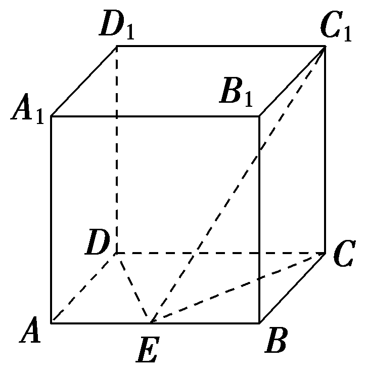

